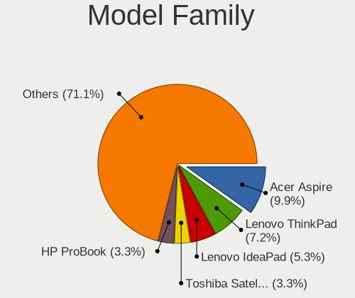
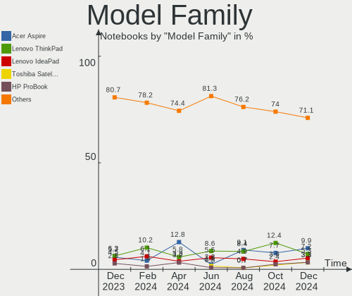
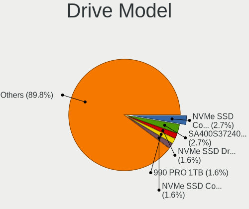
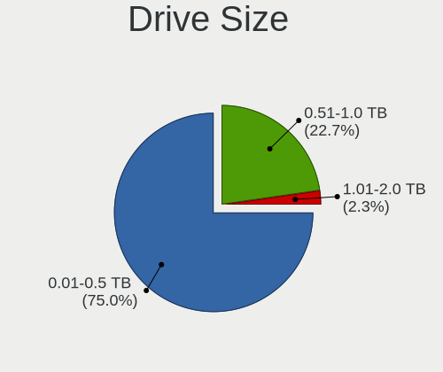
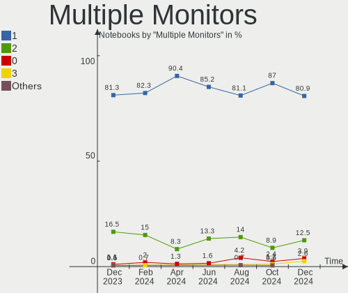
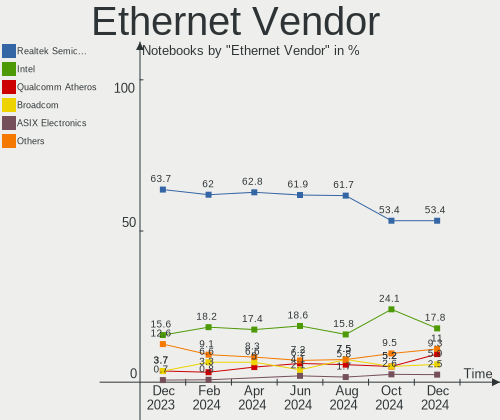
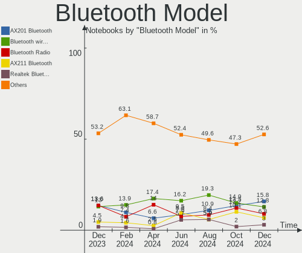
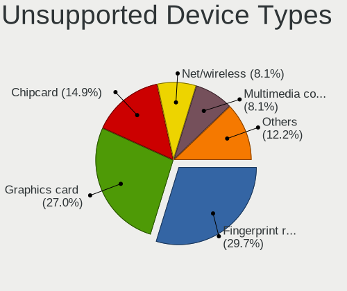

Linux in Italy - Hardware Trends (Notebooks)
--------------------------------------------

A project to identify most popular hardware characteristics and track their change
over time based on data collected by Linux users at https://Linux-Hardware.org.

Anyone can contribute to this report by the [hw-probe](https://github.com/linuxhw/hw-probe) tool:

    sudo -E hw-probe -all -upload

Contents
--------

* [ System ](#system)
  - [ OS                       ](#os)
  - [ OS Family                ](#os-family)
  - [ Kernel                   ](#kernel)
  - [ Kernel Family            ](#kernel-family)
  - [ Kernel Major Ver.        ](#kernel-major-ver)
  - [ Arch                     ](#arch)
  - [ DE                       ](#de)
  - [ Display Server           ](#display-server)
  - [ Display Manager          ](#display-manager)
  - [ OS Lang                  ](#os-lang)
  - [ Boot Mode                ](#boot-mode)
  - [ Filesystem               ](#filesystem)
  - [ Part. scheme             ](#part-scheme)
  - [ Dual Boot with Linux/BSD ](#dual-boot-with-linuxbsd)
  - [ Dual Boot (Win)          ](#dual-boot-win)

* [ Board ](#board)
  - [ Vendor                   ](#vendor)
  - [ Model                    ](#model)
  - [ Model Family             ](#model-family)
  - [ MFG Year                 ](#mfg-year)
  - [ Form Factor              ](#form-factor)
  - [ Secure Boot              ](#secure-boot)
  - [ Coreboot                 ](#coreboot)
  - [ RAM Size                 ](#ram-size)
  - [ RAM Used                 ](#ram-used)
  - [ Total Drives             ](#total-drives)
  - [ Has CD-ROM               ](#has-cd-rom)
  - [ Has Ethernet             ](#has-ethernet)
  - [ Has WiFi                 ](#has-wifi)
  - [ Has Bluetooth            ](#has-bluetooth)

* [ Location ](#location)
  - [ Country                  ](#country)
  - [ City                     ](#city)

* [ Drives ](#drives)
  - [ Drive Vendor             ](#drive-vendor)
  - [ Drive Model              ](#drive-model)
  - [ HDD Vendor               ](#hdd-vendor)
  - [ SSD Vendor               ](#ssd-vendor)
  - [ Drive Kind               ](#drive-kind)
  - [ Drive Connector          ](#drive-connector)
  - [ Drive Size               ](#drive-size)
  - [ Space Total              ](#space-total)
  - [ Space Used               ](#space-used)
  - [ Malfunc. Drives          ](#malfunc-drives)
  - [ Malfunc. Drive Vendor    ](#malfunc-drive-vendor)
  - [ Malfunc. HDD Vendor      ](#malfunc-hdd-vendor)
  - [ Malfunc. Drive Kind      ](#malfunc-drive-kind)
  - [ Failed Drives            ](#failed-drives)
  - [ Failed Drive Vendor      ](#failed-drive-vendor)
  - [ Drive Status             ](#drive-status)

* [ Storage controller ](#storage-controller)
  - [ Storage Vendor           ](#storage-vendor)
  - [ Storage Model            ](#storage-model)
  - [ Storage Kind             ](#storage-kind)

* [ Processor ](#processor)
  - [ CPU Vendor               ](#cpu-vendor)
  - [ CPU Model                ](#cpu-model)
  - [ CPU Model Family         ](#cpu-model-family)
  - [ CPU Cores                ](#cpu-cores)
  - [ CPU Sockets              ](#cpu-sockets)
  - [ CPU Threads              ](#cpu-threads)
  - [ CPU Op-Modes             ](#cpu-op-modes)
  - [ CPU Microcode            ](#cpu-microcode)
  - [ CPU Microarch            ](#cpu-microarch)

* [ Graphics ](#graphics)
  - [ GPU Vendor               ](#gpu-vendor)
  - [ GPU Model                ](#gpu-model)
  - [ GPU Combo                ](#gpu-combo)
  - [ GPU Driver               ](#gpu-driver)
  - [ GPU Memory               ](#gpu-memory)

* [ Monitor ](#monitor)
  - [ Monitor Vendor           ](#monitor-vendor)
  - [ Monitor Model            ](#monitor-model)
  - [ Monitor Resolution       ](#monitor-resolution)
  - [ Monitor Diagonal         ](#monitor-diagonal)
  - [ Monitor Width            ](#monitor-width)
  - [ Aspect Ratio             ](#aspect-ratio)
  - [ Monitor Area             ](#monitor-area)
  - [ Pixel Density            ](#pixel-density)
  - [ Multiple Monitors        ](#multiple-monitors)

* [ Network ](#network)
  - [ Net Controller Vendor    ](#net-controller-vendor)
  - [ Net Controller Model     ](#net-controller-model)
  - [ Wireless Vendor          ](#wireless-vendor)
  - [ Wireless Model           ](#wireless-model)
  - [ Ethernet Vendor          ](#ethernet-vendor)
  - [ Ethernet Model           ](#ethernet-model)
  - [ Net Controller Kind      ](#net-controller-kind)
  - [ Used Controller          ](#used-controller)
  - [ NICs                     ](#nics)
  - [ IPv6                     ](#ipv6)

* [ Bluetooth ](#bluetooth)
  - [ Bluetooth Vendor         ](#bluetooth-vendor)
  - [ Bluetooth Model          ](#bluetooth-model)

* [ Sound ](#sound)
  - [ Sound Vendor             ](#sound-vendor)
  - [ Sound Model              ](#sound-model)

* [ Memory ](#memory)
  - [ Memory Vendor            ](#memory-vendor)
  - [ Memory Model             ](#memory-model)
  - [ Memory Kind              ](#memory-kind)
  - [ Memory Form Factor       ](#memory-form-factor)
  - [ Memory Size              ](#memory-size)
  - [ Memory Speed             ](#memory-speed)

* [ Printers & scanners ](#printers--scanners)
  - [ Printer Vendor           ](#printer-vendor)
  - [ Printer Model            ](#printer-model)
  - [ Scanner Vendor           ](#scanner-vendor)
  - [ Scanner Model            ](#scanner-model)

* [ Camera ](#camera)
  - [ Camera Vendor            ](#camera-vendor)
  - [ Camera Model             ](#camera-model)

* [ Security ](#security)
  - [ Fingerprint Vendor       ](#fingerprint-vendor)
  - [ Fingerprint Model        ](#fingerprint-model)
  - [ Chipcard Vendor          ](#chipcard-vendor)
  - [ Chipcard Model           ](#chipcard-model)

* [ Unsupported ](#unsupported)
  - [ Unsupported Devices      ](#unsupported-devices)
  - [ Unsupported Device Types ](#unsupported-device-types)

System
------

OS
--

Installed operating systems

| Name                         | Notebooks | Percent |
|------------------------------|-----------|---------|
| Ubuntu 22.04                 | 11        | 11.96%  |
| Fedora 36                    | 10        | 10.87%  |
| Ubuntu 20.04                 | 8         | 8.7%    |
| OpenMandriva 4.3             | 7         | 7.61%   |
| Linux Mint 20.3              | 6         | 6.52%   |
| Fedora 35                    | 6         | 6.52%   |
| Debian 11                    | 5         | 5.43%   |
| Xubuntu 20.04                | 4         | 4.35%   |
| Pop!_OS 22.04                | 3         | 3.26%   |
| Debian 10                    | 3         | 3.26%   |
| Arch                         | 3         | 3.26%   |
| Ubuntu 21.10                 | 2         | 2.17%   |
| Manjaro                      | 2         | 2.17%   |
| Lubuntu 22.04                | 2         | 2.17%   |
| KDE neon 20.04               | 2         | 2.17%   |
| Elementary 6.1               | 2         | 2.17%   |
| Zorin 16                     | 1         | 1.09%   |
| Ubuntu 16.04                 | 1         | 1.09%   |
| SteamOS 3.1                  | 1         | 1.09%   |
| Q4OS 4                       | 1         | 1.09%   |
| Pop!_OS 21.10                | 1         | 1.09%   |
| openSUSE Tumbleweed-XXXXXXXX | 1         | 1.09%   |
| OpenMandriva 4.2             | 1         | 1.09%   |
| OpenMandriva 3.0             | 1         | 1.09%   |
| Manjaro 21.2.6               | 1         | 1.09%   |
| Lubuntu 20.04                | 1         | 1.09%   |
| Lubuntu 18.04                | 1         | 1.09%   |
| Linux Mint 19.3              | 1         | 1.09%   |
| Linux Mint 18.3              | 1         | 1.09%   |
| Gentoo 2.8                   | 1         | 1.09%   |
| Debian Unstable              | 1         | 1.09%   |
| ArcoLinux Rolling            | 1         | 1.09%   |

OS Family
---------

OS without a version

| Name         | Notebooks | Percent |
|--------------|-----------|---------|
| Ubuntu       | 22        | 23.91%  |
| Fedora       | 16        | 17.39%  |
| OpenMandriva | 9         | 9.78%   |
| Debian       | 9         | 9.78%   |
| Linux Mint   | 8         | 8.7%    |
| Xubuntu      | 4         | 4.35%   |
| Pop!_OS      | 4         | 4.35%   |
| Lubuntu      | 4         | 4.35%   |
| Manjaro      | 3         | 3.26%   |
| Arch         | 3         | 3.26%   |
| KDE neon     | 2         | 2.17%   |
| Elementary   | 2         | 2.17%   |
| Zorin        | 1         | 1.09%   |
| SteamOS      | 1         | 1.09%   |
| Q4OS         | 1         | 1.09%   |
| openSUSE     | 1         | 1.09%   |
| Gentoo       | 1         | 1.09%   |
| ArcoLinux    | 1         | 1.09%   |

Kernel
------

Version of the Linux kernel

| Version                                        | Notebooks | Percent |
|------------------------------------------------|-----------|---------|
| 5.16.7-desktop-1omv4003                        | 7         | 7.61%   |
| 5.13.0-41-generic                              | 7         | 7.61%   |
| 5.13.0-40-generic                              | 7         | 7.61%   |
| 5.15.0-30-generic                              | 5         | 5.43%   |
| 5.17.6-300.fc36.x86_64                         | 4         | 4.35%   |
| 5.17.5-76051705-generic                        | 4         | 4.35%   |
| 5.15.0-27-generic                              | 4         | 4.35%   |
| 5.17.4-200.fc35.x86_64                         | 3         | 3.26%   |
| 5.15.0-25-generic                              | 3         | 3.26%   |
| 5.10.0-14-amd64                                | 3         | 3.26%   |
| 5.4.0-113-generic                              | 2         | 2.17%   |
| 5.4.0-109-generic                              | 2         | 2.17%   |
| 5.17.8-300.fc36.x86_64                         | 2         | 2.17%   |
| 5.17.5-arch1-1                                 | 2         | 2.17%   |
| 5.17.5-300.fc36.x86_64                         | 2         | 2.17%   |
| 5.17.0-1-amd64                                 | 2         | 2.17%   |
| 5.10.0-13-amd64                                | 2         | 2.17%   |
| 4.19.0-17-amd64                                | 2         | 2.17%   |
| 5.6.16-300.fc32.x86_64                         | 1         | 1.09%   |
| 5.4.0-99-generic                               | 1         | 1.09%   |
| 5.4.0-42-generic                               | 1         | 1.09%   |
| 5.4.0-110-generic                              | 1         | 1.09%   |
| 5.4.0-107-lowlatency                           | 1         | 1.09%   |
| 5.18.0-zen1-1-zen                              | 1         | 1.09%   |
| 5.17.9-300.fc36.x86_64                         | 1         | 1.09%   |
| 5.17.5-gentoo-dist                             | 1         | 1.09%   |
| 5.17.5-301.fsync.fc36.x86_64                   | 1         | 1.09%   |
| 5.17.5-200.fc35.x86_64                         | 1         | 1.09%   |
| 5.17.5-051705-generic                          | 1         | 1.09%   |
| 5.17.4-1-default                               | 1         | 1.09%   |
| 5.17.1-arch1-1                                 | 1         | 1.09%   |
| 5.17.1-3-MANJARO                               | 1         | 1.09%   |
| 5.17.0-5.1-liquorix-amd64                      | 1         | 1.09%   |
| 5.16.19-200.fc35.x86_64                        | 1         | 1.09%   |
| 5.15.32-1-MANJARO                              | 1         | 1.09%   |
| 5.15.0-28-generic                              | 1         | 1.09%   |
| 5.13.0-valve10.3-1-neptune-02176-g5fe416c4acd8 | 1         | 1.09%   |
| 5.13.0-44-generic                              | 1         | 1.09%   |
| 5.13.0-27-generic                              | 1         | 1.09%   |
| 5.13.0-21-generic                              | 1         | 1.09%   |
| 5.10.14-desktop-1omv4002                       | 1         | 1.09%   |
| 5.10.112-1-MANJARO                             | 1         | 1.09%   |
| 4.4.0-210-generic                              | 1         | 1.09%   |
| 4.19.38-desktop-1omv                           | 1         | 1.09%   |
| 4.19.0-20-amd64                                | 1         | 1.09%   |
| 4.15.0-142-generic                             | 1         | 1.09%   |
| 4.15.0-101-generic                             | 1         | 1.09%   |

Kernel Family
-------------

Linux kernel without a distro release

| Version  | Notebooks | Percent |
|----------|-----------|---------|
| 5.13.0   | 18        | 19.57%  |
| 5.15.0   | 13        | 14.13%  |
| 5.17.5   | 12        | 13.04%  |
| 5.4.0    | 8         | 8.7%    |
| 5.16.7   | 7         | 7.61%   |
| 5.10.0   | 5         | 5.43%   |
| 5.17.6   | 4         | 4.35%   |
| 5.17.4   | 4         | 4.35%   |
| 5.17.0   | 3         | 3.26%   |
| 4.19.0   | 3         | 3.26%   |
| 5.17.8   | 2         | 2.17%   |
| 5.17.1   | 2         | 2.17%   |
| 4.15.0   | 2         | 2.17%   |
| 5.6.16   | 1         | 1.09%   |
| 5.18.0   | 1         | 1.09%   |
| 5.17.9   | 1         | 1.09%   |
| 5.16.19  | 1         | 1.09%   |
| 5.15.32  | 1         | 1.09%   |
| 5.10.14  | 1         | 1.09%   |
| 5.10.112 | 1         | 1.09%   |
| 4.4.0    | 1         | 1.09%   |
| 4.19.38  | 1         | 1.09%   |

Kernel Major Ver.
-----------------

Linux kernel major version

| Version | Notebooks | Percent |
|---------|-----------|---------|
| 5.17    | 28        | 30.43%  |
| 5.13    | 18        | 19.57%  |
| 5.15    | 14        | 15.22%  |
| 5.4     | 8         | 8.7%    |
| 5.16    | 8         | 8.7%    |
| 5.10    | 7         | 7.61%   |
| 4.19    | 4         | 4.35%   |
| 4.15    | 2         | 2.17%   |
| 5.6     | 1         | 1.09%   |
| 5.18    | 1         | 1.09%   |
| 4.4     | 1         | 1.09%   |

Arch
----

OS architecture (x86_64, i586, etc.)

| Name   | Notebooks | Percent |
|--------|-----------|---------|
| x86_64 | 91        | 98.91%  |
| i686   | 1         | 1.09%   |

DE
--

Desktop Environment

| Name            | Notebooks | Percent |
|-----------------|-----------|---------|
| GNOME           | 43        | 46.74%  |
| KDE5            | 18        | 19.57%  |
| XFCE            | 12        | 13.04%  |
| LXQt            | 5         | 5.43%   |
| MATE            | 4         | 4.35%   |
| Unknown         | 4         | 4.35%   |
| Pantheon        | 2         | 2.17%   |
| X-Cinnamon      | 1         | 1.09%   |
| Unity           | 1         | 1.09%   |
| LXDE            | 1         | 1.09%   |
| GNOME Flashback | 1         | 1.09%   |

Display Server
--------------

X11 or Wayland

| Name    | Notebooks | Percent |
|---------|-----------|---------|
| X11     | 65        | 70.65%  |
| Wayland | 26        | 28.26%  |
| Unknown | 1         | 1.09%   |

Display Manager
---------------

SDDM, LightDM, etc.

| Name    | Notebooks | Percent |
|---------|-----------|---------|
| Unknown | 33        | 35.87%  |
| SDDM    | 18        | 19.57%  |
| GDM3    | 16        | 17.39%  |
| LightDM | 15        | 16.3%   |
| GDM     | 10        | 10.87%  |

OS Lang
-------

Language

| Lang    | Notebooks | Percent |
|---------|-----------|---------|
| it_IT   | 55        | 59.78%  |
| en_US   | 29        | 31.52%  |
| en_GB   | 4         | 4.35%   |
| Unknown | 3         | 3.26%   |
| en_AU   | 1         | 1.09%   |

Boot Mode
---------

EFI or BIOS

| Mode | Notebooks | Percent |
|------|-----------|---------|
| EFI  | 50        | 54.35%  |
| BIOS | 42        | 45.65%  |

Filesystem
----------

Type of filesystem

| Type    | Notebooks | Percent |
|---------|-----------|---------|
| Ext4    | 62        | 67.39%  |
| Btrfs   | 17        | 18.48%  |
| Overlay | 9         | 9.78%   |
| Zfs     | 1         | 1.09%   |
| XXX4    | 1         | 1.09%   |
| F2fs    | 1         | 1.09%   |
| Unknown | 1         | 1.09%   |

Part. scheme
------------

Scheme of partitioning

| Type    | Notebooks | Percent |
|---------|-----------|---------|
| Unknown | 41        | 44.57%  |
| GPT     | 34        | 36.96%  |
| MBR     | 17        | 18.48%  |

Dual Boot with Linux/BSD
------------------------

Hosting more than one Linux/BSD

| Dual boot | Notebooks | Percent |
|-----------|-----------|---------|
| No        | 87        | 94.57%  |
| Yes       | 5         | 5.43%   |

Dual Boot (Win)
---------------

Hosting Linux and Windows

| Dual boot | Notebooks | Percent |
|-----------|-----------|---------|
| No        | 70        | 76.09%  |
| Yes       | 22        | 23.91%  |

Board
-----

Vendor
------

Motherboard manufacturer

| Name                | Notebooks | Percent |
|---------------------|-----------|---------|
| Lenovo              | 21        | 22.83%  |
| Hewlett-Packard     | 21        | 22.83%  |
| ASUSTek Computer    | 11        | 11.96%  |
| Dell                | 6         | 6.52%   |
| Acer                | 5         | 5.43%   |
| Toshiba             | 4         | 4.35%   |
| MSI                 | 3         | 3.26%   |
| HUAWEI              | 3         | 3.26%   |
| Sony                | 2         | 2.17%   |
| SANTECH             | 2         | 2.17%   |
| Mediacom            | 2         | 2.17%   |
| Apple               | 2         | 2.17%   |
| YASHI               | 1         | 1.09%   |
| Valve               | 1         | 1.09%   |
| Teclast             | 1         | 1.09%   |
| Standard            | 1         | 1.09%   |
| Samsung Electronics | 1         | 1.09%   |
| PC Specialist       | 1         | 1.09%   |
| Packard Bell        | 1         | 1.09%   |
| Notebook            | 1         | 1.09%   |
| Microtech           | 1         | 1.09%   |
| Chuwi               | 1         | 1.09%   |

Model
-----

Motherboard model

| Name                                       | Notebooks | Percent |
|--------------------------------------------|-----------|---------|
| Mediacom WinPad 11,6 FullHD- WPU11         | 2         | 2.17%   |
| HP Compaq 15                               | 2         | 2.17%   |
| YASHI MYBOOK 360                           | 1         | 1.09%   |
| Valve Jupiter                              | 1         | 1.09%   |
| Toshiba Satellite Pro S500                 | 1         | 1.09%   |
| Toshiba Satellite Pro L500                 | 1         | 1.09%   |
| Toshiba Satellite P20                      | 1         | 1.09%   |
| Toshiba Satellite C70-C-11L                | 1         | 1.09%   |
| Teclast F15 Plus                           | 1         | 1.09%   |
| Sony VGN-NS21S_S                           | 1         | 1.09%   |
| Sony VGN-FW56J                             | 1         | 1.09%   |
| SANTECH NHx0EH_EJ_EK                       | 1         | 1.09%   |
| SANTECH NHx0DB,DE                          | 1         | 1.09%   |
| Samsung 270E5G/270E5U                      | 1         | 1.09%   |
| PC Specialist NH5x_NH7x_HHx_HJx_HKx        | 1         | 1.09%   |
| Packard Bell EasyNote MH35                 | 1         | 1.09%   |
| Notebook W65_67SJ                          | 1         | 1.09%   |
| MSI Summit E13FlipEvo A11MT                | 1         | 1.09%   |
| MSI Prestige 14Evo A11M                    | 1         | 1.09%   |
| MSI MS-16Y1                                | 1         | 1.09%   |
| Microtech CoreBookLite                     | 1         | 1.09%   |
| Lenovo V15-ADA 82C7                        | 1         | 1.09%   |
| Lenovo V110-15ISK 80TL                     | 1         | 1.09%   |
| Lenovo ThinkPad X230 2325H50               | 1         | 1.09%   |
| Lenovo ThinkPad X1 Carbon Gen 8 20U9004HIX | 1         | 1.09%   |
| Lenovo ThinkPad T61 7661V72                | 1         | 1.09%   |
| Lenovo ThinkPad T520 4243WS4               | 1         | 1.09%   |
| Lenovo ThinkPad T440p 20AW000KUK           | 1         | 1.09%   |
| Lenovo ThinkPad T14s Gen 1 20T1S39D46      | 1         | 1.09%   |
| Lenovo ThinkPad T14 Gen 1 20S1SB5K00       | 1         | 1.09%   |
| Lenovo ThinkPad P14s Gen 2a 21A00049IX     | 1         | 1.09%   |
| Lenovo ThinkPad E560 20EV000YIX            | 1         | 1.09%   |
| Lenovo ThinkPad E555 20DH000WGE            | 1         | 1.09%   |
| Lenovo ThinkPad E15 Gen 3 20YG006HIX       | 1         | 1.09%   |
| Lenovo ThinkBook 16p Gen 2 20YM            | 1         | 1.09%   |
| Lenovo ThinkBook 15 G2 ITL 20VE            | 1         | 1.09%   |
| Lenovo IdeaPad S510p 20298                 | 1         | 1.09%   |
| Lenovo IdeaPad S340-15API 81NC             | 1         | 1.09%   |
| Lenovo IdeaPad Gaming 3 15ARH05 82EY       | 1         | 1.09%   |
| Lenovo IdeaPad 320S-14IKB 81BN             | 1         | 1.09%   |
| Lenovo G500 20236                          | 1         | 1.09%   |
| Lenovo B590 37613LG                        | 1         | 1.09%   |
| HUAWEI KLVL-WXX9                           | 1         | 1.09%   |
| HUAWEI HN-WX9X                             | 1         | 1.09%   |
| HUAWEI BOM-WXX9                            | 1         | 1.09%   |
| HP ProBook 6460b                           | 1         | 1.09%   |
| HP ProBook 450 G6                          | 1         | 1.09%   |
| HP ProBook 430 G1                          | 1         | 1.09%   |
| HP Pavilion g6                             | 1         | 1.09%   |
| HP Pavilion dv6000 (RR374EA#ABZ)           | 1         | 1.09%   |
| HP OMEN by Laptop 15-dh1xxx                | 1         | 1.09%   |
| HP Laptop 15s-eq3xxx                       | 1         | 1.09%   |
| HP Laptop 15s-eq0xxx                       | 1         | 1.09%   |
| HP G62                                     | 1         | 1.09%   |
| HP EliteBook 8570p                         | 1         | 1.09%   |
| HP EliteBook 8470p                         | 1         | 1.09%   |
| HP Compaq CQ58                             | 1         | 1.09%   |
| HP Compaq 6820s                            | 1         | 1.09%   |
| HP Compaq 6720s                            | 1         | 1.09%   |
| HP 635                                     | 1         | 1.09%   |

Model Family
------------

Motherboard model prefix

| Name                   | Notebooks | Percent |
|------------------------|-----------|---------|
| Lenovo ThinkPad        | 11        | 11.96%  |
| HP Compaq              | 5         | 5.43%   |
| Toshiba Satellite      | 4         | 4.35%   |
| Lenovo IdeaPad         | 4         | 4.35%   |
| HP ProBook             | 3         | 3.26%   |
| HP 255                 | 3         | 3.26%   |
| Dell XPS               | 3         | 3.26%   |
| Acer Aspire            | 3         | 3.26%   |
| Mediacom WinPad        | 2         | 2.17%   |
| Lenovo ThinkBook       | 2         | 2.17%   |
| HP Pavilion            | 2         | 2.17%   |
| HP Laptop              | 2         | 2.17%   |
| HP EliteBook           | 2         | 2.17%   |
| YASHI MYBOOK           | 1         | 1.09%   |
| Valve Jupiter          | 1         | 1.09%   |
| Teclast F15            | 1         | 1.09%   |
| Sony VGN-NS21S         | 1         | 1.09%   |
| Sony VGN-FW56J         | 1         | 1.09%   |
| SANTECH NHx0EH         | 1         | 1.09%   |
| SANTECH NHx0DB         | 1         | 1.09%   |
| Samsung 270E5G         | 1         | 1.09%   |
| PC Specialist NH5x     | 1         | 1.09%   |
| Packard Bell EasyNote  | 1         | 1.09%   |
| Notebook W65           | 1         | 1.09%   |
| MSI Summit             | 1         | 1.09%   |
| MSI Prestige           | 1         | 1.09%   |
| MSI MS-16Y1            | 1         | 1.09%   |
| Microtech CoreBookLite | 1         | 1.09%   |
| Lenovo V15-ADA         | 1         | 1.09%   |
| Lenovo V110-15ISK      | 1         | 1.09%   |
| Lenovo G500            | 1         | 1.09%   |
| Lenovo B590            | 1         | 1.09%   |
| HUAWEI KLVL-WXX9       | 1         | 1.09%   |
| HUAWEI HN-WX9X         | 1         | 1.09%   |
| HUAWEI BOM-WXX9        | 1         | 1.09%   |
| HP OMEN                | 1         | 1.09%   |
| HP G62                 | 1         | 1.09%   |
| HP 635                 | 1         | 1.09%   |
| HP 250                 | 1         | 1.09%   |
| Dell Studio            | 1         | 1.09%   |
| Dell Precision         | 1         | 1.09%   |
| Dell Latitude          | 1         | 1.09%   |
| Chuwi HeroBook         | 1         | 1.09%   |
| ASUS ZenBook           | 1         | 1.09%   |
| ASUS X550VX            | 1         | 1.09%   |
| ASUS X550CL            | 1         | 1.09%   |
| ASUS X550CA            | 1         | 1.09%   |
| ASUS VivoBook          | 1         | 1.09%   |
| ASUS T300FA            | 1         | 1.09%   |
| ASUS PU551LA           | 1         | 1.09%   |
| ASUS K53SC             | 1         | 1.09%   |
| ASUS K52F              | 1         | 1.09%   |
| ASUS GL552VW           | 1         | 1.09%   |
| ASUS F50SL             | 1         | 1.09%   |
| Apple MacBookPro5      | 1         | 1.09%   |
| Apple MacBookPro11     | 1         | 1.09%   |
| Acer Swift             | 1         | 1.09%   |
| Acer Nitro             | 1         | 1.09%   |
| Unknown                | 1         | 1.09%   |

MFG Year
--------

Motherboard manufacture year

| Year | Notebooks | Percent |
|------|-----------|---------|
| 2020 | 15        | 16.3%   |
| 2021 | 11        | 11.96%  |
| 2013 | 8         | 8.7%    |
| 2011 | 8         | 8.7%    |
| 2014 | 7         | 7.61%   |
| 2009 | 7         | 7.61%   |
| 2018 | 5         | 5.43%   |
| 2016 | 5         | 5.43%   |
| 2015 | 5         | 5.43%   |
| 2007 | 5         | 5.43%   |
| 2019 | 4         | 4.35%   |
| 2017 | 3         | 3.26%   |
| 2012 | 3         | 3.26%   |
| 2022 | 2         | 2.17%   |
| 2010 | 2         | 2.17%   |
| 2008 | 1         | 1.09%   |
| 2004 | 1         | 1.09%   |

Form Factor
-----------

Physical design of the computer

| Name     | Notebooks | Percent |
|----------|-----------|---------|
| Notebook | 92        | 100%    |

Secure Boot
-----------

Enabled or disabled

| State    | Notebooks | Percent |
|----------|-----------|---------|
| Disabled | 85        | 92.39%  |
| Enabled  | 7         | 7.61%   |

Coreboot
--------

Have coreboot on board

| Used | Notebooks | Percent |
|------|-----------|---------|
| No   | 92        | 100%    |

RAM Size
--------

Total RAM memory

| Size in GB | Notebooks | Percent |
|------------|-----------|---------|
| 3.01-4.0   | 26        | 28.26%  |
| 4.01-8.0   | 25        | 27.17%  |
| 8.01-16.0  | 14        | 15.22%  |
| 16.01-24.0 | 10        | 10.87%  |
| 32.01-64.0 | 9         | 9.78%   |
| 1.01-2.0   | 7         | 7.61%   |
| 2.01-3.0   | 1         | 1.09%   |

RAM Used
--------

Used RAM memory

| Used GB   | Notebooks | Percent |
|-----------|-----------|---------|
| 1.01-2.0  | 32        | 34.78%  |
| 2.01-3.0  | 22        | 23.91%  |
| 4.01-8.0  | 14        | 15.22%  |
| 3.01-4.0  | 10        | 10.87%  |
| 0.51-1.0  | 8         | 8.7%    |
| 8.01-16.0 | 5         | 5.43%   |
| 0.01-0.5  | 1         | 1.09%   |

Total Drives
------------

Number of drives on board

| Drives | Notebooks | Percent |
|--------|-----------|---------|
| 1      | 73        | 79.35%  |
| 2      | 16        | 17.39%  |
| 3      | 2         | 2.17%   |
| 0      | 1         | 1.09%   |

Has CD-ROM
----------

Has CD-ROM on board

| Presented | Notebooks | Percent |
|-----------|-----------|---------|
| No        | 48        | 52.17%  |
| Yes       | 44        | 47.83%  |

Has Ethernet
------------

Has Ethernet on board

| Presented | Notebooks | Percent |
|-----------|-----------|---------|
| Yes       | 72        | 78.26%  |
| No        | 20        | 21.74%  |

Has WiFi
--------

Has WiFi module

| Presented | Notebooks | Percent |
|-----------|-----------|---------|
| Yes       | 89        | 96.74%  |
| No        | 3         | 3.26%   |

Has Bluetooth
-------------

Has Bluetooth module

| Presented | Notebooks | Percent |
|-----------|-----------|---------|
| Yes       | 61        | 66.3%   |
| No        | 31        | 33.7%   |

Location
--------

Country
-------

Geographic location (country)

| Country | Notebooks | Percent |
|---------|-----------|---------|
| Italy   | 92        | 100%    |

City
----

Geographic location (city)

| City                      | Notebooks | Percent |
|---------------------------|-----------|---------|
| Milan                     | 20        | 21.74%  |
| Rome                      | 9         | 9.78%   |
| Turin                     | 7         | 7.61%   |
| Casalecchio di Reno       | 3         | 3.26%   |
| Bologna                   | 3         | 3.26%   |
| Taranto                   | 2         | 2.17%   |
| Naples                    | 2         | 2.17%   |
| Francavilla al Mare       | 2         | 2.17%   |
| Adelfia                   | 2         | 2.17%   |
| Vicenza                   | 1         | 1.09%   |
| Venice                    | 1         | 1.09%   |
| Varallo Pombia            | 1         | 1.09%   |
| Treviso                   | 1         | 1.09%   |
| Tempio Pausania           | 1         | 1.09%   |
| Spoleto                   | 1         | 1.09%   |
| Spinea                    | 1         | 1.09%   |
| Sassuolo                  | 1         | 1.09%   |
| Sarzana                   | 1         | 1.09%   |
| Sangano                   | 1         | 1.09%   |
| San Martino di Lupari     | 1         | 1.09%   |
| San Fermo della Battaglia | 1         | 1.09%   |
| Salsomaggiore Terme       | 1         | 1.09%   |
| Rosolini                  | 1         | 1.09%   |
| Pisa                      | 1         | 1.09%   |
| Piombino Dese             | 1         | 1.09%   |
| Parma                     | 1         | 1.09%   |
| Palermo                   | 1         | 1.09%   |
| Novara                    | 1         | 1.09%   |
| Mirano                    | 1         | 1.09%   |
| Miradolo Terme            | 1         | 1.09%   |
| Mentana                   | 1         | 1.09%   |
| Masi Torello              | 1         | 1.09%   |
| Marcon                    | 1         | 1.09%   |
| Grosseto                  | 1         | 1.09%   |
| Genoa                     | 1         | 1.09%   |
| Forlì                    | 1         | 1.09%   |
| Florence                  | 1         | 1.09%   |
| Dalmine                   | 1         | 1.09%   |
| Civitanova Alta           | 1         | 1.09%   |
| Cinisello Balsamo         | 1         | 1.09%   |
| Catania                   | 1         | 1.09%   |
| Castelnuovo Rangone       | 1         | 1.09%   |
| Cascina                   | 1         | 1.09%   |
| Campobasso                | 1         | 1.09%   |
| Calvecchia                | 1         | 1.09%   |
| Cagliari                  | 1         | 1.09%   |
| Borgosesia                | 1         | 1.09%   |
| Bolzano                   | 1         | 1.09%   |
| Bitritto                  | 1         | 1.09%   |
| Albano Laziale            | 1         | 1.09%   |
| Aglientu                  | 1         | 1.09%   |

Drives
------

Drive Vendor
------------

Hard drive vendors

| Vendor                         | Notebooks | Drives | Percent |
|--------------------------------|-----------|--------|---------|
| Samsung Electronics            | 19        | 21     | 17.92%  |
| Toshiba                        | 11        | 12     | 10.38%  |
| SanDisk                        | 9         | 9      | 8.49%   |
| Crucial                        | 8         | 8      | 7.55%   |
| Seagate                        | 7         | 7      | 6.6%    |
| Hitachi                        | 7         | 7      | 6.6%    |
| HGST                           | 6         | 6      | 5.66%   |
| WDC                            | 5         | 5      | 4.72%   |
| Unknown                        | 5         | 5      | 4.72%   |
| Phison                         | 3         | 3      | 2.83%   |
| KIOXIA                         | 3         | 3      | 2.83%   |
| Kingston                       | 3         | 3      | 2.83%   |
| SK Hynix                       | 2         | 2      | 1.89%   |
| Fujitsu                        | 2         | 2      | 1.89%   |
| Unknown                        | 2         | 2      | 1.89%   |
| Union Memory (Shenzhen)        | 1         | 1      | 0.94%   |
| UMIS                           | 1         | 1      | 0.94%   |
| Transcend                      | 1         | 1      | 0.94%   |
| Teclast                        | 1         | 1      | 0.94%   |
| Solid State Storage Technology | 1         | 1      | 0.94%   |
| OCZ                            | 1         | 1      | 0.94%   |
| O2 Micro                       | 1         | 1      | 0.94%   |
| Netac                          | 1         | 1      | 0.94%   |
| Micron Technology              | 1         | 1      | 0.94%   |
| Intel                          | 1         | 1      | 0.94%   |
| IBM/Hitachi                    | 1         | 1      | 0.94%   |
| GOODRAM                        | 1         | 1      | 0.94%   |
| Apple                          | 1         | 1      | 0.94%   |
| 1TB                            | 1         | 1      | 0.94%   |

Drive Model
-----------

Hard drive models

| Model                                        | Notebooks | Percent |
|----------------------------------------------|-----------|---------|
| HGST HTS545050A7E680 500GB                   | 3         | 2.75%   |
| Unknown NCard  32GB                          | 2         | 1.83%   |
| Seagate ST500LT012-1DG142 500GB              | 2         | 1.83%   |
| SanDisk SDSSDA240G 240GB                     | 2         | 1.83%   |
| Sandisk NVMe SSD Drive 512GB                 | 2         | 1.83%   |
| Samsung SSD 970 EVO Plus 1TB                 | 2         | 1.83%   |
| Samsung SSD 850 EVO 250GB                    | 2         | 1.83%   |
| Samsung NVMe SSD Drive 512GB                 | 2         | 1.83%   |
| Crucial CT240BX200SSD1 240GB                 | 2         | 1.83%   |
| Unknown                                      | 2         | 1.83%   |
| WDC WDS120G2G0A-00JH30 120GB SSD             | 1         | 0.92%   |
| WDC WD5000LPVX-60V0TT0 500GB                 | 1         | 0.92%   |
| WDC WD10SPZX-60Z10T0 1TB                     | 1         | 0.92%   |
| WDC WD10SPCX-08S8TT0 1TB                     | 1         | 0.92%   |
| WDC PC SN730 SDBPNTY-1T00-1101 1TB           | 1         | 0.92%   |
| Unknown MMC Card  32GB                       | 1         | 0.92%   |
| Unknown MMC Card  248GB                      | 1         | 0.92%   |
| Unknown 128G32  128GB                        | 1         | 0.92%   |
| Union Memory (Shenzhen) NVMe SSD Drive 256GB | 1         | 0.92%   |
| UMIS RPETJ512MGE2QDQ 512GB                   | 1         | 0.92%   |
| Transcend TS128GMSA230S 128GB SSD            | 1         | 0.92%   |
| Toshiba NVMe SSD Drive 512GB                 | 1         | 0.92%   |
| Toshiba NVMe SSD Drive 2TB                   | 1         | 0.92%   |
| Toshiba MQ04ABF100 1TB                       | 1         | 0.92%   |
| Toshiba MQ01ACF050 500GB                     | 1         | 0.92%   |
| Toshiba MQ01ACF032 320GB                     | 1         | 0.92%   |
| Toshiba MQ01ABF050 500GB                     | 1         | 0.92%   |
| Toshiba MQ01ABD100 1TB                       | 1         | 0.92%   |
| Toshiba MK8032GSX 80GB                       | 1         | 0.92%   |
| Toshiba MK5061GSYN 500GB                     | 1         | 0.92%   |
| Toshiba MK1059GSM 1TB                        | 1         | 0.92%   |
| Toshiba KXG6AZNV256G 256GB                   | 1         | 0.92%   |
| Toshiba KBG40ZNT512G MEMORY 512GB            | 1         | 0.92%   |
| Teclast BD256GB SHCB-2280 SSD                | 1         | 0.92%   |
| Solid State Storage NVMe SSD Drive 512GB     | 1         | 0.92%   |
| SK Hynix SKHynix_HFM512GD3HX015N 512GB       | 1         | 0.92%   |
| SK Hynix HFS128G39TND-N210A 128GB SSD        | 1         | 0.92%   |
| Seagate ST9500420AS 500GB                    | 1         | 0.92%   |
| Seagate ST9320325AS 320GB                    | 1         | 0.92%   |
| Seagate ST9120822AS 120GB                    | 1         | 0.92%   |
| Seagate ST2000LX001-1RG174 2TB               | 1         | 0.92%   |
| Seagate ST1000LM035-1RK172 1TB               | 1         | 0.92%   |
| SanDisk SSD PLUS 480GB                       | 1         | 0.92%   |
| SanDisk SSD i110 64GB                        | 1         | 0.92%   |
| SanDisk SD9SN8W-256G-1006 256GB SSD          | 1         | 0.92%   |
| SanDisk SD6SB1M-128G-1006 128GB SSD          | 1         | 0.92%   |
| SanDisk Extreme Pro 55AF 1TB SSD             | 1         | 0.92%   |
| Samsung SSD 980 500GB                        | 1         | 0.92%   |
| Samsung SSD 970 EVO Plus 2TB                 | 1         | 0.92%   |
| Samsung SSD 850 EVO mSATA 250GB              | 1         | 0.92%   |
| Samsung SSD 840 EVO 250GB                    | 1         | 0.92%   |
| Samsung SSD 750 EVO 250GB                    | 1         | 0.92%   |
| Samsung NVMe SSD Drive 2TB                   | 1         | 0.92%   |
| Samsung NVMe SSD Drive 1TB                   | 1         | 0.92%   |
| Samsung NVMe SSD Drive 1024GB                | 1         | 0.92%   |
| Samsung MZVLQ1T0HBLB-00B00 1TB               | 1         | 0.92%   |
| Samsung MZVLB512HBJQ-00000 512GB             | 1         | 0.92%   |
| Samsung MZVLB256HAHQ-00000 256GB             | 1         | 0.92%   |
| Samsung MZVLB1T0HBLR-000H1 1TB               | 1         | 0.92%   |
| Samsung MZVL2512HCJQ-00B00 512GB             | 1         | 0.92%   |

HDD Vendor
----------

Hard disk drive vendors

| Vendor      | Notebooks | Drives | Percent |
|-------------|-----------|--------|---------|
| Toshiba     | 8         | 8      | 23.53%  |
| Seagate     | 7         | 7      | 20.59%  |
| Hitachi     | 7         | 7      | 20.59%  |
| HGST        | 6         | 6      | 17.65%  |
| WDC         | 3         | 3      | 8.82%   |
| Fujitsu     | 2         | 2      | 5.88%   |
| IBM/Hitachi | 1         | 1      | 2.94%   |

SSD Vendor
----------

Solid state drive vendors

| Vendor              | Notebooks | Drives | Percent |
|---------------------|-----------|--------|---------|
| SanDisk             | 7         | 7      | 20%     |
| Samsung Electronics | 6         | 6      | 17.14%  |
| Crucial             | 6         | 6      | 17.14%  |
| Kingston            | 3         | 3      | 8.57%   |
| Unknown             | 2         | 2      | 5.71%   |
| WDC                 | 1         | 1      | 2.86%   |
| Transcend           | 1         | 1      | 2.86%   |
| Teclast             | 1         | 1      | 2.86%   |
| SK Hynix            | 1         | 1      | 2.86%   |
| OCZ                 | 1         | 1      | 2.86%   |
| Netac               | 1         | 1      | 2.86%   |
| Micron Technology   | 1         | 1      | 2.86%   |
| Intel               | 1         | 1      | 2.86%   |
| GOODRAM             | 1         | 1      | 2.86%   |
| Apple               | 1         | 1      | 2.86%   |
| 1TB                 | 1         | 1      | 2.86%   |

Drive Kind
----------

HDD or SSD

| Kind | Notebooks | Drives | Percent |
|------|-----------|--------|---------|
| HDD  | 34        | 34     | 33.01%  |
| SSD  | 33        | 35     | 32.04%  |
| NVMe | 31        | 35     | 30.1%   |
| MMC  | 5         | 5      | 4.85%   |

Drive Connector
---------------

SATA, SAS, NVMe, etc.

| Type | Notebooks | Drives | Percent |
|------|-----------|--------|---------|
| SATA | 62        | 68     | 62.63%  |
| NVMe | 31        | 35     | 31.31%  |
| MMC  | 5         | 5      | 5.05%   |
| SAS  | 1         | 1      | 1.01%   |

Drive Size
----------

Size of hard drive

| Size in TB | Notebooks | Drives | Percent |
|------------|-----------|--------|---------|
| 0.01-0.5   | 51        | 55     | 80.95%  |
| 0.51-1.0   | 10        | 12     | 15.87%  |
| 1.01-2.0   | 2         | 2      | 3.17%   |

Space Total
-----------

Amount of disk space available on the file system

| Size in GB     | Notebooks | Percent |
|----------------|-----------|---------|
| 101-250        | 25        | 27.17%  |
| 251-500        | 21        | 22.83%  |
| 1-20           | 14        | 15.22%  |
| 51-100         | 9         | 9.78%   |
| 2001-3000      | 6         | 6.52%   |
| 501-1000       | 6         | 6.52%   |
| 1001-2000      | 4         | 4.35%   |
| 21-50          | 3         | 3.26%   |
| Unknown        | 3         | 3.26%   |
| More than 3000 | 1         | 1.09%   |

Space Used
----------

Amount of used disk space

| Used GB   | Notebooks | Percent |
|-----------|-----------|---------|
| 1-20      | 48        | 52.17%  |
| 51-100    | 12        | 13.04%  |
| 101-250   | 10        | 10.87%  |
| 21-50     | 8         | 8.7%    |
| 251-500   | 4         | 4.35%   |
| 501-1000  | 4         | 4.35%   |
| 1001-2000 | 3         | 3.26%   |
| Unknown   | 3         | 3.26%   |

Malfunc. Drives
---------------

Drive models with a malfunction

| Model                         | Notebooks | Drives | Percent |
|-------------------------------|-----------|--------|---------|
| Toshiba MQ01ABF050 500GB      | 1         | 1      | 20%     |
| Toshiba MK5061GSYN 500GB      | 1         | 1      | 20%     |
| Hitachi HTS547575A9E384 752GB | 1         | 1      | 20%     |
| HGST HTS725050A7E630 500GB    | 1         | 1      | 20%     |
| HGST HTS545050A7E680 500GB    | 1         | 1      | 20%     |

Malfunc. Drive Vendor
---------------------

Vendors of faulty drives

| Vendor  | Notebooks | Drives | Percent |
|---------|-----------|--------|---------|
| Toshiba | 2         | 2      | 40%     |
| HGST    | 2         | 2      | 40%     |
| Hitachi | 1         | 1      | 20%     |

Malfunc. HDD Vendor
-------------------

Vendors of faulty HDD drives

| Vendor  | Notebooks | Drives | Percent |
|---------|-----------|--------|---------|
| Toshiba | 2         | 2      | 40%     |
| HGST    | 2         | 2      | 40%     |
| Hitachi | 1         | 1      | 20%     |

Malfunc. Drive Kind
-------------------

Kinds of faulty drives

| Kind | Notebooks | Drives | Percent |
|------|-----------|--------|---------|
| HDD  | 5         | 5      | 100%    |

Failed Drives
-------------

Failed drive models

Zero info for selected period =(

Failed Drive Vendor
-------------------

Failed drive vendors

Zero info for selected period =(

Drive Status
------------

Number of failed and malfunc. drives

| Status   | Notebooks | Drives | Percent |
|----------|-----------|--------|---------|
| Detected | 45        | 53     | 48.91%  |
| Works    | 42        | 51     | 45.65%  |
| Malfunc  | 5         | 5      | 5.43%   |

Storage controller
------------------

Storage Vendor
--------------

Storage controller vendors

| Vendor                           | Notebooks | Percent |
|----------------------------------|-----------|---------|
| Intel                            | 58        | 55.24%  |
| Samsung Electronics              | 14        | 13.33%  |
| AMD                              | 10        | 9.52%   |
| Toshiba America Info Systems     | 4         | 3.81%   |
| Sandisk                          | 3         | 2.86%   |
| Phison Electronics               | 3         | 2.86%   |
| KIOXIA                           | 3         | 2.86%   |
| Union Memory (Shenzhen)          | 2         | 1.9%    |
| Silicon Integrated Systems [SiS] | 2         | 1.9%    |
| Micron/Crucial Technology        | 2         | 1.9%    |
| Solid State Storage Technology   | 1         | 0.95%   |
| SK Hynix                         | 1         | 0.95%   |
| O2 Micro                         | 1         | 0.95%   |
| Nvidia                           | 1         | 0.95%   |

Storage Model
-------------

Storage controller models

| Model                                                                            | Notebooks | Percent |
|----------------------------------------------------------------------------------|-----------|---------|
| Samsung NVMe SSD Controller SM981/PM981/PM983                                    | 9         | 7.83%   |
| AMD FCH SATA Controller [AHCI mode]                                              | 9         | 7.83%   |
| Intel 7 Series Chipset Family 6-port SATA Controller [AHCI mode]                 | 8         | 6.96%   |
| Intel 82801 Mobile SATA Controller [RAID mode]                                   | 6         | 5.22%   |
| Intel 6 Series/C200 Series Chipset Family 6 port Mobile SATA AHCI Controller     | 6         | 5.22%   |
| Samsung NVMe SSD Controller 980                                                  | 4         | 3.48%   |
| Intel Celeron/Pentium Silver Processor SATA Controller                           | 4         | 3.48%   |
| Intel 82801IBM/IEM (ICH9M/ICH9M-E) 4 port SATA Controller [AHCI mode]            | 4         | 3.48%   |
| KIOXIA Non-Volatile memory controller                                            | 3         | 2.61%   |
| Intel Wildcat Point-LP SATA Controller [AHCI Mode]                               | 3         | 2.61%   |
| Intel Sunrise Point-LP SATA Controller [AHCI mode]                               | 3         | 2.61%   |
| Intel 82801HM/HEM (ICH8M/ICH8M-E) SATA Controller [AHCI mode]                    | 3         | 2.61%   |
| Intel 82801HM/HEM (ICH8M/ICH8M-E) IDE Controller                                 | 3         | 2.61%   |
| Intel 8 Series SATA Controller 1 [AHCI mode]                                     | 3         | 2.61%   |
| Intel 5 Series/3400 Series Chipset 4 port SATA AHCI Controller                   | 3         | 2.61%   |
| Intel 400 Series Chipset Family SATA AHCI Controller                             | 3         | 2.61%   |
| Toshiba America Info Systems XG6 NVMe SSD Controller                             | 2         | 1.74%   |
| Silicon Integrated Systems [SiS] SATA Controller / IDE mode                      | 2         | 1.74%   |
| Silicon Integrated Systems [SiS] 5513 IDE Controller                             | 2         | 1.74%   |
| Micron/Crucial P2 NVMe PCIe SSD                                                  | 2         | 1.74%   |
| Intel Volume Management Device NVMe RAID Controller                              | 2         | 1.74%   |
| Intel HM170/QM170 Chipset SATA Controller [AHCI Mode]                            | 2         | 1.74%   |
| Intel 8 Series/C220 Series Chipset Family 6-port SATA Controller 1 [AHCI mode]   | 2         | 1.74%   |
| Intel 500 Series Chipset Family SATA AHCI Controller                             | 2         | 1.74%   |
| Union Memory (Shenzhen) Non-Volatile memory controller                           | 1         | 0.87%   |
| Union Memory (Shenzhen) AM630 PCIe 4.0 x4 NVMe SSD Controller                    | 1         | 0.87%   |
| Toshiba America Info Systems Toshiba America Info Non-Volatile memory controller | 1         | 0.87%   |
| Toshiba America Info Systems BG3 NVMe SSD Controller                             | 1         | 0.87%   |
| Solid State Storage Non-Volatile memory controller                               | 1         | 0.87%   |
| SK Hynix Gold P31 SSD                                                            | 1         | 0.87%   |
| Sandisk WD Blue SN550 NVMe SSD                                                   | 1         | 0.87%   |
| Sandisk WD Blue SN500 / PC SN520 NVMe SSD                                        | 1         | 0.87%   |
| Sandisk WD Black SN750 / PC SN730 NVMe SSD                                       | 1         | 0.87%   |
| Samsung NVMe SSD Controller PM9A1/PM9A3/980PRO                                   | 1         | 0.87%   |
| Samsung Apple PCIe SSD                                                           | 1         | 0.87%   |
| Phison PS5013 E13 NVMe Controller                                                | 1         | 0.87%   |
| Phison E16 PCIe4 NVMe Controller                                                 | 1         | 0.87%   |
| Phison E12 NVMe Controller                                                       | 1         | 0.87%   |
| O2 Micro Non-Volatile memory controller                                          | 1         | 0.87%   |
| Nvidia MCP79 AHCI Controller                                                     | 1         | 0.87%   |
| Intel Tiger Lake-LP SATA Controller [AHCI mode]                                  | 1         | 0.87%   |
| Intel Mobile 4 Series Chipset PT IDER Controller                                 | 1         | 0.87%   |
| Intel Comet Lake SATA AHCI Controller                                            | 1         | 0.87%   |
| Intel Cannon Point-LP SATA Controller [AHCI Mode]                                | 1         | 0.87%   |
| Intel Cannon Lake Mobile PCH SATA AHCI Controller                                | 1         | 0.87%   |
| Intel 82801GBM/GHM (ICH7-M Family) SATA Controller [AHCI mode]                   | 1         | 0.87%   |
| Intel 82801G (ICH7 Family) IDE Controller                                        | 1         | 0.87%   |
| Intel 82801EB/ER (ICH5/ICH5R) IDE Controller                                     | 1         | 0.87%   |
| AMD SB7x0/SB8x0/SB9x0 SATA Controller [AHCI mode]                                | 1         | 0.87%   |

Storage Kind
------------

Kind of storage controller (IDE, SATA, NVMe, SAS, ...)

| Kind | Notebooks | Percent |
|------|-----------|---------|
| SATA | 63        | 57.27%  |
| NVMe | 31        | 28.18%  |
| RAID | 8         | 7.27%   |
| IDE  | 8         | 7.27%   |

Processor
---------

CPU Vendor
----------

Processor vendors

| Vendor | Notebooks | Percent |
|--------|-----------|---------|
| Intel  | 71        | 77.17%  |
| AMD    | 21        | 22.83%  |

CPU Model
---------

Processor models

| Model                                         | Notebooks | Percent |
|-----------------------------------------------|-----------|---------|
| AMD Ryzen 5 3500U with Radeon Vega Mobile Gfx | 3         | 3.26%   |
| Intel Core i7-8750H CPU @ 2.20GHz             | 2         | 2.17%   |
| Intel Core i7-6700HQ CPU @ 2.60GHz            | 2         | 2.17%   |
| Intel Core i7-10750H CPU @ 2.60GHz            | 2         | 2.17%   |
| Intel Core i5-3337U CPU @ 1.80GHz             | 2         | 2.17%   |
| Intel Core i5-2410M CPU @ 2.30GHz             | 2         | 2.17%   |
| Intel Core i5-10210U CPU @ 1.60GHz            | 2         | 2.17%   |
| Intel Celeron N4020 CPU @ 1.10GHz             | 2         | 2.17%   |
| Intel Atom x5-Z8300 CPU @ 1.44GHz             | 2         | 2.17%   |
| Intel 11th Gen Core i7-1185G7 @ 3.00GHz       | 2         | 2.17%   |
| Intel 11th Gen Core i7-11800H @ 2.30GHz       | 2         | 2.17%   |
| AMD E1-2100 APU with Radeon HD Graphics       | 2         | 2.17%   |
| Intel Pentium Silver N5000 CPU @ 1.10GHz      | 1         | 1.09%   |
| Intel Pentium Dual-Core CPU T4200 @ 2.00GHz   | 1         | 1.09%   |
| Intel Pentium Dual CPU T2390 @ 1.86GHz        | 1         | 1.09%   |
| Intel Pentium CPU P6200 @ 2.13GHz             | 1         | 1.09%   |
| Intel Pentium CPU B960 @ 2.20GHz              | 1         | 1.09%   |
| Intel Pentium CPU 2020M @ 2.40GHz             | 1         | 1.09%   |
| Intel Pentium 4 CPU 2.80GHz                   | 1         | 1.09%   |
| Intel Core M-5Y10c CPU @ 0.80GHz              | 1         | 1.09%   |
| Intel Core i9-10885H CPU @ 2.40GHz            | 1         | 1.09%   |
| Intel Core i7-8565U CPU @ 1.80GHz             | 1         | 1.09%   |
| Intel Core i7-6500U CPU @ 2.50GHz             | 1         | 1.09%   |
| Intel Core i7-4710MQ CPU @ 2.50GHz            | 1         | 1.09%   |
| Intel Core i7-4600M CPU @ 2.90GHz             | 1         | 1.09%   |
| Intel Core i7-4558U CPU @ 2.80GHz             | 1         | 1.09%   |
| Intel Core i7-4500U CPU @ 1.80GHz             | 1         | 1.09%   |
| Intel Core i7-2670QM CPU @ 2.20GHz            | 1         | 1.09%   |
| Intel Core i7-2620M CPU @ 2.70GHz             | 1         | 1.09%   |
| Intel Core i7-10875H CPU @ 2.30GHz            | 1         | 1.09%   |
| Intel Core i7-10850H CPU @ 2.70GHz            | 1         | 1.09%   |
| Intel Core i7-1065G7 CPU @ 1.30GHz            | 1         | 1.09%   |
| Intel Core i7-10610U CPU @ 1.80GHz            | 1         | 1.09%   |
| Intel Core i7-10510U CPU @ 1.80GHz            | 1         | 1.09%   |
| Intel Core i5-8265U CPU @ 1.60GHz             | 1         | 1.09%   |
| Intel Core i5-8250U CPU @ 1.60GHz             | 1         | 1.09%   |
| Intel Core i5-6200U CPU @ 2.30GHz             | 1         | 1.09%   |
| Intel Core i5-5200U CPU @ 2.20GHz             | 1         | 1.09%   |
| Intel Core i5-4200U CPU @ 1.60GHz             | 1         | 1.09%   |
| Intel Core i5-3360M CPU @ 2.80GHz             | 1         | 1.09%   |
| Intel Core i5-3320M CPU @ 2.60GHz             | 1         | 1.09%   |
| Intel Core i5-3230M CPU @ 2.60GHz             | 1         | 1.09%   |
| Intel Core i5-3210M CPU @ 2.50GHz             | 1         | 1.09%   |
| Intel Core i5-2430M CPU @ 2.40GHz             | 1         | 1.09%   |
| Intel Core i3-6006U CPU @ 2.00GHz             | 1         | 1.09%   |
| Intel Core i3-5005U CPU @ 2.00GHz             | 1         | 1.09%   |
| Intel Core i3-4010U CPU @ 1.70GHz             | 1         | 1.09%   |
| Intel Core i3-3110M CPU @ 2.40GHz             | 1         | 1.09%   |
| Intel Core i3 CPU M 370 @ 2.40GHz             | 1         | 1.09%   |
| Intel Core i3 CPU M 330 @ 2.13GHz             | 1         | 1.09%   |
| Intel Core 2 Duo CPU T7500 @ 2.20GHz          | 1         | 1.09%   |
| Intel Core 2 Duo CPU T7250 @ 2.00GHz          | 1         | 1.09%   |
| Intel Core 2 Duo CPU T6670 @ 2.20GHz          | 1         | 1.09%   |
| Intel Core 2 Duo CPU T6400 @ 2.00GHz          | 1         | 1.09%   |
| Intel Core 2 Duo CPU T5470 @ 1.60GHz          | 1         | 1.09%   |
| Intel Core 2 Duo CPU P8700 @ 2.53GHz          | 1         | 1.09%   |
| Intel Core 2 Duo CPU P8600 @ 2.40GHz          | 1         | 1.09%   |
| Intel Core 2 Duo CPU P8400 @ 2.26GHz          | 1         | 1.09%   |
| Intel Core 2 Duo CPU P7550 @ 2.26GHz          | 1         | 1.09%   |
| Intel Core 2 CPU T5500 @ 1.66GHz              | 1         | 1.09%   |

CPU Model Family
----------------

Processor model prefix

| Model                   | Notebooks | Percent |
|-------------------------|-----------|---------|
| Intel Core i7           | 19        | 20.65%  |
| Intel Core i5           | 16        | 17.39%  |
| Intel Core 2 Duo        | 9         | 9.78%   |
| Other                   | 6         | 6.52%   |
| Intel Core i3           | 6         | 6.52%   |
| AMD Ryzen 5             | 5         | 5.43%   |
| AMD Ryzen 7             | 4         | 4.35%   |
| AMD E1                  | 4         | 4.35%   |
| Intel Pentium           | 3         | 3.26%   |
| Intel Celeron           | 3         | 3.26%   |
| Intel Atom              | 3         | 3.26%   |
| AMD Ryzen 3             | 2         | 2.17%   |
| Intel Pentium Silver    | 1         | 1.09%   |
| Intel Pentium Dual-Core | 1         | 1.09%   |
| Intel Pentium Dual      | 1         | 1.09%   |
| Intel Pentium 4         | 1         | 1.09%   |
| Intel Core M            | 1         | 1.09%   |
| Intel Core i9           | 1         | 1.09%   |
| Intel Core 2            | 1         | 1.09%   |
| AMD Ryzen 9             | 1         | 1.09%   |
| AMD Ryzen 7 PRO         | 1         | 1.09%   |
| AMD E                   | 1         | 1.09%   |
| AMD A8                  | 1         | 1.09%   |
| AMD A6                  | 1         | 1.09%   |

CPU Cores
---------

Number of processor cores

| Number | Notebooks | Percent |
|--------|-----------|---------|
| 2      | 48        | 52.17%  |
| 4      | 25        | 27.17%  |
| 8      | 10        | 10.87%  |
| 6      | 7         | 7.61%   |
| 1      | 2         | 2.17%   |

CPU Sockets
-----------

Number of sockets

| Number | Notebooks | Percent |
|--------|-----------|---------|
| 1      | 92        | 100%    |

CPU Threads
-----------

Threads per core (Hyper-Threading)

| Number | Notebooks | Percent |
|--------|-----------|---------|
| 2      | 64        | 69.57%  |
| 1      | 28        | 30.43%  |

CPU Op-Modes
------------

CPU Operation Modes (32-bit, 64-bit)

| Op mode        | Notebooks | Percent |
|----------------|-----------|---------|
| 32-bit, 64-bit | 91        | 98.91%  |
| 32-bit         | 1         | 1.09%   |

CPU Microcode
-------------

Microcode number

| Number     | Notebooks | Percent |
|------------|-----------|---------|
| Unknown    | 21        | 22.83%  |
| 0x306a9    | 7         | 7.61%   |
| 0xa0652    | 5         | 5.43%   |
| 0x206a7    | 5         | 5.43%   |
| 0x806ec    | 4         | 4.35%   |
| 0x1067a    | 4         | 4.35%   |
| 0x806c1    | 3         | 3.26%   |
| 0x706a8    | 3         | 3.26%   |
| 0x6fd      | 3         | 3.26%   |
| 0x406e3    | 3         | 3.26%   |
| 0x40651    | 3         | 3.26%   |
| 0x08108109 | 3         | 3.26%   |
| 0x406c3    | 2         | 2.17%   |
| 0x306d4    | 2         | 2.17%   |
| 0x306c3    | 2         | 2.17%   |
| 0x08608103 | 2         | 2.17%   |
| 0x08600104 | 2         | 2.17%   |
| 0x806ea    | 1         | 1.09%   |
| 0x806d1    | 1         | 1.09%   |
| 0x706e5    | 1         | 1.09%   |
| 0x706a1    | 1         | 1.09%   |
| 0x6fb      | 1         | 1.09%   |
| 0x6f6      | 1         | 1.09%   |
| 0x506e3    | 1         | 1.09%   |
| 0x406c4    | 1         | 1.09%   |
| 0x20655    | 1         | 1.09%   |
| 0x20652    | 1         | 1.09%   |
| 0x10676    | 1         | 1.09%   |
| 0x0a50000c | 1         | 1.09%   |
| 0x07030104 | 1         | 1.09%   |
| 0x0700010f | 1         | 1.09%   |
| 0x0700010b | 1         | 1.09%   |
| 0x06003109 | 1         | 1.09%   |
| 0x0500010d | 1         | 1.09%   |
| 0x05000101 | 1         | 1.09%   |

CPU Microarch
-------------

Microarchitecture

| Name          | Notebooks | Percent |
|---------------|-----------|---------|
| KabyLake      | 9         | 9.78%   |
| IvyBridge     | 8         | 8.7%    |
| Penryn        | 7         | 7.61%   |
| SandyBridge   | 6         | 6.52%   |
| Haswell       | 6         | 6.52%   |
| Skylake       | 5         | 5.43%   |
| Core          | 5         | 5.43%   |
| CometLake     | 5         | 5.43%   |
| Unknown       | 5         | 5.43%   |
| Zen+          | 4         | 4.35%   |
| Zen 3         | 4         | 4.35%   |
| Goldmont plus | 4         | 4.35%   |
| Westmere      | 3         | 3.26%   |
| TigerLake     | 3         | 3.26%   |
| Silvermont    | 3         | 3.26%   |
| Broadwell     | 3         | 3.26%   |
| Zen 2         | 2         | 2.17%   |
| Jaguar        | 2         | 2.17%   |
| Icelake       | 2         | 2.17%   |
| Bobcat        | 2         | 2.17%   |
| Steamroller   | 1         | 1.09%   |
| Puma          | 1         | 1.09%   |
| NetBurst      | 1         | 1.09%   |
| Excavator     | 1         | 1.09%   |

Graphics
--------

GPU Vendor
----------

Vendors of graphics cards

| Vendor                           | Notebooks | Percent |
|----------------------------------|-----------|---------|
| Intel                            | 59        | 50.43%  |
| AMD                              | 29        | 24.79%  |
| Nvidia                           | 28        | 23.93%  |
| Silicon Integrated Systems [SiS] | 1         | 0.85%   |

GPU Model
---------

Graphics card models

| Model                                                                                    | Notebooks | Percent |
|------------------------------------------------------------------------------------------|-----------|---------|
| Intel 3rd Gen Core processor Graphics Controller                                         | 8         | 6.72%   |
| Intel 2nd Generation Core Processor Family Integrated Graphics Controller                | 6         | 5.04%   |
| Intel Haswell-ULT Integrated Graphics Controller                                         | 4         | 3.36%   |
| Intel CometLake-U GT2 [UHD Graphics]                                                     | 4         | 3.36%   |
| Intel CometLake-H GT2 [UHD Graphics]                                                     | 4         | 3.36%   |
| AMD Picasso/Raven 2 [Radeon Vega Series / Radeon Vega Mobile Series]                     | 4         | 3.36%   |
| Nvidia GF117M [GeForce 610M/710M/810M/820M / GT 620M/625M/630M/720M]                     | 3         | 2.52%   |
| Intel TigerLake-LP GT2 [Iris Xe Graphics]                                                | 3         | 2.52%   |
| Intel GeminiLake [UHD Graphics 600]                                                      | 3         | 2.52%   |
| Intel Core Processor Integrated Graphics Controller                                      | 3         | 2.52%   |
| Intel Atom/Celeron/Pentium Processor x5-E8000/J3xxx/N3xxx Integrated Graphics Controller | 3         | 2.52%   |
| AMD RV710/M92 [Mobility Radeon HD 4530/4570/545v]                                        | 3         | 2.52%   |
| AMD Lucienne                                                                             | 3         | 2.52%   |
| AMD Cezanne                                                                              | 3         | 2.52%   |
| Nvidia TU117M [GeForce GTX 1650 Ti Mobile]                                               | 2         | 1.68%   |
| Nvidia GA106M [GeForce RTX 3060 Mobile / Max-Q]                                          | 2         | 1.68%   |
| Intel WhiskeyLake-U GT2 [UHD Graphics 620]                                               | 2         | 1.68%   |
| Intel TigerLake-H GT1 [UHD Graphics]                                                     | 2         | 1.68%   |
| Intel Skylake GT2 [HD Graphics 520]                                                      | 2         | 1.68%   |
| Intel Mobile GM965/GL960 Integrated Graphics Controller (secondary)                      | 2         | 1.68%   |
| Intel Mobile GM965/GL960 Integrated Graphics Controller (primary)                        | 2         | 1.68%   |
| Intel HD Graphics 5500                                                                   | 2         | 1.68%   |
| Intel HD Graphics 530                                                                    | 2         | 1.68%   |
| Intel CoffeeLake-H GT2 [UHD Graphics 630]                                                | 2         | 1.68%   |
| Intel 4th Gen Core Processor Integrated Graphics Controller                              | 2         | 1.68%   |
| AMD Renoir                                                                               | 2         | 1.68%   |
| AMD Kabini [Radeon HD 8210]                                                              | 2         | 1.68%   |
| Silicon Integrated Systems [SiS] 771/671 PCIE VGA Display Adapter                        | 1         | 0.84%   |
| Nvidia TU117M                                                                            | 1         | 0.84%   |
| Nvidia TU106M [GeForce RTX 2060 Mobile]                                                  | 1         | 0.84%   |
| Nvidia TU104M [GeForce RTX 2070 SUPER Mobile / Max-Q]                                    | 1         | 0.84%   |
| Nvidia NV31M [GeForce FX Go5600]                                                         | 1         | 0.84%   |
| Nvidia GP108M [GeForce MX230]                                                            | 1         | 0.84%   |
| Nvidia GP107M [GeForce GTX 1050 Mobile]                                                  | 1         | 0.84%   |
| Nvidia GM108M [GeForce MX130]                                                            | 1         | 0.84%   |
| Nvidia GM108M [GeForce 930M]                                                             | 1         | 0.84%   |
| Nvidia GM107M [GeForce GTX 960M]                                                         | 1         | 0.84%   |
| Nvidia GM107M [GeForce GTX 950M]                                                         | 1         | 0.84%   |
| Nvidia GM107M [GeForce GTX 850M]                                                         | 1         | 0.84%   |
| Nvidia GK208BM [GeForce 920M]                                                            | 1         | 0.84%   |
| Nvidia GF119M [Quadro NVS 4200M]                                                         | 1         | 0.84%   |
| Nvidia GF119M [GeForce GT 520MX]                                                         | 1         | 0.84%   |
| Nvidia GF108M [GeForce GT 540M]                                                          | 1         | 0.84%   |
| Nvidia GF108M [GeForce GT 520M]                                                          | 1         | 0.84%   |
| Nvidia GA107M [GeForce RTX 3050 Ti Mobile]                                               | 1         | 0.84%   |
| Nvidia GA107M [GeForce RTX 3050 Mobile]                                                  | 1         | 0.84%   |
| Nvidia G96GLM [Quadro FX 770M]                                                           | 1         | 0.84%   |
| Nvidia G72M [GeForce Go 7400]                                                            | 1         | 0.84%   |
| Nvidia C79 [GeForce 9400M]                                                               | 1         | 0.84%   |
| Intel UHD Graphics 620                                                                   | 1         | 0.84%   |
| Intel Iris Plus Graphics G7                                                              | 1         | 0.84%   |
| Intel HD Graphics 5300                                                                   | 1         | 0.84%   |
| Intel HD Graphics 520                                                                    | 1         | 0.84%   |
| Intel GeminiLake [UHD Graphics 605]                                                      | 1         | 0.84%   |
| AMD Wrestler [Radeon HD 7310]                                                            | 1         | 0.84%   |
| AMD Wrestler [Radeon HD 6320]                                                            | 1         | 0.84%   |
| AMD VanGogh [AMD Custom GPU 0405]                                                        | 1         | 0.84%   |
| AMD Stoney [Radeon R2/R3/R4/R5 Graphics]                                                 | 1         | 0.84%   |
| AMD Seymour [Radeon HD 6400M/7400M Series]                                               | 1         | 0.84%   |
| AMD RV730/M96 [Mobility Radeon HD 4650/5165]                                             | 1         | 0.84%   |

GPU Combo
---------

Combinations of graphics cards

| Name           | Notebooks | Percent |
|----------------|-----------|---------|
| 1 x Intel      | 37        | 40.22%  |
| 1 x AMD        | 24        | 26.09%  |
| Intel + Nvidia | 20        | 21.74%  |
| 1 x Nvidia     | 5         | 5.43%   |
| AMD + Nvidia   | 3         | 3.26%   |
| Intel + AMD    | 2         | 2.17%   |
| 1 x SiS        | 1         | 1.09%   |

GPU Driver
----------

Free vs proprietary

| Driver      | Notebooks | Percent |
|-------------|-----------|---------|
| Free        | 77        | 83.7%   |
| Proprietary | 12        | 13.04%  |
| Unknown     | 3         | 3.26%   |

GPU Memory
----------

Total video memory

| Size in GB | Notebooks | Percent |
|------------|-----------|---------|
| Unknown    | 58        | 63.04%  |
| 0.01-0.5   | 13        | 14.13%  |
| 0.51-1.0   | 9         | 9.78%   |
| 1.01-2.0   | 7         | 7.61%   |
| 3.01-4.0   | 3         | 3.26%   |
| 7.01-8.0   | 1         | 1.09%   |
| 5.01-6.0   | 1         | 1.09%   |

Monitor
-------

Monitor Vendor
--------------

Monitor vendors

| Vendor                  | Notebooks | Percent |
|-------------------------|-----------|---------|
| LG Display              | 19        | 18.81%  |
| AU Optronics            | 16        | 15.84%  |
| Samsung Electronics     | 14        | 13.86%  |
| Chimei Innolux          | 10        | 9.9%    |
| BOE                     | 9         | 8.91%   |
| Sharp                   | 5         | 4.95%   |
| Dell                    | 3         | 2.97%   |
| Chi Mei Optoelectronics | 3         | 2.97%   |
| MSI                     | 2         | 1.98%   |
| Lenovo                  | 2         | 1.98%   |
| InnoLux Display         | 2         | 1.98%   |
| InfoVision              | 2         | 1.98%   |
| CSO                     | 2         | 1.98%   |
| Apple                   | 2         | 1.98%   |
| Acer                    | 2         | 1.98%   |
| Vestel Elektronik       | 1         | 0.99%   |
| Sony                    | 1         | 0.99%   |
| NEC Computers           | 1         | 0.99%   |
| Goldstar                | 1         | 0.99%   |
| CVT                     | 1         | 0.99%   |
| BenQ                    | 1         | 0.99%   |
| ANX                     | 1         | 0.99%   |
| Ancor Communications    | 1         | 0.99%   |

Monitor Model
-------------

Monitor models

| Model                                                                 | Notebooks | Percent |
|-----------------------------------------------------------------------|-----------|---------|
| AU Optronics LCD Monitor AUO61ED 1920x1080 344x194mm 15.5-inch        | 2         | 1.98%   |
| AU Optronics LCD Monitor AUO21ED 1920x1080 344x194mm 15.5-inch        | 2         | 1.98%   |
| Vestel Elektronik 22W_LCD_TV VES3700 1920x540                         | 1         | 0.99%   |
| Sony TV SNYC901 1920x1080                                             | 1         | 0.99%   |
| Sharp LQ156M1JW03 SHP14C5 1920x1080 344x194mm 15.5-inch               | 1         | 0.99%   |
| Sharp LQ134N1JW53 SHP1521 1920x1200 288x180mm 13.4-inch               | 1         | 0.99%   |
| Sharp LCD Monitor SHP14D0 3840x2400 336x210mm 15.6-inch               | 1         | 0.99%   |
| Sharp LCD Monitor SHP149A 1920x1080 344x194mm 15.5-inch               | 1         | 0.99%   |
| Sharp LCD Monitor SHP144A 3200x1800 294x165mm 13.3-inch               | 1         | 0.99%   |
| Samsung Electronics U28E590 SAM0C4E 3840x2160 610x350mm 27.7-inch     | 1         | 0.99%   |
| Samsung Electronics LCD Monitor SEC5442 1440x900 303x190mm 14.1-inch  | 1         | 0.99%   |
| Samsung Electronics LCD Monitor SEC444E 1600x900 310x174mm 14.0-inch  | 1         | 0.99%   |
| Samsung Electronics LCD Monitor SEC4251 1366x768 344x194mm 15.5-inch  | 1         | 0.99%   |
| Samsung Electronics LCD Monitor SEC3859 1366x768 293x165mm 13.2-inch  | 1         | 0.99%   |
| Samsung Electronics LCD Monitor SEC3747 1440x900 367x230mm 17.1-inch  | 1         | 0.99%   |
| Samsung Electronics LCD Monitor SEC3345 1280x800 331x207mm 15.4-inch  | 1         | 0.99%   |
| Samsung Electronics LCD Monitor SEC325A 1366x768 344x194mm 15.5-inch  | 1         | 0.99%   |
| Samsung Electronics LCD Monitor SEC3152 1366x768 344x194mm 15.5-inch  | 1         | 0.99%   |
| Samsung Electronics LCD Monitor SEC304C 1366x768 350x200mm 15.9-inch  | 1         | 0.99%   |
| Samsung Electronics LCD Monitor SDC4951 1366x768 344x194mm 15.5-inch  | 1         | 0.99%   |
| Samsung Electronics LCD Monitor SDC4852 1366x768 344x194mm 15.5-inch  | 1         | 0.99%   |
| Samsung Electronics LCD Monitor SDC434B 3840x2160 344x194mm 15.5-inch | 1         | 0.99%   |
| Samsung Electronics C27F390 SAM0D32 1920x1080 598x336mm 27.0-inch     | 1         | 0.99%   |
| NEC Computers EA244WMi NEC68D6 1920x1200 520x320mm 24.0-inch          | 1         | 0.99%   |
| MSI G27CQ4 MSI3CB0 2560x1440 600x340mm 27.2-inch                      | 1         | 0.99%   |
| MSI G241 MSI3BA4 1920x1080 527x296mm 23.8-inch                        | 1         | 0.99%   |
| LG Display LCD Monitor LGD0676 1920x1080 309x174mm 14.0-inch          | 1         | 0.99%   |
| LG Display LCD Monitor LGD066D 1920x1080 340x190mm 15.3-inch          | 1         | 0.99%   |
| LG Display LCD Monitor LGD066B 1920x1080 382x215mm 17.3-inch          | 1         | 0.99%   |
| LG Display LCD Monitor LGD066A 1920x1080 344x194mm 15.5-inch          | 1         | 0.99%   |
| LG Display LCD Monitor LGD0625 1920x1080 344x194mm 15.5-inch          | 1         | 0.99%   |
| LG Display LCD Monitor LGD05E5 1920x1080 344x194mm 15.5-inch          | 1         | 0.99%   |
| LG Display LCD Monitor LGD0533 1920x1080 344x194mm 15.5-inch          | 1         | 0.99%   |
| LG Display LCD Monitor LGD046F 1920x1080 344x194mm 15.5-inch          | 1         | 0.99%   |
| LG Display LCD Monitor LGD046B 1366x768 344x194mm 15.5-inch           | 1         | 0.99%   |
| LG Display LCD Monitor LGD0465 1366x768 344x194mm 15.5-inch           | 1         | 0.99%   |
| LG Display LCD Monitor LGD03DB 1366x768 345x194mm 15.6-inch           | 1         | 0.99%   |
| LG Display LCD Monitor LGD03A3 1366x768 277x156mm 12.5-inch           | 1         | 0.99%   |
| LG Display LCD Monitor LGD039F 1366x768 345x194mm 15.6-inch           | 1         | 0.99%   |
| LG Display LCD Monitor LGD0395 1366x768 344x194mm 15.5-inch           | 1         | 0.99%   |
| LG Display LCD Monitor LGD033A 1366x768 344x194mm 15.5-inch           | 1         | 0.99%   |
| LG Display LCD Monitor LGD0335 1366x768 310x174mm 14.0-inch           | 1         | 0.99%   |
| LG Display LCD Monitor LGD02DC 1366x768 344x194mm 15.5-inch           | 1         | 0.99%   |
| LG Display LCD Monitor LGD0250 1366x768 345x194mm 15.6-inch           | 1         | 0.99%   |
| LG Display LCD Monitor LGD0215 1920x1080 345x194mm 15.6-inch          | 1         | 0.99%   |
| Lenovo LEN P27h-10 LEN61AF 2560x1440 600x340mm 27.2-inch              | 1         | 0.99%   |
| Lenovo LCD Monitor LEN4033 1440x900 303x190mm 14.1-inch               | 1         | 0.99%   |
| InnoLux Display LCD Monitor INL0005 1366x768 344x194mm 15.5-inch      | 1         | 0.99%   |
| InnoLux Display BT156GW01 INL0007 1366x768 344x194mm 15.5-inch        | 1         | 0.99%   |
| InfoVision LCD Monitor IVO057D 1920x1080 309x174mm 14.0-inch          | 1         | 0.99%   |
| InfoVision LCD Monitor IVO04E4 1366x768 276x155mm 12.5-inch           | 1         | 0.99%   |
| Goldstar E2240 GSM57A3 1920x1080 477x268mm 21.5-inch                  | 1         | 0.99%   |
| Dell U3818DW DELA0F0 3840x1600 880x367mm 37.5-inch                    | 1         | 0.99%   |
| Dell U2713HM DEL4080 2560x1440 597x336mm 27.0-inch                    | 1         | 0.99%   |
| Dell 2407WFP DELA017 1920x1200 519x324mm 24.1-inch                    | 1         | 0.99%   |
| CVT Monitor CVT4668 1920x1080 360x290mm 18.2-inch                     | 1         | 0.99%   |
| CSO LCD Monitor CSO1603 2560x1600 344x215mm 16.0-inch                 | 1         | 0.99%   |
| CSO LCD Monitor CSO1400 3840x2160 309x174mm 14.0-inch                 | 1         | 0.99%   |
| Chimei Innolux P130ZFA-BA1 CMN8201 2160x1440 275x183mm 13.0-inch      | 1         | 0.99%   |
| Chimei Innolux LCD Monitor CMN1736 1600x900 382x214mm 17.2-inch       | 1         | 0.99%   |

Monitor Resolution
------------------

Monitor screen resolution

| Resolution        | Notebooks | Percent |
|-------------------|-----------|---------|
| 1920x1080 (FHD)   | 37        | 39.78%  |
| 1366x768 (WXGA)   | 30        | 32.26%  |
| 3840x2160 (4K)    | 5         | 5.38%   |
| 1920x1200 (WUXGA) | 3         | 3.23%   |
| 1440x900 (WXGA+)  | 3         | 3.23%   |
| 1280x800 (WXGA)   | 3         | 3.23%   |
| 2560x1600         | 2         | 2.15%   |
| 2560x1440 (QHD)   | 2         | 2.15%   |
| 2160x1440         | 2         | 2.15%   |
| 1600x900 (HD+)    | 2         | 2.15%   |
| 800x1280          | 1         | 1.08%   |
| 3840x2400         | 1         | 1.08%   |
| 3840x1600         | 1         | 1.08%   |
| 3200x1800 (QHD+)  | 1         | 1.08%   |

Monitor Diagonal
----------------

Diagonal size in inches

| Inches  | Notebooks | Percent |
|---------|-----------|---------|
| 15      | 55        | 56.12%  |
| 13      | 10        | 10.2%   |
| 14      | 9         | 9.18%   |
| 27      | 4         | 4.08%   |
| 24      | 4         | 4.08%   |
| 17      | 4         | 4.08%   |
| 21      | 2         | 2.04%   |
| 12      | 2         | 2.04%   |
| 84      | 1         | 1.02%   |
| 72      | 1         | 1.02%   |
| 37      | 1         | 1.02%   |
| 23      | 1         | 1.02%   |
| 18      | 1         | 1.02%   |
| 16      | 1         | 1.02%   |
| 11      | 1         | 1.02%   |
| Unknown | 1         | 1.02%   |

Monitor Width
-------------

Physical width

| Width in mm | Notebooks | Percent |
|-------------|-----------|---------|
| 301-350     | 67        | 68.37%  |
| 201-300     | 10        | 10.2%   |
| 501-600     | 8         | 8.16%   |
| 351-400     | 6         | 6.12%   |
| 401-500     | 2         | 2.04%   |
| 1501-2000   | 2         | 2.04%   |
| 801-900     | 1         | 1.02%   |
| 601-700     | 1         | 1.02%   |
| Unknown     | 1         | 1.02%   |

Aspect Ratio
------------

Proportional relationship between the width and the height

| Ratio | Notebooks | Percent |
|-------|-----------|---------|
| 16/9  | 70        | 80.46%  |
| 16/10 | 12        | 13.79%  |
| 3/2   | 2         | 2.3%    |
| 6/5   | 1         | 1.15%   |
| 21/9  | 1         | 1.15%   |
| 0.62  | 1         | 1.15%   |

Monitor Area
------------

Area in inch²

| Area in inch² | Notebooks | Percent |
|----------------|-----------|---------|
| 101-110        | 55        | 56.12%  |
| 81-90          | 14        | 14.29%  |
| 71-80          | 5         | 5.1%    |
| 301-350        | 4         | 4.08%   |
| 201-250        | 4         | 4.08%   |
| 251-300        | 3         | 3.06%   |
| More than 1000 | 2         | 2.04%   |
| 61-70          | 2         | 2.04%   |
| 131-140        | 2         | 2.04%   |
| 121-130        | 2         | 2.04%   |
| 51-60          | 1         | 1.02%   |
| 151-200        | 1         | 1.02%   |
| 111-120        | 1         | 1.02%   |
| 501-1000       | 1         | 1.02%   |
| Unknown        | 1         | 1.02%   |

Pixel Density
-------------

Pixels per inch

| Density       | Notebooks | Percent |
|---------------|-----------|---------|
| 121-160       | 39        | 40.21%  |
| 101-120       | 28        | 28.87%  |
| 51-100        | 19        | 19.59%  |
| 161-240       | 5         | 5.15%   |
| More than 240 | 4         | 4.12%   |
| 1-50          | 1         | 1.03%   |
| Unknown       | 1         | 1.03%   |

Multiple Monitors
-----------------

Total monitors connected

| Total | Notebooks | Percent |
|-------|-----------|---------|
| 1     | 73        | 79.35%  |
| 2     | 12        | 13.04%  |
| 0     | 4         | 4.35%   |
| 3     | 2         | 2.17%   |
| 4     | 1         | 1.09%   |

Network
-------

Net Controller Vendor
---------------------

Controller vendors

| Vendor                           | Notebooks | Percent |
|----------------------------------|-----------|---------|
| Realtek Semiconductor            | 53        | 37.06%  |
| Intel                            | 38        | 26.57%  |
| Qualcomm Atheros                 | 24        | 16.78%  |
| Broadcom                         | 7         | 4.9%    |
| Ralink Technology                | 3         | 2.1%    |
| Silicon Integrated Systems [SiS] | 2         | 1.4%    |
| OnePlus Technology (Shenzhen)    | 2         | 1.4%    |
| Marvell Technology Group         | 2         | 1.4%    |
| Broadcom Limited                 | 2         | 1.4%    |
| Ralink                           | 1         | 0.7%    |
| Qualcomm Atheros Communications  | 1         | 0.7%    |
| Qualcomm                         | 1         | 0.7%    |
| Qcom                             | 1         | 0.7%    |
| Nvidia                           | 1         | 0.7%    |
| MEDIATEK                         | 1         | 0.7%    |
| JMicron Technology               | 1         | 0.7%    |
| ICS Advent                       | 1         | 0.7%    |
| Fibocom                          | 1         | 0.7%    |
| ASIX Electronics                 | 1         | 0.7%    |

Net Controller Model
--------------------

Controller models

| Model                                                                         | Notebooks | Percent |
|-------------------------------------------------------------------------------|-----------|---------|
| Realtek RTL8111/8168/8411 PCI Express Gigabit Ethernet Controller             | 26        | 15.38%  |
| Realtek RTL810xE PCI Express Fast Ethernet controller                         | 9         | 5.33%   |
| Realtek RTL8822CE 802.11ac PCIe Wireless Network Adapter                      | 8         | 4.73%   |
| Intel 82579LM Gigabit Network Connection (Lewisville)                         | 5         | 2.96%   |
| Realtek RTL8821CE 802.11ac PCIe Wireless Network Adapter                      | 4         | 2.37%   |
| Qualcomm Atheros QCA9565 / AR9565 Wireless Network Adapter                    | 4         | 2.37%   |
| Qualcomm Atheros QCA9377 802.11ac Wireless Network Adapter                    | 4         | 2.37%   |
| Qualcomm Atheros AR9485 Wireless Network Adapter                              | 4         | 2.37%   |
| Qualcomm Atheros AR9285 Wireless Network Adapter (PCI-Express)                | 4         | 2.37%   |
| Intel WiFi Link 5100                                                          | 4         | 2.37%   |
| Intel Centrino Advanced-N 6205 [Taylor Peak]                                  | 4         | 2.37%   |
| Realtek RTL8153 Gigabit Ethernet Adapter                                      | 3         | 1.78%   |
| Intel Wi-Fi 6 AX200                                                           | 3         | 1.78%   |
| Intel Comet Lake PCH-LP CNVi WiFi                                             | 3         | 1.78%   |
| Intel Comet Lake PCH CNVi WiFi                                                | 3         | 1.78%   |
| Silicon Integrated Systems [SiS] 191 Gigabit Ethernet Adapter                 | 2         | 1.18%   |
| Realtek RTL8821AE 802.11ac PCIe Wireless Network Adapter                      | 2         | 1.18%   |
| Realtek RTL8723BE PCIe Wireless Network Adapter                               | 2         | 1.18%   |
| Ralink MT7601U Wireless Adapter                                               | 2         | 1.18%   |
| Qualcomm Atheros QCA8172 Fast Ethernet                                        | 2         | 1.18%   |
| Qualcomm Atheros QCA6174 802.11ac Wireless Network Adapter                    | 2         | 1.18%   |
| Qualcomm Atheros AR242x / AR542x Wireless Network Adapter (PCI-Express)       | 2         | 1.18%   |
| OnePlus (Shenzhen) OnePlus                                                    | 2         | 1.18%   |
| Marvell Group 88E8055 PCI-E Gigabit Ethernet Controller                       | 2         | 1.18%   |
| Intel Wireless 7260                                                           | 2         | 1.18%   |
| Intel Wi-Fi 6 AX201                                                           | 2         | 1.18%   |
| Intel PRO/Wireless 3945ABG [Golan] Network Connection                         | 2         | 1.18%   |
| Intel Ethernet Connection (10) I219-V                                         | 2         | 1.18%   |
| Intel Dual Band Wireless-AC 3165 Plus Bluetooth                               | 2         | 1.18%   |
| Intel 82562GT 10/100 Network Connection                                       | 2         | 1.18%   |
| Broadcom BCM4313 802.11bgn Wireless Network Adapter                           | 2         | 1.18%   |
| Realtek RTL8852AE 802.11ax PCIe Wireless Network Adapter                      | 1         | 0.59%   |
| Realtek RTL8723BU 802.11b/g/n WLAN Adapter                                    | 1         | 0.59%   |
| Realtek RTL8188EUS 802.11n Wireless Network Adapter                           | 1         | 0.59%   |
| Realtek RTL8188EE Wireless Network Adapter                                    | 1         | 0.59%   |
| Realtek RTL8152 Fast Ethernet Adapter                                         | 1         | 0.59%   |
| Realtek RTL8125 2.5GbE Controller                                             | 1         | 0.59%   |
| Realtek RTL-8100/8101L/8139 PCI Fast Ethernet Adapter                         | 1         | 0.59%   |
| Realtek Killer E2600 Gigabit Ethernet Controller                              | 1         | 0.59%   |
| Ralink RT2870/RT3070 Wireless Adapter                                         | 1         | 0.59%   |
| Ralink RT2561/RT61 rev B 802.11g                                              | 1         | 0.59%   |
| Qualcomm QCA6390 Wireless Network Adapter                                     | 1         | 0.59%   |
| Qualcomm Atheros QCA8171 Gigabit Ethernet                                     | 1         | 0.59%   |
| Qualcomm Atheros AR9271 802.11n                                               | 1         | 0.59%   |
| Qualcomm Atheros AR9462 Wireless Network Adapter                              | 1         | 0.59%   |
| Qualcomm Atheros AR8151 v2.0 Gigabit Ethernet                                 | 1         | 0.59%   |
| Qualcomm Atheros AR2413/AR2414 Wireless Network Adapter [AR5005G(S) 802.11bg] | 1         | 0.59%   |
| Qcom RT2573                                                                   | 1         | 0.59%   |
| Nvidia MCP79 Ethernet                                                         | 1         | 0.59%   |
| MEDIATEK MT7921 802.11ax PCI Express Wireless Network Adapter                 | 1         | 0.59%   |
| JMicron JMC250 PCI Express Gigabit Ethernet Controller                        | 1         | 0.59%   |
| Intel Wireless 8265 / 8275                                                    | 1         | 0.59%   |
| Intel Wireless 7265                                                           | 1         | 0.59%   |
| Intel Wi-Fi 6 AX210/AX211/AX411 160MHz                                        | 1         | 0.59%   |
| Intel Tiger Lake PCH CNVi WiFi                                                | 1         | 0.59%   |
| Intel PRO/Wireless 4965 AG or AGN [Kedron] Network Connection                 | 1         | 0.59%   |
| Intel Ice Lake-LP PCH CNVi WiFi                                               | 1         | 0.59%   |
| Intel Gemini Lake PCH CNVi WiFi                                               | 1         | 0.59%   |
| Intel Ethernet Connection I219-V                                              | 1         | 0.59%   |
| Intel Ethernet Connection I217-LM                                             | 1         | 0.59%   |

Wireless Vendor
---------------

Wireless vendors

| Vendor                          | Notebooks | Percent |
|---------------------------------|-----------|---------|
| Intel                           | 34        | 36.96%  |
| Qualcomm Atheros                | 22        | 23.91%  |
| Realtek Semiconductor           | 20        | 21.74%  |
| Broadcom                        | 7         | 7.61%   |
| Ralink Technology               | 3         | 3.26%   |
| Ralink                          | 1         | 1.09%   |
| Qualcomm Atheros Communications | 1         | 1.09%   |
| Qualcomm                        | 1         | 1.09%   |
| Qcom                            | 1         | 1.09%   |
| MEDIATEK                        | 1         | 1.09%   |
| Broadcom Limited                | 1         | 1.09%   |

Wireless Model
--------------

Wireless models

| Model                                                                         | Notebooks | Percent |
|-------------------------------------------------------------------------------|-----------|---------|
| Realtek RTL8822CE 802.11ac PCIe Wireless Network Adapter                      | 8         | 8.7%    |
| Realtek RTL8821CE 802.11ac PCIe Wireless Network Adapter                      | 4         | 4.35%   |
| Qualcomm Atheros QCA9565 / AR9565 Wireless Network Adapter                    | 4         | 4.35%   |
| Qualcomm Atheros QCA9377 802.11ac Wireless Network Adapter                    | 4         | 4.35%   |
| Qualcomm Atheros AR9485 Wireless Network Adapter                              | 4         | 4.35%   |
| Qualcomm Atheros AR9285 Wireless Network Adapter (PCI-Express)                | 4         | 4.35%   |
| Intel WiFi Link 5100                                                          | 4         | 4.35%   |
| Intel Centrino Advanced-N 6205 [Taylor Peak]                                  | 4         | 4.35%   |
| Intel Wi-Fi 6 AX200                                                           | 3         | 3.26%   |
| Intel Comet Lake PCH-LP CNVi WiFi                                             | 3         | 3.26%   |
| Intel Comet Lake PCH CNVi WiFi                                                | 3         | 3.26%   |
| Realtek RTL8821AE 802.11ac PCIe Wireless Network Adapter                      | 2         | 2.17%   |
| Realtek RTL8723BE PCIe Wireless Network Adapter                               | 2         | 2.17%   |
| Ralink MT7601U Wireless Adapter                                               | 2         | 2.17%   |
| Qualcomm Atheros QCA6174 802.11ac Wireless Network Adapter                    | 2         | 2.17%   |
| Qualcomm Atheros AR242x / AR542x Wireless Network Adapter (PCI-Express)       | 2         | 2.17%   |
| Intel Wireless 7260                                                           | 2         | 2.17%   |
| Intel Wi-Fi 6 AX201                                                           | 2         | 2.17%   |
| Intel PRO/Wireless 3945ABG [Golan] Network Connection                         | 2         | 2.17%   |
| Intel Dual Band Wireless-AC 3165 Plus Bluetooth                               | 2         | 2.17%   |
| Broadcom BCM4313 802.11bgn Wireless Network Adapter                           | 2         | 2.17%   |
| Realtek RTL8852AE 802.11ax PCIe Wireless Network Adapter                      | 1         | 1.09%   |
| Realtek RTL8723BU 802.11b/g/n WLAN Adapter                                    | 1         | 1.09%   |
| Realtek RTL8188EUS 802.11n Wireless Network Adapter                           | 1         | 1.09%   |
| Realtek RTL8188EE Wireless Network Adapter                                    | 1         | 1.09%   |
| Ralink RT2870/RT3070 Wireless Adapter                                         | 1         | 1.09%   |
| Ralink RT2561/RT61 rev B 802.11g                                              | 1         | 1.09%   |
| Qualcomm QCA6390 Wireless Network Adapter                                     | 1         | 1.09%   |
| Qualcomm Atheros AR9271 802.11n                                               | 1         | 1.09%   |
| Qualcomm Atheros AR9462 Wireless Network Adapter                              | 1         | 1.09%   |
| Qualcomm Atheros AR2413/AR2414 Wireless Network Adapter [AR5005G(S) 802.11bg] | 1         | 1.09%   |
| Qcom RT2573                                                                   | 1         | 1.09%   |
| MEDIATEK MT7921 802.11ax PCI Express Wireless Network Adapter                 | 1         | 1.09%   |
| Intel Wireless 8265 / 8275                                                    | 1         | 1.09%   |
| Intel Wireless 7265                                                           | 1         | 1.09%   |
| Intel Wi-Fi 6 AX210/AX211/AX411 160MHz                                        | 1         | 1.09%   |
| Intel Tiger Lake PCH CNVi WiFi                                                | 1         | 1.09%   |
| Intel PRO/Wireless 4965 AG or AGN [Kedron] Network Connection                 | 1         | 1.09%   |
| Intel Ice Lake-LP PCH CNVi WiFi                                               | 1         | 1.09%   |
| Intel Gemini Lake PCH CNVi WiFi                                               | 1         | 1.09%   |
| Intel Centrino Wireless-N 100                                                 | 1         | 1.09%   |
| Intel Cannon Point-LP CNVi [Wireless-AC]                                      | 1         | 1.09%   |
| Broadcom Limited BCM4360 802.11ac Wireless Network Adapter                    | 1         | 1.09%   |
| Broadcom BCM4350 802.11ac Wireless Network Adapter                            | 1         | 1.09%   |
| Broadcom BCM43228 802.11a/b/g/n                                               | 1         | 1.09%   |
| Broadcom BCM43227 802.11b/g/n                                                 | 1         | 1.09%   |
| Broadcom BCM43142 802.11b/g/n                                                 | 1         | 1.09%   |
| Broadcom BCM4311 802.11b/g WLAN                                               | 1         | 1.09%   |

Ethernet Vendor
---------------

Ethernet vendors

| Vendor                           | Notebooks | Percent |
|----------------------------------|-----------|---------|
| Realtek Semiconductor            | 41        | 54.67%  |
| Intel                            | 17        | 22.67%  |
| Qualcomm Atheros                 | 4         | 5.33%   |
| Silicon Integrated Systems [SiS] | 2         | 2.67%   |
| OnePlus Technology (Shenzhen)    | 2         | 2.67%   |
| Marvell Technology Group         | 2         | 2.67%   |
| Nvidia                           | 1         | 1.33%   |
| JMicron Technology               | 1         | 1.33%   |
| ICS Advent                       | 1         | 1.33%   |
| Fibocom                          | 1         | 1.33%   |
| Broadcom Limited                 | 1         | 1.33%   |
| Broadcom                         | 1         | 1.33%   |
| ASIX Electronics                 | 1         | 1.33%   |

Ethernet Model
--------------

Ethernet models

| Model                                                             | Notebooks | Percent |
|-------------------------------------------------------------------|-----------|---------|
| Realtek RTL8111/8168/8411 PCI Express Gigabit Ethernet Controller | 26        | 34.21%  |
| Realtek RTL810xE PCI Express Fast Ethernet controller             | 9         | 11.84%  |
| Intel 82579LM Gigabit Network Connection (Lewisville)             | 5         | 6.58%   |
| Realtek RTL8153 Gigabit Ethernet Adapter                          | 3         | 3.95%   |
| Silicon Integrated Systems [SiS] 191 Gigabit Ethernet Adapter     | 2         | 2.63%   |
| Qualcomm Atheros QCA8172 Fast Ethernet                            | 2         | 2.63%   |
| OnePlus (Shenzhen) OnePlus                                        | 2         | 2.63%   |
| Marvell Group 88E8055 PCI-E Gigabit Ethernet Controller           | 2         | 2.63%   |
| Intel Ethernet Connection (10) I219-V                             | 2         | 2.63%   |
| Intel 82562GT 10/100 Network Connection                           | 2         | 2.63%   |
| Realtek RTL8152 Fast Ethernet Adapter                             | 1         | 1.32%   |
| Realtek RTL8125 2.5GbE Controller                                 | 1         | 1.32%   |
| Realtek RTL-8100/8101L/8139 PCI Fast Ethernet Adapter             | 1         | 1.32%   |
| Realtek Killer E2600 Gigabit Ethernet Controller                  | 1         | 1.32%   |
| Qualcomm Atheros QCA8171 Gigabit Ethernet                         | 1         | 1.32%   |
| Qualcomm Atheros AR8151 v2.0 Gigabit Ethernet                     | 1         | 1.32%   |
| Nvidia MCP79 Ethernet                                             | 1         | 1.32%   |
| JMicron JMC250 PCI Express Gigabit Ethernet Controller            | 1         | 1.32%   |
| Intel Ethernet Connection I219-V                                  | 1         | 1.32%   |
| Intel Ethernet Connection I217-LM                                 | 1         | 1.32%   |
| Intel Ethernet Connection (11) I219-LM                            | 1         | 1.32%   |
| Intel Ethernet Connection (10) I219-LM                            | 1         | 1.32%   |
| Intel 82577LC Gigabit Network Connection                          | 1         | 1.32%   |
| Intel 82573L Gigabit Ethernet Controller                          | 1         | 1.32%   |
| Intel 82567LM Gigabit Network Connection                          | 1         | 1.32%   |
| Intel 82566MM Gigabit Network Connection                          | 1         | 1.32%   |
| ICS Advent DM9601 Fast Ethernet Adapter                           | 1         | 1.32%   |
| Fibocom L831-EAU-00                                               | 1         | 1.32%   |
| Broadcom NetLink BCM57785 Gigabit Ethernet PCIe                   | 1         | 1.32%   |
| Broadcom Limited NetLink BCM5784M Gigabit Ethernet PCIe           | 1         | 1.32%   |
| ASIX AX88772A Fast Ethernet                                       | 1         | 1.32%   |

Net Controller Kind
-------------------

Ethernet, WiFi or modem

| Kind     | Notebooks | Percent |
|----------|-----------|---------|
| WiFi     | 89        | 55.28%  |
| Ethernet | 71        | 44.1%   |
| Modem    | 1         | 0.62%   |

Used Controller
---------------

Currently used network controller

| Kind     | Notebooks | Percent |
|----------|-----------|---------|
| WiFi     | 70        | 76.92%  |
| Ethernet | 21        | 23.08%  |

NICs
----

Total network controllers on board

| Total | Notebooks | Percent |
|-------|-----------|---------|
| 2     | 61        | 66.3%   |
| 1     | 25        | 27.17%  |
| 0     | 4         | 4.35%   |
| 3     | 2         | 2.17%   |

IPv6
----

IPv6 vs IPv4

| Used | Notebooks | Percent |
|------|-----------|---------|
| No   | 85        | 92.39%  |
| Yes  | 7         | 7.61%   |

Bluetooth
---------

Bluetooth Vendor
----------------

Controller vendors

| Vendor                          | Notebooks | Percent |
|---------------------------------|-----------|---------|
| Intel                           | 19        | 31.15%  |
| Realtek Semiconductor           | 9         | 14.75%  |
| Qualcomm Atheros Communications | 9         | 14.75%  |
| IMC Networks                    | 5         | 8.2%    |
| Realtek                         | 4         | 6.56%   |
| Broadcom                        | 4         | 6.56%   |
| Foxconn / Hon Hai               | 3         | 4.92%   |
| Toshiba                         | 2         | 3.28%   |
| Lite-On Technology              | 1         | 1.64%   |
| Hewlett-Packard                 | 1         | 1.64%   |
| Foxconn International           | 1         | 1.64%   |
| Dell                            | 1         | 1.64%   |
| Apple                           | 1         | 1.64%   |
| Alps Electric                   | 1         | 1.64%   |

Bluetooth Model
---------------

Controller models

| Model                                             | Notebooks | Percent |
|---------------------------------------------------|-----------|---------|
| Intel AX201 Bluetooth                             | 8         | 13.11%  |
| Realtek Bluetooth Radio                           | 5         | 8.2%    |
| Intel Bluetooth wireless interface                | 5         | 8.2%    |
| Realtek Bluetooth Radio                           | 4         | 6.56%   |
| Qualcomm Atheros  Bluetooth Device                | 3         | 4.92%   |
| Qualcomm Atheros AR3012 Bluetooth 4.0             | 3         | 4.92%   |
| Intel AX200 Bluetooth                             | 3         | 4.92%   |
| Realtek 802.11ac WLAN Adapter                     | 2         | 3.28%   |
| Qualcomm Atheros QCA61x4 Bluetooth 4.0            | 2         | 3.28%   |
| Intel Bluetooth 9460/9560 Jefferson Peak (JfP)    | 2         | 3.28%   |
| IMC Networks Bluetooth Radio                      | 2         | 3.28%   |
| IMC Networks Atheros AR3012 Bluetooth 4.0 Adapter | 2         | 3.28%   |
| Toshiba Integrated Bluetooth HCI                  | 1         | 1.64%   |
| Toshiba Askey for                                 | 1         | 1.64%   |
| Realtek RTL8723B Bluetooth                        | 1         | 1.64%   |
| Realtek  Bluetooth 4.2 Adapter                    | 1         | 1.64%   |
| Qualcomm Atheros AR3011 Bluetooth                 | 1         | 1.64%   |
| Lite-On Qualcomm Atheros QCA9377 Bluetooth        | 1         | 1.64%   |
| Intel AX210 Bluetooth                             | 1         | 1.64%   |
| IMC Networks Bluetooth Device                     | 1         | 1.64%   |
| HP Bluetooth 2.0 Interface [Broadcom BCM2045]     | 1         | 1.64%   |
| Foxconn International BCM43142A0 Bluetooth module | 1         | 1.64%   |
| Foxconn / Hon Hai Wireless_Device                 | 1         | 1.64%   |
| Foxconn / Hon Hai Bluetooth Device                | 1         | 1.64%   |
| Foxconn / Hon Hai Acer Module                     | 1         | 1.64%   |
| Dell Wireless 370 Bluetooth Mini-card             | 1         | 1.64%   |
| Broadcom HP Portable SoftSailing                  | 1         | 1.64%   |
| Broadcom BCM20702 Bluetooth 4.0 [ThinkPad]        | 1         | 1.64%   |
| Broadcom BCM2045B (BDC-2.1)                       | 1         | 1.64%   |
| Broadcom BCM2045A0                                | 1         | 1.64%   |
| Apple Bluetooth Host Controller                   | 1         | 1.64%   |
| Alps Electric BCM2046 Bluetooth Device            | 1         | 1.64%   |

Sound
-----

Sound Vendor
------------

Sound card vendors

| Vendor                           | Notebooks | Percent |
|----------------------------------|-----------|---------|
| Intel                            | 65        | 58.56%  |
| AMD                              | 25        | 22.52%  |
| Nvidia                           | 13        | 11.71%  |
| Silicon Integrated Systems [SiS] | 2         | 1.8%    |
| Razer USA                        | 1         | 0.9%    |
| Mark of the Unicorn              | 1         | 0.9%    |
| Hewlett-Packard                  | 1         | 0.9%    |
| GN Netcom                        | 1         | 0.9%    |
| Generalplus Technology           | 1         | 0.9%    |
| C-Media Electronics              | 1         | 0.9%    |

Sound Model
-----------

Sound card models

| Model                                                                      | Notebooks | Percent |
|----------------------------------------------------------------------------|-----------|---------|
| AMD Family 17h/19h HD Audio Controller                                     | 12        | 8.76%   |
| Intel 7 Series/C216 Chipset Family High Definition Audio Controller        | 8         | 5.84%   |
| AMD Renoir Radeon High Definition Audio Controller                         | 7         | 5.11%   |
| Intel 6 Series/C200 Series Chipset Family High Definition Audio Controller | 6         | 4.38%   |
| Intel Comet Lake PCH cAVS                                                  | 5         | 3.65%   |
| Intel 82801I (ICH9 Family) HD Audio Controller                             | 5         | 3.65%   |
| AMD FCH Azalia Controller                                                  | 5         | 3.65%   |
| Nvidia Audio device                                                        | 4         | 2.92%   |
| Intel Sunrise Point-LP HD Audio                                            | 4         | 2.92%   |
| Intel Haswell-ULT HD Audio Controller                                      | 4         | 2.92%   |
| Intel Comet Lake PCH-LP cAVS                                               | 4         | 2.92%   |
| Intel Celeron/Pentium Silver Processor High Definition Audio               | 4         | 2.92%   |
| Intel 8 Series HD Audio Controller                                         | 4         | 2.92%   |
| AMD RV710/730 HDMI Audio [Radeon HD 4000 series]                           | 4         | 2.92%   |
| AMD Raven/Raven2/Fenghuang HDMI/DP Audio Controller                        | 4         | 2.92%   |
| Intel Wildcat Point-LP High Definition Audio Controller                    | 3         | 2.19%   |
| Intel Tiger Lake-LP Smart Sound Technology Audio Controller                | 3         | 2.19%   |
| Intel Broadwell-U Audio Controller                                         | 3         | 2.19%   |
| Intel 82801H (ICH8 Family) HD Audio Controller                             | 3         | 2.19%   |
| Intel 5 Series/3400 Series Chipset High Definition Audio                   | 3         | 2.19%   |
| AMD Kabini HDMI/DP Audio                                                   | 3         | 2.19%   |
| Silicon Integrated Systems [SiS] Azalia Audio Controller                   | 2         | 1.46%   |
| Nvidia TU107 GeForce GTX 1650 High Definition Audio Controller             | 2         | 1.46%   |
| Nvidia GF108 High Definition Audio Controller                              | 2         | 1.46%   |
| Intel Xeon E3-1200 v3/4th Gen Core Processor HD Audio Controller           | 2         | 1.46%   |
| Intel Tiger Lake-H HD Audio Controller                                     | 2         | 1.46%   |
| Intel Cannon Point-LP High Definition Audio Controller                     | 2         | 1.46%   |
| Intel Cannon Lake PCH cAVS                                                 | 2         | 1.46%   |
| Intel 8 Series/C220 Series Chipset High Definition Audio Controller        | 2         | 1.46%   |
| Intel 100 Series/C230 Series Chipset Family HD Audio Controller            | 2         | 1.46%   |
| AMD Wrestler HDMI Audio                                                    | 2         | 1.46%   |
| Razer USA Razer Barracuda X                                                | 1         | 0.73%   |
| Nvidia TU106 High Definition Audio Controller                              | 1         | 0.73%   |
| Nvidia TU104 HD Audio Controller                                           | 1         | 0.73%   |
| Nvidia MCP79 High Definition Audio                                         | 1         | 0.73%   |
| Nvidia GK208 HDMI/DP Audio Controller                                      | 1         | 0.73%   |
| Nvidia GF119 HDMI Audio Controller                                         | 1         | 0.73%   |
| Mark of the Unicorn UltraLite AVB                                          | 1         | 0.73%   |
| Intel NM10/ICH7 Family High Definition Audio Controller                    | 1         | 0.73%   |
| Intel Ice Lake-LP Smart Sound Technology Audio Controller                  | 1         | 0.73%   |
| Intel 82801EB/ER (ICH5/ICH5R) AC'97 Audio Controller                       | 1         | 0.73%   |
| Hewlett-Packard OMEN Mindframe Prime                                       | 1         | 0.73%   |
| GN Netcom Jabra EVOLVE Link MS                                             | 1         | 0.73%   |
| Generalplus Technology Usb Audio Device                                    | 1         | 0.73%   |
| C-Media Electronics Audio Adapter                                          | 1         | 0.73%   |
| AMD SBx00 Azalia (Intel HDA)                                               | 1         | 0.73%   |
| AMD Rembrandt Radeon High Definition Audio Controller                      | 1         | 0.73%   |
| AMD Kaveri HDMI/DP Audio Controller                                        | 1         | 0.73%   |
| AMD High Definition Audio Controller                                       | 1         | 0.73%   |
| AMD Family 15h (Models 60h-6fh) Audio Controller                           | 1         | 0.73%   |

Memory
------

Memory Vendor
-------------

Memory module vendors

| Vendor              | Notebooks | Percent |
|---------------------|-----------|---------|
| Samsung Electronics | 14        | 22.22%  |
| SK Hynix            | 11        | 17.46%  |
| Unknown             | 8         | 12.7%   |
| Micron Technology   | 6         | 9.52%   |
| Kingston            | 6         | 9.52%   |
| Unknown (ABCD)      | 3         | 4.76%   |
| Ramaxel Technology  | 3         | 4.76%   |
| Crucial             | 3         | 4.76%   |
| Elpida              | 2         | 3.17%   |
| ASint Technology    | 2         | 3.17%   |
| A-DATA Technology   | 2         | 3.17%   |
| Toshiba             | 1         | 1.59%   |
| Nanya Technology    | 1         | 1.59%   |
| Corsair             | 1         | 1.59%   |

Memory Model
------------

Memory module models

| Model                                                           | Notebooks | Percent |
|-----------------------------------------------------------------|-----------|---------|
| Unknown (ABCD) RAM 123456789012345678 2GB SODIMM DDR4 2400MT/s  | 3         | 4.41%   |
| Unknown RAM Module 2GB SODIMM DDR3 1066MT/s                     | 2         | 2.94%   |
| Unknown RAM Module 8GB SODIMM DDR3 1600MT/s                     | 1         | 1.47%   |
| Unknown RAM Module 8192MB SODIMM DDR3 1600MT/s                  | 1         | 1.47%   |
| Unknown RAM Module 4096MB SODIMM DDR3 1066MT/s                  | 1         | 1.47%   |
| Unknown RAM Module 2GB SODIMM DRAM                              | 1         | 1.47%   |
| Unknown RAM Module 2GB SODIMM DDR2                              | 1         | 1.47%   |
| Unknown RAM Module 2048MB SODIMM SDRAM                          | 1         | 1.47%   |
| Unknown RAM Module 1GB SODIMM DDR2 667MT/s                      | 1         | 1.47%   |
| Toshiba RAM 8HTF12864HDY-800G1 2GB SODIMM 1066MT/s              | 1         | 1.47%   |
| Toshiba RAM 64T128020EDL2.5C2 4GB SODIMM 1066MT/s               | 1         | 1.47%   |
| SK Hynix RAM HYMP125S64CP8-S6 2GB SODIMM DDR 975MT/s            | 1         | 1.47%   |
| SK Hynix RAM HYMP112S64CP6-S6 1GB SODIMM DDR2 2048MT/s          | 1         | 1.47%   |
| SK Hynix RAM HMT451S6AFR8A-PB 4GB SODIMM DDR3 1600MT/s          | 1         | 1.47%   |
| SK Hynix RAM HMT351S6BFR8C-H9 4GB SODIMM DDR3 1333MT/s          | 1         | 1.47%   |
| SK Hynix RAM HMT125S6BFR8C-H9 2GB SODIMM DDR3 1333MT/s          | 1         | 1.47%   |
| SK Hynix RAM HMAA1GS6CJR6N-XN 8GB SODIMM DDR4 3200MT/s          | 1         | 1.47%   |
| SK Hynix RAM HMAA1GS6CJR6N-XN 8192MB SODIMM DDR4 3200MT/s       | 1         | 1.47%   |
| SK Hynix RAM HMAA1GS6CJR6N-XN 8192MB Row Of Chips DDR4 3200MT/s | 1         | 1.47%   |
| SK Hynix RAM HMA82GS6DJR8N-XN 16GB SODIMM DDR4 3200MT/s         | 1         | 1.47%   |
| SK Hynix RAM HMA82GS6CJR8N-VK 16GB SODIMM DDR4 2667MT/s         | 1         | 1.47%   |
| SK Hynix RAM HCNNNFAMMLXR-NEE 4GB Row Of Chips LPDDR4 4267MT/s  | 1         | 1.47%   |
| SK Hynix RAM HCNNNCPMMLXR-NEE 2GB Row Of Chips LPDDR4 4267MT/s  | 1         | 1.47%   |
| Samsung RAM Module 8GB SODIMM DDR4 2667MT/s                     | 1         | 1.47%   |
| Samsung RAM Module 4GB SODIMM LPDDR3 1600MT/s                   | 1         | 1.47%   |
| Samsung RAM M471B5273DH0-CH9 4GB SODIMM DDR3 1334MT/s           | 1         | 1.47%   |
| Samsung RAM M471B5173QH0-YK0 4GB SODIMM DDR3 1600MT/s           | 1         | 1.47%   |
| Samsung RAM M471B5173BH0-YK0 4GB SODIMM DDR3 1600MT/s           | 1         | 1.47%   |
| Samsung RAM M471A5244CB0-CTD 4GB SODIMM DDR4 3266MT/s           | 1         | 1.47%   |
| Samsung RAM M471A5244CB0-CRC 4GB SODIMM DDR4 2667MT/s           | 1         | 1.47%   |
| Samsung RAM M471A2K43DB1-CWE 16GB SODIMM DDR4 3200MT/s          | 1         | 1.47%   |
| Samsung RAM M471A2K43CB1-CRC 16384MB SODIMM DDR4 2667MT/s       | 1         | 1.47%   |
| Samsung RAM M471A2G44AM0-CWE 16GB SODIMM DDR4 3200MT/s          | 1         | 1.47%   |
| Samsung RAM M471A2G44AM0-CWE 16GB Row Of Chips DDR4 3200MT/s    | 1         | 1.47%   |
| Samsung RAM M471A1K43CB1-CTD 8GB SODIMM DDR4 2667MT/s           | 1         | 1.47%   |
| Samsung RAM M471A1K43BB0-CPB 8GB SODIMM DDR4 2133MT/s           | 1         | 1.47%   |
| Samsung RAM K4A8G165WC-BCTD 4GB Row Of Chips DDR4 2667MT/s      | 1         | 1.47%   |
| Ramaxel RAM RMT3170EF68F9W1600 4GB SODIMM DDR3 1600MT/s         | 1         | 1.47%   |
| Ramaxel RAM RMSA3340MB88HBF-3200 16GB SODIMM DDR4 3200MT/s      | 1         | 1.47%   |
| Ramaxel RAM RMSA3320MJ78HAF-3200 8GB SODIMM DDR4 3200MT/s       | 1         | 1.47%   |
| Nanya RAM M2S2G64CB88D5N-CG 2GB SODIMM DDR3 1333MT/s            | 1         | 1.47%   |
| Micron RAM 8KTF25664HZ-1G6M1 2048MB SODIMM DDR3 1600MT/s        | 1         | 1.47%   |
| Micron RAM 8ATF1G64HZ-3G2J1 8GB SODIMM DDR4 3200MT/s            | 1         | 1.47%   |
| Micron RAM 4ATS2G64HZ-3G2B1 16GB SODIMM DDR4 3200MT/s           | 1         | 1.47%   |
| Micron RAM 4ATF51264HZ-2G6E1 4GB SODIMM DDR4 2667MT/s           | 1         | 1.47%   |
| Micron RAM 4ATF1G64HZ-3G2E1 8192MB Row Of Chips DDR4 3200MT/s   | 1         | 1.47%   |
| Micron RAM 16KTF51264HZ-1G6M1 4GB SODIMM DDR3 1600MT/s          | 1         | 1.47%   |
| Micron RAM 16JSF51264HZ-1G4D1 4GB SODIMM DDR3 1334MT/s          | 1         | 1.47%   |
| Kingston RAM LV32D4S2S8HD-8 8GB SODIMM DDR4 3200MT/s            | 1         | 1.47%   |
| Kingston RAM HP16D3LS1KBG/4G 4GB SODIMM DDR3 1600MT/s           | 1         | 1.47%   |
| Kingston RAM 99U5624-013.A00G 8GB SODIMM DDR4 2400MT/s          | 1         | 1.47%   |
| Kingston RAM 99U5428-046.A00LF 4GB SODIMM DDR3 1600MT/s         | 1         | 1.47%   |
| Kingston RAM 99U5428-018.A00LF 8GB SODIMM DDR3 1600MT/s         | 1         | 1.47%   |
| Kingston RAM 99U5295-012.A00LF 1GB SODIMM DDR2 667MT/s          | 1         | 1.47%   |
| Elpida RAM EDFA232A2MA-JD-F-R 4GB Chip LPDDR3 1867MT/s          | 1         | 1.47%   |
| Elpida RAM EBJ40UG8EFU0-GN-F 4GB SODIMM DDR3 1600MT/s           | 1         | 1.47%   |
| Crucial RAM CT8G4SFS824A.M8FD 8GB SODIMM DDR4 2400MT/s          | 1         | 1.47%   |
| Crucial RAM CT8G4SFRA266.C8FP 8GB Row Of Chips DDR4 2400MT/s    | 1         | 1.47%   |
| Crucial RAM CT102464BF160B.C16 8192MB SODIMM DDR3 1600MT/s      | 1         | 1.47%   |
| Corsair RAM CM4X16GE2933C19S2 16384MB SODIMM DDR4 2933MT/s      | 1         | 1.47%   |

Memory Kind
-----------

Memory module kinds

| Kind   | Notebooks | Percent |
|--------|-----------|---------|
| DDR4   | 21        | 38.18%  |
| DDR3   | 19        | 34.55%  |
| LPDDR4 | 5         | 9.09%   |
| DDR2   | 5         | 9.09%   |
| SDRAM  | 2         | 3.64%   |
| LPDDR3 | 2         | 3.64%   |
| DRAM   | 1         | 1.82%   |

Memory Form Factor
------------------

Physical design of the memory module

| Name         | Notebooks | Percent |
|--------------|-----------|---------|
| SODIMM       | 49        | 85.96%  |
| Row Of Chips | 7         | 12.28%  |
| Chip         | 1         | 1.75%   |

Memory Size
-----------

Memory module size

| Size  | Notebooks | Percent |
|-------|-----------|---------|
| 4096  | 22        | 38.6%   |
| 8192  | 14        | 24.56%  |
| 2048  | 10        | 17.54%  |
| 16384 | 8         | 14.04%  |
| 1024  | 3         | 5.26%   |

Memory Speed
------------

Memory module speed

| Speed   | Notebooks | Percent |
|---------|-----------|---------|
| 1600    | 13        | 20.97%  |
| 3200    | 11        | 17.74%  |
| 2667    | 7         | 11.29%  |
| 2400    | 6         | 9.68%   |
| 1334    | 4         | 6.45%   |
| 1333    | 4         | 6.45%   |
| 1066    | 4         | 6.45%   |
| Unknown | 3         | 4.84%   |
| 4267    | 2         | 3.23%   |
| 667     | 2         | 3.23%   |
| 3266    | 1         | 1.61%   |
| 2933    | 1         | 1.61%   |
| 2133    | 1         | 1.61%   |
| 2048    | 1         | 1.61%   |
| 1867    | 1         | 1.61%   |
| 975     | 1         | 1.61%   |

Printers & scanners
-------------------

Printer Vendor
--------------

Printer device vendors

| Vendor | Notebooks | Percent |
|--------|-----------|---------|
| Pantum | 1         | 50%     |
| Canon  | 1         | 50%     |

Printer Model
-------------

Printer device models

| Model                | Notebooks | Percent |
|----------------------|-----------|---------|
| Pantum P2500W series | 1         | 50%     |
| Canon MF3110         | 1         | 50%     |

Scanner Vendor
--------------

Scanner device vendors

| Vendor | Notebooks | Percent |
|--------|-----------|---------|
| Canon  | 1         | 100%    |

Scanner Model
-------------

Scanner device models

| Model                   | Notebooks | Percent |
|-------------------------|-----------|---------|
| Canon CanoScan LiDE 120 | 1         | 100%    |

Camera
------

Camera Vendor
-------------

Camera device vendors

| Vendor                                 | Notebooks | Percent |
|----------------------------------------|-----------|---------|
| Chicony Electronics                    | 21        | 26.25%  |
| IMC Networks                           | 10        | 12.5%   |
| Acer                                   | 9         | 11.25%  |
| Microdia                               | 6         | 7.5%    |
| Realtek Semiconductor                  | 5         | 6.25%   |
| Sunplus Innovation Technology          | 4         | 5%      |
| Luxvisions Innotech Limited            | 4         | 5%      |
| Ricoh                                  | 3         | 3.75%   |
| Quanta                                 | 3         | 3.75%   |
| Cheng Uei Precision Industry (Foxlink) | 3         | 3.75%   |
| USB Camera                             | 2         | 2.5%    |
| Syntek                                 | 2         | 2.5%    |
| Lite-On Technology                     | 2         | 2.5%    |
| Alcor Micro                            | 2         | 2.5%    |
| Suyin                                  | 1         | 1.25%   |
| Silicon Motion                         | 1         | 1.25%   |
| Primax Electronics                     | 1         | 1.25%   |
| Apple                                  | 1         | 1.25%   |

Camera Model
------------

Camera device models

| Model                                                         | Notebooks | Percent |
|---------------------------------------------------------------|-----------|---------|
| IMC Networks Integrated Camera                                | 4         | 5%      |
| Chicony USB2.0 HD UVC WebCam                                  | 4         | 5%      |
| Chicony Integrated Camera                                     | 4         | 5%      |
| Microdia Integrated_Webcam_HD                                 | 3         | 3.75%   |
| Luxvisions Innotech Limited HP TrueVision HD Camera           | 3         | 3.75%   |
| IMC Networks HD Camera                                        | 3         | 3.75%   |
| USB Camera USB Camera                                         | 2         | 2.5%    |
| Ricoh Sony Vaio Integrated Webcam                             | 2         | 2.5%    |
| IMC Networks USB2.0 HD UVC WebCam                             | 2         | 2.5%    |
| Chicony USB2.0 UVC WebCam                                     | 2         | 2.5%    |
| Cheng Uei Precision Industry (Foxlink) Webcam                 | 2         | 2.5%    |
| Acer Integrated Camera                                        | 2         | 2.5%    |
| Acer BisonCam,NB Pro                                          | 2         | 2.5%    |
| Syntek Integrated Camera                                      | 1         | 1.25%   |
| Syntek EasyCamera                                             | 1         | 1.25%   |
| Suyin HP Webcam-101                                           | 1         | 1.25%   |
| Sunplus HK 1080P K20Pro                                       | 1         | 1.25%   |
| Sunplus HD WebCam                                             | 1         | 1.25%   |
| Sunplus HD User Facing                                        | 1         | 1.25%   |
| Sunplus 1.3M HD WebCam                                        | 1         | 1.25%   |
| Silicon Motion WebCam SC-10HDD12636N                          | 1         | 1.25%   |
| Ricoh Webcam 1000                                             | 1         | 1.25%   |
| Realtek USB2.0 HD UVC WebCam                                  | 1         | 1.25%   |
| Realtek MTD camera                                            | 1         | 1.25%   |
| Realtek Lenovo EasyCamera                                     | 1         | 1.25%   |
| Realtek Integrated_Webcam_HD                                  | 1         | 1.25%   |
| Realtek HP Truevision HD                                      | 1         | 1.25%   |
| Quanta VGA WebCam                                             | 1         | 1.25%   |
| Quanta HP Webcam                                              | 1         | 1.25%   |
| Quanta HD User Facing                                         | 1         | 1.25%   |
| Primax HP HD Webcam [Fixed]                                   | 1         | 1.25%   |
| Microdia Sonix Integrated Webcam                              | 1         | 1.25%   |
| Microdia Laptop_Integrated_Webcam_2M                          | 1         | 1.25%   |
| Microdia HP Webcam-101                                        | 1         | 1.25%   |
| Luxvisions Innotech Limited Integrated Camera                 | 1         | 1.25%   |
| Lite-On HP HD Webcam                                          | 1         | 1.25%   |
| Lite-On HP HD Camera                                          | 1         | 1.25%   |
| IMC Networks Integrated Webcam                                | 1         | 1.25%   |
| Chicony USB2.0 VGA UVC WebCam                                 | 1         | 1.25%   |
| Chicony USB2.0 Camera                                         | 1         | 1.25%   |
| Chicony TOSHIBA Web Camera - HD                               | 1         | 1.25%   |
| Chicony Lenovo Integrated Webcam                              | 1         | 1.25%   |
| Chicony Lenovo Integrated Camera (0.3MP)                      | 1         | 1.25%   |
| Chicony Lenovo EasyCamera                                     | 1         | 1.25%   |
| Chicony HP Wide Vision HD Camera                              | 1         | 1.25%   |
| Chicony HP Webcam                                             | 1         | 1.25%   |
| Chicony HP HD Webcam [Fixed]                                  | 1         | 1.25%   |
| Chicony HD Webcam                                             | 1         | 1.25%   |
| Chicony 2.0M UVC Webcam / CNF7129                             | 1         | 1.25%   |
| Cheng Uei Precision Industry (Foxlink) USB2.0 UVC 1.3M Webcam | 1         | 1.25%   |
| Apple iPhone 5/5C/5S/6/SE                                     | 1         | 1.25%   |
| Alcor Micro HP Webcam-101                                     | 1         | 1.25%   |
| Alcor Micro Asus Integrated Webcam                            | 1         | 1.25%   |
| Acer ThinkPad Integrated Camera                               | 1         | 1.25%   |
| Acer SunplusIT INC. Integrated Camera                         | 1         | 1.25%   |
| Acer HD Camera                                                | 1         | 1.25%   |
| Acer EasyCamera                                               | 1         | 1.25%   |
| Acer BisonCam, NB Pro                                         | 1         | 1.25%   |

Security
--------

Fingerprint Vendor
------------------

Fingerprint sensor vendors

| Vendor                     | Notebooks | Percent |
|----------------------------|-----------|---------|
| Synaptics                  | 7         | 35%     |
| Shenzhen Goodix Technology | 5         | 25%     |
| Validity Sensors           | 4         | 20%     |
| Elan Microelectronics      | 2         | 10%     |
| LighTuning Technology      | 1         | 5%      |
| AuthenTec                  | 1         | 5%      |

Fingerprint Model
-----------------

Fingerprint sensor models

| Model                                                      | Notebooks | Percent |
|------------------------------------------------------------|-----------|---------|
| Synaptics Prometheus MIS Touch Fingerprint Reader          | 3         | 15%     |
| Shenzhen Goodix  FingerPrint Device                        | 3         | 15%     |
| Unknown                                                    | 3         | 15%     |
| Elan ELAN:ARM-M4                                           | 2         | 10%     |
| Validity Sensors VFS5011 Fingerprint Reader                | 1         | 5%      |
| Validity Sensors VFS495 Fingerprint Reader                 | 1         | 5%      |
| Validity Sensors VFS491                                    | 1         | 5%      |
| Validity Sensors VFS 5011 fingerprint sensor               | 1         | 5%      |
| Synaptics  VFS7552 Touch Fingerprint Sensor with PurePrint | 1         | 5%      |
| Shenzhen Goodix Fingerprint Reader                         | 1         | 5%      |
| Shenzhen Goodix FingerPrint                                | 1         | 5%      |
| LighTuning EgisTec Touch Fingerprint Sensor                | 1         | 5%      |
| AuthenTec Fingerprint Sensor                               | 1         | 5%      |

Chipcard Vendor
---------------

Chipcard module vendors

| Vendor                | Notebooks | Percent |
|-----------------------|-----------|---------|
| Broadcom              | 2         | 33.33%  |
| Alcor Micro           | 2         | 33.33%  |
| Upek                  | 1         | 16.67%  |
| Gemalto (was Gemplus) | 1         | 16.67%  |

Chipcard Model
--------------

Chipcard module models

| Model                                                      | Notebooks | Percent |
|------------------------------------------------------------|-----------|---------|
| Alcor Micro AU9540 Smartcard Reader                        | 2         | 33.33%  |
| Upek TouchChip Fingerprint Coprocessor (WBF advanced mode) | 1         | 16.67%  |
| Gemalto (was Gemplus) Compact Smart Card Reader Writer     | 1         | 16.67%  |
| Broadcom BCM5880 Secure Applications Processor             | 1         | 16.67%  |
| Broadcom 58200                                             | 1         | 16.67%  |

Unsupported
-----------

Unsupported Devices
-------------------

Total unsupported devices on board

| Total | Notebooks | Percent |
|-------|-----------|---------|
| 0     | 55        | 59.78%  |
| 1     | 32        | 34.78%  |
| 2     | 5         | 5.43%   |

Unsupported Device Types
------------------------

Types of unsupported devices

| Type               | Notebooks | Percent |
|--------------------|-----------|---------|
| Fingerprint reader | 20        | 48.78%  |
| Graphics card      | 10        | 24.39%  |
| Chipcard           | 4         | 9.76%   |
| Net/wireless       | 3         | 7.32%   |
| Modem              | 2         | 4.88%   |
| Camera             | 2         | 4.88%   |

