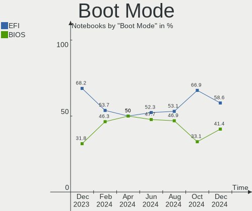
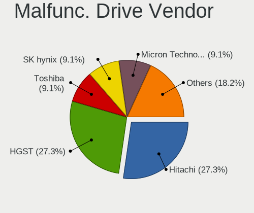
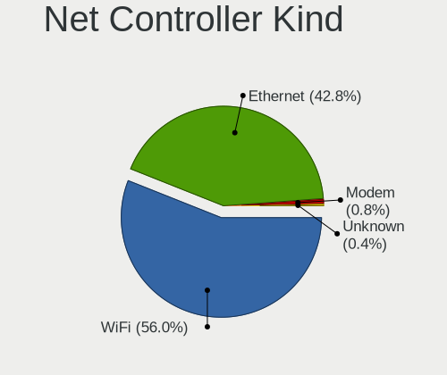

Linux in Italy - Hardware Trends (Notebooks)
--------------------------------------------

A project to identify most popular hardware characteristics and track their change
over time based on data collected by Linux users at https://Linux-Hardware.org.

Anyone can contribute to this report by the [hw-probe](https://github.com/linuxhw/hw-probe) tool:

    sudo -E hw-probe -all -upload

Period: Mar, 2023.

Contents
--------

* [ System ](#system)
  - [ OS                       ](#os)
  - [ OS Family                ](#os-family)
  - [ Kernel                   ](#kernel)
  - [ Kernel Family            ](#kernel-family)
  - [ Kernel Major Ver.        ](#kernel-major-ver)
  - [ Arch                     ](#arch)
  - [ DE                       ](#de)
  - [ Display Server           ](#display-server)
  - [ Display Manager          ](#display-manager)
  - [ OS Lang                  ](#os-lang)
  - [ Boot Mode                ](#boot-mode)
  - [ Filesystem               ](#filesystem)
  - [ Part. scheme             ](#part-scheme)
  - [ Dual Boot with Linux/BSD ](#dual-boot-with-linuxbsd)
  - [ Dual Boot (Win)          ](#dual-boot-win)

* [ Board ](#board)
  - [ Vendor                   ](#vendor)
  - [ Model                    ](#model)
  - [ Model Family             ](#model-family)
  - [ MFG Year                 ](#mfg-year)
  - [ Form Factor              ](#form-factor)
  - [ Secure Boot              ](#secure-boot)
  - [ Coreboot                 ](#coreboot)
  - [ RAM Size                 ](#ram-size)
  - [ RAM Used                 ](#ram-used)
  - [ Total Drives             ](#total-drives)
  - [ Has CD-ROM               ](#has-cd-rom)
  - [ Has Ethernet             ](#has-ethernet)
  - [ Has WiFi                 ](#has-wifi)
  - [ Has Bluetooth            ](#has-bluetooth)

* [ Location ](#location)
  - [ Country                  ](#country)
  - [ City                     ](#city)

* [ Drives ](#drives)
  - [ Drive Vendor             ](#drive-vendor)
  - [ Drive Model              ](#drive-model)
  - [ HDD Vendor               ](#hdd-vendor)
  - [ SSD Vendor               ](#ssd-vendor)
  - [ Drive Kind               ](#drive-kind)
  - [ Drive Connector          ](#drive-connector)
  - [ Drive Size               ](#drive-size)
  - [ Space Total              ](#space-total)
  - [ Space Used               ](#space-used)
  - [ Malfunc. Drives          ](#malfunc-drives)
  - [ Malfunc. Drive Vendor    ](#malfunc-drive-vendor)
  - [ Malfunc. HDD Vendor      ](#malfunc-hdd-vendor)
  - [ Malfunc. Drive Kind      ](#malfunc-drive-kind)
  - [ Failed Drives            ](#failed-drives)
  - [ Failed Drive Vendor      ](#failed-drive-vendor)
  - [ Drive Status             ](#drive-status)

* [ Storage controller ](#storage-controller)
  - [ Storage Vendor           ](#storage-vendor)
  - [ Storage Model            ](#storage-model)
  - [ Storage Kind             ](#storage-kind)

* [ Processor ](#processor)
  - [ CPU Vendor               ](#cpu-vendor)
  - [ CPU Model                ](#cpu-model)
  - [ CPU Model Family         ](#cpu-model-family)
  - [ CPU Cores                ](#cpu-cores)
  - [ CPU Sockets              ](#cpu-sockets)
  - [ CPU Threads              ](#cpu-threads)
  - [ CPU Op-Modes             ](#cpu-op-modes)
  - [ CPU Microcode            ](#cpu-microcode)
  - [ CPU Microarch            ](#cpu-microarch)

* [ Graphics ](#graphics)
  - [ GPU Vendor               ](#gpu-vendor)
  - [ GPU Model                ](#gpu-model)
  - [ GPU Combo                ](#gpu-combo)
  - [ GPU Driver               ](#gpu-driver)
  - [ GPU Memory               ](#gpu-memory)

* [ Monitor ](#monitor)
  - [ Monitor Vendor           ](#monitor-vendor)
  - [ Monitor Model            ](#monitor-model)
  - [ Monitor Resolution       ](#monitor-resolution)
  - [ Monitor Diagonal         ](#monitor-diagonal)
  - [ Monitor Width            ](#monitor-width)
  - [ Aspect Ratio             ](#aspect-ratio)
  - [ Monitor Area             ](#monitor-area)
  - [ Pixel Density            ](#pixel-density)
  - [ Multiple Monitors        ](#multiple-monitors)

* [ Network ](#network)
  - [ Net Controller Vendor    ](#net-controller-vendor)
  - [ Net Controller Model     ](#net-controller-model)
  - [ Wireless Vendor          ](#wireless-vendor)
  - [ Wireless Model           ](#wireless-model)
  - [ Ethernet Vendor          ](#ethernet-vendor)
  - [ Ethernet Model           ](#ethernet-model)
  - [ Net Controller Kind      ](#net-controller-kind)
  - [ Used Controller          ](#used-controller)
  - [ NICs                     ](#nics)
  - [ IPv6                     ](#ipv6)

* [ Bluetooth ](#bluetooth)
  - [ Bluetooth Vendor         ](#bluetooth-vendor)
  - [ Bluetooth Model          ](#bluetooth-model)

* [ Sound ](#sound)
  - [ Sound Vendor             ](#sound-vendor)
  - [ Sound Model              ](#sound-model)

* [ Memory ](#memory)
  - [ Memory Vendor            ](#memory-vendor)
  - [ Memory Model             ](#memory-model)
  - [ Memory Kind              ](#memory-kind)
  - [ Memory Form Factor       ](#memory-form-factor)
  - [ Memory Size              ](#memory-size)
  - [ Memory Speed             ](#memory-speed)

* [ Printers & scanners ](#printers--scanners)
  - [ Printer Vendor           ](#printer-vendor)
  - [ Printer Model            ](#printer-model)
  - [ Scanner Vendor           ](#scanner-vendor)
  - [ Scanner Model            ](#scanner-model)

* [ Camera ](#camera)
  - [ Camera Vendor            ](#camera-vendor)
  - [ Camera Model             ](#camera-model)

* [ Security ](#security)
  - [ Fingerprint Vendor       ](#fingerprint-vendor)
  - [ Fingerprint Model        ](#fingerprint-model)
  - [ Chipcard Vendor          ](#chipcard-vendor)
  - [ Chipcard Model           ](#chipcard-model)

* [ Unsupported ](#unsupported)
  - [ Unsupported Devices      ](#unsupported-devices)
  - [ Unsupported Device Types ](#unsupported-device-types)

System
------

OS
--

Installed operating systems

| Name                         | Notebooks | Percent |
|------------------------------|-----------|---------|
| Ubuntu 22.04                 | 19        | 12.84%  |
| Fedora 37                    | 16        | 10.81%  |
| OpenMandriva 23.03           | 12        | 8.11%   |
| Debian 11                    | 12        | 8.11%   |
| OpenMandriva 23.01           | 9         | 6.08%   |
| Arch Rolling                 | 9         | 6.08%   |
| Linux Mint 21.1              | 8         | 5.41%   |
| Ubuntu 22.10                 | 6         | 4.05%   |
| Zorin 16                     | 5         | 3.38%   |
| Linux Mint 21                | 5         | 3.38%   |
| Pop!_OS 22.04                | 4         | 2.7%    |
| Manjaro 22.0.4               | 3         | 2.03%   |
| EndeavourOS Rolling          | 3         | 2.03%   |
| Ubuntu 20.04                 | 2         | 1.35%   |
| SteamOS 3.4.6                | 2         | 1.35%   |
| MX 21                        | 2         | 1.35%   |
| LMDE 5                       | 2         | 1.35%   |
| Linux Mint 20.3              | 2         | 1.35%   |
| Kubuntu 22.10                | 2         | 1.35%   |
| Xubuntu 22.10                | 1         | 0.68%   |
| Xubuntu 20.04                | 1         | 0.68%   |
| Xubuntu 16.04                | 1         | 0.68%   |
| Xero Rolling                 | 1         | 0.68%   |
| Ubuntu Budgie 22.10          | 1         | 0.68%   |
| Ubuntu Budgie 22.04          | 1         | 0.68%   |
| Ubuntu 18.04                 | 1         | 0.68%   |
| SteamOS 3.4.4                | 1         | 0.68%   |
| ROSA 12.4                    | 1         | 0.68%   |
| Pikaos 22.10                 | 1         | 0.68%   |
| openSUSE Tumbleweed-XXXXXXXX | 1         | 0.68%   |
| openSUSE Microos-XXXXXXXX    | 1         | 0.68%   |
| OpenMandriva 4.2             | 1         | 0.68%   |
| Nobara 37                    | 1         | 0.68%   |
| NixOS 23.05                  | 1         | 0.68%   |
| Manjaro 22.0.5               | 1         | 0.68%   |
| Lubuntu 18.04                | 1         | 0.68%   |
| LinuxFX 11.2                 | 1         | 0.68%   |
| KDE neon 22.04               | 1         | 0.68%   |
| Gentoo 2.13                  | 1         | 0.68%   |
| Fedora 38                    | 1         | 0.68%   |

OS Family
---------

OS without a version

| Name          | Notebooks | Percent |
|---------------|-----------|---------|
| Ubuntu        | 28        | 18.92%  |
| OpenMandriva  | 22        | 14.86%  |
| Fedora        | 17        | 11.49%  |
| Linux Mint    | 15        | 10.14%  |
| Debian        | 13        | 8.78%   |
| Arch          | 9         | 6.08%   |
| Zorin         | 5         | 3.38%   |
| Pop!_OS       | 4         | 2.7%    |
| Manjaro       | 4         | 2.7%    |
| Xubuntu       | 3         | 2.03%   |
| SteamOS       | 3         | 2.03%   |
| EndeavourOS   | 3         | 2.03%   |
| Ubuntu Budgie | 2         | 1.35%   |
| openSUSE      | 2         | 1.35%   |
| MX            | 2         | 1.35%   |
| LMDE          | 2         | 1.35%   |
| Kubuntu       | 2         | 1.35%   |
| Xero          | 1         | 0.68%   |
| ROSA          | 1         | 0.68%   |
| Pikaos        | 1         | 0.68%   |
| Nobara        | 1         | 0.68%   |
| NixOS         | 1         | 0.68%   |
| Lubuntu       | 1         | 0.68%   |
| LinuxFX       | 1         | 0.68%   |
| KDE neon      | 1         | 0.68%   |
| Gentoo        | 1         | 0.68%   |
| ArcoLinux     | 1         | 0.68%   |
| antiX         | 1         | 0.68%   |
| Alpine        | 1         | 0.68%   |

Kernel
------

Version of the Linux kernel

| Version                           | Notebooks | Percent |
|-----------------------------------|-----------|---------|
| 5.19.0-35-generic                 | 18        | 12.16%  |
| 5.10.0-21-amd64                   | 12        | 8.11%   |
| 6.2.6-desktop-1omv2390            | 11        | 7.43%   |
| 5.15.0-67-generic                 | 10        | 6.76%   |
| 6.1.1-desktop-1omv2290            | 7         | 4.73%   |
| 6.2.7-200.fc37.x86_64             | 5         | 3.38%   |
| 6.1.18-200.fc37.x86_64            | 5         | 3.38%   |
| 5.19.0-38-generic                 | 5         | 3.38%   |
| 6.2.8-arch1-1                     | 3         | 2.03%   |
| 5.4.0-144-generic                 | 3         | 2.03%   |
| 5.19.0-21-generic                 | 3         | 2.03%   |
| 5.15.0-56-generic                 | 3         | 2.03%   |
| 5.13.0-valve36-1-neptune          | 3         | 2.03%   |
| 6.2.1-arch1-1                     | 2         | 1.35%   |
| 6.2.0-76060200-generic            | 2         | 1.35%   |
| 6.1.4-desktop-1omv2301            | 2         | 1.35%   |
| 6.1.14-200.fc37.x86_64            | 2         | 1.35%   |
| 6.1.12-1-MANJARO                  | 2         | 1.35%   |
| 6.0.7-301.fc37.x86_64             | 2         | 1.35%   |
| 5.19.0-37-generic                 | 2         | 1.35%   |
| 5.19.0-31-generic                 | 2         | 1.35%   |
| 5.15.0-60-generic                 | 2         | 1.35%   |
| 5.15.0-41-generic                 | 2         | 1.35%   |
| 6.2.7-zen1-1-zen                  | 1         | 0.68%   |
| 6.2.7-arch1-1                     | 1         | 0.68%   |
| 6.2.6-pikaos                      | 1         | 0.68%   |
| 6.2.6-arch1-1                     | 1         | 0.68%   |
| 6.2.6-76060206-generic            | 1         | 0.68%   |
| 6.2.6-300.fc38.x86_64             | 1         | 0.68%   |
| 6.2.4-1-default                   | 1         | 0.68%   |
| 6.2.2-x64v1-xanmod1-1             | 1         | 0.68%   |
| 6.2.2-desktop-1omv2390            | 1         | 0.68%   |
| 6.2.2-arch2-1                     | 1         | 0.68%   |
| 6.2.2-arch1-1                     | 1         | 0.68%   |
| 6.2.1-1-default                   | 1         | 0.68%   |
| 6.2.0                             | 1         | 0.68%   |
| 6.1.9-arch1-2                     | 1         | 0.68%   |
| 6.1.20-generic-2rosa2021.1-x86_64 | 1         | 0.68%   |
| 6.1.15-2-liquorix-amd64           | 1         | 0.68%   |
| 6.1.12-zen1-1-zen                 | 1         | 0.68%   |

Kernel Family
-------------

Linux kernel without a distro release

| Version  | Notebooks | Percent |
|----------|-----------|---------|
| 5.19.0   | 32        | 21.62%  |
| 5.15.0   | 20        | 13.51%  |
| 6.2.6    | 15        | 10.14%  |
| 5.10.0   | 13        | 8.78%   |
| 6.2.7    | 7         | 4.73%   |
| 6.1.1    | 7         | 4.73%   |
| 6.1.18   | 5         | 3.38%   |
| 6.2.2    | 4         | 2.7%    |
| 6.1.12   | 4         | 2.7%    |
| 6.2.8    | 3         | 2.03%   |
| 6.2.1    | 3         | 2.03%   |
| 6.2.0    | 3         | 2.03%   |
| 6.1.11   | 3         | 2.03%   |
| 5.4.0    | 3         | 2.03%   |
| 5.13.0   | 3         | 2.03%   |
| 6.1.4    | 2         | 1.35%   |
| 6.1.14   | 2         | 1.35%   |
| 6.0.7    | 2         | 1.35%   |
| 6.2.4    | 1         | 0.68%   |
| 6.1.9    | 1         | 0.68%   |
| 6.1.20   | 1         | 0.68%   |
| 6.1.15   | 1         | 0.68%   |
| 6.1.10   | 1         | 0.68%   |
| 6.1.0    | 1         | 0.68%   |
| 6.0.16   | 1         | 0.68%   |
| 6.0.0    | 1         | 0.68%   |
| 5.4.209  | 1         | 0.68%   |
| 5.17.0   | 1         | 0.68%   |
| 5.15.94  | 1         | 0.68%   |
| 5.15.104 | 1         | 0.68%   |
| 5.10.167 | 1         | 0.68%   |
| 5.10.14  | 1         | 0.68%   |
| 4.9.0    | 1         | 0.68%   |
| 4.4.0    | 1         | 0.68%   |
| 4.15.0   | 1         | 0.68%   |

Kernel Major Ver.
-----------------

Linux kernel major version

| Version | Notebooks | Percent |
|---------|-----------|---------|
| 6.2     | 36        | 24.32%  |
| 5.19    | 32        | 21.62%  |
| 6.1     | 28        | 18.92%  |
| 5.15    | 22        | 14.86%  |
| 5.10    | 15        | 10.14%  |
| 6.0     | 4         | 2.7%    |
| 5.4     | 4         | 2.7%    |
| 5.13    | 3         | 2.03%   |
| 5.17    | 1         | 0.68%   |
| 4.9     | 1         | 0.68%   |
| 4.4     | 1         | 0.68%   |
| 4.15    | 1         | 0.68%   |

Arch
----

OS architecture (x86_64, i586, etc.)

| Name   | Notebooks | Percent |
|--------|-----------|---------|
| x86_64 | 148       | 100%    |

DE
--

Desktop Environment

| Name              | Notebooks | Percent |
|-------------------|-----------|---------|
| GNOME             | 66        | 44.59%  |
| KDE5              | 41        | 27.7%   |
| X-Cinnamon        | 14        | 9.46%   |
| XFCE              | 10        | 6.76%   |
| MATE              | 5         | 3.38%   |
| KDE               | 2         | 1.35%   |
| Budgie            | 2         | 1.35%   |
| Unknown           | 2         | 1.35%   |
| ubuntu:pika:GNOME | 1         | 0.68%   |
| sway              | 1         | 0.68%   |
| LXDE              | 1         | 0.68%   |
| icewm             | 1         | 0.68%   |
| Hyprland          | 1         | 0.68%   |
| GNOME Classic     | 1         | 0.68%   |

Display Server
--------------

X11 or Wayland

| Name    | Notebooks | Percent |
|---------|-----------|---------|
| X11     | 94        | 63.51%  |
| Wayland | 52        | 35.14%  |
| Tty     | 1         | 0.68%   |
| Unknown | 1         | 0.68%   |

Display Manager
---------------

SDDM, LightDM, etc.

| Name    | Notebooks | Percent |
|---------|-----------|---------|
| SDDM    | 37        | 25%     |
| GDM3    | 36        | 24.32%  |
| Unknown | 29        | 19.59%  |
| LightDM | 23        | 15.54%  |
| GDM     | 21        | 14.19%  |
| SLIMSKI | 1         | 0.68%   |
| SLiM    | 1         | 0.68%   |

OS Lang
-------

Language

| Lang  | Notebooks | Percent |
|-------|-----------|---------|
| it_IT | 95        | 64.19%  |
| en_US | 41        | 27.7%   |
| C     | 7         | 4.73%   |
| en_GB | 4         | 2.7%    |
| en_IE | 1         | 0.68%   |

Boot Mode
---------

EFI or BIOS

| Mode | Notebooks | Percent |
|------|-----------|---------|
| EFI  | 94        | 63.51%  |
| BIOS | 54        | 36.49%  |

Filesystem
----------

Type of filesystem

| Type    | Notebooks | Percent |
|---------|-----------|---------|
| Ext4    | 95        | 64.19%  |
| Btrfs   | 26        | 17.57%  |
| Overlay | 22        | 14.86%  |
| Zfs     | 3         | 2.03%   |
| Xfs     | 2         | 1.35%   |

Part. scheme
------------

Scheme of partitioning

| Type    | Notebooks | Percent |
|---------|-----------|---------|
| GPT     | 111       | 75%     |
| Unknown | 27        | 18.24%  |
| MBR     | 10        | 6.76%   |

Dual Boot with Linux/BSD
------------------------

Hosting more than one Linux/BSD

| Dual boot | Notebooks | Percent |
|-----------|-----------|---------|
| No        | 122       | 82.43%  |
| Yes       | 26        | 17.57%  |

Dual Boot (Win)
---------------

Hosting Linux and Windows

| Dual boot | Notebooks | Percent |
|-----------|-----------|---------|
| No        | 108       | 72.97%  |
| Yes       | 40        | 27.03%  |

Board
-----

Vendor
------

Motherboard manufacturer

| Name             | Notebooks | Percent |
|------------------|-----------|---------|
| Hewlett-Packard  | 36        | 24.32%  |
| Lenovo           | 31        | 20.95%  |
| ASUSTek Computer | 17        | 11.49%  |
| Dell             | 16        | 10.81%  |
| Acer             | 12        | 8.11%   |
| MSI              | 5         | 3.38%   |
| Toshiba          | 4         | 2.7%    |
| Valve            | 3         | 2.03%   |
| Microtech        | 3         | 2.03%   |
| HUAWEI           | 3         | 2.03%   |
| Apple            | 3         | 2.03%   |
| Sony             | 2         | 1.35%   |
| Notebook         | 2         | 1.35%   |
| Fujitsu          | 2         | 1.35%   |
| Unknown          | 2         | 1.35%   |
| YJKC             | 1         | 0.68%   |
| TrekStor         | 1         | 0.68%   |
| Timi             | 1         | 0.68%   |
| SANTECH          | 1         | 0.68%   |
| PC Specialist    | 1         | 0.68%   |
| Olivetti         | 1         | 0.68%   |
| GMK              | 1         | 0.68%   |

Model
-----

Motherboard model

| Name                                     | Notebooks | Percent |
|------------------------------------------|-----------|---------|
| Valve Jupiter                            | 3         | 2.03%   |
| MSI Prestige 14Evo A11M                  | 2         | 1.35%   |
| Microtech ebookPro                       | 2         | 1.35%   |
| Lenovo G50-45 80E3                       | 2         | 1.35%   |
| HP Pavilion Laptop 15-ck0xx              | 2         | 1.35%   |
| HP Pavilion 15                           | 2         | 1.35%   |
| HP 250 15.6 inch G9 Notebook PC          | 2         | 1.35%   |
| Dell XPS 15 9570                         | 2         | 1.35%   |
| Unknown                                  | 2         | 1.35%   |
| YJKC vBOOK Plus                          | 1         | 0.68%   |
| TrekStor Notebook Slim S130              | 1         | 0.68%   |
| Toshiba Satellite Pro S500               | 1         | 0.68%   |
| Toshiba Satellite L655                   | 1         | 0.68%   |
| Toshiba Satellite L50-B                  | 1         | 0.68%   |
| Toshiba NB550D                           | 1         | 0.68%   |
| Timi TM1701                              | 1         | 0.68%   |
| Sony VPCEH1S1E                           | 1         | 0.68%   |
| Sony SVE1713X1EB                         | 1         | 0.68%   |
| SANTECH NHx0DB,DE                        | 1         | 0.68%   |
| PC Specialist 14 Fusion IV               | 1         | 0.68%   |
| Olivetti Spring Peak                     | 1         | 0.68%   |
| Notebook W54_55SU1,SUW                   | 1         | 0.68%   |
| Notebook P15SM                           | 1         | 0.68%   |
| MSI Modern 14 B11MOL                     | 1         | 0.68%   |
| MSI Katana GF66 12UG                     | 1         | 0.68%   |
| MSI Creator 15M A9SD                     | 1         | 0.68%   |
| Microtech CoreBook                       | 1         | 0.68%   |
| Lenovo Z50-75 80EC                       | 1         | 0.68%   |
| Lenovo Yoga 3 11 80J8                    | 1         | 0.68%   |
| Lenovo V130-15IKB 81HN                   | 1         | 0.68%   |
| Lenovo ThinkPad X1 Carbon 6th 20KHS3AU00 | 1         | 0.68%   |
| Lenovo ThinkPad T495s 20QJCTO1WW         | 1         | 0.68%   |
| Lenovo ThinkPad T480s 20L8S88M00         | 1         | 0.68%   |
| Lenovo ThinkPad T480s 20L8002WMD         | 1         | 0.68%   |
| Lenovo ThinkPad T460s 20FAS6PN00         | 1         | 0.68%   |
| Lenovo ThinkPad T460 20LPS3K002          | 1         | 0.68%   |
| Lenovo ThinkPad T440p 20AWS0XX04         | 1         | 0.68%   |
| Lenovo ThinkPad T440 20B7A0CYMH          | 1         | 0.68%   |
| Lenovo ThinkPad P14s Gen 2a 21A00048IX   | 1         | 0.68%   |
| Lenovo ThinkPad E490 20N9S21H00          | 1         | 0.68%   |

Model Family
------------

Motherboard model prefix

| Name               | Notebooks | Percent |
|--------------------|-----------|---------|
| Lenovo IdeaPad     | 13        | 8.78%   |
| Lenovo ThinkPad    | 11        | 7.43%   |
| HP Pavilion        | 9         | 6.08%   |
| Acer Aspire        | 7         | 4.73%   |
| Dell Latitude      | 6         | 4.05%   |
| HP ProBook         | 5         | 3.38%   |
| HP Laptop          | 5         | 3.38%   |
| Dell Inspiron      | 5         | 3.38%   |
| Dell XPS           | 4         | 2.7%    |
| ASUS VivoBook      | 4         | 2.7%    |
| Valve Jupiter      | 3         | 2.03%   |
| Toshiba Satellite  | 3         | 2.03%   |
| HP 250             | 3         | 2.03%   |
| MSI Prestige       | 2         | 1.35%   |
| Microtech ebookPro | 2         | 1.35%   |
| Lenovo G50-45      | 2         | 1.35%   |
| HP OMEN            | 2         | 1.35%   |
| HP ENVY            | 2         | 1.35%   |
| HP EliteBook       | 2         | 1.35%   |
| HP Compaq          | 2         | 1.35%   |
| HP 255             | 2         | 1.35%   |
| Fujitsu LIFEBOOK   | 2         | 1.35%   |
| Acer Extensa       | 2         | 1.35%   |
| Unknown            | 2         | 1.35%   |
| YJKC vBOOK         | 1         | 0.68%   |
| TrekStor Notebook  | 1         | 0.68%   |
| Toshiba NB550D     | 1         | 0.68%   |
| Timi TM1701        | 1         | 0.68%   |
| Sony VPCEH1S1E     | 1         | 0.68%   |
| Sony SVE1713X1EB   | 1         | 0.68%   |
| SANTECH NHx0DB     | 1         | 0.68%   |
| PC Specialist 14   | 1         | 0.68%   |
| Olivetti Spring    | 1         | 0.68%   |
| Notebook W54       | 1         | 0.68%   |
| Notebook P15SM     | 1         | 0.68%   |
| MSI Modern         | 1         | 0.68%   |
| MSI Katana         | 1         | 0.68%   |
| MSI Creator        | 1         | 0.68%   |
| Microtech CoreBook | 1         | 0.68%   |
| Lenovo Z50-75      | 1         | 0.68%   |

MFG Year
--------

Motherboard manufacture year

| Year | Notebooks | Percent |
|------|-----------|---------|
| 2021 | 20        | 13.51%  |
| 2018 | 16        | 10.81%  |
| 2020 | 14        | 9.46%   |
| 2013 | 14        | 9.46%   |
| 2019 | 13        | 8.78%   |
| 2022 | 12        | 8.11%   |
| 2016 | 9         | 6.08%   |
| 2010 | 8         | 5.41%   |
| 2017 | 7         | 4.73%   |
| 2014 | 7         | 4.73%   |
| 2012 | 7         | 4.73%   |
| 2015 | 5         | 3.38%   |
| 2011 | 5         | 3.38%   |
| 2009 | 5         | 3.38%   |
| 2008 | 4         | 2.7%    |
| 2023 | 1         | 0.68%   |
| 2007 | 1         | 0.68%   |

Form Factor
-----------

Physical design of the computer

| Name     | Notebooks | Percent |
|----------|-----------|---------|
| Notebook | 148       | 100%    |

Secure Boot
-----------

Enabled or disabled

| State    | Notebooks | Percent |
|----------|-----------|---------|
| Disabled | 138       | 93.24%  |
| Enabled  | 10        | 6.76%   |

Coreboot
--------

Have coreboot on board

| Used | Notebooks | Percent |
|------|-----------|---------|
| No   | 148       | 100%    |

RAM Size
--------

Total RAM memory

| Size in GB | Notebooks | Percent |
|------------|-----------|---------|
| 4.01-8.0   | 49        | 33.11%  |
| 16.01-24.0 | 33        | 22.3%   |
| 8.01-16.0  | 29        | 19.59%  |
| 3.01-4.0   | 24        | 16.22%  |
| 32.01-64.0 | 7         | 4.73%   |
| 1.01-2.0   | 3         | 2.03%   |
| 24.01-32.0 | 2         | 1.35%   |
| 2.01-3.0   | 1         | 0.68%   |

RAM Used
--------

Used RAM memory

| Used GB    | Notebooks | Percent |
|------------|-----------|---------|
| 1.01-2.0   | 50        | 33.78%  |
| 2.01-3.0   | 35        | 23.65%  |
| 4.01-8.0   | 30        | 20.27%  |
| 3.01-4.0   | 21        | 14.19%  |
| 8.01-16.0  | 7         | 4.73%   |
| 0.51-1.0   | 4         | 2.7%    |
| 16.01-24.0 | 1         | 0.68%   |

Total Drives
------------

Number of drives on board

| Drives | Notebooks | Percent |
|--------|-----------|---------|
| 1      | 108       | 72.97%  |
| 2      | 34        | 22.97%  |
| 3      | 5         | 3.38%   |
| 0      | 1         | 0.68%   |

Has CD-ROM
----------

Has CD-ROM on board

| Presented | Notebooks | Percent |
|-----------|-----------|---------|
| No        | 101       | 68.24%  |
| Yes       | 47        | 31.76%  |

Has Ethernet
------------

Has Ethernet on board

| Presented | Notebooks | Percent |
|-----------|-----------|---------|
| Yes       | 111       | 75%     |
| No        | 37        | 25%     |

Has WiFi
--------

Has WiFi module

| Presented | Notebooks | Percent |
|-----------|-----------|---------|
| Yes       | 146       | 98.65%  |
| No        | 2         | 1.35%   |

Has Bluetooth
-------------

Has Bluetooth module

| Presented | Notebooks | Percent |
|-----------|-----------|---------|
| Yes       | 122       | 82.43%  |
| No        | 26        | 17.57%  |

Location
--------

Country
-------

Geographic location (country)

| Country | Notebooks | Percent |
|---------|-----------|---------|
| Italy   | 148       | 100%    |

City
----

Geographic location (city)

| City                     | Notebooks | Percent |
|--------------------------|-----------|---------|
| Milan                    | 20        | 13.51%  |
| Milano                   | 14        | 9.46%   |
| Rome                     | 11        | 7.43%   |
| Turin                    | 5         | 3.38%   |
| Rho                      | 3         | 2.03%   |
| Naples                   | 3         | 2.03%   |
| Genoa                    | 3         | 2.03%   |
| Bergamo                  | 3         | 2.03%   |
| Villachiara              | 2         | 1.35%   |
| Verona                   | 2         | 1.35%   |
| Treviso                  | 2         | 1.35%   |
| Rozzano                  | 2         | 1.35%   |
| Palermo                  | 2         | 1.35%   |
| Padova                   | 2         | 1.35%   |
| Cordovado                | 2         | 1.35%   |
| Collesalvetti            | 2         | 1.35%   |
| Citta                    | 2         | 1.35%   |
| Asti                     | 2         | 1.35%   |
| Villa Guardia            | 1         | 0.68%   |
| Vignole Borbera          | 1         | 0.68%   |
| Vasto                    | 1         | 0.68%   |
| Valsamoggia              | 1         | 0.68%   |
| Vahrn                    | 1         | 0.68%   |
| Trento                   | 1         | 0.68%   |
| Torricella Sicura        | 1         | 0.68%   |
| Taviano                  | 1         | 0.68%   |
| Sora                     | 1         | 0.68%   |
| Sona                     | 1         | 0.68%   |
| Somaglia                 | 1         | 0.68%   |
| Sesto San Giovanni       | 1         | 0.68%   |
| Sesto Fiorentino         | 1         | 0.68%   |
| Scafati                  | 1         | 0.68%   |
| San Martino Buon Albergo | 1         | 0.68%   |
| San Giorgio di Nogaro    | 1         | 0.68%   |
| San Fior                 | 1         | 0.68%   |
| Rossano Veneto           | 1         | 0.68%   |
| Romano d'Ezzelino        | 1         | 0.68%   |
| Prevalle                 | 1         | 0.68%   |
| Prad am Stilfser Joch    | 1         | 0.68%   |
| Porcia                   | 1         | 0.68%   |

Drives
------

Drive Vendor
------------

Hard drive vendors

| Vendor                      | Notebooks | Drives | Percent |
|-----------------------------|-----------|--------|---------|
| Samsung Electronics         | 37        | 40     | 20.33%  |
| Seagate                     | 17        | 18     | 9.34%   |
| WDC                         | 13        | 13     | 7.14%   |
| Toshiba                     | 12        | 12     | 6.59%   |
| SanDisk                     | 12        | 12     | 6.59%   |
| Unknown                     | 10        | 10     | 5.49%   |
| Crucial                     | 10        | 10     | 5.49%   |
| Kingston                    | 8         | 8      | 4.4%    |
| Intel                       | 8         | 8      | 4.4%    |
| HGST                        | 7         | 7      | 3.85%   |
| SK hynix                    | 6         | 6      | 3.3%    |
| Micron Technology           | 4         | 4      | 2.2%    |
| Kingston Technology Company | 4         | 4      | 2.2%    |
| Phison Electronics          | 3         | 3      | 1.65%   |
| Apple                       | 3         | 3      | 1.65%   |
| Transcend                   | 2         | 2      | 1.1%    |
| SSSTC                       | 2         | 2      | 1.1%    |
| LITEON                      | 2         | 2      | 1.1%    |
| Intenso                     | 2         | 2      | 1.1%    |
| Hitachi                     | 2         | 2      | 1.1%    |
| A-DATA Technology           | 2         | 2      | 1.1%    |
| Unknown                     | 2         | 2      | 1.1%    |
| WINTEC                      | 1         | 1      | 0.55%   |
| Verbatim                    | 1         | 1      | 0.55%   |
| USB                         | 1         | 1      | 0.55%   |
| Teclast                     | 1         | 1      | 0.55%   |
| SSK                         | 1         | 1      | 0.55%   |
| Solid State Storage         | 1         | 1      | 0.55%   |
| sobetter                    | 1         | 1      | 0.55%   |
| Silicon Motion              | 1         | 1      | 0.55%   |
| Phison                      | 1         | 1      | 0.55%   |
| Netac                       | 1         | 1      | 0.55%   |
| Microtech                   | 1         | 1      | 0.55%   |
| KIOXIA                      | 1         | 1      | 0.55%   |
| GOODRAM                     | 1         | 1      | 0.55%   |
| ASMT                        | 1         | 1      | 0.55%   |

Drive Model
-----------

Hard drive models

| Model                                               | Notebooks | Percent |
|-----------------------------------------------------|-----------|---------|
| Unknown MMC Card  32GB                              | 3         | 1.61%   |
| Seagate ST9500325AS 500GB                           | 3         | 1.61%   |
| Samsung NVMe SSD Controller PM9A1/PM9A3/980PRO 1TB  | 3         | 1.61%   |
| Kingston Company OM3PDP3 NVMe SSD 256GB             | 3         | 1.61%   |
| Kingston SA400S37240G 240GB SSD                     | 3         | 1.61%   |
| Crucial CT500MX500SSD1 500GB                        | 3         | 1.61%   |
| WDC WD5000LPCX-24VHAT0 500GB                        | 2         | 1.08%   |
| WDC WD10SPZX-60Z10T0 1TB                            | 2         | 1.08%   |
| Toshiba XG6 NVMe SSD Controller 512GB               | 2         | 1.08%   |
| Toshiba MQ01ABF050 500GB                            | 2         | 1.08%   |
| Toshiba MQ01ABD100 1TB                              | 2         | 1.08%   |
| SK hynix HFM001TD3JX013N 1TB                        | 2         | 1.08%   |
| Seagate ST1000LM035-1RK172 1TB                      | 2         | 1.08%   |
| Samsung SSD 870 QVO 1TB                             | 2         | 1.08%   |
| Samsung SSD 870 EVO 500GB                           | 2         | 1.08%   |
| Samsung SSD 860 EVO 500GB                           | 2         | 1.08%   |
| Samsung SSD 850 EVO 500GB                           | 2         | 1.08%   |
| Samsung NVMe SSD Controller SM981/PM981/PM983 250GB | 2         | 1.08%   |
| Samsung NVMe SSD Controller SM961/PM961/SM963 256GB | 2         | 1.08%   |
| Samsung MZVLQ512HBLU-00BH1 512GB                    | 2         | 1.08%   |
| Kingston SA1000M8240G 240GB                         | 2         | 1.08%   |
| Intel SSDPEKNW512GZL 512GB                          | 2         | 1.08%   |
| HGST HTS545050A7E680 500GB                          | 2         | 1.08%   |
| Crucial CT480BX500SSD1 480GB                        | 2         | 1.08%   |
| Crucial CT240BX500SSD1 240GB                        | 2         | 1.08%   |
| Unknown                                             | 2         | 1.08%   |
| WINTEC 240GB SATA3 SF2281 SSD                       | 1         | 0.54%   |
| WDC WD5000LPCX-24C6HT0 500GB                        | 1         | 0.54%   |
| WDC WD2500BEVT-00A23T0 250GB                        | 1         | 0.54%   |
| WDC WD2500BEVS-60UST0 250GB                         | 1         | 0.54%   |
| WDC WD10JPCX-24UE4T0 1TB                            | 1         | 0.54%   |
| WDC PC SN530 SDBQNPZ-256G-1016 256GB                | 1         | 0.54%   |
| WDC PC SN530 SDBPNPZ-512G-1027 512GB                | 1         | 0.54%   |
| WDC PC SN530 SDBPNPZ-512G-1006 512GB                | 1         | 0.54%   |
| WDC PC SN530 SDBPNPZ-256G-1006 256GB                | 1         | 0.54%   |
| WDC PC SN520 SDAPNUW-512G-1006 512GB                | 1         | 0.54%   |
| Verbatim USB External SSD 128GB                     | 1         | 0.54%   |
| USB Disk 500GB                                      | 1         | 0.54%   |
| Unknown SU08G  8GB                                  | 1         | 0.54%   |
| Unknown SD/MMC/MS PRO 64GB                          | 1         | 0.54%   |

HDD Vendor
----------

Hard disk drive vendors

| Vendor  | Notebooks | Drives | Percent |
|---------|-----------|--------|---------|
| Seagate | 16        | 16     | 37.21%  |
| WDC     | 8         | 8      | 18.6%   |
| Toshiba | 8         | 8      | 18.6%   |
| HGST    | 7         | 7      | 16.28%  |
| Hitachi | 2         | 2      | 4.65%   |
| Unknown | 1         | 1      | 2.33%   |
| ASMT    | 1         | 1      | 2.33%   |

SSD Vendor
----------

Solid state drive vendors

| Vendor              | Notebooks | Drives | Percent |
|---------------------|-----------|--------|---------|
| Samsung Electronics | 14        | 17     | 23.33%  |
| Crucial             | 10        | 10     | 16.67%  |
| SanDisk             | 9         | 9      | 15%     |
| Kingston            | 5         | 5      | 8.33%   |
| SK hynix            | 3         | 3      | 5%      |
| Apple               | 3         | 3      | 5%      |
| Transcend           | 2         | 2      | 3.33%   |
| Intenso             | 2         | 2      | 3.33%   |
| Intel               | 2         | 2      | 3.33%   |
| WINTEC              | 1         | 1      | 1.67%   |
| Verbatim            | 1         | 1      | 1.67%   |
| Toshiba             | 1         | 1      | 1.67%   |
| Teclast             | 1         | 1      | 1.67%   |
| SSSTC               | 1         | 1      | 1.67%   |
| Seagate             | 1         | 1      | 1.67%   |
| Microtech           | 1         | 1      | 1.67%   |
| LITEON              | 1         | 1      | 1.67%   |
| GOODRAM             | 1         | 1      | 1.67%   |
| Unknown             | 1         | 1      | 1.67%   |

Drive Kind
----------

HDD or SSD

| Kind    | Notebooks | Drives | Percent |
|---------|-----------|--------|---------|
| NVMe    | 65        | 66     | 36.93%  |
| SSD     | 54        | 63     | 30.68%  |
| HDD     | 43        | 43     | 24.43%  |
| MMC     | 10        | 10     | 5.68%   |
| Unknown | 4         | 4      | 2.27%   |

Drive Connector
---------------

SATA, SAS, NVMe, etc.

| Type | Notebooks | Drives | Percent |
|------|-----------|--------|---------|
| SATA | 87        | 98     | 50%     |
| NVMe | 65        | 66     | 37.36%  |
| SAS  | 12        | 12     | 6.9%    |
| MMC  | 10        | 10     | 5.75%   |

Drive Size
----------

Size of hard drive

| Size in TB | Notebooks | Drives | Percent |
|------------|-----------|--------|---------|
| 0.01-0.5   | 71        | 77     | 72.45%  |
| 0.51-1.0   | 23        | 25     | 23.47%  |
| 1.01-2.0   | 2         | 2      | 2.04%   |
| 4.01-10.0  | 2         | 2      | 2.04%   |

Space Total
-----------

Amount of disk space available on the file system

| Size in GB     | Notebooks | Percent |
|----------------|-----------|---------|
| 251-500        | 45        | 30.41%  |
| 101-250        | 37        | 25%     |
| 1-20           | 18        | 12.16%  |
| 501-1000       | 17        | 11.49%  |
| 1001-2000      | 7         | 4.73%   |
| 51-100         | 7         | 4.73%   |
| 21-50          | 6         | 4.05%   |
| 2001-3000      | 4         | 2.7%    |
| Unknown        | 4         | 2.7%    |
| More than 3000 | 3         | 2.03%   |

Space Used
----------

Amount of used disk space

| Used GB        | Notebooks | Percent |
|----------------|-----------|---------|
| 1-20           | 64        | 43.24%  |
| 101-250        | 23        | 15.54%  |
| 21-50          | 20        | 13.51%  |
| 251-500        | 14        | 9.46%   |
| 51-100         | 12        | 8.11%   |
| 501-1000       | 9         | 6.08%   |
| Unknown        | 4         | 2.7%    |
| More than 3000 | 1         | 0.68%   |
| 1001-2000      | 1         | 0.68%   |

Malfunc. Drives
---------------

Drive models with a malfunction

| Model                                 | Notebooks | Drives | Percent |
|---------------------------------------|-----------|--------|---------|
| Seagate ST1000LM035-1RK172 1TB        | 2         | 2      | 12.5%   |
| WINTEC 240GB SATA3 SF2281 SSD         | 1         | 1      | 6.25%   |
| WDC WD2500BEVS-60UST0 250GB           | 1         | 1      | 6.25%   |
| Toshiba MQ01ABD100 1TB                | 1         | 1      | 6.25%   |
| Toshiba MK5065GSX 500GB               | 1         | 1      | 6.25%   |
| SSSTC CV8-8E128-HP 128GB SSD          | 1         | 1      | 6.25%   |
| SK hynix SC308 SATA 512GB SSD         | 1         | 1      | 6.25%   |
| SK hynix SC308 SATA 128GB SSD         | 1         | 1      | 6.25%   |
| Seagate ST9500325AS 500GB             | 1         | 1      | 6.25%   |
| Seagate ST750LM022 HN-M750MBB 752GB   | 1         | 1      | 6.25%   |
| Seagate ST500LM000-1EJ162 500GB       | 1         | 1      | 6.25%   |
| Seagate ST1000LM024 HN-M101MBB 1TB    | 1         | 1      | 6.25%   |
| Samsung Electronics SSD 840 EVO 250GB | 1         | 1      | 6.25%   |
| HGST HTS545050A7E680 500GB            | 1         | 1      | 6.25%   |
| HGST HTS541075A9E680 752GB            | 1         | 1      | 6.25%   |

Malfunc. Drive Vendor
---------------------

Vendors of faulty drives

| Vendor              | Notebooks | Drives | Percent |
|---------------------|-----------|--------|---------|
| Seagate             | 6         | 6      | 37.5%   |
| Toshiba             | 2         | 2      | 12.5%   |
| SK hynix            | 2         | 2      | 12.5%   |
| HGST                | 2         | 2      | 12.5%   |
| WINTEC              | 1         | 1      | 6.25%   |
| WDC                 | 1         | 1      | 6.25%   |
| SSSTC               | 1         | 1      | 6.25%   |
| Samsung Electronics | 1         | 1      | 6.25%   |

Malfunc. HDD Vendor
-------------------

Vendors of faulty HDD drives

| Vendor  | Notebooks | Drives | Percent |
|---------|-----------|--------|---------|
| Seagate | 6         | 6      | 54.55%  |
| Toshiba | 2         | 2      | 18.18%  |
| HGST    | 2         | 2      | 18.18%  |
| WDC     | 1         | 1      | 9.09%   |

Malfunc. Drive Kind
-------------------

Kinds of faulty drives

| Kind | Notebooks | Drives | Percent |
|------|-----------|--------|---------|
| HDD  | 11        | 11     | 68.75%  |
| SSD  | 5         | 5      | 31.25%  |

Failed Drives
-------------

Failed drive models

Zero info for selected period =(

Failed Drive Vendor
-------------------

Failed drive vendors

Zero info for selected period =(

Drive Status
------------

Number of failed and malfunc. drives

| Status   | Notebooks | Drives | Percent |
|----------|-----------|--------|---------|
| Works    | 85        | 95     | 53.46%  |
| Detected | 58        | 75     | 36.48%  |
| Malfunc  | 16        | 16     | 10.06%  |

Storage controller
------------------

Storage Vendor
--------------

Storage controller vendors

| Vendor                         | Notebooks | Percent |
|--------------------------------|-----------|---------|
| Intel                          | 102       | 56.35%  |
| Samsung Electronics            | 25        | 13.81%  |
| AMD                            | 16        | 8.84%   |
| SanDisk                        | 8         | 4.42%   |
| Kingston Technology Company    | 7         | 3.87%   |
| Phison Electronics             | 4         | 2.21%   |
| Micron Technology              | 4         | 2.21%   |
| SK hynix                       | 3         | 1.66%   |
| Toshiba America Info Systems   | 2         | 1.1%    |
| Solid State Storage Technology | 2         | 1.1%    |
| Silicon Motion                 | 2         | 1.1%    |
| KIOXIA                         | 2         | 1.1%    |
| ADATA Technology               | 2         | 1.1%    |
| Nvidia                         | 1         | 0.55%   |
| Lite-On Technology             | 1         | 0.55%   |

Storage Model
-------------

Storage controller models

| Model                                                                          | Notebooks | Percent |
|--------------------------------------------------------------------------------|-----------|---------|
| Intel Sunrise Point-LP SATA Controller [AHCI mode]                             | 13        | 6.91%   |
| Intel 82801 Mobile SATA Controller [RAID mode]                                 | 13        | 6.91%   |
| AMD FCH SATA Controller [AHCI mode]                                            | 13        | 6.91%   |
| Samsung NVMe SSD Controller SM981/PM981/PM983                                  | 10        | 5.32%   |
| Intel Volume Management Device NVMe RAID Controller                            | 10        | 5.32%   |
| Intel 82801IBM/IEM (ICH9M/ICH9M-E) 4 port SATA Controller [AHCI mode]          | 8         | 4.26%   |
| Samsung NVMe SSD Controller 980                                                | 7         | 3.72%   |
| Intel 7 Series Chipset Family 6-port SATA Controller [AHCI mode]               | 6         | 3.19%   |
| Intel 6 Series/C200 Series Chipset Family 6 port Mobile SATA AHCI Controller   | 6         | 3.19%   |
| Intel Celeron/Pentium Silver Processor SATA Controller                         | 5         | 2.66%   |
| Intel 8 Series/C220 Series Chipset Family 6-port SATA Controller 1 [AHCI mode] | 5         | 2.66%   |
| SanDisk WD Blue SN550 NVMe SSD                                                 | 4         | 2.13%   |
| Samsung NVMe SSD Controller PM9A1/PM9A3/980PRO                                 | 4         | 2.13%   |
| Micron NVMe Storage Controller                                                 | 4         | 2.13%   |
| Intel Wildcat Point-LP SATA Controller [AHCI Mode]                             | 4         | 2.13%   |
| Intel Comet Lake SATA AHCI Controller                                          | 4         | 2.13%   |
| Intel 8 Series SATA Controller 1 [AHCI mode]                                   | 4         | 2.13%   |
| Intel 5 Series/3400 Series Chipset 4 port SATA AHCI Controller                 | 4         | 2.13%   |
| SK hynix Gold P31/PC711 NVMe Solid State Drive                                 | 3         | 1.6%    |
| Kingston Company OM3PDP3 NVMe SSD                                              | 3         | 1.6%    |
| Intel Tiger Lake-LP SATA Controller                                            | 3         | 1.6%    |
| Intel Non-Volatile memory controller                                           | 3         | 1.6%    |
| Intel HM170/QM170 Chipset SATA Controller [AHCI Mode]                          | 3         | 1.6%    |
| Intel Alder Lake-P SATA AHCI Controller                                        | 3         | 1.6%    |
| Toshiba America Info Systems XG6 NVMe SSD Controller                           | 2         | 1.06%   |
| Solid State Storage Non-Volatile memory controller                             | 2         | 1.06%   |
| Sandisk Non-Volatile memory controller                                         | 2         | 1.06%   |
| Samsung NVMe SSD Controller SM961/PM961/SM963                                  | 2         | 1.06%   |
| Phison E12 NVMe Controller                                                     | 2         | 1.06%   |
| KIOXIA NVMe SSD Controller BG4                                                 | 2         | 1.06%   |
| Kingston Company U-SNS8154P3 NVMe SSD                                          | 2         | 1.06%   |
| Kingston Company Company Non-Volatile memory controller                        | 2         | 1.06%   |
| Intel SSD Pro 7600p/760p/E 6100p Series                                        | 2         | 1.06%   |
| Intel Cannon Point-LP SATA Controller [AHCI Mode]                              | 2         | 1.06%   |
| Intel Cannon Lake Mobile PCH SATA AHCI Controller                              | 2         | 1.06%   |
| Intel Atom Processor E3800 Series SATA AHCI Controller                         | 2         | 1.06%   |
| AMD SB7x0/SB8x0/SB9x0 SATA Controller [AHCI mode]                              | 2         | 1.06%   |
| Silicon Motion SM2263EN/SM2263XT SSD Controller                                | 1         | 0.53%   |
| Silicon Motion Non-Volatile memory controller                                  | 1         | 0.53%   |
| SanDisk WD Blue SN500 / PC SN520 NVMe SSD                                      | 1         | 0.53%   |

Storage Kind
------------

Kind of storage controller (IDE, SATA, NVMe, SAS, ...)

| Kind | Notebooks | Percent |
|------|-----------|---------|
| SATA | 96        | 51.34%  |
| NVMe | 65        | 34.76%  |
| RAID | 24        | 12.83%  |
| IDE  | 2         | 1.07%   |

Processor
---------

CPU Vendor
----------

Processor vendors

| Vendor | Notebooks | Percent |
|--------|-----------|---------|
| Intel  | 121       | 81.76%  |
| AMD    | 27        | 18.24%  |

CPU Model
---------

Processor models

| Model                                       | Notebooks | Percent |
|---------------------------------------------|-----------|---------|
| Intel 11th Gen Core i7-1165G7 @ 2.80GHz     | 7         | 4.73%   |
| Intel Core i5-8250U CPU @ 1.60GHz           | 5         | 3.38%   |
| Intel Core i7-8565U CPU @ 1.80GHz           | 4         | 2.7%    |
| Intel Core i7-8550U CPU @ 1.80GHz           | 4         | 2.7%    |
| Intel Core i7-7500U CPU @ 2.70GHz           | 4         | 2.7%    |
| Intel Core i5-10210U CPU @ 1.60GHz          | 3         | 2.03%   |
| Intel 11th Gen Core i7-1185G7 @ 3.00GHz     | 3         | 2.03%   |
| AMD Custom APU 0405                         | 3         | 2.03%   |
| Intel Core i7-9750H CPU @ 2.60GHz           | 2         | 1.35%   |
| Intel Core i7-8750H CPU @ 2.20GHz           | 2         | 1.35%   |
| Intel Core i7-7700HQ CPU @ 2.80GHz          | 2         | 1.35%   |
| Intel Core i7-6700HQ CPU @ 2.60GHz          | 2         | 1.35%   |
| Intel Core i7-5500U CPU @ 2.40GHz           | 2         | 1.35%   |
| Intel Core i7-4600U CPU @ 2.10GHz           | 2         | 1.35%   |
| Intel Core i7-3632QM CPU @ 2.20GHz          | 2         | 1.35%   |
| Intel Core i7-2630QM CPU @ 2.00GHz          | 2         | 1.35%   |
| Intel Core i7-10750H CPU @ 2.60GHz          | 2         | 1.35%   |
| Intel Core i7-10510U CPU @ 1.80GHz          | 2         | 1.35%   |
| Intel Core i5-6300U CPU @ 2.40GHz           | 2         | 1.35%   |
| Intel Core i3 CPU M 370 @ 2.40GHz           | 2         | 1.35%   |
| Intel Core i3 CPU M 330 @ 2.13GHz           | 2         | 1.35%   |
| Intel Celeron N4000 CPU @ 1.10GHz           | 2         | 1.35%   |
| Intel 12th Gen Core i7-12700H               | 2         | 1.35%   |
| Intel 12th Gen Core i7-1255U                | 2         | 1.35%   |
| Intel 12th Gen Core i5-1235U                | 2         | 1.35%   |
| Intel 11th Gen Core i5-1135G7 @ 2.40GHz     | 2         | 1.35%   |
| AMD Ryzen 7 5700U with Radeon Graphics      | 2         | 1.35%   |
| AMD E1-2100 APU with Radeon HD Graphics     | 2         | 1.35%   |
| Intel Pentium Silver N5000 CPU @ 1.10GHz    | 1         | 0.68%   |
| Intel Pentium Dual-Core CPU T4400 @ 2.20GHz | 1         | 0.68%   |
| Intel Pentium Dual-Core CPU T4300 @ 2.10GHz | 1         | 0.68%   |
| Intel Pentium Dual CPU T3200 @ 2.00GHz      | 1         | 0.68%   |
| Intel Pentium CPU N4200 @ 1.10GHz           | 1         | 0.68%   |
| Intel Pentium CPU N3540 @ 2.16GHz           | 1         | 0.68%   |
| Intel Pentium CPU 2020M @ 2.40GHz           | 1         | 0.68%   |
| Intel Core M-5Y10c CPU @ 0.80GHz            | 1         | 0.68%   |
| Intel Core i7-8650U CPU @ 1.90GHz           | 1         | 0.68%   |
| Intel Core i7-6600U CPU @ 2.60GHz           | 1         | 0.68%   |
| Intel Core i7-4870HQ CPU @ 2.50GHz          | 1         | 0.68%   |
| Intel Core i7-4712MQ CPU @ 2.30GHz          | 1         | 0.68%   |

CPU Model Family
----------------

Processor model prefix

| Model                   | Notebooks | Percent |
|-------------------------|-----------|---------|
| Intel Core i7           | 43        | 29.05%  |
| Other                   | 27        | 18.24%  |
| Intel Core i5           | 23        | 15.54%  |
| Intel Core i3           | 10        | 6.76%   |
| Intel Core 2 Duo        | 6         | 4.05%   |
| AMD Ryzen 7             | 6         | 4.05%   |
| Intel Celeron           | 5         | 3.38%   |
| Intel Pentium           | 3         | 2.03%   |
| AMD Ryzen 5             | 3         | 2.03%   |
| AMD E1                  | 3         | 2.03%   |
| Intel Pentium Dual-Core | 2         | 1.35%   |
| AMD Ryzen 9             | 2         | 1.35%   |
| AMD A8                  | 2         | 1.35%   |
| Intel Pentium Silver    | 1         | 0.68%   |
| Intel Pentium Dual      | 1         | 0.68%   |
| Intel Core M            | 1         | 0.68%   |
| Intel Celeron Dual-Core | 1         | 0.68%   |
| Intel Atom              | 1         | 0.68%   |
| AMD Ryzen 7 PRO         | 1         | 0.68%   |
| AMD Ryzen 5 PRO         | 1         | 0.68%   |
| AMD Ryzen 3             | 1         | 0.68%   |
| AMD FX                  | 1         | 0.68%   |
| AMD E2                  | 1         | 0.68%   |
| AMD C-60                | 1         | 0.68%   |
| AMD Athlon II           | 1         | 0.68%   |
| AMD A10                 | 1         | 0.68%   |

CPU Cores
---------

Number of processor cores

| Number | Notebooks | Percent |
|--------|-----------|---------|
| 4      | 63        | 42.57%  |
| 2      | 58        | 39.19%  |
| 8      | 9         | 6.08%   |
| 6      | 9         | 6.08%   |
| 10     | 6         | 4.05%   |
| 14     | 2         | 1.35%   |
| 12     | 1         | 0.68%   |

CPU Sockets
-----------

Number of sockets

| Number | Notebooks | Percent |
|--------|-----------|---------|
| 1      | 148       | 100%    |

CPU Threads
-----------

Threads per core (Hyper-Threading)

| Number | Notebooks | Percent |
|--------|-----------|---------|
| 2      | 118       | 79.73%  |
| 1      | 30        | 20.27%  |

CPU Op-Modes
------------

CPU Operation Modes (32-bit, 64-bit)

| Op mode        | Notebooks | Percent |
|----------------|-----------|---------|
| 32-bit, 64-bit | 147       | 99.32%  |
| Unknown        | 1         | 0.68%   |

CPU Microcode
-------------

Microcode number

| Number     | Notebooks | Percent |
|------------|-----------|---------|
| Unknown    | 59        | 39.86%  |
| 0x806ea    | 9         | 6.08%   |
| 0x806c1    | 7         | 4.73%   |
| 0x806ec    | 5         | 3.38%   |
| 0x306c3    | 5         | 3.38%   |
| 0x806e9    | 4         | 2.7%    |
| 0x1067a    | 4         | 2.7%    |
| 0x906ea    | 3         | 2.03%   |
| 0x906a4    | 3         | 2.03%   |
| 0x6fd      | 3         | 2.03%   |
| 0x40651    | 3         | 2.03%   |
| 0x206a7    | 3         | 2.03%   |
| 0x0a50000c | 3         | 2.03%   |
| 0x906e9    | 2         | 1.35%   |
| 0x806eb    | 2         | 1.35%   |
| 0x706a1    | 2         | 1.35%   |
| 0x406e3    | 2         | 1.35%   |
| 0x306a9    | 2         | 1.35%   |
| 0x08608103 | 2         | 1.35%   |
| 0x08108109 | 2         | 1.35%   |
| 0x07030105 | 2         | 1.35%   |
| 0xa0652    | 1         | 0.68%   |
| 0x906a3    | 1         | 0.68%   |
| 0x806d1    | 1         | 0.68%   |
| 0x706e5    | 1         | 0.68%   |
| 0x706a8    | 1         | 0.68%   |
| 0x506e3    | 1         | 0.68%   |
| 0x406c3    | 1         | 0.68%   |
| 0x40661    | 1         | 0.68%   |
| 0x306d4    | 1         | 0.68%   |
| 0x30678    | 1         | 0.68%   |
| 0x20652    | 1         | 0.68%   |
| 0x0a50000d | 1         | 0.68%   |
| 0x0a404101 | 1         | 0.68%   |
| 0x08600106 | 1         | 0.68%   |
| 0x08108102 | 1         | 0.68%   |
| 0x07000110 | 1         | 0.68%   |
| 0x0700010b | 1         | 0.68%   |
| 0x06006704 | 1         | 0.68%   |
| 0x06003106 | 1         | 0.68%   |

CPU Microarch
-------------

Microarchitecture

| Name             | Notebooks | Percent |
|------------------|-----------|---------|
| KabyLake         | 35        | 23.65%  |
| TigerLake        | 13        | 8.78%   |
| Haswell          | 13        | 8.78%   |
| Unknown          | 9         | 6.08%   |
| IvyBridge        | 8         | 5.41%   |
| Penryn           | 7         | 4.73%   |
| Alderlake Hybrid | 7         | 4.73%   |
| Zen 3            | 6         | 4.05%   |
| SandyBridge      | 6         | 4.05%   |
| Skylake          | 5         | 3.38%   |
| Goldmont plus    | 5         | 3.38%   |
| Westmere         | 4         | 2.7%    |
| Broadwell        | 4         | 2.7%    |
| Zen+             | 3         | 2.03%   |
| Silvermont       | 3         | 2.03%   |
| Puma             | 3         | 2.03%   |
| Core             | 3         | 2.03%   |
| Zen 2            | 2         | 1.35%   |
| Steamroller      | 2         | 1.35%   |
| Jaguar           | 2         | 1.35%   |
| Icelake          | 2         | 1.35%   |
| CometLake        | 2         | 1.35%   |
| K10              | 1         | 0.68%   |
| Goldmont         | 1         | 0.68%   |
| Excavator        | 1         | 0.68%   |
| Bobcat           | 1         | 0.68%   |

Graphics
--------

GPU Vendor
----------

Vendors of graphics cards

| Vendor | Notebooks | Percent |
|--------|-----------|---------|
| Intel  | 109       | 56.77%  |
| Nvidia | 45        | 23.44%  |
| AMD    | 38        | 19.79%  |

GPU Model
---------

Graphics card models

| Model                                                                                 | Notebooks | Percent |
|---------------------------------------------------------------------------------------|-----------|---------|
| Intel TigerLake-LP GT2 [Iris Xe Graphics]                                             | 13        | 6.67%   |
| Intel UHD Graphics 620                                                                | 10        | 5.13%   |
| Intel HD Graphics 620                                                                 | 7         | 3.59%   |
| Intel 3rd Gen Core processor Graphics Controller                                      | 7         | 3.59%   |
| Intel WhiskeyLake-U GT2 [UHD Graphics 620]                                            | 6         | 3.08%   |
| Intel Haswell-ULT Integrated Graphics Controller                                      | 6         | 3.08%   |
| Intel 4th Gen Core Processor Integrated Graphics Controller                           | 6         | 3.08%   |
| Intel CometLake-U GT2 [UHD Graphics]                                                  | 5         | 2.56%   |
| Intel 2nd Generation Core Processor Family Integrated Graphics Controller             | 5         | 2.56%   |
| AMD Cezanne [Radeon Vega Series / Radeon Vega Mobile Series]                          | 5         | 2.56%   |
| Intel Mobile 4 Series Chipset Integrated Graphics Controller                          | 4         | 2.05%   |
| Intel GeminiLake [UHD Graphics 600]                                                   | 4         | 2.05%   |
| Intel CoffeeLake-H GT2 [UHD Graphics 630]                                             | 4         | 2.05%   |
| Intel Alder Lake-UP3 GT2 [Iris Xe Graphics]                                           | 4         | 2.05%   |
| AMD Topaz XT [Radeon R7 M260/M265 / M340/M360 / M440/M445 / 530/535 / 620/625 Mobile] | 4         | 2.05%   |
| Nvidia GP108M [GeForce MX250]                                                         | 3         | 1.54%   |
| Nvidia GP107M [GeForce GTX 1050 Ti Mobile]                                            | 3         | 1.54%   |
| Nvidia GM108M [GeForce 940MX]                                                         | 3         | 1.54%   |
| Intel Skylake GT2 [HD Graphics 520]                                                   | 3         | 1.54%   |
| Intel HD Graphics 5500                                                                | 3         | 1.54%   |
| AMD VanGogh [AMD Custom GPU 0405]                                                     | 3         | 1.54%   |
| AMD Picasso/Raven 2 [Radeon Vega Series / Radeon Vega Mobile Series]                  | 3         | 1.54%   |
| AMD Park [Mobility Radeon HD 5430/5450/5470]                                          | 3         | 1.54%   |
| Nvidia TU117M [GeForce MX450]                                                         | 2         | 1.03%   |
| Nvidia GP108M [GeForce MX150]                                                         | 2         | 1.03%   |
| Nvidia GM108M [GeForce MX130]                                                         | 2         | 1.03%   |
| Nvidia GK208M [GeForce GT 740M]                                                       | 2         | 1.03%   |
| Nvidia GF119M [GeForce GT 520M]                                                       | 2         | 1.03%   |
| Nvidia GF108M [GeForce GT 540M]                                                       | 2         | 1.03%   |
| Nvidia G96CM [GeForce 9600M GT]                                                       | 2         | 1.03%   |
| Intel TigerLake-H GT1 [UHD Graphics]                                                  | 2         | 1.03%   |
| Intel HD Graphics 530                                                                 | 2         | 1.03%   |
| Intel CometLake-H GT2 [UHD Graphics]                                                  | 2         | 1.03%   |
| Intel Atom Processor Z36xxx/Z37xxx Series Graphics & Display                          | 2         | 1.03%   |
| Intel Alder Lake-P Integrated Graphics Controller                                     | 2         | 1.03%   |
| AMD Renoir                                                                            | 2         | 1.03%   |
| AMD Mullins [Radeon R4/R5 Graphics]                                                   | 2         | 1.03%   |
| AMD Lucienne                                                                          | 2         | 1.03%   |
| AMD Kabini [Radeon HD 8210]                                                           | 2         | 1.03%   |
| Nvidia TU117M [GeForce GTX 1650 Ti Mobile]                                            | 1         | 0.51%   |

GPU Combo
---------

Combinations of graphics cards

| Name           | Notebooks | Percent |
|----------------|-----------|---------|
| 1 x Intel      | 68        | 45.95%  |
| Intel + Nvidia | 36        | 24.32%  |
| 1 x AMD        | 28        | 18.92%  |
| 1 x Nvidia     | 5         | 3.38%   |
| Intel + AMD    | 4         | 2.7%    |
| AMD + Nvidia   | 4         | 2.7%    |
| 2 x AMD        | 2         | 1.35%   |
| 2 x Intel      | 1         | 0.68%   |

GPU Driver
----------

Free vs proprietary

| Driver      | Notebooks | Percent |
|-------------|-----------|---------|
| Free        | 125       | 84.46%  |
| Proprietary | 18        | 12.16%  |
| Unknown     | 5         | 3.38%   |

GPU Memory
----------

Total video memory

| Size in GB | Notebooks | Percent |
|------------|-----------|---------|
| Unknown    | 99        | 66.89%  |
| 1.01-2.0   | 20        | 13.51%  |
| 0.01-0.5   | 12        | 8.11%   |
| 0.51-1.0   | 9         | 6.08%   |
| 3.01-4.0   | 5         | 3.38%   |
| 7.01-8.0   | 2         | 1.35%   |
| 5.01-6.0   | 1         | 0.68%   |

Monitor
-------

Monitor Vendor
--------------

Monitor vendors

| Vendor                  | Notebooks | Percent |
|-------------------------|-----------|---------|
| Chimei Innolux          | 31        | 19.75%  |
| AU Optronics            | 30        | 19.11%  |
| BOE                     | 28        | 17.83%  |
| LG Display              | 19        | 12.1%   |
| Samsung Electronics     | 15        | 9.55%   |
| Sharp                   | 4         | 2.55%   |
| Valve                   | 3         | 1.91%   |
| Philips                 | 3         | 1.91%   |
| Hewlett-Packard         | 3         | 1.91%   |
| Apple                   | 3         | 1.91%   |
| Goldstar                | 2         | 1.27%   |
| Chi Mei Optoelectronics | 2         | 1.27%   |
| AOC                     | 2         | 1.27%   |
| Ancor Communications    | 2         | 1.27%   |
| ViewSonic               | 1         | 0.64%   |
| Unknown                 | 1         | 0.64%   |
| PANDA                   | 1         | 0.64%   |
| MStar                   | 1         | 0.64%   |
| Lenovo                  | 1         | 0.64%   |
| InfoVision              | 1         | 0.64%   |
| HannStar Display        | 1         | 0.64%   |
| Dell                    | 1         | 0.64%   |
| CPT                     | 1         | 0.64%   |
| BenQ                    | 1         | 0.64%   |

Monitor Model
-------------

Monitor models

| Model                                                                 | Notebooks | Percent |
|-----------------------------------------------------------------------|-----------|---------|
| Valve ANX7530 U VLV3001 800x1280 100x150mm 7.1-inch                   | 3         | 1.91%   |
| Chimei Innolux LCD Monitor CMN14D4 1920x1080 309x173mm 13.9-inch      | 3         | 1.91%   |
| AU Optronics LCD Monitor AUO243D 1920x1080 309x173mm 13.9-inch        | 3         | 1.91%   |
| Sharp LCD Monitor SHP149A 1920x1080 344x194mm 15.5-inch               | 2         | 1.27%   |
| LG Display LP156WH1-TLA3 LGD01C2 1366x768 344x194mm 15.5-inch         | 2         | 1.27%   |
| Chimei Innolux LCD Monitor CMN15F5 1920x1080 344x193mm 15.5-inch      | 2         | 1.27%   |
| Chimei Innolux LCD Monitor CMN15E7 1920x1080 344x193mm 15.5-inch      | 2         | 1.27%   |
| Chimei Innolux LCD Monitor CMN151E 1920x1080 344x193mm 15.5-inch      | 2         | 1.27%   |
| BOE LCD Monitor BOE07FF 1920x1080 344x194mm 15.5-inch                 | 2         | 1.27%   |
| BOE LCD Monitor BOE0747 1920x1080 344x194mm 15.5-inch                 | 2         | 1.27%   |
| BOE LCD Monitor BOE06F9 1920x1080 344x193mm 15.5-inch                 | 2         | 1.27%   |
| BOE LCD Monitor BOE06DF 1920x1080 309x173mm 13.9-inch                 | 2         | 1.27%   |
| AU Optronics LCD Monitor AUO623D 1920x1080 309x174mm 14.0-inch        | 2         | 1.27%   |
| AU Optronics LCD Monitor AUO61ED 1920x1080 344x194mm 15.5-inch        | 2         | 1.27%   |
| AU Optronics LCD Monitor AUO499F 1920x1080 344x194mm 15.5-inch        | 2         | 1.27%   |
| AU Optronics LCD Monitor AUO21ED 1920x1080 344x194mm 15.5-inch        | 2         | 1.27%   |
| AU Optronics LCD Monitor AUO10EC 1366x768 344x193mm 15.5-inch         | 2         | 1.27%   |
| ViewSonic VP3881 VSCE234 3840x1600 880x367mm 37.5-inch                | 1         | 0.64%   |
| Unknown LCD Monitor FFFF 2288x1287 2550x2550mm 142.0-inch             | 1         | 0.64%   |
| Sharp LCD Monitor SHP1548 1920x1200 288x180mm 13.4-inch               | 1         | 0.64%   |
| Sharp LCD Monitor SHP14AE 1920x1080 294x165mm 13.3-inch               | 1         | 0.64%   |
| Samsung Electronics S24F350 SAM0D22 1920x1080 521x293mm 23.5-inch     | 1         | 0.64%   |
| Samsung Electronics LF24T450F SAM7094 1920x1080 527x296mm 23.8-inch   | 1         | 0.64%   |
| Samsung Electronics LCD Monitor SEC4F45 1280x800 331x207mm 15.4-inch  | 1         | 0.64%   |
| Samsung Electronics LCD Monitor SEC364E 1024x600 223x125mm 10.1-inch  | 1         | 0.64%   |
| Samsung Electronics LCD Monitor SEC325A 1366x768 344x194mm 15.5-inch  | 1         | 0.64%   |
| Samsung Electronics LCD Monitor SEC315A 1366x768 344x194mm 15.5-inch  | 1         | 0.64%   |
| Samsung Electronics LCD Monitor SDC4D42 1366x768 309x174mm 14.0-inch  | 1         | 0.64%   |
| Samsung Electronics LCD Monitor SDC4951 1366x768 344x194mm 15.5-inch  | 1         | 0.64%   |
| Samsung Electronics LCD Monitor SDC4651 1366x768 344x194mm 15.5-inch  | 1         | 0.64%   |
| Samsung Electronics LCD Monitor SDC4171 2880x1800 302x189mm 14.0-inch | 1         | 0.64%   |
| Samsung Electronics LCD Monitor SDC415D 3840x2400 344x215mm 16.0-inch | 1         | 0.64%   |
| Samsung Electronics LCD Monitor SDC354A 1366x768 344x194mm 15.5-inch  | 1         | 0.64%   |
| Samsung Electronics LC49G95T SAM7052 3840x1080 1193x336mm 48.8-inch   | 1         | 0.64%   |
| Samsung Electronics C27F390 SAM0D33 1920x1080 598x336mm 27.0-inch     | 1         | 0.64%   |
| Samsung Electronics C24F390 SAM0D2C 1920x1080 521x293mm 23.5-inch     | 1         | 0.64%   |
| Philips PHL 272B8Q PHL0918 2560x1440 597x336mm 27.0-inch              | 1         | 0.64%   |
| Philips PHL 243V7 PHLC155 1920x1080 527x296mm 23.8-inch               | 1         | 0.64%   |
| Philips PHL 243V5 PHLC0D1 1920x1080 521x293mm 23.5-inch               | 1         | 0.64%   |
| PANDA LCD Monitor NCP0064 1920x1080 344x194mm 15.5-inch               | 1         | 0.64%   |

Monitor Resolution
------------------

Monitor screen resolution

| Resolution         | Notebooks | Percent |
|--------------------|-----------|---------|
| 1920x1080 (FHD)    | 81        | 53.29%  |
| 1366x768 (WXGA)    | 36        | 23.68%  |
| 800x1280           | 3         | 1.97%   |
| 2880x1800          | 3         | 1.97%   |
| 2560x1440 (QHD)    | 3         | 1.97%   |
| 1600x900 (HD+)     | 3         | 1.97%   |
| 1280x800 (WXGA)    | 3         | 1.97%   |
| 3840x2160 (4K)     | 2         | 1.32%   |
| 1920x1200 (WUXGA)  | 2         | 1.32%   |
| 1680x1050 (WSXGA+) | 2         | 1.32%   |
| 1440x900 (WXGA+)   | 2         | 1.32%   |
| 3840x2400          | 1         | 0.66%   |
| 3840x1600          | 1         | 0.66%   |
| 3840x1080          | 1         | 0.66%   |
| 3072x1920          | 1         | 0.66%   |
| 2880x1920          | 1         | 0.66%   |
| 2560x1600          | 1         | 0.66%   |
| 2560x1080          | 1         | 0.66%   |
| 2520x1680          | 1         | 0.66%   |
| 2288x1287          | 1         | 0.66%   |
| 2240x1400          | 1         | 0.66%   |
| 1360x768           | 1         | 0.66%   |
| 1024x600           | 1         | 0.66%   |

Monitor Diagonal
----------------

Diagonal size in inches

| Inches  | Notebooks | Percent |
|---------|-----------|---------|
| 15      | 74        | 47.13%  |
| 13      | 25        | 15.92%  |
| 14      | 17        | 10.83%  |
| 27      | 5         | 3.18%   |
| 23      | 5         | 3.18%   |
| 17      | 5         | 3.18%   |
| 16      | 4         | 2.55%   |
| 24      | 3         | 1.91%   |
| 7       | 3         | 1.91%   |
| 11      | 2         | 1.27%   |
| 10      | 2         | 1.27%   |
| Unknown | 2         | 1.27%   |
| 142     | 1         | 0.64%   |
| 52      | 1         | 0.64%   |
| 48      | 1         | 0.64%   |
| 37      | 1         | 0.64%   |
| 34      | 1         | 0.64%   |
| 22      | 1         | 0.64%   |
| 21      | 1         | 0.64%   |
| 20      | 1         | 0.64%   |
| 18      | 1         | 0.64%   |
| 12      | 1         | 0.64%   |

Monitor Width
-------------

Physical width

| Width in mm    | Notebooks | Percent |
|----------------|-----------|---------|
| 301-350        | 112       | 71.34%  |
| 501-600        | 13        | 8.28%   |
| 201-300        | 13        | 8.28%   |
| 351-400        | 5         | 3.18%   |
| 401-500        | 4         | 2.55%   |
| 1-100          | 3         | 1.91%   |
| 1001-1500      | 2         | 1.27%   |
| Unknown        | 2         | 1.27%   |
| More than 2000 | 1         | 0.64%   |
| 801-900        | 1         | 0.64%   |
| 701-800        | 1         | 0.64%   |

Aspect Ratio
------------

Proportional relationship between the width and the height

| Ratio   | Notebooks | Percent |
|---------|-----------|---------|
| 16/9    | 122       | 82.43%  |
| 16/10   | 16        | 10.81%  |
| 0.67    | 3         | 2.03%   |
| 21/9    | 2         | 1.35%   |
| Unknown | 2         | 1.35%   |
| 32/9    | 1         | 0.68%   |
| 3/2     | 1         | 0.68%   |
| 1.00    | 1         | 0.68%   |

Monitor Area
------------

Area in inch

| Area in inch | Notebooks | Percent |
|----------------|-----------|---------|
| 101-110        | 74        | 47.13%  |
| 81-90          | 36        | 22.93%  |
| 201-250        | 9         | 5.73%   |
| 71-80          | 6         | 3.82%   |
| 301-350        | 5         | 3.18%   |
| 121-130        | 4         | 2.55%   |
| 111-120        | 4         | 2.55%   |
| 1-40           | 3         | 1.91%   |
| More than 1000 | 2         | 1.27%   |
| 51-60          | 2         | 1.27%   |
| 41-50          | 2         | 1.27%   |
| 501-1000       | 2         | 1.27%   |
| Unknown        | 2         | 1.27%   |
| 61-70          | 1         | 0.64%   |
| 351-500        | 1         | 0.64%   |
| 251-300        | 1         | 0.64%   |
| 151-200        | 1         | 0.64%   |
| 141-150        | 1         | 0.64%   |
| 131-140        | 1         | 0.64%   |

Pixel Density
-------------

Pixels per inch

| Density       | Notebooks | Percent |
|---------------|-----------|---------|
| 121-160       | 77        | 50.33%  |
| 101-120       | 33        | 21.57%  |
| 51-100        | 22        | 14.38%  |
| 161-240       | 15        | 9.8%    |
| More than 240 | 2         | 1.31%   |
| 1-50          | 2         | 1.31%   |
| Unknown       | 2         | 1.31%   |

Multiple Monitors
-----------------

Total monitors connected

| Total | Notebooks | Percent |
|-------|-----------|---------|
| 1     | 125       | 84.46%  |
| 2     | 19        | 12.84%  |
| 0     | 4         | 2.7%    |

Network
-------

Net Controller Vendor
---------------------

Controller vendors

| Vendor                          | Notebooks | Percent |
|---------------------------------|-----------|---------|
| Realtek Semiconductor           | 84        | 36.36%  |
| Intel                           | 79        | 34.2%   |
| Qualcomm Atheros                | 29        | 12.55%  |
| Broadcom                        | 11        | 4.76%   |
| MediaTek                        | 6         | 2.6%    |
| Ralink                          | 3         | 1.3%    |
| Broadcom Limited                | 3         | 1.3%    |
| Marvell Technology Group        | 2         | 0.87%   |
| Dell                            | 2         | 0.87%   |
| ZTE WCDMA Technologies MSM      | 1         | 0.43%   |
| TP-Link                         | 1         | 0.43%   |
| Qualcomm Atheros Communications | 1         | 0.43%   |
| OPPO Electronics                | 1         | 0.43%   |
| ONDA COMMUNICATION              | 1         | 0.43%   |
| NetGear                         | 1         | 0.43%   |
| Lenovo                          | 1         | 0.43%   |
| ICS Advent                      | 1         | 0.43%   |
| Huawei Technologies             | 1         | 0.43%   |
| Google                          | 1         | 0.43%   |
| Belkin Components               | 1         | 0.43%   |
| ASIX Electronics                | 1         | 0.43%   |

Net Controller Model
--------------------

Controller models

| Model                                                             | Notebooks | Percent |
|-------------------------------------------------------------------|-----------|---------|
| Realtek RTL8111/8168/8411 PCI Express Gigabit Ethernet Controller | 57        | 21.03%  |
| Realtek RTL810xE PCI Express Fast Ethernet controller             | 13        | 4.8%    |
| Realtek RTL8822CE 802.11ac PCIe Wireless Network Adapter          | 11        | 4.06%   |
| Realtek RTL8153 Gigabit Ethernet Adapter                          | 9         | 3.32%   |
| Intel Wi-Fi 6 AX201                                               | 9         | 3.32%   |
| Qualcomm Atheros QCA9565 / AR9565 Wireless Network Adapter        | 8         | 2.95%   |
| Intel Wireless 8265 / 8275                                        | 8         | 2.95%   |
| Intel Wireless 3165                                               | 7         | 2.58%   |
| MediaTek MT7921 802.11ax PCI Express Wireless Network Adapter     | 6         | 2.21%   |
| Realtek RTL8821CE 802.11ac PCIe Wireless Network Adapter          | 5         | 1.85%   |
| Qualcomm Atheros AR9285 Wireless Network Adapter (PCI-Express)    | 5         | 1.85%   |
| Intel Wireless 7265                                               | 5         | 1.85%   |
| Intel Wireless 7260                                               | 5         | 1.85%   |
| Intel Alder Lake-P PCH CNVi WiFi                                  | 5         | 1.85%   |
| Qualcomm Atheros QCA9377 802.11ac Wireless Network Adapter        | 4         | 1.48%   |
| Qualcomm Atheros QCA6174 802.11ac Wireless Network Adapter        | 4         | 1.48%   |
| Intel Wi-Fi 6 AX200                                               | 4         | 1.48%   |
| Intel Comet Lake PCH-LP CNVi WiFi                                 | 4         | 1.48%   |
| Realtek RTL8723BE PCIe Wireless Network Adapter                   | 3         | 1.11%   |
| Ralink RT3290 Wireless 802.11n 1T/1R PCIe                         | 3         | 1.11%   |
| Qualcomm Atheros AR928X Wireless Network Adapter (PCI-Express)    | 3         | 1.11%   |
| Intel Wireless 8260                                               | 3         | 1.11%   |
| Intel Ethernet Connection I219-LM                                 | 3         | 1.11%   |
| Intel Ethernet Connection I218-LM                                 | 3         | 1.11%   |
| Intel Ethernet Connection (4) I219-V                              | 3         | 1.11%   |
| Qualcomm Atheros AR9485 Wireless Network Adapter                  | 2         | 0.74%   |
| Intel Wireless-AC 9260                                            | 2         | 0.74%   |
| Intel Wireless 3160                                               | 2         | 0.74%   |
| Intel Tiger Lake PCH CNVi WiFi                                    | 2         | 0.74%   |
| Intel Ethernet Connection I217-LM                                 | 2         | 0.74%   |
| Intel Ethernet Connection (4) I219-LM                             | 2         | 0.74%   |
| Intel Dual Band Wireless-AC 3168NGW [Stone Peak]                  | 2         | 0.74%   |
| Intel Dual Band Wireless-AC 3165 Plus Bluetooth                   | 2         | 0.74%   |
| Intel Centrino Wireless-N 2230                                    | 2         | 0.74%   |
| Intel Cannon Lake PCH CNVi WiFi                                   | 2         | 0.74%   |
| Intel 82579LM Gigabit Network Connection (Lewisville)             | 2         | 0.74%   |
| Broadcom NetLink BCM57785 Gigabit Ethernet PCIe                   | 2         | 0.74%   |
| Broadcom BCM43228 802.11a/b/g/n                                   | 2         | 0.74%   |
| ZTE WCDMA MSM USB SCSI CD-ROM                                     | 1         | 0.37%   |
| TP-Link UE300 10/100/1000 LAN (ethernet mode) [Realtek RTL8153]   | 1         | 0.37%   |

Wireless Vendor
---------------

Wireless vendors

| Vendor                          | Notebooks | Percent |
|---------------------------------|-----------|---------|
| Intel                           | 76        | 51.01%  |
| Qualcomm Atheros                | 28        | 18.79%  |
| Realtek Semiconductor           | 23        | 15.44%  |
| MediaTek                        | 6         | 4.03%   |
| Broadcom                        | 6         | 4.03%   |
| Ralink                          | 3         | 2.01%   |
| Broadcom Limited                | 3         | 2.01%   |
| Qualcomm Atheros Communications | 1         | 0.67%   |
| NetGear                         | 1         | 0.67%   |
| Dell                            | 1         | 0.67%   |
| Belkin Components               | 1         | 0.67%   |

Wireless Model
--------------

Wireless models

| Model                                                                   | Notebooks | Percent |
|-------------------------------------------------------------------------|-----------|---------|
| Realtek RTL8822CE 802.11ac PCIe Wireless Network Adapter                | 11        | 7.38%   |
| Intel Wi-Fi 6 AX201                                                     | 9         | 6.04%   |
| Qualcomm Atheros QCA9565 / AR9565 Wireless Network Adapter              | 8         | 5.37%   |
| Intel Wireless 8265 / 8275                                              | 8         | 5.37%   |
| Intel Wireless 3165                                                     | 7         | 4.7%    |
| MediaTek MT7921 802.11ax PCI Express Wireless Network Adapter           | 6         | 4.03%   |
| Realtek RTL8821CE 802.11ac PCIe Wireless Network Adapter                | 5         | 3.36%   |
| Qualcomm Atheros AR9285 Wireless Network Adapter (PCI-Express)          | 5         | 3.36%   |
| Intel Wireless 7265                                                     | 5         | 3.36%   |
| Intel Wireless 7260                                                     | 5         | 3.36%   |
| Intel Alder Lake-P PCH CNVi WiFi                                        | 5         | 3.36%   |
| Qualcomm Atheros QCA9377 802.11ac Wireless Network Adapter              | 4         | 2.68%   |
| Qualcomm Atheros QCA6174 802.11ac Wireless Network Adapter              | 4         | 2.68%   |
| Intel Wi-Fi 6 AX200                                                     | 4         | 2.68%   |
| Intel Comet Lake PCH-LP CNVi WiFi                                       | 4         | 2.68%   |
| Realtek RTL8723BE PCIe Wireless Network Adapter                         | 3         | 2.01%   |
| Ralink RT3290 Wireless 802.11n 1T/1R PCIe                               | 3         | 2.01%   |
| Qualcomm Atheros AR928X Wireless Network Adapter (PCI-Express)          | 3         | 2.01%   |
| Intel Wireless 8260                                                     | 3         | 2.01%   |
| Qualcomm Atheros AR9485 Wireless Network Adapter                        | 2         | 1.34%   |
| Intel Wireless-AC 9260                                                  | 2         | 1.34%   |
| Intel Wireless 3160                                                     | 2         | 1.34%   |
| Intel Tiger Lake PCH CNVi WiFi                                          | 2         | 1.34%   |
| Intel Dual Band Wireless-AC 3168NGW [Stone Peak]                        | 2         | 1.34%   |
| Intel Dual Band Wireless-AC 3165 Plus Bluetooth                         | 2         | 1.34%   |
| Intel Centrino Wireless-N 2230                                          | 2         | 1.34%   |
| Intel Cannon Lake PCH CNVi WiFi                                         | 2         | 1.34%   |
| Broadcom BCM43228 802.11a/b/g/n                                         | 2         | 1.34%   |
| Realtek RTL8852AE 802.11ax PCIe Wireless Network Adapter                | 1         | 0.67%   |
| Realtek RTL8822BE 802.11a/b/g/n/ac WiFi adapter                         | 1         | 0.67%   |
| Realtek RTL8821AE 802.11ac PCIe Wireless Network Adapter                | 1         | 0.67%   |
| Realtek RTL8191SEvA Wireless LAN Controller                             | 1         | 0.67%   |
| Qualcomm Atheros AR9271 802.11n                                         | 1         | 0.67%   |
| Qualcomm Atheros AR9287 Wireless Network Adapter (PCI-Express)          | 1         | 0.67%   |
| Qualcomm Atheros AR242x / AR542x Wireless Network Adapter (PCI-Express) | 1         | 0.67%   |
| NetGear WNA3100(v1) Wireless-N 300 [Broadcom BCM43231]                  | 1         | 0.67%   |
| Intel WiFi Link 5100                                                    | 1         | 0.67%   |
| Intel Wi-Fi 6 AX210/AX211/AX411 160MHz                                  | 1         | 0.67%   |
| Intel PRO/Wireless 5100 AGN [Shiloh] Network Connection                 | 1         | 0.67%   |
| Intel PRO/Wireless 3945ABG [Golan] Network Connection                   | 1         | 0.67%   |

Ethernet Vendor
---------------

Ethernet vendors

| Vendor                     | Notebooks | Percent |
|----------------------------|-----------|---------|
| Realtek Semiconductor      | 75        | 65.22%  |
| Intel                      | 21        | 18.26%  |
| Qualcomm Atheros           | 5         | 4.35%   |
| Broadcom                   | 5         | 4.35%   |
| Marvell Technology Group   | 2         | 1.74%   |
| ZTE WCDMA Technologies MSM | 1         | 0.87%   |
| TP-Link                    | 1         | 0.87%   |
| OPPO Electronics           | 1         | 0.87%   |
| Lenovo                     | 1         | 0.87%   |
| ICS Advent                 | 1         | 0.87%   |
| Google                     | 1         | 0.87%   |
| ASIX Electronics           | 1         | 0.87%   |

Ethernet Model
--------------

Ethernet models

| Model                                                             | Notebooks | Percent |
|-------------------------------------------------------------------|-----------|---------|
| Realtek RTL8111/8168/8411 PCI Express Gigabit Ethernet Controller | 57        | 47.9%   |
| Realtek RTL810xE PCI Express Fast Ethernet controller             | 13        | 10.92%  |
| Realtek RTL8153 Gigabit Ethernet Adapter                          | 9         | 7.56%   |
| Intel Ethernet Connection I219-LM                                 | 3         | 2.52%   |
| Intel Ethernet Connection I218-LM                                 | 3         | 2.52%   |
| Intel Ethernet Connection (4) I219-V                              | 3         | 2.52%   |
| Intel Ethernet Connection I217-LM                                 | 2         | 1.68%   |
| Intel Ethernet Connection (4) I219-LM                             | 2         | 1.68%   |
| Intel 82579LM Gigabit Network Connection (Lewisville)             | 2         | 1.68%   |
| Broadcom NetLink BCM57785 Gigabit Ethernet PCIe                   | 2         | 1.68%   |
| ZTE WCDMA MSM USB SCSI CD-ROM                                     | 1         | 0.84%   |
| TP-Link UE300 10/100/1000 LAN (ethernet mode) [Realtek RTL8153]   | 1         | 0.84%   |
| Qualcomm Atheros QCA8172 Fast Ethernet                            | 1         | 0.84%   |
| Qualcomm Atheros AR8152 v1.1 Fast Ethernet                        | 1         | 0.84%   |
| Qualcomm Atheros AR8151 v2.0 Gigabit Ethernet                     | 1         | 0.84%   |
| Qualcomm Atheros AR8132 Fast Ethernet                             | 1         | 0.84%   |
| Qualcomm Atheros AR8131 Gigabit Ethernet                          | 1         | 0.84%   |
| OPPO RMX3263                                                      | 1         | 0.84%   |
| Marvell Group 88E8042 PCI-E Fast Ethernet Controller              | 1         | 0.84%   |
| Marvell Group 88E8040 PCI-E Fast Ethernet Controller              | 1         | 0.84%   |
| Lenovo Powered Hub                                                | 1         | 0.84%   |
| Intel Ethernet Connection I217-V                                  | 1         | 0.84%   |
| Intel Ethernet Connection (16) I219-LM                            | 1         | 0.84%   |
| Intel Ethernet Connection (14) I219-LM                            | 1         | 0.84%   |
| Intel Ethernet Connection (13) I219-V                             | 1         | 0.84%   |
| Intel Ethernet Connection (13) I219-LM                            | 1         | 0.84%   |
| Intel 82577LC Gigabit Network Connection                          | 1         | 0.84%   |
| ICS Advent USB 10/100 LAN                                         | 1         | 0.84%   |
| Google Nexus/Pixel Device (tether)                                | 1         | 0.84%   |
| Broadcom NetXtreme BCM57786 Gigabit Ethernet PCIe                 | 1         | 0.84%   |
| Broadcom NetXtreme BCM5764M Gigabit Ethernet PCIe                 | 1         | 0.84%   |
| Broadcom NetLink BCM57780 Gigabit Ethernet PCIe                   | 1         | 0.84%   |
| ASIX AX88179 Gigabit Ethernet                                     | 1         | 0.84%   |

Net Controller Kind
-------------------

Ethernet, WiFi or modem

| Kind     | Notebooks | Percent |
|----------|-----------|---------|
| WiFi     | 146       | 56.15%  |
| Ethernet | 111       | 42.69%  |
| Modem    | 3         | 1.15%   |

Used Controller
---------------

Currently used network controller

| Kind     | Notebooks | Percent |
|----------|-----------|---------|
| WiFi     | 119       | 76.77%  |
| Ethernet | 36        | 23.23%  |

NICs
----

Total network controllers on board

| Total | Notebooks | Percent |
|-------|-----------|---------|
| 2     | 99        | 66.89%  |
| 1     | 48        | 32.43%  |
| 3     | 1         | 0.68%   |

IPv6
----

IPv6 vs IPv4

| Used | Notebooks | Percent |
|------|-----------|---------|
| No   | 135       | 91.22%  |
| Yes  | 13        | 8.78%   |

Bluetooth
---------

Bluetooth Vendor
----------------

Controller vendors

| Vendor                          | Notebooks | Percent |
|---------------------------------|-----------|---------|
| Intel                           | 63        | 51.64%  |
| Realtek Semiconductor           | 16        | 13.11%  |
| Qualcomm Atheros Communications | 9         | 7.38%   |
| IMC Networks                    | 9         | 7.38%   |
| Lite-On Technology              | 5         | 4.1%    |
| Foxconn / Hon Hai               | 5         | 4.1%    |
| Ralink                          | 3         | 2.46%   |
| Broadcom                        | 3         | 2.46%   |
| Apple                           | 3         | 2.46%   |
| Toshiba                         | 2         | 1.64%   |
| Realtek                         | 1         | 0.82%   |
| Hewlett-Packard                 | 1         | 0.82%   |
| Dell                            | 1         | 0.82%   |
| Chicony Electronics             | 1         | 0.82%   |

Bluetooth Model
---------------

Controller models

| Model                                            | Notebooks | Percent |
|--------------------------------------------------|-----------|---------|
| Intel Bluetooth wireless interface               | 25        | 20.49%  |
| Intel AX201 Bluetooth                            | 16        | 13.11%  |
| Realtek Bluetooth Radio                          | 10        | 8.2%    |
| Intel Bluetooth Device                           | 5         | 4.1%    |
| Intel Bluetooth 9460/9560 Jefferson Peak (JfP)   | 5         | 4.1%    |
| Qualcomm Atheros QCA61x4 Bluetooth 4.0           | 4         | 3.28%   |
| Intel AX200 Bluetooth                            | 4         | 3.28%   |
| IMC Networks Bluetooth Radio                     | 4         | 3.28%   |
| Ralink RT3290 Bluetooth                          | 3         | 2.46%   |
| Intel Centrino Bluetooth Wireless Transceiver    | 3         | 2.46%   |
| IMC Networks Wireless_Device                     | 3         | 2.46%   |
| Realtek RTL8723B Bluetooth                       | 2         | 1.64%   |
| Realtek  Bluetooth 4.2 Adapter                   | 2         | 1.64%   |
| Qualcomm Atheros  Bluetooth Device               | 2         | 1.64%   |
| Qualcomm Atheros AR3011 Bluetooth                | 2         | 1.64%   |
| Lite-On Bluetooth Device                         | 2         | 1.64%   |
| Intel Wireless-AC 9260 Bluetooth Adapter         | 2         | 1.64%   |
| Intel Wireless-AC 3168 Bluetooth                 | 2         | 1.64%   |
| IMC Networks Bluetooth Device                    | 2         | 1.64%   |
| Foxconn / Hon Hai Wireless_Device                | 2         | 1.64%   |
| Foxconn / Hon Hai Bluetooth Device               | 2         | 1.64%   |
| Apple Bluetooth Host Controller                  | 2         | 1.64%   |
| Toshiba Integrated Bluetooth HCI                 | 1         | 0.82%   |
| Toshiba Askey Bluetooth Module                   | 1         | 0.82%   |
| Realtek RTL8822BE Bluetooth 4.2 Adapter          | 1         | 0.82%   |
| Realtek RTL8821A Bluetooth                       | 1         | 0.82%   |
| Realtek Bluetooth Radio                          | 1         | 0.82%   |
| Qualcomm Atheros AR3012 Bluetooth 4.0            | 1         | 0.82%   |
| Lite-On Wireless_Device                          | 1         | 0.82%   |
| Lite-On Qualcomm Atheros QCA9377 Bluetooth       | 1         | 0.82%   |
| Lite-On Atheros AR3012 Bluetooth                 | 1         | 0.82%   |
| Intel Centrino Advanced-N 6230 Bluetooth adapter | 1         | 0.82%   |
| HP Bluetooth 2.0 Interface [Broadcom BCM2045]    | 1         | 0.82%   |
| Foxconn / Hon Hai Bluetooth USB Host Controller  | 1         | 0.82%   |
| Dell BCM20702A0 Bluetooth Module                 | 1         | 0.82%   |
| Chicony Bluetooth (RTL8723BE)                    | 1         | 0.82%   |
| Broadcom HP Portable SoftSailing                 | 1         | 0.82%   |
| Broadcom HP Portable Bumble Bee                  | 1         | 0.82%   |
| Broadcom BCM43142A0 Bluetooth Device             | 1         | 0.82%   |
| Apple Bluetooth USB Host Controller              | 1         | 0.82%   |

Sound
-----

Sound Vendor
------------

Sound card vendors

| Vendor                 | Notebooks | Percent |
|------------------------|-----------|---------|
| Intel                  | 119       | 68.79%  |
| AMD                    | 33        | 19.08%  |
| Nvidia                 | 17        | 9.83%   |
| VIA Technologies       | 1         | 0.58%   |
| Plantronics            | 1         | 0.58%   |
| JMTek                  | 1         | 0.58%   |
| Generalplus Technology | 1         | 0.58%   |

Sound Model
-----------

Sound card models

| Model                                                                      | Notebooks | Percent |
|----------------------------------------------------------------------------|-----------|---------|
| Intel Sunrise Point-LP HD Audio                                            | 20        | 9.43%   |
| AMD Family 17h/19h HD Audio Controller                                     | 14        | 6.6%    |
| Intel Tiger Lake-LP Smart Sound Technology Audio Controller                | 13        | 6.13%   |
| AMD Renoir Radeon High Definition Audio Controller                         | 9         | 4.25%   |
| Intel 82801I (ICH9 Family) HD Audio Controller                             | 8         | 3.77%   |
| Intel 7 Series/C216 Chipset Family High Definition Audio Controller        | 8         | 3.77%   |
| Intel Cannon Point-LP High Definition Audio Controller                     | 7         | 3.3%    |
| Intel Alder Lake PCH-P High Definition Audio Controller                    | 7         | 3.3%    |
| Intel 8 Series/C220 Series Chipset High Definition Audio Controller        | 7         | 3.3%    |
| AMD FCH Azalia Controller                                                  | 7         | 3.3%    |
| Intel Xeon E3-1200 v3/4th Gen Core Processor HD Audio Controller           | 6         | 2.83%   |
| Intel Haswell-ULT HD Audio Controller                                      | 6         | 2.83%   |
| Intel 8 Series HD Audio Controller                                         | 6         | 2.83%   |
| Intel 6 Series/C200 Series Chipset Family High Definition Audio Controller | 6         | 2.83%   |
| Intel Comet Lake PCH-LP cAVS                                               | 5         | 2.36%   |
| Intel Celeron/Pentium Silver Processor High Definition Audio               | 5         | 2.36%   |
| AMD Kabini HDMI/DP Audio                                                   | 5         | 2.36%   |
| Intel Wildcat Point-LP High Definition Audio Controller                    | 4         | 1.89%   |
| Intel Cannon Lake PCH cAVS                                                 | 4         | 1.89%   |
| Intel Broadwell-U Audio Controller                                         | 4         | 1.89%   |
| Intel 5 Series/3400 Series Chipset High Definition Audio                   | 4         | 1.89%   |
| AMD Rembrandt Radeon High Definition Audio Controller                      | 4         | 1.89%   |
| Nvidia TU107 GeForce GTX 1650 High Definition Audio Controller             | 3         | 1.42%   |
| Nvidia GF108 High Definition Audio Controller                              | 3         | 1.42%   |
| AMD Raven/Raven2/Fenghuang HDMI/DP Audio Controller                        | 3         | 1.42%   |
| AMD Cedar HDMI Audio [Radeon HD 5400/6300/7300 Series]                     | 3         | 1.42%   |
| Nvidia GM107 High Definition Audio Controller [GeForce 940MX]              | 2         | 0.94%   |
| Nvidia GA104 High Definition Audio Controller                              | 2         | 0.94%   |
| Intel Tiger Lake-H HD Audio Controller                                     | 2         | 0.94%   |
| Intel Comet Lake PCH cAVS                                                  | 2         | 0.94%   |
| Intel CM238 HD Audio Controller                                            | 2         | 0.94%   |
| Intel Atom Processor Z36xxx/Z37xxx Series High Definition Audio Controller | 2         | 0.94%   |
| Intel Alder Lake-U cAVS (Audio, Voice, Speech)                             | 2         | 0.94%   |
| Intel 100 Series/C230 Series Chipset Family HD Audio Controller            | 2         | 0.94%   |
| AMD SBx00 Azalia (Intel HDA)                                               | 2         | 0.94%   |
| AMD Kaveri HDMI/DP Audio Controller                                        | 2         | 0.94%   |
| VIA Technologies USB Audio Device                                          | 1         | 0.47%   |
| Plantronics Blackwire C220 M                                               | 1         | 0.47%   |
| Nvidia TU116 High Definition Audio Controller                              | 1         | 0.47%   |
| Nvidia TU106 High Definition Audio Controller                              | 1         | 0.47%   |

Memory
------

Memory Vendor
-------------

Memory module vendors

| Vendor              | Notebooks | Percent |
|---------------------|-----------|---------|
| Samsung Electronics | 41        | 34.45%  |
| SK hynix            | 23        | 19.33%  |
| Micron Technology   | 18        | 15.13%  |
| Unknown             | 7         | 5.88%   |
| Kingston            | 5         | 4.2%    |
| Crucial             | 5         | 4.2%    |
| Unknown             | 4         | 3.36%   |
| Unknown (ABCD)      | 3         | 2.52%   |
| Transcend           | 3         | 2.52%   |
| Ramaxel Technology  | 2         | 1.68%   |
| Unknown (8A5D)      | 1         | 0.84%   |
| Timetec             | 1         | 0.84%   |
| Team                | 1         | 0.84%   |
| Nanya Technology    | 1         | 0.84%   |
| G.Skill             | 1         | 0.84%   |
| Elpida              | 1         | 0.84%   |
| Corsair             | 1         | 0.84%   |
| Apacer              | 1         | 0.84%   |

Memory Model
------------

Memory module models

| Model                                                            | Notebooks | Percent |
|------------------------------------------------------------------|-----------|---------|
| Samsung RAM M471A1K43EB1-CWE 8GB SODIMM DDR4 3200MT/s            | 4         | 3.15%   |
| Unknown                                                          | 4         | 3.15%   |
| Unknown (ABCD) RAM 123456789012345678 2GB SODIMM LPDDR4 2400MT/s | 3         | 2.36%   |
| SK hynix RAM HMT351S6EFR8A-PB 4GB SODIMM DDR3 1600MT/s           | 3         | 2.36%   |
| Samsung RAM M471B5173EB0-YK0 4GB SODIMM DDR3 1600MT/s            | 3         | 2.36%   |
| Samsung RAM M471A5244CB0-CWE 4GB SODIMM DDR4 3200MT/s            | 3         | 2.36%   |
| Samsung RAM M471A5244CB0-CTD 4GB SODIMM DDR4 3266MT/s            | 3         | 2.36%   |
| Samsung RAM M471A2G44AM0-CWE 16GB SODIMM DDR4 3200MT/s           | 3         | 2.36%   |
| Micron RAM 16KTF1G64HZ-1G6E1 8GB SODIMM DDR3 1600MT/s            | 3         | 2.36%   |
| Unknown RAM Module 2GB SODIMM DDR2 667MT/s                       | 2         | 1.57%   |
| SK hynix RAM HMA851S6JJR6N-VK 4GB SODIMM DDR4 2667MT/s           | 2         | 1.57%   |
| Samsung RAM M471B5773CHS-CH9 2GB SODIMM DDR3 4199MT/s            | 2         | 1.57%   |
| Samsung RAM M471B1G73QH0-YK0 8GB SODIMM DDR3 1867MT/s            | 2         | 1.57%   |
| Samsung RAM M471A1K43DB1-CWE 8GB SODIMM DDR4 3200MT/s            | 2         | 1.57%   |
| Samsung RAM M471A1K43BB1-CRC 8GB SODIMM DDR4 2667MT/s            | 2         | 1.57%   |
| Micron RAM 8KTF51264HZ-1G6E1 4GB SODIMM DDR3 1600MT/s            | 2         | 1.57%   |
| Micron RAM 8ATF1G64HZ-2G3B1 8GB SODIMM DDR4 2400MT/s             | 2         | 1.57%   |
| Micron RAM 4ATF51264HZ-2G6E1 4GB SODIMM DDR4 2667MT/s            | 2         | 1.57%   |
| Unknown RAM Module 8GB SODIMM DDR3 1600MT/s                      | 1         | 0.79%   |
| Unknown RAM Module 4GB SODIMM DDR3                               | 1         | 0.79%   |
| Unknown RAM Module 4GB SODIMM 800MT/s                            | 1         | 0.79%   |
| Unknown RAM Module 4GB Chip DDR4 2133MT/s                        | 1         | 0.79%   |
| Unknown RAM Module 2GB SODIMM 800MT/s                            | 1         | 0.79%   |
| Unknown RAM Module 2GB Row Of Chips LPDDR4 4267MT/s              | 1         | 0.79%   |
| Unknown (8A5D) RAM SKIHOTAR-8GB-2666 8GB SODIMM DDR4 2667MT/s    | 1         | 0.79%   |
| Transcend RAM Module 16GB SODIMM DDR4 3200MT/s                   | 1         | 0.79%   |
| Transcend RAM JM800QSU-2G 2GB SODIMM DDR2 975MT/s                | 1         | 0.79%   |
| Transcend RAM JM667QSU-2G 2GB SODIMM DDR2 667MT/s                | 1         | 0.79%   |
| Timetec RAM SD3-1600 8GB SODIMM DDR3 1600MT/s                    | 1         | 0.79%   |
| Team RAM TEAMGROUP-SD4-2666 8GB SODIMM DDR4 2667MT/s             | 1         | 0.79%   |
| SK hynix RAM Module 32GB SODIMM DDR4 3200MT/s                    | 1         | 0.79%   |
| SK hynix RAM Module 2GB SODIMM DDR3 1600MT/s                     | 1         | 0.79%   |
| SK hynix RAM HMT451S6MFR8A-PB 4GB SODIMM DDR3 1600MT/s           | 1         | 0.79%   |
| SK hynix RAM HMT451S6MFR8A-PB 4096MB SODIMM DDR3 1600MT/s        | 1         | 0.79%   |
| SK hynix RAM HMT41GS6BFR8A-PB 8GB SODIMM DDR3 1600MT/s           | 1         | 0.79%   |
| SK hynix RAM HMT351S6CFR8C-PB 4GB SODIMM DDR3 1600MT/s           | 1         | 0.79%   |
| SK hynix RAM HMT325S6BFR8C-H9 2GB SODIMM DDR3 1600MT/s           | 1         | 0.79%   |
| SK hynix RAM HMAA51S6AMR6N-UH 8GB SODIMM DDR4 2400MT/s           | 1         | 0.79%   |
| SK hynix RAM HMAA2GS6CJR8N-XN 16384MB SODIMM DDR4 3200MT/s       | 1         | 0.79%   |
| SK hynix RAM HMA851S6CJR6N-VK 8GB SODIMM DDR4 2667MT/s           | 1         | 0.79%   |

Memory Kind
-----------

Memory module kinds

| Kind    | Notebooks | Percent |
|---------|-----------|---------|
| DDR4    | 58        | 56.31%  |
| DDR3    | 29        | 28.16%  |
| LPDDR4  | 5         | 4.85%   |
| SDRAM   | 3         | 2.91%   |
| LPDDR5  | 3         | 2.91%   |
| DDR2    | 3         | 2.91%   |
| LPDDR3  | 1         | 0.97%   |
| Unknown | 1         | 0.97%   |

Memory Form Factor
------------------

Physical design of the memory module

| Name         | Notebooks | Percent |
|--------------|-----------|---------|
| SODIMM       | 92        | 87.62%  |
| Row Of Chips | 12        | 11.43%  |
| Chip         | 1         | 0.95%   |

Memory Size
-----------

Memory module size

| Size  | Notebooks | Percent |
|-------|-----------|---------|
| 8192  | 44        | 39.64%  |
| 4096  | 31        | 27.93%  |
| 16384 | 20        | 18.02%  |
| 2048  | 13        | 11.71%  |
| 32768 | 2         | 1.8%    |
| 1024  | 1         | 0.9%    |

Memory Speed
------------

Memory module speed

| Speed   | Notebooks | Percent |
|---------|-----------|---------|
| 2667    | 28        | 25.23%  |
| 1600    | 26        | 23.42%  |
| 3200    | 23        | 20.72%  |
| 2400    | 11        | 9.91%   |
| 6400    | 3         | 2.7%    |
| 3266    | 3         | 2.7%    |
| 2133    | 3         | 2.7%    |
| 667     | 3         | 2.7%    |
| 4267    | 2         | 1.8%    |
| 4199    | 2         | 1.8%    |
| 1334    | 2         | 1.8%    |
| 2800    | 1         | 0.9%    |
| 1866    | 1         | 0.9%    |
| 975     | 1         | 0.9%    |
| 800     | 1         | 0.9%    |
| Unknown | 1         | 0.9%    |

Printers & scanners
-------------------

Printer Vendor
--------------

Printer device vendors

| Vendor              | Notebooks | Percent |
|---------------------|-----------|---------|
| Samsung Electronics | 1         | 33.33%  |
| Hewlett-Packard     | 1         | 33.33%  |
| Canon               | 1         | 33.33%  |

Printer Model
-------------

Printer device models

| Model                               | Notebooks | Percent |
|-------------------------------------|-----------|---------|
| Samsung ML-2010P Mono Laser Printer | 1         | 33.33%  |
| HP OfficeJet 6950                   | 1         | 33.33%  |
| Canon MF3110                        | 1         | 33.33%  |

Scanner Vendor
--------------

Scanner device vendors

Zero info for selected period =(

Scanner Model
-------------

Scanner device models

Zero info for selected period =(

Camera
------

Camera Vendor
-------------

Camera device vendors

| Vendor                                 | Notebooks | Percent |
|----------------------------------------|-----------|---------|
| Chicony Electronics                    | 33        | 25.38%  |
| IMC Networks                           | 19        | 14.62%  |
| Acer                                   | 13        | 10%     |
| Microdia                               | 10        | 7.69%   |
| Realtek Semiconductor                  | 8         | 6.15%   |
| Cheng Uei Precision Industry (Foxlink) | 8         | 6.15%   |
| Syntek                                 | 6         | 4.62%   |
| Suyin                                  | 6         | 4.62%   |
| Quanta                                 | 4         | 3.08%   |
| Luxvisions Innotech Limited            | 4         | 3.08%   |
| Sunplus Innovation Technology          | 3         | 2.31%   |
| Lite-On Technology                     | 3         | 2.31%   |
| Alcor Micro                            | 3         | 2.31%   |
| USB Camera                             | 1         | 0.77%   |
| Sonix Technology                       | 1         | 0.77%   |
| Silicon Motion                         | 1         | 0.77%   |
| Ricoh                                  | 1         | 0.77%   |
| Primax Electronics                     | 1         | 0.77%   |
| Logitech                               | 1         | 0.77%   |
| Importek                               | 1         | 0.77%   |
| Bison Electronics                      | 1         | 0.77%   |
| Apple                                  | 1         | 0.77%   |
| ALi                                    | 1         | 0.77%   |

Camera Model
------------

Camera device models

| Model                                                           | Notebooks | Percent |
|-----------------------------------------------------------------|-----------|---------|
| IMC Networks USB2.0 HD UVC WebCam                               | 6         | 4.58%   |
| Chicony Integrated Camera                                       | 6         | 4.58%   |
| Syntek Integrated Camera                                        | 5         | 3.82%   |
| Microdia Integrated_Webcam_HD                                   | 5         | 3.82%   |
| IMC Networks Integrated Camera                                  | 5         | 3.82%   |
| Luxvisions Innotech Limited HP TrueVision HD Camera             | 3         | 2.29%   |
| Chicony HD WebCam                                               | 3         | 2.29%   |
| Acer HD Webcam                                                  | 3         | 2.29%   |
| Realtek HP "Truevision HD" laptop camera                        | 2         | 1.53%   |
| IMC Networks USB2.0 VGA UVC WebCam                              | 2         | 1.53%   |
| IMC Networks HP TrueVision HD Camera                            | 2         | 1.53%   |
| Chicony Integrated Camera (1280x720@30)                         | 2         | 1.53%   |
| Chicony HP Wide Vision HD Camera                                | 2         | 1.53%   |
| Chicony HP HD Webcam                                            | 2         | 1.53%   |
| Chicony HP HD Camera                                            | 2         | 1.53%   |
| Chicony EasyCamera                                              | 2         | 1.53%   |
| Chicony Acer CrystalEye Webcam                                  | 2         | 1.53%   |
| Cheng Uei Precision Industry (Foxlink) HP Wide Vision HD Camera | 2         | 1.53%   |
| Cheng Uei Precision Industry (Foxlink) HP True Vision HD Camera | 2         | 1.53%   |
| Alcor Micro USB 2.0 Camera                                      | 2         | 1.53%   |
| Acer Lenovo EasyCamera                                          | 2         | 1.53%   |
| Acer HD Camera                                                  | 2         | 1.53%   |
| USB Camera USB Camera                                           | 1         | 0.76%   |
| Syntek Lenovo EasyCamera                                        | 1         | 0.76%   |
| Suyin Sony Visual Communication Camera                          | 1         | 0.76%   |
| Suyin HP Webcam-101                                             | 1         | 0.76%   |
| Suyin HP TrueVision HD Integrated Webcam                        | 1         | 0.76%   |
| Suyin HP Truevision HD                                          | 1         | 0.76%   |
| Suyin Acer/HP Integrated Webcam [CN0314]                        | 1         | 0.76%   |
| Suyin Acer CrystalEye Webcam                                    | 1         | 0.76%   |
| Sunplus Integrated_Webcam_FHD                                   | 1         | 0.76%   |
| Sunplus HD WebCam                                               | 1         | 0.76%   |
| Sunplus 1.3M HD WebCam                                          | 1         | 0.76%   |
| Sonix Integrated Webcam_FHD                                     | 1         | 0.76%   |
| Silicon Motion HP Webcam-101                                    | 1         | 0.76%   |
| Ricoh Integrated_Webcam_1.3M                                    | 1         | 0.76%   |
| Realtek USB2.0 VGA UVC WebCam                                   | 1         | 0.76%   |
| Realtek USB2.0 camera                                           | 1         | 0.76%   |
| Realtek USB Camera                                              | 1         | 0.76%   |
| Realtek Integrated_Webcam_HD                                    | 1         | 0.76%   |

Security
--------

Fingerprint Vendor
------------------

Fingerprint sensor vendors

| Vendor                     | Notebooks | Percent |
|----------------------------|-----------|---------|
| Synaptics                  | 10        | 31.25%  |
| Validity Sensors           | 7         | 21.88%  |
| Elan Microelectronics      | 7         | 21.88%  |
| Shenzhen Goodix Technology | 3         | 9.38%   |
| AuthenTec                  | 3         | 9.38%   |
| Upek                       | 1         | 3.13%   |
| Focal-systems.Corp         | 1         | 3.13%   |

Fingerprint Model
-----------------

Fingerprint sensor models

| Model                                                                      | Notebooks | Percent |
|----------------------------------------------------------------------------|-----------|---------|
| Elan ELAN:ARM-M4                                                           | 6         | 18.75%  |
| Shenzhen Goodix  FingerPrint Device                                        | 3         | 9.38%   |
| Validity Sensors VFS495 Fingerprint Reader                                 | 2         | 6.25%   |
| Validity Sensors Swipe Fingerprint Sensor                                  | 2         | 6.25%   |
| Synaptics WBDI Fingerprint Reader USB 086                                  | 2         | 6.25%   |
| Synaptics Prometheus MIS Touch Fingerprint Reader                          | 2         | 6.25%   |
| Synaptics Metallica MIS Touch Fingerprint Reader                           | 2         | 6.25%   |
| Validity Sensors VFS 5011 fingerprint sensor                               | 1         | 3.13%   |
| Validity Sensors Synaptics VFS7552 Touch Fingerprint Sensor with PurePrint | 1         | 3.13%   |
| Validity Sensors Fingerprint scanner                                       | 1         | 3.13%   |
| Upek Biometric Touchchip/Touchstrip Fingerprint Sensor                     | 1         | 3.13%   |
| Synaptics WBDI                                                             | 1         | 3.13%   |
| Synaptics  FS7604 Touch Fingerprint Sensor with PurePrint                  | 1         | 3.13%   |
| Synaptics FS7604 Touch Fingerprint Sensor with PurePrint                   | 1         | 3.13%   |
| Focal-systems.Corp FT9201Fingerprint.                                      | 1         | 3.13%   |
| Elan ELAN:Fingerprint                                                      | 1         | 3.13%   |
| AuthenTec Fingerprint Sensor                                               | 1         | 3.13%   |
| AuthenTec AES2501 Fingerprint Sensor                                       | 1         | 3.13%   |
| AuthenTec AES1600                                                          | 1         | 3.13%   |
| Unknown                                                                    | 1         | 3.13%   |

Chipcard Vendor
---------------

Chipcard module vendors

| Vendor      | Notebooks | Percent |
|-------------|-----------|---------|
| Alcor Micro | 6         | 60%     |
| Broadcom    | 4         | 40%     |

Chipcard Model
--------------

Chipcard module models

| Model                                          | Notebooks | Percent |
|------------------------------------------------|-----------|---------|
| Alcor Micro AU9540 Smartcard Reader            | 6         | 60%     |
| Broadcom 5880                                  | 2         | 20%     |
| Broadcom BCM5880 Secure Applications Processor | 1         | 10%     |
| Broadcom 58200                                 | 1         | 10%     |

Unsupported
-----------

Unsupported Devices
-------------------

Total unsupported devices on board

| Total | Notebooks | Percent |
|-------|-----------|---------|
| 0     | 93        | 62.84%  |
| 1     | 41        | 27.7%   |
| 2     | 12        | 8.11%   |
| 3     | 2         | 1.35%   |

Unsupported Device Types
------------------------

Types of unsupported devices

| Type                  | Notebooks | Percent |
|-----------------------|-----------|---------|
| Fingerprint reader    | 30        | 43.48%  |
| Graphics card         | 16        | 23.19%  |
| Chipcard              | 6         | 8.7%    |
| Multimedia controller | 5         | 7.25%   |
| Net/wireless          | 4         | 5.8%    |
| Bluetooth             | 3         | 4.35%   |
| Camera                | 2         | 2.9%    |
| Wireless              | 1         | 1.45%   |
| Sound                 | 1         | 1.45%   |
| Net/ethernet          | 1         | 1.45%   |

