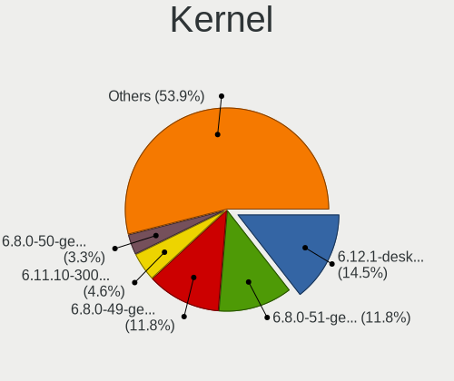
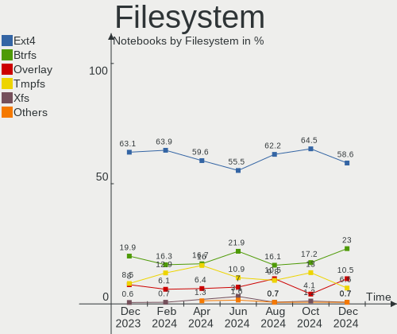
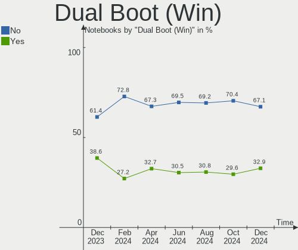
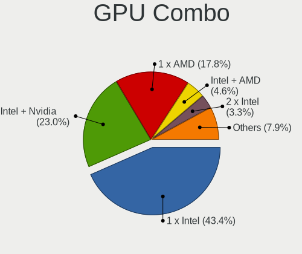
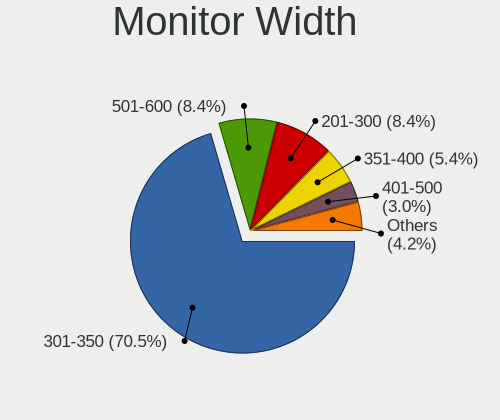
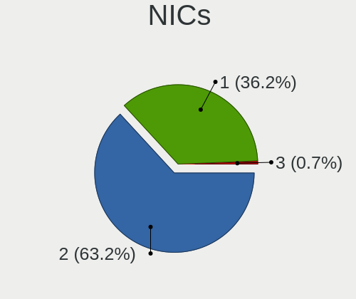
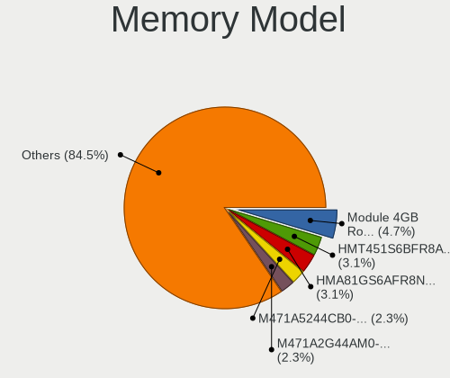
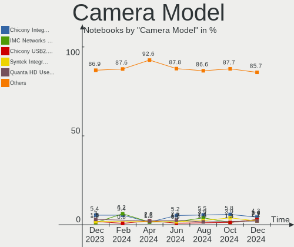

Linux in Italy - Hardware Trends (Notebooks)
--------------------------------------------

A project to identify most popular hardware characteristics and track their change
over time based on data collected by Linux users at https://Linux-Hardware.org.

Anyone can contribute to this report by the [hw-probe](https://github.com/linuxhw/hw-probe) tool:

    sudo -E hw-probe -all -upload

Period: Jan, 2024.

Contents
--------

* [ System ](#system)
  - [ OS                       ](#os)
  - [ OS Family                ](#os-family)
  - [ Kernel                   ](#kernel)
  - [ Kernel Family            ](#kernel-family)
  - [ Kernel Major Ver.        ](#kernel-major-ver)
  - [ Arch                     ](#arch)
  - [ DE                       ](#de)
  - [ Display Server           ](#display-server)
  - [ Display Manager          ](#display-manager)
  - [ OS Lang                  ](#os-lang)
  - [ Boot Mode                ](#boot-mode)
  - [ Filesystem               ](#filesystem)
  - [ Part. scheme             ](#part-scheme)
  - [ Dual Boot with Linux/BSD ](#dual-boot-with-linuxbsd)
  - [ Dual Boot (Win)          ](#dual-boot-win)

* [ Board ](#board)
  - [ Vendor                   ](#vendor)
  - [ Model                    ](#model)
  - [ Model Family             ](#model-family)
  - [ MFG Year                 ](#mfg-year)
  - [ Form Factor              ](#form-factor)
  - [ Secure Boot              ](#secure-boot)
  - [ Coreboot                 ](#coreboot)
  - [ RAM Size                 ](#ram-size)
  - [ RAM Used                 ](#ram-used)
  - [ Total Drives             ](#total-drives)
  - [ Has CD-ROM               ](#has-cd-rom)
  - [ Has Ethernet             ](#has-ethernet)
  - [ Has WiFi                 ](#has-wifi)
  - [ Has Bluetooth            ](#has-bluetooth)

* [ Location ](#location)
  - [ Country                  ](#country)
  - [ City                     ](#city)

* [ Drives ](#drives)
  - [ Drive Vendor             ](#drive-vendor)
  - [ Drive Model              ](#drive-model)
  - [ HDD Vendor               ](#hdd-vendor)
  - [ SSD Vendor               ](#ssd-vendor)
  - [ Drive Kind               ](#drive-kind)
  - [ Drive Connector          ](#drive-connector)
  - [ Drive Size               ](#drive-size)
  - [ Space Total              ](#space-total)
  - [ Space Used               ](#space-used)
  - [ Malfunc. Drives          ](#malfunc-drives)
  - [ Malfunc. Drive Vendor    ](#malfunc-drive-vendor)
  - [ Malfunc. HDD Vendor      ](#malfunc-hdd-vendor)
  - [ Malfunc. Drive Kind      ](#malfunc-drive-kind)
  - [ Failed Drives            ](#failed-drives)
  - [ Failed Drive Vendor      ](#failed-drive-vendor)
  - [ Drive Status             ](#drive-status)

* [ Storage controller ](#storage-controller)
  - [ Storage Vendor           ](#storage-vendor)
  - [ Storage Model            ](#storage-model)
  - [ Storage Kind             ](#storage-kind)

* [ Processor ](#processor)
  - [ CPU Vendor               ](#cpu-vendor)
  - [ CPU Model                ](#cpu-model)
  - [ CPU Model Family         ](#cpu-model-family)
  - [ CPU Cores                ](#cpu-cores)
  - [ CPU Sockets              ](#cpu-sockets)
  - [ CPU Threads              ](#cpu-threads)
  - [ CPU Op-Modes             ](#cpu-op-modes)
  - [ CPU Microcode            ](#cpu-microcode)
  - [ CPU Microarch            ](#cpu-microarch)

* [ Graphics ](#graphics)
  - [ GPU Vendor               ](#gpu-vendor)
  - [ GPU Model                ](#gpu-model)
  - [ GPU Combo                ](#gpu-combo)
  - [ GPU Driver               ](#gpu-driver)
  - [ GPU Memory               ](#gpu-memory)

* [ Monitor ](#monitor)
  - [ Monitor Vendor           ](#monitor-vendor)
  - [ Monitor Model            ](#monitor-model)
  - [ Monitor Resolution       ](#monitor-resolution)
  - [ Monitor Diagonal         ](#monitor-diagonal)
  - [ Monitor Width            ](#monitor-width)
  - [ Aspect Ratio             ](#aspect-ratio)
  - [ Monitor Area             ](#monitor-area)
  - [ Pixel Density            ](#pixel-density)
  - [ Multiple Monitors        ](#multiple-monitors)

* [ Network ](#network)
  - [ Net Controller Vendor    ](#net-controller-vendor)
  - [ Net Controller Model     ](#net-controller-model)
  - [ Wireless Vendor          ](#wireless-vendor)
  - [ Wireless Model           ](#wireless-model)
  - [ Ethernet Vendor          ](#ethernet-vendor)
  - [ Ethernet Model           ](#ethernet-model)
  - [ Net Controller Kind      ](#net-controller-kind)
  - [ Used Controller          ](#used-controller)
  - [ NICs                     ](#nics)
  - [ IPv6                     ](#ipv6)

* [ Bluetooth ](#bluetooth)
  - [ Bluetooth Vendor         ](#bluetooth-vendor)
  - [ Bluetooth Model          ](#bluetooth-model)

* [ Sound ](#sound)
  - [ Sound Vendor             ](#sound-vendor)
  - [ Sound Model              ](#sound-model)

* [ Memory ](#memory)
  - [ Memory Vendor            ](#memory-vendor)
  - [ Memory Model             ](#memory-model)
  - [ Memory Kind              ](#memory-kind)
  - [ Memory Form Factor       ](#memory-form-factor)
  - [ Memory Size              ](#memory-size)
  - [ Memory Speed             ](#memory-speed)

* [ Printers & scanners ](#printers--scanners)
  - [ Printer Vendor           ](#printer-vendor)
  - [ Printer Model            ](#printer-model)
  - [ Scanner Vendor           ](#scanner-vendor)
  - [ Scanner Model            ](#scanner-model)

* [ Camera ](#camera)
  - [ Camera Vendor            ](#camera-vendor)
  - [ Camera Model             ](#camera-model)

* [ Security ](#security)
  - [ Fingerprint Vendor       ](#fingerprint-vendor)
  - [ Fingerprint Model        ](#fingerprint-model)
  - [ Chipcard Vendor          ](#chipcard-vendor)
  - [ Chipcard Model           ](#chipcard-model)

* [ Unsupported ](#unsupported)
  - [ Unsupported Devices      ](#unsupported-devices)
  - [ Unsupported Device Types ](#unsupported-device-types)

System
------

OS
--

Installed operating systems

| Name                         | Notebooks | Percent |
|------------------------------|-----------|---------|
| Fedora 39                    | 19        | 12.42%  |
| Ubuntu 22.04                 | 16        | 10.46%  |
| Linux Mint 21.2              | 13        | 8.5%    |
| Debian 12                    | 13        | 8.5%    |
| Arch Rolling                 | 11        | 7.19%   |
| Zorin 17                     | 7         | 4.58%   |
| Ubuntu 23.10                 | 6         | 3.92%   |
| Pop!_OS 22.04                | 4         | 2.61%   |
| LMDE 6                       | 4         | 2.61%   |
| EndeavourOS Rolling          | 4         | 2.61%   |
| Xubuntu 23.10                | 3         | 1.96%   |
| openSUSE Tumbleweed-XXXXXXXX | 3         | 1.96%   |
| OpenMandriva 24.01           | 3         | 1.96%   |
| Kubuntu 22.04                | 3         | 1.96%   |
| Kali 2023.4                  | 3         | 1.96%   |
| Debian                       | 3         | 1.96%   |
| OpenMandriva 23.08           | 2         | 1.31%   |
| Manjaro 23.1.3               | 2         | 1.31%   |
| Linux Mint 21.3              | 2         | 1.31%   |
| Debian 11                    | 2         | 1.31%   |
| Xubuntu 22.04                | 1         | 0.65%   |
| Xero Rolling                 | 1         | 0.65%   |
| Ubuntu 23.04                 | 1         | 0.65%   |
| Ubuntu 22.10                 | 1         | 0.65%   |
| Ubuntu 18.04                 | 1         | 0.65%   |
| TUXEDO OS 22.04              | 1         | 0.65%   |
| SteamOS 3.5.13               | 1         | 0.65%   |
| RHEL 9                       | 1         | 0.65%   |
| Puppy 9                      | 1         | 0.65%   |
| org.kde.Platform 5.15-21.08  | 1         | 0.65%   |
| OpenMandriva 5.0             | 1         | 0.65%   |
| OpenMandriva 4.3             | 1         | 0.65%   |
| OpenMandriva 23.01           | 1         | 0.65%   |
| Nobara 38                    | 1         | 0.65%   |
| NixOS 23.11                  | 1         | 0.65%   |
| MX 23                        | 1         | 0.65%   |
| Manjaro 23.1.2               | 1         | 0.65%   |
| Lubuntu 23.10                | 1         | 0.65%   |
| Lubuntu 22.04                | 1         | 0.65%   |
| Linux Mint 21.1              | 1         | 0.65%   |

OS Family
---------

OS without a version

| Name             | Notebooks | Percent |
|------------------|-----------|---------|
| Ubuntu           | 25        | 16.34%  |
| Fedora           | 20        | 13.07%  |
| Linux Mint       | 19        | 12.42%  |
| Debian           | 18        | 11.76%  |
| Arch             | 11        | 7.19%   |
| OpenMandriva     | 8         | 5.23%   |
| Zorin            | 7         | 4.58%   |
| Xubuntu          | 4         | 2.61%   |
| Pop!_OS          | 4         | 2.61%   |
| LMDE             | 4         | 2.61%   |
| Kubuntu          | 4         | 2.61%   |
| EndeavourOS      | 4         | 2.61%   |
| openSUSE         | 3         | 1.96%   |
| Manjaro          | 3         | 1.96%   |
| Kali             | 3         | 1.96%   |
| Lubuntu          | 2         | 1.31%   |
| Xero             | 1         | 0.65%   |
| TUXEDO OS        | 1         | 0.65%   |
| SteamOS          | 1         | 0.65%   |
| RHEL             | 1         | 0.65%   |
| Puppy            | 1         | 0.65%   |
| org.kde.Platform | 1         | 0.65%   |
| Nobara           | 1         | 0.65%   |
| NixOS            | 1         | 0.65%   |
| MX               | 1         | 0.65%   |
| KDE neon         | 1         | 0.65%   |
| Gentoo           | 1         | 0.65%   |
| Elementary       | 1         | 0.65%   |
| ArcoLinux        | 1         | 0.65%   |
| AlmaLinux        | 1         | 0.65%   |

Kernel
------

Version of the Linux kernel

| Version                      | Notebooks | Percent |
|------------------------------|-----------|---------|
| 6.5.0-14-generic             | 22        | 14.38%  |
| 5.15.0-91-generic            | 14        | 9.15%   |
| 6.1.0-17-amd64               | 11        | 7.19%   |
| 6.2.0-39-generic             | 10        | 6.54%   |
| 6.6.2-desktop-1omv2390       | 4         | 2.61%   |
| 6.7.0-arch3-1                | 3         | 1.96%   |
| 6.6.9-200.fc39.x86_64        | 3         | 1.96%   |
| 6.6.8-200.fc39.x86_64        | 3         | 1.96%   |
| 6.6.6-76060606-generic       | 3         | 1.96%   |
| 6.6.13-200.fc39.x86_64       | 3         | 1.96%   |
| 6.6.12-200.fc39.x86_64       | 3         | 1.96%   |
| 6.6.11-200.fc39.x86_64       | 3         | 1.96%   |
| 6.5.6-300.fc39.x86_64        | 3         | 1.96%   |
| 6.5.0-kali3-amd64            | 3         | 1.96%   |
| 6.5.0-15-generic             | 3         | 1.96%   |
| 6.6.8-arch1-1                | 2         | 1.31%   |
| 6.6.11-1-default             | 2         | 1.31%   |
| 6.6.10-zen1-1-zen            | 2         | 1.31%   |
| 6.5.0-5-amd64                | 2         | 1.31%   |
| 6.4.11-desktop-1omv2390      | 2         | 1.31%   |
| 6.2.0-26-generic             | 2         | 1.31%   |
| 6.1.0-15-amd64               | 2         | 1.31%   |
| 5.15.0-92-generic            | 2         | 1.31%   |
| 5.14.0-362.13.1.el9_3.x86_64 | 2         | 1.31%   |
| 6.7.2-arch1-1                | 1         | 0.65%   |
| 6.7.1-2-default              | 1         | 0.65%   |
| 6.7.0-zen3-1-zen             | 1         | 0.65%   |
| 6.7.0-68.es83xx.fc40.x86_64  | 1         | 0.65%   |
| 6.7.0-4-cachyos              | 1         | 0.65%   |
| 6.7.0-060700-generic         | 1         | 0.65%   |
| 6.7.0-0-MANJARO              | 1         | 0.65%   |
| 6.6.9-arch1-1                | 1         | 0.65%   |
| 6.6.9-100.fc38.x86_64        | 1         | 0.65%   |
| 6.6.8-2-MANJARO              | 1         | 0.65%   |
| 6.6.8                        | 1         | 0.65%   |
| 6.6.4-arch1-1                | 1         | 0.65%   |
| 6.6.4-202.fsync.fc38.x86_64  | 1         | 0.65%   |
| 6.6.12-1-lts                 | 1         | 0.65%   |
| 6.6.12-1-liquorix-amd64      | 1         | 0.65%   |
| 6.6.11-amd64                 | 1         | 0.65%   |

Kernel Family
-------------

Linux kernel without a distro release

| Version  | Notebooks | Percent |
|----------|-----------|---------|
| 6.5.0    | 32        | 20.92%  |
| 5.15.0   | 17        | 11.11%  |
| 6.1.0    | 16        | 10.46%  |
| 6.2.0    | 13        | 8.5%    |
| 6.7.0    | 8         | 5.23%   |
| 6.6.8    | 7         | 4.58%   |
| 6.6.11   | 6         | 3.92%   |
| 6.6.9    | 5         | 3.27%   |
| 6.6.12   | 5         | 3.27%   |
| 6.6.2    | 4         | 2.61%   |
| 6.6.6    | 3         | 1.96%   |
| 6.6.13   | 3         | 1.96%   |
| 6.6.10   | 3         | 1.96%   |
| 6.5.6    | 3         | 1.96%   |
| 5.4.0    | 3         | 1.96%   |
| 6.6.4    | 2         | 1.31%   |
| 6.4.11   | 2         | 1.31%   |
| 5.19.0   | 2         | 1.31%   |
| 5.14.0   | 2         | 1.31%   |
| 5.10.0   | 2         | 1.31%   |
| 6.7.2    | 1         | 0.65%   |
| 6.7.1    | 1         | 0.65%   |
| 6.6.1    | 1         | 0.65%   |
| 6.2.6    | 1         | 0.65%   |
| 6.1.71   | 1         | 0.65%   |
| 6.1.70   | 1         | 0.65%   |
| 6.1.69   | 1         | 0.65%   |
| 6.1.67   | 1         | 0.65%   |
| 6.1.52   | 1         | 0.65%   |
| 6.1.42   | 1         | 0.65%   |
| 6.1.1    | 1         | 0.65%   |
| 5.4.53   | 1         | 0.65%   |
| 5.16.13  | 1         | 0.65%   |
| 5.15.146 | 1         | 0.65%   |
| 4.15.0   | 1         | 0.65%   |

Kernel Major Ver.
-----------------

Linux kernel major version

| Version | Notebooks | Percent |
|---------|-----------|---------|
| 6.6     | 39        | 25.49%  |
| 6.5     | 35        | 22.88%  |
| 6.1     | 23        | 15.03%  |
| 5.15    | 18        | 11.76%  |
| 6.2     | 14        | 9.15%   |
| 6.7     | 10        | 6.54%   |
| 5.4     | 4         | 2.61%   |
| 6.4     | 2         | 1.31%   |
| 5.19    | 2         | 1.31%   |
| 5.14    | 2         | 1.31%   |
| 5.10    | 2         | 1.31%   |
| 5.16    | 1         | 0.65%   |
| 4.15    | 1         | 0.65%   |

Arch
----

OS architecture (x86_64, i586, etc.)

| Name   | Notebooks | Percent |
|--------|-----------|---------|
| x86_64 | 152       | 99.35%  |
| i686   | 1         | 0.65%   |

DE
--

Desktop Environment

| Name       | Notebooks | Percent |
|------------|-----------|---------|
| GNOME      | 67        | 43.79%  |
| KDE5       | 34        | 22.22%  |
| XFCE       | 21        | 13.73%  |
| X-Cinnamon | 20        | 13.07%  |
| LXQt       | 4         | 2.61%   |
| sway       | 2         | 1.31%   |
| Pantheon   | 1         | 0.65%   |
| MATE       | 1         | 0.65%   |
| icewm      | 1         | 0.65%   |
| Budgie     | 1         | 0.65%   |
| Unknown    | 1         | 0.65%   |

Display Server
--------------

X11 or Wayland

| Name    | Notebooks | Percent |
|---------|-----------|---------|
| X11     | 86        | 56.21%  |
| Wayland | 63        | 41.18%  |
| Tty     | 3         | 1.96%   |
| Unknown | 1         | 0.65%   |

Display Manager
---------------

SDDM, LightDM, etc.

| Name    | Notebooks | Percent |
|---------|-----------|---------|
| Unknown | 38        | 24.84%  |
| LightDM | 35        | 22.88%  |
| GDM3    | 32        | 20.92%  |
| SDDM    | 31        | 20.26%  |
| GDM     | 17        | 11.11%  |

OS Lang
-------

Language

| Lang    | Notebooks | Percent |
|---------|-----------|---------|
| it_IT   | 107       | 69.93%  |
| en_US   | 36        | 23.53%  |
| C       | 8         | 5.23%   |
| en_GB   | 1         | 0.65%   |
| Unknown | 1         | 0.65%   |

Boot Mode
---------

EFI or BIOS

| Mode | Notebooks | Percent |
|------|-----------|---------|
| EFI  | 89        | 58.17%  |
| BIOS | 64        | 41.83%  |

Filesystem
----------

Type of filesystem

| Type    | Notebooks | Percent |
|---------|-----------|---------|
| Ext4    | 91        | 59.48%  |
| Btrfs   | 32        | 20.92%  |
| Tmpfs   | 19        | 12.42%  |
| Overlay | 8         | 5.23%   |
| Xfs     | 2         | 1.31%   |
| Aufs    | 1         | 0.65%   |

Part. scheme
------------

Scheme of partitioning

| Type    | Notebooks | Percent |
|---------|-----------|---------|
| GPT     | 100       | 65.36%  |
| Unknown | 36        | 23.53%  |
| MBR     | 17        | 11.11%  |

Dual Boot with Linux/BSD
------------------------

Hosting more than one Linux/BSD

| Dual boot | Notebooks | Percent |
|-----------|-----------|---------|
| No        | 129       | 84.31%  |
| Yes       | 24        | 15.69%  |

Dual Boot (Win)
---------------

Hosting Linux and Windows

| Dual boot | Notebooks | Percent |
|-----------|-----------|---------|
| No        | 109       | 71.24%  |
| Yes       | 44        | 28.76%  |

Board
-----

Vendor
------

Motherboard manufacturer

| Name                | Notebooks | Percent |
|---------------------|-----------|---------|
| Lenovo              | 35        | 22.88%  |
| Hewlett-Packard     | 28        | 18.3%   |
| ASUSTek Computer    | 22        | 14.38%  |
| Acer                | 17        | 11.11%  |
| Dell                | 15        | 9.8%    |
| HUAWEI              | 6         | 3.92%   |
| Sony                | 5         | 3.27%   |
| Apple               | 4         | 2.61%   |
| MSI                 | 3         | 1.96%   |
| Mediacom            | 3         | 1.96%   |
| Valve               | 1         | 0.65%   |
| TUXEDO              | 1         | 0.65%   |
| Toshiba             | 1         | 0.65%   |
| SLIMBOOK            | 1         | 0.65%   |
| Samsung Electronics | 1         | 0.65%   |
| PC Specialist       | 1         | 0.65%   |
| Packard Bell        | 1         | 0.65%   |
| Onda TLC            | 1         | 0.65%   |
| Olidata             | 1         | 0.65%   |
| Medion              | 1         | 0.65%   |
| Google              | 1         | 0.65%   |
| Fujitsu Siemens     | 1         | 0.65%   |
| AZW                 | 1         | 0.65%   |
| Alienware           | 1         | 0.65%   |
| Unknown             | 1         | 0.65%   |

Model
-----

Motherboard model

| Name                                        | Notebooks | Percent |
|---------------------------------------------|-----------|---------|
| HP Pavilion 15                              | 4         | 2.61%   |
| Acer Swift SF314-43                         | 3         | 1.96%   |
| Lenovo V15-ADA 82C7                         | 2         | 1.31%   |
| Valve Jupiter                               | 1         | 0.65%   |
| TUXEDO Pulse 14 Gen3                        | 1         | 0.65%   |
| Toshiba Satellite A350                      | 1         | 0.65%   |
| Sony VGN-NW11S_S                            | 1         | 0.65%   |
| Sony VGN-FW11E                              | 1         | 0.65%   |
| Sony VGN-AR51SU                             | 1         | 0.65%   |
| Sony SVF1521G6EW                            | 1         | 0.65%   |
| Sony SVE1713X1EB                            | 1         | 0.65%   |
| SLIMBOOK PROX15-AMD                         | 1         | 0.65%   |
| Samsung RC530/RC730                         | 1         | 0.65%   |
| PC Specialist NH5x_7xDPx                    | 1         | 0.65%   |
| Packard Bell EasyNote MH45                  | 1         | 0.65%   |
| Onda TLC ONDA Oliver 15                     | 1         | 0.65%   |
| Olidata SL1510 MD61444                      | 1         | 0.65%   |
| MSI Summit E16Flip A12UCT                   | 1         | 0.65%   |
| MSI Prestige 15 A11SCS                      | 1         | 0.65%   |
| MSI Prestige 14Evo B13M                     | 1         | 0.65%   |
| Medion E15413                               | 1         | 0.65%   |
| Mediacom WinPad 11,6 FullHD- WPU11          | 1         | 0.65%   |
| Mediacom SMARTBOOK ONE                      | 1         | 0.65%   |
| Mediacom SmartBook 14 FullHD - SB14UC       | 1         | 0.65%   |
| Lenovo Z70-80 80FG                          | 1         | 0.65%   |
| Lenovo Yoga 900-13ISK 80MK                  | 1         | 0.65%   |
| Lenovo V130-15IKB 81HN                      | 1         | 0.65%   |
| Lenovo ThinkPad X270 W10DG 20K5S3HG00       | 1         | 0.65%   |
| Lenovo ThinkPad X260 20F5S8FQ00             | 1         | 0.65%   |
| Lenovo ThinkPad X250 20CM004XIX             | 1         | 0.65%   |
| Lenovo ThinkPad X1 Carbon Gen 11 21HMS1V900 | 1         | 0.65%   |
| Lenovo ThinkPad X1 Carbon 34601C8           | 1         | 0.65%   |
| Lenovo ThinkPad W550s 20E2000PMN            | 1         | 0.65%   |
| Lenovo ThinkPad T495 20NJ000XIX             | 1         | 0.65%   |
| Lenovo ThinkPad T490 20N3S5GP12             | 1         | 0.65%   |
| Lenovo ThinkPad T470s 20HGS3AX02            | 1         | 0.65%   |
| Lenovo ThinkPad T470 W10DG 20JNS0KE08       | 1         | 0.65%   |
| Lenovo ThinkPad T470 W10DG 20JNS02S00       | 1         | 0.65%   |
| Lenovo ThinkPad T470 20JNS08H00             | 1         | 0.65%   |
| Lenovo ThinkPad T430s 2356LPG               | 1         | 0.65%   |

Model Family
------------

Motherboard model prefix

| Name                  | Notebooks | Percent |
|-----------------------|-----------|---------|
| Lenovo ThinkPad       | 18        | 11.76%  |
| Acer Aspire           | 9         | 5.88%   |
| HP Pavilion           | 8         | 5.23%   |
| Lenovo IdeaPad        | 6         | 3.92%   |
| ASUS VivoBook         | 6         | 3.92%   |
| HP EliteBook          | 5         | 3.27%   |
| Dell Latitude         | 5         | 3.27%   |
| Dell Inspiron         | 4         | 2.61%   |
| Acer TravelMate       | 4         | 2.61%   |
| HP ProBook            | 3         | 1.96%   |
| Dell XPS              | 3         | 1.96%   |
| Acer Swift            | 3         | 1.96%   |
| MSI Prestige          | 2         | 1.31%   |
| Mediacom SmartBook    | 2         | 1.31%   |
| Lenovo V15-ADA        | 2         | 1.31%   |
| Lenovo Legion         | 2         | 1.31%   |
| HP Laptop             | 2         | 1.31%   |
| HP ENVY               | 2         | 1.31%   |
| Dell Precision        | 2         | 1.31%   |
| Valve Jupiter         | 1         | 0.65%   |
| TUXEDO Pulse          | 1         | 0.65%   |
| Toshiba Satellite     | 1         | 0.65%   |
| Sony VGN-NW11S        | 1         | 0.65%   |
| Sony VGN-FW11E        | 1         | 0.65%   |
| Sony VGN-AR51SU       | 1         | 0.65%   |
| Sony SVF1521G6EW      | 1         | 0.65%   |
| Sony SVE1713X1EB      | 1         | 0.65%   |
| SLIMBOOK PROX15-AMD   | 1         | 0.65%   |
| Samsung RC530         | 1         | 0.65%   |
| PC Specialist NH5x    | 1         | 0.65%   |
| Packard Bell EasyNote | 1         | 0.65%   |
| Onda TLC ONDA         | 1         | 0.65%   |
| Olidata SL1510        | 1         | 0.65%   |
| MSI Summit            | 1         | 0.65%   |
| Medion E15413         | 1         | 0.65%   |
| Mediacom WinPad       | 1         | 0.65%   |
| Lenovo Z70-80         | 1         | 0.65%   |
| Lenovo Yoga           | 1         | 0.65%   |
| Lenovo V130-15IKB     | 1         | 0.65%   |
| Lenovo G580           | 1         | 0.65%   |

MFG Year
--------

Motherboard manufacture year

| Year | Notebooks | Percent |
|------|-----------|---------|
| 2022 | 16        | 10.46%  |
| 2020 | 16        | 10.46%  |
| 2021 | 15        | 9.8%    |
| 2023 | 14        | 9.15%   |
| 2019 | 12        | 7.84%   |
| 2017 | 11        | 7.19%   |
| 2013 | 11        | 7.19%   |
| 2012 | 11        | 7.19%   |
| 2016 | 9         | 5.88%   |
| 2015 | 8         | 5.23%   |
| 2008 | 7         | 4.58%   |
| 2011 | 6         | 3.92%   |
| 2018 | 4         | 2.61%   |
| 2014 | 3         | 1.96%   |
| 2010 | 3         | 1.96%   |
| 2009 | 3         | 1.96%   |
| 2007 | 3         | 1.96%   |
| 2006 | 1         | 0.65%   |

Form Factor
-----------

Physical design of the computer

| Name     | Notebooks | Percent |
|----------|-----------|---------|
| Notebook | 153       | 100%    |

Secure Boot
-----------

Enabled or disabled

| State    | Notebooks | Percent |
|----------|-----------|---------|
| Disabled | 138       | 90.2%   |
| Enabled  | 15        | 9.8%    |

Coreboot
--------

Have coreboot on board

| Used | Notebooks | Percent |
|------|-----------|---------|
| No   | 152       | 99.35%  |
| Yes  | 1         | 0.65%   |

RAM Size
--------

Total RAM memory

| Size in GB  | Notebooks | Percent |
|-------------|-----------|---------|
| 4.01-8.0    | 44        | 28.76%  |
| 16.01-24.0  | 38        | 24.84%  |
| 8.01-16.0   | 26        | 16.99%  |
| 3.01-4.0    | 22        | 14.38%  |
| 32.01-64.0  | 11        | 7.19%   |
| 24.01-32.0  | 5         | 3.27%   |
| 2.01-3.0    | 3         | 1.96%   |
| 1.01-2.0    | 3         | 1.96%   |
| 64.01-256.0 | 1         | 0.65%   |

RAM Used
--------

Used RAM memory

| Used GB   | Notebooks | Percent |
|-----------|-----------|---------|
| 2.01-3.0  | 40        | 26.14%  |
| 1.01-2.0  | 38        | 24.84%  |
| 4.01-8.0  | 35        | 22.88%  |
| 3.01-4.0  | 32        | 20.92%  |
| 0.51-1.0  | 6         | 3.92%   |
| 8.01-16.0 | 2         | 1.31%   |

Total Drives
------------

Number of drives on board

| Drives | Notebooks | Percent |
|--------|-----------|---------|
| 1      | 119       | 77.78%  |
| 2      | 29        | 18.95%  |
| 3      | 3         | 1.96%   |
| 4      | 1         | 0.65%   |
| 0      | 1         | 0.65%   |

Has CD-ROM
----------

Has CD-ROM on board

| Presented | Notebooks | Percent |
|-----------|-----------|---------|
| No        | 106       | 69.28%  |
| Yes       | 47        | 30.72%  |

Has Ethernet
------------

Has Ethernet on board

| Presented | Notebooks | Percent |
|-----------|-----------|---------|
| Yes       | 105       | 68.63%  |
| No        | 48        | 31.37%  |

Has WiFi
--------

Has WiFi module

| Presented | Notebooks | Percent |
|-----------|-----------|---------|
| Yes       | 152       | 99.35%  |
| No        | 1         | 0.65%   |

Has Bluetooth
-------------

Has Bluetooth module

| Presented | Notebooks | Percent |
|-----------|-----------|---------|
| Yes       | 130       | 84.97%  |
| No        | 23        | 15.03%  |

Location
--------

Country
-------

Geographic location (country)

| Country | Notebooks | Percent |
|---------|-----------|---------|
| Italy   | 153       | 100%    |

City
----

Geographic location (city)

| City                     | Notebooks | Percent |
|--------------------------|-----------|---------|
| Milan                    | 18        | 11.76%  |
| Rome                     | 15        | 9.8%    |
| Milano                   | 8         | 5.23%   |
| Florence                 | 5         | 3.27%   |
| Bologna                  | 5         | 3.27%   |
| Turin                    | 4         | 2.61%   |
| Bari                     | 4         | 2.61%   |
| Genoa                    | 3         | 1.96%   |
| Venice                   | 2         | 1.31%   |
| Trieste                  | 2         | 1.31%   |
| Terni                    | 2         | 1.31%   |
| San Vittore Olona        | 2         | 1.31%   |
| Rimini                   | 2         | 1.31%   |
| Reggio Emilia            | 2         | 1.31%   |
| Portici                  | 2         | 1.31%   |
| Naples                   | 2         | 1.31%   |
| Zogno                    | 1         | 0.65%   |
| Zagarolo                 | 1         | 0.65%   |
| Verona                   | 1         | 0.65%   |
| Valbrembo                | 1         | 0.65%   |
| Val della Torre          | 1         | 0.65%   |
| Udine                    | 1         | 0.65%   |
| Torre del Greco          | 1         | 0.65%   |
| Suno                     | 1         | 0.65%   |
| Spresiano                | 1         | 0.65%   |
| Spino d'Adda             | 1         | 0.65%   |
| Spinetoli                | 1         | 0.65%   |
| Soave                    | 1         | 0.65%   |
| Sesto Fiorentino         | 1         | 0.65%   |
| Senago                   | 1         | 0.65%   |
| Savona                   | 1         | 0.65%   |
| Sassari                  | 1         | 0.65%   |
| Santa Marinella          | 1         | 0.65%   |
| Sanremo                  | 1         | 0.65%   |
| San Giorgio a Cremano    | 1         | 0.65%   |
| San Benedetto del Tronto | 1         | 0.65%   |
| Rocca Priora             | 1         | 0.65%   |
| Ravina                   | 1         | 0.65%   |
| Ravenna                  | 1         | 0.65%   |
| Pistoia                  | 1         | 0.65%   |

Drives
------

Drive Vendor
------------

Hard drive vendors

| Vendor                      | Notebooks | Drives | Percent |
|-----------------------------|-----------|--------|---------|
| Samsung Electronics         | 43        | 46     | 23.76%  |
| SanDisk                     | 16        | 17     | 8.84%   |
| Kingston                    | 11        | 11     | 6.08%   |
| Unknown                     | 10        | 11     | 5.52%   |
| Seagate                     | 10        | 10     | 5.52%   |
| Intel                       | 10        | 11     | 5.52%   |
| WDC                         | 9         | 9      | 4.97%   |
| SK hynix                    | 9         | 12     | 4.97%   |
| Micron Technology           | 8         | 8      | 4.42%   |
| Phison Electronics          | 7         | 7      | 3.87%   |
| Crucial                     | 7         | 7      | 3.87%   |
| Toshiba                     | 5         | 5      | 2.76%   |
| HGST                        | 5         | 5      | 2.76%   |
| Lexar                       | 3         | 3      | 1.66%   |
| Unknown                     | 3         | 3      | 1.66%   |
| KIOXIA                      | 2         | 2      | 1.1%    |
| Kingston Technology Company | 2         | 2      | 1.1%    |
| Fanxiang                    | 2         | 2      | 1.1%    |
| China                       | 2         | 2      | 1.1%    |
| Union Memory                | 1         | 1      | 0.55%   |
| Transcend                   | 1         | 1      | 0.55%   |
| Teclast                     | 1         | 1      | 0.55%   |
| SSSTC                       | 1         | 1      | 0.55%   |
| SPCC                        | 1         | 1      | 0.55%   |
| Silicon Motion              | 1         | 1      | 0.55%   |
| Patriot                     | 1         | 1      | 0.55%   |
| MAXIO Technology (Hangzhou) | 1         | 1      | 0.55%   |
| LITEON                      | 1         | 1      | 0.55%   |
| Leven                       | 1         | 1      | 0.55%   |
| KingSpec                    | 1         | 1      | 0.55%   |
| Hitachi                     | 1         | 1      | 0.55%   |
| GOODRAM                     | 1         | 1      | 0.55%   |
| Fujitsu                     | 1         | 1      | 0.55%   |
| Corsair                     | 1         | 1      | 0.55%   |
| BAITITON                    | 1         | 1      | 0.55%   |
| Apple                       | 1         | 1      | 0.55%   |

Drive Model
-----------

Hard drive models

| Model                                              | Notebooks | Percent |
|----------------------------------------------------|-----------|---------|
| Samsung NVMe SSD Controller PM9A1/PM9A3/980PRO 2TB | 6         | 3.21%   |
| Kingston SA400S37240G 240GB SSD                    | 5         | 2.67%   |
| Sandisk WD Blue SN550 NVMe SSD 512GB               | 4         | 2.14%   |
| Samsung SSD 850 EVO 250GB                          | 4         | 2.14%   |
| Intel SSD 660P Series 1024GB                       | 4         | 2.14%   |
| Seagate ST1000LM035-1RK172 1TB                     | 3         | 1.6%    |
| Phison PS5013 E13 NVMe Controller 256GB            | 3         | 1.6%    |
| Unknown                                            | 3         | 1.6%    |
| Unknown NCard  32GB                                | 2         | 1.07%   |
| Toshiba XG6 NVMe SSD Controller 256GB              | 2         | 1.07%   |
| Toshiba MQ01ABD100 1TB                             | 2         | 1.07%   |
| SK hynix BC711 HFM512GD3JX013N 512GB               | 2         | 1.07%   |
| Samsung SSD 860 QVO 1TB                            | 2         | 1.07%   |
| Samsung SSD 860 EVO 1TB                            | 2         | 1.07%   |
| Samsung NVMe SSD Controller SM981/PM981/PM983 1TB  | 2         | 1.07%   |
| Samsung MZVL21T0HCLR-00BL2 1TB                     | 2         | 1.07%   |
| Phison E12 NVMe Controller 1TB                     | 2         | 1.07%   |
| Micron 1100_MTFDDAV512TBN 512GB SSD                | 2         | 1.07%   |
| Kingston SA400S37480G 480GB SSD                    | 2         | 1.07%   |
| Kingston OM8SEP4512Q-AA 512GB                      | 2         | 1.07%   |
| Intel SSDPEKNU512GZ 512GB                          | 2         | 1.07%   |
| HGST HTS721010A9E630 1TB                           | 2         | 1.07%   |
| Crucial CT240BX300SSD1 240GB                       | 2         | 1.07%   |
| WDC WDS120G2G0A-00JH30 120GB SSD                   | 1         | 0.53%   |
| WDC WD5000LPVX-80V0TT0 500GB                       | 1         | 0.53%   |
| WDC WD5000LPCX-24C6HT0 500GB                       | 1         | 0.53%   |
| WDC WD3200BPVT-80ZEST0 320GB                       | 1         | 0.53%   |
| WDC WD3200BEVT-22ZCT0 320GB                        | 1         | 0.53%   |
| WDC WD1600BEVT-22ZCT0 160GB                        | 1         | 0.53%   |
| WDC WD10JPVX-22JC3T0 1TB                           | 1         | 0.53%   |
| WDC WD10JPCX-24UE4T0 1TB                           | 1         | 0.53%   |
| WDC PC SN520 SDAPMUW-512G-1101 512GB               | 1         | 0.53%   |
| Unknown SD/MMC/MS PRO 256GB                        | 1         | 0.53%   |
| Unknown NVMe SSD Drive 1024GB                      | 1         | 0.53%   |
| Unknown MMC Card  64GB                             | 1         | 0.53%   |
| Unknown MMC Card  256GB                            | 1         | 0.53%   |
| Unknown MMC Card  1GB                              | 1         | 0.53%   |
| Unknown MMC Card  16GB                             | 1         | 0.53%   |
| Unknown MMC Card  128GB                            | 1         | 0.53%   |
| Unknown LX128  128GB                               | 1         | 0.53%   |

HDD Vendor
----------

Hard disk drive vendors

| Vendor              | Notebooks | Drives | Percent |
|---------------------|-----------|--------|---------|
| Seagate             | 8         | 8      | 28.57%  |
| WDC                 | 7         | 7      | 25%     |
| HGST                | 5         | 5      | 17.86%  |
| Toshiba             | 3         | 3      | 10.71%  |
| Unknown             | 1         | 1      | 3.57%   |
| Samsung Electronics | 1         | 1      | 3.57%   |
| Hitachi             | 1         | 1      | 3.57%   |
| Fujitsu             | 1         | 1      | 3.57%   |
| Unknown             | 1         | 1      | 3.57%   |

SSD Vendor
----------

Solid state drive vendors

| Vendor              | Notebooks | Drives | Percent |
|---------------------|-----------|--------|---------|
| Samsung Electronics | 18        | 19     | 28.13%  |
| Kingston            | 9         | 9      | 14.06%  |
| SanDisk             | 6         | 6      | 9.38%   |
| Crucial             | 5         | 5      | 7.81%   |
| Intel               | 3         | 3      | 4.69%   |
| SK hynix            | 2         | 2      | 3.13%   |
| Micron Technology   | 2         | 2      | 3.13%   |
| Lexar               | 2         | 2      | 3.13%   |
| China               | 2         | 2      | 3.13%   |
| WDC                 | 1         | 1      | 1.56%   |
| Transcend           | 1         | 1      | 1.56%   |
| Teclast             | 1         | 1      | 1.56%   |
| SSSTC               | 1         | 1      | 1.56%   |
| SPCC                | 1         | 1      | 1.56%   |
| Patriot             | 1         | 1      | 1.56%   |
| LITEON              | 1         | 1      | 1.56%   |
| Leven               | 1         | 1      | 1.56%   |
| KingSpec            | 1         | 1      | 1.56%   |
| GOODRAM             | 1         | 1      | 1.56%   |
| Fanxiang            | 1         | 1      | 1.56%   |
| Corsair             | 1         | 1      | 1.56%   |
| BAITITON            | 1         | 1      | 1.56%   |
| Apple               | 1         | 1      | 1.56%   |
| Unknown             | 1         | 1      | 1.56%   |

Drive Kind
----------

HDD or SSD

| Kind    | Notebooks | Drives | Percent |
|---------|-----------|--------|---------|
| NVMe    | 75        | 84     | 42.86%  |
| SSD     | 60        | 65     | 34.29%  |
| HDD     | 28        | 28     | 16%     |
| MMC     | 9         | 10     | 5.14%   |
| Unknown | 3         | 3      | 1.71%   |

Drive Connector
---------------

SATA, SAS, NVMe, etc.

| Type | Notebooks | Drives | Percent |
|------|-----------|--------|---------|
| SATA | 78        | 88     | 45.88%  |
| NVMe | 75        | 84     | 44.12%  |
| MMC  | 9         | 10     | 5.29%   |
| SAS  | 8         | 8      | 4.71%   |

Drive Size
----------

Size of hard drive

| Size in TB | Notebooks | Drives | Percent |
|------------|-----------|--------|---------|
| 0.01-0.5   | 57        | 64     | 67.06%  |
| 0.51-1.0   | 24        | 25     | 28.24%  |
| 1.01-2.0   | 4         | 4      | 4.71%   |

Space Total
-----------

Amount of disk space available on the file system

| Size in GB     | Notebooks | Percent |
|----------------|-----------|---------|
| 101-250        | 39        | 25.49%  |
| 251-500        | 37        | 24.18%  |
| 501-1000       | 18        | 11.76%  |
| 1001-2000      | 13        | 8.5%    |
| 1-20           | 13        | 8.5%    |
| 51-100         | 9         | 5.88%   |
| More than 3000 | 8         | 5.23%   |
| 21-50          | 6         | 3.92%   |
| Unknown        | 6         | 3.92%   |
| 2001-3000      | 4         | 2.61%   |

Space Used
----------

Amount of used disk space

| Used GB        | Notebooks | Percent |
|----------------|-----------|---------|
| 1-20           | 47        | 30.72%  |
| 101-250        | 29        | 18.95%  |
| 21-50          | 26        | 16.99%  |
| 51-100         | 22        | 14.38%  |
| 251-500        | 9         | 5.88%   |
| 1001-2000      | 7         | 4.58%   |
| Unknown        | 6         | 3.92%   |
| 501-1000       | 4         | 2.61%   |
| 2001-3000      | 2         | 1.31%   |
| More than 3000 | 1         | 0.65%   |

Malfunc. Drives
---------------

Drive models with a malfunction

| Model                                | Notebooks | Drives | Percent |
|--------------------------------------|-----------|--------|---------|
| WDC WDS120G2G0A-00JH30 120GB SSD     | 1         | 1      | 10%     |
| WDC WD3200BEVT-22ZCT0 320GB          | 1         | 1      | 10%     |
| WDC WD1600BEVT-22ZCT0 160GB          | 1         | 1      | 10%     |
| SK hynix BC711 HFM512GD3JX013N 512GB | 1         | 1      | 10%     |
| Seagate ST500LT012-9WS142 500GB      | 1         | 1      | 10%     |
| Seagate ST500LM012 HN-M500MBB 500GB  | 1         | 1      | 10%     |
| Intel SSDSC2BF180A4L 180GB           | 1         | 1      | 10%     |
| HGST HTS545050A7E680 500GB           | 1         | 1      | 10%     |
| HGST HTS541010A9E680 1TB             | 1         | 1      | 10%     |
| Fujitsu MHW2160BJ G2 160GB           | 1         | 1      | 10%     |

Malfunc. Drive Vendor
---------------------

Vendors of faulty drives

| Vendor   | Notebooks | Drives | Percent |
|----------|-----------|--------|---------|
| WDC      | 3         | 3      | 30%     |
| Seagate  | 2         | 2      | 20%     |
| HGST     | 2         | 2      | 20%     |
| SK hynix | 1         | 1      | 10%     |
| Intel    | 1         | 1      | 10%     |
| Fujitsu  | 1         | 1      | 10%     |

Malfunc. HDD Vendor
-------------------

Vendors of faulty HDD drives

| Vendor  | Notebooks | Drives | Percent |
|---------|-----------|--------|---------|
| WDC     | 2         | 2      | 28.57%  |
| Seagate | 2         | 2      | 28.57%  |
| HGST    | 2         | 2      | 28.57%  |
| Fujitsu | 1         | 1      | 14.29%  |

Malfunc. Drive Kind
-------------------

Kinds of faulty drives

| Kind | Notebooks | Drives | Percent |
|------|-----------|--------|---------|
| HDD  | 7         | 7      | 70%     |
| SSD  | 2         | 2      | 20%     |
| NVMe | 1         | 1      | 10%     |

Failed Drives
-------------

Failed drive models

Zero info for selected period =(

Failed Drive Vendor
-------------------

Failed drive vendors

Zero info for selected period =(

Drive Status
------------

Number of failed and malfunc. drives

| Status   | Notebooks | Drives | Percent |
|----------|-----------|--------|---------|
| Works    | 84        | 101    | 52.5%   |
| Detected | 66        | 79     | 41.25%  |
| Malfunc  | 10        | 10     | 6.25%   |

Storage controller
------------------

Storage Vendor
--------------

Storage controller vendors

| Vendor                       | Notebooks | Percent |
|------------------------------|-----------|---------|
| Intel                        | 98        | 52.41%  |
| Samsung Electronics          | 26        | 13.9%   |
| AMD                          | 16        | 8.56%   |
| SanDisk                      | 11        | 5.88%   |
| SK hynix                     | 7         | 3.74%   |
| Phison Electronics           | 7         | 3.74%   |
| Micron Technology            | 6         | 3.21%   |
| Kingston Technology Company  | 4         | 2.14%   |
| Toshiba America Info Systems | 2         | 1.07%   |
| Micron/Crucial Technology    | 2         | 1.07%   |
| MAXIO Technology (Hangzhou)  | 2         | 1.07%   |
| KIOXIA                       | 2         | 1.07%   |
| Union Memory (Shenzhen)      | 1         | 0.53%   |
| Solidigm                     | 1         | 0.53%   |
| Silicon Motion               | 1         | 0.53%   |
| ASMedia Technology           | 1         | 0.53%   |

Storage Model
-------------

Storage controller models

| Model                                                                        | Notebooks | Percent |
|------------------------------------------------------------------------------|-----------|---------|
| Intel Sunrise Point-LP SATA Controller [AHCI mode]                           | 15        | 7.28%   |
| AMD FCH SATA Controller [AHCI mode]                                          | 15        | 7.28%   |
| Intel Volume Management Device NVMe RAID Controller                          | 14        | 6.8%    |
| Intel 7 Series Chipset Family 6-port SATA Controller [AHCI mode]             | 12        | 5.83%   |
| Samsung NVMe SSD Controller PM9A1/PM9A3/980PRO                               | 11        | 5.34%   |
| Intel 82801 Mobile SATA Controller [RAID mode]                               | 11        | 5.34%   |
| Intel 82801IBM/IEM (ICH9M/ICH9M-E) 4 port SATA Controller [AHCI mode]        | 8         | 3.88%   |
| Samsung NVMe SSD Controller 980 (DRAM-less)                                  | 7         | 3.4%    |
| Intel SSD 660P Series                                                        | 5         | 2.43%   |
| Intel 8 Series SATA Controller 1 [AHCI mode]                                 | 5         | 2.43%   |
| Intel 6 Series/C200 Series Chipset Family 6 port Mobile SATA AHCI Controller | 5         | 2.43%   |
| SanDisk Ultra 3D / WD Blue SN550 NVMe SSD                                    | 4         | 1.94%   |
| Samsung NVMe SSD Controller SM981/PM981/PM983                                | 4         | 1.94%   |
| Intel Wildcat Point-LP SATA Controller [AHCI Mode]                           | 4         | 1.94%   |
| Intel Volume Management Device NVMe RAID Controller Intel Corporation        | 4         | 1.94%   |
| Intel Tiger Lake-LP SATA Controller                                          | 4         | 1.94%   |
| Phison PS5013-E13 PCIe3 NVMe Controller (DRAM-less)                          | 3         | 1.46%   |
| Intel Celeron/Pentium Silver Processor SATA Controller                       | 3         | 1.46%   |
| Intel Celeron N3350/Pentium N4200/Atom E3900 Series SATA AHCI Controller     | 3         | 1.46%   |
| Intel 82801HM/HEM (ICH8M/ICH8M-E) IDE Controller                             | 3         | 1.46%   |
| Toshiba America Info Systems XG6 NVMe SSD Controller                         | 2         | 0.97%   |
| SK hynix Gold P31/BC711/PC711 NVMe Solid State Drive                         | 2         | 0.97%   |
| SK hynix BC901 NVMe Solid State Drive (DRAM-less)                            | 2         | 0.97%   |
| SK hynix BC511 NVMe SSD                                                      | 2         | 0.97%   |
| Sandisk WD PC SN740 NVMe SSD 512GB (DRAM-less)                               | 2         | 0.97%   |
| SanDisk PC SN520 x2 M.2 2242 NVMe SSD                                        | 2         | 0.97%   |
| Samsung NVMe SSD Controller SM961/PM961/SM963                                | 2         | 0.97%   |
| Phison E12 NVMe Controller                                                   | 2         | 0.97%   |
| Micron 3400 NVMe SSD [Hendrix]                                               | 2         | 0.97%   |
| KIOXIA NVMe SSD Controller BG5 (DRAM-less)                                   | 2         | 0.97%   |
| Kingston Company OM8SEP4 Design-In PCIe 4 NVMe SSD (TLC) (DRAM-less)         | 2         | 0.97%   |
| Intel SSD 670p Series [Keystone Harbor]                                      | 2         | 0.97%   |
| Intel Cannon Point-LP SATA Controller [AHCI Mode]                            | 2         | 0.97%   |
| Intel 82801HM/HEM (ICH8M/ICH8M-E) SATA Controller [AHCI mode]                | 2         | 0.97%   |
| Union Memory (Shenzhen) AM620 PCIe 3.0 NVMe SSD 128GB                        | 1         | 0.49%   |
| Solidigm P41 Plus NVMe SSD (DRAM-less) [Echo Harbor]                         | 1         | 0.49%   |
| SK hynix PC611 NVMe Solid State Drive                                        | 1         | 0.49%   |
| Silicon Motion SM2262/SM2262EN SSD Controller                                | 1         | 0.49%   |
| SanDisk WD Blue SN500 / PC SN520 x2 M.2 2280 NVMe SSD                        | 1         | 0.49%   |
| SanDisk IX SN530 NVMe SSD (DRAM-less)                                        | 1         | 0.49%   |

Storage Kind
------------

Kind of storage controller (IDE, SATA, NVMe, SAS, ...)

| Kind | Notebooks | Percent |
|------|-----------|---------|
| SATA | 87        | 43.72%  |
| NVMe | 75        | 37.69%  |
| RAID | 29        | 14.57%  |
| IDE  | 8         | 4.02%   |

Processor
---------

CPU Vendor
----------

Processor vendors

| Vendor | Notebooks | Percent |
|--------|-----------|---------|
| Intel  | 122       | 79.74%  |
| AMD    | 31        | 20.26%  |

CPU Model
---------

Processor models

| Model                                         | Notebooks | Percent |
|-----------------------------------------------|-----------|---------|
| Intel Core i7-4510U CPU @ 2.00GHz             | 4         | 2.61%   |
| Intel Core i5-6200U CPU @ 2.30GHz             | 4         | 2.61%   |
| Intel 11th Gen Core i5-1135G7 @ 2.40GHz       | 4         | 2.61%   |
| Intel Core i7-8550U CPU @ 1.80GHz             | 3         | 1.96%   |
| Intel Core i5-6300U CPU @ 2.40GHz             | 3         | 1.96%   |
| Intel Core i5-3210M CPU @ 2.50GHz             | 3         | 1.96%   |
| Intel Core i5-1035G1 CPU @ 1.00GHz            | 3         | 1.96%   |
| AMD Ryzen 5 5500U with Radeon Graphics        | 3         | 1.96%   |
| AMD Ryzen 5 3500U with Radeon Vega Mobile Gfx | 3         | 1.96%   |
| AMD A6-5200 APU with Radeon HD Graphics       | 3         | 1.96%   |
| Intel Core i7-7500U CPU @ 2.70GHz             | 2         | 1.31%   |
| Intel Core i7-6500U CPU @ 2.50GHz             | 2         | 1.31%   |
| Intel Core i7-5500U CPU @ 2.40GHz             | 2         | 1.31%   |
| Intel Core i7-10850H CPU @ 2.70GHz            | 2         | 1.31%   |
| Intel Core i5-7200U CPU @ 2.50GHz             | 2         | 1.31%   |
| Intel Core i5-5300U CPU @ 2.30GHz             | 2         | 1.31%   |
| Intel Core i3-3217U CPU @ 1.80GHz             | 2         | 1.31%   |
| Intel Core 2 Duo CPU T6500 @ 2.10GHz          | 2         | 1.31%   |
| Intel Core 2 Duo CPU P8400 @ 2.26GHz          | 2         | 1.31%   |
| Intel Celeron N4020C CPU @ 1.10GHz            | 2         | 1.31%   |
| Intel Celeron CPU N3060 @ 1.60GHz             | 2         | 1.31%   |
| Intel Atom x5-Z8300 CPU @ 1.44GHz             | 2         | 1.31%   |
| Intel 13th Gen Core i7-1355U                  | 2         | 1.31%   |
| Intel 12th Gen Core i7-1260P                  | 2         | 1.31%   |
| Intel 12th Gen Core i7-1255U                  | 2         | 1.31%   |
| Intel 12th Gen Core i5-1245U                  | 2         | 1.31%   |
| Intel 12th Gen Core i5-12450H                 | 2         | 1.31%   |
| Intel 12th Gen Core i5-1235U                  | 2         | 1.31%   |
| Intel 11th Gen Core i7-1165G7 @ 2.80GHz       | 2         | 1.31%   |
| AMD Ryzen 7 5700U with Radeon Graphics        | 2         | 1.31%   |
| AMD Ryzen 7 4800H with Radeon Graphics        | 2         | 1.31%   |
| Intel Pentium Silver N5030 CPU @ 1.10GHz      | 1         | 0.65%   |
| Intel Pentium Gold 7505 @ 2.00GHz             | 1         | 0.65%   |
| Intel Pentium CPU N4200 @ 1.10GHz             | 1         | 0.65%   |
| Intel Core i9-10900K CPU @ 3.70GHz            | 1         | 0.65%   |
| Intel Core i7-9750H CPU @ 2.60GHz             | 1         | 0.65%   |
| Intel Core i7-8665U CPU @ 1.90GHz             | 1         | 0.65%   |
| Intel Core i7-8650U CPU @ 1.90GHz             | 1         | 0.65%   |
| Intel Core i7-8565U CPU @ 1.80GHz             | 1         | 0.65%   |
| Intel Core i7-7700HQ CPU @ 2.80GHz            | 1         | 0.65%   |

CPU Model Family
----------------

Processor model prefix

| Model                   | Notebooks | Percent |
|-------------------------|-----------|---------|
| Other                   | 32        | 20.92%  |
| Intel Core i7           | 31        | 20.26%  |
| Intel Core i5           | 28        | 18.3%   |
| Intel Core 2 Duo        | 10        | 6.54%   |
| Intel Celeron           | 8         | 5.23%   |
| AMD Ryzen 7             | 8         | 5.23%   |
| AMD Ryzen 5             | 8         | 5.23%   |
| Intel Core i3           | 7         | 4.58%   |
| Intel Atom              | 3         | 1.96%   |
| AMD A6                  | 3         | 1.96%   |
| AMD Ryzen 7 PRO         | 2         | 1.31%   |
| AMD A10                 | 2         | 1.31%   |
| Intel Pentium Silver    | 1         | 0.65%   |
| Intel Pentium Gold      | 1         | 0.65%   |
| Intel Pentium           | 1         | 0.65%   |
| Intel Core i9           | 1         | 0.65%   |
| Intel Celeron Dual-Core | 1         | 0.65%   |
| AMD Ryzen 9             | 1         | 0.65%   |
| AMD Ryzen 5 PRO         | 1         | 0.65%   |
| AMD Ryzen 3             | 1         | 0.65%   |
| AMD Mobile Sempron      | 1         | 0.65%   |
| AMD E1                  | 1         | 0.65%   |
| AMD A4                  | 1         | 0.65%   |

CPU Cores
---------

Number of processor cores

| Number | Notebooks | Percent |
|--------|-----------|---------|
| 2      | 65        | 42.48%  |
| 4      | 45        | 29.41%  |
| 8      | 15        | 9.8%    |
| 10     | 9         | 5.88%   |
| 6      | 7         | 4.58%   |
| 14     | 5         | 3.27%   |
| 12     | 4         | 2.61%   |
| 1      | 2         | 1.31%   |
| 24     | 1         | 0.65%   |

CPU Sockets
-----------

Number of sockets

| Number | Notebooks | Percent |
|--------|-----------|---------|
| 1      | 153       | 100%    |

CPU Threads
-----------

Threads per core (Hyper-Threading)

| Number | Notebooks | Percent |
|--------|-----------|---------|
| 2      | 118       | 77.12%  |
| 1      | 35        | 22.88%  |

CPU Op-Modes
------------

CPU Operation Modes (32-bit, 64-bit)

| Op mode        | Notebooks | Percent |
|----------------|-----------|---------|
| 32-bit, 64-bit | 152       | 99.35%  |
| 32-bit         | 1         | 0.65%   |

CPU Microcode
-------------

Microcode number

| Number     | Notebooks | Percent |
|------------|-----------|---------|
| Unknown    | 100       | 65.36%  |
| 0x306a9    | 4         | 2.61%   |
| 0x6fd      | 3         | 1.96%   |
| 0x406e3    | 3         | 1.96%   |
| 0x306d4    | 3         | 1.96%   |
| 0x08108109 | 3         | 1.96%   |
| 0xa0652    | 2         | 1.31%   |
| 0x906a3    | 2         | 1.31%   |
| 0x806ea    | 2         | 1.31%   |
| 0x806c1    | 2         | 1.31%   |
| 0x506c9    | 2         | 1.31%   |
| 0x206a7    | 2         | 1.31%   |
| 0x20655    | 2         | 1.31%   |
| 0x10676    | 2         | 1.31%   |
| 0x0a404102 | 2         | 1.31%   |
| 0x08608104 | 2         | 1.31%   |
| 0x0700010f | 2         | 1.31%   |
| 0xb06a3    | 1         | 0.65%   |
| 0xa0655    | 1         | 0.65%   |
| 0x906a4    | 1         | 0.65%   |
| 0x806ec    | 1         | 0.65%   |
| 0x806e9    | 1         | 0.65%   |
| 0x406c3    | 1         | 0.65%   |
| 0x40651    | 1         | 0.65%   |
| 0x30661    | 1         | 0.65%   |
| 0x0a704104 | 1         | 0.65%   |
| 0x0a704103 | 1         | 0.65%   |
| 0x0a50000f | 1         | 0.65%   |
| 0x0a50000d | 1         | 0.65%   |
| 0x08200103 | 1         | 0.65%   |
| 0x08108102 | 1         | 0.65%   |
| 0x06003106 | 1         | 0.65%   |

CPU Microarch
-------------

Microarchitecture

| Name             | Notebooks | Percent |
|------------------|-----------|---------|
| KabyLake         | 18        | 11.76%  |
| Unknown          | 17        | 11.11%  |
| Alderlake Hybrid | 14        | 9.15%   |
| Skylake          | 10        | 6.54%   |
| IvyBridge        | 10        | 6.54%   |
| TigerLake        | 9         | 5.88%   |
| SandyBridge      | 8         | 5.23%   |
| Penryn           | 8         | 5.23%   |
| Zen+             | 7         | 4.58%   |
| Haswell          | 6         | 3.92%   |
| IceLake          | 5         | 3.27%   |
| Broadwell        | 5         | 3.27%   |
| Silvermont       | 4         | 2.61%   |
| Jaguar           | 4         | 2.61%   |
| Goldmont plus    | 4         | 2.61%   |
| Core             | 4         | 2.61%   |
| CometLake        | 4         | 2.61%   |
| Zen 2            | 3         | 1.96%   |
| Goldmont         | 3         | 1.96%   |
| Zen 3            | 2         | 1.31%   |
| Westmere         | 2         | 1.31%   |
| Zen              | 1         | 0.65%   |
| Steamroller      | 1         | 0.65%   |
| Puma             | 1         | 0.65%   |
| K8 Hammer        | 1         | 0.65%   |
| Excavator        | 1         | 0.65%   |
| Bonnell          | 1         | 0.65%   |

Graphics
--------

GPU Vendor
----------

Vendors of graphics cards

| Vendor | Notebooks | Percent |
|--------|-----------|---------|
| Intel  | 116       | 58.59%  |
| AMD    | 42        | 21.21%  |
| Nvidia | 40        | 20.2%   |

GPU Model
---------

Graphics card models

| Model                                                                                    | Notebooks | Percent |
|------------------------------------------------------------------------------------------|-----------|---------|
| Intel Skylake GT2 [HD Graphics 520]                                                      | 9         | 4.41%   |
| Intel 3rd Gen Core processor Graphics Controller                                         | 9         | 4.41%   |
| Intel TigerLake-LP GT2 [Iris Xe Graphics]                                                | 8         | 3.92%   |
| Intel 2nd Generation Core Processor Family Integrated Graphics Controller                | 8         | 3.92%   |
| AMD Picasso/Raven 2 [Radeon Vega Series / Radeon Vega Mobile Series]                     | 8         | 3.92%   |
| Intel Raptor Lake-P [Iris Xe Graphics]                                                   | 6         | 2.94%   |
| Intel Mobile 4 Series Chipset Integrated Graphics Controller                             | 6         | 2.94%   |
| Intel HD Graphics 620                                                                    | 5         | 2.45%   |
| Intel Haswell-ULT Integrated Graphics Controller                                         | 5         | 2.45%   |
| Intel Alder Lake-UP3 GT2 [Iris Xe Graphics]                                              | 5         | 2.45%   |
| AMD Topaz XT [Radeon R7 M260/M265 / M340/M360 / M440/M445 / 530/535 / 620/625 Mobile]    | 5         | 2.45%   |
| AMD Lucienne                                                                             | 5         | 2.45%   |
| Nvidia GA106M [GeForce RTX 3060 Mobile / Max-Q]                                          | 4         | 1.96%   |
| Intel UHD Graphics 620                                                                   | 4         | 1.96%   |
| Intel HD Graphics 5500                                                                   | 4         | 1.96%   |
| Intel Atom/Celeron/Pentium Processor x5-E8000/J3xxx/N3xxx Integrated Graphics Controller | 4         | 1.96%   |
| Intel Alder Lake-P GT2 [Iris Xe Graphics]                                                | 4         | 1.96%   |
| Nvidia TU117M [GeForce GTX 1650 Mobile / Max-Q]                                          | 3         | 1.47%   |
| Nvidia GM108M [GeForce 840M]                                                             | 3         | 1.47%   |
| Intel WhiskeyLake-U GT2 [UHD Graphics 620]                                               | 3         | 1.47%   |
| Intel Iris Plus Graphics G1 (Ice Lake)                                                   | 3         | 1.47%   |
| Intel GeminiLake [UHD Graphics 600]                                                      | 3         | 1.47%   |
| Intel CometLake-H GT2 [UHD Graphics]                                                     | 3         | 1.47%   |
| AMD Renoir [Radeon RX Vega 6 (Ryzen 4000/5000 Mobile Series)]                            | 3         | 1.47%   |
| AMD Kabini [Radeon HD 8400 / R3 Series]                                                  | 3         | 1.47%   |
| Nvidia GK208M [GeForce GT 740M]                                                          | 2         | 0.98%   |
| Nvidia GK208BM [GeForce 920M]                                                            | 2         | 0.98%   |
| Nvidia GF117M [GeForce 610M/710M/810M/820M / GT 620M/625M/630M/720M]                     | 2         | 0.98%   |
| Nvidia GA107M [GeForce RTX 3050 Mobile]                                                  | 2         | 0.98%   |
| Intel Mobile GM965/GL960 Integrated Graphics Controller (secondary)                      | 2         | 0.98%   |
| Intel Mobile GM965/GL960 Integrated Graphics Controller (primary)                        | 2         | 0.98%   |
| Intel HD Graphics 500                                                                    | 2         | 0.98%   |
| Intel Core Processor Integrated Graphics Controller                                      | 2         | 0.98%   |
| Intel CometLake-U GT2 [UHD Graphics]                                                     | 2         | 0.98%   |
| Intel CoffeeLake-H GT2 [UHD Graphics 630]                                                | 2         | 0.98%   |
| Intel Alder Lake-P GT1 [UHD Graphics]                                                    | 2         | 0.98%   |
| AMD Sun XT [Radeon HD 8670A/8670M/8690M / R5 M330 / M430 / Radeon 520 Mobile]            | 2         | 0.98%   |
| AMD Rembrandt [Radeon 680M]                                                              | 2         | 0.98%   |
| AMD Phoenix1                                                                             | 2         | 0.98%   |
| AMD Barcelo                                                                              | 2         | 0.98%   |

GPU Combo
---------

Combinations of graphics cards

| Name           | Notebooks | Percent |
|----------------|-----------|---------|
| 1 x Intel      | 69        | 45.1%   |
| Intel + Nvidia | 35        | 22.88%  |
| 1 x AMD        | 29        | 18.95%  |
| Intel + AMD    | 7         | 4.58%   |
| 2 x AMD        | 4         | 2.61%   |
| 2 x Intel      | 3         | 1.96%   |
| 1 x Nvidia     | 3         | 1.96%   |
| AMD + Nvidia   | 2         | 1.31%   |
| Other          | 1         | 0.65%   |

GPU Driver
----------

Free vs proprietary

| Driver      | Notebooks | Percent |
|-------------|-----------|---------|
| Free        | 129       | 84.31%  |
| Proprietary | 24        | 15.69%  |

GPU Memory
----------

Total video memory

| Size in GB | Notebooks | Percent |
|------------|-----------|---------|
| Unknown    | 112       | 73.2%   |
| 1.01-2.0   | 13        | 8.5%    |
| 3.01-4.0   | 9         | 5.88%   |
| 0.01-0.5   | 9         | 5.88%   |
| 0.51-1.0   | 6         | 3.92%   |
| 7.01-8.0   | 2         | 1.31%   |
| 5.01-6.0   | 2         | 1.31%   |

Monitor
-------

Monitor Vendor
--------------

Monitor vendors

| Vendor                  | Notebooks | Percent |
|-------------------------|-----------|---------|
| AU Optronics            | 32        | 18.6%   |
| BOE                     | 30        | 17.44%  |
| LG Display              | 24        | 13.95%  |
| Chimei Innolux          | 22        | 12.79%  |
| Samsung Electronics     | 15        | 8.72%   |
| Goldstar                | 6         | 3.49%   |
| Apple                   | 5         | 2.91%   |
| Sharp                   | 4         | 2.33%   |
| PANDA                   | 4         | 2.33%   |
| Philips                 | 3         | 1.74%   |
| InfoVision              | 3         | 1.74%   |
| Hewlett-Packard         | 3         | 1.74%   |
| Chi Mei Optoelectronics | 3         | 1.74%   |
| Acer                    | 3         | 1.74%   |
| CSO                     | 2         | 1.16%   |
| Ancor Communications    | 2         | 1.16%   |
| Valve                   | 1         | 0.58%   |
| TMA                     | 1         | 0.58%   |
| SGT                     | 1         | 0.58%   |
| Quanta Display          | 1         | 0.58%   |
| Panasonic               | 1         | 0.58%   |
| LG Philips              | 1         | 0.58%   |
| HKC                     | 1         | 0.58%   |
| GDH                     | 1         | 0.58%   |
| Dell                    | 1         | 0.58%   |
| BOE Technology Group    | 1         | 0.58%   |
| BenQ                    | 1         | 0.58%   |

Monitor Model
-------------

Monitor models

| Model                                                                 | Notebooks | Percent |
|-----------------------------------------------------------------------|-----------|---------|
| Chimei Innolux LCD Monitor CMN15F5 1920x1080 344x193mm 15.5-inch      | 3         | 1.73%   |
| BOE LCD Monitor BOE06A5 1366x768 344x194mm 15.5-inch                  | 3         | 1.73%   |
| AU Optronics LCD Monitor AUO46EC 1366x768 344x193mm 15.5-inch         | 3         | 1.73%   |
| PANDA LCD Monitor NCP0046 1920x1080 344x194mm 15.5-inch               | 2         | 1.16%   |
| LG Display LCD Monitor LGD046A 1366x768 344x194mm 15.5-inch           | 2         | 1.16%   |
| LG Display LCD Monitor LGD0250 1366x768 345x194mm 15.6-inch           | 2         | 1.16%   |
| Chimei Innolux LCD Monitor CMN14D4 1920x1080 309x173mm 13.9-inch      | 2         | 1.16%   |
| BOE LCD Monitor BOE09CA 1920x1080 344x194mm 15.5-inch                 | 2         | 1.16%   |
| BOE LCD Monitor BOE0877 1920x1080 309x173mm 13.9-inch                 | 2         | 1.16%   |
| BOE LCD Monitor BOE0872 1920x1080 344x194mm 15.5-inch                 | 2         | 1.16%   |
| BOE LCD Monitor BOE07C9 1920x1080 309x173mm 13.9-inch                 | 2         | 1.16%   |
| BOE LCD Monitor BOE0700 1920x1080 344x194mm 15.5-inch                 | 2         | 1.16%   |
| AU Optronics LCD Monitor AUO26EC 1366x768 344x193mm 15.5-inch         | 2         | 1.16%   |
| AU Optronics LCD Monitor AUO243D 1920x1080 309x173mm 13.9-inch        | 2         | 1.16%   |
| AU Optronics LCD Monitor AUO21ED 1920x1080 344x193mm 15.5-inch        | 2         | 1.16%   |
| Valve ANX7530 U VLV3001 800x1280 100x150mm 7.1-inch                   | 1         | 0.58%   |
| TMA TL140ADXP24-0 TMA2004 2880x1800 300x190mm 14.0-inch               | 1         | 0.58%   |
| Sharp LQ156M1JW01 SHP14C3 1920x1080 344x194mm 15.5-inch               | 1         | 0.58%   |
| Sharp LCD Monitor SHP14AE 1920x1080 294x165mm 13.3-inch               | 1         | 0.58%   |
| Sharp LCD Monitor SHP1484 1920x1080 294x165mm 13.3-inch               | 1         | 0.58%   |
| Sharp LCD Monitor SHP1479 1920x1280 259x173mm 12.3-inch               | 1         | 0.58%   |
| SGT M2145J1F2281 SGT2145 1920x1080 477x268mm 21.5-inch                | 1         | 0.58%   |
| Samsung Electronics S24F350 SAM0D21 1920x1080 520x290mm 23.4-inch     | 1         | 0.58%   |
| Samsung Electronics LCD Monitor SEC5441 1366x768 344x194mm 15.5-inch  | 1         | 0.58%   |
| Samsung Electronics LCD Monitor SEC4351 1366x768 344x194mm 15.5-inch  | 1         | 0.58%   |
| Samsung Electronics LCD Monitor SEC4251 1366x768 344x194mm 15.5-inch  | 1         | 0.58%   |
| Samsung Electronics LCD Monitor SEC3945 1280x800 331x207mm 15.4-inch  | 1         | 0.58%   |
| Samsung Electronics LCD Monitor SEC324C 1600x900 310x174mm 14.0-inch  | 1         | 0.58%   |
| Samsung Electronics LCD Monitor SEC3245 1366x768 344x194mm 15.5-inch  | 1         | 0.58%   |
| Samsung Electronics LCD Monitor SEC3041 1366x768 353x198mm 15.9-inch  | 1         | 0.58%   |
| Samsung Electronics LCD Monitor SDC4951 1366x768 344x194mm 15.5-inch  | 1         | 0.58%   |
| Samsung Electronics LCD Monitor SDC454A 3200x1800 293x165mm 13.2-inch | 1         | 0.58%   |
| Samsung Electronics LCD Monitor SDC4456 1920x1080 382x215mm 17.3-inch | 1         | 0.58%   |
| Samsung Electronics LCD Monitor SDC4178 3200x2000 344x215mm 16.0-inch | 1         | 0.58%   |
| Samsung Electronics LCD Monitor SDC4171 2880x1800 302x189mm 14.0-inch | 1         | 0.58%   |
| Samsung Electronics LCD Monitor SDC414D 3456x2160 336x210mm 15.6-inch | 1         | 0.58%   |
| Samsung Electronics LCD Monitor C27F591                               | 1         | 0.58%   |
| Quanta Display LCD Monitor QDS001F 1280x800 304x190mm 14.1-inch       | 1         | 0.58%   |
| Philips PHL 272V8 PHLC21A 1920x1080 600x340mm 27.2-inch               | 1         | 0.58%   |
| Philips PHL 246E9Q PHLC17C 1920x1080 527x296mm 23.8-inch              | 1         | 0.58%   |

Monitor Resolution
------------------

Monitor screen resolution

| Resolution         | Notebooks | Percent |
|--------------------|-----------|---------|
| 1920x1080 (FHD)    | 75        | 45.73%  |
| 1366x768 (WXGA)    | 40        | 24.39%  |
| 1920x1200 (WUXGA)  | 8         | 4.88%   |
| 1280x800 (WXGA)    | 8         | 4.88%   |
| 3840x2160 (4K)     | 6         | 3.66%   |
| 1600x900 (HD+)     | 5         | 3.05%   |
| 2880x1800          | 4         | 2.44%   |
| 2560x1600          | 2         | 1.22%   |
| 2560x1440 (QHD)    | 2         | 1.22%   |
| 2560x1080          | 2         | 1.22%   |
| 2160x1440          | 2         | 1.22%   |
| 1920x1280          | 2         | 1.22%   |
| 800x1280           | 1         | 0.61%   |
| 4480x1600          | 1         | 0.61%   |
| 3456x2160          | 1         | 0.61%   |
| 3200x2000          | 1         | 0.61%   |
| 3200x1800 (QHD+)   | 1         | 0.61%   |
| 1680x1050 (WSXGA+) | 1         | 0.61%   |
| 1440x900 (WXGA+)   | 1         | 0.61%   |
| Unknown            | 1         | 0.61%   |

Monitor Diagonal
----------------

Diagonal size in inches

| Inches  | Notebooks | Percent |
|---------|-----------|---------|
| 15      | 79        | 46.2%   |
| 13      | 24        | 14.04%  |
| 14      | 23        | 13.45%  |
| 17      | 8         | 4.68%   |
| 27      | 6         | 3.51%   |
| 24      | 6         | 3.51%   |
| 16      | 6         | 3.51%   |
| 12      | 6         | 3.51%   |
| 21      | 4         | 2.34%   |
| 23      | 3         | 1.75%   |
| 34      | 2         | 1.17%   |
| 52      | 1         | 0.58%   |
| 22      | 1         | 0.58%   |
| 7       | 1         | 0.58%   |
| Unknown | 1         | 0.58%   |

Monitor Width
-------------

Physical width

| Width in mm | Notebooks | Percent |
|-------------|-----------|---------|
| 301-350     | 114       | 68.26%  |
| 201-300     | 19        | 11.38%  |
| 501-600     | 12        | 7.19%   |
| 351-400     | 12        | 7.19%   |
| 401-500     | 5         | 2.99%   |
| 701-800     | 2         | 1.2%    |
| 1001-1500   | 1         | 0.6%    |
| 1-100       | 1         | 0.6%    |
| Unknown     | 1         | 0.6%    |

Aspect Ratio
------------

Proportional relationship between the width and the height

| Ratio   | Notebooks | Percent |
|---------|-----------|---------|
| 16/9    | 123       | 78.34%  |
| 16/10   | 26        | 16.56%  |
| 3/2     | 4         | 2.55%   |
| 21/9    | 2         | 1.27%   |
| 0.67    | 1         | 0.64%   |
| Unknown | 1         | 0.64%   |

Monitor Area
------------

Area in inch

| Area in inch | Notebooks | Percent |
|----------------|-----------|---------|
| 101-110        | 80        | 46.78%  |
| 81-90          | 41        | 23.98%  |
| 201-250        | 10        | 5.85%   |
| 121-130        | 8         | 4.68%   |
| 71-80          | 6         | 3.51%   |
| 61-70          | 6         | 3.51%   |
| 301-350        | 6         | 3.51%   |
| 111-120        | 5         | 2.92%   |
| 351-500        | 2         | 1.17%   |
| 151-200        | 2         | 1.17%   |
| More than 1000 | 1         | 0.58%   |
| 1-40           | 1         | 0.58%   |
| 251-300        | 1         | 0.58%   |
| 91-100         | 1         | 0.58%   |
| Unknown        | 1         | 0.58%   |

Pixel Density
-------------

Pixels per inch

| Density       | Notebooks | Percent |
|---------------|-----------|---------|
| 121-160       | 71        | 42.51%  |
| 101-120       | 42        | 25.15%  |
| 51-100        | 24        | 14.37%  |
| 161-240       | 19        | 11.38%  |
| More than 240 | 9         | 5.39%   |
| 1-50          | 1         | 0.6%    |
| Unknown       | 1         | 0.6%    |

Multiple Monitors
-----------------

Total monitors connected

| Total | Notebooks | Percent |
|-------|-----------|---------|
| 1     | 131       | 85.62%  |
| 2     | 17        | 11.11%  |
| 3     | 2         | 1.31%   |
| 0     | 2         | 1.31%   |
| 4     | 1         | 0.65%   |

Network
-------

Net Controller Vendor
---------------------

Controller vendors

| Vendor                            | Notebooks | Percent |
|-----------------------------------|-----------|---------|
| Realtek Semiconductor             | 80        | 34.04%  |
| Intel                             | 79        | 33.62%  |
| Qualcomm Atheros                  | 26        | 11.06%  |
| Broadcom                          | 14        | 5.96%   |
| MediaTek                          | 10        | 4.26%   |
| Marvell Technology Group          | 5         | 2.13%   |
| Broadcom Limited                  | 3         | 1.28%   |
| TP-Link                           | 2         | 0.85%   |
| Sierra Wireless                   | 2         | 0.85%   |
| Ericsson Business Mobile Networks | 2         | 0.85%   |
| Ralink Technology                 | 1         | 0.43%   |
| Ralink                            | 1         | 0.43%   |
| Qualcomm                          | 1         | 0.43%   |
| Motorola PCS                      | 1         | 0.43%   |
| JMicron Technology                | 1         | 0.43%   |
| Huawei Technologies               | 1         | 0.43%   |
| Hewlett-Packard                   | 1         | 0.43%   |
| Google                            | 1         | 0.43%   |
| DisplayLink                       | 1         | 0.43%   |
| Dell                              | 1         | 0.43%   |
| D-Link                            | 1         | 0.43%   |
| Attansic Technology               | 1         | 0.43%   |

Net Controller Model
--------------------

Controller models

| Model                                                                  | Notebooks | Percent |
|------------------------------------------------------------------------|-----------|---------|
| Realtek RTL8111/8168/8211/8411 PCI Express Gigabit Ethernet Controller | 39        | 14.18%  |
| Realtek RTL810xE PCI Express Fast Ethernet controller                  | 16        | 5.82%   |
| Intel Alder Lake-P PCH CNVi WiFi                                       | 12        | 4.36%   |
| Realtek RTL8822CE 802.11ac PCIe Wireless Network Adapter               | 11        | 4%      |
| Qualcomm Atheros QCA9565 / AR9565 Wireless Network Adapter             | 8         | 2.91%   |
| Realtek RTL8821CE 802.11ac PCIe Wireless Network Adapter               | 7         | 2.55%   |
| Realtek RTL8153 Gigabit Ethernet Adapter                               | 7         | 2.55%   |
| Intel Wireless 8260                                                    | 7         | 2.55%   |
| MediaTek MT7921 802.11ax PCI Express Wireless Network Adapter          | 6         | 2.18%   |
| Intel Wireless 7265                                                    | 6         | 2.18%   |
| Intel Raptor Lake PCH CNVi WiFi                                        | 6         | 2.18%   |
| Intel Wireless 8265 / 8275                                             | 5         | 1.82%   |
| Intel WiFi Link 5100                                                   | 5         | 1.82%   |
| Broadcom BCM43142 802.11b/g/n                                          | 5         | 1.82%   |
| Qualcomm Atheros QCA9377 802.11ac Wireless Network Adapter             | 4         | 1.45%   |
| Qualcomm Atheros AR9485 Wireless Network Adapter                       | 4         | 1.45%   |
| Qualcomm Atheros AR9285 Wireless Network Adapter (PCI-Express)         | 4         | 1.45%   |
| Intel Wi-Fi 6 AX201                                                    | 4         | 1.45%   |
| Intel Wi-Fi 6 AX200                                                    | 4         | 1.45%   |
| Intel Centrino Advanced-N 6205 [Taylor Peak]                           | 4         | 1.45%   |
| Intel 82579LM Gigabit Network Connection (Lewisville)                  | 4         | 1.45%   |
| Qualcomm Atheros QCA6174 802.11ac Wireless Network Adapter             | 3         | 1.09%   |
| Marvell Group 88E8055 PCI-E Gigabit Ethernet Controller                | 3         | 1.09%   |
| Intel Ethernet Connection I219-V                                       | 3         | 1.09%   |
| Intel Ethernet Connection I219-LM                                      | 3         | 1.09%   |
| Intel Comet Lake PCH CNVi WiFi                                         | 3         | 1.09%   |
| TP-Link AC600 wireless Realtek RTL8811AU [Archer T2U Nano]             | 2         | 0.73%   |
| Realtek RTL8723BE PCIe Wireless Network Adapter                        | 2         | 0.73%   |
| Realtek Killer E2600 GbE Controller                                    | 2         | 0.73%   |
| MediaTek MT7922 802.11ax PCI Express Wireless Network Adapter          | 2         | 0.73%   |
| Intel Ethernet Connection (3) I218-LM                                  | 2         | 0.73%   |
| Intel Ethernet Connection (16) I219-V                                  | 2         | 0.73%   |
| Intel Dual Band Wireless-AC 3165 Plus Bluetooth                        | 2         | 0.73%   |
| Intel Comet Lake PCH-LP CNVi WiFi                                      | 2         | 0.73%   |
| Intel Cannon Point-LP CNVi [Wireless-AC]                               | 2         | 0.73%   |
| Intel Cannon Lake PCH CNVi WiFi                                        | 2         | 0.73%   |
| Ericsson Business Mobile Networks H5321 gw Mobile Broadband Module     | 2         | 0.73%   |
| Broadcom NetXtreme BCM57765 Gigabit Ethernet PCIe                      | 2         | 0.73%   |
| Broadcom BCM4331 802.11a/b/g/n                                         | 2         | 0.73%   |
| TP-Link TL-WN823N v2/v3 [Realtek RTL8192EU]                            | 1         | 0.36%   |

Wireless Vendor
---------------

Wireless vendors

| Vendor                | Notebooks | Percent |
|-----------------------|-----------|---------|
| Intel                 | 76        | 48.1%   |
| Qualcomm Atheros      | 26        | 16.46%  |
| Realtek Semiconductor | 25        | 15.82%  |
| Broadcom              | 11        | 6.96%   |
| MediaTek              | 10        | 6.33%   |
| TP-Link               | 2         | 1.27%   |
| Sierra Wireless       | 2         | 1.27%   |
| Broadcom Limited      | 2         | 1.27%   |
| Ralink Technology     | 1         | 0.63%   |
| Ralink                | 1         | 0.63%   |
| Qualcomm              | 1         | 0.63%   |
| D-Link                | 1         | 0.63%   |

Wireless Model
--------------

Wireless models

| Model                                                          | Notebooks | Percent |
|----------------------------------------------------------------|-----------|---------|
| Intel Alder Lake-P PCH CNVi WiFi                               | 12        | 7.5%    |
| Realtek RTL8822CE 802.11ac PCIe Wireless Network Adapter       | 11        | 6.88%   |
| Qualcomm Atheros QCA9565 / AR9565 Wireless Network Adapter     | 8         | 5%      |
| Realtek RTL8821CE 802.11ac PCIe Wireless Network Adapter       | 7         | 4.38%   |
| Intel Wireless 8260                                            | 7         | 4.38%   |
| MediaTek MT7921 802.11ax PCI Express Wireless Network Adapter  | 6         | 3.75%   |
| Intel Wireless 7265                                            | 6         | 3.75%   |
| Intel Raptor Lake PCH CNVi WiFi                                | 6         | 3.75%   |
| Intel Wireless 8265 / 8275                                     | 5         | 3.13%   |
| Intel WiFi Link 5100                                           | 5         | 3.13%   |
| Broadcom BCM43142 802.11b/g/n                                  | 5         | 3.13%   |
| Qualcomm Atheros QCA9377 802.11ac Wireless Network Adapter     | 4         | 2.5%    |
| Qualcomm Atheros AR9485 Wireless Network Adapter               | 4         | 2.5%    |
| Qualcomm Atheros AR9285 Wireless Network Adapter (PCI-Express) | 4         | 2.5%    |
| Intel Wi-Fi 6 AX201                                            | 4         | 2.5%    |
| Intel Wi-Fi 6 AX200                                            | 4         | 2.5%    |
| Intel Centrino Advanced-N 6205 [Taylor Peak]                   | 4         | 2.5%    |
| Qualcomm Atheros QCA6174 802.11ac Wireless Network Adapter     | 3         | 1.88%   |
| Intel Comet Lake PCH CNVi WiFi                                 | 3         | 1.88%   |
| TP-Link AC600 wireless Realtek RTL8811AU [Archer T2U Nano]     | 2         | 1.25%   |
| Realtek RTL8723BE PCIe Wireless Network Adapter                | 2         | 1.25%   |
| MediaTek MT7922 802.11ax PCI Express Wireless Network Adapter  | 2         | 1.25%   |
| Intel Dual Band Wireless-AC 3165 Plus Bluetooth                | 2         | 1.25%   |
| Intel Comet Lake PCH-LP CNVi WiFi                              | 2         | 1.25%   |
| Intel Cannon Point-LP CNVi [Wireless-AC]                       | 2         | 1.25%   |
| Intel Cannon Lake PCH CNVi WiFi                                | 2         | 1.25%   |
| Broadcom BCM4331 802.11a/b/g/n                                 | 2         | 1.25%   |
| TP-Link TL-WN823N v2/v3 [Realtek RTL8192EU]                    | 1         | 0.63%   |
| Sierra Wireless EM7455                                         | 1         | 0.63%   |
| Sierra Wireless EM7345 4G LTE                                  | 1         | 0.63%   |
| Realtek RTL8852BE PCIe 802.11ax Wireless Network Controller    | 1         | 0.63%   |
| Realtek RTL8852AE 802.11ax PCIe Wireless Network Adapter       | 1         | 0.63%   |
| Realtek RTL8723DE Wireless Network Adapter                     | 1         | 0.63%   |
| Realtek RTL8192EU 802.11b/g/n WLAN Adapter                     | 1         | 0.63%   |
| Realtek RTL8188EE Wireless Network Adapter                     | 1         | 0.63%   |
| Realtek RTL8188CUS 802.11n WLAN Adapter                        | 1         | 0.63%   |
| Ralink RT5370 Wireless Adapter                                 | 1         | 0.63%   |
| Ralink RT5390 Wireless 802.11n 1T/1R PCIe                      | 1         | 0.63%   |
| Qualcomm QCNFA765 Wireless Network Adapter                     | 1         | 0.63%   |
| Qualcomm Atheros AR928X Wireless Network Adapter (PCI-Express) | 1         | 0.63%   |

Ethernet Vendor
---------------

Ethernet vendors

| Vendor                   | Notebooks | Percent |
|--------------------------|-----------|---------|
| Realtek Semiconductor    | 64        | 59.26%  |
| Intel                    | 25        | 23.15%  |
| Marvell Technology Group | 5         | 4.63%   |
| Broadcom                 | 5         | 4.63%   |
| Qualcomm Atheros         | 3         | 2.78%   |
| Motorola PCS             | 1         | 0.93%   |
| JMicron Technology       | 1         | 0.93%   |
| Google                   | 1         | 0.93%   |
| DisplayLink              | 1         | 0.93%   |
| Broadcom Limited         | 1         | 0.93%   |
| Attansic Technology      | 1         | 0.93%   |

Ethernet Model
--------------

Ethernet models

| Model                                                                  | Notebooks | Percent |
|------------------------------------------------------------------------|-----------|---------|
| Realtek RTL8111/8168/8211/8411 PCI Express Gigabit Ethernet Controller | 39        | 35.45%  |
| Realtek RTL810xE PCI Express Fast Ethernet controller                  | 16        | 14.55%  |
| Realtek RTL8153 Gigabit Ethernet Adapter                               | 7         | 6.36%   |
| Intel 82579LM Gigabit Network Connection (Lewisville)                  | 4         | 3.64%   |
| Marvell Group 88E8055 PCI-E Gigabit Ethernet Controller                | 3         | 2.73%   |
| Intel Ethernet Connection I219-V                                       | 3         | 2.73%   |
| Intel Ethernet Connection I219-LM                                      | 3         | 2.73%   |
| Realtek Killer E2600 GbE Controller                                    | 2         | 1.82%   |
| Intel Ethernet Connection (3) I218-LM                                  | 2         | 1.82%   |
| Intel Ethernet Connection (16) I219-V                                  | 2         | 1.82%   |
| Broadcom NetXtreme BCM57765 Gigabit Ethernet PCIe                      | 2         | 1.82%   |
| Realtek RTL-8100/8101L/8139 PCI Fast Ethernet Adapter                  | 1         | 0.91%   |
| Realtek Killer E3000 2.5GbE Controller                                 | 1         | 0.91%   |
| Qualcomm Atheros QCA8171 Gigabit Ethernet                              | 1         | 0.91%   |
| Qualcomm Atheros AR8162 Fast Ethernet                                  | 1         | 0.91%   |
| Qualcomm Atheros AR8121/AR8113/AR8114 Gigabit or Fast Ethernet         | 1         | 0.91%   |
| Motorola PCS moto g52                                                  | 1         | 0.91%   |
| Marvell Group 88E8071 PCI-E Gigabit Ethernet Controller                | 1         | 0.91%   |
| Marvell Group 88E8057 PCI-E Gigabit Ethernet Controller                | 1         | 0.91%   |
| JMicron JMC250 PCI Express Gigabit Ethernet Controller                 | 1         | 0.91%   |
| Intel Ethernet Connection I217-LM                                      | 1         | 0.91%   |
| Intel Ethernet Connection (6) I219-LM                                  | 1         | 0.91%   |
| Intel Ethernet Connection (4) I219-LM                                  | 1         | 0.91%   |
| Intel Ethernet Connection (3) I218-V                                   | 1         | 0.91%   |
| Intel Ethernet Connection (23) I219-LM                                 | 1         | 0.91%   |
| Intel Ethernet Connection (16) I219-LM                                 | 1         | 0.91%   |
| Intel Ethernet Connection (13) I219-V                                  | 1         | 0.91%   |
| Intel Ethernet Connection (10) I219-V                                  | 1         | 0.91%   |
| Intel Ethernet Connection (10) I219-LM                                 | 1         | 0.91%   |
| Intel 82577LM Gigabit Network Connection                               | 1         | 0.91%   |
| Intel 82567LM Gigabit Network Connection                               | 1         | 0.91%   |
| Google Pixel 8                                                         | 1         | 0.91%   |
| DisplayLink USB3.0 Dual Video Dock                                     | 1         | 0.91%   |
| Broadcom NetXtreme BCM57786 Gigabit Ethernet PCIe                      | 1         | 0.91%   |
| Broadcom NetXtreme BCM5764M Gigabit Ethernet PCIe                      | 1         | 0.91%   |
| Broadcom NetLink BCM5787M Gigabit Ethernet PCI Express                 | 1         | 0.91%   |
| Broadcom Limited NetLink BCM57780 Gigabit Ethernet PCIe                | 1         | 0.91%   |
| Attansic AR8152 v2.0 Fast Ethernet                                     | 1         | 0.91%   |

Net Controller Kind
-------------------

Ethernet, WiFi or modem

| Kind     | Notebooks | Percent |
|----------|-----------|---------|
| WiFi     | 152       | 58.24%  |
| Ethernet | 104       | 39.85%  |
| Modem    | 5         | 1.92%   |

Used Controller
---------------

Currently used network controller

| Kind     | Notebooks | Percent |
|----------|-----------|---------|
| WiFi     | 134       | 83.23%  |
| Ethernet | 27        | 16.77%  |

NICs
----

Total network controllers on board

| Total | Notebooks | Percent |
|-------|-----------|---------|
| 2     | 98        | 64.05%  |
| 1     | 51        | 33.33%  |
| 3     | 2         | 1.31%   |
| 0     | 2         | 1.31%   |

IPv6
----

IPv6 vs IPv4

| Used | Notebooks | Percent |
|------|-----------|---------|
| No   | 127       | 83.01%  |
| Yes  | 26        | 16.99%  |

Bluetooth
---------

Bluetooth Vendor
----------------

Controller vendors

| Vendor                          | Notebooks | Percent |
|---------------------------------|-----------|---------|
| Intel                           | 60        | 45.8%   |
| Realtek Semiconductor           | 14        | 10.69%  |
| Qualcomm Atheros Communications | 9         | 6.87%   |
| Lite-On Technology              | 9         | 6.87%   |
| IMC Networks                    | 9         | 6.87%   |
| Broadcom                        | 6         | 4.58%   |
| Realtek                         | 5         | 3.82%   |
| Foxconn / Hon Hai               | 5         | 3.82%   |
| Apple                           | 3         | 2.29%   |
| Dell                            | 2         | 1.53%   |
| USI                             | 1         | 0.76%   |
| Toshiba                         | 1         | 0.76%   |
| Taiyo Yuden                     | 1         | 0.76%   |
| MediaTek                        | 1         | 0.76%   |
| Hewlett-Packard                 | 1         | 0.76%   |
| Cambridge Silicon Radio         | 1         | 0.76%   |
| ASUSTek Computer                | 1         | 0.76%   |
| Alps Electric                   | 1         | 0.76%   |
| Actions                         | 1         | 0.76%   |

Bluetooth Model
---------------

Controller models

| Model                                               | Notebooks | Percent |
|-----------------------------------------------------|-----------|---------|
| Intel Bluetooth wireless interface                  | 21        | 15.91%  |
| Intel AX201 Bluetooth                               | 14        | 10.61%  |
| Intel Bluetooth Device                              | 12        | 9.09%   |
| Realtek Bluetooth Radio                             | 11        | 8.33%   |
| Intel Bluetooth 9460/9560 Jefferson Peak (JfP)      | 6         | 4.55%   |
| Realtek Bluetooth Radio                             | 5         | 3.79%   |
| Lite-On Wireless_Device                             | 4         | 3.03%   |
| Intel AX200 Bluetooth                               | 4         | 3.03%   |
| IMC Networks Bluetooth Radio                        | 4         | 3.03%   |
| Broadcom BCM43142A0 Bluetooth Device                | 4         | 3.03%   |
| Realtek  Bluetooth 4.2 Adapter                      | 3         | 2.27%   |
| Qualcomm Atheros  Bluetooth Device                  | 3         | 2.27%   |
| Qualcomm Atheros AR3012 Bluetooth 4.0               | 3         | 2.27%   |
| IMC Networks Wireless_Device                        | 3         | 2.27%   |
| Lite-On Atheros AR3012 Bluetooth                    | 2         | 1.52%   |
| IMC Networks Bluetooth Device                       | 2         | 1.52%   |
| Foxconn / Hon Hai Wireless_Device                   | 2         | 1.52%   |
| Foxconn / Hon Hai Bluetooth Device                  | 2         | 1.52%   |
| Dell DW375 Bluetooth Module                         | 2         | 1.52%   |
| Broadcom BCM20702 Bluetooth 4.0 [ThinkPad]          | 2         | 1.52%   |
| Apple Bluetooth USB Host Controller                 | 2         | 1.52%   |
| USI Bluetooth Device                                | 1         | 0.76%   |
| Toshiba Integrated Bluetooth (Taiyo Yuden)          | 1         | 0.76%   |
| Taiyo Yuden Bluetooth Device (V2.0+EDR)             | 1         | 0.76%   |
| Qualcomm Atheros QCA61x4 Bluetooth 4.0              | 1         | 0.76%   |
| Qualcomm Atheros AR9462 Bluetooth                   | 1         | 0.76%   |
| Qualcomm Atheros AR3011 Bluetooth                   | 1         | 0.76%   |
| MediaTek Wireless_Device                            | 1         | 0.76%   |
| Lite-On Qualcomm Atheros QCA9377 Bluetooth          | 1         | 0.76%   |
| Lite-On Bluetooth Device                            | 1         | 0.76%   |
| Lite-On Atheros Bluetooth                           | 1         | 0.76%   |
| Intel Wireless-AC 9260 Bluetooth Adapter            | 1         | 0.76%   |
| Intel Centrino Bluetooth Wireless Transceiver       | 1         | 0.76%   |
| Intel AX210 Bluetooth                               | 1         | 0.76%   |
| HP Bluetooth 2.0 Interface [Broadcom BCM2045]       | 1         | 0.76%   |
| Foxconn / Hon Hai BCM43142A0                        | 1         | 0.76%   |
| Cambridge Silicon Radio Bluetooth Dongle (HCI mode) | 1         | 0.76%   |
| Broadcom BCM20702A0 Bluetooth 4.0                   | 1         | 0.76%   |
| ASUS Broadcom BCM20702A0 Bluetooth                  | 1         | 0.76%   |
| Apple Bluetooth Host Controller                     | 1         | 0.76%   |

Sound
-----

Sound Vendor
------------

Sound card vendors

| Vendor                   | Notebooks | Percent |
|--------------------------|-----------|---------|
| Intel                    | 120       | 66.67%  |
| AMD                      | 35        | 19.44%  |
| Nvidia                   | 18        | 10%     |
| Micro Star International | 1         | 0.56%   |
| JMTek                    | 1         | 0.56%   |
| Hewlett-Packard          | 1         | 0.56%   |
| GN Netcom                | 1         | 0.56%   |
| Generalplus Technology   | 1         | 0.56%   |
| Focusrite-Novation       | 1         | 0.56%   |
| Bluetrum                 | 1         | 0.56%   |

Sound Model
-----------

Sound card models

| Model                                                                                             | Notebooks | Percent |
|---------------------------------------------------------------------------------------------------|-----------|---------|
| AMD Family 17h/19h HD Audio Controller                                                            | 20        | 9.22%   |
| Intel Sunrise Point-LP HD Audio                                                                   | 19        | 8.76%   |
| Intel Alder Lake PCH-P High Definition Audio Controller                                           | 13        | 5.99%   |
| Intel 7 Series/C216 Chipset Family High Definition Audio Controller                               | 12        | 5.53%   |
| AMD Renoir Radeon High Definition Audio Controller                                                | 10        | 4.61%   |
| Intel Tiger Lake-LP Smart Sound Technology Audio Controller                                       | 9         | 4.15%   |
| Intel 82801I (ICH9 Family) HD Audio Controller                                                    | 9         | 4.15%   |
| Intel Raptor Lake-P/U/H cAVS                                                                      | 7         | 3.23%   |
| AMD Raven/Raven2/Fenghuang HDMI/DP Audio Controller                                               | 7         | 3.23%   |
| Intel 6 Series/C200 Series Chipset Family High Definition Audio Controller                        | 6         | 2.76%   |
| AMD Kabini HDMI/DP Audio                                                                          | 6         | 2.76%   |
| AMD FCH Azalia Controller                                                                         | 6         | 2.76%   |
| Intel Wildcat Point-LP High Definition Audio Controller                                           | 5         | 2.3%    |
| Intel Haswell-ULT HD Audio Controller                                                             | 5         | 2.3%    |
| Intel Broadwell-U Audio Controller                                                                | 5         | 2.3%    |
| Intel 8 Series HD Audio Controller                                                                | 5         | 2.3%    |
| Nvidia TU107 GeForce GTX 1650 High Definition Audio Controller                                    | 4         | 1.84%   |
| Nvidia GA106 High Definition Audio Controller                                                     | 4         | 1.84%   |
| Intel Ice Lake-LP Smart Sound Technology Audio Controller                                         | 4         | 1.84%   |
| Intel Comet Lake PCH cAVS                                                                         | 4         | 1.84%   |
| Intel Celeron/Pentium Silver Processor High Definition Audio                                      | 4         | 1.84%   |
| AMD Rembrandt Radeon High Definition Audio Controller                                             | 4         | 1.84%   |
| Nvidia GF108 High Definition Audio Controller                                                     | 3         | 1.38%   |
| Nvidia Audio device                                                                               | 3         | 1.38%   |
| Intel Celeron N3350/Pentium N4200/Atom E3900 Series Audio Cluster                                 | 3         | 1.38%   |
| Intel Cannon Point-LP High Definition Audio Controller                                            | 3         | 1.38%   |
| Intel 82801H (ICH8 Family) HD Audio Controller                                                    | 3         | 1.38%   |
| Nvidia GK208 HDMI/DP Audio Controller                                                             | 2         | 0.92%   |
| Intel Comet Lake PCH-LP cAVS                                                                      | 2         | 0.92%   |
| Intel Cannon Lake PCH cAVS                                                                        | 2         | 0.92%   |
| Intel Atom/Celeron/Pentium Processor x5-E8000/J3xxx/N3xxx Series High Definition Audio Controller | 2         | 0.92%   |
| Intel 5 Series/3400 Series Chipset High Definition Audio                                          | 2         | 0.92%   |
| Nvidia TU104 HD Audio Controller                                                                  | 1         | 0.46%   |
| Nvidia GK106 HDMI Audio Controller                                                                | 1         | 0.46%   |
| Micro Star International MSI DOCK(Audio)                                                          | 1         | 0.46%   |
| JMTek USB PnP Audio Device                                                                        | 1         | 0.46%   |
| Intel Tiger Lake-H HD Audio Controller                                                            | 1         | 0.46%   |
| Intel Raptor Lake High Definition Audio Controller                                                | 1         | 0.46%   |
| Intel NM10/ICH7 Family High Definition Audio Controller                                           | 1         | 0.46%   |
| Intel CM238 HD Audio Controller                                                                   | 1         | 0.46%   |

Memory
------

Memory Vendor
-------------

Memory module vendors

| Vendor              | Notebooks | Percent |
|---------------------|-----------|---------|
| Samsung Electronics | 30        | 24.79%  |
| SK hynix            | 27        | 22.31%  |
| Micron Technology   | 20        | 16.53%  |
| Unknown             | 13        | 10.74%  |
| Kingston            | 10        | 8.26%   |
| Crucial             | 6         | 4.96%   |
| Ramaxel Technology  | 3         | 2.48%   |
| Corsair             | 3         | 2.48%   |
| Elpida              | 2         | 1.65%   |
| A-DATA Technology   | 2         | 1.65%   |
| Unknown (ABCD)      | 1         | 0.83%   |
| Timetec             | 1         | 0.83%   |
| Lexar               | 1         | 0.83%   |
| Kimtigo             | 1         | 0.83%   |
| G.Skill             | 1         | 0.83%   |

Memory Model
------------

Memory module models

| Model                                                               | Notebooks | Percent |
|---------------------------------------------------------------------|-----------|---------|
| Samsung RAM Module 16GB SODIMM DDR4 3200MT/s                        | 3         | 2.38%   |
| Unknown RAM Module 2GB SODIMM DDR2 667MT/s                          | 2         | 1.59%   |
| SK hynix RAM HMT41GS6BFR8A-PB 8GB SODIMM DDR3 1600MT/s              | 2         | 1.59%   |
| SK hynix RAM HMAA1GS6CJR6N-XN 8GB SODIMM DDR4 3200MT/s              | 2         | 1.59%   |
| SK hynix RAM H9JCNNNCP3MLYR-N6E 2GB Row Of Chips LPDDR5 6400MT/s    | 2         | 1.59%   |
| Samsung RAM M471A5244CB0-CRC 4GB SODIMM DDR4 2667MT/s               | 2         | 1.59%   |
| Samsung RAM M471A2K43EB1-CWE 16GB SODIMM DDR4 3200MT/s              | 2         | 1.59%   |
| Samsung RAM M471A1K43CB1-CRC 8GB SODIMM DDR4 2667MT/s               | 2         | 1.59%   |
| Micron RAM MT62F2G32D4DS-026 WT 8GB SODIMM LPDDR5 7500MT/s          | 2         | 1.59%   |
| Micron RAM 8ATF1G64HZ-3G2R1 8GB SODIMM DDR4 3200MT/s                | 2         | 1.59%   |
| Micron RAM 16KTF1G64HZ-1G6E1 8GB SODIMM DDR3 1600MT/s               | 2         | 1.59%   |
| Crucial RAM CT102464BF160B.C16 8GB SODIMM DDR3 1600MT/s             | 2         | 1.59%   |
| Unknown RAM Module 8GB SODIMM DDR4 2400MT/s                         | 1         | 0.79%   |
| Unknown RAM Module 8GB Row Of Chips LPDDR3 2133MT/s                 | 1         | 0.79%   |
| Unknown RAM Module 4GB SODIMM DDR3 1600MT/s                         | 1         | 0.79%   |
| Unknown RAM Module 4GB SODIMM DDR3 1067MT/s                         | 1         | 0.79%   |
| Unknown RAM Module 4GB SODIMM DDR3                                  | 1         | 0.79%   |
| Unknown RAM Module 4GB SODIMM DDR2                                  | 1         | 0.79%   |
| Unknown RAM Module 2GB SODIMM DDR3 1066MT/s                         | 1         | 0.79%   |
| Unknown RAM Module 2GB SODIMM DDR2 333MT/s                          | 1         | 0.79%   |
| Unknown RAM Module 2GB SODIMM DDR2                                  | 1         | 0.79%   |
| Unknown RAM Module 2GB DIMM DDR2 667MT/s                            | 1         | 0.79%   |
| Unknown RAM Module 2048MB SODIMM DDR3 1066MT/s                      | 1         | 0.79%   |
| Unknown (ABCD) RAM 123456789012345678 2048MB SODIMM LPDDR4 2400MT/s | 1         | 0.79%   |
| Timetec RAM S8G-1600 8GB SODIMM DDR3 1600MT/s                       | 1         | 0.79%   |
| SK hynix RAM Module 4GB SODIMM LPDDR3 1600MT/s                      | 1         | 0.79%   |
| SK hynix RAM Module 4GB SODIMM DDR3 1600MT/s                        | 1         | 0.79%   |
| SK hynix RAM HYMP125S64CP8-Y5 2048MB SODIMM DDR2 667MT/s            | 1         | 0.79%   |
| SK hynix RAM HYMP125S64CP8-S6 2GB SODIMM DDR2 800MT/s               | 1         | 0.79%   |
| SK hynix RAM HMT451S6CFR6A-PB 4GB SODIMM DDR3 1600MT/s              | 1         | 0.79%   |
| SK hynix RAM HMT351S6EFR8C-PB 4GB SODIMM DDR3 1600MT/s              | 1         | 0.79%   |
| SK hynix RAM HMT351S6EFR8A-PB 4GB SODIMM DDR3 1600MT/s              | 1         | 0.79%   |
| SK hynix RAM HMT351S6CFR8C-PB 4GB SODIMM DDR3 1600MT/s              | 1         | 0.79%   |
| SK hynix RAM HMT351S6CFR8C-H9 4GB SODIMM DDR3 1334MT/s              | 1         | 0.79%   |
| SK hynix RAM HMT325S6BFR8C-H9 2GB SODIMM DDR3 1333MT/s              | 1         | 0.79%   |
| SK hynix RAM HMCG78AGBSA092N 16GB SODIMM DDR5 5600MT/s              | 1         | 0.79%   |
| SK hynix RAM HMA851S6DJR6N-XN 4GB SODIMM DDR4 3200MT/s              | 1         | 0.79%   |
| SK hynix RAM HMA851S6CJR6N-VK 4GB Row Of Chips DDR4 2667MT/s        | 1         | 0.79%   |
| SK hynix RAM HMA82GS6CJR8N-VK 16GB SODIMM DDR4 2667MT/s             | 1         | 0.79%   |
| SK hynix RAM HMA82GS6AFR8N-UH 16GB SODIMM DDR4 2667MT/s             | 1         | 0.79%   |

Memory Kind
-----------

Memory module kinds

| Kind   | Notebooks | Percent |
|--------|-----------|---------|
| DDR4   | 46        | 44.66%  |
| DDR3   | 28        | 27.18%  |
| DDR2   | 9         | 8.74%   |
| LPDDR5 | 7         | 6.8%    |
| DDR5   | 5         | 4.85%   |
| LPDDR3 | 4         | 3.88%   |
| LPDDR4 | 3         | 2.91%   |
| SDRAM  | 1         | 0.97%   |

Memory Form Factor
------------------

Physical design of the memory module

| Name         | Notebooks | Percent |
|--------------|-----------|---------|
| SODIMM       | 90        | 86.54%  |
| Row Of Chips | 13        | 12.5%   |
| DIMM         | 1         | 0.96%   |

Memory Size
-----------

Memory module size

| Size  | Notebooks | Percent |
|-------|-----------|---------|
| 8192  | 41        | 35.96%  |
| 4096  | 31        | 27.19%  |
| 16384 | 25        | 21.93%  |
| 2048  | 12        | 10.53%  |
| 32768 | 3         | 2.63%   |
| 1024  | 2         | 1.75%   |

Memory Speed
------------

Memory module speed

| Speed   | Notebooks | Percent |
|---------|-----------|---------|
| 3200    | 24        | 22.02%  |
| 1600    | 21        | 19.27%  |
| 2667    | 19        | 17.43%  |
| 2400    | 6         | 5.5%    |
| 6400    | 5         | 4.59%   |
| 4800    | 4         | 3.67%   |
| 1334    | 4         | 3.67%   |
| 667     | 4         | 3.67%   |
| 2133    | 3         | 2.75%   |
| Unknown | 3         | 2.75%   |
| 7500    | 2         | 1.83%   |
| 1066    | 2         | 1.83%   |
| 800     | 2         | 1.83%   |
| 5600    | 1         | 0.92%   |
| 4267    | 1         | 0.92%   |
| 4266    | 1         | 0.92%   |
| 4199    | 1         | 0.92%   |
| 3266    | 1         | 0.92%   |
| 3000    | 1         | 0.92%   |
| 1867    | 1         | 0.92%   |
| 1333    | 1         | 0.92%   |
| 1067    | 1         | 0.92%   |
| 333     | 1         | 0.92%   |

Printers & scanners
-------------------

Printer Vendor
--------------

Printer device vendors

| Vendor          | Notebooks | Percent |
|-----------------|-----------|---------|
| Hewlett-Packard | 1         | 100%    |

Printer Model
-------------

Printer device models

| Model                     | Notebooks | Percent |
|---------------------------|-----------|---------|
| HP Officejet 4500 G510g-m | 1         | 100%    |

Scanner Vendor
--------------

Scanner device vendors

Zero info for selected period =(

Scanner Model
-------------

Scanner device models

Zero info for selected period =(

Camera
------

Camera Vendor
-------------

Camera device vendors

| Vendor                                 | Notebooks | Percent |
|----------------------------------------|-----------|---------|
| Chicony Electronics                    | 33        | 24.09%  |
| IMC Networks                           | 20        | 14.6%   |
| Microdia                               | 13        | 9.49%   |
| Quanta                                 | 11        | 8.03%   |
| Luxvisions Innotech Limited            | 7         | 5.11%   |
| Cheng Uei Precision Industry (Foxlink) | 7         | 5.11%   |
| Bison Electronics                      | 7         | 5.11%   |
| Realtek Semiconductor                  | 6         | 4.38%   |
| Syntek                                 | 4         | 2.92%   |
| Sunplus Innovation Technology          | 4         | 2.92%   |
| Sonix Technology                       | 4         | 2.92%   |
| Suyin                                  | 3         | 2.19%   |
| Logitech                               | 3         | 2.19%   |
| Apple                                  | 3         | 2.19%   |
| Acer                                   | 3         | 2.19%   |
| Ricoh                                  | 2         | 1.46%   |
| Lite-On Technology                     | 2         | 1.46%   |
| Alcor Micro                            | 2         | 1.46%   |
| Tobii Technology AB                    | 1         | 0.73%   |
| Silicon Motion                         | 1         | 0.73%   |
| Goertek Electronics                    | 1         | 0.73%   |

Camera Model
------------

Camera device models

| Model                                               | Notebooks | Percent |
|-----------------------------------------------------|-----------|---------|
| Chicony Integrated Camera                           | 8         | 5.84%   |
| IMC Networks USB2.0 HD UVC WebCam                   | 6         | 4.38%   |
| Microdia Integrated_Webcam_HD                       | 5         | 3.65%   |
| Quanta HD User Facing                               | 4         | 2.92%   |
| Realtek Integrated_Webcam_HD                        | 3         | 2.19%   |
| Chicony HP Wide Vision HD Camera                    | 3         | 2.19%   |
| Bison Integrated Camera                             | 3         | 2.19%   |
| Syntek Lenovo EasyCamera                            | 2         | 1.46%   |
| Syntek Integrated Camera                            | 2         | 1.46%   |
| Suyin HP Truevision HD                              | 2         | 1.46%   |
| Sonix USB2.0 HD UVC WebCam                          | 2         | 1.46%   |
| Sonix USB2.0 FHD UVC WebCam                         | 2         | 1.46%   |
| Quanta HP HD Camera                                 | 2         | 1.46%   |
| Microdia Integrated_Webcam_FHD                      | 2         | 1.46%   |
| Luxvisions Innotech Limited Integrated Camera       | 2         | 1.46%   |
| Luxvisions Innotech Limited HP TrueVision HD Camera | 2         | 1.46%   |
| Luxvisions Innotech Limited HP HD Camera            | 2         | 1.46%   |
| Logitech Webcam C270                                | 2         | 1.46%   |
| Lite-On Integrated Camera                           | 2         | 1.46%   |
| IMC Networks UVC VGA Webcam                         | 2         | 1.46%   |
| IMC Networks USB2.0 VGA UVC WebCam                  | 2         | 1.46%   |
| IMC Networks ov9734_azurewave_camera                | 2         | 1.46%   |
| IMC Networks Integrated Camera                      | 2         | 1.46%   |
| IMC Networks HD Camera                              | 2         | 1.46%   |
| Chicony Integrated Camera (1280x720@30)             | 2         | 1.46%   |
| Chicony HD Webcam                                   | 2         | 1.46%   |
| Cheng Uei Precision Industry (Foxlink) Webcam       | 2         | 1.46%   |
| Apple FaceTime HD Camera                            | 2         | 1.46%   |
| Acer Integrated Camera                              | 2         | 1.46%   |
| Tobii AB EyeChip                                    | 1         | 0.73%   |
| Suyin Acer/HP Integrated Webcam [CN0314]            | 1         | 0.73%   |
| Sunplus Integrated_Webcam_HD                        | 1         | 0.73%   |
| Sunplus Integrated_Webcam_FHD                       | 1         | 0.73%   |
| Sunplus Hy-FHD(9807)-Camera                         | 1         | 0.73%   |
| Sunplus HD WebCam                                   | 1         | 0.73%   |
| Silicon Motion WebCam SCB-1100N                     | 1         | 0.73%   |
| Ricoh Sony Vaio Integrated Webcam                   | 1         | 0.73%   |
| Ricoh HD Webcam                                     | 1         | 0.73%   |
| Realtek USB Camera                                  | 1         | 0.73%   |
| Realtek Lenovo EasyCamera                           | 1         | 0.73%   |

Security
--------

Fingerprint Vendor
------------------

Fingerprint sensor vendors

| Vendor                             | Notebooks | Percent |
|------------------------------------|-----------|---------|
| Synaptics                          | 8         | 30.77%  |
| Validity Sensors                   | 6         | 23.08%  |
| Shenzhen Goodix Technology         | 6         | 23.08%  |
| Elan Microelectronics              | 2         | 7.69%   |
| Upek                               | 1         | 3.85%   |
| Realtek USB2.0 Finger Print Bridge | 1         | 3.85%   |
| LighTuning Technology              | 1         | 3.85%   |
| AuthenTec                          | 1         | 3.85%   |

Fingerprint Model
-----------------

Fingerprint sensor models

| Model                                                           | Notebooks | Percent |
|-----------------------------------------------------------------|-----------|---------|
| Shenzhen Goodix  Fingerprint Device                             | 5         | 19.23%  |
| Synaptics Prometheus MIS Touch Fingerprint Reader               | 3         | 11.54%  |
| Validity Sensors VFS 5011 fingerprint sensor                    | 2         | 7.69%   |
| Synaptics FS7604 Touch Fingerprint Sensor with PurePrint        | 2         | 7.69%   |
| Elan ELAN:ARM-M4                                                | 2         | 7.69%   |
| Validity Sensors VFS495 Fingerprint Reader                      | 1         | 3.85%   |
| Validity Sensors VFS491                                         | 1         | 3.85%   |
| Validity Sensors Synaptics WBDI                                 | 1         | 3.85%   |
| Validity Sensors Swipe Fingerprint Sensor                       | 1         | 3.85%   |
| Upek Biometric Touchchip/Touchstrip Fingerprint Sensor          | 1         | 3.85%   |
| Synaptics WBDI Fingerprint Reader USB 086                       | 1         | 3.85%   |
| Synaptics UWP WBDI                                              | 1         | 3.85%   |
| Synaptics  FS7604 Touch Fingerprint Sensor with PurePrint       | 1         | 3.85%   |
| Shenzhen Goodix Fingerprint Reader                              | 1         | 3.85%   |
| Realtek USB2.0 Finger Print Bridge FocalTech Fingerprint Device | 1         | 3.85%   |
| LighTuning ES603 Swipe Fingerprint Sensor                       | 1         | 3.85%   |
| AuthenTec AES2810                                               | 1         | 3.85%   |

Chipcard Vendor
---------------

Chipcard module vendors

| Vendor      | Notebooks | Percent |
|-------------|-----------|---------|
| Alcor Micro | 6         | 42.86%  |
| Broadcom    | 5         | 35.71%  |
| Upek        | 2         | 14.29%  |
| Lenovo      | 1         | 7.14%   |

Chipcard Model
--------------

Chipcard module models

| Model                                                                        | Notebooks | Percent |
|------------------------------------------------------------------------------|-----------|---------|
| Alcor Micro AU9540 Smartcard Reader                                          | 6         | 42.86%  |
| Upek TouchChip Fingerprint Coprocessor (WBF advanced mode)                   | 2         | 14.29%  |
| Broadcom BCM5880 Secure Applications Processor                               | 2         | 14.29%  |
| Lenovo Integrated Smart Card Reader                                          | 1         | 7.14%   |
| Broadcom BCM5880 Secure Applications Processor with fingerprint swipe sensor | 1         | 7.14%   |
| Broadcom 5880                                                                | 1         | 7.14%   |
| Broadcom 58200                                                               | 1         | 7.14%   |

Unsupported
-----------

Unsupported Devices
-------------------

Total unsupported devices on board

| Total | Notebooks | Percent |
|-------|-----------|---------|
| 0     | 97        | 63.4%   |
| 1     | 43        | 28.1%   |
| 2     | 13        | 8.5%    |

Unsupported Device Types
------------------------

Types of unsupported devices

| Type                  | Notebooks | Percent |
|-----------------------|-----------|---------|
| Fingerprint reader    | 25        | 36.76%  |
| Graphics card         | 15        | 22.06%  |
| Chipcard              | 9         | 13.24%  |
| Net/wireless          | 5         | 7.35%   |
| Multimedia controller | 5         | 7.35%   |
| Camera                | 3         | 4.41%   |
| Storage               | 2         | 2.94%   |
| Unassigned class      | 1         | 1.47%   |
| Modem                 | 1         | 1.47%   |
| Flash memory          | 1         | 1.47%   |
| Bluetooth             | 1         | 1.47%   |

