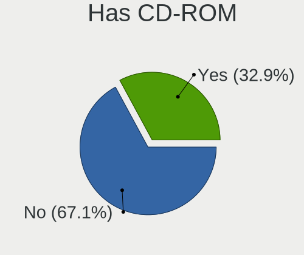
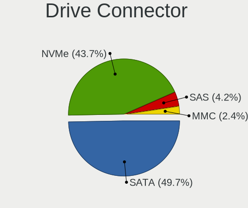
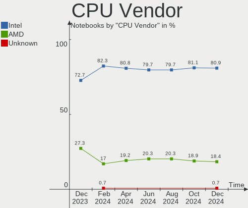
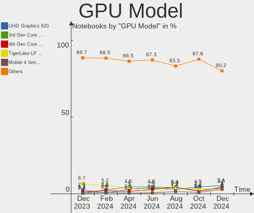
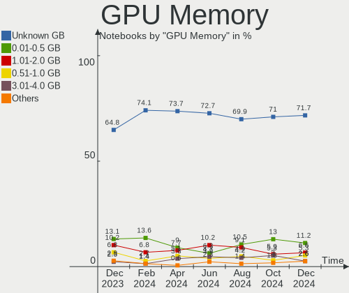
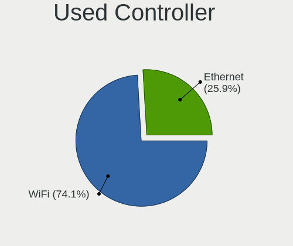
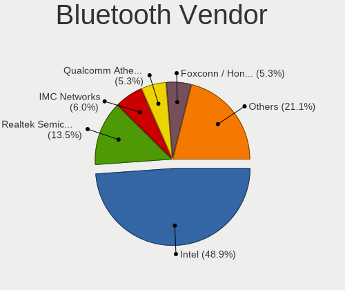
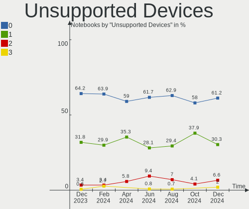

Linux in Italy - Hardware Trends (Notebooks)
--------------------------------------------

A project to identify most popular hardware characteristics and track their change
over time based on data collected by Linux users at https://Linux-Hardware.org.

Anyone can contribute to this report by the [hw-probe](https://github.com/linuxhw/hw-probe) tool:

    sudo -E hw-probe -all -upload

Period: Sep, 2023.

Contents
--------

* [ System ](#system)
  - [ OS                       ](#os)
  - [ OS Family                ](#os-family)
  - [ Kernel                   ](#kernel)
  - [ Kernel Family            ](#kernel-family)
  - [ Kernel Major Ver.        ](#kernel-major-ver)
  - [ Arch                     ](#arch)
  - [ DE                       ](#de)
  - [ Display Server           ](#display-server)
  - [ Display Manager          ](#display-manager)
  - [ OS Lang                  ](#os-lang)
  - [ Boot Mode                ](#boot-mode)
  - [ Filesystem               ](#filesystem)
  - [ Part. scheme             ](#part-scheme)
  - [ Dual Boot with Linux/BSD ](#dual-boot-with-linuxbsd)
  - [ Dual Boot (Win)          ](#dual-boot-win)

* [ Board ](#board)
  - [ Vendor                   ](#vendor)
  - [ Model                    ](#model)
  - [ Model Family             ](#model-family)
  - [ MFG Year                 ](#mfg-year)
  - [ Form Factor              ](#form-factor)
  - [ Secure Boot              ](#secure-boot)
  - [ Coreboot                 ](#coreboot)
  - [ RAM Size                 ](#ram-size)
  - [ RAM Used                 ](#ram-used)
  - [ Total Drives             ](#total-drives)
  - [ Has CD-ROM               ](#has-cd-rom)
  - [ Has Ethernet             ](#has-ethernet)
  - [ Has WiFi                 ](#has-wifi)
  - [ Has Bluetooth            ](#has-bluetooth)

* [ Location ](#location)
  - [ Country                  ](#country)
  - [ City                     ](#city)

* [ Drives ](#drives)
  - [ Drive Vendor             ](#drive-vendor)
  - [ Drive Model              ](#drive-model)
  - [ HDD Vendor               ](#hdd-vendor)
  - [ SSD Vendor               ](#ssd-vendor)
  - [ Drive Kind               ](#drive-kind)
  - [ Drive Connector          ](#drive-connector)
  - [ Drive Size               ](#drive-size)
  - [ Space Total              ](#space-total)
  - [ Space Used               ](#space-used)
  - [ Malfunc. Drives          ](#malfunc-drives)
  - [ Malfunc. Drive Vendor    ](#malfunc-drive-vendor)
  - [ Malfunc. HDD Vendor      ](#malfunc-hdd-vendor)
  - [ Malfunc. Drive Kind      ](#malfunc-drive-kind)
  - [ Failed Drives            ](#failed-drives)
  - [ Failed Drive Vendor      ](#failed-drive-vendor)
  - [ Drive Status             ](#drive-status)

* [ Storage controller ](#storage-controller)
  - [ Storage Vendor           ](#storage-vendor)
  - [ Storage Model            ](#storage-model)
  - [ Storage Kind             ](#storage-kind)

* [ Processor ](#processor)
  - [ CPU Vendor               ](#cpu-vendor)
  - [ CPU Model                ](#cpu-model)
  - [ CPU Model Family         ](#cpu-model-family)
  - [ CPU Cores                ](#cpu-cores)
  - [ CPU Sockets              ](#cpu-sockets)
  - [ CPU Threads              ](#cpu-threads)
  - [ CPU Op-Modes             ](#cpu-op-modes)
  - [ CPU Microcode            ](#cpu-microcode)
  - [ CPU Microarch            ](#cpu-microarch)

* [ Graphics ](#graphics)
  - [ GPU Vendor               ](#gpu-vendor)
  - [ GPU Model                ](#gpu-model)
  - [ GPU Combo                ](#gpu-combo)
  - [ GPU Driver               ](#gpu-driver)
  - [ GPU Memory               ](#gpu-memory)

* [ Monitor ](#monitor)
  - [ Monitor Vendor           ](#monitor-vendor)
  - [ Monitor Model            ](#monitor-model)
  - [ Monitor Resolution       ](#monitor-resolution)
  - [ Monitor Diagonal         ](#monitor-diagonal)
  - [ Monitor Width            ](#monitor-width)
  - [ Aspect Ratio             ](#aspect-ratio)
  - [ Monitor Area             ](#monitor-area)
  - [ Pixel Density            ](#pixel-density)
  - [ Multiple Monitors        ](#multiple-monitors)

* [ Network ](#network)
  - [ Net Controller Vendor    ](#net-controller-vendor)
  - [ Net Controller Model     ](#net-controller-model)
  - [ Wireless Vendor          ](#wireless-vendor)
  - [ Wireless Model           ](#wireless-model)
  - [ Ethernet Vendor          ](#ethernet-vendor)
  - [ Ethernet Model           ](#ethernet-model)
  - [ Net Controller Kind      ](#net-controller-kind)
  - [ Used Controller          ](#used-controller)
  - [ NICs                     ](#nics)
  - [ IPv6                     ](#ipv6)

* [ Bluetooth ](#bluetooth)
  - [ Bluetooth Vendor         ](#bluetooth-vendor)
  - [ Bluetooth Model          ](#bluetooth-model)

* [ Sound ](#sound)
  - [ Sound Vendor             ](#sound-vendor)
  - [ Sound Model              ](#sound-model)

* [ Memory ](#memory)
  - [ Memory Vendor            ](#memory-vendor)
  - [ Memory Model             ](#memory-model)
  - [ Memory Kind              ](#memory-kind)
  - [ Memory Form Factor       ](#memory-form-factor)
  - [ Memory Size              ](#memory-size)
  - [ Memory Speed             ](#memory-speed)

* [ Printers & scanners ](#printers--scanners)
  - [ Printer Vendor           ](#printer-vendor)
  - [ Printer Model            ](#printer-model)
  - [ Scanner Vendor           ](#scanner-vendor)
  - [ Scanner Model            ](#scanner-model)

* [ Camera ](#camera)
  - [ Camera Vendor            ](#camera-vendor)
  - [ Camera Model             ](#camera-model)

* [ Security ](#security)
  - [ Fingerprint Vendor       ](#fingerprint-vendor)
  - [ Fingerprint Model        ](#fingerprint-model)
  - [ Chipcard Vendor          ](#chipcard-vendor)
  - [ Chipcard Model           ](#chipcard-model)

* [ Unsupported ](#unsupported)
  - [ Unsupported Devices      ](#unsupported-devices)
  - [ Unsupported Device Types ](#unsupported-device-types)

System
------

OS
--

Installed operating systems

| Name                         | Notebooks | Percent |
|------------------------------|-----------|---------|
| Ubuntu 22.04                 | 19        | 16.38%  |
| Fedora 38                    | 13        | 11.21%  |
| Arch Rolling                 | 9         | 7.76%   |
| OpenMandriva 23.08           | 7         | 6.03%   |
| Debian 12                    | 6         | 5.17%   |
| Ubuntu 23.04                 | 5         | 4.31%   |
| Pop!_OS 22.04                | 5         | 4.31%   |
| Linux Mint 21.2              | 5         | 4.31%   |
| Linux Mint 20.3              | 3         | 2.59%   |
| EndeavourOS Rolling          | 3         | 2.59%   |
| Debian 11                    | 3         | 2.59%   |
| Zorin 16                     | 2         | 1.72%   |
| OpenMandriva 4.3             | 2         | 1.72%   |
| OpenMandriva 23.09           | 2         | 1.72%   |
| OpenMandriva 23.03           | 2         | 1.72%   |
| Manjaro                      | 2         | 1.72%   |
| LMDE 5                       | 2         | 1.72%   |
| ArcoLinux Rolling            | 2         | 1.72%   |
| Xubuntu 22.04                | 1         | 0.86%   |
| Xubuntu 2023.2               | 1         | 0.86%   |
| Void Linux Rolling           | 1         | 0.86%   |
| Ubuntu 23.10                 | 1         | 0.86%   |
| Ubuntu 21.04                 | 1         | 0.86%   |
| Ubuntu 20.04                 | 1         | 0.86%   |
| SteamOS 4                    | 1         | 0.86%   |
| ROSA 12.4                    | 1         | 0.86%   |
| openSUSE Tumbleweed-XXXXXXXX | 1         | 0.86%   |
| openSUSE Leap-15.5           | 1         | 0.86%   |
| OpenMandriva 4.2             | 1         | 0.86%   |
| OpenMandriva 23.90           | 1         | 0.86%   |
| OpenMandriva 23.06           | 1         | 0.86%   |
| Manjaro 23.0.1               | 1         | 0.86%   |
| Manjaro 23.0.0               | 1         | 0.86%   |
| LMDE 6                       | 1         | 0.86%   |
| Linux Mint 21.1              | 1         | 0.86%   |
| Kubuntu 23.04                | 1         | 0.86%   |
| Kubuntu 22.04                | 1         | 0.86%   |
| Garuda Linux Soaring         | 1         | 0.86%   |
| Fedora 39                    | 1         | 0.86%   |
| Elementary 7.1               | 1         | 0.86%   |

OS Family
---------

OS without a version

| Name         | Notebooks | Percent |
|--------------|-----------|---------|
| Ubuntu       | 27        | 23.28%  |
| OpenMandriva | 16        | 13.79%  |
| Fedora       | 14        | 12.07%  |
| Debian       | 10        | 8.62%   |
| Linux Mint   | 9         | 7.76%   |
| Arch         | 9         | 7.76%   |
| Pop!_OS      | 5         | 4.31%   |
| Manjaro      | 4         | 3.45%   |
| LMDE         | 3         | 2.59%   |
| EndeavourOS  | 3         | 2.59%   |
| Zorin        | 2         | 1.72%   |
| Xubuntu      | 2         | 1.72%   |
| openSUSE     | 2         | 1.72%   |
| Kubuntu      | 2         | 1.72%   |
| ArcoLinux    | 2         | 1.72%   |
| Void Linux   | 1         | 0.86%   |
| SteamOS      | 1         | 0.86%   |
| ROSA         | 1         | 0.86%   |
| Garuda Linux | 1         | 0.86%   |
| Elementary   | 1         | 0.86%   |
| Artix        | 1         | 0.86%   |

Kernel
------

Version of the Linux kernel

| Version                 | Notebooks | Percent |
|-------------------------|-----------|---------|
| 6.2.0-32-generic        | 10        | 8.62%   |
| 6.4.15-200.fc38.x86_64  | 8         | 6.9%    |
| 6.4.11-desktop-1omv2390 | 8         | 6.9%    |
| 6.2.0-33-generic        | 7         | 6.03%   |
| 6.4.6-76060406-generic  | 5         | 4.31%   |
| 5.15.0-83-generic       | 5         | 4.31%   |
| 6.4.12-zen1-1-zen       | 4         | 3.45%   |
| 6.4.12-arch1-1          | 4         | 3.45%   |
| 6.2.0-31-generic        | 4         | 3.45%   |
| 5.15.0-84-generic       | 3         | 2.59%   |
| 5.10.0-25-amd64         | 3         | 2.59%   |
| 6.5.4-arch2-1           | 2         | 1.72%   |
| 6.5.3-desktop-1omv2390  | 2         | 1.72%   |
| 6.5.2-arch1-1           | 2         | 1.72%   |
| 6.4.14-200.fc38.x86_64  | 2         | 1.72%   |
| 6.2.6-desktop-1omv2390  | 2         | 1.72%   |
| 6.2.0-26-generic        | 2         | 1.72%   |
| 6.2.0-20-generic        | 2         | 1.72%   |
| 6.1.0-12-amd64          | 2         | 1.72%   |
| 6.1.0-11-amd64          | 2         | 1.72%   |
| 6.1.0-10-amd64          | 2         | 1.72%   |
| 6.5.5-zen1-1-zen        | 1         | 0.86%   |
| 6.5.5-artix1-1          | 1         | 0.86%   |
| 6.5.5-300.fc39.x86_64   | 1         | 0.86%   |
| 6.5.4-1-default         | 1         | 0.86%   |
| 6.5.3-zen1-1-zen        | 1         | 0.86%   |
| 6.5.1-1-MANJARO         | 1         | 0.86%   |
| 6.5.1-060501-generic    | 1         | 0.86%   |
| 6.5.0-5-generic         | 1         | 0.86%   |
| 6.4.8-arch1-1           | 1         | 0.86%   |
| 6.4.13-200.fc38.x86_64  | 1         | 0.86%   |
| 6.4.12-200.fc38.x86_64  | 1         | 0.86%   |
| 6.4.0-3-amd64           | 1         | 0.86%   |
| 6.3.7-zen1-1-zen        | 1         | 0.86%   |
| 6.3.5-desktop-3omv2390  | 1         | 0.86%   |
| 6.3.13_1                | 1         | 0.86%   |
| 6.2.9-300.fc38.x86_64   | 1         | 0.86%   |
| 6.2.0-34-generic        | 1         | 0.86%   |
| 6.2.0-10018-tuxedo      | 1         | 0.86%   |
| 6.1.53-1-MANJARO        | 1         | 0.86%   |

Kernel Family
-------------

Linux kernel without a distro release

| Version  | Notebooks | Percent |
|----------|-----------|---------|
| 6.2.0    | 27        | 23.28%  |
| 5.15.0   | 10        | 8.62%   |
| 6.4.12   | 9         | 7.76%   |
| 6.4.15   | 8         | 6.9%    |
| 6.4.11   | 8         | 6.9%    |
| 6.1.0    | 6         | 5.17%   |
| 6.4.6    | 5         | 4.31%   |
| 5.10.0   | 5         | 4.31%   |
| 6.5.5    | 3         | 2.59%   |
| 6.5.4    | 3         | 2.59%   |
| 6.5.3    | 3         | 2.59%   |
| 5.4.0    | 3         | 2.59%   |
| 6.5.2    | 2         | 1.72%   |
| 6.5.1    | 2         | 1.72%   |
| 6.4.14   | 2         | 1.72%   |
| 6.2.6    | 2         | 1.72%   |
| 6.5.0    | 1         | 0.86%   |
| 6.4.8    | 1         | 0.86%   |
| 6.4.13   | 1         | 0.86%   |
| 6.4.0    | 1         | 0.86%   |
| 6.3.7    | 1         | 0.86%   |
| 6.3.5    | 1         | 0.86%   |
| 6.3.13   | 1         | 0.86%   |
| 6.2.9    | 1         | 0.86%   |
| 6.1.53   | 1         | 0.86%   |
| 6.1.51   | 1         | 0.86%   |
| 6.1.49   | 1         | 0.86%   |
| 6.1.15   | 1         | 0.86%   |
| 5.17.1   | 1         | 0.86%   |
| 5.16.13  | 1         | 0.86%   |
| 5.14.21  | 1         | 0.86%   |
| 5.11.0   | 1         | 0.86%   |
| 5.10.184 | 1         | 0.86%   |
| 5.10.14  | 1         | 0.86%   |

Kernel Major Ver.
-----------------

Linux kernel major version

| Version | Notebooks | Percent |
|---------|-----------|---------|
| 6.4     | 35        | 30.17%  |
| 6.2     | 30        | 25.86%  |
| 6.5     | 14        | 12.07%  |
| 6.1     | 10        | 8.62%   |
| 5.15    | 10        | 8.62%   |
| 5.10    | 7         | 6.03%   |
| 6.3     | 3         | 2.59%   |
| 5.4     | 3         | 2.59%   |
| 5.17    | 1         | 0.86%   |
| 5.16    | 1         | 0.86%   |
| 5.14    | 1         | 0.86%   |
| 5.11    | 1         | 0.86%   |

Arch
----

OS architecture (x86_64, i586, etc.)

| Name   | Notebooks | Percent |
|--------|-----------|---------|
| x86_64 | 115       | 99.14%  |
| i686   | 1         | 0.86%   |

DE
--

Desktop Environment

| Name            | Notebooks | Percent |
|-----------------|-----------|---------|
| GNOME           | 54        | 46.55%  |
| KDE5            | 27        | 23.28%  |
| XFCE            | 12        | 10.34%  |
| X-Cinnamon      | 11        | 9.48%   |
| LXQt            | 3         | 2.59%   |
| MATE            | 2         | 1.72%   |
| Unicorn:XFCE    | 1         | 0.86%   |
| Pantheon        | 1         | 0.86%   |
| LXDE            | 1         | 0.86%   |
| i3              | 1         | 0.86%   |
| GNOME Flashback | 1         | 0.86%   |
| GNOME Classic   | 1         | 0.86%   |
| Unknown         | 1         | 0.86%   |

Display Server
--------------

X11 or Wayland

| Name    | Notebooks | Percent |
|---------|-----------|---------|
| X11     | 60        | 51.72%  |
| Wayland | 54        | 46.55%  |
| Tty     | 2         | 1.72%   |

Display Manager
---------------

SDDM, LightDM, etc.

| Name    | Notebooks | Percent |
|---------|-----------|---------|
| Unknown | 32        | 27.59%  |
| GDM3    | 31        | 26.72%  |
| SDDM    | 26        | 22.41%  |
| LightDM | 14        | 12.07%  |
| GDM     | 13        | 11.21%  |

OS Lang
-------

Language

| Lang  | Notebooks | Percent |
|-------|-----------|---------|
| it_IT | 77        | 66.38%  |
| en_US | 31        | 26.72%  |
| C     | 4         | 3.45%   |
| en_GB | 2         | 1.72%   |
| en_IE | 1         | 0.86%   |
| de_DE | 1         | 0.86%   |

Boot Mode
---------

EFI or BIOS

| Mode | Notebooks | Percent |
|------|-----------|---------|
| EFI  | 65        | 56.03%  |
| BIOS | 51        | 43.97%  |

Filesystem
----------

Type of filesystem

| Type    | Notebooks | Percent |
|---------|-----------|---------|
| Ext4    | 64        | 55.17%  |
| Btrfs   | 24        | 20.69%  |
| Tmpfs   | 17        | 14.66%  |
| Overlay | 11        | 9.48%   |

Part. scheme
------------

Scheme of partitioning

| Type    | Notebooks | Percent |
|---------|-----------|---------|
| GPT     | 71        | 61.21%  |
| Unknown | 32        | 27.59%  |
| MBR     | 13        | 11.21%  |

Dual Boot with Linux/BSD
------------------------

Hosting more than one Linux/BSD

| Dual boot | Notebooks | Percent |
|-----------|-----------|---------|
| No        | 100       | 86.21%  |
| Yes       | 16        | 13.79%  |

Dual Boot (Win)
---------------

Hosting Linux and Windows

| Dual boot | Notebooks | Percent |
|-----------|-----------|---------|
| No        | 83        | 71.55%  |
| Yes       | 33        | 28.45%  |

Board
-----

Vendor
------

Motherboard manufacturer

| Name                | Notebooks | Percent |
|---------------------|-----------|---------|
| Hewlett-Packard     | 31        | 26.72%  |
| Lenovo              | 21        | 18.1%   |
| ASUSTek Computer    | 14        | 12.07%  |
| Dell                | 9         | 7.76%   |
| Acer                | 9         | 7.76%   |
| MSI                 | 6         | 5.17%   |
| HUAWEI              | 4         | 3.45%   |
| Toshiba             | 3         | 2.59%   |
| Apple               | 3         | 2.59%   |
| Sony                | 2         | 1.72%   |
| Samsung Electronics | 2         | 1.72%   |
| AMI                 | 2         | 1.72%   |
| TUXEDO              | 1         | 0.86%   |
| Notebook            | 1         | 0.86%   |
| Microtech           | 1         | 0.86%   |
| LG Electronics      | 1         | 0.86%   |
| Google              | 1         | 0.86%   |
| Fujitsu Siemens     | 1         | 0.86%   |
| Fujitsu             | 1         | 0.86%   |
| eMachines           | 1         | 0.86%   |
| Clevo               | 1         | 0.86%   |
| Chuwi               | 1         | 0.86%   |

Model
-----

Motherboard model

| Name                                  | Notebooks | Percent |
|---------------------------------------|-----------|---------|
| HP Pavilion dv6                       | 2         | 1.72%   |
| HP Notebook                           | 2         | 1.72%   |
| HP Laptop 15s-eq2xxx                  | 2         | 1.72%   |
| HP 255 G8 Notebook PC                 | 2         | 1.72%   |
| HP 15                                 | 2         | 1.72%   |
| Toshiba Satellite Pro R50-B           | 1         | 0.86%   |
| Toshiba Satellite L500                | 1         | 0.86%   |
| Toshiba Satellite C850-1DZ            | 1         | 0.86%   |
| Sony SVE1713X1EB                      | 1         | 0.86%   |
| Sony SVE1712C5E                       | 1         | 0.86%   |
| Samsung R519/R719                     | 1         | 0.86%   |
| Samsung 750XDA                        | 1         | 0.86%   |
| Notebook N9x0TC                       | 1         | 0.86%   |
| MSI Summit E13FlipEvo A12MT           | 1         | 0.86%   |
| MSI Prestige 15 A12SC                 | 1         | 0.86%   |
| MSI Prestige 14Evo A12M               | 1         | 0.86%   |
| MSI Modern 14 B11MOU                  | 1         | 0.86%   |
| MSI Katana GF66 11UC                  | 1         | 0.86%   |
| MSI GL73 8RE                          | 1         | 0.86%   |
| Microtech ebookPro                    | 1         | 0.86%   |
| LG 14Z990-V.AR52D                     | 1         | 0.86%   |
| Lenovo Z50-75 80EC                    | 1         | 0.86%   |
| Lenovo Yoga Pro 7 14ARP8 83AU         | 1         | 0.86%   |
| Lenovo V15-IGL 82C3                   | 1         | 0.86%   |
| Lenovo V15 G4 AMN 82YU                | 1         | 0.86%   |
| Lenovo ThinkPad X220 4290LT8          | 1         | 0.86%   |
| Lenovo ThinkPad W541 20EGS24J00       | 1         | 0.86%   |
| Lenovo ThinkPad T495s 20QJCTO1WW      | 1         | 0.86%   |
| Lenovo ThinkPad T480s 20L8002WMD      | 1         | 0.86%   |
| Lenovo ThinkPad T430 2349IF8          | 1         | 0.86%   |
| Lenovo ThinkPad P16s Gen 2 21HKCTO1WW | 1         | 0.86%   |
| Lenovo ThinkPad P15 Gen 1 20STCTO1WW  | 1         | 0.86%   |
| Lenovo ThinkPad P1 Gen 3 20TJS2F437   | 1         | 0.86%   |
| Lenovo ThinkPad E14 Gen 3 20Y7003SGE  | 1         | 0.86%   |
| Lenovo ThinkPad E14 Gen 2 20TA000BIX  | 1         | 0.86%   |
| Lenovo ThinkBook 15 G2 ITL 20VE       | 1         | 0.86%   |
| Lenovo IdeaPad Z500 5931              | 1         | 0.86%   |
| Lenovo IdeaPad Gaming 3 15IAH7 82S9   | 1         | 0.86%   |
| Lenovo IdeaPad Gaming 3 15ARH05 82EY  | 1         | 0.86%   |
| Lenovo IdeaPad 720S-13IKB 81BV        | 1         | 0.86%   |

Model Family
------------

Motherboard model prefix

| Name               | Notebooks | Percent |
|--------------------|-----------|---------|
| Lenovo ThinkPad    | 10        | 8.62%   |
| Lenovo IdeaPad     | 6         | 5.17%   |
| HP Laptop          | 6         | 5.17%   |
| Acer Aspire        | 5         | 4.31%   |
| HP Pavilion        | 4         | 3.45%   |
| HP EliteBook       | 4         | 3.45%   |
| HP 250             | 4         | 3.45%   |
| Dell Latitude      | 4         | 3.45%   |
| Toshiba Satellite  | 3         | 2.59%   |
| MSI Prestige       | 2         | 1.72%   |
| HP ProBook         | 2         | 1.72%   |
| HP Notebook        | 2         | 1.72%   |
| HP Compaq          | 2         | 1.72%   |
| HP 255             | 2         | 1.72%   |
| HP 15              | 2         | 1.72%   |
| Dell Vostro        | 2         | 1.72%   |
| Dell Inspiron      | 2         | 1.72%   |
| ASUS VivoBook      | 2         | 1.72%   |
| Apple MacBookPro11 | 2         | 1.72%   |
| Sony SVE1713X1EB   | 1         | 0.86%   |
| Sony SVE1712C5E    | 1         | 0.86%   |
| Samsung R519       | 1         | 0.86%   |
| Samsung 750XDA     | 1         | 0.86%   |
| Notebook N9x0TC    | 1         | 0.86%   |
| MSI Summit         | 1         | 0.86%   |
| MSI Modern         | 1         | 0.86%   |
| MSI Katana         | 1         | 0.86%   |
| MSI GL73           | 1         | 0.86%   |
| Microtech ebookPro | 1         | 0.86%   |
| LG 14Z990-V.AR52D  | 1         | 0.86%   |
| Lenovo Z50-75      | 1         | 0.86%   |
| Lenovo Yoga        | 1         | 0.86%   |
| Lenovo V15-IGL     | 1         | 0.86%   |
| Lenovo V15         | 1         | 0.86%   |
| Lenovo ThinkBook   | 1         | 0.86%   |
| HUAWEI VLT-WX0     | 1         | 0.86%   |
| HUAWEI MACHC-WAX9  | 1         | 0.86%   |
| HUAWEI BOM-WXX9    | 1         | 0.86%   |
| HUAWEI BOD-WXX9    | 1         | 0.86%   |
| HP x2              | 1         | 0.86%   |

MFG Year
--------

Motherboard manufacture year

| Year | Notebooks | Percent |
|------|-----------|---------|
| 2021 | 20        | 17.24%  |
| 2013 | 11        | 9.48%   |
| 2019 | 10        | 8.62%   |
| 2020 | 9         | 7.76%   |
| 2017 | 8         | 6.9%    |
| 2014 | 8         | 6.9%    |
| 2022 | 7         | 6.03%   |
| 2018 | 6         | 5.17%   |
| 2009 | 6         | 5.17%   |
| 2023 | 5         | 4.31%   |
| 2015 | 5         | 4.31%   |
| 2012 | 5         | 4.31%   |
| 2010 | 5         | 4.31%   |
| 2008 | 4         | 3.45%   |
| 2016 | 2         | 1.72%   |
| 2011 | 2         | 1.72%   |
| 2007 | 1         | 0.86%   |
| 2006 | 1         | 0.86%   |
| 2005 | 1         | 0.86%   |

Form Factor
-----------

Physical design of the computer

| Name     | Notebooks | Percent |
|----------|-----------|---------|
| Notebook | 116       | 100%    |

Secure Boot
-----------

Enabled or disabled

| State    | Notebooks | Percent |
|----------|-----------|---------|
| Disabled | 107       | 92.24%  |
| Enabled  | 9         | 7.76%   |

Coreboot
--------

Have coreboot on board

| Used | Notebooks | Percent |
|------|-----------|---------|
| No   | 115       | 99.14%  |
| Yes  | 1         | 0.86%   |

RAM Size
--------

Total RAM memory

| Size in GB  | Notebooks | Percent |
|-------------|-----------|---------|
| 4.01-8.0    | 34        | 29.31%  |
| 3.01-4.0    | 26        | 22.41%  |
| 8.01-16.0   | 22        | 18.97%  |
| 16.01-24.0  | 20        | 17.24%  |
| 32.01-64.0  | 7         | 6.03%   |
| 1.01-2.0    | 4         | 3.45%   |
| 24.01-32.0  | 1         | 0.86%   |
| 2.01-3.0    | 1         | 0.86%   |
| 64.01-256.0 | 1         | 0.86%   |

RAM Used
--------

Used RAM memory

| Used GB   | Notebooks | Percent |
|-----------|-----------|---------|
| 1.01-2.0  | 43        | 37.07%  |
| 4.01-8.0  | 28        | 24.14%  |
| 2.01-3.0  | 26        | 22.41%  |
| 3.01-4.0  | 14        | 12.07%  |
| 0.51-1.0  | 4         | 3.45%   |
| 8.01-16.0 | 1         | 0.86%   |

Total Drives
------------

Number of drives on board

| Drives | Notebooks | Percent |
|--------|-----------|---------|
| 1      | 90        | 77.59%  |
| 2      | 18        | 15.52%  |
| 3      | 7         | 6.03%   |
| 0      | 1         | 0.86%   |

Has CD-ROM
----------

Has CD-ROM on board

| Presented | Notebooks | Percent |
|-----------|-----------|---------|
| No        | 76        | 65.52%  |
| Yes       | 40        | 34.48%  |

Has Ethernet
------------

Has Ethernet on board

| Presented | Notebooks | Percent |
|-----------|-----------|---------|
| Yes       | 82        | 70.69%  |
| No        | 34        | 29.31%  |

Has WiFi
--------

Has WiFi module

| Presented | Notebooks | Percent |
|-----------|-----------|---------|
| Yes       | 114       | 98.28%  |
| No        | 2         | 1.72%   |

Has Bluetooth
-------------

Has Bluetooth module

| Presented | Notebooks | Percent |
|-----------|-----------|---------|
| Yes       | 91        | 78.45%  |
| No        | 25        | 21.55%  |

Location
--------

Country
-------

Geographic location (country)

| Country | Notebooks | Percent |
|---------|-----------|---------|
| Italy   | 116       | 100%    |

City
----

Geographic location (city)

| City                      | Notebooks | Percent |
|---------------------------|-----------|---------|
| Milan                     | 18        | 15.52%  |
| Milano                    | 8         | 6.9%    |
| Rome                      | 7         | 6.03%   |
| Turin                     | 5         | 4.31%   |
| Monza                     | 3         | 2.59%   |
| Trento                    | 2         | 1.72%   |
| Perugia                   | 2         | 1.72%   |
| Parma                     | 2         | 1.72%   |
| Padova                    | 2         | 1.72%   |
| Florence                  | 2         | 1.72%   |
| Casalecchio di Reno       | 2         | 1.72%   |
| Bologna                   | 2         | 1.72%   |
| Bari                      | 2         | 1.72%   |
| Vittuone                  | 1         | 0.86%   |
| Viggiano                  | 1         | 0.86%   |
| Venice                    | 1         | 0.86%   |
| Vaiano Cremasco           | 1         | 0.86%   |
| Tuoro sul Trasimeno       | 1         | 0.86%   |
| Truccazzano               | 1         | 0.86%   |
| Trieste                   | 1         | 0.86%   |
| Terni                     | 1         | 0.86%   |
| Scandolara Ravara         | 1         | 0.86%   |
| Sassuolo                  | 1         | 0.86%   |
| San Vito dei Normanni     | 1         | 0.86%   |
| San Sebastiano al Vesuvio | 1         | 0.86%   |
| Salerno                   | 1         | 0.86%   |
| Rozzano                   | 1         | 0.86%   |
| Roe Volciano              | 1         | 0.86%   |
| Roccadaspide              | 1         | 0.86%   |
| Rimini                    | 1         | 0.86%   |
| Reggio Emilia             | 1         | 0.86%   |
| Ragusa                    | 1         | 0.86%   |
| Putignano                 | 1         | 0.86%   |
| Positano                  | 1         | 0.86%   |
| Pieve a Nievole           | 1         | 0.86%   |
| Piacenza                  | 1         | 0.86%   |
| Palermo                   | 1         | 0.86%   |
| Novi Ligure               | 1         | 0.86%   |
| Naples                    | 1         | 0.86%   |
| Monastier di Treviso      | 1         | 0.86%   |

Drives
------

Drive Vendor
------------

Hard drive vendors

| Vendor                       | Notebooks | Drives | Percent |
|------------------------------|-----------|--------|---------|
| Samsung Electronics          | 22        | 23     | 15.94%  |
| WDC                          | 14        | 15     | 10.14%  |
| Toshiba                      | 13        | 13     | 9.42%   |
| SanDisk                      | 11        | 11     | 7.97%   |
| Seagate                      | 8         | 8      | 5.8%    |
| Kingston                     | 8         | 8      | 5.8%    |
| SK hynix                     | 7         | 7      | 5.07%   |
| Intel                        | 7         | 7      | 5.07%   |
| Unknown                      | 6         | 7      | 4.35%   |
| Crucial                      | 6         | 6      | 4.35%   |
| HGST                         | 5         | 5      | 3.62%   |
| Micron Technology            | 4         | 4      | 2.9%    |
| KIOXIA                       | 4         | 4      | 2.9%    |
| SSSTC                        | 2         | 2      | 1.45%   |
| Kingston Technology Company  | 2         | 2      | 1.45%   |
| China                        | 2         | 2      | 1.45%   |
| Apple                        | 2         | 2      | 1.45%   |
| YMTC                         | 1         | 1      | 0.72%   |
| Verbatim                     | 1         | 1      | 0.72%   |
| Transcend                    | 1         | 1      | 0.72%   |
| sobetter                     | 1         | 1      | 0.72%   |
| Silicon Motion               | 1         | 1      | 0.72%   |
| Shenzhen Longsys Electronics | 1         | 1      | 0.72%   |
| Saichi                       | 1         | 1      | 0.72%   |
| Phison Electronics           | 1         | 1      | 0.72%   |
| Micron/Crucial Technology    | 1         | 1      | 0.72%   |
| KingDian                     | 1         | 1      | 0.72%   |
| INDMEM                       | 1         | 1      | 0.72%   |
| Hitachi                      | 1         | 1      | 0.72%   |
| Fanxiang                     | 1         | 1      | 0.72%   |
| Corsair                      | 1         | 1      | 0.72%   |
| BAITITON                     | 1         | 1      | 0.72%   |

Drive Model
-----------

Hard drive models

| Model                                               | Notebooks | Percent |
|-----------------------------------------------------|-----------|---------|
| HGST HTS545050A7E680 500GB                          | 4         | 2.84%   |
| Unknown MMC Card  64GB                              | 3         | 2.13%   |
| KIOXIA KBG40ZNV256G 256GB                           | 3         | 2.13%   |
| Crucial CT500MX500SSD1 500GB                        | 3         | 2.13%   |
| Toshiba XG6 NVMe SSD Controller 512GB               | 2         | 1.42%   |
| Toshiba MQ01ABD100 1TB                              | 2         | 1.42%   |
| Toshiba BG3 NVMe SSD Controller 512GB               | 2         | 1.42%   |
| SK hynix SKHynix_HFM512GD3HX015N 512GB              | 2         | 1.42%   |
| Seagate ST1000LM024 HN-M101MBB 1TB                  | 2         | 1.42%   |
| Sandisk WD Blue SN550 NVMe SSD 512GB                | 2         | 1.42%   |
| Samsung SSD 870 EVO 1TB                             | 2         | 1.42%   |
| Samsung SSD 860 EVO 500GB                           | 2         | 1.42%   |
| Samsung NVMe SSD Controller SM981/PM981/PM983 256GB | 2         | 1.42%   |
| Samsung NVMe SSD Controller PM9A1/PM9A3/980PRO 1TB  | 2         | 1.42%   |
| Samsung MZVL21T0HCLR-00B00 1TB                      | 2         | 1.42%   |
| Kingston SUV400S37240G 240GB SSD                    | 2         | 1.42%   |
| Intel SSDPEKNW512GZL 512GB                          | 2         | 1.42%   |
| YMTC PC005 256GB                                    | 1         | 0.71%   |
| WDC WDS240G2G0B-00EPW0 240GB SSD                    | 1         | 0.71%   |
| WDC WDS100T2B0A-00SM50 1TB SSD                      | 1         | 0.71%   |
| WDC WD5000LPCX-60VHAT0 500GB                        | 1         | 0.71%   |
| WDC WD3200BPVT-80ZEST0 320GB                        | 1         | 0.71%   |
| WDC WD3200BPVT-22ZEST0 320GB                        | 1         | 0.71%   |
| WDC WD3200BEVT-22ZCT0 320GB                         | 1         | 0.71%   |
| WDC WD3200BEVT-22A23T0 320GB                        | 1         | 0.71%   |
| WDC WD3200BEVS-16VAT0 320GB                         | 1         | 0.71%   |
| WDC WD20SPZX-22UA7T0 2TB                            | 1         | 0.71%   |
| WDC WD1600BEVT-60ZCT1 160GB                         | 1         | 0.71%   |
| WDC WD1600BEVT-22ZCT0 160GB                         | 1         | 0.71%   |
| WDC WD10SPZX-60Z10T0 1TB                            | 1         | 0.71%   |
| WDC WD10JPVX-22JC3T0 1TB                            | 1         | 0.71%   |
| WDC PC SN530 SDBPNPZ-512G-1002 512GB                | 1         | 0.71%   |
| WDC PC SA530 SDASN8Y256G1009 256GB                  | 1         | 0.71%   |
| Verbatim USB External SSD 256GB                     | 1         | 0.71%   |
| Unknown SD/MMC/MS PRO 128GB                         | 1         | 0.71%   |
| Unknown MMC Card  16GB                              | 1         | 0.71%   |
| Unknown MMC Card  128GB                             | 1         | 0.71%   |
| Unknown Biwin  32GB                                 | 1         | 0.71%   |
| Transcend TS128GMTS430S 128GB SSD                   | 1         | 0.71%   |
| Toshiba MQ04ABF100 1TB                              | 1         | 0.71%   |

HDD Vendor
----------

Hard disk drive vendors

| Vendor              | Notebooks | Drives | Percent |
|---------------------|-----------|--------|---------|
| WDC                 | 11        | 11     | 32.35%  |
| Seagate             | 8         | 8      | 23.53%  |
| Toshiba             | 7         | 7      | 20.59%  |
| HGST                | 5         | 5      | 14.71%  |
| Unknown             | 1         | 1      | 2.94%   |
| Samsung Electronics | 1         | 1      | 2.94%   |
| Hitachi             | 1         | 1      | 2.94%   |

SSD Vendor
----------

Solid state drive vendors

| Vendor              | Notebooks | Drives | Percent |
|---------------------|-----------|--------|---------|
| Samsung Electronics | 12        | 12     | 26.09%  |
| SanDisk             | 5         | 5      | 10.87%  |
| Kingston            | 5         | 5      | 10.87%  |
| Crucial             | 5         | 5      | 10.87%  |
| Micron Technology   | 3         | 3      | 6.52%   |
| WDC                 | 2         | 2      | 4.35%   |
| China               | 2         | 2      | 4.35%   |
| Apple               | 2         | 2      | 4.35%   |
| Verbatim            | 1         | 1      | 2.17%   |
| Transcend           | 1         | 1      | 2.17%   |
| Toshiba             | 1         | 1      | 2.17%   |
| SSSTC               | 1         | 1      | 2.17%   |
| Saichi              | 1         | 1      | 2.17%   |
| KingDian            | 1         | 1      | 2.17%   |
| Intel               | 1         | 1      | 2.17%   |
| Fanxiang            | 1         | 1      | 2.17%   |
| Corsair             | 1         | 1      | 2.17%   |
| BAITITON            | 1         | 1      | 2.17%   |

Drive Kind
----------

HDD or SSD

| Kind    | Notebooks | Drives | Percent |
|---------|-----------|--------|---------|
| NVMe    | 47        | 52     | 36.72%  |
| SSD     | 41        | 46     | 32.03%  |
| HDD     | 32        | 34     | 25%     |
| MMC     | 6         | 7      | 4.69%   |
| Unknown | 2         | 2      | 1.56%   |

Drive Connector
---------------

SATA, SAS, NVMe, etc.

| Type | Notebooks | Drives | Percent |
|------|-----------|--------|---------|
| SATA | 68        | 78     | 54.4%   |
| NVMe | 47        | 52     | 37.6%   |
| MMC  | 6         | 7      | 4.8%    |
| SAS  | 4         | 4      | 3.2%    |

Drive Size
----------

Size of hard drive

| Size in TB | Notebooks | Drives | Percent |
|------------|-----------|--------|---------|
| 0.01-0.5   | 50        | 57     | 69.44%  |
| 0.51-1.0   | 18        | 19     | 25%     |
| 1.01-2.0   | 3         | 3      | 4.17%   |
| 4.01-10.0  | 1         | 1      | 1.39%   |

Space Total
-----------

Amount of disk space available on the file system

| Size in GB     | Notebooks | Percent |
|----------------|-----------|---------|
| 251-500        | 34        | 29.31%  |
| 101-250        | 30        | 25.86%  |
| 501-1000       | 21        | 18.1%   |
| 1001-2000      | 9         | 7.76%   |
| 1-20           | 8         | 6.9%    |
| 51-100         | 6         | 5.17%   |
| Unknown        | 3         | 2.59%   |
| More than 3000 | 2         | 1.72%   |
| 2001-3000      | 2         | 1.72%   |
| 21-50          | 1         | 0.86%   |

Space Used
----------

Amount of used disk space

| Used GB   | Notebooks | Percent |
|-----------|-----------|---------|
| 1-20      | 51        | 43.97%  |
| 21-50     | 19        | 16.38%  |
| 51-100    | 15        | 12.93%  |
| 251-500   | 10        | 8.62%   |
| 101-250   | 9         | 7.76%   |
| 1001-2000 | 4         | 3.45%   |
| 501-1000  | 3         | 2.59%   |
| Unknown   | 3         | 2.59%   |
| 2001-3000 | 2         | 1.72%   |

Malfunc. Drives
---------------

Drive models with a malfunction

| Model                                          | Notebooks | Drives | Percent |
|------------------------------------------------|-----------|--------|---------|
| WDC WD3200BPVT-22ZEST0 320GB                   | 1         | 1      | 10%     |
| WDC WD3200BEVT-22A23T0 320GB                   | 1         | 1      | 10%     |
| WDC WD1600BEVT-60ZCT1 160GB                    | 1         | 1      | 10%     |
| Toshiba MQ01ABD100 1TB                         | 1         | 1      | 10%     |
| Toshiba MK3263GSXN 320GB                       | 1         | 1      | 10%     |
| SSSTC CV8-8E128-HP 128GB SSD                   | 1         | 1      | 10%     |
| SanDisk SSD PLUS 240GB                         | 1         | 1      | 10%     |
| Micron Technology 1100_MTFDDAV512TBN 512GB SSD | 1         | 1      | 10%     |
| Intel SSDSC2BF180A4L 180GB                     | 1         | 1      | 10%     |
| HGST HTS545050A7E680 500GB                     | 1         | 1      | 10%     |

Malfunc. Drive Vendor
---------------------

Vendors of faulty drives

| Vendor            | Notebooks | Drives | Percent |
|-------------------|-----------|--------|---------|
| WDC               | 3         | 3      | 30%     |
| Toshiba           | 2         | 2      | 20%     |
| SSSTC             | 1         | 1      | 10%     |
| SanDisk           | 1         | 1      | 10%     |
| Micron Technology | 1         | 1      | 10%     |
| Intel             | 1         | 1      | 10%     |
| HGST              | 1         | 1      | 10%     |

Malfunc. HDD Vendor
-------------------

Vendors of faulty HDD drives

| Vendor  | Notebooks | Drives | Percent |
|---------|-----------|--------|---------|
| WDC     | 3         | 3      | 50%     |
| Toshiba | 2         | 2      | 33.33%  |
| HGST    | 1         | 1      | 16.67%  |

Malfunc. Drive Kind
-------------------

Kinds of faulty drives

| Kind | Notebooks | Drives | Percent |
|------|-----------|--------|---------|
| HDD  | 6         | 6      | 60%     |
| SSD  | 4         | 4      | 40%     |

Failed Drives
-------------

Failed drive models

Zero info for selected period =(

Failed Drive Vendor
-------------------

Failed drive vendors

Zero info for selected period =(

Drive Status
------------

Number of failed and malfunc. drives

| Status   | Notebooks | Drives | Percent |
|----------|-----------|--------|---------|
| Works    | 57        | 63     | 46.34%  |
| Detected | 56        | 68     | 45.53%  |
| Malfunc  | 10        | 10     | 8.13%   |

Storage controller
------------------

Storage Vendor
--------------

Storage controller vendors

| Vendor                         | Notebooks | Percent |
|--------------------------------|-----------|---------|
| Intel                          | 72        | 54.55%  |
| Samsung Electronics            | 12        | 9.09%   |
| AMD                            | 11        | 8.33%   |
| SanDisk                        | 7         | 5.3%    |
| SK hynix                       | 6         | 4.55%   |
| Toshiba America Info Systems   | 5         | 3.79%   |
| Kingston Technology Company    | 5         | 3.79%   |
| KIOXIA                         | 4         | 3.03%   |
| Nvidia                         | 2         | 1.52%   |
| Micron/Crucial Technology      | 2         | 1.52%   |
| Yangtze Memory Technologies    | 1         | 0.76%   |
| Solid State Storage Technology | 1         | 0.76%   |
| Silicon Motion                 | 1         | 0.76%   |
| Shenzhen Longsys Electronics   | 1         | 0.76%   |
| Phison Electronics             | 1         | 0.76%   |
| Micron Technology              | 1         | 0.76%   |

Storage Model
-------------

Storage controller models

| Model                                                                          | Notebooks | Percent |
|--------------------------------------------------------------------------------|-----------|---------|
| AMD FCH SATA Controller [AHCI mode]                                            | 10        | 7.14%   |
| Intel 7 Series Chipset Family 6-port SATA Controller [AHCI mode]               | 9         | 6.43%   |
| Intel Sunrise Point-LP SATA Controller [AHCI mode]                             | 8         | 5.71%   |
| Intel 8 Series SATA Controller 1 [AHCI mode]                                   | 8         | 5.71%   |
| Intel 82801IBM/IEM (ICH9M/ICH9M-E) 4 port SATA Controller [AHCI mode]          | 7         | 5%      |
| SK hynix Gold P31/BC711/PC711 NVMe Solid State Drive                           | 5         | 3.57%   |
| Intel Celeron/Pentium Silver Processor SATA Controller                         | 5         | 3.57%   |
| Intel 82801 Mobile SATA Controller [RAID mode]                                 | 5         | 3.57%   |
| Samsung NVMe SSD Controller PM9A1/PM9A3/980PRO                                 | 4         | 2.86%   |
| KIOXIA NVMe SSD Controller BG4 (DRAM-less)                                     | 4         | 2.86%   |
| Intel Volume Management Device NVMe RAID Controller                            | 4         | 2.86%   |
| Toshiba America Info Systems XG6 NVMe SSD Controller                           | 3         | 2.14%   |
| SanDisk WD Blue SN550 NVMe SSD                                                 | 3         | 2.14%   |
| Samsung NVMe SSD Controller SM981/PM981/PM983                                  | 3         | 2.14%   |
| Intel Tiger Lake-LP SATA Controller                                            | 3         | 2.14%   |
| Intel SSD 670p Series [Keystone Harbor]                                        | 3         | 2.14%   |
| Intel 6 Series/C200 Series Chipset Family 6 port Mobile SATA AHCI Controller   | 3         | 2.14%   |
| Toshiba America Info Systems BG3 NVMe SSD Controller                           | 2         | 1.43%   |
| SanDisk IX SN530 NVMe SSD (DRAM-less)                                          | 2         | 1.43%   |
| Samsung S4LN053X01 AHCI SSD Controller(Apple slot)                             | 2         | 1.43%   |
| Samsung NVMe SSD Controller 980                                                | 2         | 1.43%   |
| Intel SSD DC P4101/Pro 7600p/760p/E 6100p Series                               | 2         | 1.43%   |
| Intel Comet Lake SATA AHCI Controller                                          | 2         | 1.43%   |
| Intel 8 Series/C220 Series Chipset Family 6-port SATA Controller 1 [AHCI mode] | 2         | 1.43%   |
| Intel 5 Series/3400 Series Chipset 4 port SATA AHCI Controller                 | 2         | 1.43%   |
| Yangtze Memory PC005 NVMe SSD                                                  | 1         | 0.71%   |
| Solid State Storage CL1-3D256-Q11 NVMe SSD M.2                                 | 1         | 0.71%   |
| SK hynix BC511 NVMe SSD                                                        | 1         | 0.71%   |
| Silicon Motion SM2263EN/SM2263XT (DRAM-less) NVMe SSD Controllers              | 1         | 0.71%   |
| Shenzhen Longsys Lexar NM620 NVME SSD (DRAM-less)                              | 1         | 0.71%   |
| SanDisk WD PC SN810 / Black SN850 NVMe SSD                                     | 1         | 0.71%   |
| SanDisk WD Black SN770 / PC SN740 256GB / PC SN560 (DRAM-less) NVMe SSD        | 1         | 0.71%   |
| Samsung NVMe SSD Controller PM9B1                                              | 1         | 0.71%   |
| Phison PS5013 E13 NVMe Controller                                              | 1         | 0.71%   |
| Nvidia MCP79 SATA Controller                                                   | 1         | 0.71%   |
| Nvidia MCP78S [GeForce 8200] SATA Controller (non-AHCI mode)                   | 1         | 0.71%   |
| Nvidia MCP78S [GeForce 8200] IDE                                               | 1         | 0.71%   |
| Micron/Crucial P5 Plus NVMe PCIe SSD                                           | 1         | 0.71%   |
| Micron/Crucial P2 [Nick P2] / P3 / P3 Plus NVMe PCIe SSD (DRAM-less)           | 1         | 0.71%   |
| Micron 2200S NVMe SSD [Cassandra]                                              | 1         | 0.71%   |

Storage Kind
------------

Kind of storage controller (IDE, SATA, NVMe, SAS, ...)

| Kind | Notebooks | Percent |
|------|-----------|---------|
| SATA | 72        | 53.33%  |
| NVMe | 47        | 34.81%  |
| RAID | 9         | 6.67%   |
| IDE  | 7         | 5.19%   |

Processor
---------

CPU Vendor
----------

Processor vendors

| Vendor | Notebooks | Percent |
|--------|-----------|---------|
| Intel  | 91        | 78.45%  |
| AMD    | 25        | 21.55%  |

CPU Model
---------

Processor models

| Model                                       | Notebooks | Percent |
|---------------------------------------------|-----------|---------|
| AMD Ryzen 5 5500U with Radeon Graphics      | 4         | 3.45%   |
| Intel Core i7-4510U CPU @ 2.00GHz           | 3         | 2.59%   |
| Intel Core i7-3632QM CPU @ 2.20GHz          | 3         | 2.59%   |
| Intel Core i5-8250U CPU @ 1.60GHz           | 3         | 2.59%   |
| Intel Core i5-7200U CPU @ 2.50GHz           | 3         | 2.59%   |
| Intel 12th Gen Core i7-1280P                | 3         | 2.59%   |
| Intel 11th Gen Core i7-1165G7 @ 2.80GHz     | 3         | 2.59%   |
| Intel 11th Gen Core i5-1135G7 @ 2.40GHz     | 3         | 2.59%   |
| Intel Pentium Dual-Core CPU T4400 @ 2.20GHz | 2         | 1.72%   |
| Intel Core i7-7500U CPU @ 2.70GHz           | 2         | 1.72%   |
| Intel Core i7-10510U CPU @ 1.80GHz          | 2         | 1.72%   |
| Intel Core i5-8265U CPU @ 1.60GHz           | 2         | 1.72%   |
| Intel Core i5-4210U CPU @ 1.70GHz           | 2         | 1.72%   |
| Intel Core i5-10210U CPU @ 1.60GHz          | 2         | 1.72%   |
| Intel Core i3-4005U CPU @ 1.70GHz           | 2         | 1.72%   |
| Intel Celeron N4020 CPU @ 1.10GHz           | 2         | 1.72%   |
| Intel 11th Gen Core i3-1115G4 @ 3.00GHz     | 2         | 1.72%   |
| AMD Ryzen 7 5700U with Radeon Graphics      | 2         | 1.72%   |
| Intel Pentium Dual-Core CPU T4500 @ 2.30GHz | 1         | 0.86%   |
| Intel Pentium Dual-Core CPU T4300 @ 2.10GHz | 1         | 0.86%   |
| Intel Pentium Dual CPU T3400 @ 2.16GHz      | 1         | 0.86%   |
| Intel Pentium Dual CPU T2390 @ 1.86GHz      | 1         | 0.86%   |
| Intel Pentium CPU P6200 @ 2.13GHz           | 1         | 0.86%   |
| Intel Pentium CPU N4200 @ 1.10GHz           | 1         | 0.86%   |
| Intel Pentium CPU N3700 @ 1.60GHz           | 1         | 0.86%   |
| Intel Pentium CPU B960 @ 2.20GHz            | 1         | 0.86%   |
| Intel Pentium 4 CPU 3.20GHz                 | 1         | 0.86%   |
| Intel Core i7-9700 CPU @ 3.00GHz            | 1         | 0.86%   |
| Intel Core i7-8750H CPU @ 2.20GHz           | 1         | 0.86%   |
| Intel Core i7-8650U CPU @ 1.90GHz           | 1         | 0.86%   |
| Intel Core i7-8565U CPU @ 1.80GHz           | 1         | 0.86%   |
| Intel Core i7-8550U CPU @ 1.80GHz           | 1         | 0.86%   |
| Intel Core i7-5650U CPU @ 2.20GHz           | 1         | 0.86%   |
| Intel Core i7-4810MQ CPU @ 2.80GHz          | 1         | 0.86%   |
| Intel Core i7-4770HQ CPU @ 2.20GHz          | 1         | 0.86%   |
| Intel Core i7-3537U CPU @ 2.00GHz           | 1         | 0.86%   |
| Intel Core i7-2670QM CPU @ 2.20GHz          | 1         | 0.86%   |
| Intel Core i7-10850H CPU @ 2.70GHz          | 1         | 0.86%   |
| Intel Core i7-10750H CPU @ 2.60GHz          | 1         | 0.86%   |
| Intel Core i5-8350U CPU @ 1.70GHz           | 1         | 0.86%   |

CPU Model Family
----------------

Processor model prefix

| Model                   | Notebooks | Percent |
|-------------------------|-----------|---------|
| Intel Core i7           | 22        | 18.97%  |
| Intel Core i5           | 20        | 17.24%  |
| Other                   | 15        | 12.93%  |
| Intel Core i3           | 9         | 7.76%   |
| AMD Ryzen 7             | 8         | 6.9%    |
| Intel Celeron           | 7         | 6.03%   |
| AMD Ryzen 5             | 5         | 4.31%   |
| Intel Pentium Dual-Core | 4         | 3.45%   |
| Intel Pentium           | 4         | 3.45%   |
| Intel Core 2 Duo        | 3         | 2.59%   |
| Intel Atom              | 3         | 2.59%   |
| AMD Ryzen 3             | 3         | 2.59%   |
| Intel Pentium Dual      | 2         | 1.72%   |
| AMD Ryzen 7 PRO         | 2         | 1.72%   |
| AMD A6                  | 2         | 1.72%   |
| Intel Pentium 4         | 1         | 0.86%   |
| Intel Celeron Dual-Core | 1         | 0.86%   |
| AMD Mobile Sempron      | 1         | 0.86%   |
| AMD FX                  | 1         | 0.86%   |
| AMD E1                  | 1         | 0.86%   |
| AMD Athlon              | 1         | 0.86%   |
| AMD A10                 | 1         | 0.86%   |

CPU Cores
---------

Number of processor cores

| Number | Notebooks | Percent |
|--------|-----------|---------|
| 2      | 52        | 44.83%  |
| 4      | 37        | 31.9%   |
| 8      | 12        | 10.34%  |
| 6      | 7         | 6.03%   |
| 14     | 3         | 2.59%   |
| 1      | 3         | 2.59%   |
| 12     | 1         | 0.86%   |
| 10     | 1         | 0.86%   |

CPU Sockets
-----------

Number of sockets

| Number | Notebooks | Percent |
|--------|-----------|---------|
| 1      | 116       | 100%    |

CPU Threads
-----------

Threads per core (Hyper-Threading)

| Number | Notebooks | Percent |
|--------|-----------|---------|
| 2      | 84        | 72.41%  |
| 1      | 32        | 27.59%  |

CPU Op-Modes
------------

CPU Operation Modes (32-bit, 64-bit)

| Op mode        | Notebooks | Percent |
|----------------|-----------|---------|
| 32-bit, 64-bit | 116       | 100%    |

CPU Microcode
-------------

Microcode number

| Number     | Notebooks | Percent |
|------------|-----------|---------|
| Unknown    | 76        | 65.52%  |
| 0x08608103 | 5         | 4.31%   |
| 0x806c1    | 3         | 2.59%   |
| 0x806ec    | 2         | 1.72%   |
| 0x6fd      | 2         | 1.72%   |
| 0x406c3    | 2         | 1.72%   |
| 0x206a7    | 2         | 1.72%   |
| 0x0a50000d | 2         | 1.72%   |
| 0x0a50000c | 2         | 1.72%   |
| 0x08a00008 | 2         | 1.72%   |
| 0xf43      | 1         | 0.86%   |
| 0xa0652    | 1         | 0.86%   |
| 0x806ea    | 1         | 0.86%   |
| 0x806e9    | 1         | 0.86%   |
| 0x706a8    | 1         | 0.86%   |
| 0x706a1    | 1         | 0.86%   |
| 0x506c9    | 1         | 0.86%   |
| 0x40651    | 1         | 0.86%   |
| 0x306c3    | 1         | 0.86%   |
| 0x30678    | 1         | 0.86%   |
| 0x20655    | 1         | 0.86%   |
| 0x1067a    | 1         | 0.86%   |
| 0x0a404102 | 1         | 0.86%   |
| 0x08608104 | 1         | 0.86%   |
| 0x08600104 | 1         | 0.86%   |
| 0x08108109 | 1         | 0.86%   |
| 0x0600611a | 1         | 0.86%   |
| 0x06003106 | 1         | 0.86%   |

CPU Microarch
-------------

Microarchitecture

| Name             | Notebooks | Percent |
|------------------|-----------|---------|
| KabyLake         | 20        | 17.24%  |
| Unknown          | 15        | 12.93%  |
| Haswell          | 12        | 10.34%  |
| TigerLake        | 8         | 6.9%    |
| Penryn           | 7         | 6.03%   |
| IvyBridge        | 7         | 6.03%   |
| SandyBridge      | 5         | 4.31%   |
| Goldmont plus    | 5         | 4.31%   |
| Zen 3            | 4         | 3.45%   |
| Silvermont       | 4         | 3.45%   |
| Westmere         | 3         | 2.59%   |
| Core             | 3         | 2.59%   |
| Alderlake Hybrid | 3         | 2.59%   |
| Zen+             | 2         | 1.72%   |
| Jaguar           | 2         | 1.72%   |
| Goldmont         | 2         | 1.72%   |
| Excavator        | 2         | 1.72%   |
| CometLake        | 2         | 1.72%   |
| Broadwell        | 2         | 1.72%   |
| Zen 2            | 1         | 0.86%   |
| Steamroller      | 1         | 0.86%   |
| Skylake          | 1         | 0.86%   |
| NetBurst         | 1         | 0.86%   |
| K8 Hammer        | 1         | 0.86%   |
| K8 & K10 hybrid  | 1         | 0.86%   |
| IceLake          | 1         | 0.86%   |
| Bonnell          | 1         | 0.86%   |

Graphics
--------

GPU Vendor
----------

Vendors of graphics cards

| Vendor | Notebooks | Percent |
|--------|-----------|---------|
| Intel  | 83        | 57.64%  |
| AMD    | 33        | 22.92%  |
| Nvidia | 28        | 19.44%  |

GPU Model
---------

Graphics card models

| Model                                                                                    | Notebooks | Percent |
|------------------------------------------------------------------------------------------|-----------|---------|
| Intel Haswell-ULT Integrated Graphics Controller                                         | 9         | 6.16%   |
| Intel Mobile 4 Series Chipset Integrated Graphics Controller                             | 7         | 4.79%   |
| AMD Lucienne                                                                             | 7         | 4.79%   |
| Intel UHD Graphics 620                                                                   | 6         | 4.11%   |
| Intel TigerLake-LP GT2 [Iris Xe Graphics]                                                | 6         | 4.11%   |
| Intel HD Graphics 620                                                                    | 5         | 3.42%   |
| Intel GeminiLake [UHD Graphics 600]                                                      | 5         | 3.42%   |
| Intel 3rd Gen Core processor Graphics Controller                                         | 5         | 3.42%   |
| Intel CometLake-U GT2 [UHD Graphics]                                                     | 4         | 2.74%   |
| Intel 2nd Generation Core Processor Family Integrated Graphics Controller                | 4         | 2.74%   |
| Nvidia GF117M [GeForce 610M/710M/810M/820M / GT 620M/625M/630M/720M]                     | 3         | 2.05%   |
| Intel WhiskeyLake-U GT2 [UHD Graphics 620]                                               | 3         | 2.05%   |
| Intel Atom/Celeron/Pentium Processor x5-E8000/J3xxx/N3xxx Integrated Graphics Controller | 3         | 2.05%   |
| Intel Alder Lake-P Integrated Graphics Controller                                        | 3         | 2.05%   |
| AMD Sun XT [Radeon HD 8670A/8670M/8690M / R5 M330 / M430 / Radeon 520 Mobile]            | 3         | 2.05%   |
| AMD Cezanne [Radeon Vega Series / Radeon Vega Mobile Series]                             | 3         | 2.05%   |
| Nvidia TU117M [GeForce MX450]                                                            | 2         | 1.37%   |
| Nvidia GM108M [GeForce 940MX]                                                            | 2         | 1.37%   |
| Nvidia GM108M [GeForce 840M]                                                             | 2         | 1.37%   |
| Intel Tiger Lake-LP GT2 [UHD Graphics G4]                                                | 2         | 1.37%   |
| Intel CometLake-H GT2 [UHD Graphics]                                                     | 2         | 1.37%   |
| Intel 4th Gen Core Processor Integrated Graphics Controller                              | 2         | 1.37%   |
| AMD Thames [Radeon HD 7550M/7570M/7650M]                                                 | 2         | 1.37%   |
| AMD RV710/M92 [Mobility Radeon HD 4530/4570/5145/530v/540v/545v]                         | 2         | 1.37%   |
| AMD Rembrandt [Radeon 680M]                                                              | 2         | 1.37%   |
| AMD Picasso/Raven 2 [Radeon Vega Series / Radeon Vega Mobile Series]                     | 2         | 1.37%   |
| AMD Mendocino                                                                            | 2         | 1.37%   |
| Nvidia TU117M [GeForce GTX 1650 Ti Mobile]                                               | 1         | 0.68%   |
| Nvidia TU117M [GeForce GTX 1650 Mobile / Max-Q]                                          | 1         | 0.68%   |
| Nvidia TU117GLM [Quadro T2000 Mobile / Max-Q]                                            | 1         | 0.68%   |
| Nvidia TU116M [GeForce GTX 1660 Ti Mobile]                                               | 1         | 0.68%   |
| Nvidia MCP79 [GeForce 8200M G]                                                           | 1         | 0.68%   |
| Nvidia GT218M [GeForce G 105M]                                                           | 1         | 0.68%   |
| Nvidia GP108BM [GeForce MX250]                                                           | 1         | 0.68%   |
| Nvidia GP106M [GeForce GTX 1060 Mobile]                                                  | 1         | 0.68%   |
| Nvidia GN20-P0-R-K2 [GeForce RTX 3050 6GB Laptop GPU]                                    | 1         | 0.68%   |
| Nvidia GM108M [GeForce MX130]                                                            | 1         | 0.68%   |
| Nvidia GM108M [GeForce 930MX]                                                            | 1         | 0.68%   |
| Nvidia GM107M [GeForce GTX 950M]                                                         | 1         | 0.68%   |
| Nvidia GK208M [GeForce GT 720M]                                                          | 1         | 0.68%   |

GPU Combo
---------

Combinations of graphics cards

| Name           | Notebooks | Percent |
|----------------|-----------|---------|
| 1 x Intel      | 50        | 43.1%   |
| 1 x AMD        | 26        | 22.41%  |
| Intel + Nvidia | 22        | 18.97%  |
| 2 x Intel      | 7         | 6.03%   |
| 1 x Nvidia     | 3         | 2.59%   |
| Intel + AMD    | 3         | 2.59%   |
| AMD + Nvidia   | 3         | 2.59%   |
| Other          | 1         | 0.86%   |
| 2 x AMD        | 1         | 0.86%   |

GPU Driver
----------

Free vs proprietary

| Driver      | Notebooks | Percent |
|-------------|-----------|---------|
| Free        | 105       | 90.52%  |
| Proprietary | 11        | 9.48%   |

GPU Memory
----------

Total video memory

| Size in GB | Notebooks | Percent |
|------------|-----------|---------|
| Unknown    | 83        | 71.55%  |
| 0.01-0.5   | 16        | 13.79%  |
| 1.01-2.0   | 12        | 10.34%  |
| 0.51-1.0   | 3         | 2.59%   |
| 5.01-6.0   | 1         | 0.86%   |
| 3.01-4.0   | 1         | 0.86%   |

Monitor
-------

Monitor Vendor
--------------

Monitor vendors

| Vendor                  | Notebooks | Percent |
|-------------------------|-----------|---------|
| BOE                     | 26        | 20.63%  |
| AU Optronics            | 22        | 17.46%  |
| Chimei Innolux          | 21        | 16.67%  |
| LG Display              | 17        | 13.49%  |
| Samsung Electronics     | 12        | 9.52%   |
| Sharp                   | 3         | 2.38%   |
| Chi Mei Optoelectronics | 3         | 2.38%   |
| Apple                   | 3         | 2.38%   |
| Lenovo                  | 2         | 1.59%   |
| InfoVision              | 2         | 1.59%   |
| Hewlett-Packard         | 2         | 1.59%   |
| Acer                    | 2         | 1.59%   |
| Tianma XM               | 1         | 0.79%   |
| Sunplus                 | 1         | 0.79%   |
| Sony                    | 1         | 0.79%   |
| Philips                 | 1         | 0.79%   |
| PANDA                   | 1         | 0.79%   |
| Panasonic               | 1         | 0.79%   |
| GreenWood               | 1         | 0.79%   |
| Fujitsu Siemens         | 1         | 0.79%   |
| CSO                     | 1         | 0.79%   |
| ASUSTek Computer        | 1         | 0.79%   |
| Ancor Communications    | 1         | 0.79%   |

Monitor Model
-------------

Monitor models

| Model                                                                    | Notebooks | Percent |
|--------------------------------------------------------------------------|-----------|---------|
| Chimei Innolux LCD Monitor CMN15DB 1366x768 344x193mm 15.5-inch          | 3         | 2.38%   |
| Chimei Innolux LCD Monitor CMN15E7 1920x1080 344x193mm 15.5-inch         | 2         | 1.59%   |
| Chimei Innolux LCD Monitor CMN14FF 1920x1080 309x173mm 13.9-inch         | 2         | 1.59%   |
| Chi Mei Optoelectronics LCD Monitor CMO15A7 1366x768 344x193mm 15.5-inch | 2         | 1.59%   |
| BOE LCD Monitor BOE0872 1920x1080 344x194mm 15.5-inch                    | 2         | 1.59%   |
| BOE LCD Monitor BOE06A4 1366x768 344x194mm 15.5-inch                     | 2         | 1.59%   |
| AU Optronics LCD Monitor AUO47EC 1366x768 344x193mm 15.5-inch            | 2         | 1.59%   |
| AU Optronics LCD Monitor AUO45EC 1366x768 344x193mm 15.5-inch            | 2         | 1.59%   |
| Tianma XM LCD Monitor TLX1388 3000x2000 293x196mm 13.9-inch              | 1         | 0.79%   |
| Sunplus Monitor TV SPVFFFF 1360x768 708x398mm 32.0-inch                  | 1         | 0.79%   |
| Sony SDM-HX93 SNY1490 1280x1024 376x301mm 19.0-inch                      | 1         | 0.79%   |
| Sharp LQ134N1JW53 SHP1521 1920x1200 288x180mm 13.4-inch                  | 1         | 0.79%   |
| Sharp LQ134N1JW52 SHP151E 1920x1200 288x180mm 13.4-inch                  | 1         | 0.79%   |
| Sharp LCD Monitor SHP1542 1920x1080 309x174mm 14.0-inch                  | 1         | 0.79%   |
| Samsung Electronics U28E590 SAM0C4E 3840x2160 608x345mm 27.5-inch        | 1         | 0.79%   |
| Samsung Electronics S24D330 SAM0D92 1920x1080 531x299mm 24.0-inch        | 1         | 0.79%   |
| Samsung Electronics LCD Monitor SEC5342 1440x900 303x190mm 14.1-inch     | 1         | 0.79%   |
| Samsung Electronics LCD Monitor SEC5042 1280x800 303x190mm 14.1-inch     | 1         | 0.79%   |
| Samsung Electronics LCD Monitor SEC4845 1280x800 331x207mm 15.4-inch     | 1         | 0.79%   |
| Samsung Electronics LCD Monitor SEC3651 1366x768 340x190mm 15.3-inch     | 1         | 0.79%   |
| Samsung Electronics LCD Monitor SEC3451 1366x768 344x194mm 15.5-inch     | 1         | 0.79%   |
| Samsung Electronics LCD Monitor SEC3358 1280x800 331x207mm 15.4-inch     | 1         | 0.79%   |
| Samsung Electronics LCD Monitor SDC4951 1366x768 344x194mm 15.5-inch     | 1         | 0.79%   |
| Samsung Electronics LCD Monitor SDC4651 1366x768 344x194mm 15.5-inch     | 1         | 0.79%   |
| Samsung Electronics LCD Monitor SAM0B32 1366x768 607x345mm 27.5-inch     | 1         | 0.79%   |
| Samsung Electronics LCD Monitor SAM0A7A 1920x1080 1060x626mm 48.5-inch   | 1         | 0.79%   |
| Philips PHL 276E8V PHLC18F 3840x2160 597x336mm 27.0-inch                 | 1         | 0.79%   |
| PANDA LCD Monitor NCP0040 1920x1080 344x194mm 15.5-inch                  | 1         | 0.79%   |
| Panasonic LCD Monitor MEI96A2 2880x1620 344x193mm 15.5-inch              | 1         | 0.79%   |
| LG Display LP156WH2-TLF1 LGD021F 1366x768 344x194mm 15.5-inch            | 1         | 0.79%   |
| LG Display LP156WH2-TLAA LGD0230 1366x768 344x194mm 15.5-inch            | 1         | 0.79%   |
| LG Display LP101WSA-TLN1 LGD0295 1024x600 224x126mm 10.1-inch            | 1         | 0.79%   |
| LG Display LCD Monitor LGD06F5 1920x1080 344x194mm 15.5-inch             | 1         | 0.79%   |
| LG Display LCD Monitor LGD05B1 1920x1080 309x174mm 14.0-inch             | 1         | 0.79%   |
| LG Display LCD Monitor LGD0573 1920x1080 344x194mm 15.5-inch             | 1         | 0.79%   |
| LG Display LCD Monitor LGD0570 1920x1080 344x194mm 15.5-inch             | 1         | 0.79%   |
| LG Display LCD Monitor LGD04EF 1920x1080 294x165mm 13.3-inch             | 1         | 0.79%   |
| LG Display LCD Monitor LGD046D 1920x1080 309x174mm 14.0-inch             | 1         | 0.79%   |
| LG Display LCD Monitor LGD046B 1366x768 344x194mm 15.5-inch              | 1         | 0.79%   |
| LG Display LCD Monitor LGD0430 1366x768 345x194mm 15.6-inch              | 1         | 0.79%   |

Monitor Resolution
------------------

Monitor screen resolution

| Resolution        | Notebooks | Percent |
|-------------------|-----------|---------|
| 1920x1080 (FHD)   | 58        | 47.93%  |
| 1366x768 (WXGA)   | 39        | 32.23%  |
| 3840x2160 (4K)    | 4         | 3.31%   |
| 1440x900 (WXGA+)  | 4         | 3.31%   |
| 1280x800 (WXGA)   | 4         | 3.31%   |
| 1920x1200 (WUXGA) | 3         | 2.48%   |
| 1280x1024 (SXGA)  | 2         | 1.65%   |
| 3072x1920         | 1         | 0.83%   |
| 3000x2000         | 1         | 0.83%   |
| 2880x1800         | 1         | 0.83%   |
| 2560x1600         | 1         | 0.83%   |
| 2240x1400         | 1         | 0.83%   |
| 1600x900 (HD+)    | 1         | 0.83%   |
| 1024x600          | 1         | 0.83%   |

Monitor Diagonal
----------------

Diagonal size in inches

| Inches | Notebooks | Percent |
|--------|-----------|---------|
| 15     | 71        | 56.8%   |
| 14     | 16        | 12.8%   |
| 13     | 14        | 11.2%   |
| 17     | 5         | 4%      |
| 27     | 3         | 2.4%    |
| 24     | 2         | 1.6%    |
| 23     | 2         | 1.6%    |
| 21     | 2         | 1.6%    |
| 19     | 2         | 1.6%    |
| 16     | 2         | 1.6%    |
| 10     | 2         | 1.6%    |
| 48     | 1         | 0.8%    |
| 40     | 1         | 0.8%    |
| 32     | 1         | 0.8%    |
| 12     | 1         | 0.8%    |

Monitor Width
-------------

Physical width

| Width in mm | Notebooks | Percent |
|-------------|-----------|---------|
| 301-350     | 95        | 76%     |
| 201-300     | 11        | 8.8%    |
| 501-600     | 6         | 4.8%    |
| 351-400     | 6         | 4.8%    |
| 401-500     | 3         | 2.4%    |
| 801-900     | 1         | 0.8%    |
| 701-800     | 1         | 0.8%    |
| 601-700     | 1         | 0.8%    |
| 1001-1500   | 1         | 0.8%    |

Aspect Ratio
------------

Proportional relationship between the width and the height

| Ratio | Notebooks | Percent |
|-------|-----------|---------|
| 16/9  | 96        | 83.48%  |
| 16/10 | 16        | 13.91%  |
| 6/5   | 1         | 0.87%   |
| 5/4   | 1         | 0.87%   |
| 3/2   | 1         | 0.87%   |

Monitor Area
------------

Area in inch

| Area in inch | Notebooks | Percent |
|----------------|-----------|---------|
| 101-110        | 71        | 56.8%   |
| 81-90          | 22        | 17.6%   |
| 71-80          | 7         | 5.6%    |
| 121-130        | 5         | 4%      |
| 201-250        | 4         | 3.2%    |
| 301-350        | 3         | 2.4%    |
| 151-200        | 3         | 2.4%    |
| 41-50          | 2         | 1.6%    |
| More than 1000 | 1         | 0.8%    |
| 61-70          | 1         | 0.8%    |
| 351-500        | 1         | 0.8%    |
| 251-300        | 1         | 0.8%    |
| 131-140        | 1         | 0.8%    |
| 111-120        | 1         | 0.8%    |
| 501-1000       | 1         | 0.8%    |
| 91-100         | 1         | 0.8%    |

Pixel Density
-------------

Pixels per inch

| Density       | Notebooks | Percent |
|---------------|-----------|---------|
| 121-160       | 57        | 46.34%  |
| 101-120       | 33        | 26.83%  |
| 51-100        | 17        | 13.82%  |
| 161-240       | 9         | 7.32%   |
| More than 240 | 4         | 3.25%   |
| 1-50          | 3         | 2.44%   |

Multiple Monitors
-----------------

Total monitors connected

| Total | Notebooks | Percent |
|-------|-----------|---------|
| 1     | 99        | 85.34%  |
| 2     | 16        | 13.79%  |
| 0     | 1         | 0.86%   |

Network
-------

Net Controller Vendor
---------------------

Controller vendors

| Vendor                | Notebooks | Percent |
|-----------------------|-----------|---------|
| Realtek Semiconductor | 60        | 34.68%  |
| Intel                 | 49        | 28.32%  |
| Qualcomm Atheros      | 21        | 12.14%  |
| Broadcom              | 12        | 6.94%   |
| Broadcom Limited      | 7         | 4.05%   |
| MediaTek              | 6         | 3.47%   |
| TP-Link               | 3         | 1.73%   |
| Ralink                | 2         | 1.16%   |
| Nvidia                | 2         | 1.16%   |
| JMicron Technology    | 2         | 1.16%   |
| Xiaomi                | 1         | 0.58%   |
| T & A Mobile Phones   | 1         | 0.58%   |
| Samsung Electronics   | 1         | 0.58%   |
| Ralink Technology     | 1         | 0.58%   |
| NetGear               | 1         | 0.58%   |
| Lenovo                | 1         | 0.58%   |
| HMD Global            | 1         | 0.58%   |
| Dresden Elektronik    | 1         | 0.58%   |
| Dell                  | 1         | 0.58%   |

Net Controller Model
--------------------

Controller models

| Model                                                                   | Notebooks | Percent |
|-------------------------------------------------------------------------|-----------|---------|
| Realtek RTL8111/8168/8411 PCI Express Gigabit Ethernet Controller       | 34        | 16.43%  |
| Realtek RTL810xE PCI Express Fast Ethernet controller                   | 14        | 6.76%   |
| Intel Wi-Fi 6 AX201                                                     | 8         | 3.86%   |
| Realtek RTL8821CE 802.11ac PCIe Wireless Network Adapter                | 7         | 3.38%   |
| Intel Wireless 8265 / 8275                                              | 7         | 3.38%   |
| Qualcomm Atheros AR9485 Wireless Network Adapter                        | 5         | 2.42%   |
| Intel Wi-Fi 6 AX200                                                     | 5         | 2.42%   |
| Realtek RTL8822CE 802.11ac PCIe Wireless Network Adapter                | 4         | 1.93%   |
| Realtek RTL8723BE PCIe Wireless Network Adapter                         | 4         | 1.93%   |
| Qualcomm Atheros QCA9565 / AR9565 Wireless Network Adapter              | 4         | 1.93%   |
| Qualcomm Atheros AR928X Wireless Network Adapter (PCI-Express)          | 4         | 1.93%   |
| Intel Wireless 7265                                                     | 4         | 1.93%   |
| Broadcom BCM43142 802.11b/g/n                                           | 4         | 1.93%   |
| Realtek RTL8852BE PCIe 802.11ax Wireless Network Controller             | 3         | 1.45%   |
| Intel Gemini Lake PCH CNVi WiFi                                         | 3         | 1.45%   |
| Intel Alder Lake-P PCH CNVi WiFi                                        | 3         | 1.45%   |
| Realtek RTL8852AE 802.11ax PCIe Wireless Network Adapter                | 2         | 0.97%   |
| Realtek RTL8191SEvB Wireless LAN Controller                             | 2         | 0.97%   |
| Realtek RTL8188CE 802.11b/g/n WiFi Adapter                              | 2         | 0.97%   |
| Ralink RT3290 Wireless 802.11n 1T/1R PCIe                               | 2         | 0.97%   |
| Qualcomm Atheros QCA9377 802.11ac Wireless Network Adapter              | 2         | 0.97%   |
| Qualcomm Atheros QCA8171 Gigabit Ethernet                               | 2         | 0.97%   |
| Qualcomm Atheros AR242x / AR542x Wireless Network Adapter (PCI-Express) | 2         | 0.97%   |
| MediaTek MT7921 802.11ax PCI Express Wireless Network Adapter           | 2         | 0.97%   |
| Intel Wireless-AC 9260                                                  | 2         | 0.97%   |
| Intel Wireless 3165                                                     | 2         | 0.97%   |
| Intel PRO/Wireless 5100 AGN [Shiloh] Network Connection                 | 2         | 0.97%   |
| Intel Ethernet Connection (4) I219-LM                                   | 2         | 0.97%   |
| Intel Comet Lake PCH CNVi WiFi                                          | 2         | 0.97%   |
| Intel 82579LM Gigabit Network Connection (Lewisville)                   | 2         | 0.97%   |
| Intel 82567LM Gigabit Network Connection                                | 2         | 0.97%   |
| Broadcom Limited NetLink BCM57780 Gigabit Ethernet PCIe                 | 2         | 0.97%   |
| Broadcom Limited BCM4360 802.11ac Wireless Network Adapter              | 2         | 0.97%   |
| Xiaomi Mi/Redmi series (RNDIS)                                          | 1         | 0.48%   |
| TP-Link Archer T4U ver.3                                                | 1         | 0.48%   |
| TP-Link Archer T3U [Realtek RTL8812BU]                                  | 1         | 0.48%   |
| TP-Link 802.11ac WLAN Adapter                                           | 1         | 0.48%   |
| T & A Mobile Phones Mobilebroadband                                     | 1         | 0.48%   |
| Samsung Galaxy series, misc. (tethering mode)                           | 1         | 0.48%   |
| Realtek RTL8723DE Wireless Network Adapter                              | 1         | 0.48%   |

Wireless Vendor
---------------

Wireless vendors

| Vendor                | Notebooks | Percent |
|-----------------------|-----------|---------|
| Intel                 | 47        | 39.17%  |
| Realtek Semiconductor | 26        | 21.67%  |
| Qualcomm Atheros      | 20        | 16.67%  |
| Broadcom              | 10        | 8.33%   |
| MediaTek              | 5         | 4.17%   |
| Broadcom Limited      | 4         | 3.33%   |
| TP-Link               | 3         | 2.5%    |
| Ralink                | 2         | 1.67%   |
| Ralink Technology     | 1         | 0.83%   |
| NetGear               | 1         | 0.83%   |
| Dell                  | 1         | 0.83%   |

Wireless Model
--------------

Wireless models

| Model                                                                   | Notebooks | Percent |
|-------------------------------------------------------------------------|-----------|---------|
| Intel Wi-Fi 6 AX201                                                     | 8         | 6.67%   |
| Realtek RTL8821CE 802.11ac PCIe Wireless Network Adapter                | 7         | 5.83%   |
| Intel Wireless 8265 / 8275                                              | 7         | 5.83%   |
| Qualcomm Atheros AR9485 Wireless Network Adapter                        | 5         | 4.17%   |
| Intel Wi-Fi 6 AX200                                                     | 5         | 4.17%   |
| Realtek RTL8822CE 802.11ac PCIe Wireless Network Adapter                | 4         | 3.33%   |
| Realtek RTL8723BE PCIe Wireless Network Adapter                         | 4         | 3.33%   |
| Qualcomm Atheros QCA9565 / AR9565 Wireless Network Adapter              | 4         | 3.33%   |
| Qualcomm Atheros AR928X Wireless Network Adapter (PCI-Express)          | 4         | 3.33%   |
| Intel Wireless 7265                                                     | 4         | 3.33%   |
| Broadcom BCM43142 802.11b/g/n                                           | 4         | 3.33%   |
| Realtek RTL8852BE PCIe 802.11ax Wireless Network Controller             | 3         | 2.5%    |
| Intel Gemini Lake PCH CNVi WiFi                                         | 3         | 2.5%    |
| Intel Alder Lake-P PCH CNVi WiFi                                        | 3         | 2.5%    |
| Realtek RTL8852AE 802.11ax PCIe Wireless Network Adapter                | 2         | 1.67%   |
| Realtek RTL8191SEvB Wireless LAN Controller                             | 2         | 1.67%   |
| Realtek RTL8188CE 802.11b/g/n WiFi Adapter                              | 2         | 1.67%   |
| Ralink RT3290 Wireless 802.11n 1T/1R PCIe                               | 2         | 1.67%   |
| Qualcomm Atheros QCA9377 802.11ac Wireless Network Adapter              | 2         | 1.67%   |
| Qualcomm Atheros AR242x / AR542x Wireless Network Adapter (PCI-Express) | 2         | 1.67%   |
| MediaTek MT7921 802.11ax PCI Express Wireless Network Adapter           | 2         | 1.67%   |
| Intel Wireless-AC 9260                                                  | 2         | 1.67%   |
| Intel Wireless 3165                                                     | 2         | 1.67%   |
| Intel PRO/Wireless 5100 AGN [Shiloh] Network Connection                 | 2         | 1.67%   |
| Intel Comet Lake PCH CNVi WiFi                                          | 2         | 1.67%   |
| Broadcom Limited BCM4360 802.11ac Wireless Network Adapter              | 2         | 1.67%   |
| TP-Link Archer T4U ver.3                                                | 1         | 0.83%   |
| TP-Link Archer T3U [Realtek RTL8812BU]                                  | 1         | 0.83%   |
| TP-Link 802.11ac WLAN Adapter                                           | 1         | 0.83%   |
| Realtek RTL8723DE Wireless Network Adapter                              | 1         | 0.83%   |
| Realtek RTL8188EE Wireless Network Adapter                              | 1         | 0.83%   |
| Ralink RT5370 Wireless Adapter                                          | 1         | 0.83%   |
| Qualcomm Atheros QCA6174 802.11ac Wireless Network Adapter              | 1         | 0.83%   |
| Qualcomm Atheros AR9287 Wireless Network Adapter (PCI-Express)          | 1         | 0.83%   |
| Qualcomm Atheros AR9285 Wireless Network Adapter (PCI-Express)          | 1         | 0.83%   |
| NetGear A6150                                                           | 1         | 0.83%   |
| MediaTek Wi-Fi 6E MT7902 Wireless Network Adapter                       | 1         | 0.83%   |
| MediaTek MT7922 802.11ax PCI Express Wireless Network Adapter           | 1         | 0.83%   |
| MediaTek MT7630e 802.11bgn Wireless Network Adapter                     | 1         | 0.83%   |
| Intel Wireless 8260                                                     | 1         | 0.83%   |

Ethernet Vendor
---------------

Ethernet vendors

| Vendor                | Notebooks | Percent |
|-----------------------|-----------|---------|
| Realtek Semiconductor | 51        | 60.71%  |
| Intel                 | 14        | 16.67%  |
| Qualcomm Atheros      | 4         | 4.76%   |
| Broadcom Limited      | 3         | 3.57%   |
| Broadcom              | 3         | 3.57%   |
| Nvidia                | 2         | 2.38%   |
| JMicron Technology    | 2         | 2.38%   |
| Xiaomi                | 1         | 1.19%   |
| Samsung Electronics   | 1         | 1.19%   |
| MediaTek              | 1         | 1.19%   |
| Lenovo                | 1         | 1.19%   |
| HMD Global            | 1         | 1.19%   |

Ethernet Model
--------------

Ethernet models

| Model                                                             | Notebooks | Percent |
|-------------------------------------------------------------------|-----------|---------|
| Realtek RTL8111/8168/8411 PCI Express Gigabit Ethernet Controller | 34        | 40.48%  |
| Realtek RTL810xE PCI Express Fast Ethernet controller             | 14        | 16.67%  |
| Qualcomm Atheros QCA8171 Gigabit Ethernet                         | 2         | 2.38%   |
| Intel Ethernet Connection (4) I219-LM                             | 2         | 2.38%   |
| Intel 82579LM Gigabit Network Connection (Lewisville)             | 2         | 2.38%   |
| Intel 82567LM Gigabit Network Connection                          | 2         | 2.38%   |
| Broadcom Limited NetLink BCM57780 Gigabit Ethernet PCIe           | 2         | 2.38%   |
| Xiaomi Mi/Redmi series (RNDIS)                                    | 1         | 1.19%   |
| Samsung Galaxy series, misc. (tethering mode)                     | 1         | 1.19%   |
| Realtek RTL8153 Gigabit Ethernet Adapter                          | 1         | 1.19%   |
| Realtek RTL-8100/8101L/8139 PCI Fast Ethernet Adapter             | 1         | 1.19%   |
| Realtek Killer E2600 Gigabit Ethernet Controller                  | 1         | 1.19%   |
| Qualcomm Atheros AR8132 Fast Ethernet                             | 1         | 1.19%   |
| Qualcomm Atheros AR8131 Gigabit Ethernet                          | 1         | 1.19%   |
| Nvidia MCP79 Ethernet                                             | 1         | 1.19%   |
| Nvidia MCP77 Ethernet                                             | 1         | 1.19%   |
| MediaTek Infinix SMART 6 HD                                       | 1         | 1.19%   |
| Lenovo ThinkPad TBT 3 Dock                                        | 1         | 1.19%   |
| JMicron JMC260 PCI Express Fast Ethernet Controller               | 1         | 1.19%   |
| JMicron JMC250 PCI Express Gigabit Ethernet Controller            | 1         | 1.19%   |
| Intel Ethernet Controller I219-V                                  | 1         | 1.19%   |
| Intel Ethernet Connection I217-V                                  | 1         | 1.19%   |
| Intel Ethernet Connection I217-LM                                 | 1         | 1.19%   |
| Intel Ethernet Connection (6) I219-V                              | 1         | 1.19%   |
| Intel Ethernet Connection (4) I219-V                              | 1         | 1.19%   |
| Intel Ethernet Connection (3) I218-LM                             | 1         | 1.19%   |
| Intel Ethernet Connection (13) I219-V                             | 1         | 1.19%   |
| Intel Ethernet Connection (11) I219-V                             | 1         | 1.19%   |
| HMD Global Android                                                | 1         | 1.19%   |
| Broadcom NetXtreme BCM57786 Gigabit Ethernet PCIe                 | 1         | 1.19%   |
| Broadcom NetLink BCM5906M Fast Ethernet PCI Express               | 1         | 1.19%   |
| Broadcom NetLink BCM57785 Gigabit Ethernet PCIe                   | 1         | 1.19%   |
| Broadcom Limited BCM4401-B0 100Base-TX                            | 1         | 1.19%   |

Net Controller Kind
-------------------

Ethernet, WiFi or modem

| Kind     | Notebooks | Percent |
|----------|-----------|---------|
| WiFi     | 114       | 57.29%  |
| Ethernet | 82        | 41.21%  |
| Modem    | 3         | 1.51%   |

Used Controller
---------------

Currently used network controller

| Kind     | Notebooks | Percent |
|----------|-----------|---------|
| WiFi     | 98        | 85.96%  |
| Ethernet | 15        | 13.16%  |
| Modem    | 1         | 0.88%   |

NICs
----

Total network controllers on board

| Total | Notebooks | Percent |
|-------|-----------|---------|
| 2     | 77        | 66.38%  |
| 1     | 38        | 32.76%  |
| 0     | 1         | 0.86%   |

IPv6
----

IPv6 vs IPv4

| Used | Notebooks | Percent |
|------|-----------|---------|
| No   | 101       | 87.07%  |
| Yes  | 15        | 12.93%  |

Bluetooth
---------

Bluetooth Vendor
----------------

Controller vendors

| Vendor                          | Notebooks | Percent |
|---------------------------------|-----------|---------|
| Intel                           | 41        | 45.05%  |
| Realtek Semiconductor           | 18        | 19.78%  |
| IMC Networks                    | 5         | 5.49%   |
| Broadcom                        | 5         | 5.49%   |
| Lite-On Technology              | 4         | 4.4%    |
| Foxconn / Hon Hai               | 4         | 4.4%    |
| Qualcomm Atheros Communications | 3         | 3.3%    |
| Apple                           | 3         | 3.3%    |
| Ralink                          | 2         | 2.2%    |
| Hewlett-Packard                 | 2         | 2.2%    |
| Cambridge Silicon Radio         | 2         | 2.2%    |
| Realtek                         | 1         | 1.1%    |
| Actions                         | 1         | 1.1%    |

Bluetooth Model
---------------

Controller models

| Model                                               | Notebooks | Percent |
|-----------------------------------------------------|-----------|---------|
| Realtek Bluetooth Radio                             | 13        | 14.29%  |
| Intel Bluetooth wireless interface                  | 13        | 14.29%  |
| Intel AX201 Bluetooth                               | 10        | 10.99%  |
| Intel Bluetooth 9460/9560 Jefferson Peak (JfP)      | 7         | 7.69%   |
| Intel AX200 Bluetooth                               | 5         | 5.49%   |
| Realtek  Bluetooth 4.2 Adapter                      | 4         | 4.4%    |
| Intel Bluetooth Device                              | 4         | 4.4%    |
| Ralink RT3290 Bluetooth                             | 2         | 2.2%    |
| Lite-On Atheros AR3012 Bluetooth                    | 2         | 2.2%    |
| Intel Wireless-AC 9260 Bluetooth Adapter            | 2         | 2.2%    |
| IMC Networks Bluetooth Device                       | 2         | 2.2%    |
| Cambridge Silicon Radio Bluetooth Dongle (HCI mode) | 2         | 2.2%    |
| Broadcom BCM43142A0 Bluetooth Device                | 2         | 2.2%    |
| Apple Bluetooth Host Controller                     | 2         | 2.2%    |
| Realtek RTL8723B Bluetooth                          | 1         | 1.1%    |
| Realtek Bluetooth Radio                             | 1         | 1.1%    |
| Qualcomm Atheros  Bluetooth Device                  | 1         | 1.1%    |
| Qualcomm Atheros QCA61x4 Bluetooth 4.0              | 1         | 1.1%    |
| Qualcomm Atheros AR3012 Bluetooth 4.0               | 1         | 1.1%    |
| Lite-On Wireless_Device                             | 1         | 1.1%    |
| Lite-On Bluetooth Device                            | 1         | 1.1%    |
| IMC Networks Wireless_Device                        | 1         | 1.1%    |
| IMC Networks Bluetooth Radio                        | 1         | 1.1%    |
| IMC Networks Atheros AR3012 Bluetooth 4.0 Adapter   | 1         | 1.1%    |
| HP Bluetooth 2.0 Interface [Broadcom BCM2045]       | 1         | 1.1%    |
| HP Bluetooth 1.2 Interface [Broadcom BCM2035]       | 1         | 1.1%    |
| Foxconn / Hon Hai Wireless_Device                   | 1         | 1.1%    |
| Foxconn / Hon Hai MediaTek Bluetooth Adapter        | 1         | 1.1%    |
| Foxconn / Hon Hai BT                                | 1         | 1.1%    |
| Foxconn / Hon Hai Bluetooth USB Host Controller     | 1         | 1.1%    |
| Broadcom BCM43142A0 Bluetooth 4.0                   | 1         | 1.1%    |
| Broadcom BCM43142 Bluetooth 4.0                     | 1         | 1.1%    |
| Broadcom BCM2070 Bluetooth 2.1 + EDR                | 1         | 1.1%    |
| Apple Bluetooth USB Host Controller                 | 1         | 1.1%    |
| Actions general adapter                             | 1         | 1.1%    |

Sound
-----

Sound Vendor
------------

Sound card vendors

| Vendor      | Notebooks | Percent |
|-------------|-----------|---------|
| Intel       | 88        | 66.17%  |
| AMD         | 29        | 21.8%   |
| Nvidia      | 12        | 9.02%   |
| Trust       | 1         | 0.75%   |
| Lenovo      | 1         | 0.75%   |
| GN Netcom   | 1         | 0.75%   |
| CMX Systems | 1         | 0.75%   |

Sound Model
-----------

Sound card models

| Model                                                                      | Notebooks | Percent |
|----------------------------------------------------------------------------|-----------|---------|
| AMD Family 17h/19h HD Audio Controller                                     | 17        | 10.18%  |
| Intel Sunrise Point-LP HD Audio                                            | 12        | 7.19%   |
| AMD Renoir Radeon High Definition Audio Controller                         | 10        | 5.99%   |
| Intel Haswell-ULT HD Audio Controller                                      | 9         | 5.39%   |
| Intel 8 Series HD Audio Controller                                         | 9         | 5.39%   |
| Intel 7 Series/C216 Chipset Family High Definition Audio Controller        | 9         | 5.39%   |
| Intel Tiger Lake-LP Smart Sound Technology Audio Controller                | 8         | 4.79%   |
| Intel 82801I (ICH9 Family) HD Audio Controller                             | 8         | 4.79%   |
| Intel Celeron/Pentium Silver Processor High Definition Audio               | 5         | 2.99%   |
| Intel Alder Lake PCH-P High Definition Audio Controller                    | 5         | 2.99%   |
| Intel Comet Lake PCH-LP cAVS                                               | 4         | 2.4%    |
| AMD Rembrandt Radeon High Definition Audio Controller                      | 4         | 2.4%    |
| Intel Cannon Point-LP High Definition Audio Controller                     | 3         | 1.8%    |
| Intel 8 Series/C220 Series Chipset High Definition Audio Controller        | 3         | 1.8%    |
| Intel 6 Series/C200 Series Chipset Family High Definition Audio Controller | 3         | 1.8%    |
| Intel 5 Series/3400 Series Chipset High Definition Audio                   | 3         | 1.8%    |
| AMD Turks HDMI Audio [Radeon HD 6500/6600 / 6700M Series]                  | 3         | 1.8%    |
| AMD Kabini HDMI/DP Audio                                                   | 3         | 1.8%    |
| AMD FCH Azalia Controller                                                  | 3         | 1.8%    |
| Nvidia TU107 GeForce GTX 1650 High Definition Audio Controller             | 2         | 1.2%    |
| Intel Xeon E3-1200 v3/4th Gen Core Processor HD Audio Controller           | 2         | 1.2%    |
| Intel Wildcat Point-LP High Definition Audio Controller                    | 2         | 1.2%    |
| Intel Comet Lake PCH cAVS                                                  | 2         | 1.2%    |
| Intel Celeron N3350/Pentium N4200/Atom E3900 Series Audio Cluster          | 2         | 1.2%    |
| Intel Cannon Lake PCH cAVS                                                 | 2         | 1.2%    |
| Intel Broadwell-U Audio Controller                                         | 2         | 1.2%    |
| AMD RV710/730 HDMI Audio [Radeon HD 4000 series]                           | 2         | 1.2%    |
| AMD Raven/Raven2/Fenghuang HDMI/DP Audio Controller                        | 2         | 1.2%    |
| AMD Family 15h (Models 60h-6fh) Audio Controller                           | 2         | 1.2%    |
| Trust On-ear USB PC Headset                                                | 1         | 0.6%    |
| Nvidia TU116 High Definition Audio Controller                              | 1         | 0.6%    |
| Nvidia MCP79 High Definition Audio                                         | 1         | 0.6%    |
| Nvidia MCP72XE/MCP72P/MCP78U/MCP78S High Definition Audio                  | 1         | 0.6%    |
| Nvidia High Definition Audio Controller                                    | 1         | 0.6%    |
| Nvidia GP106 High Definition Audio Controller                              | 1         | 0.6%    |
| Nvidia GK208 HDMI/DP Audio Controller                                      | 1         | 0.6%    |
| Nvidia GK106 HDMI Audio Controller                                         | 1         | 0.6%    |
| Nvidia GF108 High Definition Audio Controller                              | 1         | 0.6%    |
| Nvidia GA106 High Definition Audio Controller                              | 1         | 0.6%    |
| Nvidia Audio device                                                        | 1         | 0.6%    |

Memory
------

Memory Vendor
-------------

Memory module vendors

| Vendor              | Notebooks | Percent |
|---------------------|-----------|---------|
| Samsung Electronics | 24        | 28.92%  |
| SK hynix            | 18        | 21.69%  |
| Kingston            | 12        | 14.46%  |
| Micron Technology   | 9         | 10.84%  |
| Unknown             | 5         | 6.02%   |
| Unknown (ABCD)      | 3         | 3.61%   |
| Crucial             | 3         | 3.61%   |
| Timetec             | 2         | 2.41%   |
| A-DATA Technology   | 2         | 2.41%   |
| Toshiba             | 1         | 1.2%    |
| Ramaxel Technology  | 1         | 1.2%    |
| Elpida              | 1         | 1.2%    |
| Corsair             | 1         | 1.2%    |
| 48spaces            | 1         | 1.2%    |

Memory Model
------------

Memory module models

| Model                                                            | Notebooks | Percent |
|------------------------------------------------------------------|-----------|---------|
| Samsung RAM M471A1K43DB1-CWE 8GB SODIMM DDR4 3200MT/s            | 3         | 3.49%   |
| Unknown RAM Module 2GB SODIMM 800MT/s                            | 2         | 2.33%   |
| Unknown (ABCD) RAM 123456789012345678 1GB SODIMM LPDDR4 2400MT/s | 2         | 2.33%   |
| SK hynix RAM HMAA1GS6CJR6N-XN 8GB SODIMM DDR4 3200MT/s           | 2         | 2.33%   |
| SK hynix RAM HMA81GS6AFR8N-UH 8GB SODIMM DDR4 2667MT/s           | 2         | 2.33%   |
| SK hynix RAM H9HCNNNCPMMLXR-NEE 2GB Row Of Chips LPDDR4 4267MT/s | 2         | 2.33%   |
| Samsung RAM U6E3S4AA-MGCR 1GB Row Of Chips LPDDR4 4267MT/s       | 2         | 2.33%   |
| Samsung RAM M471B5273DH0-CK0 4GB SODIMM DDR3 1600MT/s            | 2         | 2.33%   |
| Samsung RAM M471A1G44AB0-CWE 8GB SODIMM DDR4 3200MT/s            | 2         | 2.33%   |
| Micron RAM 8ATF1G64HZ-3G2R1 8GB SODIMM DDR4 3200MT/s             | 2         | 2.33%   |
| Unknown RAM Module 4GB SODIMM DDR3 1333MT/s                      | 1         | 1.16%   |
| Unknown RAM Module 2GB SODIMM DRAM                               | 1         | 1.16%   |
| Unknown RAM Module 2GB SODIMM DDR2 800MT/s                       | 1         | 1.16%   |
| Unknown (ABCD) RAM 123456789012345678 4GB DIMM LPDDR4 2400MT/s   | 1         | 1.16%   |
| Toshiba RAM 8HTF12864HDY-800G1 2GB SODIMM 1066MT/s               | 1         | 1.16%   |
| Toshiba RAM 64T128020EDL2.5C2 2GB SODIMM 1066MT/s                | 1         | 1.16%   |
| Timetec RAM SD3-1600 8GB SODIMM DDR3 1600MT/s                    | 1         | 1.16%   |
| Timetec RAM S16G-3200 16GB SODIMM DDR4 2133MT/s                  | 1         | 1.16%   |
| SK hynix RAM Module 8GB SODIMM DDR3 1600MT/s                     | 1         | 1.16%   |
| SK hynix RAM HYMP125S64CP8-S6 2GB SODIMM DDR2 800MT/s            | 1         | 1.16%   |
| SK hynix RAM HMT451S6MFR8C-PB 4GB SODIMM DDR3 1600MT/s           | 1         | 1.16%   |
| SK hynix RAM HMT451S6BFR8A-PB 4GB SODIMM DDR3 1600MT/s           | 1         | 1.16%   |
| SK hynix RAM HMT41GS6BFR8A-PB 8GB SODIMM DDR3 1600MT/s           | 1         | 1.16%   |
| SK hynix RAM HMT351S6EFR8A-PB 4GB SODIMM DDR3 1600MT/s           | 1         | 1.16%   |
| SK hynix RAM HMT351S6CFR8C-PB 4GB SODIMM DDR3 1600MT/s           | 1         | 1.16%   |
| SK hynix RAM HMT351S6BFR8C-H9 4GB SODIMM DDR3 1333MT/s           | 1         | 1.16%   |
| SK hynix RAM HMA851S6CJR6N-VK 4096MB SODIMM DDR4 2667MT/s        | 1         | 1.16%   |
| SK hynix RAM HMA82GS6CJR8N-VK 16GB SODIMM DDR4 2667MT/s          | 1         | 1.16%   |
| SK hynix RAM HMA81GS6CJR8N-XN 8GB SODIMM DDR4 3200MT/s           | 1         | 1.16%   |
| SK hynix RAM H9JCNNNCP3MLYR-N6E 4GB Row Of Chips LPDDR5 6400MT/s | 1         | 1.16%   |
| SK hynix RAM H9JCNNNCP3MLYR-N6E 2GB Row Of Chips LPDDR5 6400MT/s | 1         | 1.16%   |
| Samsung RAM Module 4GB SODIMM DDR3 1600MT/s                      | 1         | 1.16%   |
| Samsung RAM Module 4GB Row Of Chips DDR4 2400MT/s                | 1         | 1.16%   |
| Samsung RAM Module 1GB DIMM DDR2 533MT/s                         | 1         | 1.16%   |
| Samsung RAM M471B5273DH0-CH9 4GB SODIMM DDR3 1334MT/s            | 1         | 1.16%   |
| Samsung RAM M471B5173EB0-YK0 4GB SODIMM DDR3 1600MT/s            | 1         | 1.16%   |
| Samsung RAM M471B5173DB0-YK0 4GB SODIMM DDR3 1600MT/s            | 1         | 1.16%   |
| Samsung RAM M471A5244CB0-CRC 4GB SODIMM DDR4 2667MT/s            | 1         | 1.16%   |
| Samsung RAM M471A5244BB0-CWE 4GB SODIMM DDR4 3200MT/s            | 1         | 1.16%   |
| Samsung RAM M471A2K43DB1-CWE 16384MB SODIMM DDR4 3200MT/s        | 1         | 1.16%   |

Memory Kind
-----------

Memory module kinds

| Kind    | Notebooks | Percent |
|---------|-----------|---------|
| DDR4    | 29        | 39.19%  |
| DDR3    | 24        | 32.43%  |
| LPDDR4  | 8         | 10.81%  |
| DDR2    | 5         | 6.76%   |
| LPDDR5  | 4         | 5.41%   |
| Unknown | 2         | 2.7%    |
| LPDDR3  | 1         | 1.35%   |
| DRAM    | 1         | 1.35%   |

Memory Form Factor
------------------

Physical design of the memory module

| Name         | Notebooks | Percent |
|--------------|-----------|---------|
| SODIMM       | 63        | 84%     |
| Row Of Chips | 10        | 13.33%  |
| DIMM         | 2         | 2.67%   |

Memory Size
-----------

Memory module size

| Size  | Notebooks | Percent |
|-------|-----------|---------|
| 8192  | 35        | 46.05%  |
| 4096  | 23        | 30.26%  |
| 2048  | 9         | 11.84%  |
| 16384 | 6         | 7.89%   |
| 32768 | 2         | 2.63%   |
| 1024  | 1         | 1.32%   |

Memory Speed
------------

Memory module speed

| Speed   | Notebooks | Percent |
|---------|-----------|---------|
| 1600    | 17        | 22.08%  |
| 3200    | 16        | 20.78%  |
| 2667    | 10        | 12.99%  |
| 2400    | 7         | 9.09%   |
| 6400    | 4         | 5.19%   |
| 4267    | 4         | 5.19%   |
| 1334    | 4         | 5.19%   |
| 800     | 4         | 5.19%   |
| 1333    | 3         | 3.9%    |
| 2133    | 2         | 2.6%    |
| 667     | 2         | 2.6%    |
| 4266    | 1         | 1.3%    |
| 1066    | 1         | 1.3%    |
| 533     | 1         | 1.3%    |
| Unknown | 1         | 1.3%    |

Printers & scanners
-------------------

Printer Vendor
--------------

Printer device vendors

Zero info for selected period =(

Printer Model
-------------

Printer device models

Zero info for selected period =(

Scanner Vendor
--------------

Scanner device vendors

Zero info for selected period =(

Scanner Model
-------------

Scanner device models

Zero info for selected period =(

Camera
------

Camera Vendor
-------------

Camera device vendors

| Vendor                                 | Notebooks | Percent |
|----------------------------------------|-----------|---------|
| Chicony Electronics                    | 28        | 26.92%  |
| IMC Networks                           | 17        | 16.35%  |
| Cheng Uei Precision Industry (Foxlink) | 8         | 7.69%   |
| Suyin                                  | 7         | 6.73%   |
| Realtek Semiconductor                  | 6         | 5.77%   |
| Bison Electronics                      | 6         | 5.77%   |
| Quanta                                 | 5         | 4.81%   |
| Microdia                               | 5         | 4.81%   |
| Luxvisions Innotech Limited            | 5         | 4.81%   |
| Syntek                                 | 3         | 2.88%   |
| Sunplus Innovation Technology          | 3         | 2.88%   |
| Alcor Micro                            | 2         | 1.92%   |
| Acer                                   | 2         | 1.92%   |
| Z-Star Microelectronics                | 1         | 0.96%   |
| Silicon Motion                         | 1         | 0.96%   |
| ShineTech                              | 1         | 0.96%   |
| Ricoh                                  | 1         | 0.96%   |
| Lite-On Technology                     | 1         | 0.96%   |
| Importek                               | 1         | 0.96%   |
| ARC International                      | 1         | 0.96%   |

Camera Model
------------

Camera device models

| Model                                                          | Notebooks | Percent |
|----------------------------------------------------------------|-----------|---------|
| IMC Networks Integrated Camera                                 | 5         | 4.81%   |
| Microdia Integrated_Webcam_HD                                  | 4         | 3.85%   |
| Luxvisions Innotech Limited HP TrueVision HD Camera            | 4         | 3.85%   |
| Chicony Integrated Camera                                      | 4         | 3.85%   |
| Syntek Integrated Camera                                       | 3         | 2.88%   |
| Quanta HP HD Camera                                            | 3         | 2.88%   |
| IMC Networks HD Camera                                         | 3         | 2.88%   |
| Bison HD Webcam                                                | 3         | 2.88%   |
| Realtek USB2.0 HD UVC WebCam                                   | 2         | 1.92%   |
| IMC Networks VGA UVC WebCam                                    | 2         | 1.92%   |
| IMC Networks USB2.0 VGA UVC WebCam                             | 2         | 1.92%   |
| IMC Networks USB2.0 HD UVC WebCam                              | 2         | 1.92%   |
| Chicony USB2.0 VGA UVC WebCam                                  | 2         | 1.92%   |
| Chicony 1.3M Webcam                                            | 2         | 1.92%   |
| Cheng Uei Precision Industry (Foxlink) Webcam                  | 2         | 1.92%   |
| Cheng Uei Precision Industry (Foxlink) HP Webcam               | 2         | 1.92%   |
| Cheng Uei Precision Industry (Foxlink) HP TrueVision HD Camera | 2         | 1.92%   |
| Z-Star WebCam SCB-0320N                                        | 1         | 0.96%   |
| Suyin Integrated_Webcam_HD                                     | 1         | 0.96%   |
| Suyin HP TrueVision HD Integrated Webcam                       | 1         | 0.96%   |
| Suyin HP TrueVision HD                                         | 1         | 0.96%   |
| Suyin HP Integrated Webcam                                     | 1         | 0.96%   |
| Suyin HD WebCam                                                | 1         | 0.96%   |
| Suyin Acer/HP Integrated Webcam [CN0314]                       | 1         | 0.96%   |
| Suyin 1.3M WebCam (notebook emachines E730, Acer sub-brand)    | 1         | 0.96%   |
| Sunplus Laptop_Integrated_Webcam_FHD                           | 1         | 0.96%   |
| Sunplus Integrated_Webcam_HD                                   | 1         | 0.96%   |
| Sunplus HD WebCam                                              | 1         | 0.96%   |
| Silicon Motion 300k Pixel Camera                               | 1         | 0.96%   |
| ShineTech USB2.0 HD UVC WebCam                                 | 1         | 0.96%   |
| Ricoh USB2.0 Camera                                            | 1         | 0.96%   |
| Realtek USB2.0 VGA UVC WebCam                                  | 1         | 0.96%   |
| Realtek USB Camera                                             | 1         | 0.96%   |
| Realtek Integrated_Webcam_HD                                   | 1         | 0.96%   |
| Realtek HP Truevision HD integrated webcam                     | 1         | 0.96%   |
| Quanta HP Webcam                                               | 1         | 0.96%   |
| Quanta HP TrueVision HD Camera                                 | 1         | 0.96%   |
| Microdia Webcam Vitade AF                                      | 1         | 0.96%   |
| Luxvisions Innotech Limited Integrated RGB Camera              | 1         | 0.96%   |
| Lite-On TOSHIBA Web Camera - HD                                | 1         | 0.96%   |

Security
--------

Fingerprint Vendor
------------------

Fingerprint sensor vendors

| Vendor                     | Notebooks | Percent |
|----------------------------|-----------|---------|
| Synaptics                  | 8         | 29.63%  |
| Shenzhen Goodix Technology | 6         | 22.22%  |
| Elan Microelectronics      | 4         | 14.81%  |
| Validity Sensors           | 2         | 7.41%   |
| AuthenTec                  | 2         | 7.41%   |
| Upek                       | 1         | 3.7%    |
| Microsoft                  | 1         | 3.7%    |
| LighTuning Technology      | 1         | 3.7%    |
| HOLTEK                     | 1         | 3.7%    |
| Focal-systems.Corp         | 1         | 3.7%    |

Fingerprint Model
-----------------

Fingerprint sensor models

| Model                                                  | Notebooks | Percent |
|--------------------------------------------------------|-----------|---------|
| Shenzhen Goodix  FingerPrint Device                    | 6         | 22.22%  |
| Synaptics Prometheus MIS Touch Fingerprint Reader      | 3         | 11.11%  |
| Elan ELAN:ARM-M4                                       | 3         | 11.11%  |
| Synaptics WBDI Fingerprint Reader USB 086              | 2         | 7.41%   |
| AuthenTec AES2810                                      | 2         | 7.41%   |
| Validity Sensors VFS5011 Fingerprint Reader            | 1         | 3.7%    |
| Validity Sensors Fingerprint scanner                   | 1         | 3.7%    |
| Upek Biometric Touchchip/Touchstrip Fingerprint Sensor | 1         | 3.7%    |
| Synaptics Metallica MIS Touch Fingerprint Reader       | 1         | 3.7%    |
| Synaptics Fingerprint reader [HP G6]                   | 1         | 3.7%    |
| Microsoft Fingerprint Reader                           | 1         | 3.7%    |
| LighTuning EgisTec Touch Fingerprint Sensor            | 1         | 3.7%    |
| HOLTEK FocalTech Fingerprint Device                    | 1         | 3.7%    |
| Focal-systems.Corp FT9201Fingerprint.                  | 1         | 3.7%    |
| Elan ELAN:Fingerprint                                  | 1         | 3.7%    |
| Unknown                                                | 1         | 3.7%    |

Chipcard Vendor
---------------

Chipcard module vendors

| Vendor      | Notebooks | Percent |
|-------------|-----------|---------|
| Broadcom    | 2         | 66.67%  |
| Alcor Micro | 1         | 33.33%  |

Chipcard Model
--------------

Chipcard module models

| Model                                          | Notebooks | Percent |
|------------------------------------------------|-----------|---------|
| Broadcom BCM5880 Secure Applications Processor | 1         | 33.33%  |
| Broadcom 5880                                  | 1         | 33.33%  |
| Alcor Micro AU9540 Smartcard Reader            | 1         | 33.33%  |

Unsupported
-----------

Unsupported Devices
-------------------

Total unsupported devices on board

| Total | Notebooks | Percent |
|-------|-----------|---------|
| 0     | 62        | 53.45%  |
| 1     | 44        | 37.93%  |
| 2     | 9         | 7.76%   |
| 3     | 1         | 0.86%   |

Unsupported Device Types
------------------------

Types of unsupported devices

| Type                     | Notebooks | Percent |
|--------------------------|-----------|---------|
| Fingerprint reader       | 26        | 40.63%  |
| Graphics card            | 18        | 28.13%  |
| Multimedia controller    | 5         | 7.81%   |
| Net/wireless             | 4         | 6.25%   |
| Chipcard                 | 3         | 4.69%   |
| Camera                   | 3         | 4.69%   |
| Bluetooth                | 3         | 4.69%   |
| Modem                    | 1         | 1.56%   |
| Communication controller | 1         | 1.56%   |

