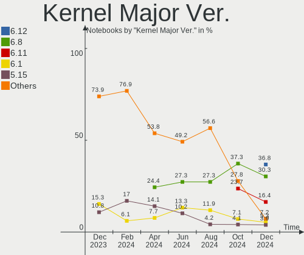
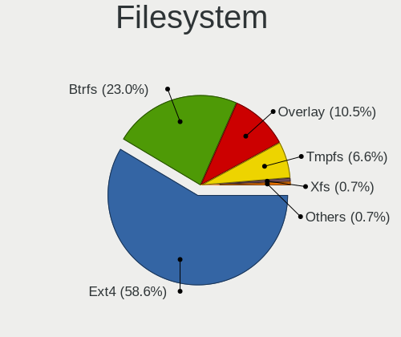
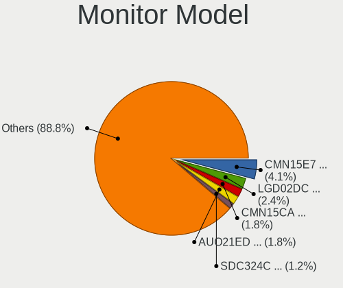
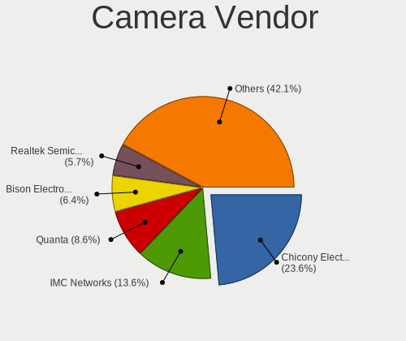
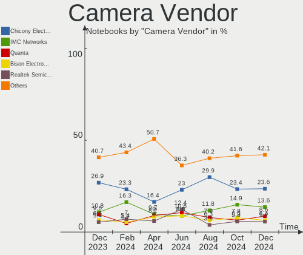

Linux in Italy - Hardware Trends (Notebooks)
--------------------------------------------

A project to identify most popular hardware characteristics and track their change
over time based on data collected by Linux users at https://Linux-Hardware.org.

Anyone can contribute to this report by the [hw-probe](https://github.com/linuxhw/hw-probe) tool:

    sudo -E hw-probe -all -upload

Contents
--------

* [ System ](#system)
  - [ OS                       ](#os)
  - [ OS Family                ](#os-family)
  - [ Kernel                   ](#kernel)
  - [ Kernel Family            ](#kernel-family)
  - [ Kernel Major Ver.        ](#kernel-major-ver)
  - [ Arch                     ](#arch)
  - [ DE                       ](#de)
  - [ Display Server           ](#display-server)
  - [ Display Manager          ](#display-manager)
  - [ OS Lang                  ](#os-lang)
  - [ Boot Mode                ](#boot-mode)
  - [ Filesystem               ](#filesystem)
  - [ Part. scheme             ](#part-scheme)
  - [ Dual Boot with Linux/BSD ](#dual-boot-with-linuxbsd)
  - [ Dual Boot (Win)          ](#dual-boot-win)

* [ Board ](#board)
  - [ Vendor                   ](#vendor)
  - [ Model                    ](#model)
  - [ Model Family             ](#model-family)
  - [ MFG Year                 ](#mfg-year)
  - [ Form Factor              ](#form-factor)
  - [ Secure Boot              ](#secure-boot)
  - [ Coreboot                 ](#coreboot)
  - [ RAM Size                 ](#ram-size)
  - [ RAM Used                 ](#ram-used)
  - [ Total Drives             ](#total-drives)
  - [ Has CD-ROM               ](#has-cd-rom)
  - [ Has Ethernet             ](#has-ethernet)
  - [ Has WiFi                 ](#has-wifi)
  - [ Has Bluetooth            ](#has-bluetooth)

* [ Location ](#location)
  - [ Country                  ](#country)
  - [ City                     ](#city)

* [ Drives ](#drives)
  - [ Drive Vendor             ](#drive-vendor)
  - [ Drive Model              ](#drive-model)
  - [ HDD Vendor               ](#hdd-vendor)
  - [ SSD Vendor               ](#ssd-vendor)
  - [ Drive Kind               ](#drive-kind)
  - [ Drive Connector          ](#drive-connector)
  - [ Drive Size               ](#drive-size)
  - [ Space Total              ](#space-total)
  - [ Space Used               ](#space-used)
  - [ Malfunc. Drives          ](#malfunc-drives)
  - [ Malfunc. Drive Vendor    ](#malfunc-drive-vendor)
  - [ Malfunc. HDD Vendor      ](#malfunc-hdd-vendor)
  - [ Malfunc. Drive Kind      ](#malfunc-drive-kind)
  - [ Failed Drives            ](#failed-drives)
  - [ Failed Drive Vendor      ](#failed-drive-vendor)
  - [ Drive Status             ](#drive-status)

* [ Storage controller ](#storage-controller)
  - [ Storage Vendor           ](#storage-vendor)
  - [ Storage Model            ](#storage-model)
  - [ Storage Kind             ](#storage-kind)

* [ Processor ](#processor)
  - [ CPU Vendor               ](#cpu-vendor)
  - [ CPU Model                ](#cpu-model)
  - [ CPU Model Family         ](#cpu-model-family)
  - [ CPU Cores                ](#cpu-cores)
  - [ CPU Sockets              ](#cpu-sockets)
  - [ CPU Threads              ](#cpu-threads)
  - [ CPU Op-Modes             ](#cpu-op-modes)
  - [ CPU Microcode            ](#cpu-microcode)
  - [ CPU Microarch            ](#cpu-microarch)

* [ Graphics ](#graphics)
  - [ GPU Vendor               ](#gpu-vendor)
  - [ GPU Model                ](#gpu-model)
  - [ GPU Combo                ](#gpu-combo)
  - [ GPU Driver               ](#gpu-driver)
  - [ GPU Memory               ](#gpu-memory)

* [ Monitor ](#monitor)
  - [ Monitor Vendor           ](#monitor-vendor)
  - [ Monitor Model            ](#monitor-model)
  - [ Monitor Resolution       ](#monitor-resolution)
  - [ Monitor Diagonal         ](#monitor-diagonal)
  - [ Monitor Width            ](#monitor-width)
  - [ Aspect Ratio             ](#aspect-ratio)
  - [ Monitor Area             ](#monitor-area)
  - [ Pixel Density            ](#pixel-density)
  - [ Multiple Monitors        ](#multiple-monitors)

* [ Network ](#network)
  - [ Net Controller Vendor    ](#net-controller-vendor)
  - [ Net Controller Model     ](#net-controller-model)
  - [ Wireless Vendor          ](#wireless-vendor)
  - [ Wireless Model           ](#wireless-model)
  - [ Ethernet Vendor          ](#ethernet-vendor)
  - [ Ethernet Model           ](#ethernet-model)
  - [ Net Controller Kind      ](#net-controller-kind)
  - [ Used Controller          ](#used-controller)
  - [ NICs                     ](#nics)
  - [ IPv6                     ](#ipv6)

* [ Bluetooth ](#bluetooth)
  - [ Bluetooth Vendor         ](#bluetooth-vendor)
  - [ Bluetooth Model          ](#bluetooth-model)

* [ Sound ](#sound)
  - [ Sound Vendor             ](#sound-vendor)
  - [ Sound Model              ](#sound-model)

* [ Memory ](#memory)
  - [ Memory Vendor            ](#memory-vendor)
  - [ Memory Model             ](#memory-model)
  - [ Memory Kind              ](#memory-kind)
  - [ Memory Form Factor       ](#memory-form-factor)
  - [ Memory Size              ](#memory-size)
  - [ Memory Speed             ](#memory-speed)

* [ Printers & scanners ](#printers--scanners)
  - [ Printer Vendor           ](#printer-vendor)
  - [ Printer Model            ](#printer-model)
  - [ Scanner Vendor           ](#scanner-vendor)
  - [ Scanner Model            ](#scanner-model)

* [ Camera ](#camera)
  - [ Camera Vendor            ](#camera-vendor)
  - [ Camera Model             ](#camera-model)

* [ Security ](#security)
  - [ Fingerprint Vendor       ](#fingerprint-vendor)
  - [ Fingerprint Model        ](#fingerprint-model)
  - [ Chipcard Vendor          ](#chipcard-vendor)
  - [ Chipcard Model           ](#chipcard-model)

* [ Unsupported ](#unsupported)
  - [ Unsupported Devices      ](#unsupported-devices)
  - [ Unsupported Device Types ](#unsupported-device-types)

System
------

OS
--

Installed operating systems

| Name                      | Notebooks | Percent |
|---------------------------|-----------|---------|
| Ubuntu 20.04              | 14        | 14.14%  |
| OpenMandriva 4.3          | 13        | 13.13%  |
| Ubuntu 22.04              | 8         | 8.08%   |
| Ubuntu 21.10              | 8         | 8.08%   |
| Pop!_OS 21.10             | 6         | 6.06%   |
| Xubuntu 20.04             | 4         | 4.04%   |
| Ubuntu 18.04              | 4         | 4.04%   |
| KDE neon 20.04            | 4         | 4.04%   |
| Debian 11                 | 4         | 4.04%   |
| Arch                      | 4         | 4.04%   |
| Linux Mint 20.3           | 3         | 3.03%   |
| Fedora 36                 | 3         | 3.03%   |
| EndeavourOS Rolling       | 3         | 3.03%   |
| Zorin 16                  | 2         | 2.02%   |
| Kubuntu 21.10             | 2         | 2.02%   |
| Kubuntu 20.04             | 2         | 2.02%   |
| Fedora 35                 | 2         | 2.02%   |
| openSUSE Microos-20220424 | 1         | 1.01%   |
| OpenMandriva 4.2          | 1         | 1.01%   |
| Manjaro                   | 1         | 1.01%   |
| Lubuntu 20.04             | 1         | 1.01%   |
| LMDE 4                    | 1         | 1.01%   |
| Linux Mint 19.3           | 1         | 1.01%   |
| Linux Mint 19.2           | 1         | 1.01%   |
| Garuda Linux Soaring      | 1         | 1.01%   |
| Endless 4.0.3             | 1         | 1.01%   |
| Debian Unstable           | 1         | 1.01%   |
| BlackPanther 18.1         | 1         | 1.01%   |
| ArcoLinux Rolling         | 1         | 1.01%   |
| Arch Rolling              | 1         | 1.01%   |

OS Family
---------

OS without a version

| Name         | Notebooks | Percent |
|--------------|-----------|---------|
| Ubuntu       | 34        | 34.34%  |
| OpenMandriva | 14        | 14.14%  |
| Pop!_OS      | 6         | 6.06%   |
| Linux Mint   | 5         | 5.05%   |
| Fedora       | 5         | 5.05%   |
| Debian       | 5         | 5.05%   |
| Arch         | 5         | 5.05%   |
| Xubuntu      | 4         | 4.04%   |
| Kubuntu      | 4         | 4.04%   |
| KDE neon     | 4         | 4.04%   |
| EndeavourOS  | 3         | 3.03%   |
| Zorin        | 2         | 2.02%   |
| openSUSE     | 1         | 1.01%   |
| Manjaro      | 1         | 1.01%   |
| Lubuntu      | 1         | 1.01%   |
| LMDE         | 1         | 1.01%   |
| Garuda Linux | 1         | 1.01%   |
| Endless      | 1         | 1.01%   |
| BlackPanther | 1         | 1.01%   |
| ArcoLinux    | 1         | 1.01%   |

Kernel
------

Version of the Linux kernel

| Version                      | Notebooks | Percent |
|------------------------------|-----------|---------|
| 5.13.0-39-generic            | 15        | 15.15%  |
| 5.16.7-desktop-1omv4003      | 13        | 13.13%  |
| 5.13.0-40-generic            | 11        | 11.11%  |
| 5.17.1-arch1-1               | 6         | 6.06%   |
| 5.4.0-109-generic            | 5         | 5.05%   |
| 5.4.0-107-generic            | 3         | 3.03%   |
| 5.16.15-76051615-generic     | 3         | 3.03%   |
| 5.15.0-27-generic            | 3         | 3.03%   |
| 5.16.11-76051611-generic     | 2         | 2.02%   |
| 5.15.0-25-generic            | 2         | 2.02%   |
| 5.13.0-37-generic            | 2         | 2.02%   |
| 5.10.0-13-amd64              | 2         | 2.02%   |
| 4.15.0-171-generic           | 2         | 2.02%   |
| 5.8.0-53-generic             | 1         | 1.01%   |
| 5.4.0-100-lowlatency         | 1         | 1.01%   |
| 5.17.4-1-default             | 1         | 1.01%   |
| 5.17.4-051704-generic        | 1         | 1.01%   |
| 5.17.3mdg_20220414           | 1         | 1.01%   |
| 5.17.3-xanmod1-1             | 1         | 1.01%   |
| 5.17.1-zen1-1-zen            | 1         | 1.01%   |
| 5.17.1-arch1-g14-1           | 1         | 1.01%   |
| 5.17.1-300.fc36.x86_64       | 1         | 1.01%   |
| 5.17.1-3-MANJARO             | 1         | 1.01%   |
| 5.17.0-300.fc36.x86_64       | 1         | 1.01%   |
| 5.17.0-0.rc7.116.fc36.x86_64 | 1         | 1.01%   |
| 5.16.19-76051619-generic     | 1         | 1.01%   |
| 5.16.18-200.fc35.x86_64      | 1         | 1.01%   |
| 5.16.0-6-amd64               | 1         | 1.01%   |
| 5.15.8-arch1-1               | 1         | 1.01%   |
| 5.15.36-051536-generic       | 1         | 1.01%   |
| 5.15.34-xanmod1              | 1         | 1.01%   |
| 5.15.0-23-generic            | 1         | 1.01%   |
| 5.14.10-300.fc35.x86_64      | 1         | 1.01%   |
| 5.14.0-1031-oem              | 1         | 1.01%   |
| 5.13.0-30-generic            | 1         | 1.01%   |
| 5.13.0-19-generic            | 1         | 1.01%   |
| 5.11.0-35-generic            | 1         | 1.01%   |
| 5.10.14-desktop-1omv4002     | 1         | 1.01%   |
| 5.10.0-6-amd64               | 1         | 1.01%   |
| 5.10.0-13-686                | 1         | 1.01%   |
| 4.19.0-20-amd64              | 1         | 1.01%   |
| 4.18.16-desktop-1bP          | 1         | 1.01%   |
| 4.15.0-54-generic            | 1         | 1.01%   |

Kernel Family
-------------

Linux kernel without a distro release

| Version | Notebooks | Percent |
|---------|-----------|---------|
| 5.13.0  | 30        | 30.3%   |
| 5.16.7  | 13        | 13.13%  |
| 5.17.1  | 10        | 10.1%   |
| 5.4.0   | 9         | 9.09%   |
| 5.15.0  | 6         | 6.06%   |
| 5.10.0  | 4         | 4.04%   |
| 5.16.15 | 3         | 3.03%   |
| 4.15.0  | 3         | 3.03%   |
| 5.17.4  | 2         | 2.02%   |
| 5.17.3  | 2         | 2.02%   |
| 5.17.0  | 2         | 2.02%   |
| 5.16.11 | 2         | 2.02%   |
| 5.8.0   | 1         | 1.01%   |
| 5.16.19 | 1         | 1.01%   |
| 5.16.18 | 1         | 1.01%   |
| 5.16.0  | 1         | 1.01%   |
| 5.15.8  | 1         | 1.01%   |
| 5.15.36 | 1         | 1.01%   |
| 5.15.34 | 1         | 1.01%   |
| 5.14.10 | 1         | 1.01%   |
| 5.14.0  | 1         | 1.01%   |
| 5.11.0  | 1         | 1.01%   |
| 5.10.14 | 1         | 1.01%   |
| 4.19.0  | 1         | 1.01%   |
| 4.18.16 | 1         | 1.01%   |

Kernel Major Ver.
-----------------

Linux kernel major version

| Version | Notebooks | Percent |
|---------|-----------|---------|
| 5.13    | 30        | 30.3%   |
| 5.16    | 21        | 21.21%  |
| 5.17    | 16        | 16.16%  |
| 5.4     | 9         | 9.09%   |
| 5.15    | 9         | 9.09%   |
| 5.10    | 5         | 5.05%   |
| 4.15    | 3         | 3.03%   |
| 5.14    | 2         | 2.02%   |
| 5.8     | 1         | 1.01%   |
| 5.11    | 1         | 1.01%   |
| 4.19    | 1         | 1.01%   |
| 4.18    | 1         | 1.01%   |

Arch
----

OS architecture (x86_64, i586, etc.)

| Name   | Notebooks | Percent |
|--------|-----------|---------|
| x86_64 | 95        | 95.96%  |
| i686   | 4         | 4.04%   |

DE
--

Desktop Environment

| Name       | Notebooks | Percent |
|------------|-----------|---------|
| GNOME      | 49        | 49.49%  |
| KDE5       | 27        | 27.27%  |
| XFCE       | 7         | 7.07%   |
| X-Cinnamon | 4         | 4.04%   |
| LXQt       | 4         | 4.04%   |
| MATE       | 2         | 2.02%   |
| bspwm      | 2         | 2.02%   |
| Unity      | 1         | 1.01%   |
| ubuntu     | 1         | 1.01%   |
| i3         | 1         | 1.01%   |
| Unknown    | 1         | 1.01%   |

Display Server
--------------

X11 or Wayland

| Name    | Notebooks | Percent |
|---------|-----------|---------|
| X11     | 78        | 78.79%  |
| Wayland | 20        | 20.2%   |
| Tty     | 1         | 1.01%   |

Display Manager
---------------

SDDM, LightDM, etc.

| Name    | Notebooks | Percent |
|---------|-----------|---------|
| Unknown | 27        | 27.27%  |
| SDDM    | 22        | 22.22%  |
| GDM3    | 20        | 20.2%   |
| GDM     | 19        | 19.19%  |
| LightDM | 11        | 11.11%  |

OS Lang
-------

Language

| Lang    | Notebooks | Percent |
|---------|-----------|---------|
| it_IT   | 64        | 64.65%  |
| en_US   | 32        | 32.32%  |
| fr_FR   | 1         | 1.01%   |
| en_GB   | 1         | 1.01%   |
| Unknown | 1         | 1.01%   |

Boot Mode
---------

EFI or BIOS

| Mode | Notebooks | Percent |
|------|-----------|---------|
| EFI  | 53        | 53.54%  |
| BIOS | 46        | 46.46%  |

Filesystem
----------

Type of filesystem

| Type    | Notebooks | Percent |
|---------|-----------|---------|
| Ext4    | 75        | 75.76%  |
| Overlay | 17        | 17.17%  |
| Btrfs   | 6         | 6.06%   |
| Xfs     | 1         | 1.01%   |

Part. scheme
------------

Scheme of partitioning

| Type    | Notebooks | Percent |
|---------|-----------|---------|
| Unknown | 47        | 47.47%  |
| GPT     | 39        | 39.39%  |
| MBR     | 13        | 13.13%  |

Dual Boot with Linux/BSD
------------------------

Hosting more than one Linux/BSD

| Dual boot | Notebooks | Percent |
|-----------|-----------|---------|
| No        | 84        | 84.85%  |
| Yes       | 15        | 15.15%  |

Dual Boot (Win)
---------------

Hosting Linux and Windows

| Dual boot | Notebooks | Percent |
|-----------|-----------|---------|
| No        | 65        | 65.66%  |
| Yes       | 34        | 34.34%  |

Board
-----

Vendor
------

Motherboard manufacturer

| Name             | Notebooks | Percent |
|------------------|-----------|---------|
| Lenovo           | 22        | 22.22%  |
| Hewlett-Packard  | 20        | 20.2%   |
| ASUSTek Computer | 12        | 12.12%  |
| Acer             | 12        | 12.12%  |
| Dell             | 9         | 9.09%   |
| Toshiba          | 4         | 4.04%   |
| Sony             | 2         | 2.02%   |
| SANTECH          | 2         | 2.02%   |
| PC Specialist    | 2         | 2.02%   |
| MSI              | 2         | 2.02%   |
| Microtech        | 2         | 2.02%   |
| Apple            | 2         | 2.02%   |
| YASHI            | 1         | 1.01%   |
| TrekStor         | 1         | 1.01%   |
| Teclast          | 1         | 1.01%   |
| Razer            | 1         | 1.01%   |
| Notebook         | 1         | 1.01%   |
| Fujitsu          | 1         | 1.01%   |
| Chuwi            | 1         | 1.01%   |
| Unknown          | 1         | 1.01%   |

Model
-----

Motherboard model

| Name                                     | Notebooks | Percent |
|------------------------------------------|-----------|---------|
| SANTECH NHx0EH_EJ_EK                     | 2         | 2.02%   |
| HP 255 G8 Notebook PC                    | 2         | 2.02%   |
| YASHI MYBOOK 360                         | 1         | 1.01%   |
| TrekStor Notebook Slim S130              | 1         | 1.01%   |
| Toshiba Satellite Pro S500               | 1         | 1.01%   |
| Toshiba Satellite L50D-B                 | 1         | 1.01%   |
| Toshiba Satellite A350D                  | 1         | 1.01%   |
| Toshiba Satellite A200                   | 1         | 1.01%   |
| Teclast F7 Plus                          | 1         | 1.01%   |
| Sony VGN-FW56J                           | 1         | 1.01%   |
| Sony SVE1712S1EB                         | 1         | 1.01%   |
| Razer Blade 14 - RZ09-0370               | 1         | 1.01%   |
| PC Specialist PCx0Dx                     | 1         | 1.01%   |
| PC Specialist N8xEJEK                    | 1         | 1.01%   |
| Notebook NL40_50CU                       | 1         | 1.01%   |
| MSI Prestige 14Evo A11M                  | 1         | 1.01%   |
| MSI Modern 15 A11M                       | 1         | 1.01%   |
| Microtech ebookPro                       | 1         | 1.01%   |
| Microtech CoreBook                       | 1         | 1.01%   |
| Lenovo Yoga S740-14IIL 81RS              | 1         | 1.01%   |
| Lenovo ThinkPad X230 2333BF6             | 1         | 1.01%   |
| Lenovo ThinkPad X100e 0022CTO            | 1         | 1.01%   |
| Lenovo ThinkPad X1 Carbon 6th 20KGS23S0P | 1         | 1.01%   |
| Lenovo ThinkPad W541 20EGS24J00          | 1         | 1.01%   |
| Lenovo ThinkPad T495 20NJ000XIX          | 1         | 1.01%   |
| Lenovo ThinkPad T430 2349AK5             | 1         | 1.01%   |
| Lenovo ThinkPad T15g Gen 1 20URCTO1WW    | 1         | 1.01%   |
| Lenovo ThinkPad R61 7735WRF              | 1         | 1.01%   |
| Lenovo ThinkPad P1 Gen 3 20TJS2F437      | 1         | 1.01%   |
| Lenovo ThinkPad E570 20H500B5IX          | 1         | 1.01%   |
| Lenovo ThinkBook 15-IML 20RW             | 1         | 1.01%   |
| Lenovo ThinkBook 15 G2 ITL 20VE          | 1         | 1.01%   |
| Lenovo ThinkBook 13s G3 ACN 20YA         | 1         | 1.01%   |
| Lenovo Legion Y530-15ICH 81FV            | 1         | 1.01%   |
| Lenovo Legion S7 15IMH5 82BC             | 1         | 1.01%   |
| Lenovo Legion 5 15IMH05H 81Y6            | 1         | 1.01%   |
| Lenovo IdeaPad 700-15ISK 80RU            | 1         | 1.01%   |
| Lenovo IdeaPad 500-15ISK 80NT            | 1         | 1.01%   |
| Lenovo IdeaPad 320-15ABR 80XS            | 1         | 1.01%   |
| Lenovo G50-70 20351                      | 1         | 1.01%   |
| Lenovo B50-30 80ES                       | 1         | 1.01%   |
| HP ProBook 440 G7                        | 1         | 1.01%   |
| HP Pavilion Laptop 15-cs0xxx             | 1         | 1.01%   |
| HP Pavilion dv6500                       | 1         | 1.01%   |
| HP Pavilion dv6                          | 1         | 1.01%   |
| HP Pavilion 15                           | 1         | 1.01%   |
| HP OMEN Laptop 15-en0xxx                 | 1         | 1.01%   |
| HP OMEN by Laptop 16-c0xxx               | 1         | 1.01%   |
| HP Laptop 15s-eq2xxx                     | 1         | 1.01%   |
| HP Laptop 15-da0xxx                      | 1         | 1.01%   |
| HP EliteBook Folio 9470m                 | 1         | 1.01%   |
| HP EliteBook 850 G5                      | 1         | 1.01%   |
| HP EliteBook 840 G5                      | 1         | 1.01%   |
| HP Compaq nx7300 (RU608ES#ABZ)           | 1         | 1.01%   |
| HP Compaq 6730s                          | 1         | 1.01%   |
| HP Compaq 6720s                          | 1         | 1.01%   |
| HP 255 G6 Notebook PC                    | 1         | 1.01%   |
| HP 250 G5 Notebook PC                    | 1         | 1.01%   |
| HP 15                                    | 1         | 1.01%   |
| Fujitsu LIFEBOOK P701                    | 1         | 1.01%   |

Model Family
------------

Motherboard model prefix

| Name                  | Notebooks | Percent |
|-----------------------|-----------|---------|
| Lenovo ThinkPad       | 10        | 10.1%   |
| Acer Aspire           | 6         | 6.06%   |
| Dell Latitude         | 5         | 5.05%   |
| Toshiba Satellite     | 4         | 4.04%   |
| HP Pavilion           | 4         | 4.04%   |
| Lenovo ThinkBook      | 3         | 3.03%   |
| Lenovo Legion         | 3         | 3.03%   |
| Lenovo IdeaPad        | 3         | 3.03%   |
| HP EliteBook          | 3         | 3.03%   |
| HP Compaq             | 3         | 3.03%   |
| HP 255                | 3         | 3.03%   |
| ASUS ROG              | 3         | 3.03%   |
| SANTECH NHx0EH        | 2         | 2.02%   |
| HP OMEN               | 2         | 2.02%   |
| HP Laptop             | 2         | 2.02%   |
| Dell Vostro           | 2         | 2.02%   |
| Dell Inspiron         | 2         | 2.02%   |
| Acer Nitro            | 2         | 2.02%   |
| YASHI MYBOOK          | 1         | 1.01%   |
| TrekStor Notebook     | 1         | 1.01%   |
| Teclast F7            | 1         | 1.01%   |
| Sony VGN-FW56J        | 1         | 1.01%   |
| Sony SVE1712S1EB      | 1         | 1.01%   |
| Razer Blade           | 1         | 1.01%   |
| PC Specialist PCx0Dx  | 1         | 1.01%   |
| PC Specialist N8xEJEK | 1         | 1.01%   |
| Notebook NL40         | 1         | 1.01%   |
| MSI Prestige          | 1         | 1.01%   |
| MSI Modern            | 1         | 1.01%   |
| Microtech ebookPro    | 1         | 1.01%   |
| Microtech CoreBook    | 1         | 1.01%   |
| Lenovo Yoga           | 1         | 1.01%   |
| Lenovo G50-70         | 1         | 1.01%   |
| Lenovo B50-30         | 1         | 1.01%   |
| HP ProBook            | 1         | 1.01%   |
| HP 250                | 1         | 1.01%   |
| HP 15                 | 1         | 1.01%   |
| Fujitsu LIFEBOOK      | 1         | 1.01%   |
| Chuwi HeroBook        | 1         | 1.01%   |
| ASUS ZenBook          | 1         | 1.01%   |
| ASUS X556UB           | 1         | 1.01%   |
| ASUS X541UAK          | 1         | 1.01%   |
| ASUS UL30VT           | 1         | 1.01%   |
| ASUS S551LN           | 1         | 1.01%   |
| ASUS N75SF            | 1         | 1.01%   |
| ASUS N56VV            | 1         | 1.01%   |
| ASUS K53SC            | 1         | 1.01%   |
| ASUS 1101HA           | 1         | 1.01%   |
| Apple MacBookPro9     | 1         | 1.01%   |
| Apple MacBookPro10    | 1         | 1.01%   |
| Acer TM4750           | 1         | 1.01%   |
| Acer Swift            | 1         | 1.01%   |
| Acer Extensa          | 1         | 1.01%   |
| Acer E1-510           | 1         | 1.01%   |
| Unknown               | 1         | 1.01%   |

MFG Year
--------

Motherboard manufacture year

| Year    | Notebooks | Percent |
|---------|-----------|---------|
| 2021    | 17        | 17.17%  |
| 2020    | 11        | 11.11%  |
| 2019    | 8         | 8.08%   |
| 2018    | 8         | 8.08%   |
| 2016    | 6         | 6.06%   |
| 2012    | 6         | 6.06%   |
| 2009    | 6         | 6.06%   |
| 2015    | 5         | 5.05%   |
| 2014    | 5         | 5.05%   |
| 2013    | 5         | 5.05%   |
| 2017    | 4         | 4.04%   |
| 2011    | 4         | 4.04%   |
| 2010    | 4         | 4.04%   |
| 2008    | 4         | 4.04%   |
| 2007    | 4         | 4.04%   |
| 2006    | 1         | 1.01%   |
| Unknown | 1         | 1.01%   |

Form Factor
-----------

Physical design of the computer

| Name     | Notebooks | Percent |
|----------|-----------|---------|
| Notebook | 99        | 100%    |

Secure Boot
-----------

Enabled or disabled

| State    | Notebooks | Percent |
|----------|-----------|---------|
| Disabled | 90        | 90.91%  |
| Enabled  | 9         | 9.09%   |

Coreboot
--------

Have coreboot on board

| Used | Notebooks | Percent |
|------|-----------|---------|
| No   | 99        | 100%    |

RAM Size
--------

Total RAM memory

| Size in GB  | Notebooks | Percent |
|-------------|-----------|---------|
| 4.01-8.0    | 28        | 28.28%  |
| 16.01-24.0  | 23        | 23.23%  |
| 3.01-4.0    | 18        | 18.18%  |
| 8.01-16.0   | 16        | 16.16%  |
| 32.01-64.0  | 8         | 8.08%   |
| 2.01-3.0    | 2         | 2.02%   |
| 1.01-2.0    | 2         | 2.02%   |
| 24.01-32.0  | 1         | 1.01%   |
| 64.01-256.0 | 1         | 1.01%   |

RAM Used
--------

Used RAM memory

| Used GB   | Notebooks | Percent |
|-----------|-----------|---------|
| 1.01-2.0  | 37        | 37.37%  |
| 2.01-3.0  | 19        | 19.19%  |
| 4.01-8.0  | 17        | 17.17%  |
| 3.01-4.0  | 13        | 13.13%  |
| 8.01-16.0 | 6         | 6.06%   |
| 0.51-1.0  | 6         | 6.06%   |
| 0.01-0.5  | 1         | 1.01%   |

Total Drives
------------

Number of drives on board

| Drives | Notebooks | Percent |
|--------|-----------|---------|
| 1      | 74        | 74.75%  |
| 2      | 17        | 17.17%  |
| 3      | 5         | 5.05%   |
| 4      | 2         | 2.02%   |
| 0      | 1         | 1.01%   |

Has CD-ROM
----------

Has CD-ROM on board

| Presented | Notebooks | Percent |
|-----------|-----------|---------|
| No        | 59        | 59.6%   |
| Yes       | 40        | 40.4%   |

Has Ethernet
------------

Has Ethernet on board

| Presented | Notebooks | Percent |
|-----------|-----------|---------|
| Yes       | 85        | 85.86%  |
| No        | 14        | 14.14%  |

Has WiFi
--------

Has WiFi module

| Presented | Notebooks | Percent |
|-----------|-----------|---------|
| Yes       | 96        | 96.97%  |
| No        | 3         | 3.03%   |

Has Bluetooth
-------------

Has Bluetooth module

| Presented | Notebooks | Percent |
|-----------|-----------|---------|
| Yes       | 86        | 86.87%  |
| No        | 13        | 13.13%  |

Location
--------

Country
-------

Geographic location (country)

| Country | Notebooks | Percent |
|---------|-----------|---------|
| Italy   | 99        | 100%    |

City
----

Geographic location (city)

| City                          | Notebooks | Percent |
|-------------------------------|-----------|---------|
| Milan                         | 16        | 16.16%  |
| Rome                          | 8         | 8.08%   |
| Rho                           | 3         | 3.03%   |
| Naples                        | 3         | 3.03%   |
| Udine                         | 2         | 2.02%   |
| Turin                         | 2         | 2.02%   |
| Senigallia                    | 2         | 2.02%   |
| Padova                        | 2         | 2.02%   |
| Novara                        | 2         | 2.02%   |
| Foggia                        | 2         | 2.02%   |
| Brescia                       | 2         | 2.02%   |
| Albano Laziale                | 2         | 2.02%   |
| Zevio                         | 1         | 1.01%   |
| Venice                        | 1         | 1.01%   |
| Vedano al Lambro              | 1         | 1.01%   |
| Travagliato                   | 1         | 1.01%   |
| Spinetoli                     | 1         | 1.01%   |
| Scorrano                      | 1         | 1.01%   |
| Scandicci                     | 1         | 1.01%   |
| Santeramo in Colle            | 1         | 1.01%   |
| San Martino di Lupari         | 1         | 1.01%   |
| San Martino Buon Albergo      | 1         | 1.01%   |
| San Fedele Superiore          | 1         | 1.01%   |
| San Donà di Piave            | 1         | 1.01%   |
| Salerno                       | 1         | 1.01%   |
| Ronsecco                      | 1         | 1.01%   |
| Poggio Berni                  | 1         | 1.01%   |
| Pistoia                       | 1         | 1.01%   |
| Palermo                       | 1         | 1.01%   |
| Paladina                      | 1         | 1.01%   |
| Nuoro                         | 1         | 1.01%   |
| Montesilvano Marina           | 1         | 1.01%   |
| Mölten                       | 1         | 1.01%   |
| Matelica                      | 1         | 1.01%   |
| Massa Fermana                 | 1         | 1.01%   |
| Magenta                       | 1         | 1.01%   |
| Madone                        | 1         | 1.01%   |
| Lodi                          | 1         | 1.01%   |
| Livorno                       | 1         | 1.01%   |
| La Maddalena                  | 1         | 1.01%   |
| Grumo Nevano                  | 1         | 1.01%   |
| Genoa                         | 1         | 1.01%   |
| Forlì                        | 1         | 1.01%   |
| Ferrara di Monte Baldo        | 1         | 1.01%   |
| Feldthurns                    | 1         | 1.01%   |
| Desenzano del Garda           | 1         | 1.01%   |
| Curno                         | 1         | 1.01%   |
| Cuneo                         | 1         | 1.01%   |
| Comun Nuovo                   | 1         | 1.01%   |
| Chiuduno                      | 1         | 1.01%   |
| Cernusco sul Naviglio         | 1         | 1.01%   |
| Catania                       | 1         | 1.01%   |
| Capoterra                     | 1         | 1.01%   |
| Caponago                      | 1         | 1.01%   |
| Capaccio                      | 1         | 1.01%   |
| Caldaro sulla Strada del Vino | 1         | 1.01%   |
| Ca' Acquabuona                | 1         | 1.01%   |
| Borgosesia                    | 1         | 1.01%   |
| Borgo San Lorenzo             | 1         | 1.01%   |
| Bolzano Vicentino             | 1         | 1.01%   |

Drives
------

Drive Vendor
------------

Hard drive vendors

| Vendor                      | Notebooks | Drives | Percent |
|-----------------------------|-----------|--------|---------|
| Samsung Electronics         | 27        | 33     | 22.5%   |
| Kingston                    | 10        | 10     | 8.33%   |
| WDC                         | 9         | 9      | 7.5%    |
| Toshiba                     | 9         | 9      | 7.5%    |
| Seagate                     | 9         | 10     | 7.5%    |
| Crucial                     | 8         | 8      | 6.67%   |
| SK Hynix                    | 6         | 6      | 5%      |
| Unknown                     | 5         | 7      | 4.17%   |
| Sandisk                     | 5         | 6      | 4.17%   |
| Hitachi                     | 5         | 5      | 4.17%   |
| HGST                        | 4         | 5      | 3.33%   |
| Phison                      | 3         | 3      | 2.5%    |
| Transcend                   | 2         | 2      | 1.67%   |
| Silicon Motion              | 2         | 2      | 1.67%   |
| KIOXIA                      | 2         | 2      | 1.67%   |
| Fujitsu                     | 2         | 2      | 1.67%   |
| Vaseky                      | 1         | 1      | 0.83%   |
| SABRENT                     | 1         | 1      | 0.83%   |
| Netac                       | 1         | 1      | 0.83%   |
| Microtech                   | 1         | 1      | 0.83%   |
| Micron Technology           | 1         | 1      | 0.83%   |
| MAXIO Technology (Hangzhou) | 1         | 1      | 0.83%   |
| Lexar                       | 1         | 1      | 0.83%   |
| HS-SSD-E100N                | 1         | 1      | 0.83%   |
| Hewlett-Packard             | 1         | 1      | 0.83%   |
| Drevo                       | 1         | 1      | 0.83%   |
| Apple                       | 1         | 1      | 0.83%   |
| Unknown                     | 1         | 1      | 0.83%   |

Drive Model
-----------

Hard drive models

| Model                                   | Notebooks | Percent |
|-----------------------------------------|-----------|---------|
| Toshiba MQ01ABF050 500GB                | 3         | 2.29%   |
| Seagate ST1000LM024 HN-M101MBB 1TB      | 3         | 2.29%   |
| Samsung SSD 970 EVO Plus 500GB          | 3         | 2.29%   |
| Samsung SSD 860 EVO 1TB                 | 3         | 2.29%   |
| WDC WD10JPVX-60JC3T0 1TB                | 2         | 1.53%   |
| Sandisk NVMe SSD Drive 512GB            | 2         | 1.53%   |
| Samsung PSSD T7 500GB                   | 2         | 1.53%   |
| Samsung NVMe SSD Drive 512GB            | 2         | 1.53%   |
| Samsung NVMe SSD Drive 2TB              | 2         | 1.53%   |
| Samsung NVMe SSD Drive 256GB            | 2         | 1.53%   |
| Phison Sabrent 256GB                    | 2         | 1.53%   |
| Kingston OM8PDP3512B-AA1 512GB          | 2         | 1.53%   |
| HGST HTS545050A7E680 500GB              | 2         | 1.53%   |
| Crucial CT500MX500SSD1 500GB            | 2         | 1.53%   |
| Crucial CT480BX500SSD1 480GB            | 2         | 1.53%   |
| WDC WD800BEVS-08RST3 80GB               | 1         | 0.76%   |
| WDC WD5000LPCX-21VHAT0 500GB            | 1         | 0.76%   |
| WDC WD5000BPVT-00A1YT0 500GB            | 1         | 0.76%   |
| WDC WD3200BEVT-22ZCT0 320GB             | 1         | 0.76%   |
| WDC WD10SPZX-24Z10 1TB                  | 1         | 0.76%   |
| WDC WD10JPCX-24UE4T0 1TB                | 1         | 0.76%   |
| WDC PC SN530 SDBPMPZ-256G-1101 256GB    | 1         | 0.76%   |
| Vaseky V800/256G 256GB SSD              | 1         | 0.76%   |
| Unknown SC200  197GB                    | 1         | 0.76%   |
| Unknown SC128  128GB                    | 1         | 0.76%   |
| Unknown NCard  64GB                     | 1         | 0.76%   |
| Unknown MMC Card  7GB                   | 1         | 0.76%   |
| Unknown MMC Card  64GB                  | 1         | 0.76%   |
| Unknown Biwin  32GB                     | 1         | 0.76%   |
| Unknown 128G32  128GB                   | 1         | 0.76%   |
| Transcend TS128GSSD230S 128GB           | 1         | 0.76%   |
| Transcend TS128GMTS430S 128GB SSD       | 1         | 0.76%   |
| Toshiba TR200 240GB SSD                 | 1         | 0.76%   |
| Toshiba MQ01ABD100 1TB                  | 1         | 0.76%   |
| Toshiba MQ01ABD075 752GB                | 1         | 0.76%   |
| Toshiba MK8034GSX 80GB                  | 1         | 0.76%   |
| Toshiba MK2555GSX 250GB                 | 1         | 0.76%   |
| Toshiba KXG6AZNV512G 512GB              | 1         | 0.76%   |
| SK Hynix SKHynix_HFS001TD9TNI-L2A0B 1TB | 1         | 0.76%   |
| SK Hynix SKHynix_HFM512GD3HX015N 512GB  | 1         | 0.76%   |
| SK Hynix SC308 SATA 256GB SSD           | 1         | 0.76%   |
| SK Hynix NVMe SSD Drive 512GB           | 1         | 0.76%   |
| SK Hynix HFS512G39TND-N210A 512GB SSD   | 1         | 0.76%   |
| SK Hynix BC711 NVMe 512GB               | 1         | 0.76%   |
| Silicon Motion NVMe SSD Drive 512GB     | 1         | 0.76%   |
| Silicon Motion NE-128 128GB             | 1         | 0.76%   |
| Seagate ST9750420AS 752GB               | 1         | 0.76%   |
| Seagate ST9160310AS 160GB               | 1         | 0.76%   |
| Seagate ST500LT012-9WS142 500GB         | 1         | 0.76%   |
| Seagate ST500LT012-1DG142 500GB         | 1         | 0.76%   |
| Seagate ST2000LM015-2E8174 2TB          | 1         | 0.76%   |
| Seagate ST2000LM007-1R8174 2TB          | 1         | 0.76%   |
| Seagate Expansion+ 2TB                  | 1         | 0.76%   |
| SanDisk SSD PLUS 240GB                  | 1         | 0.76%   |
| SanDisk SD9SN8W-256G-1006 256GB SSD     | 1         | 0.76%   |
| SanDisk SD7UB3Q256G1001 256GB SSD       | 1         | 0.76%   |
| Sandisk NVMe SSD Drive 500GB            | 1         | 0.76%   |
| Samsung SSD PM871b M.2 2280 256GB       | 1         | 0.76%   |
| Samsung SSD PM851 mSATA 256GB           | 1         | 0.76%   |
| Samsung SSD 970 EVO Plus 2TB            | 1         | 0.76%   |

HDD Vendor
----------

Hard disk drive vendors

| Vendor  | Notebooks | Drives | Percent |
|---------|-----------|--------|---------|
| Seagate | 9         | 10     | 25%     |
| WDC     | 8         | 8      | 22.22%  |
| Toshiba | 7         | 7      | 19.44%  |
| Hitachi | 5         | 5      | 13.89%  |
| HGST    | 4         | 5      | 11.11%  |
| Fujitsu | 2         | 2      | 5.56%   |
| SABRENT | 1         | 1      | 2.78%   |

SSD Vendor
----------

Solid state drive vendors

| Vendor              | Notebooks | Drives | Percent |
|---------------------|-----------|--------|---------|
| Samsung Electronics | 12        | 13     | 30.77%  |
| Crucial             | 8         | 8      | 20.51%  |
| Kingston            | 4         | 4      | 10.26%  |
| SanDisk             | 3         | 3      | 7.69%   |
| Transcend           | 2         | 2      | 5.13%   |
| SK Hynix            | 2         | 2      | 5.13%   |
| Vaseky              | 1         | 1      | 2.56%   |
| Toshiba             | 1         | 1      | 2.56%   |
| Netac               | 1         | 1      | 2.56%   |
| Microtech           | 1         | 1      | 2.56%   |
| Hewlett-Packard     | 1         | 1      | 2.56%   |
| Drevo               | 1         | 1      | 2.56%   |
| Apple               | 1         | 1      | 2.56%   |
| Unknown             | 1         | 1      | 2.56%   |

Drive Kind
----------

HDD or SSD

| Kind    | Notebooks | Drives | Percent |
|---------|-----------|--------|---------|
| NVMe    | 38        | 44     | 32.48%  |
| SSD     | 37        | 40     | 31.62%  |
| HDD     | 35        | 38     | 29.91%  |
| MMC     | 5         | 7      | 4.27%   |
| Unknown | 2         | 2      | 1.71%   |

Drive Connector
---------------

SATA, SAS, NVMe, etc.

| Type | Notebooks | Drives | Percent |
|------|-----------|--------|---------|
| SATA | 67        | 75     | 58.26%  |
| NVMe | 38        | 44     | 33.04%  |
| SAS  | 5         | 5      | 4.35%   |
| MMC  | 5         | 7      | 4.35%   |

Drive Size
----------

Size of hard drive

| Size in TB | Notebooks | Drives | Percent |
|------------|-----------|--------|---------|
| 0.01-0.5   | 53        | 59     | 75.71%  |
| 0.51-1.0   | 15        | 16     | 21.43%  |
| 1.01-2.0   | 2         | 3      | 2.86%   |

Space Total
-----------

Amount of disk space available on the file system

| Size in GB     | Notebooks | Percent |
|----------------|-----------|---------|
| 251-500        | 29        | 29.29%  |
| 101-250        | 26        | 26.26%  |
| 1-20           | 14        | 14.14%  |
| 501-1000       | 9         | 9.09%   |
| 1001-2000      | 7         | 7.07%   |
| 2001-3000      | 4         | 4.04%   |
| 51-100         | 4         | 4.04%   |
| Unknown        | 3         | 3.03%   |
| More than 3000 | 2         | 2.02%   |
| 21-50          | 1         | 1.01%   |

Space Used
----------

Amount of used disk space

| Used GB        | Notebooks | Percent |
|----------------|-----------|---------|
| 1-20           | 37        | 37.37%  |
| 101-250        | 16        | 16.16%  |
| 51-100         | 14        | 14.14%  |
| 21-50          | 13        | 13.13%  |
| 251-500        | 8         | 8.08%   |
| 1001-2000      | 3         | 3.03%   |
| 501-1000       | 3         | 3.03%   |
| Unknown        | 3         | 3.03%   |
| More than 3000 | 2         | 2.02%   |

Malfunc. Drives
---------------

Drive models with a malfunction

| Model                                 | Notebooks | Drives | Percent |
|---------------------------------------|-----------|--------|---------|
| Toshiba MK2555GSX 250GB               | 1         | 1      | 20%     |
| SK Hynix HFS512G39TND-N210A 512GB SSD | 1         | 1      | 20%     |
| Seagate ST1000LM024 HN-M101MBB 1TB    | 1         | 1      | 20%     |
| Hitachi HTS543225L9A300 250GB         | 1         | 1      | 20%     |
| HGST HTS725050A7E630 500GB            | 1         | 1      | 20%     |

Malfunc. Drive Vendor
---------------------

Vendors of faulty drives

| Vendor   | Notebooks | Drives | Percent |
|----------|-----------|--------|---------|
| Toshiba  | 1         | 1      | 20%     |
| SK Hynix | 1         | 1      | 20%     |
| Seagate  | 1         | 1      | 20%     |
| Hitachi  | 1         | 1      | 20%     |
| HGST     | 1         | 1      | 20%     |

Malfunc. HDD Vendor
-------------------

Vendors of faulty HDD drives

| Vendor  | Notebooks | Drives | Percent |
|---------|-----------|--------|---------|
| Toshiba | 1         | 1      | 25%     |
| Seagate | 1         | 1      | 25%     |
| Hitachi | 1         | 1      | 25%     |
| HGST    | 1         | 1      | 25%     |

Malfunc. Drive Kind
-------------------

Kinds of faulty drives

| Kind | Notebooks | Drives | Percent |
|------|-----------|--------|---------|
| HDD  | 4         | 4      | 80%     |
| SSD  | 1         | 1      | 20%     |

Failed Drives
-------------

Failed drive models

| Model                    | Notebooks | Drives | Percent |
|--------------------------|-----------|--------|---------|
| WDC WD10JPVX-60JC3T0 1TB | 1         | 1      | 100%    |

Failed Drive Vendor
-------------------

Failed drive vendors

| Vendor | Notebooks | Drives | Percent |
|--------|-----------|--------|---------|
| WDC    | 1         | 1      | 100%    |

Drive Status
------------

Number of failed and malfunc. drives

| Status   | Notebooks | Drives | Percent |
|----------|-----------|--------|---------|
| Detected | 52        | 69     | 50%     |
| Works    | 46        | 56     | 44.23%  |
| Malfunc  | 5         | 5      | 4.81%   |
| Failed   | 1         | 1      | 0.96%   |

Storage controller
------------------

Storage Vendor
--------------

Storage controller vendors

| Vendor                       | Notebooks | Percent |
|------------------------------|-----------|---------|
| Intel                        | 67        | 54.92%  |
| Samsung Electronics          | 18        | 14.75%  |
| AMD                          | 14        | 11.48%  |
| Kingston Technology Company  | 6         | 4.92%   |
| SK Hynix                     | 4         | 3.28%   |
| Sandisk                      | 3         | 2.46%   |
| Phison Electronics           | 3         | 2.46%   |
| Silicon Motion               | 2         | 1.64%   |
| KIOXIA                       | 2         | 1.64%   |
| Toshiba America Info Systems | 1         | 0.82%   |
| Micron Technology            | 1         | 0.82%   |
| MAXIO Technology (Hangzhou)  | 1         | 0.82%   |

Storage Model
-------------

Storage controller models

| Model                                                                          | Notebooks | Percent |
|--------------------------------------------------------------------------------|-----------|---------|
| Samsung NVMe SSD Controller SM981/PM981/PM983                                  | 13        | 9.92%   |
| AMD FCH SATA Controller [AHCI mode]                                            | 12        | 9.16%   |
| Intel 7 Series Chipset Family 6-port SATA Controller [AHCI mode]               | 8         | 6.11%   |
| Intel Sunrise Point-LP SATA Controller [AHCI mode]                             | 7         | 5.34%   |
| Intel 82801IBM/IEM (ICH9M/ICH9M-E) 4 port SATA Controller [AHCI mode]          | 6         | 4.58%   |
| Intel 82801 Mobile SATA Controller [RAID mode]                                 | 6         | 4.58%   |
| Intel Celeron/Pentium Silver Processor SATA Controller                         | 5         | 3.82%   |
| Intel 82801HM/HEM (ICH8M/ICH8M-E) SATA Controller [AHCI mode]                  | 5         | 3.82%   |
| Intel 82801HM/HEM (ICH8M/ICH8M-E) IDE Controller                               | 5         | 3.82%   |
| Intel 8 Series SATA Controller 1 [AHCI mode]                                   | 5         | 3.82%   |
| Intel 6 Series/C200 Series Chipset Family 6 port Mobile SATA AHCI Controller   | 4         | 3.05%   |
| Samsung NVMe SSD Controller 980                                                | 3         | 2.29%   |
| Phison E12 NVMe Controller                                                     | 3         | 2.29%   |
| Intel Comet Lake SATA AHCI Controller                                          | 3         | 2.29%   |
| SK Hynix Gold P31 SSD                                                          | 2         | 1.53%   |
| Silicon Motion SM2263EN/SM2263XT SSD Controller                                | 2         | 1.53%   |
| Sandisk WD Blue SN550 NVMe SSD                                                 | 2         | 1.53%   |
| KIOXIA Non-Volatile memory controller                                          | 2         | 1.53%   |
| Kingston Company Company Non-Volatile memory controller                        | 2         | 1.53%   |
| Kingston Company SNVS2000G [NV1 NVMe PCIe SSD 2TB]                             | 2         | 1.53%   |
| Kingston Company OM3PDP3 NVMe SSD                                              | 2         | 1.53%   |
| Intel Wildcat Point-LP SATA Controller [AHCI Mode]                             | 2         | 1.53%   |
| Intel Volume Management Device NVMe RAID Controller                            | 2         | 1.53%   |
| Intel Cannon Lake Mobile PCH SATA AHCI Controller                              | 2         | 1.53%   |
| Intel Atom Processor E3800 Series SATA AHCI Controller                         | 2         | 1.53%   |
| Intel 400 Series Chipset Family SATA AHCI Controller                           | 2         | 1.53%   |
| Toshiba America Info Systems XG6 NVMe SSD Controller                           | 1         | 0.76%   |
| SK Hynix Non-Volatile memory controller                                        | 1         | 0.76%   |
| SK Hynix BC501 NVMe Solid State Drive                                          | 1         | 0.76%   |
| Sandisk WD Black SN750 / PC SN730 NVMe SSD                                     | 1         | 0.76%   |
| Sandisk Non-Volatile memory controller                                         | 1         | 0.76%   |
| Samsung NVMe SSD Controller SM961/PM961/SM963                                  | 1         | 0.76%   |
| Samsung NVMe SSD Controller PM9A1/PM9A3/980PRO                                 | 1         | 0.76%   |
| Micron Non-Volatile memory controller                                          | 1         | 0.76%   |
| MAXIO (Hangzhou) NVMe SSD Controller MAP1001                                   | 1         | 0.76%   |
| Intel US15W/US15X/US15L/UL11L SCH [Poulsbo] IDE Controller                     | 1         | 0.76%   |
| Intel Tiger Lake-LP SATA Controller [AHCI mode]                                | 1         | 0.76%   |
| Intel Mobile 4 Series Chipset PT IDER Controller                               | 1         | 0.76%   |
| Intel Ice Lake-LP SATA Controller [AHCI mode]                                  | 1         | 0.76%   |
| Intel HM170/QM170 Chipset SATA Controller [AHCI Mode]                          | 1         | 0.76%   |
| Intel Cannon Point-LP SATA Controller [AHCI Mode]                              | 1         | 0.76%   |
| Intel 82801GBM/GHM (ICH7-M Family) SATA Controller [AHCI mode]                 | 1         | 0.76%   |
| Intel 82801G (ICH7 Family) IDE Controller                                      | 1         | 0.76%   |
| Intel 8 Series/C220 Series Chipset Family 6-port SATA Controller 1 [AHCI mode] | 1         | 0.76%   |
| Intel 5 Series/3400 Series Chipset 4 port SATA AHCI Controller                 | 1         | 0.76%   |
| AMD SB7x0/SB8x0/SB9x0 SATA Controller [IDE mode]                               | 1         | 0.76%   |
| AMD SB7x0/SB8x0/SB9x0 SATA Controller [AHCI mode]                              | 1         | 0.76%   |
| AMD SB7x0/SB8x0/SB9x0 IDE Controller                                           | 1         | 0.76%   |

Storage Kind
------------

Kind of storage controller (IDE, SATA, NVMe, SAS, ...)

| Kind | Notebooks | Percent |
|------|-----------|---------|
| SATA | 72        | 56.69%  |
| NVMe | 38        | 29.92%  |
| IDE  | 9         | 7.09%   |
| RAID | 8         | 6.3%    |

Processor
---------

CPU Vendor
----------

Processor vendors

| Vendor | Notebooks | Percent |
|--------|-----------|---------|
| Intel  | 78        | 78.79%  |
| AMD    | 21        | 21.21%  |

CPU Model
---------

Processor models

| Model                                       | Notebooks | Percent |
|---------------------------------------------|-----------|---------|
| AMD Ryzen 7 5800H with Radeon Graphics      | 4         | 4.04%   |
| Intel Core i7-8550U CPU @ 1.80GHz           | 3         | 3.03%   |
| AMD Ryzen 5 5500U with Radeon Graphics      | 3         | 3.03%   |
| Intel Core i7-8650U CPU @ 1.90GHz           | 2         | 2.02%   |
| Intel Core i7-5500U CPU @ 2.40GHz           | 2         | 2.02%   |
| Intel Core i7-2670QM CPU @ 2.20GHz          | 2         | 2.02%   |
| Intel Core i7-10875H CPU @ 2.30GHz          | 2         | 2.02%   |
| Intel Core i7-10750H CPU @ 2.60GHz          | 2         | 2.02%   |
| Intel Core i7-1065G7 CPU @ 1.30GHz          | 2         | 2.02%   |
| Intel Core i7-10510U CPU @ 1.80GHz          | 2         | 2.02%   |
| Intel Core i5-7200U CPU @ 2.50GHz           | 2         | 2.02%   |
| Intel Core i5-3320M CPU @ 2.60GHz           | 2         | 2.02%   |
| Intel Core 2 Duo CPU T7300 @ 2.00GHz        | 2         | 2.02%   |
| Intel Core 2 Duo CPU P8700 @ 2.53GHz        | 2         | 2.02%   |
| Intel Celeron N4000 CPU @ 1.10GHz           | 2         | 2.02%   |
| Intel 11th Gen Core i7-1185G7 @ 3.00GHz     | 2         | 2.02%   |
| Intel 11th Gen Core i5-1135G7 @ 2.40GHz     | 2         | 2.02%   |
| AMD Ryzen 7 5800HS with Radeon Graphics     | 2         | 2.02%   |
| Intel Pentium Dual-Core CPU T4300 @ 2.10GHz | 1         | 1.01%   |
| Intel Genuine CPU U7300 @ 1.30GHz           | 1         | 1.01%   |
| Intel Genuine CPU U4100 @ 1.30GHz           | 1         | 1.01%   |
| Intel Core i7-8750H CPU @ 2.20GHz           | 1         | 1.01%   |
| Intel Core i7-8565U CPU @ 1.80GHz           | 1         | 1.01%   |
| Intel Core i7-6700HQ CPU @ 2.60GHz          | 1         | 1.01%   |
| Intel Core i7-6500U CPU @ 2.50GHz           | 1         | 1.01%   |
| Intel Core i7-6498DU CPU @ 2.50GHz          | 1         | 1.01%   |
| Intel Core i7-4810MQ CPU @ 2.80GHz          | 1         | 1.01%   |
| Intel Core i7-4600U CPU @ 2.10GHz           | 1         | 1.01%   |
| Intel Core i7-4558U CPU @ 2.80GHz           | 1         | 1.01%   |
| Intel Core i7-4500U CPU @ 1.80GHz           | 1         | 1.01%   |
| Intel Core i7-3820QM CPU @ 2.70GHz          | 1         | 1.01%   |
| Intel Core i7-3630QM CPU @ 2.40GHz          | 1         | 1.01%   |
| Intel Core i7-3520M CPU @ 2.90GHz           | 1         | 1.01%   |
| Intel Core i7-10870H CPU @ 2.20GHz          | 1         | 1.01%   |
| Intel Core i7-10850H CPU @ 2.70GHz          | 1         | 1.01%   |
| Intel Core i7 CPU M 620 @ 2.67GHz           | 1         | 1.01%   |
| Intel Core i5-8300H CPU @ 2.30GHz           | 1         | 1.01%   |
| Intel Core i5-8250U CPU @ 1.60GHz           | 1         | 1.01%   |
| Intel Core i5-6300U CPU @ 2.40GHz           | 1         | 1.01%   |
| Intel Core i5-6200U CPU @ 2.30GHz           | 1         | 1.01%   |
| Intel Core i5-4210U CPU @ 1.70GHz           | 1         | 1.01%   |
| Intel Core i5-4200U CPU @ 1.60GHz           | 1         | 1.01%   |
| Intel Core i5-3437U CPU @ 1.90GHz           | 1         | 1.01%   |
| Intel Core i5-3337U CPU @ 1.80GHz           | 1         | 1.01%   |
| Intel Core i5-3210M CPU @ 2.50GHz           | 1         | 1.01%   |
| Intel Core i5-2520M CPU @ 2.50GHz           | 1         | 1.01%   |
| Intel Core i5-2430M CPU @ 2.40GHz           | 1         | 1.01%   |
| Intel Core i5-10210U CPU @ 1.60GHz          | 1         | 1.01%   |
| Intel Core i3-6006U CPU @ 2.00GHz           | 1         | 1.01%   |
| Intel Core i3 CPU M 370 @ 2.40GHz           | 1         | 1.01%   |
| Intel Core 2 Duo CPU T8100 @ 2.10GHz        | 1         | 1.01%   |
| Intel Core 2 Duo CPU T7250 @ 2.00GHz        | 1         | 1.01%   |
| Intel Core 2 Duo CPU T5870 @ 2.00GHz        | 1         | 1.01%   |
| Intel Core 2 Duo CPU T5270 @ 1.40GHz        | 1         | 1.01%   |
| Intel Core 2 Duo CPU P8600 @ 2.40GHz        | 1         | 1.01%   |
| Intel Celeron N4100 CPU @ 1.10GHz           | 1         | 1.01%   |
| Intel Celeron N4020 CPU @ 1.10GHz           | 1         | 1.01%   |
| Intel Celeron M CPU 430 @ 1.73GHz           | 1         | 1.01%   |
| Intel Celeron J4125 CPU @ 2.00GHz           | 1         | 1.01%   |
| Intel Celeron CPU N2920 @ 1.86GHz           | 1         | 1.01%   |

CPU Model Family
----------------

Processor model prefix

| Model                                | Notebooks | Percent |
|--------------------------------------|-----------|---------|
| Intel Core i7                        | 32        | 32.32%  |
| Intel Core i5                        | 16        | 16.16%  |
| Intel Core 2 Duo                     | 9         | 9.09%   |
| AMD Ryzen 7                          | 8         | 8.08%   |
| Intel Celeron                        | 7         | 7.07%   |
| Other                                | 6         | 6.06%   |
| AMD Ryzen 5                          | 5         | 5.05%   |
| Intel Genuine                        | 2         | 2.02%   |
| Intel Core i3                        | 2         | 2.02%   |
| Intel Atom                           | 2         | 2.02%   |
| AMD A6                               | 2         | 2.02%   |
| Intel Pentium Dual-Core              | 1         | 1.01%   |
| Intel Celeron M                      | 1         | 1.01%   |
| AMD Turion X2 Ultra Dual-Core Mobile | 1         | 1.01%   |
| AMD Ryzen 9                          | 1         | 1.01%   |
| AMD Ryzen 5 PRO                      | 1         | 1.01%   |
| AMD Ryzen 3                          | 1         | 1.01%   |
| AMD Athlon Neo                       | 1         | 1.01%   |
| AMD A10                              | 1         | 1.01%   |

CPU Cores
---------

Number of processor cores

| Number | Notebooks | Percent |
|--------|-----------|---------|
| 2      | 44        | 44.44%  |
| 4      | 31        | 31.31%  |
| 8      | 13        | 13.13%  |
| 6      | 8         | 8.08%   |
| 1      | 3         | 3.03%   |

CPU Sockets
-----------

Number of sockets

| Number | Notebooks | Percent |
|--------|-----------|---------|
| 1      | 99        | 100%    |

CPU Threads
-----------

Threads per core (Hyper-Threading)

| Number | Notebooks | Percent |
|--------|-----------|---------|
| 2      | 74        | 74.75%  |
| 1      | 25        | 25.25%  |

CPU Op-Modes
------------

CPU Operation Modes (32-bit, 64-bit)

| Op mode        | Notebooks | Percent |
|----------------|-----------|---------|
| 32-bit, 64-bit | 97        | 97.98%  |
| 32-bit         | 2         | 2.02%   |

CPU Microcode
-------------

Microcode number

| Number     | Notebooks | Percent |
|------------|-----------|---------|
| Unknown    | 29        | 29.29%  |
| 0x806ea    | 6         | 6.06%   |
| 0x406e3    | 5         | 5.05%   |
| 0x306a9    | 5         | 5.05%   |
| 0x0a50000c | 5         | 5.05%   |
| 0x806c1    | 4         | 4.04%   |
| 0x1067a    | 4         | 4.04%   |
| 0xa0652    | 3         | 3.03%   |
| 0x6fd      | 3         | 3.03%   |
| 0x206a7    | 3         | 3.03%   |
| 0x906ea    | 2         | 2.02%   |
| 0x806e9    | 2         | 2.02%   |
| 0x706a8    | 2         | 2.02%   |
| 0x706a1    | 2         | 2.02%   |
| 0x40651    | 2         | 2.02%   |
| 0x10676    | 2         | 2.02%   |
| 0x08608103 | 2         | 2.02%   |
| 0x08108102 | 2         | 2.02%   |
| 0x806ec    | 1         | 1.01%   |
| 0x806eb    | 1         | 1.01%   |
| 0x806c2    | 1         | 1.01%   |
| 0x6fa      | 1         | 1.01%   |
| 0x6e8      | 1         | 1.01%   |
| 0x406c4    | 1         | 1.01%   |
| 0x306d4    | 1         | 1.01%   |
| 0x306c3    | 1         | 1.01%   |
| 0x30678    | 1         | 1.01%   |
| 0x30673    | 1         | 1.01%   |
| 0x20655    | 1         | 1.01%   |
| 0x0a50000b | 1         | 1.01%   |
| 0x08608102 | 1         | 1.01%   |
| 0x08108109 | 1         | 1.01%   |
| 0x0600611a | 1         | 1.01%   |
| 0x02000032 | 1         | 1.01%   |

CPU Microarch
-------------

Microarchitecture

| Name            | Notebooks | Percent |
|-----------------|-----------|---------|
| KabyLake        | 14        | 14.14%  |
| Zen 3           | 8         | 8.08%   |
| IvyBridge       | 8         | 8.08%   |
| Penryn          | 7         | 7.07%   |
| Skylake         | 6         | 6.06%   |
| Haswell         | 6         | 6.06%   |
| CometLake       | 6         | 6.06%   |
| TigerLake       | 5         | 5.05%   |
| Goldmont plus   | 5         | 5.05%   |
| Core            | 5         | 5.05%   |
| Unknown         | 5         | 5.05%   |
| SandyBridge     | 4         | 4.04%   |
| Zen+            | 3         | 3.03%   |
| Silvermont      | 3         | 3.03%   |
| Westmere        | 2         | 2.02%   |
| IceLake         | 2         | 2.02%   |
| Excavator       | 2         | 2.02%   |
| Broadwell       | 2         | 2.02%   |
| Zen 2           | 1         | 1.01%   |
| Puma            | 1         | 1.01%   |
| P6              | 1         | 1.01%   |
| K8 Hammer       | 1         | 1.01%   |
| K8 & K10 hybrid | 1         | 1.01%   |
| Bonnell         | 1         | 1.01%   |

Graphics
--------

GPU Vendor
----------

Vendors of graphics cards

| Vendor | Notebooks | Percent |
|--------|-----------|---------|
| Intel  | 72        | 52.94%  |
| Nvidia | 35        | 25.74%  |
| AMD    | 29        | 21.32%  |

GPU Model
---------

Graphics card models

| Model                                                                                    | Notebooks | Percent |
|------------------------------------------------------------------------------------------|-----------|---------|
| AMD Cezanne                                                                              | 8         | 5.71%   |
| Intel 3rd Gen Core processor Graphics Controller                                         | 7         | 5%      |
| Intel UHD Graphics 620                                                                   | 6         | 4.29%   |
| Intel CometLake-H GT2 [UHD Graphics]                                                     | 6         | 4.29%   |
| Intel TigerLake-LP GT2 [Iris Xe Graphics]                                                | 5         | 3.57%   |
| Intel Mobile 4 Series Chipset Integrated Graphics Controller                             | 5         | 3.57%   |
| Intel Haswell-ULT Integrated Graphics Controller                                         | 5         | 3.57%   |
| Intel GeminiLake [UHD Graphics 600]                                                      | 5         | 3.57%   |
| Intel Skylake GT2 [HD Graphics 520]                                                      | 4         | 2.86%   |
| Intel 2nd Generation Core Processor Family Integrated Graphics Controller                | 4         | 2.86%   |
| AMD Lucienne                                                                             | 4         | 2.86%   |
| Nvidia GP107M [GeForce GTX 1050 Mobile]                                                  | 3         | 2.14%   |
| Nvidia GF117M [GeForce 610M/710M/810M/820M / GT 620M/625M/630M/720M]                     | 3         | 2.14%   |
| Nvidia GA107M [GeForce RTX 3050 Ti Mobile]                                               | 3         | 2.14%   |
| Nvidia GA106M [GeForce RTX 3060 Mobile / Max-Q]                                          | 3         | 2.14%   |
| Intel CometLake-U GT2 [UHD Graphics]                                                     | 3         | 2.14%   |
| AMD Picasso/Raven 2 [Radeon Vega Series / Radeon Vega Mobile Series]                     | 3         | 2.14%   |
| Nvidia GM108M [GeForce 840M]                                                             | 2         | 1.43%   |
| Intel Mobile GM965/GL960 Integrated Graphics Controller (secondary)                      | 2         | 1.43%   |
| Intel Mobile GM965/GL960 Integrated Graphics Controller (primary)                        | 2         | 1.43%   |
| Intel Iris Plus Graphics G7                                                              | 2         | 1.43%   |
| Intel HD Graphics 620                                                                    | 2         | 1.43%   |
| Intel HD Graphics 5500                                                                   | 2         | 1.43%   |
| Intel Core Processor Integrated Graphics Controller                                      | 2         | 1.43%   |
| Intel CoffeeLake-H GT2 [UHD Graphics 630]                                                | 2         | 1.43%   |
| Intel Atom Processor Z36xxx/Z37xxx Series Graphics & Display                             | 2         | 1.43%   |
| AMD Topaz XT [Radeon R7 M260/M265 / M340/M360 / M440/M445 / 530/535 / 620/625 Mobile]    | 2         | 1.43%   |
| Nvidia TU117M [GeForce GTX 1650 Ti Mobile]                                               | 1         | 0.71%   |
| Nvidia TU117M                                                                            | 1         | 0.71%   |
| Nvidia TU106M [GeForce RTX 2060 Mobile]                                                  | 1         | 0.71%   |
| Nvidia TU106M [GeForce RTX 2060 Max-Q]                                                   | 1         | 0.71%   |
| Nvidia TU104M [GeForce RTX 2080 SUPER Mobile / Max-Q]                                    | 1         | 0.71%   |
| Nvidia GT218M [GeForce G210M]                                                            | 1         | 0.71%   |
| Nvidia GP108M [GeForce MX250]                                                            | 1         | 0.71%   |
| Nvidia GP108M [GeForce MX150]                                                            | 1         | 0.71%   |
| Nvidia GM108M [GeForce MX110]                                                            | 1         | 0.71%   |
| Nvidia GM108M [GeForce 940M]                                                             | 1         | 0.71%   |
| Nvidia GM107M [GeForce GTX 950M]                                                         | 1         | 0.71%   |
| Nvidia GM107 [GeForce 940MX]                                                             | 1         | 0.71%   |
| Nvidia GK208BM [GeForce 920M]                                                            | 1         | 0.71%   |
| Nvidia GK107M [GeForce GT 650M Mac Edition]                                              | 1         | 0.71%   |
| Nvidia GK106GLM [Quadro K2100M]                                                          | 1         | 0.71%   |
| Nvidia GF119M [GeForce GT 520MX]                                                         | 1         | 0.71%   |
| Nvidia GF116M [GeForce GT 555M/635M]                                                     | 1         | 0.71%   |
| Nvidia GA104M [GeForce RTX 3080 Mobile / Max-Q 8GB/16GB]                                 | 1         | 0.71%   |
| Nvidia GA104M [GeForce RTX 3070 Mobile / Max-Q]                                          | 1         | 0.71%   |
| Nvidia G98M [GeForce 9200M GS]                                                           | 1         | 0.71%   |
| Nvidia G86M [GeForce 8400M GS]                                                           | 1         | 0.71%   |
| Intel WhiskeyLake-U GT2 [UHD Graphics 620]                                               | 1         | 0.71%   |
| Intel US15W/US15X SCH [Poulsbo] Graphics Controller                                      | 1         | 0.71%   |
| Intel TigerLake-H GT1 [UHD Graphics]                                                     | 1         | 0.71%   |
| Intel Mobile 945GM/GMS/GME, 943/940GML Express Integrated Graphics Controller            | 1         | 0.71%   |
| Intel Mobile 945GM/GMS, 943/940GML Express Integrated Graphics Controller                | 1         | 0.71%   |
| Intel HD Graphics 530                                                                    | 1         | 0.71%   |
| Intel HD Graphics 510                                                                    | 1         | 0.71%   |
| Intel Atom/Celeron/Pentium Processor x5-E8000/J3xxx/N3xxx Integrated Graphics Controller | 1         | 0.71%   |
| Intel 4th Gen Core Processor Integrated Graphics Controller                              | 1         | 0.71%   |
| AMD Wani [Radeon R5/R6/R7 Graphics]                                                      | 1         | 0.71%   |
| AMD Thames [Radeon HD 7550M/7570M/7650M]                                                 | 1         | 0.71%   |
| AMD Sun XT [Radeon HD 8670A/8670M/8690M / R5 M330 / M430 / Radeon 520 Mobile]            | 1         | 0.71%   |

GPU Combo
---------

Combinations of graphics cards

| Name           | Notebooks | Percent |
|----------------|-----------|---------|
| 1 x Intel      | 42        | 42.42%  |
| Intel + Nvidia | 26        | 26.26%  |
| 1 x AMD        | 17        | 17.17%  |
| AMD + Nvidia   | 7         | 7.07%   |
| Intel + AMD    | 4         | 4.04%   |
| 1 x Nvidia     | 2         | 2.02%   |
| 2 x AMD        | 1         | 1.01%   |

GPU Driver
----------

Free vs proprietary

| Driver      | Notebooks | Percent |
|-------------|-----------|---------|
| Free        | 84        | 84.85%  |
| Proprietary | 15        | 15.15%  |

GPU Memory
----------

Total video memory

| Size in GB | Notebooks | Percent |
|------------|-----------|---------|
| Unknown    | 59        | 59.6%   |
| 0.01-0.5   | 16        | 16.16%  |
| 1.01-2.0   | 12        | 12.12%  |
| 0.51-1.0   | 6         | 6.06%   |
| 3.01-4.0   | 5         | 5.05%   |
| 5.01-6.0   | 1         | 1.01%   |

Monitor
-------

Monitor Vendor
--------------

Monitor vendors

| Vendor               | Notebooks | Percent |
|----------------------|-----------|---------|
| AU Optronics         | 25        | 22.32%  |
| LG Display           | 16        | 14.29%  |
| Chimei Innolux       | 16        | 14.29%  |
| BOE                  | 14        | 12.5%   |
| Samsung Electronics  | 11        | 9.82%   |
| BenQ                 | 4         | 3.57%   |
| PANDA                | 2         | 1.79%   |
| LG Philips           | 2         | 1.79%   |
| Lenovo               | 2         | 1.79%   |
| Hewlett-Packard      | 2         | 1.79%   |
| Goldstar             | 2         | 1.79%   |
| Apple                | 2         | 1.79%   |
| Ancor Communications | 2         | 1.79%   |
| TMX                  | 1         | 0.89%   |
| Sharp                | 1         | 0.89%   |
| Philips              | 1         | 0.89%   |
| Panasonic            | 1         | 0.89%   |
| INX                  | 1         | 0.89%   |
| InfoVision           | 1         | 0.89%   |
| Hitachi              | 1         | 0.89%   |
| HannStar             | 1         | 0.89%   |
| Dell                 | 1         | 0.89%   |
| CSO                  | 1         | 0.89%   |
| AOC                  | 1         | 0.89%   |
| Acer                 | 1         | 0.89%   |

Monitor Model
-------------

Monitor models

| Model                                                                 | Notebooks | Percent |
|-----------------------------------------------------------------------|-----------|---------|
| Chimei Innolux LCD Monitor CMN15DB 1366x768 344x193mm 15.5-inch       | 2         | 1.79%   |
| Chimei Innolux LCD Monitor CMN14D5 1920x1080 309x173mm 13.9-inch      | 2         | 1.79%   |
| BOE LCD Monitor BOE06DF 1920x1080 309x173mm 13.9-inch                 | 2         | 1.79%   |
| BOE LCD Monitor BOE0687 1920x1080 344x193mm 15.5-inch                 | 2         | 1.79%   |
| AU Optronics LCD Monitor AUO38ED 1920x1080 344x193mm 15.5-inch        | 2         | 1.79%   |
| AU Optronics LCD Monitor AUO23ED 1920x1080 344x194mm 15.5-inch        | 2         | 1.79%   |
| TMX TL140BDXP02-0 TMX1400 2560x1440 310x174mm 14.0-inch               | 1         | 0.89%   |
| Sharp LQ140M1JW49 SHP1523 1920x1080 309x174mm 14.0-inch               | 1         | 0.89%   |
| Samsung Electronics S24F350 SAM0D20 1920x1080 520x290mm 23.4-inch     | 1         | 0.89%   |
| Samsung Electronics LCD Monitor SEC5441 1366x768 309x174mm 14.0-inch  | 1         | 0.89%   |
| Samsung Electronics LCD Monitor SEC4F45 1280x800 331x207mm 15.4-inch  | 1         | 0.89%   |
| Samsung Electronics LCD Monitor SEC4445 1280x800 331x207mm 15.4-inch  | 1         | 0.89%   |
| Samsung Electronics LCD Monitor SEC3645 1280x800 331x207mm 15.4-inch  | 1         | 0.89%   |
| Samsung Electronics LCD Monitor SEC3345 1280x800 331x207mm 15.4-inch  | 1         | 0.89%   |
| Samsung Electronics LCD Monitor SEC314C 1920x1080 340x190mm 15.3-inch | 1         | 0.89%   |
| Samsung Electronics LCD Monitor SEC3041 1366x768 353x198mm 15.9-inch  | 1         | 0.89%   |
| Samsung Electronics LCD Monitor SDC4951 1366x768 344x194mm 15.5-inch  | 1         | 0.89%   |
| Samsung Electronics LCD Monitor SAM0C39 1920x1080 700x390mm 31.5-inch | 1         | 0.89%   |
| Samsung Electronics LCD Monitor SAM0B30 1920x1080 885x498mm 40.0-inch | 1         | 0.89%   |
| Philips PHL 223V5 PHLC0CF 1920x1080 477x268mm 21.5-inch               | 1         | 0.89%   |
| PANDA LCD Monitor NCP0046 1920x1080 344x194mm 15.5-inch               | 1         | 0.89%   |
| PANDA LCD Monitor NCP0040 1920x1080 344x194mm 15.5-inch               | 1         | 0.89%   |
| Panasonic LCD Monitor MEI96A2 2880x1620 344x193mm 15.5-inch           | 1         | 0.89%   |
| LG Philips LCD Monitor LPLBD00 1280x800 331x207mm 15.4-inch           | 1         | 0.89%   |
| LG Philips LCD Monitor LPLA002 1440x900 367x230mm 17.1-inch           | 1         | 0.89%   |
| LG Display LP156WH1-TLA3 LGD01C2 1366x768 344x194mm 15.5-inch         | 1         | 0.89%   |
| LG Display LCD Monitor LGD06F5 1920x1080 344x194mm 15.5-inch          | 1         | 0.89%   |
| LG Display LCD Monitor LGD065B 1920x1080 382x215mm 17.3-inch          | 1         | 0.89%   |
| LG Display LCD Monitor LGD0625 1920x1080 344x194mm 15.5-inch          | 1         | 0.89%   |
| LG Display LCD Monitor LGD060F 1920x1080 309x174mm 14.0-inch          | 1         | 0.89%   |
| LG Display LCD Monitor LGD05FA 1920x1080 309x174mm 14.0-inch          | 1         | 0.89%   |
| LG Display LCD Monitor LGD05E5 1920x1080 344x194mm 15.5-inch          | 1         | 0.89%   |
| LG Display LCD Monitor LGD0590 1920x1080 344x194mm 15.5-inch          | 1         | 0.89%   |
| LG Display LCD Monitor LGD0468 1366x768 344x194mm 15.5-inch           | 1         | 0.89%   |
| LG Display LCD Monitor LGD0465 1366x768 344x194mm 15.5-inch           | 1         | 0.89%   |
| LG Display LCD Monitor LGD045C 1366x768 345x194mm 15.6-inch           | 1         | 0.89%   |
| LG Display LCD Monitor LGD03D2 1366x768 309x174mm 14.0-inch           | 1         | 0.89%   |
| LG Display LCD Monitor LGD0362 1600x900 309x174mm 14.0-inch           | 1         | 0.89%   |
| LG Display LCD Monitor LGD02DC 1366x768 344x194mm 15.5-inch           | 1         | 0.89%   |
| LG Display LCD Monitor LGD0257 1440x900 304x190mm 14.1-inch           | 1         | 0.89%   |
| LG Display LCD Monitor LGD01F0 1280x800 261x163mm 12.1-inch           | 1         | 0.89%   |
| Lenovo LCD Monitor LEN40D1 1366x768 256x144mm 11.6-inch               | 1         | 0.89%   |
| Lenovo LCD Monitor LEN4031 1280x800 304x190mm 14.1-inch               | 1         | 0.89%   |
| INX LCD Monitor INX0001 1920x1080 344x194mm 15.5-inch                 | 1         | 0.89%   |
| InfoVision LCD Monitor IVO854A 1920x1200 286x179mm 13.3-inch          | 1         | 0.89%   |
| Hitachi HISENSE HEC002F 3840x2160 1872x1053mm 84.6-inch               | 1         | 0.89%   |
| Hewlett-Packard 27w HPN3494 1920x1080 598x336mm 27.0-inch             | 1         | 0.89%   |
| Hewlett-Packard 23xi HWP3032 1920x1080 509x286mm 23.0-inch            | 1         | 0.89%   |
| HannStar HSD173PUW1 HSD06A5 1920x1080 382x215mm 17.3-inch             | 1         | 0.89%   |
| Goldstar ULTRAGEAR GSM7765 2560x1440 697x392mm 31.5-inch              | 1         | 0.89%   |
| Goldstar 15LC1R GSM3BAD 1024x768 304x228mm 15.0-inch                  | 1         | 0.89%   |
| Dell P2414H DELA09A 1920x1080 527x297mm 23.8-inch                     | 1         | 0.89%   |
| CSO LCD Monitor CSO1500 3840x2160 344x194mm 15.5-inch                 | 1         | 0.89%   |
| Chimei Innolux LCD Monitor CMN1738 1920x1080 381x214mm 17.2-inch      | 1         | 0.89%   |
| Chimei Innolux LCD Monitor CMN1728 1600x900 382x215mm 17.3-inch       | 1         | 0.89%   |
| Chimei Innolux LCD Monitor CMN15F6 1920x1080 344x193mm 15.5-inch      | 1         | 0.89%   |
| Chimei Innolux LCD Monitor CMN15E8 1920x1080 344x193mm 15.5-inch      | 1         | 0.89%   |
| Chimei Innolux LCD Monitor CMN15E3 1920x1080 344x193mm 15.5-inch      | 1         | 0.89%   |
| Chimei Innolux LCD Monitor CMN15C9 1366x768 344x193mm 15.5-inch       | 1         | 0.89%   |
| Chimei Innolux LCD Monitor CMN15C5 1366x768 344x193mm 15.5-inch       | 1         | 0.89%   |

Monitor Resolution
------------------

Monitor screen resolution

| Resolution        | Notebooks | Percent |
|-------------------|-----------|---------|
| 1920x1080 (FHD)   | 51        | 51%     |
| 1366x768 (WXGA)   | 25        | 25%     |
| 1280x800 (WXGA)   | 8         | 8%      |
| 3840x2160 (4K)    | 3         | 3%      |
| 1920x1200 (WUXGA) | 3         | 3%      |
| 2560x1440 (QHD)   | 2         | 2%      |
| 1600x900 (HD+)    | 2         | 2%      |
| 1440x900 (WXGA+)  | 2         | 2%      |
| 1280x1024 (SXGA)  | 2         | 2%      |
| 2880x1800         | 1         | 1%      |
| 1024x768 (XGA)    | 1         | 1%      |

Monitor Diagonal
----------------

Diagonal size in inches

| Inches | Notebooks | Percent |
|--------|-----------|---------|
| 15     | 55        | 49.11%  |
| 13     | 14        | 12.5%   |
| 14     | 11        | 9.82%   |
| 17     | 10        | 8.93%   |
| 24     | 4         | 3.57%   |
| 23     | 4         | 3.57%   |
| 27     | 2         | 1.79%   |
| 16     | 2         | 1.79%   |
| 12     | 2         | 1.79%   |
| 11     | 2         | 1.79%   |
| 84     | 1         | 0.89%   |
| 54     | 1         | 0.89%   |
| 47     | 1         | 0.89%   |
| 31     | 1         | 0.89%   |
| 21     | 1         | 0.89%   |
| 19     | 1         | 0.89%   |

Monitor Width
-------------

Physical width

| Width in mm | Notebooks | Percent |
|-------------|-----------|---------|
| 301-350     | 75        | 68.18%  |
| 351-400     | 13        | 11.82%  |
| 501-600     | 9         | 8.18%   |
| 201-300     | 7         | 6.36%   |
| 601-700     | 2         | 1.82%   |
| 1001-1500   | 2         | 1.82%   |
| 401-500     | 1         | 0.91%   |
| 1501-2000   | 1         | 0.91%   |

Aspect Ratio
------------

Proportional relationship between the width and the height

| Ratio | Notebooks | Percent |
|-------|-----------|---------|
| 16/9  | 80        | 82.47%  |
| 16/10 | 14        | 14.43%  |
| 5/4   | 2         | 2.06%   |
| 4/3   | 1         | 1.03%   |

Monitor Area
------------

Area in inch²

| Area in inch² | Notebooks | Percent |
|----------------|-----------|---------|
| 101-110        | 56        | 50%     |
| 81-90          | 23        | 20.54%  |
| 201-250        | 8         | 7.14%   |
| 121-130        | 7         | 6.25%   |
| More than 1000 | 2         | 1.79%   |
| 71-80          | 2         | 1.79%   |
| 61-70          | 2         | 1.79%   |
| 51-60          | 2         | 1.79%   |
| 301-350        | 2         | 1.79%   |
| 131-140        | 2         | 1.79%   |
| 351-500        | 1         | 0.89%   |
| 251-300        | 1         | 0.89%   |
| 151-200        | 1         | 0.89%   |
| 141-150        | 1         | 0.89%   |
| 111-120        | 1         | 0.89%   |
| 501-1000       | 1         | 0.89%   |

Pixel Density
-------------

Pixels per inch

| Density       | Notebooks | Percent |
|---------------|-----------|---------|
| 121-160       | 56        | 50.45%  |
| 51-100        | 24        | 21.62%  |
| 101-120       | 23        | 20.72%  |
| 161-240       | 4         | 3.6%    |
| More than 240 | 2         | 1.8%    |
| 1-50          | 2         | 1.8%    |

Multiple Monitors
-----------------

Total monitors connected

| Total | Notebooks | Percent |
|-------|-----------|---------|
| 1     | 77        | 77.78%  |
| 2     | 19        | 19.19%  |
| 0     | 3         | 3.03%   |

Network
-------

Net Controller Vendor
---------------------

Controller vendors

| Vendor                   | Notebooks | Percent |
|--------------------------|-----------|---------|
| Realtek Semiconductor    | 57        | 34.97%  |
| Intel                    | 55        | 33.74%  |
| Qualcomm Atheros         | 25        | 15.34%  |
| Broadcom                 | 7         | 4.29%   |
| MEDIATEK                 | 4         | 2.45%   |
| TP-Link                  | 3         | 1.84%   |
| Ralink Technology        | 2         | 1.23%   |
| Marvell Technology Group | 2         | 1.23%   |
| Sitecom Europe           | 1         | 0.61%   |
| Sierra Wireless          | 1         | 0.61%   |
| Qualcomm                 | 1         | 0.61%   |
| Lenovo                   | 1         | 0.61%   |
| HMD Global               | 1         | 0.61%   |
| Hewlett-Packard          | 1         | 0.61%   |
| Fibocom                  | 1         | 0.61%   |
| Broadcom Limited         | 1         | 0.61%   |

Net Controller Model
--------------------

Controller models

| Model                                                                                         | Notebooks | Percent |
|-----------------------------------------------------------------------------------------------|-----------|---------|
| Realtek RTL8111/8168/8411 PCI Express Gigabit Ethernet Controller                             | 36        | 18.56%  |
| Realtek RTL810xE PCI Express Fast Ethernet controller                                         | 9         | 4.64%   |
| Intel Wi-Fi 6 AX200                                                                           | 8         | 4.12%   |
| Qualcomm Atheros QCA9377 802.11ac Wireless Network Adapter                                    | 7         | 3.61%   |
| Realtek RTL8821CE 802.11ac PCIe Wireless Network Adapter                                      | 5         | 2.58%   |
| Realtek RTL8153 Gigabit Ethernet Adapter                                                      | 5         | 2.58%   |
| Intel Comet Lake PCH CNVi WiFi                                                                | 5         | 2.58%   |
| Qualcomm Atheros QCA9565 / AR9565 Wireless Network Adapter                                    | 4         | 2.06%   |
| MEDIATEK MT7921 802.11ax PCI Express Wireless Network Adapter                                 | 4         | 2.06%   |
| Intel Wireless 3165                                                                           | 4         | 2.06%   |
| Intel Wi-Fi 6 AX201                                                                           | 4         | 2.06%   |
| Realtek RTL8852AE 802.11ax PCIe Wireless Network Adapter                                      | 3         | 1.55%   |
| Realtek RTL8723BE PCIe Wireless Network Adapter                                               | 3         | 1.55%   |
| Qualcomm Atheros AR9485 Wireless Network Adapter                                              | 3         | 1.55%   |
| Qualcomm Atheros AR9285 Wireless Network Adapter (PCI-Express)                                | 3         | 1.55%   |
| Qualcomm Atheros AR8131 Gigabit Ethernet                                                      | 3         | 1.55%   |
| Intel Wireless 8265 / 8275                                                                    | 3         | 1.55%   |
| Intel PRO/Wireless 3945ABG [Golan] Network Connection                                         | 3         | 1.55%   |
| Intel 82579LM Gigabit Network Connection (Lewisville)                                         | 3         | 1.55%   |
| TP-Link TL-WN823N v2/v3 [Realtek RTL8192EU]                                                   | 2         | 1.03%   |
| Realtek RTL8125 2.5GbE Controller                                                             | 2         | 1.03%   |
| Realtek Killer E2600 Gigabit Ethernet Controller                                              | 2         | 1.03%   |
| Qualcomm Atheros AR928X Wireless Network Adapter (PCI-Express)                                | 2         | 1.03%   |
| Qualcomm Atheros AR9287 Wireless Network Adapter (PCI-Express)                                | 2         | 1.03%   |
| Intel Wireless-AC 9260                                                                        | 2         | 1.03%   |
| Intel Wireless 7260                                                                           | 2         | 1.03%   |
| Intel Wi-Fi 6 AX210/AX211/AX411 160MHz                                                        | 2         | 1.03%   |
| Intel PRO/Wireless 4965 AG or AGN [Kedron] Network Connection                                 | 2         | 1.03%   |
| Intel Ethernet Connection (4) I219-LM                                                         | 2         | 1.03%   |
| Intel Dual Band Wireless-AC 3165 Plus Bluetooth                                               | 2         | 1.03%   |
| Intel Comet Lake PCH-LP CNVi WiFi                                                             | 2         | 1.03%   |
| Intel Centrino Advanced-N 6205 [Taylor Peak]                                                  | 2         | 1.03%   |
| TP-Link UE300 10/100/1000 LAN (ethernet mode) [Realtek RTL8153]                               | 1         | 0.52%   |
| Sitecom Europe WL-608 Wireless USB Adapter 54g                                                | 1         | 0.52%   |
| Sierra Wireless MC8305 Modem                                                                  | 1         | 0.52%   |
| Realtek RTL8811AU 802.11a/b/g/n/ac WLAN Adapter                                               | 1         | 0.52%   |
| Realtek RTL8191SEvB Wireless LAN Controller                                                   | 1         | 0.52%   |
| Realtek Realtek Ethernet controller                                                           | 1         | 0.52%   |
| Realtek Realtek 8812AU/8821AU 802.11ac WLAN Adapter [USB Wireless Dual-Band Adapter 2.4/5Ghz] | 1         | 0.52%   |
| Ralink RT2870/RT3070 Wireless Adapter                                                         | 1         | 0.52%   |
| Ralink MT7601U Wireless Adapter                                                               | 1         | 0.52%   |
| Qualcomm Mi A1                                                                                | 1         | 0.52%   |
| Qualcomm Atheros QCA6174 802.11ac Wireless Network Adapter                                    | 1         | 0.52%   |
| Qualcomm Atheros AR9462 Wireless Network Adapter                                              | 1         | 0.52%   |
| Qualcomm Atheros AR8161 Gigabit Ethernet                                                      | 1         | 0.52%   |
| Qualcomm Atheros AR8151 v2.0 Gigabit Ethernet                                                 | 1         | 0.52%   |
| Qualcomm Atheros AR8132 Fast Ethernet                                                         | 1         | 0.52%   |
| Marvell Group 88E8055 PCI-E Gigabit Ethernet Controller                                       | 1         | 0.52%   |
| Marvell Group 88E8042 PCI-E Fast Ethernet Controller                                          | 1         | 0.52%   |
| Lenovo Powered Hub                                                                            | 1         | 0.52%   |
| Intel Wireless 3160                                                                           | 1         | 0.52%   |
| Intel WiFi Link 5100                                                                          | 1         | 0.52%   |
| Intel Ultimate N WiFi Link 5300                                                               | 1         | 0.52%   |
| Intel PRO/Wireless 5100 AGN [Shiloh] Network Connection                                       | 1         | 0.52%   |
| Intel Ice Lake-LP PCH CNVi WiFi                                                               | 1         | 0.52%   |
| Intel Ethernet Connection I219-LM                                                             | 1         | 0.52%   |
| Intel Ethernet Connection I218-LM                                                             | 1         | 0.52%   |
| Intel Ethernet Connection I217-LM                                                             | 1         | 0.52%   |
| Intel Ethernet Connection (4) I219-V                                                          | 1         | 0.52%   |
| Intel Ethernet Connection (11) I219-LM                                                        | 1         | 0.52%   |

Wireless Vendor
---------------

Wireless vendors

| Vendor                | Notebooks | Percent |
|-----------------------|-----------|---------|
| Intel                 | 52        | 50%     |
| Qualcomm Atheros      | 23        | 22.12%  |
| Realtek Semiconductor | 14        | 13.46%  |
| MEDIATEK              | 4         | 3.85%   |
| Broadcom              | 4         | 3.85%   |
| TP-Link               | 2         | 1.92%   |
| Ralink Technology     | 2         | 1.92%   |
| Sitecom Europe        | 1         | 0.96%   |
| Sierra Wireless       | 1         | 0.96%   |
| Broadcom Limited      | 1         | 0.96%   |

Wireless Model
--------------

Wireless models

| Model                                                                                         | Notebooks | Percent |
|-----------------------------------------------------------------------------------------------|-----------|---------|
| Intel Wi-Fi 6 AX200                                                                           | 8         | 7.69%   |
| Qualcomm Atheros QCA9377 802.11ac Wireless Network Adapter                                    | 7         | 6.73%   |
| Realtek RTL8821CE 802.11ac PCIe Wireless Network Adapter                                      | 5         | 4.81%   |
| Intel Comet Lake PCH CNVi WiFi                                                                | 5         | 4.81%   |
| Qualcomm Atheros QCA9565 / AR9565 Wireless Network Adapter                                    | 4         | 3.85%   |
| MEDIATEK MT7921 802.11ax PCI Express Wireless Network Adapter                                 | 4         | 3.85%   |
| Intel Wireless 3165                                                                           | 4         | 3.85%   |
| Intel Wi-Fi 6 AX201                                                                           | 4         | 3.85%   |
| Realtek RTL8852AE 802.11ax PCIe Wireless Network Adapter                                      | 3         | 2.88%   |
| Realtek RTL8723BE PCIe Wireless Network Adapter                                               | 3         | 2.88%   |
| Qualcomm Atheros AR9485 Wireless Network Adapter                                              | 3         | 2.88%   |
| Qualcomm Atheros AR9285 Wireless Network Adapter (PCI-Express)                                | 3         | 2.88%   |
| Intel Wireless 8265 / 8275                                                                    | 3         | 2.88%   |
| Intel PRO/Wireless 3945ABG [Golan] Network Connection                                         | 3         | 2.88%   |
| TP-Link TL-WN823N v2/v3 [Realtek RTL8192EU]                                                   | 2         | 1.92%   |
| Qualcomm Atheros AR928X Wireless Network Adapter (PCI-Express)                                | 2         | 1.92%   |
| Qualcomm Atheros AR9287 Wireless Network Adapter (PCI-Express)                                | 2         | 1.92%   |
| Intel Wireless-AC 9260                                                                        | 2         | 1.92%   |
| Intel Wireless 7260                                                                           | 2         | 1.92%   |
| Intel Wi-Fi 6 AX210/AX211/AX411 160MHz                                                        | 2         | 1.92%   |
| Intel PRO/Wireless 4965 AG or AGN [Kedron] Network Connection                                 | 2         | 1.92%   |
| Intel Dual Band Wireless-AC 3165 Plus Bluetooth                                               | 2         | 1.92%   |
| Intel Comet Lake PCH-LP CNVi WiFi                                                             | 2         | 1.92%   |
| Intel Centrino Advanced-N 6205 [Taylor Peak]                                                  | 2         | 1.92%   |
| Sitecom Europe WL-608 Wireless USB Adapter 54g                                                | 1         | 0.96%   |
| Sierra Wireless MC8305 Modem                                                                  | 1         | 0.96%   |
| Realtek RTL8811AU 802.11a/b/g/n/ac WLAN Adapter                                               | 1         | 0.96%   |
| Realtek RTL8191SEvB Wireless LAN Controller                                                   | 1         | 0.96%   |
| Realtek Realtek 8812AU/8821AU 802.11ac WLAN Adapter [USB Wireless Dual-Band Adapter 2.4/5Ghz] | 1         | 0.96%   |
| Ralink RT2870/RT3070 Wireless Adapter                                                         | 1         | 0.96%   |
| Ralink MT7601U Wireless Adapter                                                               | 1         | 0.96%   |
| Qualcomm Atheros QCA6174 802.11ac Wireless Network Adapter                                    | 1         | 0.96%   |
| Qualcomm Atheros AR9462 Wireless Network Adapter                                              | 1         | 0.96%   |
| Intel Wireless 3160                                                                           | 1         | 0.96%   |
| Intel WiFi Link 5100                                                                          | 1         | 0.96%   |
| Intel Ultimate N WiFi Link 5300                                                               | 1         | 0.96%   |
| Intel PRO/Wireless 5100 AGN [Shiloh] Network Connection                                       | 1         | 0.96%   |
| Intel Ice Lake-LP PCH CNVi WiFi                                                               | 1         | 0.96%   |
| Intel Dual Band Wireless-AC 3168NGW [Stone Peak]                                              | 1         | 0.96%   |
| Intel Centrino Wireless-N 2200                                                                | 1         | 0.96%   |
| Intel Centrino Wireless-N 100                                                                 | 1         | 0.96%   |
| Intel Centrino Advanced-N 6235                                                                | 1         | 0.96%   |
| Intel Centrino Advanced-N 6200                                                                | 1         | 0.96%   |
| Intel Cannon Point-LP CNVi [Wireless-AC]                                                      | 1         | 0.96%   |
| Broadcom Limited BCM4331 802.11a/b/g/n                                                        | 1         | 0.96%   |
| Broadcom BCM4331 802.11a/b/g/n                                                                | 1         | 0.96%   |
| Broadcom BCM43142 802.11b/g/n                                                                 | 1         | 0.96%   |
| Broadcom BCM4312 802.11b/g LP-PHY                                                             | 1         | 0.96%   |
| Broadcom BCM4311 802.11b/g WLAN                                                               | 1         | 0.96%   |

Ethernet Vendor
---------------

Ethernet vendors

| Vendor                   | Notebooks | Percent |
|--------------------------|-----------|---------|
| Realtek Semiconductor    | 55        | 61.8%   |
| Intel                    | 16        | 17.98%  |
| Qualcomm Atheros         | 6         | 6.74%   |
| Broadcom                 | 5         | 5.62%   |
| Marvell Technology Group | 2         | 2.25%   |
| TP-Link                  | 1         | 1.12%   |
| Qualcomm                 | 1         | 1.12%   |
| Lenovo                   | 1         | 1.12%   |
| HMD Global               | 1         | 1.12%   |
| Fibocom                  | 1         | 1.12%   |

Ethernet Model
--------------

Ethernet models

| Model                                                             | Notebooks | Percent |
|-------------------------------------------------------------------|-----------|---------|
| Realtek RTL8111/8168/8411 PCI Express Gigabit Ethernet Controller | 36        | 40.45%  |
| Realtek RTL810xE PCI Express Fast Ethernet controller             | 9         | 10.11%  |
| Realtek RTL8153 Gigabit Ethernet Adapter                          | 5         | 5.62%   |
| Qualcomm Atheros AR8131 Gigabit Ethernet                          | 3         | 3.37%   |
| Intel 82579LM Gigabit Network Connection (Lewisville)             | 3         | 3.37%   |
| Realtek RTL8125 2.5GbE Controller                                 | 2         | 2.25%   |
| Realtek Killer E2600 Gigabit Ethernet Controller                  | 2         | 2.25%   |
| Intel Ethernet Connection (4) I219-LM                             | 2         | 2.25%   |
| TP-Link UE300 10/100/1000 LAN (ethernet mode) [Realtek RTL8153]   | 1         | 1.12%   |
| Realtek Realtek Ethernet controller                               | 1         | 1.12%   |
| Qualcomm Mi A1                                                    | 1         | 1.12%   |
| Qualcomm Atheros AR8161 Gigabit Ethernet                          | 1         | 1.12%   |
| Qualcomm Atheros AR8151 v2.0 Gigabit Ethernet                     | 1         | 1.12%   |
| Qualcomm Atheros AR8132 Fast Ethernet                             | 1         | 1.12%   |
| Marvell Group 88E8055 PCI-E Gigabit Ethernet Controller           | 1         | 1.12%   |
| Marvell Group 88E8042 PCI-E Fast Ethernet Controller              | 1         | 1.12%   |
| Lenovo Powered Hub                                                | 1         | 1.12%   |
| Intel Ethernet Connection I219-LM                                 | 1         | 1.12%   |
| Intel Ethernet Connection I218-LM                                 | 1         | 1.12%   |
| Intel Ethernet Connection I217-LM                                 | 1         | 1.12%   |
| Intel Ethernet Connection (4) I219-V                              | 1         | 1.12%   |
| Intel Ethernet Connection (11) I219-LM                            | 1         | 1.12%   |
| Intel 82579V Gigabit Network Connection                           | 1         | 1.12%   |
| Intel 82577LM Gigabit Network Connection                          | 1         | 1.12%   |
| Intel 82577LC Gigabit Network Connection                          | 1         | 1.12%   |
| Intel 82567LM Gigabit Network Connection                          | 1         | 1.12%   |
| Intel 82566MM Gigabit Network Connection                          | 1         | 1.12%   |
| Intel 82562GT 10/100 Network Connection                           | 1         | 1.12%   |
| HMD Global Android                                                | 1         | 1.12%   |
| Fibocom L831-EAU-00                                               | 1         | 1.12%   |
| Broadcom NetXtreme BCM57786 Gigabit Ethernet PCIe                 | 1         | 1.12%   |
| Broadcom NetXtreme BCM57765 Gigabit Ethernet PCIe                 | 1         | 1.12%   |
| Broadcom NetLink BCM5787M Gigabit Ethernet PCI Express            | 1         | 1.12%   |
| Broadcom NetLink BCM57785 Gigabit Ethernet PCIe                   | 1         | 1.12%   |
| Broadcom BCM4401-B0 100Base-TX                                    | 1         | 1.12%   |

Net Controller Kind
-------------------

Ethernet, WiFi or modem

| Kind     | Notebooks | Percent |
|----------|-----------|---------|
| WiFi     | 96        | 52.75%  |
| Ethernet | 85        | 46.7%   |
| Modem    | 1         | 0.55%   |

Used Controller
---------------

Currently used network controller

| Kind     | Notebooks | Percent |
|----------|-----------|---------|
| WiFi     | 79        | 78.22%  |
| Ethernet | 22        | 21.78%  |

NICs
----

Total network controllers on board

| Total | Notebooks | Percent |
|-------|-----------|---------|
| 2     | 77        | 77.78%  |
| 1     | 19        | 19.19%  |
| 0     | 2         | 2.02%   |
| 3     | 1         | 1.01%   |

IPv6
----

IPv6 vs IPv4

| Used | Notebooks | Percent |
|------|-----------|---------|
| No   | 88        | 88.89%  |
| Yes  | 11        | 11.11%  |

Bluetooth
---------

Bluetooth Vendor
----------------

Controller vendors

| Vendor                          | Notebooks | Percent |
|---------------------------------|-----------|---------|
| Intel                           | 38        | 44.19%  |
| Realtek Semiconductor           | 11        | 12.79%  |
| Qualcomm Atheros Communications | 8         | 9.3%    |
| Lite-On Technology              | 7         | 8.14%   |
| Toshiba                         | 4         | 4.65%   |
| IMC Networks                    | 4         | 4.65%   |
| Foxconn / Hon Hai               | 3         | 3.49%   |
| Hewlett-Packard                 | 2         | 2.33%   |
| Broadcom                        | 2         | 2.33%   |
| ASUSTek Computer                | 2         | 2.33%   |
| Apple                           | 2         | 2.33%   |
| Dell                            | 1         | 1.16%   |
| Cambridge Silicon Radio         | 1         | 1.16%   |
| Alps Electric                   | 1         | 1.16%   |

Bluetooth Model
---------------

Controller models

| Model                                               | Notebooks | Percent |
|-----------------------------------------------------|-----------|---------|
| Intel Bluetooth wireless interface                  | 11        | 12.79%  |
| Intel AX201 Bluetooth                               | 11        | 12.79%  |
| Realtek Bluetooth Radio                             | 9         | 10.47%  |
| Intel AX200 Bluetooth                               | 8         | 9.3%    |
| Qualcomm Atheros  Bluetooth Device                  | 6         | 6.98%   |
| Toshiba Integrated Bluetooth HCI                    | 2         | 2.33%   |
| Realtek  Bluetooth 4.2 Adapter                      | 2         | 2.33%   |
| Lite-On Wireless_Device                             | 2         | 2.33%   |
| Lite-On Qualcomm Atheros QCA9377 Bluetooth          | 2         | 2.33%   |
| Lite-On Bluetooth Device                            | 2         | 2.33%   |
| Intel Wireless-AC 9260 Bluetooth Adapter            | 2         | 2.33%   |
| Intel Bluetooth 9460/9560 Jefferson Peak (JfP)      | 2         | 2.33%   |
| Intel AX210 Bluetooth                               | 2         | 2.33%   |
| IMC Networks Wireless_Device                        | 2         | 2.33%   |
| HP Bluetooth 2.0 Interface [Broadcom BCM2045]       | 2         | 2.33%   |
| Broadcom BCM20702 Bluetooth 4.0 [ThinkPad]          | 2         | 2.33%   |
| Toshiba Integrated Bluetooth (Taiyo Yuden)          | 1         | 1.16%   |
| Toshiba BCM43142A0                                  | 1         | 1.16%   |
| Qualcomm Atheros AR3012 Bluetooth 4.0               | 1         | 1.16%   |
| Qualcomm Atheros AR3011 Bluetooth                   | 1         | 1.16%   |
| Lite-On Atheros AR3012 Bluetooth                    | 1         | 1.16%   |
| Intel Wireless-AC 3168 Bluetooth                    | 1         | 1.16%   |
| Intel Centrino Bluetooth Wireless Transceiver       | 1         | 1.16%   |
| IMC Networks Bluetooth USB Host Controller          | 1         | 1.16%   |
| IMC Networks Atheros AR3012 Bluetooth 4.0 Adapter   | 1         | 1.16%   |
| Foxconn / Hon Hai Bluetooth USB Host Controller     | 1         | 1.16%   |
| Foxconn / Hon Hai Bluetooth Device                  | 1         | 1.16%   |
| Foxconn / Hon Hai BCM20702A0                        | 1         | 1.16%   |
| Dell DW375 Bluetooth Module                         | 1         | 1.16%   |
| Cambridge Silicon Radio Bluetooth Dongle (HCI mode) | 1         | 1.16%   |
| ASUS BT-253 Bluetooth Adapter                       | 1         | 1.16%   |
| ASUS Broadcom Bluetooth 2.1                         | 1         | 1.16%   |
| Apple Bluetooth USB Host Controller                 | 1         | 1.16%   |
| Apple Bluetooth Host Controller                     | 1         | 1.16%   |
| Alps Electric BCM2046 Bluetooth Device              | 1         | 1.16%   |

Sound
-----

Sound Vendor
------------

Sound card vendors

| Vendor                  | Notebooks | Percent |
|-------------------------|-----------|---------|
| Intel                   | 77        | 60.63%  |
| AMD                     | 24        | 18.9%   |
| Nvidia                  | 21        | 16.54%  |
| Logitech                | 1         | 0.79%   |
| Generalplus Technology  | 1         | 0.79%   |
| Cooler Master           | 1         | 0.79%   |
| Cambridge Silicon Radio | 1         | 0.79%   |
| C-Media Electronics     | 1         | 0.79%   |

Sound Model
-----------

Sound card models

| Model                                                                      | Notebooks | Percent |
|----------------------------------------------------------------------------|-----------|---------|
| AMD Family 17h/19h HD Audio Controller                                     | 16        | 10.53%  |
| Intel Sunrise Point-LP HD Audio                                            | 13        | 8.55%   |
| AMD Renoir Radeon High Definition Audio Controller                         | 10        | 6.58%   |
| Intel 7 Series/C216 Chipset Family High Definition Audio Controller        | 8         | 5.26%   |
| Intel 82801I (ICH9 Family) HD Audio Controller                             | 7         | 4.61%   |
| Nvidia Audio device                                                        | 6         | 3.95%   |
| Intel Comet Lake PCH cAVS                                                  | 6         | 3.95%   |
| Intel Tiger Lake-LP Smart Sound Technology Audio Controller                | 5         | 3.29%   |
| Intel Haswell-ULT HD Audio Controller                                      | 5         | 3.29%   |
| Intel Celeron/Pentium Silver Processor High Definition Audio               | 5         | 3.29%   |
| Intel 82801H (ICH8 Family) HD Audio Controller                             | 5         | 3.29%   |
| Intel 8 Series HD Audio Controller                                         | 5         | 3.29%   |
| Intel 6 Series/C200 Series Chipset Family High Definition Audio Controller | 4         | 2.63%   |
| Nvidia GP107GL High Definition Audio Controller                            | 3         | 1.97%   |
| Intel Comet Lake PCH-LP cAVS                                               | 3         | 1.97%   |
| AMD Raven/Raven2/Fenghuang HDMI/DP Audio Controller                        | 3         | 1.97%   |
| Nvidia TU107 GeForce GTX 1650 High Definition Audio Controller             | 2         | 1.32%   |
| Nvidia TU106 High Definition Audio Controller                              | 2         | 1.32%   |
| Nvidia GA104 High Definition Audio Controller                              | 2         | 1.32%   |
| Intel Wildcat Point-LP High Definition Audio Controller                    | 2         | 1.32%   |
| Intel Ice Lake-LP Smart Sound Technology Audio Controller                  | 2         | 1.32%   |
| Intel Cannon Lake PCH cAVS                                                 | 2         | 1.32%   |
| Intel Broadwell-U Audio Controller                                         | 2         | 1.32%   |
| Intel Atom Processor Z36xxx/Z37xxx Series High Definition Audio Controller | 2         | 1.32%   |
| Intel 5 Series/3400 Series Chipset High Definition Audio                   | 2         | 1.32%   |
| AMD SBx00 Azalia (Intel HDA)                                               | 2         | 1.32%   |
| AMD Kabini HDMI/DP Audio                                                   | 2         | 1.32%   |
| AMD Family 15h (Models 60h-6fh) Audio Controller                           | 2         | 1.32%   |
| Nvidia TU104 HD Audio Controller                                           | 1         | 0.66%   |
| Nvidia High Definition Audio Controller                                    | 1         | 0.66%   |
| Nvidia GM107 High Definition Audio Controller [GeForce 940MX]              | 1         | 0.66%   |
| Nvidia GK208 HDMI/DP Audio Controller                                      | 1         | 0.66%   |
| Nvidia GK107 HDMI Audio Controller                                         | 1         | 0.66%   |
| Nvidia GK106 HDMI Audio Controller                                         | 1         | 0.66%   |
| Logitech G433 Gaming Headset                                               | 1         | 0.66%   |
| Intel Xeon E3-1200 v3/4th Gen Core Processor HD Audio Controller           | 1         | 0.66%   |
| Intel US15W/US15X/US15L/UL11L SCH [Poulsbo] HD Audio Controller            | 1         | 0.66%   |
| Intel Tiger Lake-H HD Audio Controller                                     | 1         | 0.66%   |
| Intel NM10/ICH7 Family High Definition Audio Controller                    | 1         | 0.66%   |
| Intel Cannon Point-LP High Definition Audio Controller                     | 1         | 0.66%   |
| Intel 8 Series/C220 Series Chipset High Definition Audio Controller        | 1         | 0.66%   |
| Intel 100 Series/C230 Series Chipset Family HD Audio Controller            | 1         | 0.66%   |
| Generalplus Technology Usb Audio Device                                    | 1         | 0.66%   |
| Cooler Master CH321                                                        | 1         | 0.66%   |
| Cambridge Silicon Radio B10                                                | 1         | 0.66%   |
| C-Media Electronics Audio Adapter (Unitek Y-247A)                          | 1         | 0.66%   |
| AMD Turks HDMI Audio [Radeon HD 6500/6600 / 6700M Series]                  | 1         | 0.66%   |
| AMD RV710/730 HDMI Audio [Radeon HD 4000 series]                           | 1         | 0.66%   |
| AMD RV635 HDMI Audio [Radeon HD 3650/3730/3750]                            | 1         | 0.66%   |
| AMD RV630 HDMI Audio [Radeon HD 2600 PRO/XT / HD 3610]                     | 1         | 0.66%   |
| AMD High Definition Audio Controller                                       | 1         | 0.66%   |
| AMD FCH Azalia Controller                                                  | 1         | 0.66%   |

Memory
------

Memory Vendor
-------------

Memory module vendors

| Vendor              | Notebooks | Percent |
|---------------------|-----------|---------|
| SK Hynix            | 17        | 25.37%  |
| Samsung Electronics | 15        | 22.39%  |
| Micron Technology   | 9         | 13.43%  |
| Crucial             | 5         | 7.46%   |
| Unknown             | 4         | 5.97%   |
| Kingston            | 4         | 5.97%   |
| Unknown (ABCD)      | 3         | 4.48%   |
| A-DATA Technology   | 3         | 4.48%   |
| Ramaxel Technology  | 2         | 2.99%   |
| Corsair             | 2         | 2.99%   |
| Team                | 1         | 1.49%   |
| Qimonda             | 1         | 1.49%   |
| Elpida              | 1         | 1.49%   |

Memory Model
------------

Memory module models

| Model                                                               | Notebooks | Percent |
|---------------------------------------------------------------------|-----------|---------|
| Unknown (ABCD) RAM 123456789012345678 2048MB SODIMM LPDDR4 2400MT/s | 3         | 4.29%   |
| SK Hynix RAM HMA81GS6DJR8N-XN 8GB SODIMM DDR4 3200MT/s              | 3         | 4.29%   |
| SK Hynix RAM HCNNNCPMMLXR-NEE 2GB Row Of Chips LPDDR4 4267MT/s      | 2         | 2.86%   |
| Samsung RAM M471A1K43DB1-CWE 8GB SODIMM DDR4 3200MT/s               | 2         | 2.86%   |
| Micron RAM 4ATF1G64HZ-3G2E1 8GB SODIMM DDR4 3200MT/s                | 2         | 2.86%   |
| Micron RAM 4ATF1G64HZ-3G2B2 8GB SODIMM DDR4 3200MT/s                | 2         | 2.86%   |
| Unknown RAM Module 4096MB SODIMM DDR3 1066MT/s                      | 1         | 1.43%   |
| Unknown RAM Module 2GB SODIMM DDR2 800MT/s                          | 1         | 1.43%   |
| Unknown RAM Module 2GB SODIMM DDR2                                  | 1         | 1.43%   |
| Unknown RAM Module 2GB SODIMM 800MT/s                               | 1         | 1.43%   |
| Team RAM Module 16GB SODIMM DDR4 2400MT/s                           | 1         | 1.43%   |
| SK Hynix RAM Module 8192MB SODIMM DDR3 1600MT/s                     | 1         | 1.43%   |
| SK Hynix RAM HMT451S6MFR8C-PB 4GB SODIMM DDR3 1600MT/s              | 1         | 1.43%   |
| SK Hynix RAM HMT451S6BFR8A-PB 4096MB SODIMM DDR3 1600MT/s           | 1         | 1.43%   |
| SK Hynix RAM HMT41GS6MFR8C-PB 8192MB SODIMM DDR3 1600MT/s           | 1         | 1.43%   |
| SK Hynix RAM HMT41GS6BFR8A-PB 8GB SODIMM DDR3 1600MT/s              | 1         | 1.43%   |
| SK Hynix RAM HMT351S6BFR8C-H9 4096MB SODIMM DDR3 1333MT/s           | 1         | 1.43%   |
| SK Hynix RAM HMT325S6CFR8C-H9 2GB SODIMM DDR3 1333MT/s              | 1         | 1.43%   |
| SK Hynix RAM HMT325S6BFR8C-H9 2048MB SODIMM DDR3 1333MT/s           | 1         | 1.43%   |
| SK Hynix RAM HMAA4GS6AJR8N-XN 32GB SODIMM DDR4 3200MT/s             | 1         | 1.43%   |
| SK Hynix RAM HMAA1GS6CMR6N-XN 8GB Row Of Chips DDR4 3200MT/s        | 1         | 1.43%   |
| SK Hynix RAM HMAA1GS6CMR6N-VK 8GB SODIMM DDR4 2667MT/s              | 1         | 1.43%   |
| SK Hynix RAM HMAA1GS6CJR6N-XN 8GB Row Of Chips DDR4 3200MT/s        | 1         | 1.43%   |
| SK Hynix RAM HMA851S6AFR6N-UH 4GB SODIMM DDR4 2667MT/s              | 1         | 1.43%   |
| SK Hynix RAM H9HCNNNBKMMLXR-NEE 4GB SODIMM LPDDR4 4266MT/s          | 1         | 1.43%   |
| Samsung RAM Module 8GB SODIMM DDR4 2400MT/s                         | 1         | 1.43%   |
| Samsung RAM Module 2GB SODIMM 667MT/s                               | 1         | 1.43%   |
| Samsung RAM Module 1GB SODIMM 667MT/s                               | 1         | 1.43%   |
| Samsung RAM M471B5273DH0-YK0 4096MB SODIMM DDR3 1600MT/s            | 1         | 1.43%   |
| Samsung RAM M471B5273DH0-CH9 4GB SODIMM DDR3 1334MT/s               | 1         | 1.43%   |
| Samsung RAM M471A4G43AB1-CWE 32GB SODIMM DDR4 3200MT/s              | 1         | 1.43%   |
| Samsung RAM M471A2K43DB1-CWE 16GB SODIMM DDR4 3200MT/s              | 1         | 1.43%   |
| Samsung RAM M471A1K43EB1-CWE 8192MB SODIMM DDR4 3200MT/s            | 1         | 1.43%   |
| Samsung RAM M471A1K43DB1-CTD 8GB SODIMM DDR4 2667MT/s               | 1         | 1.43%   |
| Samsung RAM M471A1K43CB1-CRC 8GB SODIMM DDR4 2667MT/s               | 1         | 1.43%   |
| Samsung RAM M471A1G44AB0-CWE 8GB Row Of Chips DDR4 3200MT/s         | 1         | 1.43%   |
| Samsung RAM M471A1G44AB0-CTD 8GB SODIMM DDR4 2667MT/s               | 1         | 1.43%   |
| Samsung RAM M4 70T5663QZ3-CE6 2048MB SODIMM DDR2 667MT/s            | 1         | 1.43%   |
| Samsung RAM K4EBE304EB-EGCG 8GB Row Of Chips LPDDR3 2133MT/s        | 1         | 1.43%   |
| Ramaxel RAM RMSA3320MJ78HAF-3200 8GB SODIMM DDR4 3200MT/s           | 1         | 1.43%   |
| Ramaxel RAM RMSA3260MD78HAF-2666 8192MB SODIMM DDR4 2667MT/s        | 1         | 1.43%   |
| Qimonda RAM 64T256020EDL2.5C2 2GB SODIMM DDR2 2048MT/s              | 1         | 1.43%   |
| Micron RAM MT53E512M32D2NP-046 4GB Row Of Chips LPDDR4 4267MT/s     | 1         | 1.43%   |
| Micron RAM 8ATF1G64HZ-2G3E1 8GB SODIMM DDR4 2400MT/s                | 1         | 1.43%   |
| Micron RAM 16JSF51264HZ-1G4D1 4GB SODIMM DDR3 1334MT/s              | 1         | 1.43%   |
| Micron RAM 16HTF25664HY-800J1 2048MB SODIMM DDR2 2048MT/s           | 1         | 1.43%   |
| Micron RAM 16ATF2G64HZ-2G3E1 16GB SODIMM DDR4 2667MT/s              | 1         | 1.43%   |
| Kingston RAM KHX2666C15S4/16G 16GB SODIMM DDR4 2667MT/s             | 1         | 1.43%   |
| Kingston RAM HP691160-H63-KEB 8GB SODIMM DDR3 1600MT/s              | 1         | 1.43%   |
| Kingston RAM ACR16D3LS1KBG/4G 4GB SODIMM DDR3 1600MT/s              | 1         | 1.43%   |
| Kingston RAM 99U5428-018.A00LF 8192MB SODIMM DDR3 1600MT/s          | 1         | 1.43%   |
| Elpida RAM EBE21UE8ACUA-8G-E 2GB SODIMM DDR2 975MT/s                | 1         | 1.43%   |
| Crucial RAM CT8G4SFS8266.M8FE 8192MB SODIMM DDR4 2667MT/s           | 1         | 1.43%   |
| Crucial RAM CT8G4SFS824A.C8FDD1 8GB SODIMM DDR4 2400MT/s            | 1         | 1.43%   |
| Crucial RAM CT16G4SFRA32A.M16FRS 16384MB SODIMM DDR4 3200MT/s       | 1         | 1.43%   |
| Crucial RAM CT16G4SFRA32A.M16FR 16GB SODIMM DDR4 3200MT/s           | 1         | 1.43%   |
| Crucial RAM CT16G4SFD824A.M16FJ 16GB SODIMM DDR4 2400MT/s           | 1         | 1.43%   |
| Corsair RAM CMSX32GX4M2A2933C19 16GB SODIMM DDR4 2933MT/s           | 1         | 1.43%   |
| Corsair RAM CMSO16GX4M1A2133C15 16GB SODIMM DDR4 2133MT/s           | 1         | 1.43%   |
| A-DATA RAM HYOVF1B163GZM 2GB SODIMM DDR2 800MT/s                    | 1         | 1.43%   |

Memory Kind
-----------

Memory module kinds

| Kind    | Notebooks | Percent |
|---------|-----------|---------|
| DDR4    | 27        | 47.37%  |
| DDR3    | 13        | 22.81%  |
| LPDDR4  | 8         | 14.04%  |
| DDR2    | 5         | 8.77%   |
| Unknown | 2         | 3.51%   |
| SDRAM   | 1         | 1.75%   |
| LPDDR3  | 1         | 1.75%   |

Memory Form Factor
------------------

Physical design of the memory module

| Name         | Notebooks | Percent |
|--------------|-----------|---------|
| SODIMM       | 52        | 88.14%  |
| Row Of Chips | 7         | 11.86%  |

Memory Size
-----------

Memory module size

| Size  | Notebooks | Percent |
|-------|-----------|---------|
| 8192  | 27        | 42.86%  |
| 4096  | 14        | 22.22%  |
| 2048  | 10        | 15.87%  |
| 16384 | 9         | 14.29%  |
| 32768 | 2         | 3.17%   |
| 1024  | 1         | 1.59%   |

Memory Speed
------------

Memory module speed

| Speed   | Notebooks | Percent |
|---------|-----------|---------|
| 3200    | 15        | 25%     |
| 1600    | 10        | 16.67%  |
| 2400    | 8         | 13.33%  |
| 2667    | 7         | 11.67%  |
| 4267    | 3         | 5%      |
| 800     | 3         | 5%      |
| 2133    | 2         | 3.33%   |
| 1334    | 2         | 3.33%   |
| 1333    | 2         | 3.33%   |
| 667     | 2         | 3.33%   |
| 4266    | 1         | 1.67%   |
| 2933    | 1         | 1.67%   |
| 2048    | 1         | 1.67%   |
| 1066    | 1         | 1.67%   |
| 975     | 1         | 1.67%   |
| Unknown | 1         | 1.67%   |

Printers & scanners
-------------------

Printer Vendor
--------------

Printer device vendors

| Vendor              | Notebooks | Percent |
|---------------------|-----------|---------|
| Canon               | 2         | 50%     |
| Samsung Electronics | 1         | 25%     |
| Hewlett-Packard     | 1         | 25%     |

Printer Model
-------------

Printer device models

| Model                                | Notebooks | Percent |
|--------------------------------------|-----------|---------|
| Samsung ML-216x Series Laser Printer | 1         | 25%     |
| HP LaserJet 1020                     | 1         | 25%     |
| Canon MP160                          | 1         | 25%     |
| Canon MF3110                         | 1         | 25%     |

Scanner Vendor
--------------

Scanner device vendors

Zero info for selected period =(

Scanner Model
-------------

Scanner device models

Zero info for selected period =(

Camera
------

Camera Vendor
-------------

Camera device vendors

| Vendor                                 | Notebooks | Percent |
|----------------------------------------|-----------|---------|
| Chicony Electronics                    | 32        | 33.68%  |
| IMC Networks                           | 11        | 11.58%  |
| Acer                                   | 10        | 10.53%  |
| Realtek Semiconductor                  | 5         | 5.26%   |
| Quanta                                 | 4         | 4.21%   |
| Microdia                               | 4         | 4.21%   |
| Luxvisions Innotech Limited            | 4         | 4.21%   |
| Alcor Micro                            | 4         | 4.21%   |
| Syntek                                 | 3         | 3.16%   |
| Sunplus Innovation Technology          | 3         | 3.16%   |
| Cheng Uei Precision Industry (Foxlink) | 3         | 3.16%   |
| Apple                                  | 3         | 3.16%   |
| Suyin                                  | 2         | 2.11%   |
| Logitech                               | 2         | 2.11%   |
| USB Camera                             | 1         | 1.05%   |
| Ricoh                                  | 1         | 1.05%   |
| Generalplus Technology                 | 1         | 1.05%   |
| ARC International                      | 1         | 1.05%   |
| ALi                                    | 1         | 1.05%   |

Camera Model
------------

Camera device models

| Model                                                       | Notebooks | Percent |
|-------------------------------------------------------------|-----------|---------|
| IMC Networks Integrated Camera                              | 5         | 5.26%   |
| Chicony Integrated Camera                                   | 4         | 4.21%   |
| Chicony HD WebCam                                           | 4         | 4.21%   |
| Chicony USB2.0 Camera                                       | 3         | 3.16%   |
| Chicony HP TrueVision HD Camera                             | 3         | 3.16%   |
| Alcor Micro USB 2.0 Camera                                  | 3         | 3.16%   |
| Acer Integrated Camera                                      | 3         | 3.16%   |
| Sunplus ASUS USB2.0 Webcam                                  | 2         | 2.11%   |
| Quanta HD User Facing                                       | 2         | 2.11%   |
| Microdia Integrated_Webcam_HD                               | 2         | 2.11%   |
| Microdia Integrated Webcam                                  | 2         | 2.11%   |
| Luxvisions Innotech Limited HP Wide Vision HD Camera        | 2         | 2.11%   |
| Luxvisions Innotech Limited HP TrueVision HD Camera         | 2         | 2.11%   |
| Chicony USB 2.0 Camera                                      | 2         | 2.11%   |
| Acer BisonCam,NB Pro                                        | 2         | 2.11%   |
| USB Camera USB Camera                                       | 1         | 1.05%   |
| Syntek USB2.0 Camera                                        | 1         | 1.05%   |
| Syntek Lenovo EasyCamera                                    | 1         | 1.05%   |
| Syntek Integrated Camera                                    | 1         | 1.05%   |
| Suyin Acer/HP Integrated Webcam [CN0314]                    | 1         | 1.05%   |
| Suyin Acer CrystalEye Webcam                                | 1         | 1.05%   |
| Sunplus Integrated_Webcam_HD                                | 1         | 1.05%   |
| Ricoh Sony Vaio Integrated Webcam                           | 1         | 1.05%   |
| Realtek USB2.0 camera                                       | 1         | 1.05%   |
| Realtek USB Camera                                          | 1         | 1.05%   |
| Realtek Integrated_Webcam_HD                                | 1         | 1.05%   |
| Realtek Integrated Webcam                                   | 1         | 1.05%   |
| Realtek Integrated Camera                                   | 1         | 1.05%   |
| Quanta HP Webcam                                            | 1         | 1.05%   |
| Quanta HP TrueVision HD Camera                              | 1         | 1.05%   |
| Logitech Webcam C210                                        | 1         | 1.05%   |
| Logitech HD Webcam C525                                     | 1         | 1.05%   |
| IMC Networks USB2.0 VGA UVC WebCam                          | 1         | 1.05%   |
| IMC Networks USB2.0 UVC 1.3M WebCam                         | 1         | 1.05%   |
| IMC Networks USB2.0 HD UVC WebCam                           | 1         | 1.05%   |
| IMC Networks USB2.0 HD IR UVC WebCam                        | 1         | 1.05%   |
| IMC Networks TOSHIBA Web Camera - HD                        | 1         | 1.05%   |
| IMC Networks Lenovo EasyCamera                              | 1         | 1.05%   |
| Generalplus GENERAL WEBCAM                                  | 1         | 1.05%   |
| Chicony VGA 24fps UVC Webcam                                | 1         | 1.05%   |
| Chicony USB2.0 UVC WebCam                                   | 1         | 1.05%   |
| Chicony USB2.0 HD UVC WebCam                                | 1         | 1.05%   |
| Chicony Lenovo EasyCamera                                   | 1         | 1.05%   |
| Chicony Integrated Camera [ThinkPad]                        | 1         | 1.05%   |
| Chicony Integrated Camera (1280x720@30)                     | 1         | 1.05%   |
| Chicony HP Wide Vision FHD Camera                           | 1         | 1.05%   |
| Chicony HP Webcam                                           | 1         | 1.05%   |
| Chicony HP HD Camera                                        | 1         | 1.05%   |
| Chicony HD WebCam (Acer)                                    | 1         | 1.05%   |
| Chicony HD User Facing                                      | 1         | 1.05%   |
| Chicony FJ Camera                                           | 1         | 1.05%   |
| Chicony EasyCamera                                          | 1         | 1.05%   |
| Chicony CNF9113                                             | 1         | 1.05%   |
| Chicony CKF7063 Webcam (HP)                                 | 1         | 1.05%   |
| Chicony 1.3M HD WebCam                                      | 1         | 1.05%   |
| Cheng Uei Precision Industry (Foxlink) Webcam               | 1         | 1.05%   |
| Cheng Uei Precision Industry (Foxlink) HP HD Webcam [Fixed] | 1         | 1.05%   |
| Cheng Uei Precision Industry (Foxlink) HP HD Camera         | 1         | 1.05%   |
| ARC International Camera                                    | 1         | 1.05%   |
| Apple iPhone 5/5C/5S/6/SE                                   | 1         | 1.05%   |

Security
--------

Fingerprint Vendor
------------------

Fingerprint sensor vendors

| Vendor                     | Notebooks | Percent |
|----------------------------|-----------|---------|
| Synaptics                  | 8         | 44.44%  |
| Validity Sensors           | 4         | 22.22%  |
| AuthenTec                  | 2         | 11.11%  |
| Shenzhen Goodix Technology | 1         | 5.56%   |
| LighTuning Technology      | 1         | 5.56%   |
| Focal-systems.Corp         | 1         | 5.56%   |
| Elan Microelectronics      | 1         | 5.56%   |

Fingerprint Model
-----------------

Fingerprint sensor models

| Model                                                                      | Notebooks | Percent |
|----------------------------------------------------------------------------|-----------|---------|
| Unknown                                                                    | 4         | 22.22%  |
| Synaptics Prometheus MIS Touch Fingerprint Reader                          | 3         | 16.67%  |
| Validity Sensors Synaptics VFS7552 Touch Fingerprint Sensor with PurePrint | 2         | 11.11%  |
| Validity Sensors VFS5011 Fingerprint Reader                                | 1         | 5.56%   |
| Validity Sensors VFS491                                                    | 1         | 5.56%   |
| Synaptics Metallica MIS Touch Fingerprint Reader                           | 1         | 5.56%   |
| Shenzhen Goodix  FingerPrint Device                                        | 1         | 5.56%   |
| LighTuning ES603 Swipe Fingerprint Sensor                                  | 1         | 5.56%   |
| Focal-systems.Corp FT9201Fingerprint.                                      | 1         | 5.56%   |
| Elan ELAN:ARM-M4                                                           | 1         | 5.56%   |
| AuthenTec Fingerprint Sensor                                               | 1         | 5.56%   |
| AuthenTec AES2501 Fingerprint Sensor                                       | 1         | 5.56%   |

Chipcard Vendor
---------------

Chipcard module vendors

| Vendor           | Notebooks | Percent |
|------------------|-----------|---------|
| Broadcom         | 4         | 57.14%  |
| SCM Microsystems | 1         | 14.29%  |
| O2 Micro         | 1         | 14.29%  |
| Alcor Micro      | 1         | 14.29%  |

Chipcard Model
--------------

Chipcard module models

| Model                                                                        | Notebooks | Percent |
|------------------------------------------------------------------------------|-----------|---------|
| Broadcom BCM5880 Secure Applications Processor                               | 2         | 28.57%  |
| SCM Microsystems uTrust 3700 F CL Reader                                     | 1         | 14.29%  |
| O2 Micro OZ776 CCID Smartcard Reader                                         | 1         | 14.29%  |
| Broadcom BCM5880 Secure Applications Processor with fingerprint swipe sensor | 1         | 14.29%  |
| Broadcom 58200                                                               | 1         | 14.29%  |
| Alcor Micro AU9540 Smartcard Reader                                          | 1         | 14.29%  |

Unsupported
-----------

Unsupported Devices
-------------------

Total unsupported devices on board

| Total | Notebooks | Percent |
|-------|-----------|---------|
| 0     | 65        | 65.66%  |
| 1     | 29        | 29.29%  |
| 2     | 5         | 5.05%   |

Unsupported Device Types
------------------------

Types of unsupported devices

| Type                  | Notebooks | Percent |
|-----------------------|-----------|---------|
| Fingerprint reader    | 18        | 46.15%  |
| Graphics card         | 7         | 17.95%  |
| Chipcard              | 5         | 12.82%  |
| Net/wireless          | 4         | 10.26%  |
| Multimedia controller | 2         | 5.13%   |
| Net/ethernet          | 1         | 2.56%   |
| Card reader           | 1         | 2.56%   |
| Bluetooth             | 1         | 2.56%   |

