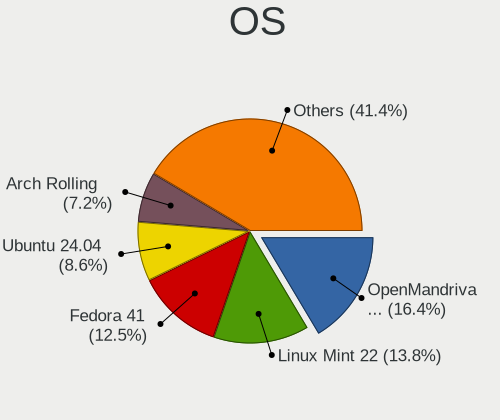
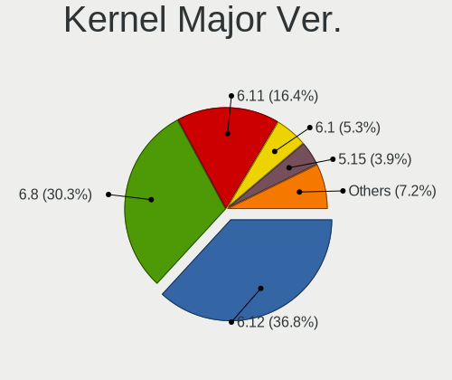
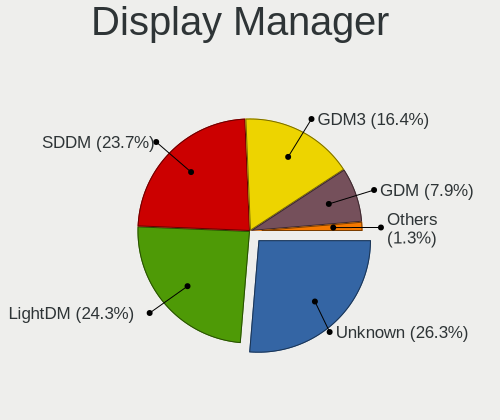
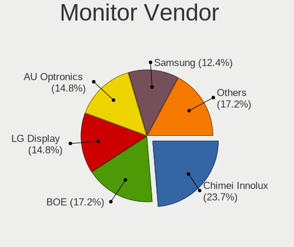
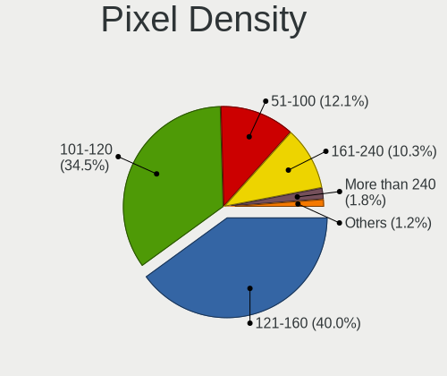
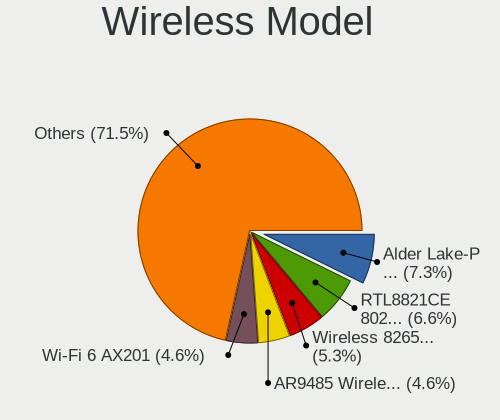

Linux in Italy - Hardware Trends (Notebooks)
--------------------------------------------

A project to identify most popular hardware characteristics and track their change
over time based on data collected by Linux users at https://Linux-Hardware.org.

Anyone can contribute to this report by the [hw-probe](https://github.com/linuxhw/hw-probe) tool:

    sudo -E hw-probe -all -upload

Period: Jul, 2022.

Contents
--------

* [ System ](#system)
  - [ OS                       ](#os)
  - [ OS Family                ](#os-family)
  - [ Kernel                   ](#kernel)
  - [ Kernel Family            ](#kernel-family)
  - [ Kernel Major Ver.        ](#kernel-major-ver)
  - [ Arch                     ](#arch)
  - [ DE                       ](#de)
  - [ Display Server           ](#display-server)
  - [ Display Manager          ](#display-manager)
  - [ OS Lang                  ](#os-lang)
  - [ Boot Mode                ](#boot-mode)
  - [ Filesystem               ](#filesystem)
  - [ Part. scheme             ](#part-scheme)
  - [ Dual Boot with Linux/BSD ](#dual-boot-with-linuxbsd)
  - [ Dual Boot (Win)          ](#dual-boot-win)

* [ Board ](#board)
  - [ Vendor                   ](#vendor)
  - [ Model                    ](#model)
  - [ Model Family             ](#model-family)
  - [ MFG Year                 ](#mfg-year)
  - [ Form Factor              ](#form-factor)
  - [ Secure Boot              ](#secure-boot)
  - [ Coreboot                 ](#coreboot)
  - [ RAM Size                 ](#ram-size)
  - [ RAM Used                 ](#ram-used)
  - [ Total Drives             ](#total-drives)
  - [ Has CD-ROM               ](#has-cd-rom)
  - [ Has Ethernet             ](#has-ethernet)
  - [ Has WiFi                 ](#has-wifi)
  - [ Has Bluetooth            ](#has-bluetooth)

* [ Location ](#location)
  - [ Country                  ](#country)
  - [ City                     ](#city)

* [ Drives ](#drives)
  - [ Drive Vendor             ](#drive-vendor)
  - [ Drive Model              ](#drive-model)
  - [ HDD Vendor               ](#hdd-vendor)
  - [ SSD Vendor               ](#ssd-vendor)
  - [ Drive Kind               ](#drive-kind)
  - [ Drive Connector          ](#drive-connector)
  - [ Drive Size               ](#drive-size)
  - [ Space Total              ](#space-total)
  - [ Space Used               ](#space-used)
  - [ Malfunc. Drives          ](#malfunc-drives)
  - [ Malfunc. Drive Vendor    ](#malfunc-drive-vendor)
  - [ Malfunc. HDD Vendor      ](#malfunc-hdd-vendor)
  - [ Malfunc. Drive Kind      ](#malfunc-drive-kind)
  - [ Failed Drives            ](#failed-drives)
  - [ Failed Drive Vendor      ](#failed-drive-vendor)
  - [ Drive Status             ](#drive-status)

* [ Storage controller ](#storage-controller)
  - [ Storage Vendor           ](#storage-vendor)
  - [ Storage Model            ](#storage-model)
  - [ Storage Kind             ](#storage-kind)

* [ Processor ](#processor)
  - [ CPU Vendor               ](#cpu-vendor)
  - [ CPU Model                ](#cpu-model)
  - [ CPU Model Family         ](#cpu-model-family)
  - [ CPU Cores                ](#cpu-cores)
  - [ CPU Sockets              ](#cpu-sockets)
  - [ CPU Threads              ](#cpu-threads)
  - [ CPU Op-Modes             ](#cpu-op-modes)
  - [ CPU Microcode            ](#cpu-microcode)
  - [ CPU Microarch            ](#cpu-microarch)

* [ Graphics ](#graphics)
  - [ GPU Vendor               ](#gpu-vendor)
  - [ GPU Model                ](#gpu-model)
  - [ GPU Combo                ](#gpu-combo)
  - [ GPU Driver               ](#gpu-driver)
  - [ GPU Memory               ](#gpu-memory)

* [ Monitor ](#monitor)
  - [ Monitor Vendor           ](#monitor-vendor)
  - [ Monitor Model            ](#monitor-model)
  - [ Monitor Resolution       ](#monitor-resolution)
  - [ Monitor Diagonal         ](#monitor-diagonal)
  - [ Monitor Width            ](#monitor-width)
  - [ Aspect Ratio             ](#aspect-ratio)
  - [ Monitor Area             ](#monitor-area)
  - [ Pixel Density            ](#pixel-density)
  - [ Multiple Monitors        ](#multiple-monitors)

* [ Network ](#network)
  - [ Net Controller Vendor    ](#net-controller-vendor)
  - [ Net Controller Model     ](#net-controller-model)
  - [ Wireless Vendor          ](#wireless-vendor)
  - [ Wireless Model           ](#wireless-model)
  - [ Ethernet Vendor          ](#ethernet-vendor)
  - [ Ethernet Model           ](#ethernet-model)
  - [ Net Controller Kind      ](#net-controller-kind)
  - [ Used Controller          ](#used-controller)
  - [ NICs                     ](#nics)
  - [ IPv6                     ](#ipv6)

* [ Bluetooth ](#bluetooth)
  - [ Bluetooth Vendor         ](#bluetooth-vendor)
  - [ Bluetooth Model          ](#bluetooth-model)

* [ Sound ](#sound)
  - [ Sound Vendor             ](#sound-vendor)
  - [ Sound Model              ](#sound-model)

* [ Memory ](#memory)
  - [ Memory Vendor            ](#memory-vendor)
  - [ Memory Model             ](#memory-model)
  - [ Memory Kind              ](#memory-kind)
  - [ Memory Form Factor       ](#memory-form-factor)
  - [ Memory Size              ](#memory-size)
  - [ Memory Speed             ](#memory-speed)

* [ Printers & scanners ](#printers--scanners)
  - [ Printer Vendor           ](#printer-vendor)
  - [ Printer Model            ](#printer-model)
  - [ Scanner Vendor           ](#scanner-vendor)
  - [ Scanner Model            ](#scanner-model)

* [ Camera ](#camera)
  - [ Camera Vendor            ](#camera-vendor)
  - [ Camera Model             ](#camera-model)

* [ Security ](#security)
  - [ Fingerprint Vendor       ](#fingerprint-vendor)
  - [ Fingerprint Model        ](#fingerprint-model)
  - [ Chipcard Vendor          ](#chipcard-vendor)
  - [ Chipcard Model           ](#chipcard-model)

* [ Unsupported ](#unsupported)
  - [ Unsupported Devices      ](#unsupported-devices)
  - [ Unsupported Device Types ](#unsupported-device-types)

System
------

OS
--

Installed operating systems

| Name                         | Notebooks | Percent |
|------------------------------|-----------|---------|
| Ubuntu 22.04                 | 7         | 11.86%  |
| OpenMandriva 4.3             | 6         | 10.17%  |
| Linux Mint 20.3              | 6         | 10.17%  |
| Pop!_OS 22.04                | 3         | 5.08%   |
| Xubuntu 22.04                | 2         | 3.39%   |
| Xubuntu 20.04                | 2         | 3.39%   |
| Ubuntu 20.04                 | 2         | 3.39%   |
| Kubuntu 22.04                | 2         | 3.39%   |
| Fedora 36                    | 2         | 3.39%   |
| Elementary 6.1               | 2         | 3.39%   |
| Debian 11                    | 2         | 3.39%   |
| Arch                         | 2         | 3.39%   |
| Zorin 16                     | 1         | 1.69%   |
| Ubuntu MATE 22.04            | 1         | 1.69%   |
| Ubuntu MATE 20.04            | 1         | 1.69%   |
| Ubuntu 21.10                 | 1         | 1.69%   |
| Ubuntu 18.04                 | 1         | 1.69%   |
| SteamOS 3.2 (steamdeck-main) | 1         | 1.69%   |
| SteamOS                      | 1         | 1.69%   |
| Peppermint 11.4              | 1         | 1.69%   |
| Parrot 5.0                   | 1         | 1.69%   |
| openSUSE Leap-15.4           | 1         | 1.69%   |
| OpenMandriva 4.90            | 1         | 1.69%   |
| Manjaro 21.3.2               | 1         | 1.69%   |
| Lubuntu 22.04                | 1         | 1.69%   |
| LMDE 5                       | 1         | 1.69%   |
| Linux Mint 20.2              | 1         | 1.69%   |
| Linux Lite 6.0               | 1         | 1.69%   |
| Lilidog 22                   | 1         | 1.69%   |
| Debian Unstable              | 1         | 1.69%   |
| Debian Testing               | 1         | 1.69%   |
| Debian 10                    | 1         | 1.69%   |
| ArcoLinux Rolling            | 1         | 1.69%   |

OS Family
---------

OS without a version

| Name         | Notebooks | Percent |
|--------------|-----------|---------|
| Ubuntu       | 11        | 18.64%  |
| OpenMandriva | 7         | 11.86%  |
| Linux Mint   | 7         | 11.86%  |
| Debian       | 5         | 8.47%   |
| Xubuntu      | 4         | 6.78%   |
| Pop!_OS      | 3         | 5.08%   |
| Ubuntu MATE  | 2         | 3.39%   |
| SteamOS      | 2         | 3.39%   |
| Kubuntu      | 2         | 3.39%   |
| Fedora       | 2         | 3.39%   |
| Elementary   | 2         | 3.39%   |
| Arch         | 2         | 3.39%   |
| Zorin        | 1         | 1.69%   |
| Peppermint   | 1         | 1.69%   |
| Parrot       | 1         | 1.69%   |
| openSUSE     | 1         | 1.69%   |
| Manjaro      | 1         | 1.69%   |
| Lubuntu      | 1         | 1.69%   |
| LMDE         | 1         | 1.69%   |
| Linux Lite   | 1         | 1.69%   |
| Lilidog      | 1         | 1.69%   |
| ArcoLinux    | 1         | 1.69%   |

Kernel
------

Version of the Linux kernel

| Version                                            | Notebooks | Percent |
|----------------------------------------------------|-----------|---------|
| 5.15.0-41-generic                                  | 12        | 20.34%  |
| 5.16.7-desktop-1omv4003                            | 5         | 8.47%   |
| 5.4.0-122-generic                                  | 3         | 5.08%   |
| 5.13.0-52-generic                                  | 3         | 5.08%   |
| 5.10.0-16-amd64                                    | 3         | 5.08%   |
| 5.4.0-121-generic                                  | 2         | 3.39%   |
| 5.18.10-76051810-generic                           | 2         | 3.39%   |
| 5.18.0-2-amd64                                     | 2         | 3.39%   |
| 5.4.0-122-lowlatency                               | 1         | 1.69%   |
| 5.4.0-121-lowlatency                               | 1         | 1.69%   |
| 5.4.0-120-generic                                  | 1         | 1.69%   |
| 5.18.8-arch1-1                                     | 1         | 1.69%   |
| 5.18.7-1-MANJARO                                   | 1         | 1.69%   |
| 5.18.13-200.fc36.x86_64                            | 1         | 1.69%   |
| 5.18.12-desktop-3omv4090                           | 1         | 1.69%   |
| 5.18.11-200.fc36.x86_64                            | 1         | 1.69%   |
| 5.18.10-zen1-1-zen                                 | 1         | 1.69%   |
| 5.18.0-1parrot1-amd64                              | 1         | 1.69%   |
| 5.18.0-10.1-liquorix-amd64                         | 1         | 1.69%   |
| 5.17.5-76051705-generic                            | 1         | 1.69%   |
| 5.17.15-76051715-generic                           | 1         | 1.69%   |
| 5.17.1-desktop-2omv4050                            | 1         | 1.69%   |
| 5.15.46-1-lts                                      | 1         | 1.69%   |
| 5.15.4-051504-lowlatency                           | 1         | 1.69%   |
| 5.15.0-40-generic                                  | 1         | 1.69%   |
| 5.15.0-33-generic                                  | 1         | 1.69%   |
| 5.15.0-27-generic                                  | 1         | 1.69%   |
| 5.15.0-25-generic                                  | 1         | 1.69%   |
| 5.14.21-150400.22-default                          | 1         | 1.69%   |
| 5.13.0-valve15-1-neptune-02197-gf6ec7ad3762a       | 1         | 1.69%   |
| 5.13.0-valve10.1-2-neptune-dri-02144-g7fffaf925dfb | 1         | 1.69%   |
| 5.13.0-30-generic                                  | 1         | 1.69%   |
| 5.10.0-14-amd64                                    | 1         | 1.69%   |
| 5.10.0-13-amd64                                    | 1         | 1.69%   |
| 4.19.0-21-amd64                                    | 1         | 1.69%   |

Kernel Family
-------------

Linux kernel without a distro release

| Version | Notebooks | Percent |
|---------|-----------|---------|
| 5.15.0  | 16        | 27.12%  |
| 5.4.0   | 8         | 13.56%  |
| 5.13.0  | 6         | 10.17%  |
| 5.16.7  | 5         | 8.47%   |
| 5.10.0  | 5         | 8.47%   |
| 5.18.0  | 4         | 6.78%   |
| 5.18.10 | 3         | 5.08%   |
| 5.18.8  | 1         | 1.69%   |
| 5.18.7  | 1         | 1.69%   |
| 5.18.13 | 1         | 1.69%   |
| 5.18.12 | 1         | 1.69%   |
| 5.18.11 | 1         | 1.69%   |
| 5.17.5  | 1         | 1.69%   |
| 5.17.15 | 1         | 1.69%   |
| 5.17.1  | 1         | 1.69%   |
| 5.15.46 | 1         | 1.69%   |
| 5.15.4  | 1         | 1.69%   |
| 5.14.21 | 1         | 1.69%   |
| 4.19.0  | 1         | 1.69%   |

Kernel Major Ver.
-----------------

Linux kernel major version

| Version | Notebooks | Percent |
|---------|-----------|---------|
| 5.15    | 18        | 30.51%  |
| 5.18    | 12        | 20.34%  |
| 5.4     | 8         | 13.56%  |
| 5.13    | 6         | 10.17%  |
| 5.16    | 5         | 8.47%   |
| 5.10    | 5         | 8.47%   |
| 5.17    | 3         | 5.08%   |
| 5.14    | 1         | 1.69%   |
| 4.19    | 1         | 1.69%   |

Arch
----

OS architecture (x86_64, i586, etc.)

| Name   | Notebooks | Percent |
|--------|-----------|---------|
| x86_64 | 59        | 100%    |

DE
--

Desktop Environment

| Name             | Notebooks | Percent |
|------------------|-----------|---------|
| GNOME            | 19        | 32.2%   |
| KDE5             | 12        | 20.34%  |
| XFCE             | 8         | 13.56%  |
| X-Cinnamon       | 7         | 11.86%  |
| MATE             | 4         | 6.78%   |
| Pantheon         | 2         | 3.39%   |
| LXQt             | 2         | 3.39%   |
| sway             | 1         | 1.69%   |
| qtile            | 1         | 1.69%   |
| lightdm-xsession | 1         | 1.69%   |
| i3               | 1         | 1.69%   |
| Unknown          | 1         | 1.69%   |

Display Server
--------------

X11 or Wayland

| Name    | Notebooks | Percent |
|---------|-----------|---------|
| X11     | 45        | 76.27%  |
| Wayland | 11        | 18.64%  |
| Tty     | 2         | 3.39%   |
| Unknown | 1         | 1.69%   |

Display Manager
---------------

SDDM, LightDM, etc.

| Name    | Notebooks | Percent |
|---------|-----------|---------|
| Unknown | 17        | 28.81%  |
| LightDM | 16        | 27.12%  |
| SDDM    | 11        | 18.64%  |
| GDM3    | 11        | 18.64%  |
| GDM     | 3         | 5.08%   |
| GREETD  | 1         | 1.69%   |

OS Lang
-------

Language

| Lang  | Notebooks | Percent |
|-------|-----------|---------|
| it_IT | 36        | 61.02%  |
| en_US | 23        | 38.98%  |

Boot Mode
---------

EFI or BIOS

| Mode | Notebooks | Percent |
|------|-----------|---------|
| EFI  | 35        | 59.32%  |
| BIOS | 24        | 40.68%  |

Filesystem
----------

Type of filesystem

| Type    | Notebooks | Percent |
|---------|-----------|---------|
| Ext4    | 44        | 74.58%  |
| Btrfs   | 8         | 13.56%  |
| Overlay | 6         | 10.17%  |
| Zfs     | 1         | 1.69%   |

Part. scheme
------------

Scheme of partitioning

| Type    | Notebooks | Percent |
|---------|-----------|---------|
| Unknown | 27        | 45.76%  |
| GPT     | 26        | 44.07%  |
| MBR     | 6         | 10.17%  |

Dual Boot with Linux/BSD
------------------------

Hosting more than one Linux/BSD

| Dual boot | Notebooks | Percent |
|-----------|-----------|---------|
| No        | 52        | 88.14%  |
| Yes       | 7         | 11.86%  |

Dual Boot (Win)
---------------

Hosting Linux and Windows

| Dual boot | Notebooks | Percent |
|-----------|-----------|---------|
| No        | 44        | 74.58%  |
| Yes       | 15        | 25.42%  |

Board
-----

Vendor
------

Motherboard manufacturer

| Name                | Notebooks | Percent |
|---------------------|-----------|---------|
| ASUSTek Computer    | 13        | 22.03%  |
| Hewlett-Packard     | 9         | 15.25%  |
| Dell                | 9         | 15.25%  |
| Lenovo              | 8         | 13.56%  |
| Acer                | 5         | 8.47%   |
| HUAWEI              | 3         | 5.08%   |
| Toshiba             | 2         | 3.39%   |
| Timi                | 1         | 1.69%   |
| Teclast             | 1         | 1.69%   |
| Schenker            | 1         | 1.69%   |
| Samsung Electronics | 1         | 1.69%   |
| MSI                 | 1         | 1.69%   |
| Microtech           | 1         | 1.69%   |
| MicroByte           | 1         | 1.69%   |
| Fujitsu             | 1         | 1.69%   |
| Apple               | 1         | 1.69%   |
| Unknown             | 1         | 1.69%   |

Model
-----

Motherboard model

| Name                                   | Notebooks | Percent |
|----------------------------------------|-----------|---------|
| HP Notebook                            | 3         | 5.08%   |
| Lenovo IdeaPad 5 Pro 14ACN6 82L7       | 2         | 3.39%   |
| Dell Inspiron 5584                     | 2         | 3.39%   |
| ASUS K53SC                             | 2         | 3.39%   |
| Unknown                                | 2         | 3.39%   |
| Toshiba TECRA R940                     | 1         | 1.69%   |
| Toshiba Satellite Pro S500             | 1         | 1.69%   |
| Timi RedmiBook 16                      | 1         | 1.69%   |
| Teclast F15 Plus                       | 1         | 1.69%   |
| Schenker XMG APEX (Mid 2021)           | 1         | 1.69%   |
| Samsung 750XDA                         | 1         | 1.69%   |
| MSI Prestige 15 A10SC                  | 1         | 1.69%   |
| Microtech ebookPro                     | 1         | 1.69%   |
| MicroByte ezbook                       | 1         | 1.69%   |
| Lenovo ThinkPad T490 20N2000FIX        | 1         | 1.69%   |
| Lenovo ThinkBook 13s G3 ACN 20YA       | 1         | 1.69%   |
| Lenovo IdeaPad S145-15IGM 81MX         | 1         | 1.69%   |
| Lenovo IdeaPad 3 15ADA05 81W1          | 1         | 1.69%   |
| Lenovo G50-45 80E3                     | 1         | 1.69%   |
| Lenovo B590 37612ZG                    | 1         | 1.69%   |
| HUAWEI WRTB-WXX9                       | 1         | 1.69%   |
| HUAWEI NBLK-WAX9X                      | 1         | 1.69%   |
| HUAWEI BOM-WXX9                        | 1         | 1.69%   |
| HP Pavilion 15                         | 1         | 1.69%   |
| HP EliteBook 830 G5                    | 1         | 1.69%   |
| HP EliteBook 2560p                     | 1         | 1.69%   |
| HP 250 G4 Notebook PC                  | 1         | 1.69%   |
| HP 250 G2                              | 1         | 1.69%   |
| Fujitsu LIFEBOOK E754                  | 1         | 1.69%   |
| Dell XPS 15 9570                       | 1         | 1.69%   |
| Dell Latitude E7440                    | 1         | 1.69%   |
| Dell Latitude E6430                    | 1         | 1.69%   |
| Dell Latitude E4200                    | 1         | 1.69%   |
| Dell Latitude 5590                     | 1         | 1.69%   |
| Dell Inspiron 5567                     | 1         | 1.69%   |
| Dell Inspiron 15-3552                  | 1         | 1.69%   |
| ASUS Zephyrus M GU502GU_GU502GU        | 1         | 1.69%   |
| ASUS X555YI                            | 1         | 1.69%   |
| ASUS X555LD                            | 1         | 1.69%   |
| ASUS VivoBook_ASUSLaptop X513UA_M513UA | 1         | 1.69%   |
| ASUS VivoBook_ASUSLaptop X509JA_X509JA | 1         | 1.69%   |
| ASUS U36SG                             | 1         | 1.69%   |
| ASUS P552LA                            | 1         | 1.69%   |
| ASUS K53U                              | 1         | 1.69%   |
| ASUS K53E                              | 1         | 1.69%   |
| ASUS G752VY                            | 1         | 1.69%   |
| ASUS BU201LA                           | 1         | 1.69%   |
| Apple MacBookPro8,1                    | 1         | 1.69%   |
| Acer Ferrari One 200                   | 1         | 1.69%   |
| Acer Aspire ES1-523                    | 1         | 1.69%   |
| Acer Aspire E5-573                     | 1         | 1.69%   |
| Acer Aspire E1-532                     | 1         | 1.69%   |
| Acer Aspire 3100                       | 1         | 1.69%   |

Model Family
------------

Motherboard model prefix

| Name               | Notebooks | Percent |
|--------------------|-----------|---------|
| Lenovo IdeaPad     | 4         | 6.78%   |
| Dell Latitude      | 4         | 6.78%   |
| Dell Inspiron      | 4         | 6.78%   |
| Acer Aspire        | 4         | 6.78%   |
| HP Notebook        | 3         | 5.08%   |
| HP EliteBook       | 2         | 3.39%   |
| HP 250             | 2         | 3.39%   |
| ASUS VivoBook      | 2         | 3.39%   |
| ASUS K53SC         | 2         | 3.39%   |
| Unknown            | 2         | 3.39%   |
| Toshiba TECRA      | 1         | 1.69%   |
| Toshiba Satellite  | 1         | 1.69%   |
| Timi RedmiBook     | 1         | 1.69%   |
| Teclast F15        | 1         | 1.69%   |
| Schenker XMG       | 1         | 1.69%   |
| Samsung 750XDA     | 1         | 1.69%   |
| MSI Prestige       | 1         | 1.69%   |
| Microtech ebookPro | 1         | 1.69%   |
| MicroByte ezbook   | 1         | 1.69%   |
| Lenovo ThinkPad    | 1         | 1.69%   |
| Lenovo ThinkBook   | 1         | 1.69%   |
| Lenovo G50-45      | 1         | 1.69%   |
| Lenovo B590        | 1         | 1.69%   |
| HUAWEI WRTB-WXX9   | 1         | 1.69%   |
| HUAWEI NBLK-WAX9X  | 1         | 1.69%   |
| HUAWEI BOM-WXX9    | 1         | 1.69%   |
| HP Pavilion        | 1         | 1.69%   |
| Fujitsu LIFEBOOK   | 1         | 1.69%   |
| Dell XPS           | 1         | 1.69%   |
| ASUS Zephyrus      | 1         | 1.69%   |
| ASUS X555YI        | 1         | 1.69%   |
| ASUS X555LD        | 1         | 1.69%   |
| ASUS U36SG         | 1         | 1.69%   |
| ASUS P552LA        | 1         | 1.69%   |
| ASUS K53U          | 1         | 1.69%   |
| ASUS K53E          | 1         | 1.69%   |
| ASUS G752VY        | 1         | 1.69%   |
| ASUS BU201LA       | 1         | 1.69%   |
| Apple MacBookPro8  | 1         | 1.69%   |
| Acer Ferrari       | 1         | 1.69%   |

MFG Year
--------

Motherboard manufacture year

| Year | Notebooks | Percent |
|------|-----------|---------|
| 2021 | 10        | 16.95%  |
| 2019 | 10        | 16.95%  |
| 2015 | 7         | 11.86%  |
| 2011 | 7         | 11.86%  |
| 2018 | 4         | 6.78%   |
| 2014 | 4         | 6.78%   |
| 2013 | 4         | 6.78%   |
| 2020 | 3         | 5.08%   |
| 2012 | 3         | 5.08%   |
| 2016 | 2         | 3.39%   |
| 2009 | 2         | 3.39%   |
| 2017 | 1         | 1.69%   |
| 2010 | 1         | 1.69%   |
| 2006 | 1         | 1.69%   |

Form Factor
-----------

Physical design of the computer

| Name     | Notebooks | Percent |
|----------|-----------|---------|
| Notebook | 59        | 100%    |

Secure Boot
-----------

Enabled or disabled

| State    | Notebooks | Percent |
|----------|-----------|---------|
| Disabled | 54        | 91.53%  |
| Enabled  | 5         | 8.47%   |

Coreboot
--------

Have coreboot on board

| Used | Notebooks | Percent |
|------|-----------|---------|
| No   | 59        | 100%    |

RAM Size
--------

Total RAM memory

| Size in GB | Notebooks | Percent |
|------------|-----------|---------|
| 4.01-8.0   | 20        | 33.9%   |
| 3.01-4.0   | 19        | 32.2%   |
| 8.01-16.0  | 10        | 16.95%  |
| 16.01-24.0 | 8         | 13.56%  |
| 32.01-64.0 | 2         | 3.39%   |

RAM Used
--------

Used RAM memory

| Used GB   | Notebooks | Percent |
|-----------|-----------|---------|
| 1.01-2.0  | 22        | 37.29%  |
| 2.01-3.0  | 17        | 28.81%  |
| 4.01-8.0  | 7         | 11.86%  |
| 3.01-4.0  | 7         | 11.86%  |
| 0.51-1.0  | 4         | 6.78%   |
| 8.01-16.0 | 2         | 3.39%   |

Total Drives
------------

Number of drives on board

| Drives | Notebooks | Percent |
|--------|-----------|---------|
| 1      | 47        | 79.66%  |
| 2      | 9         | 15.25%  |
| 3      | 2         | 3.39%   |
| 0      | 1         | 1.69%   |

Has CD-ROM
----------

Has CD-ROM on board

| Presented | Notebooks | Percent |
|-----------|-----------|---------|
| No        | 30        | 50.85%  |
| Yes       | 29        | 49.15%  |

Has Ethernet
------------

Has Ethernet on board

| Presented | Notebooks | Percent |
|-----------|-----------|---------|
| Yes       | 45        | 76.27%  |
| No        | 14        | 23.73%  |

Has WiFi
--------

Has WiFi module

| Presented | Notebooks | Percent |
|-----------|-----------|---------|
| Yes       | 58        | 98.31%  |
| No        | 1         | 1.69%   |

Has Bluetooth
-------------

Has Bluetooth module

| Presented | Notebooks | Percent |
|-----------|-----------|---------|
| Yes       | 49        | 83.05%  |
| No        | 10        | 16.95%  |

Location
--------

Country
-------

Geographic location (country)

| Country | Notebooks | Percent |
|---------|-----------|---------|
| Italy   | 59        | 100%    |

City
----

Geographic location (city)

| City                    | Notebooks | Percent |
|-------------------------|-----------|---------|
| Milan                   | 11        | 18.64%  |
| Turin                   | 4         | 6.78%   |
| Rome                    | 4         | 6.78%   |
| San Giovanni Lupatoto   | 2         | 3.39%   |
| Rho                     | 2         | 3.39%   |
| Merano                  | 2         | 3.39%   |
| Genoa                   | 2         | 3.39%   |
| Bologna                 | 2         | 3.39%   |
| Valbrembo               | 1         | 1.69%   |
| Treviso                 | 1         | 1.69%   |
| Taranto                 | 1         | 1.69%   |
| Spadafora               | 1         | 1.69%   |
| Settimo Torinese        | 1         | 1.69%   |
| Sesto San Giovanni      | 1         | 1.69%   |
| Santa Teresa di Riva    | 1         | 1.69%   |
| Rossano Veneto          | 1         | 1.69%   |
| Perugia                 | 1         | 1.69%   |
| Pavia                   | 1         | 1.69%   |
| Parma                   | 1         | 1.69%   |
| Novara                  | 1         | 1.69%   |
| Legnano                 | 1         | 1.69%   |
| Grosseto                | 1         | 1.69%   |
| Fucecchio               | 1         | 1.69%   |
| Forlì                  | 1         | 1.69%   |
| Desio                   | 1         | 1.69%   |
| Castellammare di Stabia | 1         | 1.69%   |
| Cassino                 | 1         | 1.69%   |
| Caserta                 | 1         | 1.69%   |
| Casalecchio di Reno     | 1         | 1.69%   |
| Bussolengo              | 1         | 1.69%   |
| Brescia                 | 1         | 1.69%   |
| Brendola                | 1         | 1.69%   |
| Borgosesia              | 1         | 1.69%   |
| Bondeno                 | 1         | 1.69%   |
| Bergamo                 | 1         | 1.69%   |
| Bari                    | 1         | 1.69%   |
| Asti                    | 1         | 1.69%   |
| Aprilia                 | 1         | 1.69%   |

Drives
------

Drive Vendor
------------

Hard drive vendors

| Vendor              | Notebooks | Drives | Percent |
|---------------------|-----------|--------|---------|
| Samsung Electronics | 12        | 16     | 17.91%  |
| Unknown             | 6         | 7      | 8.96%   |
| Seagate             | 6         | 6      | 8.96%   |
| WDC                 | 5         | 5      | 7.46%   |
| SanDisk             | 5         | 5      | 7.46%   |
| Crucial             | 5         | 5      | 7.46%   |
| Toshiba             | 4         | 4      | 5.97%   |
| Hitachi             | 4         | 4      | 5.97%   |
| Intel               | 3         | 3      | 4.48%   |
| HGST                | 3         | 3      | 4.48%   |
| SK hynix            | 2         | 2      | 2.99%   |
| Teclast             | 1         | 1      | 1.49%   |
| SSSTC               | 1         | 1      | 1.49%   |
| PNY                 | 1         | 1      | 1.49%   |
| Phison              | 1         | 1      | 1.49%   |
| Patriot             | 1         | 1      | 1.49%   |
| Microtech           | 1         | 1      | 1.49%   |
| Micron Technology   | 1         | 1      | 1.49%   |
| Kingston            | 1         | 1      | 1.49%   |
| Dogfish             | 1         | 1      | 1.49%   |
| Corsair             | 1         | 1      | 1.49%   |
| ASMT                | 1         | 1      | 1.49%   |
| Unknown             | 1         | 1      | 1.49%   |

Drive Model
-----------

Hard drive models

| Model                                   | Notebooks | Percent |
|-----------------------------------------|-----------|---------|
| HGST HTS545050A7E680 500GB              | 3         | 4.17%   |
| Seagate ST500LT012-1DG142 500GB         | 2         | 2.78%   |
| SanDisk NVMe SSD Drive 512GB            | 2         | 2.78%   |
| SanDisk NVMe SSD Drive 256GB            | 2         | 2.78%   |
| Samsung MZALQ512HBLU-00BL2 512GB        | 2         | 2.78%   |
| Hitachi HTS547550A9E384 500GB           | 2         | 2.78%   |
| Crucial CT240BX500SSD1 240GB            | 2         | 2.78%   |
| WDC WDS500G2B0B-00YS70 500GB SSD        | 1         | 1.39%   |
| WDC WD5000LPVX-22V0TT0 500GB            | 1         | 1.39%   |
| WDC WD5000BEVT-80A0RT1 500GB            | 1         | 1.39%   |
| WDC WD10SPZX-24Z10 1TB                  | 1         | 1.39%   |
| WDC WD10JPCX-24UE4T0 1TB                | 1         | 1.39%   |
| Unknown Trust HDD 2.5" 1TB              | 1         | 1.39%   |
| Unknown SU04G  4GB                      | 1         | 1.39%   |
| Unknown SDC  999MB                      | 1         | 1.39%   |
| Unknown SC128  128GB                    | 1         | 1.39%   |
| Unknown MMC Card  16GB                  | 1         | 1.39%   |
| Unknown Biwin  32GB                     | 1         | 1.39%   |
| Unknown 58K722  128GB                   | 1         | 1.39%   |
| Toshiba MQ01ABF050 500GB                | 1         | 1.39%   |
| Toshiba KSG60ZMV512G M.2 2280 512GB SSD | 1         | 1.39%   |
| Toshiba KBG40ZNT512G MEMORY 512GB       | 1         | 1.39%   |
| Toshiba KBG30ZMV512G 512GB              | 1         | 1.39%   |
| Teclast BD256GB SHCB-2280 SSD           | 1         | 1.39%   |
| SSSTC CL1-8D512 512GB                   | 1         | 1.39%   |
| SK hynix NVMe SSD Drive 256GB           | 1         | 1.39%   |
| SK hynix HFM256GDJTNG-8310A 256GB       | 1         | 1.39%   |
| Seagate ST940210AS 40GB                 | 1         | 1.39%   |
| Seagate ST916031 4AS 160GB              | 1         | 1.39%   |
| Seagate ST500LT012-9WS142 500GB         | 1         | 1.39%   |
| Seagate Expansion 1TB                   | 1         | 1.39%   |
| SanDisk SSD PLUS 480GB                  | 1         | 1.39%   |
| Samsung SSD PM800 TM 128GB              | 1         | 1.39%   |
| Samsung SSD 980 1TB                     | 1         | 1.39%   |
| Samsung SSD 970 PRO 512GB               | 1         | 1.39%   |
| Samsung SSD 870 QVO 4TB                 | 1         | 1.39%   |
| Samsung SSD 860 EVO mSATA 1TB           | 1         | 1.39%   |
| Samsung SSD 860 EVO 1TB                 | 1         | 1.39%   |
| Samsung SSD 850 EVO mSATA 250GB         | 1         | 1.39%   |
| Samsung SSD 850 EVO 250GB               | 1         | 1.39%   |
| Samsung NVMe SSD Drive 512GB            | 1         | 1.39%   |
| Samsung NVMe SSD Drive 500GB            | 1         | 1.39%   |
| Samsung MZVLB512HBJQ-00000 512GB        | 1         | 1.39%   |
| Samsung MZVLB512HAJQ-00000 512GB        | 1         | 1.39%   |
| Samsung MZNLH512HALU-00000 512GB SSD    | 1         | 1.39%   |
| Samsung MZ7TE256HMHP-00004 256GB SSD    | 1         | 1.39%   |
| PNY CS900 120GB SSD                     | 1         | 1.39%   |
| Phison NVMe SSD Drive 512GB             | 1         | 1.39%   |
| Patriot Burst 240GB SSD                 | 1         | 1.39%   |
| Microtech SSD 60G                       | 1         | 1.39%   |
| Micron MTFDBAK128MAG-1G1 128GB SSD      | 1         | 1.39%   |
| Kingston SA400S37240G 240GB SSD         | 1         | 1.39%   |
| Intel SSDSC2KF256H6 SATA 256GB          | 1         | 1.39%   |
| Intel SSDPEKNW512G8 512GB               | 1         | 1.39%   |
| Intel SSDPEKNU512GZ 512GB               | 1         | 1.39%   |
| Hitachi HTS545032B9A300 320GB           | 1         | 1.39%   |
| Hitachi HTS543225L9A300 250GB           | 1         | 1.39%   |
| Dogfish SSD 128GB                       | 1         | 1.39%   |
| Crucial CT525MX300SSD1 528GB            | 1         | 1.39%   |
| Crucial CT500MX500SSD1 500GB            | 1         | 1.39%   |

HDD Vendor
----------

Hard disk drive vendors

| Vendor  | Notebooks | Drives | Percent |
|---------|-----------|--------|---------|
| Seagate | 6         | 6      | 30%     |
| WDC     | 4         | 4      | 20%     |
| Hitachi | 4         | 4      | 20%     |
| HGST    | 3         | 3      | 15%     |
| Unknown | 1         | 1      | 5%      |
| Toshiba | 1         | 1      | 5%      |
| ASMT    | 1         | 1      | 5%      |

SSD Vendor
----------

Solid state drive vendors

| Vendor              | Notebooks | Drives | Percent |
|---------------------|-----------|--------|---------|
| Samsung Electronics | 7         | 8      | 29.17%  |
| Crucial             | 4         | 4      | 16.67%  |
| WDC                 | 1         | 1      | 4.17%   |
| Toshiba             | 1         | 1      | 4.17%   |
| Teclast             | 1         | 1      | 4.17%   |
| SanDisk             | 1         | 1      | 4.17%   |
| PNY                 | 1         | 1      | 4.17%   |
| Patriot             | 1         | 1      | 4.17%   |
| Microtech           | 1         | 1      | 4.17%   |
| Micron Technology   | 1         | 1      | 4.17%   |
| Kingston            | 1         | 1      | 4.17%   |
| Intel               | 1         | 1      | 4.17%   |
| Dogfish             | 1         | 1      | 4.17%   |
| Corsair             | 1         | 1      | 4.17%   |
| Unknown             | 1         | 1      | 4.17%   |

Drive Kind
----------

HDD or SSD

| Kind | Notebooks | Drives | Percent |
|------|-----------|--------|---------|
| SSD  | 24        | 25     | 35.82%  |
| HDD  | 20        | 20     | 29.85%  |
| NVMe | 18        | 21     | 26.87%  |
| MMC  | 5         | 6      | 7.46%   |

Drive Connector
---------------

SATA, SAS, NVMe, etc.

| Type | Notebooks | Drives | Percent |
|------|-----------|--------|---------|
| SATA | 40        | 41     | 59.7%   |
| NVMe | 18        | 21     | 26.87%  |
| MMC  | 5         | 6      | 7.46%   |
| SAS  | 4         | 4      | 5.97%   |

Drive Size
----------

Size of hard drive

| Size in TB | Notebooks | Drives | Percent |
|------------|-----------|--------|---------|
| 0.01-0.5   | 34        | 34     | 75.56%  |
| 0.51-1.0   | 10        | 10     | 22.22%  |
| 3.01-4.0   | 1         | 1      | 2.22%   |

Space Total
-----------

Amount of disk space available on the file system

| Size in GB     | Notebooks | Percent |
|----------------|-----------|---------|
| 101-250        | 21        | 35.59%  |
| 251-500        | 15        | 25.42%  |
| 1-20           | 8         | 13.56%  |
| 501-1000       | 7         | 11.86%  |
| 1001-2000      | 5         | 8.47%   |
| More than 3000 | 1         | 1.69%   |
| 21-50          | 1         | 1.69%   |
| 2001-3000      | 1         | 1.69%   |

Space Used
----------

Amount of used disk space

| Used GB   | Notebooks | Percent |
|-----------|-----------|---------|
| 1-20      | 26        | 44.07%  |
| 21-50     | 12        | 20.34%  |
| 101-250   | 7         | 11.86%  |
| 51-100    | 5         | 8.47%   |
| 251-500   | 4         | 6.78%   |
| 501-1000  | 4         | 6.78%   |
| 1001-2000 | 1         | 1.69%   |

Malfunc. Drives
---------------

Drive models with a malfunction

| Model                           | Notebooks | Drives | Percent |
|---------------------------------|-----------|--------|---------|
| WDC WD5000BEVT-80A0RT1 500GB    | 1         | 1      | 33.33%  |
| Seagate ST500LT012-9WS142 500GB | 1         | 1      | 33.33%  |
| HGST HTS545050A7E680 500GB      | 1         | 1      | 33.33%  |

Malfunc. Drive Vendor
---------------------

Vendors of faulty drives

| Vendor  | Notebooks | Drives | Percent |
|---------|-----------|--------|---------|
| WDC     | 1         | 1      | 33.33%  |
| Seagate | 1         | 1      | 33.33%  |
| HGST    | 1         | 1      | 33.33%  |

Malfunc. HDD Vendor
-------------------

Vendors of faulty HDD drives

| Vendor  | Notebooks | Drives | Percent |
|---------|-----------|--------|---------|
| WDC     | 1         | 1      | 33.33%  |
| Seagate | 1         | 1      | 33.33%  |
| HGST    | 1         | 1      | 33.33%  |

Malfunc. Drive Kind
-------------------

Kinds of faulty drives

| Kind | Notebooks | Drives | Percent |
|------|-----------|--------|---------|
| HDD  | 3         | 3      | 100%    |

Failed Drives
-------------

Failed drive models

Zero info for selected period =(

Failed Drive Vendor
-------------------

Failed drive vendors

Zero info for selected period =(

Drive Status
------------

Number of failed and malfunc. drives

| Status   | Notebooks | Drives | Percent |
|----------|-----------|--------|---------|
| Detected | 31        | 39     | 50%     |
| Works    | 28        | 30     | 45.16%  |
| Malfunc  | 3         | 3      | 4.84%   |

Storage controller
------------------

Storage Vendor
--------------

Storage controller vendors

| Vendor                         | Notebooks | Percent |
|--------------------------------|-----------|---------|
| Intel                          | 41        | 60.29%  |
| AMD                            | 10        | 14.71%  |
| Samsung Electronics            | 6         | 8.82%   |
| SanDisk                        | 4         | 5.88%   |
| SK hynix                       | 2         | 2.94%   |
| Toshiba America Info Systems   | 1         | 1.47%   |
| Solid State Storage Technology | 1         | 1.47%   |
| Phison Electronics             | 1         | 1.47%   |
| Micron/Crucial Technology      | 1         | 1.47%   |
| KIOXIA                         | 1         | 1.47%   |

Storage Model
-------------

Storage controller models

| Model                                                                            | Notebooks | Percent |
|----------------------------------------------------------------------------------|-----------|---------|
| Intel 6 Series/C200 Series Chipset Family 6 port Mobile SATA AHCI Controller     | 7         | 10.14%  |
| AMD FCH SATA Controller [AHCI mode]                                              | 7         | 10.14%  |
| Intel 8 Series SATA Controller 1 [AHCI mode]                                     | 6         | 8.7%    |
| Intel 7 Series Chipset Family 6-port SATA Controller [AHCI mode]                 | 4         | 5.8%    |
| Samsung NVMe SSD Controller SM981/PM981/PM983                                    | 3         | 4.35%   |
| Samsung NVMe SSD Controller 980                                                  | 3         | 4.35%   |
| Intel Sunrise Point-LP SATA Controller [AHCI mode]                               | 3         | 4.35%   |
| Intel Celeron/Pentium Silver Processor SATA Controller                           | 3         | 4.35%   |
| Intel 82801 Mobile SATA Controller [RAID mode]                                   | 3         | 4.35%   |
| SK hynix BC501 NVMe Solid State Drive                                            | 2         | 2.9%    |
| SanDisk PC SN520 NVMe SSD                                                        | 2         | 2.9%    |
| Intel Wildcat Point-LP SATA Controller [AHCI Mode]                               | 2         | 2.9%    |
| Intel Ice Lake-LP SATA Controller [AHCI mode]                                    | 2         | 2.9%    |
| Intel Cannon Point-LP SATA Controller [AHCI Mode]                                | 2         | 2.9%    |
| Intel Atom/Celeron/Pentium Processor x5-E8000/J3xxx/N3xxx Series SATA Controller | 2         | 2.9%    |
| AMD SB7x0/SB8x0/SB9x0 SATA Controller [AHCI mode]                                | 2         | 2.9%    |
| Toshiba America Info Systems BG3 NVMe SSD Controller                             | 1         | 1.45%   |
| Solid State Storage Non-Volatile memory controller                               | 1         | 1.45%   |
| SanDisk WD Black 2018/SN750 / PC SN720 NVMe SSD                                  | 1         | 1.45%   |
| SanDisk Non-Volatile memory controller                                           | 1         | 1.45%   |
| Phison PS5013 E13 NVMe Controller                                                | 1         | 1.45%   |
| Micron/Crucial NVMe Controller                                                   | 1         | 1.45%   |
| KIOXIA NVMe SSD Controller BG4                                                   | 1         | 1.45%   |
| Intel SSD 660P Series                                                            | 1         | 1.45%   |
| Intel Q170/Q150/B150/H170/H110/Z170/CM236 Chipset SATA Controller [AHCI Mode]    | 1         | 1.45%   |
| Intel Non-Volatile memory controller                                             | 1         | 1.45%   |
| Intel Comet Lake SATA AHCI Controller                                            | 1         | 1.45%   |
| Intel Celeron N3350/Pentium N4200/Atom E3900 Series SATA AHCI Controller         | 1         | 1.45%   |
| Intel 8 Series/C220 Series Chipset Family 6-port SATA Controller 1 [AHCI mode]   | 1         | 1.45%   |
| Intel 5 Series/3400 Series Chipset 4 port SATA AHCI Controller                   | 1         | 1.45%   |
| AMD SB7x0/SB8x0/SB9x0 IDE Controller                                             | 1         | 1.45%   |
| AMD IXP SB4x0 IDE Controller                                                     | 1         | 1.45%   |

Storage Kind
------------

Kind of storage controller (IDE, SATA, NVMe, SAS, ...)

| Kind | Notebooks | Percent |
|------|-----------|---------|
| SATA | 45        | 66.18%  |
| NVMe | 18        | 26.47%  |
| RAID | 3         | 4.41%   |
| IDE  | 2         | 2.94%   |

Processor
---------

CPU Vendor
----------

Processor vendors

| Vendor | Notebooks | Percent |
|--------|-----------|---------|
| Intel  | 43        | 72.88%  |
| AMD    | 16        | 27.12%  |

CPU Model
---------

Processor models

| Model                                           | Notebooks | Percent |
|-------------------------------------------------|-----------|---------|
| Intel Core i7-2620M CPU @ 2.70GHz               | 4         | 6.78%   |
| Intel Core i5-8265U CPU @ 1.60GHz               | 3         | 5.08%   |
| AMD Ryzen 5 5600U with Radeon Graphics          | 3         | 5.08%   |
| Intel Core i7-4510U CPU @ 2.00GHz               | 2         | 3.39%   |
| Intel Core i7-2670QM CPU @ 2.20GHz              | 2         | 3.39%   |
| Intel Celeron N4000 CPU @ 1.10GHz               | 2         | 3.39%   |
| AMD Ryzen 5 3500U with Radeon Vega Mobile Gfx   | 2         | 3.39%   |
| AMD A8-7410 APU with AMD Radeon R5 Graphics     | 2         | 3.39%   |
| Intel Pentium CPU 3825U @ 1.90GHz               | 1         | 1.69%   |
| Intel Pentium 3556U @ 1.70GHz                   | 1         | 1.69%   |
| Intel Core i7-9750H CPU @ 2.60GHz               | 1         | 1.69%   |
| Intel Core i7-8750H CPU @ 2.20GHz               | 1         | 1.69%   |
| Intel Core i7-7500U CPU @ 2.70GHz               | 1         | 1.69%   |
| Intel Core i7-6700HQ CPU @ 2.60GHz              | 1         | 1.69%   |
| Intel Core i7-5500U CPU @ 2.40GHz               | 1         | 1.69%   |
| Intel Core i7-4712MQ CPU @ 2.30GHz              | 1         | 1.69%   |
| Intel Core i7-4600U CPU @ 2.10GHz               | 1         | 1.69%   |
| Intel Core i7-3740QM CPU @ 2.70GHz              | 1         | 1.69%   |
| Intel Core i7-10710U CPU @ 1.10GHz              | 1         | 1.69%   |
| Intel Core i7-10510U CPU @ 1.80GHz              | 1         | 1.69%   |
| Intel Core i5-8250U CPU @ 1.60GHz               | 1         | 1.69%   |
| Intel Core i5-7200U CPU @ 2.50GHz               | 1         | 1.69%   |
| Intel Core i5-3230M CPU @ 2.60GHz               | 1         | 1.69%   |
| Intel Core i5-1035G7 CPU @ 1.20GHz              | 1         | 1.69%   |
| Intel Core i5-1035G1 CPU @ 1.00GHz              | 1         | 1.69%   |
| Intel Core i3-6006U CPU @ 2.00GHz               | 1         | 1.69%   |
| Intel Core i3-4005U CPU @ 1.70GHz               | 1         | 1.69%   |
| Intel Core i3-3110M CPU @ 2.40GHz               | 1         | 1.69%   |
| Intel Core i3-2310M CPU @ 2.10GHz               | 1         | 1.69%   |
| Intel Core i3 CPU M 370 @ 2.40GHz               | 1         | 1.69%   |
| Intel Core 2 Duo CPU U9600 @ 1.60GHz            | 1         | 1.69%   |
| Intel Celeron N4120 CPU @ 1.10GHz               | 1         | 1.69%   |
| Intel Celeron CPU N3350 @ 1.10GHz               | 1         | 1.69%   |
| Intel Celeron CPU N3060 @ 1.60GHz               | 1         | 1.69%   |
| Intel Celeron CPU N3050 @ 1.60GHz               | 1         | 1.69%   |
| Intel Celeron CPU 1000M @ 1.80GHz               | 1         | 1.69%   |
| Intel Celeron 2955U @ 1.40GHz                   | 1         | 1.69%   |
| Intel 11th Gen Core i5-1135G7 @ 2.40GHz         | 1         | 1.69%   |
| AMD Ryzen 9 5900HX with Radeon Graphics         | 1         | 1.69%   |
| AMD Ryzen 7 5700U with Radeon Graphics          | 1         | 1.69%   |
| AMD Ryzen 5 5500U with Radeon Graphics          | 1         | 1.69%   |
| AMD Ryzen 5 4500U with Radeon Graphics          | 1         | 1.69%   |
| AMD Mobile Sempron Processor 3400+              | 1         | 1.69%   |
| AMD C-50 Processor                              | 1         | 1.69%   |
| AMD Athlon X2 Dual Core Processor L310          | 1         | 1.69%   |
| AMD A8-6410 APU with AMD Radeon R5 Graphics     | 1         | 1.69%   |
| AMD A10-9600P RADEON R5, 10 COMPUTE CORES 4C+6G | 1         | 1.69%   |

CPU Model Family
----------------

Processor model prefix

| Model              | Notebooks | Percent |
|--------------------|-----------|---------|
| Intel Core i7      | 18        | 30.51%  |
| Intel Core i5      | 8         | 13.56%  |
| Intel Celeron      | 8         | 13.56%  |
| AMD Ryzen 5        | 7         | 11.86%  |
| Intel Core i3      | 5         | 8.47%   |
| AMD A8             | 3         | 5.08%   |
| Intel Pentium      | 2         | 3.39%   |
| Other              | 1         | 1.69%   |
| Intel Core 2 Duo   | 1         | 1.69%   |
| AMD Ryzen 9        | 1         | 1.69%   |
| AMD Ryzen 7        | 1         | 1.69%   |
| AMD Mobile Sempron | 1         | 1.69%   |
| AMD C-50           | 1         | 1.69%   |
| AMD Athlon X2      | 1         | 1.69%   |
| AMD A10            | 1         | 1.69%   |

CPU Cores
---------

Number of processor cores

| Number | Notebooks | Percent |
|--------|-----------|---------|
| 2      | 30        | 50.85%  |
| 4      | 19        | 32.2%   |
| 6      | 7         | 11.86%  |
| 8      | 2         | 3.39%   |
| 1      | 1         | 1.69%   |

CPU Sockets
-----------

Number of sockets

| Number | Notebooks | Percent |
|--------|-----------|---------|
| 1      | 59        | 100%    |

CPU Threads
-----------

Threads per core (Hyper-Threading)

| Number | Notebooks | Percent |
|--------|-----------|---------|
| 2      | 42        | 71.19%  |
| 1      | 17        | 28.81%  |

CPU Op-Modes
------------

CPU Operation Modes (32-bit, 64-bit)

| Op mode        | Notebooks | Percent |
|----------------|-----------|---------|
| 32-bit, 64-bit | 59        | 100%    |

CPU Microcode
-------------

Microcode number

| Number     | Notebooks | Percent |
|------------|-----------|---------|
| Unknown    | 15        | 25.42%  |
| 0x206a7    | 5         | 8.47%   |
| 0x40651    | 4         | 6.78%   |
| 0x306a9    | 3         | 5.08%   |
| 0x07030105 | 3         | 5.08%   |
| 0x806e9    | 2         | 3.39%   |
| 0x706e5    | 2         | 3.39%   |
| 0x306d4    | 2         | 3.39%   |
| 0x0a50000c | 2         | 3.39%   |
| 0x08608103 | 2         | 3.39%   |
| 0x08108109 | 2         | 3.39%   |
| 0xa0660    | 1         | 1.69%   |
| 0x906ea    | 1         | 1.69%   |
| 0x806ec    | 1         | 1.69%   |
| 0x806eb    | 1         | 1.69%   |
| 0x806c1    | 1         | 1.69%   |
| 0x706a8    | 1         | 1.69%   |
| 0x706a1    | 1         | 1.69%   |
| 0x506ca    | 1         | 1.69%   |
| 0x406e3    | 1         | 1.69%   |
| 0x406c4    | 1         | 1.69%   |
| 0x406c3    | 1         | 1.69%   |
| 0x306c3    | 1         | 1.69%   |
| 0x1067a    | 1         | 1.69%   |
| 0x0a50000d | 1         | 1.69%   |
| 0x08600106 | 1         | 1.69%   |
| 0x0600611a | 1         | 1.69%   |
| 0x05000029 | 1         | 1.69%   |

CPU Microarch
-------------

Microarchitecture

| Name          | Notebooks | Percent |
|---------------|-----------|---------|
| KabyLake      | 9         | 15.25%  |
| SandyBridge   | 7         | 11.86%  |
| Haswell       | 7         | 11.86%  |
| Zen 3         | 4         | 6.78%   |
| IvyBridge     | 4         | 6.78%   |
| Puma          | 3         | 5.08%   |
| Goldmont plus | 3         | 5.08%   |
| Zen+          | 2         | 3.39%   |
| Skylake       | 2         | 3.39%   |
| Silvermont    | 2         | 3.39%   |
| K8 Hammer     | 2         | 3.39%   |
| IceLake       | 2         | 3.39%   |
| Broadwell     | 2         | 3.39%   |
| Unknown       | 2         | 3.39%   |
| Zen 2         | 1         | 1.69%   |
| Westmere      | 1         | 1.69%   |
| TigerLake     | 1         | 1.69%   |
| Penryn        | 1         | 1.69%   |
| Goldmont      | 1         | 1.69%   |
| Excavator     | 1         | 1.69%   |
| CometLake     | 1         | 1.69%   |
| Bobcat        | 1         | 1.69%   |

Graphics
--------

GPU Vendor
----------

Vendors of graphics cards

| Vendor | Notebooks | Percent |
|--------|-----------|---------|
| Intel  | 42        | 58.33%  |
| AMD    | 18        | 25%     |
| Nvidia | 12        | 16.67%  |

GPU Model
---------

Graphics card models

| Model                                                                                    | Notebooks | Percent |
|------------------------------------------------------------------------------------------|-----------|---------|
| Intel 2nd Generation Core Processor Family Integrated Graphics Controller                | 7         | 9.33%   |
| Intel Haswell-ULT Integrated Graphics Controller                                         | 6         | 8%      |
| Intel 3rd Gen Core processor Graphics Controller                                         | 4         | 5.33%   |
| AMD Cezanne                                                                              | 4         | 5.33%   |
| Intel WhiskeyLake-U GT2 [UHD Graphics 620]                                               | 3         | 4%      |
| Intel GeminiLake [UHD Graphics 600]                                                      | 3         | 4%      |
| AMD Mullins [Radeon R4/R5 Graphics]                                                      | 3         | 4%      |
| Nvidia GF119M [GeForce GT 520MX]                                                         | 2         | 2.67%   |
| Intel HD Graphics 620                                                                    | 2         | 2.67%   |
| Intel CoffeeLake-H GT2 [UHD Graphics 630]                                                | 2         | 2.67%   |
| Intel Atom/Celeron/Pentium Processor x5-E8000/J3xxx/N3xxx Integrated Graphics Controller | 2         | 2.67%   |
| AMD Topaz XT [Radeon R7 M260/M265 / M340/M360 / M440/M445 / 530/535 / 620/625 Mobile]    | 2         | 2.67%   |
| AMD Picasso/Raven 2 [Radeon Vega Series / Radeon Vega Mobile Series]                     | 2         | 2.67%   |
| AMD Lucienne                                                                             | 2         | 2.67%   |
| Nvidia TU117M [GeForce GTX 1650 Mobile / Max-Q]                                          | 1         | 1.33%   |
| Nvidia TU116M [GeForce GTX 1660 Ti Mobile]                                               | 1         | 1.33%   |
| Nvidia GP108M [GeForce MX250]                                                            | 1         | 1.33%   |
| Nvidia GP107M [GeForce GTX 1050 Ti Mobile]                                               | 1         | 1.33%   |
| Nvidia GM204M [GeForce GTX 980M]                                                         | 1         | 1.33%   |
| Nvidia GM108M [GeForce 840M]                                                             | 1         | 1.33%   |
| Nvidia GF119M [GeForce 610M]                                                             | 1         | 1.33%   |
| Nvidia GF117M [GeForce 610M/710M/810M/820M / GT 620M/625M/630M/720M]                     | 1         | 1.33%   |
| Nvidia GF108GLM [NVS 5200M]                                                              | 1         | 1.33%   |
| Nvidia GA106M [GeForce RTX 3060 Mobile / Max-Q]                                          | 1         | 1.33%   |
| Intel UHD Graphics 620                                                                   | 1         | 1.33%   |
| Intel TigerLake-LP GT2 [Iris Xe Graphics]                                                | 1         | 1.33%   |
| Intel Skylake GT2 [HD Graphics 520]                                                      | 1         | 1.33%   |
| Intel Mobile 4 Series Chipset Integrated Graphics Controller                             | 1         | 1.33%   |
| Intel Iris Plus Graphics G7                                                              | 1         | 1.33%   |
| Intel Iris Plus Graphics G1 (Ice Lake)                                                   | 1         | 1.33%   |
| Intel HD Graphics 5500                                                                   | 1         | 1.33%   |
| Intel HD Graphics 500                                                                    | 1         | 1.33%   |
| Intel HD Graphics                                                                        | 1         | 1.33%   |
| Intel Core Processor Integrated Graphics Controller                                      | 1         | 1.33%   |
| Intel CometLake-U GT2 [UHD Graphics]                                                     | 1         | 1.33%   |
| Intel Comet Lake UHD Graphics                                                            | 1         | 1.33%   |
| Intel 4th Gen Core Processor Integrated Graphics Controller                              | 1         | 1.33%   |
| AMD Wrestler [Radeon HD 6250]                                                            | 1         | 1.33%   |
| AMD Wani [Radeon R5/R6/R7 Graphics]                                                      | 1         | 1.33%   |
| AMD Sun XT [Radeon HD 8670A/8670M/8690M / R5 M330 / M430 / Radeon 520 Mobile]            | 1         | 1.33%   |
| AMD Sun LE [Radeon HD 8550M / R5 M230]                                                   | 1         | 1.33%   |
| AMD RS780M [Mobility Radeon HD 3200]                                                     | 1         | 1.33%   |
| AMD RS482M [Mobility Radeon Xpress 200]                                                  | 1         | 1.33%   |
| AMD Renoir                                                                               | 1         | 1.33%   |
| AMD Jet PRO [Radeon R5 M230 / R7 M260DX / Radeon 520 Mobile]                             | 1         | 1.33%   |

GPU Combo
---------

Combinations of graphics cards

| Name           | Notebooks | Percent |
|----------------|-----------|---------|
| 1 x Intel      | 30        | 50.85%  |
| 1 x AMD        | 12        | 20.34%  |
| Intel + Nvidia | 10        | 16.95%  |
| 2 x AMD        | 3         | 5.08%   |
| Intel + AMD    | 2         | 3.39%   |
| 1 x Nvidia     | 1         | 1.69%   |
| AMD + Nvidia   | 1         | 1.69%   |

GPU Driver
----------

Free vs proprietary

| Driver      | Notebooks | Percent |
|-------------|-----------|---------|
| Free        | 52        | 88.14%  |
| Proprietary | 7         | 11.86%  |

GPU Memory
----------

Total video memory

| Size in GB | Notebooks | Percent |
|------------|-----------|---------|
| Unknown    | 42        | 71.19%  |
| 0.51-1.0   | 6         | 10.17%  |
| 0.01-0.5   | 5         | 8.47%   |
| 1.01-2.0   | 4         | 6.78%   |
| 5.01-6.0   | 1         | 1.69%   |
| 3.01-4.0   | 1         | 1.69%   |

Monitor
-------

Monitor Vendor
--------------

Monitor vendors

| Vendor                  | Notebooks | Percent |
|-------------------------|-----------|---------|
| BOE                     | 14        | 22.22%  |
| AU Optronics            | 11        | 17.46%  |
| LG Display              | 10        | 15.87%  |
| Chimei Innolux          | 9         | 14.29%  |
| Samsung Electronics     | 7         | 11.11%  |
| Sharp                   | 2         | 3.17%   |
| Dell                    | 2         | 3.17%   |
| Toshiba                 | 1         | 1.59%   |
| PANDA                   | 1         | 1.59%   |
| InfoVision              | 1         | 1.59%   |
| CPT                     | 1         | 1.59%   |
| Chi Mei Optoelectronics | 1         | 1.59%   |
| Apple                   | 1         | 1.59%   |
| Ancor Communications    | 1         | 1.59%   |
| Acer                    | 1         | 1.59%   |

Monitor Model
-------------

Monitor models

| Model                                                                    | Notebooks | Percent |
|--------------------------------------------------------------------------|-----------|---------|
| LG Display LCD Monitor LGD0625 1920x1080 344x194mm 15.5-inch             | 2         | 3.13%   |
| LG Display LCD Monitor LGD02DC 1366x768 344x194mm 15.5-inch              | 2         | 3.13%   |
| BOE LCD Monitor BOE0931 2240x1400 302x189mm 14.0-inch                    | 2         | 3.13%   |
| AU Optronics LCD Monitor AUO70EC 1366x768 344x193mm 15.5-inch            | 2         | 3.13%   |
| AU Optronics LCD Monitor AUO25ED 1920x1080 344x193mm 15.5-inch           | 2         | 3.13%   |
| Toshiba LCD Monitor LCD2109 1280x800 261x163mm 12.1-inch                 | 1         | 1.56%   |
| Sharp LCD Monitor SHP1525 1920x1080 344x194mm 15.5-inch                  | 1         | 1.56%   |
| Sharp LCD Monitor SHP149A 1920x1080 344x194mm 15.5-inch                  | 1         | 1.56%   |
| Samsung Electronics LCD Monitor SEC544B 1600x900 310x174mm 14.0-inch     | 1         | 1.56%   |
| Samsung Electronics LCD Monitor SEC4149 1366x768 292x174mm 13.4-inch     | 1         | 1.56%   |
| Samsung Electronics LCD Monitor SEC3845 1280x800 331x207mm 15.4-inch     | 1         | 1.56%   |
| Samsung Electronics LCD Monitor SDC4951 1366x768 344x194mm 15.5-inch     | 1         | 1.56%   |
| Samsung Electronics LCD Monitor SDC4161 1920x1080 344x194mm 15.5-inch    | 1         | 1.56%   |
| Samsung Electronics LCD Monitor SAM029E 1920x1080 1018x573mm 46.0-inch   | 1         | 1.56%   |
| Samsung Electronics C27F390 SAM0D32 1920x1080 598x336mm 27.0-inch        | 1         | 1.56%   |
| PANDA LCD Monitor NCP0064 1920x1080 344x194mm 15.5-inch                  | 1         | 1.56%   |
| LG Display LP156WH2-TLQA LGD026A 1366x768 344x194mm 15.5-inch            | 1         | 1.56%   |
| LG Display LCD Monitor LGD0469 1920x1080 382x215mm 17.3-inch             | 1         | 1.56%   |
| LG Display LCD Monitor LGD0437 1920x1080 276x156mm 12.5-inch             | 1         | 1.56%   |
| LG Display LCD Monitor LGD0430 1366x768 345x194mm 15.6-inch              | 1         | 1.56%   |
| LG Display LCD Monitor LGD040F 1920x1080 345x194mm 15.6-inch             | 1         | 1.56%   |
| LG Display LCD Monitor LGD03EA 1920x1080 309x174mm 14.0-inch             | 1         | 1.56%   |
| InfoVision LCD Monitor IVO057D 1920x1080 309x174mm 14.0-inch             | 1         | 1.56%   |
| Dell U2421HE DEL41E5 1920x1080 527x296mm 23.8-inch                       | 1         | 1.56%   |
| Dell U2421HE DEL41E2 1920x1080 527x296mm 23.8-inch                       | 1         | 1.56%   |
| Dell P2419HC DELA11E 1920x1080 527x296mm 23.8-inch                       | 1         | 1.56%   |
| CPT LCD Monitor COR5244 1366x768 293x164mm 13.2-inch                     | 1         | 1.56%   |
| Chimei Innolux P130ZFA-BA1 CMN8201 2160x1440 275x183mm 13.0-inch         | 1         | 1.56%   |
| Chimei Innolux LCD Monitor CMN1608 1920x1080 355x199mm 16.0-inch         | 1         | 1.56%   |
| Chimei Innolux LCD Monitor CMN15E8 1920x1080 344x193mm 15.5-inch         | 1         | 1.56%   |
| Chimei Innolux LCD Monitor CMN15E6 1366x768 344x193mm 15.5-inch          | 1         | 1.56%   |
| Chimei Innolux LCD Monitor CMN15CA 1366x768 344x193mm 15.5-inch          | 1         | 1.56%   |
| Chimei Innolux LCD Monitor CMN15C9 1366x768 344x193mm 15.5-inch          | 1         | 1.56%   |
| Chimei Innolux LCD Monitor CMN15AB 1366x768 344x193mm 15.5-inch          | 1         | 1.56%   |
| Chimei Innolux LCD Monitor CMN1404 1920x1080 309x173mm 13.9-inch         | 1         | 1.56%   |
| Chimei Innolux LCD Monitor CMN13B0 2560x1600 286x178mm 13.3-inch         | 1         | 1.56%   |
| Chi Mei Optoelectronics LCD Monitor CMO15A7 1366x768 344x193mm 15.5-inch | 1         | 1.56%   |
| BOE LCD Monitor BOE08C2 1920x1080 344x194mm 15.5-inch                    | 1         | 1.56%   |
| BOE LCD Monitor BOE0872 1920x1080 344x194mm 15.5-inch                    | 1         | 1.56%   |
| BOE LCD Monitor BOE0812 1920x1080 344x194mm 15.5-inch                    | 1         | 1.56%   |
| BOE LCD Monitor BOE0734 1920x1080 294x165mm 13.3-inch                    | 1         | 1.56%   |
| BOE LCD Monitor BOE06DF 1920x1080 309x173mm 13.9-inch                    | 1         | 1.56%   |
| BOE LCD Monitor BOE06CB 1920x1080 344x194mm 15.5-inch                    | 1         | 1.56%   |
| BOE LCD Monitor BOE06A9 1920x1080 344x193mm 15.5-inch                    | 1         | 1.56%   |
| BOE LCD Monitor BOE06A4 1366x768 344x194mm 15.5-inch                     | 1         | 1.56%   |
| BOE LCD Monitor BOE0672 1366x768 344x194mm 15.5-inch                     | 1         | 1.56%   |
| BOE LCD Monitor BOE061D 1366x768 309x173mm 13.9-inch                     | 1         | 1.56%   |
| BOE LCD Monitor BOE0614 1366x768 344x194mm 15.5-inch                     | 1         | 1.56%   |
| BOE LCD Monitor BOE05D7 1920x1080 294x165mm 13.3-inch                    | 1         | 1.56%   |
| AU Optronics LCD Monitor AUO71EC 1366x768 344x193mm 15.5-inch            | 1         | 1.56%   |
| AU Optronics LCD Monitor AUO61ED 1920x1080 344x193mm 15.5-inch           | 1         | 1.56%   |
| AU Optronics LCD Monitor AUO41EC 1366x768 344x193mm 15.5-inch            | 1         | 1.56%   |
| AU Optronics LCD Monitor AUO21EC 1366x768 344x193mm 15.5-inch            | 1         | 1.56%   |
| AU Optronics LCD Monitor AUO20EC 1366x768 344x193mm 15.5-inch            | 1         | 1.56%   |
| AU Optronics LCD Monitor AUO205C 1366x768 256x144mm 11.6-inch            | 1         | 1.56%   |
| AU Optronics LCD Monitor AUO193C 1366x768 309x173mm 13.9-inch            | 1         | 1.56%   |
| Apple LCD Monitor APP9CC5 1280x800 286x179mm 13.3-inch                   | 1         | 1.56%   |
| Ancor Communications ASUS PB277 ACI27B5 2560x1440 600x340mm 27.2-inch    | 1         | 1.56%   |
| Acer G237HL ACR03DF 1920x1080 510x290mm 23.1-inch                        | 1         | 1.56%   |

Monitor Resolution
------------------

Monitor screen resolution

| Resolution      | Notebooks | Percent |
|-----------------|-----------|---------|
| 1920x1080 (FHD) | 28        | 45.9%   |
| 1366x768 (WXGA) | 24        | 39.34%  |
| 1280x800 (WXGA) | 3         | 4.92%   |
| 2240x1400       | 2         | 3.28%   |
| 2560x1600       | 1         | 1.64%   |
| 2560x1440 (QHD) | 1         | 1.64%   |
| 2160x1440       | 1         | 1.64%   |
| 1600x900 (HD+)  | 1         | 1.64%   |

Monitor Diagonal
----------------

Diagonal size in inches

| Inches | Notebooks | Percent |
|--------|-----------|---------|
| 15     | 36        | 57.14%  |
| 13     | 11        | 17.46%  |
| 14     | 4         | 6.35%   |
| 27     | 2         | 3.17%   |
| 23     | 2         | 3.17%   |
| 17     | 2         | 3.17%   |
| 12     | 2         | 3.17%   |
| 46     | 1         | 1.59%   |
| 24     | 1         | 1.59%   |
| 16     | 1         | 1.59%   |
| 11     | 1         | 1.59%   |

Monitor Width
-------------

Physical width

| Width in mm | Notebooks | Percent |
|-------------|-----------|---------|
| 301-350     | 44        | 69.84%  |
| 201-300     | 10        | 15.87%  |
| 501-600     | 5         | 7.94%   |
| 351-400     | 3         | 4.76%   |
| 1001-1500   | 1         | 1.59%   |

Aspect Ratio
------------

Proportional relationship between the width and the height

| Ratio | Notebooks | Percent |
|-------|-----------|---------|
| 16/9  | 51        | 87.93%  |
| 16/10 | 6         | 10.34%  |
| 3/2   | 1         | 1.72%   |

Monitor Area
------------

Area in inch²

| Area in inch² | Notebooks | Percent |
|----------------|-----------|---------|
| 101-110        | 36        | 57.14%  |
| 81-90          | 9         | 14.29%  |
| 71-80          | 6         | 9.52%   |
| 201-250        | 3         | 4.76%   |
| 61-70          | 2         | 3.17%   |
| 301-350        | 2         | 3.17%   |
| 121-130        | 2         | 3.17%   |
| 51-60          | 1         | 1.59%   |
| 111-120        | 1         | 1.59%   |
| 501-1000       | 1         | 1.59%   |

Pixel Density
-------------

Pixels per inch

| Density | Notebooks | Percent |
|---------|-----------|---------|
| 121-160 | 24        | 38.1%   |
| 101-120 | 23        | 36.51%  |
| 51-100  | 8         | 12.7%   |
| 161-240 | 7         | 11.11%  |
| 1-50    | 1         | 1.59%   |

Multiple Monitors
-----------------

Total monitors connected

| Total | Notebooks | Percent |
|-------|-----------|---------|
| 1     | 50        | 84.75%  |
| 2     | 6         | 10.17%  |
| 0     | 2         | 3.39%   |
| 3     | 1         | 1.69%   |

Network
-------

Net Controller Vendor
---------------------

Controller vendors

| Vendor                | Notebooks | Percent |
|-----------------------|-----------|---------|
| Realtek Semiconductor | 35        | 38.89%  |
| Intel                 | 26        | 28.89%  |
| Qualcomm Atheros      | 15        | 16.67%  |
| Broadcom              | 5         | 5.56%   |
| MediaTek              | 3         | 3.33%   |
| Xiaomi                | 1         | 1.11%   |
| TP-Link               | 1         | 1.11%   |
| Toshiba               | 1         | 1.11%   |
| Sierra Wireless       | 1         | 1.11%   |
| Fibocom               | 1         | 1.11%   |
| Belkin Components     | 1         | 1.11%   |

Net Controller Model
--------------------

Controller models

| Model                                                                         | Notebooks | Percent |
|-------------------------------------------------------------------------------|-----------|---------|
| Realtek RTL8111/8168/8411 PCI Express Gigabit Ethernet Controller             | 12        | 11.01%  |
| Realtek RTL810xE PCI Express Fast Ethernet controller                         | 9         | 8.26%   |
| Realtek RTL8153 Gigabit Ethernet Adapter                                      | 5         | 4.59%   |
| Realtek RTL8822CE 802.11ac PCIe Wireless Network Adapter                      | 4         | 3.67%   |
| Realtek RTL8821CE 802.11ac PCIe Wireless Network Adapter                      | 4         | 3.67%   |
| Qualcomm Atheros QCA9565 / AR9565 Wireless Network Adapter                    | 4         | 3.67%   |
| Qualcomm Atheros QCA9377 802.11ac Wireless Network Adapter                    | 4         | 3.67%   |
| Realtek RTL8723BE PCIe Wireless Network Adapter                               | 3         | 2.75%   |
| Qualcomm Atheros AR9285 Wireless Network Adapter (PCI-Express)                | 3         | 2.75%   |
| MediaTek MT7921 802.11ax PCI Express Wireless Network Adapter                 | 3         | 2.75%   |
| Intel Wireless 7260                                                           | 3         | 2.75%   |
| Intel Wireless 3165                                                           | 3         | 2.75%   |
| Qualcomm Atheros AR8151 v2.0 Gigabit Ethernet                                 | 2         | 1.83%   |
| Intel Wireless 8265 / 8275                                                    | 2         | 1.83%   |
| Intel Wi-Fi 6 AX200                                                           | 2         | 1.83%   |
| Intel Comet Lake PCH-LP CNVi WiFi                                             | 2         | 1.83%   |
| Intel Centrino Wireless-N 100                                                 | 2         | 1.83%   |
| Intel Centrino Advanced-N 6205 [Taylor Peak]                                  | 2         | 1.83%   |
| Intel 82579V Gigabit Network Connection                                       | 2         | 1.83%   |
| Intel 82579LM Gigabit Network Connection (Lewisville)                         | 2         | 1.83%   |
| Broadcom BCM43142 802.11b/g/n                                                 | 2         | 1.83%   |
| Xiaomi Mi/Redmi series (RNDIS)                                                | 1         | 0.92%   |
| TP-Link Archer T2U PLUS [RTL8821AU]                                           | 1         | 0.92%   |
| Toshiba F5321 gw                                                              | 1         | 0.92%   |
| Sierra Wireless EM7305 Modem                                                  | 1         | 0.92%   |
| Realtek RTL8821AE 802.11ac PCIe Wireless Network Adapter                      | 1         | 0.92%   |
| Realtek RTL8188EE Wireless Network Adapter                                    | 1         | 0.92%   |
| Realtek RTL8125 2.5GbE Controller                                             | 1         | 0.92%   |
| Realtek RTL-8100/8101L/8139 PCI Fast Ethernet Adapter                         | 1         | 0.92%   |
| Qualcomm Atheros QCA6174 802.11ac Wireless Network Adapter                    | 1         | 0.92%   |
| Qualcomm Atheros AR928X Wireless Network Adapter (PCI-Express)                | 1         | 0.92%   |
| Qualcomm Atheros AR8131 Gigabit Ethernet                                      | 1         | 0.92%   |
| Qualcomm Atheros AR2413/AR2414 Wireless Network Adapter [AR5005G(S) 802.11bg] | 1         | 0.92%   |
| Intel Wireless 8260                                                           | 1         | 0.92%   |
| Intel WiFi Link 5100                                                          | 1         | 0.92%   |
| Intel Wi-Fi 6 AX201                                                           | 1         | 0.92%   |
| Intel Ice Lake-LP PCH CNVi WiFi                                               | 1         | 0.92%   |
| Intel Ethernet Connection I218-V                                              | 1         | 0.92%   |
| Intel Ethernet Connection I218-LM                                             | 1         | 0.92%   |
| Intel Ethernet Connection I217-LM                                             | 1         | 0.92%   |
| Intel Ethernet Connection (6) I219-V                                          | 1         | 0.92%   |
| Intel Ethernet Connection (4) I219-V                                          | 1         | 0.92%   |
| Intel Ethernet Connection (4) I219-LM                                         | 1         | 0.92%   |
| Intel Centrino Wireless-N 2230                                                | 1         | 0.92%   |
| Intel Centrino Wireless-N 1030 [Rainbow Peak]                                 | 1         | 0.92%   |
| Intel Cannon Point-LP CNVi [Wireless-AC]                                      | 1         | 0.92%   |
| Intel Cannon Lake PCH CNVi WiFi                                               | 1         | 0.92%   |
| Intel 82577LC Gigabit Network Connection                                      | 1         | 0.92%   |
| Intel 82567LM Gigabit Network Connection                                      | 1         | 0.92%   |
| Fibocom L830-EB-00 LTE WWAN Modem                                             | 1         | 0.92%   |
| Broadcom NetXtreme BCM57786 Gigabit Ethernet PCIe                             | 1         | 0.92%   |
| Broadcom NetXtreme BCM57765 Gigabit Ethernet PCIe                             | 1         | 0.92%   |
| Broadcom BCM4331 802.11a/b/g/n                                                | 1         | 0.92%   |
| Broadcom BCM4313 802.11bgn Wireless Network Adapter                           | 1         | 0.92%   |
| Belkin Components F5D7050 Wireless G Adapter v1000/v2000 [Intersil ISL3887]   | 1         | 0.92%   |

Wireless Vendor
---------------

Wireless vendors

| Vendor                | Notebooks | Percent |
|-----------------------|-----------|---------|
| Intel                 | 24        | 38.71%  |
| Qualcomm Atheros      | 14        | 22.58%  |
| Realtek Semiconductor | 13        | 20.97%  |
| Broadcom              | 4         | 6.45%   |
| MediaTek              | 3         | 4.84%   |
| TP-Link               | 1         | 1.61%   |
| Sierra Wireless       | 1         | 1.61%   |
| Fibocom               | 1         | 1.61%   |
| Belkin Components     | 1         | 1.61%   |

Wireless Model
--------------

Wireless models

| Model                                                                         | Notebooks | Percent |
|-------------------------------------------------------------------------------|-----------|---------|
| Realtek RTL8822CE 802.11ac PCIe Wireless Network Adapter                      | 4         | 6.45%   |
| Realtek RTL8821CE 802.11ac PCIe Wireless Network Adapter                      | 4         | 6.45%   |
| Qualcomm Atheros QCA9565 / AR9565 Wireless Network Adapter                    | 4         | 6.45%   |
| Qualcomm Atheros QCA9377 802.11ac Wireless Network Adapter                    | 4         | 6.45%   |
| Realtek RTL8723BE PCIe Wireless Network Adapter                               | 3         | 4.84%   |
| Qualcomm Atheros AR9285 Wireless Network Adapter (PCI-Express)                | 3         | 4.84%   |
| MediaTek MT7921 802.11ax PCI Express Wireless Network Adapter                 | 3         | 4.84%   |
| Intel Wireless 7260                                                           | 3         | 4.84%   |
| Intel Wireless 3165                                                           | 3         | 4.84%   |
| Intel Wireless 8265 / 8275                                                    | 2         | 3.23%   |
| Intel Wi-Fi 6 AX200                                                           | 2         | 3.23%   |
| Intel Comet Lake PCH-LP CNVi WiFi                                             | 2         | 3.23%   |
| Intel Centrino Wireless-N 100                                                 | 2         | 3.23%   |
| Intel Centrino Advanced-N 6205 [Taylor Peak]                                  | 2         | 3.23%   |
| Broadcom BCM43142 802.11b/g/n                                                 | 2         | 3.23%   |
| TP-Link Archer T2U PLUS [RTL8821AU]                                           | 1         | 1.61%   |
| Sierra Wireless EM7305 Modem                                                  | 1         | 1.61%   |
| Realtek RTL8821AE 802.11ac PCIe Wireless Network Adapter                      | 1         | 1.61%   |
| Realtek RTL8188EE Wireless Network Adapter                                    | 1         | 1.61%   |
| Qualcomm Atheros QCA6174 802.11ac Wireless Network Adapter                    | 1         | 1.61%   |
| Qualcomm Atheros AR928X Wireless Network Adapter (PCI-Express)                | 1         | 1.61%   |
| Qualcomm Atheros AR2413/AR2414 Wireless Network Adapter [AR5005G(S) 802.11bg] | 1         | 1.61%   |
| Intel Wireless 8260                                                           | 1         | 1.61%   |
| Intel WiFi Link 5100                                                          | 1         | 1.61%   |
| Intel Wi-Fi 6 AX201                                                           | 1         | 1.61%   |
| Intel Ice Lake-LP PCH CNVi WiFi                                               | 1         | 1.61%   |
| Intel Centrino Wireless-N 2230                                                | 1         | 1.61%   |
| Intel Centrino Wireless-N 1030 [Rainbow Peak]                                 | 1         | 1.61%   |
| Intel Cannon Point-LP CNVi [Wireless-AC]                                      | 1         | 1.61%   |
| Intel Cannon Lake PCH CNVi WiFi                                               | 1         | 1.61%   |
| Fibocom L830-EB-00 LTE WWAN Modem                                             | 1         | 1.61%   |
| Broadcom BCM4331 802.11a/b/g/n                                                | 1         | 1.61%   |
| Broadcom BCM4313 802.11bgn Wireless Network Adapter                           | 1         | 1.61%   |
| Belkin Components F5D7050 Wireless G Adapter v1000/v2000 [Intersil ISL3887]   | 1         | 1.61%   |

Ethernet Vendor
---------------

Ethernet vendors

| Vendor                | Notebooks | Percent |
|-----------------------|-----------|---------|
| Realtek Semiconductor | 28        | 60.87%  |
| Intel                 | 12        | 26.09%  |
| Qualcomm Atheros      | 3         | 6.52%   |
| Broadcom              | 2         | 4.35%   |
| Xiaomi                | 1         | 2.17%   |

Ethernet Model
--------------

Ethernet models

| Model                                                             | Notebooks | Percent |
|-------------------------------------------------------------------|-----------|---------|
| Realtek RTL8111/8168/8411 PCI Express Gigabit Ethernet Controller | 12        | 26.09%  |
| Realtek RTL810xE PCI Express Fast Ethernet controller             | 9         | 19.57%  |
| Realtek RTL8153 Gigabit Ethernet Adapter                          | 5         | 10.87%  |
| Qualcomm Atheros AR8151 v2.0 Gigabit Ethernet                     | 2         | 4.35%   |
| Intel 82579V Gigabit Network Connection                           | 2         | 4.35%   |
| Intel 82579LM Gigabit Network Connection (Lewisville)             | 2         | 4.35%   |
| Xiaomi Mi/Redmi series (RNDIS)                                    | 1         | 2.17%   |
| Realtek RTL8125 2.5GbE Controller                                 | 1         | 2.17%   |
| Realtek RTL-8100/8101L/8139 PCI Fast Ethernet Adapter             | 1         | 2.17%   |
| Qualcomm Atheros AR8131 Gigabit Ethernet                          | 1         | 2.17%   |
| Intel Ethernet Connection I218-V                                  | 1         | 2.17%   |
| Intel Ethernet Connection I218-LM                                 | 1         | 2.17%   |
| Intel Ethernet Connection I217-LM                                 | 1         | 2.17%   |
| Intel Ethernet Connection (6) I219-V                              | 1         | 2.17%   |
| Intel Ethernet Connection (4) I219-V                              | 1         | 2.17%   |
| Intel Ethernet Connection (4) I219-LM                             | 1         | 2.17%   |
| Intel 82577LC Gigabit Network Connection                          | 1         | 2.17%   |
| Intel 82567LM Gigabit Network Connection                          | 1         | 2.17%   |
| Broadcom NetXtreme BCM57786 Gigabit Ethernet PCIe                 | 1         | 2.17%   |
| Broadcom NetXtreme BCM57765 Gigabit Ethernet PCIe                 | 1         | 2.17%   |

Net Controller Kind
-------------------

Ethernet, WiFi or modem

| Kind     | Notebooks | Percent |
|----------|-----------|---------|
| WiFi     | 58        | 55.77%  |
| Ethernet | 45        | 43.27%  |
| Modem    | 1         | 0.96%   |

Used Controller
---------------

Currently used network controller

| Kind     | Notebooks | Percent |
|----------|-----------|---------|
| WiFi     | 47        | 75.81%  |
| Ethernet | 15        | 24.19%  |

NICs
----

Total network controllers on board

| Total | Notebooks | Percent |
|-------|-----------|---------|
| 2     | 39        | 66.1%   |
| 1     | 20        | 33.9%   |

IPv6
----

IPv6 vs IPv4

| Used | Notebooks | Percent |
|------|-----------|---------|
| No   | 55        | 93.22%  |
| Yes  | 4         | 6.78%   |

Bluetooth
---------

Bluetooth Vendor
----------------

Controller vendors

| Vendor                          | Notebooks | Percent |
|---------------------------------|-----------|---------|
| Intel                           | 18        | 36%     |
| Realtek Semiconductor           | 9         | 18%     |
| Qualcomm Atheros Communications | 6         | 12%     |
| Lite-On Technology              | 5         | 10%     |
| Realtek                         | 4         | 8%      |
| Foxconn / Hon Hai               | 2         | 4%      |
| Toshiba                         | 1         | 2%      |
| IMC Networks                    | 1         | 2%      |
| Dell                            | 1         | 2%      |
| Cambridge Silicon Radio         | 1         | 2%      |
| Broadcom                        | 1         | 2%      |
| Apple                           | 1         | 2%      |

Bluetooth Model
---------------

Controller models

| Model                                               | Notebooks | Percent |
|-----------------------------------------------------|-----------|---------|
| Realtek Bluetooth Radio                             | 8         | 16%     |
| Intel Bluetooth wireless interface                  | 8         | 16%     |
| Qualcomm Atheros  Bluetooth Device                  | 5         | 10%     |
| Realtek Bluetooth Radio                             | 4         | 8%      |
| Intel Bluetooth 9460/9560 Jefferson Peak (JfP)      | 4         | 8%      |
| Lite-On Qualcomm Atheros QCA9377 Bluetooth          | 2         | 4%      |
| Intel AX201 Bluetooth                               | 2         | 4%      |
| Intel AX200 Bluetooth                               | 2         | 4%      |
| Foxconn / Hon Hai Wireless_Device                   | 2         | 4%      |
| Toshiba Integrated Bluetooth HCI                    | 1         | 2%      |
| Realtek RTL8723B Bluetooth                          | 1         | 2%      |
| Qualcomm Atheros AR3011 Bluetooth                   | 1         | 2%      |
| Lite-On Broadcom BCM43142A0 Bluetooth Device        | 1         | 2%      |
| Lite-On Bluetooth Device                            | 1         | 2%      |
| Lite-On Atheros AR3012 Bluetooth                    | 1         | 2%      |
| Intel Centrino Bluetooth Wireless Transceiver       | 1         | 2%      |
| Intel Bluetooth Device                              | 1         | 2%      |
| IMC Networks Wireless_Device                        | 1         | 2%      |
| Dell BCM20702A0 Bluetooth Module                    | 1         | 2%      |
| Cambridge Silicon Radio Bluetooth Dongle (HCI mode) | 1         | 2%      |
| Broadcom BCM43142A0 Bluetooth Device                | 1         | 2%      |
| Apple Bluetooth Host Controller                     | 1         | 2%      |

Sound
-----

Sound Vendor
------------

Sound card vendors

| Vendor                  | Notebooks | Percent |
|-------------------------|-----------|---------|
| Intel                   | 43        | 63.24%  |
| AMD                     | 16        | 23.53%  |
| Nvidia                  | 4         | 5.88%   |
| Texas Instruments       | 1         | 1.47%   |
| JMTek                   | 1         | 1.47%   |
| GN Netcom               | 1         | 1.47%   |
| C-Media Electronics     | 1         | 1.47%   |
| BEHRINGER International | 1         | 1.47%   |

Sound Model
-----------

Sound card models

| Model                                                                                             | Notebooks | Percent |
|---------------------------------------------------------------------------------------------------|-----------|---------|
| AMD Family 17h/19h HD Audio Controller                                                            | 8         | 8.89%   |
| Intel 6 Series/C200 Series Chipset Family High Definition Audio Controller                        | 7         | 7.78%   |
| AMD Renoir Radeon High Definition Audio Controller                                                | 7         | 7.78%   |
| Intel Haswell-ULT HD Audio Controller                                                             | 6         | 6.67%   |
| Intel 8 Series HD Audio Controller                                                                | 6         | 6.67%   |
| Intel Sunrise Point-LP HD Audio                                                                   | 4         | 4.44%   |
| Intel 7 Series/C216 Chipset Family High Definition Audio Controller                               | 4         | 4.44%   |
| AMD Kabini HDMI/DP Audio                                                                          | 4         | 4.44%   |
| Intel Celeron/Pentium Silver Processor High Definition Audio                                      | 3         | 3.33%   |
| Intel Cannon Point-LP High Definition Audio Controller                                            | 3         | 3.33%   |
| AMD FCH Azalia Controller                                                                         | 3         | 3.33%   |
| Intel Wildcat Point-LP High Definition Audio Controller                                           | 2         | 2.22%   |
| Intel Ice Lake-LP Smart Sound Technology Audio Controller                                         | 2         | 2.22%   |
| Intel Comet Lake PCH-LP cAVS                                                                      | 2         | 2.22%   |
| Intel Cannon Lake PCH cAVS                                                                        | 2         | 2.22%   |
| Intel Broadwell-U Audio Controller                                                                | 2         | 2.22%   |
| Intel Atom/Celeron/Pentium Processor x5-E8000/J3xxx/N3xxx Series High Definition Audio Controller | 2         | 2.22%   |
| AMD SBx00 Azalia (Intel HDA)                                                                      | 2         | 2.22%   |
| AMD Raven/Raven2/Fenghuang HDMI/DP Audio Controller                                               | 2         | 2.22%   |
| Texas Instruments PCM2902 Audio Codec                                                             | 1         | 1.11%   |
| Nvidia TU116 High Definition Audio Controller                                                     | 1         | 1.11%   |
| Nvidia GM204 High Definition Audio Controller                                                     | 1         | 1.11%   |
| Nvidia GF108 High Definition Audio Controller                                                     | 1         | 1.11%   |
| Nvidia GA106 High Definition Audio Controller                                                     | 1         | 1.11%   |
| JMTek USB PnP Audio Device                                                                        | 1         | 1.11%   |
| Intel Xeon E3-1200 v3/4th Gen Core Processor HD Audio Controller                                  | 1         | 1.11%   |
| Intel Tiger Lake-LP Smart Sound Technology Audio Controller                                       | 1         | 1.11%   |
| Intel Celeron N3350/Pentium N4200/Atom E3900 Series Audio Cluster                                 | 1         | 1.11%   |
| Intel 82801I (ICH9 Family) HD Audio Controller                                                    | 1         | 1.11%   |
| Intel 8 Series/C220 Series Chipset High Definition Audio Controller                               | 1         | 1.11%   |
| Intel 5 Series/3400 Series Chipset High Definition Audio                                          | 1         | 1.11%   |
| Intel 100 Series/C230 Series Chipset Family HD Audio Controller                                   | 1         | 1.11%   |
| GN Netcom Jabra Evolve2 85                                                                        | 1         | 1.11%   |
| C-Media Electronics Audio Adapter                                                                 | 1         | 1.11%   |
| BEHRINGER International UMC204HD 192k                                                             | 1         | 1.11%   |
| AMD Wrestler HDMI Audio                                                                           | 1         | 1.11%   |
| AMD IXP SB4x0 High Definition Audio Controller                                                    | 1         | 1.11%   |
| AMD Family 15h (Models 60h-6fh) Audio Controller                                                  | 1         | 1.11%   |

Memory
------

Memory Vendor
-------------

Memory module vendors

| Vendor              | Notebooks | Percent |
|---------------------|-----------|---------|
| Samsung Electronics | 14        | 33.33%  |
| SK hynix            | 9         | 21.43%  |
| Kingston            | 5         | 11.9%   |
| Unknown (ABCD)      | 3         | 7.14%   |
| Micron Technology   | 3         | 7.14%   |
| Elpida              | 3         | 7.14%   |
| Crucial             | 3         | 7.14%   |
| Unknown             | 2         | 4.76%   |

Memory Model
------------

Memory module models

| Model                                                            | Notebooks | Percent |
|------------------------------------------------------------------|-----------|---------|
| Unknown (ABCD) RAM 123456789012345678 4GB SODIMM LPDDR4 2400MT/s | 3         | 6.98%   |
| Samsung RAM M471A1G44AB0-CWE 8192MB SODIMM DDR4 3200MT/s         | 3         | 6.98%   |
| Samsung RAM M471B1G73QH0-YK0 8GB SODIMM DDR3 1600MT/s            | 2         | 4.65%   |
| Samsung RAM M471A5244CB0-CTD 4096MB SODIMM DDR4 3266MT/s         | 2         | 4.65%   |
| Unknown RAM Module 4GB SODIMM DDR3 1333MT/s                      | 1         | 2.33%   |
| Unknown RAM Module 2GB SODIMM DDR2                               | 1         | 2.33%   |
| SK hynix RAM Module 8GB Row Of Chips LPDDR4 3733MT/s             | 1         | 2.33%   |
| SK hynix RAM HMT451S6DFR8A-PB 4GB SODIMM DDR3 1600MT/s           | 1         | 2.33%   |
| SK hynix RAM HMT451S6BFR8A-PB 4GB SODIMM DDR3 1600MT/s           | 1         | 2.33%   |
| SK hynix RAM HMT351S6CFR8C-H9 4GB SODIMM DDR3 1333MT/s           | 1         | 2.33%   |
| SK hynix RAM HMT351S6BFR8C-H9 4GB SODIMM DDR3 1333MT/s           | 1         | 2.33%   |
| SK hynix RAM HMT351S6BFR8C-G7 4GB SODIMM DDR3 1067MT/s           | 1         | 2.33%   |
| SK hynix RAM HMT325S6BFR8C-H9 2GB SODIMM DDR3 1333MT/s           | 1         | 2.33%   |
| SK hynix RAM HMA851S6CJR6N-VK 4GB Row Of Chips DDR4 2667MT/s     | 1         | 2.33%   |
| SK hynix RAM HMA81GS6AFR8N-UH 8GB SODIMM DDR4 2667MT/s           | 1         | 2.33%   |
| Samsung RAM U6E3S4AA-MGCR 1024MB Row Of Chips LPDDR4 4267MT/s    | 1         | 2.33%   |
| Samsung RAM Module 1GB SODIMM DDR3 1066MT/s                      | 1         | 2.33%   |
| Samsung RAM M471B5273DH0-CH9 4GB SODIMM DDR3 1334MT/s            | 1         | 2.33%   |
| Samsung RAM M471B5273CH0-CK0 4GB SODIMM DDR3 1600MT/s            | 1         | 2.33%   |
| Samsung RAM M471B5173EB0-YK0 4GB SODIMM DDR3 1600MT/s            | 1         | 2.33%   |
| Samsung RAM M471A2K43CB1-CTD 16GB SODIMM DDR4 8400MT/s           | 1         | 2.33%   |
| Samsung RAM M471A2G43AB1-CTD 16GB SODIMM DDR4 2667MT/s           | 1         | 2.33%   |
| Samsung RAM K4EBE304EC-EGCG 8GB Row Of Chips LPDDR3 2133MT/s     | 1         | 2.33%   |
| Micron RAM 8KTF51264HZ-1G9P1 4GB SODIMM DDR3 1866MT/s            | 1         | 2.33%   |
| Micron RAM 8KTF51264HZ-1G6E1 4GB SODIMM DDR3 1600MT/s            | 1         | 2.33%   |
| Micron RAM 8KTF51264HDZ-1G6E1 4GB SODIMM DDR3 1600MT/s           | 1         | 2.33%   |
| Kingston RAM HP687515-H66-MCN 4GB SODIMM DDR3 1600MT/s           | 1         | 2.33%   |
| Kingston RAM HP594908-HR1-ELD 2GB SODIMM DDR3 1333MT/s           | 1         | 2.33%   |
| Kingston RAM ACR16D3LS1NBG/4G 4GB SODIMM DDR3 1600MT/s           | 1         | 2.33%   |
| Kingston RAM ACR16D3LS1KBGR/8G 8GB SODIMM DDR3 1600MT/s          | 1         | 2.33%   |
| Kingston RAM 99U5428-018.A00LF 8GB SODIMM DDR3 1600MT/s          | 1         | 2.33%   |
| Elpida RAM Module 4GB SODIMM DDR3 1600MT/s                       | 1         | 2.33%   |
| Elpida RAM EBJ81UG8EFU0-GN-F 8GB SODIMM DDR3 1600MT/s            | 1         | 2.33%   |
| Elpida RAM EBJ40UG8EFU0-GN-F 4GB SODIMM DDR3 1600MT/s            | 1         | 2.33%   |
| Crucial RAM CT8G4SFRA32A.M4FE 8GB SODIMM DDR4 3200MT/s           | 1         | 2.33%   |
| Crucial RAM CT16G4SFRA266.C8FB 16GB Row Of Chips DDR4 2400MT/s   | 1         | 2.33%   |
| Crucial RAM CT102464BF160B.M16 8GB SODIMM DDR3 1600MT/s          | 1         | 2.33%   |

Memory Kind
-----------

Memory module kinds

| Kind   | Notebooks | Percent |
|--------|-----------|---------|
| DDR3   | 19        | 52.78%  |
| DDR4   | 10        | 27.78%  |
| LPDDR4 | 5         | 13.89%  |
| LPDDR3 | 1         | 2.78%   |
| DDR2   | 1         | 2.78%   |

Memory Form Factor
------------------

Physical design of the memory module

| Name         | Notebooks | Percent |
|--------------|-----------|---------|
| SODIMM       | 32        | 86.49%  |
| Row Of Chips | 5         | 13.51%  |

Memory Size
-----------

Memory module size

| Size  | Notebooks | Percent |
|-------|-----------|---------|
| 4096  | 20        | 50%     |
| 8192  | 13        | 32.5%   |
| 16384 | 3         | 7.5%    |
| 2048  | 3         | 7.5%    |
| 1024  | 1         | 2.5%    |

Memory Speed
------------

Memory module speed

| Speed   | Notebooks | Percent |
|---------|-----------|---------|
| 1600    | 12        | 30%     |
| 2667    | 5         | 12.5%   |
| 3200    | 4         | 10%     |
| 2400    | 4         | 10%     |
| 1333    | 4         | 10%     |
| 3266    | 2         | 5%      |
| 8400    | 1         | 2.5%    |
| 4267    | 1         | 2.5%    |
| 3733    | 1         | 2.5%    |
| 2133    | 1         | 2.5%    |
| 1867    | 1         | 2.5%    |
| 1334    | 1         | 2.5%    |
| 1067    | 1         | 2.5%    |
| 1066    | 1         | 2.5%    |
| Unknown | 1         | 2.5%    |

Printers & scanners
-------------------

Printer Vendor
--------------

Printer device vendors

Zero info for selected period =(

Printer Model
-------------

Printer device models

Zero info for selected period =(

Scanner Vendor
--------------

Scanner device vendors

Zero info for selected period =(

Scanner Model
-------------

Scanner device models

Zero info for selected period =(

Camera
------

Camera Vendor
-------------

Camera device vendors

| Vendor                                 | Notebooks | Percent |
|----------------------------------------|-----------|---------|
| Chicony Electronics                    | 15        | 28.3%   |
| Realtek Semiconductor                  | 8         | 15.09%  |
| Microdia                               | 6         | 11.32%  |
| IMC Networks                           | 6         | 11.32%  |
| Alcor Micro                            | 4         | 7.55%   |
| Acer                                   | 3         | 5.66%   |
| Cheng Uei Precision Industry (Foxlink) | 2         | 3.77%   |
| Apple                                  | 2         | 3.77%   |
| Syntek                                 | 1         | 1.89%   |
| Suyin                                  | 1         | 1.89%   |
| SunplusIT                              | 1         | 1.89%   |
| Sunplus Innovation Technology          | 1         | 1.89%   |
| Quanta                                 | 1         | 1.89%   |
| icSpring                               | 1         | 1.89%   |
| Dell                                   | 1         | 1.89%   |

Camera Model
------------

Camera device models

| Model                                                   | Notebooks | Percent |
|---------------------------------------------------------|-----------|---------|
| Microdia Integrated_Webcam_HD                           | 4         | 7.55%   |
| Chicony Integrated Camera                               | 4         | 7.55%   |
| Realtek USB Camera                                      | 2         | 3.77%   |
| Realtek MTD camera                                      | 2         | 3.77%   |
| IMC Networks HD Camera                                  | 2         | 3.77%   |
| Chicony HP Truevision HD                                | 2         | 3.77%   |
| Cheng Uei Precision Industry (Foxlink) HP TrueVision HD | 2         | 3.77%   |
| Alcor Micro Asus Integrated Webcam                      | 2         | 3.77%   |
| Syntek Integrated Camera                                | 1         | 1.89%   |
| Suyin Acer/Lenovo Webcam [CN0316]                       | 1         | 1.89%   |
| SunplusIT 720p HD Camera                                | 1         | 1.89%   |
| Sunplus HD WebCam                                       | 1         | 1.89%   |
| Realtek Integrated_Webcam_HD                            | 1         | 1.89%   |
| Realtek Integrated Webcam                               | 1         | 1.89%   |
| Realtek HP "Truevision HD" laptop camera                | 1         | 1.89%   |
| Realtek Acer 640 x 480 laptop camera                    | 1         | 1.89%   |
| Quanta USB2.0 HD UVC WebCam                             | 1         | 1.89%   |
| Microdia Integrated_Webcam_2M                           | 1         | 1.89%   |
| Microdia Integrated Webcam                              | 1         | 1.89%   |
| IMC Networks USB2.0 VGA UVC WebCam                      | 1         | 1.89%   |
| IMC Networks USB2.0 HD UVC WebCam                       | 1         | 1.89%   |
| IMC Networks USB 2.0 Camera                             | 1         | 1.89%   |
| IMC Networks ov9734_azurewave_camera                    | 1         | 1.89%   |
| icSpring camera                                         | 1         | 1.89%   |
| Dell Webcam WB7022                                      | 1         | 1.89%   |
| Chicony USB2.0 VGA UVC WebCam                           | 1         | 1.89%   |
| Chicony USB2.0 UVC WebCam                               | 1         | 1.89%   |
| Chicony USB2.0 Camera                                   | 1         | 1.89%   |
| Chicony TOSHIBA Web Camera - HD                         | 1         | 1.89%   |
| Chicony Integrated HP HD Webcam                         | 1         | 1.89%   |
| Chicony HP Webcam                                       | 1         | 1.89%   |
| Chicony HP HD Camera                                    | 1         | 1.89%   |
| Chicony HD WebCam (Acer)                                | 1         | 1.89%   |
| Chicony FJ Camera                                       | 1         | 1.89%   |
| Apple iPhone 5/5C/5S/6/SE                               | 1         | 1.89%   |
| Apple FaceTime HD Camera                                | 1         | 1.89%   |
| Alcor Micro USB 2.0 PC cam                              | 1         | 1.89%   |
| Alcor Micro ASUS USB2.0 WebCam                          | 1         | 1.89%   |
| Acer SunplusIT Integrated Camera                        | 1         | 1.89%   |
| Acer Lenovo EasyCamera                                  | 1         | 1.89%   |
| Acer HD Webcam                                          | 1         | 1.89%   |

Security
--------

Fingerprint Vendor
------------------

Fingerprint sensor vendors

| Vendor                     | Notebooks | Percent |
|----------------------------|-----------|---------|
| Shenzhen Goodix Technology | 3         | 30%     |
| Synaptics                  | 2         | 20%     |
| AuthenTec                  | 2         | 20%     |
| Validity Sensors           | 1         | 10%     |
| Focal-systems.Corp         | 1         | 10%     |
| Elan Microelectronics      | 1         | 10%     |

Fingerprint Model
-----------------

Fingerprint sensor models

| Model                                             | Notebooks | Percent |
|---------------------------------------------------|-----------|---------|
| Shenzhen Goodix  Fingerprint Device               | 3         | 30%     |
| AuthenTec Fingerprint Sensor                      | 2         | 20%     |
| Validity Sensors Swipe Fingerprint Sensor         | 1         | 10%     |
| Synaptics Prometheus MIS Touch Fingerprint Reader | 1         | 10%     |
| Focal-systems.Corp FT9201Fingerprint.             | 1         | 10%     |
| Elan ELAN:Fingerprint                             | 1         | 10%     |
| Unknown                                           | 1         | 10%     |

Chipcard Vendor
---------------

Chipcard module vendors

| Vendor      | Notebooks | Percent |
|-------------|-----------|---------|
| Broadcom    | 3         | 60%     |
| O2 Micro    | 1         | 20%     |
| Alcor Micro | 1         | 20%     |

Chipcard Model
--------------

Chipcard module models

| Model                                                                        | Notebooks | Percent |
|------------------------------------------------------------------------------|-----------|---------|
| Broadcom BCM5880 Secure Applications Processor with fingerprint swipe sensor | 2         | 40%     |
| O2 Micro OZ776 CCID Smartcard Reader                                         | 1         | 20%     |
| Broadcom 5880                                                                | 1         | 20%     |
| Alcor Micro AU9540 Smartcard Reader                                          | 1         | 20%     |

Unsupported
-----------

Unsupported Devices
-------------------

Total unsupported devices on board

| Total | Notebooks | Percent |
|-------|-----------|---------|
| 0     | 41        | 69.49%  |
| 1     | 12        | 20.34%  |
| 2     | 6         | 10.17%  |

Unsupported Device Types
------------------------

Types of unsupported devices

| Type                  | Notebooks | Percent |
|-----------------------|-----------|---------|
| Fingerprint reader    | 10        | 43.48%  |
| Chipcard              | 5         | 21.74%  |
| Graphics card         | 4         | 17.39%  |
| Net/wireless          | 1         | 4.35%   |
| Multimedia controller | 1         | 4.35%   |
| Modem                 | 1         | 4.35%   |
| Flash memory          | 1         | 4.35%   |

