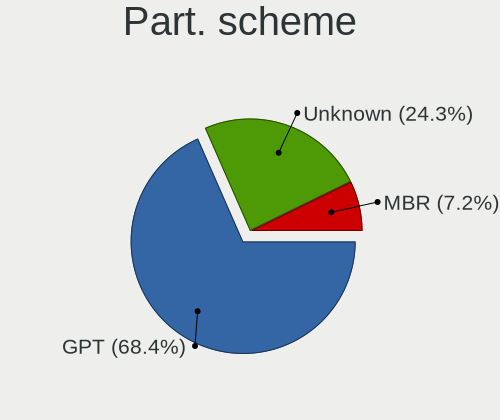
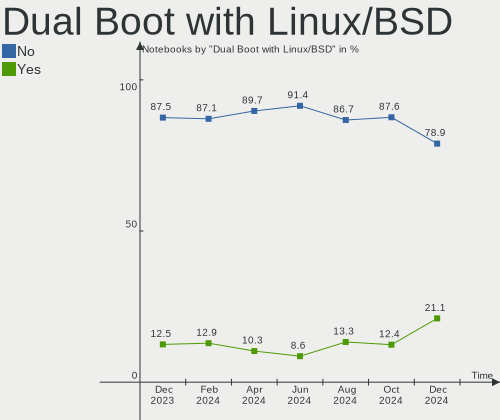
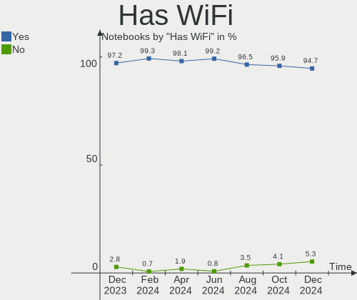
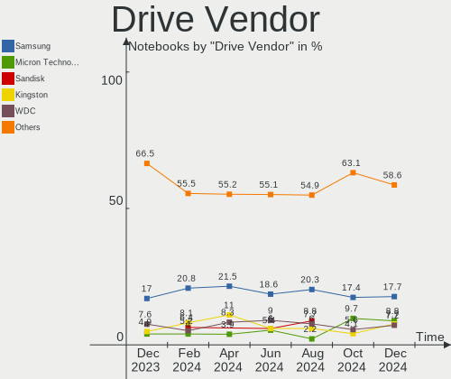
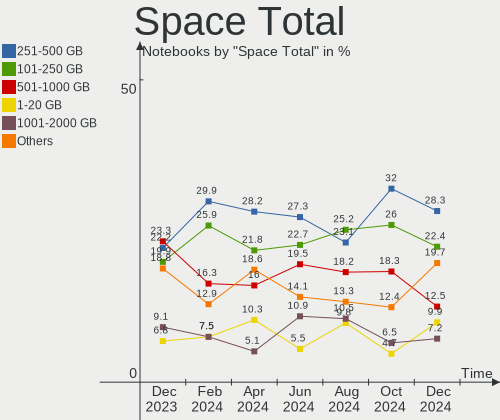
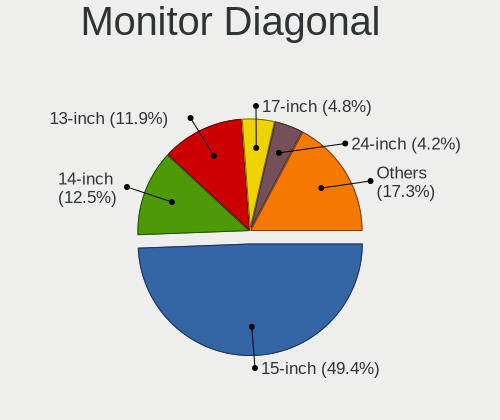
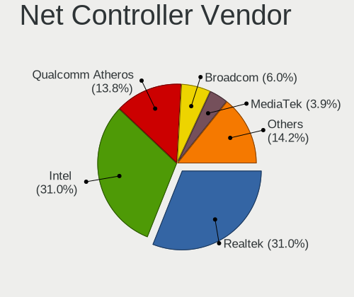
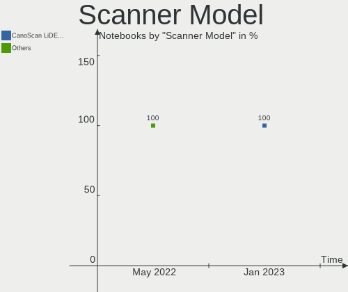

Linux in Italy - Hardware Trends (Notebooks)
--------------------------------------------

A project to identify most popular hardware characteristics and track their change
over time based on data collected by Linux users at https://Linux-Hardware.org.

Anyone can contribute to this report by the [hw-probe](https://github.com/linuxhw/hw-probe) tool:

    sudo -E hw-probe -all -upload

Period: Dec, 2022.

Contents
--------

* [ System ](#system)
  - [ OS                       ](#os)
  - [ OS Family                ](#os-family)
  - [ Kernel                   ](#kernel)
  - [ Kernel Family            ](#kernel-family)
  - [ Kernel Major Ver.        ](#kernel-major-ver)
  - [ Arch                     ](#arch)
  - [ DE                       ](#de)
  - [ Display Server           ](#display-server)
  - [ Display Manager          ](#display-manager)
  - [ OS Lang                  ](#os-lang)
  - [ Boot Mode                ](#boot-mode)
  - [ Filesystem               ](#filesystem)
  - [ Part. scheme             ](#part-scheme)
  - [ Dual Boot with Linux/BSD ](#dual-boot-with-linuxbsd)
  - [ Dual Boot (Win)          ](#dual-boot-win)

* [ Board ](#board)
  - [ Vendor                   ](#vendor)
  - [ Model                    ](#model)
  - [ Model Family             ](#model-family)
  - [ MFG Year                 ](#mfg-year)
  - [ Form Factor              ](#form-factor)
  - [ Secure Boot              ](#secure-boot)
  - [ Coreboot                 ](#coreboot)
  - [ RAM Size                 ](#ram-size)
  - [ RAM Used                 ](#ram-used)
  - [ Total Drives             ](#total-drives)
  - [ Has CD-ROM               ](#has-cd-rom)
  - [ Has Ethernet             ](#has-ethernet)
  - [ Has WiFi                 ](#has-wifi)
  - [ Has Bluetooth            ](#has-bluetooth)

* [ Location ](#location)
  - [ Country                  ](#country)
  - [ City                     ](#city)

* [ Drives ](#drives)
  - [ Drive Vendor             ](#drive-vendor)
  - [ Drive Model              ](#drive-model)
  - [ HDD Vendor               ](#hdd-vendor)
  - [ SSD Vendor               ](#ssd-vendor)
  - [ Drive Kind               ](#drive-kind)
  - [ Drive Connector          ](#drive-connector)
  - [ Drive Size               ](#drive-size)
  - [ Space Total              ](#space-total)
  - [ Space Used               ](#space-used)
  - [ Malfunc. Drives          ](#malfunc-drives)
  - [ Malfunc. Drive Vendor    ](#malfunc-drive-vendor)
  - [ Malfunc. HDD Vendor      ](#malfunc-hdd-vendor)
  - [ Malfunc. Drive Kind      ](#malfunc-drive-kind)
  - [ Failed Drives            ](#failed-drives)
  - [ Failed Drive Vendor      ](#failed-drive-vendor)
  - [ Drive Status             ](#drive-status)

* [ Storage controller ](#storage-controller)
  - [ Storage Vendor           ](#storage-vendor)
  - [ Storage Model            ](#storage-model)
  - [ Storage Kind             ](#storage-kind)

* [ Processor ](#processor)
  - [ CPU Vendor               ](#cpu-vendor)
  - [ CPU Model                ](#cpu-model)
  - [ CPU Model Family         ](#cpu-model-family)
  - [ CPU Cores                ](#cpu-cores)
  - [ CPU Sockets              ](#cpu-sockets)
  - [ CPU Threads              ](#cpu-threads)
  - [ CPU Op-Modes             ](#cpu-op-modes)
  - [ CPU Microcode            ](#cpu-microcode)
  - [ CPU Microarch            ](#cpu-microarch)

* [ Graphics ](#graphics)
  - [ GPU Vendor               ](#gpu-vendor)
  - [ GPU Model                ](#gpu-model)
  - [ GPU Combo                ](#gpu-combo)
  - [ GPU Driver               ](#gpu-driver)
  - [ GPU Memory               ](#gpu-memory)

* [ Monitor ](#monitor)
  - [ Monitor Vendor           ](#monitor-vendor)
  - [ Monitor Model            ](#monitor-model)
  - [ Monitor Resolution       ](#monitor-resolution)
  - [ Monitor Diagonal         ](#monitor-diagonal)
  - [ Monitor Width            ](#monitor-width)
  - [ Aspect Ratio             ](#aspect-ratio)
  - [ Monitor Area             ](#monitor-area)
  - [ Pixel Density            ](#pixel-density)
  - [ Multiple Monitors        ](#multiple-monitors)

* [ Network ](#network)
  - [ Net Controller Vendor    ](#net-controller-vendor)
  - [ Net Controller Model     ](#net-controller-model)
  - [ Wireless Vendor          ](#wireless-vendor)
  - [ Wireless Model           ](#wireless-model)
  - [ Ethernet Vendor          ](#ethernet-vendor)
  - [ Ethernet Model           ](#ethernet-model)
  - [ Net Controller Kind      ](#net-controller-kind)
  - [ Used Controller          ](#used-controller)
  - [ NICs                     ](#nics)
  - [ IPv6                     ](#ipv6)

* [ Bluetooth ](#bluetooth)
  - [ Bluetooth Vendor         ](#bluetooth-vendor)
  - [ Bluetooth Model          ](#bluetooth-model)

* [ Sound ](#sound)
  - [ Sound Vendor             ](#sound-vendor)
  - [ Sound Model              ](#sound-model)

* [ Memory ](#memory)
  - [ Memory Vendor            ](#memory-vendor)
  - [ Memory Model             ](#memory-model)
  - [ Memory Kind              ](#memory-kind)
  - [ Memory Form Factor       ](#memory-form-factor)
  - [ Memory Size              ](#memory-size)
  - [ Memory Speed             ](#memory-speed)

* [ Printers & scanners ](#printers--scanners)
  - [ Printer Vendor           ](#printer-vendor)
  - [ Printer Model            ](#printer-model)
  - [ Scanner Vendor           ](#scanner-vendor)
  - [ Scanner Model            ](#scanner-model)

* [ Camera ](#camera)
  - [ Camera Vendor            ](#camera-vendor)
  - [ Camera Model             ](#camera-model)

* [ Security ](#security)
  - [ Fingerprint Vendor       ](#fingerprint-vendor)
  - [ Fingerprint Model        ](#fingerprint-model)
  - [ Chipcard Vendor          ](#chipcard-vendor)
  - [ Chipcard Model           ](#chipcard-model)

* [ Unsupported ](#unsupported)
  - [ Unsupported Devices      ](#unsupported-devices)
  - [ Unsupported Device Types ](#unsupported-device-types)

System
------

OS
--

Installed operating systems

| Name                         | Notebooks | Percent |
|------------------------------|-----------|---------|
| Arch Rolling                 | 16        | 9.52%   |
| Debian 11                    | 14        | 8.33%   |
| Linux Mint 21                | 13        | 7.74%   |
| Fedora 37                    | 13        | 7.74%   |
| Ubuntu 22.04                 | 11        | 6.55%   |
| Ubuntu 22.10                 | 9         | 5.36%   |
| Linux Mint 21.1              | 9         | 5.36%   |
| Pop!_OS 22.04                | 8         | 4.76%   |
| Manjaro 22.0.0               | 6         | 3.57%   |
| Ubuntu 20.04                 | 5         | 2.98%   |
| OpenMandriva 4.3             | 5         | 2.98%   |
| Kubuntu 22.04                | 5         | 2.98%   |
| Kubuntu 22.10                | 4         | 2.38%   |
| Zorin 16                     | 3         | 1.79%   |
| Xubuntu 18.04                | 3         | 1.79%   |
| Lubuntu 22.04                | 3         | 1.79%   |
| EndeavourOS Rolling          | 3         | 1.79%   |
| openSUSE Tumbleweed-XXXXXXXX | 2         | 1.19%   |
| OpenMandriva 4.50            | 2         | 1.19%   |
| OpenMandriva 22.12           | 2         | 1.19%   |
| MX 21                        | 2         | 1.19%   |
| Lubuntu 20.04                | 2         | 1.19%   |
| LMDE 5                       | 2         | 1.19%   |
| Linux Mint 20.3              | 2         | 1.19%   |
| Debian                       | 2         | 1.19%   |
| Zorin 15                     | 1         | 0.6%    |
| Xubuntu 22.10                | 1         | 0.6%    |
| Xubuntu 22.04                | 1         | 0.6%    |
| Xubuntu 20.04                | 1         | 0.6%    |
| Ubuntu Budgie 22.10          | 1         | 0.6%    |
| Ubuntu 18.04                 | 1         | 0.6%    |
| SteamOS 3.3.2                | 1         | 0.6%    |
| Slackware 15.0               | 1         | 0.6%    |
| openSUSE Leap-15.4           | 1         | 0.6%    |
| OpenMandriva 4.2             | 1         | 0.6%    |
| Manjaro 21.3.7               | 1         | 0.6%    |
| Manjaro                      | 1         | 0.6%    |
| Lubuntu 18.04                | 1         | 0.6%    |
| Linux Mint 20                | 1         | 0.6%    |
| KDE neon 22.04               | 1         | 0.6%    |

OS Family
---------

OS without a version

| Name          | Notebooks | Percent |
|---------------|-----------|---------|
| Ubuntu        | 26        | 15.48%  |
| Linux Mint    | 25        | 14.88%  |
| Debian        | 16        | 9.52%   |
| Arch          | 16        | 9.52%   |
| Fedora        | 14        | 8.33%   |
| OpenMandriva  | 10        | 5.95%   |
| Kubuntu       | 9         | 5.36%   |
| Pop!_OS       | 8         | 4.76%   |
| Manjaro       | 8         | 4.76%   |
| Xubuntu       | 6         | 3.57%   |
| Lubuntu       | 6         | 3.57%   |
| Zorin         | 4         | 2.38%   |
| openSUSE      | 3         | 1.79%   |
| EndeavourOS   | 3         | 1.79%   |
| MX            | 2         | 1.19%   |
| LMDE          | 2         | 1.19%   |
| Elementary    | 2         | 1.19%   |
| Ubuntu Budgie | 1         | 0.6%    |
| SteamOS       | 1         | 0.6%    |
| Slackware     | 1         | 0.6%    |
| KDE neon      | 1         | 0.6%    |
| Kali          | 1         | 0.6%    |
| Gentoo        | 1         | 0.6%    |
| Clear Linux   | 1         | 0.6%    |
| ArcoLinux     | 1         | 0.6%    |

Kernel
------

Version of the Linux kernel

| Version                  | Notebooks | Percent |
|--------------------------|-----------|---------|
| 5.15.0-56-generic        | 36        | 21.43%  |
| 5.19.0-26-generic        | 10        | 5.95%   |
| 5.10.0-19-amd64          | 8         | 4.76%   |
| 5.4.0-135-generic        | 7         | 4.17%   |
| 6.0.12-arch1-1           | 6         | 3.57%   |
| 5.16.7-desktop-1omv4003  | 5         | 2.98%   |
| 5.15.0-53-generic        | 5         | 2.98%   |
| 6.1.1-arch1-1            | 4         | 2.38%   |
| 6.0.6-76060006-generic   | 4         | 2.38%   |
| 6.0.15-300.fc37.x86_64   | 3         | 1.79%   |
| 6.0.12-76060006-generic  | 3         | 1.79%   |
| 6.0.11-300.fc37.x86_64   | 3         | 1.79%   |
| 5.15.0-43-generic        | 3         | 1.79%   |
| 5.10.0-20-amd64          | 3         | 1.79%   |
| 6.1.0-1-MANJARO          | 2         | 1.19%   |
| 6.0.12-zen1-1-zen        | 2         | 1.19%   |
| 6.0.12-300.fc37.x86_64   | 2         | 1.19%   |
| 6.0.11-zen1-1-zen        | 2         | 1.19%   |
| 6.0.11-arch1-1           | 2         | 1.19%   |
| 6.0.11-1-MANJARO         | 2         | 1.19%   |
| 6.0.10-desktop-2omv22090 | 2         | 1.19%   |
| 6.0.10-arch2-1           | 2         | 1.19%   |
| 6.0.10-300.fc37.x86_64   | 2         | 1.19%   |
| 5.15.0-52-generic        | 2         | 1.19%   |
| 5.15.0-41-generic        | 2         | 1.19%   |
| 4.15.0-200-generic       | 2         | 1.19%   |
| 6.1.1-zen1-1-zen         | 1         | 0.6%    |
| 6.1.1-1231.native        | 1         | 0.6%    |
| 6.1.0-1-default          | 1         | 0.6%    |
| 6.1.0                    | 1         | 0.6%    |
| 6.0.9-300.fc37.x86_64    | 1         | 0.6%    |
| 6.0.9-060009-generic     | 1         | 0.6%    |
| 6.0.5-200.fc36.x86_64    | 1         | 0.6%    |
| 6.0.2-desktop-1omv4050   | 1         | 0.6%    |
| 6.0.2-76060002-generic   | 1         | 0.6%    |
| 6.0.14-300.fc37.x86_64   | 1         | 0.6%    |
| 6.0.13-300.fc37.x86_64   | 1         | 0.6%    |
| 6.0.13-1-MANJARO         | 1         | 0.6%    |
| 6.0.11-gentoo            | 1         | 0.6%    |
| 6.0.10-zen2-1-zen        | 1         | 0.6%    |

Kernel Family
-------------

Linux kernel without a distro release

| Version | Notebooks | Percent |
|---------|-----------|---------|
| 5.15.0  | 51        | 30.36%  |
| 5.10.0  | 15        | 8.93%   |
| 6.0.12  | 13        | 7.74%   |
| 5.19.0  | 13        | 7.74%   |
| 6.0.11  | 10        | 5.95%   |
| 5.4.0   | 9         | 5.36%   |
| 6.0.10  | 8         | 4.76%   |
| 6.1.1   | 6         | 3.57%   |
| 6.0.0   | 5         | 2.98%   |
| 5.16.7  | 5         | 2.98%   |
| 6.1.0   | 4         | 2.38%   |
| 6.0.6   | 4         | 2.38%   |
| 6.0.15  | 3         | 1.79%   |
| 5.13.0  | 3         | 1.79%   |
| 6.0.9   | 2         | 1.19%   |
| 6.0.2   | 2         | 1.19%   |
| 6.0.13  | 2         | 1.19%   |
| 4.15.0  | 2         | 1.19%   |
| 6.0.5   | 1         | 0.6%    |
| 6.0.14  | 1         | 0.6%    |
| 5.19.5  | 1         | 0.6%    |
| 5.19.12 | 1         | 0.6%    |
| 5.18.0  | 1         | 0.6%    |
| 5.15.84 | 1         | 0.6%    |
| 5.15.81 | 1         | 0.6%    |
| 5.15.60 | 1         | 0.6%    |
| 5.15.19 | 1         | 0.6%    |
| 5.14.21 | 1         | 0.6%    |
| 5.10.14 | 1         | 0.6%    |

Kernel Major Ver.
-----------------

Linux kernel major version

| Version | Notebooks | Percent |
|---------|-----------|---------|
| 5.15    | 55        | 32.74%  |
| 6.0     | 51        | 30.36%  |
| 5.10    | 16        | 9.52%   |
| 5.19    | 15        | 8.93%   |
| 6.1     | 10        | 5.95%   |
| 5.4     | 9         | 5.36%   |
| 5.16    | 5         | 2.98%   |
| 5.13    | 3         | 1.79%   |
| 4.15    | 2         | 1.19%   |
| 5.18    | 1         | 0.6%    |
| 5.14    | 1         | 0.6%    |

Arch
----

OS architecture (x86_64, i586, etc.)

| Name   | Notebooks | Percent |
|--------|-----------|---------|
| x86_64 | 161       | 95.83%  |
| i686   | 7         | 4.17%   |

DE
--

Desktop Environment

| Name            | Notebooks | Percent |
|-----------------|-----------|---------|
| GNOME           | 66        | 39.29%  |
| KDE5            | 40        | 23.81%  |
| X-Cinnamon      | 22        | 13.1%   |
| XFCE            | 16        | 9.52%   |
| LXQt            | 7         | 4.17%   |
| MATE            | 4         | 2.38%   |
| Pantheon        | 2         | 1.19%   |
| LXDE            | 2         | 1.19%   |
| i3              | 2         | 1.19%   |
| GNOME Flashback | 2         | 1.19%   |
| Cinnamon        | 2         | 1.19%   |
| Unknown         | 2         | 1.19%   |
| bspwm           | 1         | 0.6%    |

Display Server
--------------

X11 or Wayland

| Name    | Notebooks | Percent |
|---------|-----------|---------|
| X11     | 119       | 70.83%  |
| Wayland | 41        | 24.4%   |
| Unknown | 6         | 3.57%   |
| Tty     | 2         | 1.19%   |

Display Manager
---------------

SDDM, LightDM, etc.

| Name    | Notebooks | Percent |
|---------|-----------|---------|
| Unknown | 46        | 27.38%  |
| SDDM    | 36        | 21.43%  |
| LightDM | 36        | 21.43%  |
| GDM3    | 27        | 16.07%  |
| GDM     | 22        | 13.1%   |
| SLiM    | 1         | 0.6%    |

OS Lang
-------

Language

| Lang    | Notebooks | Percent |
|---------|-----------|---------|
| it_IT   | 102       | 60.71%  |
| en_US   | 47        | 27.98%  |
| en_GB   | 7         | 4.17%   |
| C       | 7         | 4.17%   |
| de_IT   | 2         | 1.19%   |
| Unknown | 2         | 1.19%   |
| de_CH   | 1         | 0.6%    |

Boot Mode
---------

EFI or BIOS

| Mode | Notebooks | Percent |
|------|-----------|---------|
| EFI  | 102       | 60.71%  |
| BIOS | 66        | 39.29%  |

Filesystem
----------

Type of filesystem

| Type    | Notebooks | Percent |
|---------|-----------|---------|
| Ext4    | 128       | 76.19%  |
| Btrfs   | 23        | 13.69%  |
| Overlay | 16        | 9.52%   |
| Tmpfs   | 1         | 0.6%    |

Part. scheme
------------

Scheme of partitioning

| Type    | Notebooks | Percent |
|---------|-----------|---------|
| GPT     | 105       | 62.5%   |
| Unknown | 48        | 28.57%  |
| MBR     | 15        | 8.93%   |

Dual Boot with Linux/BSD
------------------------

Hosting more than one Linux/BSD

| Dual boot | Notebooks | Percent |
|-----------|-----------|---------|
| No        | 151       | 89.88%  |
| Yes       | 17        | 10.12%  |

Dual Boot (Win)
---------------

Hosting Linux and Windows

| Dual boot | Notebooks | Percent |
|-----------|-----------|---------|
| No        | 122       | 72.62%  |
| Yes       | 46        | 27.38%  |

Board
-----

Vendor
------

Motherboard manufacturer

| Name                | Notebooks | Percent |
|---------------------|-----------|---------|
| Hewlett-Packard     | 41        | 24.4%   |
| Lenovo              | 33        | 19.64%  |
| ASUSTek Computer    | 21        | 12.5%   |
| Dell                | 12        | 7.14%   |
| HUAWEI              | 10        | 5.95%   |
| Acer                | 10        | 5.95%   |
| Toshiba             | 6         | 3.57%   |
| Samsung Electronics | 4         | 2.38%   |
| MSI                 | 4         | 2.38%   |
| Packard Bell        | 3         | 1.79%   |
| Google              | 3         | 1.79%   |
| Teclast             | 2         | 1.19%   |
| Notebook            | 2         | 1.19%   |
| Apple               | 2         | 1.19%   |
| WYSE                | 1         | 0.6%    |
| Valve               | 1         | 0.6%    |
| Timi                | 1         | 0.6%    |
| System76            | 1         | 0.6%    |
| Sony                | 1         | 0.6%    |
| SGIN                | 1         | 0.6%    |
| Schenker            | 1         | 0.6%    |
| SANTECH             | 1         | 0.6%    |
| PC Specialist       | 1         | 0.6%    |
| Monster             | 1         | 0.6%    |
| Medion              | 1         | 0.6%    |
| Mediacom            | 1         | 0.6%    |
| Fujitsu             | 1         | 0.6%    |
| Chuwi               | 1         | 0.6%    |
| Alienware           | 1         | 0.6%    |

Model
-----

Motherboard model

| Name                                              | Notebooks | Percent |
|---------------------------------------------------|-----------|---------|
| Lenovo IdeaPad Gaming 3 15ARH05 82EY              | 2         | 1.19%   |
| Lenovo IdeaPad 3 15ADA05 81W1                     | 2         | 1.19%   |
| HUAWEI NBLK-WAX9X                                 | 2         | 1.19%   |
| HUAWEI NBLB-WAX9N                                 | 2         | 1.19%   |
| HP Pavilion Laptop 15-cs2xxx                      | 2         | 1.19%   |
| HP Pavilion 15                                    | 2         | 1.19%   |
| HP Notebook                                       | 2         | 1.19%   |
| HP Laptop 15s-fq2xxx                              | 2         | 1.19%   |
| HP Laptop 15-da0xxx                               | 2         | 1.19%   |
| HP Compaq 6730s                                   | 2         | 1.19%   |
| HP 255 G8 Notebook PC                             | 2         | 1.19%   |
| Google Blooglet                                   | 2         | 1.19%   |
| WYSE XM CLASS                                     | 1         | 0.6%    |
| Valve Jupiter                                     | 1         | 0.6%    |
| Toshiba Satellite Pro S500                        | 1         | 0.6%    |
| Toshiba Satellite M70                             | 1         | 0.6%    |
| Toshiba Satellite L50-B                           | 1         | 0.6%    |
| Toshiba Satellite L455                            | 1         | 0.6%    |
| Toshiba Satellite C850-1LJ                        | 1         | 0.6%    |
| Toshiba Satellite C70-C-11L                       | 1         | 0.6%    |
| Timi TM1701                                       | 1         | 0.6%    |
| Teclast F7 Plus                                   | 1         | 0.6%    |
| Teclast F15Plus 2                                 | 1         | 0.6%    |
| System76 Darter Pro                               | 1         | 0.6%    |
| Sony VGN-FW11E                                    | 1         | 0.6%    |
| SGIN laptop                                       | 1         | 0.6%    |
| Schenker XMG APEX (Mid 2021)                      | 1         | 0.6%    |
| SANTECH NHx0DB,DE                                 | 1         | 0.6%    |
| Samsung RV420/RV520/RV720/E3530/S3530/E3420/E3520 | 1         | 0.6%    |
| Samsung 750XDA                                    | 1         | 0.6%    |
| Samsung 530U3C/530U4C/532U3C                      | 1         | 0.6%    |
| Samsung 350V5C/351V5C/3540VC/3440VC               | 1         | 0.6%    |
| PC Specialist Elimina Iv 17                       | 1         | 0.6%    |
| Packard Bell EasyNote TJ71                        | 1         | 0.6%    |
| Packard Bell EasyNote TJ65                        | 1         | 0.6%    |
| Packard Bell DOT S                                | 1         | 0.6%    |
| Notebook PCX0DX                                   | 1         | 0.6%    |
| Notebook NP5x_NP6x_NP7xPNK_PNH_PNJ                | 1         | 0.6%    |
| MSI GS76 Stealth 11UG                             | 1         | 0.6%    |
| MSI GS65 Stealth Thin 8RF                         | 1         | 0.6%    |

Model Family
------------

Motherboard model prefix

| Name                  | Notebooks | Percent |
|-----------------------|-----------|---------|
| Lenovo ThinkPad       | 16        | 9.52%   |
| HP Pavilion           | 10        | 5.95%   |
| Lenovo IdeaPad        | 9         | 5.36%   |
| HP EliteBook          | 8         | 4.76%   |
| Acer Aspire           | 8         | 4.76%   |
| Toshiba Satellite     | 6         | 3.57%   |
| HP Compaq             | 5         | 2.98%   |
| Dell Inspiron         | 5         | 2.98%   |
| HP Laptop             | 4         | 2.38%   |
| HP ProBook            | 3         | 1.79%   |
| HP 255                | 3         | 1.79%   |
| Dell XPS              | 3         | 1.79%   |
| Dell Latitude         | 3         | 1.79%   |
| ASUS ROG              | 3         | 1.79%   |
| Packard Bell EasyNote | 2         | 1.19%   |
| Lenovo ThinkBook      | 2         | 1.19%   |
| HUAWEI NBLK-WAX9X     | 2         | 1.19%   |
| HUAWEI NBLB-WAX9N     | 2         | 1.19%   |
| HP Notebook           | 2         | 1.19%   |
| HP 250                | 2         | 1.19%   |
| Google Blooglet       | 2         | 1.19%   |
| ASUS VivoBook         | 2         | 1.19%   |
| ASUS ASUS             | 2         | 1.19%   |
| Acer TravelMate       | 2         | 1.19%   |
| WYSE XM               | 1         | 0.6%    |
| Valve Jupiter         | 1         | 0.6%    |
| Timi TM1701           | 1         | 0.6%    |
| Teclast F7            | 1         | 0.6%    |
| Teclast F15Plus       | 1         | 0.6%    |
| System76 Darter       | 1         | 0.6%    |
| Sony VGN-FW11E        | 1         | 0.6%    |
| SGIN laptop           | 1         | 0.6%    |
| Schenker XMG          | 1         | 0.6%    |
| SANTECH NHx0DB        | 1         | 0.6%    |
| Samsung RV420         | 1         | 0.6%    |
| Samsung 750XDA        | 1         | 0.6%    |
| Samsung 530U3C        | 1         | 0.6%    |
| Samsung 350V5C        | 1         | 0.6%    |
| PC Specialist Elimina | 1         | 0.6%    |
| Packard Bell DOT      | 1         | 0.6%    |

MFG Year
--------

Motherboard manufacture year

| Year | Notebooks | Percent |
|------|-----------|---------|
| 2021 | 24        | 14.29%  |
| 2020 | 24        | 14.29%  |
| 2019 | 16        | 9.52%   |
| 2018 | 15        | 8.93%   |
| 2022 | 14        | 8.33%   |
| 2013 | 10        | 5.95%   |
| 2017 | 9         | 5.36%   |
| 2015 | 8         | 4.76%   |
| 2009 | 8         | 4.76%   |
| 2014 | 7         | 4.17%   |
| 2012 | 7         | 4.17%   |
| 2011 | 6         | 3.57%   |
| 2016 | 5         | 2.98%   |
| 2010 | 5         | 2.98%   |
| 2008 | 5         | 2.98%   |
| 2007 | 2         | 1.19%   |
| 2006 | 2         | 1.19%   |
| 2005 | 1         | 0.6%    |

Form Factor
-----------

Physical design of the computer

| Name     | Notebooks | Percent |
|----------|-----------|---------|
| Notebook | 168       | 100%    |

Secure Boot
-----------

Enabled or disabled

| State    | Notebooks | Percent |
|----------|-----------|---------|
| Disabled | 150       | 89.29%  |
| Enabled  | 18        | 10.71%  |

Coreboot
--------

Have coreboot on board

| Used | Notebooks | Percent |
|------|-----------|---------|
| No   | 163       | 97.02%  |
| Yes  | 5         | 2.98%   |

RAM Size
--------

Total RAM memory

| Size in GB  | Notebooks | Percent |
|-------------|-----------|---------|
| 4.01-8.0    | 49        | 29.17%  |
| 16.01-24.0  | 30        | 17.86%  |
| 8.01-16.0   | 30        | 17.86%  |
| 3.01-4.0    | 28        | 16.67%  |
| 32.01-64.0  | 12        | 7.14%   |
| 2.01-3.0    | 6         | 3.57%   |
| 1.01-2.0    | 5         | 2.98%   |
| 24.01-32.0  | 3         | 1.79%   |
| 64.01-256.0 | 3         | 1.79%   |
| 0.51-1.0    | 2         | 1.19%   |

RAM Used
--------

Used RAM memory

| Used GB   | Notebooks | Percent |
|-----------|-----------|---------|
| 2.01-3.0  | 46        | 27.38%  |
| 1.01-2.0  | 44        | 26.19%  |
| 4.01-8.0  | 37        | 22.02%  |
| 3.01-4.0  | 28        | 16.67%  |
| 0.51-1.0  | 8         | 4.76%   |
| 0.01-0.5  | 3         | 1.79%   |
| 8.01-16.0 | 2         | 1.19%   |

Total Drives
------------

Number of drives on board

| Drives | Notebooks | Percent |
|--------|-----------|---------|
| 1      | 121       | 72.02%  |
| 2      | 42        | 25%     |
| 3      | 5         | 2.98%   |

Has CD-ROM
----------

Has CD-ROM on board

| Presented | Notebooks | Percent |
|-----------|-----------|---------|
| No        | 115       | 68.45%  |
| Yes       | 53        | 31.55%  |

Has Ethernet
------------

Has Ethernet on board

| Presented | Notebooks | Percent |
|-----------|-----------|---------|
| Yes       | 133       | 79.17%  |
| No        | 35        | 20.83%  |

Has WiFi
--------

Has WiFi module

| Presented | Notebooks | Percent |
|-----------|-----------|---------|
| Yes       | 165       | 98.21%  |
| No        | 3         | 1.79%   |

Has Bluetooth
-------------

Has Bluetooth module

| Presented | Notebooks | Percent |
|-----------|-----------|---------|
| Yes       | 132       | 78.57%  |
| No        | 36        | 21.43%  |

Location
--------

Country
-------

Geographic location (country)

| Country | Notebooks | Percent |
|---------|-----------|---------|
| Italy   | 168       | 100%    |

City
----

Geographic location (city)

| City                | Notebooks | Percent |
|---------------------|-----------|---------|
| Milan               | 28        | 16.67%  |
| Rome                | 14        | 8.33%   |
| Turin               | 5         | 2.98%   |
| Florence            | 4         | 2.38%   |
| Bari                | 4         | 2.38%   |
| Verona              | 3         | 1.79%   |
| Pisa                | 3         | 1.79%   |
| Naples              | 3         | 1.79%   |
| Bologna             | 3         | 1.79%   |
| Bergamo             | 3         | 1.79%   |
| Pescara             | 2         | 1.19%   |
| Padova              | 2         | 1.19%   |
| Monza               | 2         | 1.19%   |
| Genoa               | 2         | 1.19%   |
| Catania             | 2         | 1.19%   |
| Casalecchio di Reno | 2         | 1.19%   |
| Brescia             | 2         | 1.19%   |
| Veruno              | 1         | 0.6%    |
| Vasto               | 1         | 0.6%    |
| Ussana              | 1         | 0.6%    |
| Triggiano           | 1         | 0.6%    |
| Trieste             | 1         | 0.6%    |
| Tempio Pausania     | 1         | 0.6%    |
| Taglio              | 1         | 0.6%    |
| Susegana            | 1         | 0.6%    |
| Stazione-Fornola    | 1         | 0.6%    |
| Silvi               | 1         | 0.6%    |
| Siano               | 1         | 0.6%    |
| Sesto San Giovanni  | 1         | 0.6%    |
| Serravalle Sesia    | 1         | 0.6%    |
| Seregno             | 1         | 0.6%    |
| Sava                | 1         | 0.6%    |
| Saronno             | 1         | 0.6%    |
| San Costanzo        | 1         | 0.6%    |
| Salsomaggiore Terme | 1         | 0.6%    |
| Salerno             | 1         | 0.6%    |
| Sacile              | 1         | 0.6%    |
| Rivalta di Torino   | 1         | 0.6%    |
| Rho                 | 1         | 0.6%    |
| Reggio Calabria     | 1         | 0.6%    |

Drives
------

Drive Vendor
------------

Hard drive vendors

| Vendor                      | Notebooks | Drives | Percent |
|-----------------------------|-----------|--------|---------|
| Samsung Electronics         | 53        | 54     | 24.54%  |
| WDC                         | 16        | 16     | 7.41%   |
| Unknown                     | 13        | 13     | 6.02%   |
| SanDisk                     | 12        | 12     | 5.56%   |
| Toshiba                     | 11        | 11     | 5.09%   |
| SK hynix                    | 11        | 11     | 5.09%   |
| Crucial                     | 11        | 11     | 5.09%   |
| Seagate                     | 10        | 11     | 4.63%   |
| Intel                       | 9         | 9      | 4.17%   |
| Hitachi                     | 9         | 9      | 4.17%   |
| Micron Technology           | 8         | 8      | 3.7%    |
| Kingston                    | 8         | 8      | 3.7%    |
| KIOXIA                      | 6         | 6      | 2.78%   |
| China                       | 5         | 5      | 2.31%   |
| HGST                        | 4         | 4      | 1.85%   |
| Phison                      | 3         | 4      | 1.39%   |
| Fujitsu                     | 3         | 4      | 1.39%   |
| SPCC                        | 2         | 2      | 0.93%   |
| Silicon Motion              | 2         | 2      | 0.93%   |
| Micron/Crucial Technology   | 2         | 2      | 0.93%   |
| LITEON                      | 2         | 2      | 0.93%   |
| JMicron Technology          | 2         | 2      | 0.93%   |
| Teclast                     | 1         | 1      | 0.46%   |
| Solid State Storage         | 1         | 1      | 0.46%   |
| Ramaxel Technology          | 1         | 1      | 0.46%   |
| Phison Electronics          | 1         | 1      | 0.46%   |
| NGFF                        | 1         | 1      | 0.46%   |
| LITEONIT                    | 1         | 1      | 0.46%   |
| Linux                       | 1         | 1      | 0.46%   |
| Lenovo                      | 1         | 1      | 0.46%   |
| Kingston Technology Company | 1         | 1      | 0.46%   |
| HGST HTS                    | 1         | 1      | 0.46%   |
| Emtec                       | 1         | 1      | 0.46%   |
| Dogfish                     | 1         | 1      | 0.46%   |
| ASUSTek Computer            | 1         | 1      | 0.46%   |
| ADATA Technology            | 1         | 1      | 0.46%   |

Drive Model
-----------

Hard drive models

| Model                                                  | Notebooks | Percent |
|--------------------------------------------------------|-----------|---------|
| Samsung NVMe SSD Controller SM981/PM981/PM983 500GB    | 6         | 2.75%   |
| Samsung NVMe SSD Controller PM9A1/PM9A3/980PRO 2TB     | 5         | 2.29%   |
| Kingston SA400S37240G 240GB SSD                        | 5         | 2.29%   |
| Intel SSD 660P Series 1024GB                           | 4         | 1.83%   |
| Unknown MMC Card  64GB                                 | 3         | 1.38%   |
| SK hynix SKHynix_HFM512GD3HX015N 512GB                 | 3         | 1.38%   |
| Samsung SSD 870 EVO 1TB                                | 3         | 1.38%   |
| Samsung SSD 850 EVO 250GB                              | 3         | 1.38%   |
| Samsung MZVLQ512HALU-000H1 512GB                       | 3         | 1.38%   |
| Samsung MZVLQ512HALU-00000 512GB                       | 3         | 1.38%   |
| WDC WD3200BEVT-22ZCT0 320GB                            | 2         | 0.92%   |
| Toshiba XG6 NVMe SSD Controller 256GB                  | 2         | 0.92%   |
| Toshiba MQ01ABF050 500GB                               | 2         | 0.92%   |
| SK hynix BC511 NVMe 512GB                              | 2         | 0.92%   |
| SK hynix BC511 256GB                                   | 2         | 0.92%   |
| Silicon Motion SM2263EN/SM2263XT SSD Controller 1024GB | 2         | 0.92%   |
| Seagate ST1000LM035-1RK172 1TB                         | 2         | 0.92%   |
| Seagate Expansion 4TB                                  | 2         | 0.92%   |
| Sandisk WD Black SN750 / PC SN730 NVMe SSD 512GB       | 2         | 0.92%   |
| SanDisk SSD PLUS 1000GB                                | 2         | 0.92%   |
| SanDisk SDSSDXPS480G 480GB                             | 2         | 0.92%   |
| Samsung SSD 980 1TB                                    | 2         | 0.92%   |
| Samsung SSD 870 EVO 500GB                              | 2         | 0.92%   |
| Samsung SSD 860 EVO 500GB                              | 2         | 0.92%   |
| Samsung SSD 860 EVO 250GB                              | 2         | 0.92%   |
| Micron/Crucial P2 NVMe PCIe SSD 500GB                  | 2         | 0.92%   |
| KIOXIA KBG50ZNV256G 256GB                              | 2         | 0.92%   |
| JMicron Tech 250GB                                     | 2         | 0.92%   |
| Crucial CT1000BX500SSD1 1TB                            | 2         | 0.92%   |
| WDC WDS100T2G0A-00JH30 1TB SSD                         | 1         | 0.46%   |
| WDC WDS100T2B0C-00PXH0 1TB                             | 1         | 0.46%   |
| WDC WD6400BPVT-22HXZT3 640GB                           | 1         | 0.46%   |
| WDC WD5000LPVX-16V0TT3 500GB                           | 1         | 0.46%   |
| WDC WD5000LPCX-24C6HT0 500GB                           | 1         | 0.46%   |
| WDC WD5000LPCX-21VHAT0 500GB                           | 1         | 0.46%   |
| WDC WD5000BEVT-22ZAT0 500GB                            | 1         | 0.46%   |
| WDC WD3200BPVT-22JJ5T0 320GB                           | 1         | 0.46%   |
| WDC WD10SPZX-21Z10T0 1TB                               | 1         | 0.46%   |
| WDC PC SN730 SDBQNTY-256G-1006 256GB                   | 1         | 0.46%   |
| WDC PC SN730 SDBPNTY-512G-1006 512GB                   | 1         | 0.46%   |

HDD Vendor
----------

Hard disk drive vendors

| Vendor              | Notebooks | Drives | Percent |
|---------------------|-----------|--------|---------|
| WDC                 | 9         | 9      | 21.43%  |
| Seagate             | 9         | 9      | 21.43%  |
| Hitachi             | 9         | 9      | 21.43%  |
| Toshiba             | 4         | 4      | 9.52%   |
| HGST                | 4         | 4      | 9.52%   |
| Fujitsu             | 3         | 4      | 7.14%   |
| Samsung Electronics | 2         | 2      | 4.76%   |
| Unknown             | 1         | 1      | 2.38%   |
| HGST HTS            | 1         | 1      | 2.38%   |

SSD Vendor
----------

Solid state drive vendors

| Vendor              | Notebooks | Drives | Percent |
|---------------------|-----------|--------|---------|
| Samsung Electronics | 22        | 22     | 31.88%  |
| Crucial             | 8         | 8      | 11.59%  |
| SanDisk             | 7         | 7      | 10.14%  |
| Kingston            | 7         | 7      | 10.14%  |
| China               | 5         | 5      | 7.25%   |
| Toshiba             | 4         | 4      | 5.8%    |
| SPCC                | 2         | 2      | 2.9%    |
| Micron Technology   | 2         | 2      | 2.9%    |
| WDC                 | 1         | 1      | 1.45%   |
| Teclast             | 1         | 1      | 1.45%   |
| SK hynix            | 1         | 1      | 1.45%   |
| Seagate             | 1         | 1      | 1.45%   |
| Ramaxel Technology  | 1         | 1      | 1.45%   |
| Phison              | 1         | 1      | 1.45%   |
| NGFF                | 1         | 1      | 1.45%   |
| LITEONIT            | 1         | 1      | 1.45%   |
| Linux               | 1         | 1      | 1.45%   |
| Emtec               | 1         | 1      | 1.45%   |
| Dogfish             | 1         | 1      | 1.45%   |
| ASUSTek Computer    | 1         | 1      | 1.45%   |

Drive Kind
----------

HDD or SSD

| Kind    | Notebooks | Drives | Percent |
|---------|-----------|--------|---------|
| NVMe    | 83        | 94     | 40.69%  |
| SSD     | 65        | 69     | 31.86%  |
| HDD     | 42        | 43     | 20.59%  |
| MMC     | 12        | 12     | 5.88%   |
| Unknown | 2         | 2      | 0.98%   |

Drive Connector
---------------

SATA, SAS, NVMe, etc.

| Type | Notebooks | Drives | Percent |
|------|-----------|--------|---------|
| SATA | 95        | 103    | 47.5%   |
| NVMe | 83        | 94     | 41.5%   |
| MMC  | 12        | 12     | 6%      |
| SAS  | 10        | 11     | 5%      |

Drive Size
----------

Size of hard drive

| Size in TB | Notebooks | Drives | Percent |
|------------|-----------|--------|---------|
| 0.01-0.5   | 74        | 81     | 70.48%  |
| 0.51-1.0   | 28        | 28     | 26.67%  |
| 3.01-4.0   | 2         | 2      | 1.9%    |
| 1.01-2.0   | 1         | 1      | 0.95%   |

Space Total
-----------

Amount of disk space available on the file system

| Size in GB | Notebooks | Percent |
|------------|-----------|---------|
| 101-250    | 47        | 27.98%  |
| 251-500    | 45        | 26.79%  |
| 1-20       | 21        | 12.5%   |
| 501-1000   | 20        | 11.9%   |
| 51-100     | 13        | 7.74%   |
| 1001-2000  | 9         | 5.36%   |
| Unknown    | 6         | 3.57%   |
| 2001-3000  | 4         | 2.38%   |
| 21-50      | 3         | 1.79%   |

Space Used
----------

Amount of used disk space

| Used GB   | Notebooks | Percent |
|-----------|-----------|---------|
| 1-20      | 61        | 36.31%  |
| 21-50     | 32        | 19.05%  |
| 51-100    | 22        | 13.1%   |
| 101-250   | 21        | 12.5%   |
| 251-500   | 18        | 10.71%  |
| 501-1000  | 6         | 3.57%   |
| Unknown   | 6         | 3.57%   |
| 2001-3000 | 1         | 0.6%    |
| 1001-2000 | 1         | 0.6%    |

Malfunc. Drives
---------------

Drive models with a malfunction

| Model                                | Notebooks | Drives | Percent |
|--------------------------------------|-----------|--------|---------|
| Toshiba MQ01ABF032 320GB             | 1         | 1      | 10%     |
| Seagate ST1000LM035-1RK172 1TB       | 1         | 1      | 10%     |
| Seagate ST1000LM024 HN-M101MBB 1TB   | 1         | 1      | 10%     |
| Samsung Electronics SSD 870 EVO 1TB  | 1         | 1      | 10%     |
| Samsung Electronics HN-M500MBB 500GB | 1         | 1      | 10%     |
| Samsung Electronics HM160HC 160GB    | 1         | 1      | 10%     |
| NGFF 2280 512GB SSD                  | 1         | 1      | 10%     |
| Intel SSD 660P Series 1024GB         | 1         | 1      | 10%     |
| Hitachi HTS543216L9SA00 160GB        | 1         | 1      | 10%     |
| Fujitsu MHZ2120BH G2 120GB           | 1         | 1      | 10%     |

Malfunc. Drive Vendor
---------------------

Vendors of faulty drives

| Vendor              | Notebooks | Drives | Percent |
|---------------------|-----------|--------|---------|
| Samsung Electronics | 3         | 3      | 30%     |
| Seagate             | 2         | 2      | 20%     |
| Toshiba             | 1         | 1      | 10%     |
| NGFF                | 1         | 1      | 10%     |
| Intel               | 1         | 1      | 10%     |
| Hitachi             | 1         | 1      | 10%     |
| Fujitsu             | 1         | 1      | 10%     |

Malfunc. HDD Vendor
-------------------

Vendors of faulty HDD drives

| Vendor              | Notebooks | Drives | Percent |
|---------------------|-----------|--------|---------|
| Seagate             | 2         | 2      | 28.57%  |
| Samsung Electronics | 2         | 2      | 28.57%  |
| Toshiba             | 1         | 1      | 14.29%  |
| Hitachi             | 1         | 1      | 14.29%  |
| Fujitsu             | 1         | 1      | 14.29%  |

Malfunc. Drive Kind
-------------------

Kinds of faulty drives

| Kind | Notebooks | Drives | Percent |
|------|-----------|--------|---------|
| HDD  | 7         | 7      | 70%     |
| SSD  | 2         | 2      | 20%     |
| NVMe | 1         | 1      | 10%     |

Failed Drives
-------------

Failed drive models

Zero info for selected period =(

Failed Drive Vendor
-------------------

Failed drive vendors

Zero info for selected period =(

Drive Status
------------

Number of failed and malfunc. drives

| Status   | Notebooks | Drives | Percent |
|----------|-----------|--------|---------|
| Works    | 86        | 106    | 47.78%  |
| Detected | 84        | 104    | 46.67%  |
| Malfunc  | 10        | 10     | 5.56%   |

Storage controller
------------------

Storage Vendor
--------------

Storage controller vendors

| Vendor                           | Notebooks | Percent |
|----------------------------------|-----------|---------|
| Intel                            | 109       | 50.93%  |
| Samsung Electronics              | 29        | 13.55%  |
| AMD                              | 23        | 10.75%  |
| SK hynix                         | 10        | 4.67%   |
| SanDisk                          | 9         | 4.21%   |
| Micron Technology                | 6         | 2.8%    |
| Micron/Crucial Technology        | 5         | 2.34%   |
| KIOXIA                           | 5         | 2.34%   |
| Toshiba America Info Systems     | 4         | 1.87%   |
| Phison Electronics               | 3         | 1.4%    |
| Silicon Motion                   | 2         | 0.93%   |
| Lite-On Technology               | 2         | 0.93%   |
| Kingston Technology Company      | 2         | 0.93%   |
| Solid State Storage Technology   | 1         | 0.47%   |
| Silicon Integrated Systems [SiS] | 1         | 0.47%   |
| Seagate Technology               | 1         | 0.47%   |
| Lenovo                           | 1         | 0.47%   |
| ADATA Technology                 | 1         | 0.47%   |

Storage Model
-------------

Storage controller models

| Model                                                                          | Notebooks | Percent |
|--------------------------------------------------------------------------------|-----------|---------|
| AMD FCH SATA Controller [AHCI mode]                                            | 20        | 8.85%   |
| Intel Sunrise Point-LP SATA Controller [AHCI mode]                             | 13        | 5.75%   |
| Samsung NVMe SSD Controller SM981/PM981/PM983                                  | 11        | 4.87%   |
| Intel 82801 Mobile SATA Controller [RAID mode]                                 | 11        | 4.87%   |
| Samsung NVMe SSD Controller 980                                                | 10        | 4.42%   |
| Intel Volume Management Device NVMe RAID Controller                            | 10        | 4.42%   |
| Intel 7 Series Chipset Family 6-port SATA Controller [AHCI mode]               | 8         | 3.54%   |
| Samsung NVMe SSD Controller PM9A1/PM9A3/980PRO                                 | 7         | 3.1%    |
| Micron Non-Volatile memory controller                                          | 6         | 2.65%   |
| Intel SSD 660P Series                                                          | 6         | 2.65%   |
| Intel 8 Series SATA Controller 1 [AHCI mode]                                   | 6         | 2.65%   |
| Intel 6 Series/C200 Series Chipset Family 6 port Mobile SATA AHCI Controller   | 6         | 2.65%   |
| SK hynix Gold P31/PC711 NVMe Solid State Drive                                 | 5         | 2.21%   |
| Micron/Crucial P2 NVMe PCIe SSD                                                | 5         | 2.21%   |
| Intel Wildcat Point-LP SATA Controller [AHCI Mode]                             | 5         | 2.21%   |
| Intel 82801IBM/IEM (ICH9M/ICH9M-E) 4 port SATA Controller [AHCI mode]          | 5         | 2.21%   |
| Toshiba America Info Systems XG6 NVMe SSD Controller                           | 4         | 1.77%   |
| SK hynix BC511                                                                 | 4         | 1.77%   |
| Intel Tiger Lake-LP SATA Controller                                            | 4         | 1.77%   |
| Intel Comet Lake SATA AHCI Controller                                          | 4         | 1.77%   |
| Intel 8 Series/C220 Series Chipset Family 6-port SATA Controller 1 [AHCI mode] | 4         | 1.77%   |
| SanDisk WD Black SN750 / PC SN730 NVMe SSD                                     | 3         | 1.33%   |
| KIOXIA NVMe SSD Controller BG4                                                 | 3         | 1.33%   |
| Intel 5 Series/3400 Series Chipset 4 port SATA AHCI Controller                 | 3         | 1.33%   |
| Intel 400 Series Chipset Family SATA AHCI Controller                           | 3         | 1.33%   |
| AMD SB7x0/SB8x0/SB9x0 SATA Controller [AHCI mode]                              | 3         | 1.33%   |
| Silicon Motion SM2263EN/SM2263XT SSD Controller                                | 2         | 0.88%   |
| SanDisk WD Blue SN550 NVMe SSD                                                 | 2         | 0.88%   |
| SanDisk Non-Volatile memory controller                                         | 2         | 0.88%   |
| KIOXIA Non-Volatile memory controller                                          | 2         | 0.88%   |
| Intel SSD Pro 7600p/760p/E 6100p Series                                        | 2         | 0.88%   |
| Intel NM10/ICH7 Family SATA Controller [AHCI mode]                             | 2         | 0.88%   |
| Intel HM170/QM170 Chipset SATA Controller [AHCI Mode]                          | 2         | 0.88%   |
| Intel Celeron/Pentium Silver Processor SATA Controller                         | 2         | 0.88%   |
| Intel Alder Lake-P SATA AHCI Controller                                        | 2         | 0.88%   |
| Intel 82801IBM/IEM (ICH9M/ICH9M-E) 2 port SATA Controller [IDE mode]           | 2         | 0.88%   |
| Intel 82801HM/HEM (ICH8M/ICH8M-E) SATA Controller [AHCI mode]                  | 2         | 0.88%   |
| Intel 82801FBM (ICH6M) SATA Controller                                         | 2         | 0.88%   |
| Intel 82801FB/FBM/FR/FW/FRW (ICH6 Family) IDE Controller                       | 2         | 0.88%   |
| Solid State Storage Non-Volatile memory controller                             | 1         | 0.44%   |

Storage Kind
------------

Kind of storage controller (IDE, SATA, NVMe, SAS, ...)

| Kind | Notebooks | Percent |
|------|-----------|---------|
| SATA | 103       | 47.69%  |
| NVMe | 83        | 38.43%  |
| RAID | 21        | 9.72%   |
| IDE  | 9         | 4.17%   |

Processor
---------

CPU Vendor
----------

Processor vendors

| Vendor | Notebooks | Percent |
|--------|-----------|---------|
| Intel  | 129       | 76.79%  |
| AMD    | 39        | 23.21%  |

CPU Model
---------

Processor models

| Model                                         | Notebooks | Percent |
|-----------------------------------------------|-----------|---------|
| Intel Core i7-8550U CPU @ 1.80GHz             | 8         | 4.76%   |
| Intel 11th Gen Core i7-1165G7 @ 2.80GHz       | 6         | 3.57%   |
| Intel Core i5-10210U CPU @ 1.60GHz            | 5         | 2.98%   |
| Intel Core i7-8565U CPU @ 1.80GHz             | 4         | 2.38%   |
| Intel Core i5-8250U CPU @ 1.60GHz             | 4         | 2.38%   |
| Intel 12th Gen Core i7-12700H                 | 4         | 2.38%   |
| AMD Ryzen 7 5700U with Radeon Graphics        | 4         | 2.38%   |
| AMD Ryzen 7 3700U with Radeon Vega Mobile Gfx | 4         | 2.38%   |
| AMD Ryzen 5 3500U with Radeon Vega Mobile Gfx | 4         | 2.38%   |
| Intel Core i5-5200U CPU @ 2.20GHz             | 3         | 1.79%   |
| Intel 11th Gen Core i5-1135G7 @ 2.40GHz       | 3         | 1.79%   |
| AMD Ryzen 9 5900HX with Radeon Graphics       | 3         | 1.79%   |
| AMD Ryzen 7 4800H with Radeon Graphics        | 3         | 1.79%   |
| Intel Core i7-7500U CPU @ 2.70GHz             | 2         | 1.19%   |
| Intel Core i7-4500U CPU @ 1.80GHz             | 2         | 1.19%   |
| Intel Core i7-3630QM CPU @ 2.40GHz            | 2         | 1.19%   |
| Intel Core i7-2670QM CPU @ 2.20GHz            | 2         | 1.19%   |
| Intel Core i7-10750H CPU @ 2.60GHz            | 2         | 1.19%   |
| Intel Core i7-1065G7 CPU @ 1.30GHz            | 2         | 1.19%   |
| Intel Core i5-8350U CPU @ 1.70GHz             | 2         | 1.19%   |
| Intel Core i5-8265U CPU @ 1.60GHz             | 2         | 1.19%   |
| Intel Core i5-7300U CPU @ 2.60GHz             | 2         | 1.19%   |
| Intel Core i5-6200U CPU @ 2.30GHz             | 2         | 1.19%   |
| Intel Core i5-4200U CPU @ 1.60GHz             | 2         | 1.19%   |
| Intel Core 2 Duo CPU T5670 @ 1.80GHz          | 2         | 1.19%   |
| Intel Celeron N4500 @ 1.10GHz                 | 2         | 1.19%   |
| Intel Celeron N4020 CPU @ 1.10GHz             | 2         | 1.19%   |
| Intel 11th Gen Core i3-1115G4 @ 3.00GHz       | 2         | 1.19%   |
| AMD Ryzen 7 5800H with Radeon Graphics        | 2         | 1.19%   |
| AMD E1-2100 APU with Radeon HD Graphics       | 2         | 1.19%   |
| Intel Pentium M processor 1.86GHz             | 1         | 0.6%    |
| Intel Pentium M processor 1.73GHz             | 1         | 0.6%    |
| Intel Pentium Dual-Core CPU T4500 @ 2.30GHz   | 1         | 0.6%    |
| Intel Pentium Dual-Core CPU T4300 @ 2.10GHz   | 1         | 0.6%    |
| Intel Pentium CPU P6200 @ 2.13GHz             | 1         | 0.6%    |
| Intel Pentium CPU N4200 @ 1.10GHz             | 1         | 0.6%    |
| Intel Core i9-8950HK CPU @ 2.90GHz            | 1         | 0.6%    |
| Intel Core i7-9750H CPU @ 2.60GHz             | 1         | 0.6%    |
| Intel Core i7-8850H CPU @ 2.60GHz             | 1         | 0.6%    |
| Intel Core i7-8750H CPU @ 2.20GHz             | 1         | 0.6%    |

CPU Model Family
----------------

Processor model prefix

| Model                   | Notebooks | Percent |
|-------------------------|-----------|---------|
| Intel Core i7           | 42        | 25%     |
| Intel Core i5           | 33        | 19.64%  |
| Other                   | 22        | 13.1%   |
| AMD Ryzen 7             | 17        | 10.12%  |
| Intel Celeron           | 8         | 4.76%   |
| Intel Core 2 Duo        | 7         | 4.17%   |
| AMD Ryzen 5             | 7         | 4.17%   |
| Intel Core i3           | 5         | 2.98%   |
| Intel Atom              | 4         | 2.38%   |
| AMD Ryzen 9             | 4         | 2.38%   |
| AMD E1                  | 3         | 1.79%   |
| Intel Pentium M         | 2         | 1.19%   |
| Intel Pentium Dual-Core | 2         | 1.19%   |
| Intel Pentium           | 2         | 1.19%   |
| Intel Core 2            | 2         | 1.19%   |
| Intel Core i9           | 1         | 0.6%    |
| Intel Celeron M         | 1         | 0.6%    |
| AMD Sempron             | 1         | 0.6%    |
| AMD Ryzen 7 PRO         | 1         | 0.6%    |
| AMD Ryzen 5 PRO         | 1         | 0.6%    |
| AMD G                   | 1         | 0.6%    |
| AMD Athlon II Dual-Core | 1         | 0.6%    |
| AMD A10                 | 1         | 0.6%    |

CPU Cores
---------

Number of processor cores

| Number | Notebooks | Percent |
|--------|-----------|---------|
| 4      | 65        | 38.69%  |
| 2      | 62        | 36.9%   |
| 8      | 19        | 11.31%  |
| 6      | 11        | 6.55%   |
| 1      | 5         | 2.98%   |
| 14     | 4         | 2.38%   |
| 16     | 1         | 0.6%    |
| 12     | 1         | 0.6%    |

CPU Sockets
-----------

Number of sockets

| Number | Notebooks | Percent |
|--------|-----------|---------|
| 1      | 168       | 100%    |

CPU Threads
-----------

Threads per core (Hyper-Threading)

| Number | Notebooks | Percent |
|--------|-----------|---------|
| 2      | 131       | 77.98%  |
| 1      | 37        | 22.02%  |

CPU Op-Modes
------------

CPU Operation Modes (32-bit, 64-bit)

| Op mode        | Notebooks | Percent |
|----------------|-----------|---------|
| 32-bit, 64-bit | 165       | 98.21%  |
| 32-bit         | 3         | 1.79%   |

CPU Microcode
-------------

Microcode number

| Number     | Notebooks | Percent |
|------------|-----------|---------|
| Unknown    | 41        | 24.4%   |
| 0x806ea    | 10        | 5.95%   |
| 0x806c1    | 9         | 5.36%   |
| 0x08108109 | 8         | 4.76%   |
| 0x806ec    | 6         | 3.57%   |
| 0x306a9    | 6         | 3.57%   |
| 0x206a7    | 6         | 3.57%   |
| 0x306c3    | 5         | 2.98%   |
| 0x406e3    | 4         | 2.38%   |
| 0x0a50000c | 4         | 2.38%   |
| 0x08608103 | 4         | 2.38%   |
| 0xa0652    | 3         | 1.79%   |
| 0x906ea    | 3         | 1.79%   |
| 0x906a3    | 3         | 1.79%   |
| 0x806eb    | 3         | 1.79%   |
| 0x806e9    | 3         | 1.79%   |
| 0x806c2    | 3         | 1.79%   |
| 0x706a8    | 3         | 1.79%   |
| 0x6fd      | 3         | 1.79%   |
| 0x6d8      | 3         | 1.79%   |
| 0x40651    | 3         | 1.79%   |
| 0x306d4    | 3         | 1.79%   |
| 0x1067a    | 3         | 1.79%   |
| 0x906e9    | 2         | 1.19%   |
| 0x706e5    | 2         | 1.19%   |
| 0x6f6      | 2         | 1.19%   |
| 0x10676    | 2         | 1.19%   |
| 0x08600104 | 2         | 1.19%   |
| 0x906c0    | 1         | 0.6%    |
| 0x706a1    | 1         | 0.6%    |
| 0x506c9    | 1         | 0.6%    |
| 0x406c4    | 1         | 0.6%    |
| 0x406c3    | 1         | 0.6%    |
| 0x30678    | 1         | 0.6%    |
| 0x20655    | 1         | 0.6%    |
| 0x20652    | 1         | 0.6%    |
| 0x106ca    | 1         | 0.6%    |
| 0x10661    | 1         | 0.6%    |
| 0x0a50000d | 1         | 0.6%    |
| 0x0a201016 | 1         | 0.6%    |

CPU Microarch
-------------

Microarchitecture

| Name             | Notebooks | Percent |
|------------------|-----------|---------|
| KabyLake         | 37        | 22.02%  |
| TigerLake        | 13        | 7.74%   |
| Unknown          | 12        | 7.14%   |
| Haswell          | 11        | 6.55%   |
| Zen+             | 9         | 5.36%   |
| Zen 3            | 9         | 5.36%   |
| SandyBridge      | 7         | 4.17%   |
| IvyBridge        | 7         | 4.17%   |
| Zen 2            | 6         | 3.57%   |
| Penryn           | 6         | 3.57%   |
| Core             | 6         | 3.57%   |
| Westmere         | 5         | 2.98%   |
| Broadwell        | 5         | 2.98%   |
| Skylake          | 4         | 2.38%   |
| Goldmont plus    | 4         | 2.38%   |
| CometLake        | 4         | 2.38%   |
| Silvermont       | 3         | 1.79%   |
| P6               | 3         | 1.79%   |
| Alderlake Hybrid | 3         | 1.79%   |
| Jaguar           | 2         | 1.19%   |
| IceLake          | 2         | 1.19%   |
| Excavator        | 2         | 1.19%   |
| Bonnell          | 2         | 1.19%   |
| Tremont          | 1         | 0.6%    |
| Puma             | 1         | 0.6%    |
| K8 & K10 hybrid  | 1         | 0.6%    |
| K10              | 1         | 0.6%    |
| Goldmont         | 1         | 0.6%    |
| Bobcat           | 1         | 0.6%    |

Graphics
--------

GPU Vendor
----------

Vendors of graphics cards

| Vendor                           | Notebooks | Percent |
|----------------------------------|-----------|---------|
| Intel                            | 120       | 52.63%  |
| Nvidia                           | 55        | 24.12%  |
| AMD                              | 52        | 22.81%  |
| Silicon Integrated Systems [SiS] | 1         | 0.44%   |

GPU Model
---------

Graphics card models

| Model                                                                                 | Notebooks | Percent |
|---------------------------------------------------------------------------------------|-----------|---------|
| Intel UHD Graphics 620                                                                | 14        | 6.03%   |
| Intel TigerLake-LP GT2 [Iris Xe Graphics]                                             | 11        | 4.74%   |
| AMD Picasso/Raven 2 [Radeon Vega Series / Radeon Vega Mobile Series]                  | 9         | 3.88%   |
| AMD Cezanne [Radeon Vega Series / Radeon Vega Mobile Series]                          | 7         | 3.02%   |
| Intel WhiskeyLake-U GT2 [UHD Graphics 620]                                            | 6         | 2.59%   |
| Intel Mobile 4 Series Chipset Integrated Graphics Controller                          | 6         | 2.59%   |
| Intel Haswell-ULT Integrated Graphics Controller                                      | 6         | 2.59%   |
| Intel CometLake-U GT2 [UHD Graphics]                                                  | 6         | 2.59%   |
| Intel 3rd Gen Core processor Graphics Controller                                      | 6         | 2.59%   |
| Intel 2nd Generation Core Processor Family Integrated Graphics Controller             | 6         | 2.59%   |
| AMD Renoir                                                                            | 6         | 2.59%   |
| Intel HD Graphics 5500                                                                | 5         | 2.16%   |
| Intel Alder Lake-P Integrated Graphics Controller                                     | 5         | 2.16%   |
| Intel 4th Gen Core Processor Integrated Graphics Controller                           | 5         | 2.16%   |
| AMD Lucienne                                                                          | 5         | 2.16%   |
| Nvidia GM108M [GeForce MX130]                                                         | 4         | 1.72%   |
| Intel HD Graphics 620                                                                 | 4         | 1.72%   |
| Intel GeminiLake [UHD Graphics 600]                                                   | 4         | 1.72%   |
| Intel Core Processor Integrated Graphics Controller                                   | 4         | 1.72%   |
| Intel CometLake-H GT2 [UHD Graphics]                                                  | 4         | 1.72%   |
| Intel CoffeeLake-H GT2 [UHD Graphics 630]                                             | 4         | 1.72%   |
| AMD Topaz XT [Radeon R7 M260/M265 / M340/M360 / M440/M445 / 530/535 / 620/625 Mobile] | 4         | 1.72%   |
| Nvidia TU117M [GeForce GTX 1650 Mobile / Max-Q]                                       | 3         | 1.29%   |
| Nvidia TU106M [GeForce RTX 2060 Mobile]                                               | 3         | 1.29%   |
| Nvidia GP108M [GeForce MX250]                                                         | 3         | 1.29%   |
| Nvidia GM108M [GeForce 840M]                                                          | 3         | 1.29%   |
| Nvidia GA107M [GeForce RTX 3050 Mobile]                                               | 3         | 1.29%   |
| Nvidia GA106M [GeForce RTX 3060 Mobile / Max-Q]                                       | 3         | 1.29%   |
| Intel Skylake GT2 [HD Graphics 520]                                                   | 3         | 1.29%   |
| Nvidia GP108M [GeForce MX230]                                                         | 2         | 0.86%   |
| Nvidia GP108M [GeForce MX150]                                                         | 2         | 0.86%   |
| Nvidia GA107M [GeForce RTX 3050 Ti Mobile]                                            | 2         | 0.86%   |
| Intel TigerLake-H GT1 [UHD Graphics]                                                  | 2         | 0.86%   |
| Intel Tiger Lake-LP GT2 [UHD Graphics G4]                                             | 2         | 0.86%   |
| Intel Mobile GM965/GL960 Integrated Graphics Controller (secondary)                   | 2         | 0.86%   |
| Intel Mobile GM965/GL960 Integrated Graphics Controller (primary)                     | 2         | 0.86%   |
| Intel Mobile 915GM/GMS/910GML Express Graphics Controller                             | 2         | 0.86%   |
| Intel JasperLake [UHD Graphics]                                                       | 2         | 0.86%   |
| Intel Iris Plus Graphics G7                                                           | 2         | 0.86%   |
| Intel HD Graphics 630                                                                 | 2         | 0.86%   |

GPU Combo
---------

Combinations of graphics cards

| Name           | Notebooks | Percent |
|----------------|-----------|---------|
| 1 x Intel      | 66        | 39.29%  |
| Intel + Nvidia | 43        | 25.6%   |
| 1 x AMD        | 33        | 19.64%  |
| Intel + AMD    | 9         | 5.36%   |
| AMD + Nvidia   | 8         | 4.76%   |
| 1 x Nvidia     | 4         | 2.38%   |
| Other          | 2         | 1.19%   |
| 2 x AMD        | 2         | 1.19%   |
| 1 x SiS        | 1         | 0.6%    |

GPU Driver
----------

Free vs proprietary

| Driver      | Notebooks | Percent |
|-------------|-----------|---------|
| Free        | 133       | 79.17%  |
| Proprietary | 32        | 19.05%  |
| Unknown     | 3         | 1.79%   |

GPU Memory
----------

Total video memory

| Size in GB | Notebooks | Percent |
|------------|-----------|---------|
| Unknown    | 115       | 68.45%  |
| 1.01-2.0   | 22        | 13.1%   |
| 0.01-0.5   | 17        | 10.12%  |
| 0.51-1.0   | 8         | 4.76%   |
| 3.01-4.0   | 4         | 2.38%   |
| 7.01-8.0   | 1         | 0.6%    |
| 8.01-16.0  | 1         | 0.6%    |

Monitor
-------

Monitor Vendor
--------------

Monitor vendors

| Vendor                  | Notebooks | Percent |
|-------------------------|-----------|---------|
| BOE                     | 45        | 23.81%  |
| AU Optronics            | 32        | 16.93%  |
| Chimei Innolux          | 26        | 13.76%  |
| LG Display              | 24        | 12.7%   |
| Samsung Electronics     | 16        | 8.47%   |
| PANDA                   | 4         | 2.12%   |
| Goldstar                | 4         | 2.12%   |
| Dell                    | 4         | 2.12%   |
| AOC                     | 4         | 2.12%   |
| Acer                    | 4         | 2.12%   |
| CSO                     | 3         | 1.59%   |
| Sharp                   | 2         | 1.06%   |
| LG Philips              | 2         | 1.06%   |
| Lenovo                  | 2         | 1.06%   |
| InfoVision              | 2         | 1.06%   |
| BenQ                    | 2         | 1.06%   |
| Apple                   | 2         | 1.06%   |
| Toshiba                 | 1         | 0.53%   |
| Tianma XM               | 1         | 0.53%   |
| QBell                   | 1         | 0.53%   |
| Philips                 | 1         | 0.53%   |
| Hewlett-Packard         | 1         | 0.53%   |
| HannStar                | 1         | 0.53%   |
| Chi Mei Optoelectronics | 1         | 0.53%   |
| ASUSTek Computer        | 1         | 0.53%   |
| Arzopa                  | 1         | 0.53%   |
| Ancor Communications    | 1         | 0.53%   |
| Analogix                | 1         | 0.53%   |

Monitor Model
-------------

Monitor models

| Model                                                                 | Notebooks | Percent |
|-----------------------------------------------------------------------|-----------|---------|
| LG Display LCD Monitor LGD02DC 1366x768 344x194mm 15.5-inch           | 3         | 1.57%   |
| Chimei Innolux LCD Monitor CMN14D4 1920x1080 309x173mm 13.9-inch      | 3         | 1.57%   |
| BOE LCD Monitor BOE0991 1920x1080 344x194mm 15.5-inch                 | 3         | 1.57%   |
| BOE LCD Monitor BOE0877 1920x1080 309x173mm 13.9-inch                 | 3         | 1.57%   |
| BOE LCD Monitor BOE07CB 1920x1080 344x193mm 15.5-inch                 | 3         | 1.57%   |
| BOE LCD Monitor BOE06A4 1366x768 344x194mm 15.5-inch                  | 3         | 1.57%   |
| AU Optronics LCD Monitor AUO38ED 1920x1080 344x193mm 15.5-inch        | 3         | 1.57%   |
| Samsung Electronics LCD Monitor SEC5441 1366x768 344x194mm 15.5-inch  | 2         | 1.05%   |
| LG Display LP156WH2-TLE1 LGDCF01 1366x768 344x194mm 15.5-inch         | 2         | 1.05%   |
| Chimei Innolux LCD Monitor CMN15F5 1920x1080 344x193mm 15.5-inch      | 2         | 1.05%   |
| Chimei Innolux LCD Monitor CMN15E7 1920x1080 344x193mm 15.5-inch      | 2         | 1.05%   |
| Chimei Innolux LCD Monitor CMN15C3 1920x1080 344x193mm 15.5-inch      | 2         | 1.05%   |
| Chimei Innolux LCD Monitor CMN151E 1920x1080 344x193mm 15.5-inch      | 2         | 1.05%   |
| Chimei Innolux LCD Monitor CMN1515 1920x1080 344x193mm 15.5-inch      | 2         | 1.05%   |
| BOE LCD Monitor BOE0872 1920x1080 344x194mm 15.5-inch                 | 2         | 1.05%   |
| BOE LCD Monitor BOE0868 1920x1080 309x174mm 14.0-inch                 | 2         | 1.05%   |
| BOE LCD Monitor BOE083C 1920x1080 309x173mm 13.9-inch                 | 2         | 1.05%   |
| BOE LCD Monitor BOE080D 1920x1080 344x194mm 15.5-inch                 | 2         | 1.05%   |
| BOE LCD Monitor BOE07D8 1920x1080 344x194mm 15.5-inch                 | 2         | 1.05%   |
| BOE LCD Monitor BOE0747 1920x1080 344x194mm 15.5-inch                 | 2         | 1.05%   |
| AU Optronics LCD Monitor AUO80ED 1920x1080 344x194mm 15.5-inch        | 2         | 1.05%   |
| AU Optronics LCD Monitor AUO8074 1280x800 331x207mm 15.4-inch         | 2         | 1.05%   |
| AOC 2460G5 AOC246A 1920x1080 531x299mm 24.0-inch                      | 2         | 1.05%   |
| Toshiba TV TSB010B 1920x1080 706x398mm 31.9-inch                      | 1         | 0.52%   |
| Tianma XM LCD Monitor TLX1388 3000x2000 293x196mm 13.9-inch           | 1         | 0.52%   |
| Sharp LCD Monitor SHP1548 1920x1200 288x180mm 13.4-inch               | 1         | 0.52%   |
| Sharp LCD Monitor SHP148D 3840x2160 344x194mm 15.5-inch               | 1         | 0.52%   |
| Samsung Electronics SyncMaster SAM0253 1280x1024 376x301mm 19.0-inch  | 1         | 0.52%   |
| Samsung Electronics LCD Monitor SEC4C45 1280x800 331x207mm 15.4-inch  | 1         | 0.52%   |
| Samsung Electronics LCD Monitor SEC4252 1366x768 344x194mm 15.5-inch  | 1         | 0.52%   |
| Samsung Electronics LCD Monitor SEC4141 1366x768 344x193mm 15.5-inch  | 1         | 0.52%   |
| Samsung Electronics LCD Monitor SEC3642 1366x768 344x194mm 15.5-inch  | 1         | 0.52%   |
| Samsung Electronics LCD Monitor SEC3150 1366x768 344x193mm 15.5-inch  | 1         | 0.52%   |
| Samsung Electronics LCD Monitor SDC4951 1366x768 344x194mm 15.5-inch  | 1         | 0.52%   |
| Samsung Electronics LCD Monitor SDC4752 1366x768 344x194mm 15.5-inch  | 1         | 0.52%   |
| Samsung Electronics LCD Monitor SDC416E 2880x1620 344x194mm 15.5-inch | 1         | 0.52%   |
| Samsung Electronics LCD Monitor SDC415D 3840x2400 344x215mm 16.0-inch | 1         | 0.52%   |
| Samsung Electronics LCD Monitor SDC4158 1920x1080 294x165mm 13.3-inch | 1         | 0.52%   |
| Samsung Electronics LCD Monitor SAM0B30 1920x1080 885x498mm 40.0-inch | 1         | 0.52%   |
| Samsung Electronics C27R50x SAM0F9D 1920x1080 600x340mm 27.2-inch     | 1         | 0.52%   |

Monitor Resolution
------------------

Monitor screen resolution

| Resolution         | Notebooks | Percent |
|--------------------|-----------|---------|
| 1920x1080 (FHD)    | 89        | 49.72%  |
| 1366x768 (WXGA)    | 43        | 24.02%  |
| 1280x800 (WXGA)    | 9         | 5.03%   |
| 2560x1440 (QHD)    | 7         | 3.91%   |
| 3840x2160 (4K)     | 5         | 2.79%   |
| 1600x900 (HD+)     | 5         | 2.79%   |
| 1280x1024 (SXGA)   | 3         | 1.68%   |
| 2560x1600          | 2         | 1.12%   |
| 1920x1200 (WUXGA)  | 2         | 1.12%   |
| 1680x1050 (WSXGA+) | 2         | 1.12%   |
| 1440x900 (WXGA+)   | 2         | 1.12%   |
| 1024x600           | 2         | 1.12%   |
| 800x1280           | 1         | 0.56%   |
| 3840x2400          | 1         | 0.56%   |
| 3840x1600          | 1         | 0.56%   |
| 3000x2000          | 1         | 0.56%   |
| 2880x1800          | 1         | 0.56%   |
| 2880x1620          | 1         | 0.56%   |
| 2560x1080          | 1         | 0.56%   |
| 2520x1680          | 1         | 0.56%   |

Monitor Diagonal
----------------

Diagonal size in inches

| Inches  | Notebooks | Percent |
|---------|-----------|---------|
| 15      | 103       | 53.93%  |
| 13      | 23        | 12.04%  |
| 14      | 18        | 9.42%   |
| 24      | 8         | 4.19%   |
| 27      | 7         | 3.66%   |
| 17      | 7         | 3.66%   |
| 16      | 6         | 3.14%   |
| 23      | 4         | 2.09%   |
| 19      | 3         | 1.57%   |
| 12      | 3         | 1.57%   |
| 72      | 1         | 0.52%   |
| 54      | 1         | 0.52%   |
| 37      | 1         | 0.52%   |
| 34      | 1         | 0.52%   |
| 25      | 1         | 0.52%   |
| 20      | 1         | 0.52%   |
| 10      | 1         | 0.52%   |
| 8       | 1         | 0.52%   |
| Unknown | 1         | 0.52%   |

Monitor Width
-------------

Physical width

| Width in mm | Notebooks | Percent |
|-------------|-----------|---------|
| 301-350     | 140       | 74.07%  |
| 501-600     | 19        | 10.05%  |
| 351-400     | 12        | 6.35%   |
| 201-300     | 10        | 5.29%   |
| 401-500     | 2         | 1.06%   |
| 801-900     | 1         | 0.53%   |
| 701-800     | 1         | 0.53%   |
| 1501-2000   | 1         | 0.53%   |
| 101-200     | 1         | 0.53%   |
| 1001-1500   | 1         | 0.53%   |
| Unknown     | 1         | 0.53%   |

Aspect Ratio
------------

Proportional relationship between the width and the height

| Ratio | Notebooks | Percent |
|-------|-----------|---------|
| 16/9  | 144       | 82.29%  |
| 16/10 | 22        | 12.57%  |
| 5/4   | 3         | 1.71%   |
| 3/2   | 2         | 1.14%   |
| 21/9  | 2         | 1.14%   |
| 4/3   | 1         | 0.57%   |
| 0.62  | 1         | 0.57%   |

Monitor Area
------------

Area in inch

| Area in inch | Notebooks | Percent |
|----------------|-----------|---------|
| 101-110        | 105       | 54.97%  |
| 81-90          | 37        | 19.37%  |
| 201-250        | 9         | 4.71%   |
| 301-350        | 7         | 3.66%   |
| 121-130        | 5         | 2.62%   |
| 71-80          | 4         | 2.09%   |
| 251-300        | 4         | 2.09%   |
| 151-200        | 4         | 2.09%   |
| 111-120        | 4         | 2.09%   |
| 61-70          | 3         | 1.57%   |
| More than 1000 | 2         | 1.05%   |
| 351-500        | 2         | 1.05%   |
| 41-50          | 1         | 0.52%   |
| 1-40           | 1         | 0.52%   |
| 141-150        | 1         | 0.52%   |
| 131-140        | 1         | 0.52%   |
| Unknown        | 1         | 0.52%   |

Pixel Density
-------------

Pixels per inch

| Density       | Notebooks | Percent |
|---------------|-----------|---------|
| 121-160       | 90        | 47.87%  |
| 101-120       | 46        | 24.47%  |
| 51-100        | 30        | 15.96%  |
| 161-240       | 14        | 7.45%   |
| More than 240 | 5         | 2.66%   |
| 1-50          | 2         | 1.06%   |
| Unknown       | 1         | 0.53%   |

Multiple Monitors
-----------------

Total monitors connected

| Total | Notebooks | Percent |
|-------|-----------|---------|
| 1     | 136       | 80.95%  |
| 2     | 24        | 14.29%  |
| 0     | 5         | 2.98%   |
| 3     | 3         | 1.79%   |

Network
-------

Net Controller Vendor
---------------------

Controller vendors

| Vendor                        | Notebooks | Percent |
|-------------------------------|-----------|---------|
| Realtek Semiconductor         | 102       | 39.38%  |
| Intel                         | 82        | 31.66%  |
| Qualcomm Atheros              | 33        | 12.74%  |
| Broadcom                      | 9         | 3.47%   |
| MediaTek                      | 6         | 2.32%   |
| Broadcom Limited              | 5         | 1.93%   |
| TP-Link                       | 4         | 1.54%   |
| Marvell Technology Group      | 3         | 1.16%   |
| Ralink Technology             | 2         | 0.77%   |
| Ralink                        | 2         | 0.77%   |
| ZTE WCDMA Technologies MSM    | 1         | 0.39%   |
| Xiaomi                        | 1         | 0.39%   |
| Sitecom Europe                | 1         | 0.39%   |
| Samsung Electronics           | 1         | 0.39%   |
| OnePlus Technology (Shenzhen) | 1         | 0.39%   |
| JMicron Technology            | 1         | 0.39%   |
| ICS Advent                    | 1         | 0.39%   |
| Hewlett-Packard               | 1         | 0.39%   |
| D-Link                        | 1         | 0.39%   |
| Attansic Technology           | 1         | 0.39%   |
| ASIX Electronics              | 1         | 0.39%   |

Net Controller Model
--------------------

Controller models

| Model                                                             | Notebooks | Percent |
|-------------------------------------------------------------------|-----------|---------|
| Realtek RTL8111/8168/8411 PCI Express Gigabit Ethernet Controller | 60        | 18.93%  |
| Realtek RTL8822CE 802.11ac PCIe Wireless Network Adapter          | 15        | 4.73%   |
| Realtek RTL810xE PCI Express Fast Ethernet controller             | 13        | 4.1%    |
| Realtek RTL8821CE 802.11ac PCIe Wireless Network Adapter          | 10        | 3.15%   |
| Realtek RTL8153 Gigabit Ethernet Adapter                          | 9         | 2.84%   |
| Intel Wireless 8265 / 8275                                        | 9         | 2.84%   |
| Intel Wi-Fi 6 AX201                                               | 8         | 2.52%   |
| Qualcomm Atheros QCA9377 802.11ac Wireless Network Adapter        | 7         | 2.21%   |
| Intel Wi-Fi 6 AX200                                               | 7         | 2.21%   |
| Realtek RTL8852AE 802.11ax PCIe Wireless Network Adapter          | 5         | 1.58%   |
| Qualcomm Atheros QCA9565 / AR9565 Wireless Network Adapter        | 5         | 1.58%   |
| Qualcomm Atheros AR9485 Wireless Network Adapter                  | 5         | 1.58%   |
| Qualcomm Atheros AR9285 Wireless Network Adapter (PCI-Express)    | 5         | 1.58%   |
| Intel Comet Lake PCH-LP CNVi WiFi                                 | 5         | 1.58%   |
| Qualcomm Atheros QCA6174 802.11ac Wireless Network Adapter        | 4         | 1.26%   |
| MediaTek MT7921 802.11ax PCI Express Wireless Network Adapter     | 4         | 1.26%   |
| Intel PRO/Wireless 3945ABG [Golan] Network Connection             | 4         | 1.26%   |
| Intel Ethernet Connection (4) I219-LM                             | 4         | 1.26%   |
| Realtek RTL8723BE PCIe Wireless Network Adapter                   | 3         | 0.95%   |
| Realtek RTL8125 2.5GbE Controller                                 | 3         | 0.95%   |
| Intel Wireless 7260                                               | 3         | 0.95%   |
| Intel Wireless 3165                                               | 3         | 0.95%   |
| Intel WiFi Link 5100                                              | 3         | 0.95%   |
| Intel Wi-Fi 6 AX210/AX211/AX411 160MHz                            | 3         | 0.95%   |
| Intel PRO/Wireless 5100 AGN [Shiloh] Network Connection           | 3         | 0.95%   |
| Intel Ethernet Connection (13) I219-V                             | 3         | 0.95%   |
| Intel Dual Band Wireless-AC 3165 Plus Bluetooth                   | 3         | 0.95%   |
| Intel Cannon Point-LP CNVi [Wireless-AC]                          | 3         | 0.95%   |
| Intel Cannon Lake PCH CNVi WiFi                                   | 3         | 0.95%   |
| Intel Alder Lake-P PCH CNVi WiFi                                  | 3         | 0.95%   |
| Realtek RTL8188EE Wireless Network Adapter                        | 2         | 0.63%   |
| Realtek RTL-8100/8101L/8139 PCI Fast Ethernet Adapter             | 2         | 0.63%   |
| MediaTek WLAN controller                                          | 2         | 0.63%   |
| Marvell Group 88E8042 PCI-E Fast Ethernet Controller              | 2         | 0.63%   |
| Intel Wireless-AC 9260                                            | 2         | 0.63%   |
| Intel Wireless 8260                                               | 2         | 0.63%   |
| Intel Wireless 7265                                               | 2         | 0.63%   |
| Intel PRO/Wireless 2200BG [Calexico2] Network Connection          | 2         | 0.63%   |
| Intel Ethernet Connection I219-V                                  | 2         | 0.63%   |
| Intel Comet Lake PCH CNVi WiFi                                    | 2         | 0.63%   |

Wireless Vendor
---------------

Wireless vendors

| Vendor                | Notebooks | Percent |
|-----------------------|-----------|---------|
| Intel                 | 80        | 45.71%  |
| Realtek Semiconductor | 42        | 24%     |
| Qualcomm Atheros      | 29        | 16.57%  |
| MediaTek              | 6         | 3.43%   |
| Broadcom              | 5         | 2.86%   |
| TP-Link               | 3         | 1.71%   |
| Broadcom Limited      | 3         | 1.71%   |
| Ralink Technology     | 2         | 1.14%   |
| Ralink                | 2         | 1.14%   |
| Sitecom Europe        | 1         | 0.57%   |
| Hewlett-Packard       | 1         | 0.57%   |
| D-Link                | 1         | 0.57%   |

Wireless Model
--------------

Wireless models

| Model                                                          | Notebooks | Percent |
|----------------------------------------------------------------|-----------|---------|
| Realtek RTL8822CE 802.11ac PCIe Wireless Network Adapter       | 15        | 8.52%   |
| Realtek RTL8821CE 802.11ac PCIe Wireless Network Adapter       | 10        | 5.68%   |
| Intel Wireless 8265 / 8275                                     | 9         | 5.11%   |
| Intel Wi-Fi 6 AX201                                            | 8         | 4.55%   |
| Qualcomm Atheros QCA9377 802.11ac Wireless Network Adapter     | 7         | 3.98%   |
| Intel Wi-Fi 6 AX200                                            | 7         | 3.98%   |
| Realtek RTL8852AE 802.11ax PCIe Wireless Network Adapter       | 5         | 2.84%   |
| Qualcomm Atheros QCA9565 / AR9565 Wireless Network Adapter     | 5         | 2.84%   |
| Qualcomm Atheros AR9485 Wireless Network Adapter               | 5         | 2.84%   |
| Qualcomm Atheros AR9285 Wireless Network Adapter (PCI-Express) | 5         | 2.84%   |
| Intel Comet Lake PCH-LP CNVi WiFi                              | 5         | 2.84%   |
| Qualcomm Atheros QCA6174 802.11ac Wireless Network Adapter     | 4         | 2.27%   |
| MediaTek MT7921 802.11ax PCI Express Wireless Network Adapter  | 4         | 2.27%   |
| Intel PRO/Wireless 3945ABG [Golan] Network Connection          | 4         | 2.27%   |
| Realtek RTL8723BE PCIe Wireless Network Adapter                | 3         | 1.7%    |
| Intel Wireless 7260                                            | 3         | 1.7%    |
| Intel Wireless 3165                                            | 3         | 1.7%    |
| Intel WiFi Link 5100                                           | 3         | 1.7%    |
| Intel Wi-Fi 6 AX210/AX211/AX411 160MHz                         | 3         | 1.7%    |
| Intel PRO/Wireless 5100 AGN [Shiloh] Network Connection        | 3         | 1.7%    |
| Intel Dual Band Wireless-AC 3165 Plus Bluetooth                | 3         | 1.7%    |
| Intel Cannon Point-LP CNVi [Wireless-AC]                       | 3         | 1.7%    |
| Intel Cannon Lake PCH CNVi WiFi                                | 3         | 1.7%    |
| Intel Alder Lake-P PCH CNVi WiFi                               | 3         | 1.7%    |
| Realtek RTL8188EE Wireless Network Adapter                     | 2         | 1.14%   |
| MediaTek WLAN controller                                       | 2         | 1.14%   |
| Intel Wireless-AC 9260                                         | 2         | 1.14%   |
| Intel Wireless 8260                                            | 2         | 1.14%   |
| Intel Wireless 7265                                            | 2         | 1.14%   |
| Intel PRO/Wireless 2200BG [Calexico2] Network Connection       | 2         | 1.14%   |
| Intel Comet Lake PCH CNVi WiFi                                 | 2         | 1.14%   |
| Intel Centrino Advanced-N 6205 [Taylor Peak]                   | 2         | 1.14%   |
| Intel Centrino Advanced-N 6200                                 | 2         | 1.14%   |
| Broadcom BCM4313 802.11bgn Wireless Network Adapter            | 2         | 1.14%   |
| TP-Link TL-WN823N v2/v3 [Realtek RTL8192EU]                    | 1         | 0.57%   |
| TP-Link AC600 wireless Realtek RTL8811AU [Archer T2U Nano]     | 1         | 0.57%   |
| TP-Link 802.11ac WLAN Adapter                                  | 1         | 0.57%   |
| Sitecom Europe WL-113 rev 2 Wireless Network USB Adapter       | 1         | 0.57%   |
| Realtek RTL8822BE 802.11a/b/g/n/ac WiFi adapter                | 1         | 0.57%   |
| Realtek RTL8821AE 802.11ac PCIe Wireless Network Adapter       | 1         | 0.57%   |

Ethernet Vendor
---------------

Ethernet vendors

| Vendor                        | Notebooks | Percent |
|-------------------------------|-----------|---------|
| Realtek Semiconductor         | 86        | 62.77%  |
| Intel                         | 25        | 18.25%  |
| Qualcomm Atheros              | 6         | 4.38%   |
| Broadcom                      | 6         | 4.38%   |
| Marvell Technology Group      | 3         | 2.19%   |
| Broadcom Limited              | 2         | 1.46%   |
| ZTE WCDMA Technologies MSM    | 1         | 0.73%   |
| Xiaomi                        | 1         | 0.73%   |
| TP-Link                       | 1         | 0.73%   |
| Samsung Electronics           | 1         | 0.73%   |
| OnePlus Technology (Shenzhen) | 1         | 0.73%   |
| JMicron Technology            | 1         | 0.73%   |
| ICS Advent                    | 1         | 0.73%   |
| Attansic Technology           | 1         | 0.73%   |
| ASIX Electronics              | 1         | 0.73%   |

Ethernet Model
--------------

Ethernet models

| Model                                                             | Notebooks | Percent |
|-------------------------------------------------------------------|-----------|---------|
| Realtek RTL8111/8168/8411 PCI Express Gigabit Ethernet Controller | 60        | 42.86%  |
| Realtek RTL810xE PCI Express Fast Ethernet controller             | 13        | 9.29%   |
| Realtek RTL8153 Gigabit Ethernet Adapter                          | 9         | 6.43%   |
| Intel Ethernet Connection (4) I219-LM                             | 4         | 2.86%   |
| Realtek RTL8125 2.5GbE Controller                                 | 3         | 2.14%   |
| Intel Ethernet Connection (13) I219-V                             | 3         | 2.14%   |
| Realtek RTL-8100/8101L/8139 PCI Fast Ethernet Adapter             | 2         | 1.43%   |
| Marvell Group 88E8042 PCI-E Fast Ethernet Controller              | 2         | 1.43%   |
| Intel Ethernet Connection I219-V                                  | 2         | 1.43%   |
| Intel 82577LM Gigabit Network Connection                          | 2         | 1.43%   |
| Intel 82573L Gigabit Ethernet Controller                          | 2         | 1.43%   |
| Broadcom NetLink BCM5784M Gigabit Ethernet PCIe                   | 2         | 1.43%   |
| Broadcom NetLink BCM57785 Gigabit Ethernet PCIe                   | 2         | 1.43%   |
| Broadcom Limited NetLink BCM5787M Gigabit Ethernet PCI Express    | 2         | 1.43%   |
| ZTE WCDMA MSM ZTE WCDMA MSM                                       | 1         | 0.71%   |
| Xiaomi Mi/Redmi series (RNDIS)                                    | 1         | 0.71%   |
| TP-Link UE300 10/100/1000 LAN (ethernet mode) [Realtek RTL8153]   | 1         | 0.71%   |
| Samsung Galaxy series, misc. (tethering mode)                     | 1         | 0.71%   |
| Realtek USB 10/100/1G/2.5G LAN                                    | 1         | 0.71%   |
| Realtek Killer E3000 2.5GbE Controller                            | 1         | 0.71%   |
| Qualcomm Atheros QCA8172 Fast Ethernet                            | 1         | 0.71%   |
| Qualcomm Atheros Killer E2500 Gigabit Ethernet Controller         | 1         | 0.71%   |
| Qualcomm Atheros Killer E2400 Gigabit Ethernet Controller         | 1         | 0.71%   |
| Qualcomm Atheros Killer E220x Gigabit Ethernet Controller         | 1         | 0.71%   |
| Qualcomm Atheros AR8162 Fast Ethernet                             | 1         | 0.71%   |
| Qualcomm Atheros AR8121/AR8113/AR8114 Gigabit or Fast Ethernet    | 1         | 0.71%   |
| OnePlus (Shenzhen) OnePlus                                        | 1         | 0.71%   |
| Marvell Group 88E8055 PCI-E Gigabit Ethernet Controller           | 1         | 0.71%   |
| JMicron JMC250 PCI Express Gigabit Ethernet Controller            | 1         | 0.71%   |
| Intel I211 Gigabit Network Connection                             | 1         | 0.71%   |
| Intel Ethernet Connection I219-LM                                 | 1         | 0.71%   |
| Intel Ethernet Connection I218-LM                                 | 1         | 0.71%   |
| Intel Ethernet Connection I217-V                                  | 1         | 0.71%   |
| Intel Ethernet Connection I217-LM                                 | 1         | 0.71%   |
| Intel Ethernet Connection (7) I219-LM                             | 1         | 0.71%   |
| Intel Ethernet Connection (4) I219-V                              | 1         | 0.71%   |
| Intel Ethernet Connection (10) I219-LM                            | 1         | 0.71%   |
| Intel 82579V Gigabit Network Connection                           | 1         | 0.71%   |
| Intel 82579LM Gigabit Network Connection (Lewisville)             | 1         | 0.71%   |
| Intel 82577LC Gigabit Network Connection                          | 1         | 0.71%   |

Net Controller Kind
-------------------

Ethernet, WiFi or modem

| Kind     | Notebooks | Percent |
|----------|-----------|---------|
| WiFi     | 165       | 55.18%  |
| Ethernet | 133       | 44.48%  |
| Modem    | 1         | 0.33%   |

Used Controller
---------------

Currently used network controller

| Kind     | Notebooks | Percent |
|----------|-----------|---------|
| WiFi     | 139       | 78.98%  |
| Ethernet | 37        | 21.02%  |

NICs
----

Total network controllers on board

| Total | Notebooks | Percent |
|-------|-----------|---------|
| 2     | 117       | 69.64%  |
| 1     | 46        | 27.38%  |
| 3     | 3         | 1.79%   |
| 0     | 2         | 1.19%   |

IPv6
----

IPv6 vs IPv4

| Used | Notebooks | Percent |
|------|-----------|---------|
| No   | 148       | 88.1%   |
| Yes  | 20        | 11.9%   |

Bluetooth
---------

Bluetooth Vendor
----------------

Controller vendors

| Vendor                          | Notebooks | Percent |
|---------------------------------|-----------|---------|
| Intel                           | 60        | 45.45%  |
| Realtek Semiconductor           | 27        | 20.45%  |
| Qualcomm Atheros Communications | 10        | 7.58%   |
| Lite-On Technology              | 8         | 6.06%   |
| IMC Networks                    | 8         | 6.06%   |
| Realtek                         | 5         | 3.79%   |
| Foxconn / Hon Hai               | 3         | 2.27%   |
| Broadcom                        | 3         | 2.27%   |
| Toshiba                         | 2         | 1.52%   |
| Hewlett-Packard                 | 2         | 1.52%   |
| Ralink                          | 1         | 0.76%   |
| ASUSTek Computer                | 1         | 0.76%   |
| Apple                           | 1         | 0.76%   |
| Alps Electric                   | 1         | 0.76%   |

Bluetooth Model
---------------

Controller models

| Model                                            | Notebooks | Percent |
|--------------------------------------------------|-----------|---------|
| Realtek Bluetooth Radio                          | 21        | 15.91%  |
| Intel Bluetooth wireless interface               | 21        | 15.91%  |
| Intel AX201 Bluetooth                            | 13        | 9.85%   |
| Intel Bluetooth 9460/9560 Jefferson Peak (JfP)   | 10        | 7.58%   |
| Intel AX200 Bluetooth                            | 7         | 5.3%    |
| Realtek  Bluetooth 4.2 Adapter                   | 6         | 4.55%   |
| Realtek Bluetooth Radio                          | 5         | 3.79%   |
| Qualcomm Atheros  Bluetooth Device               | 5         | 3.79%   |
| Lite-On Qualcomm Atheros QCA9377 Bluetooth       | 4         | 3.03%   |
| IMC Networks Wireless_Device                     | 4         | 3.03%   |
| Qualcomm Atheros QCA61x4 Bluetooth 4.0           | 3         | 2.27%   |
| Intel AX210 Bluetooth                            | 3         | 2.27%   |
| Toshiba Integrated Bluetooth HCI                 | 2         | 1.52%   |
| Qualcomm Atheros AR3012 Bluetooth 4.0            | 2         | 1.52%   |
| Lite-On Atheros AR3012 Bluetooth                 | 2         | 1.52%   |
| Intel Wireless-AC 9260 Bluetooth Adapter         | 2         | 1.52%   |
| Intel Bluetooth Device                           | 2         | 1.52%   |
| IMC Networks Bluetooth USB Host Controller       | 2         | 1.52%   |
| IMC Networks Bluetooth Radio                     | 2         | 1.52%   |
| HP Bluetooth 2.0 Interface [Broadcom BCM2045]    | 2         | 1.52%   |
| Foxconn / Hon Hai Wireless_Device                | 2         | 1.52%   |
| Ralink RT3290 Bluetooth                          | 1         | 0.76%   |
| Lite-On Broadcom BCM43142A0 Bluetooth Device     | 1         | 0.76%   |
| Lite-On Bluetooth Device                         | 1         | 0.76%   |
| Intel Wireless-AC 3168 Bluetooth                 | 1         | 0.76%   |
| Intel Centrino Bluetooth Wireless Transceiver    | 1         | 0.76%   |
| Foxconn / Hon Hai Broadcom BCM20702 Bluetooth    | 1         | 0.76%   |
| Broadcom HP Portable SoftSailing                 | 1         | 0.76%   |
| Broadcom BCM20702 Bluetooth 4.0 [ThinkPad]       | 1         | 0.76%   |
| Broadcom BCM2045B (BDC-2) [Bluetooth Controller] | 1         | 0.76%   |
| ASUS Broadcom BCM20702A0 Bluetooth               | 1         | 0.76%   |
| Apple Bluetooth Host Controller                  | 1         | 0.76%   |
| Alps Electric BCM2046 Bluetooth Device           | 1         | 0.76%   |

Sound
-----

Sound Vendor
------------

Sound card vendors

| Vendor                           | Notebooks | Percent |
|----------------------------------|-----------|---------|
| Intel                            | 127       | 62.56%  |
| AMD                              | 42        | 20.69%  |
| Nvidia                           | 23        | 11.33%  |
| Sony                             | 1         | 0.49%   |
| Silicon Integrated Systems [SiS] | 1         | 0.49%   |
| Samson Technologies              | 1         | 0.49%   |
| Plantronics                      | 1         | 0.49%   |
| MosArt Semiconductor             | 1         | 0.49%   |
| MAG Technology                   | 1         | 0.49%   |
| Hewlett-Packard                  | 1         | 0.49%   |
| GN Netcom                        | 1         | 0.49%   |
| Creative Technology              | 1         | 0.49%   |
| CMX Systems                      | 1         | 0.49%   |
| C-Media Electronics              | 1         | 0.49%   |

Sound Model
-----------

Sound card models

| Model                                                                      | Notebooks | Percent |
|----------------------------------------------------------------------------|-----------|---------|
| AMD Family 17h/19h HD Audio Controller                                     | 28        | 11.16%  |
| Intel Sunrise Point-LP HD Audio                                            | 22        | 8.76%   |
| AMD Renoir Radeon High Definition Audio Controller                         | 15        | 5.98%   |
| Intel Tiger Lake-LP Smart Sound Technology Audio Controller                | 13        | 5.18%   |
| Intel 7 Series/C216 Chipset Family High Definition Audio Controller        | 8         | 3.19%   |
| AMD Raven/Raven2/Fenghuang HDMI/DP Audio Controller                        | 8         | 3.19%   |
| Intel 82801I (ICH9 Family) HD Audio Controller                             | 7         | 2.79%   |
| Intel Haswell-ULT HD Audio Controller                                      | 6         | 2.39%   |
| Intel Comet Lake PCH-LP cAVS                                               | 6         | 2.39%   |
| Intel Cannon Point-LP High Definition Audio Controller                     | 6         | 2.39%   |
| Intel 8 Series HD Audio Controller                                         | 6         | 2.39%   |
| Intel 6 Series/C200 Series Chipset Family High Definition Audio Controller | 6         | 2.39%   |
| Nvidia TU107 GeForce GTX 1650 High Definition Audio Controller             | 5         | 1.99%   |
| Intel Xeon E3-1200 v3/4th Gen Core Processor HD Audio Controller           | 5         | 1.99%   |
| Intel Wildcat Point-LP High Definition Audio Controller                    | 5         | 1.99%   |
| Intel Broadwell-U Audio Controller                                         | 5         | 1.99%   |
| Intel Alder Lake PCH-P High Definition Audio Controller                    | 5         | 1.99%   |
| Intel 8 Series/C220 Series Chipset High Definition Audio Controller        | 5         | 1.99%   |
| Intel 5 Series/3400 Series Chipset High Definition Audio                   | 5         | 1.99%   |
| Intel NM10/ICH7 Family High Definition Audio Controller                    | 4         | 1.59%   |
| Intel Comet Lake PCH cAVS                                                  | 4         | 1.59%   |
| Intel Celeron/Pentium Silver Processor High Definition Audio               | 4         | 1.59%   |
| Intel Cannon Lake PCH cAVS                                                 | 4         | 1.59%   |
| AMD Kabini HDMI/DP Audio                                                   | 4         | 1.59%   |
| Nvidia TU106 High Definition Audio Controller                              | 3         | 1.2%    |
| Nvidia GA106 High Definition Audio Controller                              | 3         | 1.2%    |
| Nvidia Audio device                                                        | 3         | 1.2%    |
| AMD SBx00 Azalia (Intel HDA)                                               | 3         | 1.2%    |
| AMD FCH Azalia Controller                                                  | 3         | 1.2%    |
| Nvidia GP104 High Definition Audio Controller                              | 2         | 0.8%    |
| Nvidia GK107 HDMI Audio Controller                                         | 2         | 0.8%    |
| Intel Tiger Lake-H HD Audio Controller                                     | 2         | 0.8%    |
| Intel Jasper Lake HD Audio                                                 | 2         | 0.8%    |
| Intel Ice Lake-LP Smart Sound Technology Audio Controller                  | 2         | 0.8%    |
| Intel CM238 HD Audio Controller                                            | 2         | 0.8%    |
| Intel 82801H (ICH8 Family) HD Audio Controller                             | 2         | 0.8%    |
| Intel 82801FB/FBM/FR/FW/FRW (ICH6 Family) High Definition Audio Controller | 2         | 0.8%    |
| AMD Navi 21/23 HDMI/DP Audio Controller                                    | 2         | 0.8%    |
| AMD Family 15h (Models 60h-6fh) Audio Controller                           | 2         | 0.8%    |
| Sony Wireless Headset                                                      | 1         | 0.4%    |

Memory
------

Memory Vendor
-------------

Memory module vendors

| Vendor              | Notebooks | Percent |
|---------------------|-----------|---------|
| Samsung Electronics | 44        | 34.92%  |
| SK hynix            | 26        | 20.63%  |
| Micron Technology   | 15        | 11.9%   |
| Unknown             | 10        | 7.94%   |
| Crucial             | 8         | 6.35%   |
| Kingston            | 6         | 4.76%   |
| Elpida              | 4         | 3.17%   |
| Ramaxel Technology  | 3         | 2.38%   |
| Unknown (ABCD)      | 2         | 1.59%   |
| Unknown             | 2         | 1.59%   |
| Unifosa             | 1         | 0.79%   |
| Toshiba             | 1         | 0.79%   |
| Team                | 1         | 0.79%   |
| G.Skill             | 1         | 0.79%   |
| Essencore Limited   | 1         | 0.79%   |
| A-DATA Technology   | 1         | 0.79%   |

Memory Model
------------

Memory module models

| Model                                                            | Notebooks | Percent |
|------------------------------------------------------------------|-----------|---------|
| Samsung RAM M471A1G44AB0-CWE 8GB SODIMM DDR4 3200MT/s            | 5         | 3.79%   |
| Samsung RAM M471A5244CB0-CWE 4GB SODIMM DDR4 3200MT/s            | 3         | 2.27%   |
| Samsung RAM M471A2K43DB1-CWE 16GB SODIMM DDR4 3200MT/s           | 3         | 2.27%   |
| Samsung RAM M471A1K43CB1-CRC 8GB SODIMM DDR4 2667MT/s            | 3         | 2.27%   |
| Samsung RAM M471A1K43BB1-CRC 8192MB SODIMM DDR4 2667MT/s         | 3         | 2.27%   |
| Unknown RAM Module 1GB SODIMM DDR2 667MT/s                       | 2         | 1.52%   |
| Unknown RAM Module 1GB SODIMM DDR2                               | 2         | 1.52%   |
| Unknown (ABCD) RAM 123456789012345678 2GB SODIMM LPDDR4 2400MT/s | 2         | 1.52%   |
| SK hynix RAM HMT451S6BFR8A-PB 4GB SODIMM DDR3 1600MT/s           | 2         | 1.52%   |
| SK hynix RAM HMT451S6AFR8A-PB 4GB SODIMM DDR3 1600MT/s           | 2         | 1.52%   |
| SK hynix RAM HMT41GS6BFR8A-PB 8GB SODIMM DDR3 1600MT/s           | 2         | 1.52%   |
| SK hynix RAM HMT351S6CFR8C-PB 4GB SODIMM DDR3 1600MT/s           | 2         | 1.52%   |
| SK hynix RAM HMAA1GS6CJR6N-XN 8GB SODIMM DDR4 3200MT/s           | 2         | 1.52%   |
| Samsung RAM M471A5244CB0-CTD 4GB Row Of Chips DDR4 2667MT/s      | 2         | 1.52%   |
| Micron RAM 8ATF1G64HZ-2G6E1 8GB SODIMM DDR4 2667MT/s             | 2         | 1.52%   |
| Unknown                                                          | 2         | 1.52%   |
| Unknown RAM Module 512MB SODIMM DDR2 667MT/s                     | 1         | 0.76%   |
| Unknown RAM Module 2GB SODIMM SDRAM                              | 1         | 0.76%   |
| Unknown RAM Module 2GB SODIMM DDR3 1066MT/s                      | 1         | 0.76%   |
| Unknown RAM Module 2GB SODIMM DDR2 800MT/s                       | 1         | 0.76%   |
| Unknown RAM Module 2GB SODIMM DDR2 667MT/s                       | 1         | 0.76%   |
| Unknown RAM Module 2GB SODIMM DDR2                               | 1         | 0.76%   |
| Unknown RAM Module 2GB SODIMM 800MT/s                            | 1         | 0.76%   |
| Unknown RAM Module 2048MB SODIMM DDR3 1066MT/s                   | 1         | 0.76%   |
| Unknown RAM Module 1024MB SODIMM DDR2 667MT/s                    | 1         | 0.76%   |
| Unifosa RAM GU672203EP0200 1GB SODIMM DDR3 1333MT/s              | 1         | 0.76%   |
| Toshiba RAM 8HTF12864HDY-800G1 4GB SODIMM 1066MT/s               | 1         | 0.76%   |
| Toshiba RAM 64T128020EDL2.5C2 2GB SODIMM DDR2 1066MT/s           | 1         | 0.76%   |
| Team RAM TimetecSODIMM NP22 8GB SODIMM DDR3 1333MT/s             | 1         | 0.76%   |
| SK hynix RAM Module 8GB Row Of Chips LPDDR3 2133MT/s             | 1         | 0.76%   |
| SK hynix RAM Module 16GB SODIMM DDR4 3200MT/s                    | 1         | 0.76%   |
| SK hynix RAM HYMP512S64CP8-Y5 1GB SODIMM DDR2 1639MT/s           | 1         | 0.76%   |
| SK hynix RAM HMT351S6EFR8C-PB 4GB SODIMM DDR3 1600MT/s           | 1         | 0.76%   |
| SK hynix RAM HMT351S6CFR8C-H9 4GB SODIMM DDR3 1334MT/s           | 1         | 0.76%   |
| SK hynix RAM HMAA2GS6CJR8N-XN 16GB SODIMM DDR4 3200MT/s          | 1         | 0.76%   |
| SK hynix RAM HMAA1GS6CJR6N-XN 8GB Row Of Chips DDR4 3200MT/s     | 1         | 0.76%   |
| SK hynix RAM HMA851S6CJR6N-VK 4GB SODIMM DDR4 2667MT/s           | 1         | 0.76%   |
| SK hynix RAM HMA851S6CJR6N-VK 4GB SODIMM DDR4 2400MT/s           | 1         | 0.76%   |
| SK hynix RAM HMA851S6CJR6N-VK 4GB Row Of Chips DDR4 2667MT/s     | 1         | 0.76%   |
| SK hynix RAM HMA851S6AFR6N-UH 2GB SODIMM LPDDR4 2667MT/s         | 1         | 0.76%   |

Memory Kind
-----------

Memory module kinds

| Kind    | Notebooks | Percent |
|---------|-----------|---------|
| DDR4    | 57        | 52.29%  |
| DDR3    | 26        | 23.85%  |
| DDR2    | 9         | 8.26%   |
| LPDDR4  | 7         | 6.42%   |
| LPDDR3  | 4         | 3.67%   |
| SDRAM   | 2         | 1.83%   |
| DDR5    | 2         | 1.83%   |
| LPDDR5  | 1         | 0.92%   |
| Unknown | 1         | 0.92%   |

Memory Form Factor
------------------

Physical design of the memory module

| Name         | Notebooks | Percent |
|--------------|-----------|---------|
| SODIMM       | 96        | 84.21%  |
| Row Of Chips | 16        | 14.04%  |
| DIMM         | 1         | 0.88%   |
| Chip         | 1         | 0.88%   |

Memory Size
-----------

Memory module size

| Size  | Notebooks | Percent |
|-------|-----------|---------|
| 8192  | 46        | 38.66%  |
| 4096  | 31        | 26.05%  |
| 16384 | 16        | 13.45%  |
| 2048  | 10        | 8.4%    |
| 1024  | 9         | 7.56%   |
| 32768 | 5         | 4.2%    |
| 6144  | 1         | 0.84%   |
| 512   | 1         | 0.84%   |

Memory Speed
------------

Memory module speed

| Speed   | Notebooks | Percent |
|---------|-----------|---------|
| 3200    | 27        | 23.48%  |
| 2667    | 24        | 20.87%  |
| 1600    | 19        | 16.52%  |
| 2400    | 10        | 8.7%    |
| 2133    | 6         | 5.22%   |
| 667     | 4         | 3.48%   |
| 1334    | 3         | 2.61%   |
| 1333    | 3         | 2.61%   |
| 1066    | 3         | 2.61%   |
| Unknown | 3         | 2.61%   |
| 4800    | 2         | 1.74%   |
| 4267    | 2         | 1.74%   |
| 800     | 2         | 1.74%   |
| 6400    | 1         | 0.87%   |
| 3733    | 1         | 0.87%   |
| 3600    | 1         | 0.87%   |
| 3266    | 1         | 0.87%   |
| 1867    | 1         | 0.87%   |
| 1639    | 1         | 0.87%   |
| 400     | 1         | 0.87%   |

Printers & scanners
-------------------

Printer Vendor
--------------

Printer device vendors

Zero info for selected period =(

Printer Model
-------------

Printer device models

Zero info for selected period =(

Scanner Vendor
--------------

Scanner device vendors

| Vendor | Notebooks | Percent |
|--------|-----------|---------|
| Canon  | 1         | 100%    |

Scanner Model
-------------

Scanner device models

| Model                  | Notebooks | Percent |
|------------------------|-----------|---------|
| Canon CanoScan LIDE 25 | 1         | 100%    |

Camera
------

Camera Vendor
-------------

Camera device vendors

| Vendor                                 | Notebooks | Percent |
|----------------------------------------|-----------|---------|
| Chicony Electronics                    | 37        | 24.03%  |
| IMC Networks                           | 23        | 14.94%  |
| Acer                                   | 13        | 8.44%   |
| Quanta                                 | 12        | 7.79%   |
| Microdia                               | 11        | 7.14%   |
| Cheng Uei Precision Industry (Foxlink) | 9         | 5.84%   |
| Realtek Semiconductor                  | 7         | 4.55%   |
| Syntek                                 | 6         | 3.9%    |
| Lite-On Technology                     | 6         | 3.9%    |
| Luxvisions Innotech Limited            | 4         | 2.6%    |
| Alcor Micro                            | 4         | 2.6%    |
| Ricoh                                  | 3         | 1.95%   |
| Suyin                                  | 2         | 1.3%    |
| Sunplus Innovation Technology          | 2         | 1.3%    |
| Silicon Motion                         | 2         | 1.3%    |
| Samsung Electronics                    | 2         | 1.3%    |
| Logitech                               | 2         | 1.3%    |
| Apple                                  | 2         | 1.3%    |
| USB Camera CS                          | 1         | 0.65%   |
| SunplusIT                              | 1         | 0.65%   |
| STEREOLABS                             | 1         | 0.65%   |
| Sonix Technology                       | 1         | 0.65%   |
| Pixart Imaging                         | 1         | 0.65%   |
| Importek                               | 1         | 0.65%   |
| ALi                                    | 1         | 0.65%   |

Camera Model
------------

Camera device models

| Model                                                   | Notebooks | Percent |
|---------------------------------------------------------|-----------|---------|
| Microdia Integrated_Webcam_HD                           | 7         | 4.52%   |
| IMC Networks Integrated Camera                          | 6         | 3.87%   |
| Chicony Integrated Camera                               | 6         | 3.87%   |
| Syntek Integrated Camera                                | 4         | 2.58%   |
| Chicony HP TrueVision HD Camera                         | 4         | 2.58%   |
| Acer BisonCam,NB Pro                                    | 4         | 2.58%   |
| Quanta HP Wide Vision HD Camera                         | 3         | 1.94%   |
| Quanta HP HD Camera                                     | 3         | 1.94%   |
| Luxvisions Innotech Limited HP TrueVision HD Camera     | 3         | 1.94%   |
| IMC Networks USB2.0 HD UVC WebCam                       | 3         | 1.94%   |
| IMC Networks HD Camera                                  | 3         | 1.94%   |
| Chicony HP Wide Vision HD Camera                        | 3         | 1.94%   |
| Acer Integrated Camera                                  | 3         | 1.94%   |
| Samsung Galaxy A5 (MTP)                                 | 2         | 1.29%   |
| Realtek USB Camera                                      | 2         | 1.29%   |
| Quanta VGA WebCam                                       | 2         | 1.29%   |
| Quanta hm1091_techfront                                 | 2         | 1.29%   |
| IMC Networks ov9734_azurewave_camera                    | 2         | 1.29%   |
| IMC Networks Integrated Webcam                          | 2         | 1.29%   |
| Chicony USB2.0 HD UVC WebCam                            | 2         | 1.29%   |
| Chicony USB2.0 Camera                                   | 2         | 1.29%   |
| Chicony Integrated HP HD Webcam                         | 2         | 1.29%   |
| Chicony HP Wide Vision FHD Camera                       | 2         | 1.29%   |
| Chicony HD WebCam                                       | 2         | 1.29%   |
| Chicony Acer CrystalEye Webcam                          | 2         | 1.29%   |
| Cheng Uei Precision Industry (Foxlink) HP Webcam        | 2         | 1.29%   |
| Cheng Uei Precision Industry (Foxlink) HP TrueVision HD | 2         | 1.29%   |
| Cheng Uei Precision Industry (Foxlink) HP HD Camera     | 2         | 1.29%   |
| Alcor Micro USB 2.0 Camera                              | 2         | 1.29%   |
| Alcor Micro Asus Integrated Webcam                      | 2         | 1.29%   |
| Acer EasyCamera                                         | 2         | 1.29%   |
| USB Camera CS USB Camera CS                             | 1         | 0.65%   |
| Syntek Lenovo EasyCamera                                | 1         | 0.65%   |
| Syntek EasyCamera                                       | 1         | 0.65%   |
| Suyin HD Video WebCam                                   | 1         | 0.65%   |
| Suyin 1.3M Front                                        | 1         | 0.65%   |
| SunplusIT 720p HD Camera                                | 1         | 0.65%   |
| Sunplus Integrated_Webcam_HD                            | 1         | 0.65%   |
| Sunplus Dell Integrated HD Webcam                       | 1         | 0.65%   |
| STEREOLABS ZED 2                                        | 1         | 0.65%   |

Security
--------

Fingerprint Vendor
------------------

Fingerprint sensor vendors

| Vendor                             | Notebooks | Percent |
|------------------------------------|-----------|---------|
| Synaptics                          | 11        | 36.67%  |
| Validity Sensors                   | 6         | 20%     |
| Shenzhen Goodix Technology         | 6         | 20%     |
| Elan Microelectronics              | 3         | 10%     |
| Upek                               | 1         | 3.33%   |
| STMicroelectronics                 | 1         | 3.33%   |
| Realtek USB2.0 Finger Print Bridge | 1         | 3.33%   |
| AuthenTec                          | 1         | 3.33%   |

Fingerprint Model
-----------------

Fingerprint sensor models

| Model                                                                      | Notebooks | Percent |
|----------------------------------------------------------------------------|-----------|---------|
| Shenzhen Goodix  Fingerprint Device                                        | 5         | 16.67%  |
| Synaptics Prometheus MIS Touch Fingerprint Reader                          | 4         | 13.33%  |
| Unknown                                                                    | 3         | 10%     |
| Synaptics Metallica MOH Touch Fingerprint Reader                           | 2         | 6.67%   |
| Synaptics Metallica MIS Touch Fingerprint Reader                           | 2         | 6.67%   |
| Elan ELAN:Fingerprint                                                      | 2         | 6.67%   |
| Validity Sensors VFS495 Fingerprint Reader                                 | 1         | 3.33%   |
| Validity Sensors VFS491                                                    | 1         | 3.33%   |
| Validity Sensors VFS451 Fingerprint Reader                                 | 1         | 3.33%   |
| Validity Sensors VFS 5011 fingerprint sensor                               | 1         | 3.33%   |
| Validity Sensors Synaptics WBDI                                            | 1         | 3.33%   |
| Validity Sensors Synaptics VFS7552 Touch Fingerprint Sensor with PurePrint | 1         | 3.33%   |
| Upek Biometric Touchchip/Touchstrip Fingerprint Sensor                     | 1         | 3.33%   |
| STMicroelectronics Fingerprint Reader                                      | 1         | 3.33%   |
| Shenzhen Goodix Fingerprint Reader                                         | 1         | 3.33%   |
| Realtek USB2.0 Finger Print Bridge FocalTech Fingerprint Device            | 1         | 3.33%   |
| Elan ELAN:ARM-M4                                                           | 1         | 3.33%   |
| AuthenTec Fingerprint Sensor                                               | 1         | 3.33%   |

Chipcard Vendor
---------------

Chipcard module vendors

| Vendor      | Notebooks | Percent |
|-------------|-----------|---------|
| Alcor Micro | 6         | 60%     |
| Broadcom    | 3         | 30%     |
| Upek        | 1         | 10%     |

Chipcard Model
--------------

Chipcard module models

| Model                                                                        | Notebooks | Percent |
|------------------------------------------------------------------------------|-----------|---------|
| Alcor Micro AU9540 Smartcard Reader                                          | 6         | 60%     |
| Broadcom 5880                                                                | 2         | 20%     |
| Upek TouchChip Fingerprint Coprocessor (WBF advanced mode)                   | 1         | 10%     |
| Broadcom BCM5880 Secure Applications Processor with fingerprint swipe sensor | 1         | 10%     |

Unsupported
-----------

Unsupported Devices
-------------------

Total unsupported devices on board

| Total | Notebooks | Percent |
|-------|-----------|---------|
| 0     | 101       | 60.12%  |
| 1     | 57        | 33.93%  |
| 2     | 8         | 4.76%   |
| 5     | 1         | 0.6%    |
| 3     | 1         | 0.6%    |

Unsupported Device Types
------------------------

Types of unsupported devices

| Type                  | Notebooks | Percent |
|-----------------------|-----------|---------|
| Fingerprint reader    | 30        | 37.04%  |
| Graphics card         | 15        | 18.52%  |
| Chipcard              | 9         | 11.11%  |
| Net/wireless          | 8         | 9.88%   |
| Multimedia controller | 5         | 6.17%   |
| Camera                | 5         | 6.17%   |
| Bluetooth             | 3         | 3.7%    |
| Modem                 | 2         | 2.47%   |
| Card reader           | 2         | 2.47%   |
| Sound                 | 1         | 1.23%   |
| Net/ethernet          | 1         | 1.23%   |

