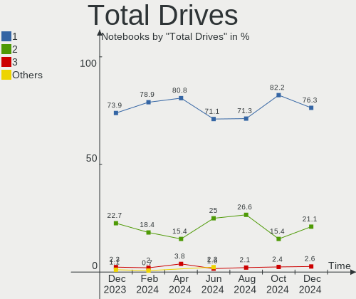
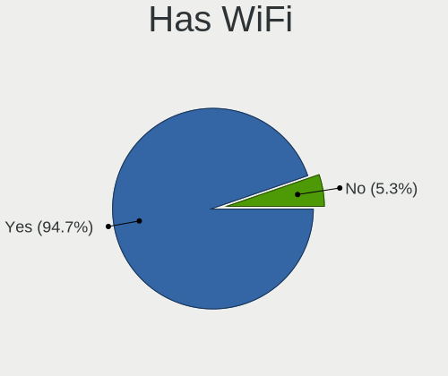
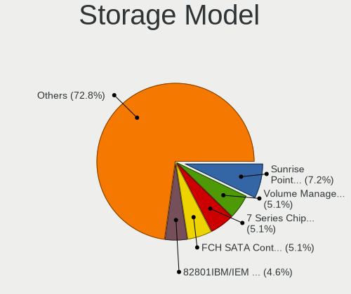
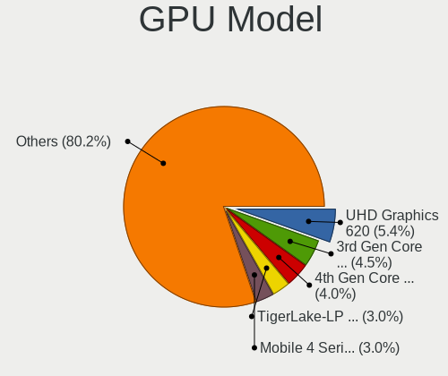

Linux in Italy - Hardware Trends (Notebooks)
--------------------------------------------

A project to identify most popular hardware characteristics and track their change
over time based on data collected by Linux users at https://Linux-Hardware.org.

Anyone can contribute to this report by the [hw-probe](https://github.com/linuxhw/hw-probe) tool:

    sudo -E hw-probe -all -upload

Period: Aug, 2022.

Contents
--------

* [ System ](#system)
  - [ OS                       ](#os)
  - [ OS Family                ](#os-family)
  - [ Kernel                   ](#kernel)
  - [ Kernel Family            ](#kernel-family)
  - [ Kernel Major Ver.        ](#kernel-major-ver)
  - [ Arch                     ](#arch)
  - [ DE                       ](#de)
  - [ Display Server           ](#display-server)
  - [ Display Manager          ](#display-manager)
  - [ OS Lang                  ](#os-lang)
  - [ Boot Mode                ](#boot-mode)
  - [ Filesystem               ](#filesystem)
  - [ Part. scheme             ](#part-scheme)
  - [ Dual Boot with Linux/BSD ](#dual-boot-with-linuxbsd)
  - [ Dual Boot (Win)          ](#dual-boot-win)

* [ Board ](#board)
  - [ Vendor                   ](#vendor)
  - [ Model                    ](#model)
  - [ Model Family             ](#model-family)
  - [ MFG Year                 ](#mfg-year)
  - [ Form Factor              ](#form-factor)
  - [ Secure Boot              ](#secure-boot)
  - [ Coreboot                 ](#coreboot)
  - [ RAM Size                 ](#ram-size)
  - [ RAM Used                 ](#ram-used)
  - [ Total Drives             ](#total-drives)
  - [ Has CD-ROM               ](#has-cd-rom)
  - [ Has Ethernet             ](#has-ethernet)
  - [ Has WiFi                 ](#has-wifi)
  - [ Has Bluetooth            ](#has-bluetooth)

* [ Location ](#location)
  - [ Country                  ](#country)
  - [ City                     ](#city)

* [ Drives ](#drives)
  - [ Drive Vendor             ](#drive-vendor)
  - [ Drive Model              ](#drive-model)
  - [ HDD Vendor               ](#hdd-vendor)
  - [ SSD Vendor               ](#ssd-vendor)
  - [ Drive Kind               ](#drive-kind)
  - [ Drive Connector          ](#drive-connector)
  - [ Drive Size               ](#drive-size)
  - [ Space Total              ](#space-total)
  - [ Space Used               ](#space-used)
  - [ Malfunc. Drives          ](#malfunc-drives)
  - [ Malfunc. Drive Vendor    ](#malfunc-drive-vendor)
  - [ Malfunc. HDD Vendor      ](#malfunc-hdd-vendor)
  - [ Malfunc. Drive Kind      ](#malfunc-drive-kind)
  - [ Failed Drives            ](#failed-drives)
  - [ Failed Drive Vendor      ](#failed-drive-vendor)
  - [ Drive Status             ](#drive-status)

* [ Storage controller ](#storage-controller)
  - [ Storage Vendor           ](#storage-vendor)
  - [ Storage Model            ](#storage-model)
  - [ Storage Kind             ](#storage-kind)

* [ Processor ](#processor)
  - [ CPU Vendor               ](#cpu-vendor)
  - [ CPU Model                ](#cpu-model)
  - [ CPU Model Family         ](#cpu-model-family)
  - [ CPU Cores                ](#cpu-cores)
  - [ CPU Sockets              ](#cpu-sockets)
  - [ CPU Threads              ](#cpu-threads)
  - [ CPU Op-Modes             ](#cpu-op-modes)
  - [ CPU Microcode            ](#cpu-microcode)
  - [ CPU Microarch            ](#cpu-microarch)

* [ Graphics ](#graphics)
  - [ GPU Vendor               ](#gpu-vendor)
  - [ GPU Model                ](#gpu-model)
  - [ GPU Combo                ](#gpu-combo)
  - [ GPU Driver               ](#gpu-driver)
  - [ GPU Memory               ](#gpu-memory)

* [ Monitor ](#monitor)
  - [ Monitor Vendor           ](#monitor-vendor)
  - [ Monitor Model            ](#monitor-model)
  - [ Monitor Resolution       ](#monitor-resolution)
  - [ Monitor Diagonal         ](#monitor-diagonal)
  - [ Monitor Width            ](#monitor-width)
  - [ Aspect Ratio             ](#aspect-ratio)
  - [ Monitor Area             ](#monitor-area)
  - [ Pixel Density            ](#pixel-density)
  - [ Multiple Monitors        ](#multiple-monitors)

* [ Network ](#network)
  - [ Net Controller Vendor    ](#net-controller-vendor)
  - [ Net Controller Model     ](#net-controller-model)
  - [ Wireless Vendor          ](#wireless-vendor)
  - [ Wireless Model           ](#wireless-model)
  - [ Ethernet Vendor          ](#ethernet-vendor)
  - [ Ethernet Model           ](#ethernet-model)
  - [ Net Controller Kind      ](#net-controller-kind)
  - [ Used Controller          ](#used-controller)
  - [ NICs                     ](#nics)
  - [ IPv6                     ](#ipv6)

* [ Bluetooth ](#bluetooth)
  - [ Bluetooth Vendor         ](#bluetooth-vendor)
  - [ Bluetooth Model          ](#bluetooth-model)

* [ Sound ](#sound)
  - [ Sound Vendor             ](#sound-vendor)
  - [ Sound Model              ](#sound-model)

* [ Memory ](#memory)
  - [ Memory Vendor            ](#memory-vendor)
  - [ Memory Model             ](#memory-model)
  - [ Memory Kind              ](#memory-kind)
  - [ Memory Form Factor       ](#memory-form-factor)
  - [ Memory Size              ](#memory-size)
  - [ Memory Speed             ](#memory-speed)

* [ Printers & scanners ](#printers--scanners)
  - [ Printer Vendor           ](#printer-vendor)
  - [ Printer Model            ](#printer-model)
  - [ Scanner Vendor           ](#scanner-vendor)
  - [ Scanner Model            ](#scanner-model)

* [ Camera ](#camera)
  - [ Camera Vendor            ](#camera-vendor)
  - [ Camera Model             ](#camera-model)

* [ Security ](#security)
  - [ Fingerprint Vendor       ](#fingerprint-vendor)
  - [ Fingerprint Model        ](#fingerprint-model)
  - [ Chipcard Vendor          ](#chipcard-vendor)
  - [ Chipcard Model           ](#chipcard-model)

* [ Unsupported ](#unsupported)
  - [ Unsupported Devices      ](#unsupported-devices)
  - [ Unsupported Device Types ](#unsupported-device-types)

System
------

OS
--

Installed operating systems

| Name                         | Notebooks | Percent |
|------------------------------|-----------|---------|
| Ubuntu 22.04                 | 15        | 19.74%  |
| OpenMandriva 4.3             | 8         | 10.53%  |
| Fedora 36                    | 8         | 10.53%  |
| Ubuntu 20.04                 | 6         | 7.89%   |
| Debian 11                    | 4         | 5.26%   |
| Arch                         | 4         | 5.26%   |
| Linux Mint 20.3              | 3         | 3.95%   |
| Kubuntu 22.04                | 3         | 3.95%   |
| Xubuntu 22.04                | 2         | 2.63%   |
| Linux Mint 21                | 2         | 2.63%   |
| KDE neon 22.04               | 2         | 2.63%   |
| KDE neon 20.04               | 2         | 2.63%   |
| Elementary 6.1               | 2         | 2.63%   |
| Xubuntu 20.04                | 1         | 1.32%   |
| Ubuntu 21.10                 | 1         | 1.32%   |
| Ubuntu 18.04                 | 1         | 1.32%   |
| SteamOS 3.3                  | 1         | 1.32%   |
| Slackware 15.0               | 1         | 1.32%   |
| Pop!_OS 22.04                | 1         | 1.32%   |
| openSUSE Tumbleweed-XXXXXXXX | 1         | 1.32%   |
| openSUSE Leap-15.3           | 1         | 1.32%   |
| OpenMandriva 4.90            | 1         | 1.32%   |
| OpenMandriva 4.2             | 1         | 1.32%   |
| Manjaro                      | 1         | 1.32%   |
| LMDE 5                       | 1         | 1.32%   |
| Kubuntu 20.04                | 1         | 1.32%   |
| Debian Testing               | 1         | 1.32%   |
| Archcraft Rolling            | 1         | 1.32%   |

OS Family
---------

OS without a version

| Name         | Notebooks | Percent |
|--------------|-----------|---------|
| Ubuntu       | 23        | 30.26%  |
| OpenMandriva | 10        | 13.16%  |
| Fedora       | 8         | 10.53%  |
| Linux Mint   | 5         | 6.58%   |
| Debian       | 5         | 6.58%   |
| Kubuntu      | 4         | 5.26%   |
| KDE neon     | 4         | 5.26%   |
| Arch         | 4         | 5.26%   |
| Xubuntu      | 3         | 3.95%   |
| openSUSE     | 2         | 2.63%   |
| Elementary   | 2         | 2.63%   |
| SteamOS      | 1         | 1.32%   |
| Slackware    | 1         | 1.32%   |
| Pop!_OS      | 1         | 1.32%   |
| Manjaro      | 1         | 1.32%   |
| LMDE         | 1         | 1.32%   |
| Archcraft    | 1         | 1.32%   |

Kernel
------

Version of the Linux kernel

| Version                                      | Notebooks | Percent |
|----------------------------------------------|-----------|---------|
| 5.15.0-46-generic                            | 18        | 23.68%  |
| 5.16.7-desktop-1omv4003                      | 8         | 10.53%  |
| 5.15.0-43-generic                            | 8         | 10.53%  |
| 5.15.0-25-generic                            | 4         | 5.26%   |
| 5.18.17-200.fc36.x86_64                      | 3         | 3.95%   |
| 5.18.16-200.fc36.x86_64                      | 3         | 3.95%   |
| 5.10.0-16-amd64                              | 3         | 3.95%   |
| 5.4.0-122-generic                            | 2         | 2.63%   |
| 5.18.13-200.fc36.x86_64                      | 2         | 2.63%   |
| 5.10.0-17-amd64                              | 2         | 2.63%   |
| 5.8.0-53-generic                             | 1         | 1.32%   |
| 5.4.0-91-generic                             | 1         | 1.32%   |
| 5.4.0-122-lowlatency                         | 1         | 1.32%   |
| 5.3.18-150300.59.87-default                  | 1         | 1.32%   |
| 5.19.4-arch1-1                               | 1         | 1.32%   |
| 5.19.3-arch1-1                               | 1         | 1.32%   |
| 5.19.2                                       | 1         | 1.32%   |
| 5.19.1-3-MANJARO                             | 1         | 1.32%   |
| 5.19.0-1-default                             | 1         | 1.32%   |
| 5.18.16-zen1-1-zen                           | 1         | 1.32%   |
| 5.18.14-arch1-1                              | 1         | 1.32%   |
| 5.18.12-desktop-3omv4090                     | 1         | 1.32%   |
| 5.18.10-76051810-generic                     | 1         | 1.32%   |
| 5.18.0-3-amd64                               | 1         | 1.32%   |
| 5.15.38                                      | 1         | 1.32%   |
| 5.15.0-47-generic                            | 1         | 1.32%   |
| 5.15.0-45-generic                            | 1         | 1.32%   |
| 5.15.0-41-generic                            | 1         | 1.32%   |
| 5.13.0-valve21-1-neptune-02209-g2a5bdc1102a0 | 1         | 1.32%   |
| 5.13.0-39-generic                            | 1         | 1.32%   |
| 5.11.0-43-generic                            | 1         | 1.32%   |
| 5.10.14-desktop-1omv4002                     | 1         | 1.32%   |
| 4.15.0-191-generic                           | 1         | 1.32%   |

Kernel Family
-------------

Linux kernel without a distro release

| Version | Notebooks | Percent |
|---------|-----------|---------|
| 5.15.0  | 33        | 43.42%  |
| 5.16.7  | 8         | 10.53%  |
| 5.10.0  | 5         | 6.58%   |
| 5.4.0   | 4         | 5.26%   |
| 5.18.16 | 4         | 5.26%   |
| 5.18.17 | 3         | 3.95%   |
| 5.18.13 | 2         | 2.63%   |
| 5.13.0  | 2         | 2.63%   |
| 5.8.0   | 1         | 1.32%   |
| 5.3.18  | 1         | 1.32%   |
| 5.19.4  | 1         | 1.32%   |
| 5.19.3  | 1         | 1.32%   |
| 5.19.2  | 1         | 1.32%   |
| 5.19.1  | 1         | 1.32%   |
| 5.19.0  | 1         | 1.32%   |
| 5.18.14 | 1         | 1.32%   |
| 5.18.12 | 1         | 1.32%   |
| 5.18.10 | 1         | 1.32%   |
| 5.18.0  | 1         | 1.32%   |
| 5.15.38 | 1         | 1.32%   |
| 5.11.0  | 1         | 1.32%   |
| 5.10.14 | 1         | 1.32%   |
| 4.15.0  | 1         | 1.32%   |

Kernel Major Ver.
-----------------

Linux kernel major version

| Version | Notebooks | Percent |
|---------|-----------|---------|
| 5.15    | 34        | 44.74%  |
| 5.18    | 13        | 17.11%  |
| 5.16    | 8         | 10.53%  |
| 5.10    | 6         | 7.89%   |
| 5.19    | 5         | 6.58%   |
| 5.4     | 4         | 5.26%   |
| 5.13    | 2         | 2.63%   |
| 5.8     | 1         | 1.32%   |
| 5.3     | 1         | 1.32%   |
| 5.11    | 1         | 1.32%   |
| 4.15    | 1         | 1.32%   |

Arch
----

OS architecture (x86_64, i586, etc.)

| Name   | Notebooks | Percent |
|--------|-----------|---------|
| x86_64 | 76        | 100%    |

DE
--

Desktop Environment

| Name          | Notebooks | Percent |
|---------------|-----------|---------|
| GNOME         | 31        | 40.79%  |
| KDE5          | 23        | 30.26%  |
| X-Cinnamon    | 7         | 9.21%   |
| XFCE          | 6         | 7.89%   |
| Pantheon      | 2         | 2.63%   |
| Unknown       | 2         | 2.63%   |
| MATE          | 1         | 1.32%   |
| gamescope     | 1         | 1.32%   |
| Enlightenment | 1         | 1.32%   |
| dwm           | 1         | 1.32%   |
| Deepin        | 1         | 1.32%   |

Display Server
--------------

X11 or Wayland

| Name    | Notebooks | Percent |
|---------|-----------|---------|
| X11     | 53        | 69.74%  |
| Wayland | 20        | 26.32%  |
| Unknown | 2         | 2.63%   |
| Tty     | 1         | 1.32%   |

Display Manager
---------------

SDDM, LightDM, etc.

| Name    | Notebooks | Percent |
|---------|-----------|---------|
| SDDM    | 19        | 25%     |
| Unknown | 19        | 25%     |
| GDM3    | 18        | 23.68%  |
| LightDM | 10        | 13.16%  |
| GDM     | 10        | 13.16%  |

OS Lang
-------

Language

| Lang  | Notebooks | Percent |
|-------|-----------|---------|
| it_IT | 46        | 60.53%  |
| en_US | 27        | 35.53%  |
| fr_FR | 1         | 1.32%   |
| en_GB | 1         | 1.32%   |
| C     | 1         | 1.32%   |

Boot Mode
---------

EFI or BIOS

| Mode | Notebooks | Percent |
|------|-----------|---------|
| EFI  | 47        | 61.84%  |
| BIOS | 29        | 38.16%  |

Filesystem
----------

Type of filesystem

| Type    | Notebooks | Percent |
|---------|-----------|---------|
| Ext4    | 54        | 71.05%  |
| Overlay | 12        | 15.79%  |
| Btrfs   | 9         | 11.84%  |
| Xfs     | 1         | 1.32%   |

Part. scheme
------------

Scheme of partitioning

| Type    | Notebooks | Percent |
|---------|-----------|---------|
| GPT     | 37        | 48.68%  |
| Unknown | 33        | 43.42%  |
| MBR     | 6         | 7.89%   |

Dual Boot with Linux/BSD
------------------------

Hosting more than one Linux/BSD

| Dual boot | Notebooks | Percent |
|-----------|-----------|---------|
| No        | 69        | 90.79%  |
| Yes       | 7         | 9.21%   |

Dual Boot (Win)
---------------

Hosting Linux and Windows

| Dual boot | Notebooks | Percent |
|-----------|-----------|---------|
| No        | 48        | 63.16%  |
| Yes       | 28        | 36.84%  |

Board
-----

Vendor
------

Motherboard manufacturer

| Name             | Notebooks | Percent |
|------------------|-----------|---------|
| Hewlett-Packard  | 21        | 27.63%  |
| Lenovo           | 9         | 11.84%  |
| Dell             | 8         | 10.53%  |
| ASUSTek Computer | 8         | 10.53%  |
| MSI              | 5         | 6.58%   |
| Acer             | 4         | 5.26%   |
| Microtech        | 3         | 3.95%   |
| HUAWEI           | 3         | 3.95%   |
| TrekStor         | 2         | 2.63%   |
| Fujitsu          | 2         | 2.63%   |
| Valve            | 1         | 1.32%   |
| Toshiba          | 1         | 1.32%   |
| Teclast          | 1         | 1.32%   |
| SANTECH          | 1         | 1.32%   |
| Notebook         | 1         | 1.32%   |
| Mediacom         | 1         | 1.32%   |
| Framework        | 1         | 1.32%   |
| Dynabook         | 1         | 1.32%   |
| Chuwi            | 1         | 1.32%   |
| Apple            | 1         | 1.32%   |
| Unknown          | 1         | 1.32%   |

Model
-----

Motherboard model

| Name                                  | Notebooks | Percent |
|---------------------------------------|-----------|---------|
| TrekStor Notebook Slim S130           | 2         | 2.63%   |
| Microtech CoreBook                    | 2         | 2.63%   |
| HP ProBook 440 G7                     | 2         | 2.63%   |
| HP 630                                | 2         | 2.63%   |
| Valve Jupiter                         | 1         | 1.32%   |
| Toshiba Satellite P70-B               | 1         | 1.32%   |
| Teclast F15 Plus                      | 1         | 1.32%   |
| SANTECH NHx0DB,DE                     | 1         | 1.32%   |
| Notebook PD5x_7xPNP_PNN_PNT           | 1         | 1.32%   |
| MSI Prestige 15 A10SC                 | 1         | 1.32%   |
| MSI Modern 14 B11SBL                  | 1         | 1.32%   |
| MSI Modern 14 A10M                    | 1         | 1.32%   |
| MSI Katana GF66 11UG                  | 1         | 1.32%   |
| MSI GL63 8SD                          | 1         | 1.32%   |
| Microtech ebookPro                    | 1         | 1.32%   |
| Mediacom SmartBook 14 FullHD - SB14UC | 1         | 1.32%   |
| Lenovo V15-IGL 82C3                   | 1         | 1.32%   |
| Lenovo V130-15IKB 81HN                | 1         | 1.32%   |
| Lenovo ThinkPad X230 2325U9T          | 1         | 1.32%   |
| Lenovo ThinkPad T460s 20FAS0Q900      | 1         | 1.32%   |
| Lenovo ThinkPad T450 20BUS0EW1F       | 1         | 1.32%   |
| Lenovo ThinkPad T14 Gen 1 20UD001AIX  | 1         | 1.32%   |
| Lenovo ThinkBook 15 G2 ITL 20VE       | 1         | 1.32%   |
| Lenovo Legion S7 15IMH5 82BC          | 1         | 1.32%   |
| Lenovo IdeaPad 3 15ADA6 82KR          | 1         | 1.32%   |
| HUAWEI CREM-WXX9                      | 1         | 1.32%   |
| HUAWEI BOM-WXX9                       | 1         | 1.32%   |
| HUAWEI BOD-WXX9                       | 1         | 1.32%   |
| HP Victus by Laptop 16-e0xxx          | 1         | 1.32%   |
| HP ProBook 455 G7                     | 1         | 1.32%   |
| HP ProBook 450 G3                     | 1         | 1.32%   |
| HP ProBook 430 G5                     | 1         | 1.32%   |
| HP Pavilion Gaming Notebook           | 1         | 1.32%   |
| HP Pavilion g6                        | 1         | 1.32%   |
| HP Pavilion dv6                       | 1         | 1.32%   |
| HP Pavilion 17                        | 1         | 1.32%   |
| HP OMEN by Laptop 15-dc1xxx           | 1         | 1.32%   |
| HP Notebook                           | 1         | 1.32%   |
| HP Laptop 15s-eq0xxx                  | 1         | 1.32%   |
| HP Laptop 15-dw0xxx                   | 1         | 1.32%   |
| HP EliteBook 850 G3                   | 1         | 1.32%   |
| HP 620                                | 1         | 1.32%   |
| HP 255 G6 Notebook PC                 | 1         | 1.32%   |
| HP 255 G3                             | 1         | 1.32%   |
| HP 15                                 | 1         | 1.32%   |
| Fujitsu LIFEBOOK S904                 | 1         | 1.32%   |
| Fujitsu LIFEBOOK A544                 | 1         | 1.32%   |
| Framework Laptop                      | 1         | 1.32%   |
| Dynabook Satellite Pro C50-G-10M      | 1         | 1.32%   |
| Dell XPS 15 9550                      | 1         | 1.32%   |
| Dell XPS 15 9520                      | 1         | 1.32%   |
| Dell Precision M6600                  | 1         | 1.32%   |
| Dell Latitude E6430                   | 1         | 1.32%   |
| Dell Latitude 5590                    | 1         | 1.32%   |
| Dell Latitude 5420                    | 1         | 1.32%   |
| Dell Latitude 3150                    | 1         | 1.32%   |
| Dell Inspiron 5515                    | 1         | 1.32%   |
| Chuwi LarkBook X                      | 1         | 1.32%   |
| ASUS X540LA                           | 1         | 1.32%   |
| ASUS X200MA                           | 1         | 1.32%   |

Model Family
------------

Motherboard model prefix

| Name               | Notebooks | Percent |
|--------------------|-----------|---------|
| HP ProBook         | 5         | 6.58%   |
| Lenovo ThinkPad    | 4         | 5.26%   |
| HP Pavilion        | 4         | 5.26%   |
| Dell Latitude      | 4         | 5.26%   |
| TrekStor Notebook  | 2         | 2.63%   |
| MSI Modern         | 2         | 2.63%   |
| Microtech CoreBook | 2         | 2.63%   |
| HP Laptop          | 2         | 2.63%   |
| HP 630             | 2         | 2.63%   |
| HP 255             | 2         | 2.63%   |
| Fujitsu LIFEBOOK   | 2         | 2.63%   |
| Dell XPS           | 2         | 2.63%   |
| ASUS VivoBook      | 2         | 2.63%   |
| Acer Aspire        | 2         | 2.63%   |
| Valve Jupiter      | 1         | 1.32%   |
| Toshiba Satellite  | 1         | 1.32%   |
| Teclast F15        | 1         | 1.32%   |
| SANTECH NHx0DB     | 1         | 1.32%   |
| Notebook PD5x      | 1         | 1.32%   |
| MSI Prestige       | 1         | 1.32%   |
| MSI Katana         | 1         | 1.32%   |
| MSI GL63           | 1         | 1.32%   |
| Microtech ebookPro | 1         | 1.32%   |
| Mediacom SmartBook | 1         | 1.32%   |
| Lenovo V15-IGL     | 1         | 1.32%   |
| Lenovo V130-15IKB  | 1         | 1.32%   |
| Lenovo ThinkBook   | 1         | 1.32%   |
| Lenovo Legion      | 1         | 1.32%   |
| Lenovo IdeaPad     | 1         | 1.32%   |
| HUAWEI CREM-WXX9   | 1         | 1.32%   |
| HUAWEI BOM-WXX9    | 1         | 1.32%   |
| HUAWEI BOD-WXX9    | 1         | 1.32%   |
| HP Victus          | 1         | 1.32%   |
| HP OMEN            | 1         | 1.32%   |
| HP Notebook        | 1         | 1.32%   |
| HP EliteBook       | 1         | 1.32%   |
| HP 620             | 1         | 1.32%   |
| HP 15              | 1         | 1.32%   |
| Framework Laptop   | 1         | 1.32%   |
| Dynabook Satellite | 1         | 1.32%   |
| Dell Precision     | 1         | 1.32%   |
| Dell Inspiron      | 1         | 1.32%   |
| Chuwi LarkBook     | 1         | 1.32%   |
| ASUS X540LA        | 1         | 1.32%   |
| ASUS X200MA        | 1         | 1.32%   |
| ASUS T100HAN       | 1         | 1.32%   |
| ASUS N552VX        | 1         | 1.32%   |
| ASUS N551VW        | 1         | 1.32%   |
| ASUS K53SC         | 1         | 1.32%   |
| Apple MacBook4     | 1         | 1.32%   |
| Acer E1-510        | 1         | 1.32%   |
| Acer AO722         | 1         | 1.32%   |
| Unknown            | 1         | 1.32%   |

MFG Year
--------

Motherboard manufacture year

| Year    | Notebooks | Percent |
|---------|-----------|---------|
| 2021    | 16        | 21.05%  |
| 2019    | 10        | 13.16%  |
| 2015    | 7         | 9.21%   |
| 2020    | 6         | 7.89%   |
| 2011    | 6         | 7.89%   |
| 2022    | 5         | 6.58%   |
| 2016    | 5         | 6.58%   |
| 2013    | 5         | 6.58%   |
| 2018    | 4         | 5.26%   |
| 2014    | 4         | 5.26%   |
| 2017    | 2         | 2.63%   |
| 2012    | 2         | 2.63%   |
| 2008    | 2         | 2.63%   |
| 2010    | 1         | 1.32%   |
| Unknown | 1         | 1.32%   |

Form Factor
-----------

Physical design of the computer

| Name     | Notebooks | Percent |
|----------|-----------|---------|
| Notebook | 76        | 100%    |

Secure Boot
-----------

Enabled or disabled

| State    | Notebooks | Percent |
|----------|-----------|---------|
| Disabled | 66        | 86.84%  |
| Enabled  | 10        | 13.16%  |

Coreboot
--------

Have coreboot on board

| Used | Notebooks | Percent |
|------|-----------|---------|
| No   | 76        | 100%    |

RAM Size
--------

Total RAM memory

| Size in GB  | Notebooks | Percent |
|-------------|-----------|---------|
| 4.01-8.0    | 23        | 30.26%  |
| 16.01-24.0  | 17        | 22.37%  |
| 3.01-4.0    | 15        | 19.74%  |
| 8.01-16.0   | 13        | 17.11%  |
| 1.01-2.0    | 3         | 3.95%   |
| 32.01-64.0  | 2         | 2.63%   |
| 24.01-32.0  | 2         | 2.63%   |
| 64.01-256.0 | 1         | 1.32%   |

RAM Used
--------

Used RAM memory

| Used GB   | Notebooks | Percent |
|-----------|-----------|---------|
| 1.01-2.0  | 26        | 34.21%  |
| 2.01-3.0  | 18        | 23.68%  |
| 4.01-8.0  | 11        | 14.47%  |
| 3.01-4.0  | 9         | 11.84%  |
| 0.51-1.0  | 7         | 9.21%   |
| 8.01-16.0 | 5         | 6.58%   |

Total Drives
------------

Number of drives on board

| Drives | Notebooks | Percent |
|--------|-----------|---------|
| 1      | 50        | 65.79%  |
| 2      | 24        | 31.58%  |
| 3      | 2         | 2.63%   |

Has CD-ROM
----------

Has CD-ROM on board

| Presented | Notebooks | Percent |
|-----------|-----------|---------|
| No        | 55        | 72.37%  |
| Yes       | 21        | 27.63%  |

Has Ethernet
------------

Has Ethernet on board

| Presented | Notebooks | Percent |
|-----------|-----------|---------|
| Yes       | 55        | 72.37%  |
| No        | 21        | 27.63%  |

Has WiFi
--------

Has WiFi module

| Presented | Notebooks | Percent |
|-----------|-----------|---------|
| Yes       | 72        | 94.74%  |
| No        | 4         | 5.26%   |

Has Bluetooth
-------------

Has Bluetooth module

| Presented | Notebooks | Percent |
|-----------|-----------|---------|
| Yes       | 65        | 85.53%  |
| No        | 11        | 14.47%  |

Location
--------

Country
-------

Geographic location (country)

| Country | Notebooks | Percent |
|---------|-----------|---------|
| Italy   | 76        | 100%    |

City
----

Geographic location (city)

| City                   | Notebooks | Percent |
|------------------------|-----------|---------|
| Milan                  | 17        | 22.37%  |
| Rome                   | 5         | 6.58%   |
| Turin                  | 4         | 5.26%   |
| Verona                 | 2         | 2.63%   |
| Roggio                 | 2         | 2.63%   |
| Padova                 | 2         | 2.63%   |
| Brescia                | 2         | 2.63%   |
| Viggianello            | 1         | 1.32%   |
| Velletri               | 1         | 1.32%   |
| Udine                  | 1         | 1.32%   |
| Treviso                | 1         | 1.32%   |
| Terricciola            | 1         | 1.32%   |
| Stradella              | 1         | 1.32%   |
| Sant'Angelo Romano     | 1         | 1.32%   |
| San Gennaro Vesuviano  | 1         | 1.32%   |
| Rozzano                | 1         | 1.32%   |
| Rocca di Papa          | 1         | 1.32%   |
| Rho                    | 1         | 1.32%   |
| Renazzo                | 1         | 1.32%   |
| Quartucciu             | 1         | 1.32%   |
| Picerno                | 1         | 1.32%   |
| Pasian di Prato        | 1         | 1.32%   |
| Osio Sopra             | 1         | 1.32%   |
| Olgiate Olona          | 1         | 1.32%   |
| Novara                 | 1         | 1.32%   |
| Negrar                 | 1         | 1.32%   |
| Naples                 | 1         | 1.32%   |
| Menfi                  | 1         | 1.32%   |
| Marcon                 | 1         | 1.32%   |
| Lazzate                | 1         | 1.32%   |
| Governolo              | 1         | 1.32%   |
| Genoa                  | 1         | 1.32%   |
| Florence               | 1         | 1.32%   |
| Enna                   | 1         | 1.32%   |
| Crocetta del Montello  | 1         | 1.32%   |
| Como                   | 1         | 1.32%   |
| Cologno al Serio       | 1         | 1.32%   |
| Chiampo                | 1         | 1.32%   |
| Cesena                 | 1         | 1.32%   |
| Caltanissetta          | 1         | 1.32%   |
| Cadoneghe              | 1         | 1.32%   |
| Borgo Hermada          | 1         | 1.32%   |
| Bolzano                | 1         | 1.32%   |
| Biella                 | 1         | 1.32%   |
| Bergamo                | 1         | 1.32%   |
| Bari                   | 1         | 1.32%   |
| Augusta                | 1         | 1.32%   |
| Arconate               | 1         | 1.32%   |
| Almenno San Bartolomeo | 1         | 1.32%   |

Drives
------

Drive Vendor
------------

Hard drive vendors

| Vendor              | Notebooks | Drives | Percent |
|---------------------|-----------|--------|---------|
| Samsung Electronics | 23        | 23     | 22.55%  |
| Unknown             | 13        | 14     | 12.75%  |
| Kingston            | 10        | 10     | 9.8%    |
| WDC                 | 7         | 8      | 6.86%   |
| Toshiba             | 7         | 7      | 6.86%   |
| SanDisk             | 5         | 5      | 4.9%    |
| Seagate             | 4         | 5      | 3.92%   |
| Crucial             | 4         | 4      | 3.92%   |
| Phison              | 3         | 3      | 2.94%   |
| Micron Technology   | 3         | 3      | 2.94%   |
| Intenso             | 3         | 3      | 2.94%   |
| Hitachi             | 3         | 3      | 2.94%   |
| HGST                | 3         | 3      | 2.94%   |
| Teclast             | 2         | 2      | 1.96%   |
| SK hynix            | 2         | 3      | 1.96%   |
| Unknown             | 2         | 2      | 1.96%   |
| SSSTC               | 1         | 1      | 0.98%   |
| Netac               | 1         | 1      | 0.98%   |
| Microtech           | 1         | 1      | 0.98%   |
| KIOXIA              | 1         | 1      | 0.98%   |
| KingDian            | 1         | 1      | 0.98%   |
| JMicron Technology  | 1         | 1      | 0.98%   |
| Intel               | 1         | 1      | 0.98%   |
| FORESEE             | 1         | 1      | 0.98%   |

Drive Model
-----------

Hard drive models

| Model                                            | Notebooks | Percent |
|--------------------------------------------------|-----------|---------|
| Unknown SD32G  32GB                              | 3         | 2.83%   |
| Samsung SSD 970 EVO Plus 1TB                     | 3         | 2.83%   |
| Samsung NVMe SSD Drive 512GB                     | 3         | 2.83%   |
| Kingston SA400S37480G 480GB SSD                  | 3         | 2.83%   |
| Unknown NCard  64GB                              | 2         | 1.89%   |
| Toshiba MQ01ABD100 1TB                           | 2         | 1.89%   |
| Teclast BD256GB SHCB-2280 SSD                    | 2         | 1.89%   |
| Samsung SSD 980 1TB                              | 2         | 1.89%   |
| Samsung MZVLQ512HALU-000H1 512GB                 | 2         | 1.89%   |
| Kingston NVMe SSD Drive 512GB                    | 2         | 1.89%   |
| HGST HTS545050A7E680 500GB                       | 2         | 1.89%   |
| Crucial CT500MX500SSD1 500GB                     | 2         | 1.89%   |
| Unknown                                          | 2         | 1.89%   |
| WDC WDS500G1B0B-00AS40 500GB SSD                 | 1         | 0.94%   |
| WDC WD5000LPVX-22V0TT0 500GB                     | 1         | 0.94%   |
| WDC WD5000LPCX-24VHAT0 500GB                     | 1         | 0.94%   |
| WDC WD3200BEVT-60A23T0 320GB                     | 1         | 0.94%   |
| WDC WD2500BEVT-00A23T0 250GB                     | 1         | 0.94%   |
| WDC WD10JPVX-60JC3T0 1TB                         | 1         | 0.94%   |
| WDC PC SN730 SDBPNTY-512G                        | 1         | 0.94%   |
| WDC PC SN520 SDAPNUW-512G-1006 512GB             | 1         | 0.94%   |
| Unknown TA2964  64GB                             | 1         | 0.94%   |
| Unknown SD16G  16GB                              | 1         | 0.94%   |
| Unknown SC32G  32GB                              | 1         | 0.94%   |
| Unknown SC128  128GB                             | 1         | 0.94%   |
| Unknown NCard  32GB                              | 1         | 0.94%   |
| Unknown MMC Card  512GB                          | 1         | 0.94%   |
| Unknown MMC Card  32GB                           | 1         | 0.94%   |
| Unknown MMC Card  248GB                          | 1         | 0.94%   |
| Unknown Biwin  32GB                              | 1         | 0.94%   |
| Toshiba MQ01ABF050 500GB                         | 1         | 0.94%   |
| Toshiba MK3276GSX 320GB                          | 1         | 0.94%   |
| Toshiba KSG60ZMV512G M.2 2280 512GB SSD          | 1         | 0.94%   |
| Toshiba KBG30ZMV256G 256GB                       | 1         | 0.94%   |
| Toshiba KBG30ZMS128G 128GB NVMe SSD              | 1         | 0.94%   |
| SSSTC CL1-8D512 512GB                            | 1         | 0.94%   |
| SK hynix SKHynix_HFS001TD9TNI-L2A0B 1TB          | 1         | 0.94%   |
| SK hynix NVMe SSD Drive 256GB                    | 1         | 0.94%   |
| SK hynix NVMe SSD Drive 1024GB                   | 1         | 0.94%   |
| Seagate ST500LT012-1DG142 500GB                  | 1         | 0.94%   |
| Seagate ST2000LX001-1RG174 2TB                   | 1         | 0.94%   |
| Seagate ST1000LM049-2GH172 1TB                   | 1         | 0.94%   |
| Seagate NVMe SSD Drive 500GB                     | 1         | 0.94%   |
| Seagate FireCuda 520 SSD ZP500GM30002 500GB      | 1         | 0.94%   |
| Sandisk WD Blue SN500 / PC SN520 NVMe SSD 256GB  | 1         | 0.94%   |
| Sandisk WD Black SN750 / PC SN730 NVMe SSD 512GB | 1         | 0.94%   |
| SanDisk SD9SN8W-256G-1006 256GB SSD              | 1         | 0.94%   |
| SanDisk NVMe SSD Drive 256GB                     | 1         | 0.94%   |
| SanDisk DF4032  32GB                             | 1         | 0.94%   |
| Samsung SSD 980 500GB                            | 1         | 0.94%   |
| Samsung SSD 970 EVO Plus 2TB                     | 1         | 0.94%   |
| Samsung SSD 960 EVO 1TB                          | 1         | 0.94%   |
| Samsung SSD 870 QVO 2TB                          | 1         | 0.94%   |
| Samsung SSD 860 EVO 500GB                        | 1         | 0.94%   |
| Samsung SSD 860 EVO 1TB                          | 1         | 0.94%   |
| Samsung SSD 850 EVO 500GB                        | 1         | 0.94%   |
| Samsung SSD 850 EVO 250GB                        | 1         | 0.94%   |
| Samsung SSD 840 Series 120GB                     | 1         | 0.94%   |
| Samsung MZNTY256HDHP-000H1 256GB SSD             | 1         | 0.94%   |
| Samsung MZNLN256HMHQ-000H1 256GB SSD             | 1         | 0.94%   |

HDD Vendor
----------

Hard disk drive vendors

| Vendor  | Notebooks | Drives | Percent |
|---------|-----------|--------|---------|
| WDC     | 5         | 5      | 27.78%  |
| Toshiba | 4         | 4      | 22.22%  |
| Seagate | 3         | 3      | 16.67%  |
| Hitachi | 3         | 3      | 16.67%  |
| HGST    | 3         | 3      | 16.67%  |

SSD Vendor
----------

Solid state drive vendors

| Vendor              | Notebooks | Drives | Percent |
|---------------------|-----------|--------|---------|
| Samsung Electronics | 9         | 9      | 29.03%  |
| Kingston            | 4         | 4      | 12.9%   |
| Crucial             | 4         | 4      | 12.9%   |
| Intenso             | 3         | 3      | 9.68%   |
| Teclast             | 2         | 2      | 6.45%   |
| Unknown             | 2         | 2      | 6.45%   |
| WDC                 | 1         | 1      | 3.23%   |
| Toshiba             | 1         | 1      | 3.23%   |
| SanDisk             | 1         | 1      | 3.23%   |
| Netac               | 1         | 1      | 3.23%   |
| Microtech           | 1         | 1      | 3.23%   |
| KingDian            | 1         | 1      | 3.23%   |
| FORESEE             | 1         | 1      | 3.23%   |

Drive Kind
----------

HDD or SSD

| Kind    | Notebooks | Drives | Percent |
|---------|-----------|--------|---------|
| NVMe    | 34        | 41     | 35.79%  |
| SSD     | 29        | 31     | 30.53%  |
| HDD     | 18        | 18     | 18.95%  |
| MMC     | 13        | 15     | 13.68%  |
| Unknown | 1         | 1      | 1.05%   |

Drive Connector
---------------

SATA, SAS, NVMe, etc.

| Type | Notebooks | Drives | Percent |
|------|-----------|--------|---------|
| SATA | 44        | 49     | 47.83%  |
| NVMe | 34        | 41     | 36.96%  |
| MMC  | 13        | 15     | 14.13%  |
| SAS  | 1         | 1      | 1.09%   |

Drive Size
----------

Size of hard drive

| Size in TB | Notebooks | Drives | Percent |
|------------|-----------|--------|---------|
| 0.01-0.5   | 37        | 39     | 78.72%  |
| 0.51-1.0   | 7         | 7      | 14.89%  |
| 1.01-2.0   | 3         | 3      | 6.38%   |

Space Total
-----------

Amount of disk space available on the file system

| Size in GB     | Notebooks | Percent |
|----------------|-----------|---------|
| 251-500        | 21        | 27.63%  |
| 101-250        | 20        | 26.32%  |
| 1-20           | 8         | 10.53%  |
| 501-1000       | 8         | 10.53%  |
| 51-100         | 6         | 7.89%   |
| 1001-2000      | 5         | 6.58%   |
| 21-50          | 3         | 3.95%   |
| 2001-3000      | 3         | 3.95%   |
| More than 3000 | 1         | 1.32%   |
| Unknown        | 1         | 1.32%   |

Space Used
----------

Amount of used disk space

| Used GB   | Notebooks | Percent |
|-----------|-----------|---------|
| 1-20      | 24        | 31.58%  |
| 21-50     | 16        | 21.05%  |
| 101-250   | 12        | 15.79%  |
| 51-100    | 10        | 13.16%  |
| 501-1000  | 7         | 9.21%   |
| 251-500   | 4         | 5.26%   |
| 2001-3000 | 1         | 1.32%   |
| 1001-2000 | 1         | 1.32%   |
| Unknown   | 1         | 1.32%   |

Malfunc. Drives
---------------

Drive models with a malfunction

| Model                        | Notebooks | Drives | Percent |
|------------------------------|-----------|--------|---------|
| WDC WD3200BEVT-60A23T0 320GB | 1         | 1      | 50%     |
| Toshiba MK3276GSX 320GB      | 1         | 1      | 50%     |

Malfunc. Drive Vendor
---------------------

Vendors of faulty drives

| Vendor  | Notebooks | Drives | Percent |
|---------|-----------|--------|---------|
| WDC     | 1         | 1      | 50%     |
| Toshiba | 1         | 1      | 50%     |

Malfunc. HDD Vendor
-------------------

Vendors of faulty HDD drives

| Vendor  | Notebooks | Drives | Percent |
|---------|-----------|--------|---------|
| WDC     | 1         | 1      | 50%     |
| Toshiba | 1         | 1      | 50%     |

Malfunc. Drive Kind
-------------------

Kinds of faulty drives

| Kind | Notebooks | Drives | Percent |
|------|-----------|--------|---------|
| HDD  | 2         | 2      | 100%    |

Failed Drives
-------------

Failed drive models

Zero info for selected period =(

Failed Drive Vendor
-------------------

Failed drive vendors

Zero info for selected period =(

Drive Status
------------

Number of failed and malfunc. drives

| Status   | Notebooks | Drives | Percent |
|----------|-----------|--------|---------|
| Detected | 46        | 57     | 54.12%  |
| Works    | 37        | 47     | 43.53%  |
| Malfunc  | 2         | 2      | 2.35%   |

Storage controller
------------------

Storage Vendor
--------------

Storage controller vendors

| Vendor                         | Notebooks | Percent |
|--------------------------------|-----------|---------|
| Intel                          | 48        | 50%     |
| Samsung Electronics            | 14        | 14.58%  |
| AMD                            | 11        | 11.46%  |
| Kingston Technology Company    | 6         | 6.25%   |
| SanDisk                        | 4         | 4.17%   |
| Toshiba America Info Systems   | 3         | 3.13%   |
| Phison Electronics             | 3         | 3.13%   |
| Micron Technology              | 3         | 3.13%   |
| SK hynix                       | 2         | 2.08%   |
| Solid State Storage Technology | 1         | 1.04%   |
| Seagate Technology             | 1         | 1.04%   |

Storage Model
-------------

Storage controller models

| Model                                                                          | Notebooks | Percent |
|--------------------------------------------------------------------------------|-----------|---------|
| AMD FCH SATA Controller [AHCI mode]                                            | 10        | 10.1%   |
| Samsung NVMe SSD Controller 980                                                | 9         | 9.09%   |
| Intel Celeron/Pentium Silver Processor SATA Controller                         | 6         | 6.06%   |
| Intel Sunrise Point-LP SATA Controller [AHCI mode]                             | 5         | 5.05%   |
| Intel 6 Series/C200 Series Chipset Family 6 port Mobile SATA AHCI Controller   | 5         | 5.05%   |
| Samsung NVMe SSD Controller SM981/PM981/PM983                                  | 4         | 4.04%   |
| Intel HM170/QM170 Chipset SATA Controller [AHCI Mode]                          | 4         | 4.04%   |
| Intel 82801 Mobile SATA Controller [RAID mode]                                 | 4         | 4.04%   |
| Micron Non-Volatile memory controller                                          | 3         | 3.03%   |
| Intel Comet Lake SATA AHCI Controller                                          | 3         | 3.03%   |
| Intel Atom Processor E3800 Series SATA AHCI Controller                         | 3         | 3.03%   |
| Intel 8 Series/C220 Series Chipset Family 6-port SATA Controller 1 [AHCI mode] | 3         | 3.03%   |
| Toshiba America Info Systems BG3 NVMe SSD Controller                           | 2         | 2.02%   |
| SanDisk WD Black SN750 / PC SN730 NVMe SSD                                     | 2         | 2.02%   |
| Phison PS5013 E13 NVMe Controller                                              | 2         | 2.02%   |
| Kingston Company Company Non-Volatile memory controller                        | 2         | 2.02%   |
| Kingston Company OM3PDP3 NVMe SSD                                              | 2         | 2.02%   |
| Intel Wildcat Point-LP SATA Controller [AHCI Mode]                             | 2         | 2.02%   |
| Intel Volume Management Device NVMe RAID Controller                            | 2         | 2.02%   |
| Intel Jasper Lake SATA AHCI Controller                                         | 2         | 2.02%   |
| Toshiba America Info Systems XG6 NVMe SSD Controller                           | 1         | 1.01%   |
| Solid State Storage Non-Volatile memory controller                             | 1         | 1.01%   |
| SK hynix PC401 NVMe Solid State Drive 256GB                                    | 1         | 1.01%   |
| SK hynix Non-Volatile memory controller                                        | 1         | 1.01%   |
| Seagate FireCuda 520 SSD                                                       | 1         | 1.01%   |
| SanDisk WD Blue SN550 NVMe SSD                                                 | 1         | 1.01%   |
| SanDisk WD Blue SN500 / PC SN520 NVMe SSD                                      | 1         | 1.01%   |
| Samsung NVMe SSD Controller SM961/PM961/SM963                                  | 1         | 1.01%   |
| Phison E12 NVMe Controller                                                     | 1         | 1.01%   |
| Kingston Company U-SNS8154P3 NVMe SSD                                          | 1         | 1.01%   |
| Kingston Company SNVS2000G [NV1 NVMe PCIe SSD 2TB]                             | 1         | 1.01%   |
| Intel Tiger Lake-LP SATA Controller                                            | 1         | 1.01%   |
| Intel SSD 660P Series                                                          | 1         | 1.01%   |
| Intel Cannon Point-LP SATA Controller [AHCI Mode]                              | 1         | 1.01%   |
| Intel Cannon Lake Mobile PCH SATA AHCI Controller                              | 1         | 1.01%   |
| Intel 82801IBM/IEM (ICH9M/ICH9M-E) 4 port SATA Controller [AHCI mode]          | 1         | 1.01%   |
| Intel 82801HM/HEM (ICH8M/ICH8M-E) SATA Controller [AHCI mode]                  | 1         | 1.01%   |
| Intel 82801HM/HEM (ICH8M/ICH8M-E) IDE Controller                               | 1         | 1.01%   |
| Intel 8 Series SATA Controller 1 [AHCI mode]                                   | 1         | 1.01%   |
| Intel 7 Series Chipset Family 6-port SATA Controller [AHCI mode]               | 1         | 1.01%   |
| Intel 500 Series Chipset Family SATA AHCI Controller                           | 1         | 1.01%   |
| Intel 5 Series/3400 Series Chipset 4 port SATA AHCI Controller                 | 1         | 1.01%   |
| Intel 400 Series Chipset Family SATA AHCI Controller                           | 1         | 1.01%   |
| AMD SB7x0/SB8x0/SB9x0 SATA Controller [AHCI mode]                              | 1         | 1.01%   |

Storage Kind
------------

Kind of storage controller (IDE, SATA, NVMe, SAS, ...)

| Kind | Notebooks | Percent |
|------|-----------|---------|
| SATA | 54        | 56.84%  |
| NVMe | 34        | 35.79%  |
| RAID | 6         | 6.32%   |
| IDE  | 1         | 1.05%   |

Processor
---------

CPU Vendor
----------

Processor vendors

| Vendor | Notebooks | Percent |
|--------|-----------|---------|
| Intel  | 59        | 77.63%  |
| AMD    | 17        | 22.37%  |

CPU Model
---------

Processor models

| Model                                         | Notebooks | Percent |
|-----------------------------------------------|-----------|---------|
| Intel Core i7-6700HQ CPU @ 2.60GHz            | 4         | 5.26%   |
| Intel Core i5-6200U CPU @ 2.30GHz             | 3         | 3.95%   |
| Intel Core i5-10210U CPU @ 1.60GHz            | 3         | 3.95%   |
| Intel Celeron N4000 CPU @ 1.10GHz             | 3         | 3.95%   |
| Intel 11th Gen Core i5-1135G7 @ 2.40GHz       | 3         | 3.95%   |
| Intel Core i7-8565U CPU @ 1.80GHz             | 2         | 2.63%   |
| Intel Core i7-2670QM CPU @ 2.20GHz            | 2         | 2.63%   |
| Intel Core i5-3320M CPU @ 2.60GHz             | 2         | 2.63%   |
| Intel Celeron N4120 CPU @ 1.10GHz             | 2         | 2.63%   |
| Intel 11th Gen Core i7-1165G7 @ 2.80GHz       | 2         | 2.63%   |
| AMD Ryzen 5 3500U with Radeon Vega Mobile Gfx | 2         | 2.63%   |
| AMD Ryzen 5 3450U with Radeon Vega Mobile Gfx | 2         | 2.63%   |
| Intel Pentium Dual-Core CPU T4500 @ 2.30GHz   | 1         | 1.32%   |
| Intel Core i7-9750H CPU @ 2.60GHz             | 1         | 1.32%   |
| Intel Core i7-8750H CPU @ 2.20GHz             | 1         | 1.32%   |
| Intel Core i7-4710HQ CPU @ 2.50GHz            | 1         | 1.32%   |
| Intel Core i7-2640M CPU @ 2.80GHz             | 1         | 1.32%   |
| Intel Core i7-10875H CPU @ 2.30GHz            | 1         | 1.32%   |
| Intel Core i7-10750H CPU @ 2.60GHz            | 1         | 1.32%   |
| Intel Core i7-10710U CPU @ 1.10GHz            | 1         | 1.32%   |
| Intel Core i7-10510U CPU @ 1.80GHz            | 1         | 1.32%   |
| Intel Core i5-8250U CPU @ 1.60GHz             | 1         | 1.32%   |
| Intel Core i5-7200U CPU @ 2.50GHz             | 1         | 1.32%   |
| Intel Core i5-6300U CPU @ 2.40GHz             | 1         | 1.32%   |
| Intel Core i5-5300U CPU @ 2.30GHz             | 1         | 1.32%   |
| Intel Core i5-4310M CPU @ 2.70GHz             | 1         | 1.32%   |
| Intel Core i5-4200U CPU @ 1.60GHz             | 1         | 1.32%   |
| Intel Core i5-4200M CPU @ 2.50GHz             | 1         | 1.32%   |
| Intel Core i5-2520M CPU @ 2.50GHz             | 1         | 1.32%   |
| Intel Core i5-2450M CPU @ 2.50GHz             | 1         | 1.32%   |
| Intel Core i3-7020U CPU @ 2.30GHz             | 1         | 1.32%   |
| Intel Core i3-5005U CPU @ 2.00GHz             | 1         | 1.32%   |
| Intel Core i3 CPU M 380 @ 2.53GHz             | 1         | 1.32%   |
| Intel Core 2 Duo CPU T8300 @ 2.40GHz          | 1         | 1.32%   |
| Intel Celeron N5100 @ 1.10GHz                 | 1         | 1.32%   |
| Intel Celeron N4500 @ 1.10GHz                 | 1         | 1.32%   |
| Intel Celeron N4020 CPU @ 1.10GHz             | 1         | 1.32%   |
| Intel Celeron CPU N2840 @ 2.16GHz             | 1         | 1.32%   |
| Intel Celeron CPU N2830 @ 2.16GHz             | 1         | 1.32%   |
| Intel Celeron CPU N2820 @ 2.13GHz             | 1         | 1.32%   |
| Intel Atom x5-Z8500 CPU @ 1.44GHz             | 1         | 1.32%   |
| Intel Atom x5-Z8300 CPU @ 1.44GHz             | 1         | 1.32%   |
| Intel 12th Gen Core i9-12900HK                | 1         | 1.32%   |
| Intel 12th Gen Core i7-12700H                 | 1         | 1.32%   |
| Intel 11th Gen Core i7-11800H @ 2.30GHz       | 1         | 1.32%   |
| AMD Ryzen 7 PRO 4750U with Radeon Graphics    | 1         | 1.32%   |
| AMD Ryzen 7 5800H with Radeon Graphics        | 1         | 1.32%   |
| AMD Ryzen 7 5700U with Radeon Graphics        | 1         | 1.32%   |
| AMD Ryzen 7 4700U with Radeon Graphics        | 1         | 1.32%   |
| AMD Ryzen 5 5600H with Radeon Graphics        | 1         | 1.32%   |
| AMD Ryzen 5 5500U with Radeon Graphics        | 1         | 1.32%   |
| AMD Ryzen 3 3250U with Radeon Graphics        | 1         | 1.32%   |
| AMD E1-2100 APU with Radeon HD Graphics       | 1         | 1.32%   |
| AMD Custom APU 0405                           | 1         | 1.32%   |
| AMD C-60 APU with Radeon HD Graphics          | 1         | 1.32%   |
| AMD A6-9225 RADEON R4, 5 COMPUTE CORES 2C+3G  | 1         | 1.32%   |
| AMD A6-5200 APU with Radeon HD Graphics       | 1         | 1.32%   |
| AMD A4-5000 APU with Radeon HD Graphics       | 1         | 1.32%   |

CPU Model Family
----------------

Processor model prefix

| Model                   | Notebooks | Percent |
|-------------------------|-----------|---------|
| Intel Core i5           | 17        | 22.37%  |
| Intel Core i7           | 16        | 21.05%  |
| Intel Celeron           | 11        | 14.47%  |
| Other                   | 9         | 11.84%  |
| AMD Ryzen 5             | 6         | 7.89%   |
| Intel Core i3           | 3         | 3.95%   |
| AMD Ryzen 7             | 3         | 3.95%   |
| Intel Atom              | 2         | 2.63%   |
| AMD A6                  | 2         | 2.63%   |
| Intel Pentium Dual-Core | 1         | 1.32%   |
| Intel Core 2 Duo        | 1         | 1.32%   |
| AMD Ryzen 7 PRO         | 1         | 1.32%   |
| AMD Ryzen 3             | 1         | 1.32%   |
| AMD E1                  | 1         | 1.32%   |
| AMD C-60                | 1         | 1.32%   |
| AMD A4                  | 1         | 1.32%   |

CPU Cores
---------

Number of processor cores

| Number | Notebooks | Percent |
|--------|-----------|---------|
| 4      | 31        | 40.79%  |
| 2      | 31        | 40.79%  |
| 8      | 6         | 7.89%   |
| 6      | 6         | 7.89%   |
| 14     | 2         | 2.63%   |

CPU Sockets
-----------

Number of sockets

| Number | Notebooks | Percent |
|--------|-----------|---------|
| 1      | 76        | 100%    |

CPU Threads
-----------

Threads per core (Hyper-Threading)

| Number | Notebooks | Percent |
|--------|-----------|---------|
| 2      | 53        | 69.74%  |
| 1      | 23        | 30.26%  |

CPU Op-Modes
------------

CPU Operation Modes (32-bit, 64-bit)

| Op mode        | Notebooks | Percent |
|----------------|-----------|---------|
| 32-bit, 64-bit | 76        | 100%    |

CPU Microcode
-------------

Microcode number

| Number     | Notebooks | Percent |
|------------|-----------|---------|
| Unknown    | 21        | 27.63%  |
| 0x806ec    | 5         | 6.58%   |
| 0x706a1    | 3         | 3.95%   |
| 0x406e3    | 3         | 3.95%   |
| 0x206a7    | 3         | 3.95%   |
| 0xa0652    | 2         | 2.63%   |
| 0x906ea    | 2         | 2.63%   |
| 0x906c0    | 2         | 2.63%   |
| 0x806c1    | 2         | 2.63%   |
| 0x706a8    | 2         | 2.63%   |
| 0x506e3    | 2         | 2.63%   |
| 0x306d4    | 2         | 2.63%   |
| 0x306c3    | 2         | 2.63%   |
| 0x306a9    | 2         | 2.63%   |
| 0x0a50000c | 2         | 2.63%   |
| 0x08608103 | 2         | 2.63%   |
| 0x08600106 | 2         | 2.63%   |
| 0xa0660    | 1         | 1.32%   |
| 0x906a3    | 1         | 1.32%   |
| 0x806ea    | 1         | 1.32%   |
| 0x806d1    | 1         | 1.32%   |
| 0x406c3    | 1         | 1.32%   |
| 0x40651    | 1         | 1.32%   |
| 0x30678    | 1         | 1.32%   |
| 0x30673    | 1         | 1.32%   |
| 0x20655    | 1         | 1.32%   |
| 0x1067a    | 1         | 1.32%   |
| 0x08108109 | 1         | 1.32%   |
| 0x08108102 | 1         | 1.32%   |
| 0x07000110 | 1         | 1.32%   |
| 0x0700010f | 1         | 1.32%   |
| 0x0700010b | 1         | 1.32%   |
| 0x06006705 | 1         | 1.32%   |
| 0x05000101 | 1         | 1.32%   |

CPU Microarch
-------------

Microarchitecture

| Name             | Notebooks | Percent |
|------------------|-----------|---------|
| KabyLake         | 11        | 14.47%  |
| Skylake          | 8         | 10.53%  |
| Goldmont plus    | 6         | 7.89%   |
| Zen+             | 5         | 6.58%   |
| TigerLake        | 5         | 6.58%   |
| Silvermont       | 5         | 6.58%   |
| SandyBridge      | 5         | 6.58%   |
| Haswell          | 4         | 5.26%   |
| Unknown          | 4         | 5.26%   |
| Jaguar           | 3         | 3.95%   |
| CometLake        | 3         | 3.95%   |
| Zen 3            | 2         | 2.63%   |
| Zen 2            | 2         | 2.63%   |
| Penryn           | 2         | 2.63%   |
| IvyBridge        | 2         | 2.63%   |
| Broadwell        | 2         | 2.63%   |
| Alderlake Hybrid | 2         | 2.63%   |
| Westmere         | 1         | 1.32%   |
| Tremont          | 1         | 1.32%   |
| Icelake          | 1         | 1.32%   |
| Excavator        | 1         | 1.32%   |
| Bobcat           | 1         | 1.32%   |

Graphics
--------

GPU Vendor
----------

Vendors of graphics cards

| Vendor | Notebooks | Percent |
|--------|-----------|---------|
| Intel  | 58        | 59.18%  |
| AMD    | 23        | 23.47%  |
| Nvidia | 17        | 17.35%  |

GPU Model
---------

Graphics card models

| Model                                                                                    | Notebooks | Percent |
|------------------------------------------------------------------------------------------|-----------|---------|
| Intel GeminiLake [UHD Graphics 600]                                                      | 6         | 6.06%   |
| Intel TigerLake-LP GT2 [Iris Xe Graphics]                                                | 5         | 5.05%   |
| AMD Picasso/Raven 2 [Radeon Vega Series / Radeon Vega Mobile Series]                     | 5         | 5.05%   |
| Intel Skylake GT2 [HD Graphics 520]                                                      | 4         | 4.04%   |
| Intel HD Graphics 530                                                                    | 4         | 4.04%   |
| Intel CometLake-U GT2 [UHD Graphics]                                                     | 4         | 4.04%   |
| Intel 2nd Generation Core Processor Family Integrated Graphics Controller                | 4         | 4.04%   |
| Nvidia TU117M [GeForce GTX 1650 Mobile / Max-Q]                                          | 3         | 3.03%   |
| Intel Atom Processor Z36xxx/Z37xxx Series Graphics & Display                             | 3         | 3.03%   |
| Intel 4th Gen Core Processor Integrated Graphics Controller                              | 3         | 3.03%   |
| Nvidia GM107M [GeForce GTX 960M]                                                         | 2         | 2.02%   |
| Nvidia GM107M [GeForce GTX 950M]                                                         | 2         | 2.02%   |
| Intel WhiskeyLake-U GT2 [UHD Graphics 620]                                               | 2         | 2.02%   |
| Intel JasperLake [UHD Graphics]                                                          | 2         | 2.02%   |
| Intel HD Graphics 620                                                                    | 2         | 2.02%   |
| Intel HD Graphics 5500                                                                   | 2         | 2.02%   |
| Intel CometLake-H GT2 [UHD Graphics]                                                     | 2         | 2.02%   |
| Intel CoffeeLake-H GT2 [UHD Graphics 630]                                                | 2         | 2.02%   |
| Intel Atom/Celeron/Pentium Processor x5-E8000/J3xxx/N3xxx Integrated Graphics Controller | 2         | 2.02%   |
| Intel Alder Lake-P Integrated Graphics Controller                                        | 2         | 2.02%   |
| Intel 3rd Gen Core processor Graphics Controller                                         | 2         | 2.02%   |
| AMD Sun XT [Radeon HD 8670A/8670M/8690M / R5 M330 / M430 / Radeon 520 Mobile]            | 2         | 2.02%   |
| AMD Renoir                                                                               | 2         | 2.02%   |
| AMD Lucienne                                                                             | 2         | 2.02%   |
| AMD Cezanne                                                                              | 2         | 2.02%   |
| Nvidia TU117M [GeForce MX450]                                                            | 1         | 1.01%   |
| Nvidia TU117M                                                                            | 1         | 1.01%   |
| Nvidia TU116M [GeForce GTX 1660 Ti Mobile]                                               | 1         | 1.01%   |
| Nvidia TU106M [GeForce RTX 2060 Max-Q]                                                   | 1         | 1.01%   |
| Nvidia GP108M [GeForce MX230]                                                            | 1         | 1.01%   |
| Nvidia GM108M [GeForce MX130]                                                            | 1         | 1.01%   |
| Nvidia GF119M [GeForce GT 520MX]                                                         | 1         | 1.01%   |
| Nvidia GA107M [GeForce RTX 3050 Ti Mobile]                                               | 1         | 1.01%   |
| Nvidia GA104M [GeForce RTX 3070 Mobile / Max-Q]                                          | 1         | 1.01%   |
| Nvidia GA104 [Geforce RTX 3070 Ti Laptop GPU]                                            | 1         | 1.01%   |
| Intel UHD Graphics 620                                                                   | 1         | 1.01%   |
| Intel TigerLake-H GT1 [UHD Graphics]                                                     | 1         | 1.01%   |
| Intel Mobile GM965/GL960 Integrated Graphics Controller (secondary)                      | 1         | 1.01%   |
| Intel Mobile GM965/GL960 Integrated Graphics Controller (primary)                        | 1         | 1.01%   |
| Intel Mobile 4 Series Chipset Integrated Graphics Controller                             | 1         | 1.01%   |
| Intel Haswell-ULT Integrated Graphics Controller                                         | 1         | 1.01%   |
| Intel Core Processor Integrated Graphics Controller                                      | 1         | 1.01%   |
| Intel Comet Lake UHD Graphics                                                            | 1         | 1.01%   |
| AMD Wrestler [Radeon HD 6290]                                                            | 1         | 1.01%   |
| AMD Whistler [Radeon HD 6730M/6770M/7690M XT]                                            | 1         | 1.01%   |
| AMD Venus PRO [Radeon HD 8850M / R9 M265X]                                               | 1         | 1.01%   |
| AMD VanGogh [AMD Custom GPU 0405]                                                        | 1         | 1.01%   |
| AMD Stoney [Radeon R2/R3/R4/R5 Graphics]                                                 | 1         | 1.01%   |
| AMD Seymour [Radeon HD 6400M/7400M Series]                                               | 1         | 1.01%   |
| AMD Saturn XT [FirePro M6100]                                                            | 1         | 1.01%   |
| AMD Kabini [Radeon HD 8400 / R3 Series]                                                  | 1         | 1.01%   |
| AMD Kabini [Radeon HD 8330]                                                              | 1         | 1.01%   |
| AMD Kabini [Radeon HD 8210]                                                              | 1         | 1.01%   |

GPU Combo
---------

Combinations of graphics cards

| Name           | Notebooks | Percent |
|----------------|-----------|---------|
| 1 x Intel      | 37        | 48.68%  |
| 1 x AMD        | 17        | 22.37%  |
| Intel + Nvidia | 16        | 21.05%  |
| Intel + AMD    | 5         | 6.58%   |
| AMD + Nvidia   | 1         | 1.32%   |

GPU Driver
----------

Free vs proprietary

| Driver      | Notebooks | Percent |
|-------------|-----------|---------|
| Free        | 65        | 85.53%  |
| Proprietary | 8         | 10.53%  |
| Unknown     | 3         | 3.95%   |

GPU Memory
----------

Total video memory

| Size in GB | Notebooks | Percent |
|------------|-----------|---------|
| Unknown    | 54        | 71.05%  |
| 0.01-0.5   | 11        | 14.47%  |
| 1.01-2.0   | 7         | 9.21%   |
| 3.01-4.0   | 2         | 2.63%   |
| 5.01-6.0   | 1         | 1.32%   |
| 0.51-1.0   | 1         | 1.32%   |

Monitor
-------

Monitor Vendor
--------------

Monitor vendors

| Vendor                  | Notebooks | Percent |
|-------------------------|-----------|---------|
| Chimei Innolux          | 19        | 22.62%  |
| BOE                     | 18        | 21.43%  |
| LG Display              | 16        | 19.05%  |
| AU Optronics            | 7         | 8.33%   |
| Samsung Electronics     | 5         | 5.95%   |
| Sharp                   | 4         | 4.76%   |
| Dell                    | 2         | 2.38%   |
| Acer                    | 2         | 2.38%   |
| Vestel Elektronik       | 1         | 1.19%   |
| Philips                 | 1         | 1.19%   |
| PANDA                   | 1         | 1.19%   |
| Hewlett-Packard         | 1         | 1.19%   |
| Chi Mei Optoelectronics | 1         | 1.19%   |
| BenQ                    | 1         | 1.19%   |
| ASUSTek Computer        | 1         | 1.19%   |
| Apple                   | 1         | 1.19%   |
| AOC                     | 1         | 1.19%   |
| ANX                     | 1         | 1.19%   |
| Ancor Communications    | 1         | 1.19%   |

Monitor Model
-------------

Monitor models

| Model                                                                    | Notebooks | Percent |
|--------------------------------------------------------------------------|-----------|---------|
| LG Display LCD Monitor LGD060F 1920x1080 309x174mm 14.0-inch             | 2         | 2.35%   |
| LG Display LCD Monitor LGD02F1 1366x768 344x194mm 15.5-inch              | 2         | 2.35%   |
| LG Display LCD Monitor LGD02DC 1366x768 344x194mm 15.5-inch              | 2         | 2.35%   |
| Chimei Innolux LCD Monitor CMN15F5 1920x1080 344x193mm 15.5-inch         | 2         | 2.35%   |
| Chimei Innolux LCD Monitor CMN15CA 1366x768 344x193mm 15.5-inch          | 2         | 2.35%   |
| BOE LCD Monitor BOE07FF 1920x1080 344x194mm 15.5-inch                    | 2         | 2.35%   |
| BOE LCD Monitor BOE0747 1920x1080 344x194mm 15.5-inch                    | 2         | 2.35%   |
| Vestel Elektronik 50UHD_LCD_TV VES3700 3840x2160 1872x1053mm 84.6-inch   | 1         | 1.18%   |
| Sharp LQ156M1JW01 SHP14C3 1920x1080 344x194mm 15.5-inch                  | 1         | 1.18%   |
| Sharp LQ133M1JW01 SHP141B 1920x1080 294x165mm 13.3-inch                  | 1         | 1.18%   |
| Sharp LCD Monitor SHP1516 3840x2400 336x210mm 15.6-inch                  | 1         | 1.18%   |
| Sharp LCD Monitor SHP143E 3840x2160 346x194mm 15.6-inch                  | 1         | 1.18%   |
| Samsung Electronics LCD Monitor SEC324A 1366x768 344x194mm 15.5-inch     | 1         | 1.18%   |
| Samsung Electronics LCD Monitor SDC3654 1600x900 382x215mm 17.3-inch     | 1         | 1.18%   |
| Samsung Electronics LCD Monitor SDC324E 1600x900 309x174mm 14.0-inch     | 1         | 1.18%   |
| Samsung Electronics LCD Monitor SAM0530 1360x768                         | 1         | 1.18%   |
| Samsung Electronics EPSON PJ SECA609 1920x1080                           | 1         | 1.18%   |
| Philips PHL 243V7 PHLC155 1920x1080 527x296mm 23.8-inch                  | 1         | 1.18%   |
| PANDA LCD Monitor NCP002D 1920x1080 344x194mm 15.5-inch                  | 1         | 1.18%   |
| LG Display LCD Monitor LGD068D 1920x1080 309x174mm 14.0-inch             | 1         | 1.18%   |
| LG Display LCD Monitor LGD065B 1920x1080 382x215mm 17.3-inch             | 1         | 1.18%   |
| LG Display LCD Monitor LGD062E 1920x1080 344x194mm 15.5-inch             | 1         | 1.18%   |
| LG Display LCD Monitor LGD0514 1920x1080 309x174mm 14.0-inch             | 1         | 1.18%   |
| LG Display LCD Monitor LGD0503 1366x768 344x194mm 15.5-inch              | 1         | 1.18%   |
| LG Display LCD Monitor LGD046F 1920x1080 345x194mm 15.6-inch             | 1         | 1.18%   |
| LG Display LCD Monitor LGD0430 1366x768 345x194mm 15.6-inch              | 1         | 1.18%   |
| LG Display LCD Monitor LGD03F8 1366x768 345x194mm 15.6-inch              | 1         | 1.18%   |
| LG Display LCD Monitor LGD0353 1366x768 345x194mm 15.6-inch              | 1         | 1.18%   |
| LG Display LCD Monitor LGD02F2 1366x768 344x194mm 15.5-inch              | 1         | 1.18%   |
| Hewlett-Packard Z27q G3 HPN36CE 2560x1440 597x336mm 27.0-inch            | 1         | 1.18%   |
| Hewlett-Packard Z27k G3 HPN36D3 3840x2160 597x336mm 27.0-inch            | 1         | 1.18%   |
| Dell S2721QS DELA197 3840x2160 597x336mm 27.0-inch                       | 1         | 1.18%   |
| Dell P2419H DELD0DA 1920x1080 527x296mm 23.8-inch                        | 1         | 1.18%   |
| Chimei Innolux LCD Monitor CMN1737 1920x1080 381x214mm 17.2-inch         | 1         | 1.18%   |
| Chimei Innolux LCD Monitor CMN15E8 1920x1080 344x193mm 15.5-inch         | 1         | 1.18%   |
| Chimei Innolux LCD Monitor CMN15E7 1920x1080 344x193mm 15.5-inch         | 1         | 1.18%   |
| Chimei Innolux LCD Monitor CMN15E6 1366x768 344x193mm 15.5-inch          | 1         | 1.18%   |
| Chimei Innolux LCD Monitor CMN15E3 1920x1080 344x193mm 15.5-inch         | 1         | 1.18%   |
| Chimei Innolux LCD Monitor CMN15D6 1920x1080 344x193mm 15.5-inch         | 1         | 1.18%   |
| Chimei Innolux LCD Monitor CMN15D5 1920x1080 344x193mm 15.5-inch         | 1         | 1.18%   |
| Chimei Innolux LCD Monitor CMN15D2 1920x1080 344x193mm 15.5-inch         | 1         | 1.18%   |
| Chimei Innolux LCD Monitor CMN15C4 1920x1080 344x193mm 15.5-inch         | 1         | 1.18%   |
| Chimei Innolux LCD Monitor CMN15C3 1920x1080 344x193mm 15.5-inch         | 1         | 1.18%   |
| Chimei Innolux LCD Monitor CMN15BC 1366x768 344x193mm 15.5-inch          | 1         | 1.18%   |
| Chimei Innolux LCD Monitor CMN15AB 1366x768 344x193mm 15.5-inch          | 1         | 1.18%   |
| Chimei Innolux LCD Monitor CMN152E 1920x1080 344x193mm 15.5-inch         | 1         | 1.18%   |
| Chimei Innolux LCD Monitor CMN14D5 1920x1080 309x173mm 13.9-inch         | 1         | 1.18%   |
| Chimei Innolux LCD Monitor CMN1119 1366x768 256x144mm 11.6-inch          | 1         | 1.18%   |
| Chi Mei Optoelectronics LCD Monitor CMO1113 1366x768 256x144mm 11.6-inch | 1         | 1.18%   |
| BOE LCD Monitor BOE0A78 1920x1080 309x174mm 14.0-inch                    | 1         | 1.18%   |
| BOE LCD Monitor BOE095F 2256x1504 285x190mm 13.5-inch                    | 1         | 1.18%   |
| BOE LCD Monitor BOE092F 2520x1680 338x226mm 16.0-inch                    | 1         | 1.18%   |
| BOE LCD Monitor BOE08F6 1920x1080 355x200mm 16.0-inch                    | 1         | 1.18%   |
| BOE LCD Monitor BOE08DF 1920x1080 344x194mm 15.5-inch                    | 1         | 1.18%   |
| BOE LCD Monitor BOE08D7 1920x1080 309x174mm 14.0-inch                    | 1         | 1.18%   |
| BOE LCD Monitor BOE08C2 1920x1080 344x194mm 15.5-inch                    | 1         | 1.18%   |
| BOE LCD Monitor BOE0872 1920x1080 344x194mm 15.5-inch                    | 1         | 1.18%   |
| BOE LCD Monitor BOE07F1 1920x1080 344x193mm 15.5-inch                    | 1         | 1.18%   |
| BOE LCD Monitor BOE0701 1920x1080 294x165mm 13.3-inch                    | 1         | 1.18%   |
| BOE LCD Monitor BOE06DF 1920x1080 309x173mm 13.9-inch                    | 1         | 1.18%   |

Monitor Resolution
------------------

Monitor screen resolution

| Resolution         | Notebooks | Percent |
|--------------------|-----------|---------|
| 1920x1080 (FHD)    | 46        | 56.79%  |
| 1366x768 (WXGA)    | 20        | 24.69%  |
| 3840x2160 (4K)     | 4         | 4.94%   |
| 2560x1440 (QHD)    | 2         | 2.47%   |
| 1600x900 (HD+)     | 2         | 2.47%   |
| 800x1280           | 1         | 1.23%   |
| 3840x2400          | 1         | 1.23%   |
| 2520x1680          | 1         | 1.23%   |
| 2256x1504          | 1         | 1.23%   |
| 1680x1050 (WSXGA+) | 1         | 1.23%   |
| 1360x768           | 1         | 1.23%   |
| 1280x800 (WXGA)    | 1         | 1.23%   |

Monitor Diagonal
----------------

Diagonal size in inches

| Inches  | Notebooks | Percent |
|---------|-----------|---------|
| 15      | 44        | 52.38%  |
| 14      | 8         | 9.52%   |
| 13      | 8         | 9.52%   |
| 24      | 4         | 4.76%   |
| 17      | 4         | 4.76%   |
| 27      | 3         | 3.57%   |
| 11      | 3         | 3.57%   |
| Unknown | 3         | 3.57%   |
| 16      | 2         | 2.38%   |
| 84      | 1         | 1.19%   |
| 23      | 1         | 1.19%   |
| 21      | 1         | 1.19%   |
| 20      | 1         | 1.19%   |
| 12      | 1         | 1.19%   |

Monitor Width
-------------

Physical width

| Width in mm | Notebooks | Percent |
|-------------|-----------|---------|
| 301-350     | 57        | 68.67%  |
| 201-300     | 8         | 9.64%   |
| 501-600     | 7         | 8.43%   |
| 351-400     | 5         | 6.02%   |
| Unknown     | 3         | 3.61%   |
| 401-500     | 2         | 2.41%   |
| 1501-2000   | 1         | 1.2%    |

Aspect Ratio
------------

Proportional relationship between the width and the height

| Ratio | Notebooks | Percent |
|-------|-----------|---------|
| 16/9  | 67        | 90.54%  |
| 16/10 | 4         | 5.41%   |
| 3/2   | 2         | 2.7%    |
| 0.62  | 1         | 1.35%   |

Monitor Area
------------

Area in inch

| Area in inch | Notebooks | Percent |
|----------------|-----------|---------|
| 101-110        | 44        | 53.01%  |
| 81-90          | 14        | 16.87%  |
| 201-250        | 4         | 4.82%   |
| 121-130        | 4         | 4.82%   |
| 51-60          | 3         | 3.61%   |
| 301-350        | 3         | 3.61%   |
| Unknown        | 3         | 3.61%   |
| 71-80          | 2         | 2.41%   |
| 111-120        | 2         | 2.41%   |
| More than 1000 | 1         | 1.2%    |
| 61-70          | 1         | 1.2%    |
| 251-300        | 1         | 1.2%    |
| 151-200        | 1         | 1.2%    |

Pixel Density
-------------

Pixels per inch

| Density       | Notebooks | Percent |
|---------------|-----------|---------|
| 121-160       | 46        | 56.79%  |
| 101-120       | 15        | 18.52%  |
| 51-100        | 10        | 12.35%  |
| 161-240       | 5         | 6.17%   |
| Unknown       | 3         | 3.7%    |
| More than 240 | 2         | 2.47%   |

Multiple Monitors
-----------------

Total monitors connected

| Total | Notebooks | Percent |
|-------|-----------|---------|
| 1     | 60        | 78.95%  |
| 2     | 12        | 15.79%  |
| 3     | 2         | 2.63%   |
| 0     | 2         | 2.63%   |

Network
-------

Net Controller Vendor
---------------------

Controller vendors

| Vendor                            | Notebooks | Percent |
|-----------------------------------|-----------|---------|
| Intel                             | 46        | 38.02%  |
| Realtek Semiconductor             | 43        | 35.54%  |
| Qualcomm Atheros                  | 11        | 9.09%   |
| TP-Link                           | 3         | 2.48%   |
| Ralink                            | 3         | 2.48%   |
| Sierra Wireless                   | 2         | 1.65%   |
| Samsung Electronics               | 2         | 1.65%   |
| Broadcom                          | 2         | 1.65%   |
| Ralink Technology                 | 1         | 0.83%   |
| Qualcomm                          | 1         | 0.83%   |
| Marvell Technology Group          | 1         | 0.83%   |
| Huawei Technologies               | 1         | 0.83%   |
| Ericsson Business Mobile Networks | 1         | 0.83%   |
| DisplayLink                       | 1         | 0.83%   |
| Dell                              | 1         | 0.83%   |
| ASUSTek Computer                  | 1         | 0.83%   |
| ASIX Electronics                  | 1         | 0.83%   |

Net Controller Model
--------------------

Controller models

| Model                                                              | Notebooks | Percent |
|--------------------------------------------------------------------|-----------|---------|
| Realtek RTL8111/8168/8411 PCI Express Gigabit Ethernet Controller  | 24        | 17.52%  |
| Realtek RTL810xE PCI Express Fast Ethernet controller              | 9         | 6.57%   |
| Intel Wi-Fi 6 AX200                                                | 8         | 5.84%   |
| Realtek RTL8821CE 802.11ac PCIe Wireless Network Adapter           | 5         | 3.65%   |
| Qualcomm Atheros QCA9565 / AR9565 Wireless Network Adapter         | 5         | 3.65%   |
| Intel Wireless 3165                                                | 5         | 3.65%   |
| Intel Wireless 7265                                                | 4         | 2.92%   |
| Intel Wi-Fi 6 AX201                                                | 4         | 2.92%   |
| Intel Comet Lake PCH-LP CNVi WiFi                                  | 4         | 2.92%   |
| Realtek RTL8822CE 802.11ac PCIe Wireless Network Adapter           | 3         | 2.19%   |
| Realtek RTL8153 Gigabit Ethernet Adapter                           | 3         | 2.19%   |
| Qualcomm Atheros AR9285 Wireless Network Adapter (PCI-Express)     | 3         | 2.19%   |
| Intel 82579LM Gigabit Network Connection (Lewisville)              | 3         | 2.19%   |
| Samsung GT-I9070 (network tethering, USB debugging enabled)        | 2         | 1.46%   |
| Intel Wireless 8265 / 8275                                         | 2         | 1.46%   |
| Intel Wireless 8260                                                | 2         | 1.46%   |
| Intel Wireless 7260                                                | 2         | 1.46%   |
| Intel Centrino Advanced-N 6205 [Taylor Peak]                       | 2         | 1.46%   |
| Intel Cannon Lake PCH CNVi WiFi                                    | 2         | 1.46%   |
| TP-Link UE300 10/100/1000 LAN (ethernet mode) [Realtek RTL8153]    | 1         | 0.73%   |
| TP-Link Archer T2U PLUS [RTL8821AU]                                | 1         | 0.73%   |
| TP-Link AC600 wireless Realtek RTL8811AU [Archer T2U Nano]         | 1         | 0.73%   |
| Sierra Wireless EM7455                                             | 1         | 0.73%   |
| Sierra Wireless EM7305 Modem                                       | 1         | 0.73%   |
| Realtek RTL8852AE 802.11ax PCIe Wireless Network Adapter           | 1         | 0.73%   |
| Realtek RTL8188EE Wireless Network Adapter                         | 1         | 0.73%   |
| Realtek RTL8188CE 802.11b/g/n WiFi Adapter                         | 1         | 0.73%   |
| Realtek RTL8152 Fast Ethernet Adapter                              | 1         | 0.73%   |
| Ralink RT2870/RT3070 Wireless Adapter                              | 1         | 0.73%   |
| Ralink RT5390 Wireless 802.11n 1T/1R PCIe                          | 1         | 0.73%   |
| Ralink RT3290 Wireless 802.11n 1T/1R PCIe                          | 1         | 0.73%   |
| Ralink RT3090 Wireless 802.11n 1T/1R PCIe                          | 1         | 0.73%   |
| Qualcomm Redmi 5 Plus                                              | 1         | 0.73%   |
| Qualcomm Atheros QCA9377 802.11ac Wireless Network Adapter         | 1         | 0.73%   |
| Qualcomm Atheros QCA8171 Gigabit Ethernet                          | 1         | 0.73%   |
| Qualcomm Atheros QCA6174 802.11ac Wireless Network Adapter         | 1         | 0.73%   |
| Qualcomm Atheros Killer E2400 Gigabit Ethernet Controller          | 1         | 0.73%   |
| Qualcomm Atheros AR8152 v2.0 Fast Ethernet                         | 1         | 0.73%   |
| Marvell Group 88E8058 PCI-E Gigabit Ethernet Controller            | 1         | 0.73%   |
| Intel Wireless 3160                                                | 1         | 0.73%   |
| Intel Wi-Fi 6 AX210/AX211/AX411 160MHz                             | 1         | 0.73%   |
| Intel Tiger Lake PCH CNVi WiFi                                     | 1         | 0.73%   |
| Intel Gemini Lake PCH CNVi WiFi                                    | 1         | 0.73%   |
| Intel Ethernet Connection I219-V                                   | 1         | 0.73%   |
| Intel Ethernet Connection I219-LM                                  | 1         | 0.73%   |
| Intel Ethernet Connection I218-LM                                  | 1         | 0.73%   |
| Intel Ethernet Connection (4) I219-LM                              | 1         | 0.73%   |
| Intel Ethernet Connection (3) I218-LM                              | 1         | 0.73%   |
| Intel Ethernet Connection (13) I219-V                              | 1         | 0.73%   |
| Intel Dual Band Wireless-AC 3168NGW [Stone Peak]                   | 1         | 0.73%   |
| Intel Dual Band Wireless-AC 3165 Plus Bluetooth                    | 1         | 0.73%   |
| Intel Comet Lake PCH CNVi WiFi                                     | 1         | 0.73%   |
| Intel Centrino Wireless-N 100                                      | 1         | 0.73%   |
| Intel Centrino Ultimate-N 6300                                     | 1         | 0.73%   |
| Intel Cannon Point-LP CNVi [Wireless-AC]                           | 1         | 0.73%   |
| Intel Alder Lake-P PCH CNVi WiFi                                   | 1         | 0.73%   |
| Huawei JNY-LX1                                                     | 1         | 0.73%   |
| Ericsson Business Mobile Networks H5321 gw Mobile Broadband Module | 1         | 0.73%   |
| DisplayLink ThinkPad USB 3.0 Dock                                  | 1         | 0.73%   |
| Dell DW5820e L850-GL                                               | 1         | 0.73%   |

Wireless Vendor
---------------

Wireless vendors

| Vendor                | Notebooks | Percent |
|-----------------------|-----------|---------|
| Intel                 | 46        | 58.23%  |
| Realtek Semiconductor | 11        | 13.92%  |
| Qualcomm Atheros      | 10        | 12.66%  |
| Ralink                | 3         | 3.8%    |
| TP-Link               | 2         | 2.53%   |
| Sierra Wireless       | 2         | 2.53%   |
| Broadcom              | 2         | 2.53%   |
| Ralink Technology     | 1         | 1.27%   |
| Dell                  | 1         | 1.27%   |
| ASUSTek Computer      | 1         | 1.27%   |

Wireless Model
--------------

Wireless models

| Model                                                          | Notebooks | Percent |
|----------------------------------------------------------------|-----------|---------|
| Intel Wi-Fi 6 AX200                                            | 8         | 10.13%  |
| Realtek RTL8821CE 802.11ac PCIe Wireless Network Adapter       | 5         | 6.33%   |
| Qualcomm Atheros QCA9565 / AR9565 Wireless Network Adapter     | 5         | 6.33%   |
| Intel Wireless 3165                                            | 5         | 6.33%   |
| Intel Wireless 7265                                            | 4         | 5.06%   |
| Intel Wi-Fi 6 AX201                                            | 4         | 5.06%   |
| Intel Comet Lake PCH-LP CNVi WiFi                              | 4         | 5.06%   |
| Realtek RTL8822CE 802.11ac PCIe Wireless Network Adapter       | 3         | 3.8%    |
| Qualcomm Atheros AR9285 Wireless Network Adapter (PCI-Express) | 3         | 3.8%    |
| Intel Wireless 8265 / 8275                                     | 2         | 2.53%   |
| Intel Wireless 8260                                            | 2         | 2.53%   |
| Intel Wireless 7260                                            | 2         | 2.53%   |
| Intel Centrino Advanced-N 6205 [Taylor Peak]                   | 2         | 2.53%   |
| Intel Cannon Lake PCH CNVi WiFi                                | 2         | 2.53%   |
| TP-Link Archer T2U PLUS [RTL8821AU]                            | 1         | 1.27%   |
| TP-Link AC600 wireless Realtek RTL8811AU [Archer T2U Nano]     | 1         | 1.27%   |
| Sierra Wireless EM7455                                         | 1         | 1.27%   |
| Sierra Wireless EM7305 Modem                                   | 1         | 1.27%   |
| Realtek RTL8852AE 802.11ax PCIe Wireless Network Adapter       | 1         | 1.27%   |
| Realtek RTL8188EE Wireless Network Adapter                     | 1         | 1.27%   |
| Realtek RTL8188CE 802.11b/g/n WiFi Adapter                     | 1         | 1.27%   |
| Ralink RT2870/RT3070 Wireless Adapter                          | 1         | 1.27%   |
| Ralink RT5390 Wireless 802.11n 1T/1R PCIe                      | 1         | 1.27%   |
| Ralink RT3290 Wireless 802.11n 1T/1R PCIe                      | 1         | 1.27%   |
| Ralink RT3090 Wireless 802.11n 1T/1R PCIe                      | 1         | 1.27%   |
| Qualcomm Atheros QCA9377 802.11ac Wireless Network Adapter     | 1         | 1.27%   |
| Qualcomm Atheros QCA6174 802.11ac Wireless Network Adapter     | 1         | 1.27%   |
| Intel Wireless 3160                                            | 1         | 1.27%   |
| Intel Wi-Fi 6 AX210/AX211/AX411 160MHz                         | 1         | 1.27%   |
| Intel Tiger Lake PCH CNVi WiFi                                 | 1         | 1.27%   |
| Intel Gemini Lake PCH CNVi WiFi                                | 1         | 1.27%   |
| Intel Dual Band Wireless-AC 3168NGW [Stone Peak]               | 1         | 1.27%   |
| Intel Dual Band Wireless-AC 3165 Plus Bluetooth                | 1         | 1.27%   |
| Intel Comet Lake PCH CNVi WiFi                                 | 1         | 1.27%   |
| Intel Centrino Wireless-N 100                                  | 1         | 1.27%   |
| Intel Centrino Ultimate-N 6300                                 | 1         | 1.27%   |
| Intel Cannon Point-LP CNVi [Wireless-AC]                       | 1         | 1.27%   |
| Intel Alder Lake-P PCH CNVi WiFi                               | 1         | 1.27%   |
| Dell DW5820e L850-GL                                           | 1         | 1.27%   |
| Broadcom BCM43602 802.11ac Wireless LAN SoC                    | 1         | 1.27%   |
| Broadcom BCM4321 802.11a/b/g/n                                 | 1         | 1.27%   |
| ASUS 802.11ac NIC                                              | 1         | 1.27%   |

Ethernet Vendor
---------------

Ethernet vendors

| Vendor                   | Notebooks | Percent |
|--------------------------|-----------|---------|
| Realtek Semiconductor    | 36        | 64.29%  |
| Intel                    | 9         | 16.07%  |
| Qualcomm Atheros         | 3         | 5.36%   |
| Samsung Electronics      | 2         | 3.57%   |
| TP-Link                  | 1         | 1.79%   |
| Qualcomm                 | 1         | 1.79%   |
| Marvell Technology Group | 1         | 1.79%   |
| Huawei Technologies      | 1         | 1.79%   |
| DisplayLink              | 1         | 1.79%   |
| ASIX Electronics         | 1         | 1.79%   |

Ethernet Model
--------------

Ethernet models

| Model                                                             | Notebooks | Percent |
|-------------------------------------------------------------------|-----------|---------|
| Realtek RTL8111/8168/8411 PCI Express Gigabit Ethernet Controller | 24        | 42.11%  |
| Realtek RTL810xE PCI Express Fast Ethernet controller             | 9         | 15.79%  |
| Realtek RTL8153 Gigabit Ethernet Adapter                          | 3         | 5.26%   |
| Intel 82579LM Gigabit Network Connection (Lewisville)             | 3         | 5.26%   |
| Samsung GT-I9070 (network tethering, USB debugging enabled)       | 2         | 3.51%   |
| TP-Link UE300 10/100/1000 LAN (ethernet mode) [Realtek RTL8153]   | 1         | 1.75%   |
| Realtek RTL8152 Fast Ethernet Adapter                             | 1         | 1.75%   |
| Qualcomm Redmi 5 Plus                                             | 1         | 1.75%   |
| Qualcomm Atheros QCA8171 Gigabit Ethernet                         | 1         | 1.75%   |
| Qualcomm Atheros Killer E2400 Gigabit Ethernet Controller         | 1         | 1.75%   |
| Qualcomm Atheros AR8152 v2.0 Fast Ethernet                        | 1         | 1.75%   |
| Marvell Group 88E8058 PCI-E Gigabit Ethernet Controller           | 1         | 1.75%   |
| Intel Ethernet Connection I219-V                                  | 1         | 1.75%   |
| Intel Ethernet Connection I219-LM                                 | 1         | 1.75%   |
| Intel Ethernet Connection I218-LM                                 | 1         | 1.75%   |
| Intel Ethernet Connection (4) I219-LM                             | 1         | 1.75%   |
| Intel Ethernet Connection (3) I218-LM                             | 1         | 1.75%   |
| Intel Ethernet Connection (13) I219-V                             | 1         | 1.75%   |
| Huawei JNY-LX1                                                    | 1         | 1.75%   |
| DisplayLink ThinkPad USB 3.0 Dock                                 | 1         | 1.75%   |
| ASIX AX88179 Gigabit Ethernet                                     | 1         | 1.75%   |

Net Controller Kind
-------------------

Ethernet, WiFi or modem

| Kind     | Notebooks | Percent |
|----------|-----------|---------|
| WiFi     | 72        | 56.25%  |
| Ethernet | 55        | 42.97%  |
| Modem    | 1         | 0.78%   |

Used Controller
---------------

Currently used network controller

| Kind     | Notebooks | Percent |
|----------|-----------|---------|
| WiFi     | 56        | 75.68%  |
| Ethernet | 18        | 24.32%  |

NICs
----

Total network controllers on board

| Total | Notebooks | Percent |
|-------|-----------|---------|
| 2     | 46        | 60.53%  |
| 1     | 26        | 34.21%  |
| 0     | 4         | 5.26%   |

IPv6
----

IPv6 vs IPv4

| Used | Notebooks | Percent |
|------|-----------|---------|
| No   | 73        | 96.05%  |
| Yes  | 3         | 3.95%   |

Bluetooth
---------

Bluetooth Vendor
----------------

Controller vendors

| Vendor                          | Notebooks | Percent |
|---------------------------------|-----------|---------|
| Intel                           | 41        | 63.08%  |
| Qualcomm Atheros Communications | 5         | 7.69%   |
| Realtek Semiconductor           | 4         | 6.15%   |
| IMC Networks                    | 4         | 6.15%   |
| Realtek                         | 2         | 3.08%   |
| Lite-On Technology              | 2         | 3.08%   |
| Broadcom                        | 2         | 3.08%   |
| Ralink Technology               | 1         | 1.54%   |
| Ralink                          | 1         | 1.54%   |
| Foxconn / Hon Hai               | 1         | 1.54%   |
| Dell                            | 1         | 1.54%   |
| Apple                           | 1         | 1.54%   |

Bluetooth Model
---------------

Controller models

| Model                                          | Notebooks | Percent |
|------------------------------------------------|-----------|---------|
| Intel Bluetooth wireless interface             | 17        | 26.15%  |
| Intel AX201 Bluetooth                          | 8         | 12.31%  |
| Intel AX200 Bluetooth                          | 7         | 10.77%  |
| Intel Bluetooth 9460/9560 Jefferson Peak (JfP) | 6         | 9.23%   |
| Realtek Bluetooth Radio                        | 3         | 4.62%   |
| Qualcomm Atheros AR3011 Bluetooth              | 3         | 4.62%   |
| Realtek Bluetooth Radio                        | 2         | 3.08%   |
| IMC Networks Bluetooth Radio                   | 2         | 3.08%   |
| IMC Networks Bluetooth Device                  | 2         | 3.08%   |
| Realtek  Bluetooth 4.2 Adapter                 | 1         | 1.54%   |
| Ralink Motorola BC4 Bluetooth 3.0+HS Adapter   | 1         | 1.54%   |
| Ralink RT3290 Bluetooth                        | 1         | 1.54%   |
| Qualcomm Atheros  Bluetooth Device             | 1         | 1.54%   |
| Qualcomm Atheros QCA61x4 Bluetooth 4.0         | 1         | 1.54%   |
| Lite-On Qualcomm Atheros QCA9377 Bluetooth     | 1         | 1.54%   |
| Lite-On Atheros AR3012 Bluetooth               | 1         | 1.54%   |
| Intel Wireless-AC 3168 Bluetooth               | 1         | 1.54%   |
| Intel Bluetooth Device                         | 1         | 1.54%   |
| Intel AX210 Bluetooth                          | 1         | 1.54%   |
| Foxconn / Hon Hai Bluetooth Device             | 1         | 1.54%   |
| Dell DW375 Bluetooth Module                    | 1         | 1.54%   |
| Broadcom BCM20703A1 Bluetooth 4.1 + LE         | 1         | 1.54%   |
| Broadcom BCM20702 Bluetooth 4.0 [ThinkPad]     | 1         | 1.54%   |
| Apple Bluetooth HCI                            | 1         | 1.54%   |

Sound
-----

Sound Vendor
------------

Sound card vendors

| Vendor                  | Notebooks | Percent |
|-------------------------|-----------|---------|
| Intel                   | 57        | 64.04%  |
| AMD                     | 18        | 20.22%  |
| Nvidia                  | 7         | 7.87%   |
| XMOS                    | 1         | 1.12%   |
| Plantronics             | 1         | 1.12%   |
| Huawei Technologies     | 1         | 1.12%   |
| Hewlett-Packard         | 1         | 1.12%   |
| GN Netcom               | 1         | 1.12%   |
| bestechnic              | 1         | 1.12%   |
| BEHRINGER International | 1         | 1.12%   |

Sound Model
-----------

Sound card models

| Model                                                                      | Notebooks | Percent |
|----------------------------------------------------------------------------|-----------|---------|
| AMD Family 17h/19h HD Audio Controller                                     | 10        | 9.09%   |
| Intel Sunrise Point-LP HD Audio                                            | 7         | 6.36%   |
| Intel Celeron/Pentium Silver Processor High Definition Audio               | 6         | 5.45%   |
| AMD Renoir Radeon High Definition Audio Controller                         | 6         | 5.45%   |
| Intel Tiger Lake-LP Smart Sound Technology Audio Controller                | 5         | 4.55%   |
| Intel Comet Lake PCH-LP cAVS                                               | 5         | 4.55%   |
| Intel 6 Series/C200 Series Chipset Family High Definition Audio Controller | 5         | 4.55%   |
| AMD Raven/Raven2/Fenghuang HDMI/DP Audio Controller                        | 5         | 4.55%   |
| Intel 100 Series/C230 Series Chipset Family HD Audio Controller            | 4         | 3.64%   |
| Intel Xeon E3-1200 v3/4th Gen Core Processor HD Audio Controller           | 3         | 2.73%   |
| Intel Atom Processor Z36xxx/Z37xxx Series High Definition Audio Controller | 3         | 2.73%   |
| Intel 8 Series/C220 Series Chipset High Definition Audio Controller        | 3         | 2.73%   |
| AMD Kabini HDMI/DP Audio                                                   | 3         | 2.73%   |
| AMD FCH Azalia Controller                                                  | 3         | 2.73%   |
| Nvidia TU107 GeForce GTX 1650 High Definition Audio Controller             | 2         | 1.82%   |
| Nvidia GA104 High Definition Audio Controller                              | 2         | 1.82%   |
| Intel Wildcat Point-LP High Definition Audio Controller                    | 2         | 1.82%   |
| Intel Jasper Lake HD Audio                                                 | 2         | 1.82%   |
| Intel Comet Lake PCH cAVS                                                  | 2         | 1.82%   |
| Intel Cannon Point-LP High Definition Audio Controller                     | 2         | 1.82%   |
| Intel Cannon Lake PCH cAVS                                                 | 2         | 1.82%   |
| Intel Broadwell-U Audio Controller                                         | 2         | 1.82%   |
| Intel Alder Lake PCH-P High Definition Audio Controller                    | 2         | 1.82%   |
| Intel 7 Series/C216 Chipset Family High Definition Audio Controller        | 2         | 1.82%   |
| XMOS iFi (by AMR) HD USB Audio                                             | 1         | 0.91%   |
| Plantronics Audio 622 USB                                                  | 1         | 0.91%   |
| Nvidia TU116 High Definition Audio Controller                              | 1         | 0.91%   |
| Nvidia TU106 High Definition Audio Controller                              | 1         | 0.91%   |
| Nvidia GM107 High Definition Audio Controller [GeForce 940MX]              | 1         | 0.91%   |
| Intel Tiger Lake-H HD Audio Controller                                     | 1         | 0.91%   |
| Intel Haswell-ULT HD Audio Controller                                      | 1         | 0.91%   |
| Intel 82801I (ICH9 Family) HD Audio Controller                             | 1         | 0.91%   |
| Intel 82801H (ICH8 Family) HD Audio Controller                             | 1         | 0.91%   |
| Intel 8 Series HD Audio Controller                                         | 1         | 0.91%   |
| Intel 5 Series/3400 Series Chipset High Definition Audio                   | 1         | 0.91%   |
| Huawei Technologies 1171_USB-C_HEADSET                                     | 1         | 0.91%   |
| Hewlett-Packard USB Audio                                                  | 1         | 0.91%   |
| GN Netcom Jabra EVOLVE LINK                                                | 1         | 0.91%   |
| bestechnic TX 384Khz usb Audio 1.0                                         | 1         | 0.91%   |
| BEHRINGER International UMC404HD 192k                                      | 1         | 0.91%   |
| AMD Wrestler HDMI Audio                                                    | 1         | 0.91%   |
| AMD Tobago HDMI Audio [Radeon R7 360 / R9 360 OEM]                         | 1         | 0.91%   |
| AMD SBx00 Azalia (Intel HDA)                                               | 1         | 0.91%   |
| AMD Rembrandt Radeon High Definition Audio Controller                      | 1         | 0.91%   |
| AMD High Definition Audio Controller                                       | 1         | 0.91%   |
| AMD Family 15h (Models 60h-6fh) Audio Controller                           | 1         | 0.91%   |

Memory
------

Memory Vendor
-------------

Memory module vendors

| Vendor              | Notebooks | Percent |
|---------------------|-----------|---------|
| Samsung Electronics | 18        | 31.03%  |
| SK hynix            | 10        | 17.24%  |
| Micron Technology   | 10        | 17.24%  |
| Kingston            | 7         | 12.07%  |
| Unknown (ABCD)      | 4         | 6.9%    |
| Unknown             | 3         | 5.17%   |
| Crucial             | 2         | 3.45%   |
| Sesame              | 1         | 1.72%   |
| Ramaxel Technology  | 1         | 1.72%   |
| Nanya Technology    | 1         | 1.72%   |
| Unknown             | 1         | 1.72%   |

Memory Model
------------

Memory module models

| Model                                                               | Notebooks | Percent |
|---------------------------------------------------------------------|-----------|---------|
| Unknown (ABCD) RAM 123456789012345678 2048MB SODIMM LPDDR4 2400MT/s | 4         | 6.56%   |
| Samsung RAM M471B1G73EB0-YK0 8GB SODIMM DDR3 1600MT/s               | 2         | 3.28%   |
| Samsung RAM M471A1K43DB1-CWE 8GB SODIMM DDR4 3200MT/s               | 2         | 3.28%   |
| Micron RAM Module 4GB SODIMM DDR3 1600MT/s                          | 2         | 3.28%   |
| Unknown RAM Module 4GB SODIMM DDR3 1600MT/s                         | 1         | 1.64%   |
| Unknown RAM Module 4GB Chip DDR4 2133MT/s                           | 1         | 1.64%   |
| Unknown RAM Module 2GB SODIMM DDR3 1066MT/s                         | 1         | 1.64%   |
| SK hynix RAM Module 16384MB SODIMM DDR4 3200MT/s                    | 1         | 1.64%   |
| SK hynix RAM HMT325S6BFR8C-H9 2GB SODIMM DDR3 1334MT/s              | 1         | 1.64%   |
| SK hynix RAM HMCG78MEBSA095N 16GB SODIMM 4800MT/s                   | 1         | 1.64%   |
| SK hynix RAM HMAA1GS6CMR6N-XN 8192MB Row Of Chips DDR4 3200MT/s     | 1         | 1.64%   |
| SK hynix RAM HMAA1GS6CJR6N-XN 8GB SODIMM DDR4 3200MT/s              | 1         | 1.64%   |
| SK hynix RAM HMAA1GS6CJR6N-XN 8192MB Row Of Chips DDR4 3200MT/s     | 1         | 1.64%   |
| SK hynix RAM HMA82GS6CJR8N-VK 16GB SODIMM DDR4 2667MT/s             | 1         | 1.64%   |
| SK hynix RAM HMA81GS6JJR8N-VK 8GB SODIMM DDR4 2667MT/s              | 1         | 1.64%   |
| SK hynix RAM HMA81GS6AFR8N-UH 8GB SODIMM DDR4 2400MT/s              | 1         | 1.64%   |
| SK hynix RAM HMA41GS6AFR8N-TF 8GB SODIMM DDR4 2667MT/s              | 1         | 1.64%   |
| Sesame RAM NT2GC64B88B0NS-CG 2GB SODIMM DDR3 800MT/s                | 1         | 1.64%   |
| Samsung RAM Module 8192MB SODIMM DDR4 2133MT/s                      | 1         | 1.64%   |
| Samsung RAM Module 4096MB Row Of Chips DDR4 2400MT/s                | 1         | 1.64%   |
| Samsung RAM M474A2K43BB1-CPB 16GB SODIMM DDR4 2133MT/s              | 1         | 1.64%   |
| Samsung RAM M471B5673FH0-CH9 2GB SODIMM DDR3 1334MT/s               | 1         | 1.64%   |
| Samsung RAM M471B1G73DB0-YK0 8GB SODIMM DDR3 1600MT/s               | 1         | 1.64%   |
| Samsung RAM M471B1G73BH0-CK0 8GB SODIMM DDR3 1600MT/s               | 1         | 1.64%   |
| Samsung RAM M471A5244CB0-CWE 4GB Row Of Chips DDR4 3200MT/s         | 1         | 1.64%   |
| Samsung RAM M471A5244CB0-CTD 4096MB Row Of Chips DDR4 2667MT/s      | 1         | 1.64%   |
| Samsung RAM M471A5244BB0-CWE 4GB SODIMM DDR4 3200MT/s               | 1         | 1.64%   |
| Samsung RAM M471A5143EB0-CPB 4GB SODIMM DDR4 2133MT/s               | 1         | 1.64%   |
| Samsung RAM M471A5143DB0-CPB 4GB SODIMM DDR4 2133MT/s               | 1         | 1.64%   |
| Samsung RAM M471A2K43CB1-CTD 16GB SODIMM DDR4 8400MT/s              | 1         | 1.64%   |
| Samsung RAM M471A1K43EB1-CWE 8GB SODIMM DDR4 3200MT/s               | 1         | 1.64%   |
| Samsung RAM M471A1K43CB1-CTD 8GB SODIMM DDR4 2667MT/s               | 1         | 1.64%   |
| Samsung RAM M471A1G44AB0-CWE 8GB Row Of Chips DDR4 3200MT/s         | 1         | 1.64%   |
| Ramaxel RAM RMT3010EC58E8F1333 2GB SODIMM DDR3 1600MT/s             | 1         | 1.64%   |
| Nanya RAM NT4GC64B8HG0NS-DI 4GB SODIMM DDR3 1600MT/s                | 1         | 1.64%   |
| Micron RAM MT40A512M16TB-062E:R 4GB SODIMM DDR4 2400MT/s            | 1         | 1.64%   |
| Micron RAM Module 4096MB Row Of Chips LPDDR4 4267MT/s               | 1         | 1.64%   |
| Micron RAM Module 16GB SODIMM DDR4 3200MT/s                         | 1         | 1.64%   |
| Micron RAM 8KTF51264HZ-1G9P2 4GB SODIMM DDR3 1867MT/s               | 1         | 1.64%   |
| Micron RAM 8KTF51264HZ-1G6E1 4096MB SODIMM DDR3 1600MT/s            | 1         | 1.64%   |
| Micron RAM 8ATF1G64HZ-3G2R1 8GB SODIMM DDR4 3200MT/s                | 1         | 1.64%   |
| Micron RAM 8ATF1G64HZ-2G3B1 8GB SODIMM DDR4 2400MT/s                | 1         | 1.64%   |
| Micron RAM 16KTF51264HZ-1G6M1 4GB SODIMM DDR3 1600MT/s              | 1         | 1.64%   |
| Micron RAM 16ATF2G64HZ-2G6J1 16GB SODIMM DDR4 2667MT/s              | 1         | 1.64%   |
| Kingston RAM MSI26D4S9S8ME-8 8192MB SODIMM DDR4 2667MT/s            | 1         | 1.64%   |
| Kingston RAM KMKYF9-MID 8GB SODIMM DDR4 2400MT/s                    | 1         | 1.64%   |
| Kingston RAM KHX1600C9S3L/8G 8GB SODIMM DDR3 1600MT/s               | 1         | 1.64%   |
| Kingston RAM KF3200C20S4/8G 8GB SODIMM DDR4 3200MT/s                | 1         | 1.64%   |
| Kingston RAM ACR16D3LS1KBG/4G 4GB SODIMM DDR3 1600MT/s              | 1         | 1.64%   |
| Kingston RAM 99U5469-046.A00LF 4GB SODIMM DDR3 1333MT/s             | 1         | 1.64%   |
| Kingston RAM 9905744-101.A00G 32GB SODIMM DDR4 3200MT/s             | 1         | 1.64%   |
| Kingston RAM 9905469-159.A01LF 4GB SODIMM DDR3 1333MT/s             | 1         | 1.64%   |
| Crucial RAM CT8G4SFS824A.M8FD 8GB SODIMM DDR4 2400MT/s              | 1         | 1.64%   |
| Crucial RAM CT51264BF160B.C16F 4GB SODIMM DDR3 1600MT/s             | 1         | 1.64%   |
| Unknown                                                             | 1         | 1.64%   |

Memory Kind
-----------

Memory module kinds

| Kind    | Notebooks | Percent |
|---------|-----------|---------|
| DDR4    | 27        | 57.45%  |
| DDR3    | 14        | 29.79%  |
| LPDDR4  | 5         | 10.64%  |
| Unknown | 1         | 2.13%   |

Memory Form Factor
------------------

Physical design of the memory module

| Name         | Notebooks | Percent |
|--------------|-----------|---------|
| SODIMM       | 43        | 84.31%  |
| Row Of Chips | 7         | 13.73%  |
| Chip         | 1         | 1.96%   |

Memory Size
-----------

Memory module size

| Size  | Notebooks | Percent |
|-------|-----------|---------|
| 8192  | 19        | 38.78%  |
| 4096  | 18        | 36.73%  |
| 16384 | 8         | 16.33%  |
| 2048  | 3         | 6.12%   |
| 32768 | 1         | 2.04%   |

Memory Speed
------------

Memory module speed

| Speed | Notebooks | Percent |
|-------|-----------|---------|
| 3200  | 12        | 23.08%  |
| 1600  | 10        | 19.23%  |
| 2400  | 9         | 17.31%  |
| 2667  | 8         | 15.38%  |
| 2133  | 4         | 7.69%   |
| 1334  | 2         | 3.85%   |
| 8400  | 1         | 1.92%   |
| 4800  | 1         | 1.92%   |
| 4267  | 1         | 1.92%   |
| 1867  | 1         | 1.92%   |
| 1333  | 1         | 1.92%   |
| 1066  | 1         | 1.92%   |
| 800   | 1         | 1.92%   |

Printers & scanners
-------------------

Printer Vendor
--------------

Printer device vendors

Zero info for selected period =(

Printer Model
-------------

Printer device models

Zero info for selected period =(

Scanner Vendor
--------------

Scanner device vendors

Zero info for selected period =(

Scanner Model
-------------

Scanner device models

Zero info for selected period =(

Camera
------

Camera Vendor
-------------

Camera device vendors

| Vendor                                 | Notebooks | Percent |
|----------------------------------------|-----------|---------|
| Chicony Electronics                    | 17        | 22.37%  |
| IMC Networks                           | 8         | 10.53%  |
| Quanta                                 | 7         | 9.21%   |
| Microdia                               | 7         | 9.21%   |
| Acer                                   | 7         | 9.21%   |
| Cheng Uei Precision Industry (Foxlink) | 5         | 6.58%   |
| Realtek Semiconductor                  | 4         | 5.26%   |
| Suyin                                  | 3         | 3.95%   |
| Sunplus Innovation Technology          | 3         | 3.95%   |
| ALi                                    | 3         | 3.95%   |
| Alcor Micro                            | 3         | 3.95%   |
| Syntek                                 | 1         | 1.32%   |
| ShineTech                              | 1         | 1.32%   |
| Luxvisions Innotech Limited            | 1         | 1.32%   |
| Logitech                               | 1         | 1.32%   |
| Lite-On Technology                     | 1         | 1.32%   |
| LG Electronics                         | 1         | 1.32%   |
| icSpring                               | 1         | 1.32%   |
| Google                                 | 1         | 1.32%   |
| Apple                                  | 1         | 1.32%   |

Camera Model
------------

Camera device models

| Model                                                                      | Notebooks | Percent |
|----------------------------------------------------------------------------|-----------|---------|
| Microdia Integrated_Webcam_HD                                              | 4         | 5.26%   |
| Acer HD Webcam                                                             | 4         | 5.26%   |
| IMC Networks Integrated Camera                                             | 3         | 3.95%   |
| Chicony Integrated Camera                                                  | 3         | 3.95%   |
| Suyin HP TrueVision HD                                                     | 2         | 2.63%   |
| Sunplus Integrated_Webcam_HD                                               | 2         | 2.63%   |
| Realtek USB2.0 camera                                                      | 2         | 2.63%   |
| Quanta HP HD Camera                                                        | 2         | 2.63%   |
| Microdia Webcam Vitade AF                                                  | 2         | 2.63%   |
| IMC Networks USB2.0 HD UVC WebCam                                          | 2         | 2.63%   |
| Chicony HP TrueVision HD                                                   | 2         | 2.63%   |
| Chicony FJ Camera                                                          | 2         | 2.63%   |
| Cheng Uei Precision Industry (Foxlink) Webcam                              | 2         | 2.63%   |
| ALi USB 2.0 Web Camera                                                     | 2         | 2.63%   |
| Alcor Micro USB 2.0 Camera                                                 | 2         | 2.63%   |
| Acer BisonCam,NB Pro                                                       | 2         | 2.63%   |
| Syntek Integrated Camera                                                   | 1         | 1.32%   |
| Suyin HD WebCam                                                            | 1         | 1.32%   |
| Sunplus Laptop_Integrated_Webcam_FHD                                       | 1         | 1.32%   |
| ShineTech HD Camera                                                        | 1         | 1.32%   |
| Realtek USB2.0 HD UVC WebCam                                               | 1         | 1.32%   |
| Realtek Laptop Camera                                                      | 1         | 1.32%   |
| Quanta USB2.0 VGA UVC WebCam                                               | 1         | 1.32%   |
| Quanta HP Webcam                                                           | 1         | 1.32%   |
| Quanta HP TrueVision HD Camera                                             | 1         | 1.32%   |
| Quanta HD User Facing                                                      | 1         | 1.32%   |
| Quanta HD Camera                                                           | 1         | 1.32%   |
| Microdia Laptop_Integrated_Webcam_E4HD                                     | 1         | 1.32%   |
| Luxvisions Innotech Limited HP Wide Vision HD Camera                       | 1         | 1.32%   |
| Logitech Webcam C925e                                                      | 1         | 1.32%   |
| Lite-On HP HD Webcam                                                       | 1         | 1.32%   |
| LG LM-X420xxx/G2/G3 Android Phone (MTP/download mode)                      | 1         | 1.32%   |
| IMC Networks XHC Camera                                                    | 1         | 1.32%   |
| IMC Networks HP TrueVision HD Camera                                       | 1         | 1.32%   |
| IMC Networks HD Camera                                                     | 1         | 1.32%   |
| icSpring camera                                                            | 1         | 1.32%   |
| Google Nexus/Pixel Device (MTP + debug)                                    | 1         | 1.32%   |
| Chicony USB2.0 VGA UVC WebCam                                              | 1         | 1.32%   |
| Chicony TOSHIBA Web Camera - HD                                            | 1         | 1.32%   |
| Chicony Integrated Camera (1280x720@30)                                    | 1         | 1.32%   |
| Chicony HP Wide Vision HD Camera                                           | 1         | 1.32%   |
| Chicony HP Webcam-101                                                      | 1         | 1.32%   |
| Chicony HP Truevision HD camera                                            | 1         | 1.32%   |
| Chicony HP Integrated Webcam                                               | 1         | 1.32%   |
| Chicony HP HD Camera                                                       | 1         | 1.32%   |
| Chicony HD WebCam (Asus N-series)                                          | 1         | 1.32%   |
| Chicony HD WebCam                                                          | 1         | 1.32%   |
| Cheng Uei Precision Industry (Foxlink) HP Wide Vision HD Integrated Webcam | 1         | 1.32%   |
| Cheng Uei Precision Industry (Foxlink) HP Webcam-101                       | 1         | 1.32%   |
| Cheng Uei Precision Industry (Foxlink) HP Webcam                           | 1         | 1.32%   |
| Apple iPhone 5/5C/5S/6/SE                                                  | 1         | 1.32%   |
| ALi Gateway Webcam                                                         | 1         | 1.32%   |
| Alcor Micro Asus Integrated Webcam                                         | 1         | 1.32%   |
| Acer ThinkPad Integrated Camera                                            | 1         | 1.32%   |

Security
--------

Fingerprint Vendor
------------------

Fingerprint sensor vendors

| Vendor                     | Notebooks | Percent |
|----------------------------|-----------|---------|
| Validity Sensors           | 6         | 31.58%  |
| Shenzhen Goodix Technology | 6         | 31.58%  |
| Synaptics                  | 4         | 21.05%  |
| Elan Microelectronics      | 2         | 10.53%  |
| Focal-systems.Corp         | 1         | 5.26%   |

Fingerprint Model
-----------------

Fingerprint sensor models

| Model                                                     | Notebooks | Percent |
|-----------------------------------------------------------|-----------|---------|
| Shenzhen Goodix  FingerPrint Device                       | 6         | 31.58%  |
| Validity Sensors VFS495 Fingerprint Reader                | 3         | 15.79%  |
| Elan ELAN:ARM-M4                                          | 2         | 10.53%  |
| Unknown                                                   | 2         | 10.53%  |
| Validity Sensors VFS7500 Touch Fingerprint Sensor         | 1         | 5.26%   |
| Validity Sensors Swipe Fingerprint Sensor                 | 1         | 5.26%   |
| Validity Sensors Fingerprint scanner                      | 1         | 5.26%   |
| Synaptics  FS7604 Touch Fingerprint Sensor with PurePrint | 1         | 5.26%   |
| Synaptics Prometheus MIS Touch Fingerprint Reader         | 1         | 5.26%   |
| Focal-systems.Corp FT9201Fingerprint.                     | 1         | 5.26%   |

Chipcard Vendor
---------------

Chipcard module vendors

| Vendor   | Notebooks | Percent |
|----------|-----------|---------|
| Broadcom | 2         | 40%     |
| Upek     | 1         | 20%     |
| O2 Micro | 1         | 20%     |
| Bit4id   | 1         | 20%     |

Chipcard Model
--------------

Chipcard module models

| Model                                                      | Notebooks | Percent |
|------------------------------------------------------------|-----------|---------|
| Upek TouchChip Fingerprint Coprocessor (WBF advanced mode) | 1         | 20%     |
| O2 Micro OZ776 CCID Smartcard Reader                       | 1         | 20%     |
| Broadcom BCM5880 Secure Applications Processor             | 1         | 20%     |
| Broadcom 5880                                              | 1         | 20%     |
| Bit4id miniLector EVO                                      | 1         | 20%     |

Unsupported
-----------

Unsupported Devices
-------------------

Total unsupported devices on board

| Total | Notebooks | Percent |
|-------|-----------|---------|
| 0     | 37        | 48.68%  |
| 1     | 31        | 40.79%  |
| 2     | 7         | 9.21%   |
| 4     | 1         | 1.32%   |

Unsupported Device Types
------------------------

Types of unsupported devices

| Type                     | Notebooks | Percent |
|--------------------------|-----------|---------|
| Fingerprint reader       | 19        | 41.3%   |
| Graphics card            | 12        | 26.09%  |
| Chipcard                 | 5         | 10.87%  |
| Net/wireless             | 3         | 6.52%   |
| Communication controller | 2         | 4.35%   |
| Camera                   | 2         | 4.35%   |
| Bluetooth                | 2         | 4.35%   |
| Storage                  | 1         | 2.17%   |

