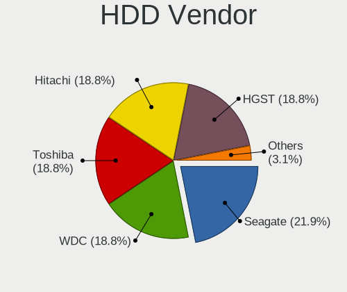
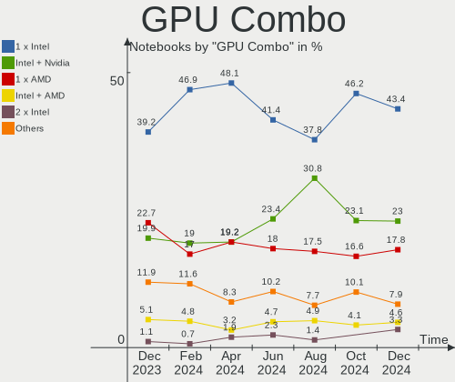
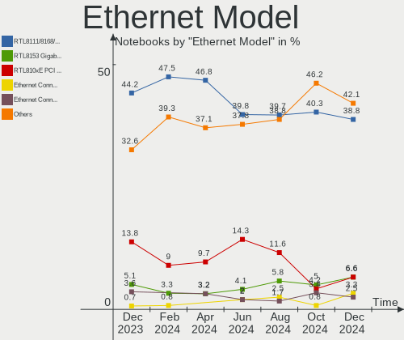
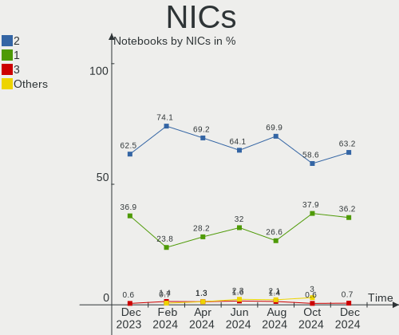
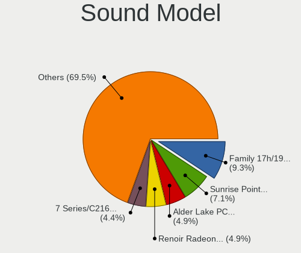
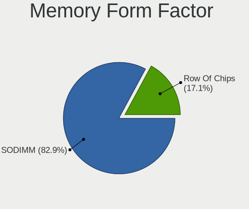
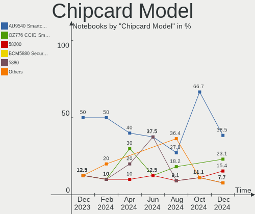

Linux in Italy - Hardware Trends (Notebooks)
--------------------------------------------

A project to identify most popular hardware characteristics and track their change
over time based on data collected by Linux users at https://Linux-Hardware.org.

Anyone can contribute to this report by the [hw-probe](https://github.com/linuxhw/hw-probe) tool:

    sudo -E hw-probe -all -upload

Period: Jul, 2023.

Contents
--------

* [ System ](#system)
  - [ OS                       ](#os)
  - [ OS Family                ](#os-family)
  - [ Kernel                   ](#kernel)
  - [ Kernel Family            ](#kernel-family)
  - [ Kernel Major Ver.        ](#kernel-major-ver)
  - [ Arch                     ](#arch)
  - [ DE                       ](#de)
  - [ Display Server           ](#display-server)
  - [ Display Manager          ](#display-manager)
  - [ OS Lang                  ](#os-lang)
  - [ Boot Mode                ](#boot-mode)
  - [ Filesystem               ](#filesystem)
  - [ Part. scheme             ](#part-scheme)
  - [ Dual Boot with Linux/BSD ](#dual-boot-with-linuxbsd)
  - [ Dual Boot (Win)          ](#dual-boot-win)

* [ Board ](#board)
  - [ Vendor                   ](#vendor)
  - [ Model                    ](#model)
  - [ Model Family             ](#model-family)
  - [ MFG Year                 ](#mfg-year)
  - [ Form Factor              ](#form-factor)
  - [ Secure Boot              ](#secure-boot)
  - [ Coreboot                 ](#coreboot)
  - [ RAM Size                 ](#ram-size)
  - [ RAM Used                 ](#ram-used)
  - [ Total Drives             ](#total-drives)
  - [ Has CD-ROM               ](#has-cd-rom)
  - [ Has Ethernet             ](#has-ethernet)
  - [ Has WiFi                 ](#has-wifi)
  - [ Has Bluetooth            ](#has-bluetooth)

* [ Location ](#location)
  - [ Country                  ](#country)
  - [ City                     ](#city)

* [ Drives ](#drives)
  - [ Drive Vendor             ](#drive-vendor)
  - [ Drive Model              ](#drive-model)
  - [ HDD Vendor               ](#hdd-vendor)
  - [ SSD Vendor               ](#ssd-vendor)
  - [ Drive Kind               ](#drive-kind)
  - [ Drive Connector          ](#drive-connector)
  - [ Drive Size               ](#drive-size)
  - [ Space Total              ](#space-total)
  - [ Space Used               ](#space-used)
  - [ Malfunc. Drives          ](#malfunc-drives)
  - [ Malfunc. Drive Vendor    ](#malfunc-drive-vendor)
  - [ Malfunc. HDD Vendor      ](#malfunc-hdd-vendor)
  - [ Malfunc. Drive Kind      ](#malfunc-drive-kind)
  - [ Failed Drives            ](#failed-drives)
  - [ Failed Drive Vendor      ](#failed-drive-vendor)
  - [ Drive Status             ](#drive-status)

* [ Storage controller ](#storage-controller)
  - [ Storage Vendor           ](#storage-vendor)
  - [ Storage Model            ](#storage-model)
  - [ Storage Kind             ](#storage-kind)

* [ Processor ](#processor)
  - [ CPU Vendor               ](#cpu-vendor)
  - [ CPU Model                ](#cpu-model)
  - [ CPU Model Family         ](#cpu-model-family)
  - [ CPU Cores                ](#cpu-cores)
  - [ CPU Sockets              ](#cpu-sockets)
  - [ CPU Threads              ](#cpu-threads)
  - [ CPU Op-Modes             ](#cpu-op-modes)
  - [ CPU Microcode            ](#cpu-microcode)
  - [ CPU Microarch            ](#cpu-microarch)

* [ Graphics ](#graphics)
  - [ GPU Vendor               ](#gpu-vendor)
  - [ GPU Model                ](#gpu-model)
  - [ GPU Combo                ](#gpu-combo)
  - [ GPU Driver               ](#gpu-driver)
  - [ GPU Memory               ](#gpu-memory)

* [ Monitor ](#monitor)
  - [ Monitor Vendor           ](#monitor-vendor)
  - [ Monitor Model            ](#monitor-model)
  - [ Monitor Resolution       ](#monitor-resolution)
  - [ Monitor Diagonal         ](#monitor-diagonal)
  - [ Monitor Width            ](#monitor-width)
  - [ Aspect Ratio             ](#aspect-ratio)
  - [ Monitor Area             ](#monitor-area)
  - [ Pixel Density            ](#pixel-density)
  - [ Multiple Monitors        ](#multiple-monitors)

* [ Network ](#network)
  - [ Net Controller Vendor    ](#net-controller-vendor)
  - [ Net Controller Model     ](#net-controller-model)
  - [ Wireless Vendor          ](#wireless-vendor)
  - [ Wireless Model           ](#wireless-model)
  - [ Ethernet Vendor          ](#ethernet-vendor)
  - [ Ethernet Model           ](#ethernet-model)
  - [ Net Controller Kind      ](#net-controller-kind)
  - [ Used Controller          ](#used-controller)
  - [ NICs                     ](#nics)
  - [ IPv6                     ](#ipv6)

* [ Bluetooth ](#bluetooth)
  - [ Bluetooth Vendor         ](#bluetooth-vendor)
  - [ Bluetooth Model          ](#bluetooth-model)

* [ Sound ](#sound)
  - [ Sound Vendor             ](#sound-vendor)
  - [ Sound Model              ](#sound-model)

* [ Memory ](#memory)
  - [ Memory Vendor            ](#memory-vendor)
  - [ Memory Model             ](#memory-model)
  - [ Memory Kind              ](#memory-kind)
  - [ Memory Form Factor       ](#memory-form-factor)
  - [ Memory Size              ](#memory-size)
  - [ Memory Speed             ](#memory-speed)

* [ Printers & scanners ](#printers--scanners)
  - [ Printer Vendor           ](#printer-vendor)
  - [ Printer Model            ](#printer-model)
  - [ Scanner Vendor           ](#scanner-vendor)
  - [ Scanner Model            ](#scanner-model)

* [ Camera ](#camera)
  - [ Camera Vendor            ](#camera-vendor)
  - [ Camera Model             ](#camera-model)

* [ Security ](#security)
  - [ Fingerprint Vendor       ](#fingerprint-vendor)
  - [ Fingerprint Model        ](#fingerprint-model)
  - [ Chipcard Vendor          ](#chipcard-vendor)
  - [ Chipcard Model           ](#chipcard-model)

* [ Unsupported ](#unsupported)
  - [ Unsupported Devices      ](#unsupported-devices)
  - [ Unsupported Device Types ](#unsupported-device-types)

System
------

OS
--

Installed operating systems

| Name                         | Notebooks | Percent |
|------------------------------|-----------|---------|
| Ubuntu 22.04                 | 16        | 14.81%  |
| Fedora 38                    | 12        | 11.11%  |
| OpenMandriva 23.03           | 7         | 6.48%   |
| Debian 12                    | 7         | 6.48%   |
| EndeavourOS Rolling          | 6         | 5.56%   |
| Zorin 16                     | 5         | 4.63%   |
| Pop!_OS 22.04                | 5         | 4.63%   |
| Ubuntu 23.04                 | 4         | 3.7%    |
| Linux Mint 21.1              | 4         | 3.7%    |
| OpenMandriva 23.07           | 3         | 2.78%   |
| ArcoLinux Rolling            | 3         | 2.78%   |
| Arch Rolling                 | 3         | 2.78%   |
| Xubuntu 22.04                | 2         | 1.85%   |
| openSUSE Tumbleweed-XXXXXXXX | 2         | 1.85%   |
| OpenMandriva 23.01           | 2         | 1.85%   |
| Manjaro 23.0.0               | 2         | 1.85%   |
| Linux Mint 21.2              | 2         | 1.85%   |
| Debian                       | 2         | 1.85%   |
| Xubuntu 23.04                | 1         | 0.93%   |
| Xubuntu 20.04                | 1         | 0.93%   |
| Ubuntu MATE 20.04            | 1         | 0.93%   |
| Ubuntu 22.10                 | 1         | 0.93%   |
| ROSA 12.4                    | 1         | 0.93%   |
| Parrot 5.3                   | 1         | 0.93%   |
| openSUSE Leap-15.5           | 1         | 0.93%   |
| OpenMandriva 4.2             | 1         | 0.93%   |
| Nobara 38                    | 1         | 0.93%   |
| NixOS 23.11                  | 1         | 0.93%   |
| Linux Mint 20.3              | 1         | 0.93%   |
| Linux Mint 20.2              | 1         | 0.93%   |
| Kubuntu 23.04                | 1         | 0.93%   |
| KDE neon 22.04               | 1         | 0.93%   |
| Kali 2023.2                  | 1         | 0.93%   |
| Gentoo 2.13                  | 1         | 0.93%   |
| Fedora 37                    | 1         | 0.93%   |
| Fedora 36                    | 1         | 0.93%   |
| Elementary 6.1               | 1         | 0.93%   |
| ChimeraOS 43-1               | 1         | 0.93%   |
| blendOS                      | 1         | 0.93%   |

OS Family
---------

OS without a version

| Name         | Notebooks | Percent |
|--------------|-----------|---------|
| Ubuntu       | 21        | 19.44%  |
| Fedora       | 14        | 12.96%  |
| OpenMandriva | 13        | 12.04%  |
| Debian       | 9         | 8.33%   |
| Linux Mint   | 8         | 7.41%   |
| EndeavourOS  | 6         | 5.56%   |
| Zorin        | 5         | 4.63%   |
| Pop!_OS      | 5         | 4.63%   |
| Xubuntu      | 4         | 3.7%    |
| openSUSE     | 3         | 2.78%   |
| ArcoLinux    | 3         | 2.78%   |
| Arch         | 3         | 2.78%   |
| Manjaro      | 2         | 1.85%   |
| Ubuntu MATE  | 1         | 0.93%   |
| ROSA         | 1         | 0.93%   |
| Parrot       | 1         | 0.93%   |
| Nobara       | 1         | 0.93%   |
| NixOS        | 1         | 0.93%   |
| Kubuntu      | 1         | 0.93%   |
| KDE neon     | 1         | 0.93%   |
| Kali         | 1         | 0.93%   |
| Gentoo       | 1         | 0.93%   |
| Elementary   | 1         | 0.93%   |
| ChimeraOS    | 1         | 0.93%   |
| blendOS      | 1         | 0.93%   |

Kernel
------

Version of the Linux kernel

| Version                      | Notebooks | Percent |
|------------------------------|-----------|---------|
| 5.19.0-46-generic            | 15        | 13.89%  |
| 5.15.0-76-generic            | 9         | 8.33%   |
| 6.2.6-desktop-1omv2390       | 7         | 6.48%   |
| 6.3.12-200.fc38.x86_64       | 6         | 5.56%   |
| 6.2.6-76060206-generic       | 5         | 4.63%   |
| 6.1.0-9-amd64                | 4         | 3.7%    |
| 6.4.3-arch1-1                | 3         | 2.78%   |
| 6.3.5-desktop-3omv2390       | 3         | 2.78%   |
| 6.2.0-25-generic             | 3         | 2.78%   |
| 6.1.0-10-amd64               | 3         | 2.78%   |
| 6.3.9-1-default              | 2         | 1.85%   |
| 6.3.8-200.fc38.x86_64        | 2         | 1.85%   |
| 6.3.11-200.fc38.x86_64       | 2         | 1.85%   |
| 6.3.0-1-amd64                | 2         | 1.85%   |
| 6.2.0-20-generic             | 2         | 1.85%   |
| 6.1.1-desktop-1omv2290       | 2         | 1.85%   |
| 5.19.0-32-generic            | 2         | 1.85%   |
| 5.15.0-78-generic            | 2         | 1.85%   |
| 5.15.0-72-generic            | 2         | 1.85%   |
| 6.4.7-arch1-1                | 1         | 0.93%   |
| 6.4.6-arch1-1                | 1         | 0.93%   |
| 6.4.6-200.fc38.x86_64        | 1         | 0.93%   |
| 6.4.4-arch1-1                | 1         | 0.93%   |
| 6.4.2-x64v2-xanmod1-3        | 1         | 0.93%   |
| 6.4.2-arch1-1                | 1         | 0.93%   |
| 6.4.2-3-MANJARO              | 1         | 0.93%   |
| 6.4.1-arch2-1                | 1         | 0.93%   |
| 6.4.1-arch1-1                | 1         | 0.93%   |
| 6.4.0                        | 1         | 0.93%   |
| 6.3.9-zen1-1-zen             | 1         | 0.93%   |
| 6.3.9-chimeraos-1            | 1         | 0.93%   |
| 6.3.9-arch1-1                | 1         | 0.93%   |
| 6.3.12-204.fsync.fc38.x86_64 | 1         | 0.93%   |
| 6.3.12-100.fc37.x86_64       | 1         | 0.93%   |
| 6.3.0-kali1-amd64            | 1         | 0.93%   |
| 6.2.9-300.fc38.x86_64        | 1         | 0.93%   |
| 6.2.15-100.fc36.x86_64       | 1         | 0.93%   |
| 6.2.13-arch1-1               | 1         | 0.93%   |
| 6.2.0-24-generic             | 1         | 0.93%   |
| 6.2.0-2-rt3-MANJARO          | 1         | 0.93%   |

Kernel Family
-------------

Linux kernel without a distro release

| Version  | Notebooks | Percent |
|----------|-----------|---------|
| 5.19.0   | 19        | 17.59%  |
| 5.15.0   | 14        | 12.96%  |
| 6.2.6    | 12        | 11.11%  |
| 6.3.12   | 8         | 7.41%   |
| 6.1.0    | 8         | 7.41%   |
| 6.2.0    | 7         | 6.48%   |
| 6.3.9    | 5         | 4.63%   |
| 6.4.3    | 3         | 2.78%   |
| 6.4.2    | 3         | 2.78%   |
| 6.3.5    | 3         | 2.78%   |
| 6.3.0    | 3         | 2.78%   |
| 6.4.6    | 2         | 1.85%   |
| 6.4.1    | 2         | 1.85%   |
| 6.3.8    | 2         | 1.85%   |
| 6.3.11   | 2         | 1.85%   |
| 6.1.1    | 2         | 1.85%   |
| 6.4.7    | 1         | 0.93%   |
| 6.4.4    | 1         | 0.93%   |
| 6.4.0    | 1         | 0.93%   |
| 6.2.9    | 1         | 0.93%   |
| 6.2.15   | 1         | 0.93%   |
| 6.2.13   | 1         | 0.93%   |
| 6.1.31   | 1         | 0.93%   |
| 5.4.0    | 1         | 0.93%   |
| 5.14.21  | 1         | 0.93%   |
| 5.13.0   | 1         | 0.93%   |
| 5.11.0   | 1         | 0.93%   |
| 5.10.184 | 1         | 0.93%   |
| 5.10.14  | 1         | 0.93%   |

Kernel Major Ver.
-----------------

Linux kernel major version

| Version | Notebooks | Percent |
|---------|-----------|---------|
| 6.3     | 23        | 21.3%   |
| 6.2     | 22        | 20.37%  |
| 5.19    | 19        | 17.59%  |
| 5.15    | 14        | 12.96%  |
| 6.4     | 13        | 12.04%  |
| 6.1     | 11        | 10.19%  |
| 5.10    | 2         | 1.85%   |
| 5.4     | 1         | 0.93%   |
| 5.14    | 1         | 0.93%   |
| 5.13    | 1         | 0.93%   |
| 5.11    | 1         | 0.93%   |

Arch
----

OS architecture (x86_64, i586, etc.)

| Name   | Notebooks | Percent |
|--------|-----------|---------|
| x86_64 | 108       | 100%    |

DE
--

Desktop Environment

| Name          | Notebooks | Percent |
|---------------|-----------|---------|
| GNOME         | 50        | 46.3%   |
| KDE5          | 25        | 23.15%  |
| XFCE          | 15        | 13.89%  |
| X-Cinnamon    | 8         | 7.41%   |
| MATE          | 3         | 2.78%   |
| Unknown       | 2         | 1.85%   |
| sway          | 1         | 0.93%   |
| Pantheon      | 1         | 0.93%   |
| i3            | 1         | 0.93%   |
| GNOME Classic | 1         | 0.93%   |
| Cinnamon      | 1         | 0.93%   |

Display Server
--------------

X11 or Wayland

| Name    | Notebooks | Percent |
|---------|-----------|---------|
| X11     | 77        | 71.3%   |
| Wayland | 29        | 26.85%  |
| Tty     | 1         | 0.93%   |
| Unknown | 1         | 0.93%   |

Display Manager
---------------

SDDM, LightDM, etc.

| Name    | Notebooks | Percent |
|---------|-----------|---------|
| Unknown | 35        | 32.41%  |
| GDM3    | 25        | 23.15%  |
| SDDM    | 22        | 20.37%  |
| LightDM | 16        | 14.81%  |
| GDM     | 10        | 9.26%   |

OS Lang
-------

Language

| Lang    | Notebooks | Percent |
|---------|-----------|---------|
| it_IT   | 69        | 63.89%  |
| en_US   | 25        | 23.15%  |
| en_GB   | 8         | 7.41%   |
| C       | 3         | 2.78%   |
| POSIX   | 1         | 0.93%   |
| de_DE   | 1         | 0.93%   |
| Unknown | 1         | 0.93%   |

Boot Mode
---------

EFI or BIOS

| Mode | Notebooks | Percent |
|------|-----------|---------|
| EFI  | 64        | 59.26%  |
| BIOS | 44        | 40.74%  |

Filesystem
----------

Type of filesystem

| Type    | Notebooks | Percent |
|---------|-----------|---------|
| Ext4    | 62        | 57.41%  |
| Btrfs   | 18        | 16.67%  |
| Tmpfs   | 15        | 13.89%  |
| Overlay | 9         | 8.33%   |
| Xfs     | 3         | 2.78%   |
| Ext2    | 1         | 0.93%   |

Part. scheme
------------

Scheme of partitioning

| Type    | Notebooks | Percent |
|---------|-----------|---------|
| GPT     | 57        | 52.78%  |
| Unknown | 32        | 29.63%  |
| MBR     | 19        | 17.59%  |

Dual Boot with Linux/BSD
------------------------

Hosting more than one Linux/BSD

| Dual boot | Notebooks | Percent |
|-----------|-----------|---------|
| No        | 90        | 83.33%  |
| Yes       | 18        | 16.67%  |

Dual Boot (Win)
---------------

Hosting Linux and Windows

| Dual boot | Notebooks | Percent |
|-----------|-----------|---------|
| No        | 79        | 73.15%  |
| Yes       | 29        | 26.85%  |

Board
-----

Vendor
------

Motherboard manufacturer

| Name                | Notebooks | Percent |
|---------------------|-----------|---------|
| Hewlett-Packard     | 21        | 19.44%  |
| Dell                | 15        | 13.89%  |
| Lenovo              | 14        | 12.96%  |
| Acer                | 11        | 10.19%  |
| MSI                 | 7         | 6.48%   |
| HUAWEI              | 6         | 5.56%   |
| ASUSTek Computer    | 6         | 5.56%   |
| Toshiba             | 4         | 3.7%    |
| Apple               | 3         | 2.78%   |
| Timi                | 2         | 1.85%   |
| Sony                | 2         | 1.85%   |
| Notebook            | 2         | 1.85%   |
| TUXEDO              | 1         | 0.93%   |
| Teclast             | 1         | 0.93%   |
| SLIMBOOK            | 1         | 0.93%   |
| SiComputer          | 1         | 0.93%   |
| SANTECH             | 1         | 0.93%   |
| Samsung Electronics | 1         | 0.93%   |
| Panasonic           | 1         | 0.93%   |
| Packard Bell        | 1         | 0.93%   |
| Olivetti            | 1         | 0.93%   |
| Olidata             | 1         | 0.93%   |
| Microtech           | 1         | 0.93%   |
| Jumper              | 1         | 0.93%   |
| Fujitsu Siemens     | 1         | 0.93%   |
| Beelink             | 1         | 0.93%   |
| Unknown             | 1         | 0.93%   |

Model
-----

Motherboard model

| Name                                | Notebooks | Percent |
|-------------------------------------|-----------|---------|
| MSI Alpha 15 B5EEK                  | 2         | 1.85%   |
| Lenovo V15-IGL 82C3                 | 2         | 1.85%   |
| HUAWEI NBLK-WAX9X                   | 2         | 1.85%   |
| HP Victus by Laptop 16-e0xxx        | 2         | 1.85%   |
| HP Laptop 15s-fq2xxx                | 2         | 1.85%   |
| Apple MacBookPro14,3                | 2         | 1.85%   |
| TUXEDO InfinityBook Pro Gen7 (MK1)  | 1         | 0.93%   |
| Toshiba TECRA A10                   | 1         | 0.93%   |
| Toshiba Satellite Pro S500          | 1         | 0.93%   |
| Toshiba Satellite L750              | 1         | 0.93%   |
| Toshiba Satellite C660              | 1         | 0.93%   |
| Timi RedmiBook 16                   | 1         | 0.93%   |
| Timi A7S                            | 1         | 0.93%   |
| Teclast F7 Plus                     | 1         | 0.93%   |
| Sony VGN-NS21M_W                    | 1         | 0.93%   |
| Sony SVE1713X1EB                    | 1         | 0.93%   |
| SLIMBOOK Executive                  | 1         | 0.93%   |
| SiComputer NL40_50CU                | 1         | 0.93%   |
| SANTECH NHx0DB,DE                   | 1         | 0.93%   |
| Samsung 350V5C/351V5C/3540VC/3440VC | 1         | 0.93%   |
| Panasonic CF-C1BD06EFG              | 1         | 0.93%   |
| Packard Bell EasyNote MH36          | 1         | 0.93%   |
| Olivetti Olipad Graphos W811        | 1         | 0.93%   |
| Olidata Stainer 8050                | 1         | 0.93%   |
| Notebook PCX0DX                     | 1         | 0.93%   |
| Notebook P7xxTM1                    | 1         | 0.93%   |
| MSI Katana GF66 12UC                | 1         | 0.93%   |
| MSI GL73 8RE                        | 1         | 0.93%   |
| MSI GL63 8SD                        | 1         | 0.93%   |
| MSI Creator 17 A10SE                | 1         | 0.93%   |
| MSI Creator 15M A9SD                | 1         | 0.93%   |
| Microtech ebookPro                  | 1         | 0.93%   |
| Lenovo ThinkPad T450 20BUS0S902     | 1         | 0.93%   |
| Lenovo ThinkPad T430 2349IF8        | 1         | 0.93%   |
| Lenovo ThinkPad E15 20RDS1G700      | 1         | 0.93%   |
| Lenovo ThinkPad E15 20RD0011IX      | 1         | 0.93%   |
| Lenovo ThinkBook 15 G2 ITL 20VE     | 1         | 0.93%   |
| Lenovo IdeaPad S540-14API 81NH      | 1         | 0.93%   |
| Lenovo IdeaPad S340-15API 81NC      | 1         | 0.93%   |
| Lenovo IdeaPad Pro 5 16ARP8 83AS    | 1         | 0.93%   |

Model Family
------------

Motherboard model prefix

| Name                   | Notebooks | Percent |
|------------------------|-----------|---------|
| Acer Aspire            | 9         | 8.33%   |
| Lenovo IdeaPad         | 7         | 6.48%   |
| Dell Latitude          | 6         | 5.56%   |
| HP Pavilion            | 5         | 4.63%   |
| Dell XPS               | 5         | 4.63%   |
| Lenovo ThinkPad        | 4         | 3.7%    |
| Toshiba Satellite      | 3         | 2.78%   |
| HP ProBook             | 3         | 2.78%   |
| HP Laptop              | 3         | 2.78%   |
| HP 250                 | 3         | 2.78%   |
| MSI Creator            | 2         | 1.85%   |
| MSI Alpha              | 2         | 1.85%   |
| Lenovo V15-IGL         | 2         | 1.85%   |
| HUAWEI NBLK-WAX9X      | 2         | 1.85%   |
| HP Victus              | 2         | 1.85%   |
| Dell Inspiron          | 2         | 1.85%   |
| Apple MacBookPro14     | 2         | 1.85%   |
| Acer TravelMate        | 2         | 1.85%   |
| TUXEDO InfinityBook    | 1         | 0.93%   |
| Toshiba TECRA          | 1         | 0.93%   |
| Timi RedmiBook         | 1         | 0.93%   |
| Timi A7S               | 1         | 0.93%   |
| Teclast F7             | 1         | 0.93%   |
| Sony VGN-NS21M         | 1         | 0.93%   |
| Sony SVE1713X1EB       | 1         | 0.93%   |
| SLIMBOOK Executive     | 1         | 0.93%   |
| SiComputer NL40        | 1         | 0.93%   |
| SANTECH NHx0DB         | 1         | 0.93%   |
| Samsung 350V5C         | 1         | 0.93%   |
| Panasonic CF-C1BD06EFG | 1         | 0.93%   |
| Packard Bell EasyNote  | 1         | 0.93%   |
| Olivetti Olipad        | 1         | 0.93%   |
| Olidata Stainer        | 1         | 0.93%   |
| Notebook PCX0DX        | 1         | 0.93%   |
| Notebook P7xxTM1       | 1         | 0.93%   |
| MSI Katana             | 1         | 0.93%   |
| MSI GL73               | 1         | 0.93%   |
| MSI GL63               | 1         | 0.93%   |
| Microtech ebookPro     | 1         | 0.93%   |
| Lenovo ThinkBook       | 1         | 0.93%   |

MFG Year
--------

Motherboard manufacture year

| Year | Notebooks | Percent |
|------|-----------|---------|
| 2021 | 20        | 18.52%  |
| 2020 | 14        | 12.96%  |
| 2019 | 12        | 11.11%  |
| 2018 | 8         | 7.41%   |
| 2013 | 8         | 7.41%   |
| 2022 | 7         | 6.48%   |
| 2012 | 7         | 6.48%   |
| 2011 | 6         | 5.56%   |
| 2014 | 4         | 3.7%    |
| 2010 | 4         | 3.7%    |
| 2009 | 4         | 3.7%    |
| 2008 | 4         | 3.7%    |
| 2023 | 3         | 2.78%   |
| 2017 | 2         | 1.85%   |
| 2015 | 2         | 1.85%   |
| 2007 | 2         | 1.85%   |
| 2016 | 1         | 0.93%   |

Form Factor
-----------

Physical design of the computer

| Name     | Notebooks | Percent |
|----------|-----------|---------|
| Notebook | 108       | 100%    |

Secure Boot
-----------

Enabled or disabled

| State    | Notebooks | Percent |
|----------|-----------|---------|
| Disabled | 100       | 92.59%  |
| Enabled  | 8         | 7.41%   |

Coreboot
--------

Have coreboot on board

| Used | Notebooks | Percent |
|------|-----------|---------|
| No   | 108       | 100%    |

RAM Size
--------

Total RAM memory

| Size in GB  | Notebooks | Percent |
|-------------|-----------|---------|
| 4.01-8.0    | 28        | 25.93%  |
| 16.01-24.0  | 28        | 25.93%  |
| 8.01-16.0   | 21        | 19.44%  |
| 3.01-4.0    | 17        | 15.74%  |
| 32.01-64.0  | 11        | 10.19%  |
| 2.01-3.0    | 2         | 1.85%   |
| 64.01-256.0 | 1         | 0.93%   |

RAM Used
--------

Used RAM memory

| Used GB    | Notebooks | Percent |
|------------|-----------|---------|
| 2.01-3.0   | 37        | 34.26%  |
| 1.01-2.0   | 33        | 30.56%  |
| 4.01-8.0   | 14        | 12.96%  |
| 3.01-4.0   | 13        | 12.04%  |
| 8.01-16.0  | 6         | 5.56%   |
| 0.51-1.0   | 4         | 3.7%    |
| 16.01-24.0 | 1         | 0.93%   |

Total Drives
------------

Number of drives on board

| Drives | Notebooks | Percent |
|--------|-----------|---------|
| 1      | 74        | 68.52%  |
| 2      | 27        | 25%     |
| 3      | 4         | 3.7%    |
| 0      | 3         | 2.78%   |

Has CD-ROM
----------

Has CD-ROM on board

| Presented | Notebooks | Percent |
|-----------|-----------|---------|
| No        | 78        | 72.22%  |
| Yes       | 30        | 27.78%  |

Has Ethernet
------------

Has Ethernet on board

| Presented | Notebooks | Percent |
|-----------|-----------|---------|
| Yes       | 83        | 76.85%  |
| No        | 25        | 23.15%  |

Has WiFi
--------

Has WiFi module

| Presented | Notebooks | Percent |
|-----------|-----------|---------|
| Yes       | 108       | 100%    |

Has Bluetooth
-------------

Has Bluetooth module

| Presented | Notebooks | Percent |
|-----------|-----------|---------|
| Yes       | 93        | 86.11%  |
| No        | 15        | 13.89%  |

Location
--------

Country
-------

Geographic location (country)

| Country | Notebooks | Percent |
|---------|-----------|---------|
| Italy   | 108       | 100%    |

City
----

Geographic location (city)

| City                     | Notebooks | Percent |
|--------------------------|-----------|---------|
| Milan                    | 10        | 9.26%   |
| Milano                   | 7         | 6.48%   |
| Rome                     | 6         | 5.56%   |
| Turin                    | 3         | 2.78%   |
| Rho                      | 3         | 2.78%   |
| Trieste                  | 2         | 1.85%   |
| Salerno                  | 2         | 1.85%   |
| Parma                    | 2         | 1.85%   |
| Padova                   | 2         | 1.85%   |
| Naples                   | 2         | 1.85%   |
| Monza                    | 2         | 1.85%   |
| Lonato                   | 2         | 1.85%   |
| Florence                 | 2         | 1.85%   |
| Catania                  | 2         | 1.85%   |
| Zoppola                  | 1         | 0.93%   |
| Vicenza                  | 1         | 0.93%   |
| Verona                   | 1         | 0.93%   |
| Venice                   | 1         | 0.93%   |
| Treviso                  | 1         | 0.93%   |
| Treviolo                 | 1         | 0.93%   |
| Trento                   | 1         | 0.93%   |
| Tarquinia                | 1         | 0.93%   |
| Sorrento                 | 1         | 0.93%   |
| Sorbolo                  | 1         | 0.93%   |
| Seregno                  | 1         | 0.93%   |
| Sassari                  | 1         | 0.93%   |
| Sant'Egidio alla Vibrata | 1         | 0.93%   |
| San Giovanni la Punta    | 1         | 0.93%   |
| Saltara                  | 1         | 0.93%   |
| Rosarno                  | 1         | 0.93%   |
| Rivoli                   | 1         | 0.93%   |
| Rimini                   | 1         | 0.93%   |
| Reggio Emilia            | 1         | 0.93%   |
| Reggio Calabria          | 1         | 0.93%   |
| Portomaggiore            | 1         | 0.93%   |
| Portogruaro              | 1         | 0.93%   |
| Ponte San Nicolo         | 1         | 0.93%   |
| Pomigliano d'Arco        | 1         | 0.93%   |
| Pisa                     | 1         | 0.93%   |
| Pineto                   | 1         | 0.93%   |

Drives
------

Drive Vendor
------------

Hard drive vendors

| Vendor                      | Notebooks | Drives | Percent |
|-----------------------------|-----------|--------|---------|
| Samsung Electronics         | 30        | 32     | 22.56%  |
| WDC                         | 12        | 12     | 9.02%   |
| Seagate                     | 10        | 10     | 7.52%   |
| Sandisk                     | 10        | 10     | 7.52%   |
| Kingston                    | 10        | 10     | 7.52%   |
| SK hynix                    | 9         | 9      | 6.77%   |
| Crucial                     | 9         | 10     | 6.77%   |
| Toshiba                     | 5         | 5      | 3.76%   |
| Hitachi                     | 5         | 5      | 3.76%   |
| Unknown                     | 3         | 3      | 2.26%   |
| SPCC                        | 3         | 3      | 2.26%   |
| Phison Electronics          | 3         | 3      | 2.26%   |
| Intel                       | 3         | 3      | 2.26%   |
| China                       | 3         | 3      | 2.26%   |
| Micron Technology           | 2         | 2      | 1.5%    |
| KIOXIA                      | 2         | 2      | 1.5%    |
| HGST                        | 2         | 2      | 1.5%    |
| Teclast                     | 1         | 1      | 0.75%   |
| Team                        | 1         | 1      | 0.75%   |
| Patriot                     | 1         | 1      | 0.75%   |
| Microtech                   | 1         | 1      | 0.75%   |
| Micron/Crucial Technology   | 1         | 1      | 0.75%   |
| MemoirsTek                  | 1         | 1      | 0.75%   |
| MAXIO Technology (Hangzhou) | 1         | 1      | 0.75%   |
| LITEON                      | 1         | 1      | 0.75%   |
| Intenso                     | 1         | 1      | 0.75%   |
| FORESEE                     | 1         | 1      | 0.75%   |
| BAITITON                    | 1         | 1      | 0.75%   |
| Unknown                     | 1         | 1      | 0.75%   |

Drive Model
-----------

Hard drive models

| Model                                               | Notebooks | Percent |
|-----------------------------------------------------|-----------|---------|
| Crucial CT500MX500SSD1 500GB                        | 3         | 2.24%   |
| WDC WD5000LPVX-22V0TT0 500GB                        | 2         | 1.49%   |
| WDC PC SN530 SDBPNPZ-512G-1006 512GB                | 2         | 1.49%   |
| Toshiba XG6 NVMe SSD Controller 512GB               | 2         | 1.49%   |
| SPCC Solid State Disk 512GB                         | 2         | 1.49%   |
| SK hynix BC511 HFM256GDJTNI-82A0A 256GB             | 2         | 1.49%   |
| Seagate ST500LM012 HN-M500MBB 500GB                 | 2         | 1.49%   |
| Sandisk PC SN520 NVMe SSD 512GB                     | 2         | 1.49%   |
| Samsung SSD 860 EVO 500GB                           | 2         | 1.49%   |
| Samsung NVMe SSD Controller SM981/PM981/PM983 500GB | 2         | 1.49%   |
| Samsung NVMe SSD Controller SM961/PM961/SM963 256GB | 2         | 1.49%   |
| Samsung MZALQ256HAJD-000L2 256GB                    | 2         | 1.49%   |
| Kingston OM8PCP3512F-AI1 512GB                      | 2         | 1.49%   |
| Crucial CT240BX500SSD1 240GB                        | 2         | 1.49%   |
| WDC WDS200T2B0C-00PXH0 2TB                          | 1         | 0.75%   |
| WDC WDS100T2B0A-00SM50 1TB SSD                      | 1         | 0.75%   |
| WDC WD3200BEKT-75PVMT0 320GB                        | 1         | 0.75%   |
| WDC WD1600BEVT-22ZCT0 160GB                         | 1         | 0.75%   |
| WDC WD10SPZX-21Z10T0 1TB                            | 1         | 0.75%   |
| WDC PC SN730 SDBPNTY-512G-1027 512GB                | 1         | 0.75%   |
| WDC PC SN730 SDBPNTY-512G-1006 512GB                | 1         | 0.75%   |
| WDC PC SN730 SDBPNTY-1T00-1032 1TB                  | 1         | 0.75%   |
| Unknown SD/MMC/MS PRO 128GB                         | 1         | 0.75%   |
| Unknown MMC Card  32GB                              | 1         | 0.75%   |
| Unknown MMC Card  128GB                             | 1         | 0.75%   |
| Toshiba MQ01ABF050 500GB                            | 1         | 0.75%   |
| Toshiba MQ01ABD100 1TB                              | 1         | 0.75%   |
| Toshiba BG3 NVMe SSD Controller 256GB               | 1         | 0.75%   |
| Teclast 256GB NA850-2280 SSD                        | 1         | 0.75%   |
| Team TM8FP6512G 512GB                               | 1         | 0.75%   |
| SPCC Solid State Disk 128GB                         | 1         | 0.75%   |
| SK hynix SKHynix_HFM512GDHTNI-87A0B 512GB           | 1         | 0.75%   |
| SK hynix SKHynix_HFM512GD3HX015N 512GB              | 1         | 0.75%   |
| SK hynix PC711 NVMe 512GB                           | 1         | 0.75%   |
| SK hynix PC711 HFS001TDE9X073N 1TB                  | 1         | 0.75%   |
| SK hynix HFM512GD3JX016N 512GB                      | 1         | 0.75%   |
| SK hynix BC711 NVMe 512GB                           | 1         | 0.75%   |
| SK hynix BC711 HFM001TD3JX013N 1TB                  | 1         | 0.75%   |
| Seagate ST750LM022 HN-M750MBB 752GB                 | 1         | 0.75%   |
| Seagate ST500LT012-9WS142 500GB                     | 1         | 0.75%   |

HDD Vendor
----------

Hard disk drive vendors

| Vendor  | Notebooks | Drives | Percent |
|---------|-----------|--------|---------|
| Seagate | 9         | 9      | 37.5%   |
| WDC     | 5         | 5      | 20.83%  |
| Hitachi | 5         | 5      | 20.83%  |
| Toshiba | 2         | 2      | 8.33%   |
| HGST    | 2         | 2      | 8.33%   |
| Unknown | 1         | 1      | 4.17%   |

SSD Vendor
----------

Solid state drive vendors

| Vendor              | Notebooks | Drives | Percent |
|---------------------|-----------|--------|---------|
| Samsung Electronics | 10        | 10     | 25%     |
| Crucial             | 8         | 8      | 20%     |
| Kingston            | 7         | 7      | 17.5%   |
| SPCC                | 3         | 3      | 7.5%    |
| China               | 3         | 3      | 7.5%    |
| SanDisk             | 2         | 2      | 5%      |
| WDC                 | 1         | 1      | 2.5%    |
| Teclast             | 1         | 1      | 2.5%    |
| Patriot             | 1         | 1      | 2.5%    |
| Microtech           | 1         | 1      | 2.5%    |
| Intenso             | 1         | 1      | 2.5%    |
| Intel               | 1         | 1      | 2.5%    |
| BAITITON            | 1         | 1      | 2.5%    |

Drive Kind
----------

HDD or SSD

| Kind    | Notebooks | Drives | Percent |
|---------|-----------|--------|---------|
| NVMe    | 58        | 66     | 46.4%   |
| SSD     | 37        | 40     | 29.6%   |
| HDD     | 24        | 24     | 19.2%   |
| MMC     | 3         | 3      | 2.4%    |
| Unknown | 3         | 3      | 2.4%    |

Drive Connector
---------------

SATA, SAS, NVMe, etc.

| Type | Notebooks | Drives | Percent |
|------|-----------|--------|---------|
| NVMe | 58        | 66     | 48.74%  |
| SATA | 54        | 63     | 45.38%  |
| SAS  | 4         | 4      | 3.36%   |
| MMC  | 3         | 3      | 2.52%   |

Drive Size
----------

Size of hard drive

| Size in TB | Notebooks | Drives | Percent |
|------------|-----------|--------|---------|
| 0.01-0.5   | 43        | 48     | 72.88%  |
| 0.51-1.0   | 14        | 14     | 23.73%  |
| 1.01-2.0   | 2         | 2      | 3.39%   |

Space Total
-----------

Amount of disk space available on the file system

| Size in GB     | Notebooks | Percent |
|----------------|-----------|---------|
| 251-500        | 41        | 37.96%  |
| 101-250        | 17        | 15.74%  |
| 501-1000       | 14        | 12.96%  |
| 1-20           | 13        | 12.04%  |
| 1001-2000      | 10        | 9.26%   |
| 51-100         | 5         | 4.63%   |
| Unknown        | 4         | 3.7%    |
| More than 3000 | 2         | 1.85%   |
| 2001-3000      | 2         | 1.85%   |

Space Used
----------

Amount of used disk space

| Used GB   | Notebooks | Percent |
|-----------|-----------|---------|
| 1-20      | 35        | 32.41%  |
| 101-250   | 23        | 21.3%   |
| 21-50     | 13        | 12.04%  |
| 51-100    | 10        | 9.26%   |
| 251-500   | 9         | 8.33%   |
| 501-1000  | 9         | 8.33%   |
| 1001-2000 | 4         | 3.7%    |
| Unknown   | 4         | 3.7%    |
| 2001-3000 | 1         | 0.93%   |

Malfunc. Drives
---------------

Drive models with a malfunction

| Model                               | Notebooks | Drives | Percent |
|-------------------------------------|-----------|--------|---------|
| WDC WD1600BEVT-22ZCT0 160GB         | 1         | 1      | 12.5%   |
| SK hynix PC711 HFS001TDE9X073N 1TB  | 1         | 1      | 12.5%   |
| SK hynix BC711 HFM001TD3JX013N 1TB  | 1         | 1      | 12.5%   |
| Seagate ST500LM012 HN-M500MBB 500GB | 1         | 1      | 12.5%   |
| Intel SSDSC2BF180A4L 180GB          | 1         | 1      | 12.5%   |
| HGST HTS545050A7E680 500GB          | 1         | 1      | 12.5%   |
| HGST HTS541010A7E630 1TB            | 1         | 1      | 12.5%   |
| Crucial CT240M500SSD 240GB          | 1         | 1      | 12.5%   |

Malfunc. Drive Vendor
---------------------

Vendors of faulty drives

| Vendor   | Notebooks | Drives | Percent |
|----------|-----------|--------|---------|
| SK hynix | 2         | 2      | 25%     |
| HGST     | 2         | 2      | 25%     |
| WDC      | 1         | 1      | 12.5%   |
| Seagate  | 1         | 1      | 12.5%   |
| Intel    | 1         | 1      | 12.5%   |
| Crucial  | 1         | 1      | 12.5%   |

Malfunc. HDD Vendor
-------------------

Vendors of faulty HDD drives

| Vendor  | Notebooks | Drives | Percent |
|---------|-----------|--------|---------|
| HGST    | 2         | 2      | 50%     |
| WDC     | 1         | 1      | 25%     |
| Seagate | 1         | 1      | 25%     |

Malfunc. Drive Kind
-------------------

Kinds of faulty drives

| Kind | Notebooks | Drives | Percent |
|------|-----------|--------|---------|
| HDD  | 4         | 4      | 50%     |
| NVMe | 2         | 2      | 25%     |
| SSD  | 2         | 2      | 25%     |

Failed Drives
-------------

Failed drive models

Zero info for selected period =(

Failed Drive Vendor
-------------------

Failed drive vendors

Zero info for selected period =(

Drive Status
------------

Number of failed and malfunc. drives

| Status   | Notebooks | Drives | Percent |
|----------|-----------|--------|---------|
| Works    | 57        | 71     | 51.82%  |
| Detected | 45        | 57     | 40.91%  |
| Malfunc  | 8         | 8      | 7.27%   |

Storage controller
------------------

Storage Vendor
--------------

Storage controller vendors

| Vendor                       | Notebooks | Percent |
|------------------------------|-----------|---------|
| Intel                        | 71        | 48.63%  |
| Samsung Electronics          | 20        | 13.7%   |
| SanDisk                      | 14        | 9.59%   |
| AMD                          | 12        | 8.22%   |
| SK hynix                     | 9         | 6.16%   |
| Phison Electronics           | 4         | 2.74%   |
| Toshiba America Info Systems | 3         | 2.05%   |
| Micron/Crucial Technology    | 3         | 2.05%   |
| Kingston Technology Company  | 3         | 2.05%   |
| Micron Technology            | 2         | 1.37%   |
| KIOXIA                       | 2         | 1.37%   |
| Nvidia                       | 1         | 0.68%   |
| MAXIO Technology (Hangzhou)  | 1         | 0.68%   |
| Lite-On Technology           | 1         | 0.68%   |

Storage Model
-------------

Storage controller models

| Model                                                                          | Notebooks | Percent |
|--------------------------------------------------------------------------------|-----------|---------|
| AMD FCH SATA Controller [AHCI mode]                                            | 11        | 7.28%   |
| Intel 7 Series Chipset Family 6-port SATA Controller [AHCI mode]               | 9         | 5.96%   |
| Samsung NVMe SSD Controller 980                                                | 8         | 5.3%    |
| Intel 6 Series/C200 Series Chipset Family 6 port Mobile SATA AHCI Controller   | 8         | 5.3%    |
| Intel Volume Management Device NVMe RAID Controller                            | 7         | 4.64%   |
| SK hynix Gold P31/BC711/PC711 NVMe Solid State Drive                           | 6         | 3.97%   |
| Samsung NVMe SSD Controller SM981/PM981/PM983                                  | 6         | 3.97%   |
| Intel Celeron/Pentium Silver Processor SATA Controller                         | 5         | 3.31%   |
| SanDisk WD Black SN750 / PC SN730 NVMe SSD                                     | 4         | 2.65%   |
| Intel Sunrise Point-LP SATA Controller [AHCI mode]                             | 4         | 2.65%   |
| Intel Comet Lake SATA AHCI Controller                                          | 4         | 2.65%   |
| Intel Cannon Lake Mobile PCH SATA AHCI Controller                              | 4         | 2.65%   |
| Intel 82801IBM/IEM (ICH9M/ICH9M-E) 4 port SATA Controller [AHCI mode]          | 4         | 2.65%   |
| Intel 400 Series Chipset Family SATA AHCI Controller                           | 4         | 2.65%   |
| SK hynix BC511 NVMe SSD                                                        | 3         | 1.99%   |
| Intel Wildcat Point-LP SATA Controller [AHCI Mode]                             | 3         | 1.99%   |
| Intel 82801 Mobile SATA Controller [RAID mode]                                 | 3         | 1.99%   |
| Intel 8 Series SATA Controller 1 [AHCI mode]                                   | 3         | 1.99%   |
| Toshiba America Info Systems XG6 NVMe SSD Controller                           | 2         | 1.32%   |
| SanDisk WD Blue SN550 NVMe SSD                                                 | 2         | 1.32%   |
| SanDisk PC SN520 NVMe SSD                                                      | 2         | 1.32%   |
| Samsung NVMe SSD Controller SM961/PM961/SM963                                  | 2         | 1.32%   |
| Samsung NVMe SSD Controller PM9B1                                              | 2         | 1.32%   |
| Phison PS5013 E13 NVMe Controller                                              | 2         | 1.32%   |
| Kingston Company OM8PCP Design-In PCIe 3 NVMe SSD (DRAM-less)                  | 2         | 1.32%   |
| Intel Tiger Lake-LP SATA Controller                                            | 2         | 1.32%   |
| Intel Alder Lake-P SATA AHCI Controller                                        | 2         | 1.32%   |
| Intel 82801HM/HEM (ICH8M/ICH8M-E) SATA Controller [AHCI mode]                  | 2         | 1.32%   |
| Intel 82801HM/HEM (ICH8M/ICH8M-E) IDE Controller                               | 2         | 1.32%   |
| Intel 8 Series/C220 Series Chipset Family 6-port SATA Controller 1 [AHCI mode] | 2         | 1.32%   |
| Toshiba America Info Systems BG3 NVMe SSD Controller                           | 1         | 0.66%   |
| SanDisk WD Blue SN550 NVMe SSD 2TB (DRAM-less)                                 | 1         | 0.66%   |
| SanDisk WD Blue SN500 / PC SN520 NVMe SSD                                      | 1         | 0.66%   |
| SanDisk WD Black SN770 / PC SN740 256GB / PC SN560 (DRAM-less) NVMe SSD        | 1         | 0.66%   |
| SanDisk WD Black 2018/SN750 / PC SN720 NVMe SSD                                | 1         | 0.66%   |
| SanDisk PC SN735 NVMe SSD (DRAM-less)                                          | 1         | 0.66%   |
| SanDisk IX SN530 NVMe SSD (DRAM-less)                                          | 1         | 0.66%   |
| Samsung NVMe SSD Controller SM951/PM951                                        | 1         | 0.66%   |
| Samsung NVMe SSD Controller PM9A1/PM9A3/980PRO                                 | 1         | 0.66%   |
| Phison PS5019-E19 PCIe4 NVMe Controller (DRAM-less)                            | 1         | 0.66%   |

Storage Kind
------------

Kind of storage controller (IDE, SATA, NVMe, SAS, ...)

| Kind | Notebooks | Percent |
|------|-----------|---------|
| SATA | 73        | 50.34%  |
| NVMe | 58        | 40%     |
| RAID | 10        | 6.9%    |
| IDE  | 4         | 2.76%   |

Processor
---------

CPU Vendor
----------

Processor vendors

| Vendor | Notebooks | Percent |
|--------|-----------|---------|
| Intel  | 78        | 72.22%  |
| AMD    | 30        | 27.78%  |

CPU Model
---------

Processor models

| Model                                         | Notebooks | Percent |
|-----------------------------------------------|-----------|---------|
| AMD Ryzen 7 5800H with Radeon Graphics        | 5         | 4.63%   |
| AMD Ryzen 7 3700U with Radeon Vega Mobile Gfx | 4         | 3.7%    |
| Intel Core i5-2410M CPU @ 2.30GHz             | 3         | 2.78%   |
| Intel Core i5-10210U CPU @ 1.60GHz            | 3         | 2.78%   |
| Intel 12th Gen Core i7-12700H                 | 3         | 2.78%   |
| AMD Ryzen 5 5625U with Radeon Graphics        | 3         | 2.78%   |
| Intel Core i7-8750H CPU @ 2.20GHz             | 2         | 1.85%   |
| Intel Core i7-7820HQ CPU @ 2.90GHz            | 2         | 1.85%   |
| Intel Core i7-4500U CPU @ 1.80GHz             | 2         | 1.85%   |
| Intel Core i7-3630QM CPU @ 2.40GHz            | 2         | 1.85%   |
| Intel Core i7-10875H CPU @ 2.30GHz            | 2         | 1.85%   |
| Intel Core i7-10510U CPU @ 1.80GHz            | 2         | 1.85%   |
| Intel Core 2 Duo CPU P8700 @ 2.53GHz          | 2         | 1.85%   |
| Intel Celeron N4020 CPU @ 1.10GHz             | 2         | 1.85%   |
| Intel 11th Gen Core i7-1165G7 @ 2.80GHz       | 2         | 1.85%   |
| Intel 11th Gen Core i3-1115G4 @ 3.00GHz       | 2         | 1.85%   |
| AMD Ryzen 7 5700U with Radeon Graphics        | 2         | 1.85%   |
| AMD Ryzen 5 3500U with Radeon Vega Mobile Gfx | 2         | 1.85%   |
| AMD Ryzen 5 2500U with Radeon Vega Mobile Gfx | 2         | 1.85%   |
| Intel Pentium Silver N5000 CPU @ 1.10GHz      | 1         | 0.93%   |
| Intel Pentium Dual-Core CPU T4200 @ 2.00GHz   | 1         | 0.93%   |
| Intel Pentium Dual CPU T3400 @ 2.16GHz        | 1         | 0.93%   |
| Intel Core i9-9980HK CPU @ 2.40GHz            | 1         | 0.93%   |
| Intel Core i9-9900KF CPU @ 3.60GHz            | 1         | 0.93%   |
| Intel Core i7-9850H CPU @ 2.60GHz             | 1         | 0.93%   |
| Intel Core i7-9750H CPU @ 2.60GHz             | 1         | 0.93%   |
| Intel Core i7-7700HQ CPU @ 2.80GHz            | 1         | 0.93%   |
| Intel Core i7-7500U CPU @ 2.70GHz             | 1         | 0.93%   |
| Intel Core i7-6500U CPU @ 2.50GHz             | 1         | 0.93%   |
| Intel Core i7-4800MQ CPU @ 2.70GHz            | 1         | 0.93%   |
| Intel Core i7-4702MQ CPU @ 2.20GHz            | 1         | 0.93%   |
| Intel Core i7-3632QM CPU @ 2.20GHz            | 1         | 0.93%   |
| Intel Core i7-3610QM CPU @ 2.30GHz            | 1         | 0.93%   |
| Intel Core i7-2640M CPU @ 2.80GHz             | 1         | 0.93%   |
| Intel Core i7-2630QM CPU @ 2.00GHz            | 1         | 0.93%   |
| Intel Core i7-10750H CPU @ 2.60GHz            | 1         | 0.93%   |
| Intel Core i5-7200U CPU @ 2.50GHz             | 1         | 0.93%   |
| Intel Core i5-5300U CPU @ 2.30GHz             | 1         | 0.93%   |
| Intel Core i5-5200U CPU @ 2.20GHz             | 1         | 0.93%   |
| Intel Core i5-4310M CPU @ 2.70GHz             | 1         | 0.93%   |

CPU Model Family
----------------

Processor model prefix

| Model                   | Notebooks | Percent |
|-------------------------|-----------|---------|
| Intel Core i7           | 24        | 22.22%  |
| Intel Core i5           | 17        | 15.74%  |
| Other                   | 16        | 14.81%  |
| AMD Ryzen 7             | 14        | 12.96%  |
| AMD Ryzen 5             | 12        | 11.11%  |
| Intel Core i3           | 7         | 6.48%   |
| Intel Celeron           | 5         | 4.63%   |
| Intel Core 2 Duo        | 4         | 3.7%    |
| Intel Core i9           | 2         | 1.85%   |
| AMD E1                  | 2         | 1.85%   |
| Intel Pentium Silver    | 1         | 0.93%   |
| Intel Pentium Dual-Core | 1         | 0.93%   |
| Intel Pentium Dual      | 1         | 0.93%   |
| Intel Celeron Dual-Core | 1         | 0.93%   |
| AMD Athlon              | 1         | 0.93%   |

CPU Cores
---------

Number of processor cores

| Number | Notebooks | Percent |
|--------|-----------|---------|
| 2      | 39        | 36.11%  |
| 4      | 32        | 29.63%  |
| 8      | 15        | 13.89%  |
| 6      | 13        | 12.04%  |
| 14     | 3         | 2.78%   |
| 10     | 3         | 2.78%   |
| 1      | 2         | 1.85%   |
| 12     | 1         | 0.93%   |

CPU Sockets
-----------

Number of sockets

| Number | Notebooks | Percent |
|--------|-----------|---------|
| 1      | 108       | 100%    |

CPU Threads
-----------

Threads per core (Hyper-Threading)

| Number | Notebooks | Percent |
|--------|-----------|---------|
| 2      | 89        | 82.41%  |
| 1      | 19        | 17.59%  |

CPU Op-Modes
------------

CPU Operation Modes (32-bit, 64-bit)

| Op mode        | Notebooks | Percent |
|----------------|-----------|---------|
| 32-bit, 64-bit | 108       | 100%    |

CPU Microcode
-------------

Microcode number

| Number     | Notebooks | Percent |
|------------|-----------|---------|
| Unknown    | 60        | 55.56%  |
| 0x0a50000c | 7         | 6.48%   |
| 0x206a7    | 5         | 4.63%   |
| 0x08108109 | 4         | 3.7%    |
| 0x0a50000d | 3         | 2.78%   |
| 0x906ea    | 2         | 1.85%   |
| 0x806c1    | 2         | 1.85%   |
| 0x406e3    | 2         | 1.85%   |
| 0x306c3    | 2         | 1.85%   |
| 0x08608103 | 2         | 1.85%   |
| 0x0810100b | 2         | 1.85%   |
| 0xb06a3    | 1         | 0.93%   |
| 0xa0652    | 1         | 0.93%   |
| 0x906e9    | 1         | 0.93%   |
| 0x806ec    | 1         | 0.93%   |
| 0x806c2    | 1         | 0.93%   |
| 0x706a8    | 1         | 0.93%   |
| 0x706a1    | 1         | 0.93%   |
| 0x6fd      | 1         | 0.93%   |
| 0x40651    | 1         | 0.93%   |
| 0x306d4    | 1         | 0.93%   |
| 0x0a404102 | 1         | 0.93%   |
| 0x08608104 | 1         | 0.93%   |
| 0x08600106 | 1         | 0.93%   |
| 0x08600104 | 1         | 0.93%   |
| 0x0700010f | 1         | 0.93%   |
| 0x06006705 | 1         | 0.93%   |
| 0x02000032 | 1         | 0.93%   |

CPU Microarch
-------------

Microarchitecture

| Name             | Notebooks | Percent |
|------------------|-----------|---------|
| KabyLake         | 15        | 13.89%  |
| Zen 3            | 12        | 11.11%  |
| SandyBridge      | 9         | 8.33%   |
| IvyBridge        | 9         | 8.33%   |
| TigerLake        | 7         | 6.48%   |
| Zen+             | 6         | 5.56%   |
| Haswell          | 6         | 5.56%   |
| Unknown          | 6         | 5.56%   |
| Penryn           | 5         | 4.63%   |
| Goldmont plus    | 5         | 4.63%   |
| CometLake        | 5         | 4.63%   |
| Alderlake Hybrid | 5         | 4.63%   |
| Core             | 3         | 2.78%   |
| Broadwell        | 3         | 2.78%   |
| Zen 2            | 2         | 1.85%   |
| Zen              | 2         | 1.85%   |
| Skylake          | 2         | 1.85%   |
| Westmere         | 1         | 0.93%   |
| K8 & K10 hybrid  | 1         | 0.93%   |
| Jaguar           | 1         | 0.93%   |
| Icelake          | 1         | 0.93%   |
| Excavator        | 1         | 0.93%   |
| Bobcat           | 1         | 0.93%   |

Graphics
--------

GPU Vendor
----------

Vendors of graphics cards

| Vendor | Notebooks | Percent |
|--------|-----------|---------|
| Intel  | 69        | 49.64%  |
| AMD    | 41        | 29.5%   |
| Nvidia | 29        | 20.86%  |

GPU Model
---------

Graphics card models

| Model                                                                     | Notebooks | Percent |
|---------------------------------------------------------------------------|-----------|---------|
| Intel 3rd Gen Core processor Graphics Controller                          | 8         | 5.56%   |
| AMD Cezanne [Radeon Vega Series / Radeon Vega Mobile Series]              | 8         | 5.56%   |
| Intel 2nd Generation Core Processor Family Integrated Graphics Controller | 6         | 4.17%   |
| AMD Picasso/Raven 2 [Radeon Vega Series / Radeon Vega Mobile Series]      | 6         | 4.17%   |
| Intel TigerLake-LP GT2 [Iris Xe Graphics]                                 | 5         | 3.47%   |
| Intel Mobile 4 Series Chipset Integrated Graphics Controller              | 5         | 3.47%   |
| Intel CoffeeLake-H GT2 [UHD Graphics 630]                                 | 5         | 3.47%   |
| Intel GeminiLake [UHD Graphics 600]                                       | 4         | 2.78%   |
| Intel CometLake-U GT2 [UHD Graphics]                                      | 4         | 2.78%   |
| Intel CometLake-H GT2 [UHD Graphics]                                      | 4         | 2.78%   |
| Intel Alder Lake-P Integrated Graphics Controller                         | 4         | 2.78%   |
| AMD Barcelo                                                               | 4         | 2.78%   |
| Intel HD Graphics 5500                                                    | 3         | 2.08%   |
| Intel Haswell-ULT Integrated Graphics Controller                          | 3         | 2.08%   |
| Intel 4th Gen Core Processor Integrated Graphics Controller               | 3         | 2.08%   |
| AMD Navi 23 [Radeon RX 6600/6600 XT/6600M]                                | 3         | 2.08%   |
| AMD Lucienne                                                              | 3         | 2.08%   |
| Nvidia TU117M [GeForce GTX 1650 Mobile / Max-Q]                           | 2         | 1.39%   |
| Nvidia TU117M                                                             | 2         | 1.39%   |
| Nvidia TU116M [GeForce GTX 1660 Ti Mobile]                                | 2         | 1.39%   |
| Nvidia GF117M [GeForce 610M/710M/810M/820M / GT 620M/625M/630M/720M]      | 2         | 1.39%   |
| Nvidia GA107M [GeForce RTX 3050 Ti Mobile]                                | 2         | 1.39%   |
| Intel Tiger Lake-LP GT2 [UHD Graphics G4]                                 | 2         | 1.39%   |
| Intel HD Graphics 620                                                     | 2         | 1.39%   |
| AMD Renoir                                                                | 2         | 1.39%   |
| AMD Raven Ridge [Radeon Vega Series / Radeon Vega Mobile Series]          | 2         | 1.39%   |
| AMD Lexa [Radeon 540X/550X/630 / RX 640 / E9171 MCM]                      | 2         | 1.39%   |
| AMD Baffin [Radeon RX 460/560D / Pro 450/455/460/555/555X/560/560X]       | 2         | 1.39%   |
| Nvidia TU106M [GeForce RTX 2070 Mobile / Max-Q Refresh]                   | 1         | 0.69%   |
| Nvidia TU106M [GeForce RTX 2060 Mobile]                                   | 1         | 0.69%   |
| Nvidia TU106BM [GeForce RTX 2070 Mobile / Max-Q]                          | 1         | 0.69%   |
| Nvidia GT218M [GeForce 315M]                                              | 1         | 0.69%   |
| Nvidia GP108M [GeForce MX230]                                             | 1         | 0.69%   |
| Nvidia GP107M [GeForce MX150]                                             | 1         | 0.69%   |
| Nvidia GP107M [GeForce GTX 1050 Mobile]                                   | 1         | 0.69%   |
| Nvidia GP106M [GeForce GTX 1060 Mobile]                                   | 1         | 0.69%   |
| Nvidia GM107M [GeForce GTX 950M]                                          | 1         | 0.69%   |
| Nvidia GK208M [GeForce GT 740M]                                           | 1         | 0.69%   |
| Nvidia GK107M [GeForce GT 750M]                                           | 1         | 0.69%   |
| Nvidia GF119M [NVS 4200M]                                                 | 1         | 0.69%   |

GPU Combo
---------

Combinations of graphics cards

| Name           | Notebooks | Percent |
|----------------|-----------|---------|
| 1 x Intel      | 37        | 34.26%  |
| 1 x AMD        | 29        | 26.85%  |
| Intel + Nvidia | 22        | 20.37%  |
| Intel + AMD    | 6         | 5.56%   |
| 2 x Intel      | 4         | 3.7%    |
| 2 x AMD        | 4         | 3.7%    |
| 1 x Nvidia     | 4         | 3.7%    |
| AMD + Nvidia   | 2         | 1.85%   |

GPU Driver
----------

Free vs proprietary

| Driver      | Notebooks | Percent |
|-------------|-----------|---------|
| Free        | 96        | 88.89%  |
| Proprietary | 10        | 9.26%   |
| Unknown     | 2         | 1.85%   |

GPU Memory
----------

Total video memory

| Size in GB | Notebooks | Percent |
|------------|-----------|---------|
| Unknown    | 61        | 56.48%  |
| 0.01-0.5   | 13        | 12.04%  |
| 1.01-2.0   | 11        | 10.19%  |
| 0.51-1.0   | 8         | 7.41%   |
| 3.01-4.0   | 7         | 6.48%   |
| 7.01-8.0   | 4         | 3.7%    |
| 5.01-6.0   | 4         | 3.7%    |

Monitor
-------

Monitor Vendor
--------------

Monitor vendors

| Vendor                  | Notebooks | Percent |
|-------------------------|-----------|---------|
| AU Optronics            | 25        | 20.66%  |
| BOE                     | 21        | 17.36%  |
| Chimei Innolux          | 20        | 16.53%  |
| LG Display              | 15        | 12.4%   |
| Samsung Electronics     | 7         | 5.79%   |
| Hewlett-Packard         | 6         | 4.96%   |
| Sharp                   | 5         | 4.13%   |
| Dell                    | 4         | 3.31%   |
| Chi Mei Optoelectronics | 4         | 3.31%   |
| Goldstar                | 3         | 2.48%   |
| Apple                   | 3         | 2.48%   |
| Philips                 | 2         | 1.65%   |
| CSO                     | 2         | 1.65%   |
| CPT                     | 1         | 0.83%   |
| BenQ                    | 1         | 0.83%   |
| ASUSTek Computer        | 1         | 0.83%   |
| Acer                    | 1         | 0.83%   |

Monitor Model
-------------

Monitor models

| Model                                                                  | Notebooks | Percent |
|------------------------------------------------------------------------|-----------|---------|
| Hewlett-Packard E240 HWP3265 1920x1080 527x296mm 23.8-inch             | 2         | 1.64%   |
| Chimei Innolux LCD Monitor CMN15E6 1366x768 344x193mm 15.5-inch        | 2         | 1.64%   |
| BOE LCD Monitor BOE0ACA 2560x1600 344x215mm 16.0-inch                  | 2         | 1.64%   |
| BOE LCD Monitor BOE0991 1920x1080 344x194mm 15.5-inch                  | 2         | 1.64%   |
| BOE LCD Monitor BOE0877 1920x1080 309x173mm 13.9-inch                  | 2         | 1.64%   |
| AU Optronics LCD Monitor AUO80ED 1920x1080 344x193mm 15.5-inch         | 2         | 1.64%   |
| AU Optronics LCD Monitor AUO26EC 1366x768 344x193mm 15.5-inch          | 2         | 1.64%   |
| AU Optronics LCD Monitor AUO21EC 1366x768 344x193mm 15.5-inch          | 2         | 1.64%   |
| Apple Color LCD APPA030 2880x1800 331x207mm 15.4-inch                  | 2         | 1.64%   |
| Sharp LQ134N1JW52 SHP151E 1920x1200 288x180mm 13.4-inch                | 1         | 0.82%   |
| Sharp LCD Monitor SHP1548 1920x1200 288x180mm 13.4-inch                | 1         | 0.82%   |
| Sharp LCD Monitor SHP14BA 1920x1080 344x194mm 15.5-inch                | 1         | 0.82%   |
| Sharp LCD Monitor SHP14AE 1920x1080 294x165mm 13.3-inch                | 1         | 0.82%   |
| Sharp LCD Monitor SHP144A 3200x1800 294x165mm 13.3-inch                | 1         | 0.82%   |
| Samsung Electronics U28E590 SAM0C4C 3840x2160 608x345mm 27.5-inch      | 1         | 0.82%   |
| Samsung Electronics LCD Monitor SEC5541 1366x768 344x193mm 15.5-inch   | 1         | 0.82%   |
| Samsung Electronics LCD Monitor SEC315A 1366x768 344x194mm 15.5-inch   | 1         | 0.82%   |
| Samsung Electronics LCD Monitor SAM0C39 1920x1080 885x498mm 40.0-inch  | 1         | 0.82%   |
| Samsung Electronics LCD Monitor SAM07C5 1920x1080 1210x680mm 54.6-inch | 1         | 0.82%   |
| Samsung Electronics LCD Monitor SAM052F 1360x768 410x256mm 19.0-inch   | 1         | 0.82%   |
| Samsung Electronics LC32G5xT SAM7088 2560x1440 698x393mm 31.5-inch     | 1         | 0.82%   |
| Samsung Electronics C27F390 SAM0D32 1920x1080 598x336mm 27.0-inch      | 1         | 0.82%   |
| Philips PHL 272S1 PHL094F 1920x1080 600x340mm 27.2-inch                | 1         | 0.82%   |
| Philips FTV PHL01EA 1920x1080 1440x810mm 65.0-inch                     | 1         | 0.82%   |
| LG Display LP156WH2-TLF1 LGD021F 1366x768 344x194mm 15.5-inch          | 1         | 0.82%   |
| LG Display LP156WH2-TLAA LGD0230 1366x768 344x194mm 15.5-inch          | 1         | 0.82%   |
| LG Display LCD Monitor LGD071E 1920x1080 344x194mm 15.5-inch           | 1         | 0.82%   |
| LG Display LCD Monitor LGD071D 1920x1080 344x194mm 15.5-inch           | 1         | 0.82%   |
| LG Display LCD Monitor LGD06E8 1920x1080 344x194mm 15.5-inch           | 1         | 0.82%   |
| LG Display LCD Monitor LGD06B3 1920x1200 336x210mm 15.6-inch           | 1         | 0.82%   |
| LG Display LCD Monitor LGD0620 1920x1080 382x215mm 17.3-inch           | 1         | 0.82%   |
| LG Display LCD Monitor LGD05EC 1920x1080 309x174mm 14.0-inch           | 1         | 0.82%   |
| LG Display LCD Monitor LGD046B 1366x768 344x194mm 15.5-inch            | 1         | 0.82%   |
| LG Display LCD Monitor LGD0430 1366x768 345x194mm 15.6-inch            | 1         | 0.82%   |
| LG Display LCD Monitor LGD03D3 1600x900 309x174mm 14.0-inch            | 1         | 0.82%   |
| LG Display LCD Monitor LGD03B8 1366x768 310x174mm 14.0-inch            | 1         | 0.82%   |
| LG Display LCD Monitor LGD039F 1366x768 345x194mm 15.6-inch            | 1         | 0.82%   |
| LG Display LCD Monitor LGD02DF 1600x900 310x174mm 14.0-inch            | 1         | 0.82%   |
| LG Display LCD Monitor LGD02DA 1920x1080 382x215mm 17.3-inch           | 1         | 0.82%   |
| Hewlett-Packard P34hc G4 HPN36FB 3440x1440 797x334mm 34.0-inch         | 1         | 0.82%   |

Monitor Resolution
------------------

Monitor screen resolution

| Resolution        | Notebooks | Percent |
|-------------------|-----------|---------|
| 1920x1080 (FHD)   | 59        | 52.21%  |
| 1366x768 (WXGA)   | 25        | 22.12%  |
| 1920x1200 (WUXGA) | 5         | 4.42%   |
| 1600x900 (HD+)    | 5         | 4.42%   |
| 2560x1600         | 4         | 3.54%   |
| 2560x1440 (QHD)   | 3         | 2.65%   |
| 2880x1800         | 2         | 1.77%   |
| 2160x1440         | 2         | 1.77%   |
| 1360x768          | 2         | 1.77%   |
| 1280x800 (WXGA)   | 2         | 1.77%   |
| 3840x2160 (4K)    | 1         | 0.88%   |
| 3840x1600         | 1         | 0.88%   |
| 3440x1440         | 1         | 0.88%   |
| 3200x1800 (QHD+)  | 1         | 0.88%   |

Monitor Diagonal
----------------

Diagonal size in inches

| Inches | Notebooks | Percent |
|--------|-----------|---------|
| 15     | 55        | 45.08%  |
| 13     | 12        | 9.84%   |
| 16     | 11        | 9.02%   |
| 14     | 10        | 8.2%    |
| 17     | 7         | 5.74%   |
| 27     | 6         | 4.92%   |
| 24     | 5         | 4.1%    |
| 11     | 3         | 2.46%   |
| 31     | 2         | 1.64%   |
| 21     | 2         | 1.64%   |
| 19     | 2         | 1.64%   |
| 65     | 1         | 0.82%   |
| 54     | 1         | 0.82%   |
| 47     | 1         | 0.82%   |
| 40     | 1         | 0.82%   |
| 37     | 1         | 0.82%   |
| 34     | 1         | 0.82%   |
| 18     | 1         | 0.82%   |

Monitor Width
-------------

Physical width

| Width in mm | Notebooks | Percent |
|-------------|-----------|---------|
| 301-350     | 74        | 61.16%  |
| 351-400     | 13        | 10.74%  |
| 201-300     | 11        | 9.09%   |
| 501-600     | 10        | 8.26%   |
| 401-500     | 5         | 4.13%   |
| 601-700     | 3         | 2.48%   |
| 801-900     | 2         | 1.65%   |
| 1001-1500   | 2         | 1.65%   |
| 701-800     | 1         | 0.83%   |

Aspect Ratio
------------

Proportional relationship between the width and the height

| Ratio | Notebooks | Percent |
|-------|-----------|---------|
| 16/9  | 89        | 83.18%  |
| 16/10 | 14        | 13.08%  |
| 3/2   | 2         | 1.87%   |
| 21/9  | 2         | 1.87%   |

Monitor Area
------------

Area in inch

| Area in inch | Notebooks | Percent |
|----------------|-----------|---------|
| 101-110        | 59        | 48.36%  |
| 81-90          | 15        | 12.3%   |
| 71-80          | 7         | 5.74%   |
| 121-130        | 7         | 5.74%   |
| 111-120        | 7         | 5.74%   |
| 301-350        | 6         | 4.92%   |
| 201-250        | 6         | 4.92%   |
| 51-60          | 3         | 2.46%   |
| 351-500        | 3         | 2.46%   |
| 501-1000       | 3         | 2.46%   |
| More than 1000 | 2         | 1.64%   |
| 151-200        | 2         | 1.64%   |
| 251-300        | 1         | 0.82%   |
| 141-150        | 1         | 0.82%   |

Pixel Density
-------------

Pixels per inch

| Density       | Notebooks | Percent |
|---------------|-----------|---------|
| 121-160       | 59        | 49.17%  |
| 101-120       | 24        | 20%     |
| 51-100        | 20        | 16.67%  |
| 161-240       | 13        | 10.83%  |
| More than 240 | 2         | 1.67%   |
| 1-50          | 2         | 1.67%   |

Multiple Monitors
-----------------

Total monitors connected

| Total | Notebooks | Percent |
|-------|-----------|---------|
| 1     | 87        | 80.56%  |
| 2     | 19        | 17.59%  |
| 3     | 1         | 0.93%   |
| 0     | 1         | 0.93%   |

Network
-------

Net Controller Vendor
---------------------

Controller vendors

| Vendor                                 | Notebooks | Percent |
|----------------------------------------|-----------|---------|
| Realtek Semiconductor                  | 68        | 39.31%  |
| Intel                                  | 46        | 26.59%  |
| Qualcomm Atheros                       | 24        | 13.87%  |
| Broadcom                               | 10        | 5.78%   |
| Ralink                                 | 4         | 2.31%   |
| MediaTek                               | 4         | 2.31%   |
| Samsung Electronics                    | 3         | 1.73%   |
| Broadcom Limited                       | 3         | 1.73%   |
| TP-Link                                | 2         | 1.16%   |
| Marvell Technology Group               | 2         | 1.16%   |
| Sony Ericsson Mobile Communications AB | 1         | 0.58%   |
| Nvidia                                 | 1         | 0.58%   |
| NetGear                                | 1         | 0.58%   |
| Microsoft                              | 1         | 0.58%   |
| Huawei Technologies                    | 1         | 0.58%   |
| Ericsson Business Mobile Networks      | 1         | 0.58%   |
| DisplayLink                            | 1         | 0.58%   |

Net Controller Model
--------------------

Controller models

| Model                                                             | Notebooks | Percent |
|-------------------------------------------------------------------|-----------|---------|
| Realtek RTL8111/8168/8411 PCI Express Gigabit Ethernet Controller | 39        | 19.21%  |
| Realtek RTL8153 Gigabit Ethernet Adapter                          | 12        | 5.91%   |
| Realtek RTL8821CE 802.11ac PCIe Wireless Network Adapter          | 10        | 4.93%   |
| Intel Wi-Fi 6 AX200                                               | 8         | 3.94%   |
| Realtek RTL8822CE 802.11ac PCIe Wireless Network Adapter          | 7         | 3.45%   |
| Realtek RTL810xE PCI Express Fast Ethernet controller             | 6         | 2.96%   |
| Qualcomm Atheros QCA9377 802.11ac Wireless Network Adapter        | 4         | 1.97%   |
| Qualcomm Atheros AR9285 Wireless Network Adapter (PCI-Express)    | 4         | 1.97%   |
| Intel Comet Lake PCH-LP CNVi WiFi                                 | 4         | 1.97%   |
| Intel Cannon Lake PCH CNVi WiFi                                   | 4         | 1.97%   |
| Intel Alder Lake-P PCH CNVi WiFi                                  | 4         | 1.97%   |
| Samsung Galaxy series, misc. (tethering mode)                     | 3         | 1.48%   |
| Realtek RTL8852AE 802.11ax PCIe Wireless Network Adapter          | 3         | 1.48%   |
| Qualcomm Atheros AR9485 Wireless Network Adapter                  | 3         | 1.48%   |
| Intel Wireless 3165                                               | 3         | 1.48%   |
| Intel 82579LM Gigabit Network Connection (Lewisville)             | 3         | 1.48%   |
| Realtek RTL8852BE PCIe 802.11ax Wireless Network Controller       | 2         | 0.99%   |
| Ralink RT3290 Wireless 802.11n 1T/1R PCIe                         | 2         | 0.99%   |
| Qualcomm Atheros QCA9565 / AR9565 Wireless Network Adapter        | 2         | 0.99%   |
| Qualcomm Atheros QCA8171 Gigabit Ethernet                         | 2         | 0.99%   |
| Qualcomm Atheros QCA6174 802.11ac Wireless Network Adapter        | 2         | 0.99%   |
| Qualcomm Atheros AR9462 Wireless Network Adapter                  | 2         | 0.99%   |
| Qualcomm Atheros AR9287 Wireless Network Adapter (PCI-Express)    | 2         | 0.99%   |
| Qualcomm Atheros AR8151 v2.0 Gigabit Ethernet                     | 2         | 0.99%   |
| MediaTek MT7921K (RZ608) Wi-Fi 6E 80MHz                           | 2         | 0.99%   |
| Marvell Group 88E8055 PCI-E Gigabit Ethernet Controller           | 2         | 0.99%   |
| Intel Wireless 7265                                               | 2         | 0.99%   |
| Intel Wi-Fi 6 AX201                                               | 2         | 0.99%   |
| Intel Gemini Lake PCH CNVi WiFi                                   | 2         | 0.99%   |
| Intel Ethernet Connection I217-LM                                 | 2         | 0.99%   |
| Intel Comet Lake PCH CNVi WiFi                                    | 2         | 0.99%   |
| Intel Centrino Advanced-N 6205 [Taylor Peak]                      | 2         | 0.99%   |
| Broadcom Limited BCM4352 802.11ac Wireless Network Adapter        | 2         | 0.99%   |
| Broadcom BCM43602 802.11ac Wireless LAN SoC                       | 2         | 0.99%   |
| TP-Link UE300 10/100/1000 LAN (ethernet mode) [Realtek RTL8153]   | 1         | 0.49%   |
| TP-Link 802.11ac WLAN Adapter                                     | 1         | 0.49%   |
| Sony Ericsson Mobile AB H3113                                     | 1         | 0.49%   |
| Realtek RTL8821AE 802.11ac PCIe Wireless Network Adapter          | 1         | 0.49%   |
| Realtek RTL8723BE PCIe Wireless Network Adapter                   | 1         | 0.49%   |
| Realtek RTL8187B Wireless 802.11g 54Mbps Network Adapter          | 1         | 0.49%   |

Wireless Vendor
---------------

Wireless vendors

| Vendor                | Notebooks | Percent |
|-----------------------|-----------|---------|
| Intel                 | 44        | 39.64%  |
| Realtek Semiconductor | 26        | 23.42%  |
| Qualcomm Atheros      | 21        | 18.92%  |
| Broadcom              | 7         | 6.31%   |
| Ralink                | 4         | 3.6%    |
| MediaTek              | 4         | 3.6%    |
| Broadcom Limited      | 2         | 1.8%    |
| TP-Link               | 1         | 0.9%    |
| NetGear               | 1         | 0.9%    |
| Microsoft             | 1         | 0.9%    |

Wireless Model
--------------

Wireless models

| Model                                                                   | Notebooks | Percent |
|-------------------------------------------------------------------------|-----------|---------|
| Realtek RTL8821CE 802.11ac PCIe Wireless Network Adapter                | 10        | 8.93%   |
| Intel Wi-Fi 6 AX200                                                     | 8         | 7.14%   |
| Realtek RTL8822CE 802.11ac PCIe Wireless Network Adapter                | 7         | 6.25%   |
| Qualcomm Atheros QCA9377 802.11ac Wireless Network Adapter              | 4         | 3.57%   |
| Qualcomm Atheros AR9285 Wireless Network Adapter (PCI-Express)          | 4         | 3.57%   |
| Intel Comet Lake PCH-LP CNVi WiFi                                       | 4         | 3.57%   |
| Intel Cannon Lake PCH CNVi WiFi                                         | 4         | 3.57%   |
| Intel Alder Lake-P PCH CNVi WiFi                                        | 4         | 3.57%   |
| Realtek RTL8852AE 802.11ax PCIe Wireless Network Adapter                | 3         | 2.68%   |
| Qualcomm Atheros AR9485 Wireless Network Adapter                        | 3         | 2.68%   |
| Intel Wireless 3165                                                     | 3         | 2.68%   |
| Realtek RTL8852BE PCIe 802.11ax Wireless Network Controller             | 2         | 1.79%   |
| Ralink RT3290 Wireless 802.11n 1T/1R PCIe                               | 2         | 1.79%   |
| Qualcomm Atheros QCA9565 / AR9565 Wireless Network Adapter              | 2         | 1.79%   |
| Qualcomm Atheros QCA6174 802.11ac Wireless Network Adapter              | 2         | 1.79%   |
| Qualcomm Atheros AR9462 Wireless Network Adapter                        | 2         | 1.79%   |
| Qualcomm Atheros AR9287 Wireless Network Adapter (PCI-Express)          | 2         | 1.79%   |
| MediaTek MT7921K (RZ608) Wi-Fi 6E 80MHz                                 | 2         | 1.79%   |
| Intel Wireless 7265                                                     | 2         | 1.79%   |
| Intel Wi-Fi 6 AX201                                                     | 2         | 1.79%   |
| Intel Gemini Lake PCH CNVi WiFi                                         | 2         | 1.79%   |
| Intel Comet Lake PCH CNVi WiFi                                          | 2         | 1.79%   |
| Intel Centrino Advanced-N 6205 [Taylor Peak]                            | 2         | 1.79%   |
| Broadcom Limited BCM4352 802.11ac Wireless Network Adapter              | 2         | 1.79%   |
| Broadcom BCM43602 802.11ac Wireless LAN SoC                             | 2         | 1.79%   |
| TP-Link 802.11ac WLAN Adapter                                           | 1         | 0.89%   |
| Realtek RTL8821AE 802.11ac PCIe Wireless Network Adapter                | 1         | 0.89%   |
| Realtek RTL8723BE PCIe Wireless Network Adapter                         | 1         | 0.89%   |
| Realtek RTL8187B Wireless 802.11g 54Mbps Network Adapter                | 1         | 0.89%   |
| Realtek Realtek WLAN controller                                         | 1         | 0.89%   |
| Ralink RT5390R 802.11bgn PCIe Wireless Network Adapter                  | 1         | 0.89%   |
| Ralink RT2790 Wireless 802.11n 1T/2R PCIe                               | 1         | 0.89%   |
| Qualcomm Atheros AR928X Wireless Network Adapter (PCI-Express)          | 1         | 0.89%   |
| Qualcomm Atheros AR242x / AR542x Wireless Network Adapter (PCI-Express) | 1         | 0.89%   |
| NetGear WG111v3 54 Mbps Wireless [realtek RTL8187B]                     | 1         | 0.89%   |
| Microsoft Xbox Wireless Adapter for Windows                             | 1         | 0.89%   |
| MediaTek MT7922 802.11ax PCI Express Wireless Network Adapter           | 1         | 0.89%   |
| MediaTek MT7921 802.11ax PCI Express Wireless Network Adapter           | 1         | 0.89%   |
| Intel WiFi Link 5100                                                    | 1         | 0.89%   |
| Intel Wi-Fi 6 AX210/AX211/AX411 160MHz                                  | 1         | 0.89%   |

Ethernet Vendor
---------------

Ethernet vendors

| Vendor                                 | Notebooks | Percent |
|----------------------------------------|-----------|---------|
| Realtek Semiconductor                  | 56        | 63.64%  |
| Intel                                  | 11        | 12.5%   |
| Qualcomm Atheros                       | 7         | 7.95%   |
| Broadcom                               | 4         | 4.55%   |
| Samsung Electronics                    | 3         | 3.41%   |
| Marvell Technology Group               | 2         | 2.27%   |
| TP-Link                                | 1         | 1.14%   |
| Sony Ericsson Mobile Communications AB | 1         | 1.14%   |
| Nvidia                                 | 1         | 1.14%   |
| DisplayLink                            | 1         | 1.14%   |
| Broadcom Limited                       | 1         | 1.14%   |

Ethernet Model
--------------

Ethernet models

| Model                                                             | Notebooks | Percent |
|-------------------------------------------------------------------|-----------|---------|
| Realtek RTL8111/8168/8411 PCI Express Gigabit Ethernet Controller | 39        | 43.82%  |
| Realtek RTL8153 Gigabit Ethernet Adapter                          | 12        | 13.48%  |
| Realtek RTL810xE PCI Express Fast Ethernet controller             | 6         | 6.74%   |
| Samsung Galaxy series, misc. (tethering mode)                     | 3         | 3.37%   |
| Intel 82579LM Gigabit Network Connection (Lewisville)             | 3         | 3.37%   |
| Qualcomm Atheros QCA8171 Gigabit Ethernet                         | 2         | 2.25%   |
| Qualcomm Atheros AR8151 v2.0 Gigabit Ethernet                     | 2         | 2.25%   |
| Marvell Group 88E8055 PCI-E Gigabit Ethernet Controller           | 2         | 2.25%   |
| Intel Ethernet Connection I217-LM                                 | 2         | 2.25%   |
| TP-Link UE300 10/100/1000 LAN (ethernet mode) [Realtek RTL8153]   | 1         | 1.12%   |
| Sony Ericsson Mobile AB H3113                                     | 1         | 1.12%   |
| Qualcomm Atheros Killer E2500 Gigabit Ethernet Controller         | 1         | 1.12%   |
| Qualcomm Atheros Killer E2400 Gigabit Ethernet Controller         | 1         | 1.12%   |
| Qualcomm Atheros AR8121/AR8113/AR8114 Gigabit or Fast Ethernet    | 1         | 1.12%   |
| Nvidia MCP79 Ethernet                                             | 1         | 1.12%   |
| Intel Ethernet Controller I225-V                                  | 1         | 1.12%   |
| Intel Ethernet Connection (7) I219-LM                             | 1         | 1.12%   |
| Intel Ethernet Connection (3) I218-LM                             | 1         | 1.12%   |
| Intel Ethernet Connection (13) I219-LM                            | 1         | 1.12%   |
| Intel 82577LC Gigabit Network Connection                          | 1         | 1.12%   |
| Intel 82567LM Gigabit Network Connection                          | 1         | 1.12%   |
| DisplayLink USB3.0 Dual Video Dock                                | 1         | 1.12%   |
| Broadcom NetXtreme BCM57786 Gigabit Ethernet PCIe                 | 1         | 1.12%   |
| Broadcom NetXtreme BCM5761 Gigabit Ethernet PCIe                  | 1         | 1.12%   |
| Broadcom NetLink BCM5787M Gigabit Ethernet PCI Express            | 1         | 1.12%   |
| Broadcom NetLink BCM57785 Gigabit Ethernet PCIe                   | 1         | 1.12%   |
| Broadcom Limited NetLink BCM57780 Gigabit Ethernet PCIe           | 1         | 1.12%   |

Net Controller Kind
-------------------

Ethernet, WiFi or modem

| Kind     | Notebooks | Percent |
|----------|-----------|---------|
| WiFi     | 108       | 55.96%  |
| Ethernet | 83        | 43.01%  |
| Modem    | 2         | 1.04%   |

Used Controller
---------------

Currently used network controller

| Kind     | Notebooks | Percent |
|----------|-----------|---------|
| WiFi     | 85        | 78.7%   |
| Ethernet | 23        | 21.3%   |

NICs
----

Total network controllers on board

| Total | Notebooks | Percent |
|-------|-----------|---------|
| 2     | 69        | 63.89%  |
| 1     | 38        | 35.19%  |
| 3     | 1         | 0.93%   |

IPv6
----

IPv6 vs IPv4

| Used | Notebooks | Percent |
|------|-----------|---------|
| No   | 95        | 87.96%  |
| Yes  | 13        | 12.04%  |

Bluetooth
---------

Bluetooth Vendor
----------------

Controller vendors

| Vendor                          | Notebooks | Percent |
|---------------------------------|-----------|---------|
| Intel                           | 39        | 41.94%  |
| Realtek Semiconductor           | 18        | 19.35%  |
| Qualcomm Atheros Communications | 7         | 7.53%   |
| Realtek                         | 6         | 6.45%   |
| Foxconn / Hon Hai               | 6         | 6.45%   |
| Lite-On Technology              | 4         | 4.3%    |
| Broadcom                        | 3         | 3.23%   |
| Toshiba                         | 2         | 2.15%   |
| Ralink                          | 2         | 2.15%   |
| MediaTek                        | 2         | 2.15%   |
| Taiyo Yuden                     | 1         | 1.08%   |
| Dell                            | 1         | 1.08%   |
| Apple                           | 1         | 1.08%   |
| Alps Electric                   | 1         | 1.08%   |

Bluetooth Model
---------------

Controller models

| Model                                            | Notebooks | Percent |
|--------------------------------------------------|-----------|---------|
| Realtek Bluetooth Radio                          | 16        | 17.2%   |
| Intel AX201 Bluetooth                            | 10        | 10.75%  |
| Intel Bluetooth 9460/9560 Jefferson Peak (JfP)   | 8         | 8.6%    |
| Intel AX200 Bluetooth                            | 8         | 8.6%    |
| Intel Bluetooth wireless interface               | 5         | 5.38%   |
| Realtek 802.11ac WLAN Adapter                    | 4         | 4.3%    |
| Qualcomm Atheros AR3011 Bluetooth                | 3         | 3.23%   |
| Intel Centrino Bluetooth Wireless Transceiver    | 3         | 3.23%   |
| Foxconn / Hon Hai Bluetooth Device               | 3         | 3.23%   |
| Toshiba Integrated Bluetooth HCI                 | 2         | 2.15%   |
| Realtek  Bluetooth 4.2 Adapter                   | 2         | 2.15%   |
| Realtek Bluetooth Radio                          | 2         | 2.15%   |
| Ralink RT3290 Bluetooth                          | 2         | 2.15%   |
| Qualcomm Atheros  Bluetooth Device               | 2         | 2.15%   |
| MediaTek Wireless_Device                         | 2         | 2.15%   |
| Intel Centrino Advanced-N 6230 Bluetooth adapter | 2         | 2.15%   |
| Intel Bluetooth Device                           | 2         | 2.15%   |
| Taiyo Yuden Bluetooth Device (V2.0+EDR)          | 1         | 1.08%   |
| Qualcomm Atheros QCA61x4 Bluetooth 4.0           | 1         | 1.08%   |
| Qualcomm Atheros AR3012 Bluetooth 4.0            | 1         | 1.08%   |
| Lite-On Qualcomm Atheros QCA9377 Bluetooth       | 1         | 1.08%   |
| Lite-On Broadcom BCM43142A0 Bluetooth Device     | 1         | 1.08%   |
| Lite-On Bluetooth Device                         | 1         | 1.08%   |
| Lite-On Atheros AR3012 Bluetooth                 | 1         | 1.08%   |
| Intel AX210 Bluetooth                            | 1         | 1.08%   |
| Foxconn / Hon Hai Wireless_Device                | 1         | 1.08%   |
| Foxconn / Hon Hai MediaTek MT7921 Bluetooth      | 1         | 1.08%   |
| Foxconn / Hon Hai Bluetooth USB Host Controller  | 1         | 1.08%   |
| Dell Broadcom BCM20702A0 Bluetooth               | 1         | 1.08%   |
| Broadcom BCM20702A0                              | 1         | 1.08%   |
| Broadcom BCM2070 Bluetooth 2.1 + EDR             | 1         | 1.08%   |
| Broadcom BCM2045A0                               | 1         | 1.08%   |
| Apple Bluetooth Host Controller                  | 1         | 1.08%   |
| Alps Electric UGTZ4 Bluetooth                    | 1         | 1.08%   |

Sound
-----

Sound Vendor
------------

Sound card vendors

| Vendor                | Notebooks | Percent |
|-----------------------|-----------|---------|
| Intel                 | 77        | 55.4%   |
| AMD                   | 36        | 25.9%   |
| Nvidia                | 16        | 11.51%  |
| CMX Systems           | 3         | 2.16%   |
| Textech International | 1         | 0.72%   |
| SteelSeries ApS       | 1         | 0.72%   |
| Realtek Semiconductor | 1         | 0.72%   |
| M-Audio               | 1         | 0.72%   |
| Logitech              | 1         | 0.72%   |
| GN Netcom             | 1         | 0.72%   |
| C-Media Electronics   | 1         | 0.72%   |

Sound Model
-----------

Sound card models

| Model                                                                      | Notebooks | Percent |
|----------------------------------------------------------------------------|-----------|---------|
| AMD Family 17h/19h HD Audio Controller                                     | 25        | 13.81%  |
| AMD Renoir Radeon High Definition Audio Controller                         | 17        | 9.39%   |
| Intel 7 Series/C216 Chipset Family High Definition Audio Controller        | 10        | 5.52%   |
| Intel 6 Series/C200 Series Chipset Family High Definition Audio Controller | 8         | 4.42%   |
| AMD Raven/Raven2/Fenghuang HDMI/DP Audio Controller                        | 8         | 4.42%   |
| Intel Tiger Lake-LP Smart Sound Technology Audio Controller                | 7         | 3.87%   |
| Intel Comet Lake PCH-LP cAVS                                               | 5         | 2.76%   |
| Intel Celeron/Pentium Silver Processor High Definition Audio               | 5         | 2.76%   |
| Intel Cannon Lake PCH cAVS                                                 | 5         | 2.76%   |
| Intel Alder Lake PCH-P High Definition Audio Controller                    | 5         | 2.76%   |
| Intel 82801I (ICH9 Family) HD Audio Controller                             | 5         | 2.76%   |
| Intel Sunrise Point-LP HD Audio                                            | 4         | 2.21%   |
| Intel Comet Lake PCH cAVS                                                  | 4         | 2.21%   |
| Nvidia TU107 GeForce GTX 1650 High Definition Audio Controller             | 3         | 1.66%   |
| Nvidia TU106 High Definition Audio Controller                              | 3         | 1.66%   |
| Intel Xeon E3-1200 v3/4th Gen Core Processor HD Audio Controller           | 3         | 1.66%   |
| Intel Wildcat Point-LP High Definition Audio Controller                    | 3         | 1.66%   |
| Intel Haswell-ULT HD Audio Controller                                      | 3         | 1.66%   |
| Intel Broadwell-U Audio Controller                                         | 3         | 1.66%   |
| Intel 8 Series/C220 Series Chipset High Definition Audio Controller        | 3         | 1.66%   |
| Intel 8 Series HD Audio Controller                                         | 3         | 1.66%   |
| CMX Systems USB PnP Audio Device                                           | 3         | 1.66%   |
| AMD Navi 21/23 HDMI/DP Audio Controller                                    | 3         | 1.66%   |
| Nvidia TU116 High Definition Audio Controller                              | 2         | 1.1%    |
| Intel 82801H (ICH8 Family) HD Audio Controller                             | 2         | 1.1%    |
| Intel 100 Series/C230 Series Chipset Family HD Audio Controller            | 2         | 1.1%    |
| AMD Turks HDMI Audio [Radeon HD 6500/6600 / 6700M Series]                  | 2         | 1.1%    |
| AMD FCH Azalia Controller                                                  | 2         | 1.1%    |
| AMD Baffin HDMI/DP Audio [Radeon RX 550 640SP / RX 560/560X]               | 2         | 1.1%    |
| Textech International MIDI Interface cable                                 | 1         | 0.55%   |
| SteelSeries ApS SteelSeries Arctis 5                                       | 1         | 0.55%   |
| Realtek Semiconductor USB Audio                                            | 1         | 0.55%   |
| Nvidia MCP79 High Definition Audio                                         | 1         | 0.55%   |
| Nvidia High Definition Audio Controller                                    | 1         | 0.55%   |
| Nvidia GP107GL High Definition Audio Controller                            | 1         | 0.55%   |
| Nvidia GP106 High Definition Audio Controller                              | 1         | 0.55%   |
| Nvidia GF119 HDMI Audio Controller                                         | 1         | 0.55%   |
| Nvidia GF108 High Definition Audio Controller                              | 1         | 0.55%   |
| Nvidia GF106 High Definition Audio Controller                              | 1         | 0.55%   |
| Nvidia GA106 High Definition Audio Controller                              | 1         | 0.55%   |

Memory
------

Memory Vendor
-------------

Memory module vendors

| Vendor              | Notebooks | Percent |
|---------------------|-----------|---------|
| Samsung Electronics | 21        | 27.27%  |
| SK hynix            | 17        | 22.08%  |
| Micron Technology   | 9         | 11.69%  |
| Unknown             | 5         | 6.49%   |
| Ramaxel Technology  | 5         | 6.49%   |
| Kingston            | 5         | 6.49%   |
| Crucial             | 5         | 6.49%   |
| Corsair             | 2         | 2.6%    |
| Unknown             | 2         | 2.6%    |
| Unknown (ABCD)      | 1         | 1.3%    |
| Transcend           | 1         | 1.3%    |
| Timetec             | 1         | 1.3%    |
| Team                | 1         | 1.3%    |
| Lexar               | 1         | 1.3%    |
| Elpida              | 1         | 1.3%    |

Memory Model
------------

Memory module models

| Model                                                                     | Notebooks | Percent |
|---------------------------------------------------------------------------|-----------|---------|
| Samsung RAM M471A1K43EB1-CWE 8GB SODIMM DDR4 3200MT/s                     | 5         | 6.33%   |
| Unknown RAM Module 2GB SODIMM DDR2 667MT/s                                | 2         | 2.53%   |
| SK hynix RAM HMT351S6CFR8C-PB 4GB SODIMM DDR3 1600MT/s                    | 2         | 2.53%   |
| SK hynix RAM HMA82GS6CJR8N-VK 16GB SODIMM DDR4 2667MT/s                   | 2         | 2.53%   |
| Samsung RAM Module 16GB SODIMM DDR4 3200MT/s                              | 2         | 2.53%   |
| Samsung RAM M471A1K43CB1-CTD 8GB SODIMM DDR4 2667MT/s                     | 2         | 2.53%   |
| Ramaxel RAM RMSA3320MJ78HAF-3200 8GB SODIMM DDR4 3200MT/s                 | 2         | 2.53%   |
| Micron RAM 8KTF51264HZ-1G6E1 4GB SODIMM DDR3 1600MT/s                     | 2         | 2.53%   |
| Unknown                                                                   | 2         | 2.53%   |
| Unknown RAM Module 8GB SODIMM DDR4 2133MT/s                               | 1         | 1.27%   |
| Unknown RAM Module 2GB SODIMM DDR2 333MT/s                                | 1         | 1.27%   |
| Unknown RAM DDR4 NB 16G 2666 16384MB SODIMM DDR4 2667MT/s                 | 1         | 1.27%   |
| Unknown (ABCD) RAM 123456789012345678 2GB SODIMM LPDDR4 2400MT/s          | 1         | 1.27%   |
| Transcend RAM JM3200HSE-16G 16GB SODIMM DDR4 3200MT/s                     | 1         | 1.27%   |
| Timetec RAM S8G-1600 8GB SODIMM DDR3 1600MT/s                             | 1         | 1.27%   |
| Team RAM TEAMGROUP-SD4-3200 32GB SODIMM DDR4 3200MT/s                     | 1         | 1.27%   |
| SK hynix RAM Module 8GB SODIMM DDR4 3200MT/s                              | 1         | 1.27%   |
| SK hynix RAM Module 4GB SODIMM DDR3 1600MT/s                              | 1         | 1.27%   |
| SK hynix RAM HMT451S6BFR8A-PB 4GB SODIMM DDR3 1600MT/s                    | 1         | 1.27%   |
| SK hynix RAM HMT451S6AFR8A-PB 4GB SODIMM DDR3 1600MT/s                    | 1         | 1.27%   |
| SK hynix RAM HMT425S6AFR6A-PB 2GB SODIMM DDR3 3200MT/s                    | 1         | 1.27%   |
| SK hynix RAM HMT41GS6BFR8A-PB 8GB SODIMM DDR3 1600MT/s                    | 1         | 1.27%   |
| SK hynix RAM HMT325S6BFR8C-H9 2GB SODIMM DDR3 1333MT/s                    | 1         | 1.27%   |
| SK hynix RAM HMAG68EXNSA051N 8GB SODIMM DDR4 3200MT/s                     | 1         | 1.27%   |
| SK hynix RAM HMAA1GS6CJR6N-XN 8GB Row Of Chips DDR4 3200MT/s              | 1         | 1.27%   |
| SK hynix RAM HMA851S6CJR6N-XN 4GB SODIMM DDR4 3200MT/s                    | 1         | 1.27%   |
| SK hynix RAM HMA851S6CJR6N-VK 4GB Row Of Chips DDR4 2667MT/s              | 1         | 1.27%   |
| SK hynix RAM HMA82GS6AFR8N-UH 16GB SODIMM DDR4 2667MT/s                   | 1         | 1.27%   |
| SK hynix RAM HMA81GS6DJR8N-XN 8GB SODIMM DDR4 3200MT/s                    | 1         | 1.27%   |
| SK hynix RAM 434343434343434343434343434343434343 2GB SODIMM DDR2 800MT/s | 1         | 1.27%   |
| Samsung RAM Module 8GB SODIMM LPDDR3 2133MT/s                             | 1         | 1.27%   |
| Samsung RAM Module 8GB SODIMM DDR3 800MT/s                                | 1         | 1.27%   |
| Samsung RAM Module 4GB Row Of Chips DDR4 2400MT/s                         | 1         | 1.27%   |
| Samsung RAM M471B5773DH0-CH9 2GB SODIMM 1600MT/s                          | 1         | 1.27%   |
| Samsung RAM M471B5273DH0-CK0 4GB SODIMM DDR3 1600MT/s                     | 1         | 1.27%   |
| Samsung RAM M471B5173EB0-YK0 4GB SODIMM DDR3 1600MT/s                     | 1         | 1.27%   |
| Samsung RAM M471A5244CB0-CWE 4GB SODIMM DDR4 3200MT/s                     | 1         | 1.27%   |
| Samsung RAM M471A5244CB0-CTD 4GB SODIMM DDR4 3266MT/s                     | 1         | 1.27%   |
| Samsung RAM M471A2K43EB1-CTD 16GB SODIMM DDR4 2667MT/s                    | 1         | 1.27%   |
| Samsung RAM M471A1G44BB0-CWE 8GB SODIMM DDR4 3200MT/s                     | 1         | 1.27%   |

Memory Kind
-----------

Memory module kinds

| Kind   | Notebooks | Percent |
|--------|-----------|---------|
| DDR4   | 38        | 57.58%  |
| DDR3   | 17        | 25.76%  |
| DDR2   | 4         | 6.06%   |
| LPDDR5 | 2         | 3.03%   |
| LPDDR4 | 2         | 3.03%   |
| LPDDR3 | 2         | 3.03%   |
| SDRAM  | 1         | 1.52%   |

Memory Form Factor
------------------

Physical design of the memory module

| Name         | Notebooks | Percent |
|--------------|-----------|---------|
| SODIMM       | 61        | 88.41%  |
| Row Of Chips | 8         | 11.59%  |

Memory Size
-----------

Memory module size

| Size  | Notebooks | Percent |
|-------|-----------|---------|
| 8192  | 27        | 38.03%  |
| 4096  | 18        | 25.35%  |
| 16384 | 16        | 22.54%  |
| 2048  | 8         | 11.27%  |
| 32768 | 1         | 1.41%   |
| 1024  | 1         | 1.41%   |

Memory Speed
------------

Memory module speed

| Speed | Notebooks | Percent |
|-------|-----------|---------|
| 3200  | 24        | 33.8%   |
| 2667  | 12        | 16.9%   |
| 1600  | 12        | 16.9%   |
| 2400  | 4         | 5.63%   |
| 2133  | 3         | 4.23%   |
| 6400  | 2         | 2.82%   |
| 1334  | 2         | 2.82%   |
| 1333  | 2         | 2.82%   |
| 800   | 2         | 2.82%   |
| 667   | 2         | 2.82%   |
| 4266  | 1         | 1.41%   |
| 3266  | 1         | 1.41%   |
| 3000  | 1         | 1.41%   |
| 2048  | 1         | 1.41%   |
| 1867  | 1         | 1.41%   |
| 333   | 1         | 1.41%   |

Printers & scanners
-------------------

Printer Vendor
--------------

Printer device vendors

| Vendor              | Notebooks | Percent |
|---------------------|-----------|---------|
| Samsung Electronics | 1         | 33.33%  |
| Canon               | 1         | 33.33%  |
| Brother Industries  | 1         | 33.33%  |

Printer Model
-------------

Printer device models

| Model                | Notebooks | Percent |
|----------------------|-----------|---------|
| Samsung M2070 Series | 1         | 33.33%  |
| Canon MF3110         | 1         | 33.33%  |
| Brother DCP-7010     | 1         | 33.33%  |

Scanner Vendor
--------------

Scanner device vendors

Zero info for selected period =(

Scanner Model
-------------

Scanner device models

Zero info for selected period =(

Camera
------

Camera Vendor
-------------

Camera device vendors

| Vendor                                 | Notebooks | Percent |
|----------------------------------------|-----------|---------|
| Chicony Electronics                    | 22        | 21.78%  |
| IMC Networks                           | 13        | 12.87%  |
| Acer                                   | 10        | 9.9%    |
| Luxvisions Innotech Limited            | 8         | 7.92%   |
| Realtek Semiconductor                  | 7         | 6.93%   |
| Microdia                               | 6         | 5.94%   |
| Quanta                                 | 5         | 4.95%   |
| Syntek                                 | 4         | 3.96%   |
| Cheng Uei Precision Industry (Foxlink) | 4         | 3.96%   |
| Apple                                  | 4         | 3.96%   |
| Alcor Micro                            | 4         | 3.96%   |
| Suyin                                  | 3         | 2.97%   |
| Sunplus Innovation Technology          | 2         | 1.98%   |
| Silicon Motion                         | 2         | 1.98%   |
| Ricoh                                  | 2         | 1.98%   |
| Bison Electronics                      | 2         | 1.98%   |
| Sunplus Technology                     | 1         | 0.99%   |
| Logitech                               | 1         | 0.99%   |
| icSpring                               | 1         | 0.99%   |

Camera Model
------------

Camera device models

| Model                                                | Notebooks | Percent |
|------------------------------------------------------|-----------|---------|
| Acer HD Webcam                                       | 5         | 4.95%   |
| Syntek Integrated Camera                             | 4         | 3.96%   |
| IMC Networks HD Camera                               | 4         | 3.96%   |
| Realtek Integrated_Webcam_HD                         | 3         | 2.97%   |
| Microdia Integrated_Webcam_HD                        | 3         | 2.97%   |
| Luxvisions Innotech Limited HP Wide Vision HD Camera | 3         | 2.97%   |
| Luxvisions Innotech Limited HP TrueVision HD Camera  | 3         | 2.97%   |
| IMC Networks Integrated Camera                       | 3         | 2.97%   |
| Chicony Integrated Camera                            | 3         | 2.97%   |
| Alcor Micro USB 2.0 Camera                           | 3         | 2.97%   |
| Acer BisonCam,NB Pro                                 | 3         | 2.97%   |
| Suyin HP TrueVision HD Integrated Webcam             | 2         | 1.98%   |
| IMC Networks ov9734_azurewave_camera                 | 2         | 1.98%   |
| Chicony HP TrueVision HD Camera                      | 2         | 1.98%   |
| Chicony HP Truevision HD                             | 2         | 1.98%   |
| Chicony HP HD Camera                                 | 2         | 1.98%   |
| Chicony HD WebCam (Acer)                             | 2         | 1.98%   |
| Chicony HD WebCam                                    | 2         | 1.98%   |
| Chicony FHD Webcam                                   | 2         | 1.98%   |
| Apple iBridge                                        | 2         | 1.98%   |
| Suyin Acer CrystalEye Webcam                         | 1         | 0.99%   |
| Sunplus 1.3M HD WebCam                               | 1         | 0.99%   |
| Sunplus Laptop_Integrated_Webcam_HD                  | 1         | 0.99%   |
| Sunplus Integrated_Webcam_HD                         | 1         | 0.99%   |
| Silicon Motion WebCam SC-13HDL11939N                 | 1         | 0.99%   |
| Silicon Motion USB2.0 Camera Rear                    | 1         | 0.99%   |
| Ricoh Sony Vaio Integrated Webcam                    | 1         | 0.99%   |
| Ricoh Laptop_Integrated_Webcam_FHD                   | 1         | 0.99%   |
| Realtek USB Camera                                   | 1         | 0.99%   |
| Realtek HD WebCam                                    | 1         | 0.99%   |
| Realtek Bluetooth Radio                              | 1         | 0.99%   |
| Realtek 2SF022                                       | 1         | 0.99%   |
| Quanta VGA WebCam                                    | 1         | 0.99%   |
| Quanta Laptop_Integrated_Webcam_2HDM                 | 1         | 0.99%   |
| Quanta HP Wide Vision HD Camera                      | 1         | 0.99%   |
| Quanta HD Webcam                                     | 1         | 0.99%   |
| Quanta ACER HD User Facing                           | 1         | 0.99%   |
| Microdia Laptop_Integrated_Webcam_HD                 | 1         | 0.99%   |
| Microdia Laptop_Integrated_Webcam_E4HD               | 1         | 0.99%   |
| Microdia Integrated_Webcam_FHD                       | 1         | 0.99%   |

Security
--------

Fingerprint Vendor
------------------

Fingerprint sensor vendors

| Vendor                     | Notebooks | Percent |
|----------------------------|-----------|---------|
| Shenzhen Goodix Technology | 8         | 38.1%   |
| Synaptics                  | 5         | 23.81%  |
| Elan Microelectronics      | 4         | 19.05%  |
| Validity Sensors           | 3         | 14.29%  |
| AuthenTec                  | 1         | 4.76%   |

Fingerprint Model
-----------------

Fingerprint sensor models

| Model                                                    | Notebooks | Percent |
|----------------------------------------------------------|-----------|---------|
| Shenzhen Goodix  FingerPrint Device                      | 5         | 23.81%  |
| Shenzhen Goodix Fingerprint Reader                       | 3         | 14.29%  |
| Elan ELAN:ARM-M4                                         | 3         | 14.29%  |
| Unknown                                                  | 2         | 9.52%   |
| Validity Sensors VFS 5011 fingerprint sensor             | 1         | 4.76%   |
| Validity Sensors Swipe Fingerprint Sensor                | 1         | 4.76%   |
| Validity Sensors Fingerprint scanner                     | 1         | 4.76%   |
| Synaptics WBDI Fingerprint Reader USB 086                | 1         | 4.76%   |
| Synaptics WBDI Device                                    | 1         | 4.76%   |
| Synaptics FS7604 Touch Fingerprint Sensor with PurePrint | 1         | 4.76%   |
| Elan ELAN:Fingerprint                                    | 1         | 4.76%   |
| AuthenTec Fingerprint Sensor                             | 1         | 4.76%   |

Chipcard Vendor
---------------

Chipcard module vendors

| Vendor   | Notebooks | Percent |
|----------|-----------|---------|
| Broadcom | 4         | 80%     |
| O2 Micro | 1         | 20%     |

Chipcard Model
--------------

Chipcard module models

| Model                                          | Notebooks | Percent |
|------------------------------------------------|-----------|---------|
| Broadcom BCM5880 Secure Applications Processor | 2         | 40%     |
| Broadcom 58200                                 | 2         | 40%     |
| O2 Micro OZ776 CCID Smartcard Reader           | 1         | 20%     |

Unsupported
-----------

Unsupported Devices
-------------------

Total unsupported devices on board

| Total | Notebooks | Percent |
|-------|-----------|---------|
| 0     | 59        | 54.63%  |
| 1     | 42        | 38.89%  |
| 2     | 6         | 5.56%   |
| 3     | 1         | 0.93%   |

Unsupported Device Types
------------------------

Types of unsupported devices

| Type                     | Notebooks | Percent |
|--------------------------|-----------|---------|
| Fingerprint reader       | 20        | 35.09%  |
| Graphics card            | 15        | 26.32%  |
| Net/wireless             | 5         | 8.77%   |
| Chipcard                 | 4         | 7.02%   |
| Multimedia controller    | 3         | 5.26%   |
| Storage                  | 2         | 3.51%   |
| Camera                   | 2         | 3.51%   |
| Bluetooth                | 2         | 3.51%   |
| Net/ethernet             | 1         | 1.75%   |
| Modem                    | 1         | 1.75%   |
| Dvb card                 | 1         | 1.75%   |
| Communication controller | 1         | 1.75%   |

