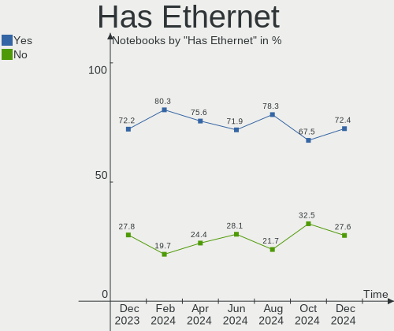
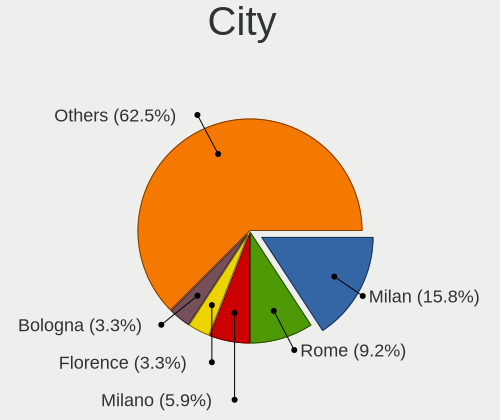
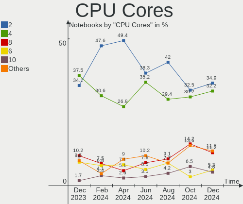

Linux in Italy - Hardware Trends (Notebooks)
--------------------------------------------

A project to identify most popular hardware characteristics and track their change
over time based on data collected by Linux users at https://Linux-Hardware.org.

Anyone can contribute to this report by the [hw-probe](https://github.com/linuxhw/hw-probe) tool:

    sudo -E hw-probe -all -upload

Period: Jun, 2023.

Contents
--------

* [ System ](#system)
  - [ OS                       ](#os)
  - [ OS Family                ](#os-family)
  - [ Kernel                   ](#kernel)
  - [ Kernel Family            ](#kernel-family)
  - [ Kernel Major Ver.        ](#kernel-major-ver)
  - [ Arch                     ](#arch)
  - [ DE                       ](#de)
  - [ Display Server           ](#display-server)
  - [ Display Manager          ](#display-manager)
  - [ OS Lang                  ](#os-lang)
  - [ Boot Mode                ](#boot-mode)
  - [ Filesystem               ](#filesystem)
  - [ Part. scheme             ](#part-scheme)
  - [ Dual Boot with Linux/BSD ](#dual-boot-with-linuxbsd)
  - [ Dual Boot (Win)          ](#dual-boot-win)

* [ Board ](#board)
  - [ Vendor                   ](#vendor)
  - [ Model                    ](#model)
  - [ Model Family             ](#model-family)
  - [ MFG Year                 ](#mfg-year)
  - [ Form Factor              ](#form-factor)
  - [ Secure Boot              ](#secure-boot)
  - [ Coreboot                 ](#coreboot)
  - [ RAM Size                 ](#ram-size)
  - [ RAM Used                 ](#ram-used)
  - [ Total Drives             ](#total-drives)
  - [ Has CD-ROM               ](#has-cd-rom)
  - [ Has Ethernet             ](#has-ethernet)
  - [ Has WiFi                 ](#has-wifi)
  - [ Has Bluetooth            ](#has-bluetooth)

* [ Location ](#location)
  - [ Country                  ](#country)
  - [ City                     ](#city)

* [ Drives ](#drives)
  - [ Drive Vendor             ](#drive-vendor)
  - [ Drive Model              ](#drive-model)
  - [ HDD Vendor               ](#hdd-vendor)
  - [ SSD Vendor               ](#ssd-vendor)
  - [ Drive Kind               ](#drive-kind)
  - [ Drive Connector          ](#drive-connector)
  - [ Drive Size               ](#drive-size)
  - [ Space Total              ](#space-total)
  - [ Space Used               ](#space-used)
  - [ Malfunc. Drives          ](#malfunc-drives)
  - [ Malfunc. Drive Vendor    ](#malfunc-drive-vendor)
  - [ Malfunc. HDD Vendor      ](#malfunc-hdd-vendor)
  - [ Malfunc. Drive Kind      ](#malfunc-drive-kind)
  - [ Failed Drives            ](#failed-drives)
  - [ Failed Drive Vendor      ](#failed-drive-vendor)
  - [ Drive Status             ](#drive-status)

* [ Storage controller ](#storage-controller)
  - [ Storage Vendor           ](#storage-vendor)
  - [ Storage Model            ](#storage-model)
  - [ Storage Kind             ](#storage-kind)

* [ Processor ](#processor)
  - [ CPU Vendor               ](#cpu-vendor)
  - [ CPU Model                ](#cpu-model)
  - [ CPU Model Family         ](#cpu-model-family)
  - [ CPU Cores                ](#cpu-cores)
  - [ CPU Sockets              ](#cpu-sockets)
  - [ CPU Threads              ](#cpu-threads)
  - [ CPU Op-Modes             ](#cpu-op-modes)
  - [ CPU Microcode            ](#cpu-microcode)
  - [ CPU Microarch            ](#cpu-microarch)

* [ Graphics ](#graphics)
  - [ GPU Vendor               ](#gpu-vendor)
  - [ GPU Model                ](#gpu-model)
  - [ GPU Combo                ](#gpu-combo)
  - [ GPU Driver               ](#gpu-driver)
  - [ GPU Memory               ](#gpu-memory)

* [ Monitor ](#monitor)
  - [ Monitor Vendor           ](#monitor-vendor)
  - [ Monitor Model            ](#monitor-model)
  - [ Monitor Resolution       ](#monitor-resolution)
  - [ Monitor Diagonal         ](#monitor-diagonal)
  - [ Monitor Width            ](#monitor-width)
  - [ Aspect Ratio             ](#aspect-ratio)
  - [ Monitor Area             ](#monitor-area)
  - [ Pixel Density            ](#pixel-density)
  - [ Multiple Monitors        ](#multiple-monitors)

* [ Network ](#network)
  - [ Net Controller Vendor    ](#net-controller-vendor)
  - [ Net Controller Model     ](#net-controller-model)
  - [ Wireless Vendor          ](#wireless-vendor)
  - [ Wireless Model           ](#wireless-model)
  - [ Ethernet Vendor          ](#ethernet-vendor)
  - [ Ethernet Model           ](#ethernet-model)
  - [ Net Controller Kind      ](#net-controller-kind)
  - [ Used Controller          ](#used-controller)
  - [ NICs                     ](#nics)
  - [ IPv6                     ](#ipv6)

* [ Bluetooth ](#bluetooth)
  - [ Bluetooth Vendor         ](#bluetooth-vendor)
  - [ Bluetooth Model          ](#bluetooth-model)

* [ Sound ](#sound)
  - [ Sound Vendor             ](#sound-vendor)
  - [ Sound Model              ](#sound-model)

* [ Memory ](#memory)
  - [ Memory Vendor            ](#memory-vendor)
  - [ Memory Model             ](#memory-model)
  - [ Memory Kind              ](#memory-kind)
  - [ Memory Form Factor       ](#memory-form-factor)
  - [ Memory Size              ](#memory-size)
  - [ Memory Speed             ](#memory-speed)

* [ Printers & scanners ](#printers--scanners)
  - [ Printer Vendor           ](#printer-vendor)
  - [ Printer Model            ](#printer-model)
  - [ Scanner Vendor           ](#scanner-vendor)
  - [ Scanner Model            ](#scanner-model)

* [ Camera ](#camera)
  - [ Camera Vendor            ](#camera-vendor)
  - [ Camera Model             ](#camera-model)

* [ Security ](#security)
  - [ Fingerprint Vendor       ](#fingerprint-vendor)
  - [ Fingerprint Model        ](#fingerprint-model)
  - [ Chipcard Vendor          ](#chipcard-vendor)
  - [ Chipcard Model           ](#chipcard-model)

* [ Unsupported ](#unsupported)
  - [ Unsupported Devices      ](#unsupported-devices)
  - [ Unsupported Device Types ](#unsupported-device-types)

System
------

OS
--

Installed operating systems

| Name                         | Notebooks | Percent |
|------------------------------|-----------|---------|
| Ubuntu 22.04                 | 16        | 17.78%  |
| Fedora 38                    | 7         | 7.78%   |
| Ubuntu 23.04                 | 6         | 6.67%   |
| Debian 11                    | 6         | 6.67%   |
| OpenMandriva 23.03           | 5         | 5.56%   |
| OpenMandriva 23.06           | 4         | 4.44%   |
| Linux Mint 21.1              | 4         | 4.44%   |
| EndeavourOS Rolling          | 4         | 4.44%   |
| Arch Rolling                 | 4         | 4.44%   |
| Zorin 16                     | 3         | 3.33%   |
| Ubuntu 18.04                 | 2         | 2.22%   |
| Lubuntu 22.04                | 2         | 2.22%   |
| LMDE 5                       | 2         | 2.22%   |
| Linux Mint 21                | 2         | 2.22%   |
| Kubuntu 22.04                | 2         | 2.22%   |
| Debian 12                    | 2         | 2.22%   |
| Xubuntu 23.04                | 1         | 1.11%   |
| Xubuntu 22.04                | 1         | 1.11%   |
| Ubuntu 20.04                 | 1         | 1.11%   |
| SteamOS 3.4.8                | 1         | 1.11%   |
| Pop!_OS 22.04                | 1         | 1.11%   |
| Parrot 5.3                   | 1         | 1.11%   |
| openSUSE Tumbleweed-XXXXXXXX | 1         | 1.11%   |
| OpenMandriva 4.3             | 1         | 1.11%   |
| Openmamba 2023.1             | 1         | 1.11%   |
| NixOS 23.05                  | 1         | 1.11%   |
| Manjaro                      | 1         | 1.11%   |
| Lubuntu 20.04                | 1         | 1.11%   |
| Kubuntu 23.04                | 1         | 1.11%   |
| Kali 2023.2                  | 1         | 1.11%   |
| Garuda Linux Soaring         | 1         | 1.11%   |
| Fedora 37                    | 1         | 1.11%   |
| Fedora 36                    | 1         | 1.11%   |
| Debian 10                    | 1         | 1.11%   |
| CachyOS                      | 1         | 1.11%   |

OS Family
---------

OS without a version

| Name         | Notebooks | Percent |
|--------------|-----------|---------|
| Ubuntu       | 25        | 27.78%  |
| OpenMandriva | 10        | 11.11%  |
| Fedora       | 9         | 10%     |
| Debian       | 9         | 10%     |
| Linux Mint   | 6         | 6.67%   |
| EndeavourOS  | 4         | 4.44%   |
| Arch         | 4         | 4.44%   |
| Zorin        | 3         | 3.33%   |
| Lubuntu      | 3         | 3.33%   |
| Kubuntu      | 3         | 3.33%   |
| Xubuntu      | 2         | 2.22%   |
| LMDE         | 2         | 2.22%   |
| SteamOS      | 1         | 1.11%   |
| Pop!_OS      | 1         | 1.11%   |
| Parrot       | 1         | 1.11%   |
| openSUSE     | 1         | 1.11%   |
| Openmamba    | 1         | 1.11%   |
| NixOS        | 1         | 1.11%   |
| Manjaro      | 1         | 1.11%   |
| Kali         | 1         | 1.11%   |
| Garuda Linux | 1         | 1.11%   |
| CachyOS      | 1         | 1.11%   |

Kernel
------

Version of the Linux kernel

| Version                | Notebooks | Percent |
|------------------------|-----------|---------|
| 5.19.0-43-generic      | 9         | 10%     |
| 5.10.0-23-amd64        | 7         | 7.78%   |
| 6.2.6-desktop-1omv2390 | 5         | 5.56%   |
| 5.19.0-45-generic      | 5         | 5.56%   |
| 6.3.5-desktop-3omv2390 | 4         | 4.44%   |
| 5.15.0-75-generic      | 4         | 4.44%   |
| 6.2.9-300.fc38.x86_64  | 3         | 3.33%   |
| 6.2.0-23-generic       | 3         | 3.33%   |
| 6.2.0-20-generic       | 3         | 3.33%   |
| 5.19.0-42-generic      | 3         | 3.33%   |
| 5.15.0-73-generic      | 3         | 3.33%   |
| 6.3.5-arch1-1          | 2         | 2.22%   |
| 6.1.0-9-amd64          | 2         | 2.22%   |
| 5.4.0-150-generic      | 2         | 2.22%   |
| 5.19.0-46-generic      | 2         | 2.22%   |
| 6.3.9-arch1-1          | 1         | 1.11%   |
| 6.3.8-zen1-1-zen       | 1         | 1.11%   |
| 6.3.8-200.fc38.x86_64  | 1         | 1.11%   |
| 6.3.7-arch1-1          | 1         | 1.11%   |
| 6.3.7-1-cachyos        | 1         | 1.11%   |
| 6.3.7-060307-generic   | 1         | 1.11%   |
| 6.3.6-arch1-1          | 1         | 1.11%   |
| 6.3.6-200.fc38.x86_64  | 1         | 1.11%   |
| 6.3.5-100.fc37.x86_64  | 1         | 1.11%   |
| 6.3.4-201.fc38.x86_64  | 1         | 1.11%   |
| 6.3.4-1-default        | 1         | 1.11%   |
| 6.2.6-76060206-generic | 1         | 1.11%   |
| 6.2.15-100.fc36.x86_64 | 1         | 1.11%   |
| 6.2.14-300.fc38.x86_64 | 1         | 1.11%   |
| 6.2.0-24-generic       | 1         | 1.11%   |
| 6.1.35-1-lts           | 1         | 1.11%   |
| 6.1.34                 | 1         | 1.11%   |
| 6.1.31-1-MANJARO       | 1         | 1.11%   |
| 6.1.31-1-lts           | 1         | 1.11%   |
| 6.1.26-1-lts           | 1         | 1.11%   |
| 6.1.24-1mamba-x86_64   | 1         | 1.11%   |
| 6.1.0-kali9-686-pae    | 1         | 1.11%   |
| 6.1.0-1parrot1-amd64   | 1         | 1.11%   |
| 6.1.0-1013-oem         | 1         | 1.11%   |
| 5.3.0-7648-generic     | 1         | 1.11%   |

Kernel Family
-------------

Linux kernel without a distro release

| Version | Notebooks | Percent |
|---------|-----------|---------|
| 5.19.0  | 20        | 22.22%  |
| 5.15.0  | 10        | 11.11%  |
| 5.10.0  | 9         | 10%     |
| 6.3.5   | 7         | 7.78%   |
| 6.2.0   | 7         | 7.78%   |
| 6.2.6   | 6         | 6.67%   |
| 6.1.0   | 5         | 5.56%   |
| 6.3.7   | 3         | 3.33%   |
| 6.2.9   | 3         | 3.33%   |
| 6.3.8   | 2         | 2.22%   |
| 6.3.6   | 2         | 2.22%   |
| 6.3.4   | 2         | 2.22%   |
| 6.1.31  | 2         | 2.22%   |
| 5.4.0   | 2         | 2.22%   |
| 6.3.9   | 1         | 1.11%   |
| 6.2.15  | 1         | 1.11%   |
| 6.2.14  | 1         | 1.11%   |
| 6.1.35  | 1         | 1.11%   |
| 6.1.34  | 1         | 1.11%   |
| 6.1.26  | 1         | 1.11%   |
| 6.1.24  | 1         | 1.11%   |
| 5.3.0   | 1         | 1.11%   |
| 5.16.7  | 1         | 1.11%   |
| 5.13.0  | 1         | 1.11%   |

Kernel Major Ver.
-----------------

Linux kernel major version

| Version | Notebooks | Percent |
|---------|-----------|---------|
| 5.19    | 20        | 22.22%  |
| 6.2     | 18        | 20%     |
| 6.3     | 17        | 18.89%  |
| 6.1     | 11        | 12.22%  |
| 5.15    | 10        | 11.11%  |
| 5.10    | 9         | 10%     |
| 5.4     | 2         | 2.22%   |
| 5.3     | 1         | 1.11%   |
| 5.16    | 1         | 1.11%   |
| 5.13    | 1         | 1.11%   |

Arch
----

OS architecture (x86_64, i586, etc.)

| Name   | Notebooks | Percent |
|--------|-----------|---------|
| x86_64 | 89        | 98.89%  |
| i686   | 1         | 1.11%   |

DE
--

Desktop Environment

| Name          | Notebooks | Percent |
|---------------|-----------|---------|
| GNOME         | 43        | 47.78%  |
| KDE5          | 20        | 22.22%  |
| XFCE          | 7         | 7.78%   |
| X-Cinnamon    | 7         | 7.78%   |
| LXQt          | 6         | 6.67%   |
| Unknown       | 3         | 3.33%   |
| MATE          | 2         | 2.22%   |
| GNOME Classic | 2         | 2.22%   |

Display Server
--------------

X11 or Wayland

| Name    | Notebooks | Percent |
|---------|-----------|---------|
| X11     | 52        | 57.78%  |
| Wayland | 35        | 38.89%  |
| Tty     | 3         | 3.33%   |

Display Manager
---------------

SDDM, LightDM, etc.

| Name    | Notebooks | Percent |
|---------|-----------|---------|
| GDM3    | 26        | 28.89%  |
| Unknown | 24        | 26.67%  |
| SDDM    | 19        | 21.11%  |
| GDM     | 11        | 12.22%  |
| LightDM | 10        | 11.11%  |

OS Lang
-------

Language

| Lang       | Notebooks | Percent |
|------------|-----------|---------|
| it_IT      | 55        | 61.11%  |
| en_US      | 29        | 32.22%  |
| en_GB      | 3         | 3.33%   |
| it_IT@euro | 1         | 1.11%   |
| C          | 1         | 1.11%   |
| Unknown    | 1         | 1.11%   |

Boot Mode
---------

EFI or BIOS

| Mode | Notebooks | Percent |
|------|-----------|---------|
| BIOS | 49        | 54.44%  |
| EFI  | 41        | 45.56%  |

Filesystem
----------

Type of filesystem

| Type    | Notebooks | Percent |
|---------|-----------|---------|
| Ext4    | 52        | 57.78%  |
| Tmpfs   | 21        | 23.33%  |
| Btrfs   | 9         | 10%     |
| Overlay | 6         | 6.67%   |
| Zfs     | 1         | 1.11%   |
| Xfs     | 1         | 1.11%   |

Part. scheme
------------

Scheme of partitioning

| Type    | Notebooks | Percent |
|---------|-----------|---------|
| GPT     | 53        | 58.89%  |
| Unknown | 21        | 23.33%  |
| MBR     | 16        | 17.78%  |

Dual Boot with Linux/BSD
------------------------

Hosting more than one Linux/BSD

| Dual boot | Notebooks | Percent |
|-----------|-----------|---------|
| No        | 74        | 82.22%  |
| Yes       | 16        | 17.78%  |

Dual Boot (Win)
---------------

Hosting Linux and Windows

| Dual boot | Notebooks | Percent |
|-----------|-----------|---------|
| No        | 63        | 70%     |
| Yes       | 27        | 30%     |

Board
-----

Vendor
------

Motherboard manufacturer

| Name                | Notebooks | Percent |
|---------------------|-----------|---------|
| Hewlett-Packard     | 22        | 24.44%  |
| Lenovo              | 16        | 17.78%  |
| Dell                | 12        | 13.33%  |
| Acer                | 12        | 13.33%  |
| MSI                 | 5         | 5.56%   |
| HUAWEI              | 5         | 5.56%   |
| ASUSTek Computer    | 5         | 5.56%   |
| Samsung Electronics | 3         | 3.33%   |
| Sony                | 2         | 2.22%   |
| Onda TLC            | 2         | 2.22%   |
| Valve               | 1         | 1.11%   |
| Toshiba             | 1         | 1.11%   |
| Packard Bell        | 1         | 1.11%   |
| Microtech           | 1         | 1.11%   |
| HONOR               | 1         | 1.11%   |
| Google              | 1         | 1.11%   |

Model
-----

Motherboard model

| Name                                  | Notebooks | Percent |
|---------------------------------------|-----------|---------|
| Onda TLC ONDA Oliver                  | 2         | 2.22%   |
| HUAWEI BOD-WXX9                       | 2         | 2.22%   |
| HP Pavilion dv6                       | 2         | 2.22%   |
| HP EliteBook 2530p                    | 2         | 2.22%   |
| Valve Jupiter                         | 1         | 1.11%   |
| Toshiba Satellite A300                | 1         | 1.11%   |
| Sony VGN-NS21M_W                      | 1         | 1.11%   |
| Sony SVE1713X1EB                      | 1         | 1.11%   |
| Samsung RC420/RC520/RC720             | 1         | 1.11%   |
| Samsung N130                          | 1         | 1.11%   |
| Samsung 300E4C/300E5C/300E7C          | 1         | 1.11%   |
| Packard Bell EasyNote TJ65            | 1         | 1.11%   |
| MSI PS63 Modern 8RC                   | 1         | 1.11%   |
| MSI Prestige 15 A12UC                 | 1         | 1.11%   |
| MSI GL75 Leopard 10SER                | 1         | 1.11%   |
| MSI GL73 8RE                          | 1         | 1.11%   |
| MSI GF63 Thin 9RCX                    | 1         | 1.11%   |
| Microtech CoreBook Lite               | 1         | 1.11%   |
| Lenovo ThinkPad X270 W10DG 20K5S3HG00 | 1         | 1.11%   |
| Lenovo ThinkPad T480 20L6S5LF00       | 1         | 1.11%   |
| Lenovo ThinkPad T470 20HES0FW00       | 1         | 1.11%   |
| Lenovo ThinkPad T15 Gen 1 20S6000NIX  | 1         | 1.11%   |
| Lenovo ThinkPad SL 2746EDG            | 1         | 1.11%   |
| Lenovo ThinkPad E560 20EV000UIX       | 1         | 1.11%   |
| Lenovo Legion 5 Pro 16ARH7H 82RG      | 1         | 1.11%   |
| Lenovo Legion 5 Pro 16ACH6H 82JQ      | 1         | 1.11%   |
| Lenovo IdeaPad Gaming 3 15ARH05 82EY  | 1         | 1.11%   |
| Lenovo IdeaPad Gaming 3 15ACH6 82K2   | 1         | 1.11%   |
| Lenovo IdeaPad 5 15ALC05 82LN         | 1         | 1.11%   |
| Lenovo IdeaPad 330S-15IKB 81F5        | 1         | 1.11%   |
| Lenovo IdeaPad 3 15ITL6 82H8          | 1         | 1.11%   |
| Lenovo IdeaPad 3 15IGL05 81WQ         | 1         | 1.11%   |
| Lenovo IdeaPad 3 15ALC6 82KU          | 1         | 1.11%   |
| Lenovo G50-45 80E3                    | 1         | 1.11%   |
| HUAWEI MACH-WX9                       | 1         | 1.11%   |
| HUAWEI KPR-WX9                        | 1         | 1.11%   |
| HUAWEI HKD-WXX                        | 1         | 1.11%   |
| HONOR BBR-WAX9                        | 1         | 1.11%   |
| HP ZBook 15 G6                        | 1         | 1.11%   |
| HP ZBook 15 G2                        | 1         | 1.11%   |

Model Family
------------

Motherboard model prefix

| Name                  | Notebooks | Percent |
|-----------------------|-----------|---------|
| Acer Aspire           | 11        | 12.22%  |
| Lenovo IdeaPad        | 7         | 7.78%   |
| Dell Latitude         | 7         | 7.78%   |
| Lenovo ThinkPad       | 6         | 6.67%   |
| HP Pavilion           | 6         | 6.67%   |
| HP EliteBook          | 4         | 4.44%   |
| Dell XPS              | 3         | 3.33%   |
| Onda TLC ONDA         | 2         | 2.22%   |
| Lenovo Legion         | 2         | 2.22%   |
| HUAWEI BOD-WXX9       | 2         | 2.22%   |
| HP ZBook              | 2         | 2.22%   |
| HP Laptop             | 2         | 2.22%   |
| Dell Vostro           | 2         | 2.22%   |
| ASUS ASUS             | 2         | 2.22%   |
| Valve Jupiter         | 1         | 1.11%   |
| Toshiba Satellite     | 1         | 1.11%   |
| Sony VGN-NS21M        | 1         | 1.11%   |
| Sony SVE1713X1EB      | 1         | 1.11%   |
| Samsung RC420         | 1         | 1.11%   |
| Samsung N130          | 1         | 1.11%   |
| Samsung 300E4C        | 1         | 1.11%   |
| Packard Bell EasyNote | 1         | 1.11%   |
| MSI PS63              | 1         | 1.11%   |
| MSI Prestige          | 1         | 1.11%   |
| MSI GL75              | 1         | 1.11%   |
| MSI GL73              | 1         | 1.11%   |
| MSI GF63              | 1         | 1.11%   |
| Microtech CoreBook    | 1         | 1.11%   |
| Lenovo G50-45         | 1         | 1.11%   |
| HUAWEI MACH-WX9       | 1         | 1.11%   |
| HUAWEI KPR-WX9        | 1         | 1.11%   |
| HUAWEI HKD-WXX        | 1         | 1.11%   |
| HONOR BBR-WAX9        | 1         | 1.11%   |
| HP Stream             | 1         | 1.11%   |
| HP Presario           | 1         | 1.11%   |
| HP OMEN               | 1         | 1.11%   |
| HP G42                | 1         | 1.11%   |
| HP ENVY               | 1         | 1.11%   |
| HP Compaq             | 1         | 1.11%   |
| HP 255                | 1         | 1.11%   |

MFG Year
--------

Motherboard manufacture year

| Year | Notebooks | Percent |
|------|-----------|---------|
| 2021 | 15        | 16.67%  |
| 2008 | 9         | 10%     |
| 2019 | 7         | 7.78%   |
| 2018 | 7         | 7.78%   |
| 2012 | 7         | 7.78%   |
| 2022 | 6         | 6.67%   |
| 2020 | 6         | 6.67%   |
| 2017 | 6         | 6.67%   |
| 2015 | 5         | 5.56%   |
| 2011 | 5         | 5.56%   |
| 2010 | 5         | 5.56%   |
| 2009 | 4         | 4.44%   |
| 2014 | 3         | 3.33%   |
| 2016 | 2         | 2.22%   |
| 2023 | 1         | 1.11%   |
| 2013 | 1         | 1.11%   |
| 2006 | 1         | 1.11%   |

Form Factor
-----------

Physical design of the computer

| Name     | Notebooks | Percent |
|----------|-----------|---------|
| Notebook | 90        | 100%    |

Secure Boot
-----------

Enabled or disabled

| State    | Notebooks | Percent |
|----------|-----------|---------|
| Disabled | 82        | 91.11%  |
| Enabled  | 8         | 8.89%   |

Coreboot
--------

Have coreboot on board

| Used | Notebooks | Percent |
|------|-----------|---------|
| No   | 89        | 98.89%  |
| Yes  | 1         | 1.11%   |

RAM Size
--------

Total RAM memory

| Size in GB  | Notebooks | Percent |
|-------------|-----------|---------|
| 4.01-8.0    | 27        | 30%     |
| 3.01-4.0    | 22        | 24.44%  |
| 16.01-24.0  | 19        | 21.11%  |
| 8.01-16.0   | 14        | 15.56%  |
| 32.01-64.0  | 3         | 3.33%   |
| 2.01-3.0    | 2         | 2.22%   |
| 24.01-32.0  | 1         | 1.11%   |
| 64.01-256.0 | 1         | 1.11%   |
| 1.01-2.0    | 1         | 1.11%   |

RAM Used
--------

Used RAM memory

| Used GB    | Notebooks | Percent |
|------------|-----------|---------|
| 1.01-2.0   | 31        | 34.44%  |
| 4.01-8.0   | 21        | 23.33%  |
| 2.01-3.0   | 20        | 22.22%  |
| 3.01-4.0   | 10        | 11.11%  |
| 8.01-16.0  | 3         | 3.33%   |
| 0.51-1.0   | 3         | 3.33%   |
| 32.01-64.0 | 1         | 1.11%   |
| 0.01-0.5   | 1         | 1.11%   |

Total Drives
------------

Number of drives on board

| Drives | Notebooks | Percent |
|--------|-----------|---------|
| 1      | 66        | 73.33%  |
| 2      | 20        | 22.22%  |
| 3      | 3         | 3.33%   |
| 0      | 1         | 1.11%   |

Has CD-ROM
----------

Has CD-ROM on board

| Presented | Notebooks | Percent |
|-----------|-----------|---------|
| No        | 60        | 66.67%  |
| Yes       | 30        | 33.33%  |

Has Ethernet
------------

Has Ethernet on board

| Presented | Notebooks | Percent |
|-----------|-----------|---------|
| Yes       | 69        | 76.67%  |
| No        | 21        | 23.33%  |

Has WiFi
--------

Has WiFi module

| Presented | Notebooks | Percent |
|-----------|-----------|---------|
| Yes       | 90        | 100%    |

Has Bluetooth
-------------

Has Bluetooth module

| Presented | Notebooks | Percent |
|-----------|-----------|---------|
| Yes       | 69        | 76.67%  |
| No        | 21        | 23.33%  |

Location
--------

Country
-------

Geographic location (country)

| Country | Notebooks | Percent |
|---------|-----------|---------|
| Italy   | 90        | 100%    |

City
----

Geographic location (city)

| City                 | Notebooks | Percent |
|----------------------|-----------|---------|
| Milan                | 14        | 15.56%  |
| Rome                 | 12        | 13.33%  |
| Turin                | 5         | 5.56%   |
| Naples               | 4         | 4.44%   |
| Florence             | 4         | 4.44%   |
| Milano               | 3         | 3.33%   |
| Venice               | 2         | 2.22%   |
| Padova               | 2         | 2.22%   |
| Villa San Pietro     | 1         | 1.11%   |
| Vicenza              | 1         | 1.11%   |
| Verona               | 1         | 1.11%   |
| Trento               | 1         | 1.11%   |
| Trabia               | 1         | 1.11%   |
| Torre Boldone        | 1         | 1.11%   |
| Soave                | 1         | 1.11%   |
| Saronno              | 1         | 1.11%   |
| Santa Maria di Sala  | 1         | 1.11%   |
| Rozzano              | 1         | 1.11%   |
| Ronchis              | 1         | 1.11%   |
| Rho                  | 1         | 1.11%   |
| Preganziol           | 1         | 1.11%   |
| Pisa                 | 1         | 1.11%   |
| Pesaro               | 1         | 1.11%   |
| Palermo              | 1         | 1.11%   |
| Monza                | 1         | 1.11%   |
| Monticelli Pavese    | 1         | 1.11%   |
| Monteriggioni        | 1         | 1.11%   |
| Miasino              | 1         | 1.11%   |
| Lido di Jesolo       | 1         | 1.11%   |
| Lecco                | 1         | 1.11%   |
| Genoa                | 1         | 1.11%   |
| Fino Mornasco        | 1         | 1.11%   |
| Due Carrare          | 1         | 1.11%   |
| Cusano Milanino      | 1         | 1.11%   |
| Corato               | 1         | 1.11%   |
| Cicagna              | 1         | 1.11%   |
| Castello di Cisterna | 1         | 1.11%   |
| Casalbordino         | 1         | 1.11%   |
| Carrara              | 1         | 1.11%   |
| Carate Brianza       | 1         | 1.11%   |

Drives
------

Drive Vendor
------------

Hard drive vendors

| Vendor                         | Notebooks | Drives | Percent |
|--------------------------------|-----------|--------|---------|
| Samsung Electronics            | 16        | 17     | 14.68%  |
| WDC                            | 11        | 11     | 10.09%  |
| Toshiba                        | 8         | 9      | 7.34%   |
| Crucial                        | 8         | 8      | 7.34%   |
| SanDisk                        | 7         | 7      | 6.42%   |
| Hitachi                        | 7         | 7      | 6.42%   |
| Unknown                        | 6         | 6      | 5.5%    |
| Seagate                        | 6         | 6      | 5.5%    |
| Intel                          | 5         | 5      | 4.59%   |
| Micron Technology              | 4         | 4      | 3.67%   |
| Kingston                       | 4         | 4      | 3.67%   |
| HGST                           | 3         | 4      | 2.75%   |
| PNY                            | 2         | 2      | 1.83%   |
| Micron/Crucial Technology      | 2         | 2      | 1.83%   |
| KIOXIA                         | 2         | 2      | 1.83%   |
| Kingston Technology Company    | 2         | 2      | 1.83%   |
| Yangtze Memory Technologies    | 1         | 1      | 0.92%   |
| Union Memory                   | 1         | 1      | 0.92%   |
| T-FORCE                        | 1         | 1      | 0.92%   |
| SSSTC                          | 1         | 1      | 0.92%   |
| SPCC                           | 1         | 1      | 0.92%   |
| Solid State Storage Technology | 1         | 1      | 0.92%   |
| SK hynix                       | 1         | 1      | 0.92%   |
| Seapiy                         | 1         | 1      | 0.92%   |
| SCY                            | 1         | 1      | 0.92%   |
| SABRENT                        | 1         | 1      | 0.92%   |
| Phison                         | 1         | 1      | 0.92%   |
| KingSpec                       | 1         | 1      | 0.92%   |
| HS-SSD-E100                    | 1         | 1      | 0.92%   |
| Fujitsu                        | 1         | 1      | 0.92%   |
| China                          | 1         | 1      | 0.92%   |
| ADATA Technology               | 1         | 1      | 0.92%   |

Drive Model
-----------

Hard drive models

| Model                                               | Notebooks | Percent |
|-----------------------------------------------------|-----------|---------|
| Intel SSDPEKNW512GZL 512GB                          | 3         | 2.73%   |
| Crucial CT500MX500SSD1 500GB                        | 3         | 2.73%   |
| Toshiba XG6 NVMe SSD Controller 2TB                 | 2         | 1.82%   |
| Seagate ST1000LM024 HN-M101MBB 1TB                  | 2         | 1.82%   |
| Samsung NVMe SSD Controller SM981/PM981/PM983 250GB | 2         | 1.82%   |
| Samsung MZVLQ512HBLU-00B00 512GB                    | 2         | 1.82%   |
| Micron/Crucial P2 NVMe PCIe SSD 4TB                 | 2         | 1.82%   |
| Crucial CT1000MX500SSD1 1TB                         | 2         | 1.82%   |
| Yangtze Memory YMTC PC005 256GB                     | 1         | 0.91%   |
| WDC WDS240G2G0A-00JH30 240GB SSD                    | 1         | 0.91%   |
| WDC WD6400BPVT-22HXZT3 640GB                        | 1         | 0.91%   |
| WDC WD5000LPVX-75V0TT0 500GB                        | 1         | 0.91%   |
| WDC WD5000LPCX-24C6HT0 500GB                        | 1         | 0.91%   |
| WDC WD5000BEVT-22A0RT0 500GB                        | 1         | 0.91%   |
| WDC WD3200BPVT-22ZEST0 320GB                        | 1         | 0.91%   |
| WDC WD16 00AVBB-63SYA0 160GB                        | 1         | 0.91%   |
| WDC PC SN730 SDBPNTY-1T00-1101 1TB                  | 1         | 0.91%   |
| WDC PC SN730 SDBPNTY-1T00-1032 1TB                  | 1         | 0.91%   |
| WDC PC SN730 NVMe 1024GB                            | 1         | 0.91%   |
| WDC PC SN520 SDAPMUW-512G-1101 512GB                | 1         | 0.91%   |
| Unknown SD/MMC/MS PRO 250GB                         | 1         | 0.91%   |
| Unknown SC128  128GB                                | 1         | 0.91%   |
| Unknown NVMe SSD Drive 512GB                        | 1         | 0.91%   |
| Unknown MMC Card  64GB                              | 1         | 0.91%   |
| Unknown MMC Card  512GB                             | 1         | 0.91%   |
| Unknown MMC Card  128GB                             | 1         | 0.91%   |
| Union Memory UMIS RPJTJ128MEE1MWX 128GB             | 1         | 0.91%   |
| Toshiba MQ04ABF100 1TB                              | 1         | 0.91%   |
| Toshiba MK5056GSY 500GB                             | 1         | 0.91%   |
| Toshiba MK2529GSG 250GB                             | 1         | 0.91%   |
| Toshiba KXG50ZNV512G NVMe 512GB                     | 1         | 0.91%   |
| Toshiba KBG30ZMV512G 512GB                          | 1         | 0.91%   |
| Toshiba KBG30ZMV256G 256GB                          | 1         | 0.91%   |
| Toshiba BG3 NVMe SSD Controller 512GB               | 1         | 0.91%   |
| T-FORCE 512GB                                       | 1         | 0.91%   |
| SSSTC CL1-3D512-Q11 NVMe 512GB                      | 1         | 0.91%   |
| SPCC Solid State Disk 512GB                         | 1         | 0.91%   |
| Solid State Storage SSSTC CL1-8D256 256GB           | 1         | 0.91%   |
| SK hynix SKHynix_HFS512GDE9X084N 512GB              | 1         | 0.91%   |
| Seapiy E535N M.2 2280 256GB                         | 1         | 0.91%   |

HDD Vendor
----------

Hard disk drive vendors

| Vendor              | Notebooks | Drives | Percent |
|---------------------|-----------|--------|---------|
| Hitachi             | 7         | 7      | 25%     |
| WDC                 | 6         | 6      | 21.43%  |
| Seagate             | 6         | 6      | 21.43%  |
| Toshiba             | 3         | 3      | 10.71%  |
| HGST                | 3         | 4      | 10.71%  |
| Unknown             | 1         | 1      | 3.57%   |
| Samsung Electronics | 1         | 1      | 3.57%   |
| Fujitsu             | 1         | 1      | 3.57%   |

SSD Vendor
----------

Solid state drive vendors

| Vendor              | Notebooks | Drives | Percent |
|---------------------|-----------|--------|---------|
| Crucial             | 8         | 8      | 25.81%  |
| SanDisk             | 6         | 6      | 19.35%  |
| Samsung Electronics | 5         | 5      | 16.13%  |
| Kingston            | 4         | 4      | 12.9%   |
| PNY                 | 2         | 2      | 6.45%   |
| Micron Technology   | 2         | 2      | 6.45%   |
| WDC                 | 1         | 1      | 3.23%   |
| SPCC                | 1         | 1      | 3.23%   |
| KingSpec            | 1         | 1      | 3.23%   |
| China               | 1         | 1      | 3.23%   |

Drive Kind
----------

HDD or SSD

| Kind    | Notebooks | Drives | Percent |
|---------|-----------|--------|---------|
| NVMe    | 39        | 44     | 37.86%  |
| SSD     | 30        | 31     | 29.13%  |
| HDD     | 26        | 29     | 25.24%  |
| MMC     | 4         | 4      | 3.88%   |
| Unknown | 4         | 4      | 3.88%   |

Drive Connector
---------------

SATA, SAS, NVMe, etc.

| Type | Notebooks | Drives | Percent |
|------|-----------|--------|---------|
| SATA | 55        | 61     | 54.46%  |
| NVMe | 38        | 43     | 37.62%  |
| SAS  | 4         | 4      | 3.96%   |
| MMC  | 4         | 4      | 3.96%   |

Drive Size
----------

Size of hard drive

| Size in TB | Notebooks | Drives | Percent |
|------------|-----------|--------|---------|
| 0.01-0.5   | 39        | 42     | 70.91%  |
| 0.51-1.0   | 13        | 15     | 23.64%  |
| 1.01-2.0   | 3         | 3      | 5.45%   |

Space Total
-----------

Amount of disk space available on the file system

| Size in GB     | Notebooks | Percent |
|----------------|-----------|---------|
| 101-250        | 29        | 32.22%  |
| 251-500        | 21        | 23.33%  |
| 501-1000       | 14        | 15.56%  |
| 1-20           | 9         | 10%     |
| 1001-2000      | 5         | 5.56%   |
| Unknown        | 4         | 4.44%   |
| More than 3000 | 3         | 3.33%   |
| 51-100         | 3         | 3.33%   |
| 21-50          | 1         | 1.11%   |
| 2001-3000      | 1         | 1.11%   |

Space Used
----------

Amount of used disk space

| Used GB        | Notebooks | Percent |
|----------------|-----------|---------|
| 1-20           | 34        | 37.78%  |
| 21-50          | 16        | 17.78%  |
| 101-250        | 13        | 14.44%  |
| 51-100         | 9         | 10%     |
| 251-500        | 7         | 7.78%   |
| Unknown        | 4         | 4.44%   |
| 501-1000       | 3         | 3.33%   |
| More than 3000 | 2         | 2.22%   |
| 1001-2000      | 2         | 2.22%   |

Malfunc. Drives
---------------

Drive models with a malfunction

| Model                                        | Notebooks | Drives | Percent |
|----------------------------------------------|-----------|--------|---------|
| WDC WD3200BPVT-22ZEST0 320GB                 | 1         | 1      | 12.5%   |
| Samsung Electronics MZVLQ512HBLU-00B00 512GB | 1         | 1      | 12.5%   |
| Samsung Electronics HM160HC 160GB            | 1         | 1      | 12.5%   |
| Hitachi HTS547564A9E384 640GB                | 1         | 1      | 12.5%   |
| Hitachi HTS547550A9E384 500GB                | 1         | 1      | 12.5%   |
| Hitachi HTS545050A7E380 500GB                | 1         | 1      | 12.5%   |
| Hitachi HTS545032B9A300 320GB                | 1         | 1      | 12.5%   |
| Fujitsu MHW2160BJ G2 160GB                   | 1         | 1      | 12.5%   |

Malfunc. Drive Vendor
---------------------

Vendors of faulty drives

| Vendor              | Notebooks | Drives | Percent |
|---------------------|-----------|--------|---------|
| Hitachi             | 4         | 4      | 50%     |
| Samsung Electronics | 2         | 2      | 25%     |
| WDC                 | 1         | 1      | 12.5%   |
| Fujitsu             | 1         | 1      | 12.5%   |

Malfunc. HDD Vendor
-------------------

Vendors of faulty HDD drives

| Vendor              | Notebooks | Drives | Percent |
|---------------------|-----------|--------|---------|
| Hitachi             | 4         | 4      | 57.14%  |
| WDC                 | 1         | 1      | 14.29%  |
| Samsung Electronics | 1         | 1      | 14.29%  |
| Fujitsu             | 1         | 1      | 14.29%  |

Malfunc. Drive Kind
-------------------

Kinds of faulty drives

| Kind | Notebooks | Drives | Percent |
|------|-----------|--------|---------|
| HDD  | 7         | 7      | 87.5%   |
| NVMe | 1         | 1      | 12.5%   |

Failed Drives
-------------

Failed drive models

Zero info for selected period =(

Failed Drive Vendor
-------------------

Failed drive vendors

Zero info for selected period =(

Drive Status
------------

Number of failed and malfunc. drives

| Status   | Notebooks | Drives | Percent |
|----------|-----------|--------|---------|
| Detected | 50        | 62     | 54.35%  |
| Works    | 34        | 42     | 36.96%  |
| Malfunc  | 8         | 8      | 8.7%    |

Storage controller
------------------

Storage Vendor
--------------

Storage controller vendors

| Vendor                         | Notebooks | Percent |
|--------------------------------|-----------|---------|
| Intel                          | 67        | 60.36%  |
| Samsung Electronics            | 10        | 9.01%   |
| AMD                            | 8         | 7.21%   |
| Toshiba America Info Systems   | 5         | 4.5%    |
| SanDisk                        | 5         | 4.5%    |
| Solid State Storage Technology | 2         | 1.8%    |
| Micron/Crucial Technology      | 2         | 1.8%    |
| Micron Technology              | 2         | 1.8%    |
| KIOXIA                         | 2         | 1.8%    |
| Kingston Technology Company    | 2         | 1.8%    |
| Yangtze Memory Technologies    | 1         | 0.9%    |
| Union Memory (Shenzhen)        | 1         | 0.9%    |
| SK hynix                       | 1         | 0.9%    |
| Phison Electronics             | 1         | 0.9%    |
| ADATA Technology               | 1         | 0.9%    |
| Unknown                        | 1         | 0.9%    |

Storage Model
-------------

Storage controller models

| Model                                                                          | Notebooks | Percent |
|--------------------------------------------------------------------------------|-----------|---------|
| Intel 82801IBM/IEM (ICH9M/ICH9M-E) 4 port SATA Controller [AHCI mode]          | 10        | 8.47%   |
| Intel 7 Series Chipset Family 6-port SATA Controller [AHCI mode]               | 7         | 5.93%   |
| AMD FCH SATA Controller [AHCI mode]                                            | 7         | 5.93%   |
| Intel Sunrise Point-LP SATA Controller [AHCI mode]                             | 6         | 5.08%   |
| Samsung NVMe SSD Controller 980                                                | 5         | 4.24%   |
| Intel Volume Management Device NVMe RAID Controller                            | 5         | 4.24%   |
| Intel 82801 Mobile SATA Controller [RAID mode]                                 | 5         | 4.24%   |
| Intel Non-Volatile memory controller                                           | 4         | 3.39%   |
| SanDisk WD Black SN750 / PC SN730 NVMe SSD                                     | 3         | 2.54%   |
| Samsung NVMe SSD Controller SM981/PM981/PM983                                  | 3         | 2.54%   |
| Intel Celeron/Pentium Silver Processor SATA Controller                         | 3         | 2.54%   |
| Intel Cannon Lake Mobile PCH SATA AHCI Controller                              | 3         | 2.54%   |
| Intel 8 Series/C220 Series Chipset Family 6-port SATA Controller 1 [AHCI mode] | 3         | 2.54%   |
| Intel 6 Series/C200 Series Chipset Family 6 port Mobile SATA AHCI Controller   | 3         | 2.54%   |
| Toshiba America Info Systems XG6 NVMe SSD Controller                           | 2         | 1.69%   |
| Toshiba America Info Systems BG3 NVMe SSD Controller                           | 2         | 1.69%   |
| Solid State Storage CL1-3D256-Q11 NVMe SSD M.2                                 | 2         | 1.69%   |
| Micron/Crucial P2 NVMe PCIe SSD                                                | 2         | 1.69%   |
| Micron 2450 NVMe SSD (DRAM-less)                                               | 2         | 1.69%   |
| KIOXIA NVMe SSD Controller BG4                                                 | 2         | 1.69%   |
| Intel Wildcat Point-LP SATA Controller [AHCI Mode]                             | 2         | 1.69%   |
| Intel HM170/QM170 Chipset SATA Controller [AHCI Mode]                          | 2         | 1.69%   |
| Intel Celeron N3350/Pentium N4200/Atom E3900 Series SATA AHCI Controller       | 2         | 1.69%   |
| Intel 8 Series SATA Controller 1 [AHCI mode]                                   | 2         | 1.69%   |
| Intel 5 Series/3400 Series Chipset 6 port SATA AHCI Controller                 | 2         | 1.69%   |
| Intel 5 Series/3400 Series Chipset 4 port SATA AHCI Controller                 | 2         | 1.69%   |
| Yangtze Memory Non-Volatile memory controller                                  | 1         | 0.85%   |
| Union Memory (Shenzhen) Non-Volatile memory controller                         | 1         | 0.85%   |
| Toshiba America Info Systems XG5 NVMe SSD Controller                           | 1         | 0.85%   |
| SK hynix Gold P31/BC711/PC711 NVMe Solid State Drive                           | 1         | 0.85%   |
| Sandisk PC SN740 NVMe SSD                                                      | 1         | 0.85%   |
| SanDisk PC SN520 NVMe SSD                                                      | 1         | 0.85%   |
| Samsung NVMe SSD Controller SM961/PM961/SM963                                  | 1         | 0.85%   |
| Samsung NVMe SSD Controller PM9A1/PM9A3/980PRO                                 | 1         | 0.85%   |
| Phison E12 NVMe Controller                                                     | 1         | 0.85%   |
| Kingston Company U-SNS8154P3 NVMe SSD                                          | 1         | 0.85%   |
| Kingston Company OM3PDP3 NVMe SSD                                              | 1         | 0.85%   |
| Intel Volume Management Device NVMe RAID Controller Intel Corporation          | 1         | 0.85%   |
| Intel Tiger Lake-LP SATA Controller                                            | 1         | 0.85%   |
| Intel Tiger Lake SATA AHCI Controller                                          | 1         | 0.85%   |

Storage Kind
------------

Kind of storage controller (IDE, SATA, NVMe, SAS, ...)

| Kind | Notebooks | Percent |
|------|-----------|---------|
| SATA | 62        | 53.91%  |
| NVMe | 38        | 33.04%  |
| RAID | 11        | 9.57%   |
| IDE  | 4         | 3.48%   |

Processor
---------

CPU Vendor
----------

Processor vendors

| Vendor | Notebooks | Percent |
|--------|-----------|---------|
| Intel  | 78        | 86.67%  |
| AMD    | 12        | 13.33%  |

CPU Model
---------

Processor models

| Model                                       | Notebooks | Percent |
|---------------------------------------------|-----------|---------|
| Intel Core i7-8550U CPU @ 1.80GHz           | 3         | 3.33%   |
| Intel Core i5-3230M CPU @ 2.60GHz           | 3         | 3.33%   |
| Intel Celeron N4020 CPU @ 1.10GHz           | 3         | 3.33%   |
| Intel Core i7-9750H CPU @ 2.60GHz           | 2         | 2.22%   |
| Intel Core i7-7700HQ CPU @ 2.80GHz          | 2         | 2.22%   |
| Intel Core i7-4702MQ CPU @ 2.20GHz          | 2         | 2.22%   |
| Intel Core i7-10750H CPU @ 2.60GHz          | 2         | 2.22%   |
| Intel Core i5-6200U CPU @ 2.30GHz           | 2         | 2.22%   |
| Intel Core i5-2430M CPU @ 2.40GHz           | 2         | 2.22%   |
| Intel Core i5 CPU M 460 @ 2.53GHz           | 2         | 2.22%   |
| Intel Celeron CPU N3450 @ 1.10GHz           | 2         | 2.22%   |
| AMD Ryzen 7 5700U with Radeon Graphics      | 2         | 2.22%   |
| Intel Pentium Dual-Core CPU T4300 @ 2.10GHz | 1         | 1.11%   |
| Intel Pentium Dual CPU T3400 @ 2.16GHz      | 1         | 1.11%   |
| Intel Pentium CPU 3825U @ 1.90GHz           | 1         | 1.11%   |
| Intel Core i9-9880H CPU @ 2.30GHz           | 1         | 1.11%   |
| Intel Core i7-8750H CPU @ 2.20GHz           | 1         | 1.11%   |
| Intel Core i7-8565U CPU @ 1.80GHz           | 1         | 1.11%   |
| Intel Core i7-6500U CPU @ 2.50GHz           | 1         | 1.11%   |
| Intel Core i7-4810MQ CPU @ 2.80GHz          | 1         | 1.11%   |
| Intel Core i7-3632QM CPU @ 2.20GHz          | 1         | 1.11%   |
| Intel Core i7-3610QM CPU @ 2.30GHz          | 1         | 1.11%   |
| Intel Core i5-8365U CPU @ 1.60GHz           | 1         | 1.11%   |
| Intel Core i5-8350U CPU @ 1.70GHz           | 1         | 1.11%   |
| Intel Core i5-8265U CPU @ 1.60GHz           | 1         | 1.11%   |
| Intel Core i5-7300U CPU @ 2.60GHz           | 1         | 1.11%   |
| Intel Core i5-5300U CPU @ 2.30GHz           | 1         | 1.11%   |
| Intel Core i5-5200U CPU @ 2.20GHz           | 1         | 1.11%   |
| Intel Core i5-4310U CPU @ 2.00GHz           | 1         | 1.11%   |
| Intel Core i5-4210U CPU @ 1.70GHz           | 1         | 1.11%   |
| Intel Core i5-3340M CPU @ 2.70GHz           | 1         | 1.11%   |
| Intel Core i5-2410M CPU @ 2.30GHz           | 1         | 1.11%   |
| Intel Core i5-10210U CPU @ 1.60GHz          | 1         | 1.11%   |
| Intel Core i5 CPU M 520 @ 2.40GHz           | 1         | 1.11%   |
| Intel Core i5 CPU M 450 @ 2.40GHz           | 1         | 1.11%   |
| Intel Core i3-7100U CPU @ 2.40GHz           | 1         | 1.11%   |
| Intel Core i3-6006U CPU @ 2.00GHz           | 1         | 1.11%   |
| Intel Core i3-2310M CPU @ 2.10GHz           | 1         | 1.11%   |
| Intel Core i3-10110U CPU @ 2.10GHz          | 1         | 1.11%   |
| Intel Core 2 Solo CPU U3500 @ 1.40GHz       | 1         | 1.11%   |

CPU Model Family
----------------

Processor model prefix

| Model                   | Notebooks | Percent |
|-------------------------|-----------|---------|
| Intel Core i5           | 22        | 24.44%  |
| Intel Core i7           | 17        | 18.89%  |
| Other                   | 14        | 15.56%  |
| Intel Celeron           | 8         | 8.89%   |
| Intel Core 2 Duo        | 7         | 7.78%   |
| Intel Core i3           | 4         | 4.44%   |
| AMD Ryzen 7             | 4         | 4.44%   |
| AMD Ryzen 5             | 3         | 3.33%   |
| Intel Pentium Dual-Core | 1         | 1.11%   |
| Intel Pentium Dual      | 1         | 1.11%   |
| Intel Pentium           | 1         | 1.11%   |
| Intel Core i9           | 1         | 1.11%   |
| Intel Core 2 Solo       | 1         | 1.11%   |
| Intel Core 2            | 1         | 1.11%   |
| Intel Celeron Dual-Core | 1         | 1.11%   |
| Intel Atom              | 1         | 1.11%   |
| AMD E1                  | 1         | 1.11%   |
| AMD C-60                | 1         | 1.11%   |
| AMD A4                  | 1         | 1.11%   |

CPU Cores
---------

Number of processor cores

| Number | Notebooks | Percent |
|--------|-----------|---------|
| 2      | 46        | 51.11%  |
| 4      | 25        | 27.78%  |
| 6      | 8         | 8.89%   |
| 8      | 6         | 6.67%   |
| 10     | 2         | 2.22%   |
| 1      | 2         | 2.22%   |
| 14     | 1         | 1.11%   |

CPU Sockets
-----------

Number of sockets

| Number | Notebooks | Percent |
|--------|-----------|---------|
| 1      | 90        | 100%    |

CPU Threads
-----------

Threads per core (Hyper-Threading)

| Number | Notebooks | Percent |
|--------|-----------|---------|
| 2      | 66        | 73.33%  |
| 1      | 24        | 26.67%  |

CPU Op-Modes
------------

CPU Operation Modes (32-bit, 64-bit)

| Op mode        | Notebooks | Percent |
|----------------|-----------|---------|
| 32-bit, 64-bit | 89        | 98.89%  |
| 32-bit         | 1         | 1.11%   |

CPU Microcode
-------------

Microcode number

| Number     | Notebooks | Percent |
|------------|-----------|---------|
| Unknown    | 50        | 55.56%  |
| 0x1067a    | 4         | 4.44%   |
| 0x206a7    | 3         | 3.33%   |
| 0xa0652    | 2         | 2.22%   |
| 0x806c1    | 2         | 2.22%   |
| 0x406e3    | 2         | 2.22%   |
| 0x40651    | 2         | 2.22%   |
| 0x306d4    | 2         | 2.22%   |
| 0x0a50000c | 2         | 2.22%   |
| 0xb06a3    | 1         | 1.11%   |
| 0x906ed    | 1         | 1.11%   |
| 0x906e9    | 1         | 1.11%   |
| 0x906a3    | 1         | 1.11%   |
| 0x806ea    | 1         | 1.11%   |
| 0x806e9    | 1         | 1.11%   |
| 0x706a8    | 1         | 1.11%   |
| 0x6fa      | 1         | 1.11%   |
| 0x6f6      | 1         | 1.11%   |
| 0x306c3    | 1         | 1.11%   |
| 0x306a9    | 1         | 1.11%   |
| 0x20655    | 1         | 1.11%   |
| 0x20652    | 1         | 1.11%   |
| 0x106c2    | 1         | 1.11%   |
| 0x10676    | 1         | 1.11%   |
| 0x0a404102 | 1         | 1.11%   |
| 0x08608103 | 1         | 1.11%   |
| 0x08608102 | 1         | 1.11%   |
| 0x08600104 | 1         | 1.11%   |
| 0x08108102 | 1         | 1.11%   |
| 0x06006705 | 1         | 1.11%   |

CPU Microarch
-------------

Microarchitecture

| Name             | Notebooks | Percent |
|------------------|-----------|---------|
| KabyLake         | 17        | 18.89%  |
| Penryn           | 9         | 10%     |
| TigerLake        | 7         | 7.78%   |
| Unknown          | 7         | 7.78%   |
| IvyBridge        | 6         | 6.67%   |
| SandyBridge      | 5         | 5.56%   |
| Haswell          | 5         | 5.56%   |
| Westmere         | 4         | 4.44%   |
| Skylake          | 4         | 4.44%   |
| Goldmont plus    | 4         | 4.44%   |
| Core             | 3         | 3.33%   |
| Broadwell        | 3         | 3.33%   |
| Zen 3            | 2         | 2.22%   |
| Goldmont         | 2         | 2.22%   |
| Excavator        | 2         | 2.22%   |
| CometLake        | 2         | 2.22%   |
| Zen+             | 1         | 1.11%   |
| Zen 2            | 1         | 1.11%   |
| Tremont          | 1         | 1.11%   |
| Puma             | 1         | 1.11%   |
| Icelake          | 1         | 1.11%   |
| Bonnell          | 1         | 1.11%   |
| Bobcat           | 1         | 1.11%   |
| Alderlake Hybrid | 1         | 1.11%   |

Graphics
--------

GPU Vendor
----------

Vendors of graphics cards

| Vendor | Notebooks | Percent |
|--------|-----------|---------|
| Intel  | 69        | 57.98%  |
| Nvidia | 30        | 25.21%  |
| AMD    | 20        | 16.81%  |

GPU Model
---------

Graphics card models

| Model                                                                         | Notebooks | Percent |
|-------------------------------------------------------------------------------|-----------|---------|
| Intel TigerLake-LP GT2 [Iris Xe Graphics]                                     | 6         | 4.96%   |
| Intel Mobile 4 Series Chipset Integrated Graphics Controller                  | 6         | 4.96%   |
| Intel 3rd Gen Core processor Graphics Controller                              | 5         | 4.13%   |
| Intel 2nd Generation Core Processor Family Integrated Graphics Controller     | 5         | 4.13%   |
| Intel UHD Graphics 620                                                        | 4         | 3.31%   |
| Intel Skylake GT2 [HD Graphics 520]                                           | 4         | 3.31%   |
| Intel GeminiLake [UHD Graphics 600]                                           | 4         | 3.31%   |
| Nvidia GA107M [GeForce RTX 3050 Mobile]                                       | 3         | 2.48%   |
| Intel WhiskeyLake-U GT2 [UHD Graphics 620]                                    | 3         | 2.48%   |
| Intel Core Processor Integrated Graphics Controller                           | 3         | 2.48%   |
| Intel CoffeeLake-H GT2 [UHD Graphics 630]                                     | 3         | 2.48%   |
| Nvidia TU117M [GeForce GTX 1650 Ti Mobile]                                    | 2         | 1.65%   |
| Nvidia GP108M [GeForce MX150]                                                 | 2         | 1.65%   |
| Nvidia GP107M [GeForce GTX 1050 Mobile]                                       | 2         | 1.65%   |
| Nvidia GK107M [GeForce GT 750M]                                               | 2         | 1.65%   |
| Intel TigerLake-H GT1 [UHD Graphics]                                          | 2         | 1.65%   |
| Intel Mobile 945GM/GMS/GME, 943/940GML Express Integrated Graphics Controller | 2         | 1.65%   |
| Intel HD Graphics 630                                                         | 2         | 1.65%   |
| Intel HD Graphics 620                                                         | 2         | 1.65%   |
| Intel HD Graphics 5500                                                        | 2         | 1.65%   |
| Intel HD Graphics 500                                                         | 2         | 1.65%   |
| Intel Haswell-ULT Integrated Graphics Controller                              | 2         | 1.65%   |
| Intel CometLake-U GT2 [UHD Graphics]                                          | 2         | 1.65%   |
| Intel CometLake-H GT2 [UHD Graphics]                                          | 2         | 1.65%   |
| Intel 4th Gen Core Processor Integrated Graphics Controller                   | 2         | 1.65%   |
| AMD Stoney [Radeon R2/R3/R4/R5 Graphics]                                      | 2         | 1.65%   |
| AMD Lucienne                                                                  | 2         | 1.65%   |
| Nvidia TU106M [GeForce RTX 2060 Mobile]                                       | 1         | 0.83%   |
| Nvidia TU106GLM [Quadro RTX 3000 Mobile / Max-Q]                              | 1         | 0.83%   |
| Nvidia TU106BM [GeForce RTX 2070 Mobile / Max-Q]                              | 1         | 0.83%   |
| Nvidia GT218M [NVS 3100M]                                                     | 1         | 0.83%   |
| Nvidia GT216M [GeForce GT 330M]                                               | 1         | 0.83%   |
| Nvidia GT216M [GeForce GT 240M]                                               | 1         | 0.83%   |
| Nvidia GP107M [GeForce GTX 1050 Ti Max-Q]                                     | 1         | 0.83%   |
| Nvidia GP106M [GeForce GTX 1060 Mobile]                                       | 1         | 0.83%   |
| Nvidia GM108M [GeForce MX130]                                                 | 1         | 0.83%   |
| Nvidia GM107M [GeForce GTX 950M]                                              | 1         | 0.83%   |
| Nvidia GK208BM [GeForce 920M]                                                 | 1         | 0.83%   |
| Nvidia GK107GLM [Quadro K1100M]                                               | 1         | 0.83%   |
| Nvidia GF119M [GeForce GT 520M]                                               | 1         | 0.83%   |

GPU Combo
---------

Combinations of graphics cards

| Name           | Notebooks | Percent |
|----------------|-----------|---------|
| 1 x Intel      | 40        | 44.44%  |
| Intel + Nvidia | 22        | 24.44%  |
| 1 x AMD        | 13        | 14.44%  |
| 1 x Nvidia     | 5         | 5.56%   |
| Intel + AMD    | 4         | 4.44%   |
| 2 x Intel      | 3         | 3.33%   |
| AMD + Nvidia   | 3         | 3.33%   |

GPU Driver
----------

Free vs proprietary

| Driver      | Notebooks | Percent |
|-------------|-----------|---------|
| Free        | 78        | 86.67%  |
| Proprietary | 11        | 12.22%  |
| Unknown     | 1         | 1.11%   |

GPU Memory
----------

Total video memory

| Size in GB | Notebooks | Percent |
|------------|-----------|---------|
| Unknown    | 66        | 73.33%  |
| 0.01-0.5   | 7         | 7.78%   |
| 1.01-2.0   | 6         | 6.67%   |
| 3.01-4.0   | 4         | 4.44%   |
| 5.01-6.0   | 3         | 3.33%   |
| 0.51-1.0   | 3         | 3.33%   |
| 7.01-8.0   | 1         | 1.11%   |

Monitor
-------

Monitor Vendor
--------------

Monitor vendors

| Vendor                  | Notebooks | Percent |
|-------------------------|-----------|---------|
| AU Optronics            | 22        | 21.78%  |
| Chimei Innolux          | 17        | 16.83%  |
| BOE                     | 16        | 15.84%  |
| Samsung Electronics     | 13        | 12.87%  |
| LG Display              | 12        | 11.88%  |
| Sharp                   | 3         | 2.97%   |
| TMX                     | 2         | 1.98%   |
| LG Philips              | 2         | 1.98%   |
| Hewlett-Packard         | 2         | 1.98%   |
| Valve                   | 1         | 0.99%   |
| Tianma XM               | 1         | 0.99%   |
| PANDA                   | 1         | 0.99%   |
| MSI                     | 1         | 0.99%   |
| Lenovo                  | 1         | 0.99%   |
| Fujitsu Siemens         | 1         | 0.99%   |
| Dell                    | 1         | 0.99%   |
| CSO                     | 1         | 0.99%   |
| Chi Mei Optoelectronics | 1         | 0.99%   |
| ASUSTek Computer        | 1         | 0.99%   |
| Ancor Communications    | 1         | 0.99%   |
| Acer                    | 1         | 0.99%   |

Monitor Model
-------------

Monitor models

| Model                                                                 | Notebooks | Percent |
|-----------------------------------------------------------------------|-----------|---------|
| BOE LCD Monitor BOE0872 1920x1080 344x194mm 15.5-inch                 | 3         | 2.94%   |
| Samsung Electronics LCD Monitor SEC4251 1366x768 344x194mm 15.5-inch  | 2         | 1.96%   |
| LG Display LCD Monitor LGD034D 1366x768 344x194mm 15.5-inch           | 2         | 1.96%   |
| Chimei Innolux LCD Monitor CMN15E7 1920x1080 344x193mm 15.5-inch      | 2         | 1.96%   |
| Chimei Innolux LCD Monitor CMN15DB 1366x768 344x193mm 15.5-inch       | 2         | 1.96%   |
| Chimei Innolux LCD Monitor CMN151E 1920x1080 344x193mm 15.5-inch      | 2         | 1.96%   |
| AU Optronics LCD Monitor AUO38ED 1920x1080 344x193mm 15.5-inch        | 2         | 1.96%   |
| AU Optronics LCD Monitor AUO26EC 1366x768 344x193mm 15.5-inch         | 2         | 1.96%   |
| AU Optronics LCD Monitor AUO106C 1366x768 277x156mm 12.5-inch         | 2         | 1.96%   |
| Valve ANX7530 U VLV3001 800x1280 100x150mm 7.1-inch                   | 1         | 0.98%   |
| TMX TL160VDMP01 TMX1602 1920x1200 345x215mm 16.0-inch                 | 1         | 0.98%   |
| TMX TL142GDXP02-0 TMX1420 2520x1680 300x200mm 14.2-inch               | 1         | 0.98%   |
| Tianma XM LCD Monitor TLX1388 3000x2000 293x196mm 13.9-inch           | 1         | 0.98%   |
| Sharp LCD Monitor SHP14D0 3840x2400 336x210mm 15.6-inch               | 1         | 0.98%   |
| Sharp LCD Monitor SHP14AE 1920x1080 294x165mm 13.3-inch               | 1         | 0.98%   |
| Sharp LCD Monitor SHP1453 1920x1080 346x194mm 15.6-inch               | 1         | 0.98%   |
| Samsung Electronics S27C650 SAM09FD 1920x1080 598x336mm 27.0-inch     | 1         | 0.98%   |
| Samsung Electronics S19C300 SAM0A13 1366x768 410x230mm 18.5-inch      | 1         | 0.98%   |
| Samsung Electronics LCD Monitor SEC5742 1366x768 309x174mm 14.0-inch  | 1         | 0.98%   |
| Samsung Electronics LCD Monitor SEC4141 1366x768 344x193mm 15.5-inch  | 1         | 0.98%   |
| Samsung Electronics LCD Monitor SEC3741 1280x800 331x207mm 15.4-inch  | 1         | 0.98%   |
| Samsung Electronics LCD Monitor SEC364A 1366x768 344x194mm 15.5-inch  | 1         | 0.98%   |
| Samsung Electronics LCD Monitor SEC3052 1366x768 256x144mm 11.6-inch  | 1         | 0.98%   |
| Samsung Electronics LCD Monitor SEC3046 1366x768 344x193mm 15.5-inch  | 1         | 0.98%   |
| Samsung Electronics LCD Monitor SDC5344 1920x1080 344x194mm 15.5-inch | 1         | 0.98%   |
| Samsung Electronics LCD Monitor SAM0C39 1920x1080 885x498mm 40.0-inch | 1         | 0.98%   |
| Samsung Electronics C34H89x SAM0E26 3440x1440 797x333mm 34.0-inch     | 1         | 0.98%   |
| PANDA LCD Monitor NCP004D 1920x1080 344x194mm 15.5-inch               | 1         | 0.98%   |
| MSI G27C5 MSI3CA9 1920x1080 598x336mm 27.0-inch                       | 1         | 0.98%   |
| LG Philips LCD Monitor LPLA002 1440x900 367x230mm 17.1-inch           | 1         | 0.98%   |
| LG Philips LCD Monitor LPL7900 1280x800 331x207mm 15.4-inch           | 1         | 0.98%   |
| LG Display LCD Monitor LGD06F9 1920x1200 300x190mm 14.0-inch          | 1         | 0.98%   |
| LG Display LCD Monitor LGD05DB 1920x1080 294x165mm 13.3-inch          | 1         | 0.98%   |
| LG Display LCD Monitor LGD0563 1920x1080 344x194mm 15.5-inch          | 1         | 0.98%   |
| LG Display LCD Monitor LGD0521 1920x1080 309x174mm 14.0-inch          | 1         | 0.98%   |
| LG Display LCD Monitor LGD0468 1366x768 344x194mm 15.5-inch           | 1         | 0.98%   |
| LG Display LCD Monitor LGD038E 1366x768 344x194mm 15.5-inch           | 1         | 0.98%   |
| LG Display LCD Monitor LGD02DF 1600x900 310x174mm 14.0-inch           | 1         | 0.98%   |
| LG Display LCD Monitor LGD02AC 1366x768 344x194mm 15.5-inch           | 1         | 0.98%   |
| LG Display LCD Monitor LGD0288 1600x900 382x215mm 17.3-inch           | 1         | 0.98%   |

Monitor Resolution
------------------

Monitor screen resolution

| Resolution         | Notebooks | Percent |
|--------------------|-----------|---------|
| 1920x1080 (FHD)    | 42        | 44.21%  |
| 1366x768 (WXGA)    | 29        | 30.53%  |
| 1600x900 (HD+)     | 6         | 6.32%   |
| 1280x800 (WXGA)    | 4         | 4.21%   |
| 3440x1440          | 2         | 2.11%   |
| 1920x1200 (WUXGA)  | 2         | 2.11%   |
| 800x1280           | 1         | 1.05%   |
| 3840x2400          | 1         | 1.05%   |
| 3000x2000          | 1         | 1.05%   |
| 2560x1600          | 1         | 1.05%   |
| 2560x1440 (QHD)    | 1         | 1.05%   |
| 2520x1680          | 1         | 1.05%   |
| 1680x1050 (WSXGA+) | 1         | 1.05%   |
| 1440x900 (WXGA+)   | 1         | 1.05%   |
| 1280x1024 (SXGA)   | 1         | 1.05%   |
| 1024x600           | 1         | 1.05%   |

Monitor Diagonal
----------------

Diagonal size in inches

| Inches | Notebooks | Percent |
|--------|-----------|---------|
| 15     | 56        | 56%     |
| 17     | 8         | 8%      |
| 14     | 8         | 8%      |
| 13     | 6         | 6%      |
| 12     | 5         | 5%      |
| 27     | 4         | 4%      |
| 16     | 2         | 2%      |
| 11     | 2         | 2%      |
| 47     | 1         | 1%      |
| 35     | 1         | 1%      |
| 34     | 1         | 1%      |
| 24     | 1         | 1%      |
| 22     | 1         | 1%      |
| 21     | 1         | 1%      |
| 19     | 1         | 1%      |
| 18     | 1         | 1%      |
| 7      | 1         | 1%      |

Monitor Width
-------------

Physical width

| Width in mm | Notebooks | Percent |
|-------------|-----------|---------|
| 301-350     | 68        | 68.69%  |
| 201-300     | 11        | 11.11%  |
| 351-400     | 8         | 8.08%   |
| 501-600     | 5         | 5.05%   |
| 401-500     | 3         | 3.03%   |
| 801-900     | 1         | 1.01%   |
| 701-800     | 1         | 1.01%   |
| 1001-1500   | 1         | 1.01%   |
| 1-100       | 1         | 1.01%   |

Aspect Ratio
------------

Proportional relationship between the width and the height

| Ratio | Notebooks | Percent |
|-------|-----------|---------|
| 16/9  | 77        | 81.91%  |
| 16/10 | 11        | 11.7%   |
| 3/2   | 2         | 2.13%   |
| 21/9  | 2         | 2.13%   |
| 5/4   | 1         | 1.06%   |
| 0.67  | 1         | 1.06%   |

Monitor Area
------------

Area in inch

| Area in inch | Notebooks | Percent |
|----------------|-----------|---------|
| 101-110        | 56        | 56%     |
| 81-90          | 11        | 11%     |
| 121-130        | 7         | 7%      |
| 61-70          | 5         | 5%      |
| 301-350        | 4         | 4%      |
| 71-80          | 2         | 2%      |
| 51-60          | 2         | 2%      |
| 351-500        | 2         | 2%      |
| 201-250        | 2         | 2%      |
| 151-200        | 2         | 2%      |
| 111-120        | 2         | 2%      |
| 1-40           | 1         | 1%      |
| 141-150        | 1         | 1%      |
| 131-140        | 1         | 1%      |
| 501-1000       | 1         | 1%      |
| 91-100         | 1         | 1%      |

Pixel Density
-------------

Pixels per inch

| Density       | Notebooks | Percent |
|---------------|-----------|---------|
| 121-160       | 47        | 47.47%  |
| 101-120       | 32        | 32.32%  |
| 51-100        | 11        | 11.11%  |
| 161-240       | 6         | 6.06%   |
| More than 240 | 2         | 2.02%   |
| 1-50          | 1         | 1.01%   |

Multiple Monitors
-----------------

Total monitors connected

| Total | Notebooks | Percent |
|-------|-----------|---------|
| 1     | 79        | 87.78%  |
| 2     | 9         | 10%     |
| 4     | 1         | 1.11%   |
| 3     | 1         | 1.11%   |

Network
-------

Net Controller Vendor
---------------------

Controller vendors

| Vendor                   | Notebooks | Percent |
|--------------------------|-----------|---------|
| Realtek Semiconductor    | 48        | 33.1%   |
| Intel                    | 43        | 29.66%  |
| Qualcomm Atheros         | 22        | 15.17%  |
| Broadcom                 | 15        | 10.34%  |
| MediaTek                 | 3         | 2.07%   |
| Broadcom Limited         | 3         | 2.07%   |
| Ralink                   | 2         | 1.38%   |
| Xiaomi                   | 1         | 0.69%   |
| Ralink Technology        | 1         | 0.69%   |
| Qualcomm                 | 1         | 0.69%   |
| QinHeng Electronics      | 1         | 0.69%   |
| OPPO Electronics         | 1         | 0.69%   |
| Marvell Technology Group | 1         | 0.69%   |
| Huawei Technologies      | 1         | 0.69%   |
| Edimax Technology        | 1         | 0.69%   |
| DisplayLink              | 1         | 0.69%   |

Net Controller Model
--------------------

Controller models

| Model                                                             | Notebooks | Percent |
|-------------------------------------------------------------------|-----------|---------|
| Realtek RTL8111/8168/8411 PCI Express Gigabit Ethernet Controller | 30        | 17.65%  |
| Realtek RTL810xE PCI Express Fast Ethernet controller             | 7         | 4.12%   |
| Qualcomm Atheros QCA9377 802.11ac Wireless Network Adapter        | 7         | 4.12%   |
| Intel Wi-Fi 6 AX201                                               | 6         | 3.53%   |
| Realtek RTL8822CE 802.11ac PCIe Wireless Network Adapter          | 5         | 2.94%   |
| Intel Wireless 8265 / 8275                                        | 5         | 2.94%   |
| Realtek RTL8821CE 802.11ac PCIe Wireless Network Adapter          | 4         | 2.35%   |
| Realtek RTL8153 Gigabit Ethernet Adapter                          | 4         | 2.35%   |
| Qualcomm Atheros AR9485 Wireless Network Adapter                  | 4         | 2.35%   |
| Broadcom BCM4313 802.11bgn Wireless Network Adapter               | 4         | 2.35%   |
| Intel Wi-Fi 6 AX200                                               | 3         | 1.76%   |
| Intel Cannon Lake PCH CNVi WiFi                                   | 3         | 1.76%   |
| Broadcom BCM4312 802.11b/g LP-PHY                                 | 3         | 1.76%   |
| Realtek 802.11ac NIC                                              | 2         | 1.18%   |
| Ralink RT5390R 802.11bgn PCIe Wireless Network Adapter            | 2         | 1.18%   |
| Qualcomm Atheros QCA6174 802.11ac Wireless Network Adapter        | 2         | 1.18%   |
| Qualcomm Atheros AR928X Wireless Network Adapter (PCI-Express)    | 2         | 1.18%   |
| Qualcomm Atheros AR9285 Wireless Network Adapter (PCI-Express)    | 2         | 1.18%   |
| MediaTek MT7921 802.11ax PCI Express Wireless Network Adapter     | 2         | 1.18%   |
| Intel Wireless 7265                                               | 2         | 1.18%   |
| Intel Wireless 7260                                               | 2         | 1.18%   |
| Intel WiFi Link 5100                                              | 2         | 1.18%   |
| Intel Ethernet Connection I219-V                                  | 2         | 1.18%   |
| Intel Ethernet Connection (4) I219-LM                             | 2         | 1.18%   |
| Intel Ethernet Connection (3) I218-LM                             | 2         | 1.18%   |
| Intel Dual Band Wireless-AC 3165 Plus Bluetooth                   | 2         | 1.18%   |
| Intel Comet Lake PCH-LP CNVi WiFi                                 | 2         | 1.18%   |
| Intel Comet Lake PCH CNVi WiFi                                    | 2         | 1.18%   |
| Intel Cannon Point-LP CNVi [Wireless-AC]                          | 2         | 1.18%   |
| Intel 82567LM Gigabit Network Connection                          | 2         | 1.18%   |
| Broadcom NetLink BCM57785 Gigabit Ethernet PCIe                   | 2         | 1.18%   |
| Broadcom BCM43142 802.11b/g/n                                     | 2         | 1.18%   |
| Xiaomi Mi/Redmi series (RNDIS)                                    | 1         | 0.59%   |
| Realtek RTL88x2bu [AC1200 Techkey]                                | 1         | 0.59%   |
| Realtek RTL8192CU 802.11n WLAN Adapter                            | 1         | 0.59%   |
| Realtek RTL8191SEvA Wireless LAN Controller                       | 1         | 0.59%   |
| Realtek RTL8187B Wireless 802.11g 54Mbps Network Adapter          | 1         | 0.59%   |
| Realtek RTL-8100/8101L/8139 PCI Fast Ethernet Adapter             | 1         | 0.59%   |
| Realtek PCIe GbE Family Controller                                | 1         | 0.59%   |
| Ralink MT7601U Wireless Adapter                                   | 1         | 0.59%   |

Wireless Vendor
---------------

Wireless vendors

| Vendor                | Notebooks | Percent |
|-----------------------|-----------|---------|
| Intel                 | 40        | 43.48%  |
| Qualcomm Atheros      | 20        | 21.74%  |
| Realtek Semiconductor | 13        | 14.13%  |
| Broadcom              | 10        | 10.87%  |
| MediaTek              | 3         | 3.26%   |
| Ralink                | 2         | 2.17%   |
| Broadcom Limited      | 2         | 2.17%   |
| Ralink Technology     | 1         | 1.09%   |
| Edimax Technology     | 1         | 1.09%   |

Wireless Model
--------------

Wireless models

| Model                                                          | Notebooks | Percent |
|----------------------------------------------------------------|-----------|---------|
| Qualcomm Atheros QCA9377 802.11ac Wireless Network Adapter     | 7         | 7.45%   |
| Intel Wi-Fi 6 AX201                                            | 6         | 6.38%   |
| Realtek RTL8822CE 802.11ac PCIe Wireless Network Adapter       | 5         | 5.32%   |
| Intel Wireless 8265 / 8275                                     | 5         | 5.32%   |
| Realtek RTL8821CE 802.11ac PCIe Wireless Network Adapter       | 4         | 4.26%   |
| Qualcomm Atheros AR9485 Wireless Network Adapter               | 4         | 4.26%   |
| Broadcom BCM4313 802.11bgn Wireless Network Adapter            | 4         | 4.26%   |
| Intel Wi-Fi 6 AX200                                            | 3         | 3.19%   |
| Intel Cannon Lake PCH CNVi WiFi                                | 3         | 3.19%   |
| Broadcom BCM4312 802.11b/g LP-PHY                              | 3         | 3.19%   |
| Realtek 802.11ac NIC                                           | 2         | 2.13%   |
| Ralink RT5390R 802.11bgn PCIe Wireless Network Adapter         | 2         | 2.13%   |
| Qualcomm Atheros QCA6174 802.11ac Wireless Network Adapter     | 2         | 2.13%   |
| Qualcomm Atheros AR928X Wireless Network Adapter (PCI-Express) | 2         | 2.13%   |
| Qualcomm Atheros AR9285 Wireless Network Adapter (PCI-Express) | 2         | 2.13%   |
| MediaTek MT7921 802.11ax PCI Express Wireless Network Adapter  | 2         | 2.13%   |
| Intel Wireless 7265                                            | 2         | 2.13%   |
| Intel Wireless 7260                                            | 2         | 2.13%   |
| Intel WiFi Link 5100                                           | 2         | 2.13%   |
| Intel Dual Band Wireless-AC 3165 Plus Bluetooth                | 2         | 2.13%   |
| Intel Comet Lake PCH-LP CNVi WiFi                              | 2         | 2.13%   |
| Intel Comet Lake PCH CNVi WiFi                                 | 2         | 2.13%   |
| Intel Cannon Point-LP CNVi [Wireless-AC]                       | 2         | 2.13%   |
| Broadcom BCM43142 802.11b/g/n                                  | 2         | 2.13%   |
| Realtek RTL88x2bu [AC1200 Techkey]                             | 1         | 1.06%   |
| Realtek RTL8192CU 802.11n WLAN Adapter                         | 1         | 1.06%   |
| Realtek RTL8191SEvA Wireless LAN Controller                    | 1         | 1.06%   |
| Realtek RTL8187B Wireless 802.11g 54Mbps Network Adapter       | 1         | 1.06%   |
| Ralink MT7601U Wireless Adapter                                | 1         | 1.06%   |
| Qualcomm Atheros QCA9565 / AR9565 Wireless Network Adapter     | 1         | 1.06%   |
| Qualcomm Atheros AR9462 Wireless Network Adapter               | 1         | 1.06%   |
| Qualcomm Atheros AR9287 Wireless Network Adapter (PCI-Express) | 1         | 1.06%   |
| MediaTek MT7922 802.11ax PCI Express Wireless Network Adapter  | 1         | 1.06%   |
| Intel Wireless 8260                                            | 1         | 1.06%   |
| Intel Wi-Fi 6 AX201 160MHz                                     | 1         | 1.06%   |
| Intel Tiger Lake PCH CNVi WiFi                                 | 1         | 1.06%   |
| Intel PRO/Wireless 5100 AGN [Shiloh] Network Connection        | 1         | 1.06%   |
| Intel PRO/Wireless 4965 AG or AGN [Kedron] Network Connection  | 1         | 1.06%   |
| Intel PRO/Wireless 3945ABG [Golan] Network Connection          | 1         | 1.06%   |
| Intel Centrino Wireless-N 1000 [Condor Peak]                   | 1         | 1.06%   |

Ethernet Vendor
---------------

Ethernet vendors

| Vendor                   | Notebooks | Percent |
|--------------------------|-----------|---------|
| Realtek Semiconductor    | 42        | 56.76%  |
| Intel                    | 16        | 21.62%  |
| Broadcom                 | 6         | 8.11%   |
| Qualcomm Atheros         | 3         | 4.05%   |
| Xiaomi                   | 1         | 1.35%   |
| Qualcomm                 | 1         | 1.35%   |
| OPPO Electronics         | 1         | 1.35%   |
| Marvell Technology Group | 1         | 1.35%   |
| Huawei Technologies      | 1         | 1.35%   |
| DisplayLink              | 1         | 1.35%   |
| Broadcom Limited         | 1         | 1.35%   |

Ethernet Model
--------------

Ethernet models

| Model                                                             | Notebooks | Percent |
|-------------------------------------------------------------------|-----------|---------|
| Realtek RTL8111/8168/8411 PCI Express Gigabit Ethernet Controller | 30        | 40%     |
| Realtek RTL810xE PCI Express Fast Ethernet controller             | 7         | 9.33%   |
| Realtek RTL8153 Gigabit Ethernet Adapter                          | 4         | 5.33%   |
| Intel Ethernet Connection I219-V                                  | 2         | 2.67%   |
| Intel Ethernet Connection (4) I219-LM                             | 2         | 2.67%   |
| Intel Ethernet Connection (3) I218-LM                             | 2         | 2.67%   |
| Intel 82567LM Gigabit Network Connection                          | 2         | 2.67%   |
| Broadcom NetLink BCM57785 Gigabit Ethernet PCIe                   | 2         | 2.67%   |
| Xiaomi Mi/Redmi series (RNDIS)                                    | 1         | 1.33%   |
| Realtek RTL-8100/8101L/8139 PCI Fast Ethernet Adapter             | 1         | 1.33%   |
| Realtek PCIe GbE Family Controller                                | 1         | 1.33%   |
| Qualcomm Nokia G400 5G                                            | 1         | 1.33%   |
| Qualcomm Atheros QCA8171 Gigabit Ethernet                         | 1         | 1.33%   |
| Qualcomm Atheros AR8152 v2.0 Fast Ethernet                        | 1         | 1.33%   |
| Qualcomm Atheros AR8131 Gigabit Ethernet                          | 1         | 1.33%   |
| OPPO CPH2411                                                      | 1         | 1.33%   |
| Marvell Group 88E8055 PCI-E Gigabit Ethernet Controller           | 1         | 1.33%   |
| Intel Ethernet Connection I218-LM                                 | 1         | 1.33%   |
| Intel Ethernet Connection I217-LM                                 | 1         | 1.33%   |
| Intel Ethernet Connection (7) I219-LM                             | 1         | 1.33%   |
| Intel Ethernet Connection (6) I219-LM                             | 1         | 1.33%   |
| Intel Ethernet Connection (14) I219-LM                            | 1         | 1.33%   |
| Intel Ethernet Connection (13) I219-LM                            | 1         | 1.33%   |
| Intel Ethernet Connection (10) I219-V                             | 1         | 1.33%   |
| Intel 82577LM Gigabit Network Connection                          | 1         | 1.33%   |
| Huawei LLD-L21                                                    | 1         | 1.33%   |
| DisplayLink USB3.0 5K Graphic Docking                             | 1         | 1.33%   |
| Broadcom NetXtreme BCM5764M Gigabit Ethernet PCIe                 | 1         | 1.33%   |
| Broadcom NetXtreme BCM5761 Gigabit Ethernet PCIe                  | 1         | 1.33%   |
| Broadcom NetLink BCM5787M Gigabit Ethernet PCI Express            | 1         | 1.33%   |
| Broadcom NetLink BCM5784M Gigabit Ethernet PCIe                   | 1         | 1.33%   |
| Broadcom Limited NetLink BCM57780 Gigabit Ethernet PCIe           | 1         | 1.33%   |

Net Controller Kind
-------------------

Ethernet, WiFi or modem

| Kind     | Notebooks | Percent |
|----------|-----------|---------|
| WiFi     | 90        | 56.25%  |
| Ethernet | 69        | 43.13%  |
| Modem    | 1         | 0.63%   |

Used Controller
---------------

Currently used network controller

| Kind     | Notebooks | Percent |
|----------|-----------|---------|
| WiFi     | 74        | 80.43%  |
| Ethernet | 18        | 19.57%  |

NICs
----

Total network controllers on board

| Total | Notebooks | Percent |
|-------|-----------|---------|
| 2     | 65        | 72.22%  |
| 1     | 23        | 25.56%  |
| 0     | 2         | 2.22%   |

IPv6
----

IPv6 vs IPv4

| Used | Notebooks | Percent |
|------|-----------|---------|
| No   | 79        | 87.78%  |
| Yes  | 11        | 12.22%  |

Bluetooth
---------

Bluetooth Vendor
----------------

Controller vendors

| Vendor                          | Notebooks | Percent |
|---------------------------------|-----------|---------|
| Intel                           | 32        | 45.71%  |
| Realtek Semiconductor           | 8         | 11.43%  |
| Broadcom                        | 7         | 10%     |
| Qualcomm Atheros Communications | 6         | 8.57%   |
| IMC Networks                    | 4         | 5.71%   |
| Foxconn / Hon Hai               | 4         | 5.71%   |
| Lite-On Technology              | 3         | 4.29%   |
| Hewlett-Packard                 | 2         | 2.86%   |
| Dell                            | 2         | 2.86%   |
| Toshiba                         | 1         | 1.43%   |
| Corsair                         | 1         | 1.43%   |

Bluetooth Model
---------------

Controller models

| Model                                              | Notebooks | Percent |
|----------------------------------------------------|-----------|---------|
| Intel AX201 Bluetooth                              | 11        | 15.71%  |
| Intel Bluetooth wireless interface                 | 10        | 14.29%  |
| Intel Bluetooth 9460/9560 Jefferson Peak (JfP)     | 6         | 8.57%   |
| Realtek  Bluetooth 4.2 Adapter                     | 4         | 5.71%   |
| Realtek Bluetooth Radio                            | 4         | 5.71%   |
| Lite-On Qualcomm Atheros QCA9377 Bluetooth         | 3         | 4.29%   |
| Intel AX200 Bluetooth                              | 3         | 4.29%   |
| Qualcomm Atheros QCA61x4 Bluetooth 4.0             | 2         | 2.86%   |
| Qualcomm Atheros AR3012 Bluetooth 4.0              | 2         | 2.86%   |
| Intel Bluetooth Device                             | 2         | 2.86%   |
| IMC Networks Bluetooth Device                      | 2         | 2.86%   |
| Foxconn / Hon Hai Bluetooth Device                 | 2         | 2.86%   |
| Broadcom BCM2070 Bluetooth 2.1 + EDR               | 2         | 2.86%   |
| Toshiba Integrated Bluetooth (Taiyo Yuden)         | 1         | 1.43%   |
| Qualcomm Atheros  Bluetooth Device                 | 1         | 1.43%   |
| Qualcomm Atheros AR3011 Bluetooth                  | 1         | 1.43%   |
| IMC Networks Wireless_Device                       | 1         | 1.43%   |
| IMC Networks Bluetooth Radio                       | 1         | 1.43%   |
| HP Broadcom 2070 Bluetooth Combo                   | 1         | 1.43%   |
| HP Bluetooth 2.0 Interface [Broadcom BCM2045]      | 1         | 1.43%   |
| Foxconn / Hon Hai Wireless_Device                  | 1         | 1.43%   |
| Foxconn / Hon Hai MediaTek Bluetooth Adapter       | 1         | 1.43%   |
| Dell Wireless 365 Bluetooth                        | 1         | 1.43%   |
| Dell BCM20702A0 Bluetooth Module                   | 1         | 1.43%   |
| Corsair HS70 BLUETOOTH Gaming Headset              | 1         | 1.43%   |
| Broadcom BCM43142A0 Bluetooth 4.0                  | 1         | 1.43%   |
| Broadcom BCM20702A0                                | 1         | 1.43%   |
| Broadcom BCM2070 Bluetooth Device                  | 1         | 1.43%   |
| Broadcom BCM2045B (BDC-2.1) [Bluetooth Controller] | 1         | 1.43%   |
| Broadcom BCM2045 Bluetooth                         | 1         | 1.43%   |

Sound
-----

Sound Vendor
------------

Sound card vendors

| Vendor              | Notebooks | Percent |
|---------------------|-----------|---------|
| Intel               | 78        | 67.83%  |
| AMD                 | 17        | 14.78%  |
| Nvidia              | 15        | 13.04%  |
| Logitech            | 1         | 0.87%   |
| GN Netcom           | 1         | 0.87%   |
| DSEA A/S            | 1         | 0.87%   |
| Corsair             | 1         | 0.87%   |
| C-Media Electronics | 1         | 0.87%   |

Sound Model
-----------

Sound card models

| Model                                                                      | Notebooks | Percent |
|----------------------------------------------------------------------------|-----------|---------|
| Intel Sunrise Point-LP HD Audio                                            | 10        | 7.63%   |
| Intel 82801I (ICH9 Family) HD Audio Controller                             | 10        | 7.63%   |
| Intel 7 Series/C216 Chipset Family High Definition Audio Controller        | 8         | 6.11%   |
| Intel Tiger Lake-LP Smart Sound Technology Audio Controller                | 7         | 5.34%   |
| AMD Family 17h/19h HD Audio Controller                                     | 7         | 5.34%   |
| Intel Celeron/Pentium Silver Processor High Definition Audio               | 4         | 3.05%   |
| Intel Cannon Lake PCH cAVS                                                 | 4         | 3.05%   |
| Intel 5 Series/3400 Series Chipset High Definition Audio                   | 4         | 3.05%   |
| Nvidia TU106 High Definition Audio Controller                              | 3         | 2.29%   |
| Intel Wildcat Point-LP High Definition Audio Controller                    | 3         | 2.29%   |
| Intel Cannon Point-LP High Definition Audio Controller                     | 3         | 2.29%   |
| Intel Broadwell-U Audio Controller                                         | 3         | 2.29%   |
| Intel 8 Series/C220 Series Chipset High Definition Audio Controller        | 3         | 2.29%   |
| Intel 6 Series/C200 Series Chipset Family High Definition Audio Controller | 3         | 2.29%   |
| AMD Renoir Radeon High Definition Audio Controller                         | 3         | 2.29%   |
| Nvidia GT216 HDMI Audio Controller                                         | 2         | 1.53%   |
| Nvidia Audio device                                                        | 2         | 1.53%   |
| Intel Xeon E3-1200 v3/4th Gen Core Processor HD Audio Controller           | 2         | 1.53%   |
| Intel Tiger Lake-H HD Audio Controller                                     | 2         | 1.53%   |
| Intel NM10/ICH7 Family High Definition Audio Controller                    | 2         | 1.53%   |
| Intel Haswell-ULT HD Audio Controller                                      | 2         | 1.53%   |
| Intel Comet Lake PCH-LP cAVS                                               | 2         | 1.53%   |
| Intel Comet Lake PCH cAVS                                                  | 2         | 1.53%   |
| Intel CM238 HD Audio Controller                                            | 2         | 1.53%   |
| Intel Celeron N3350/Pentium N4200/Atom E3900 Series Audio Cluster          | 2         | 1.53%   |
| Intel Alder Lake PCH-P High Definition Audio Controller                    | 2         | 1.53%   |
| Intel 8 Series HD Audio Controller                                         | 2         | 1.53%   |
| AMD RV710/730 HDMI Audio [Radeon HD 4000 series]                           | 2         | 1.53%   |
| AMD Rembrandt Radeon High Definition Audio Controller                      | 2         | 1.53%   |
| AMD High Definition Audio Controller                                       | 2         | 1.53%   |
| AMD Family 15h (Models 60h-6fh) Audio Controller                           | 2         | 1.53%   |
| Nvidia TU107 GeForce GTX 1650 High Definition Audio Controller             | 1         | 0.76%   |
| Nvidia High Definition Audio Controller                                    | 1         | 0.76%   |
| Nvidia GP106 High Definition Audio Controller                              | 1         | 0.76%   |
| Nvidia GK208 HDMI/DP Audio Controller                                      | 1         | 0.76%   |
| Nvidia GK107 HDMI Audio Controller                                         | 1         | 0.76%   |
| Nvidia GF108 High Definition Audio Controller                              | 1         | 0.76%   |
| Nvidia GA106 High Definition Audio Controller                              | 1         | 0.76%   |
| Nvidia GA104 High Definition Audio Controller                              | 1         | 0.76%   |
| Logitech Yeti X                                                            | 1         | 0.76%   |

Memory
------

Memory Vendor
-------------

Memory module vendors

| Vendor              | Notebooks | Percent |
|---------------------|-----------|---------|
| Samsung Electronics | 27        | 46.55%  |
| SK hynix            | 9         | 15.52%  |
| Micron Technology   | 5         | 8.62%   |
| Unknown             | 4         | 6.9%    |
| Kingston            | 3         | 5.17%   |
| Crucial             | 3         | 5.17%   |
| Ramaxel Technology  | 2         | 3.45%   |
| Unknown (ABCD)      | 1         | 1.72%   |
| ChangXin Memory     | 1         | 1.72%   |
| A-DATA Technology   | 1         | 1.72%   |
| A Force             | 1         | 1.72%   |
| Unknown             | 1         | 1.72%   |

Memory Model
------------

Memory module models

| Model                                                                    | Notebooks | Percent |
|--------------------------------------------------------------------------|-----------|---------|
| Samsung RAM M471A5244CB0-CTD 4GB SODIMM DDR4 3266MT/s                    | 3         | 4.92%   |
| Unknown RAM Module 1GB SODIMM DDR2                                       | 2         | 3.28%   |
| Samsung RAM M471B5273CH0-CH9 4GB SODIMM DDR3 1334MT/s                    | 2         | 3.28%   |
| Samsung RAM M471A5244CB0-CTD 4GB Row Of Chips DDR4 2667MT/s              | 2         | 3.28%   |
| Samsung RAM M471A1K43CB1-CRC 8GB SODIMM DDR4 2667MT/s                    | 2         | 3.28%   |
| Unknown RAM Module 2GB SODIMM DDR2 667MT/s                               | 1         | 1.64%   |
| Unknown RAM Module 2GB SODIMM DDR2 533MT/s                               | 1         | 1.64%   |
| Unknown RAM Module 2GB SODIMM DDR2                                       | 1         | 1.64%   |
| Unknown (ABCD) RAM 123456789012345678 3GB SODIMM LPDDR4 2400MT/s         | 1         | 1.64%   |
| SK hynix RAM HYMP125S64CP8-S6 2GB SODIMM DDR2 800MT/s                    | 1         | 1.64%   |
| SK hynix RAM HMT351S6EFR8A-PB 4GB SODIMM DDR3 1600MT/s                   | 1         | 1.64%   |
| SK hynix RAM HMAA2GS6CJR8N-XN 16GB SODIMM DDR4 3200MT/s                  | 1         | 1.64%   |
| SK hynix RAM HMAA1GS6CJR6N-XN 8GB Row Of Chips DDR4 3200MT/s             | 1         | 1.64%   |
| SK hynix RAM HMA82GS6CJR8N-VK 16GB SODIMM DDR4 2667MT/s                  | 1         | 1.64%   |
| SK hynix RAM HMA81GS6DJR8N-VK 8GB SODIMM DDR4 2667MT/s                   | 1         | 1.64%   |
| SK hynix RAM HMA81GS6CJR8N-VK 8192MB SODIMM DDR4 2667MT/s                | 1         | 1.64%   |
| SK hynix RAM HMA41GS6AFR8N-TF 8GB SODIMM DDR4 2667MT/s                   | 1         | 1.64%   |
| SK hynix RAM H9HCNNNCPMMLXR-NEE 2GB Row Of Chips LPDDR4 4267MT/s         | 1         | 1.64%   |
| Samsung RAM U6E3S4AA-MGCR 1GB Row Of Chips LPDDR4 4267MT/s               | 1         | 1.64%   |
| Samsung RAM Module 16GB SODIMM DDR4 2667MT/s                             | 1         | 1.64%   |
| Samsung RAM M471B5673FH0-CH9 2GB SODIMM DDR3 1334MT/s                    | 1         | 1.64%   |
| Samsung RAM M471B5273DH0-CK0 4GB SODIMM DDR3 1600MT/s                    | 1         | 1.64%   |
| Samsung RAM M471B5273DH0-CH9 4GB SODIMM DDR3 1334MT/s                    | 1         | 1.64%   |
| Samsung RAM M471B5273CH0-CF8 4GB SODIMM DDR3 1067MT/s                    | 1         | 1.64%   |
| Samsung RAM M471B1G73DB0-YK0 8GB SODIMM DDR3 1600MT/s                    | 1         | 1.64%   |
| Samsung RAM M471A5244CB0-CRC 4GB SODIMM DDR4 2667MT/s                    | 1         | 1.64%   |
| Samsung RAM M471A2K43CB1-CTD 16GB SODIMM DDR4 8400MT/s                   | 1         | 1.64%   |
| Samsung RAM M471A1K43DB1-CWE 8GB SODIMM DDR4 3200MT/s                    | 1         | 1.64%   |
| Samsung RAM M471A1K43CB1-CTD 8GB SODIMM DDR4 2667MT/s                    | 1         | 1.64%   |
| Samsung RAM M471A1G44BB0-CWE 8GB SODIMM DDR4 3200MT/s                    | 1         | 1.64%   |
| Samsung RAM M471A1G44BB0-CWE 8GB Row Of Chips DDR4 3200MT/s              | 1         | 1.64%   |
| Samsung RAM M471A1G44AB0-CWE 8GB SODIMM DDR4 3200MT/s                    | 1         | 1.64%   |
| Samsung RAM M4 70T5663EH3-CF7 2GB SODIMM DDR2 975MT/s                    | 1         | 1.64%   |
| Samsung RAM K4U6E3S4AA-MGCR 4GB LPDDR4 2933MT/s                          | 1         | 1.64%   |
| Samsung RAM K4E6E304EB-EGCG 4GB Row Of Chips LPDDR3 2133MT/s             | 1         | 1.64%   |
| Samsung RAM K4A8G165WC-BCTD 4GB SODIMM DDR4 2667MT/s                     | 1         | 1.64%   |
| Samsung RAM ACACACACACACACACACACACACACACACACACAC 2GB SODIMM DDR2 800MT/s | 1         | 1.64%   |
| Samsung RAM A3A3A3A3A3A3A3A3A3A3A3A3A3A3A3A3A3A3 2GB SODIMM DDR2 800MT/s | 1         | 1.64%   |
| Ramaxel RAM RMSA3320MR78HAF-3200 8GB SODIMM DDR4 3200MT/s                | 1         | 1.64%   |
| Ramaxel RAM RMSA3310MF96HAF-3200 8GB SODIMM DDR4 3200MT/s                | 1         | 1.64%   |

Memory Kind
-----------

Memory module kinds

| Kind   | Notebooks | Percent |
|--------|-----------|---------|
| DDR4   | 26        | 49.06%  |
| DDR3   | 11        | 20.75%  |
| DDR2   | 7         | 13.21%  |
| LPDDR4 | 5         | 9.43%   |
| SDRAM  | 1         | 1.89%   |
| LPDDR5 | 1         | 1.89%   |
| LPDDR3 | 1         | 1.89%   |
| DDR5   | 1         | 1.89%   |

Memory Form Factor
------------------

Physical design of the memory module

| Name         | Notebooks | Percent |
|--------------|-----------|---------|
| SODIMM       | 44        | 80%     |
| Row Of Chips | 10        | 18.18%  |
| Unknown      | 1         | 1.82%   |

Memory Size
-----------

Memory module size

| Size  | Notebooks | Percent |
|-------|-----------|---------|
| 8192  | 20        | 35.71%  |
| 4096  | 20        | 35.71%  |
| 2048  | 8         | 14.29%  |
| 16384 | 5         | 8.93%   |
| 1024  | 3         | 5.36%   |

Memory Speed
------------

Memory module speed

| Speed   | Notebooks | Percent |
|---------|-----------|---------|
| 2667    | 12        | 22.22%  |
| 3200    | 9         | 16.67%  |
| 1600    | 6         | 11.11%  |
| 1334    | 4         | 7.41%   |
| 3266    | 3         | 5.56%   |
| 800     | 3         | 5.56%   |
| 4267    | 2         | 3.7%    |
| 2400    | 2         | 3.7%    |
| Unknown | 2         | 3.7%    |
| 8400    | 1         | 1.85%   |
| 6400    | 1         | 1.85%   |
| 4800    | 1         | 1.85%   |
| 3733    | 1         | 1.85%   |
| 2933    | 1         | 1.85%   |
| 2133    | 1         | 1.85%   |
| 2048    | 1         | 1.85%   |
| 1867    | 1         | 1.85%   |
| 1067    | 1         | 1.85%   |
| 667     | 1         | 1.85%   |
| 533     | 1         | 1.85%   |

Printers & scanners
-------------------

Printer Vendor
--------------

Printer device vendors

Zero info for selected period =(

Printer Model
-------------

Printer device models

Zero info for selected period =(

Scanner Vendor
--------------

Scanner device vendors

Zero info for selected period =(

Scanner Model
-------------

Scanner device models

Zero info for selected period =(

Camera
------

Camera Vendor
-------------

Camera device vendors

| Vendor                                 | Notebooks | Percent |
|----------------------------------------|-----------|---------|
| Chicony Electronics                    | 20        | 23.26%  |
| IMC Networks                           | 8         | 9.3%    |
| Sunplus Innovation Technology          | 7         | 8.14%   |
| Microdia                               | 7         | 8.14%   |
| Realtek Semiconductor                  | 6         | 6.98%   |
| Suyin                                  | 5         | 5.81%   |
| Quanta                                 | 5         | 5.81%   |
| Bison Electronics                      | 5         | 5.81%   |
| Cheng Uei Precision Industry (Foxlink) | 4         | 4.65%   |
| Syntek                                 | 3         | 3.49%   |
| Acer                                   | 3         | 3.49%   |
| Z-Star Microelectronics                | 1         | 1.16%   |
| Unknown (3730304231385631394831)       | 1         | 1.16%   |
| Silicon Motion                         | 1         | 1.16%   |
| Samsung Electronics                    | 1         | 1.16%   |
| Ricoh                                  | 1         | 1.16%   |
| Microsoft                              | 1         | 1.16%   |
| Logitech                               | 1         | 1.16%   |
| Lite-On Technology                     | 1         | 1.16%   |
| Lenovo                                 | 1         | 1.16%   |
| GEMBIRD                                | 1         | 1.16%   |
| DigiTech                               | 1         | 1.16%   |
| ALi                                    | 1         | 1.16%   |
| Alcor Micro                            | 1         | 1.16%   |

Camera Model
------------

Camera device models

| Model                                       | Notebooks | Percent |
|---------------------------------------------|-----------|---------|
| IMC Networks Integrated Camera              | 4         | 4.65%   |
| Chicony Integrated Camera                   | 4         | 4.65%   |
| Syntek Integrated Camera                    | 3         | 3.49%   |
| Microdia Integrated_Webcam_HD               | 3         | 3.49%   |
| Sunplus Integrated_Webcam_HD                | 2         | 2.33%   |
| Sunplus HD WebCam                           | 2         | 2.33%   |
| Sunplus Camera                              | 2         | 2.33%   |
| Realtek Integrated_Webcam_HD                | 2         | 2.33%   |
| Realtek HP Truevision HD                    | 2         | 2.33%   |
| IMC Networks HD Camera                      | 2         | 2.33%   |
| Chicony HP TrueVision HD Camera             | 2         | 2.33%   |
| Chicony HP Truevision HD                    | 2         | 2.33%   |
| Chicony HD WebCam                           | 2         | 2.33%   |
| Chicony CKA7227                             | 2         | 2.33%   |
| Bison Integrated Camera                     | 2         | 2.33%   |
| Acer HD Webcam                              | 2         | 2.33%   |
| Z-Star Webcam                               | 1         | 1.16%   |
| Unknown (3730304231385631394831) USB Camera | 1         | 1.16%   |
| Suyin HP Webcam-101                         | 1         | 1.16%   |
| Suyin HP TrueVision HD                      | 1         | 1.16%   |
| Suyin Acer/HP Integrated Webcam [CN0314]    | 1         | 1.16%   |
| Suyin Acer CrystalEye Webcam                | 1         | 1.16%   |
| Suyin 1.3M HD WebCam                        | 1         | 1.16%   |
| Sunplus FHD Camera Microphone               | 1         | 1.16%   |
| Silicon Motion WebCam SC-13HDL11939N        | 1         | 1.16%   |
| Samsung Galaxy A5 (MTP)                     | 1         | 1.16%   |
| Ricoh Sony Vaio Integrated Webcam           | 1         | 1.16%   |
| Realtek VGA WebCam                          | 1         | 1.16%   |
| Realtek 2SF022                              | 1         | 1.16%   |
| Quanta VGA WebCam                           | 1         | 1.16%   |
| Quanta HP Webcam                            | 1         | 1.16%   |
| Quanta HP Full-HD Camera                    | 1         | 1.16%   |
| Quanta hm1091_techfront                     | 1         | 1.16%   |
| Quanta HD Camera                            | 1         | 1.16%   |
| Microsoft LifeCam VX-5000                   | 1         | 1.16%   |
| Microdia Lenovo EasyCamera                  | 1         | 1.16%   |
| Microdia Laptop_Integrated_Webcam_E4HD      | 1         | 1.16%   |
| Microdia Integrated Webcam                  | 1         | 1.16%   |
| Microdia HP Integrated Webcam               | 1         | 1.16%   |
| Logitech C505e HD Webcam                    | 1         | 1.16%   |

Security
--------

Fingerprint Vendor
------------------

Fingerprint sensor vendors

| Vendor                     | Notebooks | Percent |
|----------------------------|-----------|---------|
| Shenzhen Goodix Technology | 8         | 44.44%  |
| Validity Sensors           | 4         | 22.22%  |
| Synaptics                  | 4         | 22.22%  |
| Upek                       | 1         | 5.56%   |
| AuthenTec                  | 1         | 5.56%   |

Fingerprint Model
-----------------

Fingerprint sensor models

| Model                                                      | Notebooks | Percent |
|------------------------------------------------------------|-----------|---------|
| Shenzhen Goodix  FingerPrint Device                        | 6         | 33.33%  |
| Synaptics WBDI Fingerprint Reader USB 086                  | 2         | 11.11%  |
| Validity Sensors VFS5011 Fingerprint Reader                | 1         | 5.56%   |
| Validity Sensors VFS495 Fingerprint Reader                 | 1         | 5.56%   |
| Validity Sensors VFS451 Fingerprint Reader                 | 1         | 5.56%   |
| Validity Sensors Swipe Fingerprint Sensor                  | 1         | 5.56%   |
| Upek Biometric Touchchip/Touchstrip Fingerprint Sensor     | 1         | 5.56%   |
| Synaptics  VFS7552 Touch Fingerprint Sensor with PurePrint | 1         | 5.56%   |
| Synaptics Prometheus MIS Touch Fingerprint Reader          | 1         | 5.56%   |
| Shenzhen Goodix Fingerprint Reader                         | 1         | 5.56%   |
| Shenzhen Goodix FingerPrint                                | 1         | 5.56%   |
| AuthenTec AES2810                                          | 1         | 5.56%   |

Chipcard Vendor
---------------

Chipcard module vendors

| Vendor                | Notebooks | Percent |
|-----------------------|-----------|---------|
| Broadcom              | 4         | 57.14%  |
| Alcor Micro           | 2         | 28.57%  |
| Advanced Card Systems | 1         | 14.29%  |

Chipcard Model
--------------

Chipcard module models

| Model                               | Notebooks | Percent |
|-------------------------------------|-----------|---------|
| Broadcom 58200                      | 4         | 57.14%  |
| Alcor Micro AU9540 Smartcard Reader | 2         | 28.57%  |
| Advanced Card Systems ACR122U       | 1         | 14.29%  |

Unsupported
-----------

Unsupported Devices
-------------------

Total unsupported devices on board

| Total | Notebooks | Percent |
|-------|-----------|---------|
| 0     | 54        | 60%     |
| 1     | 30        | 33.33%  |
| 2     | 5         | 5.56%   |
| 3     | 1         | 1.11%   |

Unsupported Device Types
------------------------

Types of unsupported devices

| Type                     | Notebooks | Percent |
|--------------------------|-----------|---------|
| Fingerprint reader       | 17        | 40.48%  |
| Graphics card            | 14        | 33.33%  |
| Chipcard                 | 5         | 11.9%   |
| Net/wireless             | 4         | 9.52%   |
| Communication controller | 1         | 2.38%   |
| Camera                   | 1         | 2.38%   |

