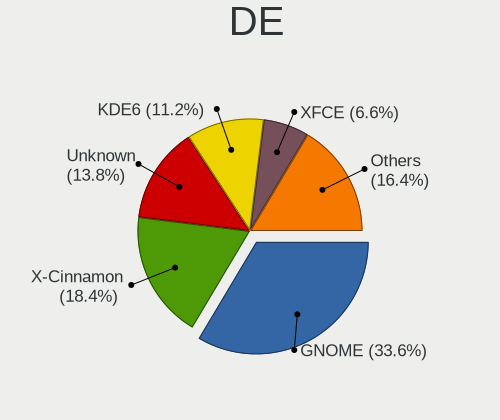
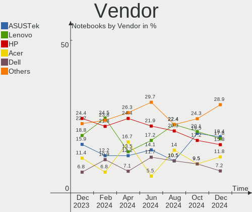
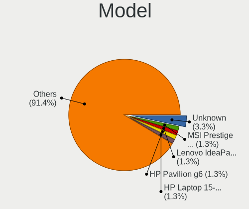
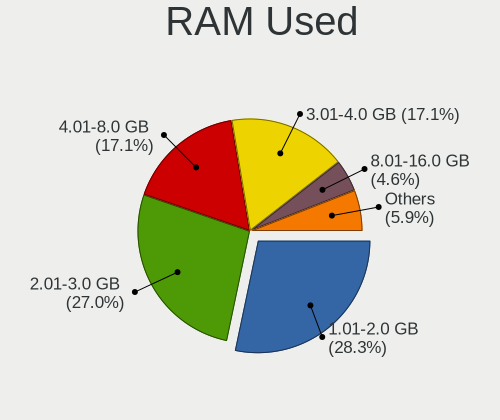
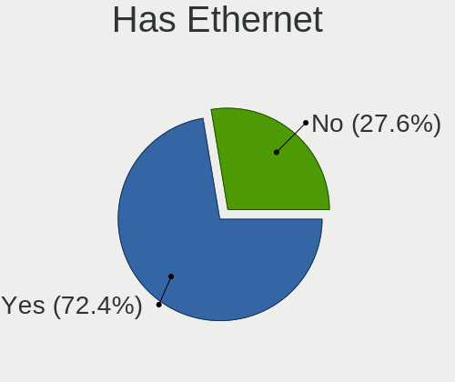
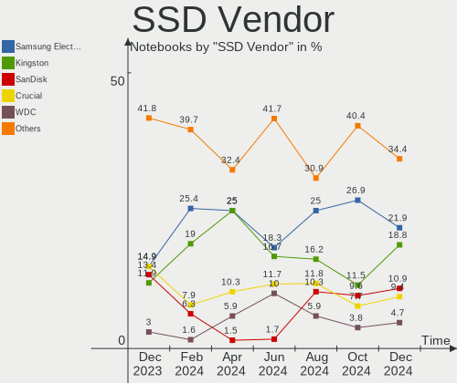
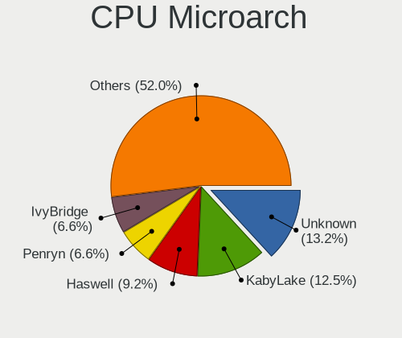
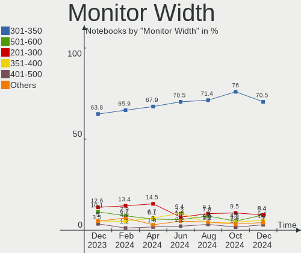
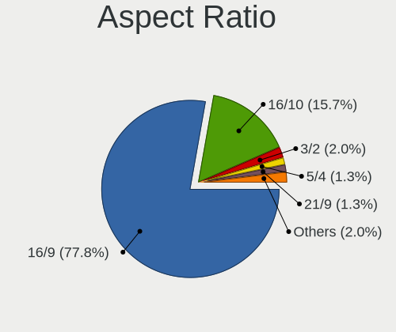
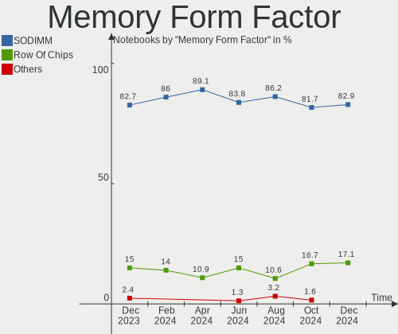

Linux in Italy - Hardware Trends (Notebooks)
--------------------------------------------

A project to identify most popular hardware characteristics and track their change
over time based on data collected by Linux users at https://Linux-Hardware.org.

Anyone can contribute to this report by the [hw-probe](https://github.com/linuxhw/hw-probe) tool:

    sudo -E hw-probe -all -upload

Period: Dec, 2024.

Contents
--------

* [ System ](#system)
  - [ OS                       ](#os)
  - [ OS Family                ](#os-family)
  - [ Kernel                   ](#kernel)
  - [ Kernel Family            ](#kernel-family)
  - [ Kernel Major Ver.        ](#kernel-major-ver)
  - [ Arch                     ](#arch)
  - [ DE                       ](#de)
  - [ Display Server           ](#display-server)
  - [ Display Manager          ](#display-manager)
  - [ OS Lang                  ](#os-lang)
  - [ Boot Mode                ](#boot-mode)
  - [ Filesystem               ](#filesystem)
  - [ Part. scheme             ](#part-scheme)
  - [ Dual Boot with Linux/BSD ](#dual-boot-with-linuxbsd)
  - [ Dual Boot (Win)          ](#dual-boot-win)

* [ Board ](#board)
  - [ Vendor                   ](#vendor)
  - [ Model                    ](#model)
  - [ Model Family             ](#model-family)
  - [ MFG Year                 ](#mfg-year)
  - [ Form Factor              ](#form-factor)
  - [ Secure Boot              ](#secure-boot)
  - [ Coreboot                 ](#coreboot)
  - [ RAM Size                 ](#ram-size)
  - [ RAM Used                 ](#ram-used)
  - [ Total Drives             ](#total-drives)
  - [ Has CD-ROM               ](#has-cd-rom)
  - [ Has Ethernet             ](#has-ethernet)
  - [ Has WiFi                 ](#has-wifi)
  - [ Has Bluetooth            ](#has-bluetooth)

* [ Location ](#location)
  - [ Country                  ](#country)
  - [ City                     ](#city)

* [ Drives ](#drives)
  - [ Drive Vendor             ](#drive-vendor)
  - [ Drive Model              ](#drive-model)
  - [ HDD Vendor               ](#hdd-vendor)
  - [ SSD Vendor               ](#ssd-vendor)
  - [ Drive Kind               ](#drive-kind)
  - [ Drive Connector          ](#drive-connector)
  - [ Drive Size               ](#drive-size)
  - [ Space Total              ](#space-total)
  - [ Space Used               ](#space-used)
  - [ Malfunc. Drives          ](#malfunc-drives)
  - [ Malfunc. Drive Vendor    ](#malfunc-drive-vendor)
  - [ Malfunc. HDD Vendor      ](#malfunc-hdd-vendor)
  - [ Malfunc. Drive Kind      ](#malfunc-drive-kind)
  - [ Failed Drives            ](#failed-drives)
  - [ Failed Drive Vendor      ](#failed-drive-vendor)
  - [ Drive Status             ](#drive-status)

* [ Storage controller ](#storage-controller)
  - [ Storage Vendor           ](#storage-vendor)
  - [ Storage Model            ](#storage-model)
  - [ Storage Kind             ](#storage-kind)

* [ Processor ](#processor)
  - [ CPU Vendor               ](#cpu-vendor)
  - [ CPU Model                ](#cpu-model)
  - [ CPU Model Family         ](#cpu-model-family)
  - [ CPU Cores                ](#cpu-cores)
  - [ CPU Sockets              ](#cpu-sockets)
  - [ CPU Threads              ](#cpu-threads)
  - [ CPU Op-Modes             ](#cpu-op-modes)
  - [ CPU Microcode            ](#cpu-microcode)
  - [ CPU Microarch            ](#cpu-microarch)

* [ Graphics ](#graphics)
  - [ GPU Vendor               ](#gpu-vendor)
  - [ GPU Model                ](#gpu-model)
  - [ GPU Combo                ](#gpu-combo)
  - [ GPU Driver               ](#gpu-driver)
  - [ GPU Memory               ](#gpu-memory)

* [ Monitor ](#monitor)
  - [ Monitor Vendor           ](#monitor-vendor)
  - [ Monitor Model            ](#monitor-model)
  - [ Monitor Resolution       ](#monitor-resolution)
  - [ Monitor Diagonal         ](#monitor-diagonal)
  - [ Monitor Width            ](#monitor-width)
  - [ Aspect Ratio             ](#aspect-ratio)
  - [ Monitor Area             ](#monitor-area)
  - [ Pixel Density            ](#pixel-density)
  - [ Multiple Monitors        ](#multiple-monitors)

* [ Network ](#network)
  - [ Net Controller Vendor    ](#net-controller-vendor)
  - [ Net Controller Model     ](#net-controller-model)
  - [ Wireless Vendor          ](#wireless-vendor)
  - [ Wireless Model           ](#wireless-model)
  - [ Ethernet Vendor          ](#ethernet-vendor)
  - [ Ethernet Model           ](#ethernet-model)
  - [ Net Controller Kind      ](#net-controller-kind)
  - [ Used Controller          ](#used-controller)
  - [ NICs                     ](#nics)
  - [ IPv6                     ](#ipv6)

* [ Bluetooth ](#bluetooth)
  - [ Bluetooth Vendor         ](#bluetooth-vendor)
  - [ Bluetooth Model          ](#bluetooth-model)

* [ Sound ](#sound)
  - [ Sound Vendor             ](#sound-vendor)
  - [ Sound Model              ](#sound-model)

* [ Memory ](#memory)
  - [ Memory Vendor            ](#memory-vendor)
  - [ Memory Model             ](#memory-model)
  - [ Memory Kind              ](#memory-kind)
  - [ Memory Form Factor       ](#memory-form-factor)
  - [ Memory Size              ](#memory-size)
  - [ Memory Speed             ](#memory-speed)

* [ Printers & scanners ](#printers--scanners)
  - [ Printer Vendor           ](#printer-vendor)
  - [ Printer Model            ](#printer-model)
  - [ Scanner Vendor           ](#scanner-vendor)
  - [ Scanner Model            ](#scanner-model)

* [ Camera ](#camera)
  - [ Camera Vendor            ](#camera-vendor)
  - [ Camera Model             ](#camera-model)

* [ Security ](#security)
  - [ Fingerprint Vendor       ](#fingerprint-vendor)
  - [ Fingerprint Model        ](#fingerprint-model)
  - [ Chipcard Vendor          ](#chipcard-vendor)
  - [ Chipcard Model           ](#chipcard-model)

* [ Unsupported ](#unsupported)
  - [ Unsupported Devices      ](#unsupported-devices)
  - [ Unsupported Device Types ](#unsupported-device-types)

System
------

OS
--

Installed operating systems

| Name                         | Notebooks | Percent |
|------------------------------|-----------|---------|
| OpenMandriva 24.12           | 25        | 16.45%  |
| Linux Mint 22                | 21        | 13.82%  |
| Fedora 41                    | 19        | 12.5%   |
| Ubuntu 24.04                 | 13        | 8.55%   |
| Arch Rolling                 | 11        | 7.24%   |
| Linux Mint 21.3              | 5         | 3.29%   |
| Ubuntu 24.10                 | 4         | 2.63%   |
| LMDE 6                       | 4         | 2.63%   |
| Pop!_OS 22.04                | 3         | 1.97%   |
| openSUSE Tumbleweed-XXXXXXXX | 3         | 1.97%   |
| Manjaro                      | 3         | 1.97%   |
| Debian 12                    | 3         | 1.97%   |
| Debian                       | 3         | 1.97%   |
| Zorin 17                     | 2         | 1.32%   |
| Xubuntu 24.04                | 2         | 1.32%   |
| Lubuntu 24.04                | 2         | 1.32%   |
| Kubuntu 24.10                | 2         | 1.32%   |
| Kubuntu 24.04                | 2         | 1.32%   |
| EndeavourOS Rolling          | 2         | 1.32%   |
| Elementary 8                 | 2         | 1.32%   |
| Elementary 7.1               | 2         | 1.32%   |
| Zorin 15                     | 1         | 0.66%   |
| Ubuntu 22.04                 | 1         | 0.66%   |
| Sparky 8                     | 1         | 0.66%   |
| Parrot 6.2                   | 1         | 0.66%   |
| Oracle Linux 9.5             | 1         | 0.66%   |
| OpenMandriva 5.0             | 1         | 0.66%   |
| Manjaro 24.2.1               | 1         | 0.66%   |
| Manjaro 24.2.0               | 1         | 0.66%   |
| Linux Mint 21.1              | 1         | 0.66%   |
| Linux Mint 20                | 1         | 0.66%   |
| Kali 2024.4                  | 1         | 0.66%   |
| Garuda Linux Rolling         | 1         | 0.66%   |
| Fedora Asahi-remix-40        | 1         | 0.66%   |
| Fedora 40                    | 1         | 0.66%   |
| Dts-distro 2.1.1             | 1         | 0.66%   |
| Debian 10                    | 1         | 0.66%   |
| blendOS                      | 1         | 0.66%   |
| Bazzite 41                   | 1         | 0.66%   |
| ArcoLinux Rolling            | 1         | 0.66%   |

OS Family
---------

OS without a version

| Name         | Notebooks | Percent |
|--------------|-----------|---------|
| Linux Mint   | 28        | 18.42%  |
| OpenMandriva | 26        | 17.11%  |
| Fedora       | 21        | 13.82%  |
| Ubuntu       | 18        | 11.84%  |
| Arch         | 11        | 7.24%   |
| Debian       | 7         | 4.61%   |
| Manjaro      | 5         | 3.29%   |
| LMDE         | 4         | 2.63%   |
| Kubuntu      | 4         | 2.63%   |
| Elementary   | 4         | 2.63%   |
| Zorin        | 3         | 1.97%   |
| Pop!_OS      | 3         | 1.97%   |
| openSUSE     | 3         | 1.97%   |
| Xubuntu      | 2         | 1.32%   |
| Lubuntu      | 2         | 1.32%   |
| EndeavourOS  | 2         | 1.32%   |
| Sparky       | 1         | 0.66%   |
| Parrot       | 1         | 0.66%   |
| Oracle Linux | 1         | 0.66%   |
| Kali         | 1         | 0.66%   |
| Garuda Linux | 1         | 0.66%   |
| Dts-distro   | 1         | 0.66%   |
| blendOS      | 1         | 0.66%   |
| Bazzite      | 1         | 0.66%   |
| ArcoLinux    | 1         | 0.66%   |

Kernel
------

Version of the Linux kernel

| Version                           | Notebooks | Percent |
|-----------------------------------|-----------|---------|
| 6.12.1-desktop-1omv2490           | 22        | 14.47%  |
| 6.8.0-51-generic                  | 18        | 11.84%  |
| 6.8.0-49-generic                  | 18        | 11.84%  |
| 6.11.10-300.fc41.x86_64           | 7         | 4.61%   |
| 6.8.0-50-generic                  | 5         | 3.29%   |
| 6.12.1-zen1-1-zen                 | 5         | 3.29%   |
| 6.12.6-200.fc41.x86_64            | 4         | 2.63%   |
| 6.9.3-76060903-generic            | 3         | 1.97%   |
| 6.12.7-arch1-1                    | 3         | 1.97%   |
| 6.12.6-desktop-1omv2490           | 3         | 1.97%   |
| 6.11.4-301.fc41.x86_64            | 3         | 1.97%   |
| 6.11.0-9-generic                  | 3         | 1.97%   |
| 6.11.0-13-generic                 | 3         | 1.97%   |
| 6.1.0-28-amd64                    | 3         | 1.97%   |
| 6.8.0-38-generic                  | 2         | 1.32%   |
| 6.12.6-arch1-1                    | 2         | 1.32%   |
| 6.12.6-1-default                  | 2         | 1.32%   |
| 6.12.5-200.fc41.x86_64            | 2         | 1.32%   |
| 6.12.4-1-MANJARO                  | 2         | 1.32%   |
| 6.11.10-amd64                     | 2         | 1.32%   |
| 5.15.0-130-generic                | 2         | 1.32%   |
| 5.15.0-126-generic                | 2         | 1.32%   |
| 6.8.4-300.es83xx.fc40.x86_64      | 1         | 0.66%   |
| 6.8.0-45-generic                  | 1         | 0.66%   |
| 6.8.0-41-generic                  | 1         | 0.66%   |
| 6.6.65-1-lts                      | 1         | 0.66%   |
| 6.6.21-yocto-standard             | 1         | 0.66%   |
| 6.6.2-desktop-1omv2390            | 1         | 0.66%   |
| 6.12.7-zen1-1-zen                 | 1         | 0.66%   |
| 6.12.6-zen1-1-zen                 | 1         | 0.66%   |
| 6.12.6-1-liquorix-amd64           | 1         | 0.66%   |
| 6.12.4-200.fc41.x86_64            | 1         | 0.66%   |
| 6.12.3-zen1-custom                | 1         | 0.66%   |
| 6.12.3-arch1-1                    | 1         | 0.66%   |
| 6.12.3-amd64                      | 1         | 0.66%   |
| 6.12.1-arch1-1                    | 1         | 0.66%   |
| 6.12.1-404.asahi.fc40.aarch64+16k | 1         | 0.66%   |
| 6.12.1-4-MANJARO                  | 1         | 0.66%   |
| 6.12.1-1-liquorix-amd64           | 1         | 0.66%   |
| 6.11.8-200.fc40.x86_64            | 1         | 0.66%   |

Kernel Family
-------------

Linux kernel without a distro release

| Version  | Notebooks | Percent |
|----------|-----------|---------|
| 6.8.0    | 45        | 29.61%  |
| 6.12.1   | 31        | 20.39%  |
| 6.12.6   | 13        | 8.55%   |
| 6.11.10  | 11        | 7.24%   |
| 6.11.0   | 7         | 4.61%   |
| 6.1.0    | 6         | 3.95%   |
| 5.15.0   | 6         | 3.95%   |
| 6.12.7   | 4         | 2.63%   |
| 6.9.3    | 3         | 1.97%   |
| 6.12.4   | 3         | 1.97%   |
| 6.12.3   | 3         | 1.97%   |
| 6.11.4   | 3         | 1.97%   |
| 6.12.5   | 2         | 1.32%   |
| 6.11.8   | 2         | 1.32%   |
| 5.4.0    | 2         | 1.32%   |
| 6.8.4    | 1         | 0.66%   |
| 6.6.65   | 1         | 0.66%   |
| 6.6.21   | 1         | 0.66%   |
| 6.6.2    | 1         | 0.66%   |
| 6.11.2   | 1         | 0.66%   |
| 6.11.11  | 1         | 0.66%   |
| 6.10.11  | 1         | 0.66%   |
| 6.1.90   | 1         | 0.66%   |
| 6.1.38   | 1         | 0.66%   |
| 5.14.0   | 1         | 0.66%   |
| 5.10.102 | 1         | 0.66%   |

Kernel Major Ver.
-----------------

Linux kernel major version

| Version | Notebooks | Percent |
|---------|-----------|---------|
| 6.12    | 56        | 36.84%  |
| 6.8     | 46        | 30.26%  |
| 6.11    | 25        | 16.45%  |
| 6.1     | 8         | 5.26%   |
| 5.15    | 6         | 3.95%   |
| 6.9     | 3         | 1.97%   |
| 6.6     | 3         | 1.97%   |
| 5.4     | 2         | 1.32%   |
| 6.10    | 1         | 0.66%   |
| 5.14    | 1         | 0.66%   |
| 5.10    | 1         | 0.66%   |

Arch
----

OS architecture (x86_64, i586, etc.)

| Name    | Notebooks | Percent |
|---------|-----------|---------|
| x86_64  | 149       | 98.03%  |
| i686    | 2         | 1.32%   |
| aarch64 | 1         | 0.66%   |

DE
--

Desktop Environment

| Name       | Notebooks | Percent |
|------------|-----------|---------|
| GNOME      | 51        | 33.55%  |
| X-Cinnamon | 28        | 18.42%  |
| Unknown    | 21        | 13.82%  |
| KDE6       | 17        | 11.18%  |
| XFCE       | 10        | 6.58%   |
| LXQt       | 9         | 5.92%   |
| Pantheon   | 4         | 2.63%   |
| KDE5       | 4         | 2.63%   |
| MATE       | 3         | 1.97%   |
| KDE4       | 2         | 1.32%   |
| sway       | 1         | 0.66%   |
| LXDE       | 1         | 0.66%   |
| i3         | 1         | 0.66%   |

Display Server
--------------

X11 or Wayland

| Name    | Notebooks | Percent |
|---------|-----------|---------|
| X11     | 75        | 49.34%  |
| Wayland | 74        | 48.68%  |
| Unknown | 2         | 1.32%   |
| Tty     | 1         | 0.66%   |

Display Manager
---------------

SDDM, LightDM, etc.

| Name    | Notebooks | Percent |
|---------|-----------|---------|
| Unknown | 40        | 26.32%  |
| LightDM | 37        | 24.34%  |
| SDDM    | 36        | 23.68%  |
| GDM3    | 25        | 16.45%  |
| GDM     | 12        | 7.89%   |
| LY-DM   | 2         | 1.32%   |

OS Lang
-------

Language

| Lang    | Notebooks | Percent |
|---------|-----------|---------|
| it_IT   | 107       | 70.39%  |
| en_US   | 35        | 23.03%  |
| C       | 4         | 2.63%   |
| en_GB   | 3         | 1.97%   |
| Unknown | 2         | 1.32%   |
| en_BW   | 1         | 0.66%   |

Boot Mode
---------

EFI or BIOS

| Mode | Notebooks | Percent |
|------|-----------|---------|
| EFI  | 89        | 58.55%  |
| BIOS | 63        | 41.45%  |

Filesystem
----------

Type of filesystem

| Type    | Notebooks | Percent |
|---------|-----------|---------|
| Ext4    | 89        | 58.55%  |
| Btrfs   | 35        | 23.03%  |
| Overlay | 16        | 10.53%  |
| Tmpfs   | 10        | 6.58%   |
| Xfs     | 1         | 0.66%   |
| Rootfs  | 1         | 0.66%   |

Part. scheme
------------

Scheme of partitioning

| Type    | Notebooks | Percent |
|---------|-----------|---------|
| GPT     | 104       | 68.42%  |
| Unknown | 37        | 24.34%  |
| MBR     | 11        | 7.24%   |

Dual Boot with Linux/BSD
------------------------

Hosting more than one Linux/BSD

| Dual boot | Notebooks | Percent |
|-----------|-----------|---------|
| No        | 120       | 78.95%  |
| Yes       | 32        | 21.05%  |

Dual Boot (Win)
---------------

Hosting Linux and Windows

| Dual boot | Notebooks | Percent |
|-----------|-----------|---------|
| No        | 102       | 67.11%  |
| Yes       | 50        | 32.89%  |

Board
-----

Vendor
------

Motherboard manufacturer

| Name                | Notebooks | Percent |
|---------------------|-----------|---------|
| ASUSTek Computer    | 28        | 18.42%  |
| Lenovo              | 27        | 17.76%  |
| Hewlett-Packard     | 24        | 15.79%  |
| Acer                | 18        | 11.84%  |
| Dell                | 11        | 7.24%   |
| MSI                 | 7         | 4.61%   |
| Toshiba             | 5         | 3.29%   |
| HUAWEI              | 5         | 3.29%   |
| Fujitsu             | 5         | 3.29%   |
| Unknown             | 5         | 3.29%   |
| Chuwi               | 3         | 1.97%   |
| Apple               | 3         | 1.97%   |
| Samsung Electronics | 2         | 1.32%   |
| eMachines           | 2         | 1.32%   |
| TUXEDO              | 1         | 0.66%   |
| Notebook            | 1         | 0.66%   |
| Microtech           | 1         | 0.66%   |
| Medion              | 1         | 0.66%   |
| Framework           | 1         | 0.66%   |
| AZW                 | 1         | 0.66%   |
| AMI                 | 1         | 0.66%   |

Model
-----

Motherboard model

| Name                                       | Notebooks | Percent |
|--------------------------------------------|-----------|---------|
| Unknown                                    | 5         | 3.29%   |
| MSI Prestige 15 A12SC                      | 2         | 1.32%   |
| Lenovo IdeaPad Slim 3 15ABR8 82XM          | 2         | 1.32%   |
| HUAWEI KLVL-WXX9                           | 2         | 1.32%   |
| HP Pavilion g6                             | 2         | 1.32%   |
| HP Laptop 15-db0xxx                        | 2         | 1.32%   |
| Dell Latitude 7450                         | 2         | 1.32%   |
| Chuwi MiniBook X                           | 2         | 1.32%   |
| ASUS X510UQR                               | 2         | 1.32%   |
| Acer Aspire A515-57                        | 2         | 1.32%   |
| TUXEDO InfinityBook Pro AMD Gen9           | 1         | 0.66%   |
| Toshiba Satellite Pro A300                 | 1         | 0.66%   |
| Toshiba Satellite L850                     | 1         | 0.66%   |
| Toshiba Satellite L755                     | 1         | 0.66%   |
| Toshiba Satellite C650                     | 1         | 0.66%   |
| Toshiba Satellite C50-A                    | 1         | 0.66%   |
| Samsung 750XGK                             | 1         | 0.66%   |
| Samsung 550P5C/550P7C                      | 1         | 0.66%   |
| Notebook NS5x_NS7xPU                       | 1         | 0.66%   |
| MSI Prestige 14Evo A12M                    | 1         | 0.66%   |
| MSI Modern 15 A11MU                        | 1         | 0.66%   |
| MSI Katana GF76 12UC                       | 1         | 0.66%   |
| MSI Katana GF66 11UC                       | 1         | 0.66%   |
| MSI GS60 6QE                               | 1         | 0.66%   |
| Microtech ebookPro                         | 1         | 0.66%   |
| Medion Defender P40                        | 1         | 0.66%   |
| Lenovo Yoga Pro 7 14ASP9 83HN              | 1         | 0.66%   |
| Lenovo V145-15AST 81MT                     | 1         | 0.66%   |
| Lenovo ThinkPad X1 Carbon Gen 9 20XW00GNIX | 1         | 0.66%   |
| Lenovo ThinkPad W541 20EF0011IX            | 1         | 0.66%   |
| Lenovo ThinkPad T480 20L6SJUS2J            | 1         | 0.66%   |
| Lenovo ThinkPad T480 20L6SDF920            | 1         | 0.66%   |
| Lenovo ThinkPad T440s 20ARS1EQ00           | 1         | 0.66%   |
| Lenovo ThinkPad T430 2349IF8               | 1         | 0.66%   |
| Lenovo ThinkPad T400 6475WKP               | 1         | 0.66%   |
| Lenovo ThinkPad T14 Gen 2i 20W000NXIX      | 1         | 0.66%   |
| Lenovo ThinkPad P53 20QQS6BR01             | 1         | 0.66%   |
| Lenovo ThinkPad L15 Gen 4 21H7CTO1WW       | 1         | 0.66%   |
| Lenovo ThinkPad E14 Gen 6 21M3CTO1WW       | 1         | 0.66%   |
| Lenovo ThinkBook 15p Gen 2 21B1            | 1         | 0.66%   |

Model Family
------------

Motherboard model prefix

| Name                | Notebooks | Percent |
|---------------------|-----------|---------|
| Acer Aspire         | 15        | 9.87%   |
| Lenovo ThinkPad     | 11        | 7.24%   |
| Lenovo IdeaPad      | 8         | 5.26%   |
| Toshiba Satellite   | 5         | 3.29%   |
| HP ProBook          | 5         | 3.29%   |
| Fujitsu LIFEBOOK    | 5         | 3.29%   |
| Unknown             | 5         | 3.29%   |
| HP Pavilion         | 4         | 2.63%   |
| HP Laptop           | 4         | 2.63%   |
| Dell Latitude       | 4         | 2.63%   |
| Dell Inspiron       | 4         | 2.63%   |
| MSI Prestige        | 3         | 1.97%   |
| ASUS VivoBook       | 3         | 1.97%   |
| MSI Katana          | 2         | 1.32%   |
| Lenovo ThinkBook    | 2         | 1.32%   |
| Lenovo Legion       | 2         | 1.32%   |
| HUAWEI KLVL-WXX9    | 2         | 1.32%   |
| HP EliteBook        | 2         | 1.32%   |
| Dell XPS            | 2         | 1.32%   |
| Chuwi MiniBook      | 2         | 1.32%   |
| ASUS ZenBook        | 2         | 1.32%   |
| ASUS X510UQR        | 2         | 1.32%   |
| Acer Swift          | 2         | 1.32%   |
| TUXEDO InfinityBook | 1         | 0.66%   |
| Samsung 750XGK      | 1         | 0.66%   |
| Samsung 550P5C      | 1         | 0.66%   |
| Notebook NS5x       | 1         | 0.66%   |
| MSI Modern          | 1         | 0.66%   |
| MSI GS60            | 1         | 0.66%   |
| Microtech ebookPro  | 1         | 0.66%   |
| Medion Defender     | 1         | 0.66%   |
| Lenovo Yoga         | 1         | 0.66%   |
| Lenovo V145-15AST   | 1         | 0.66%   |
| Lenovo IdeaPad3     | 1         | 0.66%   |
| Lenovo G50-45       | 1         | 0.66%   |
| HUAWEI MateBook     | 1         | 0.66%   |
| HUAWEI KPL-W0X      | 1         | 0.66%   |
| HUAWEI BOM-WXX9     | 1         | 0.66%   |
| HP ZBook            | 1         | 0.66%   |
| HP Stream           | 1         | 0.66%   |

MFG Year
--------

Motherboard manufacture year

| Year    | Notebooks | Percent |
|---------|-----------|---------|
| 2024    | 15        | 9.87%   |
| 2021    | 15        | 9.87%   |
| 2022    | 13        | 8.55%   |
| 2018    | 13        | 8.55%   |
| 2020    | 11        | 7.24%   |
| 2015    | 11        | 7.24%   |
| 2012    | 11        | 7.24%   |
| 2023    | 10        | 6.58%   |
| 2014    | 8         | 5.26%   |
| 2013    | 8         | 5.26%   |
| 2017    | 6         | 3.95%   |
| 2011    | 6         | 3.95%   |
| 2009    | 6         | 3.95%   |
| 2019    | 5         | 3.29%   |
| 2010    | 5         | 3.29%   |
| 2016    | 3         | 1.97%   |
| 2008    | 3         | 1.97%   |
| 2007    | 2         | 1.32%   |
| Unknown | 1         | 0.66%   |

Form Factor
-----------

Physical design of the computer

| Name     | Notebooks | Percent |
|----------|-----------|---------|
| Notebook | 152       | 100%    |

Secure Boot
-----------

Enabled or disabled

| State    | Notebooks | Percent |
|----------|-----------|---------|
| Disabled | 137       | 90.13%  |
| Enabled  | 15        | 9.87%   |

Coreboot
--------

Have coreboot on board

| Used | Notebooks | Percent |
|------|-----------|---------|
| No   | 152       | 100%    |

RAM Size
--------

Total RAM memory

| Size in GB  | Notebooks | Percent |
|-------------|-----------|---------|
| 4.01-8.0    | 48        | 31.58%  |
| 16.01-24.0  | 31        | 20.39%  |
| 8.01-16.0   | 28        | 18.42%  |
| 3.01-4.0    | 22        | 14.47%  |
| 32.01-64.0  | 11        | 7.24%   |
| 24.01-32.0  | 4         | 2.63%   |
| 1.01-2.0    | 4         | 2.63%   |
| 64.01-256.0 | 2         | 1.32%   |
| 2.01-3.0    | 1         | 0.66%   |
| 0.51-1.0    | 1         | 0.66%   |

RAM Used
--------

Used RAM memory

| Used GB   | Notebooks | Percent |
|-----------|-----------|---------|
| 1.01-2.0  | 43        | 28.29%  |
| 2.01-3.0  | 41        | 26.97%  |
| 4.01-8.0  | 26        | 17.11%  |
| 3.01-4.0  | 26        | 17.11%  |
| 8.01-16.0 | 7         | 4.61%   |
| 0.51-1.0  | 7         | 4.61%   |
| 0.01-0.5  | 2         | 1.32%   |

Total Drives
------------

Number of drives on board

| Drives | Notebooks | Percent |
|--------|-----------|---------|
| 1      | 116       | 76.32%  |
| 2      | 32        | 21.05%  |
| 3      | 4         | 2.63%   |

Has CD-ROM
----------

Has CD-ROM on board

| Presented | Notebooks | Percent |
|-----------|-----------|---------|
| No        | 102       | 67.11%  |
| Yes       | 50        | 32.89%  |

Has Ethernet
------------

Has Ethernet on board

| Presented | Notebooks | Percent |
|-----------|-----------|---------|
| Yes       | 110       | 72.37%  |
| No        | 42        | 27.63%  |

Has WiFi
--------

Has WiFi module

| Presented | Notebooks | Percent |
|-----------|-----------|---------|
| Yes       | 144       | 94.74%  |
| No        | 8         | 5.26%   |

Has Bluetooth
-------------

Has Bluetooth module

| Presented | Notebooks | Percent |
|-----------|-----------|---------|
| Yes       | 129       | 84.87%  |
| No        | 23        | 15.13%  |

Location
--------

Country
-------

Geographic location (country)

| Country | Notebooks | Percent |
|---------|-----------|---------|
| Italy   | 152       | 100%    |

City
----

Geographic location (city)

| City                       | Notebooks | Percent |
|----------------------------|-----------|---------|
| Milan                      | 24        | 15.79%  |
| Rome                       | 14        | 9.21%   |
| Milano                     | 9         | 5.92%   |
| Florence                   | 5         | 3.29%   |
| Bologna                    | 5         | 3.29%   |
| Turin                      | 4         | 2.63%   |
| Naples                     | 4         | 2.63%   |
| Verona                     | 2         | 1.32%   |
| Venice                     | 2         | 1.32%   |
| Scandolara Ravara          | 2         | 1.32%   |
| Passignano sul Trasimeno   | 2         | 1.32%   |
| Messina                    | 2         | 1.32%   |
| Fossarmato                 | 2         | 1.32%   |
| Brugherio                  | 2         | 1.32%   |
| Brescia                    | 2         | 1.32%   |
| Zagarolo                   | 1         | 0.66%   |
| Torre Orsaia               | 1         | 0.66%   |
| Ternate                    | 1         | 0.66%   |
| Sulmona                    | 1         | 0.66%   |
| Sparanise                  | 1         | 0.66%   |
| Somma Vesuviana            | 1         | 0.66%   |
| Sinnai                     | 1         | 0.66%   |
| Seveso                     | 1         | 0.66%   |
| Settimo Milanese           | 1         | 0.66%   |
| Sesto Fiorentino           | 1         | 0.66%   |
| Sant'Agata Li Battiati     | 1         | 0.66%   |
| San Michele al Tagliamento | 1         | 0.66%   |
| Pisa                       | 1         | 0.66%   |
| Pescia                     | 1         | 0.66%   |
| Perugia                    | 1         | 0.66%   |
| Pavia                      | 1         | 0.66%   |
| Pasturo                    | 1         | 0.66%   |
| Parma                      | 1         | 0.66%   |
| Palermo                    | 1         | 0.66%   |
| Padova                     | 1         | 0.66%   |
| Nuoro                      | 1         | 0.66%   |
| Nonantola                  | 1         | 0.66%   |
| Nola                       | 1         | 0.66%   |
| Mugnano di Napoli          | 1         | 0.66%   |
| Monzoro                    | 1         | 0.66%   |

Drives
------

Drive Vendor
------------

Hard drive vendors

| Vendor                       | Notebooks | Drives | Percent |
|------------------------------|-----------|--------|---------|
| Samsung Electronics          | 32        | 36     | 17.68%  |
| Micron Technology            | 16        | 16     | 8.84%   |
| Sandisk                      | 15        | 15     | 8.29%   |
| Kingston                     | 14        | 14     | 7.73%   |
| WDC                          | 13        | 13     | 7.18%   |
| Toshiba                      | 10        | 10     | 5.52%   |
| SK hynix                     | 10        | 10     | 5.52%   |
| Seagate                      | 8         | 8      | 4.42%   |
| Intel                        | 8         | 9      | 4.42%   |
| Unknown                      | 7         | 7      | 3.87%   |
| Crucial                      | 7         | 7      | 3.87%   |
| Hitachi                      | 6         | 6      | 3.31%   |
| HGST                         | 6         | 6      | 3.31%   |
| SPCC                         | 3         | 3      | 1.66%   |
| MAXIO Technology (Hangzhou)  | 3         | 3      | 1.66%   |
| Phison Electronics           | 2         | 2      | 1.1%    |
| ORICO                        | 2         | 2      | 1.1%    |
| China                        | 2         | 2      | 1.1%    |
| Apple                        | 2         | 4      | 1.1%    |
| WUXIN                        | 1         | 1      | 0.55%   |
| TO Exter                     | 1         | 1      | 0.55%   |
| Teclast                      | 1         | 1      | 0.55%   |
| Silicon Motion               | 1         | 1      | 0.55%   |
| Shenzhen Longsys Electronics | 1         | 1      | 0.55%   |
| Realtek Semiconductor        | 1         | 1      | 0.55%   |
| PNY                          | 1         | 1      | 0.55%   |
| Phison                       | 1         | 1      | 0.55%   |
| OSCOO                        | 1         | 1      | 0.55%   |
| Leven                        | 1         | 1      | 0.55%   |
| KIOXIA                       | 1         | 1      | 0.55%   |
| KingSpec                     | 1         | 1      | 0.55%   |
| Emtec                        | 1         | 1      | 0.55%   |
| Drevo                        | 1         | 1      | 0.55%   |
| DEMO                         | 1         | 1      | 0.55%   |

Drive Model
-----------

Hard drive models

| Model                                                | Notebooks | Percent |
|------------------------------------------------------|-----------|---------|
| Samsung NVMe SSD Controller PM9A1/PM9A3/980PRO 512GB | 5         | 2.67%   |
| Kingston SA400S37240G 240GB SSD                      | 5         | 2.67%   |
| Unknown NVMe SSD Drive 512GB                         | 3         | 1.6%    |
| Samsung SSD 990 PRO 1TB                              | 3         | 1.6%    |
| MAXIO (Hangzhou) NVMe SSD Controller MAP1202 512GB   | 3         | 1.6%    |
| Toshiba MQ04ABF100 1TB                               | 2         | 1.07%   |
| Toshiba MQ01ABF050 500GB                             | 2         | 1.07%   |
| Seagate ST1000LM035-1RK172 1TB                       | 2         | 1.07%   |
| SanDisk SSD PLUS 240GB                               | 2         | 1.07%   |
| Samsung SSD 860 EVO 500GB                            | 2         | 1.07%   |
| Samsung MZVLQ512HBLU-00B00 512GB                     | 2         | 1.07%   |
| Samsung MZVLQ512HALU-000H1 512GB                     | 2         | 1.07%   |
| Micron MTFDHBA512QFD 512GB                           | 2         | 1.07%   |
| Micron 1100_MTFDDAV512TBN 512GB SSD                  | 2         | 1.07%   |
| Intel SSDPEKNU512GZ 512GB                            | 2         | 1.07%   |
| Intel SSD Pro 7600p/760p/E 6100p Series 512GB        | 2         | 1.07%   |
| HGST HTS545050A7E680 500GB                           | 2         | 1.07%   |
| HGST HTS541010A9E680 1TB                             | 2         | 1.07%   |
| Crucial CT1000BX500SSD1 1TB                          | 2         | 1.07%   |
| China SSD 256GB                                      | 2         | 1.07%   |
| WUXIN G8 128GB                                       | 1         | 0.53%   |
| WDC WDS500G2B0B-00YS70 500GB SSD                     | 1         | 0.53%   |
| WDC WDS240G1G0A-00SS50 240GB SSD                     | 1         | 0.53%   |
| WDC WDS100T2B0A-00SM50 1TB SSD                       | 1         | 0.53%   |
| WDC WD3200BPVT-80JJ5T0 320GB                         | 1         | 0.53%   |
| WDC WD3200BPVT-22ZEST0 320GB                         | 1         | 0.53%   |
| WDC WD3200BEVT-22ZCT0 320GB                          | 1         | 0.53%   |
| WDC WD2500BEVT-75ZCT2 250GB                          | 1         | 0.53%   |
| WDC WD2500BEVT-22ZCT0 250GB                          | 1         | 0.53%   |
| WDC WD10SPZX-21Z10T0 1TB                             | 1         | 0.53%   |
| WDC PC SN530 SDBPNPZ-512G-1027 512GB                 | 1         | 0.53%   |
| WDC PC SN520 SDAPNUW-512G-1014 512GB                 | 1         | 0.53%   |
| WDC PC SN520 SDAPNUW-128G-1006 128GB                 | 1         | 0.53%   |
| WDC PC SN520 SDAPMUW-256G-1101 256GB                 | 1         | 0.53%   |
| Unknown MMC Card  64GB                               | 1         | 0.53%   |
| Unknown MMC Card  512GB                              | 1         | 0.53%   |
| Unknown MMC Card  4GB                                | 1         | 0.53%   |
| Unknown MMC Card  32GB                               | 1         | 0.53%   |
| Toshiba THNSNJ128G8NU 128GB SSD                      | 1         | 0.53%   |
| Toshiba THNSNH256GCST 256GB SSD                      | 1         | 0.53%   |

HDD Vendor
----------

Hard disk drive vendors

| Vendor   | Notebooks | Drives | Percent |
|----------|-----------|--------|---------|
| Seagate  | 7         | 7      | 21.88%  |
| WDC      | 6         | 6      | 18.75%  |
| Toshiba  | 6         | 6      | 18.75%  |
| Hitachi  | 6         | 6      | 18.75%  |
| HGST     | 6         | 6      | 18.75%  |
| TO Exter | 1         | 1      | 3.13%   |

SSD Vendor
----------

Solid state drive vendors

| Vendor              | Notebooks | Drives | Percent |
|---------------------|-----------|--------|---------|
| Samsung Electronics | 14        | 15     | 21.88%  |
| Kingston            | 12        | 12     | 18.75%  |
| SanDisk             | 7         | 7      | 10.94%  |
| Crucial             | 6         | 6      | 9.38%   |
| WDC                 | 3         | 3      | 4.69%   |
| Micron Technology   | 3         | 3      | 4.69%   |
| Toshiba             | 2         | 2      | 3.13%   |
| SPCC                | 2         | 2      | 3.13%   |
| Intel               | 2         | 2      | 3.13%   |
| China               | 2         | 2      | 3.13%   |
| Teclast             | 1         | 1      | 1.56%   |
| SK hynix            | 1         | 1      | 1.56%   |
| PNY                 | 1         | 1      | 1.56%   |
| Phison              | 1         | 1      | 1.56%   |
| OSCOO               | 1         | 1      | 1.56%   |
| ORICO               | 1         | 1      | 1.56%   |
| Leven               | 1         | 1      | 1.56%   |
| KingSpec            | 1         | 1      | 1.56%   |
| Emtec               | 1         | 1      | 1.56%   |
| Drevo               | 1         | 1      | 1.56%   |
| Apple               | 1         | 1      | 1.56%   |

Drive Kind
----------

HDD or SSD

| Kind    | Notebooks | Drives | Percent |
|---------|-----------|--------|---------|
| NVMe    | 73        | 83     | 42.44%  |
| SSD     | 59        | 65     | 34.3%   |
| HDD     | 32        | 32     | 18.6%   |
| MMC     | 4         | 4      | 2.33%   |
| Unknown | 4         | 4      | 2.33%   |

Drive Connector
---------------

SATA, SAS, NVMe, etc.

| Type | Notebooks | Drives | Percent |
|------|-----------|--------|---------|
| SATA | 83        | 95     | 49.7%   |
| NVMe | 73        | 82     | 43.71%  |
| SAS  | 7         | 7      | 4.19%   |
| MMC  | 4         | 4      | 2.4%    |

Drive Size
----------

Size of hard drive

| Size in TB | Notebooks | Drives | Percent |
|------------|-----------|--------|---------|
| 0.01-0.5   | 66        | 73     | 75%     |
| 0.51-1.0   | 20        | 22     | 22.73%  |
| 1.01-2.0   | 2         | 2      | 2.27%   |

Space Total
-----------

Amount of disk space available on the file system

| Size in GB     | Notebooks | Percent |
|----------------|-----------|---------|
| 251-500        | 43        | 28.29%  |
| 101-250        | 34        | 22.37%  |
| 501-1000       | 19        | 12.5%   |
| 1-20           | 15        | 9.87%   |
| 1001-2000      | 11        | 7.24%   |
| 51-100         | 9         | 5.92%   |
| More than 3000 | 6         | 3.95%   |
| Unknown        | 6         | 3.95%   |
| 21-50          | 5         | 3.29%   |
| 2001-3000      | 4         | 2.63%   |

Space Used
----------

Amount of used disk space

| Used GB   | Notebooks | Percent |
|-----------|-----------|---------|
| 1-20      | 57        | 37.5%   |
| 21-50     | 26        | 17.11%  |
| 51-100    | 22        | 14.47%  |
| 101-250   | 21        | 13.82%  |
| 251-500   | 11        | 7.24%   |
| 501-1000  | 6         | 3.95%   |
| Unknown   | 6         | 3.95%   |
| 1001-2000 | 2         | 1.32%   |
| 2001-3000 | 1         | 0.66%   |

Malfunc. Drives
---------------

Drive models with a malfunction

| Model                                          | Notebooks | Drives | Percent |
|------------------------------------------------|-----------|--------|---------|
| Toshiba MQ04ABF100 1TB                         | 1         | 1      | 9.09%   |
| SK hynix BC711 HFM512GD3JX013N 512GB           | 1         | 1      | 9.09%   |
| Micron Technology 1100_MTFDDAV512TBN 512GB SSD | 1         | 1      | 9.09%   |
| Kingston RBU-SMSM151S324GD 24GB SSD            | 1         | 1      | 9.09%   |
| Intel SSDSC2BF180A4L 180GB                     | 1         | 1      | 9.09%   |
| Hitachi HTS723232L9A360 320GB                  | 1         | 1      | 9.09%   |
| Hitachi HTS545032B9A300 320GB                  | 1         | 1      | 9.09%   |
| Hitachi HTS541612J9SA00 120GB                  | 1         | 1      | 9.09%   |
| HGST HTS725050A7E630 500GB                     | 1         | 1      | 9.09%   |
| HGST HTS545050A7E680 500GB                     | 1         | 1      | 9.09%   |
| HGST HTS545050A7E380 500GB                     | 1         | 1      | 9.09%   |

Malfunc. Drive Vendor
---------------------

Vendors of faulty drives

| Vendor            | Notebooks | Drives | Percent |
|-------------------|-----------|--------|---------|
| Hitachi           | 3         | 3      | 27.27%  |
| HGST              | 3         | 3      | 27.27%  |
| Toshiba           | 1         | 1      | 9.09%   |
| SK hynix          | 1         | 1      | 9.09%   |
| Micron Technology | 1         | 1      | 9.09%   |
| Kingston          | 1         | 1      | 9.09%   |
| Intel             | 1         | 1      | 9.09%   |

Malfunc. HDD Vendor
-------------------

Vendors of faulty HDD drives

| Vendor  | Notebooks | Drives | Percent |
|---------|-----------|--------|---------|
| Hitachi | 3         | 3      | 42.86%  |
| HGST    | 3         | 3      | 42.86%  |
| Toshiba | 1         | 1      | 14.29%  |

Malfunc. Drive Kind
-------------------

Kinds of faulty drives

| Kind | Notebooks | Drives | Percent |
|------|-----------|--------|---------|
| HDD  | 7         | 7      | 63.64%  |
| SSD  | 3         | 3      | 27.27%  |
| NVMe | 1         | 1      | 9.09%   |

Failed Drives
-------------

Failed drive models

Zero info for selected period =(

Failed Drive Vendor
-------------------

Failed drive vendors

Zero info for selected period =(

Drive Status
------------

Number of failed and malfunc. drives

| Status   | Notebooks | Drives | Percent |
|----------|-----------|--------|---------|
| Works    | 97        | 114    | 61.01%  |
| Detected | 51        | 63     | 32.08%  |
| Malfunc  | 11        | 11     | 6.92%   |

Storage controller
------------------

Storage Vendor
--------------

Storage controller vendors

| Vendor                       | Notebooks | Percent |
|------------------------------|-----------|---------|
| Intel                        | 97        | 53.59%  |
| Samsung Electronics          | 19        | 10.5%   |
| Micron Technology            | 14        | 7.73%   |
| SanDisk                      | 12        | 6.63%   |
| AMD                          | 10        | 5.52%   |
| SK hynix                     | 9         | 4.97%   |
| Solidigm                     | 3         | 1.66%   |
| Phison Electronics           | 3         | 1.66%   |
| MAXIO Technology (Hangzhou)  | 3         | 1.66%   |
| Toshiba America Info Systems | 2         | 1.1%    |
| Nvidia                       | 2         | 1.1%    |
| Kingston Technology Company  | 2         | 1.1%    |
| Silicon Motion               | 1         | 0.55%   |
| Shenzhen Longsys Electronics | 1         | 0.55%   |
| Realtek Semiconductor        | 1         | 0.55%   |
| KIOXIA                       | 1         | 0.55%   |
| JMicron Technology           | 1         | 0.55%   |

Storage Model
-------------

Storage controller models

| Model                                                                            | Notebooks | Percent |
|----------------------------------------------------------------------------------|-----------|---------|
| Intel Sunrise Point-LP SATA Controller [AHCI mode]                               | 14        | 7.18%   |
| Intel Volume Management Device NVMe RAID Controller                              | 10        | 5.13%   |
| Intel 7 Series Chipset Family 6-port SATA Controller [AHCI mode]                 | 10        | 5.13%   |
| AMD FCH SATA Controller [AHCI mode]                                              | 10        | 5.13%   |
| Intel 82801IBM/IEM (ICH9M/ICH9M-E) 4 port SATA Controller [AHCI mode]            | 9         | 4.62%   |
| Samsung NVMe SSD Controller PM9A1/PM9A3/980PRO                                   | 7         | 3.59%   |
| Intel 8 Series/C220 Series Chipset Family 6-port SATA Controller 1 [AHCI mode]   | 7         | 3.59%   |
| Samsung NVMe SSD Controller 980 (DRAM-less)                                      | 5         | 2.56%   |
| Intel 6 Series/C200 Series Chipset Family 6 port Mobile SATA AHCI Controller     | 5         | 2.56%   |
| Samsung NVMe SSD Controller S4LV008[Pascal]                                      | 4         | 2.05%   |
| Intel Celeron/Pentium Silver Processor SATA Controller                           | 4         | 2.05%   |
| Intel Atom/Celeron/Pentium Processor x5-E8000/J3xxx/N3xxx Series SATA Controller | 4         | 2.05%   |
| Intel Alder Lake-P SATA AHCI Controller                                          | 4         | 2.05%   |
| Intel 8 Series SATA Controller 1 [AHCI mode]                                     | 4         | 2.05%   |
| Intel 5 Series/3400 Series Chipset 4 port SATA AHCI Controller                   | 4         | 2.05%   |
| Solidigm P41 Plus NVMe SSD (DRAM-less) [Echo Harbor]                             | 3         | 1.54%   |
| SK hynix BC511 NVMe SSD                                                          | 3         | 1.54%   |
| SanDisk WD Black SN770 / PC SN740 256GB / PC SN560 (DRAM-less) NVMe SSD          | 3         | 1.54%   |
| Micron 2550 NVMe SSD (DRAM-less)                                                 | 3         | 1.54%   |
| Micron 2400 NVMe SSD (DRAM-less)                                                 | 3         | 1.54%   |
| Micron 2210 NVMe SSD [Cobain]                                                    | 3         | 1.54%   |
| MAXIO (Hangzhou) NVMe SSD Controller MAP1202 (DRAM-less)                         | 3         | 1.54%   |
| Intel Wildcat Point-LP SATA Controller [AHCI Mode]                               | 3         | 1.54%   |
| Intel Tiger Lake-LP SATA Controller                                              | 3         | 1.54%   |
| Intel SSD DC P4101/Pro 7600p/760p/E 6100p Series                                 | 3         | 1.54%   |
| Intel SSD 670p Series [Keystone Harbor]                                          | 3         | 1.54%   |
| Intel Cannon Lake Mobile PCH SATA AHCI Controller                                | 3         | 1.54%   |
| Intel 82801 Mobile SATA Controller [RAID mode]                                   | 3         | 1.54%   |
| SK hynix Gold P31/BC711/PC711 NVMe Solid State Drive                             | 2         | 1.03%   |
| SanDisk WD Blue SN500 / PC SN520 x2 M.2 2280 NVMe SSD                            | 2         | 1.03%   |
| SanDisk Ultra 3D / WD PC SN530, IX SN530, Blue SN550 NVMe SSD (DRAM-less)        | 2         | 1.03%   |
| SanDisk PC SN520 x2 M.2 2242 NVMe SSD                                            | 2         | 1.03%   |
| Samsung NVMe SSD Controller PM9C1a (DRAM-less)                                   | 2         | 1.03%   |
| Phison PS5013-E13 PCIe3 NVMe Controller (DRAM-less)                              | 2         | 1.03%   |
| Nvidia MCP79 AHCI Controller                                                     | 2         | 1.03%   |
| Micron 3400 NVMe SSD [Hendrix]                                                   | 2         | 1.03%   |
| Micron 2450 NVMe SSD [HendrixV] (DRAM-less)                                      | 2         | 1.03%   |
| Intel Tiger Lake SATA AHCI Controller                                            | 2         | 1.03%   |
| Intel 82801HM/HEM (ICH8M/ICH8M-E) IDE Controller                                 | 2         | 1.03%   |
| Toshiba America Info Systems XG5 NVMe SSD Controller                             | 1         | 0.51%   |

Storage Kind
------------

Kind of storage controller (IDE, SATA, NVMe, SAS, ...)

| Kind | Notebooks | Percent |
|------|-----------|---------|
| SATA | 98        | 52.41%  |
| NVMe | 72        | 38.5%   |
| RAID | 14        | 7.49%   |
| IDE  | 3         | 1.6%    |

Processor
---------

CPU Vendor
----------

Processor vendors

| Vendor  | Notebooks | Percent |
|---------|-----------|---------|
| Intel   | 123       | 80.92%  |
| AMD     | 28        | 18.42%  |
| Unknown | 1         | 0.66%   |

CPU Model
---------

Processor models

| Model                                         | Notebooks | Percent |
|-----------------------------------------------|-----------|---------|
| Intel Core i7-8550U CPU @ 1.80GHz             | 4         | 2.63%   |
| Intel Core i5-8250U CPU @ 1.60GHz             | 4         | 2.63%   |
| Intel 11th Gen Core i7-1165G7 @ 2.80GHz       | 4         | 2.63%   |
| Intel Pentium CPU N3700 @ 1.60GHz             | 3         | 1.97%   |
| Intel Core i7-4710HQ CPU @ 2.50GHz            | 3         | 1.97%   |
| Intel Core i5-8350U CPU @ 1.70GHz             | 3         | 1.97%   |
| Intel Core i5-6200U CPU @ 2.30GHz             | 3         | 1.97%   |
| Intel 12th Gen Core i7-1280P                  | 3         | 1.97%   |
| Intel 11th Gen Core i3-1115G4 @ 3.00GHz       | 3         | 1.97%   |
| AMD Ryzen 7 7730U with Radeon Graphics        | 3         | 1.97%   |
| AMD Ryzen 7 5700U with Radeon Graphics        | 3         | 1.97%   |
| Intel Pentium Silver N5000 CPU @ 1.10GHz      | 2         | 1.32%   |
| Intel Pentium Dual-Core CPU T4500 @ 2.30GHz   | 2         | 1.32%   |
| Intel N100                                    | 2         | 1.32%   |
| Intel Core Ultra 7 155H                       | 2         | 1.32%   |
| Intel Core i7-9850H CPU @ 2.60GHz             | 2         | 1.32%   |
| Intel Core i7-4600U CPU @ 2.10GHz             | 2         | 1.32%   |
| Intel Core i7-3630QM CPU @ 2.40GHz            | 2         | 1.32%   |
| Intel 12th Gen Core i7-12700H                 | 2         | 1.32%   |
| Intel 12th Gen Core i7-12650H                 | 2         | 1.32%   |
| Intel 12th Gen Core i5-1235U                  | 2         | 1.32%   |
| Intel 11th Gen Core i7-11800H @ 2.30GHz       | 2         | 1.32%   |
| AMD Ryzen 7 4800H with Radeon Graphics        | 2         | 1.32%   |
| AMD Ryzen 3 2200U with Radeon Vega Mobile Gfx | 2         | 1.32%   |
| AMD A4-9125 RADEON R3, 4 COMPUTE CORES 2C+2G  | 2         | 1.32%   |
| Intel Pentium CPU 2020M @ 2.40GHz             | 1         | 0.66%   |
| Intel N95                                     | 1         | 0.66%   |
| Intel Genuine CPU U7300 @ 1.30GHz             | 1         | 0.66%   |
| Intel Core Ultra 7 258V                       | 1         | 0.66%   |
| Intel Core Ultra 7 165U                       | 1         | 0.66%   |
| Intel Core Ultra 7 165H                       | 1         | 0.66%   |
| Intel Core Ultra 5 125U                       | 1         | 0.66%   |
| Intel Core i7-9750H CPU @ 2.60GHz             | 1         | 0.66%   |
| Intel Core i7-8750H CPU @ 2.20GHz             | 1         | 0.66%   |
| Intel Core i7-7500U CPU @ 2.70GHz             | 1         | 0.66%   |
| Intel Core i7-6700HQ CPU @ 2.60GHz            | 1         | 0.66%   |
| Intel Core i7-5600U CPU @ 2.60GHz             | 1         | 0.66%   |
| Intel Core i7-4800MQ CPU @ 2.70GHz            | 1         | 0.66%   |
| Intel Core i7-4750HQ CPU @ 2.00GHz            | 1         | 0.66%   |
| Intel Core i7-4710MQ CPU @ 2.50GHz            | 1         | 0.66%   |

CPU Model Family
----------------

Processor model prefix

| Model                   | Notebooks | Percent |
|-------------------------|-----------|---------|
| Other                   | 30        | 19.74%  |
| Intel Core i7           | 29        | 19.08%  |
| Intel Core i5           | 26        | 17.11%  |
| AMD Ryzen 7             | 13        | 8.55%   |
| Intel Celeron           | 8         | 5.26%   |
| Intel Core i3           | 7         | 4.61%   |
| Intel Core              | 7         | 4.61%   |
| Intel Core 2 Duo        | 5         | 3.29%   |
| Intel Pentium           | 4         | 2.63%   |
| AMD Ryzen 5             | 4         | 2.63%   |
| AMD Ryzen 3             | 3         | 1.97%   |
| AMD A4                  | 3         | 1.97%   |
| Intel Pentium Silver    | 2         | 1.32%   |
| Intel Pentium Dual-Core | 2         | 1.32%   |
| Intel Celeron Dual-Core | 2         | 1.32%   |
| Intel Atom              | 2         | 1.32%   |
| Intel Genuine           | 1         | 0.66%   |
| AMD Ryzen 9             | 1         | 0.66%   |
| AMD Ryzen 7 PRO         | 1         | 0.66%   |
| AMD Ryzen 5 PRO         | 1         | 0.66%   |
| AMD A8                  | 1         | 0.66%   |

CPU Cores
---------

Number of processor cores

| Number | Notebooks | Percent |
|--------|-----------|---------|
| 2      | 53        | 34.87%  |
| 4      | 49        | 32.24%  |
| 8      | 17        | 11.18%  |
| 6      | 8         | 5.26%   |
| 10     | 7         | 4.61%   |
| 14     | 6         | 3.95%   |
| 16     | 5         | 3.29%   |
| 1      | 4         | 2.63%   |
| 12     | 3         | 1.97%   |

CPU Sockets
-----------

Number of sockets

| Number | Notebooks | Percent |
|--------|-----------|---------|
| 1      | 151       | 99.34%  |
| 2      | 1         | 0.66%   |

CPU Threads
-----------

Threads per core (Hyper-Threading)

| Number | Notebooks | Percent |
|--------|-----------|---------|
| 2      | 119       | 78.29%  |
| 1      | 33        | 21.71%  |

CPU Op-Modes
------------

CPU Operation Modes (32-bit, 64-bit)

| Op mode        | Notebooks | Percent |
|----------------|-----------|---------|
| 32-bit, 64-bit | 150       | 98.68%  |
| 64-bit         | 1         | 0.66%   |
| 32-bit         | 1         | 0.66%   |

CPU Microcode
-------------

Microcode number

| Number     | Notebooks | Percent |
|------------|-----------|---------|
| Unknown    | 136       | 89.47%  |
| 0x306c3    | 2         | 1.32%   |
| 0x206a7    | 2         | 1.32%   |
| 0xb06a3    | 1         | 0.66%   |
| 0x906ed    | 1         | 0.66%   |
| 0x906ea    | 1         | 0.66%   |
| 0x806ea    | 1         | 0.66%   |
| 0x506e3    | 1         | 0.66%   |
| 0x40661    | 1         | 0.66%   |
| 0x306d4    | 1         | 0.66%   |
| 0x306a9    | 1         | 0.66%   |
| 0x106c2    | 1         | 0.66%   |
| 0x10676    | 1         | 0.66%   |
| 0x10661    | 1         | 0.66%   |
| 0x08101007 | 1         | 0.66%   |

CPU Microarch
-------------

Microarchitecture

| Name              | Notebooks | Percent |
|-------------------|-----------|---------|
| Unknown           | 20        | 13.16%  |
| KabyLake          | 19        | 12.5%   |
| Haswell           | 14        | 9.21%   |
| Penryn            | 10        | 6.58%   |
| IvyBridge         | 10        | 6.58%   |
| Alderlake Hybrid  | 10        | 6.58%   |
| TigerLake         | 9         | 5.92%   |
| Silvermont        | 6         | 3.95%   |
| SandyBridge       | 5         | 3.29%   |
| Icelake           | 5         | 3.29%   |
| Zen 3             | 4         | 2.63%   |
| Westmere          | 4         | 2.63%   |
| Skylake           | 4         | 2.63%   |
| Meteorlake Hybrid | 4         | 2.63%   |
| Goldmont plus     | 4         | 2.63%   |
| Broadwell         | 4         | 2.63%   |
| Zen 2             | 3         | 1.97%   |
| Zen               | 3         | 1.97%   |
| Zen+              | 2         | 1.32%   |
| Gracemont         | 2         | 1.32%   |
| Excavator         | 2         | 1.32%   |
| Core              | 2         | 1.32%   |
| Bonnell           | 2         | 1.32%   |
| Puma              | 1         | 0.66%   |
| Piledriver        | 1         | 0.66%   |
| Lunarlake Hybrid  | 1         | 0.66%   |
| CometLake         | 1         | 0.66%   |

Graphics
--------

GPU Vendor
----------

Vendors of graphics cards

| Vendor | Notebooks | Percent |
|--------|-----------|---------|
| Intel  | 113       | 57.65%  |
| Nvidia | 43        | 21.94%  |
| AMD    | 40        | 20.41%  |

GPU Model
---------

Graphics card models

| Model                                                                                    | Notebooks | Percent |
|------------------------------------------------------------------------------------------|-----------|---------|
| Intel UHD Graphics 620                                                                   | 11        | 5.45%   |
| Intel 3rd Gen Core processor Graphics Controller                                         | 9         | 4.46%   |
| Intel 4th Gen Core Processor Integrated Graphics Controller                              | 8         | 3.96%   |
| Intel TigerLake-LP GT2 [Iris Xe Graphics]                                                | 6         | 2.97%   |
| Intel Mobile 4 Series Chipset Integrated Graphics Controller                             | 6         | 2.97%   |
| Intel Alder Lake-P GT2 [Iris Xe Graphics]                                                | 6         | 2.97%   |
| Nvidia TU117M [GeForce GTX 1650 Mobile / Max-Q]                                          | 5         | 2.48%   |
| Intel Haswell-ULT Integrated Graphics Controller                                         | 5         | 2.48%   |
| Intel Atom/Celeron/Pentium Processor x5-E8000/J3xxx/N3xxx Integrated Graphics Controller | 5         | 2.48%   |
| Intel HD Graphics 5500                                                                   | 4         | 1.98%   |
| Intel 2nd Generation Core Processor Family Integrated Graphics Controller                | 4         | 1.98%   |
| AMD Lucienne                                                                             | 4         | 1.98%   |
| AMD Barcelo                                                                              | 4         | 1.98%   |
| Nvidia GA107M [GeForce RTX 3050 Mobile]                                                  | 3         | 1.49%   |
| Intel TigerLake-H GT1 [UHD Graphics]                                                     | 3         | 1.49%   |
| Intel Tiger Lake-LP GT2 [UHD Graphics G4]                                                | 3         | 1.49%   |
| Intel Skylake GT2 [HD Graphics 520]                                                      | 3         | 1.49%   |
| Intel Meteor Lake-P [Intel Graphics]                                                     | 3         | 1.49%   |
| Intel Core Processor Integrated Graphics Controller                                      | 3         | 1.49%   |
| Intel CoffeeLake-H GT2 [UHD Graphics 630]                                                | 3         | 1.49%   |
| Intel Alder Lake-N [UHD Graphics]                                                        | 3         | 1.49%   |
| AMD Renoir [Radeon Vega Series / Radeon Vega Mobile Series]                              | 3         | 1.49%   |
| AMD Raven Ridge [Radeon Vega Series / Radeon Vega Mobile Series]                         | 3         | 1.49%   |
| Nvidia TU117GLM [Quadro T1000 Mobile]                                                    | 2         | 0.99%   |
| Nvidia GP107M [GeForce GTX 1050 Mobile]                                                  | 2         | 0.99%   |
| Nvidia GM108M [GeForce 940MX]                                                            | 2         | 0.99%   |
| Nvidia GM108M [GeForce 930MX]                                                            | 2         | 0.99%   |
| Nvidia GM108M [GeForce 840M]                                                             | 2         | 0.99%   |
| Nvidia GM107M [GeForce GTX 850M]                                                         | 2         | 0.99%   |
| Nvidia GK208BM [GeForce 920M]                                                            | 2         | 0.99%   |
| Nvidia GA107M [GeForce RTX 2050]                                                         | 2         | 0.99%   |
| Intel Meteor Lake-P [Intel Arc Graphics]                                                 | 2         | 0.99%   |
| Intel HD Graphics 620                                                                    | 2         | 0.99%   |
| Intel GeminiLake [UHD Graphics 605]                                                      | 2         | 0.99%   |
| Intel GeminiLake [UHD Graphics 600]                                                      | 2         | 0.99%   |
| Intel Alder Lake-UP3 GT2 [UHD Graphics]                                                  | 2         | 0.99%   |
| Intel Alder Lake-P GT1 [UHD Graphics]                                                    | 2         | 0.99%   |
| AMD Topaz XT [Radeon R7 M260/M265 / M340/M360 / M440/M445 / 530/535 / 620/625 Mobile]    | 2         | 0.99%   |
| AMD Thames [Radeon HD 7500M/7600M Series]                                                | 2         | 0.99%   |
| AMD Stoney [Radeon R2/R3/R4/R5 Graphics]                                                 | 2         | 0.99%   |

GPU Combo
---------

Combinations of graphics cards

| Name           | Notebooks | Percent |
|----------------|-----------|---------|
| 1 x Intel      | 66        | 43.42%  |
| Intel + Nvidia | 35        | 23.03%  |
| 1 x AMD        | 27        | 17.76%  |
| Intel + AMD    | 7         | 4.61%   |
| 2 x Intel      | 5         | 3.29%   |
| 2 x AMD        | 4         | 2.63%   |
| 1 x Nvidia     | 4         | 2.63%   |
| AMD + Nvidia   | 2         | 1.32%   |
| Other          | 1         | 0.66%   |
| 2 x Nvidia     | 1         | 0.66%   |

GPU Driver
----------

Free vs proprietary

| Driver      | Notebooks | Percent |
|-------------|-----------|---------|
| Free        | 109       | 71.71%  |
| Proprietary | 22        | 14.47%  |
| Unknown     | 21        | 13.82%  |

GPU Memory
----------

Total video memory

| Size in GB | Notebooks | Percent |
|------------|-----------|---------|
| Unknown    | 109       | 71.71%  |
| 0.01-0.5   | 17        | 11.18%  |
| 1.01-2.0   | 10        | 6.58%   |
| 0.51-1.0   | 8         | 5.26%   |
| 3.01-4.0   | 4         | 2.63%   |
| 7.01-8.0   | 3         | 1.97%   |
| 2.01-3.0   | 1         | 0.66%   |

Monitor
-------

Monitor Vendor
--------------

Monitor vendors

| Vendor                  | Notebooks | Percent |
|-------------------------|-----------|---------|
| Chimei Innolux          | 40        | 23.67%  |
| BOE                     | 29        | 17.16%  |
| LG Display              | 25        | 14.79%  |
| AU Optronics            | 25        | 14.79%  |
| Samsung Electronics     | 21        | 12.43%  |
| Chi Mei Optoelectronics | 4         | 2.37%   |
| Philips                 | 3         | 1.78%   |
| Lenovo                  | 2         | 1.18%   |
| Hewlett-Packard         | 2         | 1.18%   |
| HannStar                | 2         | 1.18%   |
| Dell                    | 2         | 1.18%   |
| BenQ                    | 2         | 1.18%   |
| Apple                   | 2         | 1.18%   |
| AOC                     | 2         | 1.18%   |
| Unknown                 | 1         | 0.59%   |
| PANDA                   | 1         | 0.59%   |
| InfoVision              | 1         | 0.59%   |
| Goldstar                | 1         | 0.59%   |
| CSO                     | 1         | 0.59%   |
| CHO                     | 1         | 0.59%   |
| CHD                     | 1         | 0.59%   |
| Ancor Communications    | 1         | 0.59%   |

Monitor Model
-------------

Monitor models

| Model                                                                 | Notebooks | Percent |
|-----------------------------------------------------------------------|-----------|---------|
| Chimei Innolux LCD Monitor CMN15E7 1920x1080 344x193mm 15.5-inch      | 7         | 4.14%   |
| LG Display LCD Monitor LGD02DC 1366x768 344x194mm 15.5-inch           | 4         | 2.37%   |
| Chimei Innolux LCD Monitor CMN15CA 1366x768 344x193mm 15.5-inch       | 3         | 1.78%   |
| AU Optronics LCD Monitor AUO21ED 1920x1080 344x193mm 15.5-inch        | 3         | 1.78%   |
| Samsung Electronics LCD Monitor SDC324C 1920x1080 344x194mm 15.5-inch | 2         | 1.18%   |
| LG Display LCD Monitor LGD0573 1920x1080 344x194mm 15.5-inch          | 2         | 1.18%   |
| Chimei Innolux LCD Monitor CMN15DC 1366x768 344x193mm 15.5-inch       | 2         | 1.18%   |
| Chimei Innolux LCD Monitor CMN15D3 1920x1080 344x193mm 15.5-inch      | 2         | 1.18%   |
| Chimei Innolux LCD Monitor CMN15C9 1366x768 344x193mm 15.5-inch       | 2         | 1.18%   |
| Chimei Innolux LCD Monitor CMN1552 1920x1080 344x193mm 15.5-inch      | 2         | 1.18%   |
| Chimei Innolux LCD Monitor CMN152D 1920x1080 344x193mm 15.5-inch      | 2         | 1.18%   |
| BOE LCD Monitor BOE0893 2160x1440 296x197mm 14.0-inch                 | 2         | 1.18%   |
| AU Optronics LCD Monitor AUO36ED 1920x1080 344x193mm 15.5-inch        | 2         | 1.18%   |
| Unknown LCD Monitor FFFF 2288x1287 2550x2550mm 142.0-inch             | 1         | 0.59%   |
| Samsung Electronics T24E390 SAM0C20 1920x1080 521x293mm 23.5-inch     | 1         | 0.59%   |
| Samsung Electronics SyncMaster SAM010B 1280x1024 338x270mm 17.0-inch  | 1         | 0.59%   |
| Samsung Electronics S32D850 SAM0BCB 2560x1440 708x398mm 32.0-inch     | 1         | 0.59%   |
| Samsung Electronics S24D330 SAM0D92 1920x1080 531x299mm 24.0-inch     | 1         | 0.59%   |
| Samsung Electronics S22C200 SAM09B7 1920x1080 477x268mm 21.5-inch     | 1         | 0.59%   |
| Samsung Electronics LCD Monitor SEC4251 1366x768 344x194mm 15.5-inch  | 1         | 0.59%   |
| Samsung Electronics LCD Monitor SEC3741 1280x800 331x207mm 15.4-inch  | 1         | 0.59%   |
| Samsung Electronics LCD Monitor SEC3046 1366x768 344x193mm 15.5-inch  | 1         | 0.59%   |
| Samsung Electronics LCD Monitor SDC4E51 1366x768 344x194mm 15.5-inch  | 1         | 0.59%   |
| Samsung Electronics LCD Monitor SDC4851 1366x768 344x194mm 15.5-inch  | 1         | 0.59%   |
| Samsung Electronics LCD Monitor SDC4188 2880x1800 312x195mm 14.5-inch | 1         | 0.59%   |
| Samsung Electronics LCD Monitor SDC4171 2880x1800 302x189mm 14.0-inch | 1         | 0.59%   |
| Samsung Electronics LCD Monitor SDC415F 3840x2160 344x194mm 15.5-inch | 1         | 0.59%   |
| Samsung Electronics LCD Monitor SDC3754 1600x900 382x215mm 17.3-inch  | 1         | 0.59%   |
| Samsung Electronics LCD Monitor SDC334E 1366x768 344x194mm 15.5-inch  | 1         | 0.59%   |
| Samsung Electronics LCD Monitor SAM0C39 1920x1080 885x498mm 40.0-inch | 1         | 0.59%   |
| Samsung Electronics LC49G95T SAM7052 3840x1080 1193x336mm 48.8-inch   | 1         | 0.59%   |
| Samsung Electronics LC34G55T SAM7119 3440x1440 798x334mm 34.1-inch    | 1         | 0.59%   |
| Samsung Electronics C34H89x SAM0E26 3440x1440 797x333mm 34.0-inch     | 1         | 0.59%   |
| Philips PHL 272B4Q PHL08E5 2560x1440 600x340mm 27.2-inch              | 1         | 0.59%   |
| Philips PHL 221B8L PHL091D 1920x1080 477x268mm 21.5-inch              | 1         | 0.59%   |
| Philips 247EL PHLC084 1920x1080 521x293mm 23.5-inch                   | 1         | 0.59%   |
| PANDA LCD Monitor NCP004D 1920x1080 344x194mm 15.5-inch               | 1         | 0.59%   |
| LG Display LP156WH2-TLE1 LGDCF01 1366x768 344x194mm 15.5-inch         | 1         | 0.59%   |
| LG Display LP156WH2-TLAA LGD0230 1366x768 344x194mm 15.5-inch         | 1         | 0.59%   |
| LG Display LP156WH1-TLA3 LGD01C2 1366x768 344x194mm 15.5-inch         | 1         | 0.59%   |

Monitor Resolution
------------------

Monitor screen resolution

| Resolution         | Notebooks | Percent |
|--------------------|-----------|---------|
| 1920x1080 (FHD)    | 69        | 43.4%   |
| 1366x768 (WXGA)    | 45        | 28.3%   |
| 2560x1600          | 7         | 4.4%    |
| 2560x1440 (QHD)    | 7         | 4.4%    |
| 1920x1200 (WUXGA)  | 6         | 3.77%   |
| 1600x900 (HD+)     | 4         | 2.52%   |
| 1280x800 (WXGA)    | 4         | 2.52%   |
| 2880x1800          | 3         | 1.89%   |
| 2160x1440          | 3         | 1.89%   |
| 3440x1440          | 2         | 1.26%   |
| 1280x1024 (SXGA)   | 2         | 1.26%   |
| 3840x2160 (4K)     | 1         | 0.63%   |
| 3840x1100          | 1         | 0.63%   |
| 3840x1080          | 1         | 0.63%   |
| 2288x1287          | 1         | 0.63%   |
| 2240x1400          | 1         | 0.63%   |
| 1680x1050 (WSXGA+) | 1         | 0.63%   |
| 1024x600           | 1         | 0.63%   |

Monitor Diagonal
----------------

Diagonal size in inches

| Inches | Notebooks | Percent |
|--------|-----------|---------|
| 15     | 83        | 49.4%   |
| 14     | 21        | 12.5%   |
| 13     | 20        | 11.9%   |
| 17     | 8         | 4.76%   |
| 24     | 7         | 4.17%   |
| 16     | 7         | 4.17%   |
| 27     | 5         | 2.98%   |
| 21     | 4         | 2.38%   |
| 23     | 3         | 1.79%   |
| 34     | 2         | 1.19%   |
| 142    | 1         | 0.6%    |
| 54     | 1         | 0.6%    |
| 48     | 1         | 0.6%    |
| 32     | 1         | 0.6%    |
| 22     | 1         | 0.6%    |
| 19     | 1         | 0.6%    |
| 11     | 1         | 0.6%    |
| 10     | 1         | 0.6%    |

Monitor Width
-------------

Physical width

| Width in mm    | Notebooks | Percent |
|----------------|-----------|---------|
| 301-350        | 117       | 70.48%  |
| 501-600        | 14        | 8.43%   |
| 201-300        | 14        | 8.43%   |
| 351-400        | 9         | 5.42%   |
| 401-500        | 5         | 3.01%   |
| 701-800        | 3         | 1.81%   |
| 1001-1500      | 2         | 1.2%    |
| More than 2000 | 1         | 0.6%    |
| 601-700        | 1         | 0.6%    |

Aspect Ratio
------------

Proportional relationship between the width and the height

| Ratio | Notebooks | Percent |
|-------|-----------|---------|
| 16/9  | 119       | 77.78%  |
| 16/10 | 24        | 15.69%  |
| 3/2   | 3         | 1.96%   |
| 5/4   | 2         | 1.31%   |
| 21/9  | 2         | 1.31%   |
| 32/9  | 1         | 0.65%   |
| 3.40  | 1         | 0.65%   |
| 1.00  | 1         | 0.65%   |

Monitor Area
------------

Area in inch

| Area in inch | Notebooks | Percent |
|----------------|-----------|---------|
| 101-110        | 83        | 49.7%   |
| 81-90          | 31        | 18.56%  |
| 201-250        | 10        | 5.99%   |
| 71-80          | 9         | 5.39%   |
| 121-130        | 6         | 3.59%   |
| 111-120        | 6         | 3.59%   |
| 301-350        | 5         | 2.99%   |
| 351-500        | 3         | 1.8%    |
| 251-300        | 3         | 1.8%    |
| More than 1000 | 2         | 1.2%    |
| 51-60          | 2         | 1.2%    |
| 151-200        | 2         | 1.2%    |
| 41-50          | 1         | 0.6%    |
| 141-150        | 1         | 0.6%    |
| 131-140        | 1         | 0.6%    |
| 501-1000       | 1         | 0.6%    |
| 91-100         | 1         | 0.6%    |

Pixel Density
-------------

Pixels per inch

| Density       | Notebooks | Percent |
|---------------|-----------|---------|
| 121-160       | 66        | 40%     |
| 101-120       | 57        | 34.55%  |
| 51-100        | 20        | 12.12%  |
| 161-240       | 17        | 10.3%   |
| More than 240 | 3         | 1.82%   |
| 1-50          | 2         | 1.21%   |

Multiple Monitors
-----------------

Total monitors connected

| Total | Notebooks | Percent |
|-------|-----------|---------|
| 1     | 123       | 80.92%  |
| 2     | 19        | 12.5%   |
| 0     | 6         | 3.95%   |
| 3     | 4         | 2.63%   |

Network
-------

Net Controller Vendor
---------------------

Controller vendors

| Vendor                                 | Notebooks | Percent |
|----------------------------------------|-----------|---------|
| Realtek Semiconductor                  | 72        | 31.03%  |
| Intel                                  | 72        | 31.03%  |
| Qualcomm Atheros                       | 32        | 13.79%  |
| Broadcom                               | 14        | 6.03%   |
| MediaTek                               | 9         | 3.88%   |
| Broadcom Limited                       | 6         | 2.59%   |
| Ralink                                 | 4         | 1.72%   |
| Sierra Wireless                        | 3         | 1.29%   |
| ASIX Electronics                       | 3         | 1.29%   |
| TP-Link                                | 2         | 0.86%   |
| Samsung Electronics                    | 2         | 0.86%   |
| Nvidia                                 | 2         | 0.86%   |
| ZTE WCDMA Technologies MSM             | 1         | 0.43%   |
| Suzhou Motorcomm Electronic Technology | 1         | 0.43%   |
| Ralink Technology                      | 1         | 0.43%   |
| Microsoft                              | 1         | 0.43%   |
| Marvell Technology Group               | 1         | 0.43%   |
| Lenovo                                 | 1         | 0.43%   |
| JMicron Technology                     | 1         | 0.43%   |
| Huawei Technologies                    | 1         | 0.43%   |
| DisplayLink                            | 1         | 0.43%   |
| D-Link                                 | 1         | 0.43%   |
| Attansic Technology                    | 1         | 0.43%   |

Net Controller Model
--------------------

Controller models

| Model                                                                  | Notebooks | Percent |
|------------------------------------------------------------------------|-----------|---------|
| Realtek RTL8111/8168/8211/8411 PCI Express Gigabit Ethernet Controller | 47        | 17.09%  |
| Intel Alder Lake-P PCH CNVi WiFi                                       | 11        | 4%      |
| Realtek RTL8821CE 802.11ac PCIe Wireless Network Adapter               | 10        | 3.64%   |
| Realtek RTL8153 Gigabit Ethernet Adapter                               | 8         | 2.91%   |
| Realtek RTL810xE PCI Express Fast Ethernet controller                  | 8         | 2.91%   |
| Intel Wireless 8265 / 8275                                             | 8         | 2.91%   |
| Qualcomm Atheros AR9485 Wireless Network Adapter                       | 7         | 2.55%   |
| Intel Wi-Fi 6 AX201                                                    | 7         | 2.55%   |
| Qualcomm Atheros QCA9377 802.11ac Wireless Network Adapter             | 6         | 2.18%   |
| Realtek RTL8822CE 802.11ac PCIe Wireless Network Adapter               | 5         | 1.82%   |
| MediaTek MT7922 802.11ax PCI Express Wireless Network Adapter          | 5         | 1.82%   |
| Qualcomm Atheros QCA9565 / AR9565 Wireless Network Adapter             | 4         | 1.45%   |
| Qualcomm Atheros AR9285 Wireless Network Adapter (PCI-Express)         | 4         | 1.45%   |
| Intel Wireless 7260                                                    | 4         | 1.45%   |
| Intel Wi-Fi 6 AX200                                                    | 4         | 1.45%   |
| Intel Ethernet Connection I217-LM                                      | 4         | 1.45%   |
| Realtek RTL8723BE PCIe Wireless Network Adapter                        | 3         | 1.09%   |
| MediaTek MT7921 802.11ax PCI Express Wireless Network Adapter          | 3         | 1.09%   |
| Intel Wi-Fi 7(802.11be) AX1775*/AX1790*/BE20*/BE401/BE1750* 2x2        | 3         | 1.09%   |
| Intel Tiger Lake PCH CNVi WiFi                                         | 3         | 1.09%   |
| Intel Ethernet Connection (4) I219-LM                                  | 3         | 1.09%   |
| Broadcom Limited BCM4312 802.11b/g LP-PHY                              | 3         | 1.09%   |
| ASIX AX88179 Gigabit Ethernet                                          | 3         | 1.09%   |
| Sierra Wireless EM7305 Modem                                           | 2         | 0.73%   |
| Samsung Galaxy series, misc. (tethering mode)                          | 2         | 0.73%   |
| Realtek RTL8852CE PCIe 802.11ax Wireless Network Controller            | 2         | 0.73%   |
| Realtek RTL8822BE 802.11a/b/g/n/ac WiFi adapter                        | 2         | 0.73%   |
| Ralink RT3290 Wireless 802.11n 1T/1R PCIe                              | 2         | 0.73%   |
| Qualcomm Atheros QCA6174 802.11ac Wireless Network Adapter             | 2         | 0.73%   |
| Qualcomm Atheros AR928X Wireless Network Adapter (PCI-Express)         | 2         | 0.73%   |
| Qualcomm Atheros AR8151 v2.0 Gigabit Ethernet                          | 2         | 0.73%   |
| Qualcomm Atheros AR8151 v1.0 Gigabit Ethernet                          | 2         | 0.73%   |
| Qualcomm Atheros AR8132 Fast Ethernet                                  | 2         | 0.73%   |
| Nvidia MCP79 Ethernet                                                  | 2         | 0.73%   |
| Intel Wireless 7265                                                    | 2         | 0.73%   |
| Intel Raptor Lake PCH CNVi WiFi                                        | 2         | 0.73%   |
| Intel Meteor Lake PCH CNVi WiFi                                        | 2         | 0.73%   |
| Intel Ice Lake-LP PCH CNVi WiFi                                        | 2         | 0.73%   |
| Intel Ethernet Connection I218-LM                                      | 2         | 0.73%   |
| Intel Ethernet Connection (7) I219-LM                                  | 2         | 0.73%   |

Wireless Vendor
---------------

Wireless vendors

| Vendor                | Notebooks | Percent |
|-----------------------|-----------|---------|
| Intel                 | 68        | 45.03%  |
| Qualcomm Atheros      | 27        | 17.88%  |
| Realtek Semiconductor | 24        | 15.89%  |
| Broadcom              | 8         | 5.3%    |
| MediaTek              | 7         | 4.64%   |
| Broadcom Limited      | 5         | 3.31%   |
| Ralink                | 4         | 2.65%   |
| Sierra Wireless       | 3         | 1.99%   |
| TP-Link               | 2         | 1.32%   |
| Ralink Technology     | 1         | 0.66%   |
| Microsoft             | 1         | 0.66%   |
| D-Link                | 1         | 0.66%   |

Wireless Model
--------------

Wireless models

| Model                                                           | Notebooks | Percent |
|-----------------------------------------------------------------|-----------|---------|
| Intel Alder Lake-P PCH CNVi WiFi                                | 11        | 7.28%   |
| Realtek RTL8821CE 802.11ac PCIe Wireless Network Adapter        | 10        | 6.62%   |
| Intel Wireless 8265 / 8275                                      | 8         | 5.3%    |
| Qualcomm Atheros AR9485 Wireless Network Adapter                | 7         | 4.64%   |
| Intel Wi-Fi 6 AX201                                             | 7         | 4.64%   |
| Qualcomm Atheros QCA9377 802.11ac Wireless Network Adapter      | 6         | 3.97%   |
| Realtek RTL8822CE 802.11ac PCIe Wireless Network Adapter        | 5         | 3.31%   |
| Qualcomm Atheros QCA9565 / AR9565 Wireless Network Adapter      | 4         | 2.65%   |
| Qualcomm Atheros AR9285 Wireless Network Adapter (PCI-Express)  | 4         | 2.65%   |
| Intel Wireless 7260                                             | 4         | 2.65%   |
| Intel Wi-Fi 6 AX200                                             | 4         | 2.65%   |
| Realtek RTL8723BE PCIe Wireless Network Adapter                 | 3         | 1.99%   |
| MediaTek MT7922 802.11ax PCI Express Wireless Network Adapter   | 3         | 1.99%   |
| MediaTek MT7921 802.11ax PCI Express Wireless Network Adapter   | 3         | 1.99%   |
| Intel Wi-Fi 7(802.11be) AX1775*/AX1790*/BE20*/BE401/BE1750* 2x2 | 3         | 1.99%   |
| Intel Tiger Lake PCH CNVi WiFi                                  | 3         | 1.99%   |
| Broadcom Limited BCM4312 802.11b/g LP-PHY                       | 3         | 1.99%   |
| Sierra Wireless EM7305 Modem                                    | 2         | 1.32%   |
| Realtek RTL8822BE 802.11a/b/g/n/ac WiFi adapter                 | 2         | 1.32%   |
| Ralink RT3290 Wireless 802.11n 1T/1R PCIe                       | 2         | 1.32%   |
| Qualcomm Atheros QCA6174 802.11ac Wireless Network Adapter      | 2         | 1.32%   |
| Qualcomm Atheros AR928X Wireless Network Adapter (PCI-Express)  | 2         | 1.32%   |
| Intel Wireless 7265                                             | 2         | 1.32%   |
| Intel Raptor Lake PCH CNVi WiFi                                 | 2         | 1.32%   |
| Intel Meteor Lake PCH CNVi WiFi                                 | 2         | 1.32%   |
| Intel Ice Lake-LP PCH CNVi WiFi                                 | 2         | 1.32%   |
| Intel Dual Band Wireless-AC 3168NGW [Stone Peak]                | 2         | 1.32%   |
| Intel Centrino Advanced-N 6235                                  | 2         | 1.32%   |
| Broadcom BCM43225 802.11b/g/n                                   | 2         | 1.32%   |
| TP-Link TL-WN823N v2/v3 [Realtek RTL8192EU]                     | 1         | 0.66%   |
| TP-Link 802.11ac NIC                                            | 1         | 0.66%   |
| Sierra Wireless Sierra Wireless EM7345 4G LTE                   | 1         | 0.66%   |
| Realtek RTL8852CE PCIe 802.11ax Wireless Network Controller     | 1         | 0.66%   |
| Realtek RTL8852AE 802.11ax PCIe Wireless Network Adapter        | 1         | 0.66%   |
| Realtek RTL8821AE 802.11ac PCIe Wireless Network Adapter        | 1         | 0.66%   |
| Realtek RTL8191SEvA Wireless LAN Controller                     | 1         | 0.66%   |
| Ralink MT7601U Wireless Adapter                                 | 1         | 0.66%   |
| Ralink RT5390 Wireless 802.11n 1T/1R PCIe                       | 1         | 0.66%   |
| Ralink RT3091 Wireless 802.11n 1T/2R PCIe                       | 1         | 0.66%   |
| Qualcomm Atheros AR9462 Wireless Network Adapter                | 1         | 0.66%   |

Ethernet Vendor
---------------

Ethernet vendors

| Vendor                                 | Notebooks | Percent |
|----------------------------------------|-----------|---------|
| Realtek Semiconductor                  | 63        | 53.39%  |
| Intel                                  | 21        | 17.8%   |
| Qualcomm Atheros                       | 11        | 9.32%   |
| Broadcom                               | 7         | 5.93%   |
| ASIX Electronics                       | 3         | 2.54%   |
| Samsung Electronics                    | 2         | 1.69%   |
| Nvidia                                 | 2         | 1.69%   |
| MediaTek                               | 2         | 1.69%   |
| Suzhou Motorcomm Electronic Technology | 1         | 0.85%   |
| Marvell Technology Group               | 1         | 0.85%   |
| Lenovo                                 | 1         | 0.85%   |
| JMicron Technology                     | 1         | 0.85%   |
| DisplayLink                            | 1         | 0.85%   |
| Broadcom Limited                       | 1         | 0.85%   |
| Attansic Technology                    | 1         | 0.85%   |

Ethernet Model
--------------

Ethernet models

| Model                                                                  | Notebooks | Percent |
|------------------------------------------------------------------------|-----------|---------|
| Realtek RTL8111/8168/8211/8411 PCI Express Gigabit Ethernet Controller | 47        | 38.84%  |
| Realtek RTL8153 Gigabit Ethernet Adapter                               | 8         | 6.61%   |
| Realtek RTL810xE PCI Express Fast Ethernet controller                  | 8         | 6.61%   |
| Intel Ethernet Connection I217-LM                                      | 4         | 3.31%   |
| Intel Ethernet Connection (4) I219-LM                                  | 3         | 2.48%   |
| ASIX AX88179 Gigabit Ethernet                                          | 3         | 2.48%   |
| Samsung Galaxy series, misc. (tethering mode)                          | 2         | 1.65%   |
| Qualcomm Atheros AR8151 v2.0 Gigabit Ethernet                          | 2         | 1.65%   |
| Qualcomm Atheros AR8151 v1.0 Gigabit Ethernet                          | 2         | 1.65%   |
| Qualcomm Atheros AR8132 Fast Ethernet                                  | 2         | 1.65%   |
| Nvidia MCP79 Ethernet                                                  | 2         | 1.65%   |
| MediaTek MT7922 802.11ax PCI Express Wireless Network Adapter          | 2         | 1.65%   |
| Intel Ethernet Connection I218-LM                                      | 2         | 1.65%   |
| Intel Ethernet Connection (7) I219-LM                                  | 2         | 1.65%   |
| Intel Ethernet Connection (16) I219-LM                                 | 2         | 1.65%   |
| Intel CNVi: Wi-Fi                                                      | 2         | 1.65%   |
| Broadcom NetLink BCM57785 Gigabit Ethernet PCIe                        | 2         | 1.65%   |
| Suzhou Motorcomm Electronic YT6801 Gigabit Ethernet Controller         | 1         | 0.83%   |
| Realtek RTL8852CE PCIe 802.11ax Wireless Network Controller            | 1         | 0.83%   |
| Realtek RTL8152 Fast Ethernet Adapter                                  | 1         | 0.83%   |
| Realtek PCIe GbE Family Controller                                     | 1         | 0.83%   |
| Qualcomm Atheros Killer E2400 Gigabit Ethernet Controller              | 1         | 0.83%   |
| Qualcomm Atheros Attansic L1 Gigabit Ethernet                          | 1         | 0.83%   |
| Qualcomm Atheros AR8161 Gigabit Ethernet                               | 1         | 0.83%   |
| Qualcomm Atheros AR8152 v1.1 Fast Ethernet                             | 1         | 0.83%   |
| Qualcomm Atheros AR8131 Gigabit Ethernet                               | 1         | 0.83%   |
| Marvell Group 88E8040 PCI-E Fast Ethernet Controller                   | 1         | 0.83%   |
| Lenovo ThinkPad Lan                                                    | 1         | 0.83%   |
| JMicron JMC250 PCI Express Gigabit Ethernet Controller                 | 1         | 0.83%   |
| Intel Wi-Fi 6E AX231 160MHz                                            | 1         | 0.83%   |
| Intel Ethernet Controller I219-V                                       | 1         | 0.83%   |
| Intel Ethernet Connection I219-V                                       | 1         | 0.83%   |
| Intel Ethernet Connection I217-V                                       | 1         | 0.83%   |
| Intel 82579LM Gigabit Network Connection (Lewisville)                  | 1         | 0.83%   |
| Intel 82567LM Gigabit Network Connection                               | 1         | 0.83%   |
| DisplayLink USB 4K Graphic Docking                                     | 1         | 0.83%   |
| Broadcom NetXtreme BCM57786 Gigabit Ethernet PCIe                      | 1         | 0.83%   |
| Broadcom NetXtreme BCM57765 Gigabit Ethernet PCIe                      | 1         | 0.83%   |
| Broadcom NetLink BCM5787M Gigabit Ethernet PCI Express                 | 1         | 0.83%   |
| Broadcom NetLink BCM5784M Gigabit Ethernet PCIe                        | 1         | 0.83%   |

Net Controller Kind
-------------------

Ethernet, WiFi or modem

| Kind     | Notebooks | Percent |
|----------|-----------|---------|
| WiFi     | 144       | 56.03%  |
| Ethernet | 110       | 42.8%   |
| Modem    | 2         | 0.78%   |
| Unknown  | 1         | 0.39%   |

Used Controller
---------------

Currently used network controller

| Kind     | Notebooks | Percent |
|----------|-----------|---------|
| WiFi     | 120       | 74.07%  |
| Ethernet | 42        | 25.93%  |

NICs
----

Total network controllers on board

| Total | Notebooks | Percent |
|-------|-----------|---------|
| 2     | 96        | 63.16%  |
| 1     | 55        | 36.18%  |
| 3     | 1         | 0.66%   |

IPv6
----

IPv6 vs IPv4

| Used | Notebooks | Percent |
|------|-----------|---------|
| No   | 134       | 88.16%  |
| Yes  | 18        | 11.84%  |

Bluetooth
---------

Bluetooth Vendor
----------------

Controller vendors

| Vendor                          | Notebooks | Percent |
|---------------------------------|-----------|---------|
| Intel                           | 65        | 48.87%  |
| Realtek Semiconductor           | 18        | 13.53%  |
| IMC Networks                    | 8         | 6.02%   |
| Qualcomm Atheros Communications | 7         | 5.26%   |
| Foxconn / Hon Hai               | 7         | 5.26%   |
| Lite-On Technology              | 6         | 4.51%   |
| Realtek                         | 4         | 3.01%   |
| Toshiba                         | 3         | 2.26%   |
| Broadcom                        | 3         | 2.26%   |
| Apple                           | 3         | 2.26%   |
| TP-Link                         | 2         | 1.5%    |
| Ralink                          | 2         | 1.5%    |
| MediaTek                        | 2         | 1.5%    |
| Cambridge Silicon Radio         | 1         | 0.75%   |
| ASUSTek Computer                | 1         | 0.75%   |
| Actions                         | 1         | 0.75%   |

Bluetooth Model
---------------

Controller models

| Model                                               | Notebooks | Percent |
|-----------------------------------------------------|-----------|---------|
| Intel AX201 Bluetooth                               | 21        | 15.79%  |
| Intel Bluetooth wireless interface                  | 17        | 12.78%  |
| Realtek Bluetooth Radio                             | 12        | 9.02%   |
| Intel AX211 Bluetooth                               | 9         | 6.77%   |
| Realtek  Bluetooth 4.2 Adapter                      | 4         | 3.01%   |
| Realtek Bluetooth Radio                             | 4         | 3.01%   |
| Intel Bluetooth 9460/9560 Jefferson Peak (JfP)      | 4         | 3.01%   |
| Intel AX200 Bluetooth                               | 4         | 3.01%   |
| IMC Networks Bluetooth Device                       | 4         | 3.01%   |
| Foxconn / Hon Hai Wireless_Device                   | 4         | 3.01%   |
| Intel Centrino Bluetooth Wireless Transceiver       | 3         | 2.26%   |
| Intel Bluetooth Device                              | 3         | 2.26%   |
| TP-Link TP-Link Bluetooth USB Adapter               | 2         | 1.5%    |
| Ralink RT3290 Bluetooth                             | 2         | 1.5%    |
| Qualcomm Atheros  Bluetooth Device                  | 2         | 1.5%    |
| Qualcomm Atheros AR3012 Bluetooth 4.0               | 2         | 1.5%    |
| Qualcomm Atheros AR3011 Bluetooth                   | 2         | 1.5%    |
| MediaTek Wireless_Device                            | 2         | 1.5%    |
| Lite-On Broadcom BCM43142A0 Bluetooth Device        | 2         | 1.5%    |
| Lite-On Atheros AR3012 Bluetooth                    | 2         | 1.5%    |
| Intel Wireless-AC 3168 Bluetooth                    | 2         | 1.5%    |
| Foxconn / Hon Hai MediaTek Bluetooth Adapter        | 2         | 1.5%    |
| Apple Bluetooth Host Controller                     | 2         | 1.5%    |
| Toshiba Integrated Bluetooth (Taiyo Yuden)          | 1         | 0.75%   |
| Toshiba Bluetooth USB Host Controller               | 1         | 0.75%   |
| Toshiba Bluetooth Device                            | 1         | 0.75%   |
| Realtek RTL8723B Bluetooth                          | 1         | 0.75%   |
| Realtek 802.11ac WLAN Adapter                       | 1         | 0.75%   |
| Qualcomm Atheros QCA61x4 Bluetooth 4.0              | 1         | 0.75%   |
| Lite-On Wireless_Device                             | 1         | 0.75%   |
| Lite-On Qualcomm Atheros QCA9377 Bluetooth          | 1         | 0.75%   |
| Intel Bluetooth                                     | 1         | 0.75%   |
| Intel AX210 Bluetooth                               | 1         | 0.75%   |
| IMC Networks Wireless_Device                        | 1         | 0.75%   |
| IMC Networks Bluetooth USB Host Controller          | 1         | 0.75%   |
| IMC Networks Atheros AR3012 Bluetooth 4.0 Adapter   | 1         | 0.75%   |
| IMC Networks Atheros AR3012 Bluetooth               | 1         | 0.75%   |
| Foxconn / Hon Hai Bluetooth USB Host Controller     | 1         | 0.75%   |
| Cambridge Silicon Radio Bluetooth Dongle (HCI mode) | 1         | 0.75%   |
| Broadcom HP Portable Bumble Bee                     | 1         | 0.75%   |

Sound
-----

Sound Vendor
------------

Sound card vendors

| Vendor              | Notebooks | Percent |
|---------------------|-----------|---------|
| Intel               | 121       | 65.76%  |
| AMD                 | 32        | 17.39%  |
| Nvidia              | 20        | 10.87%  |
| C-Media Electronics | 3         | 1.63%   |
| Logitech            | 2         | 1.09%   |
| POROSVOC            | 1         | 0.54%   |
| Huawei Technologies | 1         | 0.54%   |
| Hewlett-Packard     | 1         | 0.54%   |
| Framework           | 1         | 0.54%   |
| Fnatic Gear         | 1         | 0.54%   |
| Creative Technology | 1         | 0.54%   |

Sound Model
-----------

Sound card models

| Model                                                                                             | Notebooks | Percent |
|---------------------------------------------------------------------------------------------------|-----------|---------|
| AMD Family 17h/19h/1ah HD Audio Controller                                                        | 21        | 9.29%   |
| Intel Sunrise Point-LP HD Audio                                                                   | 16        | 7.08%   |
| Intel Alder Lake PCH-P High Definition Audio Controller                                           | 11        | 4.87%   |
| AMD Renoir Radeon High Definition Audio Controller                                                | 11        | 4.87%   |
| Intel 7 Series/C216 Chipset Family High Definition Audio Controller                               | 10        | 4.42%   |
| Intel Tiger Lake-LP Smart Sound Technology Audio Controller                                       | 9         | 3.98%   |
| Intel 82801I (ICH9 Family) HD Audio Controller                                                    | 9         | 3.98%   |
| Intel 8 Series/C220 Series Chipset High Definition Audio Controller                               | 9         | 3.98%   |
| Intel Xeon E3-1200 v3/4th Gen Core Processor HD Audio Controller                                  | 8         | 3.54%   |
| AMD Rembrandt Radeon High Definition Audio Controller                                             | 7         | 3.1%    |
| Intel Meteor Lake-P HD Audio Controller                                                           | 5         | 2.21%   |
| Intel Haswell-ULT HD Audio Controller                                                             | 5         | 2.21%   |
| Intel Atom/Celeron/Pentium Processor x5-E8000/J3xxx/N3xxx Series High Definition Audio Controller | 5         | 2.21%   |
| Intel 8 Series HD Audio Controller                                                                | 5         | 2.21%   |
| Intel 6 Series/C200 Series Chipset Family High Definition Audio Controller                        | 5         | 2.21%   |
| AMD Raven/Raven2/Fenghuang HDMI/DP Audio Controller                                               | 5         | 2.21%   |
| Nvidia TU107 GeForce GTX 1650 High Definition Audio Controller                                    | 4         | 1.77%   |
| Intel Celeron/Pentium Silver Processor High Definition Audio                                      | 4         | 1.77%   |
| Intel Cannon Lake PCH cAVS                                                                        | 4         | 1.77%   |
| Intel Broadwell-U Audio Controller                                                                | 4         | 1.77%   |
| Intel 5 Series/3400 Series Chipset High Definition Audio                                          | 4         | 1.77%   |
| Nvidia GF108 High Definition Audio Controller                                                     | 3         | 1.33%   |
| Intel Wildcat Point-LP High Definition Audio Controller                                           | 3         | 1.33%   |
| Intel Tiger Lake-H HD Audio Controller                                                            | 3         | 1.33%   |
| Intel Ice Lake-LP Smart Sound Technology Audio Controller                                         | 3         | 1.33%   |
| Intel Alder Lake-N PCH High Definition Audio Controller                                           | 3         | 1.33%   |
| Nvidia MCP79 High Definition Audio                                                                | 2         | 0.88%   |
| Nvidia GK208 HDMI/DP Audio Controller                                                             | 2         | 0.88%   |
| Nvidia GA104 High Definition Audio Controller                                                     | 2         | 0.88%   |
| Intel Raptor Lake-P/U/H cAVS                                                                      | 2         | 0.88%   |
| Intel 82801H (ICH8 Family) HD Audio Controller                                                    | 2         | 0.88%   |
| AMD Redwood HDMI Audio [Radeon HD 5000 Series]                                                    | 2         | 0.88%   |
| AMD High Definition Audio Controller                                                              | 2         | 0.88%   |
| AMD FCH Azalia Controller                                                                         | 2         | 0.88%   |
| AMD Family 15h (Models 60h-6fh) Audio Controller                                                  | 2         | 0.88%   |
| POROSVOC PNC102S                                                                                  | 1         | 0.44%   |
| Nvidia GP107GL High Definition Audio Controller                                                   | 1         | 0.44%   |
| Nvidia GK107 HDMI Audio Controller                                                                | 1         | 0.44%   |
| Nvidia GK104 HDMI Audio Controller                                                                | 1         | 0.44%   |
| Nvidia GA107 High Definition Audio Controller                                                     | 1         | 0.44%   |

Memory
------

Memory Vendor
-------------

Memory module vendors

| Vendor              | Notebooks | Percent |
|---------------------|-----------|---------|
| Samsung Electronics | 39        | 31.45%  |
| SK hynix            | 25        | 20.16%  |
| Micron Technology   | 15        | 12.1%   |
| Crucial             | 9         | 7.26%   |
| Kingston            | 8         | 6.45%   |
| Unknown             | 6         | 4.84%   |
| Unknown             | 6         | 4.84%   |
| Elpida              | 3         | 2.42%   |
| A-DATA Technology   | 3         | 2.42%   |
| Unknown (ABCD)      | 1         | 0.81%   |
| Transcend           | 1         | 0.81%   |
| Timetec             | 1         | 0.81%   |
| Teclast             | 1         | 0.81%   |
| Ramaxel Technology  | 1         | 0.81%   |
| Patriot             | 1         | 0.81%   |
| Nanya Technology    | 1         | 0.81%   |
| Lexar Co Limited    | 1         | 0.81%   |
| Lexar               | 1         | 0.81%   |
| ASint Technology    | 1         | 0.81%   |

Memory Model
------------

Memory module models

| Model                                                            | Notebooks | Percent |
|------------------------------------------------------------------|-----------|---------|
| Unknown                                                          | 6         | 4.65%   |
| SK hynix RAM HMT451S6BFR8A-PB 4096MB SODIMM DDR3 1600MT/s        | 4         | 3.1%    |
| SK hynix RAM HMA81GS6AFR8N-UH 8GB SODIMM DDR4 2667MT/s           | 4         | 3.1%    |
| Samsung RAM M471A5244CB0-CTD 4GB SODIMM DDR4 3266MT/s            | 3         | 2.33%   |
| Samsung RAM M471A2G44AM0-CWE 16GB SODIMM DDR4 3200MT/s           | 3         | 2.33%   |
| Unknown RAM Module 2GB SODIMM 800MT/s                            | 2         | 1.55%   |
| SK hynix RAM HMT451S6CFR6A-PB 4GB SODIMM DDR3 1600MT/s           | 2         | 1.55%   |
| SK hynix RAM HMT41GS6BFR8A-PB 8GB SODIMM DDR3 1600MT/s           | 2         | 1.55%   |
| SK hynix RAM HMT351S6CFR8C-PB 4GB SODIMM DDR3 1600MT/s           | 2         | 1.55%   |
| SK hynix RAM HMA81GS6DJR8N-XN 8GB SODIMM DDR4 3200MT/s           | 2         | 1.55%   |
| SK hynix RAM HMA81GS6CJR8N-VK 8GB SODIMM DDR4 2667MT/s           | 2         | 1.55%   |
| Samsung RAM Module 3GB Row Of Chips LPDDR5 6400MT/s              | 2         | 1.55%   |
| Samsung RAM M471B5273DH0-CH9 4GB SODIMM DDR3 1334MT/s            | 2         | 1.55%   |
| Samsung RAM M471A1G44AB0-CWE 8GB Row Of Chips DDR4 3200MT/s      | 2         | 1.55%   |
| Micron RAM 8ATF1G64HZ-3G2R1 8GB SODIMM DDR4 3200MT/s             | 2         | 1.55%   |
| Crucial RAM CT16G56C46S5.M8G1 16GB SODIMM DDR5 5600MT/s          | 2         | 1.55%   |
| Crucial RAM CT16G56C46S5.C8D 16GB SODIMM DDR5 5600MT/s           | 2         | 1.55%   |
| Unknown RAM Module 8GB SODIMM DDR4 2400MT/s                      | 1         | 0.78%   |
| Unknown RAM Module 2GB SODIMM DDR3 800MT/s                       | 1         | 0.78%   |
| Unknown RAM Module 2GB SODIMM DDR2 667MT/s                       | 1         | 0.78%   |
| Unknown RAM Module 1GB SODIMM DDR2 533MT/s                       | 1         | 0.78%   |
| Unknown (ABCD) RAM 123456789012345678 2GB SODIMM LPDDR3 2400MT/s | 1         | 0.78%   |
| Transcend RAM TS512MSK64V6H 4GB SODIMM DDR3 1600MT/s             | 1         | 0.78%   |
| Timetec RAM S8G-1600 8GB SODIMM DDR3 1600MT/s                    | 1         | 0.78%   |
| Teclast RAM BDD48G26N5 8GB SODIMM DDR4 2667MT/s                  | 1         | 0.78%   |
| SK hynix RAM HYMP112S64CP6-S6 1GB SODIMM DDR 975MT/s             | 1         | 0.78%   |
| SK hynix RAM HMT451S6BFR8A-PB 4GB SODIMM DDR3 1600MT/s           | 1         | 0.78%   |
| SK hynix RAM HMT351S6CFR8A-PB 4GB SODIMM DDR3 1600MT/s           | 1         | 0.78%   |
| SK hynix RAM HMCG78AGBSA095N 16GB SODIMM DDR5 5600MT/s           | 1         | 0.78%   |
| SK hynix RAM HMCG66AGBSA092N 8GB SODIMM DDR5 5600MT/s            | 1         | 0.78%   |
| SK hynix RAM HMAA2GS6CJR8N-XN 16GB SODIMM DDR4 3200MT/s          | 1         | 0.78%   |
| SK hynix RAM HMA82GS6JJR8N-VK 16GB SODIMM DDR4 2667MT/s          | 1         | 0.78%   |
| SK hynix RAM HMA81GS6JJR8N-VK 8GB SODIMM DDR4 2667MT/s           | 1         | 0.78%   |
| SK hynix RAM H9HCNNNCPMMLXR-NEE 2GB Row Of Chips LPDDR4 4267MT/s | 1         | 0.78%   |
| Samsung RAM U6E3S4AA-MGCR 1GB Row Of Chips LPDDR4 4267MT/s       | 1         | 0.78%   |
| Samsung RAM Module 16GB SODIMM DDR4 3200MT/s                     | 1         | 0.78%   |
| Samsung RAM M471B5773CHS-CK0 2GB SODIMM DDR3 1600MT/s            | 1         | 0.78%   |
| Samsung RAM M471B5773CHS-CH9 2GB SODIMM DDR3 4199MT/s            | 1         | 0.78%   |
| Samsung RAM M471B5673FH0-CH9 2GB SODIMM DDR3 1334MT/s            | 1         | 0.78%   |
| Samsung RAM M471B5673FH0-CF8 2GB SODIMM DDR3 1067MT/s            | 1         | 0.78%   |

Memory Kind
-----------

Memory module kinds

| Kind    | Notebooks | Percent |
|---------|-----------|---------|
| DDR4    | 43        | 39.45%  |
| DDR3    | 34        | 31.19%  |
| DDR5    | 9         | 8.26%   |
| LPDDR5  | 8         | 7.34%   |
| LPDDR4  | 5         | 4.59%   |
| DDR2    | 4         | 3.67%   |
| SDRAM   | 3         | 2.75%   |
| Unknown | 2         | 1.83%   |
| LPDDR3  | 1         | 0.92%   |

Memory Form Factor
------------------

Physical design of the memory module

| Name         | Notebooks | Percent |
|--------------|-----------|---------|
| SODIMM       | 92        | 82.88%  |
| Row Of Chips | 19        | 17.12%  |

Memory Size
-----------

Memory module size

| Size  | Notebooks | Percent |
|-------|-----------|---------|
| 8192  | 41        | 34.45%  |
| 4096  | 36        | 30.25%  |
| 16384 | 20        | 16.81%  |
| 2048  | 14        | 11.76%  |
| 1024  | 4         | 3.36%   |
| 32768 | 2         | 1.68%   |
| 3072  | 2         | 1.68%   |

Memory Speed
------------

Memory module speed

| Speed | Notebooks | Percent |
|-------|-----------|---------|
| 1600  | 24        | 21.05%  |
| 3200  | 23        | 20.18%  |
| 2667  | 15        | 13.16%  |
| 5600  | 7         | 6.14%   |
| 1334  | 6         | 5.26%   |
| 4267  | 4         | 3.51%   |
| 800   | 4         | 3.51%   |
| 7467  | 3         | 2.63%   |
| 6400  | 3         | 2.63%   |
| 3266  | 3         | 2.63%   |
| 2400  | 3         | 2.63%   |
| 2133  | 3         | 2.63%   |
| 1333  | 3         | 2.63%   |
| 4800  | 2         | 1.75%   |
| 4199  | 2         | 1.75%   |
| 8533  | 1         | 0.88%   |
| 5500  | 1         | 0.88%   |
| 2048  | 1         | 0.88%   |
| 1867  | 1         | 0.88%   |
| 1067  | 1         | 0.88%   |
| 1066  | 1         | 0.88%   |
| 975   | 1         | 0.88%   |
| 667   | 1         | 0.88%   |
| 533   | 1         | 0.88%   |

Printers & scanners
-------------------

Printer Vendor
--------------

Printer device vendors

| Vendor              | Notebooks | Percent |
|---------------------|-----------|---------|
| Seiko Epson         | 1         | 33.33%  |
| Samsung Electronics | 1         | 33.33%  |
| Canon               | 1         | 33.33%  |

Printer Model
-------------

Printer device models

| Model                                | Notebooks | Percent |
|--------------------------------------|-----------|---------|
| Seiko Epson ET-2810 Series           | 1         | 33.33%  |
| Samsung SCX-4623 Series              | 1         | 33.33%  |
| Canon PIXMA MP270 All-In-One Printer | 1         | 33.33%  |

Scanner Vendor
--------------

Scanner device vendors

Zero info for selected period =(

Scanner Model
-------------

Scanner device models

Zero info for selected period =(

Camera
------

Camera Vendor
-------------

Camera device vendors

| Vendor                                 | Notebooks | Percent |
|----------------------------------------|-----------|---------|
| Chicony Electronics                    | 33        | 23.57%  |
| IMC Networks                           | 19        | 13.57%  |
| Quanta                                 | 12        | 8.57%   |
| Bison Electronics                      | 9         | 6.43%   |
| Realtek Semiconductor                  | 8         | 5.71%   |
| Sunplus Innovation Technology          | 7         | 5%      |
| Luxvisions Innotech Limited            | 7         | 5%      |
| Cheng Uei Precision Industry (Foxlink) | 6         | 4.29%   |
| Syntek                                 | 4         | 2.86%   |
| Suyin                                  | 4         | 2.86%   |
| Lite-On Technology                     | 4         | 2.86%   |
| Alcor Micro                            | 4         | 2.86%   |
| Logitech                               | 3         | 2.14%   |
| Importek                               | 3         | 2.14%   |
| Apple                                  | 3         | 2.14%   |
| Microdia                               | 2         | 1.43%   |
| icSpring                               | 2         | 1.43%   |
| HYGD-220831-A                          | 2         | 1.43%   |
| Silicon Motion                         | 1         | 0.71%   |
| Ricoh                                  | 1         | 0.71%   |
| Lenovo                                 | 1         | 0.71%   |
| kingcome                               | 1         | 0.71%   |
| Jiangxi Shinetech Optical              | 1         | 0.71%   |
| ARC International                      | 1         | 0.71%   |
| ALi                                    | 1         | 0.71%   |
| Unknown                                | 1         | 0.71%   |

Camera Model
------------

Camera device models

| Model                                             | Notebooks | Percent |
|---------------------------------------------------|-----------|---------|
| Chicony Integrated Camera                         | 6         | 4.29%   |
| IMC Networks Integrated Camera                    | 4         | 2.86%   |
| Chicony USB2.0 VGA UVC WebCam                     | 4         | 2.86%   |
| Syntek Integrated Camera                          | 3         | 2.14%   |
| Quanta HD User Facing                             | 3         | 2.14%   |
| IMC Networks VGA UVC WebCam                       | 3         | 2.14%   |
| IMC Networks USB2.0 HD UVC WebCam                 | 3         | 2.14%   |
| Chicony HD WebCam                                 | 3         | 2.14%   |
| Bison Integrated Camera                           | 3         | 2.14%   |
| Bison HD Camera                                   | 3         | 2.14%   |
| Suyin Acer/HP Integrated Webcam [CN0314]          | 2         | 1.43%   |
| Sunplus HD WebCam                                 | 2         | 1.43%   |
| Realtek Bluetooth Radio                           | 2         | 1.43%   |
| Quanta HP HD Camera                               | 2         | 1.43%   |
| Quanta hm1091_techfront                           | 2         | 1.43%   |
| Quanta ACER HD User Facing                        | 2         | 1.43%   |
| Luxvisions Innotech Limited Integrated RGB Camera | 2         | 1.43%   |
| Luxvisions Innotech Limited Integrated Camera     | 2         | 1.43%   |
| Logitech BRIO Ultra HD Webcam                     | 2         | 1.43%   |
| IMC Networks USB2.0 VGA UVC WebCam                | 2         | 1.43%   |
| IMC Networks USB2.0 UVC HD Webcam                 | 2         | 1.43%   |
| icSpring camera                                   | 2         | 1.43%   |
| HYGD-220831-A Hy-Usb2.0-1*MIC                     | 2         | 1.43%   |
| Chicony USB2.0 HD UVC WebCam                      | 2         | 1.43%   |
| Chicony HP Wide Vision HD Camera                  | 2         | 1.43%   |
| Chicony HP TrueVision HD Camera                   | 2         | 1.43%   |
| Chicony FJ Camera                                 | 2         | 1.43%   |
| Cheng Uei Precision Industry (Foxlink) HD Camera  | 2         | 1.43%   |
| Syntek Sonix 1.3MPixel USB 2.0 Camera             | 1         | 0.71%   |
| Suyin HP Webcam-101                               | 1         | 0.71%   |
| Suyin HP TrueVision HD Integrated Webcam          | 1         | 0.71%   |
| Sunplus Integrated_Webcam_HD                      | 1         | 0.71%   |
| Sunplus HP Truevision Full HD                     | 1         | 0.71%   |
| Sunplus DICOTA 4K                                 | 1         | 0.71%   |
| Sunplus Asus Webcam                               | 1         | 0.71%   |
| Sunplus 1.3M HD WebCam                            | 1         | 0.71%   |
| Silicon Motion WebCam SC-13HDL11939N              | 1         | 0.71%   |
| Ricoh Integrated Webcam                           | 1         | 0.71%   |
| Realtek USB2.0 VGA UVC WebCam                     | 1         | 0.71%   |
| Realtek USB Camera                                | 1         | 0.71%   |

Security
--------

Fingerprint Vendor
------------------

Fingerprint sensor vendors

| Vendor                     | Notebooks | Percent |
|----------------------------|-----------|---------|
| Synaptics                  | 8         | 36.36%  |
| Validity Sensors           | 6         | 27.27%  |
| Shenzhen Goodix Technology | 5         | 22.73%  |
| Elan Microelectronics      | 2         | 9.09%   |
| LighTuning Technology      | 1         | 4.55%   |

Fingerprint Model
-----------------

Fingerprint sensor models

| Model                                                    | Notebooks | Percent |
|----------------------------------------------------------|-----------|---------|
| Shenzhen Goodix  Fingerprint Device                      | 5         | 22.73%  |
| Validity Sensors VFS495 Fingerprint Reader               | 3         | 13.64%  |
| Synaptics WBDI Fingerprint Reader USB 086                | 3         | 13.64%  |
| Validity Sensors VFS 5011 fingerprint sensor             | 2         | 9.09%   |
| Synaptics FS7604 Touch Fingerprint Sensor with PurePrint | 2         | 9.09%   |
| Elan ELAN:ARM-M4                                         | 2         | 9.09%   |
| Validity Sensors Swipe Fingerprint Sensor                | 1         | 4.55%   |
| Synaptics Prometheus MIS Touch Fingerprint Reader        | 1         | 4.55%   |
| Synaptics Prometheus Fingerprint Reader                  | 1         | 4.55%   |
| Synaptics Metallica MIS Touch Fingerprint Reader         | 1         | 4.55%   |
| LighTuning EgisTec Touch Fingerprint Sensor              | 1         | 4.55%   |

Chipcard Vendor
---------------

Chipcard module vendors

| Vendor      | Notebooks | Percent |
|-------------|-----------|---------|
| Alcor Micro | 5         | 38.46%  |
| Broadcom    | 4         | 30.77%  |
| O2 Micro    | 3         | 23.08%  |
| Bit4id      | 1         | 7.69%   |

Chipcard Model
--------------

Chipcard module models

| Model                                                                        | Notebooks | Percent |
|------------------------------------------------------------------------------|-----------|---------|
| Alcor Micro AU9540 Smartcard Reader                                          | 5         | 38.46%  |
| O2 Micro OZ776 CCID Smartcard Reader                                         | 3         | 23.08%  |
| Broadcom 58200                                                               | 2         | 15.38%  |
| Broadcom BCM5880 Secure Applications Processor with fingerprint swipe sensor | 1         | 7.69%   |
| Broadcom 5880                                                                | 1         | 7.69%   |
| Bit4id miniLector EVO                                                        | 1         | 7.69%   |

Unsupported
-----------

Unsupported Devices
-------------------

Total unsupported devices on board

| Total | Notebooks | Percent |
|-------|-----------|---------|
| 0     | 93        | 61.18%  |
| 1     | 46        | 30.26%  |
| 2     | 10        | 6.58%   |
| 3     | 3         | 1.97%   |

Unsupported Device Types
------------------------

Types of unsupported devices

| Type                     | Notebooks | Percent |
|--------------------------|-----------|---------|
| Fingerprint reader       | 22        | 29.73%  |
| Graphics card            | 20        | 27.03%  |
| Chipcard                 | 11        | 14.86%  |
| Net/wireless             | 6         | 8.11%   |
| Multimedia controller    | 6         | 8.11%   |
| Bluetooth                | 5         | 6.76%   |
| Communication controller | 2         | 2.7%    |
| Net/ethernet             | 1         | 1.35%   |
| Camera                   | 1         | 1.35%   |

