Linux in Italy - Hardware Trends (Notebooks)
--------------------------------------------

A project to identify most popular hardware characteristics and track their change
over time based on data collected by Linux users at https://Linux-Hardware.org.

Anyone can contribute to this report by the [hw-probe](https://github.com/linuxhw/hw-probe) tool:

    sudo -E hw-probe -all -upload

Period: May, 2023.

Contents
--------

* [ System ](#system)
  - [ OS                       ](#os)
  - [ OS Family                ](#os-family)
  - [ Kernel                   ](#kernel)
  - [ Kernel Family            ](#kernel-family)
  - [ Kernel Major Ver.        ](#kernel-major-ver)
  - [ Arch                     ](#arch)
  - [ DE                       ](#de)
  - [ Display Server           ](#display-server)
  - [ Display Manager          ](#display-manager)
  - [ OS Lang                  ](#os-lang)
  - [ Boot Mode                ](#boot-mode)
  - [ Filesystem               ](#filesystem)
  - [ Part. scheme             ](#part-scheme)
  - [ Dual Boot with Linux/BSD ](#dual-boot-with-linuxbsd)
  - [ Dual Boot (Win)          ](#dual-boot-win)

* [ Board ](#board)
  - [ Vendor                   ](#vendor)
  - [ Model                    ](#model)
  - [ Model Family             ](#model-family)
  - [ MFG Year                 ](#mfg-year)
  - [ Form Factor              ](#form-factor)
  - [ Secure Boot              ](#secure-boot)
  - [ Coreboot                 ](#coreboot)
  - [ RAM Size                 ](#ram-size)
  - [ RAM Used                 ](#ram-used)
  - [ Total Drives             ](#total-drives)
  - [ Has CD-ROM               ](#has-cd-rom)
  - [ Has Ethernet             ](#has-ethernet)
  - [ Has WiFi                 ](#has-wifi)
  - [ Has Bluetooth            ](#has-bluetooth)

* [ Location ](#location)
  - [ Country                  ](#country)
  - [ City                     ](#city)

* [ Drives ](#drives)
  - [ Drive Vendor             ](#drive-vendor)
  - [ Drive Model              ](#drive-model)
  - [ HDD Vendor               ](#hdd-vendor)
  - [ SSD Vendor               ](#ssd-vendor)
  - [ Drive Kind               ](#drive-kind)
  - [ Drive Connector          ](#drive-connector)
  - [ Drive Size               ](#drive-size)
  - [ Space Total              ](#space-total)
  - [ Space Used               ](#space-used)
  - [ Malfunc. Drives          ](#malfunc-drives)
  - [ Malfunc. Drive Vendor    ](#malfunc-drive-vendor)
  - [ Malfunc. HDD Vendor      ](#malfunc-hdd-vendor)
  - [ Malfunc. Drive Kind      ](#malfunc-drive-kind)
  - [ Failed Drives            ](#failed-drives)
  - [ Failed Drive Vendor      ](#failed-drive-vendor)
  - [ Drive Status             ](#drive-status)

* [ Storage controller ](#storage-controller)
  - [ Storage Vendor           ](#storage-vendor)
  - [ Storage Model            ](#storage-model)
  - [ Storage Kind             ](#storage-kind)

* [ Processor ](#processor)
  - [ CPU Vendor               ](#cpu-vendor)
  - [ CPU Model                ](#cpu-model)
  - [ CPU Model Family         ](#cpu-model-family)
  - [ CPU Cores                ](#cpu-cores)
  - [ CPU Sockets              ](#cpu-sockets)
  - [ CPU Threads              ](#cpu-threads)
  - [ CPU Op-Modes             ](#cpu-op-modes)
  - [ CPU Microcode            ](#cpu-microcode)
  - [ CPU Microarch            ](#cpu-microarch)

* [ Graphics ](#graphics)
  - [ GPU Vendor               ](#gpu-vendor)
  - [ GPU Model                ](#gpu-model)
  - [ GPU Combo                ](#gpu-combo)
  - [ GPU Driver               ](#gpu-driver)
  - [ GPU Memory               ](#gpu-memory)

* [ Monitor ](#monitor)
  - [ Monitor Vendor           ](#monitor-vendor)
  - [ Monitor Model            ](#monitor-model)
  - [ Monitor Resolution       ](#monitor-resolution)
  - [ Monitor Diagonal         ](#monitor-diagonal)
  - [ Monitor Width            ](#monitor-width)
  - [ Aspect Ratio             ](#aspect-ratio)
  - [ Monitor Area             ](#monitor-area)
  - [ Pixel Density            ](#pixel-density)
  - [ Multiple Monitors        ](#multiple-monitors)

* [ Network ](#network)
  - [ Net Controller Vendor    ](#net-controller-vendor)
  - [ Net Controller Model     ](#net-controller-model)
  - [ Wireless Vendor          ](#wireless-vendor)
  - [ Wireless Model           ](#wireless-model)
  - [ Ethernet Vendor          ](#ethernet-vendor)
  - [ Ethernet Model           ](#ethernet-model)
  - [ Net Controller Kind      ](#net-controller-kind)
  - [ Used Controller          ](#used-controller)
  - [ NICs                     ](#nics)
  - [ IPv6                     ](#ipv6)

* [ Bluetooth ](#bluetooth)
  - [ Bluetooth Vendor         ](#bluetooth-vendor)
  - [ Bluetooth Model          ](#bluetooth-model)

* [ Sound ](#sound)
  - [ Sound Vendor             ](#sound-vendor)
  - [ Sound Model              ](#sound-model)

* [ Memory ](#memory)
  - [ Memory Vendor            ](#memory-vendor)
  - [ Memory Model             ](#memory-model)
  - [ Memory Kind              ](#memory-kind)
  - [ Memory Form Factor       ](#memory-form-factor)
  - [ Memory Size              ](#memory-size)
  - [ Memory Speed             ](#memory-speed)

* [ Printers & scanners ](#printers--scanners)
  - [ Printer Vendor           ](#printer-vendor)
  - [ Printer Model            ](#printer-model)
  - [ Scanner Vendor           ](#scanner-vendor)
  - [ Scanner Model            ](#scanner-model)

* [ Camera ](#camera)
  - [ Camera Vendor            ](#camera-vendor)
  - [ Camera Model             ](#camera-model)

* [ Security ](#security)
  - [ Fingerprint Vendor       ](#fingerprint-vendor)
  - [ Fingerprint Model        ](#fingerprint-model)
  - [ Chipcard Vendor          ](#chipcard-vendor)
  - [ Chipcard Model           ](#chipcard-model)

* [ Unsupported ](#unsupported)
  - [ Unsupported Devices      ](#unsupported-devices)
  - [ Unsupported Device Types ](#unsupported-device-types)

System
------

OS
--

Installed operating systems

| Name                         | Notebooks | Percent |
|------------------------------|-----------|---------|
| Ubuntu 22.04                 | 20        | 14.39%  |
| Ubuntu 23.04                 | 12        | 8.63%   |
| Linux Mint 21.1              | 12        | 8.63%   |
| Fedora 38                    | 10        | 7.19%   |
| Arch Rolling                 | 10        | 7.19%   |
| OpenMandriva 23.03           | 8         | 5.76%   |
| Debian 11                    | 5         | 3.6%    |
| Zorin 16                     | 4         | 2.88%   |
| LMDE 5                       | 4         | 2.88%   |
| Ubuntu 22.10                 | 3         | 2.16%   |
| Pop!_OS 22.04                | 3         | 2.16%   |
| MX 21                        | 3         | 2.16%   |
| Fedora 37                    | 3         | 2.16%   |
| EndeavourOS Rolling          | 3         | 2.16%   |
| Ubuntu 18.04                 | 2         | 1.44%   |
| SteamOS 3.4.6                | 2         | 1.44%   |
| openSUSE Tumbleweed-XXXXXXXX | 2         | 1.44%   |
| Manjaro                      | 2         | 1.44%   |
| Linux Mint 20.3              | 2         | 1.44%   |
| KDE neon 22.04               | 2         | 1.44%   |
| Garuda Linux Soaring         | 2         | 1.44%   |
| Xubuntu 22.04                | 1         | 0.72%   |
| Xubuntu 20.04                | 1         | 0.72%   |
| Ubuntu Unity 22.04           | 1         | 0.72%   |
| Ubuntu Unity 16.04           | 1         | 0.72%   |
| Ubuntu MATE 22.04            | 1         | 0.72%   |
| Ubuntu Budgie 23.10          | 1         | 0.72%   |
| Ubuntu 23.10                 | 1         | 0.72%   |
| Ubuntu 20.04                 | 1         | 0.72%   |
| Sparky 6.7                   | 1         | 0.72%   |
| openSUSE Leap-15.4           | 1         | 0.72%   |
| OpenMandriva 4.3             | 1         | 0.72%   |
| NixOS 23.05                  | 1         | 0.72%   |
| Manjaro 22.1.2               | 1         | 0.72%   |
| Manjaro 22.1.1               | 1         | 0.72%   |
| Manjaro 22.1.0               | 1         | 0.72%   |
| Lubuntu 22.04                | 1         | 0.72%   |
| Linux Mint 21                | 1         | 0.72%   |
| Linux Mint 18.2              | 1         | 0.72%   |
| Kubuntu 23.04                | 1         | 0.72%   |

OS Family
---------

OS without a version

| Name          | Notebooks | Percent |
|---------------|-----------|---------|
| Ubuntu        | 39        | 28.06%  |
| Linux Mint    | 16        | 11.51%  |
| Fedora        | 14        | 10.07%  |
| Arch          | 10        | 7.19%   |
| OpenMandriva  | 9         | 6.47%   |
| Debian        | 6         | 4.32%   |
| Manjaro       | 5         | 3.6%    |
| Zorin         | 4         | 2.88%   |
| LMDE          | 4         | 2.88%   |
| Pop!_OS       | 3         | 2.16%   |
| openSUSE      | 3         | 2.16%   |
| MX            | 3         | 2.16%   |
| EndeavourOS   | 3         | 2.16%   |
| Xubuntu       | 2         | 1.44%   |
| Ubuntu Unity  | 2         | 1.44%   |
| SteamOS       | 2         | 1.44%   |
| Kubuntu       | 2         | 1.44%   |
| KDE neon      | 2         | 1.44%   |
| Garuda Linux  | 2         | 1.44%   |
| Ubuntu MATE   | 1         | 0.72%   |
| Ubuntu Budgie | 1         | 0.72%   |
| Sparky        | 1         | 0.72%   |
| NixOS         | 1         | 0.72%   |
| Lubuntu       | 1         | 0.72%   |
| Elementary    | 1         | 0.72%   |
| blendOS       | 1         | 0.72%   |
| Arch32        | 1         | 0.72%   |

Kernel
------

Version of the Linux kernel

| Version                  | Notebooks | Percent |
|--------------------------|-----------|---------|
| 5.19.0-41-generic        | 16        | 11.51%  |
| 5.15.0-71-generic        | 13        | 9.35%   |
| 6.2.0-20-generic         | 11        | 7.91%   |
| 6.2.6-desktop-1omv2390   | 8         | 5.76%   |
| 5.19.0-42-generic        | 7         | 5.04%   |
| 6.2.15-300.fc38.x86_64   | 6         | 4.32%   |
| 5.15.0-72-generic        | 5         | 3.6%    |
| 5.10.0-23-amd64          | 5         | 3.6%    |
| 5.10.0-22-amd64          | 4         | 2.88%   |
| 6.2.13-arch1-1           | 3         | 2.16%   |
| 5.19.0-32-generic        | 3         | 2.16%   |
| 6.3.4-arch1-1            | 2         | 1.44%   |
| 6.3.1-zen1-1-zen         | 2         | 1.44%   |
| 6.3.1-arch1-1            | 2         | 1.44%   |
| 6.2.6-76060206-generic   | 2         | 1.44%   |
| 6.2.13-300.fc38.x86_64   | 2         | 1.44%   |
| 6.2.0-21-generic         | 2         | 1.44%   |
| 6.1.26-1-MANJARO         | 2         | 1.44%   |
| 5.13.0-valve36-1-neptune | 2         | 1.44%   |
| 4.15.0-211-generic       | 2         | 1.44%   |
| 6.3.4-zen1-1.1-zen       | 1         | 0.72%   |
| 6.3.4-201.fc38.x86_64    | 1         | 0.72%   |
| 6.3.3-arch1-1            | 1         | 0.72%   |
| 6.3.3                    | 1         | 0.72%   |
| 6.3.2-1-default          | 1         | 0.72%   |
| 6.3.2-060302-generic     | 1         | 0.72%   |
| 6.3.1-arch2-1            | 1         | 0.72%   |
| 6.3.0-1-MANJARO          | 1         | 0.72%   |
| 6.2.15-200.fc37.x86_64   | 1         | 0.72%   |
| 6.2.15-100.fc36.x86_64   | 1         | 0.72%   |
| 6.2.14-200.fc37.x86_64   | 1         | 0.72%   |
| 6.2.13-zen-1-zen         | 1         | 0.72%   |
| 6.2.12-arch1-1           | 1         | 0.72%   |
| 6.2.12-1-MANJARO         | 1         | 0.72%   |
| 6.2.12-1-default         | 1         | 0.72%   |
| 6.2.11-arch1-1           | 1         | 0.72%   |
| 6.2.11-300.fc38.x86_64   | 1         | 0.72%   |
| 6.2.0-76060200-generic   | 1         | 0.72%   |
| 6.1.26-1-lts             | 1         | 0.72%   |
| 6.1.12-zen1-1.0-zen-zen  | 1         | 0.72%   |

Kernel Family
-------------

Linux kernel without a distro release

| Version  | Notebooks | Percent |
|----------|-----------|---------|
| 5.19.0   | 26        | 18.71%  |
| 5.15.0   | 24        | 17.27%  |
| 6.2.0    | 14        | 10.07%  |
| 5.10.0   | 11        | 7.91%   |
| 6.2.6    | 10        | 7.19%   |
| 6.2.15   | 8         | 5.76%   |
| 6.2.13   | 6         | 4.32%   |
| 6.3.1    | 5         | 3.6%    |
| 6.3.4    | 4         | 2.88%   |
| 6.2.12   | 3         | 2.16%   |
| 6.1.26   | 3         | 2.16%   |
| 6.1.0    | 3         | 2.16%   |
| 4.15.0   | 3         | 2.16%   |
| 6.3.3    | 2         | 1.44%   |
| 6.3.2    | 2         | 1.44%   |
| 6.2.11   | 2         | 1.44%   |
| 5.13.0   | 2         | 1.44%   |
| 6.3.0    | 1         | 0.72%   |
| 6.2.14   | 1         | 0.72%   |
| 6.1.12   | 1         | 0.72%   |
| 6.0.0    | 1         | 0.72%   |
| 5.4.0    | 1         | 0.72%   |
| 5.19.11  | 1         | 0.72%   |
| 5.16.13  | 1         | 0.72%   |
| 5.15.109 | 1         | 0.72%   |
| 5.14.21  | 1         | 0.72%   |
| 5.14.0   | 1         | 0.72%   |
| 4.4.0    | 1         | 0.72%   |

Kernel Major Ver.
-----------------

Linux kernel major version

| Version | Notebooks | Percent |
|---------|-----------|---------|
| 6.2     | 44        | 31.65%  |
| 5.19    | 27        | 19.42%  |
| 5.15    | 25        | 17.99%  |
| 6.3     | 14        | 10.07%  |
| 5.10    | 11        | 7.91%   |
| 6.1     | 7         | 5.04%   |
| 4.15    | 3         | 2.16%   |
| 5.14    | 2         | 1.44%   |
| 5.13    | 2         | 1.44%   |
| 6.0     | 1         | 0.72%   |
| 5.4     | 1         | 0.72%   |
| 5.16    | 1         | 0.72%   |
| 4.4     | 1         | 0.72%   |

Arch
----

OS architecture (x86_64, i586, etc.)

| Name   | Notebooks | Percent |
|--------|-----------|---------|
| x86_64 | 136       | 97.84%  |
| i686   | 3         | 2.16%   |

DE
--

Desktop Environment

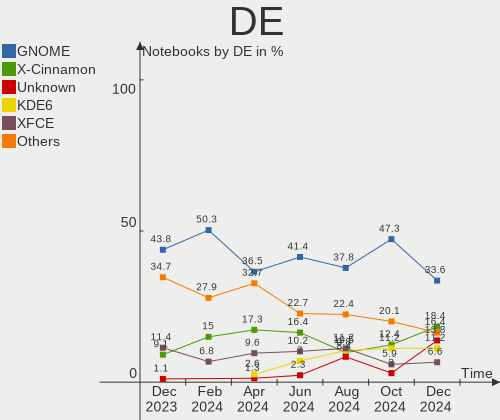

| Name       | Notebooks | Percent |
|------------|-----------|---------|
| GNOME      | 71        | 51.08%  |
| KDE5       | 26        | 18.71%  |
| X-Cinnamon | 16        | 11.51%  |
| XFCE       | 15        | 10.79%  |
| Cinnamon   | 2         | 1.44%   |
| Budgie     | 2         | 1.44%   |
| Unity      | 1         | 0.72%   |
| sway       | 1         | 0.72%   |
| Pantheon   | 1         | 0.72%   |
| MATE       | 1         | 0.72%   |
| LXQt       | 1         | 0.72%   |
| awesome    | 1         | 0.72%   |
| Unknown    | 1         | 0.72%   |

Display Server
--------------

X11 or Wayland

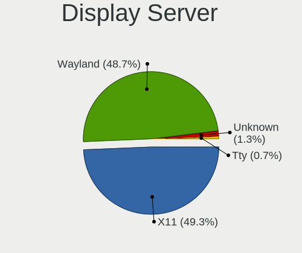

| Name    | Notebooks | Percent |
|---------|-----------|---------|
| X11     | 82        | 58.99%  |
| Wayland | 55        | 39.57%  |
| Unknown | 2         | 1.44%   |

Display Manager
---------------

SDDM, LightDM, etc.

| Name    | Notebooks | Percent |
|---------|-----------|---------|
| Unknown | 43        | 30.94%  |
| GDM3    | 33        | 23.74%  |
| LightDM | 30        | 21.58%  |
| SDDM    | 23        | 16.55%  |
| GDM     | 10        | 7.19%   |

OS Lang
-------

Language

| Lang  | Notebooks | Percent |
|-------|-----------|---------|
| it_IT | 99        | 71.22%  |
| en_US | 27        | 19.42%  |
| en_GB | 5         | 3.6%    |
| C     | 5         | 3.6%    |
| fr_FR | 1         | 0.72%   |
| de_IT | 1         | 0.72%   |
| de_DE | 1         | 0.72%   |

Boot Mode
---------

EFI or BIOS

| Mode | Notebooks | Percent |
|------|-----------|---------|
| EFI  | 71        | 51.08%  |
| BIOS | 68        | 48.92%  |

Filesystem
----------

Type of filesystem

| Type    | Notebooks | Percent |
|---------|-----------|---------|
| Ext4    | 81        | 58.27%  |
| Tmpfs   | 22        | 15.83%  |
| Btrfs   | 22        | 15.83%  |
| Overlay | 13        | 9.35%   |
| Xfs     | 1         | 0.72%   |

Part. scheme
------------

Scheme of partitioning

| Type    | Notebooks | Percent |
|---------|-----------|---------|
| GPT     | 80        | 57.55%  |
| Unknown | 44        | 31.65%  |
| MBR     | 15        | 10.79%  |

Dual Boot with Linux/BSD
------------------------

Hosting more than one Linux/BSD

| Dual boot | Notebooks | Percent |
|-----------|-----------|---------|
| No        | 128       | 92.09%  |
| Yes       | 11        | 7.91%   |

Dual Boot (Win)
---------------

Hosting Linux and Windows

| Dual boot | Notebooks | Percent |
|-----------|-----------|---------|
| No        | 96        | 69.06%  |
| Yes       | 43        | 30.94%  |

Board
-----

Vendor
------

Motherboard manufacturer

| Name                | Notebooks | Percent |
|---------------------|-----------|---------|
| Lenovo              | 30        | 21.58%  |
| Hewlett-Packard     | 28        | 20.14%  |
| Dell                | 14        | 10.07%  |
| ASUSTek Computer    | 12        | 8.63%   |
| Acer                | 11        | 7.91%   |
| HUAWEI              | 7         | 5.04%   |
| Mediacom            | 6         | 4.32%   |
| Apple               | 6         | 4.32%   |
| Sony                | 5         | 3.6%    |
| Samsung Electronics | 3         | 2.16%   |
| MSI                 | 3         | 2.16%   |
| Unknown             | 3         | 2.16%   |
| Valve               | 2         | 1.44%   |
| Toshiba             | 1         | 0.72%   |
| Timi                | 1         | 0.72%   |
| TELECOMITALIA       | 1         | 0.72%   |
| Olivetti            | 1         | 0.72%   |
| Olidata             | 1         | 0.72%   |
| Notebook            | 1         | 0.72%   |
| KUU                 | 1         | 0.72%   |
| Jumper              | 1         | 0.72%   |
| HONOR               | 1         | 0.72%   |

Model
-----

Motherboard model

| Name                                  | Notebooks | Percent |
|---------------------------------------|-----------|---------|
| Mediacom SmartBook 14 FullHD - SB14UC | 5         | 3.6%    |
| HP ENVY 15                            | 3         | 2.16%   |
| Unknown                               | 3         | 2.16%   |
| Valve Jupiter                         | 2         | 1.44%   |
| MSI Modern 14 B11MOL                  | 2         | 1.44%   |
| Lenovo IdeaPad Gaming 3 15ARH05 82EY  | 2         | 1.44%   |
| Lenovo IdeaPad 3 15ITL6 82H8          | 2         | 1.44%   |
| HP Pavilion dv6                       | 2         | 1.44%   |
| HP Notebook                           | 2         | 1.44%   |
| HP Laptop 15s-fq5xxx                  | 2         | 1.44%   |
| Dell XPS 15 9570                      | 2         | 1.44%   |
| Apple MacBookPro7,1                   | 2         | 1.44%   |
| Toshiba Satellite Pro S500            | 1         | 0.72%   |
| Timi RedmiBook 16                     | 1         | 0.72%   |
| TELECOMITALIA M7x0S                   | 1         | 0.72%   |
| Sony VPCF11C5E                        | 1         | 0.72%   |
| Sony SVF1521G1EW                      | 1         | 0.72%   |
| Sony SVF13N2J2ES                      | 1         | 0.72%   |
| Sony SVE1713X1EB                      | 1         | 0.72%   |
| Sony SVE1513Q1ESI                     | 1         | 0.72%   |
| Samsung RV411/RV511/E3511/S3511/RV711 | 1         | 0.72%   |
| Samsung RV410/RV510/S3510/E3510       | 1         | 0.72%   |
| Samsung 750XDA                        | 1         | 0.72%   |
| Olivetti OLIBOOK P35-XXXAEU           | 1         | 0.72%   |
| Olidata Tehom cw4900                  | 1         | 0.72%   |
| Notebook P750ZM                       | 1         | 0.72%   |
| MSI Alpha 15 B5EEK                    | 1         | 0.72%   |
| Mediacom SMARTBOOK ONE                | 1         | 0.72%   |
| Lenovo Yoga Slim 7 14ARE05 82A2       | 1         | 0.72%   |
| Lenovo V15-ADA 82C7                   | 1         | 0.72%   |
| Lenovo V15 G2 ALC 82KD                | 1         | 0.72%   |
| Lenovo V130-15IKB 81HN                | 1         | 0.72%   |
| Lenovo ThinkPad X395 20NLCTO1WW       | 1         | 0.72%   |
| Lenovo ThinkPad X260 20F6CTO1WW       | 1         | 0.72%   |
| Lenovo ThinkPad X220 4291IR6          | 1         | 0.72%   |
| Lenovo ThinkPad X100e 0022CTO         | 1         | 0.72%   |
| Lenovo ThinkPad W541 20EGS24J00       | 1         | 0.72%   |
| Lenovo ThinkPad T495s 20QJCTO1WW      | 1         | 0.72%   |
| Lenovo ThinkPad T470s 20HF0000MD      | 1         | 0.72%   |
| Lenovo ThinkPad T14 Gen 3 21CFCTO1WW  | 1         | 0.72%   |

Model Family
------------

Motherboard model prefix

| Name                | Notebooks | Percent |
|---------------------|-----------|---------|
| Lenovo ThinkPad     | 11        | 7.91%   |
| Lenovo IdeaPad      | 11        | 7.91%   |
| Acer Aspire         | 9         | 6.47%   |
| Mediacom SmartBook  | 6         | 4.32%   |
| HP Pavilion         | 6         | 4.32%   |
| Dell Latitude       | 6         | 4.32%   |
| Dell XPS            | 5         | 3.6%    |
| HP 255              | 4         | 2.88%   |
| HP Laptop           | 3         | 2.16%   |
| HP ENVY             | 3         | 2.16%   |
| HP Compaq           | 3         | 2.16%   |
| ASUS VivoBook       | 3         | 2.16%   |
| ASUS ROG            | 3         | 2.16%   |
| Unknown             | 3         | 2.16%   |
| Valve Jupiter       | 2         | 1.44%   |
| MSI Modern          | 2         | 1.44%   |
| Lenovo Legion       | 2         | 1.44%   |
| HP OMEN             | 2         | 1.44%   |
| HP Notebook         | 2         | 1.44%   |
| HP EliteBook        | 2         | 1.44%   |
| Dell Precision      | 2         | 1.44%   |
| Apple MacBookPro7   | 2         | 1.44%   |
| Toshiba Satellite   | 1         | 0.72%   |
| Timi RedmiBook      | 1         | 0.72%   |
| TELECOMITALIA M7x0S | 1         | 0.72%   |
| Sony VPCF11C5E      | 1         | 0.72%   |
| Sony SVF1521G1EW    | 1         | 0.72%   |
| Sony SVF13N2J2ES    | 1         | 0.72%   |
| Sony SVE1713X1EB    | 1         | 0.72%   |
| Sony SVE1513Q1ESI   | 1         | 0.72%   |
| Samsung RV411       | 1         | 0.72%   |
| Samsung RV410       | 1         | 0.72%   |
| Samsung 750XDA      | 1         | 0.72%   |
| Olivetti OLIBOOK    | 1         | 0.72%   |
| Olidata Tehom       | 1         | 0.72%   |
| Notebook P750ZM     | 1         | 0.72%   |
| MSI Alpha           | 1         | 0.72%   |
| Lenovo Yoga         | 1         | 0.72%   |
| Lenovo V15-ADA      | 1         | 0.72%   |
| Lenovo V15          | 1         | 0.72%   |

MFG Year
--------

Motherboard manufacture year

| Year    | Notebooks | Percent |
|---------|-----------|---------|
| 2021    | 21        | 15.11%  |
| 2016    | 16        | 11.51%  |
| 2020    | 14        | 10.07%  |
| 2010    | 13        | 9.35%   |
| 2022    | 12        | 8.63%   |
| 2012    | 8         | 5.76%   |
| 2018    | 7         | 5.04%   |
| 2017    | 7         | 5.04%   |
| 2019    | 6         | 4.32%   |
| 2015    | 6         | 4.32%   |
| 2014    | 6         | 4.32%   |
| 2007    | 6         | 4.32%   |
| 2011    | 5         | 3.6%    |
| 2008    | 4         | 2.88%   |
| 2013    | 3         | 2.16%   |
| 2023    | 2         | 1.44%   |
| 2009    | 2         | 1.44%   |
| Unknown | 1         | 0.72%   |

Form Factor
-----------

Physical design of the computer

| Name     | Notebooks | Percent |
|----------|-----------|---------|
| Notebook | 139       | 100%    |

Secure Boot
-----------

Enabled or disabled

| State    | Notebooks | Percent |
|----------|-----------|---------|
| Disabled | 123       | 88.49%  |
| Enabled  | 16        | 11.51%  |

Coreboot
--------

Have coreboot on board

| Used | Notebooks | Percent |
|------|-----------|---------|
| No   | 139       | 100%    |

RAM Size
--------

Total RAM memory

| Size in GB  | Notebooks | Percent |
|-------------|-----------|---------|
| 4.01-8.0    | 45        | 32.37%  |
| 8.01-16.0   | 31        | 22.3%   |
| 3.01-4.0    | 26        | 18.71%  |
| 16.01-24.0  | 18        | 12.95%  |
| 1.01-2.0    | 8         | 5.76%   |
| 32.01-64.0  | 7         | 5.04%   |
| 24.01-32.0  | 2         | 1.44%   |
| 2.01-3.0    | 1         | 0.72%   |
| 64.01-256.0 | 1         | 0.72%   |

RAM Used
--------

Used RAM memory

| Used GB    | Notebooks | Percent |
|------------|-----------|---------|
| 1.01-2.0   | 50        | 35.97%  |
| 2.01-3.0   | 37        | 26.62%  |
| 3.01-4.0   | 25        | 17.99%  |
| 4.01-8.0   | 21        | 15.11%  |
| 0.51-1.0   | 3         | 2.16%   |
| 8.01-16.0  | 2         | 1.44%   |
| 16.01-24.0 | 1         | 0.72%   |

Total Drives
------------

Number of drives on board

| Drives | Notebooks | Percent |
|--------|-----------|---------|
| 1      | 104       | 74.82%  |
| 2      | 32        | 23.02%  |
| 3      | 3         | 2.16%   |

Has CD-ROM
----------

Has CD-ROM on board

| Presented | Notebooks | Percent |
|-----------|-----------|---------|
| No        | 96        | 69.06%  |
| Yes       | 43        | 30.94%  |

Has Ethernet
------------

Has Ethernet on board

| Presented | Notebooks | Percent |
|-----------|-----------|---------|
| Yes       | 96        | 69.06%  |
| No        | 43        | 30.94%  |

Has WiFi
--------

Has WiFi module

| Presented | Notebooks | Percent |
|-----------|-----------|---------|
| Yes       | 131       | 94.24%  |
| No        | 8         | 5.76%   |

Has Bluetooth
-------------

Has Bluetooth module

| Presented | Notebooks | Percent |
|-----------|-----------|---------|
| Yes       | 110       | 79.14%  |
| No        | 29        | 20.86%  |

Location
--------

Country
-------

Geographic location (country)

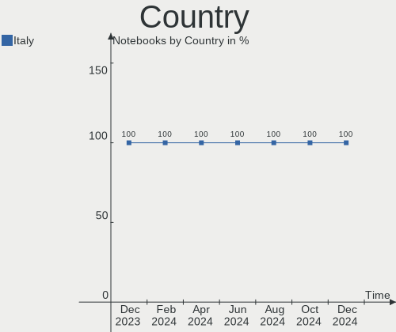

| Country | Notebooks | Percent |
|---------|-----------|---------|
| Italy   | 139       | 100%    |

City
----

Geographic location (city)

| City                | Notebooks | Percent |
|---------------------|-----------|---------|
| Milan               | 22        | 15.83%  |
| Rome                | 10        | 7.19%   |
| Turin               | 7         | 5.04%   |
| Milano              | 6         | 4.32%   |
| Verona              | 4         | 2.88%   |
| Catania             | 4         | 2.88%   |
| Florence            | 3         | 2.16%   |
| Rho                 | 2         | 1.44%   |
| Reggio Emilia       | 2         | 1.44%   |
| Palermo             | 2         | 1.44%   |
| Monza               | 2         | 1.44%   |
| Brescia             | 2         | 1.44%   |
| Bologna             | 2         | 1.44%   |
| Vinovo              | 1         | 0.72%   |
| Viggiù             | 1         | 0.72%   |
| Vicenza             | 1         | 0.72%   |
| Venice              | 1         | 0.72%   |
| Valmadrera          | 1         | 0.72%   |
| Vado Ligure         | 1         | 0.72%   |
| Tuoro sul Trasimeno | 1         | 0.72%   |
| Trieste             | 1         | 0.72%   |
| Treviglio           | 1         | 0.72%   |
| Tortona             | 1         | 0.72%   |
| Taranto             | 1         | 0.72%   |
| Susa                | 1         | 0.72%   |
| Selva di Progno     | 1         | 0.72%   |
| SantAntioco         | 1         | 0.72%   |
| Ruvo di Puglia      | 1         | 0.72%   |
| Ronco all'Adige     | 1         | 0.72%   |
| Roccamonfina        | 1         | 0.72%   |
| Rimini              | 1         | 0.72%   |
| Rende               | 1         | 0.72%   |
| Recco               | 1         | 0.72%   |
| Pistoia             | 1         | 0.72%   |
| Pisa                | 1         | 0.72%   |
| Pietrasanta         | 1         | 0.72%   |
| Perugia             | 1         | 0.72%   |
| Penne               | 1         | 0.72%   |
| Parma               | 1         | 0.72%   |
| Padova              | 1         | 0.72%   |

Drives
------

Drive Vendor
------------

Hard drive vendors

| Vendor                       | Notebooks | Drives | Percent |
|------------------------------|-----------|--------|---------|
| Samsung Electronics          | 38        | 41     | 22.89%  |
| Unknown                      | 14        | 18     | 8.43%   |
| HGST                         | 11        | 11     | 6.63%   |
| WDC                          | 10        | 10     | 6.02%   |
| Sandisk                      | 10        | 10     | 6.02%   |
| Kingston                     | 9         | 9      | 5.42%   |
| SK hynix                     | 7         | 7      | 4.22%   |
| Micron Technology            | 7         | 7      | 4.22%   |
| Crucial                      | 7         | 8      | 4.22%   |
| Toshiba                      | 6         | 6      | 3.61%   |
| Intel                        | 6         | 6      | 3.61%   |
| Seagate                      | 5         | 5      | 3.01%   |
| Micron/Crucial Technology    | 4         | 4      | 2.41%   |
| Hitachi                      | 4         | 4      | 2.41%   |
| Phison Electronics           | 2         | 2      | 1.2%    |
| Phison                       | 2         | 2      | 1.2%    |
| LITEON                       | 2         | 2      | 1.2%    |
| Intenso                      | 2         | 3      | 1.2%    |
| Emtec                        | 2         | 2      | 1.2%    |
| A-DATA Technology            | 2         | 2      | 1.2%    |
| Transcend                    | 1         | 1      | 0.6%    |
| Teclast                      | 1         | 1      | 0.6%    |
| Team                         | 1         | 1      | 0.6%    |
| SSSTC                        | 1         | 1      | 0.6%    |
| Shenzhen Longsys Electronics | 1         | 1      | 0.6%    |
| OCZ                          | 1         | 1      | 0.6%    |
| MAXIO Technology (Hangzhou)  | 1         | 1      | 0.6%    |
| Lexar                        | 1         | 1      | 0.6%    |
| KIOXIA                       | 1         | 1      | 0.6%    |
| Kingston Technology Company  | 1         | 1      | 0.6%    |
| KingFast                     | 1         | 1      | 0.6%    |
| Fujitsu                      | 1         | 1      | 0.6%    |
| China                        | 1         | 1      | 0.6%    |
| BAITITON                     | 1         | 1      | 0.6%    |
| Apple                        | 1         | 1      | 0.6%    |
| Unknown                      | 1         | 1      | 0.6%    |

Drive Model
-----------

Hard drive models

| Model                                               | Notebooks | Percent |
|-----------------------------------------------------|-----------|---------|
| Unknown NCard  32GB                                 | 5         | 2.86%   |
| Unknown MMC Card  32GB                              | 3         | 1.71%   |
| Samsung NVMe SSD Controller SM981/PM981/PM983 256GB | 3         | 1.71%   |
| Micron/Crucial P2 NVMe PCIe SSD 1TB                 | 3         | 1.71%   |
| Micron MTFDHBA512QFD 512GB                          | 3         | 1.71%   |
| HGST HTS721010A9E630 1TB                            | 3         | 1.71%   |
| HGST HTS545050A7E680 500GB                          | 3         | 1.71%   |
| Crucial CT1000MX500SSD1 1TB                         | 3         | 1.71%   |
| Unknown MMC Card  64GB                              | 2         | 1.14%   |
| Unknown MMC Card  128GB                             | 2         | 1.14%   |
| Toshiba MQ01ABF050 500GB                            | 2         | 1.14%   |
| Samsung SSD 860 EVO 500GB                           | 2         | 1.14%   |
| Samsung SSD 860 EVO 250GB                           | 2         | 1.14%   |
| Samsung MZVLQ512HALU-00000 512GB                    | 2         | 1.14%   |
| Phison PS5013 E13 NVMe Controller 512GB             | 2         | 1.14%   |
| Kingston SA400S37480G 480GB SSD                     | 2         | 1.14%   |
| Kingston OM8PCP3512F-AI1 512GB                      | 2         | 1.14%   |
| Intel SSD 660P Series 512GB                         | 2         | 1.14%   |
| Hitachi HTS545050B9A300 500GB                       | 2         | 1.14%   |
| HGST HTS541010A9E680 1TB                            | 2         | 1.14%   |
| WDC WD7500BFCX-68N6GN0 752GB                        | 1         | 0.57%   |
| WDC WD5000LPVX-22V0TT0 500GB                        | 1         | 0.57%   |
| WDC WD5000LPLX-75ZNTT0 500GB                        | 1         | 0.57%   |
| WDC WD5000LPCX-24C6HT0 500GB                        | 1         | 0.57%   |
| WDC WD5000BPVT-22HXZT3 500GB                        | 1         | 0.57%   |
| WDC WD1600BEVT-22ZCT0 160GB                         | 1         | 0.57%   |
| WDC WD16 00AVBB-63SYA0 160GB                        | 1         | 0.57%   |
| WDC WD10SPZX-21Z10T0 1TB                            | 1         | 0.57%   |
| WDC WD10JPVX-22JC3T0 1TB                            | 1         | 0.57%   |
| WDC PC SN730 SDBPNTY-512G-1027 512GB                | 1         | 0.57%   |
| Unknown SC128  128GB                                | 1         | 0.57%   |
| Unknown NVMe SSD Drive 512GB                        | 1         | 0.57%   |
| Unknown MMC Card  4GB                               | 1         | 0.57%   |
| Unknown MMC Card  256GB                             | 1         | 0.57%   |
| Unknown MMC Card  1073GB                            | 1         | 0.57%   |
| Unknown MMC Card  1072GB                            | 1         | 0.57%   |
| Transcend TS128GMTS430S 128GB SSD                   | 1         | 0.57%   |
| Toshiba MQ04ABF100 1TB                              | 1         | 0.57%   |
| Toshiba MK6475GSX 640GB                             | 1         | 0.57%   |
| Toshiba MK5056GSY 500GB                             | 1         | 0.57%   |

HDD Vendor
----------

Hard disk drive vendors

| Vendor              | Notebooks | Drives | Percent |
|---------------------|-----------|--------|---------|
| HGST                | 11        | 11     | 29.73%  |
| WDC                 | 9         | 9      | 24.32%  |
| Toshiba             | 6         | 6      | 16.22%  |
| Seagate             | 5         | 5      | 13.51%  |
| Hitachi             | 4         | 4      | 10.81%  |
| Samsung Electronics | 1         | 1      | 2.7%    |
| Fujitsu             | 1         | 1      | 2.7%    |

SSD Vendor
----------

Solid state drive vendors

| Vendor              | Notebooks | Drives | Percent |
|---------------------|-----------|--------|---------|
| Samsung Electronics | 18        | 19     | 33.33%  |
| Crucial             | 7         | 8      | 12.96%  |
| SanDisk             | 5         | 5      | 9.26%   |
| Kingston            | 5         | 5      | 9.26%   |
| LITEON              | 2         | 2      | 3.7%    |
| Intenso             | 2         | 2      | 3.7%    |
| Emtec               | 2         | 2      | 3.7%    |
| Transcend           | 1         | 1      | 1.85%   |
| Teclast             | 1         | 1      | 1.85%   |
| Team                | 1         | 1      | 1.85%   |
| SK hynix            | 1         | 1      | 1.85%   |
| OCZ                 | 1         | 1      | 1.85%   |
| Micron Technology   | 1         | 1      | 1.85%   |
| Lexar               | 1         | 1      | 1.85%   |
| KingFast            | 1         | 1      | 1.85%   |
| Intel               | 1         | 1      | 1.85%   |
| China               | 1         | 1      | 1.85%   |
| BAITITON            | 1         | 1      | 1.85%   |
| Apple               | 1         | 1      | 1.85%   |
| A-DATA Technology   | 1         | 1      | 1.85%   |

Drive Kind
----------

HDD or SSD

| Kind    | Notebooks | Drives | Percent |
|---------|-----------|--------|---------|
| NVMe    | 59        | 63     | 36.65%  |
| SSD     | 51        | 56     | 31.68%  |
| HDD     | 36        | 37     | 22.36%  |
| MMC     | 14        | 18     | 8.7%    |
| Unknown | 1         | 1      | 0.62%   |

Drive Connector
---------------

SATA, SAS, NVMe, etc.

| Type | Notebooks | Drives | Percent |
|------|-----------|--------|---------|
| SATA | 79        | 91     | 50.97%  |
| NVMe | 59        | 63     | 38.06%  |
| MMC  | 14        | 18     | 9.03%   |
| SAS  | 3         | 3      | 1.94%   |

Drive Size
----------

Size of hard drive

| Size in TB | Notebooks | Drives | Percent |
|------------|-----------|--------|---------|
| 0.01-0.5   | 55        | 61     | 65.48%  |
| 0.51-1.0   | 24        | 26     | 28.57%  |
| 1.01-2.0   | 4         | 5      | 4.76%   |
| 4.01-10.0  | 1         | 1      | 1.19%   |

Space Total
-----------

Amount of disk space available on the file system

| Size in GB     | Notebooks | Percent |
|----------------|-----------|---------|
| 251-500        | 40        | 28.78%  |
| 101-250        | 35        | 25.18%  |
| 501-1000       | 16        | 11.51%  |
| 1-20           | 12        | 8.63%   |
| 21-50          | 9         | 6.47%   |
| 1001-2000      | 9         | 6.47%   |
| 51-100         | 8         | 5.76%   |
| More than 3000 | 5         | 3.6%    |
| Unknown        | 4         | 2.88%   |
| 2001-3000      | 1         | 0.72%   |

Space Used
----------

Amount of used disk space

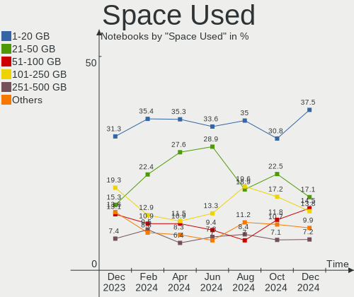

| Used GB        | Notebooks | Percent |
|----------------|-----------|---------|
| 1-20           | 52        | 37.41%  |
| 21-50          | 23        | 16.55%  |
| 101-250        | 19        | 13.67%  |
| 251-500        | 17        | 12.23%  |
| 51-100         | 14        | 10.07%  |
| 1001-2000      | 4         | 2.88%   |
| 501-1000       | 4         | 2.88%   |
| Unknown        | 4         | 2.88%   |
| More than 3000 | 1         | 0.72%   |
| 2001-3000      | 1         | 0.72%   |

Malfunc. Drives
---------------

Drive models with a malfunction

| Model                      | Notebooks | Drives | Percent |
|----------------------------|-----------|--------|---------|
| HGST HTS721010A9E630 1TB   | 2         | 2      | 33.33%  |
| Toshiba MK2529GSG 250GB    | 1         | 1      | 16.67%  |
| Intel SSDSA2M080G2GC 80GB  | 1         | 1      | 16.67%  |
| Hitachi HTS54323 320GB     | 1         | 1      | 16.67%  |
| HGST HTS545050A7E680 500GB | 1         | 1      | 16.67%  |

Malfunc. Drive Vendor
---------------------

Vendors of faulty drives

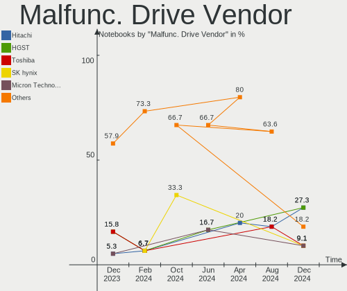

| Vendor  | Notebooks | Drives | Percent |
|---------|-----------|--------|---------|
| HGST    | 3         | 3      | 50%     |
| Toshiba | 1         | 1      | 16.67%  |
| Intel   | 1         | 1      | 16.67%  |
| Hitachi | 1         | 1      | 16.67%  |

Malfunc. HDD Vendor
-------------------

Vendors of faulty HDD drives

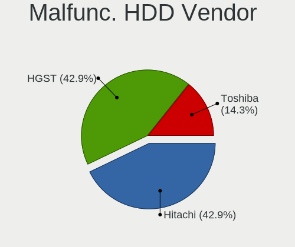

| Vendor  | Notebooks | Drives | Percent |
|---------|-----------|--------|---------|
| HGST    | 3         | 3      | 60%     |
| Toshiba | 1         | 1      | 20%     |
| Hitachi | 1         | 1      | 20%     |

Malfunc. Drive Kind
-------------------

Kinds of faulty drives

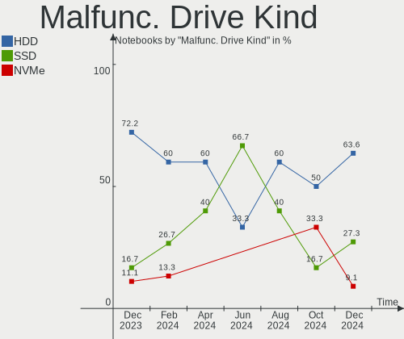

| Kind | Notebooks | Drives | Percent |
|------|-----------|--------|---------|
| HDD  | 5         | 5      | 83.33%  |
| SSD  | 1         | 1      | 16.67%  |

Failed Drives
-------------

Failed drive models

Zero info for selected period =(

Failed Drive Vendor
-------------------

Failed drive vendors

Zero info for selected period =(

Drive Status
------------

Number of failed and malfunc. drives

| Status   | Notebooks | Drives | Percent |
|----------|-----------|--------|---------|
| Detected | 75        | 98     | 52.08%  |
| Works    | 64        | 71     | 44.44%  |
| Malfunc  | 5         | 6      | 3.47%   |

Storage controller
------------------

Storage Vendor
--------------

Storage controller vendors

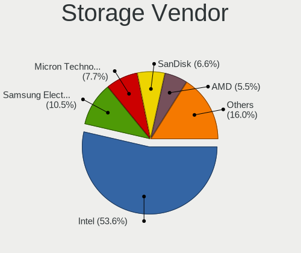

| Vendor                           | Notebooks | Percent |
|----------------------------------|-----------|---------|
| Intel                            | 79        | 47.59%  |
| AMD                              | 24        | 14.46%  |
| Samsung Electronics              | 23        | 13.86%  |
| SK hynix                         | 7         | 4.22%   |
| SanDisk                          | 6         | 3.61%   |
| Micron Technology                | 6         | 3.61%   |
| Kingston Technology Company      | 5         | 3.01%   |
| Phison Electronics               | 4         | 2.41%   |
| Micron/Crucial Technology        | 4         | 2.41%   |
| Nvidia                           | 2         | 1.2%    |
| MAXIO Technology (Hangzhou)      | 2         | 1.2%    |
| Solid State Storage Technology   | 1         | 0.6%    |
| Silicon Integrated Systems [SiS] | 1         | 0.6%    |
| Shenzhen Longsys Electronics     | 1         | 0.6%    |
| KIOXIA                           | 1         | 0.6%    |

Storage Model
-------------

Storage controller models

| Model                                                                                  | Notebooks | Percent |
|----------------------------------------------------------------------------------------|-----------|---------|
| AMD FCH SATA Controller [AHCI mode]                                                    | 23        | 12.57%  |
| Samsung NVMe SSD Controller 980                                                        | 10        | 5.46%   |
| Samsung NVMe SSD Controller SM981/PM981/PM983                                          | 8         | 4.37%   |
| Intel Volume Management Device NVMe RAID Controller                                    | 8         | 4.37%   |
| Intel Sunrise Point-LP SATA Controller [AHCI mode]                                     | 7         | 3.83%   |
| Intel 7 Series Chipset Family 6-port SATA Controller [AHCI mode]                       | 7         | 3.83%   |
| Intel Wildcat Point-LP SATA Controller [AHCI Mode]                                     | 6         | 3.28%   |
| Intel 82801HM/HEM (ICH8M/ICH8M-E) IDE Controller                                       | 6         | 3.28%   |
| Intel 82801 Mobile SATA Controller [RAID mode]                                         | 6         | 3.28%   |
| Intel 5 Series/3400 Series Chipset 4 port SATA AHCI Controller                         | 6         | 3.28%   |
| Intel 82801HM/HEM (ICH8M/ICH8M-E) SATA Controller [AHCI mode]                          | 5         | 2.73%   |
| Micron NVMe Storage Controller                                                         | 4         | 2.19%   |
| Kingston Company Company Non-Volatile memory controller                                | 4         | 2.19%   |
| Intel 8 Series SATA Controller 1 [AHCI mode]                                           | 4         | 2.19%   |
| SK hynix Gold P31/PC711 NVMe Solid State Drive                                         | 3         | 1.64%   |
| Samsung NVMe SSD Controller PM9A1/PM9A3/980PRO                                         | 3         | 1.64%   |
| Phison PS5013 E13 NVMe Controller                                                      | 3         | 1.64%   |
| Micron/Crucial P2 NVMe PCIe SSD                                                        | 3         | 1.64%   |
| Intel Comet Lake SATA AHCI Controller                                                  | 3         | 1.64%   |
| Intel Cannon Lake Mobile PCH SATA AHCI Controller                                      | 3         | 1.64%   |
| Intel 82801IBM/IEM (ICH9M/ICH9M-E) 4 port SATA Controller [AHCI mode]                  | 3         | 1.64%   |
| Intel 6 Series/C200 Series Chipset Family 6 port Mobile SATA AHCI Controller           | 3         | 1.64%   |
| SanDisk WD Black SN750 / PC SN730 NVMe SSD                                             | 2         | 1.09%   |
| Samsung Electronics SATA controller                                                    | 2         | 1.09%   |
| Nvidia MCP89 SATA Controller (AHCI mode)                                               | 2         | 1.09%   |
| Intel Tiger Lake-LP SATA Controller                                                    | 2         | 1.09%   |
| Intel SSD 660P Series                                                                  | 2         | 1.09%   |
| Intel Non-Volatile memory controller                                                   | 2         | 1.09%   |
| Intel Celeron/Pentium Silver Processor SATA Controller                                 | 2         | 1.09%   |
| Intel 8 Series/C220 Series Chipset Family 6-port SATA Controller 1 [AHCI mode]         | 2         | 1.09%   |
| Intel 6 Series/C200 Series Chipset Family Mobile SATA Controller (IDE mode, ports 4-5) | 2         | 1.09%   |
| Intel 6 Series/C200 Series Chipset Family Mobile SATA Controller (IDE mode, ports 0-3) | 2         | 1.09%   |
| Solid State Storage Non-Volatile memory controller                                     | 1         | 0.55%   |
| SK hynix PC401 NVMe Solid State Drive 256GB                                            | 1         | 0.55%   |
| SK hynix Non-Volatile memory controller                                                | 1         | 0.55%   |
| SK hynix BC511                                                                         | 1         | 0.55%   |
| SK hynix BC501 NVMe Solid State Drive                                                  | 1         | 0.55%   |
| Silicon Integrated Systems [SiS] AHCI IDE Controller (0106)                            | 1         | 0.55%   |
| Silicon Integrated Systems [SiS] 5513 IDE Controller                                   | 1         | 0.55%   |
| Shenzhen Longsys Non-Volatile memory controller                                        | 1         | 0.55%   |

Storage Kind
------------

Kind of storage controller (IDE, SATA, NVMe, SAS, ...)

| Kind | Notebooks | Percent |
|------|-----------|---------|
| SATA | 88        | 50.87%  |
| NVMe | 59        | 34.1%   |
| RAID | 14        | 8.09%   |
| IDE  | 12        | 6.94%   |

Processor
---------

CPU Vendor
----------

Processor vendors

| Vendor | Notebooks | Percent |
|--------|-----------|---------|
| Intel  | 98        | 70.5%   |
| AMD    | 41        | 29.5%   |

CPU Model
---------

Processor models

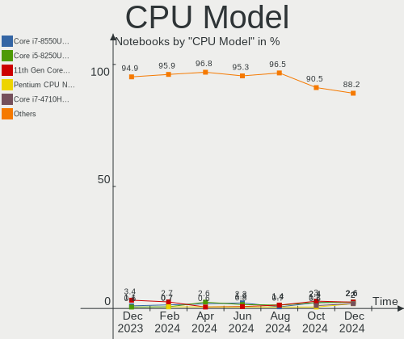

| Model                                           | Notebooks | Percent |
|-------------------------------------------------|-----------|---------|
| Intel Atom x5-Z8300 CPU @ 1.44GHz               | 6         | 4.32%   |
| Intel Core i5-5200U CPU @ 2.20GHz               | 4         | 2.88%   |
| Intel 11th Gen Core i5-1135G7 @ 2.40GHz         | 4         | 2.88%   |
| Intel Core i5 CPU M 520 @ 2.40GHz               | 3         | 2.16%   |
| Intel 11th Gen Core i7-1165G7 @ 2.80GHz         | 3         | 2.16%   |
| AMD Ryzen 7 5800H with Radeon Graphics          | 3         | 2.16%   |
| AMD Ryzen 7 4800H with Radeon Graphics          | 3         | 2.16%   |
| Intel Core i7-8750H CPU @ 2.20GHz               | 2         | 1.44%   |
| Intel Core i7-8565U CPU @ 1.80GHz               | 2         | 1.44%   |
| Intel Core i7-4510U CPU @ 2.00GHz               | 2         | 1.44%   |
| Intel Core i7-3632QM CPU @ 2.20GHz              | 2         | 1.44%   |
| Intel Core i5-7200U CPU @ 2.50GHz               | 2         | 1.44%   |
| Intel Core i5-6300U CPU @ 2.40GHz               | 2         | 1.44%   |
| Intel Core i5-10210U CPU @ 1.60GHz              | 2         | 1.44%   |
| Intel Core i5 CPU M 480 @ 2.67GHz               | 2         | 1.44%   |
| Intel Core i3-10110U CPU @ 2.10GHz              | 2         | 1.44%   |
| Intel Core 2 Duo CPU P8600 @ 2.40GHz            | 2         | 1.44%   |
| AMD Ryzen 7 PRO 3700U w/ Radeon Vega Mobile Gfx | 2         | 1.44%   |
| AMD Ryzen 7 5700U with Radeon Graphics          | 2         | 1.44%   |
| AMD Ryzen 5 5500U with Radeon Graphics          | 2         | 1.44%   |
| AMD Ryzen 5 3500U with Radeon Vega Mobile Gfx   | 2         | 1.44%   |
| AMD Custom APU 0405                             | 2         | 1.44%   |
| AMD A12-9720P RADEON R7, 12 COMPUTE CORES 4C+8G | 2         | 1.44%   |
| Intel Pentium Dual CPU T2390 @ 1.86GHz          | 1         | 0.72%   |
| Intel Core m7-6Y75 CPU @ 1.20GHz                | 1         | 0.72%   |
| Intel Core M-5Y10c CPU @ 0.80GHz                | 1         | 0.72%   |
| Intel Core i9-8950HK CPU @ 2.90GHz              | 1         | 0.72%   |
| Intel Core i7-9750H CPU @ 2.60GHz               | 1         | 0.72%   |
| Intel Core i7-8550U CPU @ 1.80GHz               | 1         | 0.72%   |
| Intel Core i7-7920HQ CPU @ 3.10GHz              | 1         | 0.72%   |
| Intel Core i7-6700HQ CPU @ 2.60GHz              | 1         | 0.72%   |
| Intel Core i7-4810MQ CPU @ 2.80GHz              | 1         | 0.72%   |
| Intel Core i7-4790K CPU @ 4.00GHz               | 1         | 0.72%   |
| Intel Core i7-4700MQ CPU @ 2.40GHz              | 1         | 0.72%   |
| Intel Core i7-4500U CPU @ 1.80GHz               | 1         | 0.72%   |
| Intel Core i7-3520M CPU @ 2.90GHz               | 1         | 0.72%   |
| Intel Core i7-2670QM CPU @ 2.20GHz              | 1         | 0.72%   |
| Intel Core i7-2630QM CPU @ 2.00GHz              | 1         | 0.72%   |
| Intel Core i7-10875H CPU @ 2.30GHz              | 1         | 0.72%   |
| Intel Core i7-1065G7 CPU @ 1.30GHz              | 1         | 0.72%   |

CPU Model Family
----------------

Processor model prefix

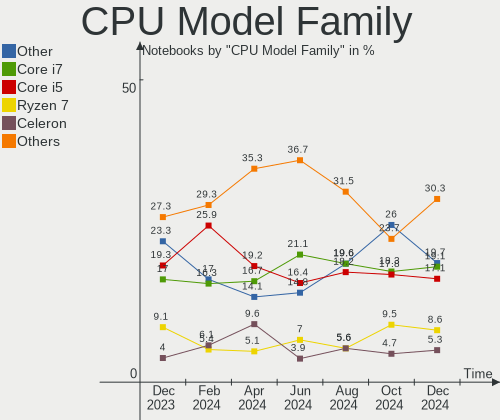

| Model                   | Notebooks | Percent |
|-------------------------|-----------|---------|
| Intel Core i5           | 25        | 17.99%  |
| Intel Core i7           | 21        | 15.11%  |
| Other                   | 19        | 13.67%  |
| AMD Ryzen 7             | 11        | 7.91%   |
| Intel Core i3           | 10        | 7.19%   |
| Intel Core 2 Duo        | 10        | 7.19%   |
| AMD Ryzen 5             | 8         | 5.76%   |
| Intel Atom              | 7         | 5.04%   |
| Intel Celeron           | 3         | 2.16%   |
| AMD Ryzen 7 PRO         | 3         | 2.16%   |
| AMD E1                  | 3         | 2.16%   |
| AMD A6                  | 3         | 2.16%   |
| AMD Ryzen 9             | 2         | 1.44%   |
| AMD Ryzen 3             | 2         | 1.44%   |
| AMD A12                 | 2         | 1.44%   |
| AMD A10                 | 2         | 1.44%   |
| Intel Pentium Dual      | 1         | 0.72%   |
| Intel Core m7           | 1         | 0.72%   |
| Intel Core M            | 1         | 0.72%   |
| Intel Core i9           | 1         | 0.72%   |
| Intel Core Duo          | 1         | 0.72%   |
| Intel Celeron Dual-Core | 1         | 0.72%   |
| AMD E2                  | 1         | 0.72%   |
| AMD Athlon Neo          | 1         | 0.72%   |

CPU Cores
---------

Number of processor cores

| Number | Notebooks | Percent |
|--------|-----------|---------|
| 2      | 63        | 45.32%  |
| 4      | 45        | 32.37%  |
| 8      | 14        | 10.07%  |
| 6      | 10        | 7.19%   |
| 10     | 3         | 2.16%   |
| 16     | 1         | 0.72%   |
| 14     | 1         | 0.72%   |
| 12     | 1         | 0.72%   |
| 1      | 1         | 0.72%   |

CPU Sockets
-----------

Number of sockets

| Number | Notebooks | Percent |
|--------|-----------|---------|
| 1      | 139       | 100%    |

CPU Threads
-----------

Threads per core (Hyper-Threading)

| Number | Notebooks | Percent |
|--------|-----------|---------|
| 2      | 104       | 74.82%  |
| 1      | 35        | 25.18%  |

CPU Op-Modes
------------

CPU Operation Modes (32-bit, 64-bit)

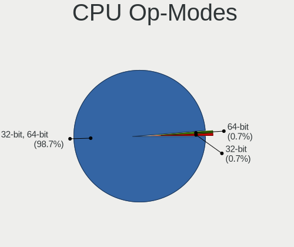

| Op mode        | Notebooks | Percent |
|----------------|-----------|---------|
| 32-bit, 64-bit | 138       | 99.28%  |
| 32-bit         | 1         | 0.72%   |

CPU Microcode
-------------

Microcode number

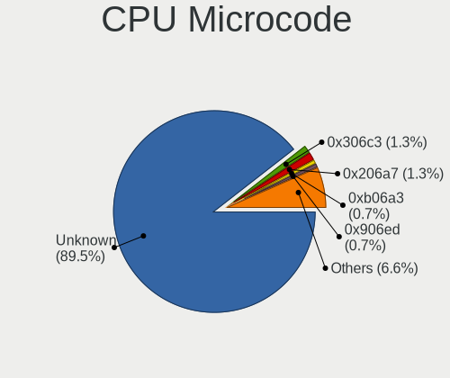

| Number     | Notebooks | Percent |
|------------|-----------|---------|
| Unknown    | 65        | 46.76%  |
| 0x406c3    | 5         | 3.6%    |
| 0x08108109 | 5         | 3.6%    |
| 0x306a9    | 4         | 2.88%   |
| 0x0a50000c | 4         | 2.88%   |
| 0x08600104 | 4         | 2.88%   |
| 0x906a4    | 3         | 2.16%   |
| 0x806c1    | 3         | 2.16%   |
| 0x406e3    | 3         | 2.16%   |
| 0x1067a    | 3         | 2.16%   |
| 0x08608103 | 3         | 2.16%   |
| 0x07030105 | 3         | 2.16%   |
| 0x0600611a | 3         | 2.16%   |
| 0x6fa      | 2         | 1.44%   |
| 0x306c3    | 2         | 1.44%   |
| 0x206a7    | 2         | 1.44%   |
| 0x20652    | 2         | 1.44%   |
| 0x0a601203 | 2         | 1.44%   |
| 0x0a50000d | 2         | 1.44%   |
| 0x0700010f | 2         | 1.44%   |
| 0x906ea    | 1         | 0.72%   |
| 0x906e9    | 1         | 0.72%   |
| 0x906a3    | 1         | 0.72%   |
| 0x806ec    | 1         | 0.72%   |
| 0x806eb    | 1         | 0.72%   |
| 0x806e9    | 1         | 0.72%   |
| 0x806c2    | 1         | 0.72%   |
| 0x706a8    | 1         | 0.72%   |
| 0x6fd      | 1         | 0.72%   |
| 0x6ec      | 1         | 0.72%   |
| 0x40651    | 1         | 0.72%   |
| 0x306d4    | 1         | 0.72%   |
| 0x20655    | 1         | 0.72%   |
| 0x0a404102 | 1         | 0.72%   |
| 0x08600106 | 1         | 0.72%   |
| 0x07000110 | 1         | 0.72%   |
| 0x03000027 | 1         | 0.72%   |

CPU Microarch
-------------

Microarchitecture

| Name             | Notebooks | Percent |
|------------------|-----------|---------|
| KabyLake         | 15        | 10.79%  |
| Unknown          | 13        | 9.35%   |
| TigerLake        | 11        | 7.91%   |
| Westmere         | 8         | 5.76%   |
| Penryn           | 8         | 5.76%   |
| Silvermont       | 7         | 5.04%   |
| SandyBridge      | 7         | 5.04%   |
| IvyBridge        | 7         | 5.04%   |
| Haswell          | 7         | 5.04%   |
| Broadwell        | 7         | 5.04%   |
| Zen 3            | 6         | 4.32%   |
| Zen 2            | 6         | 4.32%   |
| Skylake          | 6         | 4.32%   |
| Zen+             | 5         | 3.6%    |
| Excavator        | 4         | 2.88%   |
| Core             | 4         | 2.88%   |
| Puma             | 3         | 2.16%   |
| Jaguar           | 3         | 2.16%   |
| Alderlake Hybrid | 3         | 2.16%   |
| IceLake          | 2         | 1.44%   |
| Goldmont plus    | 2         | 1.44%   |
| Steamroller      | 1         | 0.72%   |
| P6               | 1         | 0.72%   |
| K8 Hammer        | 1         | 0.72%   |
| K10 Llano        | 1         | 0.72%   |
| CometLake        | 1         | 0.72%   |

Graphics
--------

GPU Vendor
----------

Vendors of graphics cards

| Vendor                           | Notebooks | Percent |
|----------------------------------|-----------|---------|
| Intel                            | 84        | 48.28%  |
| AMD                              | 51        | 29.31%  |
| Nvidia                           | 38        | 21.84%  |
| Silicon Integrated Systems [SiS] | 1         | 0.57%   |

GPU Model
---------

Graphics card models

| Model                                                                                    | Notebooks | Percent |
|------------------------------------------------------------------------------------------|-----------|---------|
| Intel TigerLake-LP GT2 [Iris Xe Graphics]                                                | 10        | 5.43%   |
| Intel Atom/Celeron/Pentium Processor x5-E8000/J3xxx/N3xxx Integrated Graphics Controller | 7         | 3.8%    |
| Intel 3rd Gen Core processor Graphics Controller                                         | 6         | 3.26%   |
| Intel 2nd Generation Core Processor Family Integrated Graphics Controller                | 6         | 3.26%   |
| AMD Renoir                                                                               | 6         | 3.26%   |
| Intel HD Graphics 5500                                                                   | 5         | 2.72%   |
| Intel Core Processor Integrated Graphics Controller                                      | 5         | 2.72%   |
| AMD Picasso/Raven 2 [Radeon Vega Series / Radeon Vega Mobile Series]                     | 5         | 2.72%   |
| AMD Lucienne                                                                             | 5         | 2.72%   |
| AMD Cezanne [Radeon Vega Series / Radeon Vega Mobile Series]                             | 5         | 2.72%   |
| Intel Skylake GT2 [HD Graphics 520]                                                      | 4         | 2.17%   |
| Intel Haswell-ULT Integrated Graphics Controller                                         | 4         | 2.17%   |
| Intel CometLake-U GT2 [UHD Graphics]                                                     | 4         | 2.17%   |
| Intel Mobile GM965/GL960 Integrated Graphics Controller (secondary)                      | 3         | 1.63%   |
| Intel Mobile GM965/GL960 Integrated Graphics Controller (primary)                        | 3         | 1.63%   |
| Intel CoffeeLake-H GT2 [UHD Graphics 630]                                                | 3         | 1.63%   |
| AMD Wani [Radeon R5/R6/R7 Graphics]                                                      | 3         | 1.63%   |
| AMD Sun XT [Radeon HD 8670A/8670M/8690M / R5 M330 / M430 / Radeon 520 Mobile]            | 3         | 1.63%   |
| Nvidia MCP89 [GeForce 320M]                                                              | 2         | 1.09%   |
| Nvidia GT216M [GeForce GT 330M]                                                          | 2         | 1.09%   |
| Nvidia GP107M [GeForce GTX 1050 Ti Mobile]                                               | 2         | 1.09%   |
| Nvidia GK208M [GeForce GT 740M]                                                          | 2         | 1.09%   |
| Nvidia GF117M [GeForce 610M/710M/810M/820M / GT 620M/625M/630M/720M]                     | 2         | 1.09%   |
| Nvidia GA107M [GeForce RTX 3050 Ti Mobile]                                               | 2         | 1.09%   |
| Intel WhiskeyLake-U GT2 [UHD Graphics 620]                                               | 2         | 1.09%   |
| Intel UHD Graphics 620                                                                   | 2         | 1.09%   |
| Intel Mobile 4 Series Chipset Integrated Graphics Controller                             | 2         | 1.09%   |
| Intel HD Graphics 620                                                                    | 2         | 1.09%   |
| Intel GeminiLake [UHD Graphics 600]                                                      | 2         | 1.09%   |
| Intel Alder Lake-UP3 GT2 [Iris Xe Graphics]                                              | 2         | 1.09%   |
| Intel 4th Gen Core Processor Integrated Graphics Controller                              | 2         | 1.09%   |
| AMD VanGogh [AMD Custom GPU 0405]                                                        | 2         | 1.09%   |
| AMD Topaz XT [Radeon R7 M260/M265 / M340/M360 / M440/M445 / 530/535 / 620/625 Mobile]    | 2         | 1.09%   |
| AMD Rembrandt [Radeon 680M]                                                              | 2         | 1.09%   |
| AMD Raphael                                                                              | 2         | 1.09%   |
| Silicon Integrated Systems [SiS] 771/671 PCIE VGA Display Adapter                        | 1         | 0.54%   |
| Nvidia TU117M [GeForce MX450]                                                            | 1         | 0.54%   |
| Nvidia TU117M [GeForce GTX 1650 Ti Mobile]                                               | 1         | 0.54%   |
| Nvidia TU116M [GeForce GTX 1660 Ti Mobile]                                               | 1         | 0.54%   |
| Nvidia TU106M [GeForce RTX 2060 Mobile]                                                  | 1         | 0.54%   |

GPU Combo
---------

Combinations of graphics cards

| Name           | Notebooks | Percent |
|----------------|-----------|---------|
| 1 x Intel      | 53        | 38.13%  |
| 1 x AMD        | 32        | 23.02%  |
| Intel + Nvidia | 22        | 15.83%  |
| 1 x Nvidia     | 10        | 7.19%   |
| Intel + AMD    | 7         | 5.04%   |
| 2 x AMD        | 6         | 4.32%   |
| AMD + Nvidia   | 6         | 4.32%   |
| 2 x Intel      | 2         | 1.44%   |
| 1 x SiS        | 1         | 0.72%   |

GPU Driver
----------

Free vs proprietary

| Driver      | Notebooks | Percent |
|-------------|-----------|---------|
| Free        | 117       | 84.17%  |
| Proprietary | 20        | 14.39%  |
| Unknown     | 2         | 1.44%   |

GPU Memory
----------

Total video memory

| Size in GB | Notebooks | Percent |
|------------|-----------|---------|
| Unknown    | 88        | 63.31%  |
| 0.01-0.5   | 27        | 19.42%  |
| 1.01-2.0   | 12        | 8.63%   |
| 0.51-1.0   | 8         | 5.76%   |
| 5.01-6.0   | 2         | 1.44%   |
| 7.01-8.0   | 1         | 0.72%   |
| 3.01-4.0   | 1         | 0.72%   |

Monitor
-------

Monitor Vendor
--------------

Monitor vendors

| Vendor                  | Notebooks | Percent |
|-------------------------|-----------|---------|
| BOE                     | 36        | 25.17%  |
| Chimei Innolux          | 24        | 16.78%  |
| AU Optronics            | 21        | 14.69%  |
| LG Display              | 18        | 12.59%  |
| Samsung Electronics     | 10        | 6.99%   |
| Sharp                   | 5         | 3.5%    |
| Apple                   | 5         | 3.5%    |
| Panasonic               | 3         | 2.1%    |
| Chi Mei Optoelectronics | 3         | 2.1%    |
| Valve                   | 2         | 1.4%    |
| Lenovo                  | 2         | 1.4%    |
| Hewlett-Packard         | 2         | 1.4%    |
| Goldstar                | 2         | 1.4%    |
| Sony                    | 1         | 0.7%    |
| LG Philips              | 1         | 0.7%    |
| Iiyama                  | 1         | 0.7%    |
| HKC                     | 1         | 0.7%    |
| Dell                    | 1         | 0.7%    |
| CSO                     | 1         | 0.7%    |
| CPT                     | 1         | 0.7%    |
| BenQ                    | 1         | 0.7%    |
| AOC                     | 1         | 0.7%    |
| Ancor Communications    | 1         | 0.7%    |

Monitor Model
-------------

Monitor models

| Model                                                                 | Notebooks | Percent |
|-----------------------------------------------------------------------|-----------|---------|
| Chimei Innolux LCD Monitor CMN15F5 1920x1080 344x193mm 15.5-inch      | 4         | 2.78%   |
| BOE LCD Monitor BOE0872 1920x1080 344x194mm 15.5-inch                 | 4         | 2.78%   |
| Panasonic VVX14T092N00 MEI96A2 2256x1504 285x190mm 13.5-inch          | 3         | 2.08%   |
| Chimei Innolux LCD Monitor CMN15E7 1920x1080 344x193mm 15.5-inch      | 3         | 2.08%   |
| BOE LCD Monitor BOE0635 1920x1080 309x173mm 13.9-inch                 | 3         | 2.08%   |
| Valve ANX7530 U VLV3001 800x1280 100x150mm 7.1-inch                   | 2         | 1.39%   |
| LG Display LCD Monitor LGD02DC 1366x768 344x194mm 15.5-inch           | 2         | 1.39%   |
| Chimei Innolux LCD Monitor CMN15DB 1366x768 344x193mm 15.5-inch       | 2         | 1.39%   |
| Chimei Innolux LCD Monitor CMN151E 1920x1080 344x193mm 15.5-inch      | 2         | 1.39%   |
| BOE NE173QHM-NZ2 BOE0B69 2560x1440 381x214mm 17.2-inch                | 2         | 1.39%   |
| BOE LCD Monitor BOE08D7 1920x1080 309x174mm 14.0-inch                 | 2         | 1.39%   |
| BOE LCD Monitor BOE0893 2160x1440 296x197mm 14.0-inch                 | 2         | 1.39%   |
| BOE LCD Monitor BOE06A5 1366x768 344x194mm 15.5-inch                  | 2         | 1.39%   |
| AU Optronics LCD Monitor AUO683D 1920x1080 309x174mm 14.0-inch        | 2         | 1.39%   |
| AU Optronics LCD Monitor AUO38ED 1920x1080 344x193mm 15.5-inch        | 2         | 1.39%   |
| AU Optronics LCD Monitor AUO26EC 1366x768 344x193mm 15.5-inch         | 2         | 1.39%   |
| Sony Nvidia Defaul t Flat Panel MS_0025 1920x1080 360x200mm 16.2-inch | 1         | 0.69%   |
| Sharp LQ134N1JW52 SHP151E 1920x1200 288x180mm 13.4-inch               | 1         | 0.69%   |
| Sharp LCD Monitor SHP1548 1920x1200 288x180mm 13.4-inch               | 1         | 0.69%   |
| Sharp LCD Monitor SHP149A 1920x1080 344x194mm 15.5-inch               | 1         | 0.69%   |
| Sharp LCD Monitor SHP148D 3840x2160 344x194mm 15.5-inch               | 1         | 0.69%   |
| Sharp LCD Monitor SHP1420 1920x1080 294x165mm 13.3-inch               | 1         | 0.69%   |
| Samsung Electronics T27B300 SAM0933 1920x1080 598x336mm 27.0-inch     | 1         | 0.69%   |
| Samsung Electronics LCD Monitor SEC5742 1366x768 309x174mm 14.0-inch  | 1         | 0.69%   |
| Samsung Electronics LCD Monitor SEC5441 1280x800 331x207mm 15.4-inch  | 1         | 0.69%   |
| Samsung Electronics LCD Monitor SEC4346 1920x1200 331x207mm 15.4-inch | 1         | 0.69%   |
| Samsung Electronics LCD Monitor SEC3945 1280x800 331x207mm 15.4-inch  | 1         | 0.69%   |
| Samsung Electronics LCD Monitor SEC3541 1366x768 344x193mm 15.5-inch  | 1         | 0.69%   |
| Samsung Electronics LCD Monitor SEC3245 1366x768 344x194mm 15.5-inch  | 1         | 0.69%   |
| Samsung Electronics LCD Monitor SDC4C51 1366x768 344x194mm 15.5-inch  | 1         | 0.69%   |
| Samsung Electronics LCD Monitor SDC4651 1366x768 344x194mm 15.5-inch  | 1         | 0.69%   |
| Samsung Electronics LCD Monitor SAM0B7C 1920x1080 890x500mm 40.2-inch | 1         | 0.69%   |
| Samsung Electronics EPSON PJ SECA609 1920x1080                        | 1         | 0.69%   |
| LG Philips LP154WX4-TLCB LPL3101 1280x800 331x207mm 15.4-inch         | 1         | 0.69%   |
| LG Display LCD Monitor LGD071D 1920x1080 344x194mm 15.5-inch          | 1         | 0.69%   |
| LG Display LCD Monitor LGD06B3 1920x1200 336x210mm 15.6-inch          | 1         | 0.69%   |
| LG Display LCD Monitor LGD064E 1920x1080 309x174mm 14.0-inch          | 1         | 0.69%   |
| LG Display LCD Monitor LGD05F7 1920x1080 344x194mm 15.5-inch          | 1         | 0.69%   |
| LG Display LCD Monitor LGD0570 1920x1080 344x194mm 15.5-inch          | 1         | 0.69%   |
| LG Display LCD Monitor LGD0521 1920x1080 309x174mm 14.0-inch          | 1         | 0.69%   |

Monitor Resolution
------------------

Monitor screen resolution

| Resolution        | Notebooks | Percent |
|-------------------|-----------|---------|
| 1920x1080 (FHD)   | 66        | 47.48%  |
| 1366x768 (WXGA)   | 39        | 28.06%  |
| 1280x800 (WXGA)   | 9         | 6.47%   |
| 3840x2160 (4K)    | 5         | 3.6%    |
| 1920x1200 (WUXGA) | 5         | 3.6%    |
| 2160x1440         | 3         | 2.16%   |
| 1600x900 (HD+)    | 3         | 2.16%   |
| 800x1280          | 2         | 1.44%   |
| 2560x1440 (QHD)   | 2         | 1.44%   |
| 1440x900 (WXGA+)  | 2         | 1.44%   |
| 3440x1440         | 1         | 0.72%   |
| 2560x1080         | 1         | 0.72%   |
| 1920x1280         | 1         | 0.72%   |

Monitor Diagonal
----------------

Diagonal size in inches

| Inches  | Notebooks | Percent |
|---------|-----------|---------|
| 15      | 73        | 50.69%  |
| 13      | 25        | 17.36%  |
| 14      | 13        | 9.03%   |
| 17      | 7         | 4.86%   |
| 12      | 7         | 4.86%   |
| 27      | 4         | 2.78%   |
| 24      | 4         | 2.78%   |
| 34      | 2         | 1.39%   |
| 16      | 2         | 1.39%   |
| 7       | 2         | 1.39%   |
| 58      | 1         | 0.69%   |
| 23      | 1         | 0.69%   |
| 11      | 1         | 0.69%   |
| 10      | 1         | 0.69%   |
| Unknown | 1         | 0.69%   |

Monitor Width
-------------

Physical width

| Width in mm | Notebooks | Percent |
|-------------|-----------|---------|
| 301-350     | 98        | 68.06%  |
| 201-300     | 22        | 15.28%  |
| 501-600     | 9         | 6.25%   |
| 351-400     | 9         | 6.25%   |
| 701-800     | 2         | 1.39%   |
| 1-100       | 2         | 1.39%   |
| 1001-1500   | 1         | 0.69%   |
| Unknown     | 1         | 0.69%   |

Aspect Ratio
------------

Proportional relationship between the width and the height

| Ratio | Notebooks | Percent |
|-------|-----------|---------|
| 16/9  | 112       | 82.35%  |
| 16/10 | 14        | 10.29%  |
| 3/2   | 6         | 4.41%   |
| 21/9  | 2         | 1.47%   |
| 0.67  | 2         | 1.47%   |

Monitor Area
------------

Area in inch²

| Area in inch² | Notebooks | Percent |
|----------------|-----------|---------|
| 101-110        | 73        | 50.69%  |
| 81-90          | 30        | 20.83%  |
| 71-80          | 9         | 6.25%   |
| 121-130        | 7         | 4.86%   |
| 61-70          | 6         | 4.17%   |
| 301-350        | 4         | 2.78%   |
| 201-250        | 4         | 2.78%   |
| 351-500        | 2         | 1.39%   |
| 1-40           | 2         | 1.39%   |
| 111-120        | 2         | 1.39%   |
| More than 1000 | 1         | 0.69%   |
| 51-60          | 1         | 0.69%   |
| 41-50          | 1         | 0.69%   |
| 251-300        | 1         | 0.69%   |
| Unknown        | 1         | 0.69%   |

Pixel Density
-------------

Pixels per inch

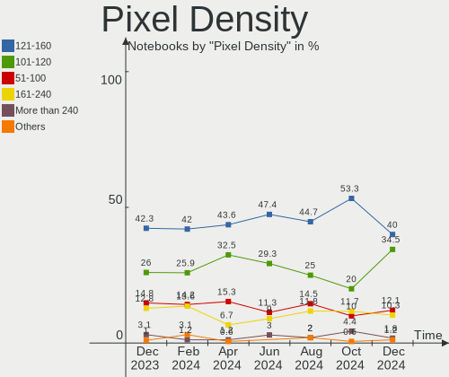

| Density       | Notebooks | Percent |
|---------------|-----------|---------|
| 121-160       | 67        | 46.85%  |
| 101-120       | 39        | 27.27%  |
| 51-100        | 17        | 11.89%  |
| 161-240       | 14        | 9.79%   |
| More than 240 | 4         | 2.8%    |
| 1-50          | 1         | 0.7%    |
| Unknown       | 1         | 0.7%    |

Multiple Monitors
-----------------

Total monitors connected

| Total | Notebooks | Percent |
|-------|-----------|---------|
| 1     | 127       | 91.37%  |
| 2     | 8         | 5.76%   |
| 0     | 3         | 2.16%   |
| 3     | 1         | 0.72%   |

Network
-------

Net Controller Vendor
---------------------

Controller vendors

| Vendor                            | Notebooks | Percent |
|-----------------------------------|-----------|---------|
| Realtek Semiconductor             | 77        | 37.38%  |
| Intel                             | 59        | 28.64%  |
| Qualcomm Atheros                  | 24        | 11.65%  |
| Broadcom                          | 16        | 7.77%   |
| MediaTek                          | 5         | 2.43%   |
| Marvell Technology Group          | 4         | 1.94%   |
| Broadcom Limited                  | 3         | 1.46%   |
| Ralink                            | 2         | 0.97%   |
| OPPO Electronics                  | 2         | 0.97%   |
| DisplayLink                       | 2         | 0.97%   |
| ASIX Electronics                  | 2         | 0.97%   |
| Xiaomi                            | 1         | 0.49%   |
| TP-Link                           | 1         | 0.49%   |
| Silicon Integrated Systems [SiS]  | 1         | 0.49%   |
| Ralink Technology                 | 1         | 0.49%   |
| Qualcomm                          | 1         | 0.49%   |
| NetGear                           | 1         | 0.49%   |
| Micro Star International          | 1         | 0.49%   |
| JMicron Technology                | 1         | 0.49%   |
| Hewlett-Packard                   | 1         | 0.49%   |
| Ericsson Business Mobile Networks | 1         | 0.49%   |

Net Controller Model
--------------------

Controller models

| Model                                                             | Notebooks | Percent |
|-------------------------------------------------------------------|-----------|---------|
| Realtek RTL8111/8168/8411 PCI Express Gigabit Ethernet Controller | 42        | 17.57%  |
| Realtek RTL8822CE 802.11ac PCIe Wireless Network Adapter          | 12        | 5.02%   |
| Realtek RTL810xE PCI Express Fast Ethernet controller             | 10        | 4.18%   |
| Intel Wi-Fi 6 AX201                                               | 9         | 3.77%   |
| Realtek RTL8153 Gigabit Ethernet Adapter                          | 5         | 2.09%   |
| Qualcomm Atheros AR9485 Wireless Network Adapter                  | 5         | 2.09%   |
| Qualcomm Atheros AR9285 Wireless Network Adapter (PCI-Express)    | 5         | 2.09%   |
| Qualcomm Atheros QCA9377 802.11ac Wireless Network Adapter        | 4         | 1.67%   |
| Intel Wireless 3165                                               | 4         | 1.67%   |
| Intel Wi-Fi 6 AX200                                               | 4         | 1.67%   |
| Intel Comet Lake PCH-LP CNVi WiFi                                 | 4         | 1.67%   |
| Realtek RTL88x2bu [AC1200 Techkey]                                | 3         | 1.26%   |
| Realtek RTL8821CE 802.11ac PCIe Wireless Network Adapter          | 3         | 1.26%   |
| Realtek RTL8188CE 802.11b/g/n WiFi Adapter                        | 3         | 1.26%   |
| Qualcomm Atheros QCA9565 / AR9565 Wireless Network Adapter        | 3         | 1.26%   |
| Qualcomm Atheros QCA6174 802.11ac Wireless Network Adapter        | 3         | 1.26%   |
| Intel Wireless-AC 9260                                            | 3         | 1.26%   |
| Intel Wireless 8265 / 8275                                        | 3         | 1.26%   |
| Intel Wireless 8260                                               | 3         | 1.26%   |
| Intel Wireless 7260                                               | 3         | 1.26%   |
| Intel 82579LM Gigabit Network Connection (Lewisville)             | 3         | 1.26%   |
| Broadcom NetXtreme BCM5764M Gigabit Ethernet PCIe                 | 3         | 1.26%   |
| Broadcom BCM4322 802.11a/b/g/n Wireless LAN Controller            | 3         | 1.26%   |
| Broadcom BCM43142 802.11b/g/n                                     | 3         | 1.26%   |
| Realtek RTL8852BE PCIe 802.11ax Wireless Network Controller       | 2         | 0.84%   |
| Realtek RTL8852AE 802.11ax PCIe Wireless Network Adapter          | 2         | 0.84%   |
| Realtek RTL8723BE PCIe Wireless Network Adapter                   | 2         | 0.84%   |
| Realtek RTL8125 2.5GbE Controller                                 | 2         | 0.84%   |
| Realtek RTL-8100/8101L/8139 PCI Fast Ethernet Adapter             | 2         | 0.84%   |
| Qualcomm Atheros AR9287 Wireless Network Adapter (PCI-Express)    | 2         | 0.84%   |
| Qualcomm Atheros AR8151 v2.0 Gigabit Ethernet                     | 2         | 0.84%   |
| OPPO SM8350-MTP _SN:1518BD09                                      | 2         | 0.84%   |
| MediaTek MT7922 802.11ax PCI Express Wireless Network Adapter     | 2         | 0.84%   |
| MediaTek MT7921 802.11ax PCI Express Wireless Network Adapter     | 2         | 0.84%   |
| Marvell Group 88E8058 PCI-E Gigabit Ethernet Controller           | 2         | 0.84%   |
| Intel Wireless 7265                                               | 2         | 0.84%   |
| Intel PRO/Wireless 3945ABG [Golan] Network Connection             | 2         | 0.84%   |
| Intel Ice Lake-LP PCH CNVi WiFi                                   | 2         | 0.84%   |
| Intel Ethernet Connection I219-LM                                 | 2         | 0.84%   |
| Intel Cannon Point-LP CNVi [Wireless-AC]                          | 2         | 0.84%   |

Wireless Vendor
---------------

Wireless vendors

| Vendor                   | Notebooks | Percent |
|--------------------------|-----------|---------|
| Intel                    | 55        | 39.86%  |
| Realtek Semiconductor    | 31        | 22.46%  |
| Qualcomm Atheros         | 24        | 17.39%  |
| Broadcom                 | 13        | 9.42%   |
| MediaTek                 | 5         | 3.62%   |
| Broadcom Limited         | 3         | 2.17%   |
| Ralink                   | 2         | 1.45%   |
| TP-Link                  | 1         | 0.72%   |
| Ralink Technology        | 1         | 0.72%   |
| Qualcomm                 | 1         | 0.72%   |
| NetGear                  | 1         | 0.72%   |
| Micro Star International | 1         | 0.72%   |

Wireless Model
--------------

Wireless models

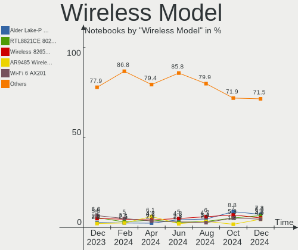

| Model                                                          | Notebooks | Percent |
|----------------------------------------------------------------|-----------|---------|
| Realtek RTL8822CE 802.11ac PCIe Wireless Network Adapter       | 12        | 8.7%    |
| Intel Wi-Fi 6 AX201                                            | 9         | 6.52%   |
| Qualcomm Atheros AR9485 Wireless Network Adapter               | 5         | 3.62%   |
| Qualcomm Atheros AR9285 Wireless Network Adapter (PCI-Express) | 5         | 3.62%   |
| Qualcomm Atheros QCA9377 802.11ac Wireless Network Adapter     | 4         | 2.9%    |
| Intel Wireless 3165                                            | 4         | 2.9%    |
| Intel Wi-Fi 6 AX200                                            | 4         | 2.9%    |
| Intel Comet Lake PCH-LP CNVi WiFi                              | 4         | 2.9%    |
| Realtek RTL88x2bu [AC1200 Techkey]                             | 3         | 2.17%   |
| Realtek RTL8821CE 802.11ac PCIe Wireless Network Adapter       | 3         | 2.17%   |
| Realtek RTL8188CE 802.11b/g/n WiFi Adapter                     | 3         | 2.17%   |
| Qualcomm Atheros QCA9565 / AR9565 Wireless Network Adapter     | 3         | 2.17%   |
| Qualcomm Atheros QCA6174 802.11ac Wireless Network Adapter     | 3         | 2.17%   |
| Intel Wireless-AC 9260                                         | 3         | 2.17%   |
| Intel Wireless 8265 / 8275                                     | 3         | 2.17%   |
| Intel Wireless 8260                                            | 3         | 2.17%   |
| Intel Wireless 7260                                            | 3         | 2.17%   |
| Broadcom BCM4322 802.11a/b/g/n Wireless LAN Controller         | 3         | 2.17%   |
| Broadcom BCM43142 802.11b/g/n                                  | 3         | 2.17%   |
| Realtek RTL8852BE PCIe 802.11ax Wireless Network Controller    | 2         | 1.45%   |
| Realtek RTL8852AE 802.11ax PCIe Wireless Network Adapter       | 2         | 1.45%   |
| Realtek RTL8723BE PCIe Wireless Network Adapter                | 2         | 1.45%   |
| Qualcomm Atheros AR9287 Wireless Network Adapter (PCI-Express) | 2         | 1.45%   |
| MediaTek MT7922 802.11ax PCI Express Wireless Network Adapter  | 2         | 1.45%   |
| MediaTek MT7921 802.11ax PCI Express Wireless Network Adapter  | 2         | 1.45%   |
| Intel Wireless 7265                                            | 2         | 1.45%   |
| Intel PRO/Wireless 3945ABG [Golan] Network Connection          | 2         | 1.45%   |
| Intel Ice Lake-LP PCH CNVi WiFi                                | 2         | 1.45%   |
| Intel Cannon Point-LP CNVi [Wireless-AC]                       | 2         | 1.45%   |
| Intel Cannon Lake PCH CNVi WiFi                                | 2         | 1.45%   |
| Intel Alder Lake-P PCH CNVi WiFi                               | 2         | 1.45%   |
| Broadcom BCM4313 802.11bgn Wireless Network Adapter            | 2         | 1.45%   |
| TP-Link TL-WN821N Version 5 RTL8192EU                          | 1         | 0.72%   |
| Realtek RTL8852AE WiFi 6 802.11ax PCIe Adapter                 | 1         | 0.72%   |
| Realtek RTL8191SU 802.11n WLAN Adapter                         | 1         | 0.72%   |
| Realtek RTL8191SEvB Wireless LAN Controller                    | 1         | 0.72%   |
| Realtek RTL8187 Wireless Adapter                               | 1         | 0.72%   |
| Ralink RT3572 Wireless Adapter                                 | 1         | 0.72%   |
| Ralink RT5390R 802.11bgn PCIe Wireless Network Adapter         | 1         | 0.72%   |
| Ralink RT3290 Wireless 802.11n 1T/1R PCIe                      | 1         | 0.72%   |

Ethernet Vendor
---------------

Ethernet vendors

| Vendor                           | Notebooks | Percent |
|----------------------------------|-----------|---------|
| Realtek Semiconductor            | 62        | 62.63%  |
| Intel                            | 14        | 14.14%  |
| Broadcom                         | 7         | 7.07%   |
| Marvell Technology Group         | 4         | 4.04%   |
| Qualcomm Atheros                 | 2         | 2.02%   |
| OPPO Electronics                 | 2         | 2.02%   |
| DisplayLink                      | 2         | 2.02%   |
| ASIX Electronics                 | 2         | 2.02%   |
| Xiaomi                           | 1         | 1.01%   |
| Silicon Integrated Systems [SiS] | 1         | 1.01%   |
| JMicron Technology               | 1         | 1.01%   |
| Hewlett-Packard                  | 1         | 1.01%   |

Ethernet Model
--------------

Ethernet models

| Model                                                             | Notebooks | Percent |
|-------------------------------------------------------------------|-----------|---------|
| Realtek RTL8111/8168/8411 PCI Express Gigabit Ethernet Controller | 42        | 42%     |
| Realtek RTL810xE PCI Express Fast Ethernet controller             | 10        | 10%     |
| Realtek RTL8153 Gigabit Ethernet Adapter                          | 5         | 5%      |
| Intel 82579LM Gigabit Network Connection (Lewisville)             | 3         | 3%      |
| Broadcom NetXtreme BCM5764M Gigabit Ethernet PCIe                 | 3         | 3%      |
| Realtek RTL8125 2.5GbE Controller                                 | 2         | 2%      |
| Realtek RTL-8100/8101L/8139 PCI Fast Ethernet Adapter             | 2         | 2%      |
| Qualcomm Atheros AR8151 v2.0 Gigabit Ethernet                     | 2         | 2%      |
| OPPO SM8350-MTP _SN:1518BD09                                      | 2         | 2%      |
| Marvell Group 88E8058 PCI-E Gigabit Ethernet Controller           | 2         | 2%      |
| Intel Ethernet Connection I219-LM                                 | 2         | 2%      |
| ASIX AX88179 Gigabit Ethernet                                     | 2         | 2%      |
| Xiaomi Mi/Redmi series (RNDIS + ADB)                              | 1         | 1%      |
| Silicon Integrated Systems [SiS] 191 Gigabit Ethernet Adapter     | 1         | 1%      |
| Realtek RTL8152 Fast Ethernet Adapter                             | 1         | 1%      |
| Realtek Killer E2600 Gigabit Ethernet Controller                  | 1         | 1%      |
| Marvell Group 88E8057 PCI-E Gigabit Ethernet Controller           | 1         | 1%      |
| Marvell Group 88E8040 PCI-E Fast Ethernet Controller              | 1         | 1%      |
| JMicron JMC250 PCI Express Gigabit Ethernet Controller            | 1         | 1%      |
| Intel Ethernet Connection I219-V                                  | 1         | 1%      |
| Intel Ethernet Connection I217-LM                                 | 1         | 1%      |
| Intel Ethernet Connection (5) I219-LM                             | 1         | 1%      |
| Intel Ethernet Connection (4) I219-V                              | 1         | 1%      |
| Intel Ethernet Connection (16) I219-LM                            | 1         | 1%      |
| Intel Ethernet Connection (10) I219-V                             | 1         | 1%      |
| Intel 82577LC Gigabit Network Connection                          | 1         | 1%      |
| Intel 82567LM Gigabit Network Connection                          | 1         | 1%      |
| Intel 82566MM Gigabit Network Connection                          | 1         | 1%      |
| HP lt4120 Snapdragon X5 LTE                                       | 1         | 1%      |
| DisplayLink StarTech USB3DOCKHDPC                                 | 1         | 1%      |
| DisplayLink Dell 4-in-1 Adapter                                   | 1         | 1%      |
| Broadcom NetXtreme BCM5761 Gigabit Ethernet PCIe                  | 1         | 1%      |
| Broadcom NetLink BCM5906M Fast Ethernet PCI Express               | 1         | 1%      |
| Broadcom NetLink BCM5787M Gigabit Ethernet PCI Express            | 1         | 1%      |
| Broadcom NetLink BCM57785 Gigabit Ethernet PCIe                   | 1         | 1%      |

Net Controller Kind
-------------------

Ethernet, WiFi or modem

| Kind     | Notebooks | Percent |
|----------|-----------|---------|
| WiFi     | 131       | 57.46%  |
| Ethernet | 96        | 42.11%  |
| Modem    | 1         | 0.44%   |

Used Controller
---------------

Currently used network controller

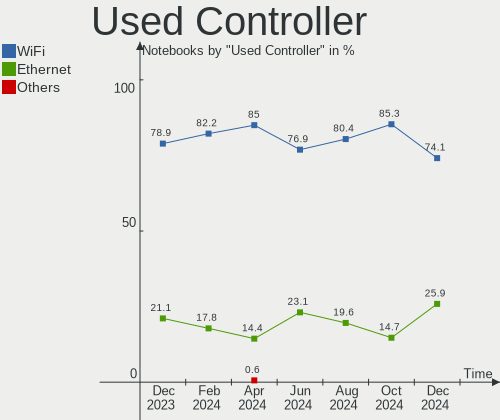

| Kind     | Notebooks | Percent |
|----------|-----------|---------|
| WiFi     | 115       | 83.33%  |
| Ethernet | 23        | 16.67%  |

NICs
----

Total network controllers on board

| Total | Notebooks | Percent |
|-------|-----------|---------|
| 2     | 80        | 57.55%  |
| 1     | 51        | 36.69%  |
| 0     | 7         | 5.04%   |
| 3     | 1         | 0.72%   |

IPv6
----

IPv6 vs IPv4

| Used | Notebooks | Percent |
|------|-----------|---------|
| No   | 123       | 88.49%  |
| Yes  | 16        | 11.51%  |

Bluetooth
---------

Bluetooth Vendor
----------------

Controller vendors

| Vendor                          | Notebooks | Percent |
|---------------------------------|-----------|---------|
| Intel                           | 46        | 41.82%  |
| Realtek Semiconductor           | 14        | 12.73%  |
| Qualcomm Atheros Communications | 10        | 9.09%   |
| IMC Networks                    | 6         | 5.45%   |
| Broadcom                        | 6         | 5.45%   |
| Apple                           | 6         | 5.45%   |
| Lite-On Technology              | 5         | 4.55%   |
| Realtek                         | 4         | 3.64%   |
| Foxconn / Hon Hai               | 4         | 3.64%   |
| Dell                            | 3         | 2.73%   |
| Hewlett-Packard                 | 2         | 1.82%   |
| USI                             | 1         | 0.91%   |
| Toshiba                         | 1         | 0.91%   |
| Ralink                          | 1         | 0.91%   |
| MediaTek                        | 1         | 0.91%   |

Bluetooth Model
---------------

Controller models

| Model                                           | Notebooks | Percent |
|-------------------------------------------------|-----------|---------|
| Intel Bluetooth wireless interface              | 16        | 14.55%  |
| Realtek Bluetooth Radio                         | 14        | 12.73%  |
| Intel AX201 Bluetooth                           | 13        | 11.82%  |
| Intel Bluetooth 9460/9560 Jefferson Peak (JfP)  | 8         | 7.27%   |
| IMC Networks Bluetooth Radio                    | 5         | 4.55%   |
| Realtek Bluetooth Radio                         | 4         | 3.64%   |
| Qualcomm Atheros  Bluetooth Device              | 4         | 3.64%   |
| Intel AX200 Bluetooth                           | 4         | 3.64%   |
| Intel Wireless-AC 9260 Bluetooth Adapter        | 3         | 2.73%   |
| Apple Bluetooth Host Controller                 | 3         | 2.73%   |
| Qualcomm Atheros QCA61x4 Bluetooth 4.0          | 2         | 1.82%   |
| Qualcomm Atheros AR3012 Bluetooth 4.0           | 2         | 1.82%   |
| Qualcomm Atheros AR3011 Bluetooth               | 2         | 1.82%   |
| Lite-On Qualcomm Atheros QCA9377 Bluetooth      | 2         | 1.82%   |
| Intel Bluetooth Device                          | 2         | 1.82%   |
| HP Bluetooth 2.0 Interface [Broadcom BCM2045]   | 2         | 1.82%   |
| Foxconn / Hon Hai Wireless_Device               | 2         | 1.82%   |
| Dell BCM20702A0 Bluetooth Module                | 2         | 1.82%   |
| Broadcom BCM43142A0 Bluetooth Device            | 2         | 1.82%   |
| Broadcom BCM2045B (BDC-2.1)                     | 2         | 1.82%   |
| Apple Bluetooth HCI                             | 2         | 1.82%   |
| USI Bluetooth Device                            | 1         | 0.91%   |
| Toshiba Integrated Bluetooth HCI                | 1         | 0.91%   |
| Ralink RT3290 Bluetooth                         | 1         | 0.91%   |
| MediaTek Wireless_Device                        | 1         | 0.91%   |
| Lite-On Wireless_Device                         | 1         | 0.91%   |
| Lite-On Broadcom BCM43142A0 Bluetooth Device    | 1         | 0.91%   |
| Lite-On Atheros AR3012 Bluetooth                | 1         | 0.91%   |
| IMC Networks Bluetooth USB Host Controller      | 1         | 0.91%   |
| Foxconn / Hon Hai MediaTek Bluetooth Adapter    | 1         | 0.91%   |
| Foxconn / Hon Hai Bluetooth USB Host Controller | 1         | 0.91%   |
| Dell DW375 Bluetooth Module                     | 1         | 0.91%   |
| Broadcom Bluetooth                              | 1         | 0.91%   |
| Broadcom BCM2070 Bluetooth 2.1 + EDR            | 1         | 0.91%   |
| Apple Bluetooth USB Host Controller             | 1         | 0.91%   |

Sound
-----

Sound Vendor
------------

Sound card vendors

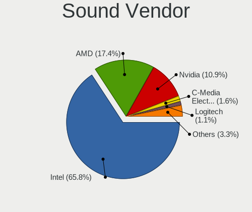

| Vendor                           | Notebooks | Percent |
|----------------------------------|-----------|---------|
| Intel                            | 88        | 55.7%   |
| AMD                              | 45        | 28.48%  |
| Nvidia                           | 20        | 12.66%  |
| GN Netcom                        | 2         | 1.27%   |
| Silicon Integrated Systems [SiS] | 1         | 0.63%   |
| Razer USA                        | 1         | 0.63%   |
| Focusrite-Novation               | 1         | 0.63%   |

Sound Model
-----------

Sound card models

| Model                                                                      | Notebooks | Percent |
|----------------------------------------------------------------------------|-----------|---------|
| AMD Family 17h/19h HD Audio Controller                                     | 25        | 12.32%  |
| AMD Renoir Radeon High Definition Audio Controller                         | 13        | 6.4%    |
| Intel Tiger Lake-LP Smart Sound Technology Audio Controller                | 11        | 5.42%   |
| Intel Sunrise Point-LP HD Audio                                            | 9         | 4.43%   |
| Intel 7 Series/C216 Chipset Family High Definition Audio Controller        | 9         | 4.43%   |
| AMD Kabini HDMI/DP Audio                                                   | 9         | 4.43%   |
| Intel 5 Series/3400 Series Chipset High Definition Audio                   | 8         | 3.94%   |
| AMD FCH Azalia Controller                                                  | 8         | 3.94%   |
| Intel Wildcat Point-LP High Definition Audio Controller                    | 7         | 3.45%   |
| Intel Broadwell-U Audio Controller                                         | 7         | 3.45%   |
| Intel 82801H (ICH8 Family) HD Audio Controller                             | 6         | 2.96%   |
| Intel 6 Series/C200 Series Chipset Family High Definition Audio Controller | 5         | 2.46%   |
| AMD Raven/Raven2/Fenghuang HDMI/DP Audio Controller                        | 5         | 2.46%   |
| Intel Haswell-ULT HD Audio Controller                                      | 4         | 1.97%   |
| Intel Comet Lake PCH-LP cAVS                                               | 4         | 1.97%   |
| Intel Cannon Lake PCH cAVS                                                 | 4         | 1.97%   |
| Intel 8 Series HD Audio Controller                                         | 4         | 1.97%   |
| AMD Rembrandt Radeon High Definition Audio Controller                      | 4         | 1.97%   |
| AMD Family 15h (Models 60h-6fh) Audio Controller                           | 4         | 1.97%   |
| Nvidia Audio device                                                        | 3         | 1.48%   |
| Intel Alder Lake PCH-P High Definition Audio Controller                    | 3         | 1.48%   |
| Intel 82801I (ICH9 Family) HD Audio Controller                             | 3         | 1.48%   |
| Nvidia TU106 High Definition Audio Controller                              | 2         | 0.99%   |
| Nvidia MCP89 High Definition Audio                                         | 2         | 0.99%   |
| Nvidia High Definition Audio Controller                                    | 2         | 0.99%   |
| Nvidia GT216 HDMI Audio Controller                                         | 2         | 0.99%   |
| Nvidia GF108 High Definition Audio Controller                              | 2         | 0.99%   |
| Intel Xeon E3-1200 v3/4th Gen Core Processor HD Audio Controller           | 2         | 0.99%   |
| Intel Ice Lake-LP Smart Sound Technology Audio Controller                  | 2         | 0.99%   |
| Intel Celeron/Pentium Silver Processor High Definition Audio               | 2         | 0.99%   |
| Intel Cannon Point-LP High Definition Audio Controller                     | 2         | 0.99%   |
| Intel 8 Series/C220 Series Chipset High Definition Audio Controller        | 2         | 0.99%   |
| AMD Turks HDMI Audio [Radeon HD 6500/6600 / 6700M Series]                  | 2         | 0.99%   |
| Silicon Integrated Systems [SiS] Azalia Audio Controller                   | 1         | 0.49%   |
| Razer USA Nari (Wireless)                                                  | 1         | 0.49%   |
| Nvidia TU116 High Definition Audio Controller                              | 1         | 0.49%   |
| Nvidia TU107 GeForce GTX 1650 High Definition Audio Controller             | 1         | 0.49%   |
| Nvidia GM206 High Definition Audio Controller                              | 1         | 0.49%   |
| Nvidia GM204 High Definition Audio Controller                              | 1         | 0.49%   |
| Nvidia GM107 High Definition Audio Controller [GeForce 940MX]              | 1         | 0.49%   |

Memory
------

Memory Vendor
-------------

Memory module vendors

| Vendor              | Notebooks | Percent |
|---------------------|-----------|---------|
| SK hynix            | 20        | 23.53%  |
| Samsung Electronics | 20        | 23.53%  |
| Micron Technology   | 16        | 18.82%  |
| Unknown             | 10        | 11.76%  |
| Kingston            | 5         | 5.88%   |
| Crucial             | 5         | 5.88%   |
| Unknown (ABCD)      | 2         | 2.35%   |
| Nanya Technology    | 2         | 2.35%   |
| Elpida              | 2         | 2.35%   |
| Corsair             | 2         | 2.35%   |
| Ramaxel Technology  | 1         | 1.18%   |

Memory Model
------------

Memory module models

| Model                                                            | Notebooks | Percent |
|------------------------------------------------------------------|-----------|---------|
| Unknown RAM Module 2GB SODIMM DDR3 1066MT/s                      | 4         | 4.55%   |
| Unknown (ABCD) RAM 123456789012345678 2GB SODIMM LPDDR4 2400MT/s | 2         | 2.27%   |
| SK hynix RAM HMCG78MEBSA092N 16GB SODIMM DDR5 4800MT/s           | 2         | 2.27%   |
| SK hynix RAM HMA81GS6DJR8N-XN 8GB SODIMM DDR4 3200MT/s           | 2         | 2.27%   |
| Samsung RAM M471A1G44AB0-CWE 8GB SODIMM DDR4 3200MT/s            | 2         | 2.27%   |
| Micron RAM 8KTF51264HZ-1G6E1 4GB SODIMM DDR3 1600MT/s            | 2         | 2.27%   |
| Micron RAM 4ATF51264HZ-2G6E1 4GB SODIMM DDR4 2667MT/s            | 2         | 2.27%   |
| Micron RAM 16KTF1G64HZ-1G6E1 8GB SODIMM DDR3 1600MT/s            | 2         | 2.27%   |
| Unknown RAM Module 8GB SODIMM DDR3                               | 1         | 1.14%   |
| Unknown RAM Module 4GB SODIMM DDR3                               | 1         | 1.14%   |
| Unknown RAM Module 2GB SODIMM DDR3                               | 1         | 1.14%   |
| Unknown RAM Module 2GB SODIMM DDR2 667MT/s                       | 1         | 1.14%   |
| Unknown RAM Module 2048MB SODIMM DDR3 1066MT/s                   | 1         | 1.14%   |
| Unknown RAM Module 1GB SODIMM DDR2                               | 1         | 1.14%   |
| SK hynix RAM Module 2GB SODIMM LPDDR3 1600MT/s                   | 1         | 1.14%   |
| SK hynix RAM Module 2048MB Row Of Chips LPDDR4 4267MT/s          | 1         | 1.14%   |
| SK hynix RAM HYMP125S64CP8-S6 2GB SODIMM DDR2 2048MT/s           | 1         | 1.14%   |
| SK hynix RAM HMT351S6CFR8C-PB 4GB SODIMM DDR3 1600MT/s           | 1         | 1.14%   |
| SK hynix RAM HMT351S6BFR8C-H9 4GB SODIMM DDR3 1333MT/s           | 1         | 1.14%   |
| SK hynix RAM HMAA1GS6CJR6N-XN 8GB Row Of Chips DDR4 3200MT/s     | 1         | 1.14%   |
| SK hynix RAM HMAA1GS6CJR6N-XN 8192MB SODIMM DDR4 3200MT/s        | 1         | 1.14%   |
| SK hynix RAM HMA851S6JJR6N-VK 4GB SODIMM DDR4 2667MT/s           | 1         | 1.14%   |
| SK hynix RAM HMA851S6CJR6N-VK 4GB SODIMM DDR4 2667MT/s           | 1         | 1.14%   |
| SK hynix RAM HMA851S6CJR6N-VK 4GB Row Of Chips DDR4 2667MT/s     | 1         | 1.14%   |
| SK hynix RAM HMA851S6AFR6N-UH 4GB SODIMM DDR4 2667MT/s           | 1         | 1.14%   |
| SK hynix RAM HMA81GS6CJR8N-UH 8192MB SODIMM DDR4 2400MT/s        | 1         | 1.14%   |
| SK hynix RAM HMA81GS6AFR8N-VK 8GB SODIMM DDR4 2667MT/s           | 1         | 1.14%   |
| SK hynix RAM HMA451S6AFR8N-TF 4GB SODIMM DDR4 2133MT/s           | 1         | 1.14%   |
| SK hynix RAM HMA41GS6AFR8N-TF 8GB SODIMM DDR4 2667MT/s           | 1         | 1.14%   |
| SK hynix RAM HCNNNCPMMLXR-NEE 2GB Row Of Chips LPDDR4 4267MT/s   | 1         | 1.14%   |
| Samsung RAM U6E3S4AA-MGCR 1GB Row Of Chips LPDDR4 4267MT/s       | 1         | 1.14%   |
| Samsung RAM Module 2GB SODIMM 667MT/s                            | 1         | 1.14%   |
| Samsung RAM Module 1GB SODIMM 667MT/s                            | 1         | 1.14%   |
| Samsung RAM Module 1GB DIMM DDR2 533MT/s                         | 1         | 1.14%   |
| Samsung RAM M471B5173EB0-YK0 4GB SODIMM DDR3 1600MT/s            | 1         | 1.14%   |
| Samsung RAM M471B1G73DB0-YK0 8GB SODIMM DDR3 1600MT/s            | 1         | 1.14%   |
| Samsung RAM M471A5244CB0-CWE 4GB SODIMM DDR4 3200MT/s            | 1         | 1.14%   |
| Samsung RAM M471A5244CB0-CWE 4GB Row Of Chips DDR4 3200MT/s      | 1         | 1.14%   |
| Samsung RAM M471A5244CB0-CTD 4GB SODIMM DDR4 3266MT/s            | 1         | 1.14%   |
| Samsung RAM M471A5244BB0-CRC 4GB SODIMM DDR4 2667MT/s            | 1         | 1.14%   |

Memory Kind
-----------

Memory module kinds

| Kind    | Notebooks | Percent |
|---------|-----------|---------|
| DDR4    | 36        | 46.15%  |
| DDR3    | 21        | 26.92%  |
| LPDDR4  | 7         | 8.97%   |
| DDR2    | 6         | 7.69%   |
| DDR5    | 4         | 5.13%   |
| SDRAM   | 1         | 1.28%   |
| LPDDR5  | 1         | 1.28%   |
| LPDDR3  | 1         | 1.28%   |
| Unknown | 1         | 1.28%   |

Memory Form Factor
------------------

Physical design of the memory module

| Name         | Notebooks | Percent |
|--------------|-----------|---------|
| SODIMM       | 66        | 84.62%  |
| Row Of Chips | 11        | 14.1%   |
| DIMM         | 1         | 1.28%   |

Memory Size
-----------

Memory module size

| Size  | Notebooks | Percent |
|-------|-----------|---------|
| 8192  | 33        | 41.25%  |
| 4096  | 23        | 28.75%  |
| 2048  | 13        | 16.25%  |
| 16384 | 6         | 7.5%    |
| 1024  | 3         | 3.75%   |
| 32768 | 2         | 2.5%    |

Memory Speed
------------

Memory module speed

| Speed   | Notebooks | Percent |
|---------|-----------|---------|
| 3200    | 16        | 20%     |
| 2667    | 14        | 17.5%   |
| 1600    | 9         | 11.25%  |
| 2400    | 7         | 8.75%   |
| 1066    | 5         | 6.25%   |
| 4800    | 4         | 5%      |
| 1334    | 4         | 5%      |
| 667     | 4         | 5%      |
| Unknown | 4         | 5%      |
| 4267    | 3         | 3.75%   |
| 2133    | 2         | 2.5%    |
| 6400    | 1         | 1.25%   |
| 4266    | 1         | 1.25%   |
| 3266    | 1         | 1.25%   |
| 2800    | 1         | 1.25%   |
| 2048    | 1         | 1.25%   |
| 1333    | 1         | 1.25%   |
| 800     | 1         | 1.25%   |
| 533     | 1         | 1.25%   |

Printers & scanners
-------------------

Printer Vendor
--------------

Printer device vendors

| Vendor              | Notebooks | Percent |
|---------------------|-----------|---------|
| Seiko Epson         | 1         | 33.33%  |
| Samsung Electronics | 1         | 33.33%  |
| Canon               | 1         | 33.33%  |

Printer Model
-------------

Printer device models

| Model                                | Notebooks | Percent |
|--------------------------------------|-----------|---------|
| Seiko Epson ET-2810 Series           | 1         | 33.33%  |
| Samsung ML-216x Series Laser Printer | 1         | 33.33%  |
| Canon MF3110                         | 1         | 33.33%  |

Scanner Vendor
--------------

Scanner device vendors

Zero info for selected period =(

Scanner Model
-------------

Scanner device models

Zero info for selected period =(

Camera
------

Camera Vendor
-------------

Camera device vendors

| Vendor                                 | Notebooks | Percent |
|----------------------------------------|-----------|---------|
| IMC Networks                           | 21        | 16.54%  |
| Chicony Electronics                    | 21        | 16.54%  |
| Microdia                               | 10        | 7.87%   |
| Acer                                   | 8         | 6.3%    |
| Realtek Semiconductor                  | 7         | 5.51%   |
| Quanta                                 | 7         | 5.51%   |
| Bison Electronics                      | 7         | 5.51%   |
| Alcor Micro                            | 7         | 5.51%   |
| Syntek                                 | 6         | 4.72%   |
| Suyin                                  | 6         | 4.72%   |
| Sunplus Innovation Technology          | 6         | 4.72%   |
| Luxvisions Innotech Limited            | 4         | 3.15%   |
| Cheng Uei Precision Industry (Foxlink) | 4         | 3.15%   |
| Apple                                  | 4         | 3.15%   |
| Samsung Electronics                    | 3         | 2.36%   |
| Silicon Motion                         | 2         | 1.57%   |
| Sunplus Technology                     | 1         | 0.79%   |
| Ricoh                                  | 1         | 0.79%   |
| Logitech                               | 1         | 0.79%   |
| Lite-On Technology                     | 1         | 0.79%   |

Camera Model
------------

Camera device models

| Model                                               | Notebooks | Percent |
|-----------------------------------------------------|-----------|---------|
| IMC Networks Integrated Camera                      | 6         | 4.69%   |
| Chicony Integrated Camera                           | 6         | 4.69%   |
| Alcor Micro USB 2.0 Camera                          | 6         | 4.69%   |
| Syntek Integrated Camera                            | 5         | 3.91%   |
| IMC Networks USB2.0 HD UVC WebCam                   | 5         | 3.91%   |
| Luxvisions Innotech Limited HP TrueVision HD Camera | 4         | 3.13%   |
| IMC Networks HD Camera                              | 4         | 3.13%   |
| Samsung Galaxy series, misc. (MTP mode)             | 3         | 2.34%   |
| Quanta HD Camera                                    | 3         | 2.34%   |
| Microdia Integrated_Webcam_HD                       | 3         | 2.34%   |
| Chicony HP Webcam                                   | 3         | 2.34%   |
| Apple Built-in iSight                               | 3         | 2.34%   |
| Acer HD Webcam                                      | 3         | 2.34%   |
| Suyin HP Truevision HD                              | 2         | 1.56%   |
| Sunplus Dell E5570 integrated webcam                | 2         | 1.56%   |
| Realtek Rear Camera                                 | 2         | 1.56%   |
| Realtek HP Truevision HD                            | 2         | 1.56%   |
| Realtek HD WebCam                                   | 2         | 1.56%   |
| Quanta HD Webcam                                    | 2         | 1.56%   |
| Microdia Webcam Vitade AF                           | 2         | 1.56%   |
| IMC Networks ov9734_azurewave_camera                | 2         | 1.56%   |
| Chicony HP Truevision HD                            | 2         | 1.56%   |
| Chicony HD WebCam                                   | 2         | 1.56%   |
| Bison Lenovo Integrated Webcam                      | 2         | 1.56%   |
| Acer Integrated Camera                              | 2         | 1.56%   |
| Syntek HP Webcam                                    | 1         | 0.78%   |
| Suyin Webcam-101                                    | 1         | 0.78%   |
| Suyin Sony Visual Communication Camera              | 1         | 0.78%   |
| Suyin Asus Integrated Webcam                        | 1         | 0.78%   |
| Suyin Acer CrystalEye Webcam                        | 1         | 0.78%   |
| Sunplus 1.3M HD WebCam                              | 1         | 0.78%   |
| Sunplus Laptop_Integrated_Webcam_FHD                | 1         | 0.78%   |
| Sunplus Integrated_Webcam_HD                        | 1         | 0.78%   |
| Sunplus Integrated_Webcam_FHD                       | 1         | 0.78%   |
| Sunplus ASUS Webcam                                 | 1         | 0.78%   |
| Silicon Motion WebCam SCB-0385N                     | 1         | 0.78%   |
| Silicon Motion WebCam SCB-0355N                     | 1         | 0.78%   |
| Ricoh USB2.0 Camera                                 | 1         | 0.78%   |
| Realtek USB Camera                                  | 1         | 0.78%   |
| Realtek Front Camera                                | 1         | 0.78%   |

Security
--------

Fingerprint Vendor
------------------

Fingerprint sensor vendors

| Vendor                     | Notebooks | Percent |
|----------------------------|-----------|---------|
| Shenzhen Goodix Technology | 8         | 24.24%  |
| Validity Sensors           | 7         | 21.21%  |
| Elan Microelectronics      | 5         | 15.15%  |
| Synaptics                  | 4         | 12.12%  |
| AuthenTec                  | 3         | 9.09%   |
| LighTuning Technology      | 2         | 6.06%   |
| Upek                       | 1         | 3.03%   |
| Microsoft                  | 1         | 3.03%   |
| HOLTEK                     | 1         | 3.03%   |
| Focal-systems.Corp         | 1         | 3.03%   |

Fingerprint Model
-----------------

Fingerprint sensor models

| Model                                                     | Notebooks | Percent |
|-----------------------------------------------------------|-----------|---------|
| Shenzhen Goodix  FingerPrint Device                       | 8         | 24.24%  |
| Elan ELAN:ARM-M4                                          | 4         | 12.12%  |
| Validity Sensors Swipe Fingerprint Sensor                 | 3         | 9.09%   |
| Synaptics Prometheus MIS Touch Fingerprint Reader         | 3         | 9.09%   |
| Validity Sensors VFS495 Fingerprint Reader                | 1         | 3.03%   |
| Validity Sensors VFS301 Fingerprint Reader                | 1         | 3.03%   |
| Validity Sensors Synaptics WBDI                           | 1         | 3.03%   |
| Validity Sensors Fingerprint scanner                      | 1         | 3.03%   |
| Upek Biometric Touchchip/Touchstrip Fingerprint Sensor    | 1         | 3.03%   |
| Synaptics  FS7604 Touch Fingerprint Sensor with PurePrint | 1         | 3.03%   |
| Microsoft Fingerprint Reader                              | 1         | 3.03%   |
| LighTuning ES603 Swipe Fingerprint Sensor                 | 1         | 3.03%   |
| LighTuning EgisTec Touch Fingerprint Sensor               | 1         | 3.03%   |
| HOLTEK FocalTech Fingerprint Device                       | 1         | 3.03%   |
| Focal-systems.Corp FT9201Fingerprint.                     | 1         | 3.03%   |
| Elan ELAN:Fingerprint                                     | 1         | 3.03%   |
| AuthenTec Fingerprint Sensor                              | 1         | 3.03%   |
| AuthenTec AES2810                                         | 1         | 3.03%   |
| AuthenTec AES2501 Fingerprint Sensor                      | 1         | 3.03%   |

Chipcard Vendor
---------------

Chipcard module vendors

| Vendor      | Notebooks | Percent |
|-------------|-----------|---------|
| Broadcom    | 5         | 50%     |
| Alcor Micro | 3         | 30%     |
| O2 Micro    | 1         | 10%     |
| BIT4ID      | 1         | 10%     |

Chipcard Model
--------------

Chipcard module models

| Model                                          | Notebooks | Percent |
|------------------------------------------------|-----------|---------|
| Alcor Micro AU9540 Smartcard Reader            | 3         | 30%     |
| Broadcom 5880                                  | 2         | 20%     |
| Broadcom 58200                                 | 2         | 20%     |
| O2 Micro OZ776 CCID Smartcard Reader           | 1         | 10%     |
| Broadcom BCM5880 Secure Applications Processor | 1         | 10%     |
| BIT4ID miniLector EVO                          | 1         | 10%     |

Unsupported
-----------

Unsupported Devices
-------------------

Total unsupported devices on board

| Total | Notebooks | Percent |
|-------|-----------|---------|
| 0     | 81        | 58.27%  |
| 1     | 38        | 27.34%  |
| 2     | 18        | 12.95%  |
| 3     | 2         | 1.44%   |

Unsupported Device Types
------------------------

Types of unsupported devices

| Type                     | Notebooks | Percent |
|--------------------------|-----------|---------|
| Fingerprint reader       | 33        | 41.77%  |
| Graphics card            | 14        | 17.72%  |
| Chipcard                 | 9         | 11.39%  |
| Multimedia controller    | 7         | 8.86%   |
| Camera                   | 5         | 6.33%   |
| Net/wireless             | 4         | 5.06%   |
| Storage                  | 2         | 2.53%   |
| Communication controller | 2         | 2.53%   |
| Sound                    | 1         | 1.27%   |
| Modem                    | 1         | 1.27%   |
| Bluetooth                | 1         | 1.27%   |

