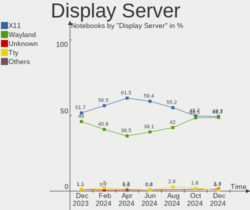
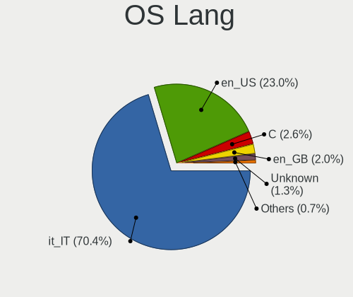
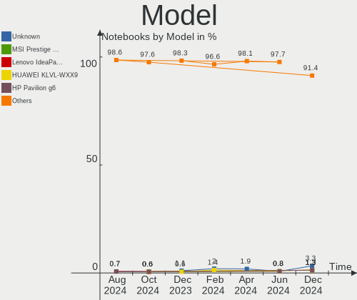
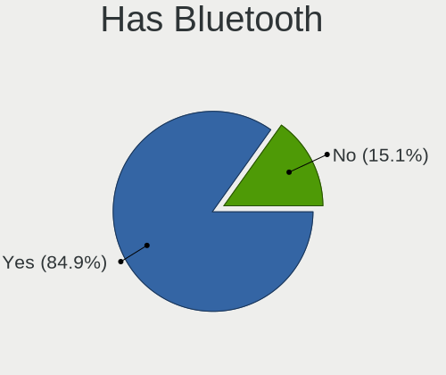
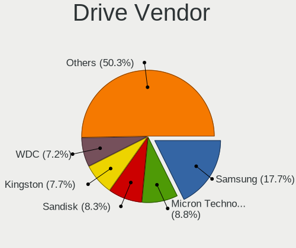
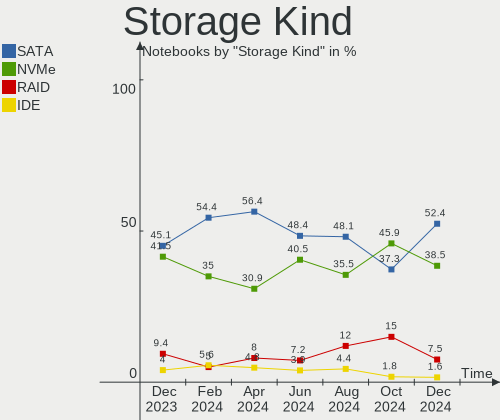
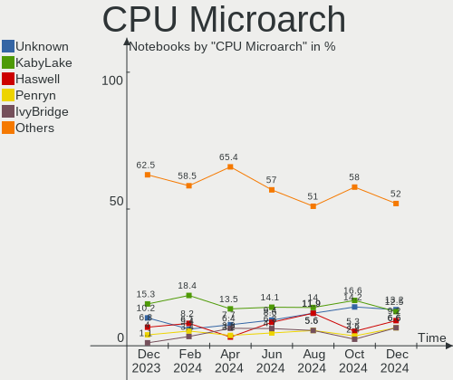
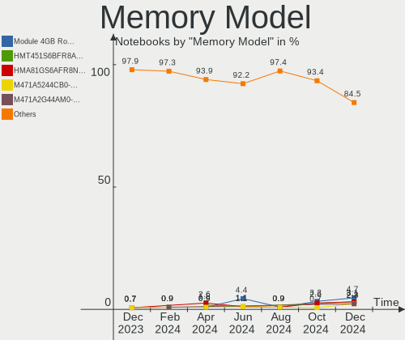
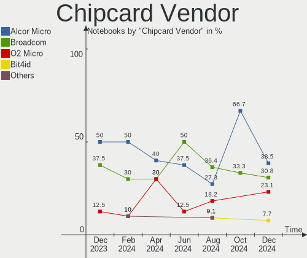

Linux in Italy - Hardware Trends (Notebooks)
--------------------------------------------

A project to identify most popular hardware characteristics and track their change
over time based on data collected by Linux users at https://Linux-Hardware.org.

Anyone can contribute to this report by the [hw-probe](https://github.com/linuxhw/hw-probe) tool:

    sudo -E hw-probe -all -upload

Period: Oct, 2022.

Contents
--------

* [ System ](#system)
  - [ OS                       ](#os)
  - [ OS Family                ](#os-family)
  - [ Kernel                   ](#kernel)
  - [ Kernel Family            ](#kernel-family)
  - [ Kernel Major Ver.        ](#kernel-major-ver)
  - [ Arch                     ](#arch)
  - [ DE                       ](#de)
  - [ Display Server           ](#display-server)
  - [ Display Manager          ](#display-manager)
  - [ OS Lang                  ](#os-lang)
  - [ Boot Mode                ](#boot-mode)
  - [ Filesystem               ](#filesystem)
  - [ Part. scheme             ](#part-scheme)
  - [ Dual Boot with Linux/BSD ](#dual-boot-with-linuxbsd)
  - [ Dual Boot (Win)          ](#dual-boot-win)

* [ Board ](#board)
  - [ Vendor                   ](#vendor)
  - [ Model                    ](#model)
  - [ Model Family             ](#model-family)
  - [ MFG Year                 ](#mfg-year)
  - [ Form Factor              ](#form-factor)
  - [ Secure Boot              ](#secure-boot)
  - [ Coreboot                 ](#coreboot)
  - [ RAM Size                 ](#ram-size)
  - [ RAM Used                 ](#ram-used)
  - [ Total Drives             ](#total-drives)
  - [ Has CD-ROM               ](#has-cd-rom)
  - [ Has Ethernet             ](#has-ethernet)
  - [ Has WiFi                 ](#has-wifi)
  - [ Has Bluetooth            ](#has-bluetooth)

* [ Location ](#location)
  - [ Country                  ](#country)
  - [ City                     ](#city)

* [ Drives ](#drives)
  - [ Drive Vendor             ](#drive-vendor)
  - [ Drive Model              ](#drive-model)
  - [ HDD Vendor               ](#hdd-vendor)
  - [ SSD Vendor               ](#ssd-vendor)
  - [ Drive Kind               ](#drive-kind)
  - [ Drive Connector          ](#drive-connector)
  - [ Drive Size               ](#drive-size)
  - [ Space Total              ](#space-total)
  - [ Space Used               ](#space-used)
  - [ Malfunc. Drives          ](#malfunc-drives)
  - [ Malfunc. Drive Vendor    ](#malfunc-drive-vendor)
  - [ Malfunc. HDD Vendor      ](#malfunc-hdd-vendor)
  - [ Malfunc. Drive Kind      ](#malfunc-drive-kind)
  - [ Failed Drives            ](#failed-drives)
  - [ Failed Drive Vendor      ](#failed-drive-vendor)
  - [ Drive Status             ](#drive-status)

* [ Storage controller ](#storage-controller)
  - [ Storage Vendor           ](#storage-vendor)
  - [ Storage Model            ](#storage-model)
  - [ Storage Kind             ](#storage-kind)

* [ Processor ](#processor)
  - [ CPU Vendor               ](#cpu-vendor)
  - [ CPU Model                ](#cpu-model)
  - [ CPU Model Family         ](#cpu-model-family)
  - [ CPU Cores                ](#cpu-cores)
  - [ CPU Sockets              ](#cpu-sockets)
  - [ CPU Threads              ](#cpu-threads)
  - [ CPU Op-Modes             ](#cpu-op-modes)
  - [ CPU Microcode            ](#cpu-microcode)
  - [ CPU Microarch            ](#cpu-microarch)

* [ Graphics ](#graphics)
  - [ GPU Vendor               ](#gpu-vendor)
  - [ GPU Model                ](#gpu-model)
  - [ GPU Combo                ](#gpu-combo)
  - [ GPU Driver               ](#gpu-driver)
  - [ GPU Memory               ](#gpu-memory)

* [ Monitor ](#monitor)
  - [ Monitor Vendor           ](#monitor-vendor)
  - [ Monitor Model            ](#monitor-model)
  - [ Monitor Resolution       ](#monitor-resolution)
  - [ Monitor Diagonal         ](#monitor-diagonal)
  - [ Monitor Width            ](#monitor-width)
  - [ Aspect Ratio             ](#aspect-ratio)
  - [ Monitor Area             ](#monitor-area)
  - [ Pixel Density            ](#pixel-density)
  - [ Multiple Monitors        ](#multiple-monitors)

* [ Network ](#network)
  - [ Net Controller Vendor    ](#net-controller-vendor)
  - [ Net Controller Model     ](#net-controller-model)
  - [ Wireless Vendor          ](#wireless-vendor)
  - [ Wireless Model           ](#wireless-model)
  - [ Ethernet Vendor          ](#ethernet-vendor)
  - [ Ethernet Model           ](#ethernet-model)
  - [ Net Controller Kind      ](#net-controller-kind)
  - [ Used Controller          ](#used-controller)
  - [ NICs                     ](#nics)
  - [ IPv6                     ](#ipv6)

* [ Bluetooth ](#bluetooth)
  - [ Bluetooth Vendor         ](#bluetooth-vendor)
  - [ Bluetooth Model          ](#bluetooth-model)

* [ Sound ](#sound)
  - [ Sound Vendor             ](#sound-vendor)
  - [ Sound Model              ](#sound-model)

* [ Memory ](#memory)
  - [ Memory Vendor            ](#memory-vendor)
  - [ Memory Model             ](#memory-model)
  - [ Memory Kind              ](#memory-kind)
  - [ Memory Form Factor       ](#memory-form-factor)
  - [ Memory Size              ](#memory-size)
  - [ Memory Speed             ](#memory-speed)

* [ Printers & scanners ](#printers--scanners)
  - [ Printer Vendor           ](#printer-vendor)
  - [ Printer Model            ](#printer-model)
  - [ Scanner Vendor           ](#scanner-vendor)
  - [ Scanner Model            ](#scanner-model)

* [ Camera ](#camera)
  - [ Camera Vendor            ](#camera-vendor)
  - [ Camera Model             ](#camera-model)

* [ Security ](#security)
  - [ Fingerprint Vendor       ](#fingerprint-vendor)
  - [ Fingerprint Model        ](#fingerprint-model)
  - [ Chipcard Vendor          ](#chipcard-vendor)
  - [ Chipcard Model           ](#chipcard-model)

* [ Unsupported ](#unsupported)
  - [ Unsupported Devices      ](#unsupported-devices)
  - [ Unsupported Device Types ](#unsupported-device-types)

System
------

OS
--

Installed operating systems

| Name                         | Notebooks | Percent |
|------------------------------|-----------|---------|
| Ubuntu 22.04                 | 55        | 18.09%  |
| Arch Rolling                 | 40        | 13.16%  |
| Fedora 36                    | 24        | 7.89%   |
| Pop!_OS 22.04                | 18        | 5.92%   |
| Ubuntu 22.10                 | 15        | 4.93%   |
| Debian 11                    | 14        | 4.61%   |
| Kubuntu 22.04                | 11        | 3.62%   |
| Linux Mint 21                | 9         | 2.96%   |
| EndeavourOS Rolling          | 9         | 2.96%   |
| Zorin 16                     | 8         | 2.63%   |
| Manjaro 22.0.0               | 8         | 2.63%   |
| Linux Mint 20.3              | 7         | 2.3%    |
| Ubuntu 20.04                 | 6         | 1.97%   |
| Kubuntu 20.04                | 5         | 1.64%   |
| Fedora 37                    | 5         | 1.64%   |
| Debian                       | 5         | 1.64%   |
| Xubuntu 20.04                | 4         | 1.32%   |
| OpenMandriva 4.3             | 4         | 1.32%   |
| Linux Mint 20.2              | 4         | 1.32%   |
| Xubuntu 22.04                | 3         | 0.99%   |
| Parrot 5.1                   | 3         | 0.99%   |
| OpenMandriva 4.50            | 3         | 0.99%   |
| Manjaro                      | 3         | 0.99%   |
| KDE neon 20.04               | 3         | 0.99%   |
| ArcoLinux Rolling            | 3         | 0.99%   |
| openSUSE Tumbleweed-XXXXXXXX | 2         | 0.66%   |
| Nobara 36                    | 2         | 0.66%   |
| MX 21                        | 2         | 0.66%   |
| Kubuntu 22.10                | 2         | 0.66%   |
| KDE neon 22.04               | 2         | 0.66%   |
| Debian Testing               | 2         | 0.66%   |
| Xero Rolling                 | 1         | 0.33%   |
| Ubuntu MATE 22.04            | 1         | 0.33%   |
| Ubuntu 18.04                 | 1         | 0.33%   |
| ROSA 12.2                    | 1         | 0.33%   |
| Peppermint 10                | 1         | 0.33%   |
| Peppermint                   | 1         | 0.33%   |
| PCLinuxOS 2022               | 1         | 0.33%   |
| openSUSE Leap-15.4           | 1         | 0.33%   |
| NixOS 22.11                  | 1         | 0.33%   |

OS Family
---------

OS without a version

| Name         | Notebooks | Percent |
|--------------|-----------|---------|
| Ubuntu       | 77        | 25.33%  |
| Arch         | 40        | 13.16%  |
| Fedora       | 29        | 9.54%   |
| Linux Mint   | 22        | 7.24%   |
| Debian       | 21        | 6.91%   |
| Pop!_OS      | 18        | 5.92%   |
| Kubuntu      | 18        | 5.92%   |
| Manjaro      | 11        | 3.62%   |
| EndeavourOS  | 9         | 2.96%   |
| Zorin        | 8         | 2.63%   |
| Xubuntu      | 7         | 2.3%    |
| OpenMandriva | 7         | 2.3%    |
| KDE neon     | 5         | 1.64%   |
| Parrot       | 3         | 0.99%   |
| openSUSE     | 3         | 0.99%   |
| Lubuntu      | 3         | 0.99%   |
| ArcoLinux    | 3         | 0.99%   |
| Peppermint   | 2         | 0.66%   |
| Nobara       | 2         | 0.66%   |
| MX           | 2         | 0.66%   |
| Kali         | 2         | 0.66%   |
| Clear Linux  | 2         | 0.66%   |
| Xero         | 1         | 0.33%   |
| Ubuntu MATE  | 1         | 0.33%   |
| ROSA         | 1         | 0.33%   |
| PCLinuxOS    | 1         | 0.33%   |
| NixOS        | 1         | 0.33%   |
| LMDE         | 1         | 0.33%   |
| Gentoo       | 1         | 0.33%   |
| Elementary   | 1         | 0.33%   |
| BlackPanther | 1         | 0.33%   |
| ALT Linux    | 1         | 0.33%   |

Kernel
------

Version of the Linux kernel

| Version                  | Notebooks | Percent |
|--------------------------|-----------|---------|
| 5.15.0-52-generic        | 59        | 19.41%  |
| 6.0.2-arch1-1            | 27        | 8.88%   |
| 5.19.16-200.fc36.x86_64  | 19        | 6.25%   |
| 5.15.0-50-generic        | 19        | 6.25%   |
| 5.15.0-48-generic        | 12        | 3.95%   |
| 6.0.2-zen1-1-zen         | 8         | 2.63%   |
| 5.19.0-76051900-generic  | 8         | 2.63%   |
| 5.19.0-21-generic        | 8         | 2.63%   |
| 5.19.0-23-generic        | 7         | 2.3%    |
| 6.0.2-76060002-generic   | 6         | 1.97%   |
| 5.15.74-3-MANJARO        | 6         | 1.97%   |
| 5.10.0-19-amd64          | 6         | 1.97%   |
| 5.10.0-18-amd64          | 6         | 1.97%   |
| 5.15.0-43-generic        | 5         | 1.64%   |
| 5.4.0-131-generic        | 4         | 1.32%   |
| 5.19.13-arch1-1          | 4         | 1.32%   |
| 5.16.7-desktop-1omv4003  | 4         | 1.32%   |
| 5.15.0-46-generic        | 4         | 1.32%   |
| 6.0.5-arch1-1            | 3         | 0.99%   |
| 6.0.3-060003-generic     | 3         | 0.99%   |
| 6.0.2-2-MANJARO          | 3         | 0.99%   |
| 6.0.0-2-amd64            | 3         | 0.99%   |
| 5.4.0-126-generic        | 3         | 0.99%   |
| 5.19.16-76051916-generic | 3         | 0.99%   |
| 5.19.15-201.fc36.x86_64  | 3         | 0.99%   |
| 5.15.0-41-generic        | 3         | 0.99%   |
| 6.0.3-1-default          | 2         | 0.66%   |
| 6.0.0-1-amd64            | 2         | 0.66%   |
| 5.4.0-128-generic        | 2         | 0.66%   |
| 5.4.0-107-generic        | 2         | 0.66%   |
| 5.19.13-zen1-1-zen       | 2         | 0.66%   |
| 5.19.12-desktop-2omv4090 | 2         | 0.66%   |
| 5.19.12-arch1-1          | 2         | 0.66%   |
| 5.18.0-4mx-amd64         | 2         | 0.66%   |
| 5.18.0-14parrot1-amd64   | 2         | 0.66%   |
| 6.0.3-pclos3             | 1         | 0.33%   |
| 6.0.2-zen1-1.1-zen       | 1         | 0.33%   |
| 6.0.1-zen2-1-zen         | 1         | 0.33%   |
| 6.0.0-2parrot1-amd64     | 1         | 0.33%   |
| 6.0.0-1196.native        | 1         | 0.33%   |

Kernel Family
-------------

Linux kernel without a distro release

| Version | Notebooks | Percent |
|---------|-----------|---------|
| 5.15.0  | 103       | 33.88%  |
| 6.0.2   | 45        | 14.8%   |
| 5.19.0  | 28        | 9.21%   |
| 5.19.16 | 25        | 8.22%   |
| 5.10.0  | 16        | 5.26%   |
| 5.4.0   | 13        | 4.28%   |
| 6.0.0   | 9         | 2.96%   |
| 5.19.13 | 8         | 2.63%   |
| 5.15.74 | 8         | 2.63%   |
| 6.0.3   | 6         | 1.97%   |
| 5.19.12 | 5         | 1.64%   |
| 5.19.15 | 4         | 1.32%   |
| 5.18.0  | 4         | 1.32%   |
| 5.16.7  | 4         | 1.32%   |
| 6.0.5   | 3         | 0.99%   |
| 5.19.7  | 2         | 0.66%   |
| 5.16.0  | 2         | 0.66%   |
| 6.0.1   | 1         | 0.33%   |
| 5.6.14  | 1         | 0.33%   |
| 5.19.5  | 1         | 0.33%   |
| 5.19.4  | 1         | 0.33%   |
| 5.19.11 | 1         | 0.33%   |
| 5.18.10 | 1         | 0.33%   |
| 5.17.0  | 1         | 0.33%   |
| 5.16.11 | 1         | 0.33%   |
| 5.15.75 | 1         | 0.33%   |
| 5.15.73 | 1         | 0.33%   |
| 5.15.72 | 1         | 0.33%   |
| 5.15.65 | 1         | 0.33%   |
| 5.15.43 | 1         | 0.33%   |
| 5.14.21 | 1         | 0.33%   |
| 5.14.0  | 1         | 0.33%   |
| 5.13.0  | 1         | 0.33%   |
| 5.11.0  | 1         | 0.33%   |
| 5.10.72 | 1         | 0.33%   |
| 4.15.0  | 1         | 0.33%   |

Kernel Major Ver.
-----------------

Linux kernel major version

| Version | Notebooks | Percent |
|---------|-----------|---------|
| 5.15    | 116       | 38.16%  |
| 5.19    | 75        | 24.67%  |
| 6.0     | 64        | 21.05%  |
| 5.10    | 17        | 5.59%   |
| 5.4     | 13        | 4.28%   |
| 5.16    | 7         | 2.3%    |
| 5.18    | 5         | 1.64%   |
| 5.14    | 2         | 0.66%   |
| 5.6     | 1         | 0.33%   |
| 5.17    | 1         | 0.33%   |
| 5.13    | 1         | 0.33%   |
| 5.11    | 1         | 0.33%   |
| 4.15    | 1         | 0.33%   |

Arch
----

OS architecture (x86_64, i586, etc.)

| Name   | Notebooks | Percent |
|--------|-----------|---------|
| x86_64 | 299       | 98.36%  |
| i686   | 5         | 1.64%   |

DE
--

Desktop Environment

| Name            | Notebooks | Percent |
|-----------------|-----------|---------|
| GNOME           | 152       | 50%     |
| KDE5            | 75        | 24.67%  |
| XFCE            | 23        | 7.57%   |
| X-Cinnamon      | 17        | 5.59%   |
| MATE            | 11        | 3.62%   |
| Unknown         | 4         | 1.32%   |
| LXQt            | 3         | 0.99%   |
| LXDE            | 3         | 0.99%   |
| i3              | 3         | 0.99%   |
| Hyprland        | 3         | 0.99%   |
| Unity           | 1         | 0.33%   |
| sway            | 1         | 0.33%   |
| qtile           | 1         | 0.33%   |
| Pantheon        | 1         | 0.33%   |
| none+i3         | 1         | 0.33%   |
| GNOME Flashback | 1         | 0.33%   |
| Cinnamon        | 1         | 0.33%   |
| Budgie          | 1         | 0.33%   |
| bspwm           | 1         | 0.33%   |
| awesome         | 1         | 0.33%   |

Display Server
--------------

X11 or Wayland

| Name    | Notebooks | Percent |
|---------|-----------|---------|
| X11     | 187       | 61.51%  |
| Wayland | 110       | 36.18%  |
| Tty     | 6         | 1.97%   |
| Unknown | 1         | 0.33%   |

Display Manager
---------------

SDDM, LightDM, etc.

| Name    | Notebooks | Percent |
|---------|-----------|---------|
| GDM3    | 92        | 30.26%  |
| SDDM    | 72        | 23.68%  |
| LightDM | 54        | 17.76%  |
| GDM     | 43        | 14.14%  |
| Unknown | 43        | 14.14%  |

OS Lang
-------

Language

| Lang       | Notebooks | Percent |
|------------|-----------|---------|
| it_IT      | 189       | 62.17%  |
| en_US      | 91        | 29.93%  |
| en_GB      | 11        | 3.62%   |
| C          | 6         | 1.97%   |
| POSIX      | 2         | 0.66%   |
| it_IT@euro | 1         | 0.33%   |
| fr_FR      | 1         | 0.33%   |
| en_AU      | 1         | 0.33%   |
| de_DE      | 1         | 0.33%   |
| Unknown    | 1         | 0.33%   |

Boot Mode
---------

EFI or BIOS

| Mode | Notebooks | Percent |
|------|-----------|---------|
| EFI  | 207       | 68.09%  |
| BIOS | 97        | 31.91%  |

Filesystem
----------

Type of filesystem

| Type    | Notebooks | Percent |
|---------|-----------|---------|
| Ext4    | 234       | 76.97%  |
| Btrfs   | 44        | 14.47%  |
| Overlay | 19        | 6.25%   |
| Xfs     | 5         | 1.64%   |
| Zfs     | 1         | 0.33%   |
| XXX4    | 1         | 0.33%   |

Part. scheme
------------

Scheme of partitioning

| Type    | Notebooks | Percent |
|---------|-----------|---------|
| GPT     | 231       | 75.99%  |
| Unknown | 42        | 13.82%  |
| MBR     | 31        | 10.2%   |

Dual Boot with Linux/BSD
------------------------

Hosting more than one Linux/BSD

| Dual boot | Notebooks | Percent |
|-----------|-----------|---------|
| No        | 271       | 89.14%  |
| Yes       | 33        | 10.86%  |

Dual Boot (Win)
---------------

Hosting Linux and Windows

| Dual boot | Notebooks | Percent |
|-----------|-----------|---------|
| No        | 181       | 59.54%  |
| Yes       | 123       | 40.46%  |

Board
-----

Vendor
------

Motherboard manufacturer

| Name                | Notebooks | Percent |
|---------------------|-----------|---------|
| Lenovo              | 61        | 20.07%  |
| Hewlett-Packard     | 61        | 20.07%  |
| Dell                | 46        | 15.13%  |
| ASUSTek Computer    | 39        | 12.83%  |
| Acer                | 24        | 7.89%   |
| HUAWEI              | 16        | 5.26%   |
| MSI                 | 14        | 4.61%   |
| Apple               | 5         | 1.64%   |
| Toshiba             | 3         | 0.99%   |
| Timi                | 3         | 0.99%   |
| SANTECH             | 3         | 0.99%   |
| Samsung Electronics | 3         | 0.99%   |
| Packard Bell        | 3         | 0.99%   |
| Fujitsu             | 3         | 0.99%   |
| Chuwi               | 3         | 0.99%   |
| Sony                | 2         | 0.66%   |
| Notebook            | 2         | 0.66%   |
| Microtech           | 2         | 0.66%   |
| LG Electronics      | 2         | 0.66%   |
| Unknown             | 2         | 0.66%   |
| Teclast             | 1         | 0.33%   |
| PC Specialist       | 1         | 0.33%   |
| Olivetti            | 1         | 0.33%   |
| Insyde              | 1         | 0.33%   |
| Google              | 1         | 0.33%   |
| Fujitsu Siemens     | 1         | 0.33%   |
| AZW                 | 1         | 0.33%   |

Model
-----

Motherboard model

| Name                                   | Notebooks | Percent |
|----------------------------------------|-----------|---------|
| HP Pavilion dv6                        | 4         | 1.32%   |
| HP Laptop 15s-eq2xxx                   | 4         | 1.32%   |
| HUAWEI KLVL-WXX9                       | 3         | 0.99%   |
| HP 255 G8 Notebook PC                  | 3         | 0.99%   |
| Dell XPS 15 7590                       | 3         | 0.99%   |
| Acer Aspire A515-45                    | 3         | 0.99%   |
| MSI Prestige 14Evo A11M                | 2         | 0.66%   |
| Lenovo ThinkBook 15 G2 ITL 20VE        | 2         | 0.66%   |
| Lenovo IdeaPad 3 15ADA05 81W1          | 2         | 0.66%   |
| HUAWEI VLT-WX0                         | 2         | 0.66%   |
| HP ProBook 6560b                       | 2         | 0.66%   |
| HP ProBook 640 G1                      | 2         | 0.66%   |
| HP ProBook 450 G8 Notebook PC          | 2         | 0.66%   |
| HP Pavilion Notebook                   | 2         | 0.66%   |
| HP Laptop 15-dw0xxx                    | 2         | 0.66%   |
| HP EliteBook 840 G5                    | 2         | 0.66%   |
| HP 340S G7 Notebook PC                 | 2         | 0.66%   |
| Dell XPS 15 9570                       | 2         | 0.66%   |
| Dell Latitude E6430                    | 2         | 0.66%   |
| Dell Inspiron 5570                     | 2         | 0.66%   |
| ASUS X555LAB                           | 2         | 0.66%   |
| ASUS VivoBook_ASUSLaptop X571LH_F571LH | 2         | 0.66%   |
| ASUS N751JK                            | 2         | 0.66%   |
| ASUS GL553VD                           | 2         | 0.66%   |
| Unknown                                | 2         | 0.66%   |
| Toshiba Satellite Pro S500             | 1         | 0.33%   |
| Toshiba Satellite L50-A-1D6            | 1         | 0.33%   |
| Toshiba Satellite C650D                | 1         | 0.33%   |
| Timi TM1701                            | 1         | 0.33%   |
| Timi Mi Laptop Pro 15                  | 1         | 0.33%   |
| Timi A7S                               | 1         | 0.33%   |
| Teclast F7 Plus                        | 1         | 0.33%   |
| Sony SVE1712Z1EB                       | 1         | 0.33%   |
| Sony SVE1513B1EW                       | 1         | 0.33%   |
| SANTECH PCx0Dx                         | 1         | 0.33%   |
| SANTECH NL5xRU                         | 1         | 0.33%   |
| SANTECH NHx0DB,DE                      | 1         | 0.33%   |
| Samsung R509                           | 1         | 0.33%   |
| Samsung 950XDB/951XDB/950XDY           | 1         | 0.33%   |
| Samsung 767XCL                         | 1         | 0.33%   |

Model Family
------------

Motherboard model prefix

| Name                  | Notebooks | Percent |
|-----------------------|-----------|---------|
| Lenovo ThinkPad       | 32        | 10.53%  |
| Acer Aspire           | 20        | 6.58%   |
| Dell Latitude         | 16        | 5.26%   |
| HP Pavilion           | 15        | 4.93%   |
| Lenovo IdeaPad        | 12        | 3.95%   |
| ASUS VivoBook         | 12        | 3.95%   |
| HP Laptop             | 11        | 3.62%   |
| Dell Inspiron         | 11        | 3.62%   |
| Dell XPS              | 10        | 3.29%   |
| HP ProBook            | 8         | 2.63%   |
| HP 255                | 6         | 1.97%   |
| HP EliteBook          | 5         | 1.64%   |
| Dell Precision        | 5         | 1.64%   |
| MSI Prestige          | 4         | 1.32%   |
| Lenovo ThinkBook      | 4         | 1.32%   |
| HP 250                | 4         | 1.32%   |
| Toshiba Satellite     | 3         | 0.99%   |
| MSI Stealth           | 3         | 0.99%   |
| HUAWEI KLVL-WXX9      | 3         | 0.99%   |
| Fujitsu LIFEBOOK      | 3         | 0.99%   |
| Packard Bell EasyNote | 2         | 0.66%   |
| MSI Modern            | 2         | 0.66%   |
| MSI Katana            | 2         | 0.66%   |
| Lenovo Yoga           | 2         | 0.66%   |
| HUAWEI VLT-WX0        | 2         | 0.66%   |
| HP Victus             | 2         | 0.66%   |
| HP 340S               | 2         | 0.66%   |
| Dell Vostro           | 2         | 0.66%   |
| Chuwi HeroBook        | 2         | 0.66%   |
| ASUS X555LAB          | 2         | 0.66%   |
| ASUS ROG              | 2         | 0.66%   |
| ASUS N751JK           | 2         | 0.66%   |
| ASUS GL553VD          | 2         | 0.66%   |
| Acer Nitro            | 2         | 0.66%   |
| Unknown               | 2         | 0.66%   |
| Timi TM1701           | 1         | 0.33%   |
| Timi Mi               | 1         | 0.33%   |
| Timi A7S              | 1         | 0.33%   |
| Teclast F7            | 1         | 0.33%   |
| Sony SVE1712Z1EB      | 1         | 0.33%   |

MFG Year
--------

Motherboard manufacture year

| Year | Notebooks | Percent |
|------|-----------|---------|
| 2020 | 52        | 17.11%  |
| 2021 | 48        | 15.79%  |
| 2019 | 30        | 9.87%   |
| 2018 | 23        | 7.57%   |
| 2014 | 22        | 7.24%   |
| 2016 | 18        | 5.92%   |
| 2015 | 18        | 5.92%   |
| 2017 | 17        | 5.59%   |
| 2022 | 16        | 5.26%   |
| 2013 | 14        | 4.61%   |
| 2012 | 12        | 3.95%   |
| 2009 | 10        | 3.29%   |
| 2011 | 9         | 2.96%   |
| 2008 | 9         | 2.96%   |
| 2010 | 5         | 1.64%   |
| 2006 | 1         | 0.33%   |

Form Factor
-----------

Physical design of the computer

| Name     | Notebooks | Percent |
|----------|-----------|---------|
| Notebook | 304       | 100%    |

Secure Boot
-----------

Enabled or disabled

| State    | Notebooks | Percent |
|----------|-----------|---------|
| Disabled | 273       | 89.8%   |
| Enabled  | 31        | 10.2%   |

Coreboot
--------

Have coreboot on board

| Used | Notebooks | Percent |
|------|-----------|---------|
| No   | 302       | 99.34%  |
| Yes  | 2         | 0.66%   |

RAM Size
--------

Total RAM memory

| Size in GB  | Notebooks | Percent |
|-------------|-----------|---------|
| 4.01-8.0    | 84        | 27.63%  |
| 16.01-24.0  | 83        | 27.3%   |
| 8.01-16.0   | 57        | 18.75%  |
| 3.01-4.0    | 45        | 14.8%   |
| 32.01-64.0  | 22        | 7.24%   |
| 24.01-32.0  | 7         | 2.3%    |
| 64.01-256.0 | 3         | 0.99%   |
| 2.01-3.0    | 2         | 0.66%   |
| 0.51-1.0    | 1         | 0.33%   |

RAM Used
--------

Used RAM memory

| Used GB    | Notebooks | Percent |
|------------|-----------|---------|
| 1.01-2.0   | 79        | 25.99%  |
| 4.01-8.0   | 70        | 23.03%  |
| 2.01-3.0   | 67        | 22.04%  |
| 3.01-4.0   | 54        | 17.76%  |
| 8.01-16.0  | 22        | 7.24%   |
| 0.51-1.0   | 7         | 2.3%    |
| 16.01-24.0 | 3         | 0.99%   |
| 24.01-32.0 | 1         | 0.33%   |
| 0.01-0.5   | 1         | 0.33%   |

Total Drives
------------

Number of drives on board

| Drives | Notebooks | Percent |
|--------|-----------|---------|
| 1      | 226       | 74.34%  |
| 2      | 69        | 22.7%   |
| 3      | 6         | 1.97%   |
| 4      | 2         | 0.66%   |
| 0      | 1         | 0.33%   |

Has CD-ROM
----------

Has CD-ROM on board

| Presented | Notebooks | Percent |
|-----------|-----------|---------|
| No        | 228       | 75%     |
| Yes       | 76        | 25%     |

Has Ethernet
------------

Has Ethernet on board

| Presented | Notebooks | Percent |
|-----------|-----------|---------|
| Yes       | 215       | 70.72%  |
| No        | 89        | 29.28%  |

Has WiFi
--------

Has WiFi module

| Presented | Notebooks | Percent |
|-----------|-----------|---------|
| Yes       | 302       | 99.34%  |
| No        | 2         | 0.66%   |

Has Bluetooth
-------------

Has Bluetooth module

| Presented | Notebooks | Percent |
|-----------|-----------|---------|
| Yes       | 252       | 82.89%  |
| No        | 52        | 17.11%  |

Location
--------

Country
-------

Geographic location (country)

| Country | Notebooks | Percent |
|---------|-----------|---------|
| Italy   | 304       | 100%    |

City
----

Geographic location (city)

| City                    | Notebooks | Percent |
|-------------------------|-----------|---------|
| Milan                   | 63        | 20.72%  |
| Rome                    | 17        | 5.59%   |
| Turin                   | 12        | 3.95%   |
| Padova                  | 8         | 2.63%   |
| Parma                   | 4         | 1.32%   |
| Naples                  | 4         | 1.32%   |
| Bologna                 | 4         | 1.32%   |
| Venice                  | 3         | 0.99%   |
| Trieste                 | 3         | 0.99%   |
| Salerno                 | 3         | 0.99%   |
| Rho                     | 3         | 0.99%   |
| Palermo                 | 3         | 0.99%   |
| Genoa                   | 3         | 0.99%   |
| Casalecchio di Reno     | 3         | 0.99%   |
| Casale Litta            | 3         | 0.99%   |
| Brescia                 | 3         | 0.99%   |
| Biella                  | 3         | 0.99%   |
| Bari                    | 3         | 0.99%   |
| Viggianello             | 2         | 0.66%   |
| Vicopisano              | 2         | 0.66%   |
| Reggio Emilia           | 2         | 0.66%   |
| Portogruaro             | 2         | 0.66%   |
| Porcia                  | 2         | 0.66%   |
| Moncalieri              | 2         | 0.66%   |
| Mantova                 | 2         | 0.66%   |
| Madone                  | 2         | 0.66%   |
| Livorno                 | 2         | 0.66%   |
| Granozzo con Monticello | 2         | 0.66%   |
| Figino Serenza          | 2         | 0.66%   |
| Como                    | 2         | 0.66%   |
| Catania                 | 2         | 0.66%   |
| Cagliari                | 2         | 0.66%   |
| Bergamo                 | 2         | 0.66%   |
| Zevio                   | 1         | 0.33%   |
| Vignola                 | 1         | 0.33%   |
| Vignanello              | 1         | 0.33%   |
| Vigasio                 | 1         | 0.33%   |
| Verona                  | 1         | 0.33%   |
| Valcanneto              | 1         | 0.33%   |
| Udine                   | 1         | 0.33%   |

Drives
------

Drive Vendor
------------

Hard drive vendors

| Vendor                       | Notebooks | Drives | Percent |
|------------------------------|-----------|--------|---------|
| Samsung Electronics          | 76        | 79     | 19.84%  |
| Sandisk                      | 42        | 43     | 10.97%  |
| WDC                          | 38        | 38     | 9.92%   |
| Crucial                      | 29        | 29     | 7.57%   |
| Micron Technology            | 23        | 23     | 6.01%   |
| Unknown                      | 18        | 18     | 4.7%    |
| Seagate                      | 18        | 18     | 4.7%    |
| Toshiba                      | 17        | 17     | 4.44%   |
| Kingston                     | 17        | 17     | 4.44%   |
| SK hynix                     | 13        | 13     | 3.39%   |
| Intel                        | 12        | 12     | 3.13%   |
| HGST                         | 10        | 12     | 2.61%   |
| KIOXIA                       | 8         | 8      | 2.09%   |
| Hitachi                      | 6         | 6      | 1.57%   |
| LITEON                       | 5         | 5      | 1.31%   |
| Phison Electronics           | 4         | 4      | 1.04%   |
| Intenso                      | 4         | 4      | 1.04%   |
| SPCC                         | 3         | 3      | 0.78%   |
| Netac                        | 3         | 3      | 0.78%   |
| China                        | 3         | 3      | 0.78%   |
| Apple                        | 3         | 3      | 0.78%   |
| Silicon Motion               | 2         | 2      | 0.52%   |
| Micron/Crucial Technology    | 2         | 2      | 0.52%   |
| KingSpec                     | 2         | 2      | 0.52%   |
| JMicron Technology           | 2         | 2      | 0.52%   |
| A-DATA Technology            | 2         | 2      | 0.52%   |
| Unknown                      | 2         | 2      | 0.52%   |
| UMIS                         | 1         | 1      | 0.26%   |
| Transcend                    | 1         | 1      | 0.26%   |
| Team                         | 1         | 1      | 0.26%   |
| SSSTC                        | 1         | 1      | 0.26%   |
| Solid State Storage          | 1         | 1      | 0.26%   |
| Shenzhen Longsys Electronics | 1         | 1      | 0.26%   |
| Patriot                      | 1         | 1      | 0.26%   |
| LITEONIT                     | 1         | 1      | 0.26%   |
| Lite-On Technology           | 1         | 1      | 0.26%   |
| Kingston Technology Company  | 1         | 1      | 0.26%   |
| KingDian                     | 1         | 1      | 0.26%   |
| HGST HTS                     | 1         | 1      | 0.26%   |
| GOODRAM                      | 1         | 1      | 0.26%   |

Drive Model
-----------

Hard drive models

| Model                                                 | Notebooks | Percent |
|-------------------------------------------------------|-----------|---------|
| Samsung NVMe SSD Controller SM981/PM981/PM983 500GB   | 10        | 2.58%   |
| Sandisk WD Blue SN550 NVMe SSD 1TB                    | 8         | 2.07%   |
| Crucial CT500MX500SSD1 500GB                          | 8         | 2.07%   |
| Sandisk WD Blue SN500 / PC SN520 NVMe SSD 512GB       | 5         | 1.29%   |
| Samsung SSD 850 EVO 500GB                             | 5         | 1.29%   |
| Micron 3400_MTFDKBA1T0TFH 1TB                         | 5         | 1.29%   |
| Kingston SA400S37240G 240GB SSD                       | 5         | 1.29%   |
| Toshiba MQ01ABF050 500GB                              | 4         | 1.03%   |
| Sandisk WD Black SN750 / PC SN730 NVMe SSD 1TB        | 4         | 1.03%   |
| Samsung NVMe SSD Controller PM9A1/PM9A3/980PRO 250GB  | 4         | 1.03%   |
| Samsung MZVLQ512HALU-000H1 512GB                      | 4         | 1.03%   |
| HGST HTS721010A9E630 1TB                              | 4         | 1.03%   |
| Crucial CT120BX500SSD1 120GB                          | 4         | 1.03%   |
| Unknown MMC Card  32GB                                | 3         | 0.78%   |
| Seagate ST2000LX001-1RG174 2TB                        | 3         | 0.78%   |
| Samsung SSD 970 EVO Plus 500GB                        | 3         | 0.78%   |
| Samsung SSD 970 EVO Plus 1TB                          | 3         | 0.78%   |
| Samsung SSD 860 EVO 500GB                             | 3         | 0.78%   |
| Samsung NVMe SSD Controller SM961/PM961/SM963 250GB   | 3         | 0.78%   |
| Micron 2210_MTFDHBA512QFD 512GB                       | 3         | 0.78%   |
| KIOXIA KBG40ZNS512G NVMe 512GB                        | 3         | 0.78%   |
| Kingston OM8SBP3512K-AH 512GB                         | 3         | 0.78%   |
| Intel SSDPEKNW010T8 1TB                               | 3         | 0.78%   |
| Crucial CT1000MX500SSD1 1TB                           | 3         | 0.78%   |
| WDC WD5000LPVX-22V0TT0 500GB                          | 2         | 0.52%   |
| Unknown MMC Card  64GB                                | 2         | 0.52%   |
| Toshiba XG6 NVMe SSD Controller 512GB                 | 2         | 0.52%   |
| SK hynix BC711 HFM512GD3JX013N 512GB                  | 2         | 0.52%   |
| Silicon Motion SM2263EN/SM2263XT SSD Controller 256GB | 2         | 0.52%   |
| Seagate ST500LM000-1EJ162 500GB                       | 2         | 0.52%   |
| Seagate ST1000LM049-2GH172 1TB                        | 2         | 0.52%   |
| Seagate ST1000LM048-2E7172 1TB                        | 2         | 0.52%   |
| Seagate ST1000LM035-1RK172 1TB                        | 2         | 0.52%   |
| Sandisk WD Black SN850 1TB                            | 2         | 0.52%   |
| SanDisk SDSSDH3 500G                                  | 2         | 0.52%   |
| SanDisk NVMe SSD Drive 1TB                            | 2         | 0.52%   |
| Samsung SSD 870 EVO 1TB                               | 2         | 0.52%   |
| Samsung SSD 860 EVO M.2 500GB                         | 2         | 0.52%   |
| Samsung SSD 860 EVO 1TB                               | 2         | 0.52%   |
| Samsung SSD 850 PRO 256GB                             | 2         | 0.52%   |

HDD Vendor
----------

Hard disk drive vendors

| Vendor   | Notebooks | Drives | Percent |
|----------|-----------|--------|---------|
| WDC      | 19        | 19     | 30.16%  |
| Seagate  | 18        | 18     | 28.57%  |
| HGST     | 10        | 12     | 15.87%  |
| Toshiba  | 7         | 7      | 11.11%  |
| Hitachi  | 6         | 6      | 9.52%   |
| Unknown  | 1         | 1      | 1.59%   |
| HGST HTS | 1         | 1      | 1.59%   |
| Fujitsu  | 1         | 1      | 1.59%   |

SSD Vendor
----------

Solid state drive vendors

| Vendor              | Notebooks | Drives | Percent |
|---------------------|-----------|--------|---------|
| Samsung Electronics | 37        | 37     | 27.01%  |
| Crucial             | 26        | 26     | 18.98%  |
| SanDisk             | 13        | 13     | 9.49%   |
| Kingston            | 10        | 10     | 7.3%    |
| WDC                 | 7         | 7      | 5.11%   |
| LITEON              | 5         | 5      | 3.65%   |
| Micron Technology   | 4         | 4      | 2.92%   |
| Intenso             | 4         | 4      | 2.92%   |
| SPCC                | 3         | 3      | 2.19%   |
| SK hynix            | 3         | 3      | 2.19%   |
| Netac               | 3         | 3      | 2.19%   |
| China               | 3         | 3      | 2.19%   |
| KingSpec            | 2         | 2      | 1.46%   |
| Apple               | 2         | 2      | 1.46%   |
| Unknown             | 2         | 2      | 1.46%   |
| Transcend           | 1         | 1      | 0.73%   |
| Team                | 1         | 1      | 0.73%   |
| Patriot             | 1         | 1      | 0.73%   |
| LITEONIT            | 1         | 1      | 0.73%   |
| KingDian            | 1         | 1      | 0.73%   |
| Intel               | 1         | 1      | 0.73%   |
| GOODRAM             | 1         | 1      | 0.73%   |
| faspeed             | 1         | 1      | 0.73%   |
| Emtec               | 1         | 1      | 0.73%   |
| Drevo               | 1         | 1      | 0.73%   |
| CT480BX5            | 1         | 1      | 0.73%   |
| BAITITON            | 1         | 1      | 0.73%   |
| A-DATA Technology   | 1         | 1      | 0.73%   |

Drive Kind
----------

HDD or SSD

| Kind    | Notebooks | Drives | Percent |
|---------|-----------|--------|---------|
| NVMe    | 155       | 167    | 42.7%   |
| SSD     | 128       | 137    | 35.26%  |
| HDD     | 61        | 65     | 16.8%   |
| MMC     | 17        | 18     | 4.68%   |
| Unknown | 2         | 2      | 0.55%   |

Drive Connector
---------------

SATA, SAS, NVMe, etc.

| Type | Notebooks | Drives | Percent |
|------|-----------|--------|---------|
| SATA | 166       | 196    | 47.98%  |
| NVMe | 155       | 166    | 44.8%   |
| MMC  | 17        | 18     | 4.91%   |
| SAS  | 8         | 9      | 2.31%   |

Drive Size
----------

Size of hard drive

| Size in TB | Notebooks | Drives | Percent |
|------------|-----------|--------|---------|
| 0.01-0.5   | 127       | 137    | 67.91%  |
| 0.51-1.0   | 55        | 60     | 29.41%  |
| 1.01-2.0   | 5         | 5      | 2.67%   |

Space Total
-----------

Amount of disk space available on the file system

| Size in GB     | Notebooks | Percent |
|----------------|-----------|---------|
| 251-500        | 97        | 31.91%  |
| 101-250        | 72        | 23.68%  |
| 501-1000       | 55        | 18.09%  |
| 1-20           | 21        | 6.91%   |
| 1001-2000      | 19        | 6.25%   |
| 51-100         | 16        | 5.26%   |
| 21-50          | 11        | 3.62%   |
| 2001-3000      | 6         | 1.97%   |
| Unknown        | 4         | 1.32%   |
| More than 3000 | 3         | 0.99%   |

Space Used
----------

Amount of used disk space

| Used GB   | Notebooks | Percent |
|-----------|-----------|---------|
| 1-20      | 76        | 25%     |
| 101-250   | 67        | 22.04%  |
| 21-50     | 53        | 17.43%  |
| 51-100    | 52        | 17.11%  |
| 251-500   | 25        | 8.22%   |
| 501-1000  | 24        | 7.89%   |
| Unknown   | 4         | 1.32%   |
| 1001-2000 | 3         | 0.99%   |

Malfunc. Drives
---------------

Drive models with a malfunction

| Model                                | Notebooks | Drives | Percent |
|--------------------------------------|-----------|--------|---------|
| WDC WDS240G2G0B-00EPW0 240GB SSD     | 1         | 1      | 4.17%   |
| WDC WD10JPVX-22JC3T0 1TB             | 1         | 1      | 4.17%   |
| Toshiba MQ01ABF050 500GB             | 1         | 1      | 4.17%   |
| SK hynix BC711 HFM512GD3JX013N 512GB | 1         | 1      | 4.17%   |
| Seagate ST9500325AS 500GB            | 1         | 1      | 4.17%   |
| Seagate ST9320423AS 320GB            | 1         | 1      | 4.17%   |
| Seagate ST500LM021-1KJ152 500GB      | 1         | 1      | 4.17%   |
| Seagate ST1000LM035-1RK172 1TB       | 1         | 1      | 4.17%   |
| Seagate ST1000LM014-1EJ164 1TB       | 1         | 1      | 4.17%   |
| KingSpec NT-256 256GB SSD            | 1         | 1      | 4.17%   |
| Intel SSDPEKKF512G8L 512GB           | 1         | 1      | 4.17%   |
| Hitachi HTS725050A9A364 500GB        | 1         | 1      | 4.17%   |
| Hitachi HTS723216L9SA60 160GB        | 1         | 1      | 4.17%   |
| Hitachi HTS543232A7A384 320GB        | 1         | 1      | 4.17%   |
| Hitachi HTS543225L9A300 250GB        | 1         | 1      | 4.17%   |
| HGST HTS725050A7E630 500GB           | 1         | 1      | 4.17%   |
| HGST HTS721010A9E630 1TB             | 1         | 1      | 4.17%   |
| HGST HTS545050A7E680 500GB           | 1         | 1      | 4.17%   |
| HGST HTS541010A9E680 1TB             | 1         | 1      | 4.17%   |
| Fujitsu MHZ2160B 160GB               | 1         | 1      | 4.17%   |
| Crucial CT750MX300SSD1 752GB         | 1         | 1      | 4.17%   |
| Crucial CT525MX300SSD1 528GB         | 1         | 1      | 4.17%   |
| Crucial CT275MX300SSD4 275GB         | 1         | 1      | 4.17%   |
| Crucial CT120BX500SSD1 120GB         | 1         | 1      | 4.17%   |

Malfunc. Drive Vendor
---------------------

Vendors of faulty drives

| Vendor   | Notebooks | Drives | Percent |
|----------|-----------|--------|---------|
| Seagate  | 5         | 5      | 20.83%  |
| Hitachi  | 4         | 4      | 16.67%  |
| HGST     | 4         | 4      | 16.67%  |
| Crucial  | 4         | 4      | 16.67%  |
| WDC      | 2         | 2      | 8.33%   |
| Toshiba  | 1         | 1      | 4.17%   |
| SK hynix | 1         | 1      | 4.17%   |
| KingSpec | 1         | 1      | 4.17%   |
| Intel    | 1         | 1      | 4.17%   |
| Fujitsu  | 1         | 1      | 4.17%   |

Malfunc. HDD Vendor
-------------------

Vendors of faulty HDD drives

| Vendor  | Notebooks | Drives | Percent |
|---------|-----------|--------|---------|
| Seagate | 5         | 5      | 31.25%  |
| Hitachi | 4         | 4      | 25%     |
| HGST    | 4         | 4      | 25%     |
| WDC     | 1         | 1      | 6.25%   |
| Toshiba | 1         | 1      | 6.25%   |
| Fujitsu | 1         | 1      | 6.25%   |

Malfunc. Drive Kind
-------------------

Kinds of faulty drives

| Kind | Notebooks | Drives | Percent |
|------|-----------|--------|---------|
| HDD  | 16        | 16     | 66.67%  |
| SSD  | 6         | 6      | 25%     |
| NVMe | 2         | 2      | 8.33%   |

Failed Drives
-------------

Failed drive models

| Model                          | Notebooks | Drives | Percent |
|--------------------------------|-----------|--------|---------|
| Seagate ST2000LX001-1RG174 2TB | 1         | 1      | 100%    |

Failed Drive Vendor
-------------------

Failed drive vendors

| Vendor  | Notebooks | Drives | Percent |
|---------|-----------|--------|---------|
| Seagate | 1         | 1      | 100%    |

Drive Status
------------

Number of failed and malfunc. drives

| Status   | Notebooks | Drives | Percent |
|----------|-----------|--------|---------|
| Works    | 191       | 232    | 58.95%  |
| Detected | 108       | 132    | 33.33%  |
| Malfunc  | 24        | 24     | 7.41%   |
| Failed   | 1         | 1      | 0.31%   |

Storage controller
------------------

Storage Vendor
--------------

Storage controller vendors

| Vendor                         | Notebooks | Percent |
|--------------------------------|-----------|---------|
| Intel                          | 201       | 51.28%  |
| Samsung Electronics            | 42        | 10.71%  |
| SanDisk                        | 40        | 10.2%   |
| AMD                            | 32        | 8.16%   |
| Micron Technology              | 19        | 4.85%   |
| Toshiba America Info Systems   | 10        | 2.55%   |
| SK hynix                       | 9         | 2.3%    |
| KIOXIA                         | 9         | 2.3%    |
| Kingston Technology Company    | 8         | 2.04%   |
| Micron/Crucial Technology      | 5         | 1.28%   |
| Phison Electronics             | 4         | 1.02%   |
| Nvidia                         | 4         | 1.02%   |
| Solid State Storage Technology | 2         | 0.51%   |
| Silicon Motion                 | 2         | 0.51%   |
| Union Memory (Shenzhen)        | 1         | 0.26%   |
| Shenzhen Longsys Electronics   | 1         | 0.26%   |
| Lite-On Technology             | 1         | 0.26%   |
| ASMedia Technology             | 1         | 0.26%   |
| ADATA Technology               | 1         | 0.26%   |

Storage Model
-------------

Storage controller models

| Model                                                                            | Notebooks | Percent |
|----------------------------------------------------------------------------------|-----------|---------|
| AMD FCH SATA Controller [AHCI mode]                                              | 29        | 7.07%   |
| Intel Sunrise Point-LP SATA Controller [AHCI mode]                               | 28        | 6.83%   |
| Samsung NVMe SSD Controller SM981/PM981/PM983                                    | 21        | 5.12%   |
| Intel 82801 Mobile SATA Controller [RAID mode]                                   | 21        | 5.12%   |
| Micron Non-Volatile memory controller                                            | 19        | 4.63%   |
| Intel Volume Management Device NVMe RAID Controller                              | 19        | 4.63%   |
| Intel 8 Series SATA Controller 1 [AHCI mode]                                     | 13        | 3.17%   |
| Intel 8 Series/C220 Series Chipset Family 6-port SATA Controller 1 [AHCI mode]   | 12        | 2.93%   |
| SanDisk WD Blue SN550 NVMe SSD                                                   | 11        | 2.68%   |
| Intel 7 Series Chipset Family 6-port SATA Controller [AHCI mode]                 | 11        | 2.68%   |
| Samsung NVMe SSD Controller 980                                                  | 10        | 2.44%   |
| Intel Cannon Lake Mobile PCH SATA AHCI Controller                                | 10        | 2.44%   |
| KIOXIA NVMe SSD Controller BG4                                                   | 9         | 2.2%    |
| Intel Celeron/Pentium Silver Processor SATA Controller                           | 9         | 2.2%    |
| Intel Wildcat Point-LP SATA Controller [AHCI Mode]                               | 8         | 1.95%   |
| Intel Tiger Lake-LP SATA Controller                                              | 8         | 1.95%   |
| Intel SSD 660P Series                                                            | 8         | 1.95%   |
| Intel HM170/QM170 Chipset SATA Controller [AHCI Mode]                            | 8         | 1.95%   |
| Toshiba America Info Systems XG6 NVMe SSD Controller                             | 6         | 1.46%   |
| SanDisk WD Blue SN500 / PC SN520 NVMe SSD                                        | 6         | 1.46%   |
| SanDisk WD Black SN750 / PC SN730 NVMe SSD                                       | 6         | 1.46%   |
| Samsung NVMe SSD Controller PM9A1/PM9A3/980PRO                                   | 6         | 1.46%   |
| Kingston Company Company Non-Volatile memory controller                          | 6         | 1.46%   |
| Intel 6 Series/C200 Series Chipset Family 6 port Mobile SATA AHCI Controller     | 6         | 1.46%   |
| Intel 5 Series/3400 Series Chipset 4 port SATA AHCI Controller                   | 6         | 1.46%   |
| SanDisk Non-Volatile memory controller                                           | 5         | 1.22%   |
| Intel Ice Lake-LP SATA Controller [AHCI mode]                                    | 5         | 1.22%   |
| Intel 82801IBM/IEM (ICH9M/ICH9M-E) 4 port SATA Controller [AHCI mode]            | 5         | 1.22%   |
| SK hynix Gold P31 SSD                                                            | 4         | 0.98%   |
| SanDisk WD PC SN810 / Black SN850 NVMe SSD                                       | 4         | 0.98%   |
| Samsung NVMe SSD Controller SM961/PM961/SM963                                    | 4         | 0.98%   |
| Intel 400 Series Chipset Family SATA AHCI Controller                             | 4         | 0.98%   |
| SanDisk WD Black 2018/SN750 / PC SN720 NVMe SSD                                  | 3         | 0.73%   |
| Micron/Crucial P2 NVMe PCIe SSD                                                  | 3         | 0.73%   |
| Intel SSD Pro 7600p/760p/E 6100p Series                                          | 3         | 0.73%   |
| Intel Comet Lake SATA AHCI Controller                                            | 3         | 0.73%   |
| Intel Atom/Celeron/Pentium Processor x5-E8000/J3xxx/N3xxx Series SATA Controller | 3         | 0.73%   |
| Intel Alder Lake-P SATA AHCI Controller                                          | 3         | 0.73%   |
| Intel 500 Series Chipset Family SATA AHCI Controller                             | 3         | 0.73%   |
| Toshiba America Info Systems BG3 NVMe SSD Controller                             | 2         | 0.49%   |

Storage Kind
------------

Kind of storage controller (IDE, SATA, NVMe, SAS, ...)

| Kind | Notebooks | Percent |
|------|-----------|---------|
| SATA | 194       | 48.99%  |
| NVMe | 155       | 39.14%  |
| RAID | 40        | 10.1%   |
| IDE  | 7         | 1.77%   |

Processor
---------

CPU Vendor
----------

Processor vendors

| Vendor | Notebooks | Percent |
|--------|-----------|---------|
| Intel  | 245       | 80.59%  |
| AMD    | 59        | 19.41%  |

CPU Model
---------

Processor models

| Model                                         | Notebooks | Percent |
|-----------------------------------------------|-----------|---------|
| Intel 11th Gen Core i7-1165G7 @ 2.80GHz       | 15        | 4.93%   |
| AMD Ryzen 7 5700U with Radeon Graphics        | 10        | 3.29%   |
| Intel Core i7-8550U CPU @ 1.80GHz             | 7         | 2.3%    |
| Intel Core i5-8250U CPU @ 1.60GHz             | 7         | 2.3%    |
| Intel Core i7-7700HQ CPU @ 2.80GHz            | 6         | 1.97%   |
| Intel Core i5-6300U CPU @ 2.40GHz             | 6         | 1.97%   |
| Intel 11th Gen Core i5-1135G7 @ 2.40GHz       | 6         | 1.97%   |
| AMD Ryzen 5 5500U with Radeon Graphics        | 6         | 1.97%   |
| Intel Core i7-9750H CPU @ 2.60GHz             | 5         | 1.64%   |
| Intel Core i7-10750H CPU @ 2.60GHz            | 5         | 1.64%   |
| Intel Core i7-1065G7 CPU @ 1.30GHz            | 5         | 1.64%   |
| Intel Core i5-6200U CPU @ 2.30GHz             | 5         | 1.64%   |
| Intel 12th Gen Core i7-12700H                 | 5         | 1.64%   |
| Intel 11th Gen Core i7-1185G7 @ 3.00GHz       | 5         | 1.64%   |
| AMD Ryzen 7 4800H with Radeon Graphics        | 5         | 1.64%   |
| Intel Core i7-8750H CPU @ 2.20GHz             | 4         | 1.32%   |
| Intel Core i7-8565U CPU @ 1.80GHz             | 4         | 1.32%   |
| Intel Core i7-3632QM CPU @ 2.20GHz            | 4         | 1.32%   |
| Intel Core i5-1035G1 CPU @ 1.00GHz            | 4         | 1.32%   |
| Intel Core i5-10210U CPU @ 1.60GHz            | 4         | 1.32%   |
| Intel Core i3-4005U CPU @ 1.70GHz             | 4         | 1.32%   |
| Intel Celeron N4020 CPU @ 1.10GHz             | 4         | 1.32%   |
| AMD Ryzen 7 3700U with Radeon Vega Mobile Gfx | 4         | 1.32%   |
| AMD Ryzen 5 3500U with Radeon Vega Mobile Gfx | 4         | 1.32%   |
| Intel Core i7-8650U CPU @ 1.90GHz             | 3         | 0.99%   |
| Intel Core i7-6700HQ CPU @ 2.60GHz            | 3         | 0.99%   |
| Intel Core i7-4700MQ CPU @ 2.40GHz            | 3         | 0.99%   |
| Intel Core i7-4510U CPU @ 2.00GHz             | 3         | 0.99%   |
| Intel Core i3-5005U CPU @ 2.00GHz             | 3         | 0.99%   |
| Intel 12th Gen Core i7-1280P                  | 3         | 0.99%   |
| Intel Pentium Dual-Core CPU T4400 @ 2.20GHz   | 2         | 0.66%   |
| Intel Pentium CPU P6100 @ 2.00GHz             | 2         | 0.66%   |
| Intel Core i7-7500U CPU @ 2.70GHz             | 2         | 0.66%   |
| Intel Core i7-6500U CPU @ 2.50GHz             | 2         | 0.66%   |
| Intel Core i7-5500U CPU @ 2.40GHz             | 2         | 0.66%   |
| Intel Core i7-4710HQ CPU @ 2.50GHz            | 2         | 0.66%   |
| Intel Core i7-4702MQ CPU @ 2.20GHz            | 2         | 0.66%   |
| Intel Core i7-4500U CPU @ 1.80GHz             | 2         | 0.66%   |
| Intel Core i7-3520M CPU @ 2.90GHz             | 2         | 0.66%   |
| Intel Core i7-10875H CPU @ 2.30GHz            | 2         | 0.66%   |

CPU Model Family
----------------

Processor model prefix

| Model                   | Notebooks | Percent |
|-------------------------|-----------|---------|
| Intel Core i7           | 88        | 28.95%  |
| Intel Core i5           | 56        | 18.42%  |
| Other                   | 46        | 15.13%  |
| AMD Ryzen 7             | 25        | 8.22%   |
| Intel Celeron           | 17        | 5.59%   |
| AMD Ryzen 5             | 17        | 5.59%   |
| Intel Core i3           | 14        | 4.61%   |
| Intel Core 2 Duo        | 8         | 2.63%   |
| Intel Atom              | 5         | 1.64%   |
| AMD E1                  | 4         | 1.32%   |
| Intel Pentium           | 3         | 0.99%   |
| Intel Pentium Dual-Core | 2         | 0.66%   |
| AMD Ryzen 9             | 2         | 0.66%   |
| AMD Ryzen 7 PRO         | 2         | 0.66%   |
| AMD Ryzen 5 PRO         | 2         | 0.66%   |
| Intel Xeon              | 1         | 0.33%   |
| Intel Pentium Silver    | 1         | 0.33%   |
| Intel Pentium Dual      | 1         | 0.33%   |
| Intel Genuine           | 1         | 0.33%   |
| Intel Core m5           | 1         | 0.33%   |
| Intel Core i9           | 1         | 0.33%   |
| AMD Turion 64 X2 Mobile | 1         | 0.33%   |
| AMD Ryzen 3             | 1         | 0.33%   |
| AMD QC                  | 1         | 0.33%   |
| AMD E                   | 1         | 0.33%   |
| AMD Athlon II           | 1         | 0.33%   |
| AMD A6                  | 1         | 0.33%   |
| AMD A4                  | 1         | 0.33%   |

CPU Cores
---------

Number of processor cores

| Number | Notebooks | Percent |
|--------|-----------|---------|
| 4      | 128       | 42.11%  |
| 2      | 102       | 33.55%  |
| 8      | 30        | 9.87%   |
| 6      | 28        | 9.21%   |
| 14     | 10        | 3.29%   |
| 1      | 3         | 0.99%   |
| 12     | 1         | 0.33%   |
| 10     | 1         | 0.33%   |
| 5      | 1         | 0.33%   |

CPU Sockets
-----------

Number of sockets

| Number | Notebooks | Percent |
|--------|-----------|---------|
| 1      | 304       | 100%    |

CPU Threads
-----------

Threads per core (Hyper-Threading)

| Number | Notebooks | Percent |
|--------|-----------|---------|
| 2      | 252       | 82.89%  |
| 1      | 52        | 17.11%  |

CPU Op-Modes
------------

CPU Operation Modes (32-bit, 64-bit)

| Op mode        | Notebooks | Percent |
|----------------|-----------|---------|
| 32-bit, 64-bit | 301       | 99.01%  |
| 32-bit         | 3         | 0.99%   |

CPU Microcode
-------------

Microcode number

| Number     | Notebooks | Percent |
|------------|-----------|---------|
| Unknown    | 57        | 18.75%  |
| 0x806c1    | 24        | 7.89%   |
| 0x08608103 | 14        | 4.61%   |
| 0x40651    | 13        | 4.28%   |
| 0x806ea    | 12        | 3.95%   |
| 0x406e3    | 12        | 3.95%   |
| 0x306c3    | 11        | 3.62%   |
| 0x906a3    | 10        | 3.29%   |
| 0x706e5    | 10        | 3.29%   |
| 0x906ea    | 9         | 2.96%   |
| 0x806ec    | 9         | 2.96%   |
| 0xa0652    | 8         | 2.63%   |
| 0x306a9    | 8         | 2.63%   |
| 0x906e9    | 7         | 2.3%    |
| 0x706a8    | 7         | 2.3%    |
| 0x306d4    | 7         | 2.3%    |
| 0x08108109 | 7         | 2.3%    |
| 0x806e9    | 5         | 1.64%   |
| 0x1067a    | 5         | 1.64%   |
| 0x506e3    | 4         | 1.32%   |
| 0x206a7    | 4         | 1.32%   |
| 0x20655    | 4         | 1.32%   |
| 0x0a50000c | 4         | 1.32%   |
| 0x08108102 | 4         | 1.32%   |
| 0x806eb    | 3         | 0.99%   |
| 0x806d1    | 3         | 0.99%   |
| 0x706a1    | 3         | 0.99%   |
| 0x6fd      | 3         | 0.99%   |
| 0x08608102 | 3         | 0.99%   |
| 0x08600106 | 3         | 0.99%   |
| 0x08600104 | 3         | 0.99%   |
| 0x806c2    | 2         | 0.66%   |
| 0x406c4    | 2         | 0.66%   |
| 0x406c3    | 2         | 0.66%   |
| 0x30678    | 2         | 0.66%   |
| 0x106c2    | 2         | 0.66%   |
| 0x906a4    | 1         | 0.33%   |
| 0x806a1    | 1         | 0.33%   |
| 0x6fb      | 1         | 0.33%   |
| 0x6e8      | 1         | 0.33%   |

CPU Microarch
-------------

Microarchitecture

| Name             | Notebooks | Percent |
|------------------|-----------|---------|
| KabyLake         | 57        | 18.75%  |
| TigerLake        | 30        | 9.87%   |
| Haswell          | 30        | 9.87%   |
| Unknown          | 23        | 7.57%   |
| Skylake          | 21        | 6.91%   |
| IvyBridge        | 14        | 4.61%   |
| IceLake          | 14        | 4.61%   |
| Zen+             | 13        | 4.28%   |
| Goldmont plus    | 10        | 3.29%   |
| Alderlake Hybrid | 10        | 3.29%   |
| Zen 2            | 9         | 2.96%   |
| CometLake        | 9         | 2.96%   |
| Silvermont       | 8         | 2.63%   |
| Broadwell        | 8         | 2.63%   |
| Penryn           | 7         | 2.3%    |
| Westmere         | 6         | 1.97%   |
| SandyBridge      | 6         | 1.97%   |
| Zen 3            | 5         | 1.64%   |
| Core             | 4         | 1.32%   |
| Zen              | 3         | 0.99%   |
| Jaguar           | 3         | 0.99%   |
| Bonnell          | 3         | 0.99%   |
| Bobcat           | 3         | 0.99%   |
| Nehalem          | 2         | 0.66%   |
| Puma             | 1         | 0.33%   |
| P6               | 1         | 0.33%   |
| K8 Hammer        | 1         | 0.33%   |
| K10              | 1         | 0.33%   |
| Goldmont         | 1         | 0.33%   |
| Excavator        | 1         | 0.33%   |

Graphics
--------

GPU Vendor
----------

Vendors of graphics cards

| Vendor | Notebooks | Percent |
|--------|-----------|---------|
| Intel  | 229       | 56.68%  |
| Nvidia | 99        | 24.5%   |
| AMD    | 76        | 18.81%  |

GPU Model
---------

Graphics card models

| Model                                                                                    | Notebooks | Percent |
|------------------------------------------------------------------------------------------|-----------|---------|
| Intel TigerLake-LP GT2 [Iris Xe Graphics]                                                | 29        | 7.07%   |
| Intel UHD Graphics 620                                                                   | 18        | 4.39%   |
| AMD Lucienne                                                                             | 17        | 4.15%   |
| Intel Skylake GT2 [HD Graphics 520]                                                      | 15        | 3.66%   |
| Intel Haswell-ULT Integrated Graphics Controller                                         | 15        | 3.66%   |
| Intel 4th Gen Core Processor Integrated Graphics Controller                              | 14        | 3.41%   |
| Intel 3rd Gen Core processor Graphics Controller                                         | 13        | 3.17%   |
| AMD Picasso/Raven 2 [Radeon Vega Series / Radeon Vega Mobile Series]                     | 13        | 3.17%   |
| Intel CoffeeLake-H GT2 [UHD Graphics 630]                                                | 11        | 2.68%   |
| Intel Alder Lake-P Integrated Graphics Controller                                        | 11        | 2.68%   |
| Intel GeminiLake [UHD Graphics 600]                                                      | 9         | 2.2%    |
| AMD Renoir                                                                               | 9         | 2.2%    |
| Nvidia TU117M [GeForce GTX 1650 Mobile / Max-Q]                                          | 8         | 1.95%   |
| Intel HD Graphics 5500                                                                   | 8         | 1.95%   |
| Intel CometLake-H GT2 [UHD Graphics]                                                     | 8         | 1.95%   |
| Intel WhiskeyLake-U GT2 [UHD Graphics 620]                                               | 7         | 1.71%   |
| Nvidia GP107M [GeForce GTX 1050 Mobile]                                                  | 6         | 1.46%   |
| Nvidia GA106M [GeForce RTX 3060 Mobile / Max-Q]                                          | 6         | 1.46%   |
| Intel Iris Plus Graphics G7                                                              | 6         | 1.46%   |
| Intel HD Graphics 620                                                                    | 6         | 1.46%   |
| Intel CometLake-U GT2 [UHD Graphics]                                                     | 6         | 1.46%   |
| Intel 2nd Generation Core Processor Family Integrated Graphics Controller                | 6         | 1.46%   |
| Nvidia GM107M [GeForce GTX 850M]                                                         | 5         | 1.22%   |
| Nvidia GA107M [GeForce RTX 3050 Mobile]                                                  | 5         | 1.22%   |
| Intel Iris Plus Graphics G1 (Ice Lake)                                                   | 5         | 1.22%   |
| Intel HD Graphics 630                                                                    | 5         | 1.22%   |
| Intel HD Graphics 530                                                                    | 5         | 1.22%   |
| Intel Atom/Celeron/Pentium Processor x5-E8000/J3xxx/N3xxx Integrated Graphics Controller | 5         | 1.22%   |
| Nvidia TU117M                                                                            | 4         | 0.98%   |
| Nvidia GP107M [GeForce GTX 1050 Ti Mobile]                                               | 4         | 0.98%   |
| Intel TigerLake-H GT1 [UHD Graphics]                                                     | 4         | 0.98%   |
| Intel Core Processor Integrated Graphics Controller                                      | 4         | 0.98%   |
| AMD Cezanne                                                                              | 4         | 0.98%   |
| Nvidia GM108M [GeForce MX130]                                                            | 3         | 0.73%   |
| Nvidia GM108M [GeForce 840M]                                                             | 3         | 0.73%   |
| Intel Mobile 945GM/GMS/GME, 943/940GML Express Integrated Graphics Controller            | 3         | 0.73%   |
| Intel Mobile 4 Series Chipset Integrated Graphics Controller                             | 3         | 0.73%   |
| Intel Atom Processor Z36xxx/Z37xxx Series Graphics & Display                             | 3         | 0.73%   |
| AMD Topaz XT [Radeon R7 M260/M265 / M340/M360 / M440/M445 / 530/535 / 620/625 Mobile]    | 3         | 0.73%   |
| Nvidia TU117M [GeForce MX450]                                                            | 2         | 0.49%   |

GPU Combo
---------

Combinations of graphics cards

| Name           | Notebooks | Percent |
|----------------|-----------|---------|
| 1 x Intel      | 134       | 44.08%  |
| Intel + Nvidia | 80        | 26.32%  |
| 1 x AMD        | 54        | 17.76%  |
| Intel + AMD    | 13        | 4.28%   |
| 1 x Nvidia     | 12        | 3.95%   |
| AMD + Nvidia   | 7         | 2.3%    |
| 2 x AMD        | 2         | 0.66%   |
| Other          | 1         | 0.33%   |
| 2 x Intel      | 1         | 0.33%   |

GPU Driver
----------

Free vs proprietary

| Driver      | Notebooks | Percent |
|-------------|-----------|---------|
| Free        | 244       | 80.26%  |
| Proprietary | 57        | 18.75%  |
| Unknown     | 3         | 0.99%   |

GPU Memory
----------

Total video memory

| Size in GB | Notebooks | Percent |
|------------|-----------|---------|
| Unknown    | 215       | 70.72%  |
| 0.01-0.5   | 32        | 10.53%  |
| 1.01-2.0   | 28        | 9.21%   |
| 3.01-4.0   | 15        | 4.93%   |
| 0.51-1.0   | 10        | 3.29%   |
| 5.01-6.0   | 3         | 0.99%   |
| 7.01-8.0   | 1         | 0.33%   |

Monitor
-------

Monitor Vendor
--------------

Monitor vendors

| Vendor                  | Notebooks | Percent |
|-------------------------|-----------|---------|
| AU Optronics            | 63        | 17.45%  |
| BOE                     | 62        | 17.17%  |
| Chimei Innolux          | 56        | 15.51%  |
| LG Display              | 53        | 14.68%  |
| Samsung Electronics     | 34        | 9.42%   |
| Sharp                   | 13        | 3.6%    |
| PANDA                   | 13        | 3.6%    |
| Hewlett-Packard         | 10        | 2.77%   |
| Philips                 | 5         | 1.39%   |
| Goldstar                | 4         | 1.11%   |
| Dell                    | 4         | 1.11%   |
| BenQ                    | 4         | 1.11%   |
| Apple                   | 4         | 1.11%   |
| Ancor Communications    | 4         | 1.11%   |
| Lenovo                  | 3         | 0.83%   |
| CSO                     | 3         | 0.83%   |
| Acer                    | 3         | 0.83%   |
| MSI                     | 2         | 0.55%   |
| LG Philips              | 2         | 0.55%   |
| Chi Mei Optoelectronics | 2         | 0.55%   |
| ASUSTek Computer        | 2         | 0.55%   |
| AOC                     | 2         | 0.55%   |
| Vestel Elektronik       | 1         | 0.28%   |
| Unknown (XXX)           | 1         | 0.28%   |
| Tianma XM               | 1         | 0.28%   |
| Quanta Display          | 1         | 0.28%   |
| Mi                      | 1         | 0.28%   |
| InnoLux Display         | 1         | 0.28%   |
| InfoVision              | 1         | 0.28%   |
| IBM                     | 1         | 0.28%   |
| HannStar                | 1         | 0.28%   |
| Gigabyte Technology     | 1         | 0.28%   |
| Eizo                    | 1         | 0.28%   |
| Denver                  | 1         | 0.28%   |
| CPT                     | 1         | 0.28%   |

Monitor Model
-------------

Monitor models

| Model                                                                | Notebooks | Percent |
|----------------------------------------------------------------------|-----------|---------|
| PANDA LCD Monitor NCP0040 1920x1080 344x194mm 15.5-inch              | 5         | 1.38%   |
| LG Display LCD Monitor LGD0563 1920x1080 344x194mm 15.5-inch         | 5         | 1.38%   |
| LG Display LCD Monitor LGD062E 1920x1080 344x194mm 15.5-inch         | 4         | 1.1%    |
| BOE LCD Monitor BOE0893 2160x1440 296x197mm 14.0-inch                | 4         | 1.1%    |
| BOE LCD Monitor BOE0872 1920x1080 344x194mm 15.5-inch                | 4         | 1.1%    |
| AU Optronics LCD Monitor AUO61ED 1920x1080 344x194mm 15.5-inch       | 4         | 1.1%    |
| LG Display LCD Monitor LGD046F 1920x1080 345x194mm 15.6-inch         | 3         | 0.83%   |
| LG Display LCD Monitor LGD02DC 1366x768 344x194mm 15.5-inch          | 3         | 0.83%   |
| AU Optronics LCD Monitor AUO623D 1920x1080 309x174mm 14.0-inch       | 3         | 0.83%   |
| Sharp LQ156T1JW04 SHP153C 2560x1440 344x194mm 15.5-inch              | 2         | 0.55%   |
| Sharp LCD Monitor SHP149A 1920x1080 344x194mm 15.5-inch              | 2         | 0.55%   |
| Samsung Electronics SMBX2450 SAM0722 1920x1080 531x299mm 24.0-inch   | 2         | 0.55%   |
| Samsung Electronics LCD Monitor SEC5441 1366x768 344x194mm 15.5-inch | 2         | 0.55%   |
| PANDA LCD Monitor NCP0063 1920x1080 344x194mm 15.5-inch              | 2         | 0.55%   |
| LG Display LCD Monitor LGD046C 1920x1080 382x215mm 17.3-inch         | 2         | 0.55%   |
| Hewlett-Packard 23xi HWP3032 1920x1080 509x286mm 23.0-inch           | 2         | 0.55%   |
| Dell U2412M DELA07A 1920x1200 518x324mm 24.1-inch                    | 2         | 0.55%   |
| Chimei Innolux LCD Monitor CMN176C 1920x1080 381x214mm 17.2-inch     | 2         | 0.55%   |
| Chimei Innolux LCD Monitor CMN15F5 1920x1080 344x193mm 15.5-inch     | 2         | 0.55%   |
| Chimei Innolux LCD Monitor CMN15E8 1920x1080 344x193mm 15.5-inch     | 2         | 0.55%   |
| Chimei Innolux LCD Monitor CMN15E7 1920x1080 344x193mm 15.5-inch     | 2         | 0.55%   |
| Chimei Innolux LCD Monitor CMN15E6 1366x768 344x193mm 15.5-inch      | 2         | 0.55%   |
| Chimei Innolux LCD Monitor CMN15DB 1366x768 344x193mm 15.5-inch      | 2         | 0.55%   |
| Chimei Innolux LCD Monitor CMN15CA 1366x768 344x193mm 15.5-inch      | 2         | 0.55%   |
| Chimei Innolux LCD Monitor CMN15C9 1366x768 344x193mm 15.5-inch      | 2         | 0.55%   |
| Chimei Innolux LCD Monitor CMN15C4 1920x1080 344x193mm 15.5-inch     | 2         | 0.55%   |
| Chimei Innolux LCD Monitor CMN15B7 1366x768 344x193mm 15.5-inch      | 2         | 0.55%   |
| Chimei Innolux LCD Monitor CMN15B6 1366x768 344x193mm 15.5-inch      | 2         | 0.55%   |
| Chimei Innolux LCD Monitor CMN151E 1920x1080 344x193mm 15.5-inch     | 2         | 0.55%   |
| Chimei Innolux LCD Monitor CMN14FF 1920x1080 309x173mm 13.9-inch     | 2         | 0.55%   |
| Chimei Innolux LCD Monitor CMN14C9 1920x1080 309x173mm 13.9-inch     | 2         | 0.55%   |
| BOE LCD Monitor BOE0877 1920x1080 309x173mm 13.9-inch                | 2         | 0.55%   |
| BOE LCD Monitor BOE083C 1920x1080 309x173mm 13.9-inch                | 2         | 0.55%   |
| BOE LCD Monitor BOE07FF 1920x1080 344x194mm 15.5-inch                | 2         | 0.55%   |
| BOE LCD Monitor BOE0747 1920x1080 344x194mm 15.5-inch                | 2         | 0.55%   |
| BOE LCD Monitor BOE0704 1366x768 344x194mm 15.5-inch                 | 2         | 0.55%   |
| BOE LCD Monitor BOE06A9 1920x1080 344x193mm 15.5-inch                | 2         | 0.55%   |
| BOE LCD Monitor BOE0632 1920x1080 344x194mm 15.5-inch                | 2         | 0.55%   |
| BenQ GW2780 BNQ78E6 1920x1080 598x336mm 27.0-inch                    | 2         | 0.55%   |
| AU Optronics LCD Monitor AUOAF90 1920x1080 344x193mm 15.5-inch       | 2         | 0.55%   |

Monitor Resolution
------------------

Monitor screen resolution

| Resolution         | Notebooks | Percent |
|--------------------|-----------|---------|
| 1920x1080 (FHD)    | 189       | 55.92%  |
| 1366x768 (WXGA)    | 76        | 22.49%  |
| 3840x2160 (4K)     | 12        | 3.55%   |
| 2560x1440 (QHD)    | 9         | 2.66%   |
| 1600x900 (HD+)     | 7         | 2.07%   |
| 1920x1200 (WUXGA)  | 6         | 1.78%   |
| 1280x800 (WXGA)    | 6         | 1.78%   |
| 2560x1600          | 5         | 1.48%   |
| 2160x1440          | 5         | 1.48%   |
| 1680x1050 (WSXGA+) | 4         | 1.18%   |
| 2880x1800          | 3         | 0.89%   |
| 1024x600           | 3         | 0.89%   |
| 3840x1080          | 2         | 0.59%   |
| 1440x900 (WXGA+)   | 2         | 0.59%   |
| 3840x2400          | 1         | 0.3%    |
| 3456x2160          | 1         | 0.3%    |
| 3440x1440          | 1         | 0.3%    |
| 3200x1800 (QHD+)   | 1         | 0.3%    |
| 3072x1920          | 1         | 0.3%    |
| 3000x2000          | 1         | 0.3%    |
| 2560x1080          | 1         | 0.3%    |
| 1400x1050          | 1         | 0.3%    |
| 1024x768 (XGA)     | 1         | 0.3%    |

Monitor Diagonal
----------------

Diagonal size in inches

| Inches  | Notebooks | Percent |
|---------|-----------|---------|
| 15      | 181       | 50.14%  |
| 14      | 39        | 10.8%   |
| 13      | 39        | 10.8%   |
| 27      | 17        | 4.71%   |
| 24      | 13        | 3.6%    |
| 17      | 12        | 3.32%   |
| 23      | 9         | 2.49%   |
| 21      | 8         | 2.22%   |
| 16      | 7         | 1.94%   |
| 12      | 7         | 1.94%   |
| 11      | 5         | 1.39%   |
| 10      | 4         | 1.11%   |
| 22      | 3         | 0.83%   |
| 84      | 2         | 0.55%   |
| 54      | 2         | 0.55%   |
| 31      | 2         | 0.55%   |
| 19      | 2         | 0.55%   |
| 18      | 2         | 0.55%   |
| Unknown | 2         | 0.55%   |
| 49      | 1         | 0.28%   |
| 48      | 1         | 0.28%   |
| 34      | 1         | 0.28%   |
| 29      | 1         | 0.28%   |
| 20      | 1         | 0.28%   |

Monitor Width
-------------

Physical width

| Width in mm | Notebooks | Percent |
|-------------|-----------|---------|
| 301-350     | 241       | 66.94%  |
| 501-600     | 38        | 10.56%  |
| 201-300     | 36        | 10%     |
| 351-400     | 18        | 5%      |
| 401-500     | 14        | 3.89%   |
| 601-700     | 4         | 1.11%   |
| 1001-1500   | 4         | 1.11%   |
| 1501-2000   | 2         | 0.56%   |
| Unknown     | 2         | 0.56%   |
| 701-800     | 1         | 0.28%   |

Aspect Ratio
------------

Proportional relationship between the width and the height

| Ratio | Notebooks | Percent |
|-------|-----------|---------|
| 16/9  | 277       | 87.11%  |
| 16/10 | 29        | 9.12%   |
| 3/2   | 6         | 1.89%   |
| 4/3   | 2         | 0.63%   |
| 32/9  | 2         | 0.63%   |
| 21/9  | 2         | 0.63%   |

Monitor Area
------------

Area in inch

| Area in inch | Notebooks | Percent |
|----------------|-----------|---------|
| 101-110        | 184       | 50.97%  |
| 81-90          | 63        | 17.45%  |
| 201-250        | 26        | 7.2%    |
| 301-350        | 18        | 4.99%   |
| 71-80          | 14        | 3.88%   |
| 121-130        | 12        | 3.32%   |
| 61-70          | 7         | 1.94%   |
| 51-60          | 5         | 1.39%   |
| 251-300        | 5         | 1.39%   |
| 151-200        | 5         | 1.39%   |
| More than 1000 | 4         | 1.11%   |
| 41-50          | 4         | 1.11%   |
| 111-120        | 4         | 1.11%   |
| 351-500        | 3         | 0.83%   |
| 141-150        | 2         | 0.55%   |
| 501-1000       | 2         | 0.55%   |
| Unknown        | 2         | 0.55%   |
| 91-100         | 1         | 0.28%   |

Pixel Density
-------------

Pixels per inch

| Density       | Notebooks | Percent |
|---------------|-----------|---------|
| 121-160       | 182       | 50.84%  |
| 101-120       | 75        | 20.95%  |
| 51-100        | 59        | 16.48%  |
| 161-240       | 29        | 8.1%    |
| More than 240 | 10        | 2.79%   |
| Unknown       | 2         | 0.56%   |
| 1-50          | 1         | 0.28%   |

Multiple Monitors
-----------------

Total monitors connected

| Total | Notebooks | Percent |
|-------|-----------|---------|
| 1     | 239       | 78.62%  |
| 2     | 59        | 19.41%  |
| 0     | 4         | 1.32%   |
| 3     | 2         | 0.66%   |

Network
-------

Net Controller Vendor
---------------------

Controller vendors

| Vendor                            | Notebooks | Percent |
|-----------------------------------|-----------|---------|
| Intel                             | 178       | 38.03%  |
| Realtek Semiconductor             | 159       | 33.97%  |
| Qualcomm Atheros                  | 52        | 11.11%  |
| Broadcom                          | 20        | 4.27%   |
| MediaTek                          | 9         | 1.92%   |
| Broadcom Limited                  | 7         | 1.5%    |
| Ralink                            | 5         | 1.07%   |
| ASIX Electronics                  | 5         | 1.07%   |
| TP-Link                           | 3         | 0.64%   |
| Samsung Electronics               | 3         | 0.64%   |
| Nvidia                            | 3         | 0.64%   |
| DisplayLink                       | 3         | 0.64%   |
| Dell                              | 3         | 0.64%   |
| D-Link System                     | 3         | 0.64%   |
| Marvell Technology Group          | 2         | 0.43%   |
| Lenovo                            | 2         | 0.43%   |
| Sierra Wireless                   | 1         | 0.21%   |
| Ralink Technology                 | 1         | 0.21%   |
| Qualcomm Atheros Communications   | 1         | 0.21%   |
| Qualcomm                          | 1         | 0.21%   |
| OPPO Electronics                  | 1         | 0.21%   |
| NetGear                           | 1         | 0.21%   |
| Huawei Technologies               | 1         | 0.21%   |
| Fibocom                           | 1         | 0.21%   |
| Ericsson Business Mobile Networks | 1         | 0.21%   |
| Arduino SA                        | 1         | 0.21%   |
| Apple                             | 1         | 0.21%   |

Net Controller Model
--------------------

Controller models

| Model                                                             | Notebooks | Percent |
|-------------------------------------------------------------------|-----------|---------|
| Realtek RTL8111/8168/8411 PCI Express Gigabit Ethernet Controller | 104       | 18.81%  |
| Intel Wi-Fi 6 AX201                                               | 22        | 3.98%   |
| Intel Wi-Fi 6 AX200                                               | 22        | 3.98%   |
| Intel Wireless 8265 / 8275                                        | 21        | 3.8%    |
| Realtek RTL8821CE 802.11ac PCIe Wireless Network Adapter          | 18        | 3.25%   |
| Realtek RTL8822CE 802.11ac PCIe Wireless Network Adapter          | 15        | 2.71%   |
| Realtek RTL8153 Gigabit Ethernet Adapter                          | 14        | 2.53%   |
| Realtek RTL810xE PCI Express Fast Ethernet controller             | 12        | 2.17%   |
| Qualcomm Atheros QCA9565 / AR9565 Wireless Network Adapter        | 11        | 1.99%   |
| Intel Alder Lake-P PCH CNVi WiFi                                  | 11        | 1.99%   |
| Qualcomm Atheros AR9285 Wireless Network Adapter (PCI-Express)    | 10        | 1.81%   |
| Intel Wireless 8260                                               | 9         | 1.63%   |
| Qualcomm Atheros QCA9377 802.11ac Wireless Network Adapter        | 8         | 1.45%   |
| Intel Wireless 7265                                               | 8         | 1.45%   |
| Intel Wireless 3165                                               | 8         | 1.45%   |
| Intel Ice Lake-LP PCH CNVi WiFi                                   | 8         | 1.45%   |
| Intel Ethernet Connection (4) I219-LM                             | 7         | 1.27%   |
| Intel Comet Lake PCH-LP CNVi WiFi                                 | 7         | 1.27%   |
| Qualcomm Atheros AR9485 Wireless Network Adapter                  | 6         | 1.08%   |
| Intel Wireless 7260                                               | 6         | 1.08%   |
| Intel Ethernet Connection I219-LM                                 | 6         | 1.08%   |
| Intel Cannon Lake PCH CNVi WiFi                                   | 6         | 1.08%   |
| Intel 82579LM Gigabit Network Connection (Lewisville)             | 6         | 1.08%   |
| Realtek RTL8852AE 802.11ax PCIe Wireless Network Adapter          | 5         | 0.9%    |
| Qualcomm Atheros QCA6174 802.11ac Wireless Network Adapter        | 5         | 0.9%    |
| Intel Wi-Fi 6 AX210/AX211/AX411 160MHz                            | 5         | 0.9%    |
| Intel Comet Lake PCH CNVi WiFi                                    | 5         | 0.9%    |
| Realtek RTL8723BE PCIe Wireless Network Adapter                   | 4         | 0.72%   |
| MediaTek MT7921 802.11ax PCI Express Wireless Network Adapter     | 4         | 0.72%   |
| Intel Cannon Point-LP CNVi [Wireless-AC]                          | 4         | 0.72%   |
| ASIX AX88179 Gigabit Ethernet                                     | 4         | 0.72%   |
| Ralink RT3290 Wireless 802.11n 1T/1R PCIe                         | 3         | 0.54%   |
| Qualcomm Atheros AR9462 Wireless Network Adapter                  | 3         | 0.54%   |
| Qualcomm Atheros AR928X Wireless Network Adapter (PCI-Express)    | 3         | 0.54%   |
| Qualcomm Atheros AR8132 Fast Ethernet                             | 3         | 0.54%   |
| MediaTek MT7630e 802.11bgn Wireless Network Adapter               | 3         | 0.54%   |
| Intel WiFi Link 5100                                              | 3         | 0.54%   |
| Intel Tiger Lake PCH CNVi WiFi                                    | 3         | 0.54%   |
| Intel Ethernet Connection I218-LM                                 | 3         | 0.54%   |
| Intel Ethernet Connection I217-V                                  | 3         | 0.54%   |

Wireless Vendor
---------------

Wireless vendors

| Vendor                          | Notebooks | Percent |
|---------------------------------|-----------|---------|
| Intel                           | 170       | 53.8%   |
| Realtek Semiconductor           | 50        | 15.82%  |
| Qualcomm Atheros                | 50        | 15.82%  |
| Broadcom                        | 15        | 4.75%   |
| MediaTek                        | 9         | 2.85%   |
| Ralink                          | 5         | 1.58%   |
| Broadcom Limited                | 4         | 1.27%   |
| D-Link System                   | 3         | 0.95%   |
| TP-Link                         | 2         | 0.63%   |
| Dell                            | 2         | 0.63%   |
| Sierra Wireless                 | 1         | 0.32%   |
| Ralink Technology               | 1         | 0.32%   |
| Qualcomm Atheros Communications | 1         | 0.32%   |
| Qualcomm                        | 1         | 0.32%   |
| NetGear                         | 1         | 0.32%   |
| Fibocom                         | 1         | 0.32%   |

Wireless Model
--------------

Wireless models

| Model                                                                      | Notebooks | Percent |
|----------------------------------------------------------------------------|-----------|---------|
| Intel Wi-Fi 6 AX201                                                        | 22        | 6.92%   |
| Intel Wi-Fi 6 AX200                                                        | 22        | 6.92%   |
| Intel Wireless 8265 / 8275                                                 | 21        | 6.6%    |
| Realtek RTL8821CE 802.11ac PCIe Wireless Network Adapter                   | 18        | 5.66%   |
| Realtek RTL8822CE 802.11ac PCIe Wireless Network Adapter                   | 15        | 4.72%   |
| Qualcomm Atheros QCA9565 / AR9565 Wireless Network Adapter                 | 11        | 3.46%   |
| Intel Alder Lake-P PCH CNVi WiFi                                           | 11        | 3.46%   |
| Qualcomm Atheros AR9285 Wireless Network Adapter (PCI-Express)             | 10        | 3.14%   |
| Intel Wireless 8260                                                        | 9         | 2.83%   |
| Qualcomm Atheros QCA9377 802.11ac Wireless Network Adapter                 | 8         | 2.52%   |
| Intel Wireless 7265                                                        | 8         | 2.52%   |
| Intel Wireless 3165                                                        | 8         | 2.52%   |
| Intel Ice Lake-LP PCH CNVi WiFi                                            | 8         | 2.52%   |
| Intel Comet Lake PCH-LP CNVi WiFi                                          | 7         | 2.2%    |
| Qualcomm Atheros AR9485 Wireless Network Adapter                           | 6         | 1.89%   |
| Intel Wireless 7260                                                        | 6         | 1.89%   |
| Intel Cannon Lake PCH CNVi WiFi                                            | 6         | 1.89%   |
| Realtek RTL8852AE 802.11ax PCIe Wireless Network Adapter                   | 5         | 1.57%   |
| Qualcomm Atheros QCA6174 802.11ac Wireless Network Adapter                 | 5         | 1.57%   |
| Intel Wi-Fi 6 AX210/AX211/AX411 160MHz                                     | 5         | 1.57%   |
| Intel Comet Lake PCH CNVi WiFi                                             | 5         | 1.57%   |
| Realtek RTL8723BE PCIe Wireless Network Adapter                            | 4         | 1.26%   |
| MediaTek MT7921 802.11ax PCI Express Wireless Network Adapter              | 4         | 1.26%   |
| Intel Cannon Point-LP CNVi [Wireless-AC]                                   | 4         | 1.26%   |
| Ralink RT3290 Wireless 802.11n 1T/1R PCIe                                  | 3         | 0.94%   |
| Qualcomm Atheros AR9462 Wireless Network Adapter                           | 3         | 0.94%   |
| Qualcomm Atheros AR928X Wireless Network Adapter (PCI-Express)             | 3         | 0.94%   |
| MediaTek MT7630e 802.11bgn Wireless Network Adapter                        | 3         | 0.94%   |
| Intel WiFi Link 5100                                                       | 3         | 0.94%   |
| Intel Tiger Lake PCH CNVi WiFi                                             | 3         | 0.94%   |
| Intel Dual Band Wireless-AC 3165 Plus Bluetooth                            | 3         | 0.94%   |
| Intel Centrino Wireless-N 2230                                             | 3         | 0.94%   |
| Intel Centrino Ultimate-N 6300                                             | 3         | 0.94%   |
| D-Link System AirPlus G DWL-G122 Wireless Adapter(rev.C1) [Ralink RT2571W] | 3         | 0.94%   |
| Broadcom BCM43142 802.11b/g/n                                              | 3         | 0.94%   |
| Broadcom BCM4313 802.11bgn Wireless Network Adapter                        | 3         | 0.94%   |
| Realtek RTL8821AE 802.11ac PCIe Wireless Network Adapter                   | 2         | 0.63%   |
| Realtek RTL8723BU 802.11b/g/n WLAN Adapter                                 | 2         | 0.63%   |
| Ralink RT5390 Wireless 802.11n 1T/1R PCIe                                  | 2         | 0.63%   |
| Qualcomm Atheros AR242x / AR542x Wireless Network Adapter (PCI-Express)    | 2         | 0.63%   |

Ethernet Vendor
---------------

Ethernet vendors

| Vendor                   | Notebooks | Percent |
|--------------------------|-----------|---------|
| Realtek Semiconductor    | 135       | 58.44%  |
| Intel                    | 55        | 23.81%  |
| Qualcomm Atheros         | 10        | 4.33%   |
| Broadcom                 | 6         | 2.6%    |
| ASIX Electronics         | 5         | 2.16%   |
| Samsung Electronics      | 3         | 1.3%    |
| Nvidia                   | 3         | 1.3%    |
| DisplayLink              | 3         | 1.3%    |
| Broadcom Limited         | 3         | 1.3%    |
| Marvell Technology Group | 2         | 0.87%   |
| Lenovo                   | 2         | 0.87%   |
| TP-Link                  | 1         | 0.43%   |
| OPPO Electronics         | 1         | 0.43%   |
| Huawei Technologies      | 1         | 0.43%   |
| Apple                    | 1         | 0.43%   |

Ethernet Model
--------------

Ethernet models

| Model                                                             | Notebooks | Percent |
|-------------------------------------------------------------------|-----------|---------|
| Realtek RTL8111/8168/8411 PCI Express Gigabit Ethernet Controller | 104       | 44.83%  |
| Realtek RTL8153 Gigabit Ethernet Adapter                          | 14        | 6.03%   |
| Realtek RTL810xE PCI Express Fast Ethernet controller             | 12        | 5.17%   |
| Intel Ethernet Connection (4) I219-LM                             | 7         | 3.02%   |
| Intel Ethernet Connection I219-LM                                 | 6         | 2.59%   |
| Intel 82579LM Gigabit Network Connection (Lewisville)             | 6         | 2.59%   |
| ASIX AX88179 Gigabit Ethernet                                     | 4         | 1.72%   |
| Qualcomm Atheros AR8132 Fast Ethernet                             | 3         | 1.29%   |
| Intel Ethernet Connection I218-LM                                 | 3         | 1.29%   |
| Intel Ethernet Connection I217-V                                  | 3         | 1.29%   |
| Intel Ethernet Connection I217-LM                                 | 3         | 1.29%   |
| Intel Ethernet Connection (3) I218-LM                             | 3         | 1.29%   |
| Samsung Galaxy series, misc. (tethering mode)                     | 2         | 0.86%   |
| Realtek Killer E3000 2.5GbE Controller                            | 2         | 0.86%   |
| Realtek Killer E2600 Gigabit Ethernet Controller                  | 2         | 0.86%   |
| Lenovo Mini Dock                                                  | 2         | 0.86%   |
| Intel Ethernet Connection (7) I219-LM                             | 2         | 0.86%   |
| Intel Ethernet Connection (4) I219-V                              | 2         | 0.86%   |
| Intel Ethernet Connection (16) I219-LM                            | 2         | 0.86%   |
| Intel Ethernet Connection (13) I219-V                             | 2         | 0.86%   |
| Intel Ethernet Connection (10) I219-V                             | 2         | 0.86%   |
| Intel 82579V Gigabit Network Connection                           | 2         | 0.86%   |
| DisplayLink USB3.0 5K Graphic Docking                             | 2         | 0.86%   |
| Broadcom NetLink BCM57780 Gigabit Ethernet PCIe                   | 2         | 0.86%   |
| TP-Link UE300 10/100/1000 LAN (ethernet mode) [Realtek RTL8153]   | 1         | 0.43%   |
| Samsung GT-I9070 (network tethering, USB debugging enabled)       | 1         | 0.43%   |
| Realtek RTL8152 Fast Ethernet Adapter                             | 1         | 0.43%   |
| Realtek RTL8125 2.5GbE Controller                                 | 1         | 0.43%   |
| Qualcomm Atheros QCA8172 Fast Ethernet                            | 1         | 0.43%   |
| Qualcomm Atheros QCA8171 Gigabit Ethernet                         | 1         | 0.43%   |
| Qualcomm Atheros Killer E2500 Gigabit Ethernet Controller         | 1         | 0.43%   |
| Qualcomm Atheros AR8162 Fast Ethernet                             | 1         | 0.43%   |
| Qualcomm Atheros AR8152 v1.1 Fast Ethernet                        | 1         | 0.43%   |
| Qualcomm Atheros AR8151 v2.0 Gigabit Ethernet                     | 1         | 0.43%   |
| Qualcomm Atheros AR8131 Gigabit Ethernet                          | 1         | 0.43%   |
| OPPO RMX2180                                                      | 1         | 0.43%   |
| Nvidia MCP89 Ethernet                                             | 1         | 0.43%   |
| Nvidia MCP79 Ethernet                                             | 1         | 0.43%   |
| Nvidia MCP51 Ethernet Controller                                  | 1         | 0.43%   |
| Marvell Group 88E8055 PCI-E Gigabit Ethernet Controller           | 1         | 0.43%   |

Net Controller Kind
-------------------

Ethernet, WiFi or modem

| Kind     | Notebooks | Percent |
|----------|-----------|---------|
| WiFi     | 302       | 58.08%  |
| Ethernet | 215       | 41.35%  |
| Modem    | 3         | 0.58%   |

Used Controller
---------------

Currently used network controller

| Kind     | Notebooks | Percent |
|----------|-----------|---------|
| WiFi     | 267       | 84.49%  |
| Ethernet | 49        | 15.51%  |

NICs
----

Total network controllers on board

| Total | Notebooks | Percent |
|-------|-----------|---------|
| 2     | 196       | 64.47%  |
| 1     | 102       | 33.55%  |
| 3     | 3         | 0.99%   |
| 0     | 3         | 0.99%   |

IPv6
----

IPv6 vs IPv4

| Used | Notebooks | Percent |
|------|-----------|---------|
| No   | 267       | 87.83%  |
| Yes  | 37        | 12.17%  |

Bluetooth
---------

Bluetooth Vendor
----------------

Controller vendors

| Vendor                          | Notebooks | Percent |
|---------------------------------|-----------|---------|
| Intel                           | 147       | 57.42%  |
| Realtek Semiconductor           | 33        | 12.89%  |
| Qualcomm Atheros Communications | 15        | 5.86%   |
| Lite-On Technology              | 10        | 3.91%   |
| Foxconn / Hon Hai               | 10        | 3.91%   |
| Realtek                         | 8         | 3.13%   |
| IMC Networks                    | 8         | 3.13%   |
| Broadcom                        | 7         | 2.73%   |
| Apple                           | 4         | 1.56%   |
| Ralink                          | 3         | 1.17%   |
| Hewlett-Packard                 | 3         | 1.17%   |
| Dell                            | 3         | 1.17%   |
| Cambridge Silicon Radio         | 3         | 1.17%   |
| Toshiba                         | 1         | 0.39%   |
| ASUSTek Computer                | 1         | 0.39%   |

Bluetooth Model
---------------

Controller models

| Model                                               | Notebooks | Percent |
|-----------------------------------------------------|-----------|---------|
| Intel Bluetooth wireless interface                  | 51        | 19.92%  |
| Intel AX201 Bluetooth                               | 31        | 12.11%  |
| Realtek Bluetooth Radio                             | 24        | 9.38%   |
| Intel Bluetooth 9460/9560 Jefferson Peak (JfP)      | 24        | 9.38%   |
| Intel AX200 Bluetooth                               | 21        | 8.2%    |
| Realtek Bluetooth Radio                             | 8         | 3.13%   |
| Intel Bluetooth Device                              | 8         | 3.13%   |
| Realtek  Bluetooth 4.2 Adapter                      | 6         | 2.34%   |
| Qualcomm Atheros  Bluetooth Device                  | 6         | 2.34%   |
| Qualcomm Atheros AR3012 Bluetooth 4.0               | 5         | 1.95%   |
| Qualcomm Atheros QCA61x4 Bluetooth 4.0              | 4         | 1.56%   |
| Intel Centrino Bluetooth Wireless Transceiver       | 4         | 1.56%   |
| Intel AX210 Bluetooth                               | 4         | 1.56%   |
| IMC Networks Bluetooth Device                       | 4         | 1.56%   |
| Ralink RT3290 Bluetooth                             | 3         | 1.17%   |
| Lite-On Qualcomm Atheros QCA9377 Bluetooth          | 3         | 1.17%   |
| HP Broadcom 2070 Bluetooth Combo                    | 3         | 1.17%   |
| Foxconn / Hon Hai Wireless_Device                   | 3         | 1.17%   |
| Foxconn / Hon Hai BT                                | 3         | 1.17%   |
| Cambridge Silicon Radio Bluetooth Dongle (HCI mode) | 3         | 1.17%   |
| Apple Bluetooth Host Controller                     | 3         | 1.17%   |
| Realtek RTL8723B Bluetooth                          | 2         | 0.78%   |
| Lite-On Wireless_Device                             | 2         | 0.78%   |
| Lite-On Broadcom BCM43142A0 Bluetooth Device        | 2         | 0.78%   |
| Lite-On Atheros AR3012 Bluetooth                    | 2         | 0.78%   |
| Intel Wireless-AC 9260 Bluetooth Adapter            | 2         | 0.78%   |
| Intel Wireless-AC 3168 Bluetooth                    | 2         | 0.78%   |
| IMC Networks Bluetooth Radio                        | 2         | 0.78%   |
| Foxconn / Hon Hai Bluetooth Device                  | 2         | 0.78%   |
| Dell BCM20702A0 Bluetooth Module                    | 2         | 0.78%   |
| Toshiba Bluetooth Device                            | 1         | 0.39%   |
| Realtek RTL8821A Bluetooth                          | 1         | 0.39%   |
| Lite-On BCM43142A0                                  | 1         | 0.39%   |
| IMC Networks Wireless_Device                        | 1         | 0.39%   |
| IMC Networks Bluetooth USB Host Controller          | 1         | 0.39%   |
| Foxconn / Hon Hai Bluetooth USB Host Controller     | 1         | 0.39%   |
| Foxconn / Hon Hai BCM20702A0                        | 1         | 0.39%   |
| Dell Wireless 355 Bluetooth                         | 1         | 0.39%   |
| Broadcom HP Portable SoftSailing                    | 1         | 0.39%   |
| Broadcom HP Portable Bumble Bee                     | 1         | 0.39%   |

Sound
-----

Sound Vendor
------------

Sound card vendors

| Vendor              | Notebooks | Percent |
|---------------------|-----------|---------|
| Intel               | 240       | 64.69%  |
| AMD                 | 66        | 17.79%  |
| Nvidia              | 43        | 11.59%  |
| JMTek               | 3         | 0.81%   |
| C-Media Electronics | 3         | 0.81%   |
| Lenovo              | 2         | 0.54%   |
| GN Netcom           | 2         | 0.54%   |
| CMX Systems         | 2         | 0.54%   |
| Samson Technologies | 1         | 0.27%   |
| Medeli Electronics  | 1         | 0.27%   |
| M-Audio             | 1         | 0.27%   |
| Logitech            | 1         | 0.27%   |
| Jieli Technology    | 1         | 0.27%   |
| Huawei Technologies | 1         | 0.27%   |
| Dell                | 1         | 0.27%   |
| DASAN ELECTRON      | 1         | 0.27%   |
| AudioQuest          | 1         | 0.27%   |
| Alesis              | 1         | 0.27%   |

Sound Model
-----------

Sound card models

| Model                                                                                             | Notebooks | Percent |
|---------------------------------------------------------------------------------------------------|-----------|---------|
| AMD Family 17h/19h HD Audio Controller                                                            | 45        | 9.85%   |
| Intel Sunrise Point-LP HD Audio                                                                   | 40        | 8.75%   |
| Intel Tiger Lake-LP Smart Sound Technology Audio Controller                                       | 30        | 6.56%   |
| AMD Renoir Radeon High Definition Audio Controller                                                | 29        | 6.35%   |
| Intel Haswell-ULT HD Audio Controller                                                             | 15        | 3.28%   |
| Intel 8 Series/C220 Series Chipset High Definition Audio Controller                               | 15        | 3.28%   |
| Intel 8 Series HD Audio Controller                                                                | 15        | 3.28%   |
| Intel Xeon E3-1200 v3/4th Gen Core Processor HD Audio Controller                                  | 14        | 3.06%   |
| Intel 7 Series/C216 Chipset Family High Definition Audio Controller                               | 14        | 3.06%   |
| Intel Cannon Lake PCH cAVS                                                                        | 13        | 2.84%   |
| AMD Raven/Raven2/Fenghuang HDMI/DP Audio Controller                                               | 13        | 2.84%   |
| Intel Alder Lake PCH-P High Definition Audio Controller                                           | 12        | 2.63%   |
| Intel Ice Lake-LP Smart Sound Technology Audio Controller                                         | 11        | 2.41%   |
| Intel Celeron/Pentium Silver Processor High Definition Audio                                      | 10        | 2.19%   |
| Intel Wildcat Point-LP High Definition Audio Controller                                           | 8         | 1.75%   |
| Intel Comet Lake PCH cAVS                                                                         | 8         | 1.75%   |
| Intel Broadwell-U Audio Controller                                                                | 8         | 1.75%   |
| Intel 5 Series/3400 Series Chipset High Definition Audio                                          | 8         | 1.75%   |
| Intel Comet Lake PCH-LP cAVS                                                                      | 7         | 1.53%   |
| Intel CM238 HD Audio Controller                                                                   | 7         | 1.53%   |
| Intel Cannon Point-LP High Definition Audio Controller                                            | 7         | 1.53%   |
| Intel 82801I (ICH9 Family) HD Audio Controller                                                    | 7         | 1.53%   |
| Nvidia GA106 High Definition Audio Controller                                                     | 6         | 1.31%   |
| Intel 6 Series/C200 Series Chipset Family High Definition Audio Controller                        | 6         | 1.31%   |
| AMD FCH Azalia Controller                                                                         | 6         | 1.31%   |
| Nvidia TU107 GeForce GTX 1650 High Definition Audio Controller                                    | 5         | 1.09%   |
| Intel 100 Series/C230 Series Chipset Family HD Audio Controller                                   | 5         | 1.09%   |
| Nvidia GP107GL High Definition Audio Controller                                                   | 4         | 0.88%   |
| Nvidia GF108 High Definition Audio Controller                                                     | 4         | 0.88%   |
| Intel Tiger Lake-H HD Audio Controller                                                            | 4         | 0.88%   |
| Intel NM10/ICH7 Family High Definition Audio Controller                                           | 4         | 0.88%   |
| Intel Atom/Celeron/Pentium Processor x5-E8000/J3xxx/N3xxx Series High Definition Audio Controller | 4         | 0.88%   |
| AMD Kabini HDMI/DP Audio                                                                          | 4         | 0.88%   |
| Nvidia TU106 High Definition Audio Controller                                                     | 3         | 0.66%   |
| Nvidia GT216 HDMI Audio Controller                                                                | 3         | 0.66%   |
| Nvidia GA104 High Definition Audio Controller                                                     | 3         | 0.66%   |
| JMTek USB PnP Audio Device                                                                        | 3         | 0.66%   |
| Nvidia TU116 High Definition Audio Controller                                                     | 2         | 0.44%   |
| Nvidia MCP79 High Definition Audio                                                                | 2         | 0.44%   |
| Nvidia High Definition Audio Controller                                                           | 2         | 0.44%   |

Memory
------

Memory Vendor
-------------

Memory module vendors

| Vendor              | Notebooks | Percent |
|---------------------|-----------|---------|
| Samsung Electronics | 97        | 32.23%  |
| SK hynix            | 70        | 23.26%  |
| Micron Technology   | 36        | 11.96%  |
| Crucial             | 24        | 7.97%   |
| Kingston            | 23        | 7.64%   |
| Unknown             | 17        | 5.65%   |
| Ramaxel Technology  | 9         | 2.99%   |
| Elpida              | 6         | 1.99%   |
| Unknown (ABCD)      | 5         | 1.66%   |
| Team                | 3         | 1%      |
| Nanya Technology    | 3         | 1%      |
| Unknown             | 3         | 1%      |
| Corsair             | 2         | 0.66%   |
| Unifosa             | 1         | 0.33%   |
| SHARETRONIC         | 1         | 0.33%   |
| A-DATA Technology   | 1         | 0.33%   |

Memory Model
------------

Memory module models

| Model                                                            | Notebooks | Percent |
|------------------------------------------------------------------|-----------|---------|
| SK hynix RAM HMA81GS6DJR8N-XN 8GB SODIMM DDR4 3200MT/s           | 6         | 1.94%   |
| Samsung RAM M471B1G73DB0-YK0 8GB SODIMM DDR3 1600MT/s            | 6         | 1.94%   |
| Samsung RAM M471A1K43DB1-CWE 8GB SODIMM DDR4 3200MT/s            | 6         | 1.94%   |
| Samsung RAM M471A1K43CB1-CTD 8GB SODIMM DDR4 2667MT/s            | 6         | 1.94%   |
| Samsung RAM M471A1K43CB1-CRC 8GB SODIMM DDR4 2667MT/s            | 6         | 1.94%   |
| Unknown (ABCD) RAM 123456789012345678 2GB SODIMM LPDDR4 2400MT/s | 5         | 1.61%   |
| SK hynix RAM HMA81GS6AFR8N-UH 8GB SODIMM DDR4 2667MT/s           | 5         | 1.61%   |
| Samsung RAM M471A5244CB0-CTD 4GB SODIMM DDR4 3266MT/s            | 5         | 1.61%   |
| Samsung RAM M471A1G44AB0-CWE 8GB Row Of Chips DDR4 3200MT/s      | 5         | 1.61%   |
| SK hynix RAM HMA81GS6JJR8N-VK 8GB SODIMM DDR4 2667MT/s           | 4         | 1.29%   |
| Samsung RAM M471A5244CB0-CWE 4GB SODIMM DDR4 3200MT/s            | 4         | 1.29%   |
| Samsung RAM M471A1K43EB1-CWE 8GB SODIMM DDR4 3200MT/s            | 4         | 1.29%   |
| Samsung RAM M471A1K43BB1-CRC 8GB SODIMM DDR4 2667MT/s            | 4         | 1.29%   |
| Samsung RAM M471A1G44AB0-CWE 8GB SODIMM DDR4 3200MT/s            | 4         | 1.29%   |
| Crucial RAM CT102464BF160B.C16 8GB SODIMM DDR3 1600MT/s          | 4         | 1.29%   |
| SK hynix RAM HMAA1GS6CJR6N-XN 8GB SODIMM DDR4 3200MT/s           | 3         | 0.97%   |
| SK hynix RAM HCNNNFAMMLXR-NEE 4GB Row Of Chips LPDDR4 4267MT/s   | 3         | 0.97%   |
| Samsung RAM M471B1G73QH0-YK0 8GB SODIMM DDR3 1600MT/s            | 3         | 0.97%   |
| Samsung RAM M471A5244CB0-CTD 4GB Row Of Chips DDR4 2667MT/s      | 3         | 0.97%   |
| Samsung RAM M471A2K43DB1-CWE 16GB SODIMM DDR4 3200MT/s           | 3         | 0.97%   |
| Samsung RAM M471A1K43BB0-CPB 8GB SODIMM DDR4 2133MT/s            | 3         | 0.97%   |
| Micron RAM 8KTF51264HZ-1G6E1 4GB SODIMM DDR3 1600MT/s            | 3         | 0.97%   |
| Unknown                                                          | 3         | 0.97%   |
| Unknown RAM Module 8GB SODIMM DDR4 2667MT/s                      | 2         | 0.65%   |
| Unknown RAM Module 8GB SODIMM DDR3 1600MT/s                      | 2         | 0.65%   |
| SK hynix RAM Module 8GB SODIMM DDR4 2400MT/s                     | 2         | 0.65%   |
| SK hynix RAM HMT451S6BFR8A-PB 4GB SODIMM DDR3 1600MT/s           | 2         | 0.65%   |
| SK hynix RAM HMT325S6BFR8C-H9 2GB SODIMM DDR3 1333MT/s           | 2         | 0.65%   |
| SK hynix RAM HMCG78MEBSA095N 16GB SODIMM DDR5 4800MT/s           | 2         | 0.65%   |
| SK hynix RAM HMAA1GS6CMR6N-XN 8GB SODIMM DDR4 3200MT/s           | 2         | 0.65%   |
| SK hynix RAM HMA851S6AFR6N-UH 4GB SODIMM DDR4 2667MT/s           | 2         | 0.65%   |
| SK hynix RAM HMA81GS6CJR8N-XN 8192MB SODIMM DDR4 3200MT/s        | 2         | 0.65%   |
| SK hynix RAM H9HCNNNCPMMLXR-NEE 2GB Row Of Chips LPDDR4 4267MT/s | 2         | 0.65%   |
| SK hynix RAM H5TC4G83AFR-PBA 4GB SODIMM DDR3 1600MT/s            | 2         | 0.65%   |
| Samsung RAM M471B5673FH0-CH9 2GB SODIMM DDR3 1334MT/s            | 2         | 0.65%   |
| Samsung RAM M471B5173DB0-YK0 4GB SODIMM DDR3 1600MT/s            | 2         | 0.65%   |
| Samsung RAM M471B1G73EB0-YK0 8GB SODIMM DDR3 1600MT/s            | 2         | 0.65%   |
| Samsung RAM M471A5244CB0-CWE 4GB Row Of Chips DDR4 3200MT/s      | 2         | 0.65%   |
| Samsung RAM M471A5244CB0-CRC 4GB SODIMM DDR4 2667MT/s            | 2         | 0.65%   |
| Samsung RAM M471A2K43CB1-CTD 16GB SODIMM DDR4 8400MT/s           | 2         | 0.65%   |

Memory Kind
-----------

Memory module kinds

| Kind    | Notebooks | Percent |
|---------|-----------|---------|
| DDR4    | 135       | 54.88%  |
| DDR3    | 64        | 26.02%  |
| LPDDR4  | 22        | 8.94%   |
| LPDDR3  | 6         | 2.44%   |
| DDR5    | 6         | 2.44%   |
| DDR2    | 6         | 2.44%   |
| SDRAM   | 3         | 1.22%   |
| Unknown | 2         | 0.81%   |
| LPDDR5  | 1         | 0.41%   |
| DDR     | 1         | 0.41%   |

Memory Form Factor
------------------

Physical design of the memory module

| Name         | Notebooks | Percent |
|--------------|-----------|---------|
| SODIMM       | 212       | 84.46%  |
| Row Of Chips | 35        | 13.94%  |
| Chip         | 2         | 0.8%    |
| DIMM         | 1         | 0.4%    |
| Unknown      | 1         | 0.4%    |

Memory Size
-----------

Memory module size

| Size  | Notebooks | Percent |
|-------|-----------|---------|
| 8192  | 128       | 47.76%  |
| 4096  | 76        | 28.36%  |
| 16384 | 38        | 14.18%  |
| 2048  | 21        | 7.84%   |
| 32768 | 3         | 1.12%   |
| 1024  | 2         | 0.75%   |

Memory Speed
------------

Memory module speed

| Speed   | Notebooks | Percent |
|---------|-----------|---------|
| 2667    | 62        | 23.4%   |
| 3200    | 60        | 22.64%  |
| 1600    | 48        | 18.11%  |
| 2400    | 27        | 10.19%  |
| 4267    | 13        | 4.91%   |
| 2133    | 9         | 3.4%    |
| 4800    | 6         | 2.26%   |
| 1334    | 6         | 2.26%   |
| 1333    | 6         | 2.26%   |
| 3266    | 5         | 1.89%   |
| 1867    | 3         | 1.13%   |
| Unknown | 3         | 1.13%   |
| 8400    | 2         | 0.75%   |
| 1067    | 2         | 0.75%   |
| 975     | 2         | 0.75%   |
| 800     | 2         | 0.75%   |
| 667     | 2         | 0.75%   |
| 6400    | 1         | 0.38%   |
| 4266    | 1         | 0.38%   |
| 4199    | 1         | 0.38%   |
| 3400    | 1         | 0.38%   |
| 2048    | 1         | 0.38%   |
| 1066    | 1         | 0.38%   |
| 533     | 1         | 0.38%   |

Printers & scanners
-------------------

Printer Vendor
--------------

Printer device vendors

| Vendor              | Notebooks | Percent |
|---------------------|-----------|---------|
| Hewlett-Packard     | 2         | 50%     |
| Samsung Electronics | 1         | 25%     |
| ICS Advent          | 1         | 25%     |

Printer Model
-------------

Printer device models

| Model                       | Notebooks | Percent |
|-----------------------------|-----------|---------|
| Samsung C3060 Series        | 1         | 25%     |
| ICS Advent Parallel Adapter | 1         | 25%     |
| HP LaserJet P2055 series    | 1         | 25%     |
| HP Deskjet 2050 J510        | 1         | 25%     |

Scanner Vendor
--------------

Scanner device vendors

Zero info for selected period =(

Scanner Model
-------------

Scanner device models

Zero info for selected period =(

Camera
------

Camera Vendor
-------------

Camera device vendors

| Vendor                                 | Notebooks | Percent |
|----------------------------------------|-----------|---------|
| Chicony Electronics                    | 57        | 19.66%  |
| IMC Networks                           | 39        | 13.45%  |
| Acer                                   | 36        | 12.41%  |
| Realtek Semiconductor                  | 26        | 8.97%   |
| Microdia                               | 26        | 8.97%   |
| Quanta                                 | 24        | 8.28%   |
| Syntek                                 | 12        | 4.14%   |
| Sunplus Innovation Technology          | 12        | 4.14%   |
| Luxvisions Innotech Limited            | 11        | 3.79%   |
| Cheng Uei Precision Industry (Foxlink) | 11        | 3.79%   |
| Suyin                                  | 10        | 3.45%   |
| Lite-On Technology                     | 6         | 2.07%   |
| Apple                                  | 4         | 1.38%   |
| Logitech                               | 2         | 0.69%   |
| icSpring                               | 2         | 0.69%   |
| Alcor Micro                            | 2         | 0.69%   |
| Z-Star Microelectronics                | 1         | 0.34%   |
| YSD-2053--200409                       | 1         | 0.34%   |
| Unknown                                | 1         | 0.34%   |
| Samsung Electronics                    | 1         | 0.34%   |
| Primax Electronics                     | 1         | 0.34%   |
| OmniVision Technologies                | 1         | 0.34%   |
| Nebraska Furniture Mart                | 1         | 0.34%   |
| Importek                               | 1         | 0.34%   |
| ARC International                      | 1         | 0.34%   |
| ALi                                    | 1         | 0.34%   |

Camera Model
------------

Camera device models

| Model                                                | Notebooks | Percent |
|------------------------------------------------------|-----------|---------|
| Microdia Integrated_Webcam_HD                        | 16        | 5.48%   |
| Chicony Integrated Camera                            | 11        | 3.77%   |
| Syntek Integrated Camera                             | 10        | 3.42%   |
| IMC Networks USB2.0 HD UVC WebCam                    | 10        | 3.42%   |
| Luxvisions Innotech Limited HP TrueVision HD Camera  | 8         | 2.74%   |
| IMC Networks Integrated Camera                       | 8         | 2.74%   |
| Realtek Integrated_Webcam_HD                         | 7         | 2.4%    |
| Quanta HP TrueVision HD Camera                       | 7         | 2.4%    |
| Acer Integrated Camera                               | 7         | 2.4%    |
| Sunplus Integrated_Webcam_HD                         | 6         | 2.05%   |
| Acer HD Camera                                       | 6         | 2.05%   |
| Acer HD Webcam                                       | 5         | 1.71%   |
| Realtek USB Camera                                   | 4         | 1.37%   |
| IMC Networks USB2.0 VGA UVC WebCam                   | 4         | 1.37%   |
| IMC Networks HD Camera                               | 4         | 1.37%   |
| Acer SunplusIT Integrated Camera                     | 4         | 1.37%   |
| Acer Lenovo EasyCamera                               | 4         | 1.37%   |
| Acer BisonCam,NB Pro                                 | 4         | 1.37%   |
| Realtek Acer 640 x 480 laptop camera                 | 3         | 1.03%   |
| Quanta hm1091_techfront                              | 3         | 1.03%   |
| Quanta HD User Facing                                | 3         | 1.03%   |
| Microdia Integrated Webcam                           | 3         | 1.03%   |
| Chicony USB2.0 VGA UVC WebCam                        | 3         | 1.03%   |
| Chicony HP Wide Vision HD Camera                     | 3         | 1.03%   |
| Chicony HP Webcam                                    | 3         | 1.03%   |
| Chicony HD User Facing                               | 3         | 1.03%   |
| Cheng Uei Precision Industry (Foxlink) HD Camera     | 3         | 1.03%   |
| Syntek Lenovo EasyCamera                             | 2         | 0.68%   |
| Suyin HP TrueVision HD Integrated Webcam             | 2         | 0.68%   |
| Sunplus HD WebCam                                    | 2         | 0.68%   |
| Realtek USB2.0 HD UVC WebCam                         | 2         | 0.68%   |
| Realtek MTD camera                                   | 2         | 0.68%   |
| Realtek 2SF022                                       | 2         | 0.68%   |
| Quanta ov9734_techfront_camera                       | 2         | 0.68%   |
| Quanta HP Wide Vision HD Camera                      | 2         | 0.68%   |
| Quanta HP Webcam                                     | 2         | 0.68%   |
| Microdia Webcam Vitade AF                            | 2         | 0.68%   |
| Microdia Integrated_Webcam_FHD                       | 2         | 0.68%   |
| Luxvisions Innotech Limited HP Wide Vision HD Camera | 2         | 0.68%   |
| Lite-On Integrated Camera                            | 2         | 0.68%   |

Security
--------

Fingerprint Vendor
------------------

Fingerprint sensor vendors

| Vendor                     | Notebooks | Percent |
|----------------------------|-----------|---------|
| Synaptics                  | 20        | 27.78%  |
| Validity Sensors           | 18        | 25%     |
| Elan Microelectronics      | 17        | 23.61%  |
| Shenzhen Goodix Technology | 15        | 20.83%  |
| Upek                       | 1         | 1.39%   |
| AuthenTec                  | 1         | 1.39%   |

Fingerprint Model
-----------------

Fingerprint sensor models

| Model                                                                      | Notebooks | Percent |
|----------------------------------------------------------------------------|-----------|---------|
| Elan ELAN:ARM-M4                                                           | 14        | 19.44%  |
| Shenzhen Goodix  Fingerprint Device                                        | 12        | 16.67%  |
| Unknown                                                                    | 10        | 13.89%  |
| Synaptics Prometheus MIS Touch Fingerprint Reader                          | 6         | 8.33%   |
| Validity Sensors VFS 5011 fingerprint sensor                               | 4         | 5.56%   |
| Synaptics Metallica MIS Touch Fingerprint Reader                           | 4         | 5.56%   |
| Elan ELAN:Fingerprint                                                      | 3         | 4.17%   |
| Validity Sensors VFS5011 Fingerprint Reader                                | 2         | 2.78%   |
| Validity Sensors VFS495 Fingerprint Reader                                 | 2         | 2.78%   |
| Validity Sensors VFS471 Fingerprint Reader                                 | 2         | 2.78%   |
| Validity Sensors Swipe Fingerprint Sensor                                  | 2         | 2.78%   |
| Shenzhen Goodix FingerPrint                                                | 2         | 2.78%   |
| Validity Sensors VFS7500 Touch Fingerprint Sensor                          | 1         | 1.39%   |
| Validity Sensors VFS491                                                    | 1         | 1.39%   |
| Validity Sensors VFS451 Fingerprint Reader                                 | 1         | 1.39%   |
| Validity Sensors VFS301 Fingerprint Reader                                 | 1         | 1.39%   |
| Validity Sensors VFS Fingerprint sensor                                    | 1         | 1.39%   |
| Validity Sensors Synaptics VFS7552 Touch Fingerprint Sensor with PurePrint | 1         | 1.39%   |
| Upek Biometric Touchchip/Touchstrip Fingerprint Sensor                     | 1         | 1.39%   |
| Shenzhen Goodix Fingerprint Reader                                         | 1         | 1.39%   |
| AuthenTec Fingerprint Sensor                                               | 1         | 1.39%   |

Chipcard Vendor
---------------

Chipcard module vendors

| Vendor      | Notebooks | Percent |
|-------------|-----------|---------|
| Broadcom    | 11        | 44%     |
| Alcor Micro | 10        | 40%     |
| Upek        | 2         | 8%      |
| O2 Micro    | 2         | 8%      |

Chipcard Model
--------------

Chipcard module models

| Model                                                                        | Notebooks | Percent |
|------------------------------------------------------------------------------|-----------|---------|
| Alcor Micro AU9540 Smartcard Reader                                          | 10        | 40%     |
| Broadcom 5880                                                                | 5         | 20%     |
| Broadcom 58200                                                               | 4         | 16%     |
| Upek TouchChip Fingerprint Coprocessor (WBF advanced mode)                   | 2         | 8%      |
| O2 Micro OZ776 CCID Smartcard Reader                                         | 2         | 8%      |
| Broadcom BCM5880 Secure Applications Processor with fingerprint swipe sensor | 1         | 4%      |
| Broadcom BCM5880 Secure Applications Processor                               | 1         | 4%      |

Unsupported
-----------

Unsupported Devices
-------------------

Total unsupported devices on board

| Total | Notebooks | Percent |
|-------|-----------|---------|
| 0     | 178       | 58.55%  |
| 1     | 98        | 32.24%  |
| 2     | 23        | 7.57%   |
| 3     | 3         | 0.99%   |
| 4     | 2         | 0.66%   |

Unsupported Device Types
------------------------

Types of unsupported devices

| Type                     | Notebooks | Percent |
|--------------------------|-----------|---------|
| Fingerprint reader       | 70        | 43.75%  |
| Graphics card            | 30        | 18.75%  |
| Chipcard                 | 23        | 14.38%  |
| Camera                   | 9         | 5.63%   |
| Net/wireless             | 8         | 5%      |
| Multimedia controller    | 7         | 4.38%   |
| Bluetooth                | 7         | 4.38%   |
| Network                  | 2         | 1.25%   |
| Communication controller | 2         | 1.25%   |
| Sound                    | 1         | 0.63%   |
| Modem                    | 1         | 0.63%   |

