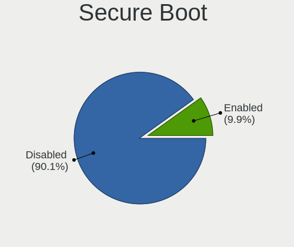
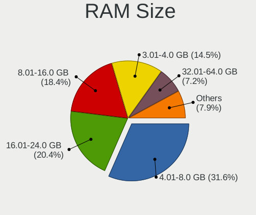
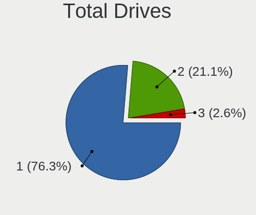
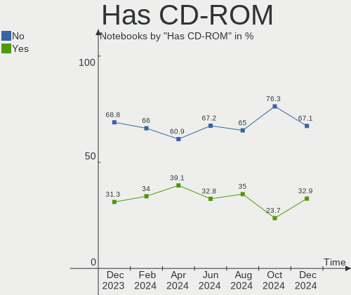
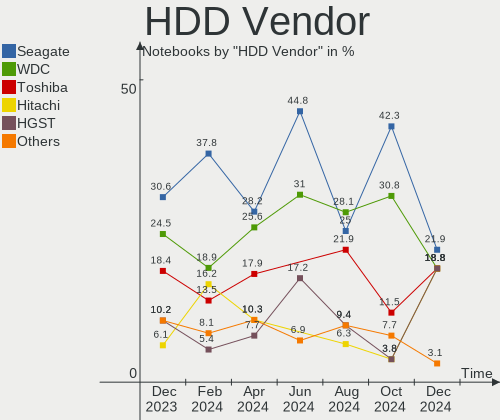
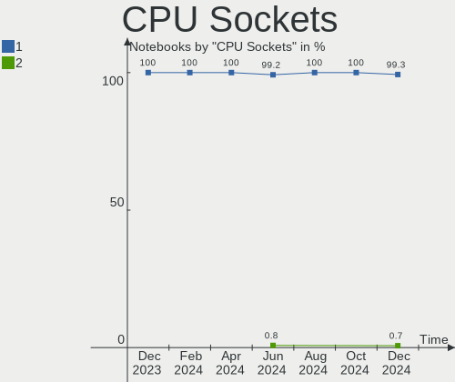
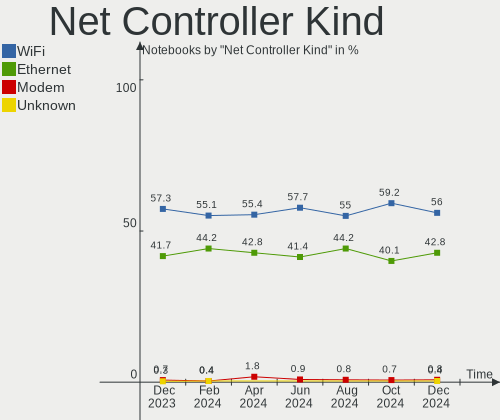

Linux in Italy - Hardware Trends (Notebooks)
--------------------------------------------

A project to identify most popular hardware characteristics and track their change
over time based on data collected by Linux users at https://Linux-Hardware.org.

Anyone can contribute to this report by the [hw-probe](https://github.com/linuxhw/hw-probe) tool:

    sudo -E hw-probe -all -upload

Period: Nov, 2022.

Contents
--------

* [ System ](#system)
  - [ OS                       ](#os)
  - [ OS Family                ](#os-family)
  - [ Kernel                   ](#kernel)
  - [ Kernel Family            ](#kernel-family)
  - [ Kernel Major Ver.        ](#kernel-major-ver)
  - [ Arch                     ](#arch)
  - [ DE                       ](#de)
  - [ Display Server           ](#display-server)
  - [ Display Manager          ](#display-manager)
  - [ OS Lang                  ](#os-lang)
  - [ Boot Mode                ](#boot-mode)
  - [ Filesystem               ](#filesystem)
  - [ Part. scheme             ](#part-scheme)
  - [ Dual Boot with Linux/BSD ](#dual-boot-with-linuxbsd)
  - [ Dual Boot (Win)          ](#dual-boot-win)

* [ Board ](#board)
  - [ Vendor                   ](#vendor)
  - [ Model                    ](#model)
  - [ Model Family             ](#model-family)
  - [ MFG Year                 ](#mfg-year)
  - [ Form Factor              ](#form-factor)
  - [ Secure Boot              ](#secure-boot)
  - [ Coreboot                 ](#coreboot)
  - [ RAM Size                 ](#ram-size)
  - [ RAM Used                 ](#ram-used)
  - [ Total Drives             ](#total-drives)
  - [ Has CD-ROM               ](#has-cd-rom)
  - [ Has Ethernet             ](#has-ethernet)
  - [ Has WiFi                 ](#has-wifi)
  - [ Has Bluetooth            ](#has-bluetooth)

* [ Location ](#location)
  - [ Country                  ](#country)
  - [ City                     ](#city)

* [ Drives ](#drives)
  - [ Drive Vendor             ](#drive-vendor)
  - [ Drive Model              ](#drive-model)
  - [ HDD Vendor               ](#hdd-vendor)
  - [ SSD Vendor               ](#ssd-vendor)
  - [ Drive Kind               ](#drive-kind)
  - [ Drive Connector          ](#drive-connector)
  - [ Drive Size               ](#drive-size)
  - [ Space Total              ](#space-total)
  - [ Space Used               ](#space-used)
  - [ Malfunc. Drives          ](#malfunc-drives)
  - [ Malfunc. Drive Vendor    ](#malfunc-drive-vendor)
  - [ Malfunc. HDD Vendor      ](#malfunc-hdd-vendor)
  - [ Malfunc. Drive Kind      ](#malfunc-drive-kind)
  - [ Failed Drives            ](#failed-drives)
  - [ Failed Drive Vendor      ](#failed-drive-vendor)
  - [ Drive Status             ](#drive-status)

* [ Storage controller ](#storage-controller)
  - [ Storage Vendor           ](#storage-vendor)
  - [ Storage Model            ](#storage-model)
  - [ Storage Kind             ](#storage-kind)

* [ Processor ](#processor)
  - [ CPU Vendor               ](#cpu-vendor)
  - [ CPU Model                ](#cpu-model)
  - [ CPU Model Family         ](#cpu-model-family)
  - [ CPU Cores                ](#cpu-cores)
  - [ CPU Sockets              ](#cpu-sockets)
  - [ CPU Threads              ](#cpu-threads)
  - [ CPU Op-Modes             ](#cpu-op-modes)
  - [ CPU Microcode            ](#cpu-microcode)
  - [ CPU Microarch            ](#cpu-microarch)

* [ Graphics ](#graphics)
  - [ GPU Vendor               ](#gpu-vendor)
  - [ GPU Model                ](#gpu-model)
  - [ GPU Combo                ](#gpu-combo)
  - [ GPU Driver               ](#gpu-driver)
  - [ GPU Memory               ](#gpu-memory)

* [ Monitor ](#monitor)
  - [ Monitor Vendor           ](#monitor-vendor)
  - [ Monitor Model            ](#monitor-model)
  - [ Monitor Resolution       ](#monitor-resolution)
  - [ Monitor Diagonal         ](#monitor-diagonal)
  - [ Monitor Width            ](#monitor-width)
  - [ Aspect Ratio             ](#aspect-ratio)
  - [ Monitor Area             ](#monitor-area)
  - [ Pixel Density            ](#pixel-density)
  - [ Multiple Monitors        ](#multiple-monitors)

* [ Network ](#network)
  - [ Net Controller Vendor    ](#net-controller-vendor)
  - [ Net Controller Model     ](#net-controller-model)
  - [ Wireless Vendor          ](#wireless-vendor)
  - [ Wireless Model           ](#wireless-model)
  - [ Ethernet Vendor          ](#ethernet-vendor)
  - [ Ethernet Model           ](#ethernet-model)
  - [ Net Controller Kind      ](#net-controller-kind)
  - [ Used Controller          ](#used-controller)
  - [ NICs                     ](#nics)
  - [ IPv6                     ](#ipv6)

* [ Bluetooth ](#bluetooth)
  - [ Bluetooth Vendor         ](#bluetooth-vendor)
  - [ Bluetooth Model          ](#bluetooth-model)

* [ Sound ](#sound)
  - [ Sound Vendor             ](#sound-vendor)
  - [ Sound Model              ](#sound-model)

* [ Memory ](#memory)
  - [ Memory Vendor            ](#memory-vendor)
  - [ Memory Model             ](#memory-model)
  - [ Memory Kind              ](#memory-kind)
  - [ Memory Form Factor       ](#memory-form-factor)
  - [ Memory Size              ](#memory-size)
  - [ Memory Speed             ](#memory-speed)

* [ Printers & scanners ](#printers--scanners)
  - [ Printer Vendor           ](#printer-vendor)
  - [ Printer Model            ](#printer-model)
  - [ Scanner Vendor           ](#scanner-vendor)
  - [ Scanner Model            ](#scanner-model)

* [ Camera ](#camera)
  - [ Camera Vendor            ](#camera-vendor)
  - [ Camera Model             ](#camera-model)

* [ Security ](#security)
  - [ Fingerprint Vendor       ](#fingerprint-vendor)
  - [ Fingerprint Model        ](#fingerprint-model)
  - [ Chipcard Vendor          ](#chipcard-vendor)
  - [ Chipcard Model           ](#chipcard-model)

* [ Unsupported ](#unsupported)
  - [ Unsupported Devices      ](#unsupported-devices)
  - [ Unsupported Device Types ](#unsupported-device-types)

System
------

OS
--

Installed operating systems

| Name                         | Notebooks | Percent |
|------------------------------|-----------|---------|
| Ubuntu 22.04                 | 39        | 18.14%  |
| Ubuntu 22.10                 | 18        | 8.37%   |
| Arch Rolling                 | 18        | 8.37%   |
| Zorin 16                     | 10        | 4.65%   |
| Fedora 36                    | 9         | 4.19%   |
| Debian 11                    | 9         | 4.19%   |
| Pop!_OS 22.04                | 8         | 3.72%   |
| Linux Mint 21                | 8         | 3.72%   |
| Manjaro 22.0.0               | 7         | 3.26%   |
| Kubuntu 22.04                | 6         | 2.79%   |
| Fedora 37                    | 6         | 2.79%   |
| EndeavourOS Rolling          | 6         | 2.79%   |
| Debian                       | 6         | 2.79%   |
| OpenMandriva 4.50            | 5         | 2.33%   |
| Linux Mint 20.3              | 5         | 2.33%   |
| openSUSE Tumbleweed-XXXXXXXX | 4         | 1.86%   |
| OpenMandriva 4.3             | 4         | 1.86%   |
| MX 21                        | 4         | 1.86%   |
| Lubuntu 22.04                | 4         | 1.86%   |
| KDE neon 22.04               | 3         | 1.4%    |
| Void Linux Rolling           | 2         | 0.93%   |
| Ubuntu 20.04                 | 2         | 0.93%   |
| NixOS 22.11                  | 2         | 0.93%   |
| LMDE 5                       | 2         | 0.93%   |
| Linux Mint 19.3              | 2         | 0.93%   |
| Kubuntu 22.10                | 2         | 0.93%   |
| Kubuntu 20.04                | 2         | 0.93%   |
| Gentoo 2.9                   | 2         | 0.93%   |
| Xubuntu 22.10                | 1         | 0.47%   |
| Xubuntu 22.04                | 1         | 0.47%   |
| Xubuntu 20.04                | 1         | 0.47%   |
| Pardus 21.3                  | 1         | 0.47%   |
| OpenMandriva 4.90            | 1         | 0.47%   |
| Nobara 36                    | 1         | 0.47%   |
| Manjaro 22.10-development    | 1         | 0.47%   |
| Kubuntu 18.04                | 1         | 0.47%   |
| Kubuntu 11                   | 1         | 0.47%   |
| Kali 2022.4                  | 1         | 0.47%   |
| Kali 2022.3                  | 1         | 0.47%   |
| Garuda Linux Soaring         | 1         | 0.47%   |

OS Family
---------

OS without a version

| Name         | Notebooks | Percent |
|--------------|-----------|---------|
| Ubuntu       | 59        | 27.44%  |
| Arch         | 18        | 8.37%   |
| Fedora       | 16        | 7.44%   |
| Linux Mint   | 15        | 6.98%   |
| Debian       | 15        | 6.98%   |
| Kubuntu      | 12        | 5.58%   |
| Zorin        | 10        | 4.65%   |
| OpenMandriva | 10        | 4.65%   |
| Pop!_OS      | 8         | 3.72%   |
| Manjaro      | 8         | 3.72%   |
| EndeavourOS  | 6         | 2.79%   |
| openSUSE     | 4         | 1.86%   |
| MX           | 4         | 1.86%   |
| Lubuntu      | 4         | 1.86%   |
| Xubuntu      | 3         | 1.4%    |
| KDE neon     | 3         | 1.4%    |
| Void Linux   | 2         | 0.93%   |
| NixOS        | 2         | 0.93%   |
| LMDE         | 2         | 0.93%   |
| Kali         | 2         | 0.93%   |
| Gentoo       | 2         | 0.93%   |
| Endless      | 2         | 0.93%   |
| Pardus       | 1         | 0.47%   |
| Nobara       | 1         | 0.47%   |
| Garuda Linux | 1         | 0.47%   |
| Elementary   | 1         | 0.47%   |
| Deepin       | 1         | 0.47%   |
| BunsenLabs   | 1         | 0.47%   |
| Artix        | 1         | 0.47%   |
| ArcoLinux    | 1         | 0.47%   |

Kernel
------

Version of the Linux kernel

| Version                     | Notebooks | Percent |
|-----------------------------|-----------|---------|
| 5.15.0-52-generic           | 37        | 17.21%  |
| 5.15.0-53-generic           | 20        | 9.3%    |
| 5.19.0-23-generic           | 15        | 6.98%   |
| 5.10.0-19-amd64             | 13        | 6.05%   |
| 6.0.5-200.fc36.x86_64       | 8         | 3.72%   |
| 6.0.9-arch1-1               | 5         | 2.33%   |
| 5.19.12-desktop-2omv4090    | 5         | 2.33%   |
| 5.19.0-21-generic           | 5         | 2.33%   |
| 6.0.8-arch1-1               | 4         | 1.86%   |
| 6.0.7-301.fc37.x86_64       | 4         | 1.86%   |
| 6.0.6-arch1-1               | 4         | 1.86%   |
| 6.0.6-76060006-generic      | 4         | 1.86%   |
| 5.4.0-131-generic           | 4         | 1.86%   |
| 5.16.7-desktop-1omv4003     | 4         | 1.86%   |
| 5.15.0-43-generic           | 4         | 1.86%   |
| 5.15.0-41-generic           | 4         | 1.86%   |
| 6.0.7-arch1-1               | 3         | 1.4%    |
| 6.0.6-zen1-1-zen            | 3         | 1.4%    |
| 6.0.0-2-amd64               | 3         | 1.4%    |
| 5.15.78-1-MANJARO           | 3         | 1.4%    |
| 5.15.0-54-generic           | 3         | 1.4%    |
| 6.0.9-300.fc37.x86_64       | 2         | 0.93%   |
| 6.0.2-76060002-generic      | 2         | 0.93%   |
| 6.0.0-4-amd64               | 2         | 0.93%   |
| 5.4.0-132-generic           | 2         | 0.93%   |
| 5.4.0-126-generic           | 2         | 0.93%   |
| 5.19.16_1                   | 2         | 0.93%   |
| 5.15.0-50-generic           | 2         | 0.93%   |
| 5.11.0-35-generic           | 2         | 0.93%   |
| 6.1.0-060100rc5-generic     | 1         | 0.47%   |
| 6.0.9-zen1-1-zen            | 1         | 0.47%   |
| 6.0.9-gentoo-dist           | 1         | 0.47%   |
| 6.0.8-1-MANJARO             | 1         | 0.47%   |
| 6.0.8-1-default             | 1         | 0.47%   |
| 6.0.7-zen1-1-zen            | 1         | 0.47%   |
| 6.0.7-201.fsync.fc36.x86_64 | 1         | 0.47%   |
| 6.0.7-1-MANJARO             | 1         | 0.47%   |
| 6.0.7-060007-generic        | 1         | 0.47%   |
| 6.0.6-2-MANJARO             | 1         | 0.47%   |
| 6.0.6-1-default             | 1         | 0.47%   |

Kernel Family
-------------

Linux kernel without a distro release

| Version | Notebooks | Percent |
|---------|-----------|---------|
| 5.15.0  | 71        | 33.02%  |
| 5.19.0  | 24        | 11.16%  |
| 6.0.6   | 13        | 6.05%   |
| 5.10.0  | 13        | 6.05%   |
| 6.0.7   | 11        | 5.12%   |
| 6.0.9   | 9         | 4.19%   |
| 6.0.5   | 9         | 4.19%   |
| 5.4.0   | 9         | 4.19%   |
| 6.0.0   | 8         | 3.72%   |
| 6.0.8   | 6         | 2.79%   |
| 6.0.2   | 6         | 2.79%   |
| 5.19.12 | 5         | 2.33%   |
| 5.19.16 | 4         | 1.86%   |
| 5.16.7  | 4         | 1.86%   |
| 5.15.78 | 4         | 1.86%   |
| 5.19.17 | 2         | 0.93%   |
| 5.17.0  | 2         | 0.93%   |
| 5.11.0  | 2         | 0.93%   |
| 6.1.0   | 1         | 0.47%   |
| 6.0.3   | 1         | 0.47%   |
| 6.0.10  | 1         | 0.47%   |
| 5.19.5  | 1         | 0.47%   |
| 5.18.17 | 1         | 0.47%   |
| 5.18.12 | 1         | 0.47%   |
| 5.18.0  | 1         | 0.47%   |
| 5.16.16 | 1         | 0.47%   |
| 5.16.0  | 1         | 0.47%   |
| 5.15.76 | 1         | 0.47%   |
| 5.15.12 | 1         | 0.47%   |
| 5.14.0  | 1         | 0.47%   |
| 4.15.0  | 1         | 0.47%   |

Kernel Major Ver.
-----------------

Linux kernel major version

| Version | Notebooks | Percent |
|---------|-----------|---------|
| 5.15    | 77        | 35.81%  |
| 6.0     | 64        | 29.77%  |
| 5.19    | 36        | 16.74%  |
| 5.10    | 13        | 6.05%   |
| 5.4     | 9         | 4.19%   |
| 5.16    | 6         | 2.79%   |
| 5.18    | 3         | 1.4%    |
| 5.17    | 2         | 0.93%   |
| 5.11    | 2         | 0.93%   |
| 6.1     | 1         | 0.47%   |
| 5.14    | 1         | 0.47%   |
| 4.15    | 1         | 0.47%   |

Arch
----

OS architecture (x86_64, i586, etc.)

| Name   | Notebooks | Percent |
|--------|-----------|---------|
| x86_64 | 214       | 99.53%  |
| i686   | 1         | 0.47%   |

DE
--

Desktop Environment

| Name            | Notebooks | Percent |
|-----------------|-----------|---------|
| GNOME           | 116       | 53.95%  |
| KDE5            | 58        | 26.98%  |
| XFCE            | 16        | 7.44%   |
| X-Cinnamon      | 11        | 5.12%   |
| LXQt            | 4         | 1.86%   |
| sway            | 2         | 0.93%   |
| Unknown         | 2         | 0.93%   |
| Pantheon        | 1         | 0.47%   |
| none+bspwm      | 1         | 0.47%   |
| MATE            | 1         | 0.47%   |
| GNOME Flashback | 1         | 0.47%   |
| Deepin          | 1         | 0.47%   |
| Cinnamon        | 1         | 0.47%   |

Display Server
--------------

X11 or Wayland

| Name    | Notebooks | Percent |
|---------|-----------|---------|
| X11     | 131       | 60.93%  |
| Wayland | 79        | 36.74%  |
| Unknown | 3         | 1.4%    |
| Tty     | 2         | 0.93%   |

Display Manager
---------------

SDDM, LightDM, etc.

| Name    | Notebooks | Percent |
|---------|-----------|---------|
| GDM3    | 71        | 33.02%  |
| SDDM    | 48        | 22.33%  |
| LightDM | 34        | 15.81%  |
| GDM     | 32        | 14.88%  |
| Unknown | 30        | 13.95%  |

OS Lang
-------

Language

| Lang   | Notebooks | Percent |
|--------|-----------|---------|
| it_IT  | 145       | 67.44%  |
| en_US  | 51        | 23.72%  |
| en_GB  | 8         | 3.72%   |
| C      | 4         | 1.86%   |
| POSIX  | 1         | 0.47%   |
| fur_IT | 1         | 0.47%   |
| fr_FR  | 1         | 0.47%   |
| en_AU  | 1         | 0.47%   |
| en_AG  | 1         | 0.47%   |
| de_IT  | 1         | 0.47%   |
| de_AT  | 1         | 0.47%   |

Boot Mode
---------

EFI or BIOS

| Mode | Notebooks | Percent |
|------|-----------|---------|
| EFI  | 144       | 66.98%  |
| BIOS | 71        | 33.02%  |

Filesystem
----------

Type of filesystem

| Type    | Notebooks | Percent |
|---------|-----------|---------|
| Ext4    | 168       | 78.14%  |
| Btrfs   | 21        | 9.77%   |
| Overlay | 19        | 8.84%   |
| Zfs     | 4         | 1.86%   |
| Xfs     | 2         | 0.93%   |
| F2fs    | 1         | 0.47%   |

Part. scheme
------------

Scheme of partitioning

| Type    | Notebooks | Percent |
|---------|-----------|---------|
| GPT     | 169       | 78.6%   |
| Unknown | 29        | 13.49%  |
| MBR     | 17        | 7.91%   |

Dual Boot with Linux/BSD
------------------------

Hosting more than one Linux/BSD

| Dual boot | Notebooks | Percent |
|-----------|-----------|---------|
| No        | 195       | 90.7%   |
| Yes       | 20        | 9.3%    |

Dual Boot (Win)
---------------

Hosting Linux and Windows

| Dual boot | Notebooks | Percent |
|-----------|-----------|---------|
| No        | 143       | 66.51%  |
| Yes       | 72        | 33.49%  |

Board
-----

Vendor
------

Motherboard manufacturer

| Name                | Notebooks | Percent |
|---------------------|-----------|---------|
| Lenovo              | 46        | 21.4%   |
| Hewlett-Packard     | 43        | 20%     |
| ASUSTek Computer    | 30        | 13.95%  |
| Dell                | 21        | 9.77%   |
| Acer                | 17        | 7.91%   |
| HUAWEI              | 10        | 4.65%   |
| Apple               | 8         | 3.72%   |
| MSI                 | 7         | 3.26%   |
| Sony                | 6         | 2.79%   |
| Toshiba             | 4         | 1.86%   |
| Fujitsu             | 3         | 1.4%    |
| Unknown             | 3         | 1.4%    |
| Samsung Electronics | 2         | 0.93%   |
| Microtech           | 2         | 0.93%   |
| Mediacom            | 2         | 0.93%   |
| TUXEDO              | 1         | 0.47%   |
| Timi                | 1         | 0.47%   |
| Teclast             | 1         | 0.47%   |
| System76            | 1         | 0.47%   |
| SANTECH             | 1         | 0.47%   |
| Packard Bell        | 1         | 0.47%   |
| Olidata             | 1         | 0.47%   |
| Notebook            | 1         | 0.47%   |
| Jumper              | 1         | 0.47%   |
| Google              | 1         | 0.47%   |
| Alienware           | 1         | 0.47%   |

Model
-----

Motherboard model

| Name                                       | Notebooks | Percent |
|--------------------------------------------|-----------|---------|
| HUAWEI NBLK-WAX9X                          | 4         | 1.86%   |
| Unknown                                    | 4         | 1.86%   |
| Toshiba Satellite L50-B                    | 2         | 0.93%   |
| MSI Prestige 15 A12SC                      | 2         | 0.93%   |
| Lenovo IdeaPad 3 15ADA05 81W1              | 2         | 0.93%   |
| HUAWEI BOD-WXX9                            | 2         | 0.93%   |
| HP Pavilion Notebook                       | 2         | 0.93%   |
| HP Pavilion Laptop 15-cs2xxx               | 2         | 0.93%   |
| HP Notebook                                | 2         | 0.93%   |
| HP Laptop 15-dw0xxx                        | 2         | 0.93%   |
| HP Laptop 15-db0xxx                        | 2         | 0.93%   |
| ASUS VivoBook S15 X510UF                   | 2         | 0.93%   |
| Apple MacBookPro11,5                       | 2         | 0.93%   |
| TUXEDO Pulse 15 Gen1                       | 1         | 0.47%   |
| Toshiba Satellite Pro S500                 | 1         | 0.47%   |
| Toshiba Satellite L350                     | 1         | 0.47%   |
| Timi TM1701                                | 1         | 0.47%   |
| Teclast F6 Pro                             | 1         | 0.47%   |
| System76 Oryx Pro                          | 1         | 0.47%   |
| Sony VPCYA1C5E                             | 1         | 0.47%   |
| Sony VPCEB2M1E                             | 1         | 0.47%   |
| Sony VGN-NS21M_W                           | 1         | 0.47%   |
| Sony VGN-FW21E                             | 1         | 0.47%   |
| Sony VGN-CS11Z_R                           | 1         | 0.47%   |
| Sony SVP1121X9EB                           | 1         | 0.47%   |
| SANTECH X170KM-G                           | 1         | 0.47%   |
| Samsung 350V5C/351V5C/3540VC/3440VC        | 1         | 0.47%   |
| Samsung 300E4A/300E5A/300E7A/3430EA/3530EA | 1         | 0.47%   |
| Packard Bell DOT S                         | 1         | 0.47%   |
| Olidata T7700                              | 1         | 0.47%   |
| Notebook P65_P67SE                         | 1         | 0.47%   |
| MSI PS63 Modern 8RC                        | 1         | 0.47%   |
| MSI Prestige 15 A11SCX                     | 1         | 0.47%   |
| MSI Prestige 14Evo A11M                    | 1         | 0.47%   |
| MSI GL63 8RD                               | 1         | 0.47%   |
| MSI Creator 15M A9SD                       | 1         | 0.47%   |
| Microtech ebookLite                        | 1         | 0.47%   |
| Microtech CoreBook                         | 1         | 0.47%   |
| Mediacom SmartBook 14 FullHD - SB14UC      | 1         | 0.47%   |
| Mediacom FlexBook_edge13-M-FBE13           | 1         | 0.47%   |

Model Family
------------

Motherboard model prefix

| Name               | Notebooks | Percent |
|--------------------|-----------|---------|
| Lenovo ThinkPad    | 24        | 11.16%  |
| Acer Aspire        | 12        | 5.58%   |
| HP Pavilion        | 11        | 5.12%   |
| HP Laptop          | 10        | 4.65%   |
| Lenovo IdeaPad     | 8         | 3.72%   |
| ASUS VivoBook      | 6         | 2.79%   |
| HP EliteBook       | 5         | 2.33%   |
| Dell XPS           | 5         | 2.33%   |
| Dell Latitude      | 5         | 2.33%   |
| Dell Inspiron      | 5         | 2.33%   |
| Toshiba Satellite  | 4         | 1.86%   |
| MSI Prestige       | 4         | 1.86%   |
| HUAWEI NBLK-WAX9X  | 4         | 1.86%   |
| Unknown            | 4         | 1.86%   |
| Lenovo ThinkBook   | 3         | 1.4%    |
| HP ProBook         | 3         | 1.4%    |
| HP OMEN            | 3         | 1.4%    |
| Fujitsu LIFEBOOK   | 3         | 1.4%    |
| Dell Precision     | 3         | 1.4%    |
| Apple MacBookPro11 | 3         | 1.4%    |
| HUAWEI BOD-WXX9    | 2         | 0.93%   |
| HP Notebook        | 2         | 0.93%   |
| HP 250             | 2         | 0.93%   |
| ASUS ROG           | 2         | 0.93%   |
| ASUS ASUS          | 2         | 0.93%   |
| Acer Nitro         | 2         | 0.93%   |
| TUXEDO Pulse       | 1         | 0.47%   |
| Timi TM1701        | 1         | 0.47%   |
| Teclast F6         | 1         | 0.47%   |
| System76 Oryx      | 1         | 0.47%   |
| Sony VPCYA1C5E     | 1         | 0.47%   |
| Sony VPCEB2M1E     | 1         | 0.47%   |
| Sony VGN-NS21M     | 1         | 0.47%   |
| Sony VGN-FW21E     | 1         | 0.47%   |
| Sony VGN-CS11Z     | 1         | 0.47%   |
| Sony SVP1121X9EB   | 1         | 0.47%   |
| SANTECH X170KM-G   | 1         | 0.47%   |
| Samsung 350V5C     | 1         | 0.47%   |
| Samsung 300E4A     | 1         | 0.47%   |
| Packard Bell DOT   | 1         | 0.47%   |

MFG Year
--------

Motherboard manufacture year

| Year | Notebooks | Percent |
|------|-----------|---------|
| 2021 | 30        | 13.95%  |
| 2019 | 28        | 13.02%  |
| 2018 | 22        | 10.23%  |
| 2020 | 21        | 9.77%   |
| 2014 | 17        | 7.91%   |
| 2017 | 14        | 6.51%   |
| 2013 | 14        | 6.51%   |
| 2010 | 11        | 5.12%   |
| 2016 | 10        | 4.65%   |
| 2022 | 9         | 4.19%   |
| 2015 | 9         | 4.19%   |
| 2012 | 9         | 4.19%   |
| 2011 | 8         | 3.72%   |
| 2008 | 8         | 3.72%   |
| 2009 | 3         | 1.4%    |
| 2007 | 1         | 0.47%   |
| 2006 | 1         | 0.47%   |

Form Factor
-----------

Physical design of the computer

| Name     | Notebooks | Percent |
|----------|-----------|---------|
| Notebook | 215       | 100%    |

Secure Boot
-----------

Enabled or disabled

| State    | Notebooks | Percent |
|----------|-----------|---------|
| Disabled | 188       | 87.44%  |
| Enabled  | 27        | 12.56%  |

Coreboot
--------

Have coreboot on board

| Used | Notebooks | Percent |
|------|-----------|---------|
| No   | 213       | 99.07%  |
| Yes  | 2         | 0.93%   |

RAM Size
--------

Total RAM memory

| Size in GB  | Notebooks | Percent |
|-------------|-----------|---------|
| 4.01-8.0    | 80        | 37.21%  |
| 16.01-24.0  | 46        | 21.4%   |
| 3.01-4.0    | 36        | 16.74%  |
| 8.01-16.0   | 34        | 15.81%  |
| 32.01-64.0  | 9         | 4.19%   |
| 1.01-2.0    | 5         | 2.33%   |
| 24.01-32.0  | 2         | 0.93%   |
| 64.01-256.0 | 2         | 0.93%   |
| 2.01-3.0    | 1         | 0.47%   |

RAM Used
--------

Used RAM memory

| Used GB    | Notebooks | Percent |
|------------|-----------|---------|
| 1.01-2.0   | 68        | 31.63%  |
| 2.01-3.0   | 61        | 28.37%  |
| 4.01-8.0   | 36        | 16.74%  |
| 3.01-4.0   | 32        | 14.88%  |
| 8.01-16.0  | 11        | 5.12%   |
| 0.51-1.0   | 5         | 2.33%   |
| 16.01-24.0 | 1         | 0.47%   |
| 0.01-0.5   | 1         | 0.47%   |

Total Drives
------------

Number of drives on board

| Drives | Notebooks | Percent |
|--------|-----------|---------|
| 1      | 159       | 73.95%  |
| 2      | 50        | 23.26%  |
| 3      | 4         | 1.86%   |
| 0      | 2         | 0.93%   |

Has CD-ROM
----------

Has CD-ROM on board

| Presented | Notebooks | Percent |
|-----------|-----------|---------|
| No        | 151       | 70.23%  |
| Yes       | 64        | 29.77%  |

Has Ethernet
------------

Has Ethernet on board

| Presented | Notebooks | Percent |
|-----------|-----------|---------|
| Yes       | 156       | 72.56%  |
| No        | 59        | 27.44%  |

Has WiFi
--------

Has WiFi module

| Presented | Notebooks | Percent |
|-----------|-----------|---------|
| Yes       | 213       | 99.07%  |
| No        | 2         | 0.93%   |

Has Bluetooth
-------------

Has Bluetooth module

| Presented | Notebooks | Percent |
|-----------|-----------|---------|
| Yes       | 180       | 83.72%  |
| No        | 35        | 16.28%  |

Location
--------

Country
-------

Geographic location (country)

| Country | Notebooks | Percent |
|---------|-----------|---------|
| Italy   | 215       | 100%    |

City
----

Geographic location (city)

| City                    | Notebooks | Percent |
|-------------------------|-----------|---------|
| Milan                   | 34        | 15.81%  |
| Rome                    | 24        | 11.16%  |
| Naples                  | 10        | 4.65%   |
| Bologna                 | 9         | 4.19%   |
| Rho                     | 6         | 2.79%   |
| Turin                   | 4         | 1.86%   |
| Palermo                 | 4         | 1.86%   |
| Catania                 | 4         | 1.86%   |
| Verona                  | 3         | 1.4%    |
| Venice                  | 2         | 0.93%   |
| Trento                  | 2         | 0.93%   |
| Portogruaro             | 2         | 0.93%   |
| Pordenone               | 2         | 0.93%   |
| Perugia                 | 2         | 0.93%   |
| Padova                  | 2         | 0.93%   |
| Modena                  | 2         | 0.93%   |
| Gorle                   | 2         | 0.93%   |
| Genoa                   | 2         | 0.93%   |
| Florence                | 2         | 0.93%   |
| Cinisello Balsamo       | 2         | 0.93%   |
| Buguggiate              | 2         | 0.93%   |
| Bolzano                 | 2         | 0.93%   |
| Bari                    | 2         | 0.93%   |
| Urbino                  | 1         | 0.47%   |
| Udine                   | 1         | 0.47%   |
| Trieste                 | 1         | 0.47%   |
| Torre del Greco         | 1         | 0.47%   |
| Tenna                   | 1         | 0.47%   |
| Teano                   | 1         | 0.47%   |
| Taglio di Po            | 1         | 0.47%   |
| Soveria Mannelli        | 1         | 0.47%   |
| Settimo San Pietro      | 1         | 0.47%   |
| Sesto Fiorentino        | 1         | 0.47%   |
| Serramanna              | 1         | 0.47%   |
| Sellano                 | 1         | 0.47%   |
| Sassuolo                | 1         | 0.47%   |
| Sassari                 | 1         | 0.47%   |
| Santa Teresa di Riva    | 1         | 0.47%   |
| Santa Maria La Carita   | 1         | 0.47%   |
| Santa Margherita Ligure | 1         | 0.47%   |

Drives
------

Drive Vendor
------------

Hard drive vendors

| Vendor                      | Notebooks | Drives | Percent |
|-----------------------------|-----------|--------|---------|
| Samsung Electronics         | 53        | 58     | 19.92%  |
| SanDisk                     | 24        | 24     | 9.02%   |
| Toshiba                     | 18        | 18     | 6.77%   |
| Crucial                     | 18        | 18     | 6.77%   |
| Kingston                    | 16        | 16     | 6.02%   |
| Unknown                     | 15        | 19     | 5.64%   |
| SK hynix                    | 15        | 15     | 5.64%   |
| WDC                         | 13        | 14     | 4.89%   |
| Seagate                     | 13        | 13     | 4.89%   |
| Hitachi                     | 10        | 10     | 3.76%   |
| Micron Technology           | 7         | 7      | 2.63%   |
| Intel                       | 7         | 7      | 2.63%   |
| Apple                       | 6         | 6      | 2.26%   |
| Phison                      | 4         | 4      | 1.5%    |
| SPCC                        | 3         | 3      | 1.13%   |
| Phison Electronics          | 3         | 3      | 1.13%   |
| LITEON                      | 3         | 3      | 1.13%   |
| KIOXIA                      | 3         | 3      | 1.13%   |
| HGST                        | 3         | 3      | 1.13%   |
| China                       | 3         | 3      | 1.13%   |
| Teclast                     | 2         | 2      | 0.75%   |
| Lenovo                      | 2         | 2      | 0.75%   |
| Kingston Technology Company | 2         | 2      | 0.75%   |
| UMIS                        | 1         | 1      | 0.38%   |
| TSA                         | 1         | 1      | 0.38%   |
| Transcend                   | 1         | 1      | 0.38%   |
| TO Exter                    | 1         | 1      | 0.38%   |
| TCSUNBOW                    | 1         | 1      | 0.38%   |
| SABRENT                     | 1         | 1      | 0.38%   |
| PNY                         | 1         | 1      | 0.38%   |
| Patriot                     | 1         | 1      | 0.38%   |
| Microtech                   | 1         | 1      | 0.38%   |
| Micron/Crucial Technology   | 1         | 1      | 0.38%   |
| LITEONIT                    | 1         | 1      | 0.38%   |
| Lexar                       | 1         | 1      | 0.38%   |
| Leven                       | 1         | 1      | 0.38%   |
| KingSpec                    | 1         | 1      | 0.38%   |
| Intenso                     | 1         | 1      | 0.38%   |
| GOODRAM                     | 1         | 1      | 0.38%   |
| External                    | 1         | 1      | 0.38%   |

Drive Model
-----------

Hard drive models

| Model                                                | Notebooks | Percent |
|------------------------------------------------------|-----------|---------|
| Samsung NVMe SSD Controller SM981/PM981/PM983 1TB    | 8         | 2.92%   |
| Toshiba MQ01ABF050 500GB                             | 6         | 2.19%   |
| Unknown MMC Card  32GB                               | 4         | 1.46%   |
| Sandisk WD Black SN750 / PC SN730 NVMe SSD 1024GB    | 4         | 1.46%   |
| Kingston SA400S37480G 480GB SSD                      | 4         | 1.46%   |
| Kingston SA400S37240G 240GB SSD                      | 4         | 1.46%   |
| Crucial CT240BX500SSD1 240GB                         | 4         | 1.46%   |
| Unknown MMC Card  64GB                               | 3         | 1.09%   |
| Seagate ST1000LM035-1RK172 1TB                       | 3         | 1.09%   |
| Samsung SSD 970 EVO Plus 1TB                         | 3         | 1.09%   |
| Samsung SSD 870 EVO 250GB                            | 3         | 1.09%   |
| Samsung MZVLQ512HALU-000H1 512GB                     | 3         | 1.09%   |
| KIOXIA KBG40ZNV256G 256GB                            | 3         | 1.09%   |
| WDC WD3200BPVT-22JJ5T0 320GB                         | 2         | 0.73%   |
| Toshiba XG4 NVMe SSD Controller 256GB                | 2         | 0.73%   |
| Toshiba KXG50ZNV512G NVMe 512GB                      | 2         | 0.73%   |
| Teclast BD256GB SHCB-2280 SSD                        | 2         | 0.73%   |
| SK hynix SC311 SATA 256GB SSD                        | 2         | 0.73%   |
| SK hynix HFM512GD3JX013N 512GB                       | 2         | 0.73%   |
| SK hynix BC501 NVMe Solid State Drive 512GB          | 2         | 0.73%   |
| Seagate ST500LM012 HN-M500MBB 500GB                  | 2         | 0.73%   |
| Seagate ST1000LM024 HN-M101MBB 1TB                   | 2         | 0.73%   |
| Sandisk WD Blue SN550 NVMe SSD 1TB                   | 2         | 0.73%   |
| Sandisk WD Blue SN500 / PC SN520 NVMe SSD 512GB      | 2         | 0.73%   |
| SanDisk SDSSDXPS480G 480GB                           | 2         | 0.73%   |
| Samsung SSD 980 1TB                                  | 2         | 0.73%   |
| Samsung SSD 860 EVO 250GB                            | 2         | 0.73%   |
| Samsung SSD 850 EVO 500GB                            | 2         | 0.73%   |
| Samsung NVMe SSD Controller PM9A1/PM9A3/980PRO 250GB | 2         | 0.73%   |
| Samsung MZVLB512HAJQ-00000 512GB                     | 2         | 0.73%   |
| Samsung MZNLN256HAJQ-000H1 256GB SSD                 | 2         | 0.73%   |
| Phison Sabrent 512GB                                 | 2         | 0.73%   |
| Kingston SV300S37A240G 240GB SSD                     | 2         | 0.73%   |
| Intel SSD 660P Series 512GB                          | 2         | 0.73%   |
| Crucial CT480BX500SSD1 480GB                         | 2         | 0.73%   |
| Crucial CT250MX500SSD1 250GB                         | 2         | 0.73%   |
| Crucial CT1000MX500SSD1 1TB                          | 2         | 0.73%   |
| Crucial CT1000BX500SSD1 1TB                          | 2         | 0.73%   |
| Apple SSD SM0512G 500GB                              | 2         | 0.73%   |
| Apple SSD SM0256G 256GB                              | 2         | 0.73%   |

HDD Vendor
----------

Hard disk drive vendors

| Vendor              | Notebooks | Drives | Percent |
|---------------------|-----------|--------|---------|
| Seagate             | 12        | 12     | 26.67%  |
| Hitachi             | 10        | 10     | 22.22%  |
| WDC                 | 9         | 10     | 20%     |
| Toshiba             | 9         | 9      | 20%     |
| HGST                | 3         | 3      | 6.67%   |
| Unknown             | 1         | 1      | 2.22%   |
| Samsung Electronics | 1         | 2      | 2.22%   |

SSD Vendor
----------

Solid state drive vendors

| Vendor              | Notebooks | Drives | Percent |
|---------------------|-----------|--------|---------|
| Samsung Electronics | 20        | 21     | 19.61%  |
| Crucial             | 17        | 17     | 16.67%  |
| Kingston            | 14        | 14     | 13.73%  |
| SanDisk             | 9         | 9      | 8.82%   |
| Apple               | 5         | 5      | 4.9%    |
| SPCC                | 3         | 3      | 2.94%   |
| SK hynix            | 3         | 3      | 2.94%   |
| China               | 3         | 3      | 2.94%   |
| Toshiba             | 2         | 2      | 1.96%   |
| Teclast             | 2         | 2      | 1.96%   |
| Micron Technology   | 2         | 2      | 1.96%   |
| LITEON              | 2         | 2      | 1.96%   |
| WDC                 | 1         | 1      | 0.98%   |
| TSA                 | 1         | 1      | 0.98%   |
| Transcend           | 1         | 1      | 0.98%   |
| TO Exter            | 1         | 1      | 0.98%   |
| PNY                 | 1         | 1      | 0.98%   |
| Patriot             | 1         | 1      | 0.98%   |
| Microtech           | 1         | 1      | 0.98%   |
| LITEONIT            | 1         | 1      | 0.98%   |
| Lexar               | 1         | 1      | 0.98%   |
| Leven               | 1         | 1      | 0.98%   |
| Lenovo              | 1         | 1      | 0.98%   |
| KingSpec            | 1         | 1      | 0.98%   |
| Intenso             | 1         | 1      | 0.98%   |
| Intel               | 1         | 1      | 0.98%   |
| GOODRAM             | 1         | 1      | 0.98%   |
| Emtec               | 1         | 1      | 0.98%   |
| Drevo               | 1         | 1      | 0.98%   |
| Dogfish             | 1         | 1      | 0.98%   |
| BAITITON            | 1         | 1      | 0.98%   |
| Unknown             | 1         | 1      | 0.98%   |

Drive Kind
----------

HDD or SSD

| Kind    | Notebooks | Drives | Percent |
|---------|-----------|--------|---------|
| SSD     | 96        | 103    | 38.4%   |
| NVMe    | 92        | 104    | 36.8%   |
| HDD     | 45        | 47     | 18%     |
| MMC     | 15        | 20     | 6%      |
| Unknown | 2         | 2      | 0.8%    |

Drive Connector
---------------

SATA, SAS, NVMe, etc.

| Type | Notebooks | Drives | Percent |
|------|-----------|--------|---------|
| SATA | 125       | 147    | 52.52%  |
| NVMe | 91        | 102    | 38.24%  |
| MMC  | 15        | 20     | 6.3%    |
| SAS  | 7         | 7      | 2.94%   |

Drive Size
----------

Size of hard drive

| Size in TB | Notebooks | Drives | Percent |
|------------|-----------|--------|---------|
| 0.01-0.5   | 104       | 119    | 77.61%  |
| 0.51-1.0   | 26        | 27     | 19.4%   |
| 1.01-2.0   | 4         | 4      | 2.99%   |

Space Total
-----------

Amount of disk space available on the file system

| Size in GB     | Notebooks | Percent |
|----------------|-----------|---------|
| 101-250        | 73        | 33.95%  |
| 251-500        | 59        | 27.44%  |
| 1-20           | 24        | 11.16%  |
| 501-1000       | 22        | 10.23%  |
| 1001-2000      | 11        | 5.12%   |
| 51-100         | 11        | 5.12%   |
| 21-50          | 7         | 3.26%   |
| 2001-3000      | 5         | 2.33%   |
| More than 3000 | 2         | 0.93%   |
| Unknown        | 1         | 0.47%   |

Space Used
----------

Amount of used disk space

| Used GB        | Notebooks | Percent |
|----------------|-----------|---------|
| 1-20           | 74        | 34.42%  |
| 21-50          | 43        | 20%     |
| 101-250        | 38        | 17.67%  |
| 51-100         | 30        | 13.95%  |
| 251-500        | 14        | 6.51%   |
| 501-1000       | 9         | 4.19%   |
| 1001-2000      | 4         | 1.86%   |
| More than 3000 | 1         | 0.47%   |
| 2001-3000      | 1         | 0.47%   |
| Unknown        | 1         | 0.47%   |

Malfunc. Drives
---------------

Drive models with a malfunction

| Model                                   | Notebooks | Drives | Percent |
|-----------------------------------------|-----------|--------|---------|
| WDC WD3200BPVT-22JJ5T0 320GB            | 1         | 1      | 8.33%   |
| Toshiba MK2565GSXV 250GB                | 1         | 1      | 8.33%   |
| SK hynix BC711 HFM512GD3JX013N 512GB    | 1         | 1      | 8.33%   |
| Seagate ST500LT012-9WS142 500GB         | 1         | 1      | 8.33%   |
| LITEON LJH-128V2G-11 M.2 2260 128GB SSD | 1         | 1      | 8.33%   |
| Kingston SUV400S37240G 240GB SSD        | 1         | 1      | 8.33%   |
| Intel SSDPEKKF512G8L 512GB              | 1         | 1      | 8.33%   |
| Intel SSD 660P Series 512GB             | 1         | 1      | 8.33%   |
| Hitachi HTS725050A9A364 500GB           | 1         | 1      | 8.33%   |
| Hitachi HTS543232L9SA02 320GB           | 1         | 1      | 8.33%   |
| HGST HTS721010A9E630 1TB                | 1         | 1      | 8.33%   |
| HGST HTS541010A9E680 1TB                | 1         | 1      | 8.33%   |

Malfunc. Drive Vendor
---------------------

Vendors of faulty drives

| Vendor   | Notebooks | Drives | Percent |
|----------|-----------|--------|---------|
| Intel    | 2         | 2      | 16.67%  |
| Hitachi  | 2         | 2      | 16.67%  |
| HGST     | 2         | 2      | 16.67%  |
| WDC      | 1         | 1      | 8.33%   |
| Toshiba  | 1         | 1      | 8.33%   |
| SK hynix | 1         | 1      | 8.33%   |
| Seagate  | 1         | 1      | 8.33%   |
| LITEON   | 1         | 1      | 8.33%   |
| Kingston | 1         | 1      | 8.33%   |

Malfunc. HDD Vendor
-------------------

Vendors of faulty HDD drives

| Vendor  | Notebooks | Drives | Percent |
|---------|-----------|--------|---------|
| Hitachi | 2         | 2      | 28.57%  |
| HGST    | 2         | 2      | 28.57%  |
| WDC     | 1         | 1      | 14.29%  |
| Toshiba | 1         | 1      | 14.29%  |
| Seagate | 1         | 1      | 14.29%  |

Malfunc. Drive Kind
-------------------

Kinds of faulty drives

| Kind | Notebooks | Drives | Percent |
|------|-----------|--------|---------|
| HDD  | 7         | 7      | 58.33%  |
| NVMe | 3         | 3      | 25%     |
| SSD  | 2         | 2      | 16.67%  |

Failed Drives
-------------

Failed drive models

| Model                        | Notebooks | Drives | Percent |
|------------------------------|-----------|--------|---------|
| WDC WD5000BEVT-22A0RT0 500GB | 1         | 1      | 100%    |

Failed Drive Vendor
-------------------

Failed drive vendors

| Vendor | Notebooks | Drives | Percent |
|--------|-----------|--------|---------|
| WDC    | 1         | 1      | 100%    |

Drive Status
------------

Number of failed and malfunc. drives

| Status   | Notebooks | Drives | Percent |
|----------|-----------|--------|---------|
| Works    | 124       | 150    | 54.87%  |
| Detected | 89        | 113    | 39.38%  |
| Malfunc  | 12        | 12     | 5.31%   |
| Failed   | 1         | 1      | 0.44%   |

Storage controller
------------------

Storage Vendor
--------------

Storage controller vendors

| Vendor                       | Notebooks | Percent |
|------------------------------|-----------|---------|
| Intel                        | 135       | 52.73%  |
| Samsung Electronics          | 37        | 14.45%  |
| AMD                          | 23        | 8.98%   |
| SanDisk                      | 17        | 6.64%   |
| SK hynix                     | 11        | 4.3%    |
| Toshiba America Info Systems | 6         | 2.34%   |
| Phison Electronics           | 6         | 2.34%   |
| Micron Technology            | 6         | 2.34%   |
| KIOXIA                       | 4         | 1.56%   |
| Kingston Technology Company  | 4         | 1.56%   |
| Union Memory (Shenzhen)      | 1         | 0.39%   |
| Nvidia                       | 1         | 0.39%   |
| Micron/Crucial Technology    | 1         | 0.39%   |
| Lite-On Technology           | 1         | 0.39%   |
| Lenovo                       | 1         | 0.39%   |
| Apple                        | 1         | 0.39%   |
| ADATA Technology             | 1         | 0.39%   |

Storage Model
-------------

Storage controller models

| Model                                                                          | Notebooks | Percent |
|--------------------------------------------------------------------------------|-----------|---------|
| AMD FCH SATA Controller [AHCI mode]                                            | 22        | 8.3%    |
| Samsung NVMe SSD Controller SM981/PM981/PM983                                  | 18        | 6.79%   |
| Intel 82801 Mobile SATA Controller [RAID mode]                                 | 16        | 6.04%   |
| Intel 7 Series Chipset Family 6-port SATA Controller [AHCI mode]               | 12        | 4.53%   |
| Intel Sunrise Point-LP SATA Controller [AHCI mode]                             | 10        | 3.77%   |
| Samsung NVMe SSD Controller 980                                                | 9         | 3.4%    |
| Intel Wildcat Point-LP SATA Controller [AHCI Mode]                             | 9         | 3.4%    |
| Intel 8 Series/C220 Series Chipset Family 6-port SATA Controller 1 [AHCI mode] | 9         | 3.4%    |
| Intel 8 Series SATA Controller 1 [AHCI mode]                                   | 9         | 3.4%    |
| Intel 5 Series/3400 Series Chipset 4 port SATA AHCI Controller                 | 8         | 3.02%   |
| Intel Cannon Lake Mobile PCH SATA AHCI Controller                              | 7         | 2.64%   |
| Intel 82801IBM/IEM (ICH9M/ICH9M-E) 4 port SATA Controller [AHCI mode]          | 7         | 2.64%   |
| Intel 6 Series/C200 Series Chipset Family 6 port Mobile SATA AHCI Controller   | 7         | 2.64%   |
| Micron Non-Volatile memory controller                                          | 6         | 2.26%   |
| SK hynix Gold P31/PC711 NVMe Solid State Drive                                 | 5         | 1.89%   |
| SanDisk WD Black SN750 / PC SN730 NVMe SSD                                     | 5         | 1.89%   |
| Sandisk Non-Volatile memory controller                                         | 5         | 1.89%   |
| Samsung NVMe SSD Controller PM9A1/PM9A3/980PRO                                 | 5         | 1.89%   |
| Intel Volume Management Device NVMe RAID Controller                            | 5         | 1.89%   |
| Samsung Electronics SATA controller                                            | 4         | 1.51%   |
| KIOXIA NVMe SSD Controller BG4                                                 | 4         | 1.51%   |
| Intel Celeron/Pentium Silver Processor SATA Controller                         | 4         | 1.51%   |
| Toshiba America Info Systems XG4 NVMe SSD Controller                           | 3         | 1.13%   |
| SK hynix BC501 NVMe Solid State Drive                                          | 3         | 1.13%   |
| SanDisk WD Blue SN550 NVMe SSD                                                 | 3         | 1.13%   |
| Phison E12 NVMe Controller                                                     | 3         | 1.13%   |
| Intel SSD 660P Series                                                          | 3         | 1.13%   |
| Intel HM170/QM170 Chipset SATA Controller [AHCI Mode]                          | 3         | 1.13%   |
| Intel Comet Lake SATA AHCI Controller                                          | 3         | 1.13%   |
| Intel 82801HM/HEM (ICH8M/ICH8M-E) IDE Controller                               | 3         | 1.13%   |
| Toshiba America Info Systems XG5 NVMe SSD Controller                           | 2         | 0.75%   |
| SK hynix BC511                                                                 | 2         | 0.75%   |
| SanDisk WD Blue SN500 / PC SN520 NVMe SSD                                      | 2         | 0.75%   |
| Samsung NVMe SSD Controller SM961/PM961/SM963                                  | 2         | 0.75%   |
| Phison PS5013 E13 NVMe Controller                                              | 2         | 0.75%   |
| Kingston Company Company Non-Volatile memory controller                        | 2         | 0.75%   |
| Intel Q170/Q150/B150/H170/H110/Z170/CM236 Chipset SATA Controller [AHCI Mode]  | 2         | 0.75%   |
| Intel Non-Volatile memory controller                                           | 2         | 0.75%   |
| Intel Ice Lake-LP SATA Controller [AHCI mode]                                  | 2         | 0.75%   |
| Intel Cannon Point-LP SATA Controller [AHCI Mode]                              | 2         | 0.75%   |

Storage Kind
------------

Kind of storage controller (IDE, SATA, NVMe, SAS, ...)

| Kind | Notebooks | Percent |
|------|-----------|---------|
| SATA | 137       | 53.52%  |
| NVMe | 92        | 35.94%  |
| RAID | 21        | 8.2%    |
| IDE  | 6         | 2.34%   |

Processor
---------

CPU Vendor
----------

Processor vendors

| Vendor | Notebooks | Percent |
|--------|-----------|---------|
| Intel  | 165       | 76.74%  |
| AMD    | 50        | 23.26%  |

CPU Model
---------

Processor models

| Model                                         | Notebooks | Percent |
|-----------------------------------------------|-----------|---------|
| Intel Core i7-8565U CPU @ 1.80GHz             | 8         | 3.72%   |
| AMD Ryzen 5 3500U with Radeon Vega Mobile Gfx | 7         | 3.26%   |
| Intel Core i7-8550U CPU @ 1.80GHz             | 5         | 2.33%   |
| Intel Core i7-7700HQ CPU @ 2.80GHz            | 5         | 2.33%   |
| Intel Core i7-8750H CPU @ 2.20GHz             | 4         | 1.86%   |
| AMD Ryzen 7 5700U with Radeon Graphics        | 4         | 1.86%   |
| AMD Ryzen 7 4800H with Radeon Graphics        | 4         | 1.86%   |
| Intel Core i7-9750H CPU @ 2.60GHz             | 3         | 1.4%    |
| Intel Core i7-4720HQ CPU @ 2.60GHz            | 3         | 1.4%    |
| Intel Core i7-4510U CPU @ 2.00GHz             | 3         | 1.4%    |
| Intel Core i5-5200U CPU @ 2.20GHz             | 3         | 1.4%    |
| Intel Core i5-10210U CPU @ 1.60GHz            | 3         | 1.4%    |
| Intel Celeron CPU N2840 @ 2.16GHz             | 3         | 1.4%    |
| Intel 11th Gen Core i7-1185G7 @ 3.00GHz       | 3         | 1.4%    |
| Intel 11th Gen Core i7-1165G7 @ 2.80GHz       | 3         | 1.4%    |
| AMD Ryzen 5 5500U with Radeon Graphics        | 3         | 1.4%    |
| Intel Core M-5Y10c CPU @ 0.80GHz              | 2         | 0.93%   |
| Intel Core i7-7500U CPU @ 2.70GHz             | 2         | 0.93%   |
| Intel Core i7-5500U CPU @ 2.40GHz             | 2         | 0.93%   |
| Intel Core i7-4870HQ CPU @ 2.50GHz            | 2         | 0.93%   |
| Intel Core i7-4710HQ CPU @ 2.50GHz            | 2         | 0.93%   |
| Intel Core i7-2670QM CPU @ 2.20GHz            | 2         | 0.93%   |
| Intel Core i5-8350U CPU @ 1.70GHz             | 2         | 0.93%   |
| Intel Core i5-8300H CPU @ 2.30GHz             | 2         | 0.93%   |
| Intel Core i5-8265U CPU @ 1.60GHz             | 2         | 0.93%   |
| Intel Core i5-8250U CPU @ 1.60GHz             | 2         | 0.93%   |
| Intel Core i5-5300U CPU @ 2.30GHz             | 2         | 0.93%   |
| Intel Core i5-4200M CPU @ 2.50GHz             | 2         | 0.93%   |
| Intel Core i5-3320M CPU @ 2.60GHz             | 2         | 0.93%   |
| Intel Core i5-2450M CPU @ 2.50GHz             | 2         | 0.93%   |
| Intel Core i5-1035G1 CPU @ 1.00GHz            | 2         | 0.93%   |
| Intel Core i3-4005U CPU @ 1.70GHz             | 2         | 0.93%   |
| Intel Core i3-3217U CPU @ 1.80GHz             | 2         | 0.93%   |
| Intel Core i3 CPU M 330 @ 2.13GHz             | 2         | 0.93%   |
| Intel Core 2 Duo CPU P8400 @ 2.26GHz          | 2         | 0.93%   |
| Intel Celeron N4120 CPU @ 1.10GHz             | 2         | 0.93%   |
| Intel Celeron N4020 CPU @ 1.10GHz             | 2         | 0.93%   |
| Intel Celeron CPU N3060 @ 1.60GHz             | 2         | 0.93%   |
| Intel 12th Gen Core i7-1280P                  | 2         | 0.93%   |
| Intel 11th Gen Core i5-1135G7 @ 2.40GHz       | 2         | 0.93%   |

CPU Model Family
----------------

Processor model prefix

| Model                   | Notebooks | Percent |
|-------------------------|-----------|---------|
| Intel Core i7           | 52        | 24.19%  |
| Intel Core i5           | 47        | 21.86%  |
| Other                   | 21        | 9.77%   |
| AMD Ryzen 7             | 15        | 6.98%   |
| Intel Celeron           | 14        | 6.51%   |
| AMD Ryzen 5             | 14        | 6.51%   |
| Intel Core i3           | 12        | 5.58%   |
| Intel Core 2 Duo        | 7         | 3.26%   |
| Intel Atom              | 4         | 1.86%   |
| AMD Ryzen 7 PRO         | 3         | 1.4%    |
| Intel Pentium Dual-Core | 2         | 0.93%   |
| Intel Genuine           | 2         | 0.93%   |
| Intel Core M            | 2         | 0.93%   |
| Intel Core i9           | 2         | 0.93%   |
| AMD Ryzen 9             | 2         | 0.93%   |
| AMD Ryzen 5 PRO         | 2         | 0.93%   |
| AMD E1                  | 2         | 0.93%   |
| AMD A6                  | 2         | 0.93%   |
| AMD A4                  | 2         | 0.93%   |
| AMD A10                 | 2         | 0.93%   |
| Intel Pentium Dual      | 1         | 0.47%   |
| Intel Pentium           | 1         | 0.47%   |
| Intel Core m3           | 1         | 0.47%   |
| Intel Core 2            | 1         | 0.47%   |
| AMD Ryzen 3             | 1         | 0.47%   |
| AMD A8                  | 1         | 0.47%   |

CPU Cores
---------

Number of processor cores

| Number | Notebooks | Percent |
|--------|-----------|---------|
| 2      | 95        | 44.19%  |
| 4      | 78        | 36.28%  |
| 8      | 20        | 9.3%    |
| 6      | 17        | 7.91%   |
| 14     | 3         | 1.4%    |
| 12     | 1         | 0.47%   |
| 10     | 1         | 0.47%   |

CPU Sockets
-----------

Number of sockets

| Number | Notebooks | Percent |
|--------|-----------|---------|
| 1      | 215       | 100%    |

CPU Threads
-----------

Threads per core (Hyper-Threading)

| Number | Notebooks | Percent |
|--------|-----------|---------|
| 2      | 166       | 77.21%  |
| 1      | 49        | 22.79%  |

CPU Op-Modes
------------

CPU Operation Modes (32-bit, 64-bit)

| Op mode        | Notebooks | Percent |
|----------------|-----------|---------|
| 32-bit, 64-bit | 214       | 99.53%  |
| 32-bit         | 1         | 0.47%   |

CPU Microcode
-------------

Microcode number

| Number     | Notebooks | Percent |
|------------|-----------|---------|
| Unknown    | 54        | 25.12%  |
| 0x906ea    | 9         | 4.19%   |
| 0x806ec    | 9         | 4.19%   |
| 0x306d4    | 9         | 4.19%   |
| 0x306c3    | 9         | 4.19%   |
| 0x306a9    | 9         | 4.19%   |
| 0x806eb    | 7         | 3.26%   |
| 0x806c1    | 7         | 3.26%   |
| 0x08108109 | 7         | 3.26%   |
| 0x806ea    | 6         | 2.79%   |
| 0x20652    | 6         | 2.79%   |
| 0x08600106 | 6         | 2.79%   |
| 0x40651    | 5         | 2.33%   |
| 0x206a7    | 5         | 2.33%   |
| 0x08608103 | 5         | 2.33%   |
| 0x906e9    | 4         | 1.86%   |
| 0x30678    | 4         | 1.86%   |
| 0x1067a    | 4         | 1.86%   |
| 0x0a50000c | 4         | 1.86%   |
| 0x906a3    | 3         | 1.4%    |
| 0x10676    | 3         | 1.4%    |
| 0x06006705 | 3         | 1.4%    |
| 0xa0652    | 2         | 0.93%   |
| 0x806e9    | 2         | 0.93%   |
| 0x706e5    | 2         | 0.93%   |
| 0x706a8    | 2         | 0.93%   |
| 0x406c3    | 2         | 0.93%   |
| 0x40661    | 2         | 0.93%   |
| 0x07030105 | 2         | 0.93%   |
| 0x06006118 | 2         | 0.93%   |
| 0xa0671    | 1         | 0.47%   |
| 0x906c0    | 1         | 0.47%   |
| 0x906a4    | 1         | 0.47%   |
| 0x806d1    | 1         | 0.47%   |
| 0x506e3    | 1         | 0.47%   |
| 0x506c9    | 1         | 0.47%   |
| 0x406e3    | 1         | 0.47%   |
| 0x406c4    | 1         | 0.47%   |
| 0x20655    | 1         | 0.47%   |
| 0x106ca    | 1         | 0.47%   |

CPU Microarch
-------------

Microarchitecture

| Name             | Notebooks | Percent |
|------------------|-----------|---------|
| KabyLake         | 49        | 22.79%  |
| Haswell          | 23        | 10.7%   |
| Zen+             | 12        | 5.58%   |
| Zen 2            | 11        | 5.12%   |
| Westmere         | 11        | 5.12%   |
| IvyBridge        | 11        | 5.12%   |
| Unknown          | 11        | 5.12%   |
| TigerLake        | 10        | 4.65%   |
| Broadwell        | 10        | 4.65%   |
| Silvermont       | 9         | 4.19%   |
| SandyBridge      | 8         | 3.72%   |
| Penryn           | 8         | 3.72%   |
| Excavator        | 6         | 2.79%   |
| Zen 3            | 5         | 2.33%   |
| Goldmont plus    | 4         | 1.86%   |
| Core             | 4         | 1.86%   |
| Alderlake Hybrid | 4         | 1.86%   |
| Skylake          | 3         | 1.4%    |
| Puma             | 3         | 1.4%    |
| Icelake          | 3         | 1.4%    |
| K10 Llano        | 2         | 0.93%   |
| CometLake        | 2         | 0.93%   |
| Zen              | 1         | 0.47%   |
| Tremont          | 1         | 0.47%   |
| P6               | 1         | 0.47%   |
| Jaguar           | 1         | 0.47%   |
| Goldmont         | 1         | 0.47%   |
| Bonnell          | 1         | 0.47%   |

Graphics
--------

GPU Vendor
----------

Vendors of graphics cards

| Vendor | Notebooks | Percent |
|--------|-----------|---------|
| Intel  | 144       | 51.06%  |
| Nvidia | 71        | 25.18%  |
| AMD    | 67        | 23.76%  |

GPU Model
---------

Graphics card models

| Model                                                                                    | Notebooks | Percent |
|------------------------------------------------------------------------------------------|-----------|---------|
| AMD Picasso/Raven 2 [Radeon Vega Series / Radeon Vega Mobile Series]                     | 13        | 4.44%   |
| Intel WhiskeyLake-U GT2 [UHD Graphics 620]                                               | 11        | 3.75%   |
| Intel 4th Gen Core Processor Integrated Graphics Controller                              | 11        | 3.75%   |
| Intel 3rd Gen Core processor Graphics Controller                                         | 11        | 3.75%   |
| Intel UHD Graphics 620                                                                   | 10        | 3.41%   |
| AMD Renoir                                                                               | 10        | 3.41%   |
| Intel TigerLake-LP GT2 [Iris Xe Graphics]                                                | 9         | 3.07%   |
| Intel CoffeeLake-H GT2 [UHD Graphics 630]                                                | 9         | 3.07%   |
| Intel Haswell-ULT Integrated Graphics Controller                                         | 8         | 2.73%   |
| Intel 2nd Generation Core Processor Family Integrated Graphics Controller                | 8         | 2.73%   |
| Intel HD Graphics 5500                                                                   | 7         | 2.39%   |
| AMD Lucienne                                                                             | 7         | 2.39%   |
| Intel CometLake-U GT2 [UHD Graphics]                                                     | 6         | 2.05%   |
| Nvidia GM108M [GeForce MX130]                                                            | 5         | 1.71%   |
| Intel Core Processor Integrated Graphics Controller                                      | 5         | 1.71%   |
| Intel Atom/Celeron/Pentium Processor x5-E8000/J3xxx/N3xxx Integrated Graphics Controller | 5         | 1.71%   |
| AMD Cezanne [Radeon Vega Series / Radeon Vega Mobile Series]                             | 5         | 1.71%   |
| Nvidia TU116M [GeForce GTX 1660 Ti Mobile]                                               | 4         | 1.37%   |
| Nvidia GP107M [GeForce GTX 1050 Ti Mobile]                                               | 4         | 1.37%   |
| Nvidia GP107M [GeForce GTX 1050 Mobile]                                                  | 4         | 1.37%   |
| Nvidia GF117M [GeForce 610M/710M/810M/820M / GT 620M/625M/630M/720M]                     | 4         | 1.37%   |
| Nvidia GA106M [GeForce RTX 3060 Mobile / Max-Q]                                          | 4         | 1.37%   |
| Intel HD Graphics 620                                                                    | 4         | 1.37%   |
| Intel GeminiLake [UHD Graphics 600]                                                      | 4         | 1.37%   |
| Intel Atom Processor Z36xxx/Z37xxx Series Graphics & Display                             | 4         | 1.37%   |
| AMD Topaz XT [Radeon R7 M260/M265 / M340/M360 / M440/M445 / 530/535 / 620/625 Mobile]    | 4         | 1.37%   |
| AMD Stoney [Radeon R2/R3/R4/R5 Graphics]                                                 | 4         | 1.37%   |
| AMD Park [Mobility Radeon HD 5430/5450/5470]                                             | 4         | 1.37%   |
| Nvidia TU117M                                                                            | 3         | 1.02%   |
| Nvidia GP108M [GeForce MX250]                                                            | 3         | 1.02%   |
| Intel Mobile 4 Series Chipset Integrated Graphics Controller                             | 3         | 1.02%   |
| Intel Alder Lake-P Integrated Graphics Controller                                        | 3         | 1.02%   |
| Nvidia TU117M [GeForce GTX 1650 Mobile / Max-Q]                                          | 2         | 0.68%   |
| Nvidia GT216GLM [Quadro FX 880M]                                                         | 2         | 0.68%   |
| Nvidia GP108M [GeForce MX150]                                                            | 2         | 0.68%   |
| Nvidia GM204M [GeForce GTX 970M]                                                         | 2         | 0.68%   |
| Nvidia GM108M [GeForce 940MX]                                                            | 2         | 0.68%   |
| Nvidia GK107M [GeForce GT 750M]                                                          | 2         | 0.68%   |
| Nvidia GF119M [GeForce GT 520MX]                                                         | 2         | 0.68%   |
| Nvidia GA107M [GeForce RTX 3050 Ti Mobile]                                               | 2         | 0.68%   |

GPU Combo
---------

Combinations of graphics cards

| Name           | Notebooks | Percent |
|----------------|-----------|---------|
| 1 x Intel      | 81        | 37.67%  |
| Intel + Nvidia | 55        | 25.58%  |
| 1 x AMD        | 48        | 22.33%  |
| 1 x Nvidia     | 10        | 4.65%   |
| 2 x AMD        | 7         | 3.26%   |
| Intel + AMD    | 7         | 3.26%   |
| AMD + Nvidia   | 5         | 2.33%   |
| 2 x Nvidia     | 1         | 0.47%   |
| 2 x Intel      | 1         | 0.47%   |

GPU Driver
----------

Free vs proprietary

| Driver      | Notebooks | Percent |
|-------------|-----------|---------|
| Free        | 179       | 83.26%  |
| Proprietary | 33        | 15.35%  |
| Unknown     | 3         | 1.4%    |

GPU Memory
----------

Total video memory

| Size in GB | Notebooks | Percent |
|------------|-----------|---------|
| Unknown    | 129       | 60%     |
| 0.01-0.5   | 25        | 11.63%  |
| 1.01-2.0   | 22        | 10.23%  |
| 3.01-4.0   | 15        | 6.98%   |
| 0.51-1.0   | 14        | 6.51%   |
| 5.01-6.0   | 5         | 2.33%   |
| 7.01-8.0   | 4         | 1.86%   |
| 2.01-3.0   | 1         | 0.47%   |

Monitor
-------

Monitor Vendor
--------------

Monitor vendors

| Vendor                  | Notebooks | Percent |
|-------------------------|-----------|---------|
| AU Optronics            | 47        | 18.8%   |
| Chimei Innolux          | 43        | 17.2%   |
| BOE                     | 38        | 15.2%   |
| LG Display              | 28        | 11.2%   |
| Samsung Electronics     | 19        | 7.6%    |
| Apple                   | 8         | 3.2%    |
| PANDA                   | 7         | 2.8%    |
| Sharp                   | 6         | 2.4%    |
| Hewlett-Packard         | 5         | 2%      |
| Goldstar                | 5         | 2%      |
| Acer                    | 5         | 2%      |
| Lenovo                  | 4         | 1.6%    |
| Dell                    | 4         | 1.6%    |
| Ancor Communications    | 4         | 1.6%    |
| InfoVision              | 3         | 1.2%    |
| BenQ                    | 3         | 1.2%    |
| TMX                     | 2         | 0.8%    |
| Philips                 | 2         | 0.8%    |
| MSI                     | 2         | 0.8%    |
| LG Philips              | 2         | 0.8%    |
| CPT                     | 2         | 0.8%    |
| Chi Mei Optoelectronics | 2         | 0.8%    |
| Panasonic               | 1         | 0.4%    |
| Nvidia                  | 1         | 0.4%    |
| KEB                     | 1         | 0.4%    |
| Iiyama                  | 1         | 0.4%    |
| HUAWEI                  | 1         | 0.4%    |
| Hitachi                 | 1         | 0.4%    |
| Eizo                    | 1         | 0.4%    |
| CSO                     | 1         | 0.4%    |
| AOC                     | 1         | 0.4%    |

Monitor Model
-------------

Monitor models

| Model                                                                | Notebooks | Percent |
|----------------------------------------------------------------------|-----------|---------|
| AU Optronics LCD Monitor AUO61ED 1920x1080 344x193mm 15.5-inch       | 4         | 1.59%   |
| AU Optronics LCD Monitor AUO22EC 1366x768 344x193mm 15.5-inch        | 4         | 1.59%   |
| Chimei Innolux LCD Monitor CMN15F5 1920x1080 344x193mm 15.5-inch     | 3         | 1.19%   |
| Chimei Innolux LCD Monitor CMN15E6 1366x768 344x193mm 15.5-inch      | 3         | 1.19%   |
| Chimei Innolux LCD Monitor CMN15DC 1366x768 344x193mm 15.5-inch      | 3         | 1.19%   |
| Chimei Innolux LCD Monitor CMN1404 1920x1080 309x173mm 13.9-inch     | 3         | 1.19%   |
| BOE LCD Monitor BOE08E2 1920x1080 344x194mm 15.5-inch                | 3         | 1.19%   |
| BOE LCD Monitor BOE0872 1920x1080 344x194mm 15.5-inch                | 3         | 1.19%   |
| AU Optronics LCD Monitor AUO403D 1920x1080 309x173mm 13.9-inch       | 3         | 1.19%   |
| AU Optronics LCD Monitor AUO305C 1366x768 256x144mm 11.6-inch        | 3         | 1.19%   |
| Sharp LCD Monitor SHP14AE 1920x1080 294x165mm 13.3-inch              | 2         | 0.79%   |
| PANDA LCD Monitor NCP004D 1920x1080 344x194mm 15.5-inch              | 2         | 0.79%   |
| LG Display LCD Monitor LGD053F 1920x1080 344x194mm 15.5-inch         | 2         | 0.79%   |
| LG Display LCD Monitor LGD046F 1920x1080 345x194mm 15.6-inch         | 2         | 0.79%   |
| LG Display LCD Monitor LGD045C 1366x768 344x194mm 15.5-inch          | 2         | 0.79%   |
| CPT LCD Monitor CPTD003 1920x1080 309x174mm 14.0-inch                | 2         | 0.79%   |
| Chimei Innolux LCD Monitor CMN15E8 1920x1080 344x193mm 15.5-inch     | 2         | 0.79%   |
| Chimei Innolux LCD Monitor CMN15CA 1366x768 344x193mm 15.5-inch      | 2         | 0.79%   |
| Chimei Innolux LCD Monitor CMN15C6 1366x768 344x193mm 15.5-inch      | 2         | 0.79%   |
| Chimei Innolux LCD Monitor CMN15AB 1366x768 344x194mm 15.5-inch      | 2         | 0.79%   |
| Chimei Innolux LCD Monitor CMN152D 1920x1080 344x193mm 15.5-inch     | 2         | 0.79%   |
| BOE LCD Monitor BOE080D 1920x1080 344x194mm 15.5-inch                | 2         | 0.79%   |
| BOE LCD Monitor BOE06C8 1366x768 277x156mm 12.5-inch                 | 2         | 0.79%   |
| BOE LCD Monitor BOE06A5 1366x768 344x194mm 15.5-inch                 | 2         | 0.79%   |
| AU Optronics LCD Monitor AUO408D 1920x1080 309x174mm 14.0-inch       | 2         | 0.79%   |
| AU Optronics LCD Monitor AUO21ED 1920x1080 344x193mm 15.5-inch       | 2         | 0.79%   |
| Apple Color LCD APPA02E 2880x1800 331x207mm 15.4-inch                | 2         | 0.79%   |
| TMX TL160VDMP01 TMX1602 1920x1200 345x215mm 16.0-inch                | 1         | 0.4%    |
| TMX TL156VDXP0101 TMX1561 1920x1080 344x194mm 15.5-inch              | 1         | 0.4%    |
| Sharp LCD Monitor SHP149A 1920x1080 344x194mm 15.5-inch              | 1         | 0.4%    |
| Sharp LCD Monitor SHP1453 1920x1080 346x194mm 15.6-inch              | 1         | 0.4%    |
| Sharp LCD Monitor SHP1449 1920x1080 294x165mm 13.3-inch              | 1         | 0.4%    |
| Sharp LCD Monitor SHP1417 1366x768 256x144mm 11.6-inch               | 1         | 0.4%    |
| Samsung Electronics U28E590 SAM0C4C 3840x2160 608x345mm 27.5-inch    | 1         | 0.4%    |
| Samsung Electronics SyncMaster SAM0458 1360x768                      | 1         | 0.4%    |
| Samsung Electronics SyncMaster SAM030F 1680x1050 474x296mm 22.0-inch | 1         | 0.4%    |
| Samsung Electronics S34J55x SAM0F70 3440x1440 797x333mm 34.0-inch    | 1         | 0.4%    |
| Samsung Electronics S27E650 SAM0CC8 1920x1080 598x336mm 27.0-inch    | 1         | 0.4%    |
| Samsung Electronics S24C450 SAM0B11 1920x1080 530x300mm 24.0-inch    | 1         | 0.4%    |
| Samsung Electronics S24A31x SAM7115 1920x1080 527x296mm 23.8-inch    | 1         | 0.4%    |

Monitor Resolution
------------------

Monitor screen resolution

| Resolution         | Notebooks | Percent |
|--------------------|-----------|---------|
| 1920x1080 (FHD)    | 118       | 50%     |
| 1366x768 (WXGA)    | 67        | 28.39%  |
| 3840x2160 (4K)     | 9         | 3.81%   |
| 1440x900 (WXGA+)   | 7         | 2.97%   |
| 1920x1200 (WUXGA)  | 5         | 2.12%   |
| 1600x900 (HD+)     | 5         | 2.12%   |
| 1280x800 (WXGA)    | 4         | 1.69%   |
| 2880x1800          | 3         | 1.27%   |
| 1680x1050 (WSXGA+) | 3         | 1.27%   |
| 2560x1600          | 2         | 0.85%   |
| 2560x1440 (QHD)    | 2         | 0.85%   |
| 2160x1440          | 2         | 0.85%   |
| 3840x2400          | 1         | 0.42%   |
| 3440x1440          | 1         | 0.42%   |
| 3072x1920          | 1         | 0.42%   |
| 2560x1080          | 1         | 0.42%   |
| 2520x1680          | 1         | 0.42%   |
| 1400x1050          | 1         | 0.42%   |
| 1360x768           | 1         | 0.42%   |
| 1280x1024 (SXGA)   | 1         | 0.42%   |
| 1024x600           | 1         | 0.42%   |

Monitor Diagonal
----------------

Diagonal size in inches

| Inches  | Notebooks | Percent |
|---------|-----------|---------|
| 15      | 120       | 48.39%  |
| 13      | 27        | 10.89%  |
| 14      | 26        | 10.48%  |
| 27      | 11        | 4.44%   |
| 24      | 11        | 4.44%   |
| 17      | 11        | 4.44%   |
| 11      | 8         | 3.23%   |
| 23      | 6         | 2.42%   |
| 12      | 6         | 2.42%   |
| 16      | 5         | 2.02%   |
| 22      | 4         | 1.61%   |
| 18      | 3         | 1.21%   |
| 34      | 2         | 0.81%   |
| 31      | 2         | 0.81%   |
| 21      | 2         | 0.81%   |
| Unknown | 2         | 0.81%   |
| 84      | 1         | 0.4%    |
| 10      | 1         | 0.4%    |

Monitor Width
-------------

Physical width

| Width in mm | Notebooks | Percent |
|-------------|-----------|---------|
| 301-350     | 159       | 64.37%  |
| 201-300     | 32        | 12.96%  |
| 501-600     | 24        | 9.72%   |
| 351-400     | 14        | 5.67%   |
| 401-500     | 9         | 3.64%   |
| 601-700     | 4         | 1.62%   |
| 701-800     | 2         | 0.81%   |
| Unknown     | 2         | 0.81%   |
| 1501-2000   | 1         | 0.4%    |

Aspect Ratio
------------

Proportional relationship between the width and the height

| Ratio   | Notebooks | Percent |
|---------|-----------|---------|
| 16/9    | 185       | 83.71%  |
| 16/10   | 26        | 11.76%  |
| 3/2     | 4         | 1.81%   |
| 21/9    | 2         | 0.9%    |
| 6/5     | 1         | 0.45%   |
| 5/4     | 1         | 0.45%   |
| 4/3     | 1         | 0.45%   |
| Unknown | 1         | 0.45%   |

Monitor Area
------------

Area in inch

| Area in inch | Notebooks | Percent |
|----------------|-----------|---------|
| 101-110        | 121       | 48.59%  |
| 81-90          | 37        | 14.86%  |
| 201-250        | 20        | 8.03%   |
| 71-80          | 14        | 5.62%   |
| 301-350        | 11        | 4.42%   |
| 51-60          | 8         | 3.21%   |
| 121-130        | 7         | 2.81%   |
| 61-70          | 6         | 2.41%   |
| 351-500        | 4         | 1.61%   |
| 131-140        | 4         | 1.61%   |
| 111-120        | 4         | 1.61%   |
| 251-300        | 3         | 1.2%    |
| 141-150        | 3         | 1.2%    |
| 91-100         | 2         | 0.8%    |
| Unknown        | 2         | 0.8%    |
| More than 1000 | 1         | 0.4%    |
| 41-50          | 1         | 0.4%    |
| 151-200        | 1         | 0.4%    |

Pixel Density
-------------

Pixels per inch

| Density       | Notebooks | Percent |
|---------------|-----------|---------|
| 121-160       | 112       | 46.28%  |
| 101-120       | 59        | 24.38%  |
| 51-100        | 46        | 19.01%  |
| 161-240       | 18        | 7.44%   |
| More than 240 | 5         | 2.07%   |
| Unknown       | 2         | 0.83%   |

Multiple Monitors
-----------------

Total monitors connected

| Total | Notebooks | Percent |
|-------|-----------|---------|
| 1     | 175       | 81.4%   |
| 2     | 35        | 16.28%  |
| 3     | 3         | 1.4%    |
| 4     | 1         | 0.47%   |
| 0     | 1         | 0.47%   |

Network
-------

Net Controller Vendor
---------------------

Controller vendors

| Vendor                            | Notebooks | Percent |
|-----------------------------------|-----------|---------|
| Realtek Semiconductor             | 119       | 35.63%  |
| Intel                             | 104       | 31.14%  |
| Qualcomm Atheros                  | 45        | 13.47%  |
| Broadcom                          | 23        | 6.89%   |
| MediaTek                          | 10        | 2.99%   |
| Marvell Technology Group          | 5         | 1.5%    |
| Broadcom Limited                  | 5         | 1.5%    |
| Ralink                            | 4         | 1.2%    |
| ASIX Electronics                  | 3         | 0.9%    |
| Ralink Technology                 | 2         | 0.6%    |
| NetGear                           | 2         | 0.6%    |
| ZTE WCDMA Technologies MSM        | 1         | 0.3%    |
| TP-Link                           | 1         | 0.3%    |
| Spreadtrum Communications         | 1         | 0.3%    |
| Samsung Electronics               | 1         | 0.3%    |
| Nvidia                            | 1         | 0.3%    |
| Microsoft                         | 1         | 0.3%    |
| Microchip Technology              | 1         | 0.3%    |
| Huawei Technologies               | 1         | 0.3%    |
| Hewlett-Packard                   | 1         | 0.3%    |
| Ericsson Business Mobile Networks | 1         | 0.3%    |
| DisplayLink                       | 1         | 0.3%    |
| Dell                              | 1         | 0.3%    |

Net Controller Model
--------------------

Controller models

| Model                                                             | Notebooks | Percent |
|-------------------------------------------------------------------|-----------|---------|
| Realtek RTL8111/8168/8411 PCI Express Gigabit Ethernet Controller | 70        | 17.81%  |
| Realtek RTL810xE PCI Express Fast Ethernet controller             | 18        | 4.58%   |
| Realtek RTL8821CE 802.11ac PCIe Wireless Network Adapter          | 15        | 3.82%   |
| Intel Wi-Fi 6 AX200                                               | 15        | 3.82%   |
| Intel Wireless 8265 / 8275                                        | 12        | 3.05%   |
| Qualcomm Atheros QCA9565 / AR9565 Wireless Network Adapter        | 11        | 2.8%    |
| Intel Wireless 7265                                               | 11        | 2.8%    |
| Realtek RTL8822CE 802.11ac PCIe Wireless Network Adapter          | 10        | 2.54%   |
| MediaTek MT7921 802.11ax PCI Express Wireless Network Adapter     | 8         | 2.04%   |
| Realtek RTL8153 Gigabit Ethernet Adapter                          | 7         | 1.78%   |
| Qualcomm Atheros AR9485 Wireless Network Adapter                  | 6         | 1.53%   |
| Intel Cannon Lake PCH CNVi WiFi                                   | 6         | 1.53%   |
| Intel 82579LM Gigabit Network Connection (Lewisville)             | 6         | 1.53%   |
| Qualcomm Atheros QCA6174 802.11ac Wireless Network Adapter        | 5         | 1.27%   |
| Qualcomm Atheros AR9285 Wireless Network Adapter (PCI-Express)    | 5         | 1.27%   |
| Intel Wireless 7260                                               | 5         | 1.27%   |
| Intel Wireless 3165                                               | 5         | 1.27%   |
| Intel Wi-Fi 6 AX201                                               | 5         | 1.27%   |
| Broadcom BCM43142 802.11b/g/n                                     | 5         | 1.27%   |
| Realtek RTL8852AE 802.11ax PCIe Wireless Network Adapter          | 4         | 1.02%   |
| Qualcomm Atheros QCA9377 802.11ac Wireless Network Adapter        | 4         | 1.02%   |
| Intel Comet Lake PCH-LP CNVi WiFi                                 | 4         | 1.02%   |
| Intel Alder Lake-P PCH CNVi WiFi                                  | 4         | 1.02%   |
| Realtek RTL8822BE 802.11a/b/g/n/ac WiFi adapter                   | 3         | 0.76%   |
| Realtek RTL8723BE PCIe Wireless Network Adapter                   | 3         | 0.76%   |
| Realtek RTL8152 Fast Ethernet Adapter                             | 3         | 0.76%   |
| Ralink RT3290 Wireless 802.11n 1T/1R PCIe                         | 3         | 0.76%   |
| Qualcomm Atheros QCA8172 Fast Ethernet                            | 3         | 0.76%   |
| Qualcomm Atheros AR928X Wireless Network Adapter (PCI-Express)    | 3         | 0.76%   |
| Intel Wireless-AC 9260                                            | 3         | 0.76%   |
| Intel Wireless 3160                                               | 3         | 0.76%   |
| Intel WiFi Link 5100                                              | 3         | 0.76%   |
| Intel Ethernet Connection (4) I219-LM                             | 3         | 0.76%   |
| Intel Centrino Wireless-N 100                                     | 3         | 0.76%   |
| Intel Centrino Ultimate-N 6300                                    | 3         | 0.76%   |
| Intel Centrino Advanced-N 6205 [Taylor Peak]                      | 3         | 0.76%   |
| Intel Cannon Point-LP CNVi [Wireless-AC]                          | 3         | 0.76%   |
| Intel 82577LM Gigabit Network Connection                          | 3         | 0.76%   |
| Broadcom BCM43602 802.11ac Wireless LAN SoC                       | 3         | 0.76%   |
| Broadcom BCM4313 802.11bgn Wireless Network Adapter               | 3         | 0.76%   |

Wireless Vendor
---------------

Wireless vendors

| Vendor                | Notebooks | Percent |
|-----------------------|-----------|---------|
| Intel                 | 102       | 45.54%  |
| Realtek Semiconductor | 42        | 18.75%  |
| Qualcomm Atheros      | 37        | 16.52%  |
| Broadcom              | 19        | 8.48%   |
| MediaTek              | 10        | 4.46%   |
| Ralink                | 4         | 1.79%   |
| Broadcom Limited      | 3         | 1.34%   |
| Ralink Technology     | 2         | 0.89%   |
| NetGear               | 2         | 0.89%   |
| TP-Link               | 1         | 0.45%   |
| Microsoft             | 1         | 0.45%   |
| Hewlett-Packard       | 1         | 0.45%   |

Wireless Model
--------------

Wireless models

| Model                                                          | Notebooks | Percent |
|----------------------------------------------------------------|-----------|---------|
| Realtek RTL8821CE 802.11ac PCIe Wireless Network Adapter       | 15        | 6.67%   |
| Intel Wi-Fi 6 AX200                                            | 15        | 6.67%   |
| Intel Wireless 8265 / 8275                                     | 12        | 5.33%   |
| Qualcomm Atheros QCA9565 / AR9565 Wireless Network Adapter     | 11        | 4.89%   |
| Intel Wireless 7265                                            | 11        | 4.89%   |
| Realtek RTL8822CE 802.11ac PCIe Wireless Network Adapter       | 10        | 4.44%   |
| MediaTek MT7921 802.11ax PCI Express Wireless Network Adapter  | 8         | 3.56%   |
| Qualcomm Atheros AR9485 Wireless Network Adapter               | 6         | 2.67%   |
| Intel Cannon Lake PCH CNVi WiFi                                | 6         | 2.67%   |
| Qualcomm Atheros QCA6174 802.11ac Wireless Network Adapter     | 5         | 2.22%   |
| Qualcomm Atheros AR9285 Wireless Network Adapter (PCI-Express) | 5         | 2.22%   |
| Intel Wireless 7260                                            | 5         | 2.22%   |
| Intel Wireless 3165                                            | 5         | 2.22%   |
| Intel Wi-Fi 6 AX201                                            | 5         | 2.22%   |
| Broadcom BCM43142 802.11b/g/n                                  | 5         | 2.22%   |
| Realtek RTL8852AE 802.11ax PCIe Wireless Network Adapter       | 4         | 1.78%   |
| Qualcomm Atheros QCA9377 802.11ac Wireless Network Adapter     | 4         | 1.78%   |
| Intel Comet Lake PCH-LP CNVi WiFi                              | 4         | 1.78%   |
| Intel Alder Lake-P PCH CNVi WiFi                               | 4         | 1.78%   |
| Realtek RTL8822BE 802.11a/b/g/n/ac WiFi adapter                | 3         | 1.33%   |
| Realtek RTL8723BE PCIe Wireless Network Adapter                | 3         | 1.33%   |
| Ralink RT3290 Wireless 802.11n 1T/1R PCIe                      | 3         | 1.33%   |
| Qualcomm Atheros AR928X Wireless Network Adapter (PCI-Express) | 3         | 1.33%   |
| Intel Wireless-AC 9260                                         | 3         | 1.33%   |
| Intel Wireless 3160                                            | 3         | 1.33%   |
| Intel WiFi Link 5100                                           | 3         | 1.33%   |
| Intel Centrino Wireless-N 100                                  | 3         | 1.33%   |
| Intel Centrino Ultimate-N 6300                                 | 3         | 1.33%   |
| Intel Centrino Advanced-N 6205 [Taylor Peak]                   | 3         | 1.33%   |
| Intel Cannon Point-LP CNVi [Wireless-AC]                       | 3         | 1.33%   |
| Broadcom BCM43602 802.11ac Wireless LAN SoC                    | 3         | 1.33%   |
| Broadcom BCM4313 802.11bgn Wireless Network Adapter            | 3         | 1.33%   |
| Realtek RTL8723DE Wireless Network Adapter                     | 2         | 0.89%   |
| Ralink RT2870/RT3070 Wireless Adapter                          | 2         | 0.89%   |
| Qualcomm Atheros AR9462 Wireless Network Adapter               | 2         | 0.89%   |
| MediaTek MT7922 802.11ax PCI Express Wireless Network Adapter  | 2         | 0.89%   |
| Intel PRO/Wireless 3945ABG [Golan] Network Connection          | 2         | 0.89%   |
| Intel Ice Lake-LP PCH CNVi WiFi                                | 2         | 0.89%   |
| Intel Comet Lake PCH CNVi WiFi                                 | 2         | 0.89%   |
| Intel Centrino Wireless-N 1000 [Condor Peak]                   | 2         | 0.89%   |

Ethernet Vendor
---------------

Ethernet vendors

| Vendor                     | Notebooks | Percent |
|----------------------------|-----------|---------|
| Realtek Semiconductor      | 100       | 61.35%  |
| Intel                      | 29        | 17.79%  |
| Qualcomm Atheros           | 13        | 7.98%   |
| Marvell Technology Group   | 5         | 3.07%   |
| Broadcom                   | 5         | 3.07%   |
| ASIX Electronics           | 3         | 1.84%   |
| Broadcom Limited           | 2         | 1.23%   |
| ZTE WCDMA Technologies MSM | 1         | 0.61%   |
| Spreadtrum Communications  | 1         | 0.61%   |
| Samsung Electronics        | 1         | 0.61%   |
| Nvidia                     | 1         | 0.61%   |
| Huawei Technologies        | 1         | 0.61%   |
| DisplayLink                | 1         | 0.61%   |

Ethernet Model
--------------

Ethernet models

| Model                                                                          | Notebooks | Percent |
|--------------------------------------------------------------------------------|-----------|---------|
| Realtek RTL8111/8168/8411 PCI Express Gigabit Ethernet Controller              | 70        | 42.42%  |
| Realtek RTL810xE PCI Express Fast Ethernet controller                          | 18        | 10.91%  |
| Realtek RTL8153 Gigabit Ethernet Adapter                                       | 7         | 4.24%   |
| Intel 82579LM Gigabit Network Connection (Lewisville)                          | 6         | 3.64%   |
| Realtek RTL8152 Fast Ethernet Adapter                                          | 3         | 1.82%   |
| Qualcomm Atheros QCA8172 Fast Ethernet                                         | 3         | 1.82%   |
| Intel Ethernet Connection (4) I219-LM                                          | 3         | 1.82%   |
| Intel 82577LM Gigabit Network Connection                                       | 3         | 1.82%   |
| ASIX AX88179 Gigabit Ethernet                                                  | 3         | 1.82%   |
| Qualcomm Atheros AR8132 Fast Ethernet                                          | 2         | 1.21%   |
| Qualcomm Atheros AR8131 Gigabit Ethernet                                       | 2         | 1.21%   |
| Marvell Group 88E8055 PCI-E Gigabit Ethernet Controller                        | 2         | 1.21%   |
| Intel Ethernet Connection I217-LM                                              | 2         | 1.21%   |
| Intel Ethernet Connection (7) I219-LM                                          | 2         | 1.21%   |
| Intel Ethernet Connection (4) I219-V                                           | 2         | 1.21%   |
| Intel Ethernet Connection (3) I218-LM                                          | 2         | 1.21%   |
| Broadcom NetLink BCM57780 Gigabit Ethernet PCIe                                | 2         | 1.21%   |
| ZTE WCDMA MSM USB SCSI CD-ROM                                                  | 1         | 0.61%   |
| Spreadtrum Unisoc Phone                                                        | 1         | 0.61%   |
| Samsung Galaxy series, misc. (tethering mode)                                  | 1         | 0.61%   |
| Realtek USB 10/100/1G/2.5G LAN                                                 | 1         | 0.61%   |
| Realtek RTL-8100/8101L/8139 PCI Fast Ethernet Adapter                          | 1         | 0.61%   |
| Realtek Killer E3000 2.5GbE Controller                                         | 1         | 0.61%   |
| Realtek Killer E2600 Gigabit Ethernet Controller                               | 1         | 0.61%   |
| Qualcomm Atheros QCA8171 Gigabit Ethernet                                      | 1         | 0.61%   |
| Qualcomm Atheros Killer E2500 Gigabit Ethernet Controller                      | 1         | 0.61%   |
| Qualcomm Atheros Killer E2400 Gigabit Ethernet Controller                      | 1         | 0.61%   |
| Qualcomm Atheros Killer E220x Gigabit Ethernet Controller                      | 1         | 0.61%   |
| Qualcomm Atheros AR8162 Fast Ethernet                                          | 1         | 0.61%   |
| Qualcomm Atheros AR8151 v2.0 Gigabit Ethernet                                  | 1         | 0.61%   |
| Nvidia MCP79 Ethernet                                                          | 1         | 0.61%   |
| Marvell Group Yukon Optima 88E8059 [PCIe Gigabit Ethernet Controller with AVB] | 1         | 0.61%   |
| Marvell Group 88E8058 PCI-E Gigabit Ethernet Controller                        | 1         | 0.61%   |
| Marvell Group 88E8040 PCI-E Fast Ethernet Controller                           | 1         | 0.61%   |
| Intel Ethernet Controller I225-V                                               | 1         | 0.61%   |
| Intel Ethernet Connection I218-LM                                              | 1         | 0.61%   |
| Intel Ethernet Connection (7) I219-V                                           | 1         | 0.61%   |
| Intel Ethernet Connection (6) I219-V                                           | 1         | 0.61%   |
| Intel Ethernet Connection (6) I219-LM                                          | 1         | 0.61%   |
| Intel Ethernet Connection (5) I219-V                                           | 1         | 0.61%   |

Net Controller Kind
-------------------

Ethernet, WiFi or modem

| Kind     | Notebooks | Percent |
|----------|-----------|---------|
| WiFi     | 213       | 57.26%  |
| Ethernet | 156       | 41.94%  |
| Modem    | 2         | 0.54%   |
| Unknown  | 1         | 0.27%   |

Used Controller
---------------

Currently used network controller

| Kind     | Notebooks | Percent |
|----------|-----------|---------|
| WiFi     | 183       | 81.33%  |
| Ethernet | 42        | 18.67%  |

NICs
----

Total network controllers on board

| Total | Notebooks | Percent |
|-------|-----------|---------|
| 2     | 143       | 66.51%  |
| 1     | 67        | 31.16%  |
| 3     | 3         | 1.4%    |
| 0     | 2         | 0.93%   |

IPv6
----

IPv6 vs IPv4

| Used | Notebooks | Percent |
|------|-----------|---------|
| No   | 193       | 89.77%  |
| Yes  | 22        | 10.23%  |

Bluetooth
---------

Bluetooth Vendor
----------------

Controller vendors

| Vendor                          | Notebooks | Percent |
|---------------------------------|-----------|---------|
| Intel                           | 81        | 44.51%  |
| Realtek Semiconductor           | 28        | 15.38%  |
| Qualcomm Atheros Communications | 14        | 7.69%   |
| IMC Networks                    | 12        | 6.59%   |
| Broadcom                        | 9         | 4.95%   |
| Foxconn / Hon Hai               | 8         | 4.4%    |
| Apple                           | 7         | 3.85%   |
| Realtek                         | 6         | 3.3%    |
| Lite-On Technology              | 5         | 2.75%   |
| Ralink                          | 3         | 1.65%   |
| Hewlett-Packard                 | 2         | 1.1%    |
| Alps Electric                   | 2         | 1.1%    |
| Toshiba                         | 1         | 0.55%   |
| Foxconn International           | 1         | 0.55%   |
| Dell                            | 1         | 0.55%   |
| Cambridge Silicon Radio         | 1         | 0.55%   |
| ASUSTek Computer                | 1         | 0.55%   |

Bluetooth Model
---------------

Controller models

| Model                                                                               | Notebooks | Percent |
|-------------------------------------------------------------------------------------|-----------|---------|
| Intel Bluetooth wireless interface                                                  | 33        | 18.13%  |
| Realtek Bluetooth Radio                                                             | 15        | 8.24%   |
| Intel AX200 Bluetooth                                                               | 15        | 8.24%   |
| Intel Bluetooth 9460/9560 Jefferson Peak (JfP)                                      | 13        | 7.14%   |
| Realtek  Bluetooth 4.2 Adapter                                                      | 10        | 5.49%   |
| Intel AX201 Bluetooth                                                               | 10        | 5.49%   |
| Realtek Bluetooth Radio                                                             | 6         | 3.3%    |
| Qualcomm Atheros AR3012 Bluetooth 4.0                                               | 6         | 3.3%    |
| IMC Networks Bluetooth Device                                                       | 6         | 3.3%    |
| Intel Bluetooth Device                                                              | 4         | 2.2%    |
| IMC Networks Wireless_Device                                                        | 4         | 2.2%    |
| Foxconn / Hon Hai Wireless_Device                                                   | 4         | 2.2%    |
| Apple Bluetooth Host Controller                                                     | 4         | 2.2%    |
| Ralink RT3290 Bluetooth                                                             | 3         | 1.65%   |
| Qualcomm Atheros  Bluetooth Device                                                  | 3         | 1.65%   |
| Qualcomm Atheros QCA61x4 Bluetooth 4.0                                              | 3         | 1.65%   |
| Intel Wireless-AC 9260 Bluetooth Adapter                                            | 3         | 1.65%   |
| Lite-On Wireless_Device                                                             | 2         | 1.1%    |
| Lite-On Atheros AR3012 Bluetooth                                                    | 2         | 1.1%    |
| Intel Centrino Bluetooth Wireless Transceiver                                       | 2         | 1.1%    |
| Foxconn / Hon Hai Foxconn T77H114 BCM2070 [Single-Chip Bluetooth 2.1 + EDR Adapter] | 2         | 1.1%    |
| Broadcom BCM43142A0 Bluetooth 4.0                                                   | 2         | 1.1%    |
| Broadcom BCM20702 Bluetooth 4.0 [ThinkPad]                                          | 2         | 1.1%    |
| Broadcom BCM2045B (BDC-2.1)                                                         | 2         | 1.1%    |
| Alps Electric BCM2046 Bluetooth Device                                              | 2         | 1.1%    |
| Toshiba Integrated Bluetooth HCI                                                    | 1         | 0.55%   |
| Realtek RTL8821A Bluetooth                                                          | 1         | 0.55%   |
| Realtek RTL8723B Bluetooth                                                          | 1         | 0.55%   |
| Realtek Bluetooth 5.1 Radio                                                         | 1         | 0.55%   |
| Qualcomm Atheros Bluetooth                                                          | 1         | 0.55%   |
| Qualcomm Atheros AR3011 Bluetooth                                                   | 1         | 0.55%   |
| Lite-On Bluetooth Device                                                            | 1         | 0.55%   |
| Intel AX210 Bluetooth                                                               | 1         | 0.55%   |
| IMC Networks Bluetooth USB Host Controller                                          | 1         | 0.55%   |
| IMC Networks Atheros AR3012 Bluetooth                                               | 1         | 0.55%   |
| HP Broadcom 2070 Bluetooth Combo                                                    | 1         | 0.55%   |
| HP Bluetooth 2.0 Interface [Broadcom BCM2045]                                       | 1         | 0.55%   |
| Foxconn International BCM43142A0 Bluetooth module                                   | 1         | 0.55%   |
| Foxconn / Hon Hai Bluetooth Device                                                  | 1         | 0.55%   |
| Foxconn / Hon Hai BCM43142A0 broadcom bluetooth                                     | 1         | 0.55%   |

Sound
-----

Sound Vendor
------------

Sound card vendors

| Vendor                        | Notebooks | Percent |
|-------------------------------|-----------|---------|
| Intel                         | 161       | 61.22%  |
| AMD                           | 57        | 21.67%  |
| Nvidia                        | 30        | 11.41%  |
| C-Media Electronics           | 4         | 1.52%   |
| Logitech                      | 3         | 1.14%   |
| Syntek                        | 1         | 0.38%   |
| Realtek Semiconductor         | 1         | 0.38%   |
| OnePlus Technology (Shenzhen) | 1         | 0.38%   |
| JMTek                         | 1         | 0.38%   |
| Hewlett-Packard               | 1         | 0.38%   |
| Fujitsu                       | 1         | 0.38%   |
| Creative Technology           | 1         | 0.38%   |
| Apple                         | 1         | 0.38%   |

Sound Model
-----------

Sound card models

| Model                                                                                             | Notebooks | Percent |
|---------------------------------------------------------------------------------------------------|-----------|---------|
| AMD Family 17h/19h HD Audio Controller                                                            | 36        | 10.56%  |
| AMD Renoir Radeon High Definition Audio Controller                                                | 20        | 5.87%   |
| Intel Sunrise Point-LP HD Audio                                                                   | 18        | 5.28%   |
| Intel 8 Series/C220 Series Chipset High Definition Audio Controller                               | 14        | 4.11%   |
| AMD Raven/Raven2/Fenghuang HDMI/DP Audio Controller                                               | 13        | 3.81%   |
| Intel 7 Series/C216 Chipset Family High Definition Audio Controller                               | 12        | 3.52%   |
| Intel Xeon E3-1200 v3/4th Gen Core Processor HD Audio Controller                                  | 11        | 3.23%   |
| Intel Cannon Point-LP High Definition Audio Controller                                            | 11        | 3.23%   |
| Intel Cannon Lake PCH cAVS                                                                        | 11        | 3.23%   |
| Intel 5 Series/3400 Series Chipset High Definition Audio                                          | 11        | 3.23%   |
| Intel Tiger Lake-LP Smart Sound Technology Audio Controller                                       | 10        | 2.93%   |
| Intel Broadwell-U Audio Controller                                                                | 10        | 2.93%   |
| Intel Wildcat Point-LP High Definition Audio Controller                                           | 9         | 2.64%   |
| Intel Haswell-ULT HD Audio Controller                                                             | 9         | 2.64%   |
| Intel 8 Series HD Audio Controller                                                                | 9         | 2.64%   |
| Intel 82801I (ICH9 Family) HD Audio Controller                                                    | 7         | 2.05%   |
| Intel 6 Series/C200 Series Chipset Family High Definition Audio Controller                        | 7         | 2.05%   |
| Intel Comet Lake PCH-LP cAVS                                                                      | 6         | 1.76%   |
| AMD Kabini HDMI/DP Audio                                                                          | 6         | 1.76%   |
| AMD FCH Azalia Controller                                                                         | 6         | 1.76%   |
| AMD Family 15h (Models 60h-6fh) Audio Controller                                                  | 6         | 1.76%   |
| Intel CM238 HD Audio Controller                                                                   | 5         | 1.47%   |
| Nvidia TU116 High Definition Audio Controller                                                     | 4         | 1.17%   |
| Nvidia GA106 High Definition Audio Controller                                                     | 4         | 1.17%   |
| Intel Celeron/Pentium Silver Processor High Definition Audio                                      | 4         | 1.17%   |
| Intel Alder Lake PCH-P High Definition Audio Controller                                           | 4         | 1.17%   |
| AMD High Definition Audio Controller                                                              | 4         | 1.17%   |
| AMD Cedar HDMI Audio [Radeon HD 5400/6300/7300 Series]                                            | 4         | 1.17%   |
| Nvidia GP107GL High Definition Audio Controller                                                   | 3         | 0.88%   |
| Intel Tiger Lake-H HD Audio Controller                                                            | 3         | 0.88%   |
| Intel NM10/ICH7 Family High Definition Audio Controller                                           | 3         | 0.88%   |
| Intel Atom/Celeron/Pentium Processor x5-E8000/J3xxx/N3xxx Series High Definition Audio Controller | 3         | 0.88%   |
| Intel Atom Processor Z36xxx/Z37xxx Series High Definition Audio Controller                        | 3         | 0.88%   |
| Intel 82801H (ICH8 Family) HD Audio Controller                                                    | 3         | 0.88%   |
| Nvidia TU107 GeForce GTX 1650 High Definition Audio Controller                                    | 2         | 0.59%   |
| Nvidia TU106 High Definition Audio Controller                                                     | 2         | 0.59%   |
| Nvidia GT216 HDMI Audio Controller                                                                | 2         | 0.59%   |
| Nvidia GP106 High Definition Audio Controller                                                     | 2         | 0.59%   |
| Nvidia GP104 High Definition Audio Controller                                                     | 2         | 0.59%   |
| Nvidia GM107 High Definition Audio Controller [GeForce 940MX]                                     | 2         | 0.59%   |

Memory
------

Memory Vendor
-------------

Memory module vendors

| Vendor              | Notebooks | Percent |
|---------------------|-----------|---------|
| Samsung Electronics | 54        | 30.34%  |
| SK hynix            | 38        | 21.35%  |
| Micron Technology   | 30        | 16.85%  |
| Kingston            | 22        | 12.36%  |
| Unknown             | 8         | 4.49%   |
| Crucial             | 8         | 4.49%   |
| Elpida              | 6         | 3.37%   |
| Unknown (ABCD)      | 3         | 1.69%   |
| Ramaxel Technology  | 3         | 1.69%   |
| Transcend           | 2         | 1.12%   |
| Corsair             | 2         | 1.12%   |
| Neo Forza           | 1         | 0.56%   |
| A-DATA Technology   | 1         | 0.56%   |

Memory Model
------------

Memory module models

| Model                                                            | Notebooks | Percent |
|------------------------------------------------------------------|-----------|---------|
| Samsung RAM M471A1G44AB0-CWE 8GB SODIMM DDR4 3200MT/s            | 6         | 3.23%   |
| Samsung RAM M471A5244CB0-CTD 4GB SODIMM DDR4 3266MT/s            | 5         | 2.69%   |
| Unknown (ABCD) RAM 123456789012345678 2GB SODIMM LPDDR4 2400MT/s | 3         | 1.61%   |
| Samsung RAM M471B5173QH0-YK0 4GB SODIMM DDR3 1600MT/s            | 3         | 1.61%   |
| Samsung RAM M471A1K43CB1-CTD 8GB SODIMM DDR4 2667MT/s            | 3         | 1.61%   |
| Samsung RAM M471A1K43BB1-CRC 8GB SODIMM DDR4 2667MT/s            | 3         | 1.61%   |
| Unknown RAM Module 2GB SODIMM DDR3                               | 2         | 1.08%   |
| Unknown RAM Module 2048MB SODIMM DDR2                            | 2         | 1.08%   |
| SK hynix RAM Module 8GB SODIMM DDR3 1600MT/s                     | 2         | 1.08%   |
| SK hynix RAM HMT451S6BFR8A-PB 4GB SODIMM DDR3 1600MT/s           | 2         | 1.08%   |
| SK hynix RAM HMAA1GS6CJR6N-XN 8GB SODIMM DDR4 3200MT/s           | 2         | 1.08%   |
| SK hynix RAM HMA851S6CJR6N-VK 4GB SODIMM DDR4 2667MT/s           | 2         | 1.08%   |
| SK hynix RAM HMA81GS6CJR8N-VK 8GB SODIMM DDR4 2667MT/s           | 2         | 1.08%   |
| SK hynix RAM HMA451S6AFR8N-TF 4GB SODIMM DDR4 2133MT/s           | 2         | 1.08%   |
| SK hynix RAM H9HCNNNCPMMLXR-NEE 2GB Row Of Chips LPDDR4 4267MT/s | 2         | 1.08%   |
| Samsung RAM M471B5273CH0-CH9 4GB SODIMM DDR3 1334MT/s            | 2         | 1.08%   |
| Samsung RAM M471B5173DB0-YK0 4096MB SODIMM DDR3 1600MT/s         | 2         | 1.08%   |
| Samsung RAM M471B1G73QH0-YK0 8GB SODIMM DDR3 1600MT/s            | 2         | 1.08%   |
| Samsung RAM M471A5244CB0-CWE 4GB Row Of Chips DDR4 3200MT/s      | 2         | 1.08%   |
| Samsung RAM M471A1K43EB1-CWE 8GB SODIMM DDR4 3200MT/s            | 2         | 1.08%   |
| Samsung RAM M471A1K43DB1-CTD 8GB SODIMM DDR4 2667MT/s            | 2         | 1.08%   |
| Micron RAM 8KTF51264HZ-1G6E1 4GB SODIMM DDR3 1600MT/s            | 2         | 1.08%   |
| Micron RAM 8ATF1G64HZ-3G2J1 8GB SODIMM DDR4 3200MT/s             | 2         | 1.08%   |
| Micron RAM 4ATF51264HZ-3G2J1 4GB SODIMM DDR4 3200MT/s            | 2         | 1.08%   |
| Micron RAM 4ATF1G64HZ-3G2E1 8GB SODIMM DDR4 3200MT/s             | 2         | 1.08%   |
| Kingston RAM KN2M64-ETB 8GB SODIMM DDR3 1600MT/s                 | 2         | 1.08%   |
| Elpida RAM EBJ41UF8BCS0-DJ-F 4GB SODIMM DDR3 1334MT/s            | 2         | 1.08%   |
| Unknown RAM Module 8GB SODIMM DDR3 1600MT/s                      | 1         | 0.54%   |
| Unknown RAM Module 4GB SODIMM DDR3 1067MT/s                      | 1         | 0.54%   |
| Unknown RAM Module 2GB SODIMM DDR3 1066MT/s                      | 1         | 0.54%   |
| Unknown RAM Module 2GB SODIMM DDR2 667MT/s                       | 1         | 0.54%   |
| Transcend RAM JM3200HSE-32G 32GB SODIMM DDR4 3200MT/s            | 1         | 0.54%   |
| Transcend RAM JM1333KSN-4G 4096MB SODIMM DDR3 1334MT/s           | 1         | 0.54%   |
| SK hynix RAM Module 4GB SODIMM LPDDR3 2133MT/s                   | 1         | 0.54%   |
| SK hynix RAM Module 4GB SODIMM DDR3 1600MT/s                     | 1         | 0.54%   |
| SK hynix RAM Module 2GB SODIMM LPDDR3 1600MT/s                   | 1         | 0.54%   |
| SK hynix RAM Module 16GB SODIMM DDR4 3200MT/s                    | 1         | 0.54%   |
| SK hynix RAM Module 16GB SODIMM DDR4 2667MT/s                    | 1         | 0.54%   |
| SK hynix RAM HMT451S6AFR8A-PB 4GB SODIMM DDR3 1600MT/s           | 1         | 0.54%   |
| SK hynix RAM HMT41GS6BFR8A-PB 8GB SODIMM DDR3 1600MT/s           | 1         | 0.54%   |

Memory Kind
-----------

Memory module kinds

| Kind   | Notebooks | Percent |
|--------|-----------|---------|
| DDR4   | 83        | 52.87%  |
| DDR3   | 53        | 33.76%  |
| LPDDR4 | 9         | 5.73%   |
| LPDDR3 | 5         | 3.18%   |
| DDR2   | 4         | 2.55%   |
| DDR5   | 2         | 1.27%   |
| SDRAM  | 1         | 0.64%   |

Memory Form Factor
------------------

Physical design of the memory module

| Name         | Notebooks | Percent |
|--------------|-----------|---------|
| SODIMM       | 142       | 88.75%  |
| Row Of Chips | 16        | 10%     |
| DIMM         | 1         | 0.63%   |
| Unknown      | 1         | 0.63%   |

Memory Size
-----------

Memory module size

| Size  | Notebooks | Percent |
|-------|-----------|---------|
| 8192  | 69        | 42.86%  |
| 4096  | 50        | 31.06%  |
| 16384 | 25        | 15.53%  |
| 2048  | 15        | 9.32%   |
| 32768 | 2         | 1.24%   |

Memory Speed
------------

Memory module speed

| Speed   | Notebooks | Percent |
|---------|-----------|---------|
| 3200    | 37        | 21.89%  |
| 2667    | 34        | 20.12%  |
| 1600    | 34        | 20.12%  |
| 2400    | 15        | 8.88%   |
| 1334    | 11        | 6.51%   |
| 3266    | 5         | 2.96%   |
| 2133    | 5         | 2.96%   |
| 4267    | 4         | 2.37%   |
| Unknown | 4         | 2.37%   |
| 1067    | 3         | 1.78%   |
| 4800    | 2         | 1.18%   |
| 2933    | 2         | 1.18%   |
| 1867    | 2         | 1.18%   |
| 1333    | 2         | 1.18%   |
| 667     | 2         | 1.18%   |
| 8400    | 1         | 0.59%   |
| 4266    | 1         | 0.59%   |
| 4199    | 1         | 0.59%   |
| 3400    | 1         | 0.59%   |
| 2134    | 1         | 0.59%   |
| 1066    | 1         | 0.59%   |
| 800     | 1         | 0.59%   |

Printers & scanners
-------------------

Printer Vendor
--------------

Printer device vendors

| Vendor              | Notebooks | Percent |
|---------------------|-----------|---------|
| Xerox               | 1         | 33.33%  |
| Samsung Electronics | 1         | 33.33%  |
| Brother Industries  | 1         | 33.33%  |

Printer Model
-------------

Printer device models

| Model                     | Notebooks | Percent |
|---------------------------|-----------|---------|
| Xerox B215                | 1         | 33.33%  |
| Samsung M267x 287x Series | 1         | 33.33%  |
| Brother DCP-J132W         | 1         | 33.33%  |

Scanner Vendor
--------------

Scanner device vendors

Zero info for selected period =(

Scanner Model
-------------

Scanner device models

Zero info for selected period =(

Camera
------

Camera Vendor
-------------

Camera device vendors

| Vendor                                 | Notebooks | Percent |
|----------------------------------------|-----------|---------|
| Chicony Electronics                    | 54        | 27.84%  |
| IMC Networks                           | 24        | 12.37%  |
| Acer                                   | 18        | 9.28%   |
| Realtek Semiconductor                  | 13        | 6.7%    |
| Quanta                                 | 12        | 6.19%   |
| Microdia                               | 12        | 6.19%   |
| Cheng Uei Precision Industry (Foxlink) | 11        | 5.67%   |
| Sunplus Innovation Technology          | 8         | 4.12%   |
| Syntek                                 | 7         | 3.61%   |
| Alcor Micro                            | 6         | 3.09%   |
| Suyin                                  | 5         | 2.58%   |
| Luxvisions Innotech Limited            | 4         | 2.06%   |
| Lite-On Technology                     | 4         | 2.06%   |
| Apple                                  | 4         | 2.06%   |
| Ricoh                                  | 3         | 1.55%   |
| Sonix Technology                       | 2         | 1.03%   |
| Z-Star Microelectronics                | 1         | 0.52%   |
| USB Camera                             | 1         | 0.52%   |
| Silicon Motion                         | 1         | 0.52%   |
| Nebraska Furniture Mart                | 1         | 0.52%   |
| Logitech                               | 1         | 0.52%   |
| Lenovo                                 | 1         | 0.52%   |
| Alpha Imaging Technology               | 1         | 0.52%   |

Camera Model
------------

Camera device models

| Model                                                                      | Notebooks | Percent |
|----------------------------------------------------------------------------|-----------|---------|
| Chicony Integrated Camera                                                  | 13        | 6.57%   |
| Microdia Integrated_Webcam_HD                                              | 7         | 3.54%   |
| Acer Integrated Camera                                                     | 6         | 3.03%   |
| Quanta HP TrueVision HD Camera                                             | 5         | 2.53%   |
| IMC Networks ov9734_azurewave_camera                                       | 4         | 2.02%   |
| Chicony HD Webcam                                                          | 4         | 2.02%   |
| Chicony HD User Facing                                                     | 4         | 2.02%   |
| Acer HD Camera                                                             | 4         | 2.02%   |
| Syntek Integrated Camera                                                   | 3         | 1.52%   |
| Sunplus Integrated_Webcam_HD                                               | 3         | 1.52%   |
| Realtek USB Camera                                                         | 3         | 1.52%   |
| Quanta HP Wide Vision HD Camera                                            | 3         | 1.52%   |
| IMC Networks VGA UVC WebCam                                                | 3         | 1.52%   |
| IMC Networks USB2.0 HD UVC WebCam                                          | 3         | 1.52%   |
| IMC Networks Integrated Camera                                             | 3         | 1.52%   |
| IMC Networks HD Camera                                                     | 3         | 1.52%   |
| Chicony FJ Camera                                                          | 3         | 1.52%   |
| Cheng Uei Precision Industry (Foxlink) HP Wide Vision HD Integrated Webcam | 3         | 1.52%   |
| Acer Lenovo EasyCamera                                                     | 3         | 1.52%   |
| Syntek HD WebCam                                                           | 2         | 1.01%   |
| Suyin HP Truevision HD                                                     | 2         | 1.01%   |
| Sonix USB2.0 HD UVC WebCam                                                 | 2         | 1.01%   |
| Ricoh Sony Vaio Integrated Webcam                                          | 2         | 1.01%   |
| Realtek Lenovo EasyCamera                                                  | 2         | 1.01%   |
| Realtek Integrated_Webcam_HD                                               | 2         | 1.01%   |
| Microdia Lenovo EasyCamera                                                 | 2         | 1.01%   |
| Luxvisions Innotech Limited HP TrueVision HD Camera                        | 2         | 1.01%   |
| Lite-On HP Wide Vision FHD Camera                                          | 2         | 1.01%   |
| IMC Networks USB2.0 UVC HD Webcam                                          | 2         | 1.01%   |
| Chicony thinkpad t430s camera                                              | 2         | 1.01%   |
| Chicony HP TrueVision HD Camera                                            | 2         | 1.01%   |
| Chicony HD WebCam (Acer)                                                   | 2         | 1.01%   |
| Alcor Micro USB 2.0 PC Camera                                              | 2         | 1.01%   |
| Alcor Micro Asus Integrated Webcam                                         | 2         | 1.01%   |
| Acer BisonCam,NB Pro                                                       | 2         | 1.01%   |
| Z-Star WebCam SC-03FFL11739P                                               | 1         | 0.51%   |
| USB Camera USB Camera                                                      | 1         | 0.51%   |
| Syntek Lenovo EasyCamera                                                   | 1         | 0.51%   |
| Syntek EasyCamera                                                          | 1         | 0.51%   |
| Suyin Asus Integrated Webcam                                               | 1         | 0.51%   |

Security
--------

Fingerprint Vendor
------------------

Fingerprint sensor vendors

| Vendor                     | Notebooks | Percent |
|----------------------------|-----------|---------|
| Synaptics                  | 13        | 30.23%  |
| Shenzhen Goodix Technology | 12        | 27.91%  |
| Validity Sensors           | 6         | 13.95%  |
| Elan Microelectronics      | 6         | 13.95%  |
| Upek                       | 3         | 6.98%   |
| AuthenTec                  | 2         | 4.65%   |
| LighTuning Technology      | 1         | 2.33%   |

Fingerprint Model
-----------------

Fingerprint sensor models

| Model                                                                      | Notebooks | Percent |
|----------------------------------------------------------------------------|-----------|---------|
| Shenzhen Goodix  FingerPrint Device                                        | 11        | 25.58%  |
| Unknown                                                                    | 7         | 16.28%  |
| Elan ELAN:ARM-M4                                                           | 5         | 11.63%  |
| Upek Biometric Touchchip/Touchstrip Fingerprint Sensor                     | 3         | 6.98%   |
| Validity Sensors VFS 5011 fingerprint sensor                               | 2         | 4.65%   |
| Synaptics  FS7604 Touch Fingerprint Sensor with PurePrint                  | 2         | 4.65%   |
| Synaptics Metallica MIS Touch Fingerprint Reader                           | 2         | 4.65%   |
| Validity Sensors VFS451 Fingerprint Reader                                 | 1         | 2.33%   |
| Validity Sensors Synaptics WBDI                                            | 1         | 2.33%   |
| Validity Sensors Synaptics VFS7552 Touch Fingerprint Sensor with PurePrint | 1         | 2.33%   |
| Validity Sensors Fingerprint scanner                                       | 1         | 2.33%   |
| Synaptics  VFS7552 Touch Fingerprint Sensor with PurePrint                 | 1         | 2.33%   |
| Synaptics Prometheus MIS Touch Fingerprint Reader                          | 1         | 2.33%   |
| Shenzhen Goodix Fingerprint Reader                                         | 1         | 2.33%   |
| LighTuning ES603 Swipe Fingerprint Sensor                                  | 1         | 2.33%   |
| Elan ELAN:Fingerprint                                                      | 1         | 2.33%   |
| AuthenTec Fingerprint Sensor                                               | 1         | 2.33%   |
| AuthenTec AES2501 Fingerprint Sensor                                       | 1         | 2.33%   |

Chipcard Vendor
---------------

Chipcard module vendors

| Vendor                | Notebooks | Percent |
|-----------------------|-----------|---------|
| Alcor Micro           | 9         | 47.37%  |
| Broadcom              | 5         | 26.32%  |
| Lenovo                | 4         | 21.05%  |
| Advanced Card Systems | 1         | 5.26%   |

Chipcard Model
--------------

Chipcard module models

| Model                                                                        | Notebooks | Percent |
|------------------------------------------------------------------------------|-----------|---------|
| Alcor Micro AU9540 Smartcard Reader                                          | 9         | 47.37%  |
| Lenovo Integrated Smart Card Reader                                          | 4         | 21.05%  |
| Broadcom 5880                                                                | 2         | 10.53%  |
| Broadcom BCM5880 Secure Applications Processor with fingerprint swipe sensor | 1         | 5.26%   |
| Broadcom BCM5880 Secure Applications Processor                               | 1         | 5.26%   |
| Broadcom 58200                                                               | 1         | 5.26%   |
| Advanced Card Systems ACR38 SmartCard Reader                                 | 1         | 5.26%   |

Unsupported
-----------

Unsupported Devices
-------------------

Total unsupported devices on board

| Total | Notebooks | Percent |
|-------|-----------|---------|
| 0     | 125       | 58.14%  |
| 1     | 72        | 33.49%  |
| 2     | 16        | 7.44%   |
| 5     | 1         | 0.47%   |
| 3     | 1         | 0.47%   |

Unsupported Device Types
------------------------

Types of unsupported devices

| Type                     | Notebooks | Percent |
|--------------------------|-----------|---------|
| Fingerprint reader       | 41        | 36.61%  |
| Graphics card            | 29        | 25.89%  |
| Chipcard                 | 14        | 12.5%   |
| Net/wireless             | 7         | 6.25%   |
| Multimedia controller    | 7         | 6.25%   |
| Camera                   | 4         | 3.57%   |
| Bluetooth                | 4         | 3.57%   |
| Communication controller | 2         | 1.79%   |
| Card reader              | 2         | 1.79%   |
| Sound                    | 1         | 0.89%   |
| Net/ethernet             | 1         | 0.89%   |

