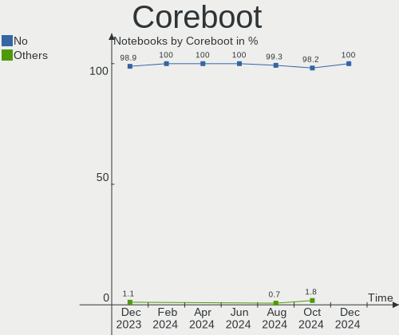
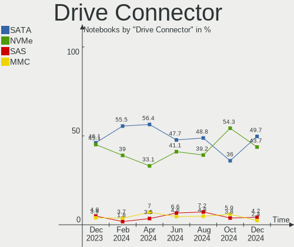
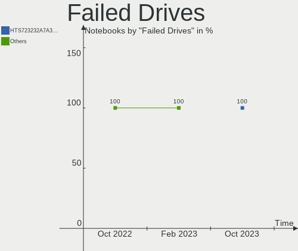
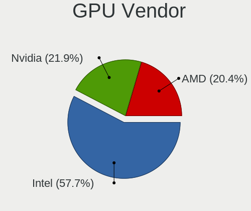
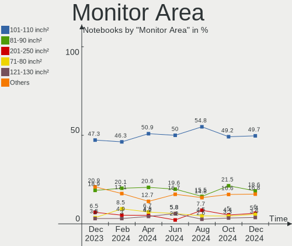
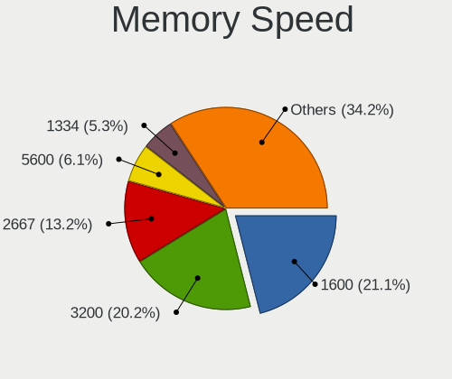
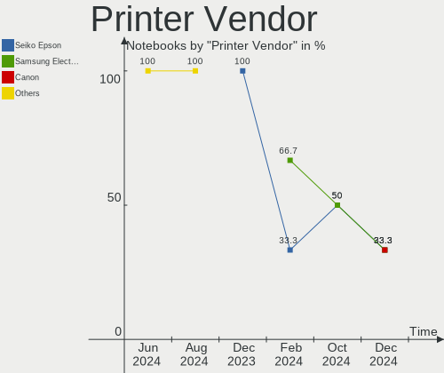
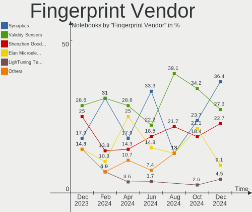

Linux in Italy - Hardware Trends (Notebooks)
--------------------------------------------

A project to identify most popular hardware characteristics and track their change
over time based on data collected by Linux users at https://Linux-Hardware.org.

Anyone can contribute to this report by the [hw-probe](https://github.com/linuxhw/hw-probe) tool:

    sudo -E hw-probe -all -upload

Period: Oct, 2023.

Contents
--------

* [ System ](#system)
  - [ OS                       ](#os)
  - [ OS Family                ](#os-family)
  - [ Kernel                   ](#kernel)
  - [ Kernel Family            ](#kernel-family)
  - [ Kernel Major Ver.        ](#kernel-major-ver)
  - [ Arch                     ](#arch)
  - [ DE                       ](#de)
  - [ Display Server           ](#display-server)
  - [ Display Manager          ](#display-manager)
  - [ OS Lang                  ](#os-lang)
  - [ Boot Mode                ](#boot-mode)
  - [ Filesystem               ](#filesystem)
  - [ Part. scheme             ](#part-scheme)
  - [ Dual Boot with Linux/BSD ](#dual-boot-with-linuxbsd)
  - [ Dual Boot (Win)          ](#dual-boot-win)

* [ Board ](#board)
  - [ Vendor                   ](#vendor)
  - [ Model                    ](#model)
  - [ Model Family             ](#model-family)
  - [ MFG Year                 ](#mfg-year)
  - [ Form Factor              ](#form-factor)
  - [ Secure Boot              ](#secure-boot)
  - [ Coreboot                 ](#coreboot)
  - [ RAM Size                 ](#ram-size)
  - [ RAM Used                 ](#ram-used)
  - [ Total Drives             ](#total-drives)
  - [ Has CD-ROM               ](#has-cd-rom)
  - [ Has Ethernet             ](#has-ethernet)
  - [ Has WiFi                 ](#has-wifi)
  - [ Has Bluetooth            ](#has-bluetooth)

* [ Location ](#location)
  - [ Country                  ](#country)
  - [ City                     ](#city)

* [ Drives ](#drives)
  - [ Drive Vendor             ](#drive-vendor)
  - [ Drive Model              ](#drive-model)
  - [ HDD Vendor               ](#hdd-vendor)
  - [ SSD Vendor               ](#ssd-vendor)
  - [ Drive Kind               ](#drive-kind)
  - [ Drive Connector          ](#drive-connector)
  - [ Drive Size               ](#drive-size)
  - [ Space Total              ](#space-total)
  - [ Space Used               ](#space-used)
  - [ Malfunc. Drives          ](#malfunc-drives)
  - [ Malfunc. Drive Vendor    ](#malfunc-drive-vendor)
  - [ Malfunc. HDD Vendor      ](#malfunc-hdd-vendor)
  - [ Malfunc. Drive Kind      ](#malfunc-drive-kind)
  - [ Failed Drives            ](#failed-drives)
  - [ Failed Drive Vendor      ](#failed-drive-vendor)
  - [ Drive Status             ](#drive-status)

* [ Storage controller ](#storage-controller)
  - [ Storage Vendor           ](#storage-vendor)
  - [ Storage Model            ](#storage-model)
  - [ Storage Kind             ](#storage-kind)

* [ Processor ](#processor)
  - [ CPU Vendor               ](#cpu-vendor)
  - [ CPU Model                ](#cpu-model)
  - [ CPU Model Family         ](#cpu-model-family)
  - [ CPU Cores                ](#cpu-cores)
  - [ CPU Sockets              ](#cpu-sockets)
  - [ CPU Threads              ](#cpu-threads)
  - [ CPU Op-Modes             ](#cpu-op-modes)
  - [ CPU Microcode            ](#cpu-microcode)
  - [ CPU Microarch            ](#cpu-microarch)

* [ Graphics ](#graphics)
  - [ GPU Vendor               ](#gpu-vendor)
  - [ GPU Model                ](#gpu-model)
  - [ GPU Combo                ](#gpu-combo)
  - [ GPU Driver               ](#gpu-driver)
  - [ GPU Memory               ](#gpu-memory)

* [ Monitor ](#monitor)
  - [ Monitor Vendor           ](#monitor-vendor)
  - [ Monitor Model            ](#monitor-model)
  - [ Monitor Resolution       ](#monitor-resolution)
  - [ Monitor Diagonal         ](#monitor-diagonal)
  - [ Monitor Width            ](#monitor-width)
  - [ Aspect Ratio             ](#aspect-ratio)
  - [ Monitor Area             ](#monitor-area)
  - [ Pixel Density            ](#pixel-density)
  - [ Multiple Monitors        ](#multiple-monitors)

* [ Network ](#network)
  - [ Net Controller Vendor    ](#net-controller-vendor)
  - [ Net Controller Model     ](#net-controller-model)
  - [ Wireless Vendor          ](#wireless-vendor)
  - [ Wireless Model           ](#wireless-model)
  - [ Ethernet Vendor          ](#ethernet-vendor)
  - [ Ethernet Model           ](#ethernet-model)
  - [ Net Controller Kind      ](#net-controller-kind)
  - [ Used Controller          ](#used-controller)
  - [ NICs                     ](#nics)
  - [ IPv6                     ](#ipv6)

* [ Bluetooth ](#bluetooth)
  - [ Bluetooth Vendor         ](#bluetooth-vendor)
  - [ Bluetooth Model          ](#bluetooth-model)

* [ Sound ](#sound)
  - [ Sound Vendor             ](#sound-vendor)
  - [ Sound Model              ](#sound-model)

* [ Memory ](#memory)
  - [ Memory Vendor            ](#memory-vendor)
  - [ Memory Model             ](#memory-model)
  - [ Memory Kind              ](#memory-kind)
  - [ Memory Form Factor       ](#memory-form-factor)
  - [ Memory Size              ](#memory-size)
  - [ Memory Speed             ](#memory-speed)

* [ Printers & scanners ](#printers--scanners)
  - [ Printer Vendor           ](#printer-vendor)
  - [ Printer Model            ](#printer-model)
  - [ Scanner Vendor           ](#scanner-vendor)
  - [ Scanner Model            ](#scanner-model)

* [ Camera ](#camera)
  - [ Camera Vendor            ](#camera-vendor)
  - [ Camera Model             ](#camera-model)

* [ Security ](#security)
  - [ Fingerprint Vendor       ](#fingerprint-vendor)
  - [ Fingerprint Model        ](#fingerprint-model)
  - [ Chipcard Vendor          ](#chipcard-vendor)
  - [ Chipcard Model           ](#chipcard-model)

* [ Unsupported ](#unsupported)
  - [ Unsupported Devices      ](#unsupported-devices)
  - [ Unsupported Device Types ](#unsupported-device-types)

System
------

OS
--

Installed operating systems

| Name                         | Notebooks | Percent |
|------------------------------|-----------|---------|
| Ubuntu 22.04                 | 31        | 15.35%  |
| Fedora 38                    | 20        | 9.9%    |
| Arch Rolling                 | 19        | 9.41%   |
| Linux Mint 21.2              | 18        | 8.91%   |
| EndeavourOS Rolling          | 9         | 4.46%   |
| Debian 12                    | 9         | 4.46%   |
| Ubuntu 23.04                 | 8         | 3.96%   |
| Ubuntu 23.10                 | 6         | 2.97%   |
| openSUSE Tumbleweed-XXXXXXXX | 5         | 2.48%   |
| LMDE 6                       | 5         | 2.48%   |
| Kubuntu 22.04                | 5         | 2.48%   |
| ArcoLinux Rolling            | 5         | 2.48%   |
| Pop!_OS 22.04                | 4         | 1.98%   |
| Lubuntu 22.04                | 4         | 1.98%   |
| Elementary 7.1               | 4         | 1.98%   |
| Zorin 16                     | 3         | 1.49%   |
| ROSA 12.4                    | 3         | 1.49%   |
| OpenMandriva 23.10           | 3         | 1.49%   |
| OpenMandriva 23.08           | 3         | 1.49%   |
| Kubuntu 23.10                | 3         | 1.49%   |
| Debian 11                    | 3         | 1.49%   |
| Ubuntu MATE 22.04            | 2         | 0.99%   |
| Ubuntu 20.04                 | 2         | 0.99%   |
| Nobara 38                    | 2         | 0.99%   |
| NixOS 23.05                  | 2         | 0.99%   |
| Manjaro 23.0.4               | 2         | 0.99%   |
| Linux Mint 20.3              | 2         | 0.99%   |
| Fedora 39                    | 2         | 0.99%   |
| Debian                       | 2         | 0.99%   |
| Xubuntu 22.04                | 1         | 0.5%    |
| Ultramarine 38               | 1         | 0.5%    |
| Ubuntu Unity 22.04           | 1         | 0.5%    |
| Ubuntu Budgie 23.04          | 1         | 0.5%    |
| PCLinuxOS 2023               | 1         | 0.5%    |
| OpenMandriva 4.3             | 1         | 0.5%    |
| OpenMandriva 23.06           | 1         | 0.5%    |
| Manjaro 23.0.2               | 1         | 0.5%    |
| Linux Mint 20.1              | 1         | 0.5%    |
| Kubuntu 23.04                | 1         | 0.5%    |
| Kubuntu 11                   | 1         | 0.5%    |

OS Family
---------

OS without a version

| Name          | Notebooks | Percent |
|---------------|-----------|---------|
| Ubuntu        | 47        | 23.27%  |
| Fedora        | 23        | 11.39%  |
| Linux Mint    | 21        | 10.4%   |
| Arch          | 19        | 9.41%   |
| Debian        | 14        | 6.93%   |
| Kubuntu       | 10        | 4.95%   |
| EndeavourOS   | 9         | 4.46%   |
| OpenMandriva  | 8         | 3.96%   |
| openSUSE      | 5         | 2.48%   |
| LMDE          | 5         | 2.48%   |
| Elementary    | 5         | 2.48%   |
| ArcoLinux     | 5         | 2.48%   |
| Pop!_OS       | 4         | 1.98%   |
| Lubuntu       | 4         | 1.98%   |
| Zorin         | 3         | 1.49%   |
| ROSA          | 3         | 1.49%   |
| Manjaro       | 3         | 1.49%   |
| Ubuntu MATE   | 2         | 0.99%   |
| Nobara        | 2         | 0.99%   |
| NixOS         | 2         | 0.99%   |
| Xubuntu       | 1         | 0.5%    |
| Ultramarine   | 1         | 0.5%    |
| Ubuntu Unity  | 1         | 0.5%    |
| Ubuntu Budgie | 1         | 0.5%    |
| PCLinuxOS     | 1         | 0.5%    |
| Kali          | 1         | 0.5%    |
| Gentoo        | 1         | 0.5%    |
| CentOS        | 1         | 0.5%    |

Kernel
------

Version of the Linux kernel

| Version                           | Notebooks | Percent |
|-----------------------------------|-----------|---------|
| 6.2.0-35-generic                  | 18        | 8.91%   |
| 6.2.0-34-generic                  | 17        | 8.42%   |
| 5.15.0-87-generic                 | 12        | 5.94%   |
| 6.5.9-arch2-1                     | 10        | 4.95%   |
| 6.5.8-200.fc38.x86_64             | 9         | 4.46%   |
| 6.2.0-33-generic                  | 9         | 4.46%   |
| 6.1.0-13-amd64                    | 8         | 3.96%   |
| 5.15.0-86-generic                 | 6         | 2.97%   |
| 6.5.5-arch1-1                     | 5         | 2.48%   |
| 6.5.0-9-generic                   | 5         | 2.48%   |
| 6.5.7-200.fc38.x86_64             | 4         | 1.98%   |
| 6.5.5-200.fc38.x86_64             | 4         | 1.98%   |
| 6.5.0-10-generic                  | 4         | 1.98%   |
| 6.4.11-desktop-1omv2390           | 4         | 1.98%   |
| 6.2.9-300.fc38.x86_64             | 4         | 1.98%   |
| 6.2.0-36-generic                  | 4         | 1.98%   |
| 6.1.0-12-amd64                    | 4         | 1.98%   |
| 5.15.0-76-generic                 | 4         | 1.98%   |
| 6.5.9-zen2-1-zen                  | 3         | 1.49%   |
| 6.5.8-1-default                   | 3         | 1.49%   |
| 6.5.7-arch1-1                     | 3         | 1.49%   |
| 6.2.0-26-generic                  | 3         | 1.49%   |
| 6.5.9-1-default                   | 2         | 0.99%   |
| 6.5.7-zen2-1-zen                  | 2         | 0.99%   |
| 6.5.6-76060506-generic            | 2         | 0.99%   |
| 6.5.5-zen1-1-zen                  | 2         | 0.99%   |
| 6.5.5-desktop-1omv2390            | 2         | 0.99%   |
| 6.5.5-1-MANJARO                   | 2         | 0.99%   |
| 6.4.11-arch1-1                    | 2         | 0.99%   |
| 6.1.58-1-lts                      | 2         | 0.99%   |
| 6.1.46-generic-2rosa2021.1-x86_64 | 2         | 0.99%   |
| 6.1.31                            | 2         | 0.99%   |
| 5.10.0-26-amd64                   | 2         | 0.99%   |
| 6.5.8-arch1-1                     | 1         | 0.5%    |
| 6.5.7-060507-generic              | 1         | 0.5%    |
| 6.5.6-300.fc39.x86_64             | 1         | 0.5%    |
| 6.5.6-200.fsync.fc38.x86_64       | 1         | 0.5%    |
| 6.5.5-pclos1                      | 1         | 0.5%    |
| 6.5.5-300.fc39.x86_64             | 1         | 0.5%    |
| 6.5.5-202.fsync.fc38.x86_64       | 1         | 0.5%    |

Kernel Family
-------------

Linux kernel without a distro release

| Version | Notebooks | Percent |
|---------|-----------|---------|
| 6.2.0   | 52        | 25.74%  |
| 5.15.0  | 27        | 13.37%  |
| 6.5.5   | 18        | 8.91%   |
| 6.5.9   | 15        | 7.43%   |
| 6.1.0   | 14        | 6.93%   |
| 6.5.8   | 13        | 6.44%   |
| 6.5.0   | 12        | 5.94%   |
| 6.5.7   | 10        | 4.95%   |
| 6.4.11  | 6         | 2.97%   |
| 6.5.6   | 4         | 1.98%   |
| 6.2.9   | 4         | 1.98%   |
| 5.4.0   | 3         | 1.49%   |
| 5.10.0  | 3         | 1.49%   |
| 6.5.3   | 2         | 0.99%   |
| 6.1.58  | 2         | 0.99%   |
| 6.1.57  | 2         | 0.99%   |
| 6.1.46  | 2         | 0.99%   |
| 6.1.31  | 2         | 0.99%   |
| 5.19.0  | 2         | 0.99%   |
| 6.5.4   | 1         | 0.5%    |
| 6.4.6   | 1         | 0.5%    |
| 6.4.3   | 1         | 0.5%    |
| 6.2.6   | 1         | 0.5%    |
| 6.2.15  | 1         | 0.5%    |
| 6.2.11  | 1         | 0.5%    |
| 6.1.20  | 1         | 0.5%    |
| 5.16.13 | 1         | 0.5%    |
| 5.14.0  | 1         | 0.5%    |

Kernel Major Ver.
-----------------

Linux kernel major version

| Version | Notebooks | Percent |
|---------|-----------|---------|
| 6.5     | 75        | 37.13%  |
| 6.2     | 59        | 29.21%  |
| 5.15    | 27        | 13.37%  |
| 6.1     | 23        | 11.39%  |
| 6.4     | 8         | 3.96%   |
| 5.4     | 3         | 1.49%   |
| 5.10    | 3         | 1.49%   |
| 5.19    | 2         | 0.99%   |
| 5.16    | 1         | 0.5%    |
| 5.14    | 1         | 0.5%    |

Arch
----

OS architecture (x86_64, i586, etc.)

| Name   | Notebooks | Percent |
|--------|-----------|---------|
| x86_64 | 201       | 99.5%   |
| i686   | 1         | 0.5%    |

DE
--

Desktop Environment

| Name       | Notebooks | Percent |
|------------|-----------|---------|
| GNOME      | 91        | 45.05%  |
| KDE5       | 51        | 25.25%  |
| X-Cinnamon | 22        | 10.89%  |
| XFCE       | 12        | 5.94%   |
| MATE       | 6         | 2.97%   |
| LXQt       | 6         | 2.97%   |
| Pantheon   | 5         | 2.48%   |
| none+i3    | 2         | 0.99%   |
| Budgie     | 2         | 0.99%   |
| Unknown    | 2         | 0.99%   |
| Unity      | 1         | 0.5%    |
| sway       | 1         | 0.5%    |
| kde        | 1         | 0.5%    |

Display Server
--------------

X11 or Wayland

| Name    | Notebooks | Percent |
|---------|-----------|---------|
| X11     | 117       | 57.92%  |
| Wayland | 80        | 39.6%   |
| Unknown | 5         | 2.48%   |

Display Manager
---------------

SDDM, LightDM, etc.

| Name    | Notebooks | Percent |
|---------|-----------|---------|
| GDM3    | 52        | 25.74%  |
| SDDM    | 48        | 23.76%  |
| Unknown | 46        | 22.77%  |
| LightDM | 30        | 14.85%  |
| GDM     | 26        | 12.87%  |

OS Lang
-------

Language

| Lang           | Notebooks | Percent |
|----------------|-----------|---------|
| it_IT          | 128       | 63.37%  |
| en_US          | 55        | 27.23%  |
| C              | 9         | 4.46%   |
| en_GB          | 4         | 1.98%   |
| Unknown        | 2         | 0.99%   |
| it_IT.iso88591 | 1         | 0.5%    |
| it_CH          | 1         | 0.5%    |
| fr_FR          | 1         | 0.5%    |
| de_DE          | 1         | 0.5%    |

Boot Mode
---------

EFI or BIOS

| Mode | Notebooks | Percent |
|------|-----------|---------|
| EFI  | 140       | 69.31%  |
| BIOS | 62        | 30.69%  |

Filesystem
----------

Type of filesystem

| Type    | Notebooks | Percent |
|---------|-----------|---------|
| Ext4    | 121       | 59.9%   |
| Btrfs   | 38        | 18.81%  |
| Tmpfs   | 27        | 13.37%  |
| Overlay | 14        | 6.93%   |
| Xfs     | 2         | 0.99%   |

Part. scheme
------------

Scheme of partitioning

| Type    | Notebooks | Percent |
|---------|-----------|---------|
| GPT     | 145       | 71.78%  |
| Unknown | 43        | 21.29%  |
| MBR     | 14        | 6.93%   |

Dual Boot with Linux/BSD
------------------------

Hosting more than one Linux/BSD

| Dual boot | Notebooks | Percent |
|-----------|-----------|---------|
| No        | 184       | 91.09%  |
| Yes       | 18        | 8.91%   |

Dual Boot (Win)
---------------

Hosting Linux and Windows

| Dual boot | Notebooks | Percent |
|-----------|-----------|---------|
| No        | 130       | 64.36%  |
| Yes       | 72        | 35.64%  |

Board
-----

Vendor
------

Motherboard manufacturer

| Name                | Notebooks | Percent |
|---------------------|-----------|---------|
| Lenovo              | 39        | 19.31%  |
| ASUSTek Computer    | 34        | 16.83%  |
| Hewlett-Packard     | 33        | 16.34%  |
| Dell                | 30        | 14.85%  |
| Acer                | 19        | 9.41%   |
| HUAWEI              | 11        | 5.45%   |
| Apple               | 6         | 2.97%   |
| Samsung Electronics | 5         | 2.48%   |
| MSI                 | 4         | 1.98%   |
| Toshiba             | 3         | 1.49%   |
| LG Electronics      | 3         | 1.49%   |
| Sony                | 2         | 0.99%   |
| Notebook            | 2         | 0.99%   |
| Mediacom            | 2         | 0.99%   |
| Timi                | 1         | 0.5%    |
| Panasonic           | 1         | 0.5%    |
| Packard Bell        | 1         | 0.5%    |
| Insyde              | 1         | 0.5%    |
| HONOR               | 1         | 0.5%    |
| Fujitsu             | 1         | 0.5%    |
| Chuwi               | 1         | 0.5%    |
| AMI                 | 1         | 0.5%    |
| Alienware           | 1         | 0.5%    |

Model
-----

Motherboard model

| Name                                   | Notebooks | Percent |
|----------------------------------------|-----------|---------|
| HUAWEI BOHK-WAX9X                      | 3         | 1.49%   |
| Mediacom WinPad 11,6 FullHD- WPU11     | 2         | 0.99%   |
| HUAWEI NBLK-WAX9X                      | 2         | 0.99%   |
| HP Victus by Laptop 16-e0xxx           | 2         | 0.99%   |
| HP EliteBook 840 G6                    | 2         | 0.99%   |
| HP 255 G6 Notebook PC                  | 2         | 0.99%   |
| HP 15                                  | 2         | 0.99%   |
| Dell Vostro 15 3515                    | 2         | 0.99%   |
| Dell Latitude 5520                     | 2         | 0.99%   |
| ASUS VivoBook_ASUSLaptop X515EA_F515EA | 2         | 0.99%   |
| Apple MacBook7,1                       | 2         | 0.99%   |
| Acer Aspire 5738                       | 2         | 0.99%   |
| Toshiba TECRA S11                      | 1         | 0.5%    |
| Toshiba Satellite P850                 | 1         | 0.5%    |
| Toshiba Satellite L655                 | 1         | 0.5%    |
| Timi RedmiBook Pro 15                  | 1         | 0.5%    |
| Sony SVE1713X1EB                       | 1         | 0.5%    |
| Sony SVE1513Q1ESI                      | 1         | 0.5%    |
| Samsung RC420/RC520/RC720              | 1         | 0.5%    |
| Samsung R530/R730/P590                 | 1         | 0.5%    |
| Samsung 930XDB/931XDB/930XDY           | 1         | 0.5%    |
| Samsung 750XED                         | 1         | 0.5%    |
| Samsung 700T1C                         | 1         | 0.5%    |
| Panasonic CF-F9KWPZFFE                 | 1         | 0.5%    |
| Packard Bell EasyNote LE69KB           | 1         | 0.5%    |
| Notebook W65_67SJ                      | 1         | 0.5%    |
| Notebook N150ZU                        | 1         | 0.5%    |
| MSI Modern 15 A11M                     | 1         | 0.5%    |
| MSI GP66 Leopard 10UG                  | 1         | 0.5%    |
| MSI GF75 Thin 10UEK                    | 1         | 0.5%    |
| MSI Delta 15 A5EFK                     | 1         | 0.5%    |
| LG 17Z90R-G.AP78D                      | 1         | 0.5%    |
| LG 17Z90P-G.AA86D                      | 1         | 0.5%    |
| LG 14Z990-V.AR52D                      | 1         | 0.5%    |
| Lenovo Z50-70 20354                    | 1         | 0.5%    |
| Lenovo Yoga Slim 7 ProX 14ARH7 82TL    | 1         | 0.5%    |
| Lenovo Yoga 900-13ISK 80MK             | 1         | 0.5%    |
| Lenovo V15 G2 ITL 82KB                 | 1         | 0.5%    |
| Lenovo V15 G2 ALC 82KD                 | 1         | 0.5%    |
| Lenovo ThinkPad X13 Gen 1 20T3S5LE1F   | 1         | 0.5%    |

Model Family
------------

Motherboard model prefix

| Name              | Notebooks | Percent |
|-------------------|-----------|---------|
| Lenovo ThinkPad   | 22        | 10.89%  |
| Dell Latitude     | 10        | 4.95%   |
| Lenovo IdeaPad    | 9         | 4.46%   |
| Dell Vostro       | 8         | 3.96%   |
| ASUS VivoBook     | 8         | 3.96%   |
| Acer Aspire       | 8         | 3.96%   |
| Dell XPS          | 6         | 2.97%   |
| HP ProBook        | 5         | 2.48%   |
| HP Pavilion       | 5         | 2.48%   |
| HP EliteBook      | 4         | 1.98%   |
| HP 255            | 4         | 1.98%   |
| Dell Inspiron     | 4         | 1.98%   |
| HUAWEI BOHK-WAX9X | 3         | 1.49%   |
| HP ENVY           | 3         | 1.49%   |
| HP 250            | 3         | 1.49%   |
| ASUS ROG          | 3         | 1.49%   |
| ASUS ASUS         | 3         | 1.49%   |
| Acer Swift        | 3         | 1.49%   |
| Acer Nitro        | 3         | 1.49%   |
| Toshiba Satellite | 2         | 0.99%   |
| Mediacom WinPad   | 2         | 0.99%   |
| Lenovo Yoga       | 2         | 0.99%   |
| Lenovo V15        | 2         | 0.99%   |
| Lenovo ThinkBook  | 2         | 0.99%   |
| HUAWEI NBLK-WAX9X | 2         | 0.99%   |
| HP Victus         | 2         | 0.99%   |
| HP Laptop         | 2         | 0.99%   |
| HP 15             | 2         | 0.99%   |
| Dell Precision    | 2         | 0.99%   |
| ASUS ZenBook      | 2         | 0.99%   |
| Apple MacBook7    | 2         | 0.99%   |
| Acer TravelMate   | 2         | 0.99%   |
| Toshiba TECRA     | 1         | 0.5%    |
| Timi RedmiBook    | 1         | 0.5%    |
| Sony SVE1713X1EB  | 1         | 0.5%    |
| Sony SVE1513Q1ESI | 1         | 0.5%    |
| Samsung RC420     | 1         | 0.5%    |
| Samsung R530      | 1         | 0.5%    |
| Samsung 930XDB    | 1         | 0.5%    |
| Samsung 750XED    | 1         | 0.5%    |

MFG Year
--------

Motherboard manufacture year

| Year | Notebooks | Percent |
|------|-----------|---------|
| 2021 | 28        | 13.86%  |
| 2020 | 24        | 11.88%  |
| 2022 | 23        | 11.39%  |
| 2019 | 19        | 9.41%   |
| 2016 | 14        | 6.93%   |
| 2013 | 14        | 6.93%   |
| 2014 | 13        | 6.44%   |
| 2010 | 11        | 5.45%   |
| 2017 | 9         | 4.46%   |
| 2015 | 9         | 4.46%   |
| 2012 | 9         | 4.46%   |
| 2023 | 8         | 3.96%   |
| 2009 | 7         | 3.47%   |
| 2018 | 6         | 2.97%   |
| 2008 | 3         | 1.49%   |
| 2007 | 3         | 1.49%   |
| 2011 | 2         | 0.99%   |

Form Factor
-----------

Physical design of the computer

| Name     | Notebooks | Percent |
|----------|-----------|---------|
| Notebook | 202       | 100%    |

Secure Boot
-----------

Enabled or disabled

| State    | Notebooks | Percent |
|----------|-----------|---------|
| Disabled | 179       | 88.61%  |
| Enabled  | 23        | 11.39%  |

Coreboot
--------

Have coreboot on board

| Used | Notebooks | Percent |
|------|-----------|---------|
| No   | 202       | 100%    |

RAM Size
--------

Total RAM memory

| Size in GB  | Notebooks | Percent |
|-------------|-----------|---------|
| 4.01-8.0    | 59        | 29.21%  |
| 8.01-16.0   | 46        | 22.77%  |
| 16.01-24.0  | 43        | 21.29%  |
| 3.01-4.0    | 27        | 13.37%  |
| 32.01-64.0  | 12        | 5.94%   |
| 1.01-2.0    | 5         | 2.48%   |
| 24.01-32.0  | 4         | 1.98%   |
| 2.01-3.0    | 4         | 1.98%   |
| 64.01-256.0 | 2         | 0.99%   |

RAM Used
--------

Used RAM memory

| Used GB    | Notebooks | Percent |
|------------|-----------|---------|
| 2.01-3.0   | 55        | 27.23%  |
| 1.01-2.0   | 45        | 22.28%  |
| 4.01-8.0   | 39        | 19.31%  |
| 3.01-4.0   | 38        | 18.81%  |
| 8.01-16.0  | 16        | 7.92%   |
| 0.51-1.0   | 8         | 3.96%   |
| 16.01-24.0 | 1         | 0.5%    |

Total Drives
------------

Number of drives on board

| Drives | Notebooks | Percent |
|--------|-----------|---------|
| 1      | 155       | 76.73%  |
| 2      | 38        | 18.81%  |
| 3      | 9         | 4.46%   |

Has CD-ROM
----------

Has CD-ROM on board

| Presented | Notebooks | Percent |
|-----------|-----------|---------|
| No        | 146       | 72.28%  |
| Yes       | 56        | 27.72%  |

Has Ethernet
------------

Has Ethernet on board

| Presented | Notebooks | Percent |
|-----------|-----------|---------|
| Yes       | 146       | 72.28%  |
| No        | 56        | 27.72%  |

Has WiFi
--------

Has WiFi module

| Presented | Notebooks | Percent |
|-----------|-----------|---------|
| Yes       | 199       | 98.51%  |
| No        | 3         | 1.49%   |

Has Bluetooth
-------------

Has Bluetooth module

| Presented | Notebooks | Percent |
|-----------|-----------|---------|
| Yes       | 172       | 85.15%  |
| No        | 30        | 14.85%  |

Location
--------

Country
-------

Geographic location (country)

| Country | Notebooks | Percent |
|---------|-----------|---------|
| Italy   | 202       | 100%    |

City
----

Geographic location (city)

| City                        | Notebooks | Percent |
|-----------------------------|-----------|---------|
| Milan                       | 27        | 13.37%  |
| Rome                        | 22        | 10.89%  |
| Milano                      | 17        | 8.42%   |
| Turin                       | 9         | 4.46%   |
| Bologna                     | 7         | 3.47%   |
| Genoa                       | 6         | 2.97%   |
| Palermo                     | 5         | 2.48%   |
| Naples                      | 5         | 2.48%   |
| Florence                    | 4         | 1.98%   |
| Verona                      | 3         | 1.49%   |
| Pradamano                   | 3         | 1.49%   |
| Catania                     | 3         | 1.49%   |
| Bergamo                     | 3         | 1.49%   |
| Trescore Balneario          | 2         | 0.99%   |
| Taranto                     | 2         | 0.99%   |
| Sesto San Giovanni          | 2         | 0.99%   |
| Perugia                     | 2         | 0.99%   |
| Parma                       | 2         | 0.99%   |
| Padova                      | 2         | 0.99%   |
| Legnano                     | 2         | 0.99%   |
| Bresso                      | 2         | 0.99%   |
| Basiano                     | 2         | 0.99%   |
| Vicenza                     | 1         | 0.5%    |
| Venice                      | 1         | 0.5%    |
| Velletri                    | 1         | 0.5%    |
| Valsamoggia                 | 1         | 0.5%    |
| Trieste                     | 1         | 0.5%    |
| Treviglio                   | 1         | 0.5%    |
| Tradate                     | 1         | 0.5%    |
| Spoltore                    | 1         | 0.5%    |
| Sondalo                     | 1         | 0.5%    |
| Somma Lombardo              | 1         | 0.5%    |
| Senago                      | 1         | 0.5%    |
| Sassuolo                    | 1         | 0.5%    |
| Sant'Agnello                | 1         | 0.5%    |
| San Nicola la Strada        | 1         | 0.5%    |
| San Martino Buon Albergo    | 1         | 0.5%    |
| San Giovanni Lupatoto       | 1         | 0.5%    |
| San Giorgio a Cremano       | 1         | 0.5%    |
| San Benedetto Val di Sambro | 1         | 0.5%    |

Drives
------

Drive Vendor
------------

Hard drive vendors

| Vendor                      | Notebooks | Drives | Percent |
|-----------------------------|-----------|--------|---------|
| Samsung Electronics         | 61        | 65     | 24.21%  |
| SanDisk                     | 24        | 24     | 9.52%   |
| WDC                         | 17        | 19     | 6.75%   |
| Seagate                     | 16        | 16     | 6.35%   |
| Kingston                    | 16        | 16     | 6.35%   |
| Micron Technology           | 14        | 14     | 5.56%   |
| Unknown                     | 13        | 14     | 5.16%   |
| Crucial                     | 12        | 12     | 4.76%   |
| SK hynix                    | 9         | 9      | 3.57%   |
| Intel                       | 8         | 8      | 3.17%   |
| KIOXIA                      | 7         | 7      | 2.78%   |
| HGST                        | 7         | 7      | 2.78%   |
| Hitachi                     | 6         | 6      | 2.38%   |
| Toshiba                     | 4         | 4      | 1.59%   |
| China                       | 3         | 3      | 1.19%   |
| Transcend                   | 2         | 2      | 0.79%   |
| Team                        | 2         | 2      | 0.79%   |
| Silicon Motion              | 2         | 2      | 0.79%   |
| Phison                      | 2         | 2      | 0.79%   |
| Micron/Crucial Technology   | 2         | 2      | 0.79%   |
| MAXIO Technology (Hangzhou) | 2         | 2      | 0.79%   |
| Kingston Technology Company | 2         | 2      | 0.79%   |
| JMicron Technology          | 2         | 2      | 0.79%   |
| Apple                       | 2         | 2      | 0.79%   |
| Unknown                     | 2         | 2      | 0.79%   |
| TS-RDF2                     | 1         | 1      | 0.4%    |
| SSSTC                       | 1         | 1      | 0.4%    |
| SPCC                        | 1         | 1      | 0.4%    |
| Saichi                      | 1         | 1      | 0.4%    |
| Phison Electronics          | 1         | 1      | 0.4%    |
| Netac                       | 1         | 1      | 0.4%    |
| Lexar                       | 1         | 1      | 0.4%    |
| KIOXIA-EXCERIA              | 1         | 1      | 0.4%    |
| KingSpec                    | 1         | 1      | 0.4%    |
| KingDian                    | 1         | 1      | 0.4%    |
| Intenso                     | 1         | 1      | 0.4%    |
| Hewlett-Packard             | 1         | 1      | 0.4%    |
| Fujitsu                     | 1         | 1      | 0.4%    |
| Dogfish                     | 1         | 1      | 0.4%    |
| ADATA Technology            | 1         | 1      | 0.4%    |

Drive Model
-----------

Hard drive models

| Model                                               | Notebooks | Percent |
|-----------------------------------------------------|-----------|---------|
| Samsung NVMe SSD Controller SM981/PM981/PM983 1TB   | 7         | 2.71%   |
| Samsung NVMe SSD Controller PM9A1/PM9A3/980PRO 1TB  | 7         | 2.71%   |
| Sandisk WD Black SN750 / PC SN730 NVMe SSD 1024GB   | 4         | 1.55%   |
| Micron 2400_MTFDKBA512QFM 512GB                     | 4         | 1.55%   |
| Seagate ST1000LM035-1RK172 1TB                      | 3         | 1.16%   |
| Sandisk WD Blue SN500 / PC SN520 NVMe SSD 512GB     | 3         | 1.16%   |
| Samsung SSD 870 QVO 1TB                             | 3         | 1.16%   |
| Samsung SSD 850 EVO 500GB                           | 3         | 1.16%   |
| Samsung MZVLQ512HALU-00000 512GB                    | 3         | 1.16%   |
| Samsung MZALQ512HBLU-00BL2 512GB                    | 3         | 1.16%   |
| Kingston SUV400S37240G 240GB SSD                    | 3         | 1.16%   |
| Kingston SA400S37240G 240GB SSD                     | 3         | 1.16%   |
| Intel SSDPEKNU512GZ 512GB                           | 3         | 1.16%   |
| Crucial CT500MX500SSD1 500GB                        | 3         | 1.16%   |
| Crucial CT240BX500SSD1 240GB                        | 3         | 1.16%   |
| WDC WD5000LPCX-60VHAT0 500GB                        | 2         | 0.78%   |
| WDC WD3200BEVT-22ZCT0 320GB                         | 2         | 0.78%   |
| Unknown NCard  32GB                                 | 2         | 0.78%   |
| Team T2531TB SSD                                    | 2         | 0.78%   |
| SK hynix BC511 512GB                                | 2         | 0.78%   |
| Seagate ST9500325AS 500GB                           | 2         | 0.78%   |
| Seagate ST1000LM014-1EJ164 1TB                      | 2         | 0.78%   |
| Seagate Basic 5TB                                   | 2         | 0.78%   |
| Sandisk WD Black 2018/SN750 / PC SN720 NVMe SSD 1TB | 2         | 0.78%   |
| SanDisk SSD PLUS 480GB                              | 2         | 0.78%   |
| SanDisk SSD PLUS 240GB                              | 2         | 0.78%   |
| Samsung SSD 970 EVO Plus 1TB                        | 2         | 0.78%   |
| Samsung SSD 870 EVO 250GB                           | 2         | 0.78%   |
| Samsung SSD 860 EVO 500GB                           | 2         | 0.78%   |
| Samsung PM991a NVMe 256GB                           | 2         | 0.78%   |
| Samsung MZVLQ256HBJD-00B 256GB                      | 2         | 0.78%   |
| Samsung MZVL21T0HCLR-00B07 1TB                      | 2         | 0.78%   |
| Micron/Crucial P2 NVMe PCIe SSD 500GB               | 2         | 0.78%   |
| Micron 2210_MTFDHBA512QFD 512GB                     | 2         | 0.78%   |
| MAXIO (Hangzhou) NVMe SSD Controller MAP1202 250GB  | 2         | 0.78%   |
| KIOXIA KBG40ZNS512G NVMe 512GB                      | 2         | 0.78%   |
| Kingston SV300S37A120G 120GB SSD                    | 2         | 0.78%   |
| JMicron Tech 250GB                                  | 2         | 0.78%   |
| Intel SSDSC2BF180A4L 180GB                          | 2         | 0.78%   |
| HGST HTS725050A7E630 500GB                          | 2         | 0.78%   |

HDD Vendor
----------

Hard disk drive vendors

| Vendor              | Notebooks | Drives | Percent |
|---------------------|-----------|--------|---------|
| Seagate             | 13        | 13     | 30.95%  |
| WDC                 | 11        | 11     | 26.19%  |
| HGST                | 7         | 7      | 16.67%  |
| Hitachi             | 6         | 6      | 14.29%  |
| Toshiba             | 2         | 2      | 4.76%   |
| Samsung Electronics | 2         | 2      | 4.76%   |
| Fujitsu             | 1         | 1      | 2.38%   |

SSD Vendor
----------

Solid state drive vendors

| Vendor              | Notebooks | Drives | Percent |
|---------------------|-----------|--------|---------|
| Samsung Electronics | 22        | 23     | 29.73%  |
| Kingston            | 11        | 11     | 14.86%  |
| Crucial             | 10        | 10     | 13.51%  |
| SanDisk             | 8         | 8      | 10.81%  |
| WDC                 | 3         | 3      | 4.05%   |
| China               | 3         | 3      | 4.05%   |
| Transcend           | 2         | 2      | 2.7%    |
| Team                | 2         | 2      | 2.7%    |
| Intel               | 2         | 2      | 2.7%    |
| Apple               | 2         | 2      | 2.7%    |
| Toshiba             | 1         | 1      | 1.35%   |
| Saichi              | 1         | 1      | 1.35%   |
| Netac               | 1         | 1      | 1.35%   |
| Lexar               | 1         | 1      | 1.35%   |
| KingSpec            | 1         | 1      | 1.35%   |
| KingDian            | 1         | 1      | 1.35%   |
| Intenso             | 1         | 1      | 1.35%   |
| Hewlett-Packard     | 1         | 1      | 1.35%   |
| Dogfish             | 1         | 1      | 1.35%   |

Drive Kind
----------

HDD or SSD

| Kind    | Notebooks | Drives | Percent |
|---------|-----------|--------|---------|
| NVMe    | 109       | 120    | 45.99%  |
| SSD     | 68        | 75     | 28.69%  |
| HDD     | 40        | 42     | 16.88%  |
| MMC     | 13        | 15     | 5.49%   |
| Unknown | 7         | 7      | 2.95%   |

Drive Connector
---------------

SATA, SAS, NVMe, etc.

| Type | Notebooks | Drives | Percent |
|------|-----------|--------|---------|
| NVMe | 109       | 120    | 48.23%  |
| SATA | 92        | 110    | 40.71%  |
| MMC  | 13        | 15     | 5.75%   |
| SAS  | 12        | 14     | 5.31%   |

Drive Size
----------

Size of hard drive

| Size in TB | Notebooks | Drives | Percent |
|------------|-----------|--------|---------|
| 0.01-0.5   | 79        | 86     | 73.83%  |
| 0.51-1.0   | 24        | 27     | 22.43%  |
| 1.01-2.0   | 3         | 3      | 2.8%    |
| 2.01-3.0   | 1         | 1      | 0.93%   |

Space Total
-----------

Amount of disk space available on the file system

| Size in GB     | Notebooks | Percent |
|----------------|-----------|---------|
| 101-250        | 58        | 28.71%  |
| 251-500        | 52        | 25.74%  |
| 501-1000       | 29        | 14.36%  |
| 1-20           | 18        | 8.91%   |
| 1001-2000      | 16        | 7.92%   |
| 51-100         | 10        | 4.95%   |
| 21-50          | 7         | 3.47%   |
| More than 3000 | 5         | 2.48%   |
| Unknown        | 4         | 1.98%   |
| 2001-3000      | 3         | 1.49%   |

Space Used
----------

Amount of used disk space

| Used GB        | Notebooks | Percent |
|----------------|-----------|---------|
| 1-20           | 64        | 31.68%  |
| 101-250        | 36        | 17.82%  |
| 21-50          | 33        | 16.34%  |
| 51-100         | 29        | 14.36%  |
| 251-500        | 17        | 8.42%   |
| 501-1000       | 10        | 4.95%   |
| 1001-2000      | 8         | 3.96%   |
| Unknown        | 4         | 1.98%   |
| More than 3000 | 1         | 0.5%    |

Malfunc. Drives
---------------

Drive models with a malfunction

| Model                          | Notebooks | Drives | Percent |
|--------------------------------|-----------|--------|---------|
| Seagate ST1000LM014-1EJ164 1TB | 2         | 2      | 11.76%  |
| Intel SSDSC2BF180A4L 180GB     | 2         | 2      | 11.76%  |
| HGST HTS725050A7E630 500GB     | 2         | 2      | 11.76%  |
| WDC WD5000LPCX-24C6HT0 500GB   | 1         | 1      | 5.88%   |
| Toshiba MK5065GSX 500GB        | 1         | 1      | 5.88%   |
| Seagate ST1000LM035-1RK172 1TB | 1         | 1      | 5.88%   |
| SanDisk SSD PLUS 480GB         | 1         | 1      | 5.88%   |
| SanDisk SDSSDP128G 128GB       | 1         | 1      | 5.88%   |
| Hitachi HTS541616J9SA00 160GB  | 1         | 1      | 5.88%   |
| HGST HTS545050A7E680 500GB     | 1         | 1      | 5.88%   |
| HGST HTS541010A9E680 1TB       | 1         | 1      | 5.88%   |
| Dogfish SSD 128GB              | 1         | 1      | 5.88%   |
| Crucial CT525MX300SSD1 528GB   | 1         | 1      | 5.88%   |
| Crucial CT120M500SSD1 120GB    | 1         | 1      | 5.88%   |

Malfunc. Drive Vendor
---------------------

Vendors of faulty drives

| Vendor  | Notebooks | Drives | Percent |
|---------|-----------|--------|---------|
| HGST    | 4         | 4      | 23.53%  |
| Seagate | 3         | 3      | 17.65%  |
| SanDisk | 2         | 2      | 11.76%  |
| Intel   | 2         | 2      | 11.76%  |
| Crucial | 2         | 2      | 11.76%  |
| WDC     | 1         | 1      | 5.88%   |
| Toshiba | 1         | 1      | 5.88%   |
| Hitachi | 1         | 1      | 5.88%   |
| Dogfish | 1         | 1      | 5.88%   |

Malfunc. HDD Vendor
-------------------

Vendors of faulty HDD drives

| Vendor  | Notebooks | Drives | Percent |
|---------|-----------|--------|---------|
| HGST    | 4         | 4      | 40%     |
| Seagate | 3         | 3      | 30%     |
| WDC     | 1         | 1      | 10%     |
| Toshiba | 1         | 1      | 10%     |
| Hitachi | 1         | 1      | 10%     |

Malfunc. Drive Kind
-------------------

Kinds of faulty drives

| Kind | Notebooks | Drives | Percent |
|------|-----------|--------|---------|
| HDD  | 10        | 10     | 58.82%  |
| SSD  | 7         | 7      | 41.18%  |

Failed Drives
-------------

Failed drive models

| Model                         | Notebooks | Drives | Percent |
|-------------------------------|-----------|--------|---------|
| Hitachi HTS723232A7A364 320GB | 1         | 1      | 100%    |

Failed Drive Vendor
-------------------

Failed drive vendors

| Vendor  | Notebooks | Drives | Percent |
|---------|-----------|--------|---------|
| Hitachi | 1         | 1      | 100%    |

Drive Status
------------

Number of failed and malfunc. drives

| Status   | Notebooks | Drives | Percent |
|----------|-----------|--------|---------|
| Works    | 115       | 134    | 52.75%  |
| Detected | 85        | 107    | 38.99%  |
| Malfunc  | 17        | 17     | 7.8%    |
| Failed   | 1         | 1      | 0.46%   |

Storage controller
------------------

Storage Vendor
--------------

Storage controller vendors

| Vendor                         | Notebooks | Percent |
|--------------------------------|-----------|---------|
| Intel                          | 113       | 45.02%  |
| Samsung Electronics            | 40        | 15.94%  |
| SanDisk                        | 20        | 7.97%   |
| AMD                            | 19        | 7.57%   |
| Micron Technology              | 14        | 5.58%   |
| SK hynix                       | 9         | 3.59%   |
| KIOXIA                         | 8         | 3.19%   |
| Kingston Technology Company    | 7         | 2.79%   |
| Nvidia                         | 5         | 1.99%   |
| Phison Electronics             | 4         | 1.59%   |
| Micron/Crucial Technology      | 4         | 1.59%   |
| Silicon Motion                 | 2         | 0.8%    |
| MAXIO Technology (Hangzhou)    | 2         | 0.8%    |
| Toshiba America Info Systems   | 1         | 0.4%    |
| Solid State Storage Technology | 1         | 0.4%    |
| Marvell Technology Group       | 1         | 0.4%    |
| ADATA Technology               | 1         | 0.4%    |

Storage Model
-------------

Storage controller models

| Model                                                                          | Notebooks | Percent |
|--------------------------------------------------------------------------------|-----------|---------|
| AMD FCH SATA Controller [AHCI mode]                                            | 19        | 7.14%   |
| Samsung NVMe SSD Controller 980 (DRAM-less)                                    | 16        | 6.02%   |
| Intel Volume Management Device NVMe RAID Controller                            | 16        | 6.02%   |
| Intel Sunrise Point-LP SATA Controller [AHCI mode]                             | 14        | 5.26%   |
| Samsung NVMe SSD Controller SM981/PM981/PM983                                  | 11        | 4.14%   |
| Samsung NVMe SSD Controller PM9A1/PM9A3/980PRO                                 | 11        | 4.14%   |
| Intel 82801 Mobile SATA Controller [RAID mode]                                 | 10        | 3.76%   |
| Intel 7 Series Chipset Family 6-port SATA Controller [AHCI mode]               | 10        | 3.76%   |
| SanDisk Extreme Pro / WD Black SN750 / PC SN730 / Red SN700 NVMe SSD           | 6         | 2.26%   |
| Intel 82801IBM/IEM (ICH9M/ICH9M-E) 4 port SATA Controller [AHCI mode]          | 6         | 2.26%   |
| Intel 8 Series/C220 Series Chipset Family 6-port SATA Controller 1 [AHCI mode] | 6         | 2.26%   |
| Intel 8 Series SATA Controller 1 [AHCI mode]                                   | 6         | 2.26%   |
| Micron 2400 NVMe SSD (DRAM-less)                                               | 5         | 1.88%   |
| Intel Wildcat Point-LP SATA Controller [AHCI Mode]                             | 5         | 1.88%   |
| Intel 5 Series/3400 Series Chipset 4 port SATA AHCI Controller                 | 5         | 1.88%   |
| Micron/Crucial P2 [Nick P2] / P3 / P3 Plus NVMe PCIe SSD (DRAM-less)           | 4         | 1.5%    |
| Intel Tiger Lake-LP SATA Controller                                            | 4         | 1.5%    |
| Intel Cannon Point-LP SATA Controller [AHCI Mode]                              | 4         | 1.5%    |
| Intel Cannon Lake Mobile PCH SATA AHCI Controller                              | 4         | 1.5%    |
| SK hynix Gold P31/BC711/PC711 NVMe Solid State Drive                           | 3         | 1.13%   |
| SanDisk WD Blue SN500 / PC SN520 x2 M.2 2280 NVMe SSD                          | 3         | 1.13%   |
| Micron 2450 NVMe SSD [HendrixV] (DRAM-less)                                    | 3         | 1.13%   |
| Micron 2210 NVMe SSD [Cobain]                                                  | 3         | 1.13%   |
| KIOXIA NVMe SSD Controller BG5 (DRAM-less)                                     | 3         | 1.13%   |
| KIOXIA NVMe SSD Controller BG4 (DRAM-less)                                     | 3         | 1.13%   |
| Kingston Company A1000/U-SNS8154P3 x2 NVMe SSD                                 | 3         | 1.13%   |
| Intel SSD 670p Series [Keystone Harbor]                                        | 3         | 1.13%   |
| Intel Comet Lake SATA AHCI Controller                                          | 3         | 1.13%   |
| Intel Celeron/Pentium Silver Processor SATA Controller                         | 3         | 1.13%   |
| Intel 82801HM/HEM (ICH8M/ICH8M-E) IDE Controller                               | 3         | 1.13%   |
| Intel 6 Series/C200 Series Chipset Family 6 port Mobile SATA AHCI Controller   | 3         | 1.13%   |
| Intel 5 Series/3400 Series Chipset 6 port SATA AHCI Controller                 | 3         | 1.13%   |
| SK hynix BC511 NVMe SSD                                                        | 2         | 0.75%   |
| SK hynix BC501 NVMe Solid State Drive                                          | 2         | 0.75%   |
| SanDisk Ultra 3D / WD Blue SN550 NVMe SSD                                      | 2         | 0.75%   |
| SanDisk PC SN530 NVMe SSD (DRAM-less)                                          | 2         | 0.75%   |
| SanDisk Extreme Pro / WD Black 2018/SN750/PC SN720 NVMe SSD                    | 2         | 0.75%   |
| Phison E12 NVMe Controller                                                     | 2         | 0.75%   |
| Nvidia MCP89 SATA Controller (AHCI mode)                                       | 2         | 0.75%   |
| Nvidia MCP79 AHCI Controller                                                   | 2         | 0.75%   |

Storage Kind
------------

Kind of storage controller (IDE, SATA, NVMe, SAS, ...)

| Kind | Notebooks | Percent |
|------|-----------|---------|
| SATA | 114       | 44.88%  |
| NVMe | 109       | 42.91%  |
| RAID | 27        | 10.63%  |
| IDE  | 4         | 1.57%   |

Processor
---------

CPU Vendor
----------

Processor vendors

| Vendor | Notebooks | Percent |
|--------|-----------|---------|
| Intel  | 151       | 74.75%  |
| AMD    | 51        | 25.25%  |

CPU Model
---------

Processor models

| Model                                         | Notebooks | Percent |
|-----------------------------------------------|-----------|---------|
| AMD Ryzen 5 3500U with Radeon Vega Mobile Gfx | 8         | 3.96%   |
| Intel Core i5-7200U CPU @ 2.50GHz             | 5         | 2.48%   |
| Intel Core i5-6200U CPU @ 2.30GHz             | 5         | 2.48%   |
| Intel 11th Gen Core i7-1165G7 @ 2.80GHz       | 5         | 2.48%   |
| Intel 11th Gen Core i5-1135G7 @ 2.40GHz       | 5         | 2.48%   |
| Intel Core i7-8565U CPU @ 1.80GHz             | 4         | 1.98%   |
| Intel Core i7-1065G7 CPU @ 1.30GHz            | 4         | 1.98%   |
| Intel 12th Gen Core i5-1235U                  | 4         | 1.98%   |
| Intel Core i7-10750H CPU @ 2.60GHz            | 3         | 1.49%   |
| Intel Core i5-8265U CPU @ 1.60GHz             | 3         | 1.49%   |
| Intel Core i5-5200U CPU @ 2.20GHz             | 3         | 1.49%   |
| Intel Core i5-4210U CPU @ 1.70GHz             | 3         | 1.49%   |
| Intel Core i5-10210U CPU @ 1.60GHz            | 3         | 1.49%   |
| Intel 12th Gen Core i7-12700H                 | 3         | 1.49%   |
| Intel 11th Gen Core i7-11800H @ 2.30GHz       | 3         | 1.49%   |
| AMD Ryzen 7 5825U with Radeon Graphics        | 3         | 1.49%   |
| AMD Ryzen 7 5700U with Radeon Graphics        | 3         | 1.49%   |
| Intel Pentium Dual-Core CPU T4200 @ 2.00GHz   | 2         | 0.99%   |
| Intel Core i7-8750H CPU @ 2.20GHz             | 2         | 0.99%   |
| Intel Core i7-7500U CPU @ 2.70GHz             | 2         | 0.99%   |
| Intel Core i7-4710MQ CPU @ 2.50GHz            | 2         | 0.99%   |
| Intel Core i7-4702MQ CPU @ 2.20GHz            | 2         | 0.99%   |
| Intel Core i7-3632QM CPU @ 2.20GHz            | 2         | 0.99%   |
| Intel Core i7-3630QM CPU @ 2.40GHz            | 2         | 0.99%   |
| Intel Core i5-7300U CPU @ 2.60GHz             | 2         | 0.99%   |
| Intel Core i5-5300U CPU @ 2.30GHz             | 2         | 0.99%   |
| Intel Core i5-3320M CPU @ 2.60GHz             | 2         | 0.99%   |
| Intel Core i5-3230M CPU @ 2.60GHz             | 2         | 0.99%   |
| Intel Core i5 CPU M 520 @ 2.40GHz             | 2         | 0.99%   |
| Intel Core 2 Duo CPU P8600 @ 2.40GHz          | 2         | 0.99%   |
| Intel Atom x5-Z8300 CPU @ 1.44GHz             | 2         | 0.99%   |
| Intel 13th Gen Core i7-1360P                  | 2         | 0.99%   |
| Intel 12th Gen Core i7-1255U                  | 2         | 0.99%   |
| Intel 11th Gen Core i7-1185G7 @ 3.00GHz       | 2         | 0.99%   |
| AMD Ryzen 9 7940HS w/ Radeon 780M Graphics    | 2         | 0.99%   |
| AMD Ryzen 7 5800H with Radeon Graphics        | 2         | 0.99%   |
| AMD Ryzen 5 5625U with Radeon Graphics        | 2         | 0.99%   |
| AMD Ryzen 5 5600H with Radeon Graphics        | 2         | 0.99%   |
| AMD Ryzen 5 5500U with Radeon Graphics        | 2         | 0.99%   |
| AMD Ryzen 5 4500U with Radeon Graphics        | 2         | 0.99%   |

CPU Model Family
----------------

Processor model prefix

| Model                   | Notebooks | Percent |
|-------------------------|-----------|---------|
| Intel Core i5           | 46        | 22.77%  |
| Intel Core i7           | 38        | 18.81%  |
| Other                   | 36        | 17.82%  |
| AMD Ryzen 5             | 22        | 10.89%  |
| AMD Ryzen 7             | 12        | 5.94%   |
| Intel Core 2 Duo        | 8         | 3.96%   |
| Intel Core i3           | 7         | 3.47%   |
| Intel Celeron           | 6         | 2.97%   |
| Intel Atom              | 5         | 2.48%   |
| AMD Ryzen 9             | 5         | 2.48%   |
| Intel Pentium Dual-Core | 4         | 1.98%   |
| AMD Ryzen 7 PRO         | 3         | 1.49%   |
| AMD E2                  | 2         | 0.99%   |
| AMD E1                  | 2         | 0.99%   |
| Intel Pentium           | 1         | 0.5%    |
| Intel Celeron Dual-Core | 1         | 0.5%    |
| AMD Turion 64 X2 Mobile | 1         | 0.5%    |
| AMD A8                  | 1         | 0.5%    |
| AMD A6                  | 1         | 0.5%    |
| AMD A4                  | 1         | 0.5%    |

CPU Cores
---------

Number of processor cores

| Number | Notebooks | Percent |
|--------|-----------|---------|
| 2      | 76        | 37.62%  |
| 4      | 71        | 35.15%  |
| 8      | 21        | 10.4%   |
| 6      | 17        | 8.42%   |
| 10     | 9         | 4.46%   |
| 14     | 5         | 2.48%   |
| 12     | 3         | 1.49%   |

CPU Sockets
-----------

Number of sockets

| Number | Notebooks | Percent |
|--------|-----------|---------|
| 1      | 202       | 100%    |

CPU Threads
-----------

Threads per core (Hyper-Threading)

| Number | Notebooks | Percent |
|--------|-----------|---------|
| 2      | 161       | 79.7%   |
| 1      | 41        | 20.3%   |

CPU Op-Modes
------------

CPU Operation Modes (32-bit, 64-bit)

| Op mode        | Notebooks | Percent |
|----------------|-----------|---------|
| 32-bit, 64-bit | 202       | 100%    |

CPU Microcode
-------------

Microcode number

| Number     | Notebooks | Percent |
|------------|-----------|---------|
| Unknown    | 121       | 59.9%   |
| 0x08108109 | 9         | 4.46%   |
| 0x0a50000c | 6         | 2.97%   |
| 0x806e9    | 5         | 2.48%   |
| 0x306c3    | 5         | 2.48%   |
| 0x0a404102 | 4         | 1.98%   |
| 0x806c1    | 3         | 1.49%   |
| 0x40651    | 3         | 1.49%   |
| 0x306a9    | 3         | 1.49%   |
| 0x206a7    | 3         | 1.49%   |
| 0x1067a    | 3         | 1.49%   |
| 0x0a50000d | 3         | 1.49%   |
| 0x08608103 | 3         | 1.49%   |
| 0x08600106 | 3         | 1.49%   |
| 0x906a4    | 2         | 0.99%   |
| 0x906a3    | 2         | 0.99%   |
| 0x30678    | 2         | 0.99%   |
| 0x08600104 | 2         | 0.99%   |
| 0x906ea    | 1         | 0.5%    |
| 0x806ec    | 1         | 0.5%    |
| 0x806ea    | 1         | 0.5%    |
| 0x706e5    | 1         | 0.5%    |
| 0x6fd      | 1         | 0.5%    |
| 0x506e3    | 1         | 0.5%    |
| 0x406e3    | 1         | 0.5%    |
| 0x406c3    | 1         | 0.5%    |
| 0x306d4    | 1         | 0.5%    |
| 0x20652    | 1         | 0.5%    |
| 0x0a704104 | 1         | 0.5%    |
| 0x0a704101 | 1         | 0.5%    |
| 0x08a00008 | 1         | 0.5%    |
| 0x08608102 | 1         | 0.5%    |
| 0x08108102 | 1         | 0.5%    |
| 0x07030105 | 1         | 0.5%    |
| 0x07000110 | 1         | 0.5%    |
| 0x0700010f | 1         | 0.5%    |
| 0x0700010b | 1         | 0.5%    |
| 0x06006704 | 1         | 0.5%    |

CPU Microarch
-------------

Microarchitecture

| Name             | Notebooks | Percent |
|------------------|-----------|---------|
| KabyLake         | 30        | 14.85%  |
| Unknown          | 19        | 9.41%   |
| Haswell          | 16        | 7.92%   |
| TigerLake        | 15        | 7.43%   |
| Zen+             | 12        | 5.94%   |
| Alderlake Hybrid | 12        | 5.94%   |
| Zen 3            | 11        | 5.45%   |
| IvyBridge        | 11        | 5.45%   |
| Skylake          | 10        | 4.95%   |
| Penryn           | 10        | 4.95%   |
| Westmere         | 7         | 3.47%   |
| Silvermont       | 6         | 2.97%   |
| IceLake          | 6         | 2.97%   |
| Broadwell        | 6         | 2.97%   |
| Zen 2            | 5         | 2.48%   |
| SandyBridge      | 4         | 1.98%   |
| Jaguar           | 4         | 1.98%   |
| Goldmont plus    | 3         | 1.49%   |
| Excavator        | 3         | 1.49%   |
| Core             | 3         | 1.49%   |
| CometLake        | 3         | 1.49%   |
| Zen              | 1         | 0.5%    |
| Tremont          | 1         | 0.5%    |
| Puma             | 1         | 0.5%    |
| Nehalem          | 1         | 0.5%    |
| K8 Hammer        | 1         | 0.5%    |
| Bonnell          | 1         | 0.5%    |

Graphics
--------

GPU Vendor
----------

Vendors of graphics cards

| Vendor | Notebooks | Percent |
|--------|-----------|---------|
| Intel  | 134       | 53.17%  |
| Nvidia | 60        | 23.81%  |
| AMD    | 58        | 23.02%  |

GPU Model
---------

Graphics card models

| Model                                                                                    | Notebooks | Percent |
|------------------------------------------------------------------------------------------|-----------|---------|
| Intel TigerLake-LP GT2 [Iris Xe Graphics]                                                | 14        | 5.38%   |
| AMD Picasso/Raven 2 [Radeon Vega Series / Radeon Vega Mobile Series]                     | 12        | 4.62%   |
| Intel 3rd Gen Core processor Graphics Controller                                         | 10        | 3.85%   |
| Intel HD Graphics 620                                                                    | 9         | 3.46%   |
| Intel WhiskeyLake-U GT2 [UHD Graphics 620]                                               | 8         | 3.08%   |
| Intel Haswell-ULT Integrated Graphics Controller                                         | 8         | 3.08%   |
| Intel Skylake GT2 [HD Graphics 520]                                                      | 7         | 2.69%   |
| Intel 4th Gen Core Processor Integrated Graphics Controller                              | 7         | 2.69%   |
| Nvidia GA106M [GeForce RTX 3060 Mobile / Max-Q]                                          | 6         | 2.31%   |
| Intel HD Graphics 5500                                                                   | 6         | 2.31%   |
| AMD Cezanne [Radeon Vega Series / Radeon Vega Mobile Series]                             | 6         | 2.31%   |
| Intel CometLake-U GT2 [UHD Graphics]                                                     | 5         | 1.92%   |
| Intel Alder Lake-UP3 GT2 [Iris Xe Graphics]                                              | 5         | 1.92%   |
| AMD Renoir [Radeon RX Vega 6 (Ryzen 4000/5000 Mobile Series)]                            | 5         | 1.92%   |
| AMD Rembrandt [Radeon 680M]                                                              | 5         | 1.92%   |
| AMD Lucienne                                                                             | 5         | 1.92%   |
| AMD Barcelo                                                                              | 5         | 1.92%   |
| Intel Iris Plus Graphics G7                                                              | 4         | 1.54%   |
| Intel CoffeeLake-H GT2 [UHD Graphics 630]                                                | 4         | 1.54%   |
| Intel Atom/Celeron/Pentium Processor x5-E8000/J3xxx/N3xxx Integrated Graphics Controller | 4         | 1.54%   |
| Nvidia TU117M [GeForce GTX 1650 Mobile / Max-Q]                                          | 3         | 1.15%   |
| Nvidia GF117M [GeForce 610M/710M/810M/820M / GT 620M/625M/630M/720M]                     | 3         | 1.15%   |
| Intel UHD Graphics 620                                                                   | 3         | 1.15%   |
| Intel TigerLake-H GT1 [UHD Graphics]                                                     | 3         | 1.15%   |
| Intel Raptor Lake-P [Iris Xe Graphics]                                                   | 3         | 1.15%   |
| Intel GeminiLake [UHD Graphics 600]                                                      | 3         | 1.15%   |
| Intel Core Processor Integrated Graphics Controller                                      | 3         | 1.15%   |
| Intel Alder Lake-P GT2 [Iris Xe Graphics]                                                | 3         | 1.15%   |
| Intel 2nd Generation Core Processor Family Integrated Graphics Controller                | 3         | 1.15%   |
| AMD Stoney [Radeon R2/R3/R4/R5 Graphics]                                                 | 3         | 1.15%   |
| Nvidia MCP89 [GeForce 320M]                                                              | 2         | 0.77%   |
| Nvidia GP108M [GeForce MX250]                                                            | 2         | 0.77%   |
| Nvidia GP106M [GeForce GTX 1060 Mobile]                                                  | 2         | 0.77%   |
| Nvidia GM107M [GeForce GTX 850M]                                                         | 2         | 0.77%   |
| Nvidia GK208BM [GeForce 920M]                                                            | 2         | 0.77%   |
| Nvidia GF108M [GeForce GT 635M]                                                          | 2         | 0.77%   |
| Nvidia GA107M [GeForce RTX 3050 Ti Mobile]                                               | 2         | 0.77%   |
| Nvidia GA104M [GeForce RTX 3070 Mobile / Max-Q]                                          | 2         | 0.77%   |
| Nvidia AD107M [GeForce RTX 4050 Max-Q / Mobile]                                          | 2         | 0.77%   |
| Intel Mobile GM965/GL960 Integrated Graphics Controller (secondary)                      | 2         | 0.77%   |

GPU Combo
---------

Combinations of graphics cards

| Name           | Notebooks | Percent |
|----------------|-----------|---------|
| 1 x Intel      | 90        | 44.55%  |
| 1 x AMD        | 42        | 20.79%  |
| Intel + Nvidia | 40        | 19.8%   |
| 1 x Nvidia     | 14        | 6.93%   |
| 2 x AMD        | 6         | 2.97%   |
| AMD + Nvidia   | 6         | 2.97%   |
| Intel + AMD    | 4         | 1.98%   |

GPU Driver
----------

Free vs proprietary

| Driver      | Notebooks | Percent |
|-------------|-----------|---------|
| Free        | 174       | 86.14%  |
| Proprietary | 26        | 12.87%  |
| Unknown     | 2         | 0.99%   |

GPU Memory
----------

Total video memory

| Size in GB | Notebooks | Percent |
|------------|-----------|---------|
| Unknown    | 130       | 64.36%  |
| 0.01-0.5   | 28        | 13.86%  |
| 1.01-2.0   | 21        | 10.4%   |
| 0.51-1.0   | 11        | 5.45%   |
| 3.01-4.0   | 5         | 2.48%   |
| 7.01-8.0   | 4         | 1.98%   |
| 5.01-6.0   | 2         | 0.99%   |
| 8.01-16.0  | 1         | 0.5%    |

Monitor
-------

Monitor Vendor
--------------

Monitor vendors

| Vendor                  | Notebooks | Percent |
|-------------------------|-----------|---------|
| AU Optronics            | 50        | 22.03%  |
| BOE                     | 43        | 18.94%  |
| Chimei Innolux          | 33        | 14.54%  |
| LG Display              | 29        | 12.78%  |
| Samsung Electronics     | 19        | 8.37%   |
| Chi Mei Optoelectronics | 6         | 2.64%   |
| Apple                   | 6         | 2.64%   |
| Sharp                   | 5         | 2.2%    |
| Philips                 | 5         | 2.2%    |
| Hewlett-Packard         | 5         | 2.2%    |
| Goldstar                | 5         | 2.2%    |
| Acer                    | 4         | 1.76%   |
| Lenovo                  | 3         | 1.32%   |
| BenQ                    | 3         | 1.32%   |
| AOC                     | 2         | 0.88%   |
| TMX                     | 1         | 0.44%   |
| PANDA                   | 1         | 0.44%   |
| KDB                     | 1         | 0.44%   |
| InnoLux Display         | 1         | 0.44%   |
| InfoVision              | 1         | 0.44%   |
| Eizo                    | 1         | 0.44%   |
| Dell                    | 1         | 0.44%   |
| CSO                     | 1         | 0.44%   |
| ASUSTek Computer        | 1         | 0.44%   |

Monitor Model
-------------

Monitor models

| Model                                                                    | Notebooks | Percent |
|--------------------------------------------------------------------------|-----------|---------|
| BOE LCD Monitor BOE0872 1920x1080 344x194mm 15.5-inch                    | 5         | 2.2%    |
| Chi Mei Optoelectronics LCD Monitor CMO15A7 1366x768 344x193mm 15.5-inch | 4         | 1.76%   |
| AU Optronics LCD Monitor AUO61ED 1920x1080 344x194mm 15.5-inch           | 3         | 1.32%   |
| LG Display LCD Monitor LGD06B3 1920x1200 336x210mm 15.6-inch             | 2         | 0.88%   |
| LG Display LCD Monitor LGD0563 1920x1080 344x194mm 15.5-inch             | 2         | 0.88%   |
| Chimei Innolux LCD Monitor CMN15F5 1920x1080 344x193mm 15.5-inch         | 2         | 0.88%   |
| Chimei Innolux LCD Monitor CMN15E8 1920x1080 344x193mm 15.5-inch         | 2         | 0.88%   |
| Chimei Innolux LCD Monitor CMN15E7 1920x1080 344x193mm 15.5-inch         | 2         | 0.88%   |
| Chimei Innolux LCD Monitor CMN15DB 1366x768 344x193mm 15.5-inch          | 2         | 0.88%   |
| Chimei Innolux LCD Monitor CMN15CA 1366x768 344x193mm 15.5-inch          | 2         | 0.88%   |
| Chimei Innolux LCD Monitor CMN15C9 1366x768 344x193mm 15.5-inch          | 2         | 0.88%   |
| Chimei Innolux LCD Monitor CMN1521 1920x1080 344x193mm 15.5-inch         | 2         | 0.88%   |
| Chimei Innolux LCD Monitor CMN14D5 1920x1080 309x173mm 13.9-inch         | 2         | 0.88%   |
| BOE LCD Monitor BOE0877 1920x1080 309x173mm 13.9-inch                    | 2         | 0.88%   |
| BOE LCD Monitor BOE06CB 1920x1080 340x190mm 15.3-inch                    | 2         | 0.88%   |
| BOE LCD Monitor BOE06A5 1366x768 344x194mm 15.5-inch                     | 2         | 0.88%   |
| AU Optronics LCD Monitor AUO5799 1920x1080 344x194mm 15.5-inch           | 2         | 0.88%   |
| AU Optronics LCD Monitor AUO408D 1920x1080 309x174mm 14.0-inch           | 2         | 0.88%   |
| AU Optronics LCD Monitor AUO403D 1920x1080 309x173mm 13.9-inch           | 2         | 0.88%   |
| AU Optronics LCD Monitor AUO23ED 1920x1080 344x194mm 15.5-inch           | 2         | 0.88%   |
| AU Optronics LCD Monitor AUO21ED 1920x1080 344x194mm 15.5-inch           | 2         | 0.88%   |
| AU Optronics LCD Monitor AUO1E3D 1920x1080 309x173mm 13.9-inch           | 2         | 0.88%   |
| AU Optronics B156HAN15.H AUOD2A2 1920x1080 344x193mm 15.5-inch           | 2         | 0.88%   |
| Apple LCD Monitor APP9CA3 1440x900 331x207mm 15.4-inch                   | 2         | 0.88%   |
| Acer G237HL ACR03DF 1920x1080 510x290mm 23.1-inch                        | 2         | 0.88%   |
| TMX TL156MDMP11-0 TMX1560 3200x2000 336x210mm 15.6-inch                  | 1         | 0.44%   |
| Sharp LQ156M1JW03 SHP155D 1920x1080 344x194mm 15.5-inch                  | 1         | 0.44%   |
| Sharp LCD Monitor SHP1548 1920x1200 288x180mm 13.4-inch                  | 1         | 0.44%   |
| Sharp LCD Monitor SHP14CB 1920x1200 288x180mm 13.4-inch                  | 1         | 0.44%   |
| Sharp LCD Monitor SHP149A 1920x1080 344x194mm 15.5-inch                  | 1         | 0.44%   |
| Sharp LCD Monitor SHP1447 1920x1080 294x165mm 13.3-inch                  | 1         | 0.44%   |
| Samsung Electronics T22C300 SAM0AB3 1920x1080 477x268mm 21.5-inch        | 1         | 0.44%   |
| Samsung Electronics SyncMaster SAM03EB 1680x1050 433x271mm 20.1-inch     | 1         | 0.44%   |
| Samsung Electronics LS27AG30x SAM717A 1920x1080 597x336mm 27.0-inch      | 1         | 0.44%   |
| Samsung Electronics LS27A70 SAM71A0 3840x2160 597x336mm 27.0-inch        | 1         | 0.44%   |
| Samsung Electronics LCD Monitor SEC5441 1366x768 309x174mm 14.0-inch     | 1         | 0.44%   |
| Samsung Electronics LCD Monitor SEC4945 1280x800 331x207mm 15.4-inch     | 1         | 0.44%   |
| Samsung Electronics LCD Monitor SEC3848 1920x1200 367x230mm 17.1-inch    | 1         | 0.44%   |
| Samsung Electronics LCD Monitor SEC364A 1366x768 344x194mm 15.5-inch     | 1         | 0.44%   |
| Samsung Electronics LCD Monitor SEC3541 1366x768 344x194mm 15.5-inch     | 1         | 0.44%   |

Monitor Resolution
------------------

Monitor screen resolution

| Resolution         | Notebooks | Percent |
|--------------------|-----------|---------|
| 1920x1080 (FHD)    | 112       | 53.33%  |
| 1366x768 (WXGA)    | 52        | 24.76%  |
| 1920x1200 (WUXGA)  | 8         | 3.81%   |
| 2560x1440 (QHD)    | 5         | 2.38%   |
| 1280x800 (WXGA)    | 5         | 2.38%   |
| 3840x2160 (4K)     | 4         | 1.9%    |
| 1600x900 (HD+)     | 4         | 1.9%    |
| 2560x1600          | 3         | 1.43%   |
| 1440x900 (WXGA+)   | 3         | 1.43%   |
| 2880x1800          | 2         | 0.95%   |
| 2160x1440          | 2         | 0.95%   |
| 3456x2160          | 1         | 0.48%   |
| 3200x2000          | 1         | 0.48%   |
| 3200x1800 (QHD+)   | 1         | 0.48%   |
| 3072x1920          | 1         | 0.48%   |
| 2560x1080          | 1         | 0.48%   |
| 2520x1680          | 1         | 0.48%   |
| 2256x1504          | 1         | 0.48%   |
| 1680x1050 (WSXGA+) | 1         | 0.48%   |
| 1024x768 (XGA)     | 1         | 0.48%   |
| 1024x600           | 1         | 0.48%   |

Monitor Diagonal
----------------

Diagonal size in inches

| Inches | Notebooks | Percent |
|--------|-----------|---------|
| 15     | 113       | 50.45%  |
| 14     | 28        | 12.5%   |
| 13     | 27        | 12.05%  |
| 27     | 10        | 4.46%   |
| 17     | 9         | 4.02%   |
| 21     | 7         | 3.13%   |
| 16     | 7         | 3.13%   |
| 23     | 6         | 2.68%   |
| 24     | 4         | 1.79%   |
| 12     | 4         | 1.79%   |
| 11     | 3         | 1.34%   |
| 40     | 1         | 0.45%   |
| 34     | 1         | 0.45%   |
| 32     | 1         | 0.45%   |
| 20     | 1         | 0.45%   |
| 18     | 1         | 0.45%   |
| 10     | 1         | 0.45%   |

Monitor Width
-------------

Physical width

| Width in mm | Notebooks | Percent |
|-------------|-----------|---------|
| 301-350     | 157       | 70.09%  |
| 201-300     | 21        | 9.38%   |
| 501-600     | 19        | 8.48%   |
| 351-400     | 14        | 6.25%   |
| 401-500     | 9         | 4.02%   |
| 701-800     | 2         | 0.89%   |
| 801-900     | 1         | 0.45%   |
| 601-700     | 1         | 0.45%   |

Aspect Ratio
------------

Proportional relationship between the width and the height

| Ratio | Notebooks | Percent |
|-------|-----------|---------|
| 16/9  | 166       | 84.26%  |
| 16/10 | 25        | 12.69%  |
| 3/2   | 4         | 2.03%   |
| 4/3   | 1         | 0.51%   |
| 21/9  | 1         | 0.51%   |

Monitor Area
------------

Area in inch

| Area in inch | Notebooks | Percent |
|----------------|-----------|---------|
| 101-110        | 117       | 51.77%  |
| 81-90          | 45        | 19.91%  |
| 201-250        | 13        | 5.75%   |
| 71-80          | 10        | 4.42%   |
| 301-350        | 10        | 4.42%   |
| 121-130        | 7         | 3.1%    |
| 61-70          | 3         | 1.33%   |
| 51-60          | 3         | 1.33%   |
| 151-200        | 3         | 1.33%   |
| 111-120        | 3         | 1.33%   |
| 91-100         | 3         | 1.33%   |
| 351-500        | 2         | 0.88%   |
| 251-300        | 2         | 0.88%   |
| 131-140        | 2         | 0.88%   |
| 41-50          | 1         | 0.44%   |
| 141-150        | 1         | 0.44%   |
| 501-1000       | 1         | 0.44%   |

Pixel Density
-------------

Pixels per inch

| Density       | Notebooks | Percent |
|---------------|-----------|---------|
| 121-160       | 109       | 50%     |
| 101-120       | 53        | 24.31%  |
| 51-100        | 29        | 13.3%   |
| 161-240       | 21        | 9.63%   |
| More than 240 | 6         | 2.75%   |

Multiple Monitors
-----------------

Total monitors connected

| Total | Notebooks | Percent |
|-------|-----------|---------|
| 1     | 167       | 82.67%  |
| 2     | 27        | 13.37%  |
| 3     | 5         | 2.48%   |
| 0     | 3         | 1.49%   |

Network
-------

Net Controller Vendor
---------------------

Controller vendors

| Vendor                            | Notebooks | Percent |
|-----------------------------------|-----------|---------|
| Intel                             | 106       | 35.1%   |
| Realtek Semiconductor             | 105       | 34.77%  |
| Qualcomm Atheros                  | 31        | 10.26%  |
| Broadcom                          | 18        | 5.96%   |
| MediaTek                          | 10        | 3.31%   |
| Nvidia                            | 4         | 1.32%   |
| Samsung Electronics               | 3         | 0.99%   |
| Marvell Technology Group          | 3         | 0.99%   |
| Dell                              | 3         | 0.99%   |
| Broadcom Limited                  | 3         | 0.99%   |
| Ralink Technology                 | 2         | 0.66%   |
| Qualcomm                          | 2         | 0.66%   |
| Huawei Technologies               | 2         | 0.66%   |
| Xiaomi                            | 1         | 0.33%   |
| U-Blox                            | 1         | 0.33%   |
| TP-Link                           | 1         | 0.33%   |
| Sierra Wireless                   | 1         | 0.33%   |
| OPPO Electronics                  | 1         | 0.33%   |
| NetGear                           | 1         | 0.33%   |
| JMicron Technology                | 1         | 0.33%   |
| Fibocom                           | 1         | 0.33%   |
| Ericsson Business Mobile Networks | 1         | 0.33%   |
| D-Link                            | 1         | 0.33%   |

Net Controller Model
--------------------

Controller models

| Model                                                             | Notebooks | Percent |
|-------------------------------------------------------------------|-----------|---------|
| Realtek RTL8111/8168/8411 PCI Express Gigabit Ethernet Controller | 68        | 18.53%  |
| Realtek RTL8822CE 802.11ac PCIe Wireless Network Adapter          | 13        | 3.54%   |
| Realtek RTL8821CE 802.11ac PCIe Wireless Network Adapter          | 11        | 3%      |
| Intel Wi-Fi 6 AX201                                               | 11        | 3%      |
| Realtek RTL810xE PCI Express Fast Ethernet controller             | 10        | 2.72%   |
| Intel Alder Lake-P PCH CNVi WiFi                                  | 9         | 2.45%   |
| Qualcomm Atheros QCA9565 / AR9565 Wireless Network Adapter        | 8         | 2.18%   |
| Intel Wireless 8265 / 8275                                        | 8         | 2.18%   |
| Realtek RTL8153 Gigabit Ethernet Adapter                          | 7         | 1.91%   |
| Intel Wi-Fi 6 AX200                                               | 7         | 1.91%   |
| MediaTek MT7921 802.11ax PCI Express Wireless Network Adapter     | 6         | 1.63%   |
| Intel Wireless 7265                                               | 6         | 1.63%   |
| Intel Wireless 7260                                               | 6         | 1.63%   |
| Realtek RTL8723BE PCIe Wireless Network Adapter                   | 5         | 1.36%   |
| Qualcomm Atheros QCA6174 802.11ac Wireless Network Adapter        | 5         | 1.36%   |
| Intel Comet Lake PCH-LP CNVi WiFi                                 | 5         | 1.36%   |
| Realtek RTL8852AE 802.11ax PCIe Wireless Network Adapter          | 4         | 1.09%   |
| Qualcomm Atheros AR9485 Wireless Network Adapter                  | 4         | 1.09%   |
| Intel Wireless 8260                                               | 4         | 1.09%   |
| Intel Wi-Fi 6 AX210/AX211/AX411 160MHz                            | 4         | 1.09%   |
| Intel Ice Lake-LP PCH CNVi WiFi                                   | 4         | 1.09%   |
| Intel Ethernet Connection (4) I219-LM                             | 4         | 1.09%   |
| Intel Centrino Advanced-N 6205 [Taylor Peak]                      | 4         | 1.09%   |
| Intel 82579LM Gigabit Network Connection (Lewisville)             | 4         | 1.09%   |
| Broadcom BCM4313 802.11bgn Wireless Network Adapter               | 4         | 1.09%   |
| Realtek RTL8852BE PCIe 802.11ax Wireless Network Controller       | 3         | 0.82%   |
| Realtek Killer E2600 Gigabit Ethernet Controller                  | 3         | 0.82%   |
| Qualcomm Atheros AR928X Wireless Network Adapter (PCI-Express)    | 3         | 0.82%   |
| Qualcomm Atheros AR9285 Wireless Network Adapter (PCI-Express)    | 3         | 0.82%   |
| Intel WiFi Link 5100                                              | 3         | 0.82%   |
| Intel Tiger Lake PCH CNVi WiFi                                    | 3         | 0.82%   |
| Intel Raptor Lake PCH CNVi WiFi                                   | 3         | 0.82%   |
| Intel Ethernet Connection (13) I219-LM                            | 3         | 0.82%   |
| Intel Dual Band Wireless-AC 3168NGW [Stone Peak]                  | 3         | 0.82%   |
| Intel Comet Lake PCH CNVi WiFi                                    | 3         | 0.82%   |
| Intel Cannon Lake PCH CNVi WiFi                                   | 3         | 0.82%   |
| Intel 82577LM Gigabit Network Connection                          | 3         | 0.82%   |
| Broadcom NetXtreme BCM5764M Gigabit Ethernet PCIe                 | 3         | 0.82%   |
| Broadcom BCM43224 802.11a/b/g/n                                   | 3         | 0.82%   |
| Samsung Galaxy series, misc. (tethering mode)                     | 2         | 0.54%   |

Wireless Vendor
---------------

Wireless vendors

| Vendor                | Notebooks | Percent |
|-----------------------|-----------|---------|
| Intel                 | 104       | 50%     |
| Realtek Semiconductor | 39        | 18.75%  |
| Qualcomm Atheros      | 28        | 13.46%  |
| Broadcom              | 13        | 6.25%   |
| MediaTek              | 10        | 4.81%   |
| Dell                  | 3         | 1.44%   |
| Broadcom Limited      | 3         | 1.44%   |
| Ralink Technology     | 2         | 0.96%   |
| TP-Link               | 1         | 0.48%   |
| Sierra Wireless       | 1         | 0.48%   |
| Qualcomm              | 1         | 0.48%   |
| NetGear               | 1         | 0.48%   |
| Fibocom               | 1         | 0.48%   |
| D-Link                | 1         | 0.48%   |

Wireless Model
--------------

Wireless models

| Model                                                          | Notebooks | Percent |
|----------------------------------------------------------------|-----------|---------|
| Realtek RTL8822CE 802.11ac PCIe Wireless Network Adapter       | 13        | 6.25%   |
| Realtek RTL8821CE 802.11ac PCIe Wireless Network Adapter       | 11        | 5.29%   |
| Intel Wi-Fi 6 AX201                                            | 11        | 5.29%   |
| Intel Alder Lake-P PCH CNVi WiFi                               | 9         | 4.33%   |
| Qualcomm Atheros QCA9565 / AR9565 Wireless Network Adapter     | 8         | 3.85%   |
| Intel Wireless 8265 / 8275                                     | 8         | 3.85%   |
| Intel Wi-Fi 6 AX200                                            | 7         | 3.37%   |
| MediaTek MT7921 802.11ax PCI Express Wireless Network Adapter  | 6         | 2.88%   |
| Intel Wireless 7265                                            | 6         | 2.88%   |
| Intel Wireless 7260                                            | 6         | 2.88%   |
| Realtek RTL8723BE PCIe Wireless Network Adapter                | 5         | 2.4%    |
| Qualcomm Atheros QCA6174 802.11ac Wireless Network Adapter     | 5         | 2.4%    |
| Intel Comet Lake PCH-LP CNVi WiFi                              | 5         | 2.4%    |
| Realtek RTL8852AE 802.11ax PCIe Wireless Network Adapter       | 4         | 1.92%   |
| Qualcomm Atheros AR9485 Wireless Network Adapter               | 4         | 1.92%   |
| Intel Wireless 8260                                            | 4         | 1.92%   |
| Intel Wi-Fi 6 AX210/AX211/AX411 160MHz                         | 4         | 1.92%   |
| Intel Ice Lake-LP PCH CNVi WiFi                                | 4         | 1.92%   |
| Intel Centrino Advanced-N 6205 [Taylor Peak]                   | 4         | 1.92%   |
| Broadcom BCM4313 802.11bgn Wireless Network Adapter            | 4         | 1.92%   |
| Realtek RTL8852BE PCIe 802.11ax Wireless Network Controller    | 3         | 1.44%   |
| Qualcomm Atheros AR928X Wireless Network Adapter (PCI-Express) | 3         | 1.44%   |
| Qualcomm Atheros AR9285 Wireless Network Adapter (PCI-Express) | 3         | 1.44%   |
| Intel WiFi Link 5100                                           | 3         | 1.44%   |
| Intel Tiger Lake PCH CNVi WiFi                                 | 3         | 1.44%   |
| Intel Raptor Lake PCH CNVi WiFi                                | 3         | 1.44%   |
| Intel Dual Band Wireless-AC 3168NGW [Stone Peak]               | 3         | 1.44%   |
| Intel Comet Lake PCH CNVi WiFi                                 | 3         | 1.44%   |
| Intel Cannon Lake PCH CNVi WiFi                                | 3         | 1.44%   |
| Broadcom BCM43224 802.11a/b/g/n                                | 3         | 1.44%   |
| Ralink RT2501/RT2573 Wireless Adapter                          | 2         | 0.96%   |
| Qualcomm Atheros QCA9377 802.11ac Wireless Network Adapter     | 2         | 0.96%   |
| Qualcomm Atheros AR9462 Wireless Network Adapter               | 2         | 0.96%   |
| MediaTek Wi-Fi 6E MT7902 Wireless Network Adapter              | 2         | 0.96%   |
| Intel Wireless-AC 9260                                         | 2         | 0.96%   |
| Intel Wireless 3165                                            | 2         | 0.96%   |
| Intel Centrino Wireless-N 2230                                 | 2         | 0.96%   |
| Intel Centrino Ultimate-N 6300                                 | 2         | 0.96%   |
| Intel Cannon Point-LP CNVi [Wireless-AC]                       | 2         | 0.96%   |
| Dell Wireless 5809e Gobi 4G LTE Mobile Broadband Card    | 2         | 0.96%   |

Ethernet Vendor
---------------

Ethernet vendors

| Vendor                   | Notebooks | Percent |
|--------------------------|-----------|---------|
| Realtek Semiconductor    | 87        | 57.62%  |
| Intel                    | 37        | 24.5%   |
| Broadcom                 | 7         | 4.64%   |
| Qualcomm Atheros         | 6         | 3.97%   |
| Nvidia                   | 4         | 2.65%   |
| Samsung Electronics      | 3         | 1.99%   |
| Marvell Technology Group | 3         | 1.99%   |
| Xiaomi                   | 1         | 0.66%   |
| Qualcomm                 | 1         | 0.66%   |
| OPPO Electronics         | 1         | 0.66%   |
| JMicron Technology       | 1         | 0.66%   |

Ethernet Model
--------------

Ethernet models

| Model                                                                          | Notebooks | Percent |
|--------------------------------------------------------------------------------|-----------|---------|
| Realtek RTL8111/8168/8411 PCI Express Gigabit Ethernet Controller              | 68        | 43.87%  |
| Realtek RTL810xE PCI Express Fast Ethernet controller                          | 10        | 6.45%   |
| Realtek RTL8153 Gigabit Ethernet Adapter                                       | 7         | 4.52%   |
| Intel Ethernet Connection (4) I219-LM                                          | 4         | 2.58%   |
| Intel 82579LM Gigabit Network Connection (Lewisville)                          | 4         | 2.58%   |
| Realtek Killer E2600 Gigabit Ethernet Controller                               | 3         | 1.94%   |
| Intel Ethernet Connection (13) I219-LM                                         | 3         | 1.94%   |
| Intel 82577LM Gigabit Network Connection                                       | 3         | 1.94%   |
| Broadcom NetXtreme BCM5764M Gigabit Ethernet PCIe                              | 3         | 1.94%   |
| Samsung Galaxy series, misc. (tethering mode)                                  | 2         | 1.29%   |
| Realtek RTL8152 Fast Ethernet Adapter                                          | 2         | 1.29%   |
| Nvidia MCP89 Ethernet                                                          | 2         | 1.29%   |
| Intel Ethernet Connection I219-LM                                              | 2         | 1.29%   |
| Intel Ethernet Connection I217-V                                               | 2         | 1.29%   |
| Intel Ethernet Connection I217-LM                                              | 2         | 1.29%   |
| Intel Ethernet Connection (3) I218-LM                                          | 2         | 1.29%   |
| Intel Ethernet Connection (16) I219-LM                                         | 2         | 1.29%   |
| Broadcom NetLink BCM5787M Gigabit Ethernet PCI Express                         | 2         | 1.29%   |
| Xiaomi Mi/Redmi series (RNDIS)                                                 | 1         | 0.65%   |
| Samsung GT-I9070 (network tethering, USB debugging enabled)                    | 1         | 0.65%   |
| Qualcomm SDM630-MTP _SN:0B9EB96E                                               | 1         | 0.65%   |
| Qualcomm Atheros QCA8172 Fast Ethernet                                         | 1         | 0.65%   |
| Qualcomm Atheros Killer E2500 Gigabit Ethernet Controller                      | 1         | 0.65%   |
| Qualcomm Atheros AR8152 v1.1 Fast Ethernet                                     | 1         | 0.65%   |
| Qualcomm Atheros AR8151 v1.0 Gigabit Ethernet                                  | 1         | 0.65%   |
| Qualcomm Atheros AR8131 Gigabit Ethernet                                       | 1         | 0.65%   |
| Qualcomm Atheros AR8121/AR8113/AR8114 Gigabit or Fast Ethernet                 | 1         | 0.65%   |
| OPPO RMX2027                                                                   | 1         | 0.65%   |
| Nvidia MCP79 Ethernet                                                          | 1         | 0.65%   |
| Nvidia MCP67 Ethernet                                                          | 1         | 0.65%   |
| Marvell Group Yukon Optima 88E8059 [PCIe Gigabit Ethernet Controller with AVB] | 1         | 0.65%   |
| Marvell Group 88E8042 PCI-E Fast Ethernet Controller                           | 1         | 0.65%   |
| Marvell Group 88E8040 PCI-E Fast Ethernet Controller                           | 1         | 0.65%   |
| JMicron JMC250 PCI Express Gigabit Ethernet Controller                         | 1         | 0.65%   |
| Intel Killer E3100X 2.5 Gigabit Ethernet Controller                            | 1         | 0.65%   |
| Intel I210 Gigabit Network Connection                                          | 1         | 0.65%   |
| Intel Ethernet Connection I218-LM                                              | 1         | 0.65%   |
| Intel Ethernet Connection (7) I219-LM                                          | 1         | 0.65%   |
| Intel Ethernet Connection (6) I219-V                                           | 1         | 0.65%   |
| Intel Ethernet Connection (6) I219-LM                                          | 1         | 0.65%   |

Net Controller Kind
-------------------

Ethernet, WiFi or modem

| Kind     | Notebooks | Percent |
|----------|-----------|---------|
| WiFi     | 199       | 57.18%  |
| Ethernet | 145       | 41.67%  |
| Modem    | 4         | 1.15%   |

Used Controller
---------------

Currently used network controller

| Kind     | Notebooks | Percent |
|----------|-----------|---------|
| WiFi     | 175       | 86.21%  |
| Ethernet | 28        | 13.79%  |

NICs
----

Total network controllers on board

| Total | Notebooks | Percent |
|-------|-----------|---------|
| 2     | 134       | 66.34%  |
| 1     | 61        | 30.2%   |
| 0     | 4         | 1.98%   |
| 3     | 3         | 1.49%   |

IPv6
----

IPv6 vs IPv4

| Used | Notebooks | Percent |
|------|-----------|---------|
| No   | 182       | 90.1%   |
| Yes  | 20        | 9.9%    |

Bluetooth
---------

Bluetooth Vendor
----------------

Controller vendors

| Vendor                          | Notebooks | Percent |
|---------------------------------|-----------|---------|
| Intel                           | 87        | 50.29%  |
| Realtek Semiconductor           | 26        | 15.03%  |
| IMC Networks                    | 12        | 6.94%   |
| Qualcomm Atheros Communications | 9         | 5.2%    |
| Broadcom                        | 8         | 4.62%   |
| Realtek                         | 7         | 4.05%   |
| Foxconn / Hon Hai               | 6         | 3.47%   |
| Apple                           | 6         | 3.47%   |
| Lite-On Technology              | 5         | 2.89%   |
| Toshiba                         | 2         | 1.16%   |
| Hewlett-Packard                 | 1         | 0.58%   |
| Dell                            | 1         | 0.58%   |
| Cambridge Silicon Radio         | 1         | 0.58%   |
| Alps Electric                   | 1         | 0.58%   |
| Actions                         | 1         | 0.58%   |

Bluetooth Model
---------------

Controller models

| Model                                               | Notebooks | Percent |
|-----------------------------------------------------|-----------|---------|
| Realtek Bluetooth Radio                             | 24        | 13.87%  |
| Intel Bluetooth wireless interface                  | 24        | 13.87%  |
| Intel AX201 Bluetooth                               | 23        | 13.29%  |
| Intel Bluetooth 9460/9560 Jefferson Peak (JfP)      | 13        | 7.51%   |
| Intel Bluetooth Device                              | 8         | 4.62%   |
| Realtek Bluetooth Radio                             | 7         | 4.05%   |
| Intel AX200 Bluetooth                               | 7         | 4.05%   |
| Apple Bluetooth Host Controller                     | 5         | 2.89%   |
| Intel AX210 Bluetooth                               | 4         | 2.31%   |
| IMC Networks Wireless_Device                        | 4         | 2.31%   |
| IMC Networks Bluetooth Radio                        | 4         | 2.31%   |
| Foxconn / Hon Hai Wireless_Device                   | 4         | 2.31%   |
| Qualcomm Atheros  Bluetooth Device                  | 3         | 1.73%   |
| Intel Wireless-AC 3168 Bluetooth                    | 3         | 1.73%   |
| Intel Centrino Bluetooth Wireless Transceiver       | 3         | 1.73%   |
| IMC Networks Bluetooth Device                       | 3         | 1.73%   |
| Realtek  Bluetooth 4.2 Adapter                      | 2         | 1.16%   |
| Qualcomm Atheros QCA61x4 Bluetooth 4.0              | 2         | 1.16%   |
| Qualcomm Atheros AR9462 Bluetooth                   | 2         | 1.16%   |
| Qualcomm Atheros AR3012 Bluetooth 4.0               | 2         | 1.16%   |
| Lite-On Bluetooth Device                            | 2         | 1.16%   |
| Intel Wireless-AC 9260 Bluetooth Adapter            | 2         | 1.16%   |
| Toshiba Integrated Bluetooth HCI                    | 1         | 0.58%   |
| Toshiba Askey Bluetooth Module                      | 1         | 0.58%   |
| Lite-On Wireless_Device                             | 1         | 0.58%   |
| Lite-On Qualcomm Atheros QCA9377 Bluetooth          | 1         | 0.58%   |
| Lite-On Atheros AR3012 Bluetooth                    | 1         | 0.58%   |
| IMC Networks Atheros AR3012 Bluetooth 4.0 Adapter   | 1         | 0.58%   |
| HP Broadcom 2070 Bluetooth Combo                    | 1         | 0.58%   |
| Foxconn / Hon Hai BT                                | 1         | 0.58%   |
| Foxconn / Hon Hai Bluetooth USB Host Controller     | 1         | 0.58%   |
| Dell BCM20702A0 Bluetooth Module                    | 1         | 0.58%   |
| Cambridge Silicon Radio Bluetooth Dongle (HCI mode) | 1         | 0.58%   |
| Broadcom HP Portable Valentine                      | 1         | 0.58%   |
| Broadcom HP Portable Bumble Bee                     | 1         | 0.58%   |
| Broadcom BCM43142A0 Bluetooth Device                | 1         | 0.58%   |
| Broadcom BCM43142A0 Bluetooth 4.0                   | 1         | 0.58%   |
| Broadcom BCM20702A0                                 | 1         | 0.58%   |
| Broadcom BCM20702 Bluetooth 4.0 [ThinkPad]          | 1         | 0.58%   |
| Broadcom BCM2070 Bluetooth Device                   | 1         | 0.58%   |

Sound
-----

Sound Vendor
------------

Sound card vendors

| Vendor                    | Notebooks | Percent |
|---------------------------|-----------|---------|
| Intel                     | 144       | 60%     |
| AMD                       | 55        | 22.92%  |
| Nvidia                    | 30        | 12.5%   |
| Texas Instruments         | 2         | 0.83%   |
| ASUSTek Computer          | 2         | 0.83%   |
| Turtle Beach              | 1         | 0.42%   |
| Sennheiser Communications | 1         | 0.42%   |
| Medeli Electronics        | 1         | 0.42%   |
| JMTek                     | 1         | 0.42%   |
| Huawei Technologies       | 1         | 0.42%   |
| CMX Systems               | 1         | 0.42%   |
| C-Media Electronics       | 1         | 0.42%   |

Sound Model
-----------

Sound card models

| Model                                                                      | Notebooks | Percent |
|----------------------------------------------------------------------------|-----------|---------|
| AMD Family 17h/19h HD Audio Controller                                     | 41        | 13.14%  |
| Intel Sunrise Point-LP HD Audio                                            | 20        | 6.41%   |
| AMD Renoir Radeon High Definition Audio Controller                         | 18        | 5.77%   |
| Intel Tiger Lake-LP Smart Sound Technology Audio Controller                | 15        | 4.81%   |
| AMD Raven/Raven2/Fenghuang HDMI/DP Audio Controller                        | 13        | 4.17%   |
| Intel Alder Lake PCH-P High Definition Audio Controller                    | 12        | 3.85%   |
| Intel 7 Series/C216 Chipset Family High Definition Audio Controller        | 12        | 3.85%   |
| Intel Haswell-ULT HD Audio Controller                                      | 8         | 2.56%   |
| Intel Cannon Point-LP High Definition Audio Controller                     | 8         | 2.56%   |
| Intel 8 Series/C220 Series Chipset High Definition Audio Controller        | 8         | 2.56%   |
| Intel 8 Series HD Audio Controller                                         | 8         | 2.56%   |
| Intel 5 Series/3400 Series Chipset High Definition Audio                   | 8         | 2.56%   |
| AMD Rembrandt Radeon High Definition Audio Controller                      | 8         | 2.56%   |
| Intel Xeon E3-1200 v3/4th Gen Core Processor HD Audio Controller           | 7         | 2.24%   |
| Intel Wildcat Point-LP High Definition Audio Controller                    | 6         | 1.92%   |
| Intel Broadwell-U Audio Controller                                         | 6         | 1.92%   |
| Intel 82801I (ICH9 Family) HD Audio Controller                             | 6         | 1.92%   |
| Intel Comet Lake PCH-LP cAVS                                               | 5         | 1.6%    |
| AMD Kabini HDMI/DP Audio                                                   | 5         | 1.6%    |
| AMD FCH Azalia Controller                                                  | 5         | 1.6%    |
| Nvidia GA106 High Definition Audio Controller                              | 4         | 1.28%   |
| Nvidia Audio device                                                        | 4         | 1.28%   |
| Intel Ice Lake-LP Smart Sound Technology Audio Controller                  | 4         | 1.28%   |
| Intel Cannon Lake PCH cAVS                                                 | 4         | 1.28%   |
| Nvidia GK208 HDMI/DP Audio Controller                                      | 3         | 0.96%   |
| Intel Tiger Lake-H HD Audio Controller                                     | 3         | 0.96%   |
| Intel Raptor Lake-P/U/H cAVS                                               | 3         | 0.96%   |
| Intel Comet Lake PCH cAVS                                                  | 3         | 0.96%   |
| Intel Celeron/Pentium Silver Processor High Definition Audio               | 3         | 0.96%   |
| Intel 82801H (ICH8 Family) HD Audio Controller                             | 3         | 0.96%   |
| Intel 6 Series/C200 Series Chipset Family High Definition Audio Controller | 3         | 0.96%   |
| AMD Navi 21/23 HDMI/DP Audio Controller                                    | 3         | 0.96%   |
| AMD High Definition Audio Controller                                       | 3         | 0.96%   |
| AMD Family 15h (Models 60h-6fh) Audio Controller                           | 3         | 0.96%   |
| Nvidia TU107 GeForce GTX 1650 High Definition Audio Controller             | 2         | 0.64%   |
| Nvidia MCP89 High Definition Audio                                         | 2         | 0.64%   |
| Nvidia MCP79 High Definition Audio                                         | 2         | 0.64%   |
| Nvidia High Definition Audio Controller                                    | 2         | 0.64%   |
| Nvidia GT216 HDMI Audio Controller                                         | 2         | 0.64%   |
| Nvidia GP106 High Definition Audio Controller                              | 2         | 0.64%   |

Memory
------

Memory Vendor
-------------

Memory module vendors

| Vendor              | Notebooks | Percent |
|---------------------|-----------|---------|
| Samsung Electronics | 46        | 28.75%  |
| SK hynix            | 39        | 24.38%  |
| Micron Technology   | 20        | 12.5%   |
| Unknown             | 13        | 8.13%   |
| Crucial             | 11        | 6.88%   |
| Kingston            | 10        | 6.25%   |
| Corsair             | 5         | 3.13%   |
| Ramaxel Technology  | 3         | 1.88%   |
| Elpida              | 3         | 1.88%   |
| Unknown (ABCD)      | 2         | 1.25%   |
| Team                | 2         | 1.25%   |
| Nanya Technology    | 2         | 1.25%   |
| Unknown             | 2         | 1.25%   |
| CSX                 | 1         | 0.63%   |
| 2B0B00000000        | 1         | 0.63%   |

Memory Model
------------

Memory module models

| Model                                                            | Notebooks | Percent |
|------------------------------------------------------------------|-----------|---------|
| Unknown RAM Module 2GB SODIMM DDR2 667MT/s                       | 4         | 2.4%    |
| Samsung RAM M471A1G44AB0-CWE 8GB SODIMM DDR4 3200MT/s            | 4         | 2.4%    |
| SK hynix RAM HMAA2GS6CJR8N-XN 16GB SODIMM DDR4 3200MT/s          | 3         | 1.8%    |
| SK hynix RAM HMA81GS6AFR8N-UH 8GB SODIMM DDR4 2667MT/s           | 3         | 1.8%    |
| Samsung RAM M471B1G73DB0-YK0 8GB SODIMM DDR3 1600MT/s            | 3         | 1.8%    |
| Samsung RAM M471A1K43EB1-CWE 8GB SODIMM DDR4 3200MT/s            | 3         | 1.8%    |
| Micron RAM 16KTF1G64HZ-1G6E1 8GB SODIMM DDR3 1600MT/s            | 3         | 1.8%    |
| Unknown RAM Module 2GB SODIMM DDR3 1066MT/s                      | 2         | 1.2%    |
| Unknown (ABCD) RAM 123456789012345678 2GB SODIMM LPDDR4 2400MT/s | 2         | 1.2%    |
| Team RAM TEAMGROUP-SD4-3200 8GB SODIMM DDR4 3200MT/s             | 2         | 1.2%    |
| SK hynix RAM HMT41GS6AFR8A-PB 8GB SODIMM DDR3 1600MT/s           | 2         | 1.2%    |
| SK hynix RAM HMT351S6CFR8C-PB 4GB SODIMM DDR3 1600MT/s           | 2         | 1.2%    |
| SK hynix RAM HMCG78MEBSA092N 16GB SODIMM DDR5 4800MT/s           | 2         | 1.2%    |
| SK hynix RAM HMAA1GS6CJR6N-XN 8GB SODIMM DDR4 3200MT/s           | 2         | 1.2%    |
| SK hynix RAM HMA851S6CJR6N-VK 4GB SODIMM DDR4 2667MT/s           | 2         | 1.2%    |
| SK hynix RAM HMA851S6CJR6N-VK 4GB Row Of Chips DDR4 2667MT/s     | 2         | 1.2%    |
| Samsung RAM U6E3S4AA-MGCR 1GB Row Of Chips LPDDR4 4267MT/s       | 2         | 1.2%    |
| Samsung RAM M471B5673EH1-CF8 2GB SODIMM DDR3 4199MT/s            | 2         | 1.2%    |
| Samsung RAM M471B5273CH0-CK0 4GB SODIMM DDR3 1600MT/s            | 2         | 1.2%    |
| Samsung RAM M471A5244CB0-CRC 4GB SODIMM DDR4 2667MT/s            | 2         | 1.2%    |
| Samsung RAM M471A2K43DB1-CTD 16GB SODIMM DDR4 2667MT/s           | 2         | 1.2%    |
| Samsung RAM M471A1K43DB1-CWE 8GB SODIMM DDR4 3200MT/s            | 2         | 1.2%    |
| Samsung RAM M471A1G44AB0-CWE 8GB Row Of Chips DDR4 3200MT/s      | 2         | 1.2%    |
| Samsung RAM M425R1GB4BB0-CQKOL 8GB SODIMM DDR5 4800MT/s          | 2         | 1.2%    |
| Nanya RAM NT8GA64D88CX3S-JR 8GB SODIMM DDR4 3200MT/s             | 2         | 1.2%    |
| Micron RAM MT62F1G32D4DR-031 WT 4GB Row Of Chips LPDDR5 6400MT/s | 2         | 1.2%    |
| Micron RAM 4ATF1G64HZ-3G2F1 8GB SODIMM DDR4 3200MT/s             | 2         | 1.2%    |
| Micron RAM 4ATF1G64HZ-3G2E1 8GB Row Of Chips DDR4 3200MT/s       | 2         | 1.2%    |
| Corsair RAM Module 4GB SODIMM DDR3 1067MT/s                      | 2         | 1.2%    |
| Unknown                                                          | 2         | 1.2%    |
| Unknown RAM Module 8GB SODIMM DDR4 2667MT/s                      | 1         | 0.6%    |
| Unknown RAM Module 8GB SODIMM DDR3                               | 1         | 0.6%    |
| Unknown RAM Module 8GB Row Of Chips LPDDR4 4267MT/s              | 1         | 0.6%    |
| Unknown RAM Module 4GB SODIMM DDR4 2133MT/s                      | 1         | 0.6%    |
| Unknown RAM Module 2GB SODIMM DDR3 1600MT/s                      | 1         | 0.6%    |
| Unknown RAM Module 1GB SODIMM DDR3 1066MT/s                      | 1         | 0.6%    |
| Unknown RAM Module 1GB SODIMM DDR2 667MT/s                       | 1         | 0.6%    |
| Unknown RAM Module 1GB SODIMM DDR2 333MT/s                       | 1         | 0.6%    |
| SK hynix RAM Module 8GB SODIMM DDR4 2133MT/s                     | 1         | 0.6%    |
| SK hynix RAM Module 4GB SODIMM DDR4 2400MT/s                     | 1         | 0.6%    |

Memory Kind
-----------

Memory module kinds

| Kind   | Notebooks | Percent |
|--------|-----------|---------|
| DDR4   | 72        | 52.17%  |
| DDR3   | 36        | 26.09%  |
| LPDDR4 | 8         | 5.8%    |
| DDR5   | 7         | 5.07%   |
| LPDDR5 | 6         | 4.35%   |
| DDR2   | 5         | 3.62%   |
| SDRAM  | 3         | 2.17%   |
| LPDDR3 | 1         | 0.72%   |

Memory Form Factor
------------------

Physical design of the memory module

| Name         | Notebooks | Percent |
|--------------|-----------|---------|
| SODIMM       | 117       | 84.17%  |
| Row Of Chips | 22        | 15.83%  |

Memory Size
-----------

Memory module size

| Size  | Notebooks | Percent |
|-------|-----------|---------|
| 8192  | 64        | 42.67%  |
| 4096  | 41        | 27.33%  |
| 16384 | 23        | 15.33%  |
| 2048  | 15        | 10%     |
| 32768 | 4         | 2.67%   |
| 1024  | 3         | 2%      |

Memory Speed
------------

Memory module speed

| Speed   | Notebooks | Percent |
|---------|-----------|---------|
| 3200    | 41        | 27.15%  |
| 2667    | 28        | 18.54%  |
| 1600    | 26        | 17.22%  |
| 2400    | 10        | 6.62%   |
| 4800    | 8         | 5.3%    |
| 2133    | 7         | 4.64%   |
| 6400    | 6         | 3.97%   |
| 4267    | 5         | 3.31%   |
| 1067    | 4         | 2.65%   |
| 667     | 4         | 2.65%   |
| 4199    | 3         | 1.99%   |
| 1066    | 3         | 1.99%   |
| 1333    | 2         | 1.32%   |
| 3266    | 1         | 0.66%   |
| 1334    | 1         | 0.66%   |
| 333     | 1         | 0.66%   |
| Unknown | 1         | 0.66%   |

Printers & scanners
-------------------

Printer Vendor
--------------

Printer device vendors

| Vendor              | Notebooks | Percent |
|---------------------|-----------|---------|
| Seiko Epson         | 1         | 33.33%  |
| Samsung Electronics | 1         | 33.33%  |
| Canon               | 1         | 33.33%  |

Printer Model
-------------

Printer device models

| Model                | Notebooks | Percent |
|----------------------|-----------|---------|
| Seiko Epson Printer  | 1         | 33.33%  |
| Samsung M2070 Series | 1         | 33.33%  |
| Canon iP4800 series  | 1         | 33.33%  |

Scanner Vendor
--------------

Scanner device vendors

Zero info for selected period =(

Scanner Model
-------------

Scanner device models

Zero info for selected period =(

Camera
------

Camera Vendor
-------------

Camera device vendors

| Vendor                                 | Notebooks | Percent |
|----------------------------------------|-----------|---------|
| Chicony Electronics                    | 41        | 21.81%  |
| IMC Networks                           | 25        | 13.3%   |
| Realtek Semiconductor                  | 18        | 9.57%   |
| Microdia                               | 16        | 8.51%   |
| Quanta                                 | 14        | 7.45%   |
| Bison Electronics                      | 14        | 7.45%   |
| Sunplus Innovation Technology          | 9         | 4.79%   |
| Syntek                                 | 7         | 3.72%   |
| Sonix Technology                       | 7         | 3.72%   |
| Apple                                  | 7         | 3.72%   |
| Cheng Uei Precision Industry (Foxlink) | 6         | 3.19%   |
| Luxvisions Innotech Limited            | 5         | 2.66%   |
| Suyin                                  | 3         | 1.6%    |
| Logitech                               | 2         | 1.06%   |
| Lite-On Technology                     | 2         | 1.06%   |
| DigiTech                               | 2         | 1.06%   |
| Acer                                   | 2         | 1.06%   |
| SunplusIT                              | 1         | 0.53%   |
| Silicon Motion                         | 1         | 0.53%   |
| ShineTech                              | 1         | 0.53%   |
| Shenzhen Kingcome Optoelectronic       | 1         | 0.53%   |
| Ricoh                                  | 1         | 0.53%   |
| Importek                               | 1         | 0.53%   |
| Generalplus Technology                 | 1         | 0.53%   |
| ALi                                    | 1         | 0.53%   |

Camera Model
------------

Camera device models

| Model                                                | Notebooks | Percent |
|------------------------------------------------------|-----------|---------|
| Microdia Integrated_Webcam_HD                        | 12        | 6.35%   |
| Chicony Integrated Camera                            | 9         | 4.76%   |
| Realtek Integrated_Webcam_HD                         | 7         | 3.7%    |
| IMC Networks USB2.0 HD UVC WebCam                    | 7         | 3.7%    |
| Sonix USB2.0 HD UVC WebCam                           | 6         | 3.17%   |
| IMC Networks ov9734_azurewave_camera                 | 6         | 3.17%   |
| IMC Networks Integrated Camera                       | 6         | 3.17%   |
| Realtek USB Camera                                   | 5         | 2.65%   |
| Syntek Integrated Camera                             | 4         | 2.12%   |
| Apple Built-in iSight                                | 4         | 2.12%   |
| Suyin Acer/HP Integrated Webcam [CN0314]             | 3         | 1.59%   |
| Chicony USB2.0 VGA UVC WebCam                        | 3         | 1.59%   |
| Chicony HP Truevision HD                             | 3         | 1.59%   |
| Chicony HD WebCam                                    | 3         | 1.59%   |
| Chicony HD User Facing                               | 3         | 1.59%   |
| Bison Integrated RGB Camera                          | 3         | 1.59%   |
| Bison Integrated Camera                              | 3         | 1.59%   |
| Apple iPhone 5/5C/5S/6/SE/7/8/X                      | 3         | 1.59%   |
| Syntek Lenovo EasyCamera                             | 2         | 1.06%   |
| Realtek USB2.0 HD UVC WebCam                         | 2         | 1.06%   |
| Quanta HP Wide Vision HD Camera                      | 2         | 1.06%   |
| Quanta HP HD Camera                                  | 2         | 1.06%   |
| Quanta HD User Facing                                | 2         | 1.06%   |
| Quanta HD Camera                                     | 2         | 1.06%   |
| Microdia Integrated Webcam                           | 2         | 1.06%   |
| Luxvisions Innotech Limited HP Wide Vision HD Camera | 2         | 1.06%   |
| Luxvisions Innotech Limited HP TrueVision HD Camera  | 2         | 1.06%   |
| IMC Networks HD Camera                               | 2         | 1.06%   |
| Chicony HP Webcam                                    | 2         | 1.06%   |
| Chicony HP HD Camera                                 | 2         | 1.06%   |
| Chicony 2.0M UVC Webcam / CNF7129                    | 2         | 1.06%   |
| Cheng Uei Precision Industry (Foxlink) HP Webcam     | 2         | 1.06%   |
| Bison Lenovo Integrated Webcam                       | 2         | 1.06%   |
| Bison Lenovo EasyCamera                              | 2         | 1.06%   |
| Bison HD Webcam                                      | 2         | 1.06%   |
| Syntek Web Cam - Asus A8J, F3S, F5R, VX2S, V1S       | 1         | 0.53%   |
| SunplusIT 720p HD Camera                             | 1         | 0.53%   |
| Sunplus XiaoMi USB 2.0 Webcam                        | 1         | 0.53%   |
| Sunplus MTD Camera                                   | 1         | 0.53%   |
| Sunplus Laptop_Integrated_Webcam_HD                  | 1         | 0.53%   |

Security
--------

Fingerprint Vendor
------------------

Fingerprint sensor vendors

| Vendor                     | Notebooks | Percent |
|----------------------------|-----------|---------|
| Validity Sensors           | 11        | 30.56%  |
| Shenzhen Goodix Technology | 11        | 30.56%  |
| Synaptics                  | 8         | 22.22%  |
| LighTuning Technology      | 3         | 8.33%   |
| Elan Microelectronics      | 2         | 5.56%   |
| AuthenTec                  | 1         | 2.78%   |

Fingerprint Model
-----------------

Fingerprint sensor models

| Model                                             | Notebooks | Percent |
|---------------------------------------------------|-----------|---------|
| Shenzhen Goodix  FingerPrint Device               | 9         | 25%     |
| Validity Sensors VFS5011 Fingerprint Reader       | 4         | 11.11%  |
| Synaptics Prometheus MIS Touch Fingerprint Reader | 3         | 8.33%   |
| LighTuning EgisTec Touch Fingerprint Sensor       | 3         | 8.33%   |
| Validity Sensors VFS495 Fingerprint Reader        | 2         | 5.56%   |
| Elan ELAN:ARM-M4                                  | 2         | 5.56%   |
| Validity Sensors VFS471 Fingerprint Reader        | 1         | 2.78%   |
| Validity Sensors VFS451 Fingerprint Reader        | 1         | 2.78%   |
| Validity Sensors VFS 5011 fingerprint sensor      | 1         | 2.78%   |
| Validity Sensors Swipe Fingerprint Sensor         | 1         | 2.78%   |
| Validity Sensors Fingerprint scanner              | 1         | 2.78%   |
| Synaptics WBDI                                    | 1         | 2.78%   |
| Synaptics UWP WBDI Device                         | 1         | 2.78%   |
| Synaptics Metallica MIS Touch Fingerprint Reader  | 1         | 2.78%   |
| Synaptics Fingerprint reader [HP G6]              | 1         | 2.78%   |
| Shenzhen Goodix Fingerprint Reader                | 1         | 2.78%   |
| Shenzhen Goodix FingerPrint                       | 1         | 2.78%   |
| AuthenTec Fingerprint Sensor                      | 1         | 2.78%   |
| Unknown                                           | 1         | 2.78%   |

Chipcard Vendor
---------------

Chipcard module vendors

| Vendor                | Notebooks | Percent |
|-----------------------|-----------|---------|
| Broadcom              | 7         | 41.18%  |
| Alcor Micro           | 6         | 35.29%  |
| O2 Micro              | 2         | 11.76%  |
| Upek                  | 1         | 5.88%   |
| Advanced Card Systems | 1         | 5.88%   |

Chipcard Model
--------------

Chipcard module models

| Model                                                      | Notebooks | Percent |
|------------------------------------------------------------|-----------|---------|
| Alcor Micro AU9540 Smartcard Reader                        | 6         | 35.29%  |
| Broadcom 5880                                              | 3         | 17.65%  |
| O2 Micro OZ776 CCID Smartcard Reader                       | 2         | 11.76%  |
| Broadcom BCM5880 Secure Applications Processor             | 2         | 11.76%  |
| Broadcom 58200                                             | 2         | 11.76%  |
| Upek TouchChip Fingerprint Coprocessor (WBF advanced mode) | 1         | 5.88%   |
| Advanced Card Systems ACR122U                              | 1         | 5.88%   |

Unsupported
-----------

Unsupported Devices
-------------------

Total unsupported devices on board

| Total | Notebooks | Percent |
|-------|-----------|---------|
| 0     | 131       | 64.85%  |
| 1     | 63        | 31.19%  |
| 2     | 6         | 2.97%   |
| 4     | 1         | 0.5%    |
| 3     | 1         | 0.5%    |

Unsupported Device Types
------------------------

Types of unsupported devices

| Type                  | Notebooks | Percent |
|-----------------------|-----------|---------|
| Fingerprint reader    | 36        | 45%     |
| Chipcard              | 16        | 20%     |
| Graphics card         | 12        | 15%     |
| Multimedia controller | 6         | 7.5%    |
| Net/wireless          | 4         | 5%      |
| Camera                | 4         | 5%      |
| Network               | 1         | 1.25%   |
| Bluetooth             | 1         | 1.25%   |

