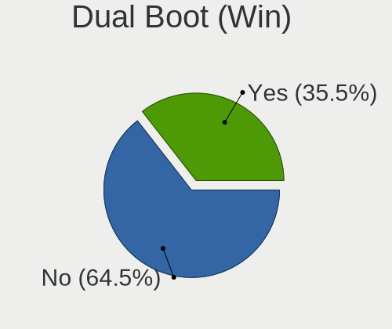
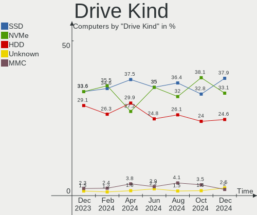
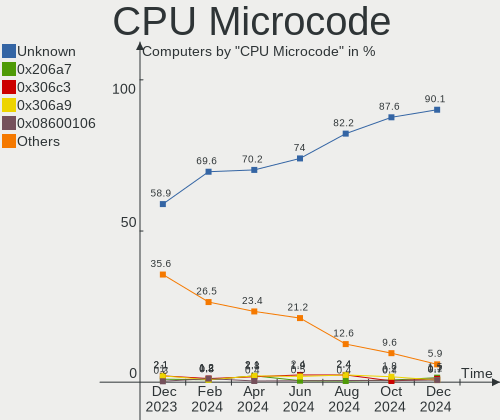
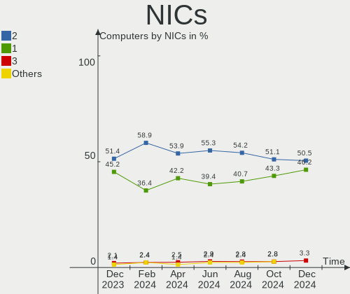

Linux in Italy - Hardware Trends
--------------------------------

A project to identify most popular hardware characteristics and track their change
over time based on data collected by Linux users at https://Linux-Hardware.org.

Anyone can contribute to this report by the [hw-probe](https://github.com/linuxhw/hw-probe) tool:

    sudo -E hw-probe -all -upload

This is a report for all computer types. See also reports for [desktops](/Location/Italy/Desktop/README.md) and [notebooks](/Location/Italy/Notebook/README.md).

Period: Nov, 2023.

Contents
--------

* [ System ](#system)
  - [ OS                       ](#os)
  - [ OS Family                ](#os-family)
  - [ Kernel                   ](#kernel)
  - [ Kernel Family            ](#kernel-family)
  - [ Kernel Major Ver.        ](#kernel-major-ver)
  - [ Arch                     ](#arch)
  - [ DE                       ](#de)
  - [ Display Server           ](#display-server)
  - [ Display Manager          ](#display-manager)
  - [ OS Lang                  ](#os-lang)
  - [ Boot Mode                ](#boot-mode)
  - [ Filesystem               ](#filesystem)
  - [ Part. scheme             ](#part-scheme)
  - [ Dual Boot with Linux/BSD ](#dual-boot-with-linuxbsd)
  - [ Dual Boot (Win)          ](#dual-boot-win)

* [ Board ](#board)
  - [ Vendor                   ](#vendor)
  - [ Model                    ](#model)
  - [ Model Family             ](#model-family)
  - [ MFG Year                 ](#mfg-year)
  - [ Form Factor              ](#form-factor)
  - [ Secure Boot              ](#secure-boot)
  - [ Coreboot                 ](#coreboot)
  - [ RAM Size                 ](#ram-size)
  - [ RAM Used                 ](#ram-used)
  - [ Total Drives             ](#total-drives)
  - [ Has CD-ROM               ](#has-cd-rom)
  - [ Has Ethernet             ](#has-ethernet)
  - [ Has WiFi                 ](#has-wifi)
  - [ Has Bluetooth            ](#has-bluetooth)

* [ Location ](#location)
  - [ Country                  ](#country)
  - [ City                     ](#city)

* [ Drives ](#drives)
  - [ Drive Vendor             ](#drive-vendor)
  - [ Drive Model              ](#drive-model)
  - [ HDD Vendor               ](#hdd-vendor)
  - [ SSD Vendor               ](#ssd-vendor)
  - [ Drive Kind               ](#drive-kind)
  - [ Drive Connector          ](#drive-connector)
  - [ Drive Size               ](#drive-size)
  - [ Space Total              ](#space-total)
  - [ Space Used               ](#space-used)
  - [ Malfunc. Drives          ](#malfunc-drives)
  - [ Malfunc. Drive Vendor    ](#malfunc-drive-vendor)
  - [ Malfunc. HDD Vendor      ](#malfunc-hdd-vendor)
  - [ Malfunc. Drive Kind      ](#malfunc-drive-kind)
  - [ Failed Drives            ](#failed-drives)
  - [ Failed Drive Vendor      ](#failed-drive-vendor)
  - [ Drive Status             ](#drive-status)

* [ Storage controller ](#storage-controller)
  - [ Storage Vendor           ](#storage-vendor)
  - [ Storage Model            ](#storage-model)
  - [ Storage Kind             ](#storage-kind)

* [ Processor ](#processor)
  - [ CPU Vendor               ](#cpu-vendor)
  - [ CPU Model                ](#cpu-model)
  - [ CPU Model Family         ](#cpu-model-family)
  - [ CPU Cores                ](#cpu-cores)
  - [ CPU Sockets              ](#cpu-sockets)
  - [ CPU Threads              ](#cpu-threads)
  - [ CPU Op-Modes             ](#cpu-op-modes)
  - [ CPU Microcode            ](#cpu-microcode)
  - [ CPU Microarch            ](#cpu-microarch)

* [ Graphics ](#graphics)
  - [ GPU Vendor               ](#gpu-vendor)
  - [ GPU Model                ](#gpu-model)
  - [ GPU Combo                ](#gpu-combo)
  - [ GPU Driver               ](#gpu-driver)
  - [ GPU Memory               ](#gpu-memory)

* [ Monitor ](#monitor)
  - [ Monitor Vendor           ](#monitor-vendor)
  - [ Monitor Model            ](#monitor-model)
  - [ Monitor Resolution       ](#monitor-resolution)
  - [ Monitor Diagonal         ](#monitor-diagonal)
  - [ Monitor Width            ](#monitor-width)
  - [ Aspect Ratio             ](#aspect-ratio)
  - [ Monitor Area             ](#monitor-area)
  - [ Pixel Density            ](#pixel-density)
  - [ Multiple Monitors        ](#multiple-monitors)

* [ Network ](#network)
  - [ Net Controller Vendor    ](#net-controller-vendor)
  - [ Net Controller Model     ](#net-controller-model)
  - [ Wireless Vendor          ](#wireless-vendor)
  - [ Wireless Model           ](#wireless-model)
  - [ Ethernet Vendor          ](#ethernet-vendor)
  - [ Ethernet Model           ](#ethernet-model)
  - [ Net Controller Kind      ](#net-controller-kind)
  - [ Used Controller          ](#used-controller)
  - [ NICs                     ](#nics)
  - [ IPv6                     ](#ipv6)

* [ Bluetooth ](#bluetooth)
  - [ Bluetooth Vendor         ](#bluetooth-vendor)
  - [ Bluetooth Model          ](#bluetooth-model)

* [ Sound ](#sound)
  - [ Sound Vendor             ](#sound-vendor)
  - [ Sound Model              ](#sound-model)

* [ Memory ](#memory)
  - [ Memory Vendor            ](#memory-vendor)
  - [ Memory Model             ](#memory-model)
  - [ Memory Kind              ](#memory-kind)
  - [ Memory Form Factor       ](#memory-form-factor)
  - [ Memory Size              ](#memory-size)
  - [ Memory Speed             ](#memory-speed)

* [ Printers & scanners ](#printers--scanners)
  - [ Printer Vendor           ](#printer-vendor)
  - [ Printer Model            ](#printer-model)
  - [ Scanner Vendor           ](#scanner-vendor)
  - [ Scanner Model            ](#scanner-model)

* [ Camera ](#camera)
  - [ Camera Vendor            ](#camera-vendor)
  - [ Camera Model             ](#camera-model)

* [ Security ](#security)
  - [ Fingerprint Vendor       ](#fingerprint-vendor)
  - [ Fingerprint Model        ](#fingerprint-model)
  - [ Chipcard Vendor          ](#chipcard-vendor)
  - [ Chipcard Model           ](#chipcard-model)

* [ Unsupported ](#unsupported)
  - [ Unsupported Devices      ](#unsupported-devices)
  - [ Unsupported Device Types ](#unsupported-device-types)

System
------

OS
--

Installed operating systems

| Name                         | Computers | Percent |
|------------------------------|-----------|---------|
| Ubuntu 22.04                 | 52        | 13.37%  |
| Linux Mint 21.2              | 35        | 9%      |
| Arch Rolling                 | 28        | 7.2%    |
| Debian 12                    | 22        | 5.66%   |
| Ubuntu 23.10                 | 21        | 5.4%    |
| Fedora 39                    | 19        | 4.88%   |
| Pop!_OS 22.04                | 17        | 4.37%   |
| Fedora 38                    | 17        | 4.37%   |
| Manjaro 23.0.4               | 10        | 2.57%   |
| EndeavourOS Rolling          | 10        | 2.57%   |
| Ubuntu 20.04                 | 9         | 2.31%   |
| OpenMandriva 5.0             | 9         | 2.31%   |
| OpenMandriva 23.08           | 8         | 2.06%   |
| Kubuntu 23.10                | 8         | 2.06%   |
| Kubuntu 22.04                | 8         | 2.06%   |
| Zorin 16                     | 7         | 1.8%    |
| Ubuntu 23.04                 | 7         | 1.8%    |
| Debian 11                    | 7         | 1.8%    |
| ArcoLinux Rolling            | 7         | 1.8%    |
| Debian                       | 5         | 1.29%   |
| Ubuntu MATE 22.04            | 4         | 1.03%   |
| Linux Mint 21.1              | 4         | 1.03%   |
| Xubuntu 23.10                | 3         | 0.77%   |
| Ubuntu 18.04                 | 3         | 0.77%   |
| openSUSE Tumbleweed-XXXXXXXX | 3         | 0.77%   |
| Manjaro 23.1.0               | 3         | 0.77%   |
| Manjaro                      | 3         | 0.77%   |
| Linux Mint 21                | 3         | 0.77%   |
| Linux Mint 20.3              | 3         | 0.77%   |
| Kubuntu 23.04                | 3         | 0.77%   |
| Elementary 7.1               | 3         | 0.77%   |
| Xero Rolling                 | 2         | 0.51%   |
| Void Linux Rolling           | 2         | 0.51%   |
| SteamOS 4                    | 2         | 0.51%   |
| ROSA 12.4                    | 2         | 0.51%   |
| openSUSE Leap-15.5           | 2         | 0.51%   |
| Nobara 38                    | 2         | 0.51%   |
| Lubuntu 22.04                | 2         | 0.51%   |
| Kali 2023.3                  | 2         | 0.51%   |
| Xubuntu 23.04                | 1         | 0.26%   |

OS Family
---------

OS without a version

| Name                  | Computers | Percent |
|-----------------------|-----------|---------|
| Ubuntu                | 92        | 23.65%  |
| Linux Mint            | 48        | 12.34%  |
| Fedora                | 36        | 9.25%   |
| Debian                | 36        | 9.25%   |
| Arch                  | 28        | 7.2%    |
| OpenMandriva          | 21        | 5.4%    |
| Kubuntu               | 19        | 4.88%   |
| Pop!_OS               | 17        | 4.37%   |
| Manjaro               | 16        | 4.11%   |
| EndeavourOS           | 10        | 2.57%   |
| Zorin                 | 7         | 1.8%    |
| ArcoLinux             | 7         | 1.8%    |
| Ubuntu MATE           | 6         | 1.54%   |
| openSUSE              | 6         | 1.54%   |
| Xubuntu               | 4         | 1.03%   |
| ROSA                  | 3         | 0.77%   |
| Kali                  | 3         | 0.77%   |
| Elementary            | 3         | 0.77%   |
| Xero                  | 2         | 0.51%   |
| Void Linux            | 2         | 0.51%   |
| SteamOS               | 2         | 0.51%   |
| Nobara                | 2         | 0.51%   |
| MX                    | 2         | 0.51%   |
| Lubuntu               | 2         | 0.51%   |
| LMDE                  | 2         | 0.51%   |
| Ubuntu Unity          | 1         | 0.26%   |
| Slackware             | 1         | 0.26%   |
| Rocky Linux           | 1         | 0.26%   |
| Parrot                | 1         | 0.26%   |
| org.kde.Platform      | 1         | 0.26%   |
| NixOS                 | 1         | 0.26%   |
| Linux-from-scratch-"" | 1         | 0.26%   |
| Linux Lite            | 1         | 0.26%   |
| KDE neon              | 1         | 0.26%   |
| Garuda Linux          | 1         | 0.26%   |
| Devuan                | 1         | 0.26%   |
| Clear Linux           | 1         | 0.26%   |
| Artix                 | 1         | 0.26%   |

Kernel
------

Version of the Linux kernel

| Version                     | Computers | Percent |
|-----------------------------|-----------|---------|
| 6.2.0-36-generic            | 37        | 9.51%   |
| 5.15.0-88-generic           | 35        | 9%      |
| 6.5.0-10-generic            | 22        | 5.66%   |
| 6.1.0-13-amd64              | 21        | 5.4%    |
| 6.5.9-arch2-1               | 16        | 4.11%   |
| 6.5.6-76060506-generic      | 14        | 3.6%    |
| 6.2.0-37-generic            | 12        | 3.08%   |
| 6.6.2-desktop-1omv2390      | 9         | 2.31%   |
| 6.4.11-desktop-1omv2390     | 9         | 2.31%   |
| 6.2.0-26-generic            | 9         | 2.31%   |
| 5.15.0-89-generic           | 9         | 2.31%   |
| 6.6.1-arch1-1               | 8         | 2.06%   |
| 6.5.8-200.fc38.x86_64       | 7         | 1.8%    |
| 6.5.0-13-generic            | 7         | 1.8%    |
| 5.15.0-76-generic           | 7         | 1.8%    |
| 6.5.5-1-MANJARO             | 6         | 1.54%   |
| 6.5.12-300.fc39.x86_64      | 6         | 1.54%   |
| 6.2.0-35-generic            | 6         | 1.54%   |
| 5.15.0-87-generic           | 6         | 1.54%   |
| 5.10.0-26-amd64             | 6         | 1.54%   |
| 6.5.11-300.fc39.x86_64      | 5         | 1.29%   |
| 6.5.0-4-amd64               | 5         | 1.29%   |
| 6.1.55-1-MANJARO            | 5         | 1.29%   |
| 6.6.2-arch1-1               | 4         | 1.03%   |
| 6.5.9-zen2-1-zen            | 4         | 1.03%   |
| 6.5.10-300.fc39.x86_64      | 4         | 1.03%   |
| 5.4.0-166-generic           | 4         | 1.03%   |
| 6.5.9-200.fc38.x86_64       | 3         | 0.77%   |
| 6.5.9-1-default             | 3         | 0.77%   |
| 6.5.0-9-generic             | 3         | 0.77%   |
| 6.2.9-300.fc38.x86_64       | 3         | 0.77%   |
| 6.6.2-zen1-1-zen            | 2         | 0.51%   |
| 6.6.2-201.fc39.x86_64       | 2         | 0.51%   |
| 6.6.1-zen1-1-zen            | 2         | 0.51%   |
| 6.5.9-201.fsync.fc38.x86_64 | 2         | 0.51%   |
| 6.5.8-arch1-1               | 2         | 0.51%   |
| 6.5.6-300.fc39.x86_64       | 2         | 0.51%   |
| 6.5.4-76060504-generic      | 2         | 0.51%   |
| 6.5.10-200.fc38.x86_64      | 2         | 0.51%   |
| 6.1.0-1025-oem              | 2         | 0.51%   |

Kernel Family
-------------

Linux kernel without a distro release

| Version | Computers | Percent |
|---------|-----------|---------|
| 6.2.0   | 67        | 17.22%  |
| 5.15.0  | 63        | 16.2%   |
| 6.5.0   | 39        | 10.03%  |
| 6.5.9   | 29        | 7.46%   |
| 6.1.0   | 27        | 6.94%   |
| 6.6.2   | 18        | 4.63%   |
| 6.5.6   | 17        | 4.37%   |
| 6.6.1   | 12        | 3.08%   |
| 6.5.8   | 11        | 2.83%   |
| 6.4.11  | 10        | 2.57%   |
| 5.4.0   | 10        | 2.57%   |
| 5.10.0  | 9         | 2.31%   |
| 6.5.5   | 8         | 2.06%   |
| 6.5.10  | 8         | 2.06%   |
| 6.5.12  | 6         | 1.54%   |
| 6.5.11  | 6         | 1.54%   |
| 6.1.55  | 5         | 1.29%   |
| 6.5.7   | 4         | 1.03%   |
| 6.6.0   | 3         | 0.77%   |
| 6.2.9   | 3         | 0.77%   |
| 6.5.4   | 2         | 0.51%   |
| 6.4.3   | 2         | 0.51%   |
| 6.1.61  | 2         | 0.51%   |
| 5.19.0  | 2         | 0.51%   |
| 5.14.21 | 2         | 0.51%   |
| 6.6.3   | 1         | 0.26%   |
| 6.4.15  | 1         | 0.26%   |
| 6.4.12  | 1         | 0.26%   |
| 6.4.0   | 1         | 0.26%   |
| 6.3.7   | 1         | 0.26%   |
| 6.3.5   | 1         | 0.26%   |
| 6.3.0   | 1         | 0.26%   |
| 6.2.16  | 1         | 0.26%   |
| 6.1.63  | 1         | 0.26%   |
| 6.1.62  | 1         | 0.26%   |
| 6.1.60  | 1         | 0.26%   |
| 6.1.56  | 1         | 0.26%   |
| 6.1.20  | 1         | 0.26%   |
| 6.1.1   | 1         | 0.26%   |
| 5.4.83  | 1         | 0.26%   |

Kernel Major Ver.
-----------------

Linux kernel major version

| Version | Computers | Percent |
|---------|-----------|---------|
| 6.5     | 130       | 33.42%  |
| 6.2     | 71        | 18.25%  |
| 5.15    | 67        | 17.22%  |
| 6.1     | 40        | 10.28%  |
| 6.6     | 34        | 8.74%   |
| 6.4     | 15        | 3.86%   |
| 5.4     | 11        | 2.83%   |
| 5.10    | 9         | 2.31%   |
| 6.3     | 3         | 0.77%   |
| 5.14    | 3         | 0.77%   |
| 5.19    | 2         | 0.51%   |
| 5.16    | 1         | 0.26%   |
| 4.4     | 1         | 0.26%   |
| 4.15    | 1         | 0.26%   |
| 3.16    | 1         | 0.26%   |

Arch
----

OS architecture (x86_64, i586, etc.)

| Name    | Computers | Percent |
|---------|-----------|---------|
| x86_64  | 385       | 98.97%  |
| i686    | 3         | 0.77%   |
| aarch64 | 1         | 0.26%   |

DE
--

Desktop Environment

| Name            | Computers | Percent |
|-----------------|-----------|---------|
| GNOME           | 181       | 46.53%  |
| KDE5            | 85        | 21.85%  |
| XFCE            | 35        | 9%      |
| X-Cinnamon      | 35        | 9%      |
| MATE            | 22        | 5.66%   |
| Unknown         | 8         | 2.06%   |
| LXQt            | 5         | 1.29%   |
| Pantheon        | 3         | 0.77%   |
| Hyprland        | 3         | 0.77%   |
| Cinnamon        | 3         | 0.77%   |
| LXDE            | 2         | 0.51%   |
| Unity           | 1         | 0.26%   |
| sway            | 1         | 0.26%   |
| KDE             | 1         | 0.26%   |
| i3              | 1         | 0.26%   |
| GNOME Flashback | 1         | 0.26%   |
| GNOME Classic   | 1         | 0.26%   |
| Budgie          | 1         | 0.26%   |

Display Server
--------------

X11 or Wayland

| Name    | Computers | Percent |
|---------|-----------|---------|
| X11     | 241       | 61.95%  |
| Wayland | 141       | 36.25%  |
| Tty     | 5         | 1.29%   |
| Unknown | 2         | 0.51%   |

Display Manager
---------------

SDDM, LightDM, etc.

| Name    | Computers | Percent |
|---------|-----------|---------|
| GDM3    | 100       | 25.71%  |
| Unknown | 100       | 25.71%  |
| SDDM    | 78        | 20.05%  |
| LightDM | 68        | 17.48%  |
| GDM     | 39        | 10.03%  |
| SLiM    | 2         | 0.51%   |
| KDM     | 1         | 0.26%   |
| EMPTTY  | 1         | 0.26%   |

OS Lang
-------

Language

| Lang    | Computers | Percent |
|---------|-----------|---------|
| it_IT   | 265       | 68.12%  |
| en_US   | 96        | 24.68%  |
| C       | 16        | 4.11%   |
| en_GB   | 8         | 2.06%   |
| POSIX   | 1         | 0.26%   |
| fur_IT  | 1         | 0.26%   |
| en_IE   | 1         | 0.26%   |
| Unknown | 1         | 0.26%   |

Boot Mode
---------

EFI or BIOS

| Mode | Computers | Percent |
|------|-----------|---------|
| EFI  | 242       | 62.21%  |
| BIOS | 147       | 37.79%  |

Filesystem
----------

Type of filesystem

| Type    | Computers | Percent |
|---------|-----------|---------|
| Ext4    | 241       | 61.95%  |
| Btrfs   | 59        | 15.17%  |
| Tmpfs   | 56        | 14.4%   |
| Overlay | 28        | 7.2%    |
| Xfs     | 3         | 0.77%   |
| F2fs    | 1         | 0.26%   |
| Aufs    | 1         | 0.26%   |

Part. scheme
------------

Scheme of partitioning

| Type    | Computers | Percent |
|---------|-----------|---------|
| GPT     | 257       | 66.07%  |
| Unknown | 92        | 23.65%  |
| MBR     | 40        | 10.28%  |

Dual Boot with Linux/BSD
------------------------

Hosting more than one Linux/BSD

| Dual boot | Computers | Percent |
|-----------|-----------|---------|
| No        | 326       | 83.8%   |
| Yes       | 63        | 16.2%   |

Dual Boot (Win)
---------------

Hosting Linux and Windows

| Dual boot | Computers | Percent |
|-----------|-----------|---------|
| No        | 249       | 64.01%  |
| Yes       | 140       | 35.99%  |

Board
-----

Vendor
------

Motherboard manufacturer

| Name                    | Computers | Percent |
|-------------------------|-----------|---------|
| ASUSTek Computer        | 83        | 21.34%  |
| Hewlett-Packard         | 74        | 19.02%  |
| Lenovo                  | 53        | 13.62%  |
| Acer                    | 33        | 8.48%   |
| Dell                    | 24        | 6.17%   |
| MSI                     | 18        | 4.63%   |
| Gigabyte Technology     | 17        | 4.37%   |
| ASRock                  | 14        | 3.6%    |
| Apple                   | 14        | 3.6%    |
| Sony                    | 7         | 1.8%    |
| HUAWEI                  | 6         | 1.54%   |
| Fujitsu                 | 6         | 1.54%   |
| Chuwi                   | 4         | 1.03%   |
| Unknown                 | 4         | 1.03%   |
| Samsung Electronics     | 2         | 0.51%   |
| Olivetti                | 2         | 0.51%   |
| Notebook                | 2         | 0.51%   |
| Mediacom                | 2         | 0.51%   |
| Intel                   | 2         | 0.51%   |
| HC Technology.          | 2         | 0.51%   |
| AZW                     | 2         | 0.51%   |
| ZOTAC                   | 1         | 0.26%   |
| TUXEDO                  | 1         | 0.26%   |
| Toshiba                 | 1         | 0.26%   |
| SiComputer              | 1         | 0.26%   |
| Sapphire                | 1         | 0.26%   |
| Raspberry Pi Foundation | 1         | 0.26%   |
| Pegatron                | 1         | 0.26%   |
| Packard Bell            | 1         | 0.26%   |
| NZXT                    | 1         | 0.26%   |
| Microtech               | 1         | 0.26%   |
| Jumper                  | 1         | 0.26%   |
| Hampoo                  | 1         | 0.26%   |
| Framework               | 1         | 0.26%   |
| Dynabook                | 1         | 0.26%   |
| DERE                    | 1         | 0.26%   |
| BESSTAR Tech            | 1         | 0.26%   |
| ASRockRack              | 1         | 0.26%   |
| AMI                     | 1         | 0.26%   |

Model
-----

Motherboard model

| Name                                   | Computers | Percent |
|----------------------------------------|-----------|---------|
| Unknown                                | 5         | 1.29%   |
| HP Notebook                            | 3         | 0.77%   |
| ASUS TUF Gaming X570-PLUS              | 3         | 0.77%   |
| Lenovo V15 G2 ITL 82KB                 | 2         | 0.51%   |
| Lenovo IdeaPad 320-15ABR 80XS          | 2         | 0.51%   |
| Lenovo IdeaPad 3 15ALC6 82KU           | 2         | 0.51%   |
| HUAWEI BOD-WXX9                        | 2         | 0.51%   |
| HP Pavilion x360 Convertible 14-dy0xxx | 2         | 0.51%   |
| HP Pavilion Gaming Laptop 15-cx0xxx    | 2         | 0.51%   |
| HP Pavilion g6                         | 2         | 0.51%   |
| HP ENVY 15                             | 2         | 0.51%   |
| HP EliteDesk 800 G1 SFF                | 2         | 0.51%   |
| HP EliteBook 830 G5                    | 2         | 0.51%   |
| HP 650                                 | 2         | 0.51%   |
| HP 630                                 | 2         | 0.51%   |
| HP 255 G8 Notebook PC                  | 2         | 0.51%   |
| HP 250 G7 Notebook PC                  | 2         | 0.51%   |
| HC Technology. HCAR5000-MI             | 2         | 0.51%   |
| Fujitsu ESPRIMO_P556                   | 2         | 0.51%   |
| ASUS X555LAB                           | 2         | 0.51%   |
| ASUS TUF Gaming B550M-PLUS             | 2         | 0.51%   |
| ASUS P8H67-M                           | 2         | 0.51%   |
| ASUS P5KPL-AM SE                       | 2         | 0.51%   |
| ASUS M5A97 R2.0                        | 2         | 0.51%   |
| ASUS M32CD_A_F_K20CD_K31CD             | 2         | 0.51%   |
| Apple MacBookPro11,3                   | 2         | 0.51%   |
| Acer Swift SF314-59                    | 2         | 0.51%   |
| Acer Nitro AN515-54                    | 2         | 0.51%   |
| ZOTAC ZBOX                             | 1         | 0.26%   |
| TUXEDO Pulse 15 Gen2                   | 1         | 0.26%   |
| Toshiba Satellite L755                 | 1         | 0.26%   |
| Sony VPCSA3J1E                         | 1         | 0.26%   |
| Sony VPCS13V9E                         | 1         | 0.26%   |
| Sony VPCEL1E1E                         | 1         | 0.26%   |
| Sony VPCEB1S1E                         | 1         | 0.26%   |
| Sony VGN-N21S_W                        | 1         | 0.26%   |
| Sony SVE1713X1EB                       | 1         | 0.26%   |
| Sony SVE1513Q1ESI                      | 1         | 0.26%   |
| SiComputer Nauta 01E                   | 1         | 0.26%   |
| Sapphire PE-AM2RS690V2                 | 1         | 0.26%   |

Model Family
------------

Motherboard model prefix

| Name                | Computers | Percent |
|---------------------|-----------|---------|
| Lenovo ThinkPad     | 21        | 5.4%    |
| Lenovo IdeaPad      | 16        | 4.11%   |
| Acer Aspire         | 14        | 3.6%    |
| HP Pavilion         | 13        | 3.34%   |
| ASUS VivoBook       | 12        | 3.08%   |
| HP Compaq           | 8         | 2.06%   |
| HP ProBook          | 7         | 1.8%    |
| ASUS TUF            | 7         | 1.8%    |
| ASUS ROG            | 7         | 1.8%    |
| ASUS PRIME          | 7         | 1.8%    |
| HP Laptop           | 6         | 1.54%   |
| HP EliteBook        | 6         | 1.54%   |
| Dell XPS            | 5         | 1.29%   |
| Dell Inspiron       | 5         | 1.29%   |
| Acer Nitro          | 5         | 1.29%   |
| Unknown             | 5         | 1.29%   |
| HP ENVY             | 4         | 1.03%   |
| HP 250              | 4         | 1.03%   |
| Fujitsu ESPRIMO     | 4         | 1.03%   |
| Dell Latitude       | 4         | 1.03%   |
| ASUS ASUS           | 4         | 1.03%   |
| Acer TravelMate     | 4         | 1.03%   |
| Acer Swift          | 4         | 1.03%   |
| Lenovo Yoga         | 3         | 0.77%   |
| HP Notebook         | 3         | 0.77%   |
| Gigabyte B450       | 3         | 0.77%   |
| Dell Vostro         | 3         | 0.77%   |
| Dell OptiPlex       | 3         | 0.77%   |
| ASUS P5KPL-AM       | 3         | 0.77%   |
| MSI Modern          | 2         | 0.51%   |
| Lenovo V15          | 2         | 0.51%   |
| Lenovo ThinkStation | 2         | 0.51%   |
| Lenovo ThinkBook    | 2         | 0.51%   |
| Lenovo IdeaPadFlex  | 2         | 0.51%   |
| HUAWEI BOD-WXX9     | 2         | 0.51%   |
| HP ProDesk          | 2         | 0.51%   |
| HP OMEN             | 2         | 0.51%   |
| HP EliteDesk        | 2         | 0.51%   |
| HP 650              | 2         | 0.51%   |
| HP 630              | 2         | 0.51%   |

MFG Year
--------

Motherboard manufacture year

| Year    | Computers | Percent |
|---------|-----------|---------|
| 2020    | 47        | 12.08%  |
| 2021    | 46        | 11.83%  |
| 2019    | 38        | 9.77%   |
| 2018    | 33        | 8.48%   |
| 2013    | 25        | 6.43%   |
| 2017    | 23        | 5.91%   |
| 2022    | 22        | 5.66%   |
| 2012    | 22        | 5.66%   |
| 2015    | 19        | 4.88%   |
| 2016    | 18        | 4.63%   |
| 2014    | 18        | 4.63%   |
| 2010    | 17        | 4.37%   |
| 2023    | 16        | 4.11%   |
| 2011    | 15        | 3.86%   |
| 2008    | 13        | 3.34%   |
| 2009    | 9         | 2.31%   |
| 2007    | 5         | 1.29%   |
| 2006    | 1         | 0.26%   |
| 2005    | 1         | 0.26%   |
| Unknown | 1         | 0.26%   |

Form Factor
-----------

Physical design of the computer

| Name           | Computers | Percent |
|----------------|-----------|---------|
| Notebook       | 234       | 60.15%  |
| Desktop        | 125       | 32.13%  |
| Convertible    | 14        | 3.6%    |
| All in one     | 6         | 1.54%   |
| Mini pc        | 4         | 1.03%   |
| Server         | 3         | 0.77%   |
| Tablet         | 2         | 0.51%   |
| System on chip | 1         | 0.26%   |

Secure Boot
-----------

Enabled or disabled

| State    | Computers | Percent |
|----------|-----------|---------|
| Disabled | 355       | 91.26%  |
| Enabled  | 34        | 8.74%   |

Coreboot
--------

Have coreboot on board

| Used | Computers | Percent |
|------|-----------|---------|
| No   | 389       | 100%    |

RAM Size
--------

Total RAM memory

| Size in GB      | Computers | Percent |
|-----------------|-----------|---------|
| 4.01-8.0        | 112       | 28.79%  |
| 16.01-24.0      | 95        | 24.42%  |
| 8.01-16.0       | 65        | 16.71%  |
| 3.01-4.0        | 47        | 12.08%  |
| 32.01-64.0      | 34        | 8.74%   |
| 24.01-32.0      | 17        | 4.37%   |
| 64.01-256.0     | 7         | 1.8%    |
| 1.01-2.0        | 6         | 1.54%   |
| 2.01-3.0        | 5         | 1.29%   |
| More than 256.0 | 1         | 0.26%   |

RAM Used
--------

Used RAM memory

| Used GB    | Computers | Percent |
|------------|-----------|---------|
| 2.01-3.0   | 98        | 25.19%  |
| 1.01-2.0   | 96        | 24.68%  |
| 4.01-8.0   | 83        | 21.34%  |
| 3.01-4.0   | 75        | 19.28%  |
| 8.01-16.0  | 27        | 6.94%   |
| 0.51-1.0   | 9         | 2.31%   |
| 16.01-24.0 | 1         | 0.26%   |

Total Drives
------------

Number of drives on board

| Drives | Computers | Percent |
|--------|-----------|---------|
| 1      | 242       | 62.21%  |
| 2      | 82        | 21.08%  |
| 3      | 29        | 7.46%   |
| 4      | 18        | 4.63%   |
| 5      | 9         | 2.31%   |
| 6      | 4         | 1.03%   |
| 0      | 2         | 0.51%   |
| 14     | 1         | 0.26%   |
| 9      | 1         | 0.26%   |
| 7      | 1         | 0.26%   |

Has CD-ROM
----------

Has CD-ROM on board

| Presented | Computers | Percent |
|-----------|-----------|---------|
| No        | 258       | 66.32%  |
| Yes       | 131       | 33.68%  |

Has Ethernet
------------

Has Ethernet on board

| Presented | Computers | Percent |
|-----------|-----------|---------|
| Yes       | 316       | 81.23%  |
| No        | 73        | 18.77%  |

Has WiFi
--------

Has WiFi module

| Presented | Computers | Percent |
|-----------|-----------|---------|
| Yes       | 323       | 83.03%  |
| No        | 66        | 16.97%  |

Has Bluetooth
-------------

Has Bluetooth module

| Presented | Computers | Percent |
|-----------|-----------|---------|
| Yes       | 281       | 72.24%  |
| No        | 108       | 27.76%  |

Location
--------

Country
-------

Geographic location (country)

| Country | Computers | Percent |
|---------|-----------|---------|
| Italy   | 389       | 100%    |

City
----

Geographic location (city)

| City                 | Computers | Percent |
|----------------------|-----------|---------|
| Milan                | 44        | 11.31%  |
| Rome                 | 41        | 10.54%  |
| Milano               | 25        | 6.43%   |
| Turin                | 10        | 2.57%   |
| Naples               | 9         | 2.31%   |
| Florence             | 8         | 2.06%   |
| Bologna              | 8         | 2.06%   |
| Rho                  | 6         | 1.54%   |
| Palermo              | 5         | 1.29%   |
| Padova               | 5         | 1.29%   |
| Genoa                | 5         | 1.29%   |
| Bari                 | 5         | 1.29%   |
| Vicenza              | 4         | 1.03%   |
| Verona               | 4         | 1.03%   |
| Catania              | 4         | 1.03%   |
| Bergamo              | 4         | 1.03%   |
| Rimini               | 3         | 0.77%   |
| Pisa                 | 3         | 0.77%   |
| Parma                | 3         | 0.77%   |
| Novara               | 3         | 0.77%   |
| Monza                | 3         | 0.77%   |
| L’Aquila           | 3         | 0.77%   |
| Brescia              | 3         | 0.77%   |
| Vercelli             | 2         | 0.51%   |
| Udine                | 2         | 0.51%   |
| Trentola-Ducenta     | 2         | 0.51%   |
| Siena                | 2         | 0.51%   |
| San Giovanni Teatino | 2         | 0.51%   |
| San Gavino Monreale  | 2         | 0.51%   |
| Roccamonfina         | 2         | 0.51%   |
| Reggio Emilia        | 2         | 0.51%   |
| Ravenna              | 2         | 0.51%   |
| Paderno Dugnano      | 2         | 0.51%   |
| Montoggio            | 2         | 0.51%   |
| Costa di Mezzate     | 2         | 0.51%   |
| Cesena               | 2         | 0.51%   |
| Catanzaro            | 2         | 0.51%   |
| Castello di Cisterna | 2         | 0.51%   |
| Casalecchio di Reno  | 2         | 0.51%   |
| Ancona               | 2         | 0.51%   |

Drives
------

Drive Vendor
------------

Hard drive vendors

| Vendor                      | Computers | Drives | Percent |
|-----------------------------|-----------|--------|---------|
| Samsung Electronics         | 101       | 131    | 17.57%  |
| Seagate                     | 60        | 85     | 10.43%  |
| WDC                         | 57        | 78     | 9.91%   |
| Crucial                     | 46        | 47     | 8%      |
| Kingston                    | 43        | 47     | 7.48%   |
| Sandisk                     | 32        | 33     | 5.57%   |
| Toshiba                     | 24        | 24     | 4.17%   |
| SK hynix                    | 24        | 24     | 4.17%   |
| Micron Technology           | 18        | 18     | 3.13%   |
| Intel                       | 14        | 15     | 2.43%   |
| Unknown                     | 13        | 14     | 2.26%   |
| China                       | 11        | 12     | 1.91%   |
| Hitachi                     | 10        | 10     | 1.74%   |
| Micron/Crucial Technology   | 9         | 9      | 1.57%   |
| HGST                        | 6         | 6      | 1.04%   |
| SPCC                        | 5         | 5      | 0.87%   |
| Phison                      | 5         | 6      | 0.87%   |
| Fanxiang                    | 5         | 6      | 0.87%   |
| Apple                       | 5         | 5      | 0.87%   |
| KIOXIA                      | 4         | 4      | 0.7%    |
| Kingston Technology Company | 4         | 4      | 0.7%    |
| JMicron Technology          | 4         | 4      | 0.7%    |
| Intenso                     | 4         | 5      | 0.7%    |
| Unknown                     | 4         | 4      | 0.7%    |
| Transcend                   | 3         | 3      | 0.52%   |
| PNY                         | 3         | 3      | 0.52%   |
| Phison Electronics          | 3         | 4      | 0.52%   |
| Maxtor                      | 3         | 3      | 0.52%   |
| Fujitsu                     | 3         | 3      | 0.52%   |
| Emtec                       | 3         | 3      | 0.52%   |
| Team                        | 2         | 2      | 0.35%   |
| Solid State Storage         | 2         | 2      | 0.35%   |
| sobetter                    | 2         | 2      | 0.35%   |
| Silicon Motion              | 2         | 2      | 0.35%   |
| SABRENT                     | 2         | 2      | 0.35%   |
| Netac                       | 2         | 2      | 0.35%   |
| Lexar                       | 2         | 2      | 0.35%   |
| Kimtigo                     | 2         | 2      | 0.35%   |
| Hikvision                   | 2         | 2      | 0.35%   |
| GOODRAM                     | 2         | 2      | 0.35%   |

Drive Model
-----------

Hard drive models

| Model                                               | Computers | Percent |
|-----------------------------------------------------|-----------|---------|
| Samsung NVMe SSD Controller SM981/PM981/PM983 250GB | 14        | 2.21%   |
| Crucial CT500MX500SSD1 500GB                        | 10        | 1.58%   |
| Kingston SA400S37240G 240GB SSD                     | 9         | 1.42%   |
| Toshiba DT01ACA100 1TB                              | 8         | 1.26%   |
| Samsung NVMe SSD Controller PM9A1/PM9A3/980PRO 2TB  | 8         | 1.26%   |
| Crucial CT480BX500SSD1 480GB                        | 8         | 1.26%   |
| Crucial CT1000MX500SSD1 1TB                         | 8         | 1.26%   |
| Samsung SSD 860 EVO 500GB                           | 7         | 1.1%    |
| Sandisk WD Blue SN550 NVMe SSD 512GB                | 5         | 0.79%   |
| Samsung SSD 980 1TB                                 | 5         | 0.79%   |
| Samsung SSD 870 EVO 500GB                           | 5         | 0.79%   |
| Samsung SSD 850 EVO 500GB                           | 5         | 0.79%   |
| Crucial CT1000BX500SSD1 1TB                         | 5         | 0.79%   |
| Seagate ST2000DM008-2FR102 2TB                      | 4         | 0.63%   |
| Seagate ST1000LM035-1RK172 1TB                      | 4         | 0.63%   |
| Samsung SSD 850 EVO 250GB                           | 4         | 0.63%   |
| Micron/Crucial P2 NVMe PCIe SSD 1TB                 | 4         | 0.63%   |
| Micron/Crucial CT1000P5PSSD8 1TB                    | 4         | 0.63%   |
| Kingston SA400S37480G 480GB SSD                     | 4         | 0.63%   |
| Kingston SA400S37120G 120GB SSD                     | 4         | 0.63%   |
| Unknown                                             | 4         | 0.63%   |
| WDC WD10EZEX-08WN4A0 1TB                            | 3         | 0.47%   |
| Seagate ST500LT012-1DG142 500GB                     | 3         | 0.47%   |
| Seagate ST4000DM004-2CV104 4TB                      | 3         | 0.47%   |
| Seagate ST2000DM006-2DM164 2TB                      | 3         | 0.47%   |
| Seagate ST1000LM049-2GH172 1TB                      | 3         | 0.47%   |
| Seagate ST1000LM024 HN-M101MBB 1TB                  | 3         | 0.47%   |
| Seagate ST1000DM010-2EP102 1TB                      | 3         | 0.47%   |
| SanDisk SSD PLUS 480GB                              | 3         | 0.47%   |
| Samsung SSD 870 QVO 1TB                             | 3         | 0.47%   |
| Samsung SSD 860 EVO 1TB                             | 3         | 0.47%   |
| Samsung NVMe SSD Controller SM961/PM961/SM963 256GB | 3         | 0.47%   |
| Samsung MZVLQ512HALU-00000 512GB                    | 3         | 0.47%   |
| Samsung MZALQ512HBLU-00BL2 512GB                    | 3         | 0.47%   |
| Phison E12 NVMe Controller 512GB                    | 3         | 0.47%   |
| Micron MTFDHBA512QFD 512GB                          | 3         | 0.47%   |
| Kingston SNVS500G 500GB                             | 3         | 0.47%   |
| JMicron Generic 250GB                               | 3         | 0.47%   |
| Intel SSDPEKNU512GZ 512GB                           | 3         | 0.47%   |
| Crucial CT240BX500SSD1 240GB                        | 3         | 0.47%   |

HDD Vendor
----------

Hard disk drive vendors

| Vendor              | Computers | Drives | Percent |
|---------------------|-----------|--------|---------|
| Seagate             | 59        | 84     | 38.56%  |
| WDC                 | 45        | 65     | 29.41%  |
| Toshiba             | 19        | 19     | 12.42%  |
| Hitachi             | 10        | 10     | 6.54%   |
| HGST                | 6         | 6      | 3.92%   |
| Samsung Electronics | 3         | 3      | 1.96%   |
| Maxtor              | 3         | 3      | 1.96%   |
| Fujitsu             | 3         | 3      | 1.96%   |
| Unknown             | 2         | 2      | 1.31%   |
| SSK                 | 1         | 1      | 0.65%   |
| SABRENT             | 1         | 1      | 0.65%   |
| External            | 1         | 1      | 0.65%   |

SSD Vendor
----------

Solid state drive vendors

| Vendor              | Computers | Drives | Percent |
|---------------------|-----------|--------|---------|
| Samsung Electronics | 53        | 63     | 24.42%  |
| Crucial             | 44        | 44     | 20.28%  |
| Kingston            | 28        | 30     | 12.9%   |
| SanDisk             | 14        | 14     | 6.45%   |
| China               | 11        | 11     | 5.07%   |
| SPCC                | 5         | 5      | 2.3%    |
| SK hynix            | 4         | 4      | 1.84%   |
| Micron Technology   | 4         | 4      | 1.84%   |
| Intenso             | 4         | 4      | 1.84%   |
| Unknown             | 4         | 4      | 1.84%   |
| WDC                 | 3         | 3      | 1.38%   |
| Transcend           | 3         | 3      | 1.38%   |
| PNY                 | 3         | 3      | 1.38%   |
| JMicron Technology  | 3         | 3      | 1.38%   |
| Fanxiang            | 3         | 3      | 1.38%   |
| Emtec               | 3         | 3      | 1.38%   |
| Toshiba             | 2         | 2      | 0.92%   |
| Lexar               | 2         | 2      | 0.92%   |
| Hikvision           | 2         | 2      | 0.92%   |
| GOODRAM             | 2         | 2      | 0.92%   |
| Apple               | 2         | 2      | 0.92%   |
| A-DATA Technology   | 2         | 2      | 0.92%   |
| X12                 | 1         | 1      | 0.46%   |
| WDC WDS5            | 1         | 1      | 0.46%   |
| Teclast             | 1         | 1      | 0.46%   |
| Team                | 1         | 1      | 0.46%   |
| SCCTS-603-001T      | 1         | 1      | 0.46%   |
| Patriot             | 1         | 1      | 0.46%   |
| Netac               | 1         | 1      | 0.46%   |
| LITEONIT            | 1         | 1      | 0.46%   |
| KIOXIA-EXCERIA      | 1         | 1      | 0.46%   |
| KingDian            | 1         | 1      | 0.46%   |
| Kimtigo             | 1         | 1      | 0.46%   |
| Intel               | 1         | 1      | 0.46%   |
| Hoodisk             | 1         | 1      | 0.46%   |
| Dogfish             | 1         | 1      | 0.46%   |
| Corsair             | 1         | 1      | 0.46%   |
| BAITITON            | 1         | 1      | 0.46%   |

Drive Kind
----------

HDD or SSD

| Kind    | Computers | Drives | Percent |
|---------|-----------|--------|---------|
| SSD     | 182       | 229    | 35.48%  |
| NVMe    | 179       | 210    | 34.89%  |
| HDD     | 127       | 198    | 24.76%  |
| MMC     | 13        | 14     | 2.53%   |
| Unknown | 12        | 13     | 2.34%   |

Drive Connector
---------------

SATA, SAS, NVMe, etc.

| Type | Computers | Drives | Percent |
|------|-----------|--------|---------|
| SATA | 250       | 415    | 53.76%  |
| NVMe | 179       | 208    | 38.49%  |
| SAS  | 23        | 27     | 4.95%   |
| MMC  | 13        | 14     | 2.8%    |

Drive Size
----------

Size of hard drive

| Size in TB | Computers | Drives | Percent |
|------------|-----------|--------|---------|
| 0.01-0.5   | 183       | 230    | 54.95%  |
| 0.51-1.0   | 102       | 121    | 30.63%  |
| 1.01-2.0   | 27        | 33     | 8.11%   |
| 3.01-4.0   | 11        | 15     | 3.3%    |
| 2.01-3.0   | 6         | 6      | 1.8%    |
| 4.01-10.0  | 4         | 22     | 1.2%    |

Space Total
-----------

Amount of disk space available on the file system

| Size in GB     | Computers | Percent |
|----------------|-----------|---------|
| 251-500        | 98        | 25.19%  |
| 101-250        | 82        | 21.08%  |
| 501-1000       | 58        | 14.91%  |
| 1001-2000      | 32        | 8.23%   |
| 1-20           | 31        | 7.97%   |
| More than 3000 | 26        | 6.68%   |
| 51-100         | 22        | 5.66%   |
| 2001-3000      | 16        | 4.11%   |
| 21-50          | 15        | 3.86%   |
| Unknown        | 9         | 2.31%   |

Space Used
----------

Amount of used disk space

| Used GB        | Computers | Percent |
|----------------|-----------|---------|
| 1-20           | 113       | 29.05%  |
| 101-250        | 68        | 17.48%  |
| 21-50          | 67        | 17.22%  |
| 51-100         | 40        | 10.28%  |
| 501-1000       | 30        | 7.71%   |
| 251-500        | 28        | 7.2%    |
| 1001-2000      | 21        | 5.4%    |
| Unknown        | 9         | 2.31%   |
| 2001-3000      | 7         | 1.8%    |
| More than 3000 | 6         | 1.54%   |

Malfunc. Drives
---------------

Drive models with a malfunction

| Model                                                     | Computers | Drives | Percent |
|-----------------------------------------------------------|-----------|--------|---------|
| Toshiba DT01ACA100 1TB                                    | 2         | 2      | 4.88%   |
| Seagate ST500DM009-2F110A 500GB                           | 2         | 2      | 4.88%   |
| Seagate ST3500418AS 500GB                                 | 2         | 3      | 4.88%   |
| WDC WD5000AAKX-001CA0 500GB                               | 1         | 1      | 2.44%   |
| WDC WD5000AAKS-00V1A0 500GB                               | 1         | 1      | 2.44%   |
| WDC WD40 EFRX-68N32N0 4TB                                 | 1         | 1      | 2.44%   |
| WDC WD20EARS-00MVWB0 2TB                                  | 1         | 1      | 2.44%   |
| WDC WD1600BEKT-60F3T1 160GB                               | 1         | 1      | 2.44%   |
| WDC WD10EADX-22TDHB0 1TB                                  | 1         | 1      | 2.44%   |
| Toshiba MQ04ABF100 1TB                                    | 1         | 1      | 2.44%   |
| SK hynix PC711 HFS512GDE9X073N 512GB                      | 1         | 1      | 2.44%   |
| SK hynix HFS512G39TND-N210A 512GB SSD                     | 1         | 1      | 2.44%   |
| SK hynix HFS128G39TND-N210A 128GB SSD                     | 1         | 1      | 2.44%   |
| Seagate ST9320325AS 320GB                                 | 1         | 1      | 2.44%   |
| Seagate ST9250315AS 250GB                                 | 1         | 1      | 2.44%   |
| Seagate ST750LM022 HN-M750MBB 752GB                       | 1         | 1      | 2.44%   |
| Seagate ST4000NM0035-1V4107 4TB                           | 1         | 2      | 2.44%   |
| Seagate ST1000LM049-2GH172 1TB                            | 1         | 1      | 2.44%   |
| Seagate ST1000LM024 HN-M101MBB 1TB                        | 1         | 1      | 2.44%   |
| Seagate ST1000DM003-9YN162 1TB                            | 1         | 1      | 2.44%   |
| SanDisk SSD U100 24GB                                     | 1         | 1      | 2.44%   |
| SanDisk SSD PLUS 480GB                                    | 1         | 1      | 2.44%   |
| Samsung Electronics SSD 870 EVO 1TB                       | 1         | 1      | 2.44%   |
| Realtek Semiconductor RTS5763DL NVMe SSD Controller 512GB | 1         | 1      | 2.44%   |
| Maxtor STM3500320AS 500GB                                 | 1         | 1      | 2.44%   |
| Kingston SA400S37480G 480GB SSD                           | 1         | 1      | 2.44%   |
| Kingston SA400S37240G 240GB SSD                           | 1         | 1      | 2.44%   |
| Kingston SA400S37120G 120GB SSD                           | 1         | 1      | 2.44%   |
| Intenso SSD SATAIII 512GB                                 | 1         | 1      | 2.44%   |
| Intel SSDSCKKF256G8H 256GB                                | 1         | 1      | 2.44%   |
| Hitachi HDS722020ALA330 2TB                               | 1         | 1      | 2.44%   |
| HGST HTS545050A7E680 500GB                                | 1         | 1      | 2.44%   |
| Fujitsu MHW2160BJ G2 160GB                                | 1         | 1      | 2.44%   |
| Crucial CT512M550SSD1 512GB                               | 1         | 1      | 2.44%   |
| Crucial CT275MX300SSD1 275GB                              | 1         | 1      | 2.44%   |
| Crucial CT1000MX500SSD1 1TB                               | 1         | 1      | 2.44%   |
| Corsair Nova 2 SSD 32GB                                   | 1         | 1      | 2.44%   |
| China SSD 1TB                                             | 1         | 1      | 2.44%   |

Malfunc. Drive Vendor
---------------------

Vendors of faulty drives

| Vendor                | Computers | Drives | Percent |
|-----------------------|-----------|--------|---------|
| Seagate               | 10        | 13     | 25%     |
| WDC                   | 6         | 6      | 15%     |
| Toshiba               | 3         | 3      | 7.5%    |
| SK hynix              | 3         | 3      | 7.5%    |
| Kingston              | 3         | 3      | 7.5%    |
| Crucial               | 3         | 3      | 7.5%    |
| SanDisk               | 2         | 2      | 5%      |
| Samsung Electronics   | 1         | 1      | 2.5%    |
| Realtek Semiconductor | 1         | 1      | 2.5%    |
| Maxtor                | 1         | 1      | 2.5%    |
| Intenso               | 1         | 1      | 2.5%    |
| Intel                 | 1         | 1      | 2.5%    |
| Hitachi               | 1         | 1      | 2.5%    |
| HGST                  | 1         | 1      | 2.5%    |
| Fujitsu               | 1         | 1      | 2.5%    |
| Corsair               | 1         | 1      | 2.5%    |
| China                 | 1         | 1      | 2.5%    |

Malfunc. HDD Vendor
-------------------

Vendors of faulty HDD drives

| Vendor  | Computers | Drives | Percent |
|---------|-----------|--------|---------|
| Seagate | 10        | 13     | 43.48%  |
| WDC     | 6         | 6      | 26.09%  |
| Toshiba | 3         | 3      | 13.04%  |
| Maxtor  | 1         | 1      | 4.35%   |
| Hitachi | 1         | 1      | 4.35%   |
| HGST    | 1         | 1      | 4.35%   |
| Fujitsu | 1         | 1      | 4.35%   |

Malfunc. Drive Kind
-------------------

Kinds of faulty drives

| Kind | Computers | Drives | Percent |
|------|-----------|--------|---------|
| HDD  | 21        | 26     | 55.26%  |
| SSD  | 15        | 15     | 39.47%  |
| NVMe | 2         | 2      | 5.26%   |

Failed Drives
-------------

Failed drive models

| Model                                   | Computers | Drives | Percent |
|-----------------------------------------|-----------|--------|---------|
| SK hynix BC501 HFM256GDJTNG-8310A 256GB | 1         | 1      | 100%    |

Failed Drive Vendor
-------------------

Failed drive vendors

| Vendor   | Computers | Drives | Percent |
|----------|-----------|--------|---------|
| SK hynix | 1         | 1      | 100%    |

Drive Status
------------

Number of failed and malfunc. drives

| Status   | Computers | Drives | Percent |
|----------|-----------|--------|---------|
| Works    | 217       | 355    | 50.94%  |
| Detected | 171       | 265    | 40.14%  |
| Malfunc  | 37        | 43     | 8.69%   |
| Failed   | 1         | 1      | 0.23%   |

Storage controller
------------------

Storage Vendor
--------------

Storage controller vendors

| Vendor                         | Computers | Percent |
|--------------------------------|-----------|---------|
| Intel                          | 251       | 47.63%  |
| AMD                            | 70        | 13.28%  |
| Samsung Electronics            | 58        | 11.01%  |
| SanDisk                        | 26        | 4.93%   |
| Kingston Technology Company    | 21        | 3.98%   |
| SK hynix                       | 18        | 3.42%   |
| Micron Technology              | 14        | 2.66%   |
| Micron/Crucial Technology      | 11        | 2.09%   |
| Phison Electronics             | 10        | 1.9%    |
| Marvell Technology Group       | 8         | 1.52%   |
| ASMedia Technology             | 5         | 0.95%   |
| Toshiba America Info Systems   | 4         | 0.76%   |
| Nvidia                         | 4         | 0.76%   |
| JMicron Technology             | 4         | 0.76%   |
| VIA Technologies               | 3         | 0.57%   |
| Silicon Motion                 | 3         | 0.57%   |
| KIOXIA                         | 3         | 0.57%   |
| Solid State Storage Technology | 2         | 0.38%   |
| INNOGRIT                       | 2         | 0.38%   |
| Apple                          | 2         | 0.38%   |
| Union Memory (Shenzhen)        | 1         | 0.19%   |
| Shenzhen Longsys Electronics   | 1         | 0.19%   |
| Realtek Semiconductor          | 1         | 0.19%   |
| Netac Technology               | 1         | 0.19%   |
| MAXIO Technology (Hangzhou)    | 1         | 0.19%   |
| LSI Logic / Symbios Logic      | 1         | 0.19%   |
| Lenovo                         | 1         | 0.19%   |
| Broadcom / LSI                 | 1         | 0.19%   |

Storage Model
-------------

Storage controller models

| Model                                                                          | Computers | Percent |
|--------------------------------------------------------------------------------|-----------|---------|
| AMD FCH SATA Controller [AHCI mode]                                            | 52        | 8.78%   |
| Intel Sunrise Point-LP SATA Controller [AHCI mode]                             | 22        | 3.72%   |
| Samsung NVMe SSD Controller 980 (DRAM-less)                                    | 21        | 3.55%   |
| Samsung NVMe SSD Controller SM981/PM981/PM983                                  | 20        | 3.38%   |
| Intel Volume Management Device NVMe RAID Controller                            | 16        | 2.7%    |
| Intel 8 Series/C220 Series Chipset Family 6-port SATA Controller 1 [AHCI mode] | 16        | 2.7%    |
| Intel Q170/Q150/B150/H170/H110/Z170/CM236 Chipset SATA Controller [AHCI Mode]  | 15        | 2.53%   |
| Intel 7 Series Chipset Family 6-port SATA Controller [AHCI mode]               | 13        | 2.2%    |
| Intel 82801 Mobile SATA Controller [RAID mode]                                 | 12        | 2.03%   |
| Intel Celeron/Pentium Silver Processor SATA Controller                         | 11        | 1.86%   |
| Samsung NVMe SSD Controller PM9A1/PM9A3/980PRO                                 | 10        | 1.69%   |
| Intel Tiger Lake-LP SATA Controller                                            | 10        | 1.69%   |
| Intel 82801G (ICH7 Family) IDE Controller                                      | 9         | 1.52%   |
| Intel Wildcat Point-LP SATA Controller [AHCI Mode]                             | 8         | 1.35%   |
| Intel Comet Lake SATA AHCI Controller                                          | 8         | 1.35%   |
| Intel 8 Series SATA Controller 1 [AHCI mode]                                   | 8         | 1.35%   |
| Intel 200 Series PCH SATA controller [AHCI mode]                               | 8         | 1.35%   |
| Intel SATA Controller [RAID mode]                                              | 7         | 1.18%   |
| Intel Cannon Lake Mobile PCH SATA AHCI Controller                              | 7         | 1.18%   |
| Intel 6 Series/C200 Series Chipset Family 6 port Desktop SATA AHCI Controller  | 7         | 1.18%   |
| AMD SB7x0/SB8x0/SB9x0 SATA Controller [AHCI mode]                              | 7         | 1.18%   |
| AMD 500 Series Chipset SATA Controller                                         | 7         | 1.18%   |
| AMD 400 Series Chipset SATA Controller                                         | 7         | 1.18%   |
| SanDisk Ultra 3D / WD Blue SN550 NVMe SSD                                      | 6         | 1.01%   |
| Micron/Crucial P2 [Nick P2] / P3 / P3 Plus NVMe PCIe SSD (DRAM-less)           | 6         | 1.01%   |
| Intel SSD 670p Series [Keystone Harbor]                                        | 6         | 1.01%   |
| Intel 82801IBM/IEM (ICH9M/ICH9M-E) 4 port SATA Controller [AHCI mode]          | 6         | 1.01%   |
| SK hynix Gold P31/BC711/PC711 NVMe Solid State Drive                           | 5         | 0.84%   |
| SK hynix BC511 NVMe SSD                                                        | 5         | 0.84%   |
| Phison E12 NVMe Controller                                                     | 5         | 0.84%   |
| Micron 2210 NVMe SSD [Cobain]                                                  | 5         | 0.84%   |
| Kingston Company OM8PCP Design-In PCIe 3 NVMe SSD (DRAM-less)                  | 5         | 0.84%   |
| Kingston Company NV1 NVMe SSD SM2263XT                                         | 5         | 0.84%   |
| Intel NM10/ICH7 Family SATA Controller [IDE mode]                              | 5         | 0.84%   |
| Intel 6 Series/C200 Series Chipset Family 6 port Mobile SATA AHCI Controller   | 5         | 0.84%   |
| ASMedia ASM1062 Serial ATA Controller                                          | 5         | 0.84%   |
| Micron/Crucial P5 Plus NVMe PCIe SSD                                           | 4         | 0.68%   |
| Intel HM170/QM170 Chipset SATA Controller [AHCI Mode]                          | 4         | 0.68%   |
| Intel Celeron N3350/Pentium N4200/Atom E3900 Series SATA AHCI Controller       | 4         | 0.68%   |
| Intel Cannon Lake PCH SATA AHCI Controller                                     | 4         | 0.68%   |

Storage Kind
------------

Kind of storage controller (IDE, SATA, NVMe, SAS, ...)

| Kind | Computers | Percent |
|------|-----------|---------|
| SATA | 278       | 52.55%  |
| NVMe | 179       | 33.84%  |
| RAID | 38        | 7.18%   |
| IDE  | 32        | 6.05%   |
| SAS  | 2         | 0.38%   |

Processor
---------

CPU Vendor
----------

Processor vendors

| Vendor | Computers | Percent |
|--------|-----------|---------|
| Intel  | 294       | 75.58%  |
| AMD    | 94        | 24.16%  |
| ARM    | 1         | 0.26%   |

CPU Model
---------

Processor models

| Model                                         | Computers | Percent |
|-----------------------------------------------|-----------|---------|
| Intel 11th Gen Core i5-1135G7 @ 2.40GHz       | 9         | 2.31%   |
| AMD Ryzen 5 5500U with Radeon Graphics        | 8         | 2.06%   |
| Intel Core i5-8250U CPU @ 1.60GHz             | 7         | 1.8%    |
| Intel 11th Gen Core i7-1165G7 @ 2.80GHz       | 7         | 1.8%    |
| Intel Core i7-8550U CPU @ 1.80GHz             | 6         | 1.54%   |
| AMD Ryzen 7 5700U with Radeon Graphics        | 6         | 1.54%   |
| Intel Core i7-9750H CPU @ 2.60GHz             | 5         | 1.29%   |
| Intel Core i7-8565U CPU @ 1.80GHz             | 5         | 1.29%   |
| Intel Core i7-10510U CPU @ 1.80GHz            | 5         | 1.29%   |
| Intel Celeron N4020 CPU @ 1.10GHz             | 5         | 1.29%   |
| AMD Ryzen 7 3700X 8-Core Processor            | 5         | 1.29%   |
| Intel Core i7-7500U CPU @ 2.70GHz             | 4         | 1.03%   |
| Intel Core i7-6700 CPU @ 3.40GHz              | 4         | 1.03%   |
| Intel Core i5-6400 CPU @ 2.70GHz              | 4         | 1.03%   |
| Intel Core i3-4160 CPU @ 3.60GHz              | 4         | 1.03%   |
| Intel Core i3-3217U CPU @ 1.80GHz             | 4         | 1.03%   |
| AMD Ryzen 5 3500U with Radeon Vega Mobile Gfx | 4         | 1.03%   |
| Intel Core i7-8650U CPU @ 1.90GHz             | 3         | 0.77%   |
| Intel Core i7-4790 CPU @ 3.60GHz              | 3         | 0.77%   |
| Intel Core i5-7300U CPU @ 2.60GHz             | 3         | 0.77%   |
| Intel Core i5-7200U CPU @ 2.50GHz             | 3         | 0.77%   |
| Intel Core i5-5200U CPU @ 2.20GHz             | 3         | 0.77%   |
| Intel Core i5-10210U CPU @ 1.60GHz            | 3         | 0.77%   |
| Intel Core i3-1005G1 CPU @ 1.20GHz            | 3         | 0.77%   |
| Intel 11th Gen Core i7-1185G7 @ 3.00GHz       | 3         | 0.77%   |
| Intel 11th Gen Core i3-1115G4 @ 3.00GHz       | 3         | 0.77%   |
| AMD Ryzen 7 4700U with Radeon Graphics        | 3         | 0.77%   |
| AMD Ryzen 5 3600 6-Core Processor             | 3         | 0.77%   |
| Intel Core i9-9900K CPU @ 3.60GHz             | 2         | 0.51%   |
| Intel Core i7-8700K CPU @ 3.70GHz             | 2         | 0.51%   |
| Intel Core i7-6700HQ CPU @ 2.60GHz            | 2         | 0.51%   |
| Intel Core i7-6500U CPU @ 2.50GHz             | 2         | 0.51%   |
| Intel Core i7-5500U CPU @ 2.40GHz             | 2         | 0.51%   |
| Intel Core i7-4870HQ CPU @ 2.50GHz            | 2         | 0.51%   |
| Intel Core i7-4770 CPU @ 3.40GHz              | 2         | 0.51%   |
| Intel Core i7-3770 CPU @ 3.40GHz              | 2         | 0.51%   |
| Intel Core i7-3632QM CPU @ 2.20GHz            | 2         | 0.51%   |
| Intel Core i7-10750H CPU @ 2.60GHz            | 2         | 0.51%   |
| Intel Core i7-10700K CPU @ 3.80GHz            | 2         | 0.51%   |
| Intel Core i5-8300H CPU @ 2.30GHz             | 2         | 0.51%   |

CPU Model Family
----------------

Processor model prefix

| Model                   | Computers | Percent |
|-------------------------|-----------|---------|
| Intel Core i7           | 78        | 20.05%  |
| Intel Core i5           | 74        | 19.02%  |
| Other                   | 46        | 11.83%  |
| Intel Core i3           | 34        | 8.74%   |
| AMD Ryzen 5             | 29        | 7.46%   |
| AMD Ryzen 7             | 28        | 7.2%    |
| Intel Celeron           | 22        | 5.66%   |
| Intel Core 2 Duo        | 16        | 4.11%   |
| AMD Ryzen 3             | 8         | 2.06%   |
| AMD Ryzen 9             | 7         | 1.8%    |
| AMD FX                  | 5         | 1.29%   |
| AMD A10                 | 5         | 1.29%   |
| Intel Xeon              | 4         | 1.03%   |
| Intel Atom              | 4         | 1.03%   |
| Intel Core 2 Quad       | 3         | 0.77%   |
| Intel Core 2            | 3         | 0.77%   |
| Intel Pentium Dual-Core | 2         | 0.51%   |
| Intel Pentium           | 2         | 0.51%   |
| Intel Core i9           | 2         | 0.51%   |
| AMD Phenom II X4        | 2         | 0.51%   |
| AMD E                   | 2         | 0.51%   |
| AMD A8                  | 2         | 0.51%   |
| Intel Xeon Silver       | 1         | 0.26%   |
| Intel Xeon Gold         | 1         | 0.26%   |
| Intel Pentium M         | 1         | 0.26%   |
| Intel Pentium Dual      | 1         | 0.26%   |
| Intel Genuine           | 1         | 0.26%   |
| AMD Ryzen 7 PRO         | 1         | 0.26%   |
| AMD Ryzen 5 PRO         | 1         | 0.26%   |
| AMD E1                  | 1         | 0.26%   |
| AMD Athlon II           | 1         | 0.26%   |
| AMD A6                  | 1         | 0.26%   |
| AMD A4                  | 1         | 0.26%   |

CPU Cores
---------

Number of processor cores

| Number  | Computers | Percent |
|---------|-----------|---------|
| 4       | 153       | 39.33%  |
| 2       | 127       | 32.65%  |
| 6       | 43        | 11.05%  |
| 8       | 37        | 9.51%   |
| 12      | 11        | 2.83%   |
| 10      | 5         | 1.29%   |
| 16      | 3         | 0.77%   |
| 14      | 3         | 0.77%   |
| 1       | 3         | 0.77%   |
| 40      | 1         | 0.26%   |
| 24      | 1         | 0.26%   |
| 3       | 1         | 0.26%   |
| Unknown | 1         | 0.26%   |

CPU Sockets
-----------

Number of sockets

| Number  | Computers | Percent |
|---------|-----------|---------|
| 1       | 385       | 98.97%  |
| 2       | 3         | 0.77%   |
| Unknown | 1         | 0.26%   |

CPU Threads
-----------

Threads per core (Hyper-Threading)

| Number  | Computers | Percent |
|---------|-----------|---------|
| 2       | 288       | 74.04%  |
| 1       | 100       | 25.71%  |
| Unknown | 1         | 0.26%   |

CPU Op-Modes
------------

CPU Operation Modes (32-bit, 64-bit)

| Op mode        | Computers | Percent |
|----------------|-----------|---------|
| 32-bit, 64-bit | 386       | 99.23%  |
| 32-bit         | 2         | 0.51%   |
| 64-bit         | 1         | 0.26%   |

CPU Microcode
-------------

Microcode number

| Number     | Computers | Percent |
|------------|-----------|---------|
| Unknown    | 224       | 57.58%  |
| 0x08608103 | 11        | 2.83%   |
| 0x206a7    | 8         | 2.06%   |
| 0x506e3    | 7         | 1.8%    |
| 0x806ea    | 6         | 1.54%   |
| 0x806e9    | 6         | 1.54%   |
| 0x306a9    | 6         | 1.54%   |
| 0x1067a    | 6         | 1.54%   |
| 0x08701021 | 6         | 1.54%   |
| 0x40651    | 5         | 1.29%   |
| 0x306c3    | 5         | 1.29%   |
| 0x0a601203 | 5         | 1.29%   |
| 0x08108109 | 5         | 1.29%   |
| 0x706a8    | 4         | 1.03%   |
| 0x20655    | 4         | 1.03%   |
| 0x0a50000c | 4         | 1.03%   |
| 0x06000852 | 4         | 1.03%   |
| 0x806c1    | 3         | 0.77%   |
| 0x6f6      | 3         | 0.77%   |
| 0x0a50000d | 3         | 0.77%   |
| 0x08600106 | 3         | 0.77%   |
| 0x06006118 | 3         | 0.77%   |
| 0xa0655    | 2         | 0.51%   |
| 0x906a3    | 2         | 0.51%   |
| 0x806ec    | 2         | 0.51%   |
| 0x706e5    | 2         | 0.51%   |
| 0x6fd      | 2         | 0.51%   |
| 0x506c9    | 2         | 0.51%   |
| 0x406e3    | 2         | 0.51%   |
| 0x0a20120a | 2         | 0.51%   |
| 0x08701030 | 2         | 0.51%   |
| 0x08108102 | 2         | 0.51%   |
| 0x0810100b | 2         | 0.51%   |
| 0x07030105 | 2         | 0.51%   |
| 0xb06a2    | 1         | 0.26%   |
| 0xa0660    | 1         | 0.26%   |
| 0x906eb    | 1         | 0.26%   |
| 0x906ea    | 1         | 0.26%   |
| 0x906e9    | 1         | 0.26%   |
| 0x906c0    | 1         | 0.26%   |

CPU Microarch
-------------

Microarchitecture

| Name             | Computers | Percent |
|------------------|-----------|---------|
| KabyLake         | 69        | 17.74%  |
| Unknown          | 29        | 7.46%   |
| Haswell          | 28        | 7.2%    |
| TigerLake        | 26        | 6.68%   |
| Skylake          | 26        | 6.68%   |
| IvyBridge        | 20        | 5.14%   |
| SandyBridge      | 19        | 4.88%   |
| Zen 2            | 18        | 4.63%   |
| Penryn           | 16        | 4.11%   |
| Zen 3            | 14        | 3.6%    |
| Zen+             | 13        | 3.34%   |
| Alderlake Hybrid | 13        | 3.34%   |
| Core             | 12        | 3.08%   |
| Goldmont plus    | 11        | 2.83%   |
| Westmere         | 10        | 2.57%   |
| IceLake          | 10        | 2.57%   |
| CometLake        | 9         | 2.31%   |
| Broadwell        | 9         | 2.31%   |
| Piledriver       | 6         | 1.54%   |
| Zen              | 4         | 1.03%   |
| Goldmont         | 4         | 1.03%   |
| Tremont          | 3         | 0.77%   |
| Silvermont       | 3         | 0.77%   |
| K10              | 3         | 0.77%   |
| Excavator        | 3         | 0.77%   |
| Puma             | 2         | 0.51%   |
| P6               | 2         | 0.51%   |
| Jaguar           | 2         | 0.51%   |
| Bobcat           | 2         | 0.51%   |
| Steamroller      | 1         | 0.26%   |
| K10 Llano        | 1         | 0.26%   |
| Bonnell          | 1         | 0.26%   |

Graphics
--------

GPU Vendor
----------

Vendors of graphics cards

| Vendor                     | Computers | Percent |
|----------------------------|-----------|---------|
| Intel                      | 225       | 49.23%  |
| Nvidia                     | 127       | 27.79%  |
| AMD                        | 103       | 22.54%  |
| Matrox Electronics Systems | 2         | 0.44%   |

GPU Model
---------

Graphics card models

| Model                                                                                 | Computers | Percent |
|---------------------------------------------------------------------------------------|-----------|---------|
| Intel TigerLake-LP GT2 [Iris Xe Graphics]                                             | 21        | 4.46%   |
| Intel UHD Graphics 620                                                                | 17        | 3.61%   |
| AMD Lucienne                                                                          | 16        | 3.4%    |
| Intel 2nd Generation Core Processor Family Integrated Graphics Controller             | 14        | 2.97%   |
| Intel HD Graphics 620                                                                 | 12        | 2.55%   |
| Intel 3rd Gen Core processor Graphics Controller                                      | 12        | 2.55%   |
| Intel GeminiLake [UHD Graphics 600]                                                   | 11        | 2.34%   |
| AMD Picasso/Raven 2 [Radeon Vega Series / Radeon Vega Mobile Series]                  | 11        | 2.34%   |
| Intel Xeon E3-1200 v3/4th Gen Core Processor Integrated Graphics Controller           | 8         | 1.7%    |
| Intel HD Graphics 530                                                                 | 8         | 1.7%    |
| Intel Haswell-ULT Integrated Graphics Controller                                      | 8         | 1.7%    |
| Intel CometLake-U GT2 [UHD Graphics]                                                  | 8         | 1.7%    |
| Intel CoffeeLake-H GT2 [UHD Graphics 630]                                             | 8         | 1.7%    |
| Intel HD Graphics 5500                                                                | 7         | 1.49%   |
| Nvidia TU117M [GeForce GTX 1650 Mobile / Max-Q]                                       | 6         | 1.27%   |
| Intel WhiskeyLake-U GT2 [UHD Graphics 620]                                            | 6         | 1.27%   |
| AMD Renoir [Radeon RX Vega 6 (Ryzen 4000/5000 Mobile Series)]                         | 6         | 1.27%   |
| Nvidia GM107M [GeForce GTX 950M]                                                      | 5         | 1.06%   |
| Intel Tiger Lake-LP GT2 [UHD Graphics G4]                                             | 5         | 1.06%   |
| Intel Mobile 4 Series Chipset Integrated Graphics Controller                          | 5         | 1.06%   |
| Intel Iris Plus Graphics G1 (Ice Lake)                                                | 5         | 1.06%   |
| AMD Raphael                                                                           | 5         | 1.06%   |
| AMD Cezanne [Radeon Vega Series / Radeon Vega Mobile Series]                          | 5         | 1.06%   |
| Nvidia GP108M [GeForce MX150]                                                         | 4         | 0.85%   |
| Nvidia GP107 [GeForce GTX 1050 Ti]                                                    | 4         | 0.85%   |
| Nvidia GM107 [GeForce GTX 750 Ti]                                                     | 4         | 0.85%   |
| Nvidia GK208B [GeForce GT 710]                                                        | 4         | 0.85%   |
| Intel Skylake GT2 [HD Graphics 520]                                                   | 4         | 0.85%   |
| Intel Raptor Lake-P [Iris Xe Graphics]                                                | 4         | 0.85%   |
| Intel HD Graphics 500                                                                 | 4         | 0.85%   |
| AMD Topaz XT [Radeon R7 M260/M265 / M340/M360 / M440/M445 / 530/535 / 620/625 Mobile] | 4         | 0.85%   |
| AMD Barcelo                                                                           | 4         | 0.85%   |
| AMD Baffin [Radeon RX 460/560D / Pro 450/455/460/555/555X/560/560X]                   | 4         | 0.85%   |
| Nvidia GM206 [GeForce GTX 960]                                                        | 3         | 0.64%   |
| Nvidia GM108M [GeForce 840M]                                                          | 3         | 0.64%   |
| Nvidia GK208B [GeForce GT 730]                                                        | 3         | 0.64%   |
| Nvidia GF117M [GeForce 610M/710M/810M/820M / GT 620M/625M/630M/720M]                  | 3         | 0.64%   |
| Intel Mobile GM965/GL960 Integrated Graphics Controller (secondary)                   | 3         | 0.64%   |
| Intel Mobile GM965/GL960 Integrated Graphics Controller (primary)                     | 3         | 0.64%   |
| Intel Mobile 945GM/GMS/GME, 943/940GML Express Integrated Graphics Controller         | 3         | 0.64%   |

GPU Combo
---------

Combinations of graphics cards

| Name           | Computers | Percent |
|----------------|-----------|---------|
| 1 x Intel      | 157       | 40.36%  |
| 1 x AMD        | 78        | 20.05%  |
| 1 x Nvidia     | 73        | 18.77%  |
| Intel + Nvidia | 48        | 12.34%  |
| Intel + AMD    | 11        | 2.83%   |
| 2 x AMD        | 8         | 2.06%   |
| AMD + Nvidia   | 6         | 1.54%   |
| 2 x Intel      | 5         | 1.29%   |
| 1 x Matrox     | 2         | 0.51%   |
| Other          | 1         | 0.26%   |

GPU Driver
----------

Free vs proprietary

| Driver      | Computers | Percent |
|-------------|-----------|---------|
| Free        | 307       | 78.92%  |
| Proprietary | 77        | 19.79%  |
| Unknown     | 5         | 1.29%   |

GPU Memory
----------

Total video memory

| Size in GB | Computers | Percent |
|------------|-----------|---------|
| Unknown    | 242       | 62.21%  |
| 1.01-2.0   | 41        | 10.54%  |
| 0.01-0.5   | 38        | 9.77%   |
| 3.01-4.0   | 23        | 5.91%   |
| 0.51-1.0   | 17        | 4.37%   |
| 7.01-8.0   | 12        | 3.08%   |
| 8.01-16.0  | 8         | 2.06%   |
| 2.01-3.0   | 5         | 1.29%   |
| 16.01-24.0 | 2         | 0.51%   |
| 5.01-6.0   | 1         | 0.26%   |

Monitor
-------

Monitor Vendor
--------------

Monitor vendors

| Vendor                  | Computers | Percent |
|-------------------------|-----------|---------|
| Samsung Electronics     | 56        | 12.9%   |
| AU Optronics            | 56        | 12.9%   |
| BOE                     | 52        | 11.98%  |
| LG Display              | 38        | 8.76%   |
| Chimei Innolux          | 38        | 8.76%   |
| Goldstar                | 25        | 5.76%   |
| Hewlett-Packard         | 20        | 4.61%   |
| Philips                 | 17        | 3.92%   |
| Dell                    | 15        | 3.46%   |
| Ancor Communications    | 13        | 3%      |
| Apple                   | 12        | 2.76%   |
| Acer                    | 12        | 2.76%   |
| BenQ                    | 8         | 1.84%   |
| Sharp                   | 6         | 1.38%   |
| Lenovo                  | 6         | 1.38%   |
| AOC                     | 6         | 1.38%   |
| Chi Mei Optoelectronics | 5         | 1.15%   |
| Sony                    | 4         | 0.92%   |
| ASUSTek Computer        | 4         | 0.92%   |
| MSI                     | 3         | 0.69%   |
| LG Philips              | 3         | 0.69%   |
| Unknown                 | 2         | 0.46%   |
| PANDA                   | 2         | 0.46%   |
| Eizo                    | 2         | 0.46%   |
| ___                     | 1         | 0.23%   |
| Yashi                   | 1         | 0.23%   |
| ViewSonic               | 1         | 0.23%   |
| Vestel Elektronik       | 1         | 0.23%   |
| TMX                     | 1         | 0.23%   |
| Tianma XM               | 1         | 0.23%   |
| SKG                     | 1         | 0.23%   |
| Pixio                   | 1         | 0.23%   |
| Panasonic               | 1         | 0.23%   |
| Olidata                 | 1         | 0.23%   |
| OEM                     | 1         | 0.23%   |
| LG Electronics          | 1         | 0.23%   |
| Lenovo Group Limited    | 1         | 0.23%   |
| InnoLux Display         | 1         | 0.23%   |
| InfoVision              | 1         | 0.23%   |
| Iiyama                  | 1         | 0.23%   |

Monitor Model
-------------

Monitor models

| Model                                                                    | Computers | Percent |
|--------------------------------------------------------------------------|-----------|---------|
| Chimei Innolux LCD Monitor CMN15F5 1920x1080 344x193mm 15.5-inch         | 7         | 1.57%   |
| Chimei Innolux LCD Monitor CMN14D4 1920x1080 309x173mm 13.9-inch         | 5         | 1.12%   |
| AU Optronics LCD Monitor AUO21ED 1920x1080 344x194mm 15.5-inch           | 4         | 0.9%    |
| Samsung Electronics LCD Monitor SEC325A 1366x768 344x194mm 15.5-inch     | 3         | 0.67%   |
| Samsung Electronics C24F390 SAM0D2C 1920x1080 521x293mm 23.5-inch        | 3         | 0.67%   |
| LG Display LCD Monitor LGD02DC 1366x768 344x194mm 15.5-inch              | 3         | 0.67%   |
| Dell U2715H DELD066 2560x1440 600x340mm 27.2-inch                        | 3         | 0.67%   |
| BOE LCD Monitor BOE0872 1920x1080 344x194mm 15.5-inch                    | 3         | 0.67%   |
| AU Optronics LCD Monitor AUOAF90 1920x1080 344x193mm 15.5-inch           | 3         | 0.67%   |
| AU Optronics LCD Monitor AUO403D 1920x1080 309x174mm 14.0-inch           | 3         | 0.67%   |
| Sony NvidiaDefault SNY05FA 1366x768 290x170mm 13.2-inch                  | 2         | 0.45%   |
| Samsung Electronics LCD Monitor SDC4951 1366x768 344x194mm 15.5-inch     | 2         | 0.45%   |
| Samsung Electronics C27R50x SAM0F9D 1920x1080 598x336mm 27.0-inch        | 2         | 0.45%   |
| Philips 226V4 PHLC0B1 1920x1080 477x268mm 21.5-inch                      | 2         | 0.45%   |
| LG Display LCD Monitor LGD05FA 1920x1080 310x170mm 13.9-inch             | 2         | 0.45%   |
| LG Display LCD Monitor LGD05E5 1920x1080 344x194mm 15.5-inch             | 2         | 0.45%   |
| LG Display LCD Monitor LGD0563 1920x1080 344x194mm 15.5-inch             | 2         | 0.45%   |
| LG Display LCD Monitor LGD046A 1366x768 344x194mm 15.5-inch              | 2         | 0.45%   |
| Hewlett-Packard 24w HPN3431 1920x1080 527x296mm 23.8-inch                | 2         | 0.45%   |
| Hewlett-Packard 24f HPN3545 1920x1080 527x296mm 23.8-inch                | 2         | 0.45%   |
| Goldstar ULTRAWIDE GSM59F1 2560x1080 798x334mm 34.1-inch                 | 2         | 0.45%   |
| Goldstar HDR 4K GSM7706 3840x2160 600x340mm 27.2-inch                    | 2         | 0.45%   |
| Dell E197FP DELA024 1280x1024 376x301mm 19.0-inch                        | 2         | 0.45%   |
| Chimei Innolux LCD Monitor CMN15D5 1920x1080 344x193mm 15.5-inch         | 2         | 0.45%   |
| Chimei Innolux LCD Monitor CMN15C9 1366x768 344x193mm 15.5-inch          | 2         | 0.45%   |
| Chimei Innolux LCD Monitor CMN151E 1920x1080 344x193mm 15.5-inch         | 2         | 0.45%   |
| Chimei Innolux LCD Monitor CMN14FF 1920x1080 309x173mm 13.9-inch         | 2         | 0.45%   |
| Chimei Innolux LCD Monitor CMN140A 1920x1080 309x173mm 13.9-inch         | 2         | 0.45%   |
| Chimei Innolux LCD Monitor CMN1406 1920x1080 309x173mm 13.9-inch         | 2         | 0.45%   |
| Chi Mei Optoelectronics LCD Monitor CMO15A2 1366x768 344x193mm 15.5-inch | 2         | 0.45%   |
| BOE LCD Monitor BOE08D7 1920x1080 309x174mm 14.0-inch                    | 2         | 0.45%   |
| BOE LCD Monitor BOE08D5 1920x1080 344x194mm 15.5-inch                    | 2         | 0.45%   |
| BOE LCD Monitor BOE07F1 1920x1080 344x193mm 15.5-inch                    | 2         | 0.45%   |
| BOE LCD Monitor BOE07A1 1920x1080 344x193mm 15.5-inch                    | 2         | 0.45%   |
| BOE LCD Monitor BOE0675 1366x768 344x194mm 15.5-inch                     | 2         | 0.45%   |
| AU Optronics LCD Monitor AUOE997 1920x1080 344x194mm 15.5-inch           | 2         | 0.45%   |
| AU Optronics LCD Monitor AUO71EC 1366x768 344x193mm 15.5-inch            | 2         | 0.45%   |
| AU Optronics LCD Monitor AUO623D 1920x1080 309x174mm 14.0-inch           | 2         | 0.45%   |
| AU Optronics LCD Monitor AUO61ED 1920x1080 344x194mm 15.5-inch           | 2         | 0.45%   |
| AU Optronics LCD Monitor AUO5799 1920x1080 344x194mm 15.5-inch           | 2         | 0.45%   |

Monitor Resolution
------------------

Monitor screen resolution

| Resolution         | Computers | Percent |
|--------------------|-----------|---------|
| 1920x1080 (FHD)    | 220       | 53.14%  |
| 1366x768 (WXGA)    | 61        | 14.73%  |
| 2560x1440 (QHD)    | 21        | 5.07%   |
| 3840x2160 (4K)     | 20        | 4.83%   |
| 1920x1200 (WUXGA)  | 12        | 2.9%    |
| 1280x800 (WXGA)    | 11        | 2.66%   |
| 1440x900 (WXGA+)   | 8         | 1.93%   |
| 1280x1024 (SXGA)   | 8         | 1.93%   |
| 2560x1080          | 7         | 1.69%   |
| 1680x1050 (WSXGA+) | 5         | 1.21%   |
| 1600x900 (HD+)     | 5         | 1.21%   |
| 3440x1440          | 4         | 0.97%   |
| 2560x1600          | 4         | 0.97%   |
| 2160x1440          | 4         | 0.97%   |
| 3840x1080          | 3         | 0.72%   |
| 2880x1800          | 3         | 0.72%   |
| 3840x2400          | 2         | 0.48%   |
| 1360x768           | 2         | 0.48%   |
| Unknown            | 2         | 0.48%   |
| 5120x1440          | 1         | 0.24%   |
| 4480x1440          | 1         | 0.24%   |
| 3200x2000          | 1         | 0.24%   |
| 3000x2000          | 1         | 0.24%   |
| 2288x1287          | 1         | 0.24%   |
| 2256x1504          | 1         | 0.24%   |
| 2240x1400          | 1         | 0.24%   |
| 2160x1200          | 1         | 0.24%   |
| 1920x540           | 1         | 0.24%   |
| 1280x960           | 1         | 0.24%   |
| 1280x768           | 1         | 0.24%   |
| 1280x720 (HD)      | 1         | 0.24%   |

Monitor Diagonal
----------------

Diagonal size in inches

| Inches  | Computers | Percent |
|---------|-----------|---------|
| 15      | 144       | 33.18%  |
| 13      | 42        | 9.68%   |
| 27      | 39        | 8.99%   |
| 24      | 36        | 8.29%   |
| 14      | 31        | 7.14%   |
| 21      | 26        | 5.99%   |
| 23      | 20        | 4.61%   |
| Unknown | 12        | 2.76%   |
| 19      | 9         | 2.07%   |
| 17      | 9         | 2.07%   |
| 34      | 8         | 1.84%   |
| 16      | 8         | 1.84%   |
| 31      | 7         | 1.61%   |
| 12      | 5         | 1.15%   |
| 28      | 4         | 0.92%   |
| 20      | 4         | 0.92%   |
| 18      | 4         | 0.92%   |
| 54      | 3         | 0.69%   |
| 26      | 3         | 0.69%   |
| 84      | 2         | 0.46%   |
| 49      | 2         | 0.46%   |
| 48      | 2         | 0.46%   |
| 32      | 2         | 0.46%   |
| 25      | 2         | 0.46%   |
| 142     | 1         | 0.23%   |
| 75      | 1         | 0.23%   |
| 72      | 1         | 0.23%   |
| 65      | 1         | 0.23%   |
| 52      | 1         | 0.23%   |
| 36      | 1         | 0.23%   |
| 35      | 1         | 0.23%   |
| 29      | 1         | 0.23%   |
| 22      | 1         | 0.23%   |
| 11      | 1         | 0.23%   |

Monitor Width
-------------

Physical width

| Width in mm    | Computers | Percent |
|----------------|-----------|---------|
| 301-350        | 197       | 45.81%  |
| 501-600        | 92        | 21.4%   |
| 401-500        | 39        | 9.07%   |
| 201-300        | 35        | 8.14%   |
| 601-700        | 15        | 3.49%   |
| 351-400        | 14        | 3.26%   |
| Unknown        | 12        | 2.79%   |
| 701-800        | 11        | 2.56%   |
| 1001-1500      | 9         | 2.09%   |
| 1501-2000      | 4         | 0.93%   |
| More than 2000 | 1         | 0.23%   |
| 801-900        | 1         | 0.23%   |

Aspect Ratio
------------

Proportional relationship between the width and the height

| Ratio   | Computers | Percent |
|---------|-----------|---------|
| 16/9    | 299       | 76.67%  |
| 16/10   | 49        | 12.56%  |
| 21/9    | 11        | 2.82%   |
| Unknown | 10        | 2.56%   |
| 5/4     | 8         | 2.05%   |
| 3/2     | 6         | 1.54%   |
| 32/9    | 4         | 1.03%   |
| 4/3     | 2         | 0.51%   |
| 1.00    | 1         | 0.26%   |

Monitor Area
------------

Area in inch²

| Area in inch² | Computers | Percent |
|----------------|-----------|---------|
| 101-110        | 143       | 33.1%   |
| 201-250        | 68        | 15.74%  |
| 81-90          | 53        | 12.27%  |
| 301-350        | 43        | 9.95%   |
| 351-500        | 20        | 4.63%   |
| 151-200        | 20        | 4.63%   |
| 71-80          | 19        | 4.4%    |
| 251-300        | 12        | 2.78%   |
| Unknown        | 12        | 2.78%   |
| More than 1000 | 10        | 2.31%   |
| 121-130        | 7         | 1.62%   |
| 111-120        | 7         | 1.62%   |
| 61-70          | 5         | 1.16%   |
| 501-1000       | 5         | 1.16%   |
| 141-150        | 4         | 0.93%   |
| 91-100         | 3         | 0.69%   |
| 51-60          | 1         | 0.23%   |

Pixel Density
-------------

Pixels per inch

| Density       | Computers | Percent |
|---------------|-----------|---------|
| 121-160       | 137       | 32.46%  |
| 51-100        | 129       | 30.57%  |
| 101-120       | 93        | 22.04%  |
| 161-240       | 34        | 8.06%   |
| Unknown       | 12        | 2.84%   |
| 1-50          | 9         | 2.13%   |
| More than 240 | 8         | 1.9%    |

Multiple Monitors
-----------------

Total monitors connected

| Total | Computers | Percent |
|-------|-----------|---------|
| 1     | 312       | 80.21%  |
| 2     | 60        | 15.42%  |
| 3     | 8         | 2.06%   |
| 0     | 8         | 2.06%   |
| 4     | 1         | 0.26%   |

Network
-------

Net Controller Vendor
---------------------

Controller vendors

| Vendor                            | Computers | Percent |
|-----------------------------------|-----------|---------|
| Realtek Semiconductor             | 224       | 38.42%  |
| Intel                             | 192       | 32.93%  |
| Qualcomm Atheros                  | 45        | 7.72%   |
| Broadcom                          | 31        | 5.32%   |
| MediaTek                          | 19        | 3.26%   |
| TP-Link                           | 9         | 1.54%   |
| Marvell Technology Group          | 8         | 1.37%   |
| Ralink                            | 6         | 1.03%   |
| Xiaomi                            | 5         | 0.86%   |
| ASIX Electronics                  | 5         | 0.86%   |
| Nvidia                            | 4         | 0.69%   |
| Microsoft                         | 4         | 0.69%   |
| Broadcom Limited                  | 4         | 0.69%   |
| D-Link System                     | 3         | 0.51%   |
| ASUSTek Computer                  | 3         | 0.51%   |
| Samsung Electronics               | 2         | 0.34%   |
| Ralink Technology                 | 2         | 0.34%   |
| Qualcomm Atheros Communications   | 2         | 0.34%   |
| Huawei Technologies               | 2         | 0.34%   |
| Fibocom                           | 2         | 0.34%   |
| DisplayLink                       | 2         | 0.34%   |
| ZyXEL Communications              | 1         | 0.17%   |
| Sierra Wireless                   | 1         | 0.17%   |
| Qualcomm                          | 1         | 0.17%   |
| OPPO Electronics                  | 1         | 0.17%   |
| JMicron Technology                | 1         | 0.17%   |
| Hewlett-Packard                   | 1         | 0.17%   |
| Ericsson Business Mobile Networks | 1         | 0.17%   |
| Dell                              | 1         | 0.17%   |
| Aquantia                          | 1         | 0.17%   |

Net Controller Model
--------------------

Controller models

| Model                                                             | Computers | Percent |
|-------------------------------------------------------------------|-----------|---------|
| Realtek RTL8111/8168/8411 PCI Express Gigabit Ethernet Controller | 159       | 23.11%  |
| Realtek RTL8821CE 802.11ac PCIe Wireless Network Adapter          | 22        | 3.2%    |
| Intel Wireless 8265 / 8275                                        | 21        | 3.05%   |
| Intel Wi-Fi 6 AX201                                               | 19        | 2.76%   |
| Intel Wi-Fi 6 AX200                                               | 16        | 2.33%   |
| Realtek RTL810xE PCI Express Fast Ethernet controller             | 15        | 2.18%   |
| Realtek RTL8153 Gigabit Ethernet Adapter                          | 11        | 1.6%    |
| Realtek RTL8125 2.5GbE Controller                                 | 11        | 1.6%    |
| MediaTek MT7921 802.11ax PCI Express Wireless Network Adapter     | 10        | 1.45%   |
| Intel Wireless 7265                                               | 10        | 1.45%   |
| Intel Ethernet Connection I217-LM                                 | 9         | 1.31%   |
| Qualcomm Atheros AR9485 Wireless Network Adapter                  | 8         | 1.16%   |
| Intel Wireless 7260                                               | 8         | 1.16%   |
| Intel Ethernet Connection (4) I219-LM                             | 8         | 1.16%   |
| Realtek RTL8822CE 802.11ac PCIe Wireless Network Adapter          | 7         | 1.02%   |
| Realtek RTL8723BE PCIe Wireless Network Adapter                   | 7         | 1.02%   |
| Qualcomm Atheros QCA9377 802.11ac Wireless Network Adapter        | 7         | 1.02%   |
| Intel I211 Gigabit Network Connection                             | 7         | 1.02%   |
| Intel Ethernet Connection (2) I219-V                              | 7         | 1.02%   |
| TP-Link TL-WN823N v2/v3 [Realtek RTL8192EU]                       | 6         | 0.87%   |
| Realtek RTL8852AE 802.11ax PCIe Wireless Network Adapter          | 6         | 0.87%   |
| Qualcomm Atheros AR9285 Wireless Network Adapter (PCI-Express)    | 6         | 0.87%   |
| Intel Wireless 8260                                               | 6         | 0.87%   |
| Intel Wi-Fi 6 AX210/AX211/AX411 160MHz                            | 6         | 0.87%   |
| Intel Comet Lake PCH-LP CNVi WiFi                                 | 6         | 0.87%   |
| Intel 82579LM Gigabit Network Connection (Lewisville)             | 6         | 0.87%   |
| Qualcomm Atheros QCA6174 802.11ac Wireless Network Adapter        | 5         | 0.73%   |
| Intel Wireless 3165                                               | 5         | 0.73%   |
| Intel Ethernet Controller I225-V                                  | 5         | 0.73%   |
| Intel Cannon Lake PCH CNVi WiFi                                   | 5         | 0.73%   |
| ASIX AX88179 Gigabit Ethernet                                     | 5         | 0.73%   |
| Realtek RTL8852BE PCIe 802.11ax Wireless Network Controller       | 4         | 0.58%   |
| Realtek RTL8822BE 802.11a/b/g/n/ac WiFi adapter                   | 4         | 0.58%   |
| Realtek RTL8821AE 802.11ac PCIe Wireless Network Adapter          | 4         | 0.58%   |
| Realtek 802.11ac NIC                                              | 4         | 0.58%   |
| Ralink RT3290 Wireless 802.11n 1T/1R PCIe                         | 4         | 0.58%   |
| MediaTek MT7922 802.11ax PCI Express Wireless Network Adapter     | 4         | 0.58%   |
| Intel Wireless-AC 9260                                            | 4         | 0.58%   |
| Intel Ice Lake-LP PCH CNVi WiFi                                   | 4         | 0.58%   |
| Intel Ethernet Connection (7) I219-V                              | 4         | 0.58%   |

Wireless Vendor
---------------

Wireless vendors

| Vendor                            | Computers | Percent |
|-----------------------------------|-----------|---------|
| Intel                             | 148       | 43.66%  |
| Realtek Semiconductor             | 76        | 22.42%  |
| Qualcomm Atheros                  | 39        | 11.5%   |
| Broadcom                          | 22        | 6.49%   |
| MediaTek                          | 19        | 5.6%    |
| TP-Link                           | 9         | 2.65%   |
| Ralink                            | 6         | 1.77%   |
| Microsoft                         | 4         | 1.18%   |
| ASUSTek Computer                  | 3         | 0.88%   |
| Ralink Technology                 | 2         | 0.59%   |
| Qualcomm Atheros Communications   | 2         | 0.59%   |
| Fibocom                           | 2         | 0.59%   |
| D-Link System                     | 2         | 0.59%   |
| Broadcom Limited                  | 2         | 0.59%   |
| ZyXEL Communications              | 1         | 0.29%   |
| Sierra Wireless                   | 1         | 0.29%   |
| Ericsson Business Mobile Networks | 1         | 0.29%   |

Wireless Model
--------------

Wireless models

| Model                                                                   | Computers | Percent |
|-------------------------------------------------------------------------|-----------|---------|
| Realtek RTL8821CE 802.11ac PCIe Wireless Network Adapter                | 22        | 6.45%   |
| Intel Wireless 8265 / 8275                                              | 21        | 6.16%   |
| Intel Wi-Fi 6 AX201                                                     | 19        | 5.57%   |
| Intel Wi-Fi 6 AX200                                                     | 16        | 4.69%   |
| MediaTek MT7921 802.11ax PCI Express Wireless Network Adapter           | 10        | 2.93%   |
| Intel Wireless 7265                                                     | 10        | 2.93%   |
| Qualcomm Atheros AR9485 Wireless Network Adapter                        | 8         | 2.35%   |
| Intel Wireless 7260                                                     | 8         | 2.35%   |
| Realtek RTL8822CE 802.11ac PCIe Wireless Network Adapter                | 7         | 2.05%   |
| Realtek RTL8723BE PCIe Wireless Network Adapter                         | 7         | 2.05%   |
| Qualcomm Atheros QCA9377 802.11ac Wireless Network Adapter              | 7         | 2.05%   |
| TP-Link TL-WN823N v2/v3 [Realtek RTL8192EU]                             | 6         | 1.76%   |
| Realtek RTL8852AE 802.11ax PCIe Wireless Network Adapter                | 6         | 1.76%   |
| Qualcomm Atheros AR9285 Wireless Network Adapter (PCI-Express)          | 6         | 1.76%   |
| Intel Wireless 8260                                                     | 6         | 1.76%   |
| Intel Wi-Fi 6 AX210/AX211/AX411 160MHz                                  | 6         | 1.76%   |
| Intel Comet Lake PCH-LP CNVi WiFi                                       | 6         | 1.76%   |
| Qualcomm Atheros QCA6174 802.11ac Wireless Network Adapter              | 5         | 1.47%   |
| Intel Wireless 3165                                                     | 5         | 1.47%   |
| Intel Cannon Lake PCH CNVi WiFi                                         | 5         | 1.47%   |
| Realtek RTL8852BE PCIe 802.11ax Wireless Network Controller             | 4         | 1.17%   |
| Realtek RTL8822BE 802.11a/b/g/n/ac WiFi adapter                         | 4         | 1.17%   |
| Realtek RTL8821AE 802.11ac PCIe Wireless Network Adapter                | 4         | 1.17%   |
| Realtek 802.11ac NIC                                                    | 4         | 1.17%   |
| Ralink RT3290 Wireless 802.11n 1T/1R PCIe                               | 4         | 1.17%   |
| MediaTek MT7922 802.11ax PCI Express Wireless Network Adapter           | 4         | 1.17%   |
| Intel Wireless-AC 9260                                                  | 4         | 1.17%   |
| Intel Ice Lake-LP PCH CNVi WiFi                                         | 4         | 1.17%   |
| Intel Dual Band Wireless-AC 3168NGW [Stone Peak]                        | 4         | 1.17%   |
| Intel Comet Lake PCH CNVi WiFi                                          | 4         | 1.17%   |
| Intel Alder Lake-P PCH CNVi WiFi                                        | 4         | 1.17%   |
| Broadcom BCM43142 802.11b/g/n                                           | 4         | 1.17%   |
| Realtek RTL88x2bu [AC1200 Techkey]                                      | 3         | 0.88%   |
| Realtek RTL8188EUS 802.11n Wireless Network Adapter                     | 3         | 0.88%   |
| Qualcomm Atheros QCA9565 / AR9565 Wireless Network Adapter              | 3         | 0.88%   |
| Qualcomm Atheros AR928X Wireless Network Adapter (PCI-Express)          | 3         | 0.88%   |
| Qualcomm Atheros AR242x / AR542x Wireless Network Adapter (PCI-Express) | 3         | 0.88%   |
| Microsoft XBOX ACC                                                      | 3         | 0.88%   |
| Intel Wireless 3160                                                     | 3         | 0.88%   |
| Intel Tiger Lake PCH CNVi WiFi                                          | 3         | 0.88%   |

Ethernet Vendor
---------------

Ethernet vendors

| Vendor                   | Computers | Percent |
|--------------------------|-----------|---------|
| Realtek Semiconductor    | 192       | 57.14%  |
| Intel                    | 85        | 25.3%   |
| Broadcom                 | 12        | 3.57%   |
| Qualcomm Atheros         | 10        | 2.98%   |
| Marvell Technology Group | 8         | 2.38%   |
| Xiaomi                   | 5         | 1.49%   |
| ASIX Electronics         | 5         | 1.49%   |
| Nvidia                   | 4         | 1.19%   |
| Samsung Electronics      | 2         | 0.6%    |
| Huawei Technologies      | 2         | 0.6%    |
| DisplayLink              | 2         | 0.6%    |
| Broadcom Limited         | 2         | 0.6%    |
| Qualcomm                 | 1         | 0.3%    |
| OPPO Electronics         | 1         | 0.3%    |
| JMicron Technology       | 1         | 0.3%    |
| Hewlett-Packard          | 1         | 0.3%    |
| Dell                     | 1         | 0.3%    |
| D-Link System            | 1         | 0.3%    |
| Aquantia                 | 1         | 0.3%    |

Ethernet Model
--------------

Ethernet models

| Model                                                             | Computers | Percent |
|-------------------------------------------------------------------|-----------|---------|
| Realtek RTL8111/8168/8411 PCI Express Gigabit Ethernet Controller | 159       | 45.82%  |
| Realtek RTL810xE PCI Express Fast Ethernet controller             | 15        | 4.32%   |
| Realtek RTL8153 Gigabit Ethernet Adapter                          | 11        | 3.17%   |
| Realtek RTL8125 2.5GbE Controller                                 | 11        | 3.17%   |
| Intel Ethernet Connection I217-LM                                 | 9         | 2.59%   |
| Intel Ethernet Connection (4) I219-LM                             | 8         | 2.31%   |
| Intel I211 Gigabit Network Connection                             | 7         | 2.02%   |
| Intel Ethernet Connection (2) I219-V                              | 7         | 2.02%   |
| Intel 82579LM Gigabit Network Connection (Lewisville)             | 6         | 1.73%   |
| Intel Ethernet Controller I225-V                                  | 5         | 1.44%   |
| ASIX AX88179 Gigabit Ethernet                                     | 5         | 1.44%   |
| Intel Ethernet Connection (7) I219-V                              | 4         | 1.15%   |
| Intel Ethernet Connection (2) I219-LM                             | 4         | 1.15%   |
| Xiaomi Mi/Redmi series (RNDIS)                                    | 3         | 0.86%   |
| Qualcomm Atheros AR8151 v2.0 Gigabit Ethernet                     | 3         | 0.86%   |
| Nvidia MCP79 Ethernet                                             | 3         | 0.86%   |
| Intel Ethernet Connection (4) I219-V                              | 3         | 0.86%   |
| Intel Ethernet Connection (10) I219-V                             | 3         | 0.86%   |
| Intel 82579V Gigabit Network Connection                           | 3         | 0.86%   |
| Broadcom NetXtreme BCM5764M Gigabit Ethernet PCIe                 | 3         | 0.86%   |
| Xiaomi Mi/Redmi series (RNDIS + ADB)                              | 2         | 0.58%   |
| Samsung Galaxy series, misc. (tethering mode)                     | 2         | 0.58%   |
| Qualcomm Atheros AR8161 Gigabit Ethernet                          | 2         | 0.58%   |
| Qualcomm Atheros AR8121/AR8113/AR8114 Gigabit or Fast Ethernet    | 2         | 0.58%   |
| Marvell Group 88E8058 PCI-E Gigabit Ethernet Controller           | 2         | 0.58%   |
| Marvell Group 88E8042 PCI-E Fast Ethernet Controller              | 2         | 0.58%   |
| Intel I210 Gigabit Network Connection                             | 2         | 0.58%   |
| Intel Ethernet Controller I226-V                                  | 2         | 0.58%   |
| Intel Ethernet Connection I219-V                                  | 2         | 0.58%   |
| Intel Ethernet Connection I218-LM                                 | 2         | 0.58%   |
| Intel Ethernet Connection (13) I219-V                             | 2         | 0.58%   |
| Intel Ethernet Connection (11) I219-V                             | 2         | 0.58%   |
| Huawei MAR-LX1M                                                   | 2         | 0.58%   |
| Broadcom NetXtreme BCM57766 Gigabit Ethernet PCIe                 | 2         | 0.58%   |
| Broadcom NetXtreme BCM5720 Gigabit Ethernet PCIe                  | 2         | 0.58%   |
| Broadcom NetLink BCM57781 Gigabit Ethernet PCIe                   | 2         | 0.58%   |
| Realtek RTL8169 PCI Gigabit Ethernet Controller                   | 1         | 0.29%   |
| Realtek RTL8152 Fast Ethernet Adapter                             | 1         | 0.29%   |
| Realtek Killer E3000 2.5GbE Controller                            | 1         | 0.29%   |
| Realtek Killer E2600 Gigabit Ethernet Controller                  | 1         | 0.29%   |

Net Controller Kind
-------------------

Ethernet, WiFi or modem

| Kind     | Computers | Percent |
|----------|-----------|---------|
| WiFi     | 323       | 50.55%  |
| Ethernet | 316       | 49.45%  |

Used Controller
---------------

Currently used network controller

| Kind     | Computers | Percent |
|----------|-----------|---------|
| WiFi     | 253       | 64.71%  |
| Ethernet | 138       | 35.29%  |

NICs
----

Total network controllers on board

| Total | Computers | Percent |
|-------|-----------|---------|
| 2     | 212       | 54.5%   |
| 1     | 157       | 40.36%  |
| 3     | 12        | 3.08%   |
| 0     | 6         | 1.54%   |
| 4     | 2         | 0.51%   |

IPv6
----

IPv6 vs IPv4

| Used | Computers | Percent |
|------|-----------|---------|
| No   | 330       | 84.83%  |
| Yes  | 59        | 15.17%  |

Bluetooth
---------

Bluetooth Vendor
----------------

Controller vendors

| Vendor                          | Computers | Percent |
|---------------------------------|-----------|---------|
| Intel                           | 130       | 45.94%  |
| Realtek Semiconductor           | 47        | 16.61%  |
| IMC Networks                    | 17        | 6.01%   |
| Qualcomm Atheros Communications | 13        | 4.59%   |
| Apple                           | 13        | 4.59%   |
| Lite-On Technology              | 12        | 4.24%   |
| Foxconn / Hon Hai               | 10        | 3.53%   |
| Cambridge Silicon Radio         | 9         | 3.18%   |
| Broadcom                        | 7         | 2.47%   |
| ASUSTek Computer                | 7         | 2.47%   |
| Ralink                          | 4         | 1.41%   |
| MediaTek                        | 4         | 1.41%   |
| Realtek                         | 2         | 0.71%   |
| Hewlett-Packard                 | 2         | 0.71%   |
| TP-Link                         | 1         | 0.35%   |
| Qcom                            | 1         | 0.35%   |
| Integrated System Solution      | 1         | 0.35%   |
| HTC (High Tech Computer)        | 1         | 0.35%   |
| Edimax Technology               | 1         | 0.35%   |
| Dell                            | 1         | 0.35%   |

Bluetooth Model
---------------

Controller models

| Model                                                                               | Computers | Percent |
|-------------------------------------------------------------------------------------|-----------|---------|
| Intel Bluetooth wireless interface                                                  | 47        | 16.55%  |
| Realtek Bluetooth Radio                                                             | 35        | 12.32%  |
| Intel AX201 Bluetooth                                                               | 31        | 10.92%  |
| Intel AX200 Bluetooth                                                               | 16        | 5.63%   |
| Intel Bluetooth 9460/9560 Jefferson Peak (JfP)                                      | 14        | 4.93%   |
| IMC Networks Bluetooth Radio                                                        | 9         | 3.17%   |
| Cambridge Silicon Radio Bluetooth Dongle (HCI mode)                                 | 9         | 3.17%   |
| Intel Bluetooth Device                                                              | 8         | 2.82%   |
| Apple Bluetooth Host Controller                                                     | 7         | 2.46%   |
| Realtek  Bluetooth 4.2 Adapter                                                      | 6         | 2.11%   |
| IMC Networks Wireless_Device                                                        | 6         | 2.11%   |
| Qualcomm Atheros AR3011 Bluetooth                                                   | 5         | 1.76%   |
| Intel AX210 Bluetooth                                                               | 5         | 1.76%   |
| Realtek 802.11ac WLAN Adapter                                                       | 4         | 1.41%   |
| Ralink RT3290 Bluetooth                                                             | 4         | 1.41%   |
| Qualcomm Atheros QCA61x4 Bluetooth 4.0                                              | 4         | 1.41%   |
| Lite-On Qualcomm Atheros QCA9377 Bluetooth                                          | 4         | 1.41%   |
| Intel Wireless-AC 9260 Bluetooth Adapter                                            | 4         | 1.41%   |
| Intel Wireless-AC 3168 Bluetooth                                                    | 4         | 1.41%   |
| Qualcomm Atheros  Bluetooth Device                                                  | 3         | 1.06%   |
| MediaTek Wireless_Device                                                            | 3         | 1.06%   |
| Foxconn / Hon Hai MediaTek Bluetooth Adapter                                        | 3         | 1.06%   |
| Broadcom BCM43142A0 Bluetooth Device                                                | 3         | 1.06%   |
| ASUS Broadcom BCM20702A0 Bluetooth                                                  | 3         | 1.06%   |
| Apple Built-in Bluetooth 2.0+EDR HCI                                                | 3         | 1.06%   |
| Realtek 802.11ac WLAN Adapter                                                       | 2         | 0.7%    |
| Lite-On Broadcom BCM43142A0 Bluetooth Device                                        | 2         | 0.7%    |
| Lite-On Bluetooth Device                                                            | 2         | 0.7%    |
| Foxconn / Hon Hai Wireless_Device                                                   | 2         | 0.7%    |
| Foxconn / Hon Hai Foxconn T77H114 BCM2070 [Single-Chip Bluetooth 2.1 + EDR Adapter] | 2         | 0.7%    |
| Apple Bluetooth HCI                                                                 | 2         | 0.7%    |
| TP-Link TP-Cdj+ UB5A Adapter                                                        | 1         | 0.35%   |
| Realtek RTL8723B Bluetooth                                                          | 1         | 0.35%   |
| Realtek Bluetooth 5.1 Radio                                                         | 1         | 0.35%   |
| Qualcomm Atheros AR3012 Bluetooth                                                   | 1         | 0.35%   |
| Qcom Broadcom Bluetooth USB                                                         | 1         | 0.35%   |
| MediaTek MT7630e Bluetooth Adapter                                                  | 1         | 0.35%   |
| Lite-On Wireless_Device                                                             | 1         | 0.35%   |
| Lite-On BCM43142A0                                                                  | 1         | 0.35%   |
| Lite-On Atheros Bluetooth                                                           | 1         | 0.35%   |

Sound
-----

Sound Vendor
------------

Sound card vendors

| Vendor                                       | Computers | Percent |
|----------------------------------------------|-----------|---------|
| Intel                                        | 285       | 52.88%  |
| AMD                                          | 112       | 20.78%  |
| Nvidia                                       | 91        | 16.88%  |
| C-Media Electronics                          | 9         | 1.67%   |
| Logitech                                     | 4         | 0.74%   |
| Thesycon Systemsoftware & Consulting         | 3         | 0.56%   |
| Realtek Semiconductor                        | 3         | 0.56%   |
| BR25                                         | 3         | 0.56%   |
| Texas Instruments                            | 2         | 0.37%   |
| KTMicro                                      | 2         | 0.37%   |
| Hewlett-Packard                              | 2         | 0.37%   |
| EasyPass Industrial                          | 2         | 0.37%   |
| Creative Labs                                | 2         | 0.37%   |
| Blue Microphones                             | 2         | 0.37%   |
| Apple                                        | 2         | 0.37%   |
| Zoran Co. Personal Media Division (Nogatech) | 1         | 0.19%   |
| ZOOM                                         | 1         | 0.19%   |
| SteelSeries ApS                              | 1         | 0.19%   |
| Silicon Motion                               | 1         | 0.19%   |
| Sennheiser Communications                    | 1         | 0.19%   |
| Samson Technologies                          | 1         | 0.19%   |
| OnePlus Technology (Shenzhen)                | 1         | 0.19%   |
| JMTek                                        | 1         | 0.19%   |
| Generalplus Technology                       | 1         | 0.19%   |
| FiiO Electronics Technology                  | 1         | 0.19%   |
| Elgato Systems                               | 1         | 0.19%   |
| Corsair                                      | 1         | 0.19%   |
| BEHRINGER International                      | 1         | 0.19%   |
| Audient                                      | 1         | 0.19%   |
| ASUSTek Computer                             | 1         | 0.19%   |

Sound Model
-----------

Sound card models

| Model                                                                      | Computers | Percent |
|----------------------------------------------------------------------------|-----------|---------|
| AMD Family 17h/19h HD Audio Controller                                     | 52        | 8.1%    |
| Intel Sunrise Point-LP HD Audio                                            | 35        | 5.45%   |
| AMD Renoir Radeon High Definition Audio Controller                         | 31        | 4.83%   |
| Intel Tiger Lake-LP Smart Sound Technology Audio Controller                | 26        | 4.05%   |
| Intel 7 Series/C216 Chipset Family High Definition Audio Controller        | 22        | 3.43%   |
| Intel 8 Series/C220 Series Chipset High Definition Audio Controller        | 19        | 2.96%   |
| Intel 100 Series/C230 Series Chipset Family HD Audio Controller            | 18        | 2.8%    |
| AMD Starship/Matisse HD Audio Controller                                   | 16        | 2.49%   |
| Intel Cannon Lake PCH cAVS                                                 | 15        | 2.34%   |
| Intel 6 Series/C200 Series Chipset Family High Definition Audio Controller | 15        | 2.34%   |
| AMD Raven/Raven2/Fenghuang HDMI/DP Audio Controller                        | 14        | 2.18%   |
| Intel Xeon E3-1200 v3/4th Gen Core Processor HD Audio Controller           | 12        | 1.87%   |
| Intel Celeron/Pentium Silver Processor High Definition Audio               | 11        | 1.71%   |
| Intel NM10/ICH7 Family High Definition Audio Controller                    | 10        | 1.56%   |
| Nvidia GM107 High Definition Audio Controller [GeForce 940MX]              | 9         | 1.4%    |
| Intel Comet Lake PCH-LP cAVS                                               | 9         | 1.4%    |
| Intel 82801I (ICH9 Family) HD Audio Controller                             | 9         | 1.4%    |
| Intel 5 Series/3400 Series Chipset High Definition Audio                   | 9         | 1.4%    |
| Nvidia GP107GL High Definition Audio Controller                            | 8         | 1.25%   |
| Nvidia GK208 HDMI/DP Audio Controller                                      | 8         | 1.25%   |
| Intel Wildcat Point-LP High Definition Audio Controller                    | 8         | 1.25%   |
| Intel Haswell-ULT HD Audio Controller                                      | 8         | 1.25%   |
| Intel 8 Series HD Audio Controller                                         | 8         | 1.25%   |
| Intel 200 Series PCH HD Audio                                              | 8         | 1.25%   |
| AMD Rembrandt Radeon High Definition Audio Controller                      | 8         | 1.25%   |
| AMD FCH Azalia Controller                                                  | 8         | 1.25%   |
| Nvidia TU107 GeForce GTX 1650 High Definition Audio Controller             | 7         | 1.09%   |
| Nvidia Audio device                                                        | 7         | 1.09%   |
| Intel Comet Lake PCH cAVS                                                  | 7         | 1.09%   |
| Intel Cannon Point-LP High Definition Audio Controller                     | 7         | 1.09%   |
| Intel Broadwell-U Audio Controller                                         | 7         | 1.09%   |
| Intel Alder Lake PCH-P High Definition Audio Controller                    | 7         | 1.09%   |
| AMD SBx00 Azalia (Intel HDA)                                               | 7         | 1.09%   |
| AMD Kabini HDMI/DP Audio                                                   | 7         | 1.09%   |
| Nvidia High Definition Audio Controller                                    | 6         | 0.93%   |
| Intel Ice Lake-LP Smart Sound Technology Audio Controller                  | 6         | 0.93%   |
| Nvidia TU104 HD Audio Controller                                           | 5         | 0.78%   |
| Nvidia GK107 HDMI Audio Controller                                         | 5         | 0.78%   |
| AMD Navi 21/23 HDMI/DP Audio Controller                                    | 5         | 0.78%   |
| AMD Baffin HDMI/DP Audio [Radeon RX 550 640SP / RX 560/560X]               | 5         | 0.78%   |

Memory
------

Memory Vendor
-------------

Memory module vendors

| Vendor              | Computers | Percent |
|---------------------|-----------|---------|
| Samsung Electronics | 79        | 25.08%  |
| SK hynix            | 56        | 17.78%  |
| Kingston            | 39        | 12.38%  |
| Micron Technology   | 38        | 12.06%  |
| Unknown             | 19        | 6.03%   |
| Corsair             | 19        | 6.03%   |
| Crucial             | 18        | 5.71%   |
| Unknown (ABCD)      | 8         | 2.54%   |
| A-DATA Technology   | 5         | 1.59%   |
| Team                | 4         | 1.27%   |
| Ramaxel Technology  | 4         | 1.27%   |
| G.Skill             | 4         | 1.27%   |
| Elpida              | 4         | 1.27%   |
| Unknown             | 4         | 1.27%   |
| Lexar               | 2         | 0.63%   |
| ASint Technology    | 2         | 0.63%   |
| Unknown (AB)        | 1         | 0.32%   |
| Timetec             | 1         | 0.32%   |
| Silicon Power       | 1         | 0.32%   |
| pqi                 | 1         | 0.32%   |
| PNY                 | 1         | 0.32%   |
| PLEXHD              | 1         | 0.32%   |
| Patriot             | 1         | 0.32%   |
| Nanya Technology    | 1         | 0.32%   |
| Hikvision           | 1         | 0.32%   |
| GeIL                | 1         | 0.32%   |

Memory Model
------------

Memory module models

| Model                                                             | Computers | Percent |
|-------------------------------------------------------------------|-----------|---------|
| Unknown (ABCD) RAM 123456789012345678 2GB SODIMM LPDDR4 2400MT/s  | 5         | 1.48%   |
| Samsung RAM M471B5273DH0-CH9 4GB SODIMM DDR3 1334MT/s             | 5         | 1.48%   |
| Samsung RAM M471A5244CB0-CWE 4GB SODIMM DDR4 3200MT/s             | 5         | 1.48%   |
| Samsung RAM M471A1K43DB1-CTD 8GB SODIMM DDR4 2667MT/s             | 5         | 1.48%   |
| Samsung RAM M471A5244CB0-CTD 4GB SODIMM DDR4 3266MT/s             | 4         | 1.19%   |
| Samsung RAM M471A1K43EB1-CWE 8GB SODIMM DDR4 3200MT/s             | 4         | 1.19%   |
| Samsung RAM M471A1G44AB0-CWE 8GB Row Of Chips DDR4 3200MT/s       | 4         | 1.19%   |
| Crucial RAM CT16G4SFRA32A.C16FP 16GB SODIMM DDR4 3200MT/s         | 4         | 1.19%   |
| Unknown                                                           | 4         | 1.19%   |
| Unknown RAM Module 4GB SODIMM DDR3                                | 3         | 0.89%   |
| Unknown (ABCD) RAM 123456789012345678 1536MB DIMM LPDDR4 2400MT/s | 3         | 0.89%   |
| SK hynix RAM HMAA1GS6CJR6N-XN 8GB SODIMM DDR4 3200MT/s            | 3         | 0.89%   |
| SK hynix RAM HMA851S6DJR6N-XN 4GB SODIMM DDR4 3200MT/s            | 3         | 0.89%   |
| SK hynix RAM HMA81GS6DJR8N-XN 8GB SODIMM DDR4 3200MT/s            | 3         | 0.89%   |
| Samsung RAM M471A5244CB0-CRC 4096MB SODIMM DDR4 2667MT/s          | 3         | 0.89%   |
| Samsung RAM M471A1K43CB1-CRC 8GB SODIMM DDR4 2667MT/s             | 3         | 0.89%   |
| Samsung RAM M471A1K43BB1-CRC 8192MB SODIMM DDR4 2667MT/s          | 3         | 0.89%   |
| Samsung RAM M471A1G44AB0-CWE 8GB SODIMM DDR4 3200MT/s             | 3         | 0.89%   |
| Micron RAM 16KTF1G64HZ-1G6E1 8GB SODIMM DDR3 1600MT/s             | 3         | 0.89%   |
| Corsair RAM CMK16GX4M2B3000C15 8GB DIMM DDR4 3533MT/s             | 3         | 0.89%   |
| Unknown RAM Module 8GB SODIMM DDR4 2667MT/s                       | 2         | 0.59%   |
| SK hynix RAM HMA82GU6AFR8N-UH 16GB DIMM DDR4 2400MT/s             | 2         | 0.59%   |
| SK hynix RAM HMA81GS6MFR8N-UH 8GB SODIMM DDR4 2400MT/s            | 2         | 0.59%   |
| SK hynix RAM HMA81GS6CJR8N-VK 8GB SODIMM DDR4 2667MT/s            | 2         | 0.59%   |
| SK hynix RAM HMA81GS6AFR8N-UH 8GB SODIMM DDR4 2667MT/s            | 2         | 0.59%   |
| SK hynix RAM H9CCNNNCLGALAR-NVD 8GB Row Of Chips LPDDR3 2133MT/s  | 2         | 0.59%   |
| Samsung RAM M471A5244CB0-CWE 4GB Row Of Chips DDR4 3200MT/s       | 2         | 0.59%   |
| Samsung RAM M471A5244CB0-CTD 4GB Row Of Chips DDR4 2667MT/s       | 2         | 0.59%   |
| Samsung RAM M471A1K43CB1-CTD 8GB SODIMM DDR4 2667MT/s             | 2         | 0.59%   |
| Samsung RAM M471A1K43BB0-CPB 8GB SODIMM DDR4 2133MT/s             | 2         | 0.59%   |
| Samsung RAM M471A1G44BB0-CWE 8GB SODIMM DDR4 3200MT/s             | 2         | 0.59%   |
| Samsung RAM M4 70T5663QZ3-CF7 2GB SODIMM DDR2 2048MT/s            | 2         | 0.59%   |
| Samsung RAM M378B5773CH0-CH9 2048MB DIMM DDR3 1867MT/s            | 2         | 0.59%   |
| Samsung RAM K4E6E304EB-EGCG 4GB Row Of Chips LPDDR3 2133MT/s      | 2         | 0.59%   |
| Micron RAM 8KTF51264HZ-1G6E1 4GB SODIMM DDR3 1600MT/s             | 2         | 0.59%   |
| Micron RAM 8ATF1G64HZ-3G2R1 8GB SODIMM DDR4 3200MT/s              | 2         | 0.59%   |
| Micron RAM 4ATF51264HZ-3G2J1 4GB SODIMM DDR4 3200MT/s             | 2         | 0.59%   |
| Kingston RAM KHX2400C15D4/4G 4GB DIMM DDR4 3151MT/s               | 2         | 0.59%   |
| Kingston RAM KHX2133C14D4/8G 8GB DIMM DDR4 2667MT/s               | 2         | 0.59%   |
| Kingston RAM HP32D4S2S8MR-8 8GB SODIMM DDR4 3200MT/s              | 2         | 0.59%   |

Memory Kind
-----------

Memory module kinds

| Kind   | Computers | Percent |
|--------|-----------|---------|
| DDR4   | 142       | 53.38%  |
| DDR3   | 64        | 24.06%  |
| LPDDR4 | 17        | 6.39%   |
| DDR2   | 11        | 4.14%   |
| SDRAM  | 8         | 3.01%   |
| DDR5   | 8         | 3.01%   |
| LPDDR5 | 6         | 2.26%   |
| LPDDR3 | 6         | 2.26%   |
| DDR    | 3         | 1.13%   |
| DRAM   | 1         | 0.38%   |

Memory Form Factor
------------------

Physical design of the memory module

| Name         | Computers | Percent |
|--------------|-----------|---------|
| SODIMM       | 162       | 60.67%  |
| DIMM         | 75        | 28.09%  |
| Row Of Chips | 30        | 11.24%  |

Memory Size
-----------

Memory module size

| Size  | Computers | Percent |
|-------|-----------|---------|
| 8192  | 128       | 43.1%   |
| 4096  | 74        | 24.92%  |
| 16384 | 55        | 18.52%  |
| 2048  | 28        | 9.43%   |
| 1024  | 6         | 2.02%   |
| 32768 | 5         | 1.68%   |
| 3072  | 1         | 0.34%   |

Memory Speed
------------

Memory module speed

| Speed   | Computers | Percent |
|---------|-----------|---------|
| 3200    | 57        | 19.19%  |
| 2667    | 48        | 16.16%  |
| 1600    | 38        | 12.79%  |
| 2400    | 23        | 7.74%   |
| 2133    | 19        | 6.4%    |
| 1333    | 14        | 4.71%   |
| 1867    | 8         | 2.69%   |
| 6400    | 7         | 2.36%   |
| 4267    | 6         | 2.02%   |
| 3600    | 6         | 2.02%   |
| 1334    | 6         | 2.02%   |
| 800     | 6         | 2.02%   |
| Unknown | 6         | 2.02%   |
| 4800    | 5         | 1.68%   |
| 3266    | 4         | 1.35%   |
| 2666    | 4         | 1.35%   |
| 667     | 4         | 1.35%   |
| 3533    | 3         | 1.01%   |
| 3400    | 3         | 1.01%   |
| 3733    | 2         | 0.67%   |
| 3534    | 2         | 0.67%   |
| 3151    | 2         | 0.67%   |
| 2048    | 2         | 0.67%   |
| 1866    | 2         | 0.67%   |
| 1067    | 2         | 0.67%   |
| 1066    | 2         | 0.67%   |
| 975     | 2         | 0.67%   |
| 8400    | 1         | 0.34%   |
| 6000    | 1         | 0.34%   |
| 5800    | 1         | 0.34%   |
| 4266    | 1         | 0.34%   |
| 4199    | 1         | 0.34%   |
| 3866    | 1         | 0.34%   |
| 3800    | 1         | 0.34%   |
| 3666    | 1         | 0.34%   |
| 3066    | 1         | 0.34%   |
| 3007    | 1         | 0.34%   |
| 3000    | 1         | 0.34%   |
| 2472    | 1         | 0.34%   |
| 2465    | 1         | 0.34%   |

Printers & scanners
-------------------

Printer Vendor
--------------

Printer device vendors

| Vendor              | Computers | Percent |
|---------------------|-----------|---------|
| Hewlett-Packard     | 6         | 66.67%  |
| Xerox               | 1         | 11.11%  |
| Samsung Electronics | 1         | 11.11%  |
| Canon               | 1         | 11.11%  |

Printer Model
-------------

Printer device models

| Model                     | Computers | Percent |
|---------------------------|-----------|---------|
| Xerox WorkCentre 6015N/NI | 1         | 11.11%  |
| Samsung M2020 Series      | 1         | 11.11%  |
| HP LaserJet M14-M17       | 1         | 11.11%  |
| HP LaserJet 1022          | 1         | 11.11%  |
| HP LaserJet 1018          | 1         | 11.11%  |
| HP ENVY Pro 6400 series   | 1         | 11.11%  |
| HP ENVY Photo 6200 series | 1         | 11.11%  |
| HP ENVY 5540 series       | 1         | 11.11%  |
| Canon iP4200              | 1         | 11.11%  |

Scanner Vendor
--------------

Scanner device vendors

Zero info for selected period =(

Scanner Model
-------------

Scanner device models

Zero info for selected period =(

Camera
------

Camera Vendor
-------------

Camera device vendors

| Vendor                                 | Computers | Percent |
|----------------------------------------|-----------|---------|
| Chicony Electronics                    | 60        | 21.9%   |
| IMC Networks                           | 33        | 12.04%  |
| Quanta                                 | 20        | 7.3%    |
| Microdia                               | 20        | 7.3%    |
| Realtek Semiconductor                  | 18        | 6.57%   |
| Cheng Uei Precision Industry (Foxlink) | 16        | 5.84%   |
| Bison Electronics                      | 14        | 5.11%   |
| Logitech                               | 13        | 4.74%   |
| Syntek                                 | 12        | 4.38%   |
| Apple                                  | 9         | 3.28%   |
| Sunplus Innovation Technology          | 8         | 2.92%   |
| Lite-On Technology                     | 7         | 2.55%   |
| Microsoft                              | 5         | 1.82%   |
| Ricoh                                  | 4         | 1.46%   |
| Acer                                   | 4         | 1.46%   |
| Trust                                  | 3         | 1.09%   |
| Suyin                                  | 3         | 1.09%   |
| Luxvisions Innotech Limited            | 3         | 1.09%   |
| Alcor Micro                            | 3         | 1.09%   |
| Silicon Motion                         | 2         | 0.73%   |
| Samsung Electronics                    | 2         | 0.73%   |
| icSpring                               | 2         | 0.73%   |
| Genesys Logic                          | 2         | 0.73%   |
| ARC International                      | 2         | 0.73%   |
| SunplusIT                              | 1         | 0.36%   |
| Sunplus Technology                     | 1         | 0.36%   |
| Sunplus IT                             | 1         | 0.36%   |
| Sonix Technology                       | 1         | 0.36%   |
| Shinetech                              | 1         | 0.36%   |
| OYT Tech                               | 1         | 0.36%   |
| Intel                                  | 1         | 0.36%   |
| Creative Technology                    | 1         | 0.36%   |
| BillionPixels                          | 1         | 0.36%   |

Camera Model
------------

Camera device models

| Model                                                   | Computers | Percent |
|---------------------------------------------------------|-----------|---------|
| Chicony Integrated Camera                               | 14        | 5.07%   |
| IMC Networks USB2.0 HD UVC WebCam                       | 12        | 4.35%   |
| Syntek Integrated Camera                                | 9         | 3.26%   |
| IMC Networks Integrated Camera                          | 7         | 2.54%   |
| Bison Integrated Camera                                 | 7         | 2.54%   |
| Realtek USB Camera                                      | 6         | 2.17%   |
| Quanta HD User Facing                                   | 5         | 1.81%   |
| Microdia Integrated_Webcam_HD                           | 5         | 1.81%   |
| IMC Networks USB2.0 VGA UVC WebCam                      | 5         | 1.81%   |
| Cheng Uei Precision Industry (Foxlink) HP Truevision HD | 5         | 1.81%   |
| Apple Built-in iSight                                   | 5         | 1.81%   |
| Chicony HP Wide Vision HD Camera                        | 4         | 1.45%   |
| Chicony HP Truevision HD camera                         | 4         | 1.45%   |
| Chicony HD WebCam                                       | 4         | 1.45%   |
| Chicony HD User Facing                                  | 4         | 1.45%   |
| Realtek Integrated_Webcam_HD                            | 3         | 1.09%   |
| Quanta VGA WebCam                                       | 3         | 1.09%   |
| Quanta HP Wide Vision HD Camera                         | 3         | 1.09%   |
| Microsoft LifeCam HD-3000                               | 3         | 1.09%   |
| Luxvisions Innotech Limited HP TrueVision HD Camera     | 3         | 1.09%   |
| Lite-On Integrated Camera                               | 3         | 1.09%   |
| Lite-On HP HD Camera                                    | 3         | 1.09%   |
| Chicony HP TrueVision HD                                | 3         | 1.09%   |
| Chicony HP HD Camera                                    | 3         | 1.09%   |
| Bison HD Webcam                                         | 3         | 1.09%   |
| Sunplus HD User Facing                                  | 2         | 0.72%   |
| Samsung Galaxy series, misc. (MTP mode)                 | 2         | 0.72%   |
| Ricoh USB2.0 Camera                                     | 2         | 0.72%   |
| Realtek FULL HD 1080P Webcam                            | 2         | 0.72%   |
| Quanta HP TrueVision HD Camera                          | 2         | 0.72%   |
| Quanta HP HD Camera                                     | 2         | 0.72%   |
| Quanta ACER HD User Facing                              | 2         | 0.72%   |
| Microdia Webcam Vitade AF                               | 2         | 0.72%   |
| Microdia USB 2.0 Camera                                 | 2         | 0.72%   |
| Microdia Integrated_Webcam_FHD                          | 2         | 0.72%   |
| Logitech Webcam C270                                    | 2         | 0.72%   |
| Logitech Webcam C170                                    | 2         | 0.72%   |
| Logitech HD Pro Webcam C920                             | 2         | 0.72%   |
| Logitech C920 PRO HD Webcam                             | 2         | 0.72%   |
| IMC Networks HD Camera                                  | 2         | 0.72%   |

Security
--------

Fingerprint Vendor
------------------

Fingerprint sensor vendors

| Vendor                             | Computers | Percent |
|------------------------------------|-----------|---------|
| Validity Sensors                   | 16        | 30.77%  |
| Synaptics                          | 11        | 21.15%  |
| Elan Microelectronics              | 10        | 19.23%  |
| Shenzhen Goodix Technology         | 8         | 15.38%  |
| Upek                               | 2         | 3.85%   |
| LighTuning Technology              | 2         | 3.85%   |
| AuthenTec                          | 2         | 3.85%   |
| Realtek USB2.0 Finger Print Bridge | 1         | 1.92%   |

Fingerprint Model
-----------------

Fingerprint sensor models

| Model                                                                      | Computers | Percent |
|----------------------------------------------------------------------------|-----------|---------|
| Elan ELAN:ARM-M4                                                           | 6         | 11.54%  |
| Validity Sensors VFS495 Fingerprint Reader                                 | 5         | 9.62%   |
| Shenzhen Goodix  Fingerprint Device                                        | 5         | 9.62%   |
| Validity Sensors Synaptics VFS7552 Touch Fingerprint Sensor with PurePrint | 4         | 7.69%   |
| Elan ELAN:Fingerprint                                                      | 4         | 7.69%   |
| Synaptics Prometheus MIS Touch Fingerprint Reader                          | 3         | 5.77%   |
| Synaptics Metallica MIS Touch Fingerprint Reader                           | 3         | 5.77%   |
| Validity Sensors VFS 5011 fingerprint sensor                               | 2         | 3.85%   |
| Validity Sensors Swipe Fingerprint Sensor                                  | 2         | 3.85%   |
| Synaptics WBDI Fingerprint Reader USB 086                                  | 2         | 3.85%   |
| Shenzhen Goodix Fingerprint Reader                                         | 2         | 3.85%   |
| LighTuning EgisTec Touch Fingerprint Sensor                                | 2         | 3.85%   |
| Validity Sensors VFS7500 Touch Fingerprint Sensor                          | 1         | 1.92%   |
| Validity Sensors Synaptics WBDI                                            | 1         | 1.92%   |
| Validity Sensors Fingerprint scanner                                       | 1         | 1.92%   |
| Upek TCS5B Fingerprint sensor                                              | 1         | 1.92%   |
| Upek Biometric Touchchip/Touchstrip Fingerprint Sensor                     | 1         | 1.92%   |
| Synaptics  WBDI                                                            | 1         | 1.92%   |
| Synaptics Fingerprint scanner                                              | 1         | 1.92%   |
| Synaptics Fingerprint reader [HP G6]                                       | 1         | 1.92%   |
| Shenzhen Goodix FingerPrint                                                | 1         | 1.92%   |
| Realtek USB2.0 Finger Print Bridge FocalTech Fingerprint Device            | 1         | 1.92%   |
| AuthenTec AES2810                                                          | 1         | 1.92%   |
| AuthenTec AES1660 Fingerprint Sensor                                       | 1         | 1.92%   |

Chipcard Vendor
---------------

Chipcard module vendors

| Vendor           | Computers | Percent |
|------------------|-----------|---------|
| Alcor Micro      | 11        | 73.33%  |
| Upek             | 1         | 6.67%   |
| SCM Microsystems | 1         | 6.67%   |
| Broadcom         | 1         | 6.67%   |
| Bit4id           | 1         | 6.67%   |

Chipcard Model
--------------

Chipcard module models

| Model                                                      | Computers | Percent |
|------------------------------------------------------------|-----------|---------|
| Alcor Micro AU9540 Smartcard Reader                        | 11        | 73.33%  |
| Upek TouchChip Fingerprint Coprocessor (WBF advanced mode) | 1         | 6.67%   |
| SCM Microsystems Identiv SmartOS Reader                    | 1         | 6.67%   |
| Broadcom BCM5880 Secure Applications Processor             | 1         | 6.67%   |
| Bit4id miniLector-s                                        | 1         | 6.67%   |

Unsupported
-----------

Unsupported Devices
-------------------

Total unsupported devices on board

| Total | Computers | Percent |
|-------|-----------|---------|
| 0     | 270       | 69.41%  |
| 1     | 97        | 24.94%  |
| 2     | 18        | 4.63%   |
| 3     | 3         | 0.77%   |
| 4     | 1         | 0.26%   |

Unsupported Device Types
------------------------

Types of unsupported devices

| Type                     | Computers | Percent |
|--------------------------|-----------|---------|
| Fingerprint reader       | 51        | 35.92%  |
| Graphics card            | 28        | 19.72%  |
| Net/wireless             | 14        | 9.86%   |
| Chipcard                 | 14        | 9.86%   |
| Multimedia controller    | 6         | 4.23%   |
| Camera                   | 6         | 4.23%   |
| Bluetooth                | 6         | 4.23%   |
| Communication controller | 5         | 3.52%   |
| Unassigned class         | 3         | 2.11%   |
| Sound                    | 3         | 2.11%   |
| Card reader              | 2         | 1.41%   |
| Storage/ide              | 1         | 0.7%    |
| Storage                  | 1         | 0.7%    |
| Network                  | 1         | 0.7%    |
| Dvb card                 | 1         | 0.7%    |

