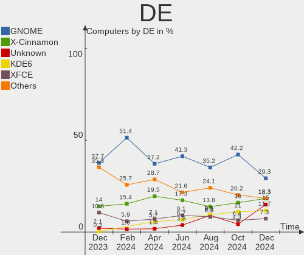
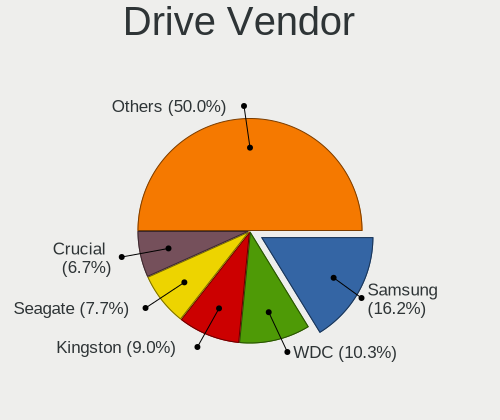
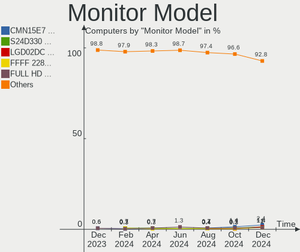
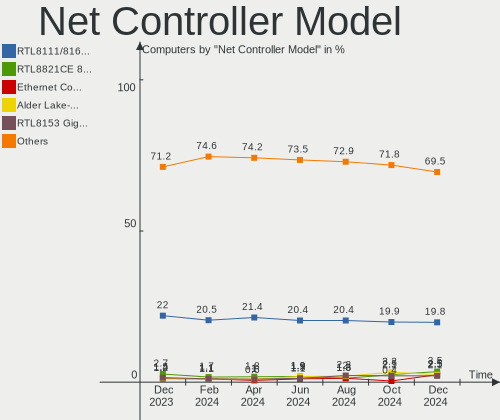
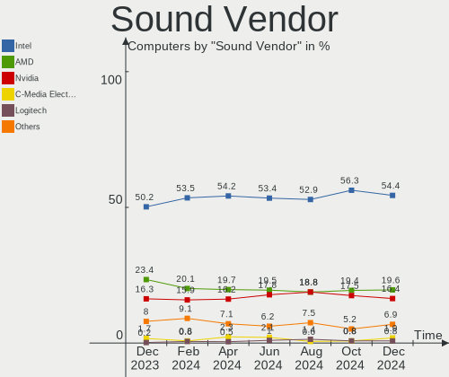
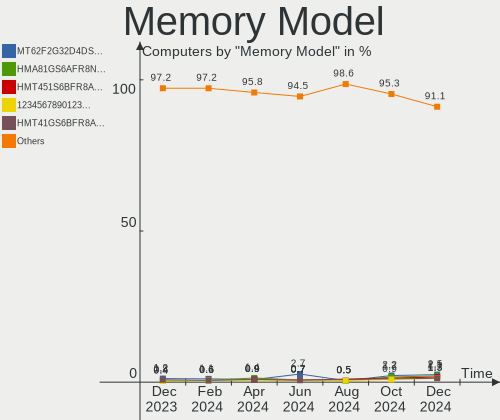
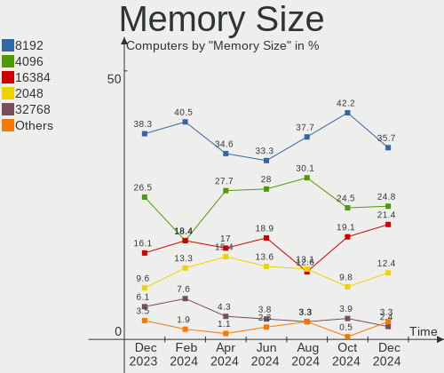

Linux in Italy - Hardware Trends
--------------------------------

A project to identify most popular hardware characteristics and track their change
over time based on data collected by Linux users at https://Linux-Hardware.org.

Anyone can contribute to this report by the [hw-probe](https://github.com/linuxhw/hw-probe) tool:

    sudo -E hw-probe -all -upload

This is a report for all computer types. See also reports for [desktops](/Location/Italy/Desktop/README.md) and [notebooks](/Location/Italy/Notebook/README.md).

Period: Dec, 2024.

Contents
--------

* [ System ](#system)
  - [ OS                       ](#os)
  - [ OS Family                ](#os-family)
  - [ Kernel                   ](#kernel)
  - [ Kernel Family            ](#kernel-family)
  - [ Kernel Major Ver.        ](#kernel-major-ver)
  - [ Arch                     ](#arch)
  - [ DE                       ](#de)
  - [ Display Server           ](#display-server)
  - [ Display Manager          ](#display-manager)
  - [ OS Lang                  ](#os-lang)
  - [ Boot Mode                ](#boot-mode)
  - [ Filesystem               ](#filesystem)
  - [ Part. scheme             ](#part-scheme)
  - [ Dual Boot with Linux/BSD ](#dual-boot-with-linuxbsd)
  - [ Dual Boot (Win)          ](#dual-boot-win)

* [ Board ](#board)
  - [ Vendor                   ](#vendor)
  - [ Model                    ](#model)
  - [ Model Family             ](#model-family)
  - [ MFG Year                 ](#mfg-year)
  - [ Form Factor              ](#form-factor)
  - [ Secure Boot              ](#secure-boot)
  - [ Coreboot                 ](#coreboot)
  - [ RAM Size                 ](#ram-size)
  - [ RAM Used                 ](#ram-used)
  - [ Total Drives             ](#total-drives)
  - [ Has CD-ROM               ](#has-cd-rom)
  - [ Has Ethernet             ](#has-ethernet)
  - [ Has WiFi                 ](#has-wifi)
  - [ Has Bluetooth            ](#has-bluetooth)

* [ Location ](#location)
  - [ Country                  ](#country)
  - [ City                     ](#city)

* [ Drives ](#drives)
  - [ Drive Vendor             ](#drive-vendor)
  - [ Drive Model              ](#drive-model)
  - [ HDD Vendor               ](#hdd-vendor)
  - [ SSD Vendor               ](#ssd-vendor)
  - [ Drive Kind               ](#drive-kind)
  - [ Drive Connector          ](#drive-connector)
  - [ Drive Size               ](#drive-size)
  - [ Space Total              ](#space-total)
  - [ Space Used               ](#space-used)
  - [ Malfunc. Drives          ](#malfunc-drives)
  - [ Malfunc. Drive Vendor    ](#malfunc-drive-vendor)
  - [ Malfunc. HDD Vendor      ](#malfunc-hdd-vendor)
  - [ Malfunc. Drive Kind      ](#malfunc-drive-kind)
  - [ Failed Drives            ](#failed-drives)
  - [ Failed Drive Vendor      ](#failed-drive-vendor)
  - [ Drive Status             ](#drive-status)

* [ Storage controller ](#storage-controller)
  - [ Storage Vendor           ](#storage-vendor)
  - [ Storage Model            ](#storage-model)
  - [ Storage Kind             ](#storage-kind)

* [ Processor ](#processor)
  - [ CPU Vendor               ](#cpu-vendor)
  - [ CPU Model                ](#cpu-model)
  - [ CPU Model Family         ](#cpu-model-family)
  - [ CPU Cores                ](#cpu-cores)
  - [ CPU Sockets              ](#cpu-sockets)
  - [ CPU Threads              ](#cpu-threads)
  - [ CPU Op-Modes             ](#cpu-op-modes)
  - [ CPU Microcode            ](#cpu-microcode)
  - [ CPU Microarch            ](#cpu-microarch)

* [ Graphics ](#graphics)
  - [ GPU Vendor               ](#gpu-vendor)
  - [ GPU Model                ](#gpu-model)
  - [ GPU Combo                ](#gpu-combo)
  - [ GPU Driver               ](#gpu-driver)
  - [ GPU Memory               ](#gpu-memory)

* [ Monitor ](#monitor)
  - [ Monitor Vendor           ](#monitor-vendor)
  - [ Monitor Model            ](#monitor-model)
  - [ Monitor Resolution       ](#monitor-resolution)
  - [ Monitor Diagonal         ](#monitor-diagonal)
  - [ Monitor Width            ](#monitor-width)
  - [ Aspect Ratio             ](#aspect-ratio)
  - [ Monitor Area             ](#monitor-area)
  - [ Pixel Density            ](#pixel-density)
  - [ Multiple Monitors        ](#multiple-monitors)

* [ Network ](#network)
  - [ Net Controller Vendor    ](#net-controller-vendor)
  - [ Net Controller Model     ](#net-controller-model)
  - [ Wireless Vendor          ](#wireless-vendor)
  - [ Wireless Model           ](#wireless-model)
  - [ Ethernet Vendor          ](#ethernet-vendor)
  - [ Ethernet Model           ](#ethernet-model)
  - [ Net Controller Kind      ](#net-controller-kind)
  - [ Used Controller          ](#used-controller)
  - [ NICs                     ](#nics)
  - [ IPv6                     ](#ipv6)

* [ Bluetooth ](#bluetooth)
  - [ Bluetooth Vendor         ](#bluetooth-vendor)
  - [ Bluetooth Model          ](#bluetooth-model)

* [ Sound ](#sound)
  - [ Sound Vendor             ](#sound-vendor)
  - [ Sound Model              ](#sound-model)

* [ Memory ](#memory)
  - [ Memory Vendor            ](#memory-vendor)
  - [ Memory Model             ](#memory-model)
  - [ Memory Kind              ](#memory-kind)
  - [ Memory Form Factor       ](#memory-form-factor)
  - [ Memory Size              ](#memory-size)
  - [ Memory Speed             ](#memory-speed)

* [ Printers & scanners ](#printers--scanners)
  - [ Printer Vendor           ](#printer-vendor)
  - [ Printer Model            ](#printer-model)
  - [ Scanner Vendor           ](#scanner-vendor)
  - [ Scanner Model            ](#scanner-model)

* [ Camera ](#camera)
  - [ Camera Vendor            ](#camera-vendor)
  - [ Camera Model             ](#camera-model)

* [ Security ](#security)
  - [ Fingerprint Vendor       ](#fingerprint-vendor)
  - [ Fingerprint Model        ](#fingerprint-model)
  - [ Chipcard Vendor          ](#chipcard-vendor)
  - [ Chipcard Model           ](#chipcard-model)

* [ Unsupported ](#unsupported)
  - [ Unsupported Devices      ](#unsupported-devices)
  - [ Unsupported Device Types ](#unsupported-device-types)

System
------

OS
--

Installed operating systems

| Name                         | Computers | Percent |
|------------------------------|-----------|---------|
| Linux Mint 22                | 47        | 17.22%  |
| OpenMandriva 24.12           | 46        | 16.85%  |
| Fedora 41                    | 24        | 8.79%   |
| Ubuntu 24.04                 | 19        | 6.96%   |
| Arch Rolling                 | 13        | 4.76%   |
| Pop!_OS 22.04                | 8         | 2.93%   |
| Linux Mint 21.3              | 8         | 2.93%   |
| Kubuntu 24.10                | 7         | 2.56%   |
| Debian                       | 7         | 2.56%   |
| Ubuntu 24.10                 | 6         | 2.2%    |
| Debian 12                    | 6         | 2.2%    |
| Zorin 17                     | 5         | 1.83%   |
| openSUSE Tumbleweed-XXXXXXXX | 5         | 1.83%   |
| Kubuntu 24.04                | 5         | 1.83%   |
| Manjaro                      | 4         | 1.47%   |
| LMDE 6                       | 4         | 1.47%   |
| Xubuntu 24.04                | 3         | 1.1%    |
| OpenMandriva 5.0             | 3         | 1.1%    |
| Lubuntu 24.04                | 3         | 1.1%    |
| EndeavourOS Rolling          | 3         | 1.1%    |
| Bazzite 41                   | 3         | 1.1%    |
| Ubuntu 22.04                 | 2         | 0.73%   |
| Parrot 6.2                   | 2         | 0.73%   |
| Oracle Linux 9.5             | 2         | 0.73%   |
| OpenMandriva 23.08           | 2         | 0.73%   |
| Manjaro 24.2.0               | 2         | 0.73%   |
| Kali 2024.4                  | 2         | 0.73%   |
| Fedora 40                    | 2         | 0.73%   |
| Elementary 8                 | 2         | 0.73%   |
| Elementary 7.1               | 2         | 0.73%   |
| ArcoLinux Rolling            | 2         | 0.73%   |
| Zorin 16                     | 1         | 0.37%   |
| Zorin 15                     | 1         | 0.37%   |
| Ultimate                     | 1         | 0.37%   |
| Ubuntu 23.10                 | 1         | 0.37%   |
| Ubuntu 23.04                 | 1         | 0.37%   |
| Sparky 8                     | 1         | 0.37%   |
| Slackware 15.0               | 1         | 0.37%   |
| Peppermint 11.11             | 1         | 0.37%   |
| OpenMandriva 24.07           | 1         | 0.37%   |

OS Family
---------

OS without a version

| Name         | Computers | Percent |
|--------------|-----------|---------|
| Linux Mint   | 59        | 21.61%  |
| OpenMandriva | 52        | 19.05%  |
| Ubuntu       | 29        | 10.62%  |
| Fedora       | 27        | 9.89%   |
| Debian       | 14        | 5.13%   |
| Kubuntu      | 13        | 4.76%   |
| Arch         | 13        | 4.76%   |
| Pop!_OS      | 8         | 2.93%   |
| Zorin        | 7         | 2.56%   |
| Manjaro      | 7         | 2.56%   |
| openSUSE     | 5         | 1.83%   |
| LMDE         | 4         | 1.47%   |
| Elementary   | 4         | 1.47%   |
| Bazzite      | 4         | 1.47%   |
| Xubuntu      | 3         | 1.1%    |
| Lubuntu      | 3         | 1.1%    |
| EndeavourOS  | 3         | 1.1%    |
| Parrot       | 2         | 0.73%   |
| Oracle Linux | 2         | 0.73%   |
| Kali         | 2         | 0.73%   |
| Garuda Linux | 2         | 0.73%   |
| ArcoLinux    | 2         | 0.73%   |
| Ultimate     | 1         | 0.37%   |
| Sparky       | 1         | 0.37%   |
| Slackware    | 1         | 0.37%   |
| Peppermint   | 1         | 0.37%   |
| MX           | 1         | 0.37%   |
| KDE neon     | 1         | 0.37%   |
| Dts-distro   | 1         | 0.37%   |
| blendOS      | 1         | 0.37%   |

Kernel
------

Version of the Linux kernel

| Version                         | Computers | Percent |
|---------------------------------|-----------|---------|
| 6.12.1-desktop-1omv2490         | 42        | 15.38%  |
| 6.8.0-51-generic                | 32        | 11.72%  |
| 6.8.0-49-generic                | 32        | 11.72%  |
| 6.8.0-50-generic                | 18        | 6.59%   |
| 6.9.3-76060903-generic          | 8         | 2.93%   |
| 6.11.10-300.fc41.x86_64         | 7         | 2.56%   |
| 6.12.6-200.fc41.x86_64          | 6         | 2.2%    |
| 6.1.0-28-amd64                  | 6         | 2.2%    |
| 6.12.1-zen1-1-zen               | 5         | 1.83%   |
| 6.11.10-amd64                   | 5         | 1.83%   |
| 6.11.0-9-generic                | 5         | 1.83%   |
| 6.11.0-13-generic               | 5         | 1.83%   |
| 5.15.0-126-generic              | 5         | 1.83%   |
| 6.12.6-desktop-1omv2490         | 4         | 1.47%   |
| 6.12.6-1-default                | 4         | 1.47%   |
| 5.15.0-130-generic              | 4         | 1.47%   |
| 6.6.2-desktop-1omv2390          | 3         | 1.1%    |
| 6.12.7-zen1-1-zen               | 3         | 1.1%    |
| 6.12.7-arch1-1                  | 3         | 1.1%    |
| 6.12.5-200.fc41.x86_64          | 3         | 1.1%    |
| 6.12.4-1-MANJARO                | 3         | 1.1%    |
| 6.11.4-301.fc41.x86_64          | 3         | 1.1%    |
| 6.11.11-300.fc41.x86_64         | 3         | 1.1%    |
| 6.8.0-38-generic                | 2         | 0.73%   |
| 6.4.8-desktop-2omv2390          | 2         | 0.73%   |
| 6.12.6-arch1-1                  | 2         | 0.73%   |
| 6.12.6-1-liquorix-amd64         | 2         | 0.73%   |
| 6.12.3-arch1-1                  | 2         | 0.73%   |
| 6.11.2-amd64                    | 2         | 0.73%   |
| 6.11.10-304.bazzite.fc41.x86_64 | 2         | 0.73%   |
| 6.11.10-2-MANJARO               | 2         | 0.73%   |
| 6.10.11-amd64                   | 2         | 0.73%   |
| 5.15.0-127-generic              | 2         | 0.73%   |
| 5.14.0-503.16.1.el9_5.x86_64    | 2         | 0.73%   |
| 6.9.12-210.fsync.fc40.x86_64    | 1         | 0.37%   |
| 6.8.4-300.es83xx.fc40.x86_64    | 1         | 0.37%   |
| 6.8.12-i7                       | 1         | 0.37%   |
| 6.8.0-45-generic                | 1         | 0.37%   |
| 6.8.0-41-generic                | 1         | 0.37%   |
| 6.6.65-1-lts                    | 1         | 0.37%   |

Kernel Family
-------------

Linux kernel without a distro release

| Version  | Computers | Percent |
|----------|-----------|---------|
| 6.8.0    | 86        | 31.5%   |
| 6.12.1   | 52        | 19.05%  |
| 6.12.6   | 20        | 7.33%   |
| 6.11.10  | 17        | 6.23%   |
| 6.11.0   | 13        | 4.76%   |
| 5.15.0   | 12        | 4.4%    |
| 6.1.0    | 10        | 3.66%   |
| 6.9.3    | 8         | 2.93%   |
| 6.12.7   | 6         | 2.2%    |
| 6.12.4   | 5         | 1.83%   |
| 6.12.5   | 4         | 1.47%   |
| 6.12.3   | 4         | 1.47%   |
| 6.11.4   | 4         | 1.47%   |
| 6.6.2    | 3         | 1.1%    |
| 6.11.11  | 3         | 1.1%    |
| 6.5.0    | 2         | 0.73%   |
| 6.4.8    | 2         | 0.73%   |
| 6.11.8   | 2         | 0.73%   |
| 6.11.2   | 2         | 0.73%   |
| 6.10.11  | 2         | 0.73%   |
| 5.4.0    | 2         | 0.73%   |
| 5.14.0   | 2         | 0.73%   |
| 6.9.12   | 1         | 0.37%   |
| 6.8.4    | 1         | 0.37%   |
| 6.8.12   | 1         | 0.37%   |
| 6.6.65   | 1         | 0.37%   |
| 6.6.21   | 1         | 0.37%   |
| 6.2.0    | 1         | 0.37%   |
| 6.11.6   | 1         | 0.37%   |
| 6.10.1   | 1         | 0.37%   |
| 6.1.90   | 1         | 0.37%   |
| 6.1.38   | 1         | 0.37%   |
| 5.10.102 | 1         | 0.37%   |
| 5.10.0   | 1         | 0.37%   |

Kernel Major Ver.
-----------------

Linux kernel major version

| Version | Computers | Percent |
|---------|-----------|---------|
| 6.12    | 91        | 33.33%  |
| 6.8     | 88        | 32.23%  |
| 6.11    | 42        | 15.38%  |
| 6.1     | 12        | 4.4%    |
| 5.15    | 12        | 4.4%    |
| 6.9     | 9         | 3.3%    |
| 6.6     | 5         | 1.83%   |
| 6.10    | 3         | 1.1%    |
| 6.5     | 2         | 0.73%   |
| 6.4     | 2         | 0.73%   |
| 5.4     | 2         | 0.73%   |
| 5.14    | 2         | 0.73%   |
| 5.10    | 2         | 0.73%   |
| 6.2     | 1         | 0.37%   |

Arch
----

OS architecture (x86_64, i586, etc.)

| Name    | Computers | Percent |
|---------|-----------|---------|
| x86_64  | 270       | 98.9%   |
| i686    | 2         | 0.73%   |
| aarch64 | 1         | 0.37%   |

DE
--

Desktop Environment

| Name       | Computers | Percent |
|------------|-----------|---------|
| GNOME      | 80        | 29.3%   |
| X-Cinnamon | 50        | 18.32%  |
| Unknown    | 41        | 15.02%  |
| KDE6       | 32        | 11.72%  |
| XFCE       | 20        | 7.33%   |
| KDE5       | 15        | 5.49%   |
| LXQt       | 13        | 4.76%   |
| MATE       | 11        | 4.03%   |
| Pantheon   | 4         | 1.47%   |
| KDE4       | 3         | 1.1%    |
| sway       | 1         | 0.37%   |
| LXDE       | 1         | 0.37%   |
| i3         | 1         | 0.37%   |
| Deepin     | 1         | 0.37%   |

Display Server
--------------

X11 or Wayland

| Name    | Computers | Percent |
|---------|-----------|---------|
| X11     | 137       | 50.18%  |
| Wayland | 128       | 46.89%  |
| Tty     | 5         | 1.83%   |
| Unknown | 3         | 1.1%    |

Display Manager
---------------

SDDM, LightDM, etc.

| Name    | Computers | Percent |
|---------|-----------|---------|
| LightDM | 73        | 26.74%  |
| Unknown | 69        | 25.27%  |
| SDDM    | 68        | 24.91%  |
| GDM3    | 39        | 14.29%  |
| GDM     | 22        | 8.06%   |
| LY-DM   | 2         | 0.73%   |

OS Lang
-------

Language

| Lang    | Computers | Percent |
|---------|-----------|---------|
| it_IT   | 205       | 75.09%  |
| en_US   | 53        | 19.41%  |
| C       | 7         | 2.56%   |
| en_GB   | 4         | 1.47%   |
| Unknown | 2         | 0.73%   |
| en_IE   | 1         | 0.37%   |
| en_BW   | 1         | 0.37%   |

Boot Mode
---------

EFI or BIOS

| Mode | Computers | Percent |
|------|-----------|---------|
| EFI  | 149       | 54.58%  |
| BIOS | 124       | 45.42%  |

Filesystem
----------

Type of filesystem

| Type    | Computers | Percent |
|---------|-----------|---------|
| Ext4    | 166       | 60.81%  |
| Btrfs   | 51        | 18.68%  |
| Overlay | 29        | 10.62%  |
| Tmpfs   | 24        | 8.79%   |
| Xfs     | 2         | 0.73%   |
| Rootfs  | 1         | 0.37%   |

Part. scheme
------------

Scheme of partitioning

| Type    | Computers | Percent |
|---------|-----------|---------|
| GPT     | 186       | 68.13%  |
| Unknown | 66        | 24.18%  |
| MBR     | 21        | 7.69%   |

Dual Boot with Linux/BSD
------------------------

Hosting more than one Linux/BSD

| Dual boot | Computers | Percent |
|-----------|-----------|---------|
| No        | 216       | 79.12%  |
| Yes       | 57        | 20.88%  |

Dual Boot (Win)
---------------

Hosting Linux and Windows

| Dual boot | Computers | Percent |
|-----------|-----------|---------|
| No        | 176       | 64.47%  |
| Yes       | 97        | 35.53%  |

Board
-----

Vendor
------

Motherboard manufacturer

| Name                                 | Computers | Percent |
|--------------------------------------|-----------|---------|
| ASUSTek Computer                     | 58        | 21.25%  |
| Lenovo                               | 39        | 14.29%  |
| Hewlett-Packard                      | 38        | 13.92%  |
| Acer                                 | 20        | 7.33%   |
| Dell                                 | 19        | 6.96%   |
| MSI                                  | 17        | 6.23%   |
| ASRock                               | 10        | 3.66%   |
| Unknown                              | 8         | 2.93%   |
| Fujitsu                              | 6         | 2.2%    |
| Apple                                | 6         | 2.2%    |
| Toshiba                              | 5         | 1.83%   |
| HUAWEI                               | 5         | 1.83%   |
| Gigabyte Technology                  | 5         | 1.83%   |
| Chuwi                                | 4         | 1.47%   |
| AZW                                  | 4         | 1.47%   |
| AMI                                  | 4         | 1.47%   |
| Intel                                | 3         | 1.1%    |
| Shenzhen Meigao Electronic Equipment | 2         | 0.73%   |
| Samsung Electronics                  | 2         | 0.73%   |
| Packard Bell                         | 2         | 0.73%   |
| eMachines                            | 2         | 0.73%   |
| TUXEDO                               | 1         | 0.37%   |
| Supermicro                           | 1         | 0.37%   |
| QTQD                                 | 1         | 0.37%   |
| Pegatron                             | 1         | 0.37%   |
| Notebook                             | 1         | 0.37%   |
| Microtech                            | 1         | 0.37%   |
| Microsoft                            | 1         | 0.37%   |
| Medion                               | 1         | 0.37%   |
| Huanan                               | 1         | 0.37%   |
| GEEKOM                               | 1         | 0.37%   |
| Framework                            | 1         | 0.37%   |
| Foxconn                              | 1         | 0.37%   |
| Colorful Technology                  | 1         | 0.37%   |
| BESSTAR Tech                         | 1         | 0.37%   |

Model
-----

Motherboard model

| Name                                              | Computers | Percent |
|---------------------------------------------------|-----------|---------|
| Unknown                                           | 9         | 3.3%    |
| AMI Intel                                         | 4         | 1.47%   |
| MSI Prestige 15 A12SC                             | 2         | 0.73%   |
| Lenovo IdeaPad Slim 3 15ABR8 82XM                 | 2         | 0.73%   |
| HUAWEI KLVL-WXX9                                  | 2         | 0.73%   |
| HP Pavilion x360 Convertible 14-ba0xx             | 2         | 0.73%   |
| HP Pavilion g6                                    | 2         | 0.73%   |
| HP Laptop 15-db0xxx                               | 2         | 0.73%   |
| Dell OptiPlex 780                                 | 2         | 0.73%   |
| Dell Latitude 7450                                | 2         | 0.73%   |
| Chuwi MiniBook X                                  | 2         | 0.73%   |
| ASUS X510UQR                                      | 2         | 0.73%   |
| ASUS PRIME A320M-K                                | 2         | 0.73%   |
| Acer Aspire A515-57                               | 2         | 0.73%   |
| TUXEDO InfinityBook Pro AMD Gen9                  | 1         | 0.37%   |
| Toshiba Satellite Pro A300                        | 1         | 0.37%   |
| Toshiba Satellite L850                            | 1         | 0.37%   |
| Toshiba Satellite L755                            | 1         | 0.37%   |
| Toshiba Satellite C650                            | 1         | 0.37%   |
| Toshiba Satellite C50-A                           | 1         | 0.37%   |
| Supermicro X9DRD-iF/LF                            | 1         | 0.37%   |
| Shenzhen Meigao Electronic Equipment Venus Series | 1         | 0.37%   |
| Shenzhen Meigao Electronic Equipment UM690        | 1         | 0.37%   |
| Samsung 750XGK                                    | 1         | 0.37%   |
| Samsung 550P5C/550P7C                             | 1         | 0.37%   |
| Pegatron NF574AA-ABZ a6734it                      | 1         | 0.37%   |
| Packard Bell IMEDIA S3210                         | 1         | 0.37%   |
| Packard Bell IMEDIA S1300                         | 1         | 0.37%   |
| Notebook NS5x_NS7xPU                              | 1         | 0.37%   |
| MSI Prestige 14Evo A12M                           | 1         | 0.37%   |
| MSI MS-7E01                                       | 1         | 0.37%   |
| MSI MS-7C94                                       | 1         | 0.37%   |
| MSI MS-7C56                                       | 1         | 0.37%   |
| MSI MS-7B84                                       | 1         | 0.37%   |
| MSI MS-7B79                                       | 1         | 0.37%   |
| MSI MS-7B51                                       | 1         | 0.37%   |
| MSI MS-7992                                       | 1         | 0.37%   |
| MSI MS-7977                                       | 1         | 0.37%   |
| MSI MS-7798                                       | 1         | 0.37%   |
| MSI MS-7253                                       | 1         | 0.37%   |

Model Family
------------

Motherboard model prefix

| Name                                       | Computers | Percent |
|--------------------------------------------|-----------|---------|
| Acer Aspire                                | 16        | 5.86%   |
| Lenovo ThinkPad                            | 11        | 4.03%   |
| ASUS PRIME                                 | 9         | 3.3%    |
| Unknown                                    | 9         | 3.3%    |
| Lenovo IdeaPad                             | 8         | 2.93%   |
| HP Pavilion                                | 7         | 2.56%   |
| Toshiba Satellite                          | 5         | 1.83%   |
| Lenovo ThinkCentre                         | 5         | 1.83%   |
| HP ProBook                                 | 5         | 1.83%   |
| Fujitsu LIFEBOOK                           | 5         | 1.83%   |
| Dell Latitude                              | 5         | 1.83%   |
| Dell Inspiron                              | 5         | 1.83%   |
| ASUS ROG                                   | 5         | 1.83%   |
| HP Laptop                                  | 4         | 1.47%   |
| Dell OptiPlex                              | 4         | 1.47%   |
| ASUS TUF                                   | 4         | 1.47%   |
| AMI Intel                                  | 4         | 1.47%   |
| MSI Prestige                               | 3         | 1.1%    |
| HP Compaq                                  | 3         | 1.1%    |
| ASUS VivoBook                              | 3         | 1.1%    |
| Packard Bell IMEDIA                        | 2         | 0.73%   |
| MSI Katana                                 | 2         | 0.73%   |
| Lenovo ThinkBook                           | 2         | 0.73%   |
| Lenovo Legion                              | 2         | 0.73%   |
| Lenovo IdeaCentre                          | 2         | 0.73%   |
| HUAWEI KLVL-WXX9                           | 2         | 0.73%   |
| HP EliteBook                               | 2         | 0.73%   |
| Dell XPS                                   | 2         | 0.73%   |
| Dell Precision                             | 2         | 0.73%   |
| Chuwi MiniBook                             | 2         | 0.73%   |
| ASUS ZenBook                               | 2         | 0.73%   |
| ASUS X510UQR                               | 2         | 0.73%   |
| ASUS P5KPL-AM                              | 2         | 0.73%   |
| Acer Swift                                 | 2         | 0.73%   |
| TUXEDO InfinityBook                        | 1         | 0.37%   |
| Supermicro X9DRD-iF                        | 1         | 0.37%   |
| Shenzhen Meigao Electronic Equipment Venus | 1         | 0.37%   |
| Shenzhen Meigao Electronic Equipment UM690 | 1         | 0.37%   |
| Samsung 750XGK                             | 1         | 0.37%   |
| Samsung 550P5C                             | 1         | 0.37%   |

MFG Year
--------

Motherboard manufacture year

| Year    | Computers | Percent |
|---------|-----------|---------|
| 2018    | 28        | 10.26%  |
| 2021    | 26        | 9.52%   |
| 2012    | 22        | 8.06%   |
| 2024    | 20        | 7.33%   |
| 2022    | 20        | 7.33%   |
| 2020    | 20        | 7.33%   |
| 2015    | 17        | 6.23%   |
| 2014    | 17        | 6.23%   |
| 2023    | 16        | 5.86%   |
| 2013    | 15        | 5.49%   |
| 2017    | 13        | 4.76%   |
| 2009    | 12        | 4.4%    |
| 2016    | 10        | 3.66%   |
| 2011    | 10        | 3.66%   |
| 2019    | 9         | 3.3%    |
| 2010    | 9         | 3.3%    |
| 2008    | 5         | 1.83%   |
| 2007    | 3         | 1.1%    |
| Unknown | 1         | 0.37%   |

Form Factor
-----------

Physical design of the computer

| Name        | Computers | Percent |
|-------------|-----------|---------|
| Notebook    | 152       | 55.68%  |
| Desktop     | 99        | 36.26%  |
| Mini pc     | 9         | 3.3%    |
| Convertible | 7         | 2.56%   |
| All in one  | 4         | 1.47%   |
| Tablet      | 1         | 0.37%   |
| Server      | 1         | 0.37%   |

Secure Boot
-----------

Enabled or disabled

| State    | Computers | Percent |
|----------|-----------|---------|
| Disabled | 253       | 92.67%  |
| Enabled  | 20        | 7.33%   |

Coreboot
--------

Have coreboot on board

| Used | Computers | Percent |
|------|-----------|---------|
| No   | 273       | 100%    |

RAM Size
--------

Total RAM memory

| Size in GB  | Computers | Percent |
|-------------|-----------|---------|
| 4.01-8.0    | 71        | 26.01%  |
| 16.01-24.0  | 64        | 23.44%  |
| 8.01-16.0   | 50        | 18.32%  |
| 32.01-64.0  | 36        | 13.19%  |
| 3.01-4.0    | 32        | 11.72%  |
| 24.01-32.0  | 7         | 2.56%   |
| 64.01-256.0 | 6         | 2.2%    |
| 1.01-2.0    | 5         | 1.83%   |
| 2.01-3.0    | 1         | 0.37%   |
| 0.51-1.0    | 1         | 0.37%   |

RAM Used
--------

Used RAM memory

| Used GB    | Computers | Percent |
|------------|-----------|---------|
| 2.01-3.0   | 81        | 29.67%  |
| 1.01-2.0   | 78        | 28.57%  |
| 4.01-8.0   | 45        | 16.48%  |
| 3.01-4.0   | 43        | 15.75%  |
| 0.51-1.0   | 12        | 4.4%    |
| 8.01-16.0  | 11        | 4.03%   |
| 0.01-0.5   | 2         | 0.73%   |
| 24.01-32.0 | 1         | 0.37%   |

Total Drives
------------

Number of drives on board

| Drives | Computers | Percent |
|--------|-----------|---------|
| 1      | 173       | 63.37%  |
| 2      | 66        | 24.18%  |
| 3      | 18        | 6.59%   |
| 5      | 5         | 1.83%   |
| 4      | 5         | 1.83%   |
| 7      | 2         | 0.73%   |
| 6      | 2         | 0.73%   |
| 9      | 1         | 0.37%   |
| 0      | 1         | 0.37%   |

Has CD-ROM
----------

Has CD-ROM on board

| Presented | Computers | Percent |
|-----------|-----------|---------|
| No        | 166       | 60.81%  |
| Yes       | 107       | 39.19%  |

Has Ethernet
------------

Has Ethernet on board

| Presented | Computers | Percent |
|-----------|-----------|---------|
| Yes       | 221       | 80.95%  |
| No        | 52        | 19.05%  |

Has WiFi
--------

Has WiFi module

| Presented | Computers | Percent |
|-----------|-----------|---------|
| Yes       | 221       | 80.95%  |
| No        | 52        | 19.05%  |

Has Bluetooth
-------------

Has Bluetooth module

| Presented | Computers | Percent |
|-----------|-----------|---------|
| Yes       | 190       | 69.6%   |
| No        | 83        | 30.4%   |

Location
--------

Country
-------

Geographic location (country)

| Country | Computers | Percent |
|---------|-----------|---------|
| Italy   | 273       | 100%    |

City
----

Geographic location (city)

| City                     | Computers | Percent |
|--------------------------|-----------|---------|
| Milan                    | 34        | 12.45%  |
| Rome                     | 25        | 9.16%   |
| Milano                   | 17        | 6.23%   |
| Turin                    | 11        | 4.03%   |
| Naples                   | 11        | 4.03%   |
| Florence                 | 8         | 2.93%   |
| Verona                   | 7         | 2.56%   |
| Bologna                  | 6         | 2.2%    |
| Passignano sul Trasimeno | 4         | 1.47%   |
| Padova                   | 4         | 1.47%   |
| Livorno                  | 4         | 1.47%   |
| Venice                   | 3         | 1.1%    |
| Palermo                  | 3         | 1.1%    |
| Messina                  | 3         | 1.1%    |
| Como                     | 3         | 1.1%    |
| Brescia                  | 3         | 1.1%    |
| Vicenza                  | 2         | 0.73%   |
| Seveso                   | 2         | 0.73%   |
| Sesto Fiorentino         | 2         | 0.73%   |
| Scandolara Ravara        | 2         | 0.73%   |
| Perugia                  | 2         | 0.73%   |
| Mugnano di Napoli        | 2         | 0.73%   |
| Monsummano Terme         | 2         | 0.73%   |
| Fossarmato               | 2         | 0.73%   |
| Brugherio                | 2         | 0.73%   |
| Bari                     | 2         | 0.73%   |
| Ancona                   | 2         | 0.73%   |
| Zagarolo                 | 1         | 0.37%   |
| Vitinia                  | 1         | 0.37%   |
| Vimercate                | 1         | 0.37%   |
| Vignola                  | 1         | 0.37%   |
| Viareggio                | 1         | 0.37%   |
| Verbania                 | 1         | 0.37%   |
| Udine                    | 1         | 0.37%   |
| Turbigo                  | 1         | 0.37%   |
| Trieste                  | 1         | 0.37%   |
| Trento                   | 1         | 0.37%   |
| Trecate                  | 1         | 0.37%   |
| Trebaseleghe             | 1         | 0.37%   |
| Torre Orsaia             | 1         | 0.37%   |

Drives
------

Drive Vendor
------------

Hard drive vendors

| Vendor                       | Computers | Drives | Percent |
|------------------------------|-----------|--------|---------|
| Samsung Electronics          | 63        | 77     | 16.24%  |
| WDC                          | 40        | 47     | 10.31%  |
| Kingston                     | 35        | 36     | 9.02%   |
| Seagate                      | 30        | 42     | 7.73%   |
| Crucial                      | 26        | 27     | 6.7%    |
| Sandisk                      | 21        | 21     | 5.41%   |
| Toshiba                      | 17        | 18     | 4.38%   |
| Micron Technology            | 16        | 16     | 4.12%   |
| Unknown                      | 14        | 17     | 3.61%   |
| SK hynix                     | 13        | 13     | 3.35%   |
| Hitachi                      | 12        | 13     | 3.09%   |
| Intel                        | 9         | 10     | 2.32%   |
| Phison Electronics           | 8         | 8      | 2.06%   |
| MAXIO Technology (Hangzhou)  | 6         | 6      | 1.55%   |
| HGST                         | 6         | 6      | 1.55%   |
| SPCC                         | 4         | 4      | 1.03%   |
| Lexar                        | 4         | 4      | 1.03%   |
| China                        | 4         | 4      | 1.03%   |
| Shenzhen Longsys Electronics | 3         | 3      | 0.77%   |
| Realtek Semiconductor        | 3         | 3      | 0.77%   |
| ORICO                        | 3         | 3      | 0.77%   |
| Micron/Crucial Technology    | 3         | 3      | 0.77%   |
| Intenso                      | 3         | 3      | 0.77%   |
| Emtec                        | 3         | 3      | 0.77%   |
| Apple                        | 3         | 5      | 0.77%   |
| Silicon Motion               | 2         | 2      | 0.52%   |
| SABRENT                      | 2         | 2      | 0.52%   |
| PNY                          | 2         | 2      | 0.52%   |
| Patriot                      | 2         | 2      | 0.52%   |
| Netac                        | 2         | 2      | 0.52%   |
| KIOXIA                       | 2         | 3      | 0.52%   |
| Kingston Technology Company  | 2         | 2      | 0.52%   |
| GOODRAM                      | 2         | 2      | 0.52%   |
| Fanxiang                     | 2         | 3      | 0.52%   |
| WUXIN                        | 1         | 1      | 0.26%   |
| USB                          | 1         | 1      | 0.26%   |
| TO Exter                     | 1         | 1      | 0.26%   |
| Teclast                      | 1         | 1      | 0.26%   |
| sobetter                     | 1         | 1      | 0.26%   |
| Realtek                      | 1         | 1      | 0.26%   |

Drive Model
-----------

Hard drive models

| Model                                                 | Computers | Percent |
|-------------------------------------------------------|-----------|---------|
| Kingston SA400S37240G 240GB SSD                       | 8         | 1.9%    |
| Samsung SSD 860 EVO 500GB                             | 7         | 1.67%   |
| Kingston SA400S37480G 480GB SSD                       | 7         | 1.67%   |
| Samsung SSD 990 PRO 1TB                               | 5         | 1.19%   |
| Samsung NVMe SSD Controller PM9A1/PM9A3/980PRO 512GB  | 5         | 1.19%   |
| Crucial CT500MX500SSD1 500GB                          | 5         | 1.19%   |
| Crucial CT1000BX500SSD1 1TB                           | 5         | 1.19%   |
| SanDisk SSD PLUS 240GB                                | 4         | 0.95%   |
| MAXIO (Hangzhou) NVMe SSD Controller MAP1202 512GB    | 4         | 0.95%   |
| Unknown SD/MMC/MS PRO 128GB                           | 3         | 0.71%   |
| Unknown NVMe SSD Drive 512GB                          | 3         | 0.71%   |
| Seagate ST2000DM008-2FR102 2TB                        | 3         | 0.71%   |
| Samsung SSD 870 EVO 500GB                             | 3         | 0.71%   |
| Samsung NVMe SSD Controller SM981/PM981/PM983 512GB   | 3         | 0.71%   |
| Phison E12 NVMe Controller 480GB                      | 3         | 0.71%   |
| Micron/Crucial P2 NVMe PCIe SSD 500GB                 | 3         | 0.71%   |
| Kingston OM8PGP41024Q-A0 1TB                          | 3         | 0.71%   |
| Crucial CT480BX500SSD1 480GB                          | 3         | 0.71%   |
| Crucial CT240BX500SSD1 240GB                          | 3         | 0.71%   |
| China SSD 256GB                                       | 3         | 0.71%   |
| WDC WDS500G2B0A-00SM50 500GB SSD                      | 2         | 0.48%   |
| WDC WDS100T2B0A-00SM50 1TB SSD                        | 2         | 0.48%   |
| WDC WD3200BPVT-80JJ5T0 320GB                          | 2         | 0.48%   |
| WDC WD10EZRX-00L4HB0 1TB                              | 2         | 0.48%   |
| WDC WD10EZEX-00WN4A0 1TB                              | 2         | 0.48%   |
| Unknown MMC Card  64GB                                | 2         | 0.48%   |
| Toshiba MQ04ABF100 1TB                                | 2         | 0.48%   |
| Toshiba MQ01ABF050 500GB                              | 2         | 0.48%   |
| Toshiba DT01ACA100 1TB                                | 2         | 0.48%   |
| Silicon Motion SM2263EN/SM2263XT SSD Controller 256GB | 2         | 0.48%   |
| Seagate ST500LT012-1DG142 500GB                       | 2         | 0.48%   |
| Seagate ST2000DM008-2UB102 2TB                        | 2         | 0.48%   |
| Seagate ST1000LM035-1RK172 1TB                        | 2         | 0.48%   |
| Seagate ST1000DM010-2EP102 1TB                        | 2         | 0.48%   |
| Seagate Basic 4TB                                     | 2         | 0.48%   |
| SanDisk SD8SN8U-256G-1006 256GB SSD                   | 2         | 0.48%   |
| Samsung SSD 860 EVO 250GB                             | 2         | 0.48%   |
| Samsung SSD 850 PRO 256GB                             | 2         | 0.48%   |
| Samsung SSD 840 Series 250GB                          | 2         | 0.48%   |
| Samsung SSD 840 EVO 500GB                             | 2         | 0.48%   |

HDD Vendor
----------

Hard disk drive vendors

| Vendor              | Computers | Drives | Percent |
|---------------------|-----------|--------|---------|
| WDC                 | 28        | 31     | 28.87%  |
| Seagate             | 28        | 40     | 28.87%  |
| Hitachi             | 12        | 13     | 12.37%  |
| Toshiba             | 11        | 12     | 11.34%  |
| HGST                | 6         | 6      | 6.19%   |
| Unknown             | 3         | 3      | 3.09%   |
| SABRENT             | 2         | 2      | 2.06%   |
| TO Exter            | 1         | 1      | 1.03%   |
| Samsung Electronics | 1         | 1      | 1.03%   |
| Maxtor              | 1         | 1      | 1.03%   |
| Hewlett-Packard     | 1         | 1      | 1.03%   |
| External            | 1         | 1      | 1.03%   |
| ASMT                | 1         | 1      | 1.03%   |
| Apple               | 1         | 1      | 1.03%   |

SSD Vendor
----------

Solid state drive vendors

| Vendor              | Computers | Drives | Percent |
|---------------------|-----------|--------|---------|
| Samsung Electronics | 39        | 41     | 25.16%  |
| Kingston            | 29        | 30     | 18.71%  |
| Crucial             | 22        | 23     | 14.19%  |
| SanDisk             | 12        | 12     | 7.74%   |
| WDC                 | 8         | 10     | 5.16%   |
| China               | 4         | 4      | 2.58%   |
| SPCC                | 3         | 3      | 1.94%   |
| Micron Technology   | 3         | 3      | 1.94%   |
| Intenso             | 3         | 3      | 1.94%   |
| Emtec               | 3         | 3      | 1.94%   |
| Toshiba             | 2         | 2      | 1.29%   |
| SK hynix            | 2         | 2      | 1.29%   |
| PNY                 | 2         | 2      | 1.29%   |
| Patriot             | 2         | 2      | 1.29%   |
| Lexar               | 2         | 2      | 1.29%   |
| Intel               | 2         | 2      | 1.29%   |
| Fanxiang            | 2         | 3      | 1.29%   |
| Teclast             | 1         | 1      | 0.65%   |
| sobetter            | 1         | 1      | 0.65%   |
| Phison              | 1         | 1      | 0.65%   |
| OSCOO               | 1         | 1      | 0.65%   |
| ORICO               | 1         | 1      | 0.65%   |
| Netac               | 1         | 1      | 0.65%   |
| Leven               | 1         | 1      | 0.65%   |
| KingSpec            | 1         | 1      | 0.65%   |
| Hoodisk             | 1         | 1      | 0.65%   |
| GOODRAM             | 1         | 1      | 0.65%   |
| Gigabyte Technology | 1         | 1      | 0.65%   |
| FIKWOT              | 1         | 1      | 0.65%   |
| Drevo               | 1         | 1      | 0.65%   |
| CONSISTENT          | 1         | 1      | 0.65%   |
| Apple               | 1         | 1      | 0.65%   |

Drive Kind
----------

HDD or SSD

| Kind    | Computers | Drives | Percent |
|---------|-----------|--------|---------|
| SSD     | 134       | 162    | 37.85%  |
| NVMe    | 117       | 138    | 33.05%  |
| HDD     | 87        | 114    | 24.58%  |
| Unknown | 9         | 12     | 2.54%   |
| MMC     | 7         | 7      | 1.98%   |

Drive Connector
---------------

SATA, SAS, NVMe, etc.

| Type | Computers | Drives | Percent |
|------|-----------|--------|---------|
| SATA | 179       | 266    | 55.42%  |
| NVMe | 117       | 136    | 36.22%  |
| SAS  | 20        | 24     | 6.19%   |
| MMC  | 7         | 7      | 2.17%   |

Drive Size
----------

Size of hard drive

| Size in TB | Computers | Drives | Percent |
|------------|-----------|--------|---------|
| 0.01-0.5   | 147       | 180    | 65.92%  |
| 0.51-1.0   | 55        | 66     | 24.66%  |
| 1.01-2.0   | 13        | 16     | 5.83%   |
| 3.01-4.0   | 3         | 8      | 1.35%   |
| 4.01-10.0  | 3         | 3      | 1.35%   |
| 2.01-3.0   | 1         | 2      | 0.45%   |
| 10.01-20.0 | 1         | 1      | 0.45%   |

Space Total
-----------

Amount of disk space available on the file system

| Size in GB     | Computers | Percent |
|----------------|-----------|---------|
| 251-500        | 65        | 23.81%  |
| 101-250        | 61        | 22.34%  |
| 501-1000       | 44        | 16.12%  |
| 1001-2000      | 25        | 9.16%   |
| 1-20           | 25        | 9.16%   |
| More than 3000 | 15        | 5.49%   |
| 51-100         | 14        | 5.13%   |
| 2001-3000      | 11        | 4.03%   |
| Unknown        | 7         | 2.56%   |
| 21-50          | 6         | 2.2%    |

Space Used
----------

Amount of used disk space

| Used GB        | Computers | Percent |
|----------------|-----------|---------|
| 1-20           | 98        | 35.9%   |
| 21-50          | 45        | 16.48%  |
| 101-250        | 41        | 15.02%  |
| 51-100         | 34        | 12.45%  |
| 251-500        | 17        | 6.23%   |
| 501-1000       | 15        | 5.49%   |
| Unknown        | 7         | 2.56%   |
| More than 3000 | 6         | 2.2%    |
| 2001-3000      | 5         | 1.83%   |
| 1001-2000      | 5         | 1.83%   |

Malfunc. Drives
---------------

Drive models with a malfunction

| Model                                          | Computers | Drives | Percent |
|------------------------------------------------|-----------|--------|---------|
| WDC WD5000AAKX-08U6AA0 500GB                   | 1         | 1      | 3.45%   |
| WDC WD5000AAKS-00A7B2 500GB                    | 1         | 1      | 3.45%   |
| WDC WD40EZRZ-00GXCB0 4TB                       | 1         | 1      | 3.45%   |
| WDC WD10EZEX-60ZF5A0 1TB                       | 1         | 1      | 3.45%   |
| WDC WD1002FAEX-00Y9A0 1TB                      | 1         | 1      | 3.45%   |
| Toshiba MQ04ABF100 1TB                         | 1         | 1      | 3.45%   |
| SK hynix BC711 HFM512GD3JX013N 512GB           | 1         | 1      | 3.45%   |
| Seagate ST500LM021-1KJ152 500GB                | 1         | 1      | 3.45%   |
| Seagate ST500DM009-2F110A 500GB                | 1         | 1      | 3.45%   |
| Seagate ST500DM002-1BD142 500GB                | 1         | 1      | 3.45%   |
| Seagate ST4000NM0265-2DC107 4TB                | 1         | 1      | 3.45%   |
| Seagate ST3320620AS 320GB                      | 1         | 2      | 3.45%   |
| SanDisk SSD PLUS 240GB                         | 1         | 1      | 3.45%   |
| Micron Technology 1100_MTFDDAV512TBN 512GB SSD | 1         | 1      | 3.45%   |
| Maxtor 6L160M0 164GB                           | 1         | 1      | 3.45%   |
| Kingston SV200S3128G 128GB SSD                 | 1         | 1      | 3.45%   |
| Kingston SUV400S37240G 240GB SSD               | 1         | 1      | 3.45%   |
| Kingston RBU-SMSM151S324GD 24GB SSD            | 1         | 1      | 3.45%   |
| Intel SSDSC2BF180A4L 180GB                     | 1         | 1      | 3.45%   |
| Hitachi HUA722010ALA330 1TB                    | 1         | 2      | 3.45%   |
| Hitachi HTS723232L9A360 320GB                  | 1         | 1      | 3.45%   |
| Hitachi HTS545032B9A300 320GB                  | 1         | 1      | 3.45%   |
| Hitachi HTS541612J9SA00 120GB                  | 1         | 1      | 3.45%   |
| Hitachi HDT722516DLA380 165GB                  | 1         | 1      | 3.45%   |
| HGST HTS725050A7E630 500GB                     | 1         | 1      | 3.45%   |
| HGST HTS545050A7E680 500GB                     | 1         | 1      | 3.45%   |
| HGST HTS545050A7E380 500GB                     | 1         | 1      | 3.45%   |
| Fanxiang S101 128GB SSD                        | 1         | 1      | 3.45%   |
| Emtec X150 240GB                               | 1         | 1      | 3.45%   |

Malfunc. Drive Vendor
---------------------

Vendors of faulty drives

| Vendor            | Computers | Drives | Percent |
|-------------------|-----------|--------|---------|
| WDC               | 5         | 5      | 17.24%  |
| Seagate           | 5         | 6      | 17.24%  |
| Hitachi           | 5         | 6      | 17.24%  |
| Kingston          | 3         | 3      | 10.34%  |
| HGST              | 3         | 3      | 10.34%  |
| Toshiba           | 1         | 1      | 3.45%   |
| SK hynix          | 1         | 1      | 3.45%   |
| SanDisk           | 1         | 1      | 3.45%   |
| Micron Technology | 1         | 1      | 3.45%   |
| Maxtor            | 1         | 1      | 3.45%   |
| Intel             | 1         | 1      | 3.45%   |
| Fanxiang          | 1         | 1      | 3.45%   |
| Emtec             | 1         | 1      | 3.45%   |

Malfunc. HDD Vendor
-------------------

Vendors of faulty HDD drives

| Vendor  | Computers | Drives | Percent |
|---------|-----------|--------|---------|
| WDC     | 5         | 5      | 25%     |
| Seagate | 5         | 6      | 25%     |
| Hitachi | 5         | 6      | 25%     |
| HGST    | 3         | 3      | 15%     |
| Toshiba | 1         | 1      | 5%      |
| Maxtor  | 1         | 1      | 5%      |

Malfunc. Drive Kind
-------------------

Kinds of faulty drives

| Kind | Computers | Drives | Percent |
|------|-----------|--------|---------|
| HDD  | 19        | 22     | 67.86%  |
| SSD  | 8         | 8      | 28.57%  |
| NVMe | 1         | 1      | 3.57%   |

Failed Drives
-------------

Failed drive models

Zero info for selected period =(

Failed Drive Vendor
-------------------

Failed drive vendors

Zero info for selected period =(

Drive Status
------------

Number of failed and malfunc. drives

| Status   | Computers | Drives | Percent |
|----------|-----------|--------|---------|
| Works    | 166       | 236    | 55.89%  |
| Detected | 104       | 166    | 35.02%  |
| Malfunc  | 27        | 31     | 9.09%   |

Storage controller
------------------

Storage Vendor
--------------

Storage controller vendors

| Vendor                       | Computers | Percent |
|------------------------------|-----------|---------|
| Intel                        | 179       | 51.59%  |
| AMD                          | 36        | 10.37%  |
| Samsung Electronics          | 30        | 8.65%   |
| Micron Technology            | 16        | 4.61%   |
| SanDisk                      | 15        | 4.32%   |
| SK hynix                     | 11        | 3.17%   |
| Phison Electronics           | 9         | 2.59%   |
| MAXIO Technology (Hangzhou)  | 9         | 2.59%   |
| Kingston Technology Company  | 8         | 2.31%   |
| Nvidia                       | 6         | 1.73%   |
| Toshiba America Info Systems | 4         | 1.15%   |
| Micron/Crucial Technology    | 4         | 1.15%   |
| Solidigm                     | 3         | 0.86%   |
| Silicon Motion               | 3         | 0.86%   |
| Shenzhen Longsys Electronics | 3         | 0.86%   |
| Realtek Semiconductor        | 3         | 0.86%   |
| JMicron Technology           | 3         | 0.86%   |
| KIOXIA                       | 2         | 0.58%   |
| VIA Technologies             | 1         | 0.29%   |
| LSI Logic / Symbios Logic    | 1         | 0.29%   |
| ASMedia Technology           | 1         | 0.29%   |

Storage Model
-------------

Storage controller models

| Model                                                                            | Computers | Percent |
|----------------------------------------------------------------------------------|-----------|---------|
| AMD FCH SATA Controller [AHCI mode]                                              | 24        | 6.17%   |
| Intel 8 Series/C220 Series Chipset Family 6-port SATA Controller 1 [AHCI mode]   | 22        | 5.66%   |
| Intel Sunrise Point-LP SATA Controller [AHCI mode]                               | 18        | 4.63%   |
| Intel Volume Management Device NVMe RAID Controller                              | 14        | 3.6%    |
| Intel 7 Series Chipset Family 6-port SATA Controller [AHCI mode]                 | 12        | 3.08%   |
| Samsung NVMe SSD Controller PM9A1/PM9A3/980PRO                                   | 9         | 2.31%   |
| Intel 82801IBM/IEM (ICH9M/ICH9M-E) 4 port SATA Controller [AHCI mode]            | 9         | 2.31%   |
| AMD 400 Series Chipset SATA Controller                                           | 9         | 2.31%   |
| Intel Alder Lake-P SATA AHCI Controller                                          | 8         | 2.06%   |
| Samsung NVMe SSD Controller S4LV008[Pascal]                                      | 6         | 1.54%   |
| MAXIO (Hangzhou) NVMe SSD Controller MAP1202 (DRAM-less)                         | 6         | 1.54%   |
| Intel 7 Series/C210 Series Chipset Family 6-port SATA Controller [AHCI mode]     | 6         | 1.54%   |
| AMD 500 Series Chipset SATA Controller                                           | 6         | 1.54%   |
| Samsung NVMe SSD Controller SM981/PM981/PM983                                    | 5         | 1.29%   |
| Samsung NVMe SSD Controller 980 (DRAM-less)                                      | 5         | 1.29%   |
| Micron 2550 NVMe SSD (DRAM-less)                                                 | 5         | 1.29%   |
| Intel SATA Controller [RAID mode]                                                | 5         | 1.29%   |
| Intel Celeron/Pentium Silver Processor SATA Controller                           | 5         | 1.29%   |
| Intel Cannon Lake PCH SATA AHCI Controller                                       | 5         | 1.29%   |
| Intel 8 Series SATA Controller 1 [AHCI mode]                                     | 5         | 1.29%   |
| Intel 6 Series/C200 Series Chipset Family 6 port Mobile SATA AHCI Controller     | 5         | 1.29%   |
| SK hynix BC511 NVMe SSD                                                          | 4         | 1.03%   |
| Intel Q170/Q150/B150/H170/H110/Z170/CM236 Chipset SATA Controller [AHCI Mode]    | 4         | 1.03%   |
| Intel Comet Lake SATA AHCI Controller                                            | 4         | 1.03%   |
| Intel Atom/Celeron/Pentium Processor x5-E8000/J3xxx/N3xxx Series SATA Controller | 4         | 1.03%   |
| Intel 6 Series/C200 Series Chipset Family 6 port Desktop SATA AHCI Controller    | 4         | 1.03%   |
| Intel 5 Series/3400 Series Chipset 4 port SATA AHCI Controller                   | 4         | 1.03%   |
| Intel 200 Series PCH SATA controller [AHCI mode]                                 | 4         | 1.03%   |
| Solidigm P41 Plus NVMe SSD (DRAM-less) [Echo Harbor]                             | 3         | 0.77%   |
| Silicon Motion SM2263EN/SM2263XT (DRAM-less) NVMe SSD Controllers                | 3         | 0.77%   |
| SanDisk WD Black SN770 / PC SN740 256GB / PC SN560 (DRAM-less) NVMe SSD          | 3         | 0.77%   |
| Realtek RTS5765DL NVMe SSD Controller (DRAM-less)                                | 3         | 0.77%   |
| Phison PS5021-E21 PCIe4 NVMe Controller (DRAM-less)                              | 3         | 0.77%   |
| Phison E12 NVMe Controller                                                       | 3         | 0.77%   |
| Micron/Crucial P2 [Nick P2] / P3 / P3 Plus NVMe PCIe SSD (DRAM-less)             | 3         | 0.77%   |
| Micron 2400 NVMe SSD (DRAM-less)                                                 | 3         | 0.77%   |
| Micron 2210 NVMe SSD [Cobain]                                                    | 3         | 0.77%   |
| Kingston Company OM8PGP4 NVMe PCIe SSD (DRAM-less)                               | 3         | 0.77%   |
| Intel Wildcat Point-LP SATA Controller [AHCI Mode]                               | 3         | 0.77%   |
| Intel Tiger Lake-LP SATA Controller                                              | 3         | 0.77%   |

Storage Kind
------------

Kind of storage controller (IDE, SATA, NVMe, SAS, ...)

| Kind | Computers | Percent |
|------|-----------|---------|
| SATA | 193       | 54.83%  |
| NVMe | 116       | 32.95%  |
| RAID | 25        | 7.1%    |
| IDE  | 18        | 5.11%   |

Processor
---------

CPU Vendor
----------

Processor vendors

| Vendor  | Computers | Percent |
|---------|-----------|---------|
| Intel   | 208       | 76.19%  |
| AMD     | 64        | 23.44%  |
| Unknown | 1         | 0.37%   |

CPU Model
---------

Processor models

| Model                                       | Computers | Percent |
|---------------------------------------------|-----------|---------|
| Intel Core i7-8550U CPU @ 1.80GHz           | 4         | 1.47%   |
| Intel Core i5-8250U CPU @ 1.60GHz           | 4         | 1.47%   |
| Intel 11th Gen Core i7-1165G7 @ 2.80GHz     | 4         | 1.47%   |
| AMD Ryzen 7 5700U with Radeon Graphics      | 4         | 1.47%   |
| Intel Pentium CPU N3700 @ 1.60GHz           | 3         | 1.1%    |
| Intel N95                                   | 3         | 1.1%    |
| Intel Core Ultra 7 155H                     | 3         | 1.1%    |
| Intel Core i7-4710HQ CPU @ 2.50GHz          | 3         | 1.1%    |
| Intel Core i7-3770 CPU @ 3.40GHz            | 3         | 1.1%    |
| Intel Core i5-8350U CPU @ 1.70GHz           | 3         | 1.1%    |
| Intel Core i5-6200U CPU @ 2.30GHz           | 3         | 1.1%    |
| Intel 12th Gen Core i7-1280P                | 3         | 1.1%    |
| Intel 12th Gen Core i7-12700H               | 3         | 1.1%    |
| Intel 11th Gen Core i3-1115G4 @ 3.00GHz     | 3         | 1.1%    |
| AMD Ryzen 7 7730U with Radeon Graphics      | 3         | 1.1%    |
| AMD Ryzen 5 5600X 6-Core Processor          | 3         | 1.1%    |
| AMD Ryzen 5 3400G with Radeon Vega Graphics | 3         | 1.1%    |
| Intel Pentium Silver N5000 CPU @ 1.10GHz    | 2         | 0.73%   |
| Intel Pentium Dual-Core CPU T4500 @ 2.30GHz | 2         | 0.73%   |
| Intel N100                                  | 2         | 0.73%   |
| Intel Core i7-9850H CPU @ 2.60GHz           | 2         | 0.73%   |
| Intel Core i7-8700 CPU @ 3.20GHz            | 2         | 0.73%   |
| Intel Core i7-6700K CPU @ 4.00GHz           | 2         | 0.73%   |
| Intel Core i7-4770 CPU @ 3.40GHz            | 2         | 0.73%   |
| Intel Core i7-4600U CPU @ 2.10GHz           | 2         | 0.73%   |
| Intel Core i7-3630QM CPU @ 2.40GHz          | 2         | 0.73%   |
| Intel Core i5-4570 CPU @ 3.20GHz            | 2         | 0.73%   |
| Intel Core i5-3210M CPU @ 2.50GHz           | 2         | 0.73%   |
| Intel Core i5-10210U CPU @ 1.60GHz          | 2         | 0.73%   |
| Intel Core i3-7100U CPU @ 2.40GHz           | 2         | 0.73%   |
| Intel Core i3-4150 CPU @ 3.50GHz            | 2         | 0.73%   |
| Intel Core i3-4130T CPU @ 2.90GHz           | 2         | 0.73%   |
| Intel Core i3-2120 CPU @ 3.30GHz            | 2         | 0.73%   |
| Intel Core 2 Duo CPU E8400 @ 3.00GHz        | 2         | 0.73%   |
| Intel Celeron CPU N3350 @ 1.10GHz           | 2         | 0.73%   |
| Intel 12th Gen Core i7-12650H               | 2         | 0.73%   |
| Intel 12th Gen Core i5-1240P                | 2         | 0.73%   |
| Intel 12th Gen Core i5-1235U                | 2         | 0.73%   |
| Intel 11th Gen Core i7-11800H @ 2.30GHz     | 2         | 0.73%   |
| AMD Ryzen 7 4800H with Radeon Graphics      | 2         | 0.73%   |

CPU Model Family
----------------

Processor model prefix

| Model                   | Computers | Percent |
|-------------------------|-----------|---------|
| Intel Core i7           | 49        | 17.95%  |
| Intel Core i5           | 43        | 15.75%  |
| Other                   | 42        | 15.38%  |
| Intel Core i3           | 22        | 8.06%   |
| AMD Ryzen 7             | 19        | 6.96%   |
| AMD Ryzen 5             | 18        | 6.59%   |
| Intel Celeron           | 11        | 4.03%   |
| Intel Core 2 Duo        | 9         | 3.3%    |
| Intel Pentium           | 8         | 2.93%   |
| Intel Core              | 8         | 2.93%   |
| AMD Ryzen 9             | 5         | 1.83%   |
| AMD Ryzen 3             | 5         | 1.83%   |
| Intel Xeon              | 4         | 1.47%   |
| Intel Pentium Dual-Core | 3         | 1.1%    |
| Intel Atom              | 3         | 1.1%    |
| AMD A8                  | 3         | 1.1%    |
| AMD A4                  | 3         | 1.1%    |
| Intel Pentium Silver    | 2         | 0.73%   |
| Intel Celeron Dual-Core | 2         | 0.73%   |
| AMD Phenom II X6        | 2         | 0.73%   |
| Intel Pentium Gold      | 1         | 0.37%   |
| Intel Pentium Dual      | 1         | 0.37%   |
| Intel Genuine           | 1         | 0.37%   |
| Intel Core i9           | 1         | 0.37%   |
| AMD Sempron             | 1         | 0.37%   |
| AMD Ryzen 7 PRO         | 1         | 0.37%   |
| AMD Ryzen 5 PRO         | 1         | 0.37%   |
| AMD Phenom II X4        | 1         | 0.37%   |
| AMD Phenom              | 1         | 0.37%   |
| AMD Opteron             | 1         | 0.37%   |
| AMD FX                  | 1         | 0.37%   |
| AMD Athlon II X2        | 1         | 0.37%   |

CPU Cores
---------

Number of processor cores

| Number | Computers | Percent |
|--------|-----------|---------|
| 4      | 90        | 32.97%  |
| 2      | 86        | 31.5%   |
| 6      | 29        | 10.62%  |
| 8      | 28        | 10.26%  |
| 16     | 9         | 3.3%    |
| 14     | 9         | 3.3%    |
| 10     | 9         | 3.3%    |
| 12     | 6         | 2.2%    |
| 1      | 5         | 1.83%   |
| 3      | 2         | 0.73%   |

CPU Sockets
-----------

Number of sockets

| Number | Computers | Percent |
|--------|-----------|---------|
| 1      | 271       | 99.27%  |
| 2      | 2         | 0.73%   |

CPU Threads
-----------

Threads per core (Hyper-Threading)

| Number | Computers | Percent |
|--------|-----------|---------|
| 2      | 198       | 72.53%  |
| 1      | 75        | 27.47%  |

CPU Op-Modes
------------

CPU Operation Modes (32-bit, 64-bit)

| Op mode        | Computers | Percent |
|----------------|-----------|---------|
| 32-bit, 64-bit | 271       | 99.27%  |
| 64-bit         | 1         | 0.37%   |
| 32-bit         | 1         | 0.37%   |

CPU Microcode
-------------

Microcode number

| Number     | Computers | Percent |
|------------|-----------|---------|
| Unknown    | 246       | 90.11%  |
| 0x206a7    | 4         | 1.47%   |
| 0x306c3    | 3         | 1.1%    |
| 0x306a9    | 2         | 0.73%   |
| 0x08600106 | 2         | 0.73%   |
| 0xb06a3    | 1         | 0.37%   |
| 0xa0653    | 1         | 0.37%   |
| 0x906ed    | 1         | 0.37%   |
| 0x906ea    | 1         | 0.37%   |
| 0x90675    | 1         | 0.37%   |
| 0x806ea    | 1         | 0.37%   |
| 0x506e3    | 1         | 0.37%   |
| 0x50654    | 1         | 0.37%   |
| 0x40661    | 1         | 0.37%   |
| 0x306d4    | 1         | 0.37%   |
| 0x106c2    | 1         | 0.37%   |
| 0x10676    | 1         | 0.37%   |
| 0x10661    | 1         | 0.37%   |
| 0x0a20120e | 1         | 0.37%   |
| 0x08101007 | 1         | 0.37%   |
| 0x06000822 | 1         | 0.37%   |

CPU Microarch
-------------

Microarchitecture

| Name              | Computers | Percent |
|-------------------|-----------|---------|
| KabyLake          | 34        | 12.45%  |
| Haswell           | 33        | 12.09%  |
| Unknown           | 28        | 10.26%  |
| IvyBridge         | 18        | 6.59%   |
| Alderlake Hybrid  | 16        | 5.86%   |
| Penryn            | 15        | 5.49%   |
| SandyBridge       | 13        | 4.76%   |
| Zen 2             | 12        | 4.4%    |
| Skylake           | 12        | 4.4%    |
| TigerLake         | 10        | 3.66%   |
| Zen 3             | 9         | 3.3%    |
| Zen+              | 8         | 2.93%   |
| Silvermont        | 7         | 2.56%   |
| Meteorlake Hybrid | 5         | 1.83%   |
| K10               | 5         | 1.83%   |
| Icelake           | 5         | 1.83%   |
| Goldmont plus     | 5         | 1.83%   |
| Zen               | 4         | 1.47%   |
| Westmere          | 4         | 1.47%   |
| Gracemont         | 4         | 1.47%   |
| CometLake         | 4         | 1.47%   |
| Broadwell         | 4         | 1.47%   |
| Puma              | 3         | 1.1%    |
| Piledriver        | 3         | 1.1%    |
| Core              | 3         | 1.1%    |
| Goldmont          | 2         | 0.73%   |
| Excavator         | 2         | 0.73%   |
| Bonnell           | 2         | 0.73%   |
| Nehalem           | 1         | 0.37%   |
| Lunarlake Hybrid  | 1         | 0.37%   |
| K8 Hammer         | 1         | 0.37%   |

Graphics
--------

GPU Vendor
----------

Vendors of graphics cards

| Vendor                     | Computers | Percent |
|----------------------------|-----------|---------|
| Intel                      | 166       | 50.92%  |
| Nvidia                     | 86        | 26.38%  |
| AMD                        | 71        | 21.78%  |
| Matrox Electronics Systems | 2         | 0.61%   |
| VIA Technologies           | 1         | 0.31%   |

GPU Model
---------

Graphics card models

| Model                                                                                    | Computers | Percent |
|------------------------------------------------------------------------------------------|-----------|---------|
| Intel UHD Graphics 620                                                                   | 11        | 3.31%   |
| Intel 3rd Gen Core processor Graphics Controller                                         | 11        | 3.31%   |
| Intel 4th Gen Core Processor Integrated Graphics Controller                              | 9         | 2.71%   |
| Intel 2nd Generation Core Processor Family Integrated Graphics Controller                | 9         | 2.71%   |
| Intel Alder Lake-P GT2 [Iris Xe Graphics]                                                | 8         | 2.41%   |
| Intel TigerLake-LP GT2 [Iris Xe Graphics]                                                | 7         | 2.11%   |
| AMD Renoir [Radeon Vega Series / Radeon Vega Mobile Series]                              | 7         | 2.11%   |
| Intel Mobile 4 Series Chipset Integrated Graphics Controller                             | 6         | 1.81%   |
| Intel Haswell-ULT Integrated Graphics Controller                                         | 6         | 1.81%   |
| Intel Atom/Celeron/Pentium Processor x5-E8000/J3xxx/N3xxx Integrated Graphics Controller | 6         | 1.81%   |
| AMD Lucienne                                                                             | 6         | 1.81%   |
| Nvidia TU117M [GeForce GTX 1650 Mobile / Max-Q]                                          | 5         | 1.51%   |
| Intel Xeon E3-1200 v3/4th Gen Core Processor Integrated Graphics Controller              | 5         | 1.51%   |
| Intel Alder Lake-N [UHD Graphics]                                                        | 5         | 1.51%   |
| Intel Skylake GT2 [HD Graphics 520]                                                      | 4         | 1.2%    |
| Intel HD Graphics 620                                                                    | 4         | 1.2%    |
| Intel HD Graphics 5500                                                                   | 4         | 1.2%    |
| Intel CoffeeLake-S GT2 [UHD Graphics 630]                                                | 4         | 1.2%    |
| Intel 4th Generation Core Processor Family Integrated Graphics Controller                | 4         | 1.2%    |
| Intel 4 Series Chipset Integrated Graphics Controller                                    | 4         | 1.2%    |
| AMD Ellesmere [Radeon RX 470/480/570/570X/580/580X/590]                                  | 4         | 1.2%    |
| AMD Barcelo                                                                              | 4         | 1.2%    |
| Nvidia GT218 [GeForce 210]                                                               | 3         | 0.9%    |
| Nvidia GP107 [GeForce GTX 1050 Ti]                                                       | 3         | 0.9%    |
| Nvidia GK208B [GeForce GT 710]                                                           | 3         | 0.9%    |
| Nvidia GA107M [GeForce RTX 3050 Mobile]                                                  | 3         | 0.9%    |
| Intel TigerLake-H GT1 [UHD Graphics]                                                     | 3         | 0.9%    |
| Intel Tiger Lake-LP GT2 [UHD Graphics G4]                                                | 3         | 0.9%    |
| Intel Meteor Lake-P [Intel Graphics]                                                     | 3         | 0.9%    |
| Intel Meteor Lake-P [Intel Arc Graphics]                                                 | 3         | 0.9%    |
| Intel GeminiLake [UHD Graphics 600]                                                      | 3         | 0.9%    |
| Intel Core Processor Integrated Graphics Controller                                      | 3         | 0.9%    |
| Intel CometLake-U GT2 [UHD Graphics]                                                     | 3         | 0.9%    |
| Intel CoffeeLake-H GT2 [UHD Graphics 630]                                                | 3         | 0.9%    |
| AMD Raven Ridge [Radeon Vega Series / Radeon Vega Mobile Series]                         | 3         | 0.9%    |
| AMD Raphael                                                                              | 3         | 0.9%    |
| AMD Navi 22 [Radeon RX 6700/6700 XT/6750 XT / 6800M/6850M XT]                            | 3         | 0.9%    |
| AMD Mullins [Radeon R4/R5 Graphics]                                                      | 3         | 0.9%    |
| Nvidia TU117GLM [Quadro T1000 Mobile]                                                    | 2         | 0.6%    |
| Nvidia GP107M [GeForce GTX 1050 Mobile]                                                  | 2         | 0.6%    |

GPU Combo
---------

Combinations of graphics cards

| Name            | Computers | Percent |
|-----------------|-----------|---------|
| 1 x Intel       | 109       | 39.93%  |
| 1 x AMD         | 55        | 20.15%  |
| 1 x Nvidia      | 43        | 15.75%  |
| Intel + Nvidia  | 37        | 13.55%  |
| Intel + AMD     | 9         | 3.3%    |
| 2 x Intel       | 8         | 2.93%   |
| 2 x AMD         | 4         | 1.47%   |
| AMD + Nvidia    | 3         | 1.1%    |
| Other           | 1         | 0.37%   |
| 2 x Nvidia      | 1         | 0.37%   |
| 1 x VIA         | 1         | 0.37%   |
| Nvidia + Matrox | 1         | 0.37%   |
| 1 x Matrox      | 1         | 0.37%   |

GPU Driver
----------

Free vs proprietary

| Driver      | Computers | Percent |
|-------------|-----------|---------|
| Free        | 197       | 72.16%  |
| Proprietary | 45        | 16.48%  |
| Unknown     | 31        | 11.36%  |

GPU Memory
----------

Total video memory

| Size in GB | Computers | Percent |
|------------|-----------|---------|
| Unknown    | 186       | 68.13%  |
| 0.01-0.5   | 25        | 9.16%   |
| 1.01-2.0   | 18        | 6.59%   |
| 0.51-1.0   | 16        | 5.86%   |
| 3.01-4.0   | 10        | 3.66%   |
| 7.01-8.0   | 8         | 2.93%   |
| 8.01-16.0  | 4         | 1.47%   |
| 5.01-6.0   | 3         | 1.1%    |
| 2.01-3.0   | 2         | 0.73%   |
| 4.01-5.0   | 1         | 0.37%   |

Monitor
-------

Monitor Vendor
--------------

Monitor vendors

| Vendor                  | Computers | Percent |
|-------------------------|-----------|---------|
| Samsung Electronics     | 44        | 15.17%  |
| Chimei Innolux          | 42        | 14.48%  |
| BOE                     | 30        | 10.34%  |
| LG Display              | 27        | 9.31%   |
| AU Optronics            | 27        | 9.31%   |
| Philips                 | 16        | 5.52%   |
| Hewlett-Packard         | 16        | 5.52%   |
| Goldstar                | 13        | 4.48%   |
| Dell                    | 7         | 2.41%   |
| Acer                    | 7         | 2.41%   |
| AOC                     | 6         | 2.07%   |
| BenQ                    | 5         | 1.72%   |
| Ancor Communications    | 5         | 1.72%   |
| Lenovo                  | 4         | 1.38%   |
| HannStar                | 4         | 1.38%   |
| Chi Mei Optoelectronics | 4         | 1.38%   |
| Unknown                 | 3         | 1.03%   |
| ASUSTek Computer        | 3         | 1.03%   |
| Apple                   | 3         | 1.03%   |
| MSI                     | 2         | 0.69%   |
| MiTAC                   | 2         | 0.69%   |
| Iiyama                  | 2         | 0.69%   |
| AVX                     | 2         | 0.69%   |
| Unknown                 | 2         | 0.69%   |
| Vestel Elektronik       | 1         | 0.34%   |
| PANDA                   | 1         | 0.34%   |
| OEM                     | 1         | 0.34%   |
| Mi                      | 1         | 0.34%   |
| InfoVision              | 1         | 0.34%   |
| Huion                   | 1         | 0.34%   |
| Hitachi                 | 1         | 0.34%   |
| GDH                     | 1         | 0.34%   |
| Fujitsu Siemens         | 1         | 0.34%   |
| Denver                  | 1         | 0.34%   |
| CSO                     | 1         | 0.34%   |
| CNC                     | 1         | 0.34%   |
| CHO                     | 1         | 0.34%   |
| CHD                     | 1         | 0.34%   |

Monitor Model
-------------

Monitor models

| Model                                                                 | Computers | Percent |
|-----------------------------------------------------------------------|-----------|---------|
| Chimei Innolux LCD Monitor CMN15E7 1920x1080 344x193mm 15.5-inch      | 7         | 2.39%   |
| Samsung Electronics S24D330 SAM0D92 1920x1080 531x299mm 24.0-inch     | 4         | 1.37%   |
| LG Display LCD Monitor LGD02DC 1366x768 344x194mm 15.5-inch           | 4         | 1.37%   |
| Unknown LCD Monitor FFFF 2288x1287 2550x2550mm 142.0-inch             | 3         | 1.02%   |
| Goldstar FULL HD GSM5B55 1920x1080 480x270mm 21.7-inch                | 3         | 1.02%   |
| Chimei Innolux LCD Monitor CMN15CA 1366x768 344x193mm 15.5-inch       | 3         | 1.02%   |
| AU Optronics LCD Monitor AUO21ED 1920x1080 344x193mm 15.5-inch        | 3         | 1.02%   |
| Samsung Electronics S24F350 SAM0D20 1920x1080 521x293mm 23.5-inch     | 2         | 0.68%   |
| Samsung Electronics LCD Monitor SDC324C 1920x1080 344x194mm 15.5-inch | 2         | 0.68%   |
| Samsung Electronics C34H89x SAM0E26 3440x1440 797x333mm 34.0-inch     | 2         | 0.68%   |
| Samsung Electronics C27F390 SAM0D32 1920x1080 600x340mm 27.2-inch     | 2         | 0.68%   |
| MSI MP273A MSI40B4 1920x1080 600x330mm 27.0-inch                      | 2         | 0.68%   |
| LG Display LCD Monitor LGD0573 1920x1080 344x194mm 15.5-inch          | 2         | 0.68%   |
| Hewlett-Packard 24f HPN3545 1920x1080 527x296mm 23.8-inch             | 2         | 0.68%   |
| Hewlett-Packard 22fw HPN3541 1920x1080 476x268mm 21.5-inch            | 2         | 0.68%   |
| Goldstar HDR WFHD GSM7714 2560x1080 798x334mm 34.1-inch               | 2         | 0.68%   |
| Chimei Innolux LCD Monitor CMN15DC 1366x768 344x193mm 15.5-inch       | 2         | 0.68%   |
| Chimei Innolux LCD Monitor CMN15D3 1920x1080 344x193mm 15.5-inch      | 2         | 0.68%   |
| Chimei Innolux LCD Monitor CMN15C9 1366x768 344x193mm 15.5-inch       | 2         | 0.68%   |
| Chimei Innolux LCD Monitor CMN1552 1920x1080 344x193mm 15.5-inch      | 2         | 0.68%   |
| Chimei Innolux LCD Monitor CMN152D 1920x1080 344x193mm 15.5-inch      | 2         | 0.68%   |
| BOE LCD Monitor BOE0893 2160x1440 296x197mm 14.0-inch                 | 2         | 0.68%   |
| BenQ EW3270U BNQ7950 3840x2160 698x393mm 31.5-inch                    | 2         | 0.68%   |
| AVX AVT GC513 AVX0034 1920x1080 698x392mm 31.5-inch                   | 2         | 0.68%   |
| AU Optronics LCD Monitor AUO36ED 1920x1080 344x193mm 15.5-inch        | 2         | 0.68%   |
| AU Optronics LCD Monitor AUO2E3C 1366x768 309x173mm 13.9-inch         | 2         | 0.68%   |
| ASUSTek Computer VA27EHE AUS27D2 1920x1080 598x336mm 27.0-inch        | 2         | 0.68%   |
| Unknown                                                               | 2         | 0.68%   |
| Vestel Elektronik 49FHD_LCD_TV VES3700 1920x1080 1280x720mm 57.8-inch | 1         | 0.34%   |
| Samsung Electronics U28E590 SAM0C4D 3840x2160 607x345mm 27.5-inch     | 1         | 0.34%   |
| Samsung Electronics T27D590 SAM0C57 1920x1080 598x336mm 27.0-inch     | 1         | 0.34%   |
| Samsung Electronics T24E390 SAM0C20 1920x1080 521x293mm 23.5-inch     | 1         | 0.34%   |
| Samsung Electronics SyncMaster SAM027C 1680x1050 433x271mm 20.1-inch  | 1         | 0.34%   |
| Samsung Electronics SyncMaster SAM01E1 1280x1024 376x301mm 19.0-inch  | 1         | 0.34%   |
| Samsung Electronics SyncMaster SAM010B 1280x1024 338x270mm 17.0-inch  | 1         | 0.34%   |
| Samsung Electronics SMT24A350 SAM07AB 1920x1080 531x299mm 24.0-inch   | 1         | 0.34%   |
| Samsung Electronics SMT22A350 SAM07A5 1920x1080 477x268mm 21.5-inch   | 1         | 0.34%   |
| Samsung Electronics SMBX2035 SAM06FD 1600x900 443x249mm 20.0-inch     | 1         | 0.34%   |
| Samsung Electronics S32D850 SAM0BCB 2560x1440 708x398mm 32.0-inch     | 1         | 0.34%   |
| Samsung Electronics S22E450 SAM0C7C 1680x1050 473x291mm 21.9-inch     | 1         | 0.34%   |

Monitor Resolution
------------------

Monitor screen resolution

| Resolution         | Computers | Percent |
|--------------------|-----------|---------|
| 1920x1080 (FHD)    | 127       | 46.01%  |
| 1366x768 (WXGA)    | 52        | 18.84%  |
| 3840x2160 (4K)     | 18        | 6.52%   |
| 2560x1440 (QHD)    | 13        | 4.71%   |
| 1920x1200 (WUXGA)  | 9         | 3.26%   |
| 2560x1600          | 8         | 2.9%    |
| 1280x1024 (SXGA)   | 8         | 2.9%    |
| 1600x900 (HD+)     | 6         | 2.17%   |
| 3440x1440          | 5         | 1.81%   |
| 1680x1050 (WSXGA+) | 4         | 1.45%   |
| 1280x800 (WXGA)    | 4         | 1.45%   |
| 2880x1800          | 3         | 1.09%   |
| 2288x1287          | 3         | 1.09%   |
| 2160x1440          | 3         | 1.09%   |
| 1440x900 (WXGA+)   | 3         | 1.09%   |
| 2560x1080          | 2         | 0.72%   |
| 1920x540           | 2         | 0.72%   |
| 3840x1100          | 1         | 0.36%   |
| 3840x1080          | 1         | 0.36%   |
| 2240x1400          | 1         | 0.36%   |
| 1280x720 (HD)      | 1         | 0.36%   |
| 1024x768 (XGA)     | 1         | 0.36%   |
| 1024x600           | 1         | 0.36%   |

Monitor Diagonal
----------------

Diagonal size in inches

| Inches  | Computers | Percent |
|---------|-----------|---------|
| 15      | 86        | 29.76%  |
| 27      | 27        | 9.34%   |
| 14      | 25        | 8.65%   |
| 24      | 22        | 7.61%   |
| 13      | 22        | 7.61%   |
| 23      | 17        | 5.88%   |
| 21      | 14        | 4.84%   |
| 19      | 10        | 3.46%   |
| 17      | 10        | 3.46%   |
| 31      | 8         | 2.77%   |
| 16      | 7         | 2.42%   |
| 34      | 6         | 2.08%   |
| 54      | 4         | 1.38%   |
| 20      | 4         | 1.38%   |
| 18      | 4         | 1.38%   |
| 142     | 3         | 1.04%   |
| Unknown | 3         | 1.04%   |
| 84      | 2         | 0.69%   |
| 40      | 2         | 0.69%   |
| 32      | 2         | 0.69%   |
| 52      | 1         | 0.35%   |
| 49      | 1         | 0.35%   |
| 48      | 1         | 0.35%   |
| 42      | 1         | 0.35%   |
| 33      | 1         | 0.35%   |
| 28      | 1         | 0.35%   |
| 26      | 1         | 0.35%   |
| 25      | 1         | 0.35%   |
| 22      | 1         | 0.35%   |
| 11      | 1         | 0.35%   |
| 10      | 1         | 0.35%   |

Monitor Width
-------------

Physical width

| Width in mm    | Computers | Percent |
|----------------|-----------|---------|
| 301-350        | 128       | 44.91%  |
| 501-600        | 61        | 21.4%   |
| 401-500        | 28        | 9.82%   |
| 351-400        | 14        | 4.91%   |
| 201-300        | 14        | 4.91%   |
| 601-700        | 13        | 4.56%   |
| 701-800        | 9         | 3.16%   |
| 1001-1500      | 7         | 2.46%   |
| More than 2000 | 3         | 1.05%   |
| Unknown        | 3         | 1.05%   |
| 801-900        | 2         | 0.7%    |
| 1501-2000      | 2         | 0.7%    |
| 901-1000       | 1         | 0.35%   |

Aspect Ratio
------------

Proportional relationship between the width and the height

| Ratio   | Computers | Percent |
|---------|-----------|---------|
| 16/9    | 208       | 77.32%  |
| 16/10   | 34        | 12.64%  |
| 5/4     | 8         | 2.97%   |
| 21/9    | 6         | 2.23%   |
| 3/2     | 3         | 1.12%   |
| 1.00    | 3         | 1.12%   |
| 32/9    | 2         | 0.74%   |
| Unknown | 2         | 0.74%   |
| 6/5     | 1         | 0.37%   |
| 4/3     | 1         | 0.37%   |
| 3.40    | 1         | 0.37%   |

Monitor Area
------------

Area in inch

| Area in inch | Computers | Percent |
|----------------|-----------|---------|
| 101-110        | 86        | 29.97%  |
| 201-250        | 42        | 14.63%  |
| 81-90          | 37        | 12.89%  |
| 301-350        | 27        | 9.41%   |
| 351-500        | 18        | 6.27%   |
| 151-200        | 17        | 5.92%   |
| More than 1000 | 10        | 3.48%   |
| 71-80          | 9         | 3.14%   |
| 251-300        | 9         | 3.14%   |
| 141-150        | 7         | 2.44%   |
| 121-130        | 6         | 2.09%   |
| 111-120        | 6         | 2.09%   |
| 501-1000       | 5         | 1.74%   |
| Unknown        | 3         | 1.05%   |
| 51-60          | 2         | 0.7%    |
| 41-50          | 1         | 0.35%   |
| 131-140        | 1         | 0.35%   |
| 91-100         | 1         | 0.35%   |

Pixel Density
-------------

Pixels per inch

| Density       | Computers | Percent |
|---------------|-----------|---------|
| 51-100        | 99        | 35.11%  |
| 121-160       | 76        | 26.95%  |
| 101-120       | 74        | 26.24%  |
| 161-240       | 21        | 7.45%   |
| 1-50          | 6         | 2.13%   |
| More than 240 | 3         | 1.06%   |
| Unknown       | 3         | 1.06%   |

Multiple Monitors
-----------------

Total monitors connected

| Total | Computers | Percent |
|-------|-----------|---------|
| 1     | 231       | 84.62%  |
| 2     | 28        | 10.26%  |
| 0     | 8         | 2.93%   |
| 3     | 6         | 2.2%    |

Network
-------

Net Controller Vendor
---------------------

Controller vendors

| Vendor                                 | Computers | Percent |
|----------------------------------------|-----------|---------|
| Realtek Semiconductor                  | 140       | 34.4%   |
| Intel                                  | 134       | 32.92%  |
| Qualcomm Atheros                       | 39        | 9.58%   |
| Broadcom                               | 19        | 4.67%   |
| MediaTek                               | 15        | 3.69%   |
| Ralink                                 | 6         | 1.47%   |
| Nvidia                                 | 6         | 1.47%   |
| Broadcom Limited                       | 6         | 1.47%   |
| TP-Link                                | 5         | 1.23%   |
| Sierra Wireless                        | 3         | 0.74%   |
| Ralink Technology                      | 3         | 0.74%   |
| Microsoft                              | 3         | 0.74%   |
| ASIX Electronics                       | 3         | 0.74%   |
| Sitecom Europe                         | 2         | 0.49%   |
| Samsung Electronics                    | 2         | 0.49%   |
| Realtek                                | 2         | 0.49%   |
| Marvell Technology Group               | 2         | 0.49%   |
| ZTE WCDMA Technologies MSM             | 1         | 0.25%   |
| VIA Technologies                       | 1         | 0.25%   |
| T & A Mobile Phones                    | 1         | 0.25%   |
| Suzhou Motorcomm Electronic Technology | 1         | 0.25%   |
| Qualcomm Atheros Communications        | 1         | 0.25%   |
| Micro Star International               | 1         | 0.25%   |
| Lenovo                                 | 1         | 0.25%   |
| JMicron Technology                     | 1         | 0.25%   |
| Huawei Technologies                    | 1         | 0.25%   |
| DisplayLink                            | 1         | 0.25%   |
| D-Link System                          | 1         | 0.25%   |
| D-Link                                 | 1         | 0.25%   |
| Comneon                                | 1         | 0.25%   |
| Belkin Components                      | 1         | 0.25%   |
| Attansic Technology                    | 1         | 0.25%   |
| Aquantia                               | 1         | 0.25%   |
| ADMtek                                 | 1         | 0.25%   |

Net Controller Model
--------------------

Controller models

| Model                                                                  | Computers | Percent |
|------------------------------------------------------------------------|-----------|---------|
| Realtek RTL8111/8168/8211/8411 PCI Express Gigabit Ethernet Controller | 95        | 19.83%  |
| Realtek RTL8821CE 802.11ac PCIe Wireless Network Adapter               | 17        | 3.55%   |
| Intel Ethernet Connection I217-LM                                      | 12        | 2.51%   |
| Intel Alder Lake-P PCH CNVi WiFi                                       | 12        | 2.51%   |
| Realtek RTL8153 Gigabit Ethernet Adapter                               | 10        | 2.09%   |
| Intel Wi-Fi 6 AX200                                                    | 10        | 2.09%   |
| Realtek RTL810xE PCI Express Fast Ethernet controller                  | 9         | 1.88%   |
| Intel Wireless 8265 / 8275                                             | 9         | 1.88%   |
| Intel Wi-Fi 6E(802.11ax) AX210/AX1675* 2x2 [Typhoon Peak]              | 9         | 1.88%   |
| Intel Ethernet Controller I225-V                                       | 9         | 1.88%   |
| Qualcomm Atheros AR9485 Wireless Network Adapter                       | 8         | 1.67%   |
| Realtek RTL8822CE 802.11ac PCIe Wireless Network Adapter               | 7         | 1.46%   |
| Intel Wireless 7260                                                    | 7         | 1.46%   |
| Intel Wi-Fi 6 AX201                                                    | 7         | 1.46%   |
| Realtek RTL8125 2.5GbE Controller                                      | 6         | 1.25%   |
| Qualcomm Atheros QCA9377 802.11ac Wireless Network Adapter             | 6         | 1.25%   |
| MediaTek MT7922 802.11ax PCI Express Wireless Network Adapter          | 6         | 1.25%   |
| Realtek RTL8723BE PCIe Wireless Network Adapter                        | 5         | 1.04%   |
| Qualcomm Atheros QCA9565 / AR9565 Wireless Network Adapter             | 5         | 1.04%   |
| MediaTek MT7921 802.11ax PCI Express Wireless Network Adapter          | 5         | 1.04%   |
| Intel Ethernet Connection (2) I219-V                                   | 5         | 1.04%   |
| Realtek RTL88x2bu [AC1200 Techkey]                                     | 4         | 0.84%   |
| Qualcomm Atheros AR9285 Wireless Network Adapter (PCI-Express)         | 4         | 0.84%   |
| Intel Wireless 7265                                                    | 4         | 0.84%   |
| Intel Wi-Fi 7(802.11be) AX1775*/AX1790*/BE20*/BE401/BE1750* 2x2        | 4         | 0.84%   |
| Intel Dual Band Wireless-AC 3168NGW [Stone Peak]                       | 4         | 0.84%   |
| Intel 82579LM Gigabit Network Connection (Lewisville)                  | 4         | 0.84%   |
| Realtek RTL8188EUS 802.11n Wireless Network Adapter                    | 3         | 0.63%   |
| Realtek 802.11ac NIC                                                   | 3         | 0.63%   |
| Intel Tiger Lake PCH CNVi WiFi                                         | 3         | 0.63%   |
| Intel I211 Gigabit Network Connection                                  | 3         | 0.63%   |
| Intel Ethernet Controller I226-V                                       | 3         | 0.63%   |
| Intel Ethernet Connection I217-V                                       | 3         | 0.63%   |
| Intel Ethernet Connection (7) I219-V                                   | 3         | 0.63%   |
| Intel Ethernet Connection (4) I219-LM                                  | 3         | 0.63%   |
| Intel 82567LM-3 Gigabit Network Connection                             | 3         | 0.63%   |
| Broadcom Limited BCM4312 802.11b/g LP-PHY                              | 3         | 0.63%   |
| ASIX AX88179 Gigabit Ethernet                                          | 3         | 0.63%   |
| Sierra Wireless EM7305 Modem                                           | 2         | 0.42%   |
| Samsung Galaxy series, misc. (tethering mode)                          | 2         | 0.42%   |

Wireless Vendor
---------------

Wireless vendors

| Vendor                          | Computers | Percent |
|---------------------------------|-----------|---------|
| Intel                           | 97        | 41.99%  |
| Realtek Semiconductor           | 44        | 19.05%  |
| Qualcomm Atheros                | 31        | 13.42%  |
| MediaTek                        | 12        | 5.19%   |
| Broadcom                        | 11        | 4.76%   |
| Ralink                          | 6         | 2.6%    |
| TP-Link                         | 5         | 2.16%   |
| Broadcom Limited                | 5         | 2.16%   |
| Sierra Wireless                 | 3         | 1.3%    |
| Ralink Technology               | 3         | 1.3%    |
| Microsoft                       | 3         | 1.3%    |
| Sitecom Europe                  | 2         | 0.87%   |
| Realtek                         | 2         | 0.87%   |
| Qualcomm Atheros Communications | 1         | 0.43%   |
| Micro Star International        | 1         | 0.43%   |
| Marvell Technology Group        | 1         | 0.43%   |
| D-Link System                   | 1         | 0.43%   |
| D-Link                          | 1         | 0.43%   |
| Comneon                         | 1         | 0.43%   |
| Belkin Components               | 1         | 0.43%   |

Wireless Model
--------------

Wireless models

| Model                                                           | Computers | Percent |
|-----------------------------------------------------------------|-----------|---------|
| Realtek RTL8821CE 802.11ac PCIe Wireless Network Adapter        | 17        | 7.3%    |
| Intel Alder Lake-P PCH CNVi WiFi                                | 12        | 5.15%   |
| Intel Wi-Fi 6 AX200                                             | 10        | 4.29%   |
| Intel Wireless 8265 / 8275                                      | 9         | 3.86%   |
| Intel Wi-Fi 6E(802.11ax) AX210/AX1675* 2x2 [Typhoon Peak]       | 9         | 3.86%   |
| Qualcomm Atheros AR9485 Wireless Network Adapter                | 8         | 3.43%   |
| Realtek RTL8822CE 802.11ac PCIe Wireless Network Adapter        | 7         | 3%      |
| Intel Wireless 7260                                             | 7         | 3%      |
| Intel Wi-Fi 6 AX201                                             | 7         | 3%      |
| Qualcomm Atheros QCA9377 802.11ac Wireless Network Adapter      | 6         | 2.58%   |
| Realtek RTL8723BE PCIe Wireless Network Adapter                 | 5         | 2.15%   |
| Qualcomm Atheros QCA9565 / AR9565 Wireless Network Adapter      | 5         | 2.15%   |
| MediaTek MT7921 802.11ax PCI Express Wireless Network Adapter   | 5         | 2.15%   |
| Realtek RTL88x2bu [AC1200 Techkey]                              | 4         | 1.72%   |
| Qualcomm Atheros AR9285 Wireless Network Adapter (PCI-Express)  | 4         | 1.72%   |
| MediaTek MT7922 802.11ax PCI Express Wireless Network Adapter   | 4         | 1.72%   |
| Intel Wireless 7265                                             | 4         | 1.72%   |
| Intel Dual Band Wireless-AC 3168NGW [Stone Peak]                | 4         | 1.72%   |
| Realtek RTL8188EUS 802.11n Wireless Network Adapter             | 3         | 1.29%   |
| Realtek 802.11ac NIC                                            | 3         | 1.29%   |
| Intel Wi-Fi 7(802.11be) AX1775*/AX1790*/BE20*/BE401/BE1750* 2x2 | 3         | 1.29%   |
| Intel Tiger Lake PCH CNVi WiFi                                  | 3         | 1.29%   |
| Broadcom Limited BCM4312 802.11b/g LP-PHY                       | 3         | 1.29%   |
| Sierra Wireless EM7305 Modem                                    | 2         | 0.86%   |
| Realtek RTL8822BE 802.11a/b/g/n/ac WiFi adapter                 | 2         | 0.86%   |
| Realtek 802.11ac WLAN Adapter                                   | 2         | 0.86%   |
| Ralink RT3290 Wireless 802.11n 1T/1R PCIe                       | 2         | 0.86%   |
| Qualcomm Atheros QCA6174 802.11ac Wireless Network Adapter      | 2         | 0.86%   |
| Qualcomm Atheros AR928X Wireless Network Adapter (PCI-Express)  | 2         | 0.86%   |
| Microsoft Xbox Wireless Adapter for Windows                     | 2         | 0.86%   |
| MediaTek MT7921K (RZ608) Wi-Fi 6E 80MHz                         | 2         | 0.86%   |
| Intel Ultimate N WiFi Link 5300                                 | 2         | 0.86%   |
| Intel Raptor Lake-S PCH CNVi WiFi                               | 2         | 0.86%   |
| Intel Raptor Lake PCH CNVi WiFi                                 | 2         | 0.86%   |
| Intel Meteor Lake PCH CNVi WiFi                                 | 2         | 0.86%   |
| Intel Ice Lake-LP PCH CNVi WiFi                                 | 2         | 0.86%   |
| Intel Comet Lake PCH-LP CNVi WiFi                               | 2         | 0.86%   |
| Intel Comet Lake PCH CNVi WiFi                                  | 2         | 0.86%   |
| Intel Centrino Advanced-N 6235                                  | 2         | 0.86%   |
| Broadcom BCM4360 802.11ac Dual Band Wireless Network Adapter    | 2         | 0.86%   |

Ethernet Vendor
---------------

Ethernet vendors

| Vendor                                 | Computers | Percent |
|----------------------------------------|-----------|---------|
| Realtek Semiconductor                  | 119       | 50.42%  |
| Intel                                  | 67        | 28.39%  |
| Qualcomm Atheros                       | 14        | 5.93%   |
| Broadcom                               | 11        | 4.66%   |
| Nvidia                                 | 6         | 2.54%   |
| MediaTek                               | 3         | 1.27%   |
| ASIX Electronics                       | 3         | 1.27%   |
| Samsung Electronics                    | 2         | 0.85%   |
| VIA Technologies                       | 1         | 0.42%   |
| T & A Mobile Phones                    | 1         | 0.42%   |
| Suzhou Motorcomm Electronic Technology | 1         | 0.42%   |
| Marvell Technology Group               | 1         | 0.42%   |
| Lenovo                                 | 1         | 0.42%   |
| JMicron Technology                     | 1         | 0.42%   |
| DisplayLink                            | 1         | 0.42%   |
| Broadcom Limited                       | 1         | 0.42%   |
| Attansic Technology                    | 1         | 0.42%   |
| Aquantia                               | 1         | 0.42%   |
| ADMtek                                 | 1         | 0.42%   |

Ethernet Model
--------------

Ethernet models

| Model                                                                  | Computers | Percent |
|------------------------------------------------------------------------|-----------|---------|
| Realtek RTL8111/8168/8211/8411 PCI Express Gigabit Ethernet Controller | 95        | 39.09%  |
| Intel Ethernet Connection I217-LM                                      | 12        | 4.94%   |
| Realtek RTL8153 Gigabit Ethernet Adapter                               | 10        | 4.12%   |
| Realtek RTL810xE PCI Express Fast Ethernet controller                  | 9         | 3.7%    |
| Intel Ethernet Controller I225-V                                       | 9         | 3.7%    |
| Realtek RTL8125 2.5GbE Controller                                      | 6         | 2.47%   |
| Intel Ethernet Connection (2) I219-V                                   | 5         | 2.06%   |
| Intel 82579LM Gigabit Network Connection (Lewisville)                  | 4         | 1.65%   |
| Intel I211 Gigabit Network Connection                                  | 3         | 1.23%   |
| Intel Ethernet Controller I226-V                                       | 3         | 1.23%   |
| Intel Ethernet Connection I217-V                                       | 3         | 1.23%   |
| Intel Ethernet Connection (7) I219-V                                   | 3         | 1.23%   |
| Intel Ethernet Connection (4) I219-LM                                  | 3         | 1.23%   |
| Intel 82567LM-3 Gigabit Network Connection                             | 3         | 1.23%   |
| ASIX AX88179 Gigabit Ethernet                                          | 3         | 1.23%   |
| Samsung Galaxy series, misc. (tethering mode)                          | 2         | 0.82%   |
| Qualcomm Atheros Killer E2400 Gigabit Ethernet Controller              | 2         | 0.82%   |
| Qualcomm Atheros AR8151 v2.0 Gigabit Ethernet                          | 2         | 0.82%   |
| Qualcomm Atheros AR8151 v1.0 Gigabit Ethernet                          | 2         | 0.82%   |
| Qualcomm Atheros AR8132 Fast Ethernet                                  | 2         | 0.82%   |
| Qualcomm Atheros AR8121/AR8113/AR8114 Gigabit or Fast Ethernet         | 2         | 0.82%   |
| Nvidia MCP79 Ethernet                                                  | 2         | 0.82%   |
| Nvidia MCP77 Ethernet                                                  | 2         | 0.82%   |
| Nvidia MCP61 Ethernet                                                  | 2         | 0.82%   |
| MediaTek MT7922 802.11ax PCI Express Wireless Network Adapter          | 2         | 0.82%   |
| Intel Ethernet Connection I218-LM                                      | 2         | 0.82%   |
| Intel Ethernet Connection (7) I219-LM                                  | 2         | 0.82%   |
| Intel Ethernet Connection (2) I219-LM                                  | 2         | 0.82%   |
| Intel Ethernet Connection (17) I219-V                                  | 2         | 0.82%   |
| Intel Ethernet Connection (16) I219-LM                                 | 2         | 0.82%   |
| Intel CNVi: Wi-Fi                                                      | 2         | 0.82%   |
| Broadcom NetXtreme BCM57766 Gigabit Ethernet PCIe                      | 2         | 0.82%   |
| Broadcom NetXtreme BCM57765 Gigabit Ethernet PCIe                      | 2         | 0.82%   |
| Broadcom NetLink BCM57785 Gigabit Ethernet PCIe                        | 2         | 0.82%   |
| VIA VT6102/VT6103 [Rhine-II]                                           | 1         | 0.41%   |
| T & A Mobile Phones TCL 20L                                            | 1         | 0.41%   |
| Suzhou Motorcomm Electronic YT6801 Gigabit Ethernet Controller         | 1         | 0.41%   |
| Realtek RTL8852CE PCIe 802.11ax Wireless Network Controller            | 1         | 0.41%   |
| Realtek RTL8152 Fast Ethernet Adapter                                  | 1         | 0.41%   |
| Realtek PCIe GbE Family Controller                                     | 1         | 0.41%   |

Net Controller Kind
-------------------

Ethernet, WiFi or modem

| Kind     | Computers | Percent |
|----------|-----------|---------|
| Ethernet | 221       | 49.77%  |
| WiFi     | 220       | 49.55%  |
| Modem    | 2         | 0.45%   |
| Unknown  | 1         | 0.23%   |

Used Controller
---------------

Currently used network controller

| Kind     | Computers | Percent |
|----------|-----------|---------|
| WiFi     | 165       | 58.93%  |
| Ethernet | 115       | 41.07%  |

NICs
----

Total network controllers on board

| Total | Computers | Percent |
|-------|-----------|---------|
| 2     | 138       | 50.55%  |
| 1     | 126       | 46.15%  |
| 3     | 9         | 3.3%    |

IPv6
----

IPv6 vs IPv4

| Used | Computers | Percent |
|------|-----------|---------|
| No   | 240       | 87.91%  |
| Yes  | 33        | 12.09%  |

Bluetooth
---------

Bluetooth Vendor
----------------

Controller vendors

| Vendor                          | Computers | Percent |
|---------------------------------|-----------|---------|
| Intel                           | 91        | 46.19%  |
| Realtek Semiconductor           | 33        | 16.75%  |
| IMC Networks                    | 9         | 4.57%   |
| Qualcomm Atheros Communications | 8         | 4.06%   |
| Foxconn / Hon Hai               | 8         | 4.06%   |
| Cambridge Silicon Radio         | 8         | 4.06%   |
| Apple                           | 7         | 3.55%   |
| Lite-On Technology              | 6         | 3.05%   |
| Realtek                         | 5         | 2.54%   |
| MediaTek                        | 5         | 2.54%   |
| Broadcom                        | 5         | 2.54%   |
| Toshiba                         | 3         | 1.52%   |
| TP-Link                         | 2         | 1.02%   |
| Ralink                          | 2         | 1.02%   |
| ASUSTek Computer                | 2         | 1.02%   |
| Marvell Semiconductor           | 1         | 0.51%   |
| Actions                         | 1         | 0.51%   |
| Unknown                         | 1         | 0.51%   |

Bluetooth Model
---------------

Controller models

| Model                                               | Computers | Percent |
|-----------------------------------------------------|-----------|---------|
| Intel AX201 Bluetooth                               | 24        | 12.18%  |
| Intel Bluetooth wireless interface                  | 22        | 11.17%  |
| Realtek Bluetooth Radio                             | 21        | 10.66%  |
| Intel AX211 Bluetooth                               | 11        | 5.58%   |
| Intel AX200 Bluetooth                               | 10        | 5.08%   |
| Cambridge Silicon Radio Bluetooth Dongle (HCI mode) | 8         | 4.06%   |
| Intel AX210 Bluetooth                               | 7         | 3.55%   |
| Realtek  Bluetooth 4.2 Adapter                      | 6         | 3.05%   |
| Realtek Bluetooth Radio                             | 5         | 2.54%   |
| MediaTek Wireless_Device                            | 5         | 2.54%   |
| Intel Bluetooth 9460/9560 Jefferson Peak (JfP)      | 5         | 2.54%   |
| Intel Wireless-AC 3168 Bluetooth                    | 4         | 2.03%   |
| Intel Bluetooth Device                              | 4         | 2.03%   |
| IMC Networks Bluetooth Device                       | 4         | 2.03%   |
| Foxconn / Hon Hai Wireless_Device                   | 4         | 2.03%   |
| Apple Bluetooth Host Controller                     | 4         | 2.03%   |
| Intel Centrino Bluetooth Wireless Transceiver       | 3         | 1.52%   |
| Foxconn / Hon Hai MediaTek Bluetooth Adapter        | 3         | 1.52%   |
| TP-Link TP-Link Bluetooth USB Adapter               | 2         | 1.02%   |
| Realtek RTL8723B Bluetooth                          | 2         | 1.02%   |
| Realtek Bluetooth 5.3 Radio                         | 2         | 1.02%   |
| Realtek 802.11ac WLAN Adapter                       | 2         | 1.02%   |
| Ralink RT3290 Bluetooth                             | 2         | 1.02%   |
| Qualcomm Atheros  Bluetooth Device                  | 2         | 1.02%   |
| Qualcomm Atheros AR3012 Bluetooth 4.0               | 2         | 1.02%   |
| Qualcomm Atheros AR3011 Bluetooth                   | 2         | 1.02%   |
| Lite-On Broadcom BCM43142A0 Bluetooth Device        | 2         | 1.02%   |
| Lite-On Atheros AR3012 Bluetooth                    | 2         | 1.02%   |
| IMC Networks Wireless_Device                        | 2         | 1.02%   |
| Apple Bluetooth USB Host Controller                 | 2         | 1.02%   |
| Toshiba Integrated Bluetooth (Taiyo Yuden)          | 1         | 0.51%   |
| Toshiba Bluetooth USB Host Controller               | 1         | 0.51%   |
| Toshiba Bluetooth Device                            | 1         | 0.51%   |
| Qualcomm Atheros QCA61x4 Bluetooth 4.0              | 1         | 0.51%   |
| Qualcomm Atheros AR9462 Bluetooth                   | 1         | 0.51%   |
| Marvell Bluetooth and Wireless LAN Composite        | 1         | 0.51%   |
| Lite-On Wireless_Device                             | 1         | 0.51%   |
| Lite-On Qualcomm Atheros QCA9377 Bluetooth          | 1         | 0.51%   |
| Intel Bluetooth                                     | 1         | 0.51%   |
| IMC Networks Bluetooth USB Host Controller          | 1         | 0.51%   |

Sound
-----

Sound Vendor
------------

Sound card vendors

| Vendor                                       | Computers | Percent |
|----------------------------------------------|-----------|---------|
| Intel                                        | 205       | 54.38%  |
| AMD                                          | 74        | 19.63%  |
| Nvidia                                       | 62        | 16.45%  |
| C-Media Electronics                          | 7         | 1.86%   |
| Logitech                                     | 3         | 0.8%    |
| Creative Technology                          | 3         | 0.8%    |
| ASUSTek Computer                             | 3         | 0.8%    |
| Zoran Co. Personal Media Division (Nogatech) | 2         | 0.53%   |
| Creative Labs                                | 2         | 0.53%   |
| VIA Technologies                             | 1         | 0.27%   |
| Thesycon Systemsoftware & Consulting         | 1         | 0.27%   |
| Texas Instruments                            | 1         | 0.27%   |
| Tenx Technology                              | 1         | 0.27%   |
| TEAC                                         | 1         | 0.27%   |
| SteelSeries ApS                              | 1         | 0.27%   |
| POROSVOC                                     | 1         | 0.27%   |
| Linux Foundation                             | 1         | 0.27%   |
| KTMicro                                      | 1         | 0.27%   |
| Huawei Technologies                          | 1         | 0.27%   |
| Hewlett-Packard                              | 1         | 0.27%   |
| GS3                                          | 1         | 0.27%   |
| Framework                                    | 1         | 0.27%   |
| Fnatic Gear                                  | 1         | 0.27%   |
| Elan Microelectronics                        | 1         | 0.27%   |
| AKAI Professional M.I.                       | 1         | 0.27%   |

Sound Model
-----------

Sound card models

| Model                                                                                             | Computers | Percent |
|---------------------------------------------------------------------------------------------------|-----------|---------|
| AMD Family 17h/19h/1ah HD Audio Controller                                                        | 36        | 8.02%   |
| Intel 8 Series/C220 Series Chipset High Definition Audio Controller                               | 26        | 5.79%   |
| Intel Sunrise Point-LP HD Audio                                                                   | 20        | 4.45%   |
| AMD Renoir Radeon High Definition Audio Controller                                                | 20        | 4.45%   |
| Intel 7 Series/C216 Chipset Family High Definition Audio Controller                               | 19        | 4.23%   |
| Intel Xeon E3-1200 v3/4th Gen Core Processor HD Audio Controller                                  | 18        | 4.01%   |
| Intel Alder Lake PCH-P High Definition Audio Controller                                           | 14        | 3.12%   |
| Intel 6 Series/C200 Series Chipset Family High Definition Audio Controller                        | 11        | 2.45%   |
| Intel Tiger Lake-LP Smart Sound Technology Audio Controller                                       | 10        | 2.23%   |
| AMD Rembrandt Radeon High Definition Audio Controller                                             | 10        | 2.23%   |
| Intel Cannon Lake PCH cAVS                                                                        | 9         | 2%      |
| Intel 82801I (ICH9 Family) HD Audio Controller                                                    | 9         | 2%      |
| Nvidia GK208 HDMI/DP Audio Controller                                                             | 7         | 1.56%   |
| Intel 200 Series PCH HD Audio                                                                     | 7         | 1.56%   |
| Nvidia TU107 GeForce GTX 1650 High Definition Audio Controller                                    | 6         | 1.34%   |
| Nvidia GP107GL High Definition Audio Controller                                                   | 6         | 1.34%   |
| Intel Meteor Lake-P HD Audio Controller                                                           | 6         | 1.34%   |
| Intel Haswell-ULT HD Audio Controller                                                             | 6         | 1.34%   |
| Intel 8 Series HD Audio Controller                                                                | 6         | 1.34%   |
| AMD Starship/Matisse HD Audio Controller                                                          | 6         | 1.34%   |
| Nvidia GF108 High Definition Audio Controller                                                     | 5         | 1.11%   |
| Intel Celeron/Pentium Silver Processor High Definition Audio                                      | 5         | 1.11%   |
| Intel Atom/Celeron/Pentium Processor x5-E8000/J3xxx/N3xxx Series High Definition Audio Controller | 5         | 1.11%   |
| Intel Alder Lake-N PCH High Definition Audio Controller                                           | 5         | 1.11%   |
| Intel 100 Series/C230 Series Chipset Family HD Audio Controller                                   | 5         | 1.11%   |
| AMD Raven/Raven2/Fenghuang HDMI/DP Audio Controller                                               | 5         | 1.11%   |
| Intel Tiger Lake-H HD Audio Controller                                                            | 4         | 0.89%   |
| Intel NM10/ICH7 Family High Definition Audio Controller                                           | 4         | 0.89%   |
| Intel Broadwell-U Audio Controller                                                                | 4         | 0.89%   |
| Intel 5 Series/3400 Series Chipset High Definition Audio                                          | 4         | 0.89%   |
| AMD Navi 21/23 HDMI/DP Audio Controller                                                           | 4         | 0.89%   |
| AMD FCH Azalia Controller                                                                         | 4         | 0.89%   |
| AMD Ellesmere HDMI Audio [Radeon RX 470/480 / 570/580/590]                                        | 4         | 0.89%   |
| Nvidia High Definition Audio Controller                                                           | 3         | 0.67%   |
| Nvidia GM107 High Definition Audio Controller [GeForce 940MX]                                     | 3         | 0.67%   |
| Nvidia GA106 High Definition Audio Controller                                                     | 3         | 0.67%   |
| Nvidia GA104 High Definition Audio Controller                                                     | 3         | 0.67%   |
| Intel Wildcat Point-LP High Definition Audio Controller                                           | 3         | 0.67%   |
| Intel Raptor Lake-P/U/H cAVS                                                                      | 3         | 0.67%   |
| Intel Ice Lake-LP Smart Sound Technology Audio Controller                                         | 3         | 0.67%   |

Memory
------

Memory Vendor
-------------

Memory module vendors

| Vendor              | Computers | Percent |
|---------------------|-----------|---------|
| Samsung Electronics | 51        | 23.08%  |
| SK hynix            | 33        | 14.93%  |
| Micron Technology   | 23        | 10.41%  |
| Kingston            | 23        | 10.41%  |
| Crucial             | 14        | 6.33%   |
| Corsair             | 14        | 6.33%   |
| Unknown             | 13        | 5.88%   |
| A-DATA Technology   | 6         | 2.71%   |
| Unknown             | 6         | 2.71%   |
| Ramaxel Technology  | 5         | 2.26%   |
| Unknown (ABCD)      | 4         | 1.81%   |
| Elpida              | 4         | 1.81%   |
| Patriot             | 3         | 1.36%   |
| Lexar               | 3         | 1.36%   |
| Timetec             | 2         | 0.9%    |
| Lexar Co Limited    | 2         | 0.9%    |
| G.Skill             | 2         | 0.9%    |
| Unknown (8CAE)      | 1         | 0.45%   |
| Unknown (0x0E9D)    | 1         | 0.45%   |
| Unifosa             | 1         | 0.45%   |
| Transcend           | 1         | 0.45%   |
| Teclast             | 1         | 0.45%   |
| PNY                 | 1         | 0.45%   |
| Netac               | 1         | 0.45%   |
| Nanya Technology    | 1         | 0.45%   |
| Kimtigo             | 1         | 0.45%   |
| GOODRAM             | 1         | 0.45%   |
| Atermiter           | 1         | 0.45%   |
| ASint Technology    | 1         | 0.45%   |
| Apacer              | 1         | 0.45%   |

Memory Model
------------

Memory module models

| Model                                                              | Computers | Percent |
|--------------------------------------------------------------------|-----------|---------|
| Unknown                                                            | 6         | 2.54%   |
| SK hynix RAM HMA81GS6AFR8N-UH 8GB SODIMM DDR4 2667MT/s             | 5         | 2.12%   |
| SK hynix RAM HMT451S6BFR8A-PB 4096MB SODIMM DDR3 1600MT/s          | 4         | 1.69%   |
| Unknown (ABCD) RAM 123456789012345678 2GB DIMM DDR3 2400MT/s       | 3         | 1.27%   |
| SK hynix RAM HMT41GS6BFR8A-PB 8GB SODIMM DDR3 1600MT/s             | 3         | 1.27%   |
| Samsung RAM M471A5244CB0-CTD 4GB SODIMM DDR4 3266MT/s              | 3         | 1.27%   |
| Samsung RAM M471A2G44AM0-CWE 16GB SODIMM DDR4 3200MT/s             | 3         | 1.27%   |
| Ramaxel RAM RMR5030MN68F9F1600 4GB DIMM DDR3 1600MT/s              | 3         | 1.27%   |
| Crucial RAM CT16G56C46S5.M8G1 16GB SODIMM DDR5 5600MT/s            | 3         | 1.27%   |
| Crucial RAM CT16G56C46S5.C8D 16GB SODIMM DDR5 5600MT/s             | 3         | 1.27%   |
| Corsair RAM CMK16GX4M2B3000C15 8GB DIMM DDR4 3600MT/s              | 3         | 1.27%   |
| Unknown RAM Module 2GB SODIMM 800MT/s                              | 2         | 0.85%   |
| SK hynix RAM HMT451S6CFR6A-PB 4GB SODIMM DDR3 1600MT/s             | 2         | 0.85%   |
| SK hynix RAM HMT351S6CFR8C-PB 4GB SODIMM DDR3 1600MT/s             | 2         | 0.85%   |
| SK hynix RAM HMA81GS6DJR8N-XN 8GB SODIMM DDR4 3200MT/s             | 2         | 0.85%   |
| SK hynix RAM HMA81GS6CJR8N-VK 8GB SODIMM DDR4 2667MT/s             | 2         | 0.85%   |
| SK hynix RAM H9HCNNNCPMMLXR-NEE 2GB Row Of Chips LPDDR4 4267MT/s   | 2         | 0.85%   |
| Samsung RAM Module 3GB Row Of Chips LPDDR5 6400MT/s                | 2         | 0.85%   |
| Samsung RAM M471B5273DH0-CH9 4GB SODIMM DDR3 1334MT/s              | 2         | 0.85%   |
| Samsung RAM M471A5244CB0-CWE 4096MB Row Of Chips DDR4 3200MT/s     | 2         | 0.85%   |
| Samsung RAM M471A1K43CB1-CRC 8GB SODIMM DDR4 2667MT/s              | 2         | 0.85%   |
| Samsung RAM M471A1G44AB0-CWE 8GB Row Of Chips DDR4 3200MT/s        | 2         | 0.85%   |
| Micron RAM 8ATF1G64HZ-3G2R1 8GB SODIMM DDR4 3200MT/s               | 2         | 0.85%   |
| Kingston RAM Module 4GB DIMM DDR3 1333MT/s                         | 2         | 0.85%   |
| Kingston RAM 99U5471-020.A00LF 4GB DIMM DDR3 1600MT/s              | 2         | 0.85%   |
| Corsair RAM CMW16GX4M2C3000C15 8GB DIMM DDR4 3467MT/s              | 2         | 0.85%   |
| Unknown RAM Module 8GB SODIMM DDR4 2400MT/s                        | 1         | 0.42%   |
| Unknown RAM Module 8GB DIMM DDR3 1600MT/s                          | 1         | 0.42%   |
| Unknown RAM Module 8GB DIMM DDR3 1333MT/s                          | 1         | 0.42%   |
| Unknown RAM Module 4GB DIMM DDR2 533MT/s                           | 1         | 0.42%   |
| Unknown RAM Module 2GB SODIMM DDR3 800MT/s                         | 1         | 0.42%   |
| Unknown RAM Module 2GB SODIMM DDR3 1600MT/s                        | 1         | 0.42%   |
| Unknown RAM Module 2GB SODIMM DDR2 667MT/s                         | 1         | 0.42%   |
| Unknown RAM Module 2GB DIMM DDR2 800MT/s                           | 1         | 0.42%   |
| Unknown RAM Module 2GB DIMM 1066MT/s                               | 1         | 0.42%   |
| Unknown RAM Module 1GB SODIMM DDR2 533MT/s                         | 1         | 0.42%   |
| Unknown RAM Module 16GB SODIMM DDR4 2667MT/s                       | 1         | 0.42%   |
| Unknown (ABCD) RAM 123456789012345678 2GB SODIMM LPDDR3 2400MT/s   | 1         | 0.42%   |
| Unknown (8CAE) RAM SD0116G325 16GB SODIMM DDR4 3200MT/s            | 1         | 0.42%   |
| Unknown (0x0E9D) RAM KINSOTIN16GB2666MHZ 16GB SODIMM DDR4 2667MT/s | 1         | 0.42%   |

Memory Kind
-----------

Memory module kinds

| Kind    | Computers | Percent |
|---------|-----------|---------|
| DDR4    | 75        | 39.27%  |
| DDR3    | 64        | 33.51%  |
| DDR5    | 15        | 7.85%   |
| LPDDR4  | 10        | 5.24%   |
| LPDDR5  | 8         | 4.19%   |
| DDR2    | 8         | 4.19%   |
| SDRAM   | 6         | 3.14%   |
| Unknown | 3         | 1.57%   |
| LPDDR3  | 1         | 0.52%   |
| DRAM    | 1         | 0.52%   |

Memory Form Factor
------------------

Physical design of the memory module

| Name         | Computers | Percent |
|--------------|-----------|---------|
| SODIMM       | 114       | 59.69%  |
| DIMM         | 55        | 28.8%   |
| Row Of Chips | 22        | 11.52%  |

Memory Size
-----------

Memory module size

| Size  | Computers | Percent |
|-------|-----------|---------|
| 8192  | 75        | 35.71%  |
| 4096  | 52        | 24.76%  |
| 16384 | 45        | 21.43%  |
| 2048  | 26        | 12.38%  |
| 32768 | 5         | 2.38%   |
| 1024  | 5         | 2.38%   |
| 3072  | 2         | 0.95%   |

Memory Speed
------------

Memory module speed

| Speed | Computers | Percent |
|-------|-----------|---------|
| 1600  | 45        | 21.84%  |
| 3200  | 31        | 15.05%  |
| 2667  | 25        | 12.14%  |
| 1333  | 15        | 7.28%   |
| 5600  | 9         | 4.37%   |
| 2400  | 9         | 4.37%   |
| 4267  | 6         | 2.91%   |
| 1334  | 6         | 2.91%   |
| 800   | 6         | 2.91%   |
| 2133  | 5         | 2.43%   |
| 4800  | 4         | 1.94%   |
| 3600  | 4         | 1.94%   |
| 7467  | 3         | 1.46%   |
| 6400  | 3         | 1.46%   |
| 3466  | 3         | 1.46%   |
| 3266  | 3         | 1.46%   |
| 6000  | 2         | 0.97%   |
| 4199  | 2         | 0.97%   |
| 3467  | 2         | 0.97%   |
| 2666  | 2         | 0.97%   |
| 2048  | 2         | 0.97%   |
| 1067  | 2         | 0.97%   |
| 1066  | 2         | 0.97%   |
| 533   | 2         | 0.97%   |
| 8533  | 1         | 0.49%   |
| 5500  | 1         | 0.49%   |
| 4133  | 1         | 0.49%   |
| 3800  | 1         | 0.49%   |
| 3666  | 1         | 0.49%   |
| 3534  | 1         | 0.49%   |
| 2134  | 1         | 0.49%   |
| 1867  | 1         | 0.49%   |
| 1800  | 1         | 0.49%   |
| 1648  | 1         | 0.49%   |
| 1400  | 1         | 0.49%   |
| 975   | 1         | 0.49%   |
| 667   | 1         | 0.49%   |

Printers & scanners
-------------------

Printer Vendor
--------------

Printer device vendors

| Vendor              | Computers | Percent |
|---------------------|-----------|---------|
| Hewlett-Packard     | 3         | 30%     |
| Seiko Epson         | 2         | 20%     |
| Samsung Electronics | 2         | 20%     |
| Canon               | 2         | 20%     |
| Oki Data            | 1         | 10%     |

Printer Model
-------------

Printer device models

| Model                                | Computers | Percent |
|--------------------------------------|-----------|---------|
| Seiko Epson WF-2870 Series           | 1         | 10%     |
| Seiko Epson ET-2810 Series           | 1         | 10%     |
| Samsung SCX-4623 Series              | 1         | 10%     |
| Samsung M2020 Series                 | 1         | 10%     |
| Oki Data MC342 Multifunction Printer | 1         | 10%     |
| HP OfficeJet 4650 series             | 1         | 10%     |
| HP OfficeJet 3830 series             | 1         | 10%     |
| HP ENVY 6000 series                  | 1         | 10%     |
| Canon TR4500 series                  | 1         | 10%     |
| Canon PIXMA MP270 All-In-One Printer | 1         | 10%     |

Scanner Vendor
--------------

Scanner device vendors

Zero info for selected period =(

Scanner Model
-------------

Scanner device models

Zero info for selected period =(

Camera
------

Camera Vendor
-------------

Camera device vendors

| Vendor                                 | Computers | Percent |
|----------------------------------------|-----------|---------|
| Chicony Electronics                    | 36        | 20.93%  |
| IMC Networks                           | 19        | 11.05%  |
| Quanta                                 | 12        | 6.98%   |
| Logitech                               | 10        | 5.81%   |
| Bison Electronics                      | 10        | 5.81%   |
| Sunplus Innovation Technology          | 8         | 4.65%   |
| Realtek Semiconductor                  | 8         | 4.65%   |
| Luxvisions Innotech Limited            | 8         | 4.65%   |
| Cheng Uei Precision Industry (Foxlink) | 7         | 4.07%   |
| Apple                                  | 6         | 3.49%   |
| Syntek                                 | 5         | 2.91%   |
| Suyin                                  | 5         | 2.91%   |
| Microdia                               | 4         | 2.33%   |
| Lite-On Technology                     | 4         | 2.33%   |
| Alcor Micro                            | 4         | 2.33%   |
| Trust                                  | 3         | 1.74%   |
| Importek                               | 3         | 1.74%   |
| icSpring                               | 2         | 1.16%   |
| HYGD-220831-A                          | 2         | 1.16%   |
| Unknown                                | 2         | 1.16%   |
| Sunplus IT                             | 1         | 0.58%   |
| Silicon Motion                         | 1         | 0.58%   |
| Ricoh                                  | 1         | 0.58%   |
| Lenovo                                 | 1         | 0.58%   |
| KYE Systems (Mouse Systems)            | 1         | 0.58%   |
| kingcome                               | 1         | 0.58%   |
| JOURIST-DC80                           | 1         | 0.58%   |
| Jiangxi Shinetech Optical              | 1         | 0.58%   |
| Generalplus Technology                 | 1         | 0.58%   |
| eMeet                                  | 1         | 0.58%   |
| Creative Technology                    | 1         | 0.58%   |
| Canon                                  | 1         | 0.58%   |
| ARC International                      | 1         | 0.58%   |
| ALi                                    | 1         | 0.58%   |

Camera Model
------------

Camera device models

| Model                                             | Computers | Percent |
|---------------------------------------------------|-----------|---------|
| Chicony Integrated Camera                         | 6         | 3.49%   |
| Chicony HP Wide Vision HD Camera                  | 5         | 2.91%   |
| IMC Networks Integrated Camera                    | 4         | 2.33%   |
| Chicony USB2.0 VGA UVC WebCam                     | 4         | 2.33%   |
| Bison Integrated Camera                           | 4         | 2.33%   |
| Syntek Integrated Camera                          | 3         | 1.74%   |
| Quanta HD User Facing                             | 3         | 1.74%   |
| Luxvisions Innotech Limited Integrated Camera     | 3         | 1.74%   |
| IMC Networks VGA UVC WebCam                       | 3         | 1.74%   |
| IMC Networks USB2.0 HD UVC WebCam                 | 3         | 1.74%   |
| Chicony HD WebCam                                 | 3         | 1.74%   |
| Bison HD Camera                                   | 3         | 1.74%   |
| Suyin Acer/HP Integrated Webcam [CN0314]          | 2         | 1.16%   |
| Sunplus HD WebCam                                 | 2         | 1.16%   |
| Realtek Bluetooth Radio                           | 2         | 1.16%   |
| Quanta HP HD Camera                               | 2         | 1.16%   |
| Quanta hm1091_techfront                           | 2         | 1.16%   |
| Quanta ACER HD User Facing                        | 2         | 1.16%   |
| Luxvisions Innotech Limited Integrated RGB Camera | 2         | 1.16%   |
| Logitech HD Pro Webcam C920                       | 2         | 1.16%   |
| Logitech BRIO Ultra HD Webcam                     | 2         | 1.16%   |
| IMC Networks USB2.0 VGA UVC WebCam                | 2         | 1.16%   |
| IMC Networks USB2.0 UVC HD Webcam                 | 2         | 1.16%   |
| icSpring camera                                   | 2         | 1.16%   |
| HYGD-220831-A Hy-Usb2.0-1*MIC                     | 2         | 1.16%   |
| Chicony USB2.0 HD UVC WebCam                      | 2         | 1.16%   |
| Chicony HP TrueVision HD Camera                   | 2         | 1.16%   |
| Chicony FJ Camera                                 | 2         | 1.16%   |
| Cheng Uei Precision Industry (Foxlink) HD Camera  | 2         | 1.16%   |
| Apple iPhone 5/5C/5S/6/SE/7/8/X/XR                | 2         | 1.16%   |
| Apple FaceTime HD Camera (Built-in)               | 2         | 1.16%   |
| Unknown                                           | 2         | 1.16%   |
| Trust Webcam                                      | 1         | 0.58%   |
| Trust Trust USB Camera                            | 1         | 0.58%   |
| Trust 17676 Webcam                                | 1         | 0.58%   |
| Syntek Sonix 1.3MPixel USB 2.0 Camera             | 1         | 0.58%   |
| Syntek LENOVO LBG 1080P CAM                       | 1         | 0.58%   |
| Suyin HP Webcam-101                               | 1         | 0.58%   |
| Suyin HP TrueVision HD Integrated Webcam          | 1         | 0.58%   |
| Suyin HD Camera                                   | 1         | 0.58%   |

Security
--------

Fingerprint Vendor
------------------

Fingerprint sensor vendors

| Vendor                     | Computers | Percent |
|----------------------------|-----------|---------|
| Synaptics                  | 8         | 32%     |
| Shenzhen Goodix Technology | 7         | 28%     |
| Validity Sensors           | 6         | 24%     |
| LighTuning Technology      | 2         | 8%      |
| Elan Microelectronics      | 2         | 8%      |

Fingerprint Model
-----------------

Fingerprint sensor models

| Model                                                    | Computers | Percent |
|----------------------------------------------------------|-----------|---------|
| Shenzhen Goodix  Fingerprint Device                      | 5         | 20%     |
| Validity Sensors VFS495 Fingerprint Reader               | 3         | 12%     |
| Synaptics WBDI Fingerprint Reader USB 086                | 3         | 12%     |
| Validity Sensors VFS 5011 fingerprint sensor             | 2         | 8%      |
| Synaptics FS7604 Touch Fingerprint Sensor with PurePrint | 2         | 8%      |
| Shenzhen Goodix Fingerprint Reader                       | 2         | 8%      |
| Elan ELAN:ARM-M4                                         | 2         | 8%      |
| Validity Sensors Swipe Fingerprint Sensor                | 1         | 4%      |
| Synaptics Prometheus MIS Touch Fingerprint Reader        | 1         | 4%      |
| Synaptics Prometheus Fingerprint Reader                  | 1         | 4%      |
| Synaptics Metallica MIS Touch Fingerprint Reader         | 1         | 4%      |
| LighTuning Fingerprint Sensor                            | 1         | 4%      |
| LighTuning EgisTec Touch Fingerprint Sensor              | 1         | 4%      |

Chipcard Vendor
---------------

Chipcard module vendors

| Vendor      | Computers | Percent |
|-------------|-----------|---------|
| Broadcom    | 5         | 35.71%  |
| Alcor Micro | 5         | 35.71%  |
| O2 Micro    | 3         | 21.43%  |
| Bit4id      | 1         | 7.14%   |

Chipcard Model
--------------

Chipcard module models

| Model                                                                        | Computers | Percent |
|------------------------------------------------------------------------------|-----------|---------|
| Alcor Micro AU9540 Smartcard Reader                                          | 5         | 35.71%  |
| O2 Micro OZ776 CCID Smartcard Reader                                         | 3         | 21.43%  |
| Broadcom 58200                                                               | 3         | 21.43%  |
| Broadcom BCM5880 Secure Applications Processor with fingerprint swipe sensor | 1         | 7.14%   |
| Broadcom 5880                                                                | 1         | 7.14%   |
| Bit4id miniLector EVO                                                        | 1         | 7.14%   |

Unsupported
-----------

Unsupported Devices
-------------------

Total unsupported devices on board

| Total | Computers | Percent |
|-------|-----------|---------|
| 0     | 192       | 70.33%  |
| 1     | 65        | 23.81%  |
| 2     | 13        | 4.76%   |
| 3     | 3         | 1.1%    |

Unsupported Device Types
------------------------

Types of unsupported devices

| Type                     | Computers | Percent |
|--------------------------|-----------|---------|
| Graphics card            | 29        | 29.59%  |
| Fingerprint reader       | 25        | 25.51%  |
| Chipcard                 | 12        | 12.24%  |
| Net/wireless             | 10        | 10.2%   |
| Multimedia controller    | 9         | 9.18%   |
| Bluetooth                | 5         | 5.1%    |
| Communication controller | 3         | 3.06%   |
| Camera                   | 2         | 2.04%   |
| Unassigned class         | 1         | 1.02%   |
| Net/ethernet             | 1         | 1.02%   |
| Firewire controller      | 1         | 1.02%   |

