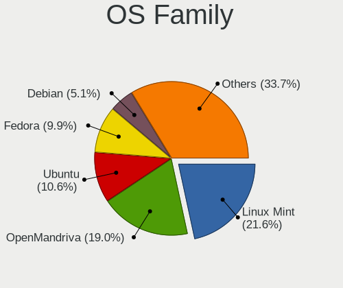
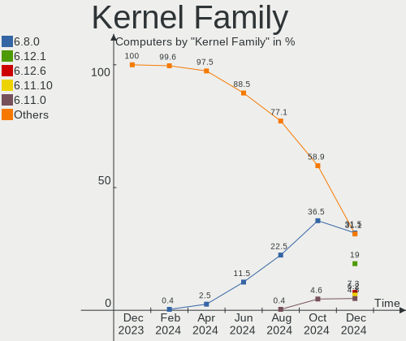
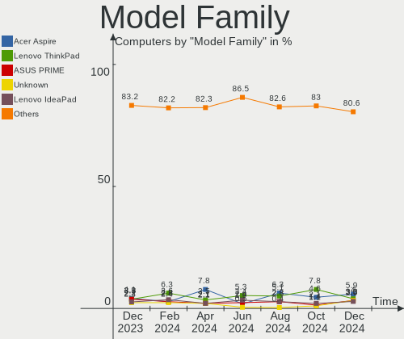
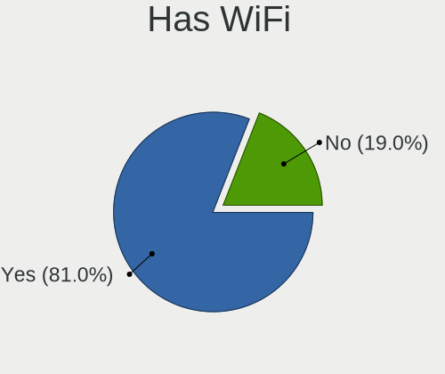
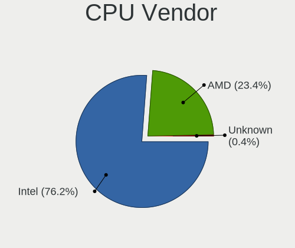
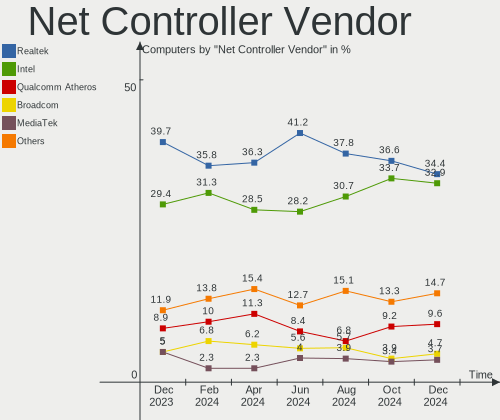

Linux in Italy - Hardware Trends
--------------------------------

A project to identify most popular hardware characteristics and track their change
over time based on data collected by Linux users at https://Linux-Hardware.org.

Anyone can contribute to this report by the [hw-probe](https://github.com/linuxhw/hw-probe) tool:

    sudo -E hw-probe -all -upload

This is a report for all computer types. See also reports for [desktops](/Location/Italy/Desktop/README.md) and [notebooks](/Location/Italy/Notebook/README.md).

Period: Sep, 2023.

Contents
--------

* [ System ](#system)
  - [ OS                       ](#os)
  - [ OS Family                ](#os-family)
  - [ Kernel                   ](#kernel)
  - [ Kernel Family            ](#kernel-family)
  - [ Kernel Major Ver.        ](#kernel-major-ver)
  - [ Arch                     ](#arch)
  - [ DE                       ](#de)
  - [ Display Server           ](#display-server)
  - [ Display Manager          ](#display-manager)
  - [ OS Lang                  ](#os-lang)
  - [ Boot Mode                ](#boot-mode)
  - [ Filesystem               ](#filesystem)
  - [ Part. scheme             ](#part-scheme)
  - [ Dual Boot with Linux/BSD ](#dual-boot-with-linuxbsd)
  - [ Dual Boot (Win)          ](#dual-boot-win)

* [ Board ](#board)
  - [ Vendor                   ](#vendor)
  - [ Model                    ](#model)
  - [ Model Family             ](#model-family)
  - [ MFG Year                 ](#mfg-year)
  - [ Form Factor              ](#form-factor)
  - [ Secure Boot              ](#secure-boot)
  - [ Coreboot                 ](#coreboot)
  - [ RAM Size                 ](#ram-size)
  - [ RAM Used                 ](#ram-used)
  - [ Total Drives             ](#total-drives)
  - [ Has CD-ROM               ](#has-cd-rom)
  - [ Has Ethernet             ](#has-ethernet)
  - [ Has WiFi                 ](#has-wifi)
  - [ Has Bluetooth            ](#has-bluetooth)

* [ Location ](#location)
  - [ Country                  ](#country)
  - [ City                     ](#city)

* [ Drives ](#drives)
  - [ Drive Vendor             ](#drive-vendor)
  - [ Drive Model              ](#drive-model)
  - [ HDD Vendor               ](#hdd-vendor)
  - [ SSD Vendor               ](#ssd-vendor)
  - [ Drive Kind               ](#drive-kind)
  - [ Drive Connector          ](#drive-connector)
  - [ Drive Size               ](#drive-size)
  - [ Space Total              ](#space-total)
  - [ Space Used               ](#space-used)
  - [ Malfunc. Drives          ](#malfunc-drives)
  - [ Malfunc. Drive Vendor    ](#malfunc-drive-vendor)
  - [ Malfunc. HDD Vendor      ](#malfunc-hdd-vendor)
  - [ Malfunc. Drive Kind      ](#malfunc-drive-kind)
  - [ Failed Drives            ](#failed-drives)
  - [ Failed Drive Vendor      ](#failed-drive-vendor)
  - [ Drive Status             ](#drive-status)

* [ Storage controller ](#storage-controller)
  - [ Storage Vendor           ](#storage-vendor)
  - [ Storage Model            ](#storage-model)
  - [ Storage Kind             ](#storage-kind)

* [ Processor ](#processor)
  - [ CPU Vendor               ](#cpu-vendor)
  - [ CPU Model                ](#cpu-model)
  - [ CPU Model Family         ](#cpu-model-family)
  - [ CPU Cores                ](#cpu-cores)
  - [ CPU Sockets              ](#cpu-sockets)
  - [ CPU Threads              ](#cpu-threads)
  - [ CPU Op-Modes             ](#cpu-op-modes)
  - [ CPU Microcode            ](#cpu-microcode)
  - [ CPU Microarch            ](#cpu-microarch)

* [ Graphics ](#graphics)
  - [ GPU Vendor               ](#gpu-vendor)
  - [ GPU Model                ](#gpu-model)
  - [ GPU Combo                ](#gpu-combo)
  - [ GPU Driver               ](#gpu-driver)
  - [ GPU Memory               ](#gpu-memory)

* [ Monitor ](#monitor)
  - [ Monitor Vendor           ](#monitor-vendor)
  - [ Monitor Model            ](#monitor-model)
  - [ Monitor Resolution       ](#monitor-resolution)
  - [ Monitor Diagonal         ](#monitor-diagonal)
  - [ Monitor Width            ](#monitor-width)
  - [ Aspect Ratio             ](#aspect-ratio)
  - [ Monitor Area             ](#monitor-area)
  - [ Pixel Density            ](#pixel-density)
  - [ Multiple Monitors        ](#multiple-monitors)

* [ Network ](#network)
  - [ Net Controller Vendor    ](#net-controller-vendor)
  - [ Net Controller Model     ](#net-controller-model)
  - [ Wireless Vendor          ](#wireless-vendor)
  - [ Wireless Model           ](#wireless-model)
  - [ Ethernet Vendor          ](#ethernet-vendor)
  - [ Ethernet Model           ](#ethernet-model)
  - [ Net Controller Kind      ](#net-controller-kind)
  - [ Used Controller          ](#used-controller)
  - [ NICs                     ](#nics)
  - [ IPv6                     ](#ipv6)

* [ Bluetooth ](#bluetooth)
  - [ Bluetooth Vendor         ](#bluetooth-vendor)
  - [ Bluetooth Model          ](#bluetooth-model)

* [ Sound ](#sound)
  - [ Sound Vendor             ](#sound-vendor)
  - [ Sound Model              ](#sound-model)

* [ Memory ](#memory)
  - [ Memory Vendor            ](#memory-vendor)
  - [ Memory Model             ](#memory-model)
  - [ Memory Kind              ](#memory-kind)
  - [ Memory Form Factor       ](#memory-form-factor)
  - [ Memory Size              ](#memory-size)
  - [ Memory Speed             ](#memory-speed)

* [ Printers & scanners ](#printers--scanners)
  - [ Printer Vendor           ](#printer-vendor)
  - [ Printer Model            ](#printer-model)
  - [ Scanner Vendor           ](#scanner-vendor)
  - [ Scanner Model            ](#scanner-model)

* [ Camera ](#camera)
  - [ Camera Vendor            ](#camera-vendor)
  - [ Camera Model             ](#camera-model)

* [ Security ](#security)
  - [ Fingerprint Vendor       ](#fingerprint-vendor)
  - [ Fingerprint Model        ](#fingerprint-model)
  - [ Chipcard Vendor          ](#chipcard-vendor)
  - [ Chipcard Model           ](#chipcard-model)

* [ Unsupported ](#unsupported)
  - [ Unsupported Devices      ](#unsupported-devices)
  - [ Unsupported Device Types ](#unsupported-device-types)

System
------

OS
--

Installed operating systems

| Name                         | Computers | Percent |
|------------------------------|-----------|---------|
| Ubuntu 22.04                 | 31        | 14.03%  |
| Fedora 38                    | 20        | 9.05%   |
| OpenMandriva 23.08           | 17        | 7.69%   |
| Linux Mint 21.2              | 13        | 5.88%   |
| Arch Rolling                 | 13        | 5.88%   |
| Ubuntu 23.04                 | 11        | 4.98%   |
| Debian 12                    | 11        | 4.98%   |
| Zorin 16                     | 7         | 3.17%   |
| OpenMandriva 23.09           | 7         | 3.17%   |
| Pop!_OS 22.04                | 6         | 2.71%   |
| Linux Mint 20.3              | 5         | 2.26%   |
| Ubuntu MATE 22.04            | 4         | 1.81%   |
| KDE neon 22.04               | 4         | 1.81%   |
| Debian 11                    | 4         | 1.81%   |
| Ubuntu 22.10                 | 3         | 1.36%   |
| OpenMandriva 23.03           | 3         | 1.36%   |
| Manjaro                      | 3         | 1.36%   |
| LMDE 5                       | 3         | 1.36%   |
| Linux Mint 21.1              | 3         | 1.36%   |
| Kubuntu 23.04                | 3         | 1.36%   |
| EndeavourOS Rolling          | 3         | 1.36%   |
| ArcoLinux Rolling            | 3         | 1.36%   |
| Xubuntu 22.04                | 2         | 0.9%    |
| Ubuntu 20.04                 | 2         | 0.9%    |
| Raspbian 10                  | 2         | 0.9%    |
| openSUSE Tumbleweed-XXXXXXXX | 2         | 0.9%    |
| OpenMandriva 4.3             | 2         | 0.9%    |
| OpenMandriva 4.2             | 2         | 0.9%    |
| OpenMandriva 23.90           | 2         | 0.9%    |
| Debian                       | 2         | 0.9%    |
| Xubuntu 23.04                | 1         | 0.45%   |
| Xubuntu 2023.2               | 1         | 0.45%   |
| Xero Rolling                 | 1         | 0.45%   |
| Void Linux Rolling           | 1         | 0.45%   |
| Ubuntu MATE 20.04            | 1         | 0.45%   |
| Ubuntu 23.10                 | 1         | 0.45%   |
| Ubuntu 21.04                 | 1         | 0.45%   |
| SteamOS 4                    | 1         | 0.45%   |
| ROSA 12.4                    | 1         | 0.45%   |
| ROSA 12.1                    | 1         | 0.45%   |

OS Family
---------

OS without a version

| Name          | Computers | Percent |
|---------------|-----------|---------|
| Ubuntu        | 49        | 22.17%  |
| OpenMandriva  | 34        | 15.38%  |
| Linux Mint    | 23        | 10.41%  |
| Fedora        | 21        | 9.5%    |
| Debian        | 17        | 7.69%   |
| Arch          | 13        | 5.88%   |
| Zorin         | 7         | 3.17%   |
| Pop!_OS       | 6         | 2.71%   |
| Ubuntu MATE   | 5         | 2.26%   |
| Manjaro       | 5         | 2.26%   |
| Xubuntu       | 4         | 1.81%   |
| LMDE          | 4         | 1.81%   |
| Kubuntu       | 4         | 1.81%   |
| KDE neon      | 4         | 1.81%   |
| Raspbian      | 3         | 1.36%   |
| openSUSE      | 3         | 1.36%   |
| EndeavourOS   | 3         | 1.36%   |
| ArcoLinux     | 3         | 1.36%   |
| ROSA          | 2         | 0.9%    |
| Elementary    | 2         | 0.9%    |
| Xero          | 1         | 0.45%   |
| Void Linux    | 1         | 0.45%   |
| SteamOS       | 1         | 0.45%   |
| Lubuntu       | 1         | 0.45%   |
| Garuda Linux  | 1         | 0.45%   |
| Crystal Linux | 1         | 0.45%   |
| blendOS       | 1         | 0.45%   |
| BlackPanther  | 1         | 0.45%   |
| Artix         | 1         | 0.45%   |

Kernel
------

Version of the Linux kernel

| Version                      | Computers | Percent |
|------------------------------|-----------|---------|
| 6.4.11-desktop-1omv2390      | 19        | 8.6%    |
| 6.2.0-32-generic             | 19        | 8.6%    |
| 6.2.0-33-generic             | 15        | 6.79%   |
| 6.4.15-200.fc38.x86_64       | 11        | 4.98%   |
| 5.15.0-83-generic            | 11        | 4.98%   |
| 5.15.0-84-generic            | 8         | 3.62%   |
| 6.4.6-76060406-generic       | 6         | 2.71%   |
| 6.4.12-arch1-1               | 6         | 2.71%   |
| 5.15.0-82-generic            | 6         | 2.71%   |
| 6.4.14-200.fc38.x86_64       | 4         | 1.81%   |
| 6.4.12-zen1-1-zen            | 4         | 1.81%   |
| 6.2.0-31-generic             | 4         | 1.81%   |
| 6.2.0-26-generic             | 4         | 1.81%   |
| 6.1.0-10-amd64               | 4         | 1.81%   |
| 5.10.0-25-amd64              | 4         | 1.81%   |
| 6.5.4-arch2-1                | 3         | 1.36%   |
| 6.5.3-desktop-1omv2390       | 3         | 1.36%   |
| 6.5.2-arch1-1                | 3         | 1.36%   |
| 6.2.6-desktop-1omv2390       | 3         | 1.36%   |
| 6.2.0-20-generic             | 3         | 1.36%   |
| 6.1.0-11-amd64               | 3         | 1.36%   |
| 5.4.0-163-generic            | 3         | 1.36%   |
| 6.5.3-zen1-1-zen             | 2         | 0.9%    |
| 6.5.1-060501-generic         | 2         | 0.9%    |
| 6.5.0-desktop-1omv2390       | 2         | 0.9%    |
| 6.5.0-060500-generic         | 2         | 0.9%    |
| 6.4.12-200.fc38.x86_64       | 2         | 0.9%    |
| 6.1.49-1-MANJARO             | 2         | 0.9%    |
| 6.1.0-12-amd64               | 2         | 0.9%    |
| 5.19.0-46-generic            | 2         | 0.9%    |
| 5.10.14-desktop-1omv4002     | 2         | 0.9%    |
| 5.10.103-v7l+                | 2         | 0.9%    |
| 6.6.0-rc1-273-tkg-eevdf-llvm | 1         | 0.45%   |
| 6.5.5-zen1-1-zen             | 1         | 0.45%   |
| 6.5.5-artix1-1               | 1         | 0.45%   |
| 6.5.5-300.fc39.x86_64        | 1         | 0.45%   |
| 6.5.4-1-default              | 1         | 0.45%   |
| 6.5.3-arch1-1                | 1         | 0.45%   |
| 6.5.3-060503-generic         | 1         | 0.45%   |
| 6.5.2-desktop-1omv2390       | 1         | 0.45%   |

Kernel Family
-------------

Linux kernel without a distro release

| Version  | Computers | Percent |
|----------|-----------|---------|
| 6.2.0    | 47        | 21.27%  |
| 5.15.0   | 33        | 14.93%  |
| 6.4.11   | 20        | 9.05%   |
| 6.4.12   | 12        | 5.43%   |
| 6.4.15   | 11        | 4.98%   |
| 6.1.0    | 9         | 4.07%   |
| 6.5.3    | 7         | 3.17%   |
| 5.4.0    | 7         | 3.17%   |
| 6.4.6    | 6         | 2.71%   |
| 5.10.0   | 6         | 2.71%   |
| 6.5.1    | 5         | 2.26%   |
| 6.5.0    | 5         | 2.26%   |
| 6.5.4    | 4         | 1.81%   |
| 6.5.2    | 4         | 1.81%   |
| 6.4.14   | 4         | 1.81%   |
| 6.5.5    | 3         | 1.36%   |
| 6.2.6    | 3         | 1.36%   |
| 5.19.0   | 3         | 1.36%   |
| 5.10.103 | 3         | 1.36%   |
| 6.4.0    | 2         | 0.9%    |
| 6.2.16   | 2         | 0.9%    |
| 6.1.49   | 2         | 0.9%    |
| 5.10.14  | 2         | 0.9%    |
| 6.6.0    | 1         | 0.45%   |
| 6.4.9    | 1         | 0.45%   |
| 6.4.8    | 1         | 0.45%   |
| 6.4.13   | 1         | 0.45%   |
| 6.3.9    | 1         | 0.45%   |
| 6.3.7    | 1         | 0.45%   |
| 6.3.5    | 1         | 0.45%   |
| 6.3.13   | 1         | 0.45%   |
| 6.2.9    | 1         | 0.45%   |
| 6.2.14   | 1         | 0.45%   |
| 6.1.53   | 1         | 0.45%   |
| 6.1.51   | 1         | 0.45%   |
| 6.1.15   | 1         | 0.45%   |
| 5.17.1   | 1         | 0.45%   |
| 5.16.13  | 1         | 0.45%   |
| 5.15.116 | 1         | 0.45%   |
| 5.14.21  | 1         | 0.45%   |

Kernel Major Ver.
-----------------

Linux kernel major version

| Version | Computers | Percent |
|---------|-----------|---------|
| 6.4     | 58        | 26.24%  |
| 6.2     | 54        | 24.43%  |
| 5.15    | 34        | 15.38%  |
| 6.5     | 28        | 12.67%  |
| 6.1     | 14        | 6.33%   |
| 5.10    | 13        | 5.88%   |
| 5.4     | 7         | 3.17%   |
| 6.3     | 4         | 1.81%   |
| 5.19    | 3         | 1.36%   |
| 6.6     | 1         | 0.45%   |
| 5.17    | 1         | 0.45%   |
| 5.16    | 1         | 0.45%   |
| 5.14    | 1         | 0.45%   |
| 5.11    | 1         | 0.45%   |
| 4.18    | 1         | 0.45%   |

Arch
----

OS architecture (x86_64, i586, etc.)

| Name   | Computers | Percent |
|--------|-----------|---------|
| x86_64 | 217       | 98.19%  |
| armv7l | 3         | 1.36%   |
| i686   | 1         | 0.45%   |

DE
--

Desktop Environment

| Name            | Computers | Percent |
|-----------------|-----------|---------|
| GNOME           | 91        | 41.18%  |
| KDE5            | 53        | 23.98%  |
| X-Cinnamon      | 26        | 11.76%  |
| XFCE            | 14        | 6.33%   |
| Unknown         | 10        | 4.52%   |
| MATE            | 9         | 4.07%   |
| LXQt            | 6         | 2.71%   |
| Pantheon        | 2         | 0.9%    |
| i3              | 2         | 0.9%    |
| GNOME Flashback | 2         | 0.9%    |
| GNOME Classic   | 2         | 0.9%    |
| Unicorn:XFCE    | 1         | 0.45%   |
| onyx:GNOME      | 1         | 0.45%   |
| LXDE            | 1         | 0.45%   |
| Hyprland        | 1         | 0.45%   |

Display Server
--------------

X11 or Wayland

| Name    | Computers | Percent |
|---------|-----------|---------|
| X11     | 117       | 52.94%  |
| Wayland | 91        | 41.18%  |
| Tty     | 13        | 5.88%   |

Display Manager
---------------

SDDM, LightDM, etc.

| Name    | Computers | Percent |
|---------|-----------|---------|
| Unknown | 69        | 31.22%  |
| GDM3    | 52        | 23.53%  |
| SDDM    | 51        | 23.08%  |
| LightDM | 30        | 13.57%  |
| GDM     | 18        | 8.14%   |
| GREETD  | 1         | 0.45%   |

OS Lang
-------

Language

| Lang       | Computers | Percent |
|------------|-----------|---------|
| it_IT      | 149       | 67.42%  |
| en_US      | 56        | 25.34%  |
| C          | 6         | 2.71%   |
| en_GB      | 5         | 2.26%   |
| Unknown    | 2         | 0.9%    |
| it_IT@euro | 1         | 0.45%   |
| en_IE      | 1         | 0.45%   |
| de_DE      | 1         | 0.45%   |

Boot Mode
---------

EFI or BIOS

| Mode | Computers | Percent |
|------|-----------|---------|
| EFI  | 117       | 52.94%  |
| BIOS | 104       | 47.06%  |

Filesystem
----------

Type of filesystem

| Type    | Computers | Percent |
|---------|-----------|---------|
| Ext4    | 123       | 55.66%  |
| Tmpfs   | 37        | 16.74%  |
| Btrfs   | 35        | 15.84%  |
| Overlay | 21        | 9.5%    |
| Xfs     | 4         | 1.81%   |
| Zfs     | 1         | 0.45%   |

Part. scheme
------------

Scheme of partitioning

| Type    | Computers | Percent |
|---------|-----------|---------|
| GPT     | 131       | 59.28%  |
| Unknown | 64        | 28.96%  |
| MBR     | 26        | 11.76%  |

Dual Boot with Linux/BSD
------------------------

Hosting more than one Linux/BSD

| Dual boot | Computers | Percent |
|-----------|-----------|---------|
| No        | 184       | 83.26%  |
| Yes       | 37        | 16.74%  |

Dual Boot (Win)
---------------

Hosting Linux and Windows

| Dual boot | Computers | Percent |
|-----------|-----------|---------|
| No        | 151       | 68.33%  |
| Yes       | 70        | 31.67%  |

Board
-----

Vendor
------

Motherboard manufacturer

| Name                                 | Computers | Percent |
|--------------------------------------|-----------|---------|
| Hewlett-Packard                      | 40        | 18.1%   |
| ASUSTek Computer                     | 39        | 17.65%  |
| Lenovo                               | 24        | 10.86%  |
| MSI                                  | 18        | 8.14%   |
| Dell                                 | 16        | 7.24%   |
| Acer                                 | 14        | 6.33%   |
| ASRock                               | 9         | 4.07%   |
| Intel                                | 6         | 2.71%   |
| Gigabyte Technology                  | 6         | 2.71%   |
| Apple                                | 6         | 2.71%   |
| HUAWEI                               | 5         | 2.26%   |
| Toshiba                              | 3         | 1.36%   |
| Raspberry Pi Foundation              | 3         | 1.36%   |
| AZW                                  | 3         | 1.36%   |
| Unknown                              | 3         | 1.36%   |
| Sony                                 | 2         | 0.9%    |
| Samsung Electronics                  | 2         | 0.9%    |
| Foxconn                              | 2         | 0.9%    |
| AMI                                  | 2         | 0.9%    |
| YANYU                                | 1         | 0.45%   |
| TUXEDO                               | 1         | 0.45%   |
| Shuttle                              | 1         | 0.45%   |
| Shenzhen Meigao Electronic Equipment | 1         | 0.45%   |
| Notebook                             | 1         | 0.45%   |
| Microtech                            | 1         | 0.45%   |
| Medion                               | 1         | 0.45%   |
| LG Electronics                       | 1         | 0.45%   |
| Huanan                               | 1         | 0.45%   |
| HC Technology.                       | 1         | 0.45%   |
| Google                               | 1         | 0.45%   |
| GEEKOM                               | 1         | 0.45%   |
| Fujitsu Siemens                      | 1         | 0.45%   |
| Fujitsu                              | 1         | 0.45%   |
| eMachines                            | 1         | 0.45%   |
| Clevo                                | 1         | 0.45%   |
| Cincoze                              | 1         | 0.45%   |
| Chuwi                                | 1         | 0.45%   |

Model
-----

Motherboard model

| Name                                          | Computers | Percent |
|-----------------------------------------------|-----------|---------|
| ASUS All Series                               | 4         | 1.81%   |
| Unknown                                       | 4         | 1.81%   |
| Dell OptiPlex 7010                            | 3         | 1.36%   |
| MSI MS-7C76                                   | 2         | 0.9%    |
| HP Pavilion dv6                               | 2         | 0.9%    |
| HP Notebook                                   | 2         | 0.9%    |
| HP Laptop 15s-eq2xxx                          | 2         | 0.9%    |
| HP 255 G8 Notebook PC                         | 2         | 0.9%    |
| HP 15                                         | 2         | 0.9%    |
| AZW MINI S                                    | 2         | 0.9%    |
| YANYU H17SL                                   | 1         | 0.45%   |
| Toshiba Satellite Pro R50-B                   | 1         | 0.45%   |
| Toshiba Satellite L500                        | 1         | 0.45%   |
| Toshiba Satellite C850-1DZ                    | 1         | 0.45%   |
| Sony SVE1713X1EB                              | 1         | 0.45%   |
| Sony SVE1712C5E                               | 1         | 0.45%   |
| Shuttle XS36V                                 | 1         | 0.45%   |
| Shenzhen Meigao Electronic Equipment UM560 XT | 1         | 0.45%   |
| Samsung R519/R719                             | 1         | 0.45%   |
| Samsung 750XDA                                | 1         | 0.45%   |
| RPi Raspberry Pi 4 Model B Rev 1.2            | 1         | 0.45%   |
| RPi Raspberry Pi 3 Model B Plus Rev 1.3       | 1         | 0.45%   |
| RPi Raspberry Pi                              | 1         | 0.45%   |
| Notebook N9x0TC                               | 1         | 0.45%   |
| MSI Summit E13FlipEvo A12MT                   | 1         | 0.45%   |
| MSI Prestige 15 A12SC                         | 1         | 0.45%   |
| MSI Prestige 14Evo A12M                       | 1         | 0.45%   |
| MSI NQ890AA-ABZ CQ5011IT                      | 1         | 0.45%   |
| MSI MS-7D06                                   | 1         | 0.45%   |
| MSI MS-7C56                                   | 1         | 0.45%   |
| MSI MS-7C52                                   | 1         | 0.45%   |
| MSI MS-7C02                                   | 1         | 0.45%   |
| MSI MS-7B87                                   | 1         | 0.45%   |
| MSI MS-7B86                                   | 1         | 0.45%   |
| MSI MS-7B33                                   | 1         | 0.45%   |
| MSI MS-7721                                   | 1         | 0.45%   |
| MSI MS-7673                                   | 1         | 0.45%   |
| MSI Modern 14 B11MOU                          | 1         | 0.45%   |
| MSI Katana GF66 11UC                          | 1         | 0.45%   |
| MSI GL73 8RE                                  | 1         | 0.45%   |

Model Family
------------

Motherboard model prefix

| Name                                       | Computers | Percent |
|--------------------------------------------|-----------|---------|
| Lenovo ThinkPad                            | 10        | 4.52%   |
| Lenovo IdeaPad                             | 6         | 2.71%   |
| HP Laptop                                  | 6         | 2.71%   |
| Acer Aspire                                | 6         | 2.71%   |
| HP EliteBook                               | 5         | 2.26%   |
| HP Pavilion                                | 4         | 1.81%   |
| HP 250                                     | 4         | 1.81%   |
| Dell OptiPlex                              | 4         | 1.81%   |
| Dell Latitude                              | 4         | 1.81%   |
| ASUS PRIME                                 | 4         | 1.81%   |
| ASUS All                                   | 4         | 1.81%   |
| Unknown                                    | 4         | 1.81%   |
| Toshiba Satellite                          | 3         | 1.36%   |
| RPi Raspberry                              | 3         | 1.36%   |
| HP Compaq                                  | 3         | 1.36%   |
| ASUS ROG                                   | 3         | 1.36%   |
| Acer Veriton                               | 3         | 1.36%   |
| MSI Prestige                               | 2         | 0.9%    |
| MSI MS-7C76                                | 2         | 0.9%    |
| HP ProBook                                 | 2         | 0.9%    |
| HP Notebook                                | 2         | 0.9%    |
| HP 255                                     | 2         | 0.9%    |
| HP 15                                      | 2         | 0.9%    |
| Dell Vostro                                | 2         | 0.9%    |
| Dell Inspiron                              | 2         | 0.9%    |
| AZW MINI                                   | 2         | 0.9%    |
| ASUS VivoBook                              | 2         | 0.9%    |
| ASUS ASUS                                  | 2         | 0.9%    |
| Apple MacBookPro11                         | 2         | 0.9%    |
| Acer Nitro                                 | 2         | 0.9%    |
| YANYU H17SL                                | 1         | 0.45%   |
| Sony SVE1713X1EB                           | 1         | 0.45%   |
| Sony SVE1712C5E                            | 1         | 0.45%   |
| Shuttle XS36V                              | 1         | 0.45%   |
| Shenzhen Meigao Electronic Equipment UM560 | 1         | 0.45%   |
| Samsung R519                               | 1         | 0.45%   |
| Samsung 750XDA                             | 1         | 0.45%   |
| Notebook N9x0TC                            | 1         | 0.45%   |
| MSI Summit                                 | 1         | 0.45%   |
| MSI NQ890AA-ABZ                            | 1         | 0.45%   |

MFG Year
--------

Motherboard manufacture year

| Year    | Computers | Percent |
|---------|-----------|---------|
| 2021    | 24        | 10.86%  |
| 2013    | 20        | 9.05%   |
| 2019    | 19        | 8.6%    |
| 2018    | 17        | 7.69%   |
| 2020    | 15        | 6.79%   |
| 2017    | 15        | 6.79%   |
| 2022    | 14        | 6.33%   |
| 2012    | 14        | 6.33%   |
| 2023    | 13        | 5.88%   |
| 2011    | 13        | 5.88%   |
| 2014    | 12        | 5.43%   |
| 2009    | 9         | 4.07%   |
| 2008    | 9         | 4.07%   |
| 2015    | 8         | 3.62%   |
| 2010    | 6         | 2.71%   |
| 2016    | 5         | 2.26%   |
| Unknown | 3         | 1.36%   |
| 2007    | 2         | 0.9%    |
| 2006    | 2         | 0.9%    |
| 2005    | 1         | 0.45%   |

Form Factor
-----------

Physical design of the computer

| Name           | Computers | Percent |
|----------------|-----------|---------|
| Notebook       | 116       | 52.49%  |
| Desktop        | 89        | 40.27%  |
| Convertible    | 5         | 2.26%   |
| All in one     | 5         | 2.26%   |
| System on chip | 3         | 1.36%   |
| Mini pc        | 2         | 0.9%    |
| Tablet         | 1         | 0.45%   |

Secure Boot
-----------

Enabled or disabled

| State    | Computers | Percent |
|----------|-----------|---------|
| Disabled | 208       | 94.12%  |
| Enabled  | 13        | 5.88%   |

Coreboot
--------

Have coreboot on board

| Used | Computers | Percent |
|------|-----------|---------|
| No   | 220       | 99.55%  |
| Yes  | 1         | 0.45%   |

RAM Size
--------

Total RAM memory

| Size in GB  | Computers | Percent |
|-------------|-----------|---------|
| 4.01-8.0    | 51        | 23.08%  |
| 16.01-24.0  | 49        | 22.17%  |
| 3.01-4.0    | 45        | 20.36%  |
| 8.01-16.0   | 40        | 18.1%   |
| 32.01-64.0  | 19        | 8.6%    |
| 64.01-256.0 | 6         | 2.71%   |
| 1.01-2.0    | 5         | 2.26%   |
| 24.01-32.0  | 3         | 1.36%   |
| 0.51-1.0    | 2         | 0.9%    |
| 2.01-3.0    | 1         | 0.45%   |

RAM Used
--------

Used RAM memory

| Used GB   | Computers | Percent |
|-----------|-----------|---------|
| 1.01-2.0  | 84        | 38.01%  |
| 2.01-3.0  | 56        | 25.34%  |
| 4.01-8.0  | 42        | 19%     |
| 3.01-4.0  | 22        | 9.95%   |
| 0.51-1.0  | 11        | 4.98%   |
| 8.01-16.0 | 3         | 1.36%   |
| 0.01-0.5  | 3         | 1.36%   |

Total Drives
------------

Number of drives on board

| Drives | Computers | Percent |
|--------|-----------|---------|
| 1      | 133       | 60.18%  |
| 2      | 40        | 18.1%   |
| 3      | 27        | 12.22%  |
| 4      | 10        | 4.52%   |
| 6      | 4         | 1.81%   |
| 5      | 4         | 1.81%   |
| 0      | 2         | 0.9%    |
| 9      | 1         | 0.45%   |

Has CD-ROM
----------

Has CD-ROM on board

| Presented | Computers | Percent |
|-----------|-----------|---------|
| No        | 132       | 59.73%  |
| Yes       | 89        | 40.27%  |

Has Ethernet
------------

Has Ethernet on board

| Presented | Computers | Percent |
|-----------|-----------|---------|
| Yes       | 181       | 81.9%   |
| No        | 40        | 18.1%   |

Has WiFi
--------

Has WiFi module

| Presented | Computers | Percent |
|-----------|-----------|---------|
| Yes       | 179       | 81%     |
| No        | 42        | 19%     |

Has Bluetooth
-------------

Has Bluetooth module

| Presented | Computers | Percent |
|-----------|-----------|---------|
| Yes       | 141       | 63.8%   |
| No        | 80        | 36.2%   |

Location
--------

Country
-------

Geographic location (country)

| Country | Computers | Percent |
|---------|-----------|---------|
| Italy   | 221       | 100%    |

City
----

Geographic location (city)

| City                | Computers | Percent |
|---------------------|-----------|---------|
| Milan               | 28        | 12.67%  |
| Rome                | 17        | 7.69%   |
| Milano              | 13        | 5.88%   |
| Turin               | 10        | 4.52%   |
| Bologna             | 6         | 2.71%   |
| Bari                | 4         | 1.81%   |
| Rho                 | 3         | 1.36%   |
| Naples              | 3         | 1.36%   |
| Monza               | 3         | 1.36%   |
| Casalecchio di Reno | 3         | 1.36%   |
| Venice              | 2         | 0.9%    |
| Trento              | 2         | 0.9%    |
| Salerno             | 2         | 0.9%    |
| Rozzano             | 2         | 0.9%    |
| Riva                | 2         | 0.9%    |
| Perugia             | 2         | 0.9%    |
| Parma               | 2         | 0.9%    |
| Padova              | 2         | 0.9%    |
| Genoa               | 2         | 0.9%    |
| Forlì              | 2         | 0.9%    |
| Florence            | 2         | 0.9%    |
| Cremona             | 2         | 0.9%    |
| Catania             | 2         | 0.9%    |
| Campobasso          | 2         | 0.9%    |
| Zogno               | 1         | 0.45%   |
| Zero Branco         | 1         | 0.45%   |
| Voghera             | 1         | 0.45%   |
| Vittuone            | 1         | 0.45%   |
| Villa d'Adda        | 1         | 0.45%   |
| Viggiano            | 1         | 0.45%   |
| Viareggio           | 1         | 0.45%   |
| Verona              | 1         | 0.45%   |
| Vaiano Cremasco     | 1         | 0.45%   |
| Turbigo             | 1         | 0.45%   |
| Tuoro sul Trasimeno | 1         | 0.45%   |
| Truccazzano         | 1         | 0.45%   |
| Trieste             | 1         | 0.45%   |
| Treviglio           | 1         | 0.45%   |
| Torre del Greco     | 1         | 0.45%   |
| Terricciola         | 1         | 0.45%   |

Drives
------

Drive Vendor
------------

Hard drive vendors

| Vendor                       | Computers | Drives | Percent |
|------------------------------|-----------|--------|---------|
| Samsung Electronics          | 47        | 52     | 13.99%  |
| WDC                          | 40        | 52     | 11.9%   |
| Seagate                      | 40        | 51     | 11.9%   |
| Kingston                     | 26        | 27     | 7.74%   |
| Toshiba                      | 21        | 22     | 6.25%   |
| Sandisk                      | 19        | 21     | 5.65%   |
| Crucial                      | 17        | 17     | 5.06%   |
| Unknown                      | 12        | 16     | 3.57%   |
| Micron Technology            | 10        | 10     | 2.98%   |
| Intel                        | 9         | 9      | 2.68%   |
| SK hynix                     | 8         | 8      | 2.38%   |
| Hitachi                      | 8         | 9      | 2.38%   |
| HGST                         | 8         | 8      | 2.38%   |
| Phison Electronics           | 6         | 9      | 1.79%   |
| China                        | 5         | 5      | 1.49%   |
| Phison                       | 4         | 6      | 1.19%   |
| KIOXIA                       | 4         | 4      | 1.19%   |
| Shenzhen Longsys Electronics | 3         | 3      | 0.89%   |
| Kingston Technology Company  | 3         | 3      | 0.89%   |
| KingDian                     | 3         | 3      | 0.89%   |
| Fanxiang                     | 3         | 3      | 0.89%   |
| Apple                        | 3         | 3      | 0.89%   |
| Transcend                    | 2         | 2      | 0.6%    |
| SSSTC                        | 2         | 2      | 0.6%    |
| SPCC                         | 2         | 2      | 0.6%    |
| Silicon Motion               | 2         | 2      | 0.6%    |
| PNY                          | 2         | 2      | 0.6%    |
| JMicron Technology           | 2         | 2      | 0.6%    |
| Unknown                      | 2         | 2      | 0.6%    |
| YMTC                         | 1         | 1      | 0.3%    |
| Verbatim                     | 1         | 1      | 0.3%    |
| Vaseky                       | 1         | 1      | 0.3%    |
| TO Exter                     | 1         | 1      | 0.3%    |
| sobetter                     | 1         | 1      | 0.3%    |
| Saichi                       | 1         | 1      | 0.3%    |
| SABRENT                      | 1         | 1      | 0.3%    |
| Realtek Semiconductor        | 1         | 1      | 0.3%    |
| Patriot                      | 1         | 1      | 0.3%    |
| Micron/Crucial Technology    | 1         | 1      | 0.3%    |
| MAXIO Technology (Hangzhou)  | 1         | 1      | 0.3%    |

Drive Model
-----------

Hard drive models

| Model                                                 | Computers | Percent |
|-------------------------------------------------------|-----------|---------|
| Unknown MMC Card  64GB                                | 5         | 1.37%   |
| Kingston SA400S37240G 240GB SSD                       | 5         | 1.37%   |
| Seagate ST500DM002-1BD142 500GB                       | 4         | 1.1%    |
| Seagate ST2000DM008-2FR102 2TB                        | 4         | 1.1%    |
| Seagate ST1000LM024 HN-M101MBB 1TB                    | 4         | 1.1%    |
| Samsung NVMe SSD Controller SM981/PM981/PM983 256GB   | 4         | 1.1%    |
| Kingston SA400S37120G 120GB SSD                       | 4         | 1.1%    |
| HGST HTS545050A7E680 500GB                            | 4         | 1.1%    |
| Crucial CT500MX500SSD1 500GB                          | 4         | 1.1%    |
| WDC WD5003AZEX-00K3CA0 500GB                          | 3         | 0.82%   |
| Toshiba DT01ACA100 1TB                                | 3         | 0.82%   |
| Sandisk WD Blue SN550 NVMe SSD 512GB                  | 3         | 0.82%   |
| Samsung SSD 870 QVO 1TB                               | 3         | 0.82%   |
| Samsung SSD 870 EVO 500GB                             | 3         | 0.82%   |
| Samsung SSD 860 EVO 500GB                             | 3         | 0.82%   |
| Samsung NVMe SSD Controller PM9A1/PM9A3/980PRO 1TB    | 3         | 0.82%   |
| Phison E12 NVMe Controller 2TB                        | 3         | 0.82%   |
| Micron CT500P5SSD8 500GB                              | 3         | 0.82%   |
| KIOXIA KBG40ZNV256G 256GB                             | 3         | 0.82%   |
| Kingston SUV400S37240G 240GB SSD                      | 3         | 0.82%   |
| Kingston SA400S37480G 480GB SSD                       | 3         | 0.82%   |
| WDC WD4004FZWX-00GBGB0 4TB                            | 2         | 0.55%   |
| WDC WD3200BEKT-60V5T1 320GB                           | 2         | 0.55%   |
| Unknown MMC Card  32GB                                | 2         | 0.55%   |
| Unknown MMC Card  128GB                               | 2         | 0.55%   |
| Toshiba XG6 NVMe SSD Controller 512GB                 | 2         | 0.55%   |
| Toshiba MQ01ABD100 1TB                                | 2         | 0.55%   |
| Toshiba BG3 NVMe SSD Controller 512GB                 | 2         | 0.55%   |
| SPCC Solid State Disk 512GB                           | 2         | 0.55%   |
| SK hynix SKHynix_HFM512GD3HX015N 512GB                | 2         | 0.55%   |
| Silicon Motion SM2263EN/SM2263XT SSD Controller 512GB | 2         | 0.55%   |
| Seagate ST3500418AS 500GB                             | 2         | 0.55%   |
| Seagate ST3160812AS 160GB                             | 2         | 0.55%   |
| Seagate ST31000528AS 1TB                              | 2         | 0.55%   |
| Seagate ST31000524AS 1TB                              | 2         | 0.55%   |
| Seagate Expansion 1TB                                 | 2         | 0.55%   |
| SanDisk SSD PLUS 240GB                                | 2         | 0.55%   |
| SanDisk SDSSDP128G 128GB                              | 2         | 0.55%   |
| SanDisk SDSSDH3 1T00 1TB                              | 2         | 0.55%   |
| Samsung SSD 870 EVO 1TB                               | 2         | 0.55%   |

HDD Vendor
----------

Hard disk drive vendors

| Vendor              | Computers | Drives | Percent |
|---------------------|-----------|--------|---------|
| Seagate             | 40        | 51     | 36.7%   |
| WDC                 | 32        | 43     | 29.36%  |
| Toshiba             | 13        | 13     | 11.93%  |
| Hitachi             | 8         | 9      | 7.34%   |
| HGST                | 8         | 8      | 7.34%   |
| Samsung Electronics | 6         | 7      | 5.5%    |
| Unknown             | 1         | 1      | 0.92%   |
| Apple               | 1         | 1      | 0.92%   |

SSD Vendor
----------

Solid state drive vendors

| Vendor              | Computers | Drives | Percent |
|---------------------|-----------|--------|---------|
| Samsung Electronics | 25        | 27     | 20.66%  |
| Kingston            | 21        | 22     | 17.36%  |
| Crucial             | 14        | 14     | 11.57%  |
| SanDisk             | 11        | 12     | 9.09%   |
| WDC                 | 6         | 6      | 4.96%   |
| Micron Technology   | 5         | 5      | 4.13%   |
| China               | 5         | 5      | 4.13%   |
| Toshiba             | 3         | 3      | 2.48%   |
| KingDian            | 3         | 3      | 2.48%   |
| Transcend           | 2         | 2      | 1.65%   |
| SPCC                | 2         | 2      | 1.65%   |
| PNY                 | 2         | 2      | 1.65%   |
| JMicron Technology  | 2         | 2      | 1.65%   |
| Fanxiang            | 2         | 2      | 1.65%   |
| Apple               | 2         | 2      | 1.65%   |
| Verbatim            | 1         | 1      | 0.83%   |
| Vaseky              | 1         | 1      | 0.83%   |
| TO Exter            | 1         | 1      | 0.83%   |
| SSSTC               | 1         | 1      | 0.83%   |
| SK hynix            | 1         | 1      | 0.83%   |
| Saichi              | 1         | 1      | 0.83%   |
| SABRENT             | 1         | 1      | 0.83%   |
| Patriot             | 1         | 1      | 0.83%   |
| Lexar               | 1         | 1      | 0.83%   |
| Intenso             | 1         | 1      | 0.83%   |
| Intel               | 1         | 1      | 0.83%   |
| Drevo               | 1         | 1      | 0.83%   |
| Corsair             | 1         | 1      | 0.83%   |
| BAITITON            | 1         | 1      | 0.83%   |
| ASMT                | 1         | 1      | 0.83%   |
| Advantech           | 1         | 2      | 0.83%   |

Drive Kind
----------

HDD or SSD

| Kind    | Computers | Drives | Percent |
|---------|-----------|--------|---------|
| SSD     | 98        | 126    | 33.79%  |
| HDD     | 92        | 133    | 31.72%  |
| NVMe    | 84        | 100    | 28.97%  |
| MMC     | 10        | 12     | 3.45%   |
| Unknown | 6         | 8      | 2.07%   |

Drive Connector
---------------

SATA, SAS, NVMe, etc.

| Type | Computers | Drives | Percent |
|------|-----------|--------|---------|
| SATA | 151       | 247    | 57.41%  |
| NVMe | 84        | 99     | 31.94%  |
| SAS  | 18        | 21     | 6.84%   |
| MMC  | 10        | 12     | 3.8%    |

Drive Size
----------

Size of hard drive

| Size in TB | Computers | Drives | Percent |
|------------|-----------|--------|---------|
| 0.01-0.5   | 118       | 157    | 59.3%   |
| 0.51-1.0   | 57        | 67     | 28.64%  |
| 1.01-2.0   | 14        | 19     | 7.04%   |
| 3.01-4.0   | 6         | 12     | 3.02%   |
| 2.01-3.0   | 2         | 2      | 1.01%   |
| 4.01-10.0  | 2         | 2      | 1.01%   |

Space Total
-----------

Amount of disk space available on the file system

| Size in GB     | Computers | Percent |
|----------------|-----------|---------|
| 101-250        | 52        | 23.53%  |
| 251-500        | 51        | 23.08%  |
| 501-1000       | 39        | 17.65%  |
| 1001-2000      | 19        | 8.6%    |
| 1-20           | 16        | 7.24%   |
| 51-100         | 15        | 6.79%   |
| More than 3000 | 11        | 4.98%   |
| Unknown        | 7         | 3.17%   |
| 2001-3000      | 6         | 2.71%   |
| 21-50          | 5         | 2.26%   |

Space Used
----------

Amount of used disk space

| Used GB        | Computers | Percent |
|----------------|-----------|---------|
| 1-20           | 94        | 42.53%  |
| 21-50          | 37        | 16.74%  |
| 51-100         | 22        | 9.95%   |
| 101-250        | 18        | 8.14%   |
| 251-500        | 14        | 6.33%   |
| 501-1000       | 13        | 5.88%   |
| 1001-2000      | 8         | 3.62%   |
| Unknown        | 7         | 3.17%   |
| 2001-3000      | 5         | 2.26%   |
| More than 3000 | 3         | 1.36%   |

Malfunc. Drives
---------------

Drive models with a malfunction

| Model                                                           | Computers | Drives | Percent |
|-----------------------------------------------------------------|-----------|--------|---------|
| Seagate ST500DM002-1BD142 500GB                                 | 2         | 2      | 8.33%   |
| WDC WD40EFRX-68WT0N0 4TB                                        | 1         | 1      | 4.17%   |
| WDC WD3200BPVT-22ZEST0 320GB                                    | 1         | 1      | 4.17%   |
| WDC WD3200BEVT-22A23T0 320GB                                    | 1         | 1      | 4.17%   |
| WDC WD2002FYPS-02W3B0 2TB                                       | 1         | 1      | 4.17%   |
| WDC WD1600BEVT-60ZCT1 160GB                                     | 1         | 1      | 4.17%   |
| WDC WD10EZEX-60M2NA0 1TB                                        | 1         | 1      | 4.17%   |
| WDC WD Blue SA510 2.5 500GB                                     | 1         | 1      | 4.17%   |
| Toshiba MQ01ABD100 1TB                                          | 1         | 1      | 4.17%   |
| Toshiba MK3263GSXN 320GB                                        | 1         | 1      | 4.17%   |
| SSSTC CV8-8E128-HP 128GB SSD                                    | 1         | 1      | 4.17%   |
| SanDisk SSD PLUS 240GB                                          | 1         | 1      | 4.17%   |
| Samsung Electronics SSD 860 EVO mSATA 250GB                     | 1         | 1      | 4.17%   |
| Samsung Electronics SSD 840 Series 250GB                        | 1         | 1      | 4.17%   |
| Samsung Electronics NVMe SSD Controller SM961/PM961/SM963 500GB | 1         | 1      | 4.17%   |
| Micron Technology MTFDDAK128MAM-1J1 128GB SSD                   | 1         | 1      | 4.17%   |
| Micron Technology 1100_MTFDDAV512TBN 512GB SSD                  | 1         | 1      | 4.17%   |
| Intel SSDSC2BF180A4L 180GB                                      | 1         | 1      | 4.17%   |
| Hitachi HTS725032A9A364 320GB                                   | 1         | 1      | 4.17%   |
| HGST HTS545050A7E680 500GB                                      | 1         | 1      | 4.17%   |
| HGST HTS541075A9E680 752GB                                      | 1         | 1      | 4.17%   |
| HGST HTS541050A9E680 500GB                                      | 1         | 1      | 4.17%   |
| HGST HTS541010A9E680 1TB                                        | 1         | 1      | 4.17%   |

Malfunc. Drive Vendor
---------------------

Vendors of faulty drives

| Vendor              | Computers | Drives | Percent |
|---------------------|-----------|--------|---------|
| WDC                 | 7         | 7      | 29.17%  |
| HGST                | 4         | 4      | 16.67%  |
| Samsung Electronics | 3         | 3      | 12.5%   |
| Toshiba             | 2         | 2      | 8.33%   |
| Seagate             | 2         | 2      | 8.33%   |
| Micron Technology   | 2         | 2      | 8.33%   |
| SSSTC               | 1         | 1      | 4.17%   |
| SanDisk             | 1         | 1      | 4.17%   |
| Intel               | 1         | 1      | 4.17%   |
| Hitachi             | 1         | 1      | 4.17%   |

Malfunc. HDD Vendor
-------------------

Vendors of faulty HDD drives

| Vendor  | Computers | Drives | Percent |
|---------|-----------|--------|---------|
| WDC     | 6         | 6      | 40%     |
| HGST    | 4         | 4      | 26.67%  |
| Toshiba | 2         | 2      | 13.33%  |
| Seagate | 2         | 2      | 13.33%  |
| Hitachi | 1         | 1      | 6.67%   |

Malfunc. Drive Kind
-------------------

Kinds of faulty drives

| Kind | Computers | Drives | Percent |
|------|-----------|--------|---------|
| HDD  | 14        | 15     | 60.87%  |
| SSD  | 8         | 8      | 34.78%  |
| NVMe | 1         | 1      | 4.35%   |

Failed Drives
-------------

Failed drive models

Zero info for selected period =(

Failed Drive Vendor
-------------------

Failed drive vendors

Zero info for selected period =(

Drive Status
------------

Number of failed and malfunc. drives

| Status   | Computers | Drives | Percent |
|----------|-----------|--------|---------|
| Detected | 112       | 195    | 46.67%  |
| Works    | 105       | 160    | 43.75%  |
| Malfunc  | 23        | 24     | 9.58%   |

Storage controller
------------------

Storage Vendor
--------------

Storage controller vendors

| Vendor                         | Computers | Percent |
|--------------------------------|-----------|---------|
| Intel                          | 150       | 53.76%  |
| AMD                            | 30        | 10.75%  |
| Samsung Electronics            | 20        | 7.17%   |
| SanDisk                        | 11        | 3.94%   |
| Phison Electronics             | 9         | 3.23%   |
| Kingston Technology Company    | 8         | 2.87%   |
| Toshiba America Info Systems   | 6         | 2.15%   |
| SK hynix                       | 6         | 2.15%   |
| Micron Technology              | 5         | 1.79%   |
| Micron/Crucial Technology      | 4         | 1.43%   |
| KIOXIA                         | 4         | 1.43%   |
| Shenzhen Longsys Electronics   | 3         | 1.08%   |
| MAXIO Technology (Hangzhou)    | 3         | 1.08%   |
| Marvell Technology Group       | 3         | 1.08%   |
| ASMedia Technology             | 3         | 1.08%   |
| Silicon Motion                 | 2         | 0.72%   |
| Nvidia                         | 2         | 0.72%   |
| JMicron Technology             | 2         | 0.72%   |
| Yangtze Memory Technologies    | 1         | 0.36%   |
| VIA Technologies               | 1         | 0.36%   |
| Solid State Storage Technology | 1         | 0.36%   |
| Silicon Image                  | 1         | 0.36%   |
| Realtek Semiconductor          | 1         | 0.36%   |
| HighPoint Technologies         | 1         | 0.36%   |
| Biwin Storage Technology       | 1         | 0.36%   |
| ADATA Technology               | 1         | 0.36%   |

Storage Model
-------------

Storage controller models

| Model                                                                                   | Computers | Percent |
|-----------------------------------------------------------------------------------------|-----------|---------|
| AMD FCH SATA Controller [AHCI mode]                                                     | 22        | 6.96%   |
| Intel 8 Series/C220 Series Chipset Family 6-port SATA Controller 1 [AHCI mode]          | 10        | 3.16%   |
| Intel Sunrise Point-LP SATA Controller [AHCI mode]                                      | 9         | 2.85%   |
| Intel 7 Series Chipset Family 6-port SATA Controller [AHCI mode]                        | 9         | 2.85%   |
| Intel 6 Series/C200 Series Chipset Family 6 port Desktop SATA AHCI Controller           | 9         | 2.85%   |
| Intel 8 Series SATA Controller 1 [AHCI mode]                                            | 8         | 2.53%   |
| Intel 82801IBM/IEM (ICH9M/ICH9M-E) 4 port SATA Controller [AHCI mode]                   | 7         | 2.22%   |
| AMD 400 Series Chipset SATA Controller                                                  | 7         | 2.22%   |
| Samsung NVMe SSD Controller SM981/PM981/PM983                                           | 6         | 1.9%    |
| Intel Volume Management Device NVMe RAID Controller                                     | 6         | 1.9%    |
| Intel Celeron/Pentium Silver Processor SATA Controller                                  | 6         | 1.9%    |
| Intel Cannon Lake PCH SATA AHCI Controller                                              | 6         | 1.9%    |
| Intel 7 Series/C210 Series Chipset Family 6-port SATA Controller [AHCI mode]            | 6         | 1.9%    |
| SK hynix Gold P31/BC711/PC711 NVMe Solid State Drive                                    | 5         | 1.58%   |
| SanDisk WD Blue SN550 NVMe SSD                                                          | 5         | 1.58%   |
| Samsung NVMe SSD Controller PM9A1/PM9A3/980PRO                                          | 5         | 1.58%   |
| Phison E12 NVMe Controller                                                              | 5         | 1.58%   |
| Intel Q170/Q150/B150/H170/H110/Z170/CM236 Chipset SATA Controller [AHCI Mode]           | 5         | 1.58%   |
| Intel NM10/ICH7 Family SATA Controller [IDE mode]                                       | 5         | 1.58%   |
| Intel Comet Lake SATA AHCI Controller                                                   | 5         | 1.58%   |
| Intel 82801 Mobile SATA Controller [RAID mode]                                          | 5         | 1.58%   |
| Intel 6 Series/C200 Series Chipset Family Desktop SATA Controller (IDE mode, ports 4-5) | 5         | 1.58%   |
| Intel 6 Series/C200 Series Chipset Family Desktop SATA Controller (IDE mode, ports 0-3) | 5         | 1.58%   |
| KIOXIA NVMe SSD Controller BG4 (DRAM-less)                                              | 4         | 1.27%   |
| Intel SATA Controller [RAID mode]                                                       | 4         | 1.27%   |
| Intel 6 Series/C200 Series Chipset Family 6 port Mobile SATA AHCI Controller            | 4         | 1.27%   |
| Toshiba America Info Systems XG6 NVMe SSD Controller                                    | 3         | 0.95%   |
| Samsung NVMe SSD Controller 980                                                         | 3         | 0.95%   |
| Micron 2300 NVMe SSD [Santana]                                                          | 3         | 0.95%   |
| Kingston Company A2000 NVMe SSD                                                         | 3         | 0.95%   |
| Intel Tiger Lake-LP SATA Controller                                                     | 3         | 0.95%   |
| Intel SSD 670p Series [Keystone Harbor]                                                 | 3         | 0.95%   |
| Intel 9 Series Chipset Family SATA Controller [AHCI Mode]                               | 3         | 0.95%   |
| Intel 200 Series PCH SATA controller [AHCI mode]                                        | 3         | 0.95%   |
| Toshiba America Info Systems BG3 NVMe SSD Controller                                    | 2         | 0.63%   |
| Silicon Motion SM2263EN/SM2263XT (DRAM-less) NVMe SSD Controllers                       | 2         | 0.63%   |
| Shenzhen Longsys Lexar NM620 NVME SSD (DRAM-less)                                       | 2         | 0.63%   |
| SanDisk IX SN530 NVMe SSD (DRAM-less)                                                   | 2         | 0.63%   |
| Samsung S4LN053X01 AHCI SSD Controller(Apple slot)                                      | 2         | 0.63%   |
| Samsung NVMe SSD Controller SM961/PM961/SM963                                           | 2         | 0.63%   |

Storage Kind
------------

Kind of storage controller (IDE, SATA, NVMe, SAS, ...)

| Kind | Computers | Percent |
|------|-----------|---------|
| SATA | 150       | 53.57%  |
| NVMe | 84        | 30%     |
| IDE  | 26        | 9.29%   |
| RAID | 19        | 6.79%   |
| SAS  | 1         | 0.36%   |

Processor
---------

CPU Vendor
----------

Processor vendors

| Vendor | Computers | Percent |
|--------|-----------|---------|
| Intel  | 172       | 77.83%  |
| AMD    | 46        | 20.81%  |
| ARM    | 3         | 1.36%   |

CPU Model
---------

Processor models

| Model                                       | Computers | Percent |
|---------------------------------------------|-----------|---------|
| AMD Ryzen 5 5500U with Radeon Graphics      | 5         | 2.26%   |
| Intel Core i5-3470 CPU @ 3.20GHz            | 4         | 1.81%   |
| Intel 11th Gen Core i5-1135G7 @ 2.40GHz     | 4         | 1.81%   |
| Intel Core i7-4510U CPU @ 2.00GHz           | 3         | 1.36%   |
| Intel Core i7-3632QM CPU @ 2.20GHz          | 3         | 1.36%   |
| Intel Core i7-2600 CPU @ 3.40GHz            | 3         | 1.36%   |
| Intel Core i5-8250U CPU @ 1.60GHz           | 3         | 1.36%   |
| Intel Core i5-7200U CPU @ 2.50GHz           | 3         | 1.36%   |
| Intel Core 2 Duo CPU E8400 @ 3.00GHz        | 3         | 1.36%   |
| Intel 12th Gen Core i7-1280P                | 3         | 1.36%   |
| Intel 11th Gen Core i7-1165G7 @ 2.80GHz     | 3         | 1.36%   |
| Intel Pentium Dual-Core CPU T4400 @ 2.20GHz | 2         | 0.9%    |
| Intel N100                                  | 2         | 0.9%    |
| Intel Core i7-7500U CPU @ 2.70GHz           | 2         | 0.9%    |
| Intel Core i7-4790K CPU @ 4.00GHz           | 2         | 0.9%    |
| Intel Core i7-4770S CPU @ 3.10GHz           | 2         | 0.9%    |
| Intel Core i7-2600K CPU @ 3.40GHz           | 2         | 0.9%    |
| Intel Core i7-10510U CPU @ 1.80GHz          | 2         | 0.9%    |
| Intel Core i5-8265U CPU @ 1.60GHz           | 2         | 0.9%    |
| Intel Core i5-7400 CPU @ 3.00GHz            | 2         | 0.9%    |
| Intel Core i5-4210U CPU @ 1.70GHz           | 2         | 0.9%    |
| Intel Core i5-10600K CPU @ 4.10GHz          | 2         | 0.9%    |
| Intel Core i5-10210U CPU @ 1.60GHz          | 2         | 0.9%    |
| Intel Core i3-4130 CPU @ 3.40GHz            | 2         | 0.9%    |
| Intel Core i3-4005U CPU @ 1.70GHz           | 2         | 0.9%    |
| Intel Core 2 Duo CPU E7400 @ 2.80GHz        | 2         | 0.9%    |
| Intel Celeron N4020 CPU @ 1.10GHz           | 2         | 0.9%    |
| Intel Celeron N4000 CPU @ 1.10GHz           | 2         | 0.9%    |
| Intel Atom CPU D2550 @ 1.86GHz              | 2         | 0.9%    |
| Intel 12th Gen Core i5-12450H               | 2         | 0.9%    |
| Intel 11th Gen Core i3-1115G4 @ 3.00GHz     | 2         | 0.9%    |
| ARM BCM2711 Processor                       | 2         | 0.9%    |
| AMD Ryzen 7 5700U with Radeon Graphics      | 2         | 0.9%    |
| AMD Ryzen 7 5700G with Radeon Graphics      | 2         | 0.9%    |
| AMD Ryzen 5 3600 6-Core Processor           | 2         | 0.9%    |
| Intel Xeon CPU E5-2697 v2 @ 2.70GHz         | 1         | 0.45%   |
| Intel Xeon CPU E5-2678 v3 @ 2.50GHz         | 1         | 0.45%   |
| Intel Xeon CPU E5-2650 v2 @ 2.60GHz         | 1         | 0.45%   |
| Intel Xeon CPU E5-1620 0 @ 3.60GHz          | 1         | 0.45%   |
| Intel Pentium Gold G5400 CPU @ 3.70GHz      | 1         | 0.45%   |

CPU Model Family
----------------

Processor model prefix

| Model                   | Computers | Percent |
|-------------------------|-----------|---------|
| Intel Core i5           | 43        | 19.46%  |
| Intel Core i7           | 42        | 19%     |
| Other                   | 24        | 10.86%  |
| AMD Ryzen 5             | 16        | 7.24%   |
| Intel Core i3           | 15        | 6.79%   |
| AMD Ryzen 7             | 11        | 4.98%   |
| Intel Core 2 Duo        | 9         | 4.07%   |
| Intel Celeron           | 9         | 4.07%   |
| Intel Atom              | 6         | 2.71%   |
| Intel Pentium           | 5         | 2.26%   |
| Intel Xeon              | 4         | 1.81%   |
| Intel Pentium Dual-Core | 4         | 1.81%   |
| Intel Pentium Dual      | 3         | 1.36%   |
| Intel Core 2 Quad       | 3         | 1.36%   |
| ARM BCM                 | 3         | 1.36%   |
| AMD Ryzen 3             | 3         | 1.36%   |
| AMD FX                  | 3         | 1.36%   |
| Intel Pentium 4         | 2         | 0.9%    |
| AMD Ryzen 7 PRO         | 2         | 0.9%    |
| AMD Athlon              | 2         | 0.9%    |
| AMD A6                  | 2         | 0.9%    |
| Intel Pentium Gold      | 1         | 0.45%   |
| Intel Core m3           | 1         | 0.45%   |
| Intel Celeron Dual-Core | 1         | 0.45%   |
| AMD Ryzen 9             | 1         | 0.45%   |
| AMD Phenom II X4        | 1         | 0.45%   |
| AMD Mobile Sempron      | 1         | 0.45%   |
| AMD E1                  | 1         | 0.45%   |
| AMD Athlon X4           | 1         | 0.45%   |
| AMD A8                  | 1         | 0.45%   |
| AMD A10                 | 1         | 0.45%   |

CPU Cores
---------

Number of processor cores

| Number | Computers | Percent |
|--------|-----------|---------|
| 4      | 85        | 38.46%  |
| 2      | 75        | 33.94%  |
| 6      | 25        | 11.31%  |
| 8      | 21        | 9.5%    |
| 1      | 4         | 1.81%   |
| 14     | 3         | 1.36%   |
| 12     | 3         | 1.36%   |
| 24     | 2         | 0.9%    |
| 10     | 2         | 0.9%    |
| 16     | 1         | 0.45%   |

CPU Sockets
-----------

Number of sockets

| Number | Computers | Percent |
|--------|-----------|---------|
| 1      | 221       | 100%    |

CPU Threads
-----------

Threads per core (Hyper-Threading)

| Number | Computers | Percent |
|--------|-----------|---------|
| 2      | 146       | 66.06%  |
| 1      | 75        | 33.94%  |

CPU Op-Modes
------------

CPU Operation Modes (32-bit, 64-bit)

| Op mode        | Computers | Percent |
|----------------|-----------|---------|
| 32-bit, 64-bit | 218       | 98.64%  |
| Unknown        | 3         | 1.36%   |

CPU Microcode
-------------

Microcode number

| Number     | Computers | Percent |
|------------|-----------|---------|
| Unknown    | 143       | 64.71%  |
| 0x0a50000d | 7         | 3.17%   |
| 0x08608103 | 6         | 2.71%   |
| 0x306c3    | 4         | 1.81%   |
| 0x1067a    | 4         | 1.81%   |
| 0x806c1    | 3         | 1.36%   |
| 0x506e3    | 3         | 1.36%   |
| 0x206a7    | 3         | 1.36%   |
| 0x806ec    | 2         | 0.9%    |
| 0x6fd      | 2         | 0.9%    |
| 0x406c3    | 2         | 0.9%    |
| 0x306e4    | 2         | 0.9%    |
| 0x306a9    | 2         | 0.9%    |
| 0x0a50000c | 2         | 0.9%    |
| 0x08a00008 | 2         | 0.9%    |
| 0x08701021 | 2         | 0.9%    |
| 0x08108109 | 2         | 0.9%    |
| 0xf43      | 1         | 0.45%   |
| 0xa0671    | 1         | 0.45%   |
| 0xa0655    | 1         | 0.45%   |
| 0xa0652    | 1         | 0.45%   |
| 0x906ed    | 1         | 0.45%   |
| 0x906eb    | 1         | 0.45%   |
| 0x906ea    | 1         | 0.45%   |
| 0x906e9    | 1         | 0.45%   |
| 0x906a3    | 1         | 0.45%   |
| 0x806ea    | 1         | 0.45%   |
| 0x806e9    | 1         | 0.45%   |
| 0x706a8    | 1         | 0.45%   |
| 0x706a1    | 1         | 0.45%   |
| 0x506c9    | 1         | 0.45%   |
| 0x40651    | 1         | 0.45%   |
| 0x30678    | 1         | 0.45%   |
| 0x20655    | 1         | 0.45%   |
| 0x10676    | 1         | 0.45%   |
| 0x0a404102 | 1         | 0.45%   |
| 0x0a201025 | 1         | 0.45%   |
| 0x08608104 | 1         | 0.45%   |
| 0x08600106 | 1         | 0.45%   |
| 0x08600104 | 1         | 0.45%   |

CPU Microarch
-------------

Microarchitecture

| Name             | Computers | Percent |
|------------------|-----------|---------|
| KabyLake         | 32        | 14.48%  |
| Haswell          | 24        | 10.86%  |
| Unknown          | 23        | 10.41%  |
| IvyBridge        | 19        | 8.6%    |
| SandyBridge      | 16        | 7.24%   |
| Penryn           | 16        | 7.24%   |
| Zen 3            | 11        | 4.98%   |
| TigerLake        | 9         | 4.07%   |
| CometLake        | 7         | 3.17%   |
| Goldmont plus    | 6         | 2.71%   |
| Alderlake Hybrid | 6         | 2.71%   |
| Zen+             | 5         | 2.26%   |
| Zen 2            | 5         | 2.26%   |
| Skylake          | 5         | 2.26%   |
| Silvermont       | 5         | 2.26%   |
| Core             | 4         | 1.81%   |
| Westmere         | 3         | 1.36%   |
| Piledriver       | 3         | 1.36%   |
| Bonnell          | 3         | 1.36%   |
| NetBurst         | 2         | 0.9%    |
| Jaguar           | 2         | 0.9%    |
| Icelake          | 2         | 0.9%    |
| Goldmont         | 2         | 0.9%    |
| Excavator        | 2         | 0.9%    |
| Broadwell        | 2         | 0.9%    |
| Zen              | 1         | 0.45%   |
| Steamroller      | 1         | 0.45%   |
| K8 Hammer        | 1         | 0.45%   |
| K8 & K10 hybrid  | 1         | 0.45%   |
| K10 Llano        | 1         | 0.45%   |
| K10              | 1         | 0.45%   |
| Gracemont        | 1         | 0.45%   |

Graphics
--------

GPU Vendor
----------

Vendors of graphics cards

| Vendor | Computers | Percent |
|--------|-----------|---------|
| Intel  | 130       | 51.38%  |
| AMD    | 64        | 25.3%   |
| Nvidia | 59        | 23.32%  |

GPU Model
---------

Graphics card models

| Model                                                                                    | Computers | Percent |
|------------------------------------------------------------------------------------------|-----------|---------|
| Intel Haswell-ULT Integrated Graphics Controller                                         | 9         | 3.49%   |
| Intel 2nd Generation Core Processor Family Integrated Graphics Controller                | 9         | 3.49%   |
| AMD Lucienne                                                                             | 8         | 3.1%    |
| Intel Xeon E3-1200 v2/3rd Gen Core processor Graphics Controller                         | 7         | 2.71%   |
| Intel TigerLake-LP GT2 [Iris Xe Graphics]                                                | 7         | 2.71%   |
| Intel Mobile 4 Series Chipset Integrated Graphics Controller                             | 7         | 2.71%   |
| Intel UHD Graphics 620                                                                   | 6         | 2.33%   |
| Intel HD Graphics 620                                                                    | 6         | 2.33%   |
| Intel GeminiLake [UHD Graphics 600]                                                      | 6         | 2.33%   |
| AMD Cezanne [Radeon Vega Series / Radeon Vega Mobile Series]                             | 6         | 2.33%   |
| Nvidia GK208B [GeForce GT 710]                                                           | 5         | 1.94%   |
| Intel 3rd Gen Core processor Graphics Controller                                         | 5         | 1.94%   |
| AMD Ellesmere [Radeon RX 470/480/570/570X/580/580X/590]                                  | 5         | 1.94%   |
| Intel CometLake-U GT2 [UHD Graphics]                                                     | 4         | 1.55%   |
| Intel CometLake-S GT2 [UHD Graphics 630]                                                 | 4         | 1.55%   |
| Intel CoffeeLake-S GT2 [UHD Graphics 630]                                                | 4         | 1.55%   |
| Intel Atom/Celeron/Pentium Processor x5-E8000/J3xxx/N3xxx Integrated Graphics Controller | 4         | 1.55%   |
| AMD Picasso/Raven 2 [Radeon Vega Series / Radeon Vega Mobile Series]                     | 4         | 1.55%   |
| Nvidia GP107 [GeForce GTX 1050 Ti]                                                       | 3         | 1.16%   |
| Nvidia GM107 [GeForce GTX 750 Ti]                                                        | 3         | 1.16%   |
| Nvidia GF117M [GeForce 610M/710M/810M/820M / GT 620M/625M/630M/720M]                     | 3         | 1.16%   |
| Intel WhiskeyLake-U GT2 [UHD Graphics 620]                                               | 3         | 1.16%   |
| Intel Alder Lake-P Integrated Graphics Controller                                        | 3         | 1.16%   |
| Intel Alder Lake-P GT1 [UHD Graphics]                                                    | 3         | 1.16%   |
| Intel 82G33/G31 Express Integrated Graphics Controller                                   | 3         | 1.16%   |
| AMD Sun XT [Radeon HD 8670A/8670M/8690M / R5 M330 / M430 / Radeon 520 Mobile]            | 3         | 1.16%   |
| AMD Cedar [Radeon HD 5000/6000/7350/8350 Series]                                         | 3         | 1.16%   |
| AMD Barcelo                                                                              | 3         | 1.16%   |
| Nvidia TU117M [GeForce MX450]                                                            | 2         | 0.78%   |
| Nvidia GP107 [GeForce GTX 1050]                                                          | 2         | 0.78%   |
| Nvidia GP106 [GeForce GTX 1060 6GB]                                                      | 2         | 0.78%   |
| Nvidia GM108M [GeForce 940MX]                                                            | 2         | 0.78%   |
| Nvidia GM108M [GeForce 840M]                                                             | 2         | 0.78%   |
| Intel Xeon E3-1200 v3/4th Gen Core Processor Integrated Graphics Controller              | 2         | 0.78%   |
| Intel Tiger Lake-LP GT2 [UHD Graphics G4]                                                | 2         | 0.78%   |
| Intel HD Graphics 630                                                                    | 2         | 0.78%   |
| Intel CometLake-H GT2 [UHD Graphics]                                                     | 2         | 0.78%   |
| Intel Atom Processor D2xxx/N2xxx Integrated Graphics Controller                          | 2         | 0.78%   |
| Intel Alder Lake-N [UHD Graphics]                                                        | 2         | 0.78%   |
| Intel 4th Gen Core Processor Integrated Graphics Controller                              | 2         | 0.78%   |

GPU Combo
---------

Combinations of graphics cards

| Name           | Computers | Percent |
|----------------|-----------|---------|
| 1 x Intel      | 91        | 41.18%  |
| 1 x AMD        | 53        | 23.98%  |
| 1 x Nvidia     | 30        | 13.57%  |
| Intel + Nvidia | 25        | 11.31%  |
| 2 x Intel      | 7         | 3.17%   |
| Other          | 4         | 1.81%   |
| Intel + AMD    | 4         | 1.81%   |
| AMD + Nvidia   | 4         | 1.81%   |
| 2 x AMD        | 3         | 1.36%   |

GPU Driver
----------

Free vs proprietary

| Driver      | Computers | Percent |
|-------------|-----------|---------|
| Free        | 187       | 84.62%  |
| Proprietary | 26        | 11.76%  |
| Unknown     | 8         | 3.62%   |

GPU Memory
----------

Total video memory

| Size in GB | Computers | Percent |
|------------|-----------|---------|
| Unknown    | 150       | 67.87%  |
| 1.01-2.0   | 24        | 10.86%  |
| 0.01-0.5   | 21        | 9.5%    |
| 0.51-1.0   | 9         | 4.07%   |
| 7.01-8.0   | 5         | 2.26%   |
| 5.01-6.0   | 5         | 2.26%   |
| 3.01-4.0   | 5         | 2.26%   |
| 8.01-16.0  | 2         | 0.9%    |

Monitor
-------

Monitor Vendor
--------------

Monitor vendors

| Vendor                  | Computers | Percent |
|-------------------------|-----------|---------|
| Samsung Electronics     | 30        | 13.1%   |
| BOE                     | 27        | 11.79%  |
| Chimei Innolux          | 23        | 10.04%  |
| AU Optronics            | 22        | 9.61%   |
| LG Display              | 19        | 8.3%    |
| Goldstar                | 16        | 6.99%   |
| Hewlett-Packard         | 13        | 5.68%   |
| Ancor Communications    | 8         | 3.49%   |
| Apple                   | 6         | 2.62%   |
| Acer                    | 6         | 2.62%   |
| Philips                 | 5         | 2.18%   |
| Lenovo                  | 4         | 1.75%   |
| BenQ                    | 4         | 1.75%   |
| Sharp                   | 3         | 1.31%   |
| MSI                     | 3         | 1.31%   |
| GreenWood               | 3         | 1.31%   |
| Chi Mei Optoelectronics | 3         | 1.31%   |
| Sony                    | 2         | 0.87%   |
| PANDA                   | 2         | 0.87%   |
| NEC Computers           | 2         | 0.87%   |
| InfoVision              | 2         | 0.87%   |
| HKC                     | 2         | 0.87%   |
| Fujitsu Siemens         | 2         | 0.87%   |
| Dell                    | 2         | 0.87%   |
| ASUSTek Computer        | 2         | 0.87%   |
| Unknown (XXX)           | 1         | 0.44%   |
| Tianma XM               | 1         | 0.44%   |
| TCL                     | 1         | 0.44%   |
| Sunplus                 | 1         | 0.44%   |
| SGT                     | 1         | 0.44%   |
| Qushimei                | 1         | 0.44%   |
| QBell                   | 1         | 0.44%   |
| Panasonic               | 1         | 0.44%   |
| OEM                     | 1         | 0.44%   |
| Mi                      | 1         | 0.44%   |
| Iiyama                  | 1         | 0.44%   |
| HPN                     | 1         | 0.44%   |
| Higer                   | 1         | 0.44%   |
| Hannspree               | 1         | 0.44%   |
| Eizo                    | 1         | 0.44%   |

Monitor Model
-------------

Monitor models

| Model                                                                    | Computers | Percent |
|--------------------------------------------------------------------------|-----------|---------|
| GreenWood ARZOPA GWD1580 1920x1080 350x200mm 15.9-inch                   | 3         | 1.28%   |
| Goldstar FULL HD GSM5B55 1920x1080 480x270mm 21.7-inch                   | 3         | 1.28%   |
| Chimei Innolux LCD Monitor CMN15DB 1366x768 344x193mm 15.5-inch          | 3         | 1.28%   |
| Samsung Electronics SyncMaster SAM010B 1280x1024 338x270mm 17.0-inch     | 2         | 0.85%   |
| Samsung Electronics S24D330 SAM0D92 1920x1080 531x299mm 24.0-inch        | 2         | 0.85%   |
| Hewlett-Packard 27es HWP3326 1920x1080 598x336mm 27.0-inch               | 2         | 0.85%   |
| Chimei Innolux LCD Monitor CMN15E7 1920x1080 344x193mm 15.5-inch         | 2         | 0.85%   |
| Chimei Innolux LCD Monitor CMN15E6 1366x768 344x193mm 15.5-inch          | 2         | 0.85%   |
| Chimei Innolux LCD Monitor CMN14FF 1920x1080 309x173mm 13.9-inch         | 2         | 0.85%   |
| Chi Mei Optoelectronics LCD Monitor CMO15A7 1366x768 344x193mm 15.5-inch | 2         | 0.85%   |
| BOE LCD Monitor BOE0872 1920x1080 344x194mm 15.5-inch                    | 2         | 0.85%   |
| BOE LCD Monitor BOE06A4 1366x768 344x194mm 15.5-inch                     | 2         | 0.85%   |
| AU Optronics LCD Monitor AUO47EC 1366x768 344x193mm 15.5-inch            | 2         | 0.85%   |
| AU Optronics LCD Monitor AUO45EC 1366x768 344x193mm 15.5-inch            | 2         | 0.85%   |
| Unknown (XXX) Union TV XXX2841 1920x1080 1209x680mm 54.6-inch            | 1         | 0.43%   |
| Tianma XM LCD Monitor TLX1388 3000x2000 293x196mm 13.9-inch              | 1         | 0.43%   |
| TCL SMART TV TCL6586 3840x2160 1209x680mm 54.6-inch                      | 1         | 0.43%   |
| Sunplus Monitor TV SPVFFFF 1360x768 708x398mm 32.0-inch                  | 1         | 0.43%   |
| Sony TV SNY3002 1920x1080 710x400mm 32.1-inch                            | 1         | 0.43%   |
| Sony SDM-HX93 SNY1490 1280x1024 376x301mm 19.0-inch                      | 1         | 0.43%   |
| Sharp LQ134N1JW53 SHP1521 1920x1200 288x180mm 13.4-inch                  | 1         | 0.43%   |
| Sharp LQ134N1JW52 SHP151E 1920x1200 288x180mm 13.4-inch                  | 1         | 0.43%   |
| Sharp LCD Monitor SHP1542 1920x1080 309x174mm 14.0-inch                  | 1         | 0.43%   |
| SGT HS133PC SGTB720 1920x1080 294x166mm 13.3-inch                        | 1         | 0.43%   |
| Samsung Electronics U28E590 SAM0C4E 3840x2160 608x345mm 27.5-inch        | 1         | 0.43%   |
| Samsung Electronics T23C350 SAM0ABC 1920x1080 510x287mm 23.0-inch        | 1         | 0.43%   |
| Samsung Electronics SyncMaster SAM0458 1360x768                          | 1         | 0.43%   |
| Samsung Electronics SyncMaster SAM01E1 1280x1024 380x300mm 19.1-inch     | 1         | 0.43%   |
| Samsung Electronics SyncMaster SAM01D3 1440x900 410x260mm 19.1-inch      | 1         | 0.43%   |
| Samsung Electronics SyncMaster SAM006A 1280x1024 338x270mm 17.0-inch     | 1         | 0.43%   |
| Samsung Electronics SMS22A450 SAM0836 1680x1050 470x300mm 22.0-inch      | 1         | 0.43%   |
| Samsung Electronics SMS22A450 SAM0835 1680x1050 470x300mm 22.0-inch      | 1         | 0.43%   |
| Samsung Electronics SMBX2440 SAM068A 1920x1080 531x299mm 24.0-inch       | 1         | 0.43%   |
| Samsung Electronics SA300/350/360 SAM07D6 1920x1080 531x299mm 24.0-inch  | 1         | 0.43%   |
| Samsung Electronics S34J55x SAM0F72 3440x1440 797x333mm 34.0-inch        | 1         | 0.43%   |
| Samsung Electronics S24F350 SAM0D20 1920x1080 521x293mm 23.5-inch        | 1         | 0.43%   |
| Samsung Electronics S22E200 SAM0C6D 1920x1080 477x268mm 21.5-inch        | 1         | 0.43%   |
| Samsung Electronics LF24T35 SAM707D 1920x1080 528x297mm 23.9-inch        | 1         | 0.43%   |
| Samsung Electronics LCD Monitor SMBX2440                                 | 1         | 0.43%   |
| Samsung Electronics LCD Monitor SEC5342 1440x900 303x190mm 14.1-inch     | 1         | 0.43%   |

Monitor Resolution
------------------

Monitor screen resolution

| Resolution         | Computers | Percent |
|--------------------|-----------|---------|
| 1920x1080 (FHD)    | 107       | 46.93%  |
| 1366x768 (WXGA)    | 43        | 18.86%  |
| 1280x1024 (SXGA)   | 14        | 6.14%   |
| 3840x2160 (4K)     | 13        | 5.7%    |
| 2560x1440 (QHD)    | 8         | 3.51%   |
| 1920x1200 (WUXGA)  | 8         | 3.51%   |
| 1440x900 (WXGA+)   | 8         | 3.51%   |
| 1680x1050 (WSXGA+) | 5         | 2.19%   |
| 1280x800 (WXGA)    | 4         | 1.75%   |
| 3440x1440          | 2         | 0.88%   |
| 2560x1080          | 2         | 0.88%   |
| 1360x768           | 2         | 0.88%   |
| 4480x1440          | 1         | 0.44%   |
| 3840x1600          | 1         | 0.44%   |
| 3072x1920          | 1         | 0.44%   |
| 3000x2000          | 1         | 0.44%   |
| 2880x1800          | 1         | 0.44%   |
| 2560x1600          | 1         | 0.44%   |
| 2240x1400          | 1         | 0.44%   |
| 2048x1152          | 1         | 0.44%   |
| 1920x540           | 1         | 0.44%   |
| 1600x900 (HD+)     | 1         | 0.44%   |
| 1024x600           | 1         | 0.44%   |
| Unknown            | 1         | 0.44%   |

Monitor Diagonal
----------------

Diagonal size in inches

| Inches  | Computers | Percent |
|---------|-----------|---------|
| 15      | 75        | 32.75%  |
| 27      | 23        | 10.04%  |
| 13      | 18        | 7.86%   |
| 14      | 17        | 7.42%   |
| 21      | 16        | 6.99%   |
| 24      | 15        | 6.55%   |
| 17      | 12        | 5.24%   |
| 23      | 11        | 4.8%    |
| 19      | 7         | 3.06%   |
| 34      | 5         | 2.18%   |
| 22      | 4         | 1.75%   |
| 18      | 3         | 1.31%   |
| 16      | 3         | 1.31%   |
| Unknown | 3         | 1.31%   |
| 54      | 2         | 0.87%   |
| 40      | 2         | 0.87%   |
| 25      | 2         | 0.87%   |
| 10      | 2         | 0.87%   |
| 84      | 1         | 0.44%   |
| 72      | 1         | 0.44%   |
| 52      | 1         | 0.44%   |
| 48      | 1         | 0.44%   |
| 46      | 1         | 0.44%   |
| 37      | 1         | 0.44%   |
| 32      | 1         | 0.44%   |
| 28      | 1         | 0.44%   |
| 12      | 1         | 0.44%   |

Monitor Width
-------------

Physical width

| Width in mm | Computers | Percent |
|-------------|-----------|---------|
| 301-350     | 108       | 47.37%  |
| 501-600     | 46        | 20.18%  |
| 401-500     | 26        | 11.4%   |
| 201-300     | 15        | 6.58%   |
| 351-400     | 11        | 4.82%   |
| 701-800     | 6         | 2.63%   |
| 1001-1500   | 5         | 2.19%   |
| 801-900     | 3         | 1.32%   |
| 601-700     | 3         | 1.32%   |
| Unknown     | 3         | 1.32%   |
| 1501-2000   | 2         | 0.88%   |

Aspect Ratio
------------

Proportional relationship between the width and the height

| Ratio   | Computers | Percent |
|---------|-----------|---------|
| 16/9    | 164       | 75.93%  |
| 16/10   | 28        | 12.96%  |
| 5/4     | 13        | 6.02%   |
| 21/9    | 6         | 2.78%   |
| Unknown | 2         | 0.93%   |
| 6/5     | 1         | 0.46%   |
| 4/3     | 1         | 0.46%   |
| 3/2     | 1         | 0.46%   |

Monitor Area
------------

Area in inch²

| Area in inch² | Computers | Percent |
|----------------|-----------|---------|
| 101-110        | 75        | 32.61%  |
| 201-250        | 40        | 17.39%  |
| 81-90          | 23        | 10%     |
| 301-350        | 23        | 10%     |
| 151-200        | 13        | 5.65%   |
| 71-80          | 11        | 4.78%   |
| 351-500        | 8         | 3.48%   |
| 141-150        | 8         | 3.48%   |
| More than 1000 | 6         | 2.61%   |
| 251-300        | 5         | 2.17%   |
| 121-130        | 5         | 2.17%   |
| 501-1000       | 3         | 1.3%    |
| Unknown        | 3         | 1.3%    |
| 41-50          | 2         | 0.87%   |
| 131-140        | 2         | 0.87%   |
| 61-70          | 1         | 0.43%   |
| 111-120        | 1         | 0.43%   |
| 91-100         | 1         | 0.43%   |

Pixel Density
-------------

Pixels per inch

| Density       | Computers | Percent |
|---------------|-----------|---------|
| 51-100        | 74        | 33.04%  |
| 101-120       | 61        | 27.23%  |
| 121-160       | 59        | 26.34%  |
| 161-240       | 16        | 7.14%   |
| 1-50          | 7         | 3.13%   |
| More than 240 | 4         | 1.79%   |
| Unknown       | 3         | 1.34%   |

Multiple Monitors
-----------------

Total monitors connected

| Total | Computers | Percent |
|-------|-----------|---------|
| 1     | 185       | 83.71%  |
| 2     | 27        | 12.22%  |
| 0     | 8         | 3.62%   |
| 3     | 1         | 0.45%   |

Network
-------

Net Controller Vendor
---------------------

Controller vendors

| Vendor                          | Computers | Percent |
|---------------------------------|-----------|---------|
| Realtek Semiconductor           | 127       | 38.37%  |
| Intel                           | 97        | 29.31%  |
| Qualcomm Atheros                | 28        | 8.46%   |
| Broadcom                        | 17        | 5.14%   |
| Broadcom Limited                | 8         | 2.42%   |
| MediaTek                        | 7         | 2.11%   |
| TP-Link                         | 6         | 1.81%   |
| Ralink Technology               | 4         | 1.21%   |
| Ralink                          | 4         | 1.21%   |
| Samsung Electronics             | 3         | 0.91%   |
| Qualcomm Atheros Communications | 3         | 0.91%   |
| VIA Technologies                | 2         | 0.6%    |
| Nvidia                          | 2         | 0.6%    |
| JMicron Technology              | 2         | 0.6%    |
| D-Link System                   | 2         | 0.6%    |
| Xiaomi                          | 1         | 0.3%    |
| Tehuti Networks                 | 1         | 0.3%    |
| T & A Mobile Phones             | 1         | 0.3%    |
| STMicroelectronics              | 1         | 0.3%    |
| Standard Microsystems           | 1         | 0.3%    |
| Sitecom Europe                  | 1         | 0.3%    |
| NetGear                         | 1         | 0.3%    |
| MCS                             | 1         | 0.3%    |
| Marvell Technology Group        | 1         | 0.3%    |
| Lenovo                          | 1         | 0.3%    |
| Huawei Technologies             | 1         | 0.3%    |
| HMD Global                      | 1         | 0.3%    |
| Google                          | 1         | 0.3%    |
| Dresden Elektronik              | 1         | 0.3%    |
| DisplayLink                     | 1         | 0.3%    |
| Dell                            | 1         | 0.3%    |
| D-Link                          | 1         | 0.3%    |
| Compal Electronics              | 1         | 0.3%    |
| AVM                             | 1         | 0.3%    |

Net Controller Model
--------------------

Controller models

| Model                                                                   | Computers | Percent |
|-------------------------------------------------------------------------|-----------|---------|
| Realtek RTL8111/8168/8411 PCI Express Gigabit Ethernet Controller       | 84        | 21.48%  |
| Realtek RTL810xE PCI Express Fast Ethernet controller                   | 18        | 4.6%    |
| Intel Wi-Fi 6 AX200                                                     | 12        | 3.07%   |
| Realtek RTL8821CE 802.11ac PCIe Wireless Network Adapter                | 9         | 2.3%    |
| Intel Wireless 8265 / 8275                                              | 9         | 2.3%    |
| Intel Wi-Fi 6 AX201                                                     | 9         | 2.3%    |
| Intel 82579LM Gigabit Network Connection (Lewisville)                   | 8         | 2.05%   |
| Realtek RTL8822CE 802.11ac PCIe Wireless Network Adapter                | 7         | 1.79%   |
| Realtek 802.11ac NIC                                                    | 6         | 1.53%   |
| Realtek RTL8852BE PCIe 802.11ax Wireless Network Controller             | 5         | 1.28%   |
| Qualcomm Atheros AR9485 Wireless Network Adapter                        | 5         | 1.28%   |
| Intel Wireless 7265                                                     | 5         | 1.28%   |
| Intel Comet Lake PCH CNVi WiFi                                          | 5         | 1.28%   |
| Realtek RTL88x2bu [AC1200 Techkey]                                      | 4         | 1.02%   |
| Realtek RTL8723BE PCIe Wireless Network Adapter                         | 4         | 1.02%   |
| Qualcomm Atheros QCA9565 / AR9565 Wireless Network Adapter              | 4         | 1.02%   |
| Qualcomm Atheros AR928X Wireless Network Adapter (PCI-Express)          | 4         | 1.02%   |
| Intel Gemini Lake PCH CNVi WiFi                                         | 4         | 1.02%   |
| Broadcom BCM43142 802.11b/g/n                                           | 4         | 1.02%   |
| Samsung Galaxy series, misc. (tethering mode)                           | 3         | 0.77%   |
| Realtek RTL8188CE 802.11b/g/n WiFi Adapter                              | 3         | 0.77%   |
| Realtek RTL8125 2.5GbE Controller                                       | 3         | 0.77%   |
| Qualcomm Atheros AR9271 802.11n                                         | 3         | 0.77%   |
| Intel I211 Gigabit Network Connection                                   | 3         | 0.77%   |
| Intel I210 Gigabit Network Connection                                   | 3         | 0.77%   |
| Intel Ethernet Connection I217-LM                                       | 3         | 0.77%   |
| Intel Alder Lake-P PCH CNVi WiFi                                        | 3         | 0.77%   |
| Intel 82579V Gigabit Network Connection                                 | 3         | 0.77%   |
| TP-Link 802.11ac WLAN Adapter                                           | 2         | 0.51%   |
| Realtek RTL8852AE 802.11ax PCIe Wireless Network Adapter                | 2         | 0.51%   |
| Realtek RTL8191SEvB Wireless LAN Controller                             | 2         | 0.51%   |
| Ralink MT7601U Wireless Adapter                                         | 2         | 0.51%   |
| Ralink RT3290 Wireless 802.11n 1T/1R PCIe                               | 2         | 0.51%   |
| Qualcomm Atheros QCA9377 802.11ac Wireless Network Adapter              | 2         | 0.51%   |
| Qualcomm Atheros QCA8171 Gigabit Ethernet                               | 2         | 0.51%   |
| Qualcomm Atheros QCA6174 802.11ac Wireless Network Adapter              | 2         | 0.51%   |
| Qualcomm Atheros AR9287 Wireless Network Adapter (PCI-Express)          | 2         | 0.51%   |
| Qualcomm Atheros AR242x / AR542x Wireless Network Adapter (PCI-Express) | 2         | 0.51%   |
| MediaTek MT7921 802.11ax PCI Express Wireless Network Adapter           | 2         | 0.51%   |
| Intel Wireless-AC 9260                                                  | 2         | 0.51%   |

Wireless Vendor
---------------

Wireless vendors

| Vendor                          | Computers | Percent |
|---------------------------------|-----------|---------|
| Intel                           | 68        | 36.17%  |
| Realtek Semiconductor           | 46        | 24.47%  |
| Qualcomm Atheros                | 25        | 13.3%   |
| Broadcom                        | 14        | 7.45%   |
| TP-Link                         | 6         | 3.19%   |
| MediaTek                        | 6         | 3.19%   |
| Broadcom Limited                | 5         | 2.66%   |
| Ralink Technology               | 4         | 2.13%   |
| Ralink                          | 4         | 2.13%   |
| Qualcomm Atheros Communications | 3         | 1.6%    |
| D-Link System                   | 2         | 1.06%   |
| Sitecom Europe                  | 1         | 0.53%   |
| NetGear                         | 1         | 0.53%   |
| Dell                            | 1         | 0.53%   |
| D-Link                          | 1         | 0.53%   |
| AVM                             | 1         | 0.53%   |

Wireless Model
--------------

Wireless models

| Model                                                                   | Computers | Percent |
|-------------------------------------------------------------------------|-----------|---------|
| Intel Wi-Fi 6 AX200                                                     | 12        | 6.35%   |
| Realtek RTL8821CE 802.11ac PCIe Wireless Network Adapter                | 9         | 4.76%   |
| Intel Wireless 8265 / 8275                                              | 9         | 4.76%   |
| Intel Wi-Fi 6 AX201                                                     | 9         | 4.76%   |
| Realtek RTL8822CE 802.11ac PCIe Wireless Network Adapter                | 7         | 3.7%    |
| Realtek 802.11ac NIC                                                    | 6         | 3.17%   |
| Realtek RTL8852BE PCIe 802.11ax Wireless Network Controller             | 5         | 2.65%   |
| Qualcomm Atheros AR9485 Wireless Network Adapter                        | 5         | 2.65%   |
| Intel Wireless 7265                                                     | 5         | 2.65%   |
| Intel Comet Lake PCH CNVi WiFi                                          | 5         | 2.65%   |
| Realtek RTL88x2bu [AC1200 Techkey]                                      | 4         | 2.12%   |
| Realtek RTL8723BE PCIe Wireless Network Adapter                         | 4         | 2.12%   |
| Qualcomm Atheros QCA9565 / AR9565 Wireless Network Adapter              | 4         | 2.12%   |
| Qualcomm Atheros AR928X Wireless Network Adapter (PCI-Express)          | 4         | 2.12%   |
| Intel Gemini Lake PCH CNVi WiFi                                         | 4         | 2.12%   |
| Broadcom BCM43142 802.11b/g/n                                           | 4         | 2.12%   |
| Realtek RTL8188CE 802.11b/g/n WiFi Adapter                              | 3         | 1.59%   |
| Qualcomm Atheros AR9271 802.11n                                         | 3         | 1.59%   |
| Intel Alder Lake-P PCH CNVi WiFi                                        | 3         | 1.59%   |
| TP-Link 802.11ac WLAN Adapter                                           | 2         | 1.06%   |
| Realtek RTL8852AE 802.11ax PCIe Wireless Network Adapter                | 2         | 1.06%   |
| Realtek RTL8191SEvB Wireless LAN Controller                             | 2         | 1.06%   |
| Ralink MT7601U Wireless Adapter                                         | 2         | 1.06%   |
| Ralink RT3290 Wireless 802.11n 1T/1R PCIe                               | 2         | 1.06%   |
| Qualcomm Atheros QCA9377 802.11ac Wireless Network Adapter              | 2         | 1.06%   |
| Qualcomm Atheros QCA6174 802.11ac Wireless Network Adapter              | 2         | 1.06%   |
| Qualcomm Atheros AR9287 Wireless Network Adapter (PCI-Express)          | 2         | 1.06%   |
| Qualcomm Atheros AR242x / AR542x Wireless Network Adapter (PCI-Express) | 2         | 1.06%   |
| MediaTek MT7921 802.11ax PCI Express Wireless Network Adapter           | 2         | 1.06%   |
| Intel Wireless-AC 9260                                                  | 2         | 1.06%   |
| Intel Wireless 3165                                                     | 2         | 1.06%   |
| Intel PRO/Wireless 5100 AGN [Shiloh] Network Connection                 | 2         | 1.06%   |
| Intel CNVi: Wi-Fi                                                       | 2         | 1.06%   |
| Intel Cannon Point-LP CNVi [Wireless-AC]                                | 2         | 1.06%   |
| Intel 700 Series Chipset Family Wi-Fi                                   | 2         | 1.06%   |
| Broadcom Limited BCM4360 802.11ac Wireless Network Adapter              | 2         | 1.06%   |
| Broadcom BCM4360 802.11ac Wireless Network Adapter                      | 2         | 1.06%   |
| TP-Link TL-WN823N v2/v3 [Realtek RTL8192EU]                             | 1         | 0.53%   |
| TP-Link Archer T4U ver.3                                                | 1         | 0.53%   |
| TP-Link Archer T3U [Realtek RTL8812BU]                                  | 1         | 0.53%   |

Ethernet Vendor
---------------

Ethernet vendors

| Vendor                   | Computers | Percent |
|--------------------------|-----------|---------|
| Realtek Semiconductor    | 110       | 56.7%   |
| Intel                    | 48        | 24.74%  |
| Qualcomm Atheros         | 7         | 3.61%   |
| Broadcom                 | 6         | 3.09%   |
| Samsung Electronics      | 3         | 1.55%   |
| Broadcom Limited         | 3         | 1.55%   |
| VIA Technologies         | 2         | 1.03%   |
| Nvidia                   | 2         | 1.03%   |
| JMicron Technology       | 2         | 1.03%   |
| Xiaomi                   | 1         | 0.52%   |
| Tehuti Networks          | 1         | 0.52%   |
| Standard Microsystems    | 1         | 0.52%   |
| MediaTek                 | 1         | 0.52%   |
| Marvell Technology Group | 1         | 0.52%   |
| Lenovo                   | 1         | 0.52%   |
| Huawei Technologies      | 1         | 0.52%   |
| HMD Global               | 1         | 0.52%   |
| Google                   | 1         | 0.52%   |
| DisplayLink              | 1         | 0.52%   |
| Compal Electronics       | 1         | 0.52%   |

Ethernet Model
--------------

Ethernet models

| Model                                                             | Computers | Percent |
|-------------------------------------------------------------------|-----------|---------|
| Realtek RTL8111/8168/8411 PCI Express Gigabit Ethernet Controller | 84        | 42.64%  |
| Realtek RTL810xE PCI Express Fast Ethernet controller             | 18        | 9.14%   |
| Intel 82579LM Gigabit Network Connection (Lewisville)             | 8         | 4.06%   |
| Samsung Galaxy series, misc. (tethering mode)                     | 3         | 1.52%   |
| Realtek RTL8125 2.5GbE Controller                                 | 3         | 1.52%   |
| Intel I211 Gigabit Network Connection                             | 3         | 1.52%   |
| Intel I210 Gigabit Network Connection                             | 3         | 1.52%   |
| Intel Ethernet Connection I217-LM                                 | 3         | 1.52%   |
| Intel 82579V Gigabit Network Connection                           | 3         | 1.52%   |
| Qualcomm Atheros QCA8171 Gigabit Ethernet                         | 2         | 1.02%   |
| Intel Ethernet Controller I226-V                                  | 2         | 1.02%   |
| Intel Ethernet Controller I225-V                                  | 2         | 1.02%   |
| Intel Ethernet Connection (6) I219-V                              | 2         | 1.02%   |
| Intel Ethernet Connection (4) I219-LM                             | 2         | 1.02%   |
| Intel Ethernet Connection (2) I219-LM                             | 2         | 1.02%   |
| Intel 82567LM Gigabit Network Connection                          | 2         | 1.02%   |
| Broadcom NetXtreme BCM57765 Gigabit Ethernet PCIe                 | 2         | 1.02%   |
| Broadcom Limited NetLink BCM57780 Gigabit Ethernet PCIe           | 2         | 1.02%   |
| Xiaomi Mi/Redmi series (RNDIS)                                    | 1         | 0.51%   |
| VIA VT86C100A [Rhine]                                             | 1         | 0.51%   |
| VIA VT6102/VT6103 [Rhine-II]                                      | 1         | 0.51%   |
| Tehuti Networks TN9710P 10GBase-T/NBASE-T Ethernet Adapter        | 1         | 0.51%   |
| Standard Microsystems Ethernet controller                         | 1         | 0.51%   |
| Realtek RTL8153 Gigabit Ethernet Adapter                          | 1         | 0.51%   |
| Realtek RTL-8100/8101L/8139 PCI Fast Ethernet Adapter             | 1         | 0.51%   |
| Realtek RTL-8029(AS)                                              | 1         | 0.51%   |
| Realtek Killer E3000 2.5GbE Controller                            | 1         | 0.51%   |
| Realtek Killer E2600 Gigabit Ethernet Controller                  | 1         | 0.51%   |
| Qualcomm Atheros Killer E220x Gigabit Ethernet Controller         | 1         | 0.51%   |
| Qualcomm Atheros AR8151 v2.0 Gigabit Ethernet                     | 1         | 0.51%   |
| Qualcomm Atheros AR8132 Fast Ethernet                             | 1         | 0.51%   |
| Qualcomm Atheros AR8131 Gigabit Ethernet                          | 1         | 0.51%   |
| Qualcomm Atheros AR8121/AR8113/AR8114 Gigabit or Fast Ethernet    | 1         | 0.51%   |
| Nvidia MCP79 Ethernet                                             | 1         | 0.51%   |
| Nvidia MCP77 Ethernet                                             | 1         | 0.51%   |
| MediaTek Infinix SMART 6 HD                                       | 1         | 0.51%   |
| Marvell Group 88E8056 PCI-E Gigabit Ethernet Controller           | 1         | 0.51%   |
| Lenovo ThinkPad TBT 3 Dock                                        | 1         | 0.51%   |
| JMicron JMC260 PCI Express Fast Ethernet Controller               | 1         | 0.51%   |
| JMicron JMC250 PCI Express Gigabit Ethernet Controller            | 1         | 0.51%   |

Net Controller Kind
-------------------

Ethernet, WiFi or modem

| Kind     | Computers | Percent |
|----------|-----------|---------|
| WiFi     | 179       | 49.31%  |
| Ethernet | 179       | 49.31%  |
| Modem    | 5         | 1.38%   |

Used Controller
---------------

Currently used network controller

| Kind     | Computers | Percent |
|----------|-----------|---------|
| WiFi     | 133       | 61.57%  |
| Ethernet | 82        | 37.96%  |
| Modem    | 1         | 0.46%   |

NICs
----

Total network controllers on board

| Total | Computers | Percent |
|-------|-----------|---------|
| 2     | 115       | 52.04%  |
| 1     | 96        | 43.44%  |
| 3     | 4         | 1.81%   |
| 0     | 4         | 1.81%   |
| 12    | 1         | 0.45%   |
| 4     | 1         | 0.45%   |

IPv6
----

IPv6 vs IPv4

| Used | Computers | Percent |
|------|-----------|---------|
| No   | 190       | 85.97%  |
| Yes  | 31        | 14.03%  |

Bluetooth
---------

Bluetooth Vendor
----------------

Controller vendors

| Vendor                          | Computers | Percent |
|---------------------------------|-----------|---------|
| Intel                           | 62        | 43.66%  |
| Realtek Semiconductor           | 28        | 19.72%  |
| Cambridge Silicon Radio         | 10        | 7.04%   |
| Broadcom                        | 8         | 5.63%   |
| Apple                           | 6         | 4.23%   |
| Lite-On Technology              | 5         | 3.52%   |
| IMC Networks                    | 5         | 3.52%   |
| Qualcomm Atheros Communications | 4         | 2.82%   |
| Foxconn / Hon Hai               | 4         | 2.82%   |
| Realtek                         | 2         | 1.41%   |
| Ralink                          | 2         | 1.41%   |
| Hewlett-Packard                 | 2         | 1.41%   |
| MediaTek                        | 1         | 0.7%    |
| D-Link                          | 1         | 0.7%    |
| ASUSTek Computer                | 1         | 0.7%    |
| Actions                         | 1         | 0.7%    |

Bluetooth Model
---------------

Controller models

| Model                                               | Computers | Percent |
|-----------------------------------------------------|-----------|---------|
| Realtek Bluetooth Radio                             | 23        | 16.2%   |
| Intel Bluetooth wireless interface                  | 16        | 11.27%  |
| Intel AX201 Bluetooth                               | 16        | 11.27%  |
| Intel AX200 Bluetooth                               | 12        | 8.45%   |
| Cambridge Silicon Radio Bluetooth Dongle (HCI mode) | 10        | 7.04%   |
| Intel Bluetooth 9460/9560 Jefferson Peak (JfP)      | 9         | 6.34%   |
| Intel Bluetooth Device                              | 6         | 4.23%   |
| Realtek  Bluetooth 4.2 Adapter                      | 4         | 2.82%   |
| Apple Bluetooth Host Controller                     | 4         | 2.82%   |
| Realtek Bluetooth Radio                             | 2         | 1.41%   |
| Ralink RT3290 Bluetooth                             | 2         | 1.41%   |
| Qualcomm Atheros QCA61x4 Bluetooth 4.0              | 2         | 1.41%   |
| Lite-On Atheros AR3012 Bluetooth                    | 2         | 1.41%   |
| Intel Wireless-AC 9260 Bluetooth Adapter            | 2         | 1.41%   |
| IMC Networks Bluetooth Device                       | 2         | 1.41%   |
| Broadcom BCM43142A0 Bluetooth Device                | 2         | 1.41%   |
| Realtek RTL8723B Bluetooth                          | 1         | 0.7%    |
| Qualcomm Atheros  Bluetooth Device                  | 1         | 0.7%    |
| Qualcomm Atheros AR3012 Bluetooth 4.0               | 1         | 0.7%    |
| MediaTek Wireless_Device                            | 1         | 0.7%    |
| Lite-On Wireless_Device                             | 1         | 0.7%    |
| Lite-On Bluetooth Radio                             | 1         | 0.7%    |
| Lite-On Bluetooth Device                            | 1         | 0.7%    |
| Intel AX210 Bluetooth                               | 1         | 0.7%    |
| IMC Networks Wireless_Device                        | 1         | 0.7%    |
| IMC Networks Bluetooth Radio                        | 1         | 0.7%    |
| IMC Networks Atheros AR3012 Bluetooth 4.0 Adapter   | 1         | 0.7%    |
| HP Bluetooth 2.0 Interface [Broadcom BCM2045]       | 1         | 0.7%    |
| HP Bluetooth 1.2 Interface [Broadcom BCM2035]       | 1         | 0.7%    |
| Foxconn / Hon Hai Wireless_Device                   | 1         | 0.7%    |
| Foxconn / Hon Hai MediaTek Bluetooth Adapter        | 1         | 0.7%    |
| Foxconn / Hon Hai BT                                | 1         | 0.7%    |
| Foxconn / Hon Hai Bluetooth USB Host Controller     | 1         | 0.7%    |
| D-Link DBT-122 Bluetooth adapter                    | 1         | 0.7%    |
| Broadcom HP Portable Bumble Bee                     | 1         | 0.7%    |
| Broadcom BCM43142A0 Bluetooth 4.0                   | 1         | 0.7%    |
| Broadcom BCM43142 Bluetooth 4.0                     | 1         | 0.7%    |
| Broadcom BCM2070 Bluetooth 2.1 + EDR                | 1         | 0.7%    |
| Broadcom BCM2045A0                                  | 1         | 0.7%    |
| Broadcom BCM2045 Bluetooth                          | 1         | 0.7%    |

Sound
-----

Sound Vendor
------------

Sound card vendors

| Vendor                                       | Computers | Percent |
|----------------------------------------------|-----------|---------|
| Intel                                        | 164       | 54.85%  |
| AMD                                          | 66        | 22.07%  |
| Nvidia                                       | 41        | 13.71%  |
| C-Media Electronics                          | 4         | 1.34%   |
| Zoran Co. Personal Media Division (Nogatech) | 2         | 0.67%   |
| Thesycon Systemsoftware & Consulting         | 2         | 0.67%   |
| Hewlett-Packard                              | 2         | 0.67%   |
| VIA Technologies                             | 1         | 0.33%   |
| Trust                                        | 1         | 0.33%   |
| Sony                                         | 1         | 0.33%   |
| Razer USA                                    | 1         | 0.33%   |
| Plantronics                                  | 1         | 0.33%   |
| Nordic Semiconductor ASA                     | 1         | 0.33%   |
| Micro Star International                     | 1         | 0.33%   |
| MAG Technology                               | 1         | 0.33%   |
| Logitech                                     | 1         | 0.33%   |
| Lenovo                                       | 1         | 0.33%   |
| Kingston Technology                          | 1         | 0.33%   |
| GN Netcom                                    | 1         | 0.33%   |
| Focusrite-Novation                           | 1         | 0.33%   |
| Creative Technology                          | 1         | 0.33%   |
| CMX Systems                                  | 1         | 0.33%   |
| Cambridge Silicon Radio                      | 1         | 0.33%   |
| ASUSTek Computer                             | 1         | 0.33%   |
| ASRock                                       | 1         | 0.33%   |

Sound Model
-----------

Sound card models

| Model                                                                      | Computers | Percent |
|----------------------------------------------------------------------------|-----------|---------|
| AMD Family 17h/19h HD Audio Controller                                     | 26        | 7.41%   |
| Intel 6 Series/C200 Series Chipset Family High Definition Audio Controller | 19        | 5.41%   |
| AMD Renoir Radeon High Definition Audio Controller                         | 17        | 4.84%   |
| Intel 7 Series/C216 Chipset Family High Definition Audio Controller        | 15        | 4.27%   |
| Intel Sunrise Point-LP HD Audio                                            | 14        | 3.99%   |
| Intel 82801I (ICH9 Family) HD Audio Controller                             | 11        | 3.13%   |
| Intel 8 Series/C220 Series Chipset High Definition Audio Controller        | 10        | 2.85%   |
| Intel Tiger Lake-LP Smart Sound Technology Audio Controller                | 9         | 2.56%   |
| Intel Haswell-ULT HD Audio Controller                                      | 9         | 2.56%   |
| Intel 8 Series HD Audio Controller                                         | 9         | 2.56%   |
| Nvidia GK208 HDMI/DP Audio Controller                                      | 7         | 1.99%   |
| Intel NM10/ICH7 Family High Definition Audio Controller                    | 7         | 1.99%   |
| Intel Cannon Lake PCH cAVS                                                 | 7         | 1.99%   |
| Intel Alder Lake PCH-P High Definition Audio Controller                    | 7         | 1.99%   |
| Intel Comet Lake PCH cAVS                                                  | 6         | 1.71%   |
| Intel Celeron/Pentium Silver Processor High Definition Audio               | 6         | 1.71%   |
| Nvidia GP107GL High Definition Audio Controller                            | 5         | 1.42%   |
| Intel 100 Series/C230 Series Chipset Family HD Audio Controller            | 5         | 1.42%   |
| AMD FCH Azalia Controller                                                  | 5         | 1.42%   |
| AMD Ellesmere HDMI Audio [Radeon RX 470/480 / 570/580/590]                 | 5         | 1.42%   |
| Intel Xeon E3-1200 v3/4th Gen Core Processor HD Audio Controller           | 4         | 1.14%   |
| Intel Comet Lake PCH-LP cAVS                                               | 4         | 1.14%   |
| Intel Cannon Point-LP High Definition Audio Controller                     | 4         | 1.14%   |
| AMD Turks HDMI Audio [Radeon HD 6500/6600 / 6700M Series]                  | 4         | 1.14%   |
| AMD Starship/Matisse HD Audio Controller                                   | 4         | 1.14%   |
| AMD SBx00 Azalia (Intel HDA)                                               | 4         | 1.14%   |
| AMD Rembrandt Radeon High Definition Audio Controller                      | 4         | 1.14%   |
| AMD Raven/Raven2/Fenghuang HDMI/DP Audio Controller                        | 4         | 1.14%   |
| AMD Cedar HDMI Audio [Radeon HD 5400/6300/7300 Series]                     | 4         | 1.14%   |
| Nvidia TU107 GeForce GTX 1650 High Definition Audio Controller             | 3         | 0.85%   |
| Nvidia GP106 High Definition Audio Controller                              | 3         | 0.85%   |
| Nvidia GM107 High Definition Audio Controller [GeForce 940MX]              | 3         | 0.85%   |
| Nvidia GF108 High Definition Audio Controller                              | 3         | 0.85%   |
| Intel 5 Series/3400 Series Chipset High Definition Audio                   | 3         | 0.85%   |
| Intel 200 Series PCH HD Audio                                              | 3         | 0.85%   |
| AMD RV710/730 HDMI Audio [Radeon HD 4000 series]                           | 3         | 0.85%   |
| AMD Navi 21/23 HDMI/DP Audio Controller                                    | 3         | 0.85%   |
| AMD Kabini HDMI/DP Audio                                                   | 3         | 0.85%   |
| Zoran Co. Personal Media Division (Nogatech) USB Audio and HID             | 2         | 0.57%   |
| Thesycon Systemsoftware & Consulting DX3 Pro+                              | 2         | 0.57%   |

Memory
------

Memory Vendor
-------------

Memory module vendors

| Vendor                             | Computers | Percent |
|------------------------------------|-----------|---------|
| Samsung Electronics                | 33        | 21.71%  |
| SK hynix                           | 26        | 17.11%  |
| Kingston                           | 20        | 13.16%  |
| Micron Technology                  | 13        | 8.55%   |
| Corsair                            | 13        | 8.55%   |
| Unknown                            | 9         | 5.92%   |
| Crucial                            | 8         | 5.26%   |
| A-DATA Technology                  | 6         | 3.95%   |
| Unknown (ABCD)                     | 3         | 1.97%   |
| Ramaxel Technology                 | 3         | 1.97%   |
| Timetec                            | 2         | 1.32%   |
| Nanya Technology                   | 2         | 1.32%   |
| G.Skill                            | 2         | 1.32%   |
| ASint Technology                   | 2         | 1.32%   |
| Unknown                            | 2         | 1.32%   |
| Wodposit                           | 1         | 0.66%   |
| Toshiba                            | 1         | 0.66%   |
| PUSKILL                            | 1         | 0.66%   |
| Patriot                            | 1         | 0.66%   |
| Kimtigo Semiconductor (HK) Limited | 1         | 0.66%   |
| Exceleram                          | 1         | 0.66%   |
| Elpida                             | 1         | 0.66%   |
| 48spaces                           | 1         | 0.66%   |

Memory Model
------------

Memory module models

| Model                                                            | Computers | Percent |
|------------------------------------------------------------------|-----------|---------|
| Samsung RAM M471A1K43DB1-CWE 8GB SODIMM DDR4 3200MT/s            | 3         | 1.86%   |
| Micron RAM 8ATF1G64HZ-3G2R1 8GB SODIMM DDR4 3200MT/s             | 3         | 1.86%   |
| Corsair RAM CMK16GX4M2B3200C16 8GB DIMM DDR4 3600MT/s            | 3         | 1.86%   |
| Unknown RAM Module 2GB SODIMM 800MT/s                            | 2         | 1.24%   |
| Unknown (ABCD) RAM 123456789012345678 1GB SODIMM LPDDR4 2400MT/s | 2         | 1.24%   |
| SK hynix RAM HMAA1GS6CJR6N-XN 8GB SODIMM DDR4 3200MT/s           | 2         | 1.24%   |
| SK hynix RAM HMA81GS6AFR8N-UH 8GB SODIMM DDR4 2667MT/s           | 2         | 1.24%   |
| SK hynix RAM H9HCNNNCPMMLXR-NEE 2GB Row Of Chips LPDDR4 4267MT/s | 2         | 1.24%   |
| Samsung RAM U6E3S4AA-MGCR 1GB Row Of Chips LPDDR4 4267MT/s       | 2         | 1.24%   |
| Samsung RAM M471B5273DH0-CK0 4GB SODIMM DDR3 1600MT/s            | 2         | 1.24%   |
| Samsung RAM M471A1G44AB0-CWE 8GB SODIMM DDR4 3200MT/s            | 2         | 1.24%   |
| Samsung RAM M378B5173QH0-CK0 4GB DIMM DDR3 1600MT/s              | 2         | 1.24%   |
| Unknown                                                          | 2         | 1.24%   |
| Wodposit RAM WPBH26D416SXA-8G 8GB SODIMM DDR4 2667MT/s           | 1         | 0.62%   |
| Unknown RAM Module 4GB SODIMM DDR3 1333MT/s                      | 1         | 0.62%   |
| Unknown RAM Module 4GB SODIMM DDR3 1066MT/s                      | 1         | 0.62%   |
| Unknown RAM Module 2GB SODIMM DRAM                               | 1         | 0.62%   |
| Unknown RAM Module 2GB SODIMM DDR2 800MT/s                       | 1         | 0.62%   |
| Unknown RAM Module 2GB DIMM SDRAM                                | 1         | 0.62%   |
| Unknown RAM Module 2GB DIMM DDR2 800MT/s                         | 1         | 0.62%   |
| Unknown RAM Module 1GB DIMM DDR2 1066MT/s                        | 1         | 0.62%   |
| Unknown (ABCD) RAM 123456789012345678 4GB DIMM LPDDR4 2400MT/s   | 1         | 0.62%   |
| Toshiba RAM 8HTF12864HDY-800G1 2GB SODIMM 1066MT/s               | 1         | 0.62%   |
| Toshiba RAM 64T128020EDL2.5C2 2GB SODIMM 1066MT/s                | 1         | 0.62%   |
| Timetec RAM SD3-1600 8GB SODIMM DDR3 1600MT/s                    | 1         | 0.62%   |
| Timetec RAM S16G-3200 16GB SODIMM DDR4 2133MT/s                  | 1         | 0.62%   |
| SK hynix RAM Module 8GB SODIMM DDR3 1600MT/s                     | 1         | 0.62%   |
| SK hynix RAM Module 8GB DIMM DDR3 1600MT/s                       | 1         | 0.62%   |
| SK hynix RAM Module 4GB SODIMM DDR3 1333MT/s                     | 1         | 0.62%   |
| SK hynix RAM Module 4GB DIMM DDR3 1333MT/s                       | 1         | 0.62%   |
| SK hynix RAM Module 2GB DIMM DDR3 1333MT/s                       | 1         | 0.62%   |
| SK hynix RAM HYMP125U64CP8-S6 2GB DIMM DDR2 49926MT/s            | 1         | 0.62%   |
| SK hynix RAM HYMP125S64CP8-S6 2GB SODIMM DDR2 800MT/s            | 1         | 0.62%   |
| SK hynix RAM HMT451S6MFR8C-PB 4GB SODIMM DDR3 1600MT/s           | 1         | 0.62%   |
| SK hynix RAM HMT451S6BFR8A-PB 4GB SODIMM DDR3 1600MT/s           | 1         | 0.62%   |
| SK hynix RAM HMT451S6AFR8A-PB 4GB SODIMM DDR3 1600MT/s           | 1         | 0.62%   |
| SK hynix RAM HMT41GS6BFR8A-PB 8GB SODIMM DDR3 1600MT/s           | 1         | 0.62%   |
| SK hynix RAM HMT351S6EFR8A-PB 4GB SODIMM DDR3 1600MT/s           | 1         | 0.62%   |
| SK hynix RAM HMT351S6CFR8C-PB 4GB SODIMM DDR3 1600MT/s           | 1         | 0.62%   |
| SK hynix RAM HMT351S6BFR8C-H9 4GB SODIMM DDR3 1333MT/s           | 1         | 0.62%   |

Memory Kind
-----------

Memory module kinds

| Kind    | Computers | Percent |
|---------|-----------|---------|
| DDR4    | 56        | 42.75%  |
| DDR3    | 45        | 34.35%  |
| LPDDR4  | 9         | 6.87%   |
| DDR2    | 8         | 6.11%   |
| LPDDR5  | 4         | 3.05%   |
| SDRAM   | 3         | 2.29%   |
| LPDDR3  | 2         | 1.53%   |
| Unknown | 2         | 1.53%   |
| DRAM    | 1         | 0.76%   |
| DDR5    | 1         | 0.76%   |

Memory Form Factor
------------------

Physical design of the memory module

| Name         | Computers | Percent |
|--------------|-----------|---------|
| SODIMM       | 78        | 59.54%  |
| DIMM         | 42        | 32.06%  |
| Row Of Chips | 11        | 8.4%    |

Memory Size
-----------

Memory module size

| Size  | Computers | Percent |
|-------|-----------|---------|
| 8192  | 55        | 39.86%  |
| 4096  | 44        | 31.88%  |
| 2048  | 18        | 13.04%  |
| 16384 | 13        | 9.42%   |
| 32768 | 5         | 3.62%   |
| 1024  | 3         | 2.17%   |

Memory Speed
------------

Memory module speed

| Speed   | Computers | Percent |
|---------|-----------|---------|
| 1600    | 31        | 21.53%  |
| 3200    | 24        | 16.67%  |
| 2400    | 13        | 9.03%   |
| 2667    | 12        | 8.33%   |
| 1333    | 10        | 6.94%   |
| 3600    | 8         | 5.56%   |
| 800     | 6         | 4.17%   |
| 4267    | 5         | 3.47%   |
| 6400    | 4         | 2.78%   |
| 1334    | 4         | 2.78%   |
| 1066    | 4         | 2.78%   |
| 2133    | 3         | 2.08%   |
| 1866    | 3         | 2.08%   |
| 667     | 3         | 2.08%   |
| 3000    | 2         | 1.39%   |
| Unknown | 2         | 1.39%   |
| 49926   | 1         | 0.69%   |
| 5600    | 1         | 0.69%   |
| 4266    | 1         | 0.69%   |
| 3533    | 1         | 0.69%   |
| 2933    | 1         | 0.69%   |
| 2666    | 1         | 0.69%   |
| 2200    | 1         | 0.69%   |
| 2000    | 1         | 0.69%   |
| 1800    | 1         | 0.69%   |
| 533     | 1         | 0.69%   |

Printers & scanners
-------------------

Printer Vendor
--------------

Printer device vendors

| Vendor             | Computers | Percent |
|--------------------|-----------|---------|
| Hewlett-Packard    | 3         | 42.86%  |
| Seiko Epson        | 2         | 28.57%  |
| Brother Industries | 2         | 28.57%  |

Printer Model
-------------

Printer device models

| Model                      | Computers | Percent |
|----------------------------|-----------|---------|
| Seiko Epson Printer        | 1         | 14.29%  |
| Seiko Epson ET-2710 Series | 1         | 14.29%  |
| HP Officejet 4500 G510a-f  | 1         | 14.29%  |
| HP ENVY 5000 series        | 1         | 14.29%  |
| HP DeskJet 5650c           | 1         | 14.29%  |
| Brother MFC-L2710DW series | 1         | 14.29%  |
| Brother HL-52x0 series     | 1         | 14.29%  |

Scanner Vendor
--------------

Scanner device vendors

| Vendor | Computers | Percent |
|--------|-----------|---------|
| Canon  | 3         | 100%    |

Scanner Model
-------------

Scanner device models

| Model                              | Computers | Percent |
|------------------------------------|-----------|---------|
| Canon CanoScan N670U/N676U/LiDE 20 | 1         | 33.33%  |
| Canon CanoScan LiDE 60             | 1         | 33.33%  |
| Canon CanoScan LiDE 100            | 1         | 33.33%  |

Camera
------

Camera Vendor
-------------

Camera device vendors

| Vendor                                 | Computers | Percent |
|----------------------------------------|-----------|---------|
| Chicony Electronics                    | 30        | 21.74%  |
| IMC Networks                           | 19        | 13.77%  |
| Microdia                               | 9         | 6.52%   |
| Logitech                               | 8         | 5.8%    |
| Cheng Uei Precision Industry (Foxlink) | 8         | 5.8%    |
| Suyin                                  | 7         | 5.07%   |
| Realtek Semiconductor                  | 7         | 5.07%   |
| Quanta                                 | 6         | 4.35%   |
| Luxvisions Innotech Limited            | 6         | 4.35%   |
| Bison Electronics                      | 6         | 4.35%   |
| Sunplus Innovation Technology          | 5         | 3.62%   |
| Apple                                  | 4         | 2.9%    |
| Syntek                                 | 3         | 2.17%   |
| Alcor Micro                            | 3         | 2.17%   |
| Microsoft                              | 2         | 1.45%   |
| Acer                                   | 2         | 1.45%   |
| Z-Star Microelectronics                | 1         | 0.72%   |
| webcamvendor                           | 1         | 0.72%   |
| Trust                                  | 1         | 0.72%   |
| Silicon Motion                         | 1         | 0.72%   |
| ShineTech                              | 1         | 0.72%   |
| Samsung Electronics                    | 1         | 0.72%   |
| Ricoh                                  | 1         | 0.72%   |
| Lite-On Technology                     | 1         | 0.72%   |
| Importek                               | 1         | 0.72%   |
| GEMBIRD                                | 1         | 0.72%   |
| Creative Technology                    | 1         | 0.72%   |
| AVerMedia Technologies                 | 1         | 0.72%   |
| ARC International                      | 1         | 0.72%   |

Camera Model
------------

Camera device models

| Model                                                          | Computers | Percent |
|----------------------------------------------------------------|-----------|---------|
| IMC Networks Integrated Camera                                 | 5         | 3.6%    |
| Microdia Integrated_Webcam_HD                                  | 4         | 2.88%   |
| Luxvisions Innotech Limited HP TrueVision HD Camera            | 4         | 2.88%   |
| IMC Networks USB2.0 HD UVC WebCam                              | 4         | 2.88%   |
| Chicony Integrated Camera                                      | 4         | 2.88%   |
| Syntek Integrated Camera                                       | 3         | 2.16%   |
| Quanta HP HD Camera                                            | 3         | 2.16%   |
| Logitech HD Pro Webcam C920                                    | 3         | 2.16%   |
| IMC Networks HD Camera                                         | 3         | 2.16%   |
| Bison HD Webcam                                                | 3         | 2.16%   |
| Realtek USB2.0 HD UVC WebCam                                   | 2         | 1.44%   |
| Realtek Integrated_Webcam_HD                                   | 2         | 1.44%   |
| Microdia Webcam Vitade AF                                      | 2         | 1.44%   |
| Logitech HD Webcam C525                                        | 2         | 1.44%   |
| IMC Networks VGA UVC WebCam                                    | 2         | 1.44%   |
| IMC Networks USB2.0 VGA UVC WebCam                             | 2         | 1.44%   |
| Chicony USB2.0 VGA UVC WebCam                                  | 2         | 1.44%   |
| Chicony HD WebCam (Acer)                                       | 2         | 1.44%   |
| Chicony 1.3M Webcam                                            | 2         | 1.44%   |
| Cheng Uei Precision Industry (Foxlink) Webcam                  | 2         | 1.44%   |
| Cheng Uei Precision Industry (Foxlink) HP Webcam               | 2         | 1.44%   |
| Cheng Uei Precision Industry (Foxlink) HP TrueVision HD Camera | 2         | 1.44%   |
| Apple iPhone 5/5C/5S/6/SE/7/8/X/XR                             | 2         | 1.44%   |
| Apple FaceTime HD Camera (Built-in)                            | 2         | 1.44%   |
| Z-Star WebCam SCB-0320N                                        | 1         | 0.72%   |
| webcamvendor webcamproduct                                     | 1         | 0.72%   |
| Trust Webcam                                                   | 1         | 0.72%   |
| Suyin Integrated_Webcam_HD                                     | 1         | 0.72%   |
| Suyin HP TrueVision HD Integrated Webcam                       | 1         | 0.72%   |
| Suyin HP TrueVision HD                                         | 1         | 0.72%   |
| Suyin HP Integrated Webcam                                     | 1         | 0.72%   |
| Suyin HD WebCam                                                | 1         | 0.72%   |
| Suyin Acer/HP Integrated Webcam [CN0314]                       | 1         | 0.72%   |
| Suyin 1.3M WebCam (notebook emachines E730, Acer sub-brand)    | 1         | 0.72%   |
| Sunplus Laptop_Integrated_Webcam_FHD                           | 1         | 0.72%   |
| Sunplus Integrated_Webcam_HD                                   | 1         | 0.72%   |
| Sunplus HD WebCam                                              | 1         | 0.72%   |
| Sunplus Aukey-PC-LM1E Camera                                   | 1         | 0.72%   |
| Sunplus AUKEY PC-LM1E Camera                                   | 1         | 0.72%   |
| Silicon Motion 300k Pixel Camera                               | 1         | 0.72%   |

Security
--------

Fingerprint Vendor
------------------

Fingerprint sensor vendors

| Vendor                     | Computers | Percent |
|----------------------------|-----------|---------|
| Synaptics                  | 8         | 27.59%  |
| Shenzhen Goodix Technology | 7         | 24.14%  |
| Elan Microelectronics      | 4         | 13.79%  |
| Validity Sensors           | 3         | 10.34%  |
| AuthenTec                  | 2         | 6.9%    |
| Upek                       | 1         | 3.45%   |
| Microsoft                  | 1         | 3.45%   |
| LighTuning Technology      | 1         | 3.45%   |
| HOLTEK                     | 1         | 3.45%   |
| Focal-systems.Corp         | 1         | 3.45%   |

Fingerprint Model
-----------------

Fingerprint sensor models

| Model                                                       | Computers | Percent |
|-------------------------------------------------------------|-----------|---------|
| Shenzhen Goodix  FingerPrint Device                         | 6         | 20.69%  |
| Synaptics Prometheus MIS Touch Fingerprint Reader           | 3         | 10.34%  |
| Elan ELAN:ARM-M4                                            | 3         | 10.34%  |
| Synaptics WBDI Fingerprint Reader USB 086                   | 2         | 6.9%    |
| AuthenTec AES2810                                           | 2         | 6.9%    |
| Validity Sensors VFS5011 Fingerprint Reader                 | 1         | 3.45%   |
| Validity Sensors Synaptics VFS7552 Touch Fingerprint Sensor | 1         | 3.45%   |
| Validity Sensors Fingerprint scanner                        | 1         | 3.45%   |
| Upek Biometric Touchchip/Touchstrip Fingerprint Sensor      | 1         | 3.45%   |
| Synaptics Metallica MIS Touch Fingerprint Reader            | 1         | 3.45%   |
| Synaptics Fingerprint reader [HP G6]                        | 1         | 3.45%   |
| Shenzhen Goodix Fingerprint Reader                          | 1         | 3.45%   |
| Microsoft Fingerprint Reader                                | 1         | 3.45%   |
| LighTuning EgisTec Touch Fingerprint Sensor                 | 1         | 3.45%   |
| HOLTEK FocalTech Fingerprint Device                         | 1         | 3.45%   |
| Focal-systems.Corp FT9201Fingerprint.                       | 1         | 3.45%   |
| Elan ELAN:Fingerprint                                       | 1         | 3.45%   |
| Unknown                                                     | 1         | 3.45%   |

Chipcard Vendor
---------------

Chipcard module vendors

| Vendor                | Computers | Percent |
|-----------------------|-----------|---------|
| Broadcom              | 2         | 50%     |
| Alcor Micro           | 1         | 25%     |
| Advanced Card Systems | 1         | 25%     |

Chipcard Model
--------------

Chipcard module models

| Model                                          | Computers | Percent |
|------------------------------------------------|-----------|---------|
| Broadcom BCM5880 Secure Applications Processor | 1         | 25%     |
| Broadcom 5880                                  | 1         | 25%     |
| Alcor Micro AU9540 Smartcard Reader            | 1         | 25%     |
| Advanced Card Systems ACR38 SmartCard Reader   | 1         | 25%     |

Unsupported
-----------

Unsupported Devices
-------------------

Total unsupported devices on board

| Total | Computers | Percent |
|-------|-----------|---------|
| 0     | 145       | 65.61%  |
| 1     | 64        | 28.96%  |
| 2     | 11        | 4.98%   |
| 3     | 1         | 0.45%   |

Unsupported Device Types
------------------------

Types of unsupported devices

| Type                     | Computers | Percent |
|--------------------------|-----------|---------|
| Fingerprint reader       | 28        | 32.56%  |
| Graphics card            | 24        | 27.91%  |
| Net/wireless             | 11        | 12.79%  |
| Multimedia controller    | 5         | 5.81%   |
| Chipcard                 | 4         | 4.65%   |
| Camera                   | 4         | 4.65%   |
| Bluetooth                | 3         | 3.49%   |
| Communication controller | 2         | 2.33%   |
| Unassigned class         | 1         | 1.16%   |
| Storage/raid             | 1         | 1.16%   |
| Sound                    | 1         | 1.16%   |
| Net/ethernet             | 1         | 1.16%   |
| Modem                    | 1         | 1.16%   |

