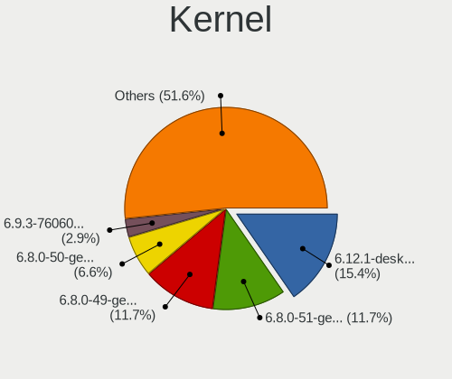
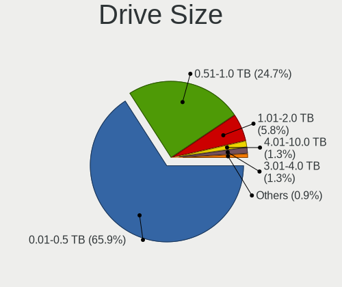
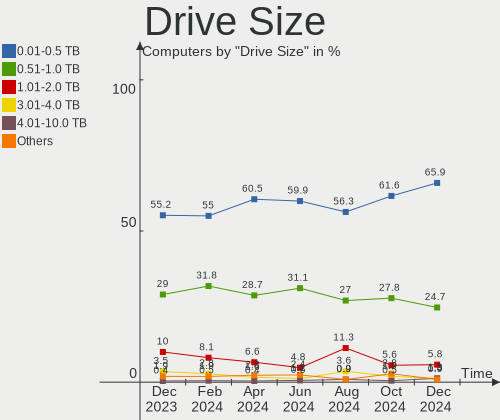
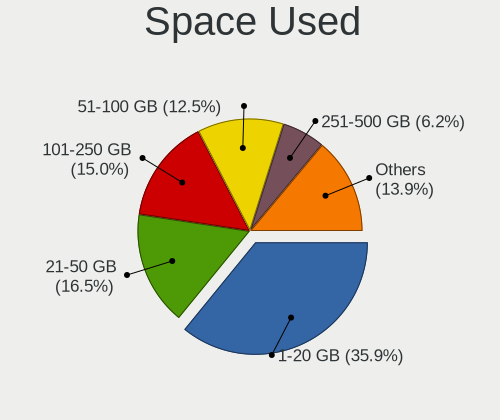
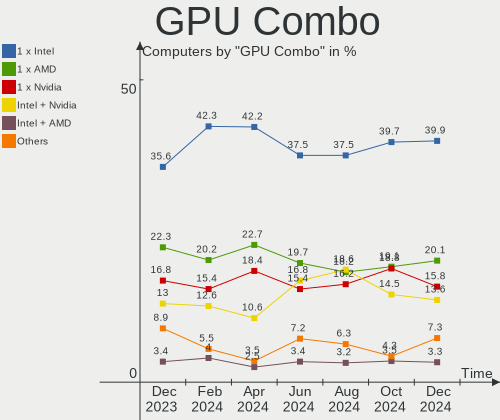
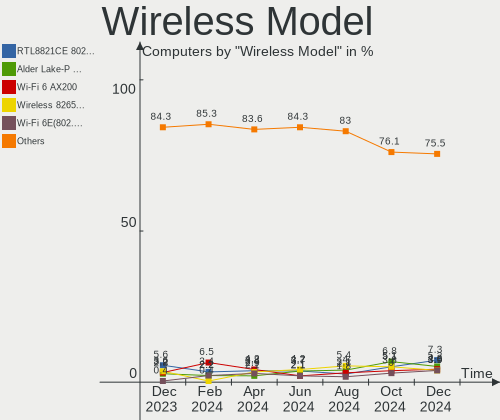
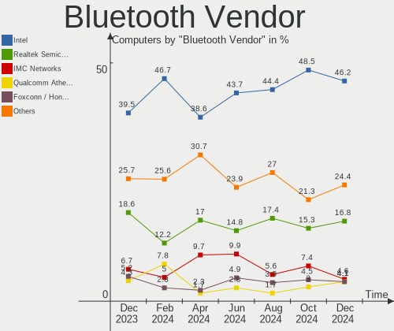
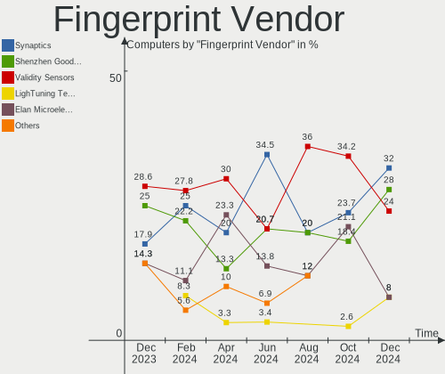

Linux in Italy - Hardware Trends
--------------------------------

A project to identify most popular hardware characteristics and track their change
over time based on data collected by Linux users at https://Linux-Hardware.org.

Anyone can contribute to this report by the [hw-probe](https://github.com/linuxhw/hw-probe) tool:

    sudo -E hw-probe -all -upload

This is a report for all computer types. See also reports for [desktops](/Location/Italy/Desktop/README.md) and [notebooks](/Location/Italy/Notebook/README.md).

Period: Jul, 2023.

Contents
--------

* [ System ](#system)
  - [ OS                       ](#os)
  - [ OS Family                ](#os-family)
  - [ Kernel                   ](#kernel)
  - [ Kernel Family            ](#kernel-family)
  - [ Kernel Major Ver.        ](#kernel-major-ver)
  - [ Arch                     ](#arch)
  - [ DE                       ](#de)
  - [ Display Server           ](#display-server)
  - [ Display Manager          ](#display-manager)
  - [ OS Lang                  ](#os-lang)
  - [ Boot Mode                ](#boot-mode)
  - [ Filesystem               ](#filesystem)
  - [ Part. scheme             ](#part-scheme)
  - [ Dual Boot with Linux/BSD ](#dual-boot-with-linuxbsd)
  - [ Dual Boot (Win)          ](#dual-boot-win)

* [ Board ](#board)
  - [ Vendor                   ](#vendor)
  - [ Model                    ](#model)
  - [ Model Family             ](#model-family)
  - [ MFG Year                 ](#mfg-year)
  - [ Form Factor              ](#form-factor)
  - [ Secure Boot              ](#secure-boot)
  - [ Coreboot                 ](#coreboot)
  - [ RAM Size                 ](#ram-size)
  - [ RAM Used                 ](#ram-used)
  - [ Total Drives             ](#total-drives)
  - [ Has CD-ROM               ](#has-cd-rom)
  - [ Has Ethernet             ](#has-ethernet)
  - [ Has WiFi                 ](#has-wifi)
  - [ Has Bluetooth            ](#has-bluetooth)

* [ Location ](#location)
  - [ Country                  ](#country)
  - [ City                     ](#city)

* [ Drives ](#drives)
  - [ Drive Vendor             ](#drive-vendor)
  - [ Drive Model              ](#drive-model)
  - [ HDD Vendor               ](#hdd-vendor)
  - [ SSD Vendor               ](#ssd-vendor)
  - [ Drive Kind               ](#drive-kind)
  - [ Drive Connector          ](#drive-connector)
  - [ Drive Size               ](#drive-size)
  - [ Space Total              ](#space-total)
  - [ Space Used               ](#space-used)
  - [ Malfunc. Drives          ](#malfunc-drives)
  - [ Malfunc. Drive Vendor    ](#malfunc-drive-vendor)
  - [ Malfunc. HDD Vendor      ](#malfunc-hdd-vendor)
  - [ Malfunc. Drive Kind      ](#malfunc-drive-kind)
  - [ Failed Drives            ](#failed-drives)
  - [ Failed Drive Vendor      ](#failed-drive-vendor)
  - [ Drive Status             ](#drive-status)

* [ Storage controller ](#storage-controller)
  - [ Storage Vendor           ](#storage-vendor)
  - [ Storage Model            ](#storage-model)
  - [ Storage Kind             ](#storage-kind)

* [ Processor ](#processor)
  - [ CPU Vendor               ](#cpu-vendor)
  - [ CPU Model                ](#cpu-model)
  - [ CPU Model Family         ](#cpu-model-family)
  - [ CPU Cores                ](#cpu-cores)
  - [ CPU Sockets              ](#cpu-sockets)
  - [ CPU Threads              ](#cpu-threads)
  - [ CPU Op-Modes             ](#cpu-op-modes)
  - [ CPU Microcode            ](#cpu-microcode)
  - [ CPU Microarch            ](#cpu-microarch)

* [ Graphics ](#graphics)
  - [ GPU Vendor               ](#gpu-vendor)
  - [ GPU Model                ](#gpu-model)
  - [ GPU Combo                ](#gpu-combo)
  - [ GPU Driver               ](#gpu-driver)
  - [ GPU Memory               ](#gpu-memory)

* [ Monitor ](#monitor)
  - [ Monitor Vendor           ](#monitor-vendor)
  - [ Monitor Model            ](#monitor-model)
  - [ Monitor Resolution       ](#monitor-resolution)
  - [ Monitor Diagonal         ](#monitor-diagonal)
  - [ Monitor Width            ](#monitor-width)
  - [ Aspect Ratio             ](#aspect-ratio)
  - [ Monitor Area             ](#monitor-area)
  - [ Pixel Density            ](#pixel-density)
  - [ Multiple Monitors        ](#multiple-monitors)

* [ Network ](#network)
  - [ Net Controller Vendor    ](#net-controller-vendor)
  - [ Net Controller Model     ](#net-controller-model)
  - [ Wireless Vendor          ](#wireless-vendor)
  - [ Wireless Model           ](#wireless-model)
  - [ Ethernet Vendor          ](#ethernet-vendor)
  - [ Ethernet Model           ](#ethernet-model)
  - [ Net Controller Kind      ](#net-controller-kind)
  - [ Used Controller          ](#used-controller)
  - [ NICs                     ](#nics)
  - [ IPv6                     ](#ipv6)

* [ Bluetooth ](#bluetooth)
  - [ Bluetooth Vendor         ](#bluetooth-vendor)
  - [ Bluetooth Model          ](#bluetooth-model)

* [ Sound ](#sound)
  - [ Sound Vendor             ](#sound-vendor)
  - [ Sound Model              ](#sound-model)

* [ Memory ](#memory)
  - [ Memory Vendor            ](#memory-vendor)
  - [ Memory Model             ](#memory-model)
  - [ Memory Kind              ](#memory-kind)
  - [ Memory Form Factor       ](#memory-form-factor)
  - [ Memory Size              ](#memory-size)
  - [ Memory Speed             ](#memory-speed)

* [ Printers & scanners ](#printers--scanners)
  - [ Printer Vendor           ](#printer-vendor)
  - [ Printer Model            ](#printer-model)
  - [ Scanner Vendor           ](#scanner-vendor)
  - [ Scanner Model            ](#scanner-model)

* [ Camera ](#camera)
  - [ Camera Vendor            ](#camera-vendor)
  - [ Camera Model             ](#camera-model)

* [ Security ](#security)
  - [ Fingerprint Vendor       ](#fingerprint-vendor)
  - [ Fingerprint Model        ](#fingerprint-model)
  - [ Chipcard Vendor          ](#chipcard-vendor)
  - [ Chipcard Model           ](#chipcard-model)

* [ Unsupported ](#unsupported)
  - [ Unsupported Devices      ](#unsupported-devices)
  - [ Unsupported Device Types ](#unsupported-device-types)

System
------

OS
--

Installed operating systems

| Name                         | Computers | Percent |
|------------------------------|-----------|---------|
| Ubuntu 22.04                 | 28        | 14.89%  |
| Fedora 38                    | 20        | 10.64%  |
| Linux Mint 21.1              | 12        | 6.38%   |
| OpenMandriva 23.03           | 10        | 5.32%   |
| Debian 12                    | 10        | 5.32%   |
| Ubuntu 23.04                 | 9         | 4.79%   |
| EndeavourOS Rolling          | 7         | 3.72%   |
| Arch Rolling                 | 7         | 3.72%   |
| Pop!_OS 22.04                | 6         | 3.19%   |
| ArcoLinux Rolling            | 6         | 3.19%   |
| Zorin 16                     | 5         | 2.66%   |
| openSUSE Tumbleweed-XXXXXXXX | 5         | 2.66%   |
| OpenMandriva 23.07           | 5         | 2.66%   |
| Debian                       | 4         | 2.13%   |
| Xubuntu 22.04                | 3         | 1.6%    |
| Manjaro 23.0.0               | 3         | 1.6%    |
| Linux Mint 21.2              | 3         | 1.6%    |
| Xubuntu 23.04                | 2         | 1.06%   |
| Xero Rolling                 | 2         | 1.06%   |
| Ubuntu 20.04                 | 2         | 1.06%   |
| openSUSE Leap-15.5           | 2         | 1.06%   |
| OpenMandriva 23.01           | 2         | 1.06%   |
| Linux Mint 20.3              | 2         | 1.06%   |
| Fedora 37                    | 2         | 1.06%   |
| Debian 11                    | 2         | 1.06%   |
| Zorin 15                     | 1         | 0.53%   |
| Xubuntu 20.04                | 1         | 0.53%   |
| Ubuntu MATE 22.04            | 1         | 0.53%   |
| Ubuntu MATE 20.04            | 1         | 0.53%   |
| Ubuntu 22.10                 | 1         | 0.53%   |
| Slackware 15.0               | 1         | 0.53%   |
| ROSA 12.4                    | 1         | 0.53%   |
| Parrot 5.3                   | 1         | 0.53%   |
| OpenMandriva 4.3             | 1         | 0.53%   |
| OpenMandriva 4.2             | 1         | 0.53%   |
| Nobara 38                    | 1         | 0.53%   |
| NixOS 23.11                  | 1         | 0.53%   |
| NixOS 23.05                  | 1         | 0.53%   |
| MX 21                        | 1         | 0.53%   |
| LMDE 5                       | 1         | 0.53%   |

OS Family
---------

OS without a version

| Name         | Computers | Percent |
|--------------|-----------|---------|
| Ubuntu       | 40        | 21.28%  |
| Fedora       | 24        | 12.77%  |
| OpenMandriva | 19        | 10.11%  |
| Linux Mint   | 18        | 9.57%   |
| Debian       | 16        | 8.51%   |
| openSUSE     | 7         | 3.72%   |
| EndeavourOS  | 7         | 3.72%   |
| Arch         | 7         | 3.72%   |
| Zorin        | 6         | 3.19%   |
| Xubuntu      | 6         | 3.19%   |
| Pop!_OS      | 6         | 3.19%   |
| ArcoLinux    | 6         | 3.19%   |
| Manjaro      | 3         | 1.6%    |
| Xero         | 2         | 1.06%   |
| Ubuntu MATE  | 2         | 1.06%   |
| NixOS        | 2         | 1.06%   |
| Kubuntu      | 2         | 1.06%   |
| Elementary   | 2         | 1.06%   |
| Slackware    | 1         | 0.53%   |
| ROSA         | 1         | 0.53%   |
| Parrot       | 1         | 0.53%   |
| Nobara       | 1         | 0.53%   |
| MX           | 1         | 0.53%   |
| LMDE         | 1         | 0.53%   |
| KDE neon     | 1         | 0.53%   |
| Kali         | 1         | 0.53%   |
| Gentoo       | 1         | 0.53%   |
| Garuda Linux | 1         | 0.53%   |
| ChimeraOS    | 1         | 0.53%   |
| CachyOS      | 1         | 0.53%   |
| blendOS      | 1         | 0.53%   |

Kernel
------

Version of the Linux kernel

| Version                | Computers | Percent |
|------------------------|-----------|---------|
| 5.19.0-46-generic      | 20        | 10.64%  |
| 5.15.0-76-generic      | 19        | 10.11%  |
| 6.2.6-desktop-1omv2390 | 11        | 5.85%   |
| 6.3.12-200.fc38.x86_64 | 9         | 4.79%   |
| 6.2.6-76060206-generic | 6         | 3.19%   |
| 6.2.0-25-generic       | 5         | 2.66%   |
| 6.4.3-arch1-1          | 4         | 2.13%   |
| 6.4.2-arch1-1          | 4         | 2.13%   |
| 6.3.9-1-default        | 4         | 2.13%   |
| 6.3.5-desktop-3omv2390 | 4         | 2.13%   |
| 6.3.11-200.fc38.x86_64 | 4         | 2.13%   |
| 6.3.0-1-amd64          | 4         | 2.13%   |
| 6.2.9-300.fc38.x86_64  | 4         | 2.13%   |
| 6.1.0-9-amd64          | 4         | 2.13%   |
| 6.1.0-10-amd64         | 4         | 2.13%   |
| 6.4.1-zen1-1-zen       | 3         | 1.6%    |
| 6.3.8-200.fc38.x86_64  | 3         | 1.6%    |
| 5.19.0-50-generic      | 3         | 1.6%    |
| 5.19.0-32-generic      | 3         | 1.6%    |
| 5.15.0-78-generic      | 3         | 1.6%    |
| 5.15.0-72-generic      | 3         | 1.6%    |
| 6.4.5-arch1-1          | 2         | 1.06%   |
| 6.2.0-26-generic       | 2         | 1.06%   |
| 6.2.0-24-generic       | 2         | 1.06%   |
| 6.2.0-20-generic       | 2         | 1.06%   |
| 6.1.1-desktop-1omv2290 | 2         | 1.06%   |
| 5.19.0-43-generic      | 2         | 1.06%   |
| 5.15.0-75-generic      | 2         | 1.06%   |
| 5.10.0-23-amd64        | 2         | 1.06%   |
| 6.4.7-arch1-1          | 1         | 0.53%   |
| 6.4.6-arch1-1          | 1         | 0.53%   |
| 6.4.6-200.fc38.x86_64  | 1         | 0.53%   |
| 6.4.4-zen1-1-zen       | 1         | 0.53%   |
| 6.4.4-arch1-1          | 1         | 0.53%   |
| 6.4.3-1-default        | 1         | 0.53%   |
| 6.4.3-1-cachyos        | 1         | 0.53%   |
| 6.4.2-x64v2-xanmod1-3  | 1         | 0.53%   |
| 6.4.2-3-MANJARO        | 1         | 0.53%   |
| 6.4.1-arch2-1          | 1         | 0.53%   |
| 6.4.1-arch1-1          | 1         | 0.53%   |

Kernel Family
-------------

Linux kernel without a distro release

| Version  | Computers | Percent |
|----------|-----------|---------|
| 5.15.0   | 31        | 16.49%  |
| 5.19.0   | 29        | 15.43%  |
| 6.2.6    | 17        | 9.04%   |
| 6.2.0    | 12        | 6.38%   |
| 6.3.12   | 11        | 5.85%   |
| 6.1.0    | 9         | 4.79%   |
| 6.3.9    | 7         | 3.72%   |
| 6.4.3    | 6         | 3.19%   |
| 6.4.2    | 6         | 3.19%   |
| 6.4.1    | 6         | 3.19%   |
| 6.3.0    | 5         | 2.66%   |
| 6.3.5    | 4         | 2.13%   |
| 6.3.11   | 4         | 2.13%   |
| 6.2.9    | 4         | 2.13%   |
| 6.4.0    | 3         | 1.6%    |
| 6.3.8    | 3         | 1.6%    |
| 5.10.0   | 3         | 1.6%    |
| 6.4.6    | 2         | 1.06%   |
| 6.4.5    | 2         | 1.06%   |
| 6.4.4    | 2         | 1.06%   |
| 6.2.15   | 2         | 1.06%   |
| 6.1.1    | 2         | 1.06%   |
| 5.4.0    | 2         | 1.06%   |
| 5.14.21  | 2         | 1.06%   |
| 6.4.7    | 1         | 0.53%   |
| 6.2.16   | 1         | 0.53%   |
| 6.2.13   | 1         | 0.53%   |
| 6.1.39   | 1         | 0.53%   |
| 6.1.38   | 1         | 0.53%   |
| 6.1.37   | 1         | 0.53%   |
| 6.1.31   | 1         | 0.53%   |
| 5.16.7   | 1         | 0.53%   |
| 5.16.17  | 1         | 0.53%   |
| 5.15.117 | 1         | 0.53%   |
| 5.13.0   | 1         | 0.53%   |
| 5.11.0   | 1         | 0.53%   |
| 5.10.184 | 1         | 0.53%   |
| 5.10.14  | 1         | 0.53%   |

Kernel Major Ver.
-----------------

Linux kernel major version

| Version | Computers | Percent |
|---------|-----------|---------|
| 6.2     | 37        | 19.68%  |
| 6.3     | 34        | 18.09%  |
| 5.15    | 32        | 17.02%  |
| 5.19    | 29        | 15.43%  |
| 6.4     | 28        | 14.89%  |
| 6.1     | 15        | 7.98%   |
| 5.10    | 5         | 2.66%   |
| 5.4     | 2         | 1.06%   |
| 5.16    | 2         | 1.06%   |
| 5.14    | 2         | 1.06%   |
| 5.13    | 1         | 0.53%   |
| 5.11    | 1         | 0.53%   |

Arch
----

OS architecture (x86_64, i586, etc.)

| Name    | Computers | Percent |
|---------|-----------|---------|
| x86_64  | 186       | 98.94%  |
| i686    | 1         | 0.53%   |
| aarch64 | 1         | 0.53%   |

DE
--

Desktop Environment

| Name          | Computers | Percent |
|---------------|-----------|---------|
| GNOME         | 89        | 47.34%  |
| KDE5          | 39        | 20.74%  |
| XFCE          | 22        | 11.7%   |
| X-Cinnamon    | 15        | 7.98%   |
| MATE          | 7         | 3.72%   |
| Unknown       | 5         | 2.66%   |
| i3            | 3         | 1.6%    |
| Pantheon      | 2         | 1.06%   |
| Cinnamon      | 2         | 1.06%   |
| sway          | 1         | 0.53%   |
| LXQt          | 1         | 0.53%   |
| LXDE          | 1         | 0.53%   |
| GNOME Classic | 1         | 0.53%   |

Display Server
--------------

X11 or Wayland

| Name    | Computers | Percent |
|---------|-----------|---------|
| X11     | 133       | 70.74%  |
| Wayland | 50        | 26.6%   |
| Tty     | 3         | 1.6%    |
| Unknown | 2         | 1.06%   |

Display Manager
---------------

SDDM, LightDM, etc.

| Name    | Computers | Percent |
|---------|-----------|---------|
| Unknown | 57        | 30.32%  |
| GDM3    | 45        | 23.94%  |
| SDDM    | 36        | 19.15%  |
| LightDM | 31        | 16.49%  |
| GDM     | 16        | 8.51%   |
| XDM     | 2         | 1.06%   |
| LXDM    | 1         | 0.53%   |

OS Lang
-------

Language

| Lang    | Computers | Percent |
|---------|-----------|---------|
| it_IT   | 123       | 65.43%  |
| en_US   | 47        | 25%     |
| en_GB   | 11        | 5.85%   |
| C       | 3         | 1.6%    |
| Unknown | 2         | 1.06%   |
| POSIX   | 1         | 0.53%   |
| de_DE   | 1         | 0.53%   |

Boot Mode
---------

EFI or BIOS

| Mode | Computers | Percent |
|------|-----------|---------|
| EFI  | 113       | 60.11%  |
| BIOS | 75        | 39.89%  |

Filesystem
----------

Type of filesystem

| Type    | Computers | Percent |
|---------|-----------|---------|
| Ext4    | 106       | 56.38%  |
| Btrfs   | 35        | 18.62%  |
| Tmpfs   | 27        | 14.36%  |
| Overlay | 13        | 6.91%   |
| Xfs     | 5         | 2.66%   |
| Ext3    | 1         | 0.53%   |
| Ext2    | 1         | 0.53%   |

Part. scheme
------------

Scheme of partitioning

| Type    | Computers | Percent |
|---------|-----------|---------|
| GPT     | 106       | 56.38%  |
| Unknown | 54        | 28.72%  |
| MBR     | 28        | 14.89%  |

Dual Boot with Linux/BSD
------------------------

Hosting more than one Linux/BSD

| Dual boot | Computers | Percent |
|-----------|-----------|---------|
| No        | 149       | 79.26%  |
| Yes       | 39        | 20.74%  |

Dual Boot (Win)
---------------

Hosting Linux and Windows

| Dual boot | Computers | Percent |
|-----------|-----------|---------|
| No        | 137       | 72.87%  |
| Yes       | 51        | 27.13%  |

Board
-----

Vendor
------

Motherboard manufacturer

| Name                                 | Computers | Percent |
|--------------------------------------|-----------|---------|
| Hewlett-Packard                      | 31        | 16.49%  |
| ASUSTek Computer                     | 23        | 12.23%  |
| MSI                                  | 20        | 10.64%  |
| Dell                                 | 18        | 9.57%   |
| Lenovo                               | 15        | 7.98%   |
| Acer                                 | 15        | 7.98%   |
| Gigabyte Technology                  | 9         | 4.79%   |
| ASRock                               | 7         | 3.72%   |
| HUAWEI                               | 6         | 3.19%   |
| Apple                                | 6         | 3.19%   |
| Toshiba                              | 4         | 2.13%   |
| Unknown                              | 3         | 1.6%    |
| Timi                                 | 2         | 1.06%   |
| Sony                                 | 2         | 1.06%   |
| Notebook                             | 2         | 1.06%   |
| Intel                                | 2         | 1.06%   |
| Fujitsu                              | 2         | 1.06%   |
| TUXEDO                               | 1         | 0.53%   |
| Teclast                              | 1         | 0.53%   |
| SLIMBOOK                             | 1         | 0.53%   |
| SiComputer                           | 1         | 0.53%   |
| Shenzhen Meigao Electronic Equipment | 1         | 0.53%   |
| SANTECH                              | 1         | 0.53%   |
| Samsung Electronics                  | 1         | 0.53%   |
| Phoenix Contact                      | 1         | 0.53%   |
| Panasonic                            | 1         | 0.53%   |
| Packard Bell                         | 1         | 0.53%   |
| Olivetti                             | 1         | 0.53%   |
| Olidata                              | 1         | 0.53%   |
| Microtech                            | 1         | 0.53%   |
| Microsoft                            | 1         | 0.53%   |
| Jumper                               | 1         | 0.53%   |
| Fujitsu Siemens                      | 1         | 0.53%   |
| Cincoze                              | 1         | 0.53%   |
| Chuwi                                | 1         | 0.53%   |
| Beelink                              | 1         | 0.53%   |
| AMI                                  | 1         | 0.53%   |
| ADLINK Technology                    | 1         | 0.53%   |

Model
-----

Motherboard model

| Name                                       | Computers | Percent |
|--------------------------------------------|-----------|---------|
| Unknown                                    | 3         | 1.6%    |
| MSI MS-7C52                                | 2         | 1.06%   |
| MSI Alpha 15 B5EEK                         | 2         | 1.06%   |
| Lenovo V15-IGL 82C3                        | 2         | 1.06%   |
| HUAWEI NBLK-WAX9X                          | 2         | 1.06%   |
| HP Victus by Laptop 16-e0xxx               | 2         | 1.06%   |
| HP Laptop 15s-fq2xxx                       | 2         | 1.06%   |
| HP Compaq 6000 Pro MT PC                   | 2         | 1.06%   |
| Apple MacBookPro14,3                       | 2         | 1.06%   |
| TUXEDO InfinityBook Pro Gen7 (MK1)         | 1         | 0.53%   |
| Toshiba TECRA A10                          | 1         | 0.53%   |
| Toshiba Satellite Pro S500                 | 1         | 0.53%   |
| Toshiba Satellite L750                     | 1         | 0.53%   |
| Toshiba Satellite C660                     | 1         | 0.53%   |
| Timi RedmiBook 16                          | 1         | 0.53%   |
| Timi A7S                                   | 1         | 0.53%   |
| Teclast F7 Plus                            | 1         | 0.53%   |
| Sony VGN-NS21M_W                           | 1         | 0.53%   |
| Sony SVE1713X1EB                           | 1         | 0.53%   |
| SLIMBOOK Executive                         | 1         | 0.53%   |
| SiComputer NL40_50CU                       | 1         | 0.53%   |
| Shenzhen Meigao Electronic Equipment HX99G | 1         | 0.53%   |
| SANTECH NHx0DB,DE                          | 1         | 0.53%   |
| Samsung 350V5C/351V5C/3540VC/3440VC        | 1         | 0.53%   |
| Phoenix Contact Valueline VL3 UPC          | 1         | 0.53%   |
| Panasonic CF-C1BD06EFG                     | 1         | 0.53%   |
| Packard Bell EasyNote MH36                 | 1         | 0.53%   |
| Olivetti Olipad Graphos W811               | 1         | 0.53%   |
| Olidata Stainer 8050                       | 1         | 0.53%   |
| Notebook PCX0DX                            | 1         | 0.53%   |
| Notebook P7xxTM1                           | 1         | 0.53%   |
| MSI NQ890AA-ABZ CQ5011IT                   | 1         | 0.53%   |
| MSI MS-7D78                                | 1         | 0.53%   |
| MSI MS-7D75                                | 1         | 0.53%   |
| MSI MS-7D25                                | 1         | 0.53%   |
| MSI MS-7D16                                | 1         | 0.53%   |
| MSI MS-7C56                                | 1         | 0.53%   |
| MSI MS-7C51                                | 1         | 0.53%   |
| MSI MS-7C37                                | 1         | 0.53%   |
| MSI MS-7C02                                | 1         | 0.53%   |

Model Family
------------

Motherboard model prefix

| Name                                       | Computers | Percent |
|--------------------------------------------|-----------|---------|
| Acer Aspire                                | 12        | 6.38%   |
| HP Pavilion                                | 8         | 4.26%   |
| Lenovo IdeaPad                             | 7         | 3.72%   |
| Dell Latitude                              | 7         | 3.72%   |
| Dell XPS                                   | 5         | 2.66%   |
| ASUS ROG                                   | 5         | 2.66%   |
| Lenovo ThinkPad                            | 4         | 2.13%   |
| ASUS PRIME                                 | 4         | 2.13%   |
| Toshiba Satellite                          | 3         | 1.6%    |
| HP Victus                                  | 3         | 1.6%    |
| HP ProBook                                 | 3         | 1.6%    |
| HP Laptop                                  | 3         | 1.6%    |
| HP Compaq                                  | 3         | 1.6%    |
| HP 250                                     | 3         | 1.6%    |
| Unknown                                    | 3         | 1.6%    |
| MSI MS-7C52                                | 2         | 1.06%   |
| MSI Creator                                | 2         | 1.06%   |
| MSI Alpha                                  | 2         | 1.06%   |
| Lenovo V15-IGL                             | 2         | 1.06%   |
| HUAWEI NBLK-WAX9X                          | 2         | 1.06%   |
| HP ProDesk                                 | 2         | 1.06%   |
| Fujitsu ESPRIMO                            | 2         | 1.06%   |
| Dell OptiPlex                              | 2         | 1.06%   |
| Dell Inspiron                              | 2         | 1.06%   |
| Apple MacBookPro14                         | 2         | 1.06%   |
| Acer TravelMate                            | 2         | 1.06%   |
| TUXEDO InfinityBook                        | 1         | 0.53%   |
| Toshiba TECRA                              | 1         | 0.53%   |
| Timi RedmiBook                             | 1         | 0.53%   |
| Timi A7S                                   | 1         | 0.53%   |
| Teclast F7                                 | 1         | 0.53%   |
| Sony VGN-NS21M                             | 1         | 0.53%   |
| Sony SVE1713X1EB                           | 1         | 0.53%   |
| SLIMBOOK Executive                         | 1         | 0.53%   |
| SiComputer NL40                            | 1         | 0.53%   |
| Shenzhen Meigao Electronic Equipment HX99G | 1         | 0.53%   |
| SANTECH NHx0DB                             | 1         | 0.53%   |
| Samsung 350V5C                             | 1         | 0.53%   |
| Phoenix Contact Valueline                  | 1         | 0.53%   |
| Panasonic CF-C1BD06EFG                     | 1         | 0.53%   |

MFG Year
--------

Motherboard manufacture year

| Year    | Computers | Percent |
|---------|-----------|---------|
| 2021    | 29        | 15.43%  |
| 2020    | 21        | 11.17%  |
| 2019    | 18        | 9.57%   |
| 2018    | 18        | 9.57%   |
| 2022    | 15        | 7.98%   |
| 2013    | 12        | 6.38%   |
| 2012    | 10        | 5.32%   |
| 2023    | 8         | 4.26%   |
| 2009    | 8         | 4.26%   |
| 2017    | 7         | 3.72%   |
| 2015    | 7         | 3.72%   |
| 2014    | 7         | 3.72%   |
| 2011    | 7         | 3.72%   |
| 2008    | 7         | 3.72%   |
| 2010    | 5         | 2.66%   |
| 2016    | 4         | 2.13%   |
| 2007    | 2         | 1.06%   |
| 2006    | 1         | 0.53%   |
| 2005    | 1         | 0.53%   |
| Unknown | 1         | 0.53%   |

Form Factor
-----------

Physical design of the computer

| Name           | Computers | Percent |
|----------------|-----------|---------|
| Notebook       | 108       | 57.45%  |
| Desktop        | 64        | 34.04%  |
| Tablet         | 4         | 2.13%   |
| Convertible    | 4         | 2.13%   |
| Mini pc        | 3         | 1.6%    |
| All in one     | 3         | 1.6%    |
| System on chip | 1         | 0.53%   |
| Server         | 1         | 0.53%   |

Secure Boot
-----------

Enabled or disabled

| State    | Computers | Percent |
|----------|-----------|---------|
| Disabled | 177       | 94.15%  |
| Enabled  | 11        | 5.85%   |

Coreboot
--------

Have coreboot on board

| Used | Computers | Percent |
|------|-----------|---------|
| No   | 188       | 100%    |

RAM Size
--------

Total RAM memory

| Size in GB      | Computers | Percent |
|-----------------|-----------|---------|
| 16.01-24.0      | 45        | 23.94%  |
| 4.01-8.0        | 41        | 21.81%  |
| 8.01-16.0       | 31        | 16.49%  |
| 32.01-64.0      | 25        | 13.3%   |
| 3.01-4.0        | 24        | 12.77%  |
| 64.01-256.0     | 8         | 4.26%   |
| 24.01-32.0      | 4         | 2.13%   |
| 1.01-2.0        | 4         | 2.13%   |
| 2.01-3.0        | 3         | 1.6%    |
| 0.51-1.0        | 2         | 1.06%   |
| More than 256.0 | 1         | 0.53%   |

RAM Used
--------

Used RAM memory

| Used GB    | Computers | Percent |
|------------|-----------|---------|
| 2.01-3.0   | 56        | 29.79%  |
| 1.01-2.0   | 54        | 28.72%  |
| 3.01-4.0   | 30        | 15.96%  |
| 4.01-8.0   | 28        | 14.89%  |
| 8.01-16.0  | 10        | 5.32%   |
| 0.51-1.0   | 7         | 3.72%   |
| 0.01-0.5   | 2         | 1.06%   |
| 16.01-24.0 | 1         | 0.53%   |

Total Drives
------------

Number of drives on board

| Drives | Computers | Percent |
|--------|-----------|---------|
| 1      | 109       | 57.98%  |
| 2      | 47        | 25%     |
| 3      | 16        | 8.51%   |
| 4      | 5         | 2.66%   |
| 0      | 5         | 2.66%   |
| 6      | 3         | 1.6%    |
| 5      | 2         | 1.06%   |
| 7      | 1         | 0.53%   |

Has CD-ROM
----------

Has CD-ROM on board

| Presented | Computers | Percent |
|-----------|-----------|---------|
| No        | 132       | 70.21%  |
| Yes       | 56        | 29.79%  |

Has Ethernet
------------

Has Ethernet on board

| Presented | Computers | Percent |
|-----------|-----------|---------|
| Yes       | 155       | 82.45%  |
| No        | 33        | 17.55%  |

Has WiFi
--------

Has WiFi module

| Presented | Computers | Percent |
|-----------|-----------|---------|
| Yes       | 150       | 79.79%  |
| No        | 38        | 20.21%  |

Has Bluetooth
-------------

Has Bluetooth module

| Presented | Computers | Percent |
|-----------|-----------|---------|
| Yes       | 129       | 68.62%  |
| No        | 59        | 31.38%  |

Location
--------

Country
-------

Geographic location (country)

| Country | Computers | Percent |
|---------|-----------|---------|
| Italy   | 188       | 100%    |

City
----

Geographic location (city)

| City                     | Computers | Percent |
|--------------------------|-----------|---------|
| Milan                    | 18        | 9.57%   |
| Milano                   | 12        | 6.38%   |
| Rome                     | 7         | 3.72%   |
| Rho                      | 5         | 2.66%   |
| Naples                   | 5         | 2.66%   |
| Turin                    | 4         | 2.13%   |
| Padova                   | 4         | 2.13%   |
| Salerno                  | 3         | 1.6%    |
| Monza                    | 3         | 1.6%    |
| Lonato                   | 3         | 1.6%    |
| Florence                 | 3         | 1.6%    |
| Venice                   | 2         | 1.06%   |
| Trieste                  | 2         | 1.06%   |
| Seregno                  | 2         | 1.06%   |
| Passignano sul Trasimeno | 2         | 1.06%   |
| Parma                    | 2         | 1.06%   |
| Paderno Dugnano          | 2         | 1.06%   |
| Genoa                    | 2         | 1.06%   |
| Catania                  | 2         | 1.06%   |
| Cagliari                 | 2         | 1.06%   |
| Brescia                  | 2         | 1.06%   |
| Bologna                  | 2         | 1.06%   |
| Alessandria              | 2         | 1.06%   |
| Afragola                 | 2         | 1.06%   |
| Zoppola                  | 1         | 0.53%   |
| Vigolo                   | 1         | 0.53%   |
| Vigliano Biellese        | 1         | 0.53%   |
| Vicenza                  | 1         | 0.53%   |
| Verona                   | 1         | 0.53%   |
| Vendone                  | 1         | 0.53%   |
| Udine                    | 1         | 0.53%   |
| Trivero                  | 1         | 0.53%   |
| Treviso                  | 1         | 0.53%   |
| Treviolo                 | 1         | 0.53%   |
| Trento                   | 1         | 0.53%   |
| Tarquinia                | 1         | 0.53%   |
| Sorrento                 | 1         | 0.53%   |
| Sorbolo                  | 1         | 0.53%   |
| Sassari                  | 1         | 0.53%   |
| Santa Flavia             | 1         | 0.53%   |

Drives
------

Drive Vendor
------------

Hard drive vendors

| Vendor                      | Computers | Drives | Percent |
|-----------------------------|-----------|--------|---------|
| Samsung Electronics         | 56        | 67     | 20.66%  |
| WDC                         | 30        | 34     | 11.07%  |
| Seagate                     | 29        | 36     | 10.7%   |
| Kingston                    | 18        | 19     | 6.64%   |
| Crucial                     | 18        | 21     | 6.64%   |
| Sandisk                     | 17        | 18     | 6.27%   |
| Toshiba                     | 13        | 14     | 4.8%    |
| SK hynix                    | 10        | 10     | 3.69%   |
| Unknown                     | 7         | 7      | 2.58%   |
| Hitachi                     | 6         | 6      | 2.21%   |
| SPCC                        | 5         | 5      | 1.85%   |
| Phison Electronics          | 5         | 5      | 1.85%   |
| Micron/Crucial Technology   | 5         | 5      | 1.85%   |
| China                       | 5         | 5      | 1.85%   |
| Kingston Technology Company | 4         | 4      | 1.48%   |
| Intel                       | 4         | 4      | 1.48%   |
| Unknown                     | 4         | 4      | 1.48%   |
| Team                        | 3         | 3      | 1.11%   |
| Silicon Motion              | 3         | 3      | 1.11%   |
| Micron Technology           | 3         | 3      | 1.11%   |
| Patriot                     | 2         | 2      | 0.74%   |
| MAXIO Technology (Hangzhou) | 2         | 2      | 0.74%   |
| KIOXIA                      | 2         | 2      | 0.74%   |
| Intenso                     | 2         | 3      | 0.74%   |
| HGST                        | 2         | 2      | 0.74%   |
| Apple                       | 2         | 4      | 0.74%   |
| Verbatim                    | 1         | 1      | 0.37%   |
| Vaseky                      | 1         | 1      | 0.37%   |
| Teclast                     | 1         | 1      | 0.37%   |
| SCY                         | 1         | 1      | 0.37%   |
| SABRENT                     | 1         | 1      | 0.37%   |
| Phison                      | 1         | 2      | 0.37%   |
| Microtech                   | 1         | 1      | 0.37%   |
| MemoirsTek                  | 1         | 1      | 0.37%   |
| Maxtor                      | 1         | 2      | 0.37%   |
| LITEON                      | 1         | 1      | 0.37%   |
| Lexar                       | 1         | 1      | 0.37%   |
| FORESEE                     | 1         | 1      | 0.37%   |
| Drevo                       | 1         | 1      | 0.37%   |
| BAITITON                    | 1         | 1      | 0.37%   |

Drive Model
-----------

Hard drive models

| Model                                                 | Computers | Percent |
|-------------------------------------------------------|-----------|---------|
| Crucial CT500MX500SSD1 500GB                          | 6         | 2.03%   |
| Samsung NVMe SSD Controller SM981/PM981/PM983 500GB   | 5         | 1.69%   |
| Samsung SSD 860 EVO 500GB                             | 4         | 1.36%   |
| Samsung SSD 850 EVO 500GB                             | 4         | 1.36%   |
| Micron/Crucial P2 NVMe PCIe SSD 1TB                   | 4         | 1.36%   |
| Kingston SA400S37480G 480GB SSD                       | 4         | 1.36%   |
| Unknown                                               | 4         | 1.36%   |
| WDC PC SN530 SDBPNPZ-512G-1006 512GB                  | 3         | 1.02%   |
| Unknown MMC Card  32GB                                | 3         | 1.02%   |
| SPCC Solid State Disk 512GB                           | 3         | 1.02%   |
| Seagate ST4000DM004-2CV104 4TB                        | 3         | 1.02%   |
| Seagate ST1000DM010-2EP102 1TB                        | 3         | 1.02%   |
| Samsung SSD 870 QVO 2TB                               | 3         | 1.02%   |
| Samsung SSD 870 QVO 1TB                               | 3         | 1.02%   |
| Samsung SSD 870 EVO 500GB                             | 3         | 1.02%   |
| Samsung NVMe SSD Controller PM9A1/PM9A3/980PRO 1TB    | 3         | 1.02%   |
| Phison E12 NVMe Controller 2TB                        | 3         | 1.02%   |
| Crucial CT240BX500SSD1 240GB                          | 3         | 1.02%   |
| WDC WDS100T2B0A-00SM50 1TB SSD                        | 2         | 0.68%   |
| WDC WD5000LPVX-22V0TT0 500GB                          | 2         | 0.68%   |
| WDC WD5000AAKS-00UU3A0 500GB                          | 2         | 0.68%   |
| Unknown SD/MMC/MS PRO 128GB                           | 2         | 0.68%   |
| Toshiba XG6 NVMe SSD Controller 512GB                 | 2         | 0.68%   |
| Toshiba HDWD130 3TB                                   | 2         | 0.68%   |
| SK hynix BC511 HFM256GDJTNI-82A0A 256GB               | 2         | 0.68%   |
| Silicon Motion SM2263EN/SM2263XT SSD Controller 500GB | 2         | 0.68%   |
| Seagate ST500LM012 HN-M500MBB 500GB                   | 2         | 0.68%   |
| Seagate ST500DM002-1BD142 500GB                       | 2         | 0.68%   |
| Seagate ST3500418AS 500GB                             | 2         | 0.68%   |
| Seagate ST2000LX001-1RG174 2TB                        | 2         | 0.68%   |
| Seagate M3 Portable 1TB                               | 2         | 0.68%   |
| Seagate Expansion 1TB                                 | 2         | 0.68%   |
| SanDisk SDSSDA240G 240GB                              | 2         | 0.68%   |
| Sandisk PC SN520 NVMe SSD 512GB                       | 2         | 0.68%   |
| Samsung SSD 980 1TB                                   | 2         | 0.68%   |
| Samsung SSD 970 EVO Plus 2TB                          | 2         | 0.68%   |
| Samsung NVMe SSD Controller SM961/PM961/SM963 256GB   | 2         | 0.68%   |
| Samsung MZALQ256HAJD-000L2 256GB                      | 2         | 0.68%   |
| MAXIO (Hangzhou) NVMe SSD Controller MAP1202 256GB    | 2         | 0.68%   |
| Kingston Company SNV2S1000G 1TB                       | 2         | 0.68%   |

HDD Vendor
----------

Hard disk drive vendors

| Vendor  | Computers | Drives | Percent |
|---------|-----------|--------|---------|
| Seagate | 28        | 34     | 40.58%  |
| WDC     | 20        | 23     | 28.99%  |
| Toshiba | 8         | 8      | 11.59%  |
| Hitachi | 6         | 6      | 8.7%    |
| Unknown | 2         | 2      | 2.9%    |
| HGST    | 2         | 2      | 2.9%    |
| Apple   | 2         | 2      | 2.9%    |
| Maxtor  | 1         | 2      | 1.45%   |

SSD Vendor
----------

Solid state drive vendors

| Vendor              | Computers | Drives | Percent |
|---------------------|-----------|--------|---------|
| Samsung Electronics | 25        | 30     | 26.6%   |
| Crucial             | 16        | 17     | 17.02%  |
| Kingston            | 13        | 14     | 13.83%  |
| SanDisk             | 6         | 6      | 6.38%   |
| SPCC                | 5         | 5      | 5.32%   |
| China               | 5         | 5      | 5.32%   |
| WDC                 | 3         | 3      | 3.19%   |
| Toshiba             | 3         | 3      | 3.19%   |
| Team                | 2         | 2      | 2.13%   |
| Patriot             | 2         | 2      | 2.13%   |
| Intenso             | 2         | 3      | 2.13%   |
| Apple               | 2         | 2      | 2.13%   |
| Verbatim            | 1         | 1      | 1.06%   |
| Vaseky              | 1         | 1      | 1.06%   |
| Teclast             | 1         | 1      | 1.06%   |
| SCY                 | 1         | 1      | 1.06%   |
| Microtech           | 1         | 1      | 1.06%   |
| Lexar               | 1         | 1      | 1.06%   |
| Intel               | 1         | 1      | 1.06%   |
| Drevo               | 1         | 1      | 1.06%   |
| BAITITON            | 1         | 1      | 1.06%   |
| Unknown             | 1         | 1      | 1.06%   |

Drive Kind
----------

HDD or SSD

| Kind    | Computers | Drives | Percent |
|---------|-----------|--------|---------|
| NVMe    | 94        | 112    | 37.75%  |
| SSD     | 87        | 102    | 34.94%  |
| HDD     | 57        | 79     | 22.89%  |
| MMC     | 6         | 6      | 2.41%   |
| Unknown | 5         | 5      | 2.01%   |

Drive Connector
---------------

SATA, SAS, NVMe, etc.

| Type | Computers | Drives | Percent |
|------|-----------|--------|---------|
| SATA | 112       | 174    | 50.45%  |
| NVMe | 93        | 111    | 41.89%  |
| SAS  | 11        | 13     | 4.95%   |
| MMC  | 6         | 6      | 2.7%    |

Drive Size
----------

Size of hard drive

| Size in TB | Computers | Drives | Percent |
|------------|-----------|--------|---------|
| 0.01-0.5   | 87        | 110    | 57.62%  |
| 0.51-1.0   | 40        | 43     | 26.49%  |
| 1.01-2.0   | 14        | 17     | 9.27%   |
| 2.01-3.0   | 5         | 5      | 3.31%   |
| 3.01-4.0   | 4         | 5      | 2.65%   |
| 4.01-10.0  | 1         | 1      | 0.66%   |

Space Total
-----------

Amount of disk space available on the file system

| Size in GB     | Computers | Percent |
|----------------|-----------|---------|
| 251-500        | 53        | 28.19%  |
| 101-250        | 31        | 16.49%  |
| 501-1000       | 27        | 14.36%  |
| 1001-2000      | 23        | 12.23%  |
| 1-20           | 19        | 10.11%  |
| More than 3000 | 13        | 6.91%   |
| 51-100         | 10        | 5.32%   |
| 2001-3000      | 5         | 2.66%   |
| Unknown        | 4         | 2.13%   |
| 21-50          | 2         | 1.06%   |
| 0              | 1         | 0.53%   |

Space Used
----------

Amount of used disk space

| Used GB        | Computers | Percent |
|----------------|-----------|---------|
| 1-20           | 59        | 31.38%  |
| 101-250        | 33        | 17.55%  |
| 21-50          | 24        | 12.77%  |
| 51-100         | 21        | 11.17%  |
| 501-1000       | 18        | 9.57%   |
| 251-500        | 15        | 7.98%   |
| 1001-2000      | 6         | 3.19%   |
| 2001-3000      | 5         | 2.66%   |
| Unknown        | 4         | 2.13%   |
| More than 3000 | 2         | 1.06%   |
| 0              | 1         | 0.53%   |

Malfunc. Drives
---------------

Drive models with a malfunction

| Model                               | Computers | Drives | Percent |
|-------------------------------------|-----------|--------|---------|
| WDC WD1600BEVT-22ZCT0 160GB         | 1         | 1      | 9.09%   |
| WDC WD10EZRX-00A3KB0 1TB            | 1         | 1      | 9.09%   |
| SK hynix PC711 HFS001TDE9X073N 1TB  | 1         | 1      | 9.09%   |
| SK hynix BC711 HFM001TD3JX013N 1TB  | 1         | 1      | 9.09%   |
| Seagate ST500LM012 HN-M500MBB 500GB | 1         | 1      | 9.09%   |
| Seagate ST3500418AS 500GB           | 1         | 1      | 9.09%   |
| Seagate ST1000DM010-2EP102 1TB      | 1         | 1      | 9.09%   |
| Intel SSDSC2BF180A4L 180GB          | 1         | 1      | 9.09%   |
| HGST HTS545050A7E680 500GB          | 1         | 1      | 9.09%   |
| HGST HTS541010A7E630 1TB            | 1         | 1      | 9.09%   |
| Crucial CT240M500SSD 240GB          | 1         | 1      | 9.09%   |

Malfunc. Drive Vendor
---------------------

Vendors of faulty drives

| Vendor   | Computers | Drives | Percent |
|----------|-----------|--------|---------|
| Seagate  | 3         | 3      | 27.27%  |
| WDC      | 2         | 2      | 18.18%  |
| SK hynix | 2         | 2      | 18.18%  |
| HGST     | 2         | 2      | 18.18%  |
| Intel    | 1         | 1      | 9.09%   |
| Crucial  | 1         | 1      | 9.09%   |

Malfunc. HDD Vendor
-------------------

Vendors of faulty HDD drives

| Vendor  | Computers | Drives | Percent |
|---------|-----------|--------|---------|
| Seagate | 3         | 3      | 42.86%  |
| WDC     | 2         | 2      | 28.57%  |
| HGST    | 2         | 2      | 28.57%  |

Malfunc. Drive Kind
-------------------

Kinds of faulty drives

| Kind | Computers | Drives | Percent |
|------|-----------|--------|---------|
| HDD  | 7         | 7      | 63.64%  |
| NVMe | 2         | 2      | 18.18%  |
| SSD  | 2         | 2      | 18.18%  |

Failed Drives
-------------

Failed drive models

Zero info for selected period =(

Failed Drive Vendor
-------------------

Failed drive vendors

Zero info for selected period =(

Drive Status
------------

Number of failed and malfunc. drives

| Status   | Computers | Drives | Percent |
|----------|-----------|--------|---------|
| Works    | 100       | 158    | 50.76%  |
| Detected | 86        | 135    | 43.65%  |
| Malfunc  | 11        | 11     | 5.58%   |

Storage controller
------------------

Storage Vendor
--------------

Storage controller vendors

| Vendor                       | Computers | Percent |
|------------------------------|-----------|---------|
| Intel                        | 117       | 43.17%  |
| Samsung Electronics          | 36        | 13.28%  |
| AMD                          | 36        | 13.28%  |
| SanDisk                      | 19        | 7.01%   |
| SK hynix                     | 10        | 3.69%   |
| Micron/Crucial Technology    | 9         | 3.32%   |
| Kingston Technology Company  | 8         | 2.95%   |
| Phison Electronics           | 7         | 2.58%   |
| ASMedia Technology           | 7         | 2.58%   |
| Toshiba America Info Systems | 3         | 1.11%   |
| Silicon Motion               | 3         | 1.11%   |
| Nvidia                       | 3         | 1.11%   |
| Micron Technology            | 3         | 1.11%   |
| MAXIO Technology (Hangzhou)  | 2         | 0.74%   |
| Marvell Technology Group     | 2         | 0.74%   |
| KIOXIA                       | 2         | 0.74%   |
| VIA Technologies             | 1         | 0.37%   |
| Swissbit                     | 1         | 0.37%   |
| Lite-On Technology           | 1         | 0.37%   |
| Hewlett-Packard              | 1         | 0.37%   |

Storage Model
-------------

Storage controller models

| Model                                                                          | Computers | Percent |
|--------------------------------------------------------------------------------|-----------|---------|
| AMD FCH SATA Controller [AHCI mode]                                            | 26        | 8.75%   |
| Samsung NVMe SSD Controller 980                                                | 12        | 4.04%   |
| Samsung NVMe SSD Controller SM981/PM981/PM983                                  | 11        | 3.7%    |
| Intel Volume Management Device NVMe RAID Controller                            | 10        | 3.37%   |
| Intel 7 Series Chipset Family 6-port SATA Controller [AHCI mode]               | 9         | 3.03%   |
| Intel 8 Series/C220 Series Chipset Family 6-port SATA Controller 1 [AHCI mode] | 8         | 2.69%   |
| Intel 6 Series/C200 Series Chipset Family 6 port Mobile SATA AHCI Controller   | 8         | 2.69%   |
| Intel Comet Lake SATA AHCI Controller                                          | 7         | 2.36%   |
| AMD 400 Series Chipset SATA Controller                                         | 7         | 2.36%   |
| SK hynix Gold P31/BC711/PC711 NVMe Solid State Drive                           | 6         | 2.02%   |
| Micron/Crucial P2 [Nick P2] / P3 / P3 Plus NVMe PCIe SSD (DRAM-less)           | 6         | 2.02%   |
| Intel Celeron/Pentium Silver Processor SATA Controller                         | 6         | 2.02%   |
| Samsung NVMe SSD Controller PM9A1/PM9A3/980PRO                                 | 5         | 1.68%   |
| Intel Sunrise Point-LP SATA Controller [AHCI mode]                             | 5         | 1.68%   |
| Intel Cannon Lake Mobile PCH SATA AHCI Controller                              | 5         | 1.68%   |
| ASMedia ASM1062 Serial ATA Controller                                          | 5         | 1.68%   |
| SanDisk WD Black SN750 / PC SN730 NVMe SSD                                     | 4         | 1.35%   |
| Intel Q170/Q150/B150/H170/H110/Z170/CM236 Chipset SATA Controller [AHCI Mode]  | 4         | 1.35%   |
| Intel 82801IBM/IEM (ICH9M/ICH9M-E) 4 port SATA Controller [AHCI mode]          | 4         | 1.35%   |
| Intel 82801 Mobile SATA Controller [RAID mode]                                 | 4         | 1.35%   |
| Intel 500 Series Chipset Family SATA AHCI Controller                           | 4         | 1.35%   |
| Intel 400 Series Chipset Family SATA AHCI Controller                           | 4         | 1.35%   |
| SK hynix BC511 NVMe SSD                                                        | 3         | 1.01%   |
| Silicon Motion SM2263EN/SM2263XT (DRAM-less) NVMe SSD Controllers              | 3         | 1.01%   |
| SanDisk WD Blue SN550 NVMe SSD                                                 | 3         | 1.01%   |
| Phison E12 NVMe Controller                                                     | 3         | 1.01%   |
| Nvidia MCP79 AHCI Controller                                                   | 3         | 1.01%   |
| Intel Wildcat Point-LP SATA Controller [AHCI Mode]                             | 3         | 1.01%   |
| Intel Tiger Lake-LP SATA Controller                                            | 3         | 1.01%   |
| Intel Cannon Lake PCH SATA AHCI Controller                                     | 3         | 1.01%   |
| Intel 8 Series SATA Controller 1 [AHCI mode]                                   | 3         | 1.01%   |
| Intel 200 Series PCH SATA controller [AHCI mode]                               | 3         | 1.01%   |
| AMD SB7x0/SB8x0/SB9x0 SATA Controller [AHCI mode]                              | 3         | 1.01%   |
| AMD SB7x0/SB8x0/SB9x0 IDE Controller                                           | 3         | 1.01%   |
| Toshiba America Info Systems XG6 NVMe SSD Controller                           | 2         | 0.67%   |
| SanDisk WD Black SN770 / PC SN740 256GB / PC SN560 (DRAM-less) NVMe SSD        | 2         | 0.67%   |
| SanDisk WD Black 2018/SN750 / PC SN720 NVMe SSD                                | 2         | 0.67%   |
| SanDisk PC SN520 NVMe SSD                                                      | 2         | 0.67%   |
| Samsung NVMe SSD Controller SM961/PM961/SM963                                  | 2         | 0.67%   |
| Samsung NVMe SSD Controller PM9B1                                              | 2         | 0.67%   |

Storage Kind
------------

Kind of storage controller (IDE, SATA, NVMe, SAS, ...)

| Kind | Computers | Percent |
|------|-----------|---------|
| SATA | 135       | 51.53%  |
| NVMe | 93        | 35.5%   |
| RAID | 19        | 7.25%   |
| IDE  | 15        | 5.73%   |

Processor
---------

CPU Vendor
----------

Processor vendors

| Vendor | Computers | Percent |
|--------|-----------|---------|
| Intel  | 129       | 68.62%  |
| AMD    | 58        | 30.85%  |
| ARM    | 1         | 0.53%   |

CPU Model
---------

Processor models

| Model                                         | Computers | Percent |
|-----------------------------------------------|-----------|---------|
| AMD Ryzen 7 5800H with Radeon Graphics        | 6         | 3.19%   |
| AMD Ryzen 7 3700U with Radeon Vega Mobile Gfx | 4         | 2.13%   |
| Intel Core i5-2410M CPU @ 2.30GHz             | 3         | 1.6%    |
| Intel Core i5-10210U CPU @ 1.60GHz            | 3         | 1.6%    |
| Intel Core 2 Duo CPU P8700 @ 2.53GHz          | 3         | 1.6%    |
| Intel 12th Gen Core i7-12700H                 | 3         | 1.6%    |
| AMD Ryzen 5 5625U with Radeon Graphics        | 3         | 1.6%    |
| AMD Ryzen 5 5600G with Radeon Graphics        | 3         | 1.6%    |
| Intel Core i7-8750H CPU @ 2.20GHz             | 2         | 1.06%   |
| Intel Core i7-7820HQ CPU @ 2.90GHz            | 2         | 1.06%   |
| Intel Core i7-4500U CPU @ 1.80GHz             | 2         | 1.06%   |
| Intel Core i7-3630QM CPU @ 2.40GHz            | 2         | 1.06%   |
| Intel Core i7-10875H CPU @ 2.30GHz            | 2         | 1.06%   |
| Intel Core i7-10510U CPU @ 1.80GHz            | 2         | 1.06%   |
| Intel Core i5-7200U CPU @ 2.50GHz             | 2         | 1.06%   |
| Intel Celeron N4020 CPU @ 1.10GHz             | 2         | 1.06%   |
| Intel Celeron J4105 CPU @ 1.50GHz             | 2         | 1.06%   |
| Intel 11th Gen Core i7-1185G7 @ 3.00GHz       | 2         | 1.06%   |
| Intel 11th Gen Core i7-1165G7 @ 2.80GHz       | 2         | 1.06%   |
| Intel 11th Gen Core i5-1135G7 @ 2.40GHz       | 2         | 1.06%   |
| Intel 11th Gen Core i3-1115G4 @ 3.00GHz       | 2         | 1.06%   |
| AMD Ryzen 9 6900HX with Radeon Graphics       | 2         | 1.06%   |
| AMD Ryzen 9 5950X 16-Core Processor           | 2         | 1.06%   |
| AMD Ryzen 7 5700U with Radeon Graphics        | 2         | 1.06%   |
| AMD Ryzen 7 3700X 8-Core Processor            | 2         | 1.06%   |
| AMD Ryzen 5 3500U with Radeon Vega Mobile Gfx | 2         | 1.06%   |
| AMD Ryzen 5 2500U with Radeon Vega Mobile Gfx | 2         | 1.06%   |
| AMD Ryzen 3 3200G with Radeon Vega Graphics   | 2         | 1.06%   |
| Intel Xeon CPU E7- 4860 @ 2.27GHz             | 1         | 0.53%   |
| Intel Xeon CPU E5-2697 v2 @ 2.70GHz           | 1         | 0.53%   |
| Intel Pentium Silver N5000 CPU @ 1.10GHz      | 1         | 0.53%   |
| Intel Pentium Gold 7505 @ 2.00GHz             | 1         | 0.53%   |
| Intel Pentium Dual-Core CPU T4200 @ 2.00GHz   | 1         | 0.53%   |
| Intel Pentium Dual-Core CPU E6500 @ 2.93GHz   | 1         | 0.53%   |
| Intel Pentium Dual CPU T3400 @ 2.16GHz        | 1         | 0.53%   |
| Intel Pentium Dual CPU E2160 @ 1.80GHz        | 1         | 0.53%   |
| Intel Pentium D CPU 2.80GHz                   | 1         | 0.53%   |
| Intel Pentium CPU G4600 @ 3.60GHz             | 1         | 0.53%   |
| Intel Pentium CPU G4400TE @ 2.40GHz           | 1         | 0.53%   |
| Intel Pentium CPU G4400 @ 3.30GHz             | 1         | 0.53%   |

CPU Model Family
----------------

Processor model prefix

| Model                   | Computers | Percent |
|-------------------------|-----------|---------|
| Intel Core i7           | 32        | 17.02%  |
| Intel Core i5           | 27        | 14.36%  |
| Other                   | 24        | 12.77%  |
| AMD Ryzen 7             | 21        | 11.17%  |
| AMD Ryzen 5             | 20        | 10.64%  |
| Intel Core i3           | 14        | 7.45%   |
| Intel Core 2 Duo        | 7         | 3.72%   |
| Intel Celeron           | 7         | 3.72%   |
| AMD Ryzen 9             | 6         | 3.19%   |
| Intel Pentium           | 4         | 2.13%   |
| Intel Atom              | 4         | 2.13%   |
| Intel Xeon              | 2         | 1.06%   |
| Intel Pentium Dual-Core | 2         | 1.06%   |
| Intel Pentium Dual      | 2         | 1.06%   |
| Intel Core i9           | 2         | 1.06%   |
| AMD Ryzen 3             | 2         | 1.06%   |
| AMD E1                  | 2         | 1.06%   |
| Intel Pentium Silver    | 1         | 0.53%   |
| Intel Pentium Gold      | 1         | 0.53%   |
| Intel Pentium D         | 1         | 0.53%   |
| Intel Celeron Dual-Core | 1         | 0.53%   |
| AMD Phenom II X6        | 1         | 0.53%   |
| AMD Phenom II X4        | 1         | 0.53%   |
| AMD Athlon 64           | 1         | 0.53%   |
| AMD Athlon              | 1         | 0.53%   |
| AMD A8                  | 1         | 0.53%   |
| AMD A10                 | 1         | 0.53%   |

CPU Cores
---------

Number of processor cores

| Number | Computers | Percent |
|--------|-----------|---------|
| 4      | 59        | 31.38%  |
| 2      | 58        | 30.85%  |
| 8      | 27        | 14.36%  |
| 6      | 25        | 13.3%   |
| 16     | 5         | 2.66%   |
| 1      | 4         | 2.13%   |
| 14     | 3         | 1.6%    |
| 12     | 3         | 1.6%    |
| 10     | 3         | 1.6%    |
| 40     | 1         | 0.53%   |

CPU Sockets
-----------

Number of sockets

| Number | Computers | Percent |
|--------|-----------|---------|
| 1      | 187       | 99.47%  |
| 4      | 1         | 0.53%   |

CPU Threads
-----------

Threads per core (Hyper-Threading)

| Number | Computers | Percent |
|--------|-----------|---------|
| 2      | 140       | 74.47%  |
| 1      | 48        | 25.53%  |

CPU Op-Modes
------------

CPU Operation Modes (32-bit, 64-bit)

| Op mode        | Computers | Percent |
|----------------|-----------|---------|
| 32-bit, 64-bit | 188       | 100%    |

CPU Microcode
-------------

Microcode number

| Number     | Computers | Percent |
|------------|-----------|---------|
| Unknown    | 93        | 49.47%  |
| 0x0a50000c | 9         | 4.79%   |
| 0x08108109 | 7         | 3.72%   |
| 0x206a7    | 5         | 2.66%   |
| 0x0a50000d | 5         | 2.66%   |
| 0x906ea    | 4         | 2.13%   |
| 0x306c3    | 4         | 2.13%   |
| 0x0a404102 | 4         | 2.13%   |
| 0x906e9    | 3         | 1.6%    |
| 0x806c1    | 3         | 1.6%    |
| 0x0a601203 | 3         | 1.6%    |
| 0x08701021 | 3         | 1.6%    |
| 0x806ec    | 2         | 1.06%   |
| 0x706a1    | 2         | 1.06%   |
| 0x6fd      | 2         | 1.06%   |
| 0x406e3    | 2         | 1.06%   |
| 0x0a20120a | 2         | 1.06%   |
| 0x08608103 | 2         | 1.06%   |
| 0x0810100b | 2         | 1.06%   |
| 0xf47      | 1         | 0.53%   |
| 0xb06a3    | 1         | 0.53%   |
| 0xa0671    | 1         | 0.53%   |
| 0xa0653    | 1         | 0.53%   |
| 0xa0652    | 1         | 0.53%   |
| 0x906eb    | 1         | 0.53%   |
| 0x906c0    | 1         | 0.53%   |
| 0x90675    | 1         | 0.53%   |
| 0x90672    | 1         | 0.53%   |
| 0x90661    | 1         | 0.53%   |
| 0x806e9    | 1         | 0.53%   |
| 0x806c2    | 1         | 0.53%   |
| 0x706a8    | 1         | 0.53%   |
| 0x506e3    | 1         | 0.53%   |
| 0x406c4    | 1         | 0.53%   |
| 0x40651    | 1         | 0.53%   |
| 0x306e4    | 1         | 0.53%   |
| 0x306d4    | 1         | 0.53%   |
| 0x206f2    | 1         | 0.53%   |
| 0x1067a    | 1         | 0.53%   |
| 0x0a201025 | 1         | 0.53%   |

CPU Microarch
-------------

Microarchitecture

| Name             | Computers | Percent |
|------------------|-----------|---------|
| KabyLake         | 25        | 13.3%   |
| Zen 3            | 20        | 10.64%  |
| Unknown          | 15        | 7.98%   |
| IvyBridge        | 12        | 6.38%   |
| Haswell          | 12        | 6.38%   |
| TigerLake        | 10        | 5.32%   |
| SandyBridge      | 10        | 5.32%   |
| Zen+             | 9         | 4.79%   |
| Penryn           | 9         | 4.79%   |
| CometLake        | 9         | 4.79%   |
| Zen 2            | 7         | 3.72%   |
| Skylake          | 7         | 3.72%   |
| Alderlake Hybrid | 7         | 3.72%   |
| Goldmont plus    | 6         | 3.19%   |
| Core             | 4         | 2.13%   |
| Zen              | 3         | 1.6%    |
| Broadwell        | 3         | 1.6%    |
| Westmere         | 2         | 1.06%   |
| Tremont          | 2         | 1.06%   |
| Silvermont       | 2         | 1.06%   |
| K10              | 2         | 1.06%   |
| Icelake          | 2         | 1.06%   |
| Excavator        | 2         | 1.06%   |
| NetBurst         | 1         | 0.53%   |
| Nehalem          | 1         | 0.53%   |
| K8 Hammer        | 1         | 0.53%   |
| K8 & K10 hybrid  | 1         | 0.53%   |
| K10 Llano        | 1         | 0.53%   |
| Jaguar           | 1         | 0.53%   |
| Bonnell          | 1         | 0.53%   |
| Bobcat           | 1         | 0.53%   |

Graphics
--------

GPU Vendor
----------

Vendors of graphics cards

| Vendor | Computers | Percent |
|--------|-----------|---------|
| Intel  | 98        | 43.17%  |
| AMD    | 72        | 31.72%  |
| Nvidia | 57        | 25.11%  |

GPU Model
---------

Graphics card models

| Model                                                                       | Computers | Percent |
|-----------------------------------------------------------------------------|-----------|---------|
| AMD Cezanne [Radeon Vega Series / Radeon Vega Mobile Series]                | 13        | 5.56%   |
| AMD Picasso/Raven 2 [Radeon Vega Series / Radeon Vega Mobile Series]        | 9         | 3.85%   |
| Intel 3rd Gen Core processor Graphics Controller                            | 8         | 3.42%   |
| Intel TigerLake-LP GT2 [Iris Xe Graphics]                                   | 7         | 2.99%   |
| Intel 2nd Generation Core Processor Family Integrated Graphics Controller   | 7         | 2.99%   |
| Intel CoffeeLake-H GT2 [UHD Graphics 630]                                   | 6         | 2.56%   |
| Intel Mobile 4 Series Chipset Integrated Graphics Controller                | 5         | 2.14%   |
| Intel GeminiLake [UHD Graphics 600]                                         | 5         | 2.14%   |
| Intel CometLake-U GT2 [UHD Graphics]                                        | 5         | 2.14%   |
| Nvidia GP107 [GeForce GTX 1050 Ti]                                          | 4         | 1.71%   |
| Intel HD Graphics 620                                                       | 4         | 1.71%   |
| Intel CometLake-H GT2 [UHD Graphics]                                        | 4         | 1.71%   |
| Intel Alder Lake-P Integrated Graphics Controller                           | 4         | 1.71%   |
| AMD Rembrandt [Radeon 680M]                                                 | 4         | 1.71%   |
| AMD Navi 23 [Radeon RX 6600/6600 XT/6600M]                                  | 4         | 1.71%   |
| AMD Navi 22 [Radeon RX 6700/6700 XT/6750 XT / 6800M/6850M XT]               | 4         | 1.71%   |
| AMD Barcelo                                                                 | 4         | 1.71%   |
| Intel Xeon E3-1200 v3/4th Gen Core Processor Integrated Graphics Controller | 3         | 1.28%   |
| Intel Tiger Lake-LP GT2 [UHD Graphics G4]                                   | 3         | 1.28%   |
| Intel HD Graphics 630                                                       | 3         | 1.28%   |
| Intel HD Graphics 5500                                                      | 3         | 1.28%   |
| Intel Haswell-ULT Integrated Graphics Controller                            | 3         | 1.28%   |
| Intel 4th Gen Core Processor Integrated Graphics Controller                 | 3         | 1.28%   |
| AMD Raphael                                                                 | 3         | 1.28%   |
| AMD Lucienne                                                                | 3         | 1.28%   |
| Nvidia TU117M [GeForce GTX 1650 Mobile / Max-Q]                             | 2         | 0.85%   |
| Nvidia TU117M                                                               | 2         | 0.85%   |
| Nvidia TU116M [GeForce GTX 1660 Ti Mobile]                                  | 2         | 0.85%   |
| Nvidia GP108 [GeForce GT 1030]                                              | 2         | 0.85%   |
| Nvidia GM204 [GeForce GTX 970]                                              | 2         | 0.85%   |
| Nvidia GF117M [GeForce 610M/710M/810M/820M / GT 620M/625M/630M/720M]        | 2         | 0.85%   |
| Nvidia GF108 [GeForce GT 730]                                               | 2         | 0.85%   |
| Nvidia GA107M [GeForce RTX 3050 Ti Mobile]                                  | 2         | 0.85%   |
| Nvidia GA107M [GeForce RTX 3050 Mobile]                                     | 2         | 0.85%   |
| Nvidia GA104 [GeForce RTX 3060 Ti Lite Hash Rate]                           | 2         | 0.85%   |
| Nvidia AD103 [GeForce RTX 4080]                                             | 2         | 0.85%   |
| Intel HD Graphics 510                                                       | 2         | 0.85%   |
| AMD Renoir                                                                  | 2         | 0.85%   |
| AMD Raven Ridge [Radeon Vega Series / Radeon Vega Mobile Series]            | 2         | 0.85%   |
| AMD Navi 21 [Radeon RX 6800/6800 XT / 6900 XT]                              | 2         | 0.85%   |

GPU Combo
---------

Combinations of graphics cards

| Name           | Computers | Percent |
|----------------|-----------|---------|
| 1 x Intel      | 64        | 34.04%  |
| 1 x AMD        | 52        | 27.66%  |
| 1 x Nvidia     | 25        | 13.3%   |
| Intel + Nvidia | 22        | 11.7%   |
| AMD + Nvidia   | 8         | 4.26%   |
| 2 x AMD        | 6         | 3.19%   |
| Intel + AMD    | 6         | 3.19%   |
| 2 x Intel      | 4         | 2.13%   |
| Other          | 1         | 0.53%   |

GPU Driver
----------

Free vs proprietary

| Driver      | Computers | Percent |
|-------------|-----------|---------|
| Free        | 157       | 83.51%  |
| Proprietary | 27        | 14.36%  |
| Unknown     | 4         | 2.13%   |

GPU Memory
----------

Total video memory

| Size in GB | Computers | Percent |
|------------|-----------|---------|
| Unknown    | 99        | 52.66%  |
| 0.01-0.5   | 23        | 12.23%  |
| 3.01-4.0   | 16        | 8.51%   |
| 1.01-2.0   | 16        | 8.51%   |
| 0.51-1.0   | 11        | 5.85%   |
| 7.01-8.0   | 10        | 5.32%   |
| 8.01-16.0  | 7         | 3.72%   |
| 5.01-6.0   | 6         | 3.19%   |

Monitor
-------

Monitor Vendor
--------------

Monitor vendors

| Vendor                  | Computers | Percent |
|-------------------------|-----------|---------|
| Samsung Electronics     | 27        | 13.24%  |
| AU Optronics            | 26        | 12.75%  |
| BOE                     | 22        | 10.78%  |
| Chimei Innolux          | 20        | 9.8%    |
| LG Display              | 16        | 7.84%   |
| Hewlett-Packard         | 15        | 7.35%   |
| Goldstar                | 10        | 4.9%    |
| Sharp                   | 7         | 3.43%   |
| Philips                 | 7         | 3.43%   |
| BenQ                    | 6         | 2.94%   |
| Dell                    | 5         | 2.45%   |
| Apple                   | 5         | 2.45%   |
| Acer                    | 5         | 2.45%   |
| Chi Mei Optoelectronics | 4         | 1.96%   |
| Ancor Communications    | 4         | 1.96%   |
| Sony                    | 2         | 0.98%   |
| LG Electronics          | 2         | 0.98%   |
| Lenovo                  | 2         | 0.98%   |
| CSO                     | 2         | 0.98%   |
| CPT                     | 2         | 0.98%   |
| ASUSTek Computer        | 2         | 0.98%   |
| AOC                     | 2         | 0.98%   |
| Vestel Elektronik       | 1         | 0.49%   |
| SGT                     | 1         | 0.49%   |
| Pixio                   | 1         | 0.49%   |
| NEC Computers           | 1         | 0.49%   |
| MSI                     | 1         | 0.49%   |
| MiTAC                   | 1         | 0.49%   |
| Huion                   | 1         | 0.49%   |
| HIK                     | 1         | 0.49%   |
| HannStar                | 1         | 0.49%   |
| Fujitsu Siemens         | 1         | 0.49%   |
| CHR                     | 1         | 0.49%   |

Monitor Model
-------------

Monitor models

| Model                                                                 | Computers | Percent |
|-----------------------------------------------------------------------|-----------|---------|
| Samsung Electronics S24F350 SAM0D20 1920x1080 521x293mm 23.5-inch     | 2         | 0.97%   |
| Samsung Electronics C27R50x SAM0F9D 1920x1080 600x340mm 27.2-inch     | 2         | 0.97%   |
| Samsung Electronics C27F390 SAM0D32 1920x1080 598x336mm 27.0-inch     | 2         | 0.97%   |
| Samsung Electronics C24F390 SAM0D2C 1920x1080 521x293mm 23.5-inch     | 2         | 0.97%   |
| Hewlett-Packard E240 HWP3265 1920x1080 527x296mm 23.8-inch            | 2         | 0.97%   |
| Hewlett-Packard 27f HPN354A 1920x1080 598x336mm 27.0-inch             | 2         | 0.97%   |
| Hewlett-Packard 24fw HPN3545 1920x1080 527x296mm 23.8-inch            | 2         | 0.97%   |
| Goldstar W1943 GSM4BAD 1360x768 406x229mm 18.4-inch                   | 2         | 0.97%   |
| Chimei Innolux LCD Monitor CMN15E6 1366x768 344x193mm 15.5-inch       | 2         | 0.97%   |
| BOE LCD Monitor BOE0ACA 2560x1600 344x215mm 16.0-inch                 | 2         | 0.97%   |
| BOE LCD Monitor BOE0991 1920x1080 344x194mm 15.5-inch                 | 2         | 0.97%   |
| BOE LCD Monitor BOE0877 1920x1080 309x173mm 13.9-inch                 | 2         | 0.97%   |
| AU Optronics LCD Monitor AUO80ED 1920x1080 344x193mm 15.5-inch        | 2         | 0.97%   |
| AU Optronics LCD Monitor AUO26EC 1366x768 344x193mm 15.5-inch         | 2         | 0.97%   |
| AU Optronics LCD Monitor AUO21EC 1366x768 344x193mm 15.5-inch         | 2         | 0.97%   |
| Apple Color LCD APPA030 2880x1800 331x207mm 15.4-inch                 | 2         | 0.97%   |
| Ancor Communications ASUS PB278 ACI27A3 2560x1440 597x336mm 27.0-inch | 2         | 0.97%   |
| Vestel Elektronik 42 FHD_LCD-TV VES3700 1920x540                      | 1         | 0.48%   |
| Sony TV SNY0801 1360x768                                              | 1         | 0.48%   |
| Sony TV SNY0101 1360x768                                              | 1         | 0.48%   |
| Sharp LQ134N1JW55 SHP1558 1920x1200 288x180mm 13.4-inch               | 1         | 0.48%   |
| Sharp LQ134N1JW52 SHP151E 1920x1200 288x180mm 13.4-inch               | 1         | 0.48%   |
| Sharp LCD Monitor SHP1548 1920x1200 288x180mm 13.4-inch               | 1         | 0.48%   |
| Sharp LCD Monitor SHP14BA 1920x1080 344x194mm 15.5-inch               | 1         | 0.48%   |
| Sharp LCD Monitor SHP14AE 1920x1080 294x165mm 13.3-inch               | 1         | 0.48%   |
| Sharp LCD Monitor SHP1479 1920x1280 259x173mm 12.3-inch               | 1         | 0.48%   |
| Sharp LCD Monitor SHP144A 3200x1800 294x165mm 13.3-inch               | 1         | 0.48%   |
| SGT HS133PC SGTB720 1920x1080 294x166mm 13.3-inch                     | 1         | 0.48%   |
| Samsung Electronics U28E590 SAM0C4C 3840x2160 608x345mm 27.5-inch     | 1         | 0.48%   |
| Samsung Electronics U28E570 SAM0D6F 3840x2160 607x345mm 27.5-inch     | 1         | 0.48%   |
| Samsung Electronics T22B300 SAM092D 1920x1080 477x268mm 21.5-inch     | 1         | 0.48%   |
| Samsung Electronics SyncMaster SAM0486 1600x900                       | 1         | 0.48%   |
| Samsung Electronics SyncMaster SAM02FD 1680x1050 433x271mm 20.1-inch  | 1         | 0.48%   |
| Samsung Electronics SyncMaster SAM010B 1280x1024 340x270mm 17.1-inch  | 1         | 0.48%   |
| Samsung Electronics SMS24A450 SAM0839 1920x1200 518x324mm 24.1-inch   | 1         | 0.48%   |
| Samsung Electronics SMFX2490HD SAM0749 1920x1080 531x299mm 24.0-inch  | 1         | 0.48%   |
| Samsung Electronics S27E510 SAM0C5F 1920x1080 598x336mm 27.0-inch     | 1         | 0.48%   |
| Samsung Electronics S27D590C SAM0BEA 1920x1080 598x336mm 27.0-inch    | 1         | 0.48%   |
| Samsung Electronics S24F350 SAM0D21 1920x1080 521x293mm 23.5-inch     | 1         | 0.48%   |
| Samsung Electronics S24D330 SAM0D92 1920x1080 531x299mm 24.0-inch     | 1         | 0.48%   |

Monitor Resolution
------------------

Monitor screen resolution

| Resolution         | Computers | Percent |
|--------------------|-----------|---------|
| 1920x1080 (FHD)    | 99        | 51.56%  |
| 1366x768 (WXGA)    | 27        | 14.06%  |
| 3840x2160 (4K)     | 9         | 4.69%   |
| 2560x1440 (QHD)    | 9         | 4.69%   |
| 1920x1200 (WUXGA)  | 9         | 4.69%   |
| 1600x900 (HD+)     | 6         | 3.13%   |
| 1360x768           | 5         | 2.6%    |
| 2560x1600          | 4         | 2.08%   |
| 1280x1024 (SXGA)   | 4         | 2.08%   |
| 3840x1600          | 2         | 1.04%   |
| 3440x1440          | 2         | 1.04%   |
| 2880x1800          | 2         | 1.04%   |
| 2160x1440          | 2         | 1.04%   |
| 1680x1050 (WSXGA+) | 2         | 1.04%   |
| 1440x900 (WXGA+)   | 2         | 1.04%   |
| 1280x800 (WXGA)    | 2         | 1.04%   |
| 3200x1800 (QHD+)   | 1         | 0.52%   |
| 2736x1824          | 1         | 0.52%   |
| 2560x1080          | 1         | 0.52%   |
| 1920x540           | 1         | 0.52%   |
| 1920x1280          | 1         | 0.52%   |
| Unknown            | 1         | 0.52%   |

Monitor Diagonal
----------------

Diagonal size in inches

| Inches  | Computers | Percent |
|---------|-----------|---------|
| 15      | 56        | 28%     |
| 27      | 25        | 12.5%   |
| 24      | 16        | 8%      |
| 13      | 16        | 8%      |
| 17      | 11        | 5.5%    |
| 16      | 11        | 5.5%    |
| 14      | 11        | 5.5%    |
| 21      | 9         | 4.5%    |
| 23      | 8         | 4%      |
| Unknown | 5         | 2.5%    |
| 31      | 4         | 2%      |
| 19      | 4         | 2%      |
| 34      | 3         | 1.5%    |
| 18      | 3         | 1.5%    |
| 11      | 3         | 1.5%    |
| 40      | 2         | 1%      |
| 37      | 2         | 1%      |
| 20      | 2         | 1%      |
| 12      | 2         | 1%      |
| 84      | 1         | 0.5%    |
| 72      | 1         | 0.5%    |
| 65      | 1         | 0.5%    |
| 54      | 1         | 0.5%    |
| 47      | 1         | 0.5%    |
| 39      | 1         | 0.5%    |
| 25      | 1         | 0.5%    |

Monitor Width
-------------

Physical width

| Width in mm | Computers | Percent |
|-------------|-----------|---------|
| 301-350     | 81        | 40.7%   |
| 501-600     | 48        | 24.12%  |
| 401-500     | 16        | 8.04%   |
| 201-300     | 16        | 8.04%   |
| 351-400     | 15        | 7.54%   |
| 601-700     | 6         | 3.02%   |
| 801-900     | 5         | 2.51%   |
| Unknown     | 5         | 2.51%   |
| 701-800     | 3         | 1.51%   |
| 1501-2000   | 2         | 1.01%   |
| 1001-1500   | 2         | 1.01%   |

Aspect Ratio
------------

Proportional relationship between the width and the height

| Ratio   | Computers | Percent |
|---------|-----------|---------|
| 16/9    | 143       | 79.44%  |
| 16/10   | 19        | 10.56%  |
| 5/4     | 6         | 3.33%   |
| 21/9    | 5         | 2.78%   |
| 3/2     | 4         | 2.22%   |
| Unknown | 3         | 1.67%   |

Monitor Area
------------

Area in inch

| Area in inch | Computers | Percent |
|----------------|-----------|---------|
| 101-110        | 59        | 29.8%   |
| 201-250        | 26        | 13.13%  |
| 301-350        | 25        | 12.63%  |
| 81-90          | 17        | 8.59%   |
| 71-80          | 11        | 5.56%   |
| 151-200        | 8         | 4.04%   |
| 351-500        | 7         | 3.54%   |
| 141-150        | 7         | 3.54%   |
| 121-130        | 7         | 3.54%   |
| 111-120        | 7         | 3.54%   |
| 251-300        | 5         | 2.53%   |
| 501-1000       | 5         | 2.53%   |
| Unknown        | 5         | 2.53%   |
| More than 1000 | 4         | 2.02%   |
| 51-60          | 3         | 1.52%   |
| 61-70          | 1         | 0.51%   |
| 91-100         | 1         | 0.51%   |

Pixel Density
-------------

Pixels per inch

| Density       | Computers | Percent |
|---------------|-----------|---------|
| 121-160       | 66        | 33.67%  |
| 51-100        | 64        | 32.65%  |
| 101-120       | 36        | 18.37%  |
| 161-240       | 20        | 10.2%   |
| Unknown       | 5         | 2.55%   |
| 1-50          | 3         | 1.53%   |
| More than 240 | 2         | 1.02%   |

Multiple Monitors
-----------------

Total monitors connected

| Total | Computers | Percent |
|-------|-----------|---------|
| 1     | 152       | 80.85%  |
| 2     | 29        | 15.43%  |
| 0     | 4         | 2.13%   |
| 3     | 3         | 1.6%    |

Network
-------

Net Controller Vendor
---------------------

Controller vendors

| Vendor                                 | Computers | Percent |
|----------------------------------------|-----------|---------|
| Realtek Semiconductor                  | 114       | 39.04%  |
| Intel                                  | 79        | 27.05%  |
| Qualcomm Atheros                       | 29        | 9.93%   |
| Broadcom                               | 14        | 4.79%   |
| MediaTek                               | 12        | 4.11%   |
| Ralink                                 | 5         | 1.71%   |
| Marvell Technology Group               | 5         | 1.71%   |
| Broadcom Limited                       | 4         | 1.37%   |
| ASIX Electronics                       | 4         | 1.37%   |
| Samsung Electronics                    | 3         | 1.03%   |
| Nvidia                                 | 3         | 1.03%   |
| TP-Link                                | 2         | 0.68%   |
| Ralink Technology                      | 2         | 0.68%   |
| NetGear                                | 2         | 0.68%   |
| ZTE WCDMA Technologies MSM             | 1         | 0.34%   |
| Xiaomi                                 | 1         | 0.34%   |
| VIA Technologies                       | 1         | 0.34%   |
| Sony Ericsson Mobile Communications AB | 1         | 0.34%   |
| Sierra Wireless                        | 1         | 0.34%   |
| NetXen Incorporated                    | 1         | 0.34%   |
| Microsoft                              | 1         | 0.34%   |
| Linksys                                | 1         | 0.34%   |
| Huawei Technologies                    | 1         | 0.34%   |
| Ericsson Business Mobile Networks      | 1         | 0.34%   |
| DisplayLink                            | 1         | 0.34%   |
| D-Link System                          | 1         | 0.34%   |
| D-Link                                 | 1         | 0.34%   |
| Compal Electronics                     | 1         | 0.34%   |

Net Controller Model
--------------------

Controller models

| Model                                                                   | Computers | Percent |
|-------------------------------------------------------------------------|-----------|---------|
| Realtek RTL8111/8168/8411 PCI Express Gigabit Ethernet Controller       | 71        | 21.07%  |
| Realtek RTL8153 Gigabit Ethernet Adapter                                | 15        | 4.45%   |
| Realtek RTL8821CE 802.11ac PCIe Wireless Network Adapter                | 10        | 2.97%   |
| Intel Wi-Fi 6 AX200                                                     | 9         | 2.67%   |
| Realtek RTL8822CE 802.11ac PCIe Wireless Network Adapter                | 8         | 2.37%   |
| Realtek RTL810xE PCI Express Fast Ethernet controller                   | 8         | 2.37%   |
| Realtek RTL8125 2.5GbE Controller                                       | 7         | 2.08%   |
| Qualcomm Atheros QCA9377 802.11ac Wireless Network Adapter              | 5         | 1.48%   |
| MediaTek MT7922 802.11ax PCI Express Wireless Network Adapter           | 5         | 1.48%   |
| MediaTek MT7921K (RZ608) Wi-Fi 6E 80MHz                                 | 5         | 1.48%   |
| Intel Wi-Fi 6 AX201                                                     | 5         | 1.48%   |
| Intel Ethernet Controller I225-V                                        | 5         | 1.48%   |
| Intel Comet Lake PCH-LP CNVi WiFi                                       | 5         | 1.48%   |
| Qualcomm Atheros AR9285 Wireless Network Adapter (PCI-Express)          | 4         | 1.19%   |
| Intel Ethernet Connection I217-LM                                       | 4         | 1.19%   |
| Intel Cannon Lake PCH CNVi WiFi                                         | 4         | 1.19%   |
| Intel Alder Lake-P PCH CNVi WiFi                                        | 4         | 1.19%   |
| Samsung Galaxy series, misc. (tethering mode)                           | 3         | 0.89%   |
| Realtek RTL8852BE PCIe 802.11ax Wireless Network Controller             | 3         | 0.89%   |
| Realtek RTL8852AE 802.11ax PCIe Wireless Network Adapter                | 3         | 0.89%   |
| Qualcomm Atheros QCA6174 802.11ac Wireless Network Adapter              | 3         | 0.89%   |
| Qualcomm Atheros AR9485 Wireless Network Adapter                        | 3         | 0.89%   |
| Nvidia MCP79 Ethernet                                                   | 3         | 0.89%   |
| Intel Wireless 3165                                                     | 3         | 0.89%   |
| Intel I211 Gigabit Network Connection                                   | 3         | 0.89%   |
| Intel Gemini Lake PCH CNVi WiFi                                         | 3         | 0.89%   |
| Intel Ethernet Connection (2) I219-V                                    | 3         | 0.89%   |
| Intel Comet Lake PCH CNVi WiFi                                          | 3         | 0.89%   |
| Intel 82579LM Gigabit Network Connection (Lewisville)                   | 3         | 0.89%   |
| Broadcom BCM4360 802.11ac Wireless Network Adapter                      | 3         | 0.89%   |
| ASIX AX88179 Gigabit Ethernet                                           | 3         | 0.89%   |
| Ralink RT3290 Wireless 802.11n 1T/1R PCIe                               | 2         | 0.59%   |
| Qualcomm Atheros QCA9565 / AR9565 Wireless Network Adapter              | 2         | 0.59%   |
| Qualcomm Atheros QCA8171 Gigabit Ethernet                               | 2         | 0.59%   |
| Qualcomm Atheros AR9462 Wireless Network Adapter                        | 2         | 0.59%   |
| Qualcomm Atheros AR9287 Wireless Network Adapter (PCI-Express)          | 2         | 0.59%   |
| Qualcomm Atheros AR8151 v2.0 Gigabit Ethernet                           | 2         | 0.59%   |
| Qualcomm Atheros AR242x / AR542x Wireless Network Adapter (PCI-Express) | 2         | 0.59%   |
| Marvell Group 88E8055 PCI-E Gigabit Ethernet Controller                 | 2         | 0.59%   |
| Intel Wireless 7265                                                     | 2         | 0.59%   |

Wireless Vendor
---------------

Wireless vendors

| Vendor                   | Computers | Percent |
|--------------------------|-----------|---------|
| Intel                    | 58        | 37.18%  |
| Realtek Semiconductor    | 31        | 19.87%  |
| Qualcomm Atheros         | 26        | 16.67%  |
| MediaTek                 | 12        | 7.69%   |
| Broadcom                 | 10        | 6.41%   |
| Ralink                   | 5         | 3.21%   |
| Broadcom Limited         | 3         | 1.92%   |
| Ralink Technology        | 2         | 1.28%   |
| NetGear                  | 2         | 1.28%   |
| TP-Link                  | 1         | 0.64%   |
| Sierra Wireless          | 1         | 0.64%   |
| Microsoft                | 1         | 0.64%   |
| Marvell Technology Group | 1         | 0.64%   |
| Linksys                  | 1         | 0.64%   |
| D-Link System            | 1         | 0.64%   |
| D-Link                   | 1         | 0.64%   |

Wireless Model
--------------

Wireless models

| Model                                                                   | Computers | Percent |
|-------------------------------------------------------------------------|-----------|---------|
| Realtek RTL8821CE 802.11ac PCIe Wireless Network Adapter                | 10        | 6.37%   |
| Intel Wi-Fi 6 AX200                                                     | 9         | 5.73%   |
| Realtek RTL8822CE 802.11ac PCIe Wireless Network Adapter                | 8         | 5.1%    |
| Qualcomm Atheros QCA9377 802.11ac Wireless Network Adapter              | 5         | 3.18%   |
| MediaTek MT7922 802.11ax PCI Express Wireless Network Adapter           | 5         | 3.18%   |
| MediaTek MT7921K (RZ608) Wi-Fi 6E 80MHz                                 | 5         | 3.18%   |
| Intel Wi-Fi 6 AX201                                                     | 5         | 3.18%   |
| Intel Comet Lake PCH-LP CNVi WiFi                                       | 5         | 3.18%   |
| Qualcomm Atheros AR9285 Wireless Network Adapter (PCI-Express)          | 4         | 2.55%   |
| Intel Cannon Lake PCH CNVi WiFi                                         | 4         | 2.55%   |
| Intel Alder Lake-P PCH CNVi WiFi                                        | 4         | 2.55%   |
| Realtek RTL8852BE PCIe 802.11ax Wireless Network Controller             | 3         | 1.91%   |
| Realtek RTL8852AE 802.11ax PCIe Wireless Network Adapter                | 3         | 1.91%   |
| Qualcomm Atheros QCA6174 802.11ac Wireless Network Adapter              | 3         | 1.91%   |
| Qualcomm Atheros AR9485 Wireless Network Adapter                        | 3         | 1.91%   |
| Intel Wireless 3165                                                     | 3         | 1.91%   |
| Intel Gemini Lake PCH CNVi WiFi                                         | 3         | 1.91%   |
| Intel Comet Lake PCH CNVi WiFi                                          | 3         | 1.91%   |
| Broadcom BCM4360 802.11ac Wireless Network Adapter                      | 3         | 1.91%   |
| Ralink RT3290 Wireless 802.11n 1T/1R PCIe                               | 2         | 1.27%   |
| Qualcomm Atheros QCA9565 / AR9565 Wireless Network Adapter              | 2         | 1.27%   |
| Qualcomm Atheros AR9462 Wireless Network Adapter                        | 2         | 1.27%   |
| Qualcomm Atheros AR9287 Wireless Network Adapter (PCI-Express)          | 2         | 1.27%   |
| Qualcomm Atheros AR242x / AR542x Wireless Network Adapter (PCI-Express) | 2         | 1.27%   |
| Intel Wireless 7265                                                     | 2         | 1.27%   |
| Intel Wi-Fi 6 AX210/AX211/AX411 160MHz                                  | 2         | 1.27%   |
| Intel Tiger Lake PCH CNVi WiFi                                          | 2         | 1.27%   |
| Intel Centrino Advanced-N 6205 [Taylor Peak]                            | 2         | 1.27%   |
| Broadcom Limited BCM4352 802.11ac Wireless Network Adapter              | 2         | 1.27%   |
| Broadcom BCM43602 802.11ac Wireless LAN SoC                             | 2         | 1.27%   |
| TP-Link 802.11ac WLAN Adapter                                           | 1         | 0.64%   |
| Sierra Wireless MC7710                                                  | 1         | 0.64%   |
| Realtek RTL8821AE 802.11ac PCIe Wireless Network Adapter                | 1         | 0.64%   |
| Realtek RTL8723BE PCIe Wireless Network Adapter                         | 1         | 0.64%   |
| Realtek RTL8192CU 802.11n WLAN Adapter                                  | 1         | 0.64%   |
| Realtek RTL8188CUS 802.11n WLAN Adapter                                 | 1         | 0.64%   |
| Realtek RTL8187B Wireless 802.11g 54Mbps Network Adapter                | 1         | 0.64%   |
| Realtek RTL8187 Wireless Adapter                                        | 1         | 0.64%   |
| Realtek Realtek WLAN controller                                         | 1         | 0.64%   |
| Ralink RT5370 Wireless Adapter                                          | 1         | 0.64%   |

Ethernet Vendor
---------------

Ethernet vendors

| Vendor                                 | Computers | Percent |
|----------------------------------------|-----------|---------|
| Realtek Semiconductor                  | 101       | 58.38%  |
| Intel                                  | 36        | 20.81%  |
| Qualcomm Atheros                       | 7         | 4.05%   |
| Broadcom                               | 7         | 4.05%   |
| Marvell Technology Group               | 4         | 2.31%   |
| ASIX Electronics                       | 4         | 2.31%   |
| Samsung Electronics                    | 3         | 1.73%   |
| Nvidia                                 | 3         | 1.73%   |
| ZTE WCDMA Technologies MSM             | 1         | 0.58%   |
| Xiaomi                                 | 1         | 0.58%   |
| TP-Link                                | 1         | 0.58%   |
| Sony Ericsson Mobile Communications AB | 1         | 0.58%   |
| NetXen Incorporated                    | 1         | 0.58%   |
| DisplayLink                            | 1         | 0.58%   |
| Compal Electronics                     | 1         | 0.58%   |
| Broadcom Limited                       | 1         | 0.58%   |

Ethernet Model
--------------

Ethernet models

| Model                                                                | Computers | Percent |
|----------------------------------------------------------------------|-----------|---------|
| Realtek RTL8111/8168/8411 PCI Express Gigabit Ethernet Controller    | 71        | 40.11%  |
| Realtek RTL8153 Gigabit Ethernet Adapter                             | 15        | 8.47%   |
| Realtek RTL810xE PCI Express Fast Ethernet controller                | 8         | 4.52%   |
| Realtek RTL8125 2.5GbE Controller                                    | 7         | 3.95%   |
| Intel Ethernet Controller I225-V                                     | 5         | 2.82%   |
| Intel Ethernet Connection I217-LM                                    | 4         | 2.26%   |
| Samsung Galaxy series, misc. (tethering mode)                        | 3         | 1.69%   |
| Nvidia MCP79 Ethernet                                                | 3         | 1.69%   |
| Intel I211 Gigabit Network Connection                                | 3         | 1.69%   |
| Intel Ethernet Connection (2) I219-V                                 | 3         | 1.69%   |
| Intel 82579LM Gigabit Network Connection (Lewisville)                | 3         | 1.69%   |
| ASIX AX88179 Gigabit Ethernet                                        | 3         | 1.69%   |
| Qualcomm Atheros QCA8171 Gigabit Ethernet                            | 2         | 1.13%   |
| Qualcomm Atheros AR8151 v2.0 Gigabit Ethernet                        | 2         | 1.13%   |
| Marvell Group 88E8055 PCI-E Gigabit Ethernet Controller              | 2         | 1.13%   |
| Intel Ethernet Connection (7) I219-LM                                | 2         | 1.13%   |
| Intel 82567LM-3 Gigabit Network Connection                           | 2         | 1.13%   |
| Broadcom NetXtreme BCM57766 Gigabit Ethernet PCIe                    | 2         | 1.13%   |
| ZTE WCDMA MSM USB SCSI CD-ROM                                        | 1         | 0.56%   |
| Xiaomi Mi/Redmi series (RNDIS + ADB)                                 | 1         | 0.56%   |
| TP-Link UE300 10/100/1000 LAN (ethernet mode) [Realtek RTL8153]      | 1         | 0.56%   |
| Sony Ericsson Mobile AB H3113                                        | 1         | 0.56%   |
| Realtek USB 10/100/1G/2.5G LAN                                       | 1         | 0.56%   |
| Qualcomm Atheros Killer E2500 Gigabit Ethernet Controller            | 1         | 0.56%   |
| Qualcomm Atheros Killer E2400 Gigabit Ethernet Controller            | 1         | 0.56%   |
| Qualcomm Atheros AR8121/AR8113/AR8114 Gigabit or Fast Ethernet       | 1         | 0.56%   |
| NetXen Incorporated NX3031 Multifunction 1/10-Gigabit Server Adapter | 1         | 0.56%   |
| Marvell Group 88E8056 PCI-E Gigabit Ethernet Controller              | 1         | 0.56%   |
| Marvell Group 88E8001 Gigabit Ethernet Controller                    | 1         | 0.56%   |
| Intel NM10/ICH7 Family LAN Controller                                | 1         | 0.56%   |
| Intel I210 Gigabit Network Connection                                | 1         | 0.56%   |
| Intel Ethernet Controller I226-V                                     | 1         | 0.56%   |
| Intel Ethernet Controller I225-LM                                    | 1         | 0.56%   |
| Intel Ethernet Controller I225-IT                                    | 1         | 0.56%   |
| Intel Ethernet Connection I219-LM                                    | 1         | 0.56%   |
| Intel Ethernet Connection (7) I219-V                                 | 1         | 0.56%   |
| Intel Ethernet Connection (6) I219-V                                 | 1         | 0.56%   |
| Intel Ethernet Connection (5) I219-LM                                | 1         | 0.56%   |
| Intel Ethernet Connection (3) I218-LM                                | 1         | 0.56%   |
| Intel Ethernet Connection (13) I219-LM                               | 1         | 0.56%   |

Net Controller Kind
-------------------

Ethernet, WiFi or modem

| Kind     | Computers | Percent |
|----------|-----------|---------|
| Ethernet | 155       | 50.32%  |
| WiFi     | 150       | 48.7%   |
| Modem    | 3         | 0.97%   |

Used Controller
---------------

Currently used network controller

| Kind     | Computers | Percent |
|----------|-----------|---------|
| WiFi     | 105       | 56.15%  |
| Ethernet | 82        | 43.85%  |

NICs
----

Total network controllers on board

| Total | Computers | Percent |
|-------|-----------|---------|
| 2     | 96        | 51.06%  |
| 1     | 83        | 44.15%  |
| 3     | 5         | 2.66%   |
| 0     | 2         | 1.06%   |
| 5     | 1         | 0.53%   |
| 4     | 1         | 0.53%   |

IPv6
----

IPv6 vs IPv4

| Used | Computers | Percent |
|------|-----------|---------|
| No   | 168       | 89.36%  |
| Yes  | 20        | 10.64%  |

Bluetooth
---------

Bluetooth Vendor
----------------

Controller vendors

| Vendor                          | Computers | Percent |
|---------------------------------|-----------|---------|
| Intel                           | 53        | 41.09%  |
| Realtek Semiconductor           | 21        | 16.28%  |
| Qualcomm Atheros Communications | 8         | 6.2%    |
| MediaTek                        | 7         | 5.43%   |
| Foxconn / Hon Hai               | 7         | 5.43%   |
| Realtek                         | 6         | 4.65%   |
| Lite-On Technology              | 4         | 3.1%    |
| Cambridge Silicon Radio         | 4         | 3.1%    |
| Broadcom                        | 4         | 3.1%    |
| Apple                           | 4         | 3.1%    |
| Toshiba                         | 2         | 1.55%   |
| Ralink                          | 2         | 1.55%   |
| IMC Networks                    | 2         | 1.55%   |
| Taiyo Yuden                     | 1         | 0.78%   |
| Marvell Semiconductor           | 1         | 0.78%   |
| Dell                            | 1         | 0.78%   |
| Belkin Components               | 1         | 0.78%   |
| Alps Electric                   | 1         | 0.78%   |

Bluetooth Model
---------------

Controller models

| Model                                               | Computers | Percent |
|-----------------------------------------------------|-----------|---------|
| Realtek Bluetooth Radio                             | 19        | 14.73%  |
| Intel AX201 Bluetooth                               | 15        | 11.63%  |
| Intel Bluetooth 9460/9560 Jefferson Peak (JfP)      | 10        | 7.75%   |
| Intel AX200 Bluetooth                               | 9         | 6.98%   |
| MediaTek Wireless_Device                            | 7         | 5.43%   |
| Intel Bluetooth wireless interface                  | 6         | 4.65%   |
| Realtek 802.11ac WLAN Adapter                       | 4         | 3.1%    |
| Cambridge Silicon Radio Bluetooth Dongle (HCI mode) | 4         | 3.1%    |
| Qualcomm Atheros  Bluetooth Device                  | 3         | 2.33%   |
| Qualcomm Atheros AR3011 Bluetooth                   | 3         | 2.33%   |
| Intel Centrino Bluetooth Wireless Transceiver       | 3         | 2.33%   |
| Intel Bluetooth Device                              | 3         | 2.33%   |
| Foxconn / Hon Hai Bluetooth Device                  | 3         | 2.33%   |
| Apple Bluetooth USB Host Controller                 | 3         | 2.33%   |
| Toshiba Integrated Bluetooth HCI                    | 2         | 1.55%   |
| Realtek  Bluetooth 4.2 Adapter                      | 2         | 1.55%   |
| Realtek Bluetooth Radio                             | 2         | 1.55%   |
| Ralink RT3290 Bluetooth                             | 2         | 1.55%   |
| Intel Wireless-AC 3168 Bluetooth                    | 2         | 1.55%   |
| Intel Centrino Advanced-N 6230 Bluetooth adapter    | 2         | 1.55%   |
| Intel AX210 Bluetooth                               | 2         | 1.55%   |
| Foxconn / Hon Hai Wireless_Device                   | 2         | 1.55%   |
| Taiyo Yuden Bluetooth Device (V2.0+EDR)             | 1         | 0.78%   |
| Qualcomm Atheros QCA61x4 Bluetooth 4.0              | 1         | 0.78%   |
| Qualcomm Atheros AR3012 Bluetooth 4.0               | 1         | 0.78%   |
| Marvell Bluetooth and Wireless LAN Composite        | 1         | 0.78%   |
| Lite-On Qualcomm Atheros QCA9377 Bluetooth          | 1         | 0.78%   |
| Lite-On Broadcom BCM43142A0 Bluetooth Device        | 1         | 0.78%   |
| Lite-On Bluetooth Device                            | 1         | 0.78%   |
| Lite-On Atheros AR3012 Bluetooth                    | 1         | 0.78%   |
| Intel Wireless-AC 9260 Bluetooth Adapter            | 1         | 0.78%   |
| IMC Networks Wireless_Device                        | 1         | 0.78%   |
| IMC Networks Bluetooth Device                       | 1         | 0.78%   |
| Foxconn / Hon Hai MediaTek MT7921 Bluetooth         | 1         | 0.78%   |
| Foxconn / Hon Hai Bluetooth USB Host Controller     | 1         | 0.78%   |
| Dell Broadcom BCM20702A0 Bluetooth                  | 1         | 0.78%   |
| Broadcom BCM92046DG-CL1ROM Bluetooth 2.1 Adapter    | 1         | 0.78%   |
| Broadcom BCM20702A0                                 | 1         | 0.78%   |
| Broadcom BCM2070 Bluetooth 2.1 + EDR                | 1         | 0.78%   |
| Broadcom BCM2045A0                                  | 1         | 0.78%   |

Sound
-----

Sound Vendor
------------

Sound card vendors

| Vendor                   | Computers | Percent |
|--------------------------|-----------|---------|
| Intel                    | 122       | 45.86%  |
| AMD                      | 69        | 25.94%  |
| Nvidia                   | 42        | 15.79%  |
| C-Media Electronics      | 5         | 1.88%   |
| CMX Systems              | 3         | 1.13%   |
| Samson Technologies      | 2         | 0.75%   |
| Razer USA                | 2         | 0.75%   |
| Logitech                 | 2         | 0.75%   |
| BEHRINGER International  | 2         | 0.75%   |
| Xilinx                   | 1         | 0.38%   |
| VIA Technologies         | 1         | 0.38%   |
| Textech International    | 1         | 0.38%   |
| Texas Instruments        | 1         | 0.38%   |
| Tenx Technology          | 1         | 0.38%   |
| SteelSeries ApS          | 1         | 0.38%   |
| Roland                   | 1         | 0.38%   |
| Realtek Semiconductor    | 1         | 0.38%   |
| Native Instruments       | 1         | 0.38%   |
| Micro Star International | 1         | 0.38%   |
| MAG Technology           | 1         | 0.38%   |
| M-Audio                  | 1         | 0.38%   |
| Lenovo                   | 1         | 0.38%   |
| JMTek                    | 1         | 0.38%   |
| GN Netcom                | 1         | 0.38%   |
| Creative Labs            | 1         | 0.38%   |
| ASUSTek Computer         | 1         | 0.38%   |

Sound Model
-----------

Sound card models

| Model                                                                      | Computers | Percent |
|----------------------------------------------------------------------------|-----------|---------|
| AMD Family 17h/19h HD Audio Controller                                     | 41        | 12.17%  |
| AMD Renoir Radeon High Definition Audio Controller                         | 23        | 6.82%   |
| Intel 7 Series/C216 Chipset Family High Definition Audio Controller        | 11        | 3.26%   |
| Intel 6 Series/C200 Series Chipset Family High Definition Audio Controller | 11        | 3.26%   |
| AMD Raven/Raven2/Fenghuang HDMI/DP Audio Controller                        | 11        | 3.26%   |
| AMD Navi 21/23 HDMI/DP Audio Controller                                    | 11        | 3.26%   |
| Intel Tiger Lake-LP Smart Sound Technology Audio Controller                | 10        | 2.97%   |
| Intel Cannon Lake PCH cAVS                                                 | 9         | 2.67%   |
| Intel 8 Series/C220 Series Chipset High Definition Audio Controller        | 9         | 2.67%   |
| Intel Xeon E3-1200 v3/4th Gen Core Processor HD Audio Controller           | 7         | 2.08%   |
| Intel Sunrise Point-LP HD Audio                                            | 7         | 2.08%   |
| AMD Starship/Matisse HD Audio Controller                                   | 7         | 2.08%   |
| AMD Rembrandt Radeon High Definition Audio Controller                      | 7         | 2.08%   |
| Intel Comet Lake PCH-LP cAVS                                               | 6         | 1.78%   |
| Intel Comet Lake PCH cAVS                                                  | 6         | 1.78%   |
| Intel Celeron/Pentium Silver Processor High Definition Audio               | 6         | 1.78%   |
| Nvidia GP107GL High Definition Audio Controller                            | 5         | 1.48%   |
| Intel Alder Lake PCH-P High Definition Audio Controller                    | 5         | 1.48%   |
| Intel 82801I (ICH9 Family) HD Audio Controller                             | 5         | 1.48%   |
| Intel 100 Series/C230 Series Chipset Family HD Audio Controller            | 5         | 1.48%   |
| Nvidia GF108 High Definition Audio Controller                              | 4         | 1.19%   |
| Intel 200 Series PCH HD Audio                                              | 4         | 1.19%   |
| Nvidia TU116 High Definition Audio Controller                              | 3         | 0.89%   |
| Nvidia TU107 GeForce GTX 1650 High Definition Audio Controller             | 3         | 0.89%   |
| Nvidia TU106 High Definition Audio Controller                              | 3         | 0.89%   |
| Nvidia MCP79 High Definition Audio                                         | 3         | 0.89%   |
| Nvidia GF106 High Definition Audio Controller                              | 3         | 0.89%   |
| Intel Wildcat Point-LP High Definition Audio Controller                    | 3         | 0.89%   |
| Intel Tiger Lake-H HD Audio Controller                                     | 3         | 0.89%   |
| Intel NM10/ICH7 Family High Definition Audio Controller                    | 3         | 0.89%   |
| Intel Haswell-ULT HD Audio Controller                                      | 3         | 0.89%   |
| Intel Broadwell-U Audio Controller                                         | 3         | 0.89%   |
| Intel 8 Series HD Audio Controller                                         | 3         | 0.89%   |
| CMX Systems USB PnP Audio Device                                           | 3         | 0.89%   |
| AMD SBx00 Azalia (Intel HDA)                                               | 3         | 0.89%   |
| AMD FCH Azalia Controller                                                  | 3         | 0.89%   |
| AMD Ellesmere HDMI Audio [Radeon RX 470/480 / 570/580/590]                 | 3         | 0.89%   |
| Nvidia GP106 High Definition Audio Controller                              | 2         | 0.59%   |
| Nvidia GM204 High Definition Audio Controller                              | 2         | 0.59%   |
| Nvidia GK104 HDMI Audio Controller                                         | 2         | 0.59%   |

Memory
------

Memory Vendor
-------------

Memory module vendors

| Vendor                       | Computers | Percent |
|------------------------------|-----------|---------|
| Samsung Electronics          | 31        | 23.48%  |
| SK hynix                     | 20        | 15.15%  |
| Kingston                     | 19        | 14.39%  |
| Micron Technology            | 12        | 9.09%   |
| Crucial                      | 11        | 8.33%   |
| Unknown                      | 7         | 5.3%    |
| Corsair                      | 7         | 5.3%    |
| Ramaxel Technology           | 5         | 3.79%   |
| G.Skill                      | 4         | 3.03%   |
| Team                         | 3         | 2.27%   |
| Unknown                      | 3         | 2.27%   |
| Unknown (ABCD)               | 2         | 1.52%   |
| Transcend                    | 1         | 0.76%   |
| Timetec                      | 1         | 0.76%   |
| Patriot Memory (PDP Systems) | 1         | 0.76%   |
| Nanya Technology             | 1         | 0.76%   |
| Lexar                        | 1         | 0.76%   |
| Innodisk                     | 1         | 0.76%   |
| Elpida                       | 1         | 0.76%   |
| A-DATA Technology            | 1         | 0.76%   |

Memory Model
------------

Memory module models

| Model                                                                     | Computers | Percent |
|---------------------------------------------------------------------------|-----------|---------|
| Samsung RAM M471A1K43EB1-CWE 8GB SODIMM DDR4 3200MT/s                     | 6         | 4.35%   |
| Unknown                                                                   | 3         | 2.17%   |
| Unknown RAM Module 2GB SODIMM DDR2 667MT/s                                | 2         | 1.45%   |
| SK hynix RAM HMT351S6CFR8C-PB 4GB SODIMM DDR3 1600MT/s                    | 2         | 1.45%   |
| SK hynix RAM HMA82GS6CJR8N-VK 16GB SODIMM DDR4 2667MT/s                   | 2         | 1.45%   |
| Samsung RAM Module 16GB SODIMM DDR4 3200MT/s                              | 2         | 1.45%   |
| Samsung RAM M471A1K43CB1-CTD 8GB SODIMM DDR4 2667MT/s                     | 2         | 1.45%   |
| Ramaxel RAM RMSA3320MJ78HAF-3200 8GB SODIMM DDR4 3200MT/s                 | 2         | 1.45%   |
| Micron RAM 8KTF51264HZ-1G6E1 4GB SODIMM DDR3 1600MT/s                     | 2         | 1.45%   |
| Kingston RAM KHX3200C16D4/16GX 16GB DIMM DDR4 3600MT/s                    | 2         | 1.45%   |
| Unknown RAM Module 8GB SODIMM DDR4 2133MT/s                               | 1         | 0.72%   |
| Unknown RAM Module 2GB SODIMM DDR2 333MT/s                                | 1         | 0.72%   |
| Unknown RAM Module 1GB DIMM DDR2 533MT/s                                  | 1         | 0.72%   |
| Unknown RAM DDR4 NB 16G 2666 16384MB SODIMM DDR4 2667MT/s                 | 1         | 0.72%   |
| Unknown RAM 3600 C18 Series 16GB DIMM DDR4 2933MT/s                       | 1         | 0.72%   |
| Unknown (ABCD) RAM 123456789012345678 2GB SODIMM LPDDR4 2400MT/s          | 1         | 0.72%   |
| Unknown (ABCD) RAM 123456789012345678 1536MB DIMM LPDDR4 2400MT/s         | 1         | 0.72%   |
| Transcend RAM JM3200HSE-16G 16GB SODIMM DDR4 3200MT/s                     | 1         | 0.72%   |
| Timetec RAM S8G-1600 8GB SODIMM DDR3 1600MT/s                             | 1         | 0.72%   |
| Team RAM TEAMGROUP-UD4-3200 16GB DIMM DDR4 3733MT/s                       | 1         | 0.72%   |
| Team RAM TEAMGROUP-UD4-2666 16GB DIMM DDR4 2933MT/s                       | 1         | 0.72%   |
| Team RAM TEAMGROUP-SD4-3200 32GB SODIMM DDR4 3200MT/s                     | 1         | 0.72%   |
| SK hynix RAM Module 8GB SODIMM DDR4 3200MT/s                              | 1         | 0.72%   |
| SK hynix RAM Module 4GB SODIMM DDR3 1600MT/s                              | 1         | 0.72%   |
| SK hynix RAM HMT451S6BFR8A-PB 4GB SODIMM DDR3 1600MT/s                    | 1         | 0.72%   |
| SK hynix RAM HMT451S6AFR8A-PB 4GB SODIMM DDR3 1600MT/s                    | 1         | 0.72%   |
| SK hynix RAM HMT425S6AFR6A-PB 2GB SODIMM DDR3 3200MT/s                    | 1         | 0.72%   |
| SK hynix RAM HMT41GS6BFR8A-PB 8GB SODIMM DDR3 1600MT/s                    | 1         | 0.72%   |
| SK hynix RAM HMT325S6BFR8C-H9 2GB SODIMM DDR3 1333MT/s                    | 1         | 0.72%   |
| SK hynix RAM HMAG68EXNSA051N 8GB SODIMM DDR4 3200MT/s                     | 1         | 0.72%   |
| SK hynix RAM HMAA1GU6CJR6N-XN 8GB DIMM DDR4 3200MT/s                      | 1         | 0.72%   |
| SK hynix RAM HMAA1GS6CJR6N-XN 8GB Row Of Chips DDR4 3200MT/s              | 1         | 0.72%   |
| SK hynix RAM HMA851S6CJR6N-XN 4GB SODIMM DDR4 3200MT/s                    | 1         | 0.72%   |
| SK hynix RAM HMA851S6CJR6N-VK 4GB Row Of Chips DDR4 2667MT/s              | 1         | 0.72%   |
| SK hynix RAM HMA82GS6AFR8N-UH 16GB SODIMM DDR4 2667MT/s                   | 1         | 0.72%   |
| SK hynix RAM HMA81GS6DJR8N-XN 8GB SODIMM DDR4 3200MT/s                    | 1         | 0.72%   |
| SK hynix RAM HMA81GS6CJR8N-XN 8GB SODIMM DDR4 3200MT/s                    | 1         | 0.72%   |
| SK hynix RAM H5TC4G63AFR_PBA 2GB SODIMM DDR3 1600MT/s                     | 1         | 0.72%   |
| SK hynix RAM 434343434343434343434343434343434343 2GB SODIMM DDR2 800MT/s | 1         | 0.72%   |
| Samsung RAM Module 8GB SODIMM LPDDR3 2133MT/s                             | 1         | 0.72%   |

Memory Kind
-----------

Memory module kinds

| Kind    | Computers | Percent |
|---------|-----------|---------|
| DDR4    | 69        | 57.98%  |
| DDR3    | 24        | 20.17%  |
| DDR2    | 7         | 5.88%   |
| LPDDR4  | 5         | 4.2%    |
| DDR5    | 5         | 4.2%    |
| LPDDR5  | 3         | 2.52%   |
| LPDDR3  | 3         | 2.52%   |
| SDRAM   | 2         | 1.68%   |
| Unknown | 1         | 0.84%   |

Memory Form Factor
------------------

Physical design of the memory module

| Name         | Computers | Percent |
|--------------|-----------|---------|
| SODIMM       | 73        | 60.83%  |
| DIMM         | 36        | 30%     |
| Row Of Chips | 11        | 9.17%   |

Memory Size
-----------

Memory module size

| Size  | Computers | Percent |
|-------|-----------|---------|
| 8192  | 48        | 37.8%   |
| 16384 | 31        | 24.41%  |
| 4096  | 27        | 21.26%  |
| 2048  | 10        | 7.87%   |
| 32768 | 8         | 6.3%    |
| 1024  | 3         | 2.36%   |

Memory Speed
------------

Memory module speed

| Speed | Computers | Percent |
|-------|-----------|---------|
| 3200  | 33        | 26.4%   |
| 1600  | 17        | 13.6%   |
| 2667  | 13        | 10.4%   |
| 2400  | 8         | 6.4%    |
| 3600  | 7         | 5.6%    |
| 4800  | 4         | 3.2%    |
| 2933  | 4         | 3.2%    |
| 2133  | 4         | 3.2%    |
| 6400  | 3         | 2.4%    |
| 3733  | 3         | 2.4%    |
| 1334  | 3         | 2.4%    |
| 1333  | 3         | 2.4%    |
| 3400  | 2         | 1.6%    |
| 2048  | 2         | 1.6%    |
| 1867  | 2         | 1.6%    |
| 800   | 2         | 1.6%    |
| 667   | 2         | 1.6%    |
| 52217 | 1         | 0.8%    |
| 5200  | 1         | 0.8%    |
| 4266  | 1         | 0.8%    |
| 3800  | 1         | 0.8%    |
| 3666  | 1         | 0.8%    |
| 3533  | 1         | 0.8%    |
| 3266  | 1         | 0.8%    |
| 3151  | 1         | 0.8%    |
| 3000  | 1         | 0.8%    |
| 2733  | 1         | 0.8%    |
| 2448  | 1         | 0.8%    |
| 533   | 1         | 0.8%    |
| 333   | 1         | 0.8%    |

Printers & scanners
-------------------

Printer Vendor
--------------

Printer device vendors

| Vendor              | Computers | Percent |
|---------------------|-----------|---------|
| Samsung Electronics | 2         | 33.33%  |
| Canon               | 2         | 33.33%  |
| Seiko Epson         | 1         | 16.67%  |
| Brother Industries  | 1         | 16.67%  |

Printer Model
-------------

Printer device models

| Model                       | Computers | Percent |
|-----------------------------|-----------|---------|
| Samsung M2070 Series        | 2         | 33.33%  |
| Seiko Epson WF-2840 Series  | 1         | 16.67%  |
| Canon PIXMA iP3000x Printer | 1         | 16.67%  |
| Canon MF3110                | 1         | 16.67%  |
| Brother DCP-7010            | 1         | 16.67%  |

Scanner Vendor
--------------

Scanner device vendors

| Vendor | Computers | Percent |
|--------|-----------|---------|
| Canon  | 1         | 100%    |

Scanner Model
-------------

Scanner device models

| Model                            | Computers | Percent |
|----------------------------------|-----------|---------|
| Canon CanoScan 3000/3000F/3000ex | 1         | 100%    |

Camera
------

Camera Vendor
-------------

Camera device vendors

| Vendor                                 | Computers | Percent |
|----------------------------------------|-----------|---------|
| Chicony Electronics                    | 22        | 17.32%  |
| IMC Networks                           | 15        | 11.81%  |
| Acer                                   | 11        | 8.66%   |
| Realtek Semiconductor                  | 9         | 7.09%   |
| Luxvisions Innotech Limited            | 9         | 7.09%   |
| Logitech                               | 9         | 7.09%   |
| Apple                                  | 7         | 5.51%   |
| Microdia                               | 6         | 4.72%   |
| Quanta                                 | 5         | 3.94%   |
| Cheng Uei Precision Industry (Foxlink) | 5         | 3.94%   |
| Syntek                                 | 4         | 3.15%   |
| Alcor Micro                            | 4         | 3.15%   |
| Suyin                                  | 3         | 2.36%   |
| Sunplus Innovation Technology          | 2         | 1.57%   |
| Silicon Motion                         | 2         | 1.57%   |
| Ricoh                                  | 2         | 1.57%   |
| KYE Systems (Mouse Systems)            | 2         | 1.57%   |
| Bison Electronics                      | 2         | 1.57%   |
| ARC International                      | 2         | 1.57%   |
| Trust                                  | 1         | 0.79%   |
| Sunplus Technology                     | 1         | 0.79%   |
| Microsoft                              | 1         | 0.79%   |
| icSpring                               | 1         | 0.79%   |
| Hopewin Electronic Material            | 1         | 0.79%   |
| Hewlett-Packard                        | 1         | 0.79%   |

Camera Model
------------

Camera device models

| Model                                                | Computers | Percent |
|------------------------------------------------------|-----------|---------|
| Acer HD Webcam                                       | 5         | 3.94%   |
| Syntek Integrated Camera                             | 4         | 3.15%   |
| Realtek Integrated_Webcam_HD                         | 4         | 3.15%   |
| Luxvisions Innotech Limited HP Wide Vision HD Camera | 4         | 3.15%   |
| IMC Networks HD Camera                               | 4         | 3.15%   |
| Microdia Integrated_Webcam_HD                        | 3         | 2.36%   |
| Luxvisions Innotech Limited HP TrueVision HD Camera  | 3         | 2.36%   |
| IMC Networks USB2.0 HD UVC WebCam                    | 3         | 2.36%   |
| IMC Networks Integrated Camera                       | 3         | 2.36%   |
| Chicony Integrated Camera                            | 3         | 2.36%   |
| Alcor Micro USB 2.0 Camera                           | 3         | 2.36%   |
| Acer BisonCam,NB Pro                                 | 3         | 2.36%   |
| Suyin HP TrueVision HD Integrated Webcam             | 2         | 1.57%   |
| Logitech Webcam C270                                 | 2         | 1.57%   |
| KYE Systems (Mouse Systems) PC-LM1E Camera           | 2         | 1.57%   |
| IMC Networks ov9734_azurewave_camera                 | 2         | 1.57%   |
| Chicony HP TrueVision HD Camera                      | 2         | 1.57%   |
| Chicony HP Truevision HD                             | 2         | 1.57%   |
| Chicony HP HD Camera                                 | 2         | 1.57%   |
| Chicony HD WebCam (Acer)                             | 2         | 1.57%   |
| Chicony HD WebCam                                    | 2         | 1.57%   |
| Chicony FHD Webcam                                   | 2         | 1.57%   |
| ARC International Camera                             | 2         | 1.57%   |
| Apple iPhone 5/5C/5S/6/SE/7/8/X                      | 2         | 1.57%   |
| Apple iBridge                                        | 2         | 1.57%   |
| Apple FaceTime HD Camera (Built-in)                  | 2         | 1.57%   |
| Trust 17676 Webcam                                   | 1         | 0.79%   |
| Suyin Acer CrystalEye Webcam                         | 1         | 0.79%   |
| Sunplus 1.3M HD WebCam                               | 1         | 0.79%   |
| Sunplus Laptop_Integrated_Webcam_HD                  | 1         | 0.79%   |
| Sunplus Integrated_Webcam_HD                         | 1         | 0.79%   |
| Silicon Motion WebCam SC-13HDL11939N                 | 1         | 0.79%   |
| Silicon Motion USB2.0 Camera Rear                    | 1         | 0.79%   |
| Ricoh Sony Vaio Integrated Webcam                    | 1         | 0.79%   |
| Ricoh Laptop_Integrated_Webcam_FHD                   | 1         | 0.79%   |
| Realtek USB Camera                                   | 1         | 0.79%   |
| Realtek HD WebCam                                    | 1         | 0.79%   |
| Realtek FULL HD 1080P Webcam                         | 1         | 0.79%   |
| Realtek Bluetooth Radio                              | 1         | 0.79%   |
| Realtek 2SF022                                       | 1         | 0.79%   |

Security
--------

Fingerprint Vendor
------------------

Fingerprint sensor vendors

| Vendor                     | Computers | Percent |
|----------------------------|-----------|---------|
| Shenzhen Goodix Technology | 8         | 36.36%  |
| Synaptics                  | 5         | 22.73%  |
| Elan Microelectronics      | 5         | 22.73%  |
| Validity Sensors           | 3         | 13.64%  |
| AuthenTec                  | 1         | 4.55%   |

Fingerprint Model
-----------------

Fingerprint sensor models

| Model                                                    | Computers | Percent |
|----------------------------------------------------------|-----------|---------|
| Shenzhen Goodix  FingerPrint Device                      | 5         | 22.73%  |
| Elan ELAN:ARM-M4                                         | 4         | 18.18%  |
| Shenzhen Goodix Fingerprint Reader                       | 3         | 13.64%  |
| Unknown                                                  | 2         | 9.09%   |
| Validity Sensors VFS 5011 fingerprint sensor             | 1         | 4.55%   |
| Validity Sensors Swipe Fingerprint Sensor                | 1         | 4.55%   |
| Validity Sensors Fingerprint scanner                     | 1         | 4.55%   |
| Synaptics WBDI Fingerprint Reader USB 086                | 1         | 4.55%   |
| Synaptics WBDI Device                                    | 1         | 4.55%   |
| Synaptics FS7604 Touch Fingerprint Sensor with PurePrint | 1         | 4.55%   |
| Elan ELAN:Fingerprint                                    | 1         | 4.55%   |
| AuthenTec Fingerprint Sensor                             | 1         | 4.55%   |

Chipcard Vendor
---------------

Chipcard module vendors

| Vendor           | Computers | Percent |
|------------------|-----------|---------|
| Broadcom         | 5         | 71.43%  |
| SCM Microsystems | 1         | 14.29%  |
| O2 Micro         | 1         | 14.29%  |

Chipcard Model
--------------

Chipcard module models

| Model                                          | Computers | Percent |
|------------------------------------------------|-----------|---------|
| Broadcom BCM5880 Secure Applications Processor | 2         | 28.57%  |
| Broadcom 58200                                 | 2         | 28.57%  |
| SCM Microsystems Identiv SmartOS Reader        | 1         | 14.29%  |
| O2 Micro OZ776 CCID Smartcard Reader           | 1         | 14.29%  |
| Broadcom 5880                                  | 1         | 14.29%  |

Unsupported
-----------

Unsupported Devices
-------------------

Total unsupported devices on board

| Total | Computers | Percent |
|-------|-----------|---------|
| 0     | 125       | 66.49%  |
| 1     | 54        | 28.72%  |
| 2     | 7         | 3.72%   |
| 3     | 2         | 1.06%   |

Unsupported Device Types
------------------------

Types of unsupported devices

| Type                     | Computers | Percent |
|--------------------------|-----------|---------|
| Fingerprint reader       | 21        | 28.77%  |
| Graphics card            | 19        | 26.03%  |
| Net/wireless             | 7         | 9.59%   |
| Chipcard                 | 6         | 8.22%   |
| Multimedia controller    | 5         | 6.85%   |
| Communication controller | 4         | 5.48%   |
| Camera                   | 3         | 4.11%   |
| Storage                  | 2         | 2.74%   |
| Bluetooth                | 2         | 2.74%   |
| Storage/raid             | 1         | 1.37%   |
| Net/ethernet             | 1         | 1.37%   |
| Modem                    | 1         | 1.37%   |
| Dvb card                 | 1         | 1.37%   |

