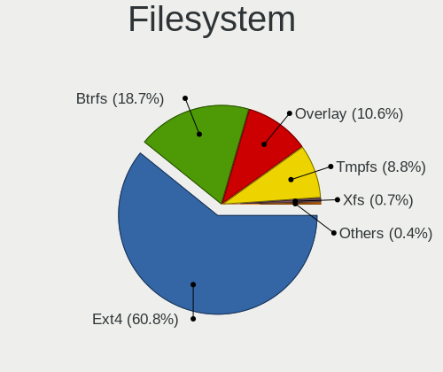
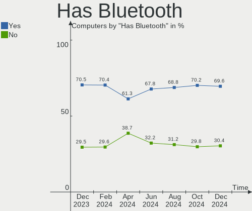
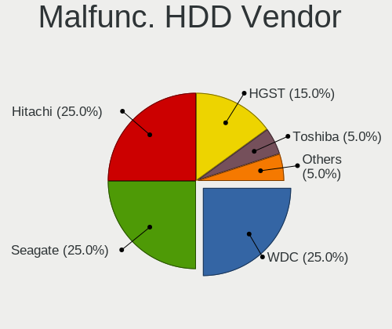
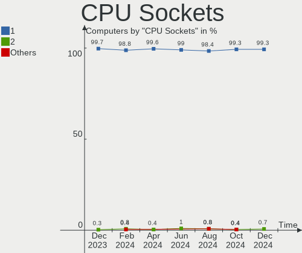
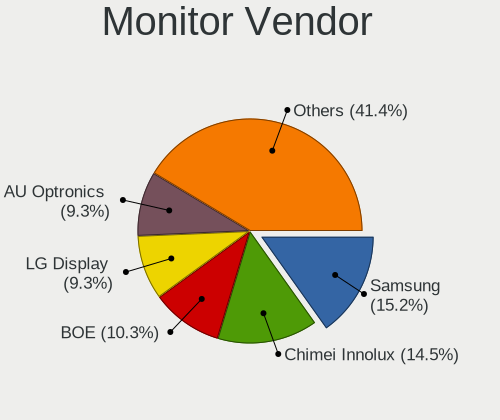
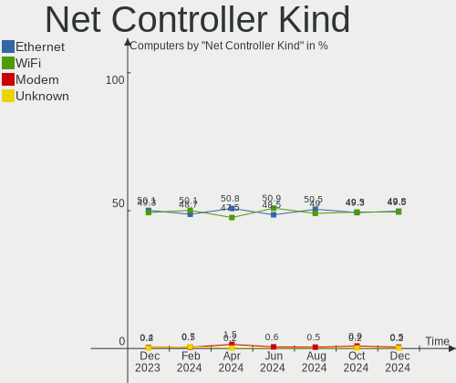
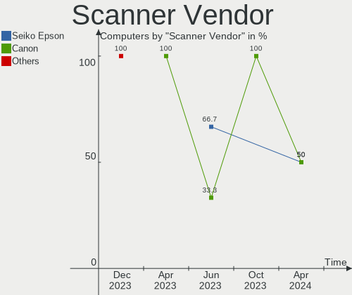

Linux in Italy - Hardware Trends
--------------------------------

A project to identify most popular hardware characteristics and track their change
over time based on data collected by Linux users at https://Linux-Hardware.org.

Anyone can contribute to this report by the [hw-probe](https://github.com/linuxhw/hw-probe) tool:

    sudo -E hw-probe -all -upload

This is a report for all computer types. See also reports for [desktops](/Location/Italy/Desktop/README.md) and [notebooks](/Location/Italy/Notebook/README.md).

Period: Aug, 2022.

Contents
--------

* [ System ](#system)
  - [ OS                       ](#os)
  - [ OS Family                ](#os-family)
  - [ Kernel                   ](#kernel)
  - [ Kernel Family            ](#kernel-family)
  - [ Kernel Major Ver.        ](#kernel-major-ver)
  - [ Arch                     ](#arch)
  - [ DE                       ](#de)
  - [ Display Server           ](#display-server)
  - [ Display Manager          ](#display-manager)
  - [ OS Lang                  ](#os-lang)
  - [ Boot Mode                ](#boot-mode)
  - [ Filesystem               ](#filesystem)
  - [ Part. scheme             ](#part-scheme)
  - [ Dual Boot with Linux/BSD ](#dual-boot-with-linuxbsd)
  - [ Dual Boot (Win)          ](#dual-boot-win)

* [ Board ](#board)
  - [ Vendor                   ](#vendor)
  - [ Model                    ](#model)
  - [ Model Family             ](#model-family)
  - [ MFG Year                 ](#mfg-year)
  - [ Form Factor              ](#form-factor)
  - [ Secure Boot              ](#secure-boot)
  - [ Coreboot                 ](#coreboot)
  - [ RAM Size                 ](#ram-size)
  - [ RAM Used                 ](#ram-used)
  - [ Total Drives             ](#total-drives)
  - [ Has CD-ROM               ](#has-cd-rom)
  - [ Has Ethernet             ](#has-ethernet)
  - [ Has WiFi                 ](#has-wifi)
  - [ Has Bluetooth            ](#has-bluetooth)

* [ Location ](#location)
  - [ Country                  ](#country)
  - [ City                     ](#city)

* [ Drives ](#drives)
  - [ Drive Vendor             ](#drive-vendor)
  - [ Drive Model              ](#drive-model)
  - [ HDD Vendor               ](#hdd-vendor)
  - [ SSD Vendor               ](#ssd-vendor)
  - [ Drive Kind               ](#drive-kind)
  - [ Drive Connector          ](#drive-connector)
  - [ Drive Size               ](#drive-size)
  - [ Space Total              ](#space-total)
  - [ Space Used               ](#space-used)
  - [ Malfunc. Drives          ](#malfunc-drives)
  - [ Malfunc. Drive Vendor    ](#malfunc-drive-vendor)
  - [ Malfunc. HDD Vendor      ](#malfunc-hdd-vendor)
  - [ Malfunc. Drive Kind      ](#malfunc-drive-kind)
  - [ Failed Drives            ](#failed-drives)
  - [ Failed Drive Vendor      ](#failed-drive-vendor)
  - [ Drive Status             ](#drive-status)

* [ Storage controller ](#storage-controller)
  - [ Storage Vendor           ](#storage-vendor)
  - [ Storage Model            ](#storage-model)
  - [ Storage Kind             ](#storage-kind)

* [ Processor ](#processor)
  - [ CPU Vendor               ](#cpu-vendor)
  - [ CPU Model                ](#cpu-model)
  - [ CPU Model Family         ](#cpu-model-family)
  - [ CPU Cores                ](#cpu-cores)
  - [ CPU Sockets              ](#cpu-sockets)
  - [ CPU Threads              ](#cpu-threads)
  - [ CPU Op-Modes             ](#cpu-op-modes)
  - [ CPU Microcode            ](#cpu-microcode)
  - [ CPU Microarch            ](#cpu-microarch)

* [ Graphics ](#graphics)
  - [ GPU Vendor               ](#gpu-vendor)
  - [ GPU Model                ](#gpu-model)
  - [ GPU Combo                ](#gpu-combo)
  - [ GPU Driver               ](#gpu-driver)
  - [ GPU Memory               ](#gpu-memory)

* [ Monitor ](#monitor)
  - [ Monitor Vendor           ](#monitor-vendor)
  - [ Monitor Model            ](#monitor-model)
  - [ Monitor Resolution       ](#monitor-resolution)
  - [ Monitor Diagonal         ](#monitor-diagonal)
  - [ Monitor Width            ](#monitor-width)
  - [ Aspect Ratio             ](#aspect-ratio)
  - [ Monitor Area             ](#monitor-area)
  - [ Pixel Density            ](#pixel-density)
  - [ Multiple Monitors        ](#multiple-monitors)

* [ Network ](#network)
  - [ Net Controller Vendor    ](#net-controller-vendor)
  - [ Net Controller Model     ](#net-controller-model)
  - [ Wireless Vendor          ](#wireless-vendor)
  - [ Wireless Model           ](#wireless-model)
  - [ Ethernet Vendor          ](#ethernet-vendor)
  - [ Ethernet Model           ](#ethernet-model)
  - [ Net Controller Kind      ](#net-controller-kind)
  - [ Used Controller          ](#used-controller)
  - [ NICs                     ](#nics)
  - [ IPv6                     ](#ipv6)

* [ Bluetooth ](#bluetooth)
  - [ Bluetooth Vendor         ](#bluetooth-vendor)
  - [ Bluetooth Model          ](#bluetooth-model)

* [ Sound ](#sound)
  - [ Sound Vendor             ](#sound-vendor)
  - [ Sound Model              ](#sound-model)

* [ Memory ](#memory)
  - [ Memory Vendor            ](#memory-vendor)
  - [ Memory Model             ](#memory-model)
  - [ Memory Kind              ](#memory-kind)
  - [ Memory Form Factor       ](#memory-form-factor)
  - [ Memory Size              ](#memory-size)
  - [ Memory Speed             ](#memory-speed)

* [ Printers & scanners ](#printers--scanners)
  - [ Printer Vendor           ](#printer-vendor)
  - [ Printer Model            ](#printer-model)
  - [ Scanner Vendor           ](#scanner-vendor)
  - [ Scanner Model            ](#scanner-model)

* [ Camera ](#camera)
  - [ Camera Vendor            ](#camera-vendor)
  - [ Camera Model             ](#camera-model)

* [ Security ](#security)
  - [ Fingerprint Vendor       ](#fingerprint-vendor)
  - [ Fingerprint Model        ](#fingerprint-model)
  - [ Chipcard Vendor          ](#chipcard-vendor)
  - [ Chipcard Model           ](#chipcard-model)

* [ Unsupported ](#unsupported)
  - [ Unsupported Devices      ](#unsupported-devices)
  - [ Unsupported Device Types ](#unsupported-device-types)

System
------

OS
--

Installed operating systems

| Name                         | Computers | Percent |
|------------------------------|-----------|---------|
| Ubuntu 22.04                 | 31        | 24.8%   |
| OpenMandriva 4.3             | 14        | 11.2%   |
| Fedora 36                    | 11        | 8.8%    |
| Ubuntu 20.04                 | 6         | 4.8%    |
| Linux Mint 20.3              | 6         | 4.8%    |
| OpenMandriva 4.90            | 5         | 4%      |
| Linux Mint 21                | 5         | 4%      |
| Arch                         | 5         | 4%      |
| Xubuntu 22.04                | 4         | 3.2%    |
| Debian 11                    | 4         | 3.2%    |
| Kubuntu 22.04                | 3         | 2.4%    |
| Elementary 6.1               | 3         | 2.4%    |
| Manjaro                      | 2         | 1.6%    |
| LMDE 5                       | 2         | 1.6%    |
| KDE neon 22.04               | 2         | 1.6%    |
| KDE neon 20.04               | 2         | 1.6%    |
| Zorin 16                     | 1         | 0.8%    |
| Xubuntu 20.04                | 1         | 0.8%    |
| Ubuntu 21.10                 | 1         | 0.8%    |
| Ubuntu 21.04                 | 1         | 0.8%    |
| Ubuntu 18.04                 | 1         | 0.8%    |
| Ubuntu 16.04                 | 1         | 0.8%    |
| SteamOS 3.3                  | 1         | 0.8%    |
| Slackware 15.0               | 1         | 0.8%    |
| Pop!_OS 22.04                | 1         | 0.8%    |
| openSUSE Tumbleweed-XXXXXXXX | 1         | 0.8%    |
| openSUSE Leap-15.3           | 1         | 0.8%    |
| OpenMandriva 4.2             | 1         | 0.8%    |
| Linux Mint 19.1              | 1         | 0.8%    |
| Kubuntu 20.04                | 1         | 0.8%    |
| Kali 2022.3                  | 1         | 0.8%    |
| Garuda Linux Soaring         | 1         | 0.8%    |
| Debian Testing               | 1         | 0.8%    |
| Debian 10                    | 1         | 0.8%    |
| Archcraft Rolling            | 1         | 0.8%    |
| Arch Rolling                 | 1         | 0.8%    |

OS Family
---------

OS without a version

| Name         | Computers | Percent |
|--------------|-----------|---------|
| Ubuntu       | 41        | 32.8%   |
| OpenMandriva | 20        | 16%     |
| Linux Mint   | 12        | 9.6%    |
| Fedora       | 11        | 8.8%    |
| Debian       | 6         | 4.8%    |
| Arch         | 6         | 4.8%    |
| Xubuntu      | 5         | 4%      |
| Kubuntu      | 4         | 3.2%    |
| KDE neon     | 4         | 3.2%    |
| Elementary   | 3         | 2.4%    |
| openSUSE     | 2         | 1.6%    |
| Manjaro      | 2         | 1.6%    |
| LMDE         | 2         | 1.6%    |
| Zorin        | 1         | 0.8%    |
| SteamOS      | 1         | 0.8%    |
| Slackware    | 1         | 0.8%    |
| Pop!_OS      | 1         | 0.8%    |
| Kali         | 1         | 0.8%    |
| Garuda Linux | 1         | 0.8%    |
| Archcraft    | 1         | 0.8%    |

Kernel
------

Version of the Linux kernel

| Version                                      | Computers | Percent |
|----------------------------------------------|-----------|---------|
| 5.15.0-46-generic                            | 30        | 24%     |
| 5.16.7-desktop-1omv4003                      | 14        | 11.2%   |
| 5.15.0-43-generic                            | 14        | 11.2%   |
| 5.15.0-25-generic                            | 5         | 4%      |
| 5.18.16-200.fc36.x86_64                      | 4         | 3.2%    |
| 5.18.12-desktop-3omv4090                     | 4         | 3.2%    |
| 5.18.17-200.fc36.x86_64                      | 3         | 2.4%    |
| 5.15.0-41-generic                            | 3         | 2.4%    |
| 5.10.0-17-amd64                              | 3         | 2.4%    |
| 5.10.0-16-amd64                              | 3         | 2.4%    |
| 5.4.0-124-generic                            | 2         | 1.6%    |
| 5.4.0-122-generic                            | 2         | 1.6%    |
| 5.18.13-200.fc36.x86_64                      | 2         | 1.6%    |
| 5.15.0-47-generic                            | 2         | 1.6%    |
| 4.15.0-191-generic                           | 2         | 1.6%    |
| 5.8.0-53-generic                             | 1         | 0.8%    |
| 5.4.0-91-generic                             | 1         | 0.8%    |
| 5.4.0-122-lowlatency                         | 1         | 0.8%    |
| 5.3.18-150300.59.87-default                  | 1         | 0.8%    |
| 5.19.4-zen1-1-zen                            | 1         | 0.8%    |
| 5.19.4-arch1-1                               | 1         | 0.8%    |
| 5.19.4-200.fc36.x86_64                       | 1         | 0.8%    |
| 5.19.3-arch1-1                               | 1         | 0.8%    |
| 5.19.2-zen1-1-zen                            | 1         | 0.8%    |
| 5.19.2                                       | 1         | 0.8%    |
| 5.19.1-desktop-1omv4090                      | 1         | 0.8%    |
| 5.19.1-3-MANJARO                             | 1         | 0.8%    |
| 5.19.1                                       | 1         | 0.8%    |
| 5.19.0-1-default                             | 1         | 0.8%    |
| 5.18.19-200.fc36.x86_64                      | 1         | 0.8%    |
| 5.18.16-zen1-1-zen                           | 1         | 0.8%    |
| 5.18.14-arch1-1                              | 1         | 0.8%    |
| 5.18.10-76051810-generic                     | 1         | 0.8%    |
| 5.18.0-kali5-amd64                           | 1         | 0.8%    |
| 5.18.0-3-amd64                               | 1         | 0.8%    |
| 5.15.60-1-lts                                | 1         | 0.8%    |
| 5.15.59-1-MANJARO                            | 1         | 0.8%    |
| 5.15.38                                      | 1         | 0.8%    |
| 5.15.0-47-lowlatency                         | 1         | 0.8%    |
| 5.15.0-45-generic                            | 1         | 0.8%    |
| 5.13.0-valve21-1-neptune-02209-g2a5bdc1102a0 | 1         | 0.8%    |
| 5.13.0-39-generic                            | 1         | 0.8%    |
| 5.11.0-49-generic                            | 1         | 0.8%    |
| 5.11.0-43-generic                            | 1         | 0.8%    |
| 5.10.14-desktop-1omv4002                     | 1         | 0.8%    |
| 4.4.0-230-generic                            | 1         | 0.8%    |
| 4.19.0-21-amd64                              | 1         | 0.8%    |

Kernel Family
-------------

Linux kernel without a distro release

| Version | Computers | Percent |
|---------|-----------|---------|
| 5.15.0  | 56        | 44.8%   |
| 5.16.7  | 14        | 11.2%   |
| 5.4.0   | 6         | 4.8%    |
| 5.10.0  | 6         | 4.8%    |
| 5.18.16 | 5         | 4%      |
| 5.18.12 | 4         | 3.2%    |
| 5.19.4  | 3         | 2.4%    |
| 5.19.1  | 3         | 2.4%    |
| 5.18.17 | 3         | 2.4%    |
| 5.19.2  | 2         | 1.6%    |
| 5.18.13 | 2         | 1.6%    |
| 5.18.0  | 2         | 1.6%    |
| 5.13.0  | 2         | 1.6%    |
| 5.11.0  | 2         | 1.6%    |
| 4.15.0  | 2         | 1.6%    |
| 5.8.0   | 1         | 0.8%    |
| 5.3.18  | 1         | 0.8%    |
| 5.19.3  | 1         | 0.8%    |
| 5.19.0  | 1         | 0.8%    |
| 5.18.19 | 1         | 0.8%    |
| 5.18.14 | 1         | 0.8%    |
| 5.18.10 | 1         | 0.8%    |
| 5.15.60 | 1         | 0.8%    |
| 5.15.59 | 1         | 0.8%    |
| 5.15.38 | 1         | 0.8%    |
| 5.10.14 | 1         | 0.8%    |
| 4.4.0   | 1         | 0.8%    |
| 4.19.0  | 1         | 0.8%    |

Kernel Major Ver.
-----------------

Linux kernel major version

| Version | Computers | Percent |
|---------|-----------|---------|
| 5.15    | 59        | 47.2%   |
| 5.18    | 19        | 15.2%   |
| 5.16    | 14        | 11.2%   |
| 5.19    | 10        | 8%      |
| 5.10    | 7         | 5.6%    |
| 5.4     | 6         | 4.8%    |
| 5.13    | 2         | 1.6%    |
| 5.11    | 2         | 1.6%    |
| 4.15    | 2         | 1.6%    |
| 5.8     | 1         | 0.8%    |
| 5.3     | 1         | 0.8%    |
| 4.4     | 1         | 0.8%    |
| 4.19    | 1         | 0.8%    |

Arch
----

OS architecture (x86_64, i586, etc.)

| Name   | Computers | Percent |
|--------|-----------|---------|
| x86_64 | 125       | 100%    |

DE
--

Desktop Environment

| Name          | Computers | Percent |
|---------------|-----------|---------|
| GNOME         | 51        | 40.8%   |
| KDE5          | 37        | 29.6%   |
| XFCE          | 12        | 9.6%    |
| X-Cinnamon    | 10        | 8%      |
| Unknown       | 5         | 4%      |
| Pantheon      | 3         | 2.4%    |
| MATE          | 2         | 1.6%    |
| i3            | 1         | 0.8%    |
| gamescope     | 1         | 0.8%    |
| Enlightenment | 1         | 0.8%    |
| dwm           | 1         | 0.8%    |
| Deepin        | 1         | 0.8%    |

Display Server
--------------

X11 or Wayland

| Name    | Computers | Percent |
|---------|-----------|---------|
| X11     | 91        | 72.8%   |
| Wayland | 30        | 24%     |
| Tty     | 2         | 1.6%    |
| Unknown | 2         | 1.6%    |

Display Manager
---------------

SDDM, LightDM, etc.

| Name    | Computers | Percent |
|---------|-----------|---------|
| GDM3    | 33        | 26.4%   |
| SDDM    | 32        | 25.6%   |
| Unknown | 31        | 24.8%   |
| LightDM | 17        | 13.6%   |
| GDM     | 12        | 9.6%    |

OS Lang
-------

Language

| Lang    | Computers | Percent |
|---------|-----------|---------|
| it_IT   | 79        | 63.2%   |
| en_US   | 37        | 29.6%   |
| en_GB   | 3         | 2.4%    |
| C       | 2         | 1.6%    |
| hu_HU   | 1         | 0.8%    |
| fr_FR   | 1         | 0.8%    |
| de_DE   | 1         | 0.8%    |
| Default | 1         | 0.8%    |

Boot Mode
---------

EFI or BIOS

| Mode | Computers | Percent |
|------|-----------|---------|
| EFI  | 66        | 52.8%   |
| BIOS | 59        | 47.2%   |

Filesystem
----------

Type of filesystem

| Type    | Computers | Percent |
|---------|-----------|---------|
| Ext4    | 88        | 70.4%   |
| Overlay | 22        | 17.6%   |
| Btrfs   | 14        | 11.2%   |
| Xfs     | 1         | 0.8%    |

Part. scheme
------------

Scheme of partitioning

| Type    | Computers | Percent |
|---------|-----------|---------|
| Unknown | 58        | 46.4%   |
| GPT     | 56        | 44.8%   |
| MBR     | 11        | 8.8%    |

Dual Boot with Linux/BSD
------------------------

Hosting more than one Linux/BSD

| Dual boot | Computers | Percent |
|-----------|-----------|---------|
| No        | 105       | 84%     |
| Yes       | 20        | 16%     |

Dual Boot (Win)
---------------

Hosting Linux and Windows

| Dual boot | Computers | Percent |
|-----------|-----------|---------|
| No        | 78        | 62.4%   |
| Yes       | 47        | 37.6%   |

Board
-----

Vendor
------

Motherboard manufacturer

| Name                | Computers | Percent |
|---------------------|-----------|---------|
| Hewlett-Packard     | 26        | 20.8%   |
| ASUSTek Computer    | 21        | 16.8%   |
| Lenovo              | 13        | 10.4%   |
| MSI                 | 9         | 7.2%    |
| Dell                | 8         | 6.4%    |
| Acer                | 7         | 5.6%    |
| Gigabyte Technology | 6         | 4.8%    |
| ASRock              | 4         | 3.2%    |
| Microtech           | 3         | 2.4%    |
| HUAWEI              | 3         | 2.4%    |
| Fujitsu             | 3         | 2.4%    |
| TrekStor            | 2         | 1.6%    |
| OEM                 | 2         | 1.6%    |
| Intel               | 2         | 1.6%    |
| AZW                 | 2         | 1.6%    |
| Apple               | 2         | 1.6%    |
| Valve               | 1         | 0.8%    |
| Toshiba             | 1         | 0.8%    |
| Teclast             | 1         | 0.8%    |
| SANTECH             | 1         | 0.8%    |
| Pegatron            | 1         | 0.8%    |
| Notebook            | 1         | 0.8%    |
| Mediacom            | 1         | 0.8%    |
| Framework           | 1         | 0.8%    |
| Dynabook            | 1         | 0.8%    |
| Chuwi               | 1         | 0.8%    |
| AMI                 | 1         | 0.8%    |
| Unknown             | 1         | 0.8%    |

Model
-----

Motherboard model

| Name                                   | Computers | Percent |
|----------------------------------------|-----------|---------|
| TrekStor Notebook Slim S130            | 2         | 1.6%    |
| OEM G41 775 ICH7 8712                  | 2         | 1.6%    |
| Microtech CoreBook                     | 2         | 1.6%    |
| HP ProBook 440 G7                      | 2         | 1.6%    |
| HP 630                                 | 2         | 1.6%    |
| Gigabyte B550 AORUS ELITE AX V2        | 2         | 1.6%    |
| Valve Jupiter                          | 1         | 0.8%    |
| Toshiba Satellite P70-B                | 1         | 0.8%    |
| Teclast F15 Plus                       | 1         | 0.8%    |
| SANTECH NHx0DB,DE                      | 1         | 0.8%    |
| Pegatron HPE-521it                     | 1         | 0.8%    |
| Notebook PD5x_7xPNP_PNN_PNT            | 1         | 0.8%    |
| MSI VIG610M                            | 1         | 0.8%    |
| MSI Prestige 15 A10SC                  | 1         | 0.8%    |
| MSI NQ890AA-ABZ CQ5011IT               | 1         | 0.8%    |
| MSI MS-7C37                            | 1         | 0.8%    |
| MSI MS-7C02                            | 1         | 0.8%    |
| MSI Modern 14 B11SBL                   | 1         | 0.8%    |
| MSI Modern 14 A10M                     | 1         | 0.8%    |
| MSI Katana GF66 11UG                   | 1         | 0.8%    |
| MSI GL63 8SD                           | 1         | 0.8%    |
| Microtech ebookPro                     | 1         | 0.8%    |
| Mediacom SmartBook 14 FullHD - SB14UC  | 1         | 0.8%    |
| Lenovo Yoga C640-13IML 81UE            | 1         | 0.8%    |
| Lenovo Yoga 720-15IKB                  | 1         | 0.8%    |
| Lenovo V15-IGL 82C3                    | 1         | 0.8%    |
| Lenovo V130-15IKB 81HN                 | 1         | 0.8%    |
| Lenovo ThinkStation C20 4263BA7        | 1         | 0.8%    |
| Lenovo ThinkPad X230 2325U9T           | 1         | 0.8%    |
| Lenovo ThinkPad T460s 20FAS0Q900       | 1         | 0.8%    |
| Lenovo ThinkPad T450 20BUS0EW1F        | 1         | 0.8%    |
| Lenovo ThinkPad T14 Gen 1 20UD001AIX   | 1         | 0.8%    |
| Lenovo ThinkBook 15 G2 ITL 20VE        | 1         | 0.8%    |
| Lenovo Legion S7 15IMH5 82BC           | 1         | 0.8%    |
| Lenovo IdeaPad 3 15ADA6 82KR           | 1         | 0.8%    |
| Lenovo B50-30 F0AU00EEIX               | 1         | 0.8%    |
| Intel Productiva                       | 1         | 0.8%    |
| Intel NUC7i7BNHX                       | 1         | 0.8%    |
| HUAWEI CREM-WXX9                       | 1         | 0.8%    |
| HUAWEI BOM-WXX9                        | 1         | 0.8%    |
| HUAWEI BOD-WXX9                        | 1         | 0.8%    |
| HP Z2 Tower G5 Workstation             | 1         | 0.8%    |
| HP Victus by Laptop 16-e0xxx           | 1         | 0.8%    |
| HP ProDesk 400 G1 SFF                  | 1         | 0.8%    |
| HP ProBook 455 G7                      | 1         | 0.8%    |
| HP ProBook 450 G3                      | 1         | 0.8%    |
| HP ProBook 430 G5                      | 1         | 0.8%    |
| HP Pavilion x360 Convertible 14-dw1xxx | 1         | 0.8%    |
| HP Pavilion Gaming Notebook            | 1         | 0.8%    |
| HP Pavilion g6                         | 1         | 0.8%    |
| HP Pavilion dv6                        | 1         | 0.8%    |
| HP Pavilion 17                         | 1         | 0.8%    |
| HP OMEN by Laptop 15-dc1xxx            | 1         | 0.8%    |
| HP Notebook                            | 1         | 0.8%    |
| HP Laptop 15s-eq0xxx                   | 1         | 0.8%    |
| HP Laptop 15-dw0xxx                    | 1         | 0.8%    |
| HP ENVY x360 Convertible 13-ay0xxx     | 1         | 0.8%    |
| HP EliteBook 850 G3                    | 1         | 0.8%    |
| HP Compaq 8200 Elite SFF PC            | 1         | 0.8%    |
| HP 620                                 | 1         | 0.8%    |

Model Family
------------

Motherboard model prefix

| Name                | Computers | Percent |
|---------------------|-----------|---------|
| HP ProBook          | 5         | 4%      |
| HP Pavilion         | 5         | 4%      |
| Lenovo ThinkPad     | 4         | 3.2%    |
| Dell Latitude       | 4         | 3.2%    |
| ASUS PRIME          | 4         | 3.2%    |
| Acer Aspire         | 4         | 3.2%    |
| TrekStor Notebook   | 2         | 1.6%    |
| OEM G41             | 2         | 1.6%    |
| MSI Modern          | 2         | 1.6%    |
| Microtech CoreBook  | 2         | 1.6%    |
| Lenovo Yoga         | 2         | 1.6%    |
| HP Laptop           | 2         | 1.6%    |
| HP 630              | 2         | 1.6%    |
| HP 255              | 2         | 1.6%    |
| Gigabyte B550       | 2         | 1.6%    |
| Fujitsu LIFEBOOK    | 2         | 1.6%    |
| Dell XPS            | 2         | 1.6%    |
| ASUS VivoBook       | 2         | 1.6%    |
| Valve Jupiter       | 1         | 0.8%    |
| Toshiba Satellite   | 1         | 0.8%    |
| Teclast F15         | 1         | 0.8%    |
| SANTECH NHx0DB      | 1         | 0.8%    |
| Pegatron HPE-521it  | 1         | 0.8%    |
| Notebook PD5x       | 1         | 0.8%    |
| MSI VIG610M         | 1         | 0.8%    |
| MSI Prestige        | 1         | 0.8%    |
| MSI NQ890AA-ABZ     | 1         | 0.8%    |
| MSI MS-7C37         | 1         | 0.8%    |
| MSI MS-7C02         | 1         | 0.8%    |
| MSI Katana          | 1         | 0.8%    |
| MSI GL63            | 1         | 0.8%    |
| Microtech ebookPro  | 1         | 0.8%    |
| Mediacom SmartBook  | 1         | 0.8%    |
| Lenovo V15-IGL      | 1         | 0.8%    |
| Lenovo V130-15IKB   | 1         | 0.8%    |
| Lenovo ThinkStation | 1         | 0.8%    |
| Lenovo ThinkBook    | 1         | 0.8%    |
| Lenovo Legion       | 1         | 0.8%    |
| Lenovo IdeaPad      | 1         | 0.8%    |
| Lenovo B50-30       | 1         | 0.8%    |
| Intel Productiva    | 1         | 0.8%    |
| Intel NUC7i7BNHX    | 1         | 0.8%    |
| HUAWEI CREM-WXX9    | 1         | 0.8%    |
| HUAWEI BOM-WXX9     | 1         | 0.8%    |
| HUAWEI BOD-WXX9     | 1         | 0.8%    |
| HP Z2               | 1         | 0.8%    |
| HP Victus           | 1         | 0.8%    |
| HP ProDesk          | 1         | 0.8%    |
| HP OMEN             | 1         | 0.8%    |
| HP Notebook         | 1         | 0.8%    |
| HP ENVY             | 1         | 0.8%    |
| HP EliteBook        | 1         | 0.8%    |
| HP Compaq           | 1         | 0.8%    |
| HP 620              | 1         | 0.8%    |
| HP 15               | 1         | 0.8%    |
| Gigabyte Z490       | 1         | 0.8%    |
| Gigabyte Z370       | 1         | 0.8%    |
| Gigabyte P35-DS3L   | 1         | 0.8%    |
| Gigabyte H97-HD3    | 1         | 0.8%    |
| Fujitsu ESPRIMO     | 1         | 0.8%    |

MFG Year
--------

Motherboard manufacture year

| Year    | Computers | Percent |
|---------|-----------|---------|
| 2021    | 19        | 15.2%   |
| 2020    | 16        | 12.8%   |
| 2019    | 15        | 12%     |
| 2011    | 11        | 8.8%    |
| 2016    | 8         | 6.4%    |
| 2015    | 8         | 6.4%    |
| 2014    | 7         | 5.6%    |
| 2022    | 6         | 4.8%    |
| 2018    | 6         | 4.8%    |
| 2013    | 5         | 4%      |
| 2012    | 5         | 4%      |
| 2010    | 5         | 4%      |
| 2017    | 4         | 3.2%    |
| 2009    | 3         | 2.4%    |
| 2008    | 3         | 2.4%    |
| 2007    | 2         | 1.6%    |
| 2006    | 1         | 0.8%    |
| Unknown | 1         | 0.8%    |

Form Factor
-----------

Physical design of the computer

| Name        | Computers | Percent |
|-------------|-----------|---------|
| Notebook    | 76        | 60.8%   |
| Desktop     | 40        | 32%     |
| Convertible | 5         | 4%      |
| Mini pc     | 2         | 1.6%    |
| All in one  | 2         | 1.6%    |

Secure Boot
-----------

Enabled or disabled

| State    | Computers | Percent |
|----------|-----------|---------|
| Disabled | 114       | 91.2%   |
| Enabled  | 11        | 8.8%    |

Coreboot
--------

Have coreboot on board

| Used | Computers | Percent |
|------|-----------|---------|
| No   | 125       | 100%    |

RAM Size
--------

Total RAM memory

| Size in GB  | Computers | Percent |
|-------------|-----------|---------|
| 4.01-8.0    | 30        | 24%     |
| 3.01-4.0    | 28        | 22.4%   |
| 16.01-24.0  | 26        | 20.8%   |
| 8.01-16.0   | 25        | 20%     |
| 32.01-64.0  | 7         | 5.6%    |
| 64.01-256.0 | 3         | 2.4%    |
| 1.01-2.0    | 3         | 2.4%    |
| 24.01-32.0  | 2         | 1.6%    |
| 0.51-1.0    | 1         | 0.8%    |

RAM Used
--------

Used RAM memory

| Used GB   | Computers | Percent |
|-----------|-----------|---------|
| 1.01-2.0  | 47        | 37.6%   |
| 2.01-3.0  | 28        | 22.4%   |
| 4.01-8.0  | 19        | 15.2%   |
| 3.01-4.0  | 13        | 10.4%   |
| 0.51-1.0  | 11        | 8.8%    |
| 8.01-16.0 | 6         | 4.8%    |
| 0.01-0.5  | 1         | 0.8%    |

Total Drives
------------

Number of drives on board

| Drives | Computers | Percent |
|--------|-----------|---------|
| 1      | 70        | 56%     |
| 2      | 44        | 35.2%   |
| 3      | 9         | 7.2%    |
| 5      | 1         | 0.8%    |
| 4      | 1         | 0.8%    |

Has CD-ROM
----------

Has CD-ROM on board

| Presented | Computers | Percent |
|-----------|-----------|---------|
| No        | 81        | 64.8%   |
| Yes       | 44        | 35.2%   |

Has Ethernet
------------

Has Ethernet on board

| Presented | Computers | Percent |
|-----------|-----------|---------|
| Yes       | 99        | 79.2%   |
| No        | 26        | 20.8%   |

Has WiFi
--------

Has WiFi module

| Presented | Computers | Percent |
|-----------|-----------|---------|
| Yes       | 102       | 81.6%   |
| No        | 23        | 18.4%   |

Has Bluetooth
-------------

Has Bluetooth module

| Presented | Computers | Percent |
|-----------|-----------|---------|
| Yes       | 84        | 67.2%   |
| No        | 41        | 32.8%   |

Location
--------

Country
-------

Geographic location (country)

| Country | Computers | Percent |
|---------|-----------|---------|
| Italy   | 125       | 100%    |

City
----

Geographic location (city)

| City                     | Computers | Percent |
|--------------------------|-----------|---------|
| Milan                    | 20        | 16%     |
| Rome                     | 10        | 8%      |
| Turin                    | 6         | 4.8%    |
| Brescia                  | 4         | 3.2%    |
| Verona                   | 2         | 1.6%    |
| Treviso                  | 2         | 1.6%    |
| Roggio                   | 2         | 1.6%    |
| Rho                      | 2         | 1.6%    |
| Padova                   | 2         | 1.6%    |
| Naples                   | 2         | 1.6%    |
| Bolzano                  | 2         | 1.6%    |
| Viggianello              | 1         | 0.8%    |
| Venice                   | 1         | 0.8%    |
| Velletri                 | 1         | 0.8%    |
| Udine                    | 1         | 0.8%    |
| Trieste                  | 1         | 0.8%    |
| Terricciola              | 1         | 0.8%    |
| Stradella                | 1         | 0.8%    |
| Siniscola                | 1         | 0.8%    |
| Selvazzano Dentro        | 1         | 0.8%    |
| Sant'Egidio alla Vibrata | 1         | 0.8%    |
| Sant'Angelo Romano       | 1         | 0.8%    |
| San Vito al Tagliamento  | 1         | 0.8%    |
| San Teodoro              | 1         | 0.8%    |
| San Gennaro Vesuviano    | 1         | 0.8%    |
| Rozzano                  | 1         | 0.8%    |
| Rocca di Papa            | 1         | 0.8%    |
| Renazzo                  | 1         | 0.8%    |
| Quartucciu               | 1         | 0.8%    |
| Predazzo                 | 1         | 0.8%    |
| Ponte San Pietro         | 1         | 0.8%    |
| Pieris                   | 1         | 0.8%    |
| Picerno                  | 1         | 0.8%    |
| Pessano Con Bornago      | 1         | 0.8%    |
| Pavia                    | 1         | 0.8%    |
| Pasian di Prato          | 1         | 0.8%    |
| Parma                    | 1         | 0.8%    |
| Osio Sopra               | 1         | 0.8%    |
| Olgiate Olona            | 1         | 0.8%    |
| Novara                   | 1         | 0.8%    |
| Noicattaro               | 1         | 0.8%    |
| Negrar                   | 1         | 0.8%    |
| Monza                    | 1         | 0.8%    |
| Menfi                    | 1         | 0.8%    |
| Mascali                  | 1         | 0.8%    |
| Maropati                 | 1         | 0.8%    |
| Marcon                   | 1         | 0.8%    |
| Macerata                 | 1         | 0.8%    |
| Limbiate                 | 1         | 0.8%    |
| Lazzate                  | 1         | 0.8%    |
| Lavagno                  | 1         | 0.8%    |
| Ladispoli                | 1         | 0.8%    |
| Gussago                  | 1         | 0.8%    |
| Governolo                | 1         | 0.8%    |
| Gonzaga                  | 1         | 0.8%    |
| Genoa                    | 1         | 0.8%    |
| Florence                 | 1         | 0.8%    |
| Enna                     | 1         | 0.8%    |
| Crocetta del Montello    | 1         | 0.8%    |
| Concordia Sagittaria     | 1         | 0.8%    |

Drives
------

Drive Vendor
------------

Hard drive vendors

| Vendor              | Computers | Drives | Percent |
|---------------------|-----------|--------|---------|
| Samsung Electronics | 36        | 40     | 19.57%  |
| WDC                 | 27        | 32     | 14.67%  |
| Unknown             | 16        | 17     | 8.7%    |
| Kingston            | 14        | 14     | 7.61%   |
| Seagate             | 13        | 14     | 7.07%   |
| Toshiba             | 11        | 11     | 5.98%   |
| Crucial             | 10        | 10     | 5.43%   |
| SanDisk             | 9         | 10     | 4.89%   |
| Hitachi             | 7         | 7      | 3.8%    |
| Phison              | 6         | 7      | 3.26%   |
| Intenso             | 4         | 4      | 2.17%   |
| Micron Technology   | 3         | 3      | 1.63%   |
| Intel               | 3         | 3      | 1.63%   |
| HGST                | 3         | 3      | 1.63%   |
| Teclast             | 2         | 2      | 1.09%   |
| SPCC                | 2         | 2      | 1.09%   |
| SK hynix            | 2         | 3      | 1.09%   |
| China               | 2         | 2      | 1.09%   |
| Unknown             | 2         | 2      | 1.09%   |
| USB3.0              | 1         | 1      | 0.54%   |
| SSSTC               | 1         | 1      | 0.54%   |
| PNY                 | 1         | 1      | 0.54%   |
| Netac               | 1         | 1      | 0.54%   |
| Microtech           | 1         | 1      | 0.54%   |
| Maxtor              | 1         | 2      | 0.54%   |
| KIOXIA              | 1         | 1      | 0.54%   |
| KingDian            | 1         | 1      | 0.54%   |
| JMicron Technology  | 1         | 1      | 0.54%   |
| Hikvision           | 1         | 1      | 0.54%   |
| FORESEE             | 1         | 1      | 0.54%   |
| A-DATA Technology   | 1         | 1      | 0.54%   |

Drive Model
-----------

Hard drive models

| Model                                | Computers | Percent |
|--------------------------------------|-----------|---------|
| Samsung SSD 970 EVO Plus 1TB         | 4         | 2.02%   |
| Samsung NVMe SSD Drive 512GB         | 4         | 2.02%   |
| Unknown SD32G  32GB                  | 3         | 1.52%   |
| Toshiba MQ01ABD100 1TB               | 3         | 1.52%   |
| Samsung SSD 860 EVO 500GB            | 3         | 1.52%   |
| Kingston SA400S37480G 480GB SSD      | 3         | 1.52%   |
| Crucial CT500MX500SSD1 500GB         | 3         | 1.52%   |
| WDC WD10EZEX-00BN5A0 1TB             | 2         | 1.01%   |
| Unknown NCard  64GB                  | 2         | 1.01%   |
| Toshiba MQ01ABF050 500GB             | 2         | 1.01%   |
| Teclast BD256GB SHCB-2280 SSD        | 2         | 1.01%   |
| Samsung SSD 980 1TB                  | 2         | 1.01%   |
| Samsung SSD 860 EVO 1TB              | 2         | 1.01%   |
| Samsung SSD 850 EVO 500GB            | 2         | 1.01%   |
| Samsung SSD 840 Series 120GB         | 2         | 1.01%   |
| Samsung MZVLQ512HALU-000H1 512GB     | 2         | 1.01%   |
| Phison Sabrent 2TB                   | 2         | 1.01%   |
| Kingston NVMe SSD Drive 512GB        | 2         | 1.01%   |
| Intenso SSD Sata III 256GB           | 2         | 1.01%   |
| Intel NVMe SSD Drive 512GB           | 2         | 1.01%   |
| Hitachi HTS547550A9E384 500GB        | 2         | 1.01%   |
| HGST HTS545050A7E680 500GB           | 2         | 1.01%   |
| Crucial CT525MX300SSD1 528GB         | 2         | 1.01%   |
| Crucial CT1000MX500SSD1 1TB          | 2         | 1.01%   |
| Unknown                              | 2         | 1.01%   |
| WDC WDS500G1B0B-00AS40 500GB SSD     | 1         | 0.51%   |
| WDC WD7500BPKX-00HPJT0 752GB         | 1         | 0.51%   |
| WDC WD5000LPVX-22V0TT0 500GB         | 1         | 0.51%   |
| WDC WD5000LPCX-24VHAT0 500GB         | 1         | 0.51%   |
| WDC WD5000LPCX-22VHAT0 500GB         | 1         | 0.51%   |
| WDC WD5000LPCX-21VHAT0 500GB         | 1         | 0.51%   |
| WDC WD5000AAKX-22ERMA0 500GB         | 1         | 0.51%   |
| WDC WD5000AAKX-07U6AA0 500GB         | 1         | 0.51%   |
| WDC WD5000AAKS-00V1A0 500GB          | 1         | 0.51%   |
| WDC WD5000AAKS-00UU3A0 500GB         | 1         | 0.51%   |
| WDC WD5000AADS-00M2B0 500GB          | 1         | 0.51%   |
| WDC WD40EFRX-68N32N0 4TB             | 1         | 0.51%   |
| WDC WD4005FZBX-00K5WB0 4TB           | 1         | 0.51%   |
| WDC WD3200BEVT-60A23T0 320GB         | 1         | 0.51%   |
| WDC WD3200AAJS-22RYA0 320GB          | 1         | 0.51%   |
| WDC WD2500BEVT-00A23T0 250GB         | 1         | 0.51%   |
| WDC WD20EARS-00MVWB0 2TB             | 1         | 0.51%   |
| WDC WD2000BB-00RDA0 200GB            | 1         | 0.51%   |
| WDC WD1600JS-60MHB1 160GB            | 1         | 0.51%   |
| WDC WD1600AAJS-07PSA0 160GB          | 1         | 0.51%   |
| WDC WD10JPVX-60JC3T0 1TB             | 1         | 0.51%   |
| WDC WD10EZRX-00A8LB0 1TB             | 1         | 0.51%   |
| WDC WD10EZEX-21WN4A0 1TB             | 1         | 0.51%   |
| WDC WD10EZEX-08WN4A0 1TB             | 1         | 0.51%   |
| WDC WD10EAVS-00D7B1 1TB              | 1         | 0.51%   |
| WDC WD10EARS-22Y5B1 1TB              | 1         | 0.51%   |
| WDC WD1002FBYS-50A6B0 1TB            | 1         | 0.51%   |
| WDC WD1002FAEX-00Z3A0 1TB            | 1         | 0.51%   |
| WDC PC SN730 SDBPNTY-512G            | 1         | 0.51%   |
| WDC PC SN520 SDAPNUW-512G-1006 512GB | 1         | 0.51%   |
| USB3.0 Super Speed 128GB             | 1         | 0.51%   |
| Unknown TA2964  64GB                 | 1         | 0.51%   |
| Unknown SSD256GBS800                 | 1         | 0.51%   |
| Unknown SLD64G  64GB                 | 1         | 0.51%   |
| Unknown SD16G  16GB                  | 1         | 0.51%   |

HDD Vendor
----------

Hard disk drive vendors

| Vendor              | Computers | Drives | Percent |
|---------------------|-----------|--------|---------|
| WDC                 | 25        | 29     | 43.86%  |
| Seagate             | 12        | 12     | 21.05%  |
| Toshiba             | 7         | 7      | 12.28%  |
| Hitachi             | 7         | 7      | 12.28%  |
| HGST                | 3         | 3      | 5.26%   |
| USB3.0              | 1         | 1      | 1.75%   |
| Samsung Electronics | 1         | 1      | 1.75%   |
| Maxtor              | 1         | 2      | 1.75%   |

SSD Vendor
----------

Solid state drive vendors

| Vendor              | Computers | Drives | Percent |
|---------------------|-----------|--------|---------|
| Samsung Electronics | 15        | 16     | 25.86%  |
| Crucial             | 9         | 9      | 15.52%  |
| Kingston            | 7         | 7      | 12.07%  |
| SanDisk             | 5         | 6      | 8.62%   |
| Intenso             | 4         | 4      | 6.9%    |
| Teclast             | 2         | 2      | 3.45%   |
| SPCC                | 2         | 2      | 3.45%   |
| China               | 2         | 2      | 3.45%   |
| Unknown             | 2         | 2      | 3.45%   |
| WDC                 | 1         | 1      | 1.72%   |
| Unknown             | 1         | 1      | 1.72%   |
| Toshiba             | 1         | 1      | 1.72%   |
| PNY                 | 1         | 1      | 1.72%   |
| Netac               | 1         | 1      | 1.72%   |
| Microtech           | 1         | 1      | 1.72%   |
| KingDian            | 1         | 1      | 1.72%   |
| Hikvision           | 1         | 1      | 1.72%   |
| FORESEE             | 1         | 1      | 1.72%   |
| A-DATA Technology   | 1         | 1      | 1.72%   |

Drive Kind
----------

HDD or SSD

| Kind    | Computers | Drives | Percent |
|---------|-----------|--------|---------|
| SSD     | 52        | 60     | 31.52%  |
| HDD     | 49        | 62     | 29.7%   |
| NVMe    | 48        | 59     | 29.09%  |
| MMC     | 15        | 17     | 9.09%   |
| Unknown | 1         | 1      | 0.61%   |

Drive Connector
---------------

SATA, SAS, NVMe, etc.

| Type | Computers | Drives | Percent |
|------|-----------|--------|---------|
| SATA | 83        | 121    | 56.08%  |
| NVMe | 48        | 59     | 32.43%  |
| MMC  | 15        | 17     | 10.14%  |
| SAS  | 2         | 2      | 1.35%   |

Drive Size
----------

Size of hard drive

| Size in TB | Computers | Drives | Percent |
|------------|-----------|--------|---------|
| 0.01-0.5   | 70        | 84     | 66.67%  |
| 0.51-1.0   | 26        | 29     | 24.76%  |
| 1.01-2.0   | 6         | 6      | 5.71%   |
| 3.01-4.0   | 2         | 2      | 1.9%    |
| 2.01-3.0   | 1         | 1      | 0.95%   |

Space Total
-----------

Amount of disk space available on the file system

| Size in GB     | Computers | Percent |
|----------------|-----------|---------|
| 251-500        | 28        | 22.4%   |
| 101-250        | 28        | 22.4%   |
| 501-1000       | 16        | 12.8%   |
| 1-20           | 15        | 12%     |
| 1001-2000      | 10        | 8%      |
| 21-50          | 7         | 5.6%    |
| 2001-3000      | 7         | 5.6%    |
| 51-100         | 7         | 5.6%    |
| More than 3000 | 5         | 4%      |
| Unknown        | 2         | 1.6%    |

Space Used
----------

Amount of used disk space

| Used GB        | Computers | Percent |
|----------------|-----------|---------|
| 1-20           | 41        | 32.8%   |
| 21-50          | 27        | 21.6%   |
| 101-250        | 16        | 12.8%   |
| 51-100         | 12        | 9.6%    |
| 501-1000       | 11        | 8.8%    |
| 251-500        | 8         | 6.4%    |
| 1001-2000      | 6         | 4.8%    |
| Unknown        | 2         | 1.6%    |
| More than 3000 | 1         | 0.8%    |
| 2001-3000      | 1         | 0.8%    |

Malfunc. Drives
---------------

Drive models with a malfunction

| Model                                 | Computers | Drives | Percent |
|---------------------------------------|-----------|--------|---------|
| WDC WD3200BEVT-60A23T0 320GB          | 1         | 1      | 20%     |
| Toshiba MK3276GSX 320GB               | 1         | 1      | 20%     |
| Seagate ST31000528AS 1TB              | 1         | 1      | 20%     |
| SanDisk SSD PLUS 480GB                | 1         | 1      | 20%     |
| Samsung Electronics SSD 860 EVO 500GB | 1         | 1      | 20%     |

Malfunc. Drive Vendor
---------------------

Vendors of faulty drives

| Vendor              | Computers | Drives | Percent |
|---------------------|-----------|--------|---------|
| WDC                 | 1         | 1      | 20%     |
| Toshiba             | 1         | 1      | 20%     |
| Seagate             | 1         | 1      | 20%     |
| SanDisk             | 1         | 1      | 20%     |
| Samsung Electronics | 1         | 1      | 20%     |

Malfunc. HDD Vendor
-------------------

Vendors of faulty HDD drives

| Vendor  | Computers | Drives | Percent |
|---------|-----------|--------|---------|
| WDC     | 1         | 1      | 33.33%  |
| Toshiba | 1         | 1      | 33.33%  |
| Seagate | 1         | 1      | 33.33%  |

Malfunc. Drive Kind
-------------------

Kinds of faulty drives

| Kind | Computers | Drives | Percent |
|------|-----------|--------|---------|
| HDD  | 3         | 3      | 60%     |
| SSD  | 2         | 2      | 40%     |

Failed Drives
-------------

Failed drive models

Zero info for selected period =(

Failed Drive Vendor
-------------------

Failed drive vendors

Zero info for selected period =(

Drive Status
------------

Number of failed and malfunc. drives

| Status   | Computers | Drives | Percent |
|----------|-----------|--------|---------|
| Detected | 72        | 109    | 52.94%  |
| Works    | 59        | 85     | 43.38%  |
| Malfunc  | 5         | 5      | 3.68%   |

Storage controller
------------------

Storage Vendor
--------------

Storage controller vendors

| Vendor                         | Computers | Percent |
|--------------------------------|-----------|---------|
| Intel                          | 84        | 52.5%   |
| Samsung Electronics            | 22        | 13.75%  |
| AMD                            | 20        | 12.5%   |
| Kingston Technology Company    | 7         | 4.38%   |
| Phison Electronics             | 6         | 3.75%   |
| SanDisk                        | 4         | 2.5%    |
| Toshiba America Info Systems   | 3         | 1.88%   |
| Micron Technology              | 3         | 1.88%   |
| SK hynix                       | 2         | 1.25%   |
| VIA Technologies               | 1         | 0.63%   |
| Solid State Storage Technology | 1         | 0.63%   |
| Silicon Image                  | 1         | 0.63%   |
| Seagate Technology             | 1         | 0.63%   |
| Nvidia                         | 1         | 0.63%   |
| Micron/Crucial Technology      | 1         | 0.63%   |
| KIOXIA                         | 1         | 0.63%   |
| JMicron Technology             | 1         | 0.63%   |
| ASMedia Technology             | 1         | 0.63%   |

Storage Model
-------------

Storage controller models

| Model                                                                          | Computers | Percent |
|--------------------------------------------------------------------------------|-----------|---------|
| AMD FCH SATA Controller [AHCI mode]                                            | 14        | 7.95%   |
| Samsung NVMe SSD Controller 980                                                | 11        | 6.25%   |
| Samsung NVMe SSD Controller SM981/PM981/PM983                                  | 9         | 5.11%   |
| Intel NM10/ICH7 Family SATA Controller [IDE mode]                              | 7         | 3.98%   |
| Intel Celeron/Pentium Silver Processor SATA Controller                         | 7         | 3.98%   |
| Intel Sunrise Point-LP SATA Controller [AHCI mode]                             | 6         | 3.41%   |
| Intel 6 Series/C200 Series Chipset Family 6 port Mobile SATA AHCI Controller   | 6         | 3.41%   |
| Intel Comet Lake SATA AHCI Controller                                          | 5         | 2.84%   |
| Intel 82801G (ICH7 Family) IDE Controller                                      | 5         | 2.84%   |
| Intel 8 Series/C220 Series Chipset Family 6-port SATA Controller 1 [AHCI mode] | 5         | 2.84%   |
| Intel Volume Management Device NVMe RAID Controller                            | 4         | 2.27%   |
| Intel HM170/QM170 Chipset SATA Controller [AHCI Mode]                          | 4         | 2.27%   |
| Intel 82801 Mobile SATA Controller [RAID mode]                                 | 4         | 2.27%   |
| Intel 6 Series/C200 Series Chipset Family 6 port Desktop SATA AHCI Controller  | 4         | 2.27%   |
| Phison E12 NVMe Controller                                                     | 3         | 1.7%    |
| Micron Non-Volatile memory controller                                          | 3         | 1.7%    |
| Kingston Company Company Non-Volatile memory controller                        | 3         | 1.7%    |
| Intel SSD 660P Series                                                          | 3         | 1.7%    |
| Intel Jasper Lake SATA AHCI Controller                                         | 3         | 1.7%    |
| Intel Atom Processor E3800 Series SATA AHCI Controller                         | 3         | 1.7%    |
| Toshiba America Info Systems BG3 NVMe SSD Controller                           | 2         | 1.14%   |
| SanDisk WD Black SN750 / PC SN730 NVMe SSD                                     | 2         | 1.14%   |
| Samsung NVMe SSD Controller SM961/PM961/SM963                                  | 2         | 1.14%   |
| Phison PS5013 E13 NVMe Controller                                              | 2         | 1.14%   |
| Kingston Company OM3PDP3 NVMe SSD                                              | 2         | 1.14%   |
| Intel Wildcat Point-LP SATA Controller [AHCI Mode]                             | 2         | 1.14%   |
| Intel Q170/Q150/B150/H170/H110/Z170/CM236 Chipset SATA Controller [AHCI Mode]  | 2         | 1.14%   |
| Intel 9 Series Chipset Family SATA Controller [AHCI Mode]                      | 2         | 1.14%   |
| Intel 5 Series/3400 Series Chipset 6 port SATA AHCI Controller                 | 2         | 1.14%   |
| AMD 500 Series Chipset SATA Controller                                         | 2         | 1.14%   |
| AMD 400 Series Chipset SATA Controller                                         | 2         | 1.14%   |
| VIA VT82C586A/B/VT82C686/A/B/VT823x/A/C PIPC Bus Master IDE                    | 1         | 0.57%   |
| VIA VT8237A SATA 2-Port Controller                                             | 1         | 0.57%   |
| Toshiba America Info Systems XG6 NVMe SSD Controller                           | 1         | 0.57%   |
| Solid State Storage Non-Volatile memory controller                             | 1         | 0.57%   |
| SK hynix PC401 NVMe Solid State Drive 256GB                                    | 1         | 0.57%   |
| SK hynix Non-Volatile memory controller                                        | 1         | 0.57%   |
| Silicon Image SiI 3114 [SATALink/SATARaid] Serial ATA Controller               | 1         | 0.57%   |
| Seagate FireCuda 520 SSD                                                       | 1         | 0.57%   |
| SanDisk WD Blue SN550 NVMe SSD                                                 | 1         | 0.57%   |
| SanDisk WD Blue SN500 / PC SN520 NVMe SSD                                      | 1         | 0.57%   |
| Phison E18 PCIe4 NVMe Controller                                               | 1         | 0.57%   |
| Nvidia MCP61 SATA Controller                                                   | 1         | 0.57%   |
| Nvidia MCP61 IDE                                                               | 1         | 0.57%   |
| Micron/Crucial P2 NVMe PCIe SSD                                                | 1         | 0.57%   |
| KIOXIA NVMe SSD Controller BG4                                                 | 1         | 0.57%   |
| Kingston Company U-SNS8154P3 NVMe SSD                                          | 1         | 0.57%   |
| Kingston Company SNVS2000G [NV1 NVMe PCIe SSD 2TB]                             | 1         | 0.57%   |
| JMicron JMB368 IDE controller                                                  | 1         | 0.57%   |
| Intel Tiger Lake-LP SATA Controller                                            | 1         | 0.57%   |
| Intel SATA Controller [RAID mode]                                              | 1         | 0.57%   |
| Intel NM10/ICH7 Family SATA Controller [AHCI mode]                             | 1         | 0.57%   |
| Intel Comet Lake PCH-H RAID                                                    | 1         | 0.57%   |
| Intel Celeron N3350/Pentium N4200/Atom E3900 Series SATA AHCI Controller       | 1         | 0.57%   |
| Intel Cannon Point-LP SATA Controller [AHCI Mode]                              | 1         | 0.57%   |
| Intel Cannon Lake PCH SATA AHCI Controller                                     | 1         | 0.57%   |
| Intel Cannon Lake Mobile PCH SATA AHCI Controller                              | 1         | 0.57%   |
| Intel Alder Lake-S PCH SATA Controller [AHCI Mode]                             | 1         | 0.57%   |
| Intel 82801JI (ICH10 Family) SATA AHCI Controller                              | 1         | 0.57%   |
| Intel 82801IBM/IEM (ICH9M/ICH9M-E) 4 port SATA Controller [AHCI mode]          | 1         | 0.57%   |

Storage Kind
------------

Kind of storage controller (IDE, SATA, NVMe, SAS, ...)

| Kind | Computers | Percent |
|------|-----------|---------|
| SATA | 88        | 54.66%  |
| NVMe | 48        | 29.81%  |
| IDE  | 13        | 8.07%   |
| RAID | 12        | 7.45%   |

Processor
---------

CPU Vendor
----------

Processor vendors

| Vendor | Computers | Percent |
|--------|-----------|---------|
| Intel  | 98        | 78.4%   |
| AMD    | 27        | 21.6%   |

CPU Model
---------

Processor models

| Model                                         | Computers | Percent |
|-----------------------------------------------|-----------|---------|
| Intel Core i7-6700HQ CPU @ 2.60GHz            | 4         | 3.2%    |
| Intel Core i5-10210U CPU @ 1.60GHz            | 4         | 3.2%    |
| Intel Core i5-6200U CPU @ 2.30GHz             | 3         | 2.4%    |
| Intel Celeron N4120 CPU @ 1.10GHz             | 3         | 2.4%    |
| Intel Celeron N4000 CPU @ 1.10GHz             | 3         | 2.4%    |
| Intel 11th Gen Core i5-1135G7 @ 2.40GHz       | 3         | 2.4%    |
| Intel Core i7-8565U CPU @ 1.80GHz             | 2         | 1.6%    |
| Intel Core i7-2670QM CPU @ 2.20GHz            | 2         | 1.6%    |
| Intel Core i7-2600 CPU @ 3.40GHz              | 2         | 1.6%    |
| Intel Core i5-3320M CPU @ 2.60GHz             | 2         | 1.6%    |
| Intel Core i3 CPU 540 @ 3.07GHz               | 2         | 1.6%    |
| Intel 11th Gen Core i7-1165G7 @ 2.80GHz       | 2         | 1.6%    |
| AMD Ryzen 5 3500U with Radeon Vega Mobile Gfx | 2         | 1.6%    |
| AMD Ryzen 5 3450U with Radeon Vega Mobile Gfx | 2         | 1.6%    |
| Intel Xeon CPU E5620 @ 2.40GHz                | 1         | 0.8%    |
| Intel Xeon CPU E5430 @ 2.66GHz                | 1         | 0.8%    |
| Intel Pentium Gold 7505 @ 2.00GHz             | 1         | 0.8%    |
| Intel Pentium Dual-Core CPU T4500 @ 2.30GHz   | 1         | 0.8%    |
| Intel Pentium Dual-Core CPU E6500 @ 2.93GHz   | 1         | 0.8%    |
| Intel Pentium Dual CPU E2200 @ 2.20GHz        | 1         | 0.8%    |
| Intel Pentium CPU G2030 @ 3.00GHz             | 1         | 0.8%    |
| Intel Pentium 4 CPU 3.00GHz                   | 1         | 0.8%    |
| Intel Genuine CPU 2140 @ 1.60GHz              | 1         | 0.8%    |
| Intel Core i9-10900KF CPU @ 3.70GHz           | 1         | 0.8%    |
| Intel Core i7-9750H CPU @ 2.60GHz             | 1         | 0.8%    |
| Intel Core i7-8750H CPU @ 2.20GHz             | 1         | 0.8%    |
| Intel Core i7-8700 CPU @ 3.20GHz              | 1         | 0.8%    |
| Intel Core i7-7700K CPU @ 4.20GHz             | 1         | 0.8%    |
| Intel Core i7-7567U CPU @ 3.50GHz             | 1         | 0.8%    |
| Intel Core i7-4790K CPU @ 4.00GHz             | 1         | 0.8%    |
| Intel Core i7-4710HQ CPU @ 2.50GHz            | 1         | 0.8%    |
| Intel Core i7-2640M CPU @ 2.80GHz             | 1         | 0.8%    |
| Intel Core i7-10875H CPU @ 2.30GHz            | 1         | 0.8%    |
| Intel Core i7-10750H CPU @ 2.60GHz            | 1         | 0.8%    |
| Intel Core i7-10710U CPU @ 1.10GHz            | 1         | 0.8%    |
| Intel Core i7-10700F CPU @ 2.90GHz            | 1         | 0.8%    |
| Intel Core i7-10510U CPU @ 1.80GHz            | 1         | 0.8%    |
| Intel Core i5-8400 CPU @ 2.80GHz              | 1         | 0.8%    |
| Intel Core i5-8250U CPU @ 1.60GHz             | 1         | 0.8%    |
| Intel Core i5-7300HQ CPU @ 2.50GHz            | 1         | 0.8%    |
| Intel Core i5-7200U CPU @ 2.50GHz             | 1         | 0.8%    |
| Intel Core i5-6400T CPU @ 2.20GHz             | 1         | 0.8%    |
| Intel Core i5-6300U CPU @ 2.40GHz             | 1         | 0.8%    |
| Intel Core i5-5300U CPU @ 2.30GHz             | 1         | 0.8%    |
| Intel Core i5-4460T CPU @ 1.90GHz             | 1         | 0.8%    |
| Intel Core i5-4460 CPU @ 3.20GHz              | 1         | 0.8%    |
| Intel Core i5-4310M CPU @ 2.70GHz             | 1         | 0.8%    |
| Intel Core i5-4200U CPU @ 1.60GHz             | 1         | 0.8%    |
| Intel Core i5-4200M CPU @ 2.50GHz             | 1         | 0.8%    |
| Intel Core i5-2520M CPU @ 2.50GHz             | 1         | 0.8%    |
| Intel Core i5-2450M CPU @ 2.50GHz             | 1         | 0.8%    |
| Intel Core i5-2415M CPU @ 2.30GHz             | 1         | 0.8%    |
| Intel Core i5-2400 CPU @ 3.10GHz              | 1         | 0.8%    |
| Intel Core i5-10500 CPU @ 3.10GHz             | 1         | 0.8%    |
| Intel Core i3-7100 CPU @ 3.90GHz              | 1         | 0.8%    |
| Intel Core i3-7020U CPU @ 2.30GHz             | 1         | 0.8%    |
| Intel Core i3-5005U CPU @ 2.00GHz             | 1         | 0.8%    |
| Intel Core i3-4130 CPU @ 3.40GHz              | 1         | 0.8%    |
| Intel Core i3 CPU M 380 @ 2.53GHz             | 1         | 0.8%    |
| Intel Core 2 Quad CPU Q9505 @ 2.83GHz         | 1         | 0.8%    |

CPU Model Family
----------------

Processor model prefix

| Model                   | Computers | Percent |
|-------------------------|-----------|---------|
| Intel Core i5           | 26        | 20.8%   |
| Intel Core i7           | 23        | 18.4%   |
| Intel Celeron           | 14        | 11.2%   |
| Other                   | 10        | 8%      |
| AMD Ryzen 5             | 9         | 7.2%    |
| Intel Core i3           | 7         | 5.6%    |
| AMD Ryzen 7             | 4         | 3.2%    |
| Intel Core 2 Duo        | 3         | 2.4%    |
| Intel Atom              | 3         | 2.4%    |
| AMD Ryzen 3             | 3         | 2.4%    |
| Intel Xeon              | 2         | 1.6%    |
| Intel Pentium Dual-Core | 2         | 1.6%    |
| Intel Core 2 Quad       | 2         | 1.6%    |
| AMD Ryzen 9             | 2         | 1.6%    |
| AMD A6                  | 2         | 1.6%    |
| Intel Pentium Gold      | 1         | 0.8%    |
| Intel Pentium Dual      | 1         | 0.8%    |
| Intel Pentium 4         | 1         | 0.8%    |
| Intel Pentium           | 1         | 0.8%    |
| Intel Genuine           | 1         | 0.8%    |
| Intel Core i9           | 1         | 0.8%    |
| Intel Core 2            | 1         | 0.8%    |
| AMD Ryzen 7 PRO         | 1         | 0.8%    |
| AMD Phenom II X4        | 1         | 0.8%    |
| AMD FX                  | 1         | 0.8%    |
| AMD E1                  | 1         | 0.8%    |
| AMD C-60                | 1         | 0.8%    |
| AMD A4                  | 1         | 0.8%    |

CPU Cores
---------

Number of processor cores

| Number | Computers | Percent |
|--------|-----------|---------|
| 4      | 49        | 39.2%   |
| 2      | 48        | 38.4%   |
| 6      | 12        | 9.6%    |
| 8      | 9         | 7.2%    |
| 14     | 2         | 1.6%    |
| 10     | 2         | 1.6%    |
| 16     | 1         | 0.8%    |
| 12     | 1         | 0.8%    |
| 1      | 1         | 0.8%    |

CPU Sockets
-----------

Number of sockets

| Number | Computers | Percent |
|--------|-----------|---------|
| 1      | 124       | 99.2%   |
| 2      | 1         | 0.8%    |

CPU Threads
-----------

Threads per core (Hyper-Threading)

| Number | Computers | Percent |
|--------|-----------|---------|
| 2      | 79        | 63.2%   |
| 1      | 46        | 36.8%   |

CPU Op-Modes
------------

CPU Operation Modes (32-bit, 64-bit)

| Op mode        | Computers | Percent |
|----------------|-----------|---------|
| 32-bit, 64-bit | 125       | 100%    |

CPU Microcode
-------------

Microcode number

| Number     | Computers | Percent |
|------------|-----------|---------|
| Unknown    | 38        | 30.4%   |
| 0x806ec    | 6         | 4.8%    |
| 0x206a7    | 6         | 4.8%    |
| 0x906ea    | 3         | 2.4%    |
| 0x806c1    | 3         | 2.4%    |
| 0x706a1    | 3         | 2.4%    |
| 0x406e3    | 3         | 2.4%    |
| 0x306c3    | 3         | 2.4%    |
| 0x306a9    | 3         | 2.4%    |
| 0x1067a    | 3         | 2.4%    |
| 0xa0655    | 2         | 1.6%    |
| 0xa0652    | 2         | 1.6%    |
| 0x906e9    | 2         | 1.6%    |
| 0x906c0    | 2         | 1.6%    |
| 0x706a8    | 2         | 1.6%    |
| 0x6fb      | 2         | 1.6%    |
| 0x506e3    | 2         | 1.6%    |
| 0x306d4    | 2         | 1.6%    |
| 0x0a50000c | 2         | 1.6%    |
| 0x08608103 | 2         | 1.6%    |
| 0x08600106 | 2         | 1.6%    |
| 0x08108109 | 2         | 1.6%    |
| 0xa0660    | 1         | 0.8%    |
| 0xa0653    | 1         | 0.8%    |
| 0x906a3    | 1         | 0.8%    |
| 0x90672    | 1         | 0.8%    |
| 0x806ea    | 1         | 0.8%    |
| 0x806e9    | 1         | 0.8%    |
| 0x806d1    | 1         | 0.8%    |
| 0x6fd      | 1         | 0.8%    |
| 0x6f2      | 1         | 0.8%    |
| 0x506c9    | 1         | 0.8%    |
| 0x406c3    | 1         | 0.8%    |
| 0x40651    | 1         | 0.8%    |
| 0x30678    | 1         | 0.8%    |
| 0x30673    | 1         | 0.8%    |
| 0x30661    | 1         | 0.8%    |
| 0x20655    | 1         | 0.8%    |
| 0x10676    | 1         | 0.8%    |
| 0x0a50000d | 1         | 0.8%    |
| 0x0a201204 | 1         | 0.8%    |
| 0x0a201016 | 1         | 0.8%    |
| 0x08701021 | 1         | 0.8%    |
| 0x08108102 | 1         | 0.8%    |
| 0x07000110 | 1         | 0.8%    |
| 0x0700010f | 1         | 0.8%    |
| 0x0700010b | 1         | 0.8%    |
| 0x06006705 | 1         | 0.8%    |
| 0x06000626 | 1         | 0.8%    |
| 0x05000101 | 1         | 0.8%    |
| 0x010000b6 | 1         | 0.8%    |
| 0x00000000 | 1         | 0.8%    |

CPU Microarch
-------------

Microarchitecture

| Name             | Computers | Percent |
|------------------|-----------|---------|
| KabyLake         | 18        | 14.4%   |
| Skylake          | 9         | 7.2%    |
| SandyBridge      | 9         | 7.2%    |
| Haswell          | 8         | 6.4%    |
| Goldmont plus    | 7         | 5.6%    |
| Zen+             | 6         | 4.8%    |
| Zen 3            | 6         | 4.8%    |
| TigerLake        | 6         | 4.8%    |
| Penryn           | 6         | 4.8%    |
| CometLake        | 6         | 4.8%    |
| Silvermont       | 5         | 4%      |
| Core             | 5         | 4%      |
| Unknown          | 5         | 4%      |
| Zen 2            | 4         | 3.2%    |
| Westmere         | 4         | 3.2%    |
| Jaguar           | 3         | 2.4%    |
| IvyBridge        | 3         | 2.4%    |
| Alderlake Hybrid | 3         | 2.4%    |
| Broadwell        | 2         | 1.6%    |
| Zen              | 1         | 0.8%    |
| Tremont          | 1         | 0.8%    |
| NetBurst         | 1         | 0.8%    |
| K10              | 1         | 0.8%    |
| Icelake          | 1         | 0.8%    |
| Goldmont         | 1         | 0.8%    |
| Excavator        | 1         | 0.8%    |
| Bulldozer        | 1         | 0.8%    |
| Bonnell          | 1         | 0.8%    |
| Bobcat           | 1         | 0.8%    |

Graphics
--------

GPU Vendor
----------

Vendors of graphics cards

| Vendor | Computers | Percent |
|--------|-----------|---------|
| Intel  | 81        | 53.29%  |
| AMD    | 37        | 24.34%  |
| Nvidia | 34        | 22.37%  |

GPU Model
---------

Graphics card models

| Model                                                                                    | Computers | Percent |
|------------------------------------------------------------------------------------------|-----------|---------|
| Intel GeminiLake [UHD Graphics 600]                                                      | 7         | 4.55%   |
| Intel 2nd Generation Core Processor Family Integrated Graphics Controller                | 7         | 4.55%   |
| AMD Picasso/Raven 2 [Radeon Vega Series / Radeon Vega Mobile Series]                     | 6         | 3.9%    |
| Intel TigerLake-LP GT2 [Iris Xe Graphics]                                                | 5         | 3.25%   |
| Intel HD Graphics 530                                                                    | 5         | 3.25%   |
| Intel CometLake-U GT2 [UHD Graphics]                                                     | 5         | 3.25%   |
| Intel Skylake GT2 [HD Graphics 520]                                                      | 4         | 2.6%    |
| Nvidia TU117M [GeForce GTX 1650 Mobile / Max-Q]                                          | 3         | 1.95%   |
| Intel JasperLake [UHD Graphics]                                                          | 3         | 1.95%   |
| Intel HD Graphics 630                                                                    | 3         | 1.95%   |
| Intel Atom Processor Z36xxx/Z37xxx Series Graphics & Display                             | 3         | 1.95%   |
| Intel 4th Gen Core Processor Integrated Graphics Controller                              | 3         | 1.95%   |
| AMD Renoir                                                                               | 3         | 1.95%   |
| AMD Cezanne                                                                              | 3         | 1.95%   |
| AMD Cedar [Radeon HD 5000/6000/7350/8350 Series]                                         | 3         | 1.95%   |
| Nvidia GM107M [GeForce GTX 960M]                                                         | 2         | 1.3%    |
| Nvidia GM107M [GeForce GTX 950M]                                                         | 2         | 1.3%    |
| Intel WhiskeyLake-U GT2 [UHD Graphics 620]                                               | 2         | 1.3%    |
| Intel HD Graphics 620                                                                    | 2         | 1.3%    |
| Intel HD Graphics 5500                                                                   | 2         | 1.3%    |
| Intel Core Processor Integrated Graphics Controller                                      | 2         | 1.3%    |
| Intel CometLake-H GT2 [UHD Graphics]                                                     | 2         | 1.3%    |
| Intel CoffeeLake-H GT2 [UHD Graphics 630]                                                | 2         | 1.3%    |
| Intel Atom/Celeron/Pentium Processor x5-E8000/J3xxx/N3xxx Integrated Graphics Controller | 2         | 1.3%    |
| Intel Alder Lake-P Integrated Graphics Controller                                        | 2         | 1.3%    |
| Intel 4 Series Chipset Integrated Graphics Controller                                    | 2         | 1.3%    |
| Intel 3rd Gen Core processor Graphics Controller                                         | 2         | 1.3%    |
| AMD Sun XT [Radeon HD 8670A/8670M/8690M / R5 M330 / M430 / Radeon 520 Mobile]            | 2         | 1.3%    |
| AMD Lucienne                                                                             | 2         | 1.3%    |
| AMD Caicos [Radeon HD 6450/7450/8450 / R5 230 OEM]                                       | 2         | 1.3%    |
| Nvidia TU117M [GeForce MX450]                                                            | 1         | 0.65%   |
| Nvidia TU117M                                                                            | 1         | 0.65%   |
| Nvidia TU116M [GeForce GTX 1660 Ti Mobile]                                               | 1         | 0.65%   |
| Nvidia TU106M [GeForce RTX 2060 Max-Q]                                                   | 1         | 0.65%   |
| Nvidia TU106 [GeForce RTX 2060 SUPER]                                                    | 1         | 0.65%   |
| Nvidia GT218 [GeForce 210]                                                               | 1         | 0.65%   |
| Nvidia GP108M [GeForce MX230]                                                            | 1         | 0.65%   |
| Nvidia GP107M [GeForce GTX 1050 Mobile]                                                  | 1         | 0.65%   |
| Nvidia GP107 [GeForce GTX 1050 Ti]                                                       | 1         | 0.65%   |
| Nvidia GM204 [GeForce GTX 970]                                                           | 1         | 0.65%   |
| Nvidia GM108M [GeForce MX130]                                                            | 1         | 0.65%   |
| Nvidia GM108M [GeForce 930M]                                                             | 1         | 0.65%   |
| Nvidia GK208B [GeForce GT 730]                                                           | 1         | 0.65%   |
| Nvidia GF119M [GeForce GT 520MX]                                                         | 1         | 0.65%   |
| Nvidia GF119 [GeForce GT 610]                                                            | 1         | 0.65%   |
| Nvidia GF119 [GeForce 605]                                                               | 1         | 0.65%   |
| Nvidia GF117M [GeForce 610M/710M/810M/820M / GT 620M/625M/630M/720M]                     | 1         | 0.65%   |
| Nvidia GF108GL [Quadro 600]                                                              | 1         | 0.65%   |
| Nvidia GF108 [GeForce GT 420]                                                            | 1         | 0.65%   |
| Nvidia GF106 [GeForce GT 440]                                                            | 1         | 0.65%   |
| Nvidia GF104 [GeForce GTX 460]                                                           | 1         | 0.65%   |
| Nvidia GA107M [GeForce RTX 3050 Ti Mobile]                                               | 1         | 0.65%   |
| Nvidia GA106 [GeForce RTX 3060 Lite Hash Rate]                                           | 1         | 0.65%   |
| Nvidia GA104M [GeForce RTX 3070 Mobile / Max-Q]                                          | 1         | 0.65%   |
| Nvidia GA104 [GeForce RTX 3070]                                                          | 1         | 0.65%   |
| Nvidia GA104 [Geforce RTX 3070 Ti Laptop GPU]                                            | 1         | 0.65%   |
| Nvidia G96C [GeForce 9500 GT]                                                            | 1         | 0.65%   |
| Intel Xeon E3-1200 v3/4th Gen Core Processor Integrated Graphics Controller              | 1         | 0.65%   |
| Intel Xeon E3-1200 v2/3rd Gen Core processor Graphics Controller                         | 1         | 0.65%   |
| Intel UHD Graphics 620                                                                   | 1         | 0.65%   |

GPU Combo
---------

Combinations of graphics cards

| Name           | Computers | Percent |
|----------------|-----------|---------|
| 1 x Intel      | 55        | 44%     |
| 1 x AMD        | 29        | 23.2%   |
| Intel + Nvidia | 20        | 16%     |
| 1 x Nvidia     | 13        | 10.4%   |
| Intel + AMD    | 6         | 4.8%    |
| 2 x AMD        | 1         | 0.8%    |
| AMD + Nvidia   | 1         | 0.8%    |

GPU Driver
----------

Free vs proprietary

| Driver      | Computers | Percent |
|-------------|-----------|---------|
| Free        | 102       | 81.6%   |
| Proprietary | 20        | 16%     |
| Unknown     | 3         | 2.4%    |

GPU Memory
----------

Total video memory

| Size in GB | Computers | Percent |
|------------|-----------|---------|
| Unknown    | 84        | 67.2%   |
| 1.01-2.0   | 12        | 9.6%    |
| 0.01-0.5   | 12        | 9.6%    |
| 0.51-1.0   | 9         | 7.2%    |
| 3.01-4.0   | 3         | 2.4%    |
| 7.01-8.0   | 2         | 1.6%    |
| 5.01-6.0   | 1         | 0.8%    |
| 2.01-3.0   | 1         | 0.8%    |
| 8.01-16.0  | 1         | 0.8%    |

Monitor
-------

Monitor Vendor
--------------

Monitor vendors

| Vendor                  | Computers | Percent |
|-------------------------|-----------|---------|
| BOE                     | 21        | 15.67%  |
| Chimei Innolux          | 19        | 14.18%  |
| LG Display              | 16        | 11.94%  |
| Samsung Electronics     | 11        | 8.21%   |
| Philips                 | 7         | 5.22%   |
| AU Optronics            | 7         | 5.22%   |
| Acer                    | 6         | 4.48%   |
| Sharp                   | 5         | 3.73%   |
| Hewlett-Packard         | 4         | 2.99%   |
| Goldstar                | 4         | 2.99%   |
| BenQ                    | 4         | 2.99%   |
| Ancor Communications    | 4         | 2.99%   |
| Lenovo                  | 3         | 2.24%   |
| Dell                    | 3         | 2.24%   |
| LG Electronics          | 2         | 1.49%   |
| Apple                   | 2         | 1.49%   |
| AOC                     | 2         | 1.49%   |
| ViewSonic               | 1         | 0.75%   |
| Vestel Elektronik       | 1         | 0.75%   |
| Unknown                 | 1         | 0.75%   |
| Sony                    | 1         | 0.75%   |
| PANDA                   | 1         | 0.75%   |
| Onkyo                   | 1         | 0.75%   |
| OLD                     | 1         | 0.75%   |
| InfoVision              | 1         | 0.75%   |
| HannStar                | 1         | 0.75%   |
| Eizo                    | 1         | 0.75%   |
| Denver                  | 1         | 0.75%   |
| Chi Mei Optoelectronics | 1         | 0.75%   |
| ASUSTek Computer        | 1         | 0.75%   |
| ANX                     | 1         | 0.75%   |

Monitor Model
-------------

Monitor models

| Model                                                                   | Computers | Percent |
|-------------------------------------------------------------------------|-----------|---------|
| Philips PHL 243V7 PHLC155 1920x1080 527x296mm 23.8-inch                 | 2         | 1.48%   |
| Philips PHL 223V5 PHLC0CF 1920x1080 477x268mm 21.5-inch                 | 2         | 1.48%   |
| Philips 196VL PHLC07F 1366x768 409x230mm 18.5-inch                      | 2         | 1.48%   |
| LG Display LCD Monitor LGD060F 1920x1080 309x174mm 14.0-inch            | 2         | 1.48%   |
| LG Display LCD Monitor LGD02F1 1366x768 344x194mm 15.5-inch             | 2         | 1.48%   |
| LG Display LCD Monitor LGD02DC 1366x768 344x194mm 15.5-inch             | 2         | 1.48%   |
| Chimei Innolux LCD Monitor CMN15F5 1920x1080 344x193mm 15.5-inch        | 2         | 1.48%   |
| Chimei Innolux LCD Monitor CMN15CA 1366x768 344x193mm 15.5-inch         | 2         | 1.48%   |
| BOE LCD Monitor BOE07FF 1920x1080 344x194mm 15.5-inch                   | 2         | 1.48%   |
| BOE LCD Monitor BOE0747 1920x1080 344x194mm 15.5-inch                   | 2         | 1.48%   |
| ViewSonic VX3276-QHD VSCE635 2560x1440 698x393mm 31.5-inch              | 1         | 0.74%   |
| Vestel Elektronik 50UHD_LCD_TV VES3700 3840x2160 1872x1053mm 84.6-inch  | 1         | 0.74%   |
| Unknown LCD Monitor SAMSUNG 1920x1080                                   | 1         | 0.74%   |
| Sony TV *00 SNY4904 3840x2160                                           | 1         | 0.74%   |
| Sharp LQ156M1JW01 SHP14C3 1920x1080 344x194mm 15.5-inch                 | 1         | 0.74%   |
| Sharp LQ133M1JW01 SHP141B 1920x1080 294x165mm 13.3-inch                 | 1         | 0.74%   |
| Sharp LCD Monitor SHP1516 3840x2400 336x210mm 15.6-inch                 | 1         | 0.74%   |
| Sharp LCD Monitor SHP147B 1920x1080 290x170mm 13.2-inch                 | 1         | 0.74%   |
| Sharp LCD Monitor SHP143E 3840x2160 346x194mm 15.6-inch                 | 1         | 0.74%   |
| Samsung Electronics V230IC SAME330 1920x1080 509x286mm 23.0-inch        | 1         | 0.74%   |
| Samsung Electronics SyncMaster SAM02B5 1920x1200 518x324mm 24.1-inch    | 1         | 0.74%   |
| Samsung Electronics SyncMaster SAM010B 1280x1024 340x270mm 17.1-inch    | 1         | 0.74%   |
| Samsung Electronics LCD Monitor U28E570 1920x2160                       | 1         | 0.74%   |
| Samsung Electronics LCD Monitor SEC324A 1366x768 344x194mm 15.5-inch    | 1         | 0.74%   |
| Samsung Electronics LCD Monitor SDC3654 1600x900 382x215mm 17.3-inch    | 1         | 0.74%   |
| Samsung Electronics LCD Monitor SDC324E 1600x900 309x174mm 14.0-inch    | 1         | 0.74%   |
| Samsung Electronics LCD Monitor SAM0F13 3840x2160 1872x1053mm 84.6-inch | 1         | 0.74%   |
| Samsung Electronics LCD Monitor SAM0530 1360x768                        | 1         | 0.74%   |
| Samsung Electronics EPSON PJ SECA609 1920x1080                          | 1         | 0.74%   |
| Samsung Electronics C27F390 SAM0D32 1920x1080 600x340mm 27.2-inch       | 1         | 0.74%   |
| Philips PHL 203V5 PHLC0CE 1600x900 434x236mm 19.4-inch                  | 1         | 0.74%   |
| PANDA LCD Monitor NCP002D 1920x1080 344x194mm 15.5-inch                 | 1         | 0.74%   |
| Onkyo HT-R390 ONK0B33 3840x2160 890x500mm 40.2-inch                     | 1         | 0.74%   |
| OLD LCD Monitor OLD9996 1440x900 410x260mm 19.1-inch                    | 1         | 0.74%   |
| LG Electronics LCD Monitor LG TV                                        | 1         | 0.74%   |
| LG Electronics LCD Monitor E2442 1920x1080                              | 1         | 0.74%   |
| LG Display LCD Monitor LGD068D 1920x1080 309x174mm 14.0-inch            | 1         | 0.74%   |
| LG Display LCD Monitor LGD065B 1920x1080 382x215mm 17.3-inch            | 1         | 0.74%   |
| LG Display LCD Monitor LGD062E 1920x1080 344x194mm 15.5-inch            | 1         | 0.74%   |
| LG Display LCD Monitor LGD0514 1920x1080 309x174mm 14.0-inch            | 1         | 0.74%   |
| LG Display LCD Monitor LGD0503 1366x768 344x194mm 15.5-inch             | 1         | 0.74%   |
| LG Display LCD Monitor LGD046F 1920x1080 345x194mm 15.6-inch            | 1         | 0.74%   |
| LG Display LCD Monitor LGD0430 1366x768 345x194mm 15.6-inch             | 1         | 0.74%   |
| LG Display LCD Monitor LGD03F8 1366x768 345x194mm 15.6-inch             | 1         | 0.74%   |
| LG Display LCD Monitor LGD0353 1366x768 345x194mm 15.6-inch             | 1         | 0.74%   |
| LG Display LCD Monitor LGD02F2 1366x768 344x194mm 15.5-inch             | 1         | 0.74%   |
| Lenovo LEN L1711pC LEN13B7 1280x1024 360x300mm 18.4-inch                | 1         | 0.74%   |
| Lenovo LBG AIO PC LEN8000 1920x1080 521x293mm 23.5-inch                 | 1         | 0.74%   |
| Lenovo D27-30 LEN66B8 1920x1080 597x336mm 27.0-inch                     | 1         | 0.74%   |
| InfoVision LCD Monitor IVO8544 1920x1200 286x179mm 13.3-inch            | 1         | 0.74%   |
| Hewlett-Packard Z27q G3 HPN36CE 2560x1440 597x336mm 27.0-inch           | 1         | 0.74%   |
| Hewlett-Packard Z27k G3 HPN36D3 3840x2160 597x336mm 27.0-inch           | 1         | 0.74%   |
| Hewlett-Packard V24i HPN36AC 1920x1080 530x300mm 24.0-inch              | 1         | 0.74%   |
| Hewlett-Packard V22e HPN371C 1920x1080 477x268mm 21.5-inch              | 1         | 0.74%   |
| Hewlett-Packard P22h G4 HPN365C 1920x1080 476x268mm 21.5-inch           | 1         | 0.74%   |
| HannStar Hanns.G HQ191 HSD0013 1280x1024 376x301mm 19.0-inch            | 1         | 0.74%   |
| Goldstar ULTRAWIDE GSM59F1 2560x1080 673x284mm 28.8-inch                | 1         | 0.74%   |
| Goldstar Ultra HD GSM5B09 3840x2160 600x340mm 27.2-inch                 | 1         | 0.74%   |
| Goldstar HDR 4K GSM7707 3840x2160 600x340mm 27.2-inch                   | 1         | 0.74%   |
| Goldstar HDR 4K GSM7706 3840x2160 600x340mm 27.2-inch                   | 1         | 0.74%   |

Monitor Resolution
------------------

Monitor screen resolution

| Resolution         | Computers | Percent |
|--------------------|-----------|---------|
| 1920x1080 (FHD)    | 69        | 52.67%  |
| 1366x768 (WXGA)    | 23        | 17.56%  |
| 3840x2160 (4K)     | 11        | 8.4%    |
| 2560x1440 (QHD)    | 4         | 3.05%   |
| 1600x900 (HD+)     | 3         | 2.29%   |
| 1440x900 (WXGA+)   | 3         | 2.29%   |
| 1280x1024 (SXGA)   | 3         | 2.29%   |
| 2560x1080          | 2         | 1.53%   |
| 1680x1050 (WSXGA+) | 2         | 1.53%   |
| 800x1280           | 1         | 0.76%   |
| 3840x2400          | 1         | 0.76%   |
| 3280x1080          | 1         | 0.76%   |
| 2560x1600          | 1         | 0.76%   |
| 2520x1680          | 1         | 0.76%   |
| 2256x1504          | 1         | 0.76%   |
| 1920x2160          | 1         | 0.76%   |
| 1920x1200 (WUXGA)  | 1         | 0.76%   |
| 1360x768           | 1         | 0.76%   |
| 1280x800 (WXGA)    | 1         | 0.76%   |
| Unknown            | 1         | 0.76%   |

Monitor Diagonal
----------------

Diagonal size in inches

| Inches  | Computers | Percent |
|---------|-----------|---------|
| 15      | 45        | 34.09%  |
| 24      | 11        | 8.33%   |
| 13      | 11        | 8.33%   |
| 27      | 10        | 7.58%   |
| 14      | 9         | 6.82%   |
| Unknown | 7         | 5.3%    |
| 21      | 6         | 4.55%   |
| 17      | 6         | 4.55%   |
| 19      | 4         | 3.03%   |
| 18      | 4         | 3.03%   |
| 23      | 3         | 2.27%   |
| 11      | 3         | 2.27%   |
| 84      | 2         | 1.52%   |
| 20      | 2         | 1.52%   |
| 16      | 2         | 1.52%   |
| 72      | 1         | 0.76%   |
| 40      | 1         | 0.76%   |
| 34      | 1         | 0.76%   |
| 31      | 1         | 0.76%   |
| 30      | 1         | 0.76%   |
| 29      | 1         | 0.76%   |
| 12      | 1         | 0.76%   |

Monitor Width
-------------

Physical width

| Width in mm | Computers | Percent |
|-------------|-----------|---------|
| 301-350     | 61        | 46.92%  |
| 501-600     | 22        | 16.92%  |
| 401-500     | 13        | 10%     |
| 201-300     | 11        | 8.46%   |
| 351-400     | 7         | 5.38%   |
| Unknown     | 7         | 5.38%   |
| 601-700     | 4         | 3.08%   |
| 1501-2000   | 3         | 2.31%   |
| 801-900     | 1         | 0.77%   |
| 701-800     | 1         | 0.77%   |

Aspect Ratio
------------

Proportional relationship between the width and the height

| Ratio   | Computers | Percent |
|---------|-----------|---------|
| 16/9    | 98        | 80.33%  |
| 16/10   | 10        | 8.2%    |
| Unknown | 4         | 3.28%   |
| 5/4     | 3         | 2.46%   |
| 3/2     | 3         | 2.46%   |
| 21/9    | 2         | 1.64%   |
| 6/5     | 1         | 0.82%   |
| 0.62    | 1         | 0.82%   |

Monitor Area
------------

Area in inch

| Area in inch | Computers | Percent |
|----------------|-----------|---------|
| 101-110        | 45        | 34.62%  |
| 81-90          | 15        | 11.54%  |
| 201-250        | 14        | 10.77%  |
| 301-350        | 11        | 8.46%   |
| 151-200        | 8         | 6.15%   |
| Unknown        | 7         | 5.38%   |
| 71-80          | 5         | 3.85%   |
| 141-150        | 5         | 3.85%   |
| 121-130        | 4         | 3.08%   |
| More than 1000 | 3         | 2.31%   |
| 51-60          | 3         | 2.31%   |
| 351-500        | 3         | 2.31%   |
| 251-300        | 3         | 2.31%   |
| 111-120        | 2         | 1.54%   |
| 61-70          | 1         | 0.77%   |
| 501-1000       | 1         | 0.77%   |

Pixel Density
-------------

Pixels per inch

| Density       | Computers | Percent |
|---------------|-----------|---------|
| 121-160       | 49        | 37.98%  |
| 51-100        | 38        | 29.46%  |
| 101-120       | 23        | 17.83%  |
| 161-240       | 10        | 7.75%   |
| Unknown       | 7         | 5.43%   |
| More than 240 | 2         | 1.55%   |

Multiple Monitors
-----------------

Total monitors connected

| Total | Computers | Percent |
|-------|-----------|---------|
| 1     | 105       | 84%     |
| 2     | 16        | 12.8%   |
| 3     | 2         | 1.6%    |
| 0     | 2         | 1.6%    |

Network
-------

Net Controller Vendor
---------------------

Controller vendors

| Vendor                            | Computers | Percent |
|-----------------------------------|-----------|---------|
| Realtek Semiconductor             | 73        | 37.82%  |
| Intel                             | 67        | 34.72%  |
| Qualcomm Atheros                  | 17        | 8.81%   |
| TP-Link                           | 5         | 2.59%   |
| Ralink                            | 4         | 2.07%   |
| Broadcom                          | 4         | 2.07%   |
| Ralink Technology                 | 3         | 1.55%   |
| Sierra Wireless                   | 2         | 1.04%   |
| Samsung Electronics               | 2         | 1.04%   |
| Qualcomm                          | 2         | 1.04%   |
| Marvell Technology Group          | 2         | 1.04%   |
| Broadcom Limited                  | 2         | 1.04%   |
| VIA Technologies                  | 1         | 0.52%   |
| Sitecom Europe                    | 1         | 0.52%   |
| Realtek                           | 1         | 0.52%   |
| Nvidia                            | 1         | 0.52%   |
| Huawei Technologies               | 1         | 0.52%   |
| Ericsson Business Mobile Networks | 1         | 0.52%   |
| DisplayLink                       | 1         | 0.52%   |
| Dell                              | 1         | 0.52%   |
| ASUSTek Computer                  | 1         | 0.52%   |
| ASIX Electronics                  | 1         | 0.52%   |

Net Controller Model
--------------------

Controller models

| Model                                                             | Computers | Percent |
|-------------------------------------------------------------------|-----------|---------|
| Realtek RTL8111/8168/8411 PCI Express Gigabit Ethernet Controller | 43        | 19.91%  |
| Realtek RTL810xE PCI Express Fast Ethernet controller             | 13        | 6.02%   |
| Intel Wi-Fi 6 AX200                                               | 12        | 5.56%   |
| Intel Wireless 3165                                               | 7         | 3.24%   |
| Realtek RTL8821CE 802.11ac PCIe Wireless Network Adapter          | 5         | 2.31%   |
| Qualcomm Atheros QCA9565 / AR9565 Wireless Network Adapter        | 5         | 2.31%   |
| Intel Wireless 7265                                               | 5         | 2.31%   |
| Intel Wi-Fi 6 AX201                                               | 5         | 2.31%   |
| Intel Comet Lake PCH-LP CNVi WiFi                                 | 5         | 2.31%   |
| Realtek RTL8822CE 802.11ac PCIe Wireless Network Adapter          | 4         | 1.85%   |
| Realtek RTL8125 2.5GbE Controller                                 | 4         | 1.85%   |
| Intel 82579LM Gigabit Network Connection (Lewisville)             | 4         | 1.85%   |
| Realtek RTL8153 Gigabit Ethernet Adapter                          | 3         | 1.39%   |
| Qualcomm Atheros QCA6174 802.11ac Wireless Network Adapter        | 3         | 1.39%   |
| Qualcomm Atheros AR9285 Wireless Network Adapter (PCI-Express)    | 3         | 1.39%   |
| Intel Wireless 8265 / 8275                                        | 3         | 1.39%   |
| Intel Ethernet Connection (2) I219-V                              | 3         | 1.39%   |
| Samsung GT-I9070 (network tethering, USB debugging enabled)       | 2         | 0.93%   |
| Ralink RT3090 Wireless 802.11n 1T/1R PCIe                         | 2         | 0.93%   |
| Qualcomm Atheros AR8152 v2.0 Fast Ethernet                        | 2         | 0.93%   |
| Intel Wireless 8260                                               | 2         | 0.93%   |
| Intel Wireless 7260                                               | 2         | 0.93%   |
| Intel Gemini Lake PCH CNVi WiFi                                   | 2         | 0.93%   |
| Intel Comet Lake PCH CNVi WiFi                                    | 2         | 0.93%   |
| Intel Centrino Advanced-N 6205 [Taylor Peak]                      | 2         | 0.93%   |
| Intel Cannon Lake PCH CNVi WiFi                                   | 2         | 0.93%   |
| VIA VT6102/VT6103 [Rhine-II]                                      | 1         | 0.46%   |
| TP-Link UE300 10/100/1000 LAN (ethernet mode) [Realtek RTL8153]   | 1         | 0.46%   |
| TP-Link TL-WN823N v2/v3 [Realtek RTL8192EU]                       | 1         | 0.46%   |
| TP-Link TL-WN822N Version 4 RTL8192EU                             | 1         | 0.46%   |
| TP-Link Archer T2U PLUS [RTL8821AU]                               | 1         | 0.46%   |
| TP-Link AC600 wireless Realtek RTL8811AU [Archer T2U Nano]        | 1         | 0.46%   |
| Sitecom Europe 802.11n WLAN Adapter                               | 1         | 0.46%   |
| Sierra Wireless EM7455                                            | 1         | 0.46%   |
| Sierra Wireless EM7305 Modem                                      | 1         | 0.46%   |
| Realtek RTL88x2bu [AC1200 Techkey]                                | 1         | 0.46%   |
| Realtek RTL8852AE 802.11ax PCIe Wireless Network Adapter          | 1         | 0.46%   |
| Realtek RTL8821AE 802.11ac PCIe Wireless Network Adapter          | 1         | 0.46%   |
| Realtek RTL8812AU 802.11a/b/g/n/ac 2T2R DB WLAN Adapter           | 1         | 0.46%   |
| Realtek RTL8723BE PCIe Wireless Network Adapter                   | 1         | 0.46%   |
| Realtek RTL8192CE PCIe Wireless Network Adapter                   | 1         | 0.46%   |
| Realtek RTL8188EE Wireless Network Adapter                        | 1         | 0.46%   |
| Realtek RTL8188CE 802.11b/g/n WiFi Adapter                        | 1         | 0.46%   |
| Realtek RTL8152 Fast Ethernet Adapter                             | 1         | 0.46%   |
| Realtek Killer E2600 Gigabit Ethernet Controller                  | 1         | 0.46%   |
| Realtek 802.11ac NIC                                              | 1         | 0.46%   |
| Realtek 802.11ac NIC                                              | 1         | 0.46%   |
| Ralink RT2870/RT3070 Wireless Adapter                             | 1         | 0.46%   |
| Ralink RT2070 Wireless Adapter                                    | 1         | 0.46%   |
| Ralink MT7601U Wireless Adapter                                   | 1         | 0.46%   |
| Ralink RT5390 Wireless 802.11n 1T/1R PCIe                         | 1         | 0.46%   |
| Ralink RT3290 Wireless 802.11n 1T/1R PCIe                         | 1         | 0.46%   |
| Qualcomm Redmi 5 Plus                                             | 1         | 0.46%   |
| Qualcomm Nokia X100                                               | 1         | 0.46%   |
| Qualcomm Atheros QCA9377 802.11ac Wireless Network Adapter        | 1         | 0.46%   |
| Qualcomm Atheros QCA8171 Gigabit Ethernet                         | 1         | 0.46%   |
| Qualcomm Atheros Killer E2400 Gigabit Ethernet Controller         | 1         | 0.46%   |
| Qualcomm Atheros AR9227 Wireless Network Adapter                  | 1         | 0.46%   |
| Qualcomm Atheros AR8121/AR8113/AR8114 Gigabit or Fast Ethernet    | 1         | 0.46%   |
| Qualcomm Atheros AR5212/5213/2414 Wireless Network Adapter        | 1         | 0.46%   |

Wireless Vendor
---------------

Wireless vendors

| Vendor                | Computers | Percent |
|-----------------------|-----------|---------|
| Intel                 | 59        | 53.15%  |
| Realtek Semiconductor | 18        | 16.22%  |
| Qualcomm Atheros      | 14        | 12.61%  |
| TP-Link               | 4         | 3.6%    |
| Ralink                | 4         | 3.6%    |
| Ralink Technology     | 3         | 2.7%    |
| Sierra Wireless       | 2         | 1.8%    |
| Broadcom              | 2         | 1.8%    |
| Sitecom Europe        | 1         | 0.9%    |
| Realtek               | 1         | 0.9%    |
| Dell                  | 1         | 0.9%    |
| Broadcom Limited      | 1         | 0.9%    |
| ASUSTek Computer      | 1         | 0.9%    |

Wireless Model
--------------

Wireless models

| Model                                                          | Computers | Percent |
|----------------------------------------------------------------|-----------|---------|
| Intel Wi-Fi 6 AX200                                            | 12        | 10.81%  |
| Intel Wireless 3165                                            | 7         | 6.31%   |
| Realtek RTL8821CE 802.11ac PCIe Wireless Network Adapter       | 5         | 4.5%    |
| Qualcomm Atheros QCA9565 / AR9565 Wireless Network Adapter     | 5         | 4.5%    |
| Intel Wireless 7265                                            | 5         | 4.5%    |
| Intel Wi-Fi 6 AX201                                            | 5         | 4.5%    |
| Intel Comet Lake PCH-LP CNVi WiFi                              | 5         | 4.5%    |
| Realtek RTL8822CE 802.11ac PCIe Wireless Network Adapter       | 4         | 3.6%    |
| Qualcomm Atheros QCA6174 802.11ac Wireless Network Adapter     | 3         | 2.7%    |
| Qualcomm Atheros AR9285 Wireless Network Adapter (PCI-Express) | 3         | 2.7%    |
| Intel Wireless 8265 / 8275                                     | 3         | 2.7%    |
| Ralink RT3090 Wireless 802.11n 1T/1R PCIe                      | 2         | 1.8%    |
| Intel Wireless 8260                                            | 2         | 1.8%    |
| Intel Wireless 7260                                            | 2         | 1.8%    |
| Intel Gemini Lake PCH CNVi WiFi                                | 2         | 1.8%    |
| Intel Comet Lake PCH CNVi WiFi                                 | 2         | 1.8%    |
| Intel Centrino Advanced-N 6205 [Taylor Peak]                   | 2         | 1.8%    |
| Intel Cannon Lake PCH CNVi WiFi                                | 2         | 1.8%    |
| TP-Link TL-WN823N v2/v3 [Realtek RTL8192EU]                    | 1         | 0.9%    |
| TP-Link TL-WN822N Version 4 RTL8192EU                          | 1         | 0.9%    |
| TP-Link Archer T2U PLUS [RTL8821AU]                            | 1         | 0.9%    |
| TP-Link AC600 wireless Realtek RTL8811AU [Archer T2U Nano]     | 1         | 0.9%    |
| Sitecom Europe 802.11n WLAN Adapter                            | 1         | 0.9%    |
| Sierra Wireless EM7455                                         | 1         | 0.9%    |
| Sierra Wireless EM7305 Modem                                   | 1         | 0.9%    |
| Realtek RTL88x2bu [AC1200 Techkey]                             | 1         | 0.9%    |
| Realtek RTL8852AE 802.11ax PCIe Wireless Network Adapter       | 1         | 0.9%    |
| Realtek RTL8821AE 802.11ac PCIe Wireless Network Adapter       | 1         | 0.9%    |
| Realtek RTL8812AU 802.11a/b/g/n/ac 2T2R DB WLAN Adapter        | 1         | 0.9%    |
| Realtek RTL8723BE PCIe Wireless Network Adapter                | 1         | 0.9%    |
| Realtek RTL8192CE PCIe Wireless Network Adapter                | 1         | 0.9%    |
| Realtek RTL8188EE Wireless Network Adapter                     | 1         | 0.9%    |
| Realtek RTL8188CE 802.11b/g/n WiFi Adapter                     | 1         | 0.9%    |
| Realtek 802.11ac NIC                                           | 1         | 0.9%    |
| Realtek 802.11ac NIC                                           | 1         | 0.9%    |
| Ralink RT2870/RT3070 Wireless Adapter                          | 1         | 0.9%    |
| Ralink RT2070 Wireless Adapter                                 | 1         | 0.9%    |
| Ralink MT7601U Wireless Adapter                                | 1         | 0.9%    |
| Ralink RT5390 Wireless 802.11n 1T/1R PCIe                      | 1         | 0.9%    |
| Ralink RT3290 Wireless 802.11n 1T/1R PCIe                      | 1         | 0.9%    |
| Qualcomm Atheros QCA9377 802.11ac Wireless Network Adapter     | 1         | 0.9%    |
| Qualcomm Atheros AR9227 Wireless Network Adapter               | 1         | 0.9%    |
| Qualcomm Atheros AR5212/5213/2414 Wireless Network Adapter     | 1         | 0.9%    |
| Intel Wireless 3160                                            | 1         | 0.9%    |
| Intel Wi-Fi 6 AX210/AX211/AX411 160MHz                         | 1         | 0.9%    |
| Intel Tiger Lake PCH CNVi WiFi                                 | 1         | 0.9%    |
| Intel Dual Band Wireless-AC 3168NGW [Stone Peak]               | 1         | 0.9%    |
| Intel Dual Band Wireless-AC 3165 Plus Bluetooth                | 1         | 0.9%    |
| Intel Centrino Wireless-N 100                                  | 1         | 0.9%    |
| Intel Centrino Ultimate-N 6300                                 | 1         | 0.9%    |
| Intel Cannon Point-LP CNVi [Wireless-AC]                       | 1         | 0.9%    |
| Intel Alder Lake-S PCH CNVi WiFi                               | 1         | 0.9%    |
| Intel Alder Lake-P PCH CNVi WiFi                               | 1         | 0.9%    |
| Dell DW5820e L850-GL                                           | 1         | 0.9%    |
| Broadcom Limited BCM4331 802.11a/b/g/n                         | 1         | 0.9%    |
| Broadcom BCM43602 802.11ac Wireless LAN SoC                    | 1         | 0.9%    |
| Broadcom BCM4321 802.11a/b/g/n                                 | 1         | 0.9%    |
| ASUS 802.11ac NIC                                              | 1         | 0.9%    |

Ethernet Vendor
---------------

Ethernet vendors

| Vendor                   | Computers | Percent |
|--------------------------|-----------|---------|
| Realtek Semiconductor    | 64        | 62.14%  |
| Intel                    | 19        | 18.45%  |
| Qualcomm Atheros         | 5         | 4.85%   |
| Samsung Electronics      | 2         | 1.94%   |
| Qualcomm                 | 2         | 1.94%   |
| Marvell Technology Group | 2         | 1.94%   |
| Broadcom                 | 2         | 1.94%   |
| VIA Technologies         | 1         | 0.97%   |
| TP-Link                  | 1         | 0.97%   |
| Nvidia                   | 1         | 0.97%   |
| Huawei Technologies      | 1         | 0.97%   |
| DisplayLink              | 1         | 0.97%   |
| Broadcom Limited         | 1         | 0.97%   |
| ASIX Electronics         | 1         | 0.97%   |

Ethernet Model
--------------

Ethernet models

| Model                                                             | Computers | Percent |
|-------------------------------------------------------------------|-----------|---------|
| Realtek RTL8111/8168/8411 PCI Express Gigabit Ethernet Controller | 43        | 41.35%  |
| Realtek RTL810xE PCI Express Fast Ethernet controller             | 13        | 12.5%   |
| Realtek RTL8125 2.5GbE Controller                                 | 4         | 3.85%   |
| Intel 82579LM Gigabit Network Connection (Lewisville)             | 4         | 3.85%   |
| Realtek RTL8153 Gigabit Ethernet Adapter                          | 3         | 2.88%   |
| Intel Ethernet Connection (2) I219-V                              | 3         | 2.88%   |
| Samsung GT-I9070 (network tethering, USB debugging enabled)       | 2         | 1.92%   |
| Qualcomm Atheros AR8152 v2.0 Fast Ethernet                        | 2         | 1.92%   |
| VIA VT6102/VT6103 [Rhine-II]                                      | 1         | 0.96%   |
| TP-Link UE300 10/100/1000 LAN (ethernet mode) [Realtek RTL8153]   | 1         | 0.96%   |
| Realtek RTL8152 Fast Ethernet Adapter                             | 1         | 0.96%   |
| Realtek Killer E2600 Gigabit Ethernet Controller                  | 1         | 0.96%   |
| Qualcomm Redmi 5 Plus                                             | 1         | 0.96%   |
| Qualcomm Nokia X100                                               | 1         | 0.96%   |
| Qualcomm Atheros QCA8171 Gigabit Ethernet                         | 1         | 0.96%   |
| Qualcomm Atheros Killer E2400 Gigabit Ethernet Controller         | 1         | 0.96%   |
| Qualcomm Atheros AR8121/AR8113/AR8114 Gigabit or Fast Ethernet    | 1         | 0.96%   |
| Nvidia MCP61 Ethernet                                             | 1         | 0.96%   |
| Marvell Group 88E8058 PCI-E Gigabit Ethernet Controller           | 1         | 0.96%   |
| Marvell Group 88E8056 PCI-E Gigabit Ethernet Controller           | 1         | 0.96%   |
| Intel I211 Gigabit Network Connection                             | 1         | 0.96%   |
| Intel Ethernet Connection I219-V                                  | 1         | 0.96%   |
| Intel Ethernet Connection I219-LM                                 | 1         | 0.96%   |
| Intel Ethernet Connection I218-LM                                 | 1         | 0.96%   |
| Intel Ethernet Connection (4) I219-V                              | 1         | 0.96%   |
| Intel Ethernet Connection (4) I219-LM                             | 1         | 0.96%   |
| Intel Ethernet Connection (3) I218-LM                             | 1         | 0.96%   |
| Intel Ethernet Connection (2) I218-V                              | 1         | 0.96%   |
| Intel Ethernet Connection (13) I219-V                             | 1         | 0.96%   |
| Intel Ethernet Connection (11) I219-LM                            | 1         | 0.96%   |
| Intel 82579V Gigabit Network Connection                           | 1         | 0.96%   |
| Intel 82574L Gigabit Network Connection                           | 1         | 0.96%   |
| Huawei JNY-LX1                                                    | 1         | 0.96%   |
| DisplayLink ThinkPad USB 3.0 Dock                                 | 1         | 0.96%   |
| Broadcom NetXtreme BCM57765 Gigabit Ethernet PCIe                 | 1         | 0.96%   |
| Broadcom NetXtreme BCM5752 Gigabit Ethernet PCI Express           | 1         | 0.96%   |
| Broadcom Limited NetXtreme BCM5755 Gigabit Ethernet PCI Express   | 1         | 0.96%   |
| ASIX AX88179 Gigabit Ethernet                                     | 1         | 0.96%   |

Net Controller Kind
-------------------

Ethernet, WiFi or modem

| Kind     | Computers | Percent |
|----------|-----------|---------|
| WiFi     | 102       | 50.5%   |
| Ethernet | 99        | 49.01%  |
| Modem    | 1         | 0.5%    |

Used Controller
---------------

Currently used network controller

| Kind     | Computers | Percent |
|----------|-----------|---------|
| WiFi     | 71        | 56.8%   |
| Ethernet | 54        | 43.2%   |

NICs
----

Total network controllers on board

| Total | Computers | Percent |
|-------|-----------|---------|
| 2     | 64        | 51.2%   |
| 1     | 56        | 44.8%   |
| 0     | 4         | 3.2%    |
| 3     | 1         | 0.8%    |

IPv6
----

IPv6 vs IPv4

| Used | Computers | Percent |
|------|-----------|---------|
| No   | 118       | 94.4%   |
| Yes  | 7         | 5.6%    |

Bluetooth
---------

Bluetooth Vendor
----------------

Controller vendors

| Vendor                          | Computers | Percent |
|---------------------------------|-----------|---------|
| Intel                           | 52        | 60.47%  |
| Realtek Semiconductor           | 8         | 9.3%    |
| Qualcomm Atheros Communications | 6         | 6.98%   |
| IMC Networks                    | 5         | 5.81%   |
| Broadcom                        | 3         | 3.49%   |
| Realtek                         | 2         | 2.33%   |
| Lite-On Technology              | 2         | 2.33%   |
| ASUSTek Computer                | 2         | 2.33%   |
| Apple                           | 2         | 2.33%   |
| Ralink Technology               | 1         | 1.16%   |
| Ralink                          | 1         | 1.16%   |
| Foxconn / Hon Hai               | 1         | 1.16%   |
| Dell                            | 1         | 1.16%   |

Bluetooth Model
---------------

Controller models

| Model                                          | Computers | Percent |
|------------------------------------------------|-----------|---------|
| Intel Bluetooth wireless interface             | 21        | 24.42%  |
| Intel AX201 Bluetooth                          | 10        | 11.63%  |
| Intel Bluetooth 9460/9560 Jefferson Peak (JfP) | 9         | 10.47%  |
| Intel AX200 Bluetooth                          | 9         | 10.47%  |
| Realtek Bluetooth Radio                        | 6         | 6.98%   |
| Qualcomm Atheros AR3011 Bluetooth              | 3         | 3.49%   |
| IMC Networks Bluetooth Radio                   | 3         | 3.49%   |
| Realtek Bluetooth Radio                        | 2         | 2.33%   |
| Qualcomm Atheros QCA61x4 Bluetooth 4.0         | 2         | 2.33%   |
| IMC Networks Bluetooth Device                  | 2         | 2.33%   |
| Realtek RTL8723B Bluetooth                     | 1         | 1.16%   |
| Realtek  Bluetooth 4.2 Adapter                 | 1         | 1.16%   |
| Ralink Motorola BC4 Bluetooth 3.0+HS Adapter   | 1         | 1.16%   |
| Ralink RT3290 Bluetooth                        | 1         | 1.16%   |
| Qualcomm Atheros  Bluetooth Device             | 1         | 1.16%   |
| Lite-On Qualcomm Atheros QCA9377 Bluetooth     | 1         | 1.16%   |
| Lite-On Atheros AR3012 Bluetooth               | 1         | 1.16%   |
| Intel Wireless-AC 3168 Bluetooth               | 1         | 1.16%   |
| Intel Bluetooth Device                         | 1         | 1.16%   |
| Intel AX210 Bluetooth                          | 1         | 1.16%   |
| Foxconn / Hon Hai Bluetooth Device             | 1         | 1.16%   |
| Dell DW375 Bluetooth Module                    | 1         | 1.16%   |
| Broadcom BCM20703A1 Bluetooth 4.1 + LE         | 1         | 1.16%   |
| Broadcom BCM20702A0 Bluetooth 4.0              | 1         | 1.16%   |
| Broadcom BCM20702 Bluetooth 4.0 [ThinkPad]     | 1         | 1.16%   |
| ASUS Qualcomm Bluetooth 4.1                    | 1         | 1.16%   |
| ASUS Broadcom BCM20702A0 Bluetooth             | 1         | 1.16%   |
| Apple Bluetooth Host Controller                | 1         | 1.16%   |
| Apple Bluetooth HCI                            | 1         | 1.16%   |

Sound
-----

Sound Vendor
------------

Sound card vendors

| Vendor                               | Computers | Percent |
|--------------------------------------|-----------|---------|
| Intel                                | 92        | 55.76%  |
| AMD                                  | 34        | 20.61%  |
| Nvidia                               | 21        | 12.73%  |
| C-Media Electronics                  | 2         | 1.21%   |
| BEHRINGER International              | 2         | 1.21%   |
| XMOS                                 | 1         | 0.61%   |
| VIA Technologies                     | 1         | 0.61%   |
| Trust                                | 1         | 0.61%   |
| Thesycon Systemsoftware & Consulting | 1         | 0.61%   |
| Plantronics                          | 1         | 0.61%   |
| MAG Technology                       | 1         | 0.61%   |
| Logitech                             | 1         | 0.61%   |
| Kingston Technology                  | 1         | 0.61%   |
| Huawei Technologies                  | 1         | 0.61%   |
| Hewlett-Packard                      | 1         | 0.61%   |
| GN Netcom                            | 1         | 0.61%   |
| Cambridge Silicon Radio              | 1         | 0.61%   |
| bestechnic                           | 1         | 0.61%   |
| AOKEO                                | 1         | 0.61%   |

Sound Model
-----------

Sound card models

| Model                                                                             | Computers | Percent |
|-----------------------------------------------------------------------------------|-----------|---------|
| AMD Family 17h/19h HD Audio Controller                                            | 14        | 7.22%   |
| Intel 6 Series/C200 Series Chipset Family High Definition Audio Controller        | 10        | 5.15%   |
| Intel Sunrise Point-LP HD Audio                                                   | 8         | 4.12%   |
| AMD Renoir Radeon High Definition Audio Controller                                | 8         | 4.12%   |
| Intel NM10/ICH7 Family High Definition Audio Controller                           | 7         | 3.61%   |
| Intel Celeron/Pentium Silver Processor High Definition Audio                      | 7         | 3.61%   |
| AMD Raven/Raven2/Fenghuang HDMI/DP Audio Controller                               | 7         | 3.61%   |
| Intel Tiger Lake-LP Smart Sound Technology Audio Controller                       | 6         | 3.09%   |
| Intel Comet Lake PCH-LP cAVS                                                      | 6         | 3.09%   |
| Intel 100 Series/C230 Series Chipset Family HD Audio Controller                   | 6         | 3.09%   |
| Intel Comet Lake PCH cAVS                                                         | 5         | 2.58%   |
| Intel 8 Series/C220 Series Chipset High Definition Audio Controller               | 5         | 2.58%   |
| Intel Xeon E3-1200 v3/4th Gen Core Processor HD Audio Controller                  | 4         | 2.06%   |
| AMD Starship/Matisse HD Audio Controller                                          | 4         | 2.06%   |
| Nvidia GA104 High Definition Audio Controller                                     | 3         | 1.55%   |
| Intel Jasper Lake HD Audio                                                        | 3         | 1.55%   |
| Intel Cannon Lake PCH cAVS                                                        | 3         | 1.55%   |
| Intel Atom Processor Z36xxx/Z37xxx Series High Definition Audio Controller        | 3         | 1.55%   |
| Intel 5 Series/3400 Series Chipset High Definition Audio                          | 3         | 1.55%   |
| AMD SBx00 Azalia (Intel HDA)                                                      | 3         | 1.55%   |
| AMD Kabini HDMI/DP Audio                                                          | 3         | 1.55%   |
| AMD FCH Azalia Controller                                                         | 3         | 1.55%   |
| AMD Cedar HDMI Audio [Radeon HD 5400/6300/7300 Series]                            | 3         | 1.55%   |
| Nvidia TU107 GeForce GTX 1650 High Definition Audio Controller                    | 2         | 1.03%   |
| Nvidia TU106 High Definition Audio Controller                                     | 2         | 1.03%   |
| Nvidia GF119 HDMI Audio Controller                                                | 2         | 1.03%   |
| Nvidia GF108 High Definition Audio Controller                                     | 2         | 1.03%   |
| Intel Wildcat Point-LP High Definition Audio Controller                           | 2         | 1.03%   |
| Intel Cannon Point-LP High Definition Audio Controller                            | 2         | 1.03%   |
| Intel Broadwell-U Audio Controller                                                | 2         | 1.03%   |
| Intel Alder Lake PCH-P High Definition Audio Controller                           | 2         | 1.03%   |
| Intel 9 Series Chipset Family HD Audio Controller                                 | 2         | 1.03%   |
| Intel 82801I (ICH9 Family) HD Audio Controller                                    | 2         | 1.03%   |
| Intel 7 Series/C216 Chipset Family High Definition Audio Controller               | 2         | 1.03%   |
| AMD Caicos HDMI Audio [Radeon HD 6450 / 7450/8450/8490 OEM / R5 230/235/235X OEM] | 2         | 1.03%   |
| XMOS iFi (by AMR) HD USB Audio                                                    | 1         | 0.52%   |
| VIA Technologies VX900/VT8xxx High Definition Audio Controller                    | 1         | 0.52%   |
| Trust GXT 232 Microphone                                                          | 1         | 0.52%   |
| Thesycon Systemsoftware & Consulting SMSL USB AUDIO                               | 1         | 0.52%   |
| Plantronics Audio 622 USB                                                         | 1         | 0.52%   |
| Nvidia TU116 High Definition Audio Controller                                     | 1         | 0.52%   |
| Nvidia MCP61 High Definition Audio                                                | 1         | 0.52%   |
| Nvidia High Definition Audio Controller                                           | 1         | 0.52%   |
| Nvidia GP107GL High Definition Audio Controller                                   | 1         | 0.52%   |
| Nvidia GM204 High Definition Audio Controller                                     | 1         | 0.52%   |
| Nvidia GM107 High Definition Audio Controller [GeForce 940MX]                     | 1         | 0.52%   |
| Nvidia GK208 HDMI/DP Audio Controller                                             | 1         | 0.52%   |
| Nvidia GF106 High Definition Audio Controller                                     | 1         | 0.52%   |
| Nvidia GF104 High Definition Audio Controller                                     | 1         | 0.52%   |
| Nvidia GA106 High Definition Audio Controller                                     | 1         | 0.52%   |
| MAG Technology ARC AMP DAC                                                        | 1         | 0.52%   |
| Logitech G432 Gaming Headset                                                      | 1         | 0.52%   |
| Kingston Technology HyperX Cloud Stinger Core (Wireless)  PS                | 1         | 0.52%   |
| Intel Tiger Lake-H HD Audio Controller                                            | 1         | 0.52%   |
| Intel Haswell-ULT HD Audio Controller                                             | 1         | 0.52%   |
| Intel CM238 HD Audio Controller                                                   | 1         | 0.52%   |
| Intel Celeron N3350/Pentium N4200/Atom E3900 Series Audio Cluster                 | 1         | 0.52%   |
| Intel Alder Lake-S HD Audio Controller                                            | 1         | 0.52%   |
| Intel 82801JI (ICH10 Family) HD Audio Controller                                  | 1         | 0.52%   |
| Intel 82801H (ICH8 Family) HD Audio Controller                                    | 1         | 0.52%   |

Memory
------

Memory Vendor
-------------

Memory module vendors

| Vendor              | Computers | Percent |
|---------------------|-----------|---------|
| Samsung Electronics | 21        | 23.86%  |
| SK hynix            | 15        | 17.05%  |
| Micron Technology   | 11        | 12.5%   |
| Kingston            | 10        | 11.36%  |
| Unknown             | 9         | 10.23%  |
| Corsair             | 6         | 6.82%   |
| Unknown (ABCD)      | 5         | 5.68%   |
| Crucial             | 4         | 4.55%   |
| G.Skill             | 2         | 2.27%   |
| Team                | 1         | 1.14%   |
| Sesame              | 1         | 1.14%   |
| Ramaxel Technology  | 1         | 1.14%   |
| Nanya Technology    | 1         | 1.14%   |
| Unknown             | 1         | 1.14%   |

Memory Model
------------

Memory module models

| Model                                                               | Computers | Percent |
|---------------------------------------------------------------------|-----------|---------|
| Unknown (ABCD) RAM 123456789012345678 2048MB SODIMM LPDDR4 2400MT/s | 4         | 4.21%   |
| Samsung RAM M471B1G73EB0-YK0 8GB SODIMM DDR3 1600MT/s               | 2         | 2.11%   |
| Samsung RAM M471A1K43DB1-CWE 8GB SODIMM DDR4 3200MT/s               | 2         | 2.11%   |
| Micron RAM Module 4GB SODIMM DDR3 1600MT/s                          | 2         | 2.11%   |
| Unknown RAM Module 8GB DIMM 1600MT/s                                | 1         | 1.05%   |
| Unknown RAM Module 512MB DIMM DDR2 667MT/s                          | 1         | 1.05%   |
| Unknown RAM Module 4GB SODIMM DDR3 1600MT/s                         | 1         | 1.05%   |
| Unknown RAM Module 4GB DIMM 1600MT/s                                | 1         | 1.05%   |
| Unknown RAM Module 4GB DIMM 1333MT/s                                | 1         | 1.05%   |
| Unknown RAM Module 4GB Chip DDR4 2133MT/s                           | 1         | 1.05%   |
| Unknown RAM Module 2GB SODIMM DDR3 1066MT/s                         | 1         | 1.05%   |
| Unknown RAM Module 2GB DIMM DDR3 1066MT/s                           | 1         | 1.05%   |
| Unknown RAM Module 2GB DIMM DDR2 667MT/s                            | 1         | 1.05%   |
| Unknown RAM Module 2GB DIMM 1600MT/s                                | 1         | 1.05%   |
| Unknown RAM Module 2048MB DIMM SDRAM                                | 1         | 1.05%   |
| Unknown RAM Module 1GB DIMM DDR2 667MT/s                            | 1         | 1.05%   |
| Unknown (ABCD) RAM 123456789012345678 1GB DIMM DDR3 2400MT/s        | 1         | 1.05%   |
| Team RAM TEAMGROUP-UD4-3200 32GB DIMM DDR4 3200MT/s                 | 1         | 1.05%   |
| SK hynix RAM Module 2GB DIMM DDR3 1333MT/s                          | 1         | 1.05%   |
| SK hynix RAM Module 16384MB SODIMM DDR4 3200MT/s                    | 1         | 1.05%   |
| SK hynix RAM HMT41GS6BFR8A-PB 8GB SODIMM DDR3 1600MT/s              | 1         | 1.05%   |
| SK hynix RAM HMT325S6BFR8C-H9 2GB SODIMM DDR3 1334MT/s              | 1         | 1.05%   |
| SK hynix RAM HMT125U6TFR8C-H9 2GB DIMM DDR3 1333MT/s                | 1         | 1.05%   |
| SK hynix RAM HMCG78MEBSA095N 16GB SODIMM 4800MT/s                   | 1         | 1.05%   |
| SK hynix RAM HMAA1GS6CMR6N-XN 8192MB Row Of Chips DDR4 3200MT/s     | 1         | 1.05%   |
| SK hynix RAM HMAA1GS6CJR6N-XN 8GB SODIMM DDR4 3200MT/s              | 1         | 1.05%   |
| SK hynix RAM HMAA1GS6CJR6N-XN 8192MB Row Of Chips DDR4 3200MT/s     | 1         | 1.05%   |
| SK hynix RAM HMA851S6CJR6N-VK 4GB SODIMM DDR4 2667MT/s              | 1         | 1.05%   |
| SK hynix RAM HMA82GS6CJR8N-VK 16GB SODIMM DDR4 2667MT/s             | 1         | 1.05%   |
| SK hynix RAM HMA81GS6JJR8N-VK 8GB SODIMM DDR4 2667MT/s              | 1         | 1.05%   |
| SK hynix RAM HMA81GS6CJR8N-XN 8GB SODIMM DDR4 3200MT/s              | 1         | 1.05%   |
| SK hynix RAM HMA81GS6AFR8N-UH 8GB SODIMM DDR4 2400MT/s              | 1         | 1.05%   |
| SK hynix RAM HMA41GS6AFR8N-TF 8GB SODIMM DDR4 2667MT/s              | 1         | 1.05%   |
| Sesame RAM NT2GC64B88B0NS-CG 2GB SODIMM DDR3 800MT/s                | 1         | 1.05%   |
| Samsung RAM Module 8192MB SODIMM DDR4 2133MT/s                      | 1         | 1.05%   |
| Samsung RAM Module 4096MB Row Of Chips DDR4 2400MT/s                | 1         | 1.05%   |
| Samsung RAM M474A2K43BB1-CPB 16GB SODIMM DDR4 2133MT/s              | 1         | 1.05%   |
| Samsung RAM M471B5673FH0-CH9 2GB SODIMM DDR3 1334MT/s               | 1         | 1.05%   |
| Samsung RAM M471B1G73DB0-YK0 8GB SODIMM DDR3 1600MT/s               | 1         | 1.05%   |
| Samsung RAM M471B1G73BH0-CK0 8GB SODIMM DDR3 1600MT/s               | 1         | 1.05%   |
| Samsung RAM M471A5244CB0-CWE 4GB Row Of Chips DDR4 3200MT/s         | 1         | 1.05%   |
| Samsung RAM M471A5244CB0-CTD 4096MB Row Of Chips DDR4 2667MT/s      | 1         | 1.05%   |
| Samsung RAM M471A5244BB0-CWE 4GB SODIMM DDR4 3200MT/s               | 1         | 1.05%   |
| Samsung RAM M471A5143EB0-CPB 4GB SODIMM DDR4 2133MT/s               | 1         | 1.05%   |
| Samsung RAM M471A5143DB0-CPB 4GB SODIMM DDR4 2133MT/s               | 1         | 1.05%   |
| Samsung RAM M471A2K43CB1-CTD 16GB SODIMM DDR4 8400MT/s              | 1         | 1.05%   |
| Samsung RAM M471A1K43EB1-CWE 8GB SODIMM DDR4 3200MT/s               | 1         | 1.05%   |
| Samsung RAM M471A1K43CB1-CTD 8GB SODIMM DDR4 2667MT/s               | 1         | 1.05%   |
| Samsung RAM M471A1K43BB1-CRC 8GB SODIMM DDR4 2667MT/s               | 1         | 1.05%   |
| Samsung RAM M471A1G44AB0-CWE 8GB Row Of Chips DDR4 3200MT/s         | 1         | 1.05%   |
| Samsung RAM M378B5773CH0-CH9 2GB DIMM DDR3 1867MT/s                 | 1         | 1.05%   |
| Samsung RAM M378B5273CH0-CH9 4GB DIMM DDR3 1867MT/s                 | 1         | 1.05%   |
| Ramaxel RAM RMT3010EC58E8F1333 2GB SODIMM DDR3 1600MT/s             | 1         | 1.05%   |
| Nanya RAM NT4GC64B8HG0NS-DI 4GB SODIMM DDR3 1600MT/s                | 1         | 1.05%   |
| Micron RAM MT40A512M16TB-062E:R 4GB SODIMM DDR4 2400MT/s            | 1         | 1.05%   |
| Micron RAM Module 4096MB Row Of Chips LPDDR4 4267MT/s               | 1         | 1.05%   |
| Micron RAM Module 16GB SODIMM DDR4 3200MT/s                         | 1         | 1.05%   |
| Micron RAM 8KTF51264HZ-1G9P2 4GB SODIMM DDR3 1867MT/s               | 1         | 1.05%   |
| Micron RAM 8KTF51264HZ-1G6E1 4096MB SODIMM DDR3 1600MT/s            | 1         | 1.05%   |
| Micron RAM 8ATF1G64HZ-3G2R1 8GB SODIMM DDR4 3200MT/s                | 1         | 1.05%   |

Memory Kind
-----------

Memory module kinds

| Kind    | Computers | Percent |
|---------|-----------|---------|
| DDR4    | 40        | 53.33%  |
| DDR3    | 20        | 26.67%  |
| LPDDR4  | 6         | 8%      |
| Unknown | 4         | 5.33%   |
| SDRAM   | 3         | 4%      |
| DDR2    | 2         | 2.67%   |

Memory Form Factor
------------------

Physical design of the memory module

| Name         | Computers | Percent |
|--------------|-----------|---------|
| SODIMM       | 48        | 61.54%  |
| DIMM         | 22        | 28.21%  |
| Row Of Chips | 7         | 8.97%   |
| Chip         | 1         | 1.28%   |

Memory Size
-----------

Memory module size

| Size  | Computers | Percent |
|-------|-----------|---------|
| 8192  | 30        | 37.04%  |
| 4096  | 24        | 29.63%  |
| 16384 | 12        | 14.81%  |
| 2048  | 10        | 12.35%  |
| 32768 | 3         | 3.7%    |
| 1024  | 1         | 1.23%   |
| 512   | 1         | 1.23%   |

Memory Speed
------------

Memory module speed

| Speed   | Computers | Percent |
|---------|-----------|---------|
| 3200    | 16        | 19.28%  |
| 1600    | 13        | 15.66%  |
| 2667    | 11        | 13.25%  |
| 2400    | 10        | 12.05%  |
| 3600    | 7         | 8.43%   |
| 2133    | 5         | 6.02%   |
| 1333    | 5         | 6.02%   |
| 1867    | 3         | 3.61%   |
| 1066    | 3         | 3.61%   |
| 4800    | 2         | 2.41%   |
| 1334    | 2         | 2.41%   |
| 667     | 2         | 2.41%   |
| 8400    | 1         | 1.2%    |
| 4267    | 1         | 1.2%    |
| 800     | 1         | 1.2%    |
| Unknown | 1         | 1.2%    |

Printers & scanners
-------------------

Printer Vendor
--------------

Printer device vendors

| Vendor              | Computers | Percent |
|---------------------|-----------|---------|
| Samsung Electronics | 2         | 28.57%  |
| Seiko Epson         | 1         | 14.29%  |
| Kyocera             | 1         | 14.29%  |
| Hewlett-Packard     | 1         | 14.29%  |
| Canon               | 1         | 14.29%  |
| Brother Industries  | 1         | 14.29%  |

Printer Model
-------------

Printer device models

| Model                      | Computers | Percent |
|----------------------------|-----------|---------|
| Seiko Epson XP-3150 Series | 1         | 14.29%  |
| Samsung M2020 Series       | 1         | 14.29%  |
| Samsung Composite Device   | 1         | 14.29%  |
| Kyocera ECOSYS P5021cdw    | 1         | 14.29%  |
| HP Officejet 4500 G510n-z  | 1         | 14.29%  |
| Canon PIXMA iX6850 Printer | 1         | 14.29%  |
| Brother MFC-1810           | 1         | 14.29%  |

Scanner Vendor
--------------

Scanner device vendors

| Vendor | Computers | Percent |
|--------|-----------|---------|
| Canon  | 1         | 100%    |

Scanner Model
-------------

Scanner device models

| Model                   | Computers | Percent |
|-------------------------|-----------|---------|
| Canon CanoScan LiDE 110 | 1         | 100%    |

Camera
------

Camera Vendor
-------------

Camera device vendors

| Vendor                                 | Computers | Percent |
|----------------------------------------|-----------|---------|
| Chicony Electronics                    | 19        | 21.35%  |
| Microdia                               | 8         | 8.99%   |
| IMC Networks                           | 8         | 8.99%   |
| Acer                                   | 8         | 8.99%   |
| Quanta                                 | 7         | 7.87%   |
| Cheng Uei Precision Industry (Foxlink) | 5         | 5.62%   |
| Realtek Semiconductor                  | 4         | 4.49%   |
| Logitech                               | 4         | 4.49%   |
| Suyin                                  | 3         | 3.37%   |
| Sunplus Innovation Technology          | 3         | 3.37%   |
| ALi                                    | 3         | 3.37%   |
| Alcor Micro                            | 3         | 3.37%   |
| Syntek                                 | 2         | 2.25%   |
| Microsoft                              | 2         | 2.25%   |
| Luxvisions Innotech Limited            | 2         | 2.25%   |
| Sunplus IT                             | 1         | 1.12%   |
| ShineTech                              | 1         | 1.12%   |
| Lite-On Technology                     | 1         | 1.12%   |
| LG Electronics                         | 1         | 1.12%   |
| icSpring                               | 1         | 1.12%   |
| Google                                 | 1         | 1.12%   |
| Generalplus Technology                 | 1         | 1.12%   |
| Apple                                  | 1         | 1.12%   |

Camera Model
------------

Camera device models

| Model                                                                      | Computers | Percent |
|----------------------------------------------------------------------------|-----------|---------|
| Microdia Integrated_Webcam_HD                                              | 4         | 4.49%   |
| Chicony Integrated Camera                                                  | 4         | 4.49%   |
| Acer HD Webcam                                                             | 4         | 4.49%   |
| Microdia Webcam Vitade AF                                                  | 3         | 3.37%   |
| IMC Networks Integrated Camera                                             | 3         | 3.37%   |
| Suyin HP TrueVision HD                                                     | 2         | 2.25%   |
| Sunplus Integrated_Webcam_HD                                               | 2         | 2.25%   |
| Realtek USB2.0 camera                                                      | 2         | 2.25%   |
| Quanta HP HD Camera                                                        | 2         | 2.25%   |
| Luxvisions Innotech Limited HP Wide Vision HD Camera                       | 2         | 2.25%   |
| IMC Networks USB2.0 HD UVC WebCam                                          | 2         | 2.25%   |
| Chicony HP TrueVision HD                                                   | 2         | 2.25%   |
| Chicony HD WebCam (Asus N-series)                                          | 2         | 2.25%   |
| Chicony FJ Camera                                                          | 2         | 2.25%   |
| Cheng Uei Precision Industry (Foxlink) Webcam                              | 2         | 2.25%   |
| ALi USB 2.0 Web Camera                                                     | 2         | 2.25%   |
| Alcor Micro USB 2.0 Camera                                                 | 2         | 2.25%   |
| Acer BisonCam,NB Pro                                                       | 2         | 2.25%   |
| Syntek LENOVO LBG 1080P CAM                                                | 1         | 1.12%   |
| Syntek Integrated Camera                                                   | 1         | 1.12%   |
| Suyin HD WebCam                                                            | 1         | 1.12%   |
| Sunplus IT AUKEY PC-LM1 USB Camera                                         | 1         | 1.12%   |
| Sunplus Laptop_Integrated_Webcam_FHD                                       | 1         | 1.12%   |
| ShineTech HD Camera                                                        | 1         | 1.12%   |
| Realtek USB2.0 HD UVC WebCam                                               | 1         | 1.12%   |
| Realtek Laptop Camera                                                      | 1         | 1.12%   |
| Quanta USB2.0 VGA UVC WebCam                                               | 1         | 1.12%   |
| Quanta HP Webcam                                                           | 1         | 1.12%   |
| Quanta HP TrueVision HD Camera                                             | 1         | 1.12%   |
| Quanta HD User Facing                                                      | 1         | 1.12%   |
| Quanta HD Camera                                                           | 1         | 1.12%   |
| Microsoft LifeCam VX-5000                                                  | 1         | 1.12%   |
| Microsoft LifeCam VX-2000                                                  | 1         | 1.12%   |
| Microdia Laptop_Integrated_Webcam_E4HD                                     | 1         | 1.12%   |
| Logitech Webcam C925e                                                      | 1         | 1.12%   |
| Logitech QuickCam E 3500                                                   | 1         | 1.12%   |
| Logitech HD Webcam C525                                                    | 1         | 1.12%   |
| Logitech BRIO Ultra HD Webcam                                              | 1         | 1.12%   |
| Lite-On HP HD Webcam                                                       | 1         | 1.12%   |
| LG LM-X420xxx/G2/G3 Android Phone (MTP/download mode)                      | 1         | 1.12%   |
| IMC Networks XHC Camera                                                    | 1         | 1.12%   |
| IMC Networks HP TrueVision HD Camera                                       | 1         | 1.12%   |
| IMC Networks HD Camera                                                     | 1         | 1.12%   |
| icSpring camera                                                            | 1         | 1.12%   |
| Google Nexus/Pixel Device (MTP + debug)                                    | 1         | 1.12%   |
| Generalplus GENERAL WEBCAM                                                 | 1         | 1.12%   |
| Chicony USB2.0 VGA UVC WebCam                                              | 1         | 1.12%   |
| Chicony TOSHIBA Web Camera - HD                                            | 1         | 1.12%   |
| Chicony Integrated Camera (1280x720@30)                                    | 1         | 1.12%   |
| Chicony HP Wide Vision HD Camera                                           | 1         | 1.12%   |
| Chicony HP Webcam-101                                                      | 1         | 1.12%   |
| Chicony HP Truevision HD camera                                            | 1         | 1.12%   |
| Chicony HP Integrated Webcam                                               | 1         | 1.12%   |
| Chicony HP HD Camera                                                       | 1         | 1.12%   |
| Chicony HD WebCam                                                          | 1         | 1.12%   |
| Cheng Uei Precision Industry (Foxlink) HP Wide Vision HD Integrated Webcam | 1         | 1.12%   |
| Cheng Uei Precision Industry (Foxlink) HP Webcam-101                       | 1         | 1.12%   |
| Cheng Uei Precision Industry (Foxlink) HP Webcam                           | 1         | 1.12%   |
| Apple iPhone 5/5C/5S/6/SE                                                  | 1         | 1.12%   |
| ALi Gateway Webcam                                                         | 1         | 1.12%   |

Security
--------

Fingerprint Vendor
------------------

Fingerprint sensor vendors

| Vendor                     | Computers | Percent |
|----------------------------|-----------|---------|
| Synaptics                  | 7         | 30.43%  |
| Validity Sensors           | 6         | 26.09%  |
| Shenzhen Goodix Technology | 6         | 26.09%  |
| Elan Microelectronics      | 3         | 13.04%  |
| Focal-systems.Corp         | 1         | 4.35%   |

Fingerprint Model
-----------------

Fingerprint sensor models

| Model                                                     | Computers | Percent |
|-----------------------------------------------------------|-----------|---------|
| Shenzhen Goodix  FingerPrint Device                       | 6         | 26.09%  |
| Unknown                                                   | 4         | 17.39%  |
| Validity Sensors VFS495 Fingerprint Reader                | 3         | 13.04%  |
| Elan ELAN:ARM-M4                                          | 3         | 13.04%  |
| Validity Sensors VFS7500 Touch Fingerprint Sensor         | 1         | 4.35%   |
| Validity Sensors Swipe Fingerprint Sensor                 | 1         | 4.35%   |
| Validity Sensors Fingerprint scanner                      | 1         | 4.35%   |
| Synaptics  WBDI                                           | 1         | 4.35%   |
| Synaptics  FS7604 Touch Fingerprint Sensor with PurePrint | 1         | 4.35%   |
| Synaptics Prometheus MIS Touch Fingerprint Reader         | 1         | 4.35%   |
| Focal-systems.Corp FT9201Fingerprint.                     | 1         | 4.35%   |

Chipcard Vendor
---------------

Chipcard module vendors

| Vendor                | Computers | Percent |
|-----------------------|-----------|---------|
| Broadcom              | 2         | 33.33%  |
| Upek                  | 1         | 16.67%  |
| O2 Micro              | 1         | 16.67%  |
| Bit4id                | 1         | 16.67%  |
| Advanced Card Systems | 1         | 16.67%  |

Chipcard Model
--------------

Chipcard module models

| Model                                                      | Computers | Percent |
|------------------------------------------------------------|-----------|---------|
| Upek TouchChip Fingerprint Coprocessor (WBF advanced mode) | 1         | 16.67%  |
| O2 Micro OZ776 CCID Smartcard Reader                       | 1         | 16.67%  |
| Broadcom BCM5880 Secure Applications Processor             | 1         | 16.67%  |
| Broadcom 5880                                              | 1         | 16.67%  |
| Bit4id miniLector EVO                                      | 1         | 16.67%  |
| Advanced Card Systems ACR38 SmartCard Reader               | 1         | 16.67%  |

Unsupported
-----------

Unsupported Devices
-------------------

Total unsupported devices on board

| Total | Computers | Percent |
|-------|-----------|---------|
| 0     | 79        | 63.2%   |
| 1     | 38        | 30.4%   |
| 2     | 7         | 5.6%    |
| 4     | 1         | 0.8%    |

Unsupported Device Types
------------------------

Types of unsupported devices

| Type                     | Computers | Percent |
|--------------------------|-----------|---------|
| Fingerprint reader       | 23        | 43.4%   |
| Graphics card            | 13        | 24.53%  |
| Net/wireless             | 5         | 9.43%   |
| Chipcard                 | 5         | 9.43%   |
| Communication controller | 2         | 3.77%   |
| Camera                   | 2         | 3.77%   |
| Bluetooth                | 2         | 3.77%   |
| Storage                  | 1         | 1.89%   |

