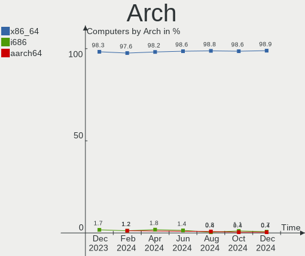
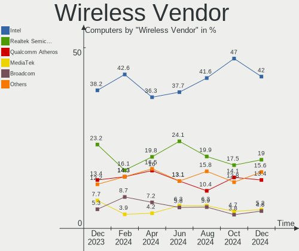
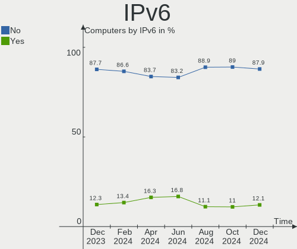
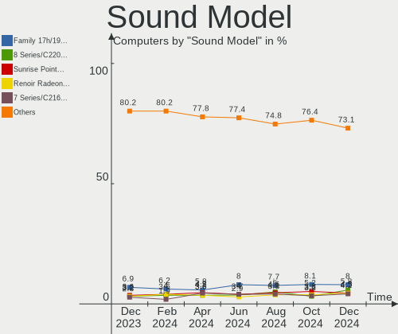

Linux in Italy - Hardware Trends
--------------------------------

A project to identify most popular hardware characteristics and track their change
over time based on data collected by Linux users at https://Linux-Hardware.org.

Anyone can contribute to this report by the [hw-probe](https://github.com/linuxhw/hw-probe) tool:

    sudo -E hw-probe -all -upload

This is a report for all computer types. See also reports for [desktops](/Location/Italy/Desktop/README.md) and [notebooks](/Location/Italy/Notebook/README.md).

Period: Dec, 2022.

Contents
--------

* [ System ](#system)
  - [ OS                       ](#os)
  - [ OS Family                ](#os-family)
  - [ Kernel                   ](#kernel)
  - [ Kernel Family            ](#kernel-family)
  - [ Kernel Major Ver.        ](#kernel-major-ver)
  - [ Arch                     ](#arch)
  - [ DE                       ](#de)
  - [ Display Server           ](#display-server)
  - [ Display Manager          ](#display-manager)
  - [ OS Lang                  ](#os-lang)
  - [ Boot Mode                ](#boot-mode)
  - [ Filesystem               ](#filesystem)
  - [ Part. scheme             ](#part-scheme)
  - [ Dual Boot with Linux/BSD ](#dual-boot-with-linuxbsd)
  - [ Dual Boot (Win)          ](#dual-boot-win)

* [ Board ](#board)
  - [ Vendor                   ](#vendor)
  - [ Model                    ](#model)
  - [ Model Family             ](#model-family)
  - [ MFG Year                 ](#mfg-year)
  - [ Form Factor              ](#form-factor)
  - [ Secure Boot              ](#secure-boot)
  - [ Coreboot                 ](#coreboot)
  - [ RAM Size                 ](#ram-size)
  - [ RAM Used                 ](#ram-used)
  - [ Total Drives             ](#total-drives)
  - [ Has CD-ROM               ](#has-cd-rom)
  - [ Has Ethernet             ](#has-ethernet)
  - [ Has WiFi                 ](#has-wifi)
  - [ Has Bluetooth            ](#has-bluetooth)

* [ Location ](#location)
  - [ Country                  ](#country)
  - [ City                     ](#city)

* [ Drives ](#drives)
  - [ Drive Vendor             ](#drive-vendor)
  - [ Drive Model              ](#drive-model)
  - [ HDD Vendor               ](#hdd-vendor)
  - [ SSD Vendor               ](#ssd-vendor)
  - [ Drive Kind               ](#drive-kind)
  - [ Drive Connector          ](#drive-connector)
  - [ Drive Size               ](#drive-size)
  - [ Space Total              ](#space-total)
  - [ Space Used               ](#space-used)
  - [ Malfunc. Drives          ](#malfunc-drives)
  - [ Malfunc. Drive Vendor    ](#malfunc-drive-vendor)
  - [ Malfunc. HDD Vendor      ](#malfunc-hdd-vendor)
  - [ Malfunc. Drive Kind      ](#malfunc-drive-kind)
  - [ Failed Drives            ](#failed-drives)
  - [ Failed Drive Vendor      ](#failed-drive-vendor)
  - [ Drive Status             ](#drive-status)

* [ Storage controller ](#storage-controller)
  - [ Storage Vendor           ](#storage-vendor)
  - [ Storage Model            ](#storage-model)
  - [ Storage Kind             ](#storage-kind)

* [ Processor ](#processor)
  - [ CPU Vendor               ](#cpu-vendor)
  - [ CPU Model                ](#cpu-model)
  - [ CPU Model Family         ](#cpu-model-family)
  - [ CPU Cores                ](#cpu-cores)
  - [ CPU Sockets              ](#cpu-sockets)
  - [ CPU Threads              ](#cpu-threads)
  - [ CPU Op-Modes             ](#cpu-op-modes)
  - [ CPU Microcode            ](#cpu-microcode)
  - [ CPU Microarch            ](#cpu-microarch)

* [ Graphics ](#graphics)
  - [ GPU Vendor               ](#gpu-vendor)
  - [ GPU Model                ](#gpu-model)
  - [ GPU Combo                ](#gpu-combo)
  - [ GPU Driver               ](#gpu-driver)
  - [ GPU Memory               ](#gpu-memory)

* [ Monitor ](#monitor)
  - [ Monitor Vendor           ](#monitor-vendor)
  - [ Monitor Model            ](#monitor-model)
  - [ Monitor Resolution       ](#monitor-resolution)
  - [ Monitor Diagonal         ](#monitor-diagonal)
  - [ Monitor Width            ](#monitor-width)
  - [ Aspect Ratio             ](#aspect-ratio)
  - [ Monitor Area             ](#monitor-area)
  - [ Pixel Density            ](#pixel-density)
  - [ Multiple Monitors        ](#multiple-monitors)

* [ Network ](#network)
  - [ Net Controller Vendor    ](#net-controller-vendor)
  - [ Net Controller Model     ](#net-controller-model)
  - [ Wireless Vendor          ](#wireless-vendor)
  - [ Wireless Model           ](#wireless-model)
  - [ Ethernet Vendor          ](#ethernet-vendor)
  - [ Ethernet Model           ](#ethernet-model)
  - [ Net Controller Kind      ](#net-controller-kind)
  - [ Used Controller          ](#used-controller)
  - [ NICs                     ](#nics)
  - [ IPv6                     ](#ipv6)

* [ Bluetooth ](#bluetooth)
  - [ Bluetooth Vendor         ](#bluetooth-vendor)
  - [ Bluetooth Model          ](#bluetooth-model)

* [ Sound ](#sound)
  - [ Sound Vendor             ](#sound-vendor)
  - [ Sound Model              ](#sound-model)

* [ Memory ](#memory)
  - [ Memory Vendor            ](#memory-vendor)
  - [ Memory Model             ](#memory-model)
  - [ Memory Kind              ](#memory-kind)
  - [ Memory Form Factor       ](#memory-form-factor)
  - [ Memory Size              ](#memory-size)
  - [ Memory Speed             ](#memory-speed)

* [ Printers & scanners ](#printers--scanners)
  - [ Printer Vendor           ](#printer-vendor)
  - [ Printer Model            ](#printer-model)
  - [ Scanner Vendor           ](#scanner-vendor)
  - [ Scanner Model            ](#scanner-model)

* [ Camera ](#camera)
  - [ Camera Vendor            ](#camera-vendor)
  - [ Camera Model             ](#camera-model)

* [ Security ](#security)
  - [ Fingerprint Vendor       ](#fingerprint-vendor)
  - [ Fingerprint Model        ](#fingerprint-model)
  - [ Chipcard Vendor          ](#chipcard-vendor)
  - [ Chipcard Model           ](#chipcard-model)

* [ Unsupported ](#unsupported)
  - [ Unsupported Devices      ](#unsupported-devices)
  - [ Unsupported Device Types ](#unsupported-device-types)

System
------

OS
--

Installed operating systems

| Name                         | Computers | Percent |
|------------------------------|-----------|---------|
| Ubuntu 22.04                 | 29        | 10.32%  |
| Debian 11                    | 21        | 7.47%   |
| Arch Rolling                 | 20        | 7.12%   |
| Linux Mint 21                | 19        | 6.76%   |
| Ubuntu 22.10                 | 18        | 6.41%   |
| Fedora 37                    | 18        | 6.41%   |
| Linux Mint 21.1              | 13        | 4.63%   |
| Pop!_OS 22.04                | 12        | 4.27%   |
| OpenMandriva 4.3             | 12        | 4.27%   |
| Ubuntu 20.04                 | 8         | 2.85%   |
| Manjaro 22.0.0               | 8         | 2.85%   |
| Kubuntu 22.04                | 8         | 2.85%   |
| openSUSE Tumbleweed-XXXXXXXX | 7         | 2.49%   |
| OpenMandriva 22.12           | 7         | 2.49%   |
| Zorin 16                     | 6         | 2.14%   |
| Linux Mint 20.3              | 6         | 2.14%   |
| Kubuntu 22.10                | 5         | 1.78%   |
| EndeavourOS Rolling          | 5         | 1.78%   |
| MX 21                        | 4         | 1.42%   |
| Xubuntu 18.04                | 3         | 1.07%   |
| Lubuntu 22.04                | 3         | 1.07%   |
| LMDE 5                       | 3         | 1.07%   |
| KDE neon 22.04               | 3         | 1.07%   |
| Xubuntu 22.04                | 2         | 0.71%   |
| OpenMandriva 4.50            | 2         | 0.71%   |
| Manjaro 21.3.7               | 2         | 0.71%   |
| Manjaro                      | 2         | 0.71%   |
| Lubuntu 20.04                | 2         | 0.71%   |
| Gentoo 2.9                   | 2         | 0.71%   |
| Fedora 36                    | 2         | 0.71%   |
| Elementary 5.1.7             | 2         | 0.71%   |
| Debian                       | 2         | 0.71%   |
| Zorin 15                     | 1         | 0.36%   |
| Xubuntu 22.10                | 1         | 0.36%   |
| Xubuntu 20.04                | 1         | 0.36%   |
| Ubuntu MATE 22.10            | 1         | 0.36%   |
| Ubuntu MATE 22.04            | 1         | 0.36%   |
| Ubuntu Budgie 22.10          | 1         | 0.36%   |
| Ubuntu 18.04                 | 1         | 0.36%   |
| SteamOS 3.3.2                | 1         | 0.36%   |

OS Family
---------

OS without a version

| Name          | Computers | Percent |
|---------------|-----------|---------|
| Ubuntu        | 56        | 19.93%  |
| Linux Mint    | 41        | 14.59%  |
| Debian        | 24        | 8.54%   |
| OpenMandriva  | 22        | 7.83%   |
| Fedora        | 20        | 7.12%   |
| Arch          | 20        | 7.12%   |
| Kubuntu       | 14        | 4.98%   |
| Pop!_OS       | 12        | 4.27%   |
| Manjaro       | 12        | 4.27%   |
| openSUSE      | 8         | 2.85%   |
| Zorin         | 7         | 2.49%   |
| Xubuntu       | 7         | 2.49%   |
| Lubuntu       | 6         | 2.14%   |
| EndeavourOS   | 5         | 1.78%   |
| MX            | 4         | 1.42%   |
| KDE neon      | 4         | 1.42%   |
| LMDE          | 3         | 1.07%   |
| Elementary    | 3         | 1.07%   |
| Ubuntu MATE   | 2         | 0.71%   |
| Gentoo        | 2         | 0.71%   |
| Clear Linux   | 2         | 0.71%   |
| ArcoLinux     | 2         | 0.71%   |
| Ubuntu Budgie | 1         | 0.36%   |
| SteamOS       | 1         | 0.36%   |
| Slackware     | 1         | 0.36%   |
| Kali          | 1         | 0.36%   |
| BlackPanther  | 1         | 0.36%   |

Kernel
------

Version of the Linux kernel

| Version                  | Computers | Percent |
|--------------------------|-----------|---------|
| 5.15.0-56-generic        | 70        | 24.91%  |
| 5.19.0-26-generic        | 18        | 6.41%   |
| 5.4.0-135-generic        | 12        | 4.27%   |
| 5.16.7-desktop-1omv4003  | 11        | 3.91%   |
| 5.10.0-19-amd64          | 11        | 3.91%   |
| 6.0.12-arch1-1           | 10        | 3.56%   |
| 6.0.6-76060006-generic   | 8         | 2.85%   |
| 6.0.10-desktop-2omv22090 | 7         | 2.49%   |
| 5.15.0-53-generic        | 6         | 2.14%   |
| 5.15.0-43-generic        | 5         | 1.78%   |
| 6.1.1-arch1-1            | 4         | 1.42%   |
| 6.0.12-300.fc37.x86_64   | 4         | 1.42%   |
| 6.0.11-300.fc37.x86_64   | 4         | 1.42%   |
| 5.19.0-23-generic        | 4         | 1.42%   |
| 5.10.0-20-amd64          | 4         | 1.42%   |
| 6.1.0-1-MANJARO          | 3         | 1.07%   |
| 6.0.15-300.fc37.x86_64   | 3         | 1.07%   |
| 6.0.12-zen1-1-zen        | 3         | 1.07%   |
| 6.0.12-76060006-generic  | 3         | 1.07%   |
| 6.0.11-1-MANJARO         | 3         | 1.07%   |
| 5.15.0-57-generic        | 3         | 1.07%   |
| 6.1.0-1-default          | 2         | 0.71%   |
| 6.0.8-1-default          | 2         | 0.71%   |
| 6.0.11-zen1-1-zen        | 2         | 0.71%   |
| 6.0.11-gentoo            | 2         | 0.71%   |
| 6.0.11-arch1-1           | 2         | 0.71%   |
| 6.0.10-arch2-1           | 2         | 0.71%   |
| 6.0.10-300.fc37.x86_64   | 2         | 0.71%   |
| 6.0.10-1-default         | 2         | 0.71%   |
| 5.15.60-1-MANJARO        | 2         | 0.71%   |
| 5.15.0-52-generic        | 2         | 0.71%   |
| 5.15.0-41-generic        | 2         | 0.71%   |
| 5.10.0-18-amd64          | 2         | 0.71%   |
| 5.10.0-15-amd64          | 2         | 0.71%   |
| 4.15.0-200-generic       | 2         | 0.71%   |
| 6.1.1-zen1-1-zen         | 1         | 0.36%   |
| 6.1.1-1231.native        | 1         | 0.36%   |
| 6.1.1-1228.native        | 1         | 0.36%   |
| 6.1.0                    | 1         | 0.36%   |
| 6.0.9-300.fc37.x86_64    | 1         | 0.36%   |

Kernel Family
-------------

Linux kernel without a distro release

| Version | Computers | Percent |
|---------|-----------|---------|
| 5.15.0  | 91        | 32.38%  |
| 5.19.0  | 25        | 8.9%    |
| 5.10.0  | 22        | 7.83%   |
| 6.0.12  | 20        | 7.12%   |
| 6.0.10  | 16        | 5.69%   |
| 5.4.0   | 16        | 5.69%   |
| 6.0.11  | 13        | 4.63%   |
| 5.16.7  | 11        | 3.91%   |
| 6.0.6   | 8         | 2.85%   |
| 6.1.1   | 7         | 2.49%   |
| 6.1.0   | 6         | 2.14%   |
| 6.0.0   | 6         | 2.14%   |
| 6.0.15  | 3         | 1.07%   |
| 5.13.0  | 3         | 1.07%   |
| 4.15.0  | 3         | 1.07%   |
| 6.0.9   | 2         | 0.71%   |
| 6.0.8   | 2         | 0.71%   |
| 6.0.2   | 2         | 0.71%   |
| 6.0.13  | 2         | 0.71%   |
| 5.15.60 | 2         | 0.71%   |
| 6.0.7   | 1         | 0.36%   |
| 6.0.5   | 1         | 0.36%   |
| 6.0.14  | 1         | 0.36%   |
| 5.19.5  | 1         | 0.36%   |
| 5.19.17 | 1         | 0.36%   |
| 5.19.12 | 1         | 0.36%   |
| 5.18.0  | 1         | 0.36%   |
| 5.16.13 | 1         | 0.36%   |
| 5.16.0  | 1         | 0.36%   |
| 5.15.85 | 1         | 0.36%   |
| 5.15.84 | 1         | 0.36%   |
| 5.15.83 | 1         | 0.36%   |
| 5.15.81 | 1         | 0.36%   |
| 5.15.30 | 1         | 0.36%   |
| 5.15.19 | 1         | 0.36%   |
| 5.14.21 | 1         | 0.36%   |
| 5.10.14 | 1         | 0.36%   |
| 5.0.9   | 1         | 0.36%   |
| 4.19.0  | 1         | 0.36%   |
| 4.18.16 | 1         | 0.36%   |

Kernel Major Ver.
-----------------

Linux kernel major version

| Version | Computers | Percent |
|---------|-----------|---------|
| 5.15    | 99        | 35.23%  |
| 6.0     | 77        | 27.4%   |
| 5.19    | 28        | 9.96%   |
| 5.10    | 23        | 8.19%   |
| 5.4     | 16        | 5.69%   |
| 6.1     | 13        | 4.63%   |
| 5.16    | 13        | 4.63%   |
| 5.13    | 3         | 1.07%   |
| 4.15    | 3         | 1.07%   |
| 5.18    | 1         | 0.36%   |
| 5.14    | 1         | 0.36%   |
| 5.0     | 1         | 0.36%   |
| 4.19    | 1         | 0.36%   |
| 4.18    | 1         | 0.36%   |
| 3.16    | 1         | 0.36%   |

Arch
----

OS architecture (x86_64, i586, etc.)

| Name    | Computers | Percent |
|---------|-----------|---------|
| x86_64  | 273       | 97.15%  |
| i686    | 7         | 2.49%   |
| aarch64 | 1         | 0.36%   |

DE
--

Desktop Environment

| Name            | Computers | Percent |
|-----------------|-----------|---------|
| GNOME           | 113       | 40.21%  |
| KDE5            | 71        | 25.27%  |
| X-Cinnamon      | 38        | 13.52%  |
| XFCE            | 22        | 7.83%   |
| MATE            | 7         | 2.49%   |
| LXQt            | 7         | 2.49%   |
| Unknown         | 7         | 2.49%   |
| Pantheon        | 3         | 1.07%   |
| LXDE            | 3         | 1.07%   |
| Cinnamon        | 3         | 1.07%   |
| i3              | 2         | 0.71%   |
| GNOME Flashback | 2         | 0.71%   |
| KDE             | 1         | 0.36%   |
| Hyprland        | 1         | 0.36%   |
| bspwm           | 1         | 0.36%   |

Display Server
--------------

X11 or Wayland

| Name    | Computers | Percent |
|---------|-----------|---------|
| X11     | 200       | 71.17%  |
| Wayland | 66        | 23.49%  |
| Unknown | 10        | 3.56%   |
| Tty     | 5         | 1.78%   |

Display Manager
---------------

SDDM, LightDM, etc.

| Name    | Computers | Percent |
|---------|-----------|---------|
| Unknown | 70        | 24.91%  |
| SDDM    | 64        | 22.78%  |
| GDM3    | 60        | 21.35%  |
| LightDM | 56        | 19.93%  |
| GDM     | 30        | 10.68%  |
| SLiM    | 1         | 0.36%   |

OS Lang
-------

Language

| Lang    | Computers | Percent |
|---------|-----------|---------|
| it_IT   | 178       | 63.35%  |
| en_US   | 75        | 26.69%  |
| C       | 14        | 4.98%   |
| en_GB   | 8         | 2.85%   |
| Unknown | 3         | 1.07%   |
| de_IT   | 2         | 0.71%   |
| de_CH   | 1         | 0.36%   |

Boot Mode
---------

EFI or BIOS

| Mode | Computers | Percent |
|------|-----------|---------|
| EFI  | 164       | 58.36%  |
| BIOS | 117       | 41.64%  |

Filesystem
----------

Type of filesystem

| Type    | Computers | Percent |
|---------|-----------|---------|
| Ext4    | 208       | 74.02%  |
| Overlay | 38        | 13.52%  |
| Btrfs   | 32        | 11.39%  |
| Zfs     | 1         | 0.36%   |
| Tmpfs   | 1         | 0.36%   |
| F2fs    | 1         | 0.36%   |

Part. scheme
------------

Scheme of partitioning

| Type    | Computers | Percent |
|---------|-----------|---------|
| GPT     | 180       | 64.06%  |
| Unknown | 65        | 23.13%  |
| MBR     | 36        | 12.81%  |

Dual Boot with Linux/BSD
------------------------

Hosting more than one Linux/BSD

| Dual boot | Computers | Percent |
|-----------|-----------|---------|
| No        | 239       | 85.05%  |
| Yes       | 42        | 14.95%  |

Dual Boot (Win)
---------------

Hosting Linux and Windows

| Dual boot | Computers | Percent |
|-----------|-----------|---------|
| No        | 181       | 64.41%  |
| Yes       | 100       | 35.59%  |

Board
-----

Vendor
------

Motherboard manufacturer

| Name                | Computers | Percent |
|---------------------|-----------|---------|
| Hewlett-Packard     | 55        | 19.57%  |
| ASUSTek Computer    | 46        | 16.37%  |
| Lenovo              | 39        | 13.88%  |
| MSI                 | 19        | 6.76%   |
| Dell                | 17        | 6.05%   |
| Acer                | 16        | 5.69%   |
| ASRock              | 11        | 3.91%   |
| HUAWEI              | 10        | 3.56%   |
| Gigabyte Technology | 9         | 3.2%    |
| Toshiba             | 6         | 2.14%   |
| Samsung Electronics | 4         | 1.42%   |
| Unknown             | 4         | 1.42%   |
| Teclast             | 3         | 1.07%   |
| Packard Bell        | 3         | 1.07%   |
| Google              | 3         | 1.07%   |
| Fujitsu             | 3         | 1.07%   |
| Apple               | 3         | 1.07%   |
| Pegatron            | 2         | 0.71%   |
| Notebook            | 2         | 0.71%   |
| Microsoft           | 2         | 0.71%   |
| Intel               | 2         | 0.71%   |
| Foxconn             | 2         | 0.71%   |
| BESSTAR Tech        | 2         | 0.71%   |
| ZOTAC               | 1         | 0.36%   |
| WYSE                | 1         | 0.36%   |
| Valve               | 1         | 0.36%   |
| TrekStor            | 1         | 0.36%   |
| Timi                | 1         | 0.36%   |
| System76            | 1         | 0.36%   |
| Sony                | 1         | 0.36%   |
| SGIN                | 1         | 0.36%   |
| Schenker            | 1         | 0.36%   |
| SANTECH             | 1         | 0.36%   |
| PC Specialist       | 1         | 0.36%   |
| Monster             | 1         | 0.36%   |
| Medion              | 1         | 0.36%   |
| Mediacom            | 1         | 0.36%   |
| MAXSUN              | 1         | 0.36%   |
| Chuwi               | 1         | 0.36%   |
| AMI                 | 1         | 0.36%   |

Model
-----

Motherboard model

| Name                                              | Computers | Percent |
|---------------------------------------------------|-----------|---------|
| Unknown                                           | 5         | 1.78%   |
| MSI MS-7B79                                       | 3         | 1.07%   |
| Lenovo IdeaPad Gaming 3 15ARH05 82EY              | 2         | 0.71%   |
| Lenovo IdeaPad 3 15ADA05 81W1                     | 2         | 0.71%   |
| HUAWEI NBLK-WAX9X                                 | 2         | 0.71%   |
| HUAWEI NBLB-WAX9N                                 | 2         | 0.71%   |
| HP Pavilion Laptop 15-cs2xxx                      | 2         | 0.71%   |
| HP Pavilion 15                                    | 2         | 0.71%   |
| HP Notebook                                       | 2         | 0.71%   |
| HP Laptop 15s-fq2xxx                              | 2         | 0.71%   |
| HP Laptop 15-da0xxx                               | 2         | 0.71%   |
| HP Compaq 6730s                                   | 2         | 0.71%   |
| HP 255 G8 Notebook PC                             | 2         | 0.71%   |
| Google Blooglet                                   | 2         | 0.71%   |
| ZOTAC ZBOX-MI640/MI660/MI620NANO                  | 1         | 0.36%   |
| WYSE XM CLASS                                     | 1         | 0.36%   |
| Valve Jupiter                                     | 1         | 0.36%   |
| TrekStor SurfTab twin 11.6                        | 1         | 0.36%   |
| Toshiba Satellite Pro S500                        | 1         | 0.36%   |
| Toshiba Satellite M70                             | 1         | 0.36%   |
| Toshiba Satellite L50-B                           | 1         | 0.36%   |
| Toshiba Satellite L455                            | 1         | 0.36%   |
| Toshiba Satellite C850-1LJ                        | 1         | 0.36%   |
| Toshiba Satellite C70-C-11L                       | 1         | 0.36%   |
| Timi TM1701                                       | 1         | 0.36%   |
| Teclast F7 Plus                                   | 1         | 0.36%   |
| Teclast F5                                        | 1         | 0.36%   |
| Teclast F15Plus 2                                 | 1         | 0.36%   |
| System76 Darter Pro                               | 1         | 0.36%   |
| Sony VGN-FW11E                                    | 1         | 0.36%   |
| SGIN laptop                                       | 1         | 0.36%   |
| Schenker XMG APEX (Mid 2021)                      | 1         | 0.36%   |
| SANTECH NHx0DB,DE                                 | 1         | 0.36%   |
| Samsung RV420/RV520/RV720/E3530/S3530/E3420/E3520 | 1         | 0.36%   |
| Samsung 750XDA                                    | 1         | 0.36%   |
| Samsung 530U3C/530U4C/532U3C                      | 1         | 0.36%   |
| Samsung 350V5C/351V5C/3540VC/3440VC               | 1         | 0.36%   |
| Pegatron Pro 3505 Series                          | 1         | 0.36%   |
| Pegatron p7-1011it                                | 1         | 0.36%   |
| PC Specialist Elimina Iv 17                       | 1         | 0.36%   |

Model Family
------------

Motherboard model prefix

| Name                  | Computers | Percent |
|-----------------------|-----------|---------|
| Lenovo ThinkPad       | 16        | 5.69%   |
| HP Pavilion           | 12        | 4.27%   |
| Acer Aspire           | 12        | 4.27%   |
| Lenovo IdeaPad        | 9         | 3.2%    |
| HP EliteBook          | 9         | 3.2%    |
| ASUS ROG              | 8         | 2.85%   |
| Toshiba Satellite     | 6         | 2.14%   |
| HP Compaq             | 5         | 1.78%   |
| Dell XPS              | 5         | 1.78%   |
| Dell Inspiron         | 5         | 1.78%   |
| Unknown               | 5         | 1.78%   |
| Lenovo ThinkCentre    | 4         | 1.42%   |
| HP Laptop             | 4         | 1.42%   |
| ASUS PRIME            | 4         | 1.42%   |
| MSI MS-7B79           | 3         | 1.07%   |
| HP ProBook            | 3         | 1.07%   |
| HP 255                | 3         | 1.07%   |
| Dell Latitude         | 3         | 1.07%   |
| Packard Bell EasyNote | 2         | 0.71%   |
| Microsoft Surface     | 2         | 0.71%   |
| Lenovo ThinkBook      | 2         | 0.71%   |
| HUAWEI NBLK-WAX9X     | 2         | 0.71%   |
| HUAWEI NBLB-WAX9N     | 2         | 0.71%   |
| HP Spectre            | 2         | 0.71%   |
| HP ProLiant           | 2         | 0.71%   |
| HP ProDesk            | 2         | 0.71%   |
| HP Notebook           | 2         | 0.71%   |
| HP 250                | 2         | 0.71%   |
| Google Blooglet       | 2         | 0.71%   |
| Fujitsu ESPRIMO       | 2         | 0.71%   |
| Dell Precision        | 2         | 0.71%   |
| ASUS ZenBook          | 2         | 0.71%   |
| ASUS VivoBook         | 2         | 0.71%   |
| ASUS ASUS             | 2         | 0.71%   |
| ASRock B450           | 2         | 0.71%   |
| Acer Veriton          | 2         | 0.71%   |
| Acer TravelMate       | 2         | 0.71%   |
| ZOTAC ZBOX-MI640      | 1         | 0.36%   |
| WYSE XM               | 1         | 0.36%   |
| Valve Jupiter         | 1         | 0.36%   |

MFG Year
--------

Motherboard manufacture year

| Year    | Computers | Percent |
|---------|-----------|---------|
| 2021    | 35        | 12.46%  |
| 2018    | 32        | 11.39%  |
| 2020    | 31        | 11.03%  |
| 2019    | 27        | 9.61%   |
| 2013    | 18        | 6.41%   |
| 2022    | 17        | 6.05%   |
| 2017    | 17        | 6.05%   |
| 2012    | 17        | 6.05%   |
| 2015    | 15        | 5.34%   |
| 2016    | 14        | 4.98%   |
| 2011    | 13        | 4.63%   |
| 2009    | 12        | 4.27%   |
| 2014    | 11        | 3.91%   |
| 2010    | 8         | 2.85%   |
| 2008    | 5         | 1.78%   |
| 2006    | 4         | 1.42%   |
| 2007    | 3         | 1.07%   |
| 2005    | 1         | 0.36%   |
| Unknown | 1         | 0.36%   |

Form Factor
-----------

Physical design of the computer

| Name           | Computers | Percent |
|----------------|-----------|---------|
| Notebook       | 168       | 59.79%  |
| Desktop        | 92        | 32.74%  |
| Convertible    | 9         | 3.2%    |
| Mini pc        | 5         | 1.78%   |
| Tablet         | 3         | 1.07%   |
| All in one     | 2         | 0.71%   |
| System on chip | 1         | 0.36%   |
| Server         | 1         | 0.36%   |

Secure Boot
-----------

Enabled or disabled

| State    | Computers | Percent |
|----------|-----------|---------|
| Disabled | 257       | 91.46%  |
| Enabled  | 24        | 8.54%   |

Coreboot
--------

Have coreboot on board

| Used | Computers | Percent |
|------|-----------|---------|
| No   | 276       | 98.22%  |
| Yes  | 5         | 1.78%   |

RAM Size
--------

Total RAM memory

| Size in GB  | Computers | Percent |
|-------------|-----------|---------|
| 4.01-8.0    | 77        | 27.4%   |
| 16.01-24.0  | 62        | 22.06%  |
| 8.01-16.0   | 49        | 17.44%  |
| 3.01-4.0    | 39        | 13.88%  |
| 32.01-64.0  | 24        | 8.54%   |
| 1.01-2.0    | 8         | 2.85%   |
| 2.01-3.0    | 7         | 2.49%   |
| 64.01-256.0 | 7         | 2.49%   |
| 24.01-32.0  | 4         | 1.42%   |
| 0.51-1.0    | 4         | 1.42%   |

RAM Used
--------

Used RAM memory

| Used GB    | Computers | Percent |
|------------|-----------|---------|
| 2.01-3.0   | 81        | 28.83%  |
| 1.01-2.0   | 73        | 25.98%  |
| 4.01-8.0   | 58        | 20.64%  |
| 3.01-4.0   | 42        | 14.95%  |
| 0.51-1.0   | 16        | 5.69%   |
| 8.01-16.0  | 6         | 2.14%   |
| 0.01-0.5   | 4         | 1.42%   |
| 16.01-24.0 | 1         | 0.36%   |

Total Drives
------------

Number of drives on board

| Drives | Computers | Percent |
|--------|-----------|---------|
| 1      | 174       | 61.92%  |
| 2      | 61        | 21.71%  |
| 3      | 28        | 9.96%   |
| 4      | 9         | 3.2%    |
| 5      | 5         | 1.78%   |
| 6      | 2         | 0.71%   |
| 12     | 1         | 0.36%   |
| 0      | 1         | 0.36%   |

Has CD-ROM
----------

Has CD-ROM on board

| Presented | Computers | Percent |
|-----------|-----------|---------|
| No        | 185       | 65.84%  |
| Yes       | 96        | 34.16%  |

Has Ethernet
------------

Has Ethernet on board

| Presented | Computers | Percent |
|-----------|-----------|---------|
| Yes       | 233       | 82.92%  |
| No        | 48        | 17.08%  |

Has WiFi
--------

Has WiFi module

| Presented | Computers | Percent |
|-----------|-----------|---------|
| Yes       | 234       | 83.27%  |
| No        | 47        | 16.73%  |

Has Bluetooth
-------------

Has Bluetooth module

| Presented | Computers | Percent |
|-----------|-----------|---------|
| Yes       | 185       | 65.84%  |
| No        | 96        | 34.16%  |

Location
--------

Country
-------

Geographic location (country)

| Country | Computers | Percent |
|---------|-----------|---------|
| Italy   | 281       | 100%    |

City
----

Geographic location (city)

| City                | Computers | Percent |
|---------------------|-----------|---------|
| Milan               | 47        | 16.73%  |
| Rome                | 23        | 8.19%   |
| Bologna             | 9         | 3.2%    |
| Turin               | 7         | 2.49%   |
| Florence            | 6         | 2.14%   |
| Naples              | 5         | 1.78%   |
| Bari                | 5         | 1.78%   |
| Verona              | 4         | 1.42%   |
| Casalecchio di Reno | 4         | 1.42%   |
| Pisa                | 3         | 1.07%   |
| Parma               | 3         | 1.07%   |
| Palermo             | 3         | 1.07%   |
| Padova              | 3         | 1.07%   |
| Modena              | 3         | 1.07%   |
| Genoa               | 3         | 1.07%   |
| Catania             | 3         | 1.07%   |
| Bergamo             | 3         | 1.07%   |
| Settimo Torinese    | 2         | 0.71%   |
| Rho                 | 2         | 0.71%   |
| Reggio Calabria     | 2         | 0.71%   |
| Pescara             | 2         | 0.71%   |
| Pavia               | 2         | 0.71%   |
| Monzuno             | 2         | 0.71%   |
| Monza               | 2         | 0.71%   |
| Dolzago             | 2         | 0.71%   |
| Dolcè              | 2         | 0.71%   |
| Chieti              | 2         | 0.71%   |
| Brescia             | 2         | 0.71%   |
| Asti                | 2         | 0.71%   |
| Alfonsine           | 2         | 0.71%   |
| Affori              | 2         | 0.71%   |
| Vittuone            | 1         | 0.36%   |
| Veruno              | 1         | 0.36%   |
| Venice              | 1         | 0.36%   |
| Vasto               | 1         | 0.36%   |
| Valdengo            | 1         | 0.36%   |
| Ussana              | 1         | 0.36%   |
| Udine               | 1         | 0.36%   |
| Tuglie              | 1         | 0.36%   |
| Trinitapoli         | 1         | 0.36%   |

Drives
------

Drive Vendor
------------

Hard drive vendors

| Vendor                      | Computers | Drives | Percent |
|-----------------------------|-----------|--------|---------|
| Samsung Electronics         | 87        | 101    | 20.71%  |
| WDC                         | 42        | 50     | 10%     |
| Seagate                     | 40        | 52     | 9.52%   |
| Crucial                     | 27        | 28     | 6.43%   |
| Toshiba                     | 25        | 29     | 5.95%   |
| Unknown                     | 23        | 25     | 5.48%   |
| Kingston                    | 23        | 23     | 5.48%   |
| Sandisk                     | 21        | 23     | 5%      |
| Hitachi                     | 15        | 15     | 3.57%   |
| SK hynix                    | 13        | 13     | 3.1%    |
| Intel                       | 11        | 12     | 2.62%   |
| Micron Technology           | 8         | 8      | 1.9%    |
| KIOXIA                      | 7         | 7      | 1.67%   |
| Silicon Motion              | 6         | 6      | 1.43%   |
| Phison                      | 6         | 7      | 1.43%   |
| HGST                        | 6         | 6      | 1.43%   |
| China                       | 5         | 5      | 1.19%   |
| SPCC                        | 4         | 4      | 0.95%   |
| Phison Electronics          | 4         | 4      | 0.95%   |
| LITEON                      | 4         | 4      | 0.95%   |
| Micron/Crucial Technology   | 3         | 3      | 0.71%   |
| Maxtor                      | 3         | 4      | 0.71%   |
| Kingston Technology Company | 3         | 3      | 0.71%   |
| Fujitsu                     | 3         | 4      | 0.71%   |
| Teclast                     | 2         | 2      | 0.48%   |
| NGFF                        | 2         | 2      | 0.48%   |
| JMicron Technology          | 2         | 2      | 0.48%   |
| Intenso                     | 2         | 3      | 0.48%   |
| Transcend                   | 1         | 1      | 0.24%   |
| Team                        | 1         | 1      | 0.24%   |
| Solid State Storage         | 1         | 1      | 0.24%   |
| Ramaxel Technology          | 1         | 1      | 0.24%   |
| PNY                         | 1         | 1      | 0.24%   |
| Plextor                     | 1         | 1      | 0.24%   |
| OCZ                         | 1         | 1      | 0.24%   |
| LITEONIT                    | 1         | 1      | 0.24%   |
| Linux                       | 1         | 1      | 0.24%   |
| Lexar                       | 1         | 1      | 0.24%   |
| Lenovo                      | 1         | 1      | 0.24%   |
| KingSpec                    | 1         | 1      | 0.24%   |

Drive Model
-----------

Hard drive models

| Model                                                  | Computers | Percent |
|--------------------------------------------------------|-----------|---------|
| Kingston SA400S37240G 240GB SSD                        | 12        | 2.67%   |
| Samsung NVMe SSD Controller SM981/PM981/PM983 500GB    | 11        | 2.44%   |
| Samsung SSD 850 EVO 250GB                              | 7         | 1.56%   |
| Samsung NVMe SSD Controller PM9A1/PM9A3/980PRO 2TB     | 7         | 1.56%   |
| Samsung SSD 860 EVO 500GB                              | 6         | 1.33%   |
| Silicon Motion SM2263EN/SM2263XT SSD Controller 1024GB | 5         | 1.11%   |
| Intel SSD 660P Series 1024GB                           | 5         | 1.11%   |
| WDC WD10EZEX-08WN4A0 1TB                               | 4         | 0.89%   |
| Unknown SD/MMC/MS PRO 64GB                             | 4         | 0.89%   |
| Toshiba DT01ACA100 1TB                                 | 4         | 0.89%   |
| Samsung SSD 860 EVO 250GB                              | 4         | 0.89%   |
| Crucial CT500MX500SSD1 500GB                           | 4         | 0.89%   |
| Unknown MMC Card  64GB                                 | 3         | 0.67%   |
| Unknown MMC Card  128GB                                | 3         | 0.67%   |
| SK hynix SKHynix_HFM512GD3HX015N 512GB                 | 3         | 0.67%   |
| Seagate ST3500418AS 500GB                              | 3         | 0.67%   |
| Seagate ST2000DM008-2FR102 2TB                         | 3         | 0.67%   |
| Seagate ST1000DM003-9YN162 1TB                         | 3         | 0.67%   |
| Samsung SSD 870 QVO 1TB                                | 3         | 0.67%   |
| Samsung SSD 870 EVO 500GB                              | 3         | 0.67%   |
| Samsung SSD 870 EVO 1TB                                | 3         | 0.67%   |
| Samsung SSD 860 QVO 1TB                                | 3         | 0.67%   |
| Samsung MZVLQ512HALU-000H1 512GB                       | 3         | 0.67%   |
| Samsung MZVLQ512HALU-00000 512GB                       | 3         | 0.67%   |
| Phison E12 NVMe Controller 1TB                         | 3         | 0.67%   |
| Micron/Crucial P2 NVMe PCIe SSD 500GB                  | 3         | 0.67%   |
| Kingston SA400S37480G 480GB SSD                        | 3         | 0.67%   |
| WDC WDS240G2G0A-00JH30 240GB SSD                       | 2         | 0.44%   |
| WDC WD3200BEVT-22ZCT0 320GB                            | 2         | 0.44%   |
| WDC WD10EZEX-60WN4A0 1TB                               | 2         | 0.44%   |
| WDC WD10EZEX-60M2NA0 1TB                               | 2         | 0.44%   |
| WDC WD10EZEX-00BN5A0 1TB                               | 2         | 0.44%   |
| Unknown MMC Card  32GB                                 | 2         | 0.44%   |
| Unknown MMC Card  16GB                                 | 2         | 0.44%   |
| Toshiba XG6 NVMe SSD Controller 256GB                  | 2         | 0.44%   |
| Toshiba MQ01ABF050 500GB                               | 2         | 0.44%   |
| Toshiba DT01ACA200 2TB                                 | 2         | 0.44%   |
| SPCC Solid State Disk 256GB                            | 2         | 0.44%   |
| SK hynix BC511 NVMe 512GB                              | 2         | 0.44%   |
| SK hynix BC511 256GB                                   | 2         | 0.44%   |

HDD Vendor
----------

Hard disk drive vendors

| Vendor              | Computers | Drives | Percent |
|---------------------|-----------|--------|---------|
| Seagate             | 37        | 48     | 30.08%  |
| WDC                 | 32        | 39     | 26.02%  |
| Toshiba             | 16        | 20     | 13.01%  |
| Hitachi             | 15        | 15     | 12.2%   |
| HGST                | 6         | 6      | 4.88%   |
| Unknown             | 5         | 5      | 4.07%   |
| Samsung Electronics | 4         | 4      | 3.25%   |
| Maxtor              | 3         | 4      | 2.44%   |
| Fujitsu             | 3         | 4      | 2.44%   |
| HGST HTS            | 1         | 1      | 0.81%   |
| ASMT                | 1         | 1      | 0.81%   |

SSD Vendor
----------

Solid state drive vendors

| Vendor              | Computers | Drives | Percent |
|---------------------|-----------|--------|---------|
| Samsung Electronics | 44        | 48     | 30.56%  |
| Kingston            | 22        | 22     | 15.28%  |
| Crucial             | 18        | 18     | 12.5%   |
| SanDisk             | 14        | 16     | 9.72%   |
| Toshiba             | 5         | 5      | 3.47%   |
| China               | 5         | 5      | 3.47%   |
| SPCC                | 4         | 4      | 2.78%   |
| WDC                 | 3         | 3      | 2.08%   |
| Teclast             | 2         | 2      | 1.39%   |
| SK hynix            | 2         | 2      | 1.39%   |
| NGFF                | 2         | 2      | 1.39%   |
| Micron Technology   | 2         | 2      | 1.39%   |
| LITEON              | 2         | 2      | 1.39%   |
| Intenso             | 2         | 3      | 1.39%   |
| Unknown             | 1         | 1      | 0.69%   |
| Transcend           | 1         | 1      | 0.69%   |
| Team                | 1         | 1      | 0.69%   |
| Seagate             | 1         | 1      | 0.69%   |
| Ramaxel Technology  | 1         | 1      | 0.69%   |
| PNY                 | 1         | 1      | 0.69%   |
| Plextor             | 1         | 1      | 0.69%   |
| Phison              | 1         | 1      | 0.69%   |
| OCZ                 | 1         | 1      | 0.69%   |
| LITEONIT            | 1         | 1      | 0.69%   |
| Linux               | 1         | 1      | 0.69%   |
| KingSpec            | 1         | 1      | 0.69%   |
| FORESEE             | 1         | 1      | 0.69%   |
| Emtec               | 1         | 1      | 0.69%   |
| Drevo               | 1         | 1      | 0.69%   |
| Dogfish             | 1         | 1      | 0.69%   |
| ASUSTek Computer    | 1         | 1      | 0.69%   |

Drive Kind
----------

HDD or SSD

| Kind    | Computers | Drives | Percent |
|---------|-----------|--------|---------|
| SSD     | 130       | 151    | 34.3%   |
| NVMe    | 126       | 148    | 33.25%  |
| HDD     | 102       | 147    | 26.91%  |
| MMC     | 17        | 19     | 4.49%   |
| Unknown | 4         | 4      | 1.06%   |

Drive Connector
---------------

SATA, SAS, NVMe, etc.

| Type | Computers | Drives | Percent |
|------|-----------|--------|---------|
| SATA | 186       | 284    | 53.76%  |
| NVMe | 126       | 146    | 36.42%  |
| SAS  | 17        | 20     | 4.91%   |
| MMC  | 17        | 19     | 4.91%   |

Drive Size
----------

Size of hard drive

| Size in TB | Computers | Drives | Percent |
|------------|-----------|--------|---------|
| 0.01-0.5   | 145       | 177    | 60.67%  |
| 0.51-1.0   | 70        | 83     | 29.29%  |
| 1.01-2.0   | 14        | 24     | 5.86%   |
| 3.01-4.0   | 6         | 9      | 2.51%   |
| 2.01-3.0   | 2         | 2      | 0.84%   |
| 4.01-10.0  | 2         | 3      | 0.84%   |

Space Total
-----------

Amount of disk space available on the file system

| Size in GB     | Computers | Percent |
|----------------|-----------|---------|
| 101-250        | 72        | 25.62%  |
| 251-500        | 57        | 20.28%  |
| 1-20           | 38        | 13.52%  |
| 501-1000       | 32        | 11.39%  |
| 1001-2000      | 29        | 10.32%  |
| 51-100         | 20        | 7.12%   |
| 21-50          | 11        | 3.91%   |
| More than 3000 | 8         | 2.85%   |
| 2001-3000      | 7         | 2.49%   |
| Unknown        | 7         | 2.49%   |

Space Used
----------

Amount of used disk space

| Used GB   | Computers | Percent |
|-----------|-----------|---------|
| 1-20      | 101       | 35.94%  |
| 21-50     | 54        | 19.22%  |
| 101-250   | 34        | 12.1%   |
| 51-100    | 30        | 10.68%  |
| 251-500   | 21        | 7.47%   |
| 501-1000  | 19        | 6.76%   |
| 1001-2000 | 11        | 3.91%   |
| Unknown   | 7         | 2.49%   |
| 2001-3000 | 4         | 1.42%   |

Malfunc. Drives
---------------

Drive models with a malfunction

| Model                                       | Computers | Drives | Percent |
|---------------------------------------------|-----------|--------|---------|
| Seagate ST3500418AS 500GB                   | 2         | 2      | 6.9%    |
| WDC WD5000AADS-00S9B0 500GB                 | 1         | 1      | 3.45%   |
| WDC WD10EZEX-60WN4A0 1TB                    | 1         | 2      | 3.45%   |
| Toshiba MQ01ABF032 320GB                    | 1         | 1      | 3.45%   |
| Toshiba MK1234GSX 120GB                     | 1         | 1      | 3.45%   |
| SK hynix HFS256G39TND-N210A 256GB SSD       | 1         | 1      | 3.45%   |
| Seagate ST3500413AS 500GB                   | 1         | 1      | 3.45%   |
| Seagate ST3200822AS 200GB                   | 1         | 1      | 3.45%   |
| Seagate ST31000340AS 1TB                    | 1         | 1      | 3.45%   |
| Seagate ST2000DM001-1ER164 2TB              | 1         | 1      | 3.45%   |
| Seagate ST1000NM0011 99Y1164 59Y1812XIV 1TB | 1         | 1      | 3.45%   |
| Seagate ST1000LM035-1RK172 1TB              | 1         | 1      | 3.45%   |
| Seagate ST1000LM024 HN-M101MBB 1TB          | 1         | 1      | 3.45%   |
| SanDisk SD9SB8W-256G-1006 256GB SSD         | 1         | 1      | 3.45%   |
| Samsung Electronics SSD 870 EVO 250GB       | 1         | 1      | 3.45%   |
| Samsung Electronics SSD 870 EVO 1TB         | 1         | 1      | 3.45%   |
| Samsung Electronics HN-M500MBB 500GB        | 1         | 1      | 3.45%   |
| Samsung Electronics HM500JJ 500GB           | 1         | 1      | 3.45%   |
| Samsung Electronics HM160HC 160GB           | 1         | 1      | 3.45%   |
| Samsung Electronics HD103SI 1TB             | 1         | 1      | 3.45%   |
| NGFF 2280 512GB SSD                         | 1         | 1      | 3.45%   |
| Maxtor STM3320613AS 320GB                   | 1         | 2      | 3.45%   |
| Intenso SSD Sata III 128GB                  | 1         | 1      | 3.45%   |
| Intel SSD 660P Series 1024GB                | 1         | 1      | 3.45%   |
| Hitachi HTS543216L9SA00 160GB               | 1         | 1      | 3.45%   |
| Fujitsu MHZ2120BH G2 120GB                  | 1         | 1      | 3.45%   |
| CT1000P1 SSD8 P3CR 1TB                      | 1         | 2      | 3.45%   |
| ASMT 2115 320GB                             | 1         | 1      | 3.45%   |

Malfunc. Drive Vendor
---------------------

Vendors of faulty drives

| Vendor              | Computers | Drives | Percent |
|---------------------|-----------|--------|---------|
| Seagate             | 9         | 9      | 31.03%  |
| Samsung Electronics | 6         | 6      | 20.69%  |
| WDC                 | 2         | 3      | 6.9%    |
| Toshiba             | 2         | 2      | 6.9%    |
| SK hynix            | 1         | 1      | 3.45%   |
| SanDisk             | 1         | 1      | 3.45%   |
| NGFF                | 1         | 1      | 3.45%   |
| Maxtor              | 1         | 2      | 3.45%   |
| Intenso             | 1         | 1      | 3.45%   |
| Intel               | 1         | 1      | 3.45%   |
| Hitachi             | 1         | 1      | 3.45%   |
| Fujitsu             | 1         | 1      | 3.45%   |
| CT1000P1            | 1         | 2      | 3.45%   |
| ASMT                | 1         | 1      | 3.45%   |

Malfunc. HDD Vendor
-------------------

Vendors of faulty HDD drives

| Vendor              | Computers | Drives | Percent |
|---------------------|-----------|--------|---------|
| Seagate             | 9         | 9      | 42.86%  |
| Samsung Electronics | 4         | 4      | 19.05%  |
| WDC                 | 2         | 3      | 9.52%   |
| Toshiba             | 2         | 2      | 9.52%   |
| Maxtor              | 1         | 2      | 4.76%   |
| Hitachi             | 1         | 1      | 4.76%   |
| Fujitsu             | 1         | 1      | 4.76%   |
| ASMT                | 1         | 1      | 4.76%   |

Malfunc. Drive Kind
-------------------

Kinds of faulty drives

| Kind | Computers | Drives | Percent |
|------|-----------|--------|---------|
| HDD  | 21        | 23     | 72.41%  |
| SSD  | 6         | 6      | 20.69%  |
| NVMe | 2         | 3      | 6.9%    |

Failed Drives
-------------

Failed drive models

Zero info for selected period =(

Failed Drive Vendor
-------------------

Failed drive vendors

Zero info for selected period =(

Drive Status
------------

Number of failed and malfunc. drives

| Status   | Computers | Drives | Percent |
|----------|-----------|--------|---------|
| Works    | 146       | 231    | 46.95%  |
| Detected | 136       | 206    | 43.73%  |
| Malfunc  | 29        | 32     | 9.32%   |

Storage controller
------------------

Storage Vendor
--------------

Storage controller vendors

| Vendor                           | Computers | Percent |
|----------------------------------|-----------|---------|
| Intel                            | 173       | 46.76%  |
| AMD                              | 59        | 15.95%  |
| Samsung Electronics              | 45        | 12.16%  |
| SanDisk                          | 13        | 3.51%   |
| Micron/Crucial Technology        | 13        | 3.51%   |
| SK hynix                         | 11        | 2.97%   |
| Phison Electronics               | 9         | 2.43%   |
| Toshiba America Info Systems     | 6         | 1.62%   |
| Silicon Motion                   | 6         | 1.62%   |
| Micron Technology                | 6         | 1.62%   |
| ASMedia Technology               | 6         | 1.62%   |
| KIOXIA                           | 5         | 1.35%   |
| Marvell Technology Group         | 4         | 1.08%   |
| Kingston Technology Company      | 4         | 1.08%   |
| Seagate Technology               | 2         | 0.54%   |
| Lite-On Technology               | 2         | 0.54%   |
| VIA Technologies                 | 1         | 0.27%   |
| Solid State Storage Technology   | 1         | 0.27%   |
| Silicon Integrated Systems [SiS] | 1         | 0.27%   |
| MAXIO Technology (Hangzhou)      | 1         | 0.27%   |
| Lenovo                           | 1         | 0.27%   |
| ADATA Technology                 | 1         | 0.27%   |

Storage Model
-------------

Storage controller models

| Model                                                                          | Computers | Percent |
|--------------------------------------------------------------------------------|-----------|---------|
| AMD FCH SATA Controller [AHCI mode]                                            | 42        | 10.07%  |
| Samsung NVMe SSD Controller SM981/PM981/PM983                                  | 19        | 4.56%   |
| Intel Sunrise Point-LP SATA Controller [AHCI mode]                             | 15        | 3.6%    |
| Samsung NVMe SSD Controller 980                                                | 12        | 2.88%   |
| Intel Volume Management Device NVMe RAID Controller                            | 12        | 2.88%   |
| Intel 82801 Mobile SATA Controller [RAID mode]                                 | 12        | 2.88%   |
| Intel 8 Series/C220 Series Chipset Family 6-port SATA Controller 1 [AHCI mode] | 12        | 2.88%   |
| AMD 400 Series Chipset SATA Controller                                         | 12        | 2.88%   |
| Samsung NVMe SSD Controller PM9A1/PM9A3/980PRO                                 | 9         | 2.16%   |
| Micron/Crucial P2 NVMe PCIe SSD                                                | 9         | 2.16%   |
| Intel 7 Series Chipset Family 6-port SATA Controller [AHCI mode]               | 8         | 1.92%   |
| Intel SSD 660P Series                                                          | 7         | 1.68%   |
| Micron Non-Volatile memory controller                                          | 6         | 1.44%   |
| Intel Celeron/Pentium Silver Processor SATA Controller                         | 6         | 1.44%   |
| Intel Cannon Lake PCH SATA AHCI Controller                                     | 6         | 1.44%   |
| Intel 8 Series SATA Controller 1 [AHCI mode]                                   | 6         | 1.44%   |
| Intel 6 Series/C200 Series Chipset Family 6 port Mobile SATA AHCI Controller   | 6         | 1.44%   |
| Intel 200 Series PCH SATA controller [AHCI mode]                               | 6         | 1.44%   |
| AMD SB7x0/SB8x0/SB9x0 SATA Controller [AHCI mode]                              | 6         | 1.44%   |
| Toshiba America Info Systems XG6 NVMe SSD Controller                           | 5         | 1.2%    |
| SK hynix Gold P31/PC711 NVMe Solid State Drive                                 | 5         | 1.2%    |
| Silicon Motion SM2263EN/SM2263XT SSD Controller                                | 5         | 1.2%    |
| Phison E12 NVMe Controller                                                     | 5         | 1.2%    |
| Intel Wildcat Point-LP SATA Controller [AHCI Mode]                             | 5         | 1.2%    |
| Intel SATA Controller [RAID mode]                                              | 5         | 1.2%    |
| Intel 82801IBM/IEM (ICH9M/ICH9M-E) 4 port SATA Controller [AHCI mode]          | 5         | 1.2%    |
| ASMedia ASM1062 Serial ATA Controller                                          | 5         | 1.2%    |
| SK hynix BC511                                                                 | 4         | 0.96%   |
| SanDisk WD Black SN750 / PC SN730 NVMe SSD                                     | 4         | 0.96%   |
| SanDisk Non-Volatile memory controller                                         | 4         | 0.96%   |
| Samsung NVMe SSD Controller SM961/PM961/SM963                                  | 4         | 0.96%   |
| Intel Tiger Lake-LP SATA Controller                                            | 4         | 0.96%   |
| Intel Q170/Q150/B150/H170/H110/Z170/CM236 Chipset SATA Controller [AHCI Mode]  | 4         | 0.96%   |
| Intel NM10/ICH7 Family SATA Controller [AHCI mode]                             | 4         | 0.96%   |
| Intel Comet Lake SATA AHCI Controller                                          | 4         | 0.96%   |
| Intel 82801G (ICH7 Family) IDE Controller                                      | 4         | 0.96%   |
| Intel 6 Series/C200 Series Chipset Family 6 port Desktop SATA AHCI Controller  | 4         | 0.96%   |
| Intel 400 Series Chipset Family SATA AHCI Controller                           | 4         | 0.96%   |
| SanDisk WD Blue SN550 NVMe SSD                                                 | 3         | 0.72%   |
| Samsung NVMe SSD Controller SM951/PM951                                        | 3         | 0.72%   |

Storage Kind
------------

Kind of storage controller (IDE, SATA, NVMe, SAS, ...)

| Kind | Computers | Percent |
|------|-----------|---------|
| SATA | 187       | 50.27%  |
| NVMe | 126       | 33.87%  |
| RAID | 31        | 8.33%   |
| IDE  | 27        | 7.26%   |
| SAS  | 1         | 0.27%   |

Processor
---------

CPU Vendor
----------

Processor vendors

| Vendor | Computers | Percent |
|--------|-----------|---------|
| Intel  | 204       | 72.6%   |
| AMD    | 76        | 27.05%  |
| ARM    | 1         | 0.36%   |

CPU Model
---------

Processor models

| Model                                         | Computers | Percent |
|-----------------------------------------------|-----------|---------|
| Intel Core i7-8550U CPU @ 1.80GHz             | 9         | 3.2%    |
| Intel 11th Gen Core i7-1165G7 @ 2.80GHz       | 6         | 2.14%   |
| Intel Core i7-8565U CPU @ 1.80GHz             | 5         | 1.78%   |
| Intel Core i5-10210U CPU @ 1.60GHz            | 5         | 1.78%   |
| Intel Core i5-8250U CPU @ 1.60GHz             | 4         | 1.42%   |
| Intel 12th Gen Core i7-12700H                 | 4         | 1.42%   |
| Intel 11th Gen Core i5-1135G7 @ 2.40GHz       | 4         | 1.42%   |
| AMD Ryzen 7 5700U with Radeon Graphics        | 4         | 1.42%   |
| AMD Ryzen 7 3700U with Radeon Vega Mobile Gfx | 4         | 1.42%   |
| AMD Ryzen 5 3600 6-Core Processor             | 4         | 1.42%   |
| AMD Ryzen 5 3500U with Radeon Vega Mobile Gfx | 4         | 1.42%   |
| Intel Core i7-6700 CPU @ 3.40GHz              | 3         | 1.07%   |
| Intel Core i7-1065G7 CPU @ 1.30GHz            | 3         | 1.07%   |
| Intel Core i5-6200U CPU @ 2.30GHz             | 3         | 1.07%   |
| Intel Core i5-5200U CPU @ 2.20GHz             | 3         | 1.07%   |
| Intel Celeron N4020 CPU @ 1.10GHz             | 3         | 1.07%   |
| Intel Atom x5-Z8350 CPU @ 1.44GHz             | 3         | 1.07%   |
| AMD Ryzen 9 5950X 16-Core Processor           | 3         | 1.07%   |
| AMD Ryzen 9 5900HX with Radeon Graphics       | 3         | 1.07%   |
| AMD Ryzen 7 5800X 8-Core Processor            | 3         | 1.07%   |
| AMD Ryzen 7 4800H with Radeon Graphics        | 3         | 1.07%   |
| Intel Pentium Dual-Core CPU E5300 @ 2.60GHz   | 2         | 0.71%   |
| Intel Core i7-7500U CPU @ 2.70GHz             | 2         | 0.71%   |
| Intel Core i7-4500U CPU @ 1.80GHz             | 2         | 0.71%   |
| Intel Core i7-3630QM CPU @ 2.40GHz            | 2         | 0.71%   |
| Intel Core i7-2670QM CPU @ 2.20GHz            | 2         | 0.71%   |
| Intel Core i7-10750H CPU @ 2.60GHz            | 2         | 0.71%   |
| Intel Core i5-9600K CPU @ 3.70GHz             | 2         | 0.71%   |
| Intel Core i5-8600K CPU @ 3.60GHz             | 2         | 0.71%   |
| Intel Core i5-8350U CPU @ 1.70GHz             | 2         | 0.71%   |
| Intel Core i5-8265U CPU @ 1.60GHz             | 2         | 0.71%   |
| Intel Core i5-7300U CPU @ 2.60GHz             | 2         | 0.71%   |
| Intel Core i5-4440 CPU @ 3.10GHz              | 2         | 0.71%   |
| Intel Core i5-4430 CPU @ 3.00GHz              | 2         | 0.71%   |
| Intel Core i5-4200U CPU @ 1.60GHz             | 2         | 0.71%   |
| Intel Core 2 Duo CPU T5670 @ 1.80GHz          | 2         | 0.71%   |
| Intel Celeron N4500 @ 1.10GHz                 | 2         | 0.71%   |
| Intel Celeron N4100 CPU @ 1.10GHz             | 2         | 0.71%   |
| Intel 12th Gen Core i7-1260P                  | 2         | 0.71%   |
| Intel 11th Gen Core i3-1115G4 @ 3.00GHz       | 2         | 0.71%   |

CPU Model Family
----------------

Processor model prefix

| Model                   | Computers | Percent |
|-------------------------|-----------|---------|
| Intel Core i5           | 62        | 22.06%  |
| Intel Core i7           | 54        | 19.22%  |
| Other                   | 27        | 9.61%   |
| AMD Ryzen 7             | 22        | 7.83%   |
| AMD Ryzen 5             | 19        | 6.76%   |
| Intel Celeron           | 13        | 4.63%   |
| Intel Core i3           | 11        | 3.91%   |
| AMD Ryzen 9             | 9         | 3.2%    |
| Intel Core 2 Duo        | 8         | 2.85%   |
| Intel Atom              | 8         | 2.85%   |
| Intel Pentium           | 5         | 1.78%   |
| Intel Pentium Dual-Core | 4         | 1.42%   |
| AMD FX                  | 4         | 1.42%   |
| Intel Xeon              | 3         | 1.07%   |
| Intel Core i9           | 3         | 1.07%   |
| Intel Core 2            | 3         | 1.07%   |
| AMD Ryzen 3             | 3         | 1.07%   |
| AMD E1                  | 3         | 1.07%   |
| AMD A4                  | 3         | 1.07%   |
| Intel Pentium M         | 2         | 0.71%   |
| Intel Pentium Silver    | 1         | 0.36%   |
| Intel Pentium Gold      | 1         | 0.36%   |
| Intel Pentium D         | 1         | 0.36%   |
| Intel Celeron M         | 1         | 0.36%   |
| AMD Turion II Neo       | 1         | 0.36%   |
| AMD Sempron             | 1         | 0.36%   |
| AMD Ryzen 7 PRO         | 1         | 0.36%   |
| AMD Ryzen 5 PRO         | 1         | 0.36%   |
| AMD G                   | 1         | 0.36%   |
| AMD E                   | 1         | 0.36%   |
| AMD Athlon II X4        | 1         | 0.36%   |
| AMD Athlon II Dual-Core | 1         | 0.36%   |
| AMD Athlon 64 X2        | 1         | 0.36%   |
| AMD A8                  | 1         | 0.36%   |
| AMD A10                 | 1         | 0.36%   |

CPU Cores
---------

Number of processor cores

| Number | Computers | Percent |
|--------|-----------|---------|
| 4      | 110       | 39.15%  |
| 2      | 91        | 32.38%  |
| 6      | 30        | 10.68%  |
| 8      | 29        | 10.32%  |
| 1      | 7         | 2.49%   |
| 12     | 5         | 1.78%   |
| 14     | 4         | 1.42%   |
| 16     | 3         | 1.07%   |
| 20     | 1         | 0.36%   |
| 3      | 1         | 0.36%   |

CPU Sockets
-----------

Number of sockets

| Number | Computers | Percent |
|--------|-----------|---------|
| 1      | 278       | 98.93%  |
| 2      | 2         | 0.71%   |
| 4      | 1         | 0.36%   |

CPU Threads
-----------

Threads per core (Hyper-Threading)

| Number | Computers | Percent |
|--------|-----------|---------|
| 2      | 193       | 68.68%  |
| 1      | 87        | 30.96%  |
| 4      | 1         | 0.36%   |

CPU Op-Modes
------------

CPU Operation Modes (32-bit, 64-bit)

| Op mode        | Computers | Percent |
|----------------|-----------|---------|
| 32-bit, 64-bit | 278       | 98.93%  |
| 32-bit         | 3         | 1.07%   |

CPU Microcode
-------------

Microcode number

| Number     | Computers | Percent |
|------------|-----------|---------|
| Unknown    | 73        | 25.98%  |
| 0x806ea    | 11        | 3.91%   |
| 0x306a9    | 11        | 3.91%   |
| 0x206a7    | 11        | 3.91%   |
| 0x806c1    | 10        | 3.56%   |
| 0x08108109 | 9         | 3.2%    |
| 0x906ea    | 7         | 2.49%   |
| 0x806ec    | 7         | 2.49%   |
| 0x306c3    | 7         | 2.49%   |
| 0x806e9    | 5         | 1.78%   |
| 0x706a8    | 5         | 1.78%   |
| 0x406e3    | 5         | 1.78%   |
| 0x1067a    | 5         | 1.78%   |
| 0x0a50000c | 5         | 1.78%   |
| 0x08608103 | 5         | 1.78%   |
| 0x906e9    | 4         | 1.42%   |
| 0x506e3    | 4         | 1.42%   |
| 0x406c4    | 4         | 1.42%   |
| 0x0a201016 | 4         | 1.42%   |
| 0xa0652    | 3         | 1.07%   |
| 0x906a3    | 3         | 1.07%   |
| 0x806eb    | 3         | 1.07%   |
| 0x806c2    | 3         | 1.07%   |
| 0x706e5    | 3         | 1.07%   |
| 0x6fd      | 3         | 1.07%   |
| 0x6f6      | 3         | 1.07%   |
| 0x6d8      | 3         | 1.07%   |
| 0x406c3    | 3         | 1.07%   |
| 0x40651    | 3         | 1.07%   |
| 0x306d4    | 3         | 1.07%   |
| 0x08701021 | 3         | 1.07%   |
| 0x906ec    | 2         | 0.71%   |
| 0x706a1    | 2         | 0.71%   |
| 0x20655    | 2         | 0.71%   |
| 0x20652    | 2         | 0.71%   |
| 0x10676    | 2         | 0.71%   |
| 0x0a20120a | 2         | 0.71%   |
| 0x08701013 | 2         | 0.71%   |
| 0x08600106 | 2         | 0.71%   |
| 0x08600104 | 2         | 0.71%   |

CPU Microarch
-------------

Microarchitecture

| Name             | Computers | Percent |
|------------------|-----------|---------|
| KabyLake         | 53        | 18.86%  |
| Haswell          | 20        | 7.12%   |
| Zen 3            | 17        | 6.05%   |
| Zen+             | 15        | 5.34%   |
| IvyBridge        | 15        | 5.34%   |
| Unknown          | 15        | 5.34%   |
| TigerLake        | 14        | 4.98%   |
| Zen 2            | 13        | 4.63%   |
| Skylake          | 13        | 4.63%   |
| SandyBridge      | 13        | 4.63%   |
| Penryn           | 9         | 3.2%    |
| Silvermont       | 8         | 2.85%   |
| Goldmont plus    | 8         | 2.85%   |
| Westmere         | 7         | 2.49%   |
| Core             | 7         | 2.49%   |
| CometLake        | 6         | 2.14%   |
| IceLake          | 5         | 1.78%   |
| Broadwell        | 5         | 1.78%   |
| Piledriver       | 4         | 1.42%   |
| Alderlake Hybrid | 4         | 1.42%   |
| Zen              | 3         | 1.07%   |
| P6               | 3         | 1.07%   |
| K10              | 3         | 1.07%   |
| Jaguar           | 3         | 1.07%   |
| Nehalem          | 2         | 0.71%   |
| K10 Llano        | 2         | 0.71%   |
| Goldmont         | 2         | 0.71%   |
| Excavator        | 2         | 0.71%   |
| Bonnell          | 2         | 0.71%   |
| Tremont          | 1         | 0.36%   |
| Steamroller      | 1         | 0.36%   |
| Puma             | 1         | 0.36%   |
| NetBurst         | 1         | 0.36%   |
| K8 Hammer        | 1         | 0.36%   |
| K8 & K10 hybrid  | 1         | 0.36%   |
| Bulldozer        | 1         | 0.36%   |
| Bobcat           | 1         | 0.36%   |

Graphics
--------

GPU Vendor
----------

Vendors of graphics cards

| Vendor                           | Computers | Percent |
|----------------------------------|-----------|---------|
| Intel                            | 161       | 47.08%  |
| AMD                              | 90        | 26.32%  |
| Nvidia                           | 89        | 26.02%  |
| Silicon Integrated Systems [SiS] | 1         | 0.29%   |
| Matrox Electronics Systems       | 1         | 0.29%   |

GPU Model
---------

Graphics card models

| Model                                                                                    | Computers | Percent |
|------------------------------------------------------------------------------------------|-----------|---------|
| Intel UHD Graphics 620                                                                   | 15        | 4.29%   |
| Intel TigerLake-LP GT2 [Iris Xe Graphics]                                                | 12        | 3.43%   |
| AMD Picasso/Raven 2 [Radeon Vega Series / Radeon Vega Mobile Series]                     | 11        | 3.14%   |
| AMD Cezanne [Radeon Vega Series / Radeon Vega Mobile Series]                             | 8         | 2.29%   |
| Intel WhiskeyLake-U GT2 [UHD Graphics 620]                                               | 7         | 2%      |
| Intel GeminiLake [UHD Graphics 600]                                                      | 7         | 2%      |
| Intel Atom/Celeron/Pentium Processor x5-E8000/J3xxx/N3xxx Integrated Graphics Controller | 7         | 2%      |
| Intel 3rd Gen Core processor Graphics Controller                                         | 7         | 2%      |
| Intel 2nd Generation Core Processor Family Integrated Graphics Controller                | 7         | 2%      |
| AMD Renoir                                                                               | 7         | 2%      |
| Intel Xeon E3-1200 v3/4th Gen Core Processor Integrated Graphics Controller              | 6         | 1.71%   |
| Intel Mobile 4 Series Chipset Integrated Graphics Controller                             | 6         | 1.71%   |
| Intel Haswell-ULT Integrated Graphics Controller                                         | 6         | 1.71%   |
| Intel CometLake-U GT2 [UHD Graphics]                                                     | 6         | 1.71%   |
| Intel Alder Lake-P Integrated Graphics Controller                                        | 6         | 1.71%   |
| AMD Lucienne                                                                             | 6         | 1.71%   |
| Intel Skylake GT2 [HD Graphics 520]                                                      | 5         | 1.43%   |
| Intel HD Graphics 620                                                                    | 5         | 1.43%   |
| Intel HD Graphics 5500                                                                   | 5         | 1.43%   |
| Intel Core Processor Integrated Graphics Controller                                      | 5         | 1.43%   |
| Intel 4th Gen Core Processor Integrated Graphics Controller                              | 5         | 1.43%   |
| Nvidia GP107 [GeForce GTX 1050 Ti]                                                       | 4         | 1.14%   |
| Nvidia GM108M [GeForce MX130]                                                            | 4         | 1.14%   |
| Intel CometLake-H GT2 [UHD Graphics]                                                     | 4         | 1.14%   |
| Intel CoffeeLake-H GT2 [UHD Graphics 630]                                                | 4         | 1.14%   |
| AMD Topaz XT [Radeon R7 M260/M265 / M340/M360 / M440/M445 / 530/535 / 620/625 Mobile]    | 4         | 1.14%   |
| AMD Lexa PRO [Radeon 540/540X/550/550X / RX 540X/550/550X]                               | 4         | 1.14%   |
| Nvidia TU117M [GeForce GTX 1650 Mobile / Max-Q]                                          | 3         | 0.86%   |
| Nvidia TU106M [GeForce RTX 2060 Mobile]                                                  | 3         | 0.86%   |
| Nvidia GP108M [GeForce MX250]                                                            | 3         | 0.86%   |
| Nvidia GM108M [GeForce 840M]                                                             | 3         | 0.86%   |
| Nvidia GA107M [GeForce RTX 3050 Mobile]                                                  | 3         | 0.86%   |
| Nvidia GA106M [GeForce RTX 3060 Mobile / Max-Q]                                          | 3         | 0.86%   |
| Intel Iris Plus Graphics G7                                                              | 3         | 0.86%   |
| Intel HD Graphics 630                                                                    | 3         | 0.86%   |
| Intel HD Graphics 530                                                                    | 3         | 0.86%   |
| AMD Navi 23 [Radeon RX 6600/6600 XT/6600M]                                               | 3         | 0.86%   |
| AMD Ellesmere [Radeon RX 470/480/570/570X/580/580X/590]                                  | 3         | 0.86%   |
| AMD Caicos [Radeon HD 6450/7450/8450 / R5 230 OEM]                                       | 3         | 0.86%   |
| Nvidia GP108M [GeForce MX230]                                                            | 2         | 0.57%   |

GPU Combo
---------

Combinations of graphics cards

| Name           | Computers | Percent |
|----------------|-----------|---------|
| 1 x Intel      | 105       | 37.37%  |
| 1 x AMD        | 66        | 23.49%  |
| Intel + Nvidia | 43        | 15.3%   |
| 1 x Nvidia     | 38        | 13.52%  |
| Intel + AMD    | 9         | 3.2%    |
| AMD + Nvidia   | 8         | 2.85%   |
| 2 x AMD        | 6         | 2.14%   |
| Other          | 4         | 1.42%   |
| 1 x SiS        | 1         | 0.36%   |
| AMD + Matrox   | 1         | 0.36%   |

GPU Driver
----------

Free vs proprietary

| Driver      | Computers | Percent |
|-------------|-----------|---------|
| Free        | 224       | 79.72%  |
| Proprietary | 48        | 17.08%  |
| Unknown     | 9         | 3.2%    |

GPU Memory
----------

Total video memory

| Size in GB | Computers | Percent |
|------------|-----------|---------|
| Unknown    | 174       | 61.92%  |
| 1.01-2.0   | 32        | 11.39%  |
| 0.01-0.5   | 25        | 8.9%    |
| 0.51-1.0   | 18        | 6.41%   |
| 3.01-4.0   | 15        | 5.34%   |
| 7.01-8.0   | 7         | 2.49%   |
| 8.01-16.0  | 5         | 1.78%   |
| 5.01-6.0   | 4         | 1.42%   |
| 2.01-3.0   | 1         | 0.36%   |

Monitor
-------

Monitor Vendor
--------------

Monitor vendors

| Vendor               | Computers | Percent |
|----------------------|-----------|---------|
| BOE                  | 45        | 14.8%   |
| Samsung Electronics  | 36        | 11.84%  |
| AU Optronics         | 33        | 10.86%  |
| Chimei Innolux       | 28        | 9.21%   |
| LG Display           | 24        | 7.89%   |
| Acer                 | 20        | 6.58%   |
| Goldstar             | 13        | 4.28%   |
| Hewlett-Packard      | 10        | 3.29%   |
| Philips              | 9         | 2.96%   |
| Dell                 | 8         | 2.63%   |
| BenQ                 | 7         | 2.3%    |
| AOC                  | 7         | 2.3%    |
| Ancor Communications | 7         | 2.3%    |
| ASUSTek Computer     | 6         | 1.97%   |
| PANDA                | 5         | 1.64%   |
| Lenovo               | 4         | 1.32%   |
| Sharp                | 3         | 0.99%   |
| CSO                  | 3         | 0.99%   |
| Apple                | 3         | 0.99%   |
| Unknown (XXX)        | 2         | 0.66%   |
| Mi                   | 2         | 0.66%   |
| LG Philips           | 2         | 0.66%   |
| InfoVision           | 2         | 0.66%   |
| HUAWEI               | 2         | 0.66%   |
| HannStar             | 2         | 0.66%   |
| ___                  | 1         | 0.33%   |
| Unknown              | 1         | 0.33%   |
| Toshiba              | 1         | 0.33%   |
| Tianma XM            | 1         | 0.33%   |
| Sony                 | 1         | 0.33%   |
| QBell                | 1         | 0.33%   |
| Panasonic            | 1         | 0.33%   |
| Packard Bell         | 1         | 0.33%   |
| Novatek              | 1         | 0.33%   |
| LG Electronics       | 1         | 0.33%   |
| ITE                  | 1         | 0.33%   |
| Iiyama               | 1         | 0.33%   |
| IBM                  | 1         | 0.33%   |
| HKC                  | 1         | 0.33%   |
| HannStar Display     | 1         | 0.33%   |

Monitor Model
-------------

Monitor models

| Model                                                                 | Computers | Percent |
|-----------------------------------------------------------------------|-----------|---------|
| Acer V226HQL ACR0335 1920x1080 477x268mm 21.5-inch                    | 4         | 1.3%    |
| LG Display LCD Monitor LGD02DC 1366x768 344x194mm 15.5-inch           | 3         | 0.97%   |
| Hewlett-Packard w2007 HWP26A6 1680x1050 433x271mm 20.1-inch           | 3         | 0.97%   |
| Goldstar FULL HD GSM5B55 1920x1080 480x270mm 21.7-inch                | 3         | 0.97%   |
| Chimei Innolux LCD Monitor CMN14D4 1920x1080 309x173mm 13.9-inch      | 3         | 0.97%   |
| BOE LCD Monitor BOE0991 1920x1080 344x194mm 15.5-inch                 | 3         | 0.97%   |
| BOE LCD Monitor BOE0877 1920x1080 309x173mm 13.9-inch                 | 3         | 0.97%   |
| BOE LCD Monitor BOE07CB 1920x1080 344x193mm 15.5-inch                 | 3         | 0.97%   |
| BOE LCD Monitor BOE06A4 1366x768 344x194mm 15.5-inch                  | 3         | 0.97%   |
| AU Optronics LCD Monitor AUO38ED 1920x1080 344x193mm 15.5-inch        | 3         | 0.97%   |
| Samsung Electronics LCD Monitor SEC5441 1366x768 344x194mm 15.5-inch  | 2         | 0.65%   |
| Samsung Electronics LCD Monitor SDC4158 1920x1080 294x165mm 13.3-inch | 2         | 0.65%   |
| Samsung Electronics C27F390 SAM0D32 1920x1080 598x336mm 27.0-inch     | 2         | 0.65%   |
| Samsung Electronics C24F390 SAM0D2C 1920x1080 521x293mm 23.5-inch     | 2         | 0.65%   |
| LG Display LP156WH2-TLE1 LGDCF01 1366x768 344x194mm 15.5-inch         | 2         | 0.65%   |
| Goldstar HDR 4K GSM7707 3840x2160 600x340mm 27.2-inch                 | 2         | 0.65%   |
| Chimei Innolux LCD Monitor CMN15F5 1920x1080 344x193mm 15.5-inch      | 2         | 0.65%   |
| Chimei Innolux LCD Monitor CMN15E7 1920x1080 344x193mm 15.5-inch      | 2         | 0.65%   |
| Chimei Innolux LCD Monitor CMN15C3 1920x1080 344x193mm 15.5-inch      | 2         | 0.65%   |
| Chimei Innolux LCD Monitor CMN151E 1920x1080 344x193mm 15.5-inch      | 2         | 0.65%   |
| Chimei Innolux LCD Monitor CMN1515 1920x1080 344x193mm 15.5-inch      | 2         | 0.65%   |
| BOE LCD Monitor BOE0872 1920x1080 344x194mm 15.5-inch                 | 2         | 0.65%   |
| BOE LCD Monitor BOE0868 1920x1080 309x174mm 14.0-inch                 | 2         | 0.65%   |
| BOE LCD Monitor BOE083C 1920x1080 309x173mm 13.9-inch                 | 2         | 0.65%   |
| BOE LCD Monitor BOE080D 1920x1080 344x194mm 15.5-inch                 | 2         | 0.65%   |
| BOE LCD Monitor BOE07D8 1920x1080 344x194mm 15.5-inch                 | 2         | 0.65%   |
| BOE LCD Monitor BOE0747 1920x1080 344x194mm 15.5-inch                 | 2         | 0.65%   |
| BenQ PD2700U BNQ802E 3840x2160 597x336mm 27.0-inch                    | 2         | 0.65%   |
| AU Optronics LCD Monitor AUO80ED 1920x1080 344x194mm 15.5-inch        | 2         | 0.65%   |
| AU Optronics LCD Monitor AUO8074 1280x800 331x207mm 15.4-inch         | 2         | 0.65%   |
| AOC 2460G5 AOC246A 1920x1080 531x299mm 24.0-inch                      | 2         | 0.65%   |
| Ancor Communications ASUS VS228 ACI22FD 1920x1080 476x268mm 21.5-inch | 2         | 0.65%   |
| ___ LCDTV16 ___9000 1360x768                                          | 1         | 0.32%   |
| Unknown LCDTV16 9000 1360x768 1600x900mm 72.3-inch                    | 1         | 0.32%   |
| Unknown (XXX) Union TV XXX2841 1920x1080 1209x680mm 54.6-inch         | 1         | 0.32%   |
| Unknown (XXX) Beyond TV XXX2851 3840x2160 1209x680mm 54.6-inch        | 1         | 0.32%   |
| Toshiba TV TSB010B 1920x1080 706x398mm 31.9-inch                      | 1         | 0.32%   |
| Tianma XM LCD Monitor TLX1388 3000x2000 293x196mm 13.9-inch           | 1         | 0.32%   |
| Sony SDM-HS74P SNY3170 1280x1024 338x270mm 17.0-inch                  | 1         | 0.32%   |
| Sharp LCD Monitor SHP1548 1920x1200 288x180mm 13.4-inch               | 1         | 0.32%   |

Monitor Resolution
------------------

Monitor screen resolution

| Resolution         | Computers | Percent |
|--------------------|-----------|---------|
| 1920x1080 (FHD)    | 139       | 47.93%  |
| 1366x768 (WXGA)    | 45        | 15.52%  |
| 3840x2160 (4K)     | 20        | 6.9%    |
| 2560x1440 (QHD)    | 15        | 5.17%   |
| 1280x1024 (SXGA)   | 12        | 4.14%   |
| 1680x1050 (WSXGA+) | 10        | 3.45%   |
| 1280x800 (WXGA)    | 9         | 3.1%    |
| 1600x900 (HD+)     | 7         | 2.41%   |
| 1440x900 (WXGA+)   | 7         | 2.41%   |
| 3440x1440          | 4         | 1.38%   |
| 2560x1080          | 3         | 1.03%   |
| 1920x1200 (WUXGA)  | 3         | 1.03%   |
| 3840x2400          | 2         | 0.69%   |
| 2560x1600          | 2         | 0.69%   |
| 1024x600           | 2         | 0.69%   |
| 800x1280           | 1         | 0.34%   |
| 3840x1600          | 1         | 0.34%   |
| 3840x1080          | 1         | 0.34%   |
| 3000x2000          | 1         | 0.34%   |
| 2880x1800          | 1         | 0.34%   |
| 2880x1620          | 1         | 0.34%   |
| 2736x1824          | 1         | 0.34%   |
| 2520x1680          | 1         | 0.34%   |
| 1360x768           | 1         | 0.34%   |
| 1024x768 (XGA)     | 1         | 0.34%   |

Monitor Diagonal
----------------

Diagonal size in inches

| Inches  | Computers | Percent |
|---------|-----------|---------|
| 15      | 104       | 34.21%  |
| 13      | 28        | 9.21%   |
| 27      | 27        | 8.88%   |
| 24      | 20        | 6.58%   |
| 21      | 20        | 6.58%   |
| 14      | 20        | 6.58%   |
| 23      | 14        | 4.61%   |
| 17      | 12        | 3.95%   |
| 19      | 9         | 2.96%   |
| 34      | 7         | 2.3%    |
| 16      | 6         | 1.97%   |
| 20      | 5         | 1.64%   |
| Unknown | 5         | 1.64%   |
| 18      | 4         | 1.32%   |
| 12      | 4         | 1.32%   |
| 54      | 3         | 0.99%   |
| 31      | 3         | 0.99%   |
| 22      | 3         | 0.99%   |
| 72      | 2         | 0.66%   |
| 52      | 1         | 0.33%   |
| 48      | 1         | 0.33%   |
| 42      | 1         | 0.33%   |
| 37      | 1         | 0.33%   |
| 25      | 1         | 0.33%   |
| 11      | 1         | 0.33%   |
| 10      | 1         | 0.33%   |
| 8       | 1         | 0.33%   |

Monitor Width
-------------

Physical width

| Width in mm | Computers | Percent |
|-------------|-----------|---------|
| 301-350     | 148       | 49.01%  |
| 501-600     | 57        | 18.87%  |
| 401-500     | 35        | 11.59%  |
| 351-400     | 18        | 5.96%   |
| 201-300     | 16        | 5.3%    |
| 701-800     | 7         | 2.32%   |
| 601-700     | 6         | 1.99%   |
| 1001-1500   | 5         | 1.66%   |
| Unknown     | 5         | 1.66%   |
| 1501-2000   | 2         | 0.66%   |
| 801-900     | 1         | 0.33%   |
| 101-200     | 1         | 0.33%   |
| 901-1000    | 1         | 0.33%   |

Aspect Ratio
------------

Proportional relationship between the width and the height

| Ratio   | Computers | Percent |
|---------|-----------|---------|
| 16/9    | 221       | 77.54%  |
| 16/10   | 35        | 12.28%  |
| 5/4     | 12        | 4.21%   |
| 21/9    | 8         | 2.81%   |
| 3/2     | 3         | 1.05%   |
| 4/3     | 2         | 0.7%    |
| Unknown | 2         | 0.7%    |
| 32/9    | 1         | 0.35%   |
| 0.62    | 1         | 0.35%   |

Monitor Area
------------

Area in inch²

| Area in inch² | Computers | Percent |
|----------------|-----------|---------|
| 101-110        | 106       | 34.98%  |
| 201-250        | 48        | 15.84%  |
| 81-90          | 40        | 13.2%   |
| 301-350        | 27        | 8.91%   |
| 151-200        | 21        | 6.93%   |
| 351-500        | 10        | 3.3%    |
| 71-80          | 8         | 2.64%   |
| More than 1000 | 6         | 1.98%   |
| 251-300        | 6         | 1.98%   |
| 141-150        | 6         | 1.98%   |
| 121-130        | 6         | 1.98%   |
| Unknown        | 5         | 1.65%   |
| 61-70          | 4         | 1.32%   |
| 111-120        | 4         | 1.32%   |
| 501-1000       | 2         | 0.66%   |
| 51-60          | 1         | 0.33%   |
| 41-50          | 1         | 0.33%   |
| 1-40           | 1         | 0.33%   |
| 131-140        | 1         | 0.33%   |

Pixel Density
-------------

Pixels per inch

| Density       | Computers | Percent |
|---------------|-----------|---------|
| 121-160       | 94        | 31.54%  |
| 51-100        | 86        | 28.86%  |
| 101-120       | 76        | 25.5%   |
| 161-240       | 22        | 7.38%   |
| More than 240 | 9         | 3.02%   |
| 1-50          | 6         | 2.01%   |
| Unknown       | 5         | 1.68%   |

Multiple Monitors
-----------------

Total monitors connected

| Total | Computers | Percent |
|-------|-----------|---------|
| 1     | 228       | 81.14%  |
| 2     | 39        | 13.88%  |
| 0     | 10        | 3.56%   |
| 3     | 4         | 1.42%   |

Network
-------

Net Controller Vendor
---------------------

Controller vendors

| Vendor                          | Computers | Percent |
|---------------------------------|-----------|---------|
| Realtek Semiconductor           | 167       | 40.53%  |
| Intel                           | 131       | 31.8%   |
| Qualcomm Atheros                | 43        | 10.44%  |
| Broadcom                        | 13        | 3.16%   |
| TP-Link                         | 11        | 2.67%   |
| Broadcom Limited                | 8         | 1.94%   |
| MediaTek                        | 7         | 1.7%    |
| Marvell Technology Group        | 5         | 1.21%   |
| Ralink                          | 4         | 0.97%   |
| Xiaomi                          | 2         | 0.49%   |
| Sitecom Europe                  | 2         | 0.49%   |
| Ralink Technology               | 2         | 0.49%   |
| ASIX Electronics                | 2         | 0.49%   |
| ZTE WCDMA Technologies MSM      | 1         | 0.24%   |
| VIA Technologies                | 1         | 0.24%   |
| Samsung Electronics             | 1         | 0.24%   |
| Qualcomm Atheros Communications | 1         | 0.24%   |
| OnePlus Technology (Shenzhen)   | 1         | 0.24%   |
| NetGear                         | 1         | 0.24%   |
| Microsoft                       | 1         | 0.24%   |
| JMicron Technology              | 1         | 0.24%   |
| ICS Advent                      | 1         | 0.24%   |
| Huawei Technologies             | 1         | 0.24%   |
| Hewlett-Packard                 | 1         | 0.24%   |
| D-Link                          | 1         | 0.24%   |
| Compal Electronics              | 1         | 0.24%   |
| Attansic Technology             | 1         | 0.24%   |
| ASUSTek Computer                | 1         | 0.24%   |

Net Controller Model
--------------------

Controller models

| Model                                                             | Computers | Percent |
|-------------------------------------------------------------------|-----------|---------|
| Realtek RTL8111/8168/8411 PCI Express Gigabit Ethernet Controller | 116       | 23.39%  |
| Realtek RTL8822CE 802.11ac PCIe Wireless Network Adapter          | 17        | 3.43%   |
| Realtek RTL810xE PCI Express Fast Ethernet controller             | 16        | 3.23%   |
| Intel Wi-Fi 6 AX200                                               | 16        | 3.23%   |
| Realtek RTL8821CE 802.11ac PCIe Wireless Network Adapter          | 12        | 2.42%   |
| Realtek RTL8153 Gigabit Ethernet Adapter                          | 10        | 2.02%   |
| Intel Wireless 8265 / 8275                                        | 10        | 2.02%   |
| Qualcomm Atheros QCA9377 802.11ac Wireless Network Adapter        | 9         | 1.81%   |
| Intel Wi-Fi 6 AX201                                               | 9         | 1.81%   |
| Qualcomm Atheros AR9485 Wireless Network Adapter                  | 7         | 1.41%   |
| Realtek RTL8852AE 802.11ax PCIe Wireless Network Adapter          | 6         | 1.21%   |
| Intel Wireless 7265                                               | 6         | 1.21%   |
| Intel Wireless 3165                                               | 6         | 1.21%   |
| TP-Link 802.11ac WLAN Adapter                                     | 5         | 1.01%   |
| Realtek RTL8125 2.5GbE Controller                                 | 5         | 1.01%   |
| Qualcomm Atheros QCA9565 / AR9565 Wireless Network Adapter        | 5         | 1.01%   |
| Qualcomm Atheros AR9285 Wireless Network Adapter (PCI-Express)    | 5         | 1.01%   |
| Intel I211 Gigabit Network Connection                             | 5         | 1.01%   |
| Intel Ethernet Connection (7) I219-V                              | 5         | 1.01%   |
| Intel Ethernet Connection (2) I219-V                              | 5         | 1.01%   |
| Intel Comet Lake PCH-LP CNVi WiFi                                 | 5         | 1.01%   |
| Intel 82579V Gigabit Network Connection                           | 5         | 1.01%   |
| Realtek 802.11ac NIC                                              | 4         | 0.81%   |
| Qualcomm Atheros QCA6174 802.11ac Wireless Network Adapter        | 4         | 0.81%   |
| MediaTek MT7921 802.11ax PCI Express Wireless Network Adapter     | 4         | 0.81%   |
| Intel Wireless 7260                                               | 4         | 0.81%   |
| Intel Wi-Fi 6 AX210/AX211/AX411 160MHz                            | 4         | 0.81%   |
| Intel PRO/Wireless 3945ABG [Golan] Network Connection             | 4         | 0.81%   |
| Intel Ethernet Connection (4) I219-LM                             | 4         | 0.81%   |
| Intel Cannon Lake PCH CNVi WiFi                                   | 4         | 0.81%   |
| Intel Alder Lake-P PCH CNVi WiFi                                  | 4         | 0.81%   |
| Realtek RTL8812AU 802.11a/b/g/n/ac 2T2R DB WLAN Adapter           | 3         | 0.6%    |
| Realtek RTL8723BE PCIe Wireless Network Adapter                   | 3         | 0.6%    |
| Realtek RTL8188EE Wireless Network Adapter                        | 3         | 0.6%    |
| Qualcomm Atheros Killer E2400 Gigabit Ethernet Controller         | 3         | 0.6%    |
| Intel Wireless-AC 9260                                            | 3         | 0.6%    |
| Intel WiFi Link 5100                                              | 3         | 0.6%    |
| Intel PRO/Wireless 5100 AGN [Shiloh] Network Connection           | 3         | 0.6%    |
| Intel Ethernet Controller I225-V                                  | 3         | 0.6%    |
| Intel Ethernet Connection I217-LM                                 | 3         | 0.6%    |

Wireless Vendor
---------------

Wireless vendors

| Vendor                          | Computers | Percent |
|---------------------------------|-----------|---------|
| Intel                           | 107       | 43.5%   |
| Realtek Semiconductor           | 60        | 24.39%  |
| Qualcomm Atheros                | 36        | 14.63%  |
| TP-Link                         | 10        | 4.07%   |
| MediaTek                        | 7         | 2.85%   |
| Broadcom                        | 6         | 2.44%   |
| Ralink                          | 4         | 1.63%   |
| Broadcom Limited                | 4         | 1.63%   |
| Sitecom Europe                  | 2         | 0.81%   |
| Ralink Technology               | 2         | 0.81%   |
| Marvell Technology Group        | 2         | 0.81%   |
| Qualcomm Atheros Communications | 1         | 0.41%   |
| NetGear                         | 1         | 0.41%   |
| Microsoft                       | 1         | 0.41%   |
| Hewlett-Packard                 | 1         | 0.41%   |
| D-Link                          | 1         | 0.41%   |
| ASUSTek Computer                | 1         | 0.41%   |

Wireless Model
--------------

Wireless models

| Model                                                          | Computers | Percent |
|----------------------------------------------------------------|-----------|---------|
| Realtek RTL8822CE 802.11ac PCIe Wireless Network Adapter       | 17        | 6.85%   |
| Intel Wi-Fi 6 AX200                                            | 16        | 6.45%   |
| Realtek RTL8821CE 802.11ac PCIe Wireless Network Adapter       | 12        | 4.84%   |
| Intel Wireless 8265 / 8275                                     | 10        | 4.03%   |
| Qualcomm Atheros QCA9377 802.11ac Wireless Network Adapter     | 9         | 3.63%   |
| Intel Wi-Fi 6 AX201                                            | 9         | 3.63%   |
| Qualcomm Atheros AR9485 Wireless Network Adapter               | 7         | 2.82%   |
| Realtek RTL8852AE 802.11ax PCIe Wireless Network Adapter       | 6         | 2.42%   |
| Intel Wireless 7265                                            | 6         | 2.42%   |
| Intel Wireless 3165                                            | 6         | 2.42%   |
| TP-Link 802.11ac WLAN Adapter                                  | 5         | 2.02%   |
| Qualcomm Atheros QCA9565 / AR9565 Wireless Network Adapter     | 5         | 2.02%   |
| Qualcomm Atheros AR9285 Wireless Network Adapter (PCI-Express) | 5         | 2.02%   |
| Intel Comet Lake PCH-LP CNVi WiFi                              | 5         | 2.02%   |
| Realtek 802.11ac NIC                                           | 4         | 1.61%   |
| Qualcomm Atheros QCA6174 802.11ac Wireless Network Adapter     | 4         | 1.61%   |
| MediaTek MT7921 802.11ax PCI Express Wireless Network Adapter  | 4         | 1.61%   |
| Intel Wireless 7260                                            | 4         | 1.61%   |
| Intel Wi-Fi 6 AX210/AX211/AX411 160MHz                         | 4         | 1.61%   |
| Intel PRO/Wireless 3945ABG [Golan] Network Connection          | 4         | 1.61%   |
| Intel Cannon Lake PCH CNVi WiFi                                | 4         | 1.61%   |
| Intel Alder Lake-P PCH CNVi WiFi                               | 4         | 1.61%   |
| Realtek RTL8812AU 802.11a/b/g/n/ac 2T2R DB WLAN Adapter        | 3         | 1.21%   |
| Realtek RTL8723BE PCIe Wireless Network Adapter                | 3         | 1.21%   |
| Realtek RTL8188EE Wireless Network Adapter                     | 3         | 1.21%   |
| Intel Wireless-AC 9260                                         | 3         | 1.21%   |
| Intel WiFi Link 5100                                           | 3         | 1.21%   |
| Intel PRO/Wireless 5100 AGN [Shiloh] Network Connection        | 3         | 1.21%   |
| Intel Dual Band Wireless-AC 3168NGW [Stone Peak]               | 3         | 1.21%   |
| Intel Dual Band Wireless-AC 3165 Plus Bluetooth                | 3         | 1.21%   |
| Intel Cannon Point-LP CNVi [Wireless-AC]                       | 3         | 1.21%   |
| TP-Link TL-WN722N v2/v3 [Realtek RTL8188EUS]                   | 2         | 0.81%   |
| Realtek RTL8821AE 802.11ac PCIe Wireless Network Adapter       | 2         | 0.81%   |
| Realtek 802.11n WLAN Adapter                                   | 2         | 0.81%   |
| Ralink RT5390 Wireless 802.11n 1T/1R PCIe                      | 2         | 0.81%   |
| Qualcomm Atheros AR93xx Wireless Network Adapter               | 2         | 0.81%   |
| MediaTek WLAN controller                                       | 2         | 0.81%   |
| Marvell Group 88W8897 [AVASTAR] 802.11ac Wireless              | 2         | 0.81%   |
| Intel Wireless 8260                                            | 2         | 0.81%   |
| Intel PRO/Wireless 2200BG [Calexico2] Network Connection       | 2         | 0.81%   |

Ethernet Vendor
---------------

Ethernet vendors

| Vendor                        | Computers | Percent |
|-------------------------------|-----------|---------|
| Realtek Semiconductor         | 148       | 61.16%  |
| Intel                         | 56        | 23.14%  |
| Qualcomm Atheros              | 9         | 3.72%   |
| Broadcom                      | 9         | 3.72%   |
| Broadcom Limited              | 4         | 1.65%   |
| Marvell Technology Group      | 3         | 1.24%   |
| Xiaomi                        | 2         | 0.83%   |
| ASIX Electronics              | 2         | 0.83%   |
| ZTE WCDMA Technologies MSM    | 1         | 0.41%   |
| VIA Technologies              | 1         | 0.41%   |
| TP-Link                       | 1         | 0.41%   |
| Samsung Electronics           | 1         | 0.41%   |
| OnePlus Technology (Shenzhen) | 1         | 0.41%   |
| JMicron Technology            | 1         | 0.41%   |
| ICS Advent                    | 1         | 0.41%   |
| Huawei Technologies           | 1         | 0.41%   |
| Attansic Technology           | 1         | 0.41%   |

Ethernet Model
--------------

Ethernet models

| Model                                                             | Computers | Percent |
|-------------------------------------------------------------------|-----------|---------|
| Realtek RTL8111/8168/8411 PCI Express Gigabit Ethernet Controller | 116       | 47.15%  |
| Realtek RTL810xE PCI Express Fast Ethernet controller             | 16        | 6.5%    |
| Realtek RTL8153 Gigabit Ethernet Adapter                          | 10        | 4.07%   |
| Realtek RTL8125 2.5GbE Controller                                 | 5         | 2.03%   |
| Intel I211 Gigabit Network Connection                             | 5         | 2.03%   |
| Intel Ethernet Connection (7) I219-V                              | 5         | 2.03%   |
| Intel Ethernet Connection (2) I219-V                              | 5         | 2.03%   |
| Intel 82579V Gigabit Network Connection                           | 5         | 2.03%   |
| Intel Ethernet Connection (4) I219-LM                             | 4         | 1.63%   |
| Qualcomm Atheros Killer E2400 Gigabit Ethernet Controller         | 3         | 1.22%   |
| Intel Ethernet Controller I225-V                                  | 3         | 1.22%   |
| Intel Ethernet Connection I217-LM                                 | 3         | 1.22%   |
| Intel Ethernet Connection (13) I219-V                             | 3         | 1.22%   |
| Xiaomi Mi/Redmi series (RNDIS)                                    | 2         | 0.81%   |
| Realtek USB 10/100/1G/2.5G LAN                                    | 2         | 0.81%   |
| Realtek RTL-8100/8101L/8139 PCI Fast Ethernet Adapter             | 2         | 0.81%   |
| Qualcomm Atheros AR8121/AR8113/AR8114 Gigabit or Fast Ethernet    | 2         | 0.81%   |
| Marvell Group 88E8042 PCI-E Fast Ethernet Controller              | 2         | 0.81%   |
| Intel Ethernet Connection I219-V                                  | 2         | 0.81%   |
| Intel Ethernet Connection I217-V                                  | 2         | 0.81%   |
| Intel 82579LM Gigabit Network Connection (Lewisville)             | 2         | 0.81%   |
| Intel 82577LM Gigabit Network Connection                          | 2         | 0.81%   |
| Intel 82573L Gigabit Ethernet Controller                          | 2         | 0.81%   |
| Broadcom NetXtreme BCM57765 Gigabit Ethernet PCIe                 | 2         | 0.81%   |
| Broadcom NetXtreme BCM5764M Gigabit Ethernet PCIe                 | 2         | 0.81%   |
| Broadcom NetLink BCM5784M Gigabit Ethernet PCIe                   | 2         | 0.81%   |
| Broadcom NetLink BCM57785 Gigabit Ethernet PCIe                   | 2         | 0.81%   |
| Broadcom Limited NetLink BCM5787M Gigabit Ethernet PCI Express    | 2         | 0.81%   |
| ASIX AX88179 Gigabit Ethernet                                     | 2         | 0.81%   |
| ZTE WCDMA MSM ZTE WCDMA MSM                                       | 1         | 0.41%   |
| VIA VT6102/VT6103 [Rhine-II]                                      | 1         | 0.41%   |
| TP-Link UE300 10/100/1000 LAN (ethernet mode) [Realtek RTL8153]   | 1         | 0.41%   |
| Samsung Galaxy series, misc. (tethering mode)                     | 1         | 0.41%   |
| Realtek Killer E3000 2.5GbE Controller                            | 1         | 0.41%   |
| Qualcomm Atheros QCA8172 Fast Ethernet                            | 1         | 0.41%   |
| Qualcomm Atheros Killer E2500 Gigabit Ethernet Controller         | 1         | 0.41%   |
| Qualcomm Atheros Killer E220x Gigabit Ethernet Controller         | 1         | 0.41%   |
| Qualcomm Atheros AR8162 Fast Ethernet                             | 1         | 0.41%   |
| OnePlus (Shenzhen) OnePlus                                        | 1         | 0.41%   |
| Marvell Group 88E8055 PCI-E Gigabit Ethernet Controller           | 1         | 0.41%   |

Net Controller Kind
-------------------

Ethernet, WiFi or modem

| Kind     | Computers | Percent |
|----------|-----------|---------|
| WiFi     | 234       | 49.89%  |
| Ethernet | 233       | 49.68%  |
| Modem    | 1         | 0.21%   |
| Unknown  | 1         | 0.21%   |

Used Controller
---------------

Currently used network controller

| Kind     | Computers | Percent |
|----------|-----------|---------|
| WiFi     | 176       | 60.69%  |
| Ethernet | 113       | 38.97%  |
| Unknown  | 1         | 0.34%   |

NICs
----

Total network controllers on board

| Total | Computers | Percent |
|-------|-----------|---------|
| 2     | 155       | 55.16%  |
| 1     | 114       | 40.57%  |
| 3     | 6         | 2.14%   |
| 0     | 5         | 1.78%   |
| 4     | 1         | 0.36%   |

IPv6
----

IPv6 vs IPv4

| Used | Computers | Percent |
|------|-----------|---------|
| No   | 251       | 89.32%  |
| Yes  | 30        | 10.68%  |

Bluetooth
---------

Bluetooth Vendor
----------------

Controller vendors

| Vendor                          | Computers | Percent |
|---------------------------------|-----------|---------|
| Intel                           | 85        | 45.95%  |
| Realtek Semiconductor           | 32        | 17.3%   |
| IMC Networks                    | 11        | 5.95%   |
| Qualcomm Atheros Communications | 10        | 5.41%   |
| Lite-On Technology              | 10        | 5.41%   |
| Cambridge Silicon Radio         | 6         | 3.24%   |
| Broadcom                        | 6         | 3.24%   |
| Realtek                         | 5         | 2.7%    |
| Foxconn / Hon Hai               | 3         | 1.62%   |
| Apple                           | 3         | 1.62%   |
| TP-Link                         | 2         | 1.08%   |
| Toshiba                         | 2         | 1.08%   |
| Marvell Semiconductor           | 2         | 1.08%   |
| Hewlett-Packard                 | 2         | 1.08%   |
| ASUSTek Computer                | 2         | 1.08%   |
| Ralink                          | 1         | 0.54%   |
| MediaTek                        | 1         | 0.54%   |
| Integrated System Solution      | 1         | 0.54%   |
| Alps Electric                   | 1         | 0.54%   |

Bluetooth Model
---------------

Controller models

| Model                                                 | Computers | Percent |
|-------------------------------------------------------|-----------|---------|
| Intel Bluetooth wireless interface                    | 30        | 16.22%  |
| Realtek Bluetooth Radio                               | 25        | 13.51%  |
| Intel AX201 Bluetooth                                 | 16        | 8.65%   |
| Intel AX200 Bluetooth                                 | 14        | 7.57%   |
| Intel Bluetooth 9460/9560 Jefferson Peak (JfP)        | 11        | 5.95%   |
| Realtek  Bluetooth 4.2 Adapter                        | 7         | 3.78%   |
| Cambridge Silicon Radio Bluetooth Dongle (HCI mode)   | 6         | 3.24%   |
| Realtek Bluetooth Radio                               | 5         | 2.7%    |
| Qualcomm Atheros  Bluetooth Device                    | 5         | 2.7%    |
| Lite-On Qualcomm Atheros QCA9377 Bluetooth            | 5         | 2.7%    |
| Intel AX210 Bluetooth                                 | 4         | 2.16%   |
| IMC Networks Wireless_Device                          | 4         | 2.16%   |
| IMC Networks Bluetooth Radio                          | 4         | 2.16%   |
| Qualcomm Atheros QCA61x4 Bluetooth 4.0                | 3         | 1.62%   |
| Intel Wireless-AC 9260 Bluetooth Adapter              | 3         | 1.62%   |
| Intel Wireless-AC 3168 Bluetooth                      | 3         | 1.62%   |
| Intel Bluetooth Device                                | 3         | 1.62%   |
| TP-Link UB500 Adapter                                 | 2         | 1.08%   |
| Toshiba Integrated Bluetooth HCI                      | 2         | 1.08%   |
| Qualcomm Atheros AR3012 Bluetooth 4.0                 | 2         | 1.08%   |
| Marvell Bluetooth and Wireless LAN Composite          | 2         | 1.08%   |
| Lite-On Bluetooth Device                              | 2         | 1.08%   |
| Lite-On Atheros AR3012 Bluetooth                      | 2         | 1.08%   |
| IMC Networks Bluetooth USB Host Controller            | 2         | 1.08%   |
| HP Bluetooth 2.0 Interface [Broadcom BCM2045]         | 2         | 1.08%   |
| Foxconn / Hon Hai Wireless_Device                     | 2         | 1.08%   |
| Broadcom BCM20702A0 Bluetooth 4.0                     | 2         | 1.08%   |
| ASUS Broadcom BCM20702A0 Bluetooth                    | 2         | 1.08%   |
| Ralink RT3290 Bluetooth                               | 1         | 0.54%   |
| MediaTek Wireless_Device                              | 1         | 0.54%   |
| Lite-On Broadcom BCM43142A0 Bluetooth Device          | 1         | 0.54%   |
| Intel Centrino Bluetooth Wireless Transceiver         | 1         | 0.54%   |
| Integrated System Solution KY-BT100 Bluetooth Adapter | 1         | 0.54%   |
| IMC Networks Bluetooth Device                         | 1         | 0.54%   |
| Foxconn / Hon Hai Broadcom BCM20702 Bluetooth         | 1         | 0.54%   |
| Broadcom HP Portable SoftSailing                      | 1         | 0.54%   |
| Broadcom BCM20702A0 Bluetooth                         | 1         | 0.54%   |
| Broadcom BCM20702 Bluetooth 4.0 [ThinkPad]            | 1         | 0.54%   |
| Broadcom BCM2045B (BDC-2) [Bluetooth Controller]      | 1         | 0.54%   |
| Apple Built-in Bluetooth 2.0+EDR HCI                  | 1         | 0.54%   |

Sound
-----

Sound Vendor
------------

Sound card vendors

| Vendor                           | Computers | Percent |
|----------------------------------|-----------|---------|
| Intel                            | 195       | 50.78%  |
| AMD                              | 90        | 23.44%  |
| Nvidia                           | 54        | 14.06%  |
| C-Media Electronics              | 10        | 2.6%    |
| Logitech                         | 3         | 0.78%   |
| Texas Instruments                | 2         | 0.52%   |
| Razer USA                        | 2         | 0.52%   |
| Hewlett-Packard                  | 2         | 0.52%   |
| Focusrite-Novation               | 2         | 0.52%   |
| Creative Labs                    | 2         | 0.52%   |
| ASUSTek Computer                 | 2         | 0.52%   |
| VIA Technologies                 | 1         | 0.26%   |
| Unknown (ABC)                    | 1         | 0.26%   |
| Sony                             | 1         | 0.26%   |
| Silicon Integrated Systems [SiS] | 1         | 0.26%   |
| Sennheiser Communications        | 1         | 0.26%   |
| Samson Technologies              | 1         | 0.26%   |
| Realtek Semiconductor            | 1         | 0.26%   |
| Plantronics                      | 1         | 0.26%   |
| ONN                              | 1         | 0.26%   |
| MosArt Semiconductor             | 1         | 0.26%   |
| Microsoft                        | 1         | 0.26%   |
| Micro Star International         | 1         | 0.26%   |
| Medeli Electronics               | 1         | 0.26%   |
| MAG Technology                   | 1         | 0.26%   |
| Kingston Technology              | 1         | 0.26%   |
| JMTek                            | 1         | 0.26%   |
| GN Netcom                        | 1         | 0.26%   |
| Creative Technology              | 1         | 0.26%   |
| CMX Systems                      | 1         | 0.26%   |
| Astro Gaming                     | 1         | 0.26%   |

Sound Model
-----------

Sound card models

| Model                                                                      | Computers | Percent |
|----------------------------------------------------------------------------|-----------|---------|
| AMD Family 17h/19h HD Audio Controller                                     | 33        | 7.22%   |
| Intel Sunrise Point-LP HD Audio                                            | 27        | 5.91%   |
| AMD Renoir Radeon High Definition Audio Controller                         | 18        | 3.94%   |
| Intel Tiger Lake-LP Smart Sound Technology Audio Controller                | 14        | 3.06%   |
| Intel 7 Series/C216 Chipset Family High Definition Audio Controller        | 14        | 3.06%   |
| Intel 8 Series/C220 Series Chipset High Definition Audio Controller        | 13        | 2.84%   |
| AMD Starship/Matisse HD Audio Controller                                   | 13        | 2.84%   |
| Intel 6 Series/C200 Series Chipset Family High Definition Audio Controller | 12        | 2.63%   |
| Intel Xeon E3-1200 v3/4th Gen Core Processor HD Audio Controller           | 11        | 2.41%   |
| Intel Cannon Lake PCH cAVS                                                 | 11        | 2.41%   |
| AMD Raven/Raven2/Fenghuang HDMI/DP Audio Controller                        | 10        | 2.19%   |
| Intel NM10/ICH7 Family High Definition Audio Controller                    | 8         | 1.75%   |
| Intel Celeron/Pentium Silver Processor High Definition Audio               | 8         | 1.75%   |
| Intel 5 Series/3400 Series Chipset High Definition Audio                   | 8         | 1.75%   |
| AMD SBx00 Azalia (Intel HDA)                                               | 8         | 1.75%   |
| AMD FCH Azalia Controller                                                  | 8         | 1.75%   |
| Intel Cannon Point-LP High Definition Audio Controller                     | 7         | 1.53%   |
| Intel 82801I (ICH9 Family) HD Audio Controller                             | 7         | 1.53%   |
| AMD Family 17h (Models 00h-0fh) HD Audio Controller                        | 7         | 1.53%   |
| Nvidia GP107GL High Definition Audio Controller                            | 6         | 1.31%   |
| Intel Haswell-ULT HD Audio Controller                                      | 6         | 1.31%   |
| Intel Comet Lake PCH-LP cAVS                                               | 6         | 1.31%   |
| Intel Alder Lake PCH-P High Definition Audio Controller                    | 6         | 1.31%   |
| Intel 8 Series HD Audio Controller                                         | 6         | 1.31%   |
| Intel 200 Series PCH HD Audio                                              | 6         | 1.31%   |
| Intel 100 Series/C230 Series Chipset Family HD Audio Controller            | 6         | 1.31%   |
| AMD Navi 21/23 HDMI/DP Audio Controller                                    | 6         | 1.31%   |
| Nvidia TU107 GeForce GTX 1650 High Definition Audio Controller             | 5         | 1.09%   |
| Intel Wildcat Point-LP High Definition Audio Controller                    | 5         | 1.09%   |
| Intel Broadwell-U Audio Controller                                         | 5         | 1.09%   |
| AMD Kabini HDMI/DP Audio                                                   | 5         | 1.09%   |
| AMD Baffin HDMI/DP Audio [Radeon RX 550 640SP / RX 560/560X]               | 5         | 1.09%   |
| Nvidia TU106 High Definition Audio Controller                              | 4         | 0.88%   |
| Nvidia GP104 High Definition Audio Controller                              | 4         | 0.88%   |
| Nvidia GF108 High Definition Audio Controller                              | 4         | 0.88%   |
| Intel Ice Lake-LP Smart Sound Technology Audio Controller                  | 4         | 0.88%   |
| Intel Comet Lake PCH cAVS                                                  | 4         | 0.88%   |
| C-Media Electronics Audio Adapter (Unitek Y-247A)                          | 4         | 0.88%   |
| Nvidia TU116 High Definition Audio Controller                              | 3         | 0.66%   |
| Nvidia GP106 High Definition Audio Controller                              | 3         | 0.66%   |

Memory
------

Memory Vendor
-------------

Memory module vendors

| Vendor              | Computers | Percent |
|---------------------|-----------|---------|
| Samsung Electronics | 55        | 25.82%  |
| SK hynix            | 36        | 16.9%   |
| Unknown             | 20        | 9.39%   |
| Crucial             | 20        | 9.39%   |
| Micron Technology   | 18        | 8.45%   |
| Kingston            | 17        | 7.98%   |
| Corsair             | 13        | 6.1%    |
| Elpida              | 7         | 3.29%   |
| Unknown (ABCD)      | 4         | 1.88%   |
| G.Skill             | 4         | 1.88%   |
| Ramaxel Technology  | 3         | 1.41%   |
| Team                | 2         | 0.94%   |
| Patriot             | 2         | 0.94%   |
| A-DATA Technology   | 2         | 0.94%   |
| Unknown             | 2         | 0.94%   |
| Unknown (D386)      | 1         | 0.47%   |
| Unifosa             | 1         | 0.47%   |
| Transcend           | 1         | 0.47%   |
| Toshiba             | 1         | 0.47%   |
| Silicon Power       | 1         | 0.47%   |
| Nanya Technology    | 1         | 0.47%   |
| Kllisre             | 1         | 0.47%   |
| Essencore Limited   | 1         | 0.47%   |

Memory Model
------------

Memory module models

| Model                                                            | Computers | Percent |
|------------------------------------------------------------------|-----------|---------|
| Samsung RAM M471A1G44AB0-CWE 8GB SODIMM DDR4 3200MT/s            | 5         | 2.2%    |
| Corsair RAM CMK16GX4M2B3200C16 8GB DIMM DDR4 3600MT/s            | 4         | 1.76%   |
| Unknown (ABCD) RAM 123456789012345678 2GB SODIMM LPDDR4 2400MT/s | 3         | 1.32%   |
| Samsung RAM M471A5244CB0-CWE 4GB SODIMM DDR4 3200MT/s            | 3         | 1.32%   |
| Samsung RAM M471A2K43DB1-CWE 16GB SODIMM DDR4 3200MT/s           | 3         | 1.32%   |
| Samsung RAM M471A1K43CB1-CRC 8GB SODIMM DDR4 2667MT/s            | 3         | 1.32%   |
| Samsung RAM M471A1K43BB1-CRC 8192MB SODIMM DDR4 2667MT/s         | 3         | 1.32%   |
| Unknown RAM Module 1GB SODIMM DDR2 667MT/s                       | 2         | 0.88%   |
| Unknown RAM Module 1GB SODIMM DDR2                               | 2         | 0.88%   |
| SK hynix RAM HMT451S6BFR8A-PB 4GB SODIMM DDR3 1600MT/s           | 2         | 0.88%   |
| SK hynix RAM HMT451S6AFR8A-PB 4GB SODIMM DDR3 1600MT/s           | 2         | 0.88%   |
| SK hynix RAM HMT41GS6BFR8A-PB 8GB SODIMM DDR3 1600MT/s           | 2         | 0.88%   |
| SK hynix RAM HMT351S6CFR8C-PB 4GB SODIMM DDR3 1600MT/s           | 2         | 0.88%   |
| SK hynix RAM HMAA1GS6CJR6N-XN 8GB SODIMM DDR4 3200MT/s           | 2         | 0.88%   |
| Samsung RAM M471A5244CB0-CTD 4GB Row Of Chips DDR4 2667MT/s      | 2         | 0.88%   |
| Micron RAM 8ATF1G64HZ-2G6E1 8GB SODIMM DDR4 2667MT/s             | 2         | 0.88%   |
| Kingston RAM KHX1600C10D3/8G 8192MB DIMM DDR3 1600MT/s           | 2         | 0.88%   |
| Elpida RAM EBJ21UE8BDF0-DJ-F 2GB DIMM DDR3 1333MT/s              | 2         | 0.88%   |
| Crucial RAM CT8G4SFS824A.C8FN 8GB SODIMM DDR4 2400MT/s           | 2         | 0.88%   |
| Corsair RAM CMK32GX4M2D3600C18 16GB DIMM DDR4 3600MT/s           | 2         | 0.88%   |
| Corsair RAM CMK16GX4M2B3000C15 8GB DIMM DDR4 3200MT/s            | 2         | 0.88%   |
| Unknown                                                          | 2         | 0.88%   |
| Unknown RAM Module 8GB DIMM DDR3 1333MT/s                        | 1         | 0.44%   |
| Unknown RAM Module 8GB DIMM DDR3 1066MT/s                        | 1         | 0.44%   |
| Unknown RAM Module 8GB DIMM 1333MT/s                             | 1         | 0.44%   |
| Unknown RAM Module 512MB SODIMM DDR2 667MT/s                     | 1         | 0.44%   |
| Unknown RAM Module 4GB DIMM SDRAM                                | 1         | 0.44%   |
| Unknown RAM Module 4GB DIMM DDR3 1333MT/s                        | 1         | 0.44%   |
| Unknown RAM Module 2GB SODIMM SDRAM                              | 1         | 0.44%   |
| Unknown RAM Module 2GB SODIMM DDR3 1600MT/s                      | 1         | 0.44%   |
| Unknown RAM Module 2GB SODIMM DDR3 1066MT/s                      | 1         | 0.44%   |
| Unknown RAM Module 2GB SODIMM DDR2 800MT/s                       | 1         | 0.44%   |
| Unknown RAM Module 2GB SODIMM DDR2 667MT/s                       | 1         | 0.44%   |
| Unknown RAM Module 2GB SODIMM DDR2                               | 1         | 0.44%   |
| Unknown RAM Module 2GB SODIMM 800MT/s                            | 1         | 0.44%   |
| Unknown RAM Module 2GB DIMM SDRAM                                | 1         | 0.44%   |
| Unknown RAM Module 2048MB SODIMM DDR3 1066MT/s                   | 1         | 0.44%   |
| Unknown RAM Module 2048MB DIMM DDR 1333MT/s                      | 1         | 0.44%   |
| Unknown RAM Module 1GB DIMM DDR2 533MT/s                         | 1         | 0.44%   |
| Unknown RAM Module 16GB DIMM DDR3 1333MT/s                       | 1         | 0.44%   |

Memory Kind
-----------

Memory module kinds

| Kind    | Computers | Percent |
|---------|-----------|---------|
| DDR4    | 94        | 50.27%  |
| DDR3    | 50        | 26.74%  |
| LPDDR4  | 11        | 5.88%   |
| DDR2    | 11        | 5.88%   |
| LPDDR3  | 8         | 4.28%   |
| SDRAM   | 7         | 3.74%   |
| DDR5    | 2         | 1.07%   |
| Unknown | 2         | 1.07%   |
| LPDDR5  | 1         | 0.53%   |
| DDR     | 1         | 0.53%   |

Memory Form Factor
------------------

Physical design of the memory module

| Name         | Computers | Percent |
|--------------|-----------|---------|
| SODIMM       | 105       | 55.56%  |
| DIMM         | 60        | 31.75%  |
| Row Of Chips | 23        | 12.17%  |
| Chip         | 1         | 0.53%   |

Memory Size
-----------

Memory module size

| Size  | Computers | Percent |
|-------|-----------|---------|
| 8192  | 83        | 41.09%  |
| 4096  | 50        | 24.75%  |
| 16384 | 27        | 13.37%  |
| 2048  | 24        | 11.88%  |
| 1024  | 11        | 5.45%   |
| 32768 | 5         | 2.48%   |
| 6144  | 1         | 0.5%    |
| 512   | 1         | 0.5%    |

Memory Speed
------------

Memory module speed

| Speed   | Computers | Percent |
|---------|-----------|---------|
| 3200    | 34        | 17%     |
| 2667    | 30        | 15%     |
| 1600    | 28        | 14%     |
| 2400    | 20        | 10%     |
| 1333    | 15        | 7.5%    |
| 3600    | 9         | 4.5%    |
| 2133    | 8         | 4%      |
| 1867    | 8         | 4%      |
| 1334    | 5         | 2.5%    |
| 4267    | 4         | 2%      |
| 1066    | 4         | 2%      |
| 800     | 4         | 2%      |
| 667     | 4         | 2%      |
| Unknown | 4         | 2%      |
| 4800    | 2         | 1%      |
| 3733    | 2         | 1%      |
| 3466    | 2         | 1%      |
| 3000    | 2         | 1%      |
| 2666    | 2         | 1%      |
| 1639    | 2         | 1%      |
| 6400    | 1         | 0.5%    |
| 4200    | 1         | 0.5%    |
| 3800    | 1         | 0.5%    |
| 3266    | 1         | 0.5%    |
| 2933    | 1         | 0.5%    |
| 2800    | 1         | 0.5%    |
| 2465    | 1         | 0.5%    |
| 2048    | 1         | 0.5%    |
| 1866    | 1         | 0.5%    |
| 533     | 1         | 0.5%    |
| 400     | 1         | 0.5%    |

Printers & scanners
-------------------

Printer Vendor
--------------

Printer device vendors

| Vendor          | Computers | Percent |
|-----------------|-----------|---------|
| Hewlett-Packard | 4         | 57.14%  |
| Canon           | 2         | 28.57%  |
| Apple           | 1         | 14.29%  |

Printer Model
-------------

Printer device models

| Model                     | Computers | Percent |
|---------------------------|-----------|---------|
| HP OfficeJet 4650 series  | 1         | 14.29%  |
| HP LaserJet Pro M12a      | 1         | 14.29%  |
| HP ENVY 5000 series       | 1         | 14.29%  |
| HP Deskjet 3050A          | 1         | 14.29%  |
| Canon TS5100 series       | 1         | 14.29%  |
| Canon PIXMA MG2500 Series | 1         | 14.29%  |
| Apple Gamesir-G3s 2.15    | 1         | 14.29%  |

Scanner Vendor
--------------

Scanner device vendors

| Vendor      | Computers | Percent |
|-------------|-----------|---------|
| Seiko Epson | 1         | 50%     |
| Canon       | 1         | 50%     |

Scanner Model
-------------

Scanner device models

| Model                                                | Computers | Percent |
|------------------------------------------------------|-----------|---------|
| Seiko Epson GT-7600UF [Perfection 1200U/1200U Photo] | 1         | 50%     |
| Canon CanoScan LIDE 25                               | 1         | 50%     |

Camera
------

Camera Vendor
-------------

Camera device vendors

| Vendor                                 | Computers | Percent |
|----------------------------------------|-----------|---------|
| Chicony Electronics                    | 39        | 21.31%  |
| IMC Networks                           | 24        | 13.11%  |
| Microdia                               | 17        | 9.29%   |
| Acer                                   | 13        | 7.1%    |
| Quanta                                 | 12        | 6.56%   |
| Logitech                               | 9         | 4.92%   |
| Cheng Uei Precision Industry (Foxlink) | 9         | 4.92%   |
| Realtek Semiconductor                  | 8         | 4.37%   |
| Syntek                                 | 7         | 3.83%   |
| Lite-On Technology                     | 6         | 3.28%   |
| Luxvisions Innotech Limited            | 5         | 2.73%   |
| Alcor Micro                            | 4         | 2.19%   |
| Sunplus Innovation Technology          | 3         | 1.64%   |
| Ricoh                                  | 3         | 1.64%   |
| Apple                                  | 3         | 1.64%   |
| Suyin                                  | 2         | 1.09%   |
| SunplusIT                              | 2         | 1.09%   |
| Silicon Motion                         | 2         | 1.09%   |
| Samsung Electronics                    | 2         | 1.09%   |
| Microsoft                              | 2         | 1.09%   |
| ARC International                      | 2         | 1.09%   |
| USB Camera CS                          | 1         | 0.55%   |
| Trust                                  | 1         | 0.55%   |
| STEREOLABS                             | 1         | 0.55%   |
| Sonix Technology                       | 1         | 0.55%   |
| Pixart Imaging                         | 1         | 0.55%   |
| KYE Systems (Mouse Systems)            | 1         | 0.55%   |
| Importek                               | 1         | 0.55%   |
| Aveo Technology                        | 1         | 0.55%   |
| ALi                                    | 1         | 0.55%   |

Camera Model
------------

Camera device models

| Model                                                   | Computers | Percent |
|---------------------------------------------------------|-----------|---------|
| Microdia Integrated_Webcam_HD                           | 7         | 3.8%    |
| IMC Networks Integrated Camera                          | 6         | 3.26%   |
| Chicony Integrated Camera                               | 6         | 3.26%   |
| Syntek Integrated Camera                                | 5         | 2.72%   |
| IMC Networks USB2.0 HD UVC WebCam                       | 4         | 2.17%   |
| Chicony HP TrueVision HD Camera                         | 4         | 2.17%   |
| Acer BisonCam,NB Pro                                    | 4         | 2.17%   |
| Quanta HP Wide Vision HD Camera                         | 3         | 1.63%   |
| Quanta HP HD Camera                                     | 3         | 1.63%   |
| Luxvisions Innotech Limited HP TrueVision HD Camera     | 3         | 1.63%   |
| IMC Networks HD Camera                                  | 3         | 1.63%   |
| Chicony HP Wide Vision HD Camera                        | 3         | 1.63%   |
| Acer Integrated Camera                                  | 3         | 1.63%   |
| Samsung Galaxy A5 (MTP)                                 | 2         | 1.09%   |
| Realtek USB Camera                                      | 2         | 1.09%   |
| Quanta VGA WebCam                                       | 2         | 1.09%   |
| Quanta hm1091_techfront                                 | 2         | 1.09%   |
| Microsoft LifeCam HD-3000                               | 2         | 1.09%   |
| Microdia Webcam Vitade AF                               | 2         | 1.09%   |
| Microdia USB 2.0 Camera                                 | 2         | 1.09%   |
| Logitech Webcam C270                                    | 2         | 1.09%   |
| Logitech BRIO Ultra HD Webcam                           | 2         | 1.09%   |
| IMC Networks ov9734_azurewave_camera                    | 2         | 1.09%   |
| IMC Networks Integrated Webcam                          | 2         | 1.09%   |
| Chicony USB2.0 HD UVC WebCam                            | 2         | 1.09%   |
| Chicony USB2.0 Camera                                   | 2         | 1.09%   |
| Chicony Integrated HP HD Webcam                         | 2         | 1.09%   |
| Chicony HP Wide Vision FHD Camera                       | 2         | 1.09%   |
| Chicony HD WebCam                                       | 2         | 1.09%   |
| Chicony Acer CrystalEye Webcam                          | 2         | 1.09%   |
| Cheng Uei Precision Industry (Foxlink) HP Webcam        | 2         | 1.09%   |
| Cheng Uei Precision Industry (Foxlink) HP TrueVision HD | 2         | 1.09%   |
| Cheng Uei Precision Industry (Foxlink) HP HD Camera     | 2         | 1.09%   |
| ARC International Camera                                | 2         | 1.09%   |
| Alcor Micro USB 2.0 Camera                              | 2         | 1.09%   |
| Alcor Micro Asus Integrated Webcam                      | 2         | 1.09%   |
| Acer EasyCamera                                         | 2         | 1.09%   |
| USB Camera CS USB Camera CS                             | 1         | 0.54%   |
| Trust Webcam                                            | 1         | 0.54%   |
| Syntek Lenovo EasyCamera                                | 1         | 0.54%   |

Security
--------

Fingerprint Vendor
------------------

Fingerprint sensor vendors

| Vendor                             | Computers | Percent |
|------------------------------------|-----------|---------|
| Synaptics                          | 13        | 39.39%  |
| Validity Sensors                   | 7         | 21.21%  |
| Shenzhen Goodix Technology         | 6         | 18.18%  |
| Elan Microelectronics              | 3         | 9.09%   |
| Upek                               | 1         | 3.03%   |
| STMicroelectronics                 | 1         | 3.03%   |
| Realtek USB2.0 Finger Print Bridge | 1         | 3.03%   |
| AuthenTec                          | 1         | 3.03%   |

Fingerprint Model
-----------------

Fingerprint sensor models

| Model                                                                      | Computers | Percent |
|----------------------------------------------------------------------------|-----------|---------|
| Shenzhen Goodix  Fingerprint Device                                        | 5         | 15.15%  |
| Synaptics Prometheus MIS Touch Fingerprint Reader                          | 4         | 12.12%  |
| Unknown                                                                    | 4         | 12.12%  |
| Synaptics Metallica MOH Touch Fingerprint Reader                           | 2         | 6.06%   |
| Synaptics Metallica MIS Touch Fingerprint Reader                           | 2         | 6.06%   |
| Elan ELAN:Fingerprint                                                      | 2         | 6.06%   |
| Validity Sensors VFS7552 Touch Fingerprint Sensor                          | 1         | 3.03%   |
| Validity Sensors VFS495 Fingerprint Reader                                 | 1         | 3.03%   |
| Validity Sensors VFS491                                                    | 1         | 3.03%   |
| Validity Sensors VFS451 Fingerprint Reader                                 | 1         | 3.03%   |
| Validity Sensors VFS 5011 fingerprint sensor                               | 1         | 3.03%   |
| Validity Sensors Synaptics WBDI                                            | 1         | 3.03%   |
| Validity Sensors Synaptics VFS7552 Touch Fingerprint Sensor with PurePrint | 1         | 3.03%   |
| Upek Biometric Touchchip/Touchstrip Fingerprint Sensor                     | 1         | 3.03%   |
| Synaptics  VFS7552 Touch Fingerprint Sensor with PurePrint                 | 1         | 3.03%   |
| STMicroelectronics Fingerprint Reader                                      | 1         | 3.03%   |
| Shenzhen Goodix Fingerprint Reader                                         | 1         | 3.03%   |
| Realtek USB2.0 Finger Print Bridge FocalTech Fingerprint Device            | 1         | 3.03%   |
| Elan ELAN:ARM-M4                                                           | 1         | 3.03%   |
| AuthenTec Fingerprint Sensor                                               | 1         | 3.03%   |

Chipcard Vendor
---------------

Chipcard module vendors

| Vendor      | Computers | Percent |
|-------------|-----------|---------|
| Alcor Micro | 6         | 60%     |
| Broadcom    | 3         | 30%     |
| Upek        | 1         | 10%     |

Chipcard Model
--------------

Chipcard module models

| Model                                                                        | Computers | Percent |
|------------------------------------------------------------------------------|-----------|---------|
| Alcor Micro AU9540 Smartcard Reader                                          | 6         | 60%     |
| Broadcom 5880                                                                | 2         | 20%     |
| Upek TouchChip Fingerprint Coprocessor (WBF advanced mode)                   | 1         | 10%     |
| Broadcom BCM5880 Secure Applications Processor with fingerprint swipe sensor | 1         | 10%     |

Unsupported
-----------

Unsupported Devices
-------------------

Total unsupported devices on board

| Total | Computers | Percent |
|-------|-----------|---------|
| 0     | 194       | 69.04%  |
| 1     | 77        | 27.4%   |
| 2     | 8         | 2.85%   |
| 5     | 1         | 0.36%   |
| 3     | 1         | 0.36%   |

Unsupported Device Types
------------------------

Types of unsupported devices

| Type                     | Computers | Percent |
|--------------------------|-----------|---------|
| Fingerprint reader       | 33        | 32.67%  |
| Graphics card            | 20        | 19.8%   |
| Net/wireless             | 13        | 12.87%  |
| Chipcard                 | 9         | 8.91%   |
| Camera                   | 8         | 7.92%   |
| Multimedia controller    | 5         | 4.95%   |
| Bluetooth                | 3         | 2.97%   |
| Modem                    | 2         | 1.98%   |
| Communication controller | 2         | 1.98%   |
| Card reader              | 2         | 1.98%   |
| Unassigned class         | 1         | 0.99%   |
| Sound                    | 1         | 0.99%   |
| Network                  | 1         | 0.99%   |
| Net/ethernet             | 1         | 0.99%   |

