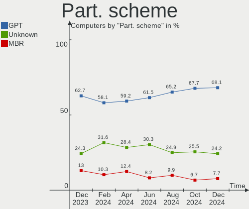
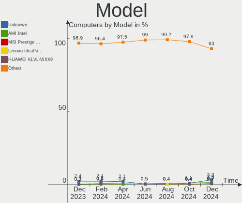
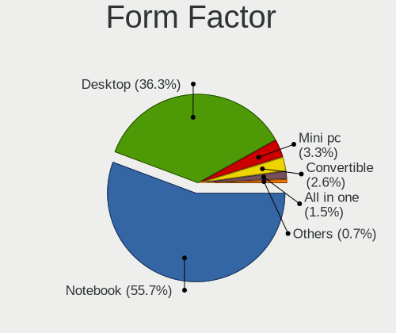
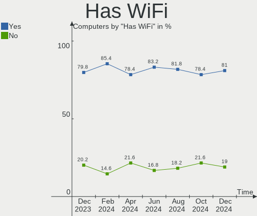
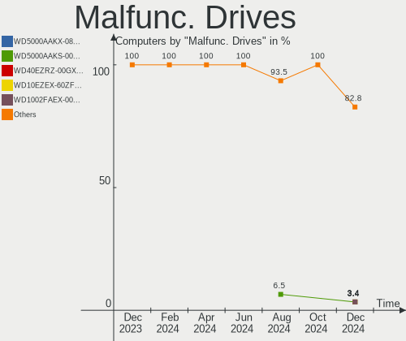
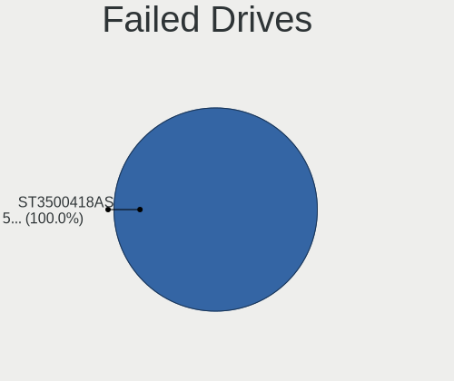
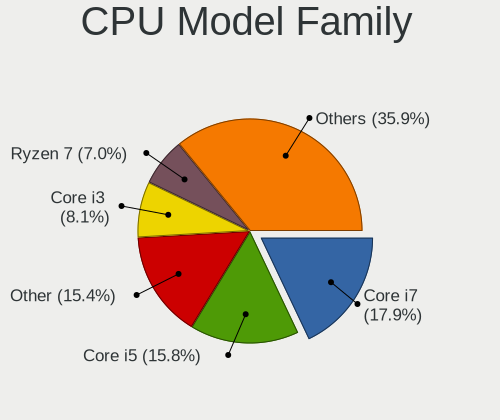
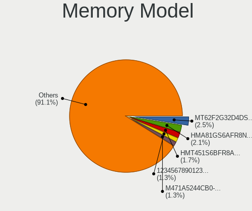
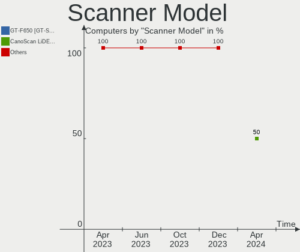

Linux in Italy - Hardware Trends
--------------------------------

A project to identify most popular hardware characteristics and track their change
over time based on data collected by Linux users at https://Linux-Hardware.org.

Anyone can contribute to this report by the [hw-probe](https://github.com/linuxhw/hw-probe) tool:

    sudo -E hw-probe -all -upload

This is a report for all computer types. See also reports for [desktops](/Location/Italy/Desktop/README.md) and [notebooks](/Location/Italy/Notebook/README.md).

Period: Dec, 2023.

Contents
--------

* [ System ](#system)
  - [ OS                       ](#os)
  - [ OS Family                ](#os-family)
  - [ Kernel                   ](#kernel)
  - [ Kernel Family            ](#kernel-family)
  - [ Kernel Major Ver.        ](#kernel-major-ver)
  - [ Arch                     ](#arch)
  - [ DE                       ](#de)
  - [ Display Server           ](#display-server)
  - [ Display Manager          ](#display-manager)
  - [ OS Lang                  ](#os-lang)
  - [ Boot Mode                ](#boot-mode)
  - [ Filesystem               ](#filesystem)
  - [ Part. scheme             ](#part-scheme)
  - [ Dual Boot with Linux/BSD ](#dual-boot-with-linuxbsd)
  - [ Dual Boot (Win)          ](#dual-boot-win)

* [ Board ](#board)
  - [ Vendor                   ](#vendor)
  - [ Model                    ](#model)
  - [ Model Family             ](#model-family)
  - [ MFG Year                 ](#mfg-year)
  - [ Form Factor              ](#form-factor)
  - [ Secure Boot              ](#secure-boot)
  - [ Coreboot                 ](#coreboot)
  - [ RAM Size                 ](#ram-size)
  - [ RAM Used                 ](#ram-used)
  - [ Total Drives             ](#total-drives)
  - [ Has CD-ROM               ](#has-cd-rom)
  - [ Has Ethernet             ](#has-ethernet)
  - [ Has WiFi                 ](#has-wifi)
  - [ Has Bluetooth            ](#has-bluetooth)

* [ Location ](#location)
  - [ Country                  ](#country)
  - [ City                     ](#city)

* [ Drives ](#drives)
  - [ Drive Vendor             ](#drive-vendor)
  - [ Drive Model              ](#drive-model)
  - [ HDD Vendor               ](#hdd-vendor)
  - [ SSD Vendor               ](#ssd-vendor)
  - [ Drive Kind               ](#drive-kind)
  - [ Drive Connector          ](#drive-connector)
  - [ Drive Size               ](#drive-size)
  - [ Space Total              ](#space-total)
  - [ Space Used               ](#space-used)
  - [ Malfunc. Drives          ](#malfunc-drives)
  - [ Malfunc. Drive Vendor    ](#malfunc-drive-vendor)
  - [ Malfunc. HDD Vendor      ](#malfunc-hdd-vendor)
  - [ Malfunc. Drive Kind      ](#malfunc-drive-kind)
  - [ Failed Drives            ](#failed-drives)
  - [ Failed Drive Vendor      ](#failed-drive-vendor)
  - [ Drive Status             ](#drive-status)

* [ Storage controller ](#storage-controller)
  - [ Storage Vendor           ](#storage-vendor)
  - [ Storage Model            ](#storage-model)
  - [ Storage Kind             ](#storage-kind)

* [ Processor ](#processor)
  - [ CPU Vendor               ](#cpu-vendor)
  - [ CPU Model                ](#cpu-model)
  - [ CPU Model Family         ](#cpu-model-family)
  - [ CPU Cores                ](#cpu-cores)
  - [ CPU Sockets              ](#cpu-sockets)
  - [ CPU Threads              ](#cpu-threads)
  - [ CPU Op-Modes             ](#cpu-op-modes)
  - [ CPU Microcode            ](#cpu-microcode)
  - [ CPU Microarch            ](#cpu-microarch)

* [ Graphics ](#graphics)
  - [ GPU Vendor               ](#gpu-vendor)
  - [ GPU Model                ](#gpu-model)
  - [ GPU Combo                ](#gpu-combo)
  - [ GPU Driver               ](#gpu-driver)
  - [ GPU Memory               ](#gpu-memory)

* [ Monitor ](#monitor)
  - [ Monitor Vendor           ](#monitor-vendor)
  - [ Monitor Model            ](#monitor-model)
  - [ Monitor Resolution       ](#monitor-resolution)
  - [ Monitor Diagonal         ](#monitor-diagonal)
  - [ Monitor Width            ](#monitor-width)
  - [ Aspect Ratio             ](#aspect-ratio)
  - [ Monitor Area             ](#monitor-area)
  - [ Pixel Density            ](#pixel-density)
  - [ Multiple Monitors        ](#multiple-monitors)

* [ Network ](#network)
  - [ Net Controller Vendor    ](#net-controller-vendor)
  - [ Net Controller Model     ](#net-controller-model)
  - [ Wireless Vendor          ](#wireless-vendor)
  - [ Wireless Model           ](#wireless-model)
  - [ Ethernet Vendor          ](#ethernet-vendor)
  - [ Ethernet Model           ](#ethernet-model)
  - [ Net Controller Kind      ](#net-controller-kind)
  - [ Used Controller          ](#used-controller)
  - [ NICs                     ](#nics)
  - [ IPv6                     ](#ipv6)

* [ Bluetooth ](#bluetooth)
  - [ Bluetooth Vendor         ](#bluetooth-vendor)
  - [ Bluetooth Model          ](#bluetooth-model)

* [ Sound ](#sound)
  - [ Sound Vendor             ](#sound-vendor)
  - [ Sound Model              ](#sound-model)

* [ Memory ](#memory)
  - [ Memory Vendor            ](#memory-vendor)
  - [ Memory Model             ](#memory-model)
  - [ Memory Kind              ](#memory-kind)
  - [ Memory Form Factor       ](#memory-form-factor)
  - [ Memory Size              ](#memory-size)
  - [ Memory Speed             ](#memory-speed)

* [ Printers & scanners ](#printers--scanners)
  - [ Printer Vendor           ](#printer-vendor)
  - [ Printer Model            ](#printer-model)
  - [ Scanner Vendor           ](#scanner-vendor)
  - [ Scanner Model            ](#scanner-model)

* [ Camera ](#camera)
  - [ Camera Vendor            ](#camera-vendor)
  - [ Camera Model             ](#camera-model)

* [ Security ](#security)
  - [ Fingerprint Vendor       ](#fingerprint-vendor)
  - [ Fingerprint Model        ](#fingerprint-model)
  - [ Chipcard Vendor          ](#chipcard-vendor)
  - [ Chipcard Model           ](#chipcard-model)

* [ Unsupported ](#unsupported)
  - [ Unsupported Devices      ](#unsupported-devices)
  - [ Unsupported Device Types ](#unsupported-device-types)

System
------

OS
--

Installed operating systems

| Name                         | Computers | Percent |
|------------------------------|-----------|---------|
| Linux Mint 21.2              | 35        | 11.99%  |
| Fedora 39                    | 33        | 11.3%   |
| Ubuntu 22.04                 | 29        | 9.93%   |
| Debian 12                    | 19        | 6.51%   |
| Arch Rolling                 | 17        | 5.82%   |
| OpenMandriva 5.0             | 16        | 5.48%   |
| EndeavourOS Rolling          | 13        | 4.45%   |
| Ubuntu 23.10                 | 11        | 3.77%   |
| LMDE 6                       | 8         | 2.74%   |
| OpenMandriva 23.08           | 6         | 2.05%   |
| Zorin 16                     | 5         | 1.71%   |
| Kubuntu 22.04                | 5         | 1.71%   |
| ArcoLinux Rolling            | 5         | 1.71%   |
| Ubuntu 20.04                 | 4         | 1.37%   |
| OpenMandriva 23.11           | 4         | 1.37%   |
| Kubuntu 23.10                | 4         | 1.37%   |
| Zorin 17                     | 3         | 1.03%   |
| Ubuntu 23.04                 | 3         | 1.03%   |
| TUXEDO OS 22.04              | 3         | 1.03%   |
| ROSA 12.4                    | 3         | 1.03%   |
| openSUSE Tumbleweed-XXXXXXXX | 3         | 1.03%   |
| Linux Mint 21.1              | 3         | 1.03%   |
| Kali 2023.4                  | 3         | 1.03%   |
| Debian 11                    | 3         | 1.03%   |
| Xubuntu 22.04                | 2         | 0.68%   |
| Xubuntu 18.04                | 2         | 0.68%   |
| Ubuntu 18.04                 | 2         | 0.68%   |
| SteamOS 3.5.10               | 2         | 0.68%   |
| Nobara 38                    | 2         | 0.68%   |
| Manjaro 23.1.0               | 2         | 0.68%   |
| Elementary 7.1               | 2         | 0.68%   |
| Debian                       | 2         | 0.68%   |
| antiX 23                     | 2         | 0.68%   |
| Xubuntu 23.10                | 1         | 0.34%   |
| Xubuntu 2023.4~rc            | 1         | 0.34%   |
| Xero Rolling                 | 1         | 0.34%   |
| Void Linux Rolling           | 1         | 0.34%   |
| Ubuntu Studio 22.04          | 1         | 0.34%   |
| Ubuntu MATE 22.04            | 1         | 0.34%   |
| Ubuntu 24.04                 | 1         | 0.34%   |

OS Family
---------

OS without a version

| Name             | Computers | Percent |
|------------------|-----------|---------|
| Ubuntu           | 50        | 17.12%  |
| Linux Mint       | 41        | 14.04%  |
| Fedora           | 33        | 11.3%   |
| OpenMandriva     | 30        | 10.27%  |
| Debian           | 25        | 8.56%   |
| Arch             | 17        | 5.82%   |
| EndeavourOS      | 13        | 4.45%   |
| Kubuntu          | 10        | 3.42%   |
| Zorin            | 8         | 2.74%   |
| LMDE             | 8         | 2.74%   |
| Xubuntu          | 6         | 2.05%   |
| ArcoLinux        | 6         | 2.05%   |
| openSUSE         | 4         | 1.37%   |
| Manjaro          | 4         | 1.37%   |
| TUXEDO OS        | 3         | 1.03%   |
| SteamOS          | 3         | 1.03%   |
| ROSA             | 3         | 1.03%   |
| Kali             | 3         | 1.03%   |
| Nobara           | 2         | 0.68%   |
| NixOS            | 2         | 0.68%   |
| Garuda Linux     | 2         | 0.68%   |
| Elementary       | 2         | 0.68%   |
| antiX            | 2         | 0.68%   |
| Xero             | 1         | 0.34%   |
| Void Linux       | 1         | 0.34%   |
| Ubuntu Studio    | 1         | 0.34%   |
| Ubuntu MATE      | 1         | 0.34%   |
| Sparky           | 1         | 0.34%   |
| Pop!_OS          | 1         | 0.34%   |
| Parrot           | 1         | 0.34%   |
| org.kde.Platform | 1         | 0.34%   |
| Oracle Linux     | 1         | 0.34%   |
| MX               | 1         | 0.34%   |
| Lubuntu          | 1         | 0.34%   |
| Lilidog          | 1         | 0.34%   |
| KaOS             | 1         | 0.34%   |
| Gentoo           | 1         | 0.34%   |
| Devuan           | 1         | 0.34%   |

Kernel
------

Version of the Linux kernel

| Version                           | Computers | Percent |
|-----------------------------------|-----------|---------|
| 5.15.0-91-generic                 | 26        | 8.9%    |
| 6.2.0-39-generic                  | 23        | 7.88%   |
| 6.6.2-desktop-1omv2390            | 20        | 6.85%   |
| 6.5.0-14-generic                  | 14        | 4.79%   |
| 6.2.0-37-generic                  | 14        | 4.79%   |
| 6.6.4-arch1-1                     | 9         | 3.08%   |
| 6.5.6-300.fc39.x86_64             | 8         | 2.74%   |
| 6.1.0-16-amd64                    | 8         | 2.74%   |
| 6.1.0-13-amd64                    | 7         | 2.4%    |
| 6.6.8-200.fc39.x86_64             | 6         | 2.05%   |
| 6.6.3-arch1-1                     | 6         | 2.05%   |
| 6.4.11-desktop-1omv2390           | 6         | 2.05%   |
| 6.1.0-15-amd64                    | 6         | 2.05%   |
| 6.6.8-arch1-1                     | 5         | 1.71%   |
| 6.6.4-200.fc39.x86_64             | 5         | 1.71%   |
| 6.6.2-201.fc39.x86_64             | 5         | 1.71%   |
| 5.15.0-89-generic                 | 5         | 1.71%   |
| 6.6.6-200.fc39.x86_64             | 4         | 1.37%   |
| 5.4.0-150-generic                 | 4         | 1.37%   |
| 5.15.0-76-generic                 | 4         | 1.37%   |
| 6.6.7-arch1-1                     | 3         | 1.03%   |
| 6.6.7-200.fc39.x86_64             | 3         | 1.03%   |
| 6.6.1-arch1-1                     | 3         | 1.03%   |
| 6.5.0-9-generic                   | 3         | 1.03%   |
| 6.5.0-13-generic                  | 3         | 1.03%   |
| 6.2.0-26-generic                  | 3         | 1.03%   |
| 6.1.58-generic-1rosa2021.1-x86_64 | 3         | 1.03%   |
| 5.10.0-26-amd64                   | 3         | 1.03%   |
| 6.6.7-zen1-1-zen                  | 2         | 0.68%   |
| 6.6.6-zen1-1-zen                  | 2         | 0.68%   |
| 6.6.4-zen1-1-zen                  | 2         | 0.68%   |
| 6.6.4-202.fsync.fc38.x86_64       | 2         | 0.68%   |
| 6.6.3-200.fc39.x86_64             | 2         | 0.68%   |
| 6.6.3-1-default                   | 2         | 0.68%   |
| 6.5.0-kali3-amd64                 | 2         | 0.68%   |
| 6.5.0-10010-tuxedo                | 2         | 0.68%   |
| 6.5.0-0.deb12.4-amd64             | 2         | 0.68%   |
| 6.1.63                            | 2         | 0.68%   |
| 6.1.52-valve10-1-neptune-61       | 2         | 0.68%   |
| 6.1.0-12-amd64                    | 2         | 0.68%   |

Kernel Family
-------------

Linux kernel without a distro release

| Version  | Computers | Percent |
|----------|-----------|---------|
| 5.15.0   | 43        | 14.73%  |
| 6.2.0    | 42        | 14.38%  |
| 6.5.0    | 32        | 10.96%  |
| 6.6.2    | 25        | 8.56%   |
| 6.1.0    | 25        | 8.56%   |
| 6.6.4    | 18        | 6.16%   |
| 6.6.8    | 15        | 5.14%   |
| 6.6.3    | 12        | 4.11%   |
| 6.6.7    | 11        | 3.77%   |
| 6.6.6    | 9         | 3.08%   |
| 6.5.6    | 8         | 2.74%   |
| 5.4.0    | 8         | 2.74%   |
| 6.4.11   | 6         | 2.05%   |
| 5.10.0   | 5         | 1.71%   |
| 6.6.1    | 4         | 1.37%   |
| 6.5.11   | 4         | 1.37%   |
| 6.1.58   | 3         | 1.03%   |
| 6.1.52   | 3         | 1.03%   |
| 6.1.64   | 2         | 0.68%   |
| 6.1.63   | 2         | 0.68%   |
| 6.1.60   | 2         | 0.68%   |
| 5.19.0   | 2         | 0.68%   |
| 5.10.188 | 2         | 0.68%   |
| 6.5.7    | 1         | 0.34%   |
| 6.5.5    | 1         | 0.34%   |
| 6.3.0    | 1         | 0.34%   |
| 6.2.6    | 1         | 0.34%   |
| 6.1.69   | 1         | 0.34%   |
| 6.0.10   | 1         | 0.34%   |
| 5.15.143 | 1         | 0.34%   |
| 5.14.21  | 1         | 0.34%   |
| 5.10.14  | 1         | 0.34%   |

Kernel Major Ver.
-----------------

Linux kernel major version

| Version | Computers | Percent |
|---------|-----------|---------|
| 6.6     | 94        | 32.19%  |
| 6.5     | 46        | 15.75%  |
| 5.15    | 44        | 15.07%  |
| 6.2     | 43        | 14.73%  |
| 6.1     | 38        | 13.01%  |
| 5.4     | 8         | 2.74%   |
| 5.10    | 8         | 2.74%   |
| 6.4     | 6         | 2.05%   |
| 5.19    | 2         | 0.68%   |
| 6.3     | 1         | 0.34%   |
| 6.0     | 1         | 0.34%   |
| 5.14    | 1         | 0.34%   |

Arch
----

OS architecture (x86_64, i586, etc.)

| Name   | Computers | Percent |
|--------|-----------|---------|
| x86_64 | 287       | 98.29%  |
| i686   | 5         | 1.71%   |

DE
--

Desktop Environment

| Name             | Computers | Percent |
|------------------|-----------|---------|
| GNOME            | 110       | 37.67%  |
| KDE5             | 74        | 25.34%  |
| X-Cinnamon       | 41        | 14.04%  |
| XFCE             | 31        | 10.62%  |
| MATE             | 11        | 3.77%   |
| Unknown          | 6         | 2.05%   |
| LXQt             | 5         | 1.71%   |
| Pantheon         | 2         | 0.68%   |
| Cinnamon         | 2         | 0.68%   |
| Unicorn:XFCE     | 1         | 0.34%   |
| sway             | 1         | 0.34%   |
| lightdm-xsession | 1         | 0.34%   |
| KDE6             | 1         | 0.34%   |
| jwm              | 1         | 0.34%   |
| icewm            | 1         | 0.34%   |
| i3               | 1         | 0.34%   |
| Hyprland         | 1         | 0.34%   |
| GNOME Flashback  | 1         | 0.34%   |
| Deepin           | 1         | 0.34%   |

Display Server
--------------

X11 or Wayland

| Name    | Computers | Percent |
|---------|-----------|---------|
| X11     | 161       | 55.14%  |
| Wayland | 122       | 41.78%  |
| Tty     | 5         | 1.71%   |
| Unknown | 4         | 1.37%   |

Display Manager
---------------

SDDM, LightDM, etc.

| Name    | Computers | Percent |
|---------|-----------|---------|
| Unknown | 77        | 26.37%  |
| SDDM    | 65        | 22.26%  |
| LightDM | 64        | 21.92%  |
| GDM3    | 51        | 17.47%  |
| GDM     | 33        | 11.3%   |
| SLIMSKI | 2         | 0.68%   |

OS Lang
-------

Language

| Lang    | Computers | Percent |
|---------|-----------|---------|
| it_IT   | 193       | 66.1%   |
| en_US   | 79        | 27.05%  |
| C       | 8         | 2.74%   |
| en_GB   | 5         | 1.71%   |
| POSIX   | 3         | 1.03%   |
| es_ES   | 1         | 0.34%   |
| de_IT   | 1         | 0.34%   |
| de_DE   | 1         | 0.34%   |
| Unknown | 1         | 0.34%   |

Boot Mode
---------

EFI or BIOS

| Mode | Computers | Percent |
|------|-----------|---------|
| EFI  | 179       | 61.3%   |
| BIOS | 113       | 38.7%   |

Filesystem
----------

Type of filesystem

| Type    | Computers | Percent |
|---------|-----------|---------|
| Ext4    | 195       | 66.78%  |
| Btrfs   | 45        | 15.41%  |
| Tmpfs   | 25        | 8.56%   |
| Overlay | 23        | 7.88%   |
| Xfs     | 3         | 1.03%   |
| Ext3    | 1         | 0.34%   |

Part. scheme
------------

Scheme of partitioning

| Type    | Computers | Percent |
|---------|-----------|---------|
| GPT     | 183       | 62.67%  |
| Unknown | 71        | 24.32%  |
| MBR     | 38        | 13.01%  |

Dual Boot with Linux/BSD
------------------------

Hosting more than one Linux/BSD

| Dual boot | Computers | Percent |
|-----------|-----------|---------|
| No        | 252       | 86.3%   |
| Yes       | 40        | 13.7%   |

Dual Boot (Win)
---------------

Hosting Linux and Windows

| Dual boot | Computers | Percent |
|-----------|-----------|---------|
| No        | 177       | 60.62%  |
| Yes       | 115       | 39.38%  |

Board
-----

Vendor
------

Motherboard manufacturer

| Name                                 | Computers | Percent |
|--------------------------------------|-----------|---------|
| Hewlett-Packard                      | 60        | 20.55%  |
| ASUSTek Computer                     | 60        | 20.55%  |
| Lenovo                               | 37        | 12.67%  |
| Dell                                 | 23        | 7.88%   |
| Acer                                 | 22        | 7.53%   |
| MSI                                  | 15        | 5.14%   |
| HUAWEI                               | 10        | 3.42%   |
| ASRock                               | 9         | 3.08%   |
| Apple                                | 9         | 3.08%   |
| Gigabyte Technology                  | 7         | 2.4%    |
| Unknown                              | 6         | 2.05%   |
| Valve                                | 3         | 1.03%   |
| Sony                                 | 3         | 1.03%   |
| Foxconn                              | 3         | 1.03%   |
| Shenzhen Meigao Electronic Equipment | 2         | 0.68%   |
| Samsung Electronics                  | 2         | 0.68%   |
| Intel                                | 2         | 0.68%   |
| Google                               | 2         | 0.68%   |
| Fujitsu                              | 2         | 0.68%   |
| Framework                            | 2         | 0.68%   |
| Chuwi                                | 2         | 0.68%   |
| TUXEDO                               | 1         | 0.34%   |
| TULPAR                               | 1         | 0.34%   |
| T-bao                                | 1         | 0.34%   |
| Supermicro                           | 1         | 0.34%   |
| PC Specialist                        | 1         | 0.34%   |
| Packard Bell                         | 1         | 0.34%   |
| Notebook                             | 1         | 0.34%   |
| Medion                               | 1         | 0.34%   |
| Jumper                               | 1         | 0.34%   |
| AZW                                  | 1         | 0.34%   |
| AMI                                  | 1         | 0.34%   |

Model
-----

Motherboard model

| Name                                            | Computers | Percent |
|-------------------------------------------------|-----------|---------|
| HP Notebook                                     | 7         | 2.4%    |
| Unknown                                         | 7         | 2.4%    |
| ASUS All Series                                 | 3         | 1.03%   |
| Valve Jupiter                                   | 2         | 0.68%   |
| Shenzhen Meigao Electronic Equipment UM773 Lite | 2         | 0.68%   |
| MSI MS-7C02                                     | 2         | 0.68%   |
| Lenovo G50-45 80E3                              | 2         | 0.68%   |
| HUAWEI NBLK-WAX9X                               | 2         | 0.68%   |
| HP ProDesk 600 G1 SFF                           | 2         | 0.68%   |
| HP ProBook 650 G1                               | 2         | 0.68%   |
| HP Pavilion 15                                  | 2         | 0.68%   |
| HP 15                                           | 2         | 0.68%   |
| Framework Laptop 13 (AMD Ryzen 7040Series)      | 2         | 0.68%   |
| Dell XPS 13 9370                                | 2         | 0.68%   |
| Dell OptiPlex 7010                              | 2         | 0.68%   |
| ASUS VivoBook_ASUSLaptop K6604JV_K6604JV        | 2         | 0.68%   |
| ASUS S551LN                                     | 2         | 0.68%   |
| ASRock G41M-VS3                                 | 2         | 0.68%   |
| Apple iMac13,2                                  | 2         | 0.68%   |
| Acer Swift SF314-43                             | 2         | 0.68%   |
| Acer Aspire E5-573G                             | 2         | 0.68%   |
| Acer Aspire E5-571G                             | 2         | 0.68%   |
| Acer AOD270                                     | 2         | 0.68%   |
| Valve Galileo                                   | 1         | 0.34%   |
| TUXEDO InfinityBook S 15 Gen6                   | 1         | 0.34%   |
| TULPAR A5 V20.3                                 | 1         | 0.34%   |
| T-bao MINI PC                                   | 1         | 0.34%   |
| Supermicro X10SLM-F                             | 1         | 0.34%   |
| Sony VGN-FW21E                                  | 1         | 0.34%   |
| Sony VGN-CR21S_W                                | 1         | 0.34%   |
| Sony SVE1713X1EB                                | 1         | 0.34%   |
| Samsung RC530/RC730                             | 1         | 0.34%   |
| Samsung 750XDA                                  | 1         | 0.34%   |
| PC Specialist GK7NP5R                           | 1         | 0.34%   |
| Packard Bell EasyNote MH36                      | 1         | 0.34%   |
| Notebook NS5x_NS7xAU                            | 1         | 0.34%   |
| MSI Prestige 14Evo A12M                         | 1         | 0.34%   |
| MSI Prestige 14 A10SC                           | 1         | 0.34%   |
| MSI MS-ACB311                                   | 1         | 0.34%   |
| MSI MS-7D91                                     | 1         | 0.34%   |

Model Family
------------

Motherboard model prefix

| Name                                       | Computers | Percent |
|--------------------------------------------|-----------|---------|
| Acer Aspire                                | 12        | 4.11%   |
| Lenovo ThinkPad                            | 11        | 3.77%   |
| ASUS PRIME                                 | 11        | 3.77%   |
| Lenovo IdeaPad                             | 8         | 2.74%   |
| HP Pavilion                                | 8         | 2.74%   |
| Dell OptiPlex                              | 8         | 2.74%   |
| HP Notebook                                | 7         | 2.4%    |
| ASUS VivoBook                              | 7         | 2.4%    |
| Unknown                                    | 7         | 2.4%    |
| Dell XPS                                   | 6         | 2.05%   |
| ASUS ROG                                   | 6         | 2.05%   |
| Lenovo ThinkBook                           | 5         | 1.71%   |
| HP ProBook                                 | 5         | 1.71%   |
| HP Compaq                                  | 5         | 1.71%   |
| Dell Latitude                              | 5         | 1.71%   |
| HP ProDesk                                 | 4         | 1.37%   |
| HP Laptop                                  | 4         | 1.37%   |
| HP 255                                     | 4         | 1.37%   |
| Acer Swift                                 | 4         | 1.37%   |
| HP ZBook                                   | 3         | 1.03%   |
| ASUS TUF                                   | 3         | 1.03%   |
| ASUS All                                   | 3         | 1.03%   |
| Acer TravelMate                            | 3         | 1.03%   |
| Valve Jupiter                              | 2         | 0.68%   |
| Shenzhen Meigao Electronic Equipment UM773 | 2         | 0.68%   |
| MSI Prestige                               | 2         | 0.68%   |
| MSI MS-7C02                                | 2         | 0.68%   |
| Lenovo V15                                 | 2         | 0.68%   |
| Lenovo Legion                              | 2         | 0.68%   |
| Lenovo IdeaCentre                          | 2         | 0.68%   |
| Lenovo G50-45                              | 2         | 0.68%   |
| HUAWEI NBLK-WAX9X                          | 2         | 0.68%   |
| HP ProLiant                                | 2         | 0.68%   |
| HP OMEN                                    | 2         | 0.68%   |
| HP EliteDesk                               | 2         | 0.68%   |
| HP EliteBook                               | 2         | 0.68%   |
| HP 250                                     | 2         | 0.68%   |
| HP 15                                      | 2         | 0.68%   |
| Framework Laptop                           | 2         | 0.68%   |
| Dell PowerEdge                             | 2         | 0.68%   |

MFG Year
--------

Motherboard manufacture year

| Year | Computers | Percent |
|------|-----------|---------|
| 2021 | 33        | 11.3%   |
| 2023 | 25        | 8.56%   |
| 2020 | 25        | 8.56%   |
| 2019 | 25        | 8.56%   |
| 2022 | 23        | 7.88%   |
| 2013 | 21        | 7.19%   |
| 2012 | 20        | 6.85%   |
| 2018 | 19        | 6.51%   |
| 2014 | 19        | 6.51%   |
| 2017 | 15        | 5.14%   |
| 2016 | 15        | 5.14%   |
| 2015 | 12        | 4.11%   |
| 2010 | 9         | 3.08%   |
| 2009 | 9         | 3.08%   |
| 2008 | 9         | 3.08%   |
| 2011 | 8         | 2.74%   |
| 2007 | 5         | 1.71%   |

Form Factor
-----------

Physical design of the computer

| Name        | Computers | Percent |
|-------------|-----------|---------|
| Notebook    | 176       | 60.27%  |
| Desktop     | 103       | 35.27%  |
| All in one  | 5         | 1.71%   |
| Mini pc     | 4         | 1.37%   |
| Server      | 3         | 1.03%   |
| Convertible | 1         | 0.34%   |

Secure Boot
-----------

Enabled or disabled

| State    | Computers | Percent |
|----------|-----------|---------|
| Disabled | 268       | 91.78%  |
| Enabled  | 24        | 8.22%   |

Coreboot
--------

Have coreboot on board

| Used | Computers | Percent |
|------|-----------|---------|
| No   | 290       | 99.32%  |
| Yes  | 2         | 0.68%   |

RAM Size
--------

Total RAM memory

| Size in GB      | Computers | Percent |
|-----------------|-----------|---------|
| 4.01-8.0        | 71        | 24.32%  |
| 16.01-24.0      | 67        | 22.95%  |
| 8.01-16.0       | 62        | 21.23%  |
| 3.01-4.0        | 33        | 11.3%   |
| 32.01-64.0      | 28        | 9.59%   |
| 64.01-256.0     | 13        | 4.45%   |
| 24.01-32.0      | 7         | 2.4%    |
| 1.01-2.0        | 6         | 2.05%   |
| 2.01-3.0        | 3         | 1.03%   |
| More than 256.0 | 1         | 0.34%   |
| 0.51-1.0        | 1         | 0.34%   |

RAM Used
--------

Used RAM memory

| Used GB     | Computers | Percent |
|-------------|-----------|---------|
| 2.01-3.0    | 83        | 28.42%  |
| 1.01-2.0    | 77        | 26.37%  |
| 4.01-8.0    | 52        | 17.81%  |
| 3.01-4.0    | 48        | 16.44%  |
| 8.01-16.0   | 15        | 5.14%   |
| 0.51-1.0    | 13        | 4.45%   |
| 32.01-64.0  | 1         | 0.34%   |
| 64.01-256.0 | 1         | 0.34%   |
| 16.01-24.0  | 1         | 0.34%   |
| 0.01-0.5    | 1         | 0.34%   |

Total Drives
------------

Number of drives on board

| Drives | Computers | Percent |
|--------|-----------|---------|
| 1      | 176       | 60.27%  |
| 2      | 72        | 24.66%  |
| 3      | 23        | 7.88%   |
| 4      | 12        | 4.11%   |
| 5      | 4         | 1.37%   |
| 7      | 2         | 0.68%   |
| 9      | 1         | 0.34%   |
| 6      | 1         | 0.34%   |
| 0      | 1         | 0.34%   |

Has CD-ROM
----------

Has CD-ROM on board

| Presented | Computers | Percent |
|-----------|-----------|---------|
| No        | 183       | 62.67%  |
| Yes       | 109       | 37.33%  |

Has Ethernet
------------

Has Ethernet on board

| Presented | Computers | Percent |
|-----------|-----------|---------|
| Yes       | 240       | 82.19%  |
| No        | 52        | 17.81%  |

Has WiFi
--------

Has WiFi module

| Presented | Computers | Percent |
|-----------|-----------|---------|
| Yes       | 237       | 81.16%  |
| No        | 55        | 18.84%  |

Has Bluetooth
-------------

Has Bluetooth module

| Presented | Computers | Percent |
|-----------|-----------|---------|
| Yes       | 206       | 70.55%  |
| No        | 86        | 29.45%  |

Location
--------

Country
-------

Geographic location (country)

| Country | Computers | Percent |
|---------|-----------|---------|
| Italy   | 292       | 100%    |

City
----

Geographic location (city)

| City                | Computers | Percent |
|---------------------|-----------|---------|
| Milan               | 42        | 14.38%  |
| Rome                | 27        | 9.25%   |
| Milano              | 17        | 5.82%   |
| Bologna             | 12        | 4.11%   |
| Rho                 | 10        | 3.42%   |
| Turin               | 6         | 2.05%   |
| Naples              | 6         | 2.05%   |
| Florence            | 6         | 2.05%   |
| Venice              | 4         | 1.37%   |
| Genoa               | 4         | 1.37%   |
| Verona              | 3         | 1.03%   |
| Parma               | 3         | 1.03%   |
| Palermo             | 3         | 1.03%   |
| Nova Milanese       | 3         | 1.03%   |
| Monza               | 3         | 1.03%   |
| Casalecchio di Reno | 3         | 1.03%   |
| Bolzano             | 3         | 1.03%   |
| Vicenza             | 2         | 0.68%   |
| Trieste             | 2         | 0.68%   |
| Taranto             | 2         | 0.68%   |
| Sassari             | 2         | 0.68%   |
| Sanremo             | 2         | 0.68%   |
| Padova              | 2         | 0.68%   |
| Modena              | 2         | 0.68%   |
| Misterbianco        | 2         | 0.68%   |
| Minori              | 2         | 0.68%   |
| Galliate Lombardo   | 2         | 0.68%   |
| Fontevivo           | 2         | 0.68%   |
| Cascina             | 2         | 0.68%   |
| Cagliari            | 2         | 0.68%   |
| Zola Predosa        | 1         | 0.34%   |
| Voghera             | 1         | 0.34%   |
| Villafranca d'Asti  | 1         | 0.34%   |
| Villa Cortese       | 1         | 0.34%   |
| Villa Carcina       | 1         | 0.34%   |
| Vigonza             | 1         | 0.34%   |
| Vigevano            | 1         | 0.34%   |
| Viareggio           | 1         | 0.34%   |
| Veroli              | 1         | 0.34%   |
| Varese              | 1         | 0.34%   |

Drives
------

Drive Vendor
------------

Hard drive vendors

| Vendor                       | Computers | Drives | Percent |
|------------------------------|-----------|--------|---------|
| Samsung Electronics          | 75        | 93     | 17.2%   |
| Seagate                      | 51        | 65     | 11.7%   |
| WDC                          | 46        | 57     | 10.55%  |
| Crucial                      | 30        | 34     | 6.88%   |
| Kingston                     | 24        | 26     | 5.5%    |
| SanDisk                      | 21        | 21     | 4.82%   |
| Toshiba                      | 20        | 21     | 4.59%   |
| Unknown                      | 14        | 18     | 3.21%   |
| Intel                        | 14        | 14     | 3.21%   |
| Micron Technology            | 12        | 12     | 2.75%   |
| SK hynix                     | 11        | 11     | 2.52%   |
| Hitachi                      | 9         | 10     | 2.06%   |
| HGST                         | 8         | 8      | 1.83%   |
| Micron/Crucial Technology    | 7         | 7      | 1.61%   |
| China                        | 7         | 7      | 1.61%   |
| Apple                        | 7         | 7      | 1.61%   |
| Phison Electronics           | 6         | 6      | 1.38%   |
| Kingston Technology Company  | 6         | 6      | 1.38%   |
| Team                         | 5         | 5      | 1.15%   |
| SPCC                         | 5         | 5      | 1.15%   |
| Fanxiang                     | 5         | 5      | 1.15%   |
| KIOXIA                       | 4         | 4      | 0.92%   |
| Unknown                      | 4         | 4      | 0.92%   |
| Transcend                    | 3         | 3      | 0.69%   |
| Netac                        | 3         | 3      | 0.69%   |
| MAXIO Technology (Hangzhou)  | 3         | 3      | 0.69%   |
| Silicon Motion               | 2         | 2      | 0.46%   |
| Patriot                      | 2         | 2      | 0.46%   |
| Lexar                        | 2         | 2      | 0.46%   |
| JMicron Technology           | 2         | 2      | 0.46%   |
| Intenso                      | 2         | 2      | 0.46%   |
| ASMT                         | 2         | 2      | 0.46%   |
| Wibtek                       | 1         | 1      | 0.23%   |
| WALRAM                       | 1         | 1      | 0.23%   |
| Vaseky                       | 1         | 1      | 0.23%   |
| USB3.0                       | 1         | 1      | 0.23%   |
| SSSTC                        | 1         | 1      | 0.23%   |
| SPCC Sol                     | 1         | 1      | 0.23%   |
| sobetter                     | 1         | 1      | 0.23%   |
| Shenzhen Longsys Electronics | 1         | 1      | 0.23%   |

Drive Model
-----------

Hard drive models

| Model                                               | Computers | Percent |
|-----------------------------------------------------|-----------|---------|
| Samsung NVMe SSD Controller PM9A1/PM9A3/980PRO 2TB  | 9         | 1.88%   |
| Kingston SA400S37240G 240GB SSD                     | 7         | 1.46%   |
| Crucial CT240BX500SSD1 240GB                        | 7         | 1.46%   |
| Samsung NVMe SSD Controller SM981/PM981/PM983 512GB | 6         | 1.26%   |
| Crucial CT1000MX500SSD1 1TB                         | 6         | 1.26%   |
| Seagate ST1000LM024 HN-M101MBB 1TB                  | 5         | 1.05%   |
| Phison E12 NVMe Controller 1TB                      | 5         | 1.05%   |
| Crucial CT500MX500SSD1 500GB                        | 5         | 1.05%   |
| Unknown SD/MMC/MS PRO 512GB                         | 4         | 0.84%   |
| Toshiba MQ01ABF050 500GB                            | 4         | 0.84%   |
| SK hynix BC511 512GB                                | 4         | 0.84%   |
| Seagate ST500DM002-1BD142 500GB                     | 4         | 0.84%   |
| Seagate ST1000DM010-2EP102 1TB                      | 4         | 0.84%   |
| Samsung SSD 870 QVO 1TB                             | 4         | 0.84%   |
| Samsung SSD 850 EVO 500GB                           | 4         | 0.84%   |
| Micron/Crucial P2 NVMe PCIe SSD 4TB                 | 4         | 0.84%   |
| Kingston SA400S37480G 480GB SSD                     | 4         | 0.84%   |
| Intel SSDPEKNU512GZ 512GB                           | 4         | 0.84%   |
| Crucial CT1000BX500SSD1 1TB                         | 4         | 0.84%   |
| Unknown                                             | 4         | 0.84%   |
| Toshiba DT01ACA100 1TB                              | 3         | 0.63%   |
| SPCC Solid State Disk 256GB                         | 3         | 0.63%   |
| Seagate ST2000LM015-2E8174 2TB                      | 3         | 0.63%   |
| Seagate ST2000DM008-2FR102 2TB                      | 3         | 0.63%   |
| Samsung SSD 990 PRO 2TB                             | 3         | 0.63%   |
| Samsung SSD 870 EVO 2TB                             | 3         | 0.63%   |
| Samsung SSD 860 EVO 250GB                           | 3         | 0.63%   |
| Samsung MZALQ512HBLU-00BL2 512GB                    | 3         | 0.63%   |
| Kingston Company OM3PDP3 NVMe SSD 512GB             | 3         | 0.63%   |
| Kingston SA400S37120G 120GB SSD                     | 3         | 0.63%   |
| Crucial CT480BX500SSD1 480GB                        | 3         | 0.63%   |
| WDC WD5000AAKX-08U6AA0 500GB                        | 2         | 0.42%   |
| WDC WD20EFRX-68EUZN0 2TB                            | 2         | 0.42%   |
| WDC WD20EARX-00PASB0 2TB                            | 2         | 0.42%   |
| WDC WD10EZEX-60WN4A0 1TB                            | 2         | 0.42%   |
| Unknown MMC Card  512GB                             | 2         | 0.42%   |
| Toshiba XG6 NVMe SSD Controller 512GB               | 2         | 0.42%   |
| Toshiba MQ01ABD100 1TB                              | 2         | 0.42%   |
| Toshiba HDWD110 1TB                                 | 2         | 0.42%   |
| SK hynix BC501 NVMe Solid State Drive 512GB         | 2         | 0.42%   |

HDD Vendor
----------

Hard disk drive vendors

| Vendor              | Computers | Drives | Percent |
|---------------------|-----------|--------|---------|
| Seagate             | 51        | 64     | 37.23%  |
| WDC                 | 39        | 48     | 28.47%  |
| Toshiba             | 15        | 16     | 10.95%  |
| Hitachi             | 9         | 10     | 6.57%   |
| HGST                | 8         | 8      | 5.84%   |
| Unknown             | 4         | 4      | 2.92%   |
| Apple               | 3         | 3      | 2.19%   |
| Samsung Electronics | 2         | 2      | 1.46%   |
| USB3.0              | 1         | 1      | 0.73%   |
| Maxtor              | 1         | 1      | 0.73%   |
| Intenso             | 1         | 1      | 0.73%   |
| Hewlett-Packard     | 1         | 2      | 0.73%   |
| ASMT                | 1         | 1      | 0.73%   |
| Unknown             | 1         | 1      | 0.73%   |

SSD Vendor
----------

Solid state drive vendors

| Vendor              | Computers | Drives | Percent |
|---------------------|-----------|--------|---------|
| Samsung Electronics | 37        | 43     | 25%     |
| Crucial             | 29        | 33     | 19.59%  |
| Kingston            | 17        | 19     | 11.49%  |
| SanDisk             | 12        | 12     | 8.11%   |
| China               | 7         | 7      | 4.73%   |
| WDC                 | 5         | 5      | 3.38%   |
| SPCC                | 5         | 5      | 3.38%   |
| Team                | 4         | 4      | 2.7%    |
| Netac               | 3         | 3      | 2.03%   |
| Micron Technology   | 3         | 3      | 2.03%   |
| Intel               | 3         | 3      | 2.03%   |
| Fanxiang            | 3         | 3      | 2.03%   |
| Transcend           | 2         | 2      | 1.35%   |
| Apple               | 2         | 2      | 1.35%   |
| Wibtek              | 1         | 1      | 0.68%   |
| Vaseky              | 1         | 1      | 0.68%   |
| SSSTC               | 1         | 1      | 0.68%   |
| SPCC Sol            | 1         | 1      | 0.68%   |
| ROG                 | 1         | 1      | 0.68%   |
| PNY                 | 1         | 1      | 0.68%   |
| Patriot             | 1         | 1      | 0.68%   |
| Intenso             | 1         | 1      | 0.68%   |
| Gigabyte Technology | 1         | 1      | 0.68%   |
| FIKWOT              | 1         | 1      | 0.68%   |
| Emtec               | 1         | 1      | 0.68%   |
| Drevo               | 1         | 1      | 0.68%   |
| Dogfish             | 1         | 1      | 0.68%   |
| CT1000MX            | 1         | 1      | 0.68%   |
| BAITITON            | 1         | 1      | 0.68%   |
| ASMT                | 1         | 1      | 0.68%   |

Drive Kind
----------

HDD or SSD

| Kind    | Computers | Drives | Percent |
|---------|-----------|--------|---------|
| NVMe    | 134       | 150    | 33.58%  |
| SSD     | 132       | 160    | 33.08%  |
| HDD     | 117       | 162    | 29.32%  |
| MMC     | 9         | 11     | 2.26%   |
| Unknown | 7         | 9      | 1.75%   |

Drive Connector
---------------

SATA, SAS, NVMe, etc.

| Type | Computers | Drives | Percent |
|------|-----------|--------|---------|
| SATA | 193       | 299    | 53.76%  |
| NVMe | 133       | 148    | 37.05%  |
| SAS  | 24        | 34     | 6.69%   |
| MMC  | 9         | 11     | 2.51%   |

Drive Size
----------

Size of hard drive

| Size in TB | Computers | Drives | Percent |
|------------|-----------|--------|---------|
| 0.01-0.5   | 138       | 169    | 52.67%  |
| 0.51-1.0   | 80        | 93     | 30.53%  |
| 1.01-2.0   | 29        | 39     | 11.07%  |
| 3.01-4.0   | 8         | 10     | 3.05%   |
| 2.01-3.0   | 4         | 6      | 1.53%   |
| 4.01-10.0  | 2         | 3      | 0.76%   |
| 10.01-20.0 | 1         | 2      | 0.38%   |

Space Total
-----------

Amount of disk space available on the file system

| Size in GB     | Computers | Percent |
|----------------|-----------|---------|
| 251-500        | 58        | 19.86%  |
| 501-1000       | 57        | 19.52%  |
| 101-250        | 54        | 18.49%  |
| 1001-2000      | 35        | 11.99%  |
| 51-100         | 20        | 6.85%   |
| More than 3000 | 19        | 6.51%   |
| 1-20           | 18        | 6.16%   |
| 21-50          | 12        | 4.11%   |
| 2001-3000      | 11        | 3.77%   |
| Unknown        | 8         | 2.74%   |

Space Used
----------

Amount of used disk space

| Used GB        | Computers | Percent |
|----------------|-----------|---------|
| 1-20           | 86        | 29.45%  |
| 101-250        | 49        | 16.78%  |
| 21-50          | 45        | 15.41%  |
| 51-100         | 32        | 10.96%  |
| 501-1000       | 25        | 8.56%   |
| 251-500        | 24        | 8.22%   |
| 1001-2000      | 13        | 4.45%   |
| Unknown        | 8         | 2.74%   |
| More than 3000 | 7         | 2.4%    |
| 2001-3000      | 3         | 1.03%   |

Malfunc. Drives
---------------

Drive models with a malfunction

| Model                                                          | Computers | Drives | Percent |
|----------------------------------------------------------------|-----------|--------|---------|
| Toshiba MQ01ABF050 500GB                                       | 3         | 3      | 6.12%   |
| SanDisk SSD PLUS 480GB                                         | 2         | 2      | 4.08%   |
| WDC WD5000LPCX-24C6HT0 500GB                                   | 1         | 1      | 2.04%   |
| WDC WD5000AURX-63UY4Y0 500GB                                   | 1         | 1      | 2.04%   |
| WDC WD40EZRX-00SPEB0 4TB                                       | 1         | 1      | 2.04%   |
| WDC WD40EFRX-68N32N0 4TB                                       | 1         | 1      | 2.04%   |
| WDC WD30EFRX-68EUZN0 3TB                                       | 1         | 2      | 2.04%   |
| WDC WD20EFRX-68EUZN0 2TB                                       | 1         | 3      | 2.04%   |
| WDC WD2003FYPS-27W9B0 2TB                                      | 1         | 1      | 2.04%   |
| WDC WD1600BEKT-60F3T1 160GB                                    | 1         | 1      | 2.04%   |
| WDC WD10EADS-65L5B1 1TB                                        | 1         | 1      | 2.04%   |
| WDC WD10 JPVX-22JC3T0 1TB                                      | 1         | 1      | 2.04%   |
| Transcend TS1TMTE220S 1TB                                      | 1         | 1      | 2.04%   |
| Team TM8FPD001T 1TB                                            | 1         | 1      | 2.04%   |
| Seagate ST9500325AS 500GB                                      | 1         | 1      | 2.04%   |
| Seagate ST500LT012-1DG142 500GB                                | 1         | 1      | 2.04%   |
| Seagate ST500LM021-1KJ152 500GB                                | 1         | 1      | 2.04%   |
| Seagate ST500LM000-1EJ162 500GB                                | 1         | 1      | 2.04%   |
| Seagate ST500DM002-1BD142 500GB                                | 1         | 1      | 2.04%   |
| Seagate ST4000LM 024-2AN17V 4TB                                | 1         | 1      | 2.04%   |
| Seagate ST3250310AS 250GB                                      | 1         | 1      | 2.04%   |
| Seagate ST31000524AS 1TB                                       | 1         | 1      | 2.04%   |
| Seagate ST2000VM003-1ET164 2TB                                 | 1         | 1      | 2.04%   |
| Seagate ST2000DM001-9YN164 2TB                                 | 1         | 1      | 2.04%   |
| Seagate ST12000VN0007-2GS116 12TB                              | 1         | 1      | 2.04%   |
| Samsung Electronics SSD 980 1TB                                | 1         | 1      | 2.04%   |
| Samsung Electronics SSD 970 EVO Plus 1TB                       | 1         | 1      | 2.04%   |
| Samsung Electronics SSD 860 EVO 500GB                          | 1         | 1      | 2.04%   |
| Samsung Electronics NVMe SSD Controller PM9A1/PM9A3/980PRO 2TB | 1         | 1      | 2.04%   |
| Netac SSD 256GB                                                | 1         | 1      | 2.04%   |
| Micron/Crucial Technology P2 NVMe PCIe SSD 4TB                 | 1         | 1      | 2.04%   |
| Micron Technology 1100_MTFDDAV512TBN 512GB SSD                 | 1         | 1      | 2.04%   |
| Maxtor STM380215AS 80GB                                        | 1         | 1      | 2.04%   |
| Kingston RBU-SNS8350DES3128GP 128GB SSD                        | 1         | 1      | 2.04%   |
| Hitachi HTS725032A9A364 320GB                                  | 1         | 1      | 2.04%   |
| Hitachi HTS545032B9A300 320GB                                  | 1         | 1      | 2.04%   |
| Hitachi HTS543232A7A384 320GB                                  | 1         | 1      | 2.04%   |
| Hitachi HTS542580K9SA00 80GB                                   | 1         | 1      | 2.04%   |
| Hitachi HDT721010SLA360 1TB                                    | 1         | 1      | 2.04%   |
| HGST HTS725050A7E630 500GB                                     | 1         | 1      | 2.04%   |

Malfunc. Drive Vendor
---------------------

Vendors of faulty drives

| Vendor                    | Computers | Drives | Percent |
|---------------------------|-----------|--------|---------|
| Seagate                   | 11        | 11     | 23.91%  |
| WDC                       | 8         | 13     | 17.39%  |
| Samsung Electronics       | 4         | 4      | 8.7%    |
| Hitachi                   | 4         | 5      | 8.7%    |
| Toshiba                   | 3         | 3      | 6.52%   |
| HGST                      | 3         | 3      | 6.52%   |
| SanDisk                   | 2         | 2      | 4.35%   |
| China                     | 2         | 2      | 4.35%   |
| Transcend                 | 1         | 1      | 2.17%   |
| Team                      | 1         | 1      | 2.17%   |
| Netac                     | 1         | 1      | 2.17%   |
| Micron/Crucial Technology | 1         | 1      | 2.17%   |
| Micron Technology         | 1         | 1      | 2.17%   |
| Maxtor                    | 1         | 1      | 2.17%   |
| Kingston                  | 1         | 1      | 2.17%   |
| Crucial                   | 1         | 1      | 2.17%   |
| Apple                     | 1         | 1      | 2.17%   |

Malfunc. HDD Vendor
-------------------

Vendors of faulty HDD drives

| Vendor  | Computers | Drives | Percent |
|---------|-----------|--------|---------|
| Seagate | 11        | 11     | 35.48%  |
| WDC     | 8         | 13     | 25.81%  |
| Hitachi | 4         | 5      | 12.9%   |
| Toshiba | 3         | 3      | 9.68%   |
| HGST    | 3         | 3      | 9.68%   |
| Maxtor  | 1         | 1      | 3.23%   |
| Apple   | 1         | 1      | 3.23%   |

Malfunc. Drive Kind
-------------------

Kinds of faulty drives

| Kind | Computers | Drives | Percent |
|------|-----------|--------|---------|
| HDD  | 28        | 37     | 65.12%  |
| SSD  | 9         | 9      | 20.93%  |
| NVMe | 6         | 6      | 13.95%  |

Failed Drives
-------------

Failed drive models

| Model                     | Computers | Drives | Percent |
|---------------------------|-----------|--------|---------|
| Seagate ST3500418AS 500GB | 1         | 1      | 100%    |

Failed Drive Vendor
-------------------

Failed drive vendors

| Vendor  | Computers | Drives | Percent |
|---------|-----------|--------|---------|
| Seagate | 1         | 1      | 100%    |

Drive Status
------------

Number of failed and malfunc. drives

| Status   | Computers | Drives | Percent |
|----------|-----------|--------|---------|
| Works    | 169       | 249    | 52.16%  |
| Detected | 116       | 190    | 35.8%   |
| Malfunc  | 38        | 52     | 11.73%  |
| Failed   | 1         | 1      | 0.31%   |

Storage controller
------------------

Storage Vendor
--------------

Storage controller vendors

| Vendor                       | Computers | Percent |
|------------------------------|-----------|---------|
| Intel                        | 181       | 47.38%  |
| AMD                          | 55        | 14.4%   |
| Samsung Electronics          | 45        | 11.78%  |
| Kingston Technology Company  | 13        | 3.4%    |
| SanDisk                      | 12        | 3.14%   |
| SK hynix                     | 11        | 2.88%   |
| Micron Technology            | 9         | 2.36%   |
| Micron/Crucial Technology    | 8         | 2.09%   |
| Phison Electronics           | 6         | 1.57%   |
| Toshiba America Info Systems | 5         | 1.31%   |
| MAXIO Technology (Hangzhou)  | 5         | 1.31%   |
| KIOXIA                       | 5         | 1.31%   |
| Silicon Motion               | 4         | 1.05%   |
| Nvidia                       | 3         | 0.79%   |
| Marvell Technology Group     | 3         | 0.79%   |
| ASMedia Technology           | 3         | 0.79%   |
| Solidigm                     | 2         | 0.52%   |
| INNOGRIT                     | 2         | 0.52%   |
| Broadcom / LSI               | 2         | 0.52%   |
| Apple                        | 2         | 0.52%   |
| VIA Technologies             | 1         | 0.26%   |
| Shenzhen Longsys Electronics | 1         | 0.26%   |
| Realtek Semiconductor        | 1         | 0.26%   |
| Lite-On Technology           | 1         | 0.26%   |
| JMicron Technology           | 1         | 0.26%   |
| Biwin Storage Technology     | 1         | 0.26%   |

Storage Model
-------------

Storage controller models

| Model                                                                          | Computers | Percent |
|--------------------------------------------------------------------------------|-----------|---------|
| AMD FCH SATA Controller [AHCI mode]                                            | 43        | 10%     |
| Samsung NVMe SSD Controller 980 (DRAM-less)                                    | 15        | 3.49%   |
| Intel 8 Series/C220 Series Chipset Family 6-port SATA Controller 1 [AHCI mode] | 14        | 3.26%   |
| Samsung NVMe SSD Controller SM981/PM981/PM983                                  | 13        | 3.02%   |
| Samsung NVMe SSD Controller PM9A1/PM9A3/980PRO                                 | 13        | 3.02%   |
| Intel Sunrise Point-LP SATA Controller [AHCI mode]                             | 12        | 2.79%   |
| Intel Volume Management Device NVMe RAID Controller                            | 10        | 2.33%   |
| Intel 82801 Mobile SATA Controller [RAID mode]                                 | 9         | 2.09%   |
| Intel 7 Series/C210 Series Chipset Family 6-port SATA Controller [AHCI mode]   | 9         | 2.09%   |
| Intel Wildcat Point-LP SATA Controller [AHCI Mode]                             | 7         | 1.63%   |
| Intel 8 Series SATA Controller 1 [AHCI mode]                                   | 7         | 1.63%   |
| AMD 400 Series Chipset SATA Controller                                         | 7         | 1.63%   |
| Intel SSD 670p Series [Keystone Harbor]                                        | 6         | 1.4%    |
| Intel 200 Series PCH SATA controller [AHCI mode]                               | 6         | 1.4%    |
| SK hynix BC511 NVMe SSD                                                        | 5         | 1.16%   |
| Phison E12 NVMe Controller                                                     | 5         | 1.16%   |
| Micron/Crucial P2 [Nick P2] / P3 / P3 Plus NVMe PCIe SSD (DRAM-less)           | 5         | 1.16%   |
| Intel Volume Management Device NVMe RAID Controller Intel Corporation          | 5         | 1.16%   |
| Intel Q170/Q150/B150/H170/H110/Z170/CM236 Chipset SATA Controller [AHCI Mode]  | 5         | 1.16%   |
| Intel HM170/QM170 Chipset SATA Controller [AHCI Mode]                          | 5         | 1.16%   |
| Intel 7 Series Chipset Family 6-port SATA Controller [AHCI mode]               | 5         | 1.16%   |
| Samsung NVMe SSD Controller S4LV008[Pascal]                                    | 4         | 0.93%   |
| Intel Tiger Lake-LP SATA Controller                                            | 4         | 0.93%   |
| Intel SATA Controller [RAID mode]                                              | 4         | 0.93%   |
| Intel Comet Lake SATA AHCI Controller                                          | 4         | 0.93%   |
| Intel Alder Lake-S PCH SATA Controller [AHCI Mode]                             | 4         | 0.93%   |
| Intel 82801IBM/IEM (ICH9M/ICH9M-E) 4 port SATA Controller [AHCI mode]          | 4         | 0.93%   |
| Intel 82801G (ICH7 Family) IDE Controller                                      | 4         | 0.93%   |
| Intel 6 Series/C200 Series Chipset Family 6 port Desktop SATA AHCI Controller  | 4         | 0.93%   |
| Intel 500 Series Chipset Family SATA AHCI Controller                           | 4         | 0.93%   |
| AMD SB7x0/SB8x0/SB9x0 IDE Controller                                           | 4         | 0.93%   |
| Toshiba America Info Systems XG6 NVMe SSD Controller                           | 3         | 0.7%    |
| SK hynix Platinum P41/PC801 NVMe Solid State Drive                             | 3         | 0.7%    |
| SanDisk Ultra 3D / WD Blue SN550 NVMe SSD                                      | 3         | 0.7%    |
| Micron/Crucial P5 Plus NVMe PCIe SSD                                           | 3         | 0.7%    |
| Micron 3400 NVMe SSD [Hendrix]                                                 | 3         | 0.7%    |
| Micron 2210 NVMe SSD [Cobain]                                                  | 3         | 0.7%    |
| MAXIO (Hangzhou) NVMe SSD Controller MAP1202                                   | 3         | 0.7%    |
| KIOXIA NVMe SSD Controller BG4 (DRAM-less)                                     | 3         | 0.7%    |
| Kingston Company OM3PDP3 NVMe SSD                                              | 3         | 0.7%    |

Storage Kind
------------

Kind of storage controller (IDE, SATA, NVMe, SAS, ...)

| Kind | Computers | Percent |
|------|-----------|---------|
| SATA | 196       | 50.39%  |
| NVMe | 133       | 34.19%  |
| RAID | 31        | 7.97%   |
| IDE  | 28        | 7.2%    |
| SAS  | 1         | 0.26%   |

Processor
---------

CPU Vendor
----------

Processor vendors

| Vendor | Computers | Percent |
|--------|-----------|---------|
| Intel  | 212       | 72.6%   |
| AMD    | 80        | 27.4%   |

CPU Model
---------

Processor models

| Model                                         | Computers | Percent |
|-----------------------------------------------|-----------|---------|
| Intel 11th Gen Core i5-1135G7 @ 2.40GHz       | 8         | 2.74%   |
| Intel 11th Gen Core i7-1165G7 @ 2.80GHz       | 6         | 2.05%   |
| Intel Core i7-3770 CPU @ 3.40GHz              | 5         | 1.71%   |
| Intel Core i5-5200U CPU @ 2.20GHz             | 5         | 1.71%   |
| Intel Core i7-6700HQ CPU @ 2.60GHz            | 4         | 1.37%   |
| Intel Core i5-6200U CPU @ 2.30GHz             | 4         | 1.37%   |
| Intel 13th Gen Core i7-13700H                 | 4         | 1.37%   |
| AMD Ryzen 7 4800H with Radeon Graphics        | 4         | 1.37%   |
| AMD Ryzen 7 2700X Eight-Core Processor        | 4         | 1.37%   |
| Intel Core i7-7700HQ CPU @ 2.80GHz            | 3         | 1.03%   |
| Intel Core i7-10510U CPU @ 1.80GHz            | 3         | 1.03%   |
| Intel Core i5-10210U CPU @ 1.60GHz            | 3         | 1.03%   |
| Intel Core i5 CPU M 450 @ 2.40GHz             | 3         | 1.03%   |
| Intel 11th Gen Core i7-11800H @ 2.30GHz       | 3         | 1.03%   |
| AMD Ryzen 9 5950X 16-Core Processor           | 3         | 1.03%   |
| AMD Ryzen 7 7735HS with Radeon Graphics       | 3         | 1.03%   |
| AMD Ryzen 7 5700U with Radeon Graphics        | 3         | 1.03%   |
| AMD Ryzen 5 5500U with Radeon Graphics        | 3         | 1.03%   |
| AMD Ryzen 5 3500U with Radeon Vega Mobile Gfx | 3         | 1.03%   |
| AMD Custom APU 0405                           | 3         | 1.03%   |
| Intel N100                                    | 2         | 0.68%   |
| Intel Core i7-8565U CPU @ 1.80GHz             | 2         | 0.68%   |
| Intel Core i7-8550U CPU @ 1.80GHz             | 2         | 0.68%   |
| Intel Core i7-7500U CPU @ 2.70GHz             | 2         | 0.68%   |
| Intel Core i7-4510U CPU @ 2.00GHz             | 2         | 0.68%   |
| Intel Core i5-8600K CPU @ 3.60GHz             | 2         | 0.68%   |
| Intel Core i5-8350U CPU @ 1.70GHz             | 2         | 0.68%   |
| Intel Core i5-7200U CPU @ 2.50GHz             | 2         | 0.68%   |
| Intel Core i5-6500T CPU @ 2.50GHz             | 2         | 0.68%   |
| Intel Core i5-4590T CPU @ 2.00GHz             | 2         | 0.68%   |
| Intel Core i5-4300M CPU @ 2.60GHz             | 2         | 0.68%   |
| Intel Core i5-1035G1 CPU @ 1.00GHz            | 2         | 0.68%   |
| Intel Core i5 CPU 650 @ 3.20GHz               | 2         | 0.68%   |
| Intel Core i3-5005U CPU @ 2.00GHz             | 2         | 0.68%   |
| Intel Core i3-4005U CPU @ 1.70GHz             | 2         | 0.68%   |
| Intel Core i3-2100 CPU @ 3.10GHz              | 2         | 0.68%   |
| Intel Core 2 Duo CPU P7450 @ 2.13GHz          | 2         | 0.68%   |
| Intel Core 2 Duo CPU E8400 @ 3.00GHz          | 2         | 0.68%   |
| Intel Atom CPU N2600 @ 1.60GHz                | 2         | 0.68%   |
| Intel 13th Gen Core i9-13980HX                | 2         | 0.68%   |

CPU Model Family
----------------

Processor model prefix

| Model                   | Computers | Percent |
|-------------------------|-----------|---------|
| Intel Core i5           | 58        | 19.86%  |
| Other                   | 54        | 18.49%  |
| Intel Core i7           | 42        | 14.38%  |
| AMD Ryzen 7             | 29        | 9.93%   |
| Intel Core i3           | 21        | 7.19%   |
| AMD Ryzen 5             | 17        | 5.82%   |
| Intel Core 2 Duo        | 11        | 3.77%   |
| Intel Celeron           | 9         | 3.08%   |
| Intel Xeon              | 7         | 2.4%    |
| AMD Ryzen 9             | 5         | 1.71%   |
| Intel Atom              | 4         | 1.37%   |
| AMD FX                  | 4         | 1.37%   |
| Intel Pentium Dual-Core | 3         | 1.03%   |
| AMD A8                  | 3         | 1.03%   |
| AMD A6                  | 3         | 1.03%   |
| AMD A4                  | 3         | 1.03%   |
| Intel Pentium           | 2         | 0.68%   |
| Intel Core i9           | 2         | 0.68%   |
| Intel Core 2 Quad       | 2         | 0.68%   |
| AMD E2                  | 2         | 0.68%   |
| AMD E1                  | 2         | 0.68%   |
| AMD A10                 | 2         | 0.68%   |
| Intel Pentium M         | 1         | 0.34%   |
| Intel Core 2            | 1         | 0.34%   |
| Intel Celeron M         | 1         | 0.34%   |
| AMD Turion II Neo       | 1         | 0.34%   |
| AMD Ryzen 3             | 1         | 0.34%   |
| AMD Athlon II X2        | 1         | 0.34%   |
| AMD Athlon              | 1         | 0.34%   |

CPU Cores
---------

Number of processor cores

| Number | Computers | Percent |
|--------|-----------|---------|
| 4      | 107       | 36.64%  |
| 2      | 86        | 29.45%  |
| 8      | 33        | 11.3%   |
| 6      | 29        | 9.93%   |
| 14     | 8         | 2.74%   |
| 12     | 8         | 2.74%   |
| 1      | 6         | 2.05%   |
| 24     | 4         | 1.37%   |
| 16     | 4         | 1.37%   |
| 3      | 4         | 1.37%   |
| 10     | 3         | 1.03%   |

CPU Sockets
-----------

Number of sockets

| Number | Computers | Percent |
|--------|-----------|---------|
| 1      | 291       | 99.66%  |
| 2      | 1         | 0.34%   |

CPU Threads
-----------

Threads per core (Hyper-Threading)

| Number | Computers | Percent |
|--------|-----------|---------|
| 2      | 214       | 73.29%  |
| 1      | 78        | 26.71%  |

CPU Op-Modes
------------

CPU Operation Modes (32-bit, 64-bit)

| Op mode        | Computers | Percent |
|----------------|-----------|---------|
| 32-bit, 64-bit | 289       | 98.97%  |
| 32-bit         | 3         | 1.03%   |

CPU Microcode
-------------

Microcode number

| Number     | Computers | Percent |
|------------|-----------|---------|
| Unknown    | 172       | 58.9%   |
| 0x306c3    | 6         | 2.05%   |
| 0x306a9    | 6         | 2.05%   |
| 0x0a404102 | 5         | 1.71%   |
| 0x08108109 | 5         | 1.71%   |
| 0x806ec    | 4         | 1.37%   |
| 0x40651    | 4         | 1.37%   |
| 0x0a50000c | 4         | 1.37%   |
| 0x206a7    | 3         | 1.03%   |
| 0x20655    | 3         | 1.03%   |
| 0x0a50000d | 3         | 1.03%   |
| 0x08608104 | 3         | 1.03%   |
| 0x0800820d | 3         | 1.03%   |
| 0xb06e0    | 2         | 0.68%   |
| 0x906ed    | 2         | 0.68%   |
| 0x906e9    | 2         | 0.68%   |
| 0x806ea    | 2         | 0.68%   |
| 0x806e9    | 2         | 0.68%   |
| 0x506e3    | 2         | 0.68%   |
| 0x406e3    | 2         | 0.68%   |
| 0x20652    | 2         | 0.68%   |
| 0x1067a    | 2         | 0.68%   |
| 0x0a20120e | 2         | 0.68%   |
| 0x08608103 | 2         | 0.68%   |
| 0x07030106 | 2         | 0.68%   |
| 0x07030105 | 2         | 0.68%   |
| 0x0700010f | 2         | 0.68%   |
| 0x06006705 | 2         | 0.68%   |
| 0x06006704 | 2         | 0.68%   |
| 0x06000852 | 2         | 0.68%   |
| 0xb0671    | 1         | 0.34%   |
| 0xa0660    | 1         | 0.34%   |
| 0xa0655    | 1         | 0.34%   |
| 0xa0653    | 1         | 0.34%   |
| 0x906ea    | 1         | 0.34%   |
| 0x906a3    | 1         | 0.34%   |
| 0x806d1    | 1         | 0.34%   |
| 0x806c1    | 1         | 0.34%   |
| 0x706e5    | 1         | 0.34%   |
| 0x6fd      | 1         | 0.34%   |

CPU Microarch
-------------

Microarchitecture

| Name             | Computers | Percent |
|------------------|-----------|---------|
| KabyLake         | 40        | 13.7%   |
| Haswell          | 26        | 8.9%    |
| Unknown          | 24        | 8.22%   |
| Alderlake Hybrid | 20        | 6.85%   |
| TigerLake        | 16        | 5.48%   |
| Zen 3            | 15        | 5.14%   |
| Skylake          | 15        | 5.14%   |
| IvyBridge        | 15        | 5.14%   |
| Penryn           | 13        | 4.45%   |
| SandyBridge      | 12        | 4.11%   |
| Zen+             | 10        | 3.42%   |
| Zen 2            | 9         | 3.08%   |
| Icelake          | 9         | 3.08%   |
| Westmere         | 8         | 2.74%   |
| Broadwell        | 7         | 2.4%    |
| Puma             | 6         | 2.05%   |
| CometLake        | 6         | 2.05%   |
| Excavator        | 5         | 1.71%   |
| Core             | 5         | 1.71%   |
| Bonnell          | 4         | 1.37%   |
| Zen              | 3         | 1.03%   |
| Piledriver       | 3         | 1.03%   |
| K10              | 3         | 1.03%   |
| Gracemont        | 3         | 1.03%   |
| Goldmont plus    | 3         | 1.03%   |
| Silvermont       | 2         | 0.68%   |
| P6               | 2         | 0.68%   |
| Jaguar           | 2         | 0.68%   |
| Bulldozer        | 2         | 0.68%   |
| Steamroller      | 1         | 0.34%   |
| K10 Llano        | 1         | 0.34%   |
| Goldmont         | 1         | 0.34%   |
| Bobcat           | 1         | 0.34%   |

Graphics
--------

GPU Vendor
----------

Vendors of graphics cards

| Vendor                     | Computers | Percent |
|----------------------------|-----------|---------|
| Intel                      | 162       | 45.89%  |
| Nvidia                     | 96        | 27.2%   |
| AMD                        | 92        | 26.06%  |
| Matrox Electronics Systems | 2         | 0.57%   |
| ASPEED Technology          | 1         | 0.28%   |

GPU Model
---------

Graphics card models

| Model                                                                                 | Computers | Percent |
|---------------------------------------------------------------------------------------|-----------|---------|
| Intel TigerLake-LP GT2 [Iris Xe Graphics]                                             | 16        | 4.36%   |
| Intel Haswell-ULT Integrated Graphics Controller                                      | 8         | 2.18%   |
| Intel HD Graphics 5500                                                                | 7         | 1.91%   |
| Intel HD Graphics 530                                                                 | 7         | 1.91%   |
| Intel 2nd Generation Core Processor Family Integrated Graphics Controller             | 7         | 1.91%   |
| Intel UHD Graphics 620                                                                | 6         | 1.63%   |
| Intel Skylake GT2 [HD Graphics 520]                                                   | 6         | 1.63%   |
| Intel CometLake-U GT2 [UHD Graphics]                                                  | 6         | 1.63%   |
| Intel Alder Lake-P GT2 [Iris Xe Graphics]                                             | 6         | 1.63%   |
| AMD Lucienne                                                                          | 6         | 1.63%   |
| Nvidia GK208B [GeForce GT 710]                                                        | 5         | 1.36%   |
| Intel Xeon E3-1200 v3/4th Gen Core Processor Integrated Graphics Controller           | 5         | 1.36%   |
| Intel HD Graphics 620                                                                 | 5         | 1.36%   |
| Intel Core Processor Integrated Graphics Controller                                   | 5         | 1.36%   |
| AMD Sun XT [Radeon HD 8670A/8670M/8690M / R5 M330 / M430 / Radeon 520 Mobile]         | 5         | 1.36%   |
| AMD Renoir [Radeon RX Vega 6 (Ryzen 4000/5000 Mobile Series)]                         | 5         | 1.36%   |
| AMD Rembrandt [Radeon 680M]                                                           | 5         | 1.36%   |
| AMD Picasso/Raven 2 [Radeon Vega Series / Radeon Vega Mobile Series]                  | 5         | 1.36%   |
| Nvidia TU117M [GeForce GTX 1650 Mobile / Max-Q]                                       | 4         | 1.09%   |
| Nvidia GK208BM [GeForce 920M]                                                         | 4         | 1.09%   |
| Intel WhiskeyLake-U GT2 [UHD Graphics 620]                                            | 4         | 1.09%   |
| Intel Raptor Lake-P [Iris Xe Graphics]                                                | 4         | 1.09%   |
| Intel HD Graphics 630                                                                 | 4         | 1.09%   |
| Intel GeminiLake [UHD Graphics 600]                                                   | 4         | 1.09%   |
| Intel CometLake-S GT2 [UHD Graphics 630]                                              | 4         | 1.09%   |
| Intel 4th Gen Core Processor Integrated Graphics Controller                           | 4         | 1.09%   |
| Intel 4 Series Chipset Integrated Graphics Controller                                 | 4         | 1.09%   |
| AMD Topaz XT [Radeon R7 M260/M265 / M340/M360 / M440/M445 / 530/535 / 620/625 Mobile] | 4         | 1.09%   |
| AMD Stoney [Radeon R2/R3/R4/R5 Graphics]                                              | 4         | 1.09%   |
| AMD Mullins [Radeon R4/R5 Graphics]                                                   | 4         | 1.09%   |
| AMD Cezanne [Radeon Vega Series / Radeon Vega Mobile Series]                          | 4         | 1.09%   |
| Nvidia TU116 [GeForce GTX 1660 SUPER]                                                 | 3         | 0.82%   |
| Nvidia GM108M [GeForce 840M]                                                          | 3         | 0.82%   |
| Nvidia GF117M [GeForce 610M/710M/810M/820M / GT 620M/625M/630M/720M]                  | 3         | 0.82%   |
| Nvidia GA106M [GeForce RTX 3060 Mobile / Max-Q]                                       | 3         | 0.82%   |
| Nvidia AD107M [GeForce RTX 4060 Max-Q / Mobile]                                       | 3         | 0.82%   |
| Intel TigerLake-H GT1 [UHD Graphics]                                                  | 3         | 0.82%   |
| Intel CoffeeLake-S GT2 [UHD Graphics 630]                                             | 3         | 0.82%   |
| Intel CoffeeLake-H GT2 [UHD Graphics 630]                                             | 3         | 0.82%   |
| Intel Alder Lake-N [UHD Graphics]                                                     | 3         | 0.82%   |

GPU Combo
---------

Combinations of graphics cards

| Name            | Computers | Percent |
|-----------------|-----------|---------|
| 1 x Intel       | 104       | 35.62%  |
| 1 x AMD         | 65        | 22.26%  |
| 1 x Nvidia      | 49        | 16.78%  |
| Intel + Nvidia  | 38        | 13.01%  |
| 2 x AMD         | 10        | 3.42%   |
| Intel + AMD     | 10        | 3.42%   |
| AMD + Nvidia    | 7         | 2.4%    |
| 2 x Intel       | 5         | 1.71%   |
| 2 x Nvidia      | 1         | 0.34%   |
| Nvidia + Matrox | 1         | 0.34%   |
| 1 x Matrox      | 1         | 0.34%   |
| 1 x ASPEED      | 1         | 0.34%   |

GPU Driver
----------

Free vs proprietary

| Driver      | Computers | Percent |
|-------------|-----------|---------|
| Free        | 240       | 82.19%  |
| Proprietary | 50        | 17.12%  |
| Unknown     | 2         | 0.68%   |

GPU Memory
----------

Total video memory

| Size in GB | Computers | Percent |
|------------|-----------|---------|
| Unknown    | 169       | 57.88%  |
| 1.01-2.0   | 32        | 10.96%  |
| 0.01-0.5   | 31        | 10.62%  |
| 0.51-1.0   | 24        | 8.22%   |
| 3.01-4.0   | 12        | 4.11%   |
| 7.01-8.0   | 11        | 3.77%   |
| 5.01-6.0   | 8         | 2.74%   |
| 8.01-16.0  | 4         | 1.37%   |
| 16.01-24.0 | 1         | 0.34%   |

Monitor
-------

Monitor Vendor
--------------

Monitor vendors

| Vendor                  | Computers | Percent |
|-------------------------|-----------|---------|
| Samsung Electronics     | 49        | 15.22%  |
| Chimei Innolux          | 38        | 11.8%   |
| AU Optronics            | 34        | 10.56%  |
| BOE                     | 33        | 10.25%  |
| LG Display              | 23        | 7.14%   |
| Goldstar                | 19        | 5.9%    |
| Ancor Communications    | 14        | 4.35%   |
| Philips                 | 11        | 3.42%   |
| Hewlett-Packard         | 11        | 3.42%   |
| Acer                    | 8         | 2.48%   |
| Dell                    | 7         | 2.17%   |
| BenQ                    | 7         | 2.17%   |
| Lenovo                  | 6         | 1.86%   |
| PANDA                   | 5         | 1.55%   |
| Apple                   | 5         | 1.55%   |
| AOC                     | 5         | 1.55%   |
| Sharp                   | 4         | 1.24%   |
| MSI                     | 4         | 1.24%   |
| CSO                     | 4         | 1.24%   |
| Valve                   | 3         | 0.93%   |
| HKC                     | 3         | 0.93%   |
| Iiyama                  | 2         | 0.62%   |
| HUAWEI                  | 2         | 0.62%   |
| GreenWood               | 2         | 0.62%   |
| Chi Mei Optoelectronics | 2         | 0.62%   |
| ASUSTek Computer        | 2         | 0.62%   |
| WIT                     | 1         | 0.31%   |
| ViewSonic               | 1         | 0.31%   |
| Sony                    | 1         | 0.31%   |
| S2-Tek                  | 1         | 0.31%   |
| Pixio                   | 1         | 0.31%   |
| PFS                     | 1         | 0.31%   |
| NEC Computers           | 1         | 0.31%   |
| MiTAC                   | 1         | 0.31%   |
| LG Philips              | 1         | 0.31%   |
| InnoLux Display         | 1         | 0.31%   |
| INNOCN                  | 1         | 0.31%   |
| InfoVision              | 1         | 0.31%   |
| IFS                     | 1         | 0.31%   |
| HannStar                | 1         | 0.31%   |

Monitor Model
-------------

Monitor models

| Model                                                                 | Computers | Percent |
|-----------------------------------------------------------------------|-----------|---------|
| Chimei Innolux LCD Monitor CMN1515 1920x1080 344x193mm 15.5-inch      | 4         | 1.23%   |
| Goldstar HDR 4K GSM7707 3840x2160 600x340mm 27.2-inch                 | 3         | 0.92%   |
| Chimei Innolux LCD Monitor CMN15C9 1366x768 344x193mm 15.5-inch       | 3         | 0.92%   |
| BOE LCD Monitor BOE0872 1920x1080 344x194mm 15.5-inch                 | 3         | 0.92%   |
| Valve ANX7530 U VLV3001 800x1280 100x150mm 7.1-inch                   | 2         | 0.62%   |
| Sharp LCD Monitor SHP1484 1920x1080 294x165mm 13.3-inch               | 2         | 0.62%   |
| Samsung Electronics S24F350 SAM0D20 1920x1080 521x293mm 23.5-inch     | 2         | 0.62%   |
| Samsung Electronics LCD Monitor SEC3046 1366x768 344x193mm 15.5-inch  | 2         | 0.62%   |
| Samsung Electronics LCD Monitor SDC4178 3200x2000 344x215mm 16.0-inch | 2         | 0.62%   |
| Samsung Electronics LCD Monitor SAM0677 1360x768 410x256mm 19.0-inch  | 2         | 0.62%   |
| Philips FTV PHL01EA 1920x1080 1440x810mm 65.0-inch                    | 2         | 0.62%   |
| PANDA LCD Monitor NCP004D 1920x1080 344x194mm 15.5-inch               | 2         | 0.62%   |
| LG Display LP156WH2-TLE1 LGDCF01 1366x768 344x194mm 15.5-inch         | 2         | 0.62%   |
| LG Display LCD Monitor LGD0456 1366x768 344x194mm 15.5-inch           | 2         | 0.62%   |
| Lenovo LCD Monitor LEN40BA 1920x1080 344x194mm 15.5-inch              | 2         | 0.62%   |
| HUAWEI ZQE-CBA HWV6A25 3440x1440 797x334mm 34.0-inch                  | 2         | 0.62%   |
| Hewlett-Packard 27es HWP3325 1920x1080 598x336mm 27.0-inch            | 2         | 0.62%   |
| Goldstar FULL HD GSM5B55 1920x1080 480x270mm 21.7-inch                | 2         | 0.62%   |
| Chimei Innolux P140ZKA-BZ1 CMN8C02 2160x1440 296x197mm 14.0-inch      | 2         | 0.62%   |
| Chimei Innolux LCD Monitor CMN15E7 1920x1080 344x193mm 15.5-inch      | 2         | 0.62%   |
| Chimei Innolux LCD Monitor CMN14D5 1920x1080 309x173mm 13.9-inch      | 2         | 0.62%   |
| Chimei Innolux LCD Monitor CMN14D4 1920x1080 309x173mm 13.9-inch      | 2         | 0.62%   |
| Chimei Innolux LCD Monitor CMN1404 1920x1080 309x173mm 13.9-inch      | 2         | 0.62%   |
| BOE LCD Monitor BOE0BCA 2256x1504 285x190mm 13.5-inch                 | 2         | 0.62%   |
| BOE LCD Monitor BOE08D5 1920x1080 344x194mm 15.5-inch                 | 2         | 0.62%   |
| BOE LCD Monitor BOE06A4 1366x768 344x194mm 15.5-inch                  | 2         | 0.62%   |
| BenQ LCD BNQ8024 2560x1440 597x336mm 27.0-inch                        | 2         | 0.62%   |
| AU Optronics LCD Monitor AUO71EC 1366x768 344x193mm 15.5-inch         | 2         | 0.62%   |
| AU Optronics LCD Monitor AUO47EC 1366x768 344x193mm 15.5-inch         | 2         | 0.62%   |
| AU Optronics LCD Monitor AUO403D 1920x1080 309x173mm 13.9-inch        | 2         | 0.62%   |
| Ancor Communications ASUS VS247 ACI249A 1920x1080 521x293mm 23.5-inch | 2         | 0.62%   |
| WIT DVI WIT00FA 2560x1600 600x340mm 27.2-inch                         | 1         | 0.31%   |
| ViewSonic VP3881 VSCE234 3840x1600 880x367mm 37.5-inch                | 1         | 0.31%   |
| Valve ANX7530 U VLV3003 800x1280 100x160mm 7.4-inch                   | 1         | 0.31%   |
| Sony TV SNYEF03 1600x900                                              | 1         | 0.31%   |
| Sharp LCD Monitor SHP14AD 3840x2160 294x165mm 13.3-inch               | 1         | 0.31%   |
| Sharp LCD Monitor SHP1453 1920x1080 346x194mm 15.6-inch               | 1         | 0.31%   |
| Samsung Electronics U28E590 SAM0C4C 3840x2160 608x345mm 27.5-inch     | 1         | 0.31%   |
| Samsung Electronics T27C350 SAM0AC3 1920x1080 598x336mm 27.0-inch     | 1         | 0.31%   |
| Samsung Electronics T24C300 SAM0A9B 1920x1080 531x299mm 24.0-inch     | 1         | 0.31%   |

Monitor Resolution
------------------

Monitor screen resolution

| Resolution         | Computers | Percent |
|--------------------|-----------|---------|
| 1920x1080 (FHD)    | 149       | 47.91%  |
| 1366x768 (WXGA)    | 50        | 16.08%  |
| 3840x2160 (4K)     | 20        | 6.43%   |
| 2560x1440 (QHD)    | 15        | 4.82%   |
| 1680x1050 (WSXGA+) | 8         | 2.57%   |
| 1920x1200 (WUXGA)  | 7         | 2.25%   |
| 1600x900 (HD+)     | 7         | 2.25%   |
| 1440x900 (WXGA+)   | 6         | 1.93%   |
| 3440x1440          | 5         | 1.61%   |
| 1280x800 (WXGA)    | 5         | 1.61%   |
| 1280x1024 (SXGA)   | 5         | 1.61%   |
| 2560x1600          | 4         | 1.29%   |
| 2160x1440          | 4         | 1.29%   |
| 800x1280           | 3         | 0.96%   |
| 3200x2000          | 3         | 0.96%   |
| 1360x768           | 3         | 0.96%   |
| 1024x600           | 3         | 0.96%   |
| 2880x1800          | 2         | 0.64%   |
| 2256x1504          | 2         | 0.64%   |
| 2240x1400          | 2         | 0.64%   |
| 800x600            | 1         | 0.32%   |
| 3840x1600          | 1         | 0.32%   |
| 3840x1080          | 1         | 0.32%   |
| 3456x2160          | 1         | 0.32%   |
| 3000x2000          | 1         | 0.32%   |
| 2520x1680          | 1         | 0.32%   |
| 1920x540           | 1         | 0.32%   |
| 1024x768 (XGA)     | 1         | 0.32%   |

Monitor Diagonal
----------------

Diagonal size in inches

| Inches  | Computers | Percent |
|---------|-----------|---------|
| 15      | 95        | 29.32%  |
| 27      | 36        | 11.11%  |
| 13      | 24        | 7.41%   |
| 21      | 23        | 7.1%    |
| 14      | 22        | 6.79%   |
| 23      | 19        | 5.86%   |
| 24      | 16        | 4.94%   |
| 17      | 11        | 3.4%    |
| 16      | 11        | 3.4%    |
| 31      | 8         | 2.47%   |
| 19      | 7         | 2.16%   |
| Unknown | 7         | 2.16%   |
| 34      | 5         | 1.54%   |
| 18      | 5         | 1.54%   |
| 32      | 4         | 1.23%   |
| 20      | 4         | 1.23%   |
| 40      | 3         | 0.93%   |
| 22      | 3         | 0.93%   |
| 12      | 3         | 0.93%   |
| 11      | 3         | 0.93%   |
| 10      | 3         | 0.93%   |
| 7       | 3         | 0.93%   |
| 65      | 2         | 0.62%   |
| 72      | 1         | 0.31%   |
| 48      | 1         | 0.31%   |
| 42      | 1         | 0.31%   |
| 37      | 1         | 0.31%   |
| 28      | 1         | 0.31%   |
| 26      | 1         | 0.31%   |
| 25      | 1         | 0.31%   |

Monitor Width
-------------

Physical width

| Width in mm | Computers | Percent |
|-------------|-----------|---------|
| 301-350     | 134       | 42.01%  |
| 501-600     | 67        | 21%     |
| 401-500     | 40        | 12.54%  |
| 201-300     | 25        | 7.84%   |
| 351-400     | 13        | 4.08%   |
| 601-700     | 12        | 3.76%   |
| 701-800     | 9         | 2.82%   |
| Unknown     | 7         | 2.19%   |
| 801-900     | 4         | 1.25%   |
| 1001-1500   | 3         | 0.94%   |
| 1-100       | 3         | 0.94%   |
| 1501-2000   | 1         | 0.31%   |
| 901-1000    | 1         | 0.31%   |

Aspect Ratio
------------

Proportional relationship between the width and the height

| Ratio   | Computers | Percent |
|---------|-----------|---------|
| 16/9    | 223       | 76.9%   |
| 16/10   | 36        | 12.41%  |
| 3/2     | 10        | 3.45%   |
| 21/9    | 6         | 2.07%   |
| 5/4     | 5         | 1.72%   |
| Unknown | 4         | 1.38%   |
| 4/3     | 2         | 0.69%   |
| 0.67    | 2         | 0.69%   |
| 32/9    | 1         | 0.34%   |
| 0.62    | 1         | 0.34%   |

Monitor Area
------------

Area in inch

| Area in inch | Computers | Percent |
|----------------|-----------|---------|
| 101-110        | 99        | 30.56%  |
| 201-250        | 47        | 14.51%  |
| 81-90          | 38        | 11.73%  |
| 301-350        | 36        | 11.11%  |
| 151-200        | 19        | 5.86%   |
| 351-500        | 18        | 5.56%   |
| 251-300        | 8         | 2.47%   |
| 141-150        | 8         | 2.47%   |
| 71-80          | 7         | 2.16%   |
| 121-130        | 7         | 2.16%   |
| 111-120        | 7         | 2.16%   |
| Unknown        | 7         | 2.16%   |
| 501-1000       | 6         | 1.85%   |
| More than 1000 | 3         | 0.93%   |
| 61-70          | 3         | 0.93%   |
| 51-60          | 3         | 0.93%   |
| 41-50          | 3         | 0.93%   |
| 1-40           | 3         | 0.93%   |
| 91-100         | 2         | 0.62%   |

Pixel Density
-------------

Pixels per inch

| Density       | Computers | Percent |
|---------------|-----------|---------|
| 51-100        | 98        | 31.21%  |
| 121-160       | 91        | 28.98%  |
| 101-120       | 78        | 24.84%  |
| 161-240       | 31        | 9.87%   |
| Unknown       | 7         | 2.23%   |
| More than 240 | 6         | 1.91%   |
| 1-50          | 3         | 0.96%   |

Multiple Monitors
-----------------

Total monitors connected

| Total | Computers | Percent |
|-------|-----------|---------|
| 1     | 238       | 81.51%  |
| 2     | 42        | 14.38%  |
| 0     | 8         | 2.74%   |
| 3     | 3         | 1.03%   |
| 4     | 1         | 0.34%   |

Network
-------

Net Controller Vendor
---------------------

Controller vendors

| Vendor                            | Computers | Percent |
|-----------------------------------|-----------|---------|
| Realtek Semiconductor             | 173       | 39.68%  |
| Intel                             | 128       | 29.36%  |
| Qualcomm Atheros                  | 39        | 8.94%   |
| MediaTek                          | 22        | 5.05%   |
| Broadcom                          | 22        | 5.05%   |
| TP-Link                           | 8         | 1.83%   |
| Broadcom Limited                  | 5         | 1.15%   |
| Samsung Electronics               | 4         | 0.92%   |
| D-Link                            | 4         | 0.92%   |
| Ralink Technology                 | 3         | 0.69%   |
| Qualcomm                          | 3         | 0.69%   |
| Marvell Technology Group          | 3         | 0.69%   |
| Xiaomi                            | 2         | 0.46%   |
| Sitecom Europe                    | 2         | 0.46%   |
| Ralink                            | 2         | 0.46%   |
| OPPO Electronics                  | 2         | 0.46%   |
| Nvidia                            | 2         | 0.46%   |
| Microsoft                         | 2         | 0.46%   |
| JMicron Technology                | 2         | 0.46%   |
| D-Link System                     | 2         | 0.46%   |
| Qualcomm Atheros Communications   | 1         | 0.23%   |
| Gemtek                            | 1         | 0.23%   |
| Ericsson Business Mobile Networks | 1         | 0.23%   |
| Dell                              | 1         | 0.23%   |
| Cypress Semiconductor             | 1         | 0.23%   |
| ASIX Electronics                  | 1         | 0.23%   |

Net Controller Model
--------------------

Controller models

| Model                                                             | Computers | Percent |
|-------------------------------------------------------------------|-----------|---------|
| Realtek RTL8111/8168/8411 PCI Express Gigabit Ethernet Controller | 114       | 22.05%  |
| Realtek RTL810xE PCI Express Fast Ethernet controller             | 20        | 3.87%   |
| Realtek RTL8822CE 802.11ac PCIe Wireless Network Adapter          | 16        | 3.09%   |
| Realtek RTL8821CE 802.11ac PCIe Wireless Network Adapter          | 14        | 2.71%   |
| Intel Wi-Fi 6 AX201                                               | 12        | 2.32%   |
| MediaTek MT7921 802.11ax PCI Express Wireless Network Adapter     | 9         | 1.74%   |
| Intel Wireless 8265 / 8275                                        | 9         | 1.74%   |
| Realtek RTL8153 Gigabit Ethernet Adapter                          | 8         | 1.55%   |
| Qualcomm Atheros QCA9377 802.11ac Wireless Network Adapter        | 8         | 1.55%   |
| Intel Wi-Fi 6 AX200                                               | 8         | 1.55%   |
| Realtek RTL8125 2.5GbE Controller                                 | 7         | 1.35%   |
| Qualcomm Atheros AR9485 Wireless Network Adapter                  | 7         | 1.35%   |
| Intel Alder Lake-P PCH CNVi WiFi                                  | 7         | 1.35%   |
| Realtek RTL88x2bu [AC1200 Techkey]                                | 6         | 1.16%   |
| Realtek RTL8723BE PCIe Wireless Network Adapter                   | 6         | 1.16%   |
| Intel Wireless 7265                                               | 6         | 1.16%   |
| Intel Raptor Lake PCH CNVi WiFi                                   | 6         | 1.16%   |
| Intel I211 Gigabit Network Connection                             | 6         | 1.16%   |
| Intel Ethernet Controller I225-V                                  | 6         | 1.16%   |
| Intel Ethernet Connection I217-LM                                 | 6         | 1.16%   |
| Intel Comet Lake PCH-LP CNVi WiFi                                 | 6         | 1.16%   |
| Qualcomm Atheros QCA9565 / AR9565 Wireless Network Adapter        | 5         | 0.97%   |
| Qualcomm Atheros QCA6174 802.11ac Wireless Network Adapter        | 5         | 0.97%   |
| MediaTek MT7922 802.11ax PCI Express Wireless Network Adapter     | 5         | 0.97%   |
| Intel Ethernet Connection (4) I219-LM                             | 5         | 0.97%   |
| Intel Ethernet Connection (2) I219-V                              | 5         | 0.97%   |
| Broadcom NetXtreme BCM57766 Gigabit Ethernet PCIe                 | 5         | 0.97%   |
| Samsung Galaxy series, misc. (tethering mode)                     | 4         | 0.77%   |
| Realtek RTL8852BE PCIe 802.11ax Wireless Network Controller       | 4         | 0.77%   |
| Intel Wireless 3165                                               | 4         | 0.77%   |
| Intel Tiger Lake PCH CNVi WiFi                                    | 4         | 0.77%   |
| Intel 82579LM Gigabit Network Connection (Lewisville)             | 4         | 0.77%   |
| Broadcom BCM43142 802.11b/g/n                                     | 4         | 0.77%   |
| Realtek 802.11ac NIC                                              | 3         | 0.58%   |
| Qualcomm Atheros AR9285 Wireless Network Adapter (PCI-Express)    | 3         | 0.58%   |
| MediaTek MT7921K (RZ608) Wi-Fi 6E 80MHz                           | 3         | 0.58%   |
| Intel Wireless 8260                                               | 3         | 0.58%   |
| Intel Wireless 7260                                               | 3         | 0.58%   |
| Intel WiFi Link 5100                                              | 3         | 0.58%   |
| Intel Ethernet Connection I217-V                                  | 3         | 0.58%   |

Wireless Vendor
---------------

Wireless vendors

| Vendor                          | Computers | Percent |
|---------------------------------|-----------|---------|
| Intel                           | 95        | 38%     |
| Realtek Semiconductor           | 58        | 23.2%   |
| Qualcomm Atheros                | 33        | 13.2%   |
| MediaTek                        | 21        | 8.4%    |
| Broadcom                        | 13        | 5.2%    |
| TP-Link                         | 7         | 2.8%    |
| Broadcom Limited                | 5         | 2%      |
| D-Link                          | 4         | 1.6%    |
| Ralink Technology               | 3         | 1.2%    |
| Sitecom Europe                  | 2         | 0.8%    |
| Ralink                          | 2         | 0.8%    |
| Microsoft                       | 2         | 0.8%    |
| D-Link System                   | 2         | 0.8%    |
| Qualcomm Atheros Communications | 1         | 0.4%    |
| Qualcomm                        | 1         | 0.4%    |
| Gemtek                          | 1         | 0.4%    |

Wireless Model
--------------

Wireless models

| Model                                                                | Computers | Percent |
|----------------------------------------------------------------------|-----------|---------|
| Realtek RTL8822CE 802.11ac PCIe Wireless Network Adapter             | 16        | 6.32%   |
| Realtek RTL8821CE 802.11ac PCIe Wireless Network Adapter             | 14        | 5.53%   |
| Intel Wi-Fi 6 AX201                                                  | 12        | 4.74%   |
| MediaTek MT7921 802.11ax PCI Express Wireless Network Adapter        | 9         | 3.56%   |
| Intel Wireless 8265 / 8275                                           | 9         | 3.56%   |
| Qualcomm Atheros QCA9377 802.11ac Wireless Network Adapter           | 8         | 3.16%   |
| Intel Wi-Fi 6 AX200                                                  | 8         | 3.16%   |
| Qualcomm Atheros AR9485 Wireless Network Adapter                     | 7         | 2.77%   |
| Intel Alder Lake-P PCH CNVi WiFi                                     | 7         | 2.77%   |
| Realtek RTL88x2bu [AC1200 Techkey]                                   | 6         | 2.37%   |
| Realtek RTL8723BE PCIe Wireless Network Adapter                      | 6         | 2.37%   |
| Intel Wireless 7265                                                  | 6         | 2.37%   |
| Intel Raptor Lake PCH CNVi WiFi                                      | 6         | 2.37%   |
| Intel Comet Lake PCH-LP CNVi WiFi                                    | 6         | 2.37%   |
| Qualcomm Atheros QCA9565 / AR9565 Wireless Network Adapter           | 5         | 1.98%   |
| Qualcomm Atheros QCA6174 802.11ac Wireless Network Adapter           | 5         | 1.98%   |
| MediaTek MT7922 802.11ax PCI Express Wireless Network Adapter        | 5         | 1.98%   |
| Realtek RTL8852BE PCIe 802.11ax Wireless Network Controller          | 4         | 1.58%   |
| Intel Wireless 3165                                                  | 4         | 1.58%   |
| Intel Tiger Lake PCH CNVi WiFi                                       | 4         | 1.58%   |
| Broadcom BCM43142 802.11b/g/n                                        | 4         | 1.58%   |
| Realtek 802.11ac NIC                                                 | 3         | 1.19%   |
| Qualcomm Atheros AR9285 Wireless Network Adapter (PCI-Express)       | 3         | 1.19%   |
| MediaTek MT7921K (RZ608) Wi-Fi 6E 80MHz                              | 3         | 1.19%   |
| Intel Wireless 8260                                                  | 3         | 1.19%   |
| Intel Wireless 7260                                                  | 3         | 1.19%   |
| Intel WiFi Link 5100                                                 | 3         | 1.19%   |
| Intel Dual Band Wireless-AC 3168NGW [Stone Peak]                     | 3         | 1.19%   |
| Intel Alder Lake-S PCH CNVi WiFi                                     | 3         | 1.19%   |
| D-Link DWA-131 Wireless N Nano Adapter (Rev. E1) [Realtek RTL8192EU] | 3         | 1.19%   |
| TP-Link TL-WN823N v2/v3 [Realtek RTL8192EU]                          | 2         | 0.79%   |
| TP-Link AC600 wireless Realtek RTL8811AU [Archer T2U Nano]           | 2         | 0.79%   |
| Realtek RTL8852AE 802.11ax PCIe Wireless Network Adapter             | 2         | 0.79%   |
| Realtek RTL8188FTV 802.11b/g/n 1T1R 2.4G WLAN Adapter                | 2         | 0.79%   |
| MediaTek Wi-Fi 6E MT7902 Wireless Network Adapter                    | 2         | 0.79%   |
| MediaTek MT7630e 802.11bgn Wireless Network Adapter                  | 2         | 0.79%   |
| Intel PRO/Wireless 3945ABG [Golan] Network Connection                | 2         | 0.79%   |
| Intel Gemini Lake PCH CNVi WiFi                                      | 2         | 0.79%   |
| Intel Centrino Wireless-N 2230                                       | 2         | 0.79%   |
| Intel Cannon Lake PCH CNVi WiFi                                      | 2         | 0.79%   |

Ethernet Vendor
---------------

Ethernet vendors

| Vendor                   | Computers | Percent |
|--------------------------|-----------|---------|
| Realtek Semiconductor    | 146       | 58.17%  |
| Intel                    | 61        | 24.3%   |
| Broadcom                 | 14        | 5.58%   |
| Qualcomm Atheros         | 9         | 3.59%   |
| Samsung Electronics      | 4         | 1.59%   |
| Marvell Technology Group | 3         | 1.2%    |
| Xiaomi                   | 2         | 0.8%    |
| Qualcomm                 | 2         | 0.8%    |
| OPPO Electronics         | 2         | 0.8%    |
| Nvidia                   | 2         | 0.8%    |
| JMicron Technology       | 2         | 0.8%    |
| TP-Link                  | 1         | 0.4%    |
| MediaTek                 | 1         | 0.4%    |
| Cypress Semiconductor    | 1         | 0.4%    |
| ASIX Electronics         | 1         | 0.4%    |

Ethernet Model
--------------

Ethernet models

| Model                                                             | Computers | Percent |
|-------------------------------------------------------------------|-----------|---------|
| Realtek RTL8111/8168/8411 PCI Express Gigabit Ethernet Controller | 114       | 43.68%  |
| Realtek RTL810xE PCI Express Fast Ethernet controller             | 20        | 7.66%   |
| Realtek RTL8153 Gigabit Ethernet Adapter                          | 8         | 3.07%   |
| Realtek RTL8125 2.5GbE Controller                                 | 7         | 2.68%   |
| Intel I211 Gigabit Network Connection                             | 6         | 2.3%    |
| Intel Ethernet Controller I225-V                                  | 6         | 2.3%    |
| Intel Ethernet Connection I217-LM                                 | 6         | 2.3%    |
| Intel Ethernet Connection (4) I219-LM                             | 5         | 1.92%   |
| Intel Ethernet Connection (2) I219-V                              | 5         | 1.92%   |
| Broadcom NetXtreme BCM57766 Gigabit Ethernet PCIe                 | 5         | 1.92%   |
| Samsung Galaxy series, misc. (tethering mode)                     | 4         | 1.53%   |
| Intel 82579LM Gigabit Network Connection (Lewisville)             | 4         | 1.53%   |
| Intel Ethernet Connection I217-V                                  | 3         | 1.15%   |
| Intel Ethernet Connection (2) I219-LM                             | 3         | 1.15%   |
| Intel Ethernet Connection (14) I219-V                             | 3         | 1.15%   |
| Intel 82567LM-3 Gigabit Network Connection                        | 3         | 1.15%   |
| Xiaomi Mi/Redmi series (RNDIS)                                    | 2         | 0.77%   |
| Realtek USB 10/100/1G/2.5G LAN                                    | 2         | 0.77%   |
| Qualcomm Atheros AR8152 v2.0 Fast Ethernet                        | 2         | 0.77%   |
| Qualcomm Atheros AR8132 Fast Ethernet                             | 2         | 0.77%   |
| JMicron JMC250 PCI Express Gigabit Ethernet Controller            | 2         | 0.77%   |
| Intel I350 Gigabit Network Connection                             | 2         | 0.77%   |
| Intel Ethernet Connection (7) I219-V                              | 2         | 0.77%   |
| Intel Ethernet Connection (23) I219-V                             | 2         | 0.77%   |
| Broadcom NetXtreme BCM5720 Gigabit Ethernet PCIe                  | 2         | 0.77%   |
| Broadcom NetLink BCM5787M Gigabit Ethernet PCI Express            | 2         | 0.77%   |
| TP-Link UE300 10/100/1000 LAN (ethernet mode) [Realtek RTL8153]   | 1         | 0.38%   |
| Realtek Killer E2600 Gigabit Ethernet Controller                  | 1         | 0.38%   |
| Qualcomm FP3                                                      | 1         | 0.38%   |
| Qualcomm CAPE-MTP _SN:14677F87                                    | 1         | 0.38%   |
| Qualcomm Atheros QCA8171 Gigabit Ethernet                         | 1         | 0.38%   |
| Qualcomm Atheros Killer E2400 Gigabit Ethernet Controller         | 1         | 0.38%   |
| Qualcomm Atheros Killer E220x Gigabit Ethernet Controller         | 1         | 0.38%   |
| Qualcomm Atheros AR8131 Gigabit Ethernet                          | 1         | 0.38%   |
| Qualcomm Atheros AR8121/AR8113/AR8114 Gigabit or Fast Ethernet    | 1         | 0.38%   |
| OPPO SM8350-IDP _SN:27BAACC8                                      | 1         | 0.38%   |
| OPPO RMX3710                                                      | 1         | 0.38%   |
| Nvidia MCP79 Ethernet                                             | 1         | 0.38%   |
| Nvidia MCP73 Ethernet                                             | 1         | 0.38%   |
| MediaTek M40Air_EEA                                               | 1         | 0.38%   |

Net Controller Kind
-------------------

Ethernet, WiFi or modem

| Kind     | Computers | Percent |
|----------|-----------|---------|
| WiFi     | 238       | 49.69%  |
| Ethernet | 238       | 49.69%  |
| Modem    | 2         | 0.42%   |
| Unknown  | 1         | 0.21%   |

Used Controller
---------------

Currently used network controller

| Kind     | Computers | Percent |
|----------|-----------|---------|
| WiFi     | 179       | 59.67%  |
| Ethernet | 121       | 40.33%  |

NICs
----

Total network controllers on board

| Total | Computers | Percent |
|-------|-----------|---------|
| 2     | 150       | 51.37%  |
| 1     | 132       | 45.21%  |
| 3     | 6         | 2.05%   |
| 4     | 2         | 0.68%   |
| 8     | 1         | 0.34%   |
| 0     | 1         | 0.34%   |

IPv6
----

IPv6 vs IPv4

| Used | Computers | Percent |
|------|-----------|---------|
| No   | 256       | 87.67%  |
| Yes  | 36        | 12.33%  |

Bluetooth
---------

Bluetooth Vendor
----------------

Controller vendors

| Vendor                          | Computers | Percent |
|---------------------------------|-----------|---------|
| Intel                           | 83        | 39.52%  |
| Realtek Semiconductor           | 39        | 18.57%  |
| IMC Networks                    | 14        | 6.67%   |
| Foxconn / Hon Hai               | 11        | 5.24%   |
| Cambridge Silicon Radio         | 10        | 4.76%   |
| Qualcomm Atheros Communications | 9         | 4.29%   |
| Lite-On Technology              | 9         | 4.29%   |
| Broadcom                        | 7         | 3.33%   |
| Apple                           | 7         | 3.33%   |
| Realtek                         | 6         | 2.86%   |
| MediaTek                        | 5         | 2.38%   |
| Hewlett-Packard                 | 2         | 0.95%   |
| Foxconn International           | 2         | 0.95%   |
| ASUSTek Computer                | 2         | 0.95%   |
| TP-Link                         | 1         | 0.48%   |
| Ralink                          | 1         | 0.48%   |
| Alps Electric                   | 1         | 0.48%   |
| Unknown                         | 1         | 0.48%   |

Bluetooth Model
---------------

Controller models

| Model                                               | Computers | Percent |
|-----------------------------------------------------|-----------|---------|
| Intel Bluetooth Device                              | 36        | 17.14%  |
| Realtek Bluetooth Radio                             | 31        | 14.76%  |
| Intel Bluetooth wireless interface                  | 22        | 10.48%  |
| Intel Bluetooth 9460/9560 Jefferson Peak (JfP)      | 10        | 4.76%   |
| Cambridge Silicon Radio Bluetooth Dongle (HCI mode) | 10        | 4.76%   |
| Intel AX200 Bluetooth                               | 7         | 3.33%   |
| Realtek Bluetooth Radio                             | 6         | 2.86%   |
| Apple Bluetooth USB Host Controller                 | 6         | 2.86%   |
| Realtek  Bluetooth 4.2 Adapter                      | 5         | 2.38%   |
| Qualcomm Atheros  Bluetooth Device                  | 5         | 2.38%   |
| MediaTek Wireless_Device                            | 5         | 2.38%   |
| IMC Networks Wireless_Device                        | 4         | 1.9%    |
| IMC Networks Bluetooth Radio                        | 4         | 1.9%    |
| IMC Networks Bluetooth Device                       | 4         | 1.9%    |
| Foxconn / Hon Hai Bluetooth Device                  | 4         | 1.9%    |
| Realtek Bluetooth 5.1 Radio                         | 3         | 1.43%   |
| Lite-On Wireless_Device                             | 3         | 1.43%   |
| Intel Wireless-AC 3168 Bluetooth                    | 3         | 1.43%   |
| Foxconn / Hon Hai MediaTek Bluetooth Adapter        | 3         | 1.43%   |
| Broadcom BCM2045 Bluetooth                          | 3         | 1.43%   |
| Qualcomm Atheros QCA61x4 Bluetooth 4.0              | 2         | 0.95%   |
| Lite-On Qualcomm Atheros QCA9377 Bluetooth          | 2         | 0.95%   |
| Lite-On Atheros AR3012 Bluetooth                    | 2         | 0.95%   |
| Intel Centrino Bluetooth Wireless Transceiver       | 2         | 0.95%   |
| IMC Networks 802.11ac WLAN Adapter                  | 2         | 0.95%   |
| HP Broadcom 2070 Bluetooth Combo                    | 2         | 0.95%   |
| Foxconn International BCM43142A0 Bluetooth module   | 2         | 0.95%   |
| Foxconn / Hon Hai BT                                | 2         | 0.95%   |
| ASUS Broadcom BCM20702A0 Bluetooth                  | 2         | 0.95%   |
| TP-Link UB500 Adapter                               | 1         | 0.48%   |
| Ralink RT3290 Bluetooth                             | 1         | 0.48%   |
| Qualcomm Atheros Bluetooth USB Host Controller      | 1         | 0.48%   |
| Qualcomm Atheros AR3011 Bluetooth                   | 1         | 0.48%   |
| Lite-On Broadcom BCM43142A0 Bluetooth Device        | 1         | 0.48%   |
| Lite-On Bluetooth USB Host Controller               | 1         | 0.48%   |
| Intel Wireless-AC 9260 Bluetooth Adapter            | 1         | 0.48%   |
| Intel Centrino Advanced-N 6230 Bluetooth adapter    | 1         | 0.48%   |
| Intel AX210 Bluetooth                               | 1         | 0.48%   |
| Foxconn / Hon Hai Wireless_Device                   | 1         | 0.48%   |
| Foxconn / Hon Hai Bluetooth Adapter                 | 1         | 0.48%   |

Sound
-----

Sound Vendor
------------

Sound card vendors

| Vendor                                       | Computers | Percent |
|----------------------------------------------|-----------|---------|
| Intel                                        | 206       | 50.24%  |
| AMD                                          | 96        | 23.41%  |
| Nvidia                                       | 67        | 16.34%  |
| C-Media Electronics                          | 7         | 1.71%   |
| Sony                                         | 3         | 0.73%   |
| JMTek                                        | 3         | 0.73%   |
| Hewlett-Packard                              | 3         | 0.73%   |
| Zoran Co. Personal Media Division (Nogatech) | 2         | 0.49%   |
| Texas Instruments                            | 2         | 0.49%   |
| Apple                                        | 2         | 0.49%   |
| Yamaha                                       | 1         | 0.24%   |
| Trust                                        | 1         | 0.24%   |
| Thesycon Systemsoftware & Consulting         | 1         | 0.24%   |
| TerraTec Electronic                          | 1         | 0.24%   |
| Realtek Semiconductor                        | 1         | 0.24%   |
| Philips (or NXP)                             | 1         | 0.24%   |
| Panasonic (Matsushita)                       | 1         | 0.24%   |
| Microsoft                                    | 1         | 0.24%   |
| Micro Star International                     | 1         | 0.24%   |
| Mark of the Unicorn                          | 1         | 0.24%   |
| M-Audio                                      | 1         | 0.24%   |
| Logitech                                     | 1         | 0.24%   |
| GN Netcom                                    | 1         | 0.24%   |
| Focusrite-Novation                           | 1         | 0.24%   |
| Evolution Electronics                        | 1         | 0.24%   |
| DSEA A/S                                     | 1         | 0.24%   |
| BR23                                         | 1         | 0.24%   |
| AlfaPlus Semiconductor                       | 1         | 0.24%   |
| AKAI Professional M.I.                       | 1         | 0.24%   |

Sound Model
-----------

Sound card models

| Model                                                                      | Computers | Percent |
|----------------------------------------------------------------------------|-----------|---------|
| AMD Family 17h/19h HD Audio Controller                                     | 34        | 6.85%   |
| Intel Sunrise Point-LP HD Audio                                            | 18        | 3.63%   |
| Intel Tiger Lake-LP Smart Sound Technology Audio Controller                | 16        | 3.23%   |
| Intel 8 Series/C220 Series Chipset High Definition Audio Controller        | 16        | 3.23%   |
| AMD Renoir Radeon High Definition Audio Controller                         | 16        | 3.23%   |
| Intel 7 Series/C216 Chipset Family High Definition Audio Controller        | 14        | 2.82%   |
| AMD Rembrandt Radeon High Definition Audio Controller                      | 12        | 2.42%   |
| AMD FCH Azalia Controller                                                  | 12        | 2.42%   |
| Nvidia GK208 HDMI/DP Audio Controller                                      | 11        | 2.22%   |
| Intel Xeon E3-1200 v3/4th Gen Core Processor HD Audio Controller           | 11        | 2.22%   |
| Intel Alder Lake PCH-P High Definition Audio Controller                    | 10        | 2.02%   |
| Intel 100 Series/C230 Series Chipset Family HD Audio Controller            | 10        | 2.02%   |
| AMD Starship/Matisse HD Audio Controller                                   | 10        | 2.02%   |
| Intel 6 Series/C200 Series Chipset Family High Definition Audio Controller | 9         | 1.81%   |
| AMD Kabini HDMI/DP Audio                                                   | 9         | 1.81%   |
| Nvidia Audio device                                                        | 8         | 1.61%   |
| Intel Haswell-ULT HD Audio Controller                                      | 8         | 1.61%   |
| Intel 8 Series HD Audio Controller                                         | 8         | 1.61%   |
| Intel 5 Series/3400 Series Chipset High Definition Audio                   | 8         | 1.61%   |
| Intel Wildcat Point-LP High Definition Audio Controller                    | 7         | 1.41%   |
| Intel Raptor Lake-P/U/H cAVS                                               | 7         | 1.41%   |
| Intel Comet Lake PCH-LP cAVS                                               | 7         | 1.41%   |
| Intel Cannon Lake PCH cAVS                                                 | 7         | 1.41%   |
| Intel Broadwell-U Audio Controller                                         | 7         | 1.41%   |
| Intel 200 Series PCH HD Audio                                              | 7         | 1.41%   |
| AMD Raven/Raven2/Fenghuang HDMI/DP Audio Controller                        | 7         | 1.41%   |
| AMD Navi 21/23 HDMI/DP Audio Controller                                    | 7         | 1.41%   |
| Intel NM10/ICH7 Family High Definition Audio Controller                    | 6         | 1.21%   |
| AMD SBx00 Azalia (Intel HDA)                                               | 6         | 1.21%   |
| AMD Family 17h (Models 00h-0fh) HD Audio Controller                        | 6         | 1.21%   |
| Nvidia TU107 GeForce GTX 1650 High Definition Audio Controller             | 5         | 1.01%   |
| Nvidia GA104 High Definition Audio Controller                              | 5         | 1.01%   |
| Intel Tiger Lake-H HD Audio Controller                                     | 5         | 1.01%   |
| Intel 82801I (ICH9 Family) HD Audio Controller                             | 5         | 1.01%   |
| Nvidia High Definition Audio Controller                                    | 4         | 0.81%   |
| Nvidia GK104 HDMI Audio Controller                                         | 4         | 0.81%   |
| Nvidia GF108 High Definition Audio Controller                              | 4         | 0.81%   |
| Nvidia GA106 High Definition Audio Controller                              | 4         | 0.81%   |
| Intel Celeron/Pentium Silver Processor High Definition Audio               | 4         | 0.81%   |
| Intel Cannon Point-LP High Definition Audio Controller                     | 4         | 0.81%   |

Memory
------

Memory Vendor
-------------

Memory module vendors

| Vendor              | Computers | Percent |
|---------------------|-----------|---------|
| SK hynix            | 44        | 18.57%  |
| Samsung Electronics | 44        | 18.57%  |
| Kingston            | 33        | 13.92%  |
| Micron Technology   | 26        | 10.97%  |
| Unknown             | 22        | 9.28%   |
| Crucial             | 18        | 7.59%   |
| Corsair             | 11        | 4.64%   |
| Elpida              | 5         | 2.11%   |
| A-DATA Technology   | 4         | 1.69%   |
| Unknown (ABCD)      | 3         | 1.27%   |
| Transcend           | 3         | 1.27%   |
| Team                | 3         | 1.27%   |
| G.Skill             | 3         | 1.27%   |
| Unknown             | 3         | 1.27%   |
| Patriot             | 2         | 0.84%   |
| Nanya Technology    | 2         | 0.84%   |
| Unifosa             | 1         | 0.42%   |
| Timetec             | 1         | 0.42%   |
| Teikon              | 1         | 0.42%   |
| Super Talent        | 1         | 0.42%   |
| Ramaxel Technology  | 1         | 0.42%   |
| PKI/Kingston        | 1         | 0.42%   |
| Patriot Memory      | 1         | 0.42%   |
| Hewlett-Packard     | 1         | 0.42%   |
| ff                  | 1         | 0.42%   |
| CSX                 | 1         | 0.42%   |
| 4ea5                | 1         | 0.42%   |

Memory Model
------------

Memory module models

| Model                                                            | Computers | Percent |
|------------------------------------------------------------------|-----------|---------|
| Samsung RAM M471B5173EB0-YK0 4GB SODIMM DDR3 1600MT/s            | 3         | 1.2%    |
| Samsung RAM M471A1G44AB0-CWE 8GB SODIMM DDR4 3200MT/s            | 3         | 1.2%    |
| Elpida RAM Module 4GB SODIMM DDR3 1600MT/s                       | 3         | 1.2%    |
| Unknown                                                          | 3         | 1.2%    |
| Unknown RAM Module 4GB DIMM SDRAM                                | 2         | 0.8%    |
| Unknown RAM Module 2GB DIMM DDR2 800MT/s                         | 2         | 0.8%    |
| Unknown (ABCD) RAM 123456789012345678 2GB SODIMM LPDDR4 2400MT/s | 2         | 0.8%    |
| SK hynix RAM HYMP125U64CP8-S6 2GB DIMM DDR2 49926MT/s            | 2         | 0.8%    |
| SK hynix RAM HMT41GS6BFR8A-PB 8GB SODIMM DDR3 1600MT/s           | 2         | 0.8%    |
| SK hynix RAM HMT351U6CFR8C-PB 4GB DIMM DDR3 1800MT/s             | 2         | 0.8%    |
| SK hynix RAM HMA851S6CJR6N-VK 4GB Row Of Chips DDR4 2667MT/s     | 2         | 0.8%    |
| SK hynix RAM HMA82GS6CJR8N-VK 16GB SODIMM DDR4 2667MT/s          | 2         | 0.8%    |
| SK hynix RAM H9JCNNNCP3MLYR-N6E 2GB Row Of Chips LPDDR5 6400MT/s | 2         | 0.8%    |
| Samsung RAM Module 8GB SODIMM DDR4 2133MT/s                      | 2         | 0.8%    |
| Samsung RAM M471A5244CB0-CWE 4GB SODIMM DDR4 3200MT/s            | 2         | 0.8%    |
| Samsung RAM M471A1K43EB1-CWE 8GB SODIMM DDR4 3200MT/s            | 2         | 0.8%    |
| Samsung RAM M471A1K43BB1-CRC 8GB SODIMM DDR4 2667MT/s            | 2         | 0.8%    |
| Samsung RAM M425R2GA3BB0-CQKOL 16GB SODIMM DDR5 4800MT/s         | 2         | 0.8%    |
| Samsung RAM K4UBE3D4AA-MGCR 8GB SODIMM LPDDR4 4266MT/s           | 2         | 0.8%    |
| Micron RAM MTC4C10163S1SC48BA1 8GB SODIMM DDR5 4800MT/s          | 2         | 0.8%    |
| Micron RAM MT52L512M32D2PF-10 4GB Row Of Chips LPDDR3 1867MT/s   | 2         | 0.8%    |
| Micron RAM 4ATF51264HZ-2G3B1 4GB SODIMM DDR4 3200MT/s            | 2         | 0.8%    |
| Micron RAM 4ATF1G64HZ-3G2E2 8GB SODIMM DDR4 3200MT/s             | 2         | 0.8%    |
| Micron RAM 16KTF1G64HZ-1G6E1 8GB SODIMM DDR3 1600MT/s            | 2         | 0.8%    |
| Kingston RAM 99U5471-025.A00LF 4096MB DIMM DDR3 1333MT/s         | 2         | 0.8%    |
| Corsair RAM CMK16GX4M2B3200C16 8GB DIMM DDR4 3600MT/s            | 2         | 0.8%    |
| Unknown RAM Module 8GB SODIMM DDR4 2400MT/s                      | 1         | 0.4%    |
| Unknown RAM Module 8GB DIMM SDRAM                                | 1         | 0.4%    |
| Unknown RAM Module 8GB DIMM DDR3 1600MT/s                        | 1         | 0.4%    |
| Unknown RAM Module 8192MB SODIMM DDR4 2400MT/s                   | 1         | 0.4%    |
| Unknown RAM Module 512MB DIMM SDRAM                              | 1         | 0.4%    |
| Unknown RAM Module 4GB SODIMM DDR3 1067MT/s                      | 1         | 0.4%    |
| Unknown RAM Module 4GB DIMM DDR3 1600MT/s                        | 1         | 0.4%    |
| Unknown RAM Module 4GB DIMM DDR3 1333MT/s                        | 1         | 0.4%    |
| Unknown RAM Module 4GB DIMM 1333MT/s                             | 1         | 0.4%    |
| Unknown RAM Module 2GB SODIMM SDRAM                              | 1         | 0.4%    |
| Unknown RAM Module 2GB SODIMM DDR2 667MT/s                       | 1         | 0.4%    |
| Unknown RAM Module 2GB SODIMM DDR2                               | 1         | 0.4%    |
| Unknown RAM Module 2GB SODIMM 800MT/s                            | 1         | 0.4%    |
| Unknown RAM Module 1GB DIMM SDRAM                                | 1         | 0.4%    |

Memory Kind
-----------

Memory module kinds

| Kind    | Computers | Percent |
|---------|-----------|---------|
| DDR4    | 91        | 43.13%  |
| DDR3    | 65        | 30.81%  |
| LPDDR4  | 13        | 6.16%   |
| DDR5    | 13        | 6.16%   |
| DDR2    | 10        | 4.74%   |
| SDRAM   | 7         | 3.32%   |
| LPDDR5  | 5         | 2.37%   |
| LPDDR3  | 4         | 1.9%    |
| Unknown | 3         | 1.42%   |

Memory Form Factor
------------------

Physical design of the memory module

| Name         | Computers | Percent |
|--------------|-----------|---------|
| SODIMM       | 118       | 55.92%  |
| DIMM         | 72        | 34.12%  |
| Row Of Chips | 20        | 9.48%   |
| Unknown      | 1         | 0.47%   |

Memory Size
-----------

Memory module size

| Size  | Computers | Percent |
|-------|-----------|---------|
| 8192  | 88        | 38.26%  |
| 4096  | 60        | 26.09%  |
| 16384 | 37        | 16.09%  |
| 2048  | 23        | 10%     |
| 32768 | 14        | 6.09%   |
| 1024  | 7         | 3.04%   |
| 512   | 1         | 0.43%   |

Memory Speed
------------

Memory module speed

| Speed   | Computers | Percent |
|---------|-----------|---------|
| 1600    | 50        | 21.83%  |
| 3200    | 33        | 14.41%  |
| 2667    | 30        | 13.1%   |
| 2400    | 16        | 6.99%   |
| 4800    | 10        | 4.37%   |
| 2133    | 9         | 3.93%   |
| 1333    | 9         | 3.93%   |
| Unknown | 7         | 3.06%   |
| 3600    | 6         | 2.62%   |
| 6400    | 5         | 2.18%   |
| 1867    | 5         | 2.18%   |
| 1067    | 5         | 2.18%   |
| 800     | 5         | 2.18%   |
| 4267    | 4         | 1.75%   |
| 3733    | 4         | 1.75%   |
| 5600    | 3         | 1.31%   |
| 4266    | 3         | 1.31%   |
| 49926   | 2         | 0.87%   |
| 2048    | 2         | 0.87%   |
| 1800    | 2         | 0.87%   |
| 1334    | 2         | 0.87%   |
| 667     | 2         | 0.87%   |
| 3800    | 1         | 0.44%   |
| 3666    | 1         | 0.44%   |
| 3534    | 1         | 0.44%   |
| 3400    | 1         | 0.44%   |
| 3266    | 1         | 0.44%   |
| 3066    | 1         | 0.44%   |
| 2933    | 1         | 0.44%   |
| 2666    | 1         | 0.44%   |
| 2000    | 1         | 0.44%   |
| 1866    | 1         | 0.44%   |
| 1648    | 1         | 0.44%   |
| 1400    | 1         | 0.44%   |
| 1066    | 1         | 0.44%   |
| 975     | 1         | 0.44%   |
| 933     | 1         | 0.44%   |

Printers & scanners
-------------------

Printer Vendor
--------------

Printer device vendors

| Vendor              | Computers | Percent |
|---------------------|-----------|---------|
| Samsung Electronics | 2         | 33.33%  |
| Hewlett-Packard     | 2         | 33.33%  |
| Xerox               | 1         | 16.67%  |
| Seiko Epson         | 1         | 16.67%  |

Printer Model
-------------

Printer device models

| Model                                | Computers | Percent |
|--------------------------------------|-----------|---------|
| Xerox WorkCentre 6015N/NI            | 1         | 16.67%  |
| Seiko Epson ET-2850 Series           | 1         | 16.67%  |
| Samsung ML-331x Series Laser Printer | 1         | 16.67%  |
| Samsung CLP-325 Color Laser Printer  | 1         | 16.67%  |
| HP ENVY 5000 series                  | 1         | 16.67%  |
| HP ENVY 4500 series                  | 1         | 16.67%  |

Scanner Vendor
--------------

Scanner device vendors

| Vendor          | Computers | Percent |
|-----------------|-----------|---------|
| Hewlett-Packard | 1         | 100%    |

Scanner Model
-------------

Scanner device models

| Model          | Computers | Percent |
|----------------|-----------|---------|
| HP Scanjet 300 | 1         | 100%    |

Camera
------

Camera Vendor
-------------

Camera device vendors

| Vendor                                 | Computers | Percent |
|----------------------------------------|-----------|---------|
| Chicony Electronics                    | 47        | 24.1%   |
| IMC Networks                           | 18        | 9.23%   |
| Quanta                                 | 16        | 8.21%   |
| Microdia                               | 14        | 7.18%   |
| Bison Electronics                      | 10        | 5.13%   |
| Realtek Semiconductor                  | 9         | 4.62%   |
| Logitech                               | 9         | 4.62%   |
| Cheng Uei Precision Industry (Foxlink) | 9         | 4.62%   |
| Apple                                  | 8         | 4.1%    |
| Suyin                                  | 7         | 3.59%   |
| Luxvisions Innotech Limited            | 7         | 3.59%   |
| Sunplus Innovation Technology          | 6         | 3.08%   |
| Sonix Technology                       | 5         | 2.56%   |
| Acer                                   | 5         | 2.56%   |
| Syntek                                 | 3         | 1.54%   |
| Trust                                  | 2         | 1.03%   |
| Ricoh                                  | 2         | 1.03%   |
| Lite-On Technology                     | 2         | 1.03%   |
| kingcome                               | 2         | 1.03%   |
| Creality 3D Technology                 | 2         | 1.03%   |
| Xiongmai                               | 1         | 0.51%   |
| Silicon Motion                         | 1         | 0.51%   |
| Shinetech                              | 1         | 0.51%   |
| Samsung Electronics                    | 1         | 0.51%   |
| Primax Electronics                     | 1         | 0.51%   |
| MacroSilicon                           | 1         | 0.51%   |
| icSpring                               | 1         | 0.51%   |
| Hopewin Electronic Material            | 1         | 0.51%   |
| GEMBIRD                                | 1         | 0.51%   |
| BillionPixels                          | 1         | 0.51%   |
| Arkmicro Technologies                  | 1         | 0.51%   |
| Alcor Micro                            | 1         | 0.51%   |

Camera Model
------------

Camera device models

| Model                                                | Computers | Percent |
|------------------------------------------------------|-----------|---------|
| Chicony Integrated Camera                            | 9         | 4.59%   |
| Microdia Integrated_Webcam_HD                        | 8         | 4.08%   |
| Chicony HP TrueVision HD                             | 6         | 3.06%   |
| Quanta HD User Facing                                | 5         | 2.55%   |
| IMC Networks HD Camera                               | 5         | 2.55%   |
| Chicony HD WebCam                                    | 5         | 2.55%   |
| Quanta HP HD Camera                                  | 4         | 2.04%   |
| Apple iPhone 5/5C/5S/6/SE                            | 4         | 2.04%   |
| Syntek Integrated Camera                             | 3         | 1.53%   |
| Sonix USB2.0 FHD UVC WebCam                          | 3         | 1.53%   |
| Logitech Webcam C270                                 | 3         | 1.53%   |
| IMC Networks USB2.0 HD UVC WebCam                    | 3         | 1.53%   |
| IMC Networks ov9734_azurewave_camera                 | 3         | 1.53%   |
| Chicony USB2.0 VGA UVC WebCam                        | 3         | 1.53%   |
| Chicony USB2.0 HD UVC WebCam                         | 3         | 1.53%   |
| Cheng Uei Precision Industry (Foxlink) Webcam        | 3         | 1.53%   |
| Bison Integrated Camera                              | 3         | 1.53%   |
| Apple FaceTime HD Camera (Built-in)                  | 3         | 1.53%   |
| Trust Full HD Webcam                                 | 2         | 1.02%   |
| Suyin Acer/HP Integrated Webcam [CN0314]             | 2         | 1.02%   |
| Sunplus HD WebCam                                    | 2         | 1.02%   |
| Sonix USB2.0 HD UVC WebCam                           | 2         | 1.02%   |
| Realtek USB Camera                                   | 2         | 1.02%   |
| Realtek Integrated_Webcam_HD                         | 2         | 1.02%   |
| Quanta HP Wide Vision HD Camera                      | 2         | 1.02%   |
| Quanta HP TrueVision HD Camera                       | 2         | 1.02%   |
| Microdia Webcam Vitade AF                            | 2         | 1.02%   |
| Microdia Sonix USB 2.0 Camera                        | 2         | 1.02%   |
| Luxvisions Innotech Limited HP Wide Vision HD Camera | 2         | 1.02%   |
| Luxvisions Innotech Limited HP TrueVision HD Camera  | 2         | 1.02%   |
| Logitech HD Pro Webcam C920                          | 2         | 1.02%   |
| IMC Networks Integrated Webcam                       | 2         | 1.02%   |
| IMC Networks Integrated Camera                       | 2         | 1.02%   |
| Creality 3D CREALITY CAM                             | 2         | 1.02%   |
| Chicony WebCam                                       | 2         | 1.02%   |
| Chicony USB2.0 Camera                                | 2         | 1.02%   |
| Chicony HP TrueVision HD Camera                      | 2         | 1.02%   |
| Chicony HP HD Webcam                                 | 2         | 1.02%   |
| Bison HD Camera                                      | 2         | 1.02%   |
| Acer Integrated RGB Camera                           | 2         | 1.02%   |

Security
--------

Fingerprint Vendor
------------------

Fingerprint sensor vendors

| Vendor                     | Computers | Percent |
|----------------------------|-----------|---------|
| Validity Sensors           | 8         | 28.57%  |
| Shenzhen Goodix Technology | 7         | 25%     |
| Synaptics                  | 5         | 17.86%  |
| Elan Microelectronics      | 4         | 14.29%  |
| Upek                       | 2         | 7.14%   |
| HOLTEK                     | 1         | 3.57%   |
| Focal-systems.Corp         | 1         | 3.57%   |

Fingerprint Model
-----------------

Fingerprint sensor models

| Model                                                                      | Computers | Percent |
|----------------------------------------------------------------------------|-----------|---------|
| Shenzhen Goodix  Fingerprint Device                                        | 7         | 25%     |
| Validity Sensors VFS495 Fingerprint Reader                                 | 4         | 14.29%  |
| Elan ELAN:ARM-M4                                                           | 3         | 10.71%  |
| Validity Sensors Synaptics WBDI                                            | 2         | 7.14%   |
| Upek Biometric Touchchip/Touchstrip Fingerprint Sensor                     | 2         | 7.14%   |
| Synaptics WBDI Fingerprint Reader USB 086                                  | 2         | 7.14%   |
| Validity Sensors VFS451 Fingerprint Reader                                 | 1         | 3.57%   |
| Validity Sensors Synaptics VFS7552 Touch Fingerprint Sensor with PurePrint | 1         | 3.57%   |
| Synaptics WBDI                                                             | 1         | 3.57%   |
| Synaptics Metallica MIS Touch Fingerprint Reader                           | 1         | 3.57%   |
| Synaptics FS7604 Touch Fingerprint Sensor with PurePrint                   | 1         | 3.57%   |
| HOLTEK FocalTech Fingerprint Device                                        | 1         | 3.57%   |
| Focal-systems.Corp FT9201Fingerprint.                                      | 1         | 3.57%   |
| Elan ELAN:Fingerprint                                                      | 1         | 3.57%   |

Chipcard Vendor
---------------

Chipcard module vendors

| Vendor                | Computers | Percent |
|-----------------------|-----------|---------|
| Alcor Micro           | 4         | 44.44%  |
| Broadcom              | 3         | 33.33%  |
| O2 Micro              | 1         | 11.11%  |
| Advanced Card Systems | 1         | 11.11%  |

Chipcard Model
--------------

Chipcard module models

| Model                                          | Computers | Percent |
|------------------------------------------------|-----------|---------|
| Alcor Micro AU9540 Smartcard Reader            | 4         | 44.44%  |
| O2 Micro OZ776 CCID Smartcard Reader           | 1         | 11.11%  |
| Broadcom BCM5880 Secure Applications Processor | 1         | 11.11%  |
| Broadcom 5880                                  | 1         | 11.11%  |
| Broadcom 58200                                 | 1         | 11.11%  |
| Advanced Card Systems ACR38 SmartCard Reader   | 1         | 11.11%  |

Unsupported
-----------

Unsupported Devices
-------------------

Total unsupported devices on board

| Total | Computers | Percent |
|-------|-----------|---------|
| 0     | 213       | 72.95%  |
| 1     | 70        | 23.97%  |
| 2     | 8         | 2.74%   |
| 3     | 1         | 0.34%   |

Unsupported Device Types
------------------------

Types of unsupported devices

| Type                     | Computers | Percent |
|--------------------------|-----------|---------|
| Fingerprint reader       | 27        | 30.34%  |
| Graphics card            | 23        | 25.84%  |
| Net/wireless             | 14        | 15.73%  |
| Chipcard                 | 8         | 8.99%   |
| Communication controller | 5         | 5.62%   |
| Sound                    | 3         | 3.37%   |
| Bluetooth                | 3         | 3.37%   |
| Multimedia controller    | 2         | 2.25%   |
| Camera                   | 2         | 2.25%   |
| Storage                  | 1         | 1.12%   |
| Net/ethernet             | 1         | 1.12%   |

