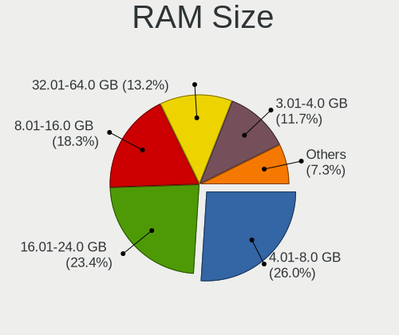
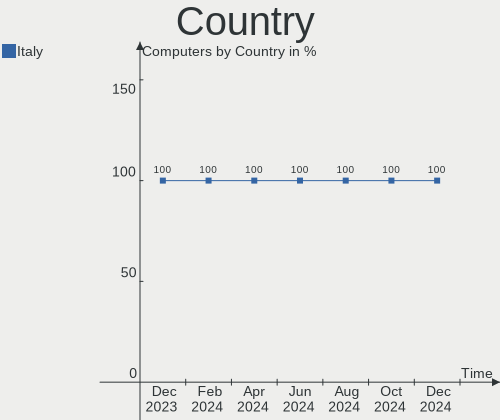
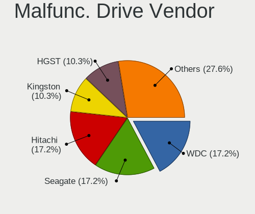
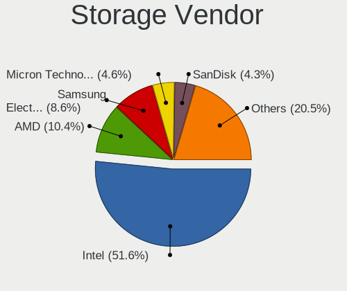
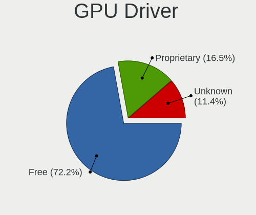
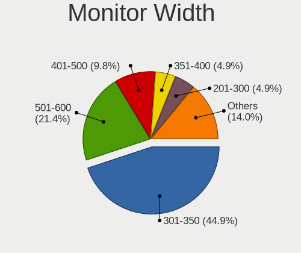
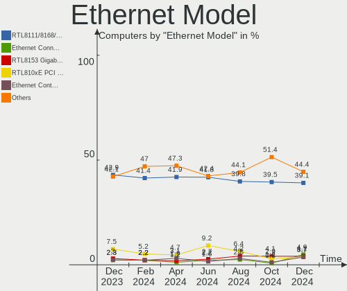

Linux in Italy - Hardware Trends
--------------------------------

A project to identify most popular hardware characteristics and track their change
over time based on data collected by Linux users at https://Linux-Hardware.org.

Anyone can contribute to this report by the [hw-probe](https://github.com/linuxhw/hw-probe) tool:

    sudo -E hw-probe -all -upload

This is a report for all computer types. See also reports for [desktops](/Location/Italy/Desktop/README.md) and [notebooks](/Location/Italy/Notebook/README.md).

Period: Oct, 2023.

Contents
--------

* [ System ](#system)
  - [ OS                       ](#os)
  - [ OS Family                ](#os-family)
  - [ Kernel                   ](#kernel)
  - [ Kernel Family            ](#kernel-family)
  - [ Kernel Major Ver.        ](#kernel-major-ver)
  - [ Arch                     ](#arch)
  - [ DE                       ](#de)
  - [ Display Server           ](#display-server)
  - [ Display Manager          ](#display-manager)
  - [ OS Lang                  ](#os-lang)
  - [ Boot Mode                ](#boot-mode)
  - [ Filesystem               ](#filesystem)
  - [ Part. scheme             ](#part-scheme)
  - [ Dual Boot with Linux/BSD ](#dual-boot-with-linuxbsd)
  - [ Dual Boot (Win)          ](#dual-boot-win)

* [ Board ](#board)
  - [ Vendor                   ](#vendor)
  - [ Model                    ](#model)
  - [ Model Family             ](#model-family)
  - [ MFG Year                 ](#mfg-year)
  - [ Form Factor              ](#form-factor)
  - [ Secure Boot              ](#secure-boot)
  - [ Coreboot                 ](#coreboot)
  - [ RAM Size                 ](#ram-size)
  - [ RAM Used                 ](#ram-used)
  - [ Total Drives             ](#total-drives)
  - [ Has CD-ROM               ](#has-cd-rom)
  - [ Has Ethernet             ](#has-ethernet)
  - [ Has WiFi                 ](#has-wifi)
  - [ Has Bluetooth            ](#has-bluetooth)

* [ Location ](#location)
  - [ Country                  ](#country)
  - [ City                     ](#city)

* [ Drives ](#drives)
  - [ Drive Vendor             ](#drive-vendor)
  - [ Drive Model              ](#drive-model)
  - [ HDD Vendor               ](#hdd-vendor)
  - [ SSD Vendor               ](#ssd-vendor)
  - [ Drive Kind               ](#drive-kind)
  - [ Drive Connector          ](#drive-connector)
  - [ Drive Size               ](#drive-size)
  - [ Space Total              ](#space-total)
  - [ Space Used               ](#space-used)
  - [ Malfunc. Drives          ](#malfunc-drives)
  - [ Malfunc. Drive Vendor    ](#malfunc-drive-vendor)
  - [ Malfunc. HDD Vendor      ](#malfunc-hdd-vendor)
  - [ Malfunc. Drive Kind      ](#malfunc-drive-kind)
  - [ Failed Drives            ](#failed-drives)
  - [ Failed Drive Vendor      ](#failed-drive-vendor)
  - [ Drive Status             ](#drive-status)

* [ Storage controller ](#storage-controller)
  - [ Storage Vendor           ](#storage-vendor)
  - [ Storage Model            ](#storage-model)
  - [ Storage Kind             ](#storage-kind)

* [ Processor ](#processor)
  - [ CPU Vendor               ](#cpu-vendor)
  - [ CPU Model                ](#cpu-model)
  - [ CPU Model Family         ](#cpu-model-family)
  - [ CPU Cores                ](#cpu-cores)
  - [ CPU Sockets              ](#cpu-sockets)
  - [ CPU Threads              ](#cpu-threads)
  - [ CPU Op-Modes             ](#cpu-op-modes)
  - [ CPU Microcode            ](#cpu-microcode)
  - [ CPU Microarch            ](#cpu-microarch)

* [ Graphics ](#graphics)
  - [ GPU Vendor               ](#gpu-vendor)
  - [ GPU Model                ](#gpu-model)
  - [ GPU Combo                ](#gpu-combo)
  - [ GPU Driver               ](#gpu-driver)
  - [ GPU Memory               ](#gpu-memory)

* [ Monitor ](#monitor)
  - [ Monitor Vendor           ](#monitor-vendor)
  - [ Monitor Model            ](#monitor-model)
  - [ Monitor Resolution       ](#monitor-resolution)
  - [ Monitor Diagonal         ](#monitor-diagonal)
  - [ Monitor Width            ](#monitor-width)
  - [ Aspect Ratio             ](#aspect-ratio)
  - [ Monitor Area             ](#monitor-area)
  - [ Pixel Density            ](#pixel-density)
  - [ Multiple Monitors        ](#multiple-monitors)

* [ Network ](#network)
  - [ Net Controller Vendor    ](#net-controller-vendor)
  - [ Net Controller Model     ](#net-controller-model)
  - [ Wireless Vendor          ](#wireless-vendor)
  - [ Wireless Model           ](#wireless-model)
  - [ Ethernet Vendor          ](#ethernet-vendor)
  - [ Ethernet Model           ](#ethernet-model)
  - [ Net Controller Kind      ](#net-controller-kind)
  - [ Used Controller          ](#used-controller)
  - [ NICs                     ](#nics)
  - [ IPv6                     ](#ipv6)

* [ Bluetooth ](#bluetooth)
  - [ Bluetooth Vendor         ](#bluetooth-vendor)
  - [ Bluetooth Model          ](#bluetooth-model)

* [ Sound ](#sound)
  - [ Sound Vendor             ](#sound-vendor)
  - [ Sound Model              ](#sound-model)

* [ Memory ](#memory)
  - [ Memory Vendor            ](#memory-vendor)
  - [ Memory Model             ](#memory-model)
  - [ Memory Kind              ](#memory-kind)
  - [ Memory Form Factor       ](#memory-form-factor)
  - [ Memory Size              ](#memory-size)
  - [ Memory Speed             ](#memory-speed)

* [ Printers & scanners ](#printers--scanners)
  - [ Printer Vendor           ](#printer-vendor)
  - [ Printer Model            ](#printer-model)
  - [ Scanner Vendor           ](#scanner-vendor)
  - [ Scanner Model            ](#scanner-model)

* [ Camera ](#camera)
  - [ Camera Vendor            ](#camera-vendor)
  - [ Camera Model             ](#camera-model)

* [ Security ](#security)
  - [ Fingerprint Vendor       ](#fingerprint-vendor)
  - [ Fingerprint Model        ](#fingerprint-model)
  - [ Chipcard Vendor          ](#chipcard-vendor)
  - [ Chipcard Model           ](#chipcard-model)

* [ Unsupported ](#unsupported)
  - [ Unsupported Devices      ](#unsupported-devices)
  - [ Unsupported Device Types ](#unsupported-device-types)

System
------

OS
--

Installed operating systems

| Name                         | Computers | Percent |
|------------------------------|-----------|---------|
| Ubuntu 22.04                 | 48        | 13.68%  |
| Arch Rolling                 | 34        | 9.69%   |
| Fedora 38                    | 32        | 9.12%   |
| Linux Mint 21.2              | 27        | 7.69%   |
| Debian 12                    | 17        | 4.84%   |
| EndeavourOS Rolling          | 15        | 4.27%   |
| Ubuntu 23.04                 | 12        | 3.42%   |
| Ubuntu 23.10                 | 9         | 2.56%   |
| openSUSE Tumbleweed-XXXXXXXX | 8         | 2.28%   |
| LMDE 6                       | 8         | 2.28%   |
| Kubuntu 22.04                | 8         | 2.28%   |
| ArcoLinux Rolling            | 8         | 2.28%   |
| Zorin 16                     | 7         | 1.99%   |
| Linux Mint 20.3              | 7         | 1.99%   |
| Kubuntu 23.04                | 7         | 1.99%   |
| Debian 11                    | 6         | 1.71%   |
| OpenMandriva 23.10           | 5         | 1.42%   |
| Gentoo 2.14                  | 5         | 1.42%   |
| Debian                       | 5         | 1.42%   |
| Pop!_OS 22.04                | 4         | 1.14%   |
| OpenMandriva 23.08           | 4         | 1.14%   |
| Manjaro 23.0.4               | 4         | 1.14%   |
| Lubuntu 22.04                | 4         | 1.14%   |
| Elementary 7.1               | 4         | 1.14%   |
| ROSA 12.4                    | 3         | 0.85%   |
| Kubuntu 23.10                | 3         | 0.85%   |
| Garuda Linux Soaring         | 3         | 0.85%   |
| Fedora 39                    | 3         | 0.85%   |
| Xubuntu 22.04                | 2         | 0.57%   |
| Ubuntu MATE 22.04            | 2         | 0.57%   |
| Ubuntu 20.04                 | 2         | 0.57%   |
| Nobara 38                    | 2         | 0.57%   |
| NixOS 23.05                  | 2         | 0.57%   |
| Linux Mint 21.1              | 2         | 0.57%   |
| Linux Mint 20.1              | 2         | 0.57%   |
| Debian 10                    | 2         | 0.57%   |
| Xubuntu 23.04                | 1         | 0.28%   |
| Xubuntu 18.04                | 1         | 0.28%   |
| Xero Rolling                 | 1         | 0.28%   |
| Ultramarine 38               | 1         | 0.28%   |

OS Family
---------

OS without a version

| Name          | Computers | Percent |
|---------------|-----------|---------|
| Ubuntu        | 73        | 20.8%   |
| Linux Mint    | 39        | 11.11%  |
| Fedora        | 36        | 10.26%  |
| Arch          | 34        | 9.69%   |
| Debian        | 30        | 8.55%   |
| Kubuntu       | 19        | 5.41%   |
| EndeavourOS   | 15        | 4.27%   |
| OpenMandriva  | 12        | 3.42%   |
| openSUSE      | 10        | 2.85%   |
| LMDE          | 8         | 2.28%   |
| ArcoLinux     | 8         | 2.28%   |
| Zorin         | 7         | 1.99%   |
| Manjaro       | 6         | 1.71%   |
| Lubuntu       | 5         | 1.42%   |
| Gentoo        | 5         | 1.42%   |
| Elementary    | 5         | 1.42%   |
| Xubuntu       | 4         | 1.14%   |
| Pop!_OS       | 4         | 1.14%   |
| Garuda Linux  | 4         | 1.14%   |
| Ubuntu MATE   | 3         | 0.85%   |
| ROSA          | 3         | 0.85%   |
| Ubuntu Unity  | 2         | 0.57%   |
| Nobara        | 2         | 0.57%   |
| NixOS         | 2         | 0.57%   |
| CentOS        | 2         | 0.57%   |
| Xero          | 1         | 0.28%   |
| Ultramarine   | 1         | 0.28%   |
| Ubuntu Budgie | 1         | 0.28%   |
| TUXEDO OS     | 1         | 0.28%   |
| Rocky Linux   | 1         | 0.28%   |
| Peppermint    | 1         | 0.28%   |
| PCLinuxOS     | 1         | 0.28%   |
| MX            | 1         | 0.28%   |
| KDE neon      | 1         | 0.28%   |
| Kali          | 1         | 0.28%   |
| Devuan        | 1         | 0.28%   |
| CachyOS       | 1         | 0.28%   |
| Asimov        | 1         | 0.28%   |

Kernel
------

Version of the Linux kernel

| Version                     | Computers | Percent |
|-----------------------------|-----------|---------|
| 6.2.0-34-generic            | 29        | 8.26%   |
| 6.2.0-35-generic            | 24        | 6.84%   |
| 6.5.9-arch2-1               | 23        | 6.55%   |
| 5.15.0-87-generic           | 16        | 4.56%   |
| 6.1.0-13-amd64              | 14        | 3.99%   |
| 5.15.0-86-generic           | 13        | 3.7%    |
| 6.5.8-200.fc38.x86_64       | 11        | 3.13%   |
| 6.2.0-33-generic            | 10        | 2.85%   |
| 6.5.5-arch1-1               | 8         | 2.28%   |
| 6.1.0-12-amd64              | 8         | 2.28%   |
| 6.5.9-zen2-1-zen            | 7         | 1.99%   |
| 6.5.5-200.fc38.x86_64       | 7         | 1.99%   |
| 6.5.0-10-generic            | 7         | 1.99%   |
| 6.2.0-36-generic            | 7         | 1.99%   |
| 6.5.7-arch1-1               | 6         | 1.71%   |
| 6.5.7-200.fc38.x86_64       | 6         | 1.71%   |
| 6.5.0-9-generic             | 6         | 1.71%   |
| 6.2.0-26-generic            | 6         | 1.71%   |
| 6.4.11-desktop-1omv2390     | 5         | 1.42%   |
| 6.2.9-300.fc38.x86_64       | 5         | 1.42%   |
| 5.15.0-76-generic           | 5         | 1.42%   |
| 6.5.5-zen1-1-zen            | 4         | 1.14%   |
| 6.5.5-desktop-1omv2390      | 4         | 1.14%   |
| 6.1.57-gentoo               | 4         | 1.14%   |
| 5.4.0-165-generic           | 4         | 1.14%   |
| 5.15.0-84-generic           | 4         | 1.14%   |
| 5.10.0-26-amd64             | 4         | 1.14%   |
| 6.5.9-1-default             | 3         | 0.85%   |
| 6.5.8-1-default             | 3         | 0.85%   |
| 6.5.5-1-MANJARO             | 3         | 0.85%   |
| 6.5.7-zen2-1-zen            | 2         | 0.57%   |
| 6.5.7-060507-generic        | 2         | 0.57%   |
| 6.5.6-76060506-generic      | 2         | 0.57%   |
| 6.5.6-300.fc39.x86_64       | 2         | 0.57%   |
| 6.5.6-200.fc38.x86_64       | 2         | 0.57%   |
| 6.5.6-1.surface.fc38.x86_64 | 2         | 0.57%   |
| 6.5.4-1-default             | 2         | 0.57%   |
| 6.5.0-3-amd64               | 2         | 0.57%   |
| 6.5.0-2-amd64               | 2         | 0.57%   |
| 6.4.11-arch1-1              | 2         | 0.57%   |

Kernel Family
-------------

Linux kernel without a distro release

| Version  | Computers | Percent |
|----------|-----------|---------|
| 6.2.0    | 78        | 22.22%  |
| 5.15.0   | 48        | 13.68%  |
| 6.5.9    | 34        | 9.69%   |
| 6.5.5    | 29        | 8.26%   |
| 6.1.0    | 25        | 7.12%   |
| 6.5.0    | 19        | 5.41%   |
| 6.5.7    | 17        | 4.84%   |
| 6.5.8    | 16        | 4.56%   |
| 6.5.6    | 10        | 2.85%   |
| 5.4.0    | 10        | 2.85%   |
| 6.4.11   | 7         | 1.99%   |
| 6.1.57   | 6         | 1.71%   |
| 5.10.0   | 6         | 1.71%   |
| 6.2.9    | 5         | 1.42%   |
| 6.6.0    | 3         | 0.85%   |
| 6.5.4    | 3         | 0.85%   |
| 6.1.31   | 3         | 0.85%   |
| 5.19.0   | 3         | 0.85%   |
| 6.5.3    | 2         | 0.57%   |
| 6.1.60   | 2         | 0.57%   |
| 6.1.58   | 2         | 0.57%   |
| 6.1.46   | 2         | 0.57%   |
| 5.14.0   | 2         | 0.57%   |
| 4.19.0   | 2         | 0.57%   |
| 6.5.2    | 1         | 0.28%   |
| 6.4.6    | 1         | 0.28%   |
| 6.4.3    | 1         | 0.28%   |
| 6.4.12   | 1         | 0.28%   |
| 6.3.13   | 1         | 0.28%   |
| 6.2.6    | 1         | 0.28%   |
| 6.2.15   | 1         | 0.28%   |
| 6.2.11   | 1         | 0.28%   |
| 6.1.59   | 1         | 0.28%   |
| 6.1.20   | 1         | 0.28%   |
| 6.1.1    | 1         | 0.28%   |
| 5.8.0    | 1         | 0.28%   |
| 5.16.13  | 1         | 0.28%   |
| 5.15.133 | 1         | 0.28%   |
| 5.14.21  | 1         | 0.28%   |
| 4.18.0   | 1         | 0.28%   |

Kernel Major Ver.
-----------------

Linux kernel major version

| Version | Computers | Percent |
|---------|-----------|---------|
| 6.5     | 131       | 37.32%  |
| 6.2     | 86        | 24.5%   |
| 5.15    | 49        | 13.96%  |
| 6.1     | 43        | 12.25%  |
| 6.4     | 10        | 2.85%   |
| 5.4     | 10        | 2.85%   |
| 5.10    | 6         | 1.71%   |
| 6.6     | 3         | 0.85%   |
| 5.19    | 3         | 0.85%   |
| 5.14    | 3         | 0.85%   |
| 4.19    | 2         | 0.57%   |
| 6.3     | 1         | 0.28%   |
| 5.8     | 1         | 0.28%   |
| 5.16    | 1         | 0.28%   |
| 4.18    | 1         | 0.28%   |
| 4.15    | 1         | 0.28%   |

Arch
----

OS architecture (x86_64, i586, etc.)

| Name    | Computers | Percent |
|---------|-----------|---------|
| x86_64  | 348       | 99.15%  |
| i686    | 2         | 0.57%   |
| aarch64 | 1         | 0.28%   |

DE
--

Desktop Environment

| Name       | Computers | Percent |
|------------|-----------|---------|
| GNOME      | 147       | 41.88%  |
| KDE5       | 94        | 26.78%  |
| X-Cinnamon | 40        | 11.4%   |
| XFCE       | 23        | 6.55%   |
| MATE       | 12        | 3.42%   |
| Unknown    | 10        | 2.85%   |
| LXQt       | 8         | 2.28%   |
| Pantheon   | 5         | 1.42%   |
| none+i3    | 2         | 0.57%   |
| i3         | 2         | 0.57%   |
| Budgie     | 2         | 0.57%   |
| Unity      | 1         | 0.28%   |
| sway       | 1         | 0.28%   |
| LXDE       | 1         | 0.28%   |
| kde        | 1         | 0.28%   |
| Hyprland   | 1         | 0.28%   |
| Cinnamon   | 1         | 0.28%   |

Display Server
--------------

X11 or Wayland

| Name    | Computers | Percent |
|---------|-----------|---------|
| X11     | 213       | 60.68%  |
| Wayland | 125       | 35.61%  |
| Tty     | 7         | 1.99%   |
| Unknown | 6         | 1.71%   |

Display Manager
---------------

SDDM, LightDM, etc.

| Name    | Computers | Percent |
|---------|-----------|---------|
| Unknown | 85        | 24.22%  |
| SDDM    | 84        | 23.93%  |
| GDM3    | 81        | 23.08%  |
| LightDM | 60        | 17.09%  |
| GDM     | 39        | 11.11%  |
| XDM     | 1         | 0.28%   |
| LXDM    | 1         | 0.28%   |

OS Lang
-------

Language

| Lang              | Computers | Percent |
|-------------------|-----------|---------|
| it_IT             | 244       | 69.52%  |
| en_US             | 81        | 23.08%  |
| C                 | 10        | 2.85%   |
| en_GB             | 6         | 1.71%   |
| Unknown           | 4         | 1.14%   |
| de_DE             | 2         | 0.57%   |
| it_IT.iso88591    | 1         | 0.28%   |
| it_CH             | 1         | 0.28%   |
| fr_FR             | 1         | 0.28%   |
| en_US.ISO-8859-15 | 1         | 0.28%   |

Boot Mode
---------

EFI or BIOS

| Mode | Computers | Percent |
|------|-----------|---------|
| EFI  | 230       | 65.53%  |
| BIOS | 121       | 34.47%  |

Filesystem
----------

Type of filesystem

| Type    | Computers | Percent |
|---------|-----------|---------|
| Ext4    | 210       | 59.83%  |
| Btrfs   | 62        | 17.66%  |
| Tmpfs   | 50        | 14.25%  |
| Overlay | 20        | 5.7%    |
| Xfs     | 9         | 2.56%   |

Part. scheme
------------

Scheme of partitioning

| Type    | Computers | Percent |
|---------|-----------|---------|
| GPT     | 247       | 70.37%  |
| Unknown | 73        | 20.8%   |
| MBR     | 31        | 8.83%   |

Dual Boot with Linux/BSD
------------------------

Hosting more than one Linux/BSD

| Dual boot | Computers | Percent |
|-----------|-----------|---------|
| No        | 300       | 85.47%  |
| Yes       | 51        | 14.53%  |

Dual Boot (Win)
---------------

Hosting Linux and Windows

| Dual boot | Computers | Percent |
|-----------|-----------|---------|
| No        | 221       | 62.96%  |
| Yes       | 130       | 37.04%  |

Board
-----

Vendor
------

Motherboard manufacturer

| Name                | Computers | Percent |
|---------------------|-----------|---------|
| ASUSTek Computer    | 74        | 21.08%  |
| Hewlett-Packard     | 49        | 13.96%  |
| Lenovo              | 47        | 13.39%  |
| Dell                | 41        | 11.68%  |
| MSI                 | 23        | 6.55%   |
| Acer                | 21        | 5.98%   |
| Gigabyte Technology | 14        | 3.99%   |
| ASRock              | 12        | 3.42%   |
| HUAWEI              | 11        | 3.13%   |
| Apple               | 10        | 2.85%   |
| Samsung Electronics | 7         | 1.99%   |
| Intel               | 5         | 1.42%   |
| Unknown             | 4         | 1.14%   |
| Toshiba             | 3         | 0.85%   |
| Microsoft           | 3         | 0.85%   |
| LG Electronics      | 3         | 0.85%   |
| Fujitsu             | 3         | 0.85%   |
| Sony                | 2         | 0.57%   |
| Notebook            | 2         | 0.57%   |
| Mediacom            | 2         | 0.57%   |
| Trigkey             | 1         | 0.28%   |
| Timi                | 1         | 0.28%   |
| Pegatron            | 1         | 0.28%   |
| Panasonic           | 1         | 0.28%   |
| Packard Bell        | 1         | 0.28%   |
| OrangePi            | 1         | 0.28%   |
| Insyde              | 1         | 0.28%   |
| HONOR               | 1         | 0.28%   |
| Foxconn             | 1         | 0.28%   |
| Cincoze             | 1         | 0.28%   |
| Chuwi               | 1         | 0.28%   |
| AZW                 | 1         | 0.28%   |
| ASRockRack          | 1         | 0.28%   |
| AMI                 | 1         | 0.28%   |
| Alienware           | 1         | 0.28%   |

Model
-----

Motherboard model

| Name                                   | Computers | Percent |
|----------------------------------------|-----------|---------|
| Unknown                                | 4         | 1.14%   |
| HUAWEI BOHK-WAX9X                      | 3         | 0.85%   |
| MSI MS-7C37                            | 2         | 0.57%   |
| MSI MS-7B79                            | 2         | 0.57%   |
| Mediacom WinPad 11,6 FullHD- WPU11     | 2         | 0.57%   |
| HUAWEI NBLK-WAX9X                      | 2         | 0.57%   |
| HP Victus by Laptop 16-e0xxx           | 2         | 0.57%   |
| HP ProDesk 600 G1 SFF                  | 2         | 0.57%   |
| HP EliteBook 840 G6                    | 2         | 0.57%   |
| HP 255 G6 Notebook PC                  | 2         | 0.57%   |
| HP 15                                  | 2         | 0.57%   |
| Gigabyte X570 AORUS ELITE              | 2         | 0.57%   |
| Dell Vostro 15 3515                    | 2         | 0.57%   |
| Dell PowerEdge T20                     | 2         | 0.57%   |
| Dell Latitude 5520                     | 2         | 0.57%   |
| ASUS VivoBook_ASUSLaptop X515EA_F515EA | 2         | 0.57%   |
| ASUS TUF Gaming B550M-PLUS             | 2         | 0.57%   |
| ASUS PRIME B550-PLUS                   | 2         | 0.57%   |
| ASUS PRIME A320M-K                     | 2         | 0.57%   |
| Apple MacBook7,1                       | 2         | 0.57%   |
| Acer Aspire 5738                       | 2         | 0.57%   |
| Trigkey S5                             | 1         | 0.28%   |
| Toshiba TECRA S11                      | 1         | 0.28%   |
| Toshiba Satellite P850                 | 1         | 0.28%   |
| Toshiba Satellite L655                 | 1         | 0.28%   |
| Timi RedmiBook Pro 15                  | 1         | 0.28%   |
| Sony SVE1713X1EB                       | 1         | 0.28%   |
| Sony SVE1513Q1ESI                      | 1         | 0.28%   |
| Samsung RC420/RC520/RC720              | 1         | 0.28%   |
| Samsung R530/R730/P590                 | 1         | 0.28%   |
| Samsung P500A2D                        | 1         | 0.28%   |
| Samsung 930XDB/931XDB/930XDY           | 1         | 0.28%   |
| Samsung 930QCG                         | 1         | 0.28%   |
| Samsung 750XED                         | 1         | 0.28%   |
| Samsung 700T1C                         | 1         | 0.28%   |
| Pegatron HPE-521it                     | 1         | 0.28%   |
| Panasonic CF-F9KWPZFFE                 | 1         | 0.28%   |
| Packard Bell EasyNote LE69KB           | 1         | 0.28%   |
| OrangePi Zero3                         | 1         | 0.28%   |
| Notebook W65_67SJ                      | 1         | 0.28%   |

Model Family
------------

Motherboard model prefix

| Name               | Computers | Percent |
|--------------------|-----------|---------|
| Lenovo ThinkPad    | 22        | 6.27%   |
| ASUS PRIME         | 14        | 3.99%   |
| Dell Latitude      | 10        | 2.85%   |
| ASUS ROG           | 10        | 2.85%   |
| Lenovo IdeaPad     | 9         | 2.56%   |
| Dell Vostro        | 8         | 2.28%   |
| ASUS VivoBook      | 8         | 2.28%   |
| Acer Aspire        | 8         | 2.28%   |
| HP Pavilion        | 7         | 1.99%   |
| HP ProBook         | 6         | 1.71%   |
| Dell XPS           | 6         | 1.71%   |
| Dell PowerEdge     | 5         | 1.42%   |
| Dell Inspiron      | 5         | 1.42%   |
| HP ProDesk         | 4         | 1.14%   |
| HP ENVY            | 4         | 1.14%   |
| HP EliteBook       | 4         | 1.14%   |
| HP Compaq          | 4         | 1.14%   |
| HP 255             | 4         | 1.14%   |
| Gigabyte X570      | 4         | 1.14%   |
| Dell OptiPlex      | 4         | 1.14%   |
| ASUS TUF           | 4         | 1.14%   |
| Acer Nitro         | 4         | 1.14%   |
| Unknown            | 4         | 1.14%   |
| Microsoft Surface  | 3         | 0.85%   |
| Lenovo Yoga        | 3         | 0.85%   |
| Lenovo ThinkCentre | 3         | 0.85%   |
| HUAWEI BOHK-WAX9X  | 3         | 0.85%   |
| HP 250             | 3         | 0.85%   |
| Dell Precision     | 3         | 0.85%   |
| ASUS ASUS          | 3         | 0.85%   |
| Acer Swift         | 3         | 0.85%   |
| Toshiba Satellite  | 2         | 0.57%   |
| MSI MS-7C37        | 2         | 0.57%   |
| MSI MS-7B79        | 2         | 0.57%   |
| Mediacom WinPad    | 2         | 0.57%   |
| Lenovo V15         | 2         | 0.57%   |
| Lenovo ThinkBook   | 2         | 0.57%   |
| Lenovo IdeaPadFlex | 2         | 0.57%   |
| HUAWEI NBLK-WAX9X  | 2         | 0.57%   |
| HP Victus          | 2         | 0.57%   |

MFG Year
--------

Motherboard manufacture year

| Year    | Computers | Percent |
|---------|-----------|---------|
| 2021    | 46        | 13.11%  |
| 2020    | 42        | 11.97%  |
| 2019    | 37        | 10.54%  |
| 2022    | 33        | 9.4%    |
| 2014    | 26        | 7.41%   |
| 2013    | 25        | 7.12%   |
| 2017    | 21        | 5.98%   |
| 2016    | 19        | 5.41%   |
| 2015    | 16        | 4.56%   |
| 2018    | 15        | 4.27%   |
| 2012    | 14        | 3.99%   |
| 2010    | 13        | 3.7%    |
| 2023    | 12        | 3.42%   |
| 2009    | 12        | 3.42%   |
| 2011    | 9         | 2.56%   |
| 2008    | 5         | 1.42%   |
| 2007    | 4         | 1.14%   |
| 2005    | 1         | 0.28%   |
| Unknown | 1         | 0.28%   |

Form Factor
-----------

Physical design of the computer

| Name           | Computers | Percent |
|----------------|-----------|---------|
| Notebook       | 202       | 57.55%  |
| Desktop        | 121       | 34.47%  |
| Convertible    | 9         | 2.56%   |
| Mini pc        | 6         | 1.71%   |
| All in one     | 5         | 1.42%   |
| Tablet         | 4         | 1.14%   |
| Server         | 3         | 0.85%   |
| System on chip | 1         | 0.28%   |

Secure Boot
-----------

Enabled or disabled

| State    | Computers | Percent |
|----------|-----------|---------|
| Disabled | 314       | 89.46%  |
| Enabled  | 37        | 10.54%  |

Coreboot
--------

Have coreboot on board

| Used | Computers | Percent |
|------|-----------|---------|
| No   | 351       | 100%    |

RAM Size
--------

Total RAM memory

| Size in GB  | Computers | Percent |
|-------------|-----------|---------|
| 16.01-24.0  | 84        | 23.93%  |
| 4.01-8.0    | 82        | 23.36%  |
| 8.01-16.0   | 79        | 22.51%  |
| 3.01-4.0    | 41        | 11.68%  |
| 32.01-64.0  | 30        | 8.55%   |
| 64.01-256.0 | 13        | 3.7%    |
| 24.01-32.0  | 10        | 2.85%   |
| 1.01-2.0    | 8         | 2.28%   |
| 2.01-3.0    | 4         | 1.14%   |

RAM Used
--------

Used RAM memory

| Used GB    | Computers | Percent |
|------------|-----------|---------|
| 2.01-3.0   | 94        | 26.78%  |
| 4.01-8.0   | 80        | 22.79%  |
| 1.01-2.0   | 76        | 21.65%  |
| 3.01-4.0   | 61        | 17.38%  |
| 8.01-16.0  | 24        | 6.84%   |
| 0.51-1.0   | 13        | 3.7%    |
| 0.01-0.5   | 2         | 0.57%   |
| 16.01-24.0 | 1         | 0.28%   |

Total Drives
------------

Number of drives on board

| Drives | Computers | Percent |
|--------|-----------|---------|
| 1      | 219       | 62.39%  |
| 2      | 75        | 21.37%  |
| 3      | 33        | 9.4%    |
| 4      | 12        | 3.42%   |
| 5      | 6         | 1.71%   |
| 7      | 3         | 0.85%   |
| 6      | 2         | 0.57%   |
| 9      | 1         | 0.28%   |

Has CD-ROM
----------

Has CD-ROM on board

| Presented | Computers | Percent |
|-----------|-----------|---------|
| No        | 237       | 67.52%  |
| Yes       | 114       | 32.48%  |

Has Ethernet
------------

Has Ethernet on board

| Presented | Computers | Percent |
|-----------|-----------|---------|
| Yes       | 281       | 80.06%  |
| No        | 70        | 19.94%  |

Has WiFi
--------

Has WiFi module

| Presented | Computers | Percent |
|-----------|-----------|---------|
| Yes       | 284       | 80.91%  |
| No        | 67        | 19.09%  |

Has Bluetooth
-------------

Has Bluetooth module

| Presented | Computers | Percent |
|-----------|-----------|---------|
| Yes       | 239       | 68.09%  |
| No        | 112       | 31.91%  |

Location
--------

Country
-------

Geographic location (country)

| Country | Computers | Percent |
|---------|-----------|---------|
| Italy   | 351       | 100%    |

City
----

Geographic location (city)

| City               | Computers | Percent |
|--------------------|-----------|---------|
| Milan              | 36        | 10.26%  |
| Rome               | 28        | 7.98%   |
| Milano             | 21        | 5.98%   |
| Turin              | 15        | 4.27%   |
| Florence           | 11        | 3.13%   |
| Genoa              | 9         | 2.56%   |
| Bologna            | 9         | 2.56%   |
| Naples             | 8         | 2.28%   |
| Palermo            | 6         | 1.71%   |
| Parma              | 5         | 1.42%   |
| Catania            | 5         | 1.42%   |
| Verona             | 4         | 1.14%   |
| Trieste            | 4         | 1.14%   |
| Padova             | 4         | 1.14%   |
| Nola               | 4         | 1.14%   |
| Bergamo            | 4         | 1.14%   |
| Venice             | 3         | 0.85%   |
| Taranto            | 3         | 0.85%   |
| Pradamano          | 3         | 0.85%   |
| Livorno            | 3         | 0.85%   |
| Legnano            | 3         | 0.85%   |
| Bresso             | 3         | 0.85%   |
| Bari               | 3         | 0.85%   |
| Treviglio          | 2         | 0.57%   |
| Trescore Balneario | 2         | 0.57%   |
| Sesto San Giovanni | 2         | 0.57%   |
| Rho                | 2         | 0.57%   |
| Reggio Calabria    | 2         | 0.57%   |
| Pognano            | 2         | 0.57%   |
| Pisa               | 2         | 0.57%   |
| Pianoro            | 2         | 0.57%   |
| Pescara            | 2         | 0.57%   |
| Perugia            | 2         | 0.57%   |
| Oulx               | 2         | 0.57%   |
| Monza              | 2         | 0.57%   |
| Gravina in Puglia  | 2         | 0.57%   |
| Giussano           | 2         | 0.57%   |
| Basiano            | 2         | 0.57%   |
| Zogno              | 1         | 0.28%   |
| Villata            | 1         | 0.28%   |

Drives
------

Drive Vendor
------------

Hard drive vendors

| Vendor                       | Computers | Drives | Percent |
|------------------------------|-----------|--------|---------|
| Samsung Electronics          | 106       | 125    | 20.54%  |
| WDC                          | 53        | 75     | 10.27%  |
| Seagate                      | 48        | 61     | 9.3%    |
| Sandisk                      | 40        | 41     | 7.75%   |
| Kingston                     | 39        | 41     | 7.56%   |
| Crucial                      | 35        | 40     | 6.78%   |
| Toshiba                      | 17        | 17     | 3.29%   |
| Unknown                      | 16        | 20     | 3.1%    |
| Micron Technology            | 15        | 15     | 2.91%   |
| Micron/Crucial Technology    | 13        | 14     | 2.52%   |
| SK hynix                     | 11        | 11     | 2.13%   |
| Intel                        | 11        | 11     | 2.13%   |
| Hitachi                      | 10        | 10     | 1.94%   |
| HGST                         | 10        | 10     | 1.94%   |
| KIOXIA                       | 9         | 9      | 1.74%   |
| Phison Electronics           | 6         | 6      | 1.16%   |
| SPCC                         | 5         | 5      | 0.97%   |
| Silicon Motion               | 5         | 5      | 0.97%   |
| Kingston Technology Company  | 5         | 5      | 0.97%   |
| China                        | 5         | 5      | 0.97%   |
| Apple                        | 5         | 5      | 0.97%   |
| Team                         | 4         | 4      | 0.78%   |
| Phison                       | 4         | 5      | 0.78%   |
| Transcend                    | 3         | 3      | 0.58%   |
| Maxtor                       | 3         | 3      | 0.58%   |
| Lexar                        | 3         | 3      | 0.58%   |
| JMicron Technology           | 3         | 3      | 0.58%   |
| Unknown                      | 3         | 3      | 0.58%   |
| Netac                        | 2         | 2      | 0.39%   |
| MAXIO Technology (Hangzhou)  | 2         | 2      | 0.39%   |
| KIOXIA-EXCERIA               | 2         | 2      | 0.39%   |
| Fujitsu                      | 2         | 2      | 0.39%   |
| UMIS                         | 1         | 1      | 0.19%   |
| TS-RDF2                      | 1         | 1      | 0.19%   |
| SSSTC                        | 1         | 1      | 0.19%   |
| ShiJi                        | 1         | 1      | 0.19%   |
| Shenzhen Longsys Electronics | 1         | 2      | 0.19%   |
| SCY                          | 1         | 1      | 0.19%   |
| Saichi                       | 1         | 1      | 0.19%   |
| KingSpec                     | 1         | 1      | 0.19%   |

Drive Model
-----------

Hard drive models

| Model                                                 | Computers | Percent |
|-------------------------------------------------------|-----------|---------|
| Samsung NVMe SSD Controller SM981/PM981/PM983 1TB     | 14        | 2.5%    |
| Samsung NVMe SSD Controller PM9A1/PM9A3/980PRO 1TB    | 12        | 2.15%   |
| Micron/Crucial P2 NVMe PCIe SSD 500GB                 | 10        | 1.79%   |
| Crucial CT500MX500SSD1 500GB                          | 8         | 1.43%   |
| Samsung SSD 870 QVO 1TB                               | 7         | 1.25%   |
| Kingston SA400S37480G 480GB SSD                       | 7         | 1.25%   |
| Kingston SA400S37240G 240GB SSD                       | 7         | 1.25%   |
| Seagate ST1000DM010-2EP102 1TB                        | 6         | 1.07%   |
| Samsung SSD 860 EVO 500GB                             | 6         | 1.07%   |
| WDC WD10EZEX-08WN4A0 1TB                              | 5         | 0.89%   |
| Sandisk WD Black SN750 / PC SN730 NVMe SSD 1024GB     | 5         | 0.89%   |
| Samsung SSD 850 EVO 500GB                             | 5         | 0.89%   |
| Crucial CT240BX500SSD1 240GB                          | 5         | 0.89%   |
| Seagate ST31000528AS 1TB                              | 4         | 0.72%   |
| Micron 2400_MTFDKBA512QFM 512GB                       | 4         | 0.72%   |
| Kingston Company A2000 NVMe SSD 250GB                 | 4         | 0.72%   |
| Kingston SV300S37A120G 120GB SSD                      | 4         | 0.72%   |
| Kingston SUV400S37240G 240GB SSD                      | 4         | 0.72%   |
| Kingston SA400S37120G 120GB SSD                       | 4         | 0.72%   |
| Toshiba DT01ACA100 1TB                                | 3         | 0.54%   |
| Silicon Motion SM2263EN/SM2263XT SSD Controller 256GB | 3         | 0.54%   |
| Seagate ST500DM002-1BD142 500GB                       | 3         | 0.54%   |
| Seagate ST1000LM035-1RK172 1TB                        | 3         | 0.54%   |
| Seagate ST1000DM003-1ER162 1TB                        | 3         | 0.54%   |
| Sandisk WD Blue SN550 NVMe SSD 1TB                    | 3         | 0.54%   |
| Sandisk WD Blue SN500 / PC SN520 NVMe SSD 512GB       | 3         | 0.54%   |
| Sandisk WD Black 2018/SN750 / PC SN720 NVMe SSD 1TB   | 3         | 0.54%   |
| SanDisk SSD PLUS 480GB                                | 3         | 0.54%   |
| SanDisk SSD PLUS 240GB                                | 3         | 0.54%   |
| Samsung SSD 870 EVO 500GB                             | 3         | 0.54%   |
| Samsung MZVLQ512HALU-00000 512GB                      | 3         | 0.54%   |
| Samsung MZALQ512HBLU-00BL2 512GB                      | 3         | 0.54%   |
| JMicron Tech 250GB                                    | 3         | 0.54%   |
| Intel SSDPEKNU512GZ 512GB                             | 3         | 0.54%   |
| Intel SSD 660P Series 1024GB                          | 3         | 0.54%   |
| HGST HTS545050A7E680 500GB                            | 3         | 0.54%   |
| Crucial CT480BX500SSD1 480GB                          | 3         | 0.54%   |
| Unknown                                               | 3         | 0.54%   |
| WDC WDS100T2B0A-00SM50 1TB SSD                        | 2         | 0.36%   |
| WDC WD5000LPCX-60VHAT0 500GB                          | 2         | 0.36%   |

HDD Vendor
----------

Hard disk drive vendors

| Vendor              | Computers | Drives | Percent |
|---------------------|-----------|--------|---------|
| Seagate             | 44        | 57     | 34.11%  |
| WDC                 | 43        | 63     | 33.33%  |
| Toshiba             | 10        | 10     | 7.75%   |
| Hitachi             | 10        | 10     | 7.75%   |
| HGST                | 10        | 10     | 7.75%   |
| Samsung Electronics | 3         | 3      | 2.33%   |
| Maxtor              | 3         | 3      | 2.33%   |
| Fujitsu             | 2         | 2      | 1.55%   |
| Apple               | 2         | 2      | 1.55%   |
| Initio              | 1         | 1      | 0.78%   |
| IBM/Hitachi         | 1         | 1      | 0.78%   |

SSD Vendor
----------

Solid state drive vendors

| Vendor              | Computers | Drives | Percent |
|---------------------|-----------|--------|---------|
| Samsung Electronics | 49        | 55     | 28.49%  |
| Crucial             | 33        | 36     | 19.19%  |
| Kingston            | 29        | 31     | 16.86%  |
| SanDisk             | 15        | 16     | 8.72%   |
| WDC                 | 7         | 7      | 4.07%   |
| China               | 5         | 5      | 2.91%   |
| Toshiba             | 4         | 4      | 2.33%   |
| Team                | 4         | 4      | 2.33%   |
| Transcend           | 3         | 3      | 1.74%   |
| SPCC                | 3         | 3      | 1.74%   |
| Netac               | 2         | 2      | 1.16%   |
| Lexar               | 2         | 2      | 1.16%   |
| Intel               | 2         | 2      | 1.16%   |
| Apple               | 2         | 2      | 1.16%   |
| SCY                 | 1         | 1      | 0.58%   |
| Saichi              | 1         | 1      | 0.58%   |
| KingSpec            | 1         | 1      | 0.58%   |
| KingDian            | 1         | 1      | 0.58%   |
| Intenso             | 1         | 1      | 0.58%   |
| Innodisk            | 1         | 1      | 0.58%   |
| Hewlett-Packard     | 1         | 1      | 0.58%   |
| GOODRAM             | 1         | 1      | 0.58%   |
| Drevo               | 1         | 1      | 0.58%   |
| Dogfish             | 1         | 1      | 0.58%   |
| Corsair             | 1         | 1      | 0.58%   |
| BAITITON            | 1         | 1      | 0.58%   |

Drive Kind
----------

HDD or SSD

| Kind    | Computers | Drives | Percent |
|---------|-----------|--------|---------|
| NVMe    | 176       | 208    | 38.26%  |
| SSD     | 151       | 184    | 32.83%  |
| HDD     | 107       | 162    | 23.26%  |
| MMC     | 16        | 19     | 3.48%   |
| Unknown | 10        | 12     | 2.17%   |

Drive Connector
---------------

SATA, SAS, NVMe, etc.

| Type | Computers | Drives | Percent |
|------|-----------|--------|---------|
| SATA | 202       | 334    | 48.91%  |
| NVMe | 176       | 208    | 42.62%  |
| SAS  | 19        | 24     | 4.6%    |
| MMC  | 16        | 19     | 3.87%   |

Drive Size
----------

Size of hard drive

| Size in TB | Computers | Drives | Percent |
|------------|-----------|--------|---------|
| 0.01-0.5   | 151       | 197    | 57.2%   |
| 0.51-1.0   | 79        | 107    | 29.92%  |
| 1.01-2.0   | 18        | 21     | 6.82%   |
| 2.01-3.0   | 8         | 9      | 3.03%   |
| 3.01-4.0   | 5         | 6      | 1.89%   |
| 4.01-10.0  | 2         | 5      | 0.76%   |
| 10.01-20.0 | 1         | 1      | 0.38%   |

Space Total
-----------

Amount of disk space available on the file system

| Size in GB     | Computers | Percent |
|----------------|-----------|---------|
| 101-250        | 86        | 24.5%   |
| 251-500        | 81        | 23.08%  |
| 501-1000       | 53        | 15.1%   |
| 1001-2000      | 41        | 11.68%  |
| 1-20           | 27        | 7.69%   |
| More than 3000 | 23        | 6.55%   |
| 51-100         | 13        | 3.7%    |
| 2001-3000      | 11        | 3.13%   |
| 21-50          | 9         | 2.56%   |
| Unknown        | 7         | 1.99%   |

Space Used
----------

Amount of used disk space

| Used GB        | Computers | Percent |
|----------------|-----------|---------|
| 1-20           | 86        | 24.5%   |
| 101-250        | 64        | 18.23%  |
| 21-50          | 54        | 15.38%  |
| 51-100         | 46        | 13.11%  |
| 251-500        | 40        | 11.4%   |
| 501-1000       | 27        | 7.69%   |
| 1001-2000      | 16        | 4.56%   |
| More than 3000 | 9         | 2.56%   |
| Unknown        | 7         | 1.99%   |
| 2001-3000      | 2         | 0.57%   |

Malfunc. Drives
---------------

Drive models with a malfunction

| Model                                 | Computers | Drives | Percent |
|---------------------------------------|-----------|--------|---------|
| WDC WD30EFRX-68EUZN0 3TB              | 2         | 2      | 5.41%   |
| Seagate ST1000LM014-1EJ164 1TB        | 2         | 2      | 5.41%   |
| Intel SSDSC2BF180A4L 180GB            | 2         | 2      | 5.41%   |
| HGST HTS725050A7E630 500GB            | 2         | 2      | 5.41%   |
| HGST HTS545050A7E680 500GB            | 2         | 2      | 5.41%   |
| Crucial CT525MX300SSD1 528GB          | 2         | 2      | 5.41%   |
| WDC WD5000LPCX-24C6HT0 500GB          | 1         | 1      | 2.7%    |
| WDC WD5000AAKS-007AA0 500GB           | 1         | 1      | 2.7%    |
| WDC WD20EARS-60MVWB0 2TB              | 1         | 1      | 2.7%    |
| WDC WD2000FYYZ-01UL1B2 2TB            | 1         | 1      | 2.7%    |
| Toshiba MK5065GSX 500GB               | 1         | 1      | 2.7%    |
| Seagate ST8000DM004-2CX188 8TB        | 1         | 1      | 2.7%    |
| Seagate ST2000DM006-2DM164 2TB        | 1         | 2      | 2.7%    |
| Seagate ST1000LM035-1RK172 1TB        | 1         | 1      | 2.7%    |
| SanDisk SSD PLUS 480GB                | 1         | 1      | 2.7%    |
| SanDisk SDSSDP128G 128GB              | 1         | 1      | 2.7%    |
| Samsung Electronics SSD 870 EVO 500GB | 1         | 1      | 2.7%    |
| Samsung Electronics SSD 870 EVO 2TB   | 1         | 1      | 2.7%    |
| Samsung Electronics SSD 870 EVO 1TB   | 1         | 1      | 2.7%    |
| Samsung Electronics SSD 860 EVO 500GB | 1         | 1      | 2.7%    |
| Maxtor STM3320820AS 320GB             | 1         | 1      | 2.7%    |
| Kingston SA400S37120G 120GB SSD       | 1         | 1      | 2.7%    |
| IBM/Hitachi IC35L040AVER07-0 41GB     | 1         | 1      | 2.7%    |
| Hitachi HTS541616J9SA00 160GB         | 1         | 1      | 2.7%    |
| Hitachi HDP725050GLA360 500GB         | 1         | 1      | 2.7%    |
| Hitachi HDP725025GLA380 250GB         | 1         | 1      | 2.7%    |
| HGST HTS541010A9E680 1TB              | 1         | 1      | 2.7%    |
| Fujitsu MHZ2320BH G2 320GB            | 1         | 1      | 2.7%    |
| Dogfish SSD 128GB                     | 1         | 1      | 2.7%    |
| Crucial CT120M500SSD1 120GB           | 1         | 1      | 2.7%    |
| China SATA3 2TB SSD                   | 1         | 1      | 2.7%    |

Malfunc. Drive Vendor
---------------------

Vendors of faulty drives

| Vendor              | Computers | Drives | Percent |
|---------------------|-----------|--------|---------|
| WDC                 | 6         | 6      | 16.22%  |
| Seagate             | 5         | 6      | 13.51%  |
| HGST                | 5         | 5      | 13.51%  |
| Samsung Electronics | 4         | 4      | 10.81%  |
| Hitachi             | 3         | 3      | 8.11%   |
| Crucial             | 3         | 3      | 8.11%   |
| SanDisk             | 2         | 2      | 5.41%   |
| Intel               | 2         | 2      | 5.41%   |
| Toshiba             | 1         | 1      | 2.7%    |
| Maxtor              | 1         | 1      | 2.7%    |
| Kingston            | 1         | 1      | 2.7%    |
| IBM/Hitachi         | 1         | 1      | 2.7%    |
| Fujitsu             | 1         | 1      | 2.7%    |
| Dogfish             | 1         | 1      | 2.7%    |
| China               | 1         | 1      | 2.7%    |

Malfunc. HDD Vendor
-------------------

Vendors of faulty HDD drives

| Vendor      | Computers | Drives | Percent |
|-------------|-----------|--------|---------|
| WDC         | 6         | 6      | 26.09%  |
| Seagate     | 5         | 6      | 21.74%  |
| HGST        | 5         | 5      | 21.74%  |
| Hitachi     | 3         | 3      | 13.04%  |
| Toshiba     | 1         | 1      | 4.35%   |
| Maxtor      | 1         | 1      | 4.35%   |
| IBM/Hitachi | 1         | 1      | 4.35%   |
| Fujitsu     | 1         | 1      | 4.35%   |

Malfunc. Drive Kind
-------------------

Kinds of faulty drives

| Kind | Computers | Drives | Percent |
|------|-----------|--------|---------|
| HDD  | 21        | 24     | 60%     |
| SSD  | 14        | 14     | 40%     |

Failed Drives
-------------

Failed drive models

| Model                         | Computers | Drives | Percent |
|-------------------------------|-----------|--------|---------|
| Hitachi HTS723232A7A364 320GB | 1         | 1      | 100%    |

Failed Drive Vendor
-------------------

Failed drive vendors

| Vendor  | Computers | Drives | Percent |
|---------|-----------|--------|---------|
| Hitachi | 1         | 1      | 100%    |

Drive Status
------------

Number of failed and malfunc. drives

| Status   | Computers | Drives | Percent |
|----------|-----------|--------|---------|
| Works    | 203       | 311    | 52.86%  |
| Detected | 147       | 235    | 38.28%  |
| Malfunc  | 33        | 38     | 8.59%   |
| Failed   | 1         | 1      | 0.26%   |

Storage controller
------------------

Storage Vendor
--------------

Storage controller vendors

| Vendor                         | Computers | Percent |
|--------------------------------|-----------|---------|
| Intel                          | 201       | 41.79%  |
| AMD                            | 70        | 14.55%  |
| Samsung Electronics            | 61        | 12.68%  |
| SanDisk                        | 29        | 6.03%   |
| Micron/Crucial Technology      | 17        | 3.53%   |
| Micron Technology              | 15        | 3.12%   |
| Kingston Technology Company    | 15        | 3.12%   |
| Phison Electronics             | 12        | 2.49%   |
| SK hynix                       | 11        | 2.29%   |
| KIOXIA                         | 10        | 2.08%   |
| Silicon Motion                 | 6         | 1.25%   |
| ASMedia Technology             | 6         | 1.25%   |
| Nvidia                         | 5         | 1.04%   |
| Toshiba America Info Systems   | 4         | 0.83%   |
| Marvell Technology Group       | 4         | 0.83%   |
| JMicron Technology             | 3         | 0.62%   |
| Shenzhen Longsys Electronics   | 2         | 0.42%   |
| MAXIO Technology (Hangzhou)    | 2         | 0.42%   |
| ADATA Technology               | 2         | 0.42%   |
| VIA Technologies               | 1         | 0.21%   |
| Union Memory (Shenzhen)        | 1         | 0.21%   |
| Solid State Storage Technology | 1         | 0.21%   |
| LSI Logic / Symbios Logic      | 1         | 0.21%   |
| Apple                          | 1         | 0.21%   |
| Adaptec                        | 1         | 0.21%   |

Storage Model
-------------

Storage controller models

| Model                                                                          | Computers | Percent |
|--------------------------------------------------------------------------------|-----------|---------|
| AMD FCH SATA Controller [AHCI mode]                                            | 49        | 9.19%   |
| Intel Volume Management Device NVMe RAID Controller                            | 21        | 3.94%   |
| Samsung NVMe SSD Controller SM981/PM981/PM983                                  | 19        | 3.56%   |
| Samsung NVMe SSD Controller 980 (DRAM-less)                                    | 19        | 3.56%   |
| Samsung NVMe SSD Controller PM9A1/PM9A3/980PRO                                 | 18        | 3.38%   |
| Intel 8 Series/C220 Series Chipset Family 6-port SATA Controller 1 [AHCI mode] | 17        | 3.19%   |
| Intel Sunrise Point-LP SATA Controller [AHCI mode]                             | 15        | 2.81%   |
| Micron/Crucial P2 [Nick P2] / P3 / P3 Plus NVMe PCIe SSD (DRAM-less)           | 14        | 2.63%   |
| Intel 7 Series Chipset Family 6-port SATA Controller [AHCI mode]               | 12        | 2.25%   |
| AMD 500 Series Chipset SATA Controller                                         | 11        | 2.06%   |
| Intel 82801 Mobile SATA Controller [RAID mode]                                 | 10        | 1.88%   |
| Intel 200 Series PCH SATA controller [AHCI mode]                               | 10        | 1.88%   |
| SanDisk Extreme Pro / WD Black SN750 / PC SN730 / Red SN700 NVMe SSD           | 7         | 1.31%   |
| Intel 6 Series/C200 Series Chipset Family 6 port Desktop SATA AHCI Controller  | 7         | 1.31%   |
| AMD 400 Series Chipset SATA Controller                                         | 7         | 1.31%   |
| Intel Wildcat Point-LP SATA Controller [AHCI Mode]                             | 6         | 1.13%   |
| Intel Q170/Q150/B150/H170/H110/Z170/CM236 Chipset SATA Controller [AHCI Mode]  | 6         | 1.13%   |
| Intel 82801IBM/IEM (ICH9M/ICH9M-E) 4 port SATA Controller [AHCI mode]          | 6         | 1.13%   |
| Intel 8 Series SATA Controller 1 [AHCI mode]                                   | 6         | 1.13%   |
| Intel 500 Series Chipset Family SATA AHCI Controller                           | 6         | 1.13%   |
| ASMedia ASM1062 Serial ATA Controller                                          | 6         | 1.13%   |
| SK hynix Gold P31/BC711/PC711 NVMe Solid State Drive                           | 5         | 0.94%   |
| Micron 2400 NVMe SSD (DRAM-less)                                               | 5         | 0.94%   |
| Intel SATA Controller [RAID mode]                                              | 5         | 0.94%   |
| Intel Cannon Lake PCH SATA AHCI Controller                                     | 5         | 0.94%   |
| Intel 7 Series/C210 Series Chipset Family 6-port SATA Controller [AHCI mode]   | 5         | 0.94%   |
| Intel 5 Series/3400 Series Chipset 4 port SATA AHCI Controller                 | 5         | 0.94%   |
| Silicon Motion SM2263EN/SM2263XT (DRAM-less) NVMe SSD Controllers              | 4         | 0.75%   |
| SanDisk Ultra 3D / WD Blue SN550 NVMe SSD                                      | 4         | 0.75%   |
| Phison E12 NVMe Controller                                                     | 4         | 0.75%   |
| KIOXIA NVMe SSD Controller BG4 (DRAM-less)                                     | 4         | 0.75%   |
| Kingston Company A2000 NVMe SSD SM2263EN                                       | 4         | 0.75%   |
| Intel Tiger Lake-LP SATA Controller                                            | 4         | 0.75%   |
| Intel SSD 670p Series [Keystone Harbor]                                        | 4         | 0.75%   |
| Intel SSD 660P Series                                                          | 4         | 0.75%   |
| Intel Cannon Point-LP SATA Controller [AHCI Mode]                              | 4         | 0.75%   |
| Intel Cannon Lake Mobile PCH SATA AHCI Controller                              | 4         | 0.75%   |
| Intel Alder Lake-P SATA AHCI Controller                                        | 4         | 0.75%   |
| AMD SB7x0/SB8x0/SB9x0 IDE Controller                                           | 4         | 0.75%   |
| AMD FCH SATA Controller D                                                      | 4         | 0.75%   |

Storage Kind
------------

Kind of storage controller (IDE, SATA, NVMe, SAS, ...)

| Kind | Computers | Percent |
|------|-----------|---------|
| SATA | 235       | 49.58%  |
| NVMe | 176       | 37.13%  |
| RAID | 40        | 8.44%   |
| IDE  | 19        | 4.01%   |
| SAS  | 2         | 0.42%   |
| SCSI | 2         | 0.42%   |

Processor
---------

CPU Vendor
----------

Processor vendors

| Vendor | Computers | Percent |
|--------|-----------|---------|
| Intel  | 246       | 70.09%  |
| AMD    | 104       | 29.63%  |
| ARM    | 1         | 0.28%   |

CPU Model
---------

Processor models

| Model                                         | Computers | Percent |
|-----------------------------------------------|-----------|---------|
| AMD Ryzen 5 3500U with Radeon Vega Mobile Gfx | 8         | 2.28%   |
| Intel Core i7-1065G7 CPU @ 1.30GHz            | 6         | 1.71%   |
| Intel Core i5-7200U CPU @ 2.50GHz             | 6         | 1.71%   |
| Intel 11th Gen Core i7-1165G7 @ 2.80GHz       | 6         | 1.71%   |
| Intel Core i5-6200U CPU @ 2.30GHz             | 5         | 1.42%   |
| Intel 12th Gen Core i5-1235U                  | 5         | 1.42%   |
| Intel 11th Gen Core i5-1135G7 @ 2.40GHz       | 5         | 1.42%   |
| AMD Ryzen 5 5600X 6-Core Processor            | 5         | 1.42%   |
| Intel Core i7-8565U CPU @ 1.80GHz             | 4         | 1.14%   |
| AMD Ryzen 7 3700X 8-Core Processor            | 4         | 1.14%   |
| Intel Core i7-10750H CPU @ 2.60GHz            | 3         | 0.85%   |
| Intel Core i5-8265U CPU @ 1.60GHz             | 3         | 0.85%   |
| Intel Core i5-5200U CPU @ 2.20GHz             | 3         | 0.85%   |
| Intel Core i5-4210U CPU @ 1.70GHz             | 3         | 0.85%   |
| Intel Core i5-3470 CPU @ 3.20GHz              | 3         | 0.85%   |
| Intel Core i5-10210U CPU @ 1.60GHz            | 3         | 0.85%   |
| Intel 12th Gen Core i7-12700H                 | 3         | 0.85%   |
| Intel 11th Gen Core i7-11800H @ 2.30GHz       | 3         | 0.85%   |
| AMD Ryzen 7 5825U with Radeon Graphics        | 3         | 0.85%   |
| AMD Ryzen 7 5800H with Radeon Graphics        | 3         | 0.85%   |
| AMD Ryzen 7 5700U with Radeon Graphics        | 3         | 0.85%   |
| AMD Ryzen 5 5600H with Radeon Graphics        | 3         | 0.85%   |
| AMD Ryzen 5 3600 6-Core Processor             | 3         | 0.85%   |
| AMD Ryzen 5 3400G with Radeon Vega Graphics   | 3         | 0.85%   |
| Intel Xeon CPU E3-1225 v3 @ 3.20GHz           | 2         | 0.57%   |
| Intel Pentium Dual-Core CPU T4200 @ 2.00GHz   | 2         | 0.57%   |
| Intel Core i7-8750H CPU @ 2.20GHz             | 2         | 0.57%   |
| Intel Core i7-7700 CPU @ 3.60GHz              | 2         | 0.57%   |
| Intel Core i7-7500U CPU @ 2.70GHz             | 2         | 0.57%   |
| Intel Core i7-4710MQ CPU @ 2.50GHz            | 2         | 0.57%   |
| Intel Core i7-4702MQ CPU @ 2.20GHz            | 2         | 0.57%   |
| Intel Core i7-3632QM CPU @ 2.20GHz            | 2         | 0.57%   |
| Intel Core i7-3630QM CPU @ 2.40GHz            | 2         | 0.57%   |
| Intel Core i7-2600 CPU @ 3.40GHz              | 2         | 0.57%   |
| Intel Core i5-9400F CPU @ 2.90GHz             | 2         | 0.57%   |
| Intel Core i5-8250U CPU @ 1.60GHz             | 2         | 0.57%   |
| Intel Core i5-7300U CPU @ 2.60GHz             | 2         | 0.57%   |
| Intel Core i5-5300U CPU @ 2.30GHz             | 2         | 0.57%   |
| Intel Core i5-3320M CPU @ 2.60GHz             | 2         | 0.57%   |
| Intel Core i5-3230M CPU @ 2.60GHz             | 2         | 0.57%   |

CPU Model Family
----------------

Processor model prefix

| Model                   | Computers | Percent |
|-------------------------|-----------|---------|
| Intel Core i5           | 69        | 19.66%  |
| Intel Core i7           | 58        | 16.52%  |
| Other                   | 53        | 15.1%   |
| AMD Ryzen 5             | 42        | 11.97%  |
| AMD Ryzen 7             | 25        | 7.12%   |
| Intel Core i3           | 16        | 4.56%   |
| Intel Xeon              | 11        | 3.13%   |
| Intel Core 2 Duo        | 10        | 2.85%   |
| AMD Ryzen 9             | 10        | 2.85%   |
| Intel Celeron           | 9         | 2.56%   |
| Intel Atom              | 6         | 1.71%   |
| AMD Ryzen 3             | 6         | 1.71%   |
| Intel Pentium Dual-Core | 5         | 1.42%   |
| Intel Pentium           | 5         | 1.42%   |
| AMD FX                  | 4         | 1.14%   |
| AMD Ryzen 7 PRO         | 3         | 0.85%   |
| Intel Core i9           | 2         | 0.57%   |
| Intel Core 2 Quad       | 2         | 0.57%   |
| AMD E2                  | 2         | 0.57%   |
| AMD E1                  | 2         | 0.57%   |
| AMD A4                  | 2         | 0.57%   |
| Intel Pentium 4         | 1         | 0.28%   |
| Intel Celeron Dual-Core | 1         | 0.28%   |
| AMD Turion 64 X2 Mobile | 1         | 0.28%   |
| AMD Phenom II X6        | 1         | 0.28%   |
| AMD GX                  | 1         | 0.28%   |
| AMD EPYC                | 1         | 0.28%   |
| AMD Athlon II X3        | 1         | 0.28%   |
| AMD A8                  | 1         | 0.28%   |
| AMD A6                  | 1         | 0.28%   |

CPU Cores
---------

Number of processor cores

| Number  | Computers | Percent |
|---------|-----------|---------|
| 4       | 130       | 37.04%  |
| 2       | 96        | 27.35%  |
| 6       | 47        | 13.39%  |
| 8       | 42        | 11.97%  |
| 10      | 11        | 3.13%   |
| 12      | 8         | 2.28%   |
| 14      | 7         | 1.99%   |
| 1       | 3         | 0.85%   |
| 24      | 2         | 0.57%   |
| 16      | 2         | 0.57%   |
| 3       | 2         | 0.57%   |
| Unknown | 1         | 0.28%   |

CPU Sockets
-----------

Number of sockets

| Number  | Computers | Percent |
|---------|-----------|---------|
| 1       | 349       | 99.43%  |
| 2       | 1         | 0.28%   |
| Unknown | 1         | 0.28%   |

CPU Threads
-----------

Threads per core (Hyper-Threading)

| Number  | Computers | Percent |
|---------|-----------|---------|
| 2       | 264       | 75.21%  |
| 1       | 86        | 24.5%   |
| Unknown | 1         | 0.28%   |

CPU Op-Modes
------------

CPU Operation Modes (32-bit, 64-bit)

| Op mode        | Computers | Percent |
|----------------|-----------|---------|
| 32-bit, 64-bit | 350       | 99.72%  |
| 32-bit         | 1         | 0.28%   |

CPU Microcode
-------------

Microcode number

| Number     | Computers | Percent |
|------------|-----------|---------|
| Unknown    | 193       | 54.99%  |
| 0x306c3    | 13        | 3.7%    |
| 0x08108109 | 12        | 3.42%   |
| 0x0a50000c | 9         | 2.56%   |
| 0x306a9    | 7         | 1.99%   |
| 0x206a7    | 7         | 1.99%   |
| 0x08701021 | 7         | 1.99%   |
| 0x1067a    | 6         | 1.71%   |
| 0x806e9    | 5         | 1.42%   |
| 0x0a50000d | 5         | 1.42%   |
| 0x906ea    | 4         | 1.14%   |
| 0x0a404102 | 4         | 1.14%   |
| 0x08608103 | 4         | 1.14%   |
| 0x08600106 | 4         | 1.14%   |
| 0x08600104 | 4         | 1.14%   |
| 0x906a4    | 3         | 0.85%   |
| 0x806c1    | 3         | 0.85%   |
| 0x506e3    | 3         | 0.85%   |
| 0x40651    | 3         | 0.85%   |
| 0x0a601203 | 3         | 0.85%   |
| 0x08701030 | 3         | 0.85%   |
| 0xa0671    | 2         | 0.57%   |
| 0x906a3    | 2         | 0.57%   |
| 0x30678    | 2         | 0.57%   |
| 0x0a20120a | 2         | 0.57%   |
| 0x0a201009 | 2         | 0.57%   |
| 0x08001138 | 2         | 0.57%   |
| 0x0700010b | 2         | 0.57%   |
| 0x06000852 | 2         | 0.57%   |
| 0xf29      | 1         | 0.28%   |
| 0x906ed    | 1         | 0.28%   |
| 0x906e9    | 1         | 0.28%   |
| 0x806ec    | 1         | 0.28%   |
| 0x806ea    | 1         | 0.28%   |
| 0x706e5    | 1         | 0.28%   |
| 0x6fd      | 1         | 0.28%   |
| 0x506ca    | 1         | 0.28%   |
| 0x406e3    | 1         | 0.28%   |
| 0x406c3    | 1         | 0.28%   |
| 0x306e4    | 1         | 0.28%   |

CPU Microarch
-------------

Microarchitecture

| Name             | Computers | Percent |
|------------------|-----------|---------|
| KabyLake         | 48        | 13.68%  |
| Haswell          | 34        | 9.69%   |
| Unknown          | 28        | 7.98%   |
| Zen 3            | 27        | 7.69%   |
| IvyBridge        | 22        | 6.27%   |
| Zen 2            | 20        | 5.7%    |
| Zen+             | 18        | 5.13%   |
| Alderlake Hybrid | 18        | 5.13%   |
| TigerLake        | 17        | 4.84%   |
| Skylake          | 16        | 4.56%   |
| Penryn           | 16        | 4.56%   |
| Icelake          | 13        | 3.7%    |
| SandyBridge      | 12        | 3.42%   |
| Westmere         | 7         | 1.99%   |
| Silvermont       | 7         | 1.99%   |
| Broadwell        | 7         | 1.99%   |
| CometLake        | 6         | 1.71%   |
| Zen              | 5         | 1.42%   |
| Jaguar           | 5         | 1.42%   |
| Piledriver       | 4         | 1.14%   |
| Goldmont plus    | 3         | 0.85%   |
| Excavator        | 3         | 0.85%   |
| Core             | 3         | 0.85%   |
| NetBurst         | 2         | 0.57%   |
| Nehalem          | 2         | 0.57%   |
| K10              | 2         | 0.57%   |
| Tremont          | 1         | 0.28%   |
| Puma             | 1         | 0.28%   |
| K8 Hammer        | 1         | 0.28%   |
| Goldmont         | 1         | 0.28%   |
| Bulldozer        | 1         | 0.28%   |
| Bonnell          | 1         | 0.28%   |

Graphics
--------

GPU Vendor
----------

Vendors of graphics cards

| Vendor                     | Computers | Percent |
|----------------------------|-----------|---------|
| Intel                      | 192       | 46.94%  |
| AMD                        | 108       | 26.41%  |
| Nvidia                     | 107       | 26.16%  |
| Matrox Electronics Systems | 1         | 0.24%   |
| ASPEED Technology          | 1         | 0.24%   |

GPU Model
---------

Graphics card models

| Model                                                                                    | Computers | Percent |
|------------------------------------------------------------------------------------------|-----------|---------|
| Intel TigerLake-LP GT2 [Iris Xe Graphics]                                                | 16        | 3.82%   |
| AMD Picasso/Raven 2 [Radeon Vega Series / Radeon Vega Mobile Series]                     | 16        | 3.82%   |
| Intel 3rd Gen Core processor Graphics Controller                                         | 12        | 2.86%   |
| AMD Cezanne [Radeon Vega Series / Radeon Vega Mobile Series]                             | 12        | 2.86%   |
| Intel HD Graphics 620                                                                    | 10        | 2.39%   |
| Intel WhiskeyLake-U GT2 [UHD Graphics 620]                                               | 8         | 1.91%   |
| Intel Haswell-ULT Integrated Graphics Controller                                         | 8         | 1.91%   |
| Intel 2nd Generation Core Processor Family Integrated Graphics Controller                | 8         | 1.91%   |
| AMD Renoir [Radeon RX Vega 6 (Ryzen 4000/5000 Mobile Series)]                            | 8         | 1.91%   |
| Intel Xeon E3-1200 v3/4th Gen Core Processor Integrated Graphics Controller              | 7         | 1.67%   |
| Intel Skylake GT2 [HD Graphics 520]                                                      | 7         | 1.67%   |
| Intel 4th Gen Core Processor Integrated Graphics Controller                              | 7         | 1.67%   |
| Nvidia GA106M [GeForce RTX 3060 Mobile / Max-Q]                                          | 6         | 1.43%   |
| Intel Iris Plus Graphics G7                                                              | 6         | 1.43%   |
| Intel HD Graphics 5500                                                                   | 6         | 1.43%   |
| Intel Alder Lake-UP3 GT2 [Iris Xe Graphics]                                              | 6         | 1.43%   |
| AMD Lucienne                                                                             | 6         | 1.43%   |
| AMD Ellesmere [Radeon RX 470/480/570/570X/580/580X/590]                                  | 6         | 1.43%   |
| Intel CometLake-U GT2 [UHD Graphics]                                                     | 5         | 1.19%   |
| Intel CoffeeLake-H GT2 [UHD Graphics 630]                                                | 5         | 1.19%   |
| Intel Atom/Celeron/Pentium Processor x5-E8000/J3xxx/N3xxx Integrated Graphics Controller | 5         | 1.19%   |
| Intel 4th Generation Core Processor Family Integrated Graphics Controller                | 5         | 1.19%   |
| AMD Rembrandt [Radeon 680M]                                                              | 5         | 1.19%   |
| AMD Barcelo                                                                              | 5         | 1.19%   |
| Nvidia GF117M [GeForce 610M/710M/810M/820M / GT 620M/625M/630M/720M]                     | 4         | 0.95%   |
| Intel UHD Graphics 620                                                                   | 4         | 0.95%   |
| Intel Raptor Lake-P [Iris Xe Graphics]                                                   | 4         | 0.95%   |
| Intel HD Graphics 630                                                                    | 4         | 0.95%   |
| Intel CoffeeLake-S GT2 [UHD Graphics 630]                                                | 4         | 0.95%   |
| Intel Alder Lake-P GT2 [Iris Xe Graphics]                                                | 4         | 0.95%   |
| AMD Navi 23 [Radeon RX 6650 XT / 6700S / 6800S]                                          | 4         | 0.95%   |
| Nvidia TU117M [GeForce GTX 1650 Mobile / Max-Q]                                          | 3         | 0.72%   |
| Nvidia TU117 [GeForce GTX 1650]                                                          | 3         | 0.72%   |
| Nvidia GP108 [GeForce GT 1030]                                                           | 3         | 0.72%   |
| Intel TigerLake-H GT1 [UHD Graphics]                                                     | 3         | 0.72%   |
| Intel GeminiLake [UHD Graphics 600]                                                      | 3         | 0.72%   |
| Intel Core Processor Integrated Graphics Controller                                      | 3         | 0.72%   |
| Intel CometLake-H GT2 [UHD Graphics]                                                     | 3         | 0.72%   |
| AMD Stoney [Radeon R2/R3/R4/R5 Graphics]                                                 | 3         | 0.72%   |
| AMD Raphael                                                                              | 3         | 0.72%   |

GPU Combo
---------

Combinations of graphics cards

| Name           | Computers | Percent |
|----------------|-----------|---------|
| 1 x Intel      | 142       | 40.46%  |
| 1 x AMD        | 88        | 25.07%  |
| 1 x Nvidia     | 56        | 15.95%  |
| Intel + Nvidia | 42        | 11.97%  |
| 2 x AMD        | 8         | 2.28%   |
| AMD + Nvidia   | 7         | 1.99%   |
| Intel + AMD    | 5         | 1.42%   |
| Other          | 1         | 0.28%   |
| 1 x Matrox     | 1         | 0.28%   |
| 1 x ASPEED     | 1         | 0.28%   |

GPU Driver
----------

Free vs proprietary

| Driver      | Computers | Percent |
|-------------|-----------|---------|
| Free        | 281       | 80.06%  |
| Proprietary | 64        | 18.23%  |
| Unknown     | 6         | 1.71%   |

GPU Memory
----------

Total video memory

| Size in GB | Computers | Percent |
|------------|-----------|---------|
| Unknown    | 203       | 57.83%  |
| 1.01-2.0   | 39        | 11.11%  |
| 0.01-0.5   | 39        | 11.11%  |
| 3.01-4.0   | 21        | 5.98%   |
| 0.51-1.0   | 19        | 5.41%   |
| 7.01-8.0   | 16        | 4.56%   |
| 8.01-16.0  | 7         | 1.99%   |
| 5.01-6.0   | 6         | 1.71%   |
| 16.01-24.0 | 1         | 0.28%   |

Monitor
-------

Monitor Vendor
--------------

Monitor vendors

| Vendor                  | Computers | Percent |
|-------------------------|-----------|---------|
| Samsung Electronics     | 53        | 13.7%   |
| AU Optronics            | 51        | 13.18%  |
| BOE                     | 44        | 11.37%  |
| Chimei Innolux          | 38        | 9.82%   |
| LG Display              | 34        | 8.79%   |
| Philips                 | 24        | 6.2%    |
| Hewlett-Packard         | 20        | 5.17%   |
| Goldstar                | 13        | 3.36%   |
| Acer                    | 11        | 2.84%   |
| Dell                    | 10        | 2.58%   |
| Lenovo                  | 9         | 2.33%   |
| Ancor Communications    | 9         | 2.33%   |
| Apple                   | 8         | 2.07%   |
| AOC                     | 8         | 2.07%   |
| Chi Mei Optoelectronics | 6         | 1.55%   |
| Sharp                   | 5         | 1.29%   |
| ASUSTek Computer        | 5         | 1.29%   |
| Sony                    | 4         | 1.03%   |
| MSI                     | 4         | 1.03%   |
| BenQ                    | 4         | 1.03%   |
| RTK                     | 2         | 0.52%   |
| Mi                      | 2         | 0.52%   |
| Eizo                    | 2         | 0.52%   |
| Yashi                   | 1         | 0.26%   |
| ViewSonic               | 1         | 0.26%   |
| Toshiba                 | 1         | 0.26%   |
| TMX                     | 1         | 0.26%   |
| TCL                     | 1         | 0.26%   |
| PANDA                   | 1         | 0.26%   |
| Panasonic               | 1         | 0.26%   |
| LG Electronics          | 1         | 0.26%   |
| KDB                     | 1         | 0.26%   |
| ITE                     | 1         | 0.26%   |
| InnoLux Display         | 1         | 0.26%   |
| InfoVision              | 1         | 0.26%   |
| HUAWEI                  | 1         | 0.26%   |
| HKC                     | 1         | 0.26%   |
| Fujitsu Siemens         | 1         | 0.26%   |
| Denver                  | 1         | 0.26%   |
| CVT                     | 1         | 0.26%   |

Monitor Model
-------------

Monitor models

| Model                                                                    | Computers | Percent |
|--------------------------------------------------------------------------|-----------|---------|
| BOE LCD Monitor BOE0872 1920x1080 344x194mm 15.5-inch                    | 5         | 1.27%   |
| Chi Mei Optoelectronics LCD Monitor CMO15A7 1366x768 344x193mm 15.5-inch | 4         | 1.02%   |
| Samsung Electronics S24D330 SAM0D92 1920x1080 530x300mm 24.0-inch        | 3         | 0.76%   |
| Samsung Electronics C27F390 SAM0D32 1920x1080 598x336mm 27.0-inch        | 3         | 0.76%   |
| LG Display LCD Monitor LGD0555 1536x1024 263x175mm 12.4-inch             | 3         | 0.76%   |
| Goldstar FULL HD GSM5B55 1920x1080 480x270mm 21.7-inch                   | 3         | 0.76%   |
| Chimei Innolux LCD Monitor CMN1406 1920x1080 309x173mm 13.9-inch         | 3         | 0.76%   |
| AU Optronics LCD Monitor AUO61ED 1920x1080 344x194mm 15.5-inch           | 3         | 0.76%   |
| RTK LCD Monitor RTK1D1A 1920x1080 1020x570mm 46.0-inch                   | 2         | 0.51%   |
| Philips 247E4 PHLC0C0 1920x1080 521x293mm 23.5-inch                      | 2         | 0.51%   |
| Mi 27 NFGL XMIB004 1920x1080 598x336mm 27.0-inch                         | 2         | 0.51%   |
| LG Display LCD Monitor LGD06B3 1920x1200 336x210mm 15.6-inch             | 2         | 0.51%   |
| LG Display LCD Monitor LGD0563 1920x1080 344x194mm 15.5-inch             | 2         | 0.51%   |
| Lenovo D24-20 LEN66AE 1920x1080 527x296mm 23.8-inch                      | 2         | 0.51%   |
| Hewlett-Packard 24f HPN3545 1920x1080 527x296mm 23.8-inch                | 2         | 0.51%   |
| Hewlett-Packard 23xi HWP3032 1920x1080 509x286mm 23.0-inch               | 2         | 0.51%   |
| Goldstar 2D FHD TV GSM59C6 1920x1080 509x286mm 23.0-inch                 | 2         | 0.51%   |
| Chimei Innolux LCD Monitor CMN15F5 1920x1080 344x193mm 15.5-inch         | 2         | 0.51%   |
| Chimei Innolux LCD Monitor CMN15E8 1920x1080 344x193mm 15.5-inch         | 2         | 0.51%   |
| Chimei Innolux LCD Monitor CMN15E7 1920x1080 344x193mm 15.5-inch         | 2         | 0.51%   |
| Chimei Innolux LCD Monitor CMN15DB 1366x768 344x193mm 15.5-inch          | 2         | 0.51%   |
| Chimei Innolux LCD Monitor CMN15CA 1366x768 344x193mm 15.5-inch          | 2         | 0.51%   |
| Chimei Innolux LCD Monitor CMN15C9 1366x768 344x193mm 15.5-inch          | 2         | 0.51%   |
| Chimei Innolux LCD Monitor CMN1521 1920x1080 344x193mm 15.5-inch         | 2         | 0.51%   |
| Chimei Innolux LCD Monitor CMN14D5 1920x1080 309x173mm 13.9-inch         | 2         | 0.51%   |
| Chimei Innolux LCD Monitor CMN14D4 1920x1080 309x173mm 13.9-inch         | 2         | 0.51%   |
| BOE LCD Monitor BOE0877 1920x1080 309x173mm 13.9-inch                    | 2         | 0.51%   |
| BOE LCD Monitor BOE06CB 1920x1080 340x190mm 15.3-inch                    | 2         | 0.51%   |
| BOE LCD Monitor BOE06A5 1366x768 344x194mm 15.5-inch                     | 2         | 0.51%   |
| AU Optronics LCD Monitor AUO5799 1920x1080 344x194mm 15.5-inch           | 2         | 0.51%   |
| AU Optronics LCD Monitor AUO408D 1920x1080 309x174mm 14.0-inch           | 2         | 0.51%   |
| AU Optronics LCD Monitor AUO403D 1920x1080 309x173mm 13.9-inch           | 2         | 0.51%   |
| AU Optronics LCD Monitor AUO23ED 1920x1080 344x194mm 15.5-inch           | 2         | 0.51%   |
| AU Optronics LCD Monitor AUO21ED 1920x1080 344x194mm 15.5-inch           | 2         | 0.51%   |
| AU Optronics LCD Monitor AUO1E3D 1920x1080 309x173mm 13.9-inch           | 2         | 0.51%   |
| AU Optronics B156HAN15.H AUOD2A2 1920x1080 344x193mm 15.5-inch           | 2         | 0.51%   |
| Apple LCD Monitor APP9CA3 1440x900 331x207mm 15.4-inch                   | 2         | 0.51%   |
| Ancor Communications VW202 ACI20A2 1680x1050 433x271mm 20.1-inch         | 2         | 0.51%   |
| Ancor Communications ASUS VS228 ACI22FD 1920x1080 476x268mm 21.5-inch    | 2         | 0.51%   |
| Acer G237HL ACR03DF 1920x1080 510x290mm 23.1-inch                        | 2         | 0.51%   |

Monitor Resolution
------------------

Monitor screen resolution

| Resolution         | Computers | Percent |
|--------------------|-----------|---------|
| 1920x1080 (FHD)    | 199       | 55.12%  |
| 1366x768 (WXGA)    | 54        | 14.96%  |
| 2560x1440 (QHD)    | 17        | 4.71%   |
| 3840x2160 (4K)     | 15        | 4.16%   |
| 1920x1200 (WUXGA)  | 13        | 3.6%    |
| 1280x1024 (SXGA)   | 9         | 2.49%   |
| 1680x1050 (WSXGA+) | 6         | 1.66%   |
| 1440x900 (WXGA+)   | 6         | 1.66%   |
| 1280x800 (WXGA)    | 5         | 1.39%   |
| 1600x900 (HD+)     | 4         | 1.11%   |
| 2736x1824          | 3         | 0.83%   |
| 2560x1600          | 3         | 0.83%   |
| 1360x768           | 3         | 0.83%   |
| 1024x768 (XGA)     | 3         | 0.83%   |
| 3840x1600          | 2         | 0.55%   |
| 3440x1440          | 2         | 0.55%   |
| 2880x1800          | 2         | 0.55%   |
| 2560x1080          | 2         | 0.55%   |
| 2160x1440          | 2         | 0.55%   |
| 1920x1280          | 2         | 0.55%   |
| 3840x1080          | 1         | 0.28%   |
| 3456x2160          | 1         | 0.28%   |
| 3200x2000          | 1         | 0.28%   |
| 3200x1800 (QHD+)   | 1         | 0.28%   |
| 3072x1920          | 1         | 0.28%   |
| 2520x1680          | 1         | 0.28%   |
| 2256x1504          | 1         | 0.28%   |
| 1920x540           | 1         | 0.28%   |
| 1024x600           | 1         | 0.28%   |

Monitor Diagonal
----------------

Diagonal size in inches

| Inches  | Computers | Percent |
|---------|-----------|---------|
| 15      | 115       | 29.95%  |
| 13      | 35        | 9.11%   |
| 27      | 33        | 8.59%   |
| 24      | 30        | 7.81%   |
| 21      | 29        | 7.55%   |
| 14      | 29        | 7.55%   |
| 23      | 26        | 6.77%   |
| 17      | 13        | 3.39%   |
| 19      | 7         | 1.82%   |
| 16      | 7         | 1.82%   |
| 12      | 7         | 1.82%   |
| 31      | 6         | 1.56%   |
| Unknown | 5         | 1.3%    |
| 46      | 4         | 1.04%   |
| 34      | 4         | 1.04%   |
| 20      | 4         | 1.04%   |
| 18      | 4         | 1.04%   |
| 54      | 3         | 0.78%   |
| 40      | 3         | 0.78%   |
| 11      | 3         | 0.78%   |
| 72      | 2         | 0.52%   |
| 37      | 2         | 0.52%   |
| 32      | 2         | 0.52%   |
| 28      | 2         | 0.52%   |
| 26      | 2         | 0.52%   |
| 22      | 2         | 0.52%   |
| 84      | 1         | 0.26%   |
| 49      | 1         | 0.26%   |
| 47      | 1         | 0.26%   |
| 33      | 1         | 0.26%   |
| 10      | 1         | 0.26%   |

Monitor Width
-------------

Physical width

| Width in mm | Computers | Percent |
|-------------|-----------|---------|
| 301-350     | 168       | 44.33%  |
| 501-600     | 84        | 22.16%  |
| 401-500     | 41        | 10.82%  |
| 201-300     | 28        | 7.39%   |
| 351-400     | 19        | 5.01%   |
| 601-700     | 10        | 2.64%   |
| 1001-1500   | 9         | 2.37%   |
| 701-800     | 7         | 1.85%   |
| 801-900     | 5         | 1.32%   |
| Unknown     | 5         | 1.32%   |
| 1501-2000   | 3         | 0.79%   |

Aspect Ratio
------------

Proportional relationship between the width and the height

| Ratio   | Computers | Percent |
|---------|-----------|---------|
| 16/9    | 270       | 78.95%  |
| 16/10   | 41        | 11.99%  |
| 3/2     | 9         | 2.63%   |
| 5/4     | 8         | 2.34%   |
| 21/9    | 6         | 1.75%   |
| 4/3     | 4         | 1.17%   |
| Unknown | 2         | 0.58%   |
| 6/5     | 1         | 0.29%   |
| 32/9    | 1         | 0.29%   |

Monitor Area
------------

Area in inch

| Area in inch | Computers | Percent |
|----------------|-----------|---------|
| 101-110        | 119       | 31.07%  |
| 201-250        | 66        | 17.23%  |
| 81-90          | 52        | 13.58%  |
| 301-350        | 36        | 9.4%    |
| 151-200        | 19        | 4.96%   |
| 71-80          | 15        | 3.92%   |
| 351-500        | 15        | 3.92%   |
| 251-300        | 11        | 2.87%   |
| 501-1000       | 10        | 2.61%   |
| 141-150        | 7         | 1.83%   |
| 121-130        | 7         | 1.83%   |
| More than 1000 | 6         | 1.57%   |
| Unknown        | 5         | 1.31%   |
| 61-70          | 3         | 0.78%   |
| 51-60          | 3         | 0.78%   |
| 111-120        | 3         | 0.78%   |
| 91-100         | 3         | 0.78%   |
| 131-140        | 2         | 0.52%   |
| 41-50          | 1         | 0.26%   |

Pixel Density
-------------

Pixels per inch

| Density       | Computers | Percent |
|---------------|-----------|---------|
| 121-160       | 122       | 33.15%  |
| 51-100        | 118       | 32.07%  |
| 101-120       | 82        | 22.28%  |
| 161-240       | 26        | 7.07%   |
| 1-50          | 9         | 2.45%   |
| More than 240 | 6         | 1.63%   |
| Unknown       | 5         | 1.36%   |

Multiple Monitors
-----------------

Total monitors connected

| Total | Computers | Percent |
|-------|-----------|---------|
| 1     | 281       | 80.06%  |
| 2     | 53        | 15.1%   |
| 0     | 10        | 2.85%   |
| 3     | 7         | 1.99%   |

Network
-------

Net Controller Vendor
---------------------

Controller vendors

| Vendor                            | Computers | Percent |
|-----------------------------------|-----------|---------|
| Realtek Semiconductor             | 192       | 38.4%   |
| Intel                             | 167       | 33.4%   |
| Qualcomm Atheros                  | 46        | 9.2%    |
| Broadcom                          | 26        | 5.2%    |
| MediaTek                          | 16        | 3.2%    |
| Marvell Technology Group          | 5         | 1%      |
| Broadcom Limited                  | 5         | 1%      |
| TP-Link                           | 4         | 0.8%    |
| Nvidia                            | 4         | 0.8%    |
| Huawei Technologies               | 4         | 0.8%    |
| Samsung Electronics               | 3         | 0.6%    |
| Dell                              | 3         | 0.6%    |
| ASUSTek Computer                  | 3         | 0.6%    |
| Ralink Technology                 | 2         | 0.4%    |
| Qualcomm                          | 2         | 0.4%    |
| NetGear                           | 2         | 0.4%    |
| Xiaomi                            | 1         | 0.2%    |
| VIA Technologies                  | 1         | 0.2%    |
| U-Blox                            | 1         | 0.2%    |
| Sitecom Europe                    | 1         | 0.2%    |
| Sierra Wireless                   | 1         | 0.2%    |
| Ralink                            | 1         | 0.2%    |
| Qualcomm Atheros Communications   | 1         | 0.2%    |
| OPPO Electronics                  | 1         | 0.2%    |
| Microsoft                         | 1         | 0.2%    |
| JMicron Technology                | 1         | 0.2%    |
| Fibocom                           | 1         | 0.2%    |
| Ericsson Business Mobile Networks | 1         | 0.2%    |
| Edimax Technology                 | 1         | 0.2%    |
| D-Link                            | 1         | 0.2%    |
| Compal Electronics                | 1         | 0.2%    |
| AVM                               | 1         | 0.2%    |

Net Controller Model
--------------------

Controller models

| Model                                                             | Computers | Percent |
|-------------------------------------------------------------------|-----------|---------|
| Realtek RTL8111/8168/8411 PCI Express Gigabit Ethernet Controller | 135       | 22.35%  |
| Realtek RTL8821CE 802.11ac PCIe Wireless Network Adapter          | 15        | 2.48%   |
| Realtek RTL8822CE 802.11ac PCIe Wireless Network Adapter          | 14        | 2.32%   |
| Intel Wi-Fi 6 AX200                                               | 14        | 2.32%   |
| Realtek RTL810xE PCI Express Fast Ethernet controller             | 13        | 2.15%   |
| Realtek RTL8125 2.5GbE Controller                                 | 12        | 1.99%   |
| Intel Wi-Fi 6 AX201                                               | 12        | 1.99%   |
| Intel Alder Lake-P PCH CNVi WiFi                                  | 11        | 1.82%   |
| Intel Wireless 8265 / 8275                                        | 10        | 1.66%   |
| Qualcomm Atheros QCA9565 / AR9565 Wireless Network Adapter        | 9         | 1.49%   |
| Intel Wireless 7265                                               | 9         | 1.49%   |
| Intel Wi-Fi 6 AX210/AX211/AX411 160MHz                            | 9         | 1.49%   |
| Realtek RTL8153 Gigabit Ethernet Adapter                          | 8         | 1.32%   |
| MediaTek MT7921 802.11ax PCI Express Wireless Network Adapter     | 8         | 1.32%   |
| Intel I211 Gigabit Network Connection                             | 8         | 1.32%   |
| Intel Ethernet Connection I217-LM                                 | 8         | 1.32%   |
| Intel 82579LM Gigabit Network Connection (Lewisville)             | 8         | 1.32%   |
| Intel Ice Lake-LP PCH CNVi WiFi                                   | 7         | 1.16%   |
| Intel Ethernet Controller I225-V                                  | 7         | 1.16%   |
| Realtek RTL8723BE PCIe Wireless Network Adapter                   | 6         | 0.99%   |
| Qualcomm Atheros QCA6174 802.11ac Wireless Network Adapter        | 6         | 0.99%   |
| Qualcomm Atheros AR9485 Wireless Network Adapter                  | 6         | 0.99%   |
| Intel Wireless 7260                                               | 6         | 0.99%   |
| Intel Ethernet Connection (2) I219-V                              | 5         | 0.83%   |
| Intel Comet Lake PCH-LP CNVi WiFi                                 | 5         | 0.83%   |
| Realtek RTL8852BE PCIe 802.11ax Wireless Network Controller       | 4         | 0.66%   |
| Realtek RTL8852AE 802.11ax PCIe Wireless Network Adapter          | 4         | 0.66%   |
| Realtek RTL8188EUS 802.11n Wireless Network Adapter               | 4         | 0.66%   |
| Qualcomm Atheros QCA9377 802.11ac Wireless Network Adapter        | 4         | 0.66%   |
| Intel Wireless 8260                                               | 4         | 0.66%   |
| Intel Tiger Lake PCH CNVi WiFi                                    | 4         | 0.66%   |
| Intel Raptor Lake PCH CNVi WiFi                                   | 4         | 0.66%   |
| Intel I210 Gigabit Network Connection                             | 4         | 0.66%   |
| Intel Ethernet Connection (4) I219-LM                             | 4         | 0.66%   |
| Intel Dual Band Wireless-AC 3168NGW [Stone Peak]                  | 4         | 0.66%   |
| Intel Comet Lake PCH CNVi WiFi                                    | 4         | 0.66%   |
| Intel Centrino Advanced-N 6205 [Taylor Peak]                      | 4         | 0.66%   |
| Intel Cannon Lake PCH CNVi WiFi                                   | 4         | 0.66%   |
| Broadcom BCM4313 802.11bgn Wireless Network Adapter               | 4         | 0.66%   |
| Realtek RTL88x2bu [AC1200 Techkey]                                | 3         | 0.5%    |

Wireless Vendor
---------------

Wireless vendors

| Vendor                          | Computers | Percent |
|---------------------------------|-----------|---------|
| Intel                           | 134       | 45.58%  |
| Realtek Semiconductor           | 61        | 20.75%  |
| Qualcomm Atheros                | 37        | 12.59%  |
| Broadcom                        | 17        | 5.78%   |
| MediaTek                        | 16        | 5.44%   |
| TP-Link                         | 4         | 1.36%   |
| Broadcom Limited                | 4         | 1.36%   |
| Dell                            | 3         | 1.02%   |
| ASUSTek Computer                | 3         | 1.02%   |
| Ralink Technology               | 2         | 0.68%   |
| NetGear                         | 2         | 0.68%   |
| Sitecom Europe                  | 1         | 0.34%   |
| Sierra Wireless                 | 1         | 0.34%   |
| Ralink                          | 1         | 0.34%   |
| Qualcomm Atheros Communications | 1         | 0.34%   |
| Qualcomm                        | 1         | 0.34%   |
| Microsoft                       | 1         | 0.34%   |
| Marvell Technology Group        | 1         | 0.34%   |
| Fibocom                         | 1         | 0.34%   |
| Edimax Technology               | 1         | 0.34%   |
| D-Link                          | 1         | 0.34%   |
| AVM                             | 1         | 0.34%   |

Wireless Model
--------------

Wireless models

| Model                                                          | Computers | Percent |
|----------------------------------------------------------------|-----------|---------|
| Realtek RTL8821CE 802.11ac PCIe Wireless Network Adapter       | 15        | 5.08%   |
| Realtek RTL8822CE 802.11ac PCIe Wireless Network Adapter       | 14        | 4.75%   |
| Intel Wi-Fi 6 AX200                                            | 14        | 4.75%   |
| Intel Wi-Fi 6 AX201                                            | 12        | 4.07%   |
| Intel Alder Lake-P PCH CNVi WiFi                               | 11        | 3.73%   |
| Intel Wireless 8265 / 8275                                     | 10        | 3.39%   |
| Qualcomm Atheros QCA9565 / AR9565 Wireless Network Adapter     | 9         | 3.05%   |
| Intel Wireless 7265                                            | 9         | 3.05%   |
| Intel Wi-Fi 6 AX210/AX211/AX411 160MHz                         | 9         | 3.05%   |
| MediaTek MT7921 802.11ax PCI Express Wireless Network Adapter  | 8         | 2.71%   |
| Intel Ice Lake-LP PCH CNVi WiFi                                | 7         | 2.37%   |
| Realtek RTL8723BE PCIe Wireless Network Adapter                | 6         | 2.03%   |
| Qualcomm Atheros QCA6174 802.11ac Wireless Network Adapter     | 6         | 2.03%   |
| Qualcomm Atheros AR9485 Wireless Network Adapter               | 6         | 2.03%   |
| Intel Wireless 7260                                            | 6         | 2.03%   |
| Intel Comet Lake PCH-LP CNVi WiFi                              | 5         | 1.69%   |
| Realtek RTL8852BE PCIe 802.11ax Wireless Network Controller    | 4         | 1.36%   |
| Realtek RTL8852AE 802.11ax PCIe Wireless Network Adapter       | 4         | 1.36%   |
| Realtek RTL8188EUS 802.11n Wireless Network Adapter            | 4         | 1.36%   |
| Qualcomm Atheros QCA9377 802.11ac Wireless Network Adapter     | 4         | 1.36%   |
| Intel Wireless 8260                                            | 4         | 1.36%   |
| Intel Tiger Lake PCH CNVi WiFi                                 | 4         | 1.36%   |
| Intel Raptor Lake PCH CNVi WiFi                                | 4         | 1.36%   |
| Intel Dual Band Wireless-AC 3168NGW [Stone Peak]               | 4         | 1.36%   |
| Intel Comet Lake PCH CNVi WiFi                                 | 4         | 1.36%   |
| Intel Centrino Advanced-N 6205 [Taylor Peak]                   | 4         | 1.36%   |
| Intel Cannon Lake PCH CNVi WiFi                                | 4         | 1.36%   |
| Broadcom BCM4313 802.11bgn Wireless Network Adapter            | 4         | 1.36%   |
| Realtek RTL88x2bu [AC1200 Techkey]                             | 3         | 1.02%   |
| Realtek 802.11ac NIC                                           | 3         | 1.02%   |
| Qualcomm Atheros AR928X Wireless Network Adapter (PCI-Express) | 3         | 1.02%   |
| Qualcomm Atheros AR9285 Wireless Network Adapter (PCI-Express) | 3         | 1.02%   |
| Intel WiFi Link 5100                                           | 3         | 1.02%   |
| Broadcom BCM43224 802.11a/b/g/n                                | 3         | 1.02%   |
| TP-Link TL-WN823N v2/v3 [Realtek RTL8192EU]                    | 2         | 0.68%   |
| TP-Link AC600 wireless Realtek RTL8811AU [Archer T2U Nano]     | 2         | 0.68%   |
| Realtek RTL8723BU 802.11b/g/n WLAN Adapter                     | 2         | 0.68%   |
| Ralink RT2501/RT2573 Wireless Adapter                          | 2         | 0.68%   |
| Qualcomm Atheros AR9462 Wireless Network Adapter               | 2         | 0.68%   |
| Qualcomm Atheros AR93xx Wireless Network Adapter               | 2         | 0.68%   |

Ethernet Vendor
---------------

Ethernet vendors

| Vendor                   | Computers | Percent |
|--------------------------|-----------|---------|
| Realtek Semiconductor    | 167       | 57%     |
| Intel                    | 81        | 27.65%  |
| Broadcom                 | 13        | 4.44%   |
| Qualcomm Atheros         | 12        | 4.1%    |
| Nvidia                   | 4         | 1.37%   |
| Marvell Technology Group | 4         | 1.37%   |
| Samsung Electronics      | 3         | 1.02%   |
| Huawei Technologies      | 2         | 0.68%   |
| Xiaomi                   | 1         | 0.34%   |
| VIA Technologies         | 1         | 0.34%   |
| Qualcomm                 | 1         | 0.34%   |
| OPPO Electronics         | 1         | 0.34%   |
| JMicron Technology       | 1         | 0.34%   |
| Compal Electronics       | 1         | 0.34%   |
| Broadcom Limited         | 1         | 0.34%   |

Ethernet Model
--------------

Ethernet models

| Model                                                             | Computers | Percent |
|-------------------------------------------------------------------|-----------|---------|
| Realtek RTL8111/8168/8411 PCI Express Gigabit Ethernet Controller | 135       | 44.26%  |
| Realtek RTL810xE PCI Express Fast Ethernet controller             | 13        | 4.26%   |
| Realtek RTL8125 2.5GbE Controller                                 | 12        | 3.93%   |
| Realtek RTL8153 Gigabit Ethernet Adapter                          | 8         | 2.62%   |
| Intel I211 Gigabit Network Connection                             | 8         | 2.62%   |
| Intel Ethernet Connection I217-LM                                 | 8         | 2.62%   |
| Intel 82579LM Gigabit Network Connection (Lewisville)             | 8         | 2.62%   |
| Intel Ethernet Controller I225-V                                  | 7         | 2.3%    |
| Intel Ethernet Connection (2) I219-V                              | 5         | 1.64%   |
| Intel I210 Gigabit Network Connection                             | 4         | 1.31%   |
| Intel Ethernet Connection (4) I219-LM                             | 4         | 1.31%   |
| Realtek Killer E2600 Gigabit Ethernet Controller                  | 3         | 0.98%   |
| Qualcomm Atheros Killer E2500 Gigabit Ethernet Controller         | 3         | 0.98%   |
| Intel Ethernet Connection I219-LM                                 | 3         | 0.98%   |
| Intel Ethernet Connection I217-V                                  | 3         | 0.98%   |
| Intel Ethernet Connection (13) I219-LM                            | 3         | 0.98%   |
| Intel 82577LM Gigabit Network Connection                          | 3         | 0.98%   |
| Broadcom NetXtreme BCM57766 Gigabit Ethernet PCIe                 | 3         | 0.98%   |
| Broadcom NetXtreme BCM5764M Gigabit Ethernet PCIe                 | 3         | 0.98%   |
| Samsung Galaxy series, misc. (tethering mode)                     | 2         | 0.66%   |
| Realtek RTL8152 Fast Ethernet Adapter                             | 2         | 0.66%   |
| Qualcomm Atheros Killer E220x Gigabit Ethernet Controller         | 2         | 0.66%   |
| Nvidia MCP89 Ethernet                                             | 2         | 0.66%   |
| Intel Ethernet Connection (7) I219-V                              | 2         | 0.66%   |
| Intel Ethernet Connection (7) I219-LM                             | 2         | 0.66%   |
| Intel Ethernet Connection (3) I218-V                              | 2         | 0.66%   |
| Intel Ethernet Connection (3) I218-LM                             | 2         | 0.66%   |
| Intel Ethernet Connection (2) I219-LM                             | 2         | 0.66%   |
| Intel Ethernet Connection (16) I219-LM                            | 2         | 0.66%   |
| Intel 82567LM-3 Gigabit Network Connection                        | 2         | 0.66%   |
| Huawei ALP-AL00                                                   | 2         | 0.66%   |
| Broadcom NetXtreme BCM5722 Gigabit Ethernet PCI Express           | 2         | 0.66%   |
| Broadcom NetLink BCM5787M Gigabit Ethernet PCI Express            | 2         | 0.66%   |
| Xiaomi Mi/Redmi series (RNDIS)                                    | 1         | 0.33%   |
| VIA VT6102/VT6103 [Rhine-II]                                      | 1         | 0.33%   |
| Samsung GT-I9070 (network tethering, USB debugging enabled)       | 1         | 0.33%   |
| Qualcomm SDM630-MTP _SN:0B9EB96E                                  | 1         | 0.33%   |
| Qualcomm Atheros QCA8172 Fast Ethernet                            | 1         | 0.33%   |
| Qualcomm Atheros Killer E2400 Gigabit Ethernet Controller         | 1         | 0.33%   |
| Qualcomm Atheros AR8152 v1.1 Fast Ethernet                        | 1         | 0.33%   |

Net Controller Kind
-------------------

Ethernet, WiFi or modem

| Kind     | Computers | Percent |
|----------|-----------|---------|
| WiFi     | 284       | 50%     |
| Ethernet | 280       | 49.3%   |
| Modem    | 4         | 0.7%    |

Used Controller
---------------

Currently used network controller

| Kind     | Computers | Percent |
|----------|-----------|---------|
| WiFi     | 221       | 62.96%  |
| Ethernet | 130       | 37.04%  |

NICs
----

Total network controllers on board

| Total | Computers | Percent |
|-------|-----------|---------|
| 2     | 183       | 52.14%  |
| 1     | 150       | 42.74%  |
| 3     | 12        | 3.42%   |
| 0     | 5         | 1.42%   |
| 5     | 1         | 0.28%   |

IPv6
----

IPv6 vs IPv4

| Used | Computers | Percent |
|------|-----------|---------|
| No   | 316       | 90.03%  |
| Yes  | 35        | 9.97%   |

Bluetooth
---------

Bluetooth Vendor
----------------

Controller vendors

| Vendor                          | Computers | Percent |
|---------------------------------|-----------|---------|
| Intel                           | 116       | 48.13%  |
| Realtek Semiconductor           | 38        | 15.77%  |
| IMC Networks                    | 14        | 5.81%   |
| Qualcomm Atheros Communications | 11        | 4.56%   |
| Apple                           | 10        | 4.15%   |
| Broadcom                        | 9         | 3.73%   |
| Cambridge Silicon Radio         | 8         | 3.32%   |
| Realtek                         | 7         | 2.9%    |
| Foxconn / Hon Hai               | 7         | 2.9%    |
| Lite-On Technology              | 6         | 2.49%   |
| MediaTek                        | 4         | 1.66%   |
| ASUSTek Computer                | 4         | 1.66%   |
| Toshiba                         | 2         | 0.83%   |
| Marvell Semiconductor           | 1         | 0.41%   |
| Hewlett-Packard                 | 1         | 0.41%   |
| Dell                            | 1         | 0.41%   |
| Alps Electric                   | 1         | 0.41%   |
| Actions                         | 1         | 0.41%   |

Bluetooth Model
---------------

Controller models

| Model                                               | Computers | Percent |
|-----------------------------------------------------|-----------|---------|
| Realtek Bluetooth Radio                             | 32        | 13.28%  |
| Intel AX201 Bluetooth                               | 31        | 12.86%  |
| Intel Bluetooth wireless interface                  | 28        | 11.62%  |
| Intel Bluetooth 9460/9560 Jefferson Peak (JfP)      | 14        | 5.81%   |
| Intel AX200 Bluetooth                               | 14        | 5.81%   |
| Intel Bluetooth Device                              | 11        | 4.56%   |
| Intel AX210 Bluetooth                               | 9         | 3.73%   |
| Cambridge Silicon Radio Bluetooth Dongle (HCI mode) | 8         | 3.32%   |
| Realtek Bluetooth Radio                             | 7         | 2.9%    |
| Apple Bluetooth Host Controller                     | 6         | 2.49%   |
| Realtek  Bluetooth 4.2 Adapter                      | 5         | 2.07%   |
| IMC Networks Wireless_Device                        | 5         | 2.07%   |
| Foxconn / Hon Hai Wireless_Device                   | 5         | 2.07%   |
| MediaTek Wireless_Device                            | 4         | 1.66%   |
| Intel Wireless-AC 3168 Bluetooth                    | 4         | 1.66%   |
| IMC Networks Bluetooth Radio                        | 4         | 1.66%   |
| IMC Networks Bluetooth Device                       | 4         | 1.66%   |
| Qualcomm Atheros  Bluetooth Device                  | 3         | 1.24%   |
| Qualcomm Atheros AR9462 Bluetooth                   | 3         | 1.24%   |
| Qualcomm Atheros AR3012 Bluetooth 4.0               | 3         | 1.24%   |
| Intel Centrino Bluetooth Wireless Transceiver       | 3         | 1.24%   |
| Apple Bluetooth USB Host Controller                 | 3         | 1.24%   |
| Qualcomm Atheros QCA61x4 Bluetooth 4.0              | 2         | 0.83%   |
| Lite-On Qualcomm Atheros QCA9377 Bluetooth          | 2         | 0.83%   |
| Lite-On Bluetooth Device                            | 2         | 0.83%   |
| Intel Wireless-AC 9260 Bluetooth Adapter            | 2         | 0.83%   |
| Toshiba Integrated Bluetooth HCI                    | 1         | 0.41%   |
| Toshiba Askey Bluetooth Module                      | 1         | 0.41%   |
| Realtek RTL8723B Bluetooth                          | 1         | 0.41%   |
| Marvell Bluetooth and Wireless LAN Composite        | 1         | 0.41%   |
| Lite-On Wireless_Device                             | 1         | 0.41%   |
| Lite-On Atheros AR3012 Bluetooth                    | 1         | 0.41%   |
| IMC Networks Atheros AR3012 Bluetooth 4.0 Adapter   | 1         | 0.41%   |
| HP Broadcom 2070 Bluetooth Combo                    | 1         | 0.41%   |
| Foxconn / Hon Hai BT                                | 1         | 0.41%   |
| Foxconn / Hon Hai Bluetooth USB Host Controller     | 1         | 0.41%   |
| Dell BCM20702A0 Bluetooth Module                    | 1         | 0.41%   |
| Broadcom HP Portable Valentine                      | 1         | 0.41%   |
| Broadcom HP Portable Bumble Bee                     | 1         | 0.41%   |
| Broadcom BCM92046DG-CL1ROM Bluetooth 2.1 Adapter    | 1         | 0.41%   |

Sound
-----

Sound Vendor
------------

Sound card vendors

| Vendor                                       | Computers | Percent |
|----------------------------------------------|-----------|---------|
| Intel                                        | 236       | 48.07%  |
| AMD                                          | 121       | 24.64%  |
| Nvidia                                       | 75        | 15.27%  |
| C-Media Electronics                          | 6         | 1.22%   |
| Creative Labs                                | 5         | 1.02%   |
| Generalplus Technology                       | 4         | 0.81%   |
| ASUSTek Computer                             | 4         | 0.81%   |
| Texas Instruments                            | 3         | 0.61%   |
| Logitech                                     | 3         | 0.61%   |
| Razer USA                                    | 2         | 0.41%   |
| Micro Star International                     | 2         | 0.41%   |
| Kingston Technology                          | 2         | 0.41%   |
| JMTek                                        | 2         | 0.41%   |
| GN Netcom                                    | 2         | 0.41%   |
| Creative Technology                          | 2         | 0.41%   |
| Corsair                                      | 2         | 0.41%   |
| Blue Microphones                             | 2         | 0.41%   |
| Zoran Co. Personal Media Division (Nogatech) | 1         | 0.2%    |
| VIA Technologies                             | 1         | 0.2%    |
| Turtle Beach                                 | 1         | 0.2%    |
| Trust                                        | 1         | 0.2%    |
| Thesycon Systemsoftware & Consulting         | 1         | 0.2%    |
| Sennheiser Communications                    | 1         | 0.2%    |
| Samson Technologies                          | 1         | 0.2%    |
| Roland                                       | 1         | 0.2%    |
| Realtek Semiconductor                        | 1         | 0.2%    |
| Medeli Electronics                           | 1         | 0.2%    |
| Mark of the Unicorn                          | 1         | 0.2%    |
| MAG Technology                               | 1         | 0.2%    |
| Huawei Technologies                          | 1         | 0.2%    |
| Focusrite-Novation                           | 1         | 0.2%    |
| DSEA A/S                                     | 1         | 0.2%    |
| CMX Systems                                  | 1         | 0.2%    |
| BEHRINGER International                      | 1         | 0.2%    |
| Apple                                        | 1         | 0.2%    |

Sound Model
-----------

Sound card models

| Model                                                                      | Computers | Percent |
|----------------------------------------------------------------------------|-----------|---------|
| AMD Family 17h/19h HD Audio Controller                                     | 59        | 9.7%    |
| AMD Renoir Radeon High Definition Audio Controller                         | 29        | 4.77%   |
| Intel Sunrise Point-LP HD Audio                                            | 22        | 3.62%   |
| Intel 8 Series/C220 Series Chipset High Definition Audio Controller        | 22        | 3.62%   |
| Intel 7 Series/C216 Chipset Family High Definition Audio Controller        | 20        | 3.29%   |
| Intel Xeon E3-1200 v3/4th Gen Core Processor HD Audio Controller           | 18        | 2.96%   |
| AMD Raven/Raven2/Fenghuang HDMI/DP Audio Controller                        | 18        | 2.96%   |
| Intel Tiger Lake-LP Smart Sound Technology Audio Controller                | 17        | 2.8%    |
| AMD Starship/Matisse HD Audio Controller                                   | 17        | 2.8%    |
| Intel Alder Lake PCH-P High Definition Audio Controller                    | 14        | 2.3%    |
| Intel 6 Series/C200 Series Chipset Family High Definition Audio Controller | 11        | 1.81%   |
| AMD Rembrandt Radeon High Definition Audio Controller                      | 11        | 1.81%   |
| AMD Navi 21/23 HDMI/DP Audio Controller                                    | 11        | 1.81%   |
| Intel Cannon Lake PCH cAVS                                                 | 10        | 1.64%   |
| Intel 200 Series PCH HD Audio                                              | 10        | 1.64%   |
| Intel 5 Series/3400 Series Chipset High Definition Audio                   | 9         | 1.48%   |
| Intel Tiger Lake-H HD Audio Controller                                     | 8         | 1.32%   |
| Intel Haswell-ULT HD Audio Controller                                      | 8         | 1.32%   |
| Intel Cannon Point-LP High Definition Audio Controller                     | 8         | 1.32%   |
| Intel 8 Series HD Audio Controller                                         | 8         | 1.32%   |
| Intel 100 Series/C230 Series Chipset Family HD Audio Controller            | 8         | 1.32%   |
| Nvidia TU107 GeForce GTX 1650 High Definition Audio Controller             | 7         | 1.15%   |
| Nvidia GK208 HDMI/DP Audio Controller                                      | 7         | 1.15%   |
| Intel Wildcat Point-LP High Definition Audio Controller                    | 7         | 1.15%   |
| Intel Ice Lake-LP Smart Sound Technology Audio Controller                  | 7         | 1.15%   |
| Intel Broadwell-U Audio Controller                                         | 7         | 1.15%   |
| AMD FCH Azalia Controller                                                  | 7         | 1.15%   |
| Nvidia Audio device                                                        | 6         | 0.99%   |
| Intel 82801I (ICH9 Family) HD Audio Controller                             | 6         | 0.99%   |
| AMD SBx00 Azalia (Intel HDA)                                               | 6         | 0.99%   |
| AMD Kabini HDMI/DP Audio                                                   | 6         | 0.99%   |
| AMD Ellesmere HDMI Audio [Radeon RX 470/480 / 570/580/590]                 | 6         | 0.99%   |
| Nvidia GA106 High Definition Audio Controller                              | 5         | 0.82%   |
| Nvidia GA104 High Definition Audio Controller                              | 5         | 0.82%   |
| Intel Comet Lake PCH-LP cAVS                                               | 5         | 0.82%   |
| Intel Comet Lake PCH cAVS                                                  | 5         | 0.82%   |
| AMD Family 17h (Models 00h-0fh) HD Audio Controller                        | 5         | 0.82%   |
| Nvidia High Definition Audio Controller                                    | 4         | 0.66%   |
| Nvidia GP106 High Definition Audio Controller                              | 4         | 0.66%   |
| Intel Raptor Lake-P/U/H cAVS                                               | 4         | 0.66%   |

Memory
------

Memory Vendor
-------------

Memory module vendors

| Vendor              | Computers | Percent |
|---------------------|-----------|---------|
| Samsung Electronics | 64        | 23.27%  |
| SK hynix            | 50        | 18.18%  |
| Kingston            | 42        | 15.27%  |
| Micron Technology   | 25        | 9.09%   |
| Crucial             | 22        | 8%      |
| Unknown             | 21        | 7.64%   |
| Corsair             | 18        | 6.55%   |
| Team                | 5         | 1.82%   |
| G.Skill             | 5         | 1.82%   |
| Unknown (ABCD)      | 3         | 1.09%   |
| Ramaxel Technology  | 3         | 1.09%   |
| Nanya Technology    | 3         | 1.09%   |
| Elpida              | 3         | 1.09%   |
| Unknown             | 2         | 0.73%   |
| Unknown (07FB)      | 1         | 0.36%   |
| Transcend           | 1         | 0.36%   |
| Silicon Power       | 1         | 0.36%   |
| SemsoTai            | 1         | 0.36%   |
| Patriot             | 1         | 0.36%   |
| Kllisre             | 1         | 0.36%   |
| Hikvision           | 1         | 0.36%   |
| CSX                 | 1         | 0.36%   |
| 2B0B00000000        | 1         | 0.36%   |

Memory Model
------------

Memory module models

| Model                                                            | Computers | Percent |
|------------------------------------------------------------------|-----------|---------|
| Unknown RAM Module 2GB SODIMM DDR2 667MT/s                       | 4         | 1.38%   |
| Samsung RAM M471A1G44AB0-CWE 8GB SODIMM DDR4 3200MT/s            | 4         | 1.38%   |
| SK hynix RAM HMAA2GS6CJR8N-XN 16GB SODIMM DDR4 3200MT/s          | 3         | 1.03%   |
| SK hynix RAM HMA81GS6AFR8N-UH 8GB SODIMM DDR4 2667MT/s           | 3         | 1.03%   |
| Samsung RAM M471B1G73DB0-YK0 8GB SODIMM DDR3 1600MT/s            | 3         | 1.03%   |
| Samsung RAM M471A1K43EB1-CWE 8GB SODIMM DDR4 3200MT/s            | 3         | 1.03%   |
| Micron RAM 16KTF1G64HZ-1G6E1 8GB SODIMM DDR3 1600MT/s            | 3         | 1.03%   |
| G.Skill RAM F4-3200C16-8GIS 8GB DIMM DDR4 3200MT/s               | 3         | 1.03%   |
| Corsair RAM CMK16GX4M2B3200C16 8GB DIMM DDR4 3600MT/s            | 3         | 1.03%   |
| Unknown RAM Module 4GB DIMM DDR 1333MT/s                         | 2         | 0.69%   |
| Unknown RAM Module 2GB SODIMM DDR3 1066MT/s                      | 2         | 0.69%   |
| Unknown (ABCD) RAM 123456789012345678 2GB SODIMM LPDDR4 2400MT/s | 2         | 0.69%   |
| Team RAM TEAMGROUP-SD4-3200 8GB SODIMM DDR4 3200MT/s             | 2         | 0.69%   |
| SK hynix RAM HMT451S6BFR8A-PB 4GB SODIMM DDR3 1600MT/s           | 2         | 0.69%   |
| SK hynix RAM HMT41GU7BFR8A-PB 8GB DIMM DDR3 1600MT/s             | 2         | 0.69%   |
| SK hynix RAM HMT41GS6AFR8A-PB 8GB SODIMM DDR3 1600MT/s           | 2         | 0.69%   |
| SK hynix RAM HMT351S6CFR8C-PB 4GB SODIMM DDR3 1600MT/s           | 2         | 0.69%   |
| SK hynix RAM HMCG78MEBSA092N 16GB SODIMM DDR5 4800MT/s           | 2         | 0.69%   |
| SK hynix RAM HMAA1GS6CJR6N-XN 8GB SODIMM DDR4 3200MT/s           | 2         | 0.69%   |
| SK hynix RAM HMA851S6CJR6N-VK 4GB SODIMM DDR4 2667MT/s           | 2         | 0.69%   |
| SK hynix RAM HMA851S6CJR6N-VK 4GB Row Of Chips DDR4 2667MT/s     | 2         | 0.69%   |
| Samsung RAM U6E3S4AA-MGCR 1GB Row Of Chips LPDDR4 4267MT/s       | 2         | 0.69%   |
| Samsung RAM M471B5673EH1-CF8 2GB SODIMM DDR3 4199MT/s            | 2         | 0.69%   |
| Samsung RAM M471B5273CH0-CK0 4GB SODIMM DDR3 1600MT/s            | 2         | 0.69%   |
| Samsung RAM M471A5244CB0-CWE 4GB Row Of Chips DDR4 3200MT/s      | 2         | 0.69%   |
| Samsung RAM M471A5244CB0-CRC 4GB SODIMM DDR4 2667MT/s            | 2         | 0.69%   |
| Samsung RAM M471A2K43DB1-CTD 16GB SODIMM DDR4 2667MT/s           | 2         | 0.69%   |
| Samsung RAM M471A1K43DB1-CWE 8GB SODIMM DDR4 3200MT/s            | 2         | 0.69%   |
| Samsung RAM M471A1G44AB0-CWE 8GB Row Of Chips DDR4 3200MT/s      | 2         | 0.69%   |
| Samsung RAM M425R1GB4BB0-CQKOL 8GB SODIMM DDR5 4800MT/s          | 2         | 0.69%   |
| Samsung RAM M378B5173DB0-CK0 4GB DIMM DDR3 1600MT/s              | 2         | 0.69%   |
| Nanya RAM NT8GA64D88CX3S-JR 8GB SODIMM DDR4 3200MT/s             | 2         | 0.69%   |
| Micron RAM MT62F1G32D4DR-031 WT 4GB Row Of Chips LPDDR5 6400MT/s | 2         | 0.69%   |
| Micron RAM 8ATF1G64HZ-3G2R1 8GB SODIMM DDR4 3200MT/s             | 2         | 0.69%   |
| Micron RAM 4ATF51264HZ-2G3E1 4GB SODIMM DDR4 2667MT/s            | 2         | 0.69%   |
| Micron RAM 4ATF1G64HZ-3G2F1 8GB SODIMM DDR4 3200MT/s             | 2         | 0.69%   |
| Micron RAM 4ATF1G64HZ-3G2E1 8GB Row Of Chips DDR4 3200MT/s       | 2         | 0.69%   |
| Kingston RAM KHX3200C16D4/8GX 8GB DIMM DDR4 3733MT/s             | 2         | 0.69%   |
| Kingston RAM KF560C36-16 16GB DIMM DDR5 6000MT/s                 | 2         | 0.69%   |
| Corsair RAM Module 4GB SODIMM DDR3 1067MT/s                      | 2         | 0.69%   |

Memory Kind
-----------

Memory module kinds

| Kind    | Computers | Percent |
|---------|-----------|---------|
| DDR4    | 127       | 52.92%  |
| DDR3    | 65        | 27.08%  |
| LPDDR4  | 14        | 5.83%   |
| DDR5    | 12        | 5%      |
| LPDDR5  | 6         | 2.5%    |
| DDR2    | 6         | 2.5%    |
| SDRAM   | 4         | 1.67%   |
| DDR     | 3         | 1.25%   |
| LPDDR3  | 2         | 0.83%   |
| Unknown | 1         | 0.42%   |

Memory Form Factor
------------------

Physical design of the memory module

| Name         | Computers | Percent |
|--------------|-----------|---------|
| SODIMM       | 133       | 55.42%  |
| DIMM         | 77        | 32.08%  |
| Row Of Chips | 30        | 12.5%   |

Memory Size
-----------

Memory module size

| Size  | Computers | Percent |
|-------|-----------|---------|
| 8192  | 109       | 42.41%  |
| 4096  | 69        | 26.85%  |
| 16384 | 41        | 15.95%  |
| 2048  | 18        | 7%      |
| 32768 | 13        | 5.06%   |
| 1024  | 6         | 2.33%   |
| 512   | 1         | 0.39%   |

Memory Speed
------------

Memory module speed

| Speed   | Computers | Percent |
|---------|-----------|---------|
| 3200    | 56        | 21.37%  |
| 1600    | 46        | 17.56%  |
| 2667    | 39        | 14.89%  |
| 2400    | 14        | 5.34%   |
| 2133    | 13        | 4.96%   |
| 3600    | 12        | 4.58%   |
| 1333    | 11        | 4.2%    |
| 4800    | 10        | 3.82%   |
| 4267    | 10        | 3.82%   |
| 6400    | 6         | 2.29%   |
| 667     | 5         | 1.91%   |
| 3733    | 4         | 1.53%   |
| 1067    | 4         | 1.53%   |
| 4199    | 3         | 1.15%   |
| 2666    | 3         | 1.15%   |
| 1066    | 3         | 1.15%   |
| 6000    | 2         | 0.76%   |
| 3533    | 2         | 0.76%   |
| 3400    | 2         | 0.76%   |
| 1867    | 2         | 0.76%   |
| 1334    | 2         | 0.76%   |
| Unknown | 2         | 0.76%   |
| 5600    | 1         | 0.38%   |
| 3800    | 1         | 0.38%   |
| 3666    | 1         | 0.38%   |
| 3500    | 1         | 0.38%   |
| 3466    | 1         | 0.38%   |
| 3266    | 1         | 0.38%   |
| 2800    | 1         | 0.38%   |
| 2134    | 1         | 0.38%   |
| 1866    | 1         | 0.38%   |
| 800     | 1         | 0.38%   |
| 333     | 1         | 0.38%   |

Printers & scanners
-------------------

Printer Vendor
--------------

Printer device vendors

| Vendor              | Computers | Percent |
|---------------------|-----------|---------|
| Hewlett-Packard     | 5         | 41.67%  |
| Seiko Epson         | 3         | 25%     |
| Samsung Electronics | 2         | 16.67%  |
| Dymo-CoStar         | 1         | 8.33%   |
| Canon               | 1         | 8.33%   |

Printer Model
-------------

Printer device models

| Model                                  | Computers | Percent |
|----------------------------------------|-----------|---------|
| Seiko Epson WF-2870 Series             | 1         | 8.33%   |
| Seiko Epson Printer                    | 1         | 8.33%   |
| Seiko Epson ET-2710 Series             | 1         | 8.33%   |
| Samsung M267x 287x Series              | 1         | 8.33%   |
| Samsung M2070 Series                   | 1         | 8.33%   |
| HP Officejet J4680                     | 1         | 8.33%   |
| HP OfficeJet 6950                      | 1         | 8.33%   |
| HP ENVY Pro 6400 series                | 1         | 8.33%   |
| HP DeskJet F2100 Printer series        | 1         | 8.33%   |
| HP DeskJet 3700 series                 | 1         | 8.33%   |
| Dymo-CoStar DYMO LabelWriter 450 Turbo | 1         | 8.33%   |
| Canon iP4800 series                    | 1         | 8.33%   |

Scanner Vendor
--------------

Scanner device vendors

| Vendor | Computers | Percent |
|--------|-----------|---------|
| Canon  | 2         | 100%    |

Scanner Model
-------------

Scanner device models

| Model                    | Computers | Percent |
|--------------------------|-----------|---------|
| Canon CanoScan LiDE 700F | 1         | 50%     |
| Canon CanoScan LiDE 210  | 1         | 50%     |

Camera
------

Camera Vendor
-------------

Camera device vendors

| Vendor                                 | Computers | Percent |
|----------------------------------------|-----------|---------|
| Chicony Electronics                    | 41        | 16.94%  |
| IMC Networks                           | 25        | 10.33%  |
| Logitech                               | 21        | 8.68%   |
| Realtek Semiconductor                  | 20        | 8.26%   |
| Microdia                               | 19        | 7.85%   |
| Quanta                                 | 16        | 6.61%   |
| Bison Electronics                      | 15        | 6.2%    |
| Sunplus Innovation Technology          | 14        | 5.79%   |
| Syntek                                 | 10        | 4.13%   |
| Apple                                  | 9         | 3.72%   |
| Sonix Technology                       | 7         | 2.89%   |
| Luxvisions Innotech Limited            | 7         | 2.89%   |
| Cheng Uei Precision Industry (Foxlink) | 6         | 2.48%   |
| Trust                                  | 4         | 1.65%   |
| Generalplus Technology                 | 4         | 1.65%   |
| Suyin                                  | 3         | 1.24%   |
| Microsoft                              | 3         | 1.24%   |
| Lite-On Technology                     | 3         | 1.24%   |
| Silicon Motion                         | 2         | 0.83%   |
| Shenzhen Kingcome Optoelectronic       | 2         | 0.83%   |
| Ricoh                                  | 2         | 0.83%   |
| DigiTech                               | 2         | 0.83%   |
| Acer                                   | 2         | 0.83%   |
| SunplusIT                              | 1         | 0.41%   |
| ShineTech                              | 1         | 0.41%   |
| KYE Systems (Mouse Systems)            | 1         | 0.41%   |
| Importek                               | 1         | 0.41%   |
| ALi                                    | 1         | 0.41%   |

Camera Model
------------

Camera device models

| Model                                                | Computers | Percent |
|------------------------------------------------------|-----------|---------|
| Microdia Integrated_Webcam_HD                        | 12        | 4.92%   |
| Chicony Integrated Camera                            | 9         | 3.69%   |
| Logitech Webcam C270                                 | 8         | 3.28%   |
| Realtek Integrated_Webcam_HD                         | 7         | 2.87%   |
| IMC Networks USB2.0 HD UVC WebCam                    | 7         | 2.87%   |
| Syntek Integrated Camera                             | 6         | 2.46%   |
| Sonix USB2.0 HD UVC WebCam                           | 6         | 2.46%   |
| IMC Networks ov9734_azurewave_camera                 | 6         | 2.46%   |
| IMC Networks Integrated Camera                       | 6         | 2.46%   |
| Realtek USB Camera                                   | 5         | 2.05%   |
| Logitech HD Pro Webcam C920                          | 4         | 1.64%   |
| Generalplus GENERAL WEBCAM                           | 4         | 1.64%   |
| Bison Integrated Camera                              | 4         | 1.64%   |
| Apple Built-in iSight                                | 4         | 1.64%   |
| Suyin Acer/HP Integrated Webcam [CN0314]             | 3         | 1.23%   |
| Quanta HP HD Camera                                  | 3         | 1.23%   |
| Quanta HD Camera                                     | 3         | 1.23%   |
| Luxvisions Innotech Limited HP Wide Vision HD Camera | 3         | 1.23%   |
| Luxvisions Innotech Limited HP TrueVision HD Camera  | 3         | 1.23%   |
| Chicony USB2.0 VGA UVC WebCam                        | 3         | 1.23%   |
| Chicony HP Truevision HD                             | 3         | 1.23%   |
| Chicony HD WebCam                                    | 3         | 1.23%   |
| Chicony HD User Facing                               | 3         | 1.23%   |
| Bison Integrated RGB Camera                          | 3         | 1.23%   |
| Apple iPhone 5/5C/5S/6/SE/7/8/X                      | 3         | 1.23%   |
| Syntek Lenovo EasyCamera                             | 2         | 0.82%   |
| Sunplus SPCA2281 Web Camera                          | 2         | 0.82%   |
| Shenzhen Kingcome Optoelectronic 720p HD Camera      | 2         | 0.82%   |
| Realtek USB2.0 HD UVC WebCam                         | 2         | 0.82%   |
| Quanta HP Wide Vision HD Camera                      | 2         | 0.82%   |
| Quanta HD User Facing                                | 2         | 0.82%   |
| Microdia Integrated Webcam                           | 2         | 0.82%   |
| IMC Networks HD Camera                               | 2         | 0.82%   |
| Chicony HP Webcam                                    | 2         | 0.82%   |
| Chicony HP HD Camera                                 | 2         | 0.82%   |
| Chicony 2.0M UVC Webcam / CNF7129                    | 2         | 0.82%   |
| Cheng Uei Precision Industry (Foxlink) HP Webcam     | 2         | 0.82%   |
| Bison Lenovo Integrated Webcam                       | 2         | 0.82%   |
| Bison Lenovo EasyCamera                              | 2         | 0.82%   |
| Bison HD Webcam                                      | 2         | 0.82%   |

Security
--------

Fingerprint Vendor
------------------

Fingerprint sensor vendors

| Vendor                     | Computers | Percent |
|----------------------------|-----------|---------|
| Validity Sensors           | 12        | 28.57%  |
| Shenzhen Goodix Technology | 12        | 28.57%  |
| Synaptics                  | 9         | 21.43%  |
| Elan Microelectronics      | 4         | 9.52%   |
| LighTuning Technology      | 3         | 7.14%   |
| Samsung Electronics        | 1         | 2.38%   |
| AuthenTec                  | 1         | 2.38%   |

Fingerprint Model
-----------------

Fingerprint sensor models

| Model                                             | Computers | Percent |
|---------------------------------------------------|-----------|---------|
| Shenzhen Goodix  FingerPrint Device               | 9         | 21.43%  |
| Validity Sensors VFS5011 Fingerprint Reader       | 4         | 9.52%   |
| Validity Sensors VFS495 Fingerprint Reader        | 3         | 7.14%   |
| Synaptics Prometheus MIS Touch Fingerprint Reader | 3         | 7.14%   |
| LighTuning EgisTec Touch Fingerprint Sensor       | 3         | 7.14%   |
| Elan ELAN:ARM-M4                                  | 3         | 7.14%   |
| Synaptics WBDI                                    | 2         | 4.76%   |
| Shenzhen Goodix Fingerprint Reader                | 2         | 4.76%   |
| Validity Sensors VFS471 Fingerprint Reader        | 1         | 2.38%   |
| Validity Sensors VFS451 Fingerprint Reader        | 1         | 2.38%   |
| Validity Sensors VFS 5011 fingerprint sensor      | 1         | 2.38%   |
| Validity Sensors Swipe Fingerprint Sensor         | 1         | 2.38%   |
| Validity Sensors Fingerprint scanner              | 1         | 2.38%   |
| Synaptics UWP WBDI Device                         | 1         | 2.38%   |
| Synaptics Metallica MIS Touch Fingerprint Reader  | 1         | 2.38%   |
| Synaptics Fingerprint reader [HP G6]              | 1         | 2.38%   |
| Shenzhen Goodix FingerPrint                       | 1         | 2.38%   |
| Samsung Fingerprint Sensor Device - 730B          | 1         | 2.38%   |
| Elan ELAN:Fingerprint                             | 1         | 2.38%   |
| AuthenTec Fingerprint Sensor                      | 1         | 2.38%   |
| Unknown                                           | 1         | 2.38%   |

Chipcard Vendor
---------------

Chipcard module vendors

| Vendor                | Computers | Percent |
|-----------------------|-----------|---------|
| Broadcom              | 7         | 35%     |
| Alcor Micro           | 6         | 30%     |
| O2 Micro              | 2         | 10%     |
| Advanced Card Systems | 2         | 10%     |
| Upek                  | 1         | 5%      |
| Realtek Semiconductor | 1         | 5%      |
| Bit4id                | 1         | 5%      |

Chipcard Model
--------------

Chipcard module models

| Model                                                      | Computers | Percent |
|------------------------------------------------------------|-----------|---------|
| Alcor Micro AU9540 Smartcard Reader                        | 6         | 30%     |
| Broadcom 5880                                              | 3         | 15%     |
| O2 Micro OZ776 CCID Smartcard Reader                       | 2         | 10%     |
| Broadcom BCM5880 Secure Applications Processor             | 2         | 10%     |
| Broadcom 58200                                             | 2         | 10%     |
| Upek TouchChip Fingerprint Coprocessor (WBF advanced mode) | 1         | 5%      |
| Realtek Semiconductor Smart Card Reader Interface          | 1         | 5%      |
| Bit4id miniLector-s                                        | 1         | 5%      |
| Advanced Card Systems ACR38 SmartCard Reader               | 1         | 5%      |
| Advanced Card Systems ACR122U                              | 1         | 5%      |

Unsupported
-----------

Unsupported Devices
-------------------

Total unsupported devices on board

| Total | Computers | Percent |
|-------|-----------|---------|
| 0     | 257       | 73.22%  |
| 1     | 83        | 23.65%  |
| 2     | 8         | 2.28%   |
| 3     | 2         | 0.57%   |
| 4     | 1         | 0.28%   |

Unsupported Device Types
------------------------

Types of unsupported devices

| Type                     | Computers | Percent |
|--------------------------|-----------|---------|
| Fingerprint reader       | 42        | 39.25%  |
| Chipcard                 | 18        | 16.82%  |
| Graphics card            | 17        | 15.89%  |
| Multimedia controller    | 8         | 7.48%   |
| Net/wireless             | 7         | 6.54%   |
| Communication controller | 5         | 4.67%   |
| Camera                   | 4         | 3.74%   |
| Unassigned class         | 1         | 0.93%   |
| Storage/raid             | 1         | 0.93%   |
| Sound                    | 1         | 0.93%   |
| Network                  | 1         | 0.93%   |
| Net/ethernet             | 1         | 0.93%   |
| Bluetooth                | 1         | 0.93%   |

