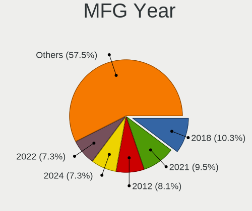
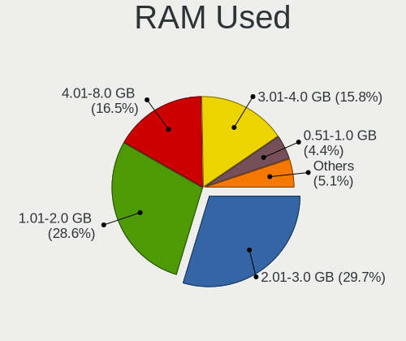
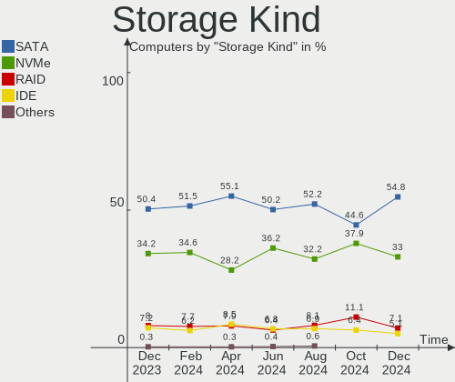
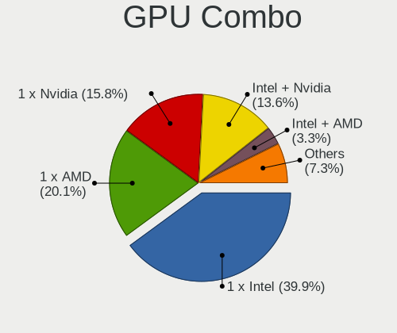
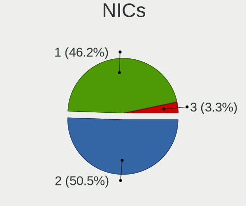
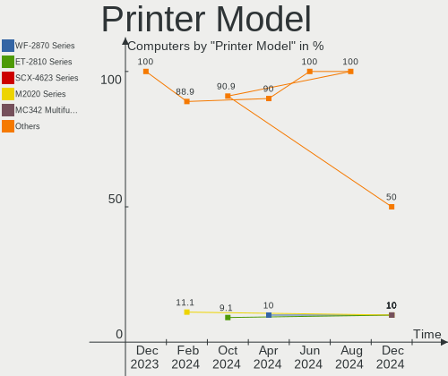
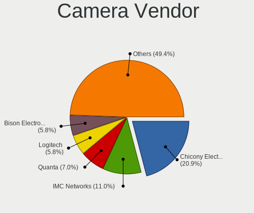
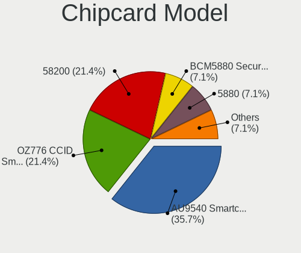
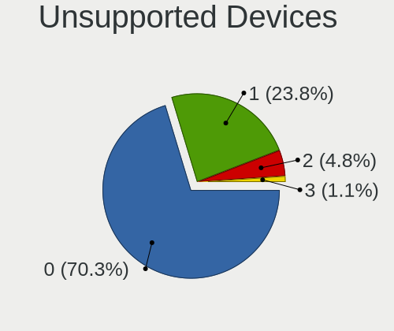

Linux in Italy - Hardware Trends
--------------------------------

A project to identify most popular hardware characteristics and track their change
over time based on data collected by Linux users at https://Linux-Hardware.org.

Anyone can contribute to this report by the [hw-probe](https://github.com/linuxhw/hw-probe) tool:

    sudo -E hw-probe -all -upload

This is a report for all computer types. See also reports for [desktops](/Location/Italy/Desktop/README.md) and [notebooks](/Location/Italy/Notebook/README.md).

Period: Jun, 2022.

Contents
--------

* [ System ](#system)
  - [ OS                       ](#os)
  - [ OS Family                ](#os-family)
  - [ Kernel                   ](#kernel)
  - [ Kernel Family            ](#kernel-family)
  - [ Kernel Major Ver.        ](#kernel-major-ver)
  - [ Arch                     ](#arch)
  - [ DE                       ](#de)
  - [ Display Server           ](#display-server)
  - [ Display Manager          ](#display-manager)
  - [ OS Lang                  ](#os-lang)
  - [ Boot Mode                ](#boot-mode)
  - [ Filesystem               ](#filesystem)
  - [ Part. scheme             ](#part-scheme)
  - [ Dual Boot with Linux/BSD ](#dual-boot-with-linuxbsd)
  - [ Dual Boot (Win)          ](#dual-boot-win)

* [ Board ](#board)
  - [ Vendor                   ](#vendor)
  - [ Model                    ](#model)
  - [ Model Family             ](#model-family)
  - [ MFG Year                 ](#mfg-year)
  - [ Form Factor              ](#form-factor)
  - [ Secure Boot              ](#secure-boot)
  - [ Coreboot                 ](#coreboot)
  - [ RAM Size                 ](#ram-size)
  - [ RAM Used                 ](#ram-used)
  - [ Total Drives             ](#total-drives)
  - [ Has CD-ROM               ](#has-cd-rom)
  - [ Has Ethernet             ](#has-ethernet)
  - [ Has WiFi                 ](#has-wifi)
  - [ Has Bluetooth            ](#has-bluetooth)

* [ Location ](#location)
  - [ Country                  ](#country)
  - [ City                     ](#city)

* [ Drives ](#drives)
  - [ Drive Vendor             ](#drive-vendor)
  - [ Drive Model              ](#drive-model)
  - [ HDD Vendor               ](#hdd-vendor)
  - [ SSD Vendor               ](#ssd-vendor)
  - [ Drive Kind               ](#drive-kind)
  - [ Drive Connector          ](#drive-connector)
  - [ Drive Size               ](#drive-size)
  - [ Space Total              ](#space-total)
  - [ Space Used               ](#space-used)
  - [ Malfunc. Drives          ](#malfunc-drives)
  - [ Malfunc. Drive Vendor    ](#malfunc-drive-vendor)
  - [ Malfunc. HDD Vendor      ](#malfunc-hdd-vendor)
  - [ Malfunc. Drive Kind      ](#malfunc-drive-kind)
  - [ Failed Drives            ](#failed-drives)
  - [ Failed Drive Vendor      ](#failed-drive-vendor)
  - [ Drive Status             ](#drive-status)

* [ Storage controller ](#storage-controller)
  - [ Storage Vendor           ](#storage-vendor)
  - [ Storage Model            ](#storage-model)
  - [ Storage Kind             ](#storage-kind)

* [ Processor ](#processor)
  - [ CPU Vendor               ](#cpu-vendor)
  - [ CPU Model                ](#cpu-model)
  - [ CPU Model Family         ](#cpu-model-family)
  - [ CPU Cores                ](#cpu-cores)
  - [ CPU Sockets              ](#cpu-sockets)
  - [ CPU Threads              ](#cpu-threads)
  - [ CPU Op-Modes             ](#cpu-op-modes)
  - [ CPU Microcode            ](#cpu-microcode)
  - [ CPU Microarch            ](#cpu-microarch)

* [ Graphics ](#graphics)
  - [ GPU Vendor               ](#gpu-vendor)
  - [ GPU Model                ](#gpu-model)
  - [ GPU Combo                ](#gpu-combo)
  - [ GPU Driver               ](#gpu-driver)
  - [ GPU Memory               ](#gpu-memory)

* [ Monitor ](#monitor)
  - [ Monitor Vendor           ](#monitor-vendor)
  - [ Monitor Model            ](#monitor-model)
  - [ Monitor Resolution       ](#monitor-resolution)
  - [ Monitor Diagonal         ](#monitor-diagonal)
  - [ Monitor Width            ](#monitor-width)
  - [ Aspect Ratio             ](#aspect-ratio)
  - [ Monitor Area             ](#monitor-area)
  - [ Pixel Density            ](#pixel-density)
  - [ Multiple Monitors        ](#multiple-monitors)

* [ Network ](#network)
  - [ Net Controller Vendor    ](#net-controller-vendor)
  - [ Net Controller Model     ](#net-controller-model)
  - [ Wireless Vendor          ](#wireless-vendor)
  - [ Wireless Model           ](#wireless-model)
  - [ Ethernet Vendor          ](#ethernet-vendor)
  - [ Ethernet Model           ](#ethernet-model)
  - [ Net Controller Kind      ](#net-controller-kind)
  - [ Used Controller          ](#used-controller)
  - [ NICs                     ](#nics)
  - [ IPv6                     ](#ipv6)

* [ Bluetooth ](#bluetooth)
  - [ Bluetooth Vendor         ](#bluetooth-vendor)
  - [ Bluetooth Model          ](#bluetooth-model)

* [ Sound ](#sound)
  - [ Sound Vendor             ](#sound-vendor)
  - [ Sound Model              ](#sound-model)

* [ Memory ](#memory)
  - [ Memory Vendor            ](#memory-vendor)
  - [ Memory Model             ](#memory-model)
  - [ Memory Kind              ](#memory-kind)
  - [ Memory Form Factor       ](#memory-form-factor)
  - [ Memory Size              ](#memory-size)
  - [ Memory Speed             ](#memory-speed)

* [ Printers & scanners ](#printers--scanners)
  - [ Printer Vendor           ](#printer-vendor)
  - [ Printer Model            ](#printer-model)
  - [ Scanner Vendor           ](#scanner-vendor)
  - [ Scanner Model            ](#scanner-model)

* [ Camera ](#camera)
  - [ Camera Vendor            ](#camera-vendor)
  - [ Camera Model             ](#camera-model)

* [ Security ](#security)
  - [ Fingerprint Vendor       ](#fingerprint-vendor)
  - [ Fingerprint Model        ](#fingerprint-model)
  - [ Chipcard Vendor          ](#chipcard-vendor)
  - [ Chipcard Model           ](#chipcard-model)

* [ Unsupported ](#unsupported)
  - [ Unsupported Devices      ](#unsupported-devices)
  - [ Unsupported Device Types ](#unsupported-device-types)

System
------

OS
--

Installed operating systems

| Name                         | Computers | Percent |
|------------------------------|-----------|---------|
| Ubuntu 22.04                 | 11        | 9.73%   |
| Fedora 36                    | 11        | 9.73%   |
| Ubuntu 20.04                 | 10        | 8.85%   |
| OpenMandriva 4.3             | 8         | 7.08%   |
| Pop!_OS 22.04                | 7         | 6.19%   |
| Arch                         | 7         | 6.19%   |
| Linux Mint 20.3              | 6         | 5.31%   |
| Kubuntu 22.04                | 5         | 4.42%   |
| KDE neon 20.04               | 4         | 3.54%   |
| Debian 11                    | 4         | 3.54%   |
| Zorin 16                     | 3         | 2.65%   |
| Ubuntu MATE 22.04            | 3         | 2.65%   |
| Xubuntu 22.04                | 2         | 1.77%   |
| openSUSE Tumbleweed-XXXXXXXX | 2         | 1.77%   |
| Elementary 6.1               | 2         | 1.77%   |
| ArcoLinux Rolling            | 2         | 1.77%   |
| Arch Rolling                 | 2         | 1.77%   |
| Zorin 15                     | 1         | 0.88%   |
| Xubuntu 20.04                | 1         | 0.88%   |
| Ubuntu Studio 21.10          | 1         | 0.88%   |
| Ubuntu 18.04                 | 1         | 0.88%   |
| ROSA R11.1                   | 1         | 0.88%   |
| PCLinuxOS 2022               | 1         | 0.88%   |
| Parrot 5.0                   | 1         | 0.88%   |
| OpenMandriva 4.2             | 1         | 0.88%   |
| Manjaro 21.3.1               | 1         | 0.88%   |
| Manjaro 21.3.0               | 1         | 0.88%   |
| Lubuntu 22.04                | 1         | 0.88%   |
| Kubuntu 21.10                | 1         | 0.88%   |
| Kubuntu 11.1                 | 1         | 0.88%   |
| Kubuntu 11                   | 1         | 0.88%   |
| Kali 2022.2                  | 1         | 0.88%   |
| Gentoo 2.8                   | 1         | 0.88%   |
| Garuda Linux Soaring         | 1         | 0.88%   |
| Fedora 35                    | 1         | 0.88%   |
| Fedora 33                    | 1         | 0.88%   |
| Endless 4.0.6                | 1         | 0.88%   |
| EndeavourOS Rolling          | 1         | 0.88%   |
| Debian Testing               | 1         | 0.88%   |
| Clear Linux 36010            | 1         | 0.88%   |
| CentOS 9                     | 1         | 0.88%   |

OS Family
---------

OS without a version

| Name          | Computers | Percent |
|---------------|-----------|---------|
| Ubuntu        | 22        | 19.47%  |
| Fedora        | 13        | 11.5%   |
| OpenMandriva  | 9         | 7.96%   |
| Arch          | 9         | 7.96%   |
| Kubuntu       | 8         | 7.08%   |
| Pop!_OS       | 7         | 6.19%   |
| Linux Mint    | 6         | 5.31%   |
| Debian        | 5         | 4.42%   |
| Zorin         | 4         | 3.54%   |
| KDE neon      | 4         | 3.54%   |
| Xubuntu       | 3         | 2.65%   |
| Ubuntu MATE   | 3         | 2.65%   |
| openSUSE      | 2         | 1.77%   |
| Manjaro       | 2         | 1.77%   |
| Elementary    | 2         | 1.77%   |
| ArcoLinux     | 2         | 1.77%   |
| Ubuntu Studio | 1         | 0.88%   |
| ROSA          | 1         | 0.88%   |
| PCLinuxOS     | 1         | 0.88%   |
| Parrot        | 1         | 0.88%   |
| Lubuntu       | 1         | 0.88%   |
| Kali          | 1         | 0.88%   |
| Gentoo        | 1         | 0.88%   |
| Garuda Linux  | 1         | 0.88%   |
| Endless       | 1         | 0.88%   |
| EndeavourOS   | 1         | 0.88%   |
| Clear Linux   | 1         | 0.88%   |
| CentOS        | 1         | 0.88%   |

Kernel
------

Version of the Linux kernel

| Version                             | Computers | Percent |
|-------------------------------------|-----------|---------|
| 5.16.7-desktop-1omv4003             | 8         | 7.08%   |
| 5.17.5-76051705-generic             | 7         | 6.19%   |
| 5.13.0-44-generic                   | 7         | 6.19%   |
| 5.4.0-117-generic                   | 5         | 4.42%   |
| 5.15.0-40-generic                   | 5         | 4.42%   |
| 5.13.0-48-generic                   | 5         | 4.42%   |
| 5.4.0-120-generic                   | 4         | 3.54%   |
| 5.18.5-200.fc36.x86_64              | 4         | 3.54%   |
| 5.18.1-arch1-1                      | 4         | 3.54%   |
| 5.15.0-39-generic                   | 4         | 3.54%   |
| 5.13.0-51-generic                   | 4         | 3.54%   |
| 5.15.0-37-generic                   | 3         | 2.65%   |
| 5.4.0-121-generic                   | 2         | 1.77%   |
| 5.18.1-zen1-1-zen                   | 2         | 1.77%   |
| 5.17.13-300.fc36.x86_64             | 2         | 1.77%   |
| 5.17.11-300.fc36.x86_64             | 2         | 1.77%   |
| 5.15.0-33-generic                   | 2         | 1.77%   |
| 5.13.0-46-generic                   | 2         | 1.77%   |
| 5.10.0-14-amd64                     | 2         | 1.77%   |
| 5.4.0-90-generic                    | 1         | 0.88%   |
| 5.4.0-113-generic                   | 1         | 0.88%   |
| 5.19.0-rc3-amd64                    | 1         | 0.88%   |
| 5.18.6-1-MANJARO                    | 1         | 0.88%   |
| 5.18.5-zen1-1-zen                   | 1         | 0.88%   |
| 5.18.4-vitodoc                      | 1         | 0.88%   |
| 5.18.4-1-default                    | 1         | 0.88%   |
| 5.18.3-zen1-1-zen                   | 1         | 0.88%   |
| 5.18.3-1-MANJARO                    | 1         | 0.88%   |
| 5.18.2-arch1-1                      | 1         | 0.88%   |
| 5.18.2-200.fc36.x86_64              | 1         | 0.88%   |
| 5.18.1-1-default                    | 1         | 0.88%   |
| 5.17.9-arch1-1                      | 1         | 0.88%   |
| 5.17.5-300.fc36.x86_64              | 1         | 0.88%   |
| 5.17.4-pclos1                       | 1         | 0.88%   |
| 5.17.3-xanmod1                      | 1         | 0.88%   |
| 5.17.14-xanmod1                     | 1         | 0.88%   |
| 5.17.12-gentoo-dist                 | 1         | 0.88%   |
| 5.17.12-300.fc36.x86_64             | 1         | 0.88%   |
| 5.17.0-kali3-amd64                  | 1         | 0.88%   |
| 5.16.14-200.fc35.x86_64             | 1         | 0.88%   |
| 5.16.13-1132.native                 | 1         | 0.88%   |
| 5.15.49-1-lts                       | 1         | 0.88%   |
| 5.15.48-1-lts                       | 1         | 0.88%   |
| 5.15.46-1-lts                       | 1         | 0.88%   |
| 5.15.35-2-pve                       | 1         | 0.88%   |
| 5.15.32-v8+                         | 1         | 0.88%   |
| 5.15.0-39-lowlatency                | 1         | 0.88%   |
| 5.15.0-37-lowlatency                | 1         | 0.88%   |
| 5.15.0-27-generic                   | 1         | 0.88%   |
| 5.15.0-25-generic                   | 1         | 0.88%   |
| 5.15.0-10033-tuxedo                 | 1         | 0.88%   |
| 5.14.18-100.fc33.x86_64             | 1         | 0.88%   |
| 5.14.0-9parrot1-amd64               | 1         | 0.88%   |
| 5.14.0-109.el9.x86_64               | 1         | 0.88%   |
| 5.13.0-48-lowlatency                | 1         | 0.88%   |
| 5.11.0-35-generic                   | 1         | 0.88%   |
| 5.10.14-desktop-1omv4002            | 1         | 0.88%   |
| 4.15.0-desktop-122.124.1rosa-x86_64 | 1         | 0.88%   |

Kernel Family
-------------

Linux kernel without a distro release

| Version | Computers | Percent |
|---------|-----------|---------|
| 5.15.0  | 19        | 16.81%  |
| 5.13.0  | 19        | 16.81%  |
| 5.4.0   | 13        | 11.5%   |
| 5.17.5  | 8         | 7.08%   |
| 5.16.7  | 8         | 7.08%   |
| 5.18.1  | 7         | 6.19%   |
| 5.18.5  | 5         | 4.42%   |
| 5.18.4  | 2         | 1.77%   |
| 5.18.3  | 2         | 1.77%   |
| 5.18.2  | 2         | 1.77%   |
| 5.17.13 | 2         | 1.77%   |
| 5.17.12 | 2         | 1.77%   |
| 5.17.11 | 2         | 1.77%   |
| 5.14.0  | 2         | 1.77%   |
| 5.10.0  | 2         | 1.77%   |
| 5.19.0  | 1         | 0.88%   |
| 5.18.6  | 1         | 0.88%   |
| 5.17.9  | 1         | 0.88%   |
| 5.17.4  | 1         | 0.88%   |
| 5.17.3  | 1         | 0.88%   |
| 5.17.14 | 1         | 0.88%   |
| 5.17.0  | 1         | 0.88%   |
| 5.16.14 | 1         | 0.88%   |
| 5.16.13 | 1         | 0.88%   |
| 5.15.49 | 1         | 0.88%   |
| 5.15.48 | 1         | 0.88%   |
| 5.15.46 | 1         | 0.88%   |
| 5.15.35 | 1         | 0.88%   |
| 5.15.32 | 1         | 0.88%   |
| 5.14.18 | 1         | 0.88%   |
| 5.11.0  | 1         | 0.88%   |
| 5.10.14 | 1         | 0.88%   |
| 4.15.0  | 1         | 0.88%   |

Kernel Major Ver.
-----------------

Linux kernel major version

| Version | Computers | Percent |
|---------|-----------|---------|
| 5.15    | 24        | 21.24%  |
| 5.18    | 19        | 16.81%  |
| 5.17    | 19        | 16.81%  |
| 5.13    | 19        | 16.81%  |
| 5.4     | 13        | 11.5%   |
| 5.16    | 10        | 8.85%   |
| 5.14    | 3         | 2.65%   |
| 5.10    | 3         | 2.65%   |
| 5.19    | 1         | 0.88%   |
| 5.11    | 1         | 0.88%   |
| 4.15    | 1         | 0.88%   |

Arch
----

OS architecture (x86_64, i586, etc.)

| Name    | Computers | Percent |
|---------|-----------|---------|
| x86_64  | 111       | 98.23%  |
| i686    | 1         | 0.88%   |
| aarch64 | 1         | 0.88%   |

DE
--

Desktop Environment

| Name       | Computers | Percent |
|------------|-----------|---------|
| GNOME      | 48        | 42.48%  |
| KDE5       | 35        | 30.97%  |
| XFCE       | 9         | 7.96%   |
| X-Cinnamon | 6         | 5.31%   |
| MATE       | 4         | 3.54%   |
| Unknown    | 4         | 3.54%   |
| Pantheon   | 2         | 1.77%   |
| LXQt       | 2         | 1.77%   |
| KDE4       | 1         | 0.88%   |
| Cinnamon   | 1         | 0.88%   |
| bspwm      | 1         | 0.88%   |

Display Server
--------------

X11 or Wayland

| Name    | Computers | Percent |
|---------|-----------|---------|
| X11     | 83        | 73.45%  |
| Wayland | 24        | 21.24%  |
| Unknown | 4         | 3.54%   |
| Tty     | 2         | 1.77%   |

Display Manager
---------------

SDDM, LightDM, etc.

| Name    | Computers | Percent |
|---------|-----------|---------|
| Unknown | 40        | 35.4%   |
| SDDM    | 25        | 22.12%  |
| GDM3    | 20        | 17.7%   |
| LightDM | 16        | 14.16%  |
| GDM     | 9         | 7.96%   |
| XDM     | 2         | 1.77%   |
| KDM     | 1         | 0.88%   |

OS Lang
-------

Language

| Lang    | Computers | Percent |
|---------|-----------|---------|
| it_IT   | 81        | 71.68%  |
| en_US   | 26        | 23.01%  |
| C       | 3         | 2.65%   |
| en_GB   | 2         | 1.77%   |
| Unknown | 1         | 0.88%   |

Boot Mode
---------

EFI or BIOS

| Mode | Computers | Percent |
|------|-----------|---------|
| EFI  | 63        | 55.75%  |
| BIOS | 50        | 44.25%  |

Filesystem
----------

Type of filesystem

| Type    | Computers | Percent |
|---------|-----------|---------|
| Ext4    | 82        | 72.57%  |
| Btrfs   | 21        | 18.58%  |
| Overlay | 9         | 7.96%   |
| Xfs     | 1         | 0.88%   |

Part. scheme
------------

Scheme of partitioning

| Type    | Computers | Percent |
|---------|-----------|---------|
| Unknown | 59        | 52.21%  |
| GPT     | 47        | 41.59%  |
| MBR     | 7         | 6.19%   |

Dual Boot with Linux/BSD
------------------------

Hosting more than one Linux/BSD

| Dual boot | Computers | Percent |
|-----------|-----------|---------|
| No        | 98        | 86.73%  |
| Yes       | 15        | 13.27%  |

Dual Boot (Win)
---------------

Hosting Linux and Windows

| Dual boot | Computers | Percent |
|-----------|-----------|---------|
| No        | 77        | 68.14%  |
| Yes       | 36        | 31.86%  |

Board
-----

Vendor
------

Motherboard manufacturer

| Name                        | Computers | Percent |
|-----------------------------|-----------|---------|
| ASUSTek Computer            | 20        | 17.7%   |
| Hewlett-Packard             | 18        | 15.93%  |
| Dell                        | 12        | 10.62%  |
| MSI                         | 10        | 8.85%   |
| Lenovo                      | 8         | 7.08%   |
| Acer                        | 6         | 5.31%   |
| Gigabyte Technology         | 5         | 4.42%   |
| ASRock                      | 4         | 3.54%   |
| Toshiba                     | 3         | 2.65%   |
| HUAWEI                      | 3         | 2.65%   |
| Apple                       | 3         | 2.65%   |
| Intel                       | 2         | 1.77%   |
| Fujitsu                     | 2         | 1.77%   |
| Foxconn                     | 2         | 1.77%   |
| TUXEDO                      | 1         | 0.88%   |
| Timi                        | 1         | 0.88%   |
| T-bao                       | 1         | 0.88%   |
| Sony                        | 1         | 0.88%   |
| Shenzhen Wangang Technology | 1         | 0.88%   |
| SANTECH                     | 1         | 0.88%   |
| Razer                       | 1         | 0.88%   |
| Raspberry Pi Foundation     | 1         | 0.88%   |
| PC Specialist               | 1         | 0.88%   |
| MicroByte                   | 1         | 0.88%   |
| IP3 Tech                    | 1         | 0.88%   |
| eMachines                   | 1         | 0.88%   |
| Dynabook                    | 1         | 0.88%   |
| Chuwi                       | 1         | 0.88%   |
| Unknown                     | 1         | 0.88%   |

Model
-----

Motherboard model

| Name                                       | Computers | Percent |
|--------------------------------------------|-----------|---------|
| HUAWEI BOHB-WAX9                           | 2         | 1.77%   |
| HP Pavilion dv6                            | 2         | 1.77%   |
| HP Notebook                                | 2         | 1.77%   |
| ASUS N53SV                                 | 2         | 1.77%   |
| TUXEDO InfinityBook S 15 Gen6              | 1         | 0.88%   |
| Toshiba Satellite L50-A-1D6                | 1         | 0.88%   |
| Toshiba Satellite C660D                    | 1         | 0.88%   |
| Toshiba Satellite A200                     | 1         | 0.88%   |
| Timi A35S                                  | 1         | 0.88%   |
| T-bao MINI PC                              | 1         | 0.88%   |
| Sony SVE1711C5E                            | 1         | 0.88%   |
| Shenzhen Wangang AERO 2 Pro                | 1         | 0.88%   |
| SANTECH NHx0DB,DE                          | 1         | 0.88%   |
| Razer Blade                                | 1         | 0.88%   |
| RPi Raspberry Pi 4 Model B Rev 1.1         | 1         | 0.88%   |
| PC Specialist Standard                     | 1         | 0.88%   |
| MSI Stealth GS66 12UGS                     | 1         | 0.88%   |
| MSI NQ890AA-ABZ CQ5011IT                   | 1         | 0.88%   |
| MSI MS-7C96                                | 1         | 0.88%   |
| MSI MS-7C95                                | 1         | 0.88%   |
| MSI MS-7C52                                | 1         | 0.88%   |
| MSI MS-7C37                                | 1         | 0.88%   |
| MSI MS-7A78                                | 1         | 0.88%   |
| MSI MS-7A62                                | 1         | 0.88%   |
| MSI MS-7721                                | 1         | 0.88%   |
| MSI MPG B460 Trident A (MS-B926)           | 1         | 0.88%   |
| MicroByte ezbook                           | 1         | 0.88%   |
| Lenovo ThinkPad X1 Carbon Gen 9 20XW0057IX | 1         | 0.88%   |
| Lenovo ThinkPad P1 Gen 3 20TJS2F437        | 1         | 0.88%   |
| Lenovo ThinkPad Edge 0301GXG               | 1         | 0.88%   |
| Lenovo ThinkCentre M93p 10A7000LIX         | 1         | 0.88%   |
| Lenovo ThinkCentre E63z 10E00025IX         | 1         | 0.88%   |
| Lenovo ThinkBook 15 G2 ITL 20VE            | 1         | 0.88%   |
| Lenovo IdeaPad Gaming 3 15ARH05 82EY       | 1         | 0.88%   |
| Lenovo IdeaPad 5 14ARE05 81YM              | 1         | 0.88%   |
| IP3 Tech CoreBox                           | 1         | 0.88%   |
| Intel Kabylake Platform                    | 1         | 0.88%   |
| Intel DX58SO AAE29331-703                  | 1         | 0.88%   |
| HUAWEI KLVD-WXX9                           | 1         | 0.88%   |
| HP xw4600 Workstation                      | 1         | 0.88%   |
| HP x2 Detachable 10-p0XX                   | 1         | 0.88%   |
| HP Victus by Laptop 16-e0xxx               | 1         | 0.88%   |
| HP ProBook x360 435 G8 Notebook PC         | 1         | 0.88%   |
| HP ProBook 4520s                           | 1         | 0.88%   |
| HP ProBook 430 G8 Notebook PC              | 1         | 0.88%   |
| HP Pavilion x360 Convertible 14-dw1xxx     | 1         | 0.88%   |
| HP Pavilion 15                             | 1         | 0.88%   |
| HP OMEN by Laptop 15-dc1xxx                | 1         | 0.88%   |
| HP EliteBook 830 G5                        | 1         | 0.88%   |
| HP EliteBook 2570p                         | 1         | 0.88%   |
| HP Compaq Elite 8300 USDT                  | 1         | 0.88%   |
| HP 255 G8 Notebook PC                      | 1         | 0.88%   |
| HP 255 G6 Notebook PC                      | 1         | 0.88%   |
| Gigabyte Z390 AORUS PRO                    | 1         | 0.88%   |
| Gigabyte H97M-D3H                          | 1         | 0.88%   |
| Gigabyte GA-MA790FXT-UD5P                  | 1         | 0.88%   |
| Gigabyte B450M DS3H                        | 1         | 0.88%   |
| Gigabyte B450 AORUS ELITE                  | 1         | 0.88%   |
| Fujitsu LIFEBOOK U937                      | 1         | 0.88%   |
| Fujitsu LIFEBOOK E744                      | 1         | 0.88%   |

Model Family
------------

Motherboard model prefix

| Name                      | Computers | Percent |
|---------------------------|-----------|---------|
| Dell Latitude             | 5         | 4.42%   |
| Acer Aspire               | 5         | 4.42%   |
| HP Pavilion               | 4         | 3.54%   |
| Toshiba Satellite         | 3         | 2.65%   |
| Lenovo ThinkPad           | 3         | 2.65%   |
| HP ProBook                | 3         | 2.65%   |
| Lenovo ThinkCentre        | 2         | 1.77%   |
| Lenovo IdeaPad            | 2         | 1.77%   |
| HUAWEI BOHB-WAX9          | 2         | 1.77%   |
| HP Notebook               | 2         | 1.77%   |
| HP EliteBook              | 2         | 1.77%   |
| HP 255                    | 2         | 1.77%   |
| Fujitsu LIFEBOOK          | 2         | 1.77%   |
| Dell Precision            | 2         | 1.77%   |
| Dell OptiPlex             | 2         | 1.77%   |
| Dell Inspiron             | 2         | 1.77%   |
| ASUS ROG                  | 2         | 1.77%   |
| ASUS PRIME                | 2         | 1.77%   |
| ASUS N53SV                | 2         | 1.77%   |
| TUXEDO InfinityBook       | 1         | 0.88%   |
| Timi A35S                 | 1         | 0.88%   |
| T-bao MINI                | 1         | 0.88%   |
| Sony SVE1711C5E           | 1         | 0.88%   |
| Shenzhen Wangang AERO     | 1         | 0.88%   |
| SANTECH NHx0DB            | 1         | 0.88%   |
| Razer Blade               | 1         | 0.88%   |
| RPi Raspberry             | 1         | 0.88%   |
| PC Specialist Standard    | 1         | 0.88%   |
| MSI Stealth               | 1         | 0.88%   |
| MSI NQ890AA-ABZ           | 1         | 0.88%   |
| MSI MS-7C96               | 1         | 0.88%   |
| MSI MS-7C95               | 1         | 0.88%   |
| MSI MS-7C52               | 1         | 0.88%   |
| MSI MS-7C37               | 1         | 0.88%   |
| MSI MS-7A78               | 1         | 0.88%   |
| MSI MS-7A62               | 1         | 0.88%   |
| MSI MS-7721               | 1         | 0.88%   |
| MSI MPG                   | 1         | 0.88%   |
| MicroByte ezbook          | 1         | 0.88%   |
| Lenovo ThinkBook          | 1         | 0.88%   |
| IP3 Tech CoreBox          | 1         | 0.88%   |
| Intel Kabylake            | 1         | 0.88%   |
| Intel DX58SO              | 1         | 0.88%   |
| HUAWEI KLVD-WXX9          | 1         | 0.88%   |
| HP xw4600                 | 1         | 0.88%   |
| HP x2                     | 1         | 0.88%   |
| HP Victus                 | 1         | 0.88%   |
| HP OMEN                   | 1         | 0.88%   |
| HP Compaq                 | 1         | 0.88%   |
| Gigabyte Z390             | 1         | 0.88%   |
| Gigabyte H97M-D3H         | 1         | 0.88%   |
| Gigabyte GA-MA790FXT-UD5P | 1         | 0.88%   |
| Gigabyte B450M            | 1         | 0.88%   |
| Gigabyte B450             | 1         | 0.88%   |
| Foxconn NQ824AA-ABZ       | 1         | 0.88%   |
| Foxconn 945               | 1         | 0.88%   |
| eMachines E527            | 1         | 0.88%   |
| Dynabook Satellite        | 1         | 0.88%   |
| Dell XPS                  | 1         | 0.88%   |
| Chuwi GemiBook            | 1         | 0.88%   |

MFG Year
--------

Motherboard manufacture year

| Year    | Computers | Percent |
|---------|-----------|---------|
| 2020    | 18        | 15.93%  |
| 2021    | 16        | 14.16%  |
| 2018    | 11        | 9.73%   |
| 2012    | 9         | 7.96%   |
| 2014    | 8         | 7.08%   |
| 2010    | 7         | 6.19%   |
| 2019    | 6         | 5.31%   |
| 2017    | 6         | 5.31%   |
| 2016    | 6         | 5.31%   |
| 2009    | 6         | 5.31%   |
| 2008    | 5         | 4.42%   |
| 2015    | 4         | 3.54%   |
| 2006    | 4         | 3.54%   |
| 2011    | 3         | 2.65%   |
| 2013    | 2         | 1.77%   |
| 2007    | 1         | 0.88%   |
| Unknown | 1         | 0.88%   |

Form Factor
-----------

Physical design of the computer

| Name           | Computers | Percent |
|----------------|-----------|---------|
| Notebook       | 66        | 58.41%  |
| Desktop        | 38        | 33.63%  |
| Mini pc        | 3         | 2.65%   |
| Convertible    | 2         | 1.77%   |
| All in one     | 2         | 1.77%   |
| System on chip | 1         | 0.88%   |
| Tablet         | 1         | 0.88%   |

Secure Boot
-----------

Enabled or disabled

| State    | Computers | Percent |
|----------|-----------|---------|
| Disabled | 104       | 92.04%  |
| Enabled  | 9         | 7.96%   |

Coreboot
--------

Have coreboot on board

| Used | Computers | Percent |
|------|-----------|---------|
| No   | 113       | 100%    |

RAM Size
--------

Total RAM memory

| Size in GB  | Computers | Percent |
|-------------|-----------|---------|
| 3.01-4.0    | 25        | 22.12%  |
| 4.01-8.0    | 24        | 21.24%  |
| 16.01-24.0  | 22        | 19.47%  |
| 8.01-16.0   | 21        | 18.58%  |
| 32.01-64.0  | 15        | 13.27%  |
| 64.01-256.0 | 3         | 2.65%   |
| 2.01-3.0    | 1         | 0.88%   |
| 1.01-2.0    | 1         | 0.88%   |
| 0.51-1.0    | 1         | 0.88%   |

RAM Used
--------

Used RAM memory

| Used GB   | Computers | Percent |
|-----------|-----------|---------|
| 1.01-2.0  | 45        | 39.82%  |
| 2.01-3.0  | 21        | 18.58%  |
| 4.01-8.0  | 18        | 15.93%  |
| 3.01-4.0  | 14        | 12.39%  |
| 8.01-16.0 | 7         | 6.19%   |
| 0.51-1.0  | 7         | 6.19%   |
| 0.01-0.5  | 1         | 0.88%   |

Total Drives
------------

Number of drives on board

| Drives | Computers | Percent |
|--------|-----------|---------|
| 1      | 70        | 61.95%  |
| 2      | 22        | 19.47%  |
| 3      | 9         | 7.96%   |
| 5      | 6         | 5.31%   |
| 4      | 5         | 4.42%   |
| 0      | 1         | 0.88%   |

Has CD-ROM
----------

Has CD-ROM on board

| Presented | Computers | Percent |
|-----------|-----------|---------|
| No        | 71        | 62.83%  |
| Yes       | 42        | 37.17%  |

Has Ethernet
------------

Has Ethernet on board

| Presented | Computers | Percent |
|-----------|-----------|---------|
| Yes       | 98        | 86.73%  |
| No        | 15        | 13.27%  |

Has WiFi
--------

Has WiFi module

| Presented | Computers | Percent |
|-----------|-----------|---------|
| Yes       | 89        | 78.76%  |
| No        | 24        | 21.24%  |

Has Bluetooth
-------------

Has Bluetooth module

| Presented | Computers | Percent |
|-----------|-----------|---------|
| Yes       | 75        | 66.37%  |
| No        | 38        | 33.63%  |

Location
--------

Country
-------

Geographic location (country)

| Country | Computers | Percent |
|---------|-----------|---------|
| Italy   | 113       | 100%    |

City
----

Geographic location (city)

| City                   | Computers | Percent |
|------------------------|-----------|---------|
| Milan                  | 16        | 14.16%  |
| Rome                   | 12        | 10.62%  |
| Sesto San Giovanni     | 5         | 4.42%   |
| Turin                  | 4         | 3.54%   |
| Vicenza                | 3         | 2.65%   |
| Florence               | 3         | 2.65%   |
| Rho                    | 2         | 1.77%   |
| Genoa                  | 2         | 1.77%   |
| Como                   | 2         | 1.77%   |
| Brescia                | 2         | 1.77%   |
| Asti                   | 2         | 1.77%   |
| Vigliano Biellese      | 1         | 0.88%   |
| Verona                 | 1         | 0.88%   |
| Udine                  | 1         | 0.88%   |
| Stazione Masotti       | 1         | 0.88%   |
| Sovicille              | 1         | 0.88%   |
| Siniscola              | 1         | 0.88%   |
| Sestri Ponente         | 1         | 0.88%   |
| Serramanna             | 1         | 0.88%   |
| Sciacca                | 1         | 0.88%   |
| San Bonifacio          | 1         | 0.88%   |
| San Biagio di Callalta | 1         | 0.88%   |
| Saluzzo                | 1         | 0.88%   |
| Rozzano                | 1         | 0.88%   |
| Ronago                 | 1         | 0.88%   |
| Rivanazzano            | 1         | 0.88%   |
| Riposto                | 1         | 0.88%   |
| Procida                | 1         | 0.88%   |
| Potenza                | 1         | 0.88%   |
| Porto Mantovano        | 1         | 0.88%   |
| Pisa                   | 1         | 0.88%   |
| Picerno                | 1         | 0.88%   |
| Pesaro                 | 1         | 0.88%   |
| Partinico              | 1         | 0.88%   |
| Parma                  | 1         | 0.88%   |
| Padova                 | 1         | 0.88%   |
| Muggia                 | 1         | 0.88%   |
| Monteprandone          | 1         | 0.88%   |
| Mira                   | 1         | 0.88%   |
| Mantova                | 1         | 0.88%   |
| Manfredonia            | 1         | 0.88%   |
| Luni                   | 1         | 0.88%   |
| Lucca                  | 1         | 0.88%   |
| Limbiate               | 1         | 0.88%   |
| Lecco                  | 1         | 0.88%   |
| Lecce                  | 1         | 0.88%   |
| Latiano                | 1         | 0.88%   |
| Lainate                | 1         | 0.88%   |
| Istrana                | 1         | 0.88%   |
| Iesi                   | 1         | 0.88%   |
| Gorle                  | 1         | 0.88%   |
| Gorlago                | 1         | 0.88%   |
| Galliate               | 1         | 0.88%   |
| Furci Siculo           | 1         | 0.88%   |
| Fossano                | 1         | 0.88%   |
| Feldthurns             | 1         | 0.88%   |
| Costa Masnaga          | 1         | 0.88%   |
| Cortemaggiore          | 1         | 0.88%   |
| Conselice              | 1         | 0.88%   |
| Cermenate              | 1         | 0.88%   |

Drives
------

Drive Vendor
------------

Hard drive vendors

| Vendor                       | Computers | Drives | Percent |
|------------------------------|-----------|--------|---------|
| Samsung Electronics          | 35        | 43     | 20.35%  |
| WDC                          | 24        | 31     | 13.95%  |
| Seagate                      | 19        | 21     | 11.05%  |
| Toshiba                      | 12        | 12     | 6.98%   |
| Crucial                      | 10        | 10     | 5.81%   |
| SanDisk                      | 9         | 9      | 5.23%   |
| Kingston                     | 8         | 8      | 4.65%   |
| Phison                       | 6         | 6      | 3.49%   |
| Hitachi                      | 5         | 5      | 2.91%   |
| Unknown                      | 4         | 4      | 2.33%   |
| Silicon Motion               | 3         | 3      | 1.74%   |
| Micron Technology            | 3         | 3      | 1.74%   |
| Maxtor                       | 3         | 3      | 1.74%   |
| KIOXIA                       | 3         | 3      | 1.74%   |
| Corsair                      | 3         | 4      | 1.74%   |
| USB3.0                       | 2         | 2      | 1.16%   |
| SPCC                         | 2         | 2      | 1.16%   |
| Netac                        | 2         | 2      | 1.16%   |
| Intenso                      | 2         | 2      | 1.16%   |
| YMTC                         | 1         | 1      | 0.58%   |
| XPG                          | 1         | 1      | 0.58%   |
| Verbatim                     | 1         | 1      | 0.58%   |
| Team                         | 1         | 1      | 0.58%   |
| TCSUNBOW                     | 1         | 1      | 0.58%   |
| SK hynix                     | 1         | 1      | 0.58%   |
| Shenzhen Longsys Electronics | 1         | 1      | 0.58%   |
| Qunion                       | 1         | 1      | 0.58%   |
| PNY                          | 1         | 1      | 0.58%   |
| Patriot                      | 1         | 1      | 0.58%   |
| MMY                          | 1         | 1      | 0.58%   |
| Micron/Crucial Technology    | 1         | 1      | 0.58%   |
| KingDian                     | 1         | 1      | 0.58%   |
| Intel                        | 1         | 1      | 0.58%   |
| FORESEE                      | 1         | 1      | 0.58%   |
| China                        | 1         | 1      | 0.58%   |
| Apacer                       | 1         | 1      | 0.58%   |

Drive Model
-----------

Hard drive models

| Model                                   | Computers | Percent |
|-----------------------------------------|-----------|---------|
| Samsung SSD 860 EVO 500GB               | 6         | 3.21%   |
| Samsung SSD 850 EVO 250GB               | 4         | 2.14%   |
| SanDisk NVMe SSD Drive 512GB            | 3         | 1.6%    |
| Samsung SSD 860 EVO 250GB               | 3         | 1.6%    |
| Samsung SSD 850 PRO 256GB               | 3         | 1.6%    |
| Samsung NVMe SSD Drive 512GB            | 3         | 1.6%    |
| Kingston SA400S37240G 240GB SSD         | 3         | 1.6%    |
| WDC WD5000AAKX-001CA0 500GB             | 2         | 1.07%   |
| WDC WD30EZRX-00D8PB0 3TB                | 2         | 1.07%   |
| USB3.0 Super Speed 320GB                | 2         | 1.07%   |
| Toshiba MQ01ABD100 1TB                  | 2         | 1.07%   |
| Seagate ST4000DM004-2CV104 4TB          | 2         | 1.07%   |
| Seagate ST3500418AS 500GB               | 2         | 1.07%   |
| Seagate ST2000DM008-2FR102 2TB          | 2         | 1.07%   |
| Seagate ST1000DM003-1CH162 1TB          | 2         | 1.07%   |
| Samsung SSD 970 EVO 1TB                 | 2         | 1.07%   |
| Samsung SSD 850 EVO 500GB               | 2         | 1.07%   |
| Phison 311CD0512GB                      | 2         | 1.07%   |
| Maxtor STM3160215AS 160GB               | 2         | 1.07%   |
| Corsair Force GT 120GB SSD              | 2         | 1.07%   |
| YMTC PC005 256GB                        | 1         | 0.53%   |
| XPG NVMe SSD Drive 512GB                | 1         | 0.53%   |
| WDC WDS500G2B0B-00YS70 500GB SSD        | 1         | 0.53%   |
| WDC WDS250G2B0A-00SM50 250GB SSD        | 1         | 0.53%   |
| WDC WDS240G2G0B-00EPW0 240GB SSD        | 1         | 0.53%   |
| WDC WDS240G1G0B-00RC30 240GB SSD        | 1         | 0.53%   |
| WDC WD6003FFBX-68MU3N0 6TB              | 1         | 0.53%   |
| WDC WD5000LPCX-21VHAT0 500GB            | 1         | 0.53%   |
| WDC WD5000BPVT-00A1YT0 500GB            | 1         | 0.53%   |
| WDC WD5000AAKS-00UU3A0 500GB            | 1         | 0.53%   |
| WDC WD5000AAKS-00A7B2 500GB             | 1         | 0.53%   |
| WDC WD5000AADS-00S9B0 500GB             | 1         | 0.53%   |
| WDC WD3200BEKT-60V5T1 320GB             | 1         | 0.53%   |
| WDC WD3200AAKX-22ERMA0 320GB            | 1         | 0.53%   |
| WDC WD3200AAKX-00ERMA0 320GB            | 1         | 0.53%   |
| WDC WD3200AAJS-65M0A0 320GB             | 1         | 0.53%   |
| WDC WD2500JS-60MHB1 250GB               | 1         | 0.53%   |
| WDC WD2000BB-00RDA0 200GB               | 1         | 0.53%   |
| WDC WD1600BEVT-60ZCT0 160GB             | 1         | 0.53%   |
| WDC WD1600AAJB-00J3A0 160GB             | 1         | 0.53%   |
| WDC WD10EZRZ-00HTKB0 1TB                | 1         | 0.53%   |
| WDC WD10EZEX-08WN4A0 1TB                | 1         | 0.53%   |
| WDC WD10EZEX-00ZF5A0 1TB                | 1         | 0.53%   |
| WDC WD10EARS-22Y5B1 1TB                 | 1         | 0.53%   |
| WDC WD10EARS-00Z5B1 1TB                 | 1         | 0.53%   |
| WDC PC SN530 SDBPNPZ-512G-1032 512GB    | 1         | 0.53%   |
| WDC PC SN530 SDBPNPZ-512G-1006 512GB    | 1         | 0.53%   |
| Verbatim Portable SSD 240GB             | 1         | 0.53%   |
| Unknown Trust HDD 2.5" 1TB              | 1         | 0.53%   |
| Unknown SC32G  32GB                     | 1         | 0.53%   |
| Unknown MMC Card  248GB                 | 1         | 0.53%   |
| Unknown EC2QT  64GB                     | 1         | 0.53%   |
| Toshiba THNSNK256GVN8 256GB SSD         | 1         | 0.53%   |
| Toshiba THNS128GG4BBAA 128GB SSD        | 1         | 0.53%   |
| Toshiba NVMe SSD Drive 512GB            | 1         | 0.53%   |
| Toshiba MQ04ABF100 1TB                  | 1         | 0.53%   |
| Toshiba MK1234GSX 120GB                 | 1         | 0.53%   |
| Toshiba KSG60ZMV512G M.2 2280 512GB SSD | 1         | 0.53%   |
| Toshiba HDWD130 3TB                     | 1         | 0.53%   |
| Toshiba DT01ACA300 3TB                  | 1         | 0.53%   |

HDD Vendor
----------

Hard disk drive vendors

| Vendor              | Computers | Drives | Percent |
|---------------------|-----------|--------|---------|
| WDC                 | 18        | 25     | 32.14%  |
| Seagate             | 18        | 20     | 32.14%  |
| Toshiba             | 8         | 8      | 14.29%  |
| Hitachi             | 5         | 5      | 8.93%   |
| Samsung Electronics | 3         | 4      | 5.36%   |
| Maxtor              | 3         | 3      | 5.36%   |
| Unknown             | 1         | 1      | 1.79%   |

SSD Vendor
----------

Solid state drive vendors

| Vendor              | Computers | Drives | Percent |
|---------------------|-----------|--------|---------|
| Samsung Electronics | 22        | 26     | 32.84%  |
| Crucial             | 8         | 8      | 11.94%  |
| Kingston            | 6         | 6      | 8.96%   |
| SanDisk             | 5         | 5      | 7.46%   |
| WDC                 | 4         | 4      | 5.97%   |
| Toshiba             | 3         | 3      | 4.48%   |
| Corsair             | 3         | 4      | 4.48%   |
| USB3.0              | 2         | 2      | 2.99%   |
| Intenso             | 2         | 2      | 2.99%   |
| Verbatim            | 1         | 1      | 1.49%   |
| Team                | 1         | 1      | 1.49%   |
| TCSUNBOW            | 1         | 1      | 1.49%   |
| SPCC                | 1         | 1      | 1.49%   |
| Patriot             | 1         | 1      | 1.49%   |
| Netac               | 1         | 1      | 1.49%   |
| MMY                 | 1         | 1      | 1.49%   |
| Micron Technology   | 1         | 1      | 1.49%   |
| KingDian            | 1         | 1      | 1.49%   |
| FORESEE             | 1         | 1      | 1.49%   |
| China               | 1         | 1      | 1.49%   |
| Apacer              | 1         | 1      | 1.49%   |

Drive Kind
----------

HDD or SSD

| Kind    | Computers | Drives | Percent |
|---------|-----------|--------|---------|
| SSD     | 60        | 72     | 41.1%   |
| HDD     | 43        | 66     | 29.45%  |
| NVMe    | 38        | 46     | 26.03%  |
| MMC     | 3         | 4      | 2.05%   |
| Unknown | 2         | 2      | 1.37%   |

Drive Connector
---------------

SATA, SAS, NVMe, etc.

| Type | Computers | Drives | Percent |
|------|-----------|--------|---------|
| SATA | 84        | 132    | 63.64%  |
| NVMe | 38        | 46     | 28.79%  |
| SAS  | 7         | 8      | 5.3%    |
| MMC  | 3         | 4      | 2.27%   |

Drive Size
----------

Size of hard drive

| Size in TB | Computers | Drives | Percent |
|------------|-----------|--------|---------|
| 0.01-0.5   | 69        | 93     | 65.71%  |
| 0.51-1.0   | 21        | 27     | 20%     |
| 1.01-2.0   | 6         | 7      | 5.71%   |
| 2.01-3.0   | 5         | 6      | 4.76%   |
| 3.01-4.0   | 2         | 2      | 1.9%    |
| 4.01-10.0  | 2         | 3      | 1.9%    |

Space Total
-----------

Amount of disk space available on the file system

| Size in GB     | Computers | Percent |
|----------------|-----------|---------|
| 101-250        | 29        | 25.66%  |
| 251-500        | 24        | 21.24%  |
| 501-1000       | 18        | 15.93%  |
| 51-100         | 10        | 8.85%   |
| 1-20           | 9         | 7.96%   |
| 2001-3000      | 6         | 5.31%   |
| 1001-2000      | 6         | 5.31%   |
| Unknown        | 5         | 4.42%   |
| More than 3000 | 3         | 2.65%   |
| 21-50          | 3         | 2.65%   |

Space Used
----------

Amount of used disk space

| Used GB        | Computers | Percent |
|----------------|-----------|---------|
| 1-20           | 40        | 35.4%   |
| 21-50          | 16        | 14.16%  |
| 51-100         | 15        | 13.27%  |
| 101-250        | 13        | 11.5%   |
| 251-500        | 10        | 8.85%   |
| 501-1000       | 8         | 7.08%   |
| Unknown        | 5         | 4.42%   |
| 1001-2000      | 4         | 3.54%   |
| More than 3000 | 2         | 1.77%   |

Malfunc. Drives
---------------

Drive models with a malfunction

| Model                             | Computers | Drives | Percent |
|-----------------------------------|-----------|--------|---------|
| WDC WDS240G2G0B-00EPW0 240GB SSD  | 1         | 1      | 10%     |
| WDC WD6003FFBX-68MU3N0 6TB        | 1         | 2      | 10%     |
| WDC WD3200BEKT-60V5T1 320GB       | 1         | 1      | 10%     |
| Toshiba DT01ACA100 1TB            | 1         | 1      | 10%     |
| TCSUNBOW X3 120GB SSD             | 1         | 1      | 10%     |
| Samsung Electronics HD501LJ 500GB | 1         | 1      | 10%     |
| Maxtor STM3160215AS 160GB         | 1         | 1      | 10%     |
| Hitachi HTS541080G9SA00 80GB      | 1         | 1      | 10%     |
| Hitachi HDP725050GLA360 500GB     | 1         | 1      | 10%     |
| Crucial CT128MX100SSD1 128GB      | 1         | 1      | 10%     |

Malfunc. Drive Vendor
---------------------

Vendors of faulty drives

| Vendor              | Computers | Drives | Percent |
|---------------------|-----------|--------|---------|
| WDC                 | 3         | 4      | 30%     |
| Hitachi             | 2         | 2      | 20%     |
| Toshiba             | 1         | 1      | 10%     |
| TCSUNBOW            | 1         | 1      | 10%     |
| Samsung Electronics | 1         | 1      | 10%     |
| Maxtor              | 1         | 1      | 10%     |
| Crucial             | 1         | 1      | 10%     |

Malfunc. HDD Vendor
-------------------

Vendors of faulty HDD drives

| Vendor              | Computers | Drives | Percent |
|---------------------|-----------|--------|---------|
| WDC                 | 2         | 3      | 28.57%  |
| Hitachi             | 2         | 2      | 28.57%  |
| Toshiba             | 1         | 1      | 14.29%  |
| Samsung Electronics | 1         | 1      | 14.29%  |
| Maxtor              | 1         | 1      | 14.29%  |

Malfunc. Drive Kind
-------------------

Kinds of faulty drives

| Kind | Computers | Drives | Percent |
|------|-----------|--------|---------|
| HDD  | 6         | 8      | 75%     |
| SSD  | 2         | 3      | 25%     |

Failed Drives
-------------

Failed drive models

Zero info for selected period =(

Failed Drive Vendor
-------------------

Failed drive vendors

Zero info for selected period =(

Drive Status
------------

Number of failed and malfunc. drives

| Status   | Computers | Drives | Percent |
|----------|-----------|--------|---------|
| Detected | 65        | 102    | 54.17%  |
| Works    | 48        | 77     | 40%     |
| Malfunc  | 7         | 11     | 5.83%   |

Storage controller
------------------

Storage Vendor
--------------

Storage controller vendors

| Vendor                       | Computers | Percent |
|------------------------------|-----------|---------|
| Intel                        | 73        | 48.99%  |
| AMD                          | 23        | 15.44%  |
| Samsung Electronics          | 12        | 8.05%   |
| Phison Electronics           | 7         | 4.7%    |
| SanDisk                      | 4         | 2.68%   |
| Silicon Motion               | 3         | 2.01%   |
| Nvidia                       | 3         | 2.01%   |
| Micron/Crucial Technology    | 3         | 2.01%   |
| ASMedia Technology           | 3         | 2.01%   |
| VIA Technologies             | 2         | 1.34%   |
| Toshiba America Info Systems | 2         | 1.34%   |
| Micron Technology            | 2         | 1.34%   |
| Marvell Technology Group     | 2         | 1.34%   |
| KIOXIA                       | 2         | 1.34%   |
| Kingston Technology Company  | 2         | 1.34%   |
| Yangtze Memory Technologies  | 1         | 0.67%   |
| SK hynix                     | 1         | 0.67%   |
| Shenzhen Longsys Electronics | 1         | 0.67%   |
| Seagate Technology           | 1         | 0.67%   |
| JMicron Technology           | 1         | 0.67%   |
| ADATA Technology             | 1         | 0.67%   |

Storage Model
-------------

Storage controller models

| Model                                                                          | Computers | Percent |
|--------------------------------------------------------------------------------|-----------|---------|
| AMD FCH SATA Controller [AHCI mode]                                            | 13        | 7.93%   |
| Intel Sunrise Point-LP SATA Controller [AHCI mode]                             | 6         | 3.66%   |
| Intel 8 Series/C220 Series Chipset Family 6-port SATA Controller 1 [AHCI mode] | 6         | 3.66%   |
| Samsung NVMe SSD Controller 980                                                | 5         | 3.05%   |
| Intel Wildcat Point-LP SATA Controller [AHCI Mode]                             | 5         | 3.05%   |
| Intel 82801 Mobile SATA Controller [RAID mode]                                 | 5         | 3.05%   |
| Samsung NVMe SSD Controller SM981/PM981/PM983                                  | 4         | 2.44%   |
| Samsung NVMe SSD Controller PM9A1/PM9A3/980PRO                                 | 4         | 2.44%   |
| Phison E12 NVMe Controller                                                     | 4         | 2.44%   |
| Intel Volume Management Device NVMe RAID Controller                            | 4         | 2.44%   |
| Intel SATA Controller [RAID mode]                                              | 4         | 2.44%   |
| Intel Comet Lake SATA AHCI Controller                                          | 4         | 2.44%   |
| Intel 7 Series Chipset Family 6-port SATA Controller [AHCI mode]               | 4         | 2.44%   |
| Intel 6 Series/C200 Series Chipset Family 6 port Mobile SATA AHCI Controller   | 4         | 2.44%   |
| Intel 400 Series Chipset Family SATA AHCI Controller                           | 4         | 2.44%   |
| AMD SB7x0/SB8x0/SB9x0 SATA Controller [AHCI mode]                              | 4         | 2.44%   |
| Silicon Motion SM2263EN/SM2263XT SSD Controller                                | 3         | 1.83%   |
| Intel Celeron/Pentium Silver Processor SATA Controller                         | 3         | 1.83%   |
| ASMedia ASM1062 Serial ATA Controller                                          | 3         | 1.83%   |
| AMD SB7x0/SB8x0/SB9x0 IDE Controller                                           | 3         | 1.83%   |
| AMD 500 Series Chipset SATA Controller                                         | 3         | 1.83%   |
| AMD 400 Series Chipset SATA Controller                                         | 3         | 1.83%   |
| Toshiba America Info Systems XG6 NVMe SSD Controller                           | 2         | 1.22%   |
| SanDisk WD Blue SN550 NVMe SSD                                                 | 2         | 1.22%   |
| Phison PS5013 E13 NVMe Controller                                              | 2         | 1.22%   |
| Micron/Crucial NVMe Controller                                                 | 2         | 1.22%   |
| Micron Non-Volatile memory controller                                          | 2         | 1.22%   |
| KIOXIA Non-Volatile memory controller                                          | 2         | 1.22%   |
| Intel NM10/ICH7 Family SATA Controller [IDE mode]                              | 2         | 1.22%   |
| Intel Cannon Lake PCH SATA AHCI Controller                                     | 2         | 1.22%   |
| Intel 8 Series SATA Controller 1 [AHCI mode]                                   | 2         | 1.22%   |
| Intel 7 Series/C210 Series Chipset Family 6-port SATA Controller [AHCI mode]   | 2         | 1.22%   |
| Intel 5 Series/3400 Series Chipset 4 port SATA AHCI Controller                 | 2         | 1.22%   |
| Intel 200 Series PCH SATA controller [AHCI mode]                               | 2         | 1.22%   |
| AMD SB7x0/SB8x0/SB9x0 SATA Controller [IDE mode]                               | 2         | 1.22%   |
| Yangtze Memory Non-Volatile memory controller                                  | 1         | 0.61%   |
| VIA VT82C586A/B/VT82C686/A/B/VT823x/A/C PIPC Bus Master IDE                    | 1         | 0.61%   |
| VIA VT8237A SATA 2-Port Controller                                             | 1         | 0.61%   |
| VIA VT6421 IDE/SATA Controller                                                 | 1         | 0.61%   |
| SK hynix Gold P31 SSD                                                          | 1         | 0.61%   |
| Shenzhen Longsys Non-Volatile memory controller                                | 1         | 0.61%   |
| Seagate FireCuda 530 SSD                                                       | 1         | 0.61%   |
| SanDisk WD Blue SN500 / PC SN520 NVMe SSD                                      | 1         | 0.61%   |
| SanDisk WD Black SN750 / PC SN730 NVMe SSD                                     | 1         | 0.61%   |
| Phison E16 PCIe4 NVMe Controller                                               | 1         | 0.61%   |
| Nvidia MCP79 AHCI Controller                                                   | 1         | 0.61%   |
| Nvidia MCP78S [GeForce 8200] SATA Controller (non-AHCI mode)                   | 1         | 0.61%   |
| Nvidia MCP78S [GeForce 8200] IDE                                               | 1         | 0.61%   |
| Nvidia MCP73 SATA Controller (IDE mode)                                        | 1         | 0.61%   |
| Nvidia MCP73 IDE Controller                                                    | 1         | 0.61%   |
| Micron/Crucial P2 NVMe PCIe SSD                                                | 1         | 0.61%   |
| Marvell Group 88SE9172 SATA 6Gb/s Controller                                   | 1         | 0.61%   |
| Marvell Group 88SE6111/6121 SATA II / PATA Controller                          | 1         | 0.61%   |
| Kingston Company KC2000 NVMe SSD                                               | 1         | 0.61%   |
| Kingston Company A2000 NVMe SSD                                                | 1         | 0.61%   |
| JMicron JMB363 SATA/IDE Controller                                             | 1         | 0.61%   |
| Intel Tiger Lake-LP SATA Controller [AHCI mode]                                | 1         | 0.61%   |
| Intel Q170/Q150/B150/H170/H110/Z170/CM236 Chipset SATA Controller [AHCI Mode]  | 1         | 0.61%   |
| Intel Non-Volatile memory controller                                           | 1         | 0.61%   |
| Intel Jasper Lake SATA AHCI Controller                                         | 1         | 0.61%   |

Storage Kind
------------

Kind of storage controller (IDE, SATA, NVMe, SAS, ...)

| Kind | Computers | Percent |
|------|-----------|---------|
| SATA | 80        | 55.17%  |
| NVMe | 38        | 26.21%  |
| RAID | 15        | 10.34%  |
| IDE  | 12        | 8.28%   |

Processor
---------

CPU Vendor
----------

Processor vendors

| Vendor | Computers | Percent |
|--------|-----------|---------|
| Intel  | 83        | 73.45%  |
| AMD    | 29        | 25.66%  |
| ARM    | 1         | 0.88%   |

CPU Model
---------

Processor models

| Model                                       | Computers | Percent |
|---------------------------------------------|-----------|---------|
| Intel 11th Gen Core i7-1165G7 @ 2.80GHz     | 5         | 4.42%   |
| Intel Core i5-7200U CPU @ 2.50GHz           | 4         | 3.54%   |
| Intel Core i7-8550U CPU @ 1.80GHz           | 2         | 1.77%   |
| Intel Core i7-2630QM CPU @ 2.00GHz          | 2         | 1.77%   |
| Intel Core i7-10850H CPU @ 2.70GHz          | 2         | 1.77%   |
| Intel Core i7-10750H CPU @ 2.60GHz          | 2         | 1.77%   |
| Intel Core i5-10210U CPU @ 1.60GHz          | 2         | 1.77%   |
| Intel Core i3-5005U CPU @ 2.00GHz           | 2         | 1.77%   |
| AMD Ryzen 5 3600 6-Core Processor           | 2         | 1.77%   |
| Intel Xeon CPU E3-1230 v3 @ 3.30GHz         | 1         | 0.88%   |
| Intel Pentium Silver N5000 CPU @ 1.10GHz    | 1         | 0.88%   |
| Intel Pentium Gold 7505 @ 2.00GHz           | 1         | 0.88%   |
| Intel Pentium Dual-Core CPU E5200 @ 2.50GHz | 1         | 0.88%   |
| Intel Pentium Dual CPU E2180 @ 2.00GHz      | 1         | 0.88%   |
| Intel Pentium CPU P6100 @ 2.00GHz           | 1         | 0.88%   |
| Intel Pentium CPU G4560 @ 3.50GHz           | 1         | 0.88%   |
| Intel Pentium 4 CPU 3.00GHz                 | 1         | 0.88%   |
| Intel Core i7-9750H CPU @ 2.60GHz           | 1         | 0.88%   |
| Intel Core i7-9700K CPU @ 3.60GHz           | 1         | 0.88%   |
| Intel Core i7-8750H CPU @ 2.20GHz           | 1         | 0.88%   |
| Intel Core i7-7700K CPU @ 4.20GHz           | 1         | 0.88%   |
| Intel Core i7-7600U CPU @ 2.80GHz           | 1         | 0.88%   |
| Intel Core i7-7500U CPU @ 2.70GHz           | 1         | 0.88%   |
| Intel Core i7-6700K CPU @ 4.00GHz           | 1         | 0.88%   |
| Intel Core i7-5500U CPU @ 2.40GHz           | 1         | 0.88%   |
| Intel Core i7-4770 CPU @ 3.40GHz            | 1         | 0.88%   |
| Intel Core i7-4750HQ CPU @ 2.00GHz          | 1         | 0.88%   |
| Intel Core i7-4700MQ CPU @ 2.40GHz          | 1         | 0.88%   |
| Intel Core i7-3740QM CPU @ 2.70GHz          | 1         | 0.88%   |
| Intel Core i7-3612QM CPU @ 2.10GHz          | 1         | 0.88%   |
| Intel Core i7-3520M CPU @ 2.90GHz           | 1         | 0.88%   |
| Intel Core i7-2620M CPU @ 2.70GHz           | 1         | 0.88%   |
| Intel Core i7-10510U CPU @ 1.80GHz          | 1         | 0.88%   |
| Intel Core i7 CPU 950 @ 3.07GHz             | 1         | 0.88%   |
| Intel Core i5-9600K CPU @ 3.70GHz           | 1         | 0.88%   |
| Intel Core i5-8250U CPU @ 1.60GHz           | 1         | 0.88%   |
| Intel Core i5-7400 CPU @ 3.00GHz            | 1         | 0.88%   |
| Intel Core i5-5300U CPU @ 2.30GHz           | 1         | 0.88%   |
| Intel Core i5-5257U CPU @ 2.70GHz           | 1         | 0.88%   |
| Intel Core i5-4590 CPU @ 3.30GHz            | 1         | 0.88%   |
| Intel Core i5-4300M CPU @ 2.60GHz           | 1         | 0.88%   |
| Intel Core i5-3470S CPU @ 2.90GHz           | 1         | 0.88%   |
| Intel Core i5-3470 CPU @ 3.20GHz            | 1         | 0.88%   |
| Intel Core i5-3360M CPU @ 2.80GHz           | 1         | 0.88%   |
| Intel Core i5-3210M CPU @ 2.50GHz           | 1         | 0.88%   |
| Intel Core i5-2500S CPU @ 2.70GHz           | 1         | 0.88%   |
| Intel Core i5-2450M CPU @ 2.50GHz           | 1         | 0.88%   |
| Intel Core i5-10400F CPU @ 2.90GHz          | 1         | 0.88%   |
| Intel Core i3-6006U CPU @ 2.00GHz           | 1         | 0.88%   |
| Intel Core i3-4130 CPU @ 3.40GHz            | 1         | 0.88%   |
| Intel Core i3-4010U CPU @ 1.70GHz           | 1         | 0.88%   |
| Intel Core i3-4005U CPU @ 1.70GHz           | 1         | 0.88%   |
| Intel Core i3-10110U CPU @ 2.10GHz          | 1         | 0.88%   |
| Intel Core i3 CPU M 380 @ 2.53GHz           | 1         | 0.88%   |
| Intel Core i3 CPU M 350 @ 2.27GHz           | 1         | 0.88%   |
| Intel Core 2 Quad CPU Q9550 @ 2.83GHz       | 1         | 0.88%   |
| Intel Core 2 Quad CPU Q9300 @ 2.50GHz       | 1         | 0.88%   |
| Intel Core 2 Duo CPU T7250 @ 2.00GHz        | 1         | 0.88%   |
| Intel Core 2 Duo CPU P7350 @ 2.00GHz        | 1         | 0.88%   |
| Intel Core 2 Duo CPU E7600 @ 3.06GHz        | 1         | 0.88%   |

CPU Model Family
----------------

Processor model prefix

| Model                   | Computers | Percent |
|-------------------------|-----------|---------|
| Intel Core i7           | 25        | 22.12%  |
| Intel Core i5           | 20        | 17.7%   |
| Other                   | 10        | 8.85%   |
| Intel Core i3           | 9         | 7.96%   |
| AMD Ryzen 5             | 9         | 7.96%   |
| Intel Celeron           | 4         | 3.54%   |
| AMD Ryzen 7             | 4         | 3.54%   |
| Intel Core 2 Duo        | 3         | 2.65%   |
| Intel Pentium           | 2         | 1.77%   |
| Intel Core 2 Quad       | 2         | 1.77%   |
| Intel Core 2            | 2         | 1.77%   |
| AMD Ryzen 3             | 2         | 1.77%   |
| AMD FX                  | 2         | 1.77%   |
| Intel Xeon              | 1         | 0.88%   |
| Intel Pentium Silver    | 1         | 0.88%   |
| Intel Pentium Gold      | 1         | 0.88%   |
| Intel Pentium Dual-Core | 1         | 0.88%   |
| Intel Pentium Dual      | 1         | 0.88%   |
| Intel Pentium 4         | 1         | 0.88%   |
| Intel Celeron Dual-Core | 1         | 0.88%   |
| Intel Atom              | 1         | 0.88%   |
| AMD Turion II           | 1         | 0.88%   |
| AMD Ryzen 9             | 1         | 0.88%   |
| AMD Ryzen 7 PRO         | 1         | 0.88%   |
| AMD Phenom II X4        | 1         | 0.88%   |
| AMD E2                  | 1         | 0.88%   |
| AMD E                   | 1         | 0.88%   |
| AMD Athlon 64 X2        | 1         | 0.88%   |
| AMD Athlon              | 1         | 0.88%   |
| AMD A8                  | 1         | 0.88%   |
| AMD A6                  | 1         | 0.88%   |
| AMD A10                 | 1         | 0.88%   |

CPU Cores
---------

Number of processor cores

| Number | Computers | Percent |
|--------|-----------|---------|
| 2      | 45        | 39.82%  |
| 4      | 41        | 36.28%  |
| 6      | 16        | 14.16%  |
| 8      | 7         | 6.19%   |
| 1      | 3         | 2.65%   |
| 14     | 1         | 0.88%   |

CPU Sockets
-----------

Number of sockets

| Number | Computers | Percent |
|--------|-----------|---------|
| 1      | 113       | 100%    |

CPU Threads
-----------

Threads per core (Hyper-Threading)

| Number | Computers | Percent |
|--------|-----------|---------|
| 2      | 78        | 69.03%  |
| 1      | 35        | 30.97%  |

CPU Op-Modes
------------

CPU Operation Modes (32-bit, 64-bit)

| Op mode        | Computers | Percent |
|----------------|-----------|---------|
| 32-bit, 64-bit | 113       | 100%    |

CPU Microcode
-------------

Microcode number

| Number     | Computers | Percent |
|------------|-----------|---------|
| Unknown    | 21        | 18.58%  |
| 0x806c1    | 6         | 5.31%   |
| 0x306a9    | 6         | 5.31%   |
| 0x306c3    | 5         | 4.42%   |
| 0xa0652    | 4         | 3.54%   |
| 0x306d4    | 4         | 3.54%   |
| 0x0a50000c | 4         | 3.54%   |
| 0x906e9    | 3         | 2.65%   |
| 0x806ec    | 3         | 2.65%   |
| 0x206a7    | 3         | 2.65%   |
| 0x20655    | 3         | 2.65%   |
| 0x1067a    | 3         | 2.65%   |
| 0x906ea    | 2         | 1.77%   |
| 0x806ea    | 2         | 1.77%   |
| 0x806e9    | 2         | 1.77%   |
| 0x706a8    | 2         | 1.77%   |
| 0x6fd      | 2         | 1.77%   |
| 0x40651    | 2         | 1.77%   |
| 0x08701021 | 2         | 1.77%   |
| 0x08108109 | 2         | 1.77%   |
| 0x06001119 | 2         | 1.77%   |
| 0xf49      | 1         | 0.88%   |
| 0xa0671    | 1         | 0.88%   |
| 0xa0653    | 1         | 0.88%   |
| 0x906ed    | 1         | 0.88%   |
| 0x906ec    | 1         | 0.88%   |
| 0x906c0    | 1         | 0.88%   |
| 0x906a3    | 1         | 0.88%   |
| 0x806c2    | 1         | 0.88%   |
| 0x706a1    | 1         | 0.88%   |
| 0x6f6      | 1         | 0.88%   |
| 0x506e3    | 1         | 0.88%   |
| 0x506c9    | 1         | 0.88%   |
| 0x406e3    | 1         | 0.88%   |
| 0x406c4    | 1         | 0.88%   |
| 0x40661    | 1         | 0.88%   |
| 0x106a5    | 1         | 0.88%   |
| 0x10676    | 1         | 0.88%   |
| 0x0a201016 | 1         | 0.88%   |
| 0x08608102 | 1         | 0.88%   |
| 0x08600106 | 1         | 0.88%   |
| 0x08600104 | 1         | 0.88%   |
| 0x0810100b | 1         | 0.88%   |
| 0x0800820d | 1         | 0.88%   |
| 0x06006705 | 1         | 0.88%   |
| 0x0600611a | 1         | 0.88%   |
| 0x0600081c | 1         | 0.88%   |
| 0x05000101 | 1         | 0.88%   |
| 0x010000db | 1         | 0.88%   |
| 0x010000c8 | 1         | 0.88%   |
| 0x010000c7 | 1         | 0.88%   |

CPU Microarch
-------------

Microarchitecture

| Name             | Computers | Percent |
|------------------|-----------|---------|
| KabyLake         | 20        | 17.7%   |
| Haswell          | 9         | 7.96%   |
| TigerLake        | 7         | 6.19%   |
| IvyBridge        | 7         | 6.19%   |
| Zen 3            | 6         | 5.31%   |
| Penryn           | 6         | 5.31%   |
| Zen 2            | 5         | 4.42%   |
| SandyBridge      | 5         | 4.42%   |
| CometLake        | 5         | 4.42%   |
| Broadwell        | 5         | 4.42%   |
| Piledriver       | 4         | 3.54%   |
| Core             | 4         | 3.54%   |
| Zen+             | 3         | 2.65%   |
| Zen              | 3         | 2.65%   |
| Westmere         | 3         | 2.65%   |
| K10              | 3         | 2.65%   |
| Goldmont plus    | 3         | 2.65%   |
| Skylake          | 2         | 1.77%   |
| Excavator        | 2         | 1.77%   |
| Unknown          | 2         | 1.77%   |
| Tremont          | 1         | 0.88%   |
| Silvermont       | 1         | 0.88%   |
| NetBurst         | 1         | 0.88%   |
| Nehalem          | 1         | 0.88%   |
| K8 Hammer        | 1         | 0.88%   |
| Icelake          | 1         | 0.88%   |
| Goldmont         | 1         | 0.88%   |
| Bobcat           | 1         | 0.88%   |
| Alderlake Hybrid | 1         | 0.88%   |

Graphics
--------

GPU Vendor
----------

Vendors of graphics cards

| Vendor | Computers | Percent |
|--------|-----------|---------|
| Intel  | 65        | 47.79%  |
| Nvidia | 39        | 28.68%  |
| AMD    | 32        | 23.53%  |

GPU Model
---------

Graphics card models

| Model                                                                       | Computers | Percent |
|-----------------------------------------------------------------------------|-----------|---------|
| Intel TigerLake-LP GT2 [Iris Xe Graphics]                                   | 6         | 4.26%   |
| Intel HD Graphics 620                                                       | 6         | 4.26%   |
| Intel 2nd Generation Core Processor Family Integrated Graphics Controller   | 5         | 3.55%   |
| Intel HD Graphics 5500                                                      | 4         | 2.84%   |
| Intel CometLake-U GT2 [UHD Graphics]                                        | 4         | 2.84%   |
| Intel CometLake-H GT2 [UHD Graphics]                                        | 4         | 2.84%   |
| Intel 3rd Gen Core processor Graphics Controller                            | 4         | 2.84%   |
| AMD Cezanne                                                                 | 4         | 2.84%   |
| Intel UHD Graphics 620                                                      | 3         | 2.13%   |
| Nvidia TU117M [GeForce GTX 1650 Mobile / Max-Q]                             | 2         | 1.42%   |
| Nvidia GK208B [GeForce GT 710]                                              | 2         | 1.42%   |
| Nvidia GF108M [GeForce GT 540M]                                             | 2         | 1.42%   |
| Intel Xeon E3-1200 v3/4th Gen Core Processor Integrated Graphics Controller | 2         | 1.42%   |
| Intel Xeon E3-1200 v2/3rd Gen Core processor Graphics Controller            | 2         | 1.42%   |
| Intel Haswell-ULT Integrated Graphics Controller                            | 2         | 1.42%   |
| Intel GeminiLake [UHD Graphics 600]                                         | 2         | 1.42%   |
| Intel Core Processor Integrated Graphics Controller                         | 2         | 1.42%   |
| Intel CoffeeLake-H GT2 [UHD Graphics 630]                                   | 2         | 1.42%   |
| Intel 4th Gen Core Processor Integrated Graphics Controller                 | 2         | 1.42%   |
| AMD Whistler [Radeon HD 6730M/6770M/7690M XT]                               | 2         | 1.42%   |
| AMD Renoir                                                                  | 2         | 1.42%   |
| AMD Raven Ridge [Radeon Vega Series / Radeon Vega Mobile Series]            | 2         | 1.42%   |
| AMD Picasso/Raven 2 [Radeon Vega Series / Radeon Vega Mobile Series]        | 2         | 1.42%   |
| AMD Navi 22 [Radeon RX 6700/6700 XT/6750 XT / 6800M]                        | 2         | 1.42%   |
| AMD Navi 10 [Radeon RX 5600 OEM/5600 XT / 5700/5700 XT]                     | 2         | 1.42%   |
| Nvidia TU117M [GeForce GTX 1650 Ti Mobile]                                  | 1         | 0.71%   |
| Nvidia TU117M                                                               | 1         | 0.71%   |
| Nvidia TU117 [GeForce GTX 1650]                                             | 1         | 0.71%   |
| Nvidia TU116 [GeForce GTX 1660]                                             | 1         | 0.71%   |
| Nvidia TU106M [GeForce RTX 2060 Mobile]                                     | 1         | 0.71%   |
| Nvidia TU106 [GeForce RTX 2060 Rev. A]                                      | 1         | 0.71%   |
| Nvidia NV42GL [Quadro FX 3450/4000 SDI]                                     | 1         | 0.71%   |
| Nvidia GT218 [GeForce 210]                                                  | 1         | 0.71%   |
| Nvidia GP108M [GeForce MX230]                                               | 1         | 0.71%   |
| Nvidia GP107GLM [Quadro P620]                                               | 1         | 0.71%   |
| Nvidia GP107 [GeForce GTX 1050 Ti]                                          | 1         | 0.71%   |
| Nvidia GP106 [GeForce GTX 1060 6GB]                                         | 1         | 0.71%   |
| Nvidia GP106 [GeForce GTX 1060 3GB]                                         | 1         | 0.71%   |
| Nvidia GP104 [GeForce GTX 1070]                                             | 1         | 0.71%   |
| Nvidia GM206 [GeForce GTX 960]                                              | 1         | 0.71%   |
| Nvidia GM108M [GeForce 930M]                                                | 1         | 0.71%   |
| Nvidia GM108M [GeForce 930MX]                                               | 1         | 0.71%   |
| Nvidia GM108M [GeForce 840M]                                                | 1         | 0.71%   |
| Nvidia GM107 [GeForce GTX 750]                                              | 1         | 0.71%   |
| Nvidia GM107 [GeForce GTX 750 Ti]                                           | 1         | 0.71%   |
| Nvidia GM107 [GeForce 940MX]                                                | 1         | 0.71%   |
| Nvidia GK208M [GeForce GT 740M]                                             | 1         | 0.71%   |
| Nvidia GK208BM [GeForce 920M]                                               | 1         | 0.71%   |
| Nvidia GK107GLM [Quadro K2000M]                                             | 1         | 0.71%   |
| Nvidia GF119M [GeForce 610M]                                                | 1         | 0.71%   |
| Nvidia GF108 [GeForce GT 730]                                               | 1         | 0.71%   |
| Nvidia GF108 [GeForce GT 420]                                               | 1         | 0.71%   |
| Nvidia GA104M [GeForce RTX 3070 Mobile / Max-Q]                             | 1         | 0.71%   |
| Nvidia GA104 [Geforce RTX 3070 Ti Laptop GPU]                               | 1         | 0.71%   |
| Nvidia G92 [GeForce 9800 GT]                                                | 1         | 0.71%   |
| Nvidia G84GL [Quadro FX 1700]                                               | 1         | 0.71%   |
| Nvidia C79 [GeForce 9400M]                                                  | 1         | 0.71%   |
| Nvidia C77 [GeForce 8200]                                                   | 1         | 0.71%   |
| Nvidia C73 [GeForce 7100 / nForce 630i]                                     | 1         | 0.71%   |
| Intel Tiger Lake UHD Graphics                                               | 1         | 0.71%   |

GPU Combo
---------

Combinations of graphics cards

| Name           | Computers | Percent |
|----------------|-----------|---------|
| 1 x Intel      | 45        | 39.82%  |
| 1 x AMD        | 23        | 20.35%  |
| 1 x Nvidia     | 18        | 15.93%  |
| Intel + Nvidia | 16        | 14.16%  |
| AMD + Nvidia   | 4         | 3.54%   |
| 2 x AMD        | 3         | 2.65%   |
| Intel + AMD    | 2         | 1.77%   |
| Other          | 1         | 0.88%   |
| 2 x Nvidia     | 1         | 0.88%   |

GPU Driver
----------

Free vs proprietary

| Driver      | Computers | Percent |
|-------------|-----------|---------|
| Free        | 88        | 77.88%  |
| Proprietary | 21        | 18.58%  |
| Unknown     | 4         | 3.54%   |

GPU Memory
----------

Total video memory

| Size in GB | Computers | Percent |
|------------|-----------|---------|
| Unknown    | 72        | 63.72%  |
| 0.01-0.5   | 14        | 12.39%  |
| 1.01-2.0   | 11        | 9.73%   |
| 0.51-1.0   | 5         | 4.42%   |
| 7.01-8.0   | 4         | 3.54%   |
| 3.01-4.0   | 3         | 2.65%   |
| 5.01-6.0   | 2         | 1.77%   |
| 2.01-3.0   | 1         | 0.88%   |
| 8.01-16.0  | 1         | 0.88%   |

Monitor
-------

Monitor Vendor
--------------

Monitor vendors

| Vendor               | Computers | Percent |
|----------------------|-----------|---------|
| Samsung Electronics  | 21        | 16.54%  |
| BOE                  | 17        | 13.39%  |
| AU Optronics         | 15        | 11.81%  |
| Philips              | 14        | 11.02%  |
| Chimei Innolux       | 9         | 7.09%   |
| LG Display           | 7         | 5.51%   |
| Acer                 | 7         | 5.51%   |
| Hewlett-Packard      | 6         | 4.72%   |
| Goldstar             | 5         | 3.94%   |
| AOC                  | 5         | 3.94%   |
| Sharp                | 4         | 3.15%   |
| NEC Computers        | 2         | 1.57%   |
| Lenovo               | 2         | 1.57%   |
| Dell                 | 2         | 1.57%   |
| Apple                | 2         | 1.57%   |
| Vestel Elektronik    | 1         | 0.79%   |
| Toshiba              | 1         | 0.79%   |
| Sony                 | 1         | 0.79%   |
| Qushimei             | 1         | 0.79%   |
| LG Electronics       | 1         | 0.79%   |
| InfoVision           | 1         | 0.79%   |
| CS_                  | 1         | 0.79%   |
| CPT                  | 1         | 0.79%   |
| Ancor Communications | 1         | 0.79%   |

Monitor Model
-------------

Monitor models

| Model                                                                 | Computers | Percent |
|-----------------------------------------------------------------------|-----------|---------|
| Philips PHL 246V5 PHLC0C5 1920x1080 531x299mm 24.0-inch               | 2         | 1.52%   |
| Philips 196VL PHLC07F 1366x768 409x230mm 18.5-inch                    | 2         | 1.52%   |
| Chimei Innolux LCD Monitor CMN15E7 1920x1080 344x193mm 15.5-inch      | 2         | 1.52%   |
| BOE LCD Monitor BOE0872 1920x1080 344x194mm 15.5-inch                 | 2         | 1.52%   |
| BOE LCD Monitor BOE06A5 1366x768 344x194mm 15.5-inch                  | 2         | 1.52%   |
| Vestel Elektronik 28W_LCD_TV VES3700 1920x540                         | 1         | 0.76%   |
| Toshiba TV TSB0109 1920x1080                                          | 1         | 0.76%   |
| Sony TV SNYEE01 1920x1080                                             | 1         | 0.76%   |
| Sharp LQ156T1JW04 SHP153C 2560x1440 344x194mm 15.5-inch               | 1         | 0.76%   |
| Sharp LQ156M1JW01 SHP14C3 1920x1080 344x194mm 15.5-inch               | 1         | 0.76%   |
| Sharp LQ133M1JW28 SHP1483 1920x1080 294x165mm 13.3-inch               | 1         | 0.76%   |
| Sharp LCD Monitor SHP1484 1920x1080 294x165mm 13.3-inch               | 1         | 0.76%   |
| Samsung Electronics U28E590 SAM0C4E 3840x2160 608x345mm 27.5-inch     | 1         | 0.76%   |
| Samsung Electronics U28E590 SAM0C4D 3840x2160 607x345mm 27.5-inch     | 1         | 0.76%   |
| Samsung Electronics U28D590 SAM0B80 3840x2160 607x345mm 27.5-inch     | 1         | 0.76%   |
| Samsung Electronics SyncMaster SAM05B0 1920x1080                      | 1         | 0.76%   |
| Samsung Electronics SyncMaster SAM01DA 1280x1024 376x301mm 19.0-inch  | 1         | 0.76%   |
| Samsung Electronics SyncMaster SAM011E 1280x1024 338x270mm 17.0-inch  | 1         | 0.76%   |
| Samsung Electronics SyncMaster SAM010B 1280x1024 340x270mm 17.1-inch  | 1         | 0.76%   |
| Samsung Electronics SMBX2035 SAM06FD 1600x900 443x249mm 20.0-inch     | 1         | 0.76%   |
| Samsung Electronics S24F350 SAM0D21 1920x1080 521x293mm 23.5-inch     | 1         | 0.76%   |
| Samsung Electronics S22B150 SAM08A3 1920x1080 477x268mm 21.5-inch     | 1         | 0.76%   |
| Samsung Electronics LF27T35 SAM707F 1920x1080 598x337mm 27.0-inch     | 1         | 0.76%   |
| Samsung Electronics LCD Monitor SEC5441 1366x768 344x194mm 15.5-inch  | 1         | 0.76%   |
| Samsung Electronics LCD Monitor SEC3651 1366x768 344x194mm 15.5-inch  | 1         | 0.76%   |
| Samsung Electronics LCD Monitor SEC3645 1280x800 330x210mm 15.4-inch  | 1         | 0.76%   |
| Samsung Electronics LCD Monitor SEC3150 1366x768 340x190mm 15.3-inch  | 1         | 0.76%   |
| Samsung Electronics LCD Monitor SEC314C 1920x1080 344x194mm 15.5-inch | 1         | 0.76%   |
| Samsung Electronics LCD Monitor SDC4951 1366x768 344x194mm 15.5-inch  | 1         | 0.76%   |
| Samsung Electronics LCD Monitor SDC4158 1920x1080 294x165mm 13.3-inch | 1         | 0.76%   |
| Samsung Electronics LCD Monitor SDC4150 3456x2160 336x210mm 15.6-inch | 1         | 0.76%   |
| Samsung Electronics LCD Monitor SAM0B7C 1920x1080 480x270mm 21.7-inch | 1         | 0.76%   |
| Samsung Electronics C27F390 SAM0D32 1920x1080 598x336mm 27.0-inch     | 1         | 0.76%   |
| Samsung Electronics C24F390 SAM0D2C 1920x1080 521x293mm 23.5-inch     | 1         | 0.76%   |
| Qushimei QUHMINEI190 QSM1910 1440x900 410x230mm 18.5-inch             | 1         | 0.76%   |
| Philips PHL 278E8Q PHLC161 1920x1080 598x336mm 27.0-inch              | 1         | 0.76%   |
| Philips PHL 276E8V PHLC18F 3840x2160 597x336mm 27.0-inch              | 1         | 0.76%   |
| Philips PHL 243V5 PHLC0D1 1920x1080 521x293mm 23.5-inch               | 1         | 0.76%   |
| Philips PHL 242B1 PHL0943 1920x1080 527x296mm 23.8-inch               | 1         | 0.76%   |
| Philips PHL 221V8 PHLC211 1920x1080 477x268mm 21.5-inch               | 1         | 0.76%   |
| Philips LCD Monitor PHL 276E9Q 3840x1080                              | 1         | 0.76%   |
| Philips LCD Monitor PHL 276E9Q                                        | 1         | 0.76%   |
| Philips 273ELH PHLC07D 1920x1080 598x336mm 27.0-inch                  | 1         | 0.76%   |
| Philips 224CL PHLC075 1920x1080 496x292mm 22.7-inch                   | 1         | 0.76%   |
| Philips 221TE PHLC062 1920x1080 476x268mm 21.5-inch                   | 1         | 0.76%   |
| Philips 170C5 PHLC00B 1280x1024 338x270mm 17.0-inch                   | 1         | 0.76%   |
| Philips 107S PHL770C 1280x960 306x230mm 15.1-inch                     | 1         | 0.76%   |
| NEC Computers EA244WMi NEC68D6 1920x1200 520x320mm 24.0-inch          | 1         | 0.76%   |
| NEC Computers EA244WMi NEC68D6 1920x1200 519x324mm 24.1-inch          | 1         | 0.76%   |
| LG Electronics LCD Monitor LG ULTRAWIDE 2560x1080                     | 1         | 0.76%   |
| LG Display LCD Monitor LGDD801 1366x768 344x194mm 15.5-inch           | 1         | 0.76%   |
| LG Display LCD Monitor LGD05C0 1920x1080 344x194mm 15.5-inch          | 1         | 0.76%   |
| LG Display LCD Monitor LGD0506 1366x768 344x194mm 15.5-inch           | 1         | 0.76%   |
| LG Display LCD Monitor LGD045C 1366x768 345x194mm 15.6-inch           | 1         | 0.76%   |
| LG Display LCD Monitor LGD03E3 1366x768 309x174mm 14.0-inch           | 1         | 0.76%   |
| LG Display LCD Monitor LGD039F 1366x768 345x194mm 15.6-inch           | 1         | 0.76%   |
| LG Display LCD Monitor LGD032C 1920x1080 344x194mm 15.5-inch          | 1         | 0.76%   |
| Lenovo LCD Monitor LEN40B0 1366x768 344x194mm 15.5-inch               | 1         | 0.76%   |
| Lenovo AIO PC LEN0063 1600x900 434x236mm 19.4-inch                    | 1         | 0.76%   |
| InfoVision LCD Monitor IVO857B 1920x1080 294x165mm 13.3-inch          | 1         | 0.76%   |

Monitor Resolution
------------------

Monitor screen resolution

| Resolution         | Computers | Percent |
|--------------------|-----------|---------|
| 1920x1080 (FHD)    | 52        | 42.62%  |
| 1366x768 (WXGA)    | 28        | 22.95%  |
| 3840x2160 (4K)     | 8         | 6.56%   |
| 1280x1024 (SXGA)   | 6         | 4.92%   |
| 2560x1440 (QHD)    | 5         | 4.1%    |
| 2560x1080          | 3         | 2.46%   |
| 1680x1050 (WSXGA+) | 3         | 2.46%   |
| 1600x900 (HD+)     | 3         | 2.46%   |
| 1280x800 (WXGA)    | 3         | 2.46%   |
| 2160x1440          | 2         | 1.64%   |
| 1920x1200 (WUXGA)  | 2         | 1.64%   |
| 1440x900 (WXGA+)   | 2         | 1.64%   |
| 3840x2400          | 1         | 0.82%   |
| 3840x1080          | 1         | 0.82%   |
| 3456x2160          | 1         | 0.82%   |
| 3440x1440          | 1         | 0.82%   |
| Unknown            | 1         | 0.82%   |

Monitor Diagonal
----------------

Diagonal size in inches

| Inches  | Computers | Percent |
|---------|-----------|---------|
| 15      | 45        | 34.35%  |
| 27      | 15        | 11.45%  |
| 13      | 9         | 6.87%   |
| 24      | 8         | 6.11%   |
| 23      | 8         | 6.11%   |
| 21      | 8         | 6.11%   |
| 14      | 7         | 5.34%   |
| 20      | 4         | 3.05%   |
| 19      | 4         | 3.05%   |
| 17      | 4         | 3.05%   |
| Unknown | 4         | 3.05%   |
| 72      | 3         | 2.29%   |
| 34      | 3         | 2.29%   |
| 18      | 3         | 2.29%   |
| 84      | 1         | 0.76%   |
| 40      | 1         | 0.76%   |
| 22      | 1         | 0.76%   |
| 16      | 1         | 0.76%   |
| 12      | 1         | 0.76%   |
| 10      | 1         | 0.76%   |

Monitor Width
-------------

Physical width

| Width in mm | Computers | Percent |
|-------------|-----------|---------|
| 301-350     | 51        | 39.84%  |
| 501-600     | 25        | 19.53%  |
| 401-500     | 18        | 14.06%  |
| 201-300     | 12        | 9.38%   |
| 351-400     | 6         | 4.69%   |
| 601-700     | 4         | 3.13%   |
| 1501-2000   | 4         | 3.13%   |
| Unknown     | 4         | 3.13%   |
| 701-800     | 3         | 2.34%   |
| 801-900     | 1         | 0.78%   |

Aspect Ratio
------------

Proportional relationship between the width and the height

| Ratio   | Computers | Percent |
|---------|-----------|---------|
| 16/9    | 85        | 77.27%  |
| 16/10   | 11        | 10%     |
| 5/4     | 5         | 4.55%   |
| 21/9    | 3         | 2.73%   |
| Unknown | 3         | 2.73%   |
| 3/2     | 2         | 1.82%   |
| 4/3     | 1         | 0.91%   |

Monitor Area
------------

Area in inch

| Area in inch | Computers | Percent |
|----------------|-----------|---------|
| 101-110        | 46        | 35.66%  |
| 201-250        | 18        | 13.95%  |
| 301-350        | 15        | 11.63%  |
| 151-200        | 9         | 6.98%   |
| 81-90          | 8         | 6.2%    |
| 71-80          | 8         | 6.2%    |
| 141-150        | 6         | 4.65%   |
| More than 1000 | 4         | 3.1%    |
| 251-300        | 4         | 3.1%    |
| Unknown        | 4         | 3.1%    |
| 351-500        | 3         | 2.33%   |
| 61-70          | 1         | 0.78%   |
| 41-50          | 1         | 0.78%   |
| 121-130        | 1         | 0.78%   |
| 501-1000       | 1         | 0.78%   |

Pixel Density
-------------

Pixels per inch

| Density       | Computers | Percent |
|---------------|-----------|---------|
| 51-100        | 44        | 35.2%   |
| 101-120       | 34        | 27.2%   |
| 121-160       | 28        | 22.4%   |
| 161-240       | 11        | 8.8%    |
| Unknown       | 4         | 3.2%    |
| More than 240 | 2         | 1.6%    |
| 1-50          | 2         | 1.6%    |

Multiple Monitors
-----------------

Total monitors connected

| Total | Computers | Percent |
|-------|-----------|---------|
| 1     | 83        | 73.45%  |
| 2     | 23        | 20.35%  |
| 0     | 4         | 3.54%   |
| 3     | 3         | 2.65%   |

Network
-------

Net Controller Vendor
---------------------

Controller vendors

| Vendor                          | Computers | Percent |
|---------------------------------|-----------|---------|
| Realtek Semiconductor           | 64        | 36.57%  |
| Intel                           | 50        | 28.57%  |
| Qualcomm Atheros                | 23        | 13.14%  |
| Broadcom                        | 10        | 5.71%   |
| Nvidia                          | 3         | 1.71%   |
| Xiaomi                          | 2         | 1.14%   |
| VIA Technologies                | 1         | 0.57%   |
| TP-Link                         | 1         | 0.57%   |
| Sierra Wireless                 | 1         | 0.57%   |
| Ralink Technology               | 1         | 0.57%   |
| Ralink                          | 1         | 0.57%   |
| Qualcomm Atheros Communications | 1         | 0.57%   |
| Qualcomm                        | 1         | 0.57%   |
| Motorola PCS                    | 1         | 0.57%   |
| MediaTek                        | 1         | 0.57%   |
| Marvell Technology Group        | 1         | 0.57%   |
| LG Electronics                  | 1         | 0.57%   |
| Lenovo                          | 1         | 0.57%   |
| JMicron Technology              | 1         | 0.57%   |
| Gemtek                          | 1         | 0.57%   |
| Edimax Technology               | 1         | 0.57%   |
| Dell                            | 1         | 0.57%   |
| D-Link System                   | 1         | 0.57%   |
| D-Link                          | 1         | 0.57%   |
| Compal Electronics              | 1         | 0.57%   |
| Broadcom Limited                | 1         | 0.57%   |
| AVM                             | 1         | 0.57%   |
| ASUSTek Computer                | 1         | 0.57%   |
| ASIX Electronics                | 1         | 0.57%   |

Net Controller Model
--------------------

Controller models

| Model                                                                          | Computers | Percent |
|--------------------------------------------------------------------------------|-----------|---------|
| Realtek RTL8111/8168/8411 PCI Express Gigabit Ethernet Controller              | 44        | 22%     |
| Intel Wi-Fi 6 AX201                                                            | 7         | 3.5%    |
| Intel Wi-Fi 6 AX200                                                            | 7         | 3.5%    |
| Realtek RTL810xE PCI Express Fast Ethernet controller                          | 6         | 3%      |
| Qualcomm Atheros QCA9377 802.11ac Wireless Network Adapter                     | 5         | 2.5%    |
| Qualcomm Atheros AR9285 Wireless Network Adapter (PCI-Express)                 | 5         | 2.5%    |
| Realtek RTL8821CE 802.11ac PCIe Wireless Network Adapter                       | 4         | 2%      |
| Realtek RTL8153 Gigabit Ethernet Adapter                                       | 4         | 2%      |
| Intel Wireless 7265                                                            | 4         | 2%      |
| Intel 82579LM Gigabit Network Connection (Lewisville)                          | 4         | 2%      |
| Intel Wireless 8265 / 8275                                                     | 3         | 1.5%    |
| Intel Wireless 3165                                                            | 3         | 1.5%    |
| Intel Comet Lake PCH CNVi WiFi                                                 | 3         | 1.5%    |
| Xiaomi Mi/Redmi series (RNDIS)                                                 | 2         | 1%      |
| Realtek RTL8852AE 802.11ax PCIe Wireless Network Adapter                       | 2         | 1%      |
| Realtek RTL8822CE 802.11ac PCIe Wireless Network Adapter                       | 2         | 1%      |
| Realtek RTL8723BE PCIe Wireless Network Adapter                                | 2         | 1%      |
| Realtek RTL8125 2.5GbE Controller                                              | 2         | 1%      |
| Qualcomm Atheros QCA9565 / AR9565 Wireless Network Adapter                     | 2         | 1%      |
| Qualcomm Atheros QCA6174 802.11ac Wireless Network Adapter                     | 2         | 1%      |
| Qualcomm Atheros Killer E2500 Gigabit Ethernet Controller                      | 2         | 1%      |
| Qualcomm Atheros AR8151 v2.0 Gigabit Ethernet                                  | 2         | 1%      |
| Intel Wireless 7260                                                            | 2         | 1%      |
| Intel Ethernet Controller I225-V                                               | 2         | 1%      |
| Intel Ethernet Connection (7) I219-V                                           | 2         | 1%      |
| Intel Ethernet Connection (4) I219-LM                                          | 2         | 1%      |
| Intel Ethernet Connection (2) I219-V                                           | 2         | 1%      |
| Intel Comet Lake PCH-LP CNVi WiFi                                              | 2         | 1%      |
| Intel Cannon Lake PCH CNVi WiFi                                                | 2         | 1%      |
| Broadcom BCM43142 802.11b/g/n                                                  | 2         | 1%      |
| VIA VT6102/VT6103 [Rhine-II]                                                   | 1         | 0.5%    |
| TP-Link UE300 10/100/1000 LAN (ethernet mode) [Realtek RTL8153]                | 1         | 0.5%    |
| Sierra Wireless EM7305 Modem                                                   | 1         | 0.5%    |
| Realtek RTL8821AE 802.11ac PCIe Wireless Network Adapter                       | 1         | 0.5%    |
| Realtek RTL8812AU 802.11a/b/g/n/ac 2T2R DB WLAN Adapter                        | 1         | 0.5%    |
| Realtek RTL8811AU 802.11a/b/g/n/ac WLAN Adapter                                | 1         | 0.5%    |
| Realtek RTL8192CU 802.11n WLAN Adapter                                         | 1         | 0.5%    |
| Realtek RTL8188CE 802.11b/g/n WiFi Adapter                                     | 1         | 0.5%    |
| Realtek RTL-8110SC/8169SC Gigabit Ethernet                                     | 1         | 0.5%    |
| Realtek RTL-8100/8101L/8139 PCI Fast Ethernet Adapter                          | 1         | 0.5%    |
| Realtek Killer E3000 2.5GbE Controller                                         | 1         | 0.5%    |
| Ralink MT7601U Wireless Adapter                                                | 1         | 0.5%    |
| Ralink RT2561/RT61 802.11g PCI                                                 | 1         | 0.5%    |
| Qualcomm Redmi 9T                                                              | 1         | 0.5%    |
| Qualcomm Atheros QCA8171 Gigabit Ethernet                                      | 1         | 0.5%    |
| Qualcomm Atheros AR9271 802.11n                                                | 1         | 0.5%    |
| Qualcomm Atheros AR9485 Wireless Network Adapter                               | 1         | 0.5%    |
| Qualcomm Atheros AR9462 Wireless Network Adapter                               | 1         | 0.5%    |
| Qualcomm Atheros AR93xx Wireless Network Adapter                               | 1         | 0.5%    |
| Qualcomm Atheros AR8132 Fast Ethernet                                          | 1         | 0.5%    |
| Qualcomm Atheros AR8121/AR8113/AR8114 Gigabit or Fast Ethernet                 | 1         | 0.5%    |
| Qualcomm Atheros AR5413/AR5414 Wireless Network Adapter [AR5006X(S) 802.11abg] | 1         | 0.5%    |
| Qualcomm Atheros AR2417 Wireless Network Adapter [AR5007G 802.11bg]            | 1         | 0.5%    |
| Nvidia MCP79 Ethernet                                                          | 1         | 0.5%    |
| Nvidia MCP77 Ethernet                                                          | 1         | 0.5%    |
| Nvidia MCP73 Ethernet                                                          | 1         | 0.5%    |
| Motorola PCS moto g stylus                                                     | 1         | 0.5%    |
| MediaTek MT7921 802.11ax PCI Express Wireless Network Adapter                  | 1         | 0.5%    |
| Marvell Group 88E8056 PCI-E Gigabit Ethernet Controller                        | 1         | 0.5%    |
| LG LM-X420xxx/G2 Android Phone (USB tethering mode)                            | 1         | 0.5%    |

Wireless Vendor
---------------

Wireless vendors

| Vendor                          | Computers | Percent |
|---------------------------------|-----------|---------|
| Intel                           | 41        | 44.09%  |
| Qualcomm Atheros                | 19        | 20.43%  |
| Realtek Semiconductor           | 15        | 16.13%  |
| Broadcom                        | 7         | 7.53%   |
| Sierra Wireless                 | 1         | 1.08%   |
| Ralink Technology               | 1         | 1.08%   |
| Ralink                          | 1         | 1.08%   |
| Qualcomm Atheros Communications | 1         | 1.08%   |
| MediaTek                        | 1         | 1.08%   |
| Gemtek                          | 1         | 1.08%   |
| Edimax Technology               | 1         | 1.08%   |
| Dell                            | 1         | 1.08%   |
| D-Link                          | 1         | 1.08%   |
| AVM                             | 1         | 1.08%   |
| ASUSTek Computer                | 1         | 1.08%   |

Wireless Model
--------------

Wireless models

| Model                                                                          | Computers | Percent |
|--------------------------------------------------------------------------------|-----------|---------|
| Intel Wi-Fi 6 AX201                                                            | 7         | 7.53%   |
| Intel Wi-Fi 6 AX200                                                            | 7         | 7.53%   |
| Qualcomm Atheros QCA9377 802.11ac Wireless Network Adapter                     | 5         | 5.38%   |
| Qualcomm Atheros AR9285 Wireless Network Adapter (PCI-Express)                 | 5         | 5.38%   |
| Realtek RTL8821CE 802.11ac PCIe Wireless Network Adapter                       | 4         | 4.3%    |
| Intel Wireless 7265                                                            | 4         | 4.3%    |
| Intel Wireless 8265 / 8275                                                     | 3         | 3.23%   |
| Intel Wireless 3165                                                            | 3         | 3.23%   |
| Intel Comet Lake PCH CNVi WiFi                                                 | 3         | 3.23%   |
| Realtek RTL8852AE 802.11ax PCIe Wireless Network Adapter                       | 2         | 2.15%   |
| Realtek RTL8822CE 802.11ac PCIe Wireless Network Adapter                       | 2         | 2.15%   |
| Realtek RTL8723BE PCIe Wireless Network Adapter                                | 2         | 2.15%   |
| Qualcomm Atheros QCA9565 / AR9565 Wireless Network Adapter                     | 2         | 2.15%   |
| Qualcomm Atheros QCA6174 802.11ac Wireless Network Adapter                     | 2         | 2.15%   |
| Intel Wireless 7260                                                            | 2         | 2.15%   |
| Intel Comet Lake PCH-LP CNVi WiFi                                              | 2         | 2.15%   |
| Intel Cannon Lake PCH CNVi WiFi                                                | 2         | 2.15%   |
| Broadcom BCM43142 802.11b/g/n                                                  | 2         | 2.15%   |
| Sierra Wireless EM7305 Modem                                                   | 1         | 1.08%   |
| Realtek RTL8821AE 802.11ac PCIe Wireless Network Adapter                       | 1         | 1.08%   |
| Realtek RTL8812AU 802.11a/b/g/n/ac 2T2R DB WLAN Adapter                        | 1         | 1.08%   |
| Realtek RTL8811AU 802.11a/b/g/n/ac WLAN Adapter                                | 1         | 1.08%   |
| Realtek RTL8192CU 802.11n WLAN Adapter                                         | 1         | 1.08%   |
| Realtek RTL8188CE 802.11b/g/n WiFi Adapter                                     | 1         | 1.08%   |
| Ralink MT7601U Wireless Adapter                                                | 1         | 1.08%   |
| Ralink RT2561/RT61 802.11g PCI                                                 | 1         | 1.08%   |
| Qualcomm Atheros AR9271 802.11n                                                | 1         | 1.08%   |
| Qualcomm Atheros AR9485 Wireless Network Adapter                               | 1         | 1.08%   |
| Qualcomm Atheros AR9462 Wireless Network Adapter                               | 1         | 1.08%   |
| Qualcomm Atheros AR93xx Wireless Network Adapter                               | 1         | 1.08%   |
| Qualcomm Atheros AR5413/AR5414 Wireless Network Adapter [AR5006X(S) 802.11abg] | 1         | 1.08%   |
| Qualcomm Atheros AR2417 Wireless Network Adapter [AR5007G 802.11bg]            | 1         | 1.08%   |
| MediaTek MT7921 802.11ax PCI Express Wireless Network Adapter                  | 1         | 1.08%   |
| Intel PRO/Wireless 4965 AG or AGN [Kedron] Network Connection                  | 1         | 1.08%   |
| Intel PRO/Wireless 3945ABG [Golan] Network Connection                          | 1         | 1.08%   |
| Intel Gemini Lake PCH CNVi WiFi                                                | 1         | 1.08%   |
| Intel Dual Band Wireless-AC 3168NGW [Stone Peak]                               | 1         | 1.08%   |
| Intel Centrino Wireless-N 1030 [Rainbow Peak]                                  | 1         | 1.08%   |
| Intel Centrino Wireless-N 1000 [Condor Peak]                                   | 1         | 1.08%   |
| Intel Centrino Advanced-N 6205 [Taylor Peak]                                   | 1         | 1.08%   |
| Intel Alder Lake-P PCH CNVi WiFi                                               | 1         | 1.08%   |
| Gemtek WUBR-177G [Ralink RT2571W]                                              | 1         | 1.08%   |
| Edimax EW-7811Un 802.11n Wireless Adapter [Realtek RTL8188CUS]                 | 1         | 1.08%   |
| Dell Wireless 5630 (EVDO-HSPA) Mobile Broadband Mini-Card                      | 1         | 1.08%   |
| D-Link DWA-131 Wireless N Nano Adapter (Rev. E1) [Realtek RTL8192EU]           | 1         | 1.08%   |
| Broadcom BCM4352 802.11ac Wireless Network Adapter                             | 1         | 1.08%   |
| Broadcom BCM4331 802.11a/b/g/n                                                 | 1         | 1.08%   |
| Broadcom BCM43228 802.11a/b/g/n                                                | 1         | 1.08%   |
| Broadcom BCM4322 802.11a/b/g/n Wireless LAN Controller                         | 1         | 1.08%   |
| Broadcom BCM4313 802.11bgn Wireless Network Adapter                            | 1         | 1.08%   |
| AVM FRITZ!WLAN AC 860                                                          | 1         | 1.08%   |
| ASUS USB-N13 802.11n Network Adapter (rev. B1) [Realtek RTL8192CU]             | 1         | 1.08%   |

Ethernet Vendor
---------------

Ethernet vendors

| Vendor                   | Computers | Percent |
|--------------------------|-----------|---------|
| Realtek Semiconductor    | 58        | 55.24%  |
| Intel                    | 20        | 19.05%  |
| Qualcomm Atheros         | 7         | 6.67%   |
| Broadcom                 | 4         | 3.81%   |
| Nvidia                   | 3         | 2.86%   |
| Xiaomi                   | 2         | 1.9%    |
| VIA Technologies         | 1         | 0.95%   |
| TP-Link                  | 1         | 0.95%   |
| Qualcomm                 | 1         | 0.95%   |
| Motorola PCS             | 1         | 0.95%   |
| Marvell Technology Group | 1         | 0.95%   |
| LG Electronics           | 1         | 0.95%   |
| Lenovo                   | 1         | 0.95%   |
| JMicron Technology       | 1         | 0.95%   |
| D-Link System            | 1         | 0.95%   |
| Broadcom Limited         | 1         | 0.95%   |
| ASIX Electronics         | 1         | 0.95%   |

Ethernet Model
--------------

Ethernet models

| Model                                                             | Computers | Percent |
|-------------------------------------------------------------------|-----------|---------|
| Realtek RTL8111/8168/8411 PCI Express Gigabit Ethernet Controller | 44        | 41.51%  |
| Realtek RTL810xE PCI Express Fast Ethernet controller             | 6         | 5.66%   |
| Realtek RTL8153 Gigabit Ethernet Adapter                          | 4         | 3.77%   |
| Intel 82579LM Gigabit Network Connection (Lewisville)             | 4         | 3.77%   |
| Xiaomi Mi/Redmi series (RNDIS)                                    | 2         | 1.89%   |
| Realtek RTL8125 2.5GbE Controller                                 | 2         | 1.89%   |
| Qualcomm Atheros Killer E2500 Gigabit Ethernet Controller         | 2         | 1.89%   |
| Qualcomm Atheros AR8151 v2.0 Gigabit Ethernet                     | 2         | 1.89%   |
| Intel Ethernet Controller I225-V                                  | 2         | 1.89%   |
| Intel Ethernet Connection (7) I219-V                              | 2         | 1.89%   |
| Intel Ethernet Connection (4) I219-LM                             | 2         | 1.89%   |
| Intel Ethernet Connection (2) I219-V                              | 2         | 1.89%   |
| VIA VT6102/VT6103 [Rhine-II]                                      | 1         | 0.94%   |
| TP-Link UE300 10/100/1000 LAN (ethernet mode) [Realtek RTL8153]   | 1         | 0.94%   |
| Realtek RTL-8110SC/8169SC Gigabit Ethernet                        | 1         | 0.94%   |
| Realtek RTL-8100/8101L/8139 PCI Fast Ethernet Adapter             | 1         | 0.94%   |
| Realtek Killer E3000 2.5GbE Controller                            | 1         | 0.94%   |
| Qualcomm Redmi 9T                                                 | 1         | 0.94%   |
| Qualcomm Atheros QCA8171 Gigabit Ethernet                         | 1         | 0.94%   |
| Qualcomm Atheros AR8132 Fast Ethernet                             | 1         | 0.94%   |
| Qualcomm Atheros AR8121/AR8113/AR8114 Gigabit or Fast Ethernet    | 1         | 0.94%   |
| Nvidia MCP79 Ethernet                                             | 1         | 0.94%   |
| Nvidia MCP77 Ethernet                                             | 1         | 0.94%   |
| Nvidia MCP73 Ethernet                                             | 1         | 0.94%   |
| Motorola PCS moto g stylus                                        | 1         | 0.94%   |
| Marvell Group 88E8056 PCI-E Gigabit Ethernet Controller           | 1         | 0.94%   |
| LG LM-X420xxx/G2 Android Phone (USB tethering mode)               | 1         | 0.94%   |
| Lenovo ThinkPad TBT 3 Dock                                        | 1         | 0.94%   |
| JMicron JMC250 PCI Express Gigabit Ethernet Controller            | 1         | 0.94%   |
| Intel Ethernet Connection I217-V                                  | 1         | 0.94%   |
| Intel Ethernet Connection I217-LM                                 | 1         | 0.94%   |
| Intel Ethernet Connection (4) I219-V                              | 1         | 0.94%   |
| Intel Ethernet Connection (3) I218-LM                             | 1         | 0.94%   |
| Intel Ethernet Connection (13) I219-V                             | 1         | 0.94%   |
| Intel Ethernet Connection (11) I219-V                             | 1         | 0.94%   |
| Intel Ethernet Connection (11) I219-LM                            | 1         | 0.94%   |
| Intel 82567LM-2 Gigabit Network Connection                        | 1         | 0.94%   |
| D-Link System DGE-528T Gigabit Ethernet Adapter                   | 1         | 0.94%   |
| Broadcom NetXtreme BCM57766 Gigabit Ethernet PCIe                 | 1         | 0.94%   |
| Broadcom NetXtreme BCM57765 Gigabit Ethernet PCIe                 | 1         | 0.94%   |
| Broadcom NetXtreme BCM5754 Gigabit Ethernet PCI Express           | 1         | 0.94%   |
| Broadcom NetXtreme BCM5752 Gigabit Ethernet PCI Express           | 1         | 0.94%   |
| Broadcom Limited NetXtreme BCM5755 Gigabit Ethernet PCI Express   | 1         | 0.94%   |
| ASIX AX88179 Gigabit Ethernet                                     | 1         | 0.94%   |

Net Controller Kind
-------------------

Ethernet, WiFi or modem

| Kind     | Computers | Percent |
|----------|-----------|---------|
| Ethernet | 98        | 52.13%  |
| WiFi     | 89        | 47.34%  |
| Unknown  | 1         | 0.53%   |

Used Controller
---------------

Currently used network controller

| Kind     | Computers | Percent |
|----------|-----------|---------|
| WiFi     | 61        | 51.69%  |
| Ethernet | 56        | 47.46%  |
| Unknown  | 1         | 0.85%   |

NICs
----

Total network controllers on board

| Total | Computers | Percent |
|-------|-----------|---------|
| 2     | 65        | 57.52%  |
| 1     | 46        | 40.71%  |
| 0     | 2         | 1.77%   |

IPv6
----

IPv6 vs IPv4

| Used | Computers | Percent |
|------|-----------|---------|
| No   | 104       | 92.04%  |
| Yes  | 9         | 7.96%   |

Bluetooth
---------

Bluetooth Vendor
----------------

Controller vendors

| Vendor                          | Computers | Percent |
|---------------------------------|-----------|---------|
| Intel                           | 35        | 46.05%  |
| Realtek Semiconductor           | 10        | 13.16%  |
| Lite-On Technology              | 5         | 6.58%   |
| Foxconn / Hon Hai               | 4         | 5.26%   |
| Broadcom                        | 4         | 5.26%   |
| Qualcomm Atheros Communications | 3         | 3.95%   |
| IMC Networks                    | 3         | 3.95%   |
| Cambridge Silicon Radio         | 3         | 3.95%   |
| Apple                           | 3         | 3.95%   |
| Dell                            | 2         | 2.63%   |
| Toshiba                         | 1         | 1.32%   |
| Realtek                         | 1         | 1.32%   |
| Hewlett-Packard                 | 1         | 1.32%   |
| ASUSTek Computer                | 1         | 1.32%   |

Bluetooth Model
---------------

Controller models

| Model                                               | Computers | Percent |
|-----------------------------------------------------|-----------|---------|
| Intel Bluetooth wireless interface                  | 12        | 15.79%  |
| Realtek Bluetooth Radio                             | 9         | 11.84%  |
| Intel Bluetooth Device                              | 9         | 11.84%  |
| Intel Bluetooth 9460/9560 Jefferson Peak (JfP)      | 6         | 7.89%   |
| Intel AX200 Bluetooth                               | 6         | 7.89%   |
| Foxconn / Hon Hai Bluetooth Device                  | 3         | 3.95%   |
| Cambridge Silicon Radio Bluetooth Dongle (HCI mode) | 3         | 3.95%   |
| Qualcomm Atheros AR3011 Bluetooth                   | 2         | 2.63%   |
| Lite-On Qualcomm Atheros QCA9377 Bluetooth          | 2         | 2.63%   |
| IMC Networks Bluetooth Device                       | 2         | 2.63%   |
| Toshiba Bluetooth Device                            | 1         | 1.32%   |
| Realtek RTL8723B Bluetooth                          | 1         | 1.32%   |
| Realtek Bluetooth Radio                             | 1         | 1.32%   |
| Qualcomm Atheros  Bluetooth Device                  | 1         | 1.32%   |
| Lite-On Wireless_Device                             | 1         | 1.32%   |
| Lite-On Broadcom BCM43142A0 Bluetooth Device        | 1         | 1.32%   |
| Lite-On Bluetooth Device                            | 1         | 1.32%   |
| Intel Wireless-AC 3168 Bluetooth                    | 1         | 1.32%   |
| Intel Centrino Advanced-N 6230 Bluetooth adapter    | 1         | 1.32%   |
| IMC Networks Bluetooth Radio                        | 1         | 1.32%   |
| HP Broadcom 2070 Bluetooth Combo                    | 1         | 1.32%   |
| Foxconn / Hon Hai Bluetooth USB Host Controller     | 1         | 1.32%   |
| Dell Wireless 350 Bluetooth                         | 1         | 1.32%   |
| Dell BCM20702A0 Bluetooth Module                    | 1         | 1.32%   |
| Broadcom HP Portable SoftSailing                    | 1         | 1.32%   |
| Broadcom BCM43142A0 Bluetooth Device                | 1         | 1.32%   |
| Broadcom BCM20702A0 Bluetooth 4.0                   | 1         | 1.32%   |
| Broadcom BCM2045B (BDC-2.1)                         | 1         | 1.32%   |
| ASUS BCM20702A0                                     | 1         | 1.32%   |
| Apple Built-in Bluetooth 2.0+EDR HCI                | 1         | 1.32%   |
| Apple Bluetooth USB Host Controller                 | 1         | 1.32%   |
| Apple Bluetooth Host Controller                     | 1         | 1.32%   |

Sound
-----

Sound Vendor
------------

Sound card vendors

| Vendor                 | Computers | Percent |
|------------------------|-----------|---------|
| Intel                  | 79        | 50%     |
| AMD                    | 35        | 22.15%  |
| Nvidia                 | 29        | 18.35%  |
| C-Media Electronics    | 3         | 1.9%    |
| JMTek                  | 2         | 1.27%   |
| Generalplus Technology | 2         | 1.27%   |
| VIA Technologies       | 1         | 0.63%   |
| Sony                   | 1         | 0.63%   |
| Realtek Semiconductor  | 1         | 0.63%   |
| Razer USA              | 1         | 0.63%   |
| Lenovo                 | 1         | 0.63%   |
| GN Netcom              | 1         | 0.63%   |
| C&T                    | 1         | 0.63%   |
| BontempiSpa            | 1         | 0.63%   |

Sound Model
-----------

Sound card models

| Model                                                                      | Computers | Percent |
|----------------------------------------------------------------------------|-----------|---------|
| AMD Family 17h/19h HD Audio Controller                                     | 12        | 6.22%   |
| Intel Sunrise Point-LP HD Audio                                            | 10        | 5.18%   |
| Intel Tiger Lake-LP Smart Sound Technology Audio Controller                | 7         | 3.63%   |
| Intel 7 Series/C216 Chipset Family High Definition Audio Controller        | 7         | 3.63%   |
| Intel 8 Series/C220 Series Chipset High Definition Audio Controller        | 6         | 3.11%   |
| AMD SBx00 Azalia (Intel HDA)                                               | 6         | 3.11%   |
| AMD Renoir Radeon High Definition Audio Controller                         | 6         | 3.11%   |
| Nvidia TU107 GeForce GTX 1650 High Definition Audio Controller             | 5         | 2.59%   |
| Intel Xeon E3-1200 v3/4th Gen Core Processor HD Audio Controller           | 5         | 2.59%   |
| Intel Wildcat Point-LP High Definition Audio Controller                    | 5         | 2.59%   |
| Intel Broadwell-U Audio Controller                                         | 5         | 2.59%   |
| Intel 6 Series/C200 Series Chipset Family High Definition Audio Controller | 5         | 2.59%   |
| Nvidia GF108 High Definition Audio Controller                              | 4         | 2.07%   |
| Intel Comet Lake PCH-LP cAVS                                               | 4         | 2.07%   |
| Intel Comet Lake PCH cAVS                                                  | 4         | 2.07%   |
| Intel Cannon Lake PCH cAVS                                                 | 4         | 2.07%   |
| AMD Starship/Matisse HD Audio Controller                                   | 4         | 2.07%   |
| AMD Raven/Raven2/Fenghuang HDMI/DP Audio Controller                        | 4         | 2.07%   |
| Nvidia GM107 High Definition Audio Controller [GeForce 940MX]              | 3         | 1.55%   |
| Nvidia GK208 HDMI/DP Audio Controller                                      | 3         | 1.55%   |
| Intel NM10/ICH7 Family High Definition Audio Controller                    | 3         | 1.55%   |
| Intel Celeron/Pentium Silver Processor High Definition Audio               | 3         | 1.55%   |
| Intel 5 Series/3400 Series Chipset High Definition Audio                   | 3         | 1.55%   |
| Intel 200 Series PCH HD Audio                                              | 3         | 1.55%   |
| Nvidia TU106 High Definition Audio Controller                              | 2         | 1.04%   |
| Nvidia GP106 High Definition Audio Controller                              | 2         | 1.04%   |
| Nvidia GA104 High Definition Audio Controller                              | 2         | 1.04%   |
| JMTek USB PnP Audio Device                                                 | 2         | 1.04%   |
| Intel Haswell-ULT HD Audio Controller                                      | 2         | 1.04%   |
| Intel 82801JI (ICH10 Family) HD Audio Controller                           | 2         | 1.04%   |
| Intel 82801I (ICH9 Family) HD Audio Controller                             | 2         | 1.04%   |
| Intel 82801H (ICH8 Family) HD Audio Controller                             | 2         | 1.04%   |
| Intel 8 Series HD Audio Controller                                         | 2         | 1.04%   |
| Generalplus Technology IMYB 7.1 Channel                                    | 2         | 1.04%   |
| C-Media Electronics SKP PODCAST-300U                                       | 2         | 1.04%   |
| AMD Turks HDMI Audio [Radeon HD 6500/6600 / 6700M Series]                  | 2         | 1.04%   |
| AMD Trinity HDMI Audio Controller                                          | 2         | 1.04%   |
| AMD RV710/730 HDMI Audio [Radeon HD 4000 series]                           | 2         | 1.04%   |
| AMD Navi 21/23 HDMI/DP Audio Controller                                    | 2         | 1.04%   |
| AMD Navi 10 HDMI Audio                                                     | 2         | 1.04%   |
| AMD FCH Azalia Controller                                                  | 2         | 1.04%   |
| AMD Family 17h (Models 00h-0fh) HD Audio Controller                        | 2         | 1.04%   |
| AMD Family 15h (Models 60h-6fh) Audio Controller                           | 2         | 1.04%   |
| VIA Technologies VX900/VT8xxx High Definition Audio Controller             | 1         | 0.52%   |
| Sony Wireless Headset                                                      | 1         | 0.52%   |
| Realtek Semiconductor USB Audio                                            | 1         | 0.52%   |
| Realtek Semiconductor Realtek Audio USB                                    | 1         | 0.52%   |
| Razer USA Razer BlackShark V2 Pro                                          | 1         | 0.52%   |
| Nvidia TU116 High Definition Audio Controller                              | 1         | 0.52%   |
| Nvidia MCP79 High Definition Audio                                         | 1         | 0.52%   |
| Nvidia MCP73 High Definition Audio                                         | 1         | 0.52%   |
| Nvidia MCP72XE/MCP72P/MCP78U/MCP78S High Definition Audio                  | 1         | 0.52%   |
| Nvidia High Definition Audio Controller                                    | 1         | 0.52%   |
| Nvidia GP107GL High Definition Audio Controller                            | 1         | 0.52%   |
| Nvidia GP104 High Definition Audio Controller                              | 1         | 0.52%   |
| Nvidia GM206 High Definition Audio Controller                              | 1         | 0.52%   |
| Nvidia GK107 HDMI Audio Controller                                         | 1         | 0.52%   |
| Lenovo ThinkPad Thunderbolt 3 Dock USB Audio                               | 1         | 0.52%   |
| Intel Tiger Lake-H HD Audio Controller                                     | 1         | 0.52%   |
| Intel Jasper Lake HD Audio                                                 | 1         | 0.52%   |

Memory
------

Memory Vendor
-------------

Memory module vendors

| Vendor                     | Computers | Percent |
|----------------------------|-----------|---------|
| Samsung Electronics        | 17        | 24.64%  |
| SK hynix                   | 10        | 14.49%  |
| Micron Technology          | 9         | 13.04%  |
| Unknown                    | 7         | 10.14%  |
| Kingston                   | 7         | 10.14%  |
| Crucial                    | 6         | 8.7%    |
| Corsair                    | 4         | 5.8%    |
| Unknown (ABCD)             | 2         | 2.9%    |
| G.Skill                    | 2         | 2.9%    |
| Elpida                     | 2         | 2.9%    |
| Unknown (7F7F7F7F7F7F6B00) | 1         | 1.45%   |
| GeIL                       | 1         | 1.45%   |
| Unknown                    | 1         | 1.45%   |

Memory Model
------------

Memory module models

| Model                                                               | Computers | Percent |
|---------------------------------------------------------------------|-----------|---------|
| Unknown (ABCD) RAM 123456789012345678 2048MB SODIMM LPDDR4 2400MT/s | 2         | 2.74%   |
| Samsung RAM M471B5173EB0-YK0 4GB SODIMM DDR3 1600MT/s               | 2         | 2.74%   |
| Samsung RAM K4A8G165WC-BCTD 4GB SODIMM DDR4 2667MT/s                | 2         | 2.74%   |
| Crucial RAM BL8G36C16U4B.M8FE1 8GB DIMM DDR4 3733MT/s               | 2         | 2.74%   |
| Unknown RAM Module 8GB DIMM DDR3 1600MT/s                           | 1         | 1.37%   |
| Unknown RAM Module 8GB DIMM 1600MT/s                                | 1         | 1.37%   |
| Unknown RAM Module 4GB SODIMM DDR4 2400MT/s                         | 1         | 1.37%   |
| Unknown RAM Module 4GB SODIMM DDR3 1333MT/s                         | 1         | 1.37%   |
| Unknown RAM Module 2GB SODIMM 800MT/s                               | 1         | 1.37%   |
| Unknown RAM Module 2GB DIMM SDRAM                                   | 1         | 1.37%   |
| Unknown RAM Module 2GB DIMM DDR3 1333MT/s                           | 1         | 1.37%   |
| Unknown RAM Module 1GB DIMM DDR3 1333MT/s                           | 1         | 1.37%   |
| Unknown (7F7F7F7F7F7F6B00) RAM 8D7T3MN8-NATP 2GB SODIMM DDR 667MT/s | 1         | 1.37%   |
| SK hynix RAM HMT451U6AFR8A-PB 4GB DIMM DDR3 1600MT/s                | 1         | 1.37%   |
| SK hynix RAM HMT451S6BFR8A-PB 4096MB SODIMM DDR3 1600MT/s           | 1         | 1.37%   |
| SK hynix RAM HMT425S6AFR6A-PB 2GB SODIMM DDR3 1600MT/s              | 1         | 1.37%   |
| SK hynix RAM HMT351S6CFR8C-H9 4GB SODIMM DDR3 1333MT/s              | 1         | 1.37%   |
| SK hynix RAM HMCG78MEBSA095N 16GB SODIMM 4800MT/s                   | 1         | 1.37%   |
| SK hynix RAM HMAA1GS6CJR6N-XN 8192MB Row Of Chips DDR4 3200MT/s     | 1         | 1.37%   |
| SK hynix RAM HMA82GS6DJR8N-XN 16GB SODIMM DDR4 3200MT/s             | 1         | 1.37%   |
| SK hynix RAM HMA82GS6CJR8N-VK 16GB SODIMM DDR4 2667MT/s             | 1         | 1.37%   |
| SK hynix RAM HMA81GS6CJR8N-XN 8GB SODIMM DDR4 3200MT/s              | 1         | 1.37%   |
| SK hynix RAM HCNNNFAMMLXR-NEE 4GB Row Of Chips LPDDR4 4267MT/s      | 1         | 1.37%   |
| Samsung RAM Module 8GB SODIMM DDR4 3200MT/s                         | 1         | 1.37%   |
| Samsung RAM Module 4GB SODIMM DDR3 1600MT/s                         | 1         | 1.37%   |
| Samsung RAM M471B5773DH0-CH9 2GB SODIMM DDR3 1600MT/s               | 1         | 1.37%   |
| Samsung RAM M471B5673FH0-CH9 2GB SODIMM DDR3 1334MT/s               | 1         | 1.37%   |
| Samsung RAM M471B5273DH0-CH9 4GB SODIMM DDR3 1334MT/s               | 1         | 1.37%   |
| Samsung RAM M471A4G43AB1-CWE 32GB SODIMM DDR4 3200MT/s              | 1         | 1.37%   |
| Samsung RAM M471A2K43DB1-CWE 16GB SODIMM DDR4 3200MT/s              | 1         | 1.37%   |
| Samsung RAM M471A1K43DB1-CWE 8GB SODIMM DDR4 3200MT/s               | 1         | 1.37%   |
| Samsung RAM M471A1G44AB0-CWE 8GB Row Of Chips DDR4 3200MT/s         | 1         | 1.37%   |
| Samsung RAM M471A1G44AB0-CWE 8192MB SODIMM DDR4 3200MT/s            | 1         | 1.37%   |
| Samsung RAM M378B5173QH0-CK0 4096MB DIMM DDR3 1866MT/s              | 1         | 1.37%   |
| Samsung RAM M378B5173BH0-CK0 4GB DIMM DDR3 1600MT/s                 | 1         | 1.37%   |
| Samsung RAM M378A1K43CB2-CTD 8192MB DIMM DDR4 3200MT/s              | 1         | 1.37%   |
| Samsung RAM K4E6E304EB-EGCF 4GB SODIMM DDR3 1867MT/s                | 1         | 1.37%   |
| Micron RAM Module 4GB Row Of Chips LPDDR4 3733MT/s                  | 1         | 1.37%   |
| Micron RAM 8ATF2G64HZ-3G2E1 8GB Row Of Chips DDR4 3200MT/s          | 1         | 1.37%   |
| Micron RAM 8ATF1G64HZ-2G3B1 8GB SODIMM DDR4 2400MT/s                | 1         | 1.37%   |
| Micron RAM 4ATF51264HZ-2G6E1 4GB SODIMM DDR4 2667MT/s               | 1         | 1.37%   |
| Micron RAM 4ATF51264HZ-2G6B1 4GB SODIMM DDR4 1200MT/s               | 1         | 1.37%   |
| Micron RAM 18KSF1G72AZ-1G6E1 8GB DIMM DDR3 1600MT/s                 | 1         | 1.37%   |
| Micron RAM 16KTF51264HZ-1G6M1 4GB SODIMM DDR3 1600MT/s              | 1         | 1.37%   |
| Micron RAM 16JTF51264AZ-1G6K1 4GB DIMM DDR3 1600MT/s                | 1         | 1.37%   |
| Micron RAM 16ATF2G64HZ-2G6J1 16GB SODIMM DDR4 2667MT/s              | 1         | 1.37%   |
| Kingston RAM Module 4GB SODIMM DDR3 1333MT/s                        | 1         | 1.37%   |
| Kingston RAM KMKYF9-MID 8GB SODIMM DDR4 2400MT/s                    | 1         | 1.37%   |
| Kingston RAM KHX3200C16D4/8GX 8192MB DIMM DDR4 3533MT/s             | 1         | 1.37%   |
| Kingston RAM KHX2666C15S4/16G 16GB SODIMM DDR4 2667MT/s             | 1         | 1.37%   |
| Kingston RAM KHX2400C12D4/8GX 8GB DIMM DDR4 2400MT/s                | 1         | 1.37%   |
| Kingston RAM ACR256X64D3S13C9G 2GB SODIMM DDR3 1334MT/s             | 1         | 1.37%   |
| Kingston RAM 9905744-101.A00G 32GB SODIMM DDR4 3200MT/s             | 1         | 1.37%   |
| GeIL RAM CL11-11-11 D3-1600 4GB DIMM DDR3 1600MT/s                  | 1         | 1.37%   |
| G.Skill RAM F4-3000C15-8GRBB 8GB DIMM DDR4 3000MT/s                 | 1         | 1.37%   |
| G.Skill RAM F3-14900CL9-4GBSR 4GB DIMM DDR3 1867MT/s                | 1         | 1.37%   |
| Elpida RAM EBJ41UF8BCS0-DJ-F 4096MB SODIMM DDR3 1334MT/s            | 1         | 1.37%   |
| Elpida RAM EBJ40UG8BBU0-GN-F 4GB SODIMM DDR3 1600MT/s               | 1         | 1.37%   |
| Elpida RAM EBJ21UE8BFU0-DJ-F 2GB SODIMM DDR3 1334MT/s               | 1         | 1.37%   |
| Crucial RAM CT8G4SFS824A.M8FD 8192MB SODIMM DDR4 2400MT/s           | 1         | 1.37%   |

Memory Kind
-----------

Memory module kinds

| Kind    | Computers | Percent |
|---------|-----------|---------|
| DDR4    | 32        | 54.24%  |
| DDR3    | 16        | 27.12%  |
| LPDDR4  | 4         | 6.78%   |
| Unknown | 3         | 5.08%   |
| SDRAM   | 1         | 1.69%   |
| LPDDR3  | 1         | 1.69%   |
| DDR2    | 1         | 1.69%   |
| DDR     | 1         | 1.69%   |

Memory Form Factor
------------------

Physical design of the memory module

| Name         | Computers | Percent |
|--------------|-----------|---------|
| SODIMM       | 36        | 60%     |
| DIMM         | 19        | 31.67%  |
| Row Of Chips | 5         | 8.33%   |

Memory Size
-----------

Memory module size

| Size  | Computers | Percent |
|-------|-----------|---------|
| 8192  | 21        | 33.33%  |
| 4096  | 21        | 33.33%  |
| 2048  | 10        | 15.87%  |
| 16384 | 7         | 11.11%  |
| 32768 | 3         | 4.76%   |
| 1024  | 1         | 1.59%   |

Memory Speed
------------

Memory module speed

| Speed   | Computers | Percent |
|---------|-----------|---------|
| 3200    | 13        | 20.97%  |
| 1600    | 10        | 16.13%  |
| 2667    | 8         | 12.9%   |
| 2400    | 6         | 9.68%   |
| 1334    | 4         | 6.45%   |
| 1333    | 4         | 6.45%   |
| 3733    | 3         | 4.84%   |
| 1867    | 2         | 3.23%   |
| 4800    | 1         | 1.61%   |
| 4267    | 1         | 1.61%   |
| 3600    | 1         | 1.61%   |
| 3533    | 1         | 1.61%   |
| 3466    | 1         | 1.61%   |
| 3000    | 1         | 1.61%   |
| 1866    | 1         | 1.61%   |
| 1200    | 1         | 1.61%   |
| 1066    | 1         | 1.61%   |
| 800     | 1         | 1.61%   |
| 667     | 1         | 1.61%   |
| Unknown | 1         | 1.61%   |

Printers & scanners
-------------------

Printer Vendor
--------------

Printer device vendors

| Vendor      | Computers | Percent |
|-------------|-----------|---------|
| Toshiba TEC | 1         | 50%     |
| Seiko Epson | 1         | 50%     |

Printer Model
-------------

Printer device models

| Model                      | Computers | Percent |
|----------------------------|-----------|---------|
| Toshiba TEC e-STD120 USB   | 1         | 50%     |
| Seiko Epson WF-7830 Series | 1         | 50%     |

Scanner Vendor
--------------

Scanner device vendors

| Vendor | Computers | Percent |
|--------|-----------|---------|
| Canon  | 1         | 100%    |

Scanner Model
-------------

Scanner device models

| Model                   | Computers | Percent |
|-------------------------|-----------|---------|
| Canon CanoScan LiDE 100 | 1         | 100%    |

Camera
------

Camera Vendor
-------------

Camera device vendors

| Vendor                                            | Computers | Percent |
|---------------------------------------------------|-----------|---------|
| Chicony Electronics                               | 17        | 21.79%  |
| Microdia                                          | 7         | 8.97%   |
| IMC Networks                                      | 7         | 8.97%   |
| Realtek Semiconductor                             | 6         | 7.69%   |
| Quanta                                            | 5         | 6.41%   |
| Syntek                                            | 4         | 5.13%   |
| Logitech                                          | 4         | 5.13%   |
| Acer                                              | 4         | 5.13%   |
| Sunplus Innovation Technology                     | 3         | 3.85%   |
| Luxvisions Innotech Limited                       | 3         | 3.85%   |
| Suyin                                             | 2         | 2.56%   |
| Cheng Uei Precision Industry (Foxlink)            | 2         | 2.56%   |
| ARC International                                 | 2         | 2.56%   |
| Apple                                             | 2         | 2.56%   |
| Alcor Micro                                       | 2         | 2.56%   |
| WaveRider Communications                          | 1         | 1.28%   |
| STMicroelectronics Imaging Division (VLSI Vision) | 1         | 1.28%   |
| OYT TECH                                          | 1         | 1.28%   |
| OPPO Electronics                                  | 1         | 1.28%   |
| Microsoft                                         | 1         | 1.28%   |
| Lite-On Technology                                | 1         | 1.28%   |
| Lenovo                                            | 1         | 1.28%   |
| Hewlett-Packard                                   | 1         | 1.28%   |

Camera Model
------------

Camera device models

| Model                                                            | Computers | Percent |
|------------------------------------------------------------------|-----------|---------|
| Syntek Integrated Camera                                         | 4         | 5.06%   |
| Microdia Integrated_Webcam_HD                                    | 4         | 5.06%   |
| Realtek USB Camera                                               | 2         | 2.53%   |
| Realtek Integrated_Webcam_HD                                     | 2         | 2.53%   |
| Quanta HD Camera                                                 | 2         | 2.53%   |
| Luxvisions Innotech Limited HP Wide Vision HD Camera             | 2         | 2.53%   |
| IMC Networks USB2.0 VGA UVC WebCam                               | 2         | 2.53%   |
| Chicony Integrated Camera                                        | 2         | 2.53%   |
| Chicony HP HD Camera                                             | 2         | 2.53%   |
| Chicony HD WebCam                                                | 2         | 2.53%   |
| Chicony FJ Camera                                                | 2         | 2.53%   |
| Cheng Uei Precision Industry (Foxlink) HP TrueVision HD          | 2         | 2.53%   |
| ARC International Camera                                         | 2         | 2.53%   |
| WaveRider USB 2.0 Camera                                         | 1         | 1.27%   |
| Suyin HP Webcam                                                  | 1         | 1.27%   |
| Suyin 1.3M WebCam (notebook emachines E730, Acer sub-brand)      | 1         | 1.27%   |
| Sunplus HD WebCam                                                | 1         | 1.27%   |
| Sunplus HD User Facing                                           | 1         | 1.27%   |
| Sunplus FHD Camera Microphone                                    | 1         | 1.27%   |
| STMicroelectronics Imaging Division (VLSI Vision) STV0680 Camera | 1         | 1.27%   |
| Realtek USB2.0 camera                                            | 1         | 1.27%   |
| Realtek HD WebCam                                                | 1         | 1.27%   |
| Quanta VGA WebCam                                                | 1         | 1.27%   |
| Quanta HP Webcam                                                 | 1         | 1.27%   |
| Quanta HD User Facing                                            | 1         | 1.27%   |
| OYT TECH USB HD Camera                                           | 1         | 1.27%   |
| OPPO OnePlus Nord                                                | 1         | 1.27%   |
| Microsoft LifeCam VX-2000                                        | 1         | 1.27%   |
| Microdia Webcam Vitade AF                                        | 1         | 1.27%   |
| Microdia Sonix USB 2.0 Camera                                    | 1         | 1.27%   |
| Microdia Integrated HD Webcam                                    | 1         | 1.27%   |
| Luxvisions Innotech Limited HP TrueVision HD Camera              | 1         | 1.27%   |
| Logitech Webcam C270                                             | 1         | 1.27%   |
| Logitech Webcam C170                                             | 1         | 1.27%   |
| Logitech QuickCam E 3500                                         | 1         | 1.27%   |
| Logitech C922 Pro Stream Webcam                                  | 1         | 1.27%   |
| Lite-On TOSHIBA Web Camera - HD                                  | 1         | 1.27%   |
| Lenovo Integrated Webcam [R5U877]                                | 1         | 1.27%   |
| IMC Networks XiaoMi Webcam                                       | 1         | 1.27%   |
| IMC Networks USB2.0 UVC 2M WebCam                                | 1         | 1.27%   |
| IMC Networks USB2.0 HD UVC WebCam                                | 1         | 1.27%   |
| IMC Networks Integrated Camera                                   | 1         | 1.27%   |
| IMC Networks 2M Integrated Webcam                                | 1         | 1.27%   |
| HP Webcam 1300                                                   | 1         | 1.27%   |
| Chicony USB2.0 FHD UVC WebCam                                    | 1         | 1.27%   |
| Chicony USB2.0 Camera                                            | 1         | 1.27%   |
| Chicony USB2.0 0.3M UVC WebCam                                   | 1         | 1.27%   |
| Chicony USB 2.0 Camera                                           | 1         | 1.27%   |
| Chicony HP Wide Vision HD Camera                                 | 1         | 1.27%   |
| Chicony HP Truevision HD camera                                  | 1         | 1.27%   |
| Chicony HP TrueVision HD                                         | 1         | 1.27%   |
| Chicony HP Laptop Integrated Webcam [2 MP Fixed]                 | 1         | 1.27%   |
| Chicony HP HD Webcam [Fixed]                                     | 1         | 1.27%   |
| Chicony HP 5MP Camera                                            | 1         | 1.27%   |
| Apple FaceTime HD Camera (Built-in)                              | 1         | 1.27%   |
| Apple Built-in iSight                                            | 1         | 1.27%   |
| Alcor Micro TOSHIBA Web Camera                                   | 1         | 1.27%   |
| Alcor Micro Asus Integrated Webcam                               | 1         | 1.27%   |
| Acer USB2.0 Camera                                               | 1         | 1.27%   |
| Acer HP TrueVision HD Webcam                                     | 1         | 1.27%   |

Security
--------

Fingerprint Vendor
------------------

Fingerprint sensor vendors

| Vendor                     | Computers | Percent |
|----------------------------|-----------|---------|
| Synaptics                  | 4         | 40%     |
| Validity Sensors           | 2         | 20%     |
| Shenzhen Goodix Technology | 2         | 20%     |
| LighTuning Technology      | 1         | 10%     |
| Elan Microelectronics      | 1         | 10%     |

Fingerprint Model
-----------------

Fingerprint sensor models

| Model                                             | Computers | Percent |
|---------------------------------------------------|-----------|---------|
| Unknown                                           | 3         | 30%     |
| Shenzhen Goodix  Fingerprint Device               | 2         | 20%     |
| Validity Sensors Swipe Fingerprint Sensor         | 1         | 10%     |
| Validity Sensors Fingerprint scanner              | 1         | 10%     |
| Synaptics Prometheus MIS Touch Fingerprint Reader | 1         | 10%     |
| LighTuning EgisTec Touch Fingerprint Sensor       | 1         | 10%     |
| Elan ELAN:ARM-M4                                  | 1         | 10%     |

Chipcard Vendor
---------------

Chipcard module vendors

| Vendor      | Computers | Percent |
|-------------|-----------|---------|
| Broadcom    | 5         | 62.5%   |
| O2 Micro    | 1         | 12.5%   |
| BIT4ID      | 1         | 12.5%   |
| Alcor Micro | 1         | 12.5%   |

Chipcard Model
--------------

Chipcard module models

| Model                                                                        | Computers | Percent |
|------------------------------------------------------------------------------|-----------|---------|
| Broadcom 58200                                                               | 2         | 25%     |
| O2 Micro Oz776 SmartCard Reader                                              | 1         | 12.5%   |
| Broadcom BCM5880 Secure Applications Processor with fingerprint touch sensor | 1         | 12.5%   |
| Broadcom BCM5880 Secure Applications Processor                               | 1         | 12.5%   |
| Broadcom 5880                                                                | 1         | 12.5%   |
| BIT4ID miniLector EVO                                                        | 1         | 12.5%   |
| Alcor Micro AU9540 Smartcard Reader                                          | 1         | 12.5%   |

Unsupported
-----------

Unsupported Devices
-------------------

Total unsupported devices on board

| Total | Computers | Percent |
|-------|-----------|---------|
| 0     | 80        | 70.8%   |
| 1     | 29        | 25.66%  |
| 2     | 3         | 2.65%   |
| 3     | 1         | 0.88%   |

Unsupported Device Types
------------------------

Types of unsupported devices

| Type                  | Computers | Percent |
|-----------------------|-----------|---------|
| Fingerprint reader    | 10        | 27.78%  |
| Graphics card         | 8         | 22.22%  |
| Chipcard              | 6         | 16.67%  |
| Net/wireless          | 5         | 13.89%  |
| Multimedia controller | 3         | 8.33%   |
| Camera                | 2         | 5.56%   |
| Sound                 | 1         | 2.78%   |
| Bluetooth             | 1         | 2.78%   |

