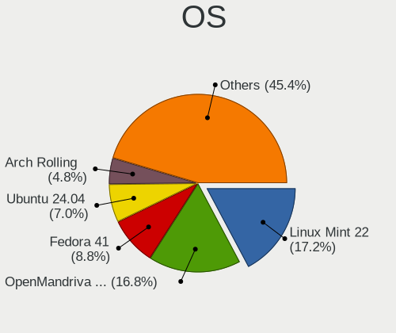
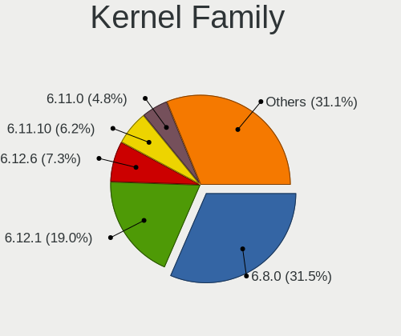
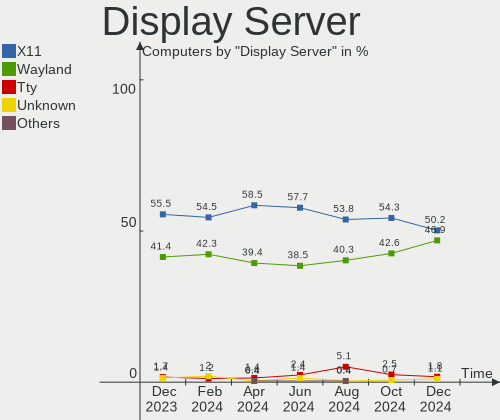
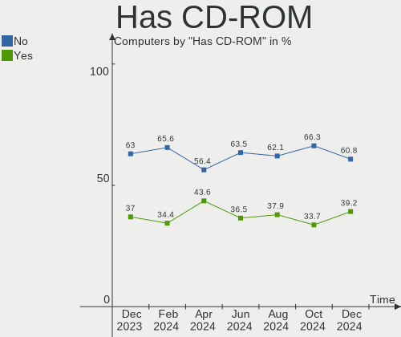
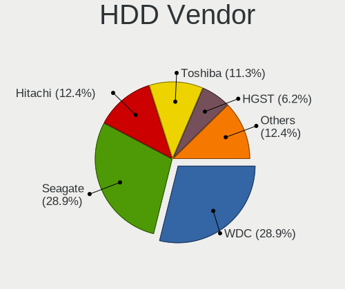
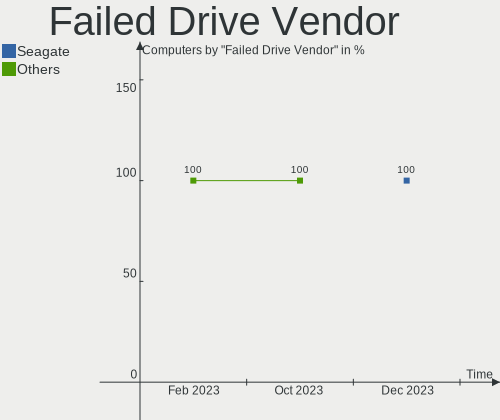
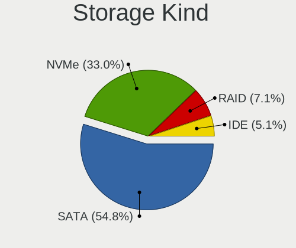
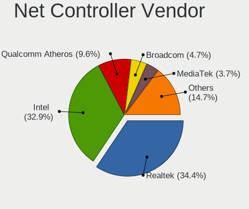
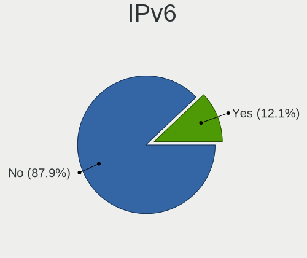

Linux in Italy - Hardware Trends
--------------------------------

A project to identify most popular hardware characteristics and track their change
over time based on data collected by Linux users at https://Linux-Hardware.org.

Anyone can contribute to this report by the [hw-probe](https://github.com/linuxhw/hw-probe) tool:

    sudo -E hw-probe -all -upload

This is a report for all computer types. See also reports for [desktops](/Location/Italy/Desktop/README.md) and [notebooks](/Location/Italy/Notebook/README.md).

Period: Nov, 2022.

Contents
--------

* [ System ](#system)
  - [ OS                       ](#os)
  - [ OS Family                ](#os-family)
  - [ Kernel                   ](#kernel)
  - [ Kernel Family            ](#kernel-family)
  - [ Kernel Major Ver.        ](#kernel-major-ver)
  - [ Arch                     ](#arch)
  - [ DE                       ](#de)
  - [ Display Server           ](#display-server)
  - [ Display Manager          ](#display-manager)
  - [ OS Lang                  ](#os-lang)
  - [ Boot Mode                ](#boot-mode)
  - [ Filesystem               ](#filesystem)
  - [ Part. scheme             ](#part-scheme)
  - [ Dual Boot with Linux/BSD ](#dual-boot-with-linuxbsd)
  - [ Dual Boot (Win)          ](#dual-boot-win)

* [ Board ](#board)
  - [ Vendor                   ](#vendor)
  - [ Model                    ](#model)
  - [ Model Family             ](#model-family)
  - [ MFG Year                 ](#mfg-year)
  - [ Form Factor              ](#form-factor)
  - [ Secure Boot              ](#secure-boot)
  - [ Coreboot                 ](#coreboot)
  - [ RAM Size                 ](#ram-size)
  - [ RAM Used                 ](#ram-used)
  - [ Total Drives             ](#total-drives)
  - [ Has CD-ROM               ](#has-cd-rom)
  - [ Has Ethernet             ](#has-ethernet)
  - [ Has WiFi                 ](#has-wifi)
  - [ Has Bluetooth            ](#has-bluetooth)

* [ Location ](#location)
  - [ Country                  ](#country)
  - [ City                     ](#city)

* [ Drives ](#drives)
  - [ Drive Vendor             ](#drive-vendor)
  - [ Drive Model              ](#drive-model)
  - [ HDD Vendor               ](#hdd-vendor)
  - [ SSD Vendor               ](#ssd-vendor)
  - [ Drive Kind               ](#drive-kind)
  - [ Drive Connector          ](#drive-connector)
  - [ Drive Size               ](#drive-size)
  - [ Space Total              ](#space-total)
  - [ Space Used               ](#space-used)
  - [ Malfunc. Drives          ](#malfunc-drives)
  - [ Malfunc. Drive Vendor    ](#malfunc-drive-vendor)
  - [ Malfunc. HDD Vendor      ](#malfunc-hdd-vendor)
  - [ Malfunc. Drive Kind      ](#malfunc-drive-kind)
  - [ Failed Drives            ](#failed-drives)
  - [ Failed Drive Vendor      ](#failed-drive-vendor)
  - [ Drive Status             ](#drive-status)

* [ Storage controller ](#storage-controller)
  - [ Storage Vendor           ](#storage-vendor)
  - [ Storage Model            ](#storage-model)
  - [ Storage Kind             ](#storage-kind)

* [ Processor ](#processor)
  - [ CPU Vendor               ](#cpu-vendor)
  - [ CPU Model                ](#cpu-model)
  - [ CPU Model Family         ](#cpu-model-family)
  - [ CPU Cores                ](#cpu-cores)
  - [ CPU Sockets              ](#cpu-sockets)
  - [ CPU Threads              ](#cpu-threads)
  - [ CPU Op-Modes             ](#cpu-op-modes)
  - [ CPU Microcode            ](#cpu-microcode)
  - [ CPU Microarch            ](#cpu-microarch)

* [ Graphics ](#graphics)
  - [ GPU Vendor               ](#gpu-vendor)
  - [ GPU Model                ](#gpu-model)
  - [ GPU Combo                ](#gpu-combo)
  - [ GPU Driver               ](#gpu-driver)
  - [ GPU Memory               ](#gpu-memory)

* [ Monitor ](#monitor)
  - [ Monitor Vendor           ](#monitor-vendor)
  - [ Monitor Model            ](#monitor-model)
  - [ Monitor Resolution       ](#monitor-resolution)
  - [ Monitor Diagonal         ](#monitor-diagonal)
  - [ Monitor Width            ](#monitor-width)
  - [ Aspect Ratio             ](#aspect-ratio)
  - [ Monitor Area             ](#monitor-area)
  - [ Pixel Density            ](#pixel-density)
  - [ Multiple Monitors        ](#multiple-monitors)

* [ Network ](#network)
  - [ Net Controller Vendor    ](#net-controller-vendor)
  - [ Net Controller Model     ](#net-controller-model)
  - [ Wireless Vendor          ](#wireless-vendor)
  - [ Wireless Model           ](#wireless-model)
  - [ Ethernet Vendor          ](#ethernet-vendor)
  - [ Ethernet Model           ](#ethernet-model)
  - [ Net Controller Kind      ](#net-controller-kind)
  - [ Used Controller          ](#used-controller)
  - [ NICs                     ](#nics)
  - [ IPv6                     ](#ipv6)

* [ Bluetooth ](#bluetooth)
  - [ Bluetooth Vendor         ](#bluetooth-vendor)
  - [ Bluetooth Model          ](#bluetooth-model)

* [ Sound ](#sound)
  - [ Sound Vendor             ](#sound-vendor)
  - [ Sound Model              ](#sound-model)

* [ Memory ](#memory)
  - [ Memory Vendor            ](#memory-vendor)
  - [ Memory Model             ](#memory-model)
  - [ Memory Kind              ](#memory-kind)
  - [ Memory Form Factor       ](#memory-form-factor)
  - [ Memory Size              ](#memory-size)
  - [ Memory Speed             ](#memory-speed)

* [ Printers & scanners ](#printers--scanners)
  - [ Printer Vendor           ](#printer-vendor)
  - [ Printer Model            ](#printer-model)
  - [ Scanner Vendor           ](#scanner-vendor)
  - [ Scanner Model            ](#scanner-model)

* [ Camera ](#camera)
  - [ Camera Vendor            ](#camera-vendor)
  - [ Camera Model             ](#camera-model)

* [ Security ](#security)
  - [ Fingerprint Vendor       ](#fingerprint-vendor)
  - [ Fingerprint Model        ](#fingerprint-model)
  - [ Chipcard Vendor          ](#chipcard-vendor)
  - [ Chipcard Model           ](#chipcard-model)

* [ Unsupported ](#unsupported)
  - [ Unsupported Devices      ](#unsupported-devices)
  - [ Unsupported Device Types ](#unsupported-device-types)

System
------

OS
--

Installed operating systems

| Name                         | Computers | Percent |
|------------------------------|-----------|---------|
| Ubuntu 22.04                 | 56        | 16.09%  |
| Arch Rolling                 | 30        | 8.62%   |
| Ubuntu 22.10                 | 27        | 7.76%   |
| Pop!_OS 22.04                | 16        | 4.6%    |
| Linux Mint 21                | 16        | 4.6%    |
| Fedora 36                    | 16        | 4.6%    |
| Debian 11                    | 15        | 4.31%   |
| Fedora 37                    | 13        | 3.74%   |
| Zorin 16                     | 12        | 3.45%   |
| Manjaro 22.0.0               | 12        | 3.45%   |
| Linux Mint 20.3              | 9         | 2.59%   |
| Kubuntu 22.04                | 9         | 2.59%   |
| Ubuntu 20.04                 | 8         | 2.3%    |
| EndeavourOS Rolling          | 8         | 2.3%    |
| OpenMandriva 4.50            | 7         | 2.01%   |
| OpenMandriva 4.3             | 7         | 2.01%   |
| Debian                       | 6         | 1.72%   |
| MX 21                        | 5         | 1.44%   |
| Lubuntu 22.04                | 5         | 1.44%   |
| KDE neon 22.04               | 5         | 1.44%   |
| openSUSE Tumbleweed-XXXXXXXX | 4         | 1.15%   |
| Q4OS 4                       | 3         | 0.86%   |
| Kubuntu 20.04                | 3         | 0.86%   |
| Gentoo 2.9                   | 3         | 0.86%   |
| Garuda Linux Soaring         | 3         | 0.86%   |
| Xubuntu 22.10                | 2         | 0.57%   |
| Xubuntu 22.04                | 2         | 0.57%   |
| Xubuntu 20.04                | 2         | 0.57%   |
| Void Linux Rolling           | 2         | 0.57%   |
| Ubuntu Unity 16.04           | 2         | 0.57%   |
| OpenMandriva 4.90            | 2         | 0.57%   |
| NixOS 22.11                  | 2         | 0.57%   |
| LMDE 5                       | 2         | 0.57%   |
| Linux Mint 19.3              | 2         | 0.57%   |
| Kubuntu 22.10                | 2         | 0.57%   |
| Elementary 6.1               | 2         | 0.57%   |
| Zorin 15                     | 1         | 0.29%   |
| Ubuntu MATE 22.04            | 1         | 0.29%   |
| Ubuntu MATE 20.04            | 1         | 0.29%   |
| Ubuntu Budgie 22.10          | 1         | 0.29%   |

OS Family
---------

OS without a version

| Name          | Computers | Percent |
|---------------|-----------|---------|
| Ubuntu        | 92        | 26.44%  |
| Fedora        | 30        | 8.62%   |
| Arch          | 30        | 8.62%   |
| Linux Mint    | 27        | 7.76%   |
| Debian        | 21        | 6.03%   |
| Pop!_OS       | 16        | 4.6%    |
| OpenMandriva  | 16        | 4.6%    |
| Kubuntu       | 16        | 4.6%    |
| Manjaro       | 15        | 4.31%   |
| Zorin         | 13        | 3.74%   |
| EndeavourOS   | 8         | 2.3%    |
| Xubuntu       | 6         | 1.72%   |
| Lubuntu       | 6         | 1.72%   |
| MX            | 5         | 1.44%   |
| KDE neon      | 5         | 1.44%   |
| openSUSE      | 4         | 1.15%   |
| Q4OS          | 3         | 0.86%   |
| Gentoo        | 3         | 0.86%   |
| Garuda Linux  | 3         | 0.86%   |
| Void Linux    | 2         | 0.57%   |
| Ubuntu Unity  | 2         | 0.57%   |
| Ubuntu MATE   | 2         | 0.57%   |
| NixOS         | 2         | 0.57%   |
| LMDE          | 2         | 0.57%   |
| Kali          | 2         | 0.57%   |
| Endless       | 2         | 0.57%   |
| Elementary    | 2         | 0.57%   |
| Ubuntu Budgie | 1         | 0.29%   |
| Slackware     | 1         | 0.29%   |
| ROSA          | 1         | 0.29%   |
| Rocky Linux   | 1         | 0.29%   |
| Raspbian      | 1         | 0.29%   |
| Pardus        | 1         | 0.29%   |
| Nobara        | 1         | 0.29%   |
| GNOME OS      | 1         | 0.29%   |
| Deepin        | 1         | 0.29%   |
| Clear Linux   | 1         | 0.29%   |
| BunsenLabs    | 1         | 0.29%   |
| Artix         | 1         | 0.29%   |
| ArcoLinux     | 1         | 0.29%   |

Kernel
------

Version of the Linux kernel

| Version                  | Computers | Percent |
|--------------------------|-----------|---------|
| 5.15.0-52-generic        | 58        | 16.67%  |
| 5.15.0-53-generic        | 32        | 9.2%    |
| 5.19.0-23-generic        | 23        | 6.61%   |
| 5.10.0-19-amd64          | 21        | 6.03%   |
| 6.0.5-200.fc36.x86_64    | 11        | 3.16%   |
| 6.0.6-76060006-generic   | 10        | 2.87%   |
| 5.4.0-131-generic        | 10        | 2.87%   |
| 6.0.8-arch1-1            | 8         | 2.3%    |
| 6.0.7-301.fc37.x86_64    | 8         | 2.3%    |
| 6.0.6-arch1-1            | 8         | 2.3%    |
| 5.19.12-desktop-2omv4090 | 7         | 2.01%   |
| 5.16.7-desktop-1omv4003  | 7         | 2.01%   |
| 5.15.0-43-generic        | 7         | 2.01%   |
| 6.0.9-arch1-1            | 6         | 1.72%   |
| 5.19.0-21-generic        | 6         | 1.72%   |
| 6.0.9-300.fc37.x86_64    | 5         | 1.44%   |
| 5.15.0-41-generic        | 5         | 1.44%   |
| 6.0.2-76060002-generic   | 4         | 1.15%   |
| 6.0.7-arch1-1            | 3         | 0.86%   |
| 6.0.6-zen1-1-zen         | 3         | 0.86%   |
| 6.0.6-1-MANJARO          | 3         | 0.86%   |
| 6.0.0-2-amd64            | 3         | 0.86%   |
| 5.4.0-132-generic        | 3         | 0.86%   |
| 5.4.0-126-generic        | 3         | 0.86%   |
| 5.15.78-1-MANJARO        | 3         | 0.86%   |
| 5.15.0-54-generic        | 3         | 0.86%   |
| 5.15.0-50-generic        | 3         | 0.86%   |
| 6.0.9-zen1-1-zen         | 2         | 0.57%   |
| 6.0.8-1-MANJARO          | 2         | 0.57%   |
| 6.0.7-zen1-1-zen         | 2         | 0.57%   |
| 6.0.2-arch1-1            | 2         | 0.57%   |
| 6.0.10-arch2-1           | 2         | 0.57%   |
| 6.0.0-4-amd64            | 2         | 0.57%   |
| 5.19.16_1                | 2         | 0.57%   |
| 5.19.0-1009-lowlatency   | 2         | 0.57%   |
| 5.18.12-desktop-3omv4090 | 2         | 0.57%   |
| 5.17.5-300.fc36.x86_64   | 2         | 0.57%   |
| 5.15.78-1-lts            | 2         | 0.57%   |
| 5.11.0-35-generic        | 2         | 0.57%   |
| 4.15.0-142-generic       | 2         | 0.57%   |

Kernel Family
-------------

Linux kernel without a distro release

| Version | Computers | Percent |
|---------|-----------|---------|
| 5.15.0  | 109       | 31.32%  |
| 5.19.0  | 36        | 10.34%  |
| 6.0.6   | 26        | 7.47%   |
| 5.10.0  | 21        | 6.03%   |
| 5.4.0   | 19        | 5.46%   |
| 6.0.7   | 17        | 4.89%   |
| 6.0.9   | 16        | 4.6%    |
| 6.0.8   | 13        | 3.74%   |
| 6.0.5   | 12        | 3.45%   |
| 6.0.2   | 10        | 2.87%   |
| 6.0.0   | 9         | 2.59%   |
| 5.19.12 | 7         | 2.01%   |
| 5.16.7  | 7         | 2.01%   |
| 5.19.16 | 5         | 1.44%   |
| 5.15.78 | 5         | 1.44%   |
| 5.17.0  | 3         | 0.86%   |
| 4.15.0  | 3         | 0.86%   |
| 6.1.0   | 2         | 0.57%   |
| 6.0.10  | 2         | 0.57%   |
| 5.19.17 | 2         | 0.57%   |
| 5.18.12 | 2         | 0.57%   |
| 5.17.5  | 2         | 0.57%   |
| 5.15.76 | 2         | 0.57%   |
| 5.11.0  | 2         | 0.57%   |
| 6.0.3   | 1         | 0.29%   |
| 5.19.5  | 1         | 0.29%   |
| 5.18.17 | 1         | 0.29%   |
| 5.18.0  | 1         | 0.29%   |
| 5.16.16 | 1         | 0.29%   |
| 5.16.0  | 1         | 0.29%   |
| 5.15.80 | 1         | 0.29%   |
| 5.15.74 | 1         | 0.29%   |
| 5.15.63 | 1         | 0.29%   |
| 5.15.60 | 1         | 0.29%   |
| 5.15.12 | 1         | 0.29%   |
| 5.14.0  | 1         | 0.29%   |
| 5.13.0  | 1         | 0.29%   |
| 5.10.74 | 1         | 0.29%   |
| 4.18.0  | 1         | 0.29%   |
| 4.13.0  | 1         | 0.29%   |

Kernel Major Ver.
-----------------

Linux kernel major version

| Version | Computers | Percent |
|---------|-----------|---------|
| 5.15    | 121       | 34.77%  |
| 6.0     | 106       | 30.46%  |
| 5.19    | 51        | 14.66%  |
| 5.10    | 22        | 6.32%   |
| 5.4     | 19        | 5.46%   |
| 5.16    | 9         | 2.59%   |
| 5.17    | 5         | 1.44%   |
| 5.18    | 4         | 1.15%   |
| 4.15    | 3         | 0.86%   |
| 6.1     | 2         | 0.57%   |
| 5.11    | 2         | 0.57%   |
| 5.14    | 1         | 0.29%   |
| 5.13    | 1         | 0.29%   |
| 4.18    | 1         | 0.29%   |
| 4.13    | 1         | 0.29%   |

Arch
----

OS architecture (x86_64, i586, etc.)

| Name   | Computers | Percent |
|--------|-----------|---------|
| x86_64 | 344       | 98.85%  |
| i686   | 3         | 0.86%   |
| armv7l | 1         | 0.29%   |

DE
--

Desktop Environment

| Name            | Computers | Percent |
|-----------------|-----------|---------|
| GNOME           | 177       | 50.86%  |
| KDE5            | 84        | 24.14%  |
| XFCE            | 28        | 8.05%   |
| X-Cinnamon      | 23        | 6.61%   |
| LXQt            | 6         | 1.72%   |
| Unknown         | 6         | 1.72%   |
| MATE            | 5         | 1.44%   |
| Trinity         | 3         | 0.86%   |
| sway            | 3         | 0.86%   |
| Cinnamon        | 3         | 0.86%   |
| Unity           | 2         | 0.57%   |
| Pantheon        | 2         | 0.57%   |
| Openbox         | 1         | 0.29%   |
| none+bspwm      | 1         | 0.29%   |
| KDE             | 1         | 0.29%   |
| GNOME Flashback | 1         | 0.29%   |
| Deepin          | 1         | 0.29%   |
| Budgie          | 1         | 0.29%   |

Display Server
--------------

X11 or Wayland

| Name    | Computers | Percent |
|---------|-----------|---------|
| X11     | 226       | 64.94%  |
| Wayland | 111       | 31.9%   |
| Unknown | 6         | 1.72%   |
| Tty     | 5         | 1.44%   |

Display Manager
---------------

SDDM, LightDM, etc.

| Name    | Computers | Percent |
|---------|-----------|---------|
| GDM3    | 101       | 29.02%  |
| SDDM    | 73        | 20.98%  |
| LightDM | 62        | 17.82%  |
| Unknown | 60        | 17.24%  |
| GDM     | 46        | 13.22%  |
| TDM     | 3         | 0.86%   |
| XDM     | 1         | 0.29%   |
| LXDM    | 1         | 0.29%   |
| GREETD  | 1         | 0.29%   |

OS Lang
-------

Language

| Lang      | Computers | Percent |
|-----------|-----------|---------|
| it_IT     | 231       | 66.38%  |
| en_US     | 89        | 25.57%  |
| en_GB     | 13        | 3.74%   |
| C         | 5         | 1.44%   |
| de_IT     | 2         | 0.57%   |
| POSIX     | 1         | 0.29%   |
| it_ITutf8 | 1         | 0.29%   |
| fur_IT    | 1         | 0.29%   |
| fr_FR     | 1         | 0.29%   |
| en_AU     | 1         | 0.29%   |
| en_AG     | 1         | 0.29%   |
| de_AT     | 1         | 0.29%   |
| Unknown   | 1         | 0.29%   |

Boot Mode
---------

EFI or BIOS

| Mode | Computers | Percent |
|------|-----------|---------|
| EFI  | 219       | 62.93%  |
| BIOS | 129       | 37.07%  |

Filesystem
----------

Type of filesystem

| Type    | Computers | Percent |
|---------|-----------|---------|
| Ext4    | 275       | 79.02%  |
| Btrfs   | 36        | 10.34%  |
| Overlay | 29        | 8.33%   |
| Zfs     | 4         | 1.15%   |
| Xfs     | 3         | 0.86%   |
| F2fs    | 1         | 0.29%   |

Part. scheme
------------

Scheme of partitioning

| Type    | Computers | Percent |
|---------|-----------|---------|
| GPT     | 256       | 73.56%  |
| Unknown | 56        | 16.09%  |
| MBR     | 36        | 10.34%  |

Dual Boot with Linux/BSD
------------------------

Hosting more than one Linux/BSD

| Dual boot | Computers | Percent |
|-----------|-----------|---------|
| No        | 306       | 87.93%  |
| Yes       | 42        | 12.07%  |

Dual Boot (Win)
---------------

Hosting Linux and Windows

| Dual boot | Computers | Percent |
|-----------|-----------|---------|
| No        | 211       | 60.63%  |
| Yes       | 137       | 39.37%  |

Board
-----

Vendor
------

Motherboard manufacturer

| Name                    | Computers | Percent |
|-------------------------|-----------|---------|
| ASUSTek Computer        | 65        | 18.68%  |
| Hewlett-Packard         | 59        | 16.95%  |
| Lenovo                  | 55        | 15.8%   |
| Dell                    | 27        | 7.76%   |
| MSI                     | 24        | 6.9%    |
| Acer                    | 20        | 5.75%   |
| Gigabyte Technology     | 15        | 4.31%   |
| Apple                   | 12        | 3.45%   |
| HUAWEI                  | 10        | 2.87%   |
| ASRock                  | 8         | 2.3%    |
| Sony                    | 6         | 1.72%   |
| Unknown                 | 5         | 1.44%   |
| Toshiba                 | 4         | 1.15%   |
| Microtech               | 4         | 1.15%   |
| Intel                   | 4         | 1.15%   |
| Mediacom                | 3         | 0.86%   |
| Fujitsu                 | 3         | 0.86%   |
| Samsung Electronics     | 2         | 0.57%   |
| Microsoft               | 2         | 0.57%   |
| Chuwi                   | 2         | 0.57%   |
| TUXEDO                  | 1         | 0.29%   |
| Timi                    | 1         | 0.29%   |
| Teclast                 | 1         | 0.29%   |
| System76                | 1         | 0.29%   |
| SANTECH                 | 1         | 0.29%   |
| Raspberry Pi Foundation | 1         | 0.29%   |
| Pegatron                | 1         | 0.29%   |
| Packard Bell            | 1         | 0.29%   |
| Olidata                 | 1         | 0.29%   |
| Notebook                | 1         | 0.29%   |
| Jumper                  | 1         | 0.29%   |
| IBM                     | 1         | 0.29%   |
| Huanan                  | 1         | 0.29%   |
| Google                  | 1         | 0.29%   |
| Foxconn                 | 1         | 0.29%   |
| BESSTAR Tech            | 1         | 0.29%   |
| AMI                     | 1         | 0.29%   |
| Alienware               | 1         | 0.29%   |

Model
-----

Motherboard model

| Name                                       | Computers | Percent |
|--------------------------------------------|-----------|---------|
| Unknown                                    | 6         | 1.72%   |
| HUAWEI NBLK-WAX9X                          | 4         | 1.15%   |
| HP Compaq Elite 8300 SFF                   | 3         | 0.86%   |
| ASUS All Series                            | 3         | 0.86%   |
| Toshiba Satellite L50-B                    | 2         | 0.57%   |
| MSI Prestige 15 A12SC                      | 2         | 0.57%   |
| MSI MS-7788                                | 2         | 0.57%   |
| MSI MS-7758                                | 2         | 0.57%   |
| Microtech etabPro4+                        | 2         | 0.57%   |
| Lenovo IdeaPad 3 15ADA05 81W1              | 2         | 0.57%   |
| HUAWEI BOD-WXX9                            | 2         | 0.57%   |
| HP Pavilion Notebook                       | 2         | 0.57%   |
| HP Pavilion Laptop 15-cs2xxx               | 2         | 0.57%   |
| HP Notebook                                | 2         | 0.57%   |
| HP Laptop 15-dw0xxx                        | 2         | 0.57%   |
| HP Laptop 15-db0xxx                        | 2         | 0.57%   |
| ASUS VivoBook S15 X510UF                   | 2         | 0.57%   |
| ASUS TUF Gaming X570-PLUS                  | 2         | 0.57%   |
| ASUS PRIME A320M-K                         | 2         | 0.57%   |
| Apple MacBookPro11,5                       | 2         | 0.57%   |
| TUXEDO Pulse 15 Gen1                       | 1         | 0.29%   |
| Toshiba Satellite Pro S500                 | 1         | 0.29%   |
| Toshiba Satellite L350                     | 1         | 0.29%   |
| Timi TM1701                                | 1         | 0.29%   |
| Teclast F6 Pro                             | 1         | 0.29%   |
| System76 Oryx Pro                          | 1         | 0.29%   |
| Sony VPCYA1C5E                             | 1         | 0.29%   |
| Sony VPCEB2M1E                             | 1         | 0.29%   |
| Sony VGN-NS21M_W                           | 1         | 0.29%   |
| Sony VGN-FW21E                             | 1         | 0.29%   |
| Sony VGN-CS11Z_R                           | 1         | 0.29%   |
| Sony SVP1121X9EB                           | 1         | 0.29%   |
| SANTECH X170KM-G                           | 1         | 0.29%   |
| Samsung 350V5C/351V5C/3540VC/3440VC        | 1         | 0.29%   |
| Samsung 300E4A/300E5A/300E7A/3430EA/3530EA | 1         | 0.29%   |
| RPi Raspberry Pi 2 Model B Rev 1.1         | 1         | 0.29%   |
| Pegatron Pro 3405 Series                   | 1         | 0.29%   |
| Packard Bell DOT S                         | 1         | 0.29%   |
| Olidata T7700                              | 1         | 0.29%   |
| Notebook P65_P67SE                         | 1         | 0.29%   |

Model Family
------------

Motherboard model prefix

| Name                | Computers | Percent |
|---------------------|-----------|---------|
| Lenovo ThinkPad     | 26        | 7.47%   |
| HP Pavilion         | 14        | 4.02%   |
| Acer Aspire         | 12        | 3.45%   |
| HP Laptop           | 10        | 2.87%   |
| Lenovo IdeaPad      | 8         | 2.3%    |
| HP Compaq           | 6         | 1.72%   |
| Dell Latitude       | 6         | 1.72%   |
| ASUS VivoBook       | 6         | 1.72%   |
| ASUS ROG            | 6         | 1.72%   |
| ASUS PRIME          | 6         | 1.72%   |
| Unknown             | 6         | 1.72%   |
| HP EliteBook        | 5         | 1.44%   |
| Dell XPS            | 5         | 1.44%   |
| Dell Precision      | 5         | 1.44%   |
| Dell Inspiron       | 5         | 1.44%   |
| ASUS TUF            | 5         | 1.44%   |
| Toshiba Satellite   | 4         | 1.15%   |
| MSI Prestige        | 4         | 1.15%   |
| HUAWEI NBLK-WAX9X   | 4         | 1.15%   |
| Lenovo Yoga         | 3         | 0.86%   |
| Lenovo ThinkBook    | 3         | 0.86%   |
| HP ProBook          | 3         | 0.86%   |
| HP OMEN             | 3         | 0.86%   |
| HP EliteDesk        | 3         | 0.86%   |
| Gigabyte Z390       | 3         | 0.86%   |
| Fujitsu LIFEBOOK    | 3         | 0.86%   |
| ASUS ASUS           | 3         | 0.86%   |
| ASUS All            | 3         | 0.86%   |
| Apple MacBookPro11  | 3         | 0.86%   |
| Acer Nitro          | 3         | 0.86%   |
| MSI MS-7788         | 2         | 0.57%   |
| MSI MS-7758         | 2         | 0.57%   |
| Microtech etabPro4+ | 2         | 0.57%   |
| Microsoft Surface   | 2         | 0.57%   |
| HUAWEI BOD-WXX9     | 2         | 0.57%   |
| HP Notebook         | 2         | 0.57%   |
| HP 250              | 2         | 0.57%   |
| Dell Studio         | 2         | 0.57%   |
| ASRock B450M        | 2         | 0.57%   |
| TUXEDO Pulse        | 1         | 0.29%   |

MFG Year
--------

Motherboard manufacture year

| Year    | Computers | Percent |
|---------|-----------|---------|
| 2021    | 46        | 13.22%  |
| 2019    | 41        | 11.78%  |
| 2018    | 33        | 9.48%   |
| 2020    | 29        | 8.33%   |
| 2017    | 25        | 7.18%   |
| 2012    | 25        | 7.18%   |
| 2014    | 24        | 6.9%    |
| 2013    | 24        | 6.9%    |
| 2015    | 17        | 4.89%   |
| 2016    | 16        | 4.6%    |
| 2008    | 14        | 4.02%   |
| 2022    | 13        | 3.74%   |
| 2010    | 12        | 3.45%   |
| 2011    | 11        | 3.16%   |
| 2009    | 9         | 2.59%   |
| 2006    | 5         | 1.44%   |
| 2007    | 2         | 0.57%   |
| 2005    | 1         | 0.29%   |
| Unknown | 1         | 0.29%   |

Form Factor
-----------

Physical design of the computer

| Name           | Computers | Percent |
|----------------|-----------|---------|
| Notebook       | 215       | 61.78%  |
| Desktop        | 109       | 31.32%  |
| Convertible    | 9         | 2.59%   |
| Tablet         | 7         | 2.01%   |
| Mini pc        | 3         | 0.86%   |
| All in one     | 3         | 0.86%   |
| System on chip | 1         | 0.29%   |
| Server         | 1         | 0.29%   |

Secure Boot
-----------

Enabled or disabled

| State    | Computers | Percent |
|----------|-----------|---------|
| Disabled | 316       | 90.8%   |
| Enabled  | 32        | 9.2%    |

Coreboot
--------

Have coreboot on board

| Used | Computers | Percent |
|------|-----------|---------|
| No   | 346       | 99.43%  |
| Yes  | 2         | 0.57%   |

RAM Size
--------

Total RAM memory

| Size in GB  | Computers | Percent |
|-------------|-----------|---------|
| 4.01-8.0    | 103       | 29.6%   |
| 16.01-24.0  | 92        | 26.44%  |
| 3.01-4.0    | 55        | 15.8%   |
| 8.01-16.0   | 50        | 14.37%  |
| 32.01-64.0  | 28        | 8.05%   |
| 1.01-2.0    | 8         | 2.3%    |
| 64.01-256.0 | 5         | 1.44%   |
| 24.01-32.0  | 3         | 0.86%   |
| 2.01-3.0    | 2         | 0.57%   |
| 0.51-1.0    | 2         | 0.57%   |

RAM Used
--------

Used RAM memory

| Used GB    | Computers | Percent |
|------------|-----------|---------|
| 1.01-2.0   | 109       | 31.32%  |
| 2.01-3.0   | 104       | 29.89%  |
| 4.01-8.0   | 60        | 17.24%  |
| 3.01-4.0   | 48        | 13.79%  |
| 8.01-16.0  | 15        | 4.31%   |
| 0.51-1.0   | 8         | 2.3%    |
| 0.01-0.5   | 3         | 0.86%   |
| 16.01-24.0 | 1         | 0.29%   |

Total Drives
------------

Number of drives on board

| Drives | Computers | Percent |
|--------|-----------|---------|
| 1      | 216       | 62.07%  |
| 2      | 82        | 23.56%  |
| 3      | 27        | 7.76%   |
| 4      | 12        | 3.45%   |
| 5      | 6         | 1.72%   |
| 0      | 2         | 0.57%   |
| 12     | 1         | 0.29%   |
| 7      | 1         | 0.29%   |
| 6      | 1         | 0.29%   |

Has CD-ROM
----------

Has CD-ROM on board

| Presented | Computers | Percent |
|-----------|-----------|---------|
| No        | 231       | 66.38%  |
| Yes       | 117       | 33.62%  |

Has Ethernet
------------

Has Ethernet on board

| Presented | Computers | Percent |
|-----------|-----------|---------|
| Yes       | 276       | 79.31%  |
| No        | 72        | 20.69%  |

Has WiFi
--------

Has WiFi module

| Presented | Computers | Percent |
|-----------|-----------|---------|
| Yes       | 284       | 81.61%  |
| No        | 64        | 18.39%  |

Has Bluetooth
-------------

Has Bluetooth module

| Presented | Computers | Percent |
|-----------|-----------|---------|
| Yes       | 248       | 71.26%  |
| No        | 100       | 28.74%  |

Location
--------

Country
-------

Geographic location (country)

| Country | Computers | Percent |
|---------|-----------|---------|
| Italy   | 348       | 100%    |

City
----

Geographic location (city)

| City                | Computers | Percent |
|---------------------|-----------|---------|
| Milan               | 47        | 13.51%  |
| Rome                | 43        | 12.36%  |
| Bologna             | 13        | 3.74%   |
| Naples              | 12        | 3.45%   |
| Turin               | 9         | 2.59%   |
| Rho                 | 7         | 2.01%   |
| Catania             | 6         | 1.72%   |
| Venice              | 5         | 1.44%   |
| Palermo             | 5         | 1.44%   |
| Bari                | 5         | 1.44%   |
| Florence            | 4         | 1.15%   |
| Verona              | 3         | 0.86%   |
| Parma               | 3         | 0.86%   |
| Modena              | 3         | 0.86%   |
| Gorle               | 3         | 0.86%   |
| Genoa               | 3         | 0.86%   |
| Cinisello Balsamo   | 3         | 0.86%   |
| Casalecchio di Reno | 3         | 0.86%   |
| Brescia             | 3         | 0.86%   |
| Trento              | 2         | 0.57%   |
| Sesto Fiorentino    | 2         | 0.57%   |
| Sassari             | 2         | 0.57%   |
| Reggio Emilia       | 2         | 0.57%   |
| Portogruaro         | 2         | 0.57%   |
| Pordenone           | 2         | 0.57%   |
| Pescara             | 2         | 0.57%   |
| Perugia             | 2         | 0.57%   |
| Padova              | 2         | 0.57%   |
| Ormelle             | 2         | 0.57%   |
| Merano              | 2         | 0.57%   |
| Gragnano            | 2         | 0.57%   |
| Forlì              | 2         | 0.57%   |
| Foggia              | 2         | 0.57%   |
| Como                | 2         | 0.57%   |
| Buguggiate          | 2         | 0.57%   |
| Bolzano             | 2         | 0.57%   |
| Assisi              | 2         | 0.57%   |
| Viggianello         | 1         | 0.29%   |
| Vedelago            | 1         | 0.29%   |
| Urbino              | 1         | 0.29%   |

Drives
------

Drive Vendor
------------

Hard drive vendors

| Vendor                      | Computers | Drives | Percent |
|-----------------------------|-----------|--------|---------|
| Samsung Electronics         | 93        | 101    | 18.06%  |
| Seagate                     | 54        | 61     | 10.49%  |
| WDC                         | 53        | 74     | 10.29%  |
| Crucial                     | 37        | 41     | 7.18%   |
| Kingston                    | 35        | 36     | 6.8%    |
| Sandisk                     | 32        | 33     | 6.21%   |
| Toshiba                     | 28        | 29     | 5.44%   |
| Unknown                     | 23        | 27     | 4.47%   |
| Hitachi                     | 19        | 22     | 3.69%   |
| SK hynix                    | 16        | 16     | 3.11%   |
| Micron Technology           | 10        | 10     | 1.94%   |
| Intel                       | 9         | 9      | 1.75%   |
| SPCC                        | 7         | 7      | 1.36%   |
| Apple                       | 7         | 8      | 1.36%   |
| Phison Electronics          | 6         | 6      | 1.17%   |
| Phison                      | 5         | 5      | 0.97%   |
| Maxtor                      | 4         | 6      | 0.78%   |
| LITEONIT                    | 4         | 4      | 0.78%   |
| KIOXIA                      | 4         | 5      | 0.78%   |
| Transcend                   | 3         | 3      | 0.58%   |
| Patriot                     | 3         | 3      | 0.58%   |
| Micron/Crucial Technology   | 3         | 3      | 0.58%   |
| LITEON                      | 3         | 3      | 0.58%   |
| Kingston Technology Company | 3         | 3      | 0.58%   |
| Intenso                     | 3         | 3      | 0.58%   |
| HGST                        | 3         | 3      | 0.58%   |
| Corsair                     | 3         | 5      | 0.58%   |
| China                       | 3         | 3      | 0.58%   |
| ADATA Technology            | 3         | 3      | 0.58%   |
| Unknown                     | 3         | 3      | 0.58%   |
| UMIS                        | 2         | 2      | 0.39%   |
| Teclast                     | 2         | 2      | 0.39%   |
| SABRENT                     | 2         | 2      | 0.39%   |
| PNY                         | 2         | 2      | 0.39%   |
| OCZ                         | 2         | 2      | 0.39%   |
| Lexar                       | 2         | 2      | 0.39%   |
| Lenovo                      | 2         | 2      | 0.39%   |
| JMicron Technology          | 2         | 2      | 0.39%   |
| GOODRAM                     | 2         | 2      | 0.39%   |
| Drevo                       | 2         | 2      | 0.39%   |

Drive Model
-----------

Hard drive models

| Model                                                | Computers | Percent |
|------------------------------------------------------|-----------|---------|
| Samsung NVMe SSD Controller SM981/PM981/PM983 1TB    | 14        | 2.53%   |
| Seagate ST500DM002-1BD142 500GB                      | 8         | 1.44%   |
| Kingston SA400S37240G 240GB SSD                      | 8         | 1.44%   |
| Kingston SA400S37480G 480GB SSD                      | 7         | 1.26%   |
| Toshiba MQ01ABF050 500GB                             | 6         | 1.08%   |
| Crucial CT500MX500SSD1 500GB                         | 6         | 1.08%   |
| Unknown MMC Card  64GB                               | 5         | 0.9%    |
| Samsung SSD 860 EVO 500GB                            | 5         | 0.9%    |
| Samsung SSD 850 EVO 250GB                            | 5         | 0.9%    |
| Crucial CT240BX500SSD1 240GB                         | 5         | 0.9%    |
| Unknown MMC Card  32GB                               | 4         | 0.72%   |
| SPCC Solid State Disk 512GB                          | 4         | 0.72%   |
| Seagate ST2000DM008-2FR102 2TB                       | 4         | 0.72%   |
| Sandisk WD Black SN750 / PC SN730 NVMe SSD 1024GB    | 4         | 0.72%   |
| Samsung SSD 970 EVO Plus 1TB                         | 4         | 0.72%   |
| Samsung SSD 860 EVO 250GB                            | 4         | 0.72%   |
| Samsung SSD 850 EVO 500GB                            | 4         | 0.72%   |
| Crucial CT480BX500SSD1 480GB                         | 4         | 0.72%   |
| Crucial CT250MX500SSD1 250GB                         | 4         | 0.72%   |
| Crucial CT120BX500SSD1 120GB                         | 4         | 0.72%   |
| Crucial CT1000MX500SSD1 1TB                          | 4         | 0.72%   |
| WDC WD20EARS-00MVWB0 2TB                             | 3         | 0.54%   |
| WDC WD10EZEX-08WN4A0 1TB                             | 3         | 0.54%   |
| Toshiba DT01ACA100 1TB                               | 3         | 0.54%   |
| Seagate ST1000LM035-1RK172 1TB                       | 3         | 0.54%   |
| Seagate ST1000DM003-1ER162 1TB                       | 3         | 0.54%   |
| Sandisk WD Blue SN550 NVMe SSD 1TB                   | 3         | 0.54%   |
| SanDisk SSD PLUS 240GB                               | 3         | 0.54%   |
| Samsung SSD 980 1TB                                  | 3         | 0.54%   |
| Samsung SSD 970 PRO 512GB                            | 3         | 0.54%   |
| Samsung SSD 970 EVO Plus 250GB                       | 3         | 0.54%   |
| Samsung SSD 870 EVO 250GB                            | 3         | 0.54%   |
| Samsung NVMe SSD Controller PM9A1/PM9A3/980PRO 250GB | 3         | 0.54%   |
| Samsung MZVLQ512HALU-000H1 512GB                     | 3         | 0.54%   |
| Phison Sabrent 512GB                                 | 3         | 0.54%   |
| Phison E12 NVMe Controller 2TB                       | 3         | 0.54%   |
| KIOXIA KBG40ZNV256G 256GB                            | 3         | 0.54%   |
| Kingston SV300S37A240G 240GB SSD                     | 3         | 0.54%   |
| Kingston SV300S37A120G 120GB SSD                     | 3         | 0.54%   |
| Kingston SUV400S37240G 240GB SSD                     | 3         | 0.54%   |

HDD Vendor
----------

Hard disk drive vendors

| Vendor              | Computers | Drives | Percent |
|---------------------|-----------|--------|---------|
| Seagate             | 50        | 57     | 35.71%  |
| WDC                 | 40        | 58     | 28.57%  |
| Hitachi             | 19        | 22     | 13.57%  |
| Toshiba             | 17        | 18     | 12.14%  |
| Samsung Electronics | 5         | 6      | 3.57%   |
| Maxtor              | 4         | 6      | 2.86%   |
| HGST                | 3         | 3      | 2.14%   |
| Unknown             | 1         | 1      | 0.71%   |
| Apple               | 1         | 1      | 0.71%   |

SSD Vendor
----------

Solid state drive vendors

| Vendor              | Computers | Drives | Percent |
|---------------------|-----------|--------|---------|
| Samsung Electronics | 39        | 41     | 20.53%  |
| Crucial             | 34        | 35     | 17.89%  |
| Kingston            | 29        | 30     | 15.26%  |
| SanDisk             | 15        | 16     | 7.89%   |
| SPCC                | 7         | 7      | 3.68%   |
| WDC                 | 6         | 6      | 3.16%   |
| Apple               | 6         | 6      | 3.16%   |
| LITEONIT            | 4         | 4      | 2.11%   |
| Transcend           | 3         | 3      | 1.58%   |
| SK hynix            | 3         | 3      | 1.58%   |
| Patriot             | 3         | 3      | 1.58%   |
| Intenso             | 3         | 3      | 1.58%   |
| Corsair             | 3         | 5      | 1.58%   |
| China               | 3         | 3      | 1.58%   |
| Toshiba             | 2         | 2      | 1.05%   |
| Teclast             | 2         | 2      | 1.05%   |
| PNY                 | 2         | 2      | 1.05%   |
| OCZ                 | 2         | 2      | 1.05%   |
| Micron Technology   | 2         | 2      | 1.05%   |
| LITEON              | 2         | 2      | 1.05%   |
| Intel               | 2         | 2      | 1.05%   |
| GOODRAM             | 2         | 2      | 1.05%   |
| Drevo               | 2         | 2      | 1.05%   |
| TSA                 | 1         | 1      | 0.53%   |
| TO Exter            | 1         | 1      | 0.53%   |
| Team                | 1         | 1      | 0.53%   |
| Microtech           | 1         | 1      | 0.53%   |
| Lexar               | 1         | 1      | 0.53%   |
| Leven               | 1         | 1      | 0.53%   |
| Lenovo              | 1         | 1      | 0.53%   |
| KingSpec            | 1         | 1      | 0.53%   |
| Gigabyte Technology | 1         | 1      | 0.53%   |
| Emtec               | 1         | 1      | 0.53%   |
| Dogfish             | 1         | 1      | 0.53%   |
| BAITITON            | 1         | 1      | 0.53%   |
| AirDisk             | 1         | 1      | 0.53%   |
| Unknown             | 1         | 1      | 0.53%   |

Drive Kind
----------

HDD or SSD

| Kind    | Computers | Drives | Percent |
|---------|-----------|--------|---------|
| SSD     | 170       | 197    | 37.12%  |
| NVMe    | 142       | 162    | 31%     |
| HDD     | 113       | 172    | 24.67%  |
| MMC     | 24        | 31     | 5.24%   |
| Unknown | 9         | 9      | 1.97%   |

Drive Connector
---------------

SATA, SAS, NVMe, etc.

| Type | Computers | Drives | Percent |
|------|-----------|--------|---------|
| SATA | 225       | 361    | 55.15%  |
| NVMe | 141       | 159    | 34.56%  |
| MMC  | 24        | 31     | 5.88%   |
| SAS  | 18        | 20     | 4.41%   |

Drive Size
----------

Size of hard drive

| Size in TB | Computers | Drives | Percent |
|------------|-----------|--------|---------|
| 0.01-0.5   | 187       | 253    | 66.79%  |
| 0.51-1.0   | 63        | 76     | 22.5%   |
| 1.01-2.0   | 21        | 27     | 7.5%    |
| 3.01-4.0   | 5         | 5      | 1.79%   |
| 4.01-10.0  | 3         | 6      | 1.07%   |
| 2.01-3.0   | 1         | 2      | 0.36%   |

Space Total
-----------

Amount of disk space available on the file system

| Size in GB     | Computers | Percent |
|----------------|-----------|---------|
| 101-250        | 110       | 31.61%  |
| 251-500        | 78        | 22.41%  |
| 501-1000       | 39        | 11.21%  |
| 1-20           | 38        | 10.92%  |
| 1001-2000      | 24        | 6.9%    |
| 51-100         | 18        | 5.17%   |
| 2001-3000      | 17        | 4.89%   |
| More than 3000 | 13        | 3.74%   |
| 21-50          | 10        | 2.87%   |
| Unknown        | 1         | 0.29%   |

Space Used
----------

Amount of used disk space

| Used GB        | Computers | Percent |
|----------------|-----------|---------|
| 1-20           | 119       | 34.2%   |
| 21-50          | 62        | 17.82%  |
| 101-250        | 59        | 16.95%  |
| 51-100         | 41        | 11.78%  |
| 251-500        | 24        | 6.9%    |
| 501-1000       | 23        | 6.61%   |
| 1001-2000      | 12        | 3.45%   |
| 2001-3000      | 4         | 1.15%   |
| More than 3000 | 3         | 0.86%   |
| Unknown        | 1         | 0.29%   |

Malfunc. Drives
---------------

Drive models with a malfunction

| Model                                   | Computers | Drives | Percent |
|-----------------------------------------|-----------|--------|---------|
| WDC WDS120G2G0A-00JH30 120GB SSD        | 1         | 1      | 3.23%   |
| WDC WD60EZRZ-00RWYB1 6TB                | 1         | 2      | 3.23%   |
| WDC WD5000AVDS-63U7B1 500GB             | 1         | 1      | 3.23%   |
| WDC WD3200BPVT-22JJ5T0 320GB            | 1         | 1      | 3.23%   |
| WDC WD10EZEX-22MFCA0 1TB                | 1         | 1      | 3.23%   |
| WDC WD10EARS-00MVWB0 1TB                | 1         | 1      | 3.23%   |
| Toshiba MK2565GSXV 250GB                | 1         | 1      | 3.23%   |
| SK hynix BC711 HFM512GD3JX013N 512GB    | 1         | 1      | 3.23%   |
| Seagate ST500LT012-9WS142 500GB         | 1         | 1      | 3.23%   |
| Seagate ST500DM002-1BD142 500GB         | 1         | 1      | 3.23%   |
| Seagate ST3500820AS 500GB               | 1         | 1      | 3.23%   |
| Seagate ST3500413AS 500GB               | 1         | 1      | 3.23%   |
| Seagate ST2000DM008-2FR102 2TB          | 1         | 1      | 3.23%   |
| Seagate ST2000DM006-2DM164 2TB          | 1         | 1      | 3.23%   |
| Seagate ST2000DL003-9VT166 2TB          | 1         | 1      | 3.23%   |
| Seagate ST1000DM003-1ER162 1TB          | 1         | 1      | 3.23%   |
| Samsung Electronics HM500JJ 500GB       | 1         | 1      | 3.23%   |
| Samsung Electronics HD161HJ 160GB       | 1         | 1      | 3.23%   |
| OCZ AGILITY3 120GB SSD                  | 1         | 1      | 3.23%   |
| Maxtor STM3250310AS 250GB               | 1         | 1      | 3.23%   |
| LITEONIT LCT-128M3S 128GB SSD           | 1         | 1      | 3.23%   |
| LITEON LJH-128V2G-11 M.2 2260 128GB SSD | 1         | 1      | 3.23%   |
| Kingston SUV400S37240G 240GB SSD        | 1         | 1      | 3.23%   |
| Intenso SSD Sata III 128GB              | 1         | 1      | 3.23%   |
| Intel SSDSCKKF256G8H 256GB              | 1         | 1      | 3.23%   |
| Intel SSDPEKKF512G8L 512GB              | 1         | 1      | 3.23%   |
| Intel SSD 660P Series 512GB             | 1         | 1      | 3.23%   |
| Hitachi HTS725050A9A364 500GB           | 1         | 1      | 3.23%   |
| Hitachi HTS543232L9SA02 320GB           | 1         | 1      | 3.23%   |
| HGST HTS721010A9E630 1TB                | 1         | 1      | 3.23%   |
| HGST HTS541010A9E680 1TB                | 1         | 1      | 3.23%   |

Malfunc. Drive Vendor
---------------------

Vendors of faulty drives

| Vendor              | Computers | Drives | Percent |
|---------------------|-----------|--------|---------|
| Seagate             | 8         | 8      | 26.67%  |
| WDC                 | 5         | 7      | 16.67%  |
| Intel               | 3         | 3      | 10%     |
| Samsung Electronics | 2         | 2      | 6.67%   |
| Hitachi             | 2         | 2      | 6.67%   |
| HGST                | 2         | 2      | 6.67%   |
| Toshiba             | 1         | 1      | 3.33%   |
| SK hynix            | 1         | 1      | 3.33%   |
| OCZ                 | 1         | 1      | 3.33%   |
| Maxtor              | 1         | 1      | 3.33%   |
| LITEONIT            | 1         | 1      | 3.33%   |
| LITEON              | 1         | 1      | 3.33%   |
| Kingston            | 1         | 1      | 3.33%   |
| Intenso             | 1         | 1      | 3.33%   |

Malfunc. HDD Vendor
-------------------

Vendors of faulty HDD drives

| Vendor              | Computers | Drives | Percent |
|---------------------|-----------|--------|---------|
| Seagate             | 8         | 8      | 38.1%   |
| WDC                 | 5         | 6      | 23.81%  |
| Samsung Electronics | 2         | 2      | 9.52%   |
| Hitachi             | 2         | 2      | 9.52%   |
| HGST                | 2         | 2      | 9.52%   |
| Toshiba             | 1         | 1      | 4.76%   |
| Maxtor              | 1         | 1      | 4.76%   |

Malfunc. Drive Kind
-------------------

Kinds of faulty drives

| Kind | Computers | Drives | Percent |
|------|-----------|--------|---------|
| HDD  | 21        | 22     | 67.74%  |
| SSD  | 7         | 7      | 22.58%  |
| NVMe | 3         | 3      | 9.68%   |

Failed Drives
-------------

Failed drive models

| Model                           | Computers | Drives | Percent |
|---------------------------------|-----------|--------|---------|
| WDC WD5000BEVT-22A0RT0 500GB    | 1         | 1      | 50%     |
| Seagate ST500DM002-1BD142 500GB | 1         | 1      | 50%     |

Failed Drive Vendor
-------------------

Failed drive vendors

| Vendor  | Computers | Drives | Percent |
|---------|-----------|--------|---------|
| WDC     | 1         | 1      | 50%     |
| Seagate | 1         | 1      | 50%     |

Drive Status
------------

Number of failed and malfunc. drives

| Status   | Computers | Drives | Percent |
|----------|-----------|--------|---------|
| Works    | 200       | 309    | 52.22%  |
| Detected | 151       | 228    | 39.43%  |
| Malfunc  | 30        | 32     | 7.83%   |
| Failed   | 2         | 2      | 0.52%   |

Storage controller
------------------

Storage Vendor
--------------

Storage controller vendors

| Vendor                       | Computers | Percent |
|------------------------------|-----------|---------|
| Intel                        | 217       | 49.32%  |
| AMD                          | 57        | 12.95%  |
| Samsung Electronics          | 55        | 12.5%   |
| SanDisk                      | 23        | 5.23%   |
| SK hynix                     | 12        | 2.73%   |
| Phison Electronics           | 10        | 2.27%   |
| Micron Technology            | 9         | 2.05%   |
| Kingston Technology Company  | 9         | 2.05%   |
| Toshiba America Info Systems | 8         | 1.82%   |
| Micron/Crucial Technology    | 8         | 1.82%   |
| KIOXIA                       | 6         | 1.36%   |
| ASMedia Technology           | 5         | 1.14%   |
| Nvidia                       | 4         | 0.91%   |
| ADATA Technology             | 4         | 0.91%   |
| JMicron Technology           | 3         | 0.68%   |
| Union Memory (Shenzhen)      | 2         | 0.45%   |
| Marvell Technology Group     | 2         | 0.45%   |
| VIA Technologies             | 1         | 0.23%   |
| MAXIO Technology (Hangzhou)  | 1         | 0.23%   |
| Lite-On Technology           | 1         | 0.23%   |
| Lenovo                       | 1         | 0.23%   |
| Apple                        | 1         | 0.23%   |
| Adaptec                      | 1         | 0.23%   |

Storage Model
-------------

Storage controller models

| Model                                                                          | Computers | Percent |
|--------------------------------------------------------------------------------|-----------|---------|
| AMD FCH SATA Controller [AHCI mode]                                            | 40        | 8.3%    |
| Samsung NVMe SSD Controller SM981/PM981/PM983                                  | 30        | 6.22%   |
| Intel 82801 Mobile SATA Controller [RAID mode]                                 | 16        | 3.32%   |
| Intel 8 Series/C220 Series Chipset Family 6-port SATA Controller 1 [AHCI mode] | 15        | 3.11%   |
| Samsung NVMe SSD Controller 980                                                | 12        | 2.49%   |
| Intel Sunrise Point-LP SATA Controller [AHCI mode]                             | 12        | 2.49%   |
| Intel 7 Series Chipset Family 6-port SATA Controller [AHCI mode]               | 12        | 2.49%   |
| Micron Non-Volatile memory controller                                          | 9         | 1.87%   |
| Intel Wildcat Point-LP SATA Controller [AHCI Mode]                             | 9         | 1.87%   |
| Intel 8 Series SATA Controller 1 [AHCI mode]                                   | 9         | 1.87%   |
| Intel Q170/Q150/B150/H170/H110/Z170/CM236 Chipset SATA Controller [AHCI Mode]  | 8         | 1.66%   |
| Intel 7 Series/C210 Series Chipset Family 6-port SATA Controller [AHCI mode]   | 8         | 1.66%   |
| Intel 5 Series/3400 Series Chipset 4 port SATA AHCI Controller                 | 8         | 1.66%   |
| Samsung NVMe SSD Controller PM9A1/PM9A3/980PRO                                 | 7         | 1.45%   |
| Intel Volume Management Device NVMe RAID Controller                            | 7         | 1.45%   |
| Intel Cannon Lake Mobile PCH SATA AHCI Controller                              | 7         | 1.45%   |
| Intel 82801IBM/IEM (ICH9M/ICH9M-E) 4 port SATA Controller [AHCI mode]          | 7         | 1.45%   |
| Intel 82801G (ICH7 Family) IDE Controller                                      | 7         | 1.45%   |
| Intel 6 Series/C200 Series Chipset Family 6 port Mobile SATA AHCI Controller   | 7         | 1.45%   |
| AMD 400 Series Chipset SATA Controller                                         | 7         | 1.45%   |
| SanDisk WD Blue SN550 NVMe SSD                                                 | 6         | 1.24%   |
| SanDisk WD Black SN750 / PC SN730 NVMe SSD                                     | 6         | 1.24%   |
| Phison E12 NVMe Controller                                                     | 6         | 1.24%   |
| Intel NM10/ICH7 Family SATA Controller [IDE mode]                              | 6         | 1.24%   |
| Intel Celeron/Pentium Silver Processor SATA Controller                         | 6         | 1.24%   |
| Intel Cannon Lake PCH SATA AHCI Controller                                     | 6         | 1.24%   |
| Intel 6 Series/C200 Series Chipset Family 6 port Desktop SATA AHCI Controller  | 6         | 1.24%   |
| AMD 500 Series Chipset SATA Controller                                         | 6         | 1.24%   |
| SK hynix Gold P31/PC711 NVMe Solid State Drive                                 | 5         | 1.04%   |
| SanDisk Non-Volatile memory controller                                         | 5         | 1.04%   |
| Micron/Crucial P2 NVMe PCIe SSD                                                | 5         | 1.04%   |
| Intel SATA Controller [RAID mode]                                              | 5         | 1.04%   |
| Intel 500 Series Chipset Family SATA AHCI Controller                           | 5         | 1.04%   |
| AMD SB7x0/SB8x0/SB9x0 IDE Controller                                           | 5         | 1.04%   |
| Samsung Electronics SATA controller                                            | 4         | 0.83%   |
| KIOXIA NVMe SSD Controller BG4                                                 | 4         | 0.83%   |
| Kingston Company U-SNS8154P3 NVMe SSD                                          | 4         | 0.83%   |
| Kingston Company Company Non-Volatile memory controller                        | 4         | 0.83%   |
| Intel SSD 660P Series                                                          | 4         | 0.83%   |
| Intel Comet Lake SATA AHCI Controller                                          | 4         | 0.83%   |

Storage Kind
------------

Kind of storage controller (IDE, SATA, NVMe, SAS, ...)

| Kind | Computers | Percent |
|------|-----------|---------|
| SATA | 233       | 53.08%  |
| NVMe | 142       | 32.35%  |
| IDE  | 33        | 7.52%   |
| RAID | 31        | 7.06%   |

Processor
---------

CPU Vendor
----------

Processor vendors

| Vendor | Computers | Percent |
|--------|-----------|---------|
| Intel  | 260       | 74.71%  |
| AMD    | 87        | 25%     |
| ARM    | 1         | 0.29%   |

CPU Model
---------

Processor models

| Model                                         | Computers | Percent |
|-----------------------------------------------|-----------|---------|
| Intel Core i7-8565U CPU @ 1.80GHz             | 8         | 2.3%    |
| AMD Ryzen 5 3500U with Radeon Vega Mobile Gfx | 7         | 2.01%   |
| Intel Core i7-8550U CPU @ 1.80GHz             | 6         | 1.72%   |
| Intel Core i7-7700HQ CPU @ 2.80GHz            | 5         | 1.44%   |
| Intel 11th Gen Core i7-1165G7 @ 2.80GHz       | 5         | 1.44%   |
| Intel Core i7-8750H CPU @ 2.20GHz             | 4         | 1.15%   |
| Intel Core i7-2600 CPU @ 3.40GHz              | 4         | 1.15%   |
| Intel Core i5-8250U CPU @ 1.60GHz             | 4         | 1.15%   |
| Intel Core i5-10210U CPU @ 1.60GHz            | 4         | 1.15%   |
| Intel Celeron N4020 CPU @ 1.10GHz             | 4         | 1.15%   |
| Intel Atom x5-Z8350 CPU @ 1.44GHz             | 4         | 1.15%   |
| AMD Ryzen 7 5700U with Radeon Graphics        | 4         | 1.15%   |
| AMD Ryzen 7 4800H with Radeon Graphics        | 4         | 1.15%   |
| AMD Ryzen 7 3700X 8-Core Processor            | 4         | 1.15%   |
| Intel Core i7-9750H CPU @ 2.60GHz             | 3         | 0.86%   |
| Intel Core i7-4720HQ CPU @ 2.60GHz            | 3         | 0.86%   |
| Intel Core i7-4510U CPU @ 2.00GHz             | 3         | 0.86%   |
| Intel Core i7-3770 CPU @ 3.40GHz              | 3         | 0.86%   |
| Intel Core i5-9400F CPU @ 2.90GHz             | 3         | 0.86%   |
| Intel Core i5-8350U CPU @ 1.70GHz             | 3         | 0.86%   |
| Intel Core i5-8265U CPU @ 1.60GHz             | 3         | 0.86%   |
| Intel Core i5-5200U CPU @ 2.20GHz             | 3         | 0.86%   |
| Intel Core i5-3470 CPU @ 3.20GHz              | 3         | 0.86%   |
| Intel Celeron CPU N2840 @ 2.16GHz             | 3         | 0.86%   |
| Intel 11th Gen Core i7-1185G7 @ 3.00GHz       | 3         | 0.86%   |
| AMD Ryzen 5 5500U with Radeon Graphics        | 3         | 0.86%   |
| Intel Pentium CPU G3220 @ 3.00GHz             | 2         | 0.57%   |
| Intel Core M-5Y10c CPU @ 0.80GHz              | 2         | 0.57%   |
| Intel Core i9-7920X CPU @ 2.90GHz             | 2         | 0.57%   |
| Intel Core i7-7500U CPU @ 2.70GHz             | 2         | 0.57%   |
| Intel Core i7-5500U CPU @ 2.40GHz             | 2         | 0.57%   |
| Intel Core i7-4870HQ CPU @ 2.50GHz            | 2         | 0.57%   |
| Intel Core i7-4710HQ CPU @ 2.50GHz            | 2         | 0.57%   |
| Intel Core i7-3770K CPU @ 3.50GHz             | 2         | 0.57%   |
| Intel Core i7-2670QM CPU @ 2.20GHz            | 2         | 0.57%   |
| Intel Core i7 CPU 870 @ 2.93GHz               | 2         | 0.57%   |
| Intel Core i5-9600K CPU @ 3.70GHz             | 2         | 0.57%   |
| Intel Core i5-8300H CPU @ 2.30GHz             | 2         | 0.57%   |
| Intel Core i5-6500 CPU @ 3.20GHz              | 2         | 0.57%   |
| Intel Core i5-5300U CPU @ 2.30GHz             | 2         | 0.57%   |

CPU Model Family
----------------

Processor model prefix

| Model                   | Computers | Percent |
|-------------------------|-----------|---------|
| Intel Core i7           | 77        | 22.13%  |
| Intel Core i5           | 75        | 21.55%  |
| Other                   | 26        | 7.47%   |
| AMD Ryzen 7             | 26        | 7.47%   |
| AMD Ryzen 5             | 23        | 6.61%   |
| Intel Core i3           | 19        | 5.46%   |
| Intel Celeron           | 18        | 5.17%   |
| Intel Core 2 Duo        | 11        | 3.16%   |
| Intel Atom              | 7         | 2.01%   |
| Intel Xeon              | 6         | 1.72%   |
| Intel Pentium           | 5         | 1.44%   |
| Intel Core i9           | 4         | 1.15%   |
| Intel Pentium Dual-Core | 3         | 0.86%   |
| AMD Ryzen 9             | 3         | 0.86%   |
| AMD Ryzen 7 PRO         | 3         | 0.86%   |
| AMD Ryzen 5 PRO         | 3         | 0.86%   |
| AMD Ryzen 3             | 3         | 0.86%   |
| AMD A8                  | 3         | 0.86%   |
| AMD A6                  | 3         | 0.86%   |
| AMD A10                 | 3         | 0.86%   |
| Intel Pentium Dual      | 2         | 0.57%   |
| Intel Pentium 4         | 2         | 0.57%   |
| Intel Genuine           | 2         | 0.57%   |
| Intel Core M            | 2         | 0.57%   |
| Intel Core 2            | 2         | 0.57%   |
| AMD FX                  | 2         | 0.57%   |
| AMD E1                  | 2         | 0.57%   |
| AMD A4                  | 2         | 0.57%   |
| Intel Pentium D         | 1         | 0.29%   |
| Intel Core m3           | 1         | 0.29%   |
| Intel Core 2 Quad       | 1         | 0.29%   |
| ARM BCM                 | 1         | 0.29%   |
| AMD Ryzen Threadripper  | 1         | 0.29%   |
| AMD Phenom II X6        | 1         | 0.29%   |
| AMD E2                  | 1         | 0.29%   |
| AMD Athlon X2           | 1         | 0.29%   |
| AMD Athlon II X3        | 1         | 0.29%   |
| AMD Athlon II X2        | 1         | 0.29%   |
| AMD Athlon 64 X2        | 1         | 0.29%   |

CPU Cores
---------

Number of processor cores

| Number | Computers | Percent |
|--------|-----------|---------|
| 4      | 135       | 38.79%  |
| 2      | 122       | 35.06%  |
| 6      | 37        | 10.63%  |
| 8      | 36        | 10.34%  |
| 12     | 4         | 1.15%   |
| 14     | 3         | 0.86%   |
| 3      | 3         | 0.86%   |
| 1      | 3         | 0.86%   |
| 10     | 2         | 0.57%   |
| 24     | 1         | 0.29%   |
| 20     | 1         | 0.29%   |
| 16     | 1         | 0.29%   |

CPU Sockets
-----------

Number of sockets

| Number | Computers | Percent |
|--------|-----------|---------|
| 1      | 345       | 99.14%  |
| 2      | 3         | 0.86%   |

CPU Threads
-----------

Threads per core (Hyper-Threading)

| Number | Computers | Percent |
|--------|-----------|---------|
| 2      | 248       | 71.26%  |
| 1      | 100       | 28.74%  |

CPU Op-Modes
------------

CPU Operation Modes (32-bit, 64-bit)

| Op mode        | Computers | Percent |
|----------------|-----------|---------|
| 32-bit, 64-bit | 345       | 99.14%  |
| 32-bit         | 2         | 0.57%   |
| Unknown        | 1         | 0.29%   |

CPU Microcode
-------------

Microcode number

| Number     | Computers | Percent |
|------------|-----------|---------|
| Unknown    | 87        | 25%     |
| 0x306a9    | 18        | 5.17%   |
| 0x306c3    | 15        | 4.31%   |
| 0x906ea    | 14        | 4.02%   |
| 0x206a7    | 12        | 3.45%   |
| 0x806ea    | 11        | 3.16%   |
| 0x806ec    | 9         | 2.59%   |
| 0x806c1    | 9         | 2.59%   |
| 0x306d4    | 9         | 2.59%   |
| 0x08108109 | 9         | 2.59%   |
| 0x806eb    | 7         | 2.01%   |
| 0x506e3    | 7         | 2.01%   |
| 0x1067a    | 7         | 2.01%   |
| 0x08701021 | 7         | 2.01%   |
| 0x20652    | 6         | 1.72%   |
| 0x08608103 | 6         | 1.72%   |
| 0x08600106 | 6         | 1.72%   |
| 0x40651    | 5         | 1.44%   |
| 0x10676    | 5         | 1.44%   |
| 0x0a50000c | 5         | 1.44%   |
| 0x906e9    | 4         | 1.15%   |
| 0x30678    | 4         | 1.15%   |
| 0xa0671    | 3         | 0.86%   |
| 0x906a3    | 3         | 0.86%   |
| 0x806e9    | 3         | 0.86%   |
| 0x706e5    | 3         | 0.86%   |
| 0x706a8    | 3         | 0.86%   |
| 0x506c9    | 3         | 0.86%   |
| 0x0a50000d | 3         | 0.86%   |
| 0x07030105 | 3         | 0.86%   |
| 0x06006705 | 3         | 0.86%   |
| 0xa0653    | 2         | 0.57%   |
| 0xa0652    | 2         | 0.57%   |
| 0x906ec    | 2         | 0.57%   |
| 0x50654    | 2         | 0.57%   |
| 0x406c4    | 2         | 0.57%   |
| 0x406c3    | 2         | 0.57%   |
| 0x40661    | 2         | 0.57%   |
| 0x306f2    | 2         | 0.57%   |
| 0x106e5    | 2         | 0.57%   |

CPU Microarch
-------------

Microarchitecture

| Name             | Computers | Percent |
|------------------|-----------|---------|
| KabyLake         | 69        | 19.83%  |
| Haswell          | 33        | 9.48%   |
| IvyBridge        | 25        | 7.18%   |
| Zen 2            | 22        | 6.32%   |
| SandyBridge      | 16        | 4.6%    |
| Zen+             | 15        | 4.31%   |
| Penryn           | 15        | 4.31%   |
| Unknown          | 15        | 4.31%   |
| Zen 3            | 12        | 3.45%   |
| TigerLake        | 12        | 3.45%   |
| Silvermont       | 12        | 3.45%   |
| Westmere         | 11        | 3.16%   |
| Skylake          | 11        | 3.16%   |
| Broadwell        | 10        | 2.87%   |
| CometLake        | 7         | 2.01%   |
| Goldmont plus    | 6         | 1.72%   |
| Excavator        | 6         | 1.72%   |
| Core             | 6         | 1.72%   |
| Alderlake Hybrid | 5         | 1.44%   |
| Zen              | 4         | 1.15%   |
| Puma             | 4         | 1.15%   |
| Piledriver       | 4         | 1.15%   |
| NetBurst         | 4         | 1.15%   |
| K10              | 4         | 1.15%   |
| IceLake          | 4         | 1.15%   |
| Goldmont         | 4         | 1.15%   |
| Nehalem          | 3         | 0.86%   |
| K10 Llano        | 3         | 0.86%   |
| Tremont          | 1         | 0.29%   |
| Steamroller      | 1         | 0.29%   |
| P6               | 1         | 0.29%   |
| K8 Hammer        | 1         | 0.29%   |
| Jaguar           | 1         | 0.29%   |
| Bonnell          | 1         | 0.29%   |

Graphics
--------

GPU Vendor
----------

Vendors of graphics cards

| Vendor                     | Computers | Percent |
|----------------------------|-----------|---------|
| Intel                      | 184       | 43.81%  |
| Nvidia                     | 125       | 29.76%  |
| AMD                        | 110       | 26.19%  |
| Matrox Electronics Systems | 1         | 0.24%   |

GPU Model
---------

Graphics card models

| Model                                                                                    | Computers | Percent |
|------------------------------------------------------------------------------------------|-----------|---------|
| AMD Picasso/Raven 2 [Radeon Vega Series / Radeon Vega Mobile Series]                     | 15        | 3.46%   |
| Intel UHD Graphics 620                                                                   | 14        | 3.23%   |
| Intel 2nd Generation Core Processor Family Integrated Graphics Controller                | 13        | 3%      |
| Intel WhiskeyLake-U GT2 [UHD Graphics 620]                                               | 12        | 2.77%   |
| Intel TigerLake-LP GT2 [Iris Xe Graphics]                                                | 11        | 2.54%   |
| Intel 4th Gen Core Processor Integrated Graphics Controller                              | 11        | 2.54%   |
| Intel 3rd Gen Core processor Graphics Controller                                         | 11        | 2.54%   |
| AMD Renoir                                                                               | 10        | 2.31%   |
| Intel CoffeeLake-H GT2 [UHD Graphics 630]                                                | 9         | 2.08%   |
| AMD Cezanne [Radeon Vega Series / Radeon Vega Mobile Series]                             | 9         | 2.08%   |
| Intel Haswell-ULT Integrated Graphics Controller                                         | 8         | 1.85%   |
| Intel Atom/Celeron/Pentium Processor x5-E8000/J3xxx/N3xxx Integrated Graphics Controller | 8         | 1.85%   |
| AMD Lucienne                                                                             | 8         | 1.85%   |
| Intel HD Graphics 5500                                                                   | 7         | 1.62%   |
| Intel CometLake-U GT2 [UHD Graphics]                                                     | 7         | 1.62%   |
| Intel GeminiLake [UHD Graphics 600]                                                      | 6         | 1.39%   |
| Nvidia GM108M [GeForce MX130]                                                            | 5         | 1.15%   |
| Nvidia GK208B [GeForce GT 710]                                                           | 5         | 1.15%   |
| Intel HD Graphics 620                                                                    | 5         | 1.15%   |
| Intel Core Processor Integrated Graphics Controller                                      | 5         | 1.15%   |
| Nvidia TU116M [GeForce GTX 1660 Ti Mobile]                                               | 4         | 0.92%   |
| Nvidia TU116 [GeForce GTX 1660 Ti]                                                       | 4         | 0.92%   |
| Nvidia GT218 [GeForce 210]                                                               | 4         | 0.92%   |
| Nvidia GP108 [GeForce GT 1030]                                                           | 4         | 0.92%   |
| Nvidia GP107M [GeForce GTX 1050 Ti Mobile]                                               | 4         | 0.92%   |
| Nvidia GP107M [GeForce GTX 1050 Mobile]                                                  | 4         | 0.92%   |
| Nvidia GP106 [GeForce GTX 1060 6GB]                                                      | 4         | 0.92%   |
| Nvidia GF117M [GeForce 610M/710M/810M/820M / GT 620M/625M/630M/720M]                     | 4         | 0.92%   |
| Nvidia GA106M [GeForce RTX 3060 Mobile / Max-Q]                                          | 4         | 0.92%   |
| Intel Atom Processor Z36xxx/Z37xxx Series Graphics & Display                             | 4         | 0.92%   |
| AMD Topaz XT [Radeon R7 M260/M265 / M340/M360 / M440/M445 / 530/535 / 620/625 Mobile]    | 4         | 0.92%   |
| AMD Stoney [Radeon R2/R3/R4/R5 Graphics]                                                 | 4         | 0.92%   |
| AMD Park [Mobility Radeon HD 5430/5450/5470]                                             | 4         | 0.92%   |
| AMD Navi 10 [Radeon RX 5600 OEM/5600 XT / 5700/5700 XT]                                  | 4         | 0.92%   |
| Nvidia TU117M                                                                            | 3         | 0.69%   |
| Nvidia TU106 [GeForce RTX 2060 Rev. A]                                                   | 3         | 0.69%   |
| Nvidia GP108M [GeForce MX250]                                                            | 3         | 0.69%   |
| Nvidia GP107 [GeForce GTX 1050 Ti]                                                       | 3         | 0.69%   |
| Nvidia GF119 [GeForce GT 610]                                                            | 3         | 0.69%   |
| Intel Xeon E3-1200 v2/3rd Gen Core processor Graphics Controller                         | 3         | 0.69%   |

GPU Combo
---------

Combinations of graphics cards

| Name           | Computers | Percent |
|----------------|-----------|---------|
| 1 x Intel      | 118       | 33.91%  |
| 1 x AMD        | 87        | 25%     |
| 1 x Nvidia     | 61        | 17.53%  |
| Intel + Nvidia | 55        | 15.8%   |
| 2 x AMD        | 8         | 2.3%    |
| Intel + AMD    | 7         | 2.01%   |
| AMD + Nvidia   | 7         | 2.01%   |
| 2 x Nvidia     | 2         | 0.57%   |
| Other          | 1         | 0.29%   |
| 2 x Intel      | 1         | 0.29%   |
| AMD + Matrox   | 1         | 0.29%   |

GPU Driver
----------

Free vs proprietary

| Driver      | Computers | Percent |
|-------------|-----------|---------|
| Free        | 280       | 80.46%  |
| Proprietary | 63        | 18.1%   |
| Unknown     | 5         | 1.44%   |

GPU Memory
----------

Total video memory

| Size in GB | Computers | Percent |
|------------|-----------|---------|
| Unknown    | 187       | 53.74%  |
| 1.01-2.0   | 40        | 11.49%  |
| 0.01-0.5   | 37        | 10.63%  |
| 3.01-4.0   | 29        | 8.33%   |
| 0.51-1.0   | 23        | 6.61%   |
| 5.01-6.0   | 16        | 4.6%    |
| 7.01-8.0   | 12        | 3.45%   |
| 2.01-3.0   | 4         | 1.15%   |

Monitor
-------

Monitor Vendor
--------------

Monitor vendors

| Vendor                  | Computers | Percent |
|-------------------------|-----------|---------|
| AU Optronics            | 52        | 13.2%   |
| Samsung Electronics     | 49        | 12.44%  |
| Chimei Innolux          | 44        | 11.17%  |
| BOE                     | 39        | 9.9%    |
| LG Display              | 33        | 8.38%   |
| Hewlett-Packard         | 23        | 5.84%   |
| Goldstar                | 23        | 5.84%   |
| Ancor Communications    | 17        | 4.31%   |
| Philips                 | 12        | 3.05%   |
| Apple                   | 11        | 2.79%   |
| Acer                    | 10        | 2.54%   |
| Dell                    | 9         | 2.28%   |
| BenQ                    | 8         | 2.03%   |
| AOC                     | 8         | 2.03%   |
| Sharp                   | 7         | 1.78%   |
| PANDA                   | 7         | 1.78%   |
| Lenovo                  | 6         | 1.52%   |
| InfoVision              | 3         | 0.76%   |
| TMX                     | 2         | 0.51%   |
| MSI                     | 2         | 0.51%   |
| LG Philips              | 2         | 0.51%   |
| Eizo                    | 2         | 0.51%   |
| CPT                     | 2         | 0.51%   |
| Chi Mei Optoelectronics | 2         | 0.51%   |
| ASUSTek Computer        | 2         | 0.51%   |
| ViewSonic               | 1         | 0.25%   |
| Toshiba                 | 1         | 0.25%   |
| STD                     | 1         | 0.25%   |
| QBell                   | 1         | 0.25%   |
| Pixio                   | 1         | 0.25%   |
| Panasonic               | 1         | 0.25%   |
| Packard Bell            | 1         | 0.25%   |
| Nvidia                  | 1         | 0.25%   |
| NEC Computers           | 1         | 0.25%   |
| Mi                      | 1         | 0.25%   |
| KEB                     | 1         | 0.25%   |
| Jean                    | 1         | 0.25%   |
| ITE                     | 1         | 0.25%   |
| Iiyama                  | 1         | 0.25%   |
| HUAWEI                  | 1         | 0.25%   |

Monitor Model
-------------

Monitor models

| Model                                                                 | Computers | Percent |
|-----------------------------------------------------------------------|-----------|---------|
| Philips PHL 243V7 PHLC155 1920x1080 527x296mm 23.8-inch               | 4         | 1.01%   |
| Hewlett-Packard 24f HPN3545 1920x1080 527x296mm 23.8-inch             | 4         | 1.01%   |
| AU Optronics LCD Monitor AUO61ED 1920x1080 344x193mm 15.5-inch        | 4         | 1.01%   |
| AU Optronics LCD Monitor AUO403D 1920x1080 309x173mm 13.9-inch        | 4         | 1.01%   |
| AU Optronics LCD Monitor AUO22EC 1366x768 344x193mm 15.5-inch         | 4         | 1.01%   |
| Goldstar FULL HD GSM5B55 1920x1080 480x270mm 21.7-inch                | 3         | 0.76%   |
| Chimei Innolux LCD Monitor CMN15F5 1920x1080 344x193mm 15.5-inch      | 3         | 0.76%   |
| Chimei Innolux LCD Monitor CMN15E6 1366x768 344x193mm 15.5-inch       | 3         | 0.76%   |
| Chimei Innolux LCD Monitor CMN15DC 1366x768 344x193mm 15.5-inch       | 3         | 0.76%   |
| Chimei Innolux LCD Monitor CMN1404 1920x1080 309x173mm 13.9-inch      | 3         | 0.76%   |
| BOE LCD Monitor BOE08E2 1920x1080 344x194mm 15.5-inch                 | 3         | 0.76%   |
| BOE LCD Monitor BOE0872 1920x1080 344x194mm 15.5-inch                 | 3         | 0.76%   |
| AU Optronics LCD Monitor AUO305C 1366x768 256x144mm 11.6-inch         | 3         | 0.76%   |
| Sharp LCD Monitor SHP14AE 1920x1080 294x165mm 13.3-inch               | 2         | 0.5%    |
| Samsung Electronics S24D330 SAM0D92 1920x1080 531x299mm 24.0-inch     | 2         | 0.5%    |
| PANDA LCD Monitor NCP004D 1920x1080 344x194mm 15.5-inch               | 2         | 0.5%    |
| LG Display LCD Monitor LGD053F 1920x1080 344x194mm 15.5-inch          | 2         | 0.5%    |
| LG Display LCD Monitor LGD046F 1920x1080 345x194mm 15.6-inch          | 2         | 0.5%    |
| LG Display LCD Monitor LGD045C 1366x768 344x194mm 15.5-inch           | 2         | 0.5%    |
| Lenovo LEN L27i-28 LEN65E0 1920x1080 598x336mm 27.0-inch              | 2         | 0.5%    |
| Hewlett-Packard w1907 HWP26A2 1440x900 408x255mm 18.9-inch            | 2         | 0.5%    |
| Hewlett-Packard 27mx HPN359E 1920x1080 598x336mm 27.0-inch            | 2         | 0.5%    |
| Goldstar HDR WFHD GSM7715 2560x1080 798x334mm 34.1-inch               | 2         | 0.5%    |
| Goldstar HDR WFHD GSM7714 2560x1080 798x334mm 34.1-inch               | 2         | 0.5%    |
| Goldstar HDR 4K GSM7707 3840x2160 600x340mm 27.2-inch                 | 2         | 0.5%    |
| CPT LCD Monitor CPTD003 1920x1080 309x174mm 14.0-inch                 | 2         | 0.5%    |
| Chimei Innolux LCD Monitor CMN15E8 1920x1080 344x193mm 15.5-inch      | 2         | 0.5%    |
| Chimei Innolux LCD Monitor CMN15CA 1366x768 344x193mm 15.5-inch       | 2         | 0.5%    |
| Chimei Innolux LCD Monitor CMN15C6 1366x768 344x193mm 15.5-inch       | 2         | 0.5%    |
| Chimei Innolux LCD Monitor CMN15AB 1366x768 344x194mm 15.5-inch       | 2         | 0.5%    |
| Chimei Innolux LCD Monitor CMN152D 1920x1080 344x193mm 15.5-inch      | 2         | 0.5%    |
| BOE LCD Monitor BOE080D 1920x1080 344x194mm 15.5-inch                 | 2         | 0.5%    |
| BOE LCD Monitor BOE06C8 1366x768 277x156mm 12.5-inch                  | 2         | 0.5%    |
| BOE LCD Monitor BOE06A5 1366x768 344x194mm 15.5-inch                  | 2         | 0.5%    |
| AU Optronics LCD Monitor AUO408D 1920x1080 309x174mm 14.0-inch        | 2         | 0.5%    |
| AU Optronics LCD Monitor AUO21ED 1920x1080 344x193mm 15.5-inch        | 2         | 0.5%    |
| Apple Color LCD APPA02E 2880x1800 331x207mm 15.4-inch                 | 2         | 0.5%    |
| Ancor Communications VW225 ACI22A0 1680x1050 473x296mm 22.0-inch      | 2         | 0.5%    |
| Ancor Communications VE228 ACI22FA 1920x1080 531x299mm 24.0-inch      | 2         | 0.5%    |
| Ancor Communications ASUS VS228 ACI22FD 1920x1080 476x268mm 21.5-inch | 2         | 0.5%    |

Monitor Resolution
------------------

Monitor screen resolution

| Resolution         | Computers | Percent |
|--------------------|-----------|---------|
| 1920x1080 (FHD)    | 181       | 48.27%  |
| 1366x768 (WXGA)    | 73        | 19.47%  |
| 3840x2160 (4K)     | 18        | 4.8%    |
| 1440x900 (WXGA+)   | 16        | 4.27%   |
| 1680x1050 (WSXGA+) | 13        | 3.47%   |
| 2560x1440 (QHD)    | 12        | 3.2%    |
| 2560x1080          | 8         | 2.13%   |
| 1280x1024 (SXGA)   | 8         | 2.13%   |
| 1920x1200 (WUXGA)  | 7         | 1.87%   |
| 1600x900 (HD+)     | 7         | 1.87%   |
| 1280x800 (WXGA)    | 5         | 1.33%   |
| 3440x1440          | 4         | 1.07%   |
| 2880x1800          | 3         | 0.8%    |
| 2560x1600          | 2         | 0.53%   |
| 2160x1440          | 2         | 0.53%   |
| 1360x768           | 2         | 0.53%   |
| Unknown            | 2         | 0.53%   |
| 4480x1440          | 1         | 0.27%   |
| 4093x4093          | 1         | 0.27%   |
| 3840x2400          | 1         | 0.27%   |
| 3072x1920          | 1         | 0.27%   |
| 3000x2000          | 1         | 0.27%   |
| 2736x1824          | 1         | 0.27%   |
| 2520x1680          | 1         | 0.27%   |
| 1920x540           | 1         | 0.27%   |
| 1800x1200          | 1         | 0.27%   |
| 1400x1050          | 1         | 0.27%   |
| 1280x768           | 1         | 0.27%   |
| 1024x600           | 1         | 0.27%   |

Monitor Diagonal
----------------

Diagonal size in inches

| Inches  | Computers | Percent |
|---------|-----------|---------|
| 15      | 122       | 31.28%  |
| 24      | 39        | 10%     |
| 13      | 33        | 8.46%   |
| 14      | 30        | 7.69%   |
| 27      | 27        | 6.92%   |
| 17      | 15        | 3.85%   |
| 23      | 14        | 3.59%   |
| 21      | 13        | 3.33%   |
| 18      | 13        | 3.33%   |
| 34      | 12        | 3.08%   |
| 22      | 9         | 2.31%   |
| 19      | 9         | 2.31%   |
| 11      | 8         | 2.05%   |
| 31      | 7         | 1.79%   |
| 12      | 7         | 1.79%   |
| Unknown | 7         | 1.79%   |
| 20      | 6         | 1.54%   |
| 16      | 5         | 1.28%   |
| 72      | 3         | 0.77%   |
| 10      | 3         | 0.77%   |
| 84      | 1         | 0.26%   |
| 54      | 1         | 0.26%   |
| 47      | 1         | 0.26%   |
| 42      | 1         | 0.26%   |
| 40      | 1         | 0.26%   |
| 33      | 1         | 0.26%   |
| 29      | 1         | 0.26%   |
| 25      | 1         | 0.26%   |

Monitor Width
-------------

Physical width

| Width in mm | Computers | Percent |
|-------------|-----------|---------|
| 301-350     | 169       | 43.9%   |
| 501-600     | 72        | 18.7%   |
| 401-500     | 47        | 12.21%  |
| 201-300     | 41        | 10.65%  |
| 351-400     | 17        | 4.42%   |
| 701-800     | 13        | 3.38%   |
| 601-700     | 11        | 2.86%   |
| Unknown     | 7         | 1.82%   |
| 1501-2000   | 4         | 1.04%   |
| 1001-1500   | 2         | 0.52%   |
| 801-900     | 1         | 0.26%   |
| 901-1000    | 1         | 0.26%   |

Aspect Ratio
------------

Proportional relationship between the width and the height

| Ratio   | Computers | Percent |
|---------|-----------|---------|
| 16/9    | 273       | 77.34%  |
| 16/10   | 45        | 12.75%  |
| 21/9    | 11        | 3.12%   |
| 5/4     | 8         | 2.27%   |
| 3/2     | 7         | 1.98%   |
| Unknown | 4         | 1.13%   |
| 4/3     | 3         | 0.85%   |
| 6/5     | 1         | 0.28%   |
| 2.65    | 1         | 0.28%   |

Monitor Area
------------

Area in inch²

| Area in inch² | Computers | Percent |
|----------------|-----------|---------|
| 101-110        | 123       | 31.54%  |
| 201-250        | 65        | 16.67%  |
| 81-90          | 41        | 10.51%  |
| 301-350        | 27        | 6.92%   |
| 71-80          | 20        | 5.13%   |
| 151-200        | 20        | 5.13%   |
| 351-500        | 19        | 4.87%   |
| 141-150        | 15        | 3.85%   |
| 251-300        | 9         | 2.31%   |
| 51-60          | 8         | 2.05%   |
| 121-130        | 7         | 1.79%   |
| Unknown        | 7         | 1.79%   |
| 61-70          | 6         | 1.54%   |
| More than 1000 | 5         | 1.28%   |
| 111-120        | 5         | 1.28%   |
| 131-140        | 4         | 1.03%   |
| 501-1000       | 4         | 1.03%   |
| 41-50          | 3         | 0.77%   |
| 91-100         | 2         | 0.51%   |

Pixel Density
-------------

Pixels per inch

| Density       | Computers | Percent |
|---------------|-----------|---------|
| 51-100        | 132       | 35.2%   |
| 121-160       | 120       | 32%     |
| 101-120       | 79        | 21.07%  |
| 161-240       | 25        | 6.67%   |
| More than 240 | 7         | 1.87%   |
| Unknown       | 7         | 1.87%   |
| 1-50          | 5         | 1.33%   |

Multiple Monitors
-----------------

Total monitors connected

| Total | Computers | Percent |
|-------|-----------|---------|
| 1     | 287       | 82.47%  |
| 2     | 52        | 14.94%  |
| 3     | 5         | 1.44%   |
| 0     | 3         | 0.86%   |
| 4     | 1         | 0.29%   |

Network
-------

Net Controller Vendor
---------------------

Controller vendors

| Vendor                            | Computers | Percent |
|-----------------------------------|-----------|---------|
| Realtek Semiconductor             | 189       | 36.7%   |
| Intel                             | 165       | 32.04%  |
| Qualcomm Atheros                  | 58        | 11.26%  |
| Broadcom                          | 29        | 5.63%   |
| MediaTek                          | 12        | 2.33%   |
| Marvell Technology Group          | 8         | 1.55%   |
| Broadcom Limited                  | 7         | 1.36%   |
| Ralink Technology                 | 5         | 0.97%   |
| Ralink                            | 5         | 0.97%   |
| Nvidia                            | 4         | 0.78%   |
| NetGear                           | 3         | 0.58%   |
| Microsoft                         | 3         | 0.58%   |
| ASIX Electronics                  | 3         | 0.58%   |
| TP-Link                           | 2         | 0.39%   |
| Sitecom Europe                    | 2         | 0.39%   |
| Microchip Technology              | 2         | 0.39%   |
| Huawei Technologies               | 2         | 0.39%   |
| D-Link                            | 2         | 0.39%   |
| ZTE WCDMA Technologies MSM        | 1         | 0.19%   |
| Wilocity                          | 1         | 0.19%   |
| Spreadtrum Communications         | 1         | 0.19%   |
| Samsung Electronics               | 1         | 0.19%   |
| OPPO Electronics                  | 1         | 0.19%   |
| Hewlett-Packard                   | 1         | 0.19%   |
| Google                            | 1         | 0.19%   |
| Ericsson Business Mobile Networks | 1         | 0.19%   |
| Edimax Technology                 | 1         | 0.19%   |
| DisplayLink                       | 1         | 0.19%   |
| Dell                              | 1         | 0.19%   |
| Compal Electronics                | 1         | 0.19%   |
| AVM                               | 1         | 0.19%   |
| ASUSTek Computer                  | 1         | 0.19%   |

Net Controller Model
--------------------

Controller models

| Model                                                             | Computers | Percent |
|-------------------------------------------------------------------|-----------|---------|
| Realtek RTL8111/8168/8411 PCI Express Gigabit Ethernet Controller | 125       | 20.94%  |
| Intel Wi-Fi 6 AX200                                               | 24        | 4.02%   |
| Realtek RTL810xE PCI Express Fast Ethernet controller             | 21        | 3.52%   |
| Realtek RTL8821CE 802.11ac PCIe Wireless Network Adapter          | 19        | 3.18%   |
| Intel Wireless 8265 / 8275                                        | 14        | 2.35%   |
| Intel Wireless 7265                                               | 12        | 2.01%   |
| Realtek RTL8822CE 802.11ac PCIe Wireless Network Adapter          | 11        | 1.84%   |
| Qualcomm Atheros QCA9565 / AR9565 Wireless Network Adapter        | 11        | 1.84%   |
| Intel 82579LM Gigabit Network Connection (Lewisville)             | 10        | 1.68%   |
| MediaTek MT7921 802.11ax PCI Express Wireless Network Adapter     | 9         | 1.51%   |
| Realtek RTL8153 Gigabit Ethernet Adapter                          | 8         | 1.34%   |
| Qualcomm Atheros QCA6174 802.11ac Wireless Network Adapter        | 8         | 1.34%   |
| Intel Cannon Lake PCH CNVi WiFi                                   | 8         | 1.34%   |
| Intel Wireless 3165                                               | 7         | 1.17%   |
| Intel I211 Gigabit Network Connection                             | 7         | 1.17%   |
| Realtek RTL8125 2.5GbE Controller                                 | 6         | 1.01%   |
| Qualcomm Atheros AR9485 Wireless Network Adapter                  | 6         | 1.01%   |
| Intel Wireless 7260                                               | 6         | 1.01%   |
| Intel Wi-Fi 6 AX201                                               | 6         | 1.01%   |
| Intel Comet Lake PCH-LP CNVi WiFi                                 | 6         | 1.01%   |
| Realtek RTL8852AE 802.11ax PCIe Wireless Network Adapter          | 5         | 0.84%   |
| Qualcomm Atheros QCA9377 802.11ac Wireless Network Adapter        | 5         | 0.84%   |
| Qualcomm Atheros AR9285 Wireless Network Adapter (PCI-Express)    | 5         | 0.84%   |
| Intel Ethernet Connection (7) I219-V                              | 5         | 0.84%   |
| Broadcom BCM43142 802.11b/g/n                                     | 5         | 0.84%   |
| Realtek RTL8822BE 802.11a/b/g/n/ac WiFi adapter                   | 4         | 0.67%   |
| Qualcomm Atheros AR928X Wireless Network Adapter (PCI-Express)    | 4         | 0.67%   |
| Intel Wireless-AC 9260                                            | 4         | 0.67%   |
| Intel Ethernet Controller I225-V                                  | 4         | 0.67%   |
| Intel Ethernet Connection (4) I219-LM                             | 4         | 0.67%   |
| Intel Ethernet Connection (2) I219-V                              | 4         | 0.67%   |
| Intel Ethernet Connection (2) I219-LM                             | 4         | 0.67%   |
| Intel Alder Lake-P PCH CNVi WiFi                                  | 4         | 0.67%   |
| Intel 82579V Gigabit Network Connection                           | 4         | 0.67%   |
| Realtek RTL8723BE PCIe Wireless Network Adapter                   | 3         | 0.5%    |
| Realtek RTL8152 Fast Ethernet Adapter                             | 3         | 0.5%    |
| Ralink RT3290 Wireless 802.11n 1T/1R PCIe                         | 3         | 0.5%    |
| Qualcomm Atheros QCA8172 Fast Ethernet                            | 3         | 0.5%    |
| Qualcomm Atheros AR9462 Wireless Network Adapter                  | 3         | 0.5%    |
| Qualcomm Atheros AR93xx Wireless Network Adapter                  | 3         | 0.5%    |

Wireless Vendor
---------------

Wireless vendors

| Vendor                   | Computers | Percent |
|--------------------------|-----------|---------|
| Intel                    | 131       | 43.81%  |
| Realtek Semiconductor    | 57        | 19.06%  |
| Qualcomm Atheros         | 46        | 15.38%  |
| Broadcom                 | 21        | 7.02%   |
| MediaTek                 | 12        | 4.01%   |
| Ralink Technology        | 5         | 1.67%   |
| Ralink                   | 5         | 1.67%   |
| Broadcom Limited         | 4         | 1.34%   |
| NetGear                  | 3         | 1%      |
| Microsoft                | 3         | 1%      |
| TP-Link                  | 2         | 0.67%   |
| Sitecom Europe           | 2         | 0.67%   |
| D-Link                   | 2         | 0.67%   |
| Wilocity                 | 1         | 0.33%   |
| Marvell Technology Group | 1         | 0.33%   |
| Hewlett-Packard          | 1         | 0.33%   |
| Edimax Technology        | 1         | 0.33%   |
| AVM                      | 1         | 0.33%   |
| ASUSTek Computer         | 1         | 0.33%   |

Wireless Model
--------------

Wireless models

| Model                                                          | Computers | Percent |
|----------------------------------------------------------------|-----------|---------|
| Intel Wi-Fi 6 AX200                                            | 24        | 8%      |
| Realtek RTL8821CE 802.11ac PCIe Wireless Network Adapter       | 19        | 6.33%   |
| Intel Wireless 8265 / 8275                                     | 14        | 4.67%   |
| Intel Wireless 7265                                            | 12        | 4%      |
| Realtek RTL8822CE 802.11ac PCIe Wireless Network Adapter       | 11        | 3.67%   |
| Qualcomm Atheros QCA9565 / AR9565 Wireless Network Adapter     | 11        | 3.67%   |
| MediaTek MT7921 802.11ax PCI Express Wireless Network Adapter  | 9         | 3%      |
| Qualcomm Atheros QCA6174 802.11ac Wireless Network Adapter     | 8         | 2.67%   |
| Intel Cannon Lake PCH CNVi WiFi                                | 8         | 2.67%   |
| Intel Wireless 3165                                            | 7         | 2.33%   |
| Qualcomm Atheros AR9485 Wireless Network Adapter               | 6         | 2%      |
| Intel Wireless 7260                                            | 6         | 2%      |
| Intel Wi-Fi 6 AX201                                            | 6         | 2%      |
| Intel Comet Lake PCH-LP CNVi WiFi                              | 6         | 2%      |
| Realtek RTL8852AE 802.11ax PCIe Wireless Network Adapter       | 5         | 1.67%   |
| Qualcomm Atheros QCA9377 802.11ac Wireless Network Adapter     | 5         | 1.67%   |
| Qualcomm Atheros AR9285 Wireless Network Adapter (PCI-Express) | 5         | 1.67%   |
| Broadcom BCM43142 802.11b/g/n                                  | 5         | 1.67%   |
| Realtek RTL8822BE 802.11a/b/g/n/ac WiFi adapter                | 4         | 1.33%   |
| Qualcomm Atheros AR928X Wireless Network Adapter (PCI-Express) | 4         | 1.33%   |
| Intel Wireless-AC 9260                                         | 4         | 1.33%   |
| Intel Alder Lake-P PCH CNVi WiFi                               | 4         | 1.33%   |
| Realtek RTL8723BE PCIe Wireless Network Adapter                | 3         | 1%      |
| Ralink RT3290 Wireless 802.11n 1T/1R PCIe                      | 3         | 1%      |
| Qualcomm Atheros AR9462 Wireless Network Adapter               | 3         | 1%      |
| Qualcomm Atheros AR93xx Wireless Network Adapter               | 3         | 1%      |
| Intel Wireless 3160                                            | 3         | 1%      |
| Intel WiFi Link 5100                                           | 3         | 1%      |
| Intel Wi-Fi 6 AX210/AX211/AX411 160MHz                         | 3         | 1%      |
| Intel Tiger Lake PCH CNVi WiFi                                 | 3         | 1%      |
| Intel Ice Lake-LP PCH CNVi WiFi                                | 3         | 1%      |
| Intel Centrino Wireless-N 100                                  | 3         | 1%      |
| Intel Centrino Ultimate-N 6300                                 | 3         | 1%      |
| Intel Centrino Advanced-N 6205 [Taylor Peak]                   | 3         | 1%      |
| Intel Cannon Point-LP CNVi [Wireless-AC]                       | 3         | 1%      |
| Broadcom BCM43602 802.11ac Wireless LAN SoC                    | 3         | 1%      |
| Broadcom BCM4313 802.11bgn Wireless Network Adapter            | 3         | 1%      |
| Realtek RTL88x2bu [AC1200 Techkey]                             | 2         | 0.67%   |
| Realtek RTL8723DE Wireless Network Adapter                     | 2         | 0.67%   |
| Realtek RTL8188EUS 802.11n Wireless Network Adapter            | 2         | 0.67%   |

Ethernet Vendor
---------------

Ethernet vendors

| Vendor                     | Computers | Percent |
|----------------------------|-----------|---------|
| Realtek Semiconductor      | 166       | 57.24%  |
| Intel                      | 71        | 24.48%  |
| Qualcomm Atheros           | 18        | 6.21%   |
| Broadcom                   | 9         | 3.1%    |
| Marvell Technology Group   | 7         | 2.41%   |
| Nvidia                     | 4         | 1.38%   |
| Broadcom Limited           | 3         | 1.03%   |
| ASIX Electronics           | 3         | 1.03%   |
| Huawei Technologies        | 2         | 0.69%   |
| ZTE WCDMA Technologies MSM | 1         | 0.34%   |
| Spreadtrum Communications  | 1         | 0.34%   |
| Samsung Electronics        | 1         | 0.34%   |
| OPPO Electronics           | 1         | 0.34%   |
| Microchip Technology       | 1         | 0.34%   |
| Google                     | 1         | 0.34%   |
| DisplayLink                | 1         | 0.34%   |

Ethernet Model
--------------

Ethernet models

| Model                                                             | Computers | Percent |
|-------------------------------------------------------------------|-----------|---------|
| Realtek RTL8111/8168/8411 PCI Express Gigabit Ethernet Controller | 125       | 42.66%  |
| Realtek RTL810xE PCI Express Fast Ethernet controller             | 21        | 7.17%   |
| Intel 82579LM Gigabit Network Connection (Lewisville)             | 10        | 3.41%   |
| Realtek RTL8153 Gigabit Ethernet Adapter                          | 8         | 2.73%   |
| Intel I211 Gigabit Network Connection                             | 7         | 2.39%   |
| Realtek RTL8125 2.5GbE Controller                                 | 6         | 2.05%   |
| Intel Ethernet Connection (7) I219-V                              | 5         | 1.71%   |
| Intel Ethernet Controller I225-V                                  | 4         | 1.37%   |
| Intel Ethernet Connection (4) I219-LM                             | 4         | 1.37%   |
| Intel Ethernet Connection (2) I219-V                              | 4         | 1.37%   |
| Intel Ethernet Connection (2) I219-LM                             | 4         | 1.37%   |
| Intel 82579V Gigabit Network Connection                           | 4         | 1.37%   |
| Realtek RTL8152 Fast Ethernet Adapter                             | 3         | 1.02%   |
| Qualcomm Atheros QCA8172 Fast Ethernet                            | 3         | 1.02%   |
| Intel Ethernet Connection I217-LM                                 | 3         | 1.02%   |
| Intel Ethernet Connection (7) I219-LM                             | 3         | 1.02%   |
| Intel 82577LM Gigabit Network Connection                          | 3         | 1.02%   |
| Broadcom NetLink BCM57780 Gigabit Ethernet PCIe                   | 3         | 1.02%   |
| ASIX AX88179 Gigabit Ethernet                                     | 3         | 1.02%   |
| Realtek RTL-8100/8101L/8139 PCI Fast Ethernet Adapter             | 2         | 0.68%   |
| Qualcomm Atheros Killer E2400 Gigabit Ethernet Controller         | 2         | 0.68%   |
| Qualcomm Atheros Killer E220x Gigabit Ethernet Controller         | 2         | 0.68%   |
| Qualcomm Atheros AR8132 Fast Ethernet                             | 2         | 0.68%   |
| Qualcomm Atheros AR8131 Gigabit Ethernet                          | 2         | 0.68%   |
| Nvidia MCP79 Ethernet                                             | 2         | 0.68%   |
| Nvidia MCP61 Ethernet                                             | 2         | 0.68%   |
| Marvell Group 88E8056 PCI-E Gigabit Ethernet Controller           | 2         | 0.68%   |
| Marvell Group 88E8055 PCI-E Gigabit Ethernet Controller           | 2         | 0.68%   |
| Intel Ethernet Connection (6) I219-V                              | 2         | 0.68%   |
| Intel Ethernet Connection (4) I219-V                              | 2         | 0.68%   |
| Intel Ethernet Connection (3) I218-LM                             | 2         | 0.68%   |
| Intel Ethernet Connection (10) I219-V                             | 2         | 0.68%   |
| Intel 82578DM Gigabit Network Connection                          | 2         | 0.68%   |
| Huawei SNE-LX1                                                    | 2         | 0.68%   |
| ZTE WCDMA MSM USB SCSI CD-ROM                                     | 1         | 0.34%   |
| Spreadtrum Unisoc Phone                                           | 1         | 0.34%   |
| Samsung Galaxy series, misc. (tethering mode)                     | 1         | 0.34%   |
| Realtek USB 10/100/1G/2.5G LAN                                    | 1         | 0.34%   |
| Realtek Killer E3000 2.5GbE Controller                            | 1         | 0.34%   |
| Realtek Killer E2600 Gigabit Ethernet Controller                  | 1         | 0.34%   |

Net Controller Kind
-------------------

Ethernet, WiFi or modem

| Kind     | Computers | Percent |
|----------|-----------|---------|
| WiFi     | 284       | 50.35%  |
| Ethernet | 276       | 48.94%  |
| Modem    | 2         | 0.35%   |
| Unknown  | 2         | 0.35%   |

Used Controller
---------------

Currently used network controller

| Kind     | Computers | Percent |
|----------|-----------|---------|
| WiFi     | 219       | 61.69%  |
| Ethernet | 135       | 38.03%  |
| Unknown  | 1         | 0.28%   |

NICs
----

Total network controllers on board

| Total | Computers | Percent |
|-------|-----------|---------|
| 2     | 179       | 51.44%  |
| 1     | 156       | 44.83%  |
| 3     | 7         | 2.01%   |
| 0     | 3         | 0.86%   |
| 4     | 2         | 0.57%   |
| 5     | 1         | 0.29%   |

IPv6
----

IPv6 vs IPv4

| Used | Computers | Percent |
|------|-----------|---------|
| No   | 313       | 89.94%  |
| Yes  | 35        | 10.06%  |

Bluetooth
---------

Bluetooth Vendor
----------------

Controller vendors

| Vendor                          | Computers | Percent |
|---------------------------------|-----------|---------|
| Intel                           | 108       | 43.2%   |
| Realtek Semiconductor           | 37        | 14.8%   |
| Qualcomm Atheros Communications | 16        | 6.4%    |
| IMC Networks                    | 14        | 5.6%    |
| Cambridge Silicon Radio         | 14        | 5.6%    |
| Broadcom                        | 13        | 5.2%    |
| Apple                           | 12        | 4.8%    |
| Foxconn / Hon Hai               | 8         | 3.2%    |
| Realtek                         | 6         | 2.4%    |
| Lite-On Technology              | 5         | 2%      |
| ASUSTek Computer                | 4         | 1.6%    |
| Ralink                          | 3         | 1.2%    |
| Hewlett-Packard                 | 2         | 0.8%    |
| Alps Electric                   | 2         | 0.8%    |
| TP-Link                         | 1         | 0.4%    |
| Toshiba                         | 1         | 0.4%    |
| MediaTek                        | 1         | 0.4%    |
| Marvell Semiconductor           | 1         | 0.4%    |
| Foxconn International           | 1         | 0.4%    |
| Dell                            | 1         | 0.4%    |

Bluetooth Model
---------------

Controller models

| Model                                                                               | Computers | Percent |
|-------------------------------------------------------------------------------------|-----------|---------|
| Intel Bluetooth wireless interface                                                  | 39        | 15.6%   |
| Realtek Bluetooth Radio                                                             | 22        | 8.8%    |
| Intel AX200 Bluetooth                                                               | 22        | 8.8%    |
| Intel AX201 Bluetooth                                                               | 17        | 6.8%    |
| Intel Bluetooth 9460/9560 Jefferson Peak (JfP)                                      | 16        | 6.4%    |
| Cambridge Silicon Radio Bluetooth Dongle (HCI mode)                                 | 14        | 5.6%    |
| Realtek  Bluetooth 4.2 Adapter                                                      | 12        | 4.8%    |
| IMC Networks Bluetooth Device                                                       | 7         | 2.8%    |
| Realtek Bluetooth Radio                                                             | 6         | 2.4%    |
| Qualcomm Atheros AR3012 Bluetooth 4.0                                               | 6         | 2.4%    |
| Qualcomm Atheros  Bluetooth Device                                                  | 5         | 2%      |
| IMC Networks Wireless_Device                                                        | 5         | 2%      |
| Intel Wireless-AC 9260 Bluetooth Adapter                                            | 4         | 1.6%    |
| Intel Bluetooth Device                                                              | 4         | 1.6%    |
| Foxconn / Hon Hai Wireless_Device                                                   | 4         | 1.6%    |
| Apple Bluetooth Host Controller                                                     | 4         | 1.6%    |
| Ralink RT3290 Bluetooth                                                             | 3         | 1.2%    |
| Qualcomm Atheros QCA61x4 Bluetooth 4.0                                              | 3         | 1.2%    |
| Intel AX210 Bluetooth                                                               | 3         | 1.2%    |
| Apple Built-in Bluetooth 2.0+EDR HCI                                                | 3         | 1.2%    |
| Apple Bluetooth USB Host Controller                                                 | 3         | 1.2%    |
| Lite-On Wireless_Device                                                             | 2         | 0.8%    |
| Lite-On Atheros AR3012 Bluetooth                                                    | 2         | 0.8%    |
| Intel Centrino Bluetooth Wireless Transceiver                                       | 2         | 0.8%    |
| Foxconn / Hon Hai Foxconn T77H114 BCM2070 [Single-Chip Bluetooth 2.1 + EDR Adapter] | 2         | 0.8%    |
| Broadcom BCM92046DG-CL1ROM Bluetooth 2.1 Adapter                                    | 2         | 0.8%    |
| Broadcom BCM43142A0 Bluetooth 4.0                                                   | 2         | 0.8%    |
| Broadcom BCM20702 Bluetooth 4.0 [ThinkPad]                                          | 2         | 0.8%    |
| Broadcom BCM2045B (BDC-2.1)                                                         | 2         | 0.8%    |
| Alps Electric BCM2046 Bluetooth Device                                              | 2         | 0.8%    |
| TP-Link UB500 Adapter                                                               | 1         | 0.4%    |
| Toshiba Integrated Bluetooth HCI                                                    | 1         | 0.4%    |
| Realtek RTL8821A Bluetooth                                                          | 1         | 0.4%    |
| Realtek RTL8723B Bluetooth                                                          | 1         | 0.4%    |
| Realtek Bluetooth 5.1 Radio                                                         | 1         | 0.4%    |
| Qualcomm Atheros Bluetooth                                                          | 1         | 0.4%    |
| Qualcomm Atheros AR3011 Bluetooth                                                   | 1         | 0.4%    |
| MediaTek Wireless_Device                                                            | 1         | 0.4%    |
| Marvell Bluetooth and Wireless LAN Composite                                        | 1         | 0.4%    |
| Lite-On Bluetooth Device                                                            | 1         | 0.4%    |

Sound
-----

Sound Vendor
------------

Sound card vendors

| Vendor                        | Computers | Percent |
|-------------------------------|-----------|---------|
| Intel                         | 249       | 51.98%  |
| AMD                           | 109       | 22.76%  |
| Nvidia                        | 83        | 17.33%  |
| C-Media Electronics           | 7         | 1.46%   |
| Logitech                      | 6         | 1.25%   |
| Creative Technology           | 3         | 0.63%   |
| Samson Technologies           | 2         | 0.42%   |
| Trust                         | 1         | 0.21%   |
| Texas Instruments             | 1         | 0.21%   |
| Tenx Technology               | 1         | 0.21%   |
| Syntek                        | 1         | 0.21%   |
| SteelSeries ApS               | 1         | 0.21%   |
| Realtek Semiconductor         | 1         | 0.21%   |
| Razer USA                     | 1         | 0.21%   |
| OnePlus Technology (Shenzhen) | 1         | 0.21%   |
| Micro Star International      | 1         | 0.21%   |
| Mark of the Unicorn           | 1         | 0.21%   |
| M-Audio                       | 1         | 0.21%   |
| Kingston Technology           | 1         | 0.21%   |
| JMTek                         | 1         | 0.21%   |
| Hewlett-Packard               | 1         | 0.21%   |
| GN Netcom                     | 1         | 0.21%   |
| Giga-Byte Technology          | 1         | 0.21%   |
| Fujitsu                       | 1         | 0.21%   |
| Ensoniq                       | 1         | 0.21%   |
| Creative Labs                 | 1         | 0.21%   |
| Apple                         | 1         | 0.21%   |

Sound Model
-----------

Sound card models

| Model                                                                      | Computers | Percent |
|----------------------------------------------------------------------------|-----------|---------|
| AMD Family 17h/19h HD Audio Controller                                     | 44        | 7.57%   |
| AMD Renoir Radeon High Definition Audio Controller                         | 25        | 4.3%    |
| Intel Sunrise Point-LP HD Audio                                            | 24        | 4.13%   |
| Intel 8 Series/C220 Series Chipset High Definition Audio Controller        | 21        | 3.61%   |
| Intel 7 Series/C216 Chipset Family High Definition Audio Controller        | 21        | 3.61%   |
| Intel Cannon Lake PCH cAVS                                                 | 18        | 3.1%    |
| Intel 6 Series/C200 Series Chipset Family High Definition Audio Controller | 18        | 3.1%    |
| AMD Raven/Raven2/Fenghuang HDMI/DP Audio Controller                        | 16        | 2.75%   |
| AMD Starship/Matisse HD Audio Controller                                   | 15        | 2.58%   |
| Intel 5 Series/3400 Series Chipset High Definition Audio                   | 14        | 2.41%   |
| Intel Cannon Point-LP High Definition Audio Controller                     | 13        | 2.24%   |
| Intel Xeon E3-1200 v3/4th Gen Core Processor HD Audio Controller           | 12        | 2.07%   |
| Intel Tiger Lake-LP Smart Sound Technology Audio Controller                | 12        | 2.07%   |
| Nvidia TU116 High Definition Audio Controller                              | 11        | 1.89%   |
| AMD FCH Azalia Controller                                                  | 11        | 1.89%   |
| Intel Broadwell-U Audio Controller                                         | 10        | 1.72%   |
| Intel Wildcat Point-LP High Definition Audio Controller                    | 9         | 1.55%   |
| Intel NM10/ICH7 Family High Definition Audio Controller                    | 9         | 1.55%   |
| Intel Haswell-ULT HD Audio Controller                                      | 9         | 1.55%   |
| Intel 8 Series HD Audio Controller                                         | 9         | 1.55%   |
| Nvidia GK208 HDMI/DP Audio Controller                                      | 8         | 1.38%   |
| Intel Comet Lake PCH-LP cAVS                                               | 8         | 1.38%   |
| Intel 82801I (ICH9 Family) HD Audio Controller                             | 8         | 1.38%   |
| Intel 100 Series/C230 Series Chipset Family HD Audio Controller            | 8         | 1.38%   |
| Nvidia GP106 High Definition Audio Controller                              | 7         | 1.2%    |
| Nvidia TU106 High Definition Audio Controller                              | 6         | 1.03%   |
| Nvidia GP107GL High Definition Audio Controller                            | 6         | 1.03%   |
| Intel Celeron/Pentium Silver Processor High Definition Audio               | 6         | 1.03%   |
| AMD Kabini HDMI/DP Audio                                                   | 6         | 1.03%   |
| AMD Family 15h (Models 60h-6fh) Audio Controller                           | 6         | 1.03%   |
| Nvidia GM107 High Definition Audio Controller [GeForce 940MX]              | 5         | 0.86%   |
| Intel Tiger Lake-H HD Audio Controller                                     | 5         | 0.86%   |
| Intel CM238 HD Audio Controller                                            | 5         | 0.86%   |
| Intel 200 Series PCH HD Audio                                              | 5         | 0.86%   |
| AMD SBx00 Azalia (Intel HDA)                                               | 5         | 0.86%   |
| AMD Oland/Hainan/Cape Verde/Pitcairn HDMI Audio [Radeon HD 7000 Series]    | 5         | 0.86%   |
| AMD Cedar HDMI Audio [Radeon HD 5400/6300/7300 Series]                     | 5         | 0.86%   |
| AMD Baffin HDMI/DP Audio [Radeon RX 550 640SP / RX 560/560X]               | 5         | 0.86%   |
| Nvidia TU107 GeForce GTX 1650 High Definition Audio Controller             | 4         | 0.69%   |
| Nvidia High Definition Audio Controller                                    | 4         | 0.69%   |

Memory
------

Memory Vendor
-------------

Memory module vendors

| Vendor                       | Computers | Percent |
|------------------------------|-----------|---------|
| Samsung Electronics          | 66        | 23.74%  |
| SK hynix                     | 49        | 17.63%  |
| Kingston                     | 41        | 14.75%  |
| Micron Technology            | 35        | 12.59%  |
| Crucial                      | 22        | 7.91%   |
| Unknown                      | 21        | 7.55%   |
| Corsair                      | 10        | 3.6%    |
| G.Skill                      | 7         | 2.52%   |
| Elpida                       | 6         | 2.16%   |
| Ramaxel Technology           | 5         | 1.8%    |
| Unknown (ABCD)               | 4         | 1.44%   |
| Unknown                      | 3         | 1.08%   |
| Transcend                    | 2         | 0.72%   |
| Patriot                      | 2         | 0.72%   |
| Team                         | 1         | 0.36%   |
| Patriot Memory (PDP Systems) | 1         | 0.36%   |
| Neo Forza                    | 1         | 0.36%   |
| GeIL                         | 1         | 0.36%   |
| A-DATA Technology            | 1         | 0.36%   |

Memory Model
------------

Memory module models

| Model                                                            | Computers | Percent |
|------------------------------------------------------------------|-----------|---------|
| Samsung RAM M471A1G44AB0-CWE 8GB SODIMM DDR4 3200MT/s            | 6         | 2.06%   |
| Samsung RAM M471A5244CB0-CTD 4GB SODIMM DDR4 3266MT/s            | 5         | 1.72%   |
| Unknown (ABCD) RAM 123456789012345678 2GB SODIMM LPDDR4 2400MT/s | 4         | 1.37%   |
| Samsung RAM M471B5173QH0-YK0 4GB SODIMM DDR3 1600MT/s            | 3         | 1.03%   |
| Samsung RAM M471A5244CB0-CWE 4GB Row Of Chips DDR4 3200MT/s      | 3         | 1.03%   |
| Samsung RAM M471A1K43CB1-CTD 8GB SODIMM DDR4 2667MT/s            | 3         | 1.03%   |
| Samsung RAM M471A1K43BB1-CRC 8GB SODIMM DDR4 2667MT/s            | 3         | 1.03%   |
| Unknown                                                          | 3         | 1.03%   |
| Unknown RAM Module 2GB SODIMM DDR3                               | 2         | 0.69%   |
| Unknown RAM Module 2GB DIMM DDR2 800MT/s                         | 2         | 0.69%   |
| Unknown RAM Module 2048MB SODIMM DDR2                            | 2         | 0.69%   |
| SK hynix RAM Module 8GB SODIMM DDR3 1600MT/s                     | 2         | 0.69%   |
| SK hynix RAM Module 4GB SODIMM DDR3 1600MT/s                     | 2         | 0.69%   |
| SK hynix RAM HMT451S6BFR8A-PB 4GB SODIMM DDR3 1600MT/s           | 2         | 0.69%   |
| SK hynix RAM HMAA1GS6CJR6N-XN 8GB SODIMM DDR4 3200MT/s           | 2         | 0.69%   |
| SK hynix RAM HMA851S6CJR6N-VK 4GB SODIMM DDR4 2667MT/s           | 2         | 0.69%   |
| SK hynix RAM HMA81GS6CJR8N-VK 8GB SODIMM DDR4 2667MT/s           | 2         | 0.69%   |
| SK hynix RAM HMA451S6AFR8N-TF 4GB SODIMM DDR4 2133MT/s           | 2         | 0.69%   |
| SK hynix RAM H9HCNNNCPMMLXR-NEE 2GB Row Of Chips LPDDR4 4267MT/s | 2         | 0.69%   |
| Samsung RAM M471B5273CH0-CH9 4GB SODIMM DDR3 1334MT/s            | 2         | 0.69%   |
| Samsung RAM M471B5173DB0-YK0 4096MB SODIMM DDR3 1600MT/s         | 2         | 0.69%   |
| Samsung RAM M471B1G73QH0-YK0 8GB SODIMM DDR3 1600MT/s            | 2         | 0.69%   |
| Samsung RAM M471A1K43EB1-CWE 8GB SODIMM DDR4 3200MT/s            | 2         | 0.69%   |
| Samsung RAM M471A1K43DB1-CTD 8GB SODIMM DDR4 2667MT/s            | 2         | 0.69%   |
| Micron RAM 8KTF51264HZ-1G6E1 4GB SODIMM DDR3 1600MT/s            | 2         | 0.69%   |
| Micron RAM 8ATF1G64HZ-3G2J1 8GB SODIMM DDR4 3200MT/s             | 2         | 0.69%   |
| Micron RAM 4ATF51264HZ-3G2J1 4GB SODIMM DDR4 3200MT/s            | 2         | 0.69%   |
| Micron RAM 4ATF1G64HZ-3G2E1 8GB SODIMM DDR4 3200MT/s             | 2         | 0.69%   |
| Kingston RAM KN2M64-ETB 8GB SODIMM DDR3 1600MT/s                 | 2         | 0.69%   |
| Kingston RAM KHX1600C10D3/8G 8192MB DIMM DDR3 1600MT/s           | 2         | 0.69%   |
| Kingston RAM 99U5428-018.A00LF 8GB SODIMM DDR3 1600MT/s          | 2         | 0.69%   |
| Elpida RAM EBJ41UF8BCS0-DJ-F 4GB SODIMM DDR3 1334MT/s            | 2         | 0.69%   |
| Crucial RAM CT102464BF160B.C16 8GB SODIMM DDR3 1600MT/s          | 2         | 0.69%   |
| Crucial RAM BL16G32C16U4B.M16FE1 16GB DIMM DDR4 3200MT/s         | 2         | 0.69%   |
| Unknown RAM Module 8GB SODIMM DDR4 3200MT/s                      | 1         | 0.34%   |
| Unknown RAM Module 8GB SODIMM DDR3 1600MT/s                      | 1         | 0.34%   |
| Unknown RAM Module 8GB DIMM DDR4 3000MT/s                        | 1         | 0.34%   |
| Unknown RAM Module 8GB DIMM DDR3 1600MT/s                        | 1         | 0.34%   |
| Unknown RAM Module 4GB SODIMM DDR4 2667MT/s                      | 1         | 0.34%   |
| Unknown RAM Module 4GB SODIMM DDR3 1067MT/s                      | 1         | 0.34%   |

Memory Kind
-----------

Memory module kinds

| Kind    | Computers | Percent |
|---------|-----------|---------|
| DDR4    | 128       | 51.41%  |
| DDR3    | 83        | 33.33%  |
| LPDDR4  | 11        | 4.42%   |
| LPDDR3  | 9         | 3.61%   |
| DDR2    | 9         | 3.61%   |
| SDRAM   | 4         | 1.61%   |
| DDR5    | 2         | 0.8%    |
| DDR     | 2         | 0.8%    |
| Unknown | 1         | 0.4%    |

Memory Form Factor
------------------

Physical design of the memory module

| Name         | Computers | Percent |
|--------------|-----------|---------|
| SODIMM       | 157       | 62.8%   |
| DIMM         | 70        | 28%     |
| Row Of Chips | 21        | 8.4%    |
| FB-DIMM      | 1         | 0.4%    |
| Unknown      | 1         | 0.4%    |

Memory Size
-----------

Memory module size

| Size  | Computers | Percent |
|-------|-----------|---------|
| 8192  | 109       | 42.41%  |
| 4096  | 77        | 29.96%  |
| 16384 | 41        | 15.95%  |
| 2048  | 22        | 8.56%   |
| 32768 | 4         | 1.56%   |
| 1024  | 4         | 1.56%   |

Memory Speed
------------

Memory module speed

| Speed   | Computers | Percent |
|---------|-----------|---------|
| 1600    | 50        | 19.08%  |
| 3200    | 49        | 18.7%   |
| 2667    | 43        | 16.41%  |
| 2400    | 21        | 8.02%   |
| 1334    | 12        | 4.58%   |
| 2133    | 10        | 3.82%   |
| 1867    | 9         | 3.44%   |
| 1333    | 8         | 3.05%   |
| 3600    | 5         | 1.91%   |
| 3266    | 5         | 1.91%   |
| 3000    | 5         | 1.91%   |
| 800     | 5         | 1.91%   |
| Unknown | 5         | 1.91%   |
| 4267    | 4         | 1.53%   |
| 1067    | 4         | 1.53%   |
| 3733    | 3         | 1.15%   |
| 667     | 3         | 1.15%   |
| 4800    | 2         | 0.76%   |
| 2933    | 2         | 0.76%   |
| 1066    | 2         | 0.76%   |
| 52217   | 1         | 0.38%   |
| 8400    | 1         | 0.38%   |
| 4266    | 1         | 0.38%   |
| 4199    | 1         | 0.38%   |
| 4000    | 1         | 0.38%   |
| 3666    | 1         | 0.38%   |
| 3500    | 1         | 0.38%   |
| 3466    | 1         | 0.38%   |
| 3400    | 1         | 0.38%   |
| 3333    | 1         | 0.38%   |
| 2747    | 1         | 0.38%   |
| 2666    | 1         | 0.38%   |
| 2134    | 1         | 0.38%   |
| 1800    | 1         | 0.38%   |
| 400     | 1         | 0.38%   |

Printers & scanners
-------------------

Printer Vendor
--------------

Printer device vendors

| Vendor                | Computers | Percent |
|-----------------------|-----------|---------|
| Samsung Electronics   | 3         | 20%     |
| Hewlett-Packard       | 3         | 20%     |
| Canon                 | 3         | 20%     |
| Brother Industries    | 2         | 13.33%  |
| Xerox                 | 1         | 6.67%   |
| Seiko Epson           | 1         | 6.67%   |
| Lexmark International | 1         | 6.67%   |
| Apple                 | 1         | 6.67%   |

Printer Model
-------------

Printer device models

| Model                                | Computers | Percent |
|--------------------------------------|-----------|---------|
| Samsung M267x 287x Series            | 2         | 13.33%  |
| Xerox B215                           | 1         | 6.67%   |
| Seiko Epson WF-2510 Series           | 1         | 6.67%   |
| Samsung ML-1640 Series Laser Printer | 1         | 6.67%   |
| Lexmark International 2200 series    | 1         | 6.67%   |
| HP Officejet 4630 series             | 1         | 6.67%   |
| HP ENVY 5000 series                  | 1         | 6.67%   |
| HP Deskjet 2050 J510                 | 1         | 6.67%   |
| Canon TS3100 series                  | 1         | 6.67%   |
| Canon PIXMA MG3000 series            | 1         | 6.67%   |
| Canon MG5700 series                  | 1         | 6.67%   |
| Brother HL-3140CW series             | 1         | 6.67%   |
| Brother DCP-J132W                    | 1         | 6.67%   |
| Apple Gamesir-G3s 2.15               | 1         | 6.67%   |

Scanner Vendor
--------------

Scanner device vendors

| Vendor      | Computers | Percent |
|-------------|-----------|---------|
| Seiko Epson | 1         | 100%    |

Scanner Model
-------------

Scanner device models

| Model                                   | Computers | Percent |
|-----------------------------------------|-----------|---------|
| Seiko Epson GT-7700U [Perfection 1240U] | 1         | 100%    |

Camera
------

Camera Vendor
-------------

Camera device vendors

| Vendor                                 | Computers | Percent |
|----------------------------------------|-----------|---------|
| Chicony Electronics                    | 57        | 24.78%  |
| IMC Networks                           | 26        | 11.3%   |
| Microdia                               | 20        | 8.7%    |
| Acer                                   | 19        | 8.26%   |
| Realtek Semiconductor                  | 17        | 7.39%   |
| Quanta                                 | 13        | 5.65%   |
| Cheng Uei Precision Industry (Foxlink) | 11        | 4.78%   |
| Sunplus Innovation Technology          | 8         | 3.48%   |
| Syntek                                 | 7         | 3.04%   |
| Apple                                  | 7         | 3.04%   |
| Alcor Micro                            | 6         | 2.61%   |
| Suyin                                  | 5         | 2.17%   |
| Logitech                               | 5         | 2.17%   |
| Luxvisions Innotech Limited            | 4         | 1.74%   |
| Lite-On Technology                     | 4         | 1.74%   |
| Trust                                  | 3         | 1.3%    |
| Ricoh                                  | 3         | 1.3%    |
| Generalplus Technology                 | 3         | 1.3%    |
| Sonix Technology                       | 2         | 0.87%   |
| Silicon Motion                         | 2         | 0.87%   |
| Z-Star Microelectronics                | 1         | 0.43%   |
| USB Camera                             | 1         | 0.43%   |
| Nebraska Furniture Mart                | 1         | 0.43%   |
| Microsoft                              | 1         | 0.43%   |
| Lenovo                                 | 1         | 0.43%   |
| KYE Systems (Mouse Systems)            | 1         | 0.43%   |
| ARC International                      | 1         | 0.43%   |
| Alpha Imaging Technology               | 1         | 0.43%   |

Camera Model
------------

Camera device models

| Model                                                                      | Computers | Percent |
|----------------------------------------------------------------------------|-----------|---------|
| Chicony Integrated Camera                                                  | 14        | 5.91%   |
| Microdia Integrated_Webcam_HD                                              | 7         | 2.95%   |
| Acer Integrated Camera                                                     | 7         | 2.95%   |
| Quanta HP TrueVision HD Camera                                             | 5         | 2.11%   |
| Microdia Camera                                                            | 4         | 1.69%   |
| IMC Networks USB2.0 HD UVC WebCam                                          | 4         | 1.69%   |
| IMC Networks ov9734_azurewave_camera                                       | 4         | 1.69%   |
| IMC Networks Integrated Camera                                             | 4         | 1.69%   |
| Chicony HD Webcam                                                          | 4         | 1.69%   |
| Chicony HD User Facing                                                     | 4         | 1.69%   |
| Acer HD Camera                                                             | 4         | 1.69%   |
| Syntek Integrated Camera                                                   | 3         | 1.27%   |
| Sunplus Integrated_Webcam_HD                                               | 3         | 1.27%   |
| Realtek USB Camera                                                         | 3         | 1.27%   |
| Realtek Integrated_Webcam_HD                                               | 3         | 1.27%   |
| Quanta HP Wide Vision HD Camera                                            | 3         | 1.27%   |
| IMC Networks VGA UVC WebCam                                                | 3         | 1.27%   |
| IMC Networks HD Camera                                                     | 3         | 1.27%   |
| Generalplus GENERAL WEBCAM                                                 | 3         | 1.27%   |
| Chicony FJ Camera                                                          | 3         | 1.27%   |
| Cheng Uei Precision Industry (Foxlink) HP Wide Vision HD Integrated Webcam | 3         | 1.27%   |
| Acer Lenovo EasyCamera                                                     | 3         | 1.27%   |
| Syntek HD WebCam                                                           | 2         | 0.84%   |
| Suyin HP Truevision HD                                                     | 2         | 0.84%   |
| Sonix USB2.0 HD UVC WebCam                                                 | 2         | 0.84%   |
| Ricoh Sony Vaio Integrated Webcam                                          | 2         | 0.84%   |
| Realtek Rear Camera                                                        | 2         | 0.84%   |
| Realtek Lenovo EasyCamera                                                  | 2         | 0.84%   |
| Realtek Front Camera                                                       | 2         | 0.84%   |
| Microdia Sonix USB 2.0 Camera                                              | 2         | 0.84%   |
| Microdia Lenovo EasyCamera                                                 | 2         | 0.84%   |
| Luxvisions Innotech Limited HP TrueVision HD Camera                        | 2         | 0.84%   |
| Logitech Webcam C270                                                       | 2         | 0.84%   |
| Lite-On HP Wide Vision FHD Camera                                          | 2         | 0.84%   |
| IMC Networks USB2.0 UVC HD Webcam                                          | 2         | 0.84%   |
| Chicony thinkpad t430s camera                                              | 2         | 0.84%   |
| Chicony Integrated IR Camera                                               | 2         | 0.84%   |
| Chicony Integrated Camera (1280x720@30)                                    | 2         | 0.84%   |
| Chicony HP TrueVision HD Camera                                            | 2         | 0.84%   |
| Chicony HP TrueVision HD                                                   | 2         | 0.84%   |

Security
--------

Fingerprint Vendor
------------------

Fingerprint sensor vendors

| Vendor                     | Computers | Percent |
|----------------------------|-----------|---------|
| Synaptics                  | 15        | 31.91%  |
| Shenzhen Goodix Technology | 13        | 27.66%  |
| Validity Sensors           | 7         | 14.89%  |
| Elan Microelectronics      | 6         | 12.77%  |
| Upek                       | 3         | 6.38%   |
| AuthenTec                  | 2         | 4.26%   |
| LighTuning Technology      | 1         | 2.13%   |

Fingerprint Model
-----------------

Fingerprint sensor models

| Model                                                                      | Computers | Percent |
|----------------------------------------------------------------------------|-----------|---------|
| Shenzhen Goodix  FingerPrint Device                                        | 11        | 23.4%   |
| Unknown                                                                    | 9         | 19.15%  |
| Elan ELAN:ARM-M4                                                           | 5         | 10.64%  |
| Upek Biometric Touchchip/Touchstrip Fingerprint Sensor                     | 3         | 6.38%   |
| Validity Sensors VFS 5011 fingerprint sensor                               | 2         | 4.26%   |
| Validity Sensors Synaptics WBDI                                            | 2         | 4.26%   |
| Synaptics  FS7604 Touch Fingerprint Sensor with PurePrint                  | 2         | 4.26%   |
| Synaptics Metallica MIS Touch Fingerprint Reader                           | 2         | 4.26%   |
| Shenzhen Goodix Fingerprint Reader                                         | 2         | 4.26%   |
| Validity Sensors VFS451 Fingerprint Reader                                 | 1         | 2.13%   |
| Validity Sensors Synaptics VFS7552 Touch Fingerprint Sensor with PurePrint | 1         | 2.13%   |
| Validity Sensors Fingerprint scanner                                       | 1         | 2.13%   |
| Synaptics  VFS7552 Touch Fingerprint Sensor with PurePrint                 | 1         | 2.13%   |
| Synaptics Prometheus MIS Touch Fingerprint Reader                          | 1         | 2.13%   |
| LighTuning ES603 Swipe Fingerprint Sensor                                  | 1         | 2.13%   |
| Elan ELAN:Fingerprint                                                      | 1         | 2.13%   |
| AuthenTec Fingerprint Sensor                                               | 1         | 2.13%   |
| AuthenTec AES2501 Fingerprint Sensor                                       | 1         | 2.13%   |

Chipcard Vendor
---------------

Chipcard module vendors

| Vendor                | Computers | Percent |
|-----------------------|-----------|---------|
| Alcor Micro           | 9         | 47.37%  |
| Broadcom              | 5         | 26.32%  |
| Lenovo                | 4         | 21.05%  |
| Advanced Card Systems | 1         | 5.26%   |

Chipcard Model
--------------

Chipcard module models

| Model                                                                        | Computers | Percent |
|------------------------------------------------------------------------------|-----------|---------|
| Alcor Micro AU9540 Smartcard Reader                                          | 9         | 47.37%  |
| Lenovo Integrated Smart Card Reader                                          | 4         | 21.05%  |
| Broadcom 5880                                                                | 2         | 10.53%  |
| Broadcom BCM5880 Secure Applications Processor with fingerprint swipe sensor | 1         | 5.26%   |
| Broadcom BCM5880 Secure Applications Processor                               | 1         | 5.26%   |
| Broadcom 58200                                                               | 1         | 5.26%   |
| Advanced Card Systems ACR38 SmartCard Reader                                 | 1         | 5.26%   |

Unsupported
-----------

Unsupported Devices
-------------------

Total unsupported devices on board

| Total | Computers | Percent |
|-------|-----------|---------|
| 0     | 236       | 67.82%  |
| 1     | 91        | 26.15%  |
| 2     | 18        | 5.17%   |
| 3     | 2         | 0.57%   |
| 5     | 1         | 0.29%   |

Unsupported Device Types
------------------------

Types of unsupported devices

| Type                     | Computers | Percent |
|--------------------------|-----------|---------|
| Fingerprint reader       | 45        | 32.85%  |
| Graphics card            | 32        | 23.36%  |
| Net/wireless             | 14        | 10.22%  |
| Chipcard                 | 14        | 10.22%  |
| Multimedia controller    | 7         | 5.11%   |
| Communication controller | 7         | 5.11%   |
| Camera                   | 4         | 2.92%   |
| Bluetooth                | 4         | 2.92%   |
| Sound                    | 3         | 2.19%   |
| Unassigned class         | 2         | 1.46%   |
| Net/ethernet             | 2         | 1.46%   |
| Card reader              | 2         | 1.46%   |
| Network                  | 1         | 0.73%   |

