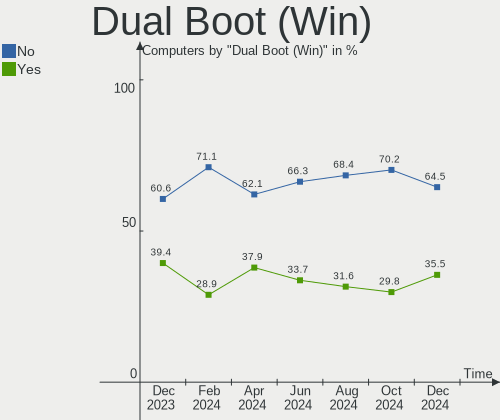
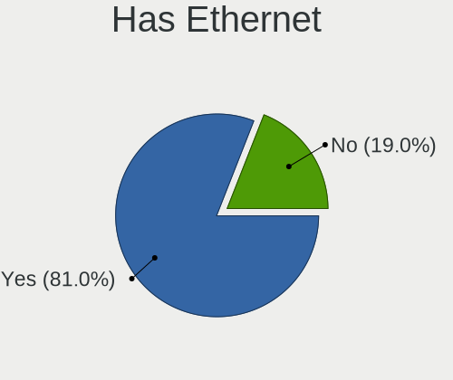
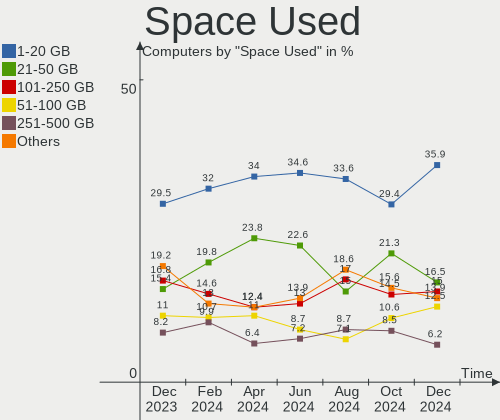
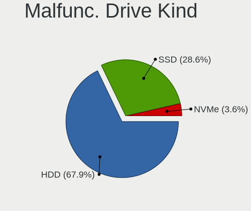
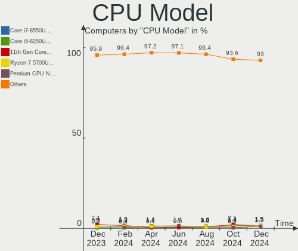
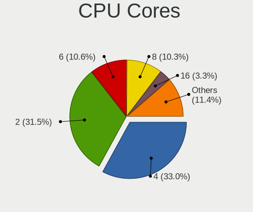
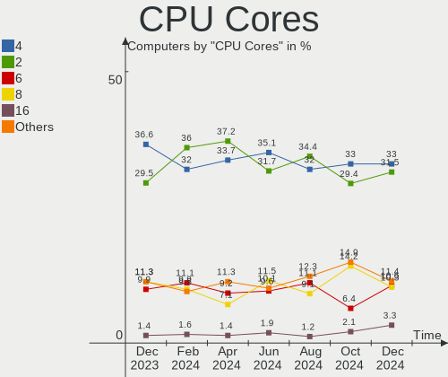
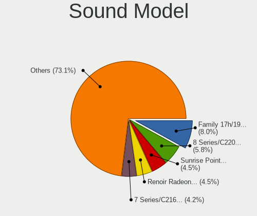
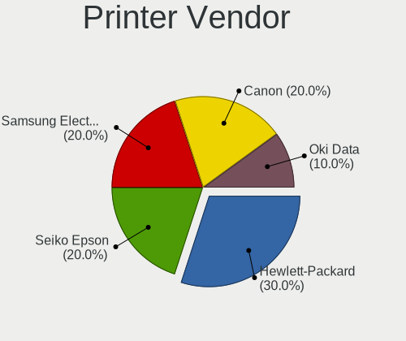
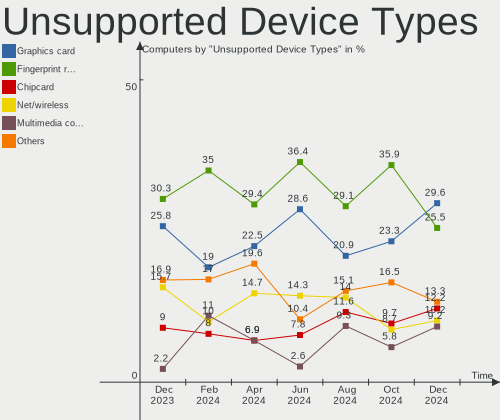

Linux in Italy - Hardware Trends
--------------------------------

A project to identify most popular hardware characteristics and track their change
over time based on data collected by Linux users at https://Linux-Hardware.org.

Anyone can contribute to this report by the [hw-probe](https://github.com/linuxhw/hw-probe) tool:

    sudo -E hw-probe -all -upload

This is a report for all computer types. See also reports for [desktops](/Location/Italy/Desktop/README.md) and [notebooks](/Location/Italy/Notebook/README.md).

Contents
--------

* [ System ](#system)
  - [ OS                       ](#os)
  - [ OS Family                ](#os-family)
  - [ Kernel                   ](#kernel)
  - [ Kernel Family            ](#kernel-family)
  - [ Kernel Major Ver.        ](#kernel-major-ver)
  - [ Arch                     ](#arch)
  - [ DE                       ](#de)
  - [ Display Server           ](#display-server)
  - [ Display Manager          ](#display-manager)
  - [ OS Lang                  ](#os-lang)
  - [ Boot Mode                ](#boot-mode)
  - [ Filesystem               ](#filesystem)
  - [ Part. scheme             ](#part-scheme)
  - [ Dual Boot with Linux/BSD ](#dual-boot-with-linuxbsd)
  - [ Dual Boot (Win)          ](#dual-boot-win)

* [ Board ](#board)
  - [ Vendor                   ](#vendor)
  - [ Model                    ](#model)
  - [ Model Family             ](#model-family)
  - [ MFG Year                 ](#mfg-year)
  - [ Form Factor              ](#form-factor)
  - [ Secure Boot              ](#secure-boot)
  - [ Coreboot                 ](#coreboot)
  - [ RAM Size                 ](#ram-size)
  - [ RAM Used                 ](#ram-used)
  - [ Total Drives             ](#total-drives)
  - [ Has CD-ROM               ](#has-cd-rom)
  - [ Has Ethernet             ](#has-ethernet)
  - [ Has WiFi                 ](#has-wifi)
  - [ Has Bluetooth            ](#has-bluetooth)

* [ Location ](#location)
  - [ Country                  ](#country)
  - [ City                     ](#city)

* [ Drives ](#drives)
  - [ Drive Vendor             ](#drive-vendor)
  - [ Drive Model              ](#drive-model)
  - [ HDD Vendor               ](#hdd-vendor)
  - [ SSD Vendor               ](#ssd-vendor)
  - [ Drive Kind               ](#drive-kind)
  - [ Drive Connector          ](#drive-connector)
  - [ Drive Size               ](#drive-size)
  - [ Space Total              ](#space-total)
  - [ Space Used               ](#space-used)
  - [ Malfunc. Drives          ](#malfunc-drives)
  - [ Malfunc. Drive Vendor    ](#malfunc-drive-vendor)
  - [ Malfunc. HDD Vendor      ](#malfunc-hdd-vendor)
  - [ Malfunc. Drive Kind      ](#malfunc-drive-kind)
  - [ Failed Drives            ](#failed-drives)
  - [ Failed Drive Vendor      ](#failed-drive-vendor)
  - [ Drive Status             ](#drive-status)

* [ Storage controller ](#storage-controller)
  - [ Storage Vendor           ](#storage-vendor)
  - [ Storage Model            ](#storage-model)
  - [ Storage Kind             ](#storage-kind)

* [ Processor ](#processor)
  - [ CPU Vendor               ](#cpu-vendor)
  - [ CPU Model                ](#cpu-model)
  - [ CPU Model Family         ](#cpu-model-family)
  - [ CPU Cores                ](#cpu-cores)
  - [ CPU Sockets              ](#cpu-sockets)
  - [ CPU Threads              ](#cpu-threads)
  - [ CPU Op-Modes             ](#cpu-op-modes)
  - [ CPU Microcode            ](#cpu-microcode)
  - [ CPU Microarch            ](#cpu-microarch)

* [ Graphics ](#graphics)
  - [ GPU Vendor               ](#gpu-vendor)
  - [ GPU Model                ](#gpu-model)
  - [ GPU Combo                ](#gpu-combo)
  - [ GPU Driver               ](#gpu-driver)
  - [ GPU Memory               ](#gpu-memory)

* [ Monitor ](#monitor)
  - [ Monitor Vendor           ](#monitor-vendor)
  - [ Monitor Model            ](#monitor-model)
  - [ Monitor Resolution       ](#monitor-resolution)
  - [ Monitor Diagonal         ](#monitor-diagonal)
  - [ Monitor Width            ](#monitor-width)
  - [ Aspect Ratio             ](#aspect-ratio)
  - [ Monitor Area             ](#monitor-area)
  - [ Pixel Density            ](#pixel-density)
  - [ Multiple Monitors        ](#multiple-monitors)

* [ Network ](#network)
  - [ Net Controller Vendor    ](#net-controller-vendor)
  - [ Net Controller Model     ](#net-controller-model)
  - [ Wireless Vendor          ](#wireless-vendor)
  - [ Wireless Model           ](#wireless-model)
  - [ Ethernet Vendor          ](#ethernet-vendor)
  - [ Ethernet Model           ](#ethernet-model)
  - [ Net Controller Kind      ](#net-controller-kind)
  - [ Used Controller          ](#used-controller)
  - [ NICs                     ](#nics)
  - [ IPv6                     ](#ipv6)

* [ Bluetooth ](#bluetooth)
  - [ Bluetooth Vendor         ](#bluetooth-vendor)
  - [ Bluetooth Model          ](#bluetooth-model)

* [ Sound ](#sound)
  - [ Sound Vendor             ](#sound-vendor)
  - [ Sound Model              ](#sound-model)

* [ Memory ](#memory)
  - [ Memory Vendor            ](#memory-vendor)
  - [ Memory Model             ](#memory-model)
  - [ Memory Kind              ](#memory-kind)
  - [ Memory Form Factor       ](#memory-form-factor)
  - [ Memory Size              ](#memory-size)
  - [ Memory Speed             ](#memory-speed)

* [ Printers & scanners ](#printers--scanners)
  - [ Printer Vendor           ](#printer-vendor)
  - [ Printer Model            ](#printer-model)
  - [ Scanner Vendor           ](#scanner-vendor)
  - [ Scanner Model            ](#scanner-model)

* [ Camera ](#camera)
  - [ Camera Vendor            ](#camera-vendor)
  - [ Camera Model             ](#camera-model)

* [ Security ](#security)
  - [ Fingerprint Vendor       ](#fingerprint-vendor)
  - [ Fingerprint Model        ](#fingerprint-model)
  - [ Chipcard Vendor          ](#chipcard-vendor)
  - [ Chipcard Model           ](#chipcard-model)

* [ Unsupported ](#unsupported)
  - [ Unsupported Devices      ](#unsupported-devices)
  - [ Unsupported Device Types ](#unsupported-device-types)

System
------

OS
--

Installed operating systems

| Name                         | Computers | Percent |
|------------------------------|-----------|---------|
| Ubuntu 22.04                 | 20        | 14.29%  |
| OpenMandriva 4.3             | 13        | 9.29%   |
| Fedora 36                    | 11        | 7.86%   |
| Ubuntu 20.04                 | 9         | 6.43%   |
| Linux Mint 20.3              | 9         | 6.43%   |
| Fedora 35                    | 8         | 5.71%   |
| Debian 11                    | 7         | 5%      |
| Xubuntu 20.04                | 4         | 2.86%   |
| KDE neon 20.04               | 4         | 2.86%   |
| Arch                         | 4         | 2.86%   |
| Zorin 16                     | 3         | 2.14%   |
| Ubuntu 21.10                 | 3         | 2.14%   |
| Pop!_OS 22.04                | 3         | 2.14%   |
| Manjaro 21.2.6               | 3         | 2.14%   |
| Manjaro                      | 3         | 2.14%   |
| Debian 10                    | 3         | 2.14%   |
| Pop!_OS 21.10                | 2         | 1.43%   |
| openSUSE Tumbleweed-XXXXXXXX | 2         | 1.43%   |
| Lubuntu 22.04                | 2         | 1.43%   |
| Elementary 6.1               | 2         | 1.43%   |
| Xubuntu 22.04                | 1         | 0.71%   |
| Ubuntu MATE 22.04            | 1         | 0.71%   |
| Ubuntu Core 18               | 1         | 0.71%   |
| Ubuntu 20.10                 | 1         | 0.71%   |
| Ubuntu 18.04                 | 1         | 0.71%   |
| Ubuntu 16.04                 | 1         | 0.71%   |
| SteamOS 3.1                  | 1         | 0.71%   |
| ROSA 12.1                    | 1         | 0.71%   |
| Q4OS 4                       | 1         | 0.71%   |
| Puppy 9                      | 1         | 0.71%   |
| Puppy 8.0                    | 1         | 0.71%   |
| OpenMandriva 4.2             | 1         | 0.71%   |
| OpenMandriva 3.0             | 1         | 0.71%   |
| Lubuntu 20.04                | 1         | 0.71%   |
| Lubuntu 18.04                | 1         | 0.71%   |
| LMDE 5                       | 1         | 0.71%   |
| Linux Mint 19.3              | 1         | 0.71%   |
| Linux Mint 18.3              | 1         | 0.71%   |
| Gentoo 2.8                   | 1         | 0.71%   |
| Gentoo 2.6                   | 1         | 0.71%   |
| Debian Unstable              | 1         | 0.71%   |
| Debian Testing               | 1         | 0.71%   |
| Debian 9                     | 1         | 0.71%   |
| Clear Linux 36010            | 1         | 0.71%   |
| ArcoLinux Rolling            | 1         | 0.71%   |

OS Family
---------

OS without a version

| Name         | Computers | Percent |
|--------------|-----------|---------|
| Ubuntu       | 36        | 25.71%  |
| Fedora       | 19        | 13.57%  |
| OpenMandriva | 15        | 10.71%  |
| Debian       | 13        | 9.29%   |
| Linux Mint   | 11        | 7.86%   |
| Manjaro      | 6         | 4.29%   |
| Xubuntu      | 5         | 3.57%   |
| Pop!_OS      | 5         | 3.57%   |
| Lubuntu      | 4         | 2.86%   |
| KDE neon     | 4         | 2.86%   |
| Arch         | 4         | 2.86%   |
| Zorin        | 3         | 2.14%   |
| Puppy        | 2         | 1.43%   |
| openSUSE     | 2         | 1.43%   |
| Gentoo       | 2         | 1.43%   |
| Elementary   | 2         | 1.43%   |
| Ubuntu MATE  | 1         | 0.71%   |
| SteamOS      | 1         | 0.71%   |
| ROSA         | 1         | 0.71%   |
| Q4OS         | 1         | 0.71%   |
| LMDE         | 1         | 0.71%   |
| Clear Linux  | 1         | 0.71%   |
| ArcoLinux    | 1         | 0.71%   |

Kernel
------

Version of the Linux kernel

| Version                                        | Computers | Percent |
|------------------------------------------------|-----------|---------|
| 5.16.7-desktop-1omv4003                        | 13        | 9.29%   |
| 5.13.0-41-generic                              | 10        | 7.14%   |
| 5.15.0-30-generic                              | 8         | 5.71%   |
| 5.15.0-27-generic                              | 8         | 5.71%   |
| 5.13.0-40-generic                              | 7         | 5%      |
| 5.17.6-300.fc36.x86_64                         | 5         | 3.57%   |
| 5.17.5-76051705-generic                        | 5         | 3.57%   |
| 5.10.0-14-amd64                                | 5         | 3.57%   |
| 5.4.0-109-generic                              | 4         | 2.86%   |
| 5.17.4-200.fc35.x86_64                         | 4         | 2.86%   |
| 5.4.0-113-generic                              | 3         | 2.14%   |
| 5.15.32-1-MANJARO                              | 3         | 2.14%   |
| 5.15.0-28-generic                              | 3         | 2.14%   |
| 5.15.0-25-generic                              | 3         | 2.14%   |
| 5.17.8-300.fc36.x86_64                         | 2         | 1.43%   |
| 5.17.5-arch1-1                                 | 2         | 1.43%   |
| 5.17.5-300.fc36.x86_64                         | 2         | 1.43%   |
| 5.17.5-200.fc35.x86_64                         | 2         | 1.43%   |
| 5.17.4-1-default                               | 2         | 1.43%   |
| 5.17.0-5.1-liquorix-amd64                      | 2         | 1.43%   |
| 5.17.0-1-amd64                                 | 2         | 1.43%   |
| 5.13.0-39-generic                              | 2         | 1.43%   |
| 5.10.0-13-amd64                                | 2         | 1.43%   |
| 4.19.0-17-amd64                                | 2         | 1.43%   |
| 5.8.0-63-generic                               | 1         | 0.71%   |
| 5.6.16-300.fc32.x86_64                         | 1         | 0.71%   |
| 5.4.53                                         | 1         | 0.71%   |
| 5.4.0-99-generic                               | 1         | 0.71%   |
| 5.4.0-42-generic                               | 1         | 0.71%   |
| 5.4.0-110-generic                              | 1         | 0.71%   |
| 5.4.0-107-lowlatency                           | 1         | 0.71%   |
| 5.18.0-zen1-1-zen                              | 1         | 0.71%   |
| 5.18.0                                         | 1         | 0.71%   |
| 5.17.9-300.fc36.x86_64                         | 1         | 0.71%   |
| 5.17.9-1-MANJARO                               | 1         | 0.71%   |
| 5.17.5-zen1-1-zen                              | 1         | 0.71%   |
| 5.17.5-gentoo-dist                             | 1         | 0.71%   |
| 5.17.5-301.fsync.fc36.x86_64                   | 1         | 0.71%   |
| 5.17.5-051705-generic                          | 1         | 0.71%   |
| 5.17.1-zen1-gungnir                            | 1         | 0.71%   |
| 5.17.1-arch1-1                                 | 1         | 0.71%   |
| 5.17.1-3-MANJARO                               | 1         | 0.71%   |
| 5.16.19-200.fc35.x86_64                        | 1         | 0.71%   |
| 5.16.13-1132.native                            | 1         | 0.71%   |
| 5.16.0-6-amd64                                 | 1         | 0.71%   |
| 5.15.0-33-generic                              | 1         | 0.71%   |
| 5.13.0-valve10.3-1-neptune-02176-g5fe416c4acd8 | 1         | 0.71%   |
| 5.13.0-44-generic                              | 1         | 0.71%   |
| 5.13.0-28-generic                              | 1         | 0.71%   |
| 5.13.0-27-generic                              | 1         | 0.71%   |
| 5.13.0-21-generic                              | 1         | 0.71%   |
| 5.13.0-19-generic                              | 1         | 0.71%   |
| 5.10.74-generic-2rosa2021.1-x86_64             | 1         | 0.71%   |
| 5.10.14-desktop-1omv4002                       | 1         | 0.71%   |
| 5.10.112-1-MANJARO                             | 1         | 0.71%   |
| 4.9.0-17-amd64                                 | 1         | 0.71%   |
| 4.4.0-210-generic                              | 1         | 0.71%   |
| 4.19.38-desktop-1omv                           | 1         | 0.71%   |
| 4.19.23                                        | 1         | 0.71%   |
| 4.19.0-20-amd64                                | 1         | 0.71%   |

Kernel Family
-------------

Linux kernel without a distro release

| Version  | Computers | Percent |
|----------|-----------|---------|
| 5.13.0   | 25        | 17.86%  |
| 5.15.0   | 23        | 16.43%  |
| 5.17.5   | 15        | 10.71%  |
| 5.16.7   | 13        | 9.29%   |
| 5.4.0    | 11        | 7.86%   |
| 5.10.0   | 7         | 5%      |
| 5.17.4   | 6         | 4.29%   |
| 5.17.6   | 5         | 3.57%   |
| 5.17.0   | 4         | 2.86%   |
| 5.17.1   | 3         | 2.14%   |
| 5.15.32  | 3         | 2.14%   |
| 4.19.0   | 3         | 2.14%   |
| 4.15.0   | 3         | 2.14%   |
| 5.18.0   | 2         | 1.43%   |
| 5.17.9   | 2         | 1.43%   |
| 5.17.8   | 2         | 1.43%   |
| 5.8.0    | 1         | 0.71%   |
| 5.6.16   | 1         | 0.71%   |
| 5.4.53   | 1         | 0.71%   |
| 5.16.19  | 1         | 0.71%   |
| 5.16.13  | 1         | 0.71%   |
| 5.16.0   | 1         | 0.71%   |
| 5.10.74  | 1         | 0.71%   |
| 5.10.14  | 1         | 0.71%   |
| 5.10.112 | 1         | 0.71%   |
| 4.9.0    | 1         | 0.71%   |
| 4.4.0    | 1         | 0.71%   |
| 4.19.38  | 1         | 0.71%   |
| 4.19.23  | 1         | 0.71%   |

Kernel Major Ver.
-----------------

Linux kernel major version

| Version | Computers | Percent |
|---------|-----------|---------|
| 5.17    | 37        | 26.43%  |
| 5.15    | 26        | 18.57%  |
| 5.13    | 25        | 17.86%  |
| 5.16    | 16        | 11.43%  |
| 5.4     | 12        | 8.57%   |
| 5.10    | 10        | 7.14%   |
| 4.19    | 5         | 3.57%   |
| 4.15    | 3         | 2.14%   |
| 5.18    | 2         | 1.43%   |
| 5.8     | 1         | 0.71%   |
| 5.6     | 1         | 0.71%   |
| 4.9     | 1         | 0.71%   |
| 4.4     | 1         | 0.71%   |

Arch
----

OS architecture (x86_64, i586, etc.)

| Name   | Computers | Percent |
|--------|-----------|---------|
| x86_64 | 139       | 99.29%  |
| i686   | 1         | 0.71%   |

DE
--

Desktop Environment

| Name            | Computers | Percent |
|-----------------|-----------|---------|
| GNOME           | 63        | 45%     |
| KDE5            | 31        | 22.14%  |
| XFCE            | 15        | 10.71%  |
| Unknown         | 9         | 6.43%   |
| MATE            | 6         | 4.29%   |
| LXQt            | 5         | 3.57%   |
| X-Cinnamon      | 4         | 2.86%   |
| Unity           | 2         | 1.43%   |
| Pantheon        | 2         | 1.43%   |
| LXDE            | 1         | 0.71%   |
| i3              | 1         | 0.71%   |
| GNOME Flashback | 1         | 0.71%   |

Display Server
--------------

X11 or Wayland

| Name    | Computers | Percent |
|---------|-----------|---------|
| X11     | 97        | 69.29%  |
| Wayland | 38        | 27.14%  |
| Unknown | 4         | 2.86%   |
| Tty     | 1         | 0.71%   |

Display Manager
---------------

SDDM, LightDM, etc.

| Name    | Computers | Percent |
|---------|-----------|---------|
| Unknown | 48        | 34.29%  |
| GDM3    | 29        | 20.71%  |
| SDDM    | 27        | 19.29%  |
| LightDM | 22        | 15.71%  |
| GDM     | 14        | 10%     |

OS Lang
-------

Language

| Lang    | Computers | Percent |
|---------|-----------|---------|
| it_IT   | 88        | 62.86%  |
| en_US   | 40        | 28.57%  |
| en_GB   | 5         | 3.57%   |
| Unknown | 5         | 3.57%   |
| en_IE   | 1         | 0.71%   |
| en_AU   | 1         | 0.71%   |

Boot Mode
---------

EFI or BIOS

| Mode | Computers | Percent |
|------|-----------|---------|
| EFI  | 71        | 50.71%  |
| BIOS | 69        | 49.29%  |

Filesystem
----------

Type of filesystem

| Type    | Computers | Percent |
|---------|-----------|---------|
| Ext4    | 97        | 69.29%  |
| Btrfs   | 21        | 15%     |
| Overlay | 15        | 10.71%  |
| Aufs    | 2         | 1.43%   |
| Zfs     | 1         | 0.71%   |
| XXX4    | 1         | 0.71%   |
| Xfs     | 1         | 0.71%   |
| F2fs    | 1         | 0.71%   |
| Unknown | 1         | 0.71%   |

Part. scheme
------------

Scheme of partitioning

| Type    | Computers | Percent |
|---------|-----------|---------|
| Unknown | 63        | 45%     |
| GPT     | 52        | 37.14%  |
| MBR     | 25        | 17.86%  |

Dual Boot with Linux/BSD
------------------------

Hosting more than one Linux/BSD

| Dual boot | Computers | Percent |
|-----------|-----------|---------|
| No        | 128       | 91.43%  |
| Yes       | 12        | 8.57%   |

Dual Boot (Win)
---------------

Hosting Linux and Windows

| Dual boot | Computers | Percent |
|-----------|-----------|---------|
| No        | 100       | 71.43%  |
| Yes       | 40        | 28.57%  |

Board
-----

Vendor
------

Motherboard manufacturer

| Name                | Computers | Percent |
|---------------------|-----------|---------|
| Hewlett-Packard     | 28        | 20%     |
| Lenovo              | 27        | 19.29%  |
| ASUSTek Computer    | 25        | 17.86%  |
| MSI                 | 8         | 5.71%   |
| Dell                | 8         | 5.71%   |
| Apple               | 5         | 3.57%   |
| Acer                | 5         | 3.57%   |
| Toshiba             | 4         | 2.86%   |
| HUAWEI              | 3         | 2.14%   |
| Sony                | 2         | 1.43%   |
| SANTECH             | 2         | 1.43%   |
| Mediacom            | 2         | 1.43%   |
| ASRock              | 2         | 1.43%   |
| Unknown             | 2         | 1.43%   |
| YASHI               | 1         | 0.71%   |
| Valve               | 1         | 0.71%   |
| Teclast             | 1         | 0.71%   |
| T-bao               | 1         | 0.71%   |
| Standard            | 1         | 0.71%   |
| Samsung Electronics | 1         | 0.71%   |
| Pegatron            | 1         | 0.71%   |
| PC Specialist       | 1         | 0.71%   |
| Packard Bell        | 1         | 0.71%   |
| Notebook            | 1         | 0.71%   |
| Microtech           | 1         | 0.71%   |
| Intel               | 1         | 0.71%   |
| Gigabyte Technology | 1         | 0.71%   |
| Foxconn             | 1         | 0.71%   |
| Chuwi               | 1         | 0.71%   |
| BESSTAR Tech        | 1         | 0.71%   |
| AMI                 | 1         | 0.71%   |

Model
-----

Motherboard model

| Name                                       | Computers | Percent |
|--------------------------------------------|-----------|---------|
| Unknown                                    | 3         | 2.14%   |
| Mediacom WinPad 11,6 FullHD- WPU11         | 2         | 1.43%   |
| HP Compaq 15                               | 2         | 1.43%   |
| YASHI MYBOOK 360                           | 1         | 0.71%   |
| Valve Jupiter                              | 1         | 0.71%   |
| Toshiba Satellite Pro S500                 | 1         | 0.71%   |
| Toshiba Satellite Pro L500                 | 1         | 0.71%   |
| Toshiba Satellite P20                      | 1         | 0.71%   |
| Toshiba Satellite C70-C-11L                | 1         | 0.71%   |
| Teclast F15 Plus                           | 1         | 0.71%   |
| T-bao MINI PC                              | 1         | 0.71%   |
| Sony VGN-NS21S_S                           | 1         | 0.71%   |
| Sony VGN-FW56J                             | 1         | 0.71%   |
| SANTECH NHx0EH_EJ_EK                       | 1         | 0.71%   |
| SANTECH NHx0DB,DE                          | 1         | 0.71%   |
| Samsung 270E5G/270E5U                      | 1         | 0.71%   |
| Pegatron Compaq dx2400 Microtower PC       | 1         | 0.71%   |
| PC Specialist NH5x_NH7x_HHx_HJx_HKx        | 1         | 0.71%   |
| Packard Bell EasyNote MH35                 | 1         | 0.71%   |
| Notebook W65_67SJ                          | 1         | 0.71%   |
| MSI Summit E13FlipEvo A11MT                | 1         | 0.71%   |
| MSI Prestige 14Evo A11M                    | 1         | 0.71%   |
| MSI NQ890AA-ABZ CQ5011IT                   | 1         | 0.71%   |
| MSI MS-7D03                                | 1         | 0.71%   |
| MSI MS-7A38                                | 1         | 0.71%   |
| MSI MS-7974                                | 1         | 0.71%   |
| MSI MS-7821                                | 1         | 0.71%   |
| MSI MS-16Y1                                | 1         | 0.71%   |
| Microtech CoreBookLite                     | 1         | 0.71%   |
| Lenovo Yoga 720-15IKB                      | 1         | 0.71%   |
| Lenovo Yoga 6 13ALC6 82ND                  | 1         | 0.71%   |
| Lenovo Yoga 530-14ARR 81H9                 | 1         | 0.71%   |
| Lenovo V15-ADA 82C7                        | 1         | 0.71%   |
| Lenovo V110-15ISK 80TL                     | 1         | 0.71%   |
| Lenovo ThinkPad X230 2325H50               | 1         | 0.71%   |
| Lenovo ThinkPad X1 Carbon Gen 8 20U9004HIX | 1         | 0.71%   |
| Lenovo ThinkPad T61 7661V72                | 1         | 0.71%   |
| Lenovo ThinkPad T520 4243WS4               | 1         | 0.71%   |
| Lenovo ThinkPad T440p 20AW000KUK           | 1         | 0.71%   |
| Lenovo ThinkPad T14s Gen 1 20T1S39D46      | 1         | 0.71%   |
| Lenovo ThinkPad T14 Gen 1 20S1SB5K00       | 1         | 0.71%   |
| Lenovo ThinkPad P14s Gen 2a 21A00049IX     | 1         | 0.71%   |
| Lenovo ThinkPad E560 20EV000YIX            | 1         | 0.71%   |
| Lenovo ThinkPad E555 20DH000WGE            | 1         | 0.71%   |
| Lenovo ThinkPad E15 Gen 3 20YG006HIX       | 1         | 0.71%   |
| Lenovo ThinkCentre M75n 11BS0000IX         | 1         | 0.71%   |
| Lenovo ThinkBook 16p Gen 2 20YM            | 1         | 0.71%   |
| Lenovo ThinkBook 15 G2 ITL 20VE            | 1         | 0.71%   |
| Lenovo MIIX 320-10ICR 80XF                 | 1         | 0.71%   |
| Lenovo IdeaPad S510p 20298                 | 1         | 0.71%   |
| Lenovo IdeaPad S340-15API 81NC             | 1         | 0.71%   |
| Lenovo IdeaPad Gaming 3 15ARH05 82EY       | 1         | 0.71%   |
| Lenovo IdeaPad 320S-14IKB 81BN             | 1         | 0.71%   |
| Lenovo G500 20236                          | 1         | 0.71%   |
| Lenovo B590 37613LG                        | 1         | 0.71%   |
| Lenovo B50-30 F0AU00EEIX                   | 1         | 0.71%   |
| Intel NUC8i3BEH                            | 1         | 0.71%   |
| HUAWEI KLVL-WXX9                           | 1         | 0.71%   |
| HUAWEI HN-WX9X                             | 1         | 0.71%   |
| HUAWEI BOM-WXX9                            | 1         | 0.71%   |

Model Family
------------

Motherboard model prefix

| Name                   | Computers | Percent |
|------------------------|-----------|---------|
| Lenovo ThinkPad        | 11        | 7.86%   |
| HP Compaq              | 8         | 5.71%   |
| Toshiba Satellite      | 4         | 2.86%   |
| Lenovo IdeaPad         | 4         | 2.86%   |
| Lenovo Yoga            | 3         | 2.14%   |
| HP ProBook             | 3         | 2.14%   |
| HP 255                 | 3         | 2.14%   |
| Dell XPS               | 3         | 2.14%   |
| ASUS PRIME             | 3         | 2.14%   |
| Acer Aspire            | 3         | 2.14%   |
| Unknown                | 3         | 2.14%   |
| Mediacom WinPad        | 2         | 1.43%   |
| Lenovo ThinkBook       | 2         | 1.43%   |
| HP Pavilion            | 2         | 1.43%   |
| HP Laptop              | 2         | 1.43%   |
| HP EliteBook           | 2         | 1.43%   |
| Dell OptiPlex          | 2         | 1.43%   |
| ASUS VivoBook          | 2         | 1.43%   |
| ASUS ROG               | 2         | 1.43%   |
| YASHI MYBOOK           | 1         | 0.71%   |
| Valve Jupiter          | 1         | 0.71%   |
| Teclast F15            | 1         | 0.71%   |
| T-bao MINI             | 1         | 0.71%   |
| Sony VGN-NS21S         | 1         | 0.71%   |
| Sony VGN-FW56J         | 1         | 0.71%   |
| SANTECH NHx0EH         | 1         | 0.71%   |
| SANTECH NHx0DB         | 1         | 0.71%   |
| Samsung 270E5G         | 1         | 0.71%   |
| Pegatron Compaq        | 1         | 0.71%   |
| PC Specialist NH5x     | 1         | 0.71%   |
| Packard Bell EasyNote  | 1         | 0.71%   |
| Notebook W65           | 1         | 0.71%   |
| MSI Summit             | 1         | 0.71%   |
| MSI Prestige           | 1         | 0.71%   |
| MSI NQ890AA-ABZ        | 1         | 0.71%   |
| MSI MS-7D03            | 1         | 0.71%   |
| MSI MS-7A38            | 1         | 0.71%   |
| MSI MS-7974            | 1         | 0.71%   |
| MSI MS-7821            | 1         | 0.71%   |
| MSI MS-16Y1            | 1         | 0.71%   |
| Microtech CoreBookLite | 1         | 0.71%   |
| Lenovo V15-ADA         | 1         | 0.71%   |
| Lenovo V110-15ISK      | 1         | 0.71%   |
| Lenovo ThinkCentre     | 1         | 0.71%   |
| Lenovo MIIX            | 1         | 0.71%   |
| Lenovo G500            | 1         | 0.71%   |
| Lenovo B590            | 1         | 0.71%   |
| Lenovo B50-30          | 1         | 0.71%   |
| Intel NUC8i3BEH        | 1         | 0.71%   |
| HUAWEI KLVL-WXX9       | 1         | 0.71%   |
| HUAWEI HN-WX9X         | 1         | 0.71%   |
| HUAWEI BOM-WXX9        | 1         | 0.71%   |
| HP ProLiant            | 1         | 0.71%   |
| HP ProDesk             | 1         | 0.71%   |
| HP OMEN                | 1         | 0.71%   |
| HP G62                 | 1         | 0.71%   |
| HP ENVY                | 1         | 0.71%   |
| HP 870-022nl           | 1         | 0.71%   |
| HP 635                 | 1         | 0.71%   |
| HP 250                 | 1         | 0.71%   |

MFG Year
--------

Motherboard manufacture year

| Year | Computers | Percent |
|------|-----------|---------|
| 2020 | 21        | 15%     |
| 2021 | 18        | 12.86%  |
| 2011 | 12        | 8.57%   |
| 2013 | 11        | 7.86%   |
| 2009 | 11        | 7.86%   |
| 2014 | 9         | 6.43%   |
| 2018 | 8         | 5.71%   |
| 2017 | 7         | 5%      |
| 2016 | 7         | 5%      |
| 2015 | 7         | 5%      |
| 2008 | 6         | 4.29%   |
| 2007 | 6         | 4.29%   |
| 2019 | 5         | 3.57%   |
| 2012 | 5         | 3.57%   |
| 2010 | 3         | 2.14%   |
| 2022 | 2         | 1.43%   |
| 2006 | 1         | 0.71%   |
| 2004 | 1         | 0.71%   |

Form Factor
-----------

Physical design of the computer

| Name        | Computers | Percent |
|-------------|-----------|---------|
| Notebook    | 92        | 65.71%  |
| Desktop     | 32        | 22.86%  |
| Convertible | 5         | 3.57%   |
| Mini pc     | 5         | 3.57%   |
| All in one  | 4         | 2.86%   |
| Tablet      | 1         | 0.71%   |
| Server      | 1         | 0.71%   |

Secure Boot
-----------

Enabled or disabled

| State    | Computers | Percent |
|----------|-----------|---------|
| Disabled | 131       | 93.57%  |
| Enabled  | 9         | 6.43%   |

Coreboot
--------

Have coreboot on board

| Used | Computers | Percent |
|------|-----------|---------|
| No   | 140       | 100%    |

RAM Size
--------

Total RAM memory

| Size in GB  | Computers | Percent |
|-------------|-----------|---------|
| 4.01-8.0    | 40        | 28.57%  |
| 3.01-4.0    | 33        | 23.57%  |
| 16.01-24.0  | 21        | 15%     |
| 8.01-16.0   | 21        | 15%     |
| 32.01-64.0  | 14        | 10%     |
| 1.01-2.0    | 9         | 6.43%   |
| 2.01-3.0    | 1         | 0.71%   |
| 64.01-256.0 | 1         | 0.71%   |

RAM Used
--------

Used RAM memory

| Used GB    | Computers | Percent |
|------------|-----------|---------|
| 1.01-2.0   | 49        | 35%     |
| 2.01-3.0   | 36        | 25.71%  |
| 4.01-8.0   | 18        | 12.86%  |
| 0.51-1.0   | 17        | 12.14%  |
| 3.01-4.0   | 13        | 9.29%   |
| 8.01-16.0  | 5         | 3.57%   |
| 24.01-32.0 | 1         | 0.71%   |
| 0.01-0.5   | 1         | 0.71%   |

Total Drives
------------

Number of drives on board

| Drives | Computers | Percent |
|--------|-----------|---------|
| 1      | 98        | 70%     |
| 2      | 25        | 17.86%  |
| 3      | 10        | 7.14%   |
| 0      | 4         | 2.86%   |
| 5      | 2         | 1.43%   |
| 7      | 1         | 0.71%   |

Has CD-ROM
----------

Has CD-ROM on board

| Presented | Computers | Percent |
|-----------|-----------|---------|
| No        | 75        | 53.57%  |
| Yes       | 65        | 46.43%  |

Has Ethernet
------------

Has Ethernet on board

| Presented | Computers | Percent |
|-----------|-----------|---------|
| Yes       | 113       | 80.71%  |
| No        | 27        | 19.29%  |

Has WiFi
--------

Has WiFi module

| Presented | Computers | Percent |
|-----------|-----------|---------|
| Yes       | 119       | 85%     |
| No        | 21        | 15%     |

Has Bluetooth
-------------

Has Bluetooth module

| Presented | Computers | Percent |
|-----------|-----------|---------|
| Yes       | 85        | 60.71%  |
| No        | 55        | 39.29%  |

Location
--------

Country
-------

Geographic location (country)

| Country | Computers | Percent |
|---------|-----------|---------|
| Italy   | 140       | 100%    |

City
----

Geographic location (city)

| City                        | Computers | Percent |
|-----------------------------|-----------|---------|
| Milan                       | 32        | 22.86%  |
| Rome                        | 13        | 9.29%   |
| Turin                       | 7         | 5%      |
| Bologna                     | 5         | 3.57%   |
| Casalecchio di Reno         | 4         | 2.86%   |
| Taranto                     | 3         | 2.14%   |
| Palermo                     | 3         | 2.14%   |
| Adelfia                     | 3         | 2.14%   |
| Parma                       | 2         | 1.43%   |
| Naples                      | 2         | 1.43%   |
| Marcon                      | 2         | 1.43%   |
| Francavilla al Mare         | 2         | 1.43%   |
| Bolzano                     | 2         | 1.43%   |
| Villanova Monteleone        | 1         | 0.71%   |
| Vicenza                     | 1         | 0.71%   |
| Venice                      | 1         | 0.71%   |
| Varallo Pombia              | 1         | 0.71%   |
| Trieste                     | 1         | 0.71%   |
| Treviso                     | 1         | 0.71%   |
| Trento                      | 1         | 0.71%   |
| Tito                        | 1         | 0.71%   |
| Tempio Pausania             | 1         | 0.71%   |
| Staranzano                  | 1         | 0.71%   |
| Spoleto                     | 1         | 0.71%   |
| Spinea                      | 1         | 0.71%   |
| Sorrento                    | 1         | 0.71%   |
| Sassuolo                    | 1         | 0.71%   |
| Sarzana                     | 1         | 0.71%   |
| Sangano                     | 1         | 0.71%   |
| San Martino di Lupari       | 1         | 0.71%   |
| San Fermo della Battaglia   | 1         | 0.71%   |
| San Casciano in Val di Pesa | 1         | 0.71%   |
| Salsomaggiore Terme         | 1         | 0.71%   |
| Rosolini                    | 1         | 0.71%   |
| Rho                         | 1         | 0.71%   |
| Prato Sesia                 | 1         | 0.71%   |
| Pisa                        | 1         | 0.71%   |
| Piombino Dese               | 1         | 0.71%   |
| Piazzola sul Brenta         | 1         | 0.71%   |
| Pian di Scò                | 1         | 0.71%   |
| Ostuni                      | 1         | 0.71%   |
| Nuvolera                    | 1         | 0.71%   |
| Novara                      | 1         | 0.71%   |
| Modena                      | 1         | 0.71%   |
| Mirano                      | 1         | 0.71%   |
| Miradolo Terme              | 1         | 0.71%   |
| Mentana                     | 1         | 0.71%   |
| Masi Torello                | 1         | 0.71%   |
| Madone                      | 1         | 0.71%   |
| Maddaloni                   | 1         | 0.71%   |
| Grosseto                    | 1         | 0.71%   |
| Genoa                       | 1         | 0.71%   |
| Forlì                      | 1         | 0.71%   |
| Florence                    | 1         | 0.71%   |
| Dalmine                     | 1         | 0.71%   |
| Civitanova Alta             | 1         | 0.71%   |
| Cinisello Balsamo           | 1         | 0.71%   |
| Cesano Maderno              | 1         | 0.71%   |
| Catania                     | 1         | 0.71%   |
| Castelnuovo Rangone         | 1         | 0.71%   |

Drives
------

Drive Vendor
------------

Hard drive vendors

| Vendor                         | Computers | Drives | Percent |
|--------------------------------|-----------|--------|---------|
| Samsung Electronics            | 31        | 35     | 17.13%  |
| WDC                            | 18        | 19     | 9.94%   |
| Seagate                        | 15        | 15     | 8.29%   |
| Toshiba                        | 13        | 14     | 7.18%   |
| SanDisk                        | 13        | 13     | 7.18%   |
| Crucial                        | 13        | 13     | 7.18%   |
| Hitachi                        | 10        | 10     | 5.52%   |
| Unknown                        | 8         | 8      | 4.42%   |
| Kingston                       | 7         | 7      | 3.87%   |
| HGST                           | 7         | 7      | 3.87%   |
| Phison                         | 4         | 5      | 2.21%   |
| SK Hynix                       | 3         | 3      | 1.66%   |
| KIOXIA                         | 3         | 3      | 1.66%   |
| Intel                          | 3         | 3      | 1.66%   |
| Fujitsu                        | 3         | 3      | 1.66%   |
| Unknown                        | 3         | 3      | 1.66%   |
| Transcend                      | 2         | 2      | 1.1%    |
| Silicon Motion                 | 2         | 2      | 1.1%    |
| GOODRAM                        | 2         | 2      | 1.1%    |
| Dogfish                        | 2         | 2      | 1.1%    |
| USB3.0                         | 1         | 1      | 0.55%   |
| Union Memory (Shenzhen)        | 1         | 1      | 0.55%   |
| UMIS                           | 1         | 1      | 0.55%   |
| TO Exter                       | 1         | 1      | 0.55%   |
| Teclast                        | 1         | 1      | 0.55%   |
| SPCC                           | 1         | 1      | 0.55%   |
| Solid State Storage Technology | 1         | 1      | 0.55%   |
| OCZ                            | 1         | 1      | 0.55%   |
| O2 Micro                       | 1         | 1      | 0.55%   |
| Netac                          | 1         | 1      | 0.55%   |
| Micron Technology              | 1         | 1      | 0.55%   |
| KingSpec                       | 1         | 1      | 0.55%   |
| kimtigo                        | 1         | 1      | 0.55%   |
| Intenso                        | 1         | 1      | 0.55%   |
| IBM/Hitachi                    | 1         | 1      | 0.55%   |
| IBM-207x                       | 1         | 4      | 0.55%   |
| BAITITON                       | 1         | 1      | 0.55%   |
| Apple                          | 1         | 1      | 0.55%   |
| 1TB                            | 1         | 1      | 0.55%   |

Drive Model
-----------

Hard drive models

| Model                                        | Computers | Percent |
|----------------------------------------------|-----------|---------|
| HGST HTS545050A7E680 500GB                   | 3         | 1.61%   |
| Crucial CT480BX500SSD1 480GB                 | 3         | 1.61%   |
| Unknown                                      | 3         | 1.61%   |
| Unknown SD/MMC/MS PRO 999GB                  | 2         | 1.08%   |
| Unknown NCard  32GB                          | 2         | 1.08%   |
| Seagate ST500LT012-1DG142 500GB              | 2         | 1.08%   |
| SanDisk SDSSDA240G 240GB                     | 2         | 1.08%   |
| Sandisk NVMe SSD Drive 512GB                 | 2         | 1.08%   |
| Samsung SSD 970 EVO Plus 500GB               | 2         | 1.08%   |
| Samsung SSD 970 EVO Plus 1TB                 | 2         | 1.08%   |
| Samsung SSD 850 EVO 250GB                    | 2         | 1.08%   |
| Samsung NVMe SSD Drive 512GB                 | 2         | 1.08%   |
| Crucial CT240BX500SSD1 240GB                 | 2         | 1.08%   |
| Crucial CT240BX200SSD1 240GB                 | 2         | 1.08%   |
| WDC WDS500G2B0A-00SM50 500GB SSD             | 1         | 0.54%   |
| WDC WDS120G2G0A-00JH30 120GB SSD             | 1         | 0.54%   |
| WDC WD7500BFCX-68N6GN0 752GB                 | 1         | 0.54%   |
| WDC WD5000LPVX-60V0TT0 500GB                 | 1         | 0.54%   |
| WDC WD5000AAKX-2 500GB                       | 1         | 0.54%   |
| WDC WD5000AAKX-00ERMA0 500GB                 | 1         | 0.54%   |
| WDC WD5000AAKS-00UU3A0 500GB                 | 1         | 0.54%   |
| WDC WD1600BEVS-22UST0 160GB                  | 1         | 0.54%   |
| WDC WD10SPZX-60Z10T0 1TB                     | 1         | 0.54%   |
| WDC WD10SPCX-08S8TT0 1TB                     | 1         | 0.54%   |
| WDC WD10EZEX-75WN4A0 1TB                     | 1         | 0.54%   |
| WDC WD10EZEX-22BN5A0 1TB                     | 1         | 0.54%   |
| WDC WD10EFRX-68FYTN0 1TB                     | 1         | 0.54%   |
| WDC WD10EACS-00D6B1 1TB                      | 1         | 0.54%   |
| WDC WD1003FZEX-00K3CA0 1TB                   | 1         | 0.54%   |
| WDC WD1003FBYX-01Y7B1 1TB                    | 1         | 0.54%   |
| WDC PC SN730 SDBPNTY-1T00-1101 1TB           | 1         | 0.54%   |
| WDC PC SN520 SDAPMUW-256G-1101 256GB         | 1         | 0.54%   |
| USB3.0 Super Speed 240GB                     | 1         | 0.54%   |
| Unknown MMC Card  32GB                       | 1         | 0.54%   |
| Unknown MMC Card  248GB                      | 1         | 0.54%   |
| Unknown ED4QT  128GB                         | 1         | 0.54%   |
| Unknown 128G32  128GB                        | 1         | 0.54%   |
| Union Memory (Shenzhen) NVMe SSD Drive 256GB | 1         | 0.54%   |
| UMIS RPETJ512MGE2QDQ 512GB                   | 1         | 0.54%   |
| Transcend TS128GSSD370 128GB                 | 1         | 0.54%   |
| Transcend TS128GMSA230S 128GB SSD            | 1         | 0.54%   |
| Toshiba THNSNH128GCST 128GB SSD              | 1         | 0.54%   |
| Toshiba NVMe SSD Drive 512GB                 | 1         | 0.54%   |
| Toshiba NVMe SSD Drive 2TB                   | 1         | 0.54%   |
| Toshiba MQ04ABF100 1TB                       | 1         | 0.54%   |
| Toshiba MQ01ACF050 500GB                     | 1         | 0.54%   |
| Toshiba MQ01ACF032 320GB                     | 1         | 0.54%   |
| Toshiba MQ01ABF050 500GB                     | 1         | 0.54%   |
| Toshiba MQ01ABD100 1TB                       | 1         | 0.54%   |
| Toshiba MK8032GSX 80GB                       | 1         | 0.54%   |
| Toshiba MK5061GSYN 500GB                     | 1         | 0.54%   |
| Toshiba MK1059GSM 1TB                        | 1         | 0.54%   |
| Toshiba KXG6AZNV256G 256GB                   | 1         | 0.54%   |
| Toshiba KBG40ZNT512G MEMORY 512GB            | 1         | 0.54%   |
| Toshiba HDWD120 2TB                          | 1         | 0.54%   |
| TO Exter nal USB 3.0 320GB                   | 1         | 0.54%   |
| Teclast BD256GB SHCB-2280 SSD                | 1         | 0.54%   |
| SPCC Solid State Disk 512GB                  | 1         | 0.54%   |
| Solid State Storage NVMe SSD Drive 512GB     | 1         | 0.54%   |
| SK Hynix SKHynix_HFS256GD9TNI-L2B0B 256GB    | 1         | 0.54%   |

HDD Vendor
----------

Hard disk drive vendors

| Vendor      | Computers | Drives | Percent |
|-------------|-----------|--------|---------|
| Seagate     | 15        | 15     | 24.19%  |
| WDC         | 14        | 15     | 22.58%  |
| Hitachi     | 10        | 10     | 16.13%  |
| Toshiba     | 9         | 9      | 14.52%  |
| HGST        | 7         | 7      | 11.29%  |
| Fujitsu     | 3         | 3      | 4.84%   |
| Unknown     | 2         | 2      | 3.23%   |
| IBM/Hitachi | 1         | 1      | 1.61%   |
| IBM-207x    | 1         | 4      | 1.61%   |

SSD Vendor
----------

Solid state drive vendors

| Vendor              | Computers | Drives | Percent |
|---------------------|-----------|--------|---------|
| Samsung Electronics | 12        | 13     | 19.35%  |
| Crucial             | 11        | 11     | 17.74%  |
| SanDisk             | 8         | 8      | 12.9%   |
| Kingston            | 7         | 7      | 11.29%  |
| WDC                 | 2         | 2      | 3.23%   |
| Transcend           | 2         | 2      | 3.23%   |
| GOODRAM             | 2         | 2      | 3.23%   |
| Dogfish             | 2         | 2      | 3.23%   |
| Unknown             | 2         | 2      | 3.23%   |
| USB3.0              | 1         | 1      | 1.61%   |
| Toshiba             | 1         | 1      | 1.61%   |
| TO Exter            | 1         | 1      | 1.61%   |
| Teclast             | 1         | 1      | 1.61%   |
| SPCC                | 1         | 1      | 1.61%   |
| SK Hynix            | 1         | 1      | 1.61%   |
| OCZ                 | 1         | 1      | 1.61%   |
| Netac               | 1         | 1      | 1.61%   |
| Micron Technology   | 1         | 1      | 1.61%   |
| KingSpec            | 1         | 1      | 1.61%   |
| Intel               | 1         | 1      | 1.61%   |
| BAITITON            | 1         | 1      | 1.61%   |
| Apple               | 1         | 1      | 1.61%   |
| 1TB                 | 1         | 1      | 1.61%   |

Drive Kind
----------

HDD or SSD

| Kind    | Computers | Drives | Percent |
|---------|-----------|--------|---------|
| HDD     | 58        | 66     | 34.73%  |
| SSD     | 55        | 63     | 32.93%  |
| NVMe    | 45        | 52     | 26.95%  |
| MMC     | 8         | 9      | 4.79%   |
| Unknown | 1         | 1      | 0.6%    |

Drive Connector
---------------

SATA, SAS, NVMe, etc.

| Type | Computers | Drives | Percent |
|------|-----------|--------|---------|
| SATA | 96        | 125    | 62.34%  |
| NVMe | 45        | 52     | 29.22%  |
| MMC  | 8         | 9      | 5.19%   |
| SAS  | 5         | 5      | 3.25%   |

Drive Size
----------

Size of hard drive

| Size in TB | Computers | Drives | Percent |
|------------|-----------|--------|---------|
| 0.01-0.5   | 78        | 89     | 72.9%   |
| 0.51-1.0   | 24        | 35     | 22.43%  |
| 1.01-2.0   | 4         | 4      | 3.74%   |
| 4.01-10.0  | 1         | 1      | 0.93%   |

Space Total
-----------

Amount of disk space available on the file system

| Size in GB     | Computers | Percent |
|----------------|-----------|---------|
| 101-250        | 36        | 25.71%  |
| 251-500        | 32        | 22.86%  |
| 1-20           | 19        | 13.57%  |
| 51-100         | 13        | 9.29%   |
| 501-1000       | 12        | 8.57%   |
| 2001-3000      | 7         | 5%      |
| Unknown        | 7         | 5%      |
| 1001-2000      | 6         | 4.29%   |
| 21-50          | 5         | 3.57%   |
| More than 3000 | 3         | 2.14%   |

Space Used
----------

Amount of used disk space

| Used GB        | Computers | Percent |
|----------------|-----------|---------|
| 1-20           | 68        | 48.57%  |
| 21-50          | 15        | 10.71%  |
| 101-250        | 15        | 10.71%  |
| 51-100         | 14        | 10%     |
| 251-500        | 9         | 6.43%   |
| Unknown        | 7         | 5%      |
| 501-1000       | 6         | 4.29%   |
| 1001-2000      | 4         | 2.86%   |
| More than 3000 | 2         | 1.43%   |

Malfunc. Drives
---------------

Drive models with a malfunction

| Model                         | Computers | Drives | Percent |
|-------------------------------|-----------|--------|---------|
| WDC WD7500BFCX-68N6GN0 752GB  | 1         | 1      | 12.5%   |
| WDC WD1600BEVS-22UST0 160GB   | 1         | 1      | 12.5%   |
| Toshiba MQ01ABF050 500GB      | 1         | 1      | 12.5%   |
| Toshiba MK5061GSYN 500GB      | 1         | 1      | 12.5%   |
| Seagate ST3250318AS 250GB     | 1         | 1      | 12.5%   |
| Hitachi HTS547575A9E384 752GB | 1         | 1      | 12.5%   |
| HGST HTS725050A7E630 500GB    | 1         | 1      | 12.5%   |
| HGST HTS545050A7E680 500GB    | 1         | 1      | 12.5%   |

Malfunc. Drive Vendor
---------------------

Vendors of faulty drives

| Vendor  | Computers | Drives | Percent |
|---------|-----------|--------|---------|
| WDC     | 2         | 2      | 25%     |
| Toshiba | 2         | 2      | 25%     |
| HGST    | 2         | 2      | 25%     |
| Seagate | 1         | 1      | 12.5%   |
| Hitachi | 1         | 1      | 12.5%   |

Malfunc. HDD Vendor
-------------------

Vendors of faulty HDD drives

| Vendor  | Computers | Drives | Percent |
|---------|-----------|--------|---------|
| WDC     | 2         | 2      | 25%     |
| Toshiba | 2         | 2      | 25%     |
| HGST    | 2         | 2      | 25%     |
| Seagate | 1         | 1      | 12.5%   |
| Hitachi | 1         | 1      | 12.5%   |

Malfunc. Drive Kind
-------------------

Kinds of faulty drives

| Kind | Computers | Drives | Percent |
|------|-----------|--------|---------|
| HDD  | 8         | 8      | 100%    |

Failed Drives
-------------

Failed drive models

Zero info for selected period =(

Failed Drive Vendor
-------------------

Failed drive vendors

Zero info for selected period =(

Drive Status
------------

Number of failed and malfunc. drives

| Status   | Computers | Drives | Percent |
|----------|-----------|--------|---------|
| Detected | 69        | 96     | 49.64%  |
| Works    | 62        | 87     | 44.6%   |
| Malfunc  | 8         | 8      | 5.76%   |

Storage controller
------------------

Storage Vendor
--------------

Storage controller vendors

| Vendor                           | Computers | Percent |
|----------------------------------|-----------|---------|
| Intel                            | 87        | 52.1%   |
| AMD                              | 23        | 13.77%  |
| Samsung Electronics              | 20        | 11.98%  |
| Sandisk                          | 5         | 2.99%   |
| Toshiba America Info Systems     | 4         | 2.4%    |
| Phison Electronics               | 4         | 2.4%    |
| Nvidia                           | 4         | 2.4%    |
| Silicon Motion                   | 3         | 1.8%    |
| KIOXIA                           | 3         | 1.8%    |
| Union Memory (Shenzhen)          | 2         | 1.2%    |
| SK Hynix                         | 2         | 1.2%    |
| Silicon Integrated Systems [SiS] | 2         | 1.2%    |
| Micron/Crucial Technology        | 2         | 1.2%    |
| Solid State Storage Technology   | 1         | 0.6%    |
| O2 Micro                         | 1         | 0.6%    |
| Marvell Technology Group         | 1         | 0.6%    |
| JMicron Technology               | 1         | 0.6%    |
| Hewlett-Packard                  | 1         | 0.6%    |
| ASMedia Technology               | 1         | 0.6%    |

Storage Model
-------------

Storage controller models

| Model                                                                            | Computers | Percent |
|----------------------------------------------------------------------------------|-----------|---------|
| AMD FCH SATA Controller [AHCI mode]                                              | 17        | 8.9%    |
| Samsung NVMe SSD Controller SM981/PM981/PM983                                    | 12        | 6.28%   |
| Intel 7 Series Chipset Family 6-port SATA Controller [AHCI mode]                 | 8         | 4.19%   |
| Intel Celeron/Pentium Silver Processor SATA Controller                           | 6         | 3.14%   |
| Intel 82801 Mobile SATA Controller [RAID mode]                                   | 6         | 3.14%   |
| Intel 6 Series/C200 Series Chipset Family 6 port Mobile SATA AHCI Controller     | 6         | 3.14%   |
| Samsung NVMe SSD Controller 980                                                  | 5         | 2.62%   |
| Intel 8 Series/C220 Series Chipset Family 6-port SATA Controller 1 [AHCI mode]   | 5         | 2.62%   |
| Intel 82801IBM/IEM (ICH9M/ICH9M-E) 4 port SATA Controller [AHCI mode]            | 4         | 2.09%   |
| Intel 6 Series/C200 Series Chipset Family 6 port Desktop SATA AHCI Controller    | 4         | 2.09%   |
| Intel 400 Series Chipset Family SATA AHCI Controller                             | 4         | 2.09%   |
| Silicon Motion SM2263EN/SM2263XT SSD Controller                                  | 3         | 1.57%   |
| Samsung NVMe SSD Controller PM9A1/PM9A3/980PRO                                   | 3         | 1.57%   |
| KIOXIA Non-Volatile memory controller                                            | 3         | 1.57%   |
| Intel Wildcat Point-LP SATA Controller [AHCI Mode]                               | 3         | 1.57%   |
| Intel Sunrise Point-LP SATA Controller [AHCI mode]                               | 3         | 1.57%   |
| Intel 82801HM/HEM (ICH8M/ICH8M-E) SATA Controller [AHCI mode]                    | 3         | 1.57%   |
| Intel 82801HM/HEM (ICH8M/ICH8M-E) IDE Controller                                 | 3         | 1.57%   |
| Intel 8 Series SATA Controller 1 [AHCI mode]                                     | 3         | 1.57%   |
| Intel 500 Series Chipset Family SATA AHCI Controller                             | 3         | 1.57%   |
| Intel 5 Series/3400 Series Chipset 4 port SATA AHCI Controller                   | 3         | 1.57%   |
| AMD SB7x0/SB8x0/SB9x0 SATA Controller [AHCI mode]                                | 3         | 1.57%   |
| Toshiba America Info Systems XG6 NVMe SSD Controller                             | 2         | 1.05%   |
| Silicon Integrated Systems [SiS] SATA Controller / IDE mode                      | 2         | 1.05%   |
| Silicon Integrated Systems [SiS] 5513 IDE Controller                             | 2         | 1.05%   |
| Nvidia MCP79 AHCI Controller                                                     | 2         | 1.05%   |
| Micron/Crucial P2 NVMe PCIe SSD                                                  | 2         | 1.05%   |
| Intel Volume Management Device NVMe RAID Controller                              | 2         | 1.05%   |
| Intel Q170/Q150/B150/H170/H110/Z170/CM236 Chipset SATA Controller [AHCI Mode]    | 2         | 1.05%   |
| Intel NM10/ICH7 Family SATA Controller [IDE mode]                                | 2         | 1.05%   |
| Intel HM170/QM170 Chipset SATA Controller [AHCI Mode]                            | 2         | 1.05%   |
| Intel Cannon Point-LP SATA Controller [AHCI Mode]                                | 2         | 1.05%   |
| Intel 82801IR/IO/IH (ICH9R/DO/DH) 4 port SATA Controller [IDE mode]              | 2         | 1.05%   |
| Intel 82801I (ICH9 Family) 2 port SATA Controller [IDE mode]                     | 2         | 1.05%   |
| Intel 82801G (ICH7 Family) IDE Controller                                        | 2         | 1.05%   |
| AMD SB7x0/SB8x0/SB9x0 IDE Controller                                             | 2         | 1.05%   |
| Union Memory (Shenzhen) Non-Volatile memory controller                           | 1         | 0.52%   |
| Union Memory (Shenzhen) AM630 PCIe 4.0 x4 NVMe SSD Controller                    | 1         | 0.52%   |
| Toshiba America Info Systems Toshiba America Info Non-Volatile memory controller | 1         | 0.52%   |
| Toshiba America Info Systems BG3 NVMe SSD Controller                             | 1         | 0.52%   |
| Solid State Storage Non-Volatile memory controller                               | 1         | 0.52%   |
| SK Hynix Non-Volatile memory controller                                          | 1         | 0.52%   |
| SK Hynix Gold P31 SSD                                                            | 1         | 0.52%   |
| Sandisk WD Blue SN550 NVMe SSD                                                   | 1         | 0.52%   |
| Sandisk WD Blue SN500 / PC SN520 NVMe SSD                                        | 1         | 0.52%   |
| Sandisk WD Black SN750 / PC SN730 NVMe SSD                                       | 1         | 0.52%   |
| Sandisk PC SN520 NVMe SSD                                                        | 1         | 0.52%   |
| Sandisk Non-Volatile memory controller                                           | 1         | 0.52%   |
| Samsung NVMe SSD Controller SM961/PM961/SM963                                    | 1         | 0.52%   |
| Samsung Apple PCIe SSD                                                           | 1         | 0.52%   |
| Phison PS5013 E13 NVMe Controller                                                | 1         | 0.52%   |
| Phison E18 PCIe4 NVMe Controller                                                 | 1         | 0.52%   |
| Phison E16 PCIe4 NVMe Controller                                                 | 1         | 0.52%   |
| Phison E12 NVMe Controller                                                       | 1         | 0.52%   |
| O2 Micro Non-Volatile memory controller                                          | 1         | 0.52%   |
| Nvidia MCP78S [GeForce 8200] IDE                                                 | 1         | 0.52%   |
| Nvidia MCP78S [GeForce 8200] AHCI Controller                                     | 1         | 0.52%   |
| Nvidia MCP61 SATA Controller                                                     | 1         | 0.52%   |
| Nvidia MCP61 IDE                                                                 | 1         | 0.52%   |
| Marvell Group 88SE9215 PCIe 2.0 x1 4-port SATA 6 Gb/s Controller                 | 1         | 0.52%   |

Storage Kind
------------

Kind of storage controller (IDE, SATA, NVMe, SAS, ...)

| Kind | Computers | Percent |
|------|-----------|---------|
| SATA | 96        | 56.47%  |
| NVMe | 45        | 26.47%  |
| IDE  | 19        | 11.18%  |
| RAID | 10        | 5.88%   |

Processor
---------

CPU Vendor
----------

Processor vendors

| Vendor | Computers | Percent |
|--------|-----------|---------|
| Intel  | 101       | 72.14%  |
| AMD    | 39        | 27.86%  |

CPU Model
---------

Processor models

| Model                                         | Computers | Percent |
|-----------------------------------------------|-----------|---------|
| Intel Celeron N4020 CPU @ 1.10GHz             | 3         | 2.14%   |
| AMD Ryzen 5 5500U with Radeon Graphics        | 3         | 2.14%   |
| AMD Ryzen 5 3500U with Radeon Vega Mobile Gfx | 3         | 2.14%   |
| Intel Pentium Dual CPU E2200 @ 2.20GHz        | 2         | 1.43%   |
| Intel Core i7-8750H CPU @ 2.20GHz             | 2         | 1.43%   |
| Intel Core i7-6700HQ CPU @ 2.60GHz            | 2         | 1.43%   |
| Intel Core i7-10750H CPU @ 2.60GHz            | 2         | 1.43%   |
| Intel Core i7 CPU 860 @ 2.80GHz               | 2         | 1.43%   |
| Intel Core i5-3337U CPU @ 1.80GHz             | 2         | 1.43%   |
| Intel Core i5-2410M CPU @ 2.30GHz             | 2         | 1.43%   |
| Intel Core i5-2400S CPU @ 2.50GHz             | 2         | 1.43%   |
| Intel Core i5-10210U CPU @ 1.60GHz            | 2         | 1.43%   |
| Intel Core 2 Duo CPU P8700 @ 2.53GHz          | 2         | 1.43%   |
| Intel Atom x5-Z8350 CPU @ 1.44GHz             | 2         | 1.43%   |
| Intel Atom x5-Z8300 CPU @ 1.44GHz             | 2         | 1.43%   |
| Intel 11th Gen Core i7-1185G7 @ 3.00GHz       | 2         | 1.43%   |
| Intel 11th Gen Core i7-11800H @ 2.30GHz       | 2         | 1.43%   |
| AMD Ryzen 9 5900HX with Radeon Graphics       | 2         | 1.43%   |
| AMD Ryzen 3 2200U with Radeon Vega Mobile Gfx | 2         | 1.43%   |
| AMD E1-2100 APU with Radeon HD Graphics       | 2         | 1.43%   |
| Intel Xeon CPU E5-2450L 0 @ 1.80GHz           | 1         | 0.71%   |
| Intel Pentium Silver N5000 CPU @ 1.10GHz      | 1         | 0.71%   |
| Intel Pentium Dual-Core CPU T4200 @ 2.00GHz   | 1         | 0.71%   |
| Intel Pentium Dual CPU T2390 @ 1.86GHz        | 1         | 0.71%   |
| Intel Pentium CPU P6200 @ 2.13GHz             | 1         | 0.71%   |
| Intel Pentium CPU B960 @ 2.20GHz              | 1         | 0.71%   |
| Intel Pentium CPU 2020M @ 2.40GHz             | 1         | 0.71%   |
| Intel Pentium 4 CPU 2.80GHz                   | 1         | 0.71%   |
| Intel Core M-5Y10c CPU @ 0.80GHz              | 1         | 0.71%   |
| Intel Core i9-10885H CPU @ 2.40GHz            | 1         | 0.71%   |
| Intel Core i7-8700K CPU @ 3.70GHz             | 1         | 0.71%   |
| Intel Core i7-8565U CPU @ 1.80GHz             | 1         | 0.71%   |
| Intel Core i7-6700 CPU @ 3.40GHz              | 1         | 0.71%   |
| Intel Core i7-6500U CPU @ 2.50GHz             | 1         | 0.71%   |
| Intel Core i7-4710MQ CPU @ 2.50GHz            | 1         | 0.71%   |
| Intel Core i7-4600M CPU @ 2.90GHz             | 1         | 0.71%   |
| Intel Core i7-4558U CPU @ 2.80GHz             | 1         | 0.71%   |
| Intel Core i7-4500U CPU @ 1.80GHz             | 1         | 0.71%   |
| Intel Core i7-3820 CPU @ 3.60GHz              | 1         | 0.71%   |
| Intel Core i7-2670QM CPU @ 2.20GHz            | 1         | 0.71%   |
| Intel Core i7-2620M CPU @ 2.70GHz             | 1         | 0.71%   |
| Intel Core i7-2600 CPU @ 3.40GHz              | 1         | 0.71%   |
| Intel Core i7-10875H CPU @ 2.30GHz            | 1         | 0.71%   |
| Intel Core i7-10850H CPU @ 2.70GHz            | 1         | 0.71%   |
| Intel Core i7-10700KF CPU @ 3.80GHz           | 1         | 0.71%   |
| Intel Core i7-1065G7 CPU @ 1.30GHz            | 1         | 0.71%   |
| Intel Core i7-10610U CPU @ 1.80GHz            | 1         | 0.71%   |
| Intel Core i7-10510U CPU @ 1.80GHz            | 1         | 0.71%   |
| Intel Core i5-8265U CPU @ 1.60GHz             | 1         | 0.71%   |
| Intel Core i5-8250U CPU @ 1.60GHz             | 1         | 0.71%   |
| Intel Core i5-7300HQ CPU @ 2.50GHz            | 1         | 0.71%   |
| Intel Core i5-6500 CPU @ 3.20GHz              | 1         | 0.71%   |
| Intel Core i5-6200U CPU @ 2.30GHz             | 1         | 0.71%   |
| Intel Core i5-5200U CPU @ 2.20GHz             | 1         | 0.71%   |
| Intel Core i5-4590 CPU @ 3.30GHz              | 1         | 0.71%   |
| Intel Core i5-4570 CPU @ 3.20GHz              | 1         | 0.71%   |
| Intel Core i5-4460T CPU @ 1.90GHz             | 1         | 0.71%   |
| Intel Core i5-4460S CPU @ 2.90GHz             | 1         | 0.71%   |
| Intel Core i5-4200U CPU @ 1.60GHz             | 1         | 0.71%   |
| Intel Core i5-3360M CPU @ 2.80GHz             | 1         | 0.71%   |

CPU Model Family
----------------

Processor model prefix

| Model                   | Computers | Percent |
|-------------------------|-----------|---------|
| Intel Core i7           | 26        | 18.57%  |
| Intel Core i5           | 25        | 17.86%  |
| Intel Core 2 Duo        | 12        | 8.57%   |
| AMD Ryzen 5             | 12        | 8.57%   |
| Intel Core i3           | 9         | 6.43%   |
| Other                   | 6         | 4.29%   |
| Intel Celeron           | 6         | 4.29%   |
| Intel Atom              | 4         | 2.86%   |
| AMD Ryzen 7             | 4         | 2.86%   |
| AMD Ryzen 3             | 4         | 2.86%   |
| AMD E1                  | 4         | 2.86%   |
| Intel Pentium Dual      | 3         | 2.14%   |
| Intel Pentium           | 3         | 2.14%   |
| AMD Ryzen 9             | 3         | 2.14%   |
| Intel Core 2            | 2         | 1.43%   |
| AMD FX                  | 2         | 1.43%   |
| Intel Xeon              | 1         | 0.71%   |
| Intel Pentium Silver    | 1         | 0.71%   |
| Intel Pentium Dual-Core | 1         | 0.71%   |
| Intel Pentium 4         | 1         | 0.71%   |
| Intel Core M            | 1         | 0.71%   |
| Intel Core i9           | 1         | 0.71%   |
| AMD Ryzen 7 PRO         | 1         | 0.71%   |
| AMD Ryzen 3 PRO         | 1         | 0.71%   |
| AMD Phenom II X3        | 1         | 0.71%   |
| AMD Phenom              | 1         | 0.71%   |
| AMD E                   | 1         | 0.71%   |
| AMD Athlon II X4        | 1         | 0.71%   |
| AMD Athlon 64 X2        | 1         | 0.71%   |
| AMD A8                  | 1         | 0.71%   |
| AMD A6                  | 1         | 0.71%   |

CPU Cores
---------

Number of processor cores

| Number | Computers | Percent |
|--------|-----------|---------|
| 2      | 61        | 43.57%  |
| 4      | 46        | 32.86%  |
| 6      | 15        | 10.71%  |
| 8      | 12        | 8.57%   |
| 16     | 2         | 1.43%   |
| 3      | 2         | 1.43%   |
| 1      | 2         | 1.43%   |

CPU Sockets
-----------

Number of sockets

| Number | Computers | Percent |
|--------|-----------|---------|
| 1      | 139       | 99.29%  |
| 2      | 1         | 0.71%   |

CPU Threads
-----------

Threads per core (Hyper-Threading)

| Number | Computers | Percent |
|--------|-----------|---------|
| 2      | 87        | 62.14%  |
| 1      | 53        | 37.86%  |

CPU Op-Modes
------------

CPU Operation Modes (32-bit, 64-bit)

| Op mode        | Computers | Percent |
|----------------|-----------|---------|
| 32-bit, 64-bit | 139       | 99.29%  |
| 32-bit         | 1         | 0.71%   |

CPU Microcode
-------------

Microcode number

| Number     | Computers | Percent |
|------------|-----------|---------|
| Unknown    | 36        | 25.71%  |
| 0x206a7    | 8         | 5.71%   |
| 0x306a9    | 7         | 5%      |
| 0x1067a    | 6         | 4.29%   |
| 0xa0652    | 5         | 3.57%   |
| 0x306c3    | 5         | 3.57%   |
| 0x806ec    | 4         | 2.86%   |
| 0x706a8    | 4         | 2.86%   |
| 0x6fd      | 4         | 2.86%   |
| 0x08608103 | 4         | 2.86%   |
| 0x08108109 | 4         | 2.86%   |
| 0x806c1    | 3         | 2.14%   |
| 0x506e3    | 3         | 2.14%   |
| 0x406e3    | 3         | 2.14%   |
| 0x40651    | 3         | 2.14%   |
| 0x08600104 | 3         | 2.14%   |
| 0x806ea    | 2         | 1.43%   |
| 0x406c3    | 2         | 1.43%   |
| 0x306d4    | 2         | 1.43%   |
| 0x0a50000c | 2         | 1.43%   |
| 0x0a201016 | 2         | 1.43%   |
| 0x0810100b | 2         | 1.43%   |
| 0x0800820d | 2         | 1.43%   |
| 0x06000852 | 2         | 1.43%   |
| 0x906ea    | 1         | 0.71%   |
| 0x906e9    | 1         | 0.71%   |
| 0x806d1    | 1         | 0.71%   |
| 0x706e5    | 1         | 0.71%   |
| 0x706a1    | 1         | 0.71%   |
| 0x6fb      | 1         | 0.71%   |
| 0x6f6      | 1         | 0.71%   |
| 0x406c4    | 1         | 0.71%   |
| 0x206d7    | 1         | 0.71%   |
| 0x20655    | 1         | 0.71%   |
| 0x20652    | 1         | 0.71%   |
| 0x106e5    | 1         | 0.71%   |
| 0x10676    | 1         | 0.71%   |
| 0x08701021 | 1         | 0.71%   |
| 0x07030104 | 1         | 0.71%   |
| 0x0700010f | 1         | 0.71%   |
| 0x0700010b | 1         | 0.71%   |
| 0x06003109 | 1         | 0.71%   |
| 0x0500010d | 1         | 0.71%   |
| 0x05000101 | 1         | 0.71%   |
| 0x010000db | 1         | 0.71%   |
| 0x010000b6 | 1         | 0.71%   |

CPU Microarch
-------------

Microarchitecture

| Name          | Computers | Percent |
|---------------|-----------|---------|
| SandyBridge   | 13        | 9.29%   |
| KabyLake      | 12        | 8.57%   |
| Haswell       | 10        | 7.14%   |
| Penryn        | 9         | 6.43%   |
| Core          | 9         | 6.43%   |
| IvyBridge     | 8         | 5.71%   |
| Zen+          | 7         | 5%      |
| Zen 3         | 7         | 5%      |
| Skylake       | 7         | 5%      |
| CometLake     | 7         | 5%      |
| Unknown       | 7         | 5%      |
| Goldmont plus | 6         | 4.29%   |
| Zen 2         | 4         | 2.86%   |
| Silvermont    | 4         | 2.86%   |
| Westmere      | 3         | 2.14%   |
| TigerLake     | 3         | 2.14%   |
| K10           | 3         | 2.14%   |
| Broadwell     | 3         | 2.14%   |
| Zen           | 2         | 1.43%   |
| Piledriver    | 2         | 1.43%   |
| Nehalem       | 2         | 1.43%   |
| Jaguar        | 2         | 1.43%   |
| Icelake       | 2         | 1.43%   |
| Bobcat        | 2         | 1.43%   |
| Steamroller   | 1         | 0.71%   |
| Puma          | 1         | 0.71%   |
| NetBurst      | 1         | 0.71%   |
| K8 Hammer     | 1         | 0.71%   |
| Goldmont      | 1         | 0.71%   |
| Excavator     | 1         | 0.71%   |

Graphics
--------

GPU Vendor
----------

Vendors of graphics cards

| Vendor                           | Computers | Percent |
|----------------------------------|-----------|---------|
| Intel                            | 71        | 42.01%  |
| AMD                              | 51        | 30.18%  |
| Nvidia                           | 45        | 26.63%  |
| Silicon Integrated Systems [SiS] | 1         | 0.59%   |
| Matrox Electronics Systems       | 1         | 0.59%   |

GPU Model
---------

Graphics card models

| Model                                                                                    | Computers | Percent |
|------------------------------------------------------------------------------------------|-----------|---------|
| Intel 2nd Generation Core Processor Family Integrated Graphics Controller                | 10        | 5.81%   |
| Intel 3rd Gen Core processor Graphics Controller                                         | 8         | 4.65%   |
| Intel GeminiLake [UHD Graphics 600]                                                      | 5         | 2.91%   |
| AMD Picasso/Raven 2 [Radeon Vega Series / Radeon Vega Mobile Series]                     | 5         | 2.91%   |
| AMD Lucienne                                                                             | 5         | 2.91%   |
| Nvidia GF117M [GeForce 610M/710M/810M/820M / GT 620M/625M/630M/720M]                     | 4         | 2.33%   |
| Intel Haswell-ULT Integrated Graphics Controller                                         | 4         | 2.33%   |
| Intel CometLake-U GT2 [UHD Graphics]                                                     | 4         | 2.33%   |
| Intel CometLake-H GT2 [UHD Graphics]                                                     | 4         | 2.33%   |
| Intel Atom/Celeron/Pentium Processor x5-E8000/J3xxx/N3xxx Integrated Graphics Controller | 4         | 2.33%   |
| AMD Cezanne                                                                              | 4         | 2.33%   |
| Intel TigerLake-LP GT2 [Iris Xe Graphics]                                                | 3         | 1.74%   |
| Intel Core Processor Integrated Graphics Controller                                      | 3         | 1.74%   |
| AMD RV710/M92 [Mobility Radeon HD 4530/4570/545v]                                        | 3         | 1.74%   |
| AMD Renoir                                                                               | 3         | 1.74%   |
| Nvidia TU117M [GeForce GTX 1650 Ti Mobile]                                               | 2         | 1.16%   |
| Nvidia GP107M [GeForce GTX 1050 Mobile]                                                  | 2         | 1.16%   |
| Nvidia GA106M [GeForce RTX 3060 Mobile / Max-Q]                                          | 2         | 1.16%   |
| Intel Xeon E3-1200 v3/4th Gen Core Processor Integrated Graphics Controller              | 2         | 1.16%   |
| Intel WhiskeyLake-U GT2 [UHD Graphics 620]                                               | 2         | 1.16%   |
| Intel TigerLake-H GT1 [UHD Graphics]                                                     | 2         | 1.16%   |
| Intel Skylake GT2 [HD Graphics 520]                                                      | 2         | 1.16%   |
| Intel Mobile GM965/GL960 Integrated Graphics Controller (secondary)                      | 2         | 1.16%   |
| Intel Mobile GM965/GL960 Integrated Graphics Controller (primary)                        | 2         | 1.16%   |
| Intel HD Graphics 5500                                                                   | 2         | 1.16%   |
| Intel HD Graphics 530                                                                    | 2         | 1.16%   |
| Intel CoffeeLake-H GT2 [UHD Graphics 630]                                                | 2         | 1.16%   |
| Intel 4th Gen Core Processor Integrated Graphics Controller                              | 2         | 1.16%   |
| AMD Seymour [Radeon HD 6400M/7400M Series]                                               | 2         | 1.16%   |
| AMD RS880 [Radeon HD 4200]                                                               | 2         | 1.16%   |
| AMD Raven Ridge [Radeon Vega Series / Radeon Vega Mobile Series]                         | 2         | 1.16%   |
| AMD Navi 21 [Radeon RX 6800/6800 XT / 6900 XT]                                           | 2         | 1.16%   |
| AMD Kabini [Radeon HD 8210]                                                              | 2         | 1.16%   |
| AMD Ellesmere [Radeon RX 470/480/570/570X/580/580X/590]                                  | 2         | 1.16%   |
| Silicon Integrated Systems [SiS] 771/671 PCIE VGA Display Adapter                        | 1         | 0.58%   |
| Nvidia TU117M                                                                            | 1         | 0.58%   |
| Nvidia TU117 [GeForce GTX 1650]                                                          | 1         | 0.58%   |
| Nvidia TU106M [GeForce RTX 2060 Mobile]                                                  | 1         | 0.58%   |
| Nvidia TU104M [GeForce RTX 2070 SUPER Mobile / Max-Q]                                    | 1         | 0.58%   |
| Nvidia NV44 [GeForce 7100 GS]                                                            | 1         | 0.58%   |
| Nvidia NV42GL [Quadro FX 3450/4000 SDI]                                                  | 1         | 0.58%   |
| Nvidia NV31M [GeForce FX Go5600]                                                         | 1         | 0.58%   |
| Nvidia GT218 [GeForce 210]                                                               | 1         | 0.58%   |
| Nvidia GP108M [GeForce MX230]                                                            | 1         | 0.58%   |
| Nvidia GP108 [GeForce GT 1030]                                                           | 1         | 0.58%   |
| Nvidia GP107 [GeForce GTX 1050 Ti]                                                       | 1         | 0.58%   |
| Nvidia GP106 [GeForce GTX 1060 6GB]                                                      | 1         | 0.58%   |
| Nvidia GP106 [GeForce GTX 1060 3GB]                                                      | 1         | 0.58%   |
| Nvidia GM204 [GeForce GTX 970]                                                           | 1         | 0.58%   |
| Nvidia GM108M [GeForce MX130]                                                            | 1         | 0.58%   |
| Nvidia GM108M [GeForce 930M]                                                             | 1         | 0.58%   |
| Nvidia GM107M [GeForce GTX 960M]                                                         | 1         | 0.58%   |
| Nvidia GM107M [GeForce GTX 950M]                                                         | 1         | 0.58%   |
| Nvidia GM107M [GeForce GTX 850M]                                                         | 1         | 0.58%   |
| Nvidia GM107 [GeForce GTX 750]                                                           | 1         | 0.58%   |
| Nvidia GK208BM [GeForce 920M]                                                            | 1         | 0.58%   |
| Nvidia GF119M [Quadro NVS 4200M]                                                         | 1         | 0.58%   |
| Nvidia GF119M [GeForce GT 520MX]                                                         | 1         | 0.58%   |
| Nvidia GF114 [GeForce GTX 560 Ti]                                                        | 1         | 0.58%   |
| Nvidia GF108M [GeForce GT 540M]                                                          | 1         | 0.58%   |

GPU Combo
---------

Combinations of graphics cards

| Name           | Computers | Percent |
|----------------|-----------|---------|
| 1 x Intel      | 45        | 32.14%  |
| 1 x AMD        | 45        | 32.14%  |
| Intel + Nvidia | 22        | 15.71%  |
| 1 x Nvidia     | 20        | 14.29%  |
| AMD + Nvidia   | 3         | 2.14%   |
| Intel + AMD    | 2         | 1.43%   |
| 2 x AMD        | 1         | 0.71%   |
| 1 x SiS        | 1         | 0.71%   |
| 1 x Matrox     | 1         | 0.71%   |

GPU Driver
----------

Free vs proprietary

| Driver      | Computers | Percent |
|-------------|-----------|---------|
| Free        | 116       | 82.86%  |
| Proprietary | 15        | 10.71%  |
| Unknown     | 9         | 6.43%   |

GPU Memory
----------

Total video memory

| Size in GB | Computers | Percent |
|------------|-----------|---------|
| Unknown    | 82        | 58.57%  |
| 0.01-0.5   | 24        | 17.14%  |
| 0.51-1.0   | 12        | 8.57%   |
| 1.01-2.0   | 10        | 7.14%   |
| 3.01-4.0   | 4         | 2.86%   |
| 7.01-8.0   | 3         | 2.14%   |
| 5.01-6.0   | 2         | 1.43%   |
| 8.01-16.0  | 2         | 1.43%   |
| 2.01-3.0   | 1         | 0.71%   |

Monitor
-------

Monitor Vendor
--------------

Monitor vendors

| Vendor                  | Computers | Percent |
|-------------------------|-----------|---------|
| Samsung Electronics     | 21        | 15%     |
| LG Display              | 19        | 13.57%  |
| AU Optronics            | 16        | 11.43%  |
| Chimei Innolux          | 12        | 8.57%   |
| BOE                     | 12        | 8.57%   |
| Ancor Communications    | 6         | 4.29%   |
| Sharp                   | 5         | 3.57%   |
| Acer                    | 5         | 3.57%   |
| Hewlett-Packard         | 4         | 2.86%   |
| Goldstar                | 4         | 2.86%   |
| Dell                    | 4         | 2.86%   |
| Lenovo                  | 3         | 2.14%   |
| InfoVision              | 3         | 2.14%   |
| Chi Mei Optoelectronics | 3         | 2.14%   |
| BenQ                    | 3         | 2.14%   |
| Apple                   | 3         | 2.14%   |
| AOC                     | 3         | 2.14%   |
| MSI                     | 2         | 1.43%   |
| InnoLux Display         | 2         | 1.43%   |
| CSO                     | 2         | 1.43%   |
| Vestel Elektronik       | 1         | 0.71%   |
| Sony                    | 1         | 0.71%   |
| OLT                     | 1         | 0.71%   |
| NEC Computers           | 1         | 0.71%   |
| MiTAC                   | 1         | 0.71%   |
| Hannspree               | 1         | 0.71%   |
| CVT                     | 1         | 0.71%   |
| ANX                     | 1         | 0.71%   |

Monitor Model
-------------

Monitor models

| Model                                                                 | Computers | Percent |
|-----------------------------------------------------------------------|-----------|---------|
| Chimei Innolux LCD Monitor CMN14D4 1920x1080 309x173mm 13.9-inch      | 3         | 2.13%   |
| AU Optronics LCD Monitor AUO61ED 1920x1080 344x194mm 15.5-inch        | 2         | 1.42%   |
| AU Optronics LCD Monitor AUO21ED 1920x1080 344x194mm 15.5-inch        | 2         | 1.42%   |
| Vestel Elektronik 22W_LCD_TV VES3700 1920x540                         | 1         | 0.71%   |
| Sony TV SNYC901 1920x1080                                             | 1         | 0.71%   |
| Sharp LQ156M1JW03 SHP14C5 1920x1080 344x194mm 15.5-inch               | 1         | 0.71%   |
| Sharp LQ134N1JW53 SHP1521 1920x1200 288x180mm 13.4-inch               | 1         | 0.71%   |
| Sharp LCD Monitor SHP14D0 3840x2400 336x210mm 15.6-inch               | 1         | 0.71%   |
| Sharp LCD Monitor SHP149A 1920x1080 344x194mm 15.5-inch               | 1         | 0.71%   |
| Sharp LCD Monitor SHP144A 3200x1800 294x165mm 13.3-inch               | 1         | 0.71%   |
| Samsung Electronics U28E590 SAM0C4E 3840x2160 610x350mm 27.7-inch     | 1         | 0.71%   |
| Samsung Electronics U28E570 SAM0D70 3840x2160 608x345mm 27.5-inch     | 1         | 0.71%   |
| Samsung Electronics T22B300 SAM092D 1920x1080 477x268mm 21.5-inch     | 1         | 0.71%   |
| Samsung Electronics SyncMaster SAM05B0 1920x1080                      | 1         | 0.71%   |
| Samsung Electronics SyncMaster SAM010B 1280x1024 338x270mm 17.0-inch  | 1         | 0.71%   |
| Samsung Electronics LCD Monitor SEC5442 1440x900 303x190mm 14.1-inch  | 1         | 0.71%   |
| Samsung Electronics LCD Monitor SEC444E 1600x900 310x174mm 14.0-inch  | 1         | 0.71%   |
| Samsung Electronics LCD Monitor SEC4251 1366x768 344x194mm 15.5-inch  | 1         | 0.71%   |
| Samsung Electronics LCD Monitor SEC3859 1366x768 293x165mm 13.2-inch  | 1         | 0.71%   |
| Samsung Electronics LCD Monitor SEC3747 1440x900 367x230mm 17.1-inch  | 1         | 0.71%   |
| Samsung Electronics LCD Monitor SEC3345 1280x800 331x207mm 15.4-inch  | 1         | 0.71%   |
| Samsung Electronics LCD Monitor SEC325A 1366x768 344x194mm 15.5-inch  | 1         | 0.71%   |
| Samsung Electronics LCD Monitor SEC3152 1366x768 344x194mm 15.5-inch  | 1         | 0.71%   |
| Samsung Electronics LCD Monitor SEC304C 1366x768 350x200mm 15.9-inch  | 1         | 0.71%   |
| Samsung Electronics LCD Monitor SDC4951 1366x768 344x194mm 15.5-inch  | 1         | 0.71%   |
| Samsung Electronics LCD Monitor SDC4852 1366x768 344x194mm 15.5-inch  | 1         | 0.71%   |
| Samsung Electronics LCD Monitor SDC434B 3840x2160 344x194mm 15.5-inch | 1         | 0.71%   |
| Samsung Electronics LCD Monitor SAM0297 1360x768 885x498mm 40.0-inch  | 1         | 0.71%   |
| Samsung Electronics LC32G7xT SAM7058 2560x1440 698x393mm 31.5-inch    | 1         | 0.71%   |
| Samsung Electronics C32JG5x SAM0F55 2560x1440 697x392mm 31.5-inch     | 1         | 0.71%   |
| Samsung Electronics C27F390 SAM0D32 1920x1080 598x336mm 27.0-inch     | 1         | 0.71%   |
| OLT MR17F06N OLT1706 1280x1024 338x270mm 17.0-inch                    | 1         | 0.71%   |
| NEC Computers EA244WMi NEC68D6 1920x1200 520x320mm 24.0-inch          | 1         | 0.71%   |
| MSI G27CQ4 MSI3CB0 2560x1440 600x340mm 27.2-inch                      | 1         | 0.71%   |
| MSI G241 MSI3BA4 1920x1080 527x296mm 23.8-inch                        | 1         | 0.71%   |
| MiTAC LCD MONITOR MTC03D7 1920x1080 410x256mm 19.0-inch               | 1         | 0.71%   |
| LG Display LCD Monitor LGD0676 1920x1080 309x174mm 14.0-inch          | 1         | 0.71%   |
| LG Display LCD Monitor LGD066D 1920x1080 340x190mm 15.3-inch          | 1         | 0.71%   |
| LG Display LCD Monitor LGD066B 1920x1080 382x215mm 17.3-inch          | 1         | 0.71%   |
| LG Display LCD Monitor LGD066A 1920x1080 344x194mm 15.5-inch          | 1         | 0.71%   |
| LG Display LCD Monitor LGD0625 1920x1080 344x194mm 15.5-inch          | 1         | 0.71%   |
| LG Display LCD Monitor LGD05E5 1920x1080 344x194mm 15.5-inch          | 1         | 0.71%   |
| LG Display LCD Monitor LGD0533 1920x1080 344x194mm 15.5-inch          | 1         | 0.71%   |
| LG Display LCD Monitor LGD046F 1920x1080 344x194mm 15.5-inch          | 1         | 0.71%   |
| LG Display LCD Monitor LGD046B 1366x768 344x194mm 15.5-inch           | 1         | 0.71%   |
| LG Display LCD Monitor LGD0465 1366x768 344x194mm 15.5-inch           | 1         | 0.71%   |
| LG Display LCD Monitor LGD03DB 1366x768 345x194mm 15.6-inch           | 1         | 0.71%   |
| LG Display LCD Monitor LGD03A3 1366x768 277x156mm 12.5-inch           | 1         | 0.71%   |
| LG Display LCD Monitor LGD039F 1366x768 345x194mm 15.6-inch           | 1         | 0.71%   |
| LG Display LCD Monitor LGD0395 1366x768 344x194mm 15.5-inch           | 1         | 0.71%   |
| LG Display LCD Monitor LGD033A 1366x768 344x194mm 15.5-inch           | 1         | 0.71%   |
| LG Display LCD Monitor LGD0335 1366x768 310x174mm 14.0-inch           | 1         | 0.71%   |
| LG Display LCD Monitor LGD02DC 1366x768 344x194mm 15.5-inch           | 1         | 0.71%   |
| LG Display LCD Monitor LGD0250 1366x768 345x194mm 15.6-inch           | 1         | 0.71%   |
| LG Display LCD Monitor LGD0215 1920x1080 345x194mm 15.6-inch          | 1         | 0.71%   |
| Lenovo LEN P27h-10 LEN61AF 2560x1440 600x340mm 27.2-inch              | 1         | 0.71%   |
| Lenovo LCD Monitor LEN4033 1440x900 303x190mm 14.1-inch               | 1         | 0.71%   |
| Lenovo LBG AIO PC LEN8000 1920x1080 434x238mm 19.5-inch               | 1         | 0.71%   |
| InnoLux Display LCD Monitor INL0005 1366x768 344x194mm 15.5-inch      | 1         | 0.71%   |
| InnoLux Display BT156GW01 INL0007 1366x768 344x194mm 15.5-inch        | 1         | 0.71%   |

Monitor Resolution
------------------

Monitor screen resolution

| Resolution         | Computers | Percent |
|--------------------|-----------|---------|
| 1920x1080 (FHD)    | 59        | 44.7%   |
| 1366x768 (WXGA)    | 31        | 23.48%  |
| 3840x2160 (4K)     | 7         | 5.3%    |
| 2560x1440 (QHD)    | 6         | 4.55%   |
| 1440x900 (WXGA+)   | 5         | 3.79%   |
| 1280x1024 (SXGA)   | 4         | 3.03%   |
| 2560x1600          | 3         | 2.27%   |
| 1920x1200 (WUXGA)  | 3         | 2.27%   |
| 1280x800 (WXGA)    | 3         | 2.27%   |
| 2160x1440          | 2         | 1.52%   |
| 1680x1050 (WSXGA+) | 2         | 1.52%   |
| 1600x900 (HD+)     | 2         | 1.52%   |
| 800x1280           | 1         | 0.76%   |
| 3840x2400          | 1         | 0.76%   |
| 3840x1600          | 1         | 0.76%   |
| 3200x1800 (QHD+)   | 1         | 0.76%   |
| 1360x768           | 1         | 0.76%   |

Monitor Diagonal
----------------

Diagonal size in inches

| Inches  | Computers | Percent |
|---------|-----------|---------|
| 15      | 57        | 41.3%   |
| 13      | 15        | 10.87%  |
| 27      | 9         | 6.52%   |
| 21      | 9         | 6.52%   |
| 14      | 9         | 6.52%   |
| 17      | 7         | 5.07%   |
| 24      | 6         | 4.35%   |
| 23      | 5         | 3.62%   |
| 19      | 4         | 2.9%    |
| 31      | 2         | 1.45%   |
| 22      | 2         | 1.45%   |
| 12      | 2         | 1.45%   |
| Unknown | 2         | 1.45%   |
| 84      | 1         | 0.72%   |
| 72      | 1         | 0.72%   |
| 40      | 1         | 0.72%   |
| 37      | 1         | 0.72%   |
| 32      | 1         | 0.72%   |
| 30      | 1         | 0.72%   |
| 18      | 1         | 0.72%   |
| 16      | 1         | 0.72%   |
| 11      | 1         | 0.72%   |

Monitor Width
-------------

Physical width

| Width in mm | Computers | Percent |
|-------------|-----------|---------|
| 301-350     | 75        | 54.35%  |
| 501-600     | 18        | 13.04%  |
| 401-500     | 14        | 10.14%  |
| 201-300     | 12        | 8.7%    |
| 351-400     | 7         | 5.07%   |
| 601-700     | 5         | 3.62%   |
| 801-900     | 2         | 1.45%   |
| 1501-2000   | 2         | 1.45%   |
| Unknown     | 2         | 1.45%   |
| 701-800     | 1         | 0.72%   |

Aspect Ratio
------------

Proportional relationship between the width and the height

| Ratio | Computers | Percent |
|-------|-----------|---------|
| 16/9  | 99        | 78.57%  |
| 16/10 | 18        | 14.29%  |
| 5/4   | 4         | 3.17%   |
| 3/2   | 2         | 1.59%   |
| 6/5   | 1         | 0.79%   |
| 21/9  | 1         | 0.79%   |
| 0.62  | 1         | 0.79%   |

Monitor Area
------------

Area in inch²

| Area in inch² | Computers | Percent |
|----------------|-----------|---------|
| 101-110        | 57        | 41.3%   |
| 201-250        | 18        | 13.04%  |
| 81-90          | 17        | 12.32%  |
| 301-350        | 9         | 6.52%   |
| 71-80          | 7         | 5.07%   |
| 151-200        | 6         | 4.35%   |
| 351-500        | 4         | 2.9%    |
| 251-300        | 3         | 2.17%   |
| 141-150        | 3         | 2.17%   |
| More than 1000 | 2         | 1.45%   |
| 61-70          | 2         | 1.45%   |
| 131-140        | 2         | 1.45%   |
| 121-130        | 2         | 1.45%   |
| 501-1000       | 2         | 1.45%   |
| Unknown        | 2         | 1.45%   |
| 51-60          | 1         | 0.72%   |
| 111-120        | 1         | 0.72%   |

Pixel Density
-------------

Pixels per inch

| Density       | Computers | Percent |
|---------------|-----------|---------|
| 121-160       | 43        | 31.39%  |
| 51-100        | 40        | 29.2%   |
| 101-120       | 38        | 27.74%  |
| 161-240       | 8         | 5.84%   |
| More than 240 | 4         | 2.92%   |
| 1-50          | 2         | 1.46%   |
| Unknown       | 2         | 1.46%   |

Multiple Monitors
-----------------

Total monitors connected

| Total | Computers | Percent |
|-------|-----------|---------|
| 1     | 114       | 81.43%  |
| 2     | 13        | 9.29%   |
| 0     | 10        | 7.14%   |
| 3     | 2         | 1.43%   |
| 4     | 1         | 0.71%   |

Network
-------

Net Controller Vendor
---------------------

Controller vendors

| Vendor                           | Computers | Percent |
|----------------------------------|-----------|---------|
| Realtek Semiconductor            | 81        | 37.85%  |
| Intel                            | 56        | 26.17%  |
| Qualcomm Atheros                 | 30        | 14.02%  |
| Broadcom                         | 13        | 6.07%   |
| Nvidia                           | 4         | 1.87%   |
| Ralink Technology                | 3         | 1.4%    |
| OnePlus Technology (Shenzhen)    | 3         | 1.4%    |
| MEDIATEK                         | 3         | 1.4%    |
| Marvell Technology Group         | 3         | 1.4%    |
| Silicon Integrated Systems [SiS] | 2         | 0.93%   |
| Qualcomm Atheros Communications  | 2         | 0.93%   |
| Qualcomm                         | 2         | 0.93%   |
| Broadcom Limited                 | 2         | 0.93%   |
| Xiaomi                           | 1         | 0.47%   |
| Ralink                           | 1         | 0.47%   |
| Qcom                             | 1         | 0.47%   |
| JMicron Technology               | 1         | 0.47%   |
| ICS Advent                       | 1         | 0.47%   |
| HTC (High Tech Computer)         | 1         | 0.47%   |
| Fibocom                          | 1         | 0.47%   |
| Compal Electronics               | 1         | 0.47%   |
| ASIX Electronics                 | 1         | 0.47%   |
| Aquantia                         | 1         | 0.47%   |

Net Controller Model
--------------------

Controller models

| Model                                                                   | Computers | Percent |
|-------------------------------------------------------------------------|-----------|---------|
| Realtek RTL8111/8168/8411 PCI Express Gigabit Ethernet Controller       | 46        | 18.4%   |
| Realtek RTL810xE PCI Express Fast Ethernet controller                   | 10        | 4%      |
| Realtek RTL8822CE 802.11ac PCIe Wireless Network Adapter                | 9         | 3.6%    |
| Intel 82579LM Gigabit Network Connection (Lewisville)                   | 7         | 2.8%    |
| Realtek RTL8821CE 802.11ac PCIe Wireless Network Adapter                | 6         | 2.4%    |
| Intel Wi-Fi 6 AX200                                                     | 6         | 2.4%    |
| Intel Centrino Advanced-N 6205 [Taylor Peak]                            | 5         | 2%      |
| Realtek RTL8188EUS 802.11n Wireless Network Adapter                     | 4         | 1.6%    |
| Qualcomm Atheros QCA9565 / AR9565 Wireless Network Adapter              | 4         | 1.6%    |
| Qualcomm Atheros QCA9377 802.11ac Wireless Network Adapter              | 4         | 1.6%    |
| Qualcomm Atheros AR9485 Wireless Network Adapter                        | 4         | 1.6%    |
| Qualcomm Atheros AR9285 Wireless Network Adapter (PCI-Express)          | 4         | 1.6%    |
| Intel Wireless 3165                                                     | 4         | 1.6%    |
| Intel WiFi Link 5100                                                    | 4         | 1.6%    |
| Realtek RTL8723BE PCIe Wireless Network Adapter                         | 3         | 1.2%    |
| Realtek RTL8153 Gigabit Ethernet Adapter                                | 3         | 1.2%    |
| Qualcomm Atheros QCA6174 802.11ac Wireless Network Adapter              | 3         | 1.2%    |
| OnePlus (Shenzhen) OnePlus                                              | 3         | 1.2%    |
| Intel Comet Lake PCH-LP CNVi WiFi                                       | 3         | 1.2%    |
| Intel Comet Lake PCH CNVi WiFi                                          | 3         | 1.2%    |
| Silicon Integrated Systems [SiS] 191 Gigabit Ethernet Adapter           | 2         | 0.8%    |
| Realtek RTL88x2bu [AC1200 Techkey]                                      | 2         | 0.8%    |
| Realtek RTL8852AE 802.11ax PCIe Wireless Network Adapter                | 2         | 0.8%    |
| Realtek RTL8821AE 802.11ac PCIe Wireless Network Adapter                | 2         | 0.8%    |
| Realtek RTL8125 2.5GbE Controller                                       | 2         | 0.8%    |
| Ralink MT7601U Wireless Adapter                                         | 2         | 0.8%    |
| Qualcomm Atheros QCA8172 Fast Ethernet                                  | 2         | 0.8%    |
| Qualcomm Atheros AR9271 802.11n                                         | 2         | 0.8%    |
| Qualcomm Atheros AR93xx Wireless Network Adapter                        | 2         | 0.8%    |
| Qualcomm Atheros AR242x / AR542x Wireless Network Adapter (PCI-Express) | 2         | 0.8%    |
| Nvidia MCP79 Ethernet                                                   | 2         | 0.8%    |
| MEDIATEK MT7921 802.11ax PCI Express Wireless Network Adapter           | 2         | 0.8%    |
| Marvell Group 88E8055 PCI-E Gigabit Ethernet Controller                 | 2         | 0.8%    |
| Intel Wireless 7265                                                     | 2         | 0.8%    |
| Intel Wireless 7260                                                     | 2         | 0.8%    |
| Intel Wi-Fi 6 AX201                                                     | 2         | 0.8%    |
| Intel PRO/Wireless 3945ABG [Golan] Network Connection                   | 2         | 0.8%    |
| Intel Ethernet Controller I225-V                                        | 2         | 0.8%    |
| Intel Ethernet Connection I217-LM                                       | 2         | 0.8%    |
| Intel Ethernet Connection (10) I219-V                                   | 2         | 0.8%    |
| Intel Dual Band Wireless-AC 3165 Plus Bluetooth                         | 2         | 0.8%    |
| Intel Cannon Point-LP CNVi [Wireless-AC]                                | 2         | 0.8%    |
| Intel 82562GT 10/100 Network Connection                                 | 2         | 0.8%    |
| Broadcom BCM4313 802.11bgn Wireless Network Adapter                     | 2         | 0.8%    |
| Xiaomi Mi/Redmi series (RNDIS)                                          | 1         | 0.4%    |
| Realtek RTL8723BU 802.11b/g/n WLAN Adapter                              | 1         | 0.4%    |
| Realtek RTL8192EU 802.11b/g/n WLAN Adapter                              | 1         | 0.4%    |
| Realtek RTL8191SU 802.11n WLAN Adapter                                  | 1         | 0.4%    |
| Realtek RTL8188EE Wireless Network Adapter                              | 1         | 0.4%    |
| Realtek RTL8169 PCI Gigabit Ethernet Controller                         | 1         | 0.4%    |
| Realtek RTL8152 Fast Ethernet Adapter                                   | 1         | 0.4%    |
| Realtek RTL-8100/8101L/8139 PCI Fast Ethernet Adapter                   | 1         | 0.4%    |
| Realtek Killer E2600 Gigabit Ethernet Controller                        | 1         | 0.4%    |
| Ralink RT2870/RT3070 Wireless Adapter                                   | 1         | 0.4%    |
| Ralink RT2561/RT61 rev B 802.11g                                        | 1         | 0.4%    |
| Qualcomm Redmi Note 9S                                                  | 1         | 0.4%    |
| Qualcomm QCA6390 Wireless Network Adapter                               | 1         | 0.4%    |
| Qualcomm Atheros QCA8171 Gigabit Ethernet                               | 1         | 0.4%    |
| Qualcomm Atheros Killer E220x Gigabit Ethernet Controller               | 1         | 0.4%    |
| Qualcomm Atheros AR9462 Wireless Network Adapter                        | 1         | 0.4%    |

Wireless Vendor
---------------

Wireless vendors

| Vendor                          | Computers | Percent |
|---------------------------------|-----------|---------|
| Intel                           | 45        | 36.59%  |
| Realtek Semiconductor           | 30        | 24.39%  |
| Qualcomm Atheros                | 27        | 21.95%  |
| Broadcom                        | 9         | 7.32%   |
| Ralink Technology               | 3         | 2.44%   |
| MEDIATEK                        | 3         | 2.44%   |
| Qualcomm Atheros Communications | 2         | 1.63%   |
| Ralink                          | 1         | 0.81%   |
| Qualcomm                        | 1         | 0.81%   |
| Qcom                            | 1         | 0.81%   |
| Broadcom Limited                | 1         | 0.81%   |

Wireless Model
--------------

Wireless models

| Model                                                                         | Computers | Percent |
|-------------------------------------------------------------------------------|-----------|---------|
| Realtek RTL8822CE 802.11ac PCIe Wireless Network Adapter                      | 9         | 7.2%    |
| Realtek RTL8821CE 802.11ac PCIe Wireless Network Adapter                      | 6         | 4.8%    |
| Intel Wi-Fi 6 AX200                                                           | 6         | 4.8%    |
| Intel Centrino Advanced-N 6205 [Taylor Peak]                                  | 5         | 4%      |
| Realtek RTL8188EUS 802.11n Wireless Network Adapter                           | 4         | 3.2%    |
| Qualcomm Atheros QCA9565 / AR9565 Wireless Network Adapter                    | 4         | 3.2%    |
| Qualcomm Atheros QCA9377 802.11ac Wireless Network Adapter                    | 4         | 3.2%    |
| Qualcomm Atheros AR9485 Wireless Network Adapter                              | 4         | 3.2%    |
| Qualcomm Atheros AR9285 Wireless Network Adapter (PCI-Express)                | 4         | 3.2%    |
| Intel Wireless 3165                                                           | 4         | 3.2%    |
| Intel WiFi Link 5100                                                          | 4         | 3.2%    |
| Realtek RTL8723BE PCIe Wireless Network Adapter                               | 3         | 2.4%    |
| Qualcomm Atheros QCA6174 802.11ac Wireless Network Adapter                    | 3         | 2.4%    |
| Intel Comet Lake PCH-LP CNVi WiFi                                             | 3         | 2.4%    |
| Intel Comet Lake PCH CNVi WiFi                                                | 3         | 2.4%    |
| Realtek RTL88x2bu [AC1200 Techkey]                                            | 2         | 1.6%    |
| Realtek RTL8852AE 802.11ax PCIe Wireless Network Adapter                      | 2         | 1.6%    |
| Realtek RTL8821AE 802.11ac PCIe Wireless Network Adapter                      | 2         | 1.6%    |
| Ralink MT7601U Wireless Adapter                                               | 2         | 1.6%    |
| Qualcomm Atheros AR9271 802.11n                                               | 2         | 1.6%    |
| Qualcomm Atheros AR93xx Wireless Network Adapter                              | 2         | 1.6%    |
| Qualcomm Atheros AR242x / AR542x Wireless Network Adapter (PCI-Express)       | 2         | 1.6%    |
| MEDIATEK MT7921 802.11ax PCI Express Wireless Network Adapter                 | 2         | 1.6%    |
| Intel Wireless 7265                                                           | 2         | 1.6%    |
| Intel Wireless 7260                                                           | 2         | 1.6%    |
| Intel Wi-Fi 6 AX201                                                           | 2         | 1.6%    |
| Intel PRO/Wireless 3945ABG [Golan] Network Connection                         | 2         | 1.6%    |
| Intel Dual Band Wireless-AC 3165 Plus Bluetooth                               | 2         | 1.6%    |
| Intel Cannon Point-LP CNVi [Wireless-AC]                                      | 2         | 1.6%    |
| Broadcom BCM4313 802.11bgn Wireless Network Adapter                           | 2         | 1.6%    |
| Realtek RTL8723BU 802.11b/g/n WLAN Adapter                                    | 1         | 0.8%    |
| Realtek RTL8192EU 802.11b/g/n WLAN Adapter                                    | 1         | 0.8%    |
| Realtek RTL8191SU 802.11n WLAN Adapter                                        | 1         | 0.8%    |
| Realtek RTL8188EE Wireless Network Adapter                                    | 1         | 0.8%    |
| Ralink RT2870/RT3070 Wireless Adapter                                         | 1         | 0.8%    |
| Ralink RT2561/RT61 rev B 802.11g                                              | 1         | 0.8%    |
| Qualcomm QCA6390 Wireless Network Adapter                                     | 1         | 0.8%    |
| Qualcomm Atheros AR9462 Wireless Network Adapter                              | 1         | 0.8%    |
| Qualcomm Atheros AR928X Wireless Network Adapter (PCI-Express)                | 1         | 0.8%    |
| Qualcomm Atheros AR9227 Wireless Network Adapter                              | 1         | 0.8%    |
| Qualcomm Atheros AR2413/AR2414 Wireless Network Adapter [AR5005G(S) 802.11bg] | 1         | 0.8%    |
| Qcom RT2573                                                                   | 1         | 0.8%    |
| MEDIATEK MT7921K (RZ608) Wi-Fi 6E 80MHz                                       | 1         | 0.8%    |
| Intel Wireless-AC 9260                                                        | 1         | 0.8%    |
| Intel Wireless 8265 / 8275                                                    | 1         | 0.8%    |
| Intel Wi-Fi 6 AX210/AX211/AX411 160MHz                                        | 1         | 0.8%    |
| Intel Tiger Lake PCH CNVi WiFi                                                | 1         | 0.8%    |
| Intel PRO/Wireless 4965 AG or AGN [Kedron] Network Connection                 | 1         | 0.8%    |
| Intel Ice Lake-LP PCH CNVi WiFi                                               | 1         | 0.8%    |
| Intel Gemini Lake PCH CNVi WiFi                                               | 1         | 0.8%    |
| Intel Centrino Wireless-N 100                                                 | 1         | 0.8%    |
| Broadcom Limited BCM4360 802.11ac Wireless Network Adapter                    | 1         | 0.8%    |
| Broadcom BCM4360 802.11ac Wireless Network Adapter                            | 1         | 0.8%    |
| Broadcom BCM4350 802.11ac Wireless Network Adapter                            | 1         | 0.8%    |
| Broadcom BCM43228 802.11a/b/g/n                                               | 1         | 0.8%    |
| Broadcom BCM43227 802.11b/g/n                                                 | 1         | 0.8%    |
| Broadcom BCM43224 802.11a/b/g/n                                               | 1         | 0.8%    |
| Broadcom BCM43142 802.11b/g/n                                                 | 1         | 0.8%    |
| Broadcom BCM4311 802.11b/g WLAN                                               | 1         | 0.8%    |

Ethernet Vendor
---------------

Ethernet vendors

| Vendor                           | Computers | Percent |
|----------------------------------|-----------|---------|
| Realtek Semiconductor            | 64        | 52.46%  |
| Intel                            | 27        | 22.13%  |
| Qualcomm Atheros                 | 5         | 4.1%    |
| Broadcom                         | 5         | 4.1%    |
| Nvidia                           | 4         | 3.28%   |
| OnePlus Technology (Shenzhen)    | 3         | 2.46%   |
| Marvell Technology Group         | 3         | 2.46%   |
| Silicon Integrated Systems [SiS] | 2         | 1.64%   |
| Xiaomi                           | 1         | 0.82%   |
| Qualcomm                         | 1         | 0.82%   |
| JMicron Technology               | 1         | 0.82%   |
| ICS Advent                       | 1         | 0.82%   |
| HTC (High Tech Computer)         | 1         | 0.82%   |
| Fibocom                          | 1         | 0.82%   |
| Broadcom Limited                 | 1         | 0.82%   |
| ASIX Electronics                 | 1         | 0.82%   |
| Aquantia                         | 1         | 0.82%   |

Ethernet Model
--------------

Ethernet models

| Model                                                             | Computers | Percent |
|-------------------------------------------------------------------|-----------|---------|
| Realtek RTL8111/8168/8411 PCI Express Gigabit Ethernet Controller | 46        | 37.4%   |
| Realtek RTL810xE PCI Express Fast Ethernet controller             | 10        | 8.13%   |
| Intel 82579LM Gigabit Network Connection (Lewisville)             | 7         | 5.69%   |
| Realtek RTL8153 Gigabit Ethernet Adapter                          | 3         | 2.44%   |
| OnePlus (Shenzhen) OnePlus                                        | 3         | 2.44%   |
| Silicon Integrated Systems [SiS] 191 Gigabit Ethernet Adapter     | 2         | 1.63%   |
| Realtek RTL8125 2.5GbE Controller                                 | 2         | 1.63%   |
| Qualcomm Atheros QCA8172 Fast Ethernet                            | 2         | 1.63%   |
| Nvidia MCP79 Ethernet                                             | 2         | 1.63%   |
| Marvell Group 88E8055 PCI-E Gigabit Ethernet Controller           | 2         | 1.63%   |
| Intel Ethernet Controller I225-V                                  | 2         | 1.63%   |
| Intel Ethernet Connection I217-LM                                 | 2         | 1.63%   |
| Intel Ethernet Connection (10) I219-V                             | 2         | 1.63%   |
| Intel 82562GT 10/100 Network Connection                           | 2         | 1.63%   |
| Xiaomi Mi/Redmi series (RNDIS)                                    | 1         | 0.81%   |
| Realtek RTL8169 PCI Gigabit Ethernet Controller                   | 1         | 0.81%   |
| Realtek RTL8152 Fast Ethernet Adapter                             | 1         | 0.81%   |
| Realtek RTL-8100/8101L/8139 PCI Fast Ethernet Adapter             | 1         | 0.81%   |
| Realtek Killer E2600 Gigabit Ethernet Controller                  | 1         | 0.81%   |
| Qualcomm Redmi Note 9S                                            | 1         | 0.81%   |
| Qualcomm Atheros QCA8171 Gigabit Ethernet                         | 1         | 0.81%   |
| Qualcomm Atheros Killer E220x Gigabit Ethernet Controller         | 1         | 0.81%   |
| Qualcomm Atheros AR8151 v2.0 Gigabit Ethernet                     | 1         | 0.81%   |
| Nvidia MCP77 Ethernet                                             | 1         | 0.81%   |
| Nvidia MCP61 Ethernet                                             | 1         | 0.81%   |
| Marvell Group 88E8001 Gigabit Ethernet Controller                 | 1         | 0.81%   |
| JMicron JMC250 PCI Express Gigabit Ethernet Controller            | 1         | 0.81%   |
| Intel I350 Gigabit Network Connection                             | 1         | 0.81%   |
| Intel I211 Gigabit Network Connection                             | 1         | 0.81%   |
| Intel Ethernet Connection I219-V                                  | 1         | 0.81%   |
| Intel Ethernet Connection (6) I219-V                              | 1         | 0.81%   |
| Intel Ethernet Connection (2) I219-V                              | 1         | 0.81%   |
| Intel Ethernet Connection (11) I219-LM                            | 1         | 0.81%   |
| Intel Ethernet Connection (10) I219-LM                            | 1         | 0.81%   |
| Intel 82579V Gigabit Network Connection                           | 1         | 0.81%   |
| Intel 82577LC Gigabit Network Connection                          | 1         | 0.81%   |
| Intel 82573L Gigabit Ethernet Controller                          | 1         | 0.81%   |
| Intel 82567LM Gigabit Network Connection                          | 1         | 0.81%   |
| Intel 82566MM Gigabit Network Connection                          | 1         | 0.81%   |
| ICS Advent DM9601 Fast Ethernet Adapter                           | 1         | 0.81%   |
| HTC (High Tech Computer) MEDIACOM PhonePad G501                   | 1         | 0.81%   |
| Fibocom L831-EAU-00                                               | 1         | 0.81%   |
| Broadcom NetXtreme BCM57765 Gigabit Ethernet PCIe                 | 1         | 0.81%   |
| Broadcom NetXtreme BCM5764M Gigabit Ethernet PCIe                 | 1         | 0.81%   |
| Broadcom NetXtreme BCM5761 Gigabit Ethernet PCIe                  | 1         | 0.81%   |
| Broadcom NetXtreme BCM5754 Gigabit Ethernet PCI Express           | 1         | 0.81%   |
| Broadcom NetLink BCM57785 Gigabit Ethernet PCIe                   | 1         | 0.81%   |
| Broadcom Limited NetLink BCM5784M Gigabit Ethernet PCIe           | 1         | 0.81%   |
| ASIX AX88772A Fast Ethernet                                       | 1         | 0.81%   |
| Aquantia AQC107 NBase-T/IEEE 802.3bz Ethernet Controller [AQtion] | 1         | 0.81%   |

Net Controller Kind
-------------------

Ethernet, WiFi or modem

| Kind     | Computers | Percent |
|----------|-----------|---------|
| WiFi     | 119       | 51.07%  |
| Ethernet | 112       | 48.07%  |
| Modem    | 1         | 0.43%   |
| Unknown  | 1         | 0.43%   |

Used Controller
---------------

Currently used network controller

| Kind     | Computers | Percent |
|----------|-----------|---------|
| WiFi     | 87        | 63.04%  |
| Ethernet | 50        | 36.23%  |
| Unknown  | 1         | 0.72%   |

NICs
----

Total network controllers on board

| Total | Computers | Percent |
|-------|-----------|---------|
| 2     | 79        | 56.43%  |
| 1     | 53        | 37.86%  |
| 0     | 4         | 2.86%   |
| 3     | 3         | 2.14%   |
| 4     | 1         | 0.71%   |

IPv6
----

IPv6 vs IPv4

| Used | Computers | Percent |
|------|-----------|---------|
| No   | 129       | 92.14%  |
| Yes  | 11        | 7.86%   |

Bluetooth
---------

Bluetooth Vendor
----------------

Controller vendors

| Vendor                          | Computers | Percent |
|---------------------------------|-----------|---------|
| Intel                           | 28        | 32.94%  |
| Realtek Semiconductor           | 14        | 16.47%  |
| Qualcomm Atheros Communications | 10        | 11.76%  |
| IMC Networks                    | 6         | 7.06%   |
| Apple                           | 5         | 5.88%   |
| Realtek                         | 4         | 4.71%   |
| Broadcom                        | 4         | 4.71%   |
| Foxconn / Hon Hai               | 3         | 3.53%   |
| Cambridge Silicon Radio         | 3         | 3.53%   |
| Toshiba                         | 2         | 2.35%   |
| MediaTek                        | 1         | 1.18%   |
| Lite-On Technology              | 1         | 1.18%   |
| Hewlett-Packard                 | 1         | 1.18%   |
| Foxconn International           | 1         | 1.18%   |
| Dell                            | 1         | 1.18%   |
| Alps Electric                   | 1         | 1.18%   |

Bluetooth Model
---------------

Controller models

| Model                                               | Computers | Percent |
|-----------------------------------------------------|-----------|---------|
| Intel Bluetooth wireless interface                  | 10        | 11.76%  |
| Realtek Bluetooth Radio                             | 8         | 9.41%   |
| Intel AX201 Bluetooth                               | 8         | 9.41%   |
| Intel AX200 Bluetooth                               | 5         | 5.88%   |
| Realtek Bluetooth Radio                             | 4         | 4.71%   |
| Realtek 802.11ac WLAN Adapter                       | 3         | 3.53%   |
| Qualcomm Atheros  Bluetooth Device                  | 3         | 3.53%   |
| Qualcomm Atheros QCA61x4 Bluetooth 4.0              | 3         | 3.53%   |
| Qualcomm Atheros AR3012 Bluetooth 4.0               | 3         | 3.53%   |
| Intel Bluetooth 9460/9560 Jefferson Peak (JfP)      | 3         | 3.53%   |
| Cambridge Silicon Radio Bluetooth Dongle (HCI mode) | 3         | 3.53%   |
| Realtek RTL8723B Bluetooth                          | 2         | 2.35%   |
| IMC Networks Bluetooth Radio                        | 2         | 2.35%   |
| IMC Networks Atheros AR3012 Bluetooth 4.0 Adapter   | 2         | 2.35%   |
| Apple Built-in Bluetooth 2.0+EDR HCI                | 2         | 2.35%   |
| Apple Bluetooth Host Controller                     | 2         | 2.35%   |
| Toshiba Integrated Bluetooth HCI                    | 1         | 1.18%   |
| Toshiba Askey for                                   | 1         | 1.18%   |
| Realtek  Bluetooth 4.2 Adapter                      | 1         | 1.18%   |
| Qualcomm Atheros AR3011 Bluetooth                   | 1         | 1.18%   |
| MediaTek Wireless_Device                            | 1         | 1.18%   |
| Lite-On Qualcomm Atheros QCA9377 Bluetooth          | 1         | 1.18%   |
| Intel Wireless-AC 9260 Bluetooth Adapter            | 1         | 1.18%   |
| Intel AX210 Bluetooth                               | 1         | 1.18%   |
| IMC Networks Wireless_Device                        | 1         | 1.18%   |
| IMC Networks Bluetooth Device                       | 1         | 1.18%   |
| HP Bluetooth 2.0 Interface [Broadcom BCM2045]       | 1         | 1.18%   |
| Foxconn International BCM43142A0 Bluetooth module   | 1         | 1.18%   |
| Foxconn / Hon Hai Wireless_Device                   | 1         | 1.18%   |
| Foxconn / Hon Hai Bluetooth Device                  | 1         | 1.18%   |
| Foxconn / Hon Hai Acer Module                       | 1         | 1.18%   |
| Dell Wireless 370 Bluetooth Mini-card               | 1         | 1.18%   |
| Broadcom HP Portable SoftSailing                    | 1         | 1.18%   |
| Broadcom BCM20702 Bluetooth 4.0 [ThinkPad]          | 1         | 1.18%   |
| Broadcom BCM2045B (BDC-2.1)                         | 1         | 1.18%   |
| Broadcom BCM2045A0                                  | 1         | 1.18%   |
| Apple Bluetooth USB Host Controller                 | 1         | 1.18%   |
| Alps Electric BCM2046 Bluetooth Device              | 1         | 1.18%   |

Sound
-----

Sound Vendor
------------

Sound card vendors

| Vendor                           | Computers | Percent |
|----------------------------------|-----------|---------|
| Intel                            | 92        | 50%     |
| AMD                              | 48        | 26.09%  |
| Nvidia                           | 27        | 14.67%  |
| C-Media Electronics              | 4         | 2.17%   |
| Silicon Integrated Systems [SiS] | 2         | 1.09%   |
| Razer USA                        | 2         | 1.09%   |
| Unknown                          | 1         | 0.54%   |
| Micro Star International         | 1         | 0.54%   |
| Mark of the Unicorn              | 1         | 0.54%   |
| MAG Technology                   | 1         | 0.54%   |
| Logitech                         | 1         | 0.54%   |
| Hewlett-Packard                  | 1         | 0.54%   |
| GN Netcom                        | 1         | 0.54%   |
| Generalplus Technology           | 1         | 0.54%   |
| Creative Labs                    | 1         | 0.54%   |

Sound Model
-----------

Sound card models

| Model                                                                      | Computers | Percent |
|----------------------------------------------------------------------------|-----------|---------|
| AMD Family 17h/19h HD Audio Controller                                     | 19        | 8.48%   |
| Intel 6 Series/C200 Series Chipset Family High Definition Audio Controller | 11        | 4.91%   |
| AMD Renoir Radeon High Definition Audio Controller                         | 11        | 4.91%   |
| Intel 7 Series/C216 Chipset Family High Definition Audio Controller        | 8         | 3.57%   |
| Intel 82801I (ICH9 Family) HD Audio Controller                             | 7         | 3.13%   |
| AMD Raven/Raven2/Fenghuang HDMI/DP Audio Controller                        | 7         | 3.13%   |
| Intel Celeron/Pentium Silver Processor High Definition Audio               | 6         | 2.68%   |
| Intel Comet Lake PCH cAVS                                                  | 5         | 2.23%   |
| Intel 8 Series/C220 Series Chipset High Definition Audio Controller        | 5         | 2.23%   |
| Intel 5 Series/3400 Series Chipset High Definition Audio                   | 5         | 2.23%   |
| AMD SBx00 Azalia (Intel HDA)                                               | 5         | 2.23%   |
| AMD RV710/730 HDMI Audio [Radeon HD 4000 series]                           | 5         | 2.23%   |
| AMD FCH Azalia Controller                                                  | 5         | 2.23%   |
| Nvidia GF108 High Definition Audio Controller                              | 4         | 1.79%   |
| Nvidia Audio device                                                        | 4         | 1.79%   |
| Intel Xeon E3-1200 v3/4th Gen Core Processor HD Audio Controller           | 4         | 1.79%   |
| Intel Sunrise Point-LP HD Audio                                            | 4         | 1.79%   |
| Intel Haswell-ULT HD Audio Controller                                      | 4         | 1.79%   |
| Intel Comet Lake PCH-LP cAVS                                               | 4         | 1.79%   |
| Intel 82801H (ICH8 Family) HD Audio Controller                             | 4         | 1.79%   |
| Intel 8 Series HD Audio Controller                                         | 4         | 1.79%   |
| Intel 100 Series/C230 Series Chipset Family HD Audio Controller            | 4         | 1.79%   |
| Nvidia TU107 GeForce GTX 1650 High Definition Audio Controller             | 3         | 1.34%   |
| Intel Wildcat Point-LP High Definition Audio Controller                    | 3         | 1.34%   |
| Intel Tiger Lake-LP Smart Sound Technology Audio Controller                | 3         | 1.34%   |
| Intel NM10/ICH7 Family High Definition Audio Controller                    | 3         | 1.34%   |
| Intel Cannon Point-LP High Definition Audio Controller                     | 3         | 1.34%   |
| Intel Cannon Lake PCH cAVS                                                 | 3         | 1.34%   |
| Intel Broadwell-U Audio Controller                                         | 3         | 1.34%   |
| AMD Starship/Matisse HD Audio Controller                                   | 3         | 1.34%   |
| AMD Navi 21/23 HDMI/DP Audio Controller                                    | 3         | 1.34%   |
| AMD Kabini HDMI/DP Audio                                                   | 3         | 1.34%   |
| Silicon Integrated Systems [SiS] Azalia Audio Controller                   | 2         | 0.89%   |
| Nvidia MCP79 High Definition Audio                                         | 2         | 0.89%   |
| Nvidia GP106 High Definition Audio Controller                              | 2         | 0.89%   |
| Intel Tiger Lake-H HD Audio Controller                                     | 2         | 0.89%   |
| C-Media Electronics Audio Adapter (Unitek Y-247A)                          | 2         | 0.89%   |
| AMD Wrestler HDMI Audio                                                    | 2         | 0.89%   |
| AMD Juniper HDMI Audio [Radeon HD 5700 Series]                             | 2         | 0.89%   |
| AMD Ellesmere HDMI Audio [Radeon RX 470/480 / 570/580/590]                 | 2         | 0.89%   |
| AMD Cedar HDMI Audio [Radeon HD 5400/6300/7300 Series]                     | 2         | 0.89%   |
| Unknown USB MIDI Interface                                                 | 1         | 0.45%   |
| Razer USA Razer Barracuda X                                                | 1         | 0.45%   |
| Razer USA Kraken Tournament Edition                                        | 1         | 0.45%   |
| Nvidia TU106 High Definition Audio Controller                              | 1         | 0.45%   |
| Nvidia TU104 HD Audio Controller                                           | 1         | 0.45%   |
| Nvidia MCP72XE/MCP72P/MCP78U/MCP78S High Definition Audio                  | 1         | 0.45%   |
| Nvidia MCP61 High Definition Audio                                         | 1         | 0.45%   |
| Nvidia High Definition Audio Controller                                    | 1         | 0.45%   |
| Nvidia GP108 High Definition Audio Controller                              | 1         | 0.45%   |
| Nvidia GP107GL High Definition Audio Controller                            | 1         | 0.45%   |
| Nvidia GM204 High Definition Audio Controller                              | 1         | 0.45%   |
| Nvidia GM107 High Definition Audio Controller [GeForce 940MX]              | 1         | 0.45%   |
| Nvidia GK208 HDMI/DP Audio Controller                                      | 1         | 0.45%   |
| Nvidia GF119 HDMI Audio Controller                                         | 1         | 0.45%   |
| Nvidia GF114 HDMI Audio Controller                                         | 1         | 0.45%   |
| Micro Star International USB Audio                                         | 1         | 0.45%   |
| Mark of the Unicorn UltraLite AVB                                          | 1         | 0.45%   |
| MAG Technology ARC AMP DAC                                                 | 1         | 0.45%   |
| Logitech USB Headset H540                                                  | 1         | 0.45%   |

Memory
------

Memory Vendor
-------------

Memory module vendors

| Vendor              | Computers | Percent |
|---------------------|-----------|---------|
| Samsung Electronics | 23        | 23.47%  |
| SK Hynix            | 14        | 14.29%  |
| Unknown             | 11        | 11.22%  |
| Micron Technology   | 10        | 10.2%   |
| Kingston            | 8         | 8.16%   |
| Crucial             | 7         | 7.14%   |
| Corsair             | 5         | 5.1%    |
| Unknown (ABCD)      | 4         | 4.08%   |
| Ramaxel Technology  | 3         | 3.06%   |
| A-DATA Technology   | 3         | 3.06%   |
| G.Skill             | 2         | 2.04%   |
| Elpida              | 2         | 2.04%   |
| ASint Technology    | 2         | 2.04%   |
| Toshiba             | 1         | 1.02%   |
| Team                | 1         | 1.02%   |
| Nanya Technology    | 1         | 1.02%   |
| Hewlett-Packard     | 1         | 1.02%   |

Memory Model
------------

Memory module models

| Model                                                           | Computers | Percent |
|-----------------------------------------------------------------|-----------|---------|
| Unknown (ABCD) RAM 123456789012345678 2GB SODIMM DDR4 2400MT/s  | 3         | 2.8%    |
| Unknown RAM Module 4GB SODIMM DDR3 1067MT/s                     | 2         | 1.87%   |
| Unknown RAM Module 2GB SODIMM DDR3 1066MT/s                     | 2         | 1.87%   |
| Samsung RAM M471A5244CB0-CTD 4GB SODIMM DDR4 3266MT/s           | 2         | 1.87%   |
| Micron RAM 4ATF51264HZ-2G6E1 4GB SODIMM DDR4 2667MT/s           | 2         | 1.87%   |
| Unknown RAM Module 8GB SODIMM DDR3 1600MT/s                     | 1         | 0.93%   |
| Unknown RAM Module 8192MB SODIMM DDR3 1600MT/s                  | 1         | 0.93%   |
| Unknown RAM Module 4096MB SODIMM DDR3 1066MT/s                  | 1         | 0.93%   |
| Unknown RAM Module 2GB SODIMM DRAM                              | 1         | 0.93%   |
| Unknown RAM Module 2GB SODIMM DDR2                              | 1         | 0.93%   |
| Unknown RAM Module 2048MB SODIMM SDRAM                          | 1         | 0.93%   |
| Unknown RAM Module 1GB SODIMM DDR2 667MT/s                      | 1         | 0.93%   |
| Unknown RAM 1333EL Series 4096MB DIMM DDR3 1600MT/s             | 1         | 0.93%   |
| Unknown (ABCD) RAM 123456789012345678 2GB DIMM LPDDR4 2400MT/s  | 1         | 0.93%   |
| Toshiba RAM 8HTF12864HDY-800G1 2GB SODIMM 1066MT/s              | 1         | 0.93%   |
| Toshiba RAM 64T128020EDL2.5C2 4GB SODIMM 1066MT/s               | 1         | 0.93%   |
| Team RAM TEAMGROUP-UD4-3200 8GB DIMM DDR4 3200MT/s              | 1         | 0.93%   |
| SK Hynix RAM Module 2GB DIMM DDR3 1333MT/s                      | 1         | 0.93%   |
| SK Hynix RAM HYMP125S64CP8-S6 2GB SODIMM DDR 975MT/s            | 1         | 0.93%   |
| SK Hynix RAM HYMP112U64CP8-S6 1GB DIMM DDR2 800MT/s             | 1         | 0.93%   |
| SK Hynix RAM HYMP112S64CP6-S6 1GB SODIMM DDR2 2048MT/s          | 1         | 0.93%   |
| SK Hynix RAM HMT451S6AFR8A-PB 4GB SODIMM DDR3 1600MT/s          | 1         | 0.93%   |
| SK Hynix RAM HMT351S6BFR8C-H9 4GB SODIMM DDR3 1333MT/s          | 1         | 0.93%   |
| SK Hynix RAM HMT125S6BFR8C-H9 2GB SODIMM DDR3 1333MT/s          | 1         | 0.93%   |
| SK Hynix RAM HMAA1GS6CJR6N-XN 8GB SODIMM DDR4 3200MT/s          | 1         | 0.93%   |
| SK Hynix RAM HMAA1GS6CJR6N-XN 8192MB SODIMM DDR4 3200MT/s       | 1         | 0.93%   |
| SK Hynix RAM HMAA1GS6CJR6N-XN 8192MB Row Of Chips DDR4 3200MT/s | 1         | 0.93%   |
| SK Hynix RAM HMA82GS6DJR8N-XN 16GB SODIMM DDR4 3200MT/s         | 1         | 0.93%   |
| SK Hynix RAM HMA82GS6CJR8N-VK 16GB SODIMM DDR4 2667MT/s         | 1         | 0.93%   |
| SK Hynix RAM HMA81GS6CJR8N-UH 8GB SODIMM DDR4 2400MT/s          | 1         | 0.93%   |
| SK Hynix RAM HCNNNFAMMLXR-NEE 4GB Row Of Chips LPDDR4 4267MT/s  | 1         | 0.93%   |
| SK Hynix RAM HCNNNCPMMLXR-NEE 2GB Row Of Chips LPDDR4 4267MT/s  | 1         | 0.93%   |
| Samsung RAM Module 8GB SODIMM DDR4 2667MT/s                     | 1         | 0.93%   |
| Samsung RAM Module 4GB SODIMM LPDDR3 1600MT/s                   | 1         | 0.93%   |
| Samsung RAM Module 2GB SODIMM DDR3 1067MT/s                     | 1         | 0.93%   |
| Samsung RAM Module 2GB DIMM DDR3 1333MT/s                       | 1         | 0.93%   |
| Samsung RAM M471B5273DH0-CH9 4GB SODIMM DDR3 1334MT/s           | 1         | 0.93%   |
| Samsung RAM M471B5173QH0-YK0 4GB SODIMM DDR3 1600MT/s           | 1         | 0.93%   |
| Samsung RAM M471B5173BH0-YK0 4GB SODIMM DDR3 1600MT/s           | 1         | 0.93%   |
| Samsung RAM M471A5244CB0-CWE 4GB SODIMM DDR4 3200MT/s           | 1         | 0.93%   |
| Samsung RAM M471A5244CB0-CRC 4GB SODIMM DDR4 2667MT/s           | 1         | 0.93%   |
| Samsung RAM M471A2K43EB1-CWE 16GB SODIMM DDR4 3200MT/s          | 1         | 0.93%   |
| Samsung RAM M471A2K43DB1-CWE 16GB SODIMM DDR4 3200MT/s          | 1         | 0.93%   |
| Samsung RAM M471A2K43CB1-CRC 16384MB SODIMM DDR4 2667MT/s       | 1         | 0.93%   |
| Samsung RAM M471A2G44AM0-CWE 16GB SODIMM DDR4 3200MT/s          | 1         | 0.93%   |
| Samsung RAM M471A2G44AM0-CWE 16GB Row Of Chips DDR4 3200MT/s    | 1         | 0.93%   |
| Samsung RAM M471A1K43CB1-CTD 8GB SODIMM DDR4 2667MT/s           | 1         | 0.93%   |
| Samsung RAM M471A1K43BB1-CRC 8GB SODIMM DDR4 2667MT/s           | 1         | 0.93%   |
| Samsung RAM M471A1K43BB0-CPB 8GB SODIMM DDR4 2133MT/s           | 1         | 0.93%   |
| Samsung RAM M378B5173QH0-CK0 4GB DIMM DDR3 1866MT/s             | 1         | 0.93%   |
| Samsung RAM M3 78T6553EZS-CF7 512MB DIMM DDR2 800MT/s           | 1         | 0.93%   |
| Samsung RAM M3 78T2863QZS-CF7 1024MB DIMM DDR2 800MT/s          | 1         | 0.93%   |
| Samsung RAM M3 78T2863DZS-CE6 1024MB DIMM DDR2 667MT/s          | 1         | 0.93%   |
| Samsung RAM K4A8G165WC-BCTD 4GB Row Of Chips DDR4 2667MT/s      | 1         | 0.93%   |
| Ramaxel RAM RMT3170EF68F9W1600 4GB SODIMM DDR3 1600MT/s         | 1         | 0.93%   |
| Ramaxel RAM RMSA3340MB88HBF-3200 16GB SODIMM DDR4 3200MT/s      | 1         | 0.93%   |
| Ramaxel RAM RMSA3320MJ78HAF-3200 8GB SODIMM DDR4 3200MT/s       | 1         | 0.93%   |
| Nanya RAM M2S2G64CB88D5N-CG 2GB SODIMM DDR3 1333MT/s            | 1         | 0.93%   |
| Micron RAM 8KTF25664HZ-1G6M1 2048MB SODIMM DDR3 1600MT/s        | 1         | 0.93%   |
| Micron RAM 8ATF1G64HZ-3G2J1 8GB SODIMM DDR4 3200MT/s            | 1         | 0.93%   |

Memory Kind
-----------

Memory module kinds

| Kind   | Computers | Percent |
|--------|-----------|---------|
| DDR4   | 35        | 42.17%  |
| DDR3   | 29        | 34.94%  |
| DDR2   | 7         | 8.43%   |
| LPDDR4 | 6         | 7.23%   |
| SDRAM  | 3         | 3.61%   |
| LPDDR3 | 2         | 2.41%   |
| DRAM   | 1         | 1.2%    |

Memory Form Factor
------------------

Physical design of the memory module

| Name         | Computers | Percent |
|--------------|-----------|---------|
| SODIMM       | 58        | 69.05%  |
| DIMM         | 17        | 20.24%  |
| Row Of Chips | 8         | 9.52%   |
| Chip         | 1         | 1.19%   |

Memory Size
-----------

Memory module size

| Size  | Computers | Percent |
|-------|-----------|---------|
| 4096  | 34        | 38.2%   |
| 8192  | 23        | 25.84%  |
| 16384 | 12        | 13.48%  |
| 2048  | 12        | 13.48%  |
| 1024  | 5         | 5.62%   |
| 32768 | 2         | 2.25%   |
| 512   | 1         | 1.12%   |

Memory Speed
------------

Memory module speed

| Speed   | Computers | Percent |
|---------|-----------|---------|
| 3200    | 16        | 17.02%  |
| 1600    | 16        | 17.02%  |
| 2667    | 9         | 9.57%   |
| 2400    | 9         | 9.57%   |
| 1333    | 8         | 8.51%   |
| 1334    | 4         | 4.26%   |
| 1066    | 4         | 4.26%   |
| 2133    | 3         | 3.19%   |
| 667     | 3         | 3.19%   |
| Unknown | 3         | 3.19%   |
| 4267    | 2         | 2.13%   |
| 3600    | 2         | 2.13%   |
| 3266    | 2         | 2.13%   |
| 3000    | 2         | 2.13%   |
| 1867    | 2         | 2.13%   |
| 1067    | 2         | 2.13%   |
| 800     | 2         | 2.13%   |
| 2933    | 1         | 1.06%   |
| 2048    | 1         | 1.06%   |
| 1866    | 1         | 1.06%   |
| 1200    | 1         | 1.06%   |
| 975     | 1         | 1.06%   |

Printers & scanners
-------------------

Printer Vendor
--------------

Printer device vendors

| Vendor          | Computers | Percent |
|-----------------|-----------|---------|
| Seiko Epson     | 1         | 25%     |
| Pantum          | 1         | 25%     |
| Hewlett-Packard | 1         | 25%     |
| Canon           | 1         | 25%     |

Printer Model
-------------

Printer device models

| Model                                                                 | Computers | Percent |
|-----------------------------------------------------------------------|-----------|---------|
| Seiko Epson ME OFFICE 620F Series/Stylus Office BX305F/BX305FW/TX320F | 1         | 25%     |
| Pantum P2500W series                                                  | 1         | 25%     |
| HP LaserJet 200 colorMFP M276nw                                       | 1         | 25%     |
| Canon MF3110                                                          | 1         | 25%     |

Scanner Vendor
--------------

Scanner device vendors

| Vendor | Computers | Percent |
|--------|-----------|---------|
| Canon  | 2         | 100%    |

Scanner Model
-------------

Scanner device models

| Model                         | Computers | Percent |
|-------------------------------|-----------|---------|
| Canon CanoScan N1240U/LiDE 30 | 1         | 50%     |
| Canon CanoScan LiDE 120       | 1         | 50%     |

Camera
------

Camera Vendor
-------------

Camera device vendors

| Vendor                                 | Computers | Percent |
|----------------------------------------|-----------|---------|
| Chicony Electronics                    | 22        | 22.45%  |
| IMC Networks                           | 12        | 12.24%  |
| Acer                                   | 10        | 10.2%   |
| Microdia                               | 9         | 9.18%   |
| Realtek Semiconductor                  | 6         | 6.12%   |
| Sunplus Innovation Technology          | 4         | 4.08%   |
| Luxvisions Innotech Limited            | 4         | 4.08%   |
| Syntek                                 | 3         | 3.06%   |
| Ricoh                                  | 3         | 3.06%   |
| Quanta                                 | 3         | 3.06%   |
| Cheng Uei Precision Industry (Foxlink) | 3         | 3.06%   |
| Apple                                  | 3         | 3.06%   |
| USB Camera                             | 2         | 2.04%   |
| Suyin                                  | 2         | 2.04%   |
| Logitech                               | 2         | 2.04%   |
| Lite-On Technology                     | 2         | 2.04%   |
| Alcor Micro                            | 2         | 2.04%   |
| Silicon Motion                         | 1         | 1.02%   |
| Primax Electronics                     | 1         | 1.02%   |
| Omnivision                             | 1         | 1.02%   |
| Microsoft                              | 1         | 1.02%   |
| lihappe8                               | 1         | 1.02%   |
| Generalplus Technology                 | 1         | 1.02%   |

Camera Model
------------

Camera device models

| Model                                               | Computers | Percent |
|-----------------------------------------------------|-----------|---------|
| IMC Networks Integrated Camera                      | 5         | 5.05%   |
| Chicony Integrated Camera                           | 5         | 5.05%   |
| Chicony USB2.0 HD UVC WebCam                        | 4         | 4.04%   |
| Microdia Integrated_Webcam_HD                       | 3         | 3.03%   |
| Luxvisions Innotech Limited HP TrueVision HD Camera | 3         | 3.03%   |
| IMC Networks USB2.0 HD UVC WebCam                   | 3         | 3.03%   |
| IMC Networks HD Camera                              | 3         | 3.03%   |
| USB Camera USB Camera                               | 2         | 2.02%   |
| Ricoh Sony Vaio Integrated Webcam                   | 2         | 2.02%   |
| Microdia Integrated Camera                          | 2         | 2.02%   |
| Chicony USB2.0 UVC WebCam                           | 2         | 2.02%   |
| Cheng Uei Precision Industry (Foxlink) Webcam       | 2         | 2.02%   |
| Acer Integrated Camera                              | 2         | 2.02%   |
| Acer EasyCamera                                     | 2         | 2.02%   |
| Acer BisonCam,NB Pro                                | 2         | 2.02%   |
| Syntek LENOVO LBG 1080P CAM                         | 1         | 1.01%   |
| Syntek Integrated Camera                            | 1         | 1.01%   |
| Syntek EasyCamera                                   | 1         | 1.01%   |
| Suyin HP Webcam-101                                 | 1         | 1.01%   |
| Suyin HP Webcam                                     | 1         | 1.01%   |
| Sunplus HK 1080P K20Pro                             | 1         | 1.01%   |
| Sunplus HD WebCam                                   | 1         | 1.01%   |
| Sunplus HD User Facing                              | 1         | 1.01%   |
| Sunplus 1.3M HD WebCam                              | 1         | 1.01%   |
| Silicon Motion WebCam SC-10HDD12636N                | 1         | 1.01%   |
| Ricoh Webcam 1000                                   | 1         | 1.01%   |
| Realtek USB2.0 HD UVC WebCam                        | 1         | 1.01%   |
| Realtek USB Camera                                  | 1         | 1.01%   |
| Realtek Realtek USB MIC                             | 1         | 1.01%   |
| Realtek MTD camera                                  | 1         | 1.01%   |
| Realtek Lenovo EasyCamera                           | 1         | 1.01%   |
| Realtek Integrated_Webcam_HD                        | 1         | 1.01%   |
| Realtek HP Truevision HD                            | 1         | 1.01%   |
| Quanta VGA WebCam                                   | 1         | 1.01%   |
| Quanta HP Webcam                                    | 1         | 1.01%   |
| Quanta HD User Facing                               | 1         | 1.01%   |
| Primax HP HD Webcam [Fixed]                         | 1         | 1.01%   |
| Omnivision Scanner Mouse                            | 1         | 1.01%   |
| Microsoft LifeCam VX-800                            | 1         | 1.01%   |
| Microdia USB Camera                                 | 1         | 1.01%   |
| Microdia Sonix Integrated Webcam                    | 1         | 1.01%   |
| Microdia Laptop_Integrated_Webcam_2M                | 1         | 1.01%   |
| Microdia HP Webcam-101                              | 1         | 1.01%   |
| Luxvisions Innotech Limited Integrated Camera       | 1         | 1.01%   |
| Logitech Webcam B500                                | 1         | 1.01%   |
| Logitech BRIO Ultra HD Webcam                       | 1         | 1.01%   |
| Lite-On HP HD Webcam                                | 1         | 1.01%   |
| Lite-On HP HD Camera                                | 1         | 1.01%   |
| lihappe8 USB 2.0 Camera                             | 1         | 1.01%   |
| IMC Networks Integrated Webcam                      | 1         | 1.01%   |
| Generalplus CAMERA - UVC                            | 1         | 1.01%   |
| Chicony USB2.0 VGA UVC WebCam                       | 1         | 1.01%   |
| Chicony USB2.0 Camera                               | 1         | 1.01%   |
| Chicony TOSHIBA Web Camera - HD                     | 1         | 1.01%   |
| Chicony Lenovo Integrated Webcam                    | 1         | 1.01%   |
| Chicony Lenovo Integrated Camera (0.3MP)            | 1         | 1.01%   |
| Chicony Lenovo EasyCamera                           | 1         | 1.01%   |
| Chicony HP Wide Vision HD Camera                    | 1         | 1.01%   |
| Chicony HP Webcam                                   | 1         | 1.01%   |
| Chicony HP HD Webcam [Fixed]                        | 1         | 1.01%   |

Security
--------

Fingerprint Vendor
------------------

Fingerprint sensor vendors

| Vendor                     | Computers | Percent |
|----------------------------|-----------|---------|
| Synaptics                  | 10        | 41.67%  |
| Shenzhen Goodix Technology | 6         | 25%     |
| Validity Sensors           | 4         | 16.67%  |
| Elan Microelectronics      | 2         | 8.33%   |
| LighTuning Technology      | 1         | 4.17%   |
| AuthenTec                  | 1         | 4.17%   |

Fingerprint Model
-----------------

Fingerprint sensor models

| Model                                                      | Computers | Percent |
|------------------------------------------------------------|-----------|---------|
| Unknown                                                    | 4         | 16.67%  |
| Synaptics Prometheus MIS Touch Fingerprint Reader          | 3         | 12.5%   |
| Shenzhen Goodix  FingerPrint Device                        | 3         | 12.5%   |
| Synaptics  WBDI                                            | 2         | 8.33%   |
| Shenzhen Goodix Fingerprint Reader                         | 2         | 8.33%   |
| Elan ELAN:ARM-M4                                           | 2         | 8.33%   |
| Validity Sensors VFS5011 Fingerprint Reader                | 1         | 4.17%   |
| Validity Sensors VFS495 Fingerprint Reader                 | 1         | 4.17%   |
| Validity Sensors VFS491                                    | 1         | 4.17%   |
| Validity Sensors VFS 5011 fingerprint sensor               | 1         | 4.17%   |
| Synaptics  VFS7552 Touch Fingerprint Sensor with PurePrint | 1         | 4.17%   |
| Shenzhen Goodix FingerPrint                                | 1         | 4.17%   |
| LighTuning EgisTec Touch Fingerprint Sensor                | 1         | 4.17%   |
| AuthenTec Fingerprint Sensor                               | 1         | 4.17%   |

Chipcard Vendor
---------------

Chipcard module vendors

| Vendor                | Computers | Percent |
|-----------------------|-----------|---------|
| Broadcom              | 2         | 28.57%  |
| Alcor Micro           | 2         | 28.57%  |
| Upek                  | 1         | 14.29%  |
| Realtek Semiconductor | 1         | 14.29%  |
| Gemalto (was Gemplus) | 1         | 14.29%  |

Chipcard Model
--------------

Chipcard module models

| Model                                                      | Computers | Percent |
|------------------------------------------------------------|-----------|---------|
| Alcor Micro AU9540 Smartcard Reader                        | 2         | 28.57%  |
| Upek TouchChip Fingerprint Coprocessor (WBF advanced mode) | 1         | 14.29%  |
| Realtek Semiconductor Smart Card Reader Interface          | 1         | 14.29%  |
| Gemalto (was Gemplus) Compact Smart Card Reader Writer     | 1         | 14.29%  |
| Broadcom BCM5880 Secure Applications Processor             | 1         | 14.29%  |
| Broadcom 58200                                             | 1         | 14.29%  |

Unsupported
-----------

Unsupported Devices
-------------------

Total unsupported devices on board

| Total | Computers | Percent |
|-------|-----------|---------|
| 0     | 86        | 61.43%  |
| 1     | 46        | 32.86%  |
| 2     | 7         | 5%      |
| 5     | 1         | 0.71%   |

Unsupported Device Types
------------------------

Types of unsupported devices

| Type                     | Computers | Percent |
|--------------------------|-----------|---------|
| Fingerprint reader       | 24        | 38.71%  |
| Graphics card            | 18        | 29.03%  |
| Net/wireless             | 5         | 8.06%   |
| Chipcard                 | 5         | 8.06%   |
| Camera                   | 4         | 6.45%   |
| Modem                    | 2         | 3.23%   |
| Unassigned class         | 1         | 1.61%   |
| Sound                    | 1         | 1.61%   |
| Multimedia controller    | 1         | 1.61%   |
| Communication controller | 1         | 1.61%   |

