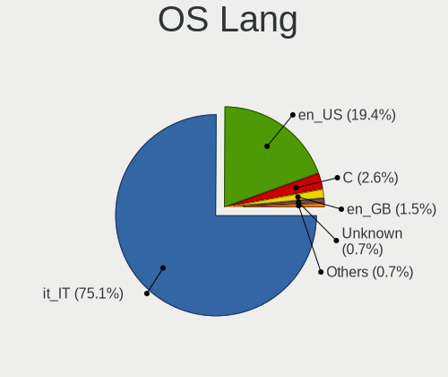
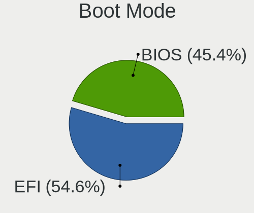
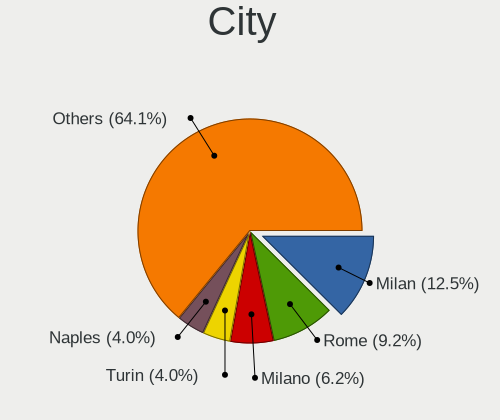
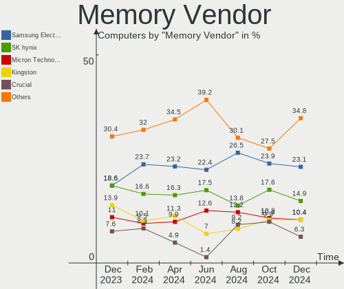
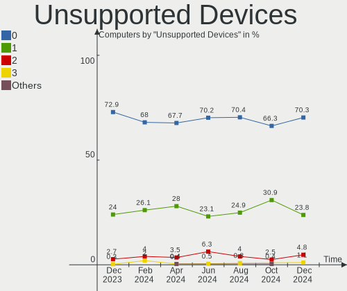

Linux in Italy - Hardware Trends
--------------------------------

A project to identify most popular hardware characteristics and track their change
over time based on data collected by Linux users at https://Linux-Hardware.org.

Anyone can contribute to this report by the [hw-probe](https://github.com/linuxhw/hw-probe) tool:

    sudo -E hw-probe -all -upload

This is a report for all computer types. See also reports for [desktops](/Location/Italy/Desktop/README.md) and [notebooks](/Location/Italy/Notebook/README.md).

Contents
--------

* [ System ](#system)
  - [ OS                       ](#os)
  - [ OS Family                ](#os-family)
  - [ Kernel                   ](#kernel)
  - [ Kernel Family            ](#kernel-family)
  - [ Kernel Major Ver.        ](#kernel-major-ver)
  - [ Arch                     ](#arch)
  - [ DE                       ](#de)
  - [ Display Server           ](#display-server)
  - [ Display Manager          ](#display-manager)
  - [ OS Lang                  ](#os-lang)
  - [ Boot Mode                ](#boot-mode)
  - [ Filesystem               ](#filesystem)
  - [ Part. scheme             ](#part-scheme)
  - [ Dual Boot with Linux/BSD ](#dual-boot-with-linuxbsd)
  - [ Dual Boot (Win)          ](#dual-boot-win)

* [ Board ](#board)
  - [ Vendor                   ](#vendor)
  - [ Model                    ](#model)
  - [ Model Family             ](#model-family)
  - [ MFG Year                 ](#mfg-year)
  - [ Form Factor              ](#form-factor)
  - [ Secure Boot              ](#secure-boot)
  - [ Coreboot                 ](#coreboot)
  - [ RAM Size                 ](#ram-size)
  - [ RAM Used                 ](#ram-used)
  - [ Total Drives             ](#total-drives)
  - [ Has CD-ROM               ](#has-cd-rom)
  - [ Has Ethernet             ](#has-ethernet)
  - [ Has WiFi                 ](#has-wifi)
  - [ Has Bluetooth            ](#has-bluetooth)

* [ Location ](#location)
  - [ Country                  ](#country)
  - [ City                     ](#city)

* [ Drives ](#drives)
  - [ Drive Vendor             ](#drive-vendor)
  - [ Drive Model              ](#drive-model)
  - [ HDD Vendor               ](#hdd-vendor)
  - [ SSD Vendor               ](#ssd-vendor)
  - [ Drive Kind               ](#drive-kind)
  - [ Drive Connector          ](#drive-connector)
  - [ Drive Size               ](#drive-size)
  - [ Space Total              ](#space-total)
  - [ Space Used               ](#space-used)
  - [ Malfunc. Drives          ](#malfunc-drives)
  - [ Malfunc. Drive Vendor    ](#malfunc-drive-vendor)
  - [ Malfunc. HDD Vendor      ](#malfunc-hdd-vendor)
  - [ Malfunc. Drive Kind      ](#malfunc-drive-kind)
  - [ Failed Drives            ](#failed-drives)
  - [ Failed Drive Vendor      ](#failed-drive-vendor)
  - [ Drive Status             ](#drive-status)

* [ Storage controller ](#storage-controller)
  - [ Storage Vendor           ](#storage-vendor)
  - [ Storage Model            ](#storage-model)
  - [ Storage Kind             ](#storage-kind)

* [ Processor ](#processor)
  - [ CPU Vendor               ](#cpu-vendor)
  - [ CPU Model                ](#cpu-model)
  - [ CPU Model Family         ](#cpu-model-family)
  - [ CPU Cores                ](#cpu-cores)
  - [ CPU Sockets              ](#cpu-sockets)
  - [ CPU Threads              ](#cpu-threads)
  - [ CPU Op-Modes             ](#cpu-op-modes)
  - [ CPU Microcode            ](#cpu-microcode)
  - [ CPU Microarch            ](#cpu-microarch)

* [ Graphics ](#graphics)
  - [ GPU Vendor               ](#gpu-vendor)
  - [ GPU Model                ](#gpu-model)
  - [ GPU Combo                ](#gpu-combo)
  - [ GPU Driver               ](#gpu-driver)
  - [ GPU Memory               ](#gpu-memory)

* [ Monitor ](#monitor)
  - [ Monitor Vendor           ](#monitor-vendor)
  - [ Monitor Model            ](#monitor-model)
  - [ Monitor Resolution       ](#monitor-resolution)
  - [ Monitor Diagonal         ](#monitor-diagonal)
  - [ Monitor Width            ](#monitor-width)
  - [ Aspect Ratio             ](#aspect-ratio)
  - [ Monitor Area             ](#monitor-area)
  - [ Pixel Density            ](#pixel-density)
  - [ Multiple Monitors        ](#multiple-monitors)

* [ Network ](#network)
  - [ Net Controller Vendor    ](#net-controller-vendor)
  - [ Net Controller Model     ](#net-controller-model)
  - [ Wireless Vendor          ](#wireless-vendor)
  - [ Wireless Model           ](#wireless-model)
  - [ Ethernet Vendor          ](#ethernet-vendor)
  - [ Ethernet Model           ](#ethernet-model)
  - [ Net Controller Kind      ](#net-controller-kind)
  - [ Used Controller          ](#used-controller)
  - [ NICs                     ](#nics)
  - [ IPv6                     ](#ipv6)

* [ Bluetooth ](#bluetooth)
  - [ Bluetooth Vendor         ](#bluetooth-vendor)
  - [ Bluetooth Model          ](#bluetooth-model)

* [ Sound ](#sound)
  - [ Sound Vendor             ](#sound-vendor)
  - [ Sound Model              ](#sound-model)

* [ Memory ](#memory)
  - [ Memory Vendor            ](#memory-vendor)
  - [ Memory Model             ](#memory-model)
  - [ Memory Kind              ](#memory-kind)
  - [ Memory Form Factor       ](#memory-form-factor)
  - [ Memory Size              ](#memory-size)
  - [ Memory Speed             ](#memory-speed)

* [ Printers & scanners ](#printers--scanners)
  - [ Printer Vendor           ](#printer-vendor)
  - [ Printer Model            ](#printer-model)
  - [ Scanner Vendor           ](#scanner-vendor)
  - [ Scanner Model            ](#scanner-model)

* [ Camera ](#camera)
  - [ Camera Vendor            ](#camera-vendor)
  - [ Camera Model             ](#camera-model)

* [ Security ](#security)
  - [ Fingerprint Vendor       ](#fingerprint-vendor)
  - [ Fingerprint Model        ](#fingerprint-model)
  - [ Chipcard Vendor          ](#chipcard-vendor)
  - [ Chipcard Model           ](#chipcard-model)

* [ Unsupported ](#unsupported)
  - [ Unsupported Devices      ](#unsupported-devices)
  - [ Unsupported Device Types ](#unsupported-device-types)

System
------

OS
--

Installed operating systems

| Name                      | Computers | Percent |
|---------------------------|-----------|---------|
| Ubuntu 20.04              | 23        | 13.45%  |
| OpenMandriva 4.3          | 21        | 12.28%  |
| Ubuntu 21.10              | 11        | 6.43%   |
| Fedora 35                 | 11        | 6.43%   |
| Ubuntu 22.04              | 10        | 5.85%   |
| Arch                      | 9         | 5.26%   |
| Debian 11                 | 8         | 4.68%   |
| Pop!_OS 21.10             | 7         | 4.09%   |
| Linux Mint 20.3           | 6         | 3.51%   |
| Zorin 16                  | 5         | 2.92%   |
| Xubuntu 20.04             | 5         | 2.92%   |
| Ubuntu 18.04              | 5         | 2.92%   |
| KDE neon 20.04            | 5         | 2.92%   |
| Fedora 36                 | 4         | 2.34%   |
| EndeavourOS Rolling       | 4         | 2.34%   |
| Manjaro                   | 3         | 1.75%   |
| Linux Mint 19.3           | 2         | 1.17%   |
| Kubuntu 21.10             | 2         | 1.17%   |
| Kubuntu 20.04             | 2         | 1.17%   |
| Zorin 15                  | 1         | 0.58%   |
| Xubuntu 22.04             | 1         | 0.58%   |
| Xubuntu 21.10             | 1         | 0.58%   |
| Ubuntu MATE 22.04         | 1         | 0.58%   |
| Ubuntu MATE 21.10         | 1         | 0.58%   |
| Ubuntu 19.10              | 1         | 0.58%   |
| Parabola Rolling          | 1         | 0.58%   |
| openSUSE Microos-20220424 | 1         | 0.58%   |
| openSUSE 20220419         | 1         | 0.58%   |
| OpenMandriva 4.2          | 1         | 0.58%   |
| Manjaro-ARM               | 1         | 0.58%   |
| Mageia 8                  | 1         | 0.58%   |
| Lubuntu 20.04             | 1         | 0.58%   |
| LMDE 4                    | 1         | 0.58%   |
| Linux Mint 20.2           | 1         | 0.58%   |
| Linux Mint 19.2           | 1         | 0.58%   |
| Garuda Linux Soaring      | 1         | 0.58%   |
| Fedora 34                 | 1         | 0.58%   |
| Endless 4.0.4             | 1         | 0.58%   |
| Endless 4.0.3             | 1         | 0.58%   |
| Elementary 6.1            | 1         | 0.58%   |
| Debian Unstable           | 1         | 0.58%   |
| Debian Testing            | 1         | 0.58%   |
| Debian 11-updates         | 1         | 0.58%   |
| Debian 10                 | 1         | 0.58%   |
| BlackPanther 18.1         | 1         | 0.58%   |
| ArcoLinux Rolling         | 1         | 0.58%   |
| Arch Rolling              | 1         | 0.58%   |

OS Family
---------

OS without a version

| Name         | Computers | Percent |
|--------------|-----------|---------|
| Ubuntu       | 50        | 29.24%  |
| OpenMandriva | 22        | 12.87%  |
| Fedora       | 16        | 9.36%   |
| Debian       | 12        | 7.02%   |
| Linux Mint   | 10        | 5.85%   |
| Arch         | 10        | 5.85%   |
| Xubuntu      | 7         | 4.09%   |
| Pop!_OS      | 7         | 4.09%   |
| Zorin        | 6         | 3.51%   |
| KDE neon     | 5         | 2.92%   |
| Kubuntu      | 4         | 2.34%   |
| EndeavourOS  | 4         | 2.34%   |
| Manjaro      | 3         | 1.75%   |
| Ubuntu MATE  | 2         | 1.17%   |
| openSUSE     | 2         | 1.17%   |
| Endless      | 2         | 1.17%   |
| Parabola     | 1         | 0.58%   |
| Manjaro-ARM  | 1         | 0.58%   |
| Mageia       | 1         | 0.58%   |
| Lubuntu      | 1         | 0.58%   |
| LMDE         | 1         | 0.58%   |
| Garuda Linux | 1         | 0.58%   |
| Elementary   | 1         | 0.58%   |
| BlackPanther | 1         | 0.58%   |
| ArcoLinux    | 1         | 0.58%   |

Kernel
------

Version of the Linux kernel

| Version                      | Computers | Percent |
|------------------------------|-----------|---------|
| 5.13.0-39-generic            | 29        | 16.96%  |
| 5.16.7-desktop-1omv4003      | 20        | 11.7%   |
| 5.13.0-40-generic            | 14        | 8.19%   |
| 5.4.0-107-generic            | 9         | 5.26%   |
| 5.17.1-arch1-1               | 7         | 4.09%   |
| 5.4.0-109-generic            | 5         | 2.92%   |
| 5.15.0-27-generic            | 5         | 2.92%   |
| 5.16.18-200.fc35.x86_64      | 4         | 2.34%   |
| 5.10.0-13-amd64              | 4         | 2.34%   |
| 5.17.4-200.fc35.x86_64       | 3         | 1.75%   |
| 5.16.15-76051615-generic     | 3         | 1.75%   |
| 5.15.0-25-generic            | 3         | 1.75%   |
| 5.17.1-300.fc36.x86_64       | 2         | 1.17%   |
| 5.16.11-76051611-generic     | 2         | 1.17%   |
| 5.16.0-6-amd64               | 2         | 1.17%   |
| 5.15.0-23-generic            | 2         | 1.17%   |
| 5.14.10-300.fc35.x86_64      | 2         | 1.17%   |
| 5.13.0-37-generic            | 2         | 1.17%   |
| 5.11.0-35-generic            | 2         | 1.17%   |
| 4.15.0-171-generic           | 2         | 1.17%   |
| 5.8.0-53-generic             | 1         | 0.58%   |
| 5.4.0-91-generic             | 1         | 0.58%   |
| 5.4.0-77-generic             | 1         | 0.58%   |
| 5.4.0-100-lowlatency         | 1         | 0.58%   |
| 5.3.0-51-generic             | 1         | 0.58%   |
| 5.17.5-arch1-1               | 1         | 0.58%   |
| 5.17.4-1-default             | 1         | 0.58%   |
| 5.17.4-051704-generic        | 1         | 0.58%   |
| 5.17.3mdg_20220414           | 1         | 0.58%   |
| 5.17.3-xanmod1-1             | 1         | 0.58%   |
| 5.17.3-1-default             | 1         | 0.58%   |
| 5.17.2-xanmod1+amdnative     | 1         | 0.58%   |
| 5.17.2-arch3-1               | 1         | 0.58%   |
| 5.17.1-zen1-1-zen            | 1         | 0.58%   |
| 5.17.1-desktop-2omv4050      | 1         | 0.58%   |
| 5.17.1-arch1-g14-1           | 1         | 0.58%   |
| 5.17.1-3-MANJARO             | 1         | 0.58%   |
| 5.17.0-300.fc36.x86_64       | 1         | 0.58%   |
| 5.17.0-1.1-liquorix-amd64    | 1         | 0.58%   |
| 5.17.0-0.rc7.116.fc36.x86_64 | 1         | 0.58%   |
| 5.16.20-200.fc35.x86_64      | 1         | 0.58%   |
| 5.16.19-76051619-generic     | 1         | 0.58%   |
| 5.16.19-200.fc35.x86_64      | 1         | 0.58%   |
| 5.16.18-100.fc34.x86_64      | 1         | 0.58%   |
| 5.16.18-1-MANJARO            | 1         | 0.58%   |
| 5.15.8-arch1-1               | 1         | 0.58%   |
| 5.15.8-76051508-generic      | 1         | 0.58%   |
| 5.15.36-1-lts                | 1         | 0.58%   |
| 5.15.36-051536-generic       | 1         | 0.58%   |
| 5.15.34-xanmod1-1            | 1         | 0.58%   |
| 5.15.34-xanmod1              | 1         | 0.58%   |
| 5.15.33-1-lts                | 1         | 0.58%   |
| 5.15.32-desktop-1.mga8       | 1         | 0.58%   |
| 5.15.32-1-MANJARO            | 1         | 0.58%   |
| 5.15.32-1-lts                | 1         | 0.58%   |
| 5.15.28-1-MANJARO-ARM-RPI    | 1         | 0.58%   |
| 5.15.0-2-amd64               | 1         | 0.58%   |
| 5.15.0-1mx-amd64             | 1         | 0.58%   |
| 5.14.0-1031-oem              | 1         | 0.58%   |
| 5.13.0-30-generic            | 1         | 0.58%   |

Kernel Family
-------------

Linux kernel without a distro release

| Version | Computers | Percent |
|---------|-----------|---------|
| 5.13.0  | 47        | 27.49%  |
| 5.16.7  | 20        | 11.7%   |
| 5.4.0   | 17        | 9.94%   |
| 5.17.1  | 13        | 7.6%    |
| 5.15.0  | 12        | 7.02%   |
| 5.16.18 | 6         | 3.51%   |
| 5.10.0  | 6         | 3.51%   |
| 5.17.4  | 5         | 2.92%   |
| 4.15.0  | 4         | 2.34%   |
| 5.17.3  | 3         | 1.75%   |
| 5.17.0  | 3         | 1.75%   |
| 5.16.15 | 3         | 1.75%   |
| 5.15.32 | 3         | 1.75%   |
| 5.17.2  | 2         | 1.17%   |
| 5.16.19 | 2         | 1.17%   |
| 5.16.11 | 2         | 1.17%   |
| 5.16.0  | 2         | 1.17%   |
| 5.15.8  | 2         | 1.17%   |
| 5.15.36 | 2         | 1.17%   |
| 5.15.34 | 2         | 1.17%   |
| 5.14.10 | 2         | 1.17%   |
| 5.11.0  | 2         | 1.17%   |
| 5.8.0   | 1         | 0.58%   |
| 5.3.0   | 1         | 0.58%   |
| 5.17.5  | 1         | 0.58%   |
| 5.16.20 | 1         | 0.58%   |
| 5.15.33 | 1         | 0.58%   |
| 5.15.28 | 1         | 0.58%   |
| 5.14.0  | 1         | 0.58%   |
| 5.10.14 | 1         | 0.58%   |
| 5.0.0   | 1         | 0.58%   |
| 4.19.0  | 1         | 0.58%   |
| 4.18.16 | 1         | 0.58%   |

Kernel Major Ver.
-----------------

Linux kernel major version

| Version | Computers | Percent |
|---------|-----------|---------|
| 5.13    | 47        | 27.49%  |
| 5.16    | 36        | 21.05%  |
| 5.17    | 27        | 15.79%  |
| 5.15    | 23        | 13.45%  |
| 5.4     | 17        | 9.94%   |
| 5.10    | 7         | 4.09%   |
| 4.15    | 4         | 2.34%   |
| 5.14    | 3         | 1.75%   |
| 5.11    | 2         | 1.17%   |
| 5.8     | 1         | 0.58%   |
| 5.3     | 1         | 0.58%   |
| 5.0     | 1         | 0.58%   |
| 4.19    | 1         | 0.58%   |
| 4.18    | 1         | 0.58%   |

Arch
----

OS architecture (x86_64, i586, etc.)

| Name    | Computers | Percent |
|---------|-----------|---------|
| x86_64  | 165       | 96.49%  |
| i686    | 5         | 2.92%   |
| aarch64 | 1         | 0.58%   |

DE
--

Desktop Environment

| Name       | Computers | Percent |
|------------|-----------|---------|
| GNOME      | 74        | 43.27%  |
| KDE5       | 45        | 26.32%  |
| XFCE       | 17        | 9.94%   |
| Unknown    | 11        | 6.43%   |
| MATE       | 8         | 4.68%   |
| X-Cinnamon | 5         | 2.92%   |
| LXQt       | 4         | 2.34%   |
| bspwm      | 2         | 1.17%   |
| Unity      | 1         | 0.58%   |
| ubuntu     | 1         | 0.58%   |
| Pantheon   | 1         | 0.58%   |
| Lubuntu    | 1         | 0.58%   |
| i3         | 1         | 0.58%   |

Display Server
--------------

X11 or Wayland

| Name    | Computers | Percent |
|---------|-----------|---------|
| X11     | 135       | 78.95%  |
| Wayland | 31        | 18.13%  |
| Tty     | 4         | 2.34%   |
| Unknown | 1         | 0.58%   |

Display Manager
---------------

SDDM, LightDM, etc.

| Name    | Computers | Percent |
|---------|-----------|---------|
| Unknown | 59        | 34.5%   |
| SDDM    | 35        | 20.47%  |
| GDM3    | 32        | 18.71%  |
| GDM     | 24        | 14.04%  |
| LightDM | 21        | 12.28%  |

OS Lang
-------

Language

| Lang    | Computers | Percent |
|---------|-----------|---------|
| it_IT   | 110       | 64.33%  |
| en_US   | 51        | 29.82%  |
| en_GB   | 7         | 4.09%   |
| Unknown | 2         | 1.17%   |
| fr_FR   | 1         | 0.58%   |

Boot Mode
---------

EFI or BIOS

| Mode | Computers | Percent |
|------|-----------|---------|
| EFI  | 87        | 50.88%  |
| BIOS | 84        | 49.12%  |

Filesystem
----------

Type of filesystem

| Type    | Computers | Percent |
|---------|-----------|---------|
| Ext4    | 127       | 74.27%  |
| Overlay | 25        | 14.62%  |
| Btrfs   | 14        | 8.19%   |
| Xfs     | 5         | 2.92%   |

Part. scheme
------------

Scheme of partitioning

| Type    | Computers | Percent |
|---------|-----------|---------|
| Unknown | 86        | 50.29%  |
| GPT     | 67        | 39.18%  |
| MBR     | 18        | 10.53%  |

Dual Boot with Linux/BSD
------------------------

Hosting more than one Linux/BSD

| Dual boot | Computers | Percent |
|-----------|-----------|---------|
| No        | 141       | 82.46%  |
| Yes       | 30        | 17.54%  |

Dual Boot (Win)
---------------

Hosting Linux and Windows

| Dual boot | Computers | Percent |
|-----------|-----------|---------|
| No        | 122       | 71.35%  |
| Yes       | 49        | 28.65%  |

Board
-----

Vendor
------

Motherboard manufacturer

| Name                    | Computers | Percent |
|-------------------------|-----------|---------|
| Lenovo                  | 30        | 17.54%  |
| ASUSTek Computer        | 28        | 16.37%  |
| Hewlett-Packard         | 26        | 15.2%   |
| Acer                    | 16        | 9.36%   |
| Dell                    | 14        | 8.19%   |
| MSI                     | 11        | 6.43%   |
| Gigabyte Technology     | 6         | 3.51%   |
| Intel                   | 5         | 2.92%   |
| ASRock                  | 5         | 2.92%   |
| Toshiba                 | 4         | 2.34%   |
| Apple                   | 4         | 2.34%   |
| Sony                    | 2         | 1.17%   |
| SANTECH                 | 2         | 1.17%   |
| PC Specialist           | 2         | 1.17%   |
| Microtech               | 2         | 1.17%   |
| BESSTAR Tech            | 2         | 1.17%   |
| YASHI                   | 1         | 0.58%   |
| TYAN Computer           | 1         | 0.58%   |
| TrekStor                | 1         | 0.58%   |
| Teclast                 | 1         | 0.58%   |
| Razer                   | 1         | 0.58%   |
| Raspberry Pi Foundation | 1         | 0.58%   |
| Notebook                | 1         | 0.58%   |
| LG Electronics          | 1         | 0.58%   |
| Fujitsu                 | 1         | 0.58%   |
| Chuwi                   | 1         | 0.58%   |
| AWOW                    | 1         | 0.58%   |
| Unknown                 | 1         | 0.58%   |

Model
-----

Motherboard model

| Name                                     | Computers | Percent |
|------------------------------------------|-----------|---------|
| SANTECH NHx0EH_EJ_EK                     | 2         | 1.17%   |
| MSI MS-7C37                              | 2         | 1.17%   |
| Intel NUC8i5BEK                          | 2         | 1.17%   |
| HP 255 G8 Notebook PC                    | 2         | 1.17%   |
| Dell Inspiron 5406 2n1                   | 2         | 1.17%   |
| ASUS P8Z68 DELUXE                        | 2         | 1.17%   |
| YASHI MYBOOK 360                         | 1         | 0.58%   |
| TYAN S7012                               | 1         | 0.58%   |
| TrekStor Notebook Slim S130              | 1         | 0.58%   |
| Toshiba Satellite Pro S500               | 1         | 0.58%   |
| Toshiba Satellite L50D-B                 | 1         | 0.58%   |
| Toshiba Satellite A350D                  | 1         | 0.58%   |
| Toshiba Satellite A200                   | 1         | 0.58%   |
| Teclast F7 Plus                          | 1         | 0.58%   |
| Sony VGN-FW56J                           | 1         | 0.58%   |
| Sony SVE1712S1EB                         | 1         | 0.58%   |
| Razer Blade 14 - RZ09-0370               | 1         | 0.58%   |
| RPi Raspberry Pi 4 Model B Rev 1.4       | 1         | 0.58%   |
| PC Specialist PCx0Dx                     | 1         | 0.58%   |
| PC Specialist N8xEJEK                    | 1         | 0.58%   |
| Notebook NL40_50CU                       | 1         | 0.58%   |
| MSI Prestige 14Evo A11M                  | 1         | 0.58%   |
| MSI NQ890AA-ABZ CQ5011IT                 | 1         | 0.58%   |
| MSI MS-7D54                              | 1         | 0.58%   |
| MSI MS-7D09                              | 1         | 0.58%   |
| MSI MS-7D03                              | 1         | 0.58%   |
| MSI MS-7C75                              | 1         | 0.58%   |
| MSI MS-7B79                              | 1         | 0.58%   |
| MSI MS-7721                              | 1         | 0.58%   |
| MSI Modern 15 A11M                       | 1         | 0.58%   |
| Microtech ebookPro                       | 1         | 0.58%   |
| Microtech CoreBook                       | 1         | 0.58%   |
| LG 22V270-L.AR3WB                        | 1         | 0.58%   |
| Lenovo Yoga S740-14IIL 81RS              | 1         | 0.58%   |
| Lenovo Yoga 720-15IKB                    | 1         | 0.58%   |
| Lenovo ThinkStation S20 4157WC1          | 1         | 0.58%   |
| Lenovo ThinkPad X230 2333BF6             | 1         | 0.58%   |
| Lenovo ThinkPad X100e 0022CTO            | 1         | 0.58%   |
| Lenovo ThinkPad X1 Carbon 6th 20KGS23S0P | 1         | 0.58%   |
| Lenovo ThinkPad W541 20EGS24J00          | 1         | 0.58%   |
| Lenovo ThinkPad T495 20NJ000XIX          | 1         | 0.58%   |
| Lenovo ThinkPad T430 2349AK5             | 1         | 0.58%   |
| Lenovo ThinkPad T15g Gen 1 20URCTO1WW    | 1         | 0.58%   |
| Lenovo ThinkPad R61 7735WRF              | 1         | 0.58%   |
| Lenovo ThinkPad P1 Gen 3 20TJS2F437      | 1         | 0.58%   |
| Lenovo ThinkPad E570 20H500B5IX          | 1         | 0.58%   |
| Lenovo ThinkCentre M83 10AGS03400        | 1         | 0.58%   |
| Lenovo ThinkCentre M82 2929AC4           | 1         | 0.58%   |
| Lenovo ThinkCentre M720q 10T7004BIX      | 1         | 0.58%   |
| Lenovo ThinkCentre M700 10HY002VIX       | 1         | 0.58%   |
| Lenovo ThinkCentre E73 10DR001EIX        | 1         | 0.58%   |
| Lenovo ThinkBook 15-IML 20RW             | 1         | 0.58%   |
| Lenovo ThinkBook 15 G2 ITL 20VE          | 1         | 0.58%   |
| Lenovo ThinkBook 13s G3 ACN 20YA         | 1         | 0.58%   |
| Lenovo Legion Y530-15ICH 81FV            | 1         | 0.58%   |
| Lenovo Legion S7 15IMH5 82BC             | 1         | 0.58%   |
| Lenovo Legion 5 15IMH05H 81Y6            | 1         | 0.58%   |
| Lenovo IdeaPad 700-15ISK 80RU            | 1         | 0.58%   |
| Lenovo IdeaPad 500-15ISK 80NT            | 1         | 0.58%   |
| Lenovo IdeaPad 320-15ABR 80XS            | 1         | 0.58%   |

Model Family
------------

Motherboard model prefix

| Name                  | Computers | Percent |
|-----------------------|-----------|---------|
| Lenovo ThinkPad       | 10        | 5.85%   |
| Acer Aspire           | 9         | 5.26%   |
| HP Compaq             | 7         | 4.09%   |
| Lenovo ThinkCentre    | 5         | 2.92%   |
| Dell Latitude         | 5         | 2.92%   |
| Dell Inspiron         | 5         | 2.92%   |
| ASUS ROG              | 5         | 2.92%   |
| ASUS PRIME            | 5         | 2.92%   |
| Toshiba Satellite     | 4         | 2.34%   |
| HP Pavilion           | 4         | 2.34%   |
| Lenovo ThinkBook      | 3         | 1.75%   |
| Lenovo Legion         | 3         | 1.75%   |
| Lenovo IdeaPad        | 3         | 1.75%   |
| HP EliteBook          | 3         | 1.75%   |
| HP 255                | 3         | 1.75%   |
| SANTECH NHx0EH        | 2         | 1.17%   |
| MSI MS-7C37           | 2         | 1.17%   |
| Lenovo Yoga           | 2         | 1.17%   |
| Intel NUC8i5BEK       | 2         | 1.17%   |
| HP OMEN               | 2         | 1.17%   |
| HP Laptop             | 2         | 1.17%   |
| Gigabyte B450         | 2         | 1.17%   |
| Dell Vostro           | 2         | 1.17%   |
| ASUS P8Z68            | 2         | 1.17%   |
| ASUS P5GD1            | 2         | 1.17%   |
| Acer Nitro            | 2         | 1.17%   |
| YASHI MYBOOK          | 1         | 0.58%   |
| TYAN S7012            | 1         | 0.58%   |
| TrekStor Notebook     | 1         | 0.58%   |
| Teclast F7            | 1         | 0.58%   |
| Sony VGN-FW56J        | 1         | 0.58%   |
| Sony SVE1712S1EB      | 1         | 0.58%   |
| Razer Blade           | 1         | 0.58%   |
| RPi Raspberry         | 1         | 0.58%   |
| PC Specialist PCx0Dx  | 1         | 0.58%   |
| PC Specialist N8xEJEK | 1         | 0.58%   |
| Notebook NL40         | 1         | 0.58%   |
| MSI Prestige          | 1         | 0.58%   |
| MSI NQ890AA-ABZ       | 1         | 0.58%   |
| MSI MS-7D54           | 1         | 0.58%   |
| MSI MS-7D09           | 1         | 0.58%   |
| MSI MS-7D03           | 1         | 0.58%   |
| MSI MS-7C75           | 1         | 0.58%   |
| MSI MS-7B79           | 1         | 0.58%   |
| MSI MS-7721           | 1         | 0.58%   |
| MSI Modern            | 1         | 0.58%   |
| Microtech ebookPro    | 1         | 0.58%   |
| Microtech CoreBook    | 1         | 0.58%   |
| LG 22V270-L.AR3WB     | 1         | 0.58%   |
| Lenovo ThinkStation   | 1         | 0.58%   |
| Lenovo H50-50         | 1         | 0.58%   |
| Lenovo G50-70         | 1         | 0.58%   |
| Lenovo B50-30         | 1         | 0.58%   |
| Intel STK2MV64CC      | 1         | 0.58%   |
| Intel NUC7i3BNK       | 1         | 0.58%   |
| Intel NUC10i3FNK      | 1         | 0.58%   |
| HP Z210               | 1         | 0.58%   |
| HP ProBook            | 1         | 0.58%   |
| HP EliteDesk          | 1         | 0.58%   |
| HP 250                | 1         | 0.58%   |

MFG Year
--------

Motherboard manufacture year

| Year    | Computers | Percent |
|---------|-----------|---------|
| 2021    | 24        | 14.04%  |
| 2020    | 22        | 12.87%  |
| 2019    | 16        | 9.36%   |
| 2018    | 15        | 8.77%   |
| 2011    | 14        | 8.19%   |
| 2014    | 11        | 6.43%   |
| 2016    | 10        | 5.85%   |
| 2012    | 9         | 5.26%   |
| 2009    | 8         | 4.68%   |
| 2015    | 7         | 4.09%   |
| 2013    | 6         | 3.51%   |
| 2008    | 6         | 3.51%   |
| 2017    | 5         | 2.92%   |
| 2010    | 5         | 2.92%   |
| 2007    | 5         | 2.92%   |
| 2005    | 3         | 1.75%   |
| 2006    | 2         | 1.17%   |
| Unknown | 2         | 1.17%   |
| 2022    | 1         | 0.58%   |

Form Factor
-----------

Physical design of the computer

| Name           | Computers | Percent |
|----------------|-----------|---------|
| Notebook       | 99        | 57.89%  |
| Desktop        | 52        | 30.41%  |
| Mini pc        | 9         | 5.26%   |
| Convertible    | 4         | 2.34%   |
| All in one     | 4         | 2.34%   |
| Server         | 2         | 1.17%   |
| System on chip | 1         | 0.58%   |

Secure Boot
-----------

Enabled or disabled

| State    | Computers | Percent |
|----------|-----------|---------|
| Disabled | 160       | 93.57%  |
| Enabled  | 11        | 6.43%   |

Coreboot
--------

Have coreboot on board

| Used | Computers | Percent |
|------|-----------|---------|
| No   | 171       | 100%    |

RAM Size
--------

Total RAM memory

| Size in GB  | Computers | Percent |
|-------------|-----------|---------|
| 4.01-8.0    | 42        | 24.56%  |
| 16.01-24.0  | 41        | 23.98%  |
| 3.01-4.0    | 32        | 18.71%  |
| 8.01-16.0   | 27        | 15.79%  |
| 32.01-64.0  | 14        | 8.19%   |
| 1.01-2.0    | 6         | 3.51%   |
| 24.01-32.0  | 3         | 1.75%   |
| 64.01-256.0 | 3         | 1.75%   |
| 2.01-3.0    | 2         | 1.17%   |
| 0.51-1.0    | 1         | 0.58%   |

RAM Used
--------

Used RAM memory

| Used GB   | Computers | Percent |
|-----------|-----------|---------|
| 1.01-2.0  | 61        | 35.67%  |
| 4.01-8.0  | 33        | 19.3%   |
| 2.01-3.0  | 30        | 17.54%  |
| 3.01-4.0  | 22        | 12.87%  |
| 0.51-1.0  | 17        | 9.94%   |
| 8.01-16.0 | 7         | 4.09%   |
| 0.01-0.5  | 1         | 0.58%   |

Total Drives
------------

Number of drives on board

| Drives | Computers | Percent |
|--------|-----------|---------|
| 1      | 110       | 64.33%  |
| 2      | 31        | 18.13%  |
| 3      | 14        | 8.19%   |
| 4      | 8         | 4.68%   |
| 6      | 3         | 1.75%   |
| 5      | 3         | 1.75%   |
| 0      | 2         | 1.17%   |

Has CD-ROM
----------

Has CD-ROM on board

| Presented | Computers | Percent |
|-----------|-----------|---------|
| No        | 99        | 57.89%  |
| Yes       | 72        | 42.11%  |

Has Ethernet
------------

Has Ethernet on board

| Presented | Computers | Percent |
|-----------|-----------|---------|
| Yes       | 152       | 88.89%  |
| No        | 19        | 11.11%  |

Has WiFi
--------

Has WiFi module

| Presented | Computers | Percent |
|-----------|-----------|---------|
| Yes       | 132       | 77.19%  |
| No        | 39        | 22.81%  |

Has Bluetooth
-------------

Has Bluetooth module

| Presented | Computers | Percent |
|-----------|-----------|---------|
| Yes       | 116       | 67.84%  |
| No        | 55        | 32.16%  |

Location
--------

Country
-------

Geographic location (country)

| Country | Computers | Percent |
|---------|-----------|---------|
| Italy   | 171       | 100%    |

City
----

Geographic location (city)

| City                     | Computers | Percent |
|--------------------------|-----------|---------|
| Milan                    | 32        | 18.71%  |
| Rome                     | 16        | 9.36%   |
| Rho                      | 5         | 2.92%   |
| Padova                   | 5         | 2.92%   |
| Turin                    | 4         | 2.34%   |
| Naples                   | 4         | 2.34%   |
| Venice                   | 3         | 1.75%   |
| Udine                    | 2         | 1.17%   |
| Senigallia               | 2         | 1.17%   |
| Novara                   | 2         | 1.17%   |
| Mölten                  | 2         | 1.17%   |
| Foggia                   | 2         | 1.17%   |
| Ferrara di Monte Baldo   | 2         | 1.17%   |
| Brescia                  | 2         | 1.17%   |
| Biella                   | 2         | 1.17%   |
| Altopascio               | 2         | 1.17%   |
| Albano Laziale           | 2         | 1.17%   |
| Zevio                    | 1         | 0.58%   |
| Vigodarzere              | 1         | 0.58%   |
| Vedano al Lambro         | 1         | 0.58%   |
| Trento                   | 1         | 0.58%   |
| Travagliato              | 1         | 0.58%   |
| Tivoli                   | 1         | 0.58%   |
| Terni                    | 1         | 0.58%   |
| Sulmona                  | 1         | 0.58%   |
| Spinetoli                | 1         | 0.58%   |
| Sora                     | 1         | 0.58%   |
| Siniscola                | 1         | 0.58%   |
| Selargius                | 1         | 0.58%   |
| Sedriano                 | 1         | 0.58%   |
| Scorrano                 | 1         | 0.58%   |
| Scandicci                | 1         | 0.58%   |
| Saonara                  | 1         | 0.58%   |
| Santeramo in Colle       | 1         | 0.58%   |
| San Valentino Torio      | 1         | 0.58%   |
| San Severino Marche      | 1         | 0.58%   |
| San Martino di Lupari    | 1         | 0.58%   |
| San Martino Buon Albergo | 1         | 0.58%   |
| San Fedele Superiore     | 1         | 0.58%   |
| San Donà di Piave       | 1         | 0.58%   |
| Salerno                  | 1         | 0.58%   |
| Rovereto                 | 1         | 0.58%   |
| Ronsecco                 | 1         | 0.58%   |
| Revere                   | 1         | 0.58%   |
| Reggio Emilia            | 1         | 0.58%   |
| Reggio Calabria          | 1         | 0.58%   |
| Poggio Berni             | 1         | 0.58%   |
| Pistoia                  | 1         | 0.58%   |
| Piacenza                 | 1         | 0.58%   |
| Palermo                  | 1         | 0.58%   |
| Paladina                 | 1         | 0.58%   |
| Nuoro                    | 1         | 0.58%   |
| Montesilvano Marina      | 1         | 0.58%   |
| Matelica                 | 1         | 0.58%   |
| Massa Fermana            | 1         | 0.58%   |
| Magenta                  | 1         | 0.58%   |
| Madone                   | 1         | 0.58%   |
| Lodi                     | 1         | 0.58%   |
| Livorno                  | 1         | 0.58%   |
| Lissone                  | 1         | 0.58%   |

Drives
------

Drive Vendor
------------

Hard drive vendors

| Vendor                      | Computers | Drives | Percent |
|-----------------------------|-----------|--------|---------|
| Samsung Electronics         | 45        | 55     | 18.75%  |
| Seagate                     | 34        | 49     | 14.17%  |
| WDC                         | 27        | 32     | 11.25%  |
| Kingston                    | 20        | 21     | 8.33%   |
| Toshiba                     | 13        | 13     | 5.42%   |
| Crucial                     | 12        | 12     | 5%      |
| Hitachi                     | 10        | 10     | 4.17%   |
| Unknown                     | 8         | 10     | 3.33%   |
| SanDisk                     | 8         | 9      | 3.33%   |
| SK Hynix                    | 6         | 6      | 2.5%    |
| Phison                      | 5         | 5      | 2.08%   |
| Micron/Crucial Technology   | 5         | 5      | 2.08%   |
| MAXTOR                      | 5         | 7      | 2.08%   |
| HGST                        | 4         | 5      | 1.67%   |
| KIOXIA                      | 3         | 3      | 1.25%   |
| Apple                       | 3         | 4      | 1.25%   |
| Transcend                   | 2         | 2      | 0.83%   |
| Silicon Motion              | 2         | 2      | 0.83%   |
| PNY                         | 2         | 2      | 0.83%   |
| OCZ                         | 2         | 2      | 0.83%   |
| Netac                       | 2         | 2      | 0.83%   |
| Lexar                       | 2         | 2      | 0.83%   |
| Fujitsu                     | 2         | 2      | 0.83%   |
| Vaseky                      | 1         | 1      | 0.42%   |
| Team                        | 1         | 1      | 0.42%   |
| SABRENT                     | 1         | 1      | 0.42%   |
| Patriot                     | 1         | 1      | 0.42%   |
| minisforum                  | 1         | 1      | 0.42%   |
| Microtech                   | 1         | 1      | 0.42%   |
| Micron Technology           | 1         | 1      | 0.42%   |
| MAXIO Technology (Hangzhou) | 1         | 1      | 0.42%   |
| Intel                       | 1         | 2      | 0.42%   |
| HS-SSD-E100N                | 1         | 1      | 0.42%   |
| Hewlett-Packard             | 1         | 1      | 0.42%   |
| FORESEE                     | 1         | 1      | 0.42%   |
| EMTEC                       | 1         | 1      | 0.42%   |
| Drevo                       | 1         | 1      | 0.42%   |
| DOGFISH                     | 1         | 1      | 0.42%   |
| Corsair                     | 1         | 1      | 0.42%   |
| A-DATA Technology           | 1         | 2      | 0.42%   |
| Unknown                     | 1         | 1      | 0.42%   |

Drive Model
-----------

Hard drive models

| Model                               | Computers | Percent |
|-------------------------------------|-----------|---------|
| Toshiba MQ01ABF050 500GB            | 4         | 1.48%   |
| Seagate ST1000LM024 HN-M101MBB 1TB  | 4         | 1.48%   |
| Samsung SSD 870 EVO 500GB           | 4         | 1.48%   |
| Seagate ST500DM002-1BD142 500GB     | 3         | 1.11%   |
| Seagate ST2000DM008-2FR102 2TB      | 3         | 1.11%   |
| Samsung SSD 970 EVO Plus 500GB      | 3         | 1.11%   |
| Samsung SSD 860 EVO 500GB           | 3         | 1.11%   |
| Samsung SSD 860 EVO 1TB             | 3         | 1.11%   |
| Samsung NVMe SSD Drive 1TB          | 3         | 1.11%   |
| Phison Sabrent 256GB                | 3         | 1.11%   |
| Micron/Crucial NVMe SSD Drive 500GB | 3         | 1.11%   |
| Kingston SA400S37480G 480GB SSD     | 3         | 1.11%   |
| Crucial CT500MX500SSD1 500GB        | 3         | 1.11%   |
| WDC WD10JPVX-60JC3T0 1TB            | 2         | 0.74%   |
| WDC WD10EARS-22Y5B1 1TB             | 2         | 0.74%   |
| Unknown MMC Card  64GB              | 2         | 0.74%   |
| Toshiba TR200 240GB SSD             | 2         | 0.74%   |
| Seagate ST4000DM004-2CV104 4TB      | 2         | 0.74%   |
| Seagate ST3500418AS 500GB           | 2         | 0.74%   |
| Seagate ST31000528AS 1TB            | 2         | 0.74%   |
| Seagate ST2000DM001-1ER164 2TB      | 2         | 0.74%   |
| Sandisk NVMe SSD Drive 512GB        | 2         | 0.74%   |
| Sandisk NVMe SSD Drive 500GB        | 2         | 0.74%   |
| Samsung SSD 970 EVO 1TB             | 2         | 0.74%   |
| Samsung SSD 860 QVO 1TB             | 2         | 0.74%   |
| Samsung SSD 850 EVO 250GB           | 2         | 0.74%   |
| Samsung PSSD T7 500GB               | 2         | 0.74%   |
| Samsung NVMe SSD Drive 512GB        | 2         | 0.74%   |
| Samsung NVMe SSD Drive 2TB          | 2         | 0.74%   |
| Samsung NVMe SSD Drive 256GB        | 2         | 0.74%   |
| Micron/Crucial NVMe SSD Drive 1TB   | 2         | 0.74%   |
| MAXTOR STM3320820AS 320GB           | 2         | 0.74%   |
| Kingston SV300S37A120G 120GB SSD    | 2         | 0.74%   |
| Kingston SA400M8120G 120GB SSD      | 2         | 0.74%   |
| Kingston OM8PDP3512B-AA1 512GB      | 2         | 0.74%   |
| Kingston NVMe SSD Drive 256GB       | 2         | 0.74%   |
| HGST HTS545050A7E680 500GB          | 2         | 0.74%   |
| Crucial CT480BX500SSD1 480GB        | 2         | 0.74%   |
| Crucial CT120BX500SSD1 120GB        | 2         | 0.74%   |
| WDC WDS500G2B0C-00PXH0 500GB        | 1         | 0.37%   |
| WDC WDS500G2B0A-00SM50 500GB SSD    | 1         | 0.37%   |
| WDC WDS500G1X0E-00AFY0 500GB        | 1         | 0.37%   |
| WDC WDS500G1B0C-00S6U0 500GB        | 1         | 0.37%   |
| WDC WD800BEVS-08RST3 80GB           | 1         | 0.37%   |
| WDC WD6402AAEX-00Y9A0 640GB         | 1         | 0.37%   |
| WDC WD5000LPCX-21VHAT0 500GB        | 1         | 0.37%   |
| WDC WD5000BPVT-00A1YT0 500GB        | 1         | 0.37%   |
| WDC WD5000AZLX-75K2TA0 500GB        | 1         | 0.37%   |
| WDC WD5000AZLX-60K2TA0 500GB        | 1         | 0.37%   |
| WDC WD5000AZLX-21K2TA0 500GB        | 1         | 0.37%   |
| WDC WD5000AAKX-22ERMA0 500GB        | 1         | 0.37%   |
| WDC WD5000AAKS-22A7B0 500GB         | 1         | 0.37%   |
| WDC WD5000AAKS-00UU3A0 500GB        | 1         | 0.37%   |
| WDC WD3200BEVT-22ZCT0 320GB         | 1         | 0.37%   |
| WDC WD30EFRX-68EUZN0 3TB            | 1         | 0.37%   |
| WDC WD20EARS-00MVWB0 2TB            | 1         | 0.37%   |
| WDC WD2000BB-00RDA0 200GB           | 1         | 0.37%   |
| WDC WD10SPZX-24Z10 1TB              | 1         | 0.37%   |
| WDC WD10JPCX-24UE4T0 1TB            | 1         | 0.37%   |
| WDC WD10EZEX-60M2NA0 1TB            | 1         | 0.37%   |

HDD Vendor
----------

Hard disk drive vendors

| Vendor  | Computers | Drives | Percent |
|---------|-----------|--------|---------|
| Seagate | 32        | 46     | 35.56%  |
| WDC     | 24        | 27     | 26.67%  |
| Hitachi | 10        | 10     | 11.11%  |
| Toshiba | 9         | 9      | 10%     |
| MAXTOR  | 5         | 7      | 5.56%   |
| HGST    | 4         | 5      | 4.44%   |
| Fujitsu | 2         | 2      | 2.22%   |
| Apple   | 2         | 2      | 2.22%   |
| Unknown | 1         | 1      | 1.11%   |
| SABRENT | 1         | 1      | 1.11%   |

SSD Vendor
----------

Solid state drive vendors

| Vendor              | Computers | Drives | Percent |
|---------------------|-----------|--------|---------|
| Samsung Electronics | 25        | 29     | 31.65%  |
| Kingston            | 12        | 12     | 15.19%  |
| Crucial             | 11        | 11     | 13.92%  |
| SanDisk             | 4         | 4      | 5.06%   |
| Transcend           | 2         | 2      | 2.53%   |
| Toshiba             | 2         | 2      | 2.53%   |
| SK Hynix            | 2         | 2      | 2.53%   |
| PNY                 | 2         | 2      | 2.53%   |
| OCZ                 | 2         | 2      | 2.53%   |
| WDC                 | 1         | 1      | 1.27%   |
| Vaseky              | 1         | 1      | 1.27%   |
| Team                | 1         | 1      | 1.27%   |
| Patriot             | 1         | 1      | 1.27%   |
| Netac               | 1         | 1      | 1.27%   |
| minisforum          | 1         | 1      | 1.27%   |
| Microtech           | 1         | 1      | 1.27%   |
| Lexar               | 1         | 1      | 1.27%   |
| Intel               | 1         | 2      | 1.27%   |
| Hewlett-Packard     | 1         | 1      | 1.27%   |
| FORESEE             | 1         | 1      | 1.27%   |
| EMTEC               | 1         | 1      | 1.27%   |
| Drevo               | 1         | 1      | 1.27%   |
| DOGFISH             | 1         | 1      | 1.27%   |
| Apple               | 1         | 1      | 1.27%   |
| A-DATA Technology   | 1         | 2      | 1.27%   |
| Unknown             | 1         | 1      | 1.27%   |

Drive Kind
----------

HDD or SSD

| Kind    | Computers | Drives | Percent |
|---------|-----------|--------|---------|
| HDD     | 80        | 110    | 35.56%  |
| SSD     | 71        | 85     | 31.56%  |
| NVMe    | 63        | 71     | 28%     |
| MMC     | 7         | 9      | 3.11%   |
| Unknown | 4         | 5      | 1.78%   |

Drive Connector
---------------

SATA, SAS, NVMe, etc.

| Type | Computers | Drives | Percent |
|------|-----------|--------|---------|
| SATA | 129       | 191    | 62.32%  |
| NVMe | 63        | 71     | 30.43%  |
| SAS  | 8         | 9      | 3.86%   |
| MMC  | 7         | 9      | 3.38%   |

Drive Size
----------

Size of hard drive

| Size in TB | Computers | Drives | Percent |
|------------|-----------|--------|---------|
| 0.01-0.5   | 101       | 126    | 65.58%  |
| 0.51-1.0   | 36        | 43     | 23.38%  |
| 1.01-2.0   | 9         | 13     | 5.84%   |
| 3.01-4.0   | 4         | 5      | 2.6%    |
| 2.01-3.0   | 3         | 4      | 1.95%   |
| 10.01-20.0 | 1         | 4      | 0.65%   |

Space Total
-----------

Amount of disk space available on the file system

| Size in GB     | Computers | Percent |
|----------------|-----------|---------|
| 101-250        | 47        | 27.49%  |
| 251-500        | 42        | 24.56%  |
| 1-20           | 21        | 12.28%  |
| 501-1000       | 17        | 9.94%   |
| 1001-2000      | 12        | 7.02%   |
| More than 3000 | 11        | 6.43%   |
| 51-100         | 8         | 4.68%   |
| 2001-3000      | 6         | 3.51%   |
| Unknown        | 4         | 2.34%   |
| 21-50          | 3         | 1.75%   |

Space Used
----------

Amount of used disk space

| Used GB        | Computers | Percent |
|----------------|-----------|---------|
| 1-20           | 64        | 37.43%  |
| 21-50          | 24        | 14.04%  |
| 101-250        | 24        | 14.04%  |
| 51-100         | 21        | 12.28%  |
| 251-500        | 11        | 6.43%   |
| 501-1000       | 9         | 5.26%   |
| More than 3000 | 7         | 4.09%   |
| 1001-2000      | 7         | 4.09%   |
| Unknown        | 4         | 2.34%   |

Malfunc. Drives
---------------

Drive models with a malfunction

| Model                                 | Computers | Drives | Percent |
|---------------------------------------|-----------|--------|---------|
| WDC WD10EADX-22TDHB0 1TB              | 1         | 1      | 7.69%   |
| Toshiba MK2555GSX 250GB               | 1         | 1      | 7.69%   |
| SK Hynix HFS512G39TND-N210A 512GB SSD | 1         | 1      | 7.69%   |
| Seagate ST500DM002-1BD142 500GB       | 1         | 1      | 7.69%   |
| Seagate ST3500418AS 500GB             | 1         | 1      | 7.69%   |
| Seagate ST3500413AS 500GB             | 1         | 1      | 7.69%   |
| Seagate ST3320620AS 320GB             | 1         | 1      | 7.69%   |
| Seagate ST1000LM024 HN-M101MBB 1TB    | 1         | 1      | 7.69%   |
| Samsung Electronics SSD 970 EVO 1TB   | 1         | 1      | 7.69%   |
| MAXTOR STM3320820AS 320GB             | 1         | 1      | 7.69%   |
| Hitachi HTS545032B9SA02 320GB         | 1         | 1      | 7.69%   |
| Hitachi HTS543225L9A300 250GB         | 1         | 1      | 7.69%   |
| HGST HTS725050A7E630 500GB            | 1         | 1      | 7.69%   |

Malfunc. Drive Vendor
---------------------

Vendors of faulty drives

| Vendor              | Computers | Drives | Percent |
|---------------------|-----------|--------|---------|
| Seagate             | 5         | 5      | 38.46%  |
| Hitachi             | 2         | 2      | 15.38%  |
| WDC                 | 1         | 1      | 7.69%   |
| Toshiba             | 1         | 1      | 7.69%   |
| SK Hynix            | 1         | 1      | 7.69%   |
| Samsung Electronics | 1         | 1      | 7.69%   |
| MAXTOR              | 1         | 1      | 7.69%   |
| HGST                | 1         | 1      | 7.69%   |

Malfunc. HDD Vendor
-------------------

Vendors of faulty HDD drives

| Vendor  | Computers | Drives | Percent |
|---------|-----------|--------|---------|
| Seagate | 5         | 5      | 45.45%  |
| Hitachi | 2         | 2      | 18.18%  |
| WDC     | 1         | 1      | 9.09%   |
| Toshiba | 1         | 1      | 9.09%   |
| MAXTOR  | 1         | 1      | 9.09%   |
| HGST    | 1         | 1      | 9.09%   |

Malfunc. Drive Kind
-------------------

Kinds of faulty drives

| Kind | Computers | Drives | Percent |
|------|-----------|--------|---------|
| HDD  | 10        | 11     | 83.33%  |
| NVMe | 1         | 1      | 8.33%   |
| SSD  | 1         | 1      | 8.33%   |

Failed Drives
-------------

Failed drive models

| Model                    | Computers | Drives | Percent |
|--------------------------|-----------|--------|---------|
| WDC WD10JPVX-60JC3T0 1TB | 1         | 1      | 100%    |

Failed Drive Vendor
-------------------

Failed drive vendors

| Vendor | Computers | Drives | Percent |
|--------|-----------|--------|---------|
| WDC    | 1         | 1      | 100%    |

Drive Status
------------

Number of failed and malfunc. drives

| Status   | Computers | Drives | Percent |
|----------|-----------|--------|---------|
| Detected | 93        | 150    | 51.38%  |
| Works    | 75        | 116    | 41.44%  |
| Malfunc  | 12        | 13     | 6.63%   |
| Failed   | 1         | 1      | 0.55%   |

Storage controller
------------------

Storage Vendor
--------------

Storage controller vendors

| Vendor                        | Computers | Percent |
|-------------------------------|-----------|---------|
| Intel                         | 115       | 51.11%  |
| AMD                           | 31        | 13.78%  |
| Samsung Electronics           | 24        | 10.67%  |
| Kingston Technology Company   | 9         | 4%      |
| Sandisk                       | 8         | 3.56%   |
| Phison Electronics            | 6         | 2.67%   |
| Micron/Crucial Technology     | 6         | 2.67%   |
| SK Hynix                      | 4         | 1.78%   |
| Silicon Motion                | 3         | 1.33%   |
| KIOXIA                        | 3         | 1.33%   |
| Toshiba America Info Systems  | 2         | 0.89%   |
| Marvell Technology Group      | 2         | 0.89%   |
| JMicron Technology            | 2         | 0.89%   |
| ASMedia Technology            | 2         | 0.89%   |
| VIA Technologies              | 1         | 0.44%   |
| Nvidia                        | 1         | 0.44%   |
| Micron Technology             | 1         | 0.44%   |
| MAXIO Technology (Hangzhou)   | 1         | 0.44%   |
| LSI Logic / Symbios Logic     | 1         | 0.44%   |
| Integrated Technology Express | 1         | 0.44%   |
| Apple                         | 1         | 0.44%   |
| Adaptec                       | 1         | 0.44%   |

Storage Model
-------------

Storage controller models

| Model                                                                                   | Computers | Percent |
|-----------------------------------------------------------------------------------------|-----------|---------|
| AMD FCH SATA Controller [AHCI mode]                                                     | 24        | 9.38%   |
| Samsung NVMe SSD Controller SM981/PM981/PM983                                           | 15        | 5.86%   |
| Intel 7 Series Chipset Family 6-port SATA Controller [AHCI mode]                        | 9         | 3.52%   |
| Intel Sunrise Point-LP SATA Controller [AHCI mode]                                      | 8         | 3.13%   |
| Phison E12 NVMe Controller                                                              | 6         | 2.34%   |
| Intel Celeron/Pentium Silver Processor SATA Controller                                  | 6         | 2.34%   |
| Intel 82801IBM/IEM (ICH9M/ICH9M-E) 4 port SATA Controller [AHCI mode]                   | 6         | 2.34%   |
| Intel 82801 Mobile SATA Controller [RAID mode]                                          | 6         | 2.34%   |
| Intel NM10/ICH7 Family SATA Controller [IDE mode]                                       | 5         | 1.95%   |
| Intel Comet Lake SATA AHCI Controller                                                   | 5         | 1.95%   |
| Intel 82801HM/HEM (ICH8M/ICH8M-E) SATA Controller [AHCI mode]                           | 5         | 1.95%   |
| Intel 82801HM/HEM (ICH8M/ICH8M-E) IDE Controller                                        | 5         | 1.95%   |
| Intel 82801G (ICH7 Family) IDE Controller                                               | 5         | 1.95%   |
| Intel 8 Series SATA Controller 1 [AHCI mode]                                            | 5         | 1.95%   |
| AMD 400 Series Chipset SATA Controller                                                  | 5         | 1.95%   |
| Sandisk WD Blue SN550 NVMe SSD                                                          | 4         | 1.56%   |
| Samsung NVMe SSD Controller PM9A1/PM9A3/980PRO                                          | 4         | 1.56%   |
| Kingston Company OM3PDP3 NVMe SSD                                                       | 4         | 1.56%   |
| Intel Q170/Q150/B150/H170/H110/Z170/CM236 Chipset SATA Controller [AHCI Mode]           | 4         | 1.56%   |
| Intel 8 Series/C220 Series Chipset Family 6-port SATA Controller 1 [AHCI mode]          | 4         | 1.56%   |
| Intel 6 Series/C200 Series Chipset Family 6 port Mobile SATA AHCI Controller            | 4         | 1.56%   |
| Intel 6 Series/C200 Series Chipset Family 6 port Desktop SATA AHCI Controller           | 4         | 1.56%   |
| Intel 500 Series Chipset Family SATA AHCI Controller                                    | 4         | 1.56%   |
| Silicon Motion SM2263EN/SM2263XT SSD Controller                                         | 3         | 1.17%   |
| Samsung NVMe SSD Controller 980                                                         | 3         | 1.17%   |
| Micron/Crucial P2 NVMe PCIe SSD                                                         | 3         | 1.17%   |
| KIOXIA Non-Volatile memory controller                                                   | 3         | 1.17%   |
| Kingston Company Company Non-Volatile memory controller                                 | 3         | 1.17%   |
| Intel Wildcat Point-LP SATA Controller [AHCI Mode]                                      | 3         | 1.17%   |
| Intel Volume Management Device NVMe RAID Controller                                     | 3         | 1.17%   |
| Intel Cannon Point-LP SATA Controller [AHCI Mode]                                       | 3         | 1.17%   |
| Intel 400 Series Chipset Family SATA AHCI Controller                                    | 3         | 1.17%   |
| AMD SB7x0/SB8x0/SB9x0 IDE Controller                                                    | 3         | 1.17%   |
| SK Hynix Gold P31 SSD                                                                   | 2         | 0.78%   |
| Samsung NVMe SSD Controller SM961/PM961/SM963                                           | 2         | 0.78%   |
| Micron/Crucial NVMe Controller                                                          | 2         | 0.78%   |
| Kingston Company SNVS2000G [NV1 NVMe PCIe SSD 2TB]                                      | 2         | 0.78%   |
| JMicron JMB362 SATA Controller                                                          | 2         | 0.78%   |
| Intel Celeron N3350/Pentium N4200/Atom E3900 Series SATA AHCI Controller                | 2         | 0.78%   |
| Intel Cannon Lake PCH SATA AHCI Controller                                              | 2         | 0.78%   |
| Intel Cannon Lake Mobile PCH SATA AHCI Controller                                       | 2         | 0.78%   |
| Intel Atom Processor E3800 Series SATA AHCI Controller                                  | 2         | 0.78%   |
| Intel 82801JI (ICH10 Family) SATA AHCI Controller                                       | 2         | 0.78%   |
| Intel 82801FR/FRW (ICH6R/ICH6RW) SATA Controller                                        | 2         | 0.78%   |
| Intel 82801FB/FBM/FR/FW/FRW (ICH6 Family) IDE Controller                                | 2         | 0.78%   |
| Intel 6 Series/C200 Series Chipset Family IDE-r Controller                              | 2         | 0.78%   |
| Intel 6 Series/C200 Series Chipset Family Desktop SATA Controller (IDE mode, ports 4-5) | 2         | 0.78%   |
| Intel 6 Series/C200 Series Chipset Family Desktop SATA Controller (IDE mode, ports 0-3) | 2         | 0.78%   |
| Intel 200 Series PCH SATA controller [AHCI mode]                                        | 2         | 0.78%   |
| ASMedia ASM1062 Serial ATA Controller                                                   | 2         | 0.78%   |
| AMD SB7x0/SB8x0/SB9x0 SATA Controller [IDE mode]                                        | 2         | 0.78%   |
| AMD SB7x0/SB8x0/SB9x0 SATA Controller [AHCI mode]                                       | 2         | 0.78%   |
| AMD 500 Series Chipset SATA Controller                                                  | 2         | 0.78%   |
| VIA VT82C586A/B/VT82C686/A/B/VT823x/A/C PIPC Bus Master IDE                             | 1         | 0.39%   |
| VIA VT8237A SATA 2-Port Controller                                                      | 1         | 0.39%   |
| Toshiba America Info Systems XG6 NVMe SSD Controller                                    | 1         | 0.39%   |
| Toshiba America Info Systems Toshiba America Info Non-Volatile memory controller        | 1         | 0.39%   |
| SK Hynix Non-Volatile memory controller                                                 | 1         | 0.39%   |
| SK Hynix BC501 NVMe Solid State Drive                                                   | 1         | 0.39%   |
| Sandisk WD PC SN810 / Black SN850 NVMe SSD                                              | 1         | 0.39%   |

Storage Kind
------------

Kind of storage controller (IDE, SATA, NVMe, SAS, ...)

| Kind | Computers | Percent |
|------|-----------|---------|
| SATA | 124       | 54.87%  |
| NVMe | 63        | 27.88%  |
| IDE  | 25        | 11.06%  |
| RAID | 13        | 5.75%   |
| SCSI | 1         | 0.44%   |

Processor
---------

CPU Vendor
----------

Processor vendors

| Vendor | Computers | Percent |
|--------|-----------|---------|
| Intel  | 131       | 76.61%  |
| AMD    | 39        | 22.81%  |
| ARM    | 1         | 0.58%   |

CPU Model
---------

Processor models

| Model                                       | Computers | Percent |
|---------------------------------------------|-----------|---------|
| Intel Pentium 4 CPU 3.00GHz                 | 4         | 2.34%   |
| Intel 11th Gen Core i5-1135G7 @ 2.40GHz     | 4         | 2.34%   |
| AMD Ryzen 7 5800H with Radeon Graphics      | 4         | 2.34%   |
| Intel Core i7-8550U CPU @ 1.80GHz           | 3         | 1.75%   |
| Intel Core i7-1065G7 CPU @ 1.30GHz          | 3         | 1.75%   |
| AMD Ryzen 5 5500U with Radeon Graphics      | 3         | 1.75%   |
| Intel Core i7-8650U CPU @ 1.90GHz           | 2         | 1.17%   |
| Intel Core i7-5500U CPU @ 2.40GHz           | 2         | 1.17%   |
| Intel Core i7-2670QM CPU @ 2.20GHz          | 2         | 1.17%   |
| Intel Core i7-2600K CPU @ 3.40GHz           | 2         | 1.17%   |
| Intel Core i7-10875H CPU @ 2.30GHz          | 2         | 1.17%   |
| Intel Core i7-10750H CPU @ 2.60GHz          | 2         | 1.17%   |
| Intel Core i7-10510U CPU @ 1.80GHz          | 2         | 1.17%   |
| Intel Core i5-8259U CPU @ 2.30GHz           | 2         | 1.17%   |
| Intel Core i5-7200U CPU @ 2.50GHz           | 2         | 1.17%   |
| Intel Core i5-6500 CPU @ 3.20GHz            | 2         | 1.17%   |
| Intel Core i5-3320M CPU @ 2.60GHz           | 2         | 1.17%   |
| Intel Core i5-3210M CPU @ 2.50GHz           | 2         | 1.17%   |
| Intel Core 2 Duo CPU T7300 @ 2.00GHz        | 2         | 1.17%   |
| Intel Core 2 Duo CPU P8700 @ 2.53GHz        | 2         | 1.17%   |
| Intel Celeron N4020 CPU @ 1.10GHz           | 2         | 1.17%   |
| Intel Celeron N4000 CPU @ 1.10GHz           | 2         | 1.17%   |
| Intel 11th Gen Core i7-1185G7 @ 3.00GHz     | 2         | 1.17%   |
| Intel 11th Gen Core i5-11400 @ 2.60GHz      | 2         | 1.17%   |
| AMD Ryzen 7 5800HS with Radeon Graphics     | 2         | 1.17%   |
| AMD Ryzen 7 5700G with Radeon Graphics      | 2         | 1.17%   |
| AMD A6-6310 APU with AMD Radeon R4 Graphics | 2         | 1.17%   |
| Intel Xeon CPU X5680 @ 3.33GHz              | 1         | 0.58%   |
| Intel Xeon CPU W3503 @ 2.40GHz              | 1         | 0.58%   |
| Intel Xeon CPU E5-2430 0 @ 2.20GHz          | 1         | 0.58%   |
| Intel Xeon CPU E31225 @ 3.10GHz             | 1         | 0.58%   |
| Intel Pentium Dual-Core CPU T4300 @ 2.10GHz | 1         | 0.58%   |
| Intel Pentium Dual-Core CPU E6700 @ 3.20GHz | 1         | 0.58%   |
| Intel Pentium Dual-Core CPU E6300 @ 2.80GHz | 1         | 0.58%   |
| Intel Pentium CPU G630 @ 2.70GHz            | 1         | 0.58%   |
| Intel Pentium CPU G2030 @ 3.00GHz           | 1         | 0.58%   |
| Intel Genuine CPU U7300 @ 1.30GHz           | 1         | 0.58%   |
| Intel Genuine CPU U4100 @ 1.30GHz           | 1         | 0.58%   |
| Intel Core m5-6Y57 CPU @ 1.10GHz            | 1         | 0.58%   |
| Intel Core i9-10900 CPU @ 2.80GHz           | 1         | 0.58%   |
| Intel Core i7-8750H CPU @ 2.20GHz           | 1         | 0.58%   |
| Intel Core i7-8565U CPU @ 1.80GHz           | 1         | 0.58%   |
| Intel Core i7-6700HQ CPU @ 2.60GHz          | 1         | 0.58%   |
| Intel Core i7-6500U CPU @ 2.50GHz           | 1         | 0.58%   |
| Intel Core i7-6498DU CPU @ 2.50GHz          | 1         | 0.58%   |
| Intel Core i7-4810MQ CPU @ 2.80GHz          | 1         | 0.58%   |
| Intel Core i7-4770 CPU @ 3.40GHz            | 1         | 0.58%   |
| Intel Core i7-4600U CPU @ 2.10GHz           | 1         | 0.58%   |
| Intel Core i7-4558U CPU @ 2.80GHz           | 1         | 0.58%   |
| Intel Core i7-4500U CPU @ 1.80GHz           | 1         | 0.58%   |
| Intel Core i7-3820QM CPU @ 2.70GHz          | 1         | 0.58%   |
| Intel Core i7-3770 CPU @ 3.40GHz            | 1         | 0.58%   |
| Intel Core i7-3630QM CPU @ 2.40GHz          | 1         | 0.58%   |
| Intel Core i7-3520M CPU @ 2.90GHz           | 1         | 0.58%   |
| Intel Core i7-10870H CPU @ 2.20GHz          | 1         | 0.58%   |
| Intel Core i7-10850H CPU @ 2.70GHz          | 1         | 0.58%   |
| Intel Core i7-10700KF CPU @ 3.80GHz         | 1         | 0.58%   |
| Intel Core i7 CPU M 620 @ 2.67GHz           | 1         | 0.58%   |
| Intel Core i5-9400 CPU @ 2.90GHz            | 1         | 0.58%   |
| Intel Core i5-8400T CPU @ 1.70GHz           | 1         | 0.58%   |

CPU Model Family
----------------

Processor model prefix

| Model                                | Computers | Percent |
|--------------------------------------|-----------|---------|
| Intel Core i7                        | 38        | 22.22%  |
| Intel Core i5                        | 32        | 18.71%  |
| Other                                | 13        | 7.6%    |
| AMD Ryzen 7                          | 13        | 7.6%    |
| Intel Core 2 Duo                     | 10        | 5.85%   |
| Intel Celeron                        | 10        | 5.85%   |
| AMD Ryzen 5                          | 8         | 4.68%   |
| Intel Core i3                        | 7         | 4.09%   |
| Intel Xeon                           | 4         | 2.34%   |
| Intel Pentium 4                      | 4         | 2.34%   |
| Intel Pentium Dual-Core              | 3         | 1.75%   |
| Intel Atom                           | 3         | 1.75%   |
| AMD Ryzen 9                          | 3         | 1.75%   |
| AMD A6                               | 3         | 1.75%   |
| Intel Pentium                        | 2         | 1.17%   |
| Intel Genuine                        | 2         | 1.17%   |
| AMD Ryzen 3                          | 2         | 1.17%   |
| AMD Athlon X4                        | 2         | 1.17%   |
| Intel Core m5                        | 1         | 0.58%   |
| Intel Core i9                        | 1         | 0.58%   |
| Intel Core 2 Quad                    | 1         | 0.58%   |
| Intel Celeron M                      | 1         | 0.58%   |
| AMD Turion X2 Ultra Dual-Core Mobile | 1         | 0.58%   |
| AMD Ryzen 5 PRO                      | 1         | 0.58%   |
| AMD Phenom II X6                     | 1         | 0.58%   |
| AMD FX                               | 1         | 0.58%   |
| AMD Athlon Neo                       | 1         | 0.58%   |
| AMD Athlon 64 X2                     | 1         | 0.58%   |
| AMD A4                               | 1         | 0.58%   |
| AMD A10                              | 1         | 0.58%   |

CPU Cores
---------

Number of processor cores

| Number  | Computers | Percent |
|---------|-----------|---------|
| 2       | 62        | 36.26%  |
| 4       | 58        | 33.92%  |
| 8       | 22        | 12.87%  |
| 6       | 16        | 9.36%   |
| 1       | 7         | 4.09%   |
| 12      | 4         | 2.34%   |
| 10      | 1         | 0.58%   |
| Unknown | 1         | 0.58%   |

CPU Sockets
-----------

Number of sockets

| Number  | Computers | Percent |
|---------|-----------|---------|
| 1       | 168       | 98.25%  |
| 2       | 2         | 1.17%   |
| Unknown | 1         | 0.58%   |

CPU Threads
-----------

Threads per core (Hyper-Threading)

| Number  | Computers | Percent |
|---------|-----------|---------|
| 2       | 115       | 67.25%  |
| 1       | 55        | 32.16%  |
| Unknown | 1         | 0.58%   |

CPU Op-Modes
------------

CPU Operation Modes (32-bit, 64-bit)

| Op mode        | Computers | Percent |
|----------------|-----------|---------|
| 32-bit, 64-bit | 168       | 98.25%  |
| 32-bit         | 2         | 1.17%   |
| 64-bit         | 1         | 0.58%   |

CPU Microcode
-------------

Microcode number

| Number     | Computers | Percent |
|------------|-----------|---------|
| Unknown    | 44        | 25.73%  |
| 0x806ea    | 8         | 4.68%   |
| 0x306a9    | 8         | 4.68%   |
| 0x0a50000c | 8         | 4.68%   |
| 0x206a7    | 7         | 4.09%   |
| 0x406e3    | 6         | 3.51%   |
| 0x1067a    | 6         | 3.51%   |
| 0x806c1    | 5         | 2.92%   |
| 0x306c3    | 5         | 2.92%   |
| 0xa0671    | 3         | 1.75%   |
| 0xa0652    | 3         | 1.75%   |
| 0x906ea    | 3         | 1.75%   |
| 0x906e9    | 3         | 1.75%   |
| 0x806e9    | 3         | 1.75%   |
| 0x706a8    | 3         | 1.75%   |
| 0x6fd      | 3         | 1.75%   |
| 0x506e3    | 3         | 1.75%   |
| 0x08701021 | 3         | 1.75%   |
| 0x806ec    | 2         | 1.17%   |
| 0x706a1    | 2         | 1.17%   |
| 0x40651    | 2         | 1.17%   |
| 0x306d4    | 2         | 1.17%   |
| 0x10676    | 2         | 1.17%   |
| 0x08608103 | 2         | 1.17%   |
| 0x08108102 | 2         | 1.17%   |
| 0x0800820d | 2         | 1.17%   |
| 0xf49      | 1         | 0.58%   |
| 0xf43      | 1         | 0.58%   |
| 0x906ed    | 1         | 0.58%   |
| 0x806eb    | 1         | 0.58%   |
| 0x806c2    | 1         | 0.58%   |
| 0x6fa      | 1         | 0.58%   |
| 0x6e8      | 1         | 0.58%   |
| 0x506ca    | 1         | 0.58%   |
| 0x506c9    | 1         | 0.58%   |
| 0x406d8    | 1         | 0.58%   |
| 0x406c4    | 1         | 0.58%   |
| 0x30678    | 1         | 0.58%   |
| 0x30673    | 1         | 0.58%   |
| 0x206d7    | 1         | 0.58%   |
| 0x206c2    | 1         | 0.58%   |
| 0x20655    | 1         | 0.58%   |
| 0x106a5    | 1         | 0.58%   |
| 0x10677    | 1         | 0.58%   |
| 0x0a50000b | 1         | 0.58%   |
| 0x08701013 | 1         | 0.58%   |
| 0x08608102 | 1         | 0.58%   |
| 0x08600106 | 1         | 0.58%   |
| 0x08108109 | 1         | 0.58%   |
| 0x08001138 | 1         | 0.58%   |
| 0x07030104 | 1         | 0.58%   |
| 0x0600611a | 1         | 0.58%   |
| 0x06003106 | 1         | 0.58%   |
| 0x06001119 | 1         | 0.58%   |
| 0x06000852 | 1         | 0.58%   |
| 0x03000027 | 1         | 0.58%   |
| 0x02000032 | 1         | 0.58%   |

CPU Microarch
-------------

Microarchitecture

| Name            | Computers | Percent |
|-----------------|-----------|---------|
| KabyLake        | 24        | 14.04%  |
| IvyBridge       | 12        | 7.02%   |
| Zen 3           | 11        | 6.43%   |
| SandyBridge     | 11        | 6.43%   |
| Penryn          | 11        | 6.43%   |
| Skylake         | 10        | 5.85%   |
| Haswell         | 10        | 5.85%   |
| CometLake       | 8         | 4.68%   |
| TigerLake       | 7         | 4.09%   |
| Unknown         | 7         | 4.09%   |
| Zen 2           | 6         | 3.51%   |
| Icelake         | 6         | 3.51%   |
| Goldmont plus   | 6         | 3.51%   |
| Zen+            | 5         | 2.92%   |
| Core            | 5         | 2.92%   |
| Silvermont      | 4         | 2.34%   |
| NetBurst        | 4         | 2.34%   |
| Westmere        | 3         | 1.75%   |
| Broadwell       | 3         | 1.75%   |
| Puma            | 2         | 1.17%   |
| Piledriver      | 2         | 1.17%   |
| K8 Hammer       | 2         | 1.17%   |
| Goldmont        | 2         | 1.17%   |
| Excavator       | 2         | 1.17%   |
| Zen             | 1         | 0.58%   |
| Steamroller     | 1         | 0.58%   |
| P6              | 1         | 0.58%   |
| Nehalem         | 1         | 0.58%   |
| K8 & K10 hybrid | 1         | 0.58%   |
| K10 Llano       | 1         | 0.58%   |
| K10             | 1         | 0.58%   |
| Bonnell         | 1         | 0.58%   |

Graphics
--------

GPU Vendor
----------

Vendors of graphics cards

| Vendor                     | Computers | Percent |
|----------------------------|-----------|---------|
| Intel                      | 106       | 49.07%  |
| Nvidia                     | 60        | 27.78%  |
| AMD                        | 47        | 21.76%  |
| ASPEED Technology          | 2         | 0.93%   |
| Matrox Electronics Systems | 1         | 0.46%   |

GPU Model
---------

Graphics card models

| Model                                                                                 | Computers | Percent |
|---------------------------------------------------------------------------------------|-----------|---------|
| AMD Cezanne                                                                           | 11        | 4.98%   |
| Intel 3rd Gen Core processor Graphics Controller                                      | 8         | 3.62%   |
| Intel TigerLake-LP GT2 [Iris Xe Graphics]                                             | 7         | 3.17%   |
| Intel 2nd Generation Core Processor Family Integrated Graphics Controller             | 7         | 3.17%   |
| Intel UHD Graphics 620                                                                | 6         | 2.71%   |
| Intel GeminiLake [UHD Graphics 600]                                                   | 6         | 2.71%   |
| Intel CometLake-H GT2 [UHD Graphics]                                                  | 6         | 2.71%   |
| Intel Mobile 4 Series Chipset Integrated Graphics Controller                          | 5         | 2.26%   |
| Intel Haswell-ULT Integrated Graphics Controller                                      | 5         | 2.26%   |
| Nvidia GP107M [GeForce GTX 1050 Mobile]                                               | 4         | 1.81%   |
| Intel Skylake GT2 [HD Graphics 520]                                                   | 4         | 1.81%   |
| Intel CometLake-U GT2 [UHD Graphics]                                                  | 4         | 1.81%   |
| AMD Lucienne                                                                          | 4         | 1.81%   |
| Nvidia GF117M [GeForce 610M/710M/810M/820M / GT 620M/625M/630M/720M]                  | 3         | 1.36%   |
| Nvidia GA107M [GeForce RTX 3050 Ti Mobile]                                            | 3         | 1.36%   |
| Nvidia GA106M [GeForce RTX 3060 Mobile / Max-Q]                                       | 3         | 1.36%   |
| Intel Iris Plus Graphics G7                                                           | 3         | 1.36%   |
| Intel HD Graphics 620                                                                 | 3         | 1.36%   |
| AMD Picasso/Raven 2 [Radeon Vega Series / Radeon Vega Mobile Series]                  | 3         | 1.36%   |
| AMD Ellesmere [Radeon RX 470/480/570/570X/580/580X/590]                               | 3         | 1.36%   |
| Nvidia GP107 [GeForce GTX 1050 Ti]                                                    | 2         | 0.9%    |
| Nvidia GP106 [GeForce GTX 1060 6GB]                                                   | 2         | 0.9%    |
| Nvidia GM108M [GeForce 840M]                                                          | 2         | 0.9%    |
| Nvidia GK208B [GeForce GT 730]                                                        | 2         | 0.9%    |
| Nvidia G86 [GeForce 8500 GT]                                                          | 2         | 0.9%    |
| Intel Xeon E3-1200 v3/4th Gen Core Processor Integrated Graphics Controller           | 2         | 0.9%    |
| Intel Xeon E3-1200 v2/3rd Gen Core processor Graphics Controller                      | 2         | 0.9%    |
| Intel RocketLake-S GT1 [UHD Graphics 730]                                             | 2         | 0.9%    |
| Intel Mobile GM965/GL960 Integrated Graphics Controller (secondary)                   | 2         | 0.9%    |
| Intel Mobile GM965/GL960 Integrated Graphics Controller (primary)                     | 2         | 0.9%    |
| Intel HD Graphics 630                                                                 | 2         | 0.9%    |
| Intel HD Graphics 5500                                                                | 2         | 0.9%    |
| Intel HD Graphics 530                                                                 | 2         | 0.9%    |
| Intel HD Graphics 500                                                                 | 2         | 0.9%    |
| Intel Core Processor Integrated Graphics Controller                                   | 2         | 0.9%    |
| Intel CoffeeLake-U GT3e [Iris Plus Graphics 655]                                      | 2         | 0.9%    |
| Intel CoffeeLake-H GT2 [UHD Graphics 630]                                             | 2         | 0.9%    |
| Intel Atom Processor Z36xxx/Z37xxx Series Graphics & Display                          | 2         | 0.9%    |
| ASPEED Technology ASPEED Graphics Family                                              | 2         | 0.9%    |
| AMD Vega 10 XL/XT [Radeon RX Vega 56/64]                                              | 2         | 0.9%    |
| AMD Topaz XT [Radeon R7 M260/M265 / M340/M360 / M440/M445 / 530/535 / 620/625 Mobile] | 2         | 0.9%    |
| AMD Renoir                                                                            | 2         | 0.9%    |
| Nvidia TU117M [GeForce GTX 1650 Ti Mobile]                                            | 1         | 0.45%   |
| Nvidia TU117M                                                                         | 1         | 0.45%   |
| Nvidia TU116 [GeForce GTX 1660 SUPER]                                                 | 1         | 0.45%   |
| Nvidia TU106M [GeForce RTX 2060 Mobile]                                               | 1         | 0.45%   |
| Nvidia TU106M [GeForce RTX 2060 Max-Q]                                                | 1         | 0.45%   |
| Nvidia TU104M [GeForce RTX 2080 SUPER Mobile / Max-Q]                                 | 1         | 0.45%   |
| Nvidia GT218M [GeForce G210M]                                                         | 1         | 0.45%   |
| Nvidia GT218 [GeForce 405]                                                            | 1         | 0.45%   |
| Nvidia GT218 [GeForce 210]                                                            | 1         | 0.45%   |
| Nvidia GP108M [GeForce MX330]                                                         | 1         | 0.45%   |
| Nvidia GP108M [GeForce MX250]                                                         | 1         | 0.45%   |
| Nvidia GP108M [GeForce MX150]                                                         | 1         | 0.45%   |
| Nvidia GP108 [GeForce GT 1030]                                                        | 1         | 0.45%   |
| Nvidia GP107 [GeForce GTX 1050]                                                       | 1         | 0.45%   |
| Nvidia GP104 [GeForce GTX 1080]                                                       | 1         | 0.45%   |
| Nvidia GM108M [GeForce MX110]                                                         | 1         | 0.45%   |
| Nvidia GM108M [GeForce 940M]                                                          | 1         | 0.45%   |
| Nvidia GM107M [GeForce GTX 950M]                                                      | 1         | 0.45%   |

GPU Combo
---------

Combinations of graphics cards

| Name           | Computers | Percent |
|----------------|-----------|---------|
| 1 x Intel      | 69        | 40.35%  |
| 1 x AMD        | 31        | 18.13%  |
| Intel + Nvidia | 30        | 17.54%  |
| 1 x Nvidia     | 22        | 12.87%  |
| AMD + Nvidia   | 8         | 4.68%   |
| Intel + AMD    | 5         | 2.92%   |
| 2 x AMD        | 2         | 1.17%   |
| Other          | 1         | 0.58%   |
| 1 x Matrox     | 1         | 0.58%   |
| 1 x ASPEED     | 1         | 0.58%   |
| AMD + ASPEED   | 1         | 0.58%   |

GPU Driver
----------

Free vs proprietary

| Driver      | Computers | Percent |
|-------------|-----------|---------|
| Free        | 141       | 82.46%  |
| Proprietary | 28        | 16.37%  |
| Unknown     | 2         | 1.17%   |

GPU Memory
----------

Total video memory

| Size in GB | Computers | Percent |
|------------|-----------|---------|
| Unknown    | 102       | 59.65%  |
| 0.01-0.5   | 23        | 13.45%  |
| 1.01-2.0   | 17        | 9.94%   |
| 0.51-1.0   | 12        | 7.02%   |
| 3.01-4.0   | 11        | 6.43%   |
| 5.01-6.0   | 4         | 2.34%   |
| 7.01-8.0   | 2         | 1.17%   |

Monitor
-------

Monitor Vendor
--------------

Monitor vendors

| Vendor               | Computers | Percent |
|----------------------|-----------|---------|
| Samsung Electronics  | 28        | 15.3%   |
| AU Optronics         | 25        | 13.66%  |
| LG Display           | 17        | 9.29%   |
| BOE                  | 17        | 9.29%   |
| Chimei Innolux       | 16        | 8.74%   |
| Hewlett-Packard      | 11        | 6.01%   |
| Philips              | 8         | 4.37%   |
| BenQ                 | 7         | 3.83%   |
| AOC                  | 7         | 3.83%   |
| Ancor Communications | 7         | 3.83%   |
| Dell                 | 6         | 3.28%   |
| Goldstar             | 5         | 2.73%   |
| Acer                 | 4         | 2.19%   |
| Apple                | 3         | 1.64%   |
| PANDA                | 2         | 1.09%   |
| LG Philips           | 2         | 1.09%   |
| Lenovo               | 2         | 1.09%   |
| Unknown              | 1         | 0.55%   |
| TMX                  | 1         | 0.55%   |
| Sony                 | 1         | 0.55%   |
| Sharp                | 1         | 0.55%   |
| RTK                  | 1         | 0.55%   |
| Plain Tree Systems   | 1         | 0.55%   |
| Panasonic            | 1         | 0.55%   |
| Packard Bell         | 1         | 0.55%   |
| MSI                  | 1         | 0.55%   |
| INX                  | 1         | 0.55%   |
| InfoVision           | 1         | 0.55%   |
| HUAWEI               | 1         | 0.55%   |
| Hitachi              | 1         | 0.55%   |
| HannStar             | 1         | 0.55%   |
| CSO                  | 1         | 0.55%   |
| ASUSTek Computer     | 1         | 0.55%   |

Monitor Model
-------------

Monitor models

| Model                                                                  | Computers | Percent |
|------------------------------------------------------------------------|-----------|---------|
| Philips PHL 223V5 PHLC0CF 1920x1080 477x268mm 21.5-inch                | 2         | 1.09%   |
| Hewlett-Packard w1907 HWP26A2 1440x900 408x255mm 18.9-inch             | 2         | 1.09%   |
| Chimei Innolux LCD Monitor CMN15DB 1366x768 344x193mm 15.5-inch        | 2         | 1.09%   |
| Chimei Innolux LCD Monitor CMN14D5 1920x1080 309x173mm 13.9-inch       | 2         | 1.09%   |
| BOE LCD Monitor BOE08AD 1920x1080 309x174mm 14.0-inch                  | 2         | 1.09%   |
| BOE LCD Monitor BOE06DF 1920x1080 309x173mm 13.9-inch                  | 2         | 1.09%   |
| BOE LCD Monitor BOE0687 1920x1080 344x193mm 15.5-inch                  | 2         | 1.09%   |
| BenQ GW2480 BNQ78E7 1920x1080 527x296mm 23.8-inch                      | 2         | 1.09%   |
| AU Optronics LCD Monitor AUO38ED 1920x1080 344x193mm 15.5-inch         | 2         | 1.09%   |
| AU Optronics LCD Monitor AUO23ED 1920x1080 344x194mm 15.5-inch         | 2         | 1.09%   |
| AOC U2879G6 AOC2879 3840x2160 621x341mm 27.9-inch                      | 2         | 1.09%   |
| AOC 27G2G8 AOC2702 1920x1080 598x336mm 27.0-inch                       | 2         | 1.09%   |
| Unknown LCD Monitor SAMSUNG 1920x1080                                  | 1         | 0.54%   |
| TMX TL140BDXP02-0 TMX1400 2560x1440 310x174mm 14.0-inch                | 1         | 0.54%   |
| Sony SDM-HX75 SNY5200 1280x1024 338x270mm 17.0-inch                    | 1         | 0.54%   |
| Sharp LQ140M1JW49 SHP1523 1920x1080 309x174mm 14.0-inch                | 1         | 0.54%   |
| Samsung Electronics U28E590 SAM0C4E 3840x2160 608x345mm 27.5-inch      | 1         | 0.54%   |
| Samsung Electronics SyncMaster SAM0C52 3840x2160 1209x680mm 54.6-inch  | 1         | 0.54%   |
| Samsung Electronics SyncMaster SAM04D3 1920x1080 530x300mm 24.0-inch   | 1         | 0.54%   |
| Samsung Electronics SyncMaster SAM03EC 1680x1050 430x270mm 20.0-inch   | 1         | 0.54%   |
| Samsung Electronics SyncMaster SAM0187 1280x1024 340x270mm 17.1-inch   | 1         | 0.54%   |
| Samsung Electronics SyncMaster SAM010B 1280x1024 338x270mm 17.0-inch   | 1         | 0.54%   |
| Samsung Electronics SMT22A300 SAM087B 1920x1080 477x268mm 21.5-inch    | 1         | 0.54%   |
| Samsung Electronics SMC23A750X SAM07F8 1920x1080 510x287mm 23.0-inch   | 1         | 0.54%   |
| Samsung Electronics SMBX2035 SAM06FD 1600x900 443x249mm 20.0-inch      | 1         | 0.54%   |
| Samsung Electronics S24F350 SAM0D20 1920x1080 520x290mm 23.4-inch      | 1         | 0.54%   |
| Samsung Electronics S22F350 SAM0D1A 1920x1080 477x268mm 21.5-inch      | 1         | 0.54%   |
| Samsung Electronics LCD Monitor SEC5441 1366x768 309x174mm 14.0-inch   | 1         | 0.54%   |
| Samsung Electronics LCD Monitor SEC4F45 1280x800 331x207mm 15.4-inch   | 1         | 0.54%   |
| Samsung Electronics LCD Monitor SEC4445 1280x800 331x207mm 15.4-inch   | 1         | 0.54%   |
| Samsung Electronics LCD Monitor SEC3645 1280x800 331x207mm 15.4-inch   | 1         | 0.54%   |
| Samsung Electronics LCD Monitor SEC3345 1280x800 331x207mm 15.4-inch   | 1         | 0.54%   |
| Samsung Electronics LCD Monitor SEC314C 1920x1080 340x190mm 15.3-inch  | 1         | 0.54%   |
| Samsung Electronics LCD Monitor SEC3041 1366x768 353x198mm 15.9-inch   | 1         | 0.54%   |
| Samsung Electronics LCD Monitor SDC4951 1366x768 344x194mm 15.5-inch   | 1         | 0.54%   |
| Samsung Electronics LCD Monitor SAM7106 1920x1080 600x340mm 27.2-inch  | 1         | 0.54%   |
| Samsung Electronics LCD Monitor SAM0DF6 3840x2160 1020x570mm 46.0-inch | 1         | 0.54%   |
| Samsung Electronics LCD Monitor SAM0C39 1920x1080 700x390mm 31.5-inch  | 1         | 0.54%   |
| Samsung Electronics LCD Monitor SAM0C26 1920x1080 1209x680mm 54.6-inch | 1         | 0.54%   |
| Samsung Electronics LCD Monitor SAM0B30 1920x1080 885x498mm 40.0-inch  | 1         | 0.54%   |
| Samsung Electronics LCD Monitor SAM0A7C 1366x768 698x393mm 31.5-inch   | 1         | 0.54%   |
| Samsung Electronics LCD Monitor SAM07C5 1920x1080 890x500mm 40.2-inch  | 1         | 0.54%   |
| Samsung Electronics LCD Monitor SAM0669 1920x1080                      | 1         | 0.54%   |
| Samsung Electronics C32HG7x SAM0E13 2560x1440 697x392mm 31.5-inch      | 1         | 0.54%   |
| Samsung Electronics C24F390 SAM0D2C 1920x1080 521x293mm 23.5-inch      | 1         | 0.54%   |
| RTK LG AIO FHD RTK2136 1920x1080 477x268mm 21.5-inch                   | 1         | 0.54%   |
| Plain Tree Systems PS-976 PTS0319 1280x1024 376x301mm 19.0-inch        | 1         | 0.54%   |
| Philips PHL 242S1 PHL0944 1920x1080 527x296mm 23.8-inch                | 1         | 0.54%   |
| Philips PHL 221V8 PHLC211 1920x1080 477x268mm 21.5-inch                | 1         | 0.54%   |
| Philips PHL 203V5 PHLC0CE 1600x900 434x236mm 19.4-inch                 | 1         | 0.54%   |
| Philips LCD Monitor 226V4 1920x1080                                    | 1         | 0.54%   |
| Philips 200P PHL0844 1600x1200 408x306mm 20.1-inch                     | 1         | 0.54%   |
| Philips 196VL PHLC07F 1366x768 409x230mm 18.5-inch                     | 1         | 0.54%   |
| PANDA LCD Monitor NCP0046 1920x1080 344x194mm 15.5-inch                | 1         | 0.54%   |
| PANDA LCD Monitor NCP0040 1920x1080 344x194mm 15.5-inch                | 1         | 0.54%   |
| Panasonic LCD Monitor MEI96A2 2880x1620 344x193mm 15.5-inch            | 1         | 0.54%   |
| Packard Bell Viseo223DX PKB037A 1920x1080 477x268mm 21.5-inch          | 1         | 0.54%   |
| MSI Optix G27C2 MSI1462 1920x1080 600x340mm 27.2-inch                  | 1         | 0.54%   |
| LG Philips LCD Monitor LPLBD00 1280x800 331x207mm 15.4-inch            | 1         | 0.54%   |
| LG Philips LCD Monitor LPLA002 1440x900 367x230mm 17.1-inch            | 1         | 0.54%   |

Monitor Resolution
------------------

Monitor screen resolution

| Resolution         | Computers | Percent |
|--------------------|-----------|---------|
| 1920x1080 (FHD)    | 88        | 52.07%  |
| 1366x768 (WXGA)    | 27        | 15.98%  |
| 3840x2160 (4K)     | 12        | 7.1%    |
| 1280x800 (WXGA)    | 8         | 4.73%   |
| 2560x1440 (QHD)    | 7         | 4.14%   |
| 1280x1024 (SXGA)   | 6         | 3.55%   |
| 1600x900 (HD+)     | 5         | 2.96%   |
| 1440x900 (WXGA+)   | 5         | 2.96%   |
| 1920x1200 (WUXGA)  | 3         | 1.78%   |
| 1680x1050 (WSXGA+) | 3         | 1.78%   |
| 3440x1440          | 2         | 1.18%   |
| 2880x1800          | 1         | 0.59%   |
| 1600x1200          | 1         | 0.59%   |
| 1024x768 (XGA)     | 1         | 0.59%   |

Monitor Diagonal
----------------

Diagonal size in inches

| Inches  | Computers | Percent |
|---------|-----------|---------|
| 15      | 56        | 30.6%   |
| 23      | 16        | 8.74%   |
| 27      | 14        | 7.65%   |
| 14      | 14        | 7.65%   |
| 13      | 14        | 7.65%   |
| 24      | 12        | 6.56%   |
| 17      | 12        | 6.56%   |
| 21      | 7         | 3.83%   |
| 19      | 7         | 3.83%   |
| 54      | 4         | 2.19%   |
| 31      | 4         | 2.19%   |
| 20      | 4         | 2.19%   |
| Unknown | 3         | 1.64%   |
| 84      | 2         | 1.09%   |
| 34      | 2         | 1.09%   |
| 22      | 2         | 1.09%   |
| 16      | 2         | 1.09%   |
| 12      | 2         | 1.09%   |
| 11      | 2         | 1.09%   |
| 60      | 1         | 0.55%   |
| 47      | 1         | 0.55%   |
| 32      | 1         | 0.55%   |
| 18      | 1         | 0.55%   |

Monitor Width
-------------

Physical width

| Width in mm | Computers | Percent |
|-------------|-----------|---------|
| 301-350     | 81        | 45%     |
| 501-600     | 37        | 20.56%  |
| 401-500     | 18        | 10%     |
| 351-400     | 15        | 8.33%   |
| 601-700     | 8         | 4.44%   |
| 201-300     | 7         | 3.89%   |
| 1001-1500   | 6         | 3.33%   |
| 701-800     | 3         | 1.67%   |
| Unknown     | 3         | 1.67%   |
| 1501-2000   | 2         | 1.11%   |

Aspect Ratio
------------

Proportional relationship between the width and the height

| Ratio   | Computers | Percent |
|---------|-----------|---------|
| 16/9    | 132       | 80%     |
| 16/10   | 21        | 12.73%  |
| 5/4     | 6         | 3.64%   |
| 4/3     | 2         | 1.21%   |
| 21/9    | 2         | 1.21%   |
| Unknown | 2         | 1.21%   |

Monitor Area
------------

Area in inch²

| Area in inch² | Computers | Percent |
|----------------|-----------|---------|
| 101-110        | 57        | 31.15%  |
| 201-250        | 34        | 18.58%  |
| 81-90          | 26        | 14.21%  |
| 301-350        | 14        | 7.65%   |
| 151-200        | 12        | 6.56%   |
| More than 1000 | 7         | 3.83%   |
| 351-500        | 7         | 3.83%   |
| 121-130        | 7         | 3.83%   |
| 141-150        | 4         | 2.19%   |
| Unknown        | 3         | 1.64%   |
| 71-80          | 2         | 1.09%   |
| 61-70          | 2         | 1.09%   |
| 51-60          | 2         | 1.09%   |
| 251-300        | 2         | 1.09%   |
| 131-140        | 2         | 1.09%   |
| 111-120        | 1         | 0.55%   |
| 501-1000       | 1         | 0.55%   |

Pixel Density
-------------

Pixels per inch

| Density       | Computers | Percent |
|---------------|-----------|---------|
| 51-100        | 69        | 37.91%  |
| 121-160       | 63        | 34.62%  |
| 101-120       | 33        | 18.13%  |
| 1-50          | 6         | 3.3%    |
| 161-240       | 6         | 3.3%    |
| Unknown       | 3         | 1.65%   |
| More than 240 | 2         | 1.1%    |

Multiple Monitors
-----------------

Total monitors connected

| Total | Computers | Percent |
|-------|-----------|---------|
| 1     | 142       | 83.04%  |
| 2     | 24        | 14.04%  |
| 0     | 5         | 2.92%   |

Network
-------

Net Controller Vendor
---------------------

Controller vendors

| Vendor                          | Computers | Percent |
|---------------------------------|-----------|---------|
| Intel                           | 91        | 35%     |
| Realtek Semiconductor           | 90        | 34.62%  |
| Qualcomm Atheros                | 31        | 11.92%  |
| Broadcom                        | 14        | 5.38%   |
| TP-Link                         | 4         | 1.54%   |
| MEDIATEK                        | 4         | 1.54%   |
| Marvell Technology Group        | 4         | 1.54%   |
| Ralink Technology               | 3         | 1.15%   |
| VIA Technologies                | 2         | 0.77%   |
| Qualcomm Atheros Communications | 2         | 0.77%   |
| Broadcom Limited                | 2         | 0.77%   |
| Xiaomi                          | 1         | 0.38%   |
| Sitecom Europe                  | 1         | 0.38%   |
| Sigma Designs                   | 1         | 0.38%   |
| Sierra Wireless                 | 1         | 0.38%   |
| Qualcomm                        | 1         | 0.38%   |
| Nvidia                          | 1         | 0.38%   |
| Lenovo                          | 1         | 0.38%   |
| HMD Global                      | 1         | 0.38%   |
| Hewlett-Packard                 | 1         | 0.38%   |
| Fibocom                         | 1         | 0.38%   |
| D-Link System                   | 1         | 0.38%   |
| Compal Electronics              | 1         | 0.38%   |
| Aquantia                        | 1         | 0.38%   |

Net Controller Model
--------------------

Controller models

| Model                                                             | Computers | Percent |
|-------------------------------------------------------------------|-----------|---------|
| Realtek RTL8111/8168/8411 PCI Express Gigabit Ethernet Controller | 63        | 20.39%  |
| Realtek RTL810xE PCI Express Fast Ethernet controller             | 11        | 3.56%   |
| Intel Wi-Fi 6 AX200                                               | 11        | 3.56%   |
| Qualcomm Atheros QCA9377 802.11ac Wireless Network Adapter        | 8         | 2.59%   |
| Intel 82579LM Gigabit Network Connection (Lewisville)             | 8         | 2.59%   |
| Realtek RTL8153 Gigabit Ethernet Adapter                          | 6         | 1.94%   |
| Intel Wireless 8265 / 8275                                        | 6         | 1.94%   |
| Intel Wi-Fi 6 AX201                                               | 6         | 1.94%   |
| Realtek RTL8821CE 802.11ac PCIe Wireless Network Adapter          | 5         | 1.62%   |
| Realtek RTL8125 2.5GbE Controller                                 | 5         | 1.62%   |
| Intel Wireless 3165                                               | 5         | 1.62%   |
| Intel Comet Lake PCH CNVi WiFi                                    | 5         | 1.62%   |
| Qualcomm Atheros QCA9565 / AR9565 Wireless Network Adapter        | 4         | 1.29%   |
| MEDIATEK MT7921 802.11ax PCI Express Wireless Network Adapter     | 4         | 1.29%   |
| TP-Link TL-WN823N v2/v3 [Realtek RTL8192EU]                       | 3         | 0.97%   |
| Realtek RTL8852AE 802.11ax PCIe Wireless Network Adapter          | 3         | 0.97%   |
| Realtek RTL8723BE PCIe Wireless Network Adapter                   | 3         | 0.97%   |
| Qualcomm Atheros AR9485 Wireless Network Adapter                  | 3         | 0.97%   |
| Qualcomm Atheros AR928X Wireless Network Adapter (PCI-Express)    | 3         | 0.97%   |
| Qualcomm Atheros AR9287 Wireless Network Adapter (PCI-Express)    | 3         | 0.97%   |
| Qualcomm Atheros AR9285 Wireless Network Adapter (PCI-Express)    | 3         | 0.97%   |
| Qualcomm Atheros AR8131 Gigabit Ethernet                          | 3         | 0.97%   |
| Intel PRO/Wireless 3945ABG [Golan] Network Connection             | 3         | 0.97%   |
| Intel I211 Gigabit Network Connection                             | 3         | 0.97%   |
| Intel Ethernet Controller I225-V                                  | 3         | 0.97%   |
| Intel Ethernet Connection (2) I219-V                              | 3         | 0.97%   |
| Intel Comet Lake PCH-LP CNVi WiFi                                 | 3         | 0.97%   |
| Intel Centrino Advanced-N 6205 [Taylor Peak]                      | 3         | 0.97%   |
| Intel Cannon Point-LP CNVi [Wireless-AC]                          | 3         | 0.97%   |
| Intel 82579V Gigabit Network Connection                           | 3         | 0.97%   |
| Realtek Killer E2600 Gigabit Ethernet Controller                  | 2         | 0.65%   |
| Qualcomm Atheros QCA6174 802.11ac Wireless Network Adapter        | 2         | 0.65%   |
| Qualcomm Atheros AR9271 802.11n                                   | 2         | 0.65%   |
| Marvell Group 88E8053 PCI-E Gigabit Ethernet Controller           | 2         | 0.65%   |
| Intel Wireless-AC 9260                                            | 2         | 0.65%   |
| Intel Wireless 8260                                               | 2         | 0.65%   |
| Intel Wireless 7260                                               | 2         | 0.65%   |
| Intel Wi-Fi 6 AX210/AX211/AX411 160MHz                            | 2         | 0.65%   |
| Intel PRO/Wireless 4965 AG or AGN [Kedron] Network Connection     | 2         | 0.65%   |
| Intel Ice Lake-LP PCH CNVi WiFi                                   | 2         | 0.65%   |
| Intel Ethernet Connection I217-LM                                 | 2         | 0.65%   |
| Intel Ethernet Connection (7) I219-V                              | 2         | 0.65%   |
| Intel Ethernet Connection (6) I219-V                              | 2         | 0.65%   |
| Intel Ethernet Connection (4) I219-V                              | 2         | 0.65%   |
| Intel Ethernet Connection (4) I219-LM                             | 2         | 0.65%   |
| Intel Dual Band Wireless-AC 3168NGW [Stone Peak]                  | 2         | 0.65%   |
| Intel Dual Band Wireless-AC 3165 Plus Bluetooth                   | 2         | 0.65%   |
| Broadcom NetXtreme BCM57766 Gigabit Ethernet PCIe                 | 2         | 0.65%   |
| Broadcom BCM4331 802.11a/b/g/n                                    | 2         | 0.65%   |
| Xiaomi Mi/Redmi series (RNDIS + ADB)                              | 1         | 0.32%   |
| VIA VT86C100A [Rhine]                                             | 1         | 0.32%   |
| VIA VT6102/VT6103 [Rhine-II]                                      | 1         | 0.32%   |
| TP-Link UE300 10/100/1000 LAN (ethernet mode) [Realtek RTL8153]   | 1         | 0.32%   |
| Sitecom Europe WL-608 Wireless USB Adapter 54g                    | 1         | 0.32%   |
| Sigma Designs Aeotec Z-Stick Gen5 (ZW090) - UZB                   | 1         | 0.32%   |
| Sierra Wireless MC8305 Modem                                      | 1         | 0.32%   |
| Realtek RTL8811AU 802.11a/b/g/n/ac WLAN Adapter                   | 1         | 0.32%   |
| Realtek RTL8192EE PCIe Wireless Network Adapter                   | 1         | 0.32%   |
| Realtek RTL8192CE PCIe Wireless Network Adapter                   | 1         | 0.32%   |
| Realtek RTL8191SEvB Wireless LAN Controller                       | 1         | 0.32%   |

Wireless Vendor
---------------

Wireless vendors

| Vendor                          | Computers | Percent |
|---------------------------------|-----------|---------|
| Intel                           | 71        | 50.35%  |
| Qualcomm Atheros                | 29        | 20.57%  |
| Realtek Semiconductor           | 19        | 13.48%  |
| Broadcom                        | 7         | 4.96%   |
| MEDIATEK                        | 4         | 2.84%   |
| TP-Link                         | 3         | 2.13%   |
| Ralink Technology               | 3         | 2.13%   |
| Qualcomm Atheros Communications | 2         | 1.42%   |
| Sitecom Europe                  | 1         | 0.71%   |
| Sierra Wireless                 | 1         | 0.71%   |
| Broadcom Limited                | 1         | 0.71%   |

Wireless Model
--------------

Wireless models

| Model                                                                                         | Computers | Percent |
|-----------------------------------------------------------------------------------------------|-----------|---------|
| Intel Wi-Fi 6 AX200                                                                           | 11        | 7.8%    |
| Qualcomm Atheros QCA9377 802.11ac Wireless Network Adapter                                    | 8         | 5.67%   |
| Intel Wireless 8265 / 8275                                                                    | 6         | 4.26%   |
| Intel Wi-Fi 6 AX201                                                                           | 6         | 4.26%   |
| Realtek RTL8821CE 802.11ac PCIe Wireless Network Adapter                                      | 5         | 3.55%   |
| Intel Wireless 3165                                                                           | 5         | 3.55%   |
| Intel Comet Lake PCH CNVi WiFi                                                                | 5         | 3.55%   |
| Qualcomm Atheros QCA9565 / AR9565 Wireless Network Adapter                                    | 4         | 2.84%   |
| MEDIATEK MT7921 802.11ax PCI Express Wireless Network Adapter                                 | 4         | 2.84%   |
| TP-Link TL-WN823N v2/v3 [Realtek RTL8192EU]                                                   | 3         | 2.13%   |
| Realtek RTL8852AE 802.11ax PCIe Wireless Network Adapter                                      | 3         | 2.13%   |
| Realtek RTL8723BE PCIe Wireless Network Adapter                                               | 3         | 2.13%   |
| Qualcomm Atheros AR9485 Wireless Network Adapter                                              | 3         | 2.13%   |
| Qualcomm Atheros AR928X Wireless Network Adapter (PCI-Express)                                | 3         | 2.13%   |
| Qualcomm Atheros AR9287 Wireless Network Adapter (PCI-Express)                                | 3         | 2.13%   |
| Qualcomm Atheros AR9285 Wireless Network Adapter (PCI-Express)                                | 3         | 2.13%   |
| Intel PRO/Wireless 3945ABG [Golan] Network Connection                                         | 3         | 2.13%   |
| Intel Comet Lake PCH-LP CNVi WiFi                                                             | 3         | 2.13%   |
| Intel Centrino Advanced-N 6205 [Taylor Peak]                                                  | 3         | 2.13%   |
| Intel Cannon Point-LP CNVi [Wireless-AC]                                                      | 3         | 2.13%   |
| Qualcomm Atheros QCA6174 802.11ac Wireless Network Adapter                                    | 2         | 1.42%   |
| Qualcomm Atheros AR9271 802.11n                                                               | 2         | 1.42%   |
| Intel Wireless-AC 9260                                                                        | 2         | 1.42%   |
| Intel Wireless 8260                                                                           | 2         | 1.42%   |
| Intel Wireless 7260                                                                           | 2         | 1.42%   |
| Intel Wi-Fi 6 AX210/AX211/AX411 160MHz                                                        | 2         | 1.42%   |
| Intel PRO/Wireless 4965 AG or AGN [Kedron] Network Connection                                 | 2         | 1.42%   |
| Intel Ice Lake-LP PCH CNVi WiFi                                                               | 2         | 1.42%   |
| Intel Dual Band Wireless-AC 3168NGW [Stone Peak]                                              | 2         | 1.42%   |
| Intel Dual Band Wireless-AC 3165 Plus Bluetooth                                               | 2         | 1.42%   |
| Broadcom BCM4331 802.11a/b/g/n                                                                | 2         | 1.42%   |
| Sitecom Europe WL-608 Wireless USB Adapter 54g                                                | 1         | 0.71%   |
| Sierra Wireless MC8305 Modem                                                                  | 1         | 0.71%   |
| Realtek RTL8811AU 802.11a/b/g/n/ac WLAN Adapter                                               | 1         | 0.71%   |
| Realtek RTL8192EE PCIe Wireless Network Adapter                                               | 1         | 0.71%   |
| Realtek RTL8192CE PCIe Wireless Network Adapter                                               | 1         | 0.71%   |
| Realtek RTL8191SEvB Wireless LAN Controller                                                   | 1         | 0.71%   |
| Realtek RTL8188EUS 802.11n Wireless Network Adapter                                           | 1         | 0.71%   |
| Realtek RTL8188CUS 802.11n WLAN Adapter                                                       | 1         | 0.71%   |
| Realtek Realtek 8812AU/8821AU 802.11ac WLAN Adapter [USB Wireless Dual-Band Adapter 2.4/5Ghz] | 1         | 0.71%   |
| Realtek 802.11ac NIC                                                                          | 1         | 0.71%   |
| Ralink RT2870/RT3070 Wireless Adapter                                                         | 1         | 0.71%   |
| Ralink RT2501/RT2573 Wireless Adapter                                                         | 1         | 0.71%   |
| Ralink MT7601U Wireless Adapter                                                               | 1         | 0.71%   |
| Qualcomm Atheros AR9462 Wireless Network Adapter                                              | 1         | 0.71%   |
| Qualcomm Atheros AR9227 Wireless Network Adapter                                              | 1         | 0.71%   |
| Qualcomm Atheros AR5416 Wireless Network Adapter [AR5008 802.11(a)bgn]                        | 1         | 0.71%   |
| Intel Wireless 7265                                                                           | 1         | 0.71%   |
| Intel Wireless 3160                                                                           | 1         | 0.71%   |
| Intel WiFi Link 5100                                                                          | 1         | 0.71%   |
| Intel Ultimate N WiFi Link 5300                                                               | 1         | 0.71%   |
| Intel Tiger Lake PCH CNVi WiFi                                                                | 1         | 0.71%   |
| Intel PRO/Wireless 5100 AGN [Shiloh] Network Connection                                       | 1         | 0.71%   |
| Intel Centrino Wireless-N 2200                                                                | 1         | 0.71%   |
| Intel Centrino Wireless-N 100                                                                 | 1         | 0.71%   |
| Intel Centrino Advanced-N 6235                                                                | 1         | 0.71%   |
| Intel Centrino Advanced-N 6200                                                                | 1         | 0.71%   |
| Broadcom Limited BCM4331 802.11a/b/g/n                                                        | 1         | 0.71%   |
| Broadcom BCM43602 802.11ac Wireless LAN SoC                                                   | 1         | 0.71%   |
| Broadcom BCM4352 802.11ac Wireless Network Adapter                                            | 1         | 0.71%   |

Ethernet Vendor
---------------

Ethernet vendors

| Vendor                   | Computers | Percent |
|--------------------------|-----------|---------|
| Realtek Semiconductor    | 87        | 53.37%  |
| Intel                    | 43        | 26.38%  |
| Broadcom                 | 11        | 6.75%   |
| Qualcomm Atheros         | 6         | 3.68%   |
| Marvell Technology Group | 4         | 2.45%   |
| VIA Technologies         | 2         | 1.23%   |
| Xiaomi                   | 1         | 0.61%   |
| TP-Link                  | 1         | 0.61%   |
| Qualcomm                 | 1         | 0.61%   |
| Nvidia                   | 1         | 0.61%   |
| Lenovo                   | 1         | 0.61%   |
| HMD Global               | 1         | 0.61%   |
| Fibocom                  | 1         | 0.61%   |
| D-Link System            | 1         | 0.61%   |
| Broadcom Limited         | 1         | 0.61%   |
| Aquantia                 | 1         | 0.61%   |

Ethernet Model
--------------

Ethernet models

| Model                                                             | Computers | Percent |
|-------------------------------------------------------------------|-----------|---------|
| Realtek RTL8111/8168/8411 PCI Express Gigabit Ethernet Controller | 63        | 38.18%  |
| Realtek RTL810xE PCI Express Fast Ethernet controller             | 11        | 6.67%   |
| Intel 82579LM Gigabit Network Connection (Lewisville)             | 8         | 4.85%   |
| Realtek RTL8153 Gigabit Ethernet Adapter                          | 6         | 3.64%   |
| Realtek RTL8125 2.5GbE Controller                                 | 5         | 3.03%   |
| Qualcomm Atheros AR8131 Gigabit Ethernet                          | 3         | 1.82%   |
| Intel I211 Gigabit Network Connection                             | 3         | 1.82%   |
| Intel Ethernet Controller I225-V                                  | 3         | 1.82%   |
| Intel Ethernet Connection (2) I219-V                              | 3         | 1.82%   |
| Intel 82579V Gigabit Network Connection                           | 3         | 1.82%   |
| Realtek Killer E2600 Gigabit Ethernet Controller                  | 2         | 1.21%   |
| Marvell Group 88E8053 PCI-E Gigabit Ethernet Controller           | 2         | 1.21%   |
| Intel Ethernet Connection I217-LM                                 | 2         | 1.21%   |
| Intel Ethernet Connection (7) I219-V                              | 2         | 1.21%   |
| Intel Ethernet Connection (6) I219-V                              | 2         | 1.21%   |
| Intel Ethernet Connection (4) I219-V                              | 2         | 1.21%   |
| Intel Ethernet Connection (4) I219-LM                             | 2         | 1.21%   |
| Broadcom NetXtreme BCM57766 Gigabit Ethernet PCIe                 | 2         | 1.21%   |
| Xiaomi Mi/Redmi series (RNDIS + ADB)                              | 1         | 0.61%   |
| VIA VT86C100A [Rhine]                                             | 1         | 0.61%   |
| VIA VT6102/VT6103 [Rhine-II]                                      | 1         | 0.61%   |
| TP-Link UE300 10/100/1000 LAN (ethernet mode) [Realtek RTL8153]   | 1         | 0.61%   |
| Realtek Realtek Ethernet controller                               | 1         | 0.61%   |
| Qualcomm Mi A1                                                    | 1         | 0.61%   |
| Qualcomm Atheros AR8161 Gigabit Ethernet                          | 1         | 0.61%   |
| Qualcomm Atheros AR8151 v2.0 Gigabit Ethernet                     | 1         | 0.61%   |
| Qualcomm Atheros AR8132 Fast Ethernet                             | 1         | 0.61%   |
| Nvidia MCP51 Ethernet Controller                                  | 1         | 0.61%   |
| Marvell Group 88E8055 PCI-E Gigabit Ethernet Controller           | 1         | 0.61%   |
| Marvell Group 88E8042 PCI-E Fast Ethernet Controller              | 1         | 0.61%   |
| Lenovo Powered Hub                                                | 1         | 0.61%   |
| Intel I210 Gigabit Network Connection                             | 1         | 0.61%   |
| Intel Ethernet Connection I219-LM                                 | 1         | 0.61%   |
| Intel Ethernet Connection I218-LM                                 | 1         | 0.61%   |
| Intel Ethernet Connection (5) I219-LM                             | 1         | 0.61%   |
| Intel Ethernet Connection (14) I219-V                             | 1         | 0.61%   |
| Intel Ethernet Connection (11) I219-LM                            | 1         | 0.61%   |
| Intel Ethernet Connection (10) I219-V                             | 1         | 0.61%   |
| Intel 82577LM Gigabit Network Connection                          | 1         | 0.61%   |
| Intel 82577LC Gigabit Network Connection                          | 1         | 0.61%   |
| Intel 82576 Gigabit Network Connection                            | 1         | 0.61%   |
| Intel 82574L Gigabit Network Connection                           | 1         | 0.61%   |
| Intel 82567LM Gigabit Network Connection                          | 1         | 0.61%   |
| Intel 82566MM Gigabit Network Connection                          | 1         | 0.61%   |
| Intel 82562GT 10/100 Network Connection                           | 1         | 0.61%   |
| HMD Global Android                                                | 1         | 0.61%   |
| Fibocom L831-EAU-00                                               | 1         | 0.61%   |
| D-Link System DGE-528T Gigabit Ethernet Adapter                   | 1         | 0.61%   |
| Broadcom NetXtreme BCM57786 Gigabit Ethernet PCIe                 | 1         | 0.61%   |
| Broadcom NetXtreme BCM57765 Gigabit Ethernet PCIe                 | 1         | 0.61%   |
| Broadcom NetXtreme BCM5761 Gigabit Ethernet PCIe                  | 1         | 0.61%   |
| Broadcom NetXtreme BCM5755 Gigabit Ethernet PCI Express           | 1         | 0.61%   |
| Broadcom NetXtreme BCM5720 Gigabit Ethernet PCIe                  | 1         | 0.61%   |
| Broadcom NetLink BCM5787M Gigabit Ethernet PCI Express            | 1         | 0.61%   |
| Broadcom NetLink BCM57785 Gigabit Ethernet PCIe                   | 1         | 0.61%   |
| Broadcom NetLink BCM57780 Gigabit Ethernet PCIe                   | 1         | 0.61%   |
| Broadcom Limited NetXtreme BCM5752 Gigabit Ethernet PCI Express   | 1         | 0.61%   |
| Broadcom BCM4401-B0 100Base-TX                                    | 1         | 0.61%   |
| Aquantia AQC107 NBase-T/IEEE 802.3bz Ethernet Controller [AQtion] | 1         | 0.61%   |

Net Controller Kind
-------------------

Ethernet, WiFi or modem

| Kind     | Computers | Percent |
|----------|-----------|---------|
| Ethernet | 152       | 52.96%  |
| WiFi     | 132       | 45.99%  |
| Modem    | 2         | 0.7%    |
| Unknown  | 1         | 0.35%   |

Used Controller
---------------

Currently used network controller

| Kind     | Computers | Percent |
|----------|-----------|---------|
| WiFi     | 97        | 57.06%  |
| Ethernet | 72        | 42.35%  |
| Unknown  | 1         | 0.59%   |

NICs
----

Total network controllers on board

| Total | Computers | Percent |
|-------|-----------|---------|
| 2     | 106       | 61.99%  |
| 1     | 57        | 33.33%  |
| 3     | 4         | 2.34%   |
| 0     | 3         | 1.75%   |
| 4     | 1         | 0.58%   |

IPv6
----

IPv6 vs IPv4

| Used | Computers | Percent |
|------|-----------|---------|
| No   | 156       | 91.23%  |
| Yes  | 15        | 8.77%   |

Bluetooth
---------

Bluetooth Vendor
----------------

Controller vendors

| Vendor                          | Computers | Percent |
|---------------------------------|-----------|---------|
| Intel                           | 55        | 47.01%  |
| Realtek Semiconductor           | 12        | 10.26%  |
| Qualcomm Atheros Communications | 10        | 8.55%   |
| Lite-On Technology              | 7         | 5.98%   |
| Cambridge Silicon Radio         | 7         | 5.98%   |
| IMC Networks                    | 5         | 4.27%   |
| Toshiba                         | 4         | 3.42%   |
| Apple                           | 4         | 3.42%   |
| Foxconn / Hon Hai               | 3         | 2.56%   |
| Hewlett-Packard                 | 2         | 1.71%   |
| Dell                            | 2         | 1.71%   |
| Broadcom                        | 2         | 1.71%   |
| ASUSTek Computer                | 2         | 1.71%   |
| Integrated System Solution      | 1         | 0.85%   |
| Alps Electric                   | 1         | 0.85%   |

Bluetooth Model
---------------

Controller models

| Model                                               | Computers | Percent |
|-----------------------------------------------------|-----------|---------|
| Intel Bluetooth wireless interface                  | 17        | 14.53%  |
| Intel AX201 Bluetooth                               | 16        | 13.68%  |
| Intel AX200 Bluetooth                               | 11        | 9.4%    |
| Realtek Bluetooth Radio                             | 10        | 8.55%   |
| Cambridge Silicon Radio Bluetooth Dongle (HCI mode) | 7         | 5.98%   |
| Qualcomm Atheros  Bluetooth Device                  | 6         | 5.13%   |
| Intel Bluetooth 9460/9560 Jefferson Peak (JfP)      | 4         | 3.42%   |
| Apple Bluetooth USB Host Controller                 | 3         | 2.56%   |
| Toshiba Integrated Bluetooth HCI                    | 2         | 1.71%   |
| Realtek  Bluetooth 4.2 Adapter                      | 2         | 1.71%   |
| Qualcomm Atheros AR3011 Bluetooth                   | 2         | 1.71%   |
| Lite-On Wireless_Device                             | 2         | 1.71%   |
| Lite-On Qualcomm Atheros QCA9377 Bluetooth          | 2         | 1.71%   |
| Lite-On Bluetooth Device                            | 2         | 1.71%   |
| Intel Wireless-AC 9260 Bluetooth Adapter            | 2         | 1.71%   |
| Intel Wireless-AC 3168 Bluetooth                    | 2         | 1.71%   |
| Intel AX210 Bluetooth                               | 2         | 1.71%   |
| IMC Networks Wireless_Device                        | 2         | 1.71%   |
| HP Bluetooth 2.0 Interface [Broadcom BCM2045]       | 2         | 1.71%   |
| Broadcom BCM20702 Bluetooth 4.0 [ThinkPad]          | 2         | 1.71%   |
| Toshiba Integrated Bluetooth (Taiyo Yuden)          | 1         | 0.85%   |
| Toshiba BCM43142A0                                  | 1         | 0.85%   |
| Qualcomm Atheros QCA61x4 Bluetooth 4.0              | 1         | 0.85%   |
| Qualcomm Atheros AR3012 Bluetooth 4.0               | 1         | 0.85%   |
| Lite-On Atheros AR3012 Bluetooth                    | 1         | 0.85%   |
| Intel Centrino Bluetooth Wireless Transceiver       | 1         | 0.85%   |
| Integrated System Solution Bluetooth Device         | 1         | 0.85%   |
| IMC Networks Bluetooth USB Host Controller          | 1         | 0.85%   |
| IMC Networks Bluetooth Device                       | 1         | 0.85%   |
| IMC Networks Atheros AR3012 Bluetooth 4.0 Adapter   | 1         | 0.85%   |
| Foxconn / Hon Hai Bluetooth USB Host Controller     | 1         | 0.85%   |
| Foxconn / Hon Hai Bluetooth Device                  | 1         | 0.85%   |
| Foxconn / Hon Hai BCM20702A0                        | 1         | 0.85%   |
| Dell DW375 Bluetooth Module                         | 1         | 0.85%   |
| Dell BCM20702A0 Bluetooth Module                    | 1         | 0.85%   |
| ASUS BT-253 Bluetooth Adapter                       | 1         | 0.85%   |
| ASUS Broadcom Bluetooth 2.1                         | 1         | 0.85%   |
| Apple Bluetooth Host Controller                     | 1         | 0.85%   |
| Alps Electric BCM2046 Bluetooth Device              | 1         | 0.85%   |

Sound
-----

Sound Vendor
------------

Sound card vendors

| Vendor                   | Computers | Percent |
|--------------------------|-----------|---------|
| Intel                    | 126       | 54.78%  |
| AMD                      | 48        | 20.87%  |
| Nvidia                   | 41        | 17.83%  |
| C-Media Electronics      | 4         | 1.74%   |
| Micro Star International | 2         | 0.87%   |
| XMOS                     | 1         | 0.43%   |
| VIA Technologies         | 1         | 0.43%   |
| Studiologic              | 1         | 0.43%   |
| Logitech                 | 1         | 0.43%   |
| Generalplus Technology   | 1         | 0.43%   |
| Creative Labs            | 1         | 0.43%   |
| Corsair                  | 1         | 0.43%   |
| Cooler Master            | 1         | 0.43%   |
| Cambridge Silicon Radio  | 1         | 0.43%   |

Sound Model
-----------

Sound card models

| Model                                                                      | Computers | Percent |
|----------------------------------------------------------------------------|-----------|---------|
| AMD Family 17h/19h HD Audio Controller                                     | 20        | 7.43%   |
| Intel Sunrise Point-LP HD Audio                                            | 15        | 5.58%   |
| AMD Renoir Radeon High Definition Audio Controller                         | 14        | 5.2%    |
| Intel 7 Series/C216 Chipset Family High Definition Audio Controller        | 11        | 4.09%   |
| Intel 6 Series/C200 Series Chipset Family High Definition Audio Controller | 11        | 4.09%   |
| Intel Tiger Lake-LP Smart Sound Technology Audio Controller                | 7         | 2.6%    |
| Intel 82801I (ICH9 Family) HD Audio Controller                             | 7         | 2.6%    |
| Nvidia GP107GL High Definition Audio Controller                            | 6         | 2.23%   |
| Nvidia Audio device                                                        | 6         | 2.23%   |
| Intel NM10/ICH7 Family High Definition Audio Controller                    | 6         | 2.23%   |
| Intel Comet Lake PCH cAVS                                                  | 6         | 2.23%   |
| Intel Celeron/Pentium Silver Processor High Definition Audio               | 6         | 2.23%   |
| Nvidia GK208 HDMI/DP Audio Controller                                      | 5         | 1.86%   |
| Intel Haswell-ULT HD Audio Controller                                      | 5         | 1.86%   |
| Intel 82801H (ICH8 Family) HD Audio Controller                             | 5         | 1.86%   |
| Intel 8 Series/C220 Series Chipset High Definition Audio Controller        | 5         | 1.86%   |
| Intel 8 Series HD Audio Controller                                         | 5         | 1.86%   |
| Intel 100 Series/C230 Series Chipset Family HD Audio Controller            | 5         | 1.86%   |
| AMD FCH Azalia Controller                                                  | 5         | 1.86%   |
| Intel Xeon E3-1200 v3/4th Gen Core Processor HD Audio Controller           | 4         | 1.49%   |
| Intel Tiger Lake-H HD Audio Controller                                     | 4         | 1.49%   |
| Intel Comet Lake PCH-LP cAVS                                               | 4         | 1.49%   |
| Intel Cannon Lake PCH cAVS                                                 | 4         | 1.49%   |
| AMD SBx00 Azalia (Intel HDA)                                               | 4         | 1.49%   |
| Nvidia High Definition Audio Controller                                    | 3         | 1.12%   |
| Intel Wildcat Point-LP High Definition Audio Controller                    | 3         | 1.12%   |
| Intel Ice Lake-LP Smart Sound Technology Audio Controller                  | 3         | 1.12%   |
| Intel Cannon Point-LP High Definition Audio Controller                     | 3         | 1.12%   |
| Intel Broadwell-U Audio Controller                                         | 3         | 1.12%   |
| C-Media Electronics Audio Adapter (Unitek Y-247A)                          | 3         | 1.12%   |
| AMD Starship/Matisse HD Audio Controller                                   | 3         | 1.12%   |
| AMD Raven/Raven2/Fenghuang HDMI/DP Audio Controller                        | 3         | 1.12%   |
| AMD Family 17h (Models 00h-0fh) HD Audio Controller                        | 3         | 1.12%   |
| AMD Ellesmere HDMI Audio [Radeon RX 470/480 / 570/580/590]                 | 3         | 1.12%   |
| Nvidia TU107 GeForce GTX 1650 High Definition Audio Controller             | 2         | 0.74%   |
| Nvidia TU106 High Definition Audio Controller                              | 2         | 0.74%   |
| Nvidia GP106 High Definition Audio Controller                              | 2         | 0.74%   |
| Nvidia GM107 High Definition Audio Controller [GeForce 940MX]              | 2         | 0.74%   |
| Nvidia GK107 HDMI Audio Controller                                         | 2         | 0.74%   |
| Nvidia GF108 High Definition Audio Controller                              | 2         | 0.74%   |
| Nvidia GA104 High Definition Audio Controller                              | 2         | 0.74%   |
| Micro Star International USB Audio                                         | 2         | 0.74%   |
| Intel Celeron N3350/Pentium N4200/Atom E3900 Series Audio Cluster          | 2         | 0.74%   |
| Intel Audio device                                                         | 2         | 0.74%   |
| Intel Atom Processor Z36xxx/Z37xxx Series High Definition Audio Controller | 2         | 0.74%   |
| Intel 82801FB/FBM/FR/FW/FRW (ICH6 Family) High Definition Audio Controller | 2         | 0.74%   |
| Intel 5 Series/3400 Series Chipset High Definition Audio                   | 2         | 0.74%   |
| Intel 200 Series PCH HD Audio                                              | 2         | 0.74%   |
| AMD Vega 10 HDMI Audio [Radeon Vega 56/64]                                 | 2         | 0.74%   |
| AMD RV710/730 HDMI Audio [Radeon HD 4000 series]                           | 2         | 0.74%   |
| AMD Oland/Hainan/Cape Verde/Pitcairn HDMI Audio [Radeon HD 7000 Series]    | 2         | 0.74%   |
| AMD Navi 21/23 HDMI/DP Audio Controller                                    | 2         | 0.74%   |
| AMD Kabini HDMI/DP Audio                                                   | 2         | 0.74%   |
| AMD Family 15h (Models 60h-6fh) Audio Controller                           | 2         | 0.74%   |
| XMOS iFi (by AMR) HD USB Audio                                             | 1         | 0.37%   |
| VIA Technologies VX900/VT8xxx High Definition Audio Controller             | 1         | 0.37%   |
| Studiologic USB                                                            | 1         | 0.37%   |
| Nvidia TU116 High Definition Audio Controller                              | 1         | 0.37%   |
| Nvidia TU104 HD Audio Controller                                           | 1         | 0.37%   |
| Nvidia MCP51 High Definition Audio                                         | 1         | 0.37%   |

Memory
------

Memory Vendor
-------------

Memory module vendors

| Vendor              | Computers | Percent |
|---------------------|-----------|---------|
| SK Hynix            | 21        | 19.44%  |
| Samsung Electronics | 20        | 18.52%  |
| Micron Technology   | 15        | 13.89%  |
| Kingston            | 14        | 12.96%  |
| Crucial             | 9         | 8.33%   |
| Unknown             | 8         | 7.41%   |
| Corsair             | 4         | 3.7%    |
| Unknown (ABCD)      | 3         | 2.78%   |
| Team                | 3         | 2.78%   |
| A-DATA Technology   | 3         | 2.78%   |
| Ramaxel Technology  | 2         | 1.85%   |
| G.Skill             | 2         | 1.85%   |
| Toshiba             | 1         | 0.93%   |
| Qimonda             | 1         | 0.93%   |
| Nanya Technology    | 1         | 0.93%   |
| Elpida              | 1         | 0.93%   |

Memory Model
------------

Memory module models

| Model                                                               | Computers | Percent |
|---------------------------------------------------------------------|-----------|---------|
| Unknown (ABCD) RAM 123456789012345678 2048MB SODIMM LPDDR4 2400MT/s | 3         | 2.63%   |
| SK Hynix RAM HMA81GS6DJR8N-XN 8GB SODIMM DDR4 3200MT/s              | 3         | 2.63%   |
| SK Hynix RAM HCNNNCPMMLXR-NEE 2GB Row Of Chips LPDDR4 4267MT/s      | 2         | 1.75%   |
| Samsung RAM M471A1K43DB1-CWE 8GB SODIMM DDR4 3200MT/s               | 2         | 1.75%   |
| Micron RAM 4ATF1G64HZ-3G2E1 8GB SODIMM DDR4 3200MT/s                | 2         | 1.75%   |
| Micron RAM 4ATF1G64HZ-3G2B2 8GB SODIMM DDR4 3200MT/s                | 2         | 1.75%   |
| Kingston RAM 99U5704-001.A00G 4096MB SODIMM DDR4 2400MT/s           | 2         | 1.75%   |
| Kingston RAM 9905711-027.A00G 4096MB SODIMM DDR4 2667MT/s           | 2         | 1.75%   |
| Unknown RAM Module 8GB DIMM DDR3 1600MT/s                           | 1         | 0.88%   |
| Unknown RAM Module 4GB DIMM 1066MT/s                                | 1         | 0.88%   |
| Unknown RAM Module 4096MB SODIMM DDR3 1066MT/s                      | 1         | 0.88%   |
| Unknown RAM Module 2GB SODIMM DDR2 800MT/s                          | 1         | 0.88%   |
| Unknown RAM Module 2GB SODIMM DDR2                                  | 1         | 0.88%   |
| Unknown RAM Module 2GB SODIMM 800MT/s                               | 1         | 0.88%   |
| Unknown RAM Module 2GB DIMM 1066MT/s                                | 1         | 0.88%   |
| Unknown RAM 3733 C17 Series 8192MB DIMM DDR4 2133MT/s               | 1         | 0.88%   |
| Unknown RAM 3600 C18 Series 16GB DIMM DDR4 2933MT/s                 | 1         | 0.88%   |
| Toshiba RAM KHX1600C10D3/8GX 8GB DIMM DDR3 1333MT/s                 | 1         | 0.88%   |
| Team RAM Xteem-LV-1866 4GB DIMM DDR3 1600MT/s                       | 1         | 0.88%   |
| Team RAM Module 16GB SODIMM DDR4 2400MT/s                           | 1         | 0.88%   |
| Team RAM Elite-1600 8GB DIMM DDR3 1600MT/s                          | 1         | 0.88%   |
| SK Hynix RAM Module 8192MB SODIMM DDR3 1600MT/s                     | 1         | 0.88%   |
| SK Hynix RAM Module 4GB SODIMM DDR3 1867MT/s                        | 1         | 0.88%   |
| SK Hynix RAM Module 2048MB DIMM DDR3 1333MT/s                       | 1         | 0.88%   |
| SK Hynix RAM HMT451S6MFR8C-PB 4GB SODIMM DDR3 1600MT/s              | 1         | 0.88%   |
| SK Hynix RAM HMT451S6BFR8A-PB 4096MB SODIMM DDR3 1600MT/s           | 1         | 0.88%   |
| SK Hynix RAM HMT41GS6MFR8C-PB 8192MB SODIMM DDR3 1600MT/s           | 1         | 0.88%   |
| SK Hynix RAM HMT41GS6BFR8A-PB 8GB SODIMM DDR3 1600MT/s              | 1         | 0.88%   |
| SK Hynix RAM HMT351S6BFR8C-H9 4096MB SODIMM DDR3 1333MT/s           | 1         | 0.88%   |
| SK Hynix RAM HMT325S6CFR8C-H9 2GB SODIMM DDR3 1333MT/s              | 1         | 0.88%   |
| SK Hynix RAM HMT325S6BFR8C-H9 2048MB SODIMM DDR3 1333MT/s           | 1         | 0.88%   |
| SK Hynix RAM HMT125U6TFR8C-G7 2GB DIMM DDR3 1066MT/s                | 1         | 0.88%   |
| SK Hynix RAM HMAA4GS6AJR8N-XN 32GB SODIMM DDR4 3200MT/s             | 1         | 0.88%   |
| SK Hynix RAM HMAA1GS6CMR6N-XN 8GB Row Of Chips DDR4 3200MT/s        | 1         | 0.88%   |
| SK Hynix RAM HMAA1GS6CMR6N-VK 8GB SODIMM DDR4 2667MT/s              | 1         | 0.88%   |
| SK Hynix RAM HMAA1GS6CJR6N-XN 8GB SODIMM DDR4 3200MT/s              | 1         | 0.88%   |
| SK Hynix RAM HMAA1GS6CJR6N-XN 8GB Row Of Chips DDR4 3200MT/s        | 1         | 0.88%   |
| SK Hynix RAM HMA851S6AFR6N-UH 4GB SODIMM DDR4 2667MT/s              | 1         | 0.88%   |
| SK Hynix RAM H9HCNNNBKMMLXR-NEE 4GB SODIMM LPDDR4 4266MT/s          | 1         | 0.88%   |
| Samsung RAM Module 8GB SODIMM DDR4 2400MT/s                         | 1         | 0.88%   |
| Samsung RAM Module 2GB SODIMM LPDDR3 1867MT/s                       | 1         | 0.88%   |
| Samsung RAM Module 2GB SODIMM 667MT/s                               | 1         | 0.88%   |
| Samsung RAM Module 2048MB DIMM DDR3 1333MT/s                        | 1         | 0.88%   |
| Samsung RAM Module 1GB SODIMM 667MT/s                               | 1         | 0.88%   |
| Samsung RAM M471B5273DH0-YK0 4096MB SODIMM DDR3 1600MT/s            | 1         | 0.88%   |
| Samsung RAM M471B5273DH0-CH9 4GB SODIMM DDR3 1334MT/s               | 1         | 0.88%   |
| Samsung RAM M471A4G43AB1-CWE 32GB SODIMM DDR4 3200MT/s              | 1         | 0.88%   |
| Samsung RAM M471A2K43DB1-CWE 16GB SODIMM DDR4 3200MT/s              | 1         | 0.88%   |
| Samsung RAM M471A1K43EB1-CWE 8192MB SODIMM DDR4 3200MT/s            | 1         | 0.88%   |
| Samsung RAM M471A1K43DB1-CTD 8GB SODIMM DDR4 2667MT/s               | 1         | 0.88%   |
| Samsung RAM M471A1K43CB1-CRC 8GB SODIMM DDR4 2667MT/s               | 1         | 0.88%   |
| Samsung RAM M471A1K43BB1-CRC 8GB SODIMM DDR4 2667MT/s               | 1         | 0.88%   |
| Samsung RAM M471A1G44AB0-CWE 8GB Row Of Chips DDR4 3200MT/s         | 1         | 0.88%   |
| Samsung RAM M471A1G44AB0-CTD 8GB SODIMM DDR4 2667MT/s               | 1         | 0.88%   |
| Samsung RAM M471A1G43DB0-CPB 8GB SODIMM DDR4 2400MT/s               | 1         | 0.88%   |
| Samsung RAM M4 70T5663QZ3-CE6 2048MB SODIMM DDR2 667MT/s            | 1         | 0.88%   |
| Samsung RAM M378B5773DH0-CH9 2GB DIMM DDR3 1333MT/s                 | 1         | 0.88%   |
| Samsung RAM K4EBE304EB-EGCG 8GB Row Of Chips LPDDR3 2133MT/s        | 1         | 0.88%   |
| Ramaxel RAM RMSA3320MJ78HAF-3200 8GB SODIMM DDR4 3200MT/s           | 1         | 0.88%   |
| Ramaxel RAM RMSA3260MD78HAF-2666 8192MB SODIMM DDR4 2667MT/s        | 1         | 0.88%   |

Memory Kind
-----------

Memory module kinds

| Kind    | Computers | Percent |
|---------|-----------|---------|
| DDR4    | 45        | 48.91%  |
| DDR3    | 27        | 29.35%  |
| LPDDR4  | 8         | 8.7%    |
| DDR2    | 5         | 5.43%   |
| Unknown | 3         | 3.26%   |
| SDRAM   | 2         | 2.17%   |
| LPDDR3  | 2         | 2.17%   |

Memory Form Factor
------------------

Physical design of the memory module

| Name         | Computers | Percent |
|--------------|-----------|---------|
| SODIMM       | 63        | 67.74%  |
| DIMM         | 23        | 24.73%  |
| Row Of Chips | 7         | 7.53%   |

Memory Size
-----------

Memory module size

| Size  | Computers | Percent |
|-------|-----------|---------|
| 8192  | 43        | 43%     |
| 4096  | 25        | 25%     |
| 2048  | 17        | 17%     |
| 16384 | 11        | 11%     |
| 32768 | 3         | 3%      |
| 1024  | 1         | 1%      |

Memory Speed
------------

Memory module speed

| Speed   | Computers | Percent |
|---------|-----------|---------|
| 3200    | 18        | 18.56%  |
| 1600    | 17        | 17.53%  |
| 2400    | 13        | 13.4%   |
| 2667    | 12        | 12.37%  |
| 1333    | 6         | 6.19%   |
| 2133    | 4         | 4.12%   |
| 1066    | 4         | 4.12%   |
| 4267    | 3         | 3.09%   |
| 1867    | 3         | 3.09%   |
| 800     | 3         | 3.09%   |
| 3600    | 2         | 2.06%   |
| 1334    | 2         | 2.06%   |
| 667     | 2         | 2.06%   |
| 4266    | 1         | 1.03%   |
| 3733    | 1         | 1.03%   |
| 3466    | 1         | 1.03%   |
| 3333    | 1         | 1.03%   |
| 2933    | 1         | 1.03%   |
| 2048    | 1         | 1.03%   |
| 975     | 1         | 1.03%   |
| Unknown | 1         | 1.03%   |

Printers & scanners
-------------------

Printer Vendor
--------------

Printer device vendors

| Vendor              | Computers | Percent |
|---------------------|-----------|---------|
| Hewlett-Packard     | 4         | 40%     |
| Samsung Electronics | 3         | 30%     |
| Canon               | 2         | 20%     |
| Seiko Epson         | 1         | 10%     |

Printer Model
-------------

Printer device models

| Model                                                                 | Computers | Percent |
|-----------------------------------------------------------------------|-----------|---------|
| Samsung ML-216x Series Laser Printer                                  | 2         | 20%     |
| Seiko Epson ME OFFICE 620F Series/Stylus Office BX305F/BX305FW/TX320F | 1         | 10%     |
| Samsung M2020 Series                                                  | 1         | 10%     |
| HP OfficeJet 4650 series                                              | 1         | 10%     |
| HP LaserJet 200 colorMFP M276nw                                       | 1         | 10%     |
| HP LaserJet 1020                                                      | 1         | 10%     |
| HP ENVY 4520 series                                                   | 1         | 10%     |
| Canon MP160                                                           | 1         | 10%     |
| Canon MF3110                                                          | 1         | 10%     |

Scanner Vendor
--------------

Scanner device vendors

Zero info for selected period =(

Scanner Model
-------------

Scanner device models

Zero info for selected period =(

Camera
------

Camera Vendor
-------------

Camera device vendors

| Vendor                                 | Computers | Percent |
|----------------------------------------|-----------|---------|
| Chicony Electronics                    | 33        | 30.28%  |
| IMC Networks                           | 11        | 10.09%  |
| Acer                                   | 11        | 10.09%  |
| Realtek Semiconductor                  | 7         | 6.42%   |
| Microdia                               | 5         | 4.59%   |
| Sunplus Innovation Technology          | 4         | 3.67%   |
| Quanta                                 | 4         | 3.67%   |
| Luxvisions Innotech Limited            | 4         | 3.67%   |
| Logitech                               | 4         | 3.67%   |
| Apple                                  | 4         | 3.67%   |
| Alcor Micro                            | 4         | 3.67%   |
| Syntek                                 | 3         | 2.75%   |
| Suyin                                  | 3         | 2.75%   |
| Cheng Uei Precision Industry (Foxlink) | 3         | 2.75%   |
| Xiongmai                               | 1         | 0.92%   |
| USB Camera                             | 1         | 0.92%   |
| Unknown                                | 1         | 0.92%   |
| Ricoh                                  | 1         | 0.92%   |
| KYE Systems (Mouse Systems)            | 1         | 0.92%   |
| Genesys Logic                          | 1         | 0.92%   |
| Generalplus Technology                 | 1         | 0.92%   |
| ARC International                      | 1         | 0.92%   |
| ALi                                    | 1         | 0.92%   |

Camera Model
------------

Camera device models

| Model                                                | Computers | Percent |
|------------------------------------------------------|-----------|---------|
| IMC Networks Integrated Camera                       | 5         | 4.59%   |
| Chicony Integrated Camera                            | 4         | 3.67%   |
| Chicony HD WebCam                                    | 4         | 3.67%   |
| Realtek Integrated_Webcam_HD                         | 3         | 2.75%   |
| Microdia Integrated_Webcam_HD                        | 3         | 2.75%   |
| Chicony USB2.0 Camera                                | 3         | 2.75%   |
| Chicony HP TrueVision HD Camera                      | 3         | 2.75%   |
| Alcor Micro USB 2.0 Camera                           | 3         | 2.75%   |
| Acer Integrated Camera                               | 3         | 2.75%   |
| Sunplus ASUS USB2.0 Webcam                           | 2         | 1.83%   |
| Quanta HD User Facing                                | 2         | 1.83%   |
| Microdia Integrated Webcam                           | 2         | 1.83%   |
| Luxvisions Innotech Limited HP Wide Vision HD Camera | 2         | 1.83%   |
| Luxvisions Innotech Limited HP TrueVision HD Camera  | 2         | 1.83%   |
| Chicony USB 2.0 Camera                               | 2         | 1.83%   |
| Apple FaceTime HD Camera (Built-in)                  | 2         | 1.83%   |
| Acer BisonCam,NB Pro                                 | 2         | 1.83%   |
| Xiongmai web camera                                  | 1         | 0.92%   |
| USB Camera USB Camera                                | 1         | 0.92%   |
| Unknown HD camera                                    | 1         | 0.92%   |
| Syntek USB2.0 Camera                                 | 1         | 0.92%   |
| Syntek Lenovo EasyCamera                             | 1         | 0.92%   |
| Syntek Integrated Camera                             | 1         | 0.92%   |
| Suyin HP Webcam                                      | 1         | 0.92%   |
| Suyin Acer/HP Integrated Webcam [CN0314]             | 1         | 0.92%   |
| Suyin Acer CrystalEye Webcam                         | 1         | 0.92%   |
| Sunplus Integrated_Webcam_HD                         | 1         | 0.92%   |
| Sunplus Aukey-PC-LM1E Camera                         | 1         | 0.92%   |
| Ricoh Sony Vaio Integrated Webcam                    | 1         | 0.92%   |
| Realtek USB2.0 camera                                | 1         | 0.92%   |
| Realtek USB Camera                                   | 1         | 0.92%   |
| Realtek Integrated Webcam                            | 1         | 0.92%   |
| Realtek Integrated Camera                            | 1         | 0.92%   |
| Quanta HP Webcam                                     | 1         | 0.92%   |
| Quanta HP TrueVision HD Camera                       | 1         | 0.92%   |
| Logitech Webcam C210                                 | 1         | 0.92%   |
| Logitech QuickCam Pro for Notebooks                  | 1         | 0.92%   |
| Logitech HD Webcam C525                              | 1         | 0.92%   |
| Logitech C920 PRO HD Webcam                          | 1         | 0.92%   |
| KYE Systems (Mouse Systems) PC-LM1E Camera           | 1         | 0.92%   |
| IMC Networks USB2.0 VGA UVC WebCam                   | 1         | 0.92%   |
| IMC Networks USB2.0 UVC 1.3M WebCam                  | 1         | 0.92%   |
| IMC Networks USB2.0 HD UVC WebCam                    | 1         | 0.92%   |
| IMC Networks USB2.0 HD IR UVC WebCam                 | 1         | 0.92%   |
| IMC Networks TOSHIBA Web Camera - HD                 | 1         | 0.92%   |
| IMC Networks Lenovo EasyCamera                       | 1         | 0.92%   |
| Genesys Logic Digital Microscope                     | 1         | 0.92%   |
| Generalplus GENERAL WEBCAM                           | 1         | 0.92%   |
| Chicony VGA 24fps UVC Webcam                         | 1         | 0.92%   |
| Chicony USB2.0 UVC WebCam                            | 1         | 0.92%   |
| Chicony USB2.0 HD UVC WebCam                         | 1         | 0.92%   |
| Chicony LG HD WebCam                                 | 1         | 0.92%   |
| Chicony Lenovo EasyCamera                            | 1         | 0.92%   |
| Chicony Integrated Camera [ThinkPad]                 | 1         | 0.92%   |
| Chicony Integrated Camera (1280x720@30)              | 1         | 0.92%   |
| Chicony HP Wide Vision FHD Camera                    | 1         | 0.92%   |
| Chicony HP Webcam                                    | 1         | 0.92%   |
| Chicony HP HD Camera                                 | 1         | 0.92%   |
| Chicony HD WebCam (Acer)                             | 1         | 0.92%   |
| Chicony HD User Facing                               | 1         | 0.92%   |

Security
--------

Fingerprint Vendor
------------------

Fingerprint sensor vendors

| Vendor                     | Computers | Percent |
|----------------------------|-----------|---------|
| Synaptics                  | 9         | 47.37%  |
| Validity Sensors           | 4         | 21.05%  |
| AuthenTec                  | 2         | 10.53%  |
| Shenzhen Goodix Technology | 1         | 5.26%   |
| LighTuning Technology      | 1         | 5.26%   |
| Focal-systems.Corp         | 1         | 5.26%   |
| Elan Microelectronics      | 1         | 5.26%   |

Fingerprint Model
-----------------

Fingerprint sensor models

| Model                                                                      | Computers | Percent |
|----------------------------------------------------------------------------|-----------|---------|
| Unknown                                                                    | 4         | 21.05%  |
| Synaptics Prometheus MIS Touch Fingerprint Reader                          | 3         | 15.79%  |
| Validity Sensors Synaptics VFS7552 Touch Fingerprint Sensor with PurePrint | 2         | 10.53%  |
| Validity Sensors VFS5011 Fingerprint Reader                                | 1         | 5.26%   |
| Validity Sensors VFS491                                                    | 1         | 5.26%   |
| Synaptics  WBDI                                                            | 1         | 5.26%   |
| Synaptics Metallica MIS Touch Fingerprint Reader                           | 1         | 5.26%   |
| Shenzhen Goodix  FingerPrint Device                                        | 1         | 5.26%   |
| LighTuning ES603 Swipe Fingerprint Sensor                                  | 1         | 5.26%   |
| Focal-systems.Corp FT9201Fingerprint.                                      | 1         | 5.26%   |
| Elan ELAN:ARM-M4                                                           | 1         | 5.26%   |
| AuthenTec Fingerprint Sensor                                               | 1         | 5.26%   |
| AuthenTec AES2501 Fingerprint Sensor                                       | 1         | 5.26%   |

Chipcard Vendor
---------------

Chipcard module vendors

| Vendor                | Computers | Percent |
|-----------------------|-----------|---------|
| Broadcom              | 4         | 40%     |
| SCM Microsystems      | 1         | 10%     |
| Realtek Semiconductor | 1         | 10%     |
| OmniKey               | 1         | 10%     |
| O2 Micro              | 1         | 10%     |
| Clay Logic            | 1         | 10%     |
| Alcor Micro           | 1         | 10%     |

Chipcard Model
--------------

Chipcard module models

| Model                                                                        | Computers | Percent |
|------------------------------------------------------------------------------|-----------|---------|
| Broadcom BCM5880 Secure Applications Processor                               | 2         | 20%     |
| SCM Microsystems uTrust 3700 F CL Reader                                     | 1         | 10%     |
| Realtek Semiconductor Smart Card Reader Interface                            | 1         | 10%     |
| OmniKey 3x21 Smart Card Reader                                               | 1         | 10%     |
| O2 Micro OZ776 CCID Smartcard Reader                                         | 1         | 10%     |
| Clay Logic Nitrokey Pro                                                      | 1         | 10%     |
| Broadcom BCM5880 Secure Applications Processor with fingerprint swipe sensor | 1         | 10%     |
| Broadcom 58200                                                               | 1         | 10%     |
| Alcor Micro AU9540 Smartcard Reader                                          | 1         | 10%     |

Unsupported
-----------

Unsupported Devices
-------------------

Total unsupported devices on board

| Total | Computers | Percent |
|-------|-----------|---------|
| 0     | 128       | 74.85%  |
| 1     | 37        | 21.64%  |
| 2     | 6         | 3.51%   |

Unsupported Device Types
------------------------

Types of unsupported devices

| Type                     | Computers | Percent |
|--------------------------|-----------|---------|
| Fingerprint reader       | 19        | 39.58%  |
| Graphics card            | 11        | 22.92%  |
| Chipcard                 | 7         | 14.58%  |
| Net/wireless             | 4         | 8.33%   |
| Multimedia controller    | 2         | 4.17%   |
| Communication controller | 2         | 4.17%   |
| Net/ethernet             | 1         | 2.08%   |
| Card reader              | 1         | 2.08%   |
| Bluetooth                | 1         | 2.08%   |

