Linux in Italy - Hardware Trends
--------------------------------

A project to identify most popular hardware characteristics and track their change
over time based on data collected by Linux users at https://Linux-Hardware.org.

Anyone can contribute to this report by the [hw-probe](https://github.com/linuxhw/hw-probe) tool:

    sudo -E hw-probe -all -upload

This is a report for all computer types. See also reports for [desktops](/Location/Italy/Desktop/README.md) and [notebooks](/Location/Italy/Notebook/README.md).

Period: Oct, 2022.

Contents
--------

* [ System ](#system)
  - [ OS                       ](#os)
  - [ OS Family                ](#os-family)
  - [ Kernel                   ](#kernel)
  - [ Kernel Family            ](#kernel-family)
  - [ Kernel Major Ver.        ](#kernel-major-ver)
  - [ Arch                     ](#arch)
  - [ DE                       ](#de)
  - [ Display Server           ](#display-server)
  - [ Display Manager          ](#display-manager)
  - [ OS Lang                  ](#os-lang)
  - [ Boot Mode                ](#boot-mode)
  - [ Filesystem               ](#filesystem)
  - [ Part. scheme             ](#part-scheme)
  - [ Dual Boot with Linux/BSD ](#dual-boot-with-linuxbsd)
  - [ Dual Boot (Win)          ](#dual-boot-win)

* [ Board ](#board)
  - [ Vendor                   ](#vendor)
  - [ Model                    ](#model)
  - [ Model Family             ](#model-family)
  - [ MFG Year                 ](#mfg-year)
  - [ Form Factor              ](#form-factor)
  - [ Secure Boot              ](#secure-boot)
  - [ Coreboot                 ](#coreboot)
  - [ RAM Size                 ](#ram-size)
  - [ RAM Used                 ](#ram-used)
  - [ Total Drives             ](#total-drives)
  - [ Has CD-ROM               ](#has-cd-rom)
  - [ Has Ethernet             ](#has-ethernet)
  - [ Has WiFi                 ](#has-wifi)
  - [ Has Bluetooth            ](#has-bluetooth)

* [ Location ](#location)
  - [ Country                  ](#country)
  - [ City                     ](#city)

* [ Drives ](#drives)
  - [ Drive Vendor             ](#drive-vendor)
  - [ Drive Model              ](#drive-model)
  - [ HDD Vendor               ](#hdd-vendor)
  - [ SSD Vendor               ](#ssd-vendor)
  - [ Drive Kind               ](#drive-kind)
  - [ Drive Connector          ](#drive-connector)
  - [ Drive Size               ](#drive-size)
  - [ Space Total              ](#space-total)
  - [ Space Used               ](#space-used)
  - [ Malfunc. Drives          ](#malfunc-drives)
  - [ Malfunc. Drive Vendor    ](#malfunc-drive-vendor)
  - [ Malfunc. HDD Vendor      ](#malfunc-hdd-vendor)
  - [ Malfunc. Drive Kind      ](#malfunc-drive-kind)
  - [ Failed Drives            ](#failed-drives)
  - [ Failed Drive Vendor      ](#failed-drive-vendor)
  - [ Drive Status             ](#drive-status)

* [ Storage controller ](#storage-controller)
  - [ Storage Vendor           ](#storage-vendor)
  - [ Storage Model            ](#storage-model)
  - [ Storage Kind             ](#storage-kind)

* [ Processor ](#processor)
  - [ CPU Vendor               ](#cpu-vendor)
  - [ CPU Model                ](#cpu-model)
  - [ CPU Model Family         ](#cpu-model-family)
  - [ CPU Cores                ](#cpu-cores)
  - [ CPU Sockets              ](#cpu-sockets)
  - [ CPU Threads              ](#cpu-threads)
  - [ CPU Op-Modes             ](#cpu-op-modes)
  - [ CPU Microcode            ](#cpu-microcode)
  - [ CPU Microarch            ](#cpu-microarch)

* [ Graphics ](#graphics)
  - [ GPU Vendor               ](#gpu-vendor)
  - [ GPU Model                ](#gpu-model)
  - [ GPU Combo                ](#gpu-combo)
  - [ GPU Driver               ](#gpu-driver)
  - [ GPU Memory               ](#gpu-memory)

* [ Monitor ](#monitor)
  - [ Monitor Vendor           ](#monitor-vendor)
  - [ Monitor Model            ](#monitor-model)
  - [ Monitor Resolution       ](#monitor-resolution)
  - [ Monitor Diagonal         ](#monitor-diagonal)
  - [ Monitor Width            ](#monitor-width)
  - [ Aspect Ratio             ](#aspect-ratio)
  - [ Monitor Area             ](#monitor-area)
  - [ Pixel Density            ](#pixel-density)
  - [ Multiple Monitors        ](#multiple-monitors)

* [ Network ](#network)
  - [ Net Controller Vendor    ](#net-controller-vendor)
  - [ Net Controller Model     ](#net-controller-model)
  - [ Wireless Vendor          ](#wireless-vendor)
  - [ Wireless Model           ](#wireless-model)
  - [ Ethernet Vendor          ](#ethernet-vendor)
  - [ Ethernet Model           ](#ethernet-model)
  - [ Net Controller Kind      ](#net-controller-kind)
  - [ Used Controller          ](#used-controller)
  - [ NICs                     ](#nics)
  - [ IPv6                     ](#ipv6)

* [ Bluetooth ](#bluetooth)
  - [ Bluetooth Vendor         ](#bluetooth-vendor)
  - [ Bluetooth Model          ](#bluetooth-model)

* [ Sound ](#sound)
  - [ Sound Vendor             ](#sound-vendor)
  - [ Sound Model              ](#sound-model)

* [ Memory ](#memory)
  - [ Memory Vendor            ](#memory-vendor)
  - [ Memory Model             ](#memory-model)
  - [ Memory Kind              ](#memory-kind)
  - [ Memory Form Factor       ](#memory-form-factor)
  - [ Memory Size              ](#memory-size)
  - [ Memory Speed             ](#memory-speed)

* [ Printers & scanners ](#printers--scanners)
  - [ Printer Vendor           ](#printer-vendor)
  - [ Printer Model            ](#printer-model)
  - [ Scanner Vendor           ](#scanner-vendor)
  - [ Scanner Model            ](#scanner-model)

* [ Camera ](#camera)
  - [ Camera Vendor            ](#camera-vendor)
  - [ Camera Model             ](#camera-model)

* [ Security ](#security)
  - [ Fingerprint Vendor       ](#fingerprint-vendor)
  - [ Fingerprint Model        ](#fingerprint-model)
  - [ Chipcard Vendor          ](#chipcard-vendor)
  - [ Chipcard Model           ](#chipcard-model)

* [ Unsupported ](#unsupported)
  - [ Unsupported Devices      ](#unsupported-devices)
  - [ Unsupported Device Types ](#unsupported-device-types)

System
------

OS
--

Installed operating systems

| Name                         | Computers | Percent |
|------------------------------|-----------|---------|
| Ubuntu 22.04                 | 89        | 17.05%  |
| Arch Rolling                 | 60        | 11.49%  |
| Fedora 36                    | 46        | 8.81%   |
| Pop!_OS 22.04                | 31        | 5.94%   |
| Debian 11                    | 27        | 5.17%   |
| Linux Mint 21                | 23        | 4.41%   |
| Ubuntu 22.10                 | 22        | 4.21%   |
| Kubuntu 22.04                | 17        | 3.26%   |
| Manjaro 22.0.0               | 16        | 3.07%   |
| Linux Mint 20.3              | 16        | 3.07%   |
| EndeavourOS Rolling          | 15        | 2.87%   |
| Zorin 16                     | 11        | 2.11%   |
| Ubuntu 20.04                 | 11        | 2.11%   |
| Xubuntu 22.04                | 10        | 1.92%   |
| Kubuntu 20.04                | 9         | 1.72%   |
| OpenMandriva 4.3             | 7         | 1.34%   |
| Fedora 37                    | 7         | 1.34%   |
| Debian Testing               | 6         | 1.15%   |
| Debian                       | 6         | 1.15%   |
| Xubuntu 20.04                | 5         | 0.96%   |
| OpenMandriva 4.50            | 5         | 0.96%   |
| Linux Mint 20.2              | 5         | 0.96%   |
| KDE neon 22.04               | 5         | 0.96%   |
| KDE neon 20.04               | 5         | 0.96%   |
| openSUSE Tumbleweed-XXXXXXXX | 4         | 0.77%   |
| MX 21                        | 4         | 0.77%   |
| Manjaro                      | 4         | 0.77%   |
| Parrot 5.1                   | 3         | 0.57%   |
| Kubuntu 22.10                | 3         | 0.57%   |
| ArcoLinux Rolling            | 3         | 0.57%   |
| Ubuntu MATE 22.04            | 2         | 0.38%   |
| Ubuntu 18.04                 | 2         | 0.38%   |
| Peppermint 11.4              | 2         | 0.38%   |
| Nobara 36                    | 2         | 0.38%   |
| Linux Mint 20.1              | 2         | 0.38%   |
| Kali 2022.3                  | 2         | 0.38%   |
| Fedora 35                    | 2         | 0.38%   |
| Xubuntu 18.04                | 1         | 0.19%   |
| Xero Rolling                 | 1         | 0.19%   |
| Ubuntu Studio 20.04          | 1         | 0.19%   |

OS Family
---------

OS without a version

| Name          | Computers | Percent |
|---------------|-----------|---------|
| Ubuntu        | 124       | 23.75%  |
| Arch          | 60        | 11.49%  |
| Fedora        | 55        | 10.54%  |
| Linux Mint    | 47        | 9%      |
| Debian        | 40        | 7.66%   |
| Pop!_OS       | 31        | 5.94%   |
| Kubuntu       | 30        | 5.75%   |
| Manjaro       | 20        | 3.83%   |
| Xubuntu       | 16        | 3.07%   |
| EndeavourOS   | 15        | 2.87%   |
| OpenMandriva  | 13        | 2.49%   |
| Zorin         | 11        | 2.11%   |
| KDE neon      | 10        | 1.92%   |
| openSUSE      | 5         | 0.96%   |
| MX            | 5         | 0.96%   |
| Ubuntu MATE   | 4         | 0.77%   |
| Peppermint    | 4         | 0.77%   |
| Parrot        | 3         | 0.57%   |
| Lubuntu       | 3         | 0.57%   |
| Kali          | 3         | 0.57%   |
| Clear Linux   | 3         | 0.57%   |
| ArcoLinux     | 3         | 0.57%   |
| Nobara        | 2         | 0.38%   |
| NixOS         | 2         | 0.38%   |
| Xero          | 1         | 0.19%   |
| Ubuntu Studio | 1         | 0.19%   |
| ROSA          | 1         | 0.19%   |
| Rocky Linux   | 1         | 0.19%   |
| PCLinuxOS     | 1         | 0.19%   |
| LMDE          | 1         | 0.19%   |
| LinuxFX       | 1         | 0.19%   |
| Gentoo        | 1         | 0.19%   |
| Garuda Linux  | 1         | 0.19%   |
| Elementary    | 1         | 0.19%   |
| CentOS        | 1         | 0.19%   |
| BlackPanther  | 1         | 0.19%   |
| ALT Linux     | 1         | 0.19%   |

Kernel
------

Version of the Linux kernel

| Version                  | Computers | Percent |
|--------------------------|-----------|---------|
| 5.15.0-52-generic        | 108       | 20.69%  |
| 6.0.2-arch1-1            | 38        | 7.28%   |
| 5.19.16-200.fc36.x86_64  | 31        | 5.94%   |
| 5.15.0-50-generic        | 31        | 5.94%   |
| 5.15.0-48-generic        | 17        | 3.26%   |
| 6.0.2-zen1-1-zen         | 15        | 2.87%   |
| 5.19.0-23-generic        | 15        | 2.87%   |
| 5.10.0-19-amd64          | 14        | 2.68%   |
| 5.19.0-76051900-generic  | 13        | 2.49%   |
| 5.10.0-18-amd64          | 10        | 1.92%   |
| 6.0.2-76060002-generic   | 9         | 1.72%   |
| 5.4.0-131-generic        | 9         | 1.72%   |
| 5.4.0-126-generic        | 8         | 1.53%   |
| 5.19.0-21-generic        | 8         | 1.53%   |
| 5.15.0-43-generic        | 8         | 1.53%   |
| 6.0.2-2-MANJARO          | 7         | 1.34%   |
| 5.16.7-desktop-1omv4003  | 7         | 1.34%   |
| 5.15.74-3-MANJARO        | 7         | 1.34%   |
| 6.0.5-arch1-1            | 6         | 1.15%   |
| 5.19.16-76051916-generic | 6         | 1.15%   |
| 5.19.13-arch1-1          | 5         | 0.96%   |
| 5.19.0-2-amd64           | 5         | 0.96%   |
| 5.15.0-46-generic        | 5         | 0.96%   |
| 5.15.0-41-generic        | 5         | 0.96%   |
| 6.0.0-2-amd64            | 4         | 0.77%   |
| 5.4.0-128-generic        | 4         | 0.77%   |
| 5.19.15-201.fc36.x86_64  | 4         | 0.77%   |
| 6.0.3-1-default          | 3         | 0.57%   |
| 6.0.3-060003-generic     | 3         | 0.57%   |
| 5.19.5-desktop-1omv4090  | 3         | 0.57%   |
| 5.19.15-301.fc37.x86_64  | 3         | 0.57%   |
| 5.15.75-1-lts            | 3         | 0.57%   |
| 5.10.0-16-amd64          | 3         | 0.57%   |
| 6.0.0-1-amd64            | 2         | 0.38%   |
| 5.4.0-107-generic        | 2         | 0.38%   |
| 5.19.14-200.fc36.x86_64  | 2         | 0.38%   |
| 5.19.13-zen1-1-zen       | 2         | 0.38%   |
| 5.19.12-desktop-2omv4090 | 2         | 0.38%   |
| 5.19.12-arch1-1          | 2         | 0.38%   |
| 5.18.10-76051810-generic | 2         | 0.38%   |

Kernel Family
-------------

Linux kernel without a distro release

| Version | Computers | Percent |
|---------|-----------|---------|
| 5.15.0  | 178       | 34.1%   |
| 6.0.2   | 72        | 13.79%  |
| 5.19.0  | 48        | 9.2%    |
| 5.19.16 | 42        | 8.05%   |
| 5.10.0  | 30        | 5.75%   |
| 5.4.0   | 27        | 5.17%   |
| 6.0.0   | 11        | 2.11%   |
| 5.15.74 | 11        | 2.11%   |
| 5.19.13 | 10        | 1.92%   |
| 6.0.3   | 9         | 1.72%   |
| 6.0.5   | 8         | 1.53%   |
| 5.19.15 | 7         | 1.34%   |
| 5.19.12 | 7         | 1.34%   |
| 5.16.7  | 7         | 1.34%   |
| 5.18.0  | 5         | 0.96%   |
| 6.0.1   | 3         | 0.57%   |
| 5.19.5  | 3         | 0.57%   |
| 5.15.75 | 3         | 0.57%   |
| 5.19.7  | 2         | 0.38%   |
| 5.19.14 | 2         | 0.38%   |
| 5.18.16 | 2         | 0.38%   |
| 5.18.10 | 2         | 0.38%   |
| 5.17.0  | 2         | 0.38%   |
| 5.16.0  | 2         | 0.38%   |
| 5.15.72 | 2         | 0.38%   |
| 4.19.0  | 2         | 0.38%   |
| 4.15.0  | 2         | 0.38%   |
| 6.1.0   | 1         | 0.19%   |
| 5.6.14  | 1         | 0.19%   |
| 5.19.9  | 1         | 0.19%   |
| 5.19.4  | 1         | 0.19%   |
| 5.19.11 | 1         | 0.19%   |
| 5.18.19 | 1         | 0.19%   |
| 5.17.5  | 1         | 0.19%   |
| 5.17.15 | 1         | 0.19%   |
| 5.16.13 | 1         | 0.19%   |
| 5.16.11 | 1         | 0.19%   |
| 5.15.73 | 1         | 0.19%   |
| 5.15.65 | 1         | 0.19%   |
| 5.15.60 | 1         | 0.19%   |

Kernel Major Ver.
-----------------

Linux kernel major version

| Version | Computers | Percent |
|---------|-----------|---------|
| 5.15    | 199       | 38.12%  |
| 5.19    | 124       | 23.75%  |
| 6.0     | 103       | 19.73%  |
| 5.10    | 32        | 6.13%   |
| 5.4     | 27        | 5.17%   |
| 5.16    | 11        | 2.11%   |
| 5.18    | 10        | 1.92%   |
| 5.17    | 4         | 0.77%   |
| 5.14    | 2         | 0.38%   |
| 4.19    | 2         | 0.38%   |
| 4.15    | 2         | 0.38%   |
| 6.1     | 1         | 0.19%   |
| 5.6     | 1         | 0.19%   |
| 5.13    | 1         | 0.19%   |
| 5.11    | 1         | 0.19%   |
| 4.18    | 1         | 0.19%   |
| 3.10    | 1         | 0.19%   |

Arch
----

OS architecture (x86_64, i586, etc.)

| Name   | Computers | Percent |
|--------|-----------|---------|
| x86_64 | 517       | 99.04%  |
| i686   | 5         | 0.96%   |

DE
--

Desktop Environment

| Name            | Computers | Percent |
|-----------------|-----------|---------|
| GNOME           | 254       | 48.66%  |
| KDE5            | 127       | 24.33%  |
| XFCE            | 45        | 8.62%   |
| X-Cinnamon      | 39        | 7.47%   |
| MATE            | 18        | 3.45%   |
| Unknown         | 7         | 1.34%   |
| i3              | 5         | 0.96%   |
| Hyprland        | 5         | 0.96%   |
| LXQt            | 4         | 0.77%   |
| GNOME Flashback | 4         | 0.77%   |
| LXDE            | 3         | 0.57%   |
| Cinnamon        | 2         | 0.38%   |
| Unity           | 1         | 0.19%   |
| sway            | 1         | 0.19%   |
| qtile           | 1         | 0.19%   |
| Pantheon        | 1         | 0.19%   |
| openbox         | 1         | 0.19%   |
| none+i3         | 1         | 0.19%   |
| Budgie          | 1         | 0.19%   |
| bspwm           | 1         | 0.19%   |
| awesome         | 1         | 0.19%   |

Display Server
--------------

X11 or Wayland

| Name    | Computers | Percent |
|---------|-----------|---------|
| X11     | 348       | 66.67%  |
| Wayland | 164       | 31.42%  |
| Tty     | 9         | 1.72%   |
| Unknown | 1         | 0.19%   |

Display Manager
---------------

SDDM, LightDM, etc.

| Name    | Computers | Percent |
|---------|-----------|---------|
| GDM3    | 147       | 28.16%  |
| SDDM    | 117       | 22.41%  |
| LightDM | 108       | 20.69%  |
| GDM     | 77        | 14.75%  |
| Unknown | 72        | 13.79%  |
| Ly      | 1         | 0.19%   |

OS Lang
-------

Language

| Lang       | Computers | Percent |
|------------|-----------|---------|
| it_IT      | 344       | 65.9%   |
| en_US      | 136       | 26.05%  |
| en_GB      | 16        | 3.07%   |
| C          | 15        | 2.87%   |
| Unknown    | 3         | 0.57%   |
| POSIX      | 2         | 0.38%   |
| it_IT@euro | 1         | 0.19%   |
| fr_FR      | 1         | 0.19%   |
| en_IE      | 1         | 0.19%   |
| en_AU      | 1         | 0.19%   |
| en_AG      | 1         | 0.19%   |
| de_DE      | 1         | 0.19%   |

Boot Mode
---------

EFI or BIOS

| Mode | Computers | Percent |
|------|-----------|---------|
| EFI  | 344       | 65.9%   |
| BIOS | 178       | 34.1%   |

Filesystem
----------

Type of filesystem

| Type    | Computers | Percent |
|---------|-----------|---------|
| Ext4    | 392       | 75.1%   |
| Btrfs   | 82        | 15.71%  |
| Overlay | 36        | 6.9%    |
| Xfs     | 7         | 1.34%   |
| Zfs     | 2         | 0.38%   |
| XXXX    | 1         | 0.19%   |
| XXX4    | 1         | 0.19%   |
| F2fs    | 1         | 0.19%   |

Part. scheme
------------

Scheme of partitioning

| Type    | Computers | Percent |
|---------|-----------|---------|
| GPT     | 386       | 73.95%  |
| MBR     | 69        | 13.22%  |
| Unknown | 67        | 12.84%  |

Dual Boot with Linux/BSD
------------------------

Hosting more than one Linux/BSD

| Dual boot | Computers | Percent |
|-----------|-----------|---------|
| No        | 442       | 84.67%  |
| Yes       | 80        | 15.33%  |

Dual Boot (Win)
---------------

Hosting Linux and Windows

| Dual boot | Computers | Percent |
|-----------|-----------|---------|
| No        | 293       | 56.13%  |
| Yes       | 229       | 43.87%  |

Board
-----

Vendor
------

Motherboard manufacturer

| Name                | Computers | Percent |
|---------------------|-----------|---------|
| ASUSTek Computer    | 101       | 19.35%  |
| Hewlett-Packard     | 83        | 15.9%   |
| Lenovo              | 81        | 15.52%  |
| Dell                | 55        | 10.54%  |
| MSI                 | 50        | 9.58%   |
| Acer                | 28        | 5.36%   |
| Gigabyte Technology | 21        | 4.02%   |
| HUAWEI              | 16        | 3.07%   |
| ASRock              | 14        | 2.68%   |
| Intel               | 7         | 1.34%   |
| Apple               | 7         | 1.34%   |
| Packard Bell        | 5         | 0.96%   |
| Microsoft           | 5         | 0.96%   |
| Fujitsu             | 5         | 0.96%   |
| Sony                | 4         | 0.77%   |
| Chuwi               | 4         | 0.77%   |
| Unknown             | 4         | 0.77%   |
| Toshiba             | 3         | 0.57%   |
| Timi                | 3         | 0.57%   |
| SANTECH             | 3         | 0.57%   |
| Samsung Electronics | 3         | 0.57%   |
| AZW                 | 3         | 0.57%   |
| Supermicro          | 2         | 0.38%   |
| Pegatron            | 2         | 0.38%   |
| Notebook            | 2         | 0.38%   |
| Microtech           | 2         | 0.38%   |
| LG Electronics      | 2         | 0.38%   |
| Teclast             | 1         | 0.19%   |
| PC Specialist       | 1         | 0.19%   |
| Olivetti            | 1         | 0.19%   |
| Insyde              | 1         | 0.19%   |
| IBM                 | 1         | 0.19%   |
| Google              | 1         | 0.19%   |
| Fujitsu Siemens     | 1         | 0.19%   |

Model
-----

Motherboard model

| Name                                   | Computers | Percent |
|----------------------------------------|-----------|---------|
| ASUS All Series                        | 5         | 0.96%   |
| HP Pavilion dv6                        | 4         | 0.77%   |
| HP Laptop 15s-eq2xxx                   | 4         | 0.77%   |
| Unknown                                | 4         | 0.77%   |
| HUAWEI KLVL-WXX9                       | 3         | 0.57%   |
| HP 255 G8 Notebook PC                  | 3         | 0.57%   |
| Dell XPS 15 7590                       | 3         | 0.57%   |
| Acer Aspire A515-45                    | 3         | 0.57%   |
| MSI Prestige 14Evo A11M                | 2         | 0.38%   |
| MSI MS-7C37                            | 2         | 0.38%   |
| MSI MS-7C02                            | 2         | 0.38%   |
| MSI MS-7817                            | 2         | 0.38%   |
| MSI MS-7522                            | 2         | 0.38%   |
| Lenovo ThinkPad L380 Yoga 20M7CTO1WW   | 2         | 0.38%   |
| Lenovo ThinkBook 15 G2 ITL 20VE        | 2         | 0.38%   |
| Lenovo IdeaPadFlex 5 14ITL05 82HS      | 2         | 0.38%   |
| Lenovo IdeaPadFlex 5 14ARE05 81X2      | 2         | 0.38%   |
| Lenovo IdeaPad 3 15ADA05 81W1          | 2         | 0.38%   |
| HUAWEI VLT-WX0                         | 2         | 0.38%   |
| HP Spectre x360 Convertible 13-ap0xxx  | 2         | 0.38%   |
| HP ProBook 6560b                       | 2         | 0.38%   |
| HP ProBook 640 G1                      | 2         | 0.38%   |
| HP ProBook 450 G8 Notebook PC          | 2         | 0.38%   |
| HP Pavilion Notebook                   | 2         | 0.38%   |
| HP Laptop 15-dw0xxx                    | 2         | 0.38%   |
| HP EliteBook 840 G5                    | 2         | 0.38%   |
| HP Compaq Elite 8300 SFF               | 2         | 0.38%   |
| HP Compaq 6000 Pro MT PC               | 2         | 0.38%   |
| HP 340S G7 Notebook PC                 | 2         | 0.38%   |
| Gigabyte X570 AORUS ELITE              | 2         | 0.38%   |
| Gigabyte B450 AORUS M                  | 2         | 0.38%   |
| Dell XPS 15 9570                       | 2         | 0.38%   |
| Dell Latitude E6430                    | 2         | 0.38%   |
| Dell Inspiron 5570                     | 2         | 0.38%   |
| ASUS X555LAB                           | 2         | 0.38%   |
| ASUS VivoBook_ASUSLaptop X571LH_F571LH | 2         | 0.38%   |
| ASUS TUF Gaming B550-PLUS              | 2         | 0.38%   |
| ASUS ROG STRIX B550-F GAMING           | 2         | 0.38%   |
| ASUS ROG CROSSHAIR VII HERO            | 2         | 0.38%   |
| ASUS PRIME H270-PRO                    | 2         | 0.38%   |

Model Family
------------

Motherboard model prefix

| Name                  | Computers | Percent |
|-----------------------|-----------|---------|
| Lenovo ThinkPad       | 34        | 6.51%   |
| Acer Aspire           | 22        | 4.21%   |
| HP Pavilion           | 17        | 3.26%   |
| Dell Latitude         | 16        | 3.07%   |
| ASUS PRIME            | 14        | 2.68%   |
| Dell Inspiron         | 13        | 2.49%   |
| ASUS VivoBook         | 13        | 2.49%   |
| Lenovo IdeaPad        | 12        | 2.3%    |
| HP Laptop             | 11        | 2.11%   |
| Dell XPS              | 10        | 1.92%   |
| ASUS ROG              | 9         | 1.72%   |
| HP ProBook            | 8         | 1.53%   |
| ASUS TUF              | 8         | 1.53%   |
| HP Compaq             | 7         | 1.34%   |
| HP EliteBook          | 6         | 1.15%   |
| HP 255                | 6         | 1.15%   |
| Dell Precision        | 6         | 1.15%   |
| Microsoft Surface     | 5         | 0.96%   |
| Lenovo IdeaPadFlex    | 5         | 0.96%   |
| Dell OptiPlex         | 5         | 0.96%   |
| ASUS All              | 5         | 0.96%   |
| MSI Prestige          | 4         | 0.77%   |
| Lenovo Yoga           | 4         | 0.77%   |
| Lenovo ThinkBook      | 4         | 0.77%   |
| HP Spectre            | 4         | 0.77%   |
| HP ProDesk            | 4         | 0.77%   |
| HP 250                | 4         | 0.77%   |
| Unknown               | 4         | 0.77%   |
| Toshiba Satellite     | 3         | 0.57%   |
| MSI Stealth           | 3         | 0.57%   |
| Lenovo ThinkStation   | 3         | 0.57%   |
| Lenovo ThinkCentre    | 3         | 0.57%   |
| HUAWEI KLVL-WXX9      | 3         | 0.57%   |
| Gigabyte X570         | 3         | 0.57%   |
| Fujitsu LIFEBOOK      | 3         | 0.57%   |
| Packard Bell IMEDIA   | 2         | 0.38%   |
| Packard Bell EasyNote | 2         | 0.38%   |
| MSI MS-7C37           | 2         | 0.38%   |
| MSI MS-7C02           | 2         | 0.38%   |
| MSI MS-7817           | 2         | 0.38%   |

MFG Year
--------

Motherboard manufacture year

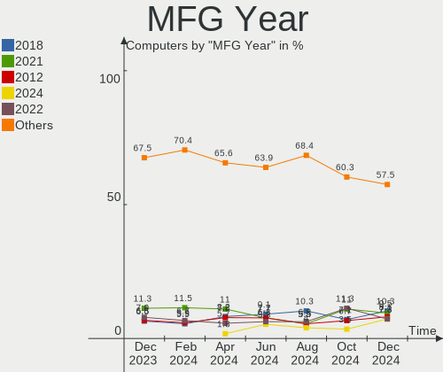

| Year | Computers | Percent |
|------|-----------|---------|
| 2020 | 81        | 15.52%  |
| 2021 | 66        | 12.64%  |
| 2018 | 53        | 10.15%  |
| 2019 | 49        | 9.39%   |
| 2012 | 36        | 6.9%    |
| 2014 | 35        | 6.7%    |
| 2013 | 31        | 5.94%   |
| 2015 | 27        | 5.17%   |
| 2016 | 26        | 4.98%   |
| 2017 | 24        | 4.6%    |
| 2022 | 22        | 4.21%   |
| 2009 | 22        | 4.21%   |
| 2011 | 18        | 3.45%   |
| 2008 | 16        | 3.07%   |
| 2010 | 9         | 1.72%   |
| 2006 | 4         | 0.77%   |
| 2007 | 3         | 0.57%   |

Form Factor
-----------

Physical design of the computer

| Name        | Computers | Percent |
|-------------|-----------|---------|
| Notebook    | 304       | 58.24%  |
| Desktop     | 176       | 33.72%  |
| Convertible | 21        | 4.02%   |
| Tablet      | 7         | 1.34%   |
| Mini pc     | 7         | 1.34%   |
| All in one  | 5         | 0.96%   |
| Server      | 2         | 0.38%   |

Secure Boot
-----------

Enabled or disabled

| State    | Computers | Percent |
|----------|-----------|---------|
| Disabled | 481       | 92.15%  |
| Enabled  | 41        | 7.85%   |

Coreboot
--------

Have coreboot on board

| Used | Computers | Percent |
|------|-----------|---------|
| No   | 520       | 99.62%  |
| Yes  | 2         | 0.38%   |

RAM Size
--------

Total RAM memory

| Size in GB  | Computers | Percent |
|-------------|-----------|---------|
| 16.01-24.0  | 143       | 27.39%  |
| 4.01-8.0    | 121       | 23.18%  |
| 8.01-16.0   | 106       | 20.31%  |
| 3.01-4.0    | 67        | 12.84%  |
| 32.01-64.0  | 54        | 10.34%  |
| 24.01-32.0  | 12        | 2.3%    |
| 64.01-256.0 | 10        | 1.92%   |
| 1.01-2.0    | 4         | 0.77%   |
| 2.01-3.0    | 3         | 0.57%   |
| 0.51-1.0    | 2         | 0.38%   |

RAM Used
--------

Used RAM memory

| Used GB    | Computers | Percent |
|------------|-----------|---------|
| 2.01-3.0   | 127       | 24.33%  |
| 4.01-8.0   | 122       | 23.37%  |
| 1.01-2.0   | 119       | 22.8%   |
| 3.01-4.0   | 103       | 19.73%  |
| 8.01-16.0  | 33        | 6.32%   |
| 0.51-1.0   | 12        | 2.3%    |
| 16.01-24.0 | 4         | 0.77%   |
| 24.01-32.0 | 1         | 0.19%   |
| 0.01-0.5   | 1         | 0.19%   |

Total Drives
------------

Number of drives on board

| Drives | Computers | Percent |
|--------|-----------|---------|
| 1      | 307       | 58.81%  |
| 2      | 135       | 25.86%  |
| 3      | 39        | 7.47%   |
| 4      | 19        | 3.64%   |
| 5      | 11        | 2.11%   |
| 6      | 5         | 0.96%   |
| 7      | 4         | 0.77%   |
| 8      | 1         | 0.19%   |
| 0      | 1         | 0.19%   |

Has CD-ROM
----------

Has CD-ROM on board

| Presented | Computers | Percent |
|-----------|-----------|---------|
| No        | 354       | 67.82%  |
| Yes       | 168       | 32.18%  |

Has Ethernet
------------

Has Ethernet on board

| Presented | Computers | Percent |
|-----------|-----------|---------|
| Yes       | 411       | 78.74%  |
| No        | 111       | 21.26%  |

Has WiFi
--------

Has WiFi module

| Presented | Computers | Percent |
|-----------|-----------|---------|
| Yes       | 417       | 79.89%  |
| No        | 105       | 20.11%  |

Has Bluetooth
-------------

Has Bluetooth module

| Presented | Computers | Percent |
|-----------|-----------|---------|
| Yes       | 364       | 69.73%  |
| No        | 158       | 30.27%  |

Location
--------

Country
-------

Geographic location (country)

| Country | Computers | Percent |
|---------|-----------|---------|
| Italy   | 522       | 100%    |

City
----

Geographic location (city)

| City                   | Computers | Percent |
|------------------------|-----------|---------|
| Milan                  | 95        | 18.2%   |
| Rome                   | 34        | 6.51%   |
| Turin                  | 23        | 4.41%   |
| Padova                 | 10        | 1.92%   |
| Naples                 | 10        | 1.92%   |
| Genoa                  | 9         | 1.72%   |
| Bologna                | 9         | 1.72%   |
| Rho                    | 6         | 1.15%   |
| Parma                  | 6         | 1.15%   |
| Palermo                | 6         | 1.15%   |
| Bari                   | 6         | 1.15%   |
| Trieste                | 5         | 0.96%   |
| Catania                | 5         | 0.96%   |
| Brescia                | 5         | 0.96%   |
| Biella                 | 5         | 0.96%   |
| Venice                 | 4         | 0.77%   |
| Florence               | 4         | 0.77%   |
| Casalecchio di Reno    | 4         | 0.77%   |
| Bergamo                | 4         | 0.77%   |
| Viggianello            | 3         | 0.57%   |
| Verona                 | 3         | 0.57%   |
| Salerno                | 3         | 0.57%   |
| Porcia                 | 3         | 0.57%   |
| Cesena                 | 3         | 0.57%   |
| Cavallino              | 3         | 0.57%   |
| Casale Litta           | 3         | 0.57%   |
| Bolzano                | 3         | 0.57%   |
| Vicopisano             | 2         | 0.38%   |
| Trento                 | 2         | 0.38%   |
| Taranto                | 2         | 0.38%   |
| Savignano sul Rubicone | 2         | 0.38%   |
| Saronno                | 2         | 0.38%   |
| Rescaldina             | 2         | 0.38%   |
| Reggio Emilia          | 2         | 0.38%   |
| Portogruaro            | 2         | 0.38%   |
| Pisa                   | 2         | 0.38%   |
| Pesaro                 | 2         | 0.38%   |
| Pavia di Udine         | 2         | 0.38%   |
| Monza                  | 2         | 0.38%   |
| Moncalieri             | 2         | 0.38%   |

Drives
------

Drive Vendor
------------

Hard drive vendors

| Vendor                      | Computers | Drives | Percent |
|-----------------------------|-----------|--------|---------|
| Samsung Electronics         | 165       | 193    | 20.68%  |
| WDC                         | 103       | 121    | 12.91%  |
| Seagate                     | 86        | 110    | 10.78%  |
| Crucial                     | 62        | 66     | 7.77%   |
| Sandisk                     | 52        | 54     | 6.52%   |
| Kingston                    | 47        | 48     | 5.89%   |
| Toshiba                     | 38        | 40     | 4.76%   |
| Micron Technology           | 26        | 26     | 3.26%   |
| Unknown                     | 25        | 29     | 3.13%   |
| SK hynix                    | 20        | 20     | 2.51%   |
| Intel                       | 16        | 16     | 2.01%   |
| HGST                        | 16        | 19     | 2.01%   |
| Phison                      | 11        | 12     | 1.38%   |
| Hitachi                     | 11        | 11     | 1.38%   |
| Phison Electronics          | 8         | 8      | 1%      |
| KIOXIA                      | 8         | 8      | 1%      |
| LITEON                      | 7         | 7      | 0.88%   |
| Maxtor                      | 6         | 6      | 0.75%   |
| SPCC                        | 5         | 5      | 0.63%   |
| Micron/Crucial Technology   | 5         | 5      | 0.63%   |
| Intenso                     | 5         | 5      | 0.63%   |
| China                       | 5         | 5      | 0.63%   |
| Netac                       | 4         | 4      | 0.5%    |
| Corsair                     | 4         | 6      | 0.5%    |
| A-DATA Technology           | 4         | 4      | 0.5%    |
| Team                        | 3         | 3      | 0.38%   |
| OCZ                         | 3         | 3      | 0.38%   |
| JMicron Technology          | 3         | 3      | 0.38%   |
| Apple                       | 3         | 3      | 0.38%   |
| Unknown                     | 3         | 3      | 0.38%   |
| XPG                         | 2         | 2      | 0.25%   |
| UMIS                        | 2         | 2      | 0.25%   |
| Transcend                   | 2         | 2      | 0.25%   |
| Silicon Motion              | 2         | 2      | 0.25%   |
| Patriot                     | 2         | 2      | 0.25%   |
| Kingston Technology Company | 2         | 2      | 0.25%   |
| KingSpec                    | 2         | 2      | 0.25%   |
| HGST HTS                    | 2         | 2      | 0.25%   |
| GOODRAM                     | 2         | 2      | 0.25%   |
| BAITITON                    | 2         | 2      | 0.25%   |

Drive Model
-----------

Hard drive models

| Model                                                | Computers | Percent |
|------------------------------------------------------|-----------|---------|
| Samsung NVMe SSD Controller SM981/PM981/PM983 500GB  | 20        | 2.3%    |
| Crucial CT500MX500SSD1 500GB                         | 18        | 2.07%   |
| Samsung SSD 860 EVO 500GB                            | 13        | 1.5%    |
| Samsung SSD 850 EVO 250GB                            | 12        | 1.38%   |
| Kingston SA400S37240G 240GB SSD                      | 12        | 1.38%   |
| Samsung SSD 860 EVO 250GB                            | 10        | 1.15%   |
| Sandisk WD Blue SN550 NVMe SSD 1TB                   | 9         | 1.04%   |
| Samsung SSD 850 EVO 500GB                            | 9         | 1.04%   |
| Kingston SA400S37480G 480GB SSD                      | 9         | 1.04%   |
| Samsung NVMe SSD Controller PM9A1/PM9A3/980PRO 250GB | 8         | 0.92%   |
| Phison Sabrent 512GB                                 | 7         | 0.81%   |
| Crucial CT120BX500SSD1 120GB                         | 7         | 0.81%   |
| Crucial CT1000MX500SSD1 1TB                          | 7         | 0.81%   |
| Seagate ST500DM002-1BD142 500GB                      | 6         | 0.69%   |
| Seagate ST1000DM010-2EP102 1TB                       | 6         | 0.69%   |
| Seagate M3 Portable 2TB                              | 6         | 0.69%   |
| Samsung SSD 980 500GB                                | 6         | 0.69%   |
| Samsung SSD 970 EVO Plus 1TB                         | 6         | 0.69%   |
| Crucial CT480BX500SSD1 480GB                         | 6         | 0.69%   |
| Unknown MMC Card  64GB                               | 5         | 0.58%   |
| Toshiba MQ01ABF050 500GB                             | 5         | 0.58%   |
| Seagate ST31000528AS 1TB                             | 5         | 0.58%   |
| Seagate ST2000DM008-2FR102 2TB                       | 5         | 0.58%   |
| Sandisk WD Blue SN500 / PC SN520 NVMe SSD 512GB      | 5         | 0.58%   |
| Sandisk WD Black SN750 / PC SN730 NVMe SSD 1TB       | 5         | 0.58%   |
| SanDisk SSD PLUS 480GB                               | 5         | 0.58%   |
| Phison E12 NVMe Controller 2TB                       | 5         | 0.58%   |
| Micron 3400_MTFDKBA1T0TFH 1TB                        | 5         | 0.58%   |
| Crucial CT240BX500SSD1 240GB                         | 5         | 0.58%   |
| WDC WD10EZEX-08WN4A0 1TB                             | 4         | 0.46%   |
| Unknown MMC Card  32GB                               | 4         | 0.46%   |
| Seagate ST9500325AS 500GB                            | 4         | 0.46%   |
| Seagate ST4000DM004-2CV104 4TB                       | 4         | 0.46%   |
| Seagate ST1000DM003-1CH162 1TB                       | 4         | 0.46%   |
| Samsung SSD 980 1TB                                  | 4         | 0.46%   |
| Samsung SSD 970 EVO Plus 500GB                       | 4         | 0.46%   |
| Samsung SSD 860 EVO 1TB                              | 4         | 0.46%   |
| Samsung SSD 850 PRO 256GB                            | 4         | 0.46%   |
| Samsung MZVLQ512HALU-000H1 512GB                     | 4         | 0.46%   |
| Kingston SA400S37120G 120GB SSD                      | 4         | 0.46%   |

HDD Vendor
----------

Hard disk drive vendors

| Vendor              | Computers | Drives | Percent |
|---------------------|-----------|--------|---------|
| Seagate             | 82        | 104    | 36.44%  |
| WDC                 | 76        | 90     | 33.78%  |
| Toshiba             | 22        | 23     | 9.78%   |
| HGST                | 16        | 19     | 7.11%   |
| Hitachi             | 11        | 11     | 4.89%   |
| Samsung Electronics | 6         | 7      | 2.67%   |
| Maxtor              | 6         | 6      | 2.67%   |
| HGST HTS            | 2         | 2      | 0.89%   |
| Unknown             | 1         | 1      | 0.44%   |
| IBM/Hitachi         | 1         | 1      | 0.44%   |
| IBM-ESXS            | 1         | 2      | 0.44%   |
| Fujitsu             | 1         | 1      | 0.44%   |

SSD Vendor
----------

Solid state drive vendors

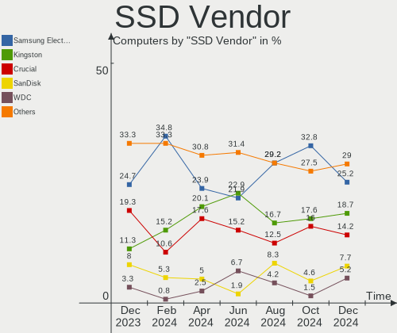

| Vendor              | Computers | Drives | Percent |
|---------------------|-----------|--------|---------|
| Samsung Electronics | 88        | 95     | 30.56%  |
| Crucial             | 57        | 60     | 19.79%  |
| Kingston            | 38        | 39     | 13.19%  |
| SanDisk             | 20        | 21     | 6.94%   |
| WDC                 | 9         | 9      | 3.13%   |
| LITEON              | 7         | 7      | 2.43%   |
| SPCC                | 5         | 5      | 1.74%   |
| Micron Technology   | 5         | 5      | 1.74%   |
| Intenso             | 5         | 5      | 1.74%   |
| China               | 5         | 5      | 1.74%   |
| SK hynix            | 4         | 4      | 1.39%   |
| Team                | 3         | 3      | 1.04%   |
| OCZ                 | 3         | 3      | 1.04%   |
| Netac               | 3         | 3      | 1.04%   |
| A-DATA Technology   | 3         | 3      | 1.04%   |
| Transcend           | 2         | 2      | 0.69%   |
| Patriot             | 2         | 2      | 0.69%   |
| KingSpec            | 2         | 2      | 0.69%   |
| GOODRAM             | 2         | 2      | 0.69%   |
| Corsair             | 2         | 4      | 0.69%   |
| BAITITON            | 2         | 2      | 0.69%   |
| Apple               | 2         | 2      | 0.69%   |
| Unknown             | 2         | 2      | 0.69%   |
| Verbatim            | 1         | 1      | 0.35%   |
| Unknown             | 1         | 1      | 0.35%   |
| Toshiba             | 1         | 1      | 0.35%   |
| Plextor             | 1         | 1      | 0.35%   |
| Mushkin             | 1         | 1      | 0.35%   |
| LITEONIT            | 1         | 1      | 0.35%   |
| Lexar               | 1         | 1      | 0.35%   |
| Leven               | 1         | 1      | 0.35%   |
| KingFast            | 1         | 1      | 0.35%   |
| KingDian            | 1         | 1      | 0.35%   |
| Intel               | 1         | 1      | 0.35%   |
| Hoodisk             | 1         | 1      | 0.35%   |
| faspeed             | 1         | 1      | 0.35%   |
| Emtec               | 1         | 1      | 0.35%   |
| Drevo               | 1         | 1      | 0.35%   |
| CT480BX5            | 1         | 1      | 0.35%   |
| ASMT                | 1         | 1      | 0.35%   |

Drive Kind
----------

HDD or SSD

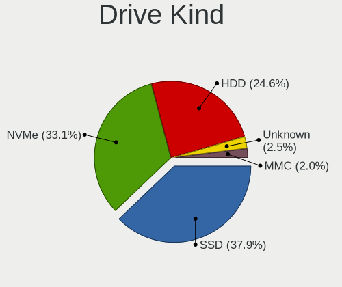

| Kind    | Computers | Drives | Percent |
|---------|-----------|--------|---------|
| SSD     | 249       | 302    | 34.58%  |
| NVMe    | 248       | 279    | 34.44%  |
| HDD     | 188       | 267    | 26.11%  |
| MMC     | 23        | 26     | 3.19%   |
| Unknown | 12        | 14     | 1.67%   |

Drive Connector
---------------

SATA, SAS, NVMe, etc.

| Type | Computers | Drives | Percent |
|------|-----------|--------|---------|
| SATA | 340       | 554    | 53.38%  |
| NVMe | 248       | 278    | 38.93%  |
| SAS  | 26        | 30     | 4.08%   |
| MMC  | 23        | 26     | 3.61%   |

Drive Size
----------

Size of hard drive

| Size in TB | Computers | Drives | Percent |
|------------|-----------|--------|---------|
| 0.01-0.5   | 264       | 342    | 58.54%  |
| 0.51-1.0   | 123       | 149    | 27.27%  |
| 1.01-2.0   | 36        | 43     | 7.98%   |
| 3.01-4.0   | 12        | 15     | 2.66%   |
| 2.01-3.0   | 10        | 12     | 2.22%   |
| 4.01-10.0  | 5         | 7      | 1.11%   |
| 10.01-20.0 | 1         | 1      | 0.22%   |

Space Total
-----------

Amount of disk space available on the file system

| Size in GB     | Computers | Percent |
|----------------|-----------|---------|
| 251-500        | 137       | 26.25%  |
| 101-250        | 118       | 22.61%  |
| 501-1000       | 86        | 16.48%  |
| 1001-2000      | 43        | 8.24%   |
| 1-20           | 38        | 7.28%   |
| More than 3000 | 27        | 5.17%   |
| 51-100         | 26        | 4.98%   |
| 2001-3000      | 22        | 4.21%   |
| 21-50          | 16        | 3.07%   |
| Unknown        | 9         | 1.72%   |

Space Used
----------

Amount of used disk space

| Used GB        | Computers | Percent |
|----------------|-----------|---------|
| 1-20           | 117       | 22.41%  |
| 101-250        | 100       | 19.16%  |
| 51-100         | 86        | 16.48%  |
| 21-50          | 77        | 14.75%  |
| 251-500        | 55        | 10.54%  |
| 501-1000       | 43        | 8.24%   |
| 1001-2000      | 18        | 3.45%   |
| 2001-3000      | 9         | 1.72%   |
| Unknown        | 9         | 1.72%   |
| More than 3000 | 8         | 1.53%   |

Malfunc. Drives
---------------

Drive models with a malfunction

| Model                                | Computers | Drives | Percent |
|--------------------------------------|-----------|--------|---------|
| Toshiba MQ01ABF050 500GB             | 2         | 2      | 3.28%   |
| Seagate ST9500325AS 500GB            | 2         | 2      | 3.28%   |
| Seagate ST500DM002-1BD142 500GB      | 2         | 2      | 3.28%   |
| Samsung Electronics HD103UJ 1TB      | 2         | 2      | 3.28%   |
| HGST HTS545050A7E680 500GB           | 2         | 2      | 3.28%   |
| WDC WDS240G2G0B-00EPW0 240GB SSD     | 1         | 1      | 1.64%   |
| WDC WD5000LPVX-00V0TT0 500GB         | 1         | 1      | 1.64%   |
| WDC WD5000BEVT-22A0RT0 500GB         | 1         | 1      | 1.64%   |
| WDC WD40EFRX-68N32N0 4TB             | 1         | 1      | 1.64%   |
| WDC WD30EZRX-00SPEB0 3TB             | 1         | 1      | 1.64%   |
| WDC WD20EFRX-68EUZN0 2TB             | 1         | 1      | 1.64%   |
| WDC WD10JPVX-22JC3T0 1TB             | 1         | 1      | 1.64%   |
| WDC WD10EZEX-60WN4A0 1TB             | 1         | 1      | 1.64%   |
| WDC WD10EZEX-08M2NA0 1TB             | 1         | 1      | 1.64%   |
| WDC WD10EZEX-07M2NA1 1TB             | 1         | 1      | 1.64%   |
| WDC WD10EARS-00MVWB0 1TB             | 1         | 1      | 1.64%   |
| WDC WD10EADS-00M2B0 1TB              | 1         | 1      | 1.64%   |
| Toshiba MK1059GSM 1TB                | 1         | 1      | 1.64%   |
| SK hynix BC711 HFM512GD3JX013N 512GB | 1         | 1      | 1.64%   |
| Seagate ST9320423AS 320GB            | 1         | 1      | 1.64%   |
| Seagate ST500LM021-1KJ152 500GB      | 1         | 1      | 1.64%   |
| Seagate ST3500620AS 500GB            | 1         | 1      | 1.64%   |
| Seagate ST3500412AS 500GB            | 1         | 1      | 1.64%   |
| Seagate ST3500320AS 500GB            | 1         | 1      | 1.64%   |
| Seagate ST3320620AS 320GB            | 1         | 2      | 1.64%   |
| Seagate ST3320613AS 320GB            | 1         | 1      | 1.64%   |
| Seagate ST2000DM008-2FR102 2TB       | 1         | 1      | 1.64%   |
| Seagate ST2000DL003-9VT166 2TB       | 1         | 1      | 1.64%   |
| Seagate ST1000LM035-1RK172 1TB       | 1         | 1      | 1.64%   |
| Seagate ST1000LM014-1EJ164 1TB       | 1         | 1      | 1.64%   |
| Seagate ST1000DM003-9YN162 1TB       | 1         | 1      | 1.64%   |
| Seagate ST1000DM003-1CH162 1TB       | 1         | 1      | 1.64%   |
| SanDisk SSD PLUS 480GB               | 1         | 1      | 1.64%   |
| OCZ AGILITY3 120GB SSD               | 1         | 1      | 1.64%   |
| Maxtor STM3500320AS 500GB            | 1         | 1      | 1.64%   |
| Maxtor STM3250310AS 250GB            | 1         | 1      | 1.64%   |
| Maxtor STM3160613AS 160GB            | 1         | 1      | 1.64%   |
| Maxtor 6Y160M0 164GB                 | 1         | 1      | 1.64%   |
| Kingston SA400S37240G 240GB SSD      | 1         | 1      | 1.64%   |
| KingSpec NT-256 256GB SSD            | 1         | 1      | 1.64%   |

Malfunc. Drive Vendor
---------------------

Vendors of faulty drives

| Vendor              | Computers | Drives | Percent |
|---------------------|-----------|--------|---------|
| Seagate             | 17        | 18     | 28.33%  |
| WDC                 | 11        | 12     | 18.33%  |
| Hitachi             | 5         | 5      | 8.33%   |
| HGST                | 5         | 5      | 8.33%   |
| Crucial             | 5         | 5      | 8.33%   |
| Maxtor              | 4         | 4      | 6.67%   |
| Toshiba             | 3         | 3      | 5%      |
| Samsung Electronics | 2         | 2      | 3.33%   |
| SK hynix            | 1         | 1      | 1.67%   |
| SanDisk             | 1         | 1      | 1.67%   |
| OCZ                 | 1         | 1      | 1.67%   |
| Kingston            | 1         | 1      | 1.67%   |
| KingSpec            | 1         | 1      | 1.67%   |
| Intel               | 1         | 1      | 1.67%   |
| Fujitsu             | 1         | 1      | 1.67%   |
| BAITITON            | 1         | 1      | 1.67%   |

Malfunc. HDD Vendor
-------------------

Vendors of faulty HDD drives

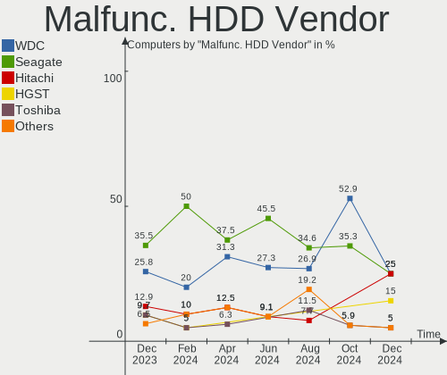

| Vendor              | Computers | Drives | Percent |
|---------------------|-----------|--------|---------|
| Seagate             | 17        | 18     | 36.17%  |
| WDC                 | 10        | 11     | 21.28%  |
| Hitachi             | 5         | 5      | 10.64%  |
| HGST                | 5         | 5      | 10.64%  |
| Maxtor              | 4         | 4      | 8.51%   |
| Toshiba             | 3         | 3      | 6.38%   |
| Samsung Electronics | 2         | 2      | 4.26%   |
| Fujitsu             | 1         | 1      | 2.13%   |

Malfunc. Drive Kind
-------------------

Kinds of faulty drives

| Kind | Computers | Drives | Percent |
|------|-----------|--------|---------|
| HDD  | 46        | 49     | 77.97%  |
| SSD  | 11        | 11     | 18.64%  |
| NVMe | 2         | 2      | 3.39%   |

Failed Drives
-------------

Failed drive models

| Model                           | Computers | Drives | Percent |
|---------------------------------|-----------|--------|---------|
| Seagate ST9500420AS 500GB       | 1         | 1      | 33.33%  |
| Seagate ST500DM002-1BD142 500GB | 1         | 1      | 33.33%  |
| Seagate ST2000LX001-1RG174 2TB  | 1         | 1      | 33.33%  |

Failed Drive Vendor
-------------------

Failed drive vendors

| Vendor  | Computers | Drives | Percent |
|---------|-----------|--------|---------|
| Seagate | 3         | 3      | 100%    |

Drive Status
------------

Number of failed and malfunc. drives

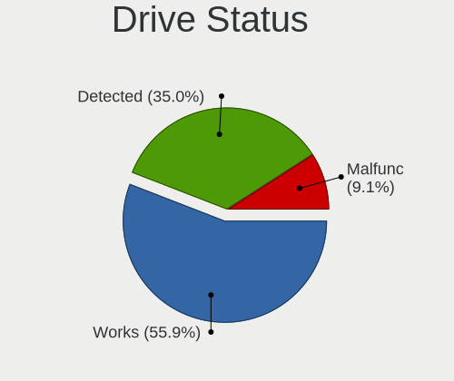

| Status   | Computers | Drives | Percent |
|----------|-----------|--------|---------|
| Works    | 345       | 547    | 58.87%  |
| Detected | 179       | 276    | 30.55%  |
| Malfunc  | 59        | 62     | 10.07%  |
| Failed   | 3         | 3      | 0.51%   |

Storage controller
------------------

Storage Vendor
--------------

Storage controller vendors

| Vendor                         | Computers | Percent |
|--------------------------------|-----------|---------|
| Intel                          | 334       | 46.71%  |
| AMD                            | 94        | 13.15%  |
| Samsung Electronics            | 83        | 11.61%  |
| SanDisk                        | 53        | 7.41%   |
| Phison Electronics             | 21        | 2.94%   |
| Micron Technology              | 21        | 2.94%   |
| Toshiba America Info Systems   | 15        | 2.1%    |
| SK hynix                       | 15        | 2.1%    |
| ASMedia Technology             | 12        | 1.68%   |
| Micron/Crucial Technology      | 11        | 1.54%   |
| Kingston Technology Company    | 11        | 1.54%   |
| KIOXIA                         | 10        | 1.4%    |
| Nvidia                         | 8         | 1.12%   |
| JMicron Technology             | 5         | 0.7%    |
| VIA Technologies               | 4         | 0.56%   |
| Marvell Technology Group       | 4         | 0.56%   |
| Union Memory (Shenzhen)        | 3         | 0.42%   |
| Silicon Motion                 | 3         | 0.42%   |
| Solid State Storage Technology | 2         | 0.28%   |
| ADATA Technology               | 2         | 0.28%   |
| Unknown                        | 1         | 0.14%   |
| Shenzhen Longsys Electronics   | 1         | 0.14%   |
| Lite-On Technology             | 1         | 0.14%   |
| Broadcom / LSI                 | 1         | 0.14%   |

Storage Model
-------------

Storage controller models

| Model                                                                          | Computers | Percent |
|--------------------------------------------------------------------------------|-----------|---------|
| AMD FCH SATA Controller [AHCI mode]                                            | 64        | 8.15%   |
| Samsung NVMe SSD Controller SM981/PM981/PM983                                  | 42        | 5.35%   |
| Intel Sunrise Point-LP SATA Controller [AHCI mode]                             | 31        | 3.95%   |
| Intel 8 Series/C220 Series Chipset Family 6-port SATA Controller 1 [AHCI mode] | 28        | 3.57%   |
| Samsung NVMe SSD Controller 980                                                | 23        | 2.93%   |
| Intel Volume Management Device NVMe RAID Controller                            | 22        | 2.8%    |
| Intel 82801 Mobile SATA Controller [RAID mode]                                 | 22        | 2.8%    |
| Micron Non-Volatile memory controller                                          | 21        | 2.68%   |
| AMD 400 Series Chipset SATA Controller                                         | 17        | 2.17%   |
| Phison E12 NVMe Controller                                                     | 15        | 1.91%   |
| SanDisk WD Blue SN550 NVMe SSD                                                 | 14        | 1.78%   |
| Intel 8 Series SATA Controller 1 [AHCI mode]                                   | 13        | 1.66%   |
| Samsung NVMe SSD Controller PM9A1/PM9A3/980PRO                                 | 12        | 1.53%   |
| Intel 7 Series/C210 Series Chipset Family 6-port SATA Controller [AHCI mode]   | 12        | 1.53%   |
| Intel 7 Series Chipset Family 6-port SATA Controller [AHCI mode]               | 12        | 1.53%   |
| SanDisk WD Black SN750 / PC SN730 NVMe SSD                                     | 11        | 1.4%    |
| Intel SSD 660P Series                                                          | 11        | 1.4%    |
| Intel Q170/Q150/B150/H170/H110/Z170/CM236 Chipset SATA Controller [AHCI Mode]  | 11        | 1.4%    |
| Intel Celeron/Pentium Silver Processor SATA Controller                         | 11        | 1.4%    |
| Intel 6 Series/C200 Series Chipset Family 6 port Desktop SATA AHCI Controller  | 11        | 1.4%    |
| ASMedia ASM1062 Serial ATA Controller                                          | 11        | 1.4%    |
| KIOXIA NVMe SSD Controller BG4                                                 | 10        | 1.27%   |
| Intel Cannon Lake PCH SATA AHCI Controller                                     | 10        | 1.27%   |
| Intel Cannon Lake Mobile PCH SATA AHCI Controller                              | 10        | 1.27%   |
| AMD 500 Series Chipset SATA Controller                                         | 10        | 1.27%   |
| Intel Comet Lake SATA AHCI Controller                                          | 9         | 1.15%   |
| Intel Wildcat Point-LP SATA Controller [AHCI Mode]                             | 8         | 1.02%   |
| Intel Tiger Lake-LP SATA Controller                                            | 8         | 1.02%   |
| Intel HM170/QM170 Chipset SATA Controller [AHCI Mode]                          | 8         | 1.02%   |
| Intel 400 Series Chipset Family SATA AHCI Controller                           | 8         | 1.02%   |
| SanDisk WD PC SN810 / Black SN850 NVMe SSD                                     | 7         | 0.89%   |
| Kingston Company Company Non-Volatile memory controller                        | 7         | 0.89%   |
| Intel SATA Controller [RAID mode]                                              | 7         | 0.89%   |
| AMD SB7x0/SB8x0/SB9x0 SATA Controller [AHCI mode]                              | 7         | 0.89%   |
| Toshiba America Info Systems XG6 NVMe SSD Controller                           | 6         | 0.76%   |
| SanDisk WD Blue SN500 / PC SN520 NVMe SSD                                      | 6         | 0.76%   |
| SanDisk Non-Volatile memory controller                                         | 6         | 0.76%   |
| Samsung NVMe SSD Controller SM961/PM961/SM963                                  | 6         | 0.76%   |
| Intel 82801G (ICH7 Family) IDE Controller                                      | 6         | 0.76%   |
| Intel 6 Series/C200 Series Chipset Family 6 port Mobile SATA AHCI Controller   | 6         | 0.76%   |

Storage Kind
------------

Kind of storage controller (IDE, SATA, NVMe, SAS, ...)

| Kind | Computers | Percent |
|------|-----------|---------|
| SATA | 365       | 51.05%  |
| NVMe | 248       | 34.69%  |
| RAID | 58        | 8.11%   |
| IDE  | 43        | 6.01%   |
| SAS  | 1         | 0.14%   |

Processor
---------

CPU Vendor
----------

Processor vendors

| Vendor | Computers | Percent |
|--------|-----------|---------|
| Intel  | 394       | 75.48%  |
| AMD    | 128       | 24.52%  |

CPU Model
---------

Processor models

| Model                                         | Computers | Percent |
|-----------------------------------------------|-----------|---------|
| Intel 11th Gen Core i7-1165G7 @ 2.80GHz       | 15        | 2.87%   |
| AMD Ryzen 7 5700U with Radeon Graphics        | 10        | 1.92%   |
| Intel Core i5-8250U CPU @ 1.60GHz             | 9         | 1.72%   |
| Intel Core i7-8550U CPU @ 1.80GHz             | 8         | 1.53%   |
| Intel 11th Gen Core i5-1135G7 @ 2.40GHz       | 8         | 1.53%   |
| Intel Core i7-8565U CPU @ 1.80GHz             | 6         | 1.15%   |
| Intel Core i7-7700HQ CPU @ 2.80GHz            | 6         | 1.15%   |
| Intel Core i7-1065G7 CPU @ 1.30GHz            | 6         | 1.15%   |
| Intel Core i5-6300U CPU @ 2.40GHz             | 6         | 1.15%   |
| Intel Core i5-6200U CPU @ 2.30GHz             | 6         | 1.15%   |
| AMD Ryzen 5 5500U with Radeon Graphics        | 6         | 1.15%   |
| Intel Core i7-9750H CPU @ 2.60GHz             | 5         | 0.96%   |
| Intel Core i7-10750H CPU @ 2.60GHz            | 5         | 0.96%   |
| Intel Core i5-1035G1 CPU @ 1.00GHz            | 5         | 0.96%   |
| Intel 12th Gen Core i7-12700H                 | 5         | 0.96%   |
| Intel 11th Gen Core i7-1185G7 @ 3.00GHz       | 5         | 0.96%   |
| AMD Ryzen 7 4800H with Radeon Graphics        | 5         | 0.96%   |
| AMD Ryzen 5 3500U with Radeon Vega Mobile Gfx | 5         | 0.96%   |
| Intel Core i7-8750H CPU @ 2.20GHz             | 4         | 0.77%   |
| Intel Core i7-6700K CPU @ 4.00GHz             | 4         | 0.77%   |
| Intel Core i7-3770 CPU @ 3.40GHz              | 4         | 0.77%   |
| Intel Core i7-3632QM CPU @ 2.20GHz            | 4         | 0.77%   |
| Intel Core i5-3470 CPU @ 3.20GHz              | 4         | 0.77%   |
| Intel Core i5-2400S CPU @ 2.50GHz             | 4         | 0.77%   |
| Intel Core i5-10210U CPU @ 1.60GHz            | 4         | 0.77%   |
| Intel Core i3-4005U CPU @ 1.70GHz             | 4         | 0.77%   |
| Intel Celeron N4020 CPU @ 1.10GHz             | 4         | 0.77%   |
| AMD Ryzen 7 5800X 8-Core Processor            | 4         | 0.77%   |
| AMD Ryzen 7 3700U with Radeon Vega Mobile Gfx | 4         | 0.77%   |
| AMD Ryzen 5 5600X 6-Core Processor            | 4         | 0.77%   |
| Intel Core i7-9700K CPU @ 3.60GHz             | 3         | 0.57%   |
| Intel Core i7-8650U CPU @ 1.90GHz             | 3         | 0.57%   |
| Intel Core i7-7700 CPU @ 3.60GHz              | 3         | 0.57%   |
| Intel Core i7-6700HQ CPU @ 2.60GHz            | 3         | 0.57%   |
| Intel Core i7-4790 CPU @ 3.60GHz              | 3         | 0.57%   |
| Intel Core i7-4700MQ CPU @ 2.40GHz            | 3         | 0.57%   |
| Intel Core i7-4510U CPU @ 2.00GHz             | 3         | 0.57%   |
| Intel Core i7-10700K CPU @ 3.80GHz            | 3         | 0.57%   |
| Intel Core i7-10510U CPU @ 1.80GHz            | 3         | 0.57%   |
| Intel Core i7 CPU 920 @ 2.67GHz               | 3         | 0.57%   |

CPU Model Family
----------------

Processor model prefix

| Model                   | Computers | Percent |
|-------------------------|-----------|---------|
| Intel Core i7           | 134       | 25.67%  |
| Intel Core i5           | 99        | 18.97%  |
| Other                   | 54        | 10.34%  |
| AMD Ryzen 5             | 45        | 8.62%   |
| AMD Ryzen 7             | 38        | 7.28%   |
| Intel Core i3           | 28        | 5.36%   |
| Intel Celeron           | 21        | 4.02%   |
| Intel Core 2 Duo        | 14        | 2.68%   |
| Intel Atom              | 10        | 1.92%   |
| AMD Ryzen 9             | 9         | 1.72%   |
| Intel Xeon              | 7         | 1.34%   |
| Intel Pentium           | 6         | 1.15%   |
| AMD Ryzen 3             | 6         | 1.15%   |
| AMD FX                  | 5         | 0.96%   |
| Intel Pentium Dual-Core | 4         | 0.77%   |
| Intel Core i9           | 4         | 0.77%   |
| Intel Core 2 Quad       | 4         | 0.77%   |
| AMD Ryzen 5 PRO         | 4         | 0.77%   |
| AMD E1                  | 4         | 0.77%   |
| AMD Phenom II X6        | 3         | 0.57%   |
| Intel Pentium Silver    | 2         | 0.38%   |
| Intel Core m5           | 2         | 0.38%   |
| AMD Ryzen 7 PRO         | 2         | 0.38%   |
| AMD A10                 | 2         | 0.38%   |
| Intel Pentium Dual      | 1         | 0.19%   |
| Intel Pentium D         | 1         | 0.19%   |
| Intel Pentium 4         | 1         | 0.19%   |
| Intel Genuine           | 1         | 0.19%   |
| Intel Core m3           | 1         | 0.19%   |
| AMD Turion 64 X2 Mobile | 1         | 0.19%   |
| AMD QC                  | 1         | 0.19%   |
| AMD Phenom II X4        | 1         | 0.19%   |
| AMD E                   | 1         | 0.19%   |
| AMD Athlon II           | 1         | 0.19%   |
| AMD Athlon 64 X2        | 1         | 0.19%   |
| AMD Athlon 64           | 1         | 0.19%   |
| AMD A8                  | 1         | 0.19%   |
| AMD A6                  | 1         | 0.19%   |
| AMD A4                  | 1         | 0.19%   |

CPU Cores
---------

Number of processor cores

| Number | Computers | Percent |
|--------|-----------|---------|
| 4      | 238       | 45.59%  |
| 2      | 136       | 26.05%  |
| 6      | 66        | 12.64%  |
| 8      | 52        | 9.96%   |
| 14     | 10        | 1.92%   |
| 1      | 6         | 1.15%   |
| 16     | 5         | 0.96%   |
| 12     | 5         | 0.96%   |
| 10     | 2         | 0.38%   |
| 5      | 1         | 0.19%   |
| 3      | 1         | 0.19%   |

CPU Sockets
-----------

Number of sockets

| Number | Computers | Percent |
|--------|-----------|---------|
| 1      | 521       | 99.81%  |
| 2      | 1         | 0.19%   |

CPU Threads
-----------

Threads per core (Hyper-Threading)

| Number | Computers | Percent |
|--------|-----------|---------|
| 2      | 389       | 74.52%  |
| 1      | 133       | 25.48%  |

CPU Op-Modes
------------

CPU Operation Modes (32-bit, 64-bit)

| Op mode        | Computers | Percent |
|----------------|-----------|---------|
| 32-bit, 64-bit | 519       | 99.43%  |
| 32-bit         | 3         | 0.57%   |

CPU Microcode
-------------

Microcode number

| Number     | Computers | Percent |
|------------|-----------|---------|
| Unknown    | 89        | 17.05%  |
| 0x306c3    | 29        | 5.56%   |
| 0x806c1    | 28        | 5.36%   |
| 0x306a9    | 22        | 4.21%   |
| 0x806ea    | 16        | 3.07%   |
| 0x506e3    | 15        | 2.87%   |
| 0x406e3    | 14        | 2.68%   |
| 0x08608103 | 14        | 2.68%   |
| 0x08108109 | 14        | 2.68%   |
| 0x706e5    | 13        | 2.49%   |
| 0x40651    | 13        | 2.49%   |
| 0x906ea    | 12        | 2.3%    |
| 0x206a7    | 12        | 2.3%    |
| 0x08701021 | 12        | 2.3%    |
| 0x906e9    | 10        | 1.92%   |
| 0x906a3    | 10        | 1.92%   |
| 0x806ec    | 10        | 1.92%   |
| 0x1067a    | 10        | 1.92%   |
| 0x0a50000c | 9         | 1.72%   |
| 0xa0652    | 8         | 1.53%   |
| 0x806e9    | 8         | 1.53%   |
| 0x706a8    | 7         | 1.34%   |
| 0x306d4    | 7         | 1.34%   |
| 0x08600106 | 7         | 1.34%   |
| 0x08600104 | 6         | 1.15%   |
| 0xa0653    | 5         | 0.96%   |
| 0x806eb    | 5         | 0.96%   |
| 0x706a1    | 5         | 0.96%   |
| 0x0a201016 | 5         | 0.96%   |
| 0x906ed    | 4         | 0.77%   |
| 0x406c4    | 4         | 0.77%   |
| 0x20655    | 4         | 0.77%   |
| 0x08108102 | 4         | 0.77%   |
| 0x06000852 | 4         | 0.77%   |
| 0xa0655    | 3         | 0.57%   |
| 0x90672    | 3         | 0.57%   |
| 0x806d1    | 3         | 0.57%   |
| 0x6fd      | 3         | 0.57%   |
| 0x6fb      | 3         | 0.57%   |
| 0x406c3    | 3         | 0.57%   |

CPU Microarch
-------------

Microarchitecture

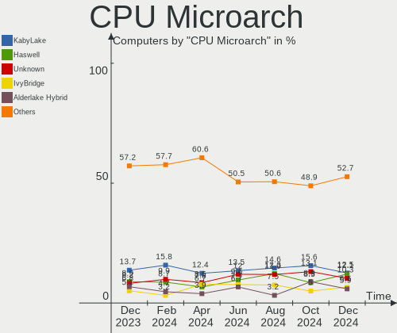

| Name             | Computers | Percent |
|------------------|-----------|---------|
| KabyLake         | 86        | 16.48%  |
| Haswell          | 52        | 9.96%   |
| TigerLake        | 34        | 6.51%   |
| Skylake          | 34        | 6.51%   |
| IvyBridge        | 32        | 6.13%   |
| Zen 2            | 30        | 5.75%   |
| Zen+             | 24        | 4.6%    |
| Unknown          | 24        | 4.6%    |
| Zen 3            | 22        | 4.21%   |
| SandyBridge      | 20        | 3.83%   |
| CometLake        | 19        | 3.64%   |
| IceLake          | 18        | 3.45%   |
| Penryn           | 17        | 3.26%   |
| Goldmont plus    | 12        | 2.3%    |
| Alderlake Hybrid | 12        | 2.3%    |
| Silvermont       | 11        | 2.11%   |
| Zen              | 9         | 1.72%   |
| Westmere         | 9         | 1.72%   |
| Broadwell        | 8         | 1.53%   |
| Nehalem          | 7         | 1.34%   |
| Core             | 7         | 1.34%   |
| Piledriver       | 6         | 1.15%   |
| K10              | 5         | 0.96%   |
| Goldmont         | 4         | 0.77%   |
| Bonnell          | 4         | 0.77%   |
| K8 Hammer        | 3         | 0.57%   |
| Jaguar           | 3         | 0.57%   |
| Bobcat           | 3         | 0.57%   |
| NetBurst         | 2         | 0.38%   |
| Steamroller      | 1         | 0.19%   |
| Puma             | 1         | 0.19%   |
| P6               | 1         | 0.19%   |
| Excavator        | 1         | 0.19%   |
| Bulldozer        | 1         | 0.19%   |

Graphics
--------

GPU Vendor
----------

Vendors of graphics cards

| Vendor                     | Computers | Percent |
|----------------------------|-----------|---------|
| Intel                      | 297       | 46.99%  |
| Nvidia                     | 188       | 29.75%  |
| AMD                        | 145       | 22.94%  |
| Matrox Electronics Systems | 1         | 0.16%   |
| ASPEED Technology          | 1         | 0.16%   |

GPU Model
---------

Graphics card models

| Model                                                                                    | Computers | Percent |
|------------------------------------------------------------------------------------------|-----------|---------|
| Intel TigerLake-LP GT2 [Iris Xe Graphics]                                                | 31        | 4.84%   |
| Intel UHD Graphics 620                                                                   | 21        | 3.28%   |
| AMD Picasso/Raven 2 [Radeon Vega Series / Radeon Vega Mobile Series]                     | 20        | 3.13%   |
| AMD Renoir                                                                               | 17        | 2.66%   |
| AMD Lucienne                                                                             | 17        | 2.66%   |
| Intel Skylake GT2 [HD Graphics 520]                                                      | 16        | 2.5%    |
| Intel Haswell-ULT Integrated Graphics Controller                                         | 15        | 2.34%   |
| Intel 2nd Generation Core Processor Family Integrated Graphics Controller                | 15        | 2.34%   |
| Intel 4th Gen Core Processor Integrated Graphics Controller                              | 14        | 2.19%   |
| Intel 3rd Gen Core processor Graphics Controller                                         | 13        | 2.03%   |
| Intel CoffeeLake-H GT2 [UHD Graphics 630]                                                | 11        | 1.72%   |
| Intel Alder Lake-P Integrated Graphics Controller                                        | 11        | 1.72%   |
| Intel WhiskeyLake-U GT2 [UHD Graphics 620]                                               | 10        | 1.56%   |
| Intel GeminiLake [UHD Graphics 600]                                                      | 10        | 1.56%   |
| Nvidia TU117M [GeForce GTX 1650 Mobile / Max-Q]                                          | 8         | 1.25%   |
| Intel Xeon E3-1200 v3/4th Gen Core Processor Integrated Graphics Controller              | 8         | 1.25%   |
| Intel Iris Plus Graphics G7                                                              | 8         | 1.25%   |
| Intel HD Graphics 5500                                                                   | 8         | 1.25%   |
| Intel CometLake-H GT2 [UHD Graphics]                                                     | 8         | 1.25%   |
| Intel Atom/Celeron/Pentium Processor x5-E8000/J3xxx/N3xxx Integrated Graphics Controller | 8         | 1.25%   |
| AMD Cezanne                                                                              | 8         | 1.25%   |
| Nvidia GP107 [GeForce GTX 1050 Ti]                                                       | 7         | 1.09%   |
| Intel HD Graphics 630                                                                    | 7         | 1.09%   |
| Intel HD Graphics 620                                                                    | 7         | 1.09%   |
| Intel HD Graphics 530                                                                    | 7         | 1.09%   |
| Intel CometLake-U GT2 [UHD Graphics]                                                     | 7         | 1.09%   |
| Nvidia GP107M [GeForce GTX 1050 Mobile]                                                  | 6         | 0.94%   |
| Nvidia GA106M [GeForce RTX 3060 Mobile / Max-Q]                                          | 6         | 0.94%   |
| Intel Iris Plus Graphics G1 (Ice Lake)                                                   | 6         | 0.94%   |
| AMD Ellesmere [Radeon RX 470/480/570/570X/580/580X/590]                                  | 6         | 0.94%   |
| Nvidia GM107M [GeForce GTX 850M]                                                         | 5         | 0.78%   |
| Nvidia GA107M [GeForce RTX 3050 Mobile]                                                  | 5         | 0.78%   |
| Intel Core Processor Integrated Graphics Controller                                      | 5         | 0.78%   |
| Intel CometLake-S GT2 [UHD Graphics 630]                                                 | 5         | 0.78%   |
| AMD Raven Ridge [Radeon Vega Series / Radeon Vega Mobile Series]                         | 5         | 0.78%   |
| Nvidia TU117M                                                                            | 4         | 0.63%   |
| Nvidia TU106 [GeForce RTX 2060 SUPER]                                                    | 4         | 0.63%   |
| Nvidia GP107M [GeForce GTX 1050 Ti Mobile]                                               | 4         | 0.63%   |
| Nvidia GP106 [GeForce GTX 1060 6GB]                                                      | 4         | 0.63%   |
| Nvidia GP104 [GeForce GTX 1080]                                                          | 4         | 0.63%   |

GPU Combo
---------

Combinations of graphics cards

| Name            | Computers | Percent |
|-----------------|-----------|---------|
| 1 x Intel       | 194       | 37.16%  |
| 1 x AMD         | 118       | 22.61%  |
| 1 x Nvidia      | 98        | 18.77%  |
| Intel + Nvidia  | 81        | 15.52%  |
| Intel + AMD     | 14        | 2.68%   |
| AMD + Nvidia    | 8         | 1.53%   |
| 2 x AMD         | 5         | 0.96%   |
| Other           | 1         | 0.19%   |
| 2 x Intel       | 1         | 0.19%   |
| Nvidia + ASPEED | 1         | 0.19%   |
| 1 x Matrox      | 1         | 0.19%   |

GPU Driver
----------

Free vs proprietary

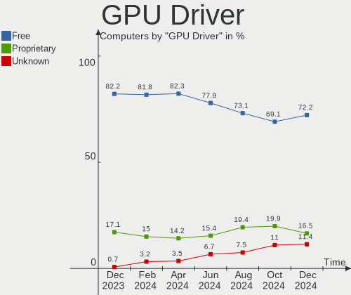

| Driver      | Computers | Percent |
|-------------|-----------|---------|
| Free        | 403       | 77.2%   |
| Proprietary | 113       | 21.65%  |
| Unknown     | 6         | 1.15%   |

GPU Memory
----------

Total video memory

| Size in GB | Computers | Percent |
|------------|-----------|---------|
| Unknown    | 304       | 58.24%  |
| 1.01-2.0   | 63        | 12.07%  |
| 0.01-0.5   | 56        | 10.73%  |
| 3.01-4.0   | 29        | 5.56%   |
| 0.51-1.0   | 26        | 4.98%   |
| 7.01-8.0   | 22        | 4.21%   |
| 5.01-6.0   | 12        | 2.3%    |
| 8.01-16.0  | 7         | 1.34%   |
| 2.01-3.0   | 3         | 0.57%   |

Monitor
-------

Monitor Vendor
--------------

Monitor vendors

| Vendor                  | Computers | Percent |
|-------------------------|-----------|---------|
| Samsung Electronics     | 80        | 13.16%  |
| BOE                     | 70        | 11.51%  |
| AU Optronics            | 66        | 10.86%  |
| Chimei Innolux          | 62        | 10.2%   |
| LG Display              | 56        | 9.21%   |
| Goldstar                | 38        | 6.25%   |
| Hewlett-Packard         | 25        | 4.11%   |
| Ancor Communications    | 24        | 3.95%   |
| Philips                 | 22        | 3.62%   |
| BenQ                    | 21        | 3.45%   |
| Sharp                   | 15        | 2.47%   |
| PANDA                   | 13        | 2.14%   |
| Dell                    | 13        | 2.14%   |
| Acer                    | 12        | 1.97%   |
| Lenovo                  | 10        | 1.64%   |
| AOC                     | 8         | 1.32%   |
| MSI                     | 6         | 0.99%   |
| Apple                   | 6         | 0.99%   |
| ASUSTek Computer        | 5         | 0.82%   |
| HannStar                | 4         | 0.66%   |
| Sony                    | 3         | 0.49%   |
| Mi                      | 3         | 0.49%   |
| CSO                     | 3         | 0.49%   |
| Chi Mei Optoelectronics | 3         | 0.49%   |
| ___                     | 2         | 0.33%   |
| Vestel Elektronik       | 2         | 0.33%   |
| Unknown (XXX)           | 2         | 0.33%   |
| Unknown                 | 2         | 0.33%   |
| LG Philips              | 2         | 0.33%   |
| InfoVision              | 2         | 0.33%   |
| HPN                     | 2         | 0.33%   |
| Xiaomi                  | 1         | 0.16%   |
| WYT                     | 1         | 0.16%   |
| ViewSonic               | 1         | 0.16%   |
| Tianma XM               | 1         | 0.16%   |
| Targa Visionary         | 1         | 0.16%   |
| STD                     | 1         | 0.16%   |
| Quanta Display          | 1         | 0.16%   |
| NEC Computers           | 1         | 0.16%   |
| MiTAC                   | 1         | 0.16%   |

Monitor Model
-------------

Monitor models

| Model                                                                  | Computers | Percent |
|------------------------------------------------------------------------|-----------|---------|
| Goldstar FULL HD GSM5B55 1920x1080 480x270mm 21.7-inch                 | 6         | 0.97%   |
| Samsung Electronics C27F390 SAM0D32 1920x1080 598x336mm 27.0-inch      | 5         | 0.81%   |
| PANDA LCD Monitor NCP0040 1920x1080 344x194mm 15.5-inch                | 5         | 0.81%   |
| LG Display LCD Monitor LGD0563 1920x1080 344x194mm 15.5-inch           | 5         | 0.81%   |
| Goldstar LG HDR 4K GSM7707 3840x2160 600x340mm 27.2-inch               | 5         | 0.81%   |
| LG Display LCD Monitor LGD062E 1920x1080 344x194mm 15.5-inch           | 4         | 0.65%   |
| BOE LCD Monitor BOE0893 2160x1440 296x197mm 14.0-inch                  | 4         | 0.65%   |
| BOE LCD Monitor BOE0872 1920x1080 344x194mm 15.5-inch                  | 4         | 0.65%   |
| AU Optronics LCD Monitor AUO61ED 1920x1080 344x194mm 15.5-inch         | 4         | 0.65%   |
| Samsung Electronics S24F350 SAM0D20 1920x1080 521x293mm 23.5-inch      | 3         | 0.49%   |
| Samsung Electronics S24D330 SAM0D92 1920x1080 531x299mm 24.0-inch      | 3         | 0.49%   |
| Philips PHL 223V5 PHLC0CF 1920x1080 477x268mm 21.5-inch                | 3         | 0.49%   |
| LG Display LCD Monitor LGD046F 1920x1080 345x194mm 15.6-inch           | 3         | 0.49%   |
| LG Display LCD Monitor LGD02DC 1366x768 344x194mm 15.5-inch            | 3         | 0.49%   |
| Chimei Innolux LCD Monitor CMN176C 1920x1080 381x214mm 17.2-inch       | 3         | 0.49%   |
| Chimei Innolux LCD Monitor CMN1406 1920x1080 309x173mm 13.9-inch       | 3         | 0.49%   |
| BOE LCD Monitor BOE08D6 1920x1080 309x174mm 14.0-inch                  | 3         | 0.49%   |
| AU Optronics LCD Monitor AUO623D 1920x1080 309x174mm 14.0-inch         | 3         | 0.49%   |
| Ancor Communications ASUS VX239 ACI23E1 1920x1080 509x286mm 23.0-inch  | 3         | 0.49%   |
| Vestel Elektronik 50UHD_LCD_TV VES3700 3840x2160 1872x1053mm 84.6-inch | 2         | 0.32%   |
| Sony Nvidia Defaul t Flat Panel MS_0025 1920x1080 531x299mm 24.0-inch  | 2         | 0.32%   |
| Sharp LQ156T1JW04 SHP153C 2560x1440 344x194mm 15.5-inch                | 2         | 0.32%   |
| Sharp LQ135P1JX51 SHP14B3 2256x1504 285x190mm 13.5-inch                | 2         | 0.32%   |
| Sharp LCD Monitor SHP149A 1920x1080 344x194mm 15.5-inch                | 2         | 0.32%   |
| Samsung Electronics T23C350 SAM0ABC 1920x1080 510x287mm 23.0-inch      | 2         | 0.32%   |
| Samsung Electronics SyncMaster SAM030D 1680x1050 474x296mm 22.0-inch   | 2         | 0.32%   |
| Samsung Electronics SMBX2450 SAM0722 1920x1080 531x299mm 24.0-inch     | 2         | 0.32%   |
| Samsung Electronics LCD Monitor SEC5441 1366x768 344x194mm 15.5-inch   | 2         | 0.32%   |
| Samsung Electronics LCD Monitor SAM0B30 1920x1080 885x498mm 40.0-inch  | 2         | 0.32%   |
| Samsung Electronics LCD Monitor SAM04FB 1920x1080                      | 2         | 0.32%   |
| Samsung Electronics LC24RG50 SAM0F91 1920x1080 532x304mm 24.1-inch     | 2         | 0.32%   |
| Philips PHL 276E8V PHLC18F 3840x2160 597x336mm 27.0-inch               | 2         | 0.32%   |
| Philips PHL 273V7 PHLC156 1920x1080 598x336mm 27.0-inch                | 2         | 0.32%   |
| Philips PHL 243V7 PHLC155 1920x1080 530x300mm 24.0-inch                | 2         | 0.32%   |
| Philips PHL 243V5 PHLC0D1 1920x1080 520x290mm 23.4-inch                | 2         | 0.32%   |
| PANDA LCD Monitor NCP0063 1920x1080 344x194mm 15.5-inch                | 2         | 0.32%   |
| Mi Monitor XMI23C3 1920x1080 527x293mm 23.7-inch                       | 2         | 0.32%   |
| LG Display LCD Monitor LGD05B3 1920x1080 294x165mm 13.3-inch           | 2         | 0.32%   |
| LG Display LCD Monitor LGD046C 1920x1080 382x215mm 17.3-inch           | 2         | 0.32%   |
| Hewlett-Packard L1706 HWP265C 1280x1024 337x270mm 17.0-inch            | 2         | 0.32%   |

Monitor Resolution
------------------

Monitor screen resolution

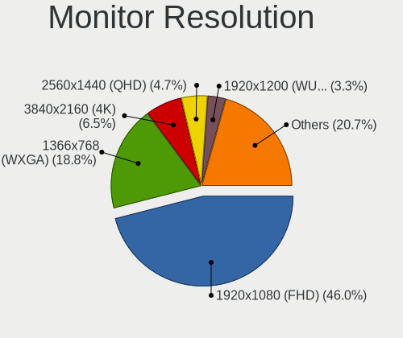

| Resolution         | Computers | Percent |
|--------------------|-----------|---------|
| 1920x1080 (FHD)    | 315       | 55.36%  |
| 1366x768 (WXGA)    | 80        | 14.06%  |
| 3840x2160 (4K)     | 37        | 6.5%    |
| 2560x1440 (QHD)    | 27        | 4.75%   |
| 1680x1050 (WSXGA+) | 14        | 2.46%   |
| 1920x1200 (WUXGA)  | 10        | 1.76%   |
| 1600x900 (HD+)     | 9         | 1.58%   |
| 1440x900 (WXGA+)   | 9         | 1.58%   |
| 1280x1024 (SXGA)   | 9         | 1.58%   |
| 2560x1080          | 6         | 1.05%   |
| 1280x800 (WXGA)    | 6         | 1.05%   |
| 3840x1080          | 5         | 0.88%   |
| 2560x1600          | 5         | 0.88%   |
| 2160x1440          | 5         | 0.88%   |
| 2880x1800          | 3         | 0.53%   |
| 1024x768 (XGA)     | 3         | 0.53%   |
| 1024x600           | 3         | 0.53%   |
| Unknown            | 3         | 0.53%   |
| 3840x1600          | 2         | 0.35%   |
| 3440x1440          | 2         | 0.35%   |
| 2256x1504          | 2         | 0.35%   |
| 1920x1280          | 2         | 0.35%   |
| 1360x768           | 2         | 0.35%   |
| 3840x2400          | 1         | 0.18%   |
| 3520x1080          | 1         | 0.18%   |
| 3456x2160          | 1         | 0.18%   |
| 3200x1800 (QHD+)   | 1         | 0.18%   |
| 3072x1920          | 1         | 0.18%   |
| 3000x2000          | 1         | 0.18%   |
| 2288x1287          | 1         | 0.18%   |
| 1920x540           | 1         | 0.18%   |
| 1400x1050          | 1         | 0.18%   |
| 1280x720 (HD)      | 1         | 0.18%   |

Monitor Diagonal
----------------

Diagonal size in inches

| Inches  | Computers | Percent |
|---------|-----------|---------|
| 15      | 185       | 30.53%  |
| 27      | 58        | 9.57%   |
| 24      | 55        | 9.08%   |
| 13      | 55        | 9.08%   |
| 14      | 43        | 7.1%    |
| 23      | 39        | 6.44%   |
| 21      | 33        | 5.45%   |
| 17      | 20        | 3.3%    |
| Unknown | 13        | 2.15%   |
| 31      | 11        | 1.82%   |
| 22      | 10        | 1.65%   |
| 19      | 10        | 1.65%   |
| 12      | 9         | 1.49%   |
| 20      | 8         | 1.32%   |
| 34      | 7         | 1.16%   |
| 16      | 7         | 1.16%   |
| 10      | 6         | 0.99%   |
| 18      | 5         | 0.83%   |
| 11      | 5         | 0.83%   |
| 84      | 4         | 0.66%   |
| 54      | 4         | 0.66%   |
| 72      | 2         | 0.33%   |
| 48      | 2         | 0.33%   |
| 37      | 2         | 0.33%   |
| 25      | 2         | 0.33%   |
| 142     | 1         | 0.17%   |
| 50      | 1         | 0.17%   |
| 49      | 1         | 0.17%   |
| 46      | 1         | 0.17%   |
| 42      | 1         | 0.17%   |
| 39      | 1         | 0.17%   |
| 36      | 1         | 0.17%   |
| 29      | 1         | 0.17%   |
| 28      | 1         | 0.17%   |
| 26      | 1         | 0.17%   |
| 6       | 1         | 0.17%   |

Monitor Width
-------------

Physical width

| Width in mm    | Computers | Percent |
|----------------|-----------|---------|
| 301-350        | 260       | 43.92%  |
| 501-600        | 139       | 23.48%  |
| 401-500        | 59        | 9.97%   |
| 201-300        | 52        | 8.78%   |
| 351-400        | 22        | 3.72%   |
| 601-700        | 18        | 3.04%   |
| Unknown        | 13        | 2.2%    |
| 1001-1500      | 9         | 1.52%   |
| 701-800        | 8         | 1.35%   |
| 1501-2000      | 6         | 1.01%   |
| 801-900        | 3         | 0.51%   |
| More than 2000 | 1         | 0.17%   |
| 101-200        | 1         | 0.17%   |
| 901-1000       | 1         | 0.17%   |

Aspect Ratio
------------

Proportional relationship between the width and the height

| Ratio   | Computers | Percent |
|---------|-----------|---------|
| 16/9    | 438       | 81.72%  |
| 16/10   | 51        | 9.51%   |
| 3/2     | 11        | 2.05%   |
| 5/4     | 10        | 1.87%   |
| 21/9    | 10        | 1.87%   |
| 4/3     | 6         | 1.12%   |
| Unknown | 6         | 1.12%   |
| 32/9    | 3         | 0.56%   |
| 1.00    | 1         | 0.19%   |

Monitor Area
------------

Area in inch

| Area in inch | Computers | Percent |
|----------------|-----------|---------|
| 101-110        | 188       | 31.7%   |
| 201-250        | 105       | 17.71%  |
| 81-90          | 73        | 12.31%  |
| 301-350        | 61        | 10.29%  |
| 71-80          | 25        | 4.22%   |
| 151-200        | 24        | 4.05%   |
| 351-500        | 18        | 3.04%   |
| 251-300        | 17        | 2.87%   |
| 121-130        | 13        | 2.19%   |
| Unknown        | 13        | 2.19%   |
| More than 1000 | 12        | 2.02%   |
| 141-150        | 11        | 1.85%   |
| 61-70          | 8         | 1.35%   |
| 501-1000       | 8         | 1.35%   |
| 51-60          | 7         | 1.18%   |
| 41-50          | 4         | 0.67%   |
| 111-120        | 4         | 0.67%   |
| 1-40           | 1         | 0.17%   |
| 91-100         | 1         | 0.17%   |

Pixel Density
-------------

Pixels per inch

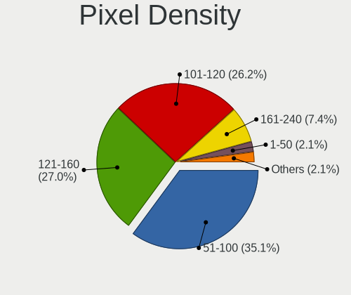

| Density       | Computers | Percent |
|---------------|-----------|---------|
| 121-160       | 200       | 33.96%  |
| 51-100        | 189       | 32.09%  |
| 101-120       | 116       | 19.69%  |
| 161-240       | 50        | 8.49%   |
| More than 240 | 13        | 2.21%   |
| Unknown       | 13        | 2.21%   |
| 1-50          | 8         | 1.36%   |

Multiple Monitors
-----------------

Total monitors connected

| Total | Computers | Percent |
|-------|-----------|---------|
| 1     | 408       | 78.16%  |
| 2     | 101       | 19.35%  |
| 0     | 7         | 1.34%   |
| 3     | 6         | 1.15%   |

Network
-------

Net Controller Vendor
---------------------

Controller vendors

| Vendor                            | Computers | Percent |
|-----------------------------------|-----------|---------|
| Intel                             | 286       | 37.34%  |
| Realtek Semiconductor             | 281       | 36.68%  |
| Qualcomm Atheros                  | 76        | 9.92%   |
| Broadcom                          | 28        | 3.66%   |
| MediaTek                          | 12        | 1.57%   |
| Ralink                            | 7         | 0.91%   |
| Broadcom Limited                  | 7         | 0.91%   |
| TP-Link                           | 6         | 0.78%   |
| Nvidia                            | 6         | 0.78%   |
| ASIX Electronics                  | 6         | 0.78%   |
| Ralink Technology                 | 5         | 0.65%   |
| D-Link System                     | 5         | 0.65%   |
| Samsung Electronics               | 4         | 0.52%   |
| Microsoft                         | 4         | 0.52%   |
| Marvell Technology Group          | 4         | 0.52%   |
| DisplayLink                       | 3         | 0.39%   |
| Dell                              | 3         | 0.39%   |
| Sitecom Europe                    | 2         | 0.26%   |
| NetGear                           | 2         | 0.26%   |
| Lenovo                            | 2         | 0.26%   |
| Huawei Technologies               | 2         | 0.26%   |
| Wacom                             | 1         | 0.13%   |
| VIA Technologies                  | 1         | 0.13%   |
| Sierra Wireless                   | 1         | 0.13%   |
| Qualcomm Atheros Communications   | 1         | 0.13%   |
| Qualcomm                          | 1         | 0.13%   |
| QinHeng Electronics               | 1         | 0.13%   |
| OPPO Electronics                  | 1         | 0.13%   |
| IBM                               | 1         | 0.13%   |
| Google                            | 1         | 0.13%   |
| Gemtek                            | 1         | 0.13%   |
| Fibocom                           | 1         | 0.13%   |
| Ericsson Business Mobile Networks | 1         | 0.13%   |
| ASUSTek Computer                  | 1         | 0.13%   |
| Arduino SA                        | 1         | 0.13%   |
| Apple                             | 1         | 0.13%   |

Net Controller Model
--------------------

Controller models

| Model                                                             | Computers | Percent |
|-------------------------------------------------------------------|-----------|---------|
| Realtek RTL8111/8168/8411 PCI Express Gigabit Ethernet Controller | 203       | 22.73%  |
| Intel Wi-Fi 6 AX200                                               | 40        | 4.48%   |
| Intel Wireless 8265 / 8275                                        | 27        | 3.02%   |
| Intel Wi-Fi 6 AX201                                               | 25        | 2.8%    |
| Realtek RTL8821CE 802.11ac PCIe Wireless Network Adapter          | 20        | 2.24%   |
| Realtek RTL8822CE 802.11ac PCIe Wireless Network Adapter          | 19        | 2.13%   |
| Realtek RTL8153 Gigabit Ethernet Adapter                          | 17        | 1.9%    |
| Realtek RTL810xE PCI Express Fast Ethernet controller             | 15        | 1.68%   |
| Intel Wireless 7265                                               | 14        | 1.57%   |
| Intel 82579LM Gigabit Network Connection (Lewisville)             | 14        | 1.57%   |
| Intel I211 Gigabit Network Connection                             | 12        | 1.34%   |
| Qualcomm Atheros QCA9565 / AR9565 Wireless Network Adapter        | 11        | 1.23%   |
| Qualcomm Atheros AR9285 Wireless Network Adapter (PCI-Express)    | 11        | 1.23%   |
| Intel Ice Lake-LP PCH CNVi WiFi                                   | 11        | 1.23%   |
| Intel Alder Lake-P PCH CNVi WiFi                                  | 11        | 1.23%   |
| Realtek RTL8125 2.5GbE Controller                                 | 10        | 1.12%   |
| Intel Wireless 8260                                               | 10        | 1.12%   |
| Intel Wireless 3165                                               | 10        | 1.12%   |
| Qualcomm Atheros QCA9377 802.11ac Wireless Network Adapter        | 9         | 1.01%   |
| Intel Comet Lake PCH-LP CNVi WiFi                                 | 8         | 0.9%    |
| Intel Cannon Point-LP CNVi [Wireless-AC]                          | 8         | 0.9%    |
| Qualcomm Atheros QCA6174 802.11ac Wireless Network Adapter        | 7         | 0.78%   |
| Qualcomm Atheros AR9485 Wireless Network Adapter                  | 7         | 0.78%   |
| Qualcomm Atheros AR9462 Wireless Network Adapter                  | 7         | 0.78%   |
| Intel Ethernet Controller I225-V                                  | 7         | 0.78%   |
| Intel Ethernet Connection I217-V                                  | 7         | 0.78%   |
| Intel Ethernet Connection (7) I219-V                              | 7         | 0.78%   |
| Intel Ethernet Connection (4) I219-LM                             | 7         | 0.78%   |
| Intel Ethernet Connection (2) I219-V                              | 7         | 0.78%   |
| Intel Comet Lake PCH CNVi WiFi                                    | 7         | 0.78%   |
| Intel Cannon Lake PCH CNVi WiFi                                   | 7         | 0.78%   |
| Intel 82579V Gigabit Network Connection                           | 7         | 0.78%   |
| Intel Wireless 7260                                               | 6         | 0.67%   |
| Intel Wi-Fi 6 AX210/AX211/AX411 160MHz                            | 6         | 0.67%   |
| Intel Ethernet Connection I219-LM                                 | 6         | 0.67%   |
| Intel Dual Band Wireless-AC 3168NGW [Stone Peak]                  | 6         | 0.67%   |
| Realtek RTL8852AE 802.11ax PCIe Wireless Network Adapter          | 5         | 0.56%   |
| Intel Ethernet Connection I217-LM                                 | 5         | 0.56%   |
| Intel Ethernet Connection (4) I219-V                              | 5         | 0.56%   |
| ASIX AX88179 Gigabit Ethernet                                     | 5         | 0.56%   |

Wireless Vendor
---------------

Wireless vendors

| Vendor                          | Computers | Percent |
|---------------------------------|-----------|---------|
| Intel                           | 224       | 51.38%  |
| Realtek Semiconductor           | 71        | 16.28%  |
| Qualcomm Atheros                | 69        | 15.83%  |
| Broadcom                        | 18        | 4.13%   |
| MediaTek                        | 11        | 2.52%   |
| Ralink                          | 7         | 1.61%   |
| TP-Link                         | 5         | 1.15%   |
| Ralink Technology               | 5         | 1.15%   |
| D-Link System                   | 5         | 1.15%   |
| Broadcom Limited                | 4         | 0.92%   |
| Microsoft                       | 3         | 0.69%   |
| Sitecom Europe                  | 2         | 0.46%   |
| NetGear                         | 2         | 0.46%   |
| Dell                            | 2         | 0.46%   |
| Wacom                           | 1         | 0.23%   |
| Sierra Wireless                 | 1         | 0.23%   |
| Qualcomm Atheros Communications | 1         | 0.23%   |
| Qualcomm                        | 1         | 0.23%   |
| Marvell Technology Group        | 1         | 0.23%   |
| Gemtek                          | 1         | 0.23%   |
| Fibocom                         | 1         | 0.23%   |
| ASUSTek Computer                | 1         | 0.23%   |

Wireless Model
--------------

Wireless models

| Model                                                                      | Computers | Percent |
|----------------------------------------------------------------------------|-----------|---------|
| Intel Wi-Fi 6 AX200                                                        | 40        | 9.11%   |
| Intel Wireless 8265 / 8275                                                 | 27        | 6.15%   |
| Intel Wi-Fi 6 AX201                                                        | 25        | 5.69%   |
| Realtek RTL8821CE 802.11ac PCIe Wireless Network Adapter                   | 20        | 4.56%   |
| Realtek RTL8822CE 802.11ac PCIe Wireless Network Adapter                   | 19        | 4.33%   |
| Intel Wireless 7265                                                        | 14        | 3.19%   |
| Qualcomm Atheros QCA9565 / AR9565 Wireless Network Adapter                 | 11        | 2.51%   |
| Qualcomm Atheros AR9285 Wireless Network Adapter (PCI-Express)             | 11        | 2.51%   |
| Intel Ice Lake-LP PCH CNVi WiFi                                            | 11        | 2.51%   |
| Intel Alder Lake-P PCH CNVi WiFi                                           | 11        | 2.51%   |
| Intel Wireless 8260                                                        | 10        | 2.28%   |
| Intel Wireless 3165                                                        | 10        | 2.28%   |
| Qualcomm Atheros QCA9377 802.11ac Wireless Network Adapter                 | 9         | 2.05%   |
| Intel Comet Lake PCH-LP CNVi WiFi                                          | 8         | 1.82%   |
| Intel Cannon Point-LP CNVi [Wireless-AC]                                   | 8         | 1.82%   |
| Qualcomm Atheros QCA6174 802.11ac Wireless Network Adapter                 | 7         | 1.59%   |
| Qualcomm Atheros AR9485 Wireless Network Adapter                           | 7         | 1.59%   |
| Qualcomm Atheros AR9462 Wireless Network Adapter                           | 7         | 1.59%   |
| Intel Comet Lake PCH CNVi WiFi                                             | 7         | 1.59%   |
| Intel Cannon Lake PCH CNVi WiFi                                            | 7         | 1.59%   |
| Intel Wireless 7260                                                        | 6         | 1.37%   |
| Intel Wi-Fi 6 AX210/AX211/AX411 160MHz                                     | 6         | 1.37%   |
| Intel Dual Band Wireless-AC 3168NGW [Stone Peak]                           | 6         | 1.37%   |
| Realtek RTL8852AE 802.11ax PCIe Wireless Network Adapter                   | 5         | 1.14%   |
| Realtek RTL8723BE PCIe Wireless Network Adapter                            | 4         | 0.91%   |
| Realtek 802.11ac NIC                                                       | 4         | 0.91%   |
| Qualcomm Atheros AR928X Wireless Network Adapter (PCI-Express)             | 4         | 0.91%   |
| MediaTek MT7921 802.11ax PCI Express Wireless Network Adapter              | 4         | 0.91%   |
| D-Link System AirPlus G DWL-G122 Wireless Adapter(rev.C1) [Ralink RT2571W] | 4         | 0.91%   |
| Realtek RTL88x2bu [AC1200 Techkey]                                         | 3         | 0.68%   |
| Realtek RTL8822BE 802.11a/b/g/n/ac WiFi adapter                            | 3         | 0.68%   |
| Ralink RT5370 Wireless Adapter                                             | 3         | 0.68%   |
| Ralink RT5390 Wireless 802.11n 1T/1R PCIe                                  | 3         | 0.68%   |
| Ralink RT3290 Wireless 802.11n 1T/1R PCIe                                  | 3         | 0.68%   |
| Qualcomm Atheros AR93xx Wireless Network Adapter                           | 3         | 0.68%   |
| Qualcomm Atheros AR9287 Wireless Network Adapter (PCI-Express)             | 3         | 0.68%   |
| Qualcomm Atheros AR242x / AR542x Wireless Network Adapter (PCI-Express)    | 3         | 0.68%   |
| MediaTek MT7630e 802.11bgn Wireless Network Adapter                        | 3         | 0.68%   |
| Intel Wireless-AC 9260                                                     | 3         | 0.68%   |
| Intel WiFi Link 5100                                                       | 3         | 0.68%   |

Ethernet Vendor
---------------

Ethernet vendors

| Vendor                   | Computers | Percent |
|--------------------------|-----------|---------|
| Realtek Semiconductor    | 250       | 56.43%  |
| Intel                    | 127       | 28.67%  |
| Qualcomm Atheros         | 19        | 4.29%   |
| Broadcom                 | 11        | 2.48%   |
| Nvidia                   | 6         | 1.35%   |
| ASIX Electronics         | 6         | 1.35%   |
| Samsung Electronics      | 4         | 0.9%    |
| Marvell Technology Group | 3         | 0.68%   |
| DisplayLink              | 3         | 0.68%   |
| Broadcom Limited         | 3         | 0.68%   |
| Lenovo                   | 2         | 0.45%   |
| Huawei Technologies      | 2         | 0.45%   |
| VIA Technologies         | 1         | 0.23%   |
| TP-Link                  | 1         | 0.23%   |
| OPPO Electronics         | 1         | 0.23%   |
| MediaTek                 | 1         | 0.23%   |
| IBM                      | 1         | 0.23%   |
| Google                   | 1         | 0.23%   |
| Apple                    | 1         | 0.23%   |

Ethernet Model
--------------

Ethernet models

| Model                                                             | Computers | Percent |
|-------------------------------------------------------------------|-----------|---------|
| Realtek RTL8111/8168/8411 PCI Express Gigabit Ethernet Controller | 203       | 45.21%  |
| Realtek RTL8153 Gigabit Ethernet Adapter                          | 17        | 3.79%   |
| Realtek RTL810xE PCI Express Fast Ethernet controller             | 15        | 3.34%   |
| Intel 82579LM Gigabit Network Connection (Lewisville)             | 14        | 3.12%   |
| Intel I211 Gigabit Network Connection                             | 12        | 2.67%   |
| Realtek RTL8125 2.5GbE Controller                                 | 10        | 2.23%   |
| Intel Ethernet Controller I225-V                                  | 7         | 1.56%   |
| Intel Ethernet Connection I217-V                                  | 7         | 1.56%   |
| Intel Ethernet Connection (7) I219-V                              | 7         | 1.56%   |
| Intel Ethernet Connection (4) I219-LM                             | 7         | 1.56%   |
| Intel Ethernet Connection (2) I219-V                              | 7         | 1.56%   |
| Intel 82579V Gigabit Network Connection                           | 7         | 1.56%   |
| Intel Ethernet Connection I219-LM                                 | 6         | 1.34%   |
| Intel Ethernet Connection I217-LM                                 | 5         | 1.11%   |
| Intel Ethernet Connection (4) I219-V                              | 5         | 1.11%   |
| ASIX AX88179 Gigabit Ethernet                                     | 5         | 1.11%   |
| Qualcomm Atheros Killer E2400 Gigabit Ethernet Controller         | 4         | 0.89%   |
| Samsung Galaxy series, misc. (tethering mode)                     | 3         | 0.67%   |
| Qualcomm Atheros AR8132 Fast Ethernet                             | 3         | 0.67%   |
| Intel Ethernet Connection I218-LM                                 | 3         | 0.67%   |
| Intel Ethernet Connection (3) I218-LM                             | 3         | 0.67%   |
| Intel Ethernet Connection (10) I219-V                             | 3         | 0.67%   |
| Intel 82567V-2 Gigabit Network Connection                         | 3         | 0.67%   |
| Realtek RTL8169 PCI Gigabit Ethernet Controller                   | 2         | 0.45%   |
| Realtek RTL8152 Fast Ethernet Adapter                             | 2         | 0.45%   |
| Realtek Killer E3000 2.5GbE Controller                            | 2         | 0.45%   |
| Realtek Killer E2600 Gigabit Ethernet Controller                  | 2         | 0.45%   |
| Qualcomm Atheros QCA8171 Gigabit Ethernet                         | 2         | 0.45%   |
| Qualcomm Atheros AR8161 Gigabit Ethernet                          | 2         | 0.45%   |
| Qualcomm Atheros AR8121/AR8113/AR8114 Gigabit or Fast Ethernet    | 2         | 0.45%   |
| Nvidia MCP79 Ethernet                                             | 2         | 0.45%   |
| Lenovo Mini Dock                                                  | 2         | 0.45%   |
| Intel NM10/ICH7 Family LAN Controller                             | 2         | 0.45%   |
| Intel Ethernet Connection (7) I219-LM                             | 2         | 0.45%   |
| Intel Ethernet Connection (2) I219-LM                             | 2         | 0.45%   |
| Intel Ethernet Connection (16) I219-LM                            | 2         | 0.45%   |
| Intel Ethernet Connection (13) I219-V                             | 2         | 0.45%   |
| Intel Ethernet Connection (11) I219-LM                            | 2         | 0.45%   |
| Intel 82574L Gigabit Network Connection                           | 2         | 0.45%   |
| Intel 82567LM-3 Gigabit Network Connection                        | 2         | 0.45%   |

Net Controller Kind
-------------------

Ethernet, WiFi or modem

| Kind     | Computers | Percent |
|----------|-----------|---------|
| WiFi     | 417       | 50.06%  |
| Ethernet | 411       | 49.34%  |
| Modem    | 4         | 0.48%   |
| Unknown  | 1         | 0.12%   |

Used Controller
---------------

Currently used network controller

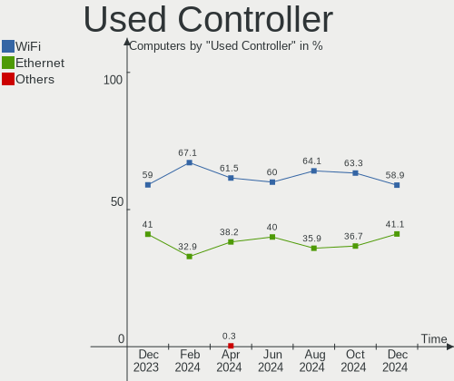

| Kind     | Computers | Percent |
|----------|-----------|---------|
| WiFi     | 344       | 63.82%  |
| Ethernet | 195       | 36.18%  |

NICs
----

Total network controllers on board

| Total | Computers | Percent |
|-------|-----------|---------|
| 2     | 273       | 52.3%   |
| 1     | 233       | 44.64%  |
| 3     | 11        | 2.11%   |
| 0     | 4         | 0.77%   |
| 4     | 1         | 0.19%   |

IPv6
----

IPv6 vs IPv4

| Used | Computers | Percent |
|------|-----------|---------|
| No   | 461       | 88.31%  |
| Yes  | 61        | 11.69%  |

Bluetooth
---------

Bluetooth Vendor
----------------

Controller vendors

| Vendor                          | Computers | Percent |
|---------------------------------|-----------|---------|
| Intel                           | 198       | 53.8%   |
| Realtek Semiconductor           | 46        | 12.5%   |
| Cambridge Silicon Radio         | 30        | 8.15%   |
| Qualcomm Atheros Communications | 16        | 4.35%   |
| Foxconn / Hon Hai               | 11        | 2.99%   |
| Lite-On Technology              | 10        | 2.72%   |
| IMC Networks                    | 10        | 2.72%   |
| Realtek                         | 8         | 2.17%   |
| Broadcom                        | 8         | 2.17%   |
| Apple                           | 7         | 1.9%    |
| ASUSTek Computer                | 5         | 1.36%   |
| Ralink                          | 3         | 0.82%   |
| Hewlett-Packard                 | 3         | 0.82%   |
| Dell                            | 3         | 0.82%   |
| MediaTek                        | 2         | 0.54%   |
| Unknown                         | 1         | 0.27%   |
| TP-Link                         | 1         | 0.27%   |
| Toshiba                         | 1         | 0.27%   |
| Sitecom Europe                  | 1         | 0.27%   |
| Marvell Semiconductor           | 1         | 0.27%   |
| Fujitsu                         | 1         | 0.27%   |
| Edimax Technology               | 1         | 0.27%   |
| D-Link System                   | 1         | 0.27%   |

Bluetooth Model
---------------

Controller models

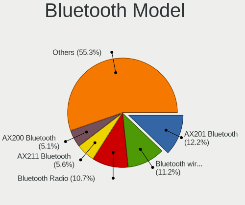

| Model                                                     | Computers | Percent |
|-----------------------------------------------------------|-----------|---------|
| Intel Bluetooth wireless interface                        | 65        | 17.66%  |
| Intel AX201 Bluetooth                                     | 39        | 10.6%   |
| Intel AX200 Bluetooth                                     | 37        | 10.05%  |
| Realtek Bluetooth Radio                                   | 35        | 9.51%   |
| Intel Bluetooth 9460/9560 Jefferson Peak (JfP)            | 31        | 8.42%   |
| Cambridge Silicon Radio Bluetooth Dongle (HCI mode)       | 30        | 8.15%   |
| Realtek  Bluetooth 4.2 Adapter                            | 8         | 2.17%   |
| Realtek Bluetooth Radio                                   | 8         | 2.17%   |
| Intel Bluetooth Device                                    | 8         | 2.17%   |
| Qualcomm Atheros  Bluetooth Device                        | 6         | 1.63%   |
| Intel Wireless-AC 3168 Bluetooth                          | 6         | 1.63%   |
| IMC Networks Bluetooth Device                             | 6         | 1.63%   |
| Qualcomm Atheros QCA61x4 Bluetooth 4.0                    | 5         | 1.36%   |
| Qualcomm Atheros AR3012 Bluetooth 4.0                     | 5         | 1.36%   |
| Intel AX210 Bluetooth                                     | 5         | 1.36%   |
| Intel Centrino Bluetooth Wireless Transceiver             | 4         | 1.09%   |
| Ralink RT3290 Bluetooth                                   | 3         | 0.82%   |
| Lite-On Qualcomm Atheros QCA9377 Bluetooth                | 3         | 0.82%   |
| Intel Wireless-AC 9260 Bluetooth Adapter                  | 3         | 0.82%   |
| HP Broadcom 2070 Bluetooth Combo                          | 3         | 0.82%   |
| Foxconn / Hon Hai Wireless_Device                         | 3         | 0.82%   |
| Foxconn / Hon Hai BT                                      | 3         | 0.82%   |
| Apple Bluetooth Host Controller                           | 3         | 0.82%   |
| Realtek RTL8723B Bluetooth                                | 2         | 0.54%   |
| MediaTek Wireless_Device                                  | 2         | 0.54%   |
| Lite-On Wireless_Device                                   | 2         | 0.54%   |
| Lite-On Broadcom BCM43142A0 Bluetooth Device              | 2         | 0.54%   |
| Lite-On Atheros AR3012 Bluetooth                          | 2         | 0.54%   |
| IMC Networks Bluetooth Radio                              | 2         | 0.54%   |
| Foxconn / Hon Hai Bluetooth Device                        | 2         | 0.54%   |
| Dell BCM20702A0 Bluetooth Module                          | 2         | 0.54%   |
| Apple Built-in Bluetooth 2.0+EDR HCI                      | 2         | 0.54%   |
| Apple Bluetooth USB Host Controller                       | 2         | 0.54%   |
| Unknown Bluetooth Device                                  | 1         | 0.27%   |
| TP-Link TPuLink UB500 Adapter                             | 1         | 0.27%   |
| Toshiba Bluetooth Device                                  | 1         | 0.27%   |
| Sitecom Europe Sitecom bluetooth2.0 class 2 dongle CN-512 | 1         | 0.27%   |
| Realtek RTL8821A Bluetooth                                | 1         | 0.27%   |
| Marvell Bluetooth and Wireless LAN Composite              | 1         | 0.27%   |
| Lite-On BCM43142A0                                        | 1         | 0.27%   |

Sound
-----

Sound Vendor
------------

Sound card vendors

| Vendor                    | Computers | Percent |
|---------------------------|-----------|---------|
| Intel                     | 381       | 52.12%  |
| AMD                       | 154       | 21.07%  |
| Nvidia                    | 125       | 17.1%   |
| C-Media Electronics       | 13        | 1.78%   |
| Logitech                  | 7         | 0.96%   |
| JMTek                     | 5         | 0.68%   |
| Razer USA                 | 4         | 0.55%   |
| Focusrite-Novation        | 4         | 0.55%   |
| Trust                     | 3         | 0.41%   |
| Creative Labs             | 3         | 0.41%   |
| Yamaha                    | 2         | 0.27%   |
| VIA Technologies          | 2         | 0.27%   |
| Texas Instruments         | 2         | 0.27%   |
| Lenovo                    | 2         | 0.27%   |
| Kingston Technology       | 2         | 0.27%   |
| GN Netcom                 | 2         | 0.27%   |
| CMX Systems               | 2         | 0.27%   |
| SteelSeries ApS           | 1         | 0.14%   |
| Sennheiser Communications | 1         | 0.14%   |
| Samson Technologies       | 1         | 0.14%   |
| Realtek Semiconductor     | 1         | 0.14%   |
| Micro Star International  | 1         | 0.14%   |
| Medeli Electronics        | 1         | 0.14%   |
| MAG Technology            | 1         | 0.14%   |
| M-Audio                   | 1         | 0.14%   |
| Jieli Technology          | 1         | 0.14%   |
| Huawei Technologies       | 1         | 0.14%   |
| GS3                       | 1         | 0.14%   |
| Dell                      | 1         | 0.14%   |
| DASAN ELECTRON            | 1         | 0.14%   |
| Creative Technology       | 1         | 0.14%   |
| Compal Electronics        | 1         | 0.14%   |
| AudioQuest                | 1         | 0.14%   |
| Astro Gaming              | 1         | 0.14%   |
| Alesis                    | 1         | 0.14%   |

Sound Model
-----------

Sound card models

| Model                                                                      | Computers | Percent |
|----------------------------------------------------------------------------|-----------|---------|
| AMD Family 17h/19h HD Audio Controller                                     | 68        | 7.83%   |
| Intel Sunrise Point-LP HD Audio                                            | 49        | 5.64%   |
| AMD Renoir Radeon High Definition Audio Controller                         | 42        | 4.83%   |
| Intel Tiger Lake-LP Smart Sound Technology Audio Controller                | 34        | 3.91%   |
| Intel 8 Series/C220 Series Chipset High Definition Audio Controller        | 32        | 3.68%   |
| Intel 7 Series/C216 Chipset Family High Definition Audio Controller        | 29        | 3.34%   |
| AMD Starship/Matisse HD Audio Controller                                   | 25        | 2.88%   |
| Intel Cannon Lake PCH cAVS                                                 | 23        | 2.65%   |
| AMD Raven/Raven2/Fenghuang HDMI/DP Audio Controller                        | 23        | 2.65%   |
| Intel Xeon E3-1200 v3/4th Gen Core Processor HD Audio Controller           | 21        | 2.42%   |
| Intel 6 Series/C200 Series Chipset Family High Definition Audio Controller | 20        | 2.3%    |
| Intel 100 Series/C230 Series Chipset Family HD Audio Controller            | 16        | 1.84%   |
| Intel Haswell-ULT HD Audio Controller                                      | 15        | 1.73%   |
| Intel 8 Series HD Audio Controller                                         | 15        | 1.73%   |
| Nvidia GP107GL High Definition Audio Controller                            | 14        | 1.61%   |
| Intel Ice Lake-LP Smart Sound Technology Audio Controller                  | 14        | 1.61%   |
| Intel Comet Lake PCH cAVS                                                  | 13        | 1.5%    |
| Intel Celeron/Pentium Silver Processor High Definition Audio               | 12        | 1.38%   |
| Intel Alder Lake PCH-P High Definition Audio Controller                    | 12        | 1.38%   |
| Intel 5 Series/3400 Series Chipset High Definition Audio                   | 12        | 1.38%   |
| Intel Cannon Point-LP High Definition Audio Controller                     | 11        | 1.27%   |
| Intel NM10/ICH7 Family High Definition Audio Controller                    | 10        | 1.15%   |
| AMD SBx00 Azalia (Intel HDA)                                               | 10        | 1.15%   |
| Intel 82801I (ICH9 Family) HD Audio Controller                             | 9         | 1.04%   |
| AMD FCH Azalia Controller                                                  | 9         | 1.04%   |
| Nvidia TU106 High Definition Audio Controller                              | 8         | 0.92%   |
| Nvidia GF108 High Definition Audio Controller                              | 8         | 0.92%   |
| Nvidia GA104 High Definition Audio Controller                              | 8         | 0.92%   |
| Intel Wildcat Point-LP High Definition Audio Controller                    | 8         | 0.92%   |
| Intel Comet Lake PCH-LP cAVS                                               | 8         | 0.92%   |
| Intel Broadwell-U Audio Controller                                         | 8         | 0.92%   |
| AMD Navi 21/23 HDMI/DP Audio Controller                                    | 8         | 0.92%   |
| AMD Family 17h (Models 00h-0fh) HD Audio Controller                        | 8         | 0.92%   |
| Nvidia TU107 GeForce GTX 1650 High Definition Audio Controller             | 7         | 0.81%   |
| Nvidia GM107 High Definition Audio Controller [GeForce 940MX]              | 7         | 0.81%   |
| Nvidia GA106 High Definition Audio Controller                              | 7         | 0.81%   |
| Intel CM238 HD Audio Controller                                            | 7         | 0.81%   |
| Intel 82801JI (ICH10 Family) HD Audio Controller                           | 7         | 0.81%   |
| Intel 200 Series PCH HD Audio                                              | 7         | 0.81%   |
| AMD Oland/Hainan/Cape Verde/Pitcairn HDMI Audio [Radeon HD 7000 Series]    | 7         | 0.81%   |

Memory
------

Memory Vendor
-------------

Memory module vendors

| Vendor              | Computers | Percent |
|---------------------|-----------|---------|
| Samsung Electronics | 123       | 24.6%   |
| SK hynix            | 89        | 17.8%   |
| Kingston            | 55        | 11%     |
| Micron Technology   | 51        | 10.2%   |
| Crucial             | 47        | 9.4%    |
| Unknown             | 41        | 8.2%    |
| Corsair             | 31        | 6.2%    |
| Ramaxel Technology  | 11        | 2.2%    |
| G.Skill             | 11        | 2.2%    |
| Elpida              | 8         | 1.6%    |
| Unknown (ABCD)      | 7         | 1.4%    |
| Team                | 6         | 1.2%    |
| Patriot             | 4         | 0.8%    |
| Nanya Technology    | 4         | 0.8%    |
| Unknown             | 4         | 0.8%    |
| ASint Technology    | 2         | 0.4%    |
| A-DATA Technology   | 2         | 0.4%    |
| Unknown (AB)        | 1         | 0.2%    |
| Unifosa             | 1         | 0.2%    |
| SHARETRONIC         | 1         | 0.2%    |
| Goldkey             | 1         | 0.2%    |

Memory Model
------------

Memory module models

| Model                                                            | Computers | Percent |
|------------------------------------------------------------------|-----------|---------|
| SK hynix RAM HMA81GS6DJR8N-XN 8GB SODIMM DDR4 3200MT/s           | 7         | 1.36%   |
| Samsung RAM M471A5244CB0-CWE 4GB SODIMM DDR4 3200MT/s            | 7         | 1.36%   |
| Samsung RAM M471B1G73DB0-YK0 8GB SODIMM DDR3 1600MT/s            | 6         | 1.17%   |
| Samsung RAM M471A5244CB0-CTD 4GB SODIMM DDR4 3266MT/s            | 6         | 1.17%   |
| Samsung RAM M471A1K43DB1-CWE 8GB SODIMM DDR4 3200MT/s            | 6         | 1.17%   |
| Samsung RAM M471A1K43CB1-CTD 8GB SODIMM DDR4 2667MT/s            | 6         | 1.17%   |
| Samsung RAM M471A1K43CB1-CRC 8GB SODIMM DDR4 2667MT/s            | 6         | 1.17%   |
| Samsung RAM M471A1G44AB0-CWE 8GB Row Of Chips DDR4 3200MT/s      | 6         | 1.17%   |
| Corsair RAM CMK16GX4M2B3200C16 8192MB DIMM DDR4 3600MT/s         | 6         | 1.17%   |
| Unknown (ABCD) RAM 123456789012345678 2GB SODIMM LPDDR4 2400MT/s | 5         | 0.97%   |
| SK hynix RAM HMA81GS6AFR8N-UH 8GB SODIMM DDR4 2667MT/s           | 5         | 0.97%   |
| SK hynix RAM HMA81GS6JJR8N-VK 8GB SODIMM DDR4 2667MT/s           | 4         | 0.78%   |
| Samsung RAM M471A5244CB0-CWE 4GB Row Of Chips DDR4 3200MT/s      | 4         | 0.78%   |
| Samsung RAM M471A5244CB0-CRC 4GB SODIMM DDR4 2667MT/s            | 4         | 0.78%   |
| Samsung RAM M471A1K43EB1-CWE 8GB SODIMM DDR4 3200MT/s            | 4         | 0.78%   |
| Samsung RAM M471A1K43BB1-CRC 8GB SODIMM DDR4 2667MT/s            | 4         | 0.78%   |
| Samsung RAM M471A1G44AB0-CWE 8GB SODIMM DDR4 3200MT/s            | 4         | 0.78%   |
| Crucial RAM CT102464BF160B.C16 8GB SODIMM DDR3 1600MT/s          | 4         | 0.78%   |
| Crucial RAM BL8G36C16U4B.M8FE1 8GB DIMM DDR4 3733MT/s            | 4         | 0.78%   |
| Corsair RAM CMK16GX4M2D3600C18 8GB DIMM DDR4 3600MT/s            | 4         | 0.78%   |
| Unknown                                                          | 4         | 0.78%   |
| Unknown RAM Module 2GB SODIMM DDR2                               | 3         | 0.58%   |
| SK hynix RAM HMAA1GS6CJR6N-XN 8GB SODIMM DDR4 3200MT/s           | 3         | 0.58%   |
| SK hynix RAM HCNNNFAMMLXR-NEE 4GB Row Of Chips LPDDR4 4267MT/s   | 3         | 0.58%   |
| Samsung RAM M471B1G73QH0-YK0 8GB SODIMM DDR3 1600MT/s            | 3         | 0.58%   |
| Samsung RAM M471B1G73EB0-YK0 8GB SODIMM DDR3 1600MT/s            | 3         | 0.58%   |
| Samsung RAM M471A5244CB0-CTD 4GB Row Of Chips DDR4 2667MT/s      | 3         | 0.58%   |
| Samsung RAM M471A2K43DB1-CWE 16GB SODIMM DDR4 3200MT/s           | 3         | 0.58%   |
| Samsung RAM M471A2K43CB1-CTD 16GB SODIMM DDR4 8400MT/s           | 3         | 0.58%   |
| Samsung RAM M471A1K43BB0-CPB 8GB SODIMM DDR4 2133MT/s            | 3         | 0.58%   |
| Micron RAM 8KTF51264HZ-1G6E1 4GB SODIMM DDR3 1600MT/s            | 3         | 0.58%   |
| Micron RAM 4ATF51264HZ-3G2J1 4GB SODIMM DDR4 3200MT/s            | 3         | 0.58%   |
| Micron RAM 4ATF1G64HZ-3G2E1 8GB SODIMM DDR4 3200MT/s             | 3         | 0.58%   |
| Kingston RAM KHX3200C16D4/8GX 8GB DIMM DDR4 3600MT/s             | 3         | 0.58%   |
| Corsair RAM CMK16GX4M2B3000C15 8GB DIMM DDR4 3200MT/s            | 3         | 0.58%   |
| Unknown RAM Module 8GB SODIMM DDR4 2667MT/s                      | 2         | 0.39%   |
| Unknown RAM Module 8GB SODIMM DDR3 1600MT/s                      | 2         | 0.39%   |
| Unknown RAM Module 4GB DIMM DDR3 1333MT/s                        | 2         | 0.39%   |
| Unknown RAM Module 4GB DIMM DDR 1333MT/s                         | 2         | 0.39%   |
| Unknown RAM Module 2GB DIMM DDR2 800MT/s                         | 2         | 0.39%   |

Memory Kind
-----------

Memory module kinds

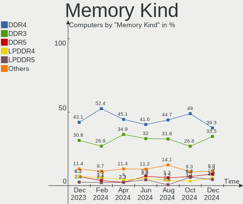

| Kind    | Computers | Percent |
|---------|-----------|---------|
| DDR4    | 236       | 55.14%  |
| DDR3    | 109       | 25.47%  |
| LPDDR4  | 28        | 6.54%   |
| DDR2    | 16        | 3.74%   |
| LPDDR3  | 11        | 2.57%   |
| SDRAM   | 10        | 2.34%   |
| DDR5    | 7         | 1.64%   |
| Unknown | 7         | 1.64%   |
| DDR     | 3         | 0.7%    |
| LPDDR5  | 1         | 0.23%   |

Memory Form Factor
------------------

Physical design of the memory module

| Name         | Computers | Percent |
|--------------|-----------|---------|
| SODIMM       | 240       | 55.94%  |
| DIMM         | 141       | 32.87%  |
| Row Of Chips | 44        | 10.26%  |
| Chip         | 2         | 0.47%   |
| FB-DIMM      | 1         | 0.23%   |
| Unknown      | 1         | 0.23%   |

Memory Size
-----------

Memory module size

| Size  | Computers | Percent |
|-------|-----------|---------|
| 8192  | 211       | 46.07%  |
| 4096  | 122       | 26.64%  |
| 16384 | 68        | 14.85%  |
| 2048  | 40        | 8.73%   |
| 32768 | 8         | 1.75%   |
| 1024  | 8         | 1.75%   |
| 3072  | 1         | 0.22%   |

Memory Speed
------------

Memory module speed

| Speed   | Computers | Percent |
|---------|-----------|---------|
| 3200    | 91        | 20%     |
| 1600    | 78        | 17.14%  |
| 2667    | 70        | 15.38%  |
| 2400    | 44        | 9.67%   |
| 3600    | 24        | 5.27%   |
| 1333    | 21        | 4.62%   |
| 2133    | 17        | 3.74%   |
| 4267    | 15        | 3.3%    |
| 800     | 10        | 2.2%    |
| 1867    | 8         | 1.76%   |
| Unknown | 8         | 1.76%   |
| 4800    | 7         | 1.54%   |
| 1334    | 7         | 1.54%   |
| 3733    | 6         | 1.32%   |
| 3266    | 6         | 1.32%   |
| 3400    | 5         | 1.1%    |
| 667     | 5         | 1.1%    |
| 8400    | 3         | 0.66%   |
| 3466    | 3         | 0.66%   |
| 4266    | 2         | 0.44%   |
| 3800    | 2         | 0.44%   |
| 2933    | 2         | 0.44%   |
| 2048    | 2         | 0.44%   |
| 1067    | 2         | 0.44%   |
| 1066    | 2         | 0.44%   |
| 975     | 2         | 0.44%   |
| 533     | 2         | 0.44%   |
| 6400    | 1         | 0.22%   |
| 4199    | 1         | 0.22%   |
| 3666    | 1         | 0.22%   |
| 3000    | 1         | 0.22%   |
| 2800    | 1         | 0.22%   |
| 2747    | 1         | 0.22%   |
| 2666    | 1         | 0.22%   |
| 2465    | 1         | 0.22%   |
| 2000    | 1         | 0.22%   |
| 1866    | 1         | 0.22%   |
| 1800    | 1         | 0.22%   |

Printers & scanners
-------------------

Printer Vendor
--------------

Printer device vendors

| Vendor              | Computers | Percent |
|---------------------|-----------|---------|
| Hewlett-Packard     | 5         | 41.67%  |
| Brother Industries  | 2         | 16.67%  |
| Seiko Epson         | 1         | 8.33%   |
| Samsung Electronics | 1         | 8.33%   |
| ICS Advent          | 1         | 8.33%   |
| Dymo-CoStar         | 1         | 8.33%   |
| Canon               | 1         | 8.33%   |

Printer Model
-------------

Printer device models

| Model                       | Computers | Percent |
|-----------------------------|-----------|---------|
| Seiko Epson WF-2510 Series  | 1         | 8.33%   |
| Samsung C3060 Series        | 1         | 8.33%   |
| ICS Advent Parallel Adapter | 1         | 8.33%   |
| HP LaserJet P2055 series    | 1         | 8.33%   |
| HP LaserJet 1200            | 1         | 8.33%   |
| HP DeskJet D2300            | 1         | 8.33%   |
| HP DeskJet 5650c            | 1         | 8.33%   |
| HP Deskjet 2050 J510        | 1         | 8.33%   |
| Dymo-CoStar LabelWriter 400 | 1         | 8.33%   |
| Canon TS700 series          | 1         | 8.33%   |
| Brother MFC-L2700DW         | 1         | 8.33%   |
| Brother HL-2130 series      | 1         | 8.33%   |

Scanner Vendor
--------------

Scanner device vendors

| Vendor         | Computers | Percent |
|----------------|-----------|---------|
| Mustek Systems | 1         | 100%    |

Scanner Model
-------------

Scanner device models

| Model                                      | Computers | Percent |
|--------------------------------------------|-----------|---------|
| Mustek Systems ScanExpress A3 USB 1200 PRO | 1         | 100%    |

Camera
------

Camera Vendor
-------------

Camera device vendors

| Vendor                                 | Computers | Percent |
|----------------------------------------|-----------|---------|
| Chicony Electronics                    | 61        | 16.71%  |
| IMC Networks                           | 43        | 11.78%  |
| Acer                                   | 37        | 10.14%  |
| Microdia                               | 30        | 8.22%   |
| Realtek Semiconductor                  | 28        | 7.67%   |
| Quanta                                 | 25        | 6.85%   |
| Logitech                               | 22        | 6.03%   |
| Sunplus Innovation Technology          | 18        | 4.93%   |
| Syntek                                 | 17        | 4.66%   |
| Cheng Uei Precision Industry (Foxlink) | 13        | 3.56%   |
| Luxvisions Innotech Limited            | 11        | 3.01%   |
| Suyin                                  | 10        | 2.74%   |
| Lite-On Technology                     | 8         | 2.19%   |
| Apple                                  | 7         | 1.92%   |
| Microsoft                              | 6         | 1.64%   |
| Ricoh                                  | 2         | 0.55%   |
| icSpring                               | 2         | 0.55%   |
| Cubeternet                             | 2         | 0.55%   |
| Alcor Micro                            | 2         | 0.55%   |
| Z-Star Microelectronics                | 1         | 0.27%   |
| YSD-2053--200409                       | 1         | 0.27%   |
| WaveRider Communications               | 1         | 0.27%   |
| Unknown                                | 1         | 0.27%   |
| Trust                                  | 1         | 0.27%   |
| Sunplus IT                             | 1         | 0.27%   |
| Samsung Electronics                    | 1         | 0.27%   |
| Primax Electronics                     | 1         | 0.27%   |
| Owon                                   | 1         | 0.27%   |
| OmniVision Technologies                | 1         | 0.27%   |
| Novatek Microelectronics               | 1         | 0.27%   |
| Nebraska Furniture Mart                | 1         | 0.27%   |
| KYE Systems (Mouse Systems)            | 1         | 0.27%   |
| Importek                               | 1         | 0.27%   |
| Hewlett-Packard                        | 1         | 0.27%   |
| Generalplus Technology                 | 1         | 0.27%   |
| GEMBIRD                                | 1         | 0.27%   |
| Creative Technology                    | 1         | 0.27%   |
| Arkmicro Technologies                  | 1         | 0.27%   |
| ARC International                      | 1         | 0.27%   |
| ALi                                    | 1         | 0.27%   |

Camera Model
------------

Camera device models

| Model                                               | Computers | Percent |
|-----------------------------------------------------|-----------|---------|
| Microdia Integrated_Webcam_HD                       | 16        | 4.35%   |
| Syntek Integrated Camera                            | 15        | 4.08%   |
| IMC Networks USB2.0 HD UVC WebCam                   | 12        | 3.26%   |
| Chicony Integrated Camera                           | 11        | 2.99%   |
| Realtek Integrated_Webcam_HD                        | 9         | 2.45%   |
| IMC Networks Integrated Camera                      | 9         | 2.45%   |
| Luxvisions Innotech Limited HP TrueVision HD Camera | 8         | 2.17%   |
| Acer Integrated Camera                              | 8         | 2.17%   |
| Quanta HP TrueVision HD Camera                      | 7         | 1.9%    |
| Sunplus Integrated_Webcam_HD                        | 6         | 1.63%   |
| Logitech Webcam C270                                | 6         | 1.63%   |
| Acer HD Camera                                      | 6         | 1.63%   |
| Acer HD Webcam                                      | 5         | 1.36%   |
| Realtek USB Camera                                  | 4         | 1.09%   |
| Logitech Webcam C170                                | 4         | 1.09%   |
| IMC Networks USB2.0 VGA UVC WebCam                  | 4         | 1.09%   |
| IMC Networks HD Camera                              | 4         | 1.09%   |
| Chicony HP Wide Vision HD Camera                    | 4         | 1.09%   |
| Acer SunplusIT Integrated Camera                    | 4         | 1.09%   |
| Acer Lenovo EasyCamera                              | 4         | 1.09%   |
| Acer BisonCam,NB Pro                                | 4         | 1.09%   |
| Sunplus FHD Camera Microphone                       | 3         | 0.82%   |
| Realtek Acer 640 x 480 laptop camera                | 3         | 0.82%   |
| Quanta hm1091_techfront                             | 3         | 0.82%   |
| Quanta HD User Facing                               | 3         | 0.82%   |
| Microsoft LifeCam HD-3000                           | 3         | 0.82%   |
| Microdia Webcam Vitade AF                           | 3         | 0.82%   |
| Microdia Integrated Webcam                          | 3         | 0.82%   |
| Lite-On Integrated Camera                           | 3         | 0.82%   |
| Chicony USB2.0 VGA UVC WebCam                       | 3         | 0.82%   |
| Chicony Integrated Camera (1280x720@30)             | 3         | 0.82%   |
| Chicony HP Webcam                                   | 3         | 0.82%   |
| Chicony HD User Facing                              | 3         | 0.82%   |
| Cheng Uei Precision Industry (Foxlink) HD Camera    | 3         | 0.82%   |
| Syntek Lenovo EasyCamera                            | 2         | 0.54%   |
| Suyin HP TrueVision HD Integrated Webcam            | 2         | 0.54%   |
| Sunplus HD WebCam                                   | 2         | 0.54%   |
| Ricoh Sony Vaio Integrated Webcam                   | 2         | 0.54%   |
| Realtek USB2.0 HD UVC WebCam                        | 2         | 0.54%   |
| Realtek MTD camera                                  | 2         | 0.54%   |

Security
--------

Fingerprint Vendor
------------------

Fingerprint sensor vendors

| Vendor                     | Computers | Percent |
|----------------------------|-----------|---------|
| Synaptics                  | 29        | 33.33%  |
| Validity Sensors           | 19        | 21.84%  |
| Shenzhen Goodix Technology | 19        | 21.84%  |
| Elan Microelectronics      | 18        | 20.69%  |
| Upek                       | 1         | 1.15%   |
| AuthenTec                  | 1         | 1.15%   |

Fingerprint Model
-----------------

Fingerprint sensor models

| Model                                                                      | Computers | Percent |
|----------------------------------------------------------------------------|-----------|---------|
| Unknown                                                                    | 16        | 18.39%  |
| Elan ELAN:ARM-M4                                                           | 15        | 17.24%  |
| Shenzhen Goodix  Fingerprint Device                                        | 12        | 13.79%  |
| Synaptics Prometheus MIS Touch Fingerprint Reader                          | 6         | 6.9%    |
| Shenzhen Goodix Fingerprint Reader                                         | 5         | 5.75%   |
| Validity Sensors VFS 5011 fingerprint sensor                               | 4         | 4.6%    |
| Synaptics Metallica MIS Touch Fingerprint Reader                           | 4         | 4.6%    |
| Elan ELAN:Fingerprint                                                      | 3         | 3.45%   |
| Validity Sensors VFS5011 Fingerprint Reader                                | 2         | 2.3%    |
| Validity Sensors VFS495 Fingerprint Reader                                 | 2         | 2.3%    |
| Validity Sensors VFS471 Fingerprint Reader                                 | 2         | 2.3%    |
| Validity Sensors Swipe Fingerprint Sensor                                  | 2         | 2.3%    |
| Synaptics Metallica MOH Touch Fingerprint Reader                           | 2         | 2.3%    |
| Shenzhen Goodix FingerPrint                                                | 2         | 2.3%    |
| Validity Sensors VFS7500 Touch Fingerprint Sensor                          | 1         | 1.15%   |
| Validity Sensors VFS491                                                    | 1         | 1.15%   |
| Validity Sensors VFS451 Fingerprint Reader                                 | 1         | 1.15%   |
| Validity Sensors VFS301 Fingerprint Reader                                 | 1         | 1.15%   |
| Validity Sensors VFS Fingerprint sensor                                    | 1         | 1.15%   |
| Validity Sensors Synaptics VFS7552 Touch Fingerprint Sensor with PurePrint | 1         | 1.15%   |
| Validity Sensors Synaptics VFS7552 Touch Fingerprint Sensor                | 1         | 1.15%   |
| Upek Biometric Touchchip/Touchstrip Fingerprint Sensor                     | 1         | 1.15%   |
| Synaptics  WBDI                                                            | 1         | 1.15%   |
| AuthenTec Fingerprint Sensor                                               | 1         | 1.15%   |

Chipcard Vendor
---------------

Chipcard module vendors

| Vendor                | Computers | Percent |
|-----------------------|-----------|---------|
| Broadcom              | 11        | 40.74%  |
| Alcor Micro           | 10        | 37.04%  |
| Upek                  | 2         | 7.41%   |
| O2 Micro              | 2         | 7.41%   |
| Gemalto (was Gemplus) | 1         | 3.7%    |
| BIT4ID                | 1         | 3.7%    |

Chipcard Model
--------------

Chipcard module models

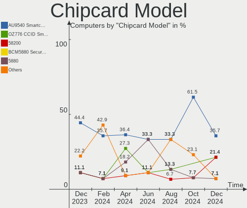

| Model                                                                        | Computers | Percent |
|------------------------------------------------------------------------------|-----------|---------|
| Alcor Micro AU9540 Smartcard Reader                                          | 10        | 37.04%  |
| Broadcom 5880                                                                | 5         | 18.52%  |
| Broadcom 58200                                                               | 4         | 14.81%  |
| Upek TouchChip Fingerprint Coprocessor (WBF advanced mode)                   | 2         | 7.41%   |
| O2 Micro OZ776 CCID Smartcard Reader                                         | 2         | 7.41%   |
| Gemalto (was Gemplus) GemPC Twin SmartCard Reader                            | 1         | 3.7%    |
| Broadcom BCM5880 Secure Applications Processor with fingerprint swipe sensor | 1         | 3.7%    |
| Broadcom BCM5880 Secure Applications Processor                               | 1         | 3.7%    |
| BIT4ID miniLector EVO                                                        | 1         | 3.7%    |

Unsupported
-----------

Unsupported Devices
-------------------

Total unsupported devices on board

| Total | Computers | Percent |
|-------|-----------|---------|
| 0     | 361       | 69.16%  |
| 1     | 129       | 24.71%  |
| 2     | 26        | 4.98%   |
| 4     | 3         | 0.57%   |
| 3     | 3         | 0.57%   |

Unsupported Device Types
------------------------

Types of unsupported devices

| Type                     | Computers | Percent |
|--------------------------|-----------|---------|
| Fingerprint reader       | 85        | 42.5%   |
| Graphics card            | 35        | 17.5%   |
| Chipcard                 | 24        | 12%     |
| Net/wireless             | 12        | 6%      |
| Camera                   | 11        | 5.5%    |
| Multimedia controller    | 8         | 4%      |
| Communication controller | 7         | 3.5%    |
| Bluetooth                | 7         | 3.5%    |
| Unassigned class         | 3         | 1.5%    |
| Storage/raid             | 2         | 1%      |
| Network                  | 2         | 1%      |
| Firewire controller      | 2         | 1%      |
| Sound                    | 1         | 0.5%    |
| Modem                    | 1         | 0.5%    |

