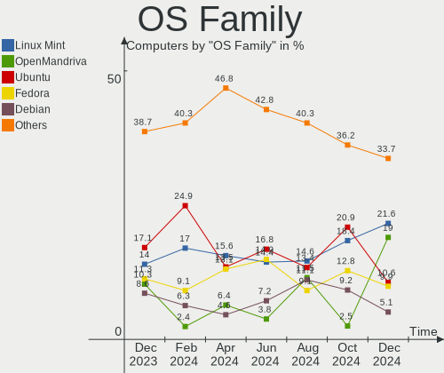
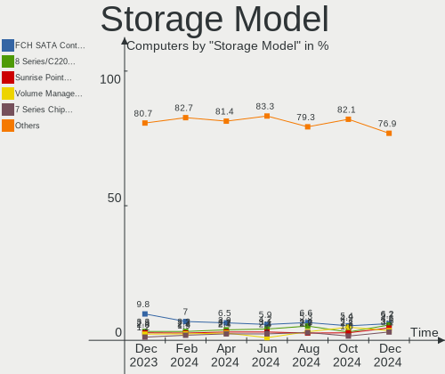
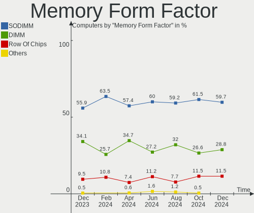
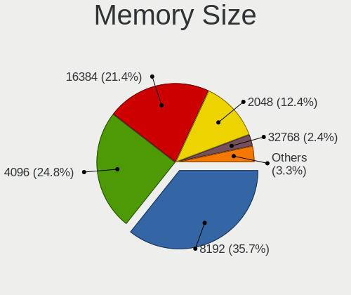

Linux in Italy - Hardware Trends
--------------------------------

A project to identify most popular hardware characteristics and track their change
over time based on data collected by Linux users at https://Linux-Hardware.org.

Anyone can contribute to this report by the [hw-probe](https://github.com/linuxhw/hw-probe) tool:

    sudo -E hw-probe -all -upload

This is a report for all computer types. See also reports for [desktops](/Location/Italy/Desktop/README.md) and [notebooks](/Location/Italy/Notebook/README.md).

Period: Jan, 2023.

Contents
--------

* [ System ](#system)
  - [ OS                       ](#os)
  - [ OS Family                ](#os-family)
  - [ Kernel                   ](#kernel)
  - [ Kernel Family            ](#kernel-family)
  - [ Kernel Major Ver.        ](#kernel-major-ver)
  - [ Arch                     ](#arch)
  - [ DE                       ](#de)
  - [ Display Server           ](#display-server)
  - [ Display Manager          ](#display-manager)
  - [ OS Lang                  ](#os-lang)
  - [ Boot Mode                ](#boot-mode)
  - [ Filesystem               ](#filesystem)
  - [ Part. scheme             ](#part-scheme)
  - [ Dual Boot with Linux/BSD ](#dual-boot-with-linuxbsd)
  - [ Dual Boot (Win)          ](#dual-boot-win)

* [ Board ](#board)
  - [ Vendor                   ](#vendor)
  - [ Model                    ](#model)
  - [ Model Family             ](#model-family)
  - [ MFG Year                 ](#mfg-year)
  - [ Form Factor              ](#form-factor)
  - [ Secure Boot              ](#secure-boot)
  - [ Coreboot                 ](#coreboot)
  - [ RAM Size                 ](#ram-size)
  - [ RAM Used                 ](#ram-used)
  - [ Total Drives             ](#total-drives)
  - [ Has CD-ROM               ](#has-cd-rom)
  - [ Has Ethernet             ](#has-ethernet)
  - [ Has WiFi                 ](#has-wifi)
  - [ Has Bluetooth            ](#has-bluetooth)

* [ Location ](#location)
  - [ Country                  ](#country)
  - [ City                     ](#city)

* [ Drives ](#drives)
  - [ Drive Vendor             ](#drive-vendor)
  - [ Drive Model              ](#drive-model)
  - [ HDD Vendor               ](#hdd-vendor)
  - [ SSD Vendor               ](#ssd-vendor)
  - [ Drive Kind               ](#drive-kind)
  - [ Drive Connector          ](#drive-connector)
  - [ Drive Size               ](#drive-size)
  - [ Space Total              ](#space-total)
  - [ Space Used               ](#space-used)
  - [ Malfunc. Drives          ](#malfunc-drives)
  - [ Malfunc. Drive Vendor    ](#malfunc-drive-vendor)
  - [ Malfunc. HDD Vendor      ](#malfunc-hdd-vendor)
  - [ Malfunc. Drive Kind      ](#malfunc-drive-kind)
  - [ Failed Drives            ](#failed-drives)
  - [ Failed Drive Vendor      ](#failed-drive-vendor)
  - [ Drive Status             ](#drive-status)

* [ Storage controller ](#storage-controller)
  - [ Storage Vendor           ](#storage-vendor)
  - [ Storage Model            ](#storage-model)
  - [ Storage Kind             ](#storage-kind)

* [ Processor ](#processor)
  - [ CPU Vendor               ](#cpu-vendor)
  - [ CPU Model                ](#cpu-model)
  - [ CPU Model Family         ](#cpu-model-family)
  - [ CPU Cores                ](#cpu-cores)
  - [ CPU Sockets              ](#cpu-sockets)
  - [ CPU Threads              ](#cpu-threads)
  - [ CPU Op-Modes             ](#cpu-op-modes)
  - [ CPU Microcode            ](#cpu-microcode)
  - [ CPU Microarch            ](#cpu-microarch)

* [ Graphics ](#graphics)
  - [ GPU Vendor               ](#gpu-vendor)
  - [ GPU Model                ](#gpu-model)
  - [ GPU Combo                ](#gpu-combo)
  - [ GPU Driver               ](#gpu-driver)
  - [ GPU Memory               ](#gpu-memory)

* [ Monitor ](#monitor)
  - [ Monitor Vendor           ](#monitor-vendor)
  - [ Monitor Model            ](#monitor-model)
  - [ Monitor Resolution       ](#monitor-resolution)
  - [ Monitor Diagonal         ](#monitor-diagonal)
  - [ Monitor Width            ](#monitor-width)
  - [ Aspect Ratio             ](#aspect-ratio)
  - [ Monitor Area             ](#monitor-area)
  - [ Pixel Density            ](#pixel-density)
  - [ Multiple Monitors        ](#multiple-monitors)

* [ Network ](#network)
  - [ Net Controller Vendor    ](#net-controller-vendor)
  - [ Net Controller Model     ](#net-controller-model)
  - [ Wireless Vendor          ](#wireless-vendor)
  - [ Wireless Model           ](#wireless-model)
  - [ Ethernet Vendor          ](#ethernet-vendor)
  - [ Ethernet Model           ](#ethernet-model)
  - [ Net Controller Kind      ](#net-controller-kind)
  - [ Used Controller          ](#used-controller)
  - [ NICs                     ](#nics)
  - [ IPv6                     ](#ipv6)

* [ Bluetooth ](#bluetooth)
  - [ Bluetooth Vendor         ](#bluetooth-vendor)
  - [ Bluetooth Model          ](#bluetooth-model)

* [ Sound ](#sound)
  - [ Sound Vendor             ](#sound-vendor)
  - [ Sound Model              ](#sound-model)

* [ Memory ](#memory)
  - [ Memory Vendor            ](#memory-vendor)
  - [ Memory Model             ](#memory-model)
  - [ Memory Kind              ](#memory-kind)
  - [ Memory Form Factor       ](#memory-form-factor)
  - [ Memory Size              ](#memory-size)
  - [ Memory Speed             ](#memory-speed)

* [ Printers & scanners ](#printers--scanners)
  - [ Printer Vendor           ](#printer-vendor)
  - [ Printer Model            ](#printer-model)
  - [ Scanner Vendor           ](#scanner-vendor)
  - [ Scanner Model            ](#scanner-model)

* [ Camera ](#camera)
  - [ Camera Vendor            ](#camera-vendor)
  - [ Camera Model             ](#camera-model)

* [ Security ](#security)
  - [ Fingerprint Vendor       ](#fingerprint-vendor)
  - [ Fingerprint Model        ](#fingerprint-model)
  - [ Chipcard Vendor          ](#chipcard-vendor)
  - [ Chipcard Model           ](#chipcard-model)

* [ Unsupported ](#unsupported)
  - [ Unsupported Devices      ](#unsupported-devices)
  - [ Unsupported Device Types ](#unsupported-device-types)

System
------

OS
--

Installed operating systems

| Name                         | Computers | Percent |
|------------------------------|-----------|---------|
| Linux Mint 21.1              | 43        | 13.52%  |
| OpenMandriva 23.01           | 41        | 12.89%  |
| Ubuntu 22.04                 | 36        | 11.32%  |
| Ubuntu 22.10                 | 25        | 7.86%   |
| Fedora 37                    | 18        | 5.66%   |
| Arch Rolling                 | 16        | 5.03%   |
| Debian 11                    | 10        | 3.14%   |
| Zorin 16                     | 9         | 2.83%   |
| Ubuntu 20.04                 | 9         | 2.83%   |
| EndeavourOS Rolling          | 7         | 2.2%    |
| Pop!_OS 22.04                | 6         | 1.89%   |
| Linux Mint 20.3              | 6         | 1.89%   |
| KDE neon 22.04               | 6         | 1.89%   |
| Elementary 6.1               | 6         | 1.89%   |
| OpenMandriva 4.3             | 5         | 1.57%   |
| openSUSE Tumbleweed-XXXXXXXX | 4         | 1.26%   |
| OpenMandriva 22.12           | 4         | 1.26%   |
| Manjaro 22.0.1               | 4         | 1.26%   |
| Manjaro                      | 4         | 1.26%   |
| LMDE 5                       | 3         | 0.94%   |
| Linux Mint 21                | 3         | 0.94%   |
| Linux Mint 20                | 3         | 0.94%   |
| Kubuntu 22.04                | 3         | 0.94%   |
| Xubuntu 22.04                | 2         | 0.63%   |
| Ubuntu MATE 22.04            | 2         | 0.63%   |
| Ubuntu 18.04                 | 2         | 0.63%   |
| SteamOS 3.4.4                | 2         | 0.63%   |
| ROSA 12.3                    | 2         | 0.63%   |
| MX 21                        | 2         | 0.63%   |
| Lubuntu 22.04                | 2         | 0.63%   |
| Linux Mint 20.2              | 2         | 0.63%   |
| Kubuntu 22.10                | 2         | 0.63%   |
| Gentoo 2.9                   | 2         | 0.63%   |
| Fedora 36                    | 2         | 0.63%   |
| Debian                       | 2         | 0.63%   |
| Xubuntu 22.10                | 1         | 0.31%   |
| Xubuntu 18.04                | 1         | 0.31%   |
| Ubuntu Unity 16.04           | 1         | 0.31%   |
| Ubuntu Studio 22.04          | 1         | 0.31%   |
| Ubuntu MATE 22.10            | 1         | 0.31%   |

OS Family
---------

OS without a version

| Name          | Computers | Percent |
|---------------|-----------|---------|
| Ubuntu        | 72        | 22.64%  |
| Linux Mint    | 57        | 17.92%  |
| OpenMandriva  | 51        | 16.04%  |
| Fedora        | 20        | 6.29%   |
| Arch          | 16        | 5.03%   |
| Debian        | 14        | 4.4%    |
| Zorin         | 9         | 2.83%   |
| Manjaro       | 8         | 2.52%   |
| EndeavourOS   | 7         | 2.2%    |
| Pop!_OS       | 6         | 1.89%   |
| Kubuntu       | 6         | 1.89%   |
| KDE neon      | 6         | 1.89%   |
| Elementary    | 6         | 1.89%   |
| openSUSE      | 5         | 1.57%   |
| Xubuntu       | 4         | 1.26%   |
| Ubuntu MATE   | 3         | 0.94%   |
| LMDE          | 3         | 0.94%   |
| SteamOS       | 2         | 0.63%   |
| ROSA          | 2         | 0.63%   |
| MX            | 2         | 0.63%   |
| Lubuntu       | 2         | 0.63%   |
| Gentoo        | 2         | 0.63%   |
| Ubuntu Unity  | 1         | 0.31%   |
| Ubuntu Studio | 1         | 0.31%   |
| Slackware     | 1         | 0.31%   |
| Rocky Linux   | 1         | 0.31%   |
| PureOS        | 1         | 0.31%   |
| Parrot        | 1         | 0.31%   |
| Nobara        | 1         | 0.31%   |
| Linux Lite    | 1         | 0.31%   |
| Lilidog       | 1         | 0.31%   |
| Kali          | 1         | 0.31%   |
| Gnoppix       | 1         | 0.31%   |
| Garuda Linux  | 1         | 0.31%   |
| Devuan        | 1         | 0.31%   |
| BuildRoot     | 1         | 0.31%   |
| Arch ARM      | 1         | 0.31%   |

Kernel
------

Version of the Linux kernel

| Version                            | Computers | Percent |
|------------------------------------|-----------|---------|
| 5.15.0-58-generic                  | 54        | 16.98%  |
| 6.1.1-desktop-1omv2290             | 38        | 11.95%  |
| 5.15.0-56-generic                  | 30        | 9.43%   |
| 5.15.0-57-generic                  | 16        | 5.03%   |
| 5.19.0-29-generic                  | 14        | 4.4%    |
| 5.4.0-137-generic                  | 12        | 3.77%   |
| 5.10.0-20-amd64                    | 9         | 2.83%   |
| 6.0.12-76060006-generic            | 5         | 1.57%   |
| 5.19.0-26-generic                  | 5         | 1.57%   |
| 5.16.7-desktop-1omv4003            | 5         | 1.57%   |
| 5.15.0-43-generic                  | 5         | 1.57%   |
| 6.1.7-1-MANJARO                    | 4         | 1.26%   |
| 6.0.18-300.fc37.x86_64             | 4         | 1.26%   |
| 6.0.10-desktop-2omv22090           | 4         | 1.26%   |
| 6.1.6-arch1-3                      | 3         | 0.94%   |
| 6.1.4-arch1-1                      | 3         | 0.94%   |
| 6.0.16-300.fc37.x86_64             | 3         | 0.94%   |
| 5.19.0-28-generic                  | 3         | 0.94%   |
| 5.10.0-21-amd64                    | 3         | 0.94%   |
| 6.1.8-arch1-1                      | 2         | 0.63%   |
| 6.1.7-arch1-1                      | 2         | 0.63%   |
| 6.1.7-200.fc37.x86_64              | 2         | 0.63%   |
| 6.1.6-zen1-1-zen                   | 2         | 0.63%   |
| 6.1.6-200.fc37.x86_64              | 2         | 0.63%   |
| 6.1.5-200.fc37.x86_64              | 2         | 0.63%   |
| 6.1.4-desktop-1omv2301             | 2         | 0.63%   |
| 6.1.2-zen1-1-zen                   | 2         | 0.63%   |
| 6.1.1-1-MANJARO                    | 2         | 0.63%   |
| 6.1.1-1-default                    | 2         | 0.63%   |
| 6.0.7-301.fc37.x86_64              | 2         | 0.63%   |
| 6.0.15-300.fc37.x86_64             | 2         | 0.63%   |
| 5.19.0-21-generic                  | 2         | 0.63%   |
| 5.15.86-1-lts                      | 2         | 0.63%   |
| 5.15.75-generic-1rosa2021.1-x86_64 | 2         | 0.63%   |
| 5.15.0-53-generic                  | 2         | 0.63%   |
| 5.13.0-valve36-1-neptune           | 2         | 0.63%   |
| 5.10.0-16-amd64                    | 2         | 0.63%   |
| 6.1.8-x64v2-xanmod1                | 1         | 0.31%   |
| 6.1.7-gentoo                       | 1         | 0.31%   |
| 6.1.7-060107-generic               | 1         | 0.31%   |

Kernel Family
-------------

Linux kernel without a distro release

| Version | Computers | Percent |
|---------|-----------|---------|
| 5.15.0  | 112       | 35.22%  |
| 6.1.1   | 44        | 13.84%  |
| 5.19.0  | 28        | 8.81%   |
| 5.4.0   | 16        | 5.03%   |
| 5.10.0  | 15        | 4.72%   |
| 6.1.7   | 10        | 3.14%   |
| 6.1.6   | 9         | 2.83%   |
| 6.1.4   | 6         | 1.89%   |
| 6.0.12  | 5         | 1.57%   |
| 5.16.7  | 5         | 1.57%   |
| 6.1.2   | 4         | 1.26%   |
| 6.0.18  | 4         | 1.26%   |
| 6.0.10  | 4         | 1.26%   |
| 6.0.0   | 4         | 1.26%   |
| 6.1.8   | 3         | 0.94%   |
| 6.1.5   | 3         | 0.94%   |
| 6.0.16  | 3         | 0.94%   |
| 6.0.15  | 3         | 0.94%   |
| 5.15.89 | 3         | 0.94%   |
| 5.13.0  | 3         | 0.94%   |
| 6.1.3   | 2         | 0.63%   |
| 6.0.7   | 2         | 0.63%   |
| 5.19.17 | 2         | 0.63%   |
| 5.15.86 | 2         | 0.63%   |
| 5.15.75 | 2         | 0.63%   |
| 5.14.0  | 2         | 0.63%   |
| 6.1.0   | 1         | 0.31%   |
| 6.0.9   | 1         | 0.31%   |
| 6.0.6   | 1         | 0.31%   |
| 6.0.17  | 1         | 0.31%   |
| 6.0.14  | 1         | 0.31%   |
| 5.19.7  | 1         | 0.31%   |
| 5.19.1  | 1         | 0.31%   |
| 5.18.19 | 1         | 0.31%   |
| 5.18.16 | 1         | 0.31%   |
| 5.17.12 | 1         | 0.31%   |
| 5.16.15 | 1         | 0.31%   |
| 5.16.0  | 1         | 0.31%   |
| 5.15.85 | 1         | 0.31%   |
| 5.14.21 | 1         | 0.31%   |

Kernel Major Ver.
-----------------

Linux kernel major version

| Version | Computers | Percent |
|---------|-----------|---------|
| 5.15    | 120       | 37.74%  |
| 6.1     | 82        | 25.79%  |
| 5.19    | 32        | 10.06%  |
| 6.0     | 29        | 9.12%   |
| 5.10    | 17        | 5.35%   |
| 5.4     | 16        | 5.03%   |
| 5.16    | 7         | 2.2%    |
| 5.14    | 3         | 0.94%   |
| 5.13    | 3         | 0.94%   |
| 5.18    | 2         | 0.63%   |
| 5.17    | 1         | 0.31%   |
| 4.9     | 1         | 0.31%   |
| 4.4     | 1         | 0.31%   |
| 4.19    | 1         | 0.31%   |
| 4.18    | 1         | 0.31%   |
| 4.15    | 1         | 0.31%   |
| 4.10    | 1         | 0.31%   |

Arch
----

OS architecture (x86_64, i586, etc.)

| Name    | Computers | Percent |
|---------|-----------|---------|
| x86_64  | 312       | 98.11%  |
| aarch64 | 3         | 0.94%   |
| i686    | 2         | 0.63%   |
| armv7l  | 1         | 0.31%   |

DE
--

Desktop Environment

| Name             | Computers | Percent |
|------------------|-----------|---------|
| GNOME            | 129       | 40.57%  |
| KDE5             | 85        | 26.73%  |
| X-Cinnamon       | 50        | 15.72%  |
| XFCE             | 24        | 7.55%   |
| Pantheon         | 7         | 2.2%    |
| MATE             | 6         | 1.89%   |
| Unknown          | 4         | 1.26%   |
| LXQt             | 3         | 0.94%   |
| Unity            | 2         | 0.63%   |
| Openbox          | 1         | 0.31%   |
| LXDE             | 1         | 0.31%   |
| lightdm-xsession | 1         | 0.31%   |
| kde              | 1         | 0.31%   |
| i3               | 1         | 0.31%   |
| GNOME Classic    | 1         | 0.31%   |
| Cinnamon         | 1         | 0.31%   |
| bspwm            | 1         | 0.31%   |

Display Server
--------------

X11 or Wayland

| Name    | Computers | Percent |
|---------|-----------|---------|
| X11     | 226       | 71.07%  |
| Wayland | 88        | 27.67%  |
| Tty     | 3         | 0.94%   |
| Unknown | 1         | 0.31%   |

Display Manager
---------------

SDDM, LightDM, etc.

| Name    | Computers | Percent |
|---------|-----------|---------|
| Unknown | 80        | 25.16%  |
| GDM3    | 72        | 22.64%  |
| SDDM    | 70        | 22.01%  |
| LightDM | 60        | 18.87%  |
| GDM     | 35        | 11.01%  |
| SLiM    | 1         | 0.31%   |

OS Lang
-------

Language

| Lang       | Computers | Percent |
|------------|-----------|---------|
| it_IT      | 206       | 64.78%  |
| en_US      | 90        | 28.3%   |
| en_GB      | 8         | 2.52%   |
| C          | 5         | 1.57%   |
| de_DE      | 3         | 0.94%   |
| Unknown    | 3         | 0.94%   |
| POSIX      | 1         | 0.31%   |
| it_IT@euro | 1         | 0.31%   |
| de_IT      | 1         | 0.31%   |

Boot Mode
---------

EFI or BIOS

| Mode | Computers | Percent |
|------|-----------|---------|
| EFI  | 186       | 58.49%  |
| BIOS | 132       | 41.51%  |

Filesystem
----------

Type of filesystem

| Type    | Computers | Percent |
|---------|-----------|---------|
| Ext4    | 225       | 70.75%  |
| Overlay | 56        | 17.61%  |
| Btrfs   | 32        | 10.06%  |
| Zfs     | 2         | 0.63%   |
| Tmpfs   | 2         | 0.63%   |
| Xfs     | 1         | 0.31%   |

Part. scheme
------------

Scheme of partitioning

| Type    | Computers | Percent |
|---------|-----------|---------|
| GPT     | 203       | 63.84%  |
| Unknown | 77        | 24.21%  |
| MBR     | 38        | 11.95%  |

Dual Boot with Linux/BSD
------------------------

Hosting more than one Linux/BSD

| Dual boot | Computers | Percent |
|-----------|-----------|---------|
| No        | 250       | 78.62%  |
| Yes       | 68        | 21.38%  |

Dual Boot (Win)
---------------

Hosting Linux and Windows

| Dual boot | Computers | Percent |
|-----------|-----------|---------|
| No        | 212       | 66.67%  |
| Yes       | 106       | 33.33%  |

Board
-----

Vendor
------

Motherboard manufacturer

| Name                    | Computers | Percent |
|-------------------------|-----------|---------|
| Hewlett-Packard         | 56        | 17.61%  |
| ASUSTek Computer        | 54        | 16.98%  |
| Lenovo                  | 39        | 12.26%  |
| Dell                    | 24        | 7.55%   |
| Acer                    | 24        | 7.55%   |
| ASRock                  | 20        | 6.29%   |
| MSI                     | 19        | 5.97%   |
| Gigabyte Technology     | 13        | 4.09%   |
| HUAWEI                  | 11        | 3.46%   |
| Apple                   | 7         | 2.2%    |
| Microsoft               | 5         | 1.57%   |
| Fujitsu                 | 5         | 1.57%   |
| Toshiba                 | 4         | 1.26%   |
| Pegatron                | 4         | 1.26%   |
| Sony                    | 3         | 0.94%   |
| Raspberry Pi Foundation | 3         | 0.94%   |
| Notebook                | 3         | 0.94%   |
| Intel                   | 3         | 0.94%   |
| Unknown                 | 3         | 0.94%   |
| Valve                   | 2         | 0.63%   |
| TUXEDO                  | 2         | 0.63%   |
| Timi                    | 2         | 0.63%   |
| Google                  | 2         | 0.63%   |
| T-bao                   | 1         | 0.31%   |
| Samsung Electronics     | 1         | 0.31%   |
| Rockchip                | 1         | 0.31%   |
| Packard Bell            | 1         | 0.31%   |
| Olivetti                | 1         | 0.31%   |
| Kiano                   | 1         | 0.31%   |
| Insyde                  | 1         | 0.31%   |
| Chuwi                   | 1         | 0.31%   |
| ASRockRack              | 1         | 0.31%   |
| AOpen                   | 1         | 0.31%   |

Model
-----

Motherboard model

| Name                                        | Computers | Percent |
|---------------------------------------------|-----------|---------|
| HP Notebook                                 | 5         | 1.57%   |
| Microsoft Surface Go                        | 3         | 0.94%   |
| HP Pavilion dv7                             | 3         | 0.94%   |
| HP 15                                       | 3         | 0.94%   |
| Unknown                                     | 3         | 0.94%   |
| Valve Jupiter                               | 2         | 0.63%   |
| RPi Raspberry Pi 4 Model B Rev 1.1          | 2         | 0.63%   |
| MSI MS-7B79                                 | 2         | 0.63%   |
| Lenovo ThinkPad T14 Gen 2i 20W0CTO1WW       | 2         | 0.63%   |
| Lenovo IdeaPad 330S-15IKB 81F5              | 2         | 0.63%   |
| Intel B75                                   | 2         | 0.63%   |
| HUAWEI KPL-W0X                              | 2         | 0.63%   |
| HUAWEI KLVL-WXX9                            | 2         | 0.63%   |
| HP Pavilion x2 Detachable                   | 2         | 0.63%   |
| HP Pavilion dv6                             | 2         | 0.63%   |
| HP 255 G8 Notebook PC                       | 2         | 0.63%   |
| Gigabyte Z370P D3                           | 2         | 0.63%   |
| Gigabyte B450M DS3H                         | 2         | 0.63%   |
| Dell OptiPlex 3020                          | 2         | 0.63%   |
| ASUS PRIME A320M-K                          | 2         | 0.63%   |
| ASUS H110M-R                                | 2         | 0.63%   |
| Acer Aspire E5-573G                         | 2         | 0.63%   |
| TUXEDO Pulse 15 Gen1                        | 1         | 0.31%   |
| TUXEDO Aura 15 Gen1                         | 1         | 0.31%   |
| Toshiba Satellite Pro S500                  | 1         | 0.31%   |
| Toshiba Satellite Pro C850-1HD              | 1         | 0.31%   |
| Toshiba Satellite Pro C850-10L              | 1         | 0.31%   |
| Toshiba Satellite Pro C50-A-1FD             | 1         | 0.31%   |
| Timi TM1701                                 | 1         | 0.31%   |
| Timi RedmiBook 16                           | 1         | 0.31%   |
| T-bao MINI PC                               | 1         | 0.31%   |
| Sony SVT1312M1ES                            | 1         | 0.31%   |
| Sony SVE1711C5E                             | 1         | 0.31%   |
| Sony SVE1513C5E                             | 1         | 0.31%   |
| Samsung RV411/RV511/E3511/S3511/RV711/E3411 | 1         | 0.31%   |
| Rockchip Orange Pi 5                        | 1         | 0.31%   |
| RPi Raspberry Pi 3 Model B Rev 1.2          | 1         | 0.31%   |
| Pegatron p6-2013it                          | 1         | 0.31%   |
| Pegatron KN444AA-ABZ m9242.it               | 1         | 0.31%   |
| Pegatron FZ147AA-ABZ a6643it                | 1         | 0.31%   |

Model Family
------------

Motherboard model prefix

| Name               | Computers | Percent |
|--------------------|-----------|---------|
| HP Pavilion        | 18        | 5.66%   |
| Acer Aspire        | 15        | 4.72%   |
| Lenovo ThinkPad    | 14        | 4.4%    |
| Lenovo IdeaPad     | 12        | 3.77%   |
| ASUS PRIME         | 9         | 2.83%   |
| Dell OptiPlex      | 6         | 1.89%   |
| Dell Latitude      | 6         | 1.89%   |
| Microsoft Surface  | 5         | 1.57%   |
| HP ProBook         | 5         | 1.57%   |
| HP Notebook        | 5         | 1.57%   |
| HP Laptop          | 5         | 1.57%   |
| Dell XPS           | 5         | 1.57%   |
| ASUS VivoBook      | 5         | 1.57%   |
| Toshiba Satellite  | 4         | 1.26%   |
| Dell Precision     | 4         | 1.26%   |
| RPi Raspberry      | 3         | 0.94%   |
| Lenovo ThinkCentre | 3         | 0.94%   |
| HP EliteBook       | 3         | 0.94%   |
| HP 250             | 3         | 0.94%   |
| HP 15              | 3         | 0.94%   |
| Fujitsu ESPRIMO    | 3         | 0.94%   |
| ASUS ROG           | 3         | 0.94%   |
| Acer Veriton       | 3         | 0.94%   |
| Acer TravelMate    | 3         | 0.94%   |
| Acer Swift         | 3         | 0.94%   |
| Unknown            | 3         | 0.94%   |
| Valve Jupiter      | 2         | 0.63%   |
| MSI Prestige       | 2         | 0.63%   |
| MSI MS-7B79        | 2         | 0.63%   |
| Lenovo Yoga        | 2         | 0.63%   |
| Intel B75          | 2         | 0.63%   |
| HUAWEI KPL-W0X     | 2         | 0.63%   |
| HUAWEI KLVL-WXX9   | 2         | 0.63%   |
| HP Victus          | 2         | 0.63%   |
| HP ENVY            | 2         | 0.63%   |
| HP Compaq          | 2         | 0.63%   |
| HP 255             | 2         | 0.63%   |
| Gigabyte Z370P     | 2         | 0.63%   |
| Gigabyte B450M     | 2         | 0.63%   |
| Fujitsu LIFEBOOK   | 2         | 0.63%   |

MFG Year
--------

Motherboard manufacture year

| Year    | Computers | Percent |
|---------|-----------|---------|
| 2020    | 40        | 12.58%  |
| 2021    | 31        | 9.75%   |
| 2018    | 28        | 8.81%   |
| 2013    | 25        | 7.86%   |
| 2022    | 24        | 7.55%   |
| 2012    | 23        | 7.23%   |
| 2017    | 21        | 6.6%    |
| 2015    | 21        | 6.6%    |
| 2019    | 20        | 6.29%   |
| 2016    | 19        | 5.97%   |
| 2014    | 19        | 5.97%   |
| 2008    | 12        | 3.77%   |
| 2010    | 11        | 3.46%   |
| 2011    | 8         | 2.52%   |
| 2009    | 8         | 2.52%   |
| Unknown | 4         | 1.26%   |
| 2006    | 2         | 0.63%   |
| 2005    | 2         | 0.63%   |

Form Factor
-----------

Physical design of the computer

| Name           | Computers | Percent |
|----------------|-----------|---------|
| Notebook       | 174       | 54.72%  |
| Desktop        | 120       | 37.74%  |
| Tablet         | 9         | 2.83%   |
| Convertible    | 8         | 2.52%   |
| System on chip | 4         | 1.26%   |
| All in one     | 2         | 0.63%   |
| Mini pc        | 1         | 0.31%   |

Secure Boot
-----------

Enabled or disabled

| State    | Computers | Percent |
|----------|-----------|---------|
| Disabled | 296       | 93.08%  |
| Enabled  | 22        | 6.92%   |

Coreboot
--------

Have coreboot on board

| Used | Computers | Percent |
|------|-----------|---------|
| No   | 316       | 99.37%  |
| Yes  | 2         | 0.63%   |

RAM Size
--------

Total RAM memory

| Size in GB  | Computers | Percent |
|-------------|-----------|---------|
| 4.01-8.0    | 83        | 26.1%   |
| 8.01-16.0   | 71        | 22.33%  |
| 16.01-24.0  | 60        | 18.87%  |
| 3.01-4.0    | 56        | 17.61%  |
| 32.01-64.0  | 31        | 9.75%   |
| 1.01-2.0    | 6         | 1.89%   |
| 24.01-32.0  | 5         | 1.57%   |
| 64.01-256.0 | 3         | 0.94%   |
| 0.51-1.0    | 2         | 0.63%   |
| 2.01-3.0    | 1         | 0.31%   |

RAM Used
--------

Used RAM memory

| Used GB    | Computers | Percent |
|------------|-----------|---------|
| 1.01-2.0   | 116       | 36.48%  |
| 2.01-3.0   | 95        | 29.87%  |
| 3.01-4.0   | 41        | 12.89%  |
| 4.01-8.0   | 39        | 12.26%  |
| 8.01-16.0  | 12        | 3.77%   |
| 0.51-1.0   | 12        | 3.77%   |
| 0.01-0.5   | 2         | 0.63%   |
| 24.01-32.0 | 1         | 0.31%   |

Total Drives
------------

Number of drives on board

| Drives | Computers | Percent |
|--------|-----------|---------|
| 1      | 197       | 61.95%  |
| 2      | 66        | 20.75%  |
| 3      | 22        | 6.92%   |
| 4      | 13        | 4.09%   |
| 5      | 8         | 2.52%   |
| 6      | 4         | 1.26%   |
| 0      | 4         | 1.26%   |
| 7      | 3         | 0.94%   |
| 8      | 1         | 0.31%   |

Has CD-ROM
----------

Has CD-ROM on board

| Presented | Computers | Percent |
|-----------|-----------|---------|
| No        | 193       | 60.69%  |
| Yes       | 125       | 39.31%  |

Has Ethernet
------------

Has Ethernet on board

| Presented | Computers | Percent |
|-----------|-----------|---------|
| Yes       | 253       | 79.56%  |
| No        | 65        | 20.44%  |

Has WiFi
--------

Has WiFi module

| Presented | Computers | Percent |
|-----------|-----------|---------|
| Yes       | 248       | 77.99%  |
| No        | 70        | 22.01%  |

Has Bluetooth
-------------

Has Bluetooth module

| Presented | Computers | Percent |
|-----------|-----------|---------|
| Yes       | 211       | 66.35%  |
| No        | 107       | 33.65%  |

Location
--------

Country
-------

Geographic location (country)

| Country | Computers | Percent |
|---------|-----------|---------|
| Italy   | 318       | 100%    |

City
----

Geographic location (city)

| City               | Computers | Percent |
|--------------------|-----------|---------|
| Milan              | 37        | 11.64%  |
| Rome               | 36        | 11.32%  |
| Milano             | 8         | 2.52%   |
| Turin              | 7         | 2.2%    |
| Rho                | 7         | 2.2%    |
| Bologna            | 7         | 2.2%    |
| Sesto San Giovanni | 5         | 1.57%   |
| Verona             | 4         | 1.26%   |
| Venice             | 4         | 1.26%   |
| Palermo            | 4         | 1.26%   |
| Genoa              | 4         | 1.26%   |
| Naples             | 3         | 0.94%   |
| Montescudo         | 3         | 0.94%   |
| Florence           | 3         | 0.94%   |
| Como               | 3         | 0.94%   |
| Catania            | 3         | 0.94%   |
| Bergamo            | 3         | 0.94%   |
| Vicenza            | 2         | 0.63%   |
| Trecastelli        | 2         | 0.63%   |
| Spinea             | 2         | 0.63%   |
| Siena              | 2         | 0.63%   |
| Sassari            | 2         | 0.63%   |
| Salerno            | 2         | 0.63%   |
| Rimini             | 2         | 0.63%   |
| Pescara            | 2         | 0.63%   |
| Modena             | 2         | 0.63%   |
| Licata             | 2         | 0.63%   |
| Francofonte        | 2         | 0.63%   |
| Citta              | 2         | 0.63%   |
| Chieri             | 2         | 0.63%   |
| Castelverde        | 2         | 0.63%   |
| Campobasso         | 2         | 0.63%   |
| Cagliari           | 2         | 0.63%   |
| Bruneck            | 2         | 0.63%   |
| Alassio            | 2         | 0.63%   |
| Zagarolo           | 1         | 0.31%   |
| Villimpenta        | 1         | 0.31%   |
| Vigliano Biellese  | 1         | 0.31%   |
| Veruno             | 1         | 0.31%   |
| Varese             | 1         | 0.31%   |

Drives
------

Drive Vendor
------------

Hard drive vendors

| Vendor                      | Computers | Drives | Percent |
|-----------------------------|-----------|--------|---------|
| Samsung Electronics         | 83        | 98     | 17.11%  |
| WDC                         | 71        | 87     | 14.64%  |
| Seagate                     | 55        | 65     | 11.34%  |
| Crucial                     | 33        | 38     | 6.8%    |
| Toshiba                     | 32        | 33     | 6.6%    |
| Kingston                    | 28        | 28     | 5.77%   |
| SanDisk                     | 26        | 28     | 5.36%   |
| Unknown                     | 25        | 29     | 5.15%   |
| Hitachi                     | 11        | 11     | 2.27%   |
| SK hynix                    | 10        | 10     | 2.06%   |
| Intel                       | 9         | 10     | 1.86%   |
| HGST                        | 9         | 9      | 1.86%   |
| KIOXIA                      | 8         | 9      | 1.65%   |
| Micron Technology           | 7         | 7      | 1.44%   |
| Maxtor                      | 7         | 7      | 1.44%   |
| China                       | 7         | 7      | 1.44%   |
| Micron/Crucial Technology   | 5         | 5      | 1.03%   |
| Kingston Technology Company | 5         | 5      | 1.03%   |
| Phison Electronics          | 4         | 4      | 0.82%   |
| OCZ                         | 3         | 3      | 0.62%   |
| Transcend                   | 2         | 2      | 0.41%   |
| TO Exter                    | 2         | 2      | 0.41%   |
| Team                        | 2         | 2      | 0.41%   |
| Silicon Motion              | 2         | 2      | 0.41%   |
| Netac                       | 2         | 2      | 0.41%   |
| LITEON                      | 2         | 2      | 0.41%   |
| Lexar                       | 2         | 2      | 0.41%   |
| KingDian                    | 2         | 2      | 0.41%   |
| Hewlett-Packard             | 2         | 3      | 0.41%   |
| Fanxiang                    | 2         | 2      | 0.41%   |
| Dogfish                     | 2         | 2      | 0.41%   |
| X12                         | 1         | 1      | 0.21%   |
| USB3.0                      | 1         | 1      | 0.21%   |
| UMIS                        | 1         | 1      | 0.21%   |
| Teclast                     | 1         | 1      | 0.21%   |
| TakeMS                      | 1         | 1      | 0.21%   |
| SPCC                        | 1         | 1      | 0.21%   |
| SABRENT                     | 1         | 1      | 0.21%   |
| PNY                         | 1         | 1      | 0.21%   |
| Phison                      | 1         | 1      | 0.21%   |

Drive Model
-----------

Hard drive models

| Model                                                | Computers | Percent |
|------------------------------------------------------|-----------|---------|
| Kingston SA400S37240G 240GB SSD                      | 10        | 1.9%    |
| Crucial CT500MX500SSD1 500GB                         | 8         | 1.52%   |
| Samsung SSD 860 EVO 500GB                            | 6         | 1.14%   |
| Toshiba MQ01ABF050 500GB                             | 5         | 0.95%   |
| Seagate ST2000DM008-2FR102 2TB                       | 5         | 0.95%   |
| Seagate ST1000DM010-2EP102 1TB                       | 5         | 0.95%   |
| Samsung SSD 870 QVO 1TB                              | 5         | 0.95%   |
| Samsung SSD 850 EVO 250GB                            | 5         | 0.95%   |
| Samsung NVMe SSD Controller SM981/PM981/PM983 500GB  | 5         | 0.95%   |
| Crucial CT480BX500SSD1 480GB                         | 5         | 0.95%   |
| Unknown MMC Card  64GB                               | 4         | 0.76%   |
| Unknown MMC Card  32GB                               | 4         | 0.76%   |
| Toshiba DT01ACA200 2TB                               | 4         | 0.76%   |
| Sandisk WD Black SN750 / PC SN730 NVMe SSD 1TB       | 4         | 0.76%   |
| Micron/Crucial P2 NVMe PCIe SSD 500GB                | 4         | 0.76%   |
| Kingston SV300S37A120G 120GB SSD                     | 4         | 0.76%   |
| Crucial CT1000BX500SSD1 1TB                          | 4         | 0.76%   |
| WDC WD10EZEX-00BN5A0 1TB                             | 3         | 0.57%   |
| Toshiba MQ04ABF100 1TB                               | 3         | 0.57%   |
| Toshiba HDWD110 1TB                                  | 3         | 0.57%   |
| Toshiba DT01ACA050 500GB                             | 3         | 0.57%   |
| SK hynix BC511 512GB                                 | 3         | 0.57%   |
| Seagate ST500DM002-1BD142 500GB                      | 3         | 0.57%   |
| Seagate ST3500413AS 500GB                            | 3         | 0.57%   |
| Seagate ST1000LM035-1RK172 1TB                       | 3         | 0.57%   |
| Seagate ST1000DM003-1ER162 1TB                       | 3         | 0.57%   |
| Seagate ST1000DM003-1CH162 1TB                       | 3         | 0.57%   |
| Samsung SSD 970 EVO Plus 500GB                       | 3         | 0.57%   |
| Samsung NVMe SSD Controller PM9A1/PM9A3/980PRO 512GB | 3         | 0.57%   |
| Intel SSD 660P Series 512GB                          | 3         | 0.57%   |
| Crucial CT500P2SSD8 500GB                            | 3         | 0.57%   |
| Crucial CT240BX500SSD1 240GB                         | 3         | 0.57%   |
| WDC WDS250G2B0B-00YS70 250GB SSD                     | 2         | 0.38%   |
| WDC WDS120G2G0B-00EPW0 120GB SSD                     | 2         | 0.38%   |
| WDC WDS100T2B0A-00SM50 1TB SSD                       | 2         | 0.38%   |
| WDC WD5000AAKX-60U6AA0 500GB                         | 2         | 0.38%   |
| WDC WD5000AAKX-22ERMA0 500GB                         | 2         | 0.38%   |
| WDC WD5000AAKX-08U6AA0 500GB                         | 2         | 0.38%   |
| WDC WD40EFRX-68N32N0 4TB                             | 2         | 0.38%   |
| WDC WD20EZRZ-00Z5HB0 2TB                             | 2         | 0.38%   |

HDD Vendor
----------

Hard disk drive vendors

| Vendor              | Computers | Drives | Percent |
|---------------------|-----------|--------|---------|
| Seagate             | 53        | 63     | 31.93%  |
| WDC                 | 52        | 64     | 31.33%  |
| Toshiba             | 26        | 27     | 15.66%  |
| Hitachi             | 11        | 11     | 6.63%   |
| HGST                | 9         | 9      | 5.42%   |
| Maxtor              | 5         | 5      | 3.01%   |
| Samsung Electronics | 3         | 3      | 1.81%   |
| Unknown             | 2         | 2      | 1.2%    |
| USB3.0              | 1         | 1      | 0.6%    |
| SABRENT             | 1         | 1      | 0.6%    |
| Hewlett-Packard     | 1         | 2      | 0.6%    |
| Fujitsu             | 1         | 1      | 0.6%    |
| Apple               | 1         | 1      | 0.6%    |

SSD Vendor
----------

Solid state drive vendors

| Vendor              | Computers | Drives | Percent |
|---------------------|-----------|--------|---------|
| Samsung Electronics | 44        | 51     | 25.58%  |
| Crucial             | 29        | 33     | 16.86%  |
| Kingston            | 24        | 24     | 13.95%  |
| SanDisk             | 13        | 14     | 7.56%   |
| WDC                 | 11        | 11     | 6.4%    |
| China               | 7         | 7      | 4.07%   |
| OCZ                 | 3         | 3      | 1.74%   |
| Transcend           | 2         | 2      | 1.16%   |
| Toshiba             | 2         | 2      | 1.16%   |
| TO Exter            | 2         | 2      | 1.16%   |
| Team                | 2         | 2      | 1.16%   |
| SK hynix            | 2         | 2      | 1.16%   |
| Netac               | 2         | 2      | 1.16%   |
| Maxtor              | 2         | 2      | 1.16%   |
| LITEON              | 2         | 2      | 1.16%   |
| KingDian            | 2         | 2      | 1.16%   |
| Dogfish             | 2         | 2      | 1.16%   |
| X12                 | 1         | 1      | 0.58%   |
| Teclast             | 1         | 1      | 0.58%   |
| TakeMS              | 1         | 1      | 0.58%   |
| SPCC                | 1         | 1      | 0.58%   |
| PNY                 | 1         | 1      | 0.58%   |
| Patriot             | 1         | 1      | 0.58%   |
| Mushkin             | 1         | 1      | 0.58%   |
| Micron Technology   | 1         | 1      | 0.58%   |
| Lexar               | 1         | 1      | 0.58%   |
| Kingchuxing         | 1         | 1      | 0.58%   |
| JMicron Technology  | 1         | 1      | 0.58%   |
| Intenso             | 1         | 1      | 0.58%   |
| Inateck             | 1         | 1      | 0.58%   |
| Hewlett-Packard     | 1         | 1      | 0.58%   |
| GOODRAM             | 1         | 1      | 0.58%   |
| Gigabyte Technology | 1         | 1      | 0.58%   |
| Fanxiang            | 1         | 1      | 0.58%   |
| BAITITON            | 1         | 1      | 0.58%   |
| Apple               | 1         | 1      | 0.58%   |
| ADATA SP            | 1         | 1      | 0.58%   |
| Unknown             | 1         | 1      | 0.58%   |

Drive Kind
----------

HDD or SSD

| Kind    | Computers | Drives | Percent |
|---------|-----------|--------|---------|
| SSD     | 148       | 184    | 34.82%  |
| HDD     | 129       | 190    | 30.35%  |
| NVMe    | 115       | 132    | 27.06%  |
| MMC     | 26        | 29     | 6.12%   |
| Unknown | 7         | 7      | 1.65%   |

Drive Connector
---------------

SATA, SAS, NVMe, etc.

| Type | Computers | Drives | Percent |
|------|-----------|--------|---------|
| SATA | 215       | 364    | 57.8%   |
| NVMe | 114       | 131    | 30.65%  |
| MMC  | 26        | 29     | 6.99%   |
| SAS  | 17        | 18     | 4.57%   |

Drive Size
----------

Size of hard drive

| Size in TB | Computers | Drives | Percent |
|------------|-----------|--------|---------|
| 0.01-0.5   | 159       | 219    | 55.4%   |
| 0.51-1.0   | 89        | 109    | 31.01%  |
| 1.01-2.0   | 23        | 27     | 8.01%   |
| 3.01-4.0   | 8         | 9      | 2.79%   |
| 2.01-3.0   | 6         | 7      | 2.09%   |
| 4.01-10.0  | 2         | 3      | 0.7%    |

Space Total
-----------

Amount of disk space available on the file system

| Size in GB     | Computers | Percent |
|----------------|-----------|---------|
| 101-250        | 66        | 20.75%  |
| 251-500        | 65        | 20.44%  |
| 1-20           | 51        | 16.04%  |
| 501-1000       | 47        | 14.78%  |
| 1001-2000      | 27        | 8.49%   |
| 51-100         | 20        | 6.29%   |
| 21-50          | 14        | 4.4%    |
| Unknown        | 11        | 3.46%   |
| 2001-3000      | 9         | 2.83%   |
| More than 3000 | 8         | 2.52%   |

Space Used
----------

Amount of used disk space

| Used GB        | Computers | Percent |
|----------------|-----------|---------|
| 1-20           | 126       | 39.62%  |
| 21-50          | 51        | 16.04%  |
| 101-250        | 42        | 13.21%  |
| 251-500        | 32        | 10.06%  |
| 51-100         | 28        | 8.81%   |
| 501-1000       | 16        | 5.03%   |
| Unknown        | 11        | 3.46%   |
| 1001-2000      | 6         | 1.89%   |
| More than 3000 | 3         | 0.94%   |
| 2001-3000      | 3         | 0.94%   |

Malfunc. Drives
---------------

Drive models with a malfunction

| Model                            | Computers | Drives | Percent |
|----------------------------------|-----------|--------|---------|
| Toshiba MQ01ABF050 500GB         | 2         | 2      | 6.9%    |
| WDC WDS120G2G0B-00EPW0 120GB SSD | 1         | 1      | 3.45%   |
| WDC WD800JD-75MSA3 80GB          | 1         | 1      | 3.45%   |
| WDC WD5000AAKX-22ERMA0 500GB     | 1         | 1      | 3.45%   |
| WDC WD40EFRX-68N32N0 4TB         | 1         | 1      | 3.45%   |
| WDC WD360GD-00FNA0 37GB          | 1         | 1      | 3.45%   |
| WDC WD3000HLFS-01MZUV0 304GB     | 1         | 1      | 3.45%   |
| WDC WD2500BEVT-80A23T0 250GB     | 1         | 1      | 3.45%   |
| WDC WD2500AAKS-00B3A0 250GB      | 1         | 1      | 3.45%   |
| WDC WD20EADS-00S2B0 2TB          | 1         | 1      | 3.45%   |
| WDC WD10EZRX-00D8PB0 1TB         | 1         | 1      | 3.45%   |
| WDC WD10EADS-65L5B1 1TB          | 1         | 1      | 3.45%   |
| USB3.0 Super Speed 128GB         | 1         | 1      | 3.45%   |
| Toshiba MQ01ABD100 1TB           | 1         | 1      | 3.45%   |
| Seagate ST3320613AS 320GB        | 1         | 1      | 3.45%   |
| Seagate ST2000DM001-1CH164 2TB   | 1         | 1      | 3.45%   |
| Seagate ST2000DL003-9VT166 2TB   | 1         | 1      | 3.45%   |
| OCZ VECTOR150 240GB SSD          | 1         | 1      | 3.45%   |
| Maxtor STM3250310AS 250GB        | 1         | 1      | 3.45%   |
| Kingston SV300S37A120G 120GB SSD | 1         | 1      | 3.45%   |
| Hitachi HTS547575A9E384 752GB    | 1         | 1      | 3.45%   |
| Hitachi HTS543232L9A300 320GB    | 1         | 1      | 3.45%   |
| Hitachi HDS721616PLA380 160GB    | 1         | 1      | 3.45%   |
| HGST HTS545050A7E680 500GB       | 1         | 1      | 3.45%   |
| HGST HTS541075A9E680 752GB       | 1         | 1      | 3.45%   |
| HGST HTS541010A7E630 1TB         | 1         | 1      | 3.45%   |
| Crucial CT1000BX500SSD1 1TB      | 1         | 1      | 3.45%   |
| BAITITON BT58SSD09S 240GB        | 1         | 1      | 3.45%   |

Malfunc. Drive Vendor
---------------------

Vendors of faulty drives

| Vendor   | Computers | Drives | Percent |
|----------|-----------|--------|---------|
| WDC      | 9         | 11     | 33.33%  |
| Toshiba  | 3         | 3      | 11.11%  |
| Seagate  | 3         | 3      | 11.11%  |
| Hitachi  | 3         | 3      | 11.11%  |
| HGST     | 3         | 3      | 11.11%  |
| USB3.0   | 1         | 1      | 3.7%    |
| OCZ      | 1         | 1      | 3.7%    |
| Maxtor   | 1         | 1      | 3.7%    |
| Kingston | 1         | 1      | 3.7%    |
| Crucial  | 1         | 1      | 3.7%    |
| BAITITON | 1         | 1      | 3.7%    |

Malfunc. HDD Vendor
-------------------

Vendors of faulty HDD drives

| Vendor  | Computers | Drives | Percent |
|---------|-----------|--------|---------|
| WDC     | 9         | 10     | 39.13%  |
| Toshiba | 3         | 3      | 13.04%  |
| Seagate | 3         | 3      | 13.04%  |
| Hitachi | 3         | 3      | 13.04%  |
| HGST    | 3         | 3      | 13.04%  |
| USB3.0  | 1         | 1      | 4.35%   |
| Maxtor  | 1         | 1      | 4.35%   |

Malfunc. Drive Kind
-------------------

Kinds of faulty drives

| Kind | Computers | Drives | Percent |
|------|-----------|--------|---------|
| HDD  | 20        | 24     | 80%     |
| SSD  | 5         | 5      | 20%     |

Failed Drives
-------------

Failed drive models

Zero info for selected period =(

Failed Drive Vendor
-------------------

Failed drive vendors

Zero info for selected period =(

Drive Status
------------

Number of failed and malfunc. drives

| Status   | Computers | Drives | Percent |
|----------|-----------|--------|---------|
| Works    | 163       | 264    | 47.11%  |
| Detected | 159       | 249    | 45.95%  |
| Malfunc  | 24        | 29     | 6.94%   |

Storage controller
------------------

Storage Vendor
--------------

Storage controller vendors

| Vendor                       | Computers | Percent |
|------------------------------|-----------|---------|
| Intel                        | 200       | 50.89%  |
| AMD                          | 56        | 14.25%  |
| Samsung Electronics          | 40        | 10.18%  |
| SanDisk                      | 21        | 5.34%   |
| Micron/Crucial Technology    | 9         | 2.29%   |
| ASMedia Technology           | 9         | 2.29%   |
| KIOXIA                       | 8         | 2.04%   |
| Kingston Technology Company  | 8         | 2.04%   |
| SK hynix                     | 7         | 1.78%   |
| Micron Technology            | 6         | 1.53%   |
| Marvell Technology Group     | 6         | 1.53%   |
| Toshiba America Info Systems | 5         | 1.27%   |
| Phison Electronics           | 5         | 1.27%   |
| JMicron Technology           | 4         | 1.02%   |
| Nvidia                       | 3         | 0.76%   |
| Silicon Motion               | 2         | 0.51%   |
| VIA Technologies             | 1         | 0.25%   |
| Union Memory (Shenzhen)      | 1         | 0.25%   |
| Silicon Image                | 1         | 0.25%   |
| Shenzhen Longsys Electronics | 1         | 0.25%   |

Storage Model
-------------

Storage controller models

| Model                                                                          | Computers | Percent |
|--------------------------------------------------------------------------------|-----------|---------|
| AMD FCH SATA Controller [AHCI mode]                                            | 40        | 9.09%   |
| Intel Sunrise Point-LP SATA Controller [AHCI mode]                             | 20        | 4.55%   |
| Intel 8 Series/C220 Series Chipset Family 6-port SATA Controller 1 [AHCI mode] | 18        | 4.09%   |
| Samsung NVMe SSD Controller SM981/PM981/PM983                                  | 15        | 3.41%   |
| Intel Volume Management Device NVMe RAID Controller                            | 14        | 3.18%   |
| Samsung NVMe SSD Controller 980                                                | 13        | 2.95%   |
| Intel Q170/Q150/B150/H170/H110/Z170/CM236 Chipset SATA Controller [AHCI Mode]  | 12        | 2.73%   |
| Intel 82801 Mobile SATA Controller [RAID mode]                                 | 12        | 2.73%   |
| Intel 7 Series Chipset Family 6-port SATA Controller [AHCI mode]               | 11        | 2.5%    |
| Intel 7 Series/C210 Series Chipset Family 6-port SATA Controller [AHCI mode]   | 10        | 2.27%   |
| AMD 400 Series Chipset SATA Controller                                         | 10        | 2.27%   |
| Samsung NVMe SSD Controller PM9A1/PM9A3/980PRO                                 | 7         | 1.59%   |
| Micron/Crucial P2 NVMe PCIe SSD                                                | 7         | 1.59%   |
| Intel 8 Series SATA Controller 1 [AHCI mode]                                   | 7         | 1.59%   |
| Intel 200 Series PCH SATA controller [AHCI mode]                               | 7         | 1.59%   |
| SanDisk WD Black SN750 / PC SN730 NVMe SSD                                     | 6         | 1.36%   |
| Micron Non-Volatile memory controller                                          | 6         | 1.36%   |
| Intel 6 Series/C200 Series Chipset Family 6 port Desktop SATA AHCI Controller  | 6         | 1.36%   |
| Intel SSD 660P Series                                                          | 5         | 1.14%   |
| Intel NM10/ICH7 Family SATA Controller [IDE mode]                              | 5         | 1.14%   |
| Intel Comet Lake SATA AHCI Controller                                          | 5         | 1.14%   |
| ASMedia ASM1062 Serial ATA Controller                                          | 5         | 1.14%   |
| AMD SB7x0/SB8x0/SB9x0 IDE Controller                                           | 5         | 1.14%   |
| SanDisk WD Blue SN550 NVMe SSD                                                 | 4         | 0.91%   |
| KIOXIA Non-Volatile memory controller                                          | 4         | 0.91%   |
| Intel Wildcat Point-LP SATA Controller [AHCI Mode]                             | 4         | 0.91%   |
| Intel Alder Lake-S PCH SATA Controller [AHCI Mode]                             | 4         | 0.91%   |
| Intel 82801IBM/IEM (ICH9M/ICH9M-E) 4 port SATA Controller [AHCI mode]          | 4         | 0.91%   |
| Intel 5 Series/3400 Series Chipset 6 port SATA AHCI Controller                 | 4         | 0.91%   |
| Intel 400 Series Chipset Family SATA AHCI Controller                           | 4         | 0.91%   |
| AMD SB7x0/SB8x0/SB9x0 SATA Controller [AHCI mode]                              | 4         | 0.91%   |
| Toshiba America Info Systems XG6 NVMe SSD Controller                           | 3         | 0.68%   |
| SK hynix BC511                                                                 | 3         | 0.68%   |
| SanDisk WD Blue SN500 / PC SN520 NVMe SSD                                      | 3         | 0.68%   |
| SanDisk Non-Volatile memory controller                                         | 3         | 0.68%   |
| Samsung NVMe SSD Controller SM961/PM961/SM963                                  | 3         | 0.68%   |
| KIOXIA NVMe SSD Controller BG4                                                 | 3         | 0.68%   |
| JMicron JMB363 SATA/IDE Controller                                             | 3         | 0.68%   |
| Intel SATA Controller [RAID mode]                                              | 3         | 0.68%   |
| Intel Non-Volatile memory controller                                           | 3         | 0.68%   |

Storage Kind
------------

Kind of storage controller (IDE, SATA, NVMe, SAS, ...)

| Kind | Computers | Percent |
|------|-----------|---------|
| SATA | 215       | 55.13%  |
| NVMe | 115       | 29.49%  |
| RAID | 34        | 8.72%   |
| IDE  | 25        | 6.41%   |
| SAS  | 1         | 0.26%   |

Processor
---------

CPU Vendor
----------

Processor vendors

| Vendor | Computers | Percent |
|--------|-----------|---------|
| Intel  | 236       | 74.21%  |
| AMD    | 78        | 24.53%  |
| ARM    | 4         | 1.26%   |

CPU Model
---------

Processor models

| Model                                           | Computers | Percent |
|-------------------------------------------------|-----------|---------|
| Intel Atom x5-Z8350 CPU @ 1.44GHz               | 6         | 1.89%   |
| Intel 11th Gen Core i7-1165G7 @ 2.80GHz         | 6         | 1.89%   |
| Intel Core i7-8565U CPU @ 1.80GHz               | 5         | 1.57%   |
| Intel Core i5-8250U CPU @ 1.60GHz               | 5         | 1.57%   |
| Intel Core i5-10210U CPU @ 1.60GHz              | 5         | 1.57%   |
| Intel 11th Gen Core i5-1135G7 @ 2.40GHz         | 5         | 1.57%   |
| Intel Core i7-8550U CPU @ 1.80GHz               | 4         | 1.26%   |
| Intel 12th Gen Core i7-12700H                   | 4         | 1.26%   |
| AMD Ryzen 5 2400G with Radeon Vega Graphics     | 4         | 1.26%   |
| Intel Pentium CPU 4415Y @ 1.60GHz               | 3         | 0.94%   |
| Intel Core i7-6500U CPU @ 2.50GHz               | 3         | 0.94%   |
| Intel Core i7-4770 CPU @ 3.40GHz                | 3         | 0.94%   |
| Intel Core i7-4500U CPU @ 1.80GHz               | 3         | 0.94%   |
| Intel Core i7-3770 CPU @ 3.40GHz                | 3         | 0.94%   |
| Intel Core i5-7500 CPU @ 3.40GHz                | 3         | 0.94%   |
| Intel Core i5-7200U CPU @ 2.50GHz               | 3         | 0.94%   |
| Intel Core i5-5200U CPU @ 2.20GHz               | 3         | 0.94%   |
| Intel Core 2 Quad CPU Q6600 @ 2.40GHz           | 3         | 0.94%   |
| Intel 11th Gen Core i7-1185G7 @ 3.00GHz         | 3         | 0.94%   |
| ARM Processor                                   | 3         | 0.94%   |
| AMD Ryzen 7 5700U with Radeon Graphics          | 3         | 0.94%   |
| AMD Ryzen 7 4800H with Radeon Graphics          | 3         | 0.94%   |
| AMD Ryzen 7 4700U with Radeon Graphics          | 3         | 0.94%   |
| AMD Ryzen 5 5600G with Radeon Graphics          | 3         | 0.94%   |
| AMD Ryzen 5 5500U with Radeon Graphics          | 3         | 0.94%   |
| AMD A10-9600P RADEON R5, 10 COMPUTE CORES 4C+6G | 3         | 0.94%   |
| Intel Pentium CPU G4500 @ 3.50GHz               | 2         | 0.63%   |
| Intel Pentium 4 CPU 3.00GHz                     | 2         | 0.63%   |
| Intel Core i7-7500U CPU @ 2.70GHz               | 2         | 0.63%   |
| Intel Core i7-6700HQ CPU @ 2.60GHz              | 2         | 0.63%   |
| Intel Core i7-6700 CPU @ 3.40GHz                | 2         | 0.63%   |
| Intel Core i7-10750H CPU @ 2.60GHz              | 2         | 0.63%   |
| Intel Core i7-10700F CPU @ 2.90GHz              | 2         | 0.63%   |
| Intel Core i7-10700 CPU @ 2.90GHz               | 2         | 0.63%   |
| Intel Core i5-6200U CPU @ 2.30GHz               | 2         | 0.63%   |
| Intel Core i5-4310M CPU @ 2.70GHz               | 2         | 0.63%   |
| Intel Core i5-4200U CPU @ 1.60GHz               | 2         | 0.63%   |
| Intel Core i5-4200M CPU @ 2.50GHz               | 2         | 0.63%   |
| Intel Core i5-3570 CPU @ 3.40GHz                | 2         | 0.63%   |
| Intel Core i5-3320M CPU @ 2.60GHz               | 2         | 0.63%   |

CPU Model Family
----------------

Processor model prefix

| Model                   | Computers | Percent |
|-------------------------|-----------|---------|
| Intel Core i5           | 68        | 21.38%  |
| Intel Core i7           | 60        | 18.87%  |
| Other                   | 39        | 12.26%  |
| AMD Ryzen 5             | 26        | 8.18%   |
| AMD Ryzen 7             | 17        | 5.35%   |
| Intel Core i3           | 15        | 4.72%   |
| Intel Celeron           | 13        | 4.09%   |
| Intel Pentium           | 10        | 3.14%   |
| Intel Core 2 Duo        | 9         | 2.83%   |
| Intel Atom              | 9         | 2.83%   |
| AMD Ryzen 3             | 6         | 1.89%   |
| Intel Core 2 Quad       | 5         | 1.57%   |
| AMD FX                  | 5         | 1.57%   |
| AMD A6                  | 4         | 1.26%   |
| Intel Xeon              | 3         | 0.94%   |
| Intel Pentium Dual-Core | 3         | 0.94%   |
| Intel Pentium 4         | 3         | 0.94%   |
| AMD Ryzen 9             | 3         | 0.94%   |
| AMD E1                  | 3         | 0.94%   |
| AMD A10                 | 3         | 0.94%   |
| Intel Core i9           | 2         | 0.63%   |
| AMD Phenom II X4        | 2         | 0.63%   |
| Intel Pentium Gold      | 1         | 0.31%   |
| Intel Pentium D         | 1         | 0.31%   |
| Intel Core m3           | 1         | 0.31%   |
| ARM BCM                 | 1         | 0.31%   |
| AMD Turion II Neo       | 1         | 0.31%   |
| AMD Ryzen 7 PRO         | 1         | 0.31%   |
| AMD Athlon X4           | 1         | 0.31%   |
| AMD Athlon II           | 1         | 0.31%   |
| AMD A8                  | 1         | 0.31%   |
| AMD A4                  | 1         | 0.31%   |

CPU Cores
---------

Number of processor cores

| Number  | Computers | Percent |
|---------|-----------|---------|
| 4       | 131       | 41.19%  |
| 2       | 106       | 33.33%  |
| 6       | 31        | 9.75%   |
| 8       | 27        | 8.49%   |
| 14      | 6         | 1.89%   |
| 12      | 5         | 1.57%   |
| 1       | 5         | 1.57%   |
| 10      | 4         | 1.26%   |
| 16      | 1         | 0.31%   |
| 3       | 1         | 0.31%   |
| Unknown | 1         | 0.31%   |

CPU Sockets
-----------

Number of sockets

| Number  | Computers | Percent |
|---------|-----------|---------|
| 1       | 315       | 99.06%  |
| 3       | 1         | 0.31%   |
| 2       | 1         | 0.31%   |
| Unknown | 1         | 0.31%   |

CPU Threads
-----------

Threads per core (Hyper-Threading)

| Number  | Computers | Percent |
|---------|-----------|---------|
| 2       | 222       | 69.81%  |
| 1       | 94        | 29.56%  |
| 4       | 1         | 0.31%   |
| Unknown | 1         | 0.31%   |

CPU Op-Modes
------------

CPU Operation Modes (32-bit, 64-bit)

| Op mode        | Computers | Percent |
|----------------|-----------|---------|
| 32-bit, 64-bit | 317       | 99.69%  |
| Unknown        | 1         | 0.31%   |

CPU Microcode
-------------

Microcode number

| Number     | Computers | Percent |
|------------|-----------|---------|
| Unknown    | 85        | 26.73%  |
| 0x306a9    | 22        | 6.92%   |
| 0x306c3    | 15        | 4.72%   |
| 0x806c1    | 13        | 4.09%   |
| 0x806e9    | 10        | 3.14%   |
| 0x506e3    | 9         | 2.83%   |
| 0x806ec    | 8         | 2.52%   |
| 0x1067a    | 7         | 2.2%    |
| 0x906a3    | 6         | 1.89%   |
| 0x806ea    | 6         | 1.89%   |
| 0x40651    | 6         | 1.89%   |
| 0x906e9    | 5         | 1.57%   |
| 0x406c4    | 5         | 1.57%   |
| 0xa0655    | 4         | 1.26%   |
| 0x906ea    | 4         | 1.26%   |
| 0x406e3    | 4         | 1.26%   |
| 0x30678    | 4         | 1.26%   |
| 0x206a7    | 4         | 1.26%   |
| 0x0a50000c | 4         | 1.26%   |
| 0x906a4    | 3         | 0.94%   |
| 0x90675    | 3         | 0.94%   |
| 0x806eb    | 3         | 0.94%   |
| 0x706e5    | 3         | 0.94%   |
| 0x306d4    | 3         | 0.94%   |
| 0x20655    | 3         | 0.94%   |
| 0x10676    | 3         | 0.94%   |
| 0x08701021 | 3         | 0.94%   |
| 0x08608103 | 3         | 0.94%   |
| 0x08600106 | 3         | 0.94%   |
| 0x08600104 | 3         | 0.94%   |
| 0x08108109 | 3         | 0.94%   |
| 0x0810100b | 3         | 0.94%   |
| 0x08001138 | 3         | 0.94%   |
| 0x010000c8 | 3         | 0.94%   |
| 0xa0671    | 2         | 0.63%   |
| 0xa0652    | 2         | 0.63%   |
| 0x906ed    | 2         | 0.63%   |
| 0x706a8    | 2         | 0.63%   |
| 0x406c3    | 2         | 0.63%   |
| 0x20652    | 2         | 0.63%   |

CPU Microarch
-------------

Microarchitecture

| Name             | Computers | Percent |
|------------------|-----------|---------|
| KabyLake         | 51        | 16.04%  |
| Haswell          | 28        | 8.81%   |
| IvyBridge        | 26        | 8.18%   |
| Skylake          | 19        | 5.97%   |
| Unknown          | 19        | 5.97%   |
| TigerLake        | 15        | 4.72%   |
| Zen              | 14        | 4.4%    |
| Silvermont       | 14        | 4.4%    |
| Zen 2            | 13        | 4.09%   |
| Penryn           | 13        | 4.09%   |
| Alderlake Hybrid | 13        | 4.09%   |
| Zen 3            | 12        | 3.77%   |
| SandyBridge      | 10        | 3.14%   |
| CometLake        | 9         | 2.83%   |
| Westmere         | 8         | 2.52%   |
| IceLake          | 6         | 1.89%   |
| Zen+             | 5         | 1.57%   |
| Piledriver       | 5         | 1.57%   |
| NetBurst         | 4         | 1.26%   |
| K10              | 4         | 1.26%   |
| Goldmont plus    | 4         | 1.26%   |
| Excavator        | 4         | 1.26%   |
| Core             | 4         | 1.26%   |
| Broadwell        | 4         | 1.26%   |
| Puma             | 3         | 0.94%   |
| Nehalem          | 2         | 0.63%   |
| K10 Llano        | 2         | 0.63%   |
| Jaguar           | 2         | 0.63%   |
| Steamroller      | 1         | 0.31%   |
| Goldmont         | 1         | 0.31%   |
| Bulldozer        | 1         | 0.31%   |
| Bonnell          | 1         | 0.31%   |
| Bobcat           | 1         | 0.31%   |

Graphics
--------

GPU Vendor
----------

Vendors of graphics cards

| Vendor | Computers | Percent |
|--------|-----------|---------|
| Intel  | 186       | 48.82%  |
| Nvidia | 106       | 27.82%  |
| AMD    | 89        | 23.36%  |

GPU Model
---------

Graphics card models

| Model                                                                                    | Computers | Percent |
|------------------------------------------------------------------------------------------|-----------|---------|
| Intel TigerLake-LP GT2 [Iris Xe Graphics]                                                | 15        | 3.85%   |
| Intel 3rd Gen Core processor Graphics Controller                                         | 11        | 2.82%   |
| Intel UHD Graphics 620                                                                   | 10        | 2.56%   |
| Intel Atom/Celeron/Pentium Processor x5-E8000/J3xxx/N3xxx Integrated Graphics Controller | 10        | 2.56%   |
| Intel 4th Gen Core Processor Integrated Graphics Controller                              | 10        | 2.56%   |
| AMD Renoir                                                                               | 10        | 2.56%   |
| Intel HD Graphics 530                                                                    | 9         | 2.31%   |
| Intel Haswell-ULT Integrated Graphics Controller                                         | 8         | 2.05%   |
| Intel CometLake-U GT2 [UHD Graphics]                                                     | 8         | 2.05%   |
| Intel Alder Lake-P Integrated Graphics Controller                                        | 8         | 2.05%   |
| Intel 2nd Generation Core Processor Family Integrated Graphics Controller                | 8         | 2.05%   |
| Intel WhiskeyLake-U GT2 [UHD Graphics 620]                                               | 7         | 1.79%   |
| Intel HD Graphics 620                                                                    | 7         | 1.79%   |
| AMD Raven Ridge [Radeon Vega Series / Radeon Vega Mobile Series]                         | 7         | 1.79%   |
| AMD Lucienne                                                                             | 7         | 1.79%   |
| AMD Topaz XT [Radeon R7 M260/M265 / M340/M360 / M440/M445 / 530/535 / 620/625 Mobile]    | 6         | 1.54%   |
| Nvidia GP107 [GeForce GTX 1050 Ti]                                                       | 5         | 1.28%   |
| Intel Skylake GT2 [HD Graphics 520]                                                      | 5         | 1.28%   |
| Intel HD Graphics 630                                                                    | 5         | 1.28%   |
| AMD Ellesmere [Radeon RX 470/480/570/570X/580/580X/590]                                  | 5         | 1.28%   |
| AMD Cezanne [Radeon Vega Series / Radeon Vega Mobile Series]                             | 5         | 1.28%   |
| Intel Xeon E3-1200 v3/4th Gen Core Processor Integrated Graphics Controller              | 4         | 1.03%   |
| Intel HD Graphics 5500                                                                   | 4         | 1.03%   |
| Intel GeminiLake [UHD Graphics 600]                                                      | 4         | 1.03%   |
| Intel Core Processor Integrated Graphics Controller                                      | 4         | 1.03%   |
| Intel Atom Processor Z36xxx/Z37xxx Series Graphics & Display                             | 4         | 1.03%   |
| AMD Picasso/Raven 2 [Radeon Vega Series / Radeon Vega Mobile Series]                     | 4         | 1.03%   |
| Nvidia GP108 [GeForce GT 1030]                                                           | 3         | 0.77%   |
| Nvidia GM107M [GeForce GTX 960M]                                                         | 3         | 0.77%   |
| Nvidia GK208BM [GeForce 920M]                                                            | 3         | 0.77%   |
| Nvidia GF117M [GeForce 610M/710M/810M/820M / GT 620M/625M/630M/720M]                     | 3         | 0.77%   |
| Intel Xeon E3-1200 v2/3rd Gen Core processor Graphics Controller                         | 3         | 0.77%   |
| Intel Iris Plus Graphics G1 (Ice Lake)                                                   | 3         | 0.77%   |
| Intel HD Graphics 615                                                                    | 3         | 0.77%   |
| Intel CometLake-H GT2 [UHD Graphics]                                                     | 3         | 0.77%   |
| Intel Alder Lake-UP3 GT2 [Iris Xe Graphics]                                              | 3         | 0.77%   |
| AMD Wani [Radeon R5/R6/R7 Graphics]                                                      | 3         | 0.77%   |
| AMD Mullins [Radeon R4/R5 Graphics]                                                      | 3         | 0.77%   |
| Nvidia TU117M [GeForce MX450]                                                            | 2         | 0.51%   |
| Nvidia TU117M [GeForce GTX 1650 Ti Mobile]                                               | 2         | 0.51%   |

GPU Combo
---------

Combinations of graphics cards

| Name           | Computers | Percent |
|----------------|-----------|---------|
| 1 x Intel      | 123       | 38.68%  |
| 1 x AMD        | 64        | 20.13%  |
| 1 x Nvidia     | 53        | 16.67%  |
| Intel + Nvidia | 47        | 14.78%  |
| Intel + AMD    | 12        | 3.77%   |
| 2 x AMD        | 7         | 2.2%    |
| AMD + Nvidia   | 6         | 1.89%   |
| Other          | 5         | 1.57%   |
| 2 x Intel      | 1         | 0.31%   |

GPU Driver
----------

Free vs proprietary

| Driver      | Computers | Percent |
|-------------|-----------|---------|
| Free        | 263       | 82.7%   |
| Proprietary | 48        | 15.09%  |
| Unknown     | 7         | 2.2%    |

GPU Memory
----------

Total video memory

| Size in GB | Computers | Percent |
|------------|-----------|---------|
| Unknown    | 194       | 61.01%  |
| 1.01-2.0   | 30        | 9.43%   |
| 0.51-1.0   | 27        | 8.49%   |
| 0.01-0.5   | 27        | 8.49%   |
| 3.01-4.0   | 18        | 5.66%   |
| 7.01-8.0   | 11        | 3.46%   |
| 5.01-6.0   | 6         | 1.89%   |
| 8.01-16.0  | 3         | 0.94%   |
| 2.01-3.0   | 2         | 0.63%   |

Monitor
-------

Monitor Vendor
--------------

Monitor vendors

| Vendor                  | Computers | Percent |
|-------------------------|-----------|---------|
| Samsung Electronics     | 54        | 15.17%  |
| AU Optronics            | 45        | 12.64%  |
| Chimei Innolux          | 36        | 10.11%  |
| BOE                     | 33        | 9.27%   |
| Hewlett-Packard         | 20        | 5.62%   |
| Acer                    | 20        | 5.62%   |
| LG Display              | 18        | 5.06%   |
| Goldstar                | 15        | 4.21%   |
| Ancor Communications    | 13        | 3.65%   |
| Philips                 | 11        | 3.09%   |
| Sharp                   | 10        | 2.81%   |
| BenQ                    | 8         | 2.25%   |
| PANDA                   | 7         | 1.97%   |
| Dell                    | 5         | 1.4%    |
| Chi Mei Optoelectronics | 5         | 1.4%    |
| Apple                   | 5         | 1.4%    |
| Lenovo                  | 4         | 1.12%   |
| InfoVision              | 4         | 1.12%   |
| HannStar                | 4         | 1.12%   |
| Sony                    | 3         | 0.84%   |
| Panasonic               | 3         | 0.84%   |
| Mi                      | 3         | 0.84%   |
| Valve                   | 2         | 0.56%   |
| MSI                     | 2         | 0.56%   |
| LG Electronics          | 2         | 0.56%   |
| ASUSTek Computer        | 2         | 0.56%   |
| AOC                     | 2         | 0.56%   |
| ___                     | 1         | 0.28%   |
| YSI                     | 1         | 0.28%   |
| Xiaomi                  | 1         | 0.28%   |
| ViewSonic               | 1         | 0.28%   |
| Vestel Elektronik       | 1         | 0.28%   |
| Unknown                 | 1         | 0.28%   |
| Toshiba                 | 1         | 0.28%   |
| TCL                     | 1         | 0.28%   |
| OEM                     | 1         | 0.28%   |
| MStar                   | 1         | 0.28%   |
| MiTAC                   | 1         | 0.28%   |
| Iiyama                  | 1         | 0.28%   |
| Hyundai ImageQuest      | 1         | 0.28%   |

Monitor Model
-------------

Monitor models

| Model                                                                  | Computers | Percent |
|------------------------------------------------------------------------|-----------|---------|
| AU Optronics LCD Monitor AUO71EC 1366x768 344x193mm 15.5-inch          | 4         | 1.1%    |
| Sharp LQ100P1JX51 SHP14A6 1800x1200 211x141mm 10.0-inch                | 3         | 0.83%   |
| Samsung Electronics C27F390 SAM0D32 1920x1080 598x336mm 27.0-inch      | 3         | 0.83%   |
| Chimei Innolux LCD Monitor CMN15E8 1920x1080 344x193mm 15.5-inch       | 3         | 0.83%   |
| Chimei Innolux LCD Monitor CMN15E7 1920x1080 344x193mm 15.5-inch       | 3         | 0.83%   |
| Chimei Innolux LCD Monitor CMN14D4 1920x1080 309x173mm 13.9-inch       | 3         | 0.83%   |
| BOE LCD Monitor BOE06A4 1366x768 344x194mm 15.5-inch                   | 3         | 0.83%   |
| AU Optronics LCD Monitor AUO18D4 1280x800 216x135mm 10.0-inch          | 3         | 0.83%   |
| Valve ANX7530 U VLV3001 800x1280 100x150mm 7.1-inch                    | 2         | 0.55%   |
| Samsung Electronics S24D330 SAM0D92 1920x1080 531x299mm 24.0-inch      | 2         | 0.55%   |
| Samsung Electronics LCD Monitor SAM0A7A 1920x1080 1060x626mm 48.5-inch | 2         | 0.55%   |
| Samsung Electronics C24F390 SAM0D2C 1920x1080 521x293mm 23.5-inch      | 2         | 0.55%   |
| Panasonic VVX14P048M00 MEI96A2 3000x2000 285x190mm 13.5-inch           | 2         | 0.55%   |
| Mi 27 NFGL XMIB004 1920x1080 598x336mm 27.0-inch                       | 2         | 0.55%   |
| LG Display LCD Monitor LGD033B 1366x768 344x194mm 15.5-inch            | 2         | 0.55%   |
| LG Display LCD Monitor LGD027A 1600x900 382x215mm 17.3-inch            | 2         | 0.55%   |
| Hewlett-Packard 27w HPN3494 1920x1080 598x336mm 27.0-inch              | 2         | 0.55%   |
| Chimei Innolux P140ZKA-BZ1 CMN8C03 2160x1440 296x197mm 14.0-inch       | 2         | 0.55%   |
| Chimei Innolux LCD Monitor CMN1341 1366x768 290x160mm 13.0-inch        | 2         | 0.55%   |
| BOE LCD Monitor BOE09CA 1920x1080 344x194mm 15.5-inch                  | 2         | 0.55%   |
| BOE LCD Monitor BOE0877 1920x1080 309x173mm 13.9-inch                  | 2         | 0.55%   |
| BOE LCD Monitor BOE0618 1366x768 277x156mm 12.5-inch                   | 2         | 0.55%   |
| AU Optronics LCD Monitor AUO61ED 1920x1080 344x194mm 15.5-inch         | 2         | 0.55%   |
| AU Optronics LCD Monitor AUO5799 1920x1080 344x194mm 15.5-inch         | 2         | 0.55%   |
| AU Optronics LCD Monitor AUO403D 1920x1080 309x173mm 13.9-inch         | 2         | 0.55%   |
| AU Optronics LCD Monitor AUO38ED 1920x1080 344x193mm 15.5-inch         | 2         | 0.55%   |
| AU Optronics LCD Monitor AUO23EC 1366x768 344x193mm 15.5-inch          | 2         | 0.55%   |
| AU Optronics LCD Monitor AUO20EC 1366x768 344x193mm 15.5-inch          | 2         | 0.55%   |
| AU Optronics LCD Monitor AUO106C 1366x768 276x155mm 12.5-inch          | 2         | 0.55%   |
| Ancor Communications ASUS VS228 ACI22FD 1920x1080 476x268mm 21.5-inch  | 2         | 0.55%   |
| Acer SA240Y ACR057F 1920x1080 527x296mm 23.8-inch                      | 2         | 0.55%   |
| ___ LCD TV ___9000 1360x768                                            | 1         | 0.28%   |
| YSI YZ2816 YSI2800 3840x2160 620x350mm 28.0-inch                       | 1         | 0.28%   |
| Xiaomi Mi TV XMD00E1 1440x900 708x398mm 32.0-inch                      | 1         | 0.28%   |
| ViewSonic VX3276-QHD VSCE635 2560x1440 698x393mm 31.5-inch             | 1         | 0.28%   |
| Vestel Elektronik 50FHD_LCD_TV VES3700 1920x1080 1280x720mm 57.8-inch  | 1         | 0.28%   |
| Unknown LCD TV 9000 1360x768 1600x900mm 72.3-inch                      | 1         | 0.28%   |
| Toshiba TV TSB010B 1920x1080 706x398mm 31.9-inch                       | 1         | 0.28%   |
| TCL SMART TV TCL6586 3840x2160 1209x680mm 54.6-inch                    | 1         | 0.28%   |
| Sony TV SNY5501 1280x768 1200x900mm 59.1-inch                          | 1         | 0.28%   |

Monitor Resolution
------------------

Monitor screen resolution

| Resolution         | Computers | Percent |
|--------------------|-----------|---------|
| 1920x1080 (FHD)    | 164       | 48.24%  |
| 1366x768 (WXGA)    | 57        | 16.76%  |
| 3840x2160 (4K)     | 22        | 6.47%   |
| 1600x900 (HD+)     | 12        | 3.53%   |
| 1280x1024 (SXGA)   | 12        | 3.53%   |
| 1680x1050 (WSXGA+) | 10        | 2.94%   |
| 2560x1440 (QHD)    | 9         | 2.65%   |
| 1920x1200 (WUXGA)  | 6         | 1.76%   |
| 1280x800 (WXGA)    | 6         | 1.76%   |
| 1440x900 (WXGA+)   | 5         | 1.47%   |
| 2560x1080          | 4         | 1.18%   |
| 2160x1440          | 4         | 1.18%   |
| 1360x768           | 4         | 1.18%   |
| 3840x1080          | 3         | 0.88%   |
| 2560x1600          | 3         | 0.88%   |
| 1800x1200          | 3         | 0.88%   |
| 800x1280           | 2         | 0.59%   |
| 3440x1440          | 2         | 0.59%   |
| 1920x540           | 2         | 0.59%   |
| 5760x1080          | 1         | 0.29%   |
| 3840x2400          | 1         | 0.29%   |
| 2880x1800          | 1         | 0.29%   |
| 2880x1620          | 1         | 0.29%   |
| 2736x1824          | 1         | 0.29%   |
| 2240x1400          | 1         | 0.29%   |
| 1600x1200          | 1         | 0.29%   |
| 1280x768           | 1         | 0.29%   |
| 1024x600           | 1         | 0.29%   |
| Unknown            | 1         | 0.29%   |

Monitor Diagonal
----------------

Diagonal size in inches

| Inches  | Computers | Percent |
|---------|-----------|---------|
| 15      | 103       | 29.1%   |
| 24      | 28        | 7.91%   |
| 13      | 25        | 7.06%   |
| 23      | 24        | 6.78%   |
| 21      | 22        | 6.21%   |
| 14      | 21        | 5.93%   |
| 27      | 19        | 5.37%   |
| 17      | 15        | 4.24%   |
| Unknown | 14        | 3.95%   |
| 19      | 11        | 3.11%   |
| 12      | 8         | 2.26%   |
| 20      | 7         | 1.98%   |
| 10      | 7         | 1.98%   |
| 22      | 5         | 1.41%   |
| 16      | 5         | 1.41%   |
| 34      | 4         | 1.13%   |
| 31      | 4         | 1.13%   |
| 72      | 3         | 0.85%   |
| 40      | 3         | 0.85%   |
| 18      | 3         | 0.85%   |
| 84      | 2         | 0.56%   |
| 48      | 2         | 0.56%   |
| 43      | 2         | 0.56%   |
| 28      | 2         | 0.56%   |
| 25      | 2         | 0.56%   |
| 7       | 2         | 0.56%   |
| 59      | 1         | 0.28%   |
| 54      | 1         | 0.28%   |
| 52      | 1         | 0.28%   |
| 49      | 1         | 0.28%   |
| 47      | 1         | 0.28%   |
| 46      | 1         | 0.28%   |
| 35      | 1         | 0.28%   |
| 32      | 1         | 0.28%   |
| 29      | 1         | 0.28%   |
| 26      | 1         | 0.28%   |
| 11      | 1         | 0.28%   |

Monitor Width
-------------

Physical width

| Width in mm | Computers | Percent |
|-------------|-----------|---------|
| 301-350     | 142       | 40.92%  |
| 501-600     | 68        | 19.6%   |
| 401-500     | 41        | 11.82%  |
| 201-300     | 32        | 9.22%   |
| 351-400     | 16        | 4.61%   |
| Unknown     | 14        | 4.03%   |
| 601-700     | 8         | 2.31%   |
| 1001-1500   | 8         | 2.31%   |
| 701-800     | 5         | 1.44%   |
| 1501-2000   | 5         | 1.44%   |
| 801-900     | 4         | 1.15%   |
| 901-1000    | 2         | 0.58%   |
| 1-100       | 2         | 0.58%   |

Aspect Ratio
------------

Proportional relationship between the width and the height

| Ratio   | Computers | Percent |
|---------|-----------|---------|
| 16/9    | 248       | 76.78%  |
| 16/10   | 33        | 10.22%  |
| 5/4     | 12        | 3.72%   |
| Unknown | 10        | 3.1%    |
| 3/2     | 9         | 2.79%   |
| 21/9    | 5         | 1.55%   |
| 4/3     | 3         | 0.93%   |
| 0.67    | 2         | 0.62%   |
| 32/9    | 1         | 0.31%   |

Monitor Area
------------

Area in inch

| Area in inch | Computers | Percent |
|----------------|-----------|---------|
| 101-110        | 104       | 29.89%  |
| 201-250        | 63        | 18.1%   |
| 81-90          | 36        | 10.34%  |
| 151-200        | 22        | 6.32%   |
| 301-350        | 20        | 5.75%   |
| Unknown        | 14        | 4.02%   |
| 71-80          | 12        | 3.45%   |
| 351-500        | 12        | 3.45%   |
| More than 1000 | 10        | 2.87%   |
| 251-300        | 10        | 2.87%   |
| 141-150        | 9         | 2.59%   |
| 501-1000       | 8         | 2.3%    |
| 41-50          | 7         | 2.01%   |
| 121-130        | 7         | 2.01%   |
| 61-70          | 6         | 1.72%   |
| 111-120        | 3         | 0.86%   |
| 1-40           | 2         | 0.57%   |
| 131-140        | 2         | 0.57%   |
| 51-60          | 1         | 0.29%   |

Pixel Density
-------------

Pixels per inch

| Density       | Computers | Percent |
|---------------|-----------|---------|
| 51-100        | 117       | 34.31%  |
| 121-160       | 90        | 26.39%  |
| 101-120       | 75        | 21.99%  |
| 161-240       | 25        | 7.33%   |
| Unknown       | 14        | 4.11%   |
| More than 240 | 11        | 3.23%   |
| 1-50          | 9         | 2.64%   |

Multiple Monitors
-----------------

Total monitors connected

| Total | Computers | Percent |
|-------|-----------|---------|
| 1     | 259       | 81.45%  |
| 2     | 50        | 15.72%  |
| 0     | 5         | 1.57%   |
| 3     | 4         | 1.26%   |

Network
-------

Net Controller Vendor
---------------------

Controller vendors

| Vendor                                | Computers | Percent |
|---------------------------------------|-----------|---------|
| Realtek Semiconductor                 | 195       | 41.67%  |
| Intel                                 | 129       | 27.56%  |
| Qualcomm Atheros                      | 53        | 11.32%  |
| Broadcom                              | 20        | 4.27%   |
| TP-Link                               | 12        | 2.56%   |
| Marvell Technology Group              | 6         | 1.28%   |
| Xiaomi                                | 5         | 1.07%   |
| Ralink                                | 5         | 1.07%   |
| MediaTek                              | 5         | 1.07%   |
| Broadcom Limited                      | 4         | 0.85%   |
| ASIX Electronics                      | 3         | 0.64%   |
| Samsung Electronics                   | 2         | 0.43%   |
| Ralink Technology                     | 2         | 0.43%   |
| Nvidia                                | 2         | 0.43%   |
| NetGear                               | 2         | 0.43%   |
| Huawei Technologies                   | 2         | 0.43%   |
| D-Link                                | 2         | 0.43%   |
| VIA Technologies                      | 1         | 0.21%   |
| SysKonnect                            | 1         | 0.21%   |
| Sierra Wireless                       | 1         | 0.21%   |
| Qualcomm Atheros Communications       | 1         | 0.21%   |
| Qualcomm                              | 1         | 0.21%   |
| OnePlus Technology (Shenzhen)         | 1         | 0.21%   |
| Microsoft                             | 1         | 0.21%   |
| Microchip Technology                  | 1         | 0.21%   |
| Gemtek                                | 1         | 0.21%   |
| Fibocom                               | 1         | 0.21%   |
| Ericsson Business Mobile Networks     | 1         | 0.21%   |
| DisplayLink                           | 1         | 0.21%   |
| Dell                                  | 1         | 0.21%   |
| D-Link System                         | 1         | 0.21%   |
| Compal Electronics                    | 1         | 0.21%   |
| Belkin Components                     | 1         | 0.21%   |
| Arduino SA                            | 1         | 0.21%   |
| ADMtek                                | 1         | 0.21%   |
| 802.11g Adapter [Linksys WUSB54GC v3] | 1         | 0.21%   |

Net Controller Model
--------------------

Controller models

| Model                                                             | Computers | Percent |
|-------------------------------------------------------------------|-----------|---------|
| Realtek RTL8111/8168/8411 PCI Express Gigabit Ethernet Controller | 128       | 23.62%  |
| Realtek RTL8822CE 802.11ac PCIe Wireless Network Adapter          | 19        | 3.51%   |
| Realtek RTL810xE PCI Express Fast Ethernet controller             | 17        | 3.14%   |
| Realtek RTL8821CE 802.11ac PCIe Wireless Network Adapter          | 14        | 2.58%   |
| Qualcomm Atheros QCA9377 802.11ac Wireless Network Adapter        | 14        | 2.58%   |
| Realtek RTL8153 Gigabit Ethernet Adapter                          | 13        | 2.4%    |
| Intel Wi-Fi 6 AX200                                               | 13        | 2.4%    |
| Intel Wi-Fi 6 AX201                                               | 11        | 2.03%   |
| Qualcomm Atheros AR9485 Wireless Network Adapter                  | 10        | 1.85%   |
| Intel Wireless 7265                                               | 10        | 1.85%   |
| Realtek RTL8723BE PCIe Wireless Network Adapter                   | 8         | 1.48%   |
| Intel Wireless 8265 / 8275                                        | 8         | 1.48%   |
| Intel Wireless 3165                                               | 7         | 1.29%   |
| Intel Alder Lake-P PCH CNVi WiFi                                  | 7         | 1.29%   |
| Realtek 802.11ac NIC                                              | 6         | 1.11%   |
| Qualcomm Atheros QCA9565 / AR9565 Wireless Network Adapter        | 6         | 1.11%   |
| Qualcomm Atheros QCA6174 802.11ac Wireless Network Adapter        | 6         | 1.11%   |
| Intel Wireless 7260                                               | 6         | 1.11%   |
| Intel Comet Lake PCH-LP CNVi WiFi                                 | 6         | 1.11%   |
| Intel 82579LM Gigabit Network Connection (Lewisville)             | 6         | 1.11%   |
| Intel Ethernet Connection I217-V                                  | 5         | 0.92%   |
| Broadcom BCM4313 802.11bgn Wireless Network Adapter               | 5         | 0.92%   |
| Realtek RTL8125 2.5GbE Controller                                 | 4         | 0.74%   |
| Qualcomm Atheros AR8121/AR8113/AR8114 Gigabit or Fast Ethernet    | 4         | 0.74%   |
| Intel 82579V Gigabit Network Connection                           | 4         | 0.74%   |
| Xiaomi Mi/Redmi series (RNDIS)                                    | 3         | 0.55%   |
| TP-Link 802.11ac WLAN Adapter                                     | 3         | 0.55%   |
| Realtek RTL8852AE 802.11ax PCIe Wireless Network Adapter          | 3         | 0.55%   |
| Realtek RTL8192EE PCIe Wireless Network Adapter                   | 3         | 0.55%   |
| Ralink RT3290 Wireless 802.11n 1T/1R PCIe                         | 3         | 0.55%   |
| Qualcomm Atheros AR9462 Wireless Network Adapter                  | 3         | 0.55%   |
| Qualcomm Atheros AR9285 Wireless Network Adapter (PCI-Express)    | 3         | 0.55%   |
| Qualcomm Atheros AR8151 v2.0 Gigabit Ethernet                     | 3         | 0.55%   |
| Intel Wireless-AC 9260                                            | 3         | 0.55%   |
| Intel I211 Gigabit Network Connection                             | 3         | 0.55%   |
| Intel Ethernet Controller I225-V                                  | 3         | 0.55%   |
| Intel Ethernet Connection I217-LM                                 | 3         | 0.55%   |
| Intel Ethernet Connection (2) I219-V                              | 3         | 0.55%   |
| Intel Comet Lake PCH CNVi WiFi                                    | 3         | 0.55%   |
| Xiaomi Mi/Redmi series (RNDIS + ADB)                              | 2         | 0.37%   |

Wireless Vendor
---------------

Wireless vendors

| Vendor                                | Computers | Percent |
|---------------------------------------|-----------|---------|
| Intel                                 | 96        | 36.78%  |
| Realtek Semiconductor                 | 67        | 25.67%  |
| Qualcomm Atheros                      | 44        | 16.86%  |
| Broadcom                              | 14        | 5.36%   |
| TP-Link                               | 12        | 4.6%    |
| Ralink                                | 5         | 1.92%   |
| MediaTek                              | 5         | 1.92%   |
| Ralink Technology                     | 2         | 0.77%   |
| Marvell Technology Group              | 2         | 0.77%   |
| D-Link                                | 2         | 0.77%   |
| Broadcom Limited                      | 2         | 0.77%   |
| Sierra Wireless                       | 1         | 0.38%   |
| Qualcomm Atheros Communications       | 1         | 0.38%   |
| Qualcomm                              | 1         | 0.38%   |
| NetGear                               | 1         | 0.38%   |
| Microsoft                             | 1         | 0.38%   |
| Gemtek                                | 1         | 0.38%   |
| Fibocom                               | 1         | 0.38%   |
| D-Link System                         | 1         | 0.38%   |
| Belkin Components                     | 1         | 0.38%   |
| 802.11g Adapter [Linksys WUSB54GC v3] | 1         | 0.38%   |

Wireless Model
--------------

Wireless models

| Model                                                          | Computers | Percent |
|----------------------------------------------------------------|-----------|---------|
| Realtek RTL8822CE 802.11ac PCIe Wireless Network Adapter       | 19        | 7.2%    |
| Realtek RTL8821CE 802.11ac PCIe Wireless Network Adapter       | 14        | 5.3%    |
| Qualcomm Atheros QCA9377 802.11ac Wireless Network Adapter     | 14        | 5.3%    |
| Intel Wi-Fi 6 AX200                                            | 13        | 4.92%   |
| Intel Wi-Fi 6 AX201                                            | 11        | 4.17%   |
| Qualcomm Atheros AR9485 Wireless Network Adapter               | 10        | 3.79%   |
| Intel Wireless 7265                                            | 10        | 3.79%   |
| Realtek RTL8723BE PCIe Wireless Network Adapter                | 8         | 3.03%   |
| Intel Wireless 8265 / 8275                                     | 8         | 3.03%   |
| Intel Wireless 3165                                            | 7         | 2.65%   |
| Intel Alder Lake-P PCH CNVi WiFi                               | 7         | 2.65%   |
| Realtek 802.11ac NIC                                           | 6         | 2.27%   |
| Qualcomm Atheros QCA9565 / AR9565 Wireless Network Adapter     | 6         | 2.27%   |
| Qualcomm Atheros QCA6174 802.11ac Wireless Network Adapter     | 6         | 2.27%   |
| Intel Wireless 7260                                            | 6         | 2.27%   |
| Intel Comet Lake PCH-LP CNVi WiFi                              | 6         | 2.27%   |
| Broadcom BCM4313 802.11bgn Wireless Network Adapter            | 5         | 1.89%   |
| TP-Link 802.11ac WLAN Adapter                                  | 3         | 1.14%   |
| Realtek RTL8852AE 802.11ax PCIe Wireless Network Adapter       | 3         | 1.14%   |
| Realtek RTL8192EE PCIe Wireless Network Adapter                | 3         | 1.14%   |
| Ralink RT3290 Wireless 802.11n 1T/1R PCIe                      | 3         | 1.14%   |
| Qualcomm Atheros AR9462 Wireless Network Adapter               | 3         | 1.14%   |
| Qualcomm Atheros AR9285 Wireless Network Adapter (PCI-Express) | 3         | 1.14%   |
| Intel Wireless-AC 9260                                         | 3         | 1.14%   |
| Intel Comet Lake PCH CNVi WiFi                                 | 3         | 1.14%   |
| Realtek RTL88x2bu [AC1200 Techkey]                             | 2         | 0.76%   |
| Realtek RTL8188EUS 802.11n Wireless Network Adapter            | 2         | 0.76%   |
| Realtek RTL8188CUS 802.11n WLAN Adapter                        | 2         | 0.76%   |
| MediaTek WLAN controller                                       | 2         | 0.76%   |
| MediaTek MT7921 802.11ax PCI Express Wireless Network Adapter  | 2         | 0.76%   |
| Marvell Group 88W8897 [AVASTAR] 802.11ac Wireless              | 2         | 0.76%   |
| Intel Wireless 8260                                            | 2         | 0.76%   |
| Intel Wi-Fi 6 AX210/AX211/AX411 160MHz                         | 2         | 0.76%   |
| Intel PRO/Wireless 5100 AGN [Shiloh] Network Connection        | 2         | 0.76%   |
| Intel Ice Lake-LP PCH CNVi WiFi                                | 2         | 0.76%   |
| Intel Dual Band Wireless-AC 3168NGW [Stone Peak]               | 2         | 0.76%   |
| Intel Cannon Point-LP CNVi [Wireless-AC]                       | 2         | 0.76%   |
| Intel Alder Lake-S PCH CNVi WiFi                               | 2         | 0.76%   |
| Broadcom BCM4331 802.11a/b/g/n                                 | 2         | 0.76%   |
| Broadcom BCM43225 802.11b/g/n                                  | 2         | 0.76%   |

Ethernet Vendor
---------------

Ethernet vendors

| Vendor                        | Computers | Percent |
|-------------------------------|-----------|---------|
| Realtek Semiconductor         | 163       | 59.71%  |
| Intel                         | 56        | 20.51%  |
| Qualcomm Atheros              | 17        | 6.23%   |
| Broadcom                      | 10        | 3.66%   |
| Xiaomi                        | 5         | 1.83%   |
| Marvell Technology Group      | 4         | 1.47%   |
| ASIX Electronics              | 3         | 1.1%    |
| Samsung Electronics           | 2         | 0.73%   |
| Nvidia                        | 2         | 0.73%   |
| Huawei Technologies           | 2         | 0.73%   |
| Broadcom Limited              | 2         | 0.73%   |
| VIA Technologies              | 1         | 0.37%   |
| SysKonnect                    | 1         | 0.37%   |
| OnePlus Technology (Shenzhen) | 1         | 0.37%   |
| NetGear                       | 1         | 0.37%   |
| Microchip Technology          | 1         | 0.37%   |
| DisplayLink                   | 1         | 0.37%   |
| ADMtek                        | 1         | 0.37%   |

Ethernet Model
--------------

Ethernet models

| Model                                                              | Computers | Percent |
|--------------------------------------------------------------------|-----------|---------|
| Realtek RTL8111/8168/8411 PCI Express Gigabit Ethernet Controller  | 128       | 46.72%  |
| Realtek RTL810xE PCI Express Fast Ethernet controller              | 17        | 6.2%    |
| Realtek RTL8153 Gigabit Ethernet Adapter                           | 13        | 4.74%   |
| Intel 82579LM Gigabit Network Connection (Lewisville)              | 6         | 2.19%   |
| Intel Ethernet Connection I217-V                                   | 5         | 1.82%   |
| Realtek RTL8125 2.5GbE Controller                                  | 4         | 1.46%   |
| Qualcomm Atheros AR8121/AR8113/AR8114 Gigabit or Fast Ethernet     | 4         | 1.46%   |
| Intel 82579V Gigabit Network Connection                            | 4         | 1.46%   |
| Xiaomi Mi/Redmi series (RNDIS)                                     | 3         | 1.09%   |
| Qualcomm Atheros AR8151 v2.0 Gigabit Ethernet                      | 3         | 1.09%   |
| Intel I211 Gigabit Network Connection                              | 3         | 1.09%   |
| Intel Ethernet Controller I225-V                                   | 3         | 1.09%   |
| Intel Ethernet Connection I217-LM                                  | 3         | 1.09%   |
| Intel Ethernet Connection (2) I219-V                               | 3         | 1.09%   |
| Xiaomi Mi/Redmi series (RNDIS + ADB)                               | 2         | 0.73%   |
| Samsung Galaxy series, misc. (tethering mode)                      | 2         | 0.73%   |
| Qualcomm Atheros QCA8171 Gigabit Ethernet                          | 2         | 0.73%   |
| Qualcomm Atheros Killer E2400 Gigabit Ethernet Controller          | 2         | 0.73%   |
| Qualcomm Atheros AR8161 Gigabit Ethernet                           | 2         | 0.73%   |
| Intel Ethernet Connection I219-V                                   | 2         | 0.73%   |
| Intel Ethernet Connection (5) I219-LM                              | 2         | 0.73%   |
| Intel Ethernet Connection (16) I219-LM                             | 2         | 0.73%   |
| Intel Ethernet Connection (13) I219-V                              | 2         | 0.73%   |
| Intel Ethernet Connection (11) I219-V                              | 2         | 0.73%   |
| Broadcom NetXtreme BCM57786 Gigabit Ethernet PCIe                  | 2         | 0.73%   |
| Broadcom NetXtreme BCM57766 Gigabit Ethernet PCIe                  | 2         | 0.73%   |
| ASIX AX88179 Gigabit Ethernet                                      | 2         | 0.73%   |
| VIA VT6102/VT6103 [Rhine-II]                                       | 1         | 0.36%   |
| SysKonnect SK-98xx V2.0 Gigabit Ethernet Adapter [Marvell 88E8001] | 1         | 0.36%   |
| Realtek RTL-8100/8101L/8139 PCI Fast Ethernet Adapter              | 1         | 0.36%   |
| Realtek Realtek Ethernet controller                                | 1         | 0.36%   |
| Qualcomm Atheros QCA8172 Fast Ethernet                             | 1         | 0.36%   |
| Qualcomm Atheros Killer E220x Gigabit Ethernet Controller          | 1         | 0.36%   |
| Qualcomm Atheros AR8151 v1.0 Gigabit Ethernet                      | 1         | 0.36%   |
| Qualcomm Atheros AR8132 Fast Ethernet                              | 1         | 0.36%   |
| OnePlus (Shenzhen) OnePlus                                         | 1         | 0.36%   |
| Nvidia MCP79 Ethernet                                              | 1         | 0.36%   |
| Nvidia MCP61 Ethernet                                              | 1         | 0.36%   |
| NetGear LB1120-100NAS                                              | 1         | 0.36%   |
| Microchip SMSC9512/9514 Fast Ethernet Adapter                      | 1         | 0.36%   |

Net Controller Kind
-------------------

Ethernet, WiFi or modem

| Kind     | Computers | Percent |
|----------|-----------|---------|
| Ethernet | 252       | 50%     |
| WiFi     | 248       | 49.21%  |
| Modem    | 3         | 0.6%    |
| Unknown  | 1         | 0.2%    |

Used Controller
---------------

Currently used network controller

| Kind     | Computers | Percent |
|----------|-----------|---------|
| WiFi     | 192       | 59.81%  |
| Ethernet | 128       | 39.88%  |
| Unknown  | 1         | 0.31%   |

NICs
----

Total network controllers on board

| Total | Computers | Percent |
|-------|-----------|---------|
| 1     | 161       | 50.63%  |
| 2     | 149       | 46.86%  |
| 0     | 6         | 1.89%   |
| 3     | 2         | 0.63%   |

IPv6
----

IPv6 vs IPv4

| Used | Computers | Percent |
|------|-----------|---------|
| No   | 279       | 87.74%  |
| Yes  | 39        | 12.26%  |

Bluetooth
---------

Bluetooth Vendor
----------------

Controller vendors

| Vendor                          | Computers | Percent |
|---------------------------------|-----------|---------|
| Intel                           | 85        | 39.91%  |
| Realtek Semiconductor           | 35        | 16.43%  |
| Cambridge Silicon Radio         | 17        | 7.98%   |
| Qualcomm Atheros Communications | 11        | 5.16%   |
| Lite-On Technology              | 10        | 4.69%   |
| IMC Networks                    | 10        | 4.69%   |
| Foxconn / Hon Hai               | 8         | 3.76%   |
| Broadcom                        | 8         | 3.76%   |
| Realtek                         | 6         | 2.82%   |
| Apple                           | 6         | 2.82%   |
| Toshiba                         | 3         | 1.41%   |
| Ralink                          | 3         | 1.41%   |
| ASUSTek Computer                | 3         | 1.41%   |
| Marvell Semiconductor           | 2         | 0.94%   |
| Hewlett-Packard                 | 2         | 0.94%   |
| TP-Link                         | 1         | 0.47%   |
| Sitecom Europe                  | 1         | 0.47%   |
| Belkin Components               | 1         | 0.47%   |
| 3Com                            | 1         | 0.47%   |

Bluetooth Model
---------------

Controller models

| Model                                               | Computers | Percent |
|-----------------------------------------------------|-----------|---------|
| Realtek Bluetooth Radio                             | 31        | 14.55%  |
| Intel Bluetooth wireless interface                  | 30        | 14.08%  |
| Intel Bluetooth Device                              | 27        | 12.68%  |
| Cambridge Silicon Radio Bluetooth Dongle (HCI mode) | 17        | 7.98%   |
| Intel AX200 Bluetooth                               | 12        | 5.63%   |
| Qualcomm Atheros  Bluetooth Device                  | 8         | 3.76%   |
| Intel Bluetooth 9460/9560 Jefferson Peak (JfP)      | 8         | 3.76%   |
| Lite-On Bluetooth Device                            | 7         | 3.29%   |
| Realtek Bluetooth Radio                             | 6         | 2.82%   |
| Realtek  Bluetooth 4.2 Adapter                      | 4         | 1.88%   |
| Ralink RT3290 Bluetooth                             | 3         | 1.41%   |
| Lite-On Atheros AR3012 Bluetooth                    | 3         | 1.41%   |
| Intel Wireless-AC 9260 Bluetooth Adapter            | 3         | 1.41%   |
| IMC Networks Bluetooth Radio                        | 3         | 1.41%   |
| Foxconn / Hon Hai Bluetooth USB Host Controller     | 3         | 1.41%   |
| Foxconn / Hon Hai Bluetooth Device                  | 3         | 1.41%   |
| Apple Bluetooth Host Controller                     | 3         | 1.41%   |
| Qualcomm Atheros QCA61x4 Bluetooth 4.0              | 2         | 0.94%   |
| Marvell Bluetooth and Wireless LAN Composite        | 2         | 0.94%   |
| Intel Wireless-AC 3168 Bluetooth                    | 2         | 0.94%   |
| Intel AX210 Bluetooth                               | 2         | 0.94%   |
| IMC Networks Wireless_Device                        | 2         | 0.94%   |
| IMC Networks Bluetooth USB Host Controller          | 2         | 0.94%   |
| IMC Networks Bluetooth Device                       | 2         | 0.94%   |
| Foxconn / Hon Hai Wireless_Device                   | 2         | 0.94%   |
| Broadcom BCM20702A0 Bluetooth 4.0                   | 2         | 0.94%   |
| Apple Bluetooth USB Host Controller                 | 2         | 0.94%   |
| TP-Link TPuLink UB500 Adapter                       | 1         | 0.47%   |
| Toshiba RT Bluetooth Radio                          | 1         | 0.47%   |
| Toshiba Integrated Bluetooth HCI                    | 1         | 0.47%   |
| Toshiba Bluetooth Device                            | 1         | 0.47%   |
| Sitecom Europe Bluetooth 2.0 Adapter DFU            | 1         | 0.47%   |
| Qualcomm Atheros AR3012 Bluetooth 4.0               | 1         | 0.47%   |
| Intel Centrino Bluetooth Wireless Transceiver       | 1         | 0.47%   |
| IMC Networks Atheros AR3012 Bluetooth 4.0 Adapter   | 1         | 0.47%   |
| HP Broadcom 2070 Bluetooth Combo                    | 1         | 0.47%   |
| HP Bluetooth 2.0 Interface [Broadcom BCM2045]       | 1         | 0.47%   |
| Broadcom HP Portable Valentine                      | 1         | 0.47%   |
| Broadcom BCM20703A1 Bluetooth 4.1 + LE              | 1         | 0.47%   |
| Broadcom BCM2070 Bluetooth Device                   | 1         | 0.47%   |

Sound
-----

Sound Vendor
------------

Sound card vendors

| Vendor                   | Computers | Percent |
|--------------------------|-----------|---------|
| Intel                    | 224       | 52.34%  |
| AMD                      | 89        | 20.79%  |
| Nvidia                   | 70        | 16.36%  |
| C-Media Electronics      | 13        | 3.04%   |
| Creative Labs            | 6         | 1.4%    |
| Logitech                 | 4         | 0.93%   |
| Generalplus Technology   | 3         | 0.7%    |
| Realtek Semiconductor    | 2         | 0.47%   |
| KTMicro                  | 2         | 0.47%   |
| JMTek                    | 2         | 0.47%   |
| Hewlett-Packard          | 2         | 0.47%   |
| VIA Technologies         | 1         | 0.23%   |
| TerraTec Electronic      | 1         | 0.23%   |
| Tenx Technology          | 1         | 0.23%   |
| Sony                     | 1         | 0.23%   |
| Micro Star International | 1         | 0.23%   |
| Kingston Technology      | 1         | 0.23%   |
| Jieli Technology         | 1         | 0.23%   |
| GYROCOM C&C              | 1         | 0.23%   |
| Creative Technology      | 1         | 0.23%   |
| Corsair                  | 1         | 0.23%   |
| ASUSTek Computer         | 1         | 0.23%   |

Sound Model
-----------

Sound card models

| Model                                                                      | Computers | Percent |
|----------------------------------------------------------------------------|-----------|---------|
| AMD Family 17h/19h HD Audio Controller                                     | 36        | 7%      |
| Intel Sunrise Point-LP HD Audio                                            | 27        | 5.25%   |
| Intel 7 Series/C216 Chipset Family High Definition Audio Controller        | 24        | 4.67%   |
| AMD Renoir Radeon High Definition Audio Controller                         | 21        | 4.09%   |
| Intel 8 Series/C220 Series Chipset High Definition Audio Controller        | 19        | 3.7%    |
| Intel Tiger Lake-LP Smart Sound Technology Audio Controller                | 15        | 2.92%   |
| Intel Xeon E3-1200 v3/4th Gen Core Processor HD Audio Controller           | 14        | 2.72%   |
| Intel 100 Series/C230 Series Chipset Family HD Audio Controller            | 14        | 2.72%   |
| Intel Alder Lake PCH-P High Definition Audio Controller                    | 11        | 2.14%   |
| AMD Raven/Raven2/Fenghuang HDMI/DP Audio Controller                        | 11        | 2.14%   |
| Intel 6 Series/C200 Series Chipset Family High Definition Audio Controller | 10        | 1.95%   |
| Intel 5 Series/3400 Series Chipset High Definition Audio                   | 9         | 1.75%   |
| AMD FCH Azalia Controller                                                  | 9         | 1.75%   |
| Nvidia GP107GL High Definition Audio Controller                            | 8         | 1.56%   |
| Intel Haswell-ULT HD Audio Controller                                      | 8         | 1.56%   |
| Intel Comet Lake PCH-LP cAVS                                               | 8         | 1.56%   |
| Intel 8 Series HD Audio Controller                                         | 8         | 1.56%   |
| AMD Kabini HDMI/DP Audio                                                   | 8         | 1.56%   |
| Intel Cannon Point-LP High Definition Audio Controller                     | 7         | 1.36%   |
| Intel 82801I (ICH9 Family) HD Audio Controller                             | 7         | 1.36%   |
| Intel 200 Series PCH HD Audio                                              | 7         | 1.36%   |
| AMD SBx00 Azalia (Intel HDA)                                               | 7         | 1.36%   |
| AMD Family 17h (Models 00h-0fh) HD Audio Controller                        | 7         | 1.36%   |
| Nvidia GK208 HDMI/DP Audio Controller                                      | 6         | 1.17%   |
| Nvidia GK107 HDMI Audio Controller                                         | 6         | 1.17%   |
| Intel NM10/ICH7 Family High Definition Audio Controller                    | 6         | 1.17%   |
| Intel Comet Lake PCH cAVS                                                  | 6         | 1.17%   |
| AMD Starship/Matisse HD Audio Controller                                   | 6         | 1.17%   |
| AMD Ellesmere HDMI Audio [Radeon RX 470/480 / 570/580/590]                 | 6         | 1.17%   |
| Nvidia TU106 High Definition Audio Controller                              | 5         | 0.97%   |
| Nvidia GM107 High Definition Audio Controller [GeForce 940MX]              | 5         | 0.97%   |
| Intel Cannon Lake PCH cAVS                                                 | 5         | 0.97%   |
| C-Media Electronics CM108 Audio Controller                                 | 5         | 0.97%   |
| Nvidia TU107 GeForce GTX 1650 High Definition Audio Controller             | 4         | 0.78%   |
| Intel Wildcat Point-LP High Definition Audio Controller                    | 4         | 0.78%   |
| Intel Ice Lake-LP Smart Sound Technology Audio Controller                  | 4         | 0.78%   |
| Intel Celeron/Pentium Silver Processor High Definition Audio               | 4         | 0.78%   |
| Intel Broadwell-U Audio Controller                                         | 4         | 0.78%   |
| Intel Atom Processor Z36xxx/Z37xxx Series High Definition Audio Controller | 4         | 0.78%   |
| Intel Alder Lake-S HD Audio Controller                                     | 4         | 0.78%   |

Memory
------

Memory Vendor
-------------

Memory module vendors

| Vendor                       | Computers | Percent |
|------------------------------|-----------|---------|
| Samsung Electronics          | 52        | 22.71%  |
| SK hynix                     | 47        | 20.52%  |
| Micron Technology            | 27        | 11.79%  |
| Kingston                     | 22        | 9.61%   |
| Corsair                      | 22        | 9.61%   |
| Unknown                      | 15        | 6.55%   |
| Crucial                      | 10        | 4.37%   |
| Ramaxel Technology           | 7         | 3.06%   |
| G.Skill                      | 5         | 2.18%   |
| Nanya Technology             | 3         | 1.31%   |
| Elpida                       | 3         | 1.31%   |
| A-DATA Technology            | 3         | 1.31%   |
| Unknown (ABCD)               | 2         | 0.87%   |
| Team                         | 2         | 0.87%   |
| Unknown                      | 2         | 0.87%   |
| Transcend                    | 1         | 0.44%   |
| Patriot Memory (PDP Systems) | 1         | 0.44%   |
| Patriot                      | 1         | 0.44%   |
| GOODRAM                      | 1         | 0.44%   |
| Essencore Limited            | 1         | 0.44%   |
| Essencore                    | 1         | 0.44%   |
| CSX                          | 1         | 0.44%   |

Memory Model
------------

Memory module models

| Model                                                            | Computers | Percent |
|------------------------------------------------------------------|-----------|---------|
| SK hynix RAM HMA81GS6DJR8N-XN 8GB SODIMM DDR4 3200MT/s           | 4         | 1.61%   |
| SK hynix RAM HMA81GS6AFR8N-UH 8192MB SODIMM DDR4 2667MT/s        | 4         | 1.61%   |
| Micron RAM 4ATF51264HZ-2G6E1 4GB SODIMM DDR4 2667MT/s            | 4         | 1.61%   |
| SK hynix RAM Module 2GB SODIMM DDR3 1600MT/s                     | 3         | 1.2%    |
| Samsung RAM M471B5173QH0-YK0 4GB SODIMM DDR3 1600MT/s            | 3         | 1.2%    |
| Samsung RAM M471A5244CB0-CTD 4GB SODIMM DDR4 3266MT/s            | 3         | 1.2%    |
| Corsair RAM CMK16GX4M2B3200C16 8GB DIMM DDR4 3600MT/s            | 3         | 1.2%    |
| Unknown RAM Module 4GB SODIMM DDR3 1600MT/s                      | 2         | 0.8%    |
| Unknown (ABCD) RAM 123456789012345678 2GB SODIMM LPDDR4 2400MT/s | 2         | 0.8%    |
| SK hynix RAM Module 8192MB SODIMM DDR4 2133MT/s                  | 2         | 0.8%    |
| SK hynix RAM Module 4GB SODIMM DDR3 1600MT/s                     | 2         | 0.8%    |
| SK hynix RAM HMT351S6EFR8A-PB 4GB SODIMM DDR3 1600MT/s           | 2         | 0.8%    |
| Samsung RAM Module 4GB Row Of Chips LPDDR3 1867MT/s              | 2         | 0.8%    |
| Samsung RAM M471B5673FH0-CH9 2GB SODIMM DDR3 1334MT/s            | 2         | 0.8%    |
| Samsung RAM M471B5273DH0-CH9 4GB SODIMM DDR3 1334MT/s            | 2         | 0.8%    |
| Samsung RAM M471B1G73QH0-YK0 8GB SODIMM DDR3 1867MT/s            | 2         | 0.8%    |
| Samsung RAM M471A5244CB0-CWE 4GB Row Of Chips DDR4 3200MT/s      | 2         | 0.8%    |
| Samsung RAM M471A5244CB0-CRC 4GB SODIMM DDR4 2667MT/s            | 2         | 0.8%    |
| Samsung RAM M471A2K43DB1-CWE 16GB SODIMM DDR4 3200MT/s           | 2         | 0.8%    |
| Samsung RAM M471A1K43CB1-CRC 8GB SODIMM DDR4 2667MT/s            | 2         | 0.8%    |
| Samsung RAM M471A1K43BB0-CPB 8GB SODIMM DDR4 2133MT/s            | 2         | 0.8%    |
| Samsung RAM K4A8G165WC-BCTD 4GB SODIMM DDR4 2667MT/s             | 2         | 0.8%    |
| Samsung RAM K3QF3F30BM-AGCF 2GB Row Of Chips LPDDR3 1867MT/s     | 2         | 0.8%    |
| Micron RAM 8KTF51264HZ-1G6E1 4GB SODIMM DDR3 1600MT/s            | 2         | 0.8%    |
| Micron RAM 8ATF1G64HZ-2G3B1 8GB SODIMM DDR4 2400MT/s             | 2         | 0.8%    |
| Micron RAM 4ATF51264HZ-2G3B1 4GB SODIMM DDR4 2400MT/s            | 2         | 0.8%    |
| Micron RAM 4ATF1G64HZ-3G2E2 8GB SODIMM DDR4 3200MT/s             | 2         | 0.8%    |
| Micron RAM 4ATF1G64HZ-3G2E1 8GB SODIMM DDR4 3200MT/s             | 2         | 0.8%    |
| Crucial RAM BL8G32C16U4B.M8FE 8GB DIMM DDR4 3600MT/s             | 2         | 0.8%    |
| Corsair RAM CMK32GX5M2B5200C40 16GB DIMM 5200MT/s                | 2         | 0.8%    |
| Unknown                                                          | 2         | 0.8%    |
| Unknown RAM Module 8GB SODIMM DDR4 2133MT/s                      | 1         | 0.4%    |
| Unknown RAM Module 8GB SODIMM DDR3 667MT/s                       | 1         | 0.4%    |
| Unknown RAM Module 8GB SODIMM DDR3 1600MT/s                      | 1         | 0.4%    |
| Unknown RAM Module 4GB SODIMM DDR4 2400MT/s                      | 1         | 0.4%    |
| Unknown RAM Module 4GB SODIMM DDR3 1333MT/s                      | 1         | 0.4%    |
| Unknown RAM Module 4GB SODIMM DDR3 1067MT/s                      | 1         | 0.4%    |
| Unknown RAM Module 4GB SODIMM DDR3                               | 1         | 0.4%    |
| Unknown RAM Module 4GB DIMM 400MT/s                              | 1         | 0.4%    |
| Unknown RAM Module 4GB DIMM 1333MT/s                             | 1         | 0.4%    |

Memory Kind
-----------

Memory module kinds

| Kind    | Computers | Percent |
|---------|-----------|---------|
| DDR4    | 103       | 50.24%  |
| DDR3    | 64        | 31.22%  |
| LPDDR4  | 10        | 4.88%   |
| LPDDR3  | 9         | 4.39%   |
| DDR5    | 5         | 2.44%   |
| DDR2    | 4         | 1.95%   |
| SDRAM   | 3         | 1.46%   |
| LPDDR5  | 3         | 1.46%   |
| Unknown | 3         | 1.46%   |
| DDR     | 1         | 0.49%   |

Memory Form Factor
------------------

Physical design of the memory module

| Name         | Computers | Percent |
|--------------|-----------|---------|
| SODIMM       | 109       | 53.17%  |
| DIMM         | 70        | 34.15%  |
| Row Of Chips | 26        | 12.68%  |

Memory Size
-----------

Memory module size

| Size  | Computers | Percent |
|-------|-----------|---------|
| 4096  | 80        | 36.36%  |
| 8192  | 79        | 35.91%  |
| 2048  | 29        | 13.18%  |
| 16384 | 27        | 12.27%  |
| 32768 | 4         | 1.82%   |
| 1024  | 1         | 0.45%   |

Memory Speed
------------

Memory module speed

| Speed   | Computers | Percent |
|---------|-----------|---------|
| 1600    | 42        | 18.92%  |
| 3200    | 40        | 18.02%  |
| 2667    | 26        | 11.71%  |
| 2400    | 18        | 8.11%   |
| 2133    | 14        | 6.31%   |
| 1867    | 9         | 4.05%   |
| 1333    | 9         | 4.05%   |
| 1334    | 8         | 3.6%    |
| 3600    | 7         | 3.15%   |
| 4267    | 5         | 2.25%   |
| 3000    | 4         | 1.8%    |
| 667     | 4         | 1.8%    |
| 6400    | 3         | 1.35%   |
| 3266    | 3         | 1.35%   |
| 5200    | 2         | 0.9%    |
| 4800    | 2         | 0.9%    |
| 4266    | 2         | 0.9%    |
| 1067    | 2         | 0.9%    |
| 5800    | 1         | 0.45%   |
| 4200    | 1         | 0.45%   |
| 4199    | 1         | 0.45%   |
| 3733    | 1         | 0.45%   |
| 3500    | 1         | 0.45%   |
| 3466    | 1         | 0.45%   |
| 3400    | 1         | 0.45%   |
| 3151    | 1         | 0.45%   |
| 3100    | 1         | 0.45%   |
| 2933    | 1         | 0.45%   |
| 2666    | 1         | 0.45%   |
| 2465    | 1         | 0.45%   |
| 2267    | 1         | 0.45%   |
| 2048    | 1         | 0.45%   |
| 1866    | 1         | 0.45%   |
| 1800    | 1         | 0.45%   |
| 1200    | 1         | 0.45%   |
| 1066    | 1         | 0.45%   |
| 800     | 1         | 0.45%   |
| 533     | 1         | 0.45%   |
| 400     | 1         | 0.45%   |
| Unknown | 1         | 0.45%   |

Printers & scanners
-------------------

Printer Vendor
--------------

Printer device vendors

| Vendor             | Computers | Percent |
|--------------------|-----------|---------|
| Hewlett-Packard    | 7         | 50%     |
| Seiko Epson        | 3         | 21.43%  |
| Canon              | 2         | 14.29%  |
| STMicroelectronics | 1         | 7.14%   |
| Brother Industries | 1         | 7.14%   |

Printer Model
-------------

Printer device models

| Model                                                     | Computers | Percent |
|-----------------------------------------------------------|-----------|---------|
| Seiko Epson ET-2820 Series                                | 2         | 14.29%  |
| STMicroelectronics LED badge -- mini LED display -- 11x44 | 1         | 7.14%   |
| Seiko Epson XP-225 Series                                 | 1         | 7.14%   |
| HP OfficeJet 4650 series                                  | 1         | 7.14%   |
| HP Officejet 2620 series                                  | 1         | 7.14%   |
| HP ENVY Photo 7800 series                                 | 1         | 7.14%   |
| HP ENVY 5000 series                                       | 1         | 7.14%   |
| HP Deskjet F2280 series                                   | 1         | 7.14%   |
| HP DeskJet 5150c                                          | 1         | 7.14%   |
| HP Deskjet 3520 series                                    | 1         | 7.14%   |
| Canon MF3110                                              | 1         | 7.14%   |
| Canon iP7200 series                                       | 1         | 7.14%   |
| Brother MFC-1810                                          | 1         | 7.14%   |

Scanner Vendor
--------------

Scanner device vendors

| Vendor          | Computers | Percent |
|-----------------|-----------|---------|
| Hewlett-Packard | 1         | 50%     |
| Canon           | 1         | 50%     |

Scanner Model
-------------

Scanner device models

| Model                   | Computers | Percent |
|-------------------------|-----------|---------|
| HP ScanJet 3400cse      | 1         | 50%     |
| Canon CanoScan LiDE 110 | 1         | 50%     |

Camera
------

Camera Vendor
-------------

Camera device vendors

| Vendor                                 | Computers | Percent |
|----------------------------------------|-----------|---------|
| Chicony Electronics                    | 49        | 24.75%  |
| IMC Networks                           | 21        | 10.61%  |
| Acer                                   | 18        | 9.09%   |
| Microdia                               | 13        | 6.57%   |
| Realtek Semiconductor                  | 12        | 6.06%   |
| Sunplus Innovation Technology          | 9         | 4.55%   |
| Cheng Uei Precision Industry (Foxlink) | 9         | 4.55%   |
| Quanta                                 | 8         | 4.04%   |
| Logitech                               | 8         | 4.04%   |
| Luxvisions Innotech Limited            | 6         | 3.03%   |
| Syntek                                 | 5         | 2.53%   |
| Suyin                                  | 5         | 2.53%   |
| Apple                                  | 5         | 2.53%   |
| Microsoft                              | 4         | 2.02%   |
| Lite-On Technology                     | 4         | 2.02%   |
| Sonix Technology                       | 3         | 1.52%   |
| WaveRider Communications               | 2         | 1.01%   |
| Silicon Motion                         | 2         | 1.01%   |
| ARC International                      | 2         | 1.01%   |
| Z-Star Microelectronics                | 1         | 0.51%   |
| Unknown                                | 1         | 0.51%   |
| Trust                                  | 1         | 0.51%   |
| Samsung Electronics                    | 1         | 0.51%   |
| Novatel Wireless                       | 1         | 0.51%   |
| Nintendo                               | 1         | 0.51%   |
| Nebraska Furniture Mart                | 1         | 0.51%   |
| KYE Systems (Mouse Systems)            | 1         | 0.51%   |
| Jieli Technology                       | 1         | 0.51%   |
| Importek                               | 1         | 0.51%   |
| Generalplus Technology                 | 1         | 0.51%   |
| ALi                                    | 1         | 0.51%   |
| Alcor Micro                            | 1         | 0.51%   |

Camera Model
------------

Camera device models

| Model                                               | Computers | Percent |
|-----------------------------------------------------|-----------|---------|
| IMC Networks Integrated Camera                      | 8         | 4.02%   |
| Chicony Integrated Camera                           | 8         | 4.02%   |
| Chicony HD WebCam                                   | 8         | 4.02%   |
| Chicony HP Truevision HD                            | 6         | 3.02%   |
| Microdia Integrated_Webcam_HD                       | 5         | 2.51%   |
| Acer Integrated Camera                              | 4         | 2.01%   |
| Acer BisonCam,NB Pro                                | 4         | 2.01%   |
| Syntek Integrated Camera                            | 3         | 1.51%   |
| Sunplus Integrated_Webcam_HD                        | 3         | 1.51%   |
| Sunplus ASUS Webcam                                 | 3         | 1.51%   |
| Realtek Integrated_Webcam_HD                        | 3         | 1.51%   |
| Quanta hm1091_techfront                             | 3         | 1.51%   |
| Microdia Webcam Vitade AF                           | 3         | 1.51%   |
| Luxvisions Innotech Limited HP TrueVision HD Camera | 3         | 1.51%   |
| IMC Networks USB2.0 HD UVC WebCam                   | 3         | 1.51%   |
| IMC Networks ov9734_azurewave_camera                | 3         | 1.51%   |
| IMC Networks HD Camera                              | 3         | 1.51%   |
| Chicony HP Wide Vision HD Camera                    | 3         | 1.51%   |
| Cheng Uei Precision Industry (Foxlink) Webcam       | 3         | 1.51%   |
| WaveRider USB 2.0 Camera                            | 2         | 1.01%   |
| Suyin HP Truevision HD                              | 2         | 1.01%   |
| Sunplus FHD Camera Microphone                       | 2         | 1.01%   |
| Sonix USB2.0 HD UVC WebCam                          | 2         | 1.01%   |
| Realtek HD WebCam                                   | 2         | 1.01%   |
| Quanta HP TrueVision HD Camera                      | 2         | 1.01%   |
| Microsoft LifeCam HD-5000                           | 2         | 1.01%   |
| Luxvisions Innotech Limited Integrated RGB Camera   | 2         | 1.01%   |
| Logitech Webcam C310                                | 2         | 1.01%   |
| Lite-On HP HD Camera                                | 2         | 1.01%   |
| Chicony USB2.0 VGA UVC WebCam                       | 2         | 1.01%   |
| Chicony USB 2.0 Camera                              | 2         | 1.01%   |
| Chicony TOSHIBA Web Camera - HD                     | 2         | 1.01%   |
| Chicony HP Wide Vision FHD Camera                   | 2         | 1.01%   |
| Chicony HD WebCam (Asus N-series)                   | 2         | 1.01%   |
| Chicony HD WebCam (Acer)                            | 2         | 1.01%   |
| Cheng Uei Precision Industry (Foxlink) HP HD Camera | 2         | 1.01%   |
| ARC International Camera                            | 2         | 1.01%   |
| Apple Built-in iSight                               | 2         | 1.01%   |
| Acer USB2.0 Camera                                  | 2         | 1.01%   |
| Acer Integrated RGB Camera                          | 2         | 1.01%   |

Security
--------

Fingerprint Vendor
------------------

Fingerprint sensor vendors

| Vendor                             | Computers | Percent |
|------------------------------------|-----------|---------|
| Synaptics                          | 11        | 26.83%  |
| Validity Sensors                   | 9         | 21.95%  |
| Shenzhen Goodix Technology         | 8         | 19.51%  |
| Elan Microelectronics              | 7         | 17.07%  |
| LighTuning Technology              | 2         | 4.88%   |
| Upek                               | 1         | 2.44%   |
| Realtek USB2.0 Finger Print Bridge | 1         | 2.44%   |
| Microsoft                          | 1         | 2.44%   |
| AuthenTec                          | 1         | 2.44%   |

Fingerprint Model
-----------------

Fingerprint sensor models

| Model                                                           | Computers | Percent |
|-----------------------------------------------------------------|-----------|---------|
| Shenzhen Goodix  Fingerprint Device                             | 7         | 17.07%  |
| Unknown                                                         | 7         | 17.07%  |
| Elan ELAN:ARM-M4                                                | 6         | 14.63%  |
| Validity Sensors VFS495 Fingerprint Reader                      | 2         | 4.88%   |
| Validity Sensors Fingerprint scanner                            | 2         | 4.88%   |
| LighTuning EgisTec Touch Fingerprint Sensor                     | 2         | 4.88%   |
| Validity Sensors VFS5011 Fingerprint Reader                     | 1         | 2.44%   |
| Validity Sensors VFS451 Fingerprint Reader                      | 1         | 2.44%   |
| Validity Sensors VFS 5011 fingerprint sensor                    | 1         | 2.44%   |
| Validity Sensors Synaptics WBDI                                 | 1         | 2.44%   |
| Validity Sensors Swipe Fingerprint Sensor                       | 1         | 2.44%   |
| Upek Biometric Touchchip/Touchstrip Fingerprint Sensor          | 1         | 2.44%   |
| Synaptics  WBDI                                                 | 1         | 2.44%   |
| Synaptics  VFS7552 Touch Fingerprint Sensor with PurePrint      | 1         | 2.44%   |
| Synaptics Prometheus MIS Touch Fingerprint Reader               | 1         | 2.44%   |
| Synaptics Metallica MOH Touch Fingerprint Reader                | 1         | 2.44%   |
| Shenzhen Goodix FingerPrint                                     | 1         | 2.44%   |
| Realtek USB2.0 Finger Print Bridge FocalTech Fingerprint Device | 1         | 2.44%   |
| Microsoft Fingerprint Reader                                    | 1         | 2.44%   |
| Elan ELAN:Fingerprint                                           | 1         | 2.44%   |
| AuthenTec Fingerprint Sensor                                    | 1         | 2.44%   |

Chipcard Vendor
---------------

Chipcard module vendors

| Vendor                | Computers | Percent |
|-----------------------|-----------|---------|
| Alcor Micro           | 6         | 42.86%  |
| Broadcom              | 5         | 35.71%  |
| Upek                  | 1         | 7.14%   |
| SCM Microsystems      | 1         | 7.14%   |
| Advanced Card Systems | 1         | 7.14%   |

Chipcard Model
--------------

Chipcard module models

| Model                                                      | Computers | Percent |
|------------------------------------------------------------|-----------|---------|
| Alcor Micro AU9540 Smartcard Reader                        | 6         | 42.86%  |
| Broadcom 58200                                             | 5         | 35.71%  |
| Upek TouchChip Fingerprint Coprocessor (WBF advanced mode) | 1         | 7.14%   |
| SCM Microsystems uTrust 3700 F CL Reader                   | 1         | 7.14%   |
| Advanced Card Systems ACR38 SmartCard Reader               | 1         | 7.14%   |

Unsupported
-----------

Unsupported Devices
-------------------

Total unsupported devices on board

| Total | Computers | Percent |
|-------|-----------|---------|
| 0     | 229       | 72.01%  |
| 1     | 71        | 22.33%  |
| 2     | 16        | 5.03%   |
| 3     | 2         | 0.63%   |

Unsupported Device Types
------------------------

Types of unsupported devices

| Type                     | Computers | Percent |
|--------------------------|-----------|---------|
| Fingerprint reader       | 40        | 37.74%  |
| Graphics card            | 19        | 17.92%  |
| Chipcard                 | 13        | 12.26%  |
| Net/wireless             | 12        | 11.32%  |
| Multimedia controller    | 8         | 7.55%   |
| Camera                   | 5         | 4.72%   |
| Communication controller | 4         | 3.77%   |
| Bluetooth                | 4         | 3.77%   |
| Wireless                 | 1         | 0.94%   |

