Linux in Italy - Hardware Trends
--------------------------------

A project to identify most popular hardware characteristics and track their change
over time based on data collected by Linux users at https://Linux-Hardware.org.

Anyone can contribute to this report by the [hw-probe](https://github.com/linuxhw/hw-probe) tool:

    sudo -E hw-probe -all -upload

This is a report for all computer types. See also reports for [desktops](/Location/Italy/Desktop/README.md) and [notebooks](/Location/Italy/Notebook/README.md).

Period: Sep, 2022.

Contents
--------

* [ System ](#system)
  - [ OS                       ](#os)
  - [ OS Family                ](#os-family)
  - [ Kernel                   ](#kernel)
  - [ Kernel Family            ](#kernel-family)
  - [ Kernel Major Ver.        ](#kernel-major-ver)
  - [ Arch                     ](#arch)
  - [ DE                       ](#de)
  - [ Display Server           ](#display-server)
  - [ Display Manager          ](#display-manager)
  - [ OS Lang                  ](#os-lang)
  - [ Boot Mode                ](#boot-mode)
  - [ Filesystem               ](#filesystem)
  - [ Part. scheme             ](#part-scheme)
  - [ Dual Boot with Linux/BSD ](#dual-boot-with-linuxbsd)
  - [ Dual Boot (Win)          ](#dual-boot-win)

* [ Board ](#board)
  - [ Vendor                   ](#vendor)
  - [ Model                    ](#model)
  - [ Model Family             ](#model-family)
  - [ MFG Year                 ](#mfg-year)
  - [ Form Factor              ](#form-factor)
  - [ Secure Boot              ](#secure-boot)
  - [ Coreboot                 ](#coreboot)
  - [ RAM Size                 ](#ram-size)
  - [ RAM Used                 ](#ram-used)
  - [ Total Drives             ](#total-drives)
  - [ Has CD-ROM               ](#has-cd-rom)
  - [ Has Ethernet             ](#has-ethernet)
  - [ Has WiFi                 ](#has-wifi)
  - [ Has Bluetooth            ](#has-bluetooth)

* [ Location ](#location)
  - [ Country                  ](#country)
  - [ City                     ](#city)

* [ Drives ](#drives)
  - [ Drive Vendor             ](#drive-vendor)
  - [ Drive Model              ](#drive-model)
  - [ HDD Vendor               ](#hdd-vendor)
  - [ SSD Vendor               ](#ssd-vendor)
  - [ Drive Kind               ](#drive-kind)
  - [ Drive Connector          ](#drive-connector)
  - [ Drive Size               ](#drive-size)
  - [ Space Total              ](#space-total)
  - [ Space Used               ](#space-used)
  - [ Malfunc. Drives          ](#malfunc-drives)
  - [ Malfunc. Drive Vendor    ](#malfunc-drive-vendor)
  - [ Malfunc. HDD Vendor      ](#malfunc-hdd-vendor)
  - [ Malfunc. Drive Kind      ](#malfunc-drive-kind)
  - [ Failed Drives            ](#failed-drives)
  - [ Failed Drive Vendor      ](#failed-drive-vendor)
  - [ Drive Status             ](#drive-status)

* [ Storage controller ](#storage-controller)
  - [ Storage Vendor           ](#storage-vendor)
  - [ Storage Model            ](#storage-model)
  - [ Storage Kind             ](#storage-kind)

* [ Processor ](#processor)
  - [ CPU Vendor               ](#cpu-vendor)
  - [ CPU Model                ](#cpu-model)
  - [ CPU Model Family         ](#cpu-model-family)
  - [ CPU Cores                ](#cpu-cores)
  - [ CPU Sockets              ](#cpu-sockets)
  - [ CPU Threads              ](#cpu-threads)
  - [ CPU Op-Modes             ](#cpu-op-modes)
  - [ CPU Microcode            ](#cpu-microcode)
  - [ CPU Microarch            ](#cpu-microarch)

* [ Graphics ](#graphics)
  - [ GPU Vendor               ](#gpu-vendor)
  - [ GPU Model                ](#gpu-model)
  - [ GPU Combo                ](#gpu-combo)
  - [ GPU Driver               ](#gpu-driver)
  - [ GPU Memory               ](#gpu-memory)

* [ Monitor ](#monitor)
  - [ Monitor Vendor           ](#monitor-vendor)
  - [ Monitor Model            ](#monitor-model)
  - [ Monitor Resolution       ](#monitor-resolution)
  - [ Monitor Diagonal         ](#monitor-diagonal)
  - [ Monitor Width            ](#monitor-width)
  - [ Aspect Ratio             ](#aspect-ratio)
  - [ Monitor Area             ](#monitor-area)
  - [ Pixel Density            ](#pixel-density)
  - [ Multiple Monitors        ](#multiple-monitors)

* [ Network ](#network)
  - [ Net Controller Vendor    ](#net-controller-vendor)
  - [ Net Controller Model     ](#net-controller-model)
  - [ Wireless Vendor          ](#wireless-vendor)
  - [ Wireless Model           ](#wireless-model)
  - [ Ethernet Vendor          ](#ethernet-vendor)
  - [ Ethernet Model           ](#ethernet-model)
  - [ Net Controller Kind      ](#net-controller-kind)
  - [ Used Controller          ](#used-controller)
  - [ NICs                     ](#nics)
  - [ IPv6                     ](#ipv6)

* [ Bluetooth ](#bluetooth)
  - [ Bluetooth Vendor         ](#bluetooth-vendor)
  - [ Bluetooth Model          ](#bluetooth-model)

* [ Sound ](#sound)
  - [ Sound Vendor             ](#sound-vendor)
  - [ Sound Model              ](#sound-model)

* [ Memory ](#memory)
  - [ Memory Vendor            ](#memory-vendor)
  - [ Memory Model             ](#memory-model)
  - [ Memory Kind              ](#memory-kind)
  - [ Memory Form Factor       ](#memory-form-factor)
  - [ Memory Size              ](#memory-size)
  - [ Memory Speed             ](#memory-speed)

* [ Printers & scanners ](#printers--scanners)
  - [ Printer Vendor           ](#printer-vendor)
  - [ Printer Model            ](#printer-model)
  - [ Scanner Vendor           ](#scanner-vendor)
  - [ Scanner Model            ](#scanner-model)

* [ Camera ](#camera)
  - [ Camera Vendor            ](#camera-vendor)
  - [ Camera Model             ](#camera-model)

* [ Security ](#security)
  - [ Fingerprint Vendor       ](#fingerprint-vendor)
  - [ Fingerprint Model        ](#fingerprint-model)
  - [ Chipcard Vendor          ](#chipcard-vendor)
  - [ Chipcard Model           ](#chipcard-model)

* [ Unsupported ](#unsupported)
  - [ Unsupported Devices      ](#unsupported-devices)
  - [ Unsupported Device Types ](#unsupported-device-types)

System
------

OS
--

Installed operating systems

| Name                         | Computers | Percent |
|------------------------------|-----------|---------|
| Ubuntu 22.04                 | 63        | 19.21%  |
| Fedora 36                    | 50        | 15.24%  |
| Linux Mint 21                | 19        | 5.79%   |
| Debian 11                    | 16        | 4.88%   |
| Pop!_OS 22.04                | 14        | 4.27%   |
| Arch Rolling                 | 14        | 4.27%   |
| Ubuntu 20.04                 | 13        | 3.96%   |
| Kubuntu 22.04                | 12        | 3.66%   |
| Linux Mint 20.3              | 11        | 3.35%   |
| Arch                         | 11        | 3.35%   |
| Manjaro 21.3.7               | 8         | 2.44%   |
| Zorin 16                     | 7         | 2.13%   |
| EndeavourOS Rolling          | 7         | 2.13%   |
| Elementary 6.1               | 7         | 2.13%   |
| Xubuntu 22.04                | 6         | 1.83%   |
| KDE neon 20.04               | 6         | 1.83%   |
| Ubuntu MATE 22.04            | 5         | 1.52%   |
| openSUSE Tumbleweed-XXXXXXXX | 4         | 1.22%   |
| OpenMandriva 4.3             | 4         | 1.22%   |
| Manjaro 22.0.0               | 4         | 1.22%   |
| Fedora 35                    | 4         | 1.22%   |
| LMDE 5                       | 3         | 0.91%   |
| Garuda Linux Soaring         | 3         | 0.91%   |
| OpenMandriva 4.90            | 2         | 0.61%   |
| MX 21                        | 2         | 0.61%   |
| Linux Mint 19.3              | 2         | 0.61%   |
| Fedora 37                    | 2         | 0.61%   |
| Debian Unstable              | 2         | 0.61%   |
| Debian Testing               | 2         | 0.61%   |
| Zorin 15                     | 1         | 0.3%    |
| Xubuntu 18.04                | 1         | 0.3%    |
| Ubuntu Studio 22.04          | 1         | 0.3%    |
| SteamOS 3.3.1                | 1         | 0.3%    |
| PureOS 10                    | 1         | 0.3%    |
| OpenMandriva 4.50            | 1         | 0.3%    |
| MX 20                        | 1         | 0.3%    |
| MX 19                        | 1         | 0.3%    |
| Manjaro                      | 1         | 0.3%    |
| Lubuntu 22.04                | 1         | 0.3%    |
| LinuxFX 11                   | 1         | 0.3%    |

OS Family
---------

OS without a version

| Name          | Computers | Percent |
|---------------|-----------|---------|
| Ubuntu        | 76        | 23.17%  |
| Fedora        | 56        | 17.07%  |
| Linux Mint    | 34        | 10.37%  |
| Arch          | 25        | 7.62%   |
| Debian        | 20        | 6.1%    |
| Kubuntu       | 15        | 4.57%   |
| Pop!_OS       | 14        | 4.27%   |
| Manjaro       | 13        | 3.96%   |
| Zorin         | 8         | 2.44%   |
| Xubuntu       | 7         | 2.13%   |
| OpenMandriva  | 7         | 2.13%   |
| KDE neon      | 7         | 2.13%   |
| EndeavourOS   | 7         | 2.13%   |
| Elementary    | 7         | 2.13%   |
| Ubuntu MATE   | 5         | 1.52%   |
| openSUSE      | 4         | 1.22%   |
| MX            | 4         | 1.22%   |
| LMDE          | 3         | 0.91%   |
| Garuda Linux  | 3         | 0.91%   |
| Clear Linux   | 2         | 0.61%   |
| Ubuntu Studio | 1         | 0.3%    |
| SteamOS       | 1         | 0.3%    |
| PureOS        | 1         | 0.3%    |
| Lubuntu       | 1         | 0.3%    |
| LinuxFX       | 1         | 0.3%    |
| Linux Lite    | 1         | 0.3%    |
| GNOME OS      | 1         | 0.3%    |
| Endless       | 1         | 0.3%    |
| Devuan        | 1         | 0.3%    |
| Asimov        | 1         | 0.3%    |
| ArcoLinux     | 1         | 0.3%    |

Kernel
------

Version of the Linux kernel

| Version                                                      | Computers | Percent |
|--------------------------------------------------------------|-----------|---------|
| 5.15.0-47-generic                                            | 67        | 20.43%  |
| 5.15.0-46-generic                                            | 30        | 9.15%   |
| 5.15.0-48-generic                                            | 20        | 6.1%    |
| 5.19.6-200.fc36.x86_64                                       | 19        | 5.79%   |
| 5.19.0-76051900-generic                                      | 14        | 4.27%   |
| 5.4.0-125-generic                                            | 10        | 3.05%   |
| 5.15.0-43-generic                                            | 10        | 3.05%   |
| 5.10.0-18-amd64                                              | 10        | 3.05%   |
| 5.19.4-200.fc36.x86_64                                       | 8         | 2.44%   |
| 5.19.6-zen1-1-zen                                            | 6         | 1.83%   |
| 5.18.19-200.fc36.x86_64                                      | 5         | 1.52%   |
| 5.15.60-1-MANJARO                                            | 5         | 1.52%   |
| 5.19.8-200.fc36.x86_64                                       | 4         | 1.22%   |
| 5.17.5-300.fc36.x86_64                                       | 4         | 1.22%   |
| 5.16.7-desktop-1omv4003                                      | 4         | 1.22%   |
| 5.10.0-17-amd64                                              | 4         | 1.22%   |
| 5.19.4-arch1-1                                               | 3         | 0.91%   |
| 5.19.1-3-MANJARO                                             | 3         | 0.91%   |
| 5.19.0-8.2-liquorix-amd64                                    | 3         | 0.91%   |
| 5.19.0-1-amd64                                               | 3         | 0.91%   |
| 5.15.0-41-generic                                            | 3         | 0.91%   |
| 5.4.0-126-generic                                            | 2         | 0.61%   |
| 5.4.0-124-generic                                            | 2         | 0.61%   |
| 5.19.9-200.fc36.x86_64                                       | 2         | 0.61%   |
| 5.19.8-arch1-1                                               | 2         | 0.61%   |
| 5.19.7-zen2-1-zen                                            | 2         | 0.61%   |
| 5.19.7-1-MANJARO                                             | 2         | 0.61%   |
| 5.19.6-arch1-1                                               | 2         | 0.61%   |
| 5.19.5-arch1-1                                               | 2         | 0.61%   |
| 5.19.3-arch1-1                                               | 2         | 0.61%   |
| 5.19.11-arch1-1                                              | 2         | 0.61%   |
| 5.19.10-arch1-1                                              | 2         | 0.61%   |
| 5.19.10-200.fc36.x86_64                                      | 2         | 0.61%   |
| 5.18.18-200.fc36.x86_64                                      | 2         | 0.61%   |
| 5.18.12-desktop-3omv4090                                     | 2         | 0.61%   |
| 5.15.65-1-MANJARO                                            | 2         | 0.61%   |
| 5.15.64-1-lts                                                | 2         | 0.61%   |
| 6.0.0-0.rc7.20220929gitc3e0e1e23c70.50.vanilla.1.fc36.x86_64 | 1         | 0.3%    |
| 5.8.0-43-generic                                             | 1         | 0.3%    |
| 5.4.0-122-generic                                            | 1         | 0.3%    |

Kernel Family
-------------

Linux kernel without a distro release

| Version | Computers | Percent |
|---------|-----------|---------|
| 5.15.0  | 132       | 40.24%  |
| 5.19.6  | 28        | 8.54%   |
| 5.19.0  | 21        | 6.4%    |
| 5.10.0  | 20        | 6.1%    |
| 5.4.0   | 16        | 4.88%   |
| 5.19.4  | 12        | 3.66%   |
| 5.19.8  | 9         | 2.74%   |
| 5.19.7  | 7         | 2.13%   |
| 5.18.19 | 6         | 1.83%   |
| 5.19.11 | 5         | 1.52%   |
| 5.19.10 | 5         | 1.52%   |
| 5.15.60 | 5         | 1.52%   |
| 5.19.9  | 4         | 1.22%   |
| 5.19.5  | 4         | 1.22%   |
| 5.17.5  | 4         | 1.22%   |
| 5.16.7  | 4         | 1.22%   |
| 5.19.3  | 3         | 0.91%   |
| 5.19.2  | 3         | 0.91%   |
| 5.19.1  | 3         | 0.91%   |
| 5.18.18 | 3         | 0.91%   |
| 5.15.65 | 3         | 0.91%   |
| 5.13.0  | 3         | 0.91%   |
| 5.11.0  | 3         | 0.91%   |
| 5.18.16 | 2         | 0.61%   |
| 5.18.12 | 2         | 0.61%   |
| 5.15.64 | 2         | 0.61%   |
| 4.19.0  | 2         | 0.61%   |
| 4.15.0  | 2         | 0.61%   |
| 6.0.0   | 1         | 0.3%    |
| 5.8.0   | 1         | 0.3%    |
| 5.18.6  | 1         | 0.3%    |
| 5.18.5  | 1         | 0.3%    |
| 5.18.11 | 1         | 0.3%    |
| 5.18.1  | 1         | 0.3%    |
| 5.18.0  | 1         | 0.3%    |
| 5.17.0  | 1         | 0.3%    |
| 5.16.13 | 1         | 0.3%    |
| 5.15.7  | 1         | 0.3%    |
| 5.15.67 | 1         | 0.3%    |
| 5.15.61 | 1         | 0.3%    |

Kernel Major Ver.
-----------------

Linux kernel major version

| Version | Computers | Percent |
|---------|-----------|---------|
| 5.15    | 146       | 44.51%  |
| 5.19    | 104       | 31.71%  |
| 5.10    | 20        | 6.1%    |
| 5.18    | 18        | 5.49%   |
| 5.4     | 16        | 4.88%   |
| 5.17    | 5         | 1.52%   |
| 5.16    | 5         | 1.52%   |
| 5.13    | 3         | 0.91%   |
| 5.11    | 3         | 0.91%   |
| 4.19    | 3         | 0.91%   |
| 4.15    | 2         | 0.61%   |
| 6.0     | 1         | 0.3%    |
| 5.8     | 1         | 0.3%    |
| 5.14    | 1         | 0.3%    |

Arch
----

OS architecture (x86_64, i586, etc.)

| Name    | Computers | Percent |
|---------|-----------|---------|
| x86_64  | 324       | 98.78%  |
| i686    | 3         | 0.91%   |
| aarch64 | 1         | 0.3%    |

DE
--

Desktop Environment

| Name             | Computers | Percent |
|------------------|-----------|---------|
| GNOME            | 162       | 49.39%  |
| KDE5             | 69        | 21.04%  |
| X-Cinnamon       | 30        | 9.15%   |
| XFCE             | 27        | 8.23%   |
| MATE             | 8         | 2.44%   |
| Pantheon         | 7         | 2.13%   |
| i3               | 6         | 1.83%   |
| Unknown          | 6         | 1.83%   |
| Cinnamon         | 4         | 1.22%   |
| lightdm-xsession | 2         | 0.61%   |
| GNOME Flashback  | 2         | 0.61%   |
| LXQt             | 1         | 0.3%    |
| kde              | 1         | 0.3%    |
| dwm              | 1         | 0.3%    |
| Budgie           | 1         | 0.3%    |
| bspwm            | 1         | 0.3%    |

Display Server
--------------

X11 or Wayland

| Name    | Computers | Percent |
|---------|-----------|---------|
| X11     | 220       | 67.07%  |
| Wayland | 103       | 31.4%   |
| Tty     | 3         | 0.91%   |
| Unknown | 2         | 0.61%   |

Display Manager
---------------

SDDM, LightDM, etc.

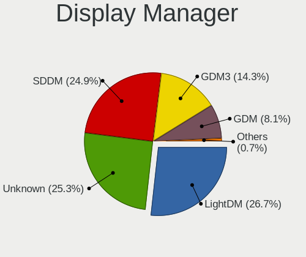

| Name    | Computers | Percent |
|---------|-----------|---------|
| GDM3    | 76        | 23.17%  |
| Unknown | 72        | 21.95%  |
| LightDM | 62        | 18.9%   |
| SDDM    | 57        | 17.38%  |
| GDM     | 57        | 17.38%  |
| XDM     | 2         | 0.61%   |
| SLiM    | 1         | 0.3%    |
| GREETD  | 1         | 0.3%    |

OS Lang
-------

Language

| Lang    | Computers | Percent |
|---------|-----------|---------|
| it_IT   | 208       | 63.41%  |
| en_US   | 98        | 29.88%  |
| en_GB   | 10        | 3.05%   |
| C       | 5         | 1.52%   |
| Unknown | 2         | 0.61%   |
| ru_RU   | 1         | 0.3%    |
| it_CH   | 1         | 0.3%    |
| es_ES   | 1         | 0.3%    |
| en_AG   | 1         | 0.3%    |
| de_IT   | 1         | 0.3%    |

Boot Mode
---------

EFI or BIOS

| Mode | Computers | Percent |
|------|-----------|---------|
| EFI  | 210       | 64.02%  |
| BIOS | 118       | 35.98%  |

Filesystem
----------

Type of filesystem

| Type    | Computers | Percent |
|---------|-----------|---------|
| Ext4    | 236       | 71.95%  |
| Btrfs   | 67        | 20.43%  |
| Overlay | 17        | 5.18%   |
| Zfs     | 4         | 1.22%   |
| Xfs     | 2         | 0.61%   |
| Jfs     | 1         | 0.3%    |
| Ext3    | 1         | 0.3%    |

Part. scheme
------------

Scheme of partitioning

| Type    | Computers | Percent |
|---------|-----------|---------|
| GPT     | 184       | 56.1%   |
| Unknown | 121       | 36.89%  |
| MBR     | 23        | 7.01%   |

Dual Boot with Linux/BSD
------------------------

Hosting more than one Linux/BSD

| Dual boot | Computers | Percent |
|-----------|-----------|---------|
| No        | 278       | 84.76%  |
| Yes       | 50        | 15.24%  |

Dual Boot (Win)
---------------

Hosting Linux and Windows

| Dual boot | Computers | Percent |
|-----------|-----------|---------|
| No        | 200       | 60.98%  |
| Yes       | 128       | 39.02%  |

Board
-----

Vendor
------

Motherboard manufacturer

| Name                    | Computers | Percent |
|-------------------------|-----------|---------|
| ASUSTek Computer        | 60        | 18.29%  |
| Hewlett-Packard         | 54        | 16.46%  |
| Lenovo                  | 43        | 13.11%  |
| Dell                    | 41        | 12.5%   |
| MSI                     | 24        | 7.32%   |
| Acer                    | 18        | 5.49%   |
| ASRock                  | 17        | 5.18%   |
| Gigabyte Technology     | 14        | 4.27%   |
| Apple                   | 8         | 2.44%   |
| Toshiba                 | 5         | 1.52%   |
| HUAWEI                  | 5         | 1.52%   |
| Intel                   | 4         | 1.22%   |
| Timi                    | 3         | 0.91%   |
| Samsung Electronics     | 2         | 0.61%   |
| Razer                   | 2         | 0.61%   |
| Pegatron                | 2         | 0.61%   |
| Notebook                | 2         | 0.61%   |
| Fujitsu                 | 2         | 0.61%   |
| BESSTAR Tech            | 2         | 0.61%   |
| Unknown                 | 2         | 0.61%   |
| Valve                   | 1         | 0.3%    |
| TUXEDO                  | 1         | 0.3%    |
| Supermicro              | 1         | 0.3%    |
| Sony                    | 1         | 0.3%    |
| Schenker                | 1         | 0.3%    |
| SANTECH                 | 1         | 0.3%    |
| Raspberry Pi Foundation | 1         | 0.3%    |
| PC Specialist           | 1         | 0.3%    |
| Packard Bell            | 1         | 0.3%    |
| OEM                     | 1         | 0.3%    |
| Neousys Technology      | 1         | 0.3%    |
| NEC Computers           | 1         | 0.3%    |
| Microtech               | 1         | 0.3%    |
| LG Electronics          | 1         | 0.3%    |
| Google                  | 1         | 0.3%    |
| Gateway                 | 1         | 0.3%    |
| Fujitsu Siemens         | 1         | 0.3%    |
| Chuwi                   | 1         | 0.3%    |

Model
-----

Motherboard model

| Name                               | Computers | Percent |
|------------------------------------|-----------|---------|
| MSI MS-7C56                        | 4         | 1.22%   |
| MSI MS-7B86                        | 3         | 0.91%   |
| HP 255 G8 Notebook PC              | 3         | 0.91%   |
| Unknown                            | 3         | 0.91%   |
| MSI MS-7C91                        | 2         | 0.61%   |
| MSI MS-7C37                        | 2         | 0.61%   |
| MSI MS-7B79                        | 2         | 0.61%   |
| MSI Modern 14 B11MOL               | 2         | 0.61%   |
| Lenovo IdeaPad Z510 20287          | 2         | 0.61%   |
| HP Pavilion 15                     | 2         | 0.61%   |
| HP Laptop 15s-eq2xxx               | 2         | 0.61%   |
| HP ENVY x360 Convertible 13-ay0xxx | 2         | 0.61%   |
| HP EliteBook x360 1030 G2          | 2         | 0.61%   |
| HP Compaq Elite 8300 SFF           | 2         | 0.61%   |
| HP 250 G8 Notebook PC              | 2         | 0.61%   |
| Gigabyte X470 AORUS ULTRA GAMING   | 2         | 0.61%   |
| Dell XPS 15 9570                   | 2         | 0.61%   |
| Dell OptiPlex 7010                 | 2         | 0.61%   |
| Dell Latitude 5420                 | 2         | 0.61%   |
| ASUS UX310UQK                      | 2         | 0.61%   |
| ASUS TUF Gaming B550-PLUS          | 2         | 0.61%   |
| ASUS PRIME A320M-K                 | 2         | 0.61%   |
| ASUS All Series                    | 2         | 0.61%   |
| ASRock Q1900M                      | 2         | 0.61%   |
| Apple MacBook5,1                   | 2         | 0.61%   |
| Acer Aspire A515-51G               | 2         | 0.61%   |
| Valve Jupiter                      | 1         | 0.3%    |
| TUXEDO Book XP14 Gen12             | 1         | 0.3%    |
| Toshiba Satellite Pro L450         | 1         | 0.3%    |
| Toshiba Satellite Pro C660         | 1         | 0.3%    |
| Toshiba Satellite L50-B            | 1         | 0.3%    |
| Toshiba Satellite C660             | 1         | 0.3%    |
| Toshiba PORTEGE Z30-B              | 1         | 0.3%    |
| Timi TM1701                        | 1         | 0.3%    |
| Timi RedmiBook Pro 15S             | 1         | 0.3%    |
| Timi A35S                          | 1         | 0.3%    |
| Supermicro C7P67                   | 1         | 0.3%    |
| Sony SVE1512J6EW                   | 1         | 0.3%    |
| Schenker XMG NEO (CZN/E21)         | 1         | 0.3%    |
| SANTECH NHx0EH_EJ_EK               | 1         | 0.3%    |

Model Family
------------

Motherboard model prefix

| Name               | Computers | Percent |
|--------------------|-----------|---------|
| Lenovo ThinkPad    | 19        | 5.79%   |
| HP Pavilion        | 11        | 3.35%   |
| Acer Aspire        | 11        | 3.35%   |
| Dell XPS           | 10        | 3.05%   |
| Dell Latitude      | 9         | 2.74%   |
| Dell OptiPlex      | 8         | 2.44%   |
| HP Laptop          | 7         | 2.13%   |
| ASUS ROG           | 7         | 2.13%   |
| Lenovo IdeaPad     | 6         | 1.83%   |
| Dell Inspiron      | 6         | 1.83%   |
| ASUS PRIME         | 6         | 1.83%   |
| HP ProBook         | 5         | 1.52%   |
| HP ENVY            | 5         | 1.52%   |
| HP EliteBook       | 5         | 1.52%   |
| HP 255             | 5         | 1.52%   |
| Toshiba Satellite  | 4         | 1.22%   |
| MSI MS-7C56        | 4         | 1.22%   |
| Lenovo ThinkBook   | 4         | 1.22%   |
| ASUS VivoBook      | 4         | 1.22%   |
| ASUS TUF           | 4         | 1.22%   |
| MSI MS-7B86        | 3         | 0.91%   |
| Lenovo Yoga        | 3         | 0.91%   |
| Lenovo ThinkCentre | 3         | 0.91%   |
| Lenovo IdeaCentre  | 3         | 0.91%   |
| HP 250             | 3         | 0.91%   |
| Dell Vostro        | 3         | 0.91%   |
| Dell Precision     | 3         | 0.91%   |
| Acer Swift         | 3         | 0.91%   |
| Unknown            | 3         | 0.91%   |
| Razer Blade        | 2         | 0.61%   |
| MSI Prestige       | 2         | 0.61%   |
| MSI MS-7C91        | 2         | 0.61%   |
| MSI MS-7C37        | 2         | 0.61%   |
| MSI MS-7B79        | 2         | 0.61%   |
| MSI Modern         | 2         | 0.61%   |
| HP Compaq          | 2         | 0.61%   |
| Gigabyte Z390      | 2         | 0.61%   |
| Gigabyte X470      | 2         | 0.61%   |
| ASUS UX310UQK      | 2         | 0.61%   |
| ASUS P9X79         | 2         | 0.61%   |

MFG Year
--------

Motherboard manufacture year

| Year    | Computers | Percent |
|---------|-----------|---------|
| 2020    | 52        | 15.85%  |
| 2021    | 35        | 10.67%  |
| 2019    | 31        | 9.45%   |
| 2018    | 31        | 9.45%   |
| 2017    | 30        | 9.15%   |
| 2013    | 24        | 7.32%   |
| 2012    | 18        | 5.49%   |
| 2015    | 16        | 4.88%   |
| 2022    | 14        | 4.27%   |
| 2014    | 13        | 3.96%   |
| 2011    | 13        | 3.96%   |
| 2016    | 12        | 3.66%   |
| 2009    | 12        | 3.66%   |
| 2010    | 10        | 3.05%   |
| 2007    | 8         | 2.44%   |
| 2008    | 5         | 1.52%   |
| 2006    | 3         | 0.91%   |
| Unknown | 1         | 0.3%    |

Form Factor
-----------

Physical design of the computer

| Name           | Computers | Percent |
|----------------|-----------|---------|
| Notebook       | 187       | 57.01%  |
| Desktop        | 118       | 35.98%  |
| Convertible    | 15        | 4.57%   |
| Mini pc        | 4         | 1.22%   |
| System on chip | 1         | 0.3%    |
| Tablet         | 1         | 0.3%    |
| All in one     | 1         | 0.3%    |
| Server         | 1         | 0.3%    |

Secure Boot
-----------

Enabled or disabled

| State    | Computers | Percent |
|----------|-----------|---------|
| Disabled | 301       | 91.77%  |
| Enabled  | 27        | 8.23%   |

Coreboot
--------

Have coreboot on board

| Used | Computers | Percent |
|------|-----------|---------|
| No   | 326       | 99.39%  |
| Yes  | 2         | 0.61%   |

RAM Size
--------

Total RAM memory

| Size in GB  | Computers | Percent |
|-------------|-----------|---------|
| 16.01-24.0  | 85        | 25.91%  |
| 4.01-8.0    | 80        | 24.39%  |
| 8.01-16.0   | 69        | 21.04%  |
| 3.01-4.0    | 40        | 12.2%   |
| 32.01-64.0  | 36        | 10.98%  |
| 24.01-32.0  | 5         | 1.52%   |
| 2.01-3.0    | 5         | 1.52%   |
| 64.01-256.0 | 4         | 1.22%   |
| 1.01-2.0    | 3         | 0.91%   |
| 0.51-1.0    | 1         | 0.3%    |

RAM Used
--------

Used RAM memory

| Used GB    | Computers | Percent |
|------------|-----------|---------|
| 2.01-3.0   | 86        | 26.22%  |
| 1.01-2.0   | 79        | 24.09%  |
| 4.01-8.0   | 68        | 20.73%  |
| 3.01-4.0   | 67        | 20.43%  |
| 8.01-16.0  | 18        | 5.49%   |
| 0.51-1.0   | 8         | 2.44%   |
| 16.01-24.0 | 1         | 0.3%    |
| 0.01-0.5   | 1         | 0.3%    |

Total Drives
------------

Number of drives on board

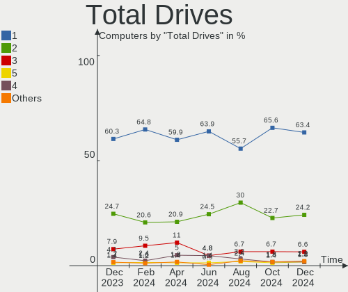

| Drives | Computers | Percent |
|--------|-----------|---------|
| 1      | 192       | 58.54%  |
| 2      | 82        | 25%     |
| 3      | 30        | 9.15%   |
| 4      | 19        | 5.79%   |
| 5      | 3         | 0.91%   |
| 0      | 2         | 0.61%   |

Has CD-ROM
----------

Has CD-ROM on board

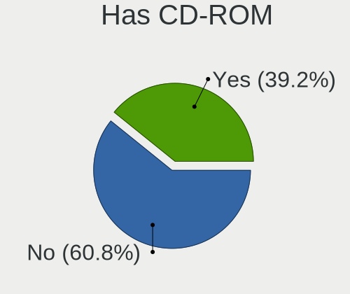

| Presented | Computers | Percent |
|-----------|-----------|---------|
| No        | 212       | 64.63%  |
| Yes       | 116       | 35.37%  |

Has Ethernet
------------

Has Ethernet on board

| Presented | Computers | Percent |
|-----------|-----------|---------|
| Yes       | 256       | 78.05%  |
| No        | 72        | 21.95%  |

Has WiFi
--------

Has WiFi module

| Presented | Computers | Percent |
|-----------|-----------|---------|
| Yes       | 264       | 80.49%  |
| No        | 64        | 19.51%  |

Has Bluetooth
-------------

Has Bluetooth module

| Presented | Computers | Percent |
|-----------|-----------|---------|
| Yes       | 236       | 71.95%  |
| No        | 92        | 28.05%  |

Location
--------

Country
-------

Geographic location (country)

| Country | Computers | Percent |
|---------|-----------|---------|
| Italy   | 328       | 100%    |

City
----

Geographic location (city)

| City                              | Computers | Percent |
|-----------------------------------|-----------|---------|
| Milan                             | 43        | 13.11%  |
| Rome                              | 31        | 9.45%   |
| Turin                             | 11        | 3.35%   |
| Bologna                           | 10        | 3.05%   |
| Verona                            | 9         | 2.74%   |
| Florence                          | 7         | 2.13%   |
| Rho                               | 6         | 1.83%   |
| Naples                            | 6         | 1.83%   |
| Palermo                           | 5         | 1.52%   |
| Pozza di Fassa                    | 4         | 1.22%   |
| Cagliari                          | 4         | 1.22%   |
| Bari                              | 4         | 1.22%   |
| Sesto San Giovanni                | 3         | 0.91%   |
| Genoa                             | 3         | 0.91%   |
| Galati Mamertino                  | 3         | 0.91%   |
| Bitonto                           | 3         | 0.91%   |
| Venice                            | 2         | 0.61%   |
| Santa Maria di Sala               | 2         | 0.61%   |
| Rozzano                           | 2         | 0.61%   |
| Reggio Calabria                   | 2         | 0.61%   |
| Padova                            | 2         | 0.61%   |
| Monza                             | 2         | 0.61%   |
| Madone                            | 2         | 0.61%   |
| Lucca                             | 2         | 0.61%   |
| Limena                            | 2         | 0.61%   |
| Grosseto                          | 2         | 0.61%   |
| Granarolo dell'Emilia e Viadagola | 2         | 0.61%   |
| Fucecchio                         | 2         | 0.61%   |
| Camponogara                       | 2         | 0.61%   |
| Campogalliano                     | 2         | 0.61%   |
| Brescia                           | 2         | 0.61%   |
| Alessandria                       | 2         | 0.61%   |
| Zambana                           | 1         | 0.3%    |
| Vitinia                           | 1         | 0.3%    |
| Vignola                           | 1         | 0.3%    |
| Varese                            | 1         | 0.3%    |
| Valdagno                          | 1         | 0.3%    |
| Vado Ligure                       | 1         | 0.3%    |
| Uzzano                            | 1         | 0.3%    |
| Udine                             | 1         | 0.3%    |

Drives
------

Drive Vendor
------------

Hard drive vendors

| Vendor                      | Computers | Drives | Percent |
|-----------------------------|-----------|--------|---------|
| Samsung Electronics         | 96        | 117    | 20%     |
| WDC                         | 61        | 73     | 12.71%  |
| Seagate                     | 52        | 64     | 10.83%  |
| Kingston                    | 38        | 39     | 7.92%   |
| Crucial                     | 35        | 38     | 7.29%   |
| SanDisk                     | 33        | 35     | 6.88%   |
| Toshiba                     | 32        | 32     | 6.67%   |
| Unknown                     | 14        | 14     | 2.92%   |
| SK hynix                    | 12        | 12     | 2.5%    |
| Phison                      | 10        | 10     | 2.08%   |
| Micron Technology           | 9         | 9      | 1.88%   |
| Intel                       | 8         | 8      | 1.67%   |
| HGST                        | 8         | 8      | 1.67%   |
| Hitachi                     | 7         | 7      | 1.46%   |
| Phison Electronics          | 5         | 6      | 1.04%   |
| KIOXIA                      | 5         | 6      | 1.04%   |
| PNY                         | 4         | 4      | 0.83%   |
| China                       | 4         | 4      | 0.83%   |
| Apple                       | 4         | 4      | 0.83%   |
| Team                        | 3         | 3      | 0.63%   |
| SPCC                        | 3         | 3      | 0.63%   |
| Maxtor                      | 3         | 4      | 0.63%   |
| Unknown                     | 3         | 3      | 0.63%   |
| Drevo                       | 2         | 2      | 0.42%   |
| A-DATA Technology           | 2         | 2      | 0.42%   |
| WD MediaMax                 | 1         | 1      | 0.21%   |
| Union Memory (Shenzhen)     | 1         | 1      | 0.21%   |
| TrekStor                    | 1         | 1      | 0.21%   |
| Transcend                   | 1         | 1      | 0.21%   |
| Teclast                     | 1         | 1      | 0.21%   |
| TCSUNBOW                    | 1         | 1      | 0.21%   |
| Silicon Motion              | 1         | 1      | 0.21%   |
| S3+                         | 1         | 1      | 0.21%   |
| Realtek Semiconductor       | 1         | 1      | 0.21%   |
| Plextor                     | 1         | 1      | 0.21%   |
| Patriot                     | 1         | 1      | 0.21%   |
| MAXIO Technology (Hangzhou) | 1         | 1      | 0.21%   |
| LITEONIT                    | 1         | 1      | 0.21%   |
| LITEON                      | 1         | 1      | 0.21%   |
| Lite-On                     | 1         | 1      | 0.21%   |

Drive Model
-----------

Hard drive models

| Model                                                 | Computers | Percent |
|-------------------------------------------------------|-----------|---------|
| Kingston SA400S37240G 240GB SSD                       | 11        | 2.08%   |
| Samsung NVMe SSD Controller SM981/PM981/PM983 256GB   | 10        | 1.89%   |
| Samsung SSD 860 EVO 500GB                             | 8         | 1.52%   |
| Crucial CT500MX500SSD1 500GB                          | 8         | 1.52%   |
| Crucial CT480BX500SSD1 480GB                          | 7         | 1.33%   |
| Samsung SSD 850 EVO 250GB                             | 6         | 1.14%   |
| Toshiba DT01ACA100 1TB                                | 5         | 0.95%   |
| Samsung SSD 860 EVO 250GB                             | 5         | 0.95%   |
| Kingston SA400S37480G 480GB SSD                       | 5         | 0.95%   |
| Crucial CT240BX500SSD1 240GB                          | 5         | 0.95%   |
| Samsung SSD 860 EVO 1TB                               | 4         | 0.76%   |
| Samsung NVMe SSD Controller PM9A1/PM9A3/980PRO 1024GB | 4         | 0.76%   |
| Samsung MZALQ512HALU-000L2 512GB                      | 4         | 0.76%   |
| Kingston SV300S37A120G 120GB SSD                      | 4         | 0.76%   |
| HGST HTS545050A7E680 500GB                            | 4         | 0.76%   |
| Toshiba MQ01ABF050 500GB                              | 3         | 0.57%   |
| Seagate ST500DM002-1BD142 500GB                       | 3         | 0.57%   |
| Seagate ST4000DM004-2CV104 4TB                        | 3         | 0.57%   |
| Seagate ST2000DM001-1ER164 2TB                        | 3         | 0.57%   |
| Seagate ST2000DM001-1CH164 2TB                        | 3         | 0.57%   |
| Seagate ST1000DM003-1CH162 1TB                        | 3         | 0.57%   |
| Sandisk WD Blue SN500 / PC SN520 NVMe SSD 256GB       | 3         | 0.57%   |
| Samsung SSD 970 EVO Plus 250GB                        | 3         | 0.57%   |
| Samsung SSD 970 EVO Plus 1TB                          | 3         | 0.57%   |
| Samsung SSD 870 QVO 1TB                               | 3         | 0.57%   |
| Samsung SSD 850 EVO 500GB                             | 3         | 0.57%   |
| Samsung SSD 840 EVO 250GB                             | 3         | 0.57%   |
| Samsung NVMe SSD Controller SM961/PM961/SM963 256GB   | 3         | 0.57%   |
| Phison NVMe SSD Drive 512GB                           | 3         | 0.57%   |
| Phison PS5013 E13 NVMe Controller 512GB               | 3         | 0.57%   |
| KIOXIA NVMe SSD Drive 256GB                           | 3         | 0.57%   |
| Kingston SA400S37120G 120GB SSD                       | 3         | 0.57%   |
| Kingston SA2000M8250G 250GB                           | 3         | 0.57%   |
| Crucial CT250MX500SSD1 250GB                          | 3         | 0.57%   |
| Unknown                                               | 3         | 0.57%   |
| WDC WDS500G2B0B-00YS70 500GB SSD                      | 2         | 0.38%   |
| WDC WDS250G2B0A-00SM50 250GB SSD                      | 2         | 0.38%   |
| WDC WDS100T2B0C 1TB                                   | 2         | 0.38%   |
| WDC WD5000AAKX-60U6AA0 500GB                          | 2         | 0.38%   |
| WDC WD1600BEVT-22ZCT0 160GB                           | 2         | 0.38%   |

HDD Vendor
----------

Hard disk drive vendors

| Vendor              | Computers | Drives | Percent |
|---------------------|-----------|--------|---------|
| Seagate             | 49        | 60     | 34.27%  |
| WDC                 | 44        | 52     | 30.77%  |
| Toshiba             | 22        | 22     | 15.38%  |
| HGST                | 8         | 8      | 5.59%   |
| Hitachi             | 7         | 7      | 4.9%    |
| Samsung Electronics | 5         | 5      | 3.5%    |
| Maxtor              | 3         | 4      | 2.1%    |
| WD MediaMax         | 1         | 1      | 0.7%    |
| Generic-            | 1         | 1      | 0.7%    |
| Fujitsu             | 1         | 1      | 0.7%    |
| ASMT                | 1         | 1      | 0.7%    |
| Apple               | 1         | 1      | 0.7%    |

SSD Vendor
----------

Solid state drive vendors

| Vendor              | Computers | Drives | Percent |
|---------------------|-----------|--------|---------|
| Samsung Electronics | 43        | 55     | 25.44%  |
| Crucial             | 32        | 34     | 18.93%  |
| Kingston            | 28        | 29     | 16.57%  |
| SanDisk             | 20        | 22     | 11.83%  |
| WDC                 | 5         | 6      | 2.96%   |
| SK hynix            | 4         | 4      | 2.37%   |
| China               | 4         | 4      | 2.37%   |
| Toshiba             | 3         | 3      | 1.78%   |
| PNY                 | 3         | 3      | 1.78%   |
| Micron Technology   | 3         | 3      | 1.78%   |
| Team                | 2         | 2      | 1.18%   |
| SPCC                | 2         | 2      | 1.18%   |
| Drevo               | 2         | 2      | 1.18%   |
| Apple               | 2         | 2      | 1.18%   |
| TrekStor            | 1         | 1      | 0.59%   |
| Transcend           | 1         | 1      | 0.59%   |
| Teclast             | 1         | 1      | 0.59%   |
| TCSUNBOW            | 1         | 1      | 0.59%   |
| S3+                 | 1         | 1      | 0.59%   |
| Plextor             | 1         | 1      | 0.59%   |
| Patriot             | 1         | 1      | 0.59%   |
| LITEONIT            | 1         | 1      | 0.59%   |
| LITEON              | 1         | 1      | 0.59%   |
| Lexar               | 1         | 1      | 0.59%   |
| KingDian            | 1         | 1      | 0.59%   |
| Corsair             | 1         | 3      | 0.59%   |
| BAITITON            | 1         | 1      | 0.59%   |
| Advantech           | 1         | 1      | 0.59%   |
| A-DATA Technology   | 1         | 1      | 0.59%   |
| Unknown             | 1         | 1      | 0.59%   |

Drive Kind
----------

HDD or SSD

| Kind    | Computers | Drives | Percent |
|---------|-----------|--------|---------|
| SSD     | 152       | 189    | 33.93%  |
| NVMe    | 148       | 161    | 33.04%  |
| HDD     | 125       | 163    | 27.9%   |
| MMC     | 16        | 16     | 3.57%   |
| Unknown | 7         | 7      | 1.56%   |

Drive Connector
---------------

SATA, SAS, NVMe, etc.

| Type | Computers | Drives | Percent |
|------|-----------|--------|---------|
| SATA | 210       | 343    | 54.12%  |
| NVMe | 148       | 161    | 38.14%  |
| MMC  | 16        | 16     | 4.12%   |
| SAS  | 14        | 16     | 3.61%   |

Drive Size
----------

Size of hard drive

| Size in TB | Computers | Drives | Percent |
|------------|-----------|--------|---------|
| 0.01-0.5   | 172       | 228    | 62.09%  |
| 0.51-1.0   | 67        | 79     | 24.19%  |
| 1.01-2.0   | 23        | 29     | 8.3%    |
| 3.01-4.0   | 8         | 9      | 2.89%   |
| 2.01-3.0   | 5         | 5      | 1.81%   |
| 4.01-10.0  | 2         | 2      | 0.72%   |

Space Total
-----------

Amount of disk space available on the file system

| Size in GB     | Computers | Percent |
|----------------|-----------|---------|
| 101-250        | 95        | 28.96%  |
| 251-500        | 72        | 21.95%  |
| 501-1000       | 44        | 13.41%  |
| 1-20           | 30        | 9.15%   |
| 1001-2000      | 26        | 7.93%   |
| More than 3000 | 25        | 7.62%   |
| 51-100         | 12        | 3.66%   |
| 2001-3000      | 11        | 3.35%   |
| 21-50          | 7         | 2.13%   |
| Unknown        | 6         | 1.83%   |

Space Used
----------

Amount of used disk space

| Used GB        | Computers | Percent |
|----------------|-----------|---------|
| 1-20           | 97        | 29.57%  |
| 21-50          | 49        | 14.94%  |
| 101-250        | 44        | 13.41%  |
| 51-100         | 42        | 12.8%   |
| 251-500        | 34        | 10.37%  |
| 501-1000       | 24        | 7.32%   |
| 1001-2000      | 14        | 4.27%   |
| More than 3000 | 10        | 3.05%   |
| 2001-3000      | 8         | 2.44%   |
| Unknown        | 6         | 1.83%   |

Malfunc. Drives
---------------

Drive models with a malfunction

| Model                                            | Computers | Drives | Percent |
|--------------------------------------------------|-----------|--------|---------|
| HGST HTS545050A7E680 500GB                       | 3         | 3      | 11.11%  |
| WDC WD5000AAKX-00ERMA0 500GB                     | 1         | 1      | 3.7%    |
| WDC WD5000AAKS-00A7B0 500GB                      | 1         | 1      | 3.7%    |
| WDC WD5000AADS-00S9B0 500GB                      | 1         | 1      | 3.7%    |
| WDC WD40PURZ-85TTDY0 4TB                         | 1         | 1      | 3.7%    |
| WDC WD2002FAEX-00MJRA0 2TB                       | 1         | 1      | 3.7%    |
| WDC WD10JPVX-22JC3T0 1TB                         | 1         | 1      | 3.7%    |
| WDC WD10EARS-00Y5B1 1TB                          | 1         | 1      | 3.7%    |
| WDC WD10EARS-00MVWB0 1TB                         | 1         | 1      | 3.7%    |
| WDC WD10EADS-00P8B0 1TB                          | 1         | 1      | 3.7%    |
| WD MediaMax WL2000GSA6454G 2TB                   | 1         | 1      | 3.7%    |
| Toshiba MQ04ABF100 1TB                           | 1         | 1      | 3.7%    |
| SK hynix HFS512G39TND-N210A 512GB SSD            | 1         | 1      | 3.7%    |
| SK hynix HFS256G39TND-N210A 256GB SSD            | 1         | 1      | 3.7%    |
| SK hynix HFS128G39TND-N210A 128GB SSD            | 1         | 1      | 3.7%    |
| Seagate ST500DM002-1BD142 500GB                  | 1         | 1      | 3.7%    |
| Seagate ST2000DM001-1CH164 2TB                   | 1         | 1      | 3.7%    |
| Seagate ST1000LM014-SSHD-8GB                     | 1         | 1      | 3.7%    |
| Samsung Electronics SP2504C 250GB                | 1         | 1      | 3.7%    |
| Samsung Electronics MZHPV256HDGL-00000 256GB SSD | 1         | 1      | 3.7%    |
| Samsung Electronics HM321HI 320GB                | 1         | 1      | 3.7%    |
| Micron Technology MTFDDAV256TBN 256GB SSD        | 1         | 1      | 3.7%    |
| Kingston SA400S37120G 120GB SSD                  | 1         | 1      | 3.7%    |
| Crucial CT128M550SSD1 128GB                      | 1         | 1      | 3.7%    |
| BAITITON BT58SSD09S 240GB                        | 1         | 1      | 3.7%    |

Malfunc. Drive Vendor
---------------------

Vendors of faulty drives

| Vendor              | Computers | Drives | Percent |
|---------------------|-----------|--------|---------|
| WDC                 | 8         | 9      | 30.77%  |
| SK hynix            | 3         | 3      | 11.54%  |
| Seagate             | 3         | 3      | 11.54%  |
| Samsung Electronics | 3         | 3      | 11.54%  |
| HGST                | 3         | 3      | 11.54%  |
| WD MediaMax         | 1         | 1      | 3.85%   |
| Toshiba             | 1         | 1      | 3.85%   |
| Micron Technology   | 1         | 1      | 3.85%   |
| Kingston            | 1         | 1      | 3.85%   |
| Crucial             | 1         | 1      | 3.85%   |
| BAITITON            | 1         | 1      | 3.85%   |

Malfunc. HDD Vendor
-------------------

Vendors of faulty HDD drives

| Vendor              | Computers | Drives | Percent |
|---------------------|-----------|--------|---------|
| WDC                 | 8         | 9      | 44.44%  |
| Seagate             | 3         | 3      | 16.67%  |
| HGST                | 3         | 3      | 16.67%  |
| Samsung Electronics | 2         | 2      | 11.11%  |
| WD MediaMax         | 1         | 1      | 5.56%   |
| Toshiba             | 1         | 1      | 5.56%   |

Malfunc. Drive Kind
-------------------

Kinds of faulty drives

| Kind | Computers | Drives | Percent |
|------|-----------|--------|---------|
| HDD  | 18        | 19     | 69.23%  |
| SSD  | 8         | 8      | 30.77%  |

Failed Drives
-------------

Failed drive models

Zero info for selected period =(

Failed Drive Vendor
-------------------

Failed drive vendors

Zero info for selected period =(

Drive Status
------------

Number of failed and malfunc. drives

| Status   | Computers | Drives | Percent |
|----------|-----------|--------|---------|
| Works    | 192       | 283    | 52.89%  |
| Detected | 145       | 226    | 39.94%  |
| Malfunc  | 26        | 27     | 7.16%   |

Storage controller
------------------

Storage Vendor
--------------

Storage controller vendors

| Vendor                       | Computers | Percent |
|------------------------------|-----------|---------|
| Intel                        | 196       | 45.06%  |
| Samsung Electronics          | 59        | 13.56%  |
| AMD                          | 59        | 13.56%  |
| SanDisk                      | 27        | 6.21%   |
| Phison Electronics           | 15        | 3.45%   |
| Kingston Technology Company  | 11        | 2.53%   |
| ASMedia Technology           | 9         | 2.07%   |
| SK hynix                     | 8         | 1.84%   |
| Nvidia                       | 7         | 1.61%   |
| KIOXIA                       | 7         | 1.61%   |
| Toshiba America Info Systems | 6         | 1.38%   |
| Micron Technology            | 6         | 1.38%   |
| JMicron Technology           | 6         | 1.38%   |
| Marvell Technology Group     | 5         | 1.15%   |
| Micron/Crucial Technology    | 4         | 0.92%   |
| Realtek Semiconductor        | 3         | 0.69%   |
| VIA Technologies             | 2         | 0.46%   |
| Union Memory (Shenzhen)      | 1         | 0.23%   |
| Silicon Motion               | 1         | 0.23%   |
| MAXIO Technology (Hangzhou)  | 1         | 0.23%   |
| Lite-On Technology           | 1         | 0.23%   |
| Apple                        | 1         | 0.23%   |

Storage Model
-------------

Storage controller models

| Model                                                                            | Computers | Percent |
|----------------------------------------------------------------------------------|-----------|---------|
| AMD FCH SATA Controller [AHCI mode]                                              | 42        | 8.5%    |
| Samsung NVMe SSD Controller SM981/PM981/PM983                                    | 23        | 4.66%   |
| Intel Volume Management Device NVMe RAID Controller                              | 20        | 4.05%   |
| Intel Sunrise Point-LP SATA Controller [AHCI mode]                               | 17        | 3.44%   |
| Samsung NVMe SSD Controller 980                                                  | 16        | 3.24%   |
| AMD 400 Series Chipset SATA Controller                                           | 14        | 2.83%   |
| Intel 82801 Mobile SATA Controller [RAID mode]                                   | 13        | 2.63%   |
| Intel 8 Series/C220 Series Chipset Family 6-port SATA Controller 1 [AHCI mode]   | 13        | 2.63%   |
| Samsung NVMe SSD Controller PM9A1/PM9A3/980PRO                                   | 11        | 2.23%   |
| Intel 7 Series Chipset Family 6-port SATA Controller [AHCI mode]                 | 11        | 2.23%   |
| SanDisk WD Blue SN550 NVMe SSD                                                   | 9         | 1.82%   |
| Intel 7 Series/C210 Series Chipset Family 6-port SATA Controller [AHCI mode]     | 9         | 1.82%   |
| ASMedia ASM1062 Serial ATA Controller                                            | 9         | 1.82%   |
| AMD 500 Series Chipset SATA Controller                                           | 9         | 1.82%   |
| Phison E12 NVMe Controller                                                       | 8         | 1.62%   |
| Intel 6 Series/C200 Series Chipset Family 6 port Mobile SATA AHCI Controller     | 8         | 1.62%   |
| Intel SATA Controller [RAID mode]                                                | 7         | 1.42%   |
| Intel Comet Lake SATA AHCI Controller                                            | 7         | 1.42%   |
| Samsung NVMe SSD Controller SM961/PM961/SM963                                    | 6         | 1.21%   |
| Micron Non-Volatile memory controller                                            | 6         | 1.21%   |
| KIOXIA NVMe SSD Controller BG4                                                   | 6         | 1.21%   |
| Intel Wildcat Point-LP SATA Controller [AHCI Mode]                               | 6         | 1.21%   |
| Intel Tiger Lake-LP SATA Controller                                              | 6         | 1.21%   |
| Intel HM170/QM170 Chipset SATA Controller [AHCI Mode]                            | 6         | 1.21%   |
| Intel Cannon Lake PCH SATA AHCI Controller                                       | 6         | 1.21%   |
| Intel 82801IBM/IEM (ICH9M/ICH9M-E) 4 port SATA Controller [AHCI mode]            | 6         | 1.21%   |
| SK hynix Gold P31 SSD                                                            | 5         | 1.01%   |
| SanDisk WD Blue SN500 / PC SN520 NVMe SSD                                        | 5         | 1.01%   |
| SanDisk Non-Volatile memory controller                                           | 5         | 1.01%   |
| Phison PS5013 E13 NVMe Controller                                                | 5         | 1.01%   |
| JMicron JMB363 SATA/IDE Controller                                               | 5         | 1.01%   |
| Intel SSD 660P Series                                                            | 5         | 1.01%   |
| Intel Q170/Q150/B150/H170/H110/Z170/CM236 Chipset SATA Controller [AHCI Mode]    | 5         | 1.01%   |
| Kingston Company Company Non-Volatile memory controller                          | 4         | 0.81%   |
| Kingston Company A2000 NVMe SSD                                                  | 4         | 0.81%   |
| Intel Cannon Lake Mobile PCH SATA AHCI Controller                                | 4         | 0.81%   |
| Intel Atom/Celeron/Pentium Processor x5-E8000/J3xxx/N3xxx Series SATA Controller | 4         | 0.81%   |
| Intel 6 Series/C200 Series Chipset Family 6 port Desktop SATA AHCI Controller    | 4         | 0.81%   |
| SanDisk WD Black SN750 / PC SN730 NVMe SSD                                       | 3         | 0.61%   |
| Realtek Realtek Non-Volatile memory controller                                   | 3         | 0.61%   |

Storage Kind
------------

Kind of storage controller (IDE, SATA, NVMe, SAS, ...)

| Kind | Computers | Percent |
|------|-----------|---------|
| SATA | 212       | 49.07%  |
| NVMe | 149       | 34.49%  |
| RAID | 40        | 9.26%   |
| IDE  | 31        | 7.18%   |

Processor
---------

CPU Vendor
----------

Processor vendors

| Vendor | Computers | Percent |
|--------|-----------|---------|
| Intel  | 244       | 74.39%  |
| AMD    | 83        | 25.3%   |
| ARM    | 1         | 0.3%    |

CPU Model
---------

Processor models

| Model                                   | Computers | Percent |
|-----------------------------------------|-----------|---------|
| Intel 11th Gen Core i7-1165G7 @ 2.80GHz | 11        | 3.35%   |
| AMD Ryzen 5 3600 6-Core Processor       | 10        | 3.05%   |
| Intel 11th Gen Core i5-1135G7 @ 2.40GHz | 8         | 2.44%   |
| Intel Core i5-10210U CPU @ 1.60GHz      | 7         | 2.13%   |
| Intel Core i7-7700HQ CPU @ 2.80GHz      | 5         | 1.52%   |
| Intel Core i5-8250U CPU @ 1.60GHz       | 5         | 1.52%   |
| AMD Ryzen 5 4500U with Radeon Graphics  | 5         | 1.52%   |
| Intel Core i7-10750H CPU @ 2.60GHz      | 4         | 1.22%   |
| Intel Core i5-7200U CPU @ 2.50GHz       | 4         | 1.22%   |
| AMD Ryzen 7 3700X 8-Core Processor      | 4         | 1.22%   |
| Intel Core i7-8750H CPU @ 2.20GHz       | 3         | 0.91%   |
| Intel Core i7-8550U CPU @ 1.80GHz       | 3         | 0.91%   |
| Intel Core i7-7500U CPU @ 2.70GHz       | 3         | 0.91%   |
| Intel Core i7-4702MQ CPU @ 2.20GHz      | 3         | 0.91%   |
| Intel Core i5-8350U CPU @ 1.70GHz       | 3         | 0.91%   |
| Intel Core i5-8265U CPU @ 1.60GHz       | 3         | 0.91%   |
| Intel Core i5-6200U CPU @ 2.30GHz       | 3         | 0.91%   |
| Intel Core i5-3470 CPU @ 3.20GHz        | 3         | 0.91%   |
| Intel Core i5-2520M CPU @ 2.50GHz       | 3         | 0.91%   |
| Intel Core i5-2400 CPU @ 3.10GHz        | 3         | 0.91%   |
| AMD Ryzen 9 5900HX with Radeon Graphics | 3         | 0.91%   |
| AMD Ryzen 7 5800H with Radeon Graphics  | 3         | 0.91%   |
| AMD Ryzen 7 5700U with Radeon Graphics  | 3         | 0.91%   |
| AMD Ryzen 7 5700G with Radeon Graphics  | 3         | 0.91%   |
| AMD Ryzen 3 3250U with Radeon Graphics  | 3         | 0.91%   |
| Intel Core i7-9750H CPU @ 2.60GHz       | 2         | 0.61%   |
| Intel Core i7-8700 CPU @ 3.20GHz        | 2         | 0.61%   |
| Intel Core i7-6700 CPU @ 3.40GHz        | 2         | 0.61%   |
| Intel Core i7-3820 CPU @ 3.60GHz        | 2         | 0.61%   |
| Intel Core i7-3630QM CPU @ 2.40GHz      | 2         | 0.61%   |
| Intel Core i7-10700 CPU @ 2.90GHz       | 2         | 0.61%   |
| Intel Core i5-7300U CPU @ 2.60GHz       | 2         | 0.61%   |
| Intel Core i5-7300HQ CPU @ 2.50GHz      | 2         | 0.61%   |
| Intel Core i5-6300U CPU @ 2.40GHz       | 2         | 0.61%   |
| Intel Core i5-5200U CPU @ 2.20GHz       | 2         | 0.61%   |
| Intel Core i5-4460 CPU @ 3.20GHz        | 2         | 0.61%   |
| Intel Core i5-3570 CPU @ 3.40GHz        | 2         | 0.61%   |
| Intel Core i5-2320 CPU @ 3.00GHz        | 2         | 0.61%   |
| Intel Core i3-5005U CPU @ 2.00GHz       | 2         | 0.61%   |
| Intel Core i3-3110M CPU @ 2.40GHz       | 2         | 0.61%   |

CPU Model Family
----------------

Processor model prefix

| Model                   | Computers | Percent |
|-------------------------|-----------|---------|
| Intel Core i5           | 77        | 23.48%  |
| Intel Core i7           | 63        | 19.21%  |
| Other                   | 37        | 11.28%  |
| AMD Ryzen 5             | 33        | 10.06%  |
| AMD Ryzen 7             | 20        | 6.1%    |
| Intel Core i3           | 16        | 4.88%   |
| Intel Celeron           | 14        | 4.27%   |
| Intel Core 2 Duo        | 13        | 3.96%   |
| AMD Ryzen 9             | 8         | 2.44%   |
| AMD Ryzen 3             | 8         | 2.44%   |
| Intel Core 2 Quad       | 5         | 1.52%   |
| Intel Xeon              | 3         | 0.91%   |
| Intel Pentium           | 3         | 0.91%   |
| Intel Pentium Dual-Core | 2         | 0.61%   |
| Intel Pentium D         | 2         | 0.61%   |
| Intel Genuine           | 2         | 0.61%   |
| Intel Core i9           | 2         | 0.61%   |
| Intel Atom              | 2         | 0.61%   |
| AMD Ryzen 7 PRO         | 2         | 0.61%   |
| AMD E1                  | 2         | 0.61%   |
| AMD Athlon II X2        | 2         | 0.61%   |
| AMD A4                  | 2         | 0.61%   |
| Intel Pentium Gold      | 1         | 0.3%    |
| Intel Pentium Dual      | 1         | 0.3%    |
| Intel Core m3           | 1         | 0.3%    |
| Intel Core M            | 1         | 0.3%    |
| Intel Core 2            | 1         | 0.3%    |
| Intel Celeron Dual-Core | 1         | 0.3%    |
| AMD Sempron             | 1         | 0.3%    |
| AMD Phenom II X4        | 1         | 0.3%    |
| AMD E2                  | 1         | 0.3%    |
| AMD A8                  | 1         | 0.3%    |

CPU Cores
---------

Number of processor cores

| Number | Computers | Percent |
|--------|-----------|---------|
| 4      | 140       | 42.68%  |
| 2      | 97        | 29.57%  |
| 6      | 44        | 13.41%  |
| 8      | 35        | 10.67%  |
| 12     | 4         | 1.22%   |
| 14     | 3         | 0.91%   |
| 1      | 3         | 0.91%   |
| 16     | 1         | 0.3%    |
| 10     | 1         | 0.3%    |

CPU Sockets
-----------

Number of sockets

| Number | Computers | Percent |
|--------|-----------|---------|
| 1      | 328       | 100%    |

CPU Threads
-----------

Threads per core (Hyper-Threading)

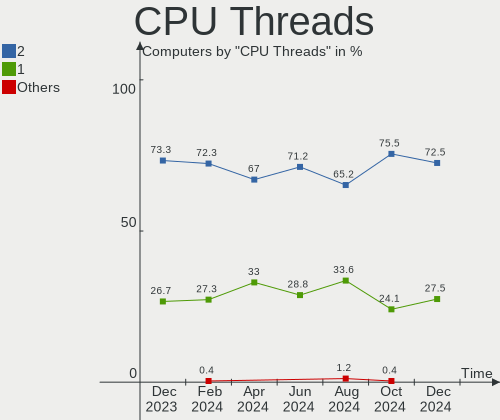

| Number | Computers | Percent |
|--------|-----------|---------|
| 2      | 229       | 69.82%  |
| 1      | 99        | 30.18%  |

CPU Op-Modes
------------

CPU Operation Modes (32-bit, 64-bit)

| Op mode        | Computers | Percent |
|----------------|-----------|---------|
| 32-bit, 64-bit | 327       | 99.7%   |
| 32-bit         | 1         | 0.3%    |

CPU Microcode
-------------

Microcode number

| Number     | Computers | Percent |
|------------|-----------|---------|
| Unknown    | 70        | 21.34%  |
| 0x806c1    | 21        | 6.4%    |
| 0x306a9    | 18        | 5.49%   |
| 0x08701021 | 15        | 4.57%   |
| 0x306c3    | 14        | 4.27%   |
| 0x806ea    | 11        | 3.35%   |
| 0x906ea    | 10        | 3.05%   |
| 0x806ec    | 10        | 3.05%   |
| 0x806e9    | 10        | 3.05%   |
| 0x206a7    | 10        | 3.05%   |
| 0x0a50000c | 8         | 2.44%   |
| 0x906e9    | 7         | 2.13%   |
| 0x506e3    | 7         | 2.13%   |
| 0x406e3    | 6         | 1.83%   |
| 0x306d4    | 6         | 1.83%   |
| 0x1067a    | 5         | 1.52%   |
| 0x406c4    | 4         | 1.22%   |
| 0x406c3    | 4         | 1.22%   |
| 0x10676    | 4         | 1.22%   |
| 0x08108109 | 4         | 1.22%   |
| 0xa0653    | 3         | 0.91%   |
| 0xa0652    | 3         | 0.91%   |
| 0x906ed    | 3         | 0.91%   |
| 0x906a3    | 3         | 0.91%   |
| 0x40651    | 3         | 0.91%   |
| 0x30678    | 3         | 0.91%   |
| 0x20652    | 3         | 0.91%   |
| 0x0a50000d | 3         | 0.91%   |
| 0x08701013 | 3         | 0.91%   |
| 0x08608103 | 3         | 0.91%   |
| 0x08600106 | 3         | 0.91%   |
| 0x07030105 | 3         | 0.91%   |
| 0xf64      | 2         | 0.61%   |
| 0x806eb    | 2         | 0.61%   |
| 0x806d1    | 2         | 0.61%   |
| 0x706e5    | 2         | 0.61%   |
| 0x6fd      | 2         | 0.61%   |
| 0x6fb      | 2         | 0.61%   |
| 0x40661    | 2         | 0.61%   |
| 0x206d7    | 2         | 0.61%   |

CPU Microarch
-------------

Microarchitecture

| Name             | Computers | Percent |
|------------------|-----------|---------|
| KabyLake         | 62        | 18.9%   |
| Zen 2            | 26        | 7.93%   |
| TigerLake        | 26        | 7.93%   |
| IvyBridge        | 23        | 7.01%   |
| Haswell          | 21        | 6.4%    |
| Zen 3            | 20        | 6.1%    |
| SandyBridge      | 19        | 5.79%   |
| Penryn           | 19        | 5.79%   |
| Unknown          | 15        | 4.57%   |
| Skylake          | 14        | 4.27%   |
| Silvermont       | 11        | 3.35%   |
| Zen+             | 10        | 3.05%   |
| CometLake        | 10        | 3.05%   |
| Broadwell        | 8         | 2.44%   |
| Zen              | 7         | 2.13%   |
| Westmere         | 5         | 1.52%   |
| Core             | 5         | 1.52%   |
| Nehalem          | 4         | 1.22%   |
| K10              | 4         | 1.22%   |
| Icelake          | 4         | 1.22%   |
| Puma             | 3         | 0.91%   |
| Piledriver       | 2         | 0.61%   |
| NetBurst         | 2         | 0.61%   |
| Goldmont plus    | 2         | 0.61%   |
| Excavator        | 2         | 0.61%   |
| Alderlake Hybrid | 2         | 0.61%   |
| P6               | 1         | 0.3%    |
| Goldmont         | 1         | 0.3%    |

Graphics
--------

GPU Vendor
----------

Vendors of graphics cards

| Vendor | Computers | Percent |
|--------|-----------|---------|
| Intel  | 183       | 46.92%  |
| Nvidia | 121       | 31.03%  |
| AMD    | 86        | 22.05%  |

GPU Model
---------

Graphics card models

| Model                                                                                    | Computers | Percent |
|------------------------------------------------------------------------------------------|-----------|---------|
| Intel TigerLake-LP GT2 [Iris Xe Graphics]                                                | 24        | 6.08%   |
| Intel UHD Graphics 620                                                                   | 13        | 3.29%   |
| Intel 2nd Generation Core Processor Family Integrated Graphics Controller                | 12        | 3.04%   |
| AMD Cezanne                                                                              | 12        | 3.04%   |
| Intel 3rd Gen Core processor Graphics Controller                                         | 10        | 2.53%   |
| Intel HD Graphics 620                                                                    | 9         | 2.28%   |
| Intel CometLake-U GT2 [UHD Graphics]                                                     | 9         | 2.28%   |
| Intel Atom/Celeron/Pentium Processor x5-E8000/J3xxx/N3xxx Integrated Graphics Controller | 8         | 2.03%   |
| AMD Picasso/Raven 2 [Radeon Vega Series / Radeon Vega Mobile Series]                     | 8         | 2.03%   |
| AMD Ellesmere [Radeon RX 470/480/570/570X/580/580X/590]                                  | 8         | 2.03%   |
| Intel HD Graphics 630                                                                    | 7         | 1.77%   |
| Intel 4th Gen Core Processor Integrated Graphics Controller                              | 7         | 1.77%   |
| AMD Renoir                                                                               | 7         | 1.77%   |
| AMD Lucienne                                                                             | 7         | 1.77%   |
| Nvidia GP107 [GeForce GTX 1050 Ti]                                                       | 6         | 1.52%   |
| Intel Skylake GT2 [HD Graphics 520]                                                      | 6         | 1.52%   |
| Intel Mobile 4 Series Chipset Integrated Graphics Controller                             | 6         | 1.52%   |
| Intel HD Graphics 5500                                                                   | 6         | 1.52%   |
| Intel CoffeeLake-H GT2 [UHD Graphics 630]                                                | 6         | 1.52%   |
| Nvidia GP107M [GeForce GTX 1050 Mobile]                                                  | 5         | 1.27%   |
| Intel Xeon E3-1200 v3/4th Gen Core Processor Integrated Graphics Controller              | 5         | 1.27%   |
| Intel Xeon E3-1200 v2/3rd Gen Core processor Graphics Controller                         | 5         | 1.27%   |
| Intel CometLake-H GT2 [UHD Graphics]                                                     | 5         | 1.27%   |
| Intel Alder Lake-P Integrated Graphics Controller                                        | 5         | 1.27%   |
| Nvidia GP108M [GeForce MX150]                                                            | 4         | 1.01%   |
| Nvidia GP106 [GeForce GTX 1060 6GB]                                                      | 4         | 1.01%   |
| Nvidia GK208M [GeForce GT 740M]                                                          | 4         | 1.01%   |
| Nvidia GK208B [GeForce GT 710]                                                           | 4         | 1.01%   |
| Intel WhiskeyLake-U GT2 [UHD Graphics 620]                                               | 4         | 1.01%   |
| Nvidia TU117M [GeForce GTX 1650 Ti Mobile]                                               | 3         | 0.76%   |
| Nvidia TU117M [GeForce GTX 1650 Mobile / Max-Q]                                          | 3         | 0.76%   |
| Nvidia TU116 [GeForce GTX 1660 SUPER]                                                    | 3         | 0.76%   |
| Nvidia TU106 [GeForce RTX 2060 Rev. A]                                                   | 3         | 0.76%   |
| Nvidia GM108M [GeForce 940MX]                                                            | 3         | 0.76%   |
| Nvidia GF119 [GeForce GT 610]                                                            | 3         | 0.76%   |
| Nvidia GF117M [GeForce 610M/710M/810M/820M / GT 620M/625M/630M/720M]                     | 3         | 0.76%   |
| Nvidia GA107M [GeForce RTX 3050 Mobile]                                                  | 3         | 0.76%   |
| Intel TigerLake-H GT1 [UHD Graphics]                                                     | 3         | 0.76%   |
| Intel Haswell-ULT Integrated Graphics Controller                                         | 3         | 0.76%   |
| AMD Navi 22 [Radeon RX 6700/6700 XT/6750 XT / 6800M]                                     | 3         | 0.76%   |

GPU Combo
---------

Combinations of graphics cards

| Name           | Computers | Percent |
|----------------|-----------|---------|
| 1 x Intel      | 124       | 37.8%   |
| 1 x AMD        | 74        | 22.56%  |
| 1 x Nvidia     | 66        | 20.12%  |
| Intel + Nvidia | 49        | 14.94%  |
| Intel + AMD    | 5         | 1.52%   |
| AMD + Nvidia   | 5         | 1.52%   |
| Other          | 1         | 0.3%    |
| 3 x AMD        | 1         | 0.3%    |
| 2 x Nvidia     | 1         | 0.3%    |
| 2 x Intel      | 1         | 0.3%    |
| 2 x AMD        | 1         | 0.3%    |

GPU Driver
----------

Free vs proprietary

| Driver      | Computers | Percent |
|-------------|-----------|---------|
| Free        | 250       | 76.22%  |
| Proprietary | 73        | 22.26%  |
| Unknown     | 5         | 1.52%   |

GPU Memory
----------

Total video memory

| Size in GB | Computers | Percent |
|------------|-----------|---------|
| Unknown    | 200       | 60.98%  |
| 0.01-0.5   | 32        | 9.76%   |
| 1.01-2.0   | 31        | 9.45%   |
| 3.01-4.0   | 19        | 5.79%   |
| 0.51-1.0   | 17        | 5.18%   |
| 7.01-8.0   | 13        | 3.96%   |
| 5.01-6.0   | 9         | 2.74%   |
| 2.01-3.0   | 4         | 1.22%   |
| 8.01-16.0  | 3         | 0.91%   |

Monitor
-------

Monitor Vendor
--------------

Monitor vendors

| Vendor                  | Computers | Percent |
|-------------------------|-----------|---------|
| Samsung Electronics     | 47        | 12.24%  |
| AU Optronics            | 44        | 11.46%  |
| BOE                     | 41        | 10.68%  |
| Chimei Innolux          | 33        | 8.59%   |
| LG Display              | 28        | 7.29%   |
| Goldstar                | 28        | 7.29%   |
| Philips                 | 17        | 4.43%   |
| Hewlett-Packard         | 14        | 3.65%   |
| AOC                     | 13        | 3.39%   |
| Dell                    | 11        | 2.86%   |
| BenQ                    | 10        | 2.6%    |
| Sharp                   | 9         | 2.34%   |
| Ancor Communications    | 9         | 2.34%   |
| Acer                    | 7         | 1.82%   |
| Chi Mei Optoelectronics | 6         | 1.56%   |
| Apple                   | 6         | 1.56%   |
| ASUSTek Computer        | 5         | 1.3%    |
| Sony                    | 4         | 1.04%   |
| Lenovo                  | 4         | 1.04%   |
| InfoVision              | 4         | 1.04%   |
| PANDA                   | 3         | 0.78%   |
| LG Philips              | 3         | 0.78%   |
| Eizo                    | 3         | 0.78%   |
| Toshiba                 | 2         | 0.52%   |
| OEM                     | 2         | 0.52%   |
| NEC Computers           | 2         | 0.52%   |
| MSI                     | 2         | 0.52%   |
| Hyundai ImageQuest      | 2         | 0.52%   |
| HannStar Display        | 2         | 0.52%   |
| HannStar                | 2         | 0.52%   |
| CVT                     | 2         | 0.52%   |
| YEY                     | 1         | 0.26%   |
| WYT                     | 1         | 0.26%   |
| Unknown (XXX)           | 1         | 0.26%   |
| Unknown (AAA)           | 1         | 0.26%   |
| TMX                     | 1         | 0.26%   |
| RTK                     | 1         | 0.26%   |
| RGT                     | 1         | 0.26%   |
| QBell                   | 1         | 0.26%   |
| Panasonic               | 1         | 0.26%   |

Monitor Model
-------------

Monitor models

| Model                                                                    | Computers | Percent |
|--------------------------------------------------------------------------|-----------|---------|
| Goldstar FULL HD GSM5B55 1920x1080 480x270mm 21.7-inch                   | 9         | 2.31%   |
| Samsung Electronics S24F350 SAM0D20 1920x1080 521x293mm 23.5-inch        | 4         | 1.03%   |
| Samsung Electronics C27F390 SAM0D32 1920x1080 600x340mm 27.2-inch        | 4         | 1.03%   |
| Samsung Electronics S24D330 SAM0D92 1920x1080 531x299mm 24.0-inch        | 3         | 0.77%   |
| Samsung Electronics S22B150 SAM08A3 1920x1080 480x270mm 21.7-inch        | 3         | 0.77%   |
| Chimei Innolux LCD Monitor CMN15DB 1366x768 344x193mm 15.5-inch          | 3         | 0.77%   |
| Chimei Innolux LCD Monitor CMN15C0 1920x1080 344x194mm 15.5-inch         | 3         | 0.77%   |
| Chimei Innolux LCD Monitor CMN14D4 1920x1080 309x173mm 13.9-inch         | 3         | 0.77%   |
| BOE LCD Monitor BOE08D7 1920x1080 309x174mm 14.0-inch                    | 3         | 0.77%   |
| BenQ EL2870U BNQ7949 3840x2160 620x340mm 27.8-inch                       | 3         | 0.77%   |
| AOC 24B2W1G5 AOC2402 1920x1080 527x296mm 23.8-inch                       | 3         | 0.77%   |
| Sony TV *30 SNY7905 3840x2160 1218x685mm 55.0-inch                       | 2         | 0.51%   |
| Sharp LCD Monitor SHP149A 1920x1080 344x194mm 15.5-inch                  | 2         | 0.51%   |
| Samsung Electronics C24F390 SAM0D2C 1920x1080 521x293mm 23.5-inch        | 2         | 0.51%   |
| Philips PHL 273V7 PHLC156 1920x1080 598x336mm 27.0-inch                  | 2         | 0.51%   |
| Philips PHL 273V5 PHLC0D2 1920x1080 598x336mm 27.0-inch                  | 2         | 0.51%   |
| OEM 19W_LCD_TV OEM3700 1920x540                                          | 2         | 0.51%   |
| LG Display LCD Monitor LGD06B3 1920x1200 336x210mm 15.6-inch             | 2         | 0.51%   |
| LG Display LCD Monitor LGD065B 1920x1080 382x215mm 17.3-inch             | 2         | 0.51%   |
| LG Display LCD Monitor LGD062E 1920x1080 344x194mm 15.5-inch             | 2         | 0.51%   |
| LG Display LCD Monitor LGD0563 1920x1080 344x194mm 15.5-inch             | 2         | 0.51%   |
| LG Display LCD Monitor LGD0521 1920x1080 309x174mm 14.0-inch             | 2         | 0.51%   |
| InfoVision LCD Monitor IVO0535 1920x1080 294x165mm 13.3-inch             | 2         | 0.51%   |
| Hewlett-Packard 24w HPN3431 1920x1080 527x296mm 23.8-inch                | 2         | 0.51%   |
| Goldstar HDR WFHD GSM7715 2560x1080 798x334mm 34.1-inch                  | 2         | 0.51%   |
| Eizo EV2450 ENC2531 1920x1080 528x297mm 23.9-inch                        | 2         | 0.51%   |
| Dell P2212H DELA07F 1920x1080 531x299mm 24.0-inch                        | 2         | 0.51%   |
| CVT CVTE TV CVT0003 1920x1080 575x323mm 26.0-inch                        | 2         | 0.51%   |
| Chi Mei Optoelectronics LCD Monitor CMO15A3 1366x768 344x193mm 15.5-inch | 2         | 0.51%   |
| BOE LCD Monitor BOE089D 1920x1080 294x165mm 13.3-inch                    | 2         | 0.51%   |
| BOE LCD Monitor BOE0872 1920x1080 344x194mm 15.5-inch                    | 2         | 0.51%   |
| BOE LCD Monitor BOE0812 1920x1080 344x194mm 15.5-inch                    | 2         | 0.51%   |
| AU Optronics LCD Monitor AUO683D 1920x1080 309x174mm 14.0-inch           | 2         | 0.51%   |
| AU Optronics LCD Monitor AUO46EC 1366x768 344x193mm 15.5-inch            | 2         | 0.51%   |
| AU Optronics LCD Monitor AUO403D 1920x1080 309x174mm 14.0-inch           | 2         | 0.51%   |
| AU Optronics LCD Monitor AUO38ED 1920x1080 344x193mm 15.5-inch           | 2         | 0.51%   |
| AU Optronics LCD Monitor AUO3791 1920x1080 344x194mm 15.5-inch           | 2         | 0.51%   |
| AU Optronics LCD Monitor AUO21ED 1920x1080 344x193mm 15.5-inch           | 2         | 0.51%   |
| AU Optronics LCD Monitor AUO142D 1920x1080 293x165mm 13.2-inch           | 2         | 0.51%   |
| AOC Q34E2G5 AOC3402 2560x1080 800x335mm 34.1-inch                        | 2         | 0.51%   |

Monitor Resolution
------------------

Monitor screen resolution

| Resolution         | Computers | Percent |
|--------------------|-----------|---------|
| 1920x1080 (FHD)    | 186       | 50.54%  |
| 1366x768 (WXGA)    | 54        | 14.67%  |
| 3840x2160 (4K)     | 28        | 7.61%   |
| 2560x1440 (QHD)    | 17        | 4.62%   |
| 1280x1024 (SXGA)   | 11        | 2.99%   |
| 1920x1200 (WUXGA)  | 10        | 2.72%   |
| 1280x800 (WXGA)    | 8         | 2.17%   |
| 3440x1440          | 6         | 1.63%   |
| 2560x1600          | 6         | 1.63%   |
| 1680x1050 (WSXGA+) | 6         | 1.63%   |
| 1600x900 (HD+)     | 6         | 1.63%   |
| 1440x900 (WXGA+)   | 6         | 1.63%   |
| 2560x1080          | 5         | 1.36%   |
| 2880x1800          | 4         | 1.09%   |
| 2160x1440          | 2         | 0.54%   |
| 1920x540           | 2         | 0.54%   |
| 1360x768           | 2         | 0.54%   |
| Unknown            | 2         | 0.54%   |
| 800x1280           | 1         | 0.27%   |
| 3840x2400          | 1         | 0.27%   |
| 3456x2160          | 1         | 0.27%   |
| 3200x2000          | 1         | 0.27%   |
| 3072x1920          | 1         | 0.27%   |
| 2732x768           | 1         | 0.27%   |
| 1280x720 (HD)      | 1         | 0.27%   |

Monitor Diagonal
----------------

Diagonal size in inches

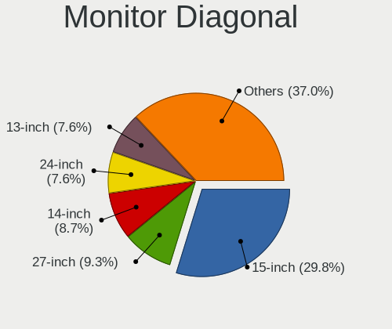

| Inches  | Computers | Percent |
|---------|-----------|---------|
| 15      | 103       | 26.89%  |
| 13      | 40        | 10.44%  |
| 24      | 38        | 9.92%   |
| 27      | 31        | 8.09%   |
| 14      | 31        | 8.09%   |
| 23      | 27        | 7.05%   |
| 21      | 25        | 6.53%   |
| 17      | 16        | 4.18%   |
| 19      | 11        | 2.87%   |
| 34      | 9         | 2.35%   |
| 18      | 9         | 2.35%   |
| Unknown | 8         | 2.09%   |
| 20      | 5         | 1.31%   |
| 31      | 4         | 1.04%   |
| 16      | 4         | 1.04%   |
| 72      | 3         | 0.78%   |
| 12      | 3         | 0.78%   |
| 65      | 2         | 0.52%   |
| 26      | 2         | 0.52%   |
| 22      | 2         | 0.52%   |
| 75      | 1         | 0.26%   |
| 54      | 1         | 0.26%   |
| 46      | 1         | 0.26%   |
| 43      | 1         | 0.26%   |
| 40      | 1         | 0.26%   |
| 37      | 1         | 0.26%   |
| 35      | 1         | 0.26%   |
| 32      | 1         | 0.26%   |
| 29      | 1         | 0.26%   |
| 25      | 1         | 0.26%   |

Monitor Width
-------------

Physical width

| Width in mm | Computers | Percent |
|-------------|-----------|---------|
| 301-350     | 152       | 40.21%  |
| 501-600     | 91        | 24.07%  |
| 401-500     | 44        | 11.64%  |
| 201-300     | 30        | 7.94%   |
| 351-400     | 22        | 5.82%   |
| 701-800     | 10        | 2.65%   |
| 601-700     | 9         | 2.38%   |
| Unknown     | 8         | 2.12%   |
| 1501-2000   | 4         | 1.06%   |
| 1001-1500   | 4         | 1.06%   |
| 801-900     | 3         | 0.79%   |
| 901-1000    | 1         | 0.26%   |

Aspect Ratio
------------

Proportional relationship between the width and the height

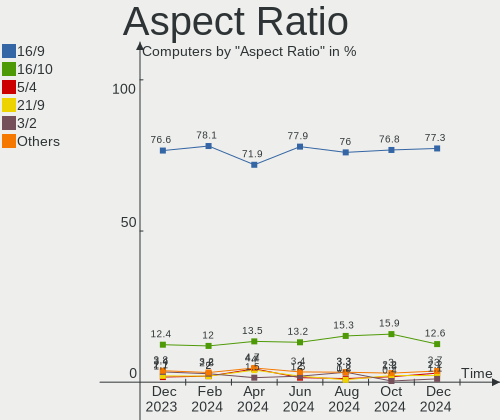

| Ratio   | Computers | Percent |
|---------|-----------|---------|
| 16/9    | 264       | 78.11%  |
| 16/10   | 46        | 13.61%  |
| 21/9    | 10        | 2.96%   |
| 5/4     | 9         | 2.66%   |
| Unknown | 5         | 1.48%   |
| 3/2     | 2         | 0.59%   |
| 4/3     | 1         | 0.3%    |
| 0.62    | 1         | 0.3%    |

Monitor Area
------------

Area in inch

| Area in inch | Computers | Percent |
|----------------|-----------|---------|
| 101-110        | 104       | 27.44%  |
| 201-250        | 73        | 19.26%  |
| 81-90          | 48        | 12.66%  |
| 301-350        | 31        | 8.18%   |
| 151-200        | 25        | 6.6%    |
| 71-80          | 23        | 6.07%   |
| 351-500        | 16        | 4.22%   |
| 251-300        | 13        | 3.43%   |
| 121-130        | 13        | 3.43%   |
| 141-150        | 8         | 2.11%   |
| Unknown        | 8         | 2.11%   |
| More than 1000 | 7         | 1.85%   |
| 501-1000       | 4         | 1.06%   |
| 61-70          | 3         | 0.79%   |
| 111-120        | 3         | 0.79%   |

Pixel Density
-------------

Pixels per inch

| Density       | Computers | Percent |
|---------------|-----------|---------|
| 51-100        | 129       | 34.96%  |
| 121-160       | 107       | 29%     |
| 101-120       | 83        | 22.49%  |
| 161-240       | 31        | 8.4%    |
| Unknown       | 8         | 2.17%   |
| More than 240 | 6         | 1.63%   |
| 1-50          | 5         | 1.36%   |

Multiple Monitors
-----------------

Total monitors connected

| Total | Computers | Percent |
|-------|-----------|---------|
| 1     | 258       | 78.66%  |
| 2     | 63        | 19.21%  |
| 0     | 4         | 1.22%   |
| 3     | 3         | 0.91%   |

Network
-------

Net Controller Vendor
---------------------

Controller vendors

| Vendor                          | Computers | Percent |
|---------------------------------|-----------|---------|
| Realtek Semiconductor           | 181       | 37.71%  |
| Intel                           | 172       | 35.83%  |
| Qualcomm Atheros                | 40        | 8.33%   |
| Broadcom                        | 25        | 5.21%   |
| TP-Link                         | 9         | 1.88%   |
| Nvidia                          | 6         | 1.25%   |
| MediaTek                        | 6         | 1.25%   |
| Broadcom Limited                | 5         | 1.04%   |
| Samsung Electronics             | 3         | 0.63%   |
| Ralink Technology               | 3         | 0.63%   |
| Microchip Technology            | 3         | 0.63%   |
| Lenovo                          | 3         | 0.63%   |
| Xiaomi                          | 2         | 0.42%   |
| VIA Technologies                | 2         | 0.42%   |
| Qualcomm Atheros Communications | 2         | 0.42%   |
| OPPO Electronics                | 2         | 0.42%   |
| Marvell Technology Group        | 2         | 0.42%   |
| Dell                            | 2         | 0.42%   |
| D-Link System                   | 2         | 0.42%   |
| Sitecom Europe                  | 1         | 0.21%   |
| Sierra Wireless                 | 1         | 0.21%   |
| OnePlus Technology (Shenzhen)   | 1         | 0.21%   |
| NetGear                         | 1         | 0.21%   |
| InterBiometrics                 | 1         | 0.21%   |
| Huawei Technologies             | 1         | 0.21%   |
| Compal Electronics              | 1         | 0.21%   |
| AVM                             | 1         | 0.21%   |
| ASIX Electronics                | 1         | 0.21%   |
| Apple                           | 1         | 0.21%   |

Net Controller Model
--------------------

Controller models

| Model                                                             | Computers | Percent |
|-------------------------------------------------------------------|-----------|---------|
| Realtek RTL8111/8168/8411 PCI Express Gigabit Ethernet Controller | 116       | 20.86%  |
| Realtek RTL810xE PCI Express Fast Ethernet controller             | 25        | 4.5%    |
| Intel Wi-Fi 6 AX200                                               | 24        | 4.32%   |
| Intel Wi-Fi 6 AX201                                               | 17        | 3.06%   |
| Intel Wireless 7265                                               | 16        | 2.88%   |
| Intel Wireless 8265 / 8275                                        | 14        | 2.52%   |
| Realtek RTL8821CE 802.11ac PCIe Wireless Network Adapter          | 12        | 2.16%   |
| Realtek RTL8153 Gigabit Ethernet Adapter                          | 11        | 1.98%   |
| Intel I211 Gigabit Network Connection                             | 11        | 1.98%   |
| Intel 82579LM Gigabit Network Connection (Lewisville)             | 11        | 1.98%   |
| Realtek RTL8822CE 802.11ac PCIe Wireless Network Adapter          | 10        | 1.8%    |
| Realtek RTL8125 2.5GbE Controller                                 | 10        | 1.8%    |
| Intel Wireless 8260                                               | 8         | 1.44%   |
| Intel Comet Lake PCH-LP CNVi WiFi                                 | 8         | 1.44%   |
| Qualcomm Atheros QCA6174 802.11ac Wireless Network Adapter        | 7         | 1.26%   |
| Intel Wireless 7260                                               | 7         | 1.26%   |
| Qualcomm Atheros AR9285 Wireless Network Adapter (PCI-Express)    | 6         | 1.08%   |
| Intel 82579V Gigabit Network Connection                           | 6         | 1.08%   |
| Realtek RTL8852AE 802.11ax PCIe Wireless Network Adapter          | 5         | 0.9%    |
| Qualcomm Atheros QCA9565 / AR9565 Wireless Network Adapter        | 5         | 0.9%    |
| Qualcomm Atheros QCA9377 802.11ac Wireless Network Adapter        | 5         | 0.9%    |
| Intel Wi-Fi 6 AX210/AX211/AX411 160MHz                            | 5         | 0.9%    |
| Intel Ethernet Connection (7) I219-V                              | 5         | 0.9%    |
| Intel Ethernet Connection (2) I219-V                              | 5         | 0.9%    |
| Intel Comet Lake PCH CNVi WiFi                                    | 5         | 0.9%    |
| Intel Alder Lake-P PCH CNVi WiFi                                  | 5         | 0.9%    |
| Broadcom BCM4313 802.11bgn Wireless Network Adapter               | 5         | 0.9%    |
| Realtek RTL8723BE PCIe Wireless Network Adapter                   | 4         | 0.72%   |
| Qualcomm Atheros AR9462 Wireless Network Adapter                  | 4         | 0.72%   |
| MediaTek MT7921 802.11ax PCI Express Wireless Network Adapter     | 4         | 0.72%   |
| Intel Wireless 3165                                               | 4         | 0.72%   |
| Intel Ethernet Connection (4) I219-LM                             | 4         | 0.72%   |
| Intel Dual Band Wireless-AC 3168NGW [Stone Peak]                  | 4         | 0.72%   |
| Intel Cannon Lake PCH CNVi WiFi                                   | 4         | 0.72%   |
| TP-Link 802.11ac NIC                                              | 3         | 0.54%   |
| Samsung Galaxy series, misc. (tethering mode)                     | 3         | 0.54%   |
| Qualcomm Atheros AR9485 Wireless Network Adapter                  | 3         | 0.54%   |
| Intel Ethernet Connection I217-LM                                 | 3         | 0.54%   |
| Intel Ethernet Connection (13) I219-V                             | 3         | 0.54%   |
| Intel Centrino Wireless-N 2230                                    | 3         | 0.54%   |

Wireless Vendor
---------------

Wireless vendors

| Vendor                          | Computers | Percent |
|---------------------------------|-----------|---------|
| Intel                           | 142       | 52.79%  |
| Realtek Semiconductor           | 47        | 17.47%  |
| Qualcomm Atheros                | 34        | 12.64%  |
| Broadcom                        | 16        | 5.95%   |
| TP-Link                         | 8         | 2.97%   |
| MediaTek                        | 6         | 2.23%   |
| Broadcom Limited                | 4         | 1.49%   |
| Ralink Technology               | 3         | 1.12%   |
| Qualcomm Atheros Communications | 2         | 0.74%   |
| D-Link System                   | 2         | 0.74%   |
| Sitecom Europe                  | 1         | 0.37%   |
| Sierra Wireless                 | 1         | 0.37%   |
| NetGear                         | 1         | 0.37%   |
| Dell                            | 1         | 0.37%   |
| AVM                             | 1         | 0.37%   |

Wireless Model
--------------

Wireless models

| Model                                                          | Computers | Percent |
|----------------------------------------------------------------|-----------|---------|
| Intel Wi-Fi 6 AX200                                            | 24        | 8.89%   |
| Intel Wi-Fi 6 AX201                                            | 17        | 6.3%    |
| Intel Wireless 7265                                            | 16        | 5.93%   |
| Intel Wireless 8265 / 8275                                     | 14        | 5.19%   |
| Realtek RTL8821CE 802.11ac PCIe Wireless Network Adapter       | 12        | 4.44%   |
| Realtek RTL8822CE 802.11ac PCIe Wireless Network Adapter       | 10        | 3.7%    |
| Intel Wireless 8260                                            | 8         | 2.96%   |
| Intel Comet Lake PCH-LP CNVi WiFi                              | 8         | 2.96%   |
| Qualcomm Atheros QCA6174 802.11ac Wireless Network Adapter     | 7         | 2.59%   |
| Intel Wireless 7260                                            | 7         | 2.59%   |
| Qualcomm Atheros AR9285 Wireless Network Adapter (PCI-Express) | 6         | 2.22%   |
| Realtek RTL8852AE 802.11ax PCIe Wireless Network Adapter       | 5         | 1.85%   |
| Qualcomm Atheros QCA9565 / AR9565 Wireless Network Adapter     | 5         | 1.85%   |
| Qualcomm Atheros QCA9377 802.11ac Wireless Network Adapter     | 5         | 1.85%   |
| Intel Wi-Fi 6 AX210/AX211/AX411 160MHz                         | 5         | 1.85%   |
| Intel Comet Lake PCH CNVi WiFi                                 | 5         | 1.85%   |
| Intel Alder Lake-P PCH CNVi WiFi                               | 5         | 1.85%   |
| Broadcom BCM4313 802.11bgn Wireless Network Adapter            | 5         | 1.85%   |
| Realtek RTL8723BE PCIe Wireless Network Adapter                | 4         | 1.48%   |
| Qualcomm Atheros AR9462 Wireless Network Adapter               | 4         | 1.48%   |
| MediaTek MT7921 802.11ax PCI Express Wireless Network Adapter  | 4         | 1.48%   |
| Intel Wireless 3165                                            | 4         | 1.48%   |
| Intel Dual Band Wireless-AC 3168NGW [Stone Peak]               | 4         | 1.48%   |
| Intel Cannon Lake PCH CNVi WiFi                                | 4         | 1.48%   |
| TP-Link 802.11ac NIC                                           | 3         | 1.11%   |
| Qualcomm Atheros AR9485 Wireless Network Adapter               | 3         | 1.11%   |
| Intel Centrino Wireless-N 2230                                 | 3         | 1.11%   |
| Intel Centrino Advanced-N 6205 [Taylor Peak]                   | 3         | 1.11%   |
| Broadcom BCM43142 802.11b/g/n                                  | 3         | 1.11%   |
| TP-Link TL-WN823N v2/v3 [Realtek RTL8192EU]                    | 2         | 0.74%   |
| Realtek RTL8821AE 802.11ac PCIe Wireless Network Adapter       | 2         | 0.74%   |
| Realtek RTL8188EUS 802.11n Wireless Network Adapter            | 2         | 0.74%   |
| Realtek RTL8188EE Wireless Network Adapter                     | 2         | 0.74%   |
| Realtek RTL8187B Wireless 802.11g 54Mbps Network Adapter       | 2         | 0.74%   |
| Realtek 802.11ac NIC                                           | 2         | 0.74%   |
| Qualcomm Atheros AR9271 802.11n                                | 2         | 0.74%   |
| Qualcomm Atheros AR93xx Wireless Network Adapter               | 2         | 0.74%   |
| Intel WiFi Link 5100                                           | 2         | 0.74%   |
| Intel Tiger Lake PCH CNVi WiFi                                 | 2         | 0.74%   |
| Intel PRO/Wireless 3945ABG [Golan] Network Connection          | 2         | 0.74%   |

Ethernet Vendor
---------------

Ethernet vendors

| Vendor                        | Computers | Percent |
|-------------------------------|-----------|---------|
| Realtek Semiconductor         | 159       | 57.82%  |
| Intel                         | 68        | 24.73%  |
| Broadcom                      | 12        | 4.36%   |
| Qualcomm Atheros              | 8         | 2.91%   |
| Nvidia                        | 6         | 2.18%   |
| Samsung Electronics           | 3         | 1.09%   |
| Lenovo                        | 3         | 1.09%   |
| Xiaomi                        | 2         | 0.73%   |
| VIA Technologies              | 2         | 0.73%   |
| OPPO Electronics              | 2         | 0.73%   |
| Microchip Technology          | 2         | 0.73%   |
| Marvell Technology Group      | 2         | 0.73%   |
| TP-Link                       | 1         | 0.36%   |
| OnePlus Technology (Shenzhen) | 1         | 0.36%   |
| Huawei Technologies           | 1         | 0.36%   |
| Broadcom Limited              | 1         | 0.36%   |
| ASIX Electronics              | 1         | 0.36%   |
| Apple                         | 1         | 0.36%   |

Ethernet Model
--------------

Ethernet models

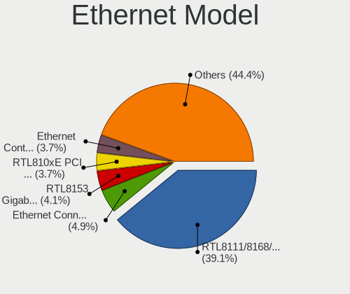

| Model                                                             | Computers | Percent |
|-------------------------------------------------------------------|-----------|---------|
| Realtek RTL8111/8168/8411 PCI Express Gigabit Ethernet Controller | 116       | 41.13%  |
| Realtek RTL810xE PCI Express Fast Ethernet controller             | 25        | 8.87%   |
| Realtek RTL8153 Gigabit Ethernet Adapter                          | 11        | 3.9%    |
| Intel I211 Gigabit Network Connection                             | 11        | 3.9%    |
| Intel 82579LM Gigabit Network Connection (Lewisville)             | 11        | 3.9%    |
| Realtek RTL8125 2.5GbE Controller                                 | 10        | 3.55%   |
| Intel 82579V Gigabit Network Connection                           | 6         | 2.13%   |
| Intel Ethernet Connection (7) I219-V                              | 5         | 1.77%   |
| Intel Ethernet Connection (2) I219-V                              | 5         | 1.77%   |
| Intel Ethernet Connection (4) I219-LM                             | 4         | 1.42%   |
| Samsung Galaxy series, misc. (tethering mode)                     | 3         | 1.06%   |
| Intel Ethernet Connection I217-LM                                 | 3         | 1.06%   |
| Intel Ethernet Connection (13) I219-V                             | 3         | 1.06%   |
| Xiaomi Mi/Redmi series (RNDIS)                                    | 2         | 0.71%   |
| VIA VT6102/VT6103 [Rhine-II]                                      | 2         | 0.71%   |
| Qualcomm Atheros Killer E2400 Gigabit Ethernet Controller         | 2         | 0.71%   |
| Qualcomm Atheros Attansic L1 Gigabit Ethernet                     | 2         | 0.71%   |
| OPPO RMX2117                                                      | 2         | 0.71%   |
| Nvidia MCP79 Ethernet                                             | 2         | 0.71%   |
| Nvidia MCP77 Ethernet                                             | 2         | 0.71%   |
| Intel I210 Gigabit Network Connection                             | 2         | 0.71%   |
| Intel Ethernet Controller I225-V                                  | 2         | 0.71%   |
| Intel Ethernet Connection I219-V                                  | 2         | 0.71%   |
| Intel Ethernet Connection I219-LM                                 | 2         | 0.71%   |
| Intel Ethernet Connection (7) I219-LM                             | 2         | 0.71%   |
| Intel Ethernet Connection (3) I218-LM                             | 2         | 0.71%   |
| Intel Ethernet Connection (2) I219-LM                             | 2         | 0.71%   |
| Intel 82566DM-2 Gigabit Network Connection                        | 2         | 0.71%   |
| Broadcom NetXtreme BCM57786 Gigabit Ethernet PCIe                 | 2         | 0.71%   |
| Broadcom NetXtreme BCM5764M Gigabit Ethernet PCIe                 | 2         | 0.71%   |
| Broadcom NetLink BCM5787M Gigabit Ethernet PCI Express            | 2         | 0.71%   |
| TP-Link UE300 10/100/1000 LAN (ethernet mode) [Realtek RTL8153]   | 1         | 0.35%   |
| Realtek USB 10/100/1G/2.5G LAN                                    | 1         | 0.35%   |
| Qualcomm Atheros QCA8171 Gigabit Ethernet                         | 1         | 0.35%   |
| Qualcomm Atheros Killer E220x Gigabit Ethernet Controller         | 1         | 0.35%   |
| Qualcomm Atheros AR8161 Gigabit Ethernet                          | 1         | 0.35%   |
| Qualcomm Atheros AR8121/AR8113/AR8114 Gigabit or Fast Ethernet    | 1         | 0.35%   |
| OnePlus (Shenzhen) OnePlus                                        | 1         | 0.35%   |
| Nvidia MCP61 Ethernet                                             | 1         | 0.35%   |
| Nvidia MCP55 Ethernet                                             | 1         | 0.35%   |

Net Controller Kind
-------------------

Ethernet, WiFi or modem

| Kind     | Computers | Percent |
|----------|-----------|---------|
| WiFi     | 264       | 50.48%  |
| Ethernet | 255       | 48.76%  |
| Modem    | 2         | 0.38%   |
| Unknown  | 2         | 0.38%   |

Used Controller
---------------

Currently used network controller

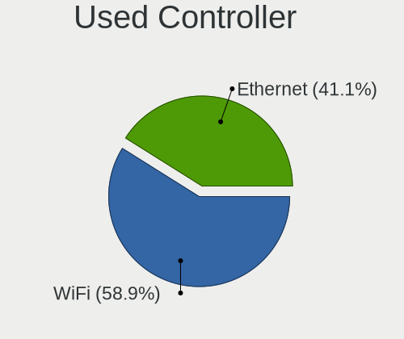

| Kind     | Computers | Percent |
|----------|-----------|---------|
| WiFi     | 220       | 64.33%  |
| Ethernet | 121       | 35.38%  |
| Unknown  | 1         | 0.29%   |

NICs
----

Total network controllers on board

| Total | Computers | Percent |
|-------|-----------|---------|
| 1     | 162       | 49.39%  |
| 2     | 157       | 47.87%  |
| 3     | 6         | 1.83%   |
| 0     | 2         | 0.61%   |
| 7     | 1         | 0.3%    |

IPv6
----

IPv6 vs IPv4

| Used | Computers | Percent |
|------|-----------|---------|
| No   | 293       | 89.33%  |
| Yes  | 35        | 10.67%  |

Bluetooth
---------

Bluetooth Vendor
----------------

Controller vendors

| Vendor                          | Computers | Percent |
|---------------------------------|-----------|---------|
| Intel                           | 129       | 54.2%   |
| Realtek Semiconductor           | 31        | 13.03%  |
| Qualcomm Atheros Communications | 16        | 6.72%   |
| Cambridge Silicon Radio         | 12        | 5.04%   |
| Broadcom                        | 12        | 5.04%   |
| IMC Networks                    | 9         | 3.78%   |
| Foxconn / Hon Hai               | 7         | 2.94%   |
| Apple                           | 7         | 2.94%   |
| Lite-On Technology              | 4         | 1.68%   |
| Hewlett-Packard                 | 3         | 1.26%   |
| Dell                            | 2         | 0.84%   |
| TP-Link                         | 1         | 0.42%   |
| Realtek                         | 1         | 0.42%   |
| Opticis                         | 1         | 0.42%   |
| Integrated System Solution      | 1         | 0.42%   |
| D-Link System                   | 1         | 0.42%   |
| ASUSTek Computer                | 1         | 0.42%   |

Bluetooth Model
---------------

Controller models

| Model                                                 | Computers | Percent |
|-------------------------------------------------------|-----------|---------|
| Intel Bluetooth wireless interface                    | 50        | 21.01%  |
| Realtek Bluetooth Radio                               | 24        | 10.08%  |
| Intel AX201 Bluetooth                                 | 24        | 10.08%  |
| Intel AX200 Bluetooth                                 | 24        | 10.08%  |
| Intel Bluetooth 9460/9560 Jefferson Peak (JfP)        | 13        | 5.46%   |
| Cambridge Silicon Radio Bluetooth Dongle (HCI mode)   | 12        | 5.04%   |
| Apple Bluetooth Host Controller                       | 7         | 2.94%   |
| Realtek  Bluetooth 4.2 Adapter                        | 6         | 2.52%   |
| Qualcomm Atheros QCA61x4 Bluetooth 4.0                | 6         | 2.52%   |
| Intel Bluetooth Device                                | 5         | 2.1%    |
| Qualcomm Atheros AR3011 Bluetooth                     | 4         | 1.68%   |
| Intel Wireless-AC 3168 Bluetooth                      | 4         | 1.68%   |
| Intel AX210 Bluetooth                                 | 4         | 1.68%   |
| IMC Networks Bluetooth Device                         | 4         | 1.68%   |
| Qualcomm Atheros  Bluetooth Device                    | 3         | 1.26%   |
| Qualcomm Atheros AR3012 Bluetooth 4.0                 | 3         | 1.26%   |
| Intel Centrino Bluetooth Wireless Transceiver         | 3         | 1.26%   |
| IMC Networks Bluetooth Radio                          | 3         | 1.26%   |
| HP Broadcom 2070 Bluetooth Combo                      | 3         | 1.26%   |
| Foxconn / Hon Hai Wireless_Device                     | 3         | 1.26%   |
| Lite-On Bluetooth Device                              | 2         | 0.84%   |
| Intel Centrino Advanced-N 6230 Bluetooth adapter      | 2         | 0.84%   |
| Foxconn / Hon Hai Bluetooth Device                    | 2         | 0.84%   |
| Broadcom BCM92046DG-CL1ROM Bluetooth 2.1 Adapter      | 2         | 0.84%   |
| TP-Link UB500 Adapter                                 | 1         | 0.42%   |
| Realtek RTL8723B Bluetooth                            | 1         | 0.42%   |
| Realtek Bluetooth Radio                               | 1         | 0.42%   |
| Opticis Bluetooth Radio                               | 1         | 0.42%   |
| Lite-On Wireless_Device                               | 1         | 0.42%   |
| Lite-On Qualcomm Atheros QCA9377 Bluetooth            | 1         | 0.42%   |
| Integrated System Solution KY-BT100 Bluetooth Adapter | 1         | 0.42%   |
| IMC Networks Wireless_Device                          | 1         | 0.42%   |
| IMC Networks 802.11ac WLAN Adapter                    | 1         | 0.42%   |
| Foxconn / Hon Hai BT                                  | 1         | 0.42%   |
| Foxconn / Hon Hai Bluetooth USB Host Controller       | 1         | 0.42%   |
| Dell DW375 Bluetooth Module                           | 1         | 0.42%   |
| Dell BCM20702A0 Bluetooth Module                      | 1         | 0.42%   |
| D-Link System DBT-122 Bluetooth                       | 1         | 0.42%   |
| Broadcom HP Portable Valentine                        | 1         | 0.42%   |
| Broadcom HP Portable SoftSailing                      | 1         | 0.42%   |

Sound
-----

Sound Vendor
------------

Sound card vendors

| Vendor                  | Computers | Percent |
|-------------------------|-----------|---------|
| Intel                   | 233       | 50%     |
| AMD                     | 99        | 21.24%  |
| Nvidia                  | 78        | 16.74%  |
| C-Media Electronics     | 8         | 1.72%   |
| Logitech                | 6         | 1.29%   |
| GN Netcom               | 4         | 0.86%   |
| Lenovo                  | 3         | 0.64%   |
| JMTek                   | 3         | 0.64%   |
| VIA Technologies        | 2         | 0.43%   |
| Texas Instruments       | 2         | 0.43%   |
| Samson Technologies     | 2         | 0.43%   |
| Realtek Semiconductor   | 2         | 0.43%   |
| Creative Labs           | 2         | 0.43%   |
| Tenx Technology         | 1         | 0.21%   |
| Sony                    | 1         | 0.21%   |
| Schiit Audio            | 1         | 0.21%   |
| SAVITECH                | 1         | 0.21%   |
| Razer USA               | 1         | 0.21%   |
| Plantronics             | 1         | 0.21%   |
| Midiplus                | 1         | 0.21%   |
| Medeli Electronics      | 1         | 0.21%   |
| Mark of the Unicorn     | 1         | 0.21%   |
| M-Audio                 | 1         | 0.21%   |
| Kingston Technology     | 1         | 0.21%   |
| Hewlett-Packard         | 1         | 0.21%   |
| Focusrite-Novation      | 1         | 0.21%   |
| Fnatic Gear             | 1         | 0.21%   |
| Elgato Systems          | 1         | 0.21%   |
| Creative Technology     | 1         | 0.21%   |
| Cooler Master           | 1         | 0.21%   |
| Conexant Systems        | 1         | 0.21%   |
| Cambridge Silicon Radio | 1         | 0.21%   |
| Barco Display Systems   | 1         | 0.21%   |
| Apple                   | 1         | 0.21%   |
| AKAI Professional M.I.  | 1         | 0.21%   |

Sound Model
-----------

Sound card models

| Model                                                                                             | Computers | Percent |
|---------------------------------------------------------------------------------------------------|-----------|---------|
| AMD Family 17h/19h HD Audio Controller                                                            | 38        | 6.96%   |
| Intel Sunrise Point-LP HD Audio                                                                   | 30        | 5.49%   |
| AMD Renoir Radeon High Definition Audio Controller                                                | 27        | 4.95%   |
| Intel Tiger Lake-LP Smart Sound Technology Audio Controller                                       | 26        | 4.76%   |
| Intel 7 Series/C216 Chipset Family High Definition Audio Controller                               | 23        | 4.21%   |
| AMD Starship/Matisse HD Audio Controller                                                          | 23        | 4.21%   |
| Intel 8 Series/C220 Series Chipset High Definition Audio Controller                               | 16        | 2.93%   |
| Intel 6 Series/C200 Series Chipset Family High Definition Audio Controller                        | 16        | 2.93%   |
| Intel Cannon Lake PCH cAVS                                                                        | 12        | 2.2%    |
| Intel Xeon E3-1200 v3/4th Gen Core Processor HD Audio Controller                                  | 11        | 2.01%   |
| Intel 82801I (ICH9 Family) HD Audio Controller                                                    | 11        | 2.01%   |
| AMD Raven/Raven2/Fenghuang HDMI/DP Audio Controller                                               | 10        | 1.83%   |
| Nvidia GK208 HDMI/DP Audio Controller                                                             | 9         | 1.65%   |
| Intel Comet Lake PCH-LP cAVS                                                                      | 9         | 1.65%   |
| Nvidia GP107GL High Definition Audio Controller                                                   | 8         | 1.47%   |
| Intel CM238 HD Audio Controller                                                                   | 8         | 1.47%   |
| Intel Broadwell-U Audio Controller                                                                | 8         | 1.47%   |
| Intel 100 Series/C230 Series Chipset Family HD Audio Controller                                   | 8         | 1.47%   |
| AMD Ellesmere HDMI Audio [Radeon RX 470/480 / 570/580/590]                                        | 8         | 1.47%   |
| Nvidia GP106 High Definition Audio Controller                                                     | 7         | 1.28%   |
| Intel Wildcat Point-LP High Definition Audio Controller                                           | 7         | 1.28%   |
| Intel Atom/Celeron/Pentium Processor x5-E8000/J3xxx/N3xxx Series High Definition Audio Controller | 7         | 1.28%   |
| AMD Family 17h (Models 00h-0fh) HD Audio Controller                                               | 7         | 1.28%   |
| Intel Comet Lake PCH cAVS                                                                         | 6         | 1.1%    |
| Intel Alder Lake PCH-P High Definition Audio Controller                                           | 6         | 1.1%    |
| Intel 5 Series/3400 Series Chipset High Definition Audio                                          | 6         | 1.1%    |
| Nvidia GF119 HDMI Audio Controller                                                                | 5         | 0.92%   |
| AMD Navi 21/23 HDMI/DP Audio Controller                                                           | 5         | 0.92%   |
| AMD FCH Azalia Controller                                                                         | 5         | 0.92%   |
| Nvidia TU107 GeForce GTX 1650 High Definition Audio Controller                                    | 4         | 0.73%   |
| Nvidia TU106 High Definition Audio Controller                                                     | 4         | 0.73%   |
| Nvidia GM204 High Definition Audio Controller                                                     | 4         | 0.73%   |
| Nvidia GA104 High Definition Audio Controller                                                     | 4         | 0.73%   |
| Intel Cannon Point-LP High Definition Audio Controller                                            | 4         | 0.73%   |
| Intel 200 Series PCH HD Audio                                                                     | 4         | 0.73%   |
| C-Media Electronics Audio Adapter (Unitek Y-247A)                                                 | 4         | 0.73%   |
| Nvidia TU116 High Definition Audio Controller                                                     | 3         | 0.55%   |
| Nvidia MCP79 High Definition Audio                                                                | 3         | 0.55%   |
| Nvidia High Definition Audio Controller                                                           | 3         | 0.55%   |
| Nvidia GM107 High Definition Audio Controller [GeForce 940MX]                                     | 3         | 0.55%   |

Memory
------

Memory Vendor
-------------

Memory module vendors

| Vendor              | Computers | Percent |
|---------------------|-----------|---------|
| Samsung Electronics | 74        | 28.14%  |
| SK hynix            | 45        | 17.11%  |
| Micron Technology   | 26        | 9.89%   |
| Kingston            | 26        | 9.89%   |
| Crucial             | 26        | 9.89%   |
| Corsair             | 21        | 7.98%   |
| Unknown             | 14        | 5.32%   |
| G.Skill             | 11        | 4.18%   |
| Team                | 5         | 1.9%    |
| Nanya Technology    | 4         | 1.52%   |
| Patriot             | 2         | 0.76%   |
| A-DATA Technology   | 2         | 0.76%   |
| Unknown             | 2         | 0.76%   |
| Unknown (ABCD)      | 1         | 0.38%   |
| Toshiba             | 1         | 0.38%   |
| Ramaxel Technology  | 1         | 0.38%   |
| ASint Technology    | 1         | 0.38%   |
| Advantech           | 1         | 0.38%   |

Memory Model
------------

Memory module models

| Model                                                          | Computers | Percent |
|----------------------------------------------------------------|-----------|---------|
| Samsung RAM M471A1K43CB1-CRC 8GB SODIMM DDR4 2667MT/s          | 6         | 2.13%   |
| Samsung RAM M471A1K43DB1-CWE 8192MB SODIMM DDR4 3200MT/s       | 5         | 1.77%   |
| Samsung RAM M471A1G44AB0-CWE 8GB Row Of Chips DDR4 3200MT/s    | 5         | 1.77%   |
| SK hynix RAM HMA851S6AFR6N-UH 4GB SODIMM DDR4 2667MT/s         | 4         | 1.42%   |
| Samsung RAM M471B1G73DB0-YK0 8GB SODIMM DDR3 1600MT/s          | 4         | 1.42%   |
| Samsung RAM M471A1K43EB1-CWE 8GB SODIMM DDR4 3200MT/s          | 4         | 1.42%   |
| SK hynix RAM HMA81GS6AFR8N-UH 8192MB SODIMM DDR4 2667MT/s      | 3         | 1.06%   |
| SK hynix RAM HCNNNCPMMLXR-NEE 2GB Row Of Chips LPDDR4 4267MT/s | 3         | 1.06%   |
| G.Skill RAM F4-3200C16-8GIS 8192MB DIMM DDR4 3200MT/s          | 3         | 1.06%   |
| Corsair RAM CMK16GX4M2D3600C18 8GB DIMM DDR4 3600MT/s          | 3         | 1.06%   |
| Unknown RAM Module 8GB SODIMM DDR3 1600MT/s                    | 2         | 0.71%   |
| Unknown RAM Module 2GB SODIMM DDR2 667MT/s                     | 2         | 0.71%   |
| Team RAM TEAMGROUP-UD3-1600 8GB DIMM DDR3 1600MT/s             | 2         | 0.71%   |
| SK hynix RAM HMT451S6BFR8A-PB 4096MB SODIMM DDR3 1600MT/s      | 2         | 0.71%   |
| SK hynix RAM HMT451S6AFR8A-PB 4GB SODIMM DDR3 1600MT/s         | 2         | 0.71%   |
| SK hynix RAM HMT41GS6BFR8A-PB 8GB SODIMM DDR3 1600MT/s         | 2         | 0.71%   |
| SK hynix RAM HMAB2GS6AMR6N-XN 16GB SODIMM DDR4 3200MT/s        | 2         | 0.71%   |
| SK hynix RAM HMA851S6CJR6N-VK 4GB SODIMM DDR4 2667MT/s         | 2         | 0.71%   |
| SK hynix RAM HMA82GS6JJR8N-VK 16GB SODIMM DDR4 2667MT/s        | 2         | 0.71%   |
| SK hynix RAM HMA81GS6MFR8N-TF 8GB SODIMM DDR4 2133MT/s         | 2         | 0.71%   |
| SK hynix RAM HMA81GS6JJR8N-VK 8GB SODIMM DDR4 2667MT/s         | 2         | 0.71%   |
| Samsung RAM Module 4GB SODIMM DDR4 2133MT/s                    | 2         | 0.71%   |
| Samsung RAM M471B5773DH0-CH9 2GB SODIMM DDR3 1600MT/s          | 2         | 0.71%   |
| Samsung RAM M471B5673FH0-CH9 2GB SODIMM DDR3 1334MT/s          | 2         | 0.71%   |
| Samsung RAM M471B5173EB0-YK0 4GB SODIMM DDR3 1600MT/s          | 2         | 0.71%   |
| Samsung RAM M471A5244CB0-CTD 4GB SODIMM DDR4 3266MT/s          | 2         | 0.71%   |
| Samsung RAM M471A2K43CB1-CRC 16GB SODIMM DDR4 2667MT/s         | 2         | 0.71%   |
| Samsung RAM M471A1K43BB1-CRC 8GB SODIMM DDR4 2667MT/s          | 2         | 0.71%   |
| Samsung RAM M471A1G44AB0-CWE 8GB SODIMM DDR4 3200MT/s          | 2         | 0.71%   |
| Samsung RAM M378A1K43CB2-CRC 8GB DIMM DDR4 3500MT/s            | 2         | 0.71%   |
| Samsung RAM K4A8G165WC-BCTD 4GB SODIMM DDR4 2667MT/s           | 2         | 0.71%   |
| Nanya RAM NT8GA64D88CX3S-JR 8GB SODIMM DDR4 3200MT/s           | 2         | 0.71%   |
| Nanya RAM NT4GC64B8HG0NF-CG 4096MB DIMM DDR3 1333MT/s          | 2         | 0.71%   |
| Micron RAM MT40A512M16TB-062E:J 4GB Row Of Chips DDR4 3200MT/s | 2         | 0.71%   |
| Micron RAM 16KTF1G64HZ-1G6E1 8GB SODIMM DDR3 1600MT/s          | 2         | 0.71%   |
| G.Skill RAM F4-3200C16-16GVK 16GB DIMM DDR4 3600MT/s           | 2         | 0.71%   |
| G.Skill RAM F4-3000C16-8GTZR 8GB DIMM DDR4 3200MT/s            | 2         | 0.71%   |
| G.Skill RAM F4-3000C16-8GISB 8GB DIMM DDR4 3200MT/s            | 2         | 0.71%   |
| Corsair RAM CMK16GX4M2B3200C16 8GB DIMM DDR4 3600MT/s          | 2         | 0.71%   |
| Corsair RAM CMK16GX4M2B3000C15 8GB DIMM DDR4 3200MT/s          | 2         | 0.71%   |

Memory Kind
-----------

Memory module kinds

| Kind    | Computers | Percent |
|---------|-----------|---------|
| DDR4    | 133       | 57.83%  |
| DDR3    | 61        | 26.52%  |
| LPDDR4  | 14        | 6.09%   |
| DDR2    | 9         | 3.91%   |
| LPDDR3  | 6         | 2.61%   |
| SDRAM   | 3         | 1.3%    |
| LPDDR5  | 1         | 0.43%   |
| DDR5    | 1         | 0.43%   |
| DDR     | 1         | 0.43%   |
| Unknown | 1         | 0.43%   |

Memory Form Factor
------------------

Physical design of the memory module

| Name         | Computers | Percent |
|--------------|-----------|---------|
| SODIMM       | 129       | 56.09%  |
| DIMM         | 76        | 33.04%  |
| Row Of Chips | 23        | 10%     |
| Chip         | 2         | 0.87%   |

Memory Size
-----------

Memory module size

| Size  | Computers | Percent |
|-------|-----------|---------|
| 8192  | 115       | 46%     |
| 4096  | 70        | 28%     |
| 16384 | 38        | 15.2%   |
| 2048  | 18        | 7.2%    |
| 32768 | 6         | 2.4%    |
| 1024  | 3         | 1.2%    |

Memory Speed
------------

Memory module speed

| Speed   | Computers | Percent |
|---------|-----------|---------|
| 3200    | 56        | 22.49%  |
| 1600    | 46        | 18.47%  |
| 2667    | 37        | 14.86%  |
| 3600    | 13        | 5.22%   |
| 2400    | 13        | 5.22%   |
| 2133    | 11        | 4.42%   |
| 1333    | 10        | 4.02%   |
| 4267    | 7         | 2.81%   |
| 1867    | 5         | 2.01%   |
| 3466    | 4         | 1.61%   |
| 1334    | 4         | 1.61%   |
| 3000    | 3         | 1.2%    |
| 2933    | 3         | 1.2%    |
| 1800    | 3         | 1.2%    |
| 667     | 3         | 1.2%    |
| 4800    | 2         | 0.8%    |
| 4266    | 2         | 0.8%    |
| 3500    | 2         | 0.8%    |
| 3266    | 2         | 0.8%    |
| 1066    | 2         | 0.8%    |
| 800     | 2         | 0.8%    |
| Unknown | 2         | 0.8%    |
| 8400    | 1         | 0.4%    |
| 6400    | 1         | 0.4%    |
| 4199    | 1         | 0.4%    |
| 3866    | 1         | 0.4%    |
| 3733    | 1         | 0.4%    |
| 3666    | 1         | 0.4%    |
| 3400    | 1         | 0.4%    |
| 3333    | 1         | 0.4%    |
| 3100    | 1         | 0.4%    |
| 2866    | 1         | 0.4%    |
| 2465    | 1         | 0.4%    |
| 2448    | 1         | 0.4%    |
| 1776    | 1         | 0.4%    |
| 1400    | 1         | 0.4%    |
| 1067    | 1         | 0.4%    |
| 533     | 1         | 0.4%    |
| 333     | 1         | 0.4%    |

Printers & scanners
-------------------

Printer Vendor
--------------

Printer device vendors

| Vendor             | Computers | Percent |
|--------------------|-----------|---------|
| Canon              | 2         | 33.33%  |
| Seiko Epson        | 1         | 16.67%  |
| Hewlett-Packard    | 1         | 16.67%  |
| Dymo-CoStar        | 1         | 16.67%  |
| Brother Industries | 1         | 16.67%  |

Printer Model
-------------

Printer device models

| Model                       | Computers | Percent |
|-----------------------------|-----------|---------|
| Seiko Epson AL-M300         | 1         | 16.67%  |
| HP LaserJet M14-M17         | 1         | 16.67%  |
| Dymo-CoStar LabelWriter 450 | 1         | 16.67%  |
| Canon PIXMA MX330           | 1         | 16.67%  |
| Canon LiDE 400              | 1         | 16.67%  |
| Brother MFC-L3750CDW        | 1         | 16.67%  |

Scanner Vendor
--------------

Scanner device vendors

| Vendor      | Computers | Percent |
|-------------|-----------|---------|
| Seiko Epson | 1         | 100%    |

Scanner Model
-------------

Scanner device models

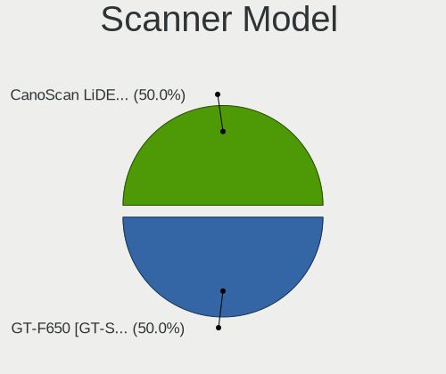

| Model                                               | Computers | Percent |
|-----------------------------------------------------|-----------|---------|
| Seiko Epson GT-F520/GT-F570 [Perfection 3590 PHOTO] | 1         | 100%    |

Camera
------

Camera Vendor
-------------

Camera device vendors

| Vendor                                 | Computers | Percent |
|----------------------------------------|-----------|---------|
| Chicony Electronics                    | 58        | 26.13%  |
| IMC Networks                           | 23        | 10.36%  |
| Realtek Semiconductor                  | 18        | 8.11%   |
| Microdia                               | 18        | 8.11%   |
| Logitech                               | 17        | 7.66%   |
| Acer                                   | 15        | 6.76%   |
| Sunplus Innovation Technology          | 11        | 4.95%   |
| Quanta                                 | 10        | 4.5%    |
| Luxvisions Innotech Limited            | 8         | 3.6%    |
| Cheng Uei Precision Industry (Foxlink) | 8         | 3.6%    |
| Syntek                                 | 5         | 2.25%   |
| Suyin                                  | 4         | 1.8%    |
| Lite-On Technology                     | 4         | 1.8%    |
| Microsoft                              | 3         | 1.35%   |
| Generalplus Technology                 | 3         | 1.35%   |
| ARC International                      | 3         | 1.35%   |
| Samsung Electronics                    | 2         | 0.9%    |
| GEMBIRD                                | 2         | 0.9%    |
| Apple                                  | 2         | 0.9%    |
| Z-Star Microelectronics                | 1         | 0.45%   |
| USB Camera CS                          | 1         | 0.45%   |
| SunplusIT                              | 1         | 0.45%   |
| Silicon Motion                         | 1         | 0.45%   |
| Ricoh                                  | 1         | 0.45%   |
| KYE Systems (Mouse Systems)            | 1         | 0.45%   |
| Importek                               | 1         | 0.45%   |
| 2M UVC CAMERA                          | 1         | 0.45%   |

Camera Model
------------

Camera device models

| Model                                               | Computers | Percent |
|-----------------------------------------------------|-----------|---------|
| Chicony Integrated Camera                           | 10        | 4.42%   |
| Microdia Integrated_Webcam_HD                       | 9         | 3.98%   |
| IMC Networks USB2.0 HD UVC WebCam                   | 7         | 3.1%    |
| Realtek Integrated_Webcam_HD                        | 6         | 2.65%   |
| Logitech Webcam C270                                | 6         | 2.65%   |
| Chicony HP Wide Vision HD Camera                    | 6         | 2.65%   |
| Chicony HD WebCam                                   | 6         | 2.65%   |
| Acer Integrated Camera                              | 5         | 2.21%   |
| Syntek Integrated Camera                            | 4         | 1.77%   |
| Luxvisions Innotech Limited HP TrueVision HD Camera | 4         | 1.77%   |
| Chicony HP TrueVision HD Camera                     | 4         | 1.77%   |
| Sunplus Aukey-PC-LM1E Camera                        | 3         | 1.33%   |
| Realtek USB Camera                                  | 3         | 1.33%   |
| Quanta HP TrueVision HD Camera                      | 3         | 1.33%   |
| Microdia Webcam Vitade AF                           | 3         | 1.33%   |
| Logitech Webcam C310                                | 3         | 1.33%   |
| Logitech HD Pro Webcam C920                         | 3         | 1.33%   |
| IMC Networks Integrated Camera                      | 3         | 1.33%   |
| IMC Networks HD Camera                              | 3         | 1.33%   |
| Generalplus GENERAL WEBCAM                          | 3         | 1.33%   |
| Chicony USB2.0 HD UVC WebCam                        | 3         | 1.33%   |
| Chicony USB2.0 Camera                               | 3         | 1.33%   |
| Chicony HP HD Camera                                | 3         | 1.33%   |
| ARC International Camera                            | 3         | 1.33%   |
| Samsung Galaxy A5 (MTP)                             | 2         | 0.88%   |
| Realtek USB2.0 HD UVC WebCam                        | 2         | 0.88%   |
| Realtek Integrated Camera                           | 2         | 0.88%   |
| Microdia Integrated Webcam                          | 2         | 0.88%   |
| Luxvisions Innotech Limited Integrated Camera       | 2         | 0.88%   |
| IMC Networks XHC Camera                             | 2         | 0.88%   |
| IMC Networks USB2.0 VGA UVC WebCam                  | 2         | 0.88%   |
| IMC Networks USB2.0 UVC HD Webcam                   | 2         | 0.88%   |
| Chicony Webcam-101                                  | 2         | 0.88%   |
| Chicony Integrated Camera (1280x720@30)             | 2         | 0.88%   |
| Chicony HP Truevision HD                            | 2         | 0.88%   |
| Chicony HP IR Camera                                | 2         | 0.88%   |
| Chicony CNF9055 Toshiba Webcam                      | 2         | 0.88%   |
| Chicony 1.3M Webcam                                 | 2         | 0.88%   |
| Apple Built-in iSight                               | 2         | 0.88%   |
| Acer Lenovo EasyCamera                              | 2         | 0.88%   |

Security
--------

Fingerprint Vendor
------------------

Fingerprint sensor vendors

| Vendor                     | Computers | Percent |
|----------------------------|-----------|---------|
| Synaptics                  | 14        | 36.84%  |
| Shenzhen Goodix Technology | 7         | 18.42%  |
| Validity Sensors           | 6         | 15.79%  |
| Elan Microelectronics      | 5         | 13.16%  |
| LighTuning Technology      | 4         | 10.53%  |
| Upek                       | 1         | 2.63%   |
| AuthenTec                  | 1         | 2.63%   |

Fingerprint Model
-----------------

Fingerprint sensor models

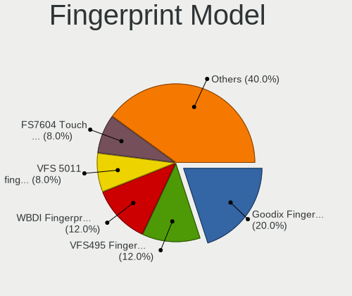

| Model                                                       | Computers | Percent |
|-------------------------------------------------------------|-----------|---------|
| Unknown                                                     | 9         | 23.68%  |
| Shenzhen Goodix  Fingerprint Device                         | 4         | 10.53%  |
| Elan ELAN:ARM-M4                                            | 4         | 10.53%  |
| Synaptics Metallica MIS Touch Fingerprint Reader            | 3         | 7.89%   |
| LighTuning EgisTec Touch Fingerprint Sensor                 | 3         | 7.89%   |
| Validity Sensors Synaptics VFS7552 Touch Fingerprint Sensor | 2         | 5.26%   |
| Shenzhen Goodix FingerPrint                                 | 2         | 5.26%   |
| Validity Sensors VFS5011 Fingerprint Reader                 | 1         | 2.63%   |
| Validity Sensors VFS495 Fingerprint Reader                  | 1         | 2.63%   |
| Validity Sensors VFS471 Fingerprint Reader                  | 1         | 2.63%   |
| Validity Sensors VFS Fingerprint sensor                     | 1         | 2.63%   |
| Upek Biometric Touchchip/Touchstrip Fingerprint Sensor      | 1         | 2.63%   |
| Synaptics  WBDI                                             | 1         | 2.63%   |
| Synaptics Prometheus MIS Touch Fingerprint Reader           | 1         | 2.63%   |
| Shenzhen Goodix Fingerprint Reader                          | 1         | 2.63%   |
| LighTuning Fingerprint Reader                               | 1         | 2.63%   |
| Elan ELAN:Fingerprint                                       | 1         | 2.63%   |
| AuthenTec AES1600                                           | 1         | 2.63%   |

Chipcard Vendor
---------------

Chipcard module vendors

| Vendor                | Computers | Percent |
|-----------------------|-----------|---------|
| Broadcom              | 6         | 37.5%   |
| Alcor Micro           | 6         | 37.5%   |
| O2 Micro              | 2         | 12.5%   |
| Realtek Semiconductor | 1         | 6.25%   |
| Advanced Card Systems | 1         | 6.25%   |

Chipcard Model
--------------

Chipcard module models

| Model                                             | Computers | Percent |
|---------------------------------------------------|-----------|---------|
| Alcor Micro AU9540 Smartcard Reader               | 6         | 37.5%   |
| Broadcom 58200                                    | 3         | 18.75%  |
| O2 Micro OZ776 CCID Smartcard Reader              | 2         | 12.5%   |
| Broadcom BCM5880 Secure Applications Processor    | 2         | 12.5%   |
| Realtek Semiconductor Smart Card Reader Interface | 1         | 6.25%   |
| Broadcom 5880                                     | 1         | 6.25%   |
| Advanced Card Systems ACR122U                     | 1         | 6.25%   |

Unsupported
-----------

Unsupported Devices
-------------------

Total unsupported devices on board

| Total | Computers | Percent |
|-------|-----------|---------|
| 0     | 235       | 71.65%  |
| 1     | 77        | 23.48%  |
| 2     | 14        | 4.27%   |
| 4     | 1         | 0.3%    |
| 3     | 1         | 0.3%    |

Unsupported Device Types
------------------------

Types of unsupported devices

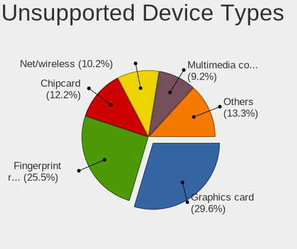

| Type                     | Computers | Percent |
|--------------------------|-----------|---------|
| Fingerprint reader       | 37        | 33.33%  |
| Graphics card            | 22        | 19.82%  |
| Chipcard                 | 14        | 12.61%  |
| Net/wireless             | 8         | 7.21%   |
| Camera                   | 8         | 7.21%   |
| Multimedia controller    | 6         | 5.41%   |
| Communication controller | 5         | 4.5%    |
| Storage                  | 3         | 2.7%    |
| Sound                    | 3         | 2.7%    |
| Bluetooth                | 3         | 2.7%    |
| Firewire controller      | 2         | 1.8%    |

