Linux in Netherlands - Hardware Trends
--------------------------------------

A project to identify most popular hardware characteristics and track their change
over time based on data collected by Linux users at https://Linux-Hardware.org.

Anyone can contribute to this report by the [hw-probe](https://github.com/linuxhw/hw-probe) tool:

    sudo -E hw-probe -all -upload

This is a report for all computer types. See also reports for [desktops](/Location/Netherlands/Desktop/README.md) and [notebooks](/Location/Netherlands/Notebook/README.md).

Period: Dec, 2025.

Contents
--------

* [ System ](#system)
  - [ OS                       ](#os)
  - [ OS Family                ](#os-family)
  - [ Kernel                   ](#kernel)
  - [ Kernel Family            ](#kernel-family)
  - [ Kernel Major Ver.        ](#kernel-major-ver)
  - [ Arch                     ](#arch)
  - [ DE                       ](#de)
  - [ Display Server           ](#display-server)
  - [ Display Manager          ](#display-manager)
  - [ OS Lang                  ](#os-lang)
  - [ Boot Mode                ](#boot-mode)
  - [ Filesystem               ](#filesystem)
  - [ Part. scheme             ](#part-scheme)
  - [ Dual Boot with Linux/BSD ](#dual-boot-with-linuxbsd)
  - [ Dual Boot (Win)          ](#dual-boot-win)

* [ Board ](#board)
  - [ Vendor                   ](#vendor)
  - [ Model                    ](#model)
  - [ Model Family             ](#model-family)
  - [ MFG Year                 ](#mfg-year)
  - [ Form Factor              ](#form-factor)
  - [ Secure Boot              ](#secure-boot)
  - [ Coreboot                 ](#coreboot)
  - [ RAM Size                 ](#ram-size)
  - [ RAM Used                 ](#ram-used)
  - [ Total Drives             ](#total-drives)
  - [ Has CD-ROM               ](#has-cd-rom)
  - [ Has Ethernet             ](#has-ethernet)
  - [ Has WiFi                 ](#has-wifi)
  - [ Has Bluetooth            ](#has-bluetooth)

* [ Location ](#location)
  - [ Country                  ](#country)
  - [ City                     ](#city)

* [ Drives ](#drives)
  - [ Drive Vendor             ](#drive-vendor)
  - [ Drive Model              ](#drive-model)
  - [ HDD Vendor               ](#hdd-vendor)
  - [ SSD Vendor               ](#ssd-vendor)
  - [ Drive Kind               ](#drive-kind)
  - [ Drive Connector          ](#drive-connector)
  - [ Drive Size               ](#drive-size)
  - [ Space Total              ](#space-total)
  - [ Space Used               ](#space-used)
  - [ Malfunc. Drives          ](#malfunc-drives)
  - [ Malfunc. Drive Vendor    ](#malfunc-drive-vendor)
  - [ Malfunc. HDD Vendor      ](#malfunc-hdd-vendor)
  - [ Malfunc. Drive Kind      ](#malfunc-drive-kind)
  - [ Failed Drives            ](#failed-drives)
  - [ Failed Drive Vendor      ](#failed-drive-vendor)
  - [ Drive Status             ](#drive-status)

* [ Storage controller ](#storage-controller)
  - [ Storage Vendor           ](#storage-vendor)
  - [ Storage Model            ](#storage-model)
  - [ Storage Kind             ](#storage-kind)

* [ Processor ](#processor)
  - [ CPU Vendor               ](#cpu-vendor)
  - [ CPU Model                ](#cpu-model)
  - [ CPU Model Family         ](#cpu-model-family)
  - [ CPU Cores                ](#cpu-cores)
  - [ CPU Sockets              ](#cpu-sockets)
  - [ CPU Threads              ](#cpu-threads)
  - [ CPU Op-Modes             ](#cpu-op-modes)
  - [ CPU Microcode            ](#cpu-microcode)
  - [ CPU Microarch            ](#cpu-microarch)

* [ Graphics ](#graphics)
  - [ GPU Vendor               ](#gpu-vendor)
  - [ GPU Model                ](#gpu-model)
  - [ GPU Combo                ](#gpu-combo)
  - [ GPU Driver               ](#gpu-driver)
  - [ GPU Memory               ](#gpu-memory)

* [ Monitor ](#monitor)
  - [ Monitor Vendor           ](#monitor-vendor)
  - [ Monitor Model            ](#monitor-model)
  - [ Monitor Resolution       ](#monitor-resolution)
  - [ Monitor Diagonal         ](#monitor-diagonal)
  - [ Monitor Width            ](#monitor-width)
  - [ Aspect Ratio             ](#aspect-ratio)
  - [ Monitor Area             ](#monitor-area)
  - [ Pixel Density            ](#pixel-density)
  - [ Multiple Monitors        ](#multiple-monitors)

* [ Network ](#network)
  - [ Net Controller Vendor    ](#net-controller-vendor)
  - [ Net Controller Model     ](#net-controller-model)
  - [ Wireless Vendor          ](#wireless-vendor)
  - [ Wireless Model           ](#wireless-model)
  - [ Ethernet Vendor          ](#ethernet-vendor)
  - [ Ethernet Model           ](#ethernet-model)
  - [ Net Controller Kind      ](#net-controller-kind)
  - [ Used Controller          ](#used-controller)
  - [ NICs                     ](#nics)
  - [ IPv6                     ](#ipv6)

* [ Bluetooth ](#bluetooth)
  - [ Bluetooth Vendor         ](#bluetooth-vendor)
  - [ Bluetooth Model          ](#bluetooth-model)

* [ Sound ](#sound)
  - [ Sound Vendor             ](#sound-vendor)
  - [ Sound Model              ](#sound-model)

* [ Memory ](#memory)
  - [ Memory Vendor            ](#memory-vendor)
  - [ Memory Model             ](#memory-model)
  - [ Memory Kind              ](#memory-kind)
  - [ Memory Form Factor       ](#memory-form-factor)
  - [ Memory Size              ](#memory-size)
  - [ Memory Speed             ](#memory-speed)

* [ Printers & scanners ](#printers--scanners)
  - [ Printer Vendor           ](#printer-vendor)
  - [ Printer Model            ](#printer-model)
  - [ Scanner Vendor           ](#scanner-vendor)
  - [ Scanner Model            ](#scanner-model)

* [ Camera ](#camera)
  - [ Camera Vendor            ](#camera-vendor)
  - [ Camera Model             ](#camera-model)

* [ Security ](#security)
  - [ Fingerprint Vendor       ](#fingerprint-vendor)
  - [ Fingerprint Model        ](#fingerprint-model)
  - [ Chipcard Vendor          ](#chipcard-vendor)
  - [ Chipcard Model           ](#chipcard-model)

* [ Unsupported ](#unsupported)
  - [ Unsupported Devices      ](#unsupported-devices)
  - [ Unsupported Device Types ](#unsupported-device-types)

System
------

OS
--

Installed operating systems

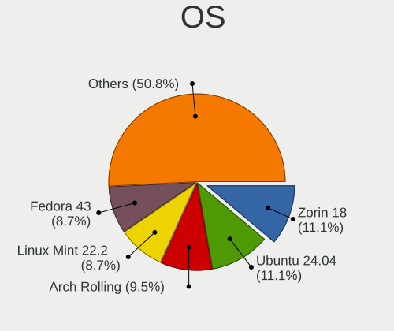

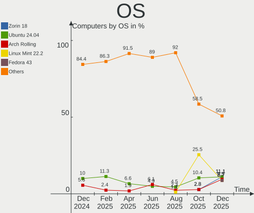

| Name                 | Computers | Percent |
|----------------------|-----------|---------|
| Zorin 18             | 14        | 11.11%  |
| Ubuntu 24.04         | 14        | 11.11%  |
| Arch Rolling         | 12        | 9.52%   |
| Linux Mint 22.2      | 11        | 8.73%   |
| Fedora 43            | 11        | 8.73%   |
| Bazzite 43           | 9         | 7.14%   |
| Debian 13            | 8         | 6.35%   |
| Linux Mint 22.1      | 6         | 4.76%   |
| NixOS 26.05          | 5         | 3.97%   |
| Pop!_OS 24.04        | 3         | 2.38%   |
| OpenMandriva 6.0     | 3         | 2.38%   |
| Zorin 17             | 2         | 1.59%   |
| Ubuntu 25.10         | 2         | 1.59%   |
| Pop!_OS 22.04        | 2         | 1.59%   |
| Nobara 43            | 2         | 1.59%   |
| Kubuntu 24.04        | 2         | 1.59%   |
| EndeavourOS Rolling  | 2         | 1.59%   |
| Ubuntu Budgie 24.04  | 1         | 0.79%   |
| Ubuntu 25.04         | 1         | 0.79%   |
| TUXEDO OS 24.04      | 1         | 0.79%   |
| openSUSE Leap-15.6   | 1         | 0.79%   |
| OpenMandriva 25.90   | 1         | 0.79%   |
| OpenMandriva 25.06   | 1         | 0.79%   |
| OpenMandriva 24.12   | 1         | 0.79%   |
| NixOS 25.11          | 1         | 0.79%   |
| MX 25                | 1         | 0.79%   |
| Manjaro 25.1.0       | 1         | 0.79%   |
| Linux Mint 21.3      | 1         | 0.79%   |
| Linux Mint 21.2      | 1         | 0.79%   |
| KDE neon 24.04       | 1         | 0.79%   |
| Dts-distro 2.7.3-rc1 | 1         | 0.79%   |
| Debian 11            | 1         | 0.79%   |
| Clear Linux 43760    | 1         | 0.79%   |
| CachyOS Rolling      | 1         | 0.79%   |
| antiX 23.1           | 1         | 0.79%   |

OS Family
---------

OS without a version

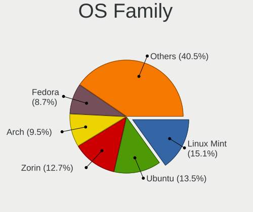

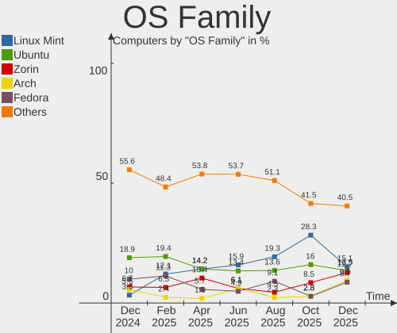

| Name          | Computers | Percent |
|---------------|-----------|---------|
| Linux Mint    | 19        | 15.08%  |
| Ubuntu        | 17        | 13.49%  |
| Zorin         | 16        | 12.7%   |
| Arch          | 12        | 9.52%   |
| Fedora        | 11        | 8.73%   |
| Debian        | 9         | 7.14%   |
| Bazzite       | 9         | 7.14%   |
| OpenMandriva  | 6         | 4.76%   |
| NixOS         | 6         | 4.76%   |
| Pop!_OS       | 5         | 3.97%   |
| Nobara        | 2         | 1.59%   |
| Kubuntu       | 2         | 1.59%   |
| EndeavourOS   | 2         | 1.59%   |
| Ubuntu Budgie | 1         | 0.79%   |
| TUXEDO OS     | 1         | 0.79%   |
| openSUSE      | 1         | 0.79%   |
| MX            | 1         | 0.79%   |
| Manjaro       | 1         | 0.79%   |
| KDE neon      | 1         | 0.79%   |
| Dts-distro    | 1         | 0.79%   |
| Clear Linux   | 1         | 0.79%   |
| CachyOS       | 1         | 0.79%   |
| antiX         | 1         | 0.79%   |

Kernel
------

Version of the Linux kernel

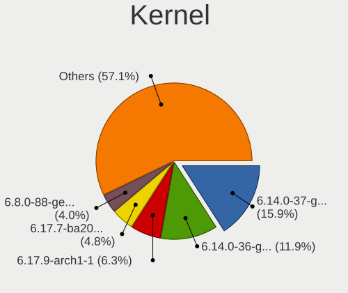

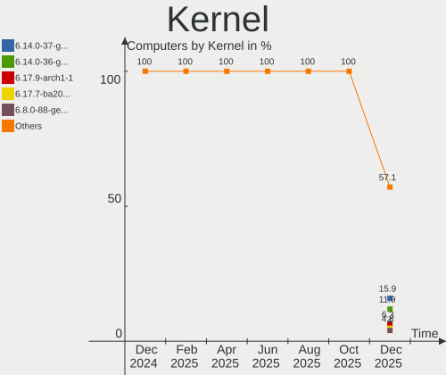

| Version                        | Computers | Percent |
|--------------------------------|-----------|---------|
| 6.14.0-37-generic              | 20        | 15.87%  |
| 6.14.0-36-generic              | 15        | 11.9%   |
| 6.17.9-arch1-1                 | 8         | 6.35%   |
| 6.17.7-ba20.fc43.x86_64        | 6         | 4.76%   |
| 6.8.0-88-generic               | 5         | 3.97%   |
| 6.14.2-desktop-3omv2590        | 5         | 3.97%   |
| 6.8.0-90-generic               | 4         | 3.17%   |
| 6.17.12-300.fc43.x86_64        | 4         | 3.17%   |
| 6.17.9-300.fc43.x86_64         | 3         | 2.38%   |
| 6.17.7-ba19.fc43.x86_64        | 3         | 2.38%   |
| 6.12.57+deb13-amd64            | 3         | 2.38%   |
| 6.18.2-1-t2-trixie             | 2         | 1.59%   |
| 6.18.0-cachyos                 | 2         | 1.59%   |
| 6.17.9-76061709-generic        | 2         | 1.59%   |
| 6.17.4-76061704-generic        | 2         | 1.59%   |
| 6.17.10-300.fc43.x86_64        | 2         | 1.59%   |
| 6.14.0-27-generic              | 2         | 1.59%   |
| 6.8.0-87-generic               | 1         | 0.79%   |
| 6.6.21-yocto-standard          | 1         | 0.79%   |
| 6.4.0-150600.23.73-default     | 1         | 0.79%   |
| 6.18.2-arch2-1                 | 1         | 0.79%   |
| 6.18.2-3-cachyos               | 1         | 0.79%   |
| 6.18.2-1-MANJARO               | 1         | 0.79%   |
| 6.18.1-arch1-2.1-g14           | 1         | 0.79%   |
| 6.18.1-arch1-2                 | 1         | 0.79%   |
| 6.17.9-zen1-1-zen              | 1         | 0.79%   |
| 6.17.8-arch1-1                 | 1         | 0.79%   |
| 6.17.7-zen1-1-zen              | 1         | 0.79%   |
| 6.17.7-200.nobara.fc42.x86_64  | 1         | 0.79%   |
| 6.17.4                         | 1         | 0.79%   |
| 6.17.12-200.nobara.fc43.x86_64 | 1         | 0.79%   |
| 6.17.11-300.fc43.x86_64        | 1         | 0.79%   |
| 6.17.1-300.fc43.x86_64         | 1         | 0.79%   |
| 6.17.0-8-generic               | 1         | 0.79%   |
| 6.17.0-7-generic               | 1         | 0.79%   |
| 6.16.3+deb13-amd64             | 1         | 0.79%   |
| 6.15.5-1588.native             | 1         | 0.79%   |
| 6.14.0-33-generic              | 1         | 0.79%   |
| 6.14.0-29-generic              | 1         | 0.79%   |
| 6.14.0-116036-tuxedo           | 1         | 0.79%   |

Kernel Family
-------------

Linux kernel without a distro release

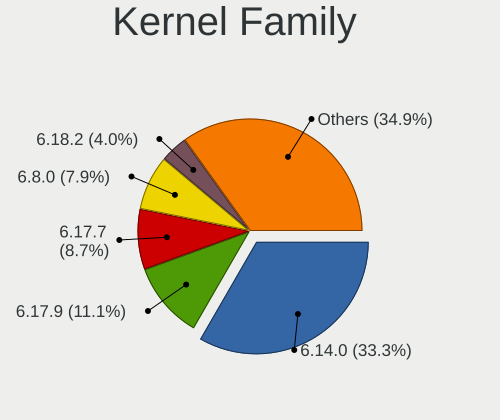

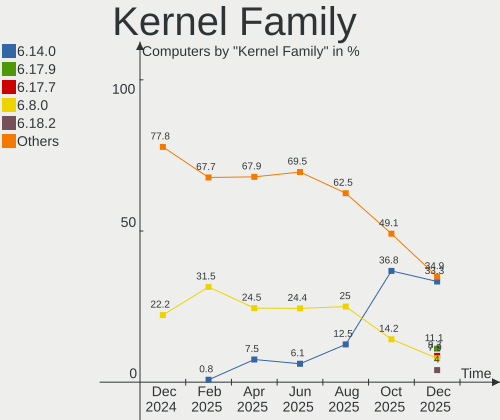

| Version  | Computers | Percent |
|----------|-----------|---------|
| 6.14.0   | 42        | 33.33%  |
| 6.17.9   | 14        | 11.11%  |
| 6.17.7   | 11        | 8.73%   |
| 6.8.0    | 10        | 7.94%   |
| 6.18.2   | 5         | 3.97%   |
| 6.17.12  | 5         | 3.97%   |
| 6.14.2   | 5         | 3.97%   |
| 6.12.57  | 4         | 3.17%   |
| 6.17.4   | 3         | 2.38%   |
| 6.18.1   | 2         | 1.59%   |
| 6.18.0   | 2         | 1.59%   |
| 6.17.10  | 2         | 1.59%   |
| 6.17.0   | 2         | 1.59%   |
| 6.12.59  | 2         | 1.59%   |
| 6.11.0   | 2         | 1.59%   |
| 6.6.21   | 1         | 0.79%   |
| 6.4.0    | 1         | 0.79%   |
| 6.17.8   | 1         | 0.79%   |
| 6.17.11  | 1         | 0.79%   |
| 6.17.1   | 1         | 0.79%   |
| 6.16.3   | 1         | 0.79%   |
| 6.15.5   | 1         | 0.79%   |
| 6.12.62  | 1         | 0.79%   |
| 6.12.60  | 1         | 0.79%   |
| 6.12.48  | 1         | 0.79%   |
| 6.12.10  | 1         | 0.79%   |
| 6.12.1   | 1         | 0.79%   |
| 5.15.0   | 1         | 0.79%   |
| 5.10.224 | 1         | 0.79%   |
| 5.10.0   | 1         | 0.79%   |

Kernel Major Ver.
-----------------

Linux kernel major version

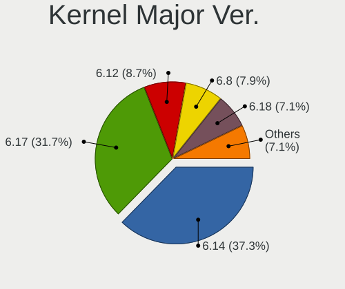

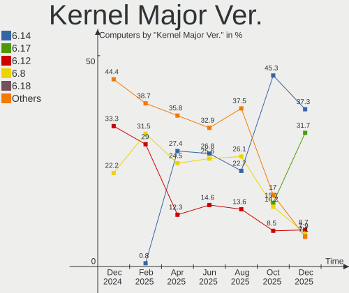

| Version | Computers | Percent |
|---------|-----------|---------|
| 6.14    | 47        | 37.3%   |
| 6.17    | 40        | 31.75%  |
| 6.12    | 11        | 8.73%   |
| 6.8     | 10        | 7.94%   |
| 6.18    | 9         | 7.14%   |
| 6.11    | 2         | 1.59%   |
| 5.10    | 2         | 1.59%   |
| 6.6     | 1         | 0.79%   |
| 6.4     | 1         | 0.79%   |
| 6.16    | 1         | 0.79%   |
| 6.15    | 1         | 0.79%   |
| 5.15    | 1         | 0.79%   |

Arch
----

OS architecture (x86_64, i586, etc.)

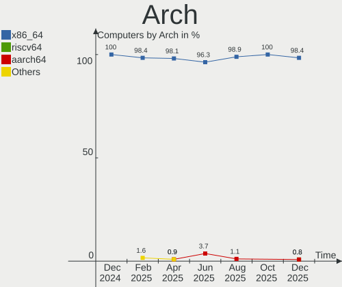

| Name    | Computers | Percent |
|---------|-----------|---------|
| x86_64  | 124       | 98.41%  |
| riscv64 | 1         | 0.79%   |
| aarch64 | 1         | 0.79%   |

DE
--

Desktop Environment

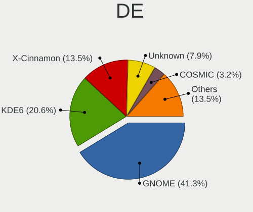

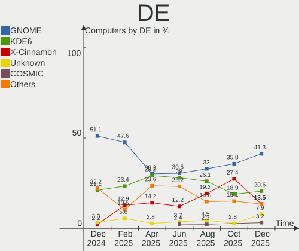

| Name          | Computers | Percent |
|---------------|-----------|---------|
| GNOME         | 52        | 41.27%  |
| KDE6          | 26        | 20.63%  |
| X-Cinnamon    | 17        | 13.49%  |
| Unknown       | 10        | 7.94%   |
| COSMIC        | 4         | 3.17%   |
| KDE5          | 3         | 2.38%   |
| KDE           | 3         | 2.38%   |
| XFCE          | 2         | 1.59%   |
| sway          | 2         | 1.59%   |
| Hyprland      | 2         | 1.59%   |
| niri          | 1         | 0.79%   |
| MATE          | 1         | 0.79%   |
| icewm         | 1         | 0.79%   |
| GNOME Classic | 1         | 0.79%   |
| Budgie        | 1         | 0.79%   |

Display Server
--------------

X11 or Wayland

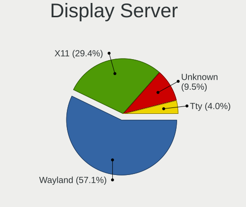

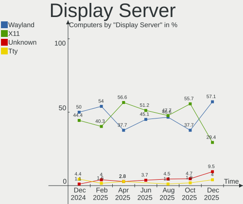

| Name    | Computers | Percent |
|---------|-----------|---------|
| Wayland | 72        | 57.14%  |
| X11     | 37        | 29.37%  |
| Unknown | 12        | 9.52%   |
| Tty     | 5         | 3.97%   |

Display Manager
---------------

SDDM, LightDM, etc.

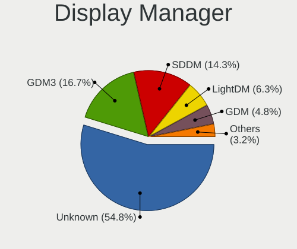

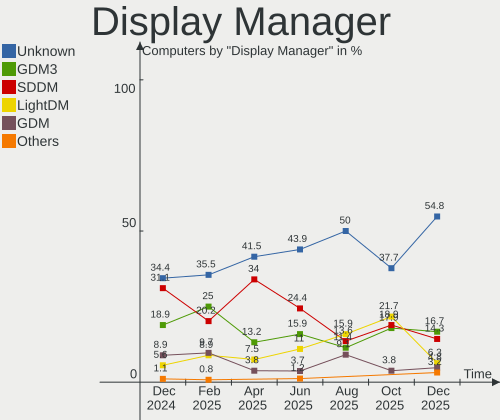

| Name    | Computers | Percent |
|---------|-----------|---------|
| Unknown | 69        | 54.76%  |
| GDM3    | 21        | 16.67%  |
| SDDM    | 18        | 14.29%  |
| LightDM | 8         | 6.35%   |
| GDM     | 6         | 4.76%   |
| GREETD  | 3         | 2.38%   |
| SLIMSKI | 1         | 0.79%   |

OS Lang
-------

Language

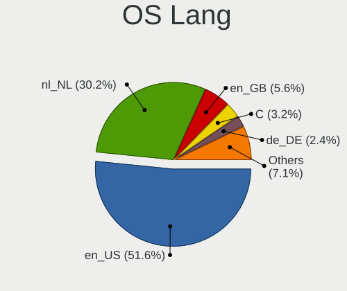

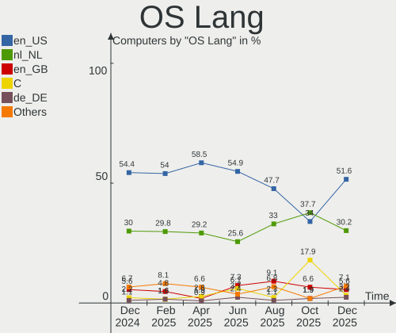

| Lang    | Computers | Percent |
|---------|-----------|---------|
| en_US   | 65        | 51.59%  |
| nl_NL   | 38        | 30.16%  |
| en_GB   | 7         | 5.56%   |
| C       | 4         | 3.17%   |
| de_DE   | 3         | 2.38%   |
| ru_RU   | 2         | 1.59%   |
| nl_BE   | 2         | 1.59%   |
| Unknown | 2         | 1.59%   |
| pl_PL   | 1         | 0.79%   |
| fr_FR   | 1         | 0.79%   |
| en_BW   | 1         | 0.79%   |

Boot Mode
---------

EFI or BIOS

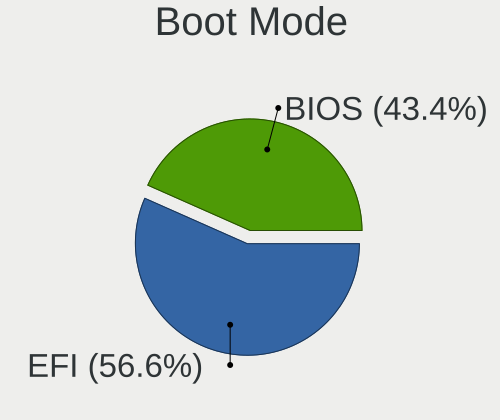

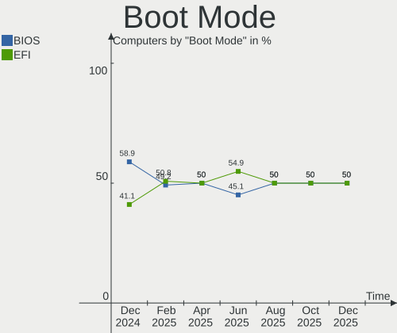

| Mode | Computers | Percent |
|------|-----------|---------|
| BIOS | 63        | 50%     |
| EFI  | 63        | 50%     |

Filesystem
----------

Type of filesystem

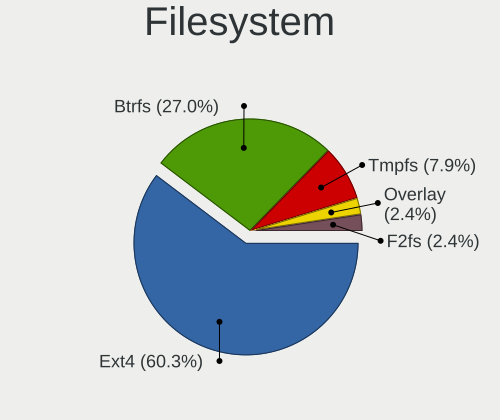

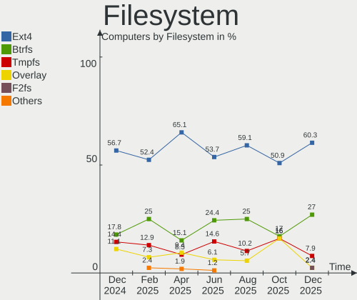

| Type    | Computers | Percent |
|---------|-----------|---------|
| Ext4    | 76        | 60.32%  |
| Btrfs   | 34        | 26.98%  |
| Tmpfs   | 10        | 7.94%   |
| Overlay | 3         | 2.38%   |
| F2fs    | 3         | 2.38%   |

Part. scheme
------------

Scheme of partitioning

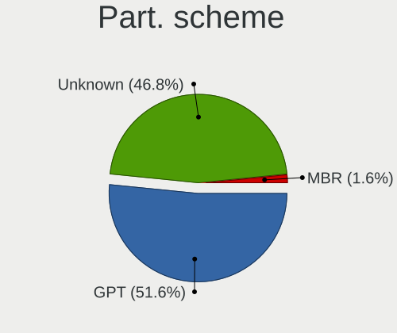

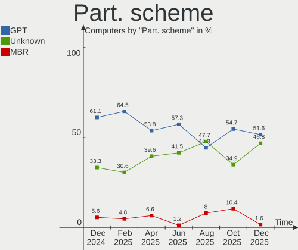

| Type    | Computers | Percent |
|---------|-----------|---------|
| GPT     | 65        | 51.59%  |
| Unknown | 59        | 46.83%  |
| MBR     | 2         | 1.59%   |

Dual Boot with Linux/BSD
------------------------

Hosting more than one Linux/BSD

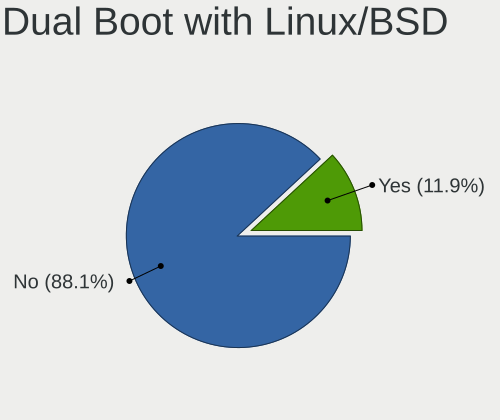

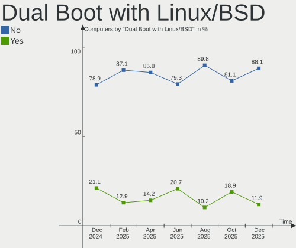

| Dual boot | Computers | Percent |
|-----------|-----------|---------|
| No        | 111       | 88.1%   |
| Yes       | 15        | 11.9%   |

Dual Boot (Win)
---------------

Hosting Linux and Windows

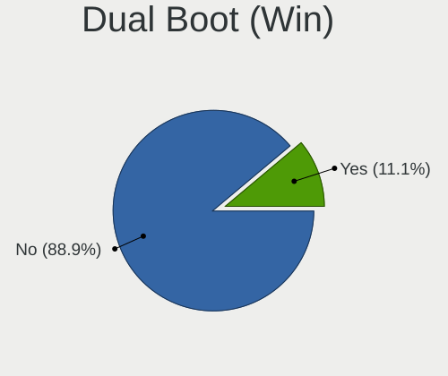

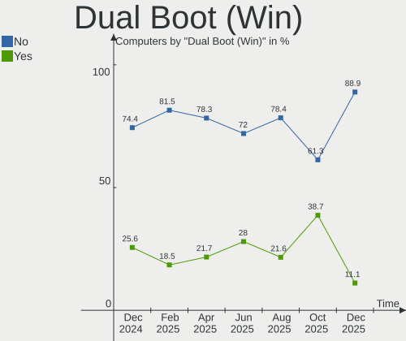

| Dual boot | Computers | Percent |
|-----------|-----------|---------|
| No        | 112       | 88.89%  |
| Yes       | 14        | 11.11%  |

Board
-----

Vendor
------

Motherboard manufacturer

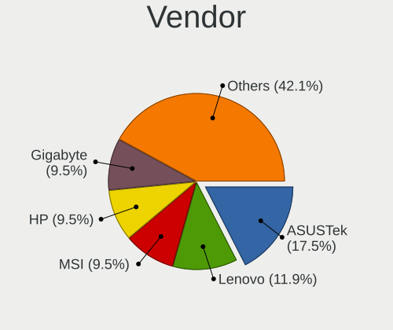

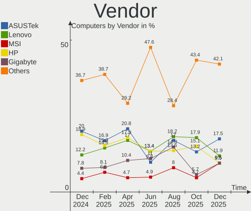

| Name                             | Computers | Percent |
|----------------------------------|-----------|---------|
| ASUSTek Computer                 | 22        | 17.46%  |
| Lenovo                           | 15        | 11.9%   |
| MSI                              | 12        | 9.52%   |
| Hewlett-Packard                  | 12        | 9.52%   |
| Gigabyte Technology              | 12        | 9.52%   |
| Dell                             | 12        | 9.52%   |
| ASRock                           | 9         | 7.14%   |
| Apple                            | 5         | 3.97%   |
| Medion                           | 3         | 2.38%   |
| Framework                        | 3         | 2.38%   |
| Acer                             | 3         | 2.38%   |
| WeiBu                            | 2         | 1.59%   |
| Intel                            | 2         | 1.59%   |
| TianBei                          | 1         | 0.79%   |
| Supermicro                       | 1         | 0.79%   |
| SKIKK                            | 1         | 0.79%   |
| Shenzhen DOKE electronic         | 1         | 0.79%   |
| Samsung Electronics              | 1         | 0.79%   |
| Raspberry Pi Foundation          | 1         | 0.79%   |
| PC Engines                       | 1         | 0.79%   |
| Packard Bell                     | 1         | 0.79%   |
| Micro Computer (HK) Tech Limited | 1         | 0.79%   |
| CompuLab                         | 1         | 0.79%   |
| AZW                              | 1         | 0.79%   |
| Alienware                        | 1         | 0.79%   |
| Acidanthera                      | 1         | 0.79%   |
| Unknown                          | 1         | 0.79%   |

Model
-----

Motherboard model

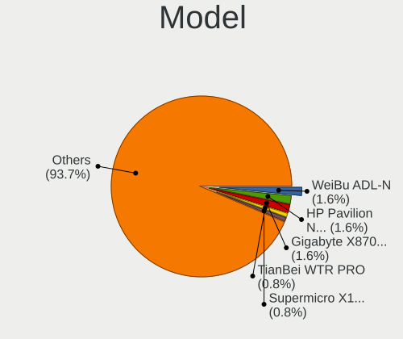

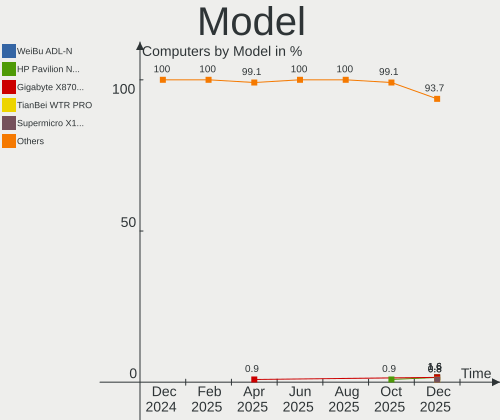

| Name                                     | Computers | Percent |
|------------------------------------------|-----------|---------|
| WeiBu ADL-N                              | 2         | 1.59%   |
| HP Pavilion Notebook                     | 2         | 1.59%   |
| Gigabyte X870E AORUS ELITE WIFI7         | 2         | 1.59%   |
| TianBei WTR PRO                          | 1         | 0.79%   |
| Supermicro X10SLM+-LN4F                  | 1         | 0.79%   |
| SKIKK Niflheim 17 II                     | 1         | 0.79%   |
| Shenzhen DOKE electronic MP100           | 1         | 0.79%   |
| Samsung 960XGL                           | 1         | 0.79%   |
| RPi Raspberry Pi 5 Model B Rev 1.1       | 1         | 0.79%   |
| PC Engines APU3                          | 1         | 0.79%   |
| Packard Bell IMEDIA S3800                | 1         | 0.79%   |
| MSI MS-7E32                              | 1         | 0.79%   |
| MSI MS-7D91                              | 1         | 0.79%   |
| MSI MS-7D54                              | 1         | 0.79%   |
| MSI MS-7C91                              | 1         | 0.79%   |
| MSI MS-7C89                              | 1         | 0.79%   |
| MSI MS-7C37                              | 1         | 0.79%   |
| MSI MS-7C02                              | 1         | 0.79%   |
| MSI MS-7B89                              | 1         | 0.79%   |
| MSI MS-7A59                              | 1         | 0.79%   |
| MSI MS-7519                              | 1         | 0.79%   |
| MSI MAG H610 Codex 5 (MS-B930)           | 1         | 0.79%   |
| MSI GE72 6QD                             | 1         | 0.79%   |
| Micro (HK) Tech Limited Venus series     | 1         | 0.79%   |
| Medion MS-7616                           | 1         | 0.79%   |
| Medion E3216 MD60900                     | 1         | 0.79%   |
| Medion E2228T MD61900                    | 1         | 0.79%   |
| Lenovo ThinkPad X13 Gen 6 21RLS45903     | 1         | 0.79%   |
| Lenovo ThinkPad X1 Carbon 7th 20QDCTO1WW | 1         | 0.79%   |
| Lenovo ThinkPad T580 20L9CTO1WW          | 1         | 0.79%   |
| Lenovo ThinkPad T530 24295XG             | 1         | 0.79%   |
| Lenovo ThinkPad T470 W10DG 20JNS00U0D    | 1         | 0.79%   |
| Lenovo ThinkPad SL510 28477LG            | 1         | 0.79%   |
| Lenovo ThinkPad S1 Yoga 20CD0038MH       | 1         | 0.79%   |
| Lenovo ThinkPad P15v Gen 3 21D9S0J805    | 1         | 0.79%   |
| Lenovo ThinkPad P1 Gen 2 20QUS00000      | 1         | 0.79%   |
| Lenovo Legion Pro 7 16AFR10H 83RU        | 1         | 0.79%   |
| Lenovo Legion 5 17IMH05H 81Y8            | 1         | 0.79%   |
| Lenovo Legion 5 15IMH05H 81Y6            | 1         | 0.79%   |
| Lenovo IdeaPad Pro 5 16AHP9 83D5         | 1         | 0.79%   |

Model Family
------------

Motherboard model prefix

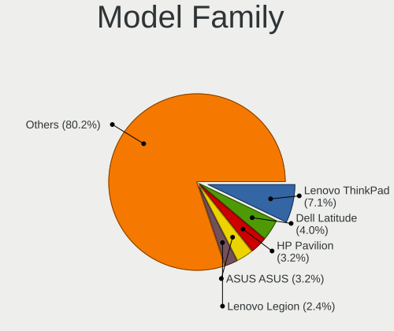

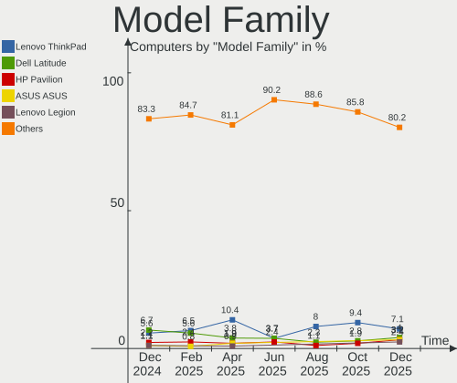

| Name                           | Computers | Percent |
|--------------------------------|-----------|---------|
| Lenovo ThinkPad                | 9         | 7.14%   |
| Dell Latitude                  | 5         | 3.97%   |
| HP Pavilion                    | 4         | 3.17%   |
| ASUS ASUS                      | 4         | 3.17%   |
| Lenovo Legion                  | 3         | 2.38%   |
| Lenovo IdeaPad                 | 3         | 2.38%   |
| Framework Laptop               | 3         | 2.38%   |
| WeiBu ADL-N                    | 2         | 1.59%   |
| HP ProDesk                     | 2         | 1.59%   |
| HP OMEN                        | 2         | 1.59%   |
| HP EliteBook                   | 2         | 1.59%   |
| Gigabyte X870E                 | 2         | 1.59%   |
| Dell Pro                       | 2         | 1.59%   |
| Dell OptiPlex                  | 2         | 1.59%   |
| ASUS VivoBook                  | 2         | 1.59%   |
| ASUS ROG                       | 2         | 1.59%   |
| ASRock B650M                   | 2         | 1.59%   |
| Apple MacBookPro11             | 2         | 1.59%   |
| Acer Aspire                    | 2         | 1.59%   |
| TianBei WTR                    | 1         | 0.79%   |
| Supermicro X10SLM+-LN4F        | 1         | 0.79%   |
| SKIKK Niflheim                 | 1         | 0.79%   |
| Shenzhen DOKE electronic MP100 | 1         | 0.79%   |
| Samsung 960XGL                 | 1         | 0.79%   |
| RPi Raspberry                  | 1         | 0.79%   |
| PC Engines APU3                | 1         | 0.79%   |
| Packard Bell IMEDIA            | 1         | 0.79%   |
| MSI MS-7E32                    | 1         | 0.79%   |
| MSI MS-7D91                    | 1         | 0.79%   |
| MSI MS-7D54                    | 1         | 0.79%   |
| MSI MS-7C91                    | 1         | 0.79%   |
| MSI MS-7C89                    | 1         | 0.79%   |
| MSI MS-7C37                    | 1         | 0.79%   |
| MSI MS-7C02                    | 1         | 0.79%   |
| MSI MS-7B89                    | 1         | 0.79%   |
| MSI MS-7A59                    | 1         | 0.79%   |
| MSI MS-7519                    | 1         | 0.79%   |
| MSI MAG                        | 1         | 0.79%   |
| MSI GE72                       | 1         | 0.79%   |
| Micro (HK) Tech Limited Venus  | 1         | 0.79%   |

MFG Year
--------

Motherboard manufacture year

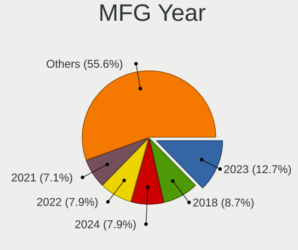

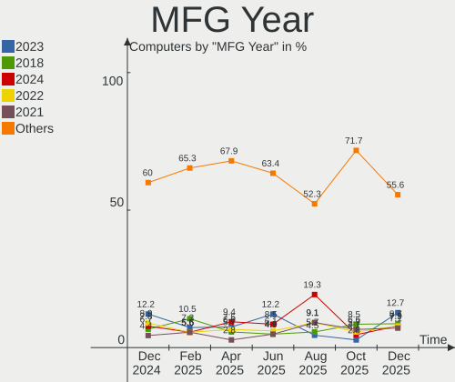

| Year    | Computers | Percent |
|---------|-----------|---------|
| 2023    | 16        | 12.7%   |
| 2018    | 11        | 8.73%   |
| 2024    | 10        | 7.94%   |
| 2022    | 10        | 7.94%   |
| 2021    | 9         | 7.14%   |
| 2020    | 9         | 7.14%   |
| 2019    | 9         | 7.14%   |
| 2012    | 8         | 6.35%   |
| 2009    | 8         | 6.35%   |
| 2025    | 7         | 5.56%   |
| 2017    | 6         | 4.76%   |
| 2014    | 5         | 3.97%   |
| 2013    | 5         | 3.97%   |
| 2016    | 4         | 3.17%   |
| 2015    | 3         | 2.38%   |
| 2011    | 3         | 2.38%   |
| Unknown | 2         | 1.59%   |
| 2008    | 1         | 0.79%   |

Form Factor
-----------

Physical design of the computer

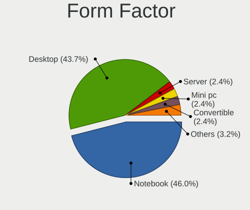

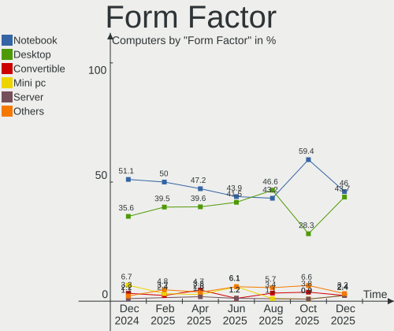

| Name           | Computers | Percent |
|----------------|-----------|---------|
| Notebook       | 58        | 46.03%  |
| Desktop        | 55        | 43.65%  |
| Convertible    | 3         | 2.38%   |
| Mini pc        | 3         | 2.38%   |
| Server         | 3         | 2.38%   |
| System on chip | 2         | 1.59%   |
| All in one     | 2         | 1.59%   |

Secure Boot
-----------

Enabled or disabled

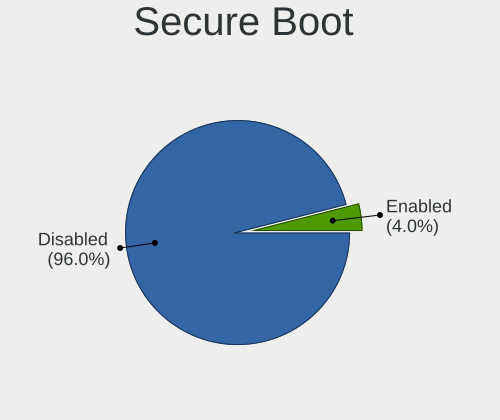

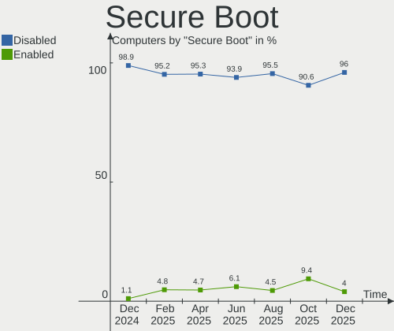

| State    | Computers | Percent |
|----------|-----------|---------|
| Disabled | 121       | 96.03%  |
| Enabled  | 5         | 3.97%   |

Coreboot
--------

Have coreboot on board

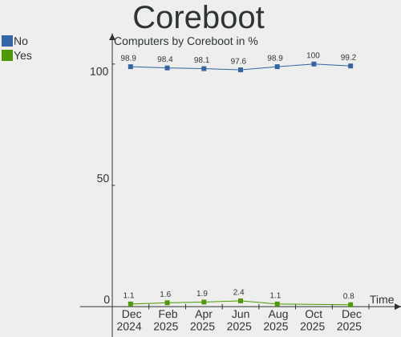

| Used | Computers | Percent |
|------|-----------|---------|
| No   | 125       | 99.21%  |
| Yes  | 1         | 0.79%   |

RAM Size
--------

Total RAM memory

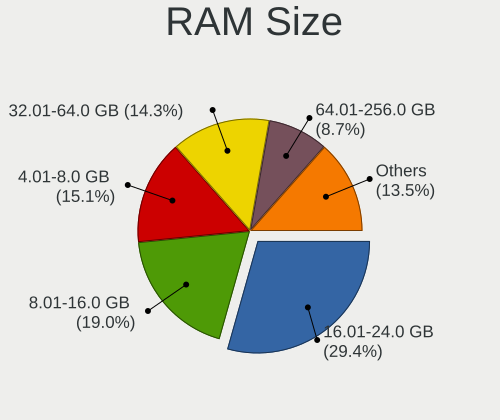

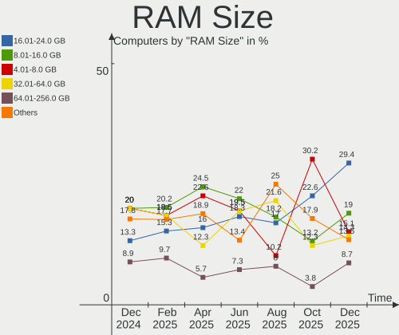

| Size in GB  | Computers | Percent |
|-------------|-----------|---------|
| 16.01-24.0  | 37        | 29.37%  |
| 8.01-16.0   | 24        | 19.05%  |
| 4.01-8.0    | 19        | 15.08%  |
| 32.01-64.0  | 18        | 14.29%  |
| 64.01-256.0 | 11        | 8.73%   |
| 24.01-32.0  | 10        | 7.94%   |
| 3.01-4.0    | 6         | 4.76%   |
| 1.01-2.0    | 1         | 0.79%   |

RAM Used
--------

Used RAM memory

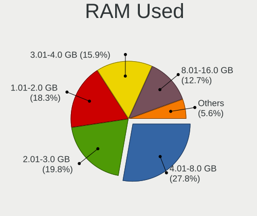

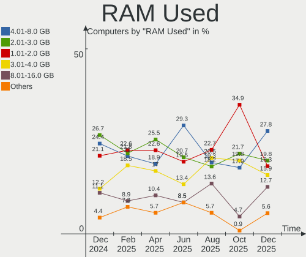

| Used GB    | Computers | Percent |
|------------|-----------|---------|
| 4.01-8.0   | 35        | 27.78%  |
| 2.01-3.0   | 25        | 19.84%  |
| 1.01-2.0   | 23        | 18.25%  |
| 3.01-4.0   | 20        | 15.87%  |
| 8.01-16.0  | 16        | 12.7%   |
| 0.51-1.0   | 3         | 2.38%   |
| 24.01-32.0 | 2         | 1.59%   |
| 16.01-24.0 | 1         | 0.79%   |
| 0.01-0.5   | 1         | 0.79%   |

Total Drives
------------

Number of drives on board

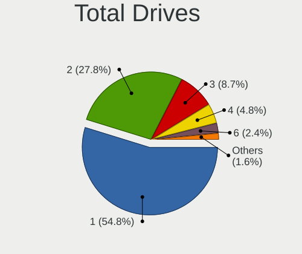

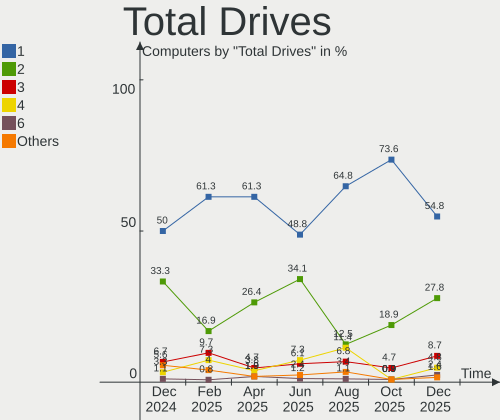

| Drives | Computers | Percent |
|--------|-----------|---------|
| 1      | 69        | 54.76%  |
| 2      | 35        | 27.78%  |
| 3      | 11        | 8.73%   |
| 4      | 6         | 4.76%   |
| 6      | 3         | 2.38%   |
| 7      | 1         | 0.79%   |
| 5      | 1         | 0.79%   |

Has CD-ROM
----------

Has CD-ROM on board

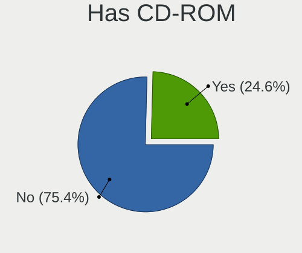

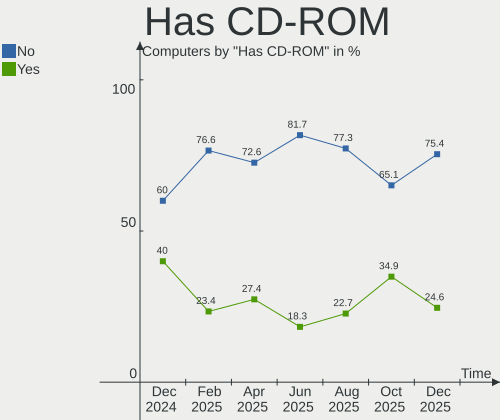

| Presented | Computers | Percent |
|-----------|-----------|---------|
| No        | 95        | 75.4%   |
| Yes       | 31        | 24.6%   |

Has Ethernet
------------

Has Ethernet on board

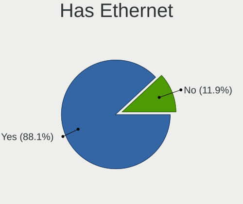

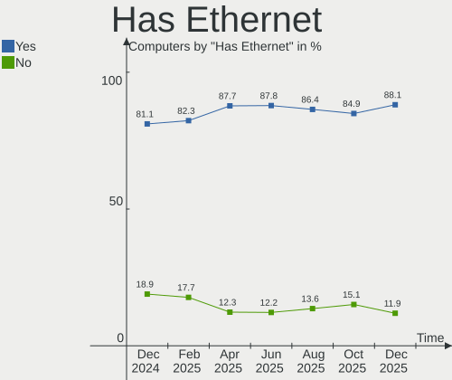

| Presented | Computers | Percent |
|-----------|-----------|---------|
| Yes       | 111       | 88.1%   |
| No        | 15        | 11.9%   |

Has WiFi
--------

Has WiFi module

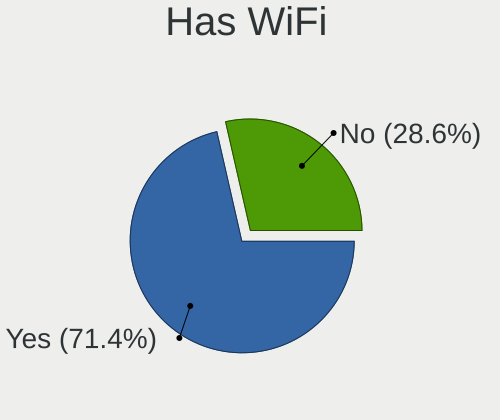

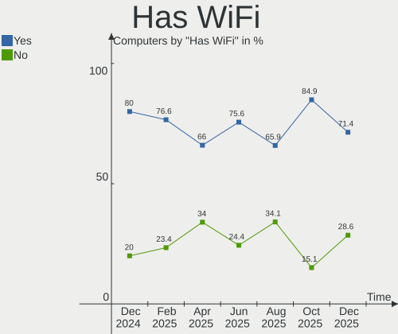

| Presented | Computers | Percent |
|-----------|-----------|---------|
| Yes       | 90        | 71.43%  |
| No        | 36        | 28.57%  |

Has Bluetooth
-------------

Has Bluetooth module

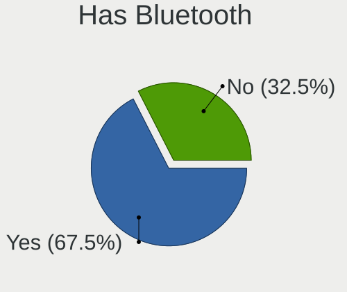

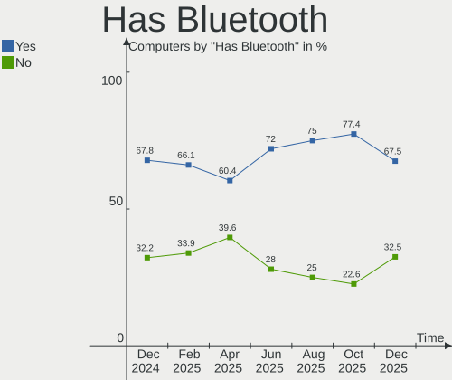

| Presented | Computers | Percent |
|-----------|-----------|---------|
| Yes       | 85        | 67.46%  |
| No        | 41        | 32.54%  |

Location
--------

Country
-------

Geographic location (country)

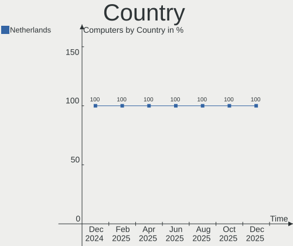

| Country     | Computers | Percent |
|-------------|-----------|---------|
| Netherlands | 126       | 100%    |

City
----

Geographic location (city)

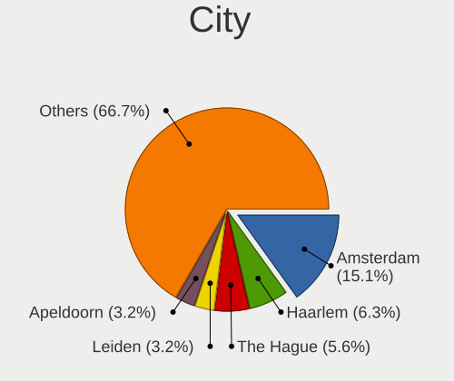

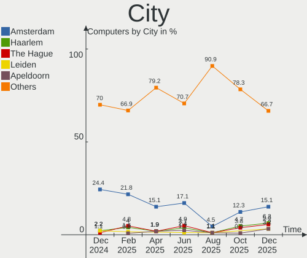

| City              | Computers | Percent |
|-------------------|-----------|---------|
| Amsterdam         | 19        | 15.08%  |
| Haarlem           | 8         | 6.35%   |
| The Hague         | 7         | 5.56%   |
| Leiden            | 4         | 3.17%   |
| Apeldoorn         | 4         | 3.17%   |
| Utrecht           | 3         | 2.38%   |
| Rotterdam         | 3         | 2.38%   |
| Huizen            | 3         | 2.38%   |
| Groningen         | 3         | 2.38%   |
| Dordrecht         | 3         | 2.38%   |
| Zwolle            | 2         | 1.59%   |
| Zeist             | 2         | 1.59%   |
| Oldenzaal         | 2         | 1.59%   |
| Nijmegen          | 2         | 1.59%   |
| Hoorn             | 2         | 1.59%   |
| Hilversum         | 2         | 1.59%   |
| Hengelo           | 2         | 1.59%   |
| Hasselt           | 2         | 1.59%   |
| Groenlo           | 2         | 1.59%   |
| Almere Stad       | 2         | 1.59%   |
| Zwijndrecht       | 1         | 0.79%   |
| Waalwijk          | 1         | 0.79%   |
| Vianen            | 1         | 0.79%   |
| Valkenswaard      | 1         | 0.79%   |
| Twello            | 1         | 0.79%   |
| Tilburg           | 1         | 0.79%   |
| Stiens            | 1         | 0.79%   |
| Sittard           | 1         | 0.79%   |
| Schoonhoven       | 1         | 0.79%   |
| Rosmalen          | 1         | 0.79%   |
| Roosendaal        | 1         | 0.79%   |
| Ridderkerk        | 1         | 0.79%   |
| Radewijk          | 1         | 0.79%   |
| Nunspeet          | 1         | 0.79%   |
| Noordwijk aan Zee | 1         | 0.79%   |
| Nijkerk           | 1         | 0.79%   |
| Naaldwijk         | 1         | 0.79%   |
| Meppel            | 1         | 0.79%   |
| Maastricht        | 1         | 0.79%   |
| Lunteren          | 1         | 0.79%   |

Drives
------

Drive Vendor
------------

Hard drive vendors

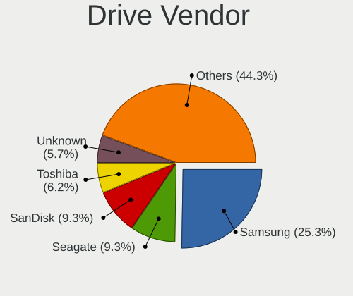

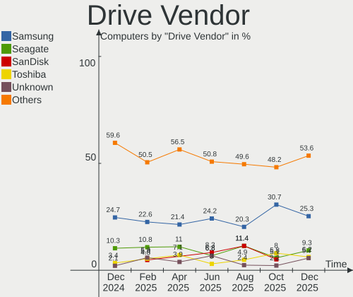

| Vendor                         | Computers | Drives | Percent |
|--------------------------------|-----------|--------|---------|
| Samsung Electronics            | 49        | 62     | 25.26%  |
| Seagate                        | 18        | 26     | 9.28%   |
| SanDisk                        | 18        | 18     | 9.28%   |
| Toshiba                        | 12        | 13     | 6.19%   |
| Unknown                        | 11        | 13     | 5.67%   |
| WDC                            | 10        | 16     | 5.15%   |
| Micron Technology              | 10        | 11     | 5.15%   |
| Crucial                        | 9         | 12     | 4.64%   |
| Intel                          | 8         | 8      | 4.12%   |
| Kingston                       | 6         | 6      | 3.09%   |
| SK hynix                       | 5         | 5      | 2.58%   |
| Kingston Technology Company    | 4         | 5      | 2.06%   |
| Hitachi                        | 4         | 5      | 2.06%   |
| Micron/Crucial Technology      | 3         | 4      | 1.55%   |
| MAXIO Technology (Hangzhou)    | 3         | 3      | 1.55%   |
| Apple                          | 3         | 4      | 1.55%   |
| Netac                          | 2         | 2      | 1.03%   |
| HGST                           | 2         | 2      | 1.03%   |
| VICKTER                        | 1         | 1      | 0.52%   |
| Transcend                      | 1         | 1      | 0.52%   |
| Shenzhen DAPU Microelectronics | 1         | 2      | 0.52%   |
| SABRENT                        | 1         | 2      | 0.52%   |
| Phison Electronics             | 1         | 1      | 0.52%   |
| Patriot                        | 1         | 1      | 0.52%   |
| OCZ                            | 1         | 1      | 0.52%   |
| KIOXIA                         | 1         | 1      | 0.52%   |
| Intenso                        | 1         | 1      | 0.52%   |
| Fujitsu                        | 1         | 1      | 0.52%   |
| Fanxiang                       | 1         | 1      | 0.52%   |
| Emtec                          | 1         | 1      | 0.52%   |
| China                          | 1         | 1      | 0.52%   |
| ASMedia                        | 1         | 1      | 0.52%   |
| ASint Technology               | 1         | 1      | 0.52%   |
| A-DATA Technology              | 1         | 1      | 0.52%   |
| Unknown                        | 1         | 1      | 0.52%   |

Drive Model
-----------

Hard drive models

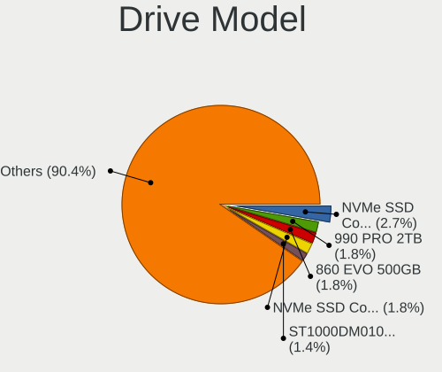

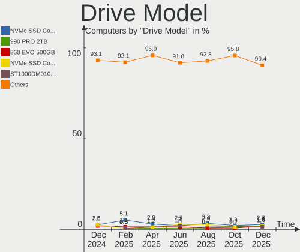

| Model                                                                   | Computers | Percent |
|-------------------------------------------------------------------------|-----------|---------|
| Samsung NVMe SSD Controller SM981/PM981/PM983 1TB                       | 6         | 2.74%   |
| Samsung SSD 990 PRO 2TB                                                 | 4         | 1.83%   |
| Samsung SSD 860 EVO 500GB                                               | 4         | 1.83%   |
| Samsung NVMe SSD Controller PM9A1/PM9A3/980PRO 1TB                      | 4         | 1.83%   |
| Seagate ST1000DM010-2EP102 1TB                                          | 3         | 1.37%   |
| Samsung SSD 990 PRO 1TB                                                 | 3         | 1.37%   |
| Samsung SSD 850 EVO 250GB                                               | 3         | 1.37%   |
| Crucial CT240BX500SSD1 240GB                                            | 3         | 1.37%   |
| Unknown NVMe SSD Drive 1024GB                                           | 2         | 0.91%   |
| Unknown MMC Card  64GB                                                  | 2         | 0.91%   |
| Unknown MMC Card  128GB                                                 | 2         | 0.91%   |
| Sandisk WD Black SN770 / PC SN740 256GB / PC SN560 (DRAM-less) NVMe SSD | 2         | 0.91%   |
| Samsung SSD 990 PRO with Heatsink 2TB                                   | 2         | 0.91%   |
| Samsung SSD 980 1TB                                                     | 2         | 0.91%   |
| Samsung SSD 860 QVO 1TB                                                 | 2         | 0.91%   |
| Samsung SSD 860 EVO 250GB                                               | 2         | 0.91%   |
| Samsung SSD 850 EVO 500GB                                               | 2         | 0.91%   |
| Samsung SSD 840 EVO 250GB                                               | 2         | 0.91%   |
| Samsung MZVL4512HBLU-00BL7 512GB                                        | 2         | 0.91%   |
| Micron 2400 NVMe SSD (DRAM-less) 512GB                                  | 2         | 0.91%   |
| Micron 2210_MTFDHBA512QFD 512GB                                         | 2         | 0.91%   |
| MAXIO (Hangzhou) NVMe SSD Controller MAP1202 2TB                        | 2         | 0.91%   |
| Kingston Company A2000 NVMe SSD 250GB                                   | 2         | 0.91%   |
| Kingston SA400S37480G 480GB SSD                                         | 2         | 0.91%   |
| Intel SSD Pro 7600p/760p/E 6100p Series 256GB                           | 2         | 0.91%   |
| Intel SSD 660P Series 512GB                                             | 2         | 0.91%   |
| Intel SSD 600P Series 1024GB                                            | 2         | 0.91%   |
| Hitachi HDS721010CLA330 1TB                                             | 2         | 0.91%   |
| Crucial CT120BX500SSD1 120GB                                            | 2         | 0.91%   |
| Crucial CT1000MX500SSD1 1TB                                             | 2         | 0.91%   |
| WDC WD7502AAEX-00Y9A0 752GB                                             | 1         | 0.46%   |
| WDC WD5000AAVS-00G9B0 500GB                                             | 1         | 0.46%   |
| WDC WD5000AAKX-603CA0 500GB                                             | 1         | 0.46%   |
| WDC WD5000AAKX-00ERMA0 500GB                                            | 1         | 0.46%   |
| WDC WD5000AAKX-001CA0 500GB                                             | 1         | 0.46%   |
| WDC WD5000AADS-00S9B0 500GB                                             | 1         | 0.46%   |
| WDC WD40EFAX-68JH4N1 4TB                                                | 1         | 0.46%   |
| WDC WD4003FRYZ-01F0DB0 4TB                                              | 1         | 0.46%   |
| WDC WD30EFRX-68EUZN0 3TB                                                | 1         | 0.46%   |
| WDC WD30EFRX-68AX9N0 3TB                                                | 1         | 0.46%   |

HDD Vendor
----------

Hard disk drive vendors

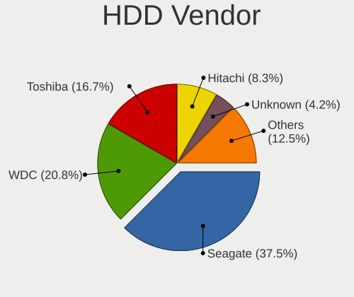

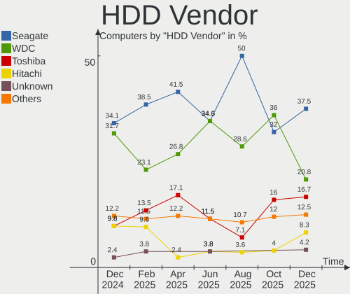

| Vendor  | Computers | Drives | Percent |
|---------|-----------|--------|---------|
| Seagate | 18        | 25     | 37.5%   |
| WDC     | 10        | 16     | 20.83%  |
| Toshiba | 8         | 9      | 16.67%  |
| Hitachi | 4         | 5      | 8.33%   |
| Unknown | 2         | 3      | 4.17%   |
| HGST    | 2         | 2      | 4.17%   |
| SABRENT | 1         | 2      | 2.08%   |
| Fujitsu | 1         | 1      | 2.08%   |
| ASMedia | 1         | 1      | 2.08%   |
| Apple   | 1         | 1      | 2.08%   |

SSD Vendor
----------

Solid state drive vendors

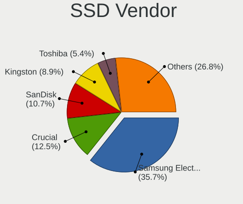

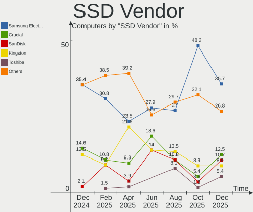

| Vendor              | Computers | Drives | Percent |
|---------------------|-----------|--------|---------|
| Samsung Electronics | 20        | 24     | 35.71%  |
| Crucial             | 7         | 10     | 12.5%   |
| SanDisk             | 6         | 6      | 10.71%  |
| Kingston            | 5         | 5      | 8.93%   |
| Toshiba             | 3         | 3      | 5.36%   |
| Netac               | 2         | 2      | 3.57%   |
| Micron Technology   | 2         | 2      | 3.57%   |
| Apple               | 2         | 2      | 3.57%   |
| VICKTER             | 1         | 1      | 1.79%   |
| Patriot             | 1         | 1      | 1.79%   |
| OCZ                 | 1         | 1      | 1.79%   |
| Intenso             | 1         | 1      | 1.79%   |
| Intel               | 1         | 1      | 1.79%   |
| Fanxiang            | 1         | 1      | 1.79%   |
| Emtec               | 1         | 1      | 1.79%   |
| China               | 1         | 1      | 1.79%   |
| A-DATA Technology   | 1         | 1      | 1.79%   |

Drive Kind
----------

HDD or SSD

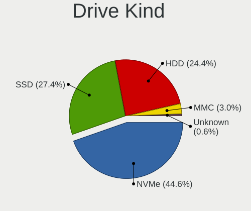

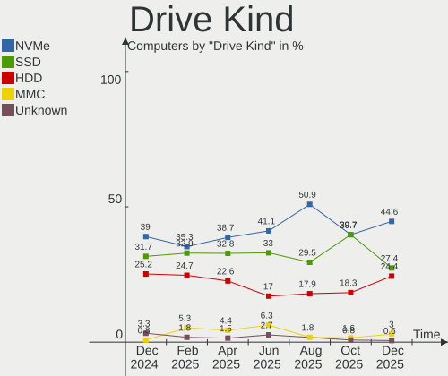

| Kind    | Computers | Drives | Percent |
|---------|-----------|--------|---------|
| NVMe    | 75        | 98     | 44.64%  |
| SSD     | 46        | 63     | 27.38%  |
| HDD     | 41        | 65     | 24.4%   |
| MMC     | 5         | 7      | 2.98%   |
| Unknown | 1         | 1      | 0.6%    |

Drive Connector
---------------

SATA, SAS, NVMe, etc.

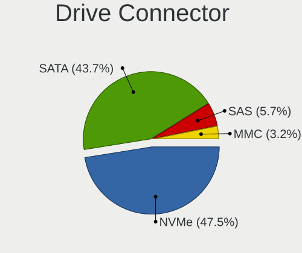

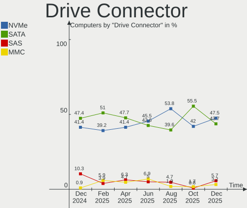

| Type | Computers | Drives | Percent |
|------|-----------|--------|---------|
| NVMe | 75        | 96     | 47.47%  |
| SATA | 69        | 120    | 43.67%  |
| SAS  | 9         | 11     | 5.7%    |
| MMC  | 5         | 7      | 3.16%   |

Drive Size
----------

Size of hard drive

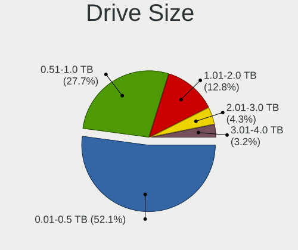

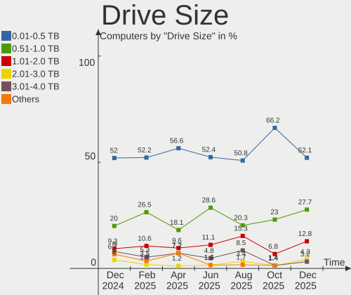

| Size in TB | Computers | Drives | Percent |
|------------|-----------|--------|---------|
| 0.01-0.5   | 49        | 73     | 52.13%  |
| 0.51-1.0   | 26        | 31     | 27.66%  |
| 1.01-2.0   | 12        | 15     | 12.77%  |
| 2.01-3.0   | 4         | 6      | 4.26%   |
| 3.01-4.0   | 3         | 3      | 3.19%   |

Space Total
-----------

Amount of disk space available on the file system

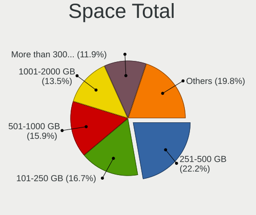

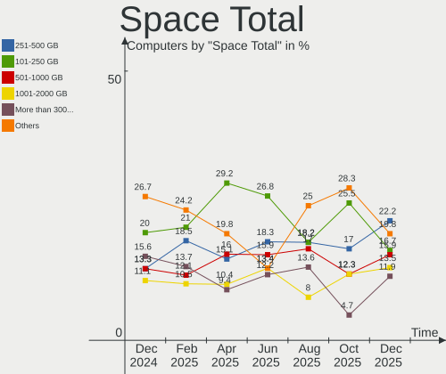

| Size in GB     | Computers | Percent |
|----------------|-----------|---------|
| 251-500        | 28        | 22.22%  |
| 101-250        | 21        | 16.67%  |
| 501-1000       | 20        | 15.87%  |
| 1001-2000      | 17        | 13.49%  |
| More than 3000 | 15        | 11.9%   |
| 2001-3000      | 11        | 8.73%   |
| Unknown        | 5         | 3.97%   |
| 1-20           | 4         | 3.17%   |
| 51-100         | 4         | 3.17%   |
| 21-50          | 1         | 0.79%   |

Space Used
----------

Amount of used disk space

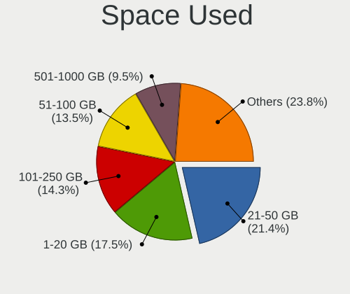

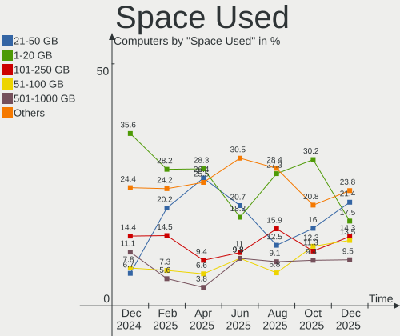

| Used GB        | Computers | Percent |
|----------------|-----------|---------|
| 21-50          | 27        | 21.43%  |
| 1-20           | 22        | 17.46%  |
| 101-250        | 18        | 14.29%  |
| 51-100         | 17        | 13.49%  |
| 501-1000       | 12        | 9.52%   |
| 251-500        | 9         | 7.14%   |
| More than 3000 | 8         | 6.35%   |
| 1001-2000      | 5         | 3.97%   |
| Unknown        | 5         | 3.97%   |
| 2001-3000      | 3         | 2.38%   |

Malfunc. Drives
---------------

Drive models with a malfunction

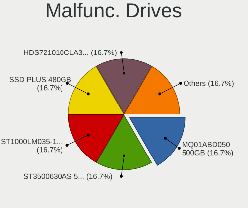

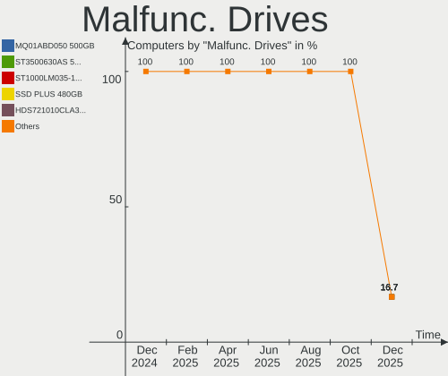

| Model                          | Computers | Drives | Percent |
|--------------------------------|-----------|--------|---------|
| Toshiba MQ01ABD050 500GB       | 1         | 2      | 16.67%  |
| Seagate ST3500630AS 500GB      | 1         | 1      | 16.67%  |
| Seagate ST1000LM035-1RK172 1TB | 1         | 3      | 16.67%  |
| SanDisk SSD PLUS 480GB         | 1         | 1      | 16.67%  |
| Hitachi HDS721010CLA330 1TB    | 1         | 1      | 16.67%  |
| Crucial CT128MX100SSD1 128GB   | 1         | 1      | 16.67%  |

Malfunc. Drive Vendor
---------------------

Vendors of faulty drives

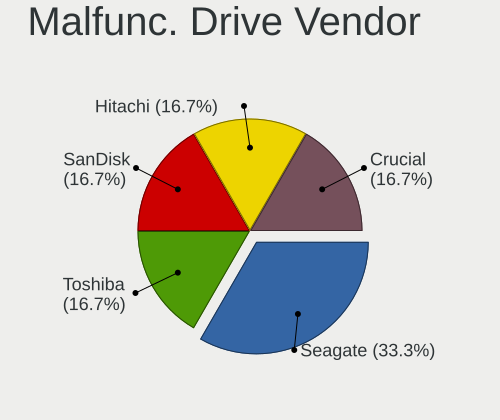

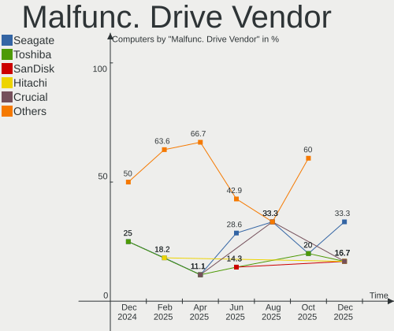

| Vendor  | Computers | Drives | Percent |
|---------|-----------|--------|---------|
| Seagate | 2         | 4      | 33.33%  |
| Toshiba | 1         | 2      | 16.67%  |
| SanDisk | 1         | 1      | 16.67%  |
| Hitachi | 1         | 1      | 16.67%  |
| Crucial | 1         | 1      | 16.67%  |

Malfunc. HDD Vendor
-------------------

Vendors of faulty HDD drives

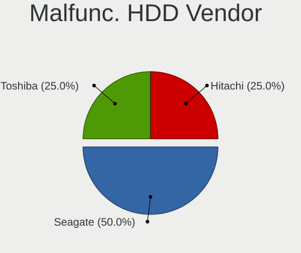

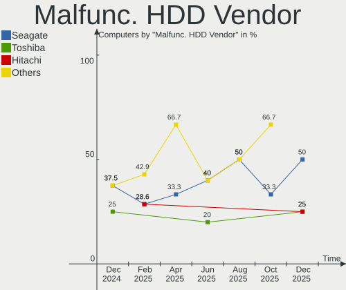

| Vendor  | Computers | Drives | Percent |
|---------|-----------|--------|---------|
| Seagate | 2         | 4      | 50%     |
| Toshiba | 1         | 2      | 25%     |
| Hitachi | 1         | 1      | 25%     |

Malfunc. Drive Kind
-------------------

Kinds of faulty drives

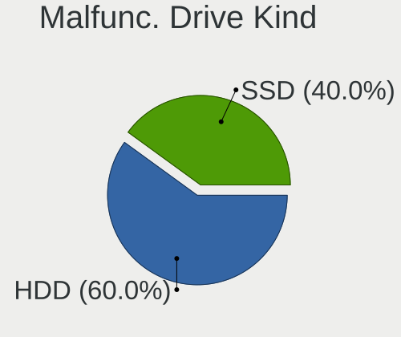

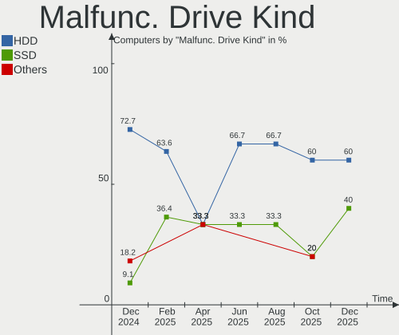

| Kind | Computers | Drives | Percent |
|------|-----------|--------|---------|
| HDD  | 3         | 7      | 60%     |
| SSD  | 2         | 2      | 40%     |

Failed Drives
-------------

Failed drive models

Zero info for selected period =(

Failed Drive Vendor
-------------------

Failed drive vendors

Zero info for selected period =(

Drive Status
------------

Number of failed and malfunc. drives

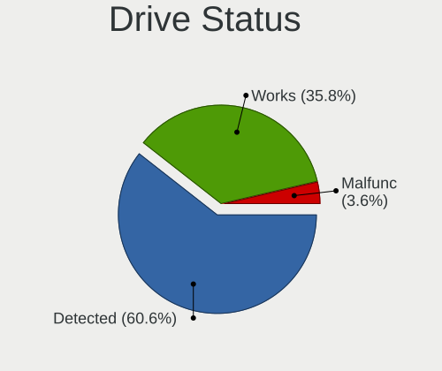

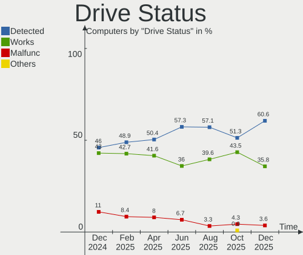

| Status   | Computers | Drives | Percent |
|----------|-----------|--------|---------|
| Detected | 83        | 143    | 60.58%  |
| Works    | 49        | 82     | 35.77%  |
| Malfunc  | 5         | 9      | 3.65%   |

Storage controller
------------------

Storage Vendor
--------------

Storage controller vendors

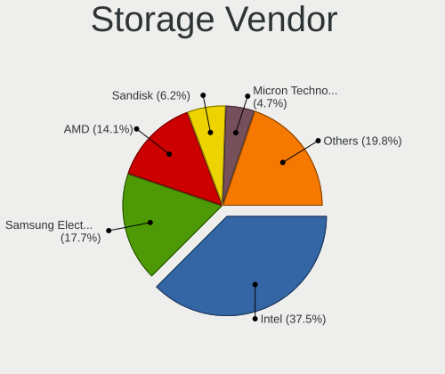

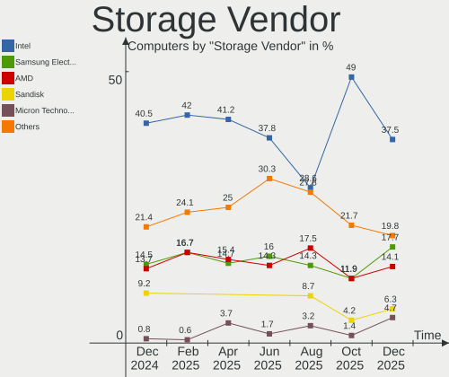

| Vendor                       | Computers | Percent |
|------------------------------|-----------|---------|
| Intel                        | 72        | 37.5%   |
| Samsung Electronics          | 34        | 17.71%  |
| AMD                          | 27        | 14.06%  |
| Sandisk                      | 12        | 6.25%   |
| Micron Technology            | 9         | 4.69%   |
| SK hynix                     | 5         | 2.6%    |
| Kingston Technology Company  | 5         | 2.6%    |
| ASMedia Technology           | 5         | 2.6%    |
| Micron/Crucial Technology    | 4         | 2.08%   |
| MAXIO Technology (Hangzhou)  | 4         | 2.08%   |
| JMicron Technology           | 3         | 1.56%   |
| KIOXIA                       | 2         | 1.04%   |
| INNOGRIT                     | 2         | 1.04%   |
| Transcend                    | 1         | 0.52%   |
| Toshiba America Info Systems | 1         | 0.52%   |
| Silicon Motion               | 1         | 0.52%   |
| Phison Electronics           | 1         | 0.52%   |
| Nvidia                       | 1         | 0.52%   |
| Marvell Technology Group     | 1         | 0.52%   |
| LSI Logic / Symbios Logic    | 1         | 0.52%   |
| DapuStor                     | 1         | 0.52%   |

Storage Model
-------------

Storage controller models

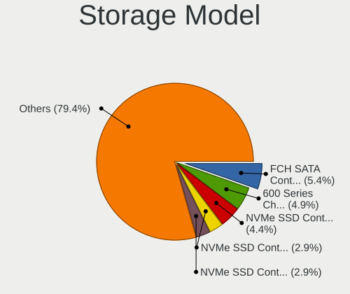

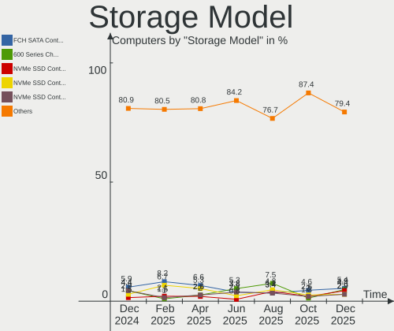

| Model                                                                          | Computers | Percent |
|--------------------------------------------------------------------------------|-----------|---------|
| AMD FCH SATA Controller [AHCI mode]                                            | 11        | 5.39%   |
| AMD 600 Series Chipset SATA Controller                                         | 10        | 4.9%    |
| Samsung NVMe SSD Controller S4LV008[Pascal]                                    | 9         | 4.41%   |
| Samsung NVMe SSD Controller SM981/PM981/PM983                                  | 6         | 2.94%   |
| Samsung NVMe SSD Controller PM9A1/PM9A3/980PRO                                 | 6         | 2.94%   |
| Intel 8 Series/C220 Series Chipset Family 6-port SATA Controller 1 [AHCI mode] | 5         | 2.45%   |
| ASMedia ASM1061/ASM1062 Serial ATA Controller                                  | 5         | 2.45%   |
| Samsung NVMe SSD Controller 980 (DRAM-less)                                    | 4         | 1.96%   |
| MAXIO (Hangzhou) NVMe SSD Controller MAP1202 (DRAM-less)                       | 4         | 1.96%   |
| Intel Sunrise Point-LP SATA Controller [AHCI mode]                             | 4         | 1.96%   |
| Intel Alder Lake-N SATA AHCI Controller                                        | 4         | 1.96%   |
| Intel 82801 Mobile SATA Controller [RAID mode]                                 | 4         | 1.96%   |
| Intel 400 Series Chipset Family SATA AHCI Controller                           | 4         | 1.96%   |
| Intel 200 Series PCH SATA controller [AHCI mode]                               | 4         | 1.96%   |
| SanDisk WD SN560/SN740/SN770/SN5000 NVMe SSD                                   | 3         | 1.47%   |
| Samsung NVMe SSD Controller SM961/PM961/SM963                                  | 3         | 1.47%   |
| Samsung NVMe SSD Controller PM9B1 (DRAM-less)                                  | 3         | 1.47%   |
| Samsung NVMe SSD 9100 PRO [PM9E1]                                              | 3         | 1.47%   |
| Kingston Company A2000 NVMe SSD [SM2263EN]                                     | 3         | 1.47%   |
| Intel Volume Management Device NVMe RAID Controller                            | 3         | 1.47%   |
| Intel Raptor Lake SATA AHCI Controller                                         | 3         | 1.47%   |
| Intel Cannon Lake PCH SATA AHCI Controller                                     | 3         | 1.47%   |
| Intel 7 Series Chipset Family 6-port SATA Controller [AHCI mode]               | 3         | 1.47%   |
| Intel 5 Series/3400 Series Chipset 6 port SATA AHCI Controller                 | 3         | 1.47%   |
| AMD 500 Series Chipset SATA Controller                                         | 3         | 1.47%   |
| AMD 400 Series Chipset SATA Controller                                         | 3         | 1.47%   |
| SK hynix PCB01 NVMe Solid State Drive                                          | 2         | 0.98%   |
| SanDisk Ultra 3D / WD PC SN530, IX SN530, Blue SN550 NVMe SSD (DRAM-less)      | 2         | 0.98%   |
| Samsung S4LN053X01 AHCI SSD Controller(Apple slot)                             | 2         | 0.98%   |
| Micron 2450 NVMe SSD [HendrixV] (DRAM-less)                                    | 2         | 0.98%   |
| Micron 2400 NVMe SSD (DRAM-less)                                               | 2         | 0.98%   |
| Micron 2210 NVMe SSD [Cobain]                                                  | 2         | 0.98%   |
| JMicron JMB363 SATA/IDE Controller                                             | 2         | 0.98%   |
| Intel SSD DC P4101/Pro 7600p/760p/E 6100p Series                               | 2         | 0.98%   |
| Intel SSD 660P Series                                                          | 2         | 0.98%   |
| Intel SSD 600P Series                                                          | 2         | 0.98%   |
| Intel SATA controller                                                          | 2         | 0.98%   |
| Intel Q170/Q150/B150/H170/H110/Z170/CM236 Chipset SATA Controller [AHCI Mode]  | 2         | 0.98%   |
| Intel Comet Lake SATA AHCI Controller                                          | 2         | 0.98%   |
| Intel Alder Lake-S PCH SATA Controller [AHCI Mode]                             | 2         | 0.98%   |

Storage Kind
------------

Kind of storage controller (IDE, SATA, NVMe, SAS, ...)

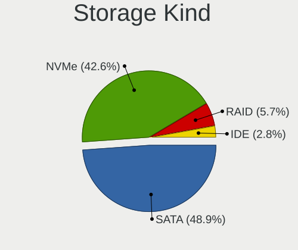

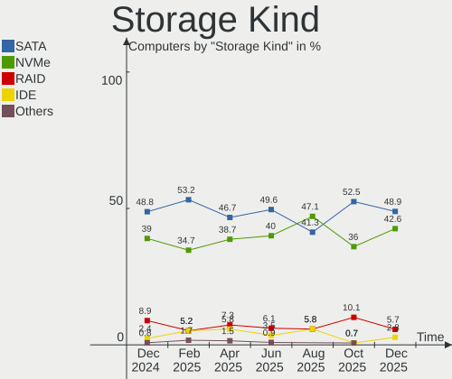

| Kind | Computers | Percent |
|------|-----------|---------|
| SATA | 86        | 48.86%  |
| NVMe | 75        | 42.61%  |
| RAID | 10        | 5.68%   |
| IDE  | 5         | 2.84%   |

Processor
---------

CPU Vendor
----------

Processor vendors

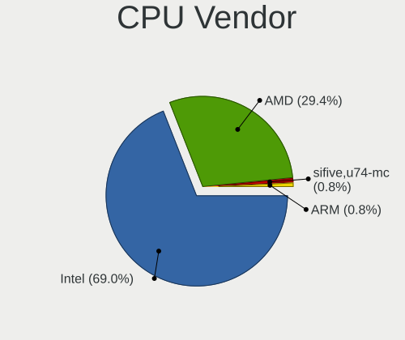

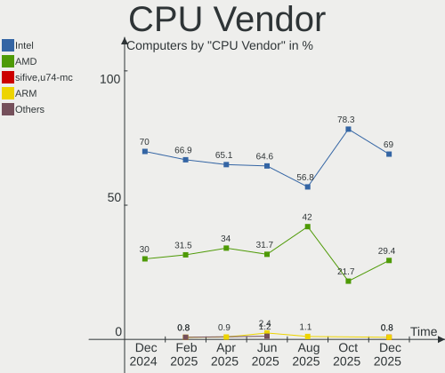

| Vendor        | Computers | Percent |
|---------------|-----------|---------|
| Intel         | 87        | 69.05%  |
| AMD           | 37        | 29.37%  |
| sifive,u74-mc | 1         | 0.79%   |
| ARM           | 1         | 0.79%   |

CPU Model
---------

Processor models

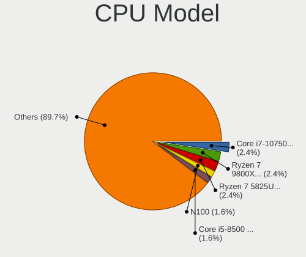

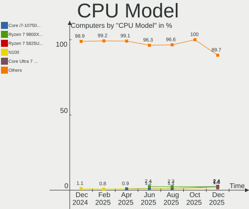

| Model                                         | Computers | Percent |
|-----------------------------------------------|-----------|---------|
| Intel Core i7-10750H CPU @ 2.60GHz            | 3         | 2.38%   |
| AMD Ryzen 7 9800X3D 8-Core Processor          | 3         | 2.38%   |
| AMD Ryzen 7 5825U with Radeon Graphics        | 3         | 2.38%   |
| Intel N100                                    | 2         | 1.59%   |
| Intel Core Ultra 7 265K                       | 2         | 1.59%   |
| Intel Core i5-8500 CPU @ 3.00GHz              | 2         | 1.59%   |
| Intel Core i5-7600K CPU @ 3.80GHz             | 2         | 1.59%   |
| Intel Core i5 CPU 750 @ 2.67GHz               | 2         | 1.59%   |
| Intel Core i3-N305                            | 2         | 1.59%   |
| Intel Core i3-10110U CPU @ 2.10GHz            | 2         | 1.59%   |
| Intel Celeron CPU N3050 @ 1.60GHz             | 2         | 1.59%   |
| Intel 11th Gen Core i5-1135G7 @ 2.40GHz       | 2         | 1.59%   |
| AMD Ryzen 7 8845HS w/ Radeon 780M Graphics    | 2         | 1.59%   |
| AMD Ryzen 7 6800H with Radeon Graphics        | 2         | 1.59%   |
| AMD Ryzen 7 5800X3D 8-Core Processor          | 2         | 1.59%   |
| sifive,u74-mc rv64imafdc_zicntr_zicsr_zifence | 1         | 0.79%   |
| Intel Xeon Silver 4114 CPU @ 2.20GHz          | 1         | 0.79%   |
| Intel Pentium CPU N4200 @ 1.10GHz             | 1         | 0.79%   |
| Intel Core Ultra 9 185H                       | 1         | 0.79%   |
| Intel Core Ultra 7 265HX                      | 1         | 0.79%   |
| Intel Core Ultra 7 155H                       | 1         | 0.79%   |
| Intel Core Ultra 5 235U                       | 1         | 0.79%   |
| Intel Core m5-6Y57 CPU @ 1.10GHz              | 1         | 0.79%   |
| Intel Core i9-9900KF CPU @ 3.60GHz            | 1         | 0.79%   |
| Intel Core i9-14900K                          | 1         | 0.79%   |
| Intel Core i7-9750H CPU @ 2.60GHz             | 1         | 0.79%   |
| Intel Core i7-8700 CPU @ 3.20GHz              | 1         | 0.79%   |
| Intel Core i7-8650U CPU @ 1.90GHz             | 1         | 0.79%   |
| Intel Core i7-8550U CPU @ 1.80GHz             | 1         | 0.79%   |
| Intel Core i7-7700K CPU @ 4.20GHz             | 1         | 0.79%   |
| Intel Core i7-7500U CPU @ 2.70GHz             | 1         | 0.79%   |
| Intel Core i7-6700HQ CPU @ 2.60GHz            | 1         | 0.79%   |
| Intel Core i7-4980HQ CPU @ 2.80GHz            | 1         | 0.79%   |
| Intel Core i7-4810MQ CPU @ 2.80GHz            | 1         | 0.79%   |
| Intel Core i7-4790 CPU @ 3.60GHz              | 1         | 0.79%   |
| Intel Core i7-4770 CPU @ 3.40GHz              | 1         | 0.79%   |
| Intel Core i7-4710HQ CPU @ 2.50GHz            | 1         | 0.79%   |
| Intel Core i7-4510U CPU @ 2.00GHz             | 1         | 0.79%   |
| Intel Core i7-4500U CPU @ 1.80GHz             | 1         | 0.79%   |
| Intel Core i7-3632QM CPU @ 2.20GHz            | 1         | 0.79%   |

CPU Model Family
----------------

Processor model prefix

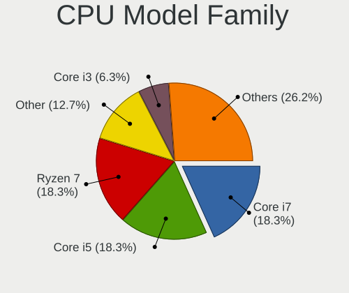

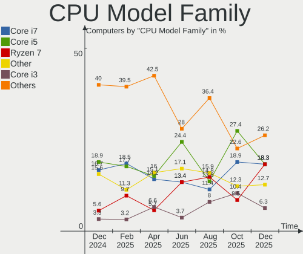

| Model             | Computers | Percent |
|-------------------|-----------|---------|
| Intel Core i7     | 23        | 18.25%  |
| Intel Core i5     | 23        | 18.25%  |
| AMD Ryzen 7       | 23        | 18.25%  |
| Other             | 16        | 12.7%   |
| Intel Core i3     | 8         | 6.35%   |
| Intel Core        | 6         | 4.76%   |
| Intel Core 2 Duo  | 5         | 3.97%   |
| AMD Ryzen 9       | 5         | 3.97%   |
| AMD Ryzen 5       | 4         | 3.17%   |
| Intel Core i9     | 2         | 1.59%   |
| Intel Celeron     | 2         | 1.59%   |
| Intel Xeon Silver | 1         | 0.79%   |
| Intel Pentium     | 1         | 0.79%   |
| Intel Core m5     | 1         | 0.79%   |
| Intel Atom        | 1         | 0.79%   |
| AMD GX            | 1         | 0.79%   |
| AMD FX            | 1         | 0.79%   |
| AMD EPYC          | 1         | 0.79%   |
| AMD E             | 1         | 0.79%   |
| AMD A8            | 1         | 0.79%   |

CPU Cores
---------

Number of processor cores

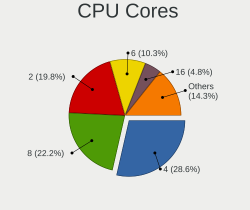

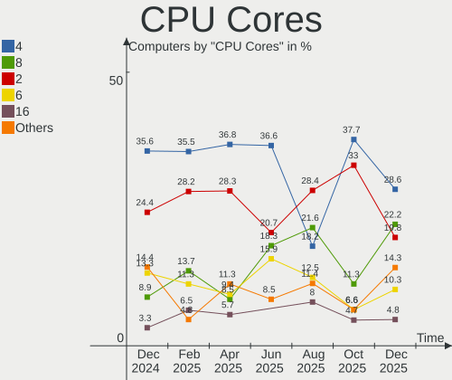

| Number  | Computers | Percent |
|---------|-----------|---------|
| 4       | 36        | 28.57%  |
| 8       | 28        | 22.22%  |
| 2       | 25        | 19.84%  |
| 6       | 13        | 10.32%  |
| 16      | 6         | 4.76%   |
| 10      | 5         | 3.97%   |
| 20      | 4         | 3.17%   |
| 14      | 3         | 2.38%   |
| 12      | 3         | 2.38%   |
| 24      | 2         | 1.59%   |
| Unknown | 1         | 0.79%   |

CPU Sockets
-----------

Number of sockets

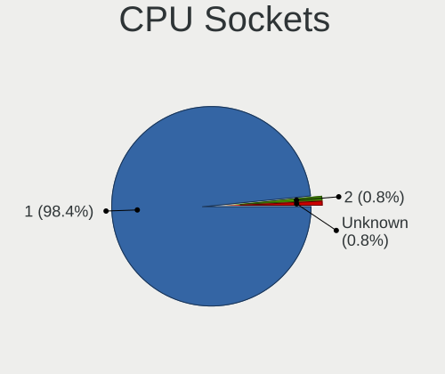

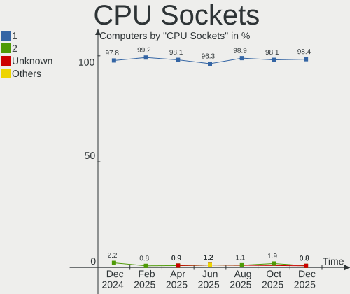

| Number  | Computers | Percent |
|---------|-----------|---------|
| 1       | 124       | 98.41%  |
| 2       | 1         | 0.79%   |
| Unknown | 1         | 0.79%   |

CPU Threads
-----------

Threads per core (Hyper-Threading)

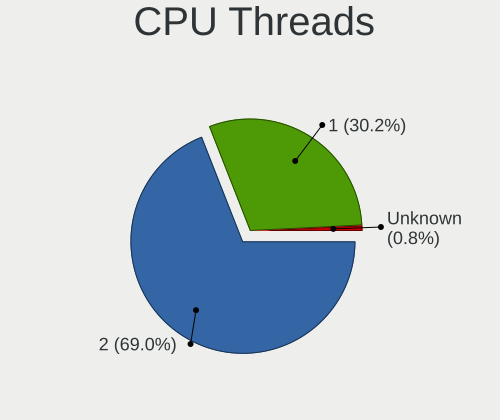

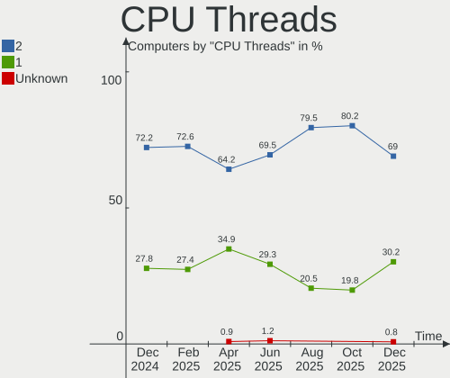

| Number  | Computers | Percent |
|---------|-----------|---------|
| 2       | 87        | 69.05%  |
| 1       | 38        | 30.16%  |
| Unknown | 1         | 0.79%   |

CPU Op-Modes
------------

CPU Operation Modes (32-bit, 64-bit)

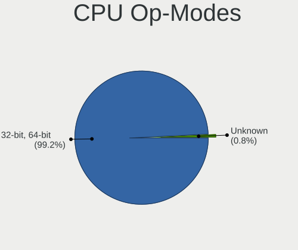

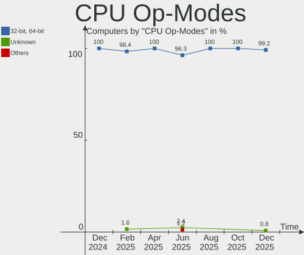

| Op mode        | Computers | Percent |
|----------------|-----------|---------|
| 32-bit, 64-bit | 125       | 99.21%  |
| Unknown        | 1         | 0.79%   |

CPU Microcode
-------------

Microcode number

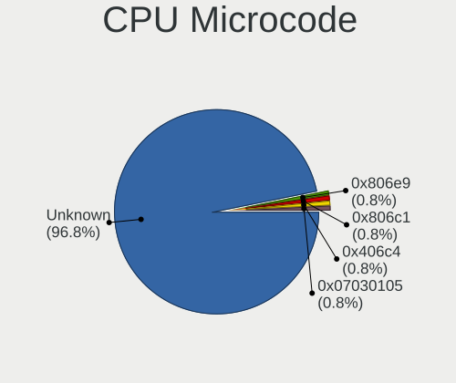

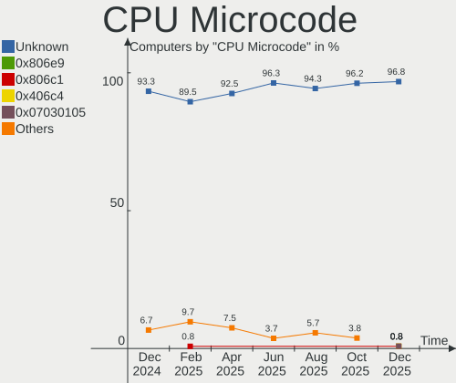

| Number     | Computers | Percent |
|------------|-----------|---------|
| Unknown    | 122       | 96.83%  |
| 0x806e9    | 1         | 0.79%   |
| 0x806c1    | 1         | 0.79%   |
| 0x406c4    | 1         | 0.79%   |
| 0x07030105 | 1         | 0.79%   |

CPU Microarch
-------------

Microarchitecture

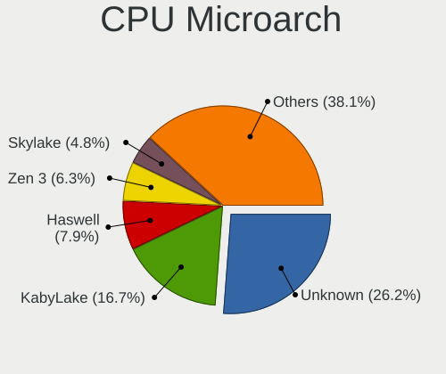

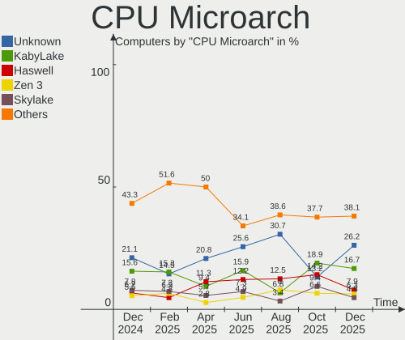

| Name              | Computers | Percent |
|-------------------|-----------|---------|
| Unknown           | 33        | 26.19%  |
| KabyLake          | 21        | 16.67%  |
| Haswell           | 10        | 7.94%   |
| Zen 3             | 8         | 6.35%   |
| Skylake           | 6         | 4.76%   |
| CometLake         | 5         | 3.97%   |
| Penryn            | 4         | 3.17%   |
| Nehalem           | 4         | 3.17%   |
| IvyBridge         | 4         | 3.17%   |
| Gracemont         | 4         | 3.17%   |
| Alderlake Hybrid  | 4         | 3.17%   |
| TigerLake         | 3         | 2.38%   |
| Silvermont        | 3         | 2.38%   |
| SandyBridge       | 3         | 2.38%   |
| Zen+              | 2         | 1.59%   |
| Zen 2             | 2         | 1.59%   |
| Puma              | 2         | 1.59%   |
| Lunarlake Hybrid  | 2         | 1.59%   |
| Westmere          | 1         | 0.79%   |
| Piledriver        | 1         | 0.79%   |
| Meteorlake Hybrid | 1         | 0.79%   |
| Goldmont          | 1         | 0.79%   |
| Core              | 1         | 0.79%   |
| Bobcat            | 1         | 0.79%   |

Graphics
--------

GPU Vendor
----------

Vendors of graphics cards

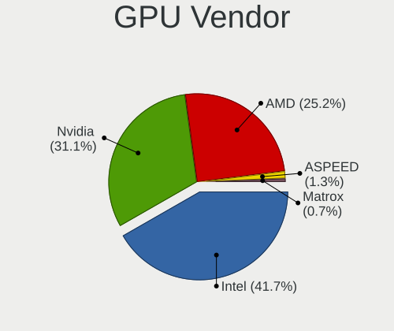

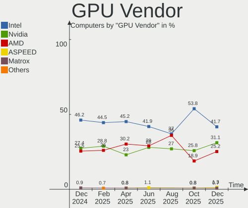

| Vendor                     | Computers | Percent |
|----------------------------|-----------|---------|
| Intel                      | 63        | 41.72%  |
| Nvidia                     | 47        | 31.13%  |
| AMD                        | 38        | 25.17%  |
| ASPEED Technology          | 2         | 1.32%   |
| Matrox Electronics Systems | 1         | 0.66%   |

GPU Model
---------

Graphics card models

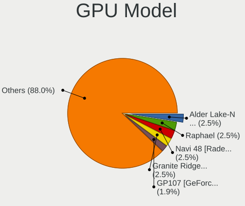

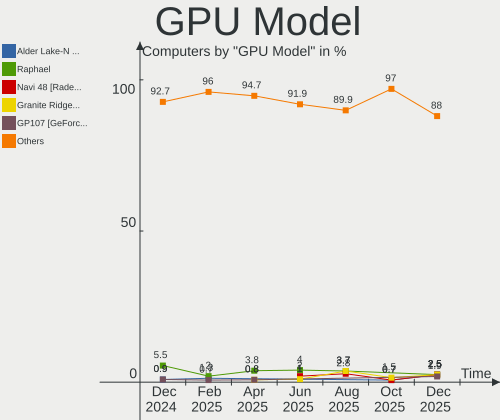

| Model                                                                                    | Computers | Percent |
|------------------------------------------------------------------------------------------|-----------|---------|
| Intel Alder Lake-N [UHD Graphics]                                                        | 4         | 2.53%   |
| AMD Raphael                                                                              | 4         | 2.53%   |
| AMD Navi 48 [Radeon RX 9070/9070 XT/9070 GRE]                                            | 4         | 2.53%   |
| AMD Granite Ridge [Radeon Graphics]                                                      | 4         | 2.53%   |
| Nvidia GP107 [GeForce GTX 1050 Ti]                                                       | 3         | 1.9%    |
| Intel TigerLake-LP GT2 [Iris Xe Graphics]                                                | 3         | 1.9%    |
| Intel Kaby Lake-R GT2 [UHD Graphics 620]                                                 | 3         | 1.9%    |
| Intel Haswell-ULT Integrated Graphics Controller                                         | 3         | 1.9%    |
| Intel CometLake-H GT2 [UHD Graphics]                                                     | 3         | 1.9%    |
| Intel CoffeeLake-S GT2 [UHD Graphics 630]                                                | 3         | 1.9%    |
| Intel Atom/Celeron/Pentium Processor x5-E8000/J3xxx/N3xxx Integrated Graphics Controller | 3         | 1.9%    |
| Intel Arrow Lake-S [Intel Graphics]                                                      | 3         | 1.9%    |
| Intel 3rd Gen Core processor Graphics Controller                                         | 3         | 1.9%    |
| Intel 2nd Generation Core Processor Family Integrated Graphics Controller                | 3         | 1.9%    |
| AMD HawkPoint1                                                                           | 3         | 1.9%    |
| AMD Barcelo                                                                              | 3         | 1.9%    |
| Nvidia TU117M [GeForce GTX 1650 Ti Mobile]                                               | 2         | 1.27%   |
| Nvidia TU117GLM [Quadro T1000 Mobile]                                                    | 2         | 1.27%   |
| Nvidia GF117M [GeForce 610M/710M/810M/820M / GT 620M/625M/630M/720M]                     | 2         | 1.27%   |
| Nvidia AD106M [GeForce RTX 4070 Max-Q / Mobile]                                          | 2         | 1.27%   |
| Intel Skylake-U GT2 [HD Graphics 520]                                                    | 2         | 1.27%   |
| Intel Raptor Lake-S GT1 [UHD Graphics 770]                                               | 2         | 1.27%   |
| Intel Meteor Lake-P [Intel Arc Graphics]                                                 | 2         | 1.27%   |
| Intel Kaby Lake-U GT2 [HD Graphics 620]                                                  | 2         | 1.27%   |
| Intel CometLake-U GT2 [UHD Graphics]                                                     | 2         | 1.27%   |
| Intel CoffeeLake-H GT2 [UHD Graphics 630]                                                | 2         | 1.27%   |
| Intel Alder Lake-P GT2 [Iris Xe Graphics]                                                | 2         | 1.27%   |
| Intel 4th Gen Core Processor Integrated Graphics Controller                              | 2         | 1.27%   |
| ASPEED Technology ASPEED Graphics Family                                                 | 2         | 1.27%   |
| AMD Topaz XT [Radeon R7 M260/M265 / M340/M360 / M440/M445 / 530/535 / 620/625 Mobile]    | 2         | 1.27%   |
| AMD Rembrandt [Radeon 680M]                                                              | 2         | 1.27%   |
| AMD Phoenix1                                                                             | 2         | 1.27%   |
| AMD Lucienne                                                                             | 2         | 1.27%   |
| AMD Cezanne [Radeon Vega Series / Radeon Vega Mobile Series]                             | 2         | 1.27%   |
| Nvidia TU117GLM [T1200 Laptop GPU]                                                       | 1         | 0.63%   |
| Nvidia TU117GL [T600]                                                                    | 1         | 0.63%   |
| Nvidia TU116M [GeForce GTX 1660 Ti Mobile]                                               | 1         | 0.63%   |
| Nvidia TU116 [GeForce GTX 1660]                                                          | 1         | 0.63%   |
| Nvidia TU106M [GeForce RTX 2060 Mobile]                                                  | 1         | 0.63%   |
| Nvidia TU104 [GeForce RTX 2070 SUPER]                                                    | 1         | 0.63%   |

GPU Combo
---------

Combinations of graphics cards

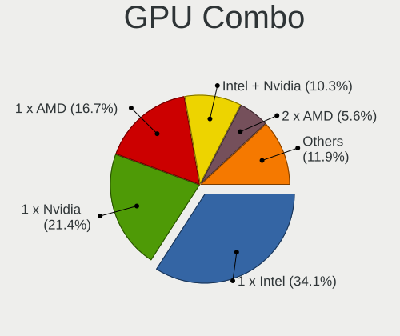

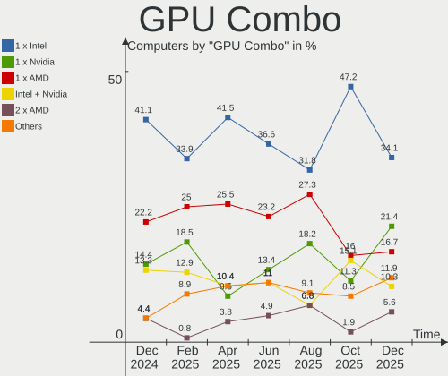

| Name            | Computers | Percent |
|-----------------|-----------|---------|
| 1 x Intel       | 43        | 34.13%  |
| 1 x Nvidia      | 27        | 21.43%  |
| 1 x AMD         | 21        | 16.67%  |
| Intel + Nvidia  | 13        | 10.32%  |
| 2 x AMD         | 7         | 5.56%   |
| Intel + AMD     | 5         | 3.97%   |
| AMD + Nvidia    | 5         | 3.97%   |
| Other           | 2         | 1.59%   |
| Nvidia + Matrox | 1         | 0.79%   |
| Nvidia + ASPEED | 1         | 0.79%   |
| 1 x ASPEED      | 1         | 0.79%   |

GPU Driver
----------

Free vs proprietary

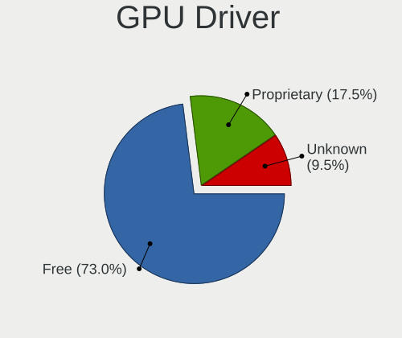

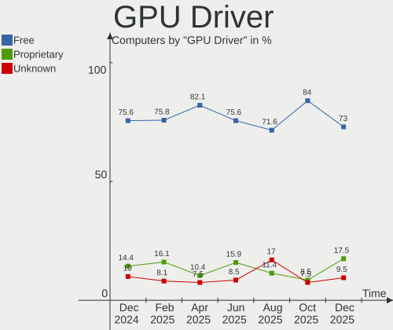

| Driver      | Computers | Percent |
|-------------|-----------|---------|
| Free        | 92        | 73.02%  |
| Proprietary | 22        | 17.46%  |
| Unknown     | 12        | 9.52%   |

GPU Memory
----------

Total video memory

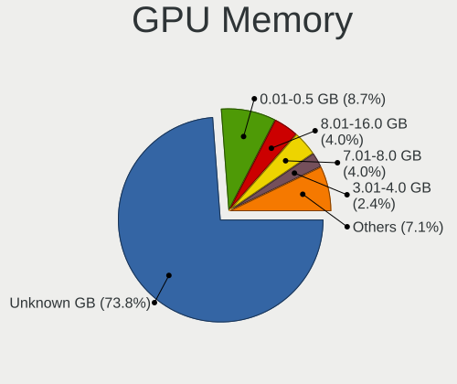

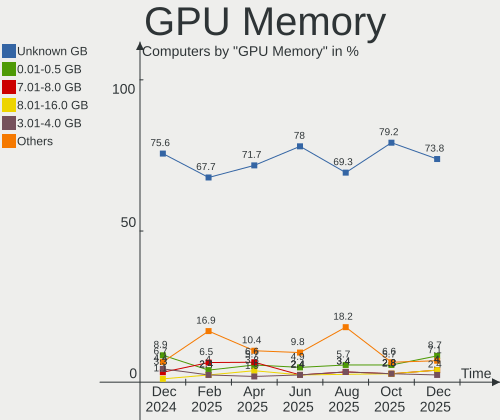

| Size in GB | Computers | Percent |
|------------|-----------|---------|
| Unknown    | 93        | 73.81%  |
| 0.01-0.5   | 11        | 8.73%   |
| 7.01-8.0   | 5         | 3.97%   |
| 8.01-16.0  | 5         | 3.97%   |
| 3.01-4.0   | 3         | 2.38%   |
| 1.01-2.0   | 3         | 2.38%   |
| 0.51-1.0   | 3         | 2.38%   |
| 5.01-6.0   | 1         | 0.79%   |
| 2.01-3.0   | 1         | 0.79%   |
| 16.01-24.0 | 1         | 0.79%   |

Monitor
-------

Monitor Vendor
--------------

Monitor vendors

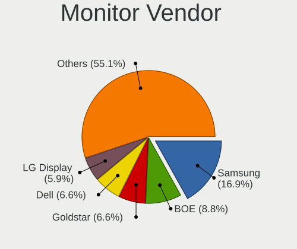

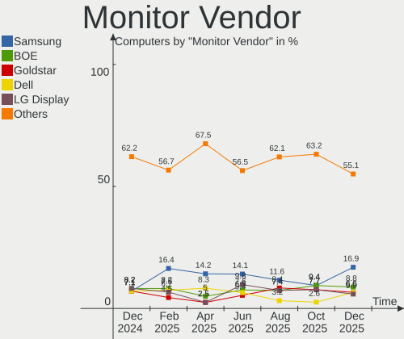

| Vendor                  | Computers | Percent |
|-------------------------|-----------|---------|
| Samsung Electronics     | 23        | 16.91%  |
| BOE                     | 12        | 8.82%   |
| Goldstar                | 9         | 6.62%   |
| Dell                    | 9         | 6.62%   |
| LG Display              | 8         | 5.88%   |
| Chimei Innolux          | 8         | 5.88%   |
| Philips                 | 7         | 5.15%   |
| AU Optronics            | 7         | 5.15%   |
| Iiyama                  | 6         | 4.41%   |
| Apple                   | 5         | 3.68%   |
| AOC                     | 5         | 3.68%   |
| Lenovo                  | 4         | 2.94%   |
| Toshiba                 | 2         | 1.47%   |
| PANDA                   | 2         | 1.47%   |
| MSI                     | 2         | 1.47%   |
| LG Electronics          | 2         | 1.47%   |
| Hewlett-Packard         | 2         | 1.47%   |
| Eizo                    | 2         | 1.47%   |
| CSW                     | 2         | 1.47%   |
| ASUSTek Computer        | 2         | 1.47%   |
| Acer                    | 2         | 1.47%   |
| Sharp                   | 1         | 0.74%   |
| Medion Akoya            | 1         | 0.74%   |
| Medion                  | 1         | 0.74%   |
| Lanix                   | 1         | 0.74%   |
| KDC                     | 1         | 0.74%   |
| Huion                   | 1         | 0.74%   |
| GreenWood               | 1         | 0.74%   |
| Gechic                  | 1         | 0.74%   |
| Envision Peripherals    | 1         | 0.74%   |
| DENON                   | 1         | 0.74%   |
| CPT                     | 1         | 0.74%   |
| CMT                     | 1         | 0.74%   |
| Chi Mei Optoelectronics | 1         | 0.74%   |
| BenQ                    | 1         | 0.74%   |
| ASRock                  | 1         | 0.74%   |

Monitor Model
-------------

Monitor models

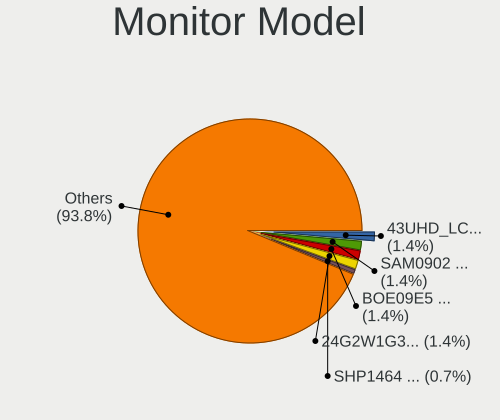

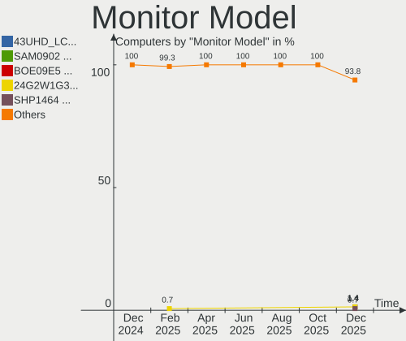

| Model                                                                   | Computers | Percent |
|-------------------------------------------------------------------------|-----------|---------|
| Toshiba 43UHD_LCD_TV TSB3700 3840x2160 940x540mm 42.7-inch              | 2         | 1.39%   |
| Samsung Electronics LCD Monitor SAM0902 1920x1080 890x500mm 40.2-inch   | 2         | 1.39%   |
| BOE LCD Monitor BOE09E5 2560x1440 355x200mm 16.0-inch                   | 2         | 1.39%   |
| AOC 24G2W1G3 AOC2402 1920x1080 527x296mm 23.8-inch                      | 2         | 1.39%   |
| Sharp LCD Monitor SHP1464 1920x1080 294x165mm 13.3-inch                 | 1         | 0.69%   |
| Samsung Electronics SyncMaster SAM0F4C 3840x2160 1210x680mm 54.6-inch   | 1         | 0.69%   |
| Samsung Electronics S24R35A SAM729F 1920x1080 521x293mm 23.5-inch       | 1         | 0.69%   |
| Samsung Electronics S23A700 SAM085F 1920x1080 509x286mm 23.0-inch       | 1         | 0.69%   |
| Samsung Electronics S22D300 SAM0B3E 1920x1080 477x268mm 21.5-inch       | 1         | 0.69%   |
| Samsung Electronics Odyssey G70D SAME06F 3840x2160 698x392mm 31.5-inch  | 1         | 0.69%   |
| Samsung Electronics Odyssey G70B SAM7232 3840x2160 698x392mm 31.5-inch  | 1         | 0.69%   |
| Samsung Electronics LS27D70xE SAM7692 3840x2160 597x336mm 27.0-inch     | 1         | 0.69%   |
| Samsung Electronics LCD Monitor SEC5441 1280x800 331x207mm 15.4-inch    | 1         | 0.69%   |
| Samsung Electronics LCD Monitor SEC4251 1366x768 344x194mm 15.5-inch    | 1         | 0.69%   |
| Samsung Electronics LCD Monitor SDC5844 1920x1080 344x194mm 15.5-inch   | 1         | 0.69%   |
| Samsung Electronics LCD Monitor SDC4C48 1920x1080 293x165mm 13.2-inch   | 1         | 0.69%   |
| Samsung Electronics LCD Monitor SDC41A0 1920x1200 302x189mm 14.0-inch   | 1         | 0.69%   |
| Samsung Electronics LCD Monitor SDC419D 2880x1800 302x189mm 14.0-inch   | 1         | 0.69%   |
| Samsung Electronics LCD Monitor SDC4188 2880x1800 312x195mm 14.5-inch   | 1         | 0.69%   |
| Samsung Electronics LCD Monitor SDC4181 2880x1800 302x189mm 14.0-inch   | 1         | 0.69%   |
| Samsung Electronics LCD Monitor SDC4171 2880x1800 302x189mm 14.0-inch   | 1         | 0.69%   |
| Samsung Electronics LCD Monitor SDC3854 1920x1080 382x215mm 17.3-inch   | 1         | 0.69%   |
| Samsung Electronics LCD Monitor SAM7016 3840x2160 1872x1053mm 84.6-inch | 1         | 0.69%   |
| Samsung Electronics LCD Monitor SAM0FBD 3840x2160 950x540mm 43.0-inch   | 1         | 0.69%   |
| Samsung Electronics LCD Monitor SAM0C39 1920x1080 885x498mm 40.0-inch   | 1         | 0.69%   |
| Samsung Electronics LCD Monitor SAM03BC 1920x1080                       | 1         | 0.69%   |
| Samsung Electronics ATNA60HU02-0  SDC421B                               | 1         | 0.69%   |
| Philips PHL32M1N5800A PHLC277 3840x2160 697x392mm 31.5-inch             | 1         | 0.69%   |
| Philips PHL BDM4037U PHLC142 3840x2160 885x498mm 40.0-inch              | 1         | 0.69%   |
| Philips PHL 346E2C PHLC247 3440x1440 797x334mm 34.0-inch                | 1         | 0.69%   |
| Philips PHL 246E9Q PHLC17C 1920x1080 527x296mm 23.8-inch                | 1         | 0.69%   |
| Philips PHL 240B9 PHL0966 1920x1200 518x324mm 24.1-inch                 | 1         | 0.69%   |
| Philips PHL 222S1 PHL0950 1920x1080 476x268mm 21.5-inch                 | 1         | 0.69%   |
| Philips 27M1N3200V PHLC279 1920x1080 598x336mm 27.0-inch                | 1         | 0.69%   |
| Philips 237EQ PHLC090 1920x1080 509x286mm 23.0-inch                     | 1         | 0.69%   |
| PANDA LCD Monitor NCP0063 1920x1080 344x194mm 15.5-inch                 | 1         | 0.69%   |
| PANDA LC116LF3L03 NCP000A 1920x1080 256x144mm 11.6-inch                 | 1         | 0.69%   |
| MSI Optix MAG27CQ MSI1462 2560x1440 597x336mm 27.0-inch                 | 1         | 0.69%   |
| MSI MP161 E2 MSI40B7 1920x1080 330x220mm 15.6-inch                      | 1         | 0.69%   |
| Medion MD 20110 MED3604 1920x1080 520x300mm 23.6-inch                   | 1         | 0.69%   |

Monitor Resolution
------------------

Monitor screen resolution

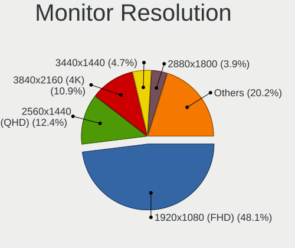

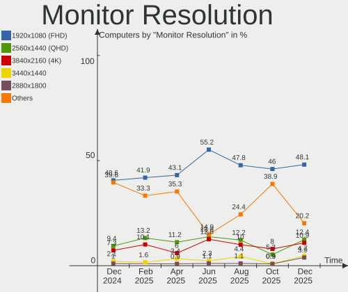

| Resolution         | Computers | Percent |
|--------------------|-----------|---------|
| 1920x1080 (FHD)    | 62        | 48.06%  |
| 2560x1440 (QHD)    | 16        | 12.4%   |
| 3840x2160 (4K)     | 14        | 10.85%  |
| 3440x1440          | 6         | 4.65%   |
| 2880x1800          | 5         | 3.88%   |
| 2560x1600          | 5         | 3.88%   |
| 1366x768 (WXGA)    | 5         | 3.88%   |
| 2560x1080          | 2         | 1.55%   |
| 1920x1200 (WUXGA)  | 2         | 1.55%   |
| 1600x900 (HD+)     | 2         | 1.55%   |
| Unknown            | 2         | 1.55%   |
| 3840x1080          | 1         | 0.78%   |
| 3200x1800 (QHD+)   | 1         | 0.78%   |
| 2880x1920          | 1         | 0.78%   |
| 2256x1504          | 1         | 0.78%   |
| 1920x540           | 1         | 0.78%   |
| 1680x1050 (WSXGA+) | 1         | 0.78%   |
| 1440x900 (WXGA+)   | 1         | 0.78%   |
| 1280x1024 (SXGA)   | 1         | 0.78%   |

Monitor Diagonal
----------------

Diagonal size in inches

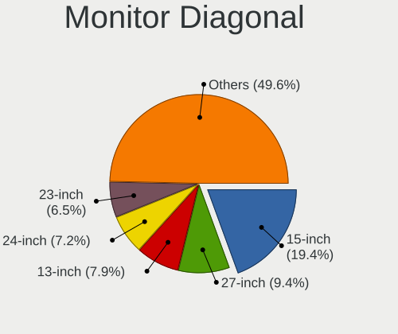

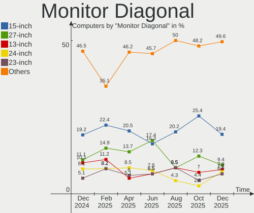

| Inches  | Computers | Percent |
|---------|-----------|---------|
| 15      | 27        | 19.42%  |
| 27      | 13        | 9.35%   |
| 13      | 11        | 7.91%   |
| 24      | 10        | 7.19%   |
| 23      | 9         | 6.47%   |
| 21      | 8         | 5.76%   |
| 17      | 7         | 5.04%   |
| 14      | 7         | 5.04%   |
| 34      | 6         | 4.32%   |
| 16      | 6         | 4.32%   |
| Unknown | 5         | 3.6%    |
| 84      | 4         | 2.88%   |
| 25      | 4         | 2.88%   |
| 54      | 3         | 2.16%   |
| 33      | 2         | 1.44%   |
| 31      | 2         | 1.44%   |
| 26      | 2         | 1.44%   |
| 18      | 2         | 1.44%   |
| 11      | 2         | 1.44%   |
| 72      | 1         | 0.72%   |
| 64      | 1         | 0.72%   |
| 63      | 1         | 0.72%   |
| 42      | 1         | 0.72%   |
| 40      | 1         | 0.72%   |
| 32      | 1         | 0.72%   |
| 20      | 1         | 0.72%   |
| 19      | 1         | 0.72%   |
| 12      | 1         | 0.72%   |

Monitor Width
-------------

Physical width

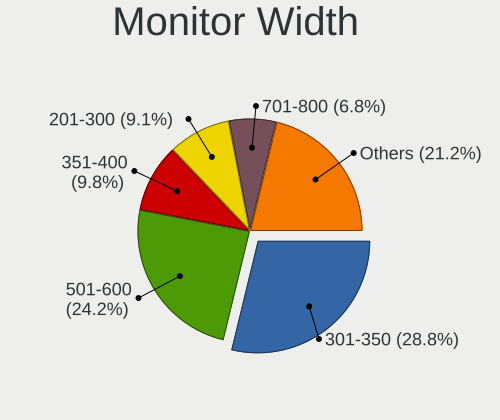

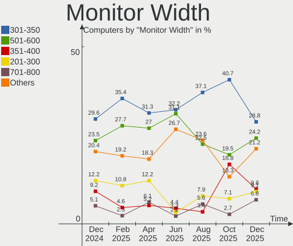

| Width in mm | Computers | Percent |
|-------------|-----------|---------|
| 301-350     | 38        | 28.79%  |
| 501-600     | 32        | 24.24%  |
| 351-400     | 13        | 9.85%   |
| 201-300     | 12        | 9.09%   |
| 701-800     | 9         | 6.82%   |
| 401-500     | 9         | 6.82%   |
| 1501-2000   | 5         | 3.79%   |
| 1001-1500   | 5         | 3.79%   |
| Unknown     | 5         | 3.79%   |
| 601-700     | 2         | 1.52%   |
| 801-900     | 1         | 0.76%   |
| 901-1000    | 1         | 0.76%   |

Aspect Ratio
------------

Proportional relationship between the width and the height

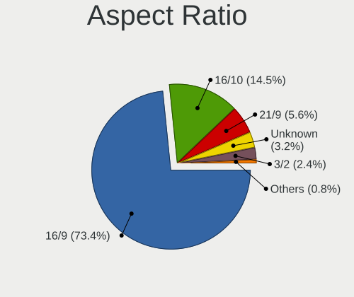

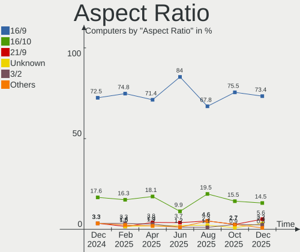

| Ratio   | Computers | Percent |
|---------|-----------|---------|
| 16/9    | 91        | 73.39%  |
| 16/10   | 18        | 14.52%  |
| 21/9    | 7         | 5.65%   |
| Unknown | 4         | 3.23%   |
| 3/2     | 3         | 2.42%   |
| 5/4     | 1         | 0.81%   |

Monitor Area
------------

Area in inch²

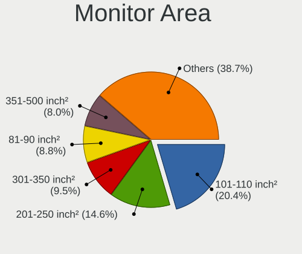

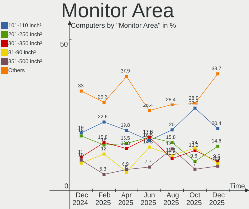

| Area in inch² | Computers | Percent |
|----------------|-----------|---------|
| 101-110        | 28        | 20.44%  |
| 201-250        | 20        | 14.6%   |
| 301-350        | 13        | 9.49%   |
| 81-90          | 12        | 8.76%   |
| 351-500        | 11        | 8.03%   |
| More than 1000 | 10        | 7.3%    |
| 251-300        | 10        | 7.3%    |
| 121-130        | 7         | 5.11%   |
| 71-80          | 6         | 4.38%   |
| 111-120        | 5         | 3.65%   |
| Unknown        | 5         | 3.65%   |
| 151-200        | 3         | 2.19%   |
| 51-60          | 2         | 1.46%   |
| 141-150        | 2         | 1.46%   |
| 501-1000       | 2         | 1.46%   |
| 61-70          | 1         | 0.73%   |

Pixel Density
-------------

Pixels per inch

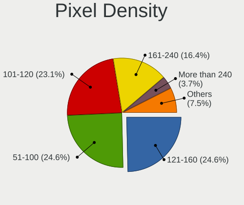

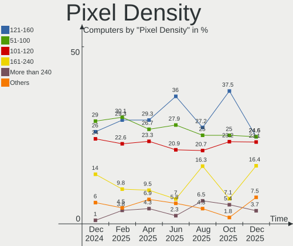

| Density       | Computers | Percent |
|---------------|-----------|---------|
| 121-160       | 33        | 24.63%  |
| 51-100        | 33        | 24.63%  |
| 101-120       | 31        | 23.13%  |
| 161-240       | 22        | 16.42%  |
| More than 240 | 5         | 3.73%   |
| 1-50          | 5         | 3.73%   |
| Unknown       | 5         | 3.73%   |

Multiple Monitors
-----------------

Total monitors connected

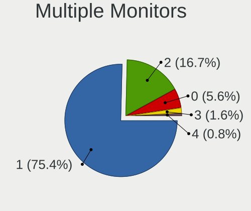

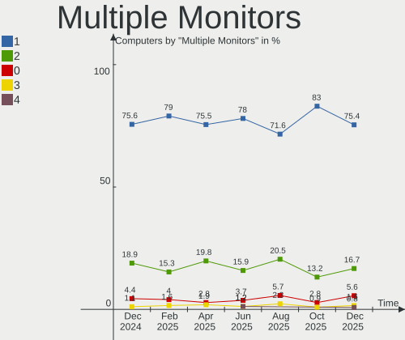

| Total | Computers | Percent |
|-------|-----------|---------|
| 1     | 95        | 75.4%   |
| 2     | 21        | 16.67%  |
| 0     | 7         | 5.56%   |
| 3     | 2         | 1.59%   |
| 4     | 1         | 0.79%   |

Network
-------

Net Controller Vendor
---------------------

Controller vendors

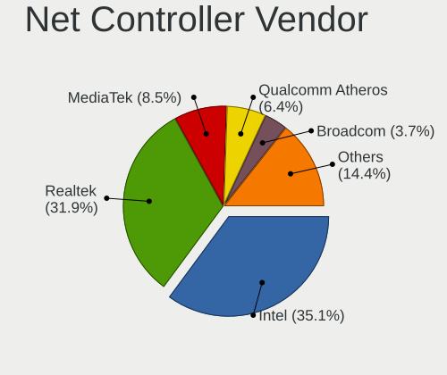

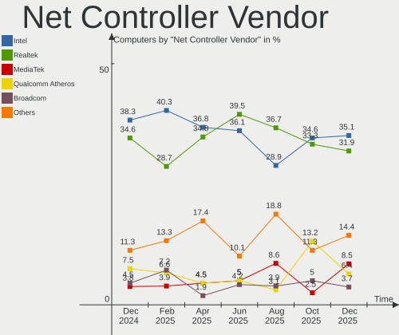

| Vendor                          | Computers | Percent |
|---------------------------------|-----------|---------|
| Intel                           | 66        | 35.11%  |
| Realtek Semiconductor           | 60        | 31.91%  |
| MediaTek                        | 16        | 8.51%   |
| Qualcomm Atheros                | 12        | 6.38%   |
| Broadcom                        | 7         | 3.72%   |
| TP-Link                         | 3         | 1.6%    |
| Samsung Electronics             | 2         | 1.06%   |
| Raspberry Pi                    | 2         | 1.06%   |
| Ralink Technology               | 2         | 1.06%   |
| Dell                            | 2         | 1.06%   |
| ASIX Electronics                | 2         | 1.06%   |
| aicsemi                         | 2         | 1.06%   |
| Sigma Designs                   | 1         | 0.53%   |
| Sierra Wireless                 | 1         | 0.53%   |
| Ralink                          | 1         | 0.53%   |
| Qualcomm Atheros Communications | 1         | 0.53%   |
| Nvidia                          | 1         | 0.53%   |
| NetGear                         | 1         | 0.53%   |
| Marvell Technology Group        | 1         | 0.53%   |
| Lenovo                          | 1         | 0.53%   |
| IMC Networks                    | 1         | 0.53%   |
| Broadcom Limited                | 1         | 0.53%   |
| Aquantia                        | 1         | 0.53%   |
| American Megatrends             | 1         | 0.53%   |

Net Controller Model
--------------------

Controller models

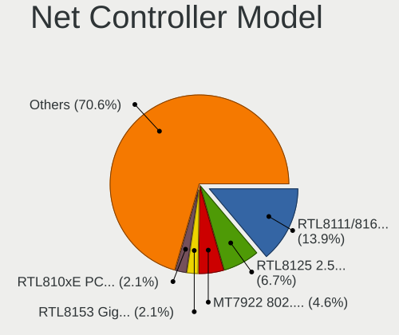

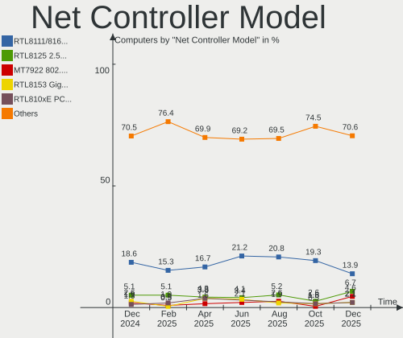

| Model                                                                           | Computers | Percent |
|---------------------------------------------------------------------------------|-----------|---------|
| Realtek RTL8111/8168/8211/8411 PCI Express Gigabit Ethernet Controller          | 33        | 13.87%  |
| Realtek RTL8125 2.5GbE Controller                                               | 16        | 6.72%   |
| MediaTek MT7922 802.11ax PCI Express Wireless Network Adapter                   | 11        | 4.62%   |
| Realtek RTL8153 Gigabit Ethernet Adapter                                        | 5         | 2.1%    |
| Realtek RTL810xE PCI Express Fast Ethernet controller                           | 5         | 2.1%    |
| Intel Wireless 8265 / 8275                                                      | 4         | 1.68%   |
| Intel Wireless 7260                                                             | 4         | 1.68%   |
| Intel Ethernet Controller I225-V                                                | 4         | 1.68%   |
| Intel Comet Lake PCH CNVi WiFi                                                  | 4         | 1.68%   |
| Realtek RTL8852BE PCIe 802.11ax Wireless Network Controller                     | 3         | 1.26%   |
| Intel Wireless 8260                                                             | 3         | 1.26%   |
| Intel Wireless 3165                                                             | 3         | 1.26%   |
| Intel Wi-Fi 7(802.11be) AX1775*/AX1790*/BE20*/BE401/BE1750* 2x2                 | 3         | 1.26%   |
| Intel Wi-Fi 6E(802.11ax) AX210/AX1675* 2x2 [Typhoon Peak]                       | 3         | 1.26%   |
| Intel Wi-Fi 6 AX200                                                             | 3         | 1.26%   |
| Intel Ethernet Controller I226-V                                                | 3         | 1.26%   |
| Intel Ethernet Connection (2) I219-V                                            | 3         | 1.26%   |
| Intel 82579LM Gigabit Network Connection (Lewisville)                           | 3         | 1.26%   |
| Samsung Galaxy series, misc. (tethering mode)                                   | 2         | 0.84%   |
| Realtek RTL8922AE 802.11be PCIe Wireless Network Adapter                        | 2         | 0.84%   |
| Realtek RTL8822CE 802.11ac PCIe Wireless Network Adapter                        | 2         | 0.84%   |
| Realtek RTL8192EU 802.11b/g/n WLAN Adapter                                      | 2         | 0.84%   |
| Qualcomm Atheros QCA9377 802.11ac Wireless Network Adapter                      | 2         | 0.84%   |
| Qualcomm Atheros Killer E2500 Gigabit Ethernet Controller                       | 2         | 0.84%   |
| Qualcomm Atheros AR9485 Wireless Network Adapter                                | 2         | 0.84%   |
| MediaTek MT7927 802.11be 320MHz 2x2 PCIe Wireless Network Adapter [Filogic 380] | 2         | 0.84%   |
| MediaTek MT7921 802.11ax PCIe Wireless Network Adapter [Filogic 330]            | 2         | 0.84%   |
| Intel Meteor Lake PCH CNVi WiFi                                                 | 2         | 0.84%   |
| Intel I350 Gigabit Network Connection                                           | 2         | 0.84%   |
| Intel Ethernet Controller I226-LM                                               | 2         | 0.84%   |
| Intel Ethernet Connection I219-LM                                               | 2         | 0.84%   |
| Intel Ethernet Connection (7) I219-LM                                           | 2         | 0.84%   |
| Intel Ethernet Connection (4) I219-V                                            | 2         | 0.84%   |
| Intel Ethernet Connection (4) I219-LM                                           | 2         | 0.84%   |
| Intel Ethernet Connection (17) I219-V                                           | 2         | 0.84%   |
| Intel Dual Band Wireless-AC 3168NGW [Stone Peak]                                | 2         | 0.84%   |
| Intel Comet Lake PCH-LP CNVi WiFi                                               | 2         | 0.84%   |
| Intel Alder Lake-P PCH CNVi WiFi                                                | 2         | 0.84%   |
| Intel 82599 10 Gigabit Network Connection                                       | 2         | 0.84%   |
| Broadcom BCM43142 802.11b/g/n                                                   | 2         | 0.84%   |

Wireless Vendor
---------------

Wireless vendors

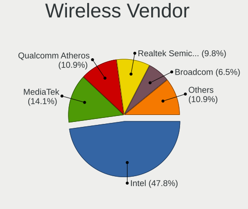

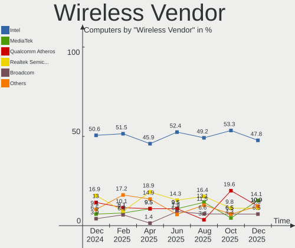

| Vendor                          | Computers | Percent |
|---------------------------------|-----------|---------|
| Intel                           | 44        | 47.83%  |
| MediaTek                        | 13        | 14.13%  |
| Qualcomm Atheros                | 10        | 10.87%  |
| Realtek Semiconductor           | 9         | 9.78%   |
| Broadcom                        | 6         | 6.52%   |
| TP-Link                         | 2         | 2.17%   |
| Ralink Technology               | 2         | 2.17%   |
| Sierra Wireless                 | 1         | 1.09%   |
| Ralink                          | 1         | 1.09%   |
| Qualcomm Atheros Communications | 1         | 1.09%   |
| NetGear                         | 1         | 1.09%   |
| IMC Networks                    | 1         | 1.09%   |
| Broadcom Limited                | 1         | 1.09%   |

Wireless Model
--------------

Wireless models

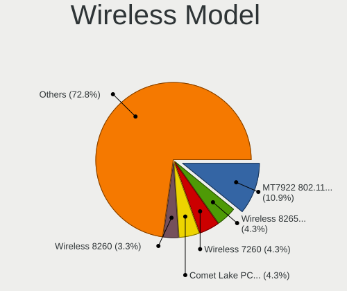

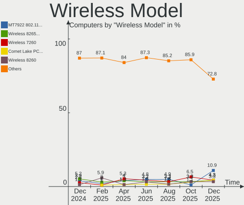

| Model                                                                | Computers | Percent |
|----------------------------------------------------------------------|-----------|---------|
| MediaTek MT7922 802.11ax PCI Express Wireless Network Adapter        | 10        | 10.87%  |
| Intel Wireless 8265 / 8275                                           | 4         | 4.35%   |
| Intel Wireless 7260                                                  | 4         | 4.35%   |
| Intel Comet Lake PCH CNVi WiFi                                       | 4         | 4.35%   |
| Intel Wireless 8260                                                  | 3         | 3.26%   |
| Intel Wireless 3165                                                  | 3         | 3.26%   |
| Intel Wi-Fi 6E(802.11ax) AX210/AX1675* 2x2 [Typhoon Peak]            | 3         | 3.26%   |
| Intel Wi-Fi 6 AX200                                                  | 3         | 3.26%   |
| Realtek RTL8852BE PCIe 802.11ax Wireless Network Controller          | 2         | 2.17%   |
| Realtek RTL8822CE 802.11ac PCIe Wireless Network Adapter             | 2         | 2.17%   |
| Realtek RTL8192EU 802.11b/g/n WLAN Adapter                           | 2         | 2.17%   |
| Qualcomm Atheros QCA9377 802.11ac Wireless Network Adapter           | 2         | 2.17%   |
| Qualcomm Atheros AR9485 Wireless Network Adapter                     | 2         | 2.17%   |
| MediaTek MT7921 802.11ax PCIe Wireless Network Adapter [Filogic 330] | 2         | 2.17%   |
| Intel Wi-Fi 7(802.11be) AX1775*/AX1790*/BE20*/BE401/BE1750* 2x2      | 2         | 2.17%   |
| Intel Meteor Lake PCH CNVi WiFi                                      | 2         | 2.17%   |
| Intel Dual Band Wireless-AC 3168NGW [Stone Peak]                     | 2         | 2.17%   |
| Intel Comet Lake PCH-LP CNVi WiFi                                    | 2         | 2.17%   |
| Broadcom BCM43142 802.11b/g/n                                        | 2         | 2.17%   |
| TP-Link TL-WN823N v2/v3 [Realtek RTL8192EU]                          | 1         | 1.09%   |
| TP-Link Archer T3U [Realtek RTL8812BU]                               | 1         | 1.09%   |
| Sierra Wireless EM7455                                               | 1         | 1.09%   |
| Realtek RTL8852CE PCIe 802.11ax Wireless Network Controller          | 1         | 1.09%   |
| Realtek RTL8723BE PCIe Wireless Network Adapter                      | 1         | 1.09%   |
| Realtek RTL8188CE 802.11b/g/n WiFi Adapter                           | 1         | 1.09%   |
| Ralink RT3572 Wireless Adapter                                       | 1         | 1.09%   |
| Ralink MT7610U ("Archer T2U" 2.4G+5G WLAN Adapter                    | 1         | 1.09%   |
| Ralink RT5390 Wireless 802.11n 1T/1R PCIe                            | 1         | 1.09%   |
| Qualcomm Atheros QCA986x/988x 802.11ac Wireless Network Adapter      | 1         | 1.09%   |
| Qualcomm Atheros QCA6174 802.11ac Wireless Network Adapter           | 1         | 1.09%   |
| Qualcomm Atheros AR9271 802.11n                                      | 1         | 1.09%   |
| Qualcomm Atheros AR9462 Wireless Network Adapter                     | 1         | 1.09%   |
| Qualcomm Atheros AR928X Wireless Network Adapter (PCI-Express)       | 1         | 1.09%   |
| Qualcomm Atheros AR9287 Wireless Network Adapter (PCI-Express)       | 1         | 1.09%   |
| Qualcomm Atheros AR9285 Wireless Network Adapter (PCI-Express)       | 1         | 1.09%   |
| NetGear A6210                                                        | 1         | 1.09%   |
| MediaTek MT7902 802.11ax PCIe Wireless Network Adapter [Filogic 310] | 1         | 1.09%   |
| Intel Wireless 7265                                                  | 1         | 1.09%   |
| Intel Wireless 3160                                                  | 1         | 1.09%   |
| Intel Wi-Fi 6 AX201                                                  | 1         | 1.09%   |

Ethernet Vendor
---------------

Ethernet vendors

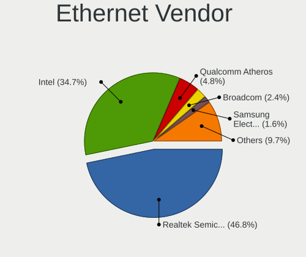

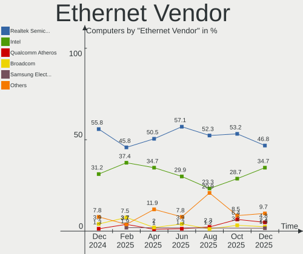

| Vendor                   | Computers | Percent |
|--------------------------|-----------|---------|
| Realtek Semiconductor    | 58        | 46.77%  |
| Intel                    | 43        | 34.68%  |
| Qualcomm Atheros         | 6         | 4.84%   |
| Broadcom                 | 3         | 2.42%   |
| Samsung Electronics      | 2         | 1.61%   |
| Raspberry Pi             | 2         | 1.61%   |
| ASIX Electronics         | 2         | 1.61%   |
| TP-Link                  | 1         | 0.81%   |
| Nvidia                   | 1         | 0.81%   |
| MediaTek                 | 1         | 0.81%   |
| Marvell Technology Group | 1         | 0.81%   |
| Lenovo                   | 1         | 0.81%   |
| Dell                     | 1         | 0.81%   |
| Aquantia                 | 1         | 0.81%   |
| American Megatrends      | 1         | 0.81%   |

Ethernet Model
--------------

Ethernet models

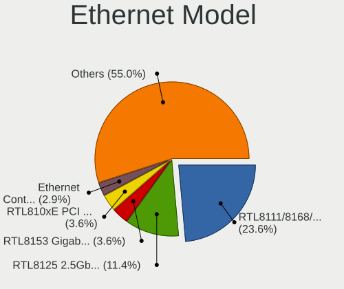

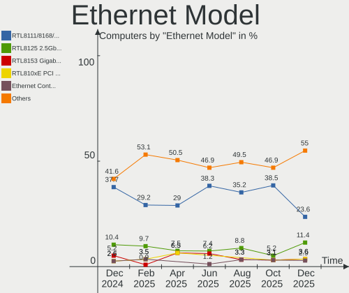

| Model                                                                  | Computers | Percent |
|------------------------------------------------------------------------|-----------|---------|
| Realtek RTL8111/8168/8211/8411 PCI Express Gigabit Ethernet Controller | 33        | 23.57%  |
| Realtek RTL8125 2.5GbE Controller                                      | 16        | 11.43%  |
| Realtek RTL8153 Gigabit Ethernet Adapter                               | 5         | 3.57%   |
| Realtek RTL810xE PCI Express Fast Ethernet controller                  | 5         | 3.57%   |
| Intel Ethernet Controller I225-V                                       | 4         | 2.86%   |
| Intel Ethernet Controller I226-V                                       | 3         | 2.14%   |
| Intel Ethernet Connection (2) I219-V                                   | 3         | 2.14%   |
| Intel 82579LM Gigabit Network Connection (Lewisville)                  | 3         | 2.14%   |
| Samsung Galaxy series, misc. (tethering mode)                          | 2         | 1.43%   |
| Realtek RTL8922AE 802.11be PCIe Wireless Network Adapter               | 2         | 1.43%   |
| Qualcomm Atheros Killer E2500 Gigabit Ethernet Controller              | 2         | 1.43%   |
| Intel I350 Gigabit Network Connection                                  | 2         | 1.43%   |
| Intel Ethernet Controller I226-LM                                      | 2         | 1.43%   |
| Intel Ethernet Connection I219-LM                                      | 2         | 1.43%   |
| Intel Ethernet Connection (7) I219-LM                                  | 2         | 1.43%   |
| Intel Ethernet Connection (4) I219-V                                   | 2         | 1.43%   |
| Intel Ethernet Connection (4) I219-LM                                  | 2         | 1.43%   |
| Intel Ethernet Connection (17) I219-V                                  | 2         | 1.43%   |
| Intel 82599 10 Gigabit Network Connection                              | 2         | 1.43%   |
| ASIX AX88179 Gigabit Ethernet                                          | 2         | 1.43%   |
| TP-Link UE300 10/100/1000 LAN (ethernet mode) [Realtek RTL8153]        | 1         | 0.71%   |
| Realtek RTL8852BE PCIe 802.11ax Wireless Network Controller            | 1         | 0.71%   |
| Realtek RTL8169 PCI Gigabit Ethernet Controller                        | 1         | 0.71%   |
| Realtek RTL8126 5GbE Controller                                        | 1         | 0.71%   |
| Realtek Killer E5000 5GbE Controller                                   | 1         | 0.71%   |
| Raspberry Pi RP1 PCIe 2.0 South Bridge                                 | 1         | 0.71%   |
| Raspberry Pi Raspberry Pi USB Gadget                                   | 1         | 0.71%   |
| Qualcomm Atheros Killer E2400 Gigabit Ethernet Controller              | 1         | 0.71%   |
| Qualcomm Atheros AR8161 Gigabit Ethernet                               | 1         | 0.71%   |
| Qualcomm Atheros AR8151 v2.0 Gigabit Ethernet                          | 1         | 0.71%   |
| Qualcomm Atheros AR8131 Gigabit Ethernet                               | 1         | 0.71%   |
| Nvidia MCP79 Ethernet                                                  | 1         | 0.71%   |
| MediaTek MT7922 802.11ax PCI Express Wireless Network Adapter          | 1         | 0.71%   |
| Marvell Group 88E8056 PCI-E Gigabit Ethernet Controller                | 1         | 0.71%   |
| Lenovo ThinkPad TBT 3 Dock                                             | 1         | 0.71%   |
| Intel Wi-Fi 7(802.11be) AX1775*/AX1790*/BE20*/BE401/BE1750* 2x2        | 1         | 0.71%   |
| Intel I211 Gigabit Network Connection                                  | 1         | 0.71%   |
| Intel I210 Gigabit Network Connection                                  | 1         | 0.71%   |
| Intel Ethernet Controller (2) I225-LMvP                                | 1         | 0.71%   |
| Intel Ethernet Connection I217-LM                                      | 1         | 0.71%   |

Net Controller Kind
-------------------

Ethernet, WiFi or modem

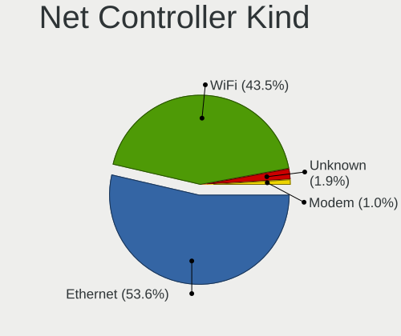

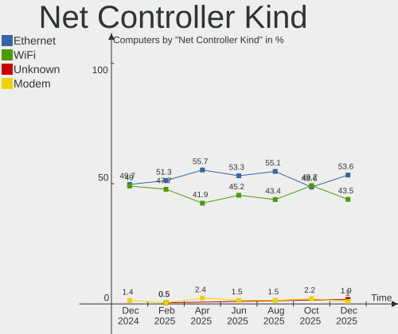

| Kind     | Computers | Percent |
|----------|-----------|---------|
| Ethernet | 111       | 53.62%  |
| WiFi     | 90        | 43.48%  |
| Unknown  | 4         | 1.93%   |
| Modem    | 2         | 0.97%   |

Used Controller
---------------

Currently used network controller

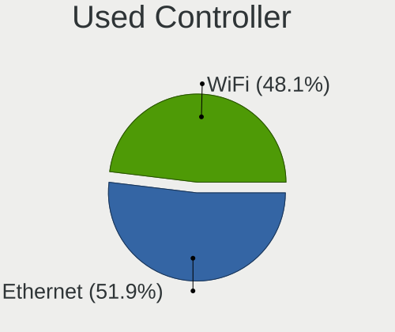

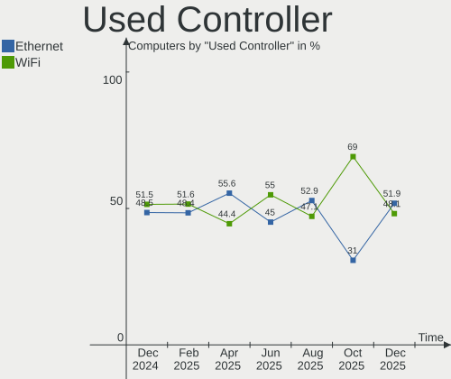

| Kind     | Computers | Percent |
|----------|-----------|---------|
| Ethernet | 68        | 51.91%  |
| WiFi     | 63        | 48.09%  |

NICs
----

Total network controllers on board

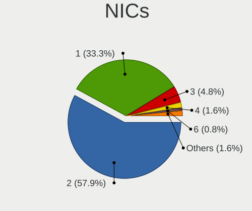

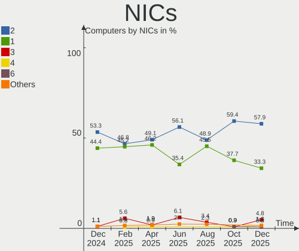

| Total | Computers | Percent |
|-------|-----------|---------|
| 2     | 73        | 57.94%  |
| 1     | 42        | 33.33%  |
| 3     | 6         | 4.76%   |
| 4     | 2         | 1.59%   |
| 6     | 1         | 0.79%   |
| 5     | 1         | 0.79%   |
| 0     | 1         | 0.79%   |

IPv6
----

IPv6 vs IPv4

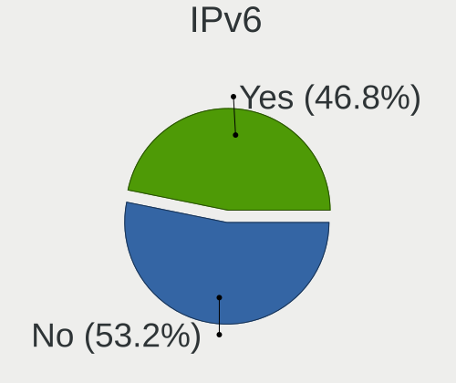

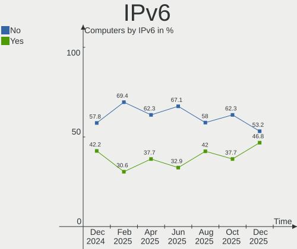

| Used | Computers | Percent |
|------|-----------|---------|
| No   | 67        | 53.17%  |
| Yes  | 59        | 46.83%  |

Bluetooth
---------

Bluetooth Vendor
----------------

Controller vendors

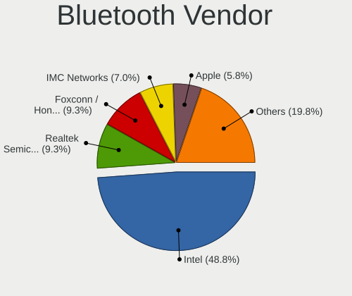

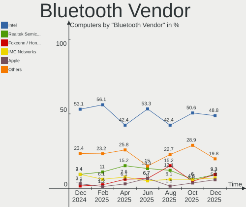

| Vendor                          | Computers | Percent |
|---------------------------------|-----------|---------|
| Intel                           | 42        | 48.84%  |
| Realtek Semiconductor           | 8         | 9.3%    |
| Foxconn / Hon Hai               | 8         | 9.3%    |
| IMC Networks                    | 6         | 6.98%   |
| Apple                           | 5         | 5.81%   |
| Qualcomm Atheros Communications | 3         | 3.49%   |
| MediaTek                        | 3         | 3.49%   |
| Cambridge Silicon Radio         | 3         | 3.49%   |
| Broadcom                        | 3         | 3.49%   |
| Lite-On Technology              | 2         | 2.33%   |
| TP-Link                         | 1         | 1.16%   |
| Integrated System Solution      | 1         | 1.16%   |
| Dell                            | 1         | 1.16%   |

Bluetooth Model
---------------

Controller models

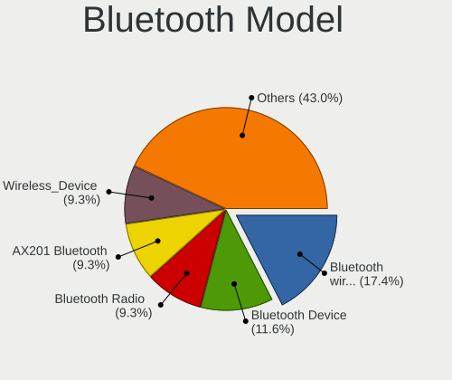

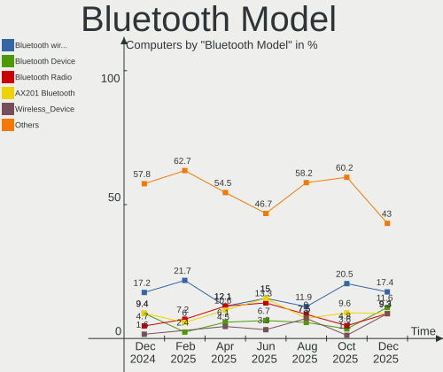

| Model                                                 | Computers | Percent |
|-------------------------------------------------------|-----------|---------|
| Intel Bluetooth wireless interface                    | 15        | 17.44%  |
| Intel Bluetooth Device                                | 10        | 11.63%  |
| Realtek Bluetooth Radio                               | 8         | 9.3%    |
| Intel AX201 Bluetooth                                 | 8         | 9.3%    |
| Foxconn / Hon Hai Wireless_Device                     | 8         | 9.3%    |
| Qualcomm Atheros  Bluetooth Device                    | 3         | 3.49%   |
| MediaTek Wireless_Device                              | 3         | 3.49%   |
| Intel AX210 Bluetooth                                 | 3         | 3.49%   |
| IMC Networks Wireless_Device                          | 3         | 3.49%   |
| Cambridge Silicon Radio Bluetooth Dongle (HCI mode)   | 3         | 3.49%   |
| Apple Bluetooth Host Controller                       | 3         | 3.49%   |
| Intel Wireless-AC 3168 Bluetooth                      | 2         | 2.33%   |
| Intel Bluetooth 9460/9560 Jefferson Peak (JfP)        | 2         | 2.33%   |
| Intel AX200 Bluetooth                                 | 2         | 2.33%   |
| IMC Networks Bluetooth Radio                          | 2         | 2.33%   |
| TP-Link TP-T@- UB500 Adapter                          | 1         | 1.16%   |
| Lite-On Broadcom BCM43142A0 Bluetooth Device          | 1         | 1.16%   |
| Lite-On Bluetooth Device                              | 1         | 1.16%   |
| Integrated System Solution KY-BT100 Bluetooth Adapter | 1         | 1.16%   |
| IMC Networks Bluetooth Device                         | 1         | 1.16%   |
| Dell DW375 Bluetooth Module                           | 1         | 1.16%   |
| Broadcom BCM43142A0 Bluetooth 4.0                     | 1         | 1.16%   |
| Broadcom BCM20702 Bluetooth 4.0 [ThinkPad]            | 1         | 1.16%   |
| Broadcom BCM2045B (BDC-2.1)                           | 1         | 1.16%   |
| Apple Built-in Bluetooth 2.0+EDR HCI                  | 1         | 1.16%   |
| Apple Bluetooth USB Host Controller                   | 1         | 1.16%   |

Sound
-----

Sound Vendor
------------

Sound card vendors

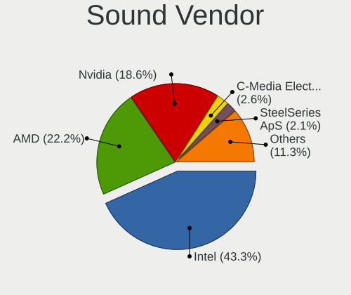

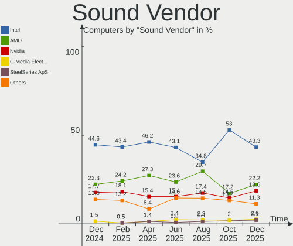

| Vendor                               | Computers | Percent |
|--------------------------------------|-----------|---------|
| Intel                                | 84        | 43.3%   |
| AMD                                  | 43        | 22.16%  |
| Nvidia                               | 36        | 18.56%  |
| C-Media Electronics                  | 5         | 2.58%   |
| SteelSeries ApS                      | 4         | 2.06%   |
| Texas Instruments                    | 3         | 1.55%   |
| Micro Star International             | 2         | 1.03%   |
| Logitech                             | 2         | 1.03%   |
| Lenovo                               | 2         | 1.03%   |
| Focusrite-Novation                   | 2         | 1.03%   |
| Thesycon Systemsoftware & Consulting | 1         | 0.52%   |
| Tenx Technology                      | 1         | 0.52%   |
| Realtek Semiconductor                | 1         | 0.52%   |
| NZXT                                 | 1         | 0.52%   |
| Jieli Technology                     | 1         | 0.52%   |
| Hewlett-Packard                      | 1         | 0.52%   |
| Generalplus Technology               | 1         | 0.52%   |
| Fractal                              | 1         | 0.52%   |
| Creative Labs                        | 1         | 0.52%   |
| BigBen Interactive                   | 1         | 0.52%   |
| ASUSTek Computer                     | 1         | 0.52%   |

Sound Model
-----------

Sound card models

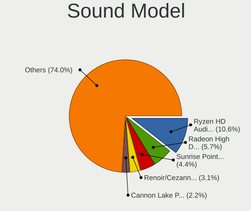

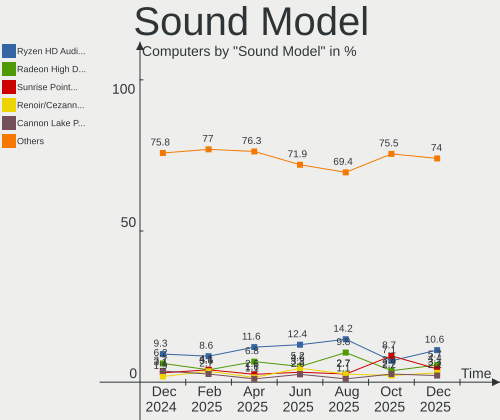

| Model                                                                                             | Computers | Percent |
|---------------------------------------------------------------------------------------------------|-----------|---------|
| AMD Ryzen HD Audio Controller                                                                     | 24        | 10.57%  |
| AMD Radeon High Definition Audio Controller                                                       | 13        | 5.73%   |
| Intel Sunrise Point-LP HD Audio                                                                   | 10        | 4.41%   |
| AMD Renoir/Cezanne HDMI/DP Audio Controller                                                       | 7         | 3.08%   |
| Intel Cannon Lake PCH cAVS                                                                        | 5         | 2.2%    |
| Intel 8 Series/C220 Series Chipset High Definition Audio Controller                               | 5         | 2.2%    |
| Intel 7 Series/C216 Chipset Family High Definition Audio Controller                               | 5         | 2.2%    |
| Intel 200 Series PCH HD Audio                                                                     | 5         | 2.2%    |
| AMD Navi 48 HDMI/DP Audio Controller                                                              | 5         | 2.2%    |
| Nvidia TU107 GeForce GTX 1650 High Definition Audio Controller                                    | 4         | 1.76%   |
| Intel Raptor Lake High Definition Audio Controller                                                | 4         | 1.76%   |
| Intel Comet Lake PCH cAVS                                                                         | 4         | 1.76%   |
| Intel Alder Lake-N PCH High Definition Audio Controller                                           | 4         | 1.76%   |
| Intel 5 Series/3400 Series Chipset High Definition Audio                                          | 4         | 1.76%   |
| AMD Starship/Matisse HD Audio Controller                                                          | 4         | 1.76%   |
| Nvidia GP107GL High Definition Audio Controller                                                   | 3         | 1.32%   |
| Nvidia AD106M High Definition Audio Controller                                                    | 3         | 1.32%   |
| Intel Tiger Lake-LP Smart Sound Technology Audio Controller                                       | 3         | 1.32%   |
| Intel Haswell-ULT HD Audio Controller                                                             | 3         | 1.32%   |
| Intel Alder Lake PCH-P High Definition Audio Controller                                           | 3         | 1.32%   |
| Intel 82801I (ICH9 Family) HD Audio Controller                                                    | 3         | 1.32%   |
| Intel 800 Series ACE (Audio Context Engine)                                                       | 3         | 1.32%   |
| Intel 8 Series HD Audio Controller                                                                | 3         | 1.32%   |
| Intel 100 Series/C230 Series Chipset Family HD Audio Controller                                   | 3         | 1.32%   |
| C-Media Electronics Audio Adapter (Unitek Y-247A)                                                 | 3         | 1.32%   |
| Texas Instruments PCM2902 Audio Codec                                                             | 2         | 0.88%   |
| SteelSeries ApS Arctis Nova Pro Wireless                                                          | 2         | 0.88%   |
| Nvidia TU116 High Definition Audio Controller                                                     | 2         | 0.88%   |
| Nvidia High Definition Audio Controller                                                           | 2         | 0.88%   |
| Nvidia GK208 HDMI/DP Audio Controller                                                             | 2         | 0.88%   |
| Nvidia GA106 High Definition Audio Controller                                                     | 2         | 0.88%   |
| Nvidia GA104 High Definition Audio Controller                                                     | 2         | 0.88%   |
| Micro Star International USB Audio                                                                | 2         | 0.88%   |
| Intel Xeon E3-1200 v3/4th Gen Core Processor HD Audio Controller                                  | 2         | 0.88%   |
| Intel Raptor Lake-P/U/H cAVS                                                                      | 2         | 0.88%   |
| Intel Meteor Lake-P HD Audio Controller                                                           | 2         | 0.88%   |
| Intel Comet Lake PCH-LP cAVS                                                                      | 2         | 0.88%   |
| Intel Atom/Celeron/Pentium Processor x5-E8000/J3xxx/N3xxx Series High Definition Audio Controller | 2         | 0.88%   |
| Intel Alder Lake-S HD Audio Controller                                                            | 2         | 0.88%   |
| Intel 82801JI (ICH10 Family) HD Audio Controller                                                  | 2         | 0.88%   |

Memory
------

Memory Vendor
-------------

Memory module vendors

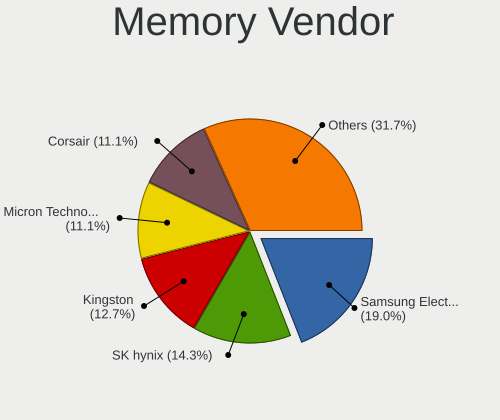

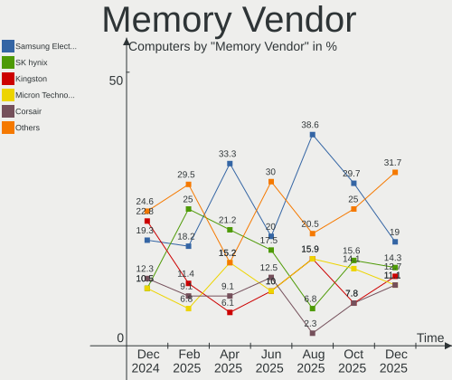

| Vendor              | Computers | Percent |
|---------------------|-----------|---------|
| Samsung Electronics | 12        | 19.05%  |
| SK hynix            | 9         | 14.29%  |
| Kingston            | 8         | 12.7%   |
| Micron Technology   | 7         | 11.11%  |
| Corsair             | 7         | 11.11%  |
| G.Skill             | 4         | 6.35%   |
| Crucial             | 4         | 6.35%   |
| Unknown             | 3         | 4.76%   |
| Unknown             | 2         | 3.17%   |
| ASint Technology    | 2         | 3.17%   |
| A-DATA Technology   | 2         | 3.17%   |
| Unknown (ABCD)      | 1         | 1.59%   |
| Nanya Technology    | 1         | 1.59%   |
| Lexar Co Limited    | 1         | 1.59%   |

Memory Model
------------

Memory module models

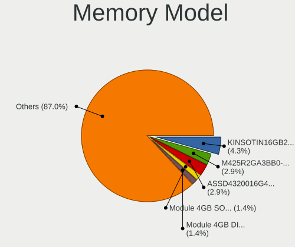

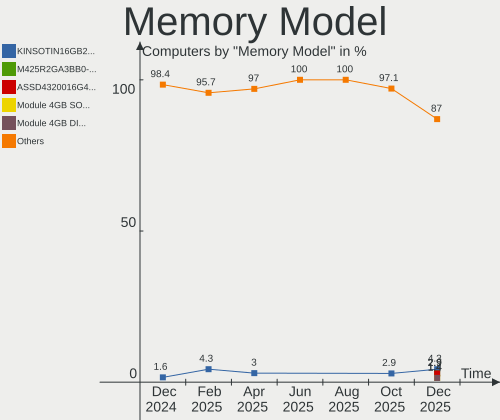

| Model                                                             | Computers | Percent |
|-------------------------------------------------------------------|-----------|---------|
| Unknown                                                           | 3         | 4.35%   |
| Samsung RAM M425R2GA3BB0-CQKOL 16GB SODIMM DDR5 4800MT/s          | 2         | 2.9%    |
| ASint RAM ASSD4320016G4b223 16GiB SODIMM DDR4 3200MT/s            | 2         | 2.9%    |
| Unknown RAM Module 4GB SODIMM DDR4 2400MT/s                       | 1         | 1.45%   |
| Unknown RAM Module 4GB DIMM 1333MT/s                              | 1         | 1.45%   |
| Unknown (ABCD) RAM 123456789012345678 2GB SODIMM LPDDR4 2400MT/s  | 1         | 1.45%   |
| SK hynix RAM Module 4GB SODIMM DDR3 1066MT/s                      | 1         | 1.45%   |
| SK hynix RAM HMT851S6AMR6R-PB 4GB Chip DDR3 1600MT/s              | 1         | 1.45%   |
| SK hynix RAM HMCG66MEBSA095N 8GiB SODIMM DDR5 4800MT/s            | 1         | 1.45%   |
| SK hynix RAM HMAA1GS6CMR6N-XN 8GB SODIMM DDR4 3200MT/s            | 1         | 1.45%   |
| SK hynix RAM HMAA1GS6CJR6N-XN 8GB SODIMM DDR4 3200MT/s            | 1         | 1.45%   |
| SK hynix RAM HMA851S6AFR6N-UH 4GB SODIMM DDR4 2667MT/s            | 1         | 1.45%   |
| SK hynix RAM HMA81GS6JJR8N-VK 8GB SODIMM DDR4 2667MT/s            | 1         | 1.45%   |
| SK hynix RAM HMA81GS6DJR8N-XN 8GB SODIMM DDR4 3200MT/s            | 1         | 1.45%   |
| SK hynix RAM HMA81GS6DJR8N-VK 8GB SODIMM DDR4 2667MT/s            | 1         | 1.45%   |
| SK hynix RAM HMA42GR7MFR4N-TF 16GB DIMM DDR4 2133MT/s             | 1         | 1.45%   |
| Samsung RAM Module 8GB Row Of Chips LPDDR3 2133MT/s               | 1         | 1.45%   |
| Samsung RAM Module 4GB Row Of Chips LPDDR5 4000MT/s               | 1         | 1.45%   |
| Samsung RAM M471A5244CB0-CWE 4GB SODIMM DDR4 3200MT/s             | 1         | 1.45%   |
| Samsung RAM M471A5244CB0-CRC 4GB SODIMM DDR4 2667MT/s             | 1         | 1.45%   |
| Samsung RAM M471A2K43CB1-CRC 16GB SODIMM DDR4 2667MT/s            | 1         | 1.45%   |
| Samsung RAM M425R4GA3EB0-CWMOD 32GB SODIMM DDR5 5600MT/s          | 1         | 1.45%   |
| Samsung RAM M425R2GA3PB0-CWMOL 16GB SODIMM DDR5 5600MT/s          | 1         | 1.45%   |
| Samsung RAM M425R2GA3EB0-CWMOD 16GB SODIMM DDR5 5600MT/s          | 1         | 1.45%   |
| Samsung RAM M4 70T5267AZ3-CF7 4GB SODIMM DDR2 800MT/s             | 1         | 1.45%   |
| Samsung RAM M378A1K43BB2-CRC 8GB DIMM DDR4 3400MT/s               | 1         | 1.45%   |
| Samsung RAM K3KL8L80CM-MGCT 4GB SODIMM LPDDR5 7500MT/s            | 1         | 1.45%   |
| Nanya RAM M2F8G64CC8HD5N-DI 8GB DIMM DDR3 1600MT/s                | 1         | 1.45%   |
| Micron RAM MTC10F1084S1RC56BD2 MLCC 16GB DIMM DDR5 5600MT/s       | 1         | 1.45%   |
| Micron RAM MTC10F1084S1RC56BD1 QMCC 16GB DIMM DDR5 5600MT/s       | 1         | 1.45%   |
| Micron RAM MT62F1G32D2DS-026 2GB Row Of Chips LPDDR5 7467MT/s     | 1         | 1.45%   |
| Micron RAM Module 4GB SODIMM DDR4 2400MT/s                        | 1         | 1.45%   |
| Micron RAM CP16G64C38U5B.M8D1 16GB DIMM DDR5 6000MT/s             | 1         | 1.45%   |
| Micron RAM 8ATF2G64HZ-3G2E2 16GB SODIMM DDR4 3200MT/s             | 1         | 1.45%   |
| Micron RAM 8ATF1G64HZ-3G2J1 8GB SODIMM DDR4 3200MT/s              | 1         | 1.45%   |
| Micron RAM 36ASF2G72PZ-2G1A2 16GB DIMM DDR4 2400MT/s              | 1         | 1.45%   |
| Lexar Co Limited RAM LD4AS016G-H3200GST 16GB SODIMM DDR4 3200MT/s | 1         | 1.45%   |
| Kingston RAM KHX2400C14S4/4G 4GB SODIMM DDR4 2400MT/s             | 1         | 1.45%   |
| Kingston RAM KF560C36-16 16GB DIMM DDR5 6000MT/s                  | 1         | 1.45%   |
| Kingston RAM KF560C30-32 32GB DIMM DDR5 6000MT/s                  | 1         | 1.45%   |

Memory Kind
-----------

Memory module kinds

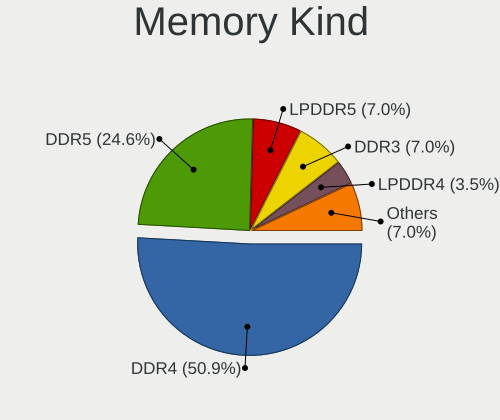

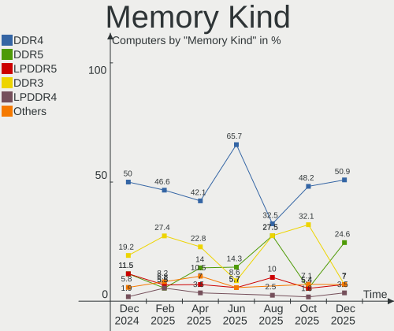

| Kind    | Computers | Percent |
|---------|-----------|---------|
| DDR4    | 29        | 50.88%  |
| DDR5    | 14        | 24.56%  |
| LPDDR5  | 4         | 7.02%   |
| DDR3    | 4         | 7.02%   |
| LPDDR4  | 2         | 3.51%   |
| LPDDR3  | 1         | 1.75%   |
| DRAM    | 1         | 1.75%   |
| DDR2    | 1         | 1.75%   |
| Unknown | 1         | 1.75%   |

Memory Form Factor
------------------

Physical design of the memory module

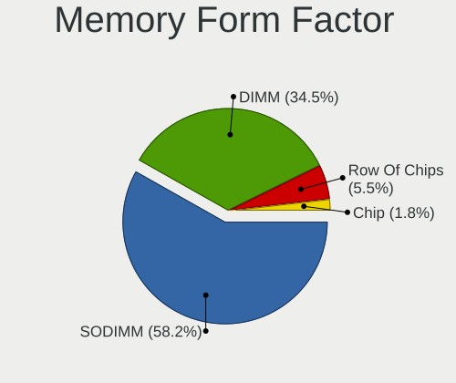

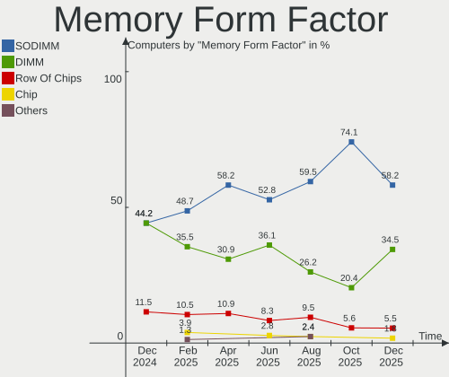

| Name         | Computers | Percent |
|--------------|-----------|---------|
| SODIMM       | 32        | 58.18%  |
| DIMM         | 19        | 34.55%  |
| Row Of Chips | 3         | 5.45%   |
| Chip         | 1         | 1.82%   |

Memory Size
-----------

Memory module size

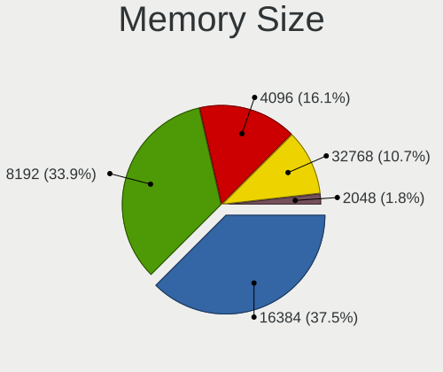

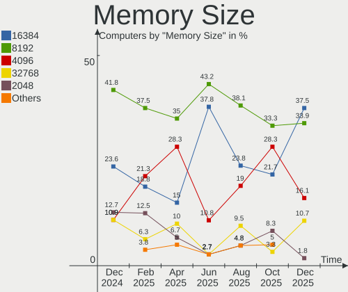

| Size  | Computers | Percent |
|-------|-----------|---------|
| 16384 | 21        | 37.5%   |
| 8192  | 19        | 33.93%  |
| 4096  | 9         | 16.07%  |
| 32768 | 6         | 10.71%  |
| 2048  | 1         | 1.79%   |

Memory Speed
------------

Memory module speed

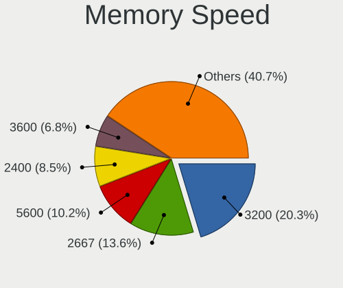

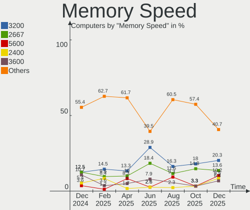

| Speed | Computers | Percent |
|-------|-----------|---------|
| 3200  | 12        | 20.34%  |
| 2667  | 8         | 13.56%  |
| 5600  | 6         | 10.17%  |
| 2400  | 5         | 8.47%   |
| 3600  | 4         | 6.78%   |
| 6000  | 3         | 5.08%   |
| 4800  | 3         | 5.08%   |
| 1600  | 3         | 5.08%   |
| 7500  | 2         | 3.39%   |
| 2133  | 2         | 3.39%   |
| 7467  | 1         | 1.69%   |
| 6400  | 1         | 1.69%   |
| 6200  | 1         | 1.69%   |
| 4333  | 1         | 1.69%   |
| 4000  | 1         | 1.69%   |
| 3800  | 1         | 1.69%   |
| 3400  | 1         | 1.69%   |
| 3000  | 1         | 1.69%   |
| 1333  | 1         | 1.69%   |
| 1066  | 1         | 1.69%   |
| 800   | 1         | 1.69%   |

Printers & scanners
-------------------

Printer Vendor
--------------

Printer device vendors

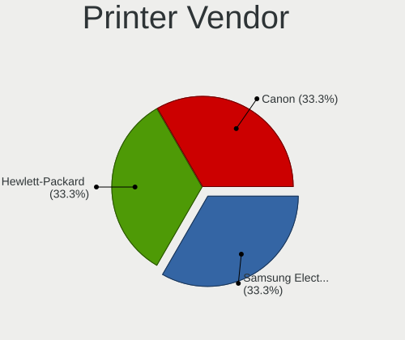

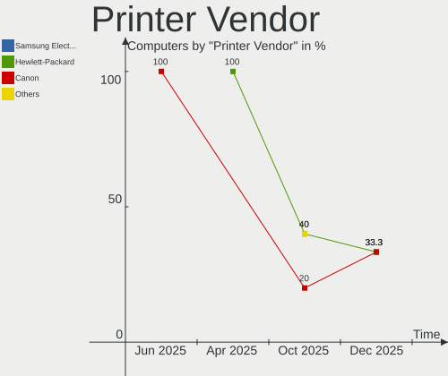

| Vendor              | Computers | Percent |
|---------------------|-----------|---------|
| Samsung Electronics | 1         | 33.33%  |
| Hewlett-Packard     | 1         | 33.33%  |
| Canon               | 1         | 33.33%  |

Printer Model
-------------

Printer device models

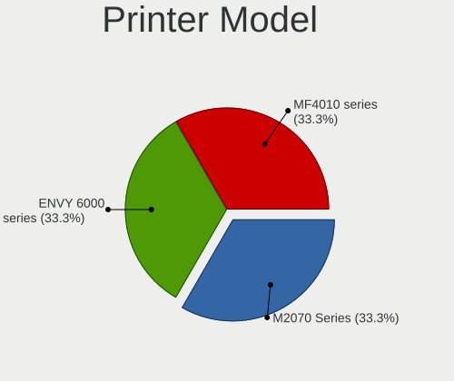

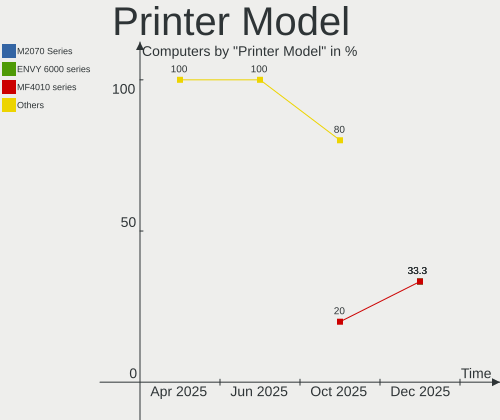

| Model                | Computers | Percent |
|----------------------|-----------|---------|
| Samsung M2070 Series | 1         | 33.33%  |
| HP ENVY 6000 series  | 1         | 33.33%  |
| Canon MF4010 series  | 1         | 33.33%  |

Scanner Vendor
--------------

Scanner device vendors

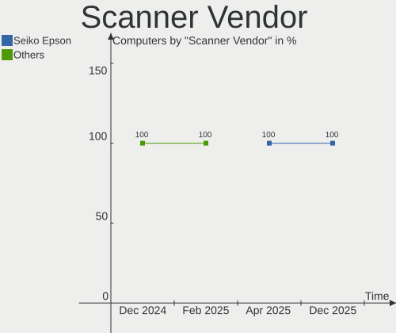

| Vendor      | Computers | Percent |
|-------------|-----------|---------|
| Seiko Epson | 1         | 100%    |

Scanner Model
-------------

Scanner device models

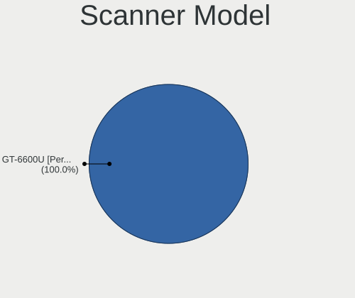

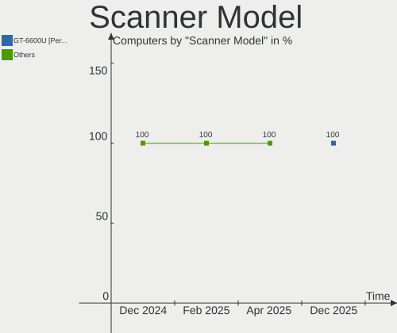

| Model                                 | Computers | Percent |
|---------------------------------------|-----------|---------|
| Seiko Epson GT-6600U [Perfection 610] | 1         | 100%    |

Camera
------

Camera Vendor
-------------

Camera device vendors

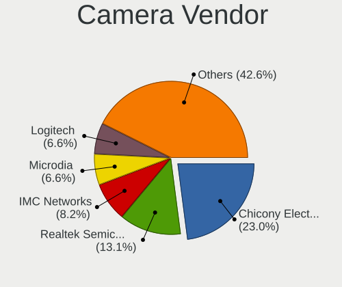

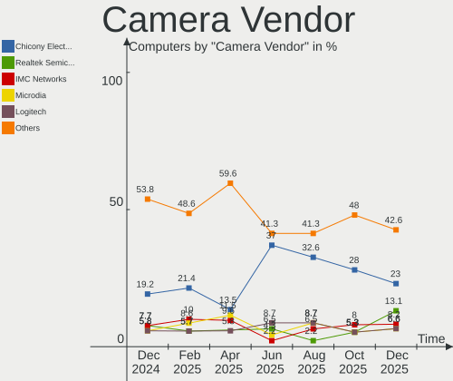

| Vendor                                 | Computers | Percent |
|----------------------------------------|-----------|---------|
| Chicony Electronics                    | 14        | 22.95%  |
| Realtek Semiconductor                  | 8         | 13.11%  |
| IMC Networks                           | 5         | 8.2%    |
| Microdia                               | 4         | 6.56%   |
| Logitech                               | 4         | 6.56%   |
| ShineTech                              | 3         | 4.92%   |
| Cheng Uei Precision Industry (Foxlink) | 3         | 4.92%   |
| Bison Electronics                      | 3         | 4.92%   |
| Apple                                  | 3         | 4.92%   |
| Syntek                                 | 2         | 3.28%   |
| Sunplus Technology                     | 2         | 3.28%   |
| Sunplus Innovation Technology          | 2         | 3.28%   |
| Microsoft                              | 2         | 3.28%   |
| Sonix Technology                       | 1         | 1.64%   |
| Quanta                                 | 1         | 1.64%   |
| Luxvisions Innotech Limited            | 1         | 1.64%   |
| Lenovo                                 | 1         | 1.64%   |
| Framework                              | 1         | 1.64%   |
| Anker PowerConf C200                   | 1         | 1.64%   |

Camera Model
------------

Camera device models

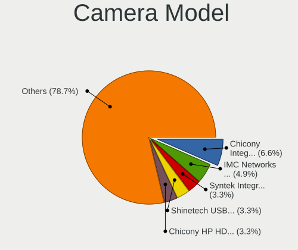

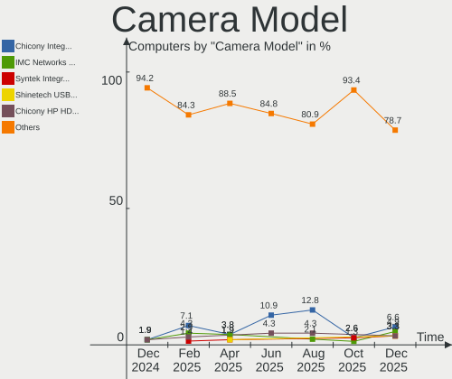

| Model                                                | Computers | Percent |
|------------------------------------------------------|-----------|---------|
| Chicony Integrated Camera                            | 4         | 6.56%   |
| IMC Networks USB2.0 HD UVC WebCam                    | 3         | 4.92%   |
| Syntek Integrated Camera                             | 2         | 3.28%   |
| Shinetech USB2.0 FHD UVC WebCam                      | 2         | 3.28%   |
| Chicony HP HD Camera                                 | 2         | 3.28%   |
| Bison Integrated RGB Camera                          | 2         | 3.28%   |
| Sunplus HD Camera Camera                             | 1         | 1.64%   |
| Sunplus HD Camera                                    | 1         | 1.64%   |
| Sunplus Laptop_Integrated_Webcam_FHD                 | 1         | 1.64%   |
| Sunplus Integrated_Webcam_HD                         | 1         | 1.64%   |
| Sonix ASUS HD webcam                                 | 1         | 1.64%   |
| ShineTech USB2.0 HD UVC WebCam                       | 1         | 1.64%   |
| Realtek USB2.0 VGA UVC WebCam                        | 1         | 1.64%   |
| Realtek USB2.0 HD UVC WebCam                         | 1         | 1.64%   |
| Realtek USB Camera                                   | 1         | 1.64%   |
| Realtek Laptop Camera                                | 1         | 1.64%   |
| Realtek Integrated_Webcam_HD                         | 1         | 1.64%   |
| Realtek Integrated_Webcam_FHD                        | 1         | 1.64%   |
| Realtek Integrated Webcam HD                         | 1         | 1.64%   |
| Realtek Integrated Camera                            | 1         | 1.64%   |
| Quanta HD User Facing                                | 1         | 1.64%   |
| Microsoft Microsoft LifeCam Cinema                   | 1         | 1.64%   |
| Microsoft LifeCam VX-800                             | 1         | 1.64%   |
| Microdia Integrated_Webcam_HD                        | 1         | 1.64%   |
| Microdia Integrated_Webcam_FHD                       | 1         | 1.64%   |
| Microdia Integrated Webcam                           | 1         | 1.64%   |
| Microdia HP Integrated Webcam                        | 1         | 1.64%   |
| Luxvisions Innotech Limited HP Wide Vision HD Camera | 1         | 1.64%   |
| Logitech Webcam C270                                 | 1         | 1.64%   |
| Logitech QuickCam Pro 9000                           | 1         | 1.64%   |
| Logitech HD Pro Webcam C920                          | 1         | 1.64%   |
| Logitech BRIO Ultra HD Webcam                        | 1         | 1.64%   |
| Lenovo Integrated Webcam                             | 1         | 1.64%   |
| IMC Networks Integrated Camera                       | 1         | 1.64%   |
| IMC Networks HP TrueVision HD Camera                 | 1         | 1.64%   |
| Framework Laptop Webcam Module (2nd Gen)             | 1         | 1.64%   |
| Chicony Integrated Camera (1280x720@30)              | 1         | 1.64%   |
| Chicony HP Truevision HD                             | 1         | 1.64%   |
| Chicony HD WebCam (Asus N-series)                    | 1         | 1.64%   |
| Chicony HD WebCam                                    | 1         | 1.64%   |

Security
--------

Fingerprint Vendor
------------------

Fingerprint sensor vendors

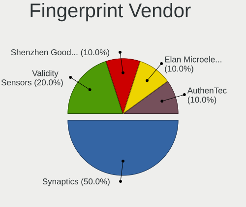

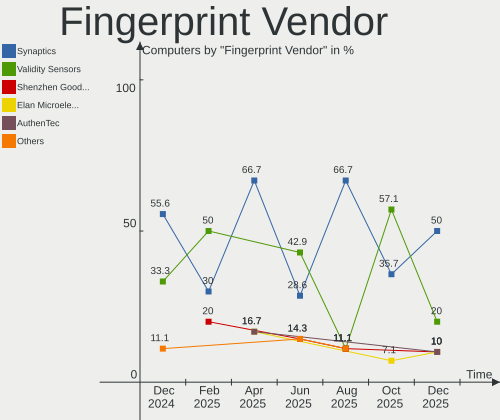

| Vendor                     | Computers | Percent |
|----------------------------|-----------|---------|
| Synaptics                  | 5         | 50%     |
| Validity Sensors           | 2         | 20%     |
| Shenzhen Goodix Technology | 1         | 10%     |
| Elan Microelectronics      | 1         | 10%     |
| AuthenTec                  | 1         | 10%     |

Fingerprint Model
-----------------

Fingerprint sensor models

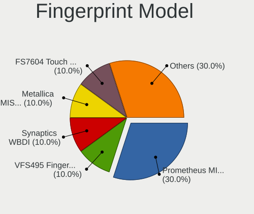

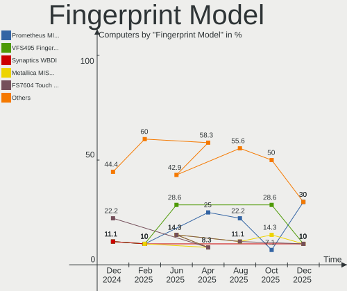

| Model                                                    | Computers | Percent |
|----------------------------------------------------------|-----------|---------|
| Synaptics Prometheus MIS Touch Fingerprint Reader        | 3         | 30%     |
| Validity Sensors VFS495 Fingerprint Reader               | 1         | 10%     |
| Validity Sensors Synaptics WBDI                          | 1         | 10%     |
| Synaptics Metallica MIS Touch Fingerprint Reader         | 1         | 10%     |
| Synaptics FS7604 Touch Fingerprint Sensor with PurePrint | 1         | 10%     |
| Shenzhen Goodix  FingerPrint Device                      | 1         | 10%     |
| Elan ELAN:Fingerprint                                    | 1         | 10%     |
| AuthenTec AES2810                                        | 1         | 10%     |

Chipcard Vendor
---------------

Chipcard module vendors

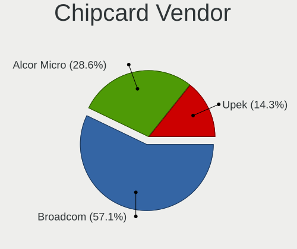

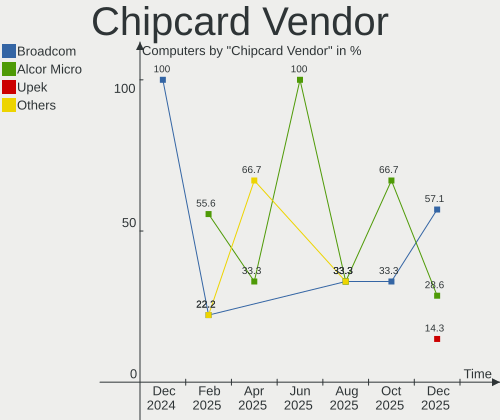

| Vendor      | Computers | Percent |
|-------------|-----------|---------|
| Broadcom    | 4         | 57.14%  |
| Alcor Micro | 2         | 28.57%  |
| Upek        | 1         | 14.29%  |

Chipcard Model
--------------

Chipcard module models

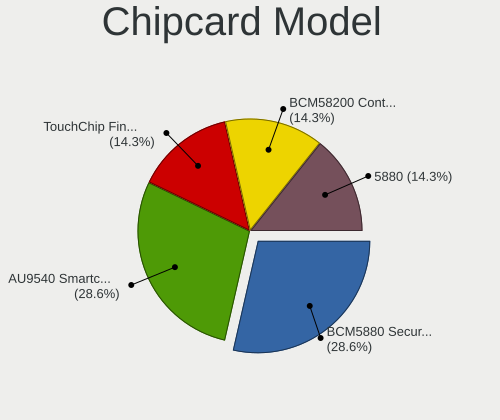

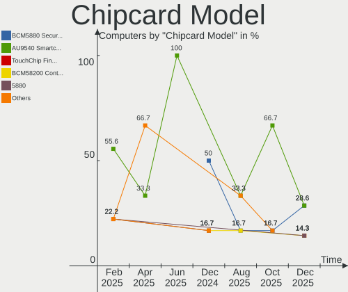

| Model                                                                       | Computers | Percent |
|-----------------------------------------------------------------------------|-----------|---------|
| Broadcom BCM5880 Secure Applications Processor                              | 2         | 28.57%  |
| Alcor Micro AU9540 Smartcard Reader                                         | 2         | 28.57%  |
| Upek TouchChip Fingerprint Coprocessor (WBF advanced mode)                  | 1         | 14.29%  |
| Broadcom BCM58200 ControlVault 3 (FingerPrint sensor + Contacted SmartCard) | 1         | 14.29%  |
| Broadcom 5880                                                               | 1         | 14.29%  |

Unsupported
-----------

Unsupported Devices
-------------------

Total unsupported devices on board

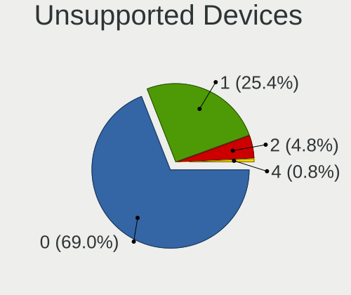

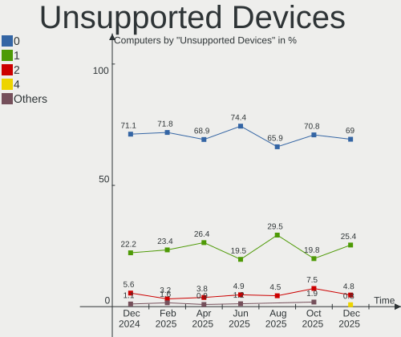

| Total | Computers | Percent |
|-------|-----------|---------|
| 0     | 87        | 69.05%  |
| 1     | 32        | 25.4%   |
| 2     | 6         | 4.76%   |
| 4     | 1         | 0.79%   |

Unsupported Device Types
------------------------

Types of unsupported devices

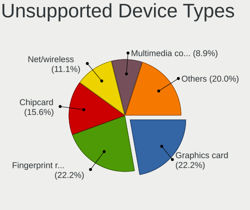

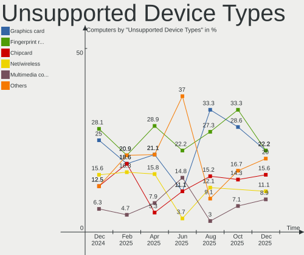

| Type                     | Computers | Percent |
|--------------------------|-----------|---------|
| Graphics card            | 10        | 22.22%  |
| Fingerprint reader       | 10        | 22.22%  |
| Chipcard                 | 7         | 15.56%  |
| Net/wireless             | 5         | 11.11%  |
| Multimedia controller    | 4         | 8.89%   |
| Network                  | 2         | 4.44%   |
| Communication controller | 2         | 4.44%   |
| Bluetooth                | 2         | 4.44%   |
| Unassigned class         | 1         | 2.22%   |
| Storage                  | 1         | 2.22%   |
| Net/ethernet             | 1         | 2.22%   |

