Linux in Netherlands - Hardware Trends
--------------------------------------

A project to identify most popular hardware characteristics and track their change
over time based on data collected by Linux users at https://Linux-Hardware.org.

Anyone can contribute to this report by the [hw-probe](https://github.com/linuxhw/hw-probe) tool:

    sudo -E hw-probe -all -upload

This is a report for all computer types. See also reports for [desktops](/Location/Netherlands/Desktop/README.md) and [notebooks](/Location/Netherlands/Notebook/README.md).

Period: Feb, 2023.

Contents
--------

* [ System ](#system)
  - [ OS                       ](#os)
  - [ OS Family                ](#os-family)
  - [ Kernel                   ](#kernel)
  - [ Kernel Family            ](#kernel-family)
  - [ Kernel Major Ver.        ](#kernel-major-ver)
  - [ Arch                     ](#arch)
  - [ DE                       ](#de)
  - [ Display Server           ](#display-server)
  - [ Display Manager          ](#display-manager)
  - [ OS Lang                  ](#os-lang)
  - [ Boot Mode                ](#boot-mode)
  - [ Filesystem               ](#filesystem)
  - [ Part. scheme             ](#part-scheme)
  - [ Dual Boot with Linux/BSD ](#dual-boot-with-linuxbsd)
  - [ Dual Boot (Win)          ](#dual-boot-win)

* [ Board ](#board)
  - [ Vendor                   ](#vendor)
  - [ Model                    ](#model)
  - [ Model Family             ](#model-family)
  - [ MFG Year                 ](#mfg-year)
  - [ Form Factor              ](#form-factor)
  - [ Secure Boot              ](#secure-boot)
  - [ Coreboot                 ](#coreboot)
  - [ RAM Size                 ](#ram-size)
  - [ RAM Used                 ](#ram-used)
  - [ Total Drives             ](#total-drives)
  - [ Has CD-ROM               ](#has-cd-rom)
  - [ Has Ethernet             ](#has-ethernet)
  - [ Has WiFi                 ](#has-wifi)
  - [ Has Bluetooth            ](#has-bluetooth)

* [ Location ](#location)
  - [ Country                  ](#country)
  - [ City                     ](#city)

* [ Drives ](#drives)
  - [ Drive Vendor             ](#drive-vendor)
  - [ Drive Model              ](#drive-model)
  - [ HDD Vendor               ](#hdd-vendor)
  - [ SSD Vendor               ](#ssd-vendor)
  - [ Drive Kind               ](#drive-kind)
  - [ Drive Connector          ](#drive-connector)
  - [ Drive Size               ](#drive-size)
  - [ Space Total              ](#space-total)
  - [ Space Used               ](#space-used)
  - [ Malfunc. Drives          ](#malfunc-drives)
  - [ Malfunc. Drive Vendor    ](#malfunc-drive-vendor)
  - [ Malfunc. HDD Vendor      ](#malfunc-hdd-vendor)
  - [ Malfunc. Drive Kind      ](#malfunc-drive-kind)
  - [ Failed Drives            ](#failed-drives)
  - [ Failed Drive Vendor      ](#failed-drive-vendor)
  - [ Drive Status             ](#drive-status)

* [ Storage controller ](#storage-controller)
  - [ Storage Vendor           ](#storage-vendor)
  - [ Storage Model            ](#storage-model)
  - [ Storage Kind             ](#storage-kind)

* [ Processor ](#processor)
  - [ CPU Vendor               ](#cpu-vendor)
  - [ CPU Model                ](#cpu-model)
  - [ CPU Model Family         ](#cpu-model-family)
  - [ CPU Cores                ](#cpu-cores)
  - [ CPU Sockets              ](#cpu-sockets)
  - [ CPU Threads              ](#cpu-threads)
  - [ CPU Op-Modes             ](#cpu-op-modes)
  - [ CPU Microcode            ](#cpu-microcode)
  - [ CPU Microarch            ](#cpu-microarch)

* [ Graphics ](#graphics)
  - [ GPU Vendor               ](#gpu-vendor)
  - [ GPU Model                ](#gpu-model)
  - [ GPU Combo                ](#gpu-combo)
  - [ GPU Driver               ](#gpu-driver)
  - [ GPU Memory               ](#gpu-memory)

* [ Monitor ](#monitor)
  - [ Monitor Vendor           ](#monitor-vendor)
  - [ Monitor Model            ](#monitor-model)
  - [ Monitor Resolution       ](#monitor-resolution)
  - [ Monitor Diagonal         ](#monitor-diagonal)
  - [ Monitor Width            ](#monitor-width)
  - [ Aspect Ratio             ](#aspect-ratio)
  - [ Monitor Area             ](#monitor-area)
  - [ Pixel Density            ](#pixel-density)
  - [ Multiple Monitors        ](#multiple-monitors)

* [ Network ](#network)
  - [ Net Controller Vendor    ](#net-controller-vendor)
  - [ Net Controller Model     ](#net-controller-model)
  - [ Wireless Vendor          ](#wireless-vendor)
  - [ Wireless Model           ](#wireless-model)
  - [ Ethernet Vendor          ](#ethernet-vendor)
  - [ Ethernet Model           ](#ethernet-model)
  - [ Net Controller Kind      ](#net-controller-kind)
  - [ Used Controller          ](#used-controller)
  - [ NICs                     ](#nics)
  - [ IPv6                     ](#ipv6)

* [ Bluetooth ](#bluetooth)
  - [ Bluetooth Vendor         ](#bluetooth-vendor)
  - [ Bluetooth Model          ](#bluetooth-model)

* [ Sound ](#sound)
  - [ Sound Vendor             ](#sound-vendor)
  - [ Sound Model              ](#sound-model)

* [ Memory ](#memory)
  - [ Memory Vendor            ](#memory-vendor)
  - [ Memory Model             ](#memory-model)
  - [ Memory Kind              ](#memory-kind)
  - [ Memory Form Factor       ](#memory-form-factor)
  - [ Memory Size              ](#memory-size)
  - [ Memory Speed             ](#memory-speed)

* [ Printers & scanners ](#printers--scanners)
  - [ Printer Vendor           ](#printer-vendor)
  - [ Printer Model            ](#printer-model)
  - [ Scanner Vendor           ](#scanner-vendor)
  - [ Scanner Model            ](#scanner-model)

* [ Camera ](#camera)
  - [ Camera Vendor            ](#camera-vendor)
  - [ Camera Model             ](#camera-model)

* [ Security ](#security)
  - [ Fingerprint Vendor       ](#fingerprint-vendor)
  - [ Fingerprint Model        ](#fingerprint-model)
  - [ Chipcard Vendor          ](#chipcard-vendor)
  - [ Chipcard Model           ](#chipcard-model)

* [ Unsupported ](#unsupported)
  - [ Unsupported Devices      ](#unsupported-devices)
  - [ Unsupported Device Types ](#unsupported-device-types)

System
------

OS
--

Installed operating systems

| Name                         | Computers | Percent |
|------------------------------|-----------|---------|
| Ubuntu 22.04                 | 19        | 18.27%  |
| Linux Mint 21.1              | 13        | 12.5%   |
| Ubuntu 22.10                 | 7         | 6.73%   |
| OpenMandriva 23.01           | 7         | 6.73%   |
| Ubuntu 20.04                 | 5         | 4.81%   |
| Fedora 37                    | 5         | 4.81%   |
| Debian 11                    | 4         | 3.85%   |
| KDE neon 22.04               | 3         | 2.88%   |
| EndeavourOS Rolling          | 3         | 2.88%   |
| Arch Rolling                 | 3         | 2.88%   |
| Zorin 16                     | 2         | 1.92%   |
| Xubuntu 22.04                | 2         | 1.92%   |
| SteamOS 3.4.4                | 2         | 1.92%   |
| Pop!_OS 22.04                | 2         | 1.92%   |
| openSUSE Tumbleweed-XXXXXXXX | 2         | 1.92%   |
| Manjaro                      | 2         | 1.92%   |
| Linux Mint 21                | 2         | 1.92%   |
| Debian                       | 2         | 1.92%   |
| ArcoLinux Rolling            | 2         | 1.92%   |
| Ubuntu Studio 22.10          | 1         | 0.96%   |
| Ubuntu Budgie 22.10          | 1         | 0.96%   |
| SteamOS 3.4.5                | 1         | 0.96%   |
| Siduction                    | 1         | 0.96%   |
| openSUSE Leap-15.4           | 1         | 0.96%   |
| OpenMandriva 4.3             | 1         | 0.96%   |
| Manjaro 22.0.4               | 1         | 0.96%   |
| Manjaro 22.0.3               | 1         | 0.96%   |
| Manjaro 22.0.1               | 1         | 0.96%   |
| Lubuntu 20.04                | 1         | 0.96%   |
| Linux Mint 20.3              | 1         | 0.96%   |
| Linux Mint 20.2              | 1         | 0.96%   |
| Kubuntu 22.10                | 1         | 0.96%   |
| Kali 2022.4                  | 1         | 0.96%   |
| Fedora 36                    | 1         | 0.96%   |
| Endless 5.0.0                | 1         | 0.96%   |
| Elementary 7                 | 1         | 0.96%   |

OS Family
---------

OS without a version

| Name          | Computers | Percent |
|---------------|-----------|---------|
| Ubuntu        | 31        | 29.81%  |
| Linux Mint    | 17        | 16.35%  |
| OpenMandriva  | 8         | 7.69%   |
| Fedora        | 6         | 5.77%   |
| Debian        | 6         | 5.77%   |
| Manjaro       | 5         | 4.81%   |
| SteamOS       | 3         | 2.88%   |
| openSUSE      | 3         | 2.88%   |
| KDE neon      | 3         | 2.88%   |
| EndeavourOS   | 3         | 2.88%   |
| Arch          | 3         | 2.88%   |
| Zorin         | 2         | 1.92%   |
| Xubuntu       | 2         | 1.92%   |
| Pop!_OS       | 2         | 1.92%   |
| ArcoLinux     | 2         | 1.92%   |
| Ubuntu Studio | 1         | 0.96%   |
| Ubuntu Budgie | 1         | 0.96%   |
| Siduction     | 1         | 0.96%   |
| Lubuntu       | 1         | 0.96%   |
| Kubuntu       | 1         | 0.96%   |
| Kali          | 1         | 0.96%   |
| Endless       | 1         | 0.96%   |
| Elementary    | 1         | 0.96%   |

Kernel
------

Version of the Linux kernel

| Version                      | Computers | Percent |
|------------------------------|-----------|---------|
| 5.15.0-60-generic            | 21        | 20.19%  |
| 5.15.0-58-generic            | 11        | 10.58%  |
| 5.19.0-32-generic            | 8         | 7.69%   |
| 6.1.1-desktop-1omv2290       | 4         | 3.85%   |
| 5.19.0-31-generic            | 4         | 3.85%   |
| 5.4.0-139-generic            | 3         | 2.88%   |
| 5.13.0-valve36-1-neptune     | 3         | 2.88%   |
| 5.10.0-21-amd64              | 3         | 2.88%   |
| 6.1.7-060107-generic         | 2         | 1.92%   |
| 6.1.4-desktop-1omv2301       | 2         | 1.92%   |
| 6.1.12-arch1-1               | 2         | 1.92%   |
| 6.1.11-arch1-1               | 2         | 1.92%   |
| 6.1.11-1-MANJARO             | 2         | 1.92%   |
| 6.1.10-200.fc37.x86_64       | 2         | 1.92%   |
| 6.1.10-1-default             | 2         | 1.92%   |
| 6.2.1-desktop-1omv2390       | 1         | 0.96%   |
| 6.1.9-200.fc37.x86_64        | 1         | 0.96%   |
| 6.1.8-arch1-1                | 1         | 0.96%   |
| 6.1.8-200.fc37.x86_64        | 1         | 0.96%   |
| 6.1.7-1-MANJARO              | 1         | 0.96%   |
| 6.1.4-060104-generic         | 1         | 0.96%   |
| 6.1.12-zen1-1-zen            | 1         | 0.96%   |
| 6.1.12-x64v3-xanmod1         | 1         | 0.96%   |
| 6.1.11-200.fc37.x86_64       | 1         | 0.96%   |
| 6.1.10-arch1-1               | 1         | 0.96%   |
| 6.1.10-2-siduction-amd64     | 1         | 0.96%   |
| 6.1.0-4-amd64                | 1         | 0.96%   |
| 6.0.12-76060006-generic      | 1         | 0.96%   |
| 6.0.0-kali6-amd64            | 1         | 0.96%   |
| 6.0.0-6-amd64                | 1         | 0.96%   |
| 5.8.0-50-generic             | 1         | 0.96%   |
| 5.4.0-132-generic            | 1         | 0.96%   |
| 5.4.0-131-generic            | 1         | 0.96%   |
| 5.19.0-35-generic            | 1         | 0.96%   |
| 5.19.0-1015-lowlatency       | 1         | 0.96%   |
| 5.17.0-0.rc7.116.fc36.x86_64 | 1         | 0.96%   |
| 5.16.7-desktop-1omv4003      | 1         | 0.96%   |
| 5.15.94-1-MANJARO            | 1         | 0.96%   |
| 5.15.93-1-MANJARO            | 1         | 0.96%   |
| 5.15.91-4-lts                | 1         | 0.96%   |

Kernel Family
-------------

Linux kernel without a distro release

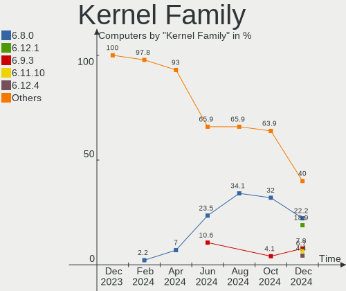

| Version | Computers | Percent |
|---------|-----------|---------|
| 5.15.0  | 37        | 35.58%  |
| 5.19.0  | 14        | 13.46%  |
| 6.1.10  | 6         | 5.77%   |
| 6.1.11  | 5         | 4.81%   |
| 5.4.0   | 5         | 4.81%   |
| 6.1.12  | 4         | 3.85%   |
| 6.1.1   | 4         | 3.85%   |
| 5.10.0  | 4         | 3.85%   |
| 6.1.7   | 3         | 2.88%   |
| 6.1.4   | 3         | 2.88%   |
| 5.13.0  | 3         | 2.88%   |
| 6.1.8   | 2         | 1.92%   |
| 6.0.0   | 2         | 1.92%   |
| 6.2.1   | 1         | 0.96%   |
| 6.1.9   | 1         | 0.96%   |
| 6.1.0   | 1         | 0.96%   |
| 6.0.12  | 1         | 0.96%   |
| 5.8.0   | 1         | 0.96%   |
| 5.17.0  | 1         | 0.96%   |
| 5.16.7  | 1         | 0.96%   |
| 5.15.94 | 1         | 0.96%   |
| 5.15.93 | 1         | 0.96%   |
| 5.15.91 | 1         | 0.96%   |
| 5.14.21 | 1         | 0.96%   |
| 5.14.0  | 1         | 0.96%   |

Kernel Major Ver.
-----------------

Linux kernel major version

| Version | Computers | Percent |
|---------|-----------|---------|
| 5.15    | 40        | 38.46%  |
| 6.1     | 29        | 27.88%  |
| 5.19    | 14        | 13.46%  |
| 5.4     | 5         | 4.81%   |
| 5.10    | 4         | 3.85%   |
| 6.0     | 3         | 2.88%   |
| 5.13    | 3         | 2.88%   |
| 5.14    | 2         | 1.92%   |
| 6.2     | 1         | 0.96%   |
| 5.8     | 1         | 0.96%   |
| 5.17    | 1         | 0.96%   |
| 5.16    | 1         | 0.96%   |

Arch
----

OS architecture (x86_64, i586, etc.)

| Name   | Computers | Percent |
|--------|-----------|---------|
| x86_64 | 104       | 100%    |

DE
--

Desktop Environment

| Name            | Computers | Percent |
|-----------------|-----------|---------|
| GNOME           | 45        | 43.27%  |
| KDE5            | 23        | 22.12%  |
| X-Cinnamon      | 17        | 16.35%  |
| XFCE            | 9         | 8.65%   |
| qtile           | 2         | 1.92%   |
| Pantheon        | 1         | 0.96%   |
| openbox         | 1         | 0.96%   |
| LXQt            | 1         | 0.96%   |
| GNOME Flashback | 1         | 0.96%   |
| Enlightenment   | 1         | 0.96%   |
| Cinnamon        | 1         | 0.96%   |
| Budgie          | 1         | 0.96%   |
| Unknown         | 1         | 0.96%   |

Display Server
--------------

X11 or Wayland

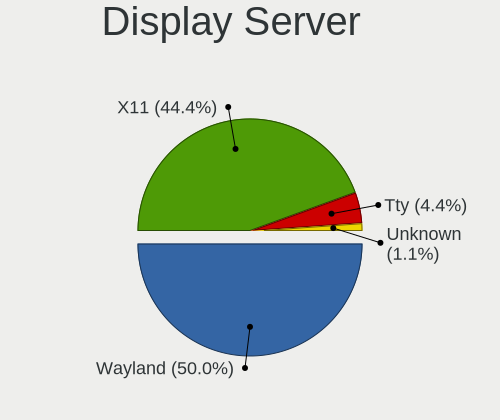

| Name    | Computers | Percent |
|---------|-----------|---------|
| X11     | 68        | 65.38%  |
| Wayland | 32        | 30.77%  |
| Tty     | 2         | 1.92%   |
| Unknown | 2         | 1.92%   |

Display Manager
---------------

SDDM, LightDM, etc.

| Name    | Computers | Percent |
|---------|-----------|---------|
| Unknown | 39        | 37.5%   |
| GDM3    | 26        | 25%     |
| SDDM    | 16        | 15.38%  |
| LightDM | 14        | 13.46%  |
| GDM     | 9         | 8.65%   |

OS Lang
-------

Language

| Lang    | Computers | Percent |
|---------|-----------|---------|
| en_US   | 51        | 49.04%  |
| nl_NL   | 37        | 35.58%  |
| en_GB   | 4         | 3.85%   |
| pl_PL   | 2         | 1.92%   |
| ru_RU   | 1         | 0.96%   |
| ro_RO   | 1         | 0.96%   |
| nl_BE   | 1         | 0.96%   |
| nb_NO   | 1         | 0.96%   |
| fr_FR   | 1         | 0.96%   |
| es_CO   | 1         | 0.96%   |
| en_IE   | 1         | 0.96%   |
| de_DE   | 1         | 0.96%   |
| C       | 1         | 0.96%   |
| Unknown | 1         | 0.96%   |

Boot Mode
---------

EFI or BIOS

| Mode | Computers | Percent |
|------|-----------|---------|
| BIOS | 52        | 50%     |
| EFI  | 52        | 50%     |

Filesystem
----------

Type of filesystem

| Type    | Computers | Percent |
|---------|-----------|---------|
| Ext4    | 83        | 79.81%  |
| Btrfs   | 15        | 14.42%  |
| Overlay | 4         | 3.85%   |
| Xfs     | 2         | 1.92%   |

Part. scheme
------------

Scheme of partitioning

| Type    | Computers | Percent |
|---------|-----------|---------|
| GPT     | 55        | 52.88%  |
| Unknown | 38        | 36.54%  |
| MBR     | 11        | 10.58%  |

Dual Boot with Linux/BSD
------------------------

Hosting more than one Linux/BSD

| Dual boot | Computers | Percent |
|-----------|-----------|---------|
| No        | 94        | 90.38%  |
| Yes       | 10        | 9.62%   |

Dual Boot (Win)
---------------

Hosting Linux and Windows

| Dual boot | Computers | Percent |
|-----------|-----------|---------|
| No        | 70        | 67.31%  |
| Yes       | 34        | 32.69%  |

Board
-----

Vendor
------

Motherboard manufacturer

| Name                                 | Computers | Percent |
|--------------------------------------|-----------|---------|
| Hewlett-Packard                      | 23        | 22.12%  |
| ASUSTek Computer                     | 17        | 16.35%  |
| Dell                                 | 11        | 10.58%  |
| Lenovo                               | 8         | 7.69%   |
| MSI                                  | 7         | 6.73%   |
| Acer                                 | 6         | 5.77%   |
| Gigabyte Technology                  | 4         | 3.85%   |
| Valve                                | 3         | 2.88%   |
| Intel                                | 3         | 2.88%   |
| ASRock                               | 3         | 2.88%   |
| Apple                                | 3         | 2.88%   |
| Toshiba                              | 2         | 1.92%   |
| Medion                               | 2         | 1.92%   |
| HUAWEI                               | 2         | 1.92%   |
| Unknown                              | 2         | 1.92%   |
| TUXEDO                               | 1         | 0.96%   |
| Sun Microsystems                     | 1         | 0.96%   |
| Standard                             | 1         | 0.96%   |
| Sony                                 | 1         | 0.96%   |
| Shenzhen Meigao Electronic Equipment | 1         | 0.96%   |
| Huanan                               | 1         | 0.96%   |
| Google                               | 1         | 0.96%   |
| Alienware                            | 1         | 0.96%   |

Model
-----

Motherboard model

| Name                                              | Computers | Percent |
|---------------------------------------------------|-----------|---------|
| Valve Jupiter                                     | 3         | 2.88%   |
| Unknown                                           | 3         | 2.88%   |
| MSI MS-7B98                                       | 2         | 1.92%   |
| Dell Latitude E6320                               | 2         | 1.92%   |
| TUXEDO Pulse 15 Gen1                              | 1         | 0.96%   |
| Toshiba Satellite P870                            | 1         | 0.96%   |
| Toshiba Satellite C660                            | 1         | 0.96%   |
| Sun Microsystems Ultra 24                         | 1         | 0.96%   |
| Sony VGN-FW11M                                    | 1         | 0.96%   |
| Shenzhen Meigao Electronic Equipment UM690        | 1         | 0.96%   |
| MSI MS-7D77                                       | 1         | 0.96%   |
| MSI MS-7D43                                       | 1         | 0.96%   |
| MSI MS-7C02                                       | 1         | 0.96%   |
| MSI MS-7885                                       | 1         | 0.96%   |
| MSI MS-7376                                       | 1         | 0.96%   |
| Medion MS-7797                                    | 1         | 0.96%   |
| Medion MS-7616                                    | 1         | 0.96%   |
| Lenovo Yoga Slim 7 Pro 14IAP7 82SV                | 1         | 0.96%   |
| Lenovo ThinkPad T510 4349AF5                      | 1         | 0.96%   |
| Lenovo ThinkPad T440p 20AWS08S01                  | 1         | 0.96%   |
| Lenovo ThinkPad P15 Gen 1 20ST0066MX              | 1         | 0.96%   |
| Lenovo ThinkPad E14 Gen 2 20TA002PMH              | 1         | 0.96%   |
| Lenovo Legion 5 15ACH6A 82NW                      | 1         | 0.96%   |
| Lenovo IdeaPadFlex 5 14ALC05 82HU                 | 1         | 0.96%   |
| Lenovo 851F 60072                                 | 1         | 0.96%   |
| Intel NUC8i5BEK                                   | 1         | 0.96%   |
| Intel NUC11PHi7                                   | 1         | 0.96%   |
| Intel Milestone Husky                             | 1         | 0.96%   |
| HUAWEI NBLK-WAX9X                                 | 1         | 0.96%   |
| HUAWEI DRC-WXX                                    | 1         | 0.96%   |
| Huanan X99-F8D PLUS V1.1                          | 1         | 0.96%   |
| HP ZBook Power 15.6 inch G9 Mobile Workstation PC | 1         | 0.96%   |
| HP ZBook 15 G2                                    | 1         | 0.96%   |
| HP ProLiant MicroServer                           | 1         | 0.96%   |
| HP ProBook 6570b                                  | 1         | 0.96%   |
| HP Pavilion Laptop 15-eg0xxx                      | 1         | 0.96%   |
| HP Pavilion Gaming Laptop 15-cx0xxx               | 1         | 0.96%   |
| HP Pavilion g7                                    | 1         | 0.96%   |
| HP Pavilion dv7                                   | 1         | 0.96%   |
| HP OMEN Laptop 15-en1xxx                          | 1         | 0.96%   |

Model Family
------------

Motherboard model prefix

| Name                                       | Computers | Percent |
|--------------------------------------------|-----------|---------|
| Dell Latitude                              | 7         | 6.73%   |
| Lenovo ThinkPad                            | 4         | 3.85%   |
| HP Pavilion                                | 4         | 3.85%   |
| HP EliteBook                               | 4         | 3.85%   |
| HP Compaq                                  | 4         | 3.85%   |
| Acer Aspire                                | 4         | 3.85%   |
| Valve Jupiter                              | 3         | 2.88%   |
| ASUS ROG                                   | 3         | 2.88%   |
| ASUS PRIME                                 | 3         | 2.88%   |
| Unknown                                    | 3         | 2.88%   |
| Toshiba Satellite                          | 2         | 1.92%   |
| MSI MS-7B98                                | 2         | 1.92%   |
| HP ZBook                                   | 2         | 1.92%   |
| HP OMEN                                    | 2         | 1.92%   |
| HP Laptop                                  | 2         | 1.92%   |
| ASUS VivoBook                              | 2         | 1.92%   |
| TUXEDO Pulse                               | 1         | 0.96%   |
| Sun Microsystems Ultra                     | 1         | 0.96%   |
| Sony VGN-FW11M                             | 1         | 0.96%   |
| Shenzhen Meigao Electronic Equipment UM690 | 1         | 0.96%   |
| MSI MS-7D77                                | 1         | 0.96%   |
| MSI MS-7D43                                | 1         | 0.96%   |
| MSI MS-7C02                                | 1         | 0.96%   |
| MSI MS-7885                                | 1         | 0.96%   |
| MSI MS-7376                                | 1         | 0.96%   |
| Medion MS-7797                             | 1         | 0.96%   |
| Medion MS-7616                             | 1         | 0.96%   |
| Lenovo Yoga                                | 1         | 0.96%   |
| Lenovo Legion                              | 1         | 0.96%   |
| Lenovo IdeaPadFlex                         | 1         | 0.96%   |
| Lenovo 851F                                | 1         | 0.96%   |
| Intel NUC8i5BEK                            | 1         | 0.96%   |
| Intel NUC11PHi7                            | 1         | 0.96%   |
| Intel Milestone                            | 1         | 0.96%   |
| HUAWEI NBLK-WAX9X                          | 1         | 0.96%   |
| HUAWEI DRC-WXX                             | 1         | 0.96%   |
| Huanan X99-F8D                             | 1         | 0.96%   |
| HP ProLiant                                | 1         | 0.96%   |
| HP ProBook                                 | 1         | 0.96%   |
| HP Notebook                                | 1         | 0.96%   |

MFG Year
--------

Motherboard manufacture year

| Year | Computers | Percent |
|------|-----------|---------|
| 2022 | 16        | 15.38%  |
| 2021 | 13        | 12.5%   |
| 2019 | 10        | 9.62%   |
| 2008 | 9         | 8.65%   |
| 2020 | 8         | 7.69%   |
| 2016 | 6         | 5.77%   |
| 2012 | 6         | 5.77%   |
| 2011 | 5         | 4.81%   |
| 2009 | 5         | 4.81%   |
| 2018 | 4         | 3.85%   |
| 2014 | 4         | 3.85%   |
| 2013 | 4         | 3.85%   |
| 2017 | 3         | 2.88%   |
| 2015 | 3         | 2.88%   |
| 2010 | 3         | 2.88%   |
| 2007 | 3         | 2.88%   |
| 2023 | 1         | 0.96%   |
| 2006 | 1         | 0.96%   |

Form Factor
-----------

Physical design of the computer

| Name        | Computers | Percent |
|-------------|-----------|---------|
| Notebook    | 56        | 53.85%  |
| Desktop     | 40        | 38.46%  |
| Mini pc     | 3         | 2.88%   |
| Tablet      | 2         | 1.92%   |
| Convertible | 2         | 1.92%   |
| All in one  | 1         | 0.96%   |

Secure Boot
-----------

Enabled or disabled

| State    | Computers | Percent |
|----------|-----------|---------|
| Disabled | 96        | 92.31%  |
| Enabled  | 8         | 7.69%   |

Coreboot
--------

Have coreboot on board

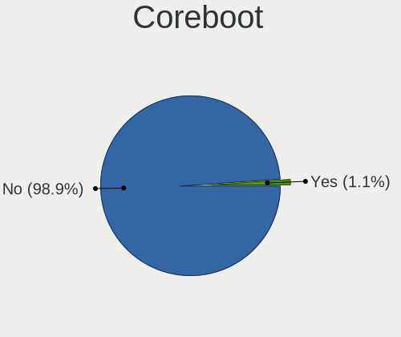

| Used | Computers | Percent |
|------|-----------|---------|
| No   | 103       | 99.04%  |
| Yes  | 1         | 0.96%   |

RAM Size
--------

Total RAM memory

| Size in GB  | Computers | Percent |
|-------------|-----------|---------|
| 8.01-16.0   | 24        | 23.08%  |
| 4.01-8.0    | 20        | 19.23%  |
| 16.01-24.0  | 20        | 19.23%  |
| 3.01-4.0    | 17        | 16.35%  |
| 32.01-64.0  | 13        | 12.5%   |
| 64.01-256.0 | 5         | 4.81%   |
| 24.01-32.0  | 3         | 2.88%   |
| 1.01-2.0    | 2         | 1.92%   |

RAM Used
--------

Used RAM memory

| Used GB   | Computers | Percent |
|-----------|-----------|---------|
| 1.01-2.0  | 37        | 35.58%  |
| 2.01-3.0  | 30        | 28.85%  |
| 3.01-4.0  | 15        | 14.42%  |
| 4.01-8.0  | 14        | 13.46%  |
| 8.01-16.0 | 6         | 5.77%   |
| 0.51-1.0  | 2         | 1.92%   |

Total Drives
------------

Number of drives on board

| Drives | Computers | Percent |
|--------|-----------|---------|
| 1      | 58        | 55.77%  |
| 2      | 25        | 24.04%  |
| 4      | 9         | 8.65%   |
| 3      | 8         | 7.69%   |
| 5      | 3         | 2.88%   |
| 8      | 1         | 0.96%   |

Has CD-ROM
----------

Has CD-ROM on board

| Presented | Computers | Percent |
|-----------|-----------|---------|
| No        | 65        | 62.5%   |
| Yes       | 39        | 37.5%   |

Has Ethernet
------------

Has Ethernet on board

| Presented | Computers | Percent |
|-----------|-----------|---------|
| Yes       | 90        | 86.54%  |
| No        | 14        | 13.46%  |

Has WiFi
--------

Has WiFi module

| Presented | Computers | Percent |
|-----------|-----------|---------|
| Yes       | 71        | 68.27%  |
| No        | 33        | 31.73%  |

Has Bluetooth
-------------

Has Bluetooth module

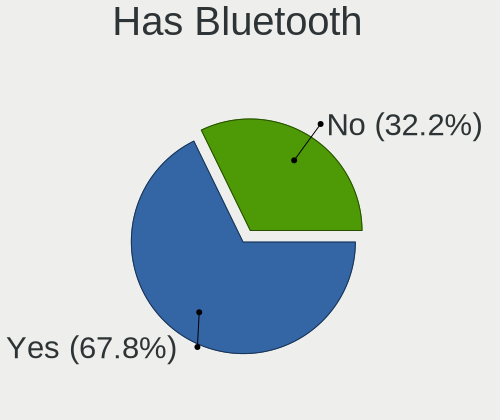

| Presented | Computers | Percent |
|-----------|-----------|---------|
| Yes       | 62        | 59.62%  |
| No        | 42        | 40.38%  |

Location
--------

Country
-------

Geographic location (country)

| Country     | Computers | Percent |
|-------------|-----------|---------|
| Netherlands | 104       | 100%    |

City
----

Geographic location (city)

| City            | Computers | Percent |
|-----------------|-----------|---------|
| Amsterdam       | 21        | 20.19%  |
| Utrecht         | 5         | 4.81%   |
| Groningen       | 4         | 3.85%   |
| Almere Stad     | 4         | 3.85%   |
| The Hague       | 3         | 2.88%   |
| Ridderkerk      | 3         | 2.88%   |
| Steenbergen     | 2         | 1.92%   |
| Schiedam        | 2         | 1.92%   |
| Rotterdam       | 2         | 1.92%   |
| Nijmegen        | 2         | 1.92%   |
| Naaldwijk       | 2         | 1.92%   |
| Leeuwarden      | 2         | 1.92%   |
| Leende          | 2         | 1.92%   |
| Heerhugowaard   | 2         | 1.92%   |
| Enschede        | 2         | 1.92%   |
| Enkhuizen       | 2         | 1.92%   |
| Eindhoven       | 2         | 1.92%   |
| Amstelveen      | 2         | 1.92%   |
| Zevenaar        | 1         | 0.96%   |
| Wierden         | 1         | 0.96%   |
| Waalwijk        | 1         | 0.96%   |
| Voorthuizen     | 1         | 0.96%   |
| Vleuten         | 1         | 0.96%   |
| Tilburg         | 1         | 0.96%   |
| Stadskanaal     | 1         | 0.96%   |
| Spijkenisse     | 1         | 0.96%   |
| Sittard         | 1         | 0.96%   |
| Roosendaal      | 1         | 0.96%   |
| Roermond        | 1         | 0.96%   |
| Oudega          | 1         | 0.96%   |
| Oss             | 1         | 0.96%   |
| Ommen           | 1         | 0.96%   |
| Oldenzaal       | 1         | 0.96%   |
| Noordwijkerhout | 1         | 0.96%   |
| Nederweert      | 1         | 0.96%   |
| Musselkanaal    | 1         | 0.96%   |
| Moordrecht      | 1         | 0.96%   |
| Kerkdriel       | 1         | 0.96%   |
| Horst           | 1         | 0.96%   |
| Hoogvliet       | 1         | 0.96%   |

Drives
------

Drive Vendor
------------

Hard drive vendors

| Vendor                      | Computers | Drives | Percent |
|-----------------------------|-----------|--------|---------|
| Samsung Electronics         | 42        | 56     | 25.93%  |
| WDC                         | 18        | 23     | 11.11%  |
| Seagate                     | 18        | 25     | 11.11%  |
| Sandisk                     | 10        | 10     | 6.17%   |
| Kingston                    | 9         | 10     | 5.56%   |
| Unknown                     | 7         | 9      | 4.32%   |
| Hitachi                     | 5         | 6      | 3.09%   |
| Crucial                     | 5         | 5      | 3.09%   |
| PNY                         | 4         | 4      | 2.47%   |
| HGST                        | 4         | 4      | 2.47%   |
| China                       | 4         | 4      | 2.47%   |
| Toshiba                     | 3         | 3      | 1.85%   |
| SK hynix                    | 3         | 3      | 1.85%   |
| Micron Technology           | 3         | 3      | 1.85%   |
| Intel                       | 3         | 3      | 1.85%   |
| Realtek Semiconductor       | 2         | 2      | 1.23%   |
| Maxtor                      | 2         | 2      | 1.23%   |
| LITEON                      | 2         | 2      | 1.23%   |
| Corsair                     | 2         | 2      | 1.23%   |
| A-DATA Technology           | 2         | 2      | 1.23%   |
| Transcend                   | 1         | 1      | 0.62%   |
| SPCC                        | 1         | 1      | 0.62%   |
| Silicon Motion              | 1         | 1      | 0.62%   |
| Reeinno                     | 1         | 1      | 0.62%   |
| Phison Electronics          | 1         | 1      | 0.62%   |
| Phison                      | 1         | 1      | 0.62%   |
| O2 Micro                    | 1         | 1      | 0.62%   |
| Mushkin                     | 1         | 1      | 0.62%   |
| Lite-On Technology          | 1         | 1      | 0.62%   |
| Kingston Technology Company | 1         | 1      | 0.62%   |
| KESU                        | 1         | 1      | 0.62%   |
| JMicron Technology          | 1         | 1      | 0.62%   |
| Gigabyte Technology         | 1         | 1      | 0.62%   |
| Unknown                     | 1         | 1      | 0.62%   |

Drive Model
-----------

Hard drive models

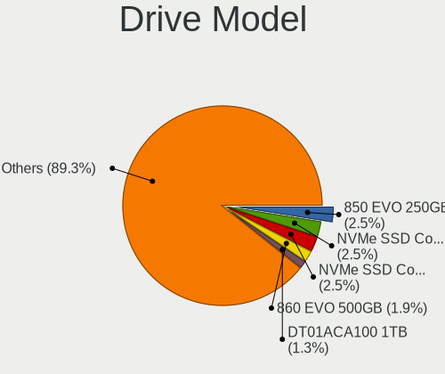

| Model                                                | Computers | Percent |
|------------------------------------------------------|-----------|---------|
| Samsung NVMe SSD Controller SM981/PM981/PM983 250GB  | 8         | 4.35%   |
| Samsung SSD 870 EVO 250GB                            | 3         | 1.63%   |
| Samsung NVMe SSD Controller PM9A1/PM9A3/980PRO 960GB | 3         | 1.63%   |
| WDC WD2500HHTZ-04N21V0 250GB                         | 2         | 1.09%   |
| Seagate ST500VT000-1DK142 500GB                      | 2         | 1.09%   |
| Seagate ST500DM002-1BD142 500GB                      | 2         | 1.09%   |
| Seagate ST4000DM004-2CV104 4TB                       | 2         | 1.09%   |
| Seagate Expansion 1TB                                | 2         | 1.09%   |
| Sandisk WD Blue SN500 / PC SN520 NVMe SSD 256GB      | 2         | 1.09%   |
| Samsung SSD 990 PRO 1TB                              | 2         | 1.09%   |
| Samsung SSD 870 EVO 500GB                            | 2         | 1.09%   |
| Samsung SSD 860 EVO 500GB                            | 2         | 1.09%   |
| PNY CS900 240GB SSD                                  | 2         | 1.09%   |
| Kingston SA400S37240G 240GB SSD                      | 2         | 1.09%   |
| HGST HTS721010A9E630 1TB                             | 2         | 1.09%   |
| Crucial CT1000MX500SSD1 1TB                          | 2         | 1.09%   |
| WDC WDS500G2B0A-00SM50 500GB SSD                     | 1         | 0.54%   |
| WDC WD6400BEVT-22A0RT0 640GB                         | 1         | 0.54%   |
| WDC WD5000LPVX-28V0TT0 500GB                         | 1         | 0.54%   |
| WDC WD5000HHTZ-04N21V0 500GB                         | 1         | 0.54%   |
| WDC WD40EFRX-68N32N0 4TB                             | 1         | 0.54%   |
| WDC WD3200BEKT-22KA9T0 320GB                         | 1         | 0.54%   |
| WDC WD20PURZ-85GU6Y0 2TB                             | 1         | 0.54%   |
| WDC WD20EFRX-68EUZN0 2TB                             | 1         | 0.54%   |
| WDC WD20EARX-00PASB0 2TB                             | 1         | 0.54%   |
| WDC WD1600BEVT-60ZCT1 160GB                          | 1         | 0.54%   |
| WDC WD1600AAJS-75B4A0 160GB                          | 1         | 0.54%   |
| WDC WD10SPZX-21Z10T0 1TB                             | 1         | 0.54%   |
| WDC WD10EZRX-00L4HB0 1TB                             | 1         | 0.54%   |
| WDC WD10EZRX-00A8LB0 1TB                             | 1         | 0.54%   |
| WDC WD10EZEX-21WN4A0 1TB                             | 1         | 0.54%   |
| WDC WD10EZEX-08WN4A0 1TB                             | 1         | 0.54%   |
| WDC WD10EARS-00Y5B1 1TB                              | 1         | 0.54%   |
| WDC WD Elements SE SSD 2TB                           | 1         | 0.54%   |
| WDC PC SN730 SDBPNTY-1T00-1006 1TB                   | 1         | 0.54%   |
| Unknown SEM32G  32GB                                 | 1         | 0.54%   |
| Unknown SE64G  64GB                                  | 1         | 0.54%   |
| Unknown SD/MMC/MS PRO 16GB                           | 1         | 0.54%   |
| Unknown NVMe SSD Drive 1TB                           | 1         | 0.54%   |
| Unknown MMC Card  64GB                               | 1         | 0.54%   |

HDD Vendor
----------

Hard disk drive vendors

| Vendor              | Computers | Drives | Percent |
|---------------------|-----------|--------|---------|
| Seagate             | 18        | 25     | 36.73%  |
| WDC                 | 15        | 20     | 30.61%  |
| Hitachi             | 5         | 6      | 10.2%   |
| HGST                | 4         | 4      | 8.16%   |
| Toshiba             | 2         | 2      | 4.08%   |
| Maxtor              | 2         | 2      | 4.08%   |
| Unknown             | 1         | 1      | 2.04%   |
| Samsung Electronics | 1         | 2      | 2.04%   |
| KESU                | 1         | 1      | 2.04%   |

SSD Vendor
----------

Solid state drive vendors

| Vendor              | Computers | Drives | Percent |
|---------------------|-----------|--------|---------|
| Samsung Electronics | 15        | 22     | 28.3%   |
| Kingston            | 8         | 9      | 15.09%  |
| SanDisk             | 6         | 6      | 11.32%  |
| Crucial             | 5         | 5      | 9.43%   |
| PNY                 | 4         | 4      | 7.55%   |
| China               | 4         | 4      | 7.55%   |
| WDC                 | 2         | 2      | 3.77%   |
| Corsair             | 2         | 2      | 3.77%   |
| A-DATA Technology   | 2         | 2      | 3.77%   |
| Toshiba             | 1         | 1      | 1.89%   |
| SPCC                | 1         | 1      | 1.89%   |
| SK hynix            | 1         | 1      | 1.89%   |
| Reeinno             | 1         | 1      | 1.89%   |
| LITEON              | 1         | 1      | 1.89%   |

Drive Kind
----------

HDD or SSD

| Kind    | Computers | Drives | Percent |
|---------|-----------|--------|---------|
| NVMe    | 51        | 59     | 35.42%  |
| SSD     | 44        | 61     | 30.56%  |
| HDD     | 42        | 63     | 29.17%  |
| MMC     | 5         | 7      | 3.47%   |
| Unknown | 2         | 2      | 1.39%   |

Drive Connector
---------------

SATA, SAS, NVMe, etc.

| Type | Computers | Drives | Percent |
|------|-----------|--------|---------|
| SATA | 67        | 118    | 51.54%  |
| NVMe | 51        | 59     | 39.23%  |
| SAS  | 7         | 8      | 5.38%   |
| MMC  | 5         | 7      | 3.85%   |

Drive Size
----------

Size of hard drive

| Size in TB | Computers | Drives | Percent |
|------------|-----------|--------|---------|
| 0.01-0.5   | 49        | 74     | 53.26%  |
| 0.51-1.0   | 28        | 29     | 30.43%  |
| 1.01-2.0   | 8         | 9      | 8.7%    |
| 3.01-4.0   | 6         | 11     | 6.52%   |
| 4.01-10.0  | 1         | 1      | 1.09%   |

Space Total
-----------

Amount of disk space available on the file system

| Size in GB     | Computers | Percent |
|----------------|-----------|---------|
| 101-250        | 28        | 26.92%  |
| 251-500        | 23        | 22.12%  |
| 501-1000       | 18        | 17.31%  |
| 1001-2000      | 12        | 11.54%  |
| More than 3000 | 7         | 6.73%   |
| 21-50          | 4         | 3.85%   |
| 1-20           | 4         | 3.85%   |
| 51-100         | 4         | 3.85%   |
| 2001-3000      | 3         | 2.88%   |
| Unknown        | 1         | 0.96%   |

Space Used
----------

Amount of used disk space

| Used GB        | Computers | Percent |
|----------------|-----------|---------|
| 1-20           | 30        | 28.85%  |
| 21-50          | 25        | 24.04%  |
| 101-250        | 12        | 11.54%  |
| 51-100         | 12        | 11.54%  |
| 251-500        | 8         | 7.69%   |
| 501-1000       | 8         | 7.69%   |
| More than 3000 | 4         | 3.85%   |
| 1001-2000      | 2         | 1.92%   |
| 2001-3000      | 1         | 0.96%   |
| 0              | 1         | 0.96%   |
| Unknown        | 1         | 0.96%   |

Malfunc. Drives
---------------

Drive models with a malfunction

| Model                               | Computers | Drives | Percent |
|-------------------------------------|-----------|--------|---------|
| WDC WD5000HHTZ-04N21V0 500GB        | 1         | 1      | 12.5%   |
| Toshiba MK5061GSYN 500GB            | 1         | 1      | 12.5%   |
| Seagate ST9200420ASG 200GB          | 1         | 1      | 12.5%   |
| Seagate ST1000LM024 HN-M101MBB 1TB  | 1         | 1      | 12.5%   |
| Samsung Electronics SSD 870 EVO 4TB | 1         | 1      | 12.5%   |
| Maxtor 6L080M0 80GB                 | 1         | 1      | 12.5%   |
| Kingston SV300S37A120G 120GB SSD    | 1         | 1      | 12.5%   |
| Hitachi HTS542525K9SA00 250GB       | 1         | 1      | 12.5%   |

Malfunc. Drive Vendor
---------------------

Vendors of faulty drives

| Vendor              | Computers | Drives | Percent |
|---------------------|-----------|--------|---------|
| Seagate             | 2         | 2      | 25%     |
| WDC                 | 1         | 1      | 12.5%   |
| Toshiba             | 1         | 1      | 12.5%   |
| Samsung Electronics | 1         | 1      | 12.5%   |
| Maxtor              | 1         | 1      | 12.5%   |
| Kingston            | 1         | 1      | 12.5%   |
| Hitachi             | 1         | 1      | 12.5%   |

Malfunc. HDD Vendor
-------------------

Vendors of faulty HDD drives

| Vendor  | Computers | Drives | Percent |
|---------|-----------|--------|---------|
| Seagate | 2         | 2      | 33.33%  |
| WDC     | 1         | 1      | 16.67%  |
| Toshiba | 1         | 1      | 16.67%  |
| Maxtor  | 1         | 1      | 16.67%  |
| Hitachi | 1         | 1      | 16.67%  |

Malfunc. Drive Kind
-------------------

Kinds of faulty drives

| Kind | Computers | Drives | Percent |
|------|-----------|--------|---------|
| HDD  | 6         | 6      | 75%     |
| SSD  | 2         | 2      | 25%     |

Failed Drives
-------------

Failed drive models

| Model                        | Computers | Drives | Percent |
|------------------------------|-----------|--------|---------|
| Crucial M4-CT256M4SSD3 256GB | 1         | 1      | 100%    |

Failed Drive Vendor
-------------------

Failed drive vendors

| Vendor  | Computers | Drives | Percent |
|---------|-----------|--------|---------|
| Crucial | 1         | 1      | 100%    |

Drive Status
------------

Number of failed and malfunc. drives

| Status   | Computers | Drives | Percent |
|----------|-----------|--------|---------|
| Detected | 62        | 109    | 55.36%  |
| Works    | 41        | 74     | 36.61%  |
| Malfunc  | 8         | 8      | 7.14%   |
| Failed   | 1         | 1      | 0.89%   |

Storage controller
------------------

Storage Vendor
--------------

Storage controller vendors

| Vendor                      | Computers | Percent |
|-----------------------------|-----------|---------|
| Intel                       | 68        | 46.9%   |
| Samsung Electronics         | 29        | 20%     |
| AMD                         | 14        | 9.66%   |
| JMicron Technology          | 6         | 4.14%   |
| SanDisk                     | 5         | 3.45%   |
| Silicon Motion              | 3         | 2.07%   |
| Phison Electronics          | 3         | 2.07%   |
| Micron Technology           | 3         | 2.07%   |
| SK hynix                    | 2         | 1.38%   |
| Realtek Semiconductor       | 2         | 1.38%   |
| Nvidia                      | 2         | 1.38%   |
| Kingston Technology Company | 2         | 1.38%   |
| VIA Technologies            | 1         | 0.69%   |
| Transcend                   | 1         | 0.69%   |
| O2 Micro                    | 1         | 0.69%   |
| Marvell Technology Group    | 1         | 0.69%   |
| Lite-On Technology          | 1         | 0.69%   |
| ASMedia Technology          | 1         | 0.69%   |

Storage Model
-------------

Storage controller models

| Model                                                                          | Computers | Percent |
|--------------------------------------------------------------------------------|-----------|---------|
| Samsung NVMe SSD Controller SM981/PM981/PM983                                  | 13        | 7.93%   |
| Samsung NVMe SSD Controller 980                                                | 10        | 6.1%    |
| Intel 8 Series/C220 Series Chipset Family 6-port SATA Controller 1 [AHCI mode] | 6         | 3.66%   |
| Intel 7 Series Chipset Family 6-port SATA Controller [AHCI mode]               | 5         | 3.05%   |
| AMD FCH SATA Controller [AHCI mode]                                            | 5         | 3.05%   |
| Samsung NVMe SSD Controller PM9A1/PM9A3/980PRO                                 | 4         | 2.44%   |
| Intel 82801IBM/IEM (ICH9M/ICH9M-E) 4 port SATA Controller [AHCI mode]          | 4         | 2.44%   |
| Intel 82801 Mobile SATA Controller [RAID mode]                                 | 4         | 2.44%   |
| Intel 6 Series/C200 Series Chipset Family 6 port Mobile SATA AHCI Controller   | 4         | 2.44%   |
| Micron Non-Volatile memory controller                                          | 3         | 1.83%   |
| JMicron JMB363 SATA/IDE Controller                                             | 3         | 1.83%   |
| Intel Volume Management Device NVMe RAID Controller                            | 3         | 1.83%   |
| Intel Sunrise Point-LP SATA Controller [AHCI mode]                             | 3         | 1.83%   |
| Intel SATA Controller [RAID mode]                                              | 3         | 1.83%   |
| Intel Q170/Q150/B150/H170/H110/Z170/CM236 Chipset SATA Controller [AHCI Mode]  | 3         | 1.83%   |
| Intel Cannon Lake PCH SATA AHCI Controller                                     | 3         | 1.83%   |
| AMD SB7x0/SB8x0/SB9x0 IDE Controller                                           | 3         | 1.83%   |
| Silicon Motion SM2262/SM2262EN SSD Controller                                  | 2         | 1.22%   |
| SanDisk WD Blue SN500 / PC SN520 NVMe SSD                                      | 2         | 1.22%   |
| Samsung Electronics Non-Volatile memory controller                             | 2         | 1.22%   |
| Phison NVMe Storage Controller                                                 | 2         | 1.22%   |
| Kingston Company Company Non-Volatile memory controller                        | 2         | 1.22%   |
| JMicron JMB368 IDE controller                                                  | 2         | 1.22%   |
| Intel Wildcat Point-LP SATA Controller [AHCI Mode]                             | 2         | 1.22%   |
| Intel Non-Volatile memory controller                                           | 2         | 1.22%   |
| Intel Comet Lake SATA AHCI Controller                                          | 2         | 1.22%   |
| Intel Cannon Point-LP SATA Controller [AHCI Mode]                              | 2         | 1.22%   |
| Intel Cannon Lake Mobile PCH SATA AHCI Controller                              | 2         | 1.22%   |
| Intel Alder Lake-S PCH SATA Controller [AHCI Mode]                             | 2         | 1.22%   |
| Intel 82801I (ICH9 Family) 2 port SATA Controller [IDE mode]                   | 2         | 1.22%   |
| Intel 82801HM/HEM (ICH8M/ICH8M-E) SATA Controller [AHCI mode]                  | 2         | 1.22%   |
| Intel 5 Series/3400 Series Chipset 6 port SATA AHCI Controller                 | 2         | 1.22%   |
| Intel 4 Series Chipset PT IDER Controller                                      | 2         | 1.22%   |
| AMD SB7x0/SB8x0/SB9x0 SATA Controller [IDE mode]                               | 2         | 1.22%   |
| AMD SATA controller                                                            | 2         | 1.22%   |
| AMD 500 Series Chipset SATA Controller                                         | 2         | 1.22%   |
| AMD 400 Series Chipset SATA Controller                                         | 2         | 1.22%   |
| VIA VT6415 PATA IDE Host Controller                                            | 1         | 0.61%   |
| Transcend Non-Volatile memory controller                                       | 1         | 0.61%   |
| SK hynix Gold P31/PC711 NVMe Solid State Drive                                 | 1         | 0.61%   |

Storage Kind
------------

Kind of storage controller (IDE, SATA, NVMe, SAS, ...)

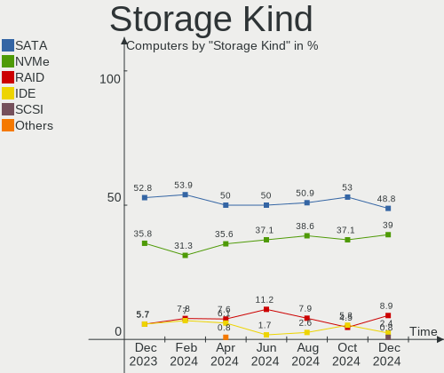

| Kind | Computers | Percent |
|------|-----------|---------|
| SATA | 68        | 47.89%  |
| NVMe | 51        | 35.92%  |
| IDE  | 13        | 9.15%   |
| RAID | 10        | 7.04%   |

Processor
---------

CPU Vendor
----------

Processor vendors

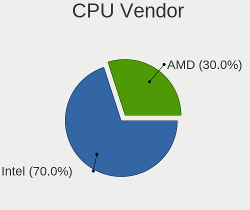

| Vendor | Computers | Percent |
|--------|-----------|---------|
| Intel  | 79        | 75.96%  |
| AMD    | 25        | 24.04%  |

CPU Model
---------

Processor models

| Model                                       | Computers | Percent |
|---------------------------------------------|-----------|---------|
| Intel 11th Gen Core i5-1135G7 @ 2.40GHz     | 4         | 3.85%   |
| AMD Ryzen 7 5800H with Radeon Graphics      | 4         | 3.85%   |
| Intel Core i7-3630QM CPU @ 2.40GHz          | 3         | 2.88%   |
| AMD Custom APU 0405                         | 3         | 2.88%   |
| Intel Core 2 Quad CPU Q9650 @ 3.00GHz       | 2         | 1.92%   |
| Intel Core 2 Duo CPU E8400 @ 3.00GHz        | 2         | 1.92%   |
| Intel 12th Gen Core i7-12700H               | 2         | 1.92%   |
| AMD Ryzen 5 3600 6-Core Processor           | 2         | 1.92%   |
| AMD Processor model unknown                 | 2         | 1.92%   |
| Intel Xeon CPU E5-2680 v3 @ 2.50GHz         | 1         | 0.96%   |
| Intel Pentium Silver N6000 @ 1.10GHz        | 1         | 0.96%   |
| Intel Pentium Dual-Core CPU T4400 @ 2.20GHz | 1         | 0.96%   |
| Intel Pentium CPU G630 @ 2.70GHz            | 1         | 0.96%   |
| Intel Genuine CPU T1600 @ 1.66GHz           | 1         | 0.96%   |
| Intel Core i9-9900K CPU @ 3.60GHz           | 1         | 0.96%   |
| Intel Core i9-10885H CPU @ 2.40GHz          | 1         | 0.96%   |
| Intel Core i7-9750H CPU @ 2.60GHz           | 1         | 0.96%   |
| Intel Core i7-9700K CPU @ 3.60GHz           | 1         | 0.96%   |
| Intel Core i7-8700K CPU @ 3.70GHz           | 1         | 0.96%   |
| Intel Core i7-8665U CPU @ 1.90GHz           | 1         | 0.96%   |
| Intel Core i7-7600U CPU @ 2.80GHz           | 1         | 0.96%   |
| Intel Core i7-6800K CPU @ 3.40GHz           | 1         | 0.96%   |
| Intel Core i7-6700HQ CPU @ 2.60GHz          | 1         | 0.96%   |
| Intel Core i7-6600U CPU @ 2.60GHz           | 1         | 0.96%   |
| Intel Core i7-6500U CPU @ 2.50GHz           | 1         | 0.96%   |
| Intel Core i7-4770 CPU @ 3.40GHz            | 1         | 0.96%   |
| Intel Core i7-4750HQ CPU @ 2.00GHz          | 1         | 0.96%   |
| Intel Core i7-4710MQ CPU @ 2.50GHz          | 1         | 0.96%   |
| Intel Core i7-4702MQ CPU @ 2.20GHz          | 1         | 0.96%   |
| Intel Core i7-3520M CPU @ 2.90GHz           | 1         | 0.96%   |
| Intel Core i7-2635QM CPU @ 2.00GHz          | 1         | 0.96%   |
| Intel Core i7-2600 CPU @ 3.40GHz            | 1         | 0.96%   |
| Intel Core i7-10700 CPU @ 2.90GHz           | 1         | 0.96%   |
| Intel Core i7-1065G7 CPU @ 1.30GHz          | 1         | 0.96%   |
| Intel Core i5-8300H CPU @ 2.30GHz           | 1         | 0.96%   |
| Intel Core i5-8265U CPU @ 1.60GHz           | 1         | 0.96%   |
| Intel Core i5-8259U CPU @ 2.30GHz           | 1         | 0.96%   |
| Intel Core i5-6500 CPU @ 3.20GHz            | 1         | 0.96%   |
| Intel Core i5-6400 CPU @ 2.70GHz            | 1         | 0.96%   |
| Intel Core i5-5300U CPU @ 2.30GHz           | 1         | 0.96%   |

CPU Model Family
----------------

Processor model prefix

| Model                   | Computers | Percent |
|-------------------------|-----------|---------|
| Intel Core i7           | 21        | 20.19%  |
| Other                   | 18        | 17.31%  |
| Intel Core i5           | 16        | 15.38%  |
| Intel Core i3           | 9         | 8.65%   |
| AMD Ryzen 7             | 8         | 7.69%   |
| Intel Core 2 Duo        | 7         | 6.73%   |
| Intel Core 2 Quad       | 4         | 3.85%   |
| AMD Ryzen 5             | 4         | 3.85%   |
| AMD Ryzen 9             | 3         | 2.88%   |
| Intel Core i9           | 2         | 1.92%   |
| Intel Atom              | 2         | 1.92%   |
| Intel Xeon              | 1         | 0.96%   |
| Intel Pentium Silver    | 1         | 0.96%   |
| Intel Pentium Dual-Core | 1         | 0.96%   |
| Intel Pentium           | 1         | 0.96%   |
| Intel Genuine           | 1         | 0.96%   |
| AMD Turion II Neo       | 1         | 0.96%   |
| AMD Ryzen 7 PRO         | 1         | 0.96%   |
| AMD Ryzen 3             | 1         | 0.96%   |
| AMD Phenom II X6        | 1         | 0.96%   |
| AMD Phenom II X4        | 1         | 0.96%   |

CPU Cores
---------

Number of processor cores

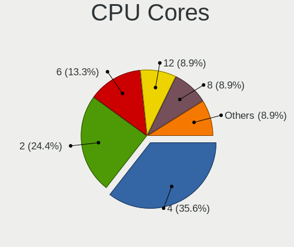

| Number | Computers | Percent |
|--------|-----------|---------|
| 4      | 42        | 40.38%  |
| 2      | 30        | 28.85%  |
| 8      | 13        | 12.5%   |
| 6      | 9         | 8.65%   |
| 14     | 3         | 2.88%   |
| 12     | 3         | 2.88%   |
| 24     | 1         | 0.96%   |
| 16     | 1         | 0.96%   |
| 3      | 1         | 0.96%   |
| 1      | 1         | 0.96%   |

CPU Sockets
-----------

Number of sockets

| Number | Computers | Percent |
|--------|-----------|---------|
| 1      | 103       | 99.04%  |
| 2      | 1         | 0.96%   |

CPU Threads
-----------

Threads per core (Hyper-Threading)

| Number | Computers | Percent |
|--------|-----------|---------|
| 2      | 77        | 74.04%  |
| 1      | 27        | 25.96%  |

CPU Op-Modes
------------

CPU Operation Modes (32-bit, 64-bit)

| Op mode        | Computers | Percent |
|----------------|-----------|---------|
| 32-bit, 64-bit | 104       | 100%    |

CPU Microcode
-------------

Microcode number

| Number     | Computers | Percent |
|------------|-----------|---------|
| Unknown    | 40        | 38.46%  |
| 0x806c1    | 6         | 5.77%   |
| 0x1067a    | 5         | 4.81%   |
| 0x306c3    | 4         | 3.85%   |
| 0x906a3    | 3         | 2.88%   |
| 0x806ec    | 3         | 2.88%   |
| 0x206a7    | 3         | 2.88%   |
| 0x906ea    | 2         | 1.92%   |
| 0x6fd      | 2         | 1.92%   |
| 0x506e3    | 2         | 1.92%   |
| 0x406e3    | 2         | 1.92%   |
| 0x306d4    | 2         | 1.92%   |
| 0x306a9    | 2         | 1.92%   |
| 0x0a50000d | 2         | 1.92%   |
| 0x010000c8 | 2         | 1.92%   |
| 0xa0653    | 1         | 0.96%   |
| 0xa0652    | 1         | 0.96%   |
| 0x906ec    | 1         | 0.96%   |
| 0x906eb    | 1         | 0.96%   |
| 0x906c0    | 1         | 0.96%   |
| 0x90675    | 1         | 0.96%   |
| 0x806ea    | 1         | 0.96%   |
| 0x506ca    | 1         | 0.96%   |
| 0x406f1    | 1         | 0.96%   |
| 0x40661    | 1         | 0.96%   |
| 0x306f2    | 1         | 0.96%   |
| 0x30678    | 1         | 0.96%   |
| 0x20652    | 1         | 0.96%   |
| 0x10676    | 1         | 0.96%   |
| 0x0a601203 | 1         | 0.96%   |
| 0x0a50000c | 1         | 0.96%   |
| 0x0a404102 | 1         | 0.96%   |
| 0x08701021 | 1         | 0.96%   |
| 0x08701013 | 1         | 0.96%   |
| 0x08608104 | 1         | 0.96%   |
| 0x08600106 | 1         | 0.96%   |
| 0x08600103 | 1         | 0.96%   |
| 0x08001129 | 1         | 0.96%   |
| 0x010000dc | 1         | 0.96%   |

CPU Microarch
-------------

Microarchitecture

| Name             | Computers | Percent |
|------------------|-----------|---------|
| KabyLake         | 12        | 11.54%  |
| Unknown          | 10        | 9.62%   |
| Penryn           | 8         | 7.69%   |
| Haswell          | 8         | 7.69%   |
| TigerLake        | 7         | 6.73%   |
| SandyBridge      | 7         | 6.73%   |
| Skylake          | 6         | 5.77%   |
| IvyBridge        | 6         | 5.77%   |
| Zen 3            | 5         | 4.81%   |
| Zen 2            | 5         | 4.81%   |
| K10              | 5         | 4.81%   |
| Core             | 5         | 4.81%   |
| CometLake        | 4         | 3.85%   |
| Alderlake Hybrid | 4         | 3.85%   |
| Broadwell        | 3         | 2.88%   |
| Zen+             | 2         | 1.92%   |
| Westmere         | 2         | 1.92%   |
| IceLake          | 2         | 1.92%   |
| Zen              | 1         | 0.96%   |
| Silvermont       | 1         | 0.96%   |
| Goldmont         | 1         | 0.96%   |

Graphics
--------

GPU Vendor
----------

Vendors of graphics cards

| Vendor | Computers | Percent |
|--------|-----------|---------|
| Intel  | 54        | 43.2%   |
| Nvidia | 37        | 29.6%   |
| AMD    | 34        | 27.2%   |

GPU Model
---------

Graphics card models

| Model                                                                     | Computers | Percent |
|---------------------------------------------------------------------------|-----------|---------|
| Intel TigerLake-LP GT2 [Iris Xe Graphics]                                 | 6         | 4.72%   |
| Intel 2nd Generation Core Processor Family Integrated Graphics Controller | 5         | 3.94%   |
| AMD Cezanne [Radeon Vega Series / Radeon Vega Mobile Series]              | 5         | 3.94%   |
| Intel HD Graphics 530                                                     | 4         | 3.15%   |
| Intel Alder Lake-P Integrated Graphics Controller                         | 4         | 3.15%   |
| Intel 3rd Gen Core processor Graphics Controller                          | 4         | 3.15%   |
| AMD Navi 23 [Radeon RX 6600/6600 XT/6600M]                                | 4         | 3.15%   |
| AMD VanGogh [AMD Custom GPU 0405]                                         | 3         | 2.36%   |
| Nvidia TU117GLM [T600 Laptop GPU]                                         | 2         | 1.57%   |
| Nvidia TU106M [GeForce RTX 2060 Mobile]                                   | 2         | 1.57%   |
| Nvidia GA106M [GeForce RTX 3060 Mobile / Max-Q]                           | 2         | 1.57%   |
| Intel WhiskeyLake-U GT2 [UHD Graphics 620]                                | 2         | 1.57%   |
| Intel Skylake GT2 [HD Graphics 520]                                       | 2         | 1.57%   |
| Intel HD Graphics 620                                                     | 2         | 1.57%   |
| Intel HD Graphics 5500                                                    | 2         | 1.57%   |
| Intel CometLake-H GT2 [UHD Graphics]                                      | 2         | 1.57%   |
| Intel CoffeeLake-S GT2 [UHD Graphics 630]                                 | 2         | 1.57%   |
| Intel CoffeeLake-H GT2 [UHD Graphics 630]                                 | 2         | 1.57%   |
| Intel 4th Gen Core Processor Integrated Graphics Controller               | 2         | 1.57%   |
| AMD Seymour [Radeon HD 6400M/7400M Series]                                | 2         | 1.57%   |
| AMD Picasso/Raven 2 [Radeon Vega Series / Radeon Vega Mobile Series]      | 2         | 1.57%   |
| Nvidia TU117M                                                             | 1         | 0.79%   |
| Nvidia TU117 [GeForce GTX 1650]                                           | 1         | 0.79%   |
| Nvidia TU116 [GeForce GTX 1660]                                           | 1         | 0.79%   |
| Nvidia TU106GLM [Quadro RTX 3000 Mobile / Max-Q]                          | 1         | 0.79%   |
| Nvidia TU104 [GeForce RTX 2080]                                           | 1         | 0.79%   |
| Nvidia NV41 [GeForce 6800 XT]                                             | 1         | 0.79%   |
| Nvidia GT218M [NVS 3100M]                                                 | 1         | 0.79%   |
| Nvidia GT218M [GeForce 315M]                                              | 1         | 0.79%   |
| Nvidia GT218 [GeForce 8400 GS Rev. 3]                                     | 1         | 0.79%   |
| Nvidia GT215 [GeForce GT 240]                                             | 1         | 0.79%   |
| Nvidia GP108 [GeForce GT 1030]                                            | 1         | 0.79%   |
| Nvidia GP107M [GeForce GTX 1050 Mobile]                                   | 1         | 0.79%   |
| Nvidia GP107 [GeForce GTX 1050]                                           | 1         | 0.79%   |
| Nvidia GP106 [GeForce GTX 1060 6GB]                                       | 1         | 0.79%   |
| Nvidia GP104BM [GeForce GTX 1070 Mobile]                                  | 1         | 0.79%   |
| Nvidia GP104 [GeForce GTX 1080]                                           | 1         | 0.79%   |
| Nvidia GP104 [GeForce GTX 1070]                                           | 1         | 0.79%   |
| Nvidia GM107M [GeForce GTX 950M]                                          | 1         | 0.79%   |
| Nvidia GK107M [GeForce GT 740M]                                           | 1         | 0.79%   |

GPU Combo
---------

Combinations of graphics cards

| Name           | Computers | Percent |
|----------------|-----------|---------|
| 1 x Intel      | 36        | 34.62%  |
| 1 x AMD        | 26        | 25%     |
| 1 x Nvidia     | 21        | 20.19%  |
| Intel + Nvidia | 13        | 12.5%   |
| Intel + AMD    | 3         | 2.88%   |
| AMD + Nvidia   | 3         | 2.88%   |
| 2 x AMD        | 2         | 1.92%   |

GPU Driver
----------

Free vs proprietary

| Driver      | Computers | Percent |
|-------------|-----------|---------|
| Free        | 85        | 81.73%  |
| Proprietary | 14        | 13.46%  |
| Unknown     | 5         | 4.81%   |

GPU Memory
----------

Total video memory

| Size in GB | Computers | Percent |
|------------|-----------|---------|
| Unknown    | 66        | 63.46%  |
| 1.01-2.0   | 11        | 10.58%  |
| 0.01-0.5   | 10        | 9.62%   |
| 7.01-8.0   | 6         | 5.77%   |
| 0.51-1.0   | 5         | 4.81%   |
| 5.01-6.0   | 4         | 3.85%   |
| 3.01-4.0   | 1         | 0.96%   |
| 8.01-16.0  | 1         | 0.96%   |

Monitor
-------

Monitor Vendor
--------------

Monitor vendors

| Vendor                  | Computers | Percent |
|-------------------------|-----------|---------|
| AU Optronics            | 12        | 11.43%  |
| Samsung Electronics     | 10        | 9.52%   |
| Iiyama                  | 10        | 9.52%   |
| BOE                     | 9         | 8.57%   |
| Chimei Innolux          | 8         | 7.62%   |
| LG Display              | 7         | 6.67%   |
| Philips                 | 5         | 4.76%   |
| Hewlett-Packard         | 4         | 3.81%   |
| Goldstar                | 4         | 3.81%   |
| Valve                   | 3         | 2.86%   |
| Dell                    | 3         | 2.86%   |
| Acer                    | 3         | 2.86%   |
| LG Philips              | 2         | 1.9%    |
| Idek Iiyama             | 2         | 1.9%    |
| Chi Mei Optoelectronics | 2         | 1.9%    |
| BenQ                    | 2         | 1.9%    |
| Apple                   | 2         | 1.9%    |
| AOC                     | 2         | 1.9%    |
| Unknown (BBC)           | 1         | 0.95%   |
| Sony                    | 1         | 0.95%   |
| PANDA                   | 1         | 0.95%   |
| LG Electronics          | 1         | 0.95%   |
| Lenovo                  | 1         | 0.95%   |
| IBM                     | 1         | 0.95%   |
| HUAWEI                  | 1         | 0.95%   |
| HannStar Display        | 1         | 0.95%   |
| HannStar                | 1         | 0.95%   |
| GVV                     | 1         | 0.95%   |
| Eizo                    | 1         | 0.95%   |
| CSO                     | 1         | 0.95%   |
| Compal                  | 1         | 0.95%   |
| ASUSTek Computer        | 1         | 0.95%   |
| Unknown                 | 1         | 0.95%   |

Monitor Model
-------------

Monitor models

| Model                                                                 | Computers | Percent |
|-----------------------------------------------------------------------|-----------|---------|
| Valve ANX7530 U VLV3001 800x1280 100x150mm 7.1-inch                   | 3         | 2.86%   |
| LG Display LCD Monitor LGD02EC 1366x768 293x165mm 13.2-inch           | 2         | 1.9%    |
| Unknown (BBC) HDP-V104 BBC0104 3840x2160 344x195mm 15.6-inch          | 1         | 0.95%   |
| Sony TV XV SNY5601 1920x1080                                          | 1         | 0.95%   |
| Samsung Electronics T22D390 SAM0B6B 1920x1080 477x268mm 21.5-inch     | 1         | 0.95%   |
| Samsung Electronics SyncMaster SAM0226 1440x900 410x257mm 19.1-inch   | 1         | 0.95%   |
| Samsung Electronics SyncMaster SAM021C 1400x1050 408x300mm 19.9-inch  | 1         | 0.95%   |
| Samsung Electronics S24B300 SAM08CC 1920x1080 521x293mm 23.5-inch     | 1         | 0.95%   |
| Samsung Electronics QBQ90 SAM71F8 3840x2160 1872x1053mm 84.6-inch     | 1         | 0.95%   |
| Samsung Electronics LCD Monitor SEC325A 1366x768 344x194mm 15.5-inch  | 1         | 0.95%   |
| Samsung Electronics LCD Monitor SDC4C48 1920x1080 344x194mm 15.5-inch | 1         | 0.95%   |
| Samsung Electronics LCD Monitor SDC4171 2880x1800 302x189mm 14.0-inch | 1         | 0.95%   |
| Samsung Electronics LCD Monitor SDC4141 3840x2160 344x194mm 15.5-inch | 1         | 0.95%   |
| Samsung Electronics LCD Monitor SAM0B7C 1920x1080 886x498mm 40.0-inch | 1         | 0.95%   |
| Philips PHL 345E2 PHLC237 3440x1440 800x335mm 34.1-inch               | 1         | 0.95%   |
| Philips PHL 345B1C PHL093D 3440x1440 797x334mm 34.0-inch              | 1         | 0.95%   |
| Philips PHL 273V7 PHLC156 1920x1080 598x336mm 27.0-inch               | 1         | 0.95%   |
| Philips PHL 272B8Q PHL0918 2560x1440 597x336mm 27.0-inch              | 1         | 0.95%   |
| Philips 201E PHLC033 1600x900 443x249mm 20.0-inch                     | 1         | 0.95%   |
| PANDA LCD Monitor NCP004D 1920x1080 344x194mm 15.5-inch               | 1         | 0.95%   |
| LG Philips LCD Monitor LPLA104 1440x900 367x230mm 17.1-inch           | 1         | 0.95%   |
| LG Philips LCD Monitor LPL0901 1440x900 367x230mm 17.1-inch           | 1         | 0.95%   |
| LG Electronics LCD Monitor LG Ultra HD 3840x2160                      | 1         | 0.95%   |
| LG Display LCD Monitor LGD0762 1920x1080 344x194mm 15.5-inch          | 1         | 0.95%   |
| LG Display LCD Monitor LGD0709 1920x1080 344x194mm 15.5-inch          | 1         | 0.95%   |
| LG Display LCD Monitor LGD05DB 1920x1080 294x165mm 13.3-inch          | 1         | 0.95%   |
| LG Display LCD Monitor LGD046C 1920x1080 382x215mm 17.3-inch          | 1         | 0.95%   |
| LG Display LCD Monitor LGD02DC 1366x768 344x194mm 15.5-inch           | 1         | 0.95%   |
| Lenovo LCD Monitor LEN40B1 1600x900 344x194mm 15.5-inch               | 1         | 0.95%   |
| Iiyama PLT2250MTS IVM5613 1920x1080 477x268mm 21.5-inch               | 1         | 0.95%   |
| Iiyama PLG2488H IVM6117 1920x1080 531x299mm 24.0-inch                 | 1         | 0.95%   |
| Iiyama PLE431 IVM46AC 1280x1024 340x270mm 17.1-inch                   | 1         | 0.95%   |
| Iiyama PLE2208HDD IVM5616 1920x1080 477x268mm 21.5-inch               | 1         | 0.95%   |
| Iiyama PL3270Q IVM7606 2560x1440 698x393mm 31.5-inch                  | 1         | 0.95%   |
| Iiyama PL2792QN IVM6658 2560x1440 597x336mm 27.0-inch                 | 1         | 0.95%   |
| Iiyama PL2710HD IVM6600 1920x1080 598x336mm 27.0-inch                 | 1         | 0.95%   |
| Iiyama PL2492H IVM612F 1920x1080 527x296mm 23.8-inch                  | 1         | 0.95%   |
| Iiyama PL2482H IVM610D 1920x1080 521x293mm 23.5-inch                  | 1         | 0.95%   |
| Iiyama PL2288H IVM5634 1920x1080 477x268mm 21.5-inch                  | 1         | 0.95%   |
| Idek Iiyama LCD Monitor PL2888UH 3840x2160                            | 1         | 0.95%   |

Monitor Resolution
------------------

Monitor screen resolution

| Resolution         | Computers | Percent |
|--------------------|-----------|---------|
| 1920x1080 (FHD)    | 51        | 50.5%   |
| 1366x768 (WXGA)    | 10        | 9.9%    |
| 3840x2160 (4K)     | 7         | 6.93%   |
| 2560x1440 (QHD)    | 7         | 6.93%   |
| 1600x900 (HD+)     | 4         | 3.96%   |
| 1440x900 (WXGA+)   | 4         | 3.96%   |
| 800x1280           | 3         | 2.97%   |
| 3440x1440          | 3         | 2.97%   |
| 2880x1800          | 2         | 1.98%   |
| 1920x1200 (WUXGA)  | 2         | 1.98%   |
| 4480x1440          | 1         | 0.99%   |
| 3840x1600          | 1         | 0.99%   |
| 3840x1080          | 1         | 0.99%   |
| 1680x1050 (WSXGA+) | 1         | 0.99%   |
| 1400x1050          | 1         | 0.99%   |
| 1280x1024 (SXGA)   | 1         | 0.99%   |
| 1024x768 (XGA)     | 1         | 0.99%   |
| Unknown            | 1         | 0.99%   |

Monitor Diagonal
----------------

Diagonal size in inches

| Inches  | Computers | Percent |
|---------|-----------|---------|
| 15      | 25        | 24.04%  |
| 17      | 11        | 10.58%  |
| 24      | 10        | 9.62%   |
| 21      | 8         | 7.69%   |
| 13      | 7         | 6.73%   |
| 27      | 6         | 5.77%   |
| 23      | 6         | 5.77%   |
| Unknown | 6         | 5.77%   |
| 14      | 5         | 4.81%   |
| 34      | 3         | 2.88%   |
| 7       | 3         | 2.88%   |
| 31      | 2         | 1.92%   |
| 20      | 2         | 1.92%   |
| 12      | 2         | 1.92%   |
| 84      | 1         | 0.96%   |
| 72      | 1         | 0.96%   |
| 58      | 1         | 0.96%   |
| 49      | 1         | 0.96%   |
| 37      | 1         | 0.96%   |
| 26      | 1         | 0.96%   |
| 19      | 1         | 0.96%   |
| 18      | 1         | 0.96%   |

Monitor Width
-------------

Physical width

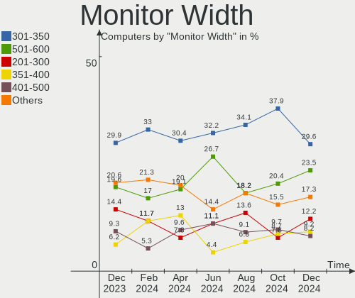

| Width in mm | Computers | Percent |
|-------------|-----------|---------|
| 301-350     | 34        | 33.66%  |
| 501-600     | 21        | 20.79%  |
| 401-500     | 11        | 10.89%  |
| 351-400     | 10        | 9.9%    |
| 201-300     | 6         | 5.94%   |
| Unknown     | 6         | 5.94%   |
| 701-800     | 3         | 2.97%   |
| 1-100       | 3         | 2.97%   |
| 601-700     | 2         | 1.98%   |
| 1501-2000   | 2         | 1.98%   |
| 1001-1500   | 2         | 1.98%   |
| 801-900     | 1         | 0.99%   |

Aspect Ratio
------------

Proportional relationship between the width and the height

| Ratio   | Computers | Percent |
|---------|-----------|---------|
| 16/9    | 70        | 70%     |
| 16/10   | 12        | 12%     |
| Unknown | 6         | 6%      |
| 21/9    | 4         | 4%      |
| 4/3     | 3         | 3%      |
| 0.67    | 3         | 3%      |
| 5/4     | 1         | 1%      |
| 32/9    | 1         | 1%      |

Monitor Area
------------

Area in inch

| Area in inch | Computers | Percent |
|----------------|-----------|---------|
| 101-110        | 25        | 24.27%  |
| 201-250        | 15        | 14.56%  |
| 81-90          | 8         | 7.77%   |
| 301-350        | 7         | 6.8%    |
| 351-500        | 6         | 5.83%   |
| 151-200        | 6         | 5.83%   |
| 121-130        | 6         | 5.83%   |
| Unknown        | 6         | 5.83%   |
| 251-300        | 5         | 4.85%   |
| 71-80          | 4         | 3.88%   |
| 131-140        | 4         | 3.88%   |
| More than 1000 | 3         | 2.91%   |
| 1-40           | 3         | 2.91%   |
| 61-70          | 2         | 1.94%   |
| 141-150        | 2         | 1.94%   |
| 501-1000       | 1         | 0.97%   |

Pixel Density
-------------

Pixels per inch

| Density       | Computers | Percent |
|---------------|-----------|---------|
| 51-100        | 30        | 29.13%  |
| 101-120       | 27        | 26.21%  |
| 121-160       | 26        | 25.24%  |
| 161-240       | 8         | 7.77%   |
| Unknown       | 6         | 5.83%   |
| More than 240 | 4         | 3.88%   |
| 1-50          | 2         | 1.94%   |

Multiple Monitors
-----------------

Total monitors connected

| Total | Computers | Percent |
|-------|-----------|---------|
| 1     | 90        | 86.54%  |
| 2     | 9         | 8.65%   |
| 0     | 5         | 4.81%   |

Network
-------

Net Controller Vendor
---------------------

Controller vendors

| Vendor                   | Computers | Percent |
|--------------------------|-----------|---------|
| Realtek Semiconductor    | 54        | 37.5%   |
| Intel                    | 46        | 31.94%  |
| Qualcomm Atheros         | 12        | 8.33%   |
| MediaTek                 | 8         | 5.56%   |
| Broadcom                 | 6         | 4.17%   |
| Broadcom Limited         | 3         | 2.08%   |
| Nvidia                   | 2         | 1.39%   |
| Marvell Technology Group | 2         | 1.39%   |
| Hewlett-Packard          | 2         | 1.39%   |
| DisplayLink              | 2         | 1.39%   |
| Ralink Technology        | 1         | 0.69%   |
| Ralink                   | 1         | 0.69%   |
| Prusa                    | 1         | 0.69%   |
| IMC Networks             | 1         | 0.69%   |
| Dell                     | 1         | 0.69%   |
| D-Link                   | 1         | 0.69%   |
| ASIX Electronics         | 1         | 0.69%   |

Net Controller Model
--------------------

Controller models

| Model                                                             | Computers | Percent |
|-------------------------------------------------------------------|-----------|---------|
| Realtek RTL8111/8168/8411 PCI Express Gigabit Ethernet Controller | 33        | 19.08%  |
| Realtek RTL8125 2.5GbE Controller                                 | 6         | 3.47%   |
| MediaTek MT7921 802.11ax PCI Express Wireless Network Adapter     | 6         | 3.47%   |
| Intel Wi-Fi 6 AX201                                               | 5         | 2.89%   |
| Realtek RTL8822CE 802.11ac PCIe Wireless Network Adapter          | 4         | 2.31%   |
| Realtek RTL810xE PCI Express Fast Ethernet controller             | 4         | 2.31%   |
| Intel 82579LM Gigabit Network Connection (Lewisville)             | 4         | 2.31%   |
| Realtek RTL8821CE 802.11ac PCIe Wireless Network Adapter          | 3         | 1.73%   |
| Realtek RTL8152 Fast Ethernet Adapter                             | 3         | 1.73%   |
| Intel Ethernet Connection I217-LM                                 | 3         | 1.73%   |
| Intel Alder Lake-P PCH CNVi WiFi                                  | 3         | 1.73%   |
| Realtek RTL8852AE 802.11ax PCIe Wireless Network Adapter          | 2         | 1.16%   |
| Qualcomm Atheros QCA9377 802.11ac Wireless Network Adapter        | 2         | 1.16%   |
| Qualcomm Atheros AR9462 Wireless Network Adapter                  | 2         | 1.16%   |
| Qualcomm Atheros AR8161 Gigabit Ethernet                          | 2         | 1.16%   |
| Intel Wireless 8260                                               | 2         | 1.16%   |
| Intel Wireless 7260                                               | 2         | 1.16%   |
| Intel Wi-Fi 6 AX210/AX211/AX411 160MHz                            | 2         | 1.16%   |
| Intel Wi-Fi 6 AX200                                               | 2         | 1.16%   |
| Intel Ethernet Controller I225-V                                  | 2         | 1.16%   |
| Intel Ethernet Connection (7) I219-V                              | 2         | 1.16%   |
| Intel Ethernet Connection (11) I219-LM                            | 2         | 1.16%   |
| Intel Centrino Ultimate-N 6300                                    | 2         | 1.16%   |
| Intel Centrino Advanced-N 6205 [Taylor Peak]                      | 2         | 1.16%   |
| Intel Cannon Point-LP CNVi [Wireless-AC]                          | 2         | 1.16%   |
| Intel 82567LM-3 Gigabit Network Connection                        | 2         | 1.16%   |
| Realtek RTL8822BE 802.11a/b/g/n/ac WiFi adapter                   | 1         | 0.58%   |
| Realtek RTL8811AU 802.11a/b/g/n/ac WLAN Adapter                   | 1         | 0.58%   |
| Realtek RTL8723AE PCIe Wireless Network Adapter                   | 1         | 0.58%   |
| Realtek RTL8188EE Wireless Network Adapter                        | 1         | 0.58%   |
| Realtek RTL8188CUS 802.11n WLAN Adapter                           | 1         | 0.58%   |
| Realtek RTL8188CE 802.11b/g/n WiFi Adapter                        | 1         | 0.58%   |
| Realtek RTL8153 Gigabit Ethernet Adapter                          | 1         | 0.58%   |
| Ralink RT2870/RT3070 Wireless Adapter                             | 1         | 0.58%   |
| Ralink RT5390 Wireless 802.11n 1T/1R PCIe                         | 1         | 0.58%   |
| Qualcomm Atheros QCA6174 802.11ac Wireless Network Adapter        | 1         | 0.58%   |
| Qualcomm Atheros Killer E2500 Gigabit Ethernet Controller         | 1         | 0.58%   |
| Qualcomm Atheros Killer E2400 Gigabit Ethernet Controller         | 1         | 0.58%   |
| Qualcomm Atheros Attansic L1 Gigabit Ethernet                     | 1         | 0.58%   |
| Qualcomm Atheros AR9485 Wireless Network Adapter                  | 1         | 0.58%   |

Wireless Vendor
---------------

Wireless vendors

| Vendor                | Computers | Percent |
|-----------------------|-----------|---------|
| Intel                 | 32        | 45.07%  |
| Realtek Semiconductor | 14        | 19.72%  |
| Qualcomm Atheros      | 8         | 11.27%  |
| MediaTek              | 7         | 9.86%   |
| Broadcom              | 4         | 5.63%   |
| Broadcom Limited      | 2         | 2.82%   |
| Ralink Technology     | 1         | 1.41%   |
| Ralink                | 1         | 1.41%   |
| IMC Networks          | 1         | 1.41%   |
| D-Link                | 1         | 1.41%   |

Wireless Model
--------------

Wireless models

| Model                                                                   | Computers | Percent |
|-------------------------------------------------------------------------|-----------|---------|
| MediaTek MT7921 802.11ax PCI Express Wireless Network Adapter           | 5         | 6.94%   |
| Intel Wi-Fi 6 AX201                                                     | 5         | 6.94%   |
| Realtek RTL8822CE 802.11ac PCIe Wireless Network Adapter                | 4         | 5.56%   |
| Realtek RTL8821CE 802.11ac PCIe Wireless Network Adapter                | 3         | 4.17%   |
| Intel Alder Lake-P PCH CNVi WiFi                                        | 3         | 4.17%   |
| Realtek RTL8852AE 802.11ax PCIe Wireless Network Adapter                | 2         | 2.78%   |
| Qualcomm Atheros QCA9377 802.11ac Wireless Network Adapter              | 2         | 2.78%   |
| Qualcomm Atheros AR9462 Wireless Network Adapter                        | 2         | 2.78%   |
| Intel Wireless 8260                                                     | 2         | 2.78%   |
| Intel Wireless 7260                                                     | 2         | 2.78%   |
| Intel Wi-Fi 6 AX210/AX211/AX411 160MHz                                  | 2         | 2.78%   |
| Intel Wi-Fi 6 AX200                                                     | 2         | 2.78%   |
| Intel Centrino Ultimate-N 6300                                          | 2         | 2.78%   |
| Intel Centrino Advanced-N 6205 [Taylor Peak]                            | 2         | 2.78%   |
| Intel Cannon Point-LP CNVi [Wireless-AC]                                | 2         | 2.78%   |
| Realtek RTL8822BE 802.11a/b/g/n/ac WiFi adapter                         | 1         | 1.39%   |
| Realtek RTL8811AU 802.11a/b/g/n/ac WLAN Adapter                         | 1         | 1.39%   |
| Realtek RTL8723AE PCIe Wireless Network Adapter                         | 1         | 1.39%   |
| Realtek RTL8188EE Wireless Network Adapter                              | 1         | 1.39%   |
| Realtek RTL8188CUS 802.11n WLAN Adapter                                 | 1         | 1.39%   |
| Realtek RTL8188CE 802.11b/g/n WiFi Adapter                              | 1         | 1.39%   |
| Ralink RT2870/RT3070 Wireless Adapter                                   | 1         | 1.39%   |
| Ralink RT5390 Wireless 802.11n 1T/1R PCIe                               | 1         | 1.39%   |
| Qualcomm Atheros QCA6174 802.11ac Wireless Network Adapter              | 1         | 1.39%   |
| Qualcomm Atheros AR9485 Wireless Network Adapter                        | 1         | 1.39%   |
| Qualcomm Atheros AR9227 Wireless Network Adapter                        | 1         | 1.39%   |
| Qualcomm Atheros AR242x / AR542x Wireless Network Adapter (PCI-Express) | 1         | 1.39%   |
| MediaTek MT7922 802.11ax PCI Express Wireless Network Adapter           | 1         | 1.39%   |
| MediaTek MT7921K (RZ608) Wi-Fi 6E 80MHz                                 | 1         | 1.39%   |
| Intel Wireless 8265 / 8275                                              | 1         | 1.39%   |
| Intel Wireless 7265                                                     | 1         | 1.39%   |
| Intel Wireless 3165                                                     | 1         | 1.39%   |
| Intel WiFi Link 5100                                                    | 1         | 1.39%   |
| Intel Wi-Fi 6 AX201 160MHz                                              | 1         | 1.39%   |
| Intel PRO/Wireless 3945ABG [Golan] Network Connection                   | 1         | 1.39%   |
| Intel Comet Lake PCH-LP CNVi WiFi                                       | 1         | 1.39%   |
| Intel Comet Lake PCH CNVi WiFi                                          | 1         | 1.39%   |
| Intel Centrino Advanced-N 6200                                          | 1         | 1.39%   |
| Intel Cannon Lake PCH CNVi WiFi                                         | 1         | 1.39%   |
| IMC Networks Mediao 802.11n WLAN [Realtek RTL8191SU]                    | 1         | 1.39%   |

Ethernet Vendor
---------------

Ethernet vendors

| Vendor                   | Computers | Percent |
|--------------------------|-----------|---------|
| Realtek Semiconductor    | 47        | 47.96%  |
| Intel                    | 32        | 32.65%  |
| Qualcomm Atheros         | 6         | 6.12%   |
| Broadcom                 | 3         | 3.06%   |
| Nvidia                   | 2         | 2.04%   |
| Marvell Technology Group | 2         | 2.04%   |
| DisplayLink              | 2         | 2.04%   |
| MediaTek                 | 1         | 1.02%   |
| Hewlett-Packard          | 1         | 1.02%   |
| Broadcom Limited         | 1         | 1.02%   |
| ASIX Electronics         | 1         | 1.02%   |

Ethernet Model
--------------

Ethernet models

| Model                                                             | Computers | Percent |
|-------------------------------------------------------------------|-----------|---------|
| Realtek RTL8111/8168/8411 PCI Express Gigabit Ethernet Controller | 33        | 33.67%  |
| Realtek RTL8125 2.5GbE Controller                                 | 6         | 6.12%   |
| Realtek RTL810xE PCI Express Fast Ethernet controller             | 4         | 4.08%   |
| Intel 82579LM Gigabit Network Connection (Lewisville)             | 4         | 4.08%   |
| Realtek RTL8152 Fast Ethernet Adapter                             | 3         | 3.06%   |
| Intel Ethernet Connection I217-LM                                 | 3         | 3.06%   |
| Qualcomm Atheros AR8161 Gigabit Ethernet                          | 2         | 2.04%   |
| Intel Ethernet Controller I225-V                                  | 2         | 2.04%   |
| Intel Ethernet Connection (7) I219-V                              | 2         | 2.04%   |
| Intel Ethernet Connection (11) I219-LM                            | 2         | 2.04%   |
| Intel 82567LM-3 Gigabit Network Connection                        | 2         | 2.04%   |
| Realtek RTL8153 Gigabit Ethernet Adapter                          | 1         | 1.02%   |
| Qualcomm Atheros Killer E2500 Gigabit Ethernet Controller         | 1         | 1.02%   |
| Qualcomm Atheros Killer E2400 Gigabit Ethernet Controller         | 1         | 1.02%   |
| Qualcomm Atheros Attansic L1 Gigabit Ethernet                     | 1         | 1.02%   |
| Qualcomm Atheros AR8132 Fast Ethernet                             | 1         | 1.02%   |
| Nvidia MCP79 Ethernet                                             | 1         | 1.02%   |
| Nvidia MCP55 Ethernet                                             | 1         | 1.02%   |
| MediaTek MT7921 802.11ax PCI Express Wireless Network Adapter     | 1         | 1.02%   |
| Marvell Group 88E8058 PCI-E Gigabit Ethernet Controller           | 1         | 1.02%   |
| Marvell Group 88E8055 PCI-E Gigabit Ethernet Controller           | 1         | 1.02%   |
| Intel I211 Gigabit Network Connection                             | 1         | 1.02%   |
| Intel Ethernet Controller I225-LM                                 | 1         | 1.02%   |
| Intel Ethernet Connection I219-V                                  | 1         | 1.02%   |
| Intel Ethernet Connection I219-LM                                 | 1         | 1.02%   |
| Intel Ethernet Connection I217-V                                  | 1         | 1.02%   |
| Intel Ethernet Connection (6) I219-V                              | 1         | 1.02%   |
| Intel Ethernet Connection (4) I219-LM                             | 1         | 1.02%   |
| Intel Ethernet Connection (3) I218-LM                             | 1         | 1.02%   |
| Intel Ethernet Connection (2) I219-V                              | 1         | 1.02%   |
| Intel Ethernet Connection (2) I218-V                              | 1         | 1.02%   |
| Intel Ethernet Connection (16) I219-V                             | 1         | 1.02%   |
| Intel Ethernet Connection (16) I219-LM                            | 1         | 1.02%   |
| Intel Ethernet Connection (14) I219-V                             | 1         | 1.02%   |
| Intel 82579V Gigabit Network Connection                           | 1         | 1.02%   |
| Intel 82577LM Gigabit Network Connection                          | 1         | 1.02%   |
| Intel 82566DM-2 Gigabit Network Connection                        | 1         | 1.02%   |
| Intel 82562GT 10/100 Network Connection                           | 1         | 1.02%   |
| HP lt4120 Snapdragon X5 LTE                                       | 1         | 1.02%   |
| DisplayLink USB-C Triple-4K Dock                                  | 1         | 1.02%   |

Net Controller Kind
-------------------

Ethernet, WiFi or modem

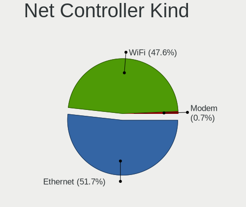

| Kind     | Computers | Percent |
|----------|-----------|---------|
| Ethernet | 90        | 54.88%  |
| WiFi     | 71        | 43.29%  |
| Modem    | 3         | 1.83%   |

Used Controller
---------------

Currently used network controller

| Kind     | Computers | Percent |
|----------|-----------|---------|
| WiFi     | 56        | 51.38%  |
| Ethernet | 53        | 48.62%  |

NICs
----

Total network controllers on board

| Total | Computers | Percent |
|-------|-----------|---------|
| 2     | 57        | 54.81%  |
| 1     | 45        | 43.27%  |
| 5     | 1         | 0.96%   |
| 0     | 1         | 0.96%   |

IPv6
----

IPv6 vs IPv4

| Used | Computers | Percent |
|------|-----------|---------|
| No   | 65        | 62.5%   |
| Yes  | 39        | 37.5%   |

Bluetooth
---------

Bluetooth Vendor
----------------

Controller vendors

| Vendor                          | Computers | Percent |
|---------------------------------|-----------|---------|
| Intel                           | 22        | 34.92%  |
| IMC Networks                    | 10        | 15.87%  |
| Cambridge Silicon Radio         | 6         | 9.52%   |
| Realtek Semiconductor           | 5         | 7.94%   |
| Broadcom                        | 4         | 6.35%   |
| Apple                           | 3         | 4.76%   |
| Qualcomm Atheros Communications | 2         | 3.17%   |
| MediaTek                        | 2         | 3.17%   |
| Hewlett-Packard                 | 2         | 3.17%   |
| Foxconn / Hon Hai               | 2         | 3.17%   |
| Dell                            | 2         | 3.17%   |
| Toshiba                         | 1         | 1.59%   |
| Realtek                         | 1         | 1.59%   |
| Alps Electric                   | 1         | 1.59%   |

Bluetooth Model
---------------

Controller models

| Model                                               | Computers | Percent |
|-----------------------------------------------------|-----------|---------|
| Intel Bluetooth wireless interface                  | 7         | 11.11%  |
| Intel AX201 Bluetooth                               | 7         | 11.11%  |
| Cambridge Silicon Radio Bluetooth Dongle (HCI mode) | 6         | 9.52%   |
| IMC Networks Wireless_Device                        | 5         | 7.94%   |
| Realtek  Bluetooth 4.2 Adapter                      | 3         | 4.76%   |
| IMC Networks Bluetooth Radio                        | 3         | 4.76%   |
| Broadcom HP Portable SoftSailing                    | 3         | 4.76%   |
| Realtek Bluetooth Radio                             | 2         | 3.17%   |
| Qualcomm Atheros  Bluetooth Device                  | 2         | 3.17%   |
| MediaTek Wireless_Device                            | 2         | 3.17%   |
| Intel Bluetooth Device                              | 2         | 3.17%   |
| Intel Bluetooth 9460/9560 Jefferson Peak (JfP)      | 2         | 3.17%   |
| Intel AX210 Bluetooth                               | 2         | 3.17%   |
| Intel AX200 Bluetooth                               | 2         | 3.17%   |
| HP Bluetooth 2.0 Interface [Broadcom BCM2045]       | 2         | 3.17%   |
| Dell DW375 Bluetooth Module                         | 2         | 3.17%   |
| Toshiba RT Bluetooth Radio                          | 1         | 1.59%   |
| Realtek 802.11ac WLAN Adapter                       | 1         | 1.59%   |
| IMC Networks Bluetooth Device                       | 1         | 1.59%   |
| IMC Networks Atheros AR3012 Bluetooth 4.0 Adapter   | 1         | 1.59%   |
| Foxconn / Hon Hai Wireless_Device                   | 1         | 1.59%   |
| Foxconn / Hon Hai Bluetooth Device                  | 1         | 1.59%   |
| Broadcom BCM2045B (BDC-2.1)                         | 1         | 1.59%   |
| Apple Bluetooth USB Host Controller                 | 1         | 1.59%   |
| Apple Bluetooth Host Controller                     | 1         | 1.59%   |
| Apple Bluetooth HCI                                 | 1         | 1.59%   |
| Alps Electric BCM2046 Bluetooth Device              | 1         | 1.59%   |

Sound
-----

Sound Vendor
------------

Sound card vendors

| Vendor                  | Computers | Percent |
|-------------------------|-----------|---------|
| Intel                   | 76        | 50%     |
| Nvidia                  | 30        | 19.74%  |
| AMD                     | 29        | 19.08%  |
| Logitech                | 4         | 2.63%   |
| Creative Labs           | 2         | 1.32%   |
| USB MICROPHONE          | 1         | 0.66%   |
| Texas Instruments       | 1         | 0.66%   |
| SteelSeries ApS         | 1         | 0.66%   |
| Realtek Semiconductor   | 1         | 0.66%   |
| Razer USA               | 1         | 0.66%   |
| Plantronics             | 1         | 0.66%   |
| MCS                     | 1         | 0.66%   |
| GYROCOM C&C             | 1         | 0.66%   |
| GN Netcom               | 1         | 0.66%   |
| Cambridge Silicon Radio | 1         | 0.66%   |
| Antlion Audio           | 1         | 0.66%   |

Sound Model
-----------

Sound card models

| Model                                                                      | Computers | Percent |
|----------------------------------------------------------------------------|-----------|---------|
| AMD Family 17h/19h HD Audio Controller                                     | 13        | 7.3%    |
| Intel Tiger Lake-LP Smart Sound Technology Audio Controller                | 7         | 3.93%   |
| Intel 82801I (ICH9 Family) HD Audio Controller                             | 7         | 3.93%   |
| Intel 8 Series/C220 Series Chipset High Definition Audio Controller        | 7         | 3.93%   |
| Intel 6 Series/C200 Series Chipset Family High Definition Audio Controller | 7         | 3.93%   |
| Intel 7 Series/C216 Chipset Family High Definition Audio Controller        | 6         | 3.37%   |
| AMD Renoir Radeon High Definition Audio Controller                         | 6         | 3.37%   |
| AMD Rembrandt Radeon High Definition Audio Controller                      | 5         | 2.81%   |
| AMD Navi 21/23 HDMI/DP Audio Controller                                    | 5         | 2.81%   |
| Nvidia High Definition Audio Controller                                    | 4         | 2.25%   |
| Intel Xeon E3-1200 v3/4th Gen Core Processor HD Audio Controller           | 4         | 2.25%   |
| Intel Sunrise Point-LP HD Audio                                            | 4         | 2.25%   |
| Intel Cannon Lake PCH cAVS                                                 | 4         | 2.25%   |
| Intel Alder Lake PCH-P High Definition Audio Controller                    | 4         | 2.25%   |
| Nvidia TU106 High Definition Audio Controller                              | 3         | 1.69%   |
| Nvidia GP104 High Definition Audio Controller                              | 3         | 1.69%   |
| Nvidia GK107 HDMI Audio Controller                                         | 3         | 1.69%   |
| Intel Comet Lake PCH cAVS                                                  | 3         | 1.69%   |
| Intel Cannon Point-LP High Definition Audio Controller                     | 3         | 1.69%   |
| Intel 100 Series/C230 Series Chipset Family HD Audio Controller            | 3         | 1.69%   |
| AMD Starship/Matisse HD Audio Controller                                   | 3         | 1.69%   |
| AMD SBx00 Azalia (Intel HDA)                                               | 3         | 1.69%   |
| Nvidia TU107 GeForce GTX 1650 High Definition Audio Controller             | 2         | 1.12%   |
| Nvidia GP107GL High Definition Audio Controller                            | 2         | 1.12%   |
| Nvidia GA106 High Definition Audio Controller                              | 2         | 1.12%   |
| Intel Wildcat Point-LP High Definition Audio Controller                    | 2         | 1.12%   |
| Intel Ice Lake-LP Smart Sound Technology Audio Controller                  | 2         | 1.12%   |
| Intel C610/X99 series chipset HD Audio Controller                          | 2         | 1.12%   |
| Intel Broadwell-U Audio Controller                                         | 2         | 1.12%   |
| Intel Alder Lake-S HD Audio Controller                                     | 2         | 1.12%   |
| Intel 82801JD/DO (ICH10 Family) HD Audio Controller                        | 2         | 1.12%   |
| Intel 82801H (ICH8 Family) HD Audio Controller                             | 2         | 1.12%   |
| Intel 5 Series/3400 Series Chipset High Definition Audio                   | 2         | 1.12%   |
| Intel 200 Series PCH HD Audio                                              | 2         | 1.12%   |
| AMD Raven/Raven2/Fenghuang HDMI/DP Audio Controller                        | 2         | 1.12%   |
| USB MICROPHONE USB MICROPHONE                                              | 1         | 0.56%   |
| Texas Instruments PCM2706 stereo audio DAC                                 | 1         | 0.56%   |
| SteelSeries ApS Arctis Pro Wireless                                        | 1         | 0.56%   |
| Realtek Semiconductor USB Audio                                            | 1         | 0.56%   |
| Razer USA Razer Barracuda X                                                | 1         | 0.56%   |

Memory
------

Memory Vendor
-------------

Memory module vendors

| Vendor              | Computers | Percent |
|---------------------|-----------|---------|
| Samsung Electronics | 14        | 21.88%  |
| SK hynix            | 11        | 17.19%  |
| Micron Technology   | 9         | 14.06%  |
| Kingston            | 6         | 9.38%   |
| Unknown             | 5         | 7.81%   |
| G.Skill             | 5         | 7.81%   |
| Corsair             | 4         | 6.25%   |
| Crucial             | 3         | 4.69%   |
| Transcend           | 1         | 1.56%   |
| Timetec             | 1         | 1.56%   |
| Smart               | 1         | 1.56%   |
| PNY                 | 1         | 1.56%   |
| Nanya Technology    | 1         | 1.56%   |
| ChangXin Memory     | 1         | 1.56%   |
| Atermiter           | 1         | 1.56%   |

Memory Model
------------

Memory module models

| Model                                                        | Computers | Percent |
|--------------------------------------------------------------|-----------|---------|
| SK hynix RAM HMA81GS6DJR8N-XN 8GB SODIMM DDR4 3200MT/s       | 2         | 3.08%   |
| Micron RAM 8ATF2G64HZ-3G2E1 16GB SODIMM DDR4 3200MT/s        | 2         | 3.08%   |
| Kingston RAM KF548S38-32 32GB SODIMM DDR5 4800MT/s           | 2         | 3.08%   |
| Corsair RAM CMK16GX4M2B3200C16 8GB DIMM DDR4 3600MT/s        | 2         | 3.08%   |
| Unknown RAM Module 4GB DIMM 1333MT/s                         | 1         | 1.54%   |
| Unknown RAM Module 2GB SODIMM DDR3 1066MT/s                  | 1         | 1.54%   |
| Unknown RAM Module 2GB SODIMM DDR2                           | 1         | 1.54%   |
| Unknown RAM Module 2048MB SODIMM LPDDR4 2133MT/s             | 1         | 1.54%   |
| Unknown RAM Module 1GB DIMM DDR 667MT/s                      | 1         | 1.54%   |
| Transcend RAM TS512MSH64V4H 4096MB SODIMM DDR4 2133MT/s      | 1         | 1.54%   |
| Timetec RAM Module 8GB SODIMM DDR3 1600MT/s                  | 1         | 1.54%   |
| Smart RAM SF4642G8CK8IEHLSBG 16GB SODIMM DDR4 2667MT/s       | 1         | 1.54%   |
| SK hynix RAM Module 16GB DIMM DDR4 3200MT/s                  | 1         | 1.54%   |
| SK hynix RAM HYMP125U64CP8-S5 2GB DIMM DDR2 800MT/s          | 1         | 1.54%   |
| SK hynix RAM HMT41GS6BFR8A-PB 8GB SODIMM DDR3 1600MT/s       | 1         | 1.54%   |
| SK hynix RAM HMT41GS6AFR8A-PB 8GB SODIMM DDR3 1600MT/s       | 1         | 1.54%   |
| SK hynix RAM HMT351S6CFR8C-PB 4GB SODIMM DDR3 1600MT/s       | 1         | 1.54%   |
| SK hynix RAM HMCG78MEBSA092N 16GB SODIMM DDR5 4800MT/s       | 1         | 1.54%   |
| SK hynix RAM HMA851S6CJR6N-XN 4GB SODIMM DDR4 3200MT/s       | 1         | 1.54%   |
| SK hynix RAM HMA81GS6AFR8N-UH 8GB SODIMM DDR4 2667MT/s       | 1         | 1.54%   |
| SK hynix RAM HMA41GU6AFR8N-TF 8GB DIMM DDR4 2465MT/s         | 1         | 1.54%   |
| Samsung RAM Module 8GB Row Of Chips LPDDR3 2133MT/s          | 1         | 1.54%   |
| Samsung RAM Module 16GB DIMM DDR4 3200MT/s                   | 1         | 1.54%   |
| Samsung RAM M471B5773DH0-CK0 2GB SODIMM DDR3 1600MT/s        | 1         | 1.54%   |
| Samsung RAM M471B5173CB0-YK0 4GB SODIMM DDR3 1600MT/s        | 1         | 1.54%   |
| Samsung RAM M471B1G73QH0-YK0 8GB SODIMM DDR3 1867MT/s        | 1         | 1.54%   |
| Samsung RAM M471B1G73DB0-YK0 8192MB SODIMM DDR3 1600MT/s     | 1         | 1.54%   |
| Samsung RAM M471A4G43AB1-CWE 32GB SODIMM DDR4 3200MT/s       | 1         | 1.54%   |
| Samsung RAM M471A2K43CB1-CTD 16GB SODIMM DDR4 8400MT/s       | 1         | 1.54%   |
| Samsung RAM M471A1K43EB1-CWE 8GB SODIMM DDR4 3200MT/s        | 1         | 1.54%   |
| Samsung RAM M471A1K43CB1-CTD 8GB SODIMM DDR4 2667MT/s        | 1         | 1.54%   |
| Samsung RAM M4 70T2864QZ3-CE6 1GB SODIMM DDR2 1639MT/s       | 1         | 1.54%   |
| Samsung RAM M378B5173DB0-CK0 4096MB DIMM DDR3 1600MT/s       | 1         | 1.54%   |
| Samsung RAM M3 78T5663EH3-CF7 2GB DIMM DDR2 800MT/s          | 1         | 1.54%   |
| Samsung RAM K3LKBKB0BM-MGCP 2GB Row Of Chips LPDDR5 6400MT/s | 1         | 1.54%   |
| PNY RAM 8GBF1X08QFHH38-135-K 8GB DIMM DDR4 3200MT/s          | 1         | 1.54%   |
| Nanya RAM NT2GT64U8HD0BN-AD 2GB SODIMM DDR2 2048MT/s         | 1         | 1.54%   |
| Micron RAM 8KTF51264HZ-1G6E1 4GB SODIMM DDR3 1600MT/s        | 1         | 1.54%   |
| Micron RAM 8ATF2G64HZ-3G2E2 16GB SODIMM DDR4 3200MT/s        | 1         | 1.54%   |
| Micron RAM 8ATF1G64HZ-3G2J1 8GB SODIMM DDR4 3200MT/s         | 1         | 1.54%   |

Memory Kind
-----------

Memory module kinds

| Kind    | Computers | Percent |
|---------|-----------|---------|
| DDR4    | 29        | 52.73%  |
| DDR3    | 11        | 20%     |
| SDRAM   | 3         | 5.45%   |
| DDR5    | 3         | 5.45%   |
| DDR2    | 3         | 5.45%   |
| LPDDR4  | 2         | 3.64%   |
| LPDDR5  | 1         | 1.82%   |
| LPDDR3  | 1         | 1.82%   |
| DDR     | 1         | 1.82%   |
| Unknown | 1         | 1.82%   |

Memory Form Factor
------------------

Physical design of the memory module

| Name         | Computers | Percent |
|--------------|-----------|---------|
| SODIMM       | 32        | 60.38%  |
| DIMM         | 17        | 32.08%  |
| Row Of Chips | 4         | 7.55%   |

Memory Size
-----------

Memory module size

| Size  | Computers | Percent |
|-------|-----------|---------|
| 8192  | 20        | 34.48%  |
| 16384 | 12        | 20.69%  |
| 2048  | 10        | 17.24%  |
| 4096  | 9         | 15.52%  |
| 32768 | 5         | 8.62%   |
| 1024  | 2         | 3.45%   |

Memory Speed
------------

Memory module speed

| Speed   | Computers | Percent |
|---------|-----------|---------|
| 3200    | 16        | 27.12%  |
| 1600    | 9         | 15.25%  |
| 2667    | 5         | 8.47%   |
| 2133    | 4         | 6.78%   |
| 4800    | 3         | 5.08%   |
| 3600    | 3         | 5.08%   |
| 2400    | 2         | 3.39%   |
| 2048    | 2         | 3.39%   |
| 667     | 2         | 3.39%   |
| 8400    | 1         | 1.69%   |
| 6400    | 1         | 1.69%   |
| 4267    | 1         | 1.69%   |
| 3866    | 1         | 1.69%   |
| 3733    | 1         | 1.69%   |
| 2800    | 1         | 1.69%   |
| 2666    | 1         | 1.69%   |
| 2465    | 1         | 1.69%   |
| 1639    | 1         | 1.69%   |
| 1333    | 1         | 1.69%   |
| 1066    | 1         | 1.69%   |
| 800     | 1         | 1.69%   |
| Unknown | 1         | 1.69%   |

Printers & scanners
-------------------

Printer Vendor
--------------

Printer device vendors

| Vendor          | Computers | Percent |
|-----------------|-----------|---------|
| Hewlett-Packard | 1         | 100%    |

Printer Model
-------------

Printer device models

| Model                        | Computers | Percent |
|------------------------------|-----------|---------|
| HP OfficeJet Pro 8020 series | 1         | 100%    |

Scanner Vendor
--------------

Scanner device vendors

| Vendor | Computers | Percent |
|--------|-----------|---------|
| Canon  | 2         | 100%    |

Scanner Model
-------------

Scanner device models

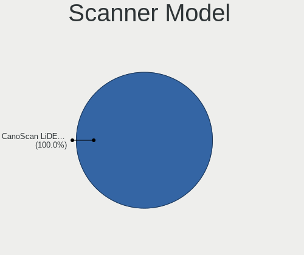

| Model                              | Computers | Percent |
|------------------------------------|-----------|---------|
| Canon CanoScan N670U/N676U/LiDE 20 | 1         | 50%     |
| Canon CanoScan LiDE 210            | 1         | 50%     |

Camera
------

Camera Vendor
-------------

Camera device vendors

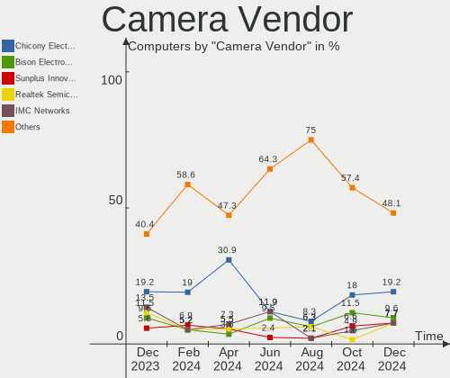

| Vendor                                 | Computers | Percent |
|----------------------------------------|-----------|---------|
| Chicony Electronics                    | 10        | 15.63%  |
| Logitech                               | 8         | 12.5%   |
| IMC Networks                           | 6         | 9.38%   |
| Sunplus Innovation Technology          | 5         | 7.81%   |
| Microdia                               | 5         | 7.81%   |
| Luxvisions Innotech Limited            | 4         | 6.25%   |
| Suyin                                  | 3         | 4.69%   |
| Realtek Semiconductor                  | 3         | 4.69%   |
| Quanta                                 | 3         | 4.69%   |
| Apple                                  | 3         | 4.69%   |
| Acer                                   | 3         | 4.69%   |
| Primax Electronics                     | 2         | 3.13%   |
| Cheng Uei Precision Industry (Foxlink) | 2         | 3.13%   |
| Sonix Technology                       | 1         | 1.56%   |
| Silicon Motion                         | 1         | 1.56%   |
| Ricoh                                  | 1         | 1.56%   |
| Lite-On Technology                     | 1         | 1.56%   |
| LG Electronics                         | 1         | 1.56%   |
| Lenovo                                 | 1         | 1.56%   |
| Kensington                             | 1         | 1.56%   |

Camera Model
------------

Camera device models

| Model                                                   | Computers | Percent |
|---------------------------------------------------------|-----------|---------|
| Microdia Integrated_Webcam_HD                           | 3         | 4.62%   |
| IMC Networks USB2.0 HD UVC WebCam                       | 3         | 4.62%   |
| Quanta HD User Facing                                   | 2         | 3.08%   |
| Primax HP HD Webcam [Fixed]                             | 2         | 3.08%   |
| Microdia Laptop Integrated Webcam HD (Composite Device) | 2         | 3.08%   |
| Luxvisions Innotech Limited HP Wide Vision HD Camera    | 2         | 3.08%   |
| Luxvisions Innotech Limited HP TrueVision HD Camera     | 2         | 3.08%   |
| Logitech BRIO Ultra HD Webcam                           | 2         | 3.08%   |
| Chicony HD Webcam                                       | 2         | 3.08%   |
| Acer Integrated Camera                                  | 2         | 3.08%   |
| Suyin TOSHIBA Web Camera                                | 1         | 1.54%   |
| Suyin HP TrueVision HD                                  | 1         | 1.54%   |
| Suyin Acer/HP Integrated Webcam [CN0314]                | 1         | 1.54%   |
| Sunplus Integrated_Webcam_HD                            | 1         | 1.54%   |
| Sunplus Integrated Webcam                               | 1         | 1.54%   |
| Sunplus FHD Camera Microphone                           | 1         | 1.54%   |
| Sunplus Dell Integrated HD Webcam                       | 1         | 1.54%   |
| Sunplus Asus Webcam                                     | 1         | 1.54%   |
| Sonix USB2.0 HD UVC WebCam                              | 1         | 1.54%   |
| Silicon Motion HP Webcam                                | 1         | 1.54%   |
| Ricoh Sony Vaio Integrated Webcam                       | 1         | 1.54%   |
| Realtek Integrated_Webcam_HD                            | 1         | 1.54%   |
| Realtek Integrated Webcam HD                            | 1         | 1.54%   |
| Realtek FULL HD 1080P Webcam                            | 1         | 1.54%   |
| Quanta HP HD Camera                                     | 1         | 1.54%   |
| Microdia Integrated_Webcam_5M                           | 1         | 1.54%   |
| Logitech Webcam C925e                                   | 1         | 1.54%   |
| Logitech Webcam C270                                    | 1         | 1.54%   |
| Logitech QuickCam Vision Pro                            | 1         | 1.54%   |
| Logitech HD Webcam C615                                 | 1         | 1.54%   |
| Logitech HD Webcam C525                                 | 1         | 1.54%   |
| Logitech C920 PRO HD Webcam                             | 1         | 1.54%   |
| Lite-On HP HD Camera                                    | 1         | 1.54%   |
| LG LM-X420xxx/G2/G3 Android Phone (MTP/download mode)   | 1         | 1.54%   |
| Lenovo Integrated Webcam [R5U877]                       | 1         | 1.54%   |
| Kensington W2000 Full HD Auto Focus Webcam              | 1         | 1.54%   |
| IMC Networks ov9734_azurewave_camera                    | 1         | 1.54%   |
| IMC Networks Integrated RGB Camera                      | 1         | 1.54%   |
| IMC Networks Integrated Camera                          | 1         | 1.54%   |
| Chicony Webcam                                          | 1         | 1.54%   |

Security
--------

Fingerprint Vendor
------------------

Fingerprint sensor vendors

| Vendor                     | Computers | Percent |
|----------------------------|-----------|---------|
| Validity Sensors           | 5         | 55.56%  |
| Synaptics                  | 2         | 22.22%  |
| Shenzhen Goodix Technology | 2         | 22.22%  |

Fingerprint Model
-----------------

Fingerprint sensor models

| Model                                             | Computers | Percent |
|---------------------------------------------------|-----------|---------|
| Validity Sensors VFS491                           | 3         | 33.33%  |
| Validity Sensors VFS495 Fingerprint Reader        | 2         | 22.22%  |
| Shenzhen Goodix  Fingerprint Device               | 2         | 22.22%  |
| Synaptics Prometheus MIS Touch Fingerprint Reader | 1         | 11.11%  |
| Unknown                                           | 1         | 11.11%  |

Chipcard Vendor
---------------

Chipcard module vendors

| Vendor      | Computers | Percent |
|-------------|-----------|---------|
| Broadcom    | 5         | 83.33%  |
| Alcor Micro | 1         | 16.67%  |

Chipcard Model
--------------

Chipcard module models

| Model                                          | Computers | Percent |
|------------------------------------------------|-----------|---------|
| Broadcom BCM5880 Secure Applications Processor | 3         | 50%     |
| Broadcom 58200                                 | 2         | 33.33%  |
| Alcor Micro AU9540 Smartcard Reader            | 1         | 16.67%  |

Unsupported
-----------

Unsupported Devices
-------------------

Total unsupported devices on board

| Total | Computers | Percent |
|-------|-----------|---------|
| 0     | 76        | 73.08%  |
| 1     | 17        | 16.35%  |
| 2     | 11        | 10.58%  |

Unsupported Device Types
------------------------

Types of unsupported devices

| Type                     | Computers | Percent |
|--------------------------|-----------|---------|
| Graphics card            | 10        | 27.03%  |
| Fingerprint reader       | 9         | 24.32%  |
| Chipcard                 | 6         | 16.22%  |
| Multimedia controller    | 3         | 8.11%   |
| Unassigned class         | 2         | 5.41%   |
| Net/wireless             | 2         | 5.41%   |
| Communication controller | 2         | 5.41%   |
| Camera                   | 2         | 5.41%   |
| Bluetooth                | 1         | 2.7%    |

