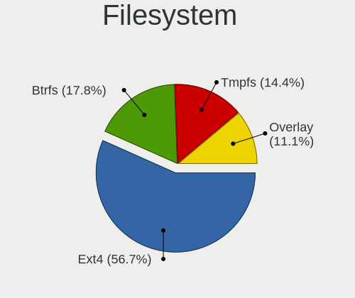
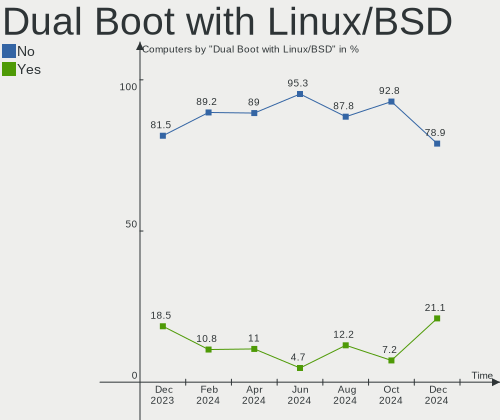
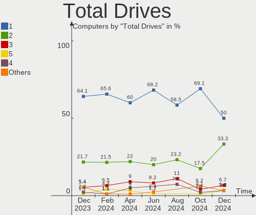
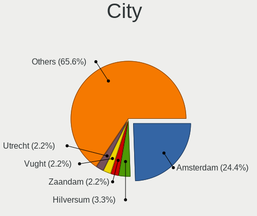
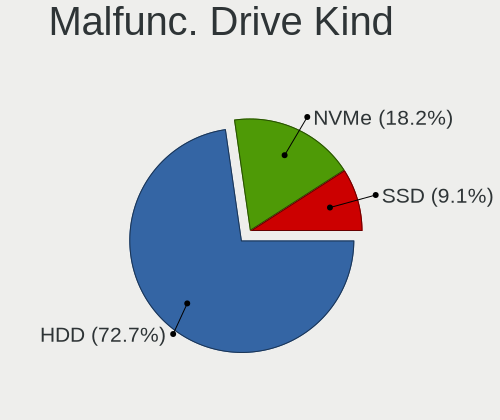
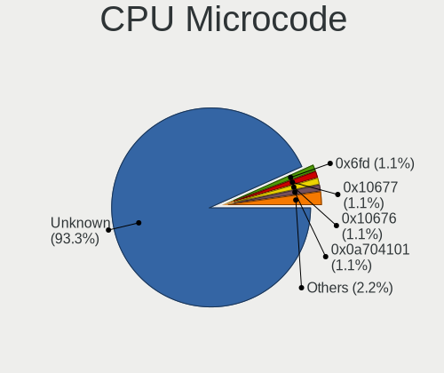
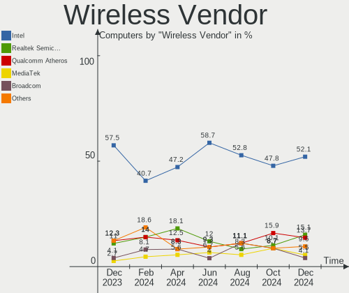
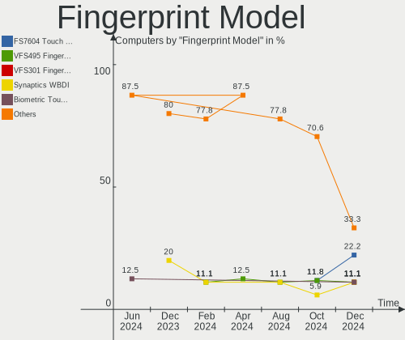

Linux in Netherlands - Hardware Trends
--------------------------------------

A project to identify most popular hardware characteristics and track their change
over time based on data collected by Linux users at https://Linux-Hardware.org.

Anyone can contribute to this report by the [hw-probe](https://github.com/linuxhw/hw-probe) tool:

    sudo -E hw-probe -all -upload

This is a report for all computer types. See also reports for [desktops](/Location/Netherlands/Desktop/README.md) and [notebooks](/Location/Netherlands/Notebook/README.md).

Period: Dec, 2024.

Contents
--------

* [ System ](#system)
  - [ OS                       ](#os)
  - [ OS Family                ](#os-family)
  - [ Kernel                   ](#kernel)
  - [ Kernel Family            ](#kernel-family)
  - [ Kernel Major Ver.        ](#kernel-major-ver)
  - [ Arch                     ](#arch)
  - [ DE                       ](#de)
  - [ Display Server           ](#display-server)
  - [ Display Manager          ](#display-manager)
  - [ OS Lang                  ](#os-lang)
  - [ Boot Mode                ](#boot-mode)
  - [ Filesystem               ](#filesystem)
  - [ Part. scheme             ](#part-scheme)
  - [ Dual Boot with Linux/BSD ](#dual-boot-with-linuxbsd)
  - [ Dual Boot (Win)          ](#dual-boot-win)

* [ Board ](#board)
  - [ Vendor                   ](#vendor)
  - [ Model                    ](#model)
  - [ Model Family             ](#model-family)
  - [ MFG Year                 ](#mfg-year)
  - [ Form Factor              ](#form-factor)
  - [ Secure Boot              ](#secure-boot)
  - [ Coreboot                 ](#coreboot)
  - [ RAM Size                 ](#ram-size)
  - [ RAM Used                 ](#ram-used)
  - [ Total Drives             ](#total-drives)
  - [ Has CD-ROM               ](#has-cd-rom)
  - [ Has Ethernet             ](#has-ethernet)
  - [ Has WiFi                 ](#has-wifi)
  - [ Has Bluetooth            ](#has-bluetooth)

* [ Location ](#location)
  - [ Country                  ](#country)
  - [ City                     ](#city)

* [ Drives ](#drives)
  - [ Drive Vendor             ](#drive-vendor)
  - [ Drive Model              ](#drive-model)
  - [ HDD Vendor               ](#hdd-vendor)
  - [ SSD Vendor               ](#ssd-vendor)
  - [ Drive Kind               ](#drive-kind)
  - [ Drive Connector          ](#drive-connector)
  - [ Drive Size               ](#drive-size)
  - [ Space Total              ](#space-total)
  - [ Space Used               ](#space-used)
  - [ Malfunc. Drives          ](#malfunc-drives)
  - [ Malfunc. Drive Vendor    ](#malfunc-drive-vendor)
  - [ Malfunc. HDD Vendor      ](#malfunc-hdd-vendor)
  - [ Malfunc. Drive Kind      ](#malfunc-drive-kind)
  - [ Failed Drives            ](#failed-drives)
  - [ Failed Drive Vendor      ](#failed-drive-vendor)
  - [ Drive Status             ](#drive-status)

* [ Storage controller ](#storage-controller)
  - [ Storage Vendor           ](#storage-vendor)
  - [ Storage Model            ](#storage-model)
  - [ Storage Kind             ](#storage-kind)

* [ Processor ](#processor)
  - [ CPU Vendor               ](#cpu-vendor)
  - [ CPU Model                ](#cpu-model)
  - [ CPU Model Family         ](#cpu-model-family)
  - [ CPU Cores                ](#cpu-cores)
  - [ CPU Sockets              ](#cpu-sockets)
  - [ CPU Threads              ](#cpu-threads)
  - [ CPU Op-Modes             ](#cpu-op-modes)
  - [ CPU Microcode            ](#cpu-microcode)
  - [ CPU Microarch            ](#cpu-microarch)

* [ Graphics ](#graphics)
  - [ GPU Vendor               ](#gpu-vendor)
  - [ GPU Model                ](#gpu-model)
  - [ GPU Combo                ](#gpu-combo)
  - [ GPU Driver               ](#gpu-driver)
  - [ GPU Memory               ](#gpu-memory)

* [ Monitor ](#monitor)
  - [ Monitor Vendor           ](#monitor-vendor)
  - [ Monitor Model            ](#monitor-model)
  - [ Monitor Resolution       ](#monitor-resolution)
  - [ Monitor Diagonal         ](#monitor-diagonal)
  - [ Monitor Width            ](#monitor-width)
  - [ Aspect Ratio             ](#aspect-ratio)
  - [ Monitor Area             ](#monitor-area)
  - [ Pixel Density            ](#pixel-density)
  - [ Multiple Monitors        ](#multiple-monitors)

* [ Network ](#network)
  - [ Net Controller Vendor    ](#net-controller-vendor)
  - [ Net Controller Model     ](#net-controller-model)
  - [ Wireless Vendor          ](#wireless-vendor)
  - [ Wireless Model           ](#wireless-model)
  - [ Ethernet Vendor          ](#ethernet-vendor)
  - [ Ethernet Model           ](#ethernet-model)
  - [ Net Controller Kind      ](#net-controller-kind)
  - [ Used Controller          ](#used-controller)
  - [ NICs                     ](#nics)
  - [ IPv6                     ](#ipv6)

* [ Bluetooth ](#bluetooth)
  - [ Bluetooth Vendor         ](#bluetooth-vendor)
  - [ Bluetooth Model          ](#bluetooth-model)

* [ Sound ](#sound)
  - [ Sound Vendor             ](#sound-vendor)
  - [ Sound Model              ](#sound-model)

* [ Memory ](#memory)
  - [ Memory Vendor            ](#memory-vendor)
  - [ Memory Model             ](#memory-model)
  - [ Memory Kind              ](#memory-kind)
  - [ Memory Form Factor       ](#memory-form-factor)
  - [ Memory Size              ](#memory-size)
  - [ Memory Speed             ](#memory-speed)

* [ Printers & scanners ](#printers--scanners)
  - [ Printer Vendor           ](#printer-vendor)
  - [ Printer Model            ](#printer-model)
  - [ Scanner Vendor           ](#scanner-vendor)
  - [ Scanner Model            ](#scanner-model)

* [ Camera ](#camera)
  - [ Camera Vendor            ](#camera-vendor)
  - [ Camera Model             ](#camera-model)

* [ Security ](#security)
  - [ Fingerprint Vendor       ](#fingerprint-vendor)
  - [ Fingerprint Model        ](#fingerprint-model)
  - [ Chipcard Vendor          ](#chipcard-vendor)
  - [ Chipcard Model           ](#chipcard-model)

* [ Unsupported ](#unsupported)
  - [ Unsupported Devices      ](#unsupported-devices)
  - [ Unsupported Device Types ](#unsupported-device-types)

System
------

OS
--

Installed operating systems

| Name                         | Computers | Percent |
|------------------------------|-----------|---------|
| OpenMandriva 24.12           | 16        | 17.78%  |
| Ubuntu 24.04                 | 9         | 10%     |
| Pop!_OS 22.04                | 7         | 7.78%   |
| Zorin 17                     | 6         | 6.67%   |
| Fedora 41                    | 6         | 6.67%   |
| Arch Rolling                 | 5         | 5.56%   |
| Ubuntu 24.10                 | 4         | 4.44%   |
| ArcoLinux Rolling            | 4         | 4.44%   |
| Debian 12                    | 3         | 3.33%   |
| Debian                       | 3         | 3.33%   |
| Ubuntu 22.04                 | 2         | 2.22%   |
| Fedora 40                    | 2         | 2.22%   |
| Vanilla 2.0                  | 1         | 1.11%   |
| Ubuntu 23.10                 | 1         | 1.11%   |
| Ubuntu 20.04                 | 1         | 1.11%   |
| SteamOS 3.6.20               | 1         | 1.11%   |
| Slackware 15.0               | 1         | 1.11%   |
| Rocky Linux 9.5              | 1         | 1.11%   |
| openSUSE Tumbleweed-XXXXXXXX | 1         | 1.11%   |
| openSUSE Microos-XXXXXXXX    | 1         | 1.11%   |
| NixOS 25.05                  | 1         | 1.11%   |
| Manjaro                      | 1         | 1.11%   |
| Mageia 9                     | 1         | 1.11%   |
| Linux Mint 22                | 1         | 1.11%   |
| Linux Mint 21.3              | 1         | 1.11%   |
| Linux Mint 20                | 1         | 1.11%   |
| Kubuntu 24.04                | 1         | 1.11%   |
| Gentoo 2.15                  | 1         | 1.11%   |
| Garuda Linux Rolling         | 1         | 1.11%   |
| Fedora 39                    | 1         | 1.11%   |
| EndeavourOS Rolling          | 1         | 1.11%   |
| Elementary 8                 | 1         | 1.11%   |
| Drauger OS 7.7               | 1         | 1.11%   |
| Devuan 5                     | 1         | 1.11%   |
| Bazzite 41                   | 1         | 1.11%   |

OS Family
---------

OS without a version

| Name         | Computers | Percent |
|--------------|-----------|---------|
| Ubuntu       | 17        | 18.89%  |
| OpenMandriva | 16        | 17.78%  |
| Fedora       | 9         | 10%     |
| Pop!_OS      | 7         | 7.78%   |
| Zorin        | 6         | 6.67%   |
| Debian       | 6         | 6.67%   |
| Arch         | 5         | 5.56%   |
| ArcoLinux    | 4         | 4.44%   |
| Linux Mint   | 3         | 3.33%   |
| openSUSE     | 2         | 2.22%   |
| Vanilla      | 1         | 1.11%   |
| SteamOS      | 1         | 1.11%   |
| Slackware    | 1         | 1.11%   |
| Rocky Linux  | 1         | 1.11%   |
| NixOS        | 1         | 1.11%   |
| Manjaro      | 1         | 1.11%   |
| Mageia       | 1         | 1.11%   |
| Kubuntu      | 1         | 1.11%   |
| Gentoo       | 1         | 1.11%   |
| Garuda Linux | 1         | 1.11%   |
| EndeavourOS  | 1         | 1.11%   |
| Elementary   | 1         | 1.11%   |
| Drauger OS   | 1         | 1.11%   |
| Devuan       | 1         | 1.11%   |
| Bazzite      | 1         | 1.11%   |

Kernel
------

Version of the Linux kernel

| Version                                  | Computers | Percent |
|------------------------------------------|-----------|---------|
| 6.12.1-desktop-1omv2490                  | 15        | 16.67%  |
| 6.8.0-49-generic                         | 12        | 13.33%  |
| 6.9.3-76060903-generic                   | 7         | 7.78%   |
| 6.8.0-51-generic                         | 4         | 4.44%   |
| 6.11.10-300.fc41.x86_64                  | 4         | 4.44%   |
| 6.8.0-50-generic                         | 3         | 3.33%   |
| 6.12.3-arch1-1                           | 3         | 3.33%   |
| 6.1.0-28-amd64                           | 3         | 3.33%   |
| 6.12.4-arch1-1                           | 2         | 2.22%   |
| 6.11.8-1-default                         | 2         | 2.22%   |
| 6.11.10-amd64                            | 2         | 2.22%   |
| 6.11.0-13-generic                        | 2         | 2.22%   |
| 6.9.7-gentoo                             | 1         | 1.11%   |
| 6.9.10                                   | 1         | 1.11%   |
| 6.8.0-31-generic                         | 1         | 1.11%   |
| 6.6.65-1-MANJARO                         | 1         | 1.11%   |
| 6.6.63                                   | 1         | 1.11%   |
| 6.6.61-desktop-1.mga9                    | 1         | 1.11%   |
| 6.5.0-valve22-1-neptune-65-g9a338ed8a75e | 1         | 1.11%   |
| 6.5.0-9-generic                          | 1         | 1.11%   |
| 6.12.6-desktop-1omv2490                  | 1         | 1.11%   |
| 6.12.6-arch1-1                           | 1         | 1.11%   |
| 6.12.5-amd64                             | 1         | 1.11%   |
| 6.12.5-100.fc40.x86_64                   | 1         | 1.11%   |
| 6.12.5-1-cachyos                         | 1         | 1.11%   |
| 6.12.4-zen1-1-zen                        | 1         | 1.11%   |
| 6.12.4-200.fc41.x86_64                   | 1         | 1.11%   |
| 6.12.3-061203-generic                    | 1         | 1.11%   |
| 6.12.1-zen1-1-zen                        | 1         | 1.11%   |
| 6.12.1-arch1-1                           | 1         | 1.11%   |
| 6.11.9-303.bazzite.fc41.x86_64           | 1         | 1.11%   |
| 6.11.9-100.fc39.x86_64                   | 1         | 1.11%   |
| 6.11.8-zen1-2-zen                        | 1         | 1.11%   |
| 6.11.6-amd64                             | 1         | 1.11%   |
| 6.11.6-200.fc40.x86_64                   | 1         | 1.11%   |
| 6.11.6                                   | 1         | 1.11%   |
| 6.11.11-300.fc41.x86_64                  | 1         | 1.11%   |
| 6.11.0-12-generic                        | 1         | 1.11%   |
| 6.1.0-28-rt-amd64                        | 1         | 1.11%   |
| 5.4.0-204-generic                        | 1         | 1.11%   |

Kernel Family
-------------

Linux kernel without a distro release

| Version | Computers | Percent |
|---------|-----------|---------|
| 6.8.0   | 20        | 22.22%  |
| 6.12.1  | 17        | 18.89%  |
| 6.9.3   | 7         | 7.78%   |
| 6.11.10 | 6         | 6.67%   |
| 6.12.4  | 4         | 4.44%   |
| 6.12.3  | 4         | 4.44%   |
| 6.1.0   | 4         | 4.44%   |
| 6.12.5  | 3         | 3.33%   |
| 6.11.8  | 3         | 3.33%   |
| 6.11.6  | 3         | 3.33%   |
| 6.11.0  | 3         | 3.33%   |
| 6.5.0   | 2         | 2.22%   |
| 6.12.6  | 2         | 2.22%   |
| 6.11.9  | 2         | 2.22%   |
| 5.15.0  | 2         | 2.22%   |
| 6.9.7   | 1         | 1.11%   |
| 6.9.10  | 1         | 1.11%   |
| 6.6.65  | 1         | 1.11%   |
| 6.6.63  | 1         | 1.11%   |
| 6.6.61  | 1         | 1.11%   |
| 6.11.11 | 1         | 1.11%   |
| 5.4.0   | 1         | 1.11%   |
| 5.14.0  | 1         | 1.11%   |

Kernel Major Ver.
-----------------

Linux kernel major version

| Version | Computers | Percent |
|---------|-----------|---------|
| 6.12    | 30        | 33.33%  |
| 6.8     | 20        | 22.22%  |
| 6.11    | 18        | 20%     |
| 6.9     | 9         | 10%     |
| 6.1     | 4         | 4.44%   |
| 6.6     | 3         | 3.33%   |
| 6.5     | 2         | 2.22%   |
| 5.15    | 2         | 2.22%   |
| 5.4     | 1         | 1.11%   |
| 5.14    | 1         | 1.11%   |

Arch
----

OS architecture (x86_64, i586, etc.)

| Name   | Computers | Percent |
|--------|-----------|---------|
| x86_64 | 90        | 100%    |

DE
--

Desktop Environment

| Name       | Computers | Percent |
|------------|-----------|---------|
| GNOME      | 46        | 51.11%  |
| Unknown    | 15        | 16.67%  |
| KDE6       | 7         | 7.78%   |
| KDE5       | 6         | 6.67%   |
| XFCE       | 4         | 4.44%   |
| LXQt       | 3         | 3.33%   |
| X-Cinnamon | 2         | 2.22%   |
| Xsession   | 1         | 1.11%   |
| Pantheon   | 1         | 1.11%   |
| MATE       | 1         | 1.11%   |
| KDE4       | 1         | 1.11%   |
| i3         | 1         | 1.11%   |
| Hyprland   | 1         | 1.11%   |
| Cinnamon   | 1         | 1.11%   |

Display Server
--------------

X11 or Wayland

| Name    | Computers | Percent |
|---------|-----------|---------|
| Wayland | 45        | 50%     |
| X11     | 40        | 44.44%  |
| Tty     | 4         | 4.44%   |
| Unknown | 1         | 1.11%   |

Display Manager
---------------

SDDM, LightDM, etc.

| Name    | Computers | Percent |
|---------|-----------|---------|
| Unknown | 31        | 34.44%  |
| SDDM    | 28        | 31.11%  |
| GDM3    | 17        | 18.89%  |
| GDM     | 8         | 8.89%   |
| LightDM | 5         | 5.56%   |
| XDM     | 1         | 1.11%   |

OS Lang
-------

Language

| Lang    | Computers | Percent |
|---------|-----------|---------|
| en_US   | 49        | 54.44%  |
| nl_NL   | 27        | 30%     |
| en_GB   | 5         | 5.56%   |
| C       | 2         | 2.22%   |
| pl_PL   | 1         | 1.11%   |
| nl_BE   | 1         | 1.11%   |
| fr_FR   | 1         | 1.11%   |
| es_ES   | 1         | 1.11%   |
| de_DE   | 1         | 1.11%   |
| cs_CZ   | 1         | 1.11%   |
| Unknown | 1         | 1.11%   |

Boot Mode
---------

EFI or BIOS

| Mode | Computers | Percent |
|------|-----------|---------|
| BIOS | 53        | 58.89%  |
| EFI  | 37        | 41.11%  |

Filesystem
----------

Type of filesystem

| Type    | Computers | Percent |
|---------|-----------|---------|
| Ext4    | 51        | 56.67%  |
| Btrfs   | 16        | 17.78%  |
| Tmpfs   | 13        | 14.44%  |
| Overlay | 10        | 11.11%  |

Part. scheme
------------

Scheme of partitioning

| Type    | Computers | Percent |
|---------|-----------|---------|
| GPT     | 55        | 61.11%  |
| Unknown | 30        | 33.33%  |
| MBR     | 5         | 5.56%   |

Dual Boot with Linux/BSD
------------------------

Hosting more than one Linux/BSD

| Dual boot | Computers | Percent |
|-----------|-----------|---------|
| No        | 71        | 78.89%  |
| Yes       | 19        | 21.11%  |

Dual Boot (Win)
---------------

Hosting Linux and Windows

| Dual boot | Computers | Percent |
|-----------|-----------|---------|
| No        | 67        | 74.44%  |
| Yes       | 23        | 25.56%  |

Board
-----

Vendor
------

Motherboard manufacturer

| Name                | Computers | Percent |
|---------------------|-----------|---------|
| ASUSTek Computer    | 18        | 20%     |
| Hewlett-Packard     | 17        | 18.89%  |
| Dell                | 12        | 13.33%  |
| Lenovo              | 11        | 12.22%  |
| Gigabyte Technology | 7         | 7.78%   |
| MSI                 | 4         | 4.44%   |
| Acer                | 4         | 4.44%   |
| Medion              | 3         | 3.33%   |
| AZW                 | 2         | 2.22%   |
| ASRock              | 2         | 2.22%   |
| Apple               | 2         | 2.22%   |
| Valve               | 1         | 1.11%   |
| TUXEDO              | 1         | 1.11%   |
| Razer               | 1         | 1.11%   |
| Notebook            | 1         | 1.11%   |
| Intel               | 1         | 1.11%   |
| Google              | 1         | 1.11%   |
| Framework           | 1         | 1.11%   |
| Unknown             | 1         | 1.11%   |

Model
-----

Motherboard model

| Name                                             | Computers | Percent |
|--------------------------------------------------|-----------|---------|
| HP EliteDesk 800 G3 DM 65W                       | 2         | 2.22%   |
| Gigabyte X670 GAMING X AX V2                     | 2         | 2.22%   |
| Valve Jupiter                                    | 1         | 1.11%   |
| TUXEDO InfinityBook Pro AMD Gen9                 | 1         | 1.11%   |
| Razer Blade 17 (2022) - RZ09-0423                | 1         | 1.11%   |
| Notebook W65_W67RB                               | 1         | 1.11%   |
| MSI MS-7D73                                      | 1         | 1.11%   |
| MSI MS-7D67                                      | 1         | 1.11%   |
| MSI MS-7D25                                      | 1         | 1.11%   |
| MSI MS-7514                                      | 1         | 1.11%   |
| Medion MS-7800                                   | 1         | 1.11%   |
| Medion MD34099/C649                              | 1         | 1.11%   |
| Medion MD34098/C648                              | 1         | 1.11%   |
| Lenovo Yoga Pro 7 14APH8 82Y8                    | 1         | 1.11%   |
| Lenovo V155-15API 81V5                           | 1         | 1.11%   |
| Lenovo ThinkPad X220 Tablet 4299Y42              | 1         | 1.11%   |
| Lenovo ThinkPad X1 Carbon Gen 11 21HMCTO1WW      | 1         | 1.11%   |
| Lenovo ThinkPad T470s W10DG 20JTS1HG00           | 1         | 1.11%   |
| Lenovo ThinkPad T14 Gen 4 21K3CTO1WW             | 1         | 1.11%   |
| Lenovo ThinkPad P1 Gen 2 20QUS00000              | 1         | 1.11%   |
| Lenovo ThinkCentre M720q m720q                   | 1         | 1.11%   |
| Lenovo ThinkCentre M70q Gen 3 11T300B5MH         | 1         | 1.11%   |
| Lenovo Legion Y540-17IRH 81Q4                    | 1         | 1.11%   |
| Lenovo G50-70 20351                              | 1         | 1.11%   |
| Intel DH61ZE AAG43004-200                        | 1         | 1.11%   |
| HP xw8400 Workstation                            | 1         | 1.11%   |
| HP ProBook 650 G1                                | 1         | 1.11%   |
| HP ProBook 450 G8 Notebook PC                    | 1         | 1.11%   |
| HP ProBook 450 G6                                | 1         | 1.11%   |
| HP ProBook 445R G6                               | 1         | 1.11%   |
| HP Pavilion dv7                                  | 1         | 1.11%   |
| HP Pavilion dm1                                  | 1         | 1.11%   |
| HP Notebook                                      | 1         | 1.11%   |
| HP ENVY x360 2-in-1 Laptop 16-ac0xxx             | 1         | 1.11%   |
| HP EliteBook 845 G8 Notebook PC                  | 1         | 1.11%   |
| HP EliteBook 655 15.6 inch G9 Notebook PC        | 1         | 1.11%   |
| HP Elite x360 830 13 inch G11 2-in-1 Notebook PC | 1         | 1.11%   |
| HP Compaq Pro 6300 SFF                           | 1         | 1.11%   |
| HP Compaq Presario CQ71                          | 1         | 1.11%   |
| HP Compaq Elite 8300 CMT                         | 1         | 1.11%   |

Model Family
------------

Motherboard model prefix

| Name                | Computers | Percent |
|---------------------|-----------|---------|
| Dell Latitude       | 6         | 6.67%   |
| Lenovo ThinkPad     | 5         | 5.56%   |
| HP ProBook          | 4         | 4.44%   |
| ASUS PRIME          | 4         | 4.44%   |
| HP Compaq           | 3         | 3.33%   |
| Acer Aspire         | 3         | 3.33%   |
| Lenovo ThinkCentre  | 2         | 2.22%   |
| HP Pavilion         | 2         | 2.22%   |
| HP EliteDesk        | 2         | 2.22%   |
| HP EliteBook        | 2         | 2.22%   |
| Gigabyte X670       | 2         | 2.22%   |
| Gigabyte X570       | 2         | 2.22%   |
| Dell XPS            | 2         | 2.22%   |
| Dell Precision      | 2         | 2.22%   |
| ASUS ROG            | 2         | 2.22%   |
| Valve Jupiter       | 1         | 1.11%   |
| TUXEDO InfinityBook | 1         | 1.11%   |
| Razer Blade         | 1         | 1.11%   |
| Notebook W65        | 1         | 1.11%   |
| MSI MS-7D73         | 1         | 1.11%   |
| MSI MS-7D67         | 1         | 1.11%   |
| MSI MS-7D25         | 1         | 1.11%   |
| MSI MS-7514         | 1         | 1.11%   |
| Medion MS-7800      | 1         | 1.11%   |
| Medion MD34099      | 1         | 1.11%   |
| Medion MD34098      | 1         | 1.11%   |
| Lenovo Yoga         | 1         | 1.11%   |
| Lenovo V155-15API   | 1         | 1.11%   |
| Lenovo Legion       | 1         | 1.11%   |
| Lenovo G50-70       | 1         | 1.11%   |
| Intel DH61ZE        | 1         | 1.11%   |
| HP xw8400           | 1         | 1.11%   |
| HP Notebook         | 1         | 1.11%   |
| HP ENVY             | 1         | 1.11%   |
| HP Elite            | 1         | 1.11%   |
| Google Delbin       | 1         | 1.11%   |
| Gigabyte B760M      | 1         | 1.11%   |
| Gigabyte B550M      | 1         | 1.11%   |
| Gigabyte B450       | 1         | 1.11%   |
| Framework Laptop    | 1         | 1.11%   |

MFG Year
--------

Motherboard manufacture year

| Year | Computers | Percent |
|------|-----------|---------|
| 2023 | 12        | 13.33%  |
| 2019 | 9         | 10%     |
| 2022 | 8         | 8.89%   |
| 2024 | 7         | 7.78%   |
| 2017 | 7         | 7.78%   |
| 2018 | 6         | 6.67%   |
| 2020 | 5         | 5.56%   |
| 2010 | 5         | 5.56%   |
| 2021 | 4         | 4.44%   |
| 2015 | 4         | 4.44%   |
| 2012 | 4         | 4.44%   |
| 2009 | 4         | 4.44%   |
| 2008 | 4         | 4.44%   |
| 2014 | 3         | 3.33%   |
| 2013 | 3         | 3.33%   |
| 2011 | 3         | 3.33%   |
| 2016 | 1         | 1.11%   |
| 2007 | 1         | 1.11%   |

Form Factor
-----------

Physical design of the computer

| Name        | Computers | Percent |
|-------------|-----------|---------|
| Notebook    | 46        | 51.11%  |
| Desktop     | 32        | 35.56%  |
| Mini pc     | 6         | 6.67%   |
| Convertible | 3         | 3.33%   |
| Tablet      | 1         | 1.11%   |
| All in one  | 1         | 1.11%   |
| Server      | 1         | 1.11%   |

Secure Boot
-----------

Enabled or disabled

| State    | Computers | Percent |
|----------|-----------|---------|
| Disabled | 89        | 98.89%  |
| Enabled  | 1         | 1.11%   |

Coreboot
--------

Have coreboot on board

| Used | Computers | Percent |
|------|-----------|---------|
| No   | 89        | 98.89%  |
| Yes  | 1         | 1.11%   |

RAM Size
--------

Total RAM memory

| Size in GB  | Computers | Percent |
|-------------|-----------|---------|
| 4.01-8.0    | 18        | 20%     |
| 32.01-64.0  | 18        | 20%     |
| 8.01-16.0   | 18        | 20%     |
| 16.01-24.0  | 12        | 13.33%  |
| 3.01-4.0    | 9         | 10%     |
| 64.01-256.0 | 8         | 8.89%   |
| 24.01-32.0  | 5         | 5.56%   |
| 2.01-3.0    | 1         | 1.11%   |
| 1.01-2.0    | 1         | 1.11%   |

RAM Used
--------

Used RAM memory

| Used GB    | Computers | Percent |
|------------|-----------|---------|
| 2.01-3.0   | 24        | 26.67%  |
| 4.01-8.0   | 22        | 24.44%  |
| 1.01-2.0   | 19        | 21.11%  |
| 3.01-4.0   | 11        | 12.22%  |
| 8.01-16.0  | 10        | 11.11%  |
| 0.51-1.0   | 3         | 3.33%   |
| 24.01-32.0 | 1         | 1.11%   |

Total Drives
------------

Number of drives on board

| Drives | Computers | Percent |
|--------|-----------|---------|
| 1      | 45        | 50%     |
| 2      | 30        | 33.33%  |
| 3      | 6         | 6.67%   |
| 5      | 3         | 3.33%   |
| 4      | 3         | 3.33%   |
| 10     | 1         | 1.11%   |
| 7      | 1         | 1.11%   |
| 6      | 1         | 1.11%   |

Has CD-ROM
----------

Has CD-ROM on board

| Presented | Computers | Percent |
|-----------|-----------|---------|
| No        | 54        | 60%     |
| Yes       | 36        | 40%     |

Has Ethernet
------------

Has Ethernet on board

| Presented | Computers | Percent |
|-----------|-----------|---------|
| Yes       | 74        | 82.22%  |
| No        | 16        | 17.78%  |

Has WiFi
--------

Has WiFi module

| Presented | Computers | Percent |
|-----------|-----------|---------|
| Yes       | 68        | 75.56%  |
| No        | 22        | 24.44%  |

Has Bluetooth
-------------

Has Bluetooth module

| Presented | Computers | Percent |
|-----------|-----------|---------|
| Yes       | 61        | 67.78%  |
| No        | 29        | 32.22%  |

Location
--------

Country
-------

Geographic location (country)

| Country     | Computers | Percent |
|-------------|-----------|---------|
| Netherlands | 90        | 100%    |

City
----

Geographic location (city)

| City          | Computers | Percent |
|---------------|-----------|---------|
| Amsterdam     | 22        | 24.44%  |
| Hilversum     | 3         | 3.33%   |
| Zaandam       | 2         | 2.22%   |
| Vught         | 2         | 2.22%   |
| Utrecht       | 2         | 2.22%   |
| Rotterdam     | 2         | 2.22%   |
| Leiden        | 2         | 2.22%   |
| Heemskerk     | 2         | 2.22%   |
| Haarlem       | 2         | 2.22%   |
| Gennep        | 2         | 2.22%   |
| Etten         | 2         | 2.22%   |
| Eindhoven     | 2         | 2.22%   |
| Zwijndrecht   | 1         | 1.11%   |
| Veenendaal    | 1         | 1.11%   |
| Tollebeek     | 1         | 1.11%   |
| The Hague     | 1         | 1.11%   |
| Sneek         | 1         | 1.11%   |
| Sleen         | 1         | 1.11%   |
| Schoonhoven   | 1         | 1.11%   |
| Rosmalen      | 1         | 1.11%   |
| Purmerend     | 1         | 1.11%   |
| Overveen      | 1         | 1.11%   |
| Oss           | 1         | 1.11%   |
| Nijmegen      | 1         | 1.11%   |
| Nieuwegein    | 1         | 1.11%   |
| Naaldwijk     | 1         | 1.11%   |
| Medemblik     | 1         | 1.11%   |
| Maastricht    | 1         | 1.11%   |
| Maasdijk      | 1         | 1.11%   |
| Lutjewinkel   | 1         | 1.11%   |
| Leeuwarden    | 1         | 1.11%   |
| Kloosterburen | 1         | 1.11%   |
| Kessel        | 1         | 1.11%   |
| Katwijk       | 1         | 1.11%   |
| Kampen        | 1         | 1.11%   |
| IJmuiden      | 1         | 1.11%   |
| Hoorn         | 1         | 1.11%   |
| Hoog-Keppel   | 1         | 1.11%   |
| Hoensbroek    | 1         | 1.11%   |
| Hengelo       | 1         | 1.11%   |

Drives
------

Drive Vendor
------------

Hard drive vendors

| Vendor                      | Computers | Drives | Percent |
|-----------------------------|-----------|--------|---------|
| Samsung Electronics         | 36        | 42     | 24.66%  |
| WDC                         | 15        | 18     | 10.27%  |
| Seagate                     | 15        | 16     | 10.27%  |
| SanDisk                     | 13        | 14     | 8.9%    |
| Kingston                    | 8         | 9      | 5.48%   |
| Crucial                     | 7         | 7      | 4.79%   |
| Toshiba                     | 5         | 9      | 3.42%   |
| SK hynix                    | 5         | 5      | 3.42%   |
| PNY                         | 4         | 4      | 2.74%   |
| Hitachi                     | 4         | 9      | 2.74%   |
| Unknown                     | 3         | 5      | 2.05%   |
| Phison Electronics          | 3         | 3      | 2.05%   |
| Micron/Crucial Technology   | 3         | 3      | 2.05%   |
| Micron Technology           | 3         | 3      | 2.05%   |
| KIOXIA                      | 2         | 2      | 1.37%   |
| Kingston Technology Company | 2         | 2      | 1.37%   |
| Intel                       | 2         | 2      | 1.37%   |
| SSSTC                       | 1         | 1      | 0.68%   |
| Silicon Motion              | 1         | 1      | 0.68%   |
| SABRENT                     | 1         | 1      | 0.68%   |
| Phison                      | 1         | 1      | 0.68%   |
| Patriot                     | 1         | 1      | 0.68%   |
| MAXIO Technology (Hangzhou) | 1         | 1      | 0.68%   |
| KUU                         | 1         | 1      | 0.68%   |
| KingFast                    | 1         | 1      | 0.68%   |
| JMicron Technology          | 1         | 1      | 0.68%   |
| Intenso                     | 1         | 1      | 0.68%   |
| HGST                        | 1         | 1      | 0.68%   |
| GLOWAY                      | 1         | 1      | 0.68%   |
| Fanxiang                    | 1         | 1      | 0.68%   |
| External                    | 1         | 1      | 0.68%   |
| BHT                         | 1         | 1      | 0.68%   |
| A-DATA Technology           | 1         | 1      | 0.68%   |

Drive Model
-----------

Hard drive models

| Model                                                | Computers | Percent |
|------------------------------------------------------|-----------|---------|
| Samsung SSD 850 EVO 250GB                            | 4         | 2.52%   |
| Samsung NVMe SSD Controller SM981/PM981/PM983 512GB  | 4         | 2.52%   |
| Samsung NVMe SSD Controller PM9A1/PM9A3/980PRO 512GB | 4         | 2.52%   |
| Samsung SSD 860 EVO 500GB                            | 3         | 1.89%   |
| Toshiba DT01ACA100 1TB                               | 2         | 1.26%   |
| SK hynix BC501 NVMe Solid State Drive 512GB          | 2         | 1.26%   |
| SanDisk NVMe SSD Drive 2TB                           | 2         | 1.26%   |
| Micron/Crucial P2 NVMe PCIe SSD 500GB                | 2         | 1.26%   |
| Kingston SV300S37A120G 120GB SSD                     | 2         | 1.26%   |
| Kingston SFYRD2000G 2TB                              | 2         | 1.26%   |
| Kingston SA400S37240G 240GB SSD                      | 2         | 1.26%   |
| WDC WDS500G2B0B-00YS70 500GB SSD                     | 1         | 0.63%   |
| WDC WDS200T1R0B-68A4Z0 2TB SSD                       | 1         | 0.63%   |
| WDC WD800BEVS-07RST0 80GB                            | 1         | 0.63%   |
| WDC WD60EZAZ-00SF3B0 6TB                             | 1         | 0.63%   |
| WDC WD5000LPCX-24C6HT0 500GB                         | 1         | 0.63%   |
| WDC WD5000AAKX-753CA1 500GB                          | 1         | 0.63%   |
| WDC WD40EZRX-00SPEB0 4TB                             | 1         | 0.63%   |
| WDC WD4005FZBX-00K5WB0 4TB                           | 1         | 0.63%   |
| WDC WD3200BPVT-22ZEST0 320GB                         | 1         | 0.63%   |
| WDC WD3200AAJS-60M0A1 320GB                          | 1         | 0.63%   |
| WDC WD30EZRZ-00GXCB0 3TB                             | 1         | 0.63%   |
| WDC WD2500BEKT-75PVMT0 250GB                         | 1         | 0.63%   |
| WDC WD10SPZX-21Z10T0 1TB                             | 1         | 0.63%   |
| WDC WD10SPZX-00Z10T0 1TB                             | 1         | 0.63%   |
| WDC WD10JPVT-08A1YT2 1TB                             | 1         | 0.63%   |
| WDC WD10EZEX-08WN4A0 1TB                             | 1         | 0.63%   |
| WDC WD Green 2.5 1000GB SSD                          | 1         | 0.63%   |
| WDC WD Blue SA510 M.2 2280 1000GB SSD                | 1         | 0.63%   |
| Unknown USB DISK 3.2 1TB                             | 1         | 0.63%   |
| Unknown SD/MMC/MS PRO 128GB                          | 1         | 0.63%   |
| Unknown MMC Card  968MB                              | 1         | 0.63%   |
| Unknown MMC Card  64GB                               | 1         | 0.63%   |
| Unknown Compact Flash 977MB                          | 1         | 0.63%   |
| Toshiba RC500 500GB                                  | 1         | 0.63%   |
| Toshiba HDWG480 8TB                                  | 1         | 0.63%   |
| Toshiba DT01ACA300 3TB                               | 1         | 0.63%   |
| SSSTC CL1-8D128-HP 128GB                             | 1         | 0.63%   |
| SK hynix SC313 HFS256G32TNF-N3A0A 256GB SSD          | 1         | 0.63%   |
| SK hynix SC311 SATA 256GB SSD                        | 1         | 0.63%   |

HDD Vendor
----------

Hard disk drive vendors

| Vendor              | Computers | Drives | Percent |
|---------------------|-----------|--------|---------|
| Seagate             | 14        | 15     | 33.33%  |
| WDC                 | 13        | 14     | 30.95%  |
| Toshiba             | 4         | 7      | 9.52%   |
| Hitachi             | 4         | 9      | 9.52%   |
| Samsung Electronics | 2         | 2      | 4.76%   |
| Unknown             | 1         | 1      | 2.38%   |
| SABRENT             | 1         | 1      | 2.38%   |
| JMicron Technology  | 1         | 1      | 2.38%   |
| HGST                | 1         | 1      | 2.38%   |
| External            | 1         | 1      | 2.38%   |

SSD Vendor
----------

Solid state drive vendors

| Vendor              | Computers | Drives | Percent |
|---------------------|-----------|--------|---------|
| Samsung Electronics | 17        | 20     | 36.17%  |
| Crucial             | 7         | 7      | 14.89%  |
| Kingston            | 6         | 7      | 12.77%  |
| PNY                 | 4         | 4      | 8.51%   |
| WDC                 | 3         | 4      | 6.38%   |
| SK hynix            | 2         | 2      | 4.26%   |
| Micron Technology   | 2         | 2      | 4.26%   |
| SanDisk             | 1         | 1      | 2.13%   |
| Phison              | 1         | 1      | 2.13%   |
| Patriot             | 1         | 1      | 2.13%   |
| GLOWAY              | 1         | 1      | 2.13%   |
| BHT                 | 1         | 1      | 2.13%   |
| A-DATA Technology   | 1         | 1      | 2.13%   |

Drive Kind
----------

HDD or SSD

| Kind    | Computers | Drives | Percent |
|---------|-----------|--------|---------|
| NVMe    | 48        | 57     | 38.71%  |
| SSD     | 38        | 52     | 30.65%  |
| HDD     | 32        | 52     | 25.81%  |
| Unknown | 5         | 6      | 4.03%   |
| MMC     | 1         | 2      | 0.81%   |

Drive Connector
---------------

SATA, SAS, NVMe, etc.

| Type | Computers | Drives | Percent |
|------|-----------|--------|---------|
| SATA | 55        | 94     | 47.41%  |
| NVMe | 48        | 57     | 41.38%  |
| SAS  | 12        | 16     | 10.34%  |
| MMC  | 1         | 2      | 0.86%   |

Drive Size
----------

Size of hard drive

| Size in TB | Computers | Drives | Percent |
|------------|-----------|--------|---------|
| 0.01-0.5   | 38        | 55     | 50.67%  |
| 0.51-1.0   | 17        | 21     | 22.67%  |
| 1.01-2.0   | 7         | 8      | 9.33%   |
| 3.01-4.0   | 5         | 6      | 6.67%   |
| 4.01-10.0  | 4         | 4      | 5.33%   |
| 2.01-3.0   | 3         | 9      | 4%      |
| 10.01-20.0 | 1         | 1      | 1.33%   |

Space Total
-----------

Amount of disk space available on the file system

| Size in GB     | Computers | Percent |
|----------------|-----------|---------|
| 101-250        | 18        | 20%     |
| More than 3000 | 14        | 15.56%  |
| 1-20           | 13        | 14.44%  |
| 251-500        | 12        | 13.33%  |
| 501-1000       | 12        | 13.33%  |
| 1001-2000      | 10        | 11.11%  |
| 2001-3000      | 4         | 4.44%   |
| Unknown        | 3         | 3.33%   |
| 21-50          | 2         | 2.22%   |
| 51-100         | 2         | 2.22%   |

Space Used
----------

Amount of used disk space

| Used GB        | Computers | Percent |
|----------------|-----------|---------|
| 1-20           | 32        | 35.56%  |
| 101-250        | 13        | 14.44%  |
| 501-1000       | 10        | 11.11%  |
| 51-100         | 7         | 7.78%   |
| 21-50          | 6         | 6.67%   |
| 1001-2000      | 6         | 6.67%   |
| More than 3000 | 4         | 4.44%   |
| 251-500        | 4         | 4.44%   |
| 0              | 3         | 3.33%   |
| Unknown        | 3         | 3.33%   |
| 2001-3000      | 2         | 2.22%   |

Malfunc. Drives
---------------

Drive models with a malfunction

| Model                                               | Computers | Drives | Percent |
|-----------------------------------------------------|-----------|--------|---------|
| WDC WD5000AAKX-753CA1 500GB                         | 1         | 1      | 8.33%   |
| WDC WD3200AAJS-60M0A1 320GB                         | 1         | 1      | 8.33%   |
| WDC WD10JPVT-08A1YT2 1TB                            | 1         | 1      | 8.33%   |
| WDC WD Green 2.5 1000GB SSD                         | 1         | 1      | 8.33%   |
| Toshiba RC500 500GB                                 | 1         | 2      | 8.33%   |
| Toshiba DT01ACA300 3TB                              | 1         | 4      | 8.33%   |
| Toshiba DT01ACA100 1TB                              | 1         | 1      | 8.33%   |
| Seagate ST380815AS 80GB                             | 1         | 1      | 8.33%   |
| Seagate ST320LT007-9ZV142 320GB                     | 1         | 1      | 8.33%   |
| Seagate ST2000DM001-9YN164 2TB                      | 1         | 1      | 8.33%   |
| Samsung Electronics SSD 980 PRO 1TB S5GXNF0R522804M | 1         | 1      | 8.33%   |
| Samsung Electronics SSD 870 EVO 1TB                 | 1         | 1      | 8.33%   |

Malfunc. Drive Vendor
---------------------

Vendors of faulty drives

| Vendor              | Computers | Drives | Percent |
|---------------------|-----------|--------|---------|
| WDC                 | 4         | 4      | 33.33%  |
| Toshiba             | 3         | 7      | 25%     |
| Seagate             | 3         | 3      | 25%     |
| Samsung Electronics | 2         | 2      | 16.67%  |

Malfunc. HDD Vendor
-------------------

Vendors of faulty HDD drives

| Vendor  | Computers | Drives | Percent |
|---------|-----------|--------|---------|
| WDC     | 3         | 3      | 37.5%   |
| Seagate | 3         | 3      | 37.5%   |
| Toshiba | 2         | 5      | 25%     |

Malfunc. Drive Kind
-------------------

Kinds of faulty drives

| Kind | Computers | Drives | Percent |
|------|-----------|--------|---------|
| HDD  | 8         | 11     | 72.73%  |
| NVMe | 2         | 3      | 18.18%  |
| SSD  | 1         | 2      | 9.09%   |

Failed Drives
-------------

Failed drive models

Zero info for selected period =(

Failed Drive Vendor
-------------------

Failed drive vendors

Zero info for selected period =(

Drive Status
------------

Number of failed and malfunc. drives

| Status   | Computers | Drives | Percent |
|----------|-----------|--------|---------|
| Detected | 46        | 81     | 46%     |
| Works    | 43        | 72     | 43%     |
| Malfunc  | 11        | 16     | 11%     |

Storage controller
------------------

Storage Vendor
--------------

Storage controller vendors

| Vendor                           | Computers | Percent |
|----------------------------------|-----------|---------|
| Intel                            | 53        | 40.46%  |
| Samsung Electronics              | 19        | 14.5%   |
| AMD                              | 18        | 13.74%  |
| SanDisk                          | 12        | 9.16%   |
| Kingston Technology Company      | 4         | 3.05%   |
| SK hynix                         | 3         | 2.29%   |
| Phison Electronics               | 3         | 2.29%   |
| Micron/Crucial Technology        | 3         | 2.29%   |
| KIOXIA                           | 3         | 2.29%   |
| Nvidia                           | 2         | 1.53%   |
| Solid State Storage Technology   | 1         | 0.76%   |
| Silicon Motion                   | 1         | 0.76%   |
| Silicon Integrated Systems [SiS] | 1         | 0.76%   |
| Micron Technology                | 1         | 0.76%   |
| MAXIO Technology (Hangzhou)      | 1         | 0.76%   |
| Marvell Technology Group         | 1         | 0.76%   |
| LSI Logic / Symbios Logic        | 1         | 0.76%   |
| JMicron Technology               | 1         | 0.76%   |
| INNOGRIT                         | 1         | 0.76%   |
| Broadcom / LSI                   | 1         | 0.76%   |
| ASMedia Technology               | 1         | 0.76%   |

Storage Model
-------------

Storage controller models

| Model                                                                          | Computers | Percent |
|--------------------------------------------------------------------------------|-----------|---------|
| AMD FCH SATA Controller [AHCI mode]                                            | 8         | 5.88%   |
| Samsung NVMe SSD Controller PM9A1/PM9A3/980PRO                                 | 6         | 4.41%   |
| AMD 600 Series Chipset SATA Controller                                         | 6         | 4.41%   |
| Sandisk WD Black SN850X NVMe SSD                                               | 4         | 2.94%   |
| Samsung NVMe SSD Controller SM981/PM981/PM983                                  | 4         | 2.94%   |
| Samsung NVMe SSD Controller 980 (DRAM-less)                                    | 4         | 2.94%   |
| Intel Sunrise Point-LP SATA Controller [AHCI mode]                             | 4         | 2.94%   |
| Intel 82801 Mobile SATA Controller [RAID mode]                                 | 4         | 2.94%   |
| SanDisk WD Black SN770 / PC SN740 256GB / PC SN560 (DRAM-less) NVMe SSD        | 3         | 2.21%   |
| Intel Volume Management Device NVMe RAID Controller                            | 3         | 2.21%   |
| Intel SATA Controller [RAID mode]                                              | 3         | 2.21%   |
| Intel Q170/Q150/B150/H170/H110/Z170/CM236 Chipset SATA Controller [AHCI Mode]  | 3         | 2.21%   |
| SK hynix BC501 NVMe Solid State Drive                                          | 2         | 1.47%   |
| Samsung NVMe SSD Controller S4LV008[Pascal]                                    | 2         | 1.47%   |
| Samsung NVMe SSD Controller PM9B1 (DRAM-less)                                  | 2         | 1.47%   |
| Nvidia MCP79 AHCI Controller                                                   | 2         | 1.47%   |
| Micron/Crucial P2 [Nick P2] / P3 / P3 Plus NVMe PCIe SSD (DRAM-less)           | 2         | 1.47%   |
| Intel HM170/QM170 Chipset SATA Controller [AHCI Mode]                          | 2         | 1.47%   |
| Intel Cannon Point-LP SATA Controller [AHCI Mode]                              | 2         | 1.47%   |
| Intel Cannon Lake PCH SATA AHCI Controller                                     | 2         | 1.47%   |
| Intel Cannon Lake Mobile PCH SATA AHCI Controller                              | 2         | 1.47%   |
| Intel Alder Lake-S PCH SATA Controller [AHCI Mode]                             | 2         | 1.47%   |
| Intel 82801IBM/IEM (ICH9M/ICH9M-E) 4 port SATA Controller [AHCI mode]          | 2         | 1.47%   |
| Intel 8 Series/C220 Series Chipset Family 6-port SATA Controller 1 [AHCI mode] | 2         | 1.47%   |
| Intel 7 Series/C210 Series Chipset Family 6-port SATA Controller [AHCI mode]   | 2         | 1.47%   |
| Intel 6 Series/C200 Series Chipset Family 6 port Mobile SATA AHCI Controller   | 2         | 1.47%   |
| Intel 6 Series/C200 Series Chipset Family 6 port Desktop SATA AHCI Controller  | 2         | 1.47%   |
| Intel 200 Series PCH SATA controller [AHCI mode]                               | 2         | 1.47%   |
| AMD SB7x0/SB8x0/SB9x0 SATA Controller [AHCI mode]                              | 2         | 1.47%   |
| AMD 500 Series Chipset SATA Controller                                         | 2         | 1.47%   |
| Solid State Storage CL1-3D256-Q11 NVMe SSD M.2                                 | 1         | 0.74%   |
| SK hynix BC901 NVMe Solid State Drive (DRAM-less)                              | 1         | 0.74%   |
| Silicon Motion SM2263EN/SM2263XT (DRAM-less) NVMe SSD Controllers              | 1         | 0.74%   |
| Silicon Integrated Systems [SiS] SATA Controller / IDE mode                    | 1         | 0.74%   |
| Silicon Integrated Systems [SiS] 5513 IDE Controller                           | 1         | 0.74%   |
| SanDisk WD PC SN810 / Black SN850 NVMe SSD                                     | 1         | 0.74%   |
| Sandisk WD PC SN740 NVMe SSD 512GB (DRAM-less)                                 | 1         | 0.74%   |
| SanDisk WD Blue SN500 / PC SN520 x2 M.2 2280 NVMe SSD                          | 1         | 0.74%   |
| SanDisk Ultra 3D / WD Blue SN570 NVMe SSD (DRAM-less)                          | 1         | 0.74%   |
| SanDisk Extreme Pro / WD Black SN750 / PC SN730 / Red SN700 NVMe SSD           | 1         | 0.74%   |

Storage Kind
------------

Kind of storage controller (IDE, SATA, NVMe, SAS, ...)

| Kind | Computers | Percent |
|------|-----------|---------|
| SATA | 60        | 48.78%  |
| NVMe | 48        | 39.02%  |
| RAID | 11        | 8.94%   |
| IDE  | 3         | 2.44%   |
| SCSI | 1         | 0.81%   |

Processor
---------

CPU Vendor
----------

Processor vendors

| Vendor | Computers | Percent |
|--------|-----------|---------|
| Intel  | 63        | 70%     |
| AMD    | 27        | 30%     |

CPU Model
---------

Processor models

| Model                                       | Computers | Percent |
|---------------------------------------------|-----------|---------|
| Intel 11th Gen Core i5-1135G7 @ 2.40GHz     | 3         | 3.33%   |
| Intel Core i7-9750H CPU @ 2.60GHz           | 2         | 2.22%   |
| Intel Core i7-6700HQ CPU @ 2.60GHz          | 2         | 2.22%   |
| Intel Core i7-6600U CPU @ 2.60GHz           | 2         | 2.22%   |
| Intel Core i5-7500 CPU @ 3.40GHz            | 2         | 2.22%   |
| Intel Core i5-2520M CPU @ 2.50GHz           | 2         | 2.22%   |
| AMD Ryzen 9 7900 12-Core Processor          | 2         | 2.22%   |
| Intel Xeon CPU W3565 @ 3.20GHz              | 1         | 1.11%   |
| Intel Xeon CPU E5-2650L 0 @ 1.80GHz         | 1         | 1.11%   |
| Intel Xeon CPU 5150 @ 2.66GHz               | 1         | 1.11%   |
| Intel Pentium Dual-Core CPU T4500 @ 2.30GHz | 1         | 1.11%   |
| Intel N100                                  | 1         | 1.11%   |
| Intel Core Ultra 7 155U                     | 1         | 1.11%   |
| Intel Core Ultra 5 135U                     | 1         | 1.11%   |
| Intel Core m3-6Y30 CPU @ 0.90GHz            | 1         | 1.11%   |
| Intel Core i7-9700K CPU @ 3.60GHz           | 1         | 1.11%   |
| Intel Core i7-8565U CPU @ 1.80GHz           | 1         | 1.11%   |
| Intel Core i7-8550U CPU @ 1.80GHz           | 1         | 1.11%   |
| Intel Core i7-6700K CPU @ 4.00GHz           | 1         | 1.11%   |
| Intel Core i7-6700 CPU @ 3.40GHz            | 1         | 1.11%   |
| Intel Core i7-4810MQ CPU @ 2.80GHz          | 1         | 1.11%   |
| Intel Core i7-4710HQ CPU @ 2.50GHz          | 1         | 1.11%   |
| Intel Core i7-3770 CPU @ 3.40GHz            | 1         | 1.11%   |
| Intel Core i7-1065G7 CPU @ 1.30GHz          | 1         | 1.11%   |
| Intel Core i5-9400T CPU @ 1.80GHz           | 1         | 1.11%   |
| Intel Core i5-9300H CPU @ 2.40GHz           | 1         | 1.11%   |
| Intel Core i5-8400 CPU @ 2.80GHz            | 1         | 1.11%   |
| Intel Core i5-8350U CPU @ 1.70GHz           | 1         | 1.11%   |
| Intel Core i5-8265U CPU @ 1.60GHz           | 1         | 1.11%   |
| Intel Core i5-7600 CPU @ 3.50GHz            | 1         | 1.11%   |
| Intel Core i5-4690K CPU @ 3.50GHz           | 1         | 1.11%   |
| Intel Core i5-4310U CPU @ 2.00GHz           | 1         | 1.11%   |
| Intel Core i5-4200M CPU @ 2.50GHz           | 1         | 1.11%   |
| Intel Core i5-3470 CPU @ 3.20GHz            | 1         | 1.11%   |
| Intel Core i5-2410M CPU @ 2.30GHz           | 1         | 1.11%   |
| Intel Core i5-2300 CPU @ 2.80GHz            | 1         | 1.11%   |
| Intel Core i5 CPU M 430 @ 2.27GHz           | 1         | 1.11%   |
| Intel Core i3-9100F CPU @ 3.60GHz           | 1         | 1.11%   |
| Intel Core i3-4030U CPU @ 1.90GHz           | 1         | 1.11%   |
| Intel Core i3-2100 CPU @ 3.10GHz            | 1         | 1.11%   |

CPU Model Family
----------------

Processor model prefix

| Model                   | Computers | Percent |
|-------------------------|-----------|---------|
| Intel Core i5           | 17        | 18.89%  |
| Intel Core i7           | 15        | 16.67%  |
| Other                   | 14        | 15.56%  |
| AMD Ryzen 9             | 7         | 7.78%   |
| AMD Ryzen 5             | 7         | 7.78%   |
| AMD Ryzen 7             | 5         | 5.56%   |
| Intel Core 2 Duo        | 4         | 4.44%   |
| Intel Xeon              | 3         | 3.33%   |
| Intel Core i3           | 3         | 3.33%   |
| Intel Core              | 2         | 2.22%   |
| Intel Celeron           | 2         | 2.22%   |
| AMD Ryzen 7 PRO         | 2         | 2.22%   |
| Intel Pentium Dual-Core | 1         | 1.11%   |
| Intel Core m3           | 1         | 1.11%   |
| Intel Core 2 Quad       | 1         | 1.11%   |
| Intel Celeron Dual-Core | 1         | 1.11%   |
| AMD Ryzen 3             | 1         | 1.11%   |
| AMD E2                  | 1         | 1.11%   |
| AMD E                   | 1         | 1.11%   |
| AMD Athlon II           | 1         | 1.11%   |
| AMD A10                 | 1         | 1.11%   |

CPU Cores
---------

Number of processor cores

| Number | Computers | Percent |
|--------|-----------|---------|
| 4      | 32        | 35.56%  |
| 2      | 22        | 24.44%  |
| 6      | 12        | 13.33%  |
| 12     | 8         | 8.89%   |
| 8      | 8         | 8.89%   |
| 16     | 3         | 3.33%   |
| 10     | 3         | 3.33%   |
| 14     | 1         | 1.11%   |
| 1      | 1         | 1.11%   |

CPU Sockets
-----------

Number of sockets

| Number | Computers | Percent |
|--------|-----------|---------|
| 1      | 88        | 97.78%  |
| 2      | 2         | 2.22%   |

CPU Threads
-----------

Threads per core (Hyper-Threading)

| Number | Computers | Percent |
|--------|-----------|---------|
| 2      | 65        | 72.22%  |
| 1      | 25        | 27.78%  |

CPU Op-Modes
------------

CPU Operation Modes (32-bit, 64-bit)

| Op mode        | Computers | Percent |
|----------------|-----------|---------|
| 32-bit, 64-bit | 90        | 100%    |

CPU Microcode
-------------

Microcode number

| Number     | Computers | Percent |
|------------|-----------|---------|
| Unknown    | 84        | 93.33%  |
| 0x6fd      | 1         | 1.11%   |
| 0x10677    | 1         | 1.11%   |
| 0x10676    | 1         | 1.11%   |
| 0x0a704101 | 1         | 1.11%   |
| 0x0a201025 | 1         | 1.11%   |
| 0x08a00008 | 1         | 1.11%   |

CPU Microarch
-------------

Microarchitecture

| Name              | Computers | Percent |
|-------------------|-----------|---------|
| Unknown           | 19        | 21.11%  |
| KabyLake          | 14        | 15.56%  |
| Skylake           | 7         | 7.78%   |
| SandyBridge       | 6         | 6.67%   |
| Penryn            | 6         | 6.67%   |
| Haswell           | 6         | 6.67%   |
| Zen 3             | 5         | 5.56%   |
| TigerLake         | 4         | 4.44%   |
| Alderlake Hybrid  | 4         | 4.44%   |
| Zen 2             | 3         | 3.33%   |
| Zen+              | 2         | 2.22%   |
| IvyBridge         | 2         | 2.22%   |
| Icelake           | 2         | 2.22%   |
| Core              | 2         | 2.22%   |
| Westmere          | 1         | 1.11%   |
| Puma              | 1         | 1.11%   |
| Piledriver        | 1         | 1.11%   |
| Nehalem           | 1         | 1.11%   |
| Meteorlake Hybrid | 1         | 1.11%   |
| K10               | 1         | 1.11%   |
| CometLake         | 1         | 1.11%   |
| Bobcat            | 1         | 1.11%   |

Graphics
--------

GPU Vendor
----------

Vendors of graphics cards

| Vendor                     | Computers | Percent |
|----------------------------|-----------|---------|
| Intel                      | 49        | 46.23%  |
| Nvidia                     | 29        | 27.36%  |
| AMD                        | 27        | 25.47%  |
| Matrox Electronics Systems | 1         | 0.94%   |

GPU Model
---------

Graphics card models

| Model                                                                     | Computers | Percent |
|---------------------------------------------------------------------------|-----------|---------|
| AMD Raphael                                                               | 6         | 5.45%   |
| Intel HD Graphics 530                                                     | 4         | 3.64%   |
| Intel 2nd Generation Core Processor Family Integrated Graphics Controller | 4         | 3.64%   |
| Intel TigerLake-LP GT2 [Iris Xe Graphics]                                 | 3         | 2.73%   |
| Intel Mobile 4 Series Chipset Integrated Graphics Controller              | 3         | 2.73%   |
| Intel HD Graphics 630                                                     | 3         | 2.73%   |
| Intel 4th Gen Core Processor Integrated Graphics Controller               | 3         | 2.73%   |
| Nvidia TU104 [GeForce RTX 2070 SUPER]                                     | 2         | 1.82%   |
| Nvidia GP108M [GeForce MX150]                                             | 2         | 1.82%   |
| Intel WhiskeyLake-U GT2 [UHD Graphics 620]                                | 2         | 1.82%   |
| Intel UHD Graphics 620                                                    | 2         | 1.82%   |
| Intel Skylake GT2 [HD Graphics 520]                                       | 2         | 1.82%   |
| Intel Raptor Lake-P [Iris Xe Graphics]                                    | 2         | 1.82%   |
| Intel Meteor Lake-P [Intel Graphics]                                      | 2         | 1.82%   |
| Intel Haswell-ULT Integrated Graphics Controller                          | 2         | 1.82%   |
| Intel CoffeeLake-S GT2 [UHD Graphics 630]                                 | 2         | 1.82%   |
| Intel CoffeeLake-H GT2 [UHD Graphics 630]                                 | 2         | 1.82%   |
| AMD Picasso/Raven 2 [Radeon Vega Series / Radeon Vega Mobile Series]      | 2         | 1.82%   |
| AMD Phoenix1                                                              | 2         | 1.82%   |
| AMD Navi 33 [Radeon RX 7600/7600 XT/7600M XT/7600S/7700S / PRO W7600]     | 2         | 1.82%   |
| AMD Navi 31 [Radeon RX 7900 XT/7900 XTX/7900 GRE/7900M]                   | 2         | 1.82%   |
| Nvidia TU117M [GeForce GTX 1650 Mobile / Max-Q]                           | 1         | 0.91%   |
| Nvidia TU117GLM [Quadro T1000 Mobile]                                     | 1         | 0.91%   |
| Nvidia TU117 [GeForce GTX 1650]                                           | 1         | 0.91%   |
| Nvidia TU116M [GeForce GTX 1660 Ti Mobile]                                | 1         | 0.91%   |
| Nvidia TU116 [GeForce GTX 1660 Ti]                                        | 1         | 0.91%   |
| Nvidia TU106 [GeForce GTX 1650]                                           | 1         | 0.91%   |
| Nvidia GT218 [GeForce 405]                                                | 1         | 0.91%   |
| Nvidia GT216M [GeForce GT 325M]                                           | 1         | 0.91%   |
| Nvidia GP107GL [Quadro P1000]                                             | 1         | 0.91%   |
| Nvidia GP107 [GeForce GTX 1050]                                           | 1         | 0.91%   |
| Nvidia GP107 [GeForce GTX 1050 Ti]                                        | 1         | 0.91%   |
| Nvidia GP102 [GeForce GTX 1080 Ti]                                        | 1         | 0.91%   |
| Nvidia GM204 [GeForce GTX 970]                                            | 1         | 0.91%   |
| Nvidia GM108M [GeForce 940M]                                              | 1         | 0.91%   |
| Nvidia GM107M [GeForce GTX 960M]                                          | 1         | 0.91%   |
| Nvidia GM107M [GeForce 845M]                                              | 1         | 0.91%   |
| Nvidia GK106GLM [Quadro K2100M]                                           | 1         | 0.91%   |
| Nvidia GF108M [GeForce GT 540M]                                           | 1         | 0.91%   |
| Nvidia GF106GL [Quadro 2000]                                              | 1         | 0.91%   |

GPU Combo
---------

Combinations of graphics cards

| Name            | Computers | Percent |
|-----------------|-----------|---------|
| 1 x Intel       | 37        | 41.11%  |
| 1 x AMD         | 20        | 22.22%  |
| 1 x Nvidia      | 13        | 14.44%  |
| Intel + Nvidia  | 12        | 13.33%  |
| 2 x AMD         | 4         | 4.44%   |
| AMD + Nvidia    | 3         | 3.33%   |
| Nvidia + Matrox | 1         | 1.11%   |

GPU Driver
----------

Free vs proprietary

| Driver      | Computers | Percent |
|-------------|-----------|---------|
| Free        | 65        | 72.22%  |
| Proprietary | 16        | 17.78%  |
| Unknown     | 9         | 10%     |

GPU Memory
----------

Total video memory

| Size in GB | Computers | Percent |
|------------|-----------|---------|
| Unknown    | 68        | 75.56%  |
| 0.01-0.5   | 8         | 8.89%   |
| 3.01-4.0   | 4         | 4.44%   |
| 7.01-8.0   | 3         | 3.33%   |
| 16.01-24.0 | 2         | 2.22%   |
| 5.01-6.0   | 1         | 1.11%   |
| 2.01-3.0   | 1         | 1.11%   |
| 1.01-2.0   | 1         | 1.11%   |
| 8.01-16.0  | 1         | 1.11%   |
| 0.51-1.0   | 1         | 1.11%   |

Monitor
-------

Monitor Vendor
--------------

Monitor vendors

| Vendor                  | Computers | Percent |
|-------------------------|-----------|---------|
| Chimei Innolux          | 10        | 10.2%   |
| Philips                 | 8         | 8.16%   |
| LG Display              | 8         | 8.16%   |
| BOE                     | 8         | 8.16%   |
| Samsung Electronics     | 7         | 7.14%   |
| Goldstar                | 7         | 7.14%   |
| Dell                    | 7         | 7.14%   |
| AU Optronics            | 6         | 6.12%   |
| Iiyama                  | 5         | 5.1%    |
| Sharp                   | 3         | 3.06%   |
| Hewlett-Packard         | 2         | 2.04%   |
| CSO                     | 2         | 2.04%   |
| Chi Mei Optoelectronics | 2         | 2.04%   |
| Apple                   | 2         | 2.04%   |
| AOC                     | 2         | 2.04%   |
| ZTR                     | 1         | 1.02%   |
| Valve                   | 1         | 1.02%   |
| Toshiba                 | 1         | 1.02%   |
| Sony                    | 1         | 1.02%   |
| PANDA                   | 1         | 1.02%   |
| Panasonic               | 1         | 1.02%   |
| MGW                     | 1         | 1.02%   |
| LG Philips              | 1         | 1.02%   |
| Lenovo                  | 1         | 1.02%   |
| InfoVision              | 1         | 1.02%   |
| Haier                   | 1         | 1.02%   |
| Gigabyte Technology     | 1         | 1.02%   |
| Eizo                    | 1         | 1.02%   |
| Denver                  | 1         | 1.02%   |
| CTV                     | 1         | 1.02%   |
| CSW                     | 1         | 1.02%   |
| BenQ                    | 1         | 1.02%   |
| ASUSTek Computer        | 1         | 1.02%   |
| Acer                    | 1         | 1.02%   |

Monitor Model
-------------

Monitor models

| Model                                                                 | Computers | Percent |
|-----------------------------------------------------------------------|-----------|---------|
| Philips PHL 243V5 PHLC0D1 1920x1080 521x293mm 23.5-inch               | 2         | 1.94%   |
| LG Display LCD Monitor LGD046F 1920x1080 344x194mm 15.5-inch          | 2         | 1.94%   |
| BOE LCD Monitor BOE095F 2256x1504 285x190mm 13.5-inch                 | 2         | 1.94%   |
| ZTR LCD Monitor ZTR03E9 1920x1080 345x194mm 15.6-inch                 | 1         | 0.97%   |
| Valve ANX7530 U VLV3001 800x1280 100x150mm 7.1-inch                   | 1         | 0.97%   |
| Toshiba LCD Monitor LCD2207 1280x800 287x180mm 13.3-inch              | 1         | 0.97%   |
| Sony CPD-E430 SNY0C90 1920x1440 352x264mm 17.3-inch                   | 1         | 0.97%   |
| Sharp LCD Monitor SHP1548 1920x1200 288x180mm 13.4-inch               | 1         | 0.97%   |
| Sharp LCD Monitor SHP14BA 1920x1080 344x194mm 15.5-inch               | 1         | 0.97%   |
| Sharp LCD Monitor SHP1479 1920x1280 259x173mm 12.3-inch               | 1         | 0.97%   |
| Samsung Electronics SyncMaster SAM0589 1920x1080 521x293mm 23.5-inch  | 1         | 0.97%   |
| Samsung Electronics LCD Monitor SEC5441 1280x800 286x179mm 13.3-inch  | 1         | 0.97%   |
| Samsung Electronics LCD Monitor SDC4193 2880x1800 302x189mm 14.0-inch | 1         | 0.97%   |
| Samsung Electronics LCD Monitor SAM735A 3840x2160 950x540mm 43.0-inch | 1         | 0.97%   |
| Samsung Electronics LCD Monitor SAM0900 1366x768 700x390mm 31.5-inch  | 1         | 0.97%   |
| Samsung Electronics LC32G7xT SAM7058 2560x1440 698x393mm 31.5-inch    | 1         | 0.97%   |
| Samsung Electronics CF791 SAM0DC8 3440x1440 797x333mm 34.0-inch       | 1         | 0.97%   |
| Philips PHL 273V7 PHLC156 1920x1080 598x336mm 27.0-inch               | 1         | 0.97%   |
| Philips PHL 240V5A PHLC10C 1920x1080 530x300mm 24.0-inch              | 1         | 0.97%   |
| Philips FTV PHL04C4 1920x1080 1440x810mm 65.0-inch                    | 1         | 0.97%   |
| Philips FTV PHL01EA 1920x1080 1440x810mm 65.0-inch                    | 1         | 0.97%   |
| Philips 273ELH PHLC07D 1920x1080 598x336mm 27.0-inch                  | 1         | 0.97%   |
| Philips 225B PHL088B 1680x1050 474x296mm 22.0-inch                    | 1         | 0.97%   |
| PANDA LCD Monitor NCP0046 1920x1080 344x194mm 15.5-inch               | 1         | 0.97%   |
| Panasonic TV MEIC122 1280x720 697x392mm 31.5-inch                     | 1         | 0.97%   |
| MGW USB Capture MGW0206 1920x1200 708x398mm 32.0-inch                 | 1         | 0.97%   |
| LG Philips LCD Monitor LPLA101 1440x900 367x230mm 17.1-inch           | 1         | 0.97%   |
| LG Display LCD Monitor LGD6616 1366x768 277x156mm 12.5-inch           | 1         | 0.97%   |
| LG Display LCD Monitor LGD0468 1366x768 344x194mm 15.5-inch           | 1         | 0.97%   |
| LG Display LCD Monitor LGD042C 1920x1080 345x194mm 15.6-inch          | 1         | 0.97%   |
| LG Display LCD Monitor LGD02D8 1366x768 277x156mm 12.5-inch           | 1         | 0.97%   |
| LG Display LCD Monitor LGD0226 1600x900 382x215mm 17.3-inch           | 1         | 0.97%   |
| LG Display LCD Monitor LGD01DD 1600x900 382x215mm 17.3-inch           | 1         | 0.97%   |
| Lenovo P24h-10 LEN61AE 2560x1440 527x296mm 23.8-inch                  | 1         | 0.97%   |
| InfoVision LCD Monitor IVO05AB 2560x1600 312x195mm 14.5-inch          | 1         | 0.97%   |
| Iiyama PLX2490C IVM6169 1920x1080 527x296mm 23.8-inch                 | 1         | 0.97%   |
| Iiyama PLX2283HSU IVM564C 1920x1080 479x260mm 21.5-inch               | 1         | 0.97%   |
| Iiyama PLE2208HDS IVM560A 1920x1080 477x268mm 21.5-inch               | 1         | 0.97%   |
| Iiyama PL2792UH IVM664E 3840x2160 596x335mm 26.9-inch                 | 1         | 0.97%   |
| Iiyama PL2792QN IVM6658 2560x1440 597x336mm 27.0-inch                 | 1         | 0.97%   |

Monitor Resolution
------------------

Monitor screen resolution

| Resolution         | Computers | Percent |
|--------------------|-----------|---------|
| 1920x1080 (FHD)    | 39        | 40.63%  |
| 1366x768 (WXGA)    | 11        | 11.46%  |
| 2560x1440 (QHD)    | 9         | 9.38%   |
| 3840x2160 (4K)     | 7         | 7.29%   |
| 1920x1200 (WUXGA)  | 7         | 7.29%   |
| 1600x900 (HD+)     | 4         | 4.17%   |
| 3440x1440          | 2         | 2.08%   |
| 2560x1600          | 2         | 2.08%   |
| 2256x1504          | 2         | 2.08%   |
| 1680x1050 (WSXGA+) | 2         | 2.08%   |
| 1280x800 (WXGA)    | 2         | 2.08%   |
| 1280x720 (HD)      | 2         | 2.08%   |
| 800x1280           | 1         | 1.04%   |
| 3840x1600          | 1         | 1.04%   |
| 2880x1800          | 1         | 1.04%   |
| 1920x1440          | 1         | 1.04%   |
| 1920x1280          | 1         | 1.04%   |
| 1440x900 (WXGA+)   | 1         | 1.04%   |
| 1280x1024 (SXGA)   | 1         | 1.04%   |

Monitor Diagonal
----------------

Diagonal size in inches

| Inches  | Computers | Percent |
|---------|-----------|---------|
| 15      | 19        | 19.19%  |
| 27      | 11        | 11.11%  |
| 13      | 10        | 10.1%   |
| 17      | 9         | 9.09%   |
| 24      | 8         | 8.08%   |
| 31      | 5         | 5.05%   |
| 23      | 5         | 5.05%   |
| 21      | 5         | 5.05%   |
| 14      | 5         | 5.05%   |
| 12      | 4         | 4.04%   |
| 65      | 2         | 2.02%   |
| 34      | 2         | 2.02%   |
| 32      | 2         | 2.02%   |
| 22      | 2         | 2.02%   |
| 16      | 2         | 2.02%   |
| 84      | 1         | 1.01%   |
| 52      | 1         | 1.01%   |
| 37      | 1         | 1.01%   |
| 33      | 1         | 1.01%   |
| 19      | 1         | 1.01%   |
| 11      | 1         | 1.01%   |
| 7       | 1         | 1.01%   |
| Unknown | 1         | 1.01%   |

Monitor Width
-------------

Physical width

| Width in mm | Computers | Percent |
|-------------|-----------|---------|
| 301-350     | 29        | 29.59%  |
| 501-600     | 23        | 23.47%  |
| 201-300     | 12        | 12.24%  |
| 351-400     | 9         | 9.18%   |
| 401-500     | 8         | 8.16%   |
| 701-800     | 5         | 5.1%    |
| 601-700     | 5         | 5.1%    |
| 1001-1500   | 3         | 3.06%   |
| 801-900     | 1         | 1.02%   |
| 1501-2000   | 1         | 1.02%   |
| 1-100       | 1         | 1.02%   |
| Unknown     | 1         | 1.02%   |

Aspect Ratio
------------

Proportional relationship between the width and the height

| Ratio | Computers | Percent |
|-------|-----------|---------|
| 16/9  | 66        | 72.53%  |
| 16/10 | 16        | 17.58%  |
| 3/2   | 3         | 3.3%    |
| 21/9  | 3         | 3.3%    |
| 5/4   | 1         | 1.1%    |
| 4/3   | 1         | 1.1%    |
| 0.67  | 1         | 1.1%    |

Monitor Area
------------

Area in inch

| Area in inch | Computers | Percent |
|----------------|-----------|---------|
| 101-110        | 19        | 19%     |
| 201-250        | 18        | 18%     |
| 301-350        | 11        | 11%     |
| 351-500        | 10        | 10%     |
| 81-90          | 9         | 9%      |
| 71-80          | 6         | 6%      |
| 121-130        | 5         | 5%      |
| More than 1000 | 4         | 4%      |
| 61-70          | 3         | 3%      |
| 251-300        | 2         | 2%      |
| 151-200        | 2         | 2%      |
| 141-150        | 2         | 2%      |
| 131-140        | 2         | 2%      |
| 111-120        | 2         | 2%      |
| 51-60          | 1         | 1%      |
| 1-40           | 1         | 1%      |
| 501-1000       | 1         | 1%      |
| 91-100         | 1         | 1%      |
| Unknown        | 1         | 1%      |

Pixel Density
-------------

Pixels per inch

| Density       | Computers | Percent |
|---------------|-----------|---------|
| 51-100        | 29        | 29%     |
| 121-160       | 26        | 26%     |
| 101-120       | 24        | 24%     |
| 161-240       | 14        | 14%     |
| 1-50          | 5         | 5%      |
| More than 240 | 1         | 1%      |
| Unknown       | 1         | 1%      |

Multiple Monitors
-----------------

Total monitors connected

| Total | Computers | Percent |
|-------|-----------|---------|
| 1     | 68        | 75.56%  |
| 2     | 17        | 18.89%  |
| 0     | 4         | 4.44%   |
| 3     | 1         | 1.11%   |

Network
-------

Net Controller Vendor
---------------------

Controller vendors

| Vendor                                 | Computers | Percent |
|----------------------------------------|-----------|---------|
| Intel                                  | 51        | 38.64%  |
| Realtek Semiconductor                  | 46        | 34.85%  |
| Qualcomm Atheros                       | 10        | 7.58%   |
| Broadcom                               | 6         | 4.55%   |
| MediaTek                               | 5         | 3.79%   |
| TP-Link                                | 2         | 1.52%   |
| Broadcom Limited                       | 2         | 1.52%   |
| Xiaomi                                 | 1         | 0.76%   |
| U-Blox                                 | 1         | 0.76%   |
| Suzhou Motorcomm Electronic Technology | 1         | 0.76%   |
| Silicon Integrated Systems [SiS]       | 1         | 0.76%   |
| Qualcomm                               | 1         | 0.76%   |
| Nvidia                                 | 1         | 0.76%   |
| Microsoft                              | 1         | 0.76%   |
| Hewlett-Packard                        | 1         | 0.76%   |
| Dell                                   | 1         | 0.76%   |
| ASUSTek Computer                       | 1         | 0.76%   |

Net Controller Model
--------------------

Controller models

| Model                                                                  | Computers | Percent |
|------------------------------------------------------------------------|-----------|---------|
| Realtek RTL8111/8168/8211/8411 PCI Express Gigabit Ethernet Controller | 29        | 18.71%  |
| Realtek RTL8125 2.5GbE Controller                                      | 8         | 5.16%   |
| Realtek RTL8153 Gigabit Ethernet Adapter                               | 4         | 2.58%   |
| Intel Wireless 8265 / 8275                                             | 4         | 2.58%   |
| Intel Wireless 7265                                                    | 4         | 2.58%   |
| Intel Wi-Fi 6 AX200                                                    | 4         | 2.58%   |
| Intel 82579LM Gigabit Network Connection (Lewisville)                  | 4         | 2.58%   |
| Realtek RTL8852BE PCIe 802.11ax Wireless Network Controller            | 3         | 1.94%   |
| Qualcomm Atheros AR9285 Wireless Network Adapter (PCI-Express)         | 3         | 1.94%   |
| MediaTek MT7922 802.11ax PCI Express Wireless Network Adapter          | 3         | 1.94%   |
| Intel Wireless 3165                                                    | 3         | 1.94%   |
| Intel Wi-Fi 6 AX201                                                    | 3         | 1.94%   |
| Realtek RTL8852CE PCIe 802.11ax Wireless Network Controller            | 2         | 1.29%   |
| Realtek RTL8822CE 802.11ac PCIe Wireless Network Adapter               | 2         | 1.29%   |
| Realtek RTL810xE PCI Express Fast Ethernet controller                  | 2         | 1.29%   |
| Qualcomm Atheros AR928X Wireless Network Adapter (PCI-Express)         | 2         | 1.29%   |
| Qualcomm Atheros AR9287 Wireless Network Adapter (PCI-Express)         | 2         | 1.29%   |
| Intel Wireless 7260                                                    | 2         | 1.29%   |
| Intel Wi-Fi 6E(802.11ax) AX210/AX1675* 2x2 [Typhoon Peak]              | 2         | 1.29%   |
| Intel Raptor Lake PCH CNVi WiFi                                        | 2         | 1.29%   |
| Intel Meteor Lake PCH CNVi WiFi                                        | 2         | 1.29%   |
| Intel Ethernet Controller I225-V                                       | 2         | 1.29%   |
| Intel Ethernet Connection (7) I219-V                                   | 2         | 1.29%   |
| Intel Ethernet Connection (5) I219-LM                                  | 2         | 1.29%   |
| Intel Centrino Advanced-N 6205 [Taylor Peak]                           | 2         | 1.29%   |
| Intel Cannon Point-LP CNVi [Wireless-AC]                               | 2         | 1.29%   |
| Intel Cannon Lake PCH CNVi WiFi                                        | 2         | 1.29%   |
| Intel Alder Lake-P PCH CNVi WiFi                                       | 2         | 1.29%   |
| Intel 82579V Gigabit Network Connection                                | 2         | 1.29%   |
| Xiaomi Mi/Redmi series (RNDIS + ADB)                                   | 1         | 0.65%   |
| U-Blox [u-blox 8]                                                      | 1         | 0.65%   |
| TP-Link RTL8812AU Archer T4U 802.11ac                                  | 1         | 0.65%   |
| TP-Link Archer T3U [Realtek RTL8812BU]                                 | 1         | 0.65%   |
| Suzhou Motorcomm Electronic YT6801 Gigabit Ethernet Controller         | 1         | 0.65%   |
| Silicon Integrated Systems [SiS] 191 Gigabit Ethernet Adapter          | 1         | 0.65%   |
| Realtek RTL8822BE 802.11a/b/g/n/ac WiFi adapter                        | 1         | 0.65%   |
| Realtek RTL8723BE PCIe Wireless Network Adapter                        | 1         | 0.65%   |
| Realtek RTL8192EU 802.11b/g/n WLAN Adapter                             | 1         | 0.65%   |
| Realtek RTL8188EE Wireless Network Adapter                             | 1         | 0.65%   |
| Realtek RTL8188CUS 802.11n WLAN Adapter                                | 1         | 0.65%   |

Wireless Vendor
---------------

Wireless vendors

| Vendor                | Computers | Percent |
|-----------------------|-----------|---------|
| Intel                 | 38        | 52.05%  |
| Realtek Semiconductor | 11        | 15.07%  |
| Qualcomm Atheros      | 10        | 13.7%   |
| MediaTek              | 4         | 5.48%   |
| Broadcom              | 3         | 4.11%   |
| TP-Link               | 2         | 2.74%   |
| Qualcomm              | 1         | 1.37%   |
| Microsoft             | 1         | 1.37%   |
| Hewlett-Packard       | 1         | 1.37%   |
| Broadcom Limited      | 1         | 1.37%   |
| ASUSTek Computer      | 1         | 1.37%   |

Wireless Model
--------------

Wireless models

| Model                                                          | Computers | Percent |
|----------------------------------------------------------------|-----------|---------|
| Intel Wireless 8265 / 8275                                     | 4         | 5.48%   |
| Intel Wireless 7265                                            | 4         | 5.48%   |
| Intel Wi-Fi 6 AX200                                            | 4         | 5.48%   |
| Qualcomm Atheros AR9285 Wireless Network Adapter (PCI-Express) | 3         | 4.11%   |
| Intel Wireless 3165                                            | 3         | 4.11%   |
| Intel Wi-Fi 6 AX201                                            | 3         | 4.11%   |
| Realtek RTL8852CE PCIe 802.11ax Wireless Network Controller    | 2         | 2.74%   |
| Realtek RTL8822CE 802.11ac PCIe Wireless Network Adapter       | 2         | 2.74%   |
| Qualcomm Atheros AR928X Wireless Network Adapter (PCI-Express) | 2         | 2.74%   |
| Qualcomm Atheros AR9287 Wireless Network Adapter (PCI-Express) | 2         | 2.74%   |
| MediaTek MT7922 802.11ax PCI Express Wireless Network Adapter  | 2         | 2.74%   |
| Intel Wireless 7260                                            | 2         | 2.74%   |
| Intel Wi-Fi 6E(802.11ax) AX210/AX1675* 2x2 [Typhoon Peak]      | 2         | 2.74%   |
| Intel Raptor Lake PCH CNVi WiFi                                | 2         | 2.74%   |
| Intel Meteor Lake PCH CNVi WiFi                                | 2         | 2.74%   |
| Intel Centrino Advanced-N 6205 [Taylor Peak]                   | 2         | 2.74%   |
| Intel Cannon Point-LP CNVi [Wireless-AC]                       | 2         | 2.74%   |
| Intel Cannon Lake PCH CNVi WiFi                                | 2         | 2.74%   |
| Intel Alder Lake-P PCH CNVi WiFi                               | 2         | 2.74%   |
| TP-Link RTL8812AU Archer T4U 802.11ac                          | 1         | 1.37%   |
| TP-Link Archer T3U [Realtek RTL8812BU]                         | 1         | 1.37%   |
| Realtek RTL8852BE PCIe 802.11ax Wireless Network Controller    | 1         | 1.37%   |
| Realtek RTL8822BE 802.11a/b/g/n/ac WiFi adapter                | 1         | 1.37%   |
| Realtek RTL8723BE PCIe Wireless Network Adapter                | 1         | 1.37%   |
| Realtek RTL8192EU 802.11b/g/n WLAN Adapter                     | 1         | 1.37%   |
| Realtek RTL8188EE Wireless Network Adapter                     | 1         | 1.37%   |
| Realtek RTL8188CUS 802.11n WLAN Adapter                        | 1         | 1.37%   |
| Realtek 802.11ac NIC                                           | 1         | 1.37%   |
| Qualcomm QCNFA765 Wireless Network Adapter                     | 1         | 1.37%   |
| Qualcomm Atheros QCA9377 802.11ac Wireless Network Adapter     | 1         | 1.37%   |
| Qualcomm Atheros AR9485 Wireless Network Adapter               | 1         | 1.37%   |
| Qualcomm Atheros AR9462 Wireless Network Adapter               | 1         | 1.37%   |
| Microsoft Xbox Wireless Adapter for Windows                    | 1         | 1.37%   |
| MediaTek Wi-Fi 6E MT7902 Wireless Network Adapter              | 1         | 1.37%   |
| MediaTek MT7921K (RZ608) Wi-Fi 6E 80MHz                        | 1         | 1.37%   |
| Intel Wireless 8260                                            | 1         | 1.37%   |
| Intel WiFi Link 5100                                           | 1         | 1.37%   |
| Intel Ice Lake-LP PCH CNVi WiFi                                | 1         | 1.37%   |
| Intel Alder Lake-S PCH CNVi WiFi                               | 1         | 1.37%   |
| HP lt4112 Gobi 4G Module Network Device                        | 1         | 1.37%   |

Ethernet Vendor
---------------

Ethernet vendors

| Vendor                                 | Computers | Percent |
|----------------------------------------|-----------|---------|
| Realtek Semiconductor                  | 43        | 54.43%  |
| Intel                                  | 25        | 31.65%  |
| Broadcom                               | 3         | 3.8%    |
| Xiaomi                                 | 1         | 1.27%   |
| Suzhou Motorcomm Electronic Technology | 1         | 1.27%   |
| Silicon Integrated Systems [SiS]       | 1         | 1.27%   |
| Qualcomm Atheros                       | 1         | 1.27%   |
| Nvidia                                 | 1         | 1.27%   |
| MediaTek                               | 1         | 1.27%   |
| Dell                                   | 1         | 1.27%   |
| Broadcom Limited                       | 1         | 1.27%   |

Ethernet Model
--------------

Ethernet models

| Model                                                                  | Computers | Percent |
|------------------------------------------------------------------------|-----------|---------|
| Realtek RTL8111/8168/8211/8411 PCI Express Gigabit Ethernet Controller | 29        | 35.8%   |
| Realtek RTL8125 2.5GbE Controller                                      | 8         | 9.88%   |
| Realtek RTL8153 Gigabit Ethernet Adapter                               | 4         | 4.94%   |
| Intel 82579LM Gigabit Network Connection (Lewisville)                  | 4         | 4.94%   |
| Realtek RTL8852BE PCIe 802.11ax Wireless Network Controller            | 2         | 2.47%   |
| Realtek RTL810xE PCI Express Fast Ethernet controller                  | 2         | 2.47%   |
| Intel Ethernet Controller I225-V                                       | 2         | 2.47%   |
| Intel Ethernet Connection (7) I219-V                                   | 2         | 2.47%   |
| Intel Ethernet Connection (5) I219-LM                                  | 2         | 2.47%   |
| Intel 82579V Gigabit Network Connection                                | 2         | 2.47%   |
| Xiaomi Mi/Redmi series (RNDIS + ADB)                                   | 1         | 1.23%   |
| Suzhou Motorcomm Electronic YT6801 Gigabit Ethernet Controller         | 1         | 1.23%   |
| Silicon Integrated Systems [SiS] 191 Gigabit Ethernet Adapter          | 1         | 1.23%   |
| Qualcomm Atheros AR8131 Gigabit Ethernet                               | 1         | 1.23%   |
| Nvidia MCP79 Ethernet                                                  | 1         | 1.23%   |
| MediaTek MT7922 802.11ax PCI Express Wireless Network Adapter          | 1         | 1.23%   |
| Intel Ethernet Controller I226-V                                       | 1         | 1.23%   |
| Intel Ethernet Connection I219-LM                                      | 1         | 1.23%   |
| Intel Ethernet Connection I218-LM                                      | 1         | 1.23%   |
| Intel Ethernet Connection I217-V                                       | 1         | 1.23%   |
| Intel Ethernet Connection I217-LM                                      | 1         | 1.23%   |
| Intel Ethernet Connection (4) I219-LM                                  | 1         | 1.23%   |
| Intel Ethernet Connection (2) I219-V                                   | 1         | 1.23%   |
| Intel Ethernet Connection (17) I219-LM                                 | 1         | 1.23%   |
| Intel Ethernet Connection (14) I219-V                                  | 1         | 1.23%   |
| Intel Ethernet Connection (13) I219-V                                  | 1         | 1.23%   |
| Intel CNVi: Wi-Fi                                                      | 1         | 1.23%   |
| Intel 82599 10 Gigabit Network Connection                              | 1         | 1.23%   |
| Intel 82567LM Gigabit Network Connection                               | 1         | 1.23%   |
| Dell iDRAC Virtual NIC                                                 | 1         | 1.23%   |
| Broadcom NetXtreme BCM5761 Gigabit Ethernet PCIe                       | 1         | 1.23%   |
| Broadcom NetXtreme BCM5752 Gigabit Ethernet PCI Express                | 1         | 1.23%   |
| Broadcom NetXtreme BCM5720 Gigabit Ethernet PCIe                       | 1         | 1.23%   |
| Broadcom Limited NetLink BCM57780 Gigabit Ethernet PCIe                | 1         | 1.23%   |

Net Controller Kind
-------------------

Ethernet, WiFi or modem

| Kind     | Computers | Percent |
|----------|-----------|---------|
| Ethernet | 74        | 51.75%  |
| WiFi     | 68        | 47.55%  |
| Modem    | 1         | 0.7%    |

Used Controller
---------------

Currently used network controller

| Kind     | Computers | Percent |
|----------|-----------|---------|
| Ethernet | 50        | 50.51%  |
| WiFi     | 49        | 49.49%  |

NICs
----

Total network controllers on board

| Total | Computers | Percent |
|-------|-----------|---------|
| 2     | 48        | 53.33%  |
| 1     | 40        | 44.44%  |
| 5     | 1         | 1.11%   |
| 3     | 1         | 1.11%   |

IPv6
----

IPv6 vs IPv4

| Used | Computers | Percent |
|------|-----------|---------|
| No   | 52        | 57.78%  |
| Yes  | 38        | 42.22%  |

Bluetooth
---------

Bluetooth Vendor
----------------

Controller vendors

| Vendor                          | Computers | Percent |
|---------------------------------|-----------|---------|
| Intel                           | 34        | 53.13%  |
| Realtek Semiconductor           | 6         | 9.38%   |
| IMC Networks                    | 6         | 9.38%   |
| Cambridge Silicon Radio         | 4         | 6.25%   |
| MediaTek                        | 3         | 4.69%   |
| Broadcom                        | 2         | 3.13%   |
| Apple                           | 2         | 3.13%   |
| USI                             | 1         | 1.56%   |
| TP-Link                         | 1         | 1.56%   |
| Qualcomm Atheros Communications | 1         | 1.56%   |
| Foxconn / Hon Hai               | 1         | 1.56%   |
| Dell                            | 1         | 1.56%   |
| ASUSTek Computer                | 1         | 1.56%   |
| Unknown                         | 1         | 1.56%   |

Bluetooth Model
---------------

Controller models

| Model                                               | Computers | Percent |
|-----------------------------------------------------|-----------|---------|
| Intel Bluetooth wireless interface                  | 11        | 17.19%  |
| Intel AX211 Bluetooth                               | 6         | 9.38%   |
| Intel AX201 Bluetooth                               | 6         | 9.38%   |
| Intel Bluetooth 9460/9560 Jefferson Peak (JfP)      | 4         | 6.25%   |
| Intel AX200 Bluetooth                               | 4         | 6.25%   |
| IMC Networks Bluetooth Radio                        | 4         | 6.25%   |
| Cambridge Silicon Radio Bluetooth Dongle (HCI mode) | 4         | 6.25%   |
| Realtek Bluetooth Radio                             | 3         | 4.69%   |
| MediaTek Wireless_Device                            | 3         | 4.69%   |
| Intel AX210 Bluetooth                               | 3         | 4.69%   |
| USI Bluetooth Device                                | 1         | 1.56%   |
| TP-Link TP-Link Bluetooth USB Adapter               | 1         | 1.56%   |
| Realtek RTL8723B Bluetooth                          | 1         | 1.56%   |
| Realtek  Bluetooth 4.2 Adapter                      | 1         | 1.56%   |
| Realtek Bluetooth 5.3 Radio                         | 1         | 1.56%   |
| Qualcomm Atheros  Bluetooth Device                  | 1         | 1.56%   |
| IMC Networks Wireless_Device                        | 1         | 1.56%   |
| IMC Networks Atheros AR3012 Bluetooth               | 1         | 1.56%   |
| Foxconn / Hon Hai Wireless_Device                   | 1         | 1.56%   |
| Dell BT Mini-Receiver                               | 1         | 1.56%   |
| Broadcom HP Portable Bumble Bee                     | 1         | 1.56%   |
| Broadcom BCM2070 Bluetooth 2.1 + EDR                | 1         | 1.56%   |
| ASUS ASUS USB-BT500                                 | 1         | 1.56%   |
| Apple Built-in Bluetooth 2.0+EDR HCI                | 1         | 1.56%   |
| Apple Bluetooth USB Host Controller                 | 1         | 1.56%   |
| Unknown                                             | 1         | 1.56%   |

Sound
-----

Sound Vendor
------------

Sound card vendors

| Vendor                           | Computers | Percent |
|----------------------------------|-----------|---------|
| Intel                            | 58        | 44.62%  |
| AMD                              | 29        | 22.31%  |
| Nvidia                           | 23        | 17.69%  |
| Texas Instruments                | 2         | 1.54%   |
| Micro Star International         | 2         | 1.54%   |
| C-Media Electronics              | 2         | 1.54%   |
| ASUSTek Computer                 | 2         | 1.54%   |
| Silicon Integrated Systems [SiS] | 1         | 0.77%   |
| MOONDROP                         | 1         | 0.77%   |
| Logitech                         | 1         | 0.77%   |
| KTMicro                          | 1         | 0.77%   |
| Kingston Technology              | 1         | 0.77%   |
| JMTek                            | 1         | 0.77%   |
| Jieli Technology                 | 1         | 0.77%   |
| GN Netcom                        | 1         | 0.77%   |
| Generalplus Technology           | 1         | 0.77%   |
| DSEA A/S                         | 1         | 0.77%   |
| DigiTech                         | 1         | 0.77%   |
| Cooler Master                    | 1         | 0.77%   |

Sound Model
-----------

Sound card models

| Model                                                                      | Computers | Percent |
|----------------------------------------------------------------------------|-----------|---------|
| AMD Family 17h/19h/1ah HD Audio Controller                                 | 15        | 9.32%   |
| AMD Rembrandt Radeon High Definition Audio Controller                      | 10        | 6.21%   |
| Intel Cannon Lake PCH cAVS                                                 | 6         | 3.73%   |
| AMD Starship/Matisse HD Audio Controller                                   | 6         | 3.73%   |
| Intel Sunrise Point-LP HD Audio                                            | 5         | 3.11%   |
| Intel 6 Series/C200 Series Chipset Family High Definition Audio Controller | 5         | 3.11%   |
| Intel 100 Series/C230 Series Chipset Family HD Audio Controller            | 5         | 3.11%   |
| AMD Navi 31 HDMI/DP Audio                                                  | 5         | 3.11%   |
| Intel Xeon E3-1200 v3/4th Gen Core Processor HD Audio Controller           | 4         | 2.48%   |
| Intel Tiger Lake-LP Smart Sound Technology Audio Controller                | 4         | 2.48%   |
| Nvidia GP107GL High Definition Audio Controller                            | 3         | 1.86%   |
| Intel 82801I (ICH9 Family) HD Audio Controller                             | 3         | 1.86%   |
| Intel 8 Series/C220 Series Chipset High Definition Audio Controller        | 3         | 1.86%   |
| Intel 200 Series PCH HD Audio                                              | 3         | 1.86%   |
| AMD Renoir Radeon High Definition Audio Controller                         | 3         | 1.86%   |
| Nvidia TU116 High Definition Audio Controller                              | 2         | 1.24%   |
| Nvidia TU107 GeForce GTX 1650 High Definition Audio Controller             | 2         | 1.24%   |
| Nvidia TU104 HD Audio Controller                                           | 2         | 1.24%   |
| Nvidia MCP79 High Definition Audio                                         | 2         | 1.24%   |
| Micro Star International USB Audio                                         | 2         | 1.24%   |
| Intel Raptor Lake-P/U/H cAVS                                               | 2         | 1.24%   |
| Intel Meteor Lake-P HD Audio Controller                                    | 2         | 1.24%   |
| Intel Haswell-ULT HD Audio Controller                                      | 2         | 1.24%   |
| Intel Cannon Point-LP High Definition Audio Controller                     | 2         | 1.24%   |
| Intel Alder Lake-S HD Audio Controller                                     | 2         | 1.24%   |
| Intel 82801JI (ICH10 Family) HD Audio Controller                           | 2         | 1.24%   |
| Intel 8 Series HD Audio Controller                                         | 2         | 1.24%   |
| Intel 7 Series/C216 Chipset Family High Definition Audio Controller        | 2         | 1.24%   |
| AMD SBx00 Azalia (Intel HDA)                                               | 2         | 1.24%   |
| AMD Raven/Raven2/Fenghuang HDMI/DP Audio Controller                        | 2         | 1.24%   |
| AMD Navi 21/23 HDMI/DP Audio Controller                                    | 2         | 1.24%   |
| AMD FCH Azalia Controller                                                  | 2         | 1.24%   |
| Texas Instruments PCM2902 Audio Codec                                      | 1         | 0.62%   |
| Texas Instruments PCM2900C Audio CODEC                                     | 1         | 0.62%   |
| Silicon Integrated Systems [SiS] Azalia Audio Controller                   | 1         | 0.62%   |
| Nvidia TU106 High Definition Audio Controller                              | 1         | 0.62%   |
| Nvidia High Definition Audio Controller                                    | 1         | 0.62%   |
| Nvidia GT216 HDMI Audio Controller                                         | 1         | 0.62%   |
| Nvidia GP102 HDMI Audio Controller                                         | 1         | 0.62%   |
| Nvidia GM204 High Definition Audio Controller                              | 1         | 0.62%   |

Memory
------

Memory Vendor
-------------

Memory module vendors

| Vendor              | Computers | Percent |
|---------------------|-----------|---------|
| Kingston            | 13        | 22.81%  |
| Samsung Electronics | 11        | 19.3%   |
| Corsair             | 7         | 12.28%  |
| SK hynix            | 6         | 10.53%  |
| Micron Technology   | 6         | 10.53%  |
| Crucial             | 6         | 10.53%  |
| Unknown             | 3         | 5.26%   |
| G.Skill             | 2         | 3.51%   |
| Unknown (768A)      | 1         | 1.75%   |
| Ramaxel Technology  | 1         | 1.75%   |
| Unknown             | 1         | 1.75%   |

Memory Model
------------

Memory module models

| Model                                                         | Computers | Percent |
|---------------------------------------------------------------|-----------|---------|
| Kingston RAM KHX3200C16D4/16GX 16GB DIMM DDR4 3600MT/s        | 2         | 3.23%   |
| Corsair RAM CMK16GX4M2B3200C16 8GB DIMM DDR4 3600MT/s         | 2         | 3.23%   |
| Unknown RAM Module 8GB SODIMM DDR3 1333MT/s                   | 1         | 1.61%   |
| Unknown RAM Module 2GB DIMM SDRAM                             | 1         | 1.61%   |
| Unknown RAM Module 2048MB SODIMM SDRAM                        | 1         | 1.61%   |
| Unknown (768A) RAM Module 8GB SODIMM DDR4 2400MT/s            | 1         | 1.61%   |
| SK hynix RAM Module 8GB SODIMM DDR4 2400MT/s                  | 1         | 1.61%   |
| SK hynix RAM HMT451S6BFR8A-PB 4GB SODIMM DDR3 1600MT/s        | 1         | 1.61%   |
| SK hynix RAM HMT451S6AFR8A-PB 4GB SODIMM DDR3 1600MT/s        | 1         | 1.61%   |
| SK hynix RAM HMAA2GS6CJR8N-XN 16GB SODIMM DDR4 3200MT/s       | 1         | 1.61%   |
| SK hynix RAM HMA81GS6CJR8N-VK 8GB SODIMM DDR4 2667MT/s        | 1         | 1.61%   |
| SK hynix RAM H58G56BK7BX068 8GB Row Of Chips LPDDR5 8600MT/s  | 1         | 1.61%   |
| Samsung RAM Module 2GB SODIMM LPDDR3 1600MT/s                 | 1         | 1.61%   |
| Samsung RAM Module 2GB Row Of Chips LPDDR5 7467MT/s           | 1         | 1.61%   |
| Samsung RAM Module 16GB SODIMM DDR4 3200MT/s                  | 1         | 1.61%   |
| Samsung RAM M471B5773DH0-CH9 2GB SODIMM DDR3 1600MT/s         | 1         | 1.61%   |
| Samsung RAM M471A4G43AB1-CWE 32GB SODIMM DDR4 3200MT/s        | 1         | 1.61%   |
| Samsung RAM M471A2K43DB1-CTD 16GB SODIMM DDR4 2667MT/s        | 1         | 1.61%   |
| Samsung RAM M471A2K43CB1-CRC 16GB SODIMM DDR4 2667MT/s        | 1         | 1.61%   |
| Samsung RAM M425R1GB4PB0-CWMOD 8GB SODIMM DDR5 5600MT/s       | 1         | 1.61%   |
| Samsung RAM M391B5773CH0-YH9 2GB DIMM DDR3 1333MT/s           | 1         | 1.61%   |
| Samsung RAM M391B5773CH0-CH9 2GB DIMM DDR3 1333MT/s           | 1         | 1.61%   |
| Samsung RAM M391B5673EH1-CH9 2GB DIMM DDR3 1333MT/s           | 1         | 1.61%   |
| Samsung RAM M378B1G73EB0-YK0 8GB DIMM DDR3 1600MT/s           | 1         | 1.61%   |
| Samsung RAM K3KL9L90CM-MGCT 4GB Row Of Chips LPDDR5 7500MT/s  | 1         | 1.61%   |
| Ramaxel RAM RMSA3340MF88HBF-3200 16GB SODIMM DDR4 3200MT/s    | 1         | 1.61%   |
| Micron RAM MT62F2G32D4DS-026 WT 8192MB Row Of Chips 7500MT/s  | 1         | 1.61%   |
| Micron RAM MT62F1G64D8CH-031 2GB Row Of Chips LPDDR5 6400MT/s | 1         | 1.61%   |
| Micron RAM Module 8GB Row Of Chips LPDDR4 4267MT/s            | 1         | 1.61%   |
| Micron RAM 8JTF51264AZ-1G6E1 4GB DIMM 1600MT/s                | 1         | 1.61%   |
| Micron RAM 8ATF1G64HZ-2G6J1 8GB SODIMM DDR4 2667MT/s          | 1         | 1.61%   |
| Micron RAM 36KSF1G72PZ-1G4K1 8GB DIMM DDR3 1333MT/s           | 1         | 1.61%   |
| Kingston RAM KN2M64-ETB 8GB SODIMM DDR3 1600MT/s              | 1         | 1.61%   |
| Kingston RAM KHX2666C16/8G 8GB DIMM DDR4 3466MT/s             | 1         | 1.61%   |
| Kingston RAM KHX2133C14D4/8G 8GB DIMM DDR4 3000MT/s           | 1         | 1.61%   |
| Kingston RAM KHX2133C14/16G 16GB DIMM DDR4 2400MT/s           | 1         | 1.61%   |
| Kingston RAM KF3200C16D4/8GX 8GB DIMM DDR4 3600MT/s           | 1         | 1.61%   |
| Kingston RAM KF3200C16D4/16GX 16GB DIMM DDR4 3200MT/s         | 1         | 1.61%   |
| Kingston RAM KF2666C16D4/32GX 32GB DIMM DDR4 2667MT/s         | 1         | 1.61%   |
| Kingston RAM ACR16D3LS1NBG/4G 4GB SODIMM DDR3 1600MT/s        | 1         | 1.61%   |

Memory Kind
-----------

Memory module kinds

| Kind   | Computers | Percent |
|--------|-----------|---------|
| DDR4   | 26        | 50%     |
| DDR3   | 10        | 19.23%  |
| LPDDR5 | 6         | 11.54%  |
| DDR5   | 6         | 11.54%  |
| SDRAM  | 2         | 3.85%   |
| LPDDR4 | 1         | 1.92%   |
| LPDDR3 | 1         | 1.92%   |

Memory Form Factor
------------------

Physical design of the memory module

| Name         | Computers | Percent |
|--------------|-----------|---------|
| SODIMM       | 23        | 44.23%  |
| DIMM         | 23        | 44.23%  |
| Row Of Chips | 6         | 11.54%  |

Memory Size
-----------

Memory module size

| Size  | Computers | Percent |
|-------|-----------|---------|
| 8192  | 23        | 41.82%  |
| 16384 | 13        | 23.64%  |
| 2048  | 7         | 12.73%  |
| 32768 | 6         | 10.91%  |
| 4096  | 6         | 10.91%  |

Memory Speed
------------

Memory module speed

| Speed   | Computers | Percent |
|---------|-----------|---------|
| 1600    | 9         | 16.07%  |
| 3200    | 8         | 14.29%  |
| 2667    | 7         | 12.5%   |
| 3600    | 6         | 10.71%  |
| 6400    | 3         | 5.36%   |
| 2400    | 3         | 5.36%   |
| 1333    | 3         | 5.36%   |
| 7500    | 2         | 3.57%   |
| 5600    | 2         | 3.57%   |
| 3466    | 2         | 3.57%   |
| Unknown | 2         | 3.57%   |
| 8600    | 1         | 1.79%   |
| 7467    | 1         | 1.79%   |
| 6600    | 1         | 1.79%   |
| 5500    | 1         | 1.79%   |
| 4800    | 1         | 1.79%   |
| 4267    | 1         | 1.79%   |
| 3000    | 1         | 1.79%   |
| 2747    | 1         | 1.79%   |
| 2666    | 1         | 1.79%   |

Printers & scanners
-------------------

Printer Vendor
--------------

Printer device vendors

Zero info for selected period =(

Printer Model
-------------

Printer device models

Zero info for selected period =(

Scanner Vendor
--------------

Scanner device vendors

| Vendor | Computers | Percent |
|--------|-----------|---------|
| Canon  | 1         | 100%    |

Scanner Model
-------------

Scanner device models

| Model                   | Computers | Percent |
|-------------------------|-----------|---------|
| Canon CanoScan LiDE 210 | 1         | 100%    |

Camera
------

Camera Vendor
-------------

Camera device vendors

| Vendor                                 | Computers | Percent |
|----------------------------------------|-----------|---------|
| Chicony Electronics                    | 10        | 19.23%  |
| Bison Electronics                      | 5         | 9.62%   |
| Sunplus Innovation Technology          | 4         | 7.69%   |
| Realtek Semiconductor                  | 4         | 7.69%   |
| IMC Networks                           | 4         | 7.69%   |
| Suyin                                  | 3         | 5.77%   |
| Quanta                                 | 3         | 5.77%   |
| Microdia                               | 3         | 5.77%   |
| Logitech                               | 3         | 5.77%   |
| Lite-On Technology                     | 2         | 3.85%   |
| Apple                                  | 2         | 3.85%   |
| Trust                                  | 1         | 1.92%   |
| Silicon Motion                         | 1         | 1.92%   |
| Shine-optics                           | 1         | 1.92%   |
| Samsung Electronics                    | 1         | 1.92%   |
| Microsoft                              | 1         | 1.92%   |
| Luxvisions Innotech Limited            | 1         | 1.92%   |
| kingcome                               | 1         | 1.92%   |
| Generalplus Technology                 | 1         | 1.92%   |
| Cheng Uei Precision Industry (Foxlink) | 1         | 1.92%   |

Camera Model
------------

Camera device models

| Model                                                       | Computers | Percent |
|-------------------------------------------------------------|-----------|---------|
| Bison Integrated Camera                                     | 3         | 5.77%   |
| Logitech Webcam C270                                        | 2         | 3.85%   |
| IMC Networks 2M Integrated Webcam                           | 2         | 3.85%   |
| Chicony Integrated Camera                                   | 2         | 3.85%   |
| Chicony HP 5MP Camera                                       | 2         | 3.85%   |
| Apple Built-in iSight                                       | 2         | 3.85%   |
| Trust Trust Full HD Webcam                                  | 1         | 1.92%   |
| Suyin HP TrueVision HD                                      | 1         | 1.92%   |
| Suyin Asus Integrated Webcam                                | 1         | 1.92%   |
| Suyin 1.3M WebCam (notebook emachines E730, Acer sub-brand) | 1         | 1.92%   |
| Sunplus Laptop_Integrated_Webcam_HD                         | 1         | 1.92%   |
| Sunplus Laptop Integrated Webcam HD                         | 1         | 1.92%   |
| Sunplus HD WebCam                                           | 1         | 1.92%   |
| Sunplus DICOTA 4K                                           | 1         | 1.92%   |
| Silicon Motion HP Webcam-101                                | 1         | 1.92%   |
| Shine-optics USB2.0 HD UVC WebCam                           | 1         | 1.92%   |
| Samsung Galaxy series, misc. (MTP mode)                     | 1         | 1.92%   |
| Realtek Integrated_Webcam_HD                                | 1         | 1.92%   |
| Realtek Integrated Webcam HD                                | 1         | 1.92%   |
| Realtek FULL HD 1080P Webcam                                | 1         | 1.92%   |
| Realtek 2SF022                                              | 1         | 1.92%   |
| Quanta USB2.0 HD UVC WebCam                                 | 1         | 1.92%   |
| Quanta HP HD Camera                                         | 1         | 1.92%   |
| Quanta HD User Facing                                       | 1         | 1.92%   |
| Microsoft LifeCam HD-5000                                   | 1         | 1.92%   |
| Microdia Laptop_Integrated_Webcam_0.3M                      | 1         | 1.92%   |
| Microdia Integrated_Webcam_HD                               | 1         | 1.92%   |
| Microdia Camera                                             | 1         | 1.92%   |
| Luxvisions Innotech Limited HP HD Camera                    | 1         | 1.92%   |
| Logitech Brio 100                                           | 1         | 1.92%   |
| Lite-On HP HD Webcam                                        | 1         | 1.92%   |
| Lite-On HP HD Camera                                        | 1         | 1.92%   |
| kingcome FHD WebCam                                         | 1         | 1.92%   |
| IMC Networks USB2.0 HD UVC WebCam                           | 1         | 1.92%   |
| IMC Networks Integrated RGB Camera                          | 1         | 1.92%   |
| Generalplus GENERAL WEBCAM                                  | 1         | 1.92%   |
| Chicony USB2.0 HD UVC WebCam                                | 1         | 1.92%   |
| Chicony Lenovo Integrated Camera (0.3MP)                    | 1         | 1.92%   |
| Chicony HP HD Camera                                        | 1         | 1.92%   |
| Chicony HD WebCam                                           | 1         | 1.92%   |

Security
--------

Fingerprint Vendor
------------------

Fingerprint sensor vendors

| Vendor           | Computers | Percent |
|------------------|-----------|---------|
| Synaptics        | 5         | 55.56%  |
| Validity Sensors | 3         | 33.33%  |
| Upek             | 1         | 11.11%  |

Fingerprint Model
-----------------

Fingerprint sensor models

| Model                                                    | Computers | Percent |
|----------------------------------------------------------|-----------|---------|
| Synaptics FS7604 Touch Fingerprint Sensor with PurePrint | 2         | 22.22%  |
| Validity Sensors VFS495 Fingerprint Reader               | 1         | 11.11%  |
| Validity Sensors VFS301 Fingerprint Reader               | 1         | 11.11%  |
| Validity Sensors Synaptics WBDI                          | 1         | 11.11%  |
| Upek Biometric Touchchip/Touchstrip Fingerprint Sensor   | 1         | 11.11%  |
| Synaptics Prometheus MIS Touch Fingerprint Reader        | 1         | 11.11%  |
| Synaptics Prometheus Fingerprint Reader                  | 1         | 11.11%  |
| Synaptics Fingerprint reader [HP G6]                     | 1         | 11.11%  |

Chipcard Vendor
---------------

Chipcard module vendors

| Vendor   | Computers | Percent |
|----------|-----------|---------|
| Broadcom | 6         | 100%    |

Chipcard Model
--------------

Chipcard module models

| Model                                                                        | Computers | Percent |
|------------------------------------------------------------------------------|-----------|---------|
| Broadcom BCM5880 Secure Applications Processor                               | 3         | 50%     |
| Broadcom BCM5880 Secure Applications Processor with fingerprint swipe sensor | 1         | 16.67%  |
| Broadcom 5880                                                                | 1         | 16.67%  |
| Broadcom 58200                                                               | 1         | 16.67%  |

Unsupported
-----------

Unsupported Devices
-------------------

Total unsupported devices on board

| Total | Computers | Percent |
|-------|-----------|---------|
| 0     | 64        | 71.11%  |
| 1     | 20        | 22.22%  |
| 2     | 5         | 5.56%   |
| 3     | 1         | 1.11%   |

Unsupported Device Types
------------------------

Types of unsupported devices

| Type                     | Computers | Percent |
|--------------------------|-----------|---------|
| Fingerprint reader       | 9         | 28.13%  |
| Graphics card            | 8         | 25%     |
| Net/wireless             | 5         | 15.63%  |
| Chipcard                 | 4         | 12.5%   |
| Multimedia controller    | 2         | 6.25%   |
| Communication controller | 2         | 6.25%   |
| Storage                  | 1         | 3.13%   |
| Net/ethernet             | 1         | 3.13%   |

