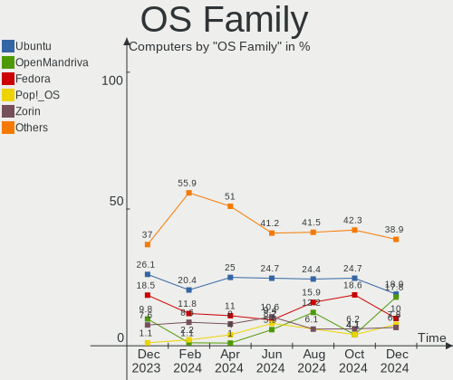
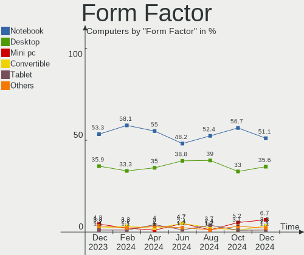
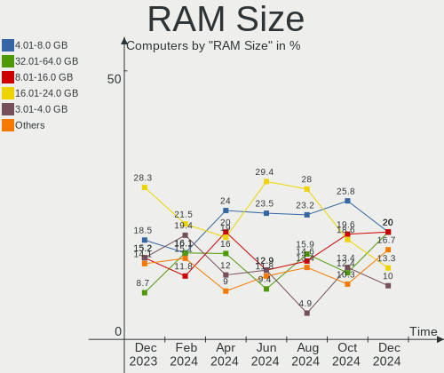
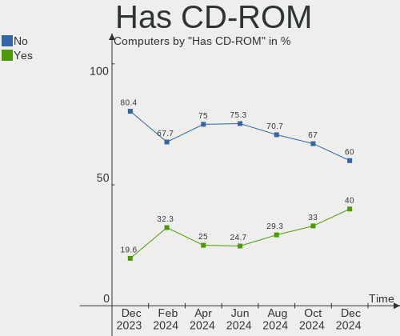
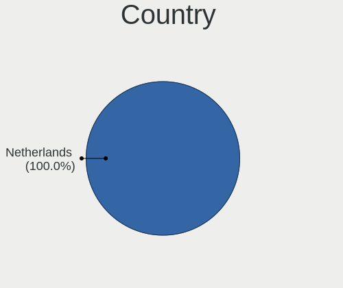
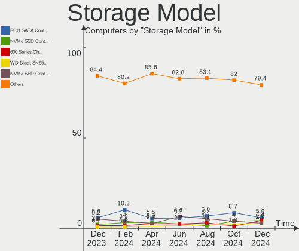
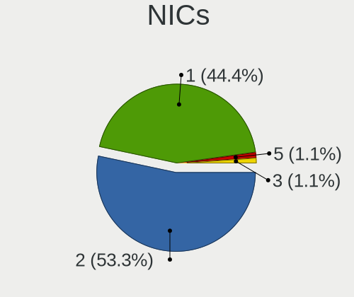

Linux in Netherlands - Hardware Trends
--------------------------------------

A project to identify most popular hardware characteristics and track their change
over time based on data collected by Linux users at https://Linux-Hardware.org.

Anyone can contribute to this report by the [hw-probe](https://github.com/linuxhw/hw-probe) tool:

    sudo -E hw-probe -all -upload

This is a report for all computer types. See also reports for [desktops](/Location/Netherlands/Desktop/README.md) and [notebooks](/Location/Netherlands/Notebook/README.md).

Period: Jan, 2023.

Contents
--------

* [ System ](#system)
  - [ OS                       ](#os)
  - [ OS Family                ](#os-family)
  - [ Kernel                   ](#kernel)
  - [ Kernel Family            ](#kernel-family)
  - [ Kernel Major Ver.        ](#kernel-major-ver)
  - [ Arch                     ](#arch)
  - [ DE                       ](#de)
  - [ Display Server           ](#display-server)
  - [ Display Manager          ](#display-manager)
  - [ OS Lang                  ](#os-lang)
  - [ Boot Mode                ](#boot-mode)
  - [ Filesystem               ](#filesystem)
  - [ Part. scheme             ](#part-scheme)
  - [ Dual Boot with Linux/BSD ](#dual-boot-with-linuxbsd)
  - [ Dual Boot (Win)          ](#dual-boot-win)

* [ Board ](#board)
  - [ Vendor                   ](#vendor)
  - [ Model                    ](#model)
  - [ Model Family             ](#model-family)
  - [ MFG Year                 ](#mfg-year)
  - [ Form Factor              ](#form-factor)
  - [ Secure Boot              ](#secure-boot)
  - [ Coreboot                 ](#coreboot)
  - [ RAM Size                 ](#ram-size)
  - [ RAM Used                 ](#ram-used)
  - [ Total Drives             ](#total-drives)
  - [ Has CD-ROM               ](#has-cd-rom)
  - [ Has Ethernet             ](#has-ethernet)
  - [ Has WiFi                 ](#has-wifi)
  - [ Has Bluetooth            ](#has-bluetooth)

* [ Location ](#location)
  - [ Country                  ](#country)
  - [ City                     ](#city)

* [ Drives ](#drives)
  - [ Drive Vendor             ](#drive-vendor)
  - [ Drive Model              ](#drive-model)
  - [ HDD Vendor               ](#hdd-vendor)
  - [ SSD Vendor               ](#ssd-vendor)
  - [ Drive Kind               ](#drive-kind)
  - [ Drive Connector          ](#drive-connector)
  - [ Drive Size               ](#drive-size)
  - [ Space Total              ](#space-total)
  - [ Space Used               ](#space-used)
  - [ Malfunc. Drives          ](#malfunc-drives)
  - [ Malfunc. Drive Vendor    ](#malfunc-drive-vendor)
  - [ Malfunc. HDD Vendor      ](#malfunc-hdd-vendor)
  - [ Malfunc. Drive Kind      ](#malfunc-drive-kind)
  - [ Failed Drives            ](#failed-drives)
  - [ Failed Drive Vendor      ](#failed-drive-vendor)
  - [ Drive Status             ](#drive-status)

* [ Storage controller ](#storage-controller)
  - [ Storage Vendor           ](#storage-vendor)
  - [ Storage Model            ](#storage-model)
  - [ Storage Kind             ](#storage-kind)

* [ Processor ](#processor)
  - [ CPU Vendor               ](#cpu-vendor)
  - [ CPU Model                ](#cpu-model)
  - [ CPU Model Family         ](#cpu-model-family)
  - [ CPU Cores                ](#cpu-cores)
  - [ CPU Sockets              ](#cpu-sockets)
  - [ CPU Threads              ](#cpu-threads)
  - [ CPU Op-Modes             ](#cpu-op-modes)
  - [ CPU Microcode            ](#cpu-microcode)
  - [ CPU Microarch            ](#cpu-microarch)

* [ Graphics ](#graphics)
  - [ GPU Vendor               ](#gpu-vendor)
  - [ GPU Model                ](#gpu-model)
  - [ GPU Combo                ](#gpu-combo)
  - [ GPU Driver               ](#gpu-driver)
  - [ GPU Memory               ](#gpu-memory)

* [ Monitor ](#monitor)
  - [ Monitor Vendor           ](#monitor-vendor)
  - [ Monitor Model            ](#monitor-model)
  - [ Monitor Resolution       ](#monitor-resolution)
  - [ Monitor Diagonal         ](#monitor-diagonal)
  - [ Monitor Width            ](#monitor-width)
  - [ Aspect Ratio             ](#aspect-ratio)
  - [ Monitor Area             ](#monitor-area)
  - [ Pixel Density            ](#pixel-density)
  - [ Multiple Monitors        ](#multiple-monitors)

* [ Network ](#network)
  - [ Net Controller Vendor    ](#net-controller-vendor)
  - [ Net Controller Model     ](#net-controller-model)
  - [ Wireless Vendor          ](#wireless-vendor)
  - [ Wireless Model           ](#wireless-model)
  - [ Ethernet Vendor          ](#ethernet-vendor)
  - [ Ethernet Model           ](#ethernet-model)
  - [ Net Controller Kind      ](#net-controller-kind)
  - [ Used Controller          ](#used-controller)
  - [ NICs                     ](#nics)
  - [ IPv6                     ](#ipv6)

* [ Bluetooth ](#bluetooth)
  - [ Bluetooth Vendor         ](#bluetooth-vendor)
  - [ Bluetooth Model          ](#bluetooth-model)

* [ Sound ](#sound)
  - [ Sound Vendor             ](#sound-vendor)
  - [ Sound Model              ](#sound-model)

* [ Memory ](#memory)
  - [ Memory Vendor            ](#memory-vendor)
  - [ Memory Model             ](#memory-model)
  - [ Memory Kind              ](#memory-kind)
  - [ Memory Form Factor       ](#memory-form-factor)
  - [ Memory Size              ](#memory-size)
  - [ Memory Speed             ](#memory-speed)

* [ Printers & scanners ](#printers--scanners)
  - [ Printer Vendor           ](#printer-vendor)
  - [ Printer Model            ](#printer-model)
  - [ Scanner Vendor           ](#scanner-vendor)
  - [ Scanner Model            ](#scanner-model)

* [ Camera ](#camera)
  - [ Camera Vendor            ](#camera-vendor)
  - [ Camera Model             ](#camera-model)

* [ Security ](#security)
  - [ Fingerprint Vendor       ](#fingerprint-vendor)
  - [ Fingerprint Model        ](#fingerprint-model)
  - [ Chipcard Vendor          ](#chipcard-vendor)
  - [ Chipcard Model           ](#chipcard-model)

* [ Unsupported ](#unsupported)
  - [ Unsupported Devices      ](#unsupported-devices)
  - [ Unsupported Device Types ](#unsupported-device-types)

System
------

OS
--

Installed operating systems

| Name                         | Computers | Percent |
|------------------------------|-----------|---------|
| Ubuntu 22.04                 | 29        | 18.71%  |
| OpenMandriva 23.01           | 22        | 14.19%  |
| Linux Mint 21.1              | 9         | 5.81%   |
| Fedora 37                    | 9         | 5.81%   |
| Debian 11                    | 8         | 5.16%   |
| Zorin 16                     | 6         | 3.87%   |
| Ubuntu 22.10                 | 6         | 3.87%   |
| Ubuntu 20.04                 | 6         | 3.87%   |
| Manjaro                      | 6         | 3.87%   |
| Linux Mint 20.3              | 5         | 3.23%   |
| Pop!_OS 22.04                | 4         | 2.58%   |
| KDE neon 22.04               | 4         | 2.58%   |
| ArcoLinux Rolling            | 4         | 2.58%   |
| OpenMandriva 4.3             | 3         | 1.94%   |
| Arch Rolling                 | 3         | 1.94%   |
| Xubuntu 22.04                | 2         | 1.29%   |
| SteamOS 3.4.4                | 2         | 1.29%   |
| Kubuntu 22.04                | 2         | 1.29%   |
| Debian                       | 2         | 1.29%   |
| Zorin 15                     | 1         | 0.65%   |
| Xubuntu 22.10                | 1         | 0.65%   |
| Xubuntu 18.04                | 1         | 0.65%   |
| Ubuntu Studio 22.10          | 1         | 0.65%   |
| Ubuntu 18.04                 | 1         | 0.65%   |
| Oracle Linux 9.1             | 1         | 0.65%   |
| openSUSE Tumbleweed-XXXXXXXX | 1         | 0.65%   |
| openSUSE Leap-15.4           | 1         | 0.65%   |
| OpenMandriva 4.50            | 1         | 0.65%   |
| Nobara 37                    | 1         | 0.65%   |
| MX 21                        | 1         | 0.65%   |
| Lubuntu 20.04                | 1         | 0.65%   |
| LMDE 5                       | 1         | 0.65%   |
| Linux Mint 21                | 1         | 0.65%   |
| Lilidog 22                   | 1         | 0.65%   |
| Kubuntu 22.10                | 1         | 0.65%   |
| Kubuntu 20.04                | 1         | 0.65%   |
| Kali 2022.4                  | 1         | 0.65%   |
| Gentoo 2.9                   | 1         | 0.65%   |
| Garuda Linux Rolling         | 1         | 0.65%   |
| EndeavourOS Rolling          | 1         | 0.65%   |

OS Family
---------

OS without a version

| Name          | Computers | Percent |
|---------------|-----------|---------|
| Ubuntu        | 42        | 27.1%   |
| OpenMandriva  | 26        | 16.77%  |
| Linux Mint    | 15        | 9.68%   |
| Debian        | 10        | 6.45%   |
| Fedora        | 9         | 5.81%   |
| Zorin         | 7         | 4.52%   |
| Manjaro       | 6         | 3.87%   |
| Xubuntu       | 4         | 2.58%   |
| Pop!_OS       | 4         | 2.58%   |
| Kubuntu       | 4         | 2.58%   |
| KDE neon      | 4         | 2.58%   |
| ArcoLinux     | 4         | 2.58%   |
| Arch          | 3         | 1.94%   |
| SteamOS       | 2         | 1.29%   |
| openSUSE      | 2         | 1.29%   |
| Ubuntu Studio | 1         | 0.65%   |
| Oracle Linux  | 1         | 0.65%   |
| Nobara        | 1         | 0.65%   |
| MX            | 1         | 0.65%   |
| Lubuntu       | 1         | 0.65%   |
| LMDE          | 1         | 0.65%   |
| Lilidog       | 1         | 0.65%   |
| Kali          | 1         | 0.65%   |
| Gentoo        | 1         | 0.65%   |
| Garuda Linux  | 1         | 0.65%   |
| EndeavourOS   | 1         | 0.65%   |
| Elementary    | 1         | 0.65%   |
| Clover        | 1         | 0.65%   |

Kernel
------

Version of the Linux kernel

| Version                      | Computers | Percent |
|------------------------------|-----------|---------|
| 5.15.0-58-generic            | 27        | 17.42%  |
| 6.1.1-desktop-1omv2290       | 20        | 12.9%   |
| 5.15.0-56-generic            | 13        | 8.39%   |
| 5.15.0-57-generic            | 12        | 7.74%   |
| 5.10.0-20-amd64              | 6         | 3.87%   |
| 5.4.0-137-generic            | 5         | 3.23%   |
| 6.1.6-200.fc37.x86_64        | 4         | 2.58%   |
| 6.0.12-76060006-generic      | 4         | 2.58%   |
| 5.19.0-29-generic            | 4         | 2.58%   |
| 5.19.0-28-generic            | 3         | 1.94%   |
| 5.16.7-desktop-1omv4003      | 3         | 1.94%   |
| 5.15.85-1-MANJARO            | 3         | 1.94%   |
| 6.1.7-200.fc37.x86_64        | 2         | 1.29%   |
| 6.1.4-desktop-1omv2301       | 2         | 1.29%   |
| 6.1.1-1-MANJARO              | 2         | 1.29%   |
| 5.4.0-136-generic            | 2         | 1.29%   |
| 5.19.0-1015-lowlatency       | 2         | 1.29%   |
| 5.15.0-57-lowlatency         | 2         | 1.29%   |
| 5.15.0-43-generic            | 2         | 1.29%   |
| 5.13.0-valve36-1-neptune     | 2         | 1.29%   |
| 6.1.8-200.fc37.x86_64        | 1         | 0.65%   |
| 6.1.6-arch1-3                | 1         | 0.65%   |
| 6.1.6-arch1-1                | 1         | 0.65%   |
| 6.1.6-1-default              | 1         | 0.65%   |
| 6.1.4-zen2-1-zen             | 1         | 0.65%   |
| 6.1.4-arch1-1                | 1         | 0.65%   |
| 6.1.3-x64v1-xanmod1-1        | 1         | 0.65%   |
| 6.1.2-arch1-1                | 1         | 0.65%   |
| 6.1.1-zen1-1-zen             | 1         | 0.65%   |
| 6.1.1-arch1-1                | 1         | 0.65%   |
| 6.1.0-2-amd64                | 1         | 0.65%   |
| 6.0.2-desktop-1omv4050       | 1         | 0.65%   |
| 6.0.17-300.fc37.x86_64       | 1         | 0.65%   |
| 6.0.16-301.fsync.fc37.x86_64 | 1         | 0.65%   |
| 6.0.15-300.fc37.x86_64       | 1         | 0.65%   |
| 6.0.0-kali3-amd64            | 1         | 0.65%   |
| 6.0.0-0.deb11.6-amd64        | 1         | 0.65%   |
| 6.0.0-0.deb11.2-amd64        | 1         | 0.65%   |
| 5.8.0-55-generic             | 1         | 0.65%   |
| 5.4.217-0504217-generic      | 1         | 0.65%   |

Kernel Family
-------------

Linux kernel without a distro release

| Version | Computers | Percent |
|---------|-----------|---------|
| 5.15.0  | 58        | 37.42%  |
| 6.1.1   | 24        | 15.48%  |
| 5.4.0   | 9         | 5.81%   |
| 5.19.0  | 9         | 5.81%   |
| 5.10.0  | 9         | 5.81%   |
| 6.1.6   | 7         | 4.52%   |
| 6.1.4   | 4         | 2.58%   |
| 6.0.12  | 4         | 2.58%   |
| 5.15.85 | 4         | 2.58%   |
| 6.0.0   | 3         | 1.94%   |
| 5.16.7  | 3         | 1.94%   |
| 6.1.7   | 2         | 1.29%   |
| 5.14.0  | 2         | 1.29%   |
| 5.13.0  | 2         | 1.29%   |
| 6.1.8   | 1         | 0.65%   |
| 6.1.3   | 1         | 0.65%   |
| 6.1.2   | 1         | 0.65%   |
| 6.1.0   | 1         | 0.65%   |
| 6.0.2   | 1         | 0.65%   |
| 6.0.17  | 1         | 0.65%   |
| 6.0.16  | 1         | 0.65%   |
| 6.0.15  | 1         | 0.65%   |
| 5.8.0   | 1         | 0.65%   |
| 5.4.217 | 1         | 0.65%   |
| 5.15.89 | 1         | 0.65%   |
| 5.15.88 | 1         | 0.65%   |
| 5.15.84 | 1         | 0.65%   |
| 5.15.75 | 1         | 0.65%   |
| 5.14.21 | 1         | 0.65%   |

Kernel Major Ver.
-----------------

Linux kernel major version

| Version | Computers | Percent |
|---------|-----------|---------|
| 5.15    | 66        | 42.58%  |
| 6.1     | 41        | 26.45%  |
| 6.0     | 11        | 7.1%    |
| 5.4     | 10        | 6.45%   |
| 5.19    | 9         | 5.81%   |
| 5.10    | 9         | 5.81%   |
| 5.16    | 3         | 1.94%   |
| 5.14    | 3         | 1.94%   |
| 5.13    | 2         | 1.29%   |
| 5.8     | 1         | 0.65%   |

Arch
----

OS architecture (x86_64, i586, etc.)

| Name    | Computers | Percent |
|---------|-----------|---------|
| x86_64  | 152       | 98.06%  |
| i686    | 2         | 1.29%   |
| aarch64 | 1         | 0.65%   |

DE
--

Desktop Environment

| Name             | Computers | Percent |
|------------------|-----------|---------|
| GNOME            | 71        | 45.81%  |
| KDE5             | 45        | 29.03%  |
| X-Cinnamon       | 14        | 9.03%   |
| XFCE             | 10        | 6.45%   |
| MATE             | 3         | 1.94%   |
| lightdm-xsession | 2         | 1.29%   |
| Cinnamon         | 2         | 1.29%   |
| Unknown          | 2         | 1.29%   |
| qtile            | 1         | 0.65%   |
| Pantheon         | 1         | 0.65%   |
| LXQt             | 1         | 0.65%   |
| LeftWM           | 1         | 0.65%   |
| herbstluftwm     | 1         | 0.65%   |
| Enlightenment    | 1         | 0.65%   |

Display Server
--------------

X11 or Wayland

| Name    | Computers | Percent |
|---------|-----------|---------|
| X11     | 103       | 66.45%  |
| Wayland | 48        | 30.97%  |
| Tty     | 3         | 1.94%   |
| Unknown | 1         | 0.65%   |

Display Manager
---------------

SDDM, LightDM, etc.

| Name    | Computers | Percent |
|---------|-----------|---------|
| Unknown | 49        | 31.61%  |
| GDM3    | 39        | 25.16%  |
| SDDM    | 37        | 23.87%  |
| LightDM | 16        | 10.32%  |
| GDM     | 14        | 9.03%   |

OS Lang
-------

Language

| Lang    | Computers | Percent |
|---------|-----------|---------|
| en_US   | 79        | 50.97%  |
| nl_NL   | 55        | 35.48%  |
| en_GB   | 5         | 3.23%   |
| pl_PL   | 4         | 2.58%   |
| ru_RU   | 2         | 1.29%   |
| en_IE   | 2         | 1.29%   |
| C       | 2         | 1.29%   |
| zh_CN   | 1         | 0.65%   |
| sk_SK   | 1         | 0.65%   |
| nl_AW   | 1         | 0.65%   |
| fr_FR   | 1         | 0.65%   |
| de_DE   | 1         | 0.65%   |
| Unknown | 1         | 0.65%   |

Boot Mode
---------

EFI or BIOS

| Mode | Computers | Percent |
|------|-----------|---------|
| EFI  | 81        | 52.26%  |
| BIOS | 74        | 47.74%  |

Filesystem
----------

Type of filesystem

| Type    | Computers | Percent |
|---------|-----------|---------|
| Ext4    | 115       | 74.19%  |
| Overlay | 20        | 12.9%   |
| Btrfs   | 18        | 11.61%  |
| Zfs     | 1         | 0.65%   |
| Xfs     | 1         | 0.65%   |

Part. scheme
------------

Scheme of partitioning

| Type    | Computers | Percent |
|---------|-----------|---------|
| GPT     | 83        | 53.55%  |
| Unknown | 48        | 30.97%  |
| MBR     | 24        | 15.48%  |

Dual Boot with Linux/BSD
------------------------

Hosting more than one Linux/BSD

| Dual boot | Computers | Percent |
|-----------|-----------|---------|
| No        | 123       | 79.35%  |
| Yes       | 32        | 20.65%  |

Dual Boot (Win)
---------------

Hosting Linux and Windows

| Dual boot | Computers | Percent |
|-----------|-----------|---------|
| No        | 109       | 70.32%  |
| Yes       | 46        | 29.68%  |

Board
-----

Vendor
------

Motherboard manufacturer

| Name                    | Computers | Percent |
|-------------------------|-----------|---------|
| Hewlett-Packard         | 30        | 19.35%  |
| Lenovo                  | 22        | 14.19%  |
| ASUSTek Computer        | 20        | 12.9%   |
| Dell                    | 15        | 9.68%   |
| Acer                    | 13        | 8.39%   |
| MSI                     | 11        | 7.1%    |
| Gigabyte Technology     | 8         | 5.16%   |
| Apple                   | 8         | 5.16%   |
| ASRock                  | 7         | 4.52%   |
| Unknown                 | 3         | 1.94%   |
| Valve                   | 2         | 1.29%   |
| Standard                | 2         | 1.29%   |
| Sony                    | 2         | 1.29%   |
| Medion                  | 2         | 1.29%   |
| Toshiba                 | 1         | 0.65%   |
| Supermicro              | 1         | 0.65%   |
| realme                  | 1         | 0.65%   |
| Raspberry Pi Foundation | 1         | 0.65%   |
| Pegatron                | 1         | 0.65%   |
| Notebook                | 1         | 0.65%   |
| Intel                   | 1         | 0.65%   |
| Hardkernel              | 1         | 0.65%   |
| Google                  | 1         | 0.65%   |
| BESSTAR Tech            | 1         | 0.65%   |

Model
-----

Motherboard model

| Name                                     | Computers | Percent |
|------------------------------------------|-----------|---------|
| Unknown                                  | 4         | 2.58%   |
| Valve Jupiter                            | 2         | 1.29%   |
| MSI MS-7C51                              | 2         | 1.29%   |
| Lenovo Yoga Slim 7 13ACN5 82CY           | 2         | 1.29%   |
| HP Pavilion Laptop 15-eh2xxx             | 2         | 1.29%   |
| Apple MacBookAir7,2                      | 2         | 1.29%   |
| Acer Aspire E5-774                       | 2         | 1.29%   |
| Toshiba Satellite C870-12F               | 1         | 0.65%   |
| Supermicro A1SA2-2750F                   | 1         | 0.65%   |
| Standard X50-V2                          | 1         | 0.65%   |
| Sony VPCEB3L9E                           | 1         | 0.65%   |
| Sony VPCEB3L1E                           | 1         | 0.65%   |
| realme CloudProXXXX                      | 1         | 0.65%   |
| RPi Raspberry Pi 4 Model B Rev 1.5       | 1         | 0.65%   |
| Pegatron VN303AA-ABH s5220nl             | 1         | 0.65%   |
| Notebook NS50MU                          | 1         | 0.65%   |
| MSI MS-7D77                              | 1         | 0.65%   |
| MSI MS-7D36                              | 1         | 0.65%   |
| MSI MS-7D30                              | 1         | 0.65%   |
| MSI MS-7C37                              | 1         | 0.65%   |
| MSI MS-7B86                              | 1         | 0.65%   |
| MSI MS-7918                              | 1         | 0.65%   |
| MSI MS-7721                              | 1         | 0.65%   |
| MSI GE70 2QD                             | 1         | 0.65%   |
| MSI CX700ND/CX70 0NF/CX70 0NE            | 1         | 0.65%   |
| Medion E4251 MD61435                     | 1         | 0.65%   |
| Medion E4251                             | 1         | 0.65%   |
| Lenovo Yoga 710-14IKB 80V4               | 1         | 0.65%   |
| Lenovo ThinkPad X270 20K5S1A524          | 1         | 0.65%   |
| Lenovo ThinkPad T490s 20NX0076MH         | 1         | 0.65%   |
| Lenovo ThinkPad T490 20N3S0E000          | 1         | 0.65%   |
| Lenovo ThinkPad T440 20B7S0JC0P          | 1         | 0.65%   |
| Lenovo ThinkPad T14 Gen 2a 20XK002SMH    | 1         | 0.65%   |
| Lenovo ThinkPad Edge E540 20C600JHMH     | 1         | 0.65%   |
| Lenovo ThinkPad Edge E145 20BC000        | 1         | 0.65%   |
| Lenovo ThinkPad E560 20EVCTO1WW          | 1         | 0.65%   |
| Lenovo ThinkCentre M70q Gen 2 11MY0038MH | 1         | 0.65%   |
| Lenovo ThinkCentre M58 7373A5G           | 1         | 0.65%   |
| Lenovo Legion T7 34IMZ5 90Q800AJMH       | 1         | 0.65%   |
| Lenovo IdeaPadFlex 5 14ALC05 82HU        | 1         | 0.65%   |

Model Family
------------

Motherboard model prefix

| Name                   | Computers | Percent |
|------------------------|-----------|---------|
| Acer Aspire            | 10        | 6.45%   |
| HP Pavilion            | 9         | 5.81%   |
| Lenovo ThinkPad        | 8         | 5.16%   |
| Dell Latitude          | 7         | 4.52%   |
| ASUS ROG               | 6         | 3.87%   |
| Dell XPS               | 5         | 3.23%   |
| Lenovo IdeaPad         | 4         | 2.58%   |
| HP ZBook               | 4         | 2.58%   |
| Unknown                | 4         | 2.58%   |
| Lenovo Yoga            | 3         | 1.94%   |
| HP ProBook             | 3         | 1.94%   |
| HP EliteBook           | 3         | 1.94%   |
| HP Compaq              | 3         | 1.94%   |
| ASUS PRIME             | 3         | 1.94%   |
| Valve Jupiter          | 2         | 1.29%   |
| MSI MS-7C51            | 2         | 1.29%   |
| Medion E4251           | 2         | 1.29%   |
| Lenovo ThinkCentre     | 2         | 1.29%   |
| ASRock H87             | 2         | 1.29%   |
| Apple MacBookAir7      | 2         | 1.29%   |
| Toshiba Satellite      | 1         | 0.65%   |
| Supermicro A1SA2-2750F | 1         | 0.65%   |
| Standard X50-V2        | 1         | 0.65%   |
| Sony VPCEB3L9E         | 1         | 0.65%   |
| Sony VPCEB3L1E         | 1         | 0.65%   |
| realme CloudProXXXX    | 1         | 0.65%   |
| RPi Raspberry          | 1         | 0.65%   |
| Pegatron VN303AA-ABH   | 1         | 0.65%   |
| Notebook NS50MU        | 1         | 0.65%   |
| MSI MS-7D77            | 1         | 0.65%   |
| MSI MS-7D36            | 1         | 0.65%   |
| MSI MS-7D30            | 1         | 0.65%   |
| MSI MS-7C37            | 1         | 0.65%   |
| MSI MS-7B86            | 1         | 0.65%   |
| MSI MS-7918            | 1         | 0.65%   |
| MSI MS-7721            | 1         | 0.65%   |
| MSI GE70               | 1         | 0.65%   |
| MSI CX700ND            | 1         | 0.65%   |
| Lenovo Legion          | 1         | 0.65%   |
| Lenovo IdeaPadFlex     | 1         | 0.65%   |

MFG Year
--------

Motherboard manufacture year

| Year    | Computers | Percent |
|---------|-----------|---------|
| 2021    | 19        | 12.26%  |
| 2022    | 15        | 9.68%   |
| 2020    | 14        | 9.03%   |
| 2015    | 13        | 8.39%   |
| 2019    | 12        | 7.74%   |
| 2012    | 12        | 7.74%   |
| 2018    | 10        | 6.45%   |
| 2013    | 10        | 6.45%   |
| 2017    | 8         | 5.16%   |
| 2016    | 8         | 5.16%   |
| 2009    | 7         | 4.52%   |
| 2011    | 6         | 3.87%   |
| 2014    | 5         | 3.23%   |
| 2010    | 5         | 3.23%   |
| 2008    | 4         | 2.58%   |
| 2007    | 3         | 1.94%   |
| 2006    | 3         | 1.94%   |
| Unknown | 1         | 0.65%   |

Form Factor
-----------

Physical design of the computer

| Name           | Computers | Percent |
|----------------|-----------|---------|
| Notebook       | 82        | 52.9%   |
| Desktop        | 58        | 37.42%  |
| Convertible    | 5         | 3.23%   |
| Mini pc        | 5         | 3.23%   |
| All in one     | 2         | 1.29%   |
| Server         | 2         | 1.29%   |
| System on chip | 1         | 0.65%   |

Secure Boot
-----------

Enabled or disabled

| State    | Computers | Percent |
|----------|-----------|---------|
| Disabled | 142       | 91.61%  |
| Enabled  | 13        | 8.39%   |

Coreboot
--------

Have coreboot on board

| Used | Computers | Percent |
|------|-----------|---------|
| No   | 154       | 99.35%  |
| Yes  | 1         | 0.65%   |

RAM Size
--------

Total RAM memory

| Size in GB      | Computers | Percent |
|-----------------|-----------|---------|
| 4.01-8.0        | 38        | 24.52%  |
| 16.01-24.0      | 36        | 23.23%  |
| 8.01-16.0       | 29        | 18.71%  |
| 32.01-64.0      | 23        | 14.84%  |
| 3.01-4.0        | 17        | 10.97%  |
| 1.01-2.0        | 4         | 2.58%   |
| 2.01-3.0        | 3         | 1.94%   |
| 24.01-32.0      | 2         | 1.29%   |
| 64.01-256.0     | 2         | 1.29%   |
| More than 256.0 | 1         | 0.65%   |

RAM Used
--------

Used RAM memory

| Used GB   | Computers | Percent |
|-----------|-----------|---------|
| 1.01-2.0  | 54        | 34.84%  |
| 2.01-3.0  | 34        | 21.94%  |
| 4.01-8.0  | 31        | 20%     |
| 3.01-4.0  | 21        | 13.55%  |
| 8.01-16.0 | 7         | 4.52%   |
| 0.51-1.0  | 7         | 4.52%   |
| 0.01-0.5  | 1         | 0.65%   |

Total Drives
------------

Number of drives on board

| Drives | Computers | Percent |
|--------|-----------|---------|
| 1      | 85        | 54.84%  |
| 2      | 40        | 25.81%  |
| 3      | 16        | 10.32%  |
| 4      | 7         | 4.52%   |
| 5      | 3         | 1.94%   |
| 6      | 2         | 1.29%   |
| 7      | 1         | 0.65%   |
| 0      | 1         | 0.65%   |

Has CD-ROM
----------

Has CD-ROM on board

| Presented | Computers | Percent |
|-----------|-----------|---------|
| No        | 105       | 67.74%  |
| Yes       | 50        | 32.26%  |

Has Ethernet
------------

Has Ethernet on board

| Presented | Computers | Percent |
|-----------|-----------|---------|
| Yes       | 135       | 87.1%   |
| No        | 20        | 12.9%   |

Has WiFi
--------

Has WiFi module

| Presented | Computers | Percent |
|-----------|-----------|---------|
| Yes       | 118       | 76.13%  |
| No        | 37        | 23.87%  |

Has Bluetooth
-------------

Has Bluetooth module

| Presented | Computers | Percent |
|-----------|-----------|---------|
| Yes       | 99        | 63.87%  |
| No        | 56        | 36.13%  |

Location
--------

Country
-------

Geographic location (country)

| Country     | Computers | Percent |
|-------------|-----------|---------|
| Netherlands | 155       | 100%    |

City
----

Geographic location (city)

| City                | Computers | Percent |
|---------------------|-----------|---------|
| Amsterdam           | 28        | 18.06%  |
| The Hague           | 9         | 5.81%   |
| Almere Stad         | 7         | 4.52%   |
| Groningen           | 5         | 3.23%   |
| Rotterdam           | 4         | 2.58%   |
| Naaldwijk           | 4         | 2.58%   |
| Haarlem             | 4         | 2.58%   |
| Eindhoven           | 4         | 2.58%   |
| Leiden              | 3         | 1.94%   |
| Enschede            | 3         | 1.94%   |
| Delft               | 3         | 1.94%   |
| Apeldoorn           | 3         | 1.94%   |
| Waalwijk            | 2         | 1.29%   |
| Utrecht             | 2         | 1.29%   |
| Hoofddorp           | 2         | 1.29%   |
| Heerhugowaard       | 2         | 1.29%   |
| Blaricum            | 2         | 1.29%   |
| Bedum               | 2         | 1.29%   |
| Arnhem              | 2         | 1.29%   |
| Amersfoort          | 2         | 1.29%   |
| Alphen aan den Rijn | 2         | 1.29%   |
| Alkmaar             | 2         | 1.29%   |
| Zwolle              | 1         | 0.65%   |
| Zuidland            | 1         | 0.65%   |
| Zuid-Scharwoude     | 1         | 0.65%   |
| Zeewolde            | 1         | 0.65%   |
| Workum              | 1         | 0.65%   |
| Weteringbrug        | 1         | 0.65%   |
| Voorthuizen         | 1         | 0.65%   |
| Vleuten             | 1         | 0.65%   |
| Uithoorn            | 1         | 0.65%   |
| Tilburg             | 1         | 0.65%   |
| Terneuzen           | 1         | 0.65%   |
| Streefkerk          | 1         | 0.65%   |
| Steenwijk           | 1         | 0.65%   |
| Steenbergen         | 1         | 0.65%   |
| Schoonhoven         | 1         | 0.65%   |
| Schaijk             | 1         | 0.65%   |
| Roosendaal          | 1         | 0.65%   |
| Roermond            | 1         | 0.65%   |

Drives
------

Drive Vendor
------------

Hard drive vendors

| Vendor                      | Computers | Drives | Percent |
|-----------------------------|-----------|--------|---------|
| Samsung Electronics         | 50        | 63     | 21.28%  |
| Seagate                     | 25        | 27     | 10.64%  |
| WDC                         | 24        | 31     | 10.21%  |
| Crucial                     | 16        | 16     | 6.81%   |
| Kingston                    | 15        | 16     | 6.38%   |
| Toshiba                     | 12        | 13     | 5.11%   |
| SK hynix                    | 11        | 11     | 4.68%   |
| Unknown                     | 8         | 9      | 3.4%    |
| SanDisk                     | 8         | 9      | 3.4%    |
| Intel                       | 6         | 6      | 2.55%   |
| Micron Technology           | 5         | 5      | 2.13%   |
| Hitachi                     | 5         | 6      | 2.13%   |
| Apple                       | 4         | 4      | 1.7%    |
| A-DATA Technology           | 4         | 4      | 1.7%    |
| PNY                         | 3         | 3      | 1.28%   |
| Phison Electronics          | 3         | 3      | 1.28%   |
| Micron/Crucial Technology   | 3         | 4      | 1.28%   |
| KIOXIA                      | 3         | 3      | 1.28%   |
| Maxtor                      | 2         | 3      | 0.85%   |
| Kingston Technology Company | 2         | 2      | 0.85%   |
| HGST                        | 2         | 2      | 0.85%   |
| Corsair                     | 2         | 2      | 0.85%   |
| Unknown                     | 2         | 2      | 0.85%   |
| Verbatim                    | 1         | 1      | 0.43%   |
| Transcend                   | 1         | 1      | 0.43%   |
| SSK                         | 1         | 1      | 0.43%   |
| Silicon Motion              | 1         | 1      | 0.43%   |
| Seagate Technology          | 1         | 1      | 0.43%   |
| Phison                      | 1         | 1      | 0.43%   |
| MAXIO Technology (Hangzhou) | 1         | 1      | 0.43%   |
| LITEONIT                    | 1         | 1      | 0.43%   |
| LITEON                      | 1         | 1      | 0.43%   |
| KingFast                    | 1         | 1      | 0.43%   |
| Kingchuxing                 | 1         | 1      | 0.43%   |
| JetFlash                    | 1         | 1      | 0.43%   |
| Intenso                     | 1         | 1      | 0.43%   |
| HGST HTS                    | 1         | 1      | 0.43%   |
| Gigabyte Technology         | 1         | 1      | 0.43%   |
| China                       | 1         | 1      | 0.43%   |
| C-Series                    | 1         | 1      | 0.43%   |

Drive Model
-----------

Hard drive models

| Model                                                | Computers | Percent |
|------------------------------------------------------|-----------|---------|
| Samsung SSD 850 EVO 250GB                            | 6         | 2.31%   |
| Samsung NVMe SSD Controller SM981/PM981/PM983 500GB  | 5         | 1.92%   |
| Samsung NVMe SSD Controller PM9A1/PM9A3/980PRO 512GB | 4         | 1.54%   |
| SK hynix BC501 NVMe Solid State Drive 512GB          | 3         | 1.15%   |
| Samsung SSD 980 1TB                                  | 3         | 1.15%   |
| Samsung SSD 840 EVO 250GB                            | 3         | 1.15%   |
| Kingston SA400S37240G 240GB SSD                      | 3         | 1.15%   |
| Crucial CT1000MX500SSD1 1TB                          | 3         | 1.15%   |
| A-DATA SU630 240GB SSD                               | 3         | 1.15%   |
| Toshiba MQ01ABF050 500GB                             | 2         | 0.77%   |
| Toshiba DT01ACA100 1TB                               | 2         | 0.77%   |
| SK hynix SKHynix_HFS512GDE9X081N 512GB               | 2         | 0.77%   |
| SK hynix SKHynix_HFS512GD9TNI-L2A0B 512GB            | 2         | 0.77%   |
| Seagate ST1000DM010-2EP102 1TB                       | 2         | 0.77%   |
| Samsung SSD 970 EVO Plus 1TB                         | 2         | 0.77%   |
| Samsung SSD 870 QVO 1TB                              | 2         | 0.77%   |
| Samsung SSD 860 EVO 500GB                            | 2         | 0.77%   |
| Samsung SSD 860 EVO 250GB                            | 2         | 0.77%   |
| Samsung SSD 850 EVO 120GB                            | 2         | 0.77%   |
| Samsung SSD 840 EVO 120GB                            | 2         | 0.77%   |
| Samsung PSSD T7 Shield 1TB                           | 2         | 0.77%   |
| Samsung NVMe SSD Controller SM961/PM961/SM963 256GB  | 2         | 0.77%   |
| Phison PS5013 E13 NVMe Controller 256GB              | 2         | 0.77%   |
| Micron/Crucial P2 NVMe PCIe SSD 500GB                | 2         | 0.77%   |
| Kingston Company A2000 NVMe SSD 1TB                  | 2         | 0.77%   |
| Kingston SA2000M81000G 1TB                           | 2         | 0.77%   |
| Intel SSDPEKNU010TZH 1TB                             | 2         | 0.77%   |
| Intel SSD 660P Series 512GB                          | 2         | 0.77%   |
| Crucial M4-CT128M4SSD2 128GB                         | 2         | 0.77%   |
| Crucial CT250MX500SSD1 250GB                         | 2         | 0.77%   |
| Crucial CT240BX500SSD1 240GB                         | 2         | 0.77%   |
| Apple HDD HTS541010A9E662 1TB                        | 2         | 0.77%   |
| Unknown                                              | 2         | 0.77%   |
| WDC WDS500G2B0A-00SM50 500GB SSD                     | 1         | 0.38%   |
| WDC WDS120G2G0A-00JH30 120GB SSD                     | 1         | 0.38%   |
| WDC WD800JD-00HKA0 80GB                              | 1         | 0.38%   |
| WDC WD7500BPVT-24HXZT3 752GB                         | 1         | 0.38%   |
| WDC WD7500BPVT-22HXZT3 752GB                         | 1         | 0.38%   |
| WDC WD5000LPVX-28V0TT0 500GB                         | 1         | 0.38%   |
| WDC WD5000LPLX-21ZNTT0 500GB                         | 1         | 0.38%   |

HDD Vendor
----------

Hard disk drive vendors

| Vendor              | Computers | Drives | Percent |
|---------------------|-----------|--------|---------|
| Seagate             | 25        | 27     | 34.25%  |
| WDC                 | 22        | 26     | 30.14%  |
| Toshiba             | 8         | 8      | 10.96%  |
| Samsung Electronics | 5         | 5      | 6.85%   |
| Hitachi             | 5         | 6      | 6.85%   |
| Maxtor              | 2         | 3      | 2.74%   |
| HGST                | 2         | 2      | 2.74%   |
| Apple               | 2         | 2      | 2.74%   |
| Unknown             | 1         | 1      | 1.37%   |
| HGST HTS            | 1         | 1      | 1.37%   |

SSD Vendor
----------

Solid state drive vendors

| Vendor              | Computers | Drives | Percent |
|---------------------|-----------|--------|---------|
| Samsung Electronics | 28        | 31     | 33.33%  |
| Crucial             | 15        | 15     | 17.86%  |
| Kingston            | 11        | 11     | 13.1%   |
| SanDisk             | 3         | 3      | 3.57%   |
| PNY                 | 3         | 3      | 3.57%   |
| A-DATA Technology   | 3         | 3      | 3.57%   |
| WDC                 | 2         | 2      | 2.38%   |
| SK hynix            | 2         | 2      | 2.38%   |
| Micron Technology   | 2         | 2      | 2.38%   |
| Apple               | 2         | 2      | 2.38%   |
| Transcend           | 1         | 1      | 1.19%   |
| Toshiba             | 1         | 1      | 1.19%   |
| Phison              | 1         | 1      | 1.19%   |
| LITEONIT            | 1         | 1      | 1.19%   |
| LITEON              | 1         | 1      | 1.19%   |
| KingFast            | 1         | 1      | 1.19%   |
| Intenso             | 1         | 1      | 1.19%   |
| Corsair             | 1         | 1      | 1.19%   |
| China               | 1         | 1      | 1.19%   |
| C-Series            | 1         | 1      | 1.19%   |
| Apacer              | 1         | 1      | 1.19%   |
| 2.5"                | 1         | 1      | 1.19%   |
| Unknown             | 1         | 1      | 1.19%   |

Drive Kind
----------

HDD or SSD

| Kind    | Computers | Drives | Percent |
|---------|-----------|--------|---------|
| SSD     | 75        | 87     | 34.88%  |
| NVMe    | 70        | 84     | 32.56%  |
| HDD     | 59        | 81     | 27.44%  |
| MMC     | 6         | 7      | 2.79%   |
| Unknown | 5         | 5      | 2.33%   |

Drive Connector
---------------

SATA, SAS, NVMe, etc.

| Type | Computers | Drives | Percent |
|------|-----------|--------|---------|
| SATA | 104       | 163    | 55.03%  |
| NVMe | 70        | 84     | 37.04%  |
| SAS  | 9         | 10     | 4.76%   |
| MMC  | 6         | 7      | 3.17%   |

Drive Size
----------

Size of hard drive

| Size in TB | Computers | Drives | Percent |
|------------|-----------|--------|---------|
| 0.01-0.5   | 81        | 116    | 61.83%  |
| 0.51-1.0   | 38        | 39     | 29.01%  |
| 1.01-2.0   | 7         | 7      | 5.34%   |
| 3.01-4.0   | 3         | 4      | 2.29%   |
| 2.01-3.0   | 1         | 1      | 0.76%   |
| 4.01-10.0  | 1         | 1      | 0.76%   |

Space Total
-----------

Amount of disk space available on the file system

| Size in GB     | Computers | Percent |
|----------------|-----------|---------|
| 101-250        | 34        | 21.94%  |
| 251-500        | 32        | 20.65%  |
| 501-1000       | 29        | 18.71%  |
| 1-20           | 18        | 11.61%  |
| 1001-2000      | 14        | 9.03%   |
| 51-100         | 10        | 6.45%   |
| 21-50          | 7         | 4.52%   |
| Unknown        | 5         | 3.23%   |
| 2001-3000      | 4         | 2.58%   |
| More than 3000 | 2         | 1.29%   |

Space Used
----------

Amount of used disk space

| Used GB   | Computers | Percent |
|-----------|-----------|---------|
| 1-20      | 60        | 38.71%  |
| 21-50     | 26        | 16.77%  |
| 101-250   | 21        | 13.55%  |
| 51-100    | 19        | 12.26%  |
| 501-1000  | 14        | 9.03%   |
| 251-500   | 6         | 3.87%   |
| Unknown   | 5         | 3.23%   |
| 1001-2000 | 4         | 2.58%   |

Malfunc. Drives
---------------

Drive models with a malfunction

| Model                                | Computers | Drives | Percent |
|--------------------------------------|-----------|--------|---------|
| WDC WD800JD-00HKA0 80GB              | 1         | 1      | 6.25%   |
| WDC WD5000AACS-00G8B1 500GB          | 1         | 1      | 6.25%   |
| WDC WD15EARS-00S8B1 1TB              | 1         | 1      | 6.25%   |
| Toshiba THNSNK128GCS8 SATA 128GB SSD | 1         | 1      | 6.25%   |
| Toshiba MQ01ABF050 500GB             | 1         | 1      | 6.25%   |
| Seagate ST3400620AS 400GB            | 1         | 1      | 6.25%   |
| Seagate ST2000DM001-1CH164 2TB       | 1         | 1      | 6.25%   |
| Samsung Electronics HD103UJ 1TB      | 1         | 1      | 6.25%   |
| Kingston SUV400S37480G 480GB SSD     | 1         | 1      | 6.25%   |
| Kingston SUV400S37240G 240GB SSD     | 1         | 1      | 6.25%   |
| Kingston SA400S37120G 120GB SSD      | 1         | 1      | 6.25%   |
| Intel SSD 600P Series 256GB          | 1         | 1      | 6.25%   |
| Crucial CT500MX500SSD1 500GB         | 1         | 1      | 6.25%   |
| Crucial CT275MX300SSD1 275GB         | 1         | 1      | 6.25%   |
| Corsair CSSD-F60GB2 64GB             | 1         | 1      | 6.25%   |
| C-Series 128G SSD SATA 2             | 1         | 1      | 6.25%   |

Malfunc. Drive Vendor
---------------------

Vendors of faulty drives

| Vendor              | Computers | Drives | Percent |
|---------------------|-----------|--------|---------|
| WDC                 | 3         | 3      | 18.75%  |
| Kingston            | 3         | 3      | 18.75%  |
| Toshiba             | 2         | 2      | 12.5%   |
| Seagate             | 2         | 2      | 12.5%   |
| Crucial             | 2         | 2      | 12.5%   |
| Samsung Electronics | 1         | 1      | 6.25%   |
| Intel               | 1         | 1      | 6.25%   |
| Corsair             | 1         | 1      | 6.25%   |
| C-Series            | 1         | 1      | 6.25%   |

Malfunc. HDD Vendor
-------------------

Vendors of faulty HDD drives

| Vendor              | Computers | Drives | Percent |
|---------------------|-----------|--------|---------|
| WDC                 | 3         | 3      | 42.86%  |
| Seagate             | 2         | 2      | 28.57%  |
| Toshiba             | 1         | 1      | 14.29%  |
| Samsung Electronics | 1         | 1      | 14.29%  |

Malfunc. Drive Kind
-------------------

Kinds of faulty drives

| Kind | Computers | Drives | Percent |
|------|-----------|--------|---------|
| SSD  | 8         | 8      | 53.33%  |
| HDD  | 6         | 7      | 40%     |
| NVMe | 1         | 1      | 6.67%   |

Failed Drives
-------------

Failed drive models

Zero info for selected period =(

Failed Drive Vendor
-------------------

Failed drive vendors

Zero info for selected period =(

Drive Status
------------

Number of failed and malfunc. drives

| Status   | Computers | Drives | Percent |
|----------|-----------|--------|---------|
| Detected | 83        | 141    | 49.7%   |
| Works    | 70        | 107    | 41.92%  |
| Malfunc  | 14        | 16     | 8.38%   |

Storage controller
------------------

Storage Vendor
--------------

Storage controller vendors

| Vendor                       | Computers | Percent |
|------------------------------|-----------|---------|
| Intel                        | 101       | 46.76%  |
| AMD                          | 28        | 12.96%  |
| Samsung Electronics          | 24        | 11.11%  |
| SK hynix                     | 9         | 4.17%   |
| SanDisk                      | 7         | 3.24%   |
| Kingston Technology Company  | 7         | 3.24%   |
| Phison Electronics           | 5         | 2.31%   |
| Toshiba America Info Systems | 4         | 1.85%   |
| Micron/Crucial Technology    | 4         | 1.85%   |
| ASMedia Technology           | 4         | 1.85%   |
| Micron Technology            | 3         | 1.39%   |
| Marvell Technology Group     | 3         | 1.39%   |
| KIOXIA                       | 3         | 1.39%   |
| JMicron Technology           | 3         | 1.39%   |
| Silicon Motion               | 2         | 0.93%   |
| Broadcom / LSI               | 2         | 0.93%   |
| VIA Technologies             | 1         | 0.46%   |
| Transcend                    | 1         | 0.46%   |
| Silicon Image                | 1         | 0.46%   |
| Seagate Technology           | 1         | 0.46%   |
| Realtek Semiconductor        | 1         | 0.46%   |
| Nvidia                       | 1         | 0.46%   |
| MAXIO Technology (Hangzhou)  | 1         | 0.46%   |

Storage Model
-------------

Storage controller models

| Model                                                                          | Computers | Percent |
|--------------------------------------------------------------------------------|-----------|---------|
| AMD FCH SATA Controller [AHCI mode]                                            | 16        | 6.5%    |
| Samsung NVMe SSD Controller SM981/PM981/PM983                                  | 9         | 3.66%   |
| Intel 8 Series/C220 Series Chipset Family 6-port SATA Controller 1 [AHCI mode] | 8         | 3.25%   |
| Intel Sunrise Point-LP SATA Controller [AHCI mode]                             | 7         | 2.85%   |
| Intel 82801 Mobile SATA Controller [RAID mode]                                 | 7         | 2.85%   |
| Intel 7 Series Chipset Family 6-port SATA Controller [AHCI mode]               | 7         | 2.85%   |
| Samsung NVMe SSD Controller 980                                                | 6         | 2.44%   |
| Samsung NVMe SSD Controller PM9A1/PM9A3/980PRO                                 | 5         | 2.03%   |
| Kingston Company A2000 NVMe SSD                                                | 5         | 2.03%   |
| SK hynix BC501 NVMe Solid State Drive                                          | 4         | 1.63%   |
| Samsung NVMe SSD Controller SM961/PM961/SM963                                  | 4         | 1.63%   |
| Intel Wildcat Point-LP SATA Controller [AHCI Mode]                             | 4         | 1.63%   |
| Intel Volume Management Device NVMe RAID Controller                            | 4         | 1.63%   |
| Intel Q170/Q150/B150/H170/H110/Z170/CM236 Chipset SATA Controller [AHCI Mode]  | 4         | 1.63%   |
| Intel 7 Series/C210 Series Chipset Family 6-port SATA Controller [AHCI mode]   | 4         | 1.63%   |
| Intel 200 Series PCH SATA controller [AHCI mode]                               | 4         | 1.63%   |
| ASMedia ASM1062 Serial ATA Controller                                          | 4         | 1.63%   |
| AMD 400 Series Chipset SATA Controller                                         | 4         | 1.63%   |
| SK hynix Gold P31/PC711 NVMe Solid State Drive                                 | 3         | 1.22%   |
| SanDisk Non-Volatile memory controller                                         | 3         | 1.22%   |
| Micron/Crucial P2 NVMe PCIe SSD                                                | 3         | 1.22%   |
| Micron Non-Volatile memory controller                                          | 3         | 1.22%   |
| KIOXIA NVMe SSD Controller BG4                                                 | 3         | 1.22%   |
| Intel Non-Volatile memory controller                                           | 3         | 1.22%   |
| Intel Celeron/Pentium Silver Processor SATA Controller                         | 3         | 1.22%   |
| Intel Cannon Lake PCH SATA AHCI Controller                                     | 3         | 1.22%   |
| Intel Alder Lake-S PCH SATA Controller [AHCI Mode]                             | 3         | 1.22%   |
| Intel 82801IBM/IEM (ICH9M/ICH9M-E) 4 port SATA Controller [AHCI mode]          | 3         | 1.22%   |
| Intel 8 Series SATA Controller 1 [AHCI mode]                                   | 3         | 1.22%   |
| Intel 5 Series/3400 Series Chipset 4 port SATA AHCI Controller                 | 3         | 1.22%   |
| AMD SB7x0/SB8x0/SB9x0 SATA Controller [IDE mode]                               | 3         | 1.22%   |
| Toshiba America Info Systems XG6 NVMe SSD Controller                           | 2         | 0.81%   |
| Toshiba America Info Systems XG5 NVMe SSD Controller                           | 2         | 0.81%   |
| SK hynix Non-Volatile memory controller                                        | 2         | 0.81%   |
| SanDisk WD Black SN750 / PC SN730 NVMe SSD                                     | 2         | 0.81%   |
| Samsung Electronics SATA controller                                            | 2         | 0.81%   |
| Phison PS5013 E13 NVMe Controller                                              | 2         | 0.81%   |
| JMicron JMB363 SATA/IDE Controller                                             | 2         | 0.81%   |
| Intel SSD 660P Series                                                          | 2         | 0.81%   |
| Intel NM10/ICH7 Family SATA Controller [IDE mode]                              | 2         | 0.81%   |

Storage Kind
------------

Kind of storage controller (IDE, SATA, NVMe, SAS, ...)

| Kind | Computers | Percent |
|------|-----------|---------|
| SATA | 106       | 50.24%  |
| NVMe | 70        | 33.18%  |
| IDE  | 18        | 8.53%   |
| RAID | 16        | 7.58%   |
| SCSI | 1         | 0.47%   |

Processor
---------

CPU Vendor
----------

Processor vendors

| Vendor | Computers | Percent |
|--------|-----------|---------|
| Intel  | 116       | 74.84%  |
| AMD    | 38        | 24.52%  |
| ARM    | 1         | 0.65%   |

CPU Model
---------

Processor models

| Model                                       | Computers | Percent |
|---------------------------------------------|-----------|---------|
| AMD Ryzen 5 3600 6-Core Processor           | 5         | 3.23%   |
| Intel Pentium CPU 3825U @ 1.90GHz           | 2         | 1.29%   |
| Intel Core i7-8700K CPU @ 3.70GHz           | 2         | 1.29%   |
| Intel Core i7-3770 CPU @ 3.40GHz            | 2         | 1.29%   |
| Intel Core i7-10750H CPU @ 2.60GHz          | 2         | 1.29%   |
| Intel Core i5-7200U CPU @ 2.50GHz           | 2         | 1.29%   |
| Intel Core i5-4200M CPU @ 2.50GHz           | 2         | 1.29%   |
| Intel Core i5-3230M CPU @ 2.60GHz           | 2         | 1.29%   |
| Intel Core i5-3210M CPU @ 2.50GHz           | 2         | 1.29%   |
| Intel Core i3-1005G1 CPU @ 1.20GHz          | 2         | 1.29%   |
| Intel 12th Gen Core i7-12700H               | 2         | 1.29%   |
| Intel 11th Gen Core i7-1185G7 @ 3.00GHz     | 2         | 1.29%   |
| AMD Ryzen 9 5900X 12-Core Processor         | 2         | 1.29%   |
| AMD Ryzen 7 5825U with Radeon Graphics      | 2         | 1.29%   |
| AMD Ryzen 7 5800U with Radeon Graphics      | 2         | 1.29%   |
| AMD Ryzen 7 3700X 8-Core Processor          | 2         | 1.29%   |
| AMD Custom APU 0405                         | 2         | 1.29%   |
| Intel Xeon CPU E5-2643 v3 @ 3.40GHz         | 1         | 0.65%   |
| Intel Xeon CPU 5150 @ 2.66GHz               | 1         | 0.65%   |
| Intel Pentium Silver N6000 @ 1.10GHz        | 1         | 0.65%   |
| Intel Pentium Dual-Core CPU T4500 @ 2.30GHz | 1         | 0.65%   |
| Intel Pentium Dual-Core CPU T4400 @ 2.20GHz | 1         | 0.65%   |
| Intel Pentium Dual-Core CPU E5400 @ 2.70GHz | 1         | 0.65%   |
| Intel Pentium CPU N3700 @ 1.60GHz           | 1         | 0.65%   |
| Intel Core i7-9750H CPU @ 2.60GHz           | 1         | 0.65%   |
| Intel Core i7-9700F CPU @ 3.00GHz           | 1         | 0.65%   |
| Intel Core i7-8700 CPU @ 3.20GHz            | 1         | 0.65%   |
| Intel Core i7-8565U CPU @ 1.80GHz           | 1         | 0.65%   |
| Intel Core i7-7700K CPU @ 4.20GHz           | 1         | 0.65%   |
| Intel Core i7-7700HQ CPU @ 2.80GHz          | 1         | 0.65%   |
| Intel Core i7-7700 CPU @ 3.60GHz            | 1         | 0.65%   |
| Intel Core i7-6820HQ CPU @ 2.70GHz          | 1         | 0.65%   |
| Intel Core i7-6700HQ CPU @ 2.60GHz          | 1         | 0.65%   |
| Intel Core i7-6500U CPU @ 2.50GHz           | 1         | 0.65%   |
| Intel Core i7-5650U CPU @ 2.20GHz           | 1         | 0.65%   |
| Intel Core i7-5500U CPU @ 2.40GHz           | 1         | 0.65%   |
| Intel Core i7-4810MQ CPU @ 2.80GHz          | 1         | 0.65%   |
| Intel Core i7-4800MQ CPU @ 2.70GHz          | 1         | 0.65%   |
| Intel Core i7-4790 CPU @ 3.60GHz            | 1         | 0.65%   |
| Intel Core i7-4770 CPU @ 3.40GHz            | 1         | 0.65%   |

CPU Model Family
----------------

Processor model prefix

| Model                   | Computers | Percent |
|-------------------------|-----------|---------|
| Intel Core i5           | 32        | 20.65%  |
| Intel Core i7           | 30        | 19.35%  |
| Other                   | 17        | 10.97%  |
| Intel Core i3           | 12        | 7.74%   |
| AMD Ryzen 7             | 12        | 7.74%   |
| AMD Ryzen 5             | 10        | 6.45%   |
| Intel Celeron           | 6         | 3.87%   |
| Intel Core 2 Duo        | 5         | 3.23%   |
| Intel Pentium Dual-Core | 3         | 1.94%   |
| Intel Pentium           | 3         | 1.94%   |
| Intel Core 2            | 3         | 1.94%   |
| Intel Atom              | 3         | 1.94%   |
| AMD Ryzen 9             | 3         | 1.94%   |
| Intel Xeon              | 2         | 1.29%   |
| Intel Core 2 Quad       | 2         | 1.29%   |
| Intel Pentium Silver    | 1         | 0.65%   |
| AMD Ryzen Threadripper  | 1         | 0.65%   |
| AMD Ryzen 7 PRO         | 1         | 0.65%   |
| AMD Ryzen 3 PRO         | 1         | 0.65%   |
| AMD Phenom II X6        | 1         | 0.65%   |
| AMD Phenom II X4        | 1         | 0.65%   |
| AMD G                   | 1         | 0.65%   |
| AMD E1                  | 1         | 0.65%   |
| AMD Athlon II X4        | 1         | 0.65%   |
| AMD Athlon II Neo       | 1         | 0.65%   |
| AMD A4                  | 1         | 0.65%   |
| AMD A10                 | 1         | 0.65%   |

CPU Cores
---------

Number of processor cores

| Number | Computers | Percent |
|--------|-----------|---------|
| 2      | 57        | 36.77%  |
| 4      | 52        | 33.55%  |
| 8      | 17        | 10.97%  |
| 6      | 16        | 10.32%  |
| 12     | 5         | 3.23%   |
| 16     | 2         | 1.29%   |
| 14     | 2         | 1.29%   |
| 10     | 2         | 1.29%   |
| 1      | 2         | 1.29%   |

CPU Sockets
-----------

Number of sockets

| Number | Computers | Percent |
|--------|-----------|---------|
| 1      | 153       | 98.71%  |
| 2      | 2         | 1.29%   |

CPU Threads
-----------

Threads per core (Hyper-Threading)

| Number | Computers | Percent |
|--------|-----------|---------|
| 2      | 115       | 74.19%  |
| 1      | 40        | 25.81%  |

CPU Op-Modes
------------

CPU Operation Modes (32-bit, 64-bit)

| Op mode        | Computers | Percent |
|----------------|-----------|---------|
| 32-bit, 64-bit | 155       | 100%    |

CPU Microcode
-------------

Microcode number

| Number     | Computers | Percent |
|------------|-----------|---------|
| Unknown    | 45        | 29.03%  |
| 0x306a9    | 12        | 7.74%   |
| 0x306c3    | 5         | 3.23%   |
| 0x906ea    | 4         | 2.58%   |
| 0x906e9    | 4         | 2.58%   |
| 0x706e5    | 4         | 2.58%   |
| 0x306d4    | 4         | 2.58%   |
| 0x20655    | 4         | 2.58%   |
| 0x08701021 | 4         | 2.58%   |
| 0x08108109 | 4         | 2.58%   |
| 0x806ec    | 3         | 1.94%   |
| 0x806c1    | 3         | 1.94%   |
| 0x40651    | 3         | 1.94%   |
| 0x1067a    | 3         | 1.94%   |
| 0x0a50000c | 3         | 1.94%   |
| 0x0a201016 | 3         | 1.94%   |
| 0xa0671    | 2         | 1.29%   |
| 0xa0652    | 2         | 1.29%   |
| 0x906c0    | 2         | 1.29%   |
| 0x906a3    | 2         | 1.29%   |
| 0x6fd      | 2         | 1.29%   |
| 0x6fb      | 2         | 1.29%   |
| 0x6f6      | 2         | 1.29%   |
| 0x406e3    | 2         | 1.29%   |
| 0x30678    | 2         | 1.29%   |
| 0x0a50000d | 2         | 1.29%   |
| 0x08608103 | 2         | 1.29%   |
| 0xa0655    | 1         | 0.65%   |
| 0xa0653    | 1         | 0.65%   |
| 0x906ed    | 1         | 0.65%   |
| 0x906a4    | 1         | 0.65%   |
| 0x90672    | 1         | 0.65%   |
| 0x706a8    | 1         | 0.65%   |
| 0x506e3    | 1         | 0.65%   |
| 0x406d8    | 1         | 0.65%   |
| 0x406c4    | 1         | 0.65%   |
| 0x406c3    | 1         | 0.65%   |
| 0x206a7    | 1         | 0.65%   |
| 0x106e5    | 1         | 0.65%   |
| 0x106ca    | 1         | 0.65%   |

CPU Microarch
-------------

Microarchitecture

| Name             | Computers | Percent |
|------------------|-----------|---------|
| KabyLake         | 19        | 12.26%  |
| IvyBridge        | 14        | 9.03%   |
| Haswell          | 14        | 9.03%   |
| Zen 3            | 11        | 7.1%    |
| Unknown          | 11        | 7.1%    |
| Core             | 8         | 5.16%   |
| Zen 2            | 7         | 4.52%   |
| Skylake          | 7         | 4.52%   |
| Penryn           | 6         | 3.87%   |
| Broadwell        | 6         | 3.87%   |
| TigerLake        | 5         | 3.23%   |
| Silvermont       | 5         | 3.23%   |
| IceLake          | 5         | 3.23%   |
| Zen+             | 4         | 2.58%   |
| Westmere         | 4         | 2.58%   |
| CometLake        | 4         | 2.58%   |
| Alderlake Hybrid | 4         | 2.58%   |
| SandyBridge      | 3         | 1.94%   |
| K10              | 3         | 1.94%   |
| Goldmont plus    | 3         | 1.94%   |
| Zen              | 2         | 1.29%   |
| Tremont          | 2         | 1.29%   |
| Nehalem          | 2         | 1.29%   |
| Piledriver       | 1         | 0.65%   |
| K10 Llano        | 1         | 0.65%   |
| Jaguar           | 1         | 0.65%   |
| Excavator        | 1         | 0.65%   |
| Bonnell          | 1         | 0.65%   |
| Bobcat           | 1         | 0.65%   |

Graphics
--------

GPU Vendor
----------

Vendors of graphics cards

| Vendor                     | Computers | Percent |
|----------------------------|-----------|---------|
| Intel                      | 84        | 45.16%  |
| Nvidia                     | 57        | 30.65%  |
| AMD                        | 43        | 23.12%  |
| Matrox Electronics Systems | 1         | 0.54%   |
| ASPEED Technology          | 1         | 0.54%   |

GPU Model
---------

Graphics card models

| Model                                                                                    | Computers | Percent |
|------------------------------------------------------------------------------------------|-----------|---------|
| Intel 3rd Gen Core processor Graphics Controller                                         | 8         | 4.26%   |
| Intel 4th Gen Core Processor Integrated Graphics Controller                              | 7         | 3.72%   |
| Intel TigerLake-LP GT2 [Iris Xe Graphics]                                                | 5         | 2.66%   |
| Intel Skylake GT2 [HD Graphics 520]                                                      | 4         | 2.13%   |
| AMD Picasso/Raven 2 [Radeon Vega Series / Radeon Vega Mobile Series]                     | 4         | 2.13%   |
| AMD Cezanne [Radeon Vega Series / Radeon Vega Mobile Series]                             | 4         | 2.13%   |
| Nvidia GT218 [GeForce 210]                                                               | 3         | 1.6%    |
| Nvidia GP104 [GeForce GTX 1080]                                                          | 3         | 1.6%    |
| Nvidia GA102 [GeForce RTX 3080]                                                          | 3         | 1.6%    |
| Intel Mobile 4 Series Chipset Integrated Graphics Controller                             | 3         | 1.6%    |
| Intel Iris Plus Graphics G1 (Ice Lake)                                                   | 3         | 1.6%    |
| Intel HD Graphics 630                                                                    | 3         | 1.6%    |
| Intel HD Graphics 620                                                                    | 3         | 1.6%    |
| Intel HD Graphics 530                                                                    | 3         | 1.6%    |
| Intel Haswell-ULT Integrated Graphics Controller                                         | 3         | 1.6%    |
| Intel GeminiLake [UHD Graphics 600]                                                      | 3         | 1.6%    |
| Intel Alder Lake-P Integrated Graphics Controller                                        | 3         | 1.6%    |
| Nvidia GP108M [GeForce MX250]                                                            | 2         | 1.06%   |
| Nvidia GM206 [GeForce GTX 960]                                                           | 2         | 1.06%   |
| Nvidia GK208M [GeForce GT 740M]                                                          | 2         | 1.06%   |
| Nvidia GA102 [GeForce RTX 3090]                                                          | 2         | 1.06%   |
| Intel WhiskeyLake-U GT2 [UHD Graphics 620]                                               | 2         | 1.06%   |
| Intel JasperLake [UHD Graphics]                                                          | 2         | 1.06%   |
| Intel HD Graphics 6000                                                                   | 2         | 1.06%   |
| Intel HD Graphics 5500                                                                   | 2         | 1.06%   |
| Intel HD Graphics                                                                        | 2         | 1.06%   |
| Intel Core Processor Integrated Graphics Controller                                      | 2         | 1.06%   |
| Intel CometLake-U GT2 [UHD Graphics]                                                     | 2         | 1.06%   |
| Intel CometLake-H GT2 [UHD Graphics]                                                     | 2         | 1.06%   |
| Intel Atom/Celeron/Pentium Processor x5-E8000/J3xxx/N3xxx Integrated Graphics Controller | 2         | 1.06%   |
| Intel Atom Processor Z36xxx/Z37xxx Series Graphics & Display                             | 2         | 1.06%   |
| Intel 4 Series Chipset Integrated Graphics Controller                                    | 2         | 1.06%   |
| Intel 2nd Generation Core Processor Family Integrated Graphics Controller                | 2         | 1.06%   |
| AMD VanGogh [AMD Custom GPU 0405]                                                        | 2         | 1.06%   |
| AMD Park [Mobility Radeon HD 5430/5450/5470]                                             | 2         | 1.06%   |
| AMD Navi 31 [Radeon RX 7900 XT/7900 XTX]                                                 | 2         | 1.06%   |
| AMD Navi 21 [Radeon RX 6800/6800 XT / 6900 XT]                                           | 2         | 1.06%   |
| AMD Lucienne                                                                             | 2         | 1.06%   |
| AMD Barcelo                                                                              | 2         | 1.06%   |
| Nvidia TU117M [GeForce MX450]                                                            | 1         | 0.53%   |

GPU Combo
---------

Combinations of graphics cards

| Name           | Computers | Percent |
|----------------|-----------|---------|
| 1 x Intel      | 51        | 32.9%   |
| 1 x AMD        | 36        | 23.23%  |
| 1 x Nvidia     | 32        | 20.65%  |
| Intel + Nvidia | 24        | 15.48%  |
| Intel + AMD    | 5         | 3.23%   |
| 2 x Intel      | 2         | 1.29%   |
| Other          | 1         | 0.65%   |
| 2 x AMD        | 1         | 0.65%   |
| 1 x Matrox     | 1         | 0.65%   |
| 1 x ASPEED     | 1         | 0.65%   |
| AMD + Nvidia   | 1         | 0.65%   |

GPU Driver
----------

Free vs proprietary

| Driver      | Computers | Percent |
|-------------|-----------|---------|
| Free        | 128       | 82.58%  |
| Proprietary | 21        | 13.55%  |
| Unknown     | 6         | 3.87%   |

GPU Memory
----------

Total video memory

| Size in GB | Computers | Percent |
|------------|-----------|---------|
| Unknown    | 96        | 61.94%  |
| 0.01-0.5   | 13        | 8.39%   |
| 1.01-2.0   | 11        | 7.1%    |
| 0.51-1.0   | 9         | 5.81%   |
| 7.01-8.0   | 8         | 5.16%   |
| 3.01-4.0   | 7         | 4.52%   |
| 8.01-16.0  | 7         | 4.52%   |
| 5.01-6.0   | 2         | 1.29%   |
| 2.01-3.0   | 2         | 1.29%   |

Monitor
-------

Monitor Vendor
--------------

Monitor vendors

| Vendor                  | Computers | Percent |
|-------------------------|-----------|---------|
| AU Optronics            | 23        | 13.94%  |
| Samsung Electronics     | 17        | 10.3%   |
| Chimei Innolux          | 15        | 9.09%   |
| Goldstar                | 12        | 7.27%   |
| BOE                     | 12        | 7.27%   |
| LG Display              | 10        | 6.06%   |
| Hewlett-Packard         | 7         | 4.24%   |
| Dell                    | 7         | 4.24%   |
| Apple                   | 6         | 3.64%   |
| Sharp                   | 5         | 3.03%   |
| Iiyama                  | 5         | 3.03%   |
| Sony                    | 4         | 2.42%   |
| AOC                     | 4         | 2.42%   |
| Acer                    | 4         | 2.42%   |
| ViewSonic               | 3         | 1.82%   |
| Philips                 | 3         | 1.82%   |
| Medion                  | 3         | 1.82%   |
| LG Philips              | 3         | 1.82%   |
| BenQ                    | 3         | 1.82%   |
| Valve                   | 2         | 1.21%   |
| Ancor Communications    | 2         | 1.21%   |
| TV_                     | 1         | 0.61%   |
| RTK                     | 1         | 0.61%   |
| PANDA                   | 1         | 0.61%   |
| MSI                     | 1         | 0.61%   |
| MRG                     | 1         | 0.61%   |
| Lenovo                  | 1         | 0.61%   |
| InfoVision              | 1         | 0.61%   |
| Idek Iiyama             | 1         | 0.61%   |
| HUAWEI                  | 1         | 0.61%   |
| HannStar                | 1         | 0.61%   |
| Gigabyte Technology     | 1         | 0.61%   |
| Chi Mei Optoelectronics | 1         | 0.61%   |
| ASUSTek Computer        | 1         | 0.61%   |
| Achieva Shimian         | 1         | 0.61%   |
| Unknown                 | 1         | 0.61%   |

Monitor Model
-------------

Monitor models

| Model                                                                   | Computers | Percent |
|-------------------------------------------------------------------------|-----------|---------|
| ViewSonic VA2055 Series VSC3C31 1920x1080 435x239mm 19.5-inch           | 2         | 1.18%   |
| Valve ANX7530 U VLV3001 800x1280 100x150mm 7.1-inch                     | 2         | 1.18%   |
| Medion MD 20094 MED3611 1920x1200 550x344mm 25.5-inch                   | 2         | 1.18%   |
| Chimei Innolux LCD Monitor CMN15C2 1920x1080 344x194mm 15.5-inch        | 2         | 1.18%   |
| Chimei Innolux LCD Monitor CMN13B0 2560x1600 286x178mm 13.3-inch        | 2         | 1.18%   |
| AU Optronics LCD Monitor AUO71EC 1366x768 344x193mm 15.5-inch           | 2         | 1.18%   |
| AU Optronics LCD Monitor AUO5799 1920x1080 344x194mm 15.5-inch          | 2         | 1.18%   |
| AU Optronics LCD Monitor AUO119E 1600x900 382x214mm 17.2-inch           | 2         | 1.18%   |
| Apple Color LCD APP9CDF 1440x900 286x179mm 13.3-inch                    | 2         | 1.18%   |
| ViewSonic VX2457 VSCB931 1920x1080 521x293mm 23.5-inch                  | 1         | 0.59%   |
| TV_ TV TV_9000 1360x768                                                 | 1         | 0.59%   |
| TV_ LCD Monitor TV_9000 1600x1200                                       | 1         | 0.59%   |
| Sony TV SNY9801 1360x768                                                | 1         | 0.59%   |
| Sony TV *02 SNYC403 1920x1080 1085x610mm 49.0-inch                      | 1         | 0.59%   |
| Sony TV *02 SNY045B 1920x1080 1085x610mm 49.0-inch                      | 1         | 0.59%   |
| Sony TV  *00 SNY8204 3840x2160 1220x680mm 55.0-inch                     | 1         | 0.59%   |
| Sony Nvidia Defaul t Flat Panel SNY05FA 1366x768 309x174mm 14.0-inch    | 1         | 0.59%   |
| Sharp LCD SHP4255 1920x1080 640x360mm 28.9-inch                         | 1         | 0.59%   |
| Sharp LCD Monitor SHP14FA 3840x2400 288x180mm 13.4-inch                 | 1         | 0.59%   |
| Sharp LCD Monitor SHP14D0 3840x2400 336x210mm 15.6-inch                 | 1         | 0.59%   |
| Sharp LCD Monitor SHP14A8 3840x2400 288x180mm 13.4-inch                 | 1         | 0.59%   |
| Sharp LCD Monitor SHP143E 3840x2160 346x194mm 15.6-inch                 | 1         | 0.59%   |
| Samsung Electronics T22D390 SAM0B6B 1920x1080 477x268mm 21.5-inch       | 1         | 0.59%   |
| Samsung Electronics SyncMaster SAM0BC4 1920x1080 885x498mm 40.0-inch    | 1         | 0.59%   |
| Samsung Electronics SAMTRON STN0022 1280x1024 376x301mm 19.0-inch       | 1         | 0.59%   |
| Samsung Electronics S24R65x SAM1023 1920x1080 527x296mm 23.8-inch       | 1         | 0.59%   |
| Samsung Electronics S22F350 SAM0D1A 1920x1080 477x268mm 21.5-inch       | 1         | 0.59%   |
| Samsung Electronics S22D300 SAM0B3F 1920x1080 477x268mm 21.5-inch       | 1         | 0.59%   |
| Samsung Electronics LS24A600N SAM7148 2560x1440 527x297mm 23.8-inch     | 1         | 0.59%   |
| Samsung Electronics LS24A600N SAM7147 2560x1440 527x297mm 23.8-inch     | 1         | 0.59%   |
| Samsung Electronics LF24T35 SAM707D 1920x1080 528x297mm 23.9-inch       | 1         | 0.59%   |
| Samsung Electronics LCD Monitor SEC5441 1366x768 344x194mm 15.5-inch    | 1         | 0.59%   |
| Samsung Electronics LCD Monitor SEC4156 1600x900 382x215mm 17.3-inch    | 1         | 0.59%   |
| Samsung Electronics LCD Monitor SDCA029 3840x2160 344x194mm 15.5-inch   | 1         | 0.59%   |
| Samsung Electronics LCD Monitor SDC4552 1366x768 344x194mm 15.5-inch    | 1         | 0.59%   |
| Samsung Electronics LCD Monitor SDC3654 1600x900 382x215mm 17.3-inch    | 1         | 0.59%   |
| Samsung Electronics LCD Monitor SAM713C 3840x2160 1872x1053mm 84.6-inch | 1         | 0.59%   |
| Samsung Electronics LCD Monitor SAM0F0E 3840x2160 1872x1053mm 84.6-inch | 1         | 0.59%   |
| Samsung Electronics LCD Monitor SAM0C45 3840x2160 1872x1053mm 84.6-inch | 1         | 0.59%   |
| Samsung Electronics LC34G55T SAM711A 3440x1440 798x334mm 34.1-inch      | 1         | 0.59%   |

Monitor Resolution
------------------

Monitor screen resolution

| Resolution         | Computers | Percent |
|--------------------|-----------|---------|
| 1920x1080 (FHD)    | 74        | 46.84%  |
| 1366x768 (WXGA)    | 19        | 12.03%  |
| 2560x1440 (QHD)    | 13        | 8.23%   |
| 3840x2160 (4K)     | 11        | 6.96%   |
| 1600x900 (HD+)     | 7         | 4.43%   |
| 1440x900 (WXGA+)   | 6         | 3.8%    |
| 3440x1440          | 4         | 2.53%   |
| 3840x2400          | 3         | 1.9%    |
| 1280x1024 (SXGA)   | 3         | 1.9%    |
| 800x1280           | 2         | 1.27%   |
| 2560x1600          | 2         | 1.27%   |
| 2560x1080          | 2         | 1.27%   |
| 1920x1200 (WUXGA)  | 2         | 1.27%   |
| 1680x1050 (WSXGA+) | 2         | 1.27%   |
| 1360x768           | 2         | 1.27%   |
| 1280x800 (WXGA)    | 2         | 1.27%   |
| 2160x1440          | 1         | 0.63%   |
| 1920x540           | 1         | 0.63%   |
| 1600x1200          | 1         | 0.63%   |
| 1024x768 (XGA)     | 1         | 0.63%   |

Monitor Diagonal
----------------

Diagonal size in inches

| Inches  | Computers | Percent |
|---------|-----------|---------|
| 15      | 39        | 23.49%  |
| 13      | 15        | 9.04%   |
| 27      | 14        | 8.43%   |
| 17      | 13        | 7.83%   |
| 23      | 12        | 7.23%   |
| 14      | 11        | 6.63%   |
| 21      | 10        | 6.02%   |
| 24      | 7         | 4.22%   |
| 19      | 6         | 3.61%   |
| 34      | 5         | 3.01%   |
| 31      | 5         | 3.01%   |
| Unknown | 5         | 3.01%   |
| 84      | 3         | 1.81%   |
| 22      | 3         | 1.81%   |
| 65      | 2         | 1.2%    |
| 25      | 2         | 1.2%    |
| 12      | 2         | 1.2%    |
| 11      | 2         | 1.2%    |
| 7       | 2         | 1.2%    |
| 86      | 1         | 0.6%    |
| 55      | 1         | 0.6%    |
| 54      | 1         | 0.6%    |
| 46      | 1         | 0.6%    |
| 40      | 1         | 0.6%    |
| 38      | 1         | 0.6%    |
| 35      | 1         | 0.6%    |
| 28      | 1         | 0.6%    |

Monitor Width
-------------

Physical width

| Width in mm | Computers | Percent |
|-------------|-----------|---------|
| 301-350     | 51        | 31.68%  |
| 501-600     | 33        | 20.5%   |
| 201-300     | 18        | 11.18%  |
| 401-500     | 16        | 9.94%   |
| 351-400     | 14        | 8.7%    |
| 601-700     | 6         | 3.73%   |
| 701-800     | 5         | 3.11%   |
| Unknown     | 5         | 3.11%   |
| 1501-2000   | 4         | 2.48%   |
| 1001-1500   | 4         | 2.48%   |
| 801-900     | 3         | 1.86%   |
| 1-100       | 2         | 1.24%   |

Aspect Ratio
------------

Proportional relationship between the width and the height

| Ratio   | Computers | Percent |
|---------|-----------|---------|
| 16/9    | 117       | 76.97%  |
| 16/10   | 18        | 11.84%  |
| 21/9    | 6         | 3.95%   |
| 5/4     | 3         | 1.97%   |
| Unknown | 3         | 1.97%   |
| 4/3     | 2         | 1.32%   |
| 0.67    | 2         | 1.32%   |
| 3/2     | 1         | 0.66%   |

Monitor Area
------------

Area in inch

| Area in inch | Computers | Percent |
|----------------|-----------|---------|
| 101-110        | 38        | 23.46%  |
| 201-250        | 25        | 15.43%  |
| 81-90          | 16        | 9.88%   |
| 301-350        | 14        | 8.64%   |
| 351-500        | 12        | 7.41%   |
| 121-130        | 11        | 6.79%   |
| 71-80          | 10        | 6.17%   |
| 151-200        | 10        | 6.17%   |
| More than 1000 | 7         | 4.32%   |
| Unknown        | 5         | 3.09%   |
| 501-1000       | 3         | 1.85%   |
| 61-70          | 2         | 1.23%   |
| 51-60          | 2         | 1.23%   |
| 1-40           | 2         | 1.23%   |
| 251-300        | 2         | 1.23%   |
| 141-150        | 1         | 0.62%   |
| 131-140        | 1         | 0.62%   |
| 91-100         | 1         | 0.62%   |

Pixel Density
-------------

Pixels per inch

| Density       | Computers | Percent |
|---------------|-----------|---------|
| 51-100        | 49        | 31.01%  |
| 121-160       | 44        | 27.85%  |
| 101-120       | 40        | 25.32%  |
| 161-240       | 11        | 6.96%   |
| More than 240 | 5         | 3.16%   |
| Unknown       | 5         | 3.16%   |
| 1-50          | 4         | 2.53%   |

Multiple Monitors
-----------------

Total monitors connected

| Total | Computers | Percent |
|-------|-----------|---------|
| 1     | 126       | 81.29%  |
| 2     | 17        | 10.97%  |
| 0     | 8         | 5.16%   |
| 3     | 4         | 2.58%   |

Network
-------

Net Controller Vendor
---------------------

Controller vendors

| Vendor                                | Computers | Percent |
|---------------------------------------|-----------|---------|
| Intel                                 | 76        | 33.04%  |
| Realtek Semiconductor                 | 75        | 32.61%  |
| Qualcomm Atheros                      | 20        | 8.7%    |
| Broadcom                              | 14        | 6.09%   |
| Broadcom Limited                      | 8         | 3.48%   |
| MediaTek                              | 6         | 2.61%   |
| ASIX Electronics                      | 5         | 2.17%   |
| TP-Link                               | 4         | 1.74%   |
| Marvell Technology Group              | 3         | 1.3%    |
| DisplayLink                           | 3         | 1.3%    |
| Samsung Electronics                   | 2         | 0.87%   |
| Ralink Technology                     | 2         | 0.87%   |
| NetGear                               | 2         | 0.87%   |
| Ralink                                | 1         | 0.43%   |
| Nvidia                                | 1         | 0.43%   |
| Microsoft                             | 1         | 0.43%   |
| JMicron Technology                    | 1         | 0.43%   |
| Huawei Technologies                   | 1         | 0.43%   |
| Fibocom                               | 1         | 0.43%   |
| Dresden Elektronik                    | 1         | 0.43%   |
| D-Link                                | 1         | 0.43%   |
| Belkin Components                     | 1         | 0.43%   |
| 802.11g Adapter [Linksys WUSB54GC v3] | 1         | 0.43%   |

Net Controller Model
--------------------

Controller models

| Model                                                                          | Computers | Percent |
|--------------------------------------------------------------------------------|-----------|---------|
| Realtek RTL8111/8168/8411 PCI Express Gigabit Ethernet Controller              | 48        | 17.45%  |
| Realtek RTL8153 Gigabit Ethernet Adapter                                       | 7         | 2.55%   |
| Realtek RTL810xE PCI Express Fast Ethernet controller                          | 7         | 2.55%   |
| Intel Wi-Fi 6 AX200                                                            | 7         | 2.55%   |
| Intel Ethernet Controller I225-V                                               | 7         | 2.55%   |
| Realtek RTL8125 2.5GbE Controller                                              | 6         | 2.18%   |
| Intel Wireless 7265                                                            | 6         | 2.18%   |
| Realtek RTL8821CE 802.11ac PCIe Wireless Network Adapter                       | 5         | 1.82%   |
| Qualcomm Atheros AR9285 Wireless Network Adapter (PCI-Express)                 | 5         | 1.82%   |
| ASIX AX88179 Gigabit Ethernet                                                  | 5         | 1.82%   |
| Intel Wireless 7260                                                            | 4         | 1.45%   |
| Broadcom NetXtreme BCM57766 Gigabit Ethernet PCIe                              | 4         | 1.45%   |
| Realtek RTL8822CE 802.11ac PCIe Wireless Network Adapter                       | 3         | 1.09%   |
| Qualcomm Atheros QCA6174 802.11ac Wireless Network Adapter                     | 3         | 1.09%   |
| Intel Wireless-AC 9260                                                         | 3         | 1.09%   |
| Intel Wireless 8265 / 8275                                                     | 3         | 1.09%   |
| Intel Wi-Fi 6 AX201                                                            | 3         | 1.09%   |
| Intel Ethernet Connection I217-V                                               | 3         | 1.09%   |
| Intel Ethernet Connection I217-LM                                              | 3         | 1.09%   |
| Intel Ethernet Connection (2) I219-V                                           | 3         | 1.09%   |
| Intel Ethernet Connection (2) I219-LM                                          | 3         | 1.09%   |
| Intel Comet Lake PCH CNVi WiFi                                                 | 3         | 1.09%   |
| Intel Centrino Ultimate-N 6300                                                 | 3         | 1.09%   |
| Intel 82579LM Gigabit Network Connection (Lewisville)                          | 3         | 1.09%   |
| Broadcom Limited BCM4360 802.11ac Wireless Network Adapter                     | 3         | 1.09%   |
| Realtek Realtek Network controller                                             | 2         | 0.73%   |
| Qualcomm Atheros QCA9377 802.11ac Wireless Network Adapter                     | 2         | 0.73%   |
| Qualcomm Atheros Killer E220x Gigabit Ethernet Controller                      | 2         | 0.73%   |
| Qualcomm Atheros AR9287 Wireless Network Adapter (PCI-Express)                 | 2         | 0.73%   |
| Qualcomm Atheros AR9227 Wireless Network Adapter                               | 2         | 0.73%   |
| NetGear A6100 AC600 DB Wireless Adapter [Realtek RTL8811AU]                    | 2         | 0.73%   |
| MediaTek MT7922 802.11ax PCI Express Wireless Network Adapter                  | 2         | 0.73%   |
| MediaTek MT7921 802.11ax PCI Express Wireless Network Adapter                  | 2         | 0.73%   |
| Marvell Group Yukon Optima 88E8059 [PCIe Gigabit Ethernet Controller with AVB] | 2         | 0.73%   |
| Intel Wireless 8260                                                            | 2         | 0.73%   |
| Intel Wi-Fi 6 AX210/AX211/AX411 160MHz                                         | 2         | 0.73%   |
| Intel PRO/Wireless 4965 AG or AGN [Kedron] Network Connection                  | 2         | 0.73%   |
| Intel Ice Lake-LP PCH CNVi WiFi                                                | 2         | 0.73%   |
| Intel I350 Gigabit Network Connection                                          | 2         | 0.73%   |
| Intel I211 Gigabit Network Connection                                          | 2         | 0.73%   |

Wireless Vendor
---------------

Wireless vendors

| Vendor                                | Computers | Percent |
|---------------------------------------|-----------|---------|
| Intel                                 | 58        | 46.77%  |
| Realtek Semiconductor                 | 19        | 15.32%  |
| Qualcomm Atheros                      | 15        | 12.1%   |
| Broadcom                              | 8         | 6.45%   |
| MediaTek                              | 6         | 4.84%   |
| Broadcom Limited                      | 5         | 4.03%   |
| TP-Link                               | 3         | 2.42%   |
| Ralink Technology                     | 2         | 1.61%   |
| NetGear                               | 2         | 1.61%   |
| Ralink                                | 1         | 0.81%   |
| Microsoft                             | 1         | 0.81%   |
| Fibocom                               | 1         | 0.81%   |
| D-Link                                | 1         | 0.81%   |
| Belkin Components                     | 1         | 0.81%   |
| 802.11g Adapter [Linksys WUSB54GC v3] | 1         | 0.81%   |

Wireless Model
--------------

Wireless models

| Model                                                          | Computers | Percent |
|----------------------------------------------------------------|-----------|---------|
| Intel Wi-Fi 6 AX200                                            | 7         | 5.65%   |
| Intel Wireless 7265                                            | 6         | 4.84%   |
| Realtek RTL8821CE 802.11ac PCIe Wireless Network Adapter       | 5         | 4.03%   |
| Qualcomm Atheros AR9285 Wireless Network Adapter (PCI-Express) | 5         | 4.03%   |
| Intel Wireless 7260                                            | 4         | 3.23%   |
| Realtek RTL8822CE 802.11ac PCIe Wireless Network Adapter       | 3         | 2.42%   |
| Qualcomm Atheros QCA6174 802.11ac Wireless Network Adapter     | 3         | 2.42%   |
| Intel Wireless-AC 9260                                         | 3         | 2.42%   |
| Intel Wireless 8265 / 8275                                     | 3         | 2.42%   |
| Intel Wi-Fi 6 AX201                                            | 3         | 2.42%   |
| Intel Comet Lake PCH CNVi WiFi                                 | 3         | 2.42%   |
| Intel Centrino Ultimate-N 6300                                 | 3         | 2.42%   |
| Broadcom Limited BCM4360 802.11ac Wireless Network Adapter     | 3         | 2.42%   |
| Realtek Realtek Network controller                             | 2         | 1.61%   |
| Qualcomm Atheros QCA9377 802.11ac Wireless Network Adapter     | 2         | 1.61%   |
| Qualcomm Atheros AR9287 Wireless Network Adapter (PCI-Express) | 2         | 1.61%   |
| Qualcomm Atheros AR9227 Wireless Network Adapter               | 2         | 1.61%   |
| NetGear A6100 AC600 DB Wireless Adapter [Realtek RTL8811AU]    | 2         | 1.61%   |
| MediaTek MT7922 802.11ax PCI Express Wireless Network Adapter  | 2         | 1.61%   |
| MediaTek MT7921 802.11ax PCI Express Wireless Network Adapter  | 2         | 1.61%   |
| Intel Wireless 8260                                            | 2         | 1.61%   |
| Intel Wi-Fi 6 AX210/AX211/AX411 160MHz                         | 2         | 1.61%   |
| Intel PRO/Wireless 4965 AG or AGN [Kedron] Network Connection  | 2         | 1.61%   |
| Intel Ice Lake-LP PCH CNVi WiFi                                | 2         | 1.61%   |
| Intel Gemini Lake PCH CNVi WiFi                                | 2         | 1.61%   |
| Intel Comet Lake PCH-LP CNVi WiFi                              | 2         | 1.61%   |
| Intel Centrino Advanced-N 6235                                 | 2         | 1.61%   |
| Intel Cannon Point-LP CNVi [Wireless-AC]                       | 2         | 1.61%   |
| Intel Alder Lake-P PCH CNVi WiFi                               | 2         | 1.61%   |
| Broadcom BCM43224 802.11a/b/g/n                                | 2         | 1.61%   |
| TP-Link TL-WN823N v2/v3 [Realtek RTL8192EU]                    | 1         | 0.81%   |
| TP-Link RTL8812AU Archer T4U 802.11ac                          | 1         | 0.81%   |
| TP-Link Archer T4U ver.3                                       | 1         | 0.81%   |
| Realtek RTL8852AE 802.11ax PCIe Wireless Network Adapter       | 1         | 0.81%   |
| Realtek RTL8822BE 802.11a/b/g/n/ac WiFi adapter                | 1         | 0.81%   |
| Realtek RTL8821AE 802.11ac PCIe Wireless Network Adapter       | 1         | 0.81%   |
| Realtek RTL8723BE PCIe Wireless Network Adapter                | 1         | 0.81%   |
| Realtek RTL8723AE PCIe Wireless Network Adapter                | 1         | 0.81%   |
| Realtek RTL8192CU 802.11n WLAN Adapter                         | 1         | 0.81%   |
| Realtek RTL8188EUS 802.11n Wireless Network Adapter            | 1         | 0.81%   |

Ethernet Vendor
---------------

Ethernet vendors

| Vendor                   | Computers | Percent |
|--------------------------|-----------|---------|
| Realtek Semiconductor    | 67        | 45.89%  |
| Intel                    | 42        | 28.77%  |
| Broadcom                 | 10        | 6.85%   |
| Qualcomm Atheros         | 7         | 4.79%   |
| ASIX Electronics         | 5         | 3.42%   |
| Marvell Technology Group | 3         | 2.05%   |
| DisplayLink              | 3         | 2.05%   |
| Broadcom Limited         | 3         | 2.05%   |
| Samsung Electronics      | 2         | 1.37%   |
| TP-Link                  | 1         | 0.68%   |
| Nvidia                   | 1         | 0.68%   |
| JMicron Technology       | 1         | 0.68%   |
| Huawei Technologies      | 1         | 0.68%   |

Ethernet Model
--------------

Ethernet models

| Model                                                                          | Computers | Percent |
|--------------------------------------------------------------------------------|-----------|---------|
| Realtek RTL8111/8168/8411 PCI Express Gigabit Ethernet Controller              | 48        | 32%     |
| Realtek RTL8153 Gigabit Ethernet Adapter                                       | 7         | 4.67%   |
| Realtek RTL810xE PCI Express Fast Ethernet controller                          | 7         | 4.67%   |
| Intel Ethernet Controller I225-V                                               | 7         | 4.67%   |
| Realtek RTL8125 2.5GbE Controller                                              | 6         | 4%      |
| ASIX AX88179 Gigabit Ethernet                                                  | 5         | 3.33%   |
| Broadcom NetXtreme BCM57766 Gigabit Ethernet PCIe                              | 4         | 2.67%   |
| Intel Ethernet Connection I217-V                                               | 3         | 2%      |
| Intel Ethernet Connection I217-LM                                              | 3         | 2%      |
| Intel Ethernet Connection (2) I219-V                                           | 3         | 2%      |
| Intel Ethernet Connection (2) I219-LM                                          | 3         | 2%      |
| Intel 82579LM Gigabit Network Connection (Lewisville)                          | 3         | 2%      |
| Qualcomm Atheros Killer E220x Gigabit Ethernet Controller                      | 2         | 1.33%   |
| Marvell Group Yukon Optima 88E8059 [PCIe Gigabit Ethernet Controller with AVB] | 2         | 1.33%   |
| Intel I350 Gigabit Network Connection                                          | 2         | 1.33%   |
| Intel I211 Gigabit Network Connection                                          | 2         | 1.33%   |
| Intel Ethernet Connection (6) I219-V                                           | 2         | 1.33%   |
| Intel 82567LM-3 Gigabit Network Connection                                     | 2         | 1.33%   |
| Broadcom NetLink BCM57781 Gigabit Ethernet PCIe                                | 2         | 1.33%   |
| TP-Link UE300 10/100/1000 LAN (ethernet mode) [Realtek RTL8153]                | 1         | 0.67%   |
| Samsung GT-I9070 (network tethering, USB debugging enabled)                    | 1         | 0.67%   |
| Samsung Galaxy series, misc. (tethering mode)                                  | 1         | 0.67%   |
| Realtek RTL8152 Fast Ethernet Adapter                                          | 1         | 0.67%   |
| Qualcomm Atheros Attansic L1 Gigabit Ethernet                                  | 1         | 0.67%   |
| Qualcomm Atheros AR8152 v2.0 Fast Ethernet                                     | 1         | 0.67%   |
| Qualcomm Atheros AR8151 v1.0 Gigabit Ethernet                                  | 1         | 0.67%   |
| Qualcomm Atheros AR8131 Gigabit Ethernet                                       | 1         | 0.67%   |
| Qualcomm Atheros AR8121/AR8113/AR8114 Gigabit or Fast Ethernet                 | 1         | 0.67%   |
| Nvidia MCP79 Ethernet                                                          | 1         | 0.67%   |
| Marvell Group 88E8071 PCI-E Gigabit Ethernet Controller                        | 1         | 0.67%   |
| JMicron JMC260 PCI Express Fast Ethernet Controller                            | 1         | 0.67%   |
| Intel I210 Gigabit Network Connection                                          | 1         | 0.67%   |
| Intel Ethernet Connection I354                                                 | 1         | 0.67%   |
| Intel Ethernet Connection I219-V                                               | 1         | 0.67%   |
| Intel Ethernet Connection I218-LM                                              | 1         | 0.67%   |
| Intel Ethernet Connection (6) I219-LM                                          | 1         | 0.67%   |
| Intel Ethernet Connection (4) I219-V                                           | 1         | 0.67%   |
| Intel Ethernet Connection (4) I219-LM                                          | 1         | 0.67%   |
| Intel Ethernet Connection (16) I219-V                                          | 1         | 0.67%   |
| Intel Ethernet Connection (16) I219-LM                                         | 1         | 0.67%   |

Net Controller Kind
-------------------

Ethernet, WiFi or modem

| Kind     | Computers | Percent |
|----------|-----------|---------|
| Ethernet | 135       | 53.15%  |
| WiFi     | 118       | 46.46%  |
| Modem    | 1         | 0.39%   |

Used Controller
---------------

Currently used network controller

| Kind     | Computers | Percent |
|----------|-----------|---------|
| WiFi     | 85        | 52.15%  |
| Ethernet | 78        | 47.85%  |

NICs
----

Total network controllers on board

| Total | Computers | Percent |
|-------|-----------|---------|
| 2     | 85        | 54.84%  |
| 1     | 61        | 39.35%  |
| 0     | 3         | 1.94%   |
| 5     | 2         | 1.29%   |
| 4     | 2         | 1.29%   |
| 6     | 1         | 0.65%   |
| 3     | 1         | 0.65%   |

IPv6
----

IPv6 vs IPv4

| Used | Computers | Percent |
|------|-----------|---------|
| No   | 99        | 63.87%  |
| Yes  | 56        | 36.13%  |

Bluetooth
---------

Bluetooth Vendor
----------------

Controller vendors

| Vendor                          | Computers | Percent |
|---------------------------------|-----------|---------|
| Intel                           | 49        | 49%     |
| Realtek Semiconductor           | 11        | 11%     |
| Cambridge Silicon Radio         | 9         | 9%      |
| Apple                           | 7         | 7%      |
| Lite-On Technology              | 4         | 4%      |
| MediaTek                        | 3         | 3%      |
| IMC Networks                    | 3         | 3%      |
| Foxconn / Hon Hai               | 3         | 3%      |
| Qualcomm Atheros Communications | 2         | 2%      |
| Hewlett-Packard                 | 2         | 2%      |
| Dell                            | 2         | 2%      |
| Broadcom                        | 2         | 2%      |
| TP-Link                         | 1         | 1%      |
| Toshiba                         | 1         | 1%      |
| Ralink                          | 1         | 1%      |

Bluetooth Model
---------------

Controller models

| Model                                                                               | Computers | Percent |
|-------------------------------------------------------------------------------------|-----------|---------|
| Intel Bluetooth wireless interface                                                  | 17        | 17%     |
| Intel Bluetooth Device                                                              | 13        | 13%     |
| Cambridge Silicon Radio Bluetooth Dongle (HCI mode)                                 | 9         | 9%      |
| Intel AX200 Bluetooth                                                               | 6         | 6%      |
| Realtek Bluetooth Radio                                                             | 5         | 5%      |
| Intel Bluetooth 9460/9560 Jefferson Peak (JfP)                                      | 5         | 5%      |
| Realtek  Bluetooth 4.2 Adapter                                                      | 4         | 4%      |
| Apple Bluetooth USB Host Controller                                                 | 4         | 4%      |
| MediaTek Wireless_Device                                                            | 3         | 3%      |
| Lite-On Bluetooth Device                                                            | 3         | 3%      |
| Intel Wireless-AC 9260 Bluetooth Adapter                                            | 3         | 3%      |
| Intel Centrino Bluetooth Wireless Transceiver                                       | 3         | 3%      |
| IMC Networks Bluetooth Radio                                                        | 3         | 3%      |
| Intel AX210 Bluetooth                                                               | 2         | 2%      |
| Dell BCM20702A0 Bluetooth Module                                                    | 2         | 2%      |
| Apple Bluetooth Host Controller                                                     | 2         | 2%      |
| TP-Link TPuLink UB500 Adapter                                                       | 1         | 1%      |
| Toshiba RT Bluetooth Radio                                                          | 1         | 1%      |
| Realtek RTL8821A Bluetooth                                                          | 1         | 1%      |
| Realtek RTL8723B Bluetooth                                                          | 1         | 1%      |
| Ralink RT3290 Bluetooth                                                             | 1         | 1%      |
| Qualcomm Atheros QCA61x4 Bluetooth 4.0                                              | 1         | 1%      |
| Qualcomm Atheros AR3012 Bluetooth                                                   | 1         | 1%      |
| Lite-On Wireless_Device                                                             | 1         | 1%      |
| HP Broadcom 2070 Bluetooth Combo                                                    | 1         | 1%      |
| HP Bluetooth 2.0 Interface [Broadcom BCM2045]                                       | 1         | 1%      |
| Foxconn / Hon Hai Wireless_Device                                                   | 1         | 1%      |
| Foxconn / Hon Hai Foxconn T77H114 BCM2070 [Single-Chip Bluetooth 2.1 + EDR Adapter] | 1         | 1%      |
| Foxconn / Hon Hai Acer Bluetooth module                                             | 1         | 1%      |
| Broadcom BCM20702A0                                                                 | 1         | 1%      |
| Broadcom BCM2045 Bluetooth                                                          | 1         | 1%      |
| Apple Built-in Bluetooth 2.0+EDR HCI                                                | 1         | 1%      |

Sound
-----

Sound Vendor
------------

Sound card vendors

| Vendor                                       | Computers | Percent |
|----------------------------------------------|-----------|---------|
| Intel                                        | 109       | 50.46%  |
| AMD                                          | 48        | 22.22%  |
| Nvidia                                       | 36        | 16.67%  |
| C-Media Electronics                          | 3         | 1.39%   |
| SteelSeries ApS                              | 2         | 0.93%   |
| Razer USA                                    | 2         | 0.93%   |
| Logitech                                     | 2         | 0.93%   |
| Hewlett-Packard                              | 2         | 0.93%   |
| Zoran Co. Personal Media Division (Nogatech) | 1         | 0.46%   |
| Veho                                         | 1         | 0.46%   |
| SlrTek                                       | 1         | 0.46%   |
| RME                                          | 1         | 0.46%   |
| Realtek Semiconductor                        | 1         | 0.46%   |
| Plantronics                                  | 1         | 0.46%   |
| Nreal                                        | 1         | 0.46%   |
| Micro Star International                     | 1         | 0.46%   |
| JMTek                                        | 1         | 0.46%   |
| DigiTech                                     | 1         | 0.46%   |
| Creative Labs                                | 1         | 0.46%   |
| Unknown                                      | 1         | 0.46%   |

Sound Model
-----------

Sound card models

| Model                                                                      | Computers | Percent |
|----------------------------------------------------------------------------|-----------|---------|
| AMD Family 17h/19h HD Audio Controller                                     | 16        | 6.13%   |
| Intel 7 Series/C216 Chipset Family High Definition Audio Controller        | 13        | 4.98%   |
| AMD Starship/Matisse HD Audio Controller                                   | 11        | 4.21%   |
| Intel 8 Series/C220 Series Chipset High Definition Audio Controller        | 9         | 3.45%   |
| AMD Renoir Radeon High Definition Audio Controller                         | 9         | 3.45%   |
| Intel Sunrise Point-LP HD Audio                                            | 8         | 3.07%   |
| Intel Xeon E3-1200 v3/4th Gen Core Processor HD Audio Controller           | 7         | 2.68%   |
| Intel Wildcat Point-LP High Definition Audio Controller                    | 6         | 2.3%    |
| Intel Broadwell-U Audio Controller                                         | 6         | 2.3%    |
| AMD Navi 21/23 HDMI/DP Audio Controller                                    | 6         | 2.3%    |
| Nvidia GA102 High Definition Audio Controller                              | 5         | 1.92%   |
| Intel Tiger Lake-LP Smart Sound Technology Audio Controller                | 5         | 1.92%   |
| Intel 5 Series/3400 Series Chipset High Definition Audio                   | 5         | 1.92%   |
| AMD Raven/Raven2/Fenghuang HDMI/DP Audio Controller                        | 5         | 1.92%   |
| Nvidia High Definition Audio Controller                                    | 4         | 1.53%   |
| Nvidia GP104 High Definition Audio Controller                              | 4         | 1.53%   |
| Intel NM10/ICH7 Family High Definition Audio Controller                    | 4         | 1.53%   |
| Intel Ice Lake-LP Smart Sound Technology Audio Controller                  | 4         | 1.53%   |
| Intel Cannon Lake PCH cAVS                                                 | 4         | 1.53%   |
| Intel Alder Lake PCH-P High Definition Audio Controller                    | 4         | 1.53%   |
| Intel 82801I (ICH9 Family) HD Audio Controller                             | 4         | 1.53%   |
| Intel 200 Series PCH HD Audio                                              | 4         | 1.53%   |
| Intel 100 Series/C230 Series Chipset Family HD Audio Controller            | 4         | 1.53%   |
| AMD SBx00 Azalia (Intel HDA)                                               | 4         | 1.53%   |
| Nvidia GM107 High Definition Audio Controller [GeForce 940MX]              | 3         | 1.15%   |
| Nvidia GK107 HDMI Audio Controller                                         | 3         | 1.15%   |
| Intel Haswell-ULT HD Audio Controller                                      | 3         | 1.15%   |
| Intel Comet Lake PCH cAVS                                                  | 3         | 1.15%   |
| Intel Celeron/Pentium Silver Processor High Definition Audio               | 3         | 1.15%   |
| Intel 8 Series HD Audio Controller                                         | 3         | 1.15%   |
| Intel 6 Series/C200 Series Chipset Family High Definition Audio Controller | 3         | 1.15%   |
| C-Media Electronics Audio Adapter (Unitek Y-247A)                          | 3         | 1.15%   |
| AMD Rembrandt Radeon High Definition Audio Controller                      | 3         | 1.15%   |
| AMD FCH Azalia Controller                                                  | 3         | 1.15%   |
| Nvidia TU116 High Definition Audio Controller                              | 2         | 0.77%   |
| Nvidia GP107GL High Definition Audio Controller                            | 2         | 0.77%   |
| Nvidia GM206 High Definition Audio Controller                              | 2         | 0.77%   |
| Nvidia GK208 HDMI/DP Audio Controller                                      | 2         | 0.77%   |
| Nvidia GA106 High Definition Audio Controller                              | 2         | 0.77%   |
| Intel Jasper Lake HD Audio                                                 | 2         | 0.77%   |

Memory
------

Memory Vendor
-------------

Memory module vendors

| Vendor              | Computers | Percent |
|---------------------|-----------|---------|
| Samsung Electronics | 19        | 19.59%  |
| Kingston            | 13        | 13.4%   |
| SK hynix            | 12        | 12.37%  |
| Micron Technology   | 12        | 12.37%  |
| Unknown             | 8         | 8.25%   |
| Corsair             | 8         | 8.25%   |
| G.Skill             | 5         | 5.15%   |
| Crucial             | 4         | 4.12%   |
| Nanya Technology    | 2         | 2.06%   |
| Elpida              | 2         | 2.06%   |
| Unknown             | 2         | 2.06%   |
| Wilk                | 1         | 1.03%   |
| Unknown (08C8)      | 1         | 1.03%   |
| Samsung 3           | 1         | 1.03%   |
| Samsung 1           | 1         | 1.03%   |
| Ramaxel Technology  | 1         | 1.03%   |
| Lexar               | 1         | 1.03%   |
| Innodisk            | 1         | 1.03%   |
| GOODRAM             | 1         | 1.03%   |
| A-DATA Technology   | 1         | 1.03%   |
| A Force             | 1         | 1.03%   |

Memory Model
------------

Memory module models

| Model                                                             | Computers | Percent |
|-------------------------------------------------------------------|-----------|---------|
| Samsung RAM M471A1K43DB1-CWE 8GB SODIMM DDR4 3200MT/s             | 3         | 3%      |
| Micron RAM 8ATF1G64HZ-3G2R1 8192MB SODIMM DDR4 3200MT/s           | 3         | 3%      |
| Unknown RAM Module 2GB SODIMM DDR2 667MT/s                        | 2         | 2%      |
| Unknown RAM Module 2GB Row Of Chips LPDDR4 4267MT/s               | 2         | 2%      |
| SK hynix RAM H9HCNNNCPMMLXR-NEE 8GB Row Of Chips LPDDR4 4266MT/s  | 2         | 2%      |
| Micron RAM Module 8GB SODIMM DDR4 2400MT/s                        | 2         | 2%      |
| G.Skill RAM F4-3200C16-8GVKB 8GB DIMM DDR4 3866MT/s               | 2         | 2%      |
| Elpida RAM EBJ41UF8BCS0-DJ-F 4GB SODIMM DDR3 1334MT/s             | 2         | 2%      |
| Corsair RAM CMK16GX4M2B3200C16 8GB DIMM DDR4 3600MT/s             | 2         | 2%      |
| Unknown                                                           | 2         | 2%      |
| Wilk RAM GR3200S464L22S/16G 16GB SODIMM DDR4 3200MT/s             | 1         | 1%      |
| Unknown RAM Module 2GB SODIMM 800MT/s                             | 1         | 1%      |
| Unknown RAM Module 2GB DIMM DDR2 1067MT/s                         | 1         | 1%      |
| Unknown RAM Module 2GB DIMM DDR 800MT/s                           | 1         | 1%      |
| Unknown RAM Module 2GB DIMM 1333MT/s                              | 1         | 1%      |
| Unknown RAM Module 1GB DIMM DDR 800MT/s                           | 1         | 1%      |
| Unknown (08C8) RAM LMKUFG68AHFHD-32A 16GB DIMM DDR4 3200MT/s      | 1         | 1%      |
| SK hynix RAM Module 4GB SODIMM DDR3 1600MT/s                      | 1         | 1%      |
| SK hynix RAM Module 16GB Row Of Chips LPDDR4 2933MT/s             | 1         | 1%      |
| SK hynix RAM HYMP512S64CP8-Y5 1GB SODIMM DDR2 667MT/s             | 1         | 1%      |
| SK hynix RAM HMT451S6AFR8A-PB 4GB SODIMM DDR3 1600MT/s            | 1         | 1%      |
| SK hynix RAM HMT41GS6AFR8A-PB 8GB SODIMM DDR3 1600MT/s            | 1         | 1%      |
| SK hynix RAM HMAB2GS6CMR6N-XN 16GB SODIMM DDR4 3200MT/s           | 1         | 1%      |
| SK hynix RAM HMA81GU6AFR8N-UH 8192MB DIMM DDR4 2400MT/s           | 1         | 1%      |
| SK hynix RAM HMA81GS6JJR8N-VK 8GB SODIMM DDR4 2667MT/s            | 1         | 1%      |
| SK hynix RAM HMA41GS6AFR8N-TF 8GB SODIMM DDR4 2667MT/s            | 1         | 1%      |
| SK hynix RAM H9HCNNNFAMALTR-NEE 16GB Row Of Chips LPDDR4 3733MT/s | 1         | 1%      |
| Samsung RAM Module 4GB SODIMM DDR3 1600MT/s                       | 1         | 1%      |
| Samsung RAM Module 4096MB SODIMM DDR3 1600MT/s                    | 1         | 1%      |
| Samsung RAM M471B5673FH0-CH9 2GB SODIMM DDR3 1334MT/s             | 1         | 1%      |
| Samsung RAM M471B5273DH0-CK0 4GB SODIMM DDR3 1600MT/s             | 1         | 1%      |
| Samsung RAM M471B5273CH0-YK0 4096MB SODIMM DDR3 1600MT/s          | 1         | 1%      |
| Samsung RAM M471B5273CH0-CK0 4096MB SODIMM DDR3 1600MT/s          | 1         | 1%      |
| Samsung RAM M471B5173QH0-YK0 4GB SODIMM DDR3 1600MT/s             | 1         | 1%      |
| Samsung RAM M471B5173EB0-YK0 4GB SODIMM DDR3 1600MT/s             | 1         | 1%      |
| Samsung RAM M471B1G73QH0-YK0 8GB SODIMM DDR3 1867MT/s             | 1         | 1%      |
| Samsung RAM M471A5244CB0-CWE 4GB SODIMM DDR4 3200MT/s             | 1         | 1%      |
| Samsung RAM M471A5244BB0-CPB 4GB SODIMM DDR4 2400MT/s             | 1         | 1%      |
| Samsung RAM M471A4G43MB1-CTD 32GB SODIMM DDR4 2667MT/s            | 1         | 1%      |
| Samsung RAM M471A2K43DB1-CWE 16GB SODIMM DDR4 3200MT/s            | 1         | 1%      |

Memory Kind
-----------

Memory module kinds

| Kind    | Computers | Percent |
|---------|-----------|---------|
| DDR4    | 42        | 48.84%  |
| DDR3    | 25        | 29.07%  |
| LPDDR4  | 6         | 6.98%   |
| DDR2    | 4         | 4.65%   |
| DDR5    | 3         | 3.49%   |
| Unknown | 3         | 3.49%   |
| DDR     | 2         | 2.33%   |
| LPDDR3  | 1         | 1.16%   |

Memory Form Factor
------------------

Physical design of the memory module

| Name         | Computers | Percent |
|--------------|-----------|---------|
| SODIMM       | 50        | 57.47%  |
| DIMM         | 28        | 32.18%  |
| Row Of Chips | 8         | 9.2%    |
| Unknown      | 1         | 1.15%   |

Memory Size
-----------

Memory module size

| Size  | Computers | Percent |
|-------|-----------|---------|
| 8192  | 40        | 43.01%  |
| 4096  | 21        | 22.58%  |
| 16384 | 14        | 15.05%  |
| 2048  | 12        | 12.9%   |
| 1024  | 4         | 4.3%    |
| 32768 | 2         | 2.15%   |

Memory Speed
------------

Memory module speed

| Speed | Computers | Percent |
|-------|-----------|---------|
| 1600  | 19        | 21.35%  |
| 3200  | 18        | 20.22%  |
| 2667  | 10        | 11.24%  |
| 2400  | 7         | 7.87%   |
| 3600  | 4         | 4.49%   |
| 3866  | 3         | 3.37%   |
| 1334  | 3         | 3.37%   |
| 667   | 3         | 3.37%   |
| 4800  | 2         | 2.25%   |
| 4267  | 2         | 2.25%   |
| 4266  | 2         | 2.25%   |
| 1867  | 2         | 2.25%   |
| 1333  | 2         | 2.25%   |
| 800   | 2         | 2.25%   |
| 533   | 2         | 2.25%   |
| 5600  | 1         | 1.12%   |
| 3733  | 1         | 1.12%   |
| 3466  | 1         | 1.12%   |
| 3020  | 1         | 1.12%   |
| 2933  | 1         | 1.12%   |
| 1280  | 1         | 1.12%   |
| 1200  | 1         | 1.12%   |
| 1067  | 1         | 1.12%   |

Printers & scanners
-------------------

Printer Vendor
--------------

Printer device vendors

| Vendor             | Computers | Percent |
|--------------------|-----------|---------|
| Hewlett-Packard    | 1         | 50%     |
| Brother Industries | 1         | 50%     |

Printer Model
-------------

Printer device models

| Model                      | Computers | Percent |
|----------------------------|-----------|---------|
| HP ColorLaserJet M253-M254 | 1         | 50%     |
| Brother DCP-L2510D series  | 1         | 50%     |

Scanner Vendor
--------------

Scanner device vendors

| Vendor         | Computers | Percent |
|----------------|-----------|---------|
| Mustek Systems | 1         | 50%     |
| Canon          | 1         | 50%     |

Scanner Model
-------------

Scanner device models

| Model                              | Computers | Percent |
|------------------------------------|-----------|---------|
| Mustek Systems ScanExpress 1200 UB | 1         | 50%     |
| Canon CanoScan LiDE 220            | 1         | 50%     |

Camera
------

Camera Vendor
-------------

Camera device vendors

| Vendor                                 | Computers | Percent |
|----------------------------------------|-----------|---------|
| Chicony Electronics                    | 20        | 23.81%  |
| Microdia                               | 8         | 9.52%   |
| IMC Networks                           | 6         | 7.14%   |
| Sunplus Innovation Technology          | 5         | 5.95%   |
| Logitech                               | 5         | 5.95%   |
| Cheng Uei Precision Industry (Foxlink) | 5         | 5.95%   |
| Acer                                   | 5         | 5.95%   |
| Realtek Semiconductor                  | 4         | 4.76%   |
| Quanta                                 | 4         | 4.76%   |
| Apple                                  | 4         | 4.76%   |
| Luxvisions Innotech Limited            | 3         | 3.57%   |
| Suyin                                  | 2         | 2.38%   |
| Samsung Electronics                    | 2         | 2.38%   |
| Lite-On Technology                     | 2         | 2.38%   |
| Syntek                                 | 1         | 1.19%   |
| SunplusIT                              | 1         | 1.19%   |
| Primax Electronics                     | 1         | 1.19%   |
| LG Electronics                         | 1         | 1.19%   |
| Jieli Technology                       | 1         | 1.19%   |
| Intel                                  | 1         | 1.19%   |
| Genesys Logic                          | 1         | 1.19%   |
| ARC International                      | 1         | 1.19%   |
| Alcor Micro                            | 1         | 1.19%   |

Camera Model
------------

Camera device models

| Model                                                 | Computers | Percent |
|-------------------------------------------------------|-----------|---------|
| Luxvisions Innotech Limited HP Wide Vision HD Camera  | 3         | 3.53%   |
| IMC Networks Integrated Camera                        | 3         | 3.53%   |
| Chicony Integrated Camera                             | 3         | 3.53%   |
| Chicony HD WebCam                                     | 3         | 3.53%   |
| Apple FaceTime HD Camera (Built-in)                   | 3         | 3.53%   |
| Sunplus Integrated_Webcam_HD                          | 2         | 2.35%   |
| Samsung Galaxy A5 (MTP)                               | 2         | 2.35%   |
| Quanta HD User Facing                                 | 2         | 2.35%   |
| Microdia Integrated_Webcam_HD                         | 2         | 2.35%   |
| Microdia Dell Integrated HD Webcam                    | 2         | 2.35%   |
| Chicony HP HD Webcam                                  | 2         | 2.35%   |
| Chicony 1.3M Webcam                                   | 2         | 2.35%   |
| Acer Integrated Camera                                | 2         | 2.35%   |
| Syntek Integrated Camera                              | 1         | 1.18%   |
| Suyin HP Truevision HD                                | 1         | 1.18%   |
| Suyin Acer/HP Integrated Webcam [CN0314]              | 1         | 1.18%   |
| SunplusIT 720p HD Camera                              | 1         | 1.18%   |
| Sunplus Integrated_Webcam_FHD                         | 1         | 1.18%   |
| Sunplus FHD Camera Microphone                         | 1         | 1.18%   |
| Sunplus Aukey-PC-LM1E Camera                          | 1         | 1.18%   |
| Realtek USB2.0 HD UVC WebCam                          | 1         | 1.18%   |
| Realtek Integrated_Webcam_HD                          | 1         | 1.18%   |
| Realtek HD WebCam                                     | 1         | 1.18%   |
| Realtek EasyCamera                                    | 1         | 1.18%   |
| Quanta HP HD Camera                                   | 1         | 1.18%   |
| Quanta ACER HD User Facing                            | 1         | 1.18%   |
| Primax HP HD Webcam [Fixed]                           | 1         | 1.18%   |
| Microdia USB 2.0 Camera                               | 1         | 1.18%   |
| Microdia Integrated Webcam                            | 1         | 1.18%   |
| Microdia HP Integrated Webcam                         | 1         | 1.18%   |
| Microdia Camera                                       | 1         | 1.18%   |
| Logitech Webcam C310                                  | 1         | 1.18%   |
| Logitech Webcam C270                                  | 1         | 1.18%   |
| Logitech QuickCam Vision Pro                          | 1         | 1.18%   |
| Logitech HD Webcam C510                               | 1         | 1.18%   |
| Logitech C922 Pro Stream Webcam                       | 1         | 1.18%   |
| Logitech C920 PRO HD Webcam                           | 1         | 1.18%   |
| Lite-On HP HD Webcam                                  | 1         | 1.18%   |
| Lite-On HP HD Camera                                  | 1         | 1.18%   |
| LG LM-X420xxx/G2/G3 Android Phone (MTP/download mode) | 1         | 1.18%   |

Security
--------

Fingerprint Vendor
------------------

Fingerprint sensor vendors

| Vendor                     | Computers | Percent |
|----------------------------|-----------|---------|
| Validity Sensors           | 8         | 34.78%  |
| Synaptics                  | 6         | 26.09%  |
| Shenzhen Goodix Technology | 3         | 13.04%  |
| Elan Microelectronics      | 3         | 13.04%  |
| AuthenTec                  | 3         | 13.04%  |

Fingerprint Model
-----------------

Fingerprint sensor models

| Model                                                      | Computers | Percent |
|------------------------------------------------------------|-----------|---------|
| Synaptics Prometheus MIS Touch Fingerprint Reader          | 3         | 13.04%  |
| Elan ELAN:ARM-M4                                           | 3         | 13.04%  |
| Validity Sensors VFS5011 Fingerprint Reader                | 2         | 8.7%    |
| Validity Sensors VFS495 Fingerprint Reader                 | 2         | 8.7%    |
| Shenzhen Goodix FingerPrint                                | 2         | 8.7%    |
| AuthenTec AES2501 Fingerprint Sensor                       | 2         | 8.7%    |
| Unknown                                                    | 2         | 8.7%    |
| Validity Sensors VFS491                                    | 1         | 4.35%   |
| Validity Sensors VFS471 Fingerprint Reader                 | 1         | 4.35%   |
| Validity Sensors VFS 5011 fingerprint sensor               | 1         | 4.35%   |
| Validity Sensors Synaptics WBDI                            | 1         | 4.35%   |
| Synaptics  VFS7552 Touch Fingerprint Sensor with PurePrint | 1         | 4.35%   |
| Shenzhen Goodix  Fingerprint Device                        | 1         | 4.35%   |
| AuthenTec AES2810                                          | 1         | 4.35%   |

Chipcard Vendor
---------------

Chipcard module vendors

| Vendor                    | Computers | Percent |
|---------------------------|-----------|---------|
| Alcor Micro               | 5         | 62.5%   |
| Broadcom                  | 2         | 25%     |
| Fujitsu Siemens Computers | 1         | 12.5%   |

Chipcard Model
--------------

Chipcard module models

| Model                                          | Computers | Percent |
|------------------------------------------------|-----------|---------|
| Alcor Micro AU9540 Smartcard Reader            | 5         | 62.5%   |
| Fujitsu Siemens Computers Keyboard KB SCR      | 1         | 12.5%   |
| Broadcom BCM5880 Secure Applications Processor | 1         | 12.5%   |
| Broadcom 58200                                 | 1         | 12.5%   |

Unsupported
-----------

Unsupported Devices
-------------------

Total unsupported devices on board

| Total | Computers | Percent |
|-------|-----------|---------|
| 0     | 96        | 61.94%  |
| 1     | 43        | 27.74%  |
| 2     | 12        | 7.74%   |
| 3     | 3         | 1.94%   |
| 4     | 1         | 0.65%   |

Unsupported Device Types
------------------------

Types of unsupported devices

| Type                     | Computers | Percent |
|--------------------------|-----------|---------|
| Fingerprint reader       | 22        | 29.73%  |
| Graphics card            | 19        | 25.68%  |
| Net/wireless             | 7         | 9.46%   |
| Chipcard                 | 7         | 9.46%   |
| Camera                   | 6         | 8.11%   |
| Sound                    | 3         | 4.05%   |
| Multimedia controller    | 3         | 4.05%   |
| Communication controller | 3         | 4.05%   |
| Unassigned class         | 1         | 1.35%   |
| Net/ethernet             | 1         | 1.35%   |
| Flash memory             | 1         | 1.35%   |
| Bluetooth                | 1         | 1.35%   |

