Linux in Netherlands - Hardware Trends
--------------------------------------

A project to identify most popular hardware characteristics and track their change
over time based on data collected by Linux users at https://Linux-Hardware.org.

Anyone can contribute to this report by the [hw-probe](https://github.com/linuxhw/hw-probe) tool:

    sudo -E hw-probe -all -upload

This is a report for all computer types. See also reports for [desktops](/Location/Netherlands/Desktop/README.md) and [notebooks](/Location/Netherlands/Notebook/README.md).

Period: Apr, 2024.

Contents
--------

* [ System ](#system)
  - [ OS                       ](#os)
  - [ OS Family                ](#os-family)
  - [ Kernel                   ](#kernel)
  - [ Kernel Family            ](#kernel-family)
  - [ Kernel Major Ver.        ](#kernel-major-ver)
  - [ Arch                     ](#arch)
  - [ DE                       ](#de)
  - [ Display Server           ](#display-server)
  - [ Display Manager          ](#display-manager)
  - [ OS Lang                  ](#os-lang)
  - [ Boot Mode                ](#boot-mode)
  - [ Filesystem               ](#filesystem)
  - [ Part. scheme             ](#part-scheme)
  - [ Dual Boot with Linux/BSD ](#dual-boot-with-linuxbsd)
  - [ Dual Boot (Win)          ](#dual-boot-win)

* [ Board ](#board)
  - [ Vendor                   ](#vendor)
  - [ Model                    ](#model)
  - [ Model Family             ](#model-family)
  - [ MFG Year                 ](#mfg-year)
  - [ Form Factor              ](#form-factor)
  - [ Secure Boot              ](#secure-boot)
  - [ Coreboot                 ](#coreboot)
  - [ RAM Size                 ](#ram-size)
  - [ RAM Used                 ](#ram-used)
  - [ Total Drives             ](#total-drives)
  - [ Has CD-ROM               ](#has-cd-rom)
  - [ Has Ethernet             ](#has-ethernet)
  - [ Has WiFi                 ](#has-wifi)
  - [ Has Bluetooth            ](#has-bluetooth)

* [ Location ](#location)
  - [ Country                  ](#country)
  - [ City                     ](#city)

* [ Drives ](#drives)
  - [ Drive Vendor             ](#drive-vendor)
  - [ Drive Model              ](#drive-model)
  - [ HDD Vendor               ](#hdd-vendor)
  - [ SSD Vendor               ](#ssd-vendor)
  - [ Drive Kind               ](#drive-kind)
  - [ Drive Connector          ](#drive-connector)
  - [ Drive Size               ](#drive-size)
  - [ Space Total              ](#space-total)
  - [ Space Used               ](#space-used)
  - [ Malfunc. Drives          ](#malfunc-drives)
  - [ Malfunc. Drive Vendor    ](#malfunc-drive-vendor)
  - [ Malfunc. HDD Vendor      ](#malfunc-hdd-vendor)
  - [ Malfunc. Drive Kind      ](#malfunc-drive-kind)
  - [ Failed Drives            ](#failed-drives)
  - [ Failed Drive Vendor      ](#failed-drive-vendor)
  - [ Drive Status             ](#drive-status)

* [ Storage controller ](#storage-controller)
  - [ Storage Vendor           ](#storage-vendor)
  - [ Storage Model            ](#storage-model)
  - [ Storage Kind             ](#storage-kind)

* [ Processor ](#processor)
  - [ CPU Vendor               ](#cpu-vendor)
  - [ CPU Model                ](#cpu-model)
  - [ CPU Model Family         ](#cpu-model-family)
  - [ CPU Cores                ](#cpu-cores)
  - [ CPU Sockets              ](#cpu-sockets)
  - [ CPU Threads              ](#cpu-threads)
  - [ CPU Op-Modes             ](#cpu-op-modes)
  - [ CPU Microcode            ](#cpu-microcode)
  - [ CPU Microarch            ](#cpu-microarch)

* [ Graphics ](#graphics)
  - [ GPU Vendor               ](#gpu-vendor)
  - [ GPU Model                ](#gpu-model)
  - [ GPU Combo                ](#gpu-combo)
  - [ GPU Driver               ](#gpu-driver)
  - [ GPU Memory               ](#gpu-memory)

* [ Monitor ](#monitor)
  - [ Monitor Vendor           ](#monitor-vendor)
  - [ Monitor Model            ](#monitor-model)
  - [ Monitor Resolution       ](#monitor-resolution)
  - [ Monitor Diagonal         ](#monitor-diagonal)
  - [ Monitor Width            ](#monitor-width)
  - [ Aspect Ratio             ](#aspect-ratio)
  - [ Monitor Area             ](#monitor-area)
  - [ Pixel Density            ](#pixel-density)
  - [ Multiple Monitors        ](#multiple-monitors)

* [ Network ](#network)
  - [ Net Controller Vendor    ](#net-controller-vendor)
  - [ Net Controller Model     ](#net-controller-model)
  - [ Wireless Vendor          ](#wireless-vendor)
  - [ Wireless Model           ](#wireless-model)
  - [ Ethernet Vendor          ](#ethernet-vendor)
  - [ Ethernet Model           ](#ethernet-model)
  - [ Net Controller Kind      ](#net-controller-kind)
  - [ Used Controller          ](#used-controller)
  - [ NICs                     ](#nics)
  - [ IPv6                     ](#ipv6)

* [ Bluetooth ](#bluetooth)
  - [ Bluetooth Vendor         ](#bluetooth-vendor)
  - [ Bluetooth Model          ](#bluetooth-model)

* [ Sound ](#sound)
  - [ Sound Vendor             ](#sound-vendor)
  - [ Sound Model              ](#sound-model)

* [ Memory ](#memory)
  - [ Memory Vendor            ](#memory-vendor)
  - [ Memory Model             ](#memory-model)
  - [ Memory Kind              ](#memory-kind)
  - [ Memory Form Factor       ](#memory-form-factor)
  - [ Memory Size              ](#memory-size)
  - [ Memory Speed             ](#memory-speed)

* [ Printers & scanners ](#printers--scanners)
  - [ Printer Vendor           ](#printer-vendor)
  - [ Printer Model            ](#printer-model)
  - [ Scanner Vendor           ](#scanner-vendor)
  - [ Scanner Model            ](#scanner-model)

* [ Camera ](#camera)
  - [ Camera Vendor            ](#camera-vendor)
  - [ Camera Model             ](#camera-model)

* [ Security ](#security)
  - [ Fingerprint Vendor       ](#fingerprint-vendor)
  - [ Fingerprint Model        ](#fingerprint-model)
  - [ Chipcard Vendor          ](#chipcard-vendor)
  - [ Chipcard Model           ](#chipcard-model)

* [ Unsupported ](#unsupported)
  - [ Unsupported Devices      ](#unsupported-devices)
  - [ Unsupported Device Types ](#unsupported-device-types)

System
------

OS
--

Installed operating systems

| Name                         | Computers | Percent |
|------------------------------|-----------|---------|
| Ubuntu 22.04                 | 18        | 18%     |
| Debian 12                    | 10        | 10%     |
| Fedora 39                    | 9         | 9%      |
| Zorin 17                     | 8         | 8%      |
| KDE neon 22.04               | 6         | 6%      |
| Arch Rolling                 | 6         | 6%      |
| Pop!_OS 22.04                | 4         | 4%      |
| Linux Mint 21.3              | 4         | 4%      |
| Ubuntu 23.10                 | 3         | 3%      |
| Ubuntu 24.04                 | 2         | 2%      |
| Ubuntu 20.04                 | 2         | 2%      |
| NixOS 23.11                  | 2         | 2%      |
| Manjaro                      | 2         | 2%      |
| Fedora 40                    | 2         | 2%      |
| EndeavourOS Rolling          | 2         | 2%      |
| Vanilla 2.0                  | 1         | 1%      |
| Ubuntu Unity 23.10           | 1         | 1%      |
| TUXEDO OS 22.04              | 1         | 1%      |
| SteamOS 3.6                  | 1         | 1%      |
| SteamOS 3.5.19               | 1         | 1%      |
| SteamOS 3.5.17               | 1         | 1%      |
| Parrot 6.0                   | 1         | 1%      |
| org.kde.Platform 5.15-21.08  | 1         | 1%      |
| openSUSE Tumbleweed-XXXXXXXX | 1         | 1%      |
| OpenMandriva 4.3             | 1         | 1%      |
| Nobara 39                    | 1         | 1%      |
| Manjaro 23.1.4               | 1         | 1%      |
| Linux Mint 21                | 1         | 1%      |
| Linux Mint 20.3              | 1         | 1%      |
| Kubuntu 23.10                | 1         | 1%      |
| Kali 2024.1                  | 1         | 1%      |
| Kali 2023.3                  | 1         | 1%      |
| Elementary 7.1               | 1         | 1%      |
| Debian 11                    | 1         | 1%      |
| Arch ARM                     | 1         | 1%      |

OS Family
---------

OS without a version

| Name             | Computers | Percent |
|------------------|-----------|---------|
| Ubuntu           | 25        | 25%     |
| Fedora           | 11        | 11%     |
| Debian           | 11        | 11%     |
| Zorin            | 8         | 8%      |
| Linux Mint       | 6         | 6%      |
| KDE neon         | 6         | 6%      |
| Arch             | 6         | 6%      |
| Pop!_OS          | 4         | 4%      |
| SteamOS          | 3         | 3%      |
| Manjaro          | 3         | 3%      |
| NixOS            | 2         | 2%      |
| Kali             | 2         | 2%      |
| EndeavourOS      | 2         | 2%      |
| Vanilla          | 1         | 1%      |
| Ubuntu Unity     | 1         | 1%      |
| TUXEDO OS        | 1         | 1%      |
| Parrot           | 1         | 1%      |
| org.kde.Platform | 1         | 1%      |
| openSUSE         | 1         | 1%      |
| OpenMandriva     | 1         | 1%      |
| Nobara           | 1         | 1%      |
| Kubuntu          | 1         | 1%      |
| Elementary       | 1         | 1%      |
| Arch ARM         | 1         | 1%      |

Kernel
------

Version of the Linux kernel

| Version                             | Computers | Percent |
|-------------------------------------|-----------|---------|
| 6.5.0-27-generic                    | 13        | 13%     |
| 6.5.0-26-generic                    | 12        | 12%     |
| 6.5.0-28-generic                    | 7         | 7%      |
| 6.8.0-76060800daily20240311-generic | 4         | 4%      |
| 6.1.0-20-amd64                      | 4         | 4%      |
| 6.1.0-18-amd64                      | 3         | 3%      |
| 6.8.7-arch1-2                       | 2         | 2%      |
| 6.8.7-arch1-1                       | 2         | 2%      |
| 6.8.5-1-MANJARO                     | 2         | 2%      |
| 6.8.4-200.fc39.x86_64               | 2         | 2%      |
| 6.8.0-31-generic                    | 2         | 2%      |
| 6.7.11-200.fc39.x86_64              | 2         | 2%      |
| 6.1.52-valve16-1-neptune-61         | 2         | 2%      |
| 5.15.0-102-generic                  | 2         | 2%      |
| 5.15.0-101-generic                  | 2         | 2%      |
| 6.9.0-rc2+                          | 1         | 1%      |
| 6.8.7-200.fc39.x86_64               | 1         | 1%      |
| 6.8.6                               | 1         | 1%      |
| 6.8.5-arch1-1                       | 1         | 1%      |
| 6.8.5-201.fsync.fc39.x86_64         | 1         | 1%      |
| 6.8.4-arch1-1                       | 1         | 1%      |
| 6.8.3                               | 1         | 1%      |
| 6.8.2-zabbly+                       | 1         | 1%      |
| 6.8.2-arch2-1                       | 1         | 1%      |
| 6.8.2-300.fc40.x86_64               | 1         | 1%      |
| 6.8.1-1-default                     | 1         | 1%      |
| 6.8.0-danctnix1-1-pinetab2          | 1         | 1%      |
| 6.7.9-200.fc39.x86_64               | 1         | 1%      |
| 6.7.10-200.fc39.x86_64              | 1         | 1%      |
| 6.6.9-amd64                         | 1         | 1%      |
| 6.6.6-arch1-1-surface               | 1         | 1%      |
| 6.6.23-1-lts                        | 1         | 1%      |
| 6.6.13-amd64                        | 1         | 1%      |
| 6.6.11-200.fc39.x86_64              | 1         | 1%      |
| 6.5.6-300.fc39.x86_64               | 1         | 1%      |
| 6.5.3-desktop-1omv2390              | 1         | 1%      |
| 6.5.0-21-generic                    | 1         | 1%      |
| 6.5.0-15-generic                    | 1         | 1%      |
| 6.5.0-13parrot1-amd64               | 1         | 1%      |
| 6.5.0-1019-oem                      | 1         | 1%      |

Kernel Family
-------------

Linux kernel without a distro release

| Version | Computers | Percent |
|---------|-----------|---------|
| 6.5.0   | 37        | 37%     |
| 6.1.0   | 9         | 9%      |
| 6.8.0   | 7         | 7%      |
| 5.15.0  | 7         | 7%      |
| 6.8.7   | 5         | 5%      |
| 6.8.5   | 4         | 4%      |
| 6.8.4   | 3         | 3%      |
| 6.8.2   | 3         | 3%      |
| 6.1.52  | 3         | 3%      |
| 6.7.11  | 2         | 2%      |
| 5.4.0   | 2         | 2%      |
| 6.9.0   | 1         | 1%      |
| 6.8.6   | 1         | 1%      |
| 6.8.3   | 1         | 1%      |
| 6.8.1   | 1         | 1%      |
| 6.7.9   | 1         | 1%      |
| 6.7.10  | 1         | 1%      |
| 6.6.9   | 1         | 1%      |
| 6.6.6   | 1         | 1%      |
| 6.6.23  | 1         | 1%      |
| 6.6.13  | 1         | 1%      |
| 6.6.11  | 1         | 1%      |
| 6.5.6   | 1         | 1%      |
| 6.5.3   | 1         | 1%      |
| 6.3.0   | 1         | 1%      |
| 6.1.87  | 1         | 1%      |
| 5.19.0  | 1         | 1%      |
| 5.11.0  | 1         | 1%      |
| 5.10.0  | 1         | 1%      |

Kernel Major Ver.
-----------------

Linux kernel major version

| Version | Computers | Percent |
|---------|-----------|---------|
| 6.5     | 39        | 39%     |
| 6.8     | 25        | 25%     |
| 6.1     | 13        | 13%     |
| 5.15    | 7         | 7%      |
| 6.6     | 5         | 5%      |
| 6.7     | 4         | 4%      |
| 5.4     | 2         | 2%      |
| 6.9     | 1         | 1%      |
| 6.3     | 1         | 1%      |
| 5.19    | 1         | 1%      |
| 5.11    | 1         | 1%      |
| 5.10    | 1         | 1%      |

Arch
----

OS architecture (x86_64, i586, etc.)

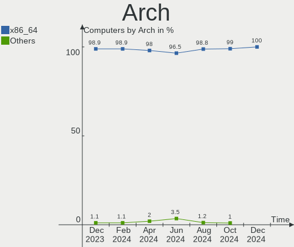

| Name    | Computers | Percent |
|---------|-----------|---------|
| x86_64  | 98        | 98%     |
| aarch64 | 2         | 2%      |

DE
--

Desktop Environment

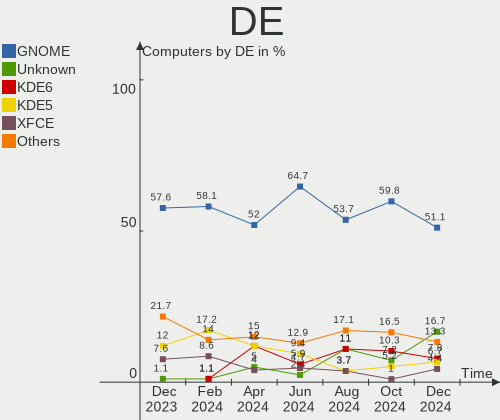

| Name       | Computers | Percent |
|------------|-----------|---------|
| GNOME      | 52        | 52%     |
| KDE6       | 12        | 12%     |
| KDE5       | 12        | 12%     |
| X-Cinnamon | 6         | 6%      |
| Unknown    | 5         | 5%      |
| XFCE       | 4         | 4%      |
| MATE       | 2         | 2%      |
| LXDE       | 2         | 2%      |
| Unity      | 1         | 1%      |
| Pantheon   | 1         | 1%      |
| Hyprland   | 1         | 1%      |
| dusk       | 1         | 1%      |
| awesome    | 1         | 1%      |

Display Server
--------------

X11 or Wayland

| Name    | Computers | Percent |
|---------|-----------|---------|
| Wayland | 53        | 53%     |
| X11     | 40        | 40%     |
| Tty     | 5         | 5%      |
| Unknown | 2         | 2%      |

Display Manager
---------------

SDDM, LightDM, etc.

| Name    | Computers | Percent |
|---------|-----------|---------|
| Unknown | 46        | 46%     |
| GDM3    | 29        | 29%     |
| LightDM | 11        | 11%     |
| SDDM    | 9         | 9%      |
| GDM     | 5         | 5%      |

OS Lang
-------

Language

| Lang  | Computers | Percent |
|-------|-----------|---------|
| en_US | 52        | 52%     |
| nl_NL | 35        | 35%     |
| C     | 3         | 3%      |
| ru_RU | 2         | 2%      |
| en_GB | 2         | 2%      |
| de_DE | 2         | 2%      |
| pl_PL | 1         | 1%      |
| pl    | 1         | 1%      |
| it_IT | 1         | 1%      |
| en_IE | 1         | 1%      |

Boot Mode
---------

EFI or BIOS

| Mode | Computers | Percent |
|------|-----------|---------|
| BIOS | 59        | 59%     |
| EFI  | 41        | 41%     |

Filesystem
----------

Type of filesystem

| Type    | Computers | Percent |
|---------|-----------|---------|
| Ext4    | 62        | 62%     |
| Btrfs   | 22        | 22%     |
| Tmpfs   | 14        | 14%     |
| Overlay | 2         | 2%      |

Part. scheme
------------

Scheme of partitioning

| Type    | Computers | Percent |
|---------|-----------|---------|
| GPT     | 56        | 56%     |
| Unknown | 40        | 40%     |
| MBR     | 4         | 4%      |

Dual Boot with Linux/BSD
------------------------

Hosting more than one Linux/BSD

| Dual boot | Computers | Percent |
|-----------|-----------|---------|
| No        | 89        | 89%     |
| Yes       | 11        | 11%     |

Dual Boot (Win)
---------------

Hosting Linux and Windows

| Dual boot | Computers | Percent |
|-----------|-----------|---------|
| No        | 76        | 76%     |
| Yes       | 24        | 24%     |

Board
-----

Vendor
------

Motherboard manufacturer

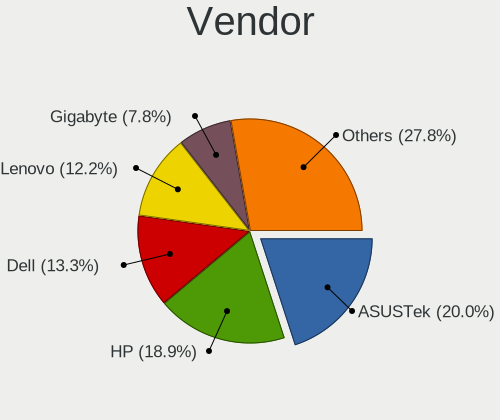

| Name                | Computers | Percent |
|---------------------|-----------|---------|
| Dell                | 15        | 15%     |
| Hewlett-Packard     | 14        | 14%     |
| ASUSTek Computer    | 14        | 14%     |
| Lenovo              | 10        | 10%     |
| MSI                 | 6         | 6%      |
| Gigabyte Technology | 6         | 6%      |
| ASRock              | 5         | 5%      |
| Valve               | 3         | 3%      |
| Intel               | 3         | 3%      |
| SolidRun            | 2         | 2%      |
| Packard Bell        | 2         | 2%      |
| Google              | 2         | 2%      |
| Apple               | 2         | 2%      |
| Acer                | 2         | 2%      |
| Unknown             | 2         | 2%      |
| Toshiba             | 1         | 1%      |
| Supermicro          | 1         | 1%      |
| SKIKK               | 1         | 1%      |
| Samsung Electronics | 1         | 1%      |
| Razer               | 1         | 1%      |
| Pegatron            | 1         | 1%      |
| Notebook            | 1         | 1%      |
| Microsoft           | 1         | 1%      |
| Medion              | 1         | 1%      |
| Fujitsu             | 1         | 1%      |
| Foxconn             | 1         | 1%      |
| Acidanthera         | 1         | 1%      |

Model
-----

Motherboard model

| Name                                               | Computers | Percent |
|----------------------------------------------------|-----------|---------|
| Valve Jupiter                                      | 2         | 2%      |
| HP ProBook 6570b                                   | 2         | 2%      |
| HP EliteBook 840 G3                                | 2         | 2%      |
| Unknown                                            | 2         | 2%      |
| Valve Galileo                                      | 1         | 1%      |
| Toshiba Satellite C70D-B                           | 1         | 1%      |
| Supermicro PIO-519C-MR-PH004                       | 1         | 1%      |
| SolidRun CEX7 Platform                             | 1         | 1%      |
| SolidRun Bedrock R7000                             | 1         | 1%      |
| SKIKK Freya                                        | 1         | 1%      |
| Samsung RV411/RV511/E3511/S3511/RV711/E3411        | 1         | 1%      |
| Razer Blade 15 Base Model (Early 2020) - RZ09-0328 | 1         | 1%      |
| Pegatron Pro 3010 Microtower PC                    | 1         | 1%      |
| Packard Bell ENNS45HR                              | 1         | 1%      |
| Packard Bell EasyNote LS11HR                       | 1         | 1%      |
| Notebook W330SU2                                   | 1         | 1%      |
| MSI MS-7D73                                        | 1         | 1%      |
| MSI MS-7D32                                        | 1         | 1%      |
| MSI MS-7C91                                        | 1         | 1%      |
| MSI MS-7B86                                        | 1         | 1%      |
| MSI Modern 15 B12M                                 | 1         | 1%      |
| MSI GS60 2QE                                       | 1         | 1%      |
| Microsoft Surface Pro                              | 1         | 1%      |
| Medion MS-7800                                     | 1         | 1%      |
| Lenovo Yoga Slim 7 Pro 14ACH5 82MS                 | 1         | 1%      |
| Lenovo Yoga Pro 7 14APH8 82Y8                      | 1         | 1%      |
| Lenovo ThinkPad P16s Gen 2 21K90003MH              | 1         | 1%      |
| Lenovo ThinkPad Edge E145 20BCA01RCD               | 1         | 1%      |
| Lenovo ThinkBook 15 G3 ACL 21A4                    | 1         | 1%      |
| Lenovo ThinkBook 15 G2 ITL 20VE                    | 1         | 1%      |
| Lenovo MIIX 320-10ICR 80XF                         | 1         | 1%      |
| Lenovo Legion T530-28APR                           | 1         | 1%      |
| Lenovo IdeaPad 710S-13ISK 80SW                     | 1         | 1%      |
| Lenovo IdeaPad 5 Pro 16ACH6 82L5                   | 1         | 1%      |
| Intel VALLEYVIEW C0 PLATFORM                       | 1         | 1%      |
| Intel DG965RY AAD41691-301                         | 1         | 1%      |
| Intel AB2L                                         | 1         | 1%      |
| HP ZBook Studio G3                                 | 1         | 1%      |
| HP Spectre x360 Convertible 13-aw2xxx              | 1         | 1%      |
| HP ProBook 650 G2                                  | 1         | 1%      |

Model Family
------------

Motherboard model prefix

| Name                         | Computers | Percent |
|------------------------------|-----------|---------|
| Dell Latitude                | 7         | 7%      |
| HP ProBook                   | 6         | 6%      |
| Dell Precision               | 3         | 3%      |
| Valve Jupiter                | 2         | 2%      |
| Lenovo Yoga                  | 2         | 2%      |
| Lenovo ThinkPad              | 2         | 2%      |
| Lenovo ThinkBook             | 2         | 2%      |
| Lenovo IdeaPad               | 2         | 2%      |
| HP EliteBook                 | 2         | 2%      |
| Gigabyte Z390                | 2         | 2%      |
| Dell XPS                     | 2         | 2%      |
| ASUS VivoBook                | 2         | 2%      |
| ASUS ROG                     | 2         | 2%      |
| ASUS PRIME                   | 2         | 2%      |
| Unknown                      | 2         | 2%      |
| Valve Galileo                | 1         | 1%      |
| Toshiba Satellite            | 1         | 1%      |
| Supermicro PIO-519C-MR-PH004 | 1         | 1%      |
| SolidRun CEX7                | 1         | 1%      |
| SolidRun Bedrock             | 1         | 1%      |
| SKIKK Freya                  | 1         | 1%      |
| Samsung RV411                | 1         | 1%      |
| Razer Blade                  | 1         | 1%      |
| Pegatron Pro                 | 1         | 1%      |
| Packard Bell ENNS45HR        | 1         | 1%      |
| Packard Bell EasyNote        | 1         | 1%      |
| Notebook W330SU2             | 1         | 1%      |
| MSI MS-7D73                  | 1         | 1%      |
| MSI MS-7D32                  | 1         | 1%      |
| MSI MS-7C91                  | 1         | 1%      |
| MSI MS-7B86                  | 1         | 1%      |
| MSI Modern                   | 1         | 1%      |
| MSI GS60                     | 1         | 1%      |
| Microsoft Surface            | 1         | 1%      |
| Medion MS-7800               | 1         | 1%      |
| Lenovo MIIX                  | 1         | 1%      |
| Lenovo Legion                | 1         | 1%      |
| Intel VALLEYVIEW             | 1         | 1%      |
| Intel DG965RY                | 1         | 1%      |
| Intel AB2L                   | 1         | 1%      |

MFG Year
--------

Motherboard manufacture year

| Year    | Computers | Percent |
|---------|-----------|---------|
| 2023    | 14        | 14%     |
| 2012    | 9         | 9%      |
| 2020    | 8         | 8%      |
| 2022    | 7         | 7%      |
| 2018    | 7         | 7%      |
| 2016    | 7         | 7%      |
| 2014    | 7         | 7%      |
| 2021    | 6         | 6%      |
| 2024    | 4         | 4%      |
| 2019    | 4         | 4%      |
| 2017    | 4         | 4%      |
| 2015    | 4         | 4%      |
| 2013    | 4         | 4%      |
| 2011    | 4         | 4%      |
| 2009    | 3         | 3%      |
| 2010    | 2         | 2%      |
| 2007    | 2         | 2%      |
| 2006    | 2         | 2%      |
| 2008    | 1         | 1%      |
| Unknown | 1         | 1%      |

Form Factor
-----------

Physical design of the computer

| Name           | Computers | Percent |
|----------------|-----------|---------|
| Notebook       | 55        | 55%     |
| Desktop        | 35        | 35%     |
| Tablet         | 4         | 4%      |
| System on chip | 2         | 2%      |
| Convertible    | 2         | 2%      |
| Mini pc        | 1         | 1%      |
| All in one     | 1         | 1%      |

Secure Boot
-----------

Enabled or disabled

| State    | Computers | Percent |
|----------|-----------|---------|
| Disabled | 94        | 94%     |
| Enabled  | 6         | 6%      |

Coreboot
--------

Have coreboot on board

| Used | Computers | Percent |
|------|-----------|---------|
| No   | 98        | 98%     |
| Yes  | 2         | 2%      |

RAM Size
--------

Total RAM memory

| Size in GB  | Computers | Percent |
|-------------|-----------|---------|
| 4.01-8.0    | 24        | 24%     |
| 8.01-16.0   | 20        | 20%     |
| 16.01-24.0  | 19        | 19%     |
| 32.01-64.0  | 16        | 16%     |
| 3.01-4.0    | 12        | 12%     |
| 24.01-32.0  | 6         | 6%      |
| 1.01-2.0    | 2         | 2%      |
| 64.01-256.0 | 1         | 1%      |

RAM Used
--------

Used RAM memory

| Used GB    | Computers | Percent |
|------------|-----------|---------|
| 4.01-8.0   | 25        | 25%     |
| 2.01-3.0   | 23        | 23%     |
| 1.01-2.0   | 21        | 21%     |
| 3.01-4.0   | 18        | 18%     |
| 8.01-16.0  | 7         | 7%      |
| 0.51-1.0   | 5         | 5%      |
| 16.01-24.0 | 1         | 1%      |

Total Drives
------------

Number of drives on board

| Drives | Computers | Percent |
|--------|-----------|---------|
| 1      | 60        | 60%     |
| 2      | 22        | 22%     |
| 3      | 9         | 9%      |
| 4      | 5         | 5%      |
| 5      | 3         | 3%      |
| 7      | 1         | 1%      |

Has CD-ROM
----------

Has CD-ROM on board

| Presented | Computers | Percent |
|-----------|-----------|---------|
| No        | 74        | 74%     |
| Yes       | 26        | 26%     |

Has Ethernet
------------

Has Ethernet on board

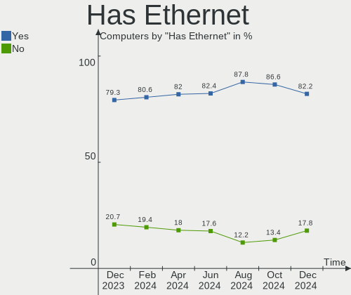

| Presented | Computers | Percent |
|-----------|-----------|---------|
| Yes       | 81        | 81%     |
| No        | 19        | 19%     |

Has WiFi
--------

Has WiFi module

| Presented | Computers | Percent |
|-----------|-----------|---------|
| Yes       | 74        | 74%     |
| No        | 26        | 26%     |

Has Bluetooth
-------------

Has Bluetooth module

| Presented | Computers | Percent |
|-----------|-----------|---------|
| Yes       | 68        | 68%     |
| No        | 32        | 32%     |

Location
--------

Country
-------

Geographic location (country)

| Country     | Computers | Percent |
|-------------|-----------|---------|
| Netherlands | 100       | 100%    |

City
----

Geographic location (city)

| City            | Computers | Percent |
|-----------------|-----------|---------|
| Amsterdam       | 24        | 24%     |
| The Hague       | 8         | 8%      |
| Naaldwijk       | 5         | 5%      |
| Eindhoven       | 4         | 4%      |
| Rotterdam       | 3         | 3%      |
| Leeuwarden      | 3         | 3%      |
| Delft           | 3         | 3%      |
| Zwolle          | 2         | 2%      |
| Zandvoort       | 2         | 2%      |
| Enschede        | 2         | 2%      |
| Amersfoort      | 2         | 2%      |
| Zwijndrecht     | 1         | 1%      |
| Zutphen         | 1         | 1%      |
| Zuidwolde       | 1         | 1%      |
| Zuid-Scharwoude | 1         | 1%      |
| Zierikzee       | 1         | 1%      |
| Zeist           | 1         | 1%      |
| Wormerveer      | 1         | 1%      |
| Winterswijk     | 1         | 1%      |
| Wageningen      | 1         | 1%      |
| Waalwijk        | 1         | 1%      |
| Waalre          | 1         | 1%      |
| Vriescheloo     | 1         | 1%      |
| Utrecht         | 1         | 1%      |
| Urk             | 1         | 1%      |
| Uithuizen       | 1         | 1%      |
| Someren         | 1         | 1%      |
| Sneek           | 1         | 1%      |
| Puttershoek     | 1         | 1%      |
| Pesse           | 1         | 1%      |
| Oosternijkerk   | 1         | 1%      |
| Nuenen          | 1         | 1%      |
| Nieuwkoop       | 1         | 1%      |
| Nieuw-Vennep    | 1         | 1%      |
| Middelburg      | 1         | 1%      |
| Meppel          | 1         | 1%      |
| Loon op Zand    | 1         | 1%      |
| Lekkerkerk      | 1         | 1%      |
| Leiderdorp      | 1         | 1%      |
| Leersum         | 1         | 1%      |

Drives
------

Drive Vendor
------------

Hard drive vendors

| Vendor                       | Computers | Drives | Percent |
|------------------------------|-----------|--------|---------|
| Samsung Electronics          | 30        | 40     | 20.13%  |
| Seagate                      | 16        | 21     | 10.74%  |
| WDC                          | 15        | 15     | 10.07%  |
| SanDisk                      | 12        | 12     | 8.05%   |
| Unknown                      | 11        | 13     | 7.38%   |
| Kingston                     | 9         | 9      | 6.04%   |
| Toshiba                      | 8         | 10     | 5.37%   |
| Crucial                      | 7         | 11     | 4.7%    |
| SK hynix                     | 6         | 6      | 4.03%   |
| Micron Technology            | 6         | 7      | 4.03%   |
| MAXIO Technology (Hangzhou)  | 5         | 5      | 3.36%   |
| Lexar                        | 3         | 3      | 2.01%   |
| Kingston Technology Company  | 3         | 4      | 2.01%   |
| Hitachi                      | 3         | 3      | 2.01%   |
| Union Memory                 | 1         | 1      | 0.67%   |
| TSA                          | 1         | 1      | 0.67%   |
| StoreJet                     | 1         | 1      | 0.67%   |
| SPCC                         | 1         | 1      | 0.67%   |
| Shenzhen Longsys Electronics | 1         | 1      | 0.67%   |
| O2 Micro                     | 1         | 1      | 0.67%   |
| Maxtor                       | 1         | 1      | 0.67%   |
| LITEON                       | 1         | 1      | 0.67%   |
| Kingchuxing                  | 1         | 1      | 0.67%   |
| Intenso                      | 1         | 1      | 0.67%   |
| HGST                         | 1         | 1      | 0.67%   |
| Gigabyte Technology          | 1         | 1      | 0.67%   |
| External                     | 1         | 1      | 0.67%   |
| Corsair                      | 1         | 2      | 0.67%   |
| Unknown                      | 1         | 1      | 0.67%   |

Drive Model
-----------

Hard drive models

| Model                                              | Computers | Percent |
|----------------------------------------------------|-----------|---------|
| Samsung NVMe SSD Controller PM9A1/PM9A3/980PRO 1TB | 4         | 2.44%   |
| MAXIO (Hangzhou) NVMe SSD Controller MAP1202 256GB | 4         | 2.44%   |
| Unknown MMC Card  64GB                             | 3         | 1.83%   |
| Samsung SSD 850 EVO 250GB                          | 3         | 1.83%   |
| Samsung NVMe SSD Controller SM981/PM981/PM983 1TB  | 3         | 1.83%   |
| Unknown MMC Card  128GB                            | 2         | 1.22%   |
| Seagate ST3500312CS 500GB                          | 2         | 1.22%   |
| Seagate ST2000DM008-2FR102 2TB                     | 2         | 1.22%   |
| Seagate ST1000LM024 HN-M101MBB 1TB                 | 2         | 1.22%   |
| Sandisk WD Black SN750 / PC SN730 NVMe SSD 512GB   | 2         | 1.22%   |
| Samsung SSD 980 1TB                                | 2         | 1.22%   |
| Samsung SSD 860 EVO 250GB                          | 2         | 1.22%   |
| Samsung SSD 850 EVO 500GB                          | 2         | 1.22%   |
| Kingston SUV400S37120G 120GB SSD                   | 2         | 1.22%   |
| Kingston SA400S37960G 960GB SSD                    | 2         | 1.22%   |
| Kingston SA400S37240G 240GB SSD                    | 2         | 1.22%   |
| WDC WDS500G2B0B-00YS70 500GB SSD                   | 1         | 0.61%   |
| WDC WDS250G2B0C-00PXH0 250GB                       | 1         | 0.61%   |
| WDC WD5000LPVX-08V0TT5 500GB                       | 1         | 0.61%   |
| WDC WD5000AAKS-00TMA0 500GB                        | 1         | 0.61%   |
| WDC WD3200BEVT-22ZCT0 320GB                        | 1         | 0.61%   |
| WDC WD3200AAJS-56M0A0 320GB                        | 1         | 0.61%   |
| WDC WD20EZRZ-00Z5HB0 2TB                           | 1         | 0.61%   |
| WDC WD20EARX-00PASB0 2TB                           | 1         | 0.61%   |
| WDC WD15EARS-00Z5B1 1TB                            | 1         | 0.61%   |
| WDC WD15EADS-00P8B0 1TB                            | 1         | 0.61%   |
| WDC WD10SPZX-60Z10T0 1TB                           | 1         | 0.61%   |
| WDC WD10EZEX-08WN4A0 1TB                           | 1         | 0.61%   |
| WDC WD10EARX-22N0YB0 1TB                           | 1         | 0.61%   |
| WDC WD1001FALS-403AA0 1TB                          | 1         | 0.61%   |
| WDC PC SN520 SDAPNUW-256G-1006 256GB               | 1         | 0.61%   |
| Unknown SS16G  16GB                                | 1         | 0.61%   |
| Unknown SD128  128GB                               | 1         | 0.61%   |
| Unknown SD/MMC/MS PRO 128GB                        | 1         | 0.61%   |
| Unknown MMC Card  997GB                            | 1         | 0.61%   |
| Unknown MMC Card  67GB                             | 1         | 0.61%   |
| Unknown MMC Card  512GB                            | 1         | 0.61%   |
| Unknown MMC Card  32GB                             | 1         | 0.61%   |
| Unknown Compact Flash 977MB                        | 1         | 0.61%   |
| Union Memory UMIS LENSE40512GMSP34MESTB3A 512GB    | 1         | 0.61%   |

HDD Vendor
----------

Hard disk drive vendors

| Vendor              | Computers | Drives | Percent |
|---------------------|-----------|--------|---------|
| Seagate             | 16        | 21     | 40%     |
| WDC                 | 12        | 12     | 30%     |
| Toshiba             | 3         | 4      | 7.5%    |
| Hitachi             | 3         | 3      | 7.5%    |
| Unknown             | 1         | 1      | 2.5%    |
| StoreJet            | 1         | 1      | 2.5%    |
| Samsung Electronics | 1         | 1      | 2.5%    |
| Maxtor              | 1         | 1      | 2.5%    |
| HGST                | 1         | 1      | 2.5%    |
| External            | 1         | 1      | 2.5%    |

SSD Vendor
----------

Solid state drive vendors

| Vendor              | Computers | Drives | Percent |
|---------------------|-----------|--------|---------|
| Samsung Electronics | 15        | 18     | 29.41%  |
| Kingston            | 9         | 9      | 17.65%  |
| Crucial             | 7         | 11     | 13.73%  |
| SanDisk             | 5         | 5      | 9.8%    |
| Micron Technology   | 4         | 5      | 7.84%   |
| SK hynix            | 2         | 2      | 3.92%   |
| Lexar               | 2         | 2      | 3.92%   |
| WDC                 | 1         | 1      | 1.96%   |
| TSA                 | 1         | 1      | 1.96%   |
| Toshiba             | 1         | 2      | 1.96%   |
| SPCC                | 1         | 1      | 1.96%   |
| LITEON              | 1         | 1      | 1.96%   |
| Intenso             | 1         | 1      | 1.96%   |
| Unknown             | 1         | 1      | 1.96%   |

Drive Kind
----------

HDD or SSD

| Kind    | Computers | Drives | Percent |
|---------|-----------|--------|---------|
| NVMe    | 47        | 56     | 35.07%  |
| SSD     | 45        | 60     | 33.58%  |
| HDD     | 30        | 46     | 22.39%  |
| MMC     | 10        | 11     | 7.46%   |
| Unknown | 2         | 2      | 1.49%   |

Drive Connector
---------------

SATA, SAS, NVMe, etc.

| Type | Computers | Drives | Percent |
|------|-----------|--------|---------|
| SATA | 61        | 101    | 49.19%  |
| NVMe | 47        | 56     | 37.9%   |
| MMC  | 10        | 11     | 8.06%   |
| SAS  | 6         | 7      | 4.84%   |

Drive Size
----------

Size of hard drive

| Size in TB | Computers | Drives | Percent |
|------------|-----------|--------|---------|
| 0.01-0.5   | 50        | 64     | 60.24%  |
| 0.51-1.0   | 22        | 26     | 26.51%  |
| 1.01-2.0   | 8         | 13     | 9.64%   |
| 3.01-4.0   | 2         | 2      | 2.41%   |
| 2.01-3.0   | 1         | 1      | 1.2%    |

Space Total
-----------

Amount of disk space available on the file system

| Size in GB     | Computers | Percent |
|----------------|-----------|---------|
| 101-250        | 27        | 27%     |
| 251-500        | 20        | 20%     |
| 501-1000       | 17        | 17%     |
| 1001-2000      | 15        | 15%     |
| 51-100         | 7         | 7%      |
| More than 3000 | 6         | 6%      |
| 2001-3000      | 3         | 3%      |
| 21-50          | 2         | 2%      |
| 1-20           | 2         | 2%      |
| Unknown        | 1         | 1%      |

Space Used
----------

Amount of used disk space

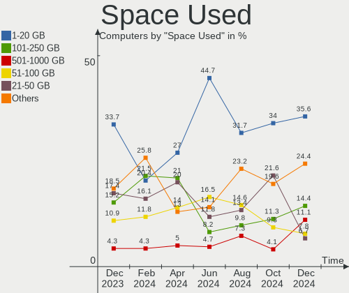

| Used GB        | Computers | Percent |
|----------------|-----------|---------|
| 1-20           | 27        | 27%     |
| 101-250        | 21        | 21%     |
| 21-50          | 20        | 20%     |
| 51-100         | 14        | 14%     |
| 1001-2000      | 5         | 5%      |
| 501-1000       | 5         | 5%      |
| 251-500        | 4         | 4%      |
| More than 3000 | 3         | 3%      |
| Unknown        | 1         | 1%      |

Malfunc. Drives
---------------

Drive models with a malfunction

| Model                           | Computers | Drives | Percent |
|---------------------------------|-----------|--------|---------|
| WDC WD15EARS-00Z5B1 1TB         | 1         | 1      | 10%     |
| WDC WD10SPZX-60Z10T0 1TB        | 1         | 1      | 10%     |
| WDC WD1001FALS-403AA0 1TB       | 1         | 1      | 10%     |
| Toshiba MQ01ABF050 500GB        | 1         | 1      | 10%     |
| SK hynix SC401 SATA 512GB SSD   | 1         | 1      | 10%     |
| Seagate ST9320325AS 320GB       | 1         | 1      | 10%     |
| Seagate ST500LM000-1EJ162 500GB | 1         | 1      | 10%     |
| Samsung Electronics SSD 980 1TB | 1         | 1      | 10%     |
| Maxtor STM380215AS 80GB         | 1         | 1      | 10%     |
| Hitachi HTS542516K9SA00 160GB   | 1         | 1      | 10%     |

Malfunc. Drive Vendor
---------------------

Vendors of faulty drives

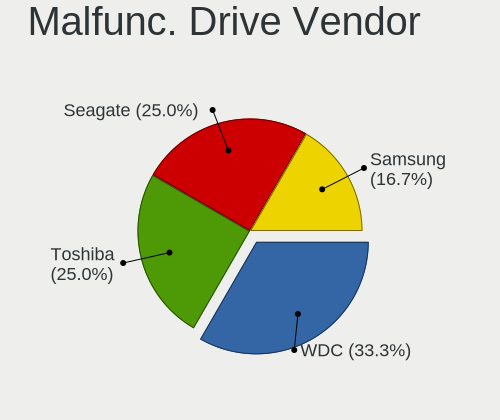

| Vendor              | Computers | Drives | Percent |
|---------------------|-----------|--------|---------|
| WDC                 | 3         | 3      | 30%     |
| Seagate             | 2         | 2      | 20%     |
| Toshiba             | 1         | 1      | 10%     |
| SK hynix            | 1         | 1      | 10%     |
| Samsung Electronics | 1         | 1      | 10%     |
| Maxtor              | 1         | 1      | 10%     |
| Hitachi             | 1         | 1      | 10%     |

Malfunc. HDD Vendor
-------------------

Vendors of faulty HDD drives

| Vendor  | Computers | Drives | Percent |
|---------|-----------|--------|---------|
| WDC     | 3         | 3      | 37.5%   |
| Seagate | 2         | 2      | 25%     |
| Toshiba | 1         | 1      | 12.5%   |
| Maxtor  | 1         | 1      | 12.5%   |
| Hitachi | 1         | 1      | 12.5%   |

Malfunc. Drive Kind
-------------------

Kinds of faulty drives

| Kind | Computers | Drives | Percent |
|------|-----------|--------|---------|
| HDD  | 8         | 8      | 80%     |
| NVMe | 1         | 1      | 10%     |
| SSD  | 1         | 1      | 10%     |

Failed Drives
-------------

Failed drive models

Zero info for selected period =(

Failed Drive Vendor
-------------------

Failed drive vendors

Zero info for selected period =(

Drive Status
------------

Number of failed and malfunc. drives

| Status   | Computers | Drives | Percent |
|----------|-----------|--------|---------|
| Detected | 59        | 100    | 53.64%  |
| Works    | 42        | 65     | 38.18%  |
| Malfunc  | 9         | 10     | 8.18%   |

Storage controller
------------------

Storage Vendor
--------------

Storage controller vendors

| Vendor                       | Computers | Percent |
|------------------------------|-----------|---------|
| Intel                        | 56        | 42.11%  |
| AMD                          | 21        | 15.79%  |
| Samsung Electronics          | 17        | 12.78%  |
| SanDisk                      | 9         | 6.77%   |
| MAXIO Technology (Hangzhou)  | 5         | 3.76%   |
| Toshiba America Info Systems | 4         | 3.01%   |
| SK hynix                     | 4         | 3.01%   |
| Kingston Technology Company  | 3         | 2.26%   |
| Shenzhen Longsys Electronics | 2         | 1.5%    |
| Phison Electronics           | 2         | 1.5%    |
| Micron Technology            | 2         | 1.5%    |
| Marvell Technology Group     | 2         | 1.5%    |
| VIA Technologies             | 1         | 0.75%   |
| Union Memory (Shenzhen)      | 1         | 0.75%   |
| Promise Technology           | 1         | 0.75%   |
| O2 Micro                     | 1         | 0.75%   |
| Nvidia                       | 1         | 0.75%   |
| Broadcom / LSI               | 1         | 0.75%   |

Storage Model
-------------

Storage controller models

| Model                                                                          | Computers | Percent |
|--------------------------------------------------------------------------------|-----------|---------|
| Intel Sunrise Point-LP SATA Controller [AHCI mode]                             | 8         | 5.48%   |
| AMD FCH SATA Controller [AHCI mode]                                            | 8         | 5.48%   |
| Samsung NVMe SSD Controller PM9A1/PM9A3/980PRO                                 | 5         | 3.42%   |
| Samsung NVMe SSD Controller SM981/PM981/PM983                                  | 4         | 2.74%   |
| Samsung NVMe SSD Controller 980 (DRAM-less)                                    | 4         | 2.74%   |
| MAXIO (Hangzhou) NVMe SSD Controller MAP1202 (DRAM-less)                       | 4         | 2.74%   |
| Intel Volume Management Device NVMe RAID Controller                            | 4         | 2.74%   |
| Intel Cannon Lake PCH SATA AHCI Controller                                     | 4         | 2.74%   |
| Intel 6 Series/C200 Series Chipset Family 6 port Mobile SATA AHCI Controller   | 4         | 2.74%   |
| AMD 600 Series Chipset SATA Controller                                         | 4         | 2.74%   |
| AMD 500 Series Chipset SATA Controller                                         | 4         | 2.74%   |
| Samsung NVMe SSD Controller SM961/PM961/SM963                                  | 3         | 2.05%   |
| Intel 7 Series Chipset Family 6-port SATA Controller [AHCI mode]               | 3         | 2.05%   |
| Toshiba America Info Systems XG5 NVMe SSD Controller                           | 2         | 1.37%   |
| SK hynix Platinum P41/PC801 NVMe Solid State Drive                             | 2         | 1.37%   |
| SK hynix Gold P31/BC711/PC711 NVMe Solid State Drive                           | 2         | 1.37%   |
| Shenzhen Longsys Lexar NM790 NVME SSD (DRAM-less)                              | 2         | 1.37%   |
| SanDisk WD Black SN770 / PC SN740 256GB / PC SN560 (DRAM-less) NVMe SSD        | 2         | 1.37%   |
| SanDisk Extreme Pro / WD Black SN750 / PC SN730 / Red SN700 NVMe SSD           | 2         | 1.37%   |
| Intel Volume Management Device NVMe RAID Controller Intel Corporation          | 2         | 1.37%   |
| Intel Q170/Q150/B150/H170/H110/Z170/CM236 Chipset SATA Controller [AHCI Mode]  | 2         | 1.37%   |
| Intel 9 Series Chipset Family SATA Controller [AHCI Mode]                      | 2         | 1.37%   |
| Intel 82801 Mobile SATA Controller [RAID mode]                                 | 2         | 1.37%   |
| Intel 8 Series/C220 Series Chipset Family 6-port SATA Controller 1 [AHCI mode] | 2         | 1.37%   |
| Intel 8 Series SATA Controller 1 [AHCI mode]                                   | 2         | 1.37%   |
| Intel 5 Series/3400 Series Chipset 4 port SATA IDE Controller                  | 2         | 1.37%   |
| Intel 5 Series/3400 Series Chipset 4 port SATA AHCI Controller                 | 2         | 1.37%   |
| Intel 5 Series/3400 Series Chipset 2 port SATA IDE Controller                  | 2         | 1.37%   |
| AMD SB7x0/SB8x0/SB9x0 SATA Controller [AHCI mode]                              | 2         | 1.37%   |
| AMD 400 Series Chipset SATA Controller                                         | 2         | 1.37%   |
| VIA VT6415 PATA IDE Host Controller                                            | 1         | 0.68%   |
| Union Memory (Shenzhen) AH631 PCIe 3.0 NVMe SSD 512GB                          | 1         | 0.68%   |
| Toshiba America Info Systems XG3 NVMe SSD Controller                           | 1         | 0.68%   |
| Toshiba America Info Systems BG3 x2 NVMe SSD Controller (DRAM-less)            | 1         | 0.68%   |
| Sandisk WD PC SN740 NVMe SSD 512GB (DRAM-less)                                 | 1         | 0.68%   |
| Sandisk WD Blue SN580 NVMe SSD (DRAM-less)                                     | 1         | 0.68%   |
| SanDisk WD Blue SN500 / PC SN520 x2 M.2 2280 NVMe SSD                          | 1         | 0.68%   |
| SanDisk Ultra 3D / WD Blue SN550 NVMe SSD                                      | 1         | 0.68%   |
| SanDisk IX SN530 NVMe SSD (DRAM-less)                                          | 1         | 0.68%   |
| Samsung NVMe SSD Controller SM951/PM951                                        | 1         | 0.68%   |

Storage Kind
------------

Kind of storage controller (IDE, SATA, NVMe, SAS, ...)

| Kind | Computers | Percent |
|------|-----------|---------|
| SATA | 66        | 50%     |
| NVMe | 47        | 35.61%  |
| RAID | 10        | 7.58%   |
| IDE  | 8         | 6.06%   |
| SAS  | 1         | 0.76%   |

Processor
---------

CPU Vendor
----------

Processor vendors

| Vendor | Computers | Percent |
|--------|-----------|---------|
| Intel  | 65        | 65%     |
| AMD    | 33        | 33%     |
| ARM    | 2         | 2%      |

CPU Model
---------

Processor models

| Model                                       | Computers | Percent |
|---------------------------------------------|-----------|---------|
| Intel Core i5-6300U CPU @ 2.40GHz           | 3         | 3%      |
| AMD Ryzen 7 5800H with Radeon Graphics      | 3         | 3%      |
| AMD Ryzen 5 7600 6-Core Processor           | 3         | 3%      |
| Intel Core i5-8350U CPU @ 1.70GHz           | 2         | 2%      |
| Intel Core i5-6200U CPU @ 2.30GHz           | 2         | 2%      |
| Intel Core i5-3210M CPU @ 2.50GHz           | 2         | 2%      |
| Intel 11th Gen Core i7-1165G7 @ 2.80GHz     | 2         | 2%      |
| ARM Processor                               | 2         | 2%      |
| AMD Ryzen 5 5600 6-Core Processor           | 2         | 2%      |
| AMD Ryzen 5 1600 Six-Core Processor         | 2         | 2%      |
| AMD Custom APU 0405                         | 2         | 2%      |
| Intel Xeon E-2278G CPU @ 3.40GHz            | 1         | 1%      |
| Intel Pentium Silver N6000 @ 1.10GHz        | 1         | 1%      |
| Intel Pentium Dual-Core CPU E5400 @ 2.70GHz | 1         | 1%      |
| Intel Pentium Dual CPU T2370 @ 1.73GHz      | 1         | 1%      |
| Intel Core m3-7Y30 CPU @ 1.00GHz            | 1         | 1%      |
| Intel Core i9-9900KF CPU @ 3.60GHz          | 1         | 1%      |
| Intel Core i9-9900K CPU @ 3.60GHz           | 1         | 1%      |
| Intel Core i7-8750H CPU @ 2.20GHz           | 1         | 1%      |
| Intel Core i7-8565U CPU @ 1.80GHz           | 1         | 1%      |
| Intel Core i7-7700HQ CPU @ 2.80GHz          | 1         | 1%      |
| Intel Core i7-6820HQ CPU @ 2.70GHz          | 1         | 1%      |
| Intel Core i7-4710HQ CPU @ 2.50GHz          | 1         | 1%      |
| Intel Core i7-2670QM CPU @ 2.20GHz          | 1         | 1%      |
| Intel Core i7-2600 CPU @ 3.40GHz            | 1         | 1%      |
| Intel Core i7-14650HX                       | 1         | 1%      |
| Intel Core i7-10750H CPU @ 2.60GHz          | 1         | 1%      |
| Intel Core i7 CPU Q 740 @ 1.73GHz           | 1         | 1%      |
| Intel Core i7 CPU 870 @ 2.93GHz             | 1         | 1%      |
| Intel Core i5-7500 CPU @ 3.40GHz            | 1         | 1%      |
| Intel Core i5-5675R CPU @ 3.10GHz           | 1         | 1%      |
| Intel Core i5-5200U CPU @ 2.20GHz           | 1         | 1%      |
| Intel Core i5-4590 CPU @ 3.30GHz            | 1         | 1%      |
| Intel Core i5-4460 CPU @ 3.20GHz            | 1         | 1%      |
| Intel Core i5-4210U CPU @ 1.70GHz           | 1         | 1%      |
| Intel Core i5-4210M CPU @ 2.60GHz           | 1         | 1%      |
| Intel Core i5-4200U CPU @ 1.60GHz           | 1         | 1%      |
| Intel Core i5-3570 CPU @ 3.40GHz            | 1         | 1%      |
| Intel Core i5-3470 CPU @ 3.20GHz            | 1         | 1%      |
| Intel Core i5-3320M CPU @ 2.60GHz           | 1         | 1%      |

CPU Model Family
----------------

Processor model prefix

| Model                   | Computers | Percent |
|-------------------------|-----------|---------|
| Intel Core i5           | 26        | 26%     |
| Other                   | 15        | 15%     |
| Intel Core i7           | 11        | 11%     |
| AMD Ryzen 5             | 10        | 10%     |
| AMD Ryzen 7             | 7         | 7%      |
| Intel Core i3           | 5         | 5%      |
| AMD Ryzen 9             | 5         | 5%      |
| Intel Celeron           | 3         | 3%      |
| Intel Core i9           | 2         | 2%      |
| Intel Atom              | 2         | 2%      |
| AMD FX                  | 2         | 2%      |
| AMD Athlon 64 X2        | 2         | 2%      |
| Intel Xeon              | 1         | 1%      |
| Intel Pentium Silver    | 1         | 1%      |
| Intel Pentium Dual-Core | 1         | 1%      |
| Intel Pentium Dual      | 1         | 1%      |
| Intel Core m3           | 1         | 1%      |
| Intel Core 2            | 1         | 1%      |
| AMD Ryzen 7 PRO         | 1         | 1%      |
| AMD E1                  | 1         | 1%      |
| AMD A8                  | 1         | 1%      |
| AMD A6                  | 1         | 1%      |

CPU Cores
---------

Number of processor cores

| Number  | Computers | Percent |
|---------|-----------|---------|
| 4       | 32        | 32%     |
| 2       | 31        | 31%     |
| 8       | 13        | 13%     |
| 6       | 11        | 11%     |
| 12      | 4         | 4%      |
| 16      | 3         | 3%      |
| 10      | 3         | 3%      |
| 14      | 1         | 1%      |
| 3       | 1         | 1%      |
| Unknown | 1         | 1%      |

CPU Sockets
-----------

Number of sockets

| Number  | Computers | Percent |
|---------|-----------|---------|
| 1       | 99        | 99%     |
| Unknown | 1         | 1%      |

CPU Threads
-----------

Threads per core (Hyper-Threading)

| Number  | Computers | Percent |
|---------|-----------|---------|
| 2       | 77        | 77%     |
| 1       | 22        | 22%     |
| Unknown | 1         | 1%      |

CPU Op-Modes
------------

CPU Operation Modes (32-bit, 64-bit)

| Op mode        | Computers | Percent |
|----------------|-----------|---------|
| 32-bit, 64-bit | 99        | 99%     |
| 64-bit         | 1         | 1%      |

CPU Microcode
-------------

Microcode number

| Number     | Computers | Percent |
|------------|-----------|---------|
| Unknown    | 77        | 77%     |
| 0x906a4    | 2         | 2%      |
| 0x806ec    | 1         | 1%      |
| 0x806ea    | 1         | 1%      |
| 0x406e3    | 1         | 1%      |
| 0x406c4    | 1         | 1%      |
| 0x306d4    | 1         | 1%      |
| 0x306c3    | 1         | 1%      |
| 0x20655    | 1         | 1%      |
| 0x20652    | 1         | 1%      |
| 0x106e5    | 1         | 1%      |
| 0x0a704104 | 1         | 1%      |
| 0x0a601206 | 1         | 1%      |
| 0x0a601203 | 1         | 1%      |
| 0x0a20120a | 1         | 1%      |
| 0x08701013 | 1         | 1%      |
| 0x08608103 | 1         | 1%      |
| 0x08001138 | 1         | 1%      |
| 0x08001129 | 1         | 1%      |
| 0x07030105 | 1         | 1%      |
| 0x0700010f | 1         | 1%      |
| 0x06001119 | 1         | 1%      |
| 0x06000852 | 1         | 1%      |

CPU Microarch
-------------

Microarchitecture

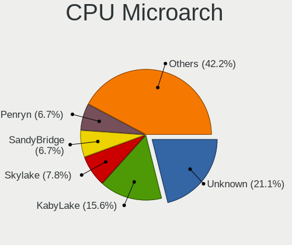

| Name             | Computers | Percent |
|------------------|-----------|---------|
| Unknown          | 19        | 19%     |
| KabyLake         | 13        | 13%     |
| Skylake          | 7         | 7%      |
| IvyBridge        | 6         | 6%      |
| Haswell          | 6         | 6%      |
| Zen 3            | 5         | 5%      |
| SandyBridge      | 5         | 5%      |
| Alderlake Hybrid | 5         | 5%      |
| TigerLake        | 4         | 4%      |
| Zen 2            | 3         | 3%      |
| Silvermont       | 3         | 3%      |
| Piledriver       | 3         | 3%      |
| Nehalem          | 3         | 3%      |
| Zen+             | 2         | 2%      |
| Zen              | 2         | 2%      |
| Westmere         | 2         | 2%      |
| K8 Hammer        | 2         | 2%      |
| Core             | 2         | 2%      |
| Broadwell        | 2         | 2%      |
| Puma             | 1         | 1%      |
| Penryn           | 1         | 1%      |
| Jaguar           | 1         | 1%      |
| Goldmont plus    | 1         | 1%      |
| Goldmont         | 1         | 1%      |
| CometLake        | 1         | 1%      |

Graphics
--------

GPU Vendor
----------

Vendors of graphics cards

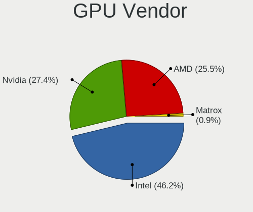

| Vendor            | Computers | Percent |
|-------------------|-----------|---------|
| Intel             | 51        | 45.13%  |
| AMD               | 31        | 27.43%  |
| Nvidia            | 30        | 26.55%  |
| ASPEED Technology | 1         | 0.88%   |

GPU Model
---------

Graphics card models

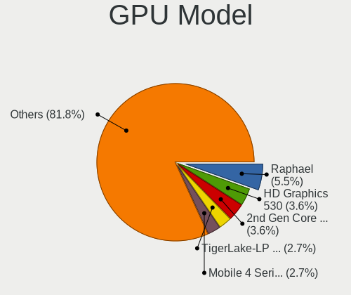

| Model                                                                                    | Computers | Percent |
|------------------------------------------------------------------------------------------|-----------|---------|
| Intel Skylake GT2 [HD Graphics 520]                                                      | 5         | 4.27%   |
| AMD Raphael                                                                              | 5         | 4.27%   |
| Intel TigerLake-LP GT2 [Iris Xe Graphics]                                                | 4         | 3.42%   |
| Intel 3rd Gen Core processor Graphics Controller                                         | 4         | 3.42%   |
| Intel 2nd Generation Core Processor Family Integrated Graphics Controller                | 4         | 3.42%   |
| Nvidia AD106M [GeForce RTX 4070 Max-Q / Mobile]                                          | 3         | 2.56%   |
| Intel UHD Graphics 620                                                                   | 3         | 2.56%   |
| AMD Phoenix1                                                                             | 3         | 2.56%   |
| AMD Navi 32 [Radeon RX 7700 XT / 7800 XT]                                                | 3         | 2.56%   |
| AMD Cezanne [Radeon Vega Series / Radeon Vega Mobile Series]                             | 3         | 2.56%   |
| Nvidia GP107 [GeForce GTX 1050 Ti]                                                       | 2         | 1.71%   |
| Intel Haswell-ULT Integrated Graphics Controller                                         | 2         | 1.71%   |
| Intel Atom/Celeron/Pentium Processor x5-E8000/J3xxx/N3xxx Integrated Graphics Controller | 2         | 1.71%   |
| Intel 4th Gen Core Processor Integrated Graphics Controller                              | 2         | 1.71%   |
| AMD VanGogh [AMD Custom GPU 0405]                                                        | 2         | 1.71%   |
| AMD Navi 23 [Radeon RX 6600/6600 XT/6600M]                                               | 2         | 1.71%   |
| Nvidia TU106 [GeForce RTX 2060 Rev. A]                                                   | 1         | 0.85%   |
| Nvidia TU104 [GeForce RTX 2080 Rev. A]                                                   | 1         | 0.85%   |
| Nvidia GT218M [GeForce 315M]                                                             | 1         | 0.85%   |
| Nvidia GP107M [GeForce GTX 1050 Ti Mobile]                                               | 1         | 0.85%   |
| Nvidia GP107M [GeForce GTX 1050 Mobile]                                                  | 1         | 0.85%   |
| Nvidia GP107 [GeForce GTX 1050 3GB]                                                      | 1         | 0.85%   |
| Nvidia GP106 [GeForce GTX 1060 3GB]                                                      | 1         | 0.85%   |
| Nvidia GP104 [GeForce GTX 1070 Ti]                                                       | 1         | 0.85%   |
| Nvidia GM204M [GeForce GTX 960 OEM / 970M]                                               | 1         | 0.85%   |
| Nvidia GM108M [GeForce MX130]                                                            | 1         | 0.85%   |
| Nvidia GM107GLM [Quadro M1000M]                                                          | 1         | 0.85%   |
| Nvidia GK208B [GeForce GT 710]                                                           | 1         | 0.85%   |
| Nvidia GK107 [GeForce GTX 650]                                                           | 1         | 0.85%   |
| Nvidia GF119 [GeForce GT 610]                                                            | 1         | 0.85%   |
| Nvidia GF119 [GeForce GT 520]                                                            | 1         | 0.85%   |
| Nvidia GEN3 ESI                                                                          | 1         | 0.85%   |
| Nvidia GA107GLM [RTX A2000 8GB Laptop GPU]                                               | 1         | 0.85%   |
| Nvidia GA107GLM [RTX A1000 6GB Laptop GPU]                                               | 1         | 0.85%   |
| Nvidia GA106M [GeForce RTX 3060 Mobile / Max-Q]                                          | 1         | 0.85%   |
| Nvidia GA106 [Geforce RTX 3050]                                                          | 1         | 0.85%   |
| Nvidia GA104 [GeForce RTX 3060 Ti]                                                       | 1         | 0.85%   |
| Nvidia GA102 [GeForce RTX 3090]                                                          | 1         | 0.85%   |
| Nvidia G92GLM [Quadro FX 2800M]                                                          | 1         | 0.85%   |
| Nvidia C61 [GeForce 6150SE nForce 430]                                                   | 1         | 0.85%   |

GPU Combo
---------

Combinations of graphics cards

| Name           | Computers | Percent |
|----------------|-----------|---------|
| 1 x Intel      | 38        | 38%     |
| 1 x AMD        | 22        | 22%     |
| 1 x Nvidia     | 18        | 18%     |
| Intel + Nvidia | 9         | 9%      |
| AMD + Nvidia   | 4         | 4%      |
| 2 x AMD        | 3         | 3%      |
| Other          | 2         | 2%      |
| Intel + AMD    | 2         | 2%      |
| 2 x Intel      | 1         | 1%      |
| 1 x ASPEED     | 1         | 1%      |

GPU Driver
----------

Free vs proprietary

| Driver      | Computers | Percent |
|-------------|-----------|---------|
| Free        | 79        | 79%     |
| Proprietary | 17        | 17%     |
| Unknown     | 4         | 4%      |

GPU Memory
----------

Total video memory

| Size in GB | Computers | Percent |
|------------|-----------|---------|
| Unknown    | 71        | 71%     |
| 0.01-0.5   | 9         | 9%      |
| 7.01-8.0   | 5         | 5%      |
| 0.51-1.0   | 4         | 4%      |
| 3.01-4.0   | 3         | 3%      |
| 1.01-2.0   | 3         | 3%      |
| 8.01-16.0  | 3         | 3%      |
| 5.01-6.0   | 1         | 1%      |
| 2.01-3.0   | 1         | 1%      |

Monitor
-------

Monitor Vendor
--------------

Monitor vendors

| Vendor                  | Computers | Percent |
|-------------------------|-----------|---------|
| Samsung Electronics     | 13        | 11.02%  |
| Chimei Innolux          | 10        | 8.47%   |
| BOE                     | 10        | 8.47%   |
| AU Optronics            | 10        | 8.47%   |
| LG Display              | 8         | 6.78%   |
| Goldstar                | 7         | 5.93%   |
| Hewlett-Packard         | 6         | 5.08%   |
| AOC                     | 6         | 5.08%   |
| Iiyama                  | 5         | 4.24%   |
| Dell                    | 5         | 4.24%   |
| Acer                    | 5         | 4.24%   |
| Valve                   | 3         | 2.54%   |
| Sony                    | 3         | 2.54%   |
| Sharp                   | 3         | 2.54%   |
| CSO                     | 3         | 2.54%   |
| Chi Mei Optoelectronics | 3         | 2.54%   |
| Philips                 | 2         | 1.69%   |
| ASUSTek Computer        | 2         | 1.69%   |
| Apple                   | 2         | 1.69%   |
| Vestel Elektronik       | 1         | 0.85%   |
| Unknown                 | 1         | 0.85%   |
| Toshiba                 | 1         | 0.85%   |
| SGT                     | 1         | 0.85%   |
| Panasonic               | 1         | 0.85%   |
| MStar                   | 1         | 0.85%   |
| LG Philips              | 1         | 0.85%   |
| InfoVision              | 1         | 0.85%   |
| Idek Iiyama             | 1         | 0.85%   |
| GreenWood               | 1         | 0.85%   |
| Gigabyte Technology     | 1         | 0.85%   |
| AVX                     | 1         | 0.85%   |

Monitor Model
-------------

Monitor models

| Model                                                                  | Computers | Percent |
|------------------------------------------------------------------------|-----------|---------|
| Valve ANX7530 U VLV3001 800x1280 100x150mm 7.1-inch                    | 2         | 1.64%   |
| Samsung Electronics SA300/SA350 SAM0849 1920x1080 480x270mm 21.7-inch  | 2         | 1.64%   |
| Samsung Electronics LCD Monitor SEC544B 1600x900 310x174mm 14.0-inch   | 2         | 1.64%   |
| Chimei Innolux LCD Monitor CMN14C0 1920x1080 308x173mm 13.9-inch       | 2         | 1.64%   |
| Vestel Elektronik 22W_LCD_TV VES3700 1920x540                          | 1         | 0.82%   |
| Valve ANX7530 U VLV3003 800x1280 100x160mm 7.4-inch                    | 1         | 0.82%   |
| Unknown LCD Monitor FFFF 2288x1287 2550x2550mm 142.0-inch              | 1         | 0.82%   |
| Toshiba 49UHD_LCD_TV TSB3700 3840x2160 1872x1053mm 84.6-inch           | 1         | 0.82%   |
| Sony TV XV SNY5C01 1920x1080                                           | 1         | 0.82%   |
| Sony TV SNYE903 1920x1080                                              | 1         | 0.82%   |
| Sony TV SNY0801 1360x768                                               | 1         | 0.82%   |
| Sharp LCD Monitor SHP148D 3840x2160 344x194mm 15.5-inch                | 1         | 0.82%   |
| Sharp LCD Monitor SHP1479 1920x1280 259x173mm 12.3-inch                | 1         | 0.82%   |
| Sharp LCD Monitor SHP1453 1920x1080 346x194mm 15.6-inch                | 1         | 0.82%   |
| SGT HX156U SGT1560 3840x2160 345x194mm 15.6-inch                       | 1         | 0.82%   |
| Samsung Electronics SyncMaster SAM01AE 1600x1200 408x306mm 20.1-inch   | 1         | 0.82%   |
| Samsung Electronics S24F350 SAM0D20 1920x1080 521x293mm 23.5-inch      | 1         | 0.82%   |
| Samsung Electronics LCD Monitor SEC3659 1600x900 344x194mm 15.5-inch   | 1         | 0.82%   |
| Samsung Electronics LCD Monitor SDC4149 3840x2160 294x165mm 13.3-inch  | 1         | 0.82%   |
| Samsung Electronics LCD Monitor SAM7106 1920x1080 1210x680mm 54.6-inch | 1         | 0.82%   |
| Samsung Electronics LCD Monitor SAM0F13 3840x2160 950x540mm 43.0-inch  | 1         | 0.82%   |
| Samsung Electronics LCD Monitor SAM0B60 1920x1080 887x500mm 40.1-inch  | 1         | 0.82%   |
| Samsung Electronics LCD Monitor SAM07D0 1360x768 700x390mm 31.5-inch   | 1         | 0.82%   |
| Samsung Electronics C27F398 SAM0D44 1920x1080 600x340mm 27.2-inch      | 1         | 0.82%   |
| Samsung Electronics C27F390 SAM0D32 1920x1080 598x336mm 27.0-inch      | 1         | 0.82%   |
| Samsung Electronics ATNA40CU05-0 SDC419C 2880x1800 302x189mm 14.0-inch | 1         | 0.82%   |
| Philips PHL 276B1 PHL0947 2560x1440 597x336mm 27.0-inch                | 1         | 0.82%   |
| Philips PHL 243V7 PHLC155 1920x1080 527x296mm 23.8-inch                | 1         | 0.82%   |
| Panasonic VVX13F009G00 MEI96A2 1920x1080 344x193mm 15.5-inch           | 1         | 0.82%   |
| MStar TV MST0030 1920x1080 708x398mm 32.0-inch                         | 1         | 0.82%   |
| LG Philips LCD Monitor LPL0A01 1440x900 367x230mm 17.1-inch            | 1         | 0.82%   |
| LG Display LCD Monitor LGD0555 2736x1824 260x170mm 12.2-inch           | 1         | 0.82%   |
| LG Display LCD Monitor LGD04EF 1920x1080 294x165mm 13.3-inch           | 1         | 0.82%   |
| LG Display LCD Monitor LGD046F 1920x1080 340x190mm 15.3-inch           | 1         | 0.82%   |
| LG Display LCD Monitor LGD03AD 1366x768 309x174mm 14.0-inch            | 1         | 0.82%   |
| LG Display LCD Monitor LGD0395 1366x768 344x194mm 15.5-inch            | 1         | 0.82%   |
| LG Display LCD Monitor LGD02F8 1366x768 309x174mm 14.0-inch            | 1         | 0.82%   |
| LG Display LCD Monitor LGD025A 1920x1200 370x230mm 17.2-inch           | 1         | 0.82%   |
| LG Display LCD Monitor LGD0259 1920x1080 345x194mm 15.6-inch           | 1         | 0.82%   |
| InfoVision LCD Monitor IVO05AB 2560x1600 312x195mm 14.5-inch           | 1         | 0.82%   |

Monitor Resolution
------------------

Monitor screen resolution

| Resolution         | Computers | Percent |
|--------------------|-----------|---------|
| 1920x1080 (FHD)    | 43        | 38.39%  |
| 3840x2160 (4K)     | 15        | 13.39%  |
| 1600x900 (HD+)     | 7         | 6.25%   |
| 1920x1200 (WUXGA)  | 6         | 5.36%   |
| 1366x768 (WXGA)    | 6         | 5.36%   |
| 2560x1600          | 4         | 3.57%   |
| 2560x1440 (QHD)    | 4         | 3.57%   |
| 1280x1024 (SXGA)   | 4         | 3.57%   |
| 800x1280           | 3         | 2.68%   |
| 3440x1440          | 3         | 2.68%   |
| 1440x900 (WXGA+)   | 3         | 2.68%   |
| 2880x1800          | 2         | 1.79%   |
| 1360x768           | 2         | 1.79%   |
| 3840x1080          | 1         | 0.89%   |
| 2736x1824          | 1         | 0.89%   |
| 2560x1080          | 1         | 0.89%   |
| 2288x1287          | 1         | 0.89%   |
| 2256x1504          | 1         | 0.89%   |
| 1920x1280          | 1         | 0.89%   |
| 1680x1050 (WSXGA+) | 1         | 0.89%   |
| 1600x1200          | 1         | 0.89%   |
| 1280x800 (WXGA)    | 1         | 0.89%   |
| Unknown            | 1         | 0.89%   |

Monitor Diagonal
----------------

Diagonal size in inches

| Inches  | Computers | Percent |
|---------|-----------|---------|
| 15      | 15        | 12.71%  |
| 17      | 12        | 10.17%  |
| 13      | 11        | 9.32%   |
| 27      | 10        | 8.47%   |
| 14      | 9         | 7.63%   |
| 24      | 8         | 6.78%   |
| 16      | 8         | 6.78%   |
| 21      | 6         | 5.08%   |
| 31      | 4         | 3.39%   |
| 23      | 4         | 3.39%   |
| 84      | 3         | 2.54%   |
| 72      | 3         | 2.54%   |
| 34      | 3         | 2.54%   |
| 19      | 3         | 2.54%   |
| 7       | 3         | 2.54%   |
| 20      | 2         | 1.69%   |
| 18      | 2         | 1.69%   |
| 12      | 2         | 1.69%   |
| Unknown | 2         | 1.69%   |
| 142     | 1         | 0.85%   |
| 54      | 1         | 0.85%   |
| 52      | 1         | 0.85%   |
| 47      | 1         | 0.85%   |
| 40      | 1         | 0.85%   |
| 25      | 1         | 0.85%   |
| 22      | 1         | 0.85%   |
| 11      | 1         | 0.85%   |

Monitor Width
-------------

Physical width

| Width in mm    | Computers | Percent |
|----------------|-----------|---------|
| 301-350        | 35        | 30.43%  |
| 501-600        | 22        | 19.13%  |
| 351-400        | 16        | 13.91%  |
| 401-500        | 11        | 9.57%   |
| 201-300        | 9         | 7.83%   |
| 1501-2000      | 6         | 5.22%   |
| 601-700        | 4         | 3.48%   |
| 701-800        | 3         | 2.61%   |
| 1-100          | 3         | 2.61%   |
| 1001-1500      | 2         | 1.74%   |
| Unknown        | 2         | 1.74%   |
| More than 2000 | 1         | 0.87%   |
| 801-900        | 1         | 0.87%   |

Aspect Ratio
------------

Proportional relationship between the width and the height

| Ratio   | Computers | Percent |
|---------|-----------|---------|
| 16/9    | 73        | 68.22%  |
| 16/10   | 17        | 15.89%  |
| 5/4     | 4         | 3.74%   |
| 3/2     | 3         | 2.8%    |
| 21/9    | 3         | 2.8%    |
| 0.67    | 2         | 1.87%   |
| Unknown | 2         | 1.87%   |
| 4/3     | 1         | 0.93%   |
| 1.00    | 1         | 0.93%   |
| 0.62    | 1         | 0.93%   |

Monitor Area
------------

Area in inch

| Area in inch | Computers | Percent |
|----------------|-----------|---------|
| 201-250        | 16        | 13.79%  |
| 101-110        | 16        | 13.79%  |
| 81-90          | 14        | 12.07%  |
| 301-350        | 10        | 8.62%   |
| 151-200        | 9         | 7.76%   |
| More than 1000 | 8         | 6.9%    |
| 121-130        | 8         | 6.9%    |
| 351-500        | 7         | 6.03%   |
| 111-120        | 7         | 6.03%   |
| 71-80          | 5         | 4.31%   |
| 1-40           | 3         | 2.59%   |
| 131-140        | 3         | 2.59%   |
| 251-300        | 2         | 1.72%   |
| 501-1000       | 2         | 1.72%   |
| Unknown        | 2         | 1.72%   |
| 61-70          | 1         | 0.86%   |
| 51-60          | 1         | 0.86%   |
| 141-150        | 1         | 0.86%   |
| 91-100         | 1         | 0.86%   |

Pixel Density
-------------

Pixels per inch

| Density       | Computers | Percent |
|---------------|-----------|---------|
| 51-100        | 29        | 26.61%  |
| 121-160       | 28        | 25.69%  |
| 101-120       | 21        | 19.27%  |
| 161-240       | 17        | 15.6%   |
| 1-50          | 7         | 6.42%   |
| More than 240 | 5         | 4.59%   |
| Unknown       | 2         | 1.83%   |

Multiple Monitors
-----------------

Total monitors connected

| Total | Computers | Percent |
|-------|-----------|---------|
| 1     | 72        | 72%     |
| 2     | 17        | 17%     |
| 0     | 5         | 5%      |
| 3     | 4         | 4%      |
| 4     | 2         | 2%      |

Network
-------

Net Controller Vendor
---------------------

Controller vendors

| Vendor                                 | Computers | Percent |
|----------------------------------------|-----------|---------|
| Realtek Semiconductor                  | 57        | 40.43%  |
| Intel                                  | 43        | 30.5%   |
| Qualcomm Atheros                       | 9         | 6.38%   |
| Broadcom                               | 9         | 6.38%   |
| MediaTek                               | 6         | 4.26%   |
| DisplayLink                            | 3         | 2.13%   |
| TP-Link                                | 2         | 1.42%   |
| Qualcomm                               | 2         | 1.42%   |
| Hewlett-Packard                        | 2         | 1.42%   |
| Suzhou Motorcomm Electronic Technology | 1         | 0.71%   |
| Sierra Wireless                        | 1         | 0.71%   |
| Samsung Electronics                    | 1         | 0.71%   |
| Nvidia                                 | 1         | 0.71%   |
| Mellanox Technologies                  | 1         | 0.71%   |
| Marvell Technology Group               | 1         | 0.71%   |
| Broadcom Limited                       | 1         | 0.71%   |
| ASIX Electronics                       | 1         | 0.71%   |

Net Controller Model
--------------------

Controller models

| Model                                                                  | Computers | Percent |
|------------------------------------------------------------------------|-----------|---------|
| Realtek RTL8111/8168/8211/8411 PCI Express Gigabit Ethernet Controller | 37        | 22.02%  |
| Realtek RTL8125 2.5GbE Controller                                      | 6         | 3.57%   |
| Realtek RTL8153 Gigabit Ethernet Adapter                               | 5         | 2.98%   |
| MediaTek MT7922 802.11ax PCI Express Wireless Network Adapter          | 5         | 2.98%   |
| Intel Wireless 8260                                                    | 5         | 2.98%   |
| Intel Wi-Fi 6 AX201                                                    | 4         | 2.38%   |
| Realtek RTL8852AE 802.11ax PCIe Wireless Network Adapter               | 3         | 1.79%   |
| Realtek RTL-8100/8101L/8139 PCI Fast Ethernet Adapter                  | 3         | 1.79%   |
| Qualcomm Atheros QCA6174 802.11ac Wireless Network Adapter             | 3         | 1.79%   |
| Intel Wireless 8265 / 8275                                             | 3         | 1.79%   |
| Intel Ethernet Connection I219-LM                                      | 3         | 1.79%   |
| Realtek RTL88x2bu [AC1200 Techkey]                                     | 2         | 1.19%   |
| Realtek RTL8822CE 802.11ac PCIe Wireless Network Adapter               | 2         | 1.19%   |
| Realtek RTL8821CE 802.11ac PCIe Wireless Network Adapter               | 2         | 1.19%   |
| Realtek RTL810xE PCI Express Fast Ethernet controller                  | 2         | 1.19%   |
| Qualcomm QCNFA765 Wireless Network Adapter                             | 2         | 1.19%   |
| Qualcomm Atheros QCA9565 / AR9565 Wireless Network Adapter             | 2         | 1.19%   |
| Qualcomm Atheros AR9287 Wireless Network Adapter (PCI-Express)         | 2         | 1.19%   |
| Intel Wireless 7265                                                    | 2         | 1.19%   |
| Intel Wireless 3165                                                    | 2         | 1.19%   |
| Intel Raptor Lake PCH CNVi WiFi                                        | 2         | 1.19%   |
| Intel I211 Gigabit Network Connection                                  | 2         | 1.19%   |
| Intel Ethernet Connection (7) I219-V                                   | 2         | 1.19%   |
| Intel Centrino Ultimate-N 6300                                         | 2         | 1.19%   |
| Intel Alder Lake-S PCH CNVi WiFi                                       | 2         | 1.19%   |
| Intel 82579V Gigabit Network Connection                                | 2         | 1.19%   |
| HP lt4120 Snapdragon X5 LTE                                            | 2         | 1.19%   |
| Broadcom BCM43142 802.11b/g/n                                          | 2         | 1.19%   |
| TP-Link TL-WN823N v2/v3 [Realtek RTL8192EU]                            | 1         | 0.6%    |
| TP-Link Archer T3U [Realtek RTL8812BU]                                 | 1         | 0.6%    |
| Suzhou Motorcomm Electronic YT6801 Gigabit Ethernet Controller         | 1         | 0.6%    |
| Sierra Wireless EM7455                                                 | 1         | 0.6%    |
| Samsung GT-I9070 (network tethering, USB debugging enabled)            | 1         | 0.6%    |
| Realtek RTL8852CE PCIe 802.11ax Wireless Network Controller            | 1         | 0.6%    |
| Realtek RTL8852BE PCIe 802.11ax Wireless Network Controller            | 1         | 0.6%    |
| Realtek RTL8822BE 802.11a/b/g/n/ac WiFi adapter                        | 1         | 0.6%    |
| Realtek RTL8188CUS 802.11n WLAN Adapter                                | 1         | 0.6%    |
| Qualcomm Atheros Killer E220x Gigabit Ethernet Controller              | 1         | 0.6%    |
| Qualcomm Atheros AR9285 Wireless Network Adapter (PCI-Express)         | 1         | 0.6%    |
| Qualcomm Atheros AR8151 v2.0 Gigabit Ethernet                          | 1         | 0.6%    |

Wireless Vendor
---------------

Wireless vendors

| Vendor                   | Computers | Percent |
|--------------------------|-----------|---------|
| Intel                    | 35        | 46.67%  |
| Realtek Semiconductor    | 13        | 17.33%  |
| Qualcomm Atheros         | 9         | 12%     |
| MediaTek                 | 6         | 8%      |
| Broadcom                 | 6         | 8%      |
| TP-Link                  | 2         | 2.67%   |
| Qualcomm                 | 2         | 2.67%   |
| Sierra Wireless          | 1         | 1.33%   |
| Marvell Technology Group | 1         | 1.33%   |

Wireless Model
--------------

Wireless models

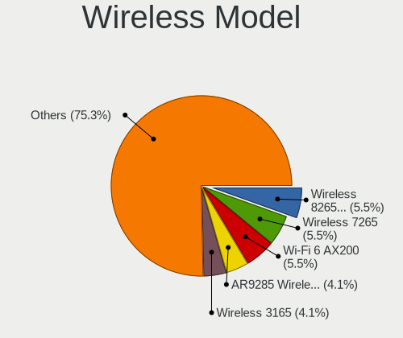

| Model                                                                   | Computers | Percent |
|-------------------------------------------------------------------------|-----------|---------|
| MediaTek MT7922 802.11ax PCI Express Wireless Network Adapter           | 5         | 6.67%   |
| Intel Wireless 8260                                                     | 5         | 6.67%   |
| Intel Wi-Fi 6 AX201                                                     | 4         | 5.33%   |
| Realtek RTL8852AE 802.11ax PCIe Wireless Network Adapter                | 3         | 4%      |
| Qualcomm Atheros QCA6174 802.11ac Wireless Network Adapter              | 3         | 4%      |
| Intel Wireless 8265 / 8275                                              | 3         | 4%      |
| Realtek RTL88x2bu [AC1200 Techkey]                                      | 2         | 2.67%   |
| Realtek RTL8822CE 802.11ac PCIe Wireless Network Adapter                | 2         | 2.67%   |
| Realtek RTL8821CE 802.11ac PCIe Wireless Network Adapter                | 2         | 2.67%   |
| Qualcomm QCNFA765 Wireless Network Adapter                              | 2         | 2.67%   |
| Qualcomm Atheros QCA9565 / AR9565 Wireless Network Adapter              | 2         | 2.67%   |
| Qualcomm Atheros AR9287 Wireless Network Adapter (PCI-Express)          | 2         | 2.67%   |
| Intel Wireless 7265                                                     | 2         | 2.67%   |
| Intel Wireless 3165                                                     | 2         | 2.67%   |
| Intel Raptor Lake PCH CNVi WiFi                                         | 2         | 2.67%   |
| Intel Centrino Ultimate-N 6300                                          | 2         | 2.67%   |
| Intel Alder Lake-S PCH CNVi WiFi                                        | 2         | 2.67%   |
| Broadcom BCM43142 802.11b/g/n                                           | 2         | 2.67%   |
| TP-Link TL-WN823N v2/v3 [Realtek RTL8192EU]                             | 1         | 1.33%   |
| TP-Link Archer T3U [Realtek RTL8812BU]                                  | 1         | 1.33%   |
| Sierra Wireless EM7455                                                  | 1         | 1.33%   |
| Realtek RTL8852CE PCIe 802.11ax Wireless Network Controller             | 1         | 1.33%   |
| Realtek RTL8852BE PCIe 802.11ax Wireless Network Controller             | 1         | 1.33%   |
| Realtek RTL8822BE 802.11a/b/g/n/ac WiFi adapter                         | 1         | 1.33%   |
| Realtek RTL8188CUS 802.11n WLAN Adapter                                 | 1         | 1.33%   |
| Qualcomm Atheros AR9285 Wireless Network Adapter (PCI-Express)          | 1         | 1.33%   |
| Qualcomm Atheros AR242x / AR542x Wireless Network Adapter (PCI-Express) | 1         | 1.33%   |
| MediaTek MT7921 802.11ax PCI Express Wireless Network Adapter           | 1         | 1.33%   |
| Marvell Group 88W8897 [AVASTAR] 802.11ac Wireless                       | 1         | 1.33%   |
| Intel Wireless 3160                                                     | 1         | 1.33%   |
| Intel Wi-Fi 7(802.11be) AX1775*/AX1790*/BE20*/BE401/BE1750* 2x2         | 1         | 1.33%   |
| Intel Wi-Fi 6E(802.11ax) AX210/AX1675* 2x2 [Typhoon Peak]               | 1         | 1.33%   |
| Intel Wi-Fi 6 AX201 160MHz                                              | 1         | 1.33%   |
| Intel Dual Band Wireless-AC 3165 Plus Bluetooth                         | 1         | 1.33%   |
| Intel Comet Lake PCH-LP CNVi WiFi                                       | 1         | 1.33%   |
| Intel Centrino Wireless-N 1030 [Rainbow Peak]                           | 1         | 1.33%   |
| Intel Centrino Advanced-N 6235                                          | 1         | 1.33%   |
| Intel Centrino Advanced-N 6205 [Taylor Peak]                            | 1         | 1.33%   |
| Intel Centrino Advanced-N 6200                                          | 1         | 1.33%   |
| Intel Cannon Point-LP CNVi [Wireless-AC]                                | 1         | 1.33%   |

Ethernet Vendor
---------------

Ethernet vendors

| Vendor                                 | Computers | Percent |
|----------------------------------------|-----------|---------|
| Realtek Semiconductor                  | 52        | 57.78%  |
| Intel                                  | 20        | 22.22%  |
| Broadcom                               | 5         | 5.56%   |
| DisplayLink                            | 3         | 3.33%   |
| Qualcomm Atheros                       | 2         | 2.22%   |
| Hewlett-Packard                        | 2         | 2.22%   |
| Suzhou Motorcomm Electronic Technology | 1         | 1.11%   |
| Samsung Electronics                    | 1         | 1.11%   |
| Nvidia                                 | 1         | 1.11%   |
| Mellanox Technologies                  | 1         | 1.11%   |
| Broadcom Limited                       | 1         | 1.11%   |
| ASIX Electronics                       | 1         | 1.11%   |

Ethernet Model
--------------

Ethernet models

| Model                                                                  | Computers | Percent |
|------------------------------------------------------------------------|-----------|---------|
| Realtek RTL8111/8168/8211/8411 PCI Express Gigabit Ethernet Controller | 37        | 39.78%  |
| Realtek RTL8125 2.5GbE Controller                                      | 6         | 6.45%   |
| Realtek RTL8153 Gigabit Ethernet Adapter                               | 5         | 5.38%   |
| Realtek RTL-8100/8101L/8139 PCI Fast Ethernet Adapter                  | 3         | 3.23%   |
| Intel Ethernet Connection I219-LM                                      | 3         | 3.23%   |
| Realtek RTL810xE PCI Express Fast Ethernet controller                  | 2         | 2.15%   |
| Intel I211 Gigabit Network Connection                                  | 2         | 2.15%   |
| Intel Ethernet Connection (7) I219-V                                   | 2         | 2.15%   |
| Intel 82579V Gigabit Network Connection                                | 2         | 2.15%   |
| HP lt4120 Snapdragon X5 LTE                                            | 2         | 2.15%   |
| Suzhou Motorcomm Electronic YT6801 Gigabit Ethernet Controller         | 1         | 1.08%   |
| Samsung GT-I9070 (network tethering, USB debugging enabled)            | 1         | 1.08%   |
| Qualcomm Atheros Killer E220x Gigabit Ethernet Controller              | 1         | 1.08%   |
| Qualcomm Atheros AR8151 v2.0 Gigabit Ethernet                          | 1         | 1.08%   |
| Nvidia MCP61 Ethernet                                                  | 1         | 1.08%   |
| Mellanox MT27710 Family [ConnectX-4 Lx]                                | 1         | 1.08%   |
| Intel I210 Gigabit Network Connection                                  | 1         | 1.08%   |
| Intel Ethernet Controller I226-IT                                      | 1         | 1.08%   |
| Intel Ethernet Controller I225-V                                       | 1         | 1.08%   |
| Intel Ethernet Connection I219-V                                       | 1         | 1.08%   |
| Intel Ethernet Connection I217-V                                       | 1         | 1.08%   |
| Intel Ethernet Connection I217-LM                                      | 1         | 1.08%   |
| Intel Ethernet Connection (4) I219-LM                                  | 1         | 1.08%   |
| Intel Ethernet Connection (2) I219-LM                                  | 1         | 1.08%   |
| Intel Ethernet Connection (17) I219-LM                                 | 1         | 1.08%   |
| Intel Ethernet Connection (13) I219-LM                                 | 1         | 1.08%   |
| Intel 82599 10 Gigabit Network Connection                              | 1         | 1.08%   |
| Intel 82579LM Gigabit Network Connection (Lewisville)                  | 1         | 1.08%   |
| Intel 82566DC Gigabit Network Connection                               | 1         | 1.08%   |
| DisplayLink PR09 DisplayPort Dock                                      | 1         | 1.08%   |
| DisplayLink LAPDOCK                                                    | 1         | 1.08%   |
| DisplayLink Dell D3100 Docking Station                                 | 1         | 1.08%   |
| Broadcom NetXtreme BCM57766 Gigabit Ethernet PCIe                      | 1         | 1.08%   |
| Broadcom NetXtreme BCM57765 Gigabit Ethernet PCIe                      | 1         | 1.08%   |
| Broadcom NetXtreme BCM5761e Gigabit Ethernet PCIe                      | 1         | 1.08%   |
| Broadcom NetXtreme BCM5761 Gigabit Ethernet PCIe                       | 1         | 1.08%   |
| Broadcom NetLink BCM57785 Gigabit Ethernet PCIe                        | 1         | 1.08%   |
| Broadcom Limited NetXtreme BCM5761e Gigabit Ethernet PCIe              | 1         | 1.08%   |
| ASIX AX88772A Fast Ethernet                                            | 1         | 1.08%   |

Net Controller Kind
-------------------

Ethernet, WiFi or modem

| Kind     | Computers | Percent |
|----------|-----------|---------|
| Ethernet | 80        | 52.29%  |
| WiFi     | 73        | 47.71%  |

Used Controller
---------------

Currently used network controller

| Kind     | Computers | Percent |
|----------|-----------|---------|
| WiFi     | 57        | 54.81%  |
| Ethernet | 47        | 45.19%  |

NICs
----

Total network controllers on board

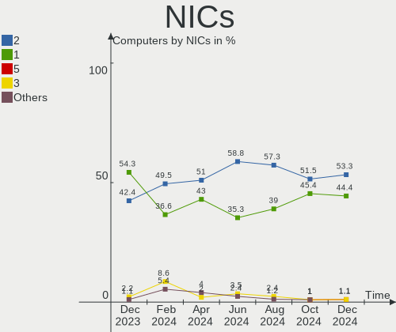

| Total | Computers | Percent |
|-------|-----------|---------|
| 2     | 51        | 51%     |
| 1     | 43        | 43%     |
| 0     | 3         | 3%      |
| 3     | 2         | 2%      |
| 4     | 1         | 1%      |

IPv6
----

IPv6 vs IPv4

| Used | Computers | Percent |
|------|-----------|---------|
| No   | 62        | 62%     |
| Yes  | 38        | 38%     |

Bluetooth
---------

Bluetooth Vendor
----------------

Controller vendors

| Vendor                          | Computers | Percent |
|---------------------------------|-----------|---------|
| Intel                           | 29        | 43.28%  |
| Realtek Semiconductor           | 8         | 11.94%  |
| Qualcomm Atheros Communications | 5         | 7.46%   |
| Foxconn / Hon Hai               | 5         | 7.46%   |
| Cambridge Silicon Radio         | 4         | 5.97%   |
| IMC Networks                    | 2         | 2.99%   |
| Broadcom                        | 2         | 2.99%   |
| USI                             | 1         | 1.49%   |
| TP-Link                         | 1         | 1.49%   |
| Toshiba                         | 1         | 1.49%   |
| MediaTek                        | 1         | 1.49%   |
| Marvell Semiconductor           | 1         | 1.49%   |
| Logitech                        | 1         | 1.49%   |
| Foxconn International           | 1         | 1.49%   |
| Edimax Technology               | 1         | 1.49%   |
| Dell                            | 1         | 1.49%   |
| ASUSTek Computer                | 1         | 1.49%   |
| Apple                           | 1         | 1.49%   |
| Actions                         | 1         | 1.49%   |

Bluetooth Model
---------------

Controller models

| Model                                               | Computers | Percent |
|-----------------------------------------------------|-----------|---------|
| Intel Bluetooth Device                              | 8         | 11.94%  |
| Realtek Bluetooth Radio                             | 7         | 10.45%  |
| Intel AX201 Bluetooth                               | 7         | 10.45%  |
| Intel Bluetooth wireless interface                  | 5         | 7.46%   |
| Foxconn / Hon Hai Wireless_Device                   | 4         | 5.97%   |
| Cambridge Silicon Radio Bluetooth Dongle (HCI mode) | 4         | 5.97%   |
| Intel Bluetooth 9460/9560 Jefferson Peak (JfP)      | 3         | 4.48%   |
| Intel AX211 Bluetooth                               | 3         | 4.48%   |
| Qualcomm Atheros  Bluetooth Device                  | 2         | 2.99%   |
| IMC Networks Bluetooth Radio                        | 2         | 2.99%   |
| USI Bluetooth Device                                | 1         | 1.49%   |
| TP-Link UB500 Adapter                               | 1         | 1.49%   |
| Toshiba BCM43142A0                                  | 1         | 1.49%   |
| Realtek RTL8822BE Bluetooth 4.2 Adapter             | 1         | 1.49%   |
| Qualcomm Atheros QCA61x4 Bluetooth 4.0              | 1         | 1.49%   |
| Qualcomm Atheros AR9462 Bluetooth                   | 1         | 1.49%   |
| Qualcomm Atheros AR3012 Bluetooth 4.0               | 1         | 1.49%   |
| MediaTek Wireless_Device                            | 1         | 1.49%   |
| Marvell Bluetooth and Wireless LAN Composite        | 1         | 1.49%   |
| Logitech BT Mini-Receiver (HCI mode)                | 1         | 1.49%   |
| Intel Centrino Bluetooth Wireless Transceiver       | 1         | 1.49%   |
| Intel Centrino Advanced-N 6230 Bluetooth adapter    | 1         | 1.49%   |
| Intel AX210 Bluetooth                               | 1         | 1.49%   |
| Foxconn International BCM43142A0 Bluetooth module   | 1         | 1.49%   |
| Foxconn / Hon Hai MediaTek Bluetooth Adapter        | 1         | 1.49%   |
| Edimax Edimax Bluetooth Adapter                     | 1         | 1.49%   |
| Dell DW375 Bluetooth Module                         | 1         | 1.49%   |
| Broadcom HP Portable SoftSailing                    | 1         | 1.49%   |
| Broadcom BCM2070 Bluetooth Device                   | 1         | 1.49%   |
| ASUS Broadcom BCM20702A0 Bluetooth                  | 1         | 1.49%   |
| Apple Bluetooth USB Host Controller                 | 1         | 1.49%   |
| Actions general adapter                             | 1         | 1.49%   |

Sound
-----

Sound Vendor
------------

Sound card vendors

| Vendor                   | Computers | Percent |
|--------------------------|-----------|---------|
| Intel                    | 61        | 45.52%  |
| AMD                      | 34        | 25.37%  |
| Nvidia                   | 25        | 18.66%  |
| Micro Star International | 2         | 1.49%   |
| C-Media Electronics      | 2         | 1.49%   |
| SteelSeries ApS          | 1         | 0.75%   |
| Sony                     | 1         | 0.75%   |
| Samson Technologies      | 1         | 0.75%   |
| Plantronics              | 1         | 0.75%   |
| Kingston Technology      | 1         | 0.75%   |
| Hewlett-Packard          | 1         | 0.75%   |
| Generalplus Technology   | 1         | 0.75%   |
| Ensoniq                  | 1         | 0.75%   |
| Dell                     | 1         | 0.75%   |
| Creative Labs            | 1         | 0.75%   |

Sound Model
-----------

Sound card models

| Model                                                                        | Computers | Percent |
|------------------------------------------------------------------------------|-----------|---------|
| AMD Family 17h/19h HD Audio Controller                                       | 16        | 9.58%   |
| AMD Rembrandt Radeon High Definition Audio Controller                        | 12        | 7.19%   |
| Intel Sunrise Point-LP HD Audio                                              | 9         | 5.39%   |
| Nvidia Audio device                                                          | 6         | 3.59%   |
| Intel 7 Series/C216 Chipset Family High Definition Audio Controller          | 6         | 3.59%   |
| Intel 6 Series/C200 Series Chipset Family High Definition Audio Controller   | 5         | 2.99%   |
| Intel 5 Series/3400 Series Chipset High Definition Audio                     | 5         | 2.99%   |
| AMD Renoir Radeon High Definition Audio Controller                           | 5         | 2.99%   |
| Intel Tiger Lake-LP Smart Sound Technology Audio Controller                  | 4         | 2.4%    |
| Intel Cannon Lake PCH cAVS                                                   | 4         | 2.4%    |
| AMD Starship/Matisse HD Audio Controller                                     | 4         | 2.4%    |
| Intel Xeon E3-1200 v3/4th Gen Core Processor HD Audio Controller             | 3         | 1.8%    |
| Intel 8 Series/C220 Series Chipset High Definition Audio Controller          | 3         | 1.8%    |
| AMD SBx00 Azalia (Intel HDA)                                                 | 3         | 1.8%    |
| AMD Navi 31 HDMI/DP Audio                                                    | 3         | 1.8%    |
| AMD FCH Azalia Controller                                                    | 3         | 1.8%    |
| AMD Family 17h (Models 00h-0fh) HD Audio Controller                          | 3         | 1.8%    |
| Nvidia GP107GL High Definition Audio Controller                              | 2         | 1.2%    |
| Nvidia GK107 HDMI Audio Controller                                           | 2         | 1.2%    |
| Nvidia GF119 HDMI Audio Controller                                           | 2         | 1.2%    |
| Nvidia GA106 High Definition Audio Controller                                | 2         | 1.2%    |
| Micro Star International USB Audio                                           | 2         | 1.2%    |
| Intel Raptor Lake-P/U/H cAVS                                                 | 2         | 1.2%    |
| Intel Haswell-ULT HD Audio Controller                                        | 2         | 1.2%    |
| Intel Broadwell-U Audio Controller                                           | 2         | 1.2%    |
| Intel Alder Lake-S HD Audio Controller                                       | 2         | 1.2%    |
| Intel Alder Lake PCH-P High Definition Audio Controller                      | 2         | 1.2%    |
| Intel 9 Series Chipset Family HD Audio Controller                            | 2         | 1.2%    |
| Intel 82801H (ICH8 Family) HD Audio Controller                               | 2         | 1.2%    |
| Intel 8 Series HD Audio Controller                                           | 2         | 1.2%    |
| Intel 100 Series/C230 Series Chipset Family HD Audio Controller              | 2         | 1.2%    |
| AMD Navi 21/23 HDMI/DP Audio Controller                                      | 2         | 1.2%    |
| AMD Kabini HDMI/DP Audio                                                     | 2         | 1.2%    |
| SteelSeries ApS Arctis 7P+                                                   | 1         | 0.6%    |
| Sony DualSense wireless controller (PS5)                                     | 1         | 0.6%    |
| Samson Technologies Meteor condenser microphone                              | 1         | 0.6%    |
| Plantronics Blackwire C5220 headset (remote control and 3.5mm audio adapter) | 1         | 0.6%    |
| Nvidia TU106 High Definition Audio Controller                                | 1         | 0.6%    |
| Nvidia TU104 HD Audio Controller                                             | 1         | 0.6%    |
| Nvidia MCP61 High Definition Audio                                           | 1         | 0.6%    |

Memory
------

Memory Vendor
-------------

Memory module vendors

| Vendor              | Computers | Percent |
|---------------------|-----------|---------|
| Samsung Electronics | 13        | 23.21%  |
| SK hynix            | 8         | 14.29%  |
| Micron Technology   | 8         | 14.29%  |
| Kingston            | 7         | 12.5%   |
| G.Skill             | 5         | 8.93%   |
| Corsair             | 3         | 5.36%   |
| Unknown (ABCD)      | 2         | 3.57%   |
| Nanya Technology    | 2         | 3.57%   |
| Crucial             | 2         | 3.57%   |
| Unknown             | 2         | 3.57%   |
| Unknown             | 1         | 1.79%   |
| TakeMS              | 1         | 1.79%   |
| A-DATA Technology   | 1         | 1.79%   |
| 8CFD000080AD        | 1         | 1.79%   |

Memory Model
------------

Memory module models

| Model                                                            | Computers | Percent |
|------------------------------------------------------------------|-----------|---------|
| Samsung RAM M471A1K43EB1-CWE 8GB SODIMM DDR4 3200MT/s            | 2         | 3.33%   |
| G.Skill RAM F5-6000J3636F16G 16GB DIMM DDR5 6400MT/s             | 2         | 3.33%   |
| Unknown                                                          | 2         | 3.33%   |
| Unknown RAM Module 4GB DIMM SDRAM                                | 1         | 1.67%   |
| Unknown (ABCD) RAM 123456789012345678 4GB DIMM DDR4 2400MT/s     | 1         | 1.67%   |
| Unknown (ABCD) RAM 123456789012345678 2GB SODIMM LPDDR4 2400MT/s | 1         | 1.67%   |
| TakeMS RAM Module 2GB DIMM DDR2 800MT/s                          | 1         | 1.67%   |
| SK hynix RAM HMT451S6DFR8A-PB 4GB SODIMM DDR3 1600MT/s           | 1         | 1.67%   |
| SK hynix RAM HMT451S6BFR8A-PB 4GB SODIMM DDR3 1600MT/s           | 1         | 1.67%   |
| SK hynix RAM HMT41GS6MFR8C-H9 8GB SODIMM DDR3 1333MT/s           | 1         | 1.67%   |
| SK hynix RAM HMT325S6EFR8A-PB 2GB SODIMM DDR3 1600MT/s           | 1         | 1.67%   |
| SK hynix RAM HMCG78MEBSA095N 16GB SODIMM DDR5 4800MT/s           | 1         | 1.67%   |
| SK hynix RAM HMA851S6CJR6N-VK 4GB DDR4 2400MT/s                  | 1         | 1.67%   |
| SK hynix RAM HMA81GS6CJR8N-VK 8GB SODIMM DDR4 2667MT/s           | 1         | 1.67%   |
| SK hynix RAM HMA41GS6AFR8N-TF 8GB SODIMM DDR4 2667MT/s           | 1         | 1.67%   |
| SK hynix RAM H58G66BK7BX067 8GB SODIMM LPDDR5 6400MT/s           | 1         | 1.67%   |
| Samsung RAM Module 8GB SODIMM DDR4 2667MT/s                      | 1         | 1.67%   |
| Samsung RAM Module 8GB SODIMM DDR4 2133MT/s                      | 1         | 1.67%   |
| Samsung RAM Module 4GB SODIMM LPDDR3 1867MT/s                    | 1         | 1.67%   |
| Samsung RAM Module 1GB SODIMM DDR2 533MT/s                       | 1         | 1.67%   |
| Samsung RAM M471B5173QH0-YK0 4GB SODIMM DDR3 1600MT/s            | 1         | 1.67%   |
| Samsung RAM M471B5173EB0-YK0 4GB SODIMM DDR3 1600MT/s            | 1         | 1.67%   |
| Samsung RAM M471B5173DB0-YK0 4GB SODIMM DDR3 1600MT/s            | 1         | 1.67%   |
| Samsung RAM M471B1G73DB0-YK0 8GB SODIMM DDR3 1600MT/s            | 1         | 1.67%   |
| Samsung RAM M471A5244CB0-CWE 4GB SODIMM DDR4 3200MT/s            | 1         | 1.67%   |
| Samsung RAM M471A2K43BB1-CRC 16GB SODIMM DDR4 2400MT/s           | 1         | 1.67%   |
| Samsung RAM M378B5173QH0-CK0 4GB DIMM DDR3 1600MT/s              | 1         | 1.67%   |
| Samsung RAM M378A1K43CB2-CTD 8GB DIMM DDR4 3266MT/s              | 1         | 1.67%   |
| Nanya RAM NT4GC64B8HB0NS-CG 4GB SODIMM DDR3 1334MT/s             | 1         | 1.67%   |
| Nanya RAM NT2GC64B88B0NS-CG 2GB SODIMM DDR3 1334MT/s             | 1         | 1.67%   |
| Nanya RAM M2F2G64CB88G7N-CG 2GB DIMM DDR3 1333MT/s               | 1         | 1.67%   |
| Micron RAM MTC8C1084S1SC48BA1 16GB SODIMM DDR5 4800MT/s          | 1         | 1.67%   |
| Micron RAM MT62F2G32D4DS-026 WT 8GB SODIMM LPDDR5 7500MT/s       | 1         | 1.67%   |
| Micron RAM MT62F2G32D4DS-026 WT 8GB Row Of Chips LPDDR5 6400MT/s | 1         | 1.67%   |
| Micron RAM 8JTF51264AZ-1G6E1 4GB DIMM DDR3 1600MT/s              | 1         | 1.67%   |
| Micron RAM 8JSF25664HZ-1G4D1 2GB SODIMM DDR3 1334MT/s            | 1         | 1.67%   |
| Micron RAM 4ATF1G64HZ-3G2E1 8GB Row Of Chips DDR4 3200MT/s       | 1         | 1.67%   |
| Micron RAM 4ATF1G64HZ-3G2B1 8GB Row Of Chips DDR4 3200MT/s       | 1         | 1.67%   |
| Micron RAM 18ADF2G72AZ-2G6E1 16384MB DIMM DDR4 2667MT/s          | 1         | 1.67%   |
| Kingston RAM Module 2GB DIMM DDR2 800MT/s                        | 1         | 1.67%   |

Memory Kind
-----------

Memory module kinds

| Kind   | Computers | Percent |
|--------|-----------|---------|
| DDR4   | 18        | 36%     |
| DDR3   | 14        | 28%     |
| DDR5   | 9         | 18%     |
| LPDDR5 | 3         | 6%      |
| LPDDR4 | 2         | 4%      |
| DDR2   | 2         | 4%      |
| SDRAM  | 1         | 2%      |
| LPDDR3 | 1         | 2%      |

Memory Form Factor
------------------

Physical design of the memory module

| Name            | Computers | Percent |
|-----------------|-----------|---------|
| SODIMM          | 29        | 56.86%  |
| DIMM            | 16        | 31.37%  |
| Row Of Chips    | 3         | 5.88%   |
| Proprietary Car | 1         | 1.96%   |
| DIP             | 1         | 1.96%   |
| Unknown         | 1         | 1.96%   |

Memory Size
-----------

Memory module size

| Size  | Computers | Percent |
|-------|-----------|---------|
| 8192  | 18        | 34.62%  |
| 16384 | 12        | 23.08%  |
| 4096  | 12        | 23.08%  |
| 2048  | 5         | 9.62%   |
| 32768 | 3         | 5.77%   |
| 1024  | 2         | 3.85%   |

Memory Speed
------------

Memory module speed

| Speed   | Computers | Percent |
|---------|-----------|---------|
| 1600    | 9         | 16.98%  |
| 4800    | 5         | 9.43%   |
| 3200    | 5         | 9.43%   |
| 2400    | 5         | 9.43%   |
| 6400    | 4         | 7.55%   |
| 2667    | 3         | 5.66%   |
| 5600    | 2         | 3.77%   |
| 3000    | 2         | 3.77%   |
| 1334    | 2         | 3.77%   |
| 1333    | 2         | 3.77%   |
| 1066    | 2         | 3.77%   |
| 7500    | 1         | 1.89%   |
| 3733    | 1         | 1.89%   |
| 3600    | 1         | 1.89%   |
| 3466    | 1         | 1.89%   |
| 3266    | 1         | 1.89%   |
| 2933    | 1         | 1.89%   |
| 2133    | 1         | 1.89%   |
| 1867    | 1         | 1.89%   |
| 1866    | 1         | 1.89%   |
| 800     | 1         | 1.89%   |
| 533     | 1         | 1.89%   |
| Unknown | 1         | 1.89%   |

Printers & scanners
-------------------

Printer Vendor
--------------

Printer device vendors

| Vendor             | Computers | Percent |
|--------------------|-----------|---------|
| Hewlett-Packard    | 1         | 50%     |
| Brother Industries | 1         | 50%     |

Printer Model
-------------

Printer device models

| Model                  | Computers | Percent |
|------------------------|-----------|---------|
| HP DeskJet 2600 series | 1         | 50%     |
| Brother DCP-9020CDW    | 1         | 50%     |

Scanner Vendor
--------------

Scanner device vendors

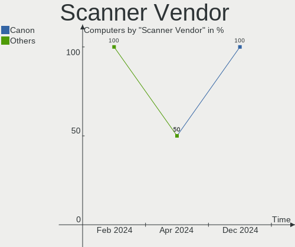

| Vendor      | Computers | Percent |
|-------------|-----------|---------|
| Seiko Epson | 1         | 50%     |
| Canon       | 1         | 50%     |

Scanner Model
-------------

Scanner device models

| Model                                       | Computers | Percent |
|---------------------------------------------|-----------|---------|
| Seiko Epson GT-X820 [Perfection V600 Photo] | 1         | 50%     |
| Canon CanoScan LiDE 120                     | 1         | 50%     |

Camera
------

Camera Vendor
-------------

Camera device vendors

| Vendor                        | Computers | Percent |
|-------------------------------|-----------|---------|
| Chicony Electronics           | 17        | 30.91%  |
| IMC Networks                  | 4         | 7.27%   |
| Apple                         | 4         | 7.27%   |
| Sunplus Innovation Technology | 3         | 5.45%   |
| Realtek Semiconductor         | 3         | 5.45%   |
| Microdia                      | 3         | 5.45%   |
| Logitech                      | 3         | 5.45%   |
| Suyin                         | 2         | 3.64%   |
| Bison Electronics             | 2         | 3.64%   |
| Acer                          | 2         | 3.64%   |
| Trust                         | 1         | 1.82%   |
| Syntek                        | 1         | 1.82%   |
| Sonix Technology              | 1         | 1.82%   |
| Silicon Motion                | 1         | 1.82%   |
| Shinetech                     | 1         | 1.82%   |
| Samsung Electronics           | 1         | 1.82%   |
| Quanta                        | 1         | 1.82%   |
| Luxvisions Innotech Limited   | 1         | 1.82%   |
| Lite-On Technology            | 1         | 1.82%   |
| GEMBIRD                       | 1         | 1.82%   |
| Cubeternet                    | 1         | 1.82%   |
| BRS-ZW-230825                 | 1         | 1.82%   |

Camera Model
------------

Camera device models

| Model                                             | Computers | Percent |
|---------------------------------------------------|-----------|---------|
| Chicony Integrated Camera                         | 5         | 9.09%   |
| Chicony HP HD Camera                              | 3         | 5.45%   |
| Suyin 1.3M HD WebCam                              | 2         | 3.64%   |
| Realtek Integrated_Webcam_HD                      | 2         | 3.64%   |
| IMC Networks USB2.0 HD UVC WebCam                 | 2         | 3.64%   |
| Apple iPhone 5/5C/5S/6/SE/7/8/X                   | 2         | 3.64%   |
| Trust Full HD Webcam                              | 1         | 1.82%   |
| Syntek Integrated Camera                          | 1         | 1.82%   |
| Sunplus Laptop_Integrated_Webcam_HD               | 1         | 1.82%   |
| Sunplus Laptop_Integrated_Webcam_FHD              | 1         | 1.82%   |
| Sunplus Integrated_Webcam_HD                      | 1         | 1.82%   |
| Sonix USB2.0 FHD UVC WebCam                       | 1         | 1.82%   |
| Silicon Motion WebCam SCB-0385N                   | 1         | 1.82%   |
| Shinetech USB2.0 FHD UVC WebCam                   | 1         | 1.82%   |
| Samsung Galaxy series, misc. (MTP mode)           | 1         | 1.82%   |
| Realtek Integrated Webcam_HD                      | 1         | 1.82%   |
| Quanta HP HD Camera                               | 1         | 1.82%   |
| Microdia Laptop_Integrated_Webcam_HD              | 1         | 1.82%   |
| Microdia Integrated_Webcam_HD                     | 1         | 1.82%   |
| Microdia Integrated_Webcam_FHD                    | 1         | 1.82%   |
| Luxvisions Innotech Limited HP HD Camera          | 1         | 1.82%   |
| Logitech Webcam C930e                             | 1         | 1.82%   |
| Logitech Webcam C270                              | 1         | 1.82%   |
| Logitech C920 PRO HD Webcam                       | 1         | 1.82%   |
| Lite-On HP HD Camera                              | 1         | 1.82%   |
| IMC Networks Integrated Camera                    | 1         | 1.82%   |
| IMC Networks EasyCamera                           | 1         | 1.82%   |
| GEMBIRD Generic UVC 1.00 camera [AppoTech AX2311] | 1         | 1.82%   |
| Cubeternet USB2.0 Camera                          | 1         | 1.82%   |
| Chicony VGA Webcam                                | 1         | 1.82%   |
| Chicony USB2.0 Camera                             | 1         | 1.82%   |
| Chicony TOSHIBA Web Camera - HD                   | 1         | 1.82%   |
| Chicony integrated USB webcam                     | 1         | 1.82%   |
| Chicony Integrated HP HD Webcam                   | 1         | 1.82%   |
| Chicony HP Wide Vision HD Camera                  | 1         | 1.82%   |
| Chicony HP True Vision HD Camera                  | 1         | 1.82%   |
| Chicony HP HD Webcam                              | 1         | 1.82%   |
| Chicony HD WebCam                                 | 1         | 1.82%   |
| BRS-ZW-230825 BKX-Usb2.0 2MP Camera               | 1         | 1.82%   |
| Bison FHD Webcam                                  | 1         | 1.82%   |

Security
--------

Fingerprint Vendor
------------------

Fingerprint sensor vendors

| Vendor                             | Computers | Percent |
|------------------------------------|-----------|---------|
| Validity Sensors                   | 3         | 37.5%   |
| Synaptics                          | 2         | 25%     |
| Shenzhen Goodix Technology         | 2         | 25%     |
| Realtek USB2.0 Finger Print Bridge | 1         | 12.5%   |

Fingerprint Model
-----------------

Fingerprint sensor models

| Model                                                           | Computers | Percent |
|-----------------------------------------------------------------|-----------|---------|
| Shenzhen Goodix  FingerPrint Device                             | 2         | 25%     |
| Validity Sensors VFS495 Fingerprint Reader                      | 1         | 12.5%   |
| Validity Sensors VFS491                                         | 1         | 12.5%   |
| Validity Sensors Fingerprint scanner                            | 1         | 12.5%   |
| Synaptics UWP WBDI                                              | 1         | 12.5%   |
| Synaptics Fingerprint reader [HP G6]                            | 1         | 12.5%   |
| Realtek USB2.0 Finger Print Bridge FocalTech Fingerprint Device | 1         | 12.5%   |

Chipcard Vendor
---------------

Chipcard module vendors

| Vendor              | Computers | Percent |
|---------------------|-----------|---------|
| Broadcom            | 6         | 60%     |
| Alcor Micro         | 2         | 20%     |
| Yubico.com          | 1         | 10%     |
| Chicony Electronics | 1         | 10%     |

Chipcard Model
--------------

Chipcard module models

| Model                                                                        | Computers | Percent |
|------------------------------------------------------------------------------|-----------|---------|
| Broadcom 5880                                                                | 2         | 20%     |
| Broadcom 58200                                                               | 2         | 20%     |
| Alcor Micro AU9540 Smartcard Reader                                          | 2         | 20%     |
| Yubico.com Yubikey 4/5 U2F+CCID                                              | 1         | 10%     |
| Chicony Electronics HP Skylab USB Smartcard Keyboard                         | 1         | 10%     |
| Broadcom BCM5880 Secure Applications Processor with fingerprint swipe sensor | 1         | 10%     |
| Broadcom BCM5880 Secure Applications Processor                               | 1         | 10%     |

Unsupported
-----------

Unsupported Devices
-------------------

Total unsupported devices on board

| Total | Computers | Percent |
|-------|-----------|---------|
| 0     | 68        | 68%     |
| 1     | 27        | 27%     |
| 2     | 4         | 4%      |
| 3     | 1         | 1%      |

Unsupported Device Types
------------------------

Types of unsupported devices

| Type                     | Computers | Percent |
|--------------------------|-----------|---------|
| Graphics card            | 8         | 22.22%  |
| Fingerprint reader       | 8         | 22.22%  |
| Chipcard                 | 7         | 19.44%  |
| Net/wireless             | 5         | 13.89%  |
| Net/ethernet             | 2         | 5.56%   |
| Storage                  | 1         | 2.78%   |
| Sound                    | 1         | 2.78%   |
| Modem                    | 1         | 2.78%   |
| Communication controller | 1         | 2.78%   |
| Camera                   | 1         | 2.78%   |
| Bluetooth                | 1         | 2.78%   |

