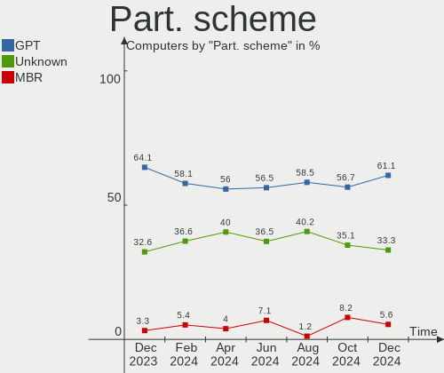
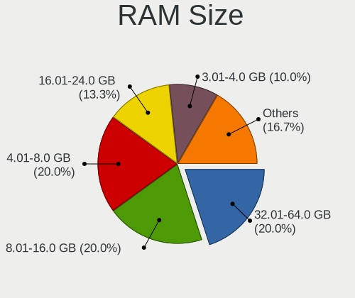
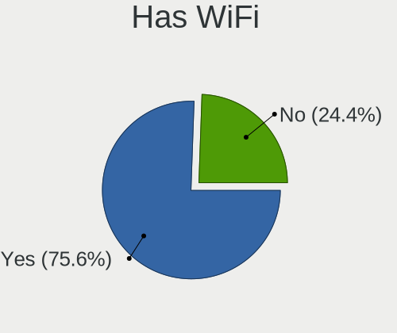
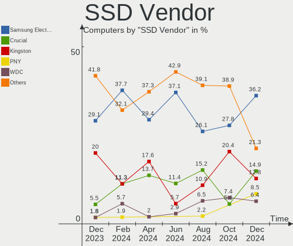
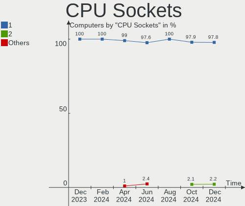
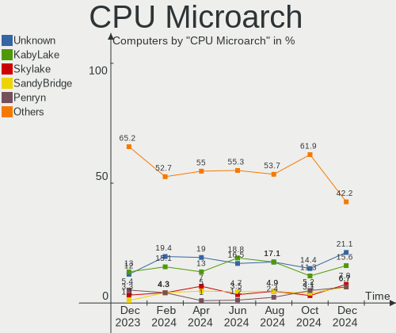
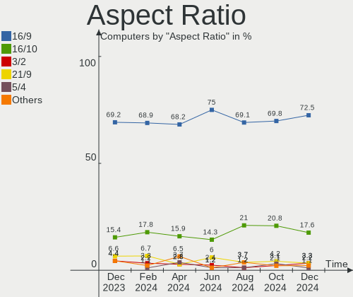
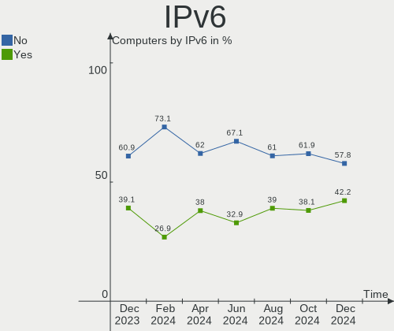

Linux in Netherlands - Hardware Trends
--------------------------------------

A project to identify most popular hardware characteristics and track their change
over time based on data collected by Linux users at https://Linux-Hardware.org.

Anyone can contribute to this report by the [hw-probe](https://github.com/linuxhw/hw-probe) tool:

    sudo -E hw-probe -all -upload

This is a report for all computer types. See also reports for [desktops](/Location/Netherlands/Desktop/README.md) and [notebooks](/Location/Netherlands/Notebook/README.md).

Period: Jan, 2024.

Contents
--------

* [ System ](#system)
  - [ OS                       ](#os)
  - [ OS Family                ](#os-family)
  - [ Kernel                   ](#kernel)
  - [ Kernel Family            ](#kernel-family)
  - [ Kernel Major Ver.        ](#kernel-major-ver)
  - [ Arch                     ](#arch)
  - [ DE                       ](#de)
  - [ Display Server           ](#display-server)
  - [ Display Manager          ](#display-manager)
  - [ OS Lang                  ](#os-lang)
  - [ Boot Mode                ](#boot-mode)
  - [ Filesystem               ](#filesystem)
  - [ Part. scheme             ](#part-scheme)
  - [ Dual Boot with Linux/BSD ](#dual-boot-with-linuxbsd)
  - [ Dual Boot (Win)          ](#dual-boot-win)

* [ Board ](#board)
  - [ Vendor                   ](#vendor)
  - [ Model                    ](#model)
  - [ Model Family             ](#model-family)
  - [ MFG Year                 ](#mfg-year)
  - [ Form Factor              ](#form-factor)
  - [ Secure Boot              ](#secure-boot)
  - [ Coreboot                 ](#coreboot)
  - [ RAM Size                 ](#ram-size)
  - [ RAM Used                 ](#ram-used)
  - [ Total Drives             ](#total-drives)
  - [ Has CD-ROM               ](#has-cd-rom)
  - [ Has Ethernet             ](#has-ethernet)
  - [ Has WiFi                 ](#has-wifi)
  - [ Has Bluetooth            ](#has-bluetooth)

* [ Location ](#location)
  - [ Country                  ](#country)
  - [ City                     ](#city)

* [ Drives ](#drives)
  - [ Drive Vendor             ](#drive-vendor)
  - [ Drive Model              ](#drive-model)
  - [ HDD Vendor               ](#hdd-vendor)
  - [ SSD Vendor               ](#ssd-vendor)
  - [ Drive Kind               ](#drive-kind)
  - [ Drive Connector          ](#drive-connector)
  - [ Drive Size               ](#drive-size)
  - [ Space Total              ](#space-total)
  - [ Space Used               ](#space-used)
  - [ Malfunc. Drives          ](#malfunc-drives)
  - [ Malfunc. Drive Vendor    ](#malfunc-drive-vendor)
  - [ Malfunc. HDD Vendor      ](#malfunc-hdd-vendor)
  - [ Malfunc. Drive Kind      ](#malfunc-drive-kind)
  - [ Failed Drives            ](#failed-drives)
  - [ Failed Drive Vendor      ](#failed-drive-vendor)
  - [ Drive Status             ](#drive-status)

* [ Storage controller ](#storage-controller)
  - [ Storage Vendor           ](#storage-vendor)
  - [ Storage Model            ](#storage-model)
  - [ Storage Kind             ](#storage-kind)

* [ Processor ](#processor)
  - [ CPU Vendor               ](#cpu-vendor)
  - [ CPU Model                ](#cpu-model)
  - [ CPU Model Family         ](#cpu-model-family)
  - [ CPU Cores                ](#cpu-cores)
  - [ CPU Sockets              ](#cpu-sockets)
  - [ CPU Threads              ](#cpu-threads)
  - [ CPU Op-Modes             ](#cpu-op-modes)
  - [ CPU Microcode            ](#cpu-microcode)
  - [ CPU Microarch            ](#cpu-microarch)

* [ Graphics ](#graphics)
  - [ GPU Vendor               ](#gpu-vendor)
  - [ GPU Model                ](#gpu-model)
  - [ GPU Combo                ](#gpu-combo)
  - [ GPU Driver               ](#gpu-driver)
  - [ GPU Memory               ](#gpu-memory)

* [ Monitor ](#monitor)
  - [ Monitor Vendor           ](#monitor-vendor)
  - [ Monitor Model            ](#monitor-model)
  - [ Monitor Resolution       ](#monitor-resolution)
  - [ Monitor Diagonal         ](#monitor-diagonal)
  - [ Monitor Width            ](#monitor-width)
  - [ Aspect Ratio             ](#aspect-ratio)
  - [ Monitor Area             ](#monitor-area)
  - [ Pixel Density            ](#pixel-density)
  - [ Multiple Monitors        ](#multiple-monitors)

* [ Network ](#network)
  - [ Net Controller Vendor    ](#net-controller-vendor)
  - [ Net Controller Model     ](#net-controller-model)
  - [ Wireless Vendor          ](#wireless-vendor)
  - [ Wireless Model           ](#wireless-model)
  - [ Ethernet Vendor          ](#ethernet-vendor)
  - [ Ethernet Model           ](#ethernet-model)
  - [ Net Controller Kind      ](#net-controller-kind)
  - [ Used Controller          ](#used-controller)
  - [ NICs                     ](#nics)
  - [ IPv6                     ](#ipv6)

* [ Bluetooth ](#bluetooth)
  - [ Bluetooth Vendor         ](#bluetooth-vendor)
  - [ Bluetooth Model          ](#bluetooth-model)

* [ Sound ](#sound)
  - [ Sound Vendor             ](#sound-vendor)
  - [ Sound Model              ](#sound-model)

* [ Memory ](#memory)
  - [ Memory Vendor            ](#memory-vendor)
  - [ Memory Model             ](#memory-model)
  - [ Memory Kind              ](#memory-kind)
  - [ Memory Form Factor       ](#memory-form-factor)
  - [ Memory Size              ](#memory-size)
  - [ Memory Speed             ](#memory-speed)

* [ Printers & scanners ](#printers--scanners)
  - [ Printer Vendor           ](#printer-vendor)
  - [ Printer Model            ](#printer-model)
  - [ Scanner Vendor           ](#scanner-vendor)
  - [ Scanner Model            ](#scanner-model)

* [ Camera ](#camera)
  - [ Camera Vendor            ](#camera-vendor)
  - [ Camera Model             ](#camera-model)

* [ Security ](#security)
  - [ Fingerprint Vendor       ](#fingerprint-vendor)
  - [ Fingerprint Model        ](#fingerprint-model)
  - [ Chipcard Vendor          ](#chipcard-vendor)
  - [ Chipcard Model           ](#chipcard-model)

* [ Unsupported ](#unsupported)
  - [ Unsupported Devices      ](#unsupported-devices)
  - [ Unsupported Device Types ](#unsupported-device-types)

System
------

OS
--

Installed operating systems

| Name                        | Computers | Percent |
|-----------------------------|-----------|---------|
| Fedora 39                   | 12        | 10.62%  |
| Ubuntu 22.04                | 10        | 8.85%   |
| Linux Mint 21.3             | 9         | 7.96%   |
| Zorin 17                    | 7         | 6.19%   |
| Debian 12                   | 7         | 6.19%   |
| Zorin 16                    | 6         | 5.31%   |
| Linux Mint 21.2             | 6         | 5.31%   |
| Arch Rolling                | 6         | 5.31%   |
| Ubuntu 23.10                | 5         | 4.42%   |
| Pop!_OS 22.04               | 4         | 3.54%   |
| EndeavourOS Rolling         | 3         | 2.65%   |
| SteamOS 3.5.7               | 2         | 1.77%   |
| openSUSE Leap-15.5          | 2         | 1.77%   |
| NixOS 23.11                 | 2         | 1.77%   |
| Manjaro 23.1.2              | 2         | 1.77%   |
| LMDE 6                      | 2         | 1.77%   |
| Linux Mint 20.3             | 2         | 1.77%   |
| Xero Rolling                | 1         | 0.88%   |
| Ubuntu 24.04                | 1         | 0.88%   |
| Ubuntu 20.04                | 1         | 0.88%   |
| TUXEDO OS 22.04             | 1         | 0.88%   |
| Sparky 7.2                  | 1         | 0.88%   |
| org.kde.Platform 5.15-21.08 | 1         | 0.88%   |
| OpenMandriva 5.0            | 1         | 0.88%   |
| OpenMandriva 24.01          | 1         | 0.88%   |
| Nobara 39                   | 1         | 0.88%   |
| NixOS 24.05                 | 1         | 0.88%   |
| Manjaro                     | 1         | 0.88%   |
| Mageia 9                    | 1         | 0.88%   |
| Mageia 8                    | 1         | 0.88%   |
| Linux Mint 21               | 1         | 0.88%   |
| Linux Mint 19.3             | 1         | 0.88%   |
| Lilidog 23                  | 1         | 0.88%   |
| Kali 2023.4                 | 1         | 0.88%   |
| Kali 2023.2                 | 1         | 0.88%   |
| Gentoo 2.14                 | 1         | 0.88%   |
| Garuda Linux Soaring        | 1         | 0.88%   |
| Fedora 37                   | 1         | 0.88%   |
| Elementary 7.1              | 1         | 0.88%   |
| Debian Sid                  | 1         | 0.88%   |

OS Family
---------

OS without a version

| Name             | Computers | Percent |
|------------------|-----------|---------|
| Linux Mint       | 19        | 16.81%  |
| Ubuntu           | 17        | 15.04%  |
| Zorin            | 13        | 11.5%   |
| Fedora           | 13        | 11.5%   |
| Debian           | 8         | 7.08%   |
| Arch             | 6         | 5.31%   |
| Pop!_OS          | 4         | 3.54%   |
| NixOS            | 3         | 2.65%   |
| Manjaro          | 3         | 2.65%   |
| EndeavourOS      | 3         | 2.65%   |
| SteamOS          | 2         | 1.77%   |
| openSUSE         | 2         | 1.77%   |
| OpenMandriva     | 2         | 1.77%   |
| Mageia           | 2         | 1.77%   |
| LMDE             | 2         | 1.77%   |
| Kali             | 2         | 1.77%   |
| Xero             | 1         | 0.88%   |
| TUXEDO OS        | 1         | 0.88%   |
| Sparky           | 1         | 0.88%   |
| org.kde.Platform | 1         | 0.88%   |
| Nobara           | 1         | 0.88%   |
| Lilidog          | 1         | 0.88%   |
| Gentoo           | 1         | 0.88%   |
| Garuda Linux     | 1         | 0.88%   |
| Elementary       | 1         | 0.88%   |
| BlackPanther     | 1         | 0.88%   |
| ArcoLinux        | 1         | 0.88%   |
| Arch ARM         | 1         | 0.88%   |

Kernel
------

Version of the Linux kernel

| Version                      | Computers | Percent |
|------------------------------|-----------|---------|
| 6.5.0-14-generic             | 16        | 14.16%  |
| 5.15.0-91-generic            | 14        | 12.39%  |
| 6.6.9-200.fc39.x86_64        | 5         | 4.42%   |
| 6.2.0-39-generic             | 5         | 4.42%   |
| 6.1.0-17-amd64               | 5         | 4.42%   |
| 6.6.8-200.fc39.x86_64        | 3         | 2.65%   |
| 6.6.6-76060606-generic       | 3         | 2.65%   |
| 6.5.0-0.deb12.4-amd64        | 3         | 2.65%   |
| 6.7.2-arch1-1                | 2         | 1.77%   |
| 6.7.0-zen3-1-zen             | 2         | 1.77%   |
| 6.6.8-2-MANJARO              | 2         | 1.77%   |
| 6.6.2-desktop-1omv2390       | 2         | 1.77%   |
| 6.6.11-200.fc39.x86_64       | 2         | 1.77%   |
| 6.6.10-arch1-1               | 2         | 1.77%   |
| 6.5.0-15-generic             | 2         | 1.77%   |
| 6.1.52-valve9-1-neptune-61   | 2         | 1.77%   |
| 5.15.0-92-generic            | 2         | 1.77%   |
| 5.14.21-150500.55.39-default | 2         | 1.77%   |
| 6.7.2-zen1-1-zen             | 1         | 0.88%   |
| 6.7.1-arch1-1                | 1         | 0.88%   |
| 6.7.0-gentoox64.efi          | 1         | 0.88%   |
| 6.7.0-arch3-1                | 1         | 0.88%   |
| 6.7.0-202.fsync.fc39.x86_64  | 1         | 0.88%   |
| 6.7.0                        | 1         | 0.88%   |
| 6.6.9-amd64                  | 1         | 0.88%   |
| 6.6.8-arch1-1                | 1         | 0.88%   |
| 6.6.13-200.fc39.x86_64       | 1         | 0.88%   |
| 6.6.12-danctnix1-1-pinetab2  | 1         | 0.88%   |
| 6.6.12-200.fc39.x86_64       | 1         | 0.88%   |
| 6.6.12-1-lts                 | 1         | 0.88%   |
| 6.6.10-zen1-1-zen            | 1         | 0.88%   |
| 6.6.10-76060610-generic      | 1         | 0.88%   |
| 6.6.0-14-generic             | 1         | 0.88%   |
| 6.5.13-server-6.mga9         | 1         | 0.88%   |
| 6.5.13-7-MANJARO             | 1         | 0.88%   |
| 6.5.11-7-pve                 | 1         | 0.88%   |
| 6.5.0-kali3-amd64            | 1         | 0.88%   |
| 6.5.0-9-generic              | 1         | 0.88%   |
| 6.5.0-10013-tuxedo           | 1         | 0.88%   |
| 6.2.0-26-generic             | 1         | 0.88%   |

Kernel Family
-------------

Linux kernel without a distro release

| Version | Computers | Percent |
|---------|-----------|---------|
| 6.5.0   | 24        | 21.24%  |
| 5.15.0  | 19        | 16.81%  |
| 6.1.0   | 7         | 6.19%   |
| 6.7.0   | 6         | 5.31%   |
| 6.6.9   | 6         | 5.31%   |
| 6.6.8   | 6         | 5.31%   |
| 6.2.0   | 6         | 5.31%   |
| 6.6.10  | 4         | 3.54%   |
| 6.7.2   | 3         | 2.65%   |
| 6.6.6   | 3         | 2.65%   |
| 6.6.12  | 3         | 2.65%   |
| 6.6.2   | 2         | 1.77%   |
| 6.6.11  | 2         | 1.77%   |
| 6.5.13  | 2         | 1.77%   |
| 6.1.69  | 2         | 1.77%   |
| 6.1.52  | 2         | 1.77%   |
| 5.4.0   | 2         | 1.77%   |
| 5.14.21 | 2         | 1.77%   |
| 6.7.1   | 1         | 0.88%   |
| 6.6.13  | 1         | 0.88%   |
| 6.6.0   | 1         | 0.88%   |
| 6.5.11  | 1         | 0.88%   |
| 6.1.72  | 1         | 0.88%   |
| 6.1.64  | 1         | 0.88%   |
| 6.1.45  | 1         | 0.88%   |
| 6.0.7   | 1         | 0.88%   |
| 5.8.0   | 1         | 0.88%   |
| 5.19.0  | 1         | 0.88%   |
| 5.0.0   | 1         | 0.88%   |
| 4.18.16 | 1         | 0.88%   |

Kernel Major Ver.
-----------------

Linux kernel major version

| Version | Computers | Percent |
|---------|-----------|---------|
| 6.6     | 28        | 24.78%  |
| 6.5     | 27        | 23.89%  |
| 5.15    | 19        | 16.81%  |
| 6.1     | 14        | 12.39%  |
| 6.7     | 10        | 8.85%   |
| 6.2     | 6         | 5.31%   |
| 5.4     | 2         | 1.77%   |
| 5.14    | 2         | 1.77%   |
| 6.0     | 1         | 0.88%   |
| 5.8     | 1         | 0.88%   |
| 5.19    | 1         | 0.88%   |
| 5.0     | 1         | 0.88%   |
| 4.18    | 1         | 0.88%   |

Arch
----

OS architecture (x86_64, i586, etc.)

| Name    | Computers | Percent |
|---------|-----------|---------|
| x86_64  | 111       | 98.23%  |
| i686    | 1         | 0.88%   |
| aarch64 | 1         | 0.88%   |

DE
--

Desktop Environment

| Name       | Computers | Percent |
|------------|-----------|---------|
| GNOME      | 51        | 45.13%  |
| KDE5       | 18        | 15.93%  |
| X-Cinnamon | 13        | 11.5%   |
| XFCE       | 11        | 9.73%   |
| MATE       | 7         | 6.19%   |
| Unknown    | 5         | 4.42%   |
| Hyprland   | 3         | 2.65%   |
| none+i3    | 2         | 1.77%   |
| Pantheon   | 1         | 0.88%   |
| openbox    | 1         | 0.88%   |
| Cinnamon   | 1         | 0.88%   |

Display Server
--------------

X11 or Wayland

| Name    | Computers | Percent |
|---------|-----------|---------|
| X11     | 64        | 56.64%  |
| Wayland | 43        | 38.05%  |
| Tty     | 3         | 2.65%   |
| Unknown | 3         | 2.65%   |

Display Manager
---------------

SDDM, LightDM, etc.

| Name    | Computers | Percent |
|---------|-----------|---------|
| Unknown | 53        | 46.9%   |
| LightDM | 23        | 20.35%  |
| GDM3    | 19        | 16.81%  |
| SDDM    | 12        | 10.62%  |
| GDM     | 6         | 5.31%   |

OS Lang
-------

Language

| Lang    | Computers | Percent |
|---------|-----------|---------|
| en_US   | 56        | 49.56%  |
| nl_NL   | 32        | 28.32%  |
| en_GB   | 7         | 6.19%   |
| de_DE   | 3         | 2.65%   |
| sk_SK   | 2         | 1.77%   |
| C       | 2         | 1.77%   |
| Unknown | 2         | 1.77%   |
| tr_TR   | 1         | 0.88%   |
| pl_PL   | 1         | 0.88%   |
| nl_BE   | 1         | 0.88%   |
| it_IT   | 1         | 0.88%   |
| hu_HU   | 1         | 0.88%   |
| fr_FR   | 1         | 0.88%   |
| es_ES   | 1         | 0.88%   |
| en_DK   | 1         | 0.88%   |
| C.UTF8  | 1         | 0.88%   |

Boot Mode
---------

EFI or BIOS

| Mode | Computers | Percent |
|------|-----------|---------|
| EFI  | 64        | 56.64%  |
| BIOS | 49        | 43.36%  |

Filesystem
----------

Type of filesystem

| Type    | Computers | Percent |
|---------|-----------|---------|
| Ext4    | 66        | 58.41%  |
| Btrfs   | 27        | 23.89%  |
| Tmpfs   | 17        | 15.04%  |
| Overlay | 2         | 1.77%   |
| Ext3    | 1         | 0.88%   |

Part. scheme
------------

Scheme of partitioning

| Type    | Computers | Percent |
|---------|-----------|---------|
| GPT     | 58        | 51.33%  |
| Unknown | 48        | 42.48%  |
| MBR     | 7         | 6.19%   |

Dual Boot with Linux/BSD
------------------------

Hosting more than one Linux/BSD

| Dual boot | Computers | Percent |
|-----------|-----------|---------|
| No        | 106       | 93.81%  |
| Yes       | 7         | 6.19%   |

Dual Boot (Win)
---------------

Hosting Linux and Windows

| Dual boot | Computers | Percent |
|-----------|-----------|---------|
| No        | 92        | 81.42%  |
| Yes       | 21        | 18.58%  |

Board
-----

Vendor
------

Motherboard manufacturer

| Name                | Computers | Percent |
|---------------------|-----------|---------|
| Hewlett-Packard     | 17        | 15.04%  |
| Dell                | 16        | 14.16%  |
| ASUSTek Computer    | 15        | 13.27%  |
| Lenovo              | 13        | 11.5%   |
| Apple               | 7         | 6.19%   |
| Gigabyte Technology | 5         | 4.42%   |
| Acer                | 5         | 4.42%   |
| MSI                 | 4         | 3.54%   |
| Intel               | 4         | 3.54%   |
| ASRock              | 4         | 3.54%   |
| Unknown             | 4         | 3.54%   |
| Medion              | 3         | 2.65%   |
| Valve               | 2         | 1.77%   |
| TUXEDO              | 2         | 1.77%   |
| Pegatron            | 2         | 1.77%   |
| Packard Bell        | 2         | 1.77%   |
| Notebook            | 2         | 1.77%   |
| UNOWHY              | 1         | 0.88%   |
| OEM                 | 1         | 0.88%   |
| Microsoft           | 1         | 0.88%   |
| HUAWEI              | 1         | 0.88%   |
| Google              | 1         | 0.88%   |
| Clevo               | 1         | 0.88%   |

Model
-----

Motherboard model

| Name                                                 | Computers | Percent |
|------------------------------------------------------|-----------|---------|
| Unknown                                              | 6         | 5.31%   |
| Valve Jupiter                                        | 2         | 1.77%   |
| HP EliteBook 8560p                                   | 2         | 1.77%   |
| Apple MacBookPro5,5                                  | 2         | 1.77%   |
| UNOWHY Y13G012S4EI                                   | 1         | 0.88%   |
| TUXEDO Pulse 15 Gen1                                 | 1         | 0.88%   |
| TUXEDO Pulse 14 Gen1                                 | 1         | 0.88%   |
| Pegatron FL349AA-ABH SR5612NL                        | 1         | 0.88%   |
| Pegatron FJ487AA-ABH a6551.nl                        | 1         | 0.88%   |
| Packard Bell IMEDIA S3810                            | 1         | 0.88%   |
| Packard Bell EasyNote LS11SB                         | 1         | 0.88%   |
| Notebook NS5x_NS7xAU                                 | 1         | 0.88%   |
| Notebook NH50_70_55_58_ED,EDQ                        | 1         | 0.88%   |
| MSI MS-7C02                                          | 1         | 0.88%   |
| MSI MS-7B85                                          | 1         | 0.88%   |
| MSI MS-7922                                          | 1         | 0.88%   |
| MSI MS-7817                                          | 1         | 0.88%   |
| Microsoft Surface Pro 3                              | 1         | 0.88%   |
| Medion MS-7616                                       | 1         | 0.88%   |
| Medion E4251 MD61435                                 | 1         | 0.88%   |
| Medion Akoya P7628                                   | 1         | 0.88%   |
| Lenovo ThinkPad X395 20NLCTO1WW                      | 1         | 0.88%   |
| Lenovo ThinkPad X270 20K5S1A524                      | 1         | 0.88%   |
| Lenovo ThinkPad T580 20LAS62M07                      | 1         | 0.88%   |
| Lenovo ThinkPad T430 23491R8                         | 1         | 0.88%   |
| Lenovo ThinkPad T16 Gen 2 21K7CTO1WW                 | 1         | 0.88%   |
| Lenovo ThinkPad T14 Gen 1 20UD0012MH                 | 1         | 0.88%   |
| Lenovo ThinkBook 13s-IWL 20R9                        | 1         | 0.88%   |
| Lenovo Legion Y740-15IRHg 81UH                       | 1         | 0.88%   |
| Lenovo Legion 5 Pro 16IAH7H 82RF                     | 1         | 0.88%   |
| Lenovo IdeaPad Gaming 3 15ACH6 82K2                  | 1         | 0.88%   |
| Lenovo IdeaPad 5 14IIL05 81YH                        | 1         | 0.88%   |
| Lenovo IdeaPad 330-17AST 81D7                        | 1         | 0.88%   |
| Lenovo G710 20252                                    | 1         | 0.88%   |
| Intel NUC12WSHi7                                     | 1         | 0.88%   |
| Intel NUC12WSHi3                                     | 1         | 0.88%   |
| Intel HM570                                          | 1         | 0.88%   |
| HUAWEI WRT-WX9                                       | 1         | 0.88%   |
| HP ZBook Studio G5                                   | 1         | 0.88%   |
| HP ZBook Firefly 14 inch G10 A Mobile Workstation PC | 1         | 0.88%   |

Model Family
------------

Motherboard model prefix

| Name                  | Computers | Percent |
|-----------------------|-----------|---------|
| Dell Latitude         | 10        | 8.85%   |
| Lenovo ThinkPad       | 6         | 5.31%   |
| Unknown               | 6         | 5.31%   |
| Acer Aspire           | 5         | 4.42%   |
| Lenovo IdeaPad        | 3         | 2.65%   |
| HP ProBook            | 3         | 2.65%   |
| Dell XPS              | 3         | 2.65%   |
| ASUS PRIME            | 3         | 2.65%   |
| Valve Jupiter         | 2         | 1.77%   |
| TUXEDO Pulse          | 2         | 1.77%   |
| Lenovo Legion         | 2         | 1.77%   |
| HP ZBook              | 2         | 1.77%   |
| HP Laptop             | 2         | 1.77%   |
| HP EliteDesk          | 2         | 1.77%   |
| HP EliteBook          | 2         | 1.77%   |
| Dell OptiPlex         | 2         | 1.77%   |
| ASUS ROG              | 2         | 1.77%   |
| Apple MacBookPro5     | 2         | 1.77%   |
| UNOWHY Y13G012S4EI    | 1         | 0.88%   |
| Pegatron FL349AA-ABH  | 1         | 0.88%   |
| Pegatron FJ487AA-ABH  | 1         | 0.88%   |
| Packard Bell IMEDIA   | 1         | 0.88%   |
| Packard Bell EasyNote | 1         | 0.88%   |
| Notebook NS5x         | 1         | 0.88%   |
| Notebook NH50         | 1         | 0.88%   |
| MSI MS-7C02           | 1         | 0.88%   |
| MSI MS-7B85           | 1         | 0.88%   |
| MSI MS-7922           | 1         | 0.88%   |
| MSI MS-7817           | 1         | 0.88%   |
| Microsoft Surface     | 1         | 0.88%   |
| Medion MS-7616        | 1         | 0.88%   |
| Medion E4251          | 1         | 0.88%   |
| Medion Akoya          | 1         | 0.88%   |
| Lenovo ThinkBook      | 1         | 0.88%   |
| Lenovo G710           | 1         | 0.88%   |
| Intel NUC12WSHi7      | 1         | 0.88%   |
| Intel NUC12WSHi3      | 1         | 0.88%   |
| Intel HM570           | 1         | 0.88%   |
| HUAWEI WRT-WX9        | 1         | 0.88%   |
| HP Z440               | 1         | 0.88%   |

MFG Year
--------

Motherboard manufacture year

| Year    | Computers | Percent |
|---------|-----------|---------|
| 2018    | 14        | 12.39%  |
| 2022    | 13        | 11.5%   |
| 2023    | 11        | 9.73%   |
| 2020    | 11        | 9.73%   |
| 2013    | 8         | 7.08%   |
| 2019    | 7         | 6.19%   |
| 2015    | 7         | 6.19%   |
| 2021    | 6         | 5.31%   |
| 2017    | 5         | 4.42%   |
| 2012    | 5         | 4.42%   |
| 2011    | 5         | 4.42%   |
| 2016    | 4         | 3.54%   |
| 2010    | 4         | 3.54%   |
| 2008    | 4         | 3.54%   |
| 2014    | 3         | 2.65%   |
| 2009    | 3         | 2.65%   |
| 2007    | 1         | 0.88%   |
| 2006    | 1         | 0.88%   |
| Unknown | 1         | 0.88%   |

Form Factor
-----------

Physical design of the computer

| Name           | Computers | Percent |
|----------------|-----------|---------|
| Notebook       | 66        | 58.41%  |
| Desktop        | 36        | 31.86%  |
| Convertible    | 4         | 3.54%   |
| Tablet         | 2         | 1.77%   |
| Mini pc        | 2         | 1.77%   |
| All in one     | 2         | 1.77%   |
| System on chip | 1         | 0.88%   |

Secure Boot
-----------

Enabled or disabled

| State    | Computers | Percent |
|----------|-----------|---------|
| Disabled | 105       | 92.92%  |
| Enabled  | 8         | 7.08%   |

Coreboot
--------

Have coreboot on board

| Used | Computers | Percent |
|------|-----------|---------|
| No   | 112       | 99.12%  |
| Yes  | 1         | 0.88%   |

RAM Size
--------

Total RAM memory

| Size in GB  | Computers | Percent |
|-------------|-----------|---------|
| 4.01-8.0    | 31        | 27.43%  |
| 16.01-24.0  | 26        | 23.01%  |
| 8.01-16.0   | 19        | 16.81%  |
| 3.01-4.0    | 15        | 13.27%  |
| 32.01-64.0  | 11        | 9.73%   |
| 64.01-256.0 | 7         | 6.19%   |
| 24.01-32.0  | 2         | 1.77%   |
| 2.01-3.0    | 2         | 1.77%   |

RAM Used
--------

Used RAM memory

| Used GB    | Computers | Percent |
|------------|-----------|---------|
| 2.01-3.0   | 29        | 25.66%  |
| 4.01-8.0   | 27        | 23.89%  |
| 1.01-2.0   | 24        | 21.24%  |
| 3.01-4.0   | 20        | 17.7%   |
| 16.01-24.0 | 4         | 3.54%   |
| 8.01-16.0  | 3         | 2.65%   |
| 0.51-1.0   | 3         | 2.65%   |
| 0.01-0.5   | 2         | 1.77%   |
| 24.01-32.0 | 1         | 0.88%   |

Total Drives
------------

Number of drives on board

| Drives | Computers | Percent |
|--------|-----------|---------|
| 1      | 71        | 62.83%  |
| 2      | 27        | 23.89%  |
| 3      | 8         | 7.08%   |
| 4      | 3         | 2.65%   |
| 9      | 2         | 1.77%   |
| 5      | 1         | 0.88%   |
| 0      | 1         | 0.88%   |

Has CD-ROM
----------

Has CD-ROM on board

| Presented | Computers | Percent |
|-----------|-----------|---------|
| No        | 85        | 75.22%  |
| Yes       | 28        | 24.78%  |

Has Ethernet
------------

Has Ethernet on board

| Presented | Computers | Percent |
|-----------|-----------|---------|
| Yes       | 89        | 78.76%  |
| No        | 24        | 21.24%  |

Has WiFi
--------

Has WiFi module

| Presented | Computers | Percent |
|-----------|-----------|---------|
| Yes       | 97        | 85.84%  |
| No        | 16        | 14.16%  |

Has Bluetooth
-------------

Has Bluetooth module

| Presented | Computers | Percent |
|-----------|-----------|---------|
| Yes       | 82        | 72.57%  |
| No        | 31        | 27.43%  |

Location
--------

Country
-------

Geographic location (country)

| Country     | Computers | Percent |
|-------------|-----------|---------|
| Netherlands | 113       | 100%    |

City
----

Geographic location (city)

| City            | Computers | Percent |
|-----------------|-----------|---------|
| Amsterdam       | 27        | 23.89%  |
| Naaldwijk       | 5         | 4.42%   |
| The Hague       | 4         | 3.54%   |
| Delft           | 4         | 3.54%   |
| Utrecht         | 3         | 2.65%   |
| Groningen       | 3         | 2.65%   |
| Eindhoven       | 3         | 2.65%   |
| Almere Stad     | 3         | 2.65%   |
| Waalwijk        | 2         | 1.77%   |
| Rotterdam       | 2         | 1.77%   |
| Ridderkerk      | 2         | 1.77%   |
| Oldenzaal       | 2         | 1.77%   |
| Haarlem         | 2         | 1.77%   |
| Enschede        | 2         | 1.77%   |
| Dordrecht       | 2         | 1.77%   |
| Apeldoorn       | 2         | 1.77%   |
| Zwolle          | 1         | 0.88%   |
| Zwijndrecht     | 1         | 0.88%   |
| Zuidhorn        | 1         | 0.88%   |
| Zuid-Scharwoude | 1         | 0.88%   |
| Woudrichem      | 1         | 0.88%   |
| Woerden         | 1         | 0.88%   |
| Winterswijk     | 1         | 0.88%   |
| Voorburg        | 1         | 0.88%   |
| Venray          | 1         | 0.88%   |
| Stolwijk        | 1         | 0.88%   |
| Sluis           | 1         | 0.88%   |
| Roggel          | 1         | 0.88%   |
| Ravenstein      | 1         | 0.88%   |
| Oosternijkerk   | 1         | 0.88%   |
| Nieuwegein      | 1         | 0.88%   |
| Moordrecht      | 1         | 0.88%   |
| Menaam          | 1         | 0.88%   |
| Loosdrecht      | 1         | 0.88%   |
| Loon op Zand    | 1         | 0.88%   |
| Lochem          | 1         | 0.88%   |
| Kerkrade        | 1         | 0.88%   |
| IJsselmuiden    | 1         | 0.88%   |
| IJmuiden        | 1         | 0.88%   |
| Horn            | 1         | 0.88%   |

Drives
------

Drive Vendor
------------

Hard drive vendors

| Vendor                      | Computers | Drives | Percent |
|-----------------------------|-----------|--------|---------|
| Samsung Electronics         | 34        | 42     | 21.52%  |
| WDC                         | 19        | 23     | 12.03%  |
| Unknown                     | 13        | 13     | 8.23%   |
| Kingston                    | 13        | 13     | 8.23%   |
| Seagate                     | 11        | 16     | 6.96%   |
| Sandisk                     | 9         | 10     | 5.7%    |
| Toshiba                     | 5         | 5      | 3.16%   |
| SK hynix                    | 5         | 5      | 3.16%   |
| Crucial                     | 5         | 7      | 3.16%   |
| Phison Electronics          | 4         | 4      | 2.53%   |
| KIOXIA                      | 4         | 4      | 2.53%   |
| Hitachi                     | 3         | 3      | 1.9%    |
| HGST                        | 3         | 3      | 1.9%    |
| A-DATA Technology           | 3         | 4      | 1.9%    |
| PNY                         | 2         | 2      | 1.27%   |
| Micron Technology           | 2         | 2      | 1.27%   |
| Kingston Technology Company | 2         | 2      | 1.27%   |
| Intel                       | 2         | 2      | 1.27%   |
| China                       | 2         | 2      | 1.27%   |
| Apple                       | 2         | 2      | 1.27%   |
| Unknown                     | 2         | 2      | 1.27%   |
| Yangtze Memory Technologies | 1         | 1      | 0.63%   |
| WALRAM                      | 1         | 1      | 0.63%   |
| Transcend                   | 1         | 1      | 0.63%   |
| TDAS                        | 1         | 5      | 0.63%   |
| SPCC                        | 1         | 1      | 0.63%   |
| Solid                       | 1         | 1      | 0.63%   |
| Phison                      | 1         | 1      | 0.63%   |
| OCZ                         | 1         | 1      | 0.63%   |
| JMicron Technology          | 1         | 1      | 0.63%   |
| GOODRAM                     | 1         | 1      | 0.63%   |
| Gigabyte Technology         | 1         | 1      | 0.63%   |
| CT1000MX                    | 1         | 1      | 0.63%   |
| Corsair                     | 1         | 1      | 0.63%   |

Drive Model
-----------

Hard drive models

| Model                                              | Computers | Percent |
|----------------------------------------------------|-----------|---------|
| Samsung NVMe SSD Controller SM981/PM981/PM983 1TB  | 7         | 4.05%   |
| Samsung SSD 980 1TB                                | 4         | 2.31%   |
| Unknown MMC Card  32GB                             | 3         | 1.73%   |
| Samsung NVMe SSD Controller PM9A1/PM9A3/980PRO 2TB | 3         | 1.73%   |
| Kingston SA400S37480G 480GB SSD                    | 3         | 1.73%   |
| Unknown MMC Card  64GB                             | 2         | 1.16%   |
| Sandisk WD_BLACK SN850X 1000GB                     | 2         | 1.16%   |
| Samsung SSD 870 EVO 1TB                            | 2         | 1.16%   |
| Samsung SSD 860 EVO 500GB                          | 2         | 1.16%   |
| Samsung SSD 850 EVO 500GB                          | 2         | 1.16%   |
| Samsung SSD 850 EVO 250GB                          | 2         | 1.16%   |
| Phison PS5013 E13 NVMe Controller 256GB            | 2         | 1.16%   |
| HGST HTS545050A7E680 500GB                         | 2         | 1.16%   |
| Crucial CT240BX500SSD1 240GB                       | 2         | 1.16%   |
| Crucial CT120BX500SSD1 120GB                       | 2         | 1.16%   |
| Unknown                                            | 2         | 1.16%   |
| Yangtze Memory YMTC YMSS1ED04B21MC 256GB           | 1         | 0.58%   |
| WDC WDS500G2B0A-00SM50 500GB SSD                   | 1         | 0.58%   |
| WDC WDS100T3X0C-00SJG0 1TB                         | 1         | 0.58%   |
| WDC WD800BB-55JHC0 80GB                            | 1         | 0.58%   |
| WDC WD6400AAKS-65A7B0 640GB                        | 1         | 0.58%   |
| WDC WD5000AAKS-00TMA0 500GB                        | 1         | 0.58%   |
| WDC WD5000AAKS-00C8A0 500GB                        | 1         | 0.58%   |
| WDC WD3200BEVS-26VAT0 320GB                        | 1         | 0.58%   |
| WDC WD3200BEKX-75B7WT0 320GB                       | 1         | 0.58%   |
| WDC WD30EZRX-00AZ6B0 3TB                           | 1         | 0.58%   |
| WDC WD20EZRX-00DC0B0 2TB                           | 1         | 0.58%   |
| WDC WD20EZRX-00D8PB0 2TB                           | 1         | 0.58%   |
| WDC WD2002FAEX-007BA0 2TB                          | 1         | 0.58%   |
| WDC WD15EARS-00Z5B1 1TB                            | 1         | 0.58%   |
| WDC WD10SPZX-60Z10T0 1TB                           | 1         | 0.58%   |
| WDC WD10SPZX-21Z10T0 1TB                           | 1         | 0.58%   |
| WDC WD10JPCX-24UE4T0 1TB                           | 1         | 0.58%   |
| WDC WD10EZRX-00A8LB0 1TB                           | 1         | 0.58%   |
| WDC WD10EZEX-21WN4A0 1TB                           | 1         | 0.58%   |
| WDC WD10EZEX-00BN5A0 1TB                           | 1         | 0.58%   |
| WDC WD10EARX-00N0YB0 1TB                           | 1         | 0.58%   |
| WDC WD Green 2.5 240GB SSD                         | 1         | 0.58%   |
| WALRAM 1TB                                         | 1         | 0.58%   |
| Unknown ZA480NM10001 480GB SSD                     | 1         | 0.58%   |

HDD Vendor
----------

Hard disk drive vendors

| Vendor             | Computers | Drives | Percent |
|--------------------|-----------|--------|---------|
| WDC                | 16        | 20     | 42.11%  |
| Seagate            | 11        | 15     | 28.95%  |
| Hitachi            | 3         | 3      | 7.89%   |
| HGST               | 3         | 3      | 7.89%   |
| Toshiba            | 2         | 2      | 5.26%   |
| Unknown            | 1         | 1      | 2.63%   |
| TDAS               | 1         | 5      | 2.63%   |
| JMicron Technology | 1         | 1      | 2.63%   |

SSD Vendor
----------

Solid state drive vendors

| Vendor              | Computers | Drives | Percent |
|---------------------|-----------|--------|---------|
| Samsung Electronics | 18        | 21     | 29.51%  |
| Kingston            | 10        | 10     | 16.39%  |
| Crucial             | 5         | 7      | 8.2%    |
| SK hynix            | 3         | 3      | 4.92%   |
| SanDisk             | 3         | 3      | 4.92%   |
| A-DATA Technology   | 3         | 4      | 4.92%   |
| WDC                 | 2         | 2      | 3.28%   |
| PNY                 | 2         | 2      | 3.28%   |
| China               | 2         | 2      | 3.28%   |
| Unknown             | 2         | 2      | 3.28%   |
| Unknown             | 1         | 1      | 1.64%   |
| Transcend           | 1         | 1      | 1.64%   |
| Toshiba             | 1         | 1      | 1.64%   |
| SPCC                | 1         | 1      | 1.64%   |
| Solid               | 1         | 1      | 1.64%   |
| Phison              | 1         | 1      | 1.64%   |
| OCZ                 | 1         | 1      | 1.64%   |
| GOODRAM             | 1         | 1      | 1.64%   |
| Gigabyte Technology | 1         | 1      | 1.64%   |
| CT1000MX            | 1         | 1      | 1.64%   |
| Apple               | 1         | 1      | 1.64%   |

Drive Kind
----------

HDD or SSD

| Kind    | Computers | Drives | Percent |
|---------|-----------|--------|---------|
| NVMe    | 52        | 56     | 35.14%  |
| SSD     | 52        | 67     | 35.14%  |
| HDD     | 34        | 50     | 22.97%  |
| MMC     | 9         | 9      | 6.08%   |
| Unknown | 1         | 1      | 0.68%   |

Drive Connector
---------------

SATA, SAS, NVMe, etc.

| Type | Computers | Drives | Percent |
|------|-----------|--------|---------|
| SATA | 66        | 104    | 48.53%  |
| NVMe | 52        | 56     | 38.24%  |
| SAS  | 9         | 14     | 6.62%   |
| MMC  | 9         | 9      | 6.62%   |

Drive Size
----------

Size of hard drive

| Size in TB | Computers | Drives | Percent |
|------------|-----------|--------|---------|
| 0.01-0.5   | 51        | 68     | 55.43%  |
| 0.51-1.0   | 26        | 30     | 28.26%  |
| 1.01-2.0   | 7         | 7      | 7.61%   |
| 3.01-4.0   | 4         | 7      | 4.35%   |
| 2.01-3.0   | 2         | 3      | 2.17%   |
| 10.01-20.0 | 1         | 1      | 1.09%   |
| 4.01-10.0  | 1         | 1      | 1.09%   |

Space Total
-----------

Amount of disk space available on the file system

| Size in GB     | Computers | Percent |
|----------------|-----------|---------|
| 251-500        | 27        | 23.89%  |
| 101-250        | 25        | 22.12%  |
| 1001-2000      | 14        | 12.39%  |
| 501-1000       | 14        | 12.39%  |
| 1-20           | 8         | 7.08%   |
| More than 3000 | 7         | 6.19%   |
| 51-100         | 7         | 6.19%   |
| Unknown        | 5         | 4.42%   |
| 21-50          | 3         | 2.65%   |
| 2001-3000      | 3         | 2.65%   |

Space Used
----------

Amount of used disk space

| Used GB        | Computers | Percent |
|----------------|-----------|---------|
| 1-20           | 28        | 24.78%  |
| 21-50          | 23        | 20.35%  |
| 101-250        | 18        | 15.93%  |
| 51-100         | 14        | 12.39%  |
| 251-500        | 9         | 7.96%   |
| 501-1000       | 9         | 7.96%   |
| Unknown        | 5         | 4.42%   |
| 1001-2000      | 3         | 2.65%   |
| 2001-3000      | 2         | 1.77%   |
| More than 3000 | 1         | 0.88%   |
| 0              | 1         | 0.88%   |

Malfunc. Drives
---------------

Drive models with a malfunction

| Model                                 | Computers | Drives | Percent |
|---------------------------------------|-----------|--------|---------|
| WDC WD10SPZX-60Z10T0 1TB              | 1         | 1      | 12.5%   |
| WDC WD Green 2.5 240GB SSD            | 1         | 1      | 12.5%   |
| SK hynix HFS128G32TND-N210A 128GB SSD | 1         | 1      | 12.5%   |
| Seagate ST1000DM003-1ER162 1TB        | 1         | 1      | 12.5%   |
| Hitachi HTS542525K9A300 250GB         | 1         | 1      | 12.5%   |
| HGST HTS541010A9E680 1TB              | 1         | 1      | 12.5%   |
| Crucial CT128MX100SSD1 128GB          | 1         | 1      | 12.5%   |
| China SSD 240GB                       | 1         | 1      | 12.5%   |

Malfunc. Drive Vendor
---------------------

Vendors of faulty drives

| Vendor   | Computers | Drives | Percent |
|----------|-----------|--------|---------|
| WDC      | 2         | 2      | 25%     |
| SK hynix | 1         | 1      | 12.5%   |
| Seagate  | 1         | 1      | 12.5%   |
| Hitachi  | 1         | 1      | 12.5%   |
| HGST     | 1         | 1      | 12.5%   |
| Crucial  | 1         | 1      | 12.5%   |
| China    | 1         | 1      | 12.5%   |

Malfunc. HDD Vendor
-------------------

Vendors of faulty HDD drives

| Vendor  | Computers | Drives | Percent |
|---------|-----------|--------|---------|
| WDC     | 1         | 1      | 25%     |
| Seagate | 1         | 1      | 25%     |
| Hitachi | 1         | 1      | 25%     |
| HGST    | 1         | 1      | 25%     |

Malfunc. Drive Kind
-------------------

Kinds of faulty drives

| Kind | Computers | Drives | Percent |
|------|-----------|--------|---------|
| SSD  | 4         | 4      | 50%     |
| HDD  | 4         | 4      | 50%     |

Failed Drives
-------------

Failed drive models

| Model                  | Computers | Drives | Percent |
|------------------------|-----------|--------|---------|
| Apple SSD TS256C 256GB | 1         | 1      | 100%    |

Failed Drive Vendor
-------------------

Failed drive vendors

| Vendor | Computers | Drives | Percent |
|--------|-----------|--------|---------|
| Apple  | 1         | 1      | 100%    |

Drive Status
------------

Number of failed and malfunc. drives

| Status   | Computers | Drives | Percent |
|----------|-----------|--------|---------|
| Detected | 76        | 124    | 62.3%   |
| Works    | 37        | 50     | 30.33%  |
| Malfunc  | 8         | 8      | 6.56%   |
| Failed   | 1         | 1      | 0.82%   |

Storage controller
------------------

Storage Vendor
--------------

Storage controller vendors

| Vendor                         | Computers | Percent |
|--------------------------------|-----------|---------|
| Intel                          | 70        | 48.95%  |
| Samsung Electronics            | 19        | 13.29%  |
| AMD                            | 16        | 11.19%  |
| SanDisk                        | 7         | 4.9%    |
| Phison Electronics             | 5         | 3.5%    |
| Kingston Technology Company    | 5         | 3.5%    |
| KIOXIA                         | 4         | 2.8%    |
| Nvidia                         | 3         | 2.1%    |
| Toshiba America Info Systems   | 2         | 1.4%    |
| SK hynix                       | 2         | 1.4%    |
| Micron Technology              | 2         | 1.4%    |
| ASMedia Technology             | 2         | 1.4%    |
| Yangtze Memory Technologies    | 1         | 0.7%    |
| Solid State Storage Technology | 1         | 0.7%    |
| Silicon Motion                 | 1         | 0.7%    |
| JMicron Technology             | 1         | 0.7%    |
| INNOGRIT                       | 1         | 0.7%    |
| Apple                          | 1         | 0.7%    |

Storage Model
-------------

Storage controller models

| Model                                                                          | Computers | Percent |
|--------------------------------------------------------------------------------|-----------|---------|
| AMD FCH SATA Controller [AHCI mode]                                            | 10        | 6.37%   |
| Samsung NVMe SSD Controller SM981/PM981/PM983                                  | 8         | 5.1%    |
| Intel 8 Series/C220 Series Chipset Family 6-port SATA Controller 1 [AHCI mode] | 7         | 4.46%   |
| Samsung NVMe SSD Controller 980 (DRAM-less)                                    | 6         | 3.82%   |
| Intel Cannon Lake Mobile PCH SATA AHCI Controller                              | 5         | 3.18%   |
| Samsung NVMe SSD Controller PM9A1/PM9A3/980PRO                                 | 4         | 2.55%   |
| Intel Volume Management Device NVMe RAID Controller                            | 4         | 2.55%   |
| Intel 9 Series Chipset Family SATA Controller [AHCI Mode]                      | 4         | 2.55%   |
| AMD 400 Series Chipset SATA Controller                                         | 4         | 2.55%   |
| SanDisk WD Black SN770 / PC SN740 256GB / PC SN560 (DRAM-less) NVMe SSD        | 3         | 1.91%   |
| Intel Wildcat Point-LP SATA Controller [AHCI Mode]                             | 3         | 1.91%   |
| Intel SATA controller                                                          | 3         | 1.91%   |
| Intel Q170/Q150/B150/H170/H110/Z170/CM236 Chipset SATA Controller [AHCI Mode]  | 3         | 1.91%   |
| Intel 8 Series SATA Controller 1 [AHCI mode]                                   | 3         | 1.91%   |
| Intel 7 Series Chipset Family 6-port SATA Controller [AHCI mode]               | 3         | 1.91%   |
| Intel 6 Series/C200 Series Chipset Family 6 port Mobile SATA AHCI Controller   | 3         | 1.91%   |
| SK hynix Gold P31/BC711/PC711 NVMe Solid State Drive                           | 2         | 1.27%   |
| Sandisk WD Black SN850X NVMe SSD                                               | 2         | 1.27%   |
| Samsung NVMe SSD Controller S4LV008[Pascal]                                    | 2         | 1.27%   |
| Phison PS5013-E13 PCIe3 NVMe Controller (DRAM-less)                            | 2         | 1.27%   |
| Nvidia MCP79 AHCI Controller                                                   | 2         | 1.27%   |
| KIOXIA NVMe SSD Controller BG4 (DRAM-less)                                     | 2         | 1.27%   |
| Kingston Company A2000 NVMe SSD SM2263EN                                       | 2         | 1.27%   |
| Intel Sunrise Point-LP SATA Controller [AHCI mode]                             | 2         | 1.27%   |
| Intel SATA Controller [RAID Mode]                                              | 2         | 1.27%   |
| Intel Celeron/Pentium Silver Processor SATA Controller                         | 2         | 1.27%   |
| Intel Celeron N3350/Pentium N4200/Atom E3900 Series SATA AHCI Controller       | 2         | 1.27%   |
| Intel Alder Lake-P SATA AHCI Controller                                        | 2         | 1.27%   |
| Intel 82801HM/HEM (ICH8M/ICH8M-E) SATA Controller [AHCI mode]                  | 2         | 1.27%   |
| Intel 82801HM/HEM (ICH8M/ICH8M-E) IDE Controller                               | 2         | 1.27%   |
| Intel 82801 Mobile SATA Controller [RAID mode]                                 | 2         | 1.27%   |
| Intel 500 Series Chipset Family SATA AHCI Controller                           | 2         | 1.27%   |
| Intel 5 Series/3400 Series Chipset 6 port SATA AHCI Controller                 | 2         | 1.27%   |
| Intel 200 Series PCH SATA controller [AHCI mode]                               | 2         | 1.27%   |
| ASMedia ASM1061/ASM1062 Serial ATA Controller                                  | 2         | 1.27%   |
| AMD SB7x0/SB8x0/SB9x0 IDE Controller                                           | 2         | 1.27%   |
| AMD 600 Series Chipset SATA Controller                                         | 2         | 1.27%   |
| AMD 500 Series Chipset SATA Controller                                         | 2         | 1.27%   |
| Yangtze Memory PC210 NVMe SSD                                                  | 1         | 0.64%   |
| Toshiba America Info Systems XG6 NVMe SSD Controller                           | 1         | 0.64%   |

Storage Kind
------------

Kind of storage controller (IDE, SATA, NVMe, SAS, ...)

| Kind | Computers | Percent |
|------|-----------|---------|
| SATA | 76        | 52.78%  |
| NVMe | 52        | 36.11%  |
| RAID | 8         | 5.56%   |
| IDE  | 8         | 5.56%   |

Processor
---------

CPU Vendor
----------

Processor vendors

| Vendor | Computers | Percent |
|--------|-----------|---------|
| Intel  | 83        | 73.45%  |
| AMD    | 29        | 25.66%  |
| ARM    | 1         | 0.88%   |

CPU Model
---------

Processor models

| Model                                  | Computers | Percent |
|----------------------------------------|-----------|---------|
| Intel N100                             | 3         | 2.65%   |
| Intel Core i7-9750H CPU @ 2.60GHz      | 3         | 2.65%   |
| Intel 12th Gen Core i7-1260P           | 3         | 2.65%   |
| AMD Ryzen 5 2600 Six-Core Processor    | 3         | 2.65%   |
| Intel Core i7-8750H CPU @ 2.20GHz      | 2         | 1.77%   |
| Intel Core i7-8565U CPU @ 1.80GHz      | 2         | 1.77%   |
| Intel Core i5-8350U CPU @ 1.70GHz      | 2         | 1.77%   |
| Intel Core i5-4310M CPU @ 2.70GHz      | 2         | 1.77%   |
| Intel Core i5-4200M CPU @ 2.50GHz      | 2         | 1.77%   |
| AMD Ryzen 7 4800H with Radeon Graphics | 2         | 1.77%   |
| AMD Custom APU 0405                    | 2         | 1.77%   |
| Intel Xeon CPU E5-1650 v4 @ 3.60GHz    | 1         | 0.88%   |
| Intel Pentium Silver N6000 @ 1.10GHz   | 1         | 0.88%   |
| Intel Genuine CPU 0000 @ 2.60GHz       | 1         | 0.88%   |
| Intel Core i9-10980XE CPU @ 3.00GHz    | 1         | 0.88%   |
| Intel Core i9-10885H CPU @ 2.40GHz     | 1         | 0.88%   |
| Intel Core i7-7700K CPU @ 4.20GHz      | 1         | 0.88%   |
| Intel Core i7-7700HQ CPU @ 2.80GHz     | 1         | 0.88%   |
| Intel Core i7-7700 CPU @ 3.60GHz       | 1         | 0.88%   |
| Intel Core i7-7500U CPU @ 2.70GHz      | 1         | 0.88%   |
| Intel Core i7-6700HQ CPU @ 2.60GHz     | 1         | 0.88%   |
| Intel Core i7-6700 CPU @ 3.40GHz       | 1         | 0.88%   |
| Intel Core i7-5960X CPU @ 3.00GHz      | 1         | 0.88%   |
| Intel Core i7-4790 CPU @ 3.60GHz       | 1         | 0.88%   |
| Intel Core i7-4720HQ CPU @ 2.60GHz     | 1         | 0.88%   |
| Intel Core i7-4702MQ CPU @ 2.20GHz     | 1         | 0.88%   |
| Intel Core i7-4650U CPU @ 1.70GHz      | 1         | 0.88%   |
| Intel Core i7-3630QM CPU @ 2.40GHz     | 1         | 0.88%   |
| Intel Core i7-3610QM CPU @ 2.30GHz     | 1         | 0.88%   |
| Intel Core i7-2600K CPU @ 3.40GHz      | 1         | 0.88%   |
| Intel Core i7-2600 CPU @ 3.40GHz       | 1         | 0.88%   |
| Intel Core i5-7400 CPU @ 3.00GHz       | 1         | 0.88%   |
| Intel Core i5-7200U CPU @ 2.50GHz      | 1         | 0.88%   |
| Intel Core i5-6500T CPU @ 2.50GHz      | 1         | 0.88%   |
| Intel Core i5-5675R CPU @ 3.10GHz      | 1         | 0.88%   |
| Intel Core i5-5250U CPU @ 1.60GHz      | 1         | 0.88%   |
| Intel Core i5-5200U CPU @ 2.20GHz      | 1         | 0.88%   |
| Intel Core i5-4690K CPU @ 3.50GHz      | 1         | 0.88%   |
| Intel Core i5-4690 CPU @ 3.50GHz       | 1         | 0.88%   |
| Intel Core i5-4460 CPU @ 3.20GHz       | 1         | 0.88%   |

CPU Model Family
----------------

Processor model prefix

| Model                | Computers | Percent |
|----------------------|-----------|---------|
| Intel Core i5        | 23        | 20.35%  |
| Intel Core i7        | 22        | 19.47%  |
| Other                | 18        | 15.93%  |
| AMD Ryzen 5          | 9         | 7.96%   |
| Intel Core i3        | 6         | 5.31%   |
| Intel Celeron        | 6         | 5.31%   |
| Intel Core 2 Duo     | 4         | 3.54%   |
| AMD Ryzen 7          | 4         | 3.54%   |
| AMD Ryzen 9          | 3         | 2.65%   |
| AMD Ryzen 7 PRO      | 3         | 2.65%   |
| Intel Core i9        | 2         | 1.77%   |
| AMD A6               | 2         | 1.77%   |
| Intel Xeon           | 1         | 0.88%   |
| Intel Pentium Silver | 1         | 0.88%   |
| Intel Genuine        | 1         | 0.88%   |
| Intel Core 2 Quad    | 1         | 0.88%   |
| Intel Core 2         | 1         | 0.88%   |
| AMD Turion II Neo    | 1         | 0.88%   |
| AMD Ryzen 5 PRO      | 1         | 0.88%   |
| AMD Ryzen 3          | 1         | 0.88%   |
| AMD Phenom II X4     | 1         | 0.88%   |
| AMD Athlon           | 1         | 0.88%   |
| AMD A8               | 1         | 0.88%   |

CPU Cores
---------

Number of processor cores

| Number  | Computers | Percent |
|---------|-----------|---------|
| 4       | 42        | 37.17%  |
| 2       | 30        | 26.55%  |
| 6       | 16        | 14.16%  |
| 8       | 11        | 9.73%   |
| 12      | 6         | 5.31%   |
| 10      | 3         | 2.65%   |
| 18      | 1         | 0.88%   |
| 16      | 1         | 0.88%   |
| 14      | 1         | 0.88%   |
| 1       | 1         | 0.88%   |
| Unknown | 1         | 0.88%   |

CPU Sockets
-----------

Number of sockets

| Number  | Computers | Percent |
|---------|-----------|---------|
| 1       | 112       | 99.12%  |
| Unknown | 1         | 0.88%   |

CPU Threads
-----------

Threads per core (Hyper-Threading)

| Number  | Computers | Percent |
|---------|-----------|---------|
| 2       | 80        | 70.8%   |
| 1       | 32        | 28.32%  |
| Unknown | 1         | 0.88%   |

CPU Op-Modes
------------

CPU Operation Modes (32-bit, 64-bit)

| Op mode        | Computers | Percent |
|----------------|-----------|---------|
| 32-bit, 64-bit | 112       | 99.12%  |
| 64-bit         | 1         | 0.88%   |

CPU Microcode
-------------

Microcode number

| Number     | Computers | Percent |
|------------|-----------|---------|
| Unknown    | 66        | 58.41%  |
| 0x306c3    | 6         | 5.31%   |
| 0x906ea    | 2         | 1.77%   |
| 0x906a3    | 2         | 1.77%   |
| 0x306d4    | 2         | 1.77%   |
| 0x306a9    | 2         | 1.77%   |
| 0x206a7    | 2         | 1.77%   |
| 0x20652    | 2         | 1.77%   |
| 0x08600106 | 2         | 1.77%   |
| 0x08600103 | 2         | 1.77%   |
| 0xb06a3    | 1         | 0.88%   |
| 0xa0671    | 1         | 0.88%   |
| 0x906c0    | 1         | 0.88%   |
| 0x906a4    | 1         | 0.88%   |
| 0x806ec    | 1         | 0.88%   |
| 0x706a1    | 1         | 0.88%   |
| 0x6f6      | 1         | 0.88%   |
| 0x506c9    | 1         | 0.88%   |
| 0x50657    | 1         | 0.88%   |
| 0x406f1    | 1         | 0.88%   |
| 0x10661    | 1         | 0.88%   |
| 0x0a704104 | 1         | 0.88%   |
| 0x0a601206 | 1         | 0.88%   |
| 0x0a601203 | 1         | 0.88%   |
| 0x0a50000d | 1         | 0.88%   |
| 0x0a50000c | 1         | 0.88%   |
| 0x0a404102 | 1         | 0.88%   |
| 0x08a00008 | 1         | 0.88%   |
| 0x08701021 | 1         | 0.88%   |
| 0x08608103 | 1         | 0.88%   |
| 0x0800820d | 1         | 0.88%   |
| 0x07030106 | 1         | 0.88%   |
| 0x06006705 | 1         | 0.88%   |
| 0x03000027 | 1         | 0.88%   |
| 0x010000c8 | 1         | 0.88%   |

CPU Microarch
-------------

Microarchitecture

| Name             | Computers | Percent |
|------------------|-----------|---------|
| KabyLake         | 15        | 13.27%  |
| Haswell          | 14        | 12.39%  |
| Unknown          | 14        | 12.39%  |
| Alderlake Hybrid | 8         | 7.08%   |
| Zen 2            | 6         | 5.31%   |
| Broadwell        | 6         | 5.31%   |
| Zen+             | 5         | 4.42%   |
| SandyBridge      | 5         | 4.42%   |
| Skylake          | 4         | 3.54%   |
| IvyBridge        | 4         | 3.54%   |
| Core             | 4         | 3.54%   |
| Zen 3            | 3         | 2.65%   |
| Westmere         | 3         | 2.65%   |
| Penryn           | 3         | 2.65%   |
| K10              | 3         | 2.65%   |
| IceLake          | 3         | 2.65%   |
| TigerLake        | 2         | 1.77%   |
| Goldmont plus    | 2         | 1.77%   |
| Goldmont         | 2         | 1.77%   |
| CometLake        | 2         | 1.77%   |
| Puma             | 1         | 0.88%   |
| Nehalem          | 1         | 0.88%   |
| K10 Llano        | 1         | 0.88%   |
| Gracemont        | 1         | 0.88%   |
| Excavator        | 1         | 0.88%   |

Graphics
--------

GPU Vendor
----------

Vendors of graphics cards

| Vendor | Computers | Percent |
|--------|-----------|---------|
| Intel  | 63        | 48.09%  |
| Nvidia | 35        | 26.72%  |
| AMD    | 33        | 25.19%  |

GPU Model
---------

Graphics card models

| Model                                                                     | Computers | Percent |
|---------------------------------------------------------------------------|-----------|---------|
| Intel 4th Gen Core Processor Integrated Graphics Controller               | 6         | 4.44%   |
| Intel CoffeeLake-H GT2 [UHD Graphics 630]                                 | 4         | 2.96%   |
| Intel 3rd Gen Core processor Graphics Controller                          | 4         | 2.96%   |
| AMD Renoir [Radeon RX Vega 6 (Ryzen 4000/5000 Mobile Series)]             | 4         | 2.96%   |
| Intel HD Graphics 630                                                     | 3         | 2.22%   |
| Intel HD Graphics 5500                                                    | 3         | 2.22%   |
| Intel HD Graphics 530                                                     | 3         | 2.22%   |
| Intel Haswell-ULT Integrated Graphics Controller                          | 3         | 2.22%   |
| Intel Alder Lake-N [UHD Graphics]                                         | 3         | 2.22%   |
| Intel 2nd Generation Core Processor Family Integrated Graphics Controller | 3         | 2.22%   |
| Nvidia TU117M [GeForce GTX 1650 Mobile / Max-Q]                           | 2         | 1.48%   |
| Nvidia GP107M [GeForce GTX 1050 Ti Mobile]                                | 2         | 1.48%   |
| Nvidia C79 [GeForce 9400M]                                                | 2         | 1.48%   |
| Intel WhiskeyLake-U GT2 [UHD Graphics 620]                                | 2         | 1.48%   |
| Intel UHD Graphics 620                                                    | 2         | 1.48%   |
| Intel TigerLake-LP GT2 [Iris Xe Graphics]                                 | 2         | 1.48%   |
| Intel Raptor Lake-P [Iris Xe Graphics]                                    | 2         | 1.48%   |
| Intel Mobile GM965/GL960 Integrated Graphics Controller (secondary)       | 2         | 1.48%   |
| Intel Mobile GM965/GL960 Integrated Graphics Controller (primary)         | 2         | 1.48%   |
| Intel HD Graphics 620                                                     | 2         | 1.48%   |
| Intel HD Graphics 500                                                     | 2         | 1.48%   |
| Intel GeminiLake [UHD Graphics 600]                                       | 2         | 1.48%   |
| Intel Core Processor Integrated Graphics Controller                       | 2         | 1.48%   |
| Intel Alder Lake-P Integrated Graphics Controller                         | 2         | 1.48%   |
| Intel Alder Lake-P GT2 [Iris Xe Graphics]                                 | 2         | 1.48%   |
| AMD VanGogh [AMD Custom GPU 0405]                                         | 2         | 1.48%   |
| AMD Picasso/Raven 2 [Radeon Vega Series / Radeon Vega Mobile Series]      | 2         | 1.48%   |
| AMD Phoenix1                                                              | 2         | 1.48%   |
| AMD Ellesmere [Radeon RX 470/480/570/570X/580/580X/590]                   | 2         | 1.48%   |
| AMD Cezanne [Radeon Vega Series / Radeon Vega Mobile Series]              | 2         | 1.48%   |
| Nvidia TU117M [GeForce GTX 1650 Ti Mobile]                                | 1         | 0.74%   |
| Nvidia TU116 [GeForce GTX 1660 SUPER]                                     | 1         | 0.74%   |
| Nvidia TU106M [GeForce RTX 2060 Mobile]                                   | 1         | 0.74%   |
| Nvidia TU106BM [GeForce RTX 2060 Mobile]                                  | 1         | 0.74%   |
| Nvidia TU102 [GeForce RTX 2080 Ti Rev. A]                                 | 1         | 0.74%   |
| Nvidia GT216M [GeForce GT 330M]                                           | 1         | 0.74%   |
| Nvidia GT215 [GeForce GT 240]                                             | 1         | 0.74%   |
| Nvidia GP107GLM [Quadro P2000 Mobile]                                     | 1         | 0.74%   |
| Nvidia GP107 [GeForce GTX 1050 Ti]                                        | 1         | 0.74%   |
| Nvidia GP104 [GeForce GTX 1070]                                           | 1         | 0.74%   |

GPU Combo
---------

Combinations of graphics cards

| Name           | Computers | Percent |
|----------------|-----------|---------|
| 1 x Intel      | 43        | 38.05%  |
| 1 x AMD        | 27        | 23.89%  |
| 1 x Nvidia     | 20        | 17.7%   |
| Intel + Nvidia | 13        | 11.5%   |
| 2 x Intel      | 3         | 2.65%   |
| Intel + AMD    | 3         | 2.65%   |
| AMD + Nvidia   | 2         | 1.77%   |
| Other          | 1         | 0.88%   |
| 2 x AMD        | 1         | 0.88%   |

GPU Driver
----------

Free vs proprietary

| Driver      | Computers | Percent |
|-------------|-----------|---------|
| Free        | 89        | 78.76%  |
| Proprietary | 19        | 16.81%  |
| Unknown     | 5         | 4.42%   |

GPU Memory
----------

Total video memory

| Size in GB | Computers | Percent |
|------------|-----------|---------|
| Unknown    | 71        | 62.83%  |
| 0.01-0.5   | 13        | 11.5%   |
| 0.51-1.0   | 8         | 7.08%   |
| 7.01-8.0   | 5         | 4.42%   |
| 3.01-4.0   | 5         | 4.42%   |
| 8.01-16.0  | 5         | 4.42%   |
| 1.01-2.0   | 4         | 3.54%   |
| 5.01-6.0   | 2         | 1.77%   |

Monitor
-------

Monitor Vendor
--------------

Monitor vendors

| Vendor                  | Computers | Percent |
|-------------------------|-----------|---------|
| AU Optronics            | 17        | 13.39%  |
| Samsung Electronics     | 16        | 12.6%   |
| BOE                     | 11        | 8.66%   |
| Chimei Innolux          | 8         | 6.3%    |
| LG Display              | 7         | 5.51%   |
| Apple                   | 7         | 5.51%   |
| Iiyama                  | 6         | 4.72%   |
| Goldstar                | 6         | 4.72%   |
| Sharp                   | 5         | 3.94%   |
| Dell                    | 5         | 3.94%   |
| Lenovo                  | 4         | 3.15%   |
| Hewlett-Packard         | 4         | 3.15%   |
| BenQ                    | 4         | 3.15%   |
| AOC                     | 3         | 2.36%   |
| Valve                   | 2         | 1.57%   |
| Sony                    | 2         | 1.57%   |
| Philips                 | 2         | 1.57%   |
| Eizo                    | 2         | 1.57%   |
| Chi Mei Optoelectronics | 2         | 1.57%   |
| Acer                    | 2         | 1.57%   |
| PANDA                   | 1         | 0.79%   |
| Packard Bell            | 1         | 0.79%   |
| NEC Computers           | 1         | 0.79%   |
| MStar                   | 1         | 0.79%   |
| MSI                     | 1         | 0.79%   |
| Mi                      | 1         | 0.79%   |
| Medion                  | 1         | 0.79%   |
| LG Philips              | 1         | 0.79%   |
| JHD                     | 1         | 0.79%   |
| JDZ                     | 1         | 0.79%   |
| ASUSTek Computer        | 1         | 0.79%   |
| Ancor Communications    | 1         | 0.79%   |

Monitor Model
-------------

Monitor models

| Model                                                                 | Computers | Percent |
|-----------------------------------------------------------------------|-----------|---------|
| Valve ANX7530 U VLV3001 800x1280 100x150mm 7.1-inch                   | 2         | 1.54%   |
| AU Optronics LCD Monitor AUO38ED 1920x1080 344x193mm 15.5-inch        | 2         | 1.54%   |
| Apple Color LCD APP9C9E 1280x800 286x179mm 13.3-inch                  | 2         | 1.54%   |
| Sony TV SNY1A02 1920x1080                                             | 1         | 0.77%   |
| Sony TV SNY0801 1360x768                                              | 1         | 0.77%   |
| Sharp LQ156M1JW01 SHP14C3 1920x1080 344x194mm 15.5-inch               | 1         | 0.77%   |
| Sharp LCD Monitor SHP1548 1920x1200 288x180mm 13.4-inch               | 1         | 0.77%   |
| Sharp LCD Monitor SHP14D1 1920x1200 336x210mm 15.6-inch               | 1         | 0.77%   |
| Sharp LCD Monitor SHP148D 3840x2160 344x194mm 15.5-inch               | 1         | 0.77%   |
| Sharp LCD Monitor SHP1479 1920x1280 259x173mm 12.3-inch               | 1         | 0.77%   |
| Samsung Electronics U32R59x SAM0F94 3840x2160 697x392mm 31.5-inch     | 1         | 0.77%   |
| Samsung Electronics SyncMaster SAM0524 1920x1080 480x270mm 21.7-inch  | 1         | 0.77%   |
| Samsung Electronics SyncMaster SAM036D 1920x1080                      | 1         | 0.77%   |
| Samsung Electronics SyncMaster SAM021C 1400x1050 408x300mm 19.9-inch  | 1         | 0.77%   |
| Samsung Electronics S27C36x SAM7315 1920x1080 600x340mm 27.2-inch     | 1         | 0.77%   |
| Samsung Electronics S24D590 SAM0B47 1920x1080 521x293mm 23.5-inch     | 1         | 0.77%   |
| Samsung Electronics S24D340 SAM0BBB 1920x1080 531x299mm 24.0-inch     | 1         | 0.77%   |
| Samsung Electronics S24B150 SAM0982 1920x1080 521x293mm 23.5-inch     | 1         | 0.77%   |
| Samsung Electronics LCD Monitor SEC544B 1600x900 382x214mm 17.2-inch  | 1         | 0.77%   |
| Samsung Electronics LCD Monitor SEC5441 1366x768 344x194mm 15.5-inch  | 1         | 0.77%   |
| Samsung Electronics LCD Monitor SEC4351 1366x768 344x194mm 15.5-inch  | 1         | 0.77%   |
| Samsung Electronics LCD Monitor SEC3542 2160x1440 254x169mm 12.0-inch | 1         | 0.77%   |
| Samsung Electronics LCD Monitor SDC4C48 1920x1080 344x194mm 15.5-inch | 1         | 0.77%   |
| Samsung Electronics LCD Monitor SDC415C 3840x2400 344x215mm 16.0-inch | 1         | 0.77%   |
| Samsung Electronics LCD Monitor SDC324C 1920x1080 344x194mm 15.5-inch | 1         | 0.77%   |
| Samsung Electronics LCD Monitor SAM04FB 1920x1080                     | 1         | 0.77%   |
| Samsung Electronics LCD Monitor LC27G7xT 2560x1440                    | 1         | 0.77%   |
| Samsung Electronics C27F390 SAM0D32 1920x1080 598x336mm 27.0-inch     | 1         | 0.77%   |
| Philips PHL 246E9Q PHLC17C 1920x1080 527x296mm 23.8-inch              | 1         | 0.77%   |
| Philips FTV PHL01EA 1920x1080 1440x810mm 65.0-inch                    | 1         | 0.77%   |
| PANDA LCD Monitor NCP0061 2560x1600 302x189mm 14.0-inch               | 1         | 0.77%   |
| Packard Bell Viseo 191DXL PKB0222 1366x768 409x230mm 18.5-inch        | 1         | 0.77%   |
| NEC Computers EA192M NEC680E 1280x1024 376x301mm 19.0-inch            | 1         | 0.77%   |
| MStar TV MST0030 1920x1080 708x398mm 32.0-inch                        | 1         | 0.77%   |
| MSI MAG274QRF-QD MSI3CA8 2560x1440 597x336mm 27.0-inch                | 1         | 0.77%   |
| Mi Monitor XMI23C3 1920x1080 527x293mm 23.7-inch                      | 1         | 0.77%   |
| Medion MD 20462 MED36A1 1920x1080 521x293mm 23.5-inch                 | 1         | 0.77%   |
| LG Philips LCD Monitor LPLCA00 1280x800 331x207mm 15.4-inch           | 1         | 0.77%   |
| LG Display LCD Monitor LGD060A 1920x1080 294x165mm 13.3-inch          | 1         | 0.77%   |
| LG Display LCD Monitor LGD056D 1920x1080 382x215mm 17.3-inch          | 1         | 0.77%   |

Monitor Resolution
------------------

Monitor screen resolution

| Resolution         | Computers | Percent |
|--------------------|-----------|---------|
| 1920x1080 (FHD)    | 60        | 49.59%  |
| 3840x2160 (4K)     | 12        | 9.92%   |
| 1366x768 (WXGA)    | 11        | 9.09%   |
| 1920x1200 (WUXGA)  | 6         | 4.96%   |
| 1600x900 (HD+)     | 6         | 4.96%   |
| 2560x1440 (QHD)    | 5         | 4.13%   |
| 1280x800 (WXGA)    | 5         | 4.13%   |
| 2560x1600          | 3         | 2.48%   |
| 800x1280           | 2         | 1.65%   |
| 1440x900 (WXGA+)   | 2         | 1.65%   |
| 1280x1024 (SXGA)   | 2         | 1.65%   |
| 3840x2400          | 1         | 0.83%   |
| 3840x1080          | 1         | 0.83%   |
| 2160x1440          | 1         | 0.83%   |
| 1920x1280          | 1         | 0.83%   |
| 1680x1050 (WSXGA+) | 1         | 0.83%   |
| 1400x1050          | 1         | 0.83%   |
| 1360x768           | 1         | 0.83%   |

Monitor Diagonal
----------------

Diagonal size in inches

| Inches  | Computers | Percent |
|---------|-----------|---------|
| 15      | 27        | 21.26%  |
| 27      | 14        | 11.02%  |
| 23      | 12        | 9.45%   |
| 13      | 12        | 9.45%   |
| 24      | 11        | 8.66%   |
| 14      | 11        | 8.66%   |
| 17      | 9         | 7.09%   |
| 21      | 5         | 3.94%   |
| 18      | 3         | 2.36%   |
| 16      | 3         | 2.36%   |
| 12      | 3         | 2.36%   |
| Unknown | 3         | 2.36%   |
| 72      | 2         | 1.57%   |
| 11      | 2         | 1.57%   |
| 7       | 2         | 1.57%   |
| 65      | 1         | 0.79%   |
| 52      | 1         | 0.79%   |
| 49      | 1         | 0.79%   |
| 40      | 1         | 0.79%   |
| 34      | 1         | 0.79%   |
| 31      | 1         | 0.79%   |
| 20      | 1         | 0.79%   |
| 19      | 1         | 0.79%   |

Monitor Width
-------------

Physical width

| Width in mm | Computers | Percent |
|-------------|-----------|---------|
| 301-350     | 43        | 34.13%  |
| 501-600     | 35        | 27.78%  |
| 201-300     | 15        | 11.9%   |
| 401-500     | 10        | 7.94%   |
| 351-400     | 10        | 7.94%   |
| 1001-1500   | 3         | 2.38%   |
| Unknown     | 3         | 2.38%   |
| 1501-2000   | 2         | 1.59%   |
| 1-100       | 2         | 1.59%   |
| 801-900     | 1         | 0.79%   |
| 701-800     | 1         | 0.79%   |
| 601-700     | 1         | 0.79%   |

Aspect Ratio
------------

Proportional relationship between the width and the height

| Ratio   | Computers | Percent |
|---------|-----------|---------|
| 16/9    | 85        | 75.89%  |
| 16/10   | 17        | 15.18%  |
| 5/4     | 2         | 1.79%   |
| 3/2     | 2         | 1.79%   |
| 0.67    | 2         | 1.79%   |
| 4/3     | 1         | 0.89%   |
| 32/9    | 1         | 0.89%   |
| 21/9    | 1         | 0.89%   |
| Unknown | 1         | 0.89%   |

Monitor Area
------------

Area in inch

| Area in inch | Computers | Percent |
|----------------|-----------|---------|
| 101-110        | 25        | 19.69%  |
| 201-250        | 24        | 18.9%   |
| 81-90          | 14        | 11.02%  |
| 301-350        | 14        | 11.02%  |
| 71-80          | 9         | 7.09%   |
| 121-130        | 8         | 6.3%    |
| 151-200        | 5         | 3.94%   |
| More than 1000 | 4         | 3.15%   |
| 111-120        | 4         | 3.15%   |
| 61-70          | 3         | 2.36%   |
| 141-150        | 3         | 2.36%   |
| Unknown        | 3         | 2.36%   |
| 51-60          | 2         | 1.57%   |
| 351-500        | 2         | 1.57%   |
| 1-40           | 2         | 1.57%   |
| 251-300        | 2         | 1.57%   |
| 501-1000       | 2         | 1.57%   |
| 91-100         | 1         | 0.79%   |

Pixel Density
-------------

Pixels per inch

| Density       | Computers | Percent |
|---------------|-----------|---------|
| 51-100        | 38        | 30.65%  |
| 121-160       | 33        | 26.61%  |
| 101-120       | 23        | 18.55%  |
| 161-240       | 21        | 16.94%  |
| 1-50          | 4         | 3.23%   |
| Unknown       | 3         | 2.42%   |
| More than 240 | 2         | 1.61%   |

Multiple Monitors
-----------------

Total monitors connected

| Total | Computers | Percent |
|-------|-----------|---------|
| 1     | 83        | 73.45%  |
| 2     | 24        | 21.24%  |
| 0     | 4         | 3.54%   |
| 3     | 2         | 1.77%   |

Network
-------

Net Controller Vendor
---------------------

Controller vendors

| Vendor                   | Computers | Percent |
|--------------------------|-----------|---------|
| Intel                    | 59        | 35.12%  |
| Realtek Semiconductor    | 57        | 33.93%  |
| Broadcom                 | 11        | 6.55%   |
| Qualcomm Atheros         | 10        | 5.95%   |
| MediaTek                 | 7         | 4.17%   |
| Broadcom Limited         | 5         | 2.98%   |
| TP-Link                  | 3         | 1.79%   |
| Ralink Technology        | 3         | 1.79%   |
| Nvidia                   | 3         | 1.79%   |
| Qualcomm                 | 2         | 1.19%   |
| Marvell Technology Group | 2         | 1.19%   |
| IMC Networks             | 1         | 0.6%    |
| Fibocom                  | 1         | 0.6%    |
| Dell                     | 1         | 0.6%    |
| Atmel                    | 1         | 0.6%    |
| ASIX Electronics         | 1         | 0.6%    |
| Aquantia                 | 1         | 0.6%    |

Net Controller Model
--------------------

Controller models

| Model                                                                  | Computers | Percent |
|------------------------------------------------------------------------|-----------|---------|
| Realtek RTL8111/8168/8211/8411 PCI Express Gigabit Ethernet Controller | 38        | 19.19%  |
| Intel Alder Lake-P PCH CNVi WiFi                                       | 6         | 3.03%   |
| Realtek RTL8153 Gigabit Ethernet Adapter                               | 5         | 2.53%   |
| Intel Wi-Fi 6 AX200                                                    | 5         | 2.53%   |
| Realtek RTL810xE PCI Express Fast Ethernet controller                  | 4         | 2.02%   |
| MediaTek MT7922 802.11ax PCI Express Wireless Network Adapter          | 4         | 2.02%   |
| Intel Wireless 8265 / 8275                                             | 4         | 2.02%   |
| Intel 82579LM Gigabit Network Connection (Lewisville)                  | 4         | 2.02%   |
| Realtek RTL8822CE 802.11ac PCIe Wireless Network Adapter               | 3         | 1.52%   |
| Realtek RTL8125 2.5GbE Controller                                      | 3         | 1.52%   |
| Intel Wireless 7260                                                    | 3         | 1.52%   |
| Intel Wi-Fi 5(802.11ac) Wireless-AC 9x6x [Thunder Peak]                | 3         | 1.52%   |
| Intel Ethernet Controller I225-V                                       | 3         | 1.52%   |
| Intel Centrino Advanced-N 6205 [Taylor Peak]                           | 3         | 1.52%   |
| Intel Cannon Lake PCH CNVi WiFi                                        | 3         | 1.52%   |
| Realtek RTL8852AE 802.11ax PCIe Wireless Network Adapter               | 2         | 1.01%   |
| Realtek RTL8821CE 802.11ac PCIe Wireless Network Adapter               | 2         | 1.01%   |
| Ralink RT5370 Wireless Adapter                                         | 2         | 1.01%   |
| Qualcomm Atheros AR9462 Wireless Network Adapter                       | 2         | 1.01%   |
| Nvidia MCP79 Ethernet                                                  | 2         | 1.01%   |
| Intel Wireless 8260                                                    | 2         | 1.01%   |
| Intel Wireless 3165                                                    | 2         | 1.01%   |
| Intel Wi-Fi 6E(802.11ax) AX210/AX1675* 2x2 [Typhoon Peak]              | 2         | 1.01%   |
| Intel Raptor Lake PCH CNVi WiFi                                        | 2         | 1.01%   |
| Intel I211 Gigabit Network Connection                                  | 2         | 1.01%   |
| Intel Gemini Lake PCH CNVi WiFi                                        | 2         | 1.01%   |
| Intel Ethernet Connection I217-LM                                      | 2         | 1.01%   |
| Intel Ethernet Connection (5) I219-LM                                  | 2         | 1.01%   |
| Intel Centrino Advanced-N 6235                                         | 2         | 1.01%   |
| Intel Cannon Point-LP CNVi [Wireless-AC]                               | 2         | 1.01%   |
| Broadcom Limited NetLink BCM5787M Gigabit Ethernet PCI Express         | 2         | 1.01%   |
| Broadcom BCM4322 802.11a/b/g/n Wireless LAN Controller                 | 2         | 1.01%   |
| Broadcom BCM43142 802.11b/g/n                                          | 2         | 1.01%   |
| TP-Link TL-WN823N v2/v3 [Realtek RTL8192EU]                            | 1         | 0.51%   |
| TP-Link Archer T4U ver.3                                               | 1         | 0.51%   |
| TP-Link 802.11ac NIC                                                   | 1         | 0.51%   |
| Realtek RTL8852CE PCIe 802.11ax Wireless Network Controller            | 1         | 0.51%   |
| Realtek RTL8852BE PCIe 802.11ax Wireless Network Controller [1T1R]     | 1         | 0.51%   |
| Realtek RTL8812AU 802.11a/b/g/n/ac 2T2R DB WLAN Adapter                | 1         | 0.51%   |
| Realtek RTL8723BE PCIe Wireless Network Adapter                        | 1         | 0.51%   |

Wireless Vendor
---------------

Wireless vendors

| Vendor                   | Computers | Percent |
|--------------------------|-----------|---------|
| Intel                    | 51        | 49.51%  |
| Realtek Semiconductor    | 16        | 15.53%  |
| Broadcom                 | 9         | 8.74%   |
| Qualcomm Atheros         | 7         | 6.8%    |
| MediaTek                 | 7         | 6.8%    |
| TP-Link                  | 3         | 2.91%   |
| Ralink Technology        | 3         | 2.91%   |
| Qualcomm                 | 2         | 1.94%   |
| Marvell Technology Group | 1         | 0.97%   |
| IMC Networks             | 1         | 0.97%   |
| Fibocom                  | 1         | 0.97%   |
| Dell                     | 1         | 0.97%   |
| Broadcom Limited         | 1         | 0.97%   |

Wireless Model
--------------

Wireless models

| Model                                                                                         | Computers | Percent |
|-----------------------------------------------------------------------------------------------|-----------|---------|
| Intel Alder Lake-P PCH CNVi WiFi                                                              | 6         | 5.83%   |
| Intel Wi-Fi 6 AX200                                                                           | 5         | 4.85%   |
| MediaTek MT7922 802.11ax PCI Express Wireless Network Adapter                                 | 4         | 3.88%   |
| Intel Wireless 8265 / 8275                                                                    | 4         | 3.88%   |
| Realtek RTL8822CE 802.11ac PCIe Wireless Network Adapter                                      | 3         | 2.91%   |
| Intel Wireless 7260                                                                           | 3         | 2.91%   |
| Intel Wi-Fi 5(802.11ac) Wireless-AC 9x6x [Thunder Peak]                                       | 3         | 2.91%   |
| Intel Centrino Advanced-N 6205 [Taylor Peak]                                                  | 3         | 2.91%   |
| Intel Cannon Lake PCH CNVi WiFi                                                               | 3         | 2.91%   |
| Realtek RTL8852AE 802.11ax PCIe Wireless Network Adapter                                      | 2         | 1.94%   |
| Realtek RTL8821CE 802.11ac PCIe Wireless Network Adapter                                      | 2         | 1.94%   |
| Ralink RT5370 Wireless Adapter                                                                | 2         | 1.94%   |
| Qualcomm Atheros AR9462 Wireless Network Adapter                                              | 2         | 1.94%   |
| Intel Wireless 8260                                                                           | 2         | 1.94%   |
| Intel Wireless 3165                                                                           | 2         | 1.94%   |
| Intel Wi-Fi 6E(802.11ax) AX210/AX1675* 2x2 [Typhoon Peak]                                     | 2         | 1.94%   |
| Intel Raptor Lake PCH CNVi WiFi                                                               | 2         | 1.94%   |
| Intel Gemini Lake PCH CNVi WiFi                                                               | 2         | 1.94%   |
| Intel Centrino Advanced-N 6235                                                                | 2         | 1.94%   |
| Intel Cannon Point-LP CNVi [Wireless-AC]                                                      | 2         | 1.94%   |
| Broadcom BCM4322 802.11a/b/g/n Wireless LAN Controller                                        | 2         | 1.94%   |
| Broadcom BCM43142 802.11b/g/n                                                                 | 2         | 1.94%   |
| TP-Link TL-WN823N v2/v3 [Realtek RTL8192EU]                                                   | 1         | 0.97%   |
| TP-Link Archer T4U ver.3                                                                      | 1         | 0.97%   |
| TP-Link 802.11ac NIC                                                                          | 1         | 0.97%   |
| Realtek RTL8852CE PCIe 802.11ax Wireless Network Controller                                   | 1         | 0.97%   |
| Realtek RTL8852BE PCIe 802.11ax Wireless Network Controller [1T1R]                            | 1         | 0.97%   |
| Realtek RTL8812AU 802.11a/b/g/n/ac 2T2R DB WLAN Adapter                                       | 1         | 0.97%   |
| Realtek RTL8723BE PCIe Wireless Network Adapter                                               | 1         | 0.97%   |
| Realtek RTL8188EUS 802.11n Wireless Network Adapter                                           | 1         | 0.97%   |
| Realtek RTL8188CE 802.11b/g/n WiFi Adapter                                                    | 1         | 0.97%   |
| Realtek Realtek 8812AU/8821AU 802.11ac WLAN Adapter [USB Wireless Dual-Band Adapter 2.4/5Ghz] | 1         | 0.97%   |
| Realtek 802.11n WLAN Adapter                                                                  | 1         | 0.97%   |
| Realtek 802.11ac NIC                                                                          | 1         | 0.97%   |
| Ralink MT7601U Wireless Adapter                                                               | 1         | 0.97%   |
| Qualcomm QCNFA765 Wireless Network Adapter                                                    | 1         | 0.97%   |
| Qualcomm QCA6390 Wireless Network Adapter                                                     | 1         | 0.97%   |
| Qualcomm Atheros QCA9565 / AR9565 Wireless Network Adapter                                    | 1         | 0.97%   |
| Qualcomm Atheros QCA6174 802.11ac Wireless Network Adapter                                    | 1         | 0.97%   |
| Qualcomm Atheros AR9485 Wireless Network Adapter                                              | 1         | 0.97%   |

Ethernet Vendor
---------------

Ethernet vendors

| Vendor                   | Computers | Percent |
|--------------------------|-----------|---------|
| Realtek Semiconductor    | 51        | 54.26%  |
| Intel                    | 26        | 27.66%  |
| Broadcom Limited         | 4         | 4.26%   |
| Broadcom                 | 4         | 4.26%   |
| Qualcomm Atheros         | 3         | 3.19%   |
| Nvidia                   | 3         | 3.19%   |
| Marvell Technology Group | 1         | 1.06%   |
| ASIX Electronics         | 1         | 1.06%   |
| Aquantia                 | 1         | 1.06%   |

Ethernet Model
--------------

Ethernet models

| Model                                                                  | Computers | Percent |
|------------------------------------------------------------------------|-----------|---------|
| Realtek RTL8111/8168/8211/8411 PCI Express Gigabit Ethernet Controller | 38        | 40.43%  |
| Realtek RTL8153 Gigabit Ethernet Adapter                               | 5         | 5.32%   |
| Realtek RTL810xE PCI Express Fast Ethernet controller                  | 4         | 4.26%   |
| Intel 82579LM Gigabit Network Connection (Lewisville)                  | 4         | 4.26%   |
| Realtek RTL8125 2.5GbE Controller                                      | 3         | 3.19%   |
| Intel Ethernet Controller I225-V                                       | 3         | 3.19%   |
| Nvidia MCP79 Ethernet                                                  | 2         | 2.13%   |
| Intel I211 Gigabit Network Connection                                  | 2         | 2.13%   |
| Intel Ethernet Connection I217-LM                                      | 2         | 2.13%   |
| Intel Ethernet Connection (5) I219-LM                                  | 2         | 2.13%   |
| Broadcom Limited NetLink BCM5787M Gigabit Ethernet PCI Express         | 2         | 2.13%   |
| Realtek RTL8152 Fast Ethernet Adapter                                  | 1         | 1.06%   |
| Qualcomm Atheros QCA8172 Fast Ethernet                                 | 1         | 1.06%   |
| Qualcomm Atheros Killer E220x Gigabit Ethernet Controller              | 1         | 1.06%   |
| Qualcomm Atheros AR8151 v2.0 Gigabit Ethernet                          | 1         | 1.06%   |
| Nvidia MCP61 Ethernet                                                  | 1         | 1.06%   |
| Marvell Group 88E8058 PCI-E Gigabit Ethernet Controller                | 1         | 1.06%   |
| Intel I210 Gigabit Network Connection                                  | 1         | 1.06%   |
| Intel Ethernet Controller I226-V                                       | 1         | 1.06%   |
| Intel Ethernet Connection I218-LM                                      | 1         | 1.06%   |
| Intel Ethernet Connection (4) I219-V                                   | 1         | 1.06%   |
| Intel Ethernet Connection (4) I219-LM                                  | 1         | 1.06%   |
| Intel Ethernet Connection (3) I218-LM                                  | 1         | 1.06%   |
| Intel Ethernet Connection (23) I219-LM                                 | 1         | 1.06%   |
| Intel Ethernet Connection (2) I219-V                                   | 1         | 1.06%   |
| Intel Ethernet Connection (2) I219-LM                                  | 1         | 1.06%   |
| Intel Ethernet Connection (2) I218-LM                                  | 1         | 1.06%   |
| Intel Ethernet Connection (16) I219-V                                  | 1         | 1.06%   |
| Intel Ethernet Connection (14) I219-V                                  | 1         | 1.06%   |
| Intel 82579V Gigabit Network Connection                                | 1         | 1.06%   |
| Broadcom NetXtreme BCM57766 Gigabit Ethernet PCIe                      | 1         | 1.06%   |
| Broadcom NetXtreme BCM57765 Gigabit Ethernet PCIe                      | 1         | 1.06%   |
| Broadcom NetXtreme BCM5764M Gigabit Ethernet PCIe                      | 1         | 1.06%   |
| Broadcom NetXtreme BCM5723 Gigabit Ethernet PCIe                       | 1         | 1.06%   |
| Broadcom Limited NetXtreme BCM5761e Gigabit Ethernet PCIe              | 1         | 1.06%   |
| Broadcom Limited NetLink BCM57780 Gigabit Ethernet PCIe                | 1         | 1.06%   |
| ASIX AX88179 Gigabit Ethernet                                          | 1         | 1.06%   |
| Aquantia AQC111 NBase-T/IEEE 802.3bz Ethernet Controller [AQtion]      | 1         | 1.06%   |

Net Controller Kind
-------------------

Ethernet, WiFi or modem

| Kind     | Computers | Percent |
|----------|-----------|---------|
| WiFi     | 97        | 51.87%  |
| Ethernet | 89        | 47.59%  |
| Modem    | 1         | 0.53%   |

Used Controller
---------------

Currently used network controller

| Kind     | Computers | Percent |
|----------|-----------|---------|
| WiFi     | 72        | 62.07%  |
| Ethernet | 44        | 37.93%  |

NICs
----

Total network controllers on board

| Total | Computers | Percent |
|-------|-----------|---------|
| 2     | 61        | 53.98%  |
| 1     | 45        | 39.82%  |
| 3     | 3         | 2.65%   |
| 0     | 3         | 2.65%   |
| 4     | 1         | 0.88%   |

IPv6
----

IPv6 vs IPv4

| Used | Computers | Percent |
|------|-----------|---------|
| No   | 73        | 64.6%   |
| Yes  | 40        | 35.4%   |

Bluetooth
---------

Bluetooth Vendor
----------------

Controller vendors

| Vendor                          | Computers | Percent |
|---------------------------------|-----------|---------|
| Intel                           | 41        | 50%     |
| Realtek Semiconductor           | 11        | 13.41%  |
| Apple                           | 7         | 8.54%   |
| IMC Networks                    | 5         | 6.1%    |
| Cambridge Silicon Radio         | 4         | 4.88%   |
| Qualcomm Atheros Communications | 2         | 2.44%   |
| MediaTek                        | 2         | 2.44%   |
| Foxconn / Hon Hai               | 2         | 2.44%   |
| Broadcom                        | 2         | 2.44%   |
| USI                             | 1         | 1.22%   |
| Marvell Semiconductor           | 1         | 1.22%   |
| Lite-On Technology              | 1         | 1.22%   |
| Integrated System Solution      | 1         | 1.22%   |
| Hewlett-Packard                 | 1         | 1.22%   |
| Foxconn International           | 1         | 1.22%   |

Bluetooth Model
---------------

Controller models

| Model                                               | Computers | Percent |
|-----------------------------------------------------|-----------|---------|
| Realtek Bluetooth Radio                             | 10        | 12.2%   |
| Intel Bluetooth wireless interface                  | 10        | 12.2%   |
| Intel Bluetooth 9460/9560 Jefferson Peak (JfP)      | 8         | 9.76%   |
| Intel Bluetooth Device                              | 7         | 8.54%   |
| Intel AX200 Bluetooth                               | 5         | 6.1%    |
| Intel AX201 Bluetooth                               | 4         | 4.88%   |
| Cambridge Silicon Radio Bluetooth Dongle (HCI mode) | 4         | 4.88%   |
| Intel Wireless-AC 9260 Bluetooth Adapter            | 3         | 3.66%   |
| Apple Bluetooth Host Controller                     | 3         | 3.66%   |
| Qualcomm Atheros  Bluetooth Device                  | 2         | 2.44%   |
| Intel AX210 Bluetooth                               | 2         | 2.44%   |
| IMC Networks Wireless_Device                        | 2         | 2.44%   |
| IMC Networks Bluetooth Radio                        | 2         | 2.44%   |
| Apple Bluetooth USB Host Controller                 | 2         | 2.44%   |
| USI Bluetooth Device                                | 1         | 1.22%   |
| Realtek CSR BS8510                                  | 1         | 1.22%   |
| MediaTek Wireless_Device                            | 1         | 1.22%   |
| MediaTek MT7630e Bluetooth Adapter                  | 1         | 1.22%   |
| Marvell Bluetooth and Wireless LAN Composite Device | 1         | 1.22%   |
| Lite-On Wireless_Device                             | 1         | 1.22%   |
| Intel Wireless-AC 3168 Bluetooth                    | 1         | 1.22%   |
| Intel Centrino Bluetooth Wireless Transceiver       | 1         | 1.22%   |
| Integrated System Solution Bluetooth Device         | 1         | 1.22%   |
| IMC Networks Bluetooth Device                       | 1         | 1.22%   |
| HP Broadcom 2070 Bluetooth Combo                    | 1         | 1.22%   |
| Foxconn International BCM43142A0 Bluetooth module   | 1         | 1.22%   |
| Foxconn / Hon Hai Wireless_Device                   | 1         | 1.22%   |
| Foxconn / Hon Hai Bluetooth Device                  | 1         | 1.22%   |
| Broadcom BCM43142A0 Bluetooth 4.0                   | 1         | 1.22%   |
| Broadcom BCM20702 Bluetooth 4.0 [ThinkPad]          | 1         | 1.22%   |
| Apple Built-in Bluetooth 2.0+EDR HCI                | 1         | 1.22%   |
| Apple Bluetooth HCI MacBookPro (HID mode)           | 1         | 1.22%   |

Sound
-----

Sound Vendor
------------

Sound card vendors

| Vendor                                       | Computers | Percent |
|----------------------------------------------|-----------|---------|
| Intel                                        | 81        | 52.26%  |
| AMD                                          | 32        | 20.65%  |
| Nvidia                                       | 26        | 16.77%  |
| Logitech                                     | 3         | 1.94%   |
| C-Media Electronics                          | 3         | 1.94%   |
| Zoran Co. Personal Media Division (Nogatech) | 1         | 0.65%   |
| Trust                                        | 1         | 0.65%   |
| Texas Instruments                            | 1         | 0.65%   |
| RODE Microphones                             | 1         | 0.65%   |
| Realtek Semiconductor                        | 1         | 0.65%   |
| Razer USA                                    | 1         | 0.65%   |
| Generalplus Technology                       | 1         | 0.65%   |
| Creative Labs                                | 1         | 0.65%   |
| Conexant Systems                             | 1         | 0.65%   |
| BEHRINGER International                      | 1         | 0.65%   |

Sound Model
-----------

Sound card models

| Model                                                                      | Computers | Percent |
|----------------------------------------------------------------------------|-----------|---------|
| AMD Family 17h/19h HD Audio Controller                                     | 16        | 8.21%   |
| AMD Renoir Radeon High Definition Audio Controller                         | 8         | 4.1%    |
| Intel Xeon E3-1200 v3/4th Gen Core Processor HD Audio Controller           | 7         | 3.59%   |
| Intel 8 Series/C220 Series Chipset High Definition Audio Controller        | 7         | 3.59%   |
| AMD Rembrandt Radeon High Definition Audio Controller                      | 7         | 3.59%   |
| Intel Alder Lake PCH-P High Definition Audio Controller                    | 6         | 3.08%   |
| Intel Cannon Lake PCH cAVS                                                 | 5         | 2.56%   |
| Intel Broadwell-U Audio Controller                                         | 5         | 2.56%   |
| Intel 7 Series/C216 Chipset Family High Definition Audio Controller        | 5         | 2.56%   |
| Intel Wildcat Point-LP High Definition Audio Controller                    | 4         | 2.05%   |
| Intel Sunrise Point-LP HD Audio                                            | 4         | 2.05%   |
| Intel 9 Series Chipset Family HD Audio Controller                          | 4         | 2.05%   |
| Intel 6 Series/C200 Series Chipset Family High Definition Audio Controller | 4         | 2.05%   |
| Intel 5 Series/3400 Series Chipset High Definition Audio                   | 4         | 2.05%   |
| Intel 100 Series/C230 Series Chipset Family HD Audio Controller            | 4         | 2.05%   |
| AMD Navi 21/23 HDMI/DP Audio Controller                                    | 4         | 2.05%   |
| Nvidia GP107GL High Definition Audio Controller                            | 3         | 1.54%   |
| Nvidia GM107 High Definition Audio Controller [GeForce 940MX]              | 3         | 1.54%   |
| Intel Haswell-ULT HD Audio Controller                                      | 3         | 1.54%   |
| Intel Alder Lake-N PCH High Definition Audio Controller                    | 3         | 1.54%   |
| Intel 8 Series HD Audio Controller                                         | 3         | 1.54%   |
| Intel 200 Series PCH HD Audio                                              | 3         | 1.54%   |
| AMD Family 17h (Models 00h-0fh) HD Audio Controller                        | 3         | 1.54%   |
| Nvidia TU106 High Definition Audio Controller                              | 2         | 1.03%   |
| Nvidia MCP79 High Definition Audio                                         | 2         | 1.03%   |
| Nvidia GA106 High Definition Audio Controller                              | 2         | 1.03%   |
| Nvidia GA104 High Definition Audio Controller                              | 2         | 1.03%   |
| Intel Tiger Lake-LP Smart Sound Technology Audio Controller                | 2         | 1.03%   |
| Intel Tiger Lake-H HD Audio Controller                                     | 2         | 1.03%   |
| Intel Raptor Lake-P/U/H cAVS                                               | 2         | 1.03%   |
| Intel NM10/ICH7 Family High Definition Audio Controller                    | 2         | 1.03%   |
| Intel Celeron/Pentium Silver Processor High Definition Audio               | 2         | 1.03%   |
| Intel Celeron N3350/Pentium N4200/Atom E3900 Series Audio Cluster          | 2         | 1.03%   |
| Intel Cannon Point-LP High Definition Audio Controller                     | 2         | 1.03%   |
| Intel C610/X99 series chipset HD Audio Controller                          | 2         | 1.03%   |
| Intel 82801H (ICH8 Family) HD Audio Controller                             | 2         | 1.03%   |
| AMD Starship/Matisse HD Audio Controller                                   | 2         | 1.03%   |
| AMD Raven/Raven2/Fenghuang HDMI/DP Audio Controller                        | 2         | 1.03%   |
| AMD FCH Azalia Controller                                                  | 2         | 1.03%   |
| AMD Ellesmere HDMI Audio [Radeon RX 470/480 / 570/580/590]                 | 2         | 1.03%   |

Memory
------

Memory Vendor
-------------

Memory module vendors

| Vendor                       | Computers | Percent |
|------------------------------|-----------|---------|
| Samsung Electronics          | 16        | 25%     |
| SK hynix                     | 14        | 21.88%  |
| Micron Technology            | 8         | 12.5%   |
| Kingston                     | 5         | 7.81%   |
| Crucial                      | 4         | 6.25%   |
| Corsair                      | 4         | 6.25%   |
| Unknown (ABCD)               | 2         | 3.13%   |
| Unknown                      | 2         | 3.13%   |
| G.Skill                      | 2         | 3.13%   |
| Unknown (0xFFFF000000000000) | 1         | 1.56%   |
| Unknown (0x0B92)             | 1         | 1.56%   |
| Transcend                    | 1         | 1.56%   |
| Team                         | 1         | 1.56%   |
| TakeMS                       | 1         | 1.56%   |
| Elpida                       | 1         | 1.56%   |
| A Force                      | 1         | 1.56%   |

Memory Model
------------

Memory module models

| Model                                                               | Computers | Percent |
|---------------------------------------------------------------------|-----------|---------|
| SK hynix RAM HMT451S6BFR8A-PB 4GB SODIMM DDR3 1600MT/s              | 3         | 4.35%   |
| Unknown (ABCD) RAM 123456789012345678 2048MB SODIMM LPDDR4 2400MT/s | 2         | 2.9%    |
| SK hynix RAM HMT351S6CFR8C-PB 4GB SODIMM DDR3 1600MT/s              | 2         | 2.9%    |
| Unknown RAM Module 4GB SODIMM DDR3 1333MT/s                         | 1         | 1.45%   |
| Unknown RAM Module 2GB SODIMM DDR2 667MT/s                          | 1         | 1.45%   |
| Unknown (0xFFFF000000000000) RAM Module 2GB SODIMM DDR2 667MT/s     | 1         | 1.45%   |
| Unknown (0x0B92) RAM Module 8GB DIMM DDR4 3200MT/s                  | 1         | 1.45%   |
| Transcend RAM JM4800ALE-16G 16GB DIMM DDR5 4800MT/s                 | 1         | 1.45%   |
| Team RAM Elite-1600 4GB SODIMM DDR3 1600MT/s                        | 1         | 1.45%   |
| TakeMS RAM TMS2GB264D082805AQ 2GB DIMM DDR2 667MT/s                 | 1         | 1.45%   |
| TakeMS RAM TMS2GB264D081805KE 2GB DIMM DDR2 667MT/s                 | 1         | 1.45%   |
| SK hynix RAM Module 4GB SODIMM DDR3 1067MT/s                        | 1         | 1.45%   |
| SK hynix RAM Module 32GB SODIMM DDR5 5600MT/s                       | 1         | 1.45%   |
| SK hynix RAM HYMP512S64CP8-Y5 1GB SODIMM DDR2 1639MT/s              | 1         | 1.45%   |
| SK hynix RAM HMT451S6AFR8A-PB 4GB SODIMM DDR3 1600MT/s              | 1         | 1.45%   |
| SK hynix RAM HMT425S6AFR6A-PB 2GB SODIMM DDR3 3200MT/s              | 1         | 1.45%   |
| SK hynix RAM HMCG78MEBSA092N 16GB SODIMM DDR5 4800MT/s              | 1         | 1.45%   |
| SK hynix RAM HMAA1GS6CMR6N-XN 8GB SODIMM DDR4 3200MT/s              | 1         | 1.45%   |
| SK hynix RAM HMA82GS6CJR8N-VK 16GB SODIMM DDR4 2667MT/s             | 1         | 1.45%   |
| SK hynix RAM HCNNNFAMMLXR-NEE 4GB Row Of Chips LPDDR4 4267MT/s      | 1         | 1.45%   |
| SK hynix RAM H9HCNNNCPMMLXR-NEE 8192MB SODIMM LPDDR4 4266MT/s       | 1         | 1.45%   |
| Samsung RAM Module 4GB SODIMM DDR3 1333MT/s                         | 1         | 1.45%   |
| Samsung RAM Module 16384MB SODIMM DDR4 2667MT/s                     | 1         | 1.45%   |
| Samsung RAM M471B5173QH0-YK0 4096MB SODIMM DDR3 1600MT/s            | 1         | 1.45%   |
| Samsung RAM M471B5173DB0-YK0 4GB SODIMM DDR3 1600MT/s               | 1         | 1.45%   |
| Samsung RAM M471B5173BH0-YK0 4096MB SODIMM DDR3 1600MT/s            | 1         | 1.45%   |
| Samsung RAM M471B5173BH0-CK0 4GB SODIMM DDR3 1600MT/s               | 1         | 1.45%   |
| Samsung RAM M471A5244CB0-CWE 4GB Row Of Chips DDR4 3200MT/s         | 1         | 1.45%   |
| Samsung RAM M471A4G43AB1-CWE 32GB SODIMM DDR4 3200MT/s              | 1         | 1.45%   |
| Samsung RAM M471A2K43EB1-CWE 16GB SODIMM DDR4 3200MT/s              | 1         | 1.45%   |
| Samsung RAM M471A2K43DB1-CWE 16GB SODIMM DDR4 3200MT/s              | 1         | 1.45%   |
| Samsung RAM M471A2K43CB1-CRC 16GB SODIMM DDR4 2667MT/s              | 1         | 1.45%   |
| Samsung RAM M471A1K43BB0-CPB 8GB SODIMM DDR4 2133MT/s               | 1         | 1.45%   |
| Samsung RAM M471A1G44BB0-CWE 8GB SODIMM DDR4 3200MT/s               | 1         | 1.45%   |
| Samsung RAM M4 70T5663QZ3-CE6 2GB SODIMM DDR2 667MT/s               | 1         | 1.45%   |
| Samsung RAM M393A2K40BB1-CRC 16GB DIMM DDR4 2400MT/s                | 1         | 1.45%   |
| Samsung RAM K4ABG165WA-MCWE 16GB SODIMM DDR4 3200MT/s               | 1         | 1.45%   |
| Samsung RAM K4A8G165WC-BCWE 4GB Row Of Chips DDR4 3200MT/s          | 1         | 1.45%   |
| Micron RAM MT62F2G32D4DS-026 WT 8GB SODIMM LPDDR5 7500MT/s          | 1         | 1.45%   |
| Micron RAM MT62F1G64D8CH-031 2GB Row Of Chips LPDDR5 6400MT/s       | 1         | 1.45%   |

Memory Kind
-----------

Memory module kinds

| Kind   | Computers | Percent |
|--------|-----------|---------|
| DDR4   | 23        | 41.82%  |
| DDR3   | 16        | 29.09%  |
| LPDDR4 | 4         | 7.27%   |
| DDR5   | 4         | 7.27%   |
| LPDDR5 | 3         | 5.45%   |
| DDR2   | 3         | 5.45%   |
| SDRAM  | 2         | 3.64%   |

Memory Form Factor
------------------

Physical design of the memory module

| Name         | Computers | Percent |
|--------------|-----------|---------|
| SODIMM       | 37        | 69.81%  |
| DIMM         | 11        | 20.75%  |
| Row Of Chips | 5         | 9.43%   |

Memory Size
-----------

Memory module size

| Size  | Computers | Percent |
|-------|-----------|---------|
| 4096  | 18        | 31.58%  |
| 8192  | 16        | 28.07%  |
| 16384 | 13        | 22.81%  |
| 2048  | 5         | 8.77%   |
| 32768 | 4         | 7.02%   |
| 1024  | 1         | 1.75%   |

Memory Speed
------------

Memory module speed

| Speed | Computers | Percent |
|-------|-----------|---------|
| 1600  | 13        | 23.21%  |
| 3200  | 12        | 21.43%  |
| 2400  | 5         | 8.93%   |
| 2667  | 4         | 7.14%   |
| 4800  | 3         | 5.36%   |
| 667   | 3         | 5.36%   |
| 6400  | 2         | 3.57%   |
| 3800  | 2         | 3.57%   |
| 7500  | 1         | 1.79%   |
| 5600  | 1         | 1.79%   |
| 4267  | 1         | 1.79%   |
| 4266  | 1         | 1.79%   |
| 3600  | 1         | 1.79%   |
| 2666  | 1         | 1.79%   |
| 2133  | 1         | 1.79%   |
| 1867  | 1         | 1.79%   |
| 1866  | 1         | 1.79%   |
| 1639  | 1         | 1.79%   |
| 1333  | 1         | 1.79%   |
| 1067  | 1         | 1.79%   |

Printers & scanners
-------------------

Printer Vendor
--------------

Printer device vendors

| Vendor          | Computers | Percent |
|-----------------|-----------|---------|
| Hewlett-Packard | 1         | 100%    |

Printer Model
-------------

Printer device models

| Model               | Computers | Percent |
|---------------------|-----------|---------|
| HP ENVY 4520 series | 1         | 100%    |

Scanner Vendor
--------------

Scanner device vendors

| Vendor          | Computers | Percent |
|-----------------|-----------|---------|
| Hewlett-Packard | 1         | 100%    |

Scanner Model
-------------

Scanner device models

| Model            | Computers | Percent |
|------------------|-----------|---------|
| HP Scanjet N6350 | 1         | 100%    |

Camera
------

Camera Vendor
-------------

Camera device vendors

| Vendor                                 | Computers | Percent |
|----------------------------------------|-----------|---------|
| Chicony Electronics                    | 13        | 20.31%  |
| Microdia                               | 11        | 17.19%  |
| Sunplus Innovation Technology          | 5         | 7.81%   |
| Realtek Semiconductor                  | 5         | 7.81%   |
| Apple                                  | 5         | 7.81%   |
| Quanta                                 | 4         | 6.25%   |
| Bison Electronics                      | 4         | 6.25%   |
| IMC Networks                           | 3         | 4.69%   |
| Alcor Micro                            | 2         | 3.13%   |
| Acer                                   | 2         | 3.13%   |
| Syntek                                 | 1         | 1.56%   |
| Suyin                                  | 1         | 1.56%   |
| Sonix Technology                       | 1         | 1.56%   |
| Samsung Electronics                    | 1         | 1.56%   |
| Rayprus                                | 1         | 1.56%   |
| Microsoft                              | 1         | 1.56%   |
| Luxvisions Innotech Limited            | 1         | 1.56%   |
| Logitech                               | 1         | 1.56%   |
| Lite-On Technology                     | 1         | 1.56%   |
| Cheng Uei Precision Industry (Foxlink) | 1         | 1.56%   |

Camera Model
------------

Camera device models

| Model                                         | Computers | Percent |
|-----------------------------------------------|-----------|---------|
| Microdia Integrated Webcam                    | 4         | 6.15%   |
| Realtek USB Camera                            | 3         | 4.62%   |
| Microdia Integrated_Webcam_HD                 | 3         | 4.62%   |
| Chicony HD Webcam                             | 3         | 4.62%   |
| Apple Built-in iSight                         | 3         | 4.62%   |
| Sunplus Integrated_Webcam_HD                  | 2         | 3.08%   |
| Sunplus HP HD Webcam [Fixed]                  | 2         | 3.08%   |
| Quanta HP HD Camera                           | 2         | 3.08%   |
| IMC Networks Integrated Camera                | 2         | 3.08%   |
| Chicony Integrated Camera                     | 2         | 3.08%   |
| Bison Integrated Camera                       | 2         | 3.08%   |
| Apple FaceTime HD Camera (Built-in)           | 2         | 3.08%   |
| Alcor Micro USB 2.0 Camera                    | 2         | 3.08%   |
| Syntek Integrated Camera                      | 1         | 1.54%   |
| Suyin 1.3M HD WebCam                          | 1         | 1.54%   |
| Sunplus FHD Camera Microphone                 | 1         | 1.54%   |
| Sonix USB2.0 FHD UVC WebCam                   | 1         | 1.54%   |
| Samsung Galaxy series, misc. (MTP mode)       | 1         | 1.54%   |
| Realtek USB2.0 VGA UVC WebCam                 | 1         | 1.54%   |
| Realtek HP Truevision HD                      | 1         | 1.54%   |
| Rayprus HP 5MP Camera                         | 1         | 1.54%   |
| Quanta USB2.0 HD UVC WebCam                   | 1         | 1.54%   |
| Quanta ACER HD User Facing                    | 1         | 1.54%   |
| Microsoft LifeCam Rear                        | 1         | 1.54%   |
| Microsoft LifeCam Front                       | 1         | 1.54%   |
| Microdia USB 2.0 Camera                       | 1         | 1.54%   |
| Microdia Integrated_Webcam_FHD                | 1         | 1.54%   |
| Microdia Integrated_Webcam_5M                 | 1         | 1.54%   |
| Microdia Camera                               | 1         | 1.54%   |
| Luxvisions Innotech Limited Integrated Camera | 1         | 1.54%   |
| Logitech C922 Pro Stream Webcam               | 1         | 1.54%   |
| Lite-On HP HD Webcam                          | 1         | 1.54%   |
| IMC Networks USB2.0 HD UVC WebCam             | 1         | 1.54%   |
| Chicony USB2.0 VGA UVC WebCam                 | 1         | 1.54%   |
| Chicony USB2.0 HD UVC WebCam                  | 1         | 1.54%   |
| Chicony USB2.0 Camera                         | 1         | 1.54%   |
| Chicony Integrated Camera (1280x720@30)       | 1         | 1.54%   |
| Chicony HP Wide Vision HD Camera              | 1         | 1.54%   |
| Chicony HD WebCam (Asus N-series)             | 1         | 1.54%   |
| Chicony HD User Facing                        | 1         | 1.54%   |

Security
--------

Fingerprint Vendor
------------------

Fingerprint sensor vendors

| Vendor                     | Computers | Percent |
|----------------------------|-----------|---------|
| Synaptics                  | 5         | 41.67%  |
| Validity Sensors           | 3         | 25%     |
| Shenzhen Goodix Technology | 2         | 16.67%  |
| LighTuning Technology      | 1         | 8.33%   |
| Elan Microelectronics      | 1         | 8.33%   |

Fingerprint Model
-----------------

Fingerprint sensor models

| Model                                                                      | Computers | Percent |
|----------------------------------------------------------------------------|-----------|---------|
| Synaptics Prometheus MIS Touch Fingerprint Reader                          | 2         | 16.67%  |
| Validity Sensors VFS471 Fingerprint Reader                                 | 1         | 8.33%   |
| Validity Sensors Synaptics WBDI                                            | 1         | 8.33%   |
| Validity Sensors Synaptics VFS7552 Touch Fingerprint Sensor with PurePrint | 1         | 8.33%   |
| Synaptics UWP WBDI                                                         | 1         | 8.33%   |
| Synaptics Metallica MIS Touch Fingerprint Reader                           | 1         | 8.33%   |
| Synaptics FS7604 Touch Fingerprint Sensor with PurePrint                   | 1         | 8.33%   |
| Shenzhen Goodix  FingerPrint Device                                        | 1         | 8.33%   |
| Shenzhen Goodix FingerPrint                                                | 1         | 8.33%   |
| LighTuning EgisTec Touch Fingerprint Sensor                                | 1         | 8.33%   |
| Elan ELAN:ARM-M4                                                           | 1         | 8.33%   |

Chipcard Vendor
---------------

Chipcard module vendors

| Vendor           | Computers | Percent |
|------------------|-----------|---------|
| Broadcom         | 4         | 40%     |
| Alcor Micro      | 4         | 40%     |
| SCM Microsystems | 1         | 10%     |
| OmniKey          | 1         | 10%     |

Chipcard Model
--------------

Chipcard module models

| Model                                                                        | Computers | Percent |
|------------------------------------------------------------------------------|-----------|---------|
| Alcor Micro AU9540 Smartcard Reader                                          | 4         | 40%     |
| Broadcom BCM5880 Secure Applications Processor with fingerprint swipe sensor | 2         | 20%     |
| Broadcom 58200                                                               | 2         | 20%     |
| SCM Microsystems SCR3340 - ExpressCard54 Smart Card Reader                   | 1         | 10%     |
| OmniKey 3x21 Smart Card Reader                                               | 1         | 10%     |

Unsupported
-----------

Unsupported Devices
-------------------

Total unsupported devices on board

| Total | Computers | Percent |
|-------|-----------|---------|
| 0     | 71        | 62.83%  |
| 1     | 33        | 29.2%   |
| 2     | 7         | 6.19%   |
| 3     | 2         | 1.77%   |

Unsupported Device Types
------------------------

Types of unsupported devices

| Type                     | Computers | Percent |
|--------------------------|-----------|---------|
| Fingerprint reader       | 12        | 23.53%  |
| Graphics card            | 11        | 21.57%  |
| Chipcard                 | 8         | 15.69%  |
| Multimedia controller    | 7         | 13.73%  |
| Net/wireless             | 4         | 7.84%   |
| Unassigned class         | 2         | 3.92%   |
| Communication controller | 2         | 3.92%   |
| Bluetooth                | 2         | 3.92%   |
| Modem                    | 1         | 1.96%   |
| Flash memory             | 1         | 1.96%   |
| Camera                   | 1         | 1.96%   |

