Linux in Netherlands - Hardware Trends
--------------------------------------

A project to identify most popular hardware characteristics and track their change
over time based on data collected by Linux users at https://Linux-Hardware.org.

Anyone can contribute to this report by the [hw-probe](https://github.com/linuxhw/hw-probe) tool:

    sudo -E hw-probe -all -upload

This is a report for all computer types. See also reports for [desktops](/Location/Netherlands/Desktop/README.md) and [notebooks](/Location/Netherlands/Notebook/README.md).

Contents
--------

* [ System ](#system)
  - [ OS                       ](#os)
  - [ OS Family                ](#os-family)
  - [ Kernel                   ](#kernel)
  - [ Kernel Family            ](#kernel-family)
  - [ Kernel Major Ver.        ](#kernel-major-ver)
  - [ Arch                     ](#arch)
  - [ DE                       ](#de)
  - [ Display Server           ](#display-server)
  - [ Display Manager          ](#display-manager)
  - [ OS Lang                  ](#os-lang)
  - [ Boot Mode                ](#boot-mode)
  - [ Filesystem               ](#filesystem)
  - [ Part. scheme             ](#part-scheme)
  - [ Dual Boot with Linux/BSD ](#dual-boot-with-linuxbsd)
  - [ Dual Boot (Win)          ](#dual-boot-win)

* [ Board ](#board)
  - [ Vendor                   ](#vendor)
  - [ Model                    ](#model)
  - [ Model Family             ](#model-family)
  - [ MFG Year                 ](#mfg-year)
  - [ Form Factor              ](#form-factor)
  - [ Secure Boot              ](#secure-boot)
  - [ Coreboot                 ](#coreboot)
  - [ RAM Size                 ](#ram-size)
  - [ RAM Used                 ](#ram-used)
  - [ Total Drives             ](#total-drives)
  - [ Has CD-ROM               ](#has-cd-rom)
  - [ Has Ethernet             ](#has-ethernet)
  - [ Has WiFi                 ](#has-wifi)
  - [ Has Bluetooth            ](#has-bluetooth)

* [ Location ](#location)
  - [ Country                  ](#country)
  - [ City                     ](#city)

* [ Drives ](#drives)
  - [ Drive Vendor             ](#drive-vendor)
  - [ Drive Model              ](#drive-model)
  - [ HDD Vendor               ](#hdd-vendor)
  - [ SSD Vendor               ](#ssd-vendor)
  - [ Drive Kind               ](#drive-kind)
  - [ Drive Connector          ](#drive-connector)
  - [ Drive Size               ](#drive-size)
  - [ Space Total              ](#space-total)
  - [ Space Used               ](#space-used)
  - [ Malfunc. Drives          ](#malfunc-drives)
  - [ Malfunc. Drive Vendor    ](#malfunc-drive-vendor)
  - [ Malfunc. HDD Vendor      ](#malfunc-hdd-vendor)
  - [ Malfunc. Drive Kind      ](#malfunc-drive-kind)
  - [ Failed Drives            ](#failed-drives)
  - [ Failed Drive Vendor      ](#failed-drive-vendor)
  - [ Drive Status             ](#drive-status)

* [ Storage controller ](#storage-controller)
  - [ Storage Vendor           ](#storage-vendor)
  - [ Storage Model            ](#storage-model)
  - [ Storage Kind             ](#storage-kind)

* [ Processor ](#processor)
  - [ CPU Vendor               ](#cpu-vendor)
  - [ CPU Model                ](#cpu-model)
  - [ CPU Model Family         ](#cpu-model-family)
  - [ CPU Cores                ](#cpu-cores)
  - [ CPU Sockets              ](#cpu-sockets)
  - [ CPU Threads              ](#cpu-threads)
  - [ CPU Op-Modes             ](#cpu-op-modes)
  - [ CPU Microcode            ](#cpu-microcode)
  - [ CPU Microarch            ](#cpu-microarch)

* [ Graphics ](#graphics)
  - [ GPU Vendor               ](#gpu-vendor)
  - [ GPU Model                ](#gpu-model)
  - [ GPU Combo                ](#gpu-combo)
  - [ GPU Driver               ](#gpu-driver)
  - [ GPU Memory               ](#gpu-memory)

* [ Monitor ](#monitor)
  - [ Monitor Vendor           ](#monitor-vendor)
  - [ Monitor Model            ](#monitor-model)
  - [ Monitor Resolution       ](#monitor-resolution)
  - [ Monitor Diagonal         ](#monitor-diagonal)
  - [ Monitor Width            ](#monitor-width)
  - [ Aspect Ratio             ](#aspect-ratio)
  - [ Monitor Area             ](#monitor-area)
  - [ Pixel Density            ](#pixel-density)
  - [ Multiple Monitors        ](#multiple-monitors)

* [ Network ](#network)
  - [ Net Controller Vendor    ](#net-controller-vendor)
  - [ Net Controller Model     ](#net-controller-model)
  - [ Wireless Vendor          ](#wireless-vendor)
  - [ Wireless Model           ](#wireless-model)
  - [ Ethernet Vendor          ](#ethernet-vendor)
  - [ Ethernet Model           ](#ethernet-model)
  - [ Net Controller Kind      ](#net-controller-kind)
  - [ Used Controller          ](#used-controller)
  - [ NICs                     ](#nics)
  - [ IPv6                     ](#ipv6)

* [ Bluetooth ](#bluetooth)
  - [ Bluetooth Vendor         ](#bluetooth-vendor)
  - [ Bluetooth Model          ](#bluetooth-model)

* [ Sound ](#sound)
  - [ Sound Vendor             ](#sound-vendor)
  - [ Sound Model              ](#sound-model)

* [ Memory ](#memory)
  - [ Memory Vendor            ](#memory-vendor)
  - [ Memory Model             ](#memory-model)
  - [ Memory Kind              ](#memory-kind)
  - [ Memory Form Factor       ](#memory-form-factor)
  - [ Memory Size              ](#memory-size)
  - [ Memory Speed             ](#memory-speed)

* [ Printers & scanners ](#printers--scanners)
  - [ Printer Vendor           ](#printer-vendor)
  - [ Printer Model            ](#printer-model)
  - [ Scanner Vendor           ](#scanner-vendor)
  - [ Scanner Model            ](#scanner-model)

* [ Camera ](#camera)
  - [ Camera Vendor            ](#camera-vendor)
  - [ Camera Model             ](#camera-model)

* [ Security ](#security)
  - [ Fingerprint Vendor       ](#fingerprint-vendor)
  - [ Fingerprint Model        ](#fingerprint-model)
  - [ Chipcard Vendor          ](#chipcard-vendor)
  - [ Chipcard Model           ](#chipcard-model)

* [ Unsupported ](#unsupported)
  - [ Unsupported Devices      ](#unsupported-devices)
  - [ Unsupported Device Types ](#unsupported-device-types)

System
------

OS
--

Installed operating systems

| Name                         | Computers | Percent |
|------------------------------|-----------|---------|
| OpenMandriva 4.3             | 15        | 12.5%   |
| Ubuntu 20.04                 | 14        | 11.67%  |
| Linux Mint 20.3              | 11        | 9.17%   |
| Fedora 35                    | 9         | 7.5%    |
| Zorin 16                     | 8         | 6.67%   |
| Pop!_OS 21.10                | 6         | 5%      |
| Debian 11                    | 5         | 4.17%   |
| Arch                         | 4         | 3.33%   |
| Ubuntu 22.04                 | 3         | 2.5%    |
| Ubuntu 21.10                 | 3         | 2.5%    |
| Manjaro 21.2.5               | 3         | 2.5%    |
| Manjaro                      | 3         | 2.5%    |
| ArcoLinux Rolling            | 3         | 2.5%    |
| Arch Rolling                 | 3         | 2.5%    |
| Pop!_OS 22.04                | 2         | 1.67%   |
| MocaccinoOS                  | 2         | 1.67%   |
| Manjaro 21.2.6               | 2         | 1.67%   |
| Kubuntu 21.10                | 2         | 1.67%   |
| Fedora 36                    | 2         | 1.67%   |
| Xubuntu 20.04                | 1         | 0.83%   |
| Void Linux Rolling           | 1         | 0.83%   |
| Ubuntu 21.04                 | 1         | 0.83%   |
| Ubuntu 16.04                 | 1         | 0.83%   |
| SteamOS Snapshot             | 1         | 0.83%   |
| openSUSE Tumbleweed-20220401 | 1         | 0.83%   |
| openSUSE Leap-15.3           | 1         | 0.83%   |
| OpenMandriva 4.2             | 1         | 0.83%   |
| Lubuntu 21.10                | 1         | 0.83%   |
| Linux Mint 20.2              | 1         | 0.83%   |
| Linux Mint 19.3              | 1         | 0.83%   |
| Linux Lite 5.4               | 1         | 0.83%   |
| Kubuntu 20.04                | 1         | 0.83%   |
| KDE neon 20.04               | 1         | 0.83%   |
| GNOME OS Nightly             | 1         | 0.83%   |
| Gentoo 2.8                   | 1         | 0.83%   |
| Endless 4.0.3                | 1         | 0.83%   |
| Clear Linux 36150            | 1         | 0.83%   |
| Artix Rolling                | 1         | 0.83%   |
| antiX 21                     | 1         | 0.83%   |

OS Family
---------

OS without a version

| Name         | Computers | Percent |
|--------------|-----------|---------|
| Ubuntu       | 22        | 18.33%  |
| OpenMandriva | 16        | 13.33%  |
| Linux Mint   | 13        | 10.83%  |
| Fedora       | 11        | 9.17%   |
| Zorin        | 8         | 6.67%   |
| Pop!_OS      | 8         | 6.67%   |
| Manjaro      | 8         | 6.67%   |
| Arch         | 7         | 5.83%   |
| Debian       | 5         | 4.17%   |
| Kubuntu      | 3         | 2.5%    |
| ArcoLinux    | 3         | 2.5%    |
| openSUSE     | 2         | 1.67%   |
| MocaccinoOS  | 2         | 1.67%   |
| Xubuntu      | 1         | 0.83%   |
| Void Linux   | 1         | 0.83%   |
| SteamOS      | 1         | 0.83%   |
| Lubuntu      | 1         | 0.83%   |
| Linux Lite   | 1         | 0.83%   |
| KDE neon     | 1         | 0.83%   |
| GNOME OS     | 1         | 0.83%   |
| Gentoo       | 1         | 0.83%   |
| Endless      | 1         | 0.83%   |
| Clear Linux  | 1         | 0.83%   |
| Artix        | 1         | 0.83%   |
| antiX        | 1         | 0.83%   |

Kernel
------

Version of the Linux kernel

| Version                                        | Computers | Percent |
|------------------------------------------------|-----------|---------|
| 5.13.0-39-generic                              | 19        | 15.83%  |
| 5.16.7-desktop-1omv4003                        | 15        | 12.5%   |
| 5.4.0-107-generic                              | 11        | 9.17%   |
| 5.16.18-200.fc35.x86_64                        | 5         | 4.17%   |
| 5.17.1-arch1-1                                 | 4         | 3.33%   |
| 5.16.19-76051619-generic                       | 4         | 3.33%   |
| 5.16.14-1-MANJARO                              | 3         | 2.5%    |
| 5.17.4-arch1-1                                 | 2         | 1.67%   |
| 5.17.2-300.fc36.x86_64                         | 2         | 1.67%   |
| 5.17.1-zen1-1-zen                              | 2         | 1.67%   |
| 5.17.1-051701-generic                          | 2         | 1.67%   |
| 5.16.19-200.fc35.x86_64                        | 2         | 1.67%   |
| 5.16.15-76051615-generic                       | 2         | 1.67%   |
| 5.16.11-76051611-generic                       | 2         | 1.67%   |
| 5.13.0-40-generic                              | 2         | 1.67%   |
| 5.10.109-1-MANJARO                             | 2         | 1.67%   |
| 5.8.0-50-generic                               | 1         | 0.83%   |
| 5.4.0-72-generic                               | 1         | 0.83%   |
| 5.4.0-109-generic                              | 1         | 0.83%   |
| 5.4.0-1062203222222-generic                    | 1         | 0.83%   |
| 5.4.0-105-generic                              | 1         | 0.83%   |
| 5.3.18-150300.59.60-preempt                    | 1         | 0.83%   |
| 5.17.4-051704-generic                          | 1         | 0.83%   |
| 5.17.3-arch1-1                                 | 1         | 0.83%   |
| 5.17.2-artix3-1                                | 1         | 0.83%   |
| 5.17.2-200.fc35.x86_64                         | 1         | 0.83%   |
| 5.17.1-1-default                               | 1         | 0.83%   |
| 5.16.9-gentoo                                  | 1         | 0.83%   |
| 5.16.19-1-MANJARO                              | 1         | 0.83%   |
| 5.16.16-200.fc35.x86_64                        | 1         | 0.83%   |
| 5.16.13-1132.native                            | 1         | 0.83%   |
| 5.16.11-xanmod0-rog-1                          | 1         | 0.83%   |
| 5.16.0-5-amd64                                 | 1         | 0.83%   |
| 5.16.0-0.bpo.4-amd64                           | 1         | 0.83%   |
| 5.15.35-mocaccino                              | 1         | 0.83%   |
| 5.15.32_1                                      | 1         | 0.83%   |
| 5.15.32-v8+                                    | 1         | 0.83%   |
| 5.15.32-mocaccino                              | 1         | 0.83%   |
| 5.15.32-1-MANJARO                              | 1         | 0.83%   |
| 5.15.28-1-MANJARO                              | 1         | 0.83%   |
| 5.15.0-27-generic                              | 1         | 0.83%   |
| 5.15.0-25-generic                              | 1         | 0.83%   |
| 5.15.0-23-generic                              | 1         | 0.83%   |
| 5.14.18                                        | 1         | 0.83%   |
| 5.13.0-valve10.1-1-neptune-02144-g7fffaf925dfb | 1         | 0.83%   |
| 5.13.0-37-generic                              | 1         | 0.83%   |
| 5.13.0-35-generic                              | 1         | 0.83%   |
| 5.13.0-19-generic                              | 1         | 0.83%   |
| 5.13.0-1024-raspi                              | 1         | 0.83%   |
| 5.11.0-49-generic                              | 1         | 0.83%   |
| 5.11.0-35-generic                              | 1         | 0.83%   |
| 5.11.0-27-generic                              | 1         | 0.83%   |
| 5.10.57-antix.1-amd64-smp                      | 1         | 0.83%   |
| 5.10.14-desktop-1omv4002                       | 1         | 0.83%   |
| 5.10.0-13-amd64                                | 1         | 0.83%   |
| 5.10.0-11-amd64                                | 1         | 0.83%   |
| 4.4.0-210-lowlatency                           | 1         | 0.83%   |

Kernel Family
-------------

Linux kernel without a distro release

| Version  | Computers | Percent |
|----------|-----------|---------|
| 5.13.0   | 26        | 21.67%  |
| 5.4.0    | 15        | 12.5%   |
| 5.16.7   | 15        | 12.5%   |
| 5.17.1   | 9         | 7.5%    |
| 5.16.19  | 7         | 5.83%   |
| 5.16.18  | 5         | 4.17%   |
| 5.17.2   | 4         | 3.33%   |
| 5.15.32  | 4         | 3.33%   |
| 5.17.4   | 3         | 2.5%    |
| 5.16.14  | 3         | 2.5%    |
| 5.16.11  | 3         | 2.5%    |
| 5.15.0   | 3         | 2.5%    |
| 5.11.0   | 3         | 2.5%    |
| 5.16.15  | 2         | 1.67%   |
| 5.16.0   | 2         | 1.67%   |
| 5.10.109 | 2         | 1.67%   |
| 5.10.0   | 2         | 1.67%   |
| 5.8.0    | 1         | 0.83%   |
| 5.3.18   | 1         | 0.83%   |
| 5.17.3   | 1         | 0.83%   |
| 5.16.9   | 1         | 0.83%   |
| 5.16.16  | 1         | 0.83%   |
| 5.16.13  | 1         | 0.83%   |
| 5.15.35  | 1         | 0.83%   |
| 5.15.28  | 1         | 0.83%   |
| 5.14.18  | 1         | 0.83%   |
| 5.10.57  | 1         | 0.83%   |
| 5.10.14  | 1         | 0.83%   |
| 4.4.0    | 1         | 0.83%   |

Kernel Major Ver.
-----------------

Linux kernel major version

| Version | Computers | Percent |
|---------|-----------|---------|
| 5.16    | 40        | 33.33%  |
| 5.13    | 26        | 21.67%  |
| 5.17    | 17        | 14.17%  |
| 5.4     | 15        | 12.5%   |
| 5.15    | 9         | 7.5%    |
| 5.10    | 6         | 5%      |
| 5.11    | 3         | 2.5%    |
| 5.8     | 1         | 0.83%   |
| 5.3     | 1         | 0.83%   |
| 5.14    | 1         | 0.83%   |
| 4.4     | 1         | 0.83%   |

Arch
----

OS architecture (x86_64, i586, etc.)

| Name    | Computers | Percent |
|---------|-----------|---------|
| x86_64  | 116       | 96.67%  |
| i686    | 2         | 1.67%   |
| aarch64 | 2         | 1.67%   |

DE
--

Desktop Environment

| Name            | Computers | Percent |
|-----------------|-----------|---------|
| GNOME           | 55        | 45.83%  |
| KDE5            | 30        | 25%     |
| X-Cinnamon      | 12        | 10%     |
| XFCE            | 9         | 7.5%    |
| Unknown         | 5         | 4.17%   |
| i3              | 2         | 1.67%   |
| xmonad          | 1         | 0.83%   |
| Unity           | 1         | 0.83%   |
| MATE            | 1         | 0.83%   |
| LXQt            | 1         | 0.83%   |
| icewm           | 1         | 0.83%   |
| GNOME Flashback | 1         | 0.83%   |
| awesome         | 1         | 0.83%   |

Display Server
--------------

X11 or Wayland

| Name    | Computers | Percent |
|---------|-----------|---------|
| X11     | 93        | 77.5%   |
| Wayland | 24        | 20%     |
| Unknown | 2         | 1.67%   |
| Tty     | 1         | 0.83%   |

Display Manager
---------------

SDDM, LightDM, etc.

| Name    | Computers | Percent |
|---------|-----------|---------|
| Unknown | 47        | 39.17%  |
| SDDM    | 23        | 19.17%  |
| LightDM | 20        | 16.67%  |
| GDM     | 17        | 14.17%  |
| GDM3    | 13        | 10.83%  |

OS Lang
-------

Language

| Lang    | Computers | Percent |
|---------|-----------|---------|
| en_US   | 59        | 49.17%  |
| nl_NL   | 41        | 34.17%  |
| en_GB   | 8         | 6.67%   |
| C.UTF8  | 2         | 1.67%   |
| C       | 2         | 1.67%   |
| Unknown | 2         | 1.67%   |
| uk_UA   | 1         | 0.83%   |
| ru_RU   | 1         | 0.83%   |
| pl_PL   | 1         | 0.83%   |
| en_NZ   | 1         | 0.83%   |
| en_DE   | 1         | 0.83%   |
| en_CA   | 1         | 0.83%   |

Boot Mode
---------

EFI or BIOS

| Mode | Computers | Percent |
|------|-----------|---------|
| EFI  | 66        | 55%     |
| BIOS | 54        | 45%     |

Filesystem
----------

Type of filesystem

| Type    | Computers | Percent |
|---------|-----------|---------|
| Ext4    | 83        | 69.17%  |
| Btrfs   | 18        | 15%     |
| Overlay | 17        | 14.17%  |
| Xfs     | 1         | 0.83%   |
| F2fs    | 1         | 0.83%   |

Part. scheme
------------

Scheme of partitioning

| Type    | Computers | Percent |
|---------|-----------|---------|
| Unknown | 60        | 50%     |
| GPT     | 51        | 42.5%   |
| MBR     | 9         | 7.5%    |

Dual Boot with Linux/BSD
------------------------

Hosting more than one Linux/BSD

| Dual boot | Computers | Percent |
|-----------|-----------|---------|
| No        | 111       | 92.5%   |
| Yes       | 9         | 7.5%    |

Dual Boot (Win)
---------------

Hosting Linux and Windows

| Dual boot | Computers | Percent |
|-----------|-----------|---------|
| No        | 78        | 65%     |
| Yes       | 42        | 35%     |

Board
-----

Vendor
------

Motherboard manufacturer

| Name                    | Computers | Percent |
|-------------------------|-----------|---------|
| Dell                    | 29        | 24.17%  |
| Lenovo                  | 19        | 15.83%  |
| ASUSTek Computer        | 11        | 9.17%   |
| Hewlett-Packard         | 10        | 8.33%   |
| Gigabyte Technology     | 10        | 8.33%   |
| MSI                     | 7         | 5.83%   |
| ASRock                  | 4         | 3.33%   |
| Notebook                | 3         | 2.5%    |
| Raspberry Pi Foundation | 2         | 1.67%   |
| Packard Bell            | 2         | 1.67%   |
| Microsoft               | 2         | 1.67%   |
| Apple                   | 2         | 1.67%   |
| Acer                    | 2         | 1.67%   |
| Unknown                 | 2         | 1.67%   |
| Valve                   | 1         | 0.83%   |
| TUXEDO                  | 1         | 0.83%   |
| Toshiba                 | 1         | 0.83%   |
| TongFang                | 1         | 0.83%   |
| Timi                    | 1         | 0.83%   |
| Minix                   | 1         | 0.83%   |
| Medion                  | 1         | 0.83%   |
| HUAWEI                  | 1         | 0.83%   |
| Google                  | 1         | 0.83%   |
| Fujitsu                 | 1         | 0.83%   |
| Framework               | 1         | 0.83%   |
| Clevo                   | 1         | 0.83%   |
| Chuwi                   | 1         | 0.83%   |
| Biostar                 | 1         | 0.83%   |
| BESSTAR Tech            | 1         | 0.83%   |

Model
-----

Motherboard model

| Name                                     | Computers | Percent |
|------------------------------------------|-----------|---------|
| Dell Latitude 3120                       | 5         | 4.17%   |
| MSI MS-7B85                              | 2         | 1.67%   |
| Gigabyte B550 AORUS ELITE V2             | 2         | 1.67%   |
| Dell XPS 13 9360                         | 2         | 1.67%   |
| Dell Latitude 3310                       | 2         | 1.67%   |
| ASUS All Series                          | 2         | 1.67%   |
| Unknown                                  | 2         | 1.67%   |
| Valve Jupiter                            | 1         | 0.83%   |
| TUXEDO Pulse 15 Gen1                     | 1         | 0.83%   |
| Toshiba dynabook Satellite B552/G        | 1         | 0.83%   |
| TongFang GM5TG8W                         | 1         | 0.83%   |
| Timi A35                                 | 1         | 0.83%   |
| RPi Raspberry Pi 4 Model B Rev 1.5       | 1         | 0.83%   |
| RPi Raspberry Pi 3 Model B Plus Rev 1.3  | 1         | 0.83%   |
| Packard Bell EasyNote_MX37-U-057NL       | 1         | 0.83%   |
| Packard Bell EasyNote LE69KB             | 1         | 0.83%   |
| Notebook P7xxTM1                         | 1         | 0.83%   |
| Notebook NS50_70MU                       | 1         | 0.83%   |
| Notebook NH55RGQ                         | 1         | 0.83%   |
| MSI MS-7B98                              | 1         | 0.83%   |
| MSI MS-7A59                              | 1         | 0.83%   |
| MSI MS-7996                              | 1         | 0.83%   |
| MSI MS-7204                              | 1         | 0.83%   |
| MSI CX700                                | 1         | 0.83%   |
| Minix Z83-4                              | 1         | 0.83%   |
| Microsoft Surface Pro                    | 1         | 0.83%   |
| Microsoft Surface Book                   | 1         | 0.83%   |
| Medion E15303                            | 1         | 0.83%   |
| Lenovo Y310                              | 1         | 0.83%   |
| Lenovo ThinkStation P330 Tiny 30CES0K600 | 1         | 0.83%   |
| Lenovo ThinkPad X390 Yoga 20NN0027MH     | 1         | 0.83%   |
| Lenovo ThinkPad X230 2325YGM             | 1         | 0.83%   |
| Lenovo ThinkPad X1 Extreme 20MFCTO1WW    | 1         | 0.83%   |
| Lenovo ThinkPad T480 20L5CTO1WW          | 1         | 0.83%   |
| Lenovo ThinkPad T14 Gen 1 20UD0013MH     | 1         | 0.83%   |
| Lenovo ThinkPad P1 Gen 4i 20Y30010MH     | 1         | 0.83%   |
| Lenovo ThinkPad Edge E531 6885DUG        | 1         | 0.83%   |
| Lenovo Legion 7 16ACHg6 82N6             | 1         | 0.83%   |
| Lenovo Legion 5 15ACH6 82JW              | 1         | 0.83%   |
| Lenovo IdeaPad S510p 20298               | 1         | 0.83%   |
| Lenovo IdeaPad L340-15IRH Gaming 81LK    | 1         | 0.83%   |
| Lenovo IdeaPad C340-14API 81N6           | 1         | 0.83%   |
| Lenovo IdeaPad 510-15ISK 80SR            | 1         | 0.83%   |
| Lenovo IdeaPad 5 Pro 14ACN6 82L7         | 1         | 0.83%   |
| Lenovo IdeaPad 330-15IKB 81DC            | 1         | 0.83%   |
| Lenovo IdeaPad 330-15ICH 81FK            | 1         | 0.83%   |
| Lenovo IdeaPad 3 15ALC6 82KU             | 1         | 0.83%   |
| HUAWEI KPL-W0X                           | 1         | 0.83%   |
| HP ProBook 650 G5                        | 1         | 0.83%   |
| HP Pavilion Gaming Laptop 15-dk0xxx      | 1         | 0.83%   |
| HP Pavilion dv7                          | 1         | 0.83%   |
| HP Laptop 14-df0xxx                      | 1         | 0.83%   |
| HP EliteBook 8570w                       | 1         | 0.83%   |
| HP Compaq Presario CQ70                  | 1         | 0.83%   |
| HP Compaq dc7800 Small Form Factor       | 1         | 0.83%   |
| HP Compaq dc5800 Small Form Factor       | 1         | 0.83%   |
| HP Compaq 8000 Elite SFF PC              | 1         | 0.83%   |
| HP Compaq 6730b (NN204ET#ABH)            | 1         | 0.83%   |
| Google Kip                               | 1         | 0.83%   |
| Gigabyte Z77-DS3H                        | 1         | 0.83%   |

Model Family
------------

Motherboard model prefix

| Name                   | Computers | Percent |
|------------------------|-----------|---------|
| Dell Latitude          | 17        | 14.17%  |
| Lenovo IdeaPad         | 8         | 6.67%   |
| Lenovo ThinkPad        | 7         | 5.83%   |
| Dell XPS               | 6         | 5%      |
| HP Compaq              | 5         | 4.17%   |
| Gigabyte B550          | 3         | 2.5%    |
| Dell OptiPlex          | 3         | 2.5%    |
| RPi Raspberry          | 2         | 1.67%   |
| Packard Bell EasyNote  | 2         | 1.67%   |
| MSI MS-7B85            | 2         | 1.67%   |
| Microsoft Surface      | 2         | 1.67%   |
| Lenovo Legion          | 2         | 1.67%   |
| HP Pavilion            | 2         | 1.67%   |
| Gigabyte X570          | 2         | 1.67%   |
| ASUS All               | 2         | 1.67%   |
| Unknown                | 2         | 1.67%   |
| Valve Jupiter          | 1         | 0.83%   |
| TUXEDO Pulse           | 1         | 0.83%   |
| Toshiba dynabook       | 1         | 0.83%   |
| TongFang GM5TG8W       | 1         | 0.83%   |
| Timi A35               | 1         | 0.83%   |
| Notebook P7xxTM1       | 1         | 0.83%   |
| Notebook NS50          | 1         | 0.83%   |
| Notebook NH55RGQ       | 1         | 0.83%   |
| MSI MS-7B98            | 1         | 0.83%   |
| MSI MS-7A59            | 1         | 0.83%   |
| MSI MS-7996            | 1         | 0.83%   |
| MSI MS-7204            | 1         | 0.83%   |
| MSI CX700              | 1         | 0.83%   |
| Minix Z83-4            | 1         | 0.83%   |
| Medion E15303          | 1         | 0.83%   |
| Lenovo Y310            | 1         | 0.83%   |
| Lenovo ThinkStation    | 1         | 0.83%   |
| HUAWEI KPL-W0X         | 1         | 0.83%   |
| HP ProBook             | 1         | 0.83%   |
| HP Laptop              | 1         | 0.83%   |
| HP EliteBook           | 1         | 0.83%   |
| Google Kip             | 1         | 0.83%   |
| Gigabyte Z77-DS3H      | 1         | 0.83%   |
| Gigabyte P55A-UD3      | 1         | 0.83%   |
| Gigabyte H81M-S2PV     | 1         | 0.83%   |
| Gigabyte GA-880GM-UD2H | 1         | 0.83%   |
| Gigabyte A320M-S2H     | 1         | 0.83%   |
| Fujitsu CELSIUS        | 1         | 0.83%   |
| Framework Laptop       | 1         | 0.83%   |
| Dell XPS420            | 1         | 0.83%   |
| Dell Precision         | 1         | 0.83%   |
| Dell Inspiron          | 1         | 0.83%   |
| Clevo P770ZM           | 1         | 0.83%   |
| Chuwi HeroBook         | 1         | 0.83%   |
| Biostar A55ML2         | 1         | 0.83%   |
| BESSTAR Tech HM90      | 1         | 0.83%   |
| ASUS X756UQK           | 1         | 0.83%   |
| ASUS VivoBook          | 1         | 0.83%   |
| ASUS Strix             | 1         | 0.83%   |
| ASUS ROG               | 1         | 0.83%   |
| ASUS PRIME             | 1         | 0.83%   |
| ASUS N750JV            | 1         | 0.83%   |
| ASUS M5A78L-M          | 1         | 0.83%   |
| ASUS GX501VIK          | 1         | 0.83%   |

MFG Year
--------

Motherboard manufacture year

| Year    | Computers | Percent |
|---------|-----------|---------|
| 2021    | 27        | 22.5%   |
| 2019    | 17        | 14.17%  |
| 2018    | 12        | 10%     |
| 2020    | 10        | 8.33%   |
| 2013    | 8         | 6.67%   |
| 2017    | 7         | 5.83%   |
| 2012    | 7         | 5.83%   |
| 2016    | 6         | 5%      |
| 2015    | 5         | 4.17%   |
| 2009    | 5         | 4.17%   |
| 2008    | 5         | 4.17%   |
| 2011    | 2         | 1.67%   |
| 2007    | 2         | 1.67%   |
| Unknown | 2         | 1.67%   |
| 2022    | 1         | 0.83%   |
| 2014    | 1         | 0.83%   |
| 2010    | 1         | 0.83%   |
| 2006    | 1         | 0.83%   |
| 2005    | 1         | 0.83%   |

Form Factor
-----------

Physical design of the computer

| Name           | Computers | Percent |
|----------------|-----------|---------|
| Notebook       | 65        | 54.17%  |
| Desktop        | 38        | 31.67%  |
| Convertible    | 10        | 8.33%   |
| System on chip | 2         | 1.67%   |
| Tablet         | 2         | 1.67%   |
| All in one     | 2         | 1.67%   |
| Mini pc        | 1         | 0.83%   |

Secure Boot
-----------

Enabled or disabled

| State    | Computers | Percent |
|----------|-----------|---------|
| Disabled | 109       | 90.83%  |
| Enabled  | 11        | 9.17%   |

Coreboot
--------

Have coreboot on board

| Used | Computers | Percent |
|------|-----------|---------|
| No   | 119       | 99.17%  |
| Yes  | 1         | 0.83%   |

RAM Size
--------

Total RAM memory

| Size in GB | Computers | Percent |
|------------|-----------|---------|
| 4.01-8.0   | 31        | 25.83%  |
| 16.01-24.0 | 29        | 24.17%  |
| 3.01-4.0   | 21        | 17.5%   |
| 32.01-64.0 | 20        | 16.67%  |
| 8.01-16.0  | 14        | 11.67%  |
| 1.01-2.0   | 2         | 1.67%   |
| 24.01-32.0 | 1         | 0.83%   |
| 2.01-3.0   | 1         | 0.83%   |
| 0.51-1.0   | 1         | 0.83%   |

RAM Used
--------

Used RAM memory

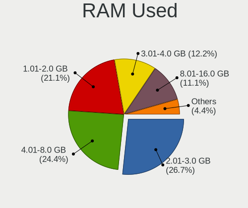

| Used GB    | Computers | Percent |
|------------|-----------|---------|
| 1.01-2.0   | 48        | 40%     |
| 2.01-3.0   | 28        | 23.33%  |
| 4.01-8.0   | 17        | 14.17%  |
| 3.01-4.0   | 12        | 10%     |
| 8.01-16.0  | 8         | 6.67%   |
| 0.51-1.0   | 4         | 3.33%   |
| 24.01-32.0 | 1         | 0.83%   |
| 16.01-24.0 | 1         | 0.83%   |
| 0.01-0.5   | 1         | 0.83%   |

Total Drives
------------

Number of drives on board

| Drives | Computers | Percent |
|--------|-----------|---------|
| 1      | 73        | 60.83%  |
| 2      | 33        | 27.5%   |
| 3      | 6         | 5%      |
| 4      | 4         | 3.33%   |
| 6      | 2         | 1.67%   |
| 8      | 1         | 0.83%   |
| 0      | 1         | 0.83%   |

Has CD-ROM
----------

Has CD-ROM on board

| Presented | Computers | Percent |
|-----------|-----------|---------|
| No        | 88        | 73.33%  |
| Yes       | 32        | 26.67%  |

Has Ethernet
------------

Has Ethernet on board

| Presented | Computers | Percent |
|-----------|-----------|---------|
| Yes       | 91        | 75.83%  |
| No        | 29        | 24.17%  |

Has WiFi
--------

Has WiFi module

| Presented | Computers | Percent |
|-----------|-----------|---------|
| Yes       | 97        | 80.83%  |
| No        | 23        | 19.17%  |

Has Bluetooth
-------------

Has Bluetooth module

| Presented | Computers | Percent |
|-----------|-----------|---------|
| Yes       | 87        | 72.5%   |
| No        | 33        | 27.5%   |

Location
--------

Country
-------

Geographic location (country)

| Country     | Computers | Percent |
|-------------|-----------|---------|
| Netherlands | 120       | 100%    |

City
----

Geographic location (city)

| City                   | Computers | Percent |
|------------------------|-----------|---------|
| Amsterdam              | 19        | 15.83%  |
| Schagen                | 10        | 8.33%   |
| Rotterdam              | 8         | 6.67%   |
| The Hague              | 7         | 5.83%   |
| Schijndel              | 4         | 3.33%   |
| Leidschendam           | 3         | 2.5%    |
| Zutphen                | 2         | 1.67%   |
| Zoetermeer             | 2         | 1.67%   |
| Voorst                 | 2         | 1.67%   |
| Utrecht                | 2         | 1.67%   |
| Nijmegen               | 2         | 1.67%   |
| Lutjegast              | 2         | 1.67%   |
| Enschede               | 2         | 1.67%   |
| Dordrecht              | 2         | 1.67%   |
| Doetinchem             | 2         | 1.67%   |
| Delft                  | 2         | 1.67%   |
| Apeldoorn              | 2         | 1.67%   |
| Alphen aan den Rijn    | 2         | 1.67%   |
| Almelo                 | 2         | 1.67%   |
| Zaandam                | 1         | 0.83%   |
| Well                   | 1         | 0.83%   |
| Wamel                  | 1         | 0.83%   |
| Vught                  | 1         | 0.83%   |
| Vleuten                | 1         | 0.83%   |
| Vinkeveen              | 1         | 0.83%   |
| Veghel                 | 1         | 0.83%   |
| Ter Aar                | 1         | 0.83%   |
| Soest                  | 1         | 0.83%   |
| Roosendaal             | 1         | 0.83%   |
| Rijssen                | 1         | 0.83%   |
| Rijen                  | 1         | 0.83%   |
| Purmerend              | 1         | 0.83%   |
| Oudeschoot             | 1         | 0.83%   |
| Oss                    | 1         | 0.83%   |
| Oosterhout             | 1         | 0.83%   |
| Ochten                 | 1         | 0.83%   |
| Nederland              | 1         | 0.83%   |
| Naaldwijk              | 1         | 0.83%   |
| Maastricht             | 1         | 0.83%   |
| Lelystad               | 1         | 0.83%   |
| Leimuiden              | 1         | 0.83%   |
| Leiderdorp             | 1         | 0.83%   |
| Leersum                | 1         | 0.83%   |
| Katwijk aan Zee        | 1         | 0.83%   |
| Hoorn                  | 1         | 0.83%   |
| Hooghalen              | 1         | 0.83%   |
| Heerlen                | 1         | 0.83%   |
| Heerenveen             | 1         | 0.83%   |
| Gorssel                | 1         | 0.83%   |
| Eindhoven              | 1         | 0.83%   |
| Ede                    | 1         | 0.83%   |
| Dronten                | 1         | 0.83%   |
| Dieren                 | 1         | 0.83%   |
| Diemen                 | 1         | 0.83%   |
| Deventer               | 1         | 0.83%   |
| Dalfsen                | 1         | 0.83%   |
| Capelle aan den IJssel | 1         | 0.83%   |
| Best                   | 1         | 0.83%   |
| Barendrecht            | 1         | 0.83%   |
| Assen                  | 1         | 0.83%   |

Drives
------

Drive Vendor
------------

Hard drive vendors

| Vendor              | Computers | Drives | Percent |
|---------------------|-----------|--------|---------|
| Samsung Electronics | 43        | 60     | 25.6%   |
| WDC                 | 22        | 25     | 13.1%   |
| Seagate             | 20        | 21     | 11.9%   |
| SK Hynix            | 15        | 16     | 8.93%   |
| Sandisk             | 10        | 11     | 5.95%   |
| Kingston            | 9         | 9      | 5.36%   |
| Unknown             | 7         | 7      | 4.17%   |
| Crucial             | 6         | 6      | 3.57%   |
| Toshiba             | 5         | 5      | 2.98%   |
| Intel               | 5         | 5      | 2.98%   |
| ASMT                | 3         | 3      | 1.79%   |
| Transcend           | 2         | 2      | 1.19%   |
| Hitachi             | 2         | 2      | 1.19%   |
| HGST                | 2         | 2      | 1.19%   |
| StoreJet            | 1         | 1      | 0.6%    |
| SSSTC               | 1         | 1      | 0.6%    |
| Phison              | 1         | 1      | 0.6%    |
| Netac               | 1         | 1      | 0.6%    |
| Micron Technology   | 1         | 1      | 0.6%    |
| Maxtor 6            | 1         | 1      | 0.6%    |
| LITEONIT            | 1         | 1      | 0.6%    |
| LITEON              | 1         | 1      | 0.6%    |
| KIOXIA              | 1         | 1      | 0.6%    |
| ICY BOX             | 1         | 1      | 0.6%    |
| GOODRAM             | 1         | 1      | 0.6%    |
| Gigabyte Technology | 1         | 1      | 0.6%    |
| Corsair             | 1         | 2      | 0.6%    |
| China               | 1         | 1      | 0.6%    |
| Biwin               | 1         | 1      | 0.6%    |
| Apple               | 1         | 1      | 0.6%    |
| Unknown             | 1         | 1      | 0.6%    |

Drive Model
-----------

Hard drive models

| Model                                | Computers | Percent |
|--------------------------------------|-----------|---------|
| SK Hynix SC311 SATA 256GB SSD        | 4         | 2.16%   |
| Samsung SSD 850 EVO 250GB            | 4         | 2.16%   |
| Samsung NVMe SSD Drive 1TB           | 4         | 2.16%   |
| WDC WDS500G2B0A-00SM50 500GB SSD     | 3         | 1.62%   |
| SK Hynix NVMe SSD Drive 512GB        | 3         | 1.62%   |
| Seagate Expansion+ 2TB               | 3         | 1.62%   |
| Samsung SSD 970 EVO 1TB              | 3         | 1.62%   |
| Samsung SSD 860 EVO M.2 500GB        | 3         | 1.62%   |
| Samsung SSD 860 EVO 500GB            | 3         | 1.62%   |
| Samsung PM991a NVMe 128GB            | 3         | 1.62%   |
| Samsung NVMe SSD Drive 500GB         | 3         | 1.62%   |
| ASMT 2115 1TB                        | 3         | 1.62%   |
| Unknown MMC Card  64GB               | 2         | 1.08%   |
| Seagate ST500DM002-1BD142 500GB      | 2         | 1.08%   |
| Seagate ST2000DM001-1CH164 2TB       | 2         | 1.08%   |
| Sandisk NVMe SSD Drive 256GB         | 2         | 1.08%   |
| Sandisk NVMe SSD Drive 1TB           | 2         | 1.08%   |
| Samsung SSD 980 1TB                  | 2         | 1.08%   |
| Samsung SSD 970 EVO Plus 1TB         | 2         | 1.08%   |
| Samsung SSD 870 QVO 1TB              | 2         | 1.08%   |
| Kingston SV300S37A120G 120GB SSD     | 2         | 1.08%   |
| WDC WDS500G3X0C-00SJG0 500GB         | 1         | 0.54%   |
| WDC WDS480G2G0A-00JH30 480GB SSD     | 1         | 0.54%   |
| WDC WDS240G2G0A-00JH30 240GB SSD     | 1         | 0.54%   |
| WDC WDS200T1X0E-00AFY0 2TB           | 1         | 0.54%   |
| WDC WD5002ABYS-02B1B0 500GB          | 1         | 0.54%   |
| WDC WD5000AAKS-75A7B0 500GB          | 1         | 0.54%   |
| WDC WD3200LPLX-75ZNTT0 320GB         | 1         | 0.54%   |
| WDC WD3200BPVT-22JJ5T0 320GB         | 1         | 0.54%   |
| WDC WD3200BEVT-22ZCT0 320GB          | 1         | 0.54%   |
| WDC WD20EZRZ-00Z5HB0 2TB             | 1         | 0.54%   |
| WDC WD20EFRX-68EUZN0 2TB             | 1         | 0.54%   |
| WDC WD20EARX-00PASB0 2TB             | 1         | 0.54%   |
| WDC WD15EARS-00MVWB0 1TB             | 1         | 0.54%   |
| WDC WD10JPVX-75JC3T0 1TB             | 1         | 0.54%   |
| WDC WD10EZEX-08M2NA0 1TB             | 1         | 0.54%   |
| WDC WD10EZEX-00BN5A0 1TB             | 1         | 0.54%   |
| WDC WD1002FAEX-00Z3A0 1TB            | 1         | 0.54%   |
| WDC WD1001FALS-40K1B0 1TB            | 1         | 0.54%   |
| WDC PC SN730 SDBQNTY-512G-1014 512GB | 1         | 0.54%   |
| WDC PC SN520 SDAPNUW-256G-1002 256GB | 1         | 0.54%   |
| Unknown SC32G  32GB                  | 1         | 0.54%   |
| Unknown MMC Card  32GB               | 1         | 0.54%   |
| Unknown MMC Card  256GB              | 1         | 0.54%   |
| Unknown HAG2e  16GB                  | 1         | 0.54%   |
| Unknown ASTC  16GB                   | 1         | 0.54%   |
| Transcend TS2TMTE220S 2TB            | 1         | 0.54%   |
| Transcend TS128GSSD370 128GB         | 1         | 0.54%   |
| Toshiba NVMe SSD Drive 512GB         | 1         | 0.54%   |
| Toshiba MQ02ABF100 1TB               | 1         | 0.54%   |
| Toshiba KXG50ZNV1T02 NVMe 1024GB     | 1         | 0.54%   |
| Toshiba KBG30ZMS128G 128GB NVMe SSD  | 1         | 0.54%   |
| Toshiba DT01ACA100 1TB               | 1         | 0.54%   |
| StoreJet Transcend 480GB SSD         | 1         | 0.54%   |
| SSSTC CL1-3D128-Q11 NVMe 128GB       | 1         | 0.54%   |
| SK Hynix SC308 SATA 128GB SSD        | 1         | 0.54%   |
| SK Hynix PC401 NVMe 256GB            | 1         | 0.54%   |
| SK Hynix PC300 NVMe 512GB            | 1         | 0.54%   |
| SK Hynix NVMe SSD Drive 1024GB       | 1         | 0.54%   |
| SK Hynix HFS256GD9TNG-62A0A 256GB    | 1         | 0.54%   |

HDD Vendor
----------

Hard disk drive vendors

| Vendor              | Computers | Drives | Percent |
|---------------------|-----------|--------|---------|
| Seagate             | 20        | 21     | 43.48%  |
| WDC                 | 13        | 15     | 28.26%  |
| Samsung Electronics | 3         | 3      | 6.52%   |
| ASMT                | 3         | 3      | 6.52%   |
| Toshiba             | 2         | 2      | 4.35%   |
| Hitachi             | 2         | 2      | 4.35%   |
| HGST                | 2         | 2      | 4.35%   |
| Maxtor 6            | 1         | 1      | 2.17%   |

SSD Vendor
----------

Solid state drive vendors

| Vendor              | Computers | Drives | Percent |
|---------------------|-----------|--------|---------|
| Samsung Electronics | 19        | 23     | 31.15%  |
| SK Hynix            | 7         | 7      | 11.48%  |
| SanDisk             | 6         | 6      | 9.84%   |
| Kingston            | 6         | 6      | 9.84%   |
| Crucial             | 6         | 6      | 9.84%   |
| WDC                 | 5         | 5      | 8.2%    |
| Intel               | 3         | 3      | 4.92%   |
| Transcend           | 1         | 1      | 1.64%   |
| StoreJet            | 1         | 1      | 1.64%   |
| Netac               | 1         | 1      | 1.64%   |
| Micron Technology   | 1         | 1      | 1.64%   |
| LITEONIT            | 1         | 1      | 1.64%   |
| GOODRAM             | 1         | 1      | 1.64%   |
| Gigabyte Technology | 1         | 1      | 1.64%   |
| China               | 1         | 1      | 1.64%   |
| Apple               | 1         | 1      | 1.64%   |

Drive Kind
----------

HDD or SSD

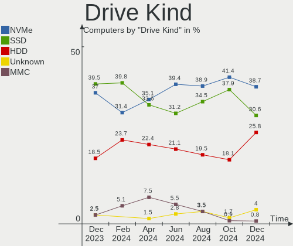

| Kind    | Computers | Drives | Percent |
|---------|-----------|--------|---------|
| SSD     | 58        | 65     | 36.25%  |
| NVMe    | 56        | 69     | 35%     |
| HDD     | 37        | 49     | 23.13%  |
| MMC     | 8         | 8      | 5%      |
| Unknown | 1         | 1      | 0.63%   |

Drive Connector
---------------

SATA, SAS, NVMe, etc.

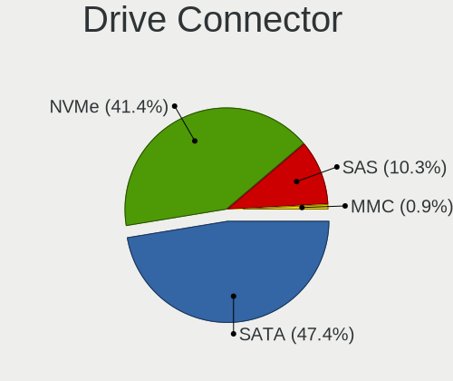

| Type | Computers | Drives | Percent |
|------|-----------|--------|---------|
| SATA | 74        | 104    | 50%     |
| NVMe | 56        | 69     | 37.84%  |
| SAS  | 10        | 11     | 6.76%   |
| MMC  | 8         | 8      | 5.41%   |

Drive Size
----------

Size of hard drive

| Size in TB | Computers | Drives | Percent |
|------------|-----------|--------|---------|
| 0.01-0.5   | 60        | 71     | 59.41%  |
| 0.51-1.0   | 26        | 27     | 25.74%  |
| 1.01-2.0   | 13        | 14     | 12.87%  |
| 2.01-3.0   | 1         | 1      | 0.99%   |
| 4.01-10.0  | 1         | 1      | 0.99%   |

Space Total
-----------

Amount of disk space available on the file system

| Size in GB     | Computers | Percent |
|----------------|-----------|---------|
| 251-500        | 25        | 20.83%  |
| 101-250        | 22        | 18.33%  |
| 1-20           | 19        | 15.83%  |
| 501-1000       | 15        | 12.5%   |
| 1001-2000      | 14        | 11.67%  |
| More than 3000 | 9         | 7.5%    |
| 21-50          | 4         | 3.33%   |
| 2001-3000      | 4         | 3.33%   |
| 51-100         | 4         | 3.33%   |
| Unknown        | 4         | 3.33%   |

Space Used
----------

Amount of used disk space

| Used GB        | Computers | Percent |
|----------------|-----------|---------|
| 1-20           | 42        | 35%     |
| 101-250        | 15        | 12.5%   |
| 21-50          | 14        | 11.67%  |
| 501-1000       | 13        | 10.83%  |
| 51-100         | 12        | 10%     |
| 1001-2000      | 9         | 7.5%    |
| 251-500        | 8         | 6.67%   |
| Unknown        | 4         | 3.33%   |
| 2001-3000      | 2         | 1.67%   |
| More than 3000 | 1         | 0.83%   |

Malfunc. Drives
---------------

Drive models with a malfunction

| Model                                        | Computers | Drives | Percent |
|----------------------------------------------|-----------|--------|---------|
| WDC WD1002FAEX-00Z3A0 1TB                    | 1         | 1      | 11.11%  |
| Seagate ST9250410AS 250GB                    | 1         | 1      | 11.11%  |
| Seagate ST500DM002-1BD142 500GB              | 1         | 1      | 11.11%  |
| Seagate ST2000DM001-1CH164 2TB               | 1         | 1      | 11.11%  |
| Micron Technology 5100_MTFDDAK1T9TBY 2TB SSD | 1         | 1      | 11.11%  |
| Intel SSDSCKKF128G8 SATA 128GB               | 1         | 1      | 11.11%  |
| Hitachi HDS721050DLE630 500GB                | 1         | 1      | 11.11%  |
| HGST HTS545050A7E380 500GB                   | 1         | 1      | 11.11%  |
| Crucial M4-CT256M4SSD2 256GB                 | 1         | 1      | 11.11%  |

Malfunc. Drive Vendor
---------------------

Vendors of faulty drives

| Vendor            | Computers | Drives | Percent |
|-------------------|-----------|--------|---------|
| Seagate           | 3         | 3      | 33.33%  |
| WDC               | 1         | 1      | 11.11%  |
| Micron Technology | 1         | 1      | 11.11%  |
| Intel             | 1         | 1      | 11.11%  |
| Hitachi           | 1         | 1      | 11.11%  |
| HGST              | 1         | 1      | 11.11%  |
| Crucial           | 1         | 1      | 11.11%  |

Malfunc. HDD Vendor
-------------------

Vendors of faulty HDD drives

| Vendor  | Computers | Drives | Percent |
|---------|-----------|--------|---------|
| Seagate | 3         | 3      | 50%     |
| WDC     | 1         | 1      | 16.67%  |
| Hitachi | 1         | 1      | 16.67%  |
| HGST    | 1         | 1      | 16.67%  |

Malfunc. Drive Kind
-------------------

Kinds of faulty drives

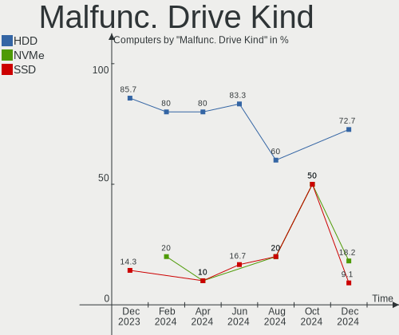

| Kind | Computers | Drives | Percent |
|------|-----------|--------|---------|
| HDD  | 5         | 6      | 62.5%   |
| SSD  | 3         | 3      | 37.5%   |

Failed Drives
-------------

Failed drive models

Zero info for selected period =(

Failed Drive Vendor
-------------------

Failed drive vendors

Zero info for selected period =(

Drive Status
------------

Number of failed and malfunc. drives

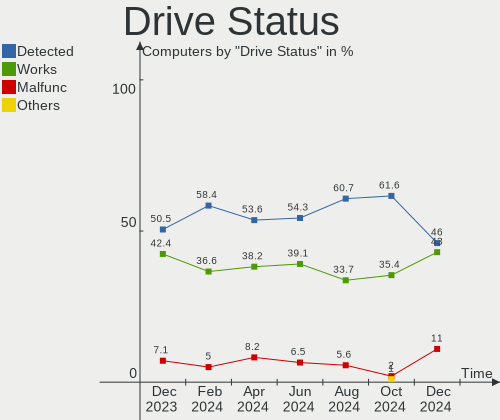

| Status   | Computers | Drives | Percent |
|----------|-----------|--------|---------|
| Detected | 70        | 109    | 53.85%  |
| Works    | 52        | 74     | 40%     |
| Malfunc  | 8         | 9      | 6.15%   |

Storage controller
------------------

Storage Vendor
--------------

Storage controller vendors

| Vendor                           | Computers | Percent |
|----------------------------------|-----------|---------|
| Intel                            | 67        | 43.79%  |
| Samsung Electronics              | 29        | 18.95%  |
| AMD                              | 22        | 14.38%  |
| SK Hynix                         | 8         | 5.23%   |
| Sandisk                          | 8         | 5.23%   |
| Toshiba America Info Systems     | 3         | 1.96%   |
| Kingston Technology Company      | 3         | 1.96%   |
| Phison Electronics               | 2         | 1.31%   |
| Nvidia                           | 2         | 1.31%   |
| Solid State Storage Technology   | 1         | 0.65%   |
| Silicon Motion                   | 1         | 0.65%   |
| Silicon Integrated Systems [SiS] | 1         | 0.65%   |
| Marvell Technology Group         | 1         | 0.65%   |
| Lite-On Technology               | 1         | 0.65%   |
| KIOXIA                           | 1         | 0.65%   |
| Integrated Technology Express    | 1         | 0.65%   |
| Biwin Storage Technology         | 1         | 0.65%   |
| ASMedia Technology               | 1         | 0.65%   |

Storage Model
-------------

Storage controller models

| Model                                                                            | Computers | Percent |
|----------------------------------------------------------------------------------|-----------|---------|
| AMD FCH SATA Controller [AHCI mode]                                              | 13        | 7.56%   |
| Samsung NVMe SSD Controller SM981/PM981/PM983                                    | 12        | 6.98%   |
| Samsung NVMe SSD Controller 980                                                  | 11        | 6.4%    |
| Intel 7 Series Chipset Family 6-port SATA Controller [AHCI mode]                 | 8         | 4.65%   |
| Intel 82801 Mobile SATA Controller [RAID mode]                                   | 7         | 4.07%   |
| Intel Sunrise Point-LP SATA Controller [AHCI mode]                               | 6         | 3.49%   |
| Intel 200 Series PCH SATA controller [AHCI mode]                                 | 5         | 2.91%   |
| AMD 500 Series Chipset SATA Controller                                           | 5         | 2.91%   |
| Samsung NVMe SSD Controller PM9A1/PM9A3/980PRO                                   | 4         | 2.33%   |
| Intel Cannon Lake Mobile PCH SATA AHCI Controller                                | 4         | 2.33%   |
| SK Hynix Gold P31 SSD                                                            | 3         | 1.74%   |
| Sandisk WD Blue SN500 / PC SN520 NVMe SSD                                        | 3         | 1.74%   |
| Intel Celeron/Pentium Silver Processor SATA Controller                           | 3         | 1.74%   |
| Intel 8 Series/C220 Series Chipset Family 6-port SATA Controller 1 [AHCI mode]   | 3         | 1.74%   |
| AMD 400 Series Chipset SATA Controller                                           | 3         | 1.74%   |
| SK Hynix PC401 NVMe Solid State Drive 256GB                                      | 2         | 1.16%   |
| Sandisk WD Black SN750 / PC SN730 NVMe SSD                                       | 2         | 1.16%   |
| Intel SATA Controller [RAID mode]                                                | 2         | 1.16%   |
| Intel Q170/Q150/B150/H170/H110/Z170/CM236 Chipset SATA Controller [AHCI Mode]    | 2         | 1.16%   |
| Intel Cannon Lake PCH SATA AHCI Controller                                       | 2         | 1.16%   |
| Intel 82801I (ICH9 Family) 2 port SATA Controller [IDE mode]                     | 2         | 1.16%   |
| Intel 8 Series SATA Controller 1 [AHCI mode]                                     | 2         | 1.16%   |
| AMD SB7x0/SB8x0/SB9x0 IDE Controller                                             | 2         | 1.16%   |
| Toshiba America Info Systems Toshiba America Info Non-Volatile memory controller | 1         | 0.58%   |
| Toshiba America Info Systems NVMe Controller                                     | 1         | 0.58%   |
| Toshiba America Info Systems BG3 NVMe SSD Controller                             | 1         | 0.58%   |
| Solid State Storage Non-Volatile memory controller                               | 1         | 0.58%   |
| SK Hynix PC300 NVMe Solid State Drive 512GB                                      | 1         | 0.58%   |
| SK Hynix Non-Volatile memory controller                                          | 1         | 0.58%   |
| SK Hynix BC511                                                                   | 1         | 0.58%   |
| Silicon Motion SM2262/SM2262EN SSD Controller                                    | 1         | 0.58%   |
| Silicon Integrated Systems [SiS] SATA Controller / IDE mode                      | 1         | 0.58%   |
| Silicon Integrated Systems [SiS] 5513 IDE Controller                             | 1         | 0.58%   |
| Sandisk WD PC SN810 / Black SN850 NVMe SSD                                       | 1         | 0.58%   |
| Sandisk WD Blue SN570 NVMe SSD                                                   | 1         | 0.58%   |
| Sandisk WD Blue SN550 NVMe SSD                                                   | 1         | 0.58%   |
| Sandisk WD Black 2018/SN750 / PC SN720 NVMe SSD                                  | 1         | 0.58%   |
| Sandisk Non-Volatile memory controller                                           | 1         | 0.58%   |
| Samsung NVMe SSD Controller SM961/PM961/SM963                                    | 1         | 0.58%   |
| Samsung Electronics SATA controller                                              | 1         | 0.58%   |
| Samsung Electronics Non-Volatile memory controller                               | 1         | 0.58%   |
| Phison PS5013 E13 NVMe Controller                                                | 1         | 0.58%   |
| Phison E16 PCIe4 NVMe Controller                                                 | 1         | 0.58%   |
| Nvidia MCP79 AHCI Controller                                                     | 1         | 0.58%   |
| Nvidia MCP51 Serial ATA Controller                                               | 1         | 0.58%   |
| Nvidia MCP51 IDE                                                                 | 1         | 0.58%   |
| Marvell Group 88SE9128 PCIe SATA 6 Gb/s RAID controller                          | 1         | 0.58%   |
| Lite-On NVMe Controller                                                          | 1         | 0.58%   |
| KIOXIA Non-Volatile memory controller                                            | 1         | 0.58%   |
| Kingston Company Company Non-Volatile memory controller                          | 1         | 0.58%   |
| Kingston Company KC2000 NVMe SSD                                                 | 1         | 0.58%   |
| Kingston Company A2000 NVMe SSD                                                  | 1         | 0.58%   |
| Intel Wildcat Point-LP SATA Controller [AHCI Mode]                               | 1         | 0.58%   |
| Intel Volume Management Device NVMe RAID Controller                              | 1         | 0.58%   |
| Intel Tiger Lake-LP SATA Controller [AHCI mode]                                  | 1         | 0.58%   |
| Intel SSD Pro 7600p/760p/E 6100p Series                                          | 1         | 0.58%   |
| Intel SSD 660P Series                                                            | 1         | 0.58%   |
| Intel NM10/ICH7 Family SATA Controller [IDE mode]                                | 1         | 0.58%   |
| Intel HM170/QM170 Chipset SATA Controller [AHCI Mode]                            | 1         | 0.58%   |
| Intel Celeron N3350/Pentium N4200/Atom E3900 Series SATA AHCI Controller         | 1         | 0.58%   |

Storage Kind
------------

Kind of storage controller (IDE, SATA, NVMe, SAS, ...)

| Kind | Computers | Percent |
|------|-----------|---------|
| SATA | 72        | 48%     |
| NVMe | 56        | 37.33%  |
| IDE  | 12        | 8%      |
| RAID | 10        | 6.67%   |

Processor
---------

CPU Vendor
----------

Processor vendors

| Vendor | Computers | Percent |
|--------|-----------|---------|
| Intel  | 89        | 74.17%  |
| AMD    | 29        | 24.17%  |
| ARM    | 2         | 1.67%   |

CPU Model
---------

Processor models

| Model                                    | Computers | Percent |
|------------------------------------------|-----------|---------|
| Intel Pentium Silver N6000 @ 1.10GHz     | 5         | 4.17%   |
| Intel Core i5-8265U CPU @ 1.60GHz        | 3         | 2.5%    |
| Intel 11th Gen Core i5-1135G7 @ 2.40GHz  | 3         | 2.5%    |
| Intel Core i7-9750H CPU @ 2.60GHz        | 2         | 1.67%   |
| Intel Core i7-7700HQ CPU @ 2.80GHz       | 2         | 1.67%   |
| Intel Core i7-7500U CPU @ 2.70GHz        | 2         | 1.67%   |
| Intel Core i3-7100U CPU @ 2.40GHz        | 2         | 1.67%   |
| Intel Core i3-3110M CPU @ 2.40GHz        | 2         | 1.67%   |
| ARM Processor                            | 2         | 1.67%   |
| AMD Ryzen 7 5800X 8-Core Processor       | 2         | 1.67%   |
| AMD Ryzen 7 5800H with Radeon Graphics   | 2         | 1.67%   |
| AMD Ryzen 5 3600 6-Core Processor        | 2         | 1.67%   |
| Intel Pentium Silver N5030 CPU @ 1.10GHz | 1         | 0.83%   |
| Intel Pentium Silver N5000 CPU @ 1.10GHz | 1         | 0.83%   |
| Intel Pentium Gold G5420 CPU @ 3.80GHz   | 1         | 0.83%   |
| Intel Pentium Dual CPU T2390 @ 1.86GHz   | 1         | 0.83%   |
| Intel Pentium Dual CPU T2370 @ 1.73GHz   | 1         | 0.83%   |
| Intel Pentium D CPU 3.00GHz              | 1         | 0.83%   |
| Intel Pentium CPU N4200 @ 1.10GHz        | 1         | 0.83%   |
| Intel Genuine CPU T1600 @ 1.66GHz        | 1         | 0.83%   |
| Intel Core i7-8850H CPU @ 2.60GHz        | 1         | 0.83%   |
| Intel Core i7-8750H CPU @ 2.20GHz        | 1         | 0.83%   |
| Intel Core i7-8709G CPU @ 3.10GHz        | 1         | 0.83%   |
| Intel Core i7-8700K CPU @ 3.70GHz        | 1         | 0.83%   |
| Intel Core i7-8700 CPU @ 3.20GHz         | 1         | 0.83%   |
| Intel Core i7-7700K CPU @ 4.20GHz        | 1         | 0.83%   |
| Intel Core i7-7700 CPU @ 3.60GHz         | 1         | 0.83%   |
| Intel Core i7-6600U CPU @ 2.60GHz        | 1         | 0.83%   |
| Intel Core i7-5500U CPU @ 2.40GHz        | 1         | 0.83%   |
| Intel Core i7-4790K CPU @ 4.00GHz        | 1         | 0.83%   |
| Intel Core i7-4771 CPU @ 3.50GHz         | 1         | 0.83%   |
| Intel Core i7-4770 CPU @ 3.40GHz         | 1         | 0.83%   |
| Intel Core i7-4700HQ CPU @ 2.40GHz       | 1         | 0.83%   |
| Intel Core i7-4500U CPU @ 1.80GHz        | 1         | 0.83%   |
| Intel Core i7-3820QM CPU @ 2.70GHz       | 1         | 0.83%   |
| Intel Core i7-3630QM CPU @ 2.40GHz       | 1         | 0.83%   |
| Intel Core i7-3540M CPU @ 3.00GHz        | 1         | 0.83%   |
| Intel Core i7-3520M CPU @ 2.90GHz        | 1         | 0.83%   |
| Intel Core i5-9300HF CPU @ 2.40GHz       | 1         | 0.83%   |
| Intel Core i5-8600 CPU @ 3.10GHz         | 1         | 0.83%   |
| Intel Core i5-8400T CPU @ 1.70GHz        | 1         | 0.83%   |
| Intel Core i5-8365U CPU @ 1.60GHz        | 1         | 0.83%   |
| Intel Core i5-8350U CPU @ 1.70GHz        | 1         | 0.83%   |
| Intel Core i5-8300H CPU @ 2.30GHz        | 1         | 0.83%   |
| Intel Core i5-8250U CPU @ 1.60GHz        | 1         | 0.83%   |
| Intel Core i5-7300U CPU @ 2.60GHz        | 1         | 0.83%   |
| Intel Core i5-7200U CPU @ 2.50GHz        | 1         | 0.83%   |
| Intel Core i5-6600 CPU @ 3.30GHz         | 1         | 0.83%   |
| Intel Core i5-6500T CPU @ 2.50GHz        | 1         | 0.83%   |
| Intel Core i5-6300U CPU @ 2.40GHz        | 1         | 0.83%   |
| Intel Core i5-6200U CPU @ 2.30GHz        | 1         | 0.83%   |
| Intel Core i5-5300U CPU @ 2.30GHz        | 1         | 0.83%   |
| Intel Core i5-4200U CPU @ 1.60GHz        | 1         | 0.83%   |
| Intel Core i5-3450 CPU @ 3.10GHz         | 1         | 0.83%   |
| Intel Core i5-3320M CPU @ 2.60GHz        | 1         | 0.83%   |
| Intel Core i5-3210M CPU @ 2.50GHz        | 1         | 0.83%   |
| Intel Core i5-2520M CPU @ 2.50GHz        | 1         | 0.83%   |
| Intel Core i5-2410M CPU @ 2.30GHz        | 1         | 0.83%   |
| Intel Core i5-10300H CPU @ 2.50GHz       | 1         | 0.83%   |
| Intel Core i5 CPU 760 @ 2.80GHz          | 1         | 0.83%   |

CPU Model Family
----------------

Processor model prefix

| Model                | Computers | Percent |
|----------------------|-----------|---------|
| Intel Core i5        | 25        | 20.83%  |
| Intel Core i7        | 24        | 20%     |
| Other                | 11        | 9.17%   |
| AMD Ryzen 7          | 9         | 7.5%    |
| AMD Ryzen 5          | 9         | 7.5%    |
| Intel Pentium Silver | 7         | 5.83%   |
| Intel Core i3        | 7         | 5.83%   |
| Intel Core 2 Duo     | 5         | 4.17%   |
| Intel Celeron        | 4         | 3.33%   |
| Intel Pentium Dual   | 2         | 1.67%   |
| Intel Core 2 Quad    | 2         | 1.67%   |
| AMD Ryzen 9          | 2         | 1.67%   |
| AMD Ryzen 3          | 2         | 1.67%   |
| Intel Pentium Gold   | 1         | 0.83%   |
| Intel Pentium D      | 1         | 0.83%   |
| Intel Pentium        | 1         | 0.83%   |
| Intel Genuine        | 1         | 0.83%   |
| Intel Atom           | 1         | 0.83%   |
| AMD Ryzen 7 PRO      | 1         | 0.83%   |
| AMD Phenom II X4     | 1         | 0.83%   |
| AMD E2               | 1         | 0.83%   |
| AMD Athlon II X2     | 1         | 0.83%   |
| AMD Athlon 64 X2     | 1         | 0.83%   |
| AMD A6               | 1         | 0.83%   |

CPU Cores
---------

Number of processor cores

| Number | Computers | Percent |
|--------|-----------|---------|
| 4      | 50        | 41.67%  |
| 2      | 39        | 32.5%   |
| 6      | 15        | 12.5%   |
| 8      | 14        | 11.67%  |
| 12     | 1         | 0.83%   |
| 1      | 1         | 0.83%   |

CPU Sockets
-----------

Number of sockets

| Number | Computers | Percent |
|--------|-----------|---------|
| 1      | 120       | 100%    |

CPU Threads
-----------

Threads per core (Hyper-Threading)

| Number | Computers | Percent |
|--------|-----------|---------|
| 2      | 79        | 65.83%  |
| 1      | 41        | 34.17%  |

CPU Op-Modes
------------

CPU Operation Modes (32-bit, 64-bit)

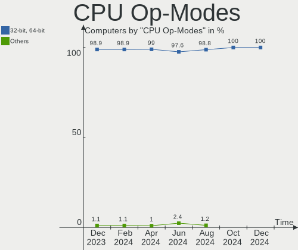

| Op mode        | Computers | Percent |
|----------------|-----------|---------|
| 32-bit, 64-bit | 119       | 99.17%  |
| Unknown        | 1         | 0.83%   |

CPU Microcode
-------------

Microcode number

| Number     | Computers | Percent |
|------------|-----------|---------|
| Unknown    | 35        | 29.17%  |
| 0x906ea    | 7         | 5.83%   |
| 0x806e9    | 6         | 5%      |
| 0x306a9    | 6         | 5%      |
| 0x906c0    | 5         | 4.17%   |
| 0x806c1    | 5         | 4.17%   |
| 0x306c3    | 4         | 3.33%   |
| 0x806ec    | 3         | 2.5%    |
| 0x6fd      | 3         | 2.5%    |
| 0x1067a    | 3         | 2.5%    |
| 0x0800820d | 3         | 2.5%    |
| 0x906e9    | 2         | 1.67%   |
| 0x806ea    | 2         | 1.67%   |
| 0x706a8    | 2         | 1.67%   |
| 0x406e3    | 2         | 1.67%   |
| 0x206a7    | 2         | 1.67%   |
| 0x08701021 | 2         | 1.67%   |
| 0x08600106 | 2         | 1.67%   |
| 0xf47      | 1         | 0.83%   |
| 0xa0652    | 1         | 0.83%   |
| 0x90672    | 1         | 0.83%   |
| 0x806eb    | 1         | 0.83%   |
| 0x806d1    | 1         | 0.83%   |
| 0x706a1    | 1         | 0.83%   |
| 0x6fb      | 1         | 0.83%   |
| 0x506e3    | 1         | 0.83%   |
| 0x506c9    | 1         | 0.83%   |
| 0x406c4    | 1         | 0.83%   |
| 0x40651    | 1         | 0.83%   |
| 0x30678    | 1         | 0.83%   |
| 0x106e5    | 1         | 0.83%   |
| 0x10676    | 1         | 0.83%   |
| 0x0a50000c | 1         | 0.83%   |
| 0x0a201204 | 1         | 0.83%   |
| 0x08608102 | 1         | 0.83%   |
| 0x08600103 | 1         | 0.83%   |
| 0x08108109 | 1         | 0.83%   |
| 0x08101016 | 1         | 0.83%   |
| 0x08101007 | 1         | 0.83%   |
| 0x0700010f | 1         | 0.83%   |
| 0x06001119 | 1         | 0.83%   |
| 0x010000c8 | 1         | 0.83%   |
| 0x010000c7 | 1         | 0.83%   |
| 0x00000000 | 1         | 0.83%   |

CPU Microarch
-------------

Microarchitecture

| Name          | Computers | Percent |
|---------------|-----------|---------|
| KabyLake      | 30        | 25%     |
| IvyBridge     | 9         | 7.5%    |
| Zen 3         | 8         | 6.67%   |
| Zen 2         | 7         | 5.83%   |
| Haswell       | 7         | 5.83%   |
| Unknown       | 7         | 5.83%   |
| Skylake       | 6         | 5%      |
| Tremont       | 5         | 4.17%   |
| TigerLake     | 5         | 4.17%   |
| Penryn        | 5         | 4.17%   |
| Core          | 5         | 4.17%   |
| Zen+          | 4         | 3.33%   |
| Zen           | 3         | 2.5%    |
| Silvermont    | 3         | 2.5%    |
| Goldmont plus | 3         | 2.5%    |
| SandyBridge   | 2         | 1.67%   |
| K10           | 2         | 1.67%   |
| Broadwell     | 2         | 1.67%   |
| Piledriver    | 1         | 0.83%   |
| NetBurst      | 1         | 0.83%   |
| Nehalem       | 1         | 0.83%   |
| K8 Hammer     | 1         | 0.83%   |
| Jaguar        | 1         | 0.83%   |
| Goldmont      | 1         | 0.83%   |
| CometLake     | 1         | 0.83%   |

Graphics
--------

GPU Vendor
----------

Vendors of graphics cards

| Vendor                           | Computers | Percent |
|----------------------------------|-----------|---------|
| Intel                            | 69        | 49.64%  |
| Nvidia                           | 43        | 30.94%  |
| AMD                              | 26        | 18.71%  |
| Silicon Integrated Systems [SiS] | 1         | 0.72%   |

GPU Model
---------

Graphics card models

| Model                                                                                    | Computers | Percent |
|------------------------------------------------------------------------------------------|-----------|---------|
| Intel HD Graphics 620                                                                    | 6         | 4.29%   |
| Intel 3rd Gen Core processor Graphics Controller                                         | 6         | 4.29%   |
| Intel WhiskeyLake-U GT2 [UHD Graphics 620]                                               | 5         | 3.57%   |
| Intel TigerLake-LP GT2 [Iris Xe Graphics]                                                | 5         | 3.57%   |
| Intel JasperLake [UHD Graphics]                                                          | 5         | 3.57%   |
| Intel CoffeeLake-H GT2 [UHD Graphics 630]                                                | 5         | 3.57%   |
| Intel Skylake GT2 [HD Graphics 520]                                                      | 4         | 2.86%   |
| AMD Renoir                                                                               | 4         | 2.86%   |
| AMD Cezanne                                                                              | 4         | 2.86%   |
| Intel UHD Graphics 620                                                                   | 3         | 2.14%   |
| Intel CoffeeLake-S GT2 [UHD Graphics 630]                                                | 3         | 2.14%   |
| AMD Ellesmere [Radeon RX 470/480/570/570X/580/580X/590]                                  | 3         | 2.14%   |
| Nvidia GT218 [GeForce 210]                                                               | 2         | 1.43%   |
| Nvidia GP107M [GeForce GTX 1050 Mobile]                                                  | 2         | 1.43%   |
| Nvidia GP106 [GeForce GTX 1060 6GB]                                                      | 2         | 1.43%   |
| Nvidia GK107GLM [Quadro K1000M]                                                          | 2         | 1.43%   |
| Nvidia GA104M [GeForce RTX 3080 Mobile / Max-Q 8GB/16GB]                                 | 2         | 1.43%   |
| Intel Mobile 4 Series Chipset Integrated Graphics Controller                             | 2         | 1.43%   |
| Intel HD Graphics 630                                                                    | 2         | 1.43%   |
| Intel HD Graphics 5500                                                                   | 2         | 1.43%   |
| Intel Haswell-ULT Integrated Graphics Controller                                         | 2         | 1.43%   |
| Intel GeminiLake [UHD Graphics 605]                                                      | 2         | 1.43%   |
| Intel Atom/Celeron/Pentium Processor x5-E8000/J3xxx/N3xxx Integrated Graphics Controller | 2         | 1.43%   |
| Intel 2nd Generation Core Processor Family Integrated Graphics Controller                | 2         | 1.43%   |
| AMD Raven Ridge [Radeon Vega Series / Radeon Vega Mobile Series]                         | 2         | 1.43%   |
| AMD Baffin [Radeon RX 460/560D / Pro 450/455/460/555/555X/560/560X]                      | 2         | 1.43%   |
| Silicon Integrated Systems [SiS] 771/671 PCIE VGA Display Adapter                        | 1         | 0.71%   |
| Nvidia TU117GLM [Quadro T500 Mobile]                                                     | 1         | 0.71%   |
| Nvidia TU116 [GeForce GTX 1660 SUPER]                                                    | 1         | 0.71%   |
| Nvidia TU106M [GeForce RTX 2070 Mobile]                                                  | 1         | 0.71%   |
| Nvidia TU106 [GeForce RTX 2060 Rev. A]                                                   | 1         | 0.71%   |
| Nvidia NV43 [GeForce 6700 XL]                                                            | 1         | 0.71%   |
| Nvidia GT218 [GeForce 310]                                                               | 1         | 0.71%   |
| Nvidia GP108M [GeForce MX250]                                                            | 1         | 0.71%   |
| Nvidia GP107M [GeForce GTX 1050 Ti Mobile]                                               | 1         | 0.71%   |
| Nvidia GP107M [GeForce GTX 1050 3 GB Max-Q]                                              | 1         | 0.71%   |
| Nvidia GP107GL [Quadro P620]                                                             | 1         | 0.71%   |
| Nvidia GP106 [GeForce GTX 1060 3GB]                                                      | 1         | 0.71%   |
| Nvidia GP104BM [GeForce GTX 1080 Mobile]                                                 | 1         | 0.71%   |
| Nvidia GP104BM [GeForce GTX 1070 Mobile]                                                 | 1         | 0.71%   |
| Nvidia GP104 [GeForce GTX 1080]                                                          | 1         | 0.71%   |
| Nvidia GM204M [GeForce GTX 980M]                                                         | 1         | 0.71%   |
| Nvidia GM108M [GeForce 940MX]                                                            | 1         | 0.71%   |
| Nvidia GM107 [GeForce 940MX]                                                             | 1         | 0.71%   |
| Nvidia GK208M [GeForce GT 740M]                                                          | 1         | 0.71%   |
| Nvidia GK208B [GeForce GT 710]                                                           | 1         | 0.71%   |
| Nvidia GK208 [GeForce GT 630 Rev. 2]                                                     | 1         | 0.71%   |
| Nvidia GK110 [GeForce GTX 780]                                                           | 1         | 0.71%   |
| Nvidia GK107M [GeForce GT 750M]                                                          | 1         | 0.71%   |
| Nvidia GK107M [GeForce GT 650M Mac Edition]                                              | 1         | 0.71%   |
| Nvidia GK107M [GeForce GT 640M]                                                          | 1         | 0.71%   |
| Nvidia GF108GLM [NVS 5200M]                                                              | 1         | 0.71%   |
| Nvidia GF108 [GeForce GT 630]                                                            | 1         | 0.71%   |
| Nvidia GF108 [GeForce GT 430]                                                            | 1         | 0.71%   |
| Nvidia GA107GLM [RTX A2000 Mobile]                                                       | 1         | 0.71%   |
| Nvidia GA107BM [GeForce RTX 3050 Ti Mobile]                                              | 1         | 0.71%   |
| Nvidia GA106M [GeForce RTX 3060 Mobile / Max-Q]                                          | 1         | 0.71%   |
| Nvidia GA106 [GeForce RTX 3060]                                                          | 1         | 0.71%   |
| Nvidia GA104 [GeForce RTX 3060 Ti Lite Hash Rate]                                        | 1         | 0.71%   |
| Nvidia G94 [GeForce 9600 GT]                                                             | 1         | 0.71%   |

GPU Combo
---------

Combinations of graphics cards

| Name           | Computers | Percent |
|----------------|-----------|---------|
| 1 x Intel      | 51        | 42.5%   |
| 1 x Nvidia     | 25        | 20.83%  |
| 1 x AMD        | 22        | 18.33%  |
| Intel + Nvidia | 15        | 12.5%   |
| AMD + Nvidia   | 3         | 2.5%    |
| Other          | 2         | 1.67%   |
| 1 x SiS        | 1         | 0.83%   |
| Intel + AMD    | 1         | 0.83%   |

GPU Driver
----------

Free vs proprietary

| Driver      | Computers | Percent |
|-------------|-----------|---------|
| Free        | 88        | 73.33%  |
| Proprietary | 28        | 23.33%  |
| Unknown     | 4         | 3.33%   |

GPU Memory
----------

Total video memory

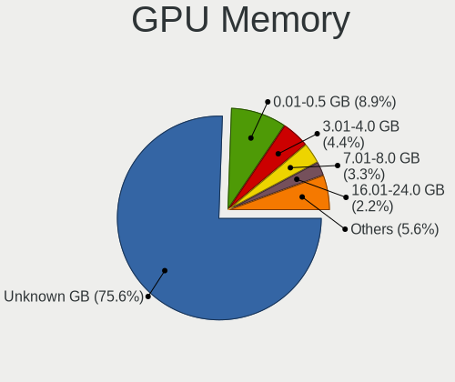

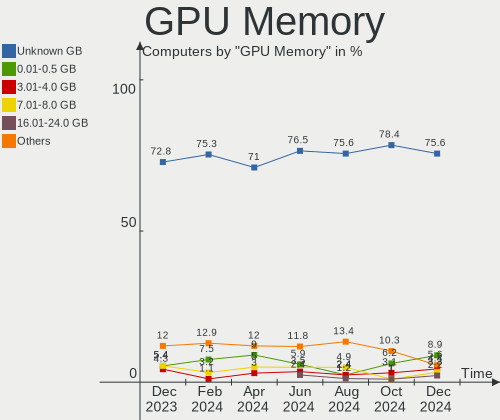

| Size in GB | Computers | Percent |
|------------|-----------|---------|
| Unknown    | 78        | 65%     |
| 1.01-2.0   | 10        | 8.33%   |
| 7.01-8.0   | 8         | 6.67%   |
| 0.01-0.5   | 7         | 5.83%   |
| 0.51-1.0   | 6         | 5%      |
| 5.01-6.0   | 4         | 3.33%   |
| 3.01-4.0   | 3         | 2.5%    |
| 2.01-3.0   | 2         | 1.67%   |
| 8.01-16.0  | 2         | 1.67%   |

Monitor
-------

Monitor Vendor
--------------

Monitor vendors

| Vendor                  | Computers | Percent |
|-------------------------|-----------|---------|
| BOE                     | 18        | 13.64%  |
| AU Optronics            | 16        | 12.12%  |
| Samsung Electronics     | 14        | 10.61%  |
| Chimei Innolux          | 11        | 8.33%   |
| LG Display              | 10        | 7.58%   |
| Iiyama                  | 8         | 6.06%   |
| Acer                    | 7         | 5.3%    |
| Goldstar                | 6         | 4.55%   |
| Philips                 | 4         | 3.03%   |
| Dell                    | 4         | 3.03%   |
| BenQ                    | 4         | 3.03%   |
| Sharp                   | 3         | 2.27%   |
| Sony                    | 2         | 1.52%   |
| Idek Iiyama             | 2         | 1.52%   |
| Hewlett-Packard         | 2         | 1.52%   |
| CSO                     | 2         | 1.52%   |
| Chi Mei Optoelectronics | 2         | 1.52%   |
| Apple                   | 2         | 1.52%   |
| ViewSonic               | 1         | 0.76%   |
| TV_                     | 1         | 0.76%   |
| Sanyo                   | 1         | 0.76%   |
| PANDA                   | 1         | 0.76%   |
| Panasonic               | 1         | 0.76%   |
| MSI                     | 1         | 0.76%   |
| Medion                  | 1         | 0.76%   |
| LGD                     | 1         | 0.76%   |
| LG Philips              | 1         | 0.76%   |
| Lenovo                  | 1         | 0.76%   |
| HLT                     | 1         | 0.76%   |
| CHI                     | 1         | 0.76%   |
| Belinea                 | 1         | 0.76%   |
| AOC                     | 1         | 0.76%   |
| ANX                     | 1         | 0.76%   |

Monitor Model
-------------

Monitor models

| Model                                                                   | Computers | Percent |
|-------------------------------------------------------------------------|-----------|---------|
| BOE LCD Monitor BOE093D 1366x768 256x144mm 11.6-inch                    | 4         | 2.99%   |
| Goldstar Ultra HD GSM5B08 3840x2160 600x340mm 27.2-inch                 | 2         | 1.49%   |
| Chimei Innolux LCD Monitor CMN15D5 1920x1080 344x193mm 15.5-inch        | 2         | 1.49%   |
| Chimei Innolux LCD Monitor CMN14D4 1920x1080 309x173mm 13.9-inch        | 2         | 1.49%   |
| ViewSonic VP3481a VSCB13A 3440x1440 797x333mm 34.0-inch                 | 1         | 0.75%   |
| TV_ TV TV_1080 1920x1080 747x420mm 33.7-inch                            | 1         | 0.75%   |
| Sony TV SNYEE01 1920x1080                                               | 1         | 0.75%   |
| Sony TV SNY4803 1920x1080 1107x623mm 50.0-inch                          | 1         | 0.75%   |
| Sharp LCD Monitor SHP1476 3840x2160 346x194mm 15.6-inch                 | 1         | 0.75%   |
| Sharp LCD Monitor SHP144A 3200x1800 294x165mm 13.3-inch                 | 1         | 0.75%   |
| Sharp LCD Monitor SHP1449 1920x1080 294x165mm 13.3-inch                 | 1         | 0.75%   |
| Sanyo LCD MONITOR SAN07BE 1280x1024 350x270mm 17.4-inch                 | 1         | 0.75%   |
| Samsung Electronics SyncMaster SAM030D 1680x1050 474x296mm 22.0-inch    | 1         | 0.75%   |
| Samsung Electronics SyncMaster SAM0288 1680x1050 474x296mm 22.0-inch    | 1         | 0.75%   |
| Samsung Electronics S24B350 SAM08DA 1920x1080 531x299mm 24.0-inch       | 1         | 0.75%   |
| Samsung Electronics LCD Monitor SEC5441 1366x768 309x174mm 14.0-inch    | 1         | 0.75%   |
| Samsung Electronics LCD Monitor SEC5145 1280x800 331x207mm 15.4-inch    | 1         | 0.75%   |
| Samsung Electronics LCD Monitor SEC3047 1366x768 277x156mm 12.5-inch    | 1         | 0.75%   |
| Samsung Electronics LCD Monitor SDC4150 3456x2160 336x210mm 15.6-inch   | 1         | 0.75%   |
| Samsung Electronics LCD Monitor SDC3452 1366x768 344x194mm 15.5-inch    | 1         | 0.75%   |
| Samsung Electronics LCD Monitor SAM0F0B 3840x2160 1872x1053mm 84.6-inch | 1         | 0.75%   |
| Samsung Electronics LCD Monitor SAM0D3B 3840x2160 890x500mm 40.2-inch   | 1         | 0.75%   |
| Samsung Electronics LCD Monitor SAM0678 1360x768                        | 1         | 0.75%   |
| Samsung Electronics LCD Monitor SAM0180 1280x720 885x498mm 40.0-inch    | 1         | 0.75%   |
| Samsung Electronics LCD Monitor LF24T35 1920x1080                       | 1         | 0.75%   |
| Samsung Electronics C24F390 SAM0D2C 1920x1080 521x293mm 23.5-inch       | 1         | 0.75%   |
| Philips PHL 272B8Q PHL0918 2560x1440 597x336mm 27.0-inch                | 1         | 0.75%   |
| Philips PHL 246V5 PHLC0C5 1920x1080 531x299mm 24.0-inch                 | 1         | 0.75%   |
| Philips PHL 240V5 PHLC10A 1920x1080 527x296mm 23.8-inch                 | 1         | 0.75%   |
| Philips PHL 223V5 PHLC0CF 1920x1080 477x268mm 21.5-inch                 | 1         | 0.75%   |
| Philips LCD Monitor PHL 345B1C 3440x1440                                | 1         | 0.75%   |
| PANDA LCD Monitor NCP002E 1920x1080 344x194mm 15.5-inch                 | 1         | 0.75%   |
| Panasonic LCD Monitor MEI96A2 2880x1620 344x193mm 15.5-inch             | 1         | 0.75%   |
| MSI G24C6 MSI3BA0 1920x1080 520x290mm 23.4-inch                         | 1         | 0.75%   |
| Medion MD30999PE MED8928 1440x900 410x256mm 19.0-inch                   | 1         | 0.75%   |
| LGD LCD Monitor 1920x1080                                               | 1         | 0.75%   |
| LG Philips LCD Monitor LPLA104 1440x900 367x230mm 17.1-inch             | 1         | 0.75%   |
| LG Display LCD Monitor LGD0709 1920x1080 344x194mm 15.5-inch            | 1         | 0.75%   |
| LG Display LCD Monitor LGD06AA 3840x2400 344x215mm 16.0-inch            | 1         | 0.75%   |
| LG Display LCD Monitor LGD05E5 1920x1080 344x194mm 15.5-inch            | 1         | 0.75%   |
| LG Display LCD Monitor LGD0555 1536x1024 263x175mm 12.4-inch            | 1         | 0.75%   |
| LG Display LCD Monitor LGD0521 1920x1080 309x174mm 14.0-inch            | 1         | 0.75%   |
| LG Display LCD Monitor LGD0484 1366x768 344x194mm 15.5-inch             | 1         | 0.75%   |
| LG Display LCD Monitor LGD0450 1366x768 277x156mm 12.5-inch             | 1         | 0.75%   |
| LG Display LCD Monitor LGD03DE 1600x900 382x215mm 17.3-inch             | 1         | 0.75%   |
| LG Display LCD Monitor LGD0303 1600x900 382x215mm 17.3-inch             | 1         | 0.75%   |
| LG Display LCD Monitor LGD0215 1920x1080 345x194mm 15.6-inch            | 1         | 0.75%   |
| Lenovo LCD Monitor LEN4031 1280x800 304x190mm 14.1-inch                 | 1         | 0.75%   |
| Iiyama PLX2783H-DP IVM661C 1920x1080 600x340mm 27.2-inch                | 1         | 0.75%   |
| Iiyama PLX2472HD IVM6106 1920x1080 531x299mm 24.0-inch                  | 1         | 0.75%   |
| Iiyama PL3271Q IVM761B 2560x1440 698x393mm 31.5-inch                    | 1         | 0.75%   |
| Iiyama PL2730Q IVM6643 2560x1440 597x336mm 27.0-inch                    | 1         | 0.75%   |
| Iiyama PL2592H IVM6135 1920x1080 544x303mm 24.5-inch                    | 1         | 0.75%   |
| Iiyama PL2561H IVM616C 1920x1080 540x300mm 24.3-inch                    | 1         | 0.75%   |
| Iiyama PL2530H IVM6132 1920x1080 544x303mm 24.5-inch                    | 1         | 0.75%   |
| Iiyama PL2209HD IVM560B 1920x1080 478x269mm 21.6-inch                   | 1         | 0.75%   |
| Idek Iiyama LCD Monitor PL2792Q 2560x1440                               | 1         | 0.75%   |
| Idek Iiyama LCD Monitor PL2730H 1920x1080                               | 1         | 0.75%   |
| HLT WS_FHDOLED HLT3433 1080x1920 1920x1080mm 86.7-inch                  | 1         | 0.75%   |
| Hewlett-Packard 27fw HPN354B 1920x1080 598x336mm 27.0-inch              | 1         | 0.75%   |

Monitor Resolution
------------------

Monitor screen resolution

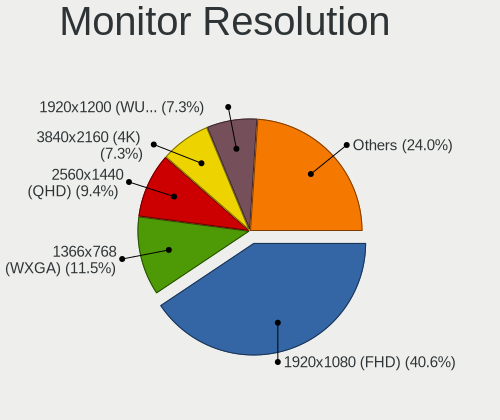

| Resolution         | Computers | Percent |
|--------------------|-----------|---------|
| 1920x1080 (FHD)    | 55        | 44.35%  |
| 1366x768 (WXGA)    | 19        | 15.32%  |
| 3840x2160 (4K)     | 9         | 7.26%   |
| 2560x1440 (QHD)    | 9         | 7.26%   |
| 1280x1024 (SXGA)   | 4         | 3.23%   |
| 1680x1050 (WSXGA+) | 3         | 2.42%   |
| 1600x900 (HD+)     | 3         | 2.42%   |
| 1440x900 (WXGA+)   | 3         | 2.42%   |
| 3440x1440          | 2         | 1.61%   |
| 2880x1800          | 2         | 1.61%   |
| 1360x768           | 2         | 1.61%   |
| 1280x800 (WXGA)    | 2         | 1.61%   |
| 800x1280           | 1         | 0.81%   |
| 3840x2400          | 1         | 0.81%   |
| 3456x2160          | 1         | 0.81%   |
| 3200x1800 (QHD+)   | 1         | 0.81%   |
| 2736x1824          | 1         | 0.81%   |
| 2560x1600          | 1         | 0.81%   |
| 2560x1080          | 1         | 0.81%   |
| 2256x1504          | 1         | 0.81%   |
| 2048x1152          | 1         | 0.81%   |
| 1920x1200 (WUXGA)  | 1         | 0.81%   |
| 1080x1920          | 1         | 0.81%   |

Monitor Diagonal
----------------

Diagonal size in inches

| Inches  | Computers | Percent |
|---------|-----------|---------|
| 15      | 30        | 22.56%  |
| 13      | 13        | 9.77%   |
| 24      | 11        | 8.27%   |
| 17      | 10        | 7.52%   |
| 11      | 10        | 7.52%   |
| 27      | 9         | 6.77%   |
| Unknown | 8         | 6.02%   |
| 23      | 6         | 4.51%   |
| 14      | 6         | 4.51%   |
| 21      | 5         | 3.76%   |
| 19      | 4         | 3.01%   |
| 12      | 3         | 2.26%   |
| 84      | 2         | 1.5%    |
| 34      | 2         | 1.5%    |
| 33      | 2         | 1.5%    |
| 22      | 2         | 1.5%    |
| 16      | 2         | 1.5%    |
| 86      | 1         | 0.75%   |
| 72      | 1         | 0.75%   |
| 55      | 1         | 0.75%   |
| 40      | 1         | 0.75%   |
| 39      | 1         | 0.75%   |
| 31      | 1         | 0.75%   |
| 25      | 1         | 0.75%   |
| 18      | 1         | 0.75%   |

Monitor Width
-------------

Physical width

| Width in mm | Computers | Percent |
|-------------|-----------|---------|
| 301-350     | 42        | 32.06%  |
| 501-600     | 24        | 18.32%  |
| 201-300     | 23        | 17.56%  |
| 351-400     | 11        | 8.4%    |
| 401-500     | 10        | 7.63%   |
| Unknown     | 8         | 6.11%   |
| 701-800     | 4         | 3.05%   |
| 1501-2000   | 4         | 3.05%   |
| 801-900     | 2         | 1.53%   |
| 601-700     | 2         | 1.53%   |
| 1001-1500   | 1         | 0.76%   |

Aspect Ratio
------------

Proportional relationship between the width and the height

| Ratio   | Computers | Percent |
|---------|-----------|---------|
| 16/9    | 93        | 76.23%  |
| 16/10   | 14        | 11.48%  |
| Unknown | 6         | 4.92%   |
| 5/4     | 3         | 2.46%   |
| 3/2     | 2         | 1.64%   |
| 21/9    | 2         | 1.64%   |
| 4/3     | 1         | 0.82%   |
| 0.62    | 1         | 0.82%   |

Monitor Area
------------

Area in inch

| Area in inch | Computers | Percent |
|----------------|-----------|---------|
| 101-110        | 29        | 22.14%  |
| 201-250        | 16        | 12.21%  |
| 81-90          | 10        | 7.63%   |
| 71-80          | 10        | 7.63%   |
| 51-60          | 10        | 7.63%   |
| 301-350        | 9         | 6.87%   |
| Unknown        | 8         | 6.11%   |
| 151-200        | 6         | 4.58%   |
| 121-130        | 6         | 4.58%   |
| More than 1000 | 5         | 3.82%   |
| 351-500        | 5         | 3.82%   |
| 251-300        | 5         | 3.82%   |
| 141-150        | 3         | 2.29%   |
| 61-70          | 2         | 1.53%   |
| 131-140        | 2         | 1.53%   |
| 111-120        | 2         | 1.53%   |
| 501-1000       | 2         | 1.53%   |
| 91-100         | 1         | 0.76%   |

Pixel Density
-------------

Pixels per inch

| Density       | Computers | Percent |
|---------------|-----------|---------|
| 121-160       | 41        | 31.78%  |
| 51-100        | 34        | 26.36%  |
| 101-120       | 19        | 14.73%  |
| 161-240       | 14        | 10.85%  |
| More than 240 | 8         | 6.2%    |
| Unknown       | 8         | 6.2%    |
| 1-50          | 5         | 3.88%   |

Multiple Monitors
-----------------

Total monitors connected

| Total | Computers | Percent |
|-------|-----------|---------|
| 1     | 101       | 84.17%  |
| 2     | 14        | 11.67%  |
| 0     | 3         | 2.5%    |
| 3     | 2         | 1.67%   |

Network
-------

Net Controller Vendor
---------------------

Controller vendors

| Vendor                                | Computers | Percent |
|---------------------------------------|-----------|---------|
| Intel                                 | 76        | 42.46%  |
| Realtek Semiconductor                 | 58        | 32.4%   |
| Qualcomm Atheros                      | 16        | 8.94%   |
| Broadcom                              | 5         | 2.79%   |
| Broadcom Limited                      | 3         | 1.68%   |
| Nvidia                                | 2         | 1.12%   |
| MEDIATEK                              | 2         | 1.12%   |
| Marvell Technology Group              | 2         | 1.12%   |
| Dell                                  | 2         | 1.12%   |
| U-Blox                                | 1         | 0.56%   |
| Standard Microsystems                 | 1         | 0.56%   |
| Spreadtrum Communications             | 1         | 0.56%   |
| Silicon Integrated Systems [SiS]      | 1         | 0.56%   |
| Sierra Wireless                       | 1         | 0.56%   |
| Ralink Technology                     | 1         | 0.56%   |
| Ralink                                | 1         | 0.56%   |
| Microsoft                             | 1         | 0.56%   |
| Lenovo                                | 1         | 0.56%   |
| Gemtek                                | 1         | 0.56%   |
| Ericsson Business Mobile Networks     | 1         | 0.56%   |
| Edimax Technology                     | 1         | 0.56%   |
| 802.11g Adapter [Linksys WUSB54GC v3] | 1         | 0.56%   |

Net Controller Model
--------------------

Controller models

| Model                                                                   | Computers | Percent |
|-------------------------------------------------------------------------|-----------|---------|
| Realtek RTL8111/8168/8411 PCI Express Gigabit Ethernet Controller       | 38        | 18.72%  |
| Intel Wi-Fi 6 AX200                                                     | 9         | 4.43%   |
| Qualcomm Atheros QCA6174 802.11ac Wireless Network Adapter              | 7         | 3.45%   |
| Intel Wireless 8265 / 8275                                              | 7         | 3.45%   |
| Realtek RTL8153 Gigabit Ethernet Adapter                                | 6         | 2.96%   |
| Realtek RTL8125 2.5GbE Controller                                       | 5         | 2.46%   |
| Intel Wi-Fi 6 AX201 160MHz                                              | 5         | 2.46%   |
| Intel I211 Gigabit Network Connection                                   | 5         | 2.46%   |
| Intel 82579LM Gigabit Network Connection (Lewisville)                   | 5         | 2.46%   |
| Intel Wi-Fi 6 AX210/AX211/AX411 160MHz                                  | 4         | 1.97%   |
| Intel Cannon Point-LP CNVi [Wireless-AC]                                | 4         | 1.97%   |
| Realtek RTL810xE PCI Express Fast Ethernet controller                   | 3         | 1.48%   |
| Intel Wireless-AC 9260                                                  | 3         | 1.48%   |
| Intel Wireless 7265                                                     | 3         | 1.48%   |
| Intel Wireless 7260                                                     | 3         | 1.48%   |
| Intel Wireless 3165                                                     | 3         | 1.48%   |
| Intel Wi-Fi 6 AX201                                                     | 3         | 1.48%   |
| Intel Ethernet Connection (7) I219-LM                                   | 3         | 1.48%   |
| Intel Ethernet Connection (2) I219-V                                    | 3         | 1.48%   |
| Intel Dual Band Wireless-AC 3168NGW [Stone Peak]                        | 3         | 1.48%   |
| Intel Centrino Advanced-N 6205 [Taylor Peak]                            | 3         | 1.48%   |
| Intel Cannon Lake PCH CNVi WiFi                                         | 3         | 1.48%   |
| Realtek RTL8822CE 802.11ac PCIe Wireless Network Adapter                | 2         | 0.99%   |
| Realtek RTL8723BU 802.11b/g/n WLAN Adapter                              | 2         | 0.99%   |
| Qualcomm Atheros QCA9377 802.11ac Wireless Network Adapter              | 2         | 0.99%   |
| Qualcomm Atheros AR93xx Wireless Network Adapter                        | 2         | 0.99%   |
| Qualcomm Atheros AR242x / AR542x Wireless Network Adapter (PCI-Express) | 2         | 0.99%   |
| MEDIATEK MT7921K (RZ608) Wi-Fi 6E 80MHz                                 | 2         | 0.99%   |
| Marvell Group 88W8897 [AVASTAR] 802.11ac Wireless                       | 2         | 0.99%   |
| Intel Ethernet Connection (4) I219-LM                                   | 2         | 0.99%   |
| Intel 82566DM-2 Gigabit Network Connection                              | 2         | 0.99%   |
| U-Blox [u-blox 7]                                                       | 1         | 0.49%   |
| Standard Microsystems Ethernet controller                               | 1         | 0.49%   |
| Spreadtrum Unisoc Phone                                                 | 1         | 0.49%   |
| Silicon Integrated Systems [SiS] 191 Gigabit Ethernet Adapter           | 1         | 0.49%   |
| Sierra Wireless MC8305 Modem                                            | 1         | 0.49%   |
| Realtek RTL8852AE 802.11ax PCIe Wireless Network Adapter                | 1         | 0.49%   |
| Realtek RTL8822BE 802.11a/b/g/n/ac WiFi adapter                         | 1         | 0.49%   |
| Realtek RTL8821CE 802.11ac PCIe Wireless Network Adapter                | 1         | 0.49%   |
| Realtek RTL8723BE PCIe Wireless Network Adapter                         | 1         | 0.49%   |
| Realtek RTL-8100/8101L/8139 PCI Fast Ethernet Adapter                   | 1         | 0.49%   |
| Realtek Killer E3000 2.5GbE Controller                                  | 1         | 0.49%   |
| Ralink MT7601U Wireless Adapter                                         | 1         | 0.49%   |
| Ralink RT3062 Wireless 802.11n 2T/2R                                    | 1         | 0.49%   |
| Qualcomm Atheros QCA9565 / AR9565 Wireless Network Adapter              | 1         | 0.49%   |
| Qualcomm Atheros QCA8172 Fast Ethernet                                  | 1         | 0.49%   |
| Qualcomm Atheros Killer E2500 Gigabit Ethernet Controller               | 1         | 0.49%   |
| Qualcomm Atheros AR8151 v2.0 Gigabit Ethernet                           | 1         | 0.49%   |
| Nvidia MCP79 Ethernet                                                   | 1         | 0.49%   |
| Nvidia MCP51 Ethernet Controller                                        | 1         | 0.49%   |
| Microsoft XBOX ACC                                                      | 1         | 0.49%   |
| Lenovo ThinkPad TBT 3 Dock                                              | 1         | 0.49%   |
| Intel Wireless 3160                                                     | 1         | 0.49%   |
| Intel PRO/Wireless 5100 AGN [Shiloh] Network Connection                 | 1         | 0.49%   |
| Intel PRO/Wireless 3945ABG [Golan] Network Connection                   | 1         | 0.49%   |
| Intel Ethernet Controller I225-V                                        | 1         | 0.49%   |
| Intel Ethernet Connection I217-V                                        | 1         | 0.49%   |
| Intel Ethernet Connection (7) I219-V                                    | 1         | 0.49%   |
| Intel Ethernet Connection (6) I219-LM                                   | 1         | 0.49%   |
| Intel Ethernet Connection (5) I219-LM                                   | 1         | 0.49%   |

Wireless Vendor
---------------

Wireless vendors

| Vendor                                | Computers | Percent |
|---------------------------------------|-----------|---------|
| Intel                                 | 62        | 62.63%  |
| Qualcomm Atheros                      | 14        | 14.14%  |
| Realtek Semiconductor                 | 8         | 8.08%   |
| MEDIATEK                              | 2         | 2.02%   |
| Marvell Technology Group              | 2         | 2.02%   |
| Broadcom Limited                      | 2         | 2.02%   |
| Broadcom                              | 2         | 2.02%   |
| Sierra Wireless                       | 1         | 1.01%   |
| Ralink Technology                     | 1         | 1.01%   |
| Ralink                                | 1         | 1.01%   |
| Microsoft                             | 1         | 1.01%   |
| Gemtek                                | 1         | 1.01%   |
| Edimax Technology                     | 1         | 1.01%   |
| 802.11g Adapter [Linksys WUSB54GC v3] | 1         | 1.01%   |

Wireless Model
--------------

Wireless models

| Model                                                                                               | Computers | Percent |
|-----------------------------------------------------------------------------------------------------|-----------|---------|
| Intel Wi-Fi 6 AX200                                                                                 | 9         | 9.09%   |
| Qualcomm Atheros QCA6174 802.11ac Wireless Network Adapter                                          | 7         | 7.07%   |
| Intel Wireless 8265 / 8275                                                                          | 7         | 7.07%   |
| Intel Wi-Fi 6 AX201 160MHz                                                                          | 5         | 5.05%   |
| Intel Wi-Fi 6 AX210/AX211/AX411 160MHz                                                              | 4         | 4.04%   |
| Intel Cannon Point-LP CNVi [Wireless-AC]                                                            | 4         | 4.04%   |
| Intel Wireless-AC 9260                                                                              | 3         | 3.03%   |
| Intel Wireless 7265                                                                                 | 3         | 3.03%   |
| Intel Wireless 7260                                                                                 | 3         | 3.03%   |
| Intel Wireless 3165                                                                                 | 3         | 3.03%   |
| Intel Wi-Fi 6 AX201                                                                                 | 3         | 3.03%   |
| Intel Dual Band Wireless-AC 3168NGW [Stone Peak]                                                    | 3         | 3.03%   |
| Intel Centrino Advanced-N 6205 [Taylor Peak]                                                        | 3         | 3.03%   |
| Intel Cannon Lake PCH CNVi WiFi                                                                     | 3         | 3.03%   |
| Realtek RTL8822CE 802.11ac PCIe Wireless Network Adapter                                            | 2         | 2.02%   |
| Realtek RTL8723BU 802.11b/g/n WLAN Adapter                                                          | 2         | 2.02%   |
| Qualcomm Atheros QCA9377 802.11ac Wireless Network Adapter                                          | 2         | 2.02%   |
| Qualcomm Atheros AR93xx Wireless Network Adapter                                                    | 2         | 2.02%   |
| Qualcomm Atheros AR242x / AR542x Wireless Network Adapter (PCI-Express)                             | 2         | 2.02%   |
| MEDIATEK MT7921K (RZ608) Wi-Fi 6E 80MHz                                                             | 2         | 2.02%   |
| Marvell Group 88W8897 [AVASTAR] 802.11ac Wireless                                                   | 2         | 2.02%   |
| Sierra Wireless MC8305 Modem                                                                        | 1         | 1.01%   |
| Realtek RTL8852AE 802.11ax PCIe Wireless Network Adapter                                            | 1         | 1.01%   |
| Realtek RTL8822BE 802.11a/b/g/n/ac WiFi adapter                                                     | 1         | 1.01%   |
| Realtek RTL8821CE 802.11ac PCIe Wireless Network Adapter                                            | 1         | 1.01%   |
| Realtek RTL8723BE PCIe Wireless Network Adapter                                                     | 1         | 1.01%   |
| Ralink MT7601U Wireless Adapter                                                                     | 1         | 1.01%   |
| Ralink RT3062 Wireless 802.11n 2T/2R                                                                | 1         | 1.01%   |
| Qualcomm Atheros QCA9565 / AR9565 Wireless Network Adapter                                          | 1         | 1.01%   |
| Microsoft XBOX ACC                                                                                  | 1         | 1.01%   |
| Intel Wireless 3160                                                                                 | 1         | 1.01%   |
| Intel PRO/Wireless 5100 AGN [Shiloh] Network Connection                                             | 1         | 1.01%   |
| Intel PRO/Wireless 3945ABG [Golan] Network Connection                                               | 1         | 1.01%   |
| Intel Dual Band Wireless-AC 3165 Plus Bluetooth                                                     | 1         | 1.01%   |
| Intel Comet Lake PCH CNVi WiFi                                                                      | 1         | 1.01%   |
| Intel Centrino Wireless-N 2200                                                                      | 1         | 1.01%   |
| Intel Centrino Wireless-N 135                                                                       | 1         | 1.01%   |
| Intel Centrino Wireless-N 1030 [Rainbow Peak]                                                       | 1         | 1.01%   |
| Intel Centrino Ultimate-N 6300                                                                      | 1         | 1.01%   |
| Gemtek WUBR-177G [Ralink RT2571W]                                                                   | 1         | 1.01%   |
| Edimax EW-7811Un 802.11n Wireless Adapter [Realtek RTL8188CUS]                                      | 1         | 1.01%   |
| Broadcom Limited BCM4331 802.11a/b/g/n                                                              | 1         | 1.01%   |
| Broadcom Limited BCM4321 802.11a/b/g/n                                                              | 1         | 1.01%   |
| Broadcom BCM4322 802.11a/b/g/n Wireless LAN Controller                                              | 1         | 1.01%   |
| Broadcom BCM43142 802.11b/g/n                                                                       | 1         | 1.01%   |
| 802.11g Adapter [Linksys WUSB54GC v3] WUSB100 v2 RangePlus Wireless Network Adapter [Ralink RT3070] | 1         | 1.01%   |

Ethernet Vendor
---------------

Ethernet vendors

| Vendor                           | Computers | Percent |
|----------------------------------|-----------|---------|
| Realtek Semiconductor            | 53        | 54.08%  |
| Intel                            | 32        | 32.65%  |
| Qualcomm Atheros                 | 3         | 3.06%   |
| Broadcom                         | 3         | 3.06%   |
| Nvidia                           | 2         | 2.04%   |
| Standard Microsystems            | 1         | 1.02%   |
| Spreadtrum Communications        | 1         | 1.02%   |
| Silicon Integrated Systems [SiS] | 1         | 1.02%   |
| Lenovo                           | 1         | 1.02%   |
| Broadcom Limited                 | 1         | 1.02%   |

Ethernet Model
--------------

Ethernet models

| Model                                                             | Computers | Percent |
|-------------------------------------------------------------------|-----------|---------|
| Realtek RTL8111/8168/8411 PCI Express Gigabit Ethernet Controller | 38        | 38%     |
| Realtek RTL8153 Gigabit Ethernet Adapter                          | 6         | 6%      |
| Realtek RTL8125 2.5GbE Controller                                 | 5         | 5%      |
| Intel I211 Gigabit Network Connection                             | 5         | 5%      |
| Intel 82579LM Gigabit Network Connection (Lewisville)             | 5         | 5%      |
| Realtek RTL810xE PCI Express Fast Ethernet controller             | 3         | 3%      |
| Intel Ethernet Connection (7) I219-LM                             | 3         | 3%      |
| Intel Ethernet Connection (2) I219-V                              | 3         | 3%      |
| Intel Ethernet Connection (4) I219-LM                             | 2         | 2%      |
| Intel 82566DM-2 Gigabit Network Connection                        | 2         | 2%      |
| Standard Microsystems Ethernet controller                         | 1         | 1%      |
| Spreadtrum Unisoc Phone                                           | 1         | 1%      |
| Silicon Integrated Systems [SiS] 191 Gigabit Ethernet Adapter     | 1         | 1%      |
| Realtek RTL-8100/8101L/8139 PCI Fast Ethernet Adapter             | 1         | 1%      |
| Realtek Killer E3000 2.5GbE Controller                            | 1         | 1%      |
| Qualcomm Atheros QCA8172 Fast Ethernet                            | 1         | 1%      |
| Qualcomm Atheros Killer E2500 Gigabit Ethernet Controller         | 1         | 1%      |
| Qualcomm Atheros AR8151 v2.0 Gigabit Ethernet                     | 1         | 1%      |
| Nvidia MCP79 Ethernet                                             | 1         | 1%      |
| Nvidia MCP51 Ethernet Controller                                  | 1         | 1%      |
| Lenovo ThinkPad TBT 3 Dock                                        | 1         | 1%      |
| Intel Ethernet Controller I225-V                                  | 1         | 1%      |
| Intel Ethernet Connection I217-V                                  | 1         | 1%      |
| Intel Ethernet Connection (7) I219-V                              | 1         | 1%      |
| Intel Ethernet Connection (6) I219-LM                             | 1         | 1%      |
| Intel Ethernet Connection (5) I219-LM                             | 1         | 1%      |
| Intel Ethernet Connection (3) I218-LM                             | 1         | 1%      |
| Intel Ethernet Connection (13) I219-V                             | 1         | 1%      |
| Intel Ethernet Connection (13) I219-LM                            | 1         | 1%      |
| Intel 82579V Gigabit Network Connection                           | 1         | 1%      |
| Intel 82567V-2 Gigabit Network Connection                         | 1         | 1%      |
| Intel 82567LM-3 Gigabit Network Connection                        | 1         | 1%      |
| Intel 82566DC-2 Gigabit Network Connection                        | 1         | 1%      |
| Broadcom NetXtreme BCM57786 Gigabit Ethernet PCIe                 | 1         | 1%      |
| Broadcom NetXtreme BCM57762 Gigabit Ethernet PCIe                 | 1         | 1%      |
| Broadcom NetLink BCM5906M Fast Ethernet PCI Express               | 1         | 1%      |
| Broadcom NetLink BCM57780 Gigabit Ethernet PCIe                   | 1         | 1%      |
| Broadcom Limited NetLink BCM5787M Gigabit Ethernet PCI Express    | 1         | 1%      |

Net Controller Kind
-------------------

Ethernet, WiFi or modem

| Kind     | Computers | Percent |
|----------|-----------|---------|
| WiFi     | 97        | 50.52%  |
| Ethernet | 91        | 47.4%   |
| Modem    | 4         | 2.08%   |

Used Controller
---------------

Currently used network controller

| Kind     | Computers | Percent |
|----------|-----------|---------|
| WiFi     | 75        | 59.06%  |
| Ethernet | 52        | 40.94%  |

NICs
----

Total network controllers on board

| Total | Computers | Percent |
|-------|-----------|---------|
| 2     | 56        | 46.67%  |
| 1     | 56        | 46.67%  |
| 3     | 5         | 4.17%   |
| 0     | 3         | 2.5%    |

IPv6
----

IPv6 vs IPv4

| Used | Computers | Percent |
|------|-----------|---------|
| No   | 86        | 71.67%  |
| Yes  | 34        | 28.33%  |

Bluetooth
---------

Bluetooth Vendor
----------------

Controller vendors

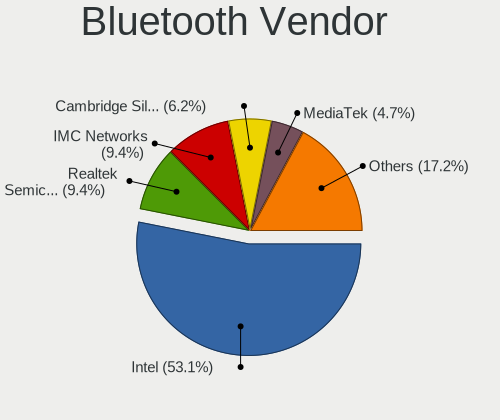

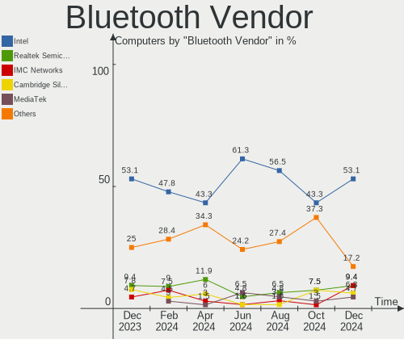

| Vendor                          | Computers | Percent |
|---------------------------------|-----------|---------|
| Intel                           | 52        | 59.09%  |
| Qualcomm Atheros Communications | 8         | 9.09%   |
| Cambridge Silicon Radio         | 5         | 5.68%   |
| Realtek Semiconductor           | 4         | 4.55%   |
| Dell                            | 3         | 3.41%   |
| Broadcom                        | 3         | 3.41%   |
| Marvell Semiconductor           | 2         | 2.27%   |
| IMC Networks                    | 2         | 2.27%   |
| Foxconn / Hon Hai               | 2         | 2.27%   |
| Apple                           | 2         | 2.27%   |
| TP-Link                         | 1         | 1.14%   |
| MediaTek                        | 1         | 1.14%   |
| Lite-On Technology              | 1         | 1.14%   |
| Hewlett-Packard                 | 1         | 1.14%   |
| ASUSTek Computer                | 1         | 1.14%   |

Bluetooth Model
---------------

Controller models

| Model                                               | Computers | Percent |
|-----------------------------------------------------|-----------|---------|
| Intel Bluetooth wireless interface                  | 16        | 18.18%  |
| Intel AX201 Bluetooth                               | 9         | 10.23%  |
| Intel AX200 Bluetooth                               | 9         | 10.23%  |
| Intel Bluetooth 9460/9560 Jefferson Peak (JfP)      | 7         | 7.95%   |
| Cambridge Silicon Radio Bluetooth Dongle (HCI mode) | 5         | 5.68%   |
| Realtek Bluetooth Radio                             | 4         | 4.55%   |
| Qualcomm Atheros QCA61x4 Bluetooth 4.0              | 4         | 4.55%   |
| Intel AX210 Bluetooth                               | 4         | 4.55%   |
| Qualcomm Atheros  Bluetooth Device                  | 3         | 3.41%   |
| Intel Wireless-AC 9260 Bluetooth Adapter            | 3         | 3.41%   |
| Intel Wireless-AC 3168 Bluetooth                    | 3         | 3.41%   |
| Marvell Bluetooth and Wireless LAN Composite        | 2         | 2.27%   |
| TP-Link TP-TR- UB500 Adapter                       | 1         | 1.14%   |
| Qualcomm Atheros AR3012 Bluetooth 4.0               | 1         | 1.14%   |
| MediaTek Wireless_Device                            | 1         | 1.14%   |
| Lite-On Broadcom BCM43142A0 Bluetooth Device        | 1         | 1.14%   |
| Intel Bluetooth Device                              | 1         | 1.14%   |
| IMC Networks Bluetooth Radio                        | 1         | 1.14%   |
| IMC Networks Bluetooth Device                       | 1         | 1.14%   |
| HP Bluetooth 2.0 Interface [Broadcom BCM2045]       | 1         | 1.14%   |
| Foxconn / Hon Hai Bluetooth Device                  | 1         | 1.14%   |
| Foxconn / Hon Hai BCM20702A0                        | 1         | 1.14%   |
| Dell DW375 Bluetooth Module                         | 1         | 1.14%   |
| Dell BT Mini-Receiver                               | 1         | 1.14%   |
| Dell BCM20702A0 Bluetooth Module                    | 1         | 1.14%   |
| Broadcom HP Portable SoftSailing                    | 1         | 1.14%   |
| Broadcom BCM20702 Bluetooth 4.0 [ThinkPad]          | 1         | 1.14%   |
| Broadcom BCM2045 Bluetooth                          | 1         | 1.14%   |
| ASUS ASUS USB-BT500                                 | 1         | 1.14%   |
| Apple Built-in Bluetooth 2.0+EDR HCI                | 1         | 1.14%   |
| Apple Bluetooth Host Controller                     | 1         | 1.14%   |

Sound
-----

Sound Vendor
------------

Sound card vendors

| Vendor                                       | Computers | Percent |
|----------------------------------------------|-----------|---------|
| Intel                                        | 85        | 48.57%  |
| Nvidia                                       | 36        | 20.57%  |
| AMD                                          | 32        | 18.29%  |
| C-Media Electronics                          | 3         | 1.71%   |
| Zoran Co. Personal Media Division (Nogatech) | 1         | 0.57%   |
| Yamaha                                       | 1         | 0.57%   |
| Texas Instruments                            | 1         | 0.57%   |
| Silicon Integrated Systems [SiS]             | 1         | 0.57%   |
| Sennheiser Communications                    | 1         | 0.57%   |
| RODE Microphones                             | 1         | 0.57%   |
| Realtek Semiconductor                        | 1         | 0.57%   |
| Logitech                                     | 1         | 0.57%   |
| Lenovo                                       | 1         | 0.57%   |
| Kingston Technology                          | 1         | 0.57%   |
| JMTek                                        | 1         | 0.57%   |
| GYROCOM C&C                                  | 1         | 0.57%   |
| Focusrite-Novation                           | 1         | 0.57%   |
| FiiO Electronics Technology                  | 1         | 0.57%   |
| Creative Labs                                | 1         | 0.57%   |
| Cooler Master                                | 1         | 0.57%   |
| Cambridge Silicon Radio                      | 1         | 0.57%   |
| Audient                                      | 1         | 0.57%   |
| AKAI Professional M.I.                       | 1         | 0.57%   |

Sound Model
-----------

Sound card models

| Model                                                                                             | Computers | Percent |
|---------------------------------------------------------------------------------------------------|-----------|---------|
| Intel Sunrise Point-LP HD Audio                                                                   | 13        | 6.53%   |
| AMD Family 17h/19h HD Audio Controller                                                            | 12        | 6.03%   |
| Intel Cannon Lake PCH cAVS                                                                        | 9         | 4.52%   |
| Intel 7 Series/C216 Chipset Family High Definition Audio Controller                               | 9         | 4.52%   |
| AMD Starship/Matisse HD Audio Controller                                                          | 7         | 3.52%   |
| AMD Renoir Radeon High Definition Audio Controller                                                | 7         | 3.52%   |
| Intel Tiger Lake-LP Smart Sound Technology Audio Controller                                       | 5         | 2.51%   |
| Intel Jasper Lake HD Audio                                                                        | 5         | 2.51%   |
| Intel Cannon Point-LP High Definition Audio Controller                                            | 5         | 2.51%   |
| Intel 82801I (ICH9 Family) HD Audio Controller                                                    | 5         | 2.51%   |
| Intel 200 Series PCH HD Audio                                                                     | 5         | 2.51%   |
| Nvidia GP107GL High Definition Audio Controller                                                   | 4         | 2.01%   |
| Nvidia Audio device                                                                               | 4         | 2.01%   |
| Intel 8 Series/C220 Series Chipset High Definition Audio Controller                               | 4         | 2.01%   |
| AMD Family 17h (Models 00h-0fh) HD Audio Controller                                               | 4         | 2.01%   |
| Nvidia High Definition Audio Controller                                                           | 3         | 1.51%   |
| Nvidia GP106 High Definition Audio Controller                                                     | 3         | 1.51%   |
| Nvidia GP104 High Definition Audio Controller                                                     | 3         | 1.51%   |
| Nvidia GK107 HDMI Audio Controller                                                                | 3         | 1.51%   |
| Nvidia GF108 High Definition Audio Controller                                                     | 3         | 1.51%   |
| Nvidia GA104 High Definition Audio Controller                                                     | 3         | 1.51%   |
| Intel Celeron/Pentium Silver Processor High Definition Audio                                      | 3         | 1.51%   |
| AMD Raven/Raven2/Fenghuang HDMI/DP Audio Controller                                               | 3         | 1.51%   |
| AMD Ellesmere HDMI Audio [Radeon RX 470/480 / 570/580/590]                                        | 3         | 1.51%   |
| Nvidia TU106 High Definition Audio Controller                                                     | 2         | 1.01%   |
| Nvidia GK208 HDMI/DP Audio Controller                                                             | 2         | 1.01%   |
| Intel Xeon E3-1200 v3/4th Gen Core Processor HD Audio Controller                                  | 2         | 1.01%   |
| Intel Wildcat Point-LP High Definition Audio Controller                                           | 2         | 1.01%   |
| Intel Tiger Lake-H HD Audio Controller                                                            | 2         | 1.01%   |
| Intel Haswell-ULT HD Audio Controller                                                             | 2         | 1.01%   |
| Intel CM238 HD Audio Controller                                                                   | 2         | 1.01%   |
| Intel Broadwell-U Audio Controller                                                                | 2         | 1.01%   |
| Intel 8 Series HD Audio Controller                                                                | 2         | 1.01%   |
| Intel 6 Series/C200 Series Chipset Family High Definition Audio Controller                        | 2         | 1.01%   |
| AMD SBx00 Azalia (Intel HDA)                                                                      | 2         | 1.01%   |
| AMD Navi 21/23 HDMI/DP Audio Controller                                                           | 2         | 1.01%   |
| AMD FCH Azalia Controller                                                                         | 2         | 1.01%   |
| AMD Baffin HDMI/DP Audio [Radeon RX 550 640SP / RX 560/560X]                                      | 2         | 1.01%   |
| Zoran Co. Personal Media Division (Nogatech) USB Audio and HID                                    | 1         | 0.5%    |
| Yamaha Steinberg UR22mkII                                                                         | 1         | 0.5%    |
| Texas Instruments PCM2902 Audio Codec                                                             | 1         | 0.5%    |
| Silicon Integrated Systems [SiS] Azalia Audio Controller                                          | 1         | 0.5%    |
| Sennheiser Communications Headset [PC 8]                                                          | 1         | 0.5%    |
| RODE Microphones RODE NT-USB                                                                      | 1         | 0.5%    |
| Realtek Semiconductor USB Audio                                                                   | 1         | 0.5%    |
| Nvidia TU116 High Definition Audio Controller                                                     | 1         | 0.5%    |
| Nvidia MCP79 High Definition Audio                                                                | 1         | 0.5%    |
| Nvidia MCP51 High Definition Audio                                                                | 1         | 0.5%    |
| Nvidia GM204 High Definition Audio Controller                                                     | 1         | 0.5%    |
| Nvidia GM107 High Definition Audio Controller [GeForce 940MX]                                     | 1         | 0.5%    |
| Nvidia GK110 High Definition Audio Controller                                                     | 1         | 0.5%    |
| Logitech Headset H390                                                                             | 1         | 0.5%    |
| Lenovo ThinkPad Thunderbolt 3 Dock USB Audio                                                      | 1         | 0.5%    |
| Kingston Technology HyperX 7.1 Audio                                                              | 1         | 0.5%    |
| JMTek LCS USB Audio                                                                               | 1         | 0.5%    |
| Intel NM10/ICH7 Family High Definition Audio Controller                                           | 1         | 0.5%    |
| Intel Comet Lake PCH cAVS                                                                         | 1         | 0.5%    |
| Intel Celeron N3350/Pentium N4200/Atom E3900 Series Audio Cluster                                 | 1         | 0.5%    |
| Intel Atom/Celeron/Pentium Processor x5-E8000/J3xxx/N3xxx Series High Definition Audio Controller | 1         | 0.5%    |
| Intel Atom Processor Z36xxx/Z37xxx Series High Definition Audio Controller                        | 1         | 0.5%    |

Memory
------

Memory Vendor
-------------

Memory module vendors

| Vendor              | Computers | Percent |
|---------------------|-----------|---------|
| SK Hynix            | 24        | 33.33%  |
| Samsung Electronics | 16        | 22.22%  |
| Micron Technology   | 7         | 9.72%   |
| G.Skill             | 5         | 6.94%   |
| Unknown             | 4         | 5.56%   |
| Corsair             | 4         | 5.56%   |
| Kingston            | 3         | 4.17%   |
| Ramaxel Technology  | 2         | 2.78%   |
| Wilk                | 1         | 1.39%   |
| Transcend           | 1         | 1.39%   |
| Team                | 1         | 1.39%   |
| Nanya Technology    | 1         | 1.39%   |
| Crucial             | 1         | 1.39%   |
| AMD                 | 1         | 1.39%   |
| Unknown             | 1         | 1.39%   |

Memory Model
------------

Memory module models

| Model                                                            | Computers | Percent |
|------------------------------------------------------------------|-----------|---------|
| SK Hynix RAM HCNNNBKMMLXR-NEE 4GB Row Of Chips LPDDR4 4267MT/s   | 5         | 6.76%   |
| SK Hynix RAM HMA851S6AFR6N-UH 4GB SODIMM DDR4 2667MT/s           | 2         | 2.7%    |
| SK Hynix RAM HMA81GS6AFR8N-UH 8GB SODIMM DDR4 2667MT/s           | 2         | 2.7%    |
| Samsung RAM M471A5244CB0-CTD 4GB SODIMM DDR4 3266MT/s            | 2         | 2.7%    |
| Samsung RAM M471A1G44AB0-CWE 8GB SODIMM DDR4 3200MT/s            | 2         | 2.7%    |
| Wilk RAM GR3200S464L22S/8G 8GB SODIMM DDR4 3200MT/s              | 1         | 1.35%   |
| Unknown RAM Module 8192MB DIMM 1333MT/s                          | 1         | 1.35%   |
| Unknown RAM Module 4096MB DIMM 1333MT/s                          | 1         | 1.35%   |
| Unknown RAM Module 2GB SODIMM SDRAM                              | 1         | 1.35%   |
| Unknown RAM Module 2048MB DIMM 1333MT/s                          | 1         | 1.35%   |
| Transcend RAM JM1333KLH-8G 8192MB DIMM DDR3 1333MT/s             | 1         | 1.35%   |
| Team RAM TEAMGROUP-SD4-2400 8192MB SODIMM DDR4 8400MT/s          | 1         | 1.35%   |
| SK Hynix RAM Module 8GB SODIMM DDR4 2667MT/s                     | 1         | 1.35%   |
| SK Hynix RAM Module 16GB SODIMM DDR4 2400MT/s                    | 1         | 1.35%   |
| SK Hynix RAM HMT451S6MFR8C-PB 4GB SODIMM DDR3 1600MT/s           | 1         | 1.35%   |
| SK Hynix RAM HMT451S6AFR8A-PB 4096MB SODIMM DDR3 1600MT/s        | 1         | 1.35%   |
| SK Hynix RAM HMT425S6AFR6A-PB 2GB SODIMM DDR3 1600MT/s           | 1         | 1.35%   |
| SK Hynix RAM HMAB2GS6AMR6N-XN 16384MB SODIMM DDR4 3200MT/s       | 1         | 1.35%   |
| SK Hynix RAM HMAA51S6AMR6N-UH 8GB SODIMM DDR4 2400MT/s           | 1         | 1.35%   |
| SK Hynix RAM HMAA2GS6CJR8N-XN 16GB SODIMM DDR4 3200MT/s          | 1         | 1.35%   |
| SK Hynix RAM HMAA2GS6AJR8N-XN 16384MB SODIMM DDR4 3200MT/s       | 1         | 1.35%   |
| SK Hynix RAM HMAA1GS6CJR6N-XN 8GB SODIMM DDR4 3200MT/s           | 1         | 1.35%   |
| SK Hynix RAM HMA851S6JJR6N-VK 4GB SODIMM DDR4 2667MT/s           | 1         | 1.35%   |
| SK Hynix RAM HMA851S6DJR6N-XN 4096MB SODIMM DDR4 3200MT/s        | 1         | 1.35%   |
| SK Hynix RAM HMA81GS6CJR8N-VK 8GB SODIMM DDR4 2667MT/s           | 1         | 1.35%   |
| SK Hynix RAM H9CCNNNBJTALAR-NUD 4GB Row Of Chips LPDDR3 1867MT/s | 1         | 1.35%   |
| SK Hynix RAM 0000000000-00000 8GB SODIMM DDR4 2400MT/s           | 1         | 1.35%   |
| Samsung RAM M471B5773DH0-CH9 2GB SODIMM DDR3 1600MT/s            | 1         | 1.35%   |
| Samsung RAM M471B5273DH0-CH9 4GB SODIMM DDR3 1334MT/s            | 1         | 1.35%   |
| Samsung RAM M471B5173EB0-YK0 4GB SODIMM DDR3 1600MT/s            | 1         | 1.35%   |
| Samsung RAM M471B5173DB0-YK0 4096MB SODIMM DDR3 1600MT/s         | 1         | 1.35%   |
| Samsung RAM M471A4G43AB1-CWE 32GB SODIMM DDR4 3200MT/s           | 1         | 1.35%   |
| Samsung RAM M471A2K43DB1-CWE 16GB SODIMM DDR4 3200MT/s           | 1         | 1.35%   |
| Samsung RAM M471A2K43CB1-CTD 16GB SODIMM DDR4 2667MT/s           | 1         | 1.35%   |
| Samsung RAM M471A2K43CB1-CRC 16GB SODIMM DDR4 2667MT/s           | 1         | 1.35%   |
| Samsung RAM M471A1K43DB1-CTD 8GB SODIMM DDR4 2667MT/s            | 1         | 1.35%   |
| Samsung RAM M471A1G44AB0-CWE 8GB Row Of Chips DDR4 3200MT/s      | 1         | 1.35%   |
| Samsung RAM M378B5273DH0-CH9 4GB DIMM DDR3 2133MT/s              | 1         | 1.35%   |
| Samsung RAM K4E6E304EB-EGCF 4GB Row Of Chips LPDDR3 1867MT/s     | 1         | 1.35%   |
| Ramaxel RAM RMT3170ME68F9F1600 4GB SODIMM DDR3 1600MT/s          | 1         | 1.35%   |
| Ramaxel RAM RMSA3330ME88HCF-3200 32GB SODIMM DDR4 3200MT/s       | 1         | 1.35%   |
| Nanya RAM NT4GC64B8HB0NS-CG 4GB SODIMM DDR3 1334MT/s             | 1         | 1.35%   |
| Micron RAM MT52L1G32D4PG-107 8GB Row Of Chips LPDDR3 1867MT/s    | 1         | 1.35%   |
| Micron RAM 8KTF51264HZ-1G9P2 4GB SODIMM DDR3 1867MT/s            | 1         | 1.35%   |
| Micron RAM 8HTF12864AY-800G1 1024MB DIMM DDR2 800MT/s            | 1         | 1.35%   |
| Micron RAM 4KTF25664HZ-1G6E1 2GB SODIMM DDR3 1600MT/s            | 1         | 1.35%   |
| Micron RAM 4ATF51264HZ-3G2J1 4GB Row Of Chips DDR4 3200MT/s      | 1         | 1.35%   |
| Micron RAM 4ATF51264HZ-2G3E1 4GB SODIMM DDR4 2667MT/s            | 1         | 1.35%   |
| Micron RAM 4ATF1G64HZ-3G2E2 8GB SODIMM DDR4 3200MT/s             | 1         | 1.35%   |
| Micron RAM 16KTF51264HZ-1G6M1 4096MB SODIMM DDR3 1600MT/s        | 1         | 1.35%   |
| Kingston RAM TSB1600D3S11ELD/4G 4GB SODIMM DDR3 1600MT/s         | 1         | 1.35%   |
| Kingston RAM Module 1024MB DIMM DDR2 800MT/s                     | 1         | 1.35%   |
| Kingston RAM 9905711-016.A00G 4GB SODIMM DDR4 2667MT/s           | 1         | 1.35%   |
| G.Skill RAM F4-3600C16-16GTZRC 16GB DIMM DDR4 4400MT/s           | 1         | 1.35%   |
| G.Skill RAM F4-3200C18-8GRS 8GB SODIMM DDR4 3200MT/s             | 1         | 1.35%   |
| G.Skill RAM F4-3200C16-8GVKB 8192MB DIMM DDR4 3200MT/s           | 1         | 1.35%   |
| G.Skill RAM F4-3200C14-16GVK 16GB DIMM DDR4 3200MT/s             | 1         | 1.35%   |
| G.Skill RAM F3-1600C9-8GRSL 8GB SODIMM DDR3 1600MT/s             | 1         | 1.35%   |
| Crucial RAM CT16G4SFRA266.C8FE 16GB SODIMM DDR4 2667MT/s         | 1         | 1.35%   |
| Corsair RAM CMV16GX4M1A2133C15 16384MB DIMM DDR4 2134MT/s        | 1         | 1.35%   |

Memory Kind
-----------

Memory module kinds

| Kind    | Computers | Percent |
|---------|-----------|---------|
| DDR4    | 34        | 54.84%  |
| DDR3    | 13        | 20.97%  |
| LPDDR4  | 7         | 11.29%  |
| LPDDR3  | 3         | 4.84%   |
| Unknown | 3         | 4.84%   |
| SDRAM   | 1         | 1.61%   |
| DDR2    | 1         | 1.61%   |

Memory Form Factor
------------------

Physical design of the memory module

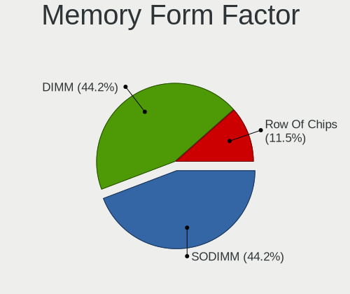

| Name         | Computers | Percent |
|--------------|-----------|---------|
| SODIMM       | 41        | 65.08%  |
| DIMM         | 12        | 19.05%  |
| Row Of Chips | 10        | 15.87%  |

Memory Size
-----------

Memory module size

| Size  | Computers | Percent |
|-------|-----------|---------|
| 4096  | 22        | 34.38%  |
| 8192  | 21        | 32.81%  |
| 16384 | 12        | 18.75%  |
| 2048  | 5         | 7.81%   |
| 32768 | 2         | 3.13%   |
| 1024  | 2         | 3.13%   |

Memory Speed
------------

Memory module speed

| Speed   | Computers | Percent |
|---------|-----------|---------|
| 3200    | 15        | 22.39%  |
| 2667    | 12        | 17.91%  |
| 1600    | 10        | 14.93%  |
| 4267    | 5         | 7.46%   |
| 1867    | 4         | 5.97%   |
| 1333    | 4         | 5.97%   |
| 2400    | 3         | 4.48%   |
| 3266    | 2         | 2.99%   |
| 1334    | 2         | 2.99%   |
| 8400    | 1         | 1.49%   |
| 4400    | 1         | 1.49%   |
| 3600    | 1         | 1.49%   |
| 3466    | 1         | 1.49%   |
| 2933    | 1         | 1.49%   |
| 2134    | 1         | 1.49%   |
| 2133    | 1         | 1.49%   |
| 1866    | 1         | 1.49%   |
| 800     | 1         | 1.49%   |
| Unknown | 1         | 1.49%   |

Printers & scanners
-------------------

Printer Vendor
--------------

Printer device vendors

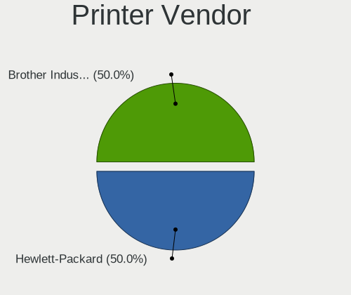

| Vendor             | Computers | Percent |
|--------------------|-----------|---------|
| Seiko Epson        | 1         | 50%     |
| Brother Industries | 1         | 50%     |

Printer Model
-------------

Printer device models

| Model                      | Computers | Percent |
|----------------------------|-----------|---------|
| Seiko Epson ET-2820 Series | 1         | 50%     |
| Brother MFC-J480DW         | 1         | 50%     |

Scanner Vendor
--------------

Scanner device vendors

Zero info for selected period =(

Scanner Model
-------------

Scanner device models

Zero info for selected period =(

Camera
------

Camera Vendor
-------------

Camera device vendors

| Vendor                                 | Computers | Percent |
|----------------------------------------|-----------|---------|
| Chicony Electronics                    | 17        | 20.48%  |
| Microdia                               | 15        | 18.07%  |
| Realtek Semiconductor                  | 12        | 14.46%  |
| Acer                                   | 9         | 10.84%  |
| Logitech                               | 8         | 9.64%   |
| Sunplus Innovation Technology          | 7         | 8.43%   |
| IMC Networks                           | 4         | 4.82%   |
| Apple                                  | 2         | 2.41%   |
| Y Media                                | 1         | 1.2%    |
| Xiaomi                                 | 1         | 1.2%    |
| USB Camera                             | 1         | 1.2%    |
| Suyin                                  | 1         | 1.2%    |
| Quanta                                 | 1         | 1.2%    |
| Primax Electronics                     | 1         | 1.2%    |
| Lite-On Technology                     | 1         | 1.2%    |
| Generalplus Technology                 | 1         | 1.2%    |
| Cheng Uei Precision Industry (Foxlink) | 1         | 1.2%    |

Camera Model
------------

Camera device models

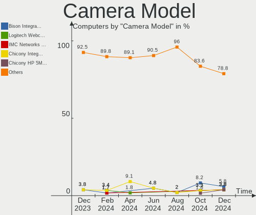

| Model                                                   | Computers | Percent |
|---------------------------------------------------------|-----------|---------|
| Microdia Integrated_Webcam_HD                           | 9         | 10.23%  |
| Realtek Integrated_Webcam_HD                            | 5         | 5.68%   |
| Sunplus Integrated_Webcam_HD                            | 4         | 4.55%   |
| Realtek Integrated_Webcam_5M                            | 3         | 3.41%   |
| Microdia Integrated_Webcam_5M                           | 3         | 3.41%   |
| Logitech HD Pro Webcam C920                             | 3         | 3.41%   |
| Chicony Integrated Camera                               | 3         | 3.41%   |
| Acer Integrated Camera                                  | 3         | 3.41%   |
| Microdia Integrated Webcam HD                           | 2         | 2.27%   |
| Logitech BRIO Ultra HD Webcam                           | 2         | 2.27%   |
| Chicony USB2.0 Camera                                   | 2         | 2.27%   |
| Acer EasyCamera                                         | 2         | 2.27%   |
| Y Media USB Camera                                      | 1         | 1.14%   |
| Xiaomi Mi/Redmi series (PTP)                            | 1         | 1.14%   |
| USB Camera USB Camera                                   | 1         | 1.14%   |
| Suyin USB2.0 UVC 1.3M WebCam                            | 1         | 1.14%   |
| Sunplus Laptop Integrated Webcam HD                     | 1         | 1.14%   |
| Sunplus Integrated_Webcam_FHD                           | 1         | 1.14%   |
| Sunplus HD WebCam                                       | 1         | 1.14%   |
| Realtek USB2.0 VGA UVC WebCam                           | 1         | 1.14%   |
| Realtek USB2.0 HD UVC WebCam                            | 1         | 1.14%   |
| Realtek Integrated Webcam                               | 1         | 1.14%   |
| Realtek Integrated Camera                               | 1         | 1.14%   |
| Realtek EasyCamera                                      | 1         | 1.14%   |
| Quanta HD User Facing                                   | 1         | 1.14%   |
| Primax HP HD Webcam [Fixed]                             | 1         | 1.14%   |
| Microdia PC Camera (SN9C325)                            | 1         | 1.14%   |
| Microdia Laptop_Integrated_Webcam_FHD                   | 1         | 1.14%   |
| Microdia Laptop Integrated Webcam HD (Composite Device) | 1         | 1.14%   |
| Microdia Dell Integrated HD Webcam                      | 1         | 1.14%   |
| Logitech Webcam Pro 9000                                | 1         | 1.14%   |
| Logitech Webcam C310                                    | 1         | 1.14%   |
| Logitech Webcam C270                                    | 1         | 1.14%   |
| Lite-On Integrated Camera                               | 1         | 1.14%   |
| IMC Networks XiaoMi Webcam                              | 1         | 1.14%   |
| IMC Networks USB2.0 UVC HD Webcam                       | 1         | 1.14%   |
| IMC Networks USB2.0 HD UVC WebCam                       | 1         | 1.14%   |
| IMC Networks Integrated Camera                          | 1         | 1.14%   |
| Generalplus 808 Camera #9 (web-cam mode)                | 1         | 1.14%   |
| Chicony Webcam                                          | 1         | 1.14%   |
| Chicony USB2.0 VGA UVC WebCam                           | 1         | 1.14%   |
| Chicony USB 2.0 Camera                                  | 1         | 1.14%   |
| Chicony Integrated RGB Camera                           | 1         | 1.14%   |
| Chicony Integrated Camera (1280x720@30)                 | 1         | 1.14%   |
| Chicony HP Wide Vision HD Camera                        | 1         | 1.14%   |
| Chicony HP TrueVision HD Webcam                         | 1         | 1.14%   |
| Chicony HP TrueVision HD Camera                         | 1         | 1.14%   |
| Chicony HD Webcam                                       | 1         | 1.14%   |
| Chicony FJ Camera                                       | 1         | 1.14%   |
| Chicony CNF7050                                         | 1         | 1.14%   |
| Chicony CKF7037 HP webcam                               | 1         | 1.14%   |
| Cheng Uei Precision Industry (Foxlink) HP HD Camera     | 1         | 1.14%   |
| Apple FaceTime HD Camera (Built-in)                     | 1         | 1.14%   |
| Apple Built-in iSight                                   | 1         | 1.14%   |
| Acer ThinkPad Integrated Camera                         | 1         | 1.14%   |
| Acer Lenovo Integrated Webcam                           | 1         | 1.14%   |
| Acer Integrated IR Camera                               | 1         | 1.14%   |
| Acer HP TrueVision HD Webcam                            | 1         | 1.14%   |
| Acer BisonCam, NB Pro                                   | 1         | 1.14%   |

Security
--------

Fingerprint Vendor
------------------

Fingerprint sensor vendors

| Vendor                | Computers | Percent |
|-----------------------|-----------|---------|
| Synaptics             | 4         | 44.44%  |
| Validity Sensors      | 2         | 22.22%  |
| AuthenTec             | 2         | 22.22%  |
| LighTuning Technology | 1         | 11.11%  |

Fingerprint Model
-----------------

Fingerprint sensor models

| Model                                             | Computers | Percent |
|---------------------------------------------------|-----------|---------|
| Validity Sensors VFS491                           | 1         | 11.11%  |
| Validity Sensors Fingerprint scanner              | 1         | 11.11%  |
| Synaptics WBDI Device                             | 1         | 11.11%  |
| Synaptics Prometheus MIS Touch Fingerprint Reader | 1         | 11.11%  |
| Synaptics Metallica MIS Touch Fingerprint Reader  | 1         | 11.11%  |
| LighTuning ES603 Swipe Fingerprint Sensor         | 1         | 11.11%  |
| AuthenTec Fingerprint Sensor                      | 1         | 11.11%  |
| AuthenTec AES2810                                 | 1         | 11.11%  |
| Unknown                                           | 1         | 11.11%  |

Chipcard Vendor
---------------

Chipcard module vendors

| Vendor      | Computers | Percent |
|-------------|-----------|---------|
| Broadcom    | 6         | 60%     |
| Alcor Micro | 2         | 20%     |
| O2 Micro    | 1         | 10%     |
| Clay Logic  | 1         | 10%     |

Chipcard Model
--------------

Chipcard module models

| Model                                                                        | Computers | Percent |
|------------------------------------------------------------------------------|-----------|---------|
| Broadcom BCM5880 Secure Applications Processor with fingerprint swipe sensor | 2         | 20%     |
| Broadcom 58200                                                               | 2         | 20%     |
| Alcor Micro AU9540 Smartcard Reader                                          | 2         | 20%     |
| O2 Micro OZ776 CCID Smartcard Reader                                         | 1         | 10%     |
| Clay Logic Nitrokey HSM                                                      | 1         | 10%     |
| Broadcom BCM5880 Secure Applications Processor                               | 1         | 10%     |
| Broadcom 5880                                                                | 1         | 10%     |

Unsupported
-----------

Unsupported Devices
-------------------

Total unsupported devices on board

| Total | Computers | Percent |
|-------|-----------|---------|
| 0     | 88        | 73.33%  |
| 1     | 24        | 20%     |
| 3     | 4         | 3.33%   |
| 2     | 4         | 3.33%   |

Unsupported Device Types
------------------------

Types of unsupported devices

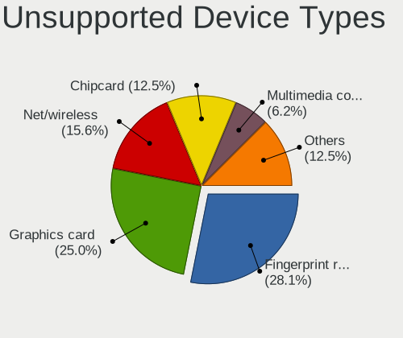

| Type                     | Computers | Percent |
|--------------------------|-----------|---------|
| Fingerprint reader       | 9         | 20.93%  |
| Multimedia controller    | 8         | 18.6%   |
| Graphics card            | 8         | 18.6%   |
| Chipcard                 | 7         | 16.28%  |
| Communication controller | 5         | 11.63%  |
| Net/wireless             | 3         | 6.98%   |
| Net/ethernet             | 2         | 4.65%   |
| Card reader              | 1         | 2.33%   |

