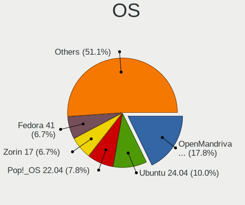
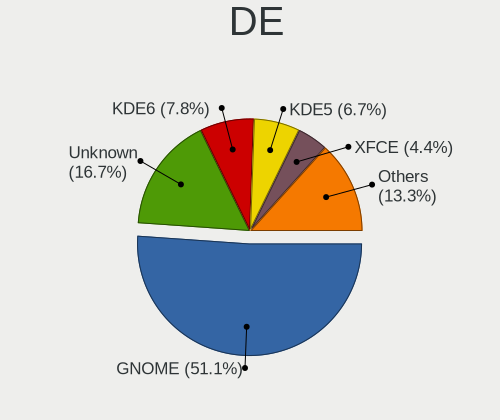
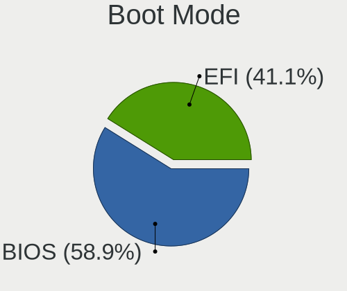
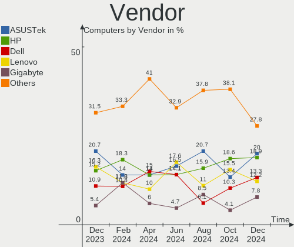
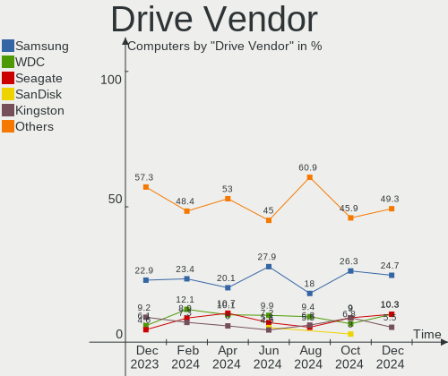
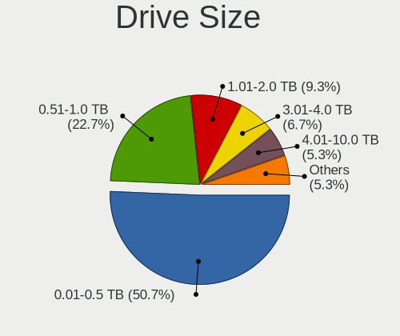
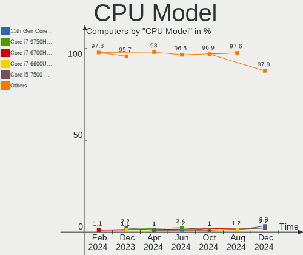
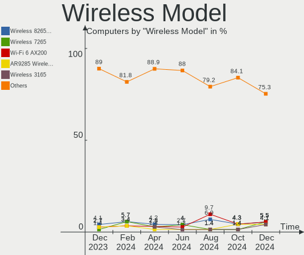
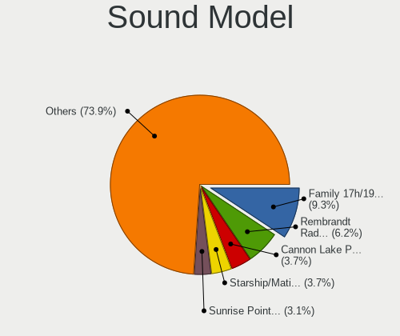
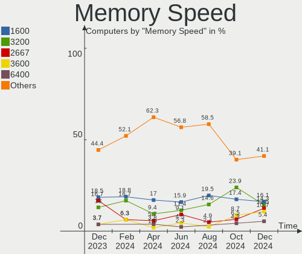

Linux in Netherlands - Hardware Trends
--------------------------------------

A project to identify most popular hardware characteristics and track their change
over time based on data collected by Linux users at https://Linux-Hardware.org.

Anyone can contribute to this report by the [hw-probe](https://github.com/linuxhw/hw-probe) tool:

    sudo -E hw-probe -all -upload

This is a report for all computer types. See also reports for [desktops](/Location/Netherlands/Desktop/README.md) and [notebooks](/Location/Netherlands/Notebook/README.md).

Period: Dec, 2022.

Contents
--------

* [ System ](#system)
  - [ OS                       ](#os)
  - [ OS Family                ](#os-family)
  - [ Kernel                   ](#kernel)
  - [ Kernel Family            ](#kernel-family)
  - [ Kernel Major Ver.        ](#kernel-major-ver)
  - [ Arch                     ](#arch)
  - [ DE                       ](#de)
  - [ Display Server           ](#display-server)
  - [ Display Manager          ](#display-manager)
  - [ OS Lang                  ](#os-lang)
  - [ Boot Mode                ](#boot-mode)
  - [ Filesystem               ](#filesystem)
  - [ Part. scheme             ](#part-scheme)
  - [ Dual Boot with Linux/BSD ](#dual-boot-with-linuxbsd)
  - [ Dual Boot (Win)          ](#dual-boot-win)

* [ Board ](#board)
  - [ Vendor                   ](#vendor)
  - [ Model                    ](#model)
  - [ Model Family             ](#model-family)
  - [ MFG Year                 ](#mfg-year)
  - [ Form Factor              ](#form-factor)
  - [ Secure Boot              ](#secure-boot)
  - [ Coreboot                 ](#coreboot)
  - [ RAM Size                 ](#ram-size)
  - [ RAM Used                 ](#ram-used)
  - [ Total Drives             ](#total-drives)
  - [ Has CD-ROM               ](#has-cd-rom)
  - [ Has Ethernet             ](#has-ethernet)
  - [ Has WiFi                 ](#has-wifi)
  - [ Has Bluetooth            ](#has-bluetooth)

* [ Location ](#location)
  - [ Country                  ](#country)
  - [ City                     ](#city)

* [ Drives ](#drives)
  - [ Drive Vendor             ](#drive-vendor)
  - [ Drive Model              ](#drive-model)
  - [ HDD Vendor               ](#hdd-vendor)
  - [ SSD Vendor               ](#ssd-vendor)
  - [ Drive Kind               ](#drive-kind)
  - [ Drive Connector          ](#drive-connector)
  - [ Drive Size               ](#drive-size)
  - [ Space Total              ](#space-total)
  - [ Space Used               ](#space-used)
  - [ Malfunc. Drives          ](#malfunc-drives)
  - [ Malfunc. Drive Vendor    ](#malfunc-drive-vendor)
  - [ Malfunc. HDD Vendor      ](#malfunc-hdd-vendor)
  - [ Malfunc. Drive Kind      ](#malfunc-drive-kind)
  - [ Failed Drives            ](#failed-drives)
  - [ Failed Drive Vendor      ](#failed-drive-vendor)
  - [ Drive Status             ](#drive-status)

* [ Storage controller ](#storage-controller)
  - [ Storage Vendor           ](#storage-vendor)
  - [ Storage Model            ](#storage-model)
  - [ Storage Kind             ](#storage-kind)

* [ Processor ](#processor)
  - [ CPU Vendor               ](#cpu-vendor)
  - [ CPU Model                ](#cpu-model)
  - [ CPU Model Family         ](#cpu-model-family)
  - [ CPU Cores                ](#cpu-cores)
  - [ CPU Sockets              ](#cpu-sockets)
  - [ CPU Threads              ](#cpu-threads)
  - [ CPU Op-Modes             ](#cpu-op-modes)
  - [ CPU Microcode            ](#cpu-microcode)
  - [ CPU Microarch            ](#cpu-microarch)

* [ Graphics ](#graphics)
  - [ GPU Vendor               ](#gpu-vendor)
  - [ GPU Model                ](#gpu-model)
  - [ GPU Combo                ](#gpu-combo)
  - [ GPU Driver               ](#gpu-driver)
  - [ GPU Memory               ](#gpu-memory)

* [ Monitor ](#monitor)
  - [ Monitor Vendor           ](#monitor-vendor)
  - [ Monitor Model            ](#monitor-model)
  - [ Monitor Resolution       ](#monitor-resolution)
  - [ Monitor Diagonal         ](#monitor-diagonal)
  - [ Monitor Width            ](#monitor-width)
  - [ Aspect Ratio             ](#aspect-ratio)
  - [ Monitor Area             ](#monitor-area)
  - [ Pixel Density            ](#pixel-density)
  - [ Multiple Monitors        ](#multiple-monitors)

* [ Network ](#network)
  - [ Net Controller Vendor    ](#net-controller-vendor)
  - [ Net Controller Model     ](#net-controller-model)
  - [ Wireless Vendor          ](#wireless-vendor)
  - [ Wireless Model           ](#wireless-model)
  - [ Ethernet Vendor          ](#ethernet-vendor)
  - [ Ethernet Model           ](#ethernet-model)
  - [ Net Controller Kind      ](#net-controller-kind)
  - [ Used Controller          ](#used-controller)
  - [ NICs                     ](#nics)
  - [ IPv6                     ](#ipv6)

* [ Bluetooth ](#bluetooth)
  - [ Bluetooth Vendor         ](#bluetooth-vendor)
  - [ Bluetooth Model          ](#bluetooth-model)

* [ Sound ](#sound)
  - [ Sound Vendor             ](#sound-vendor)
  - [ Sound Model              ](#sound-model)

* [ Memory ](#memory)
  - [ Memory Vendor            ](#memory-vendor)
  - [ Memory Model             ](#memory-model)
  - [ Memory Kind              ](#memory-kind)
  - [ Memory Form Factor       ](#memory-form-factor)
  - [ Memory Size              ](#memory-size)
  - [ Memory Speed             ](#memory-speed)

* [ Printers & scanners ](#printers--scanners)
  - [ Printer Vendor           ](#printer-vendor)
  - [ Printer Model            ](#printer-model)
  - [ Scanner Vendor           ](#scanner-vendor)
  - [ Scanner Model            ](#scanner-model)

* [ Camera ](#camera)
  - [ Camera Vendor            ](#camera-vendor)
  - [ Camera Model             ](#camera-model)

* [ Security ](#security)
  - [ Fingerprint Vendor       ](#fingerprint-vendor)
  - [ Fingerprint Model        ](#fingerprint-model)
  - [ Chipcard Vendor          ](#chipcard-vendor)
  - [ Chipcard Model           ](#chipcard-model)

* [ Unsupported ](#unsupported)
  - [ Unsupported Devices      ](#unsupported-devices)
  - [ Unsupported Device Types ](#unsupported-device-types)

System
------

OS
--

Installed operating systems

| Name                | Computers | Percent |
|---------------------|-----------|---------|
| Ubuntu 22.04        | 14        | 14%     |
| Debian 11           | 10        | 10%     |
| Ubuntu 22.10        | 7         | 7%      |
| Pop!_OS 22.04       | 7         | 7%      |
| Fedora 37           | 6         | 6%      |
| Manjaro 22.0.0      | 5         | 5%      |
| Zorin 16            | 4         | 4%      |
| Linux Mint 21.1     | 4         | 4%      |
| Linux Mint 21       | 4         | 4%      |
| Ubuntu 20.04        | 3         | 3%      |
| Arch Rolling        | 3         | 3%      |
| Manjaro             | 2         | 2%      |
| Linux Mint 20.3     | 2         | 2%      |
| KDE neon 22.04      | 2         | 2%      |
| Kali 2022.4         | 2         | 2%      |
| antiX 22            | 2         | 2%      |
| Xubuntu 20.04       | 1         | 1%      |
| Ubuntu Studio 22.04 | 1         | 1%      |
| Ubuntu Budgie 22.04 | 1         | 1%      |
| Ubuntu Budgie 18.04 | 1         | 1%      |
| Ubuntu 18.04        | 1         | 1%      |
| Trisquel 10.0.1     | 1         | 1%      |
| SteamOS 3.4.3       | 1         | 1%      |
| SteamOS 3.3.2       | 1         | 1%      |
| Rocky Linux 9.1     | 1         | 1%      |
| Parrot 5.1          | 1         | 1%      |
| OpenMandriva 4.50   | 1         | 1%      |
| OpenMandriva 4.2    | 1         | 1%      |
| NixOS 22.11         | 1         | 1%      |
| MX 21               | 1         | 1%      |
| MocaccinoOS         | 1         | 1%      |
| Manjaro-ARM         | 1         | 1%      |
| Kubuntu 22.10       | 1         | 1%      |
| Kubuntu 22.04       | 1         | 1%      |
| Gentoo 2.9          | 1         | 1%      |
| Fedora 35           | 1         | 1%      |
| Endless 4.0.13      | 1         | 1%      |
| Elementary 6.1      | 1         | 1%      |
| AlmaLinux 9.1       | 1         | 1%      |

OS Family
---------

OS without a version

| Name          | Computers | Percent |
|---------------|-----------|---------|
| Ubuntu        | 25        | 25%     |
| Linux Mint    | 10        | 10%     |
| Debian        | 10        | 10%     |
| Pop!_OS       | 7         | 7%      |
| Manjaro       | 7         | 7%      |
| Fedora        | 7         | 7%      |
| Zorin         | 4         | 4%      |
| Arch          | 3         | 3%      |
| Ubuntu Budgie | 2         | 2%      |
| SteamOS       | 2         | 2%      |
| OpenMandriva  | 2         | 2%      |
| Kubuntu       | 2         | 2%      |
| KDE neon      | 2         | 2%      |
| Kali          | 2         | 2%      |
| antiX         | 2         | 2%      |
| Xubuntu       | 1         | 1%      |
| Ubuntu Studio | 1         | 1%      |
| Trisquel      | 1         | 1%      |
| Rocky Linux   | 1         | 1%      |
| Parrot        | 1         | 1%      |
| NixOS         | 1         | 1%      |
| MX            | 1         | 1%      |
| MocaccinoOS   | 1         | 1%      |
| Manjaro-ARM   | 1         | 1%      |
| Gentoo        | 1         | 1%      |
| Endless       | 1         | 1%      |
| Elementary    | 1         | 1%      |
| AlmaLinux     | 1         | 1%      |

Kernel
------

Version of the Linux kernel

| Version                         | Computers | Percent |
|---------------------------------|-----------|---------|
| 5.15.0-56-generic               | 23        | 23%     |
| 6.0.6-76060006-generic          | 6         | 6%      |
| 5.19.0-26-generic               | 6         | 6%      |
| 5.10.0-19-amd64                 | 5         | 5%      |
| 5.15.78-1-MANJARO               | 4         | 4%      |
| 6.0.11-300.fc37.x86_64          | 3         | 3%      |
| 5.4.0-135-generic               | 3         | 3%      |
| 5.15.0-53-generic               | 3         | 3%      |
| 6.0.12-arch1-1                  | 2         | 2%      |
| 6.0.10-300.fc37.x86_64          | 2         | 2%      |
| 6.0.0-kali3-amd64               | 2         | 2%      |
| 5.15.0-57-generic               | 2         | 2%      |
| 6.1.0-rc8-1-MANJARO-ARM         | 1         | 1%      |
| 6.1.0-rc7+                      | 1         | 1%      |
| 6.1.0                           | 1         | 1%      |
| 6.0.8-1-MANJARO                 | 1         | 1%      |
| 6.0.7-100.fc35.x86_64           | 1         | 1%      |
| 6.0.12-x64v1-xanmod1            | 1         | 1%      |
| 6.0.12-76060006-generic         | 1         | 1%      |
| 6.0.11-x64v1-xanmod1-1          | 1         | 1%      |
| 6.0.1-060001-generic            | 1         | 1%      |
| 6.0.0-2parrot1-amd64            | 1         | 1%      |
| 6.0.0-0.deb11.2-amd64           | 1         | 1%      |
| 5.8.0-50-generic                | 1         | 1%      |
| 5.19.12-desktop-2omv4090        | 1         | 1%      |
| 5.19.0-27-generic               | 1         | 1%      |
| 5.19.0-23-generic               | 1         | 1%      |
| 5.15.83-mocaccino               | 1         | 1%      |
| 5.15.81-1-MANJARO               | 1         | 1%      |
| 5.15.80-gentoo-x86_64           | 1         | 1%      |
| 5.15.74-1-pve                   | 1         | 1%      |
| 5.15.32-v8+                     | 1         | 1%      |
| 5.15.0-56-lowlatency            | 1         | 1%      |
| 5.15.0-52-generic               | 1         | 1%      |
| 5.15.0-50-generic               | 1         | 1%      |
| 5.15.0-1021-intel-iotg          | 1         | 1%      |
| 5.14.0-162.6.1.el9_1.x86_64     | 1         | 1%      |
| 5.14.0-162.6.1.el9_1.0.1.x86_64 | 1         | 1%      |
| 5.13.0-valve36-1-neptune        | 1         | 1%      |
| 5.13.0-valve21.3-1-neptune      | 1         | 1%      |

Kernel Family
-------------

Linux kernel without a distro release

| Version  | Computers | Percent |
|----------|-----------|---------|
| 5.15.0   | 32        | 32%     |
| 5.19.0   | 8         | 8%      |
| 5.10.0   | 8         | 8%      |
| 6.0.6    | 6         | 6%      |
| 6.0.12   | 4         | 4%      |
| 6.0.11   | 4         | 4%      |
| 6.0.0    | 4         | 4%      |
| 5.15.78  | 4         | 4%      |
| 6.1.0    | 3         | 3%      |
| 5.4.0    | 3         | 3%      |
| 5.13.0   | 3         | 3%      |
| 6.0.10   | 2         | 2%      |
| 5.14.0   | 2         | 2%      |
| 5.11.0   | 2         | 2%      |
| 6.0.8    | 1         | 1%      |
| 6.0.7    | 1         | 1%      |
| 6.0.1    | 1         | 1%      |
| 5.8.0    | 1         | 1%      |
| 5.19.12  | 1         | 1%      |
| 5.15.83  | 1         | 1%      |
| 5.15.81  | 1         | 1%      |
| 5.15.80  | 1         | 1%      |
| 5.15.74  | 1         | 1%      |
| 5.15.32  | 1         | 1%      |
| 5.11.12  | 1         | 1%      |
| 5.10.157 | 1         | 1%      |
| 5.10.142 | 1         | 1%      |
| 4.9.0    | 1         | 1%      |
| 4.15.0   | 1         | 1%      |

Kernel Major Ver.
-----------------

Linux kernel major version

| Version | Computers | Percent |
|---------|-----------|---------|
| 5.15    | 41        | 41%     |
| 6.0     | 23        | 23%     |
| 5.10    | 10        | 10%     |
| 5.19    | 9         | 9%      |
| 6.1     | 3         | 3%      |
| 5.4     | 3         | 3%      |
| 5.13    | 3         | 3%      |
| 5.11    | 3         | 3%      |
| 5.14    | 2         | 2%      |
| 5.8     | 1         | 1%      |
| 4.9     | 1         | 1%      |
| 4.15    | 1         | 1%      |

Arch
----

OS architecture (x86_64, i586, etc.)

| Name    | Computers | Percent |
|---------|-----------|---------|
| x86_64  | 96        | 96%     |
| i686    | 2         | 2%      |
| aarch64 | 2         | 2%      |

DE
--

Desktop Environment

| Name       | Computers | Percent |
|------------|-----------|---------|
| GNOME      | 55        | 55%     |
| KDE5       | 17        | 17%     |
| XFCE       | 8         | 8%      |
| MATE       | 6         | 6%      |
| X-Cinnamon | 5         | 5%      |
| Unknown    | 3         | 3%      |
| icewm      | 2         | 2%      |
| Budgie     | 2         | 2%      |
| Pantheon   | 1         | 1%      |
| Openbox    | 1         | 1%      |

Display Server
--------------

X11 or Wayland

| Name    | Computers | Percent |
|---------|-----------|---------|
| X11     | 64        | 64%     |
| Wayland | 31        | 31%     |
| Tty     | 3         | 3%      |
| Web     | 1         | 1%      |
| Unknown | 1         | 1%      |

Display Manager
---------------

SDDM, LightDM, etc.

| Name    | Computers | Percent |
|---------|-----------|---------|
| Unknown | 36        | 36%     |
| GDM3    | 25        | 25%     |
| LightDM | 16        | 16%     |
| GDM     | 12        | 12%     |
| SDDM    | 10        | 10%     |
| LXDM    | 1         | 1%      |

OS Lang
-------

Language

| Lang   | Computers | Percent |
|--------|-----------|---------|
| en_US  | 47        | 47%     |
| nl_NL  | 31        | 31%     |
| en_GB  | 6         | 6%      |
| de_DE  | 4         | 4%      |
| pl_PL  | 3         | 3%      |
| en_IE  | 2         | 2%      |
| C      | 2         | 2%      |
| ru_RU  | 1         | 1%      |
| pt_PT  | 1         | 1%      |
| hr_HR  | 1         | 1%      |
| en_CA  | 1         | 1%      |
| C.UTF8 | 1         | 1%      |

Boot Mode
---------

EFI or BIOS

| Mode | Computers | Percent |
|------|-----------|---------|
| BIOS | 53        | 53%     |
| EFI  | 47        | 47%     |

Filesystem
----------

Type of filesystem

| Type    | Computers | Percent |
|---------|-----------|---------|
| Ext4    | 86        | 86%     |
| Btrfs   | 9         | 9%      |
| Zfs     | 2         | 2%      |
| Xfs     | 2         | 2%      |
| Overlay | 1         | 1%      |

Part. scheme
------------

Scheme of partitioning

| Type    | Computers | Percent |
|---------|-----------|---------|
| GPT     | 57        | 57%     |
| Unknown | 33        | 33%     |
| MBR     | 10        | 10%     |

Dual Boot with Linux/BSD
------------------------

Hosting more than one Linux/BSD

| Dual boot | Computers | Percent |
|-----------|-----------|---------|
| No        | 86        | 86%     |
| Yes       | 14        | 14%     |

Dual Boot (Win)
---------------

Hosting Linux and Windows

| Dual boot | Computers | Percent |
|-----------|-----------|---------|
| No        | 68        | 68%     |
| Yes       | 32        | 32%     |

Board
-----

Vendor
------

Motherboard manufacturer

| Name                    | Computers | Percent |
|-------------------------|-----------|---------|
| ASUSTek Computer        | 17        | 17%     |
| Lenovo                  | 16        | 16%     |
| Hewlett-Packard         | 10        | 10%     |
| Dell                    | 9         | 9%      |
| Acer                    | 8         | 8%      |
| Gigabyte Technology     | 7         | 7%      |
| MSI                     | 6         | 6%      |
| Intel                   | 4         | 4%      |
| ASRock                  | 4         | 4%      |
| Apple                   | 3         | 3%      |
| Valve                   | 2         | 2%      |
| Medion                  | 2         | 2%      |
| Toshiba                 | 1         | 1%      |
| THUNDEROBOT             | 1         | 1%      |
| Supermicro              | 1         | 1%      |
| Samsung Electronics     | 1         | 1%      |
| Raspberry Pi Foundation | 1         | 1%      |
| Pine Microsystems       | 1         | 1%      |
| Packard Bell            | 1         | 1%      |
| Notebook                | 1         | 1%      |
| Microsoft               | 1         | 1%      |
| LG Electronics          | 1         | 1%      |
| Fujitsu                 | 1         | 1%      |
| Alienware               | 1         | 1%      |

Model
-----

Motherboard model

| Name                                       | Computers | Percent |
|--------------------------------------------|-----------|---------|
| Valve Jupiter                              | 2         | 2%      |
| Gigabyte B550 AORUS ELITE AX V2            | 2         | 2%      |
| ASUS All Series                            | 2         | 2%      |
| Toshiba Satellite C70D-B                   | 1         | 1%      |
| THUNDEROBOT 911MT                          | 1         | 1%      |
| Supermicro C7SIM-Q                         | 1         | 1%      |
| Samsung 300E4A/300E5A/300E7A/3430EA/3530EA | 1         | 1%      |
| RPi Raspberry Pi 4 Model B Rev 1.1         | 1         | 1%      |
| Pine Microsystems Pine64 PinePhone (1.2)   | 1         | 1%      |
| Packard Bell EasyNote TE11HC               | 1         | 1%      |
| Notebook PB50_70RF,RD,RC                   | 1         | 1%      |
| MSI Summit E16Flip A12UCT                  | 1         | 1%      |
| MSI MS-7C35                                | 1         | 1%      |
| MSI MS-7B85                                | 1         | 1%      |
| MSI Modern 15 A11MU                        | 1         | 1%      |
| MSI GP75 Leopard 10SEK                     | 1         | 1%      |
| MSI GL62M 7RE                              | 1         | 1%      |
| Microsoft Surface Pro 4                    | 1         | 1%      |
| Medion E4251 MD61435                       | 1         | 1%      |
| Medion E4251                               | 1         | 1%      |
| LG 17Z90Q-G.AA79G                          | 1         | 1%      |
| Lenovo ThinkPad X230 Tablet 34383V4        | 1         | 1%      |
| Lenovo ThinkPad X201 Tablet 3093RZ6        | 1         | 1%      |
| Lenovo ThinkPad T510 4349AF5               | 1         | 1%      |
| Lenovo ThinkPad T490 20N2CTO1WW            | 1         | 1%      |
| Lenovo ThinkPad T470s 20HF003QUS           | 1         | 1%      |
| Lenovo ThinkPad T16 Gen 1 21CHCTO1WW       | 1         | 1%      |
| Lenovo ThinkPad P14s Gen 2a 21A0004BMH     | 1         | 1%      |
| Lenovo ThinkPad L560 20F2S2UR02            | 1         | 1%      |
| Lenovo ThinkPad E15 Gen 2 20TD00JYMH       | 1         | 1%      |
| Lenovo ThinkBook 15 G2 ITL 20VE            | 1         | 1%      |
| Lenovo IdeaPad Gaming 3 15ACH6 82K2        | 1         | 1%      |
| Lenovo IdeaPad 5 15ARE05 81YQ              | 1         | 1%      |
| Lenovo IdeaPad 320-15ISK 80XH              | 1         | 1%      |
| Lenovo IdeaPad 3 14IAU7 82RJ               | 1         | 1%      |
| Lenovo G50-70 20351                        | 1         | 1%      |
| Lenovo 3000 V100 076346G                   | 1         | 1%      |
| Intel X99                                  | 1         | 1%      |
| Intel NUC8i7HVK                            | 1         | 1%      |
| Intel NUC6CAYH                             | 1         | 1%      |

Model Family
------------

Motherboard model prefix

| Name                     | Computers | Percent |
|--------------------------|-----------|---------|
| Lenovo ThinkPad          | 9         | 9%      |
| Acer Aspire              | 6         | 6%      |
| Lenovo IdeaPad           | 4         | 4%      |
| HP Pavilion              | 3         | 3%      |
| HP Compaq                | 3         | 3%      |
| Dell Latitude            | 3         | 3%      |
| Valve Jupiter            | 2         | 2%      |
| Medion E4251             | 2         | 2%      |
| HP EliteBook             | 2         | 2%      |
| Gigabyte B550            | 2         | 2%      |
| Dell XPS                 | 2         | 2%      |
| Dell OptiPlex            | 2         | 2%      |
| Dell Inspiron            | 2         | 2%      |
| ASUS TUF                 | 2         | 2%      |
| ASUS PRIME               | 2         | 2%      |
| ASUS All                 | 2         | 2%      |
| Toshiba Satellite        | 1         | 1%      |
| THUNDEROBOT 911MT        | 1         | 1%      |
| Supermicro C7SIM-Q       | 1         | 1%      |
| Samsung 300E4A           | 1         | 1%      |
| RPi Raspberry            | 1         | 1%      |
| Pine Microsystems Pine64 | 1         | 1%      |
| Packard Bell EasyNote    | 1         | 1%      |
| Notebook PB50            | 1         | 1%      |
| MSI Summit               | 1         | 1%      |
| MSI MS-7C35              | 1         | 1%      |
| MSI MS-7B85              | 1         | 1%      |
| MSI Modern               | 1         | 1%      |
| MSI GP75                 | 1         | 1%      |
| MSI GL62M                | 1         | 1%      |
| Microsoft Surface        | 1         | 1%      |
| LG 17Z90Q-G.AA79G        | 1         | 1%      |
| Lenovo ThinkBook         | 1         | 1%      |
| Lenovo G50-70            | 1         | 1%      |
| Lenovo 3000              | 1         | 1%      |
| Intel X99                | 1         | 1%      |
| Intel NUC8i7HVK          | 1         | 1%      |
| Intel NUC6CAYH           | 1         | 1%      |
| HP ProLiant              | 1         | 1%      |
| HP ENVY                  | 1         | 1%      |

MFG Year
--------

Motherboard manufacture year

| Year    | Computers | Percent |
|---------|-----------|---------|
| 2021    | 13        | 13%     |
| 2022    | 12        | 12%     |
| 2020    | 11        | 11%     |
| 2019    | 8         | 8%      |
| 2018    | 8         | 8%      |
| 2016    | 7         | 7%      |
| 2013    | 7         | 7%      |
| 2012    | 6         | 6%      |
| 2010    | 6         | 6%      |
| 2017    | 5         | 5%      |
| 2014    | 5         | 5%      |
| 2009    | 5         | 5%      |
| 2011    | 2         | 2%      |
| 2006    | 2         | 2%      |
| Unknown | 2         | 2%      |
| 2007    | 1         | 1%      |

Form Factor
-----------

Physical design of the computer

| Name           | Computers | Percent |
|----------------|-----------|---------|
| Notebook       | 55        | 55%     |
| Desktop        | 36        | 36%     |
| Convertible    | 3         | 3%      |
| Mini pc        | 2         | 2%      |
| Phone          | 1         | 1%      |
| System on chip | 1         | 1%      |
| Tablet         | 1         | 1%      |
| All in one     | 1         | 1%      |

Secure Boot
-----------

Enabled or disabled

| State    | Computers | Percent |
|----------|-----------|---------|
| Disabled | 91        | 91%     |
| Enabled  | 9         | 9%      |

Coreboot
--------

Have coreboot on board

| Used | Computers | Percent |
|------|-----------|---------|
| No   | 100       | 100%    |

RAM Size
--------

Total RAM memory

| Size in GB  | Computers | Percent |
|-------------|-----------|---------|
| 8.01-16.0   | 25        | 25%     |
| 4.01-8.0    | 17        | 17%     |
| 16.01-24.0  | 17        | 17%     |
| 3.01-4.0    | 15        | 15%     |
| 32.01-64.0  | 11        | 11%     |
| 24.01-32.0  | 6         | 6%      |
| 64.01-256.0 | 6         | 6%      |
| 1.01-2.0    | 3         | 3%      |

RAM Used
--------

Used RAM memory

| Used GB    | Computers | Percent |
|------------|-----------|---------|
| 1.01-2.0   | 28        | 28%     |
| 2.01-3.0   | 21        | 21%     |
| 4.01-8.0   | 17        | 17%     |
| 3.01-4.0   | 14        | 14%     |
| 8.01-16.0  | 10        | 10%     |
| 0.51-1.0   | 6         | 6%      |
| 16.01-24.0 | 2         | 2%      |
| 0.01-0.5   | 2         | 2%      |

Total Drives
------------

Number of drives on board

| Drives | Computers | Percent |
|--------|-----------|---------|
| 1      | 52        | 52%     |
| 2      | 31        | 31%     |
| 3      | 6         | 6%      |
| 4      | 5         | 5%      |
| 5      | 2         | 2%      |
| 9      | 1         | 1%      |
| 7      | 1         | 1%      |
| 6      | 1         | 1%      |
| 0      | 1         | 1%      |

Has CD-ROM
----------

Has CD-ROM on board

| Presented | Computers | Percent |
|-----------|-----------|---------|
| No        | 62        | 62%     |
| Yes       | 38        | 38%     |

Has Ethernet
------------

Has Ethernet on board

| Presented | Computers | Percent |
|-----------|-----------|---------|
| Yes       | 83        | 83%     |
| No        | 17        | 17%     |

Has WiFi
--------

Has WiFi module

| Presented | Computers | Percent |
|-----------|-----------|---------|
| Yes       | 79        | 79%     |
| No        | 21        | 21%     |

Has Bluetooth
-------------

Has Bluetooth module

| Presented | Computers | Percent |
|-----------|-----------|---------|
| Yes       | 69        | 69%     |
| No        | 31        | 31%     |

Location
--------

Country
-------

Geographic location (country)

| Country     | Computers | Percent |
|-------------|-----------|---------|
| Netherlands | 100       | 100%    |

City
----

Geographic location (city)

| City                    | Computers | Percent |
|-------------------------|-----------|---------|
| Amsterdam               | 20        | 20%     |
| Rotterdam               | 5         | 5%      |
| Zoetermeer              | 3         | 3%      |
| Tilburg                 | 3         | 3%      |
| The Hague               | 3         | 3%      |
| Haarlem                 | 3         | 3%      |
| Groningen               | 3         | 3%      |
| Amstelveen              | 3         | 3%      |
| Waalwijk                | 2         | 2%      |
| Purmerend               | 2         | 2%      |
| Nieuwegein              | 2         | 2%      |
| Maastricht              | 2         | 2%      |
| Blaricum                | 2         | 2%      |
| Beverwijk               | 2         | 2%      |
| Zwartsluis              | 1         | 1%      |
| Wissenkerke             | 1         | 1%      |
| Winterswijk             | 1         | 1%      |
| Winssen                 | 1         | 1%      |
| Weteringbrug            | 1         | 1%      |
| Vught                   | 1         | 1%      |
| Vlaardingen             | 1         | 1%      |
| Venray                  | 1         | 1%      |
| Velsen                  | 1         | 1%      |
| Velp                    | 1         | 1%      |
| Utrecht                 | 1         | 1%      |
| Stadskanaal             | 1         | 1%      |
| Someren                 | 1         | 1%      |
| Schiedam                | 1         | 1%      |
| Piershil                | 1         | 1%      |
| Ouderkerk aan de Amstel | 1         | 1%      |
| Ochten                  | 1         | 1%      |
| Nispen                  | 1         | 1%      |
| Nijmegen                | 1         | 1%      |
| Nieuwkoop               | 1         | 1%      |
| Naaldwijk               | 1         | 1%      |
| Middelburg              | 1         | 1%      |
| Luxwoude                | 1         | 1%      |
| Landgraaf               | 1         | 1%      |
| Katwijk                 | 1         | 1%      |
| Horst                   | 1         | 1%      |

Drives
------

Drive Vendor
------------

Hard drive vendors

| Vendor                      | Computers | Drives | Percent |
|-----------------------------|-----------|--------|---------|
| Samsung Electronics         | 43        | 52     | 28.29%  |
| WDC                         | 16        | 21     | 10.53%  |
| Seagate                     | 16        | 27     | 10.53%  |
| Intel                       | 10        | 11     | 6.58%   |
| Unknown                     | 8         | 8      | 5.26%   |
| Crucial                     | 8         | 8      | 5.26%   |
| Kingston                    | 7         | 8      | 4.61%   |
| Toshiba                     | 6         | 9      | 3.95%   |
| SK hynix                    | 5         | 5      | 3.29%   |
| Sandisk                     | 5         | 5      | 3.29%   |
| China                       | 3         | 3      | 1.97%   |
| PNY                         | 2         | 2      | 1.32%   |
| Kingston Technology Company | 2         | 2      | 1.32%   |
| HGST                        | 2         | 2      | 1.32%   |
| Transcend                   | 1         | 1      | 0.66%   |
| Teclast                     | 1         | 1      | 0.66%   |
| SSSTC                       | 1         | 1      | 0.66%   |
| Silicon Motion              | 1         | 1      | 0.66%   |
| Shenzhen                    | 1         | 1      | 0.66%   |
| Seagate Technology          | 1         | 1      | 0.66%   |
| Phison                      | 1         | 1      | 0.66%   |
| Lite-On Technology          | 1         | 1      | 0.66%   |
| KIOXIA                      | 1         | 1      | 0.66%   |
| Kingchuxing                 | 1         | 2      | 0.66%   |
| JMicron Technology          | 1         | 1      | 0.66%   |
| Intenso                     | 1         | 1      | 0.66%   |
| Integral                    | 1         | 1      | 0.66%   |
| Hitachi                     | 1         | 1      | 0.66%   |
| HGST HTS                    | 1         | 1      | 0.66%   |
| Corsair                     | 1         | 1      | 0.66%   |
| ASMT                        | 1         | 1      | 0.66%   |
| ADATA Technology            | 1         | 1      | 0.66%   |
| Unknown                     | 1         | 1      | 0.66%   |

Drive Model
-----------

Hard drive models

| Model                                               | Computers | Percent |
|-----------------------------------------------------|-----------|---------|
| Samsung NVMe SSD Controller SM981/PM981/PM983 500GB | 9         | 5.23%   |
| Samsung NVMe SSD Controller PM9A1/PM9A3/980PRO 2TB  | 4         | 2.33%   |
| Crucial CT250MX500SSD1 250GB                        | 3         | 1.74%   |
| WDC WDS240G2G0A-00JH30 240GB SSD                    | 2         | 1.16%   |
| Toshiba MQ01ABF050 500GB                            | 2         | 1.16%   |
| Seagate ST4000DM004-2CV104 4TB                      | 2         | 1.16%   |
| Seagate ST2000DM001-1ER164 2TB                      | 2         | 1.16%   |
| Seagate ST1000DM003-1CH162 1TB                      | 2         | 1.16%   |
| Samsung SSD 980 500GB                               | 2         | 1.16%   |
| Samsung SSD 870 EVO 500GB                           | 2         | 1.16%   |
| Samsung SSD 860 EVO 1TB                             | 2         | 1.16%   |
| Samsung SSD 850 EVO 500GB                           | 2         | 1.16%   |
| Samsung SSD 840 EVO 250GB                           | 2         | 1.16%   |
| WDC WD80EFBX-68AZZN0 8TB                            | 1         | 0.58%   |
| WDC WD60EFRX-68MYMN1 6TB                            | 1         | 0.58%   |
| WDC WD5000LPVT-80G33T2 500GB                        | 1         | 0.58%   |
| WDC WD5000LPCX-24C6HT0 500GB                        | 1         | 0.58%   |
| WDC WD3200BPVT-22JJ5T0 320GB                        | 1         | 0.58%   |
| WDC WD2500BEVT-22ZCT0 250GB                         | 1         | 0.58%   |
| WDC WD20EZRZ-00Z5HB0 2TB                            | 1         | 0.58%   |
| WDC WD20EZRX-00D8PB0 2TB                            | 1         | 0.58%   |
| WDC WD20EZBX-00AYRA0 2TB                            | 1         | 0.58%   |
| WDC WD20EFZX-68AWUN0 2TB                            | 1         | 0.58%   |
| WDC WD20EARS-00MVWB0 2TB                            | 1         | 0.58%   |
| WDC WD1600AAJS-75M0A0 160GB                         | 1         | 0.58%   |
| WDC WD10EZEX-60WN4A2 1TB                            | 1         | 0.58%   |
| WDC WD10EARX-00PASB0 1TB                            | 1         | 0.58%   |
| WDC WD10EADX-22TDHB0 1TB                            | 1         | 0.58%   |
| WDC WD1002FAEX-00Z3A0 1TB                           | 1         | 0.58%   |
| WDC PC SN540 SDDPNPF-512G-1032 512GB                | 1         | 0.58%   |
| WDC PC SN530 SDBPMPZ-256G-1101 256GB                | 1         | 0.58%   |
| Unknown SD2GB                                       | 1         | 0.58%   |
| Unknown SC16G  16GB                                 | 1         | 0.58%   |
| Unknown MMC Card  512GB                             | 1         | 0.58%   |
| Unknown MMC Card  4GB                               | 1         | 0.58%   |
| Unknown MMC Card  32GB                              | 1         | 0.58%   |
| Unknown MMC Card  256GB                             | 1         | 0.58%   |
| Unknown MMC Card  128GB                             | 1         | 0.58%   |
| Unknown MBG4GC  32GB                                | 1         | 0.58%   |
| Transcend TS256GSSD370 256GB                        | 1         | 0.58%   |

HDD Vendor
----------

Hard disk drive vendors

| Vendor              | Computers | Drives | Percent |
|---------------------|-----------|--------|---------|
| Seagate             | 16        | 27     | 38.1%   |
| WDC                 | 12        | 17     | 28.57%  |
| Toshiba             | 6         | 8      | 14.29%  |
| Samsung Electronics | 3         | 3      | 7.14%   |
| HGST                | 2         | 2      | 4.76%   |
| Hitachi             | 1         | 1      | 2.38%   |
| HGST HTS            | 1         | 1      | 2.38%   |
| ASMT                | 1         | 1      | 2.38%   |

SSD Vendor
----------

Solid state drive vendors

| Vendor              | Computers | Drives | Percent |
|---------------------|-----------|--------|---------|
| Samsung Electronics | 16        | 19     | 31.37%  |
| Crucial             | 8         | 8      | 15.69%  |
| Kingston            | 4         | 4      | 7.84%   |
| SanDisk             | 3         | 3      | 5.88%   |
| Intel               | 3         | 3      | 5.88%   |
| China               | 3         | 3      | 5.88%   |
| WDC                 | 2         | 2      | 3.92%   |
| PNY                 | 2         | 2      | 3.92%   |
| Transcend           | 1         | 1      | 1.96%   |
| Toshiba             | 1         | 1      | 1.96%   |
| Teclast             | 1         | 1      | 1.96%   |
| SK hynix            | 1         | 1      | 1.96%   |
| Phison              | 1         | 1      | 1.96%   |
| JMicron Technology  | 1         | 1      | 1.96%   |
| Intenso             | 1         | 1      | 1.96%   |
| Integral            | 1         | 1      | 1.96%   |
| Corsair             | 1         | 1      | 1.96%   |
| Unknown             | 1         | 1      | 1.96%   |

Drive Kind
----------

HDD or SSD

| Kind    | Computers | Drives | Percent |
|---------|-----------|--------|---------|
| NVMe    | 50        | 58     | 36.5%   |
| SSD     | 42        | 54     | 30.66%  |
| HDD     | 35        | 60     | 25.55%  |
| MMC     | 8         | 8      | 5.84%   |
| Unknown | 2         | 3      | 1.46%   |

Drive Connector
---------------

SATA, SAS, NVMe, etc.

| Type | Computers | Drives | Percent |
|------|-----------|--------|---------|
| SATA | 61        | 109    | 48.03%  |
| NVMe | 50        | 58     | 39.37%  |
| SAS  | 8         | 8      | 6.3%    |
| MMC  | 8         | 8      | 6.3%    |

Drive Size
----------

Size of hard drive

| Size in TB | Computers | Drives | Percent |
|------------|-----------|--------|---------|
| 0.01-0.5   | 52        | 67     | 63.41%  |
| 0.51-1.0   | 17        | 22     | 20.73%  |
| 3.01-4.0   | 5         | 11     | 6.1%    |
| 1.01-2.0   | 5         | 9      | 6.1%    |
| 4.01-10.0  | 3         | 5      | 3.66%   |

Space Total
-----------

Amount of disk space available on the file system

| Size in GB     | Computers | Percent |
|----------------|-----------|---------|
| 101-250        | 31        | 31%     |
| 251-500        | 24        | 24%     |
| 501-1000       | 21        | 21%     |
| 1001-2000      | 7         | 7%      |
| More than 3000 | 4         | 4%      |
| 51-100         | 4         | 4%      |
| 21-50          | 3         | 3%      |
| Unknown        | 3         | 3%      |
| 1-20           | 2         | 2%      |
| 2001-3000      | 1         | 1%      |

Space Used
----------

Amount of used disk space

| Used GB        | Computers | Percent |
|----------------|-----------|---------|
| 1-20           | 28        | 28%     |
| 21-50          | 22        | 22%     |
| 101-250        | 21        | 21%     |
| 51-100         | 10        | 10%     |
| 251-500        | 6         | 6%      |
| 501-1000       | 4         | 4%      |
| More than 3000 | 3         | 3%      |
| 1001-2000      | 3         | 3%      |
| Unknown        | 3         | 3%      |

Malfunc. Drives
---------------

Drive models with a malfunction

| Model                          | Computers | Drives | Percent |
|--------------------------------|-----------|--------|---------|
| WDC WD60EFRX-68MYMN1 6TB       | 1         | 1      | 20%     |
| WDC WD2500BEVT-22ZCT0 250GB    | 1         | 1      | 20%     |
| WDC WD1600AAJS-75M0A0 160GB    | 1         | 1      | 20%     |
| WDC WD1002FAEX-00Z3A0 1TB      | 1         | 1      | 20%     |
| Seagate ST1000LM035-1RK172 1TB | 1         | 1      | 20%     |

Malfunc. Drive Vendor
---------------------

Vendors of faulty drives

| Vendor  | Computers | Drives | Percent |
|---------|-----------|--------|---------|
| WDC     | 4         | 4      | 80%     |
| Seagate | 1         | 1      | 20%     |

Malfunc. HDD Vendor
-------------------

Vendors of faulty HDD drives

| Vendor  | Computers | Drives | Percent |
|---------|-----------|--------|---------|
| WDC     | 4         | 4      | 80%     |
| Seagate | 1         | 1      | 20%     |

Malfunc. Drive Kind
-------------------

Kinds of faulty drives

| Kind | Computers | Drives | Percent |
|------|-----------|--------|---------|
| HDD  | 5         | 5      | 100%    |

Failed Drives
-------------

Failed drive models

Zero info for selected period =(

Failed Drive Vendor
-------------------

Failed drive vendors

Zero info for selected period =(

Drive Status
------------

Number of failed and malfunc. drives

| Status   | Computers | Drives | Percent |
|----------|-----------|--------|---------|
| Detected | 65        | 116    | 61.9%   |
| Works    | 35        | 62     | 33.33%  |
| Malfunc  | 5         | 5      | 4.76%   |

Storage controller
------------------

Storage Vendor
--------------

Storage controller vendors

| Vendor                         | Computers | Percent |
|--------------------------------|-----------|---------|
| Intel                          | 63        | 48.09%  |
| Samsung Electronics            | 28        | 21.37%  |
| AMD                            | 16        | 12.21%  |
| SK hynix                       | 4         | 3.05%   |
| SanDisk                        | 4         | 3.05%   |
| Kingston Technology Company    | 4         | 3.05%   |
| VIA Technologies               | 1         | 0.76%   |
| Toshiba America Info Systems   | 1         | 0.76%   |
| Solid State Storage Technology | 1         | 0.76%   |
| Silicon Motion                 | 1         | 0.76%   |
| Seagate Technology             | 1         | 0.76%   |
| Nvidia                         | 1         | 0.76%   |
| LSI Logic / Symbios Logic      | 1         | 0.76%   |
| Lite-On Technology             | 1         | 0.76%   |
| JMicron Technology             | 1         | 0.76%   |
| Hewlett-Packard                | 1         | 0.76%   |
| ASMedia Technology             | 1         | 0.76%   |
| ADATA Technology               | 1         | 0.76%   |

Storage Model
-------------

Storage controller models

| Model                                                                                   | Computers | Percent |
|-----------------------------------------------------------------------------------------|-----------|---------|
| Samsung NVMe SSD Controller SM981/PM981/PM983                                           | 10        | 6.49%   |
| AMD FCH SATA Controller [AHCI mode]                                                     | 10        | 6.49%   |
| Samsung NVMe SSD Controller 980                                                         | 9         | 5.84%   |
| Samsung NVMe SSD Controller PM9A1/PM9A3/980PRO                                          | 6         | 3.9%    |
| Intel 8 Series/C220 Series Chipset Family 6-port SATA Controller 1 [AHCI mode]          | 6         | 3.9%    |
| Intel Volume Management Device NVMe RAID Controller                                     | 4         | 2.6%    |
| Intel Sunrise Point-LP SATA Controller [AHCI mode]                                      | 4         | 2.6%    |
| Intel 500 Series Chipset Family SATA AHCI Controller                                    | 4         | 2.6%    |
| Intel 5 Series/3400 Series Chipset 6 port SATA AHCI Controller                          | 4         | 2.6%    |
| Kingston Company Company Non-Volatile memory controller                                 | 3         | 1.95%   |
| Intel Cannon Lake Mobile PCH SATA AHCI Controller                                       | 3         | 1.95%   |
| Intel 7 Series Chipset Family 6-port SATA Controller [AHCI mode]                        | 3         | 1.95%   |
| AMD 500 Series Chipset SATA Controller                                                  | 3         | 1.95%   |
| AMD 400 Series Chipset SATA Controller                                                  | 3         | 1.95%   |
| SK hynix Non-Volatile memory controller                                                 | 2         | 1.3%    |
| SK hynix Gold P31/PC711 NVMe Solid State Drive                                          | 2         | 1.3%    |
| SanDisk Non-Volatile memory controller                                                  | 2         | 1.3%    |
| Samsung NVMe SSD Controller SM961/PM961/SM963                                           | 2         | 1.3%    |
| Intel SSD 660P Series                                                                   | 2         | 1.3%    |
| Intel SSD 600P Series                                                                   | 2         | 1.3%    |
| Intel Non-Volatile memory controller                                                    | 2         | 1.3%    |
| Intel Celeron/Pentium Silver Processor SATA Controller                                  | 2         | 1.3%    |
| Intel Celeron N3350/Pentium N4200/Atom E3900 Series SATA AHCI Controller                | 2         | 1.3%    |
| Intel 82801 Mobile SATA Controller [RAID mode]                                          | 2         | 1.3%    |
| Intel 7 Series/C210 Series Chipset Family 6-port SATA Controller [AHCI mode]            | 2         | 1.3%    |
| Intel 6 Series/C200 Series Chipset Family Desktop SATA Controller (IDE mode, ports 4-5) | 2         | 1.3%    |
| Intel 6 Series/C200 Series Chipset Family Desktop SATA Controller (IDE mode, ports 0-3) | 2         | 1.3%    |
| Intel 6 Series/C200 Series Chipset Family 6 port Mobile SATA AHCI Controller            | 2         | 1.3%    |
| Intel 4 Series Chipset PT IDER Controller                                               | 2         | 1.3%    |
| AMD SATA controller                                                                     | 2         | 1.3%    |
| VIA VT6415 PATA IDE Host Controller                                                     | 1         | 0.65%   |
| Toshiba America Info Systems XG6 NVMe SSD Controller                                    | 1         | 0.65%   |
| Solid State Storage Non-Volatile memory controller                                      | 1         | 0.65%   |
| Silicon Motion SM2263EN/SM2263XT SSD Controller                                         | 1         | 0.65%   |
| Seagate FireCuda 520 SSD                                                                | 1         | 0.65%   |
| SanDisk WD PC SN810 / Black SN850 NVMe SSD                                              | 1         | 0.65%   |
| SanDisk WD Blue SN550 NVMe SSD                                                          | 1         | 0.65%   |
| Samsung NVMe SSD Controller SM951/PM951                                                 | 1         | 0.65%   |
| Nvidia MCP79 AHCI Controller                                                            | 1         | 0.65%   |
| LSI Logic / Symbios Logic 53c1030 PCI-X Fusion-MPT Dual Ultra320 SCSI                   | 1         | 0.65%   |

Storage Kind
------------

Kind of storage controller (IDE, SATA, NVMe, SAS, ...)

| Kind | Computers | Percent |
|------|-----------|---------|
| SATA | 66        | 47.83%  |
| NVMe | 50        | 36.23%  |
| IDE  | 12        | 8.7%    |
| RAID | 9         | 6.52%   |
| SCSI | 1         | 0.72%   |

Processor
---------

CPU Vendor
----------

Processor vendors

| Vendor | Computers | Percent |
|--------|-----------|---------|
| Intel  | 74        | 74%     |
| AMD    | 24        | 24%     |
| ARM    | 2         | 2%      |

CPU Model
---------

Processor models

| Model                                       | Computers | Percent |
|---------------------------------------------|-----------|---------|
| Intel Core i9-9980HK CPU @ 2.40GHz          | 2         | 2%      |
| Intel Core i7-7600U CPU @ 2.80GHz           | 2         | 2%      |
| Intel Core i5-4460 CPU @ 3.20GHz            | 2         | 2%      |
| Intel Core i3-6006U CPU @ 2.00GHz           | 2         | 2%      |
| Intel 12th Gen Core i7-1260P                | 2         | 2%      |
| Intel 11th Gen Core i7-11800H @ 2.30GHz     | 2         | 2%      |
| Intel 11th Gen Core i5-1135G7 @ 2.40GHz     | 2         | 2%      |
| ARM Processor                               | 2         | 2%      |
| AMD Ryzen 9 7950X 16-Core Processor         | 2         | 2%      |
| AMD Ryzen 7 4700U with Radeon Graphics      | 2         | 2%      |
| AMD Ryzen 5 5600G with Radeon Graphics      | 2         | 2%      |
| AMD Ryzen 5 3600 6-Core Processor           | 2         | 2%      |
| AMD Custom APU 0405                         | 2         | 2%      |
| Intel Xeon CPU L5640 @ 2.27GHz              | 1         | 1%      |
| Intel Xeon CPU E5-2666 v3 @ 2.90GHz         | 1         | 1%      |
| Intel Pentium Silver N6000 @ 1.10GHz        | 1         | 1%      |
| Intel Pentium Dual-Core CPU T4400 @ 2.20GHz | 1         | 1%      |
| Intel Pentium Dual-Core CPU T4300 @ 2.10GHz | 1         | 1%      |
| Intel Pentium Dual-Core CPU E5700 @ 3.00GHz | 1         | 1%      |
| Intel Pentium Dual-Core CPU E5400 @ 2.70GHz | 1         | 1%      |
| Intel Pentium CPU B940 @ 2.00GHz            | 1         | 1%      |
| Intel Genuine CPU T2400 @ 1.83GHz           | 1         | 1%      |
| Intel Core i7-8809G CPU @ 3.10GHz           | 1         | 1%      |
| Intel Core i7-8750H CPU @ 2.20GHz           | 1         | 1%      |
| Intel Core i7-8565U CPU @ 1.80GHz           | 1         | 1%      |
| Intel Core i7-7500U CPU @ 2.70GHz           | 1         | 1%      |
| Intel Core i7-6950X CPU @ 3.00GHz           | 1         | 1%      |
| Intel Core i7-6650U CPU @ 2.20GHz           | 1         | 1%      |
| Intel Core i7-4702MQ CPU @ 2.20GHz          | 1         | 1%      |
| Intel Core i7-4700HQ CPU @ 2.40GHz          | 1         | 1%      |
| Intel Core i7-3770 CPU @ 3.40GHz            | 1         | 1%      |
| Intel Core i7-3520M CPU @ 2.90GHz           | 1         | 1%      |
| Intel Core i7-2635QM CPU @ 2.00GHz          | 1         | 1%      |
| Intel Core i7-10750H CPU @ 2.60GHz          | 1         | 1%      |
| Intel Core i7 CPU L 620 @ 2.00GHz           | 1         | 1%      |
| Intel Core i5-9400 CPU @ 2.90GHz            | 1         | 1%      |
| Intel Core i5-7300HQ CPU @ 2.50GHz          | 1         | 1%      |
| Intel Core i5-7200U CPU @ 2.50GHz           | 1         | 1%      |
| Intel Core i5-6300U CPU @ 2.40GHz           | 1         | 1%      |
| Intel Core i5-4690K CPU @ 3.50GHz           | 1         | 1%      |

CPU Model Family
----------------

Processor model prefix

| Model                   | Computers | Percent |
|-------------------------|-----------|---------|
| Other                   | 20        | 20%     |
| Intel Core i7           | 15        | 15%     |
| Intel Core i5           | 14        | 14%     |
| Intel Core i3           | 8         | 8%      |
| AMD Ryzen 5             | 8         | 8%      |
| Intel Celeron           | 5         | 5%      |
| AMD Ryzen 7             | 5         | 5%      |
| Intel Pentium Dual-Core | 4         | 4%      |
| AMD Ryzen 9             | 3         | 3%      |
| Intel Xeon              | 2         | 2%      |
| Intel Core i9           | 2         | 2%      |
| Intel Core 2            | 2         | 2%      |
| Intel Atom              | 2         | 2%      |
| Intel Pentium Silver    | 1         | 1%      |
| Intel Pentium           | 1         | 1%      |
| Intel Genuine           | 1         | 1%      |
| Intel Core 2 Duo        | 1         | 1%      |
| AMD Ryzen 7 PRO         | 1         | 1%      |
| AMD Ryzen 5 PRO         | 1         | 1%      |
| AMD Ryzen 3             | 1         | 1%      |
| AMD FX                  | 1         | 1%      |
| AMD E1                  | 1         | 1%      |
| AMD A10                 | 1         | 1%      |

CPU Cores
---------

Number of processor cores

| Number  | Computers | Percent |
|---------|-----------|---------|
| 2       | 38        | 38%     |
| 4       | 25        | 25%     |
| 6       | 12        | 12%     |
| 8       | 10        | 10%     |
| 12      | 4         | 4%      |
| 16      | 3         | 3%      |
| 10      | 3         | 3%      |
| 14      | 2         | 2%      |
| 24      | 1         | 1%      |
| 1       | 1         | 1%      |
| Unknown | 1         | 1%      |

CPU Sockets
-----------

Number of sockets

| Number  | Computers | Percent |
|---------|-----------|---------|
| 1       | 98        | 98%     |
| 2       | 1         | 1%      |
| Unknown | 1         | 1%      |

CPU Threads
-----------

Threads per core (Hyper-Threading)

| Number  | Computers | Percent |
|---------|-----------|---------|
| 2       | 64        | 64%     |
| 1       | 35        | 35%     |
| Unknown | 1         | 1%      |

CPU Op-Modes
------------

CPU Operation Modes (32-bit, 64-bit)

| Op mode        | Computers | Percent |
|----------------|-----------|---------|
| 32-bit, 64-bit | 98        | 98%     |
| 64-bit         | 1         | 1%      |
| 32-bit         | 1         | 1%      |

CPU Microcode
-------------

Microcode number

| Number     | Computers | Percent |
|------------|-----------|---------|
| Unknown    | 36        | 36%     |
| 0x306a9    | 5         | 5%      |
| 0x1067a    | 4         | 4%      |
| 0x806e9    | 3         | 3%      |
| 0x806d1    | 3         | 3%      |
| 0x806c1    | 3         | 3%      |
| 0x406e3    | 3         | 3%      |
| 0x20655    | 3         | 3%      |
| 0x0a50000c | 3         | 3%      |
| 0x906ed    | 2         | 2%      |
| 0x906ea    | 2         | 2%      |
| 0x6f6      | 2         | 2%      |
| 0x306c3    | 2         | 2%      |
| 0x206a7    | 2         | 2%      |
| 0x20652    | 2         | 2%      |
| 0x0a601203 | 2         | 2%      |
| 0xa0671    | 1         | 1%      |
| 0xa0652    | 1         | 1%      |
| 0x906c0    | 1         | 1%      |
| 0x906a4    | 1         | 1%      |
| 0x906a3    | 1         | 1%      |
| 0x806ec    | 1         | 1%      |
| 0x806c2    | 1         | 1%      |
| 0x6e8      | 1         | 1%      |
| 0x506c9    | 1         | 1%      |
| 0x406f1    | 1         | 1%      |
| 0x40651    | 1         | 1%      |
| 0x306f2    | 1         | 1%      |
| 0x30673    | 1         | 1%      |
| 0x106ca    | 1         | 1%      |
| 0x0a404102 | 1         | 1%      |
| 0x08701021 | 1         | 1%      |
| 0x08600106 | 1         | 1%      |
| 0x08600103 | 1         | 1%      |
| 0x08108102 | 1         | 1%      |
| 0x0800820d | 1         | 1%      |
| 0x08001126 | 1         | 1%      |
| 0x0700010f | 1         | 1%      |
| 0x06000852 | 1         | 1%      |

CPU Microarch
-------------

Microarchitecture

| Name             | Computers | Percent |
|------------------|-----------|---------|
| Unknown          | 14        | 14%     |
| KabyLake         | 11        | 11%     |
| Zen 2            | 8         | 8%      |
| Haswell          | 8         | 8%      |
| Westmere         | 7         | 7%      |
| IvyBridge        | 6         | 6%      |
| Zen 3            | 5         | 5%      |
| TigerLake        | 5         | 5%      |
| Penryn           | 5         | 5%      |
| Skylake          | 4         | 4%      |
| SandyBridge      | 4         | 4%      |
| Icelake          | 4         | 4%      |
| Zen+             | 2         | 2%      |
| Goldmont plus    | 2         | 2%      |
| Goldmont         | 2         | 2%      |
| Core             | 2         | 2%      |
| Alderlake Hybrid | 2         | 2%      |
| Zen              | 1         | 1%      |
| Silvermont       | 1         | 1%      |
| Piledriver       | 1         | 1%      |
| P6               | 1         | 1%      |
| Jaguar           | 1         | 1%      |
| Excavator        | 1         | 1%      |
| CometLake        | 1         | 1%      |
| Broadwell        | 1         | 1%      |
| Bonnell          | 1         | 1%      |

Graphics
--------

GPU Vendor
----------

Vendors of graphics cards

| Vendor            | Computers | Percent |
|-------------------|-----------|---------|
| Intel             | 58        | 48.33%  |
| Nvidia            | 35        | 29.17%  |
| AMD               | 26        | 21.67%  |
| ASPEED Technology | 1         | 0.83%   |

GPU Model
---------

Graphics card models

| Model                                                                     | Computers | Percent |
|---------------------------------------------------------------------------|-----------|---------|
| Intel TigerLake-LP GT2 [Iris Xe Graphics]                                 | 4         | 3.28%   |
| Intel HD Graphics 620                                                     | 4         | 3.28%   |
| Intel Alder Lake-P Integrated Graphics Controller                         | 4         | 3.28%   |
| Intel 2nd Generation Core Processor Family Integrated Graphics Controller | 4         | 3.28%   |
| AMD Renoir                                                                | 4         | 3.28%   |
| Nvidia GA107M [GeForce RTX 3050 Mobile]                                   | 3         | 2.46%   |
| Intel TigerLake-H GT1 [UHD Graphics]                                      | 3         | 2.46%   |
| Intel Core Processor Integrated Graphics Controller                       | 3         | 2.46%   |
| Intel CoffeeLake-H GT2 [UHD Graphics 630]                                 | 3         | 2.46%   |
| Intel 4th Gen Core Processor Integrated Graphics Controller               | 3         | 2.46%   |
| Intel 4 Series Chipset Integrated Graphics Controller                     | 3         | 2.46%   |
| AMD Cezanne [Radeon Vega Series / Radeon Vega Mobile Series]              | 3         | 2.46%   |
| Nvidia TU116 [GeForce GTX 1660 Ti]                                        | 2         | 1.64%   |
| Nvidia GP107 [GeForce GTX 1050 Ti]                                        | 2         | 1.64%   |
| Intel Skylake GT2 [HD Graphics 520]                                       | 2         | 1.64%   |
| Intel JasperLake [UHD Graphics]                                           | 2         | 1.64%   |
| Intel IvyBridge GT2 [HD Graphics 4000]                                    | 2         | 1.64%   |
| Intel HD Graphics 630                                                     | 2         | 1.64%   |
| Intel HD Graphics 500                                                     | 2         | 1.64%   |
| Intel GeminiLake [UHD Graphics 600]                                       | 2         | 1.64%   |
| Intel 3rd Gen Core processor Graphics Controller                          | 2         | 1.64%   |
| AMD VanGogh [AMD Custom GPU 0405]                                         | 2         | 1.64%   |
| AMD Raphael                                                               | 2         | 1.64%   |
| AMD Navi 24 [Radeon RX 6400/6500 XT/6500M]                                | 2         | 1.64%   |
| Nvidia TU117M [GeForce MX450]                                             | 1         | 0.82%   |
| Nvidia TU117M [GeForce GTX 1650 Mobile / Max-Q]                           | 1         | 0.82%   |
| Nvidia TU106M [GeForce RTX 2070 Mobile]                                   | 1         | 0.82%   |
| Nvidia TU106M [GeForce RTX 2060 Mobile]                                   | 1         | 0.82%   |
| Nvidia TU104 [GeForce RTX 2080 SUPER]                                     | 1         | 0.82%   |
| Nvidia TU104 [GeForce RTX 2070 SUPER]                                     | 1         | 0.82%   |
| Nvidia GT218M [NVS 3100M]                                                 | 1         | 0.82%   |
| Nvidia GT218M [GeForce 310M]                                              | 1         | 0.82%   |
| Nvidia GT215 [GeForce GT 240]                                             | 1         | 0.82%   |
| Nvidia GP107M [GeForce GTX 1050 Ti Mobile]                                | 1         | 0.82%   |
| Nvidia GP106M [GeForce GTX 1060 Mobile]                                   | 1         | 0.82%   |
| Nvidia GP106 [GeForce GTX 1060 6GB]                                       | 1         | 0.82%   |
| Nvidia GP104 [GeForce GTX 1080]                                           | 1         | 0.82%   |
| Nvidia GP104 [GeForce GTX 1070]                                           | 1         | 0.82%   |
| Nvidia GM107M [GeForce GTX 850M]                                          | 1         | 0.82%   |
| Nvidia GM107 [GeForce GTX 750 Ti]                                         | 1         | 0.82%   |

GPU Combo
---------

Combinations of graphics cards

| Name            | Computers | Percent |
|-----------------|-----------|---------|
| 1 x Intel       | 38        | 38%     |
| 1 x AMD         | 20        | 20%     |
| 1 x Nvidia      | 18        | 18%     |
| Intel + Nvidia  | 14        | 14%     |
| Intel + AMD     | 3         | 3%      |
| Other           | 2         | 2%      |
| AMD + Nvidia    | 2         | 2%      |
| 2 x Intel       | 1         | 1%      |
| 2 x AMD         | 1         | 1%      |
| Nvidia + ASPEED | 1         | 1%      |

GPU Driver
----------

Free vs proprietary

| Driver      | Computers | Percent |
|-------------|-----------|---------|
| Free        | 74        | 74%     |
| Proprietary | 20        | 20%     |
| Unknown     | 6         | 6%      |

GPU Memory
----------

Total video memory

| Size in GB | Computers | Percent |
|------------|-----------|---------|
| Unknown    | 71        | 71%     |
| 1.01-2.0   | 9         | 9%      |
| 0.01-0.5   | 6         | 6%      |
| 3.01-4.0   | 5         | 5%      |
| 7.01-8.0   | 3         | 3%      |
| 0.51-1.0   | 3         | 3%      |
| 5.01-6.0   | 1         | 1%      |
| 2.01-3.0   | 1         | 1%      |
| 8.01-16.0  | 1         | 1%      |

Monitor
-------

Monitor Vendor
--------------

Monitor vendors

| Vendor                  | Computers | Percent |
|-------------------------|-----------|---------|
| Samsung Electronics     | 18        | 15.38%  |
| Chimei Innolux          | 14        | 11.97%  |
| AU Optronics            | 12        | 10.26%  |
| Dell                    | 10        | 8.55%   |
| LG Display              | 9         | 7.69%   |
| BOE                     | 8         | 6.84%   |
| Goldstar                | 5         | 4.27%   |
| Philips                 | 4         | 3.42%   |
| Iiyama                  | 4         | 3.42%   |
| Hewlett-Packard         | 4         | 3.42%   |
| AOC                     | 4         | 3.42%   |
| Apple                   | 3         | 2.56%   |
| Lenovo                  | 2         | 1.71%   |
| Fujitsu Siemens         | 2         | 1.71%   |
| DENON                   | 2         | 1.71%   |
| BenQ                    | 2         | 1.71%   |
| Ancor Communications    | 2         | 1.71%   |
| Valve                   | 1         | 0.85%   |
| Onkyo                   | 1         | 0.85%   |
| LG Philips              | 1         | 0.85%   |
| InfoVision              | 1         | 0.85%   |
| Huion                   | 1         | 0.85%   |
| Eizo                    | 1         | 0.85%   |
| Chi Mei Optoelectronics | 1         | 0.85%   |
| Belinea                 | 1         | 0.85%   |
| ASUSTek Computer        | 1         | 0.85%   |
| Analogix                | 1         | 0.85%   |
| Acer                    | 1         | 0.85%   |
| Unknown                 | 1         | 0.85%   |

Monitor Model
-------------

Monitor models

| Model                                                                  | Computers | Percent |
|------------------------------------------------------------------------|-----------|---------|
| Samsung Electronics S24R65x SAM1023 1920x1080 527x296mm 23.8-inch      | 2         | 1.67%   |
| Samsung Electronics LCD Monitor SDCA029 3840x2160 344x194mm 15.5-inch  | 2         | 1.67%   |
| AU Optronics LCD Monitor AUO22EC 1366x768 344x193mm 15.5-inch          | 2         | 1.67%   |
| AU Optronics LCD Monitor AUO21ED 1920x1080 344x193mm 15.5-inch         | 2         | 1.67%   |
| Valve ANX7530 U VLV3001 800x1280 100x150mm 7.1-inch                    | 1         | 0.83%   |
| Samsung Electronics SyncMaster SAM0524 1920x1080 480x270mm 21.7-inch   | 1         | 0.83%   |
| Samsung Electronics SyncMaster SAM04A2 1440x900 408x255mm 18.9-inch    | 1         | 0.83%   |
| Samsung Electronics SyncMaster SAM03EB 1680x1050 433x271mm 20.1-inch   | 1         | 0.83%   |
| Samsung Electronics SyncMaster SAM01AE 1600x1200 408x306mm 20.1-inch   | 1         | 0.83%   |
| Samsung Electronics S24D340 SAM0BBB 1920x1080 530x300mm 24.0-inch      | 1         | 0.83%   |
| Samsung Electronics S24B350 SAM08DA 1920x1080 531x299mm 24.0-inch      | 1         | 0.83%   |
| Samsung Electronics Odyssey G50A SAM7181 2560x1440 597x336mm 27.0-inch | 1         | 0.83%   |
| Samsung Electronics LU28R55 SAM1017 3840x2160 630x360mm 28.6-inch      | 1         | 0.83%   |
| Samsung Electronics LU28R55 SAM1015 3840x2160 632x360mm 28.6-inch      | 1         | 0.83%   |
| Samsung Electronics LCD Monitor SEC324A 1366x768 344x194mm 15.5-inch   | 1         | 0.83%   |
| Samsung Electronics LCD Monitor SEC3154 1600x900 382x215mm 17.3-inch   | 1         | 0.83%   |
| Samsung Electronics LCD Monitor SDC3853 2736x1824 260x173mm 12.3-inch  | 1         | 0.83%   |
| Samsung Electronics LCD Monitor SDC3654 1600x900 382x215mm 17.3-inch   | 1         | 0.83%   |
| Samsung Electronics LCD Monitor SAM0902 1920x1080 410x230mm 18.5-inch  | 1         | 0.83%   |
| Samsung Electronics LCD Monitor C24F390                                | 1         | 0.83%   |
| Philips PHL 240B4Q PHL08E3 1920x1200 518x324mm 24.1-inch               | 1         | 0.83%   |
| Philips LCD Monitor PHL 243V5                                          | 1         | 0.83%   |
| Philips FTV PHL04C3 1920x1080 1440x810mm 65.0-inch                     | 1         | 0.83%   |
| Philips 220C PHLC038 1680x1050 474x296mm 22.0-inch                     | 1         | 0.83%   |
| Onkyo LCD Monitor TX-NR636 3840x2160                                   | 1         | 0.83%   |
| LG Philips LCD Monitor LPLCA00 1280x800 331x207mm 15.4-inch            | 1         | 0.83%   |
| LG Display LCD Monitor LGD0709 1920x1080 344x194mm 15.5-inch           | 1         | 0.83%   |
| LG Display LCD Monitor LGD06EA 2560x1600 366x229mm 17.0-inch           | 1         | 0.83%   |
| LG Display LCD Monitor LGD06E4 1920x1080 344x194mm 15.5-inch           | 1         | 0.83%   |
| LG Display LCD Monitor LGD06CE 1920x1200 288x180mm 13.4-inch           | 1         | 0.83%   |
| LG Display LCD Monitor LGD066B 1920x1080 382x215mm 17.3-inch           | 1         | 0.83%   |
| LG Display LCD Monitor LGD05E5 1920x1080 340x190mm 15.3-inch           | 1         | 0.83%   |
| LG Display LCD Monitor LGD0468 1366x768 344x194mm 15.5-inch            | 1         | 0.83%   |
| LG Display LCD Monitor LGD02DC 1366x768 344x194mm 15.5-inch            | 1         | 0.83%   |
| LG Display LCD Monitor LGD02D8 1366x768 277x156mm 12.5-inch            | 1         | 0.83%   |
| Lenovo LCD Monitor LEN40B1 1600x900 344x193mm 15.5-inch                | 1         | 0.83%   |
| Lenovo LCD Monitor LEN4011 1280x800 261x163mm 12.1-inch                | 1         | 0.83%   |
| InfoVision LCD Monitor IVO3D41 1920x1080 344x194mm 15.5-inch           | 1         | 0.83%   |
| Iiyama PLX2472HD IVM6106 1920x1080 531x299mm 24.0-inch                 | 1         | 0.83%   |
| Iiyama PL2783Q IVM661F 2560x1440 597x336mm 27.0-inch                   | 1         | 0.83%   |

Monitor Resolution
------------------

Monitor screen resolution

| Resolution         | Computers | Percent |
|--------------------|-----------|---------|
| 1920x1080 (FHD)    | 49        | 43.36%  |
| 3840x2160 (4K)     | 10        | 8.85%   |
| 2560x1440 (QHD)    | 8         | 7.08%   |
| 1366x768 (WXGA)    | 8         | 7.08%   |
| 1600x900 (HD+)     | 6         | 5.31%   |
| 1920x1200 (WUXGA)  | 5         | 4.42%   |
| 1680x1050 (WSXGA+) | 5         | 4.42%   |
| 1280x800 (WXGA)    | 4         | 3.54%   |
| 2560x1080          | 3         | 2.65%   |
| 1280x1024 (SXGA)   | 3         | 2.65%   |
| 800x1280           | 2         | 1.77%   |
| 2560x1600          | 2         | 1.77%   |
| 1600x1200          | 2         | 1.77%   |
| 5760x1080          | 1         | 0.88%   |
| 3440x1440          | 1         | 0.88%   |
| 2736x1824          | 1         | 0.88%   |
| 1440x900 (WXGA+)   | 1         | 0.88%   |
| 1024x600           | 1         | 0.88%   |
| Unknown            | 1         | 0.88%   |

Monitor Diagonal
----------------

Diagonal size in inches

| Inches  | Computers | Percent |
|---------|-----------|---------|
| 15      | 26        | 22.61%  |
| 24      | 16        | 13.91%  |
| 17      | 11        | 9.57%   |
| 23      | 6         | 5.22%   |
| 14      | 6         | 5.22%   |
| 27      | 5         | 4.35%   |
| 13      | 5         | 4.35%   |
| 12      | 5         | 4.35%   |
| 34      | 4         | 3.48%   |
| 21      | 4         | 3.48%   |
| 20      | 4         | 3.48%   |
| Unknown | 4         | 3.48%   |
| 22      | 3         | 2.61%   |
| 19      | 3         | 2.61%   |
| 25      | 2         | 1.74%   |
| 16      | 2         | 1.74%   |
| 72      | 1         | 0.87%   |
| 65      | 1         | 0.87%   |
| 57      | 1         | 0.87%   |
| 54      | 1         | 0.87%   |
| 28      | 1         | 0.87%   |
| 26      | 1         | 0.87%   |
| 18      | 1         | 0.87%   |
| 10      | 1         | 0.87%   |
| 7       | 1         | 0.87%   |

Monitor Width
-------------

Physical width

| Width in mm | Computers | Percent |
|-------------|-----------|---------|
| 301-350     | 36        | 31.58%  |
| 501-600     | 29        | 25.44%  |
| 351-400     | 14        | 12.28%  |
| 401-500     | 12        | 10.53%  |
| 201-300     | 9         | 7.89%   |
| 701-800     | 4         | 3.51%   |
| Unknown     | 4         | 3.51%   |
| 1001-1500   | 3         | 2.63%   |
| 601-700     | 1         | 0.88%   |
| 1501-2000   | 1         | 0.88%   |
| 1-100       | 1         | 0.88%   |

Aspect Ratio
------------

Proportional relationship between the width and the height

| Ratio   | Computers | Percent |
|---------|-----------|---------|
| 16/9    | 71        | 65.74%  |
| 16/10   | 20        | 18.52%  |
| 21/9    | 4         | 3.7%    |
| 4/3     | 3         | 2.78%   |
| Unknown | 3         | 2.78%   |
| 5/4     | 2         | 1.85%   |
| 3/2     | 2         | 1.85%   |
| 6/5     | 1         | 0.93%   |
| 0.67    | 1         | 0.93%   |
| 0.62    | 1         | 0.93%   |

Monitor Area
------------

Area in inch

| Area in inch | Computers | Percent |
|----------------|-----------|---------|
| 101-110        | 26        | 22.81%  |
| 201-250        | 22        | 19.3%   |
| 121-130        | 11        | 9.65%   |
| 81-90          | 9         | 7.89%   |
| 251-300        | 8         | 7.02%   |
| 151-200        | 8         | 7.02%   |
| 301-350        | 6         | 5.26%   |
| 61-70          | 5         | 4.39%   |
| 351-500        | 5         | 4.39%   |
| More than 1000 | 4         | 3.51%   |
| Unknown        | 4         | 3.51%   |
| 71-80          | 2         | 1.75%   |
| 111-120        | 2         | 1.75%   |
| 41-50          | 1         | 0.88%   |
| 1-40           | 1         | 0.88%   |

Pixel Density
-------------

Pixels per inch

| Density       | Computers | Percent |
|---------------|-----------|---------|
| 51-100        | 37        | 33.04%  |
| 121-160       | 32        | 28.57%  |
| 101-120       | 23        | 20.54%  |
| 161-240       | 9         | 8.04%   |
| More than 240 | 4         | 3.57%   |
| Unknown       | 4         | 3.57%   |
| 1-50          | 3         | 2.68%   |

Multiple Monitors
-----------------

Total monitors connected

| Total | Computers | Percent |
|-------|-----------|---------|
| 1     | 70        | 70%     |
| 2     | 20        | 20%     |
| 0     | 6         | 6%      |
| 3     | 4         | 4%      |

Network
-------

Net Controller Vendor
---------------------

Controller vendors

| Vendor                   | Computers | Percent |
|--------------------------|-----------|---------|
| Realtek Semiconductor    | 58        | 39.73%  |
| Intel                    | 51        | 34.93%  |
| Qualcomm Atheros         | 12        | 8.22%   |
| Broadcom                 | 8         | 5.48%   |
| MediaTek                 | 4         | 2.74%   |
| TP-Link                  | 2         | 1.37%   |
| Ralink                   | 2         | 1.37%   |
| Broadcom Limited         | 2         | 1.37%   |
| Samsung Electronics      | 1         | 0.68%   |
| Qualcomm                 | 1         | 0.68%   |
| Microsoft                | 1         | 0.68%   |
| Marvell Technology Group | 1         | 0.68%   |
| DisplayLink              | 1         | 0.68%   |
| ASIX Electronics         | 1         | 0.68%   |
| Aquantia                 | 1         | 0.68%   |

Net Controller Model
--------------------

Controller models

| Model                                                             | Computers | Percent |
|-------------------------------------------------------------------|-----------|---------|
| Realtek RTL8111/8168/8411 PCI Express Gigabit Ethernet Controller | 36        | 20.81%  |
| Intel Wi-Fi 6 AX200                                               | 9         | 5.2%    |
| Realtek RTL8125 2.5GbE Controller                                 | 6         | 3.47%   |
| Realtek RTL810xE PCI Express Fast Ethernet controller             | 5         | 2.89%   |
| Qualcomm Atheros QCA9377 802.11ac Wireless Network Adapter        | 5         | 2.89%   |
| Intel Wi-Fi 6 AX201                                               | 5         | 2.89%   |
| Intel Alder Lake-P PCH CNVi WiFi                                  | 5         | 2.89%   |
| Realtek RTL8822CE 802.11ac PCIe Wireless Network Adapter          | 4         | 2.31%   |
| Realtek RTL8153 Gigabit Ethernet Adapter                          | 3         | 1.73%   |
| Qualcomm Atheros AR9285 Wireless Network Adapter (PCI-Express)    | 3         | 1.73%   |
| MediaTek MT7921 802.11ax PCI Express Wireless Network Adapter     | 3         | 1.73%   |
| Intel Wi-Fi 6 AX210/AX211/AX411 160MHz                            | 3         | 1.73%   |
| Intel 82579LM Gigabit Network Connection (Lewisville)             | 3         | 1.73%   |
| Broadcom NetXtreme BCM57765 Gigabit Ethernet PCIe                 | 3         | 1.73%   |
| Realtek RTL8821CE 802.11ac PCIe Wireless Network Adapter          | 2         | 1.16%   |
| Realtek RTL8152 Fast Ethernet Adapter                             | 2         | 1.16%   |
| Realtek Killer E3000 2.5GbE Controller                            | 2         | 1.16%   |
| Intel Wireless-AC 9260                                            | 2         | 1.16%   |
| Intel Wireless 8265 / 8275                                        | 2         | 1.16%   |
| Intel Tiger Lake PCH CNVi WiFi                                    | 2         | 1.16%   |
| Intel I210 Gigabit Network Connection                             | 2         | 1.16%   |
| Intel Gemini Lake PCH CNVi WiFi                                   | 2         | 1.16%   |
| Intel Ethernet Controller I225-V                                  | 2         | 1.16%   |
| Intel Ethernet Connection I217-V                                  | 2         | 1.16%   |
| Intel Ethernet Connection (4) I219-LM                             | 2         | 1.16%   |
| Intel Dual Band Wireless-AC 3168NGW [Stone Peak]                  | 2         | 1.16%   |
| Intel Centrino Advanced-N 6200                                    | 2         | 1.16%   |
| Intel 82577LM Gigabit Network Connection                          | 2         | 1.16%   |
| Intel 82567LM-3 Gigabit Network Connection                        | 2         | 1.16%   |
| Broadcom BCM4331 802.11a/b/g/n                                    | 2         | 1.16%   |
| TP-Link Archer T3U [Realtek RTL8812BU]                            | 1         | 0.58%   |
| TP-Link AC600 wireless Realtek RTL8811AU [Archer T2U Nano]        | 1         | 0.58%   |
| Samsung Galaxy series, misc. (tethering mode)                     | 1         | 0.58%   |
| Realtek RTL8822BE 802.11a/b/g/n/ac WiFi adapter                   | 1         | 0.58%   |
| Realtek RTL8812AU 802.11a/b/g/n/ac 2T2R DB WLAN Adapter           | 1         | 0.58%   |
| Realtek RTL8723BE PCIe Wireless Network Adapter                   | 1         | 0.58%   |
| Realtek RTL8188EE Wireless Network Adapter                        | 1         | 0.58%   |
| Realtek RTL-8100/8101L/8139 PCI Fast Ethernet Adapter             | 1         | 0.58%   |
| Realtek Killer E2600 Gigabit Ethernet Controller                  | 1         | 0.58%   |
| Realtek 802.11ac NIC                                              | 1         | 0.58%   |

Wireless Vendor
---------------

Wireless vendors

| Vendor                   | Computers | Percent |
|--------------------------|-----------|---------|
| Intel                    | 43        | 53.09%  |
| Realtek Semiconductor    | 11        | 13.58%  |
| Qualcomm Atheros         | 11        | 13.58%  |
| Broadcom                 | 5         | 6.17%   |
| MediaTek                 | 4         | 4.94%   |
| TP-Link                  | 2         | 2.47%   |
| Ralink                   | 2         | 2.47%   |
| Qualcomm                 | 1         | 1.23%   |
| Microsoft                | 1         | 1.23%   |
| Marvell Technology Group | 1         | 1.23%   |

Wireless Model
--------------

Wireless models

| Model                                                          | Computers | Percent |
|----------------------------------------------------------------|-----------|---------|
| Intel Wi-Fi 6 AX200                                            | 9         | 11.11%  |
| Qualcomm Atheros QCA9377 802.11ac Wireless Network Adapter     | 5         | 6.17%   |
| Intel Wi-Fi 6 AX201                                            | 5         | 6.17%   |
| Intel Alder Lake-P PCH CNVi WiFi                               | 5         | 6.17%   |
| Realtek RTL8822CE 802.11ac PCIe Wireless Network Adapter       | 4         | 4.94%   |
| Qualcomm Atheros AR9285 Wireless Network Adapter (PCI-Express) | 3         | 3.7%    |
| MediaTek MT7921 802.11ax PCI Express Wireless Network Adapter  | 3         | 3.7%    |
| Intel Wi-Fi 6 AX210/AX211/AX411 160MHz                         | 3         | 3.7%    |
| Realtek RTL8821CE 802.11ac PCIe Wireless Network Adapter       | 2         | 2.47%   |
| Intel Wireless-AC 9260                                         | 2         | 2.47%   |
| Intel Wireless 8265 / 8275                                     | 2         | 2.47%   |
| Intel Tiger Lake PCH CNVi WiFi                                 | 2         | 2.47%   |
| Intel Gemini Lake PCH CNVi WiFi                                | 2         | 2.47%   |
| Intel Dual Band Wireless-AC 3168NGW [Stone Peak]               | 2         | 2.47%   |
| Intel Centrino Advanced-N 6200                                 | 2         | 2.47%   |
| Broadcom BCM4331 802.11a/b/g/n                                 | 2         | 2.47%   |
| TP-Link Archer T3U [Realtek RTL8812BU]                         | 1         | 1.23%   |
| TP-Link AC600 wireless Realtek RTL8811AU [Archer T2U Nano]     | 1         | 1.23%   |
| Realtek RTL8822BE 802.11a/b/g/n/ac WiFi adapter                | 1         | 1.23%   |
| Realtek RTL8812AU 802.11a/b/g/n/ac 2T2R DB WLAN Adapter        | 1         | 1.23%   |
| Realtek RTL8723BE PCIe Wireless Network Adapter                | 1         | 1.23%   |
| Realtek RTL8188EE Wireless Network Adapter                     | 1         | 1.23%   |
| Realtek 802.11ac NIC                                           | 1         | 1.23%   |
| Ralink RT2800 802.11n PCI                                      | 1         | 1.23%   |
| Ralink RT2561/RT61 802.11g PCI                                 | 1         | 1.23%   |
| Qualcomm QCNFA765 Wireless Network Adapter                     | 1         | 1.23%   |
| Qualcomm Atheros AR9462 Wireless Network Adapter               | 1         | 1.23%   |
| Qualcomm Atheros AR93xx Wireless Network Adapter               | 1         | 1.23%   |
| Qualcomm Atheros AR9227 Wireless Network Adapter               | 1         | 1.23%   |
| Microsoft XBOX ACC                                             | 1         | 1.23%   |
| MediaTek MT7921K (RZ608) Wi-Fi 6E 80MHz                        | 1         | 1.23%   |
| Marvell Group 88W8897 [AVASTAR] 802.11ac Wireless              | 1         | 1.23%   |
| Intel Wireless 8260                                            | 1         | 1.23%   |
| Intel Wireless 7260                                            | 1         | 1.23%   |
| Intel Wi-Fi 6 AX201 160MHz                                     | 1         | 1.23%   |
| Intel PRO/Wireless 4965 AG or AGN [Kedron] Network Connection  | 1         | 1.23%   |
| Intel PRO/Wireless 3945ABG [Golan] Network Connection          | 1         | 1.23%   |
| Intel Comet Lake PCH CNVi WiFi                                 | 1         | 1.23%   |
| Intel Centrino Wireless-N 130                                  | 1         | 1.23%   |
| Intel Centrino Advanced-N 6205 [Taylor Peak]                   | 1         | 1.23%   |

Ethernet Vendor
---------------

Ethernet vendors

| Vendor                | Computers | Percent |
|-----------------------|-----------|---------|
| Realtek Semiconductor | 53        | 60.92%  |
| Intel                 | 20        | 22.99%  |
| Broadcom              | 7         | 8.05%   |
| Broadcom Limited      | 2         | 2.3%    |
| Samsung Electronics   | 1         | 1.15%   |
| Qualcomm Atheros      | 1         | 1.15%   |
| DisplayLink           | 1         | 1.15%   |
| ASIX Electronics      | 1         | 1.15%   |
| Aquantia              | 1         | 1.15%   |

Ethernet Model
--------------

Ethernet models

| Model                                                               | Computers | Percent |
|---------------------------------------------------------------------|-----------|---------|
| Realtek RTL8111/8168/8411 PCI Express Gigabit Ethernet Controller   | 36        | 39.13%  |
| Realtek RTL8125 2.5GbE Controller                                   | 6         | 6.52%   |
| Realtek RTL810xE PCI Express Fast Ethernet controller               | 5         | 5.43%   |
| Realtek RTL8153 Gigabit Ethernet Adapter                            | 3         | 3.26%   |
| Intel 82579LM Gigabit Network Connection (Lewisville)               | 3         | 3.26%   |
| Broadcom NetXtreme BCM57765 Gigabit Ethernet PCIe                   | 3         | 3.26%   |
| Realtek RTL8152 Fast Ethernet Adapter                               | 2         | 2.17%   |
| Realtek Killer E3000 2.5GbE Controller                              | 2         | 2.17%   |
| Intel I210 Gigabit Network Connection                               | 2         | 2.17%   |
| Intel Ethernet Controller I225-V                                    | 2         | 2.17%   |
| Intel Ethernet Connection I217-V                                    | 2         | 2.17%   |
| Intel Ethernet Connection (4) I219-LM                               | 2         | 2.17%   |
| Intel 82577LM Gigabit Network Connection                            | 2         | 2.17%   |
| Intel 82567LM-3 Gigabit Network Connection                          | 2         | 2.17%   |
| Samsung Galaxy series, misc. (tethering mode)                       | 1         | 1.09%   |
| Realtek RTL-8100/8101L/8139 PCI Fast Ethernet Adapter               | 1         | 1.09%   |
| Realtek Killer E2600 Gigabit Ethernet Controller                    | 1         | 1.09%   |
| Qualcomm Atheros QCA8171 Gigabit Ethernet                           | 1         | 1.09%   |
| Intel I211 Gigabit Network Connection                               | 1         | 1.09%   |
| Intel Ethernet Connection I219-LM                                   | 1         | 1.09%   |
| Intel Ethernet Connection (6) I219-V                                | 1         | 1.09%   |
| Intel Ethernet Connection (2) I219-LM                               | 1         | 1.09%   |
| Intel Ethernet Connection (14) I219-LM                              | 1         | 1.09%   |
| Intel 82578DM Gigabit Network Connection                            | 1         | 1.09%   |
| Intel 82574L Gigabit Network Connection                             | 1         | 1.09%   |
| DisplayLink 6950                                                    | 1         | 1.09%   |
| Broadcom NetXtreme BCM57760 Gigabit Ethernet PCIe                   | 1         | 1.09%   |
| Broadcom NetXtreme BCM5715 Gigabit Ethernet                         | 1         | 1.09%   |
| Broadcom NetLink BCM57785 Gigabit Ethernet PCIe                     | 1         | 1.09%   |
| Broadcom NetLink BCM57780 Gigabit Ethernet PCIe                     | 1         | 1.09%   |
| Broadcom Limited NetLink BCM5787M Gigabit Ethernet PCI Express      | 1         | 1.09%   |
| Broadcom Limited NetLink BCM57780 Gigabit Ethernet PCIe             | 1         | 1.09%   |
| ASIX AX88179 Gigabit Ethernet                                       | 1         | 1.09%   |
| Aquantia AQC113CS NBase-T/IEEE 802.3bz Ethernet Controller [AQtion] | 1         | 1.09%   |

Net Controller Kind
-------------------

Ethernet, WiFi or modem

| Kind     | Computers | Percent |
|----------|-----------|---------|
| Ethernet | 83        | 51.55%  |
| WiFi     | 78        | 48.45%  |

Used Controller
---------------

Currently used network controller

| Kind     | Computers | Percent |
|----------|-----------|---------|
| WiFi     | 52        | 52%     |
| Ethernet | 48        | 48%     |

NICs
----

Total network controllers on board

| Total | Computers | Percent |
|-------|-----------|---------|
| 2     | 60        | 60%     |
| 1     | 34        | 34%     |
| 3     | 3         | 3%      |
| 0     | 3         | 3%      |

IPv6
----

IPv6 vs IPv4

| Used | Computers | Percent |
|------|-----------|---------|
| No   | 61        | 61%     |
| Yes  | 39        | 39%     |

Bluetooth
---------

Bluetooth Vendor
----------------

Controller vendors

| Vendor                          | Computers | Percent |
|---------------------------------|-----------|---------|
| Intel                           | 37        | 52.11%  |
| IMC Networks                    | 5         | 7.04%   |
| Realtek Semiconductor           | 4         | 5.63%   |
| Cambridge Silicon Radio         | 4         | 5.63%   |
| Broadcom                        | 4         | 5.63%   |
| Qualcomm Atheros Communications | 3         | 4.23%   |
| Lite-On Technology              | 3         | 4.23%   |
| Foxconn / Hon Hai               | 3         | 4.23%   |
| Apple                           | 3         | 4.23%   |
| USI                             | 1         | 1.41%   |
| TP-Link                         | 1         | 1.41%   |
| Toshiba                         | 1         | 1.41%   |
| MediaTek                        | 1         | 1.41%   |
| Marvell Semiconductor           | 1         | 1.41%   |

Bluetooth Model
---------------

Controller models

| Model                                               | Computers | Percent |
|-----------------------------------------------------|-----------|---------|
| Intel AX200 Bluetooth                               | 9         | 12.5%   |
| Intel AX201 Bluetooth                               | 8         | 11.11%  |
| Intel Bluetooth wireless interface                  | 4         | 5.56%   |
| Intel Bluetooth Device                              | 4         | 5.56%   |
| Intel Bluetooth 9460/9560 Jefferson Peak (JfP)      | 4         | 5.56%   |
| Cambridge Silicon Radio Bluetooth Dongle (HCI mode) | 4         | 5.56%   |
| Intel AX210 Bluetooth                               | 3         | 4.17%   |
| IMC Networks Bluetooth Radio                        | 3         | 4.17%   |
| Realtek  Bluetooth 4.2 Adapter                      | 2         | 2.78%   |
| Qualcomm Atheros  Bluetooth Device                  | 2         | 2.78%   |
| Lite-On Qualcomm Atheros QCA9377 Bluetooth          | 2         | 2.78%   |
| Intel Wireless-AC 9260 Bluetooth Adapter            | 2         | 2.78%   |
| Intel Wireless-AC 3168 Bluetooth                    | 2         | 2.78%   |
| Foxconn / Hon Hai Wireless_Device                   | 2         | 2.78%   |
| Broadcom BCM2045 Bluetooth                          | 2         | 2.78%   |
| USI Bluetooth Device                                | 1         | 1.39%   |
| TP-Link UB500 Adapter                               | 1         | 1.39%   |
| Toshiba BCM43142A0                                  | 1         | 1.39%   |
| Realtek RTL8723B Bluetooth                          | 1         | 1.39%   |
| Realtek Bluetooth Radio                             | 1         | 1.39%   |
| Qualcomm Atheros AR3011 Bluetooth (no firmware)     | 1         | 1.39%   |
| Qualcomm Atheros AR3011 Bluetooth                   | 1         | 1.39%   |
| MediaTek Wireless_Device                            | 1         | 1.39%   |
| Marvell Bluetooth and Wireless LAN Composite        | 1         | 1.39%   |
| Lite-On Bluetooth Radio                             | 1         | 1.39%   |
| Intel Centrino Advanced-N 6230 Bluetooth adapter    | 1         | 1.39%   |
| IMC Networks Wireless_Device                        | 1         | 1.39%   |
| IMC Networks Bluetooth Device                       | 1         | 1.39%   |
| Foxconn / Hon Hai Bluetooth Device                  | 1         | 1.39%   |
| Broadcom BCM2045B (BDC-2.1)                         | 1         | 1.39%   |
| Broadcom BCM2035 Bluetooth dongle                   | 1         | 1.39%   |
| Apple Built-in Bluetooth 2.0+EDR HCI                | 1         | 1.39%   |
| Apple Bluetooth USB Host Controller                 | 1         | 1.39%   |
| Apple Bluetooth Host Controller                     | 1         | 1.39%   |

Sound
-----

Sound Vendor
------------

Sound card vendors

| Vendor                  | Computers | Percent |
|-------------------------|-----------|---------|
| Intel                   | 70        | 48.95%  |
| AMD                     | 29        | 20.28%  |
| Nvidia                  | 27        | 18.88%  |
| Logitech                | 3         | 2.1%    |
| ASUSTek Computer        | 3         | 2.1%    |
| Creative Labs           | 2         | 1.4%    |
| Yamaha                  | 1         | 0.7%    |
| Shure                   | 1         | 0.7%    |
| RODE Microphones        | 1         | 0.7%    |
| Kingston Technology     | 1         | 0.7%    |
| Hewlett-Packard         | 1         | 0.7%    |
| DSEA A/S                | 1         | 0.7%    |
| Cooler Master           | 1         | 0.7%    |
| BR25                    | 1         | 0.7%    |
| BEHRINGER International | 1         | 0.7%    |

Sound Model
-----------

Sound card models

| Model                                                                      | Computers | Percent |
|----------------------------------------------------------------------------|-----------|---------|
| AMD Family 17h/19h HD Audio Controller                                     | 11        | 6.63%   |
| Intel Sunrise Point-LP HD Audio                                            | 8         | 4.82%   |
| AMD Renoir Radeon High Definition Audio Controller                         | 8         | 4.82%   |
| Intel 5 Series/3400 Series Chipset High Definition Audio                   | 6         | 3.61%   |
| Intel Tiger Lake-LP Smart Sound Technology Audio Controller                | 5         | 3.01%   |
| Intel Alder Lake PCH-P High Definition Audio Controller                    | 5         | 3.01%   |
| Intel 8 Series/C220 Series Chipset High Definition Audio Controller        | 5         | 3.01%   |
| Intel 7 Series/C216 Chipset Family High Definition Audio Controller        | 5         | 3.01%   |
| Intel 6 Series/C200 Series Chipset Family High Definition Audio Controller | 5         | 3.01%   |
| AMD Starship/Matisse HD Audio Controller                                   | 5         | 3.01%   |
| AMD Rembrandt Radeon High Definition Audio Controller                      | 5         | 3.01%   |
| Intel Xeon E3-1200 v3/4th Gen Core Processor HD Audio Controller           | 4         | 2.41%   |
| Intel Tiger Lake-H HD Audio Controller                                     | 4         | 2.41%   |
| Intel NM10/ICH7 Family High Definition Audio Controller                    | 4         | 2.41%   |
| Intel Cannon Lake PCH cAVS                                                 | 4         | 2.41%   |
| Nvidia High Definition Audio Controller                                    | 3         | 1.81%   |
| Nvidia Audio device                                                        | 3         | 1.81%   |
| AMD Navi 21/23 HDMI/DP Audio Controller                                    | 3         | 1.81%   |
| Nvidia TU116 High Definition Audio Controller                              | 2         | 1.2%    |
| Nvidia TU106 High Definition Audio Controller                              | 2         | 1.2%    |
| Nvidia TU104 HD Audio Controller                                           | 2         | 1.2%    |
| Nvidia GP107GL High Definition Audio Controller                            | 2         | 1.2%    |
| Nvidia GP106 High Definition Audio Controller                              | 2         | 1.2%    |
| Nvidia GP104 High Definition Audio Controller                              | 2         | 1.2%    |
| Nvidia GM107 High Definition Audio Controller [GeForce 940MX]              | 2         | 1.2%    |
| Nvidia GF108 High Definition Audio Controller                              | 2         | 1.2%    |
| Intel Jasper Lake HD Audio                                                 | 2         | 1.2%    |
| Intel CM238 HD Audio Controller                                            | 2         | 1.2%    |
| Intel Celeron/Pentium Silver Processor High Definition Audio               | 2         | 1.2%    |
| Intel 82801JD/DO (ICH10 Family) HD Audio Controller                        | 2         | 1.2%    |
| Intel 82801I (ICH9 Family) HD Audio Controller                             | 2         | 1.2%    |
| ASUSTek Computer Xonar SoundCard                                           | 2         | 1.2%    |
| AMD Turks HDMI Audio [Radeon HD 6500/6600 / 6700M Series]                  | 2         | 1.2%    |
| AMD Kabini HDMI/DP Audio                                                   | 2         | 1.2%    |
| AMD Family 17h (Models 00h-0fh) HD Audio Controller                        | 2         | 1.2%    |
| Yamaha Steinberg UR22mkII                                                  | 1         | 0.6%    |
| Shure MV5                                                                  | 1         | 0.6%    |
| RODE Microphones RODE NT-USB Mini                                          | 1         | 0.6%    |
| Nvidia MCP79 High Definition Audio                                         | 1         | 0.6%    |
| Nvidia GK208 HDMI/DP Audio Controller                                      | 1         | 0.6%    |

Memory
------

Memory Vendor
-------------

Memory module vendors

| Vendor              | Computers | Percent |
|---------------------|-----------|---------|
| Samsung Electronics | 20        | 32.26%  |
| SK hynix            | 8         | 12.9%   |
| Micron Technology   | 6         | 9.68%   |
| Corsair             | 6         | 9.68%   |
| Kingston            | 5         | 8.06%   |
| Crucial             | 5         | 8.06%   |
| Nanya Technology    | 4         | 6.45%   |
| Unknown             | 3         | 4.84%   |
| A-DATA Technology   | 3         | 4.84%   |
| OCZ                 | 1         | 1.61%   |
| G.Skill             | 1         | 1.61%   |

Memory Model
------------

Memory module models

| Model                                                        | Computers | Percent |
|--------------------------------------------------------------|-----------|---------|
| Samsung RAM M471B5173EB0-YK0 4GB SODIMM DDR3 1600MT/s        | 2         | 3.13%   |
| Unknown RAM Module 2GB SODIMM DDR2                           | 1         | 1.56%   |
| Unknown RAM Module 2GB DIMM 800MT/s                          | 1         | 1.56%   |
| Unknown RAM Module 1GB SODIMM DDR3 1066MT/s                  | 1         | 1.56%   |
| SK hynix RAM HMT451S6AFR8A-PB 4GB SODIMM DDR3 1600MT/s       | 1         | 1.56%   |
| SK hynix RAM HMT351S6EFR8A-PB 4GB SODIMM DDR3 1600MT/s       | 1         | 1.56%   |
| SK hynix RAM HMT325S6CFR8C-H9 2GB SODIMM DDR3 1334MT/s       | 1         | 1.56%   |
| SK hynix RAM HMAA1GS6CJR6N-XN 8GB SODIMM DDR4 3200MT/s       | 1         | 1.56%   |
| SK hynix RAM HMA82GS6MFR8N-TF 16GB SODIMM DDR4 2133MT/s      | 1         | 1.56%   |
| SK hynix RAM HMA82GS6JJR8N-VK 16GB SODIMM DDR4 2667MT/s      | 1         | 1.56%   |
| SK hynix RAM HMA81GS6CJR8N-XN 8192MB SODIMM DDR4 3200MT/s    | 1         | 1.56%   |
| SK hynix RAM H9JCNNNFA5MLYR-N6E 8GB SODIMM LPDDR5 6400MT/s   | 1         | 1.56%   |
| Samsung RAM Module 8GB DIMM DDR4 3200MT/s                    | 1         | 1.56%   |
| Samsung RAM Module 4GB SODIMM DDR3 1600MT/s                  | 1         | 1.56%   |
| Samsung RAM Module 4GB Row Of Chips LPDDR3 1867MT/s          | 1         | 1.56%   |
| Samsung RAM Module 16GB SODIMM DDR4 3200MT/s                 | 1         | 1.56%   |
| Samsung RAM M471B5273CH0-CH9 4GB SODIMM DDR3 1334MT/s        | 1         | 1.56%   |
| Samsung RAM M471A5244CB0-CRC 4GB SODIMM DDR4 2667MT/s        | 1         | 1.56%   |
| Samsung RAM M471A4G43MB1-CTD 32GB SODIMM DDR4 2667MT/s       | 1         | 1.56%   |
| Samsung RAM M471A2K43DB1-CWE 16GB SODIMM DDR4 3200MT/s       | 1         | 1.56%   |
| Samsung RAM M471A2G43BB2-CWE 16GB SODIMM DDR4 3200MT/s       | 1         | 1.56%   |
| Samsung RAM M471A1K43EB1-CWE 8GB SODIMM DDR4 3200MT/s        | 1         | 1.56%   |
| Samsung RAM M471A1K43DB1-CWE 8GB SODIMM DDR4 3200MT/s        | 1         | 1.56%   |
| Samsung RAM M471A1K43DB1-CTD 8GB SODIMM DDR4 2667MT/s        | 1         | 1.56%   |
| Samsung RAM M471A1G44AB0-CWE 8GB Row Of Chips DDR4 3200MT/s  | 1         | 1.56%   |
| Samsung RAM M425R4GA3BB0-CQKOL 32GB SODIMM DDR5 4800MT/s     | 1         | 1.56%   |
| Samsung RAM M4 70T5663EH3-CF7 2GB SODIMM DDR2 975MT/s        | 1         | 1.56%   |
| Samsung RAM M378B5773DH0-CK0 2GB DIMM DDR3 1600MT/s          | 1         | 1.56%   |
| Samsung RAM M378B5173DB0-CK0 4GB DIMM DDR3 1600MT/s          | 1         | 1.56%   |
| Samsung RAM M378B2873EH1-CH9 1GB DIMM DDR3 1334MT/s          | 1         | 1.56%   |
| OCZ RAM OCZ3BE1600C8LV2G 2048MB DIMM DDR3 1066MT/s           | 1         | 1.56%   |
| Nanya RAM NT4GC64B8HG0NS-CG 4096MB SODIMM DDR3 1334MT/s      | 1         | 1.56%   |
| Nanya RAM NT1GT64U8HB0BY-25D 1GB DIMM DDR2 800MT/s           | 1         | 1.56%   |
| Nanya RAM M2S4G64CB8HD5N-CG 4GB SODIMM DDR3 1334MT/s         | 1         | 1.56%   |
| Nanya RAM M2F4G64CB8HG4N-DI 4GB DIMM DDR3 1600MT/s           | 1         | 1.56%   |
| Nanya RAM M2F4G64CB88C7N-DI 4GB DIMM DDR3 1600MT/s           | 1         | 1.56%   |
| Micron RAM MT40A1G16TB-062E:F 8GB Row Of Chips DDR4 3200MT/s | 1         | 1.56%   |
| Micron RAM CT102464BF186D.C16 8GB SODIMM DDR3 1867MT/s       | 1         | 1.56%   |
| Micron RAM 4ATS1G64HZ-2G6E1 8GB SODIMM DDR4 2667MT/s         | 1         | 1.56%   |
| Micron RAM 4ATF51264HZ-2G3H1R 4096MB SODIMM DDR4 2400MT/s    | 1         | 1.56%   |

Memory Kind
-----------

Memory module kinds

| Kind    | Computers | Percent |
|---------|-----------|---------|
| DDR4    | 21        | 43.75%  |
| DDR3    | 16        | 33.33%  |
| DDR5    | 4         | 8.33%   |
| SDRAM   | 2         | 4.17%   |
| DDR2    | 2         | 4.17%   |
| LPDDR5  | 1         | 2.08%   |
| LPDDR3  | 1         | 2.08%   |
| Unknown | 1         | 2.08%   |

Memory Form Factor
------------------

Physical design of the memory module

| Name         | Computers | Percent |
|--------------|-----------|---------|
| SODIMM       | 32        | 65.31%  |
| DIMM         | 14        | 28.57%  |
| Row Of Chips | 3         | 6.12%   |

Memory Size
-----------

Memory module size

| Size  | Computers | Percent |
|-------|-----------|---------|
| 8192  | 16        | 29.09%  |
| 4096  | 15        | 27.27%  |
| 16384 | 9         | 16.36%  |
| 2048  | 8         | 14.55%  |
| 32768 | 4         | 7.27%   |
| 1024  | 3         | 5.45%   |

Memory Speed
------------

Memory module speed

| Speed   | Computers | Percent |
|---------|-----------|---------|
| 3200    | 10        | 18.87%  |
| 1600    | 9         | 16.98%  |
| 2667    | 6         | 11.32%  |
| 1334    | 4         | 7.55%   |
| 4800    | 3         | 5.66%   |
| 2400    | 3         | 5.66%   |
| 2133    | 2         | 3.77%   |
| 1867    | 2         | 3.77%   |
| 1333    | 2         | 3.77%   |
| 1066    | 2         | 3.77%   |
| 800     | 2         | 3.77%   |
| 6400    | 1         | 1.89%   |
| 5600    | 1         | 1.89%   |
| 3866    | 1         | 1.89%   |
| 3600    | 1         | 1.89%   |
| 3100    | 1         | 1.89%   |
| 2048    | 1         | 1.89%   |
| 667     | 1         | 1.89%   |
| Unknown | 1         | 1.89%   |

Printers & scanners
-------------------

Printer Vendor
--------------

Printer device vendors

Zero info for selected period =(

Printer Model
-------------

Printer device models

Zero info for selected period =(

Scanner Vendor
--------------

Scanner device vendors

Zero info for selected period =(

Scanner Model
-------------

Scanner device models

Zero info for selected period =(

Camera
------

Camera Vendor
-------------

Camera device vendors

| Vendor                                 | Computers | Percent |
|----------------------------------------|-----------|---------|
| Chicony Electronics                    | 11        | 18.97%  |
| Microdia                               | 7         | 12.07%  |
| Acer                                   | 7         | 12.07%  |
| IMC Networks                           | 5         | 8.62%   |
| Logitech                               | 4         | 6.9%    |
| Luxvisions Innotech Limited            | 3         | 5.17%   |
| Apple                                  | 3         | 5.17%   |
| Suyin                                  | 2         | 3.45%   |
| Sunplus Innovation Technology          | 2         | 3.45%   |
| Realtek Semiconductor                  | 2         | 3.45%   |
| Lenovo                                 | 2         | 3.45%   |
| Syntek                                 | 1         | 1.72%   |
| Silicon Motion                         | 1         | 1.72%   |
| Ruision                                | 1         | 1.72%   |
| Razer USA                              | 1         | 1.72%   |
| Quanta                                 | 1         | 1.72%   |
| Lite-On Technology                     | 1         | 1.72%   |
| Jieli Technology                       | 1         | 1.72%   |
| Cheng Uei Precision Industry (Foxlink) | 1         | 1.72%   |
| AnMo Electronics                       | 1         | 1.72%   |
| Alcor Micro                            | 1         | 1.72%   |

Camera Model
------------

Camera device models

| Model                                                                      | Computers | Percent |
|----------------------------------------------------------------------------|-----------|---------|
| Microdia Integrated_Webcam_HD                                              | 5         | 8.62%   |
| Acer Integrated Camera                                                     | 4         | 6.9%    |
| Chicony Integrated Camera                                                  | 3         | 5.17%   |
| Chicony HD WebCam                                                          | 3         | 5.17%   |
| Microdia USB 2.0 Camera                                                    | 2         | 3.45%   |
| IMC Networks Integrated Camera                                             | 2         | 3.45%   |
| Apple FaceTime HD Camera                                                   | 2         | 3.45%   |
| Acer BisonCam,NB Pro                                                       | 2         | 3.45%   |
| Syntek EasyCamera                                                          | 1         | 1.72%   |
| Suyin HP Truevision HD                                                     | 1         | 1.72%   |
| Suyin 1.3M HD WebCam                                                       | 1         | 1.72%   |
| Sunplus SPCA2650 AV Camera                                                 | 1         | 1.72%   |
| Sunplus HD WebCam                                                          | 1         | 1.72%   |
| Silicon Motion WebCam SC-0311139N                                          | 1         | 1.72%   |
| Ruision UVC Camera                                                         | 1         | 1.72%   |
| Realtek USB2.0 VGA UVC WebCam                                              | 1         | 1.72%   |
| Realtek Integrated_Webcam_HD                                               | 1         | 1.72%   |
| Razer USA Gaming Webcam [Kiyo]                                             | 1         | 1.72%   |
| Quanta HP Webcam-101                                                       | 1         | 1.72%   |
| Luxvisions Innotech Limited LGE Camera                                     | 1         | 1.72%   |
| Luxvisions Innotech Limited Integrated Camera                              | 1         | 1.72%   |
| Luxvisions Innotech Limited HP HD Camera                                   | 1         | 1.72%   |
| Logitech HD Webcam C510                                                    | 1         | 1.72%   |
| Logitech HD Pro Webcam C920                                                | 1         | 1.72%   |
| Logitech C922 Pro Stream Webcam                                            | 1         | 1.72%   |
| Logitech BRIO Ultra HD Webcam                                              | 1         | 1.72%   |
| Lite-On HP HD Camera                                                       | 1         | 1.72%   |
| Lenovo Integrated Webcam [R5U877]                                          | 1         | 1.72%   |
| Lenovo Integrated Webcam                                                   | 1         | 1.72%   |
| Jieli USB PHY 2.0                                                          | 1         | 1.72%   |
| IMC Networks USB2.0 HD UVC WebCam                                          | 1         | 1.72%   |
| IMC Networks Lenovo EasyCamera                                             | 1         | 1.72%   |
| IMC Networks Integrated Webcam                                             | 1         | 1.72%   |
| Chicony VGA Webcam                                                         | 1         | 1.72%   |
| Chicony TOSHIBA Web Camera - HD                                            | 1         | 1.72%   |
| Chicony HP Deluxe Webcam KQ246AA                                           | 1         | 1.72%   |
| Chicony HD WebCam (Asus N-series)                                          | 1         | 1.72%   |
| Chicony HD User Facing                                                     | 1         | 1.72%   |
| Cheng Uei Precision Industry (Foxlink) HP Wide Vision HD Integrated Webcam | 1         | 1.72%   |
| Apple FaceTime HD Camera (Built-in)                                        | 1         | 1.72%   |

Security
--------

Fingerprint Vendor
------------------

Fingerprint sensor vendors

| Vendor                     | Computers | Percent |
|----------------------------|-----------|---------|
| Shenzhen Goodix Technology | 3         | 37.5%   |
| Synaptics                  | 2         | 25%     |
| Validity Sensors           | 1         | 12.5%   |
| Upek                       | 1         | 12.5%   |
| AuthenTec                  | 1         | 12.5%   |

Fingerprint Model
-----------------

Fingerprint sensor models

| Model                                                  | Computers | Percent |
|--------------------------------------------------------|-----------|---------|
| Shenzhen Goodix  FingerPrint Device                    | 3         | 37.5%   |
| Validity Sensors VFS495 Fingerprint Reader             | 1         | 12.5%   |
| Upek Biometric Touchchip/Touchstrip Fingerprint Sensor | 1         | 12.5%   |
| Synaptics Prometheus MIS Touch Fingerprint Reader      | 1         | 12.5%   |
| AuthenTec AES1600                                      | 1         | 12.5%   |
| Unknown                                                | 1         | 12.5%   |

Chipcard Vendor
---------------

Chipcard module vendors

| Vendor      | Computers | Percent |
|-------------|-----------|---------|
| Alcor Micro | 2         | 100%    |

Chipcard Model
--------------

Chipcard module models

| Model                               | Computers | Percent |
|-------------------------------------|-----------|---------|
| Alcor Micro AU9540 Smartcard Reader | 2         | 100%    |

Unsupported
-----------

Unsupported Devices
-------------------

Total unsupported devices on board

| Total | Computers | Percent |
|-------|-----------|---------|
| 0     | 73        | 73%     |
| 1     | 22        | 22%     |
| 2     | 4         | 4%      |
| 3     | 1         | 1%      |

Unsupported Device Types
------------------------

Types of unsupported devices

| Type                  | Computers | Percent |
|-----------------------|-----------|---------|
| Graphics card         | 9         | 28.13%  |
| Fingerprint reader    | 8         | 25%     |
| Net/wireless          | 5         | 15.63%  |
| Multimedia controller | 3         | 9.38%   |
| Unassigned class      | 1         | 3.13%   |
| Storage/raid          | 1         | 3.13%   |
| Modem                 | 1         | 3.13%   |
| Flash memory          | 1         | 3.13%   |
| Chipcard              | 1         | 3.13%   |
| Card reader           | 1         | 3.13%   |
| Bluetooth             | 1         | 3.13%   |

