Linux in Netherlands - Hardware Trends
--------------------------------------

A project to identify most popular hardware characteristics and track their change
over time based on data collected by Linux users at https://Linux-Hardware.org.

Anyone can contribute to this report by the [hw-probe](https://github.com/linuxhw/hw-probe) tool:

    sudo -E hw-probe -all -upload

This is a report for all computer types. See also reports for [desktops](/Location/Netherlands/Desktop/README.md) and [notebooks](/Location/Netherlands/Notebook/README.md).

Period: Oct, 2023.

Contents
--------

* [ System ](#system)
  - [ OS                       ](#os)
  - [ OS Family                ](#os-family)
  - [ Kernel                   ](#kernel)
  - [ Kernel Family            ](#kernel-family)
  - [ Kernel Major Ver.        ](#kernel-major-ver)
  - [ Arch                     ](#arch)
  - [ DE                       ](#de)
  - [ Display Server           ](#display-server)
  - [ Display Manager          ](#display-manager)
  - [ OS Lang                  ](#os-lang)
  - [ Boot Mode                ](#boot-mode)
  - [ Filesystem               ](#filesystem)
  - [ Part. scheme             ](#part-scheme)
  - [ Dual Boot with Linux/BSD ](#dual-boot-with-linuxbsd)
  - [ Dual Boot (Win)          ](#dual-boot-win)

* [ Board ](#board)
  - [ Vendor                   ](#vendor)
  - [ Model                    ](#model)
  - [ Model Family             ](#model-family)
  - [ MFG Year                 ](#mfg-year)
  - [ Form Factor              ](#form-factor)
  - [ Secure Boot              ](#secure-boot)
  - [ Coreboot                 ](#coreboot)
  - [ RAM Size                 ](#ram-size)
  - [ RAM Used                 ](#ram-used)
  - [ Total Drives             ](#total-drives)
  - [ Has CD-ROM               ](#has-cd-rom)
  - [ Has Ethernet             ](#has-ethernet)
  - [ Has WiFi                 ](#has-wifi)
  - [ Has Bluetooth            ](#has-bluetooth)

* [ Location ](#location)
  - [ Country                  ](#country)
  - [ City                     ](#city)

* [ Drives ](#drives)
  - [ Drive Vendor             ](#drive-vendor)
  - [ Drive Model              ](#drive-model)
  - [ HDD Vendor               ](#hdd-vendor)
  - [ SSD Vendor               ](#ssd-vendor)
  - [ Drive Kind               ](#drive-kind)
  - [ Drive Connector          ](#drive-connector)
  - [ Drive Size               ](#drive-size)
  - [ Space Total              ](#space-total)
  - [ Space Used               ](#space-used)
  - [ Malfunc. Drives          ](#malfunc-drives)
  - [ Malfunc. Drive Vendor    ](#malfunc-drive-vendor)
  - [ Malfunc. HDD Vendor      ](#malfunc-hdd-vendor)
  - [ Malfunc. Drive Kind      ](#malfunc-drive-kind)
  - [ Failed Drives            ](#failed-drives)
  - [ Failed Drive Vendor      ](#failed-drive-vendor)
  - [ Drive Status             ](#drive-status)

* [ Storage controller ](#storage-controller)
  - [ Storage Vendor           ](#storage-vendor)
  - [ Storage Model            ](#storage-model)
  - [ Storage Kind             ](#storage-kind)

* [ Processor ](#processor)
  - [ CPU Vendor               ](#cpu-vendor)
  - [ CPU Model                ](#cpu-model)
  - [ CPU Model Family         ](#cpu-model-family)
  - [ CPU Cores                ](#cpu-cores)
  - [ CPU Sockets              ](#cpu-sockets)
  - [ CPU Threads              ](#cpu-threads)
  - [ CPU Op-Modes             ](#cpu-op-modes)
  - [ CPU Microcode            ](#cpu-microcode)
  - [ CPU Microarch            ](#cpu-microarch)

* [ Graphics ](#graphics)
  - [ GPU Vendor               ](#gpu-vendor)
  - [ GPU Model                ](#gpu-model)
  - [ GPU Combo                ](#gpu-combo)
  - [ GPU Driver               ](#gpu-driver)
  - [ GPU Memory               ](#gpu-memory)

* [ Monitor ](#monitor)
  - [ Monitor Vendor           ](#monitor-vendor)
  - [ Monitor Model            ](#monitor-model)
  - [ Monitor Resolution       ](#monitor-resolution)
  - [ Monitor Diagonal         ](#monitor-diagonal)
  - [ Monitor Width            ](#monitor-width)
  - [ Aspect Ratio             ](#aspect-ratio)
  - [ Monitor Area             ](#monitor-area)
  - [ Pixel Density            ](#pixel-density)
  - [ Multiple Monitors        ](#multiple-monitors)

* [ Network ](#network)
  - [ Net Controller Vendor    ](#net-controller-vendor)
  - [ Net Controller Model     ](#net-controller-model)
  - [ Wireless Vendor          ](#wireless-vendor)
  - [ Wireless Model           ](#wireless-model)
  - [ Ethernet Vendor          ](#ethernet-vendor)
  - [ Ethernet Model           ](#ethernet-model)
  - [ Net Controller Kind      ](#net-controller-kind)
  - [ Used Controller          ](#used-controller)
  - [ NICs                     ](#nics)
  - [ IPv6                     ](#ipv6)

* [ Bluetooth ](#bluetooth)
  - [ Bluetooth Vendor         ](#bluetooth-vendor)
  - [ Bluetooth Model          ](#bluetooth-model)

* [ Sound ](#sound)
  - [ Sound Vendor             ](#sound-vendor)
  - [ Sound Model              ](#sound-model)

* [ Memory ](#memory)
  - [ Memory Vendor            ](#memory-vendor)
  - [ Memory Model             ](#memory-model)
  - [ Memory Kind              ](#memory-kind)
  - [ Memory Form Factor       ](#memory-form-factor)
  - [ Memory Size              ](#memory-size)
  - [ Memory Speed             ](#memory-speed)

* [ Printers & scanners ](#printers--scanners)
  - [ Printer Vendor           ](#printer-vendor)
  - [ Printer Model            ](#printer-model)
  - [ Scanner Vendor           ](#scanner-vendor)
  - [ Scanner Model            ](#scanner-model)

* [ Camera ](#camera)
  - [ Camera Vendor            ](#camera-vendor)
  - [ Camera Model             ](#camera-model)

* [ Security ](#security)
  - [ Fingerprint Vendor       ](#fingerprint-vendor)
  - [ Fingerprint Model        ](#fingerprint-model)
  - [ Chipcard Vendor          ](#chipcard-vendor)
  - [ Chipcard Model           ](#chipcard-model)

* [ Unsupported ](#unsupported)
  - [ Unsupported Devices      ](#unsupported-devices)
  - [ Unsupported Device Types ](#unsupported-device-types)

System
------

OS
--

Installed operating systems

| Name                         | Computers | Percent |
|------------------------------|-----------|---------|
| Ubuntu 22.04                 | 19        | 19%     |
| Ubuntu 23.04                 | 8         | 8%      |
| Fedora 38                    | 8         | 8%      |
| Debian 12                    | 8         | 8%      |
| Zorin 16                     | 7         | 7%      |
| Linux Mint 21.2              | 6         | 6%      |
| Pop!_OS 22.04                | 4         | 4%      |
| OpenMandriva 23.10           | 3         | 3%      |
| Ubuntu 23.10                 | 2         | 2%      |
| openSUSE Tumbleweed-XXXXXXXX | 2         | 2%      |
| openSUSE Leap-15.5           | 2         | 2%      |
| Manjaro                      | 2         | 2%      |
| Kubuntu 22.04                | 2         | 2%      |
| KDE neon 22.04               | 2         | 2%      |
| Fedora 39                    | 2         | 2%      |
| EndeavourOS Rolling          | 2         | 2%      |
| Debian                       | 2         | 2%      |
| Arch Rolling                 | 2         | 2%      |
| Xubuntu 22.04                | 1         | 1%      |
| Xubuntu 18.04                | 1         | 1%      |
| Ubuntu 2023.3                | 1         | 1%      |
| Ubuntu 20.04                 | 1         | 1%      |
| Ubuntu 18.04                 | 1         | 1%      |
| OpenMandriva 4.2             | 1         | 1%      |
| NixOS 23.05                  | 1         | 1%      |
| Manjaro 23.0.4               | 1         | 1%      |
| LMDE 6                       | 1         | 1%      |
| Linux Mint 20.2              | 1         | 1%      |
| Linux Mint 19.3              | 1         | 1%      |
| Kali 2023.3                  | 1         | 1%      |
| Kali 2023.1                  | 1         | 1%      |
| EuroLinux 9.2                | 1         | 1%      |
| Debian 11                    | 1         | 1%      |
| ArcoLinux Rolling            | 1         | 1%      |
| Arch ARM                     | 1         | 1%      |

OS Family
---------

OS without a version

| Name         | Computers | Percent |
|--------------|-----------|---------|
| Ubuntu       | 32        | 32%     |
| Debian       | 11        | 11%     |
| Fedora       | 10        | 10%     |
| Linux Mint   | 8         | 8%      |
| Zorin        | 7         | 7%      |
| Pop!_OS      | 4         | 4%      |
| openSUSE     | 4         | 4%      |
| OpenMandriva | 4         | 4%      |
| Manjaro      | 3         | 3%      |
| Xubuntu      | 2         | 2%      |
| Kubuntu      | 2         | 2%      |
| KDE neon     | 2         | 2%      |
| Kali         | 2         | 2%      |
| EndeavourOS  | 2         | 2%      |
| Arch         | 2         | 2%      |
| NixOS        | 1         | 1%      |
| LMDE         | 1         | 1%      |
| EuroLinux    | 1         | 1%      |
| ArcoLinux    | 1         | 1%      |
| Arch ARM     | 1         | 1%      |

Kernel
------

Version of the Linux kernel

| Version                          | Computers | Percent |
|----------------------------------|-----------|---------|
| 6.2.0-34-generic                 | 14        | 14%     |
| 6.2.0-35-generic                 | 6         | 6%      |
| 5.15.0-86-generic                | 5         | 5%      |
| 5.15.0-84-generic                | 4         | 4%      |
| 6.2.0-33-generic                 | 3         | 3%      |
| 6.1.0-13-amd64                   | 3         | 3%      |
| 6.1.0-12-amd64                   | 3         | 3%      |
| 5.15.0-87-generic                | 3         | 3%      |
| 6.5.8-200.fc38.x86_64            | 2         | 2%      |
| 6.5.7-200.fc38.x86_64            | 2         | 2%      |
| 6.5.5-desktop-1omv2390           | 2         | 2%      |
| 6.5.4-76060504-generic           | 2         | 2%      |
| 6.5.0-9-generic                  | 2         | 2%      |
| 6.2.9-300.fc38.x86_64            | 2         | 2%      |
| 6.2.0-36-generic                 | 2         | 2%      |
| 5.15.0-76-generic                | 2         | 2%      |
| 5.14.21-150500.55.28-default     | 2         | 2%      |
| 96.5.7-srb-hydramd-g5608462499cf | 1         | 1%      |
| 6.6.0-1-MANJARO                  | 1         | 1%      |
| 6.5.8-300.fc39.x86_64            | 1         | 1%      |
| 6.5.8-273-tkg-linux-tkg-pds      | 1         | 1%      |
| 6.5.8-1-default                  | 1         | 1%      |
| 6.5.7-x64v4-xanmod1              | 1         | 1%      |
| 6.5.6-zen2-1-zen                 | 1         | 1%      |
| 6.5.6-arch2-1                    | 1         | 1%      |
| 6.5.6-76060506-generic           | 1         | 1%      |
| 6.5.6-300.fc39.x86_64            | 1         | 1%      |
| 6.5.6-1-default                  | 1         | 1%      |
| 6.5.5-arch1-1                    | 1         | 1%      |
| 6.5.5-200.fc38.x86_64            | 1         | 1%      |
| 6.5.5-1-MANJARO                  | 1         | 1%      |
| 6.5.5-060505-generic             | 1         | 1%      |
| 6.5.1-danctnix1-1-pinetab2       | 1         | 1%      |
| 6.5.0-2-amd64                    | 1         | 1%      |
| 6.5.0-1-amd64                    | 1         | 1%      |
| 6.4.7-200.fc38.x86_64            | 1         | 1%      |
| 6.4.16-6-MANJARO                 | 1         | 1%      |
| 6.3.5-desktop-3omv2390           | 1         | 1%      |
| 6.2.16-14-pve                    | 1         | 1%      |
| 6.2.0-20-generic                 | 1         | 1%      |

Kernel Family
-------------

Linux kernel without a distro release

| Version | Computers | Percent |
|---------|-----------|---------|
| 6.2.0   | 27        | 27%     |
| 5.15.0  | 16        | 16%     |
| 6.1.0   | 8         | 8%      |
| 6.5.5   | 6         | 6%      |
| 6.5.8   | 5         | 5%      |
| 6.5.6   | 5         | 5%      |
| 6.5.0   | 4         | 4%      |
| 6.5.7   | 3         | 3%      |
| 5.19.0  | 3         | 3%      |
| 6.5.4   | 2         | 2%      |
| 6.2.9   | 2         | 2%      |
| 5.4.0   | 2         | 2%      |
| 5.14.21 | 2         | 2%      |
| 96.5.7  | 1         | 1%      |
| 6.6.0   | 1         | 1%      |
| 6.5.1   | 1         | 1%      |
| 6.4.7   | 1         | 1%      |
| 6.4.16  | 1         | 1%      |
| 6.3.5   | 1         | 1%      |
| 6.2.16  | 1         | 1%      |
| 6.1.56  | 1         | 1%      |
| 6.1.47  | 1         | 1%      |
| 6.1.31  | 1         | 1%      |
| 5.14.0  | 1         | 1%      |
| 5.11.12 | 1         | 1%      |
| 5.10.0  | 1         | 1%      |
| 5.0.0   | 1         | 1%      |
| 4.15.0  | 1         | 1%      |

Kernel Major Ver.
-----------------

Linux kernel major version

| Version | Computers | Percent |
|---------|-----------|---------|
| 6.2     | 30        | 30%     |
| 6.5     | 26        | 26%     |
| 5.15    | 16        | 16%     |
| 6.1     | 11        | 11%     |
| 5.19    | 3         | 3%      |
| 5.14    | 3         | 3%      |
| 6.4     | 2         | 2%      |
| 5.4     | 2         | 2%      |
| 96.5    | 1         | 1%      |
| 6.6     | 1         | 1%      |
| 6.3     | 1         | 1%      |
| 5.11    | 1         | 1%      |
| 5.10    | 1         | 1%      |
| 5.0     | 1         | 1%      |
| 4.15    | 1         | 1%      |

Arch
----

OS architecture (x86_64, i586, etc.)

| Name    | Computers | Percent |
|---------|-----------|---------|
| x86_64  | 98        | 98%     |
| aarch64 | 2         | 2%      |

DE
--

Desktop Environment

| Name            | Computers | Percent |
|-----------------|-----------|---------|
| GNOME           | 52        | 52%     |
| KDE5            | 24        | 24%     |
| X-Cinnamon      | 6         | 6%      |
| MATE            | 6         | 6%      |
| Unknown         | 5         | 5%      |
| XFCE            | 4         | 4%      |
| i3              | 1         | 1%      |
| GNOME Flashback | 1         | 1%      |
| Budgie          | 1         | 1%      |

Display Server
--------------

X11 or Wayland

| Name    | Computers | Percent |
|---------|-----------|---------|
| X11     | 52        | 52%     |
| Wayland | 39        | 39%     |
| Tty     | 5         | 5%      |
| Unknown | 3         | 3%      |
| Web     | 1         | 1%      |

Display Manager
---------------

SDDM, LightDM, etc.

| Name    | Computers | Percent |
|---------|-----------|---------|
| Unknown | 36        | 36%     |
| GDM3    | 33        | 33%     |
| SDDM    | 15        | 15%     |
| LightDM | 8         | 8%      |
| GDM     | 7         | 7%      |
| XDM     | 1         | 1%      |

OS Lang
-------

Language

| Lang    | Computers | Percent |
|---------|-----------|---------|
| en_US   | 44        | 44%     |
| nl_NL   | 36        | 36%     |
| en_GB   | 6         | 6%      |
| pl_PL   | 3         | 3%      |
| de_DE   | 3         | 3%      |
| C       | 2         | 2%      |
| nl_BE   | 1         | 1%      |
| it_IT   | 1         | 1%      |
| fr_FR   | 1         | 1%      |
| en_NL   | 1         | 1%      |
| ca_ES   | 1         | 1%      |
| Unknown | 1         | 1%      |

Boot Mode
---------

EFI or BIOS

| Mode | Computers | Percent |
|------|-----------|---------|
| BIOS | 51        | 51%     |
| EFI  | 49        | 49%     |

Filesystem
----------

Type of filesystem

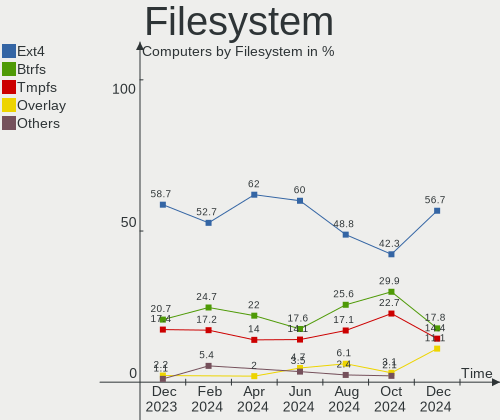

| Type    | Computers | Percent |
|---------|-----------|---------|
| Ext4    | 55        | 55%     |
| Tmpfs   | 26        | 26%     |
| Btrfs   | 14        | 14%     |
| Zfs     | 2         | 2%      |
| Xfs     | 1         | 1%      |
| Overlay | 1         | 1%      |
| Unknown | 1         | 1%      |

Part. scheme
------------

Scheme of partitioning

| Type    | Computers | Percent |
|---------|-----------|---------|
| GPT     | 63        | 63%     |
| Unknown | 32        | 32%     |
| MBR     | 5         | 5%      |

Dual Boot with Linux/BSD
------------------------

Hosting more than one Linux/BSD

| Dual boot | Computers | Percent |
|-----------|-----------|---------|
| No        | 82        | 82%     |
| Yes       | 18        | 18%     |

Dual Boot (Win)
---------------

Hosting Linux and Windows

| Dual boot | Computers | Percent |
|-----------|-----------|---------|
| No        | 74        | 74%     |
| Yes       | 26        | 26%     |

Board
-----

Vendor
------

Motherboard manufacturer

| Name                | Computers | Percent |
|---------------------|-----------|---------|
| ASUSTek Computer    | 16        | 16%     |
| Lenovo              | 15        | 15%     |
| Hewlett-Packard     | 13        | 13%     |
| Dell                | 10        | 10%     |
| Acer                | 8         | 8%      |
| MSI                 | 7         | 7%      |
| Gigabyte Technology | 7         | 7%      |
| ASRock              | 5         | 5%      |
| Notebook            | 3         | 3%      |
| Samsung Electronics | 2         | 2%      |
| Medion              | 2         | 2%      |
| Intel               | 2         | 2%      |
| ASRockRack          | 2         | 2%      |
| Apple               | 2         | 2%      |
| VALE                | 1         | 1%      |
| OrangePi            | 1         | 1%      |
| HUAWEI              | 1         | 1%      |
| ECS                 | 1         | 1%      |
| BESSTAR Tech        | 1         | 1%      |
| Unknown             | 1         | 1%      |

Model
-----

Motherboard model

| Name                                       | Computers | Percent |
|--------------------------------------------|-----------|---------|
| Dell XPS 9315                              | 2         | 2%      |
| ASRock 970 Pro3 R2.0                       | 2         | 2%      |
| VALE Notebook Classic C140                 | 1         | 1%      |
| Samsung 950QED                             | 1         | 1%      |
| Samsung 900X3C/900X3D/900X3E/900X4C/900X4D | 1         | 1%      |
| OrangePi Zero3                             | 1         | 1%      |
| Notebook PCx0Dx                            | 1         | 1%      |
| Notebook PB50_70RF,RD,RC                   | 1         | 1%      |
| Notebook N85_N87HCHNHZ                     | 1         | 1%      |
| MSI Pro 3130 Small Form Factor PC          | 1         | 1%      |
| MSI MS-7D98                                | 1         | 1%      |
| MSI MS-7D75                                | 1         | 1%      |
| MSI MS-7D52                                | 1         | 1%      |
| MSI MS-7C02                                | 1         | 1%      |
| MSI MS-7522                                | 1         | 1%      |
| MSI GF75 Thin 9SC                          | 1         | 1%      |
| Medion P6613                               | 1         | 1%      |
| Medion E4251 MD61435                       | 1         | 1%      |
| Lenovo Yoga Slim 7 Pro 14ACH5 82MS         | 1         | 1%      |
| Lenovo Yoga 7 14ACN6 82N7                  | 1         | 1%      |
| Lenovo V15 G2 ALC 82KD                     | 1         | 1%      |
| Lenovo ThinkPad T540p 20BE0086MH           | 1         | 1%      |
| Lenovo ThinkPad L14 Gen 4 21H1000VMH       | 1         | 1%      |
| Lenovo ThinkPad L13 Yoga Gen 3 21BB0061MH  | 1         | 1%      |
| Lenovo ThinkPad E15 Gen 3 20YGCTO1WW       | 1         | 1%      |
| Lenovo THINKCENTER M70Q 11MY002VMH         | 1         | 1%      |
| Lenovo ThinkBook 15 G2 ARE 20VG            | 1         | 1%      |
| Lenovo Legion Y540-17IRH 81Q4              | 1         | 1%      |
| Lenovo Legion 5 Pro 16IAH7H 82RF           | 1         | 1%      |
| Lenovo IdeaPad S540-13IML 81XA             | 1         | 1%      |
| Lenovo IdeaPad MIIX 700-12ISK 80QL         | 1         | 1%      |
| Lenovo H530s 10132                         | 1         | 1%      |
| Lenovo G50-70 20351                        | 1         | 1%      |
| Intel NUC7i7BNB J31145-303                 | 1         | 1%      |
| Intel NUC12WSHi3                           | 1         | 1%      |
| HUAWEI NBLB-WAX9N                          | 1         | 1%      |
| HP ZBook Studio G5                         | 1         | 1%      |
| HP Spectre x360 2-in-1 Laptop 16-f1xxx     | 1         | 1%      |
| HP ProLiant MicroServer Gen8               | 1         | 1%      |
| HP ProBook 6550b                           | 1         | 1%      |

Model Family
------------

Motherboard model prefix

| Name               | Computers | Percent |
|--------------------|-----------|---------|
| Acer Aspire        | 7         | 7%      |
| Lenovo ThinkPad    | 4         | 4%      |
| Dell Latitude      | 4         | 4%      |
| Dell XPS           | 3         | 3%      |
| Lenovo Yoga        | 2         | 2%      |
| Lenovo Legion      | 2         | 2%      |
| Lenovo IdeaPad     | 2         | 2%      |
| HP ProBook         | 2         | 2%      |
| HP EliteDesk       | 2         | 2%      |
| HP EliteBook       | 2         | 2%      |
| ASUS ZenBook       | 2         | 2%      |
| ASUS VivoBook      | 2         | 2%      |
| ASUS ProArt        | 2         | 2%      |
| ASRock 970         | 2         | 2%      |
| VALE Notebook      | 1         | 1%      |
| Samsung 950QED     | 1         | 1%      |
| Samsung 900X3C     | 1         | 1%      |
| OrangePi Zero3     | 1         | 1%      |
| Notebook PCx0Dx    | 1         | 1%      |
| Notebook PB50      | 1         | 1%      |
| Notebook N85       | 1         | 1%      |
| MSI Pro            | 1         | 1%      |
| MSI MS-7D98        | 1         | 1%      |
| MSI MS-7D75        | 1         | 1%      |
| MSI MS-7D52        | 1         | 1%      |
| MSI MS-7C02        | 1         | 1%      |
| MSI MS-7522        | 1         | 1%      |
| MSI GF75           | 1         | 1%      |
| Medion P6613       | 1         | 1%      |
| Medion E4251       | 1         | 1%      |
| Lenovo V15         | 1         | 1%      |
| Lenovo THINKCENTER | 1         | 1%      |
| Lenovo ThinkBook   | 1         | 1%      |
| Lenovo H530s       | 1         | 1%      |
| Lenovo G50-70      | 1         | 1%      |
| Intel NUC7i7BNB    | 1         | 1%      |
| Intel NUC12WSHi3   | 1         | 1%      |
| HUAWEI NBLB-WAX9N  | 1         | 1%      |
| HP ZBook           | 1         | 1%      |
| HP Spectre         | 1         | 1%      |

MFG Year
--------

Motherboard manufacture year

| Year    | Computers | Percent |
|---------|-----------|---------|
| 2022    | 14        | 14%     |
| 2021    | 12        | 12%     |
| 2020    | 9         | 9%      |
| 2013    | 9         | 9%      |
| 2019    | 8         | 8%      |
| 2023    | 6         | 6%      |
| 2012    | 6         | 6%      |
| 2018    | 5         | 5%      |
| 2014    | 5         | 5%      |
| 2010    | 5         | 5%      |
| 2017    | 4         | 4%      |
| 2015    | 4         | 4%      |
| 2008    | 4         | 4%      |
| 2009    | 3         | 3%      |
| 2011    | 2         | 2%      |
| Unknown | 2         | 2%      |
| 2016    | 1         | 1%      |
| 2007    | 1         | 1%      |

Form Factor
-----------

Physical design of the computer

| Name           | Computers | Percent |
|----------------|-----------|---------|
| Notebook       | 53        | 53%     |
| Desktop        | 35        | 35%     |
| Convertible    | 5         | 5%      |
| Mini pc        | 4         | 4%      |
| System on chip | 2         | 2%      |
| All in one     | 1         | 1%      |

Secure Boot
-----------

Enabled or disabled

| State    | Computers | Percent |
|----------|-----------|---------|
| Disabled | 88        | 88%     |
| Enabled  | 12        | 12%     |

Coreboot
--------

Have coreboot on board

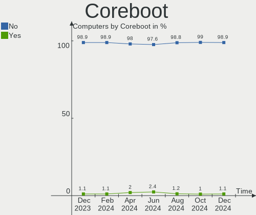

| Used | Computers | Percent |
|------|-----------|---------|
| No   | 100       | 100%    |

RAM Size
--------

Total RAM memory

| Size in GB      | Computers | Percent |
|-----------------|-----------|---------|
| 8.01-16.0       | 28        | 28%     |
| 4.01-8.0        | 18        | 18%     |
| 16.01-24.0      | 17        | 17%     |
| 3.01-4.0        | 16        | 16%     |
| 64.01-256.0     | 10        | 10%     |
| 32.01-64.0      | 9         | 9%      |
| More than 256.0 | 1         | 1%      |
| 24.01-32.0      | 1         | 1%      |

RAM Used
--------

Used RAM memory

| Used GB    | Computers | Percent |
|------------|-----------|---------|
| 2.01-3.0   | 27        | 27%     |
| 3.01-4.0   | 21        | 21%     |
| 4.01-8.0   | 20        | 20%     |
| 1.01-2.0   | 19        | 19%     |
| 8.01-16.0  | 6         | 6%      |
| 0.51-1.0   | 3         | 3%      |
| 16.01-24.0 | 2         | 2%      |
| 32.01-64.0 | 1         | 1%      |
| 24.01-32.0 | 1         | 1%      |

Total Drives
------------

Number of drives on board

| Drives | Computers | Percent |
|--------|-----------|---------|
| 1      | 61        | 61%     |
| 2      | 22        | 22%     |
| 3      | 6         | 6%      |
| 4      | 5         | 5%      |
| 7      | 2         | 2%      |
| 5      | 2         | 2%      |
| 8      | 1         | 1%      |
| 6      | 1         | 1%      |

Has CD-ROM
----------

Has CD-ROM on board

| Presented | Computers | Percent |
|-----------|-----------|---------|
| No        | 68        | 68%     |
| Yes       | 32        | 32%     |

Has Ethernet
------------

Has Ethernet on board

| Presented | Computers | Percent |
|-----------|-----------|---------|
| Yes       | 78        | 78%     |
| No        | 22        | 22%     |

Has WiFi
--------

Has WiFi module

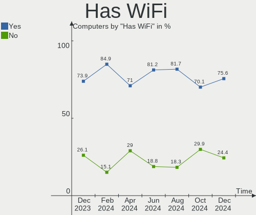

| Presented | Computers | Percent |
|-----------|-----------|---------|
| Yes       | 78        | 78%     |
| No        | 22        | 22%     |

Has Bluetooth
-------------

Has Bluetooth module

| Presented | Computers | Percent |
|-----------|-----------|---------|
| Yes       | 74        | 74%     |
| No        | 26        | 26%     |

Location
--------

Country
-------

Geographic location (country)

| Country     | Computers | Percent |
|-------------|-----------|---------|
| Netherlands | 100       | 100%    |

City
----

Geographic location (city)

| City             | Computers | Percent |
|------------------|-----------|---------|
| Amsterdam        | 20        | 20%     |
| The Hague        | 5         | 5%      |
| Rotterdam        | 5         | 5%      |
| Enschede         | 4         | 4%      |
| Utrecht          | 3         | 3%      |
| Naaldwijk        | 3         | 3%      |
| Haarlem          | 3         | 3%      |
| Groningen        | 3         | 3%      |
| Delft            | 3         | 3%      |
| Roosendaal       | 2         | 2%      |
| Kerkrade         | 2         | 2%      |
| Amstelveen       | 2         | 2%      |
| Almelo           | 2         | 2%      |
| Zutphen          | 1         | 1%      |
| Warten           | 1         | 1%      |
| Wageningen       | 1         | 1%      |
| Voorschoten      | 1         | 1%      |
| Venlo            | 1         | 1%      |
| Veghel           | 1         | 1%      |
| Vaals            | 1         | 1%      |
| Urk              | 1         | 1%      |
| Schiedam         | 1         | 1%      |
| Purmerend        | 1         | 1%      |
| Papendrecht      | 1         | 1%      |
| Oude-Tonge       | 1         | 1%      |
| Noord-Scharwoude | 1         | 1%      |
| Nijmegen         | 1         | 1%      |
| Meerssen         | 1         | 1%      |
| Luttelgeest      | 1         | 1%      |
| Lochem           | 1         | 1%      |
| Lelystad         | 1         | 1%      |
| Laren            | 1         | 1%      |
| Hoogeveen        | 1         | 1%      |
| Hengelo          | 1         | 1%      |
| Heeze            | 1         | 1%      |
| Heemskerk        | 1         | 1%      |
| Haren            | 1         | 1%      |
| Groenekan        | 1         | 1%      |
| Gennep           | 1         | 1%      |
| Elburg           | 1         | 1%      |

Drives
------

Drive Vendor
------------

Hard drive vendors

| Vendor                      | Computers | Drives | Percent |
|-----------------------------|-----------|--------|---------|
| Samsung Electronics         | 32        | 43     | 21.33%  |
| Seagate                     | 12        | 19     | 8%      |
| SanDisk                     | 10        | 10     | 6.67%   |
| Kingston                    | 10        | 11     | 6.67%   |
| Crucial                     | 10        | 12     | 6.67%   |
| WDC                         | 9         | 15     | 6%      |
| SK hynix                    | 9         | 9      | 6%      |
| Intel                       | 8         | 9      | 5.33%   |
| Unknown                     | 6         | 7      | 4%      |
| Hitachi                     | 5         | 5      | 3.33%   |
| Toshiba                     | 4         | 4      | 2.67%   |
| Micron Technology           | 4         | 4      | 2.67%   |
| SPCC                        | 3         | 4      | 2%      |
| HGST                        | 3         | 3      | 2%      |
| A-DATA Technology           | 3         | 3      | 2%      |
| Phison Electronics          | 2         | 2      | 1.33%   |
| Intenso                     | 2         | 2      | 1.33%   |
| Union Memory (Shenzhen)     | 1         | 1      | 0.67%   |
| Seagate Technology          | 1         | 1      | 0.67%   |
| PNY                         | 1         | 1      | 0.67%   |
| Phison                      | 1         | 1      | 0.67%   |
| Patriot                     | 1         | 1      | 0.67%   |
| MSCC                        | 1         | 1      | 0.67%   |
| Micron/Crucial Technology   | 1         | 1      | 0.67%   |
| MAXIO Technology (Hangzhou) | 1         | 1      | 0.67%   |
| KingSpec                    | 1         | 2      | 0.67%   |
| KingDian                    | 1         | 1      | 0.67%   |
| JMicron Technology          | 1         | 1      | 0.67%   |
| GLOWAY                      | 1         | 1      | 0.67%   |
| Gigabyte Technology         | 1         | 1      | 0.67%   |
| Fanxiang                    | 1         | 1      | 0.67%   |
| Aura                        | 1         | 1      | 0.67%   |
| ASMedia                     | 1         | 1      | 0.67%   |
| Apacer                      | 1         | 1      | 0.67%   |
| Unknown                     | 1         | 1      | 0.67%   |

Drive Model
-----------

Hard drive models

| Model                                               | Computers | Percent |
|-----------------------------------------------------|-----------|---------|
| Samsung SSD 980 1TB                                 | 5         | 2.98%   |
| Samsung NVMe SSD Controller SM981/PM981/PM983 1TB   | 5         | 2.98%   |
| Samsung NVMe SSD Controller PM9A1/PM9A3/980PRO 1TB  | 4         | 2.38%   |
| Intel SSD 660P Series 1024GB                        | 3         | 1.79%   |
| Crucial CT240BX500SSD1 240GB                        | 3         | 1.79%   |
| Unknown MMC Card  64GB                              | 2         | 1.19%   |
| SK hynix HFS128G32TNF-N3A0A 128GB SSD               | 2         | 1.19%   |
| Seagate ST4000DM004-2CV104 4TB                      | 2         | 1.19%   |
| Seagate ST1000DM003-1CH162 1TB                      | 2         | 1.19%   |
| Sandisk WD Black 2018/SN750 / PC SN720 NVMe SSD 1TB | 2         | 1.19%   |
| SanDisk SSD PLUS 240GB                              | 2         | 1.19%   |
| Samsung SSD 990 PRO 2TB                             | 2         | 1.19%   |
| Samsung SSD 980 PRO 2TB                             | 2         | 1.19%   |
| Samsung SSD 870 QVO 1TB                             | 2         | 1.19%   |
| Phison ESE2A044-512 NVMe 512GB                      | 2         | 1.19%   |
| Kingston SA400S37240G 240GB SSD                     | 2         | 1.19%   |
| HGST HTS545050A7E380 500GB                          | 2         | 1.19%   |
| Crucial CT250MX500SSD1 250GB                        | 2         | 1.19%   |
| WDC WDS500G2B0A-00SM50 500GB SSD                    | 1         | 0.6%    |
| WDC WDS250G1B0A-00H9H0 250GB SSD                    | 1         | 0.6%    |
| WDC WDS200T1X0E-00AFY0 2TB                          | 1         | 0.6%    |
| WDC WDS200T1R0B-68A4Z0 2TB SSD                      | 1         | 0.6%    |
| WDC WDS200T1R0A-68A4W0 2TB SSD                      | 1         | 0.6%    |
| WDC WDS100T2B0A 1TB SSD                             | 1         | 0.6%    |
| WDC WD6400BEVT-22A0RT0 640GB                        | 1         | 0.6%    |
| WDC WD20EZRX-00DC0B0 2TB                            | 1         | 0.6%    |
| WDC WD15EARS-00MVWB0 1TB                            | 1         | 0.6%    |
| WDC WD10PURX-64E5EY0 1TB                            | 1         | 0.6%    |
| WDC WD10EZEX-08RKKA0 1TB                            | 1         | 0.6%    |
| WDC WD10EARS-00MVWB0 1TB                            | 1         | 0.6%    |
| WDC WD10EADS-00M2B0 1TB                             | 1         | 0.6%    |
| WDC WD1002FBYS-18A6B0 1TB                           | 1         | 0.6%    |
| Unknown SDU1  256GB                                 | 1         | 0.6%    |
| Unknown NVMe SSD Drive 2TB                          | 1         | 0.6%    |
| Unknown MMC Card  4GB                               | 1         | 0.6%    |
| Unknown MMC Card  2GB                               | 1         | 0.6%    |
| Unknown MMC Card  16GB                              | 1         | 0.6%    |
| Union Memory (Shenzhen) UMIS RPJTJ512MKP1QDQ 512GB  | 1         | 0.6%    |
| Toshiba NVMe Controller 512GB                       | 1         | 0.6%    |
| Toshiba MK5076GSX 500GB                             | 1         | 0.6%    |

HDD Vendor
----------

Hard disk drive vendors

| Vendor  | Computers | Drives | Percent |
|---------|-----------|--------|---------|
| Seagate | 12        | 19     | 44.44%  |
| WDC     | 6         | 9      | 22.22%  |
| Hitachi | 5         | 5      | 18.52%  |
| HGST    | 3         | 3      | 11.11%  |
| Toshiba | 1         | 1      | 3.7%    |

SSD Vendor
----------

Solid state drive vendors

| Vendor              | Computers | Drives | Percent |
|---------------------|-----------|--------|---------|
| Samsung Electronics | 11        | 13     | 18.03%  |
| Crucial             | 10        | 12     | 16.39%  |
| Kingston            | 7         | 8      | 11.48%  |
| SK hynix            | 5         | 5      | 8.2%    |
| SanDisk             | 5         | 5      | 8.2%    |
| WDC                 | 4         | 5      | 6.56%   |
| SPCC                | 3         | 4      | 4.92%   |
| A-DATA Technology   | 2         | 2      | 3.28%   |
| PNY                 | 1         | 1      | 1.64%   |
| Phison              | 1         | 1      | 1.64%   |
| Patriot             | 1         | 1      | 1.64%   |
| MSCC                | 1         | 1      | 1.64%   |
| Micron Technology   | 1         | 1      | 1.64%   |
| KingSpec            | 1         | 2      | 1.64%   |
| KingDian            | 1         | 1      | 1.64%   |
| Intenso             | 1         | 1      | 1.64%   |
| Intel               | 1         | 1      | 1.64%   |
| GLOWAY              | 1         | 1      | 1.64%   |
| Fanxiang            | 1         | 1      | 1.64%   |
| ASMedia             | 1         | 1      | 1.64%   |
| Apacer              | 1         | 1      | 1.64%   |
| Unknown             | 1         | 1      | 1.64%   |

Drive Kind
----------

HDD or SSD

| Kind    | Computers | Drives | Percent |
|---------|-----------|--------|---------|
| NVMe    | 52        | 67     | 40.63%  |
| SSD     | 45        | 69     | 35.16%  |
| HDD     | 24        | 37     | 18.75%  |
| MMC     | 5         | 6      | 3.91%   |
| Unknown | 2         | 2      | 1.56%   |

Drive Connector
---------------

SATA, SAS, NVMe, etc.

| Type | Computers | Drives | Percent |
|------|-----------|--------|---------|
| SATA | 59        | 103    | 48.76%  |
| NVMe | 52        | 66     | 42.98%  |
| SAS  | 5         | 6      | 4.13%   |
| MMC  | 5         | 6      | 4.13%   |

Drive Size
----------

Size of hard drive

| Size in TB | Computers | Drives | Percent |
|------------|-----------|--------|---------|
| 0.01-0.5   | 45        | 68     | 61.64%  |
| 0.51-1.0   | 20        | 24     | 27.4%   |
| 1.01-2.0   | 3         | 4      | 4.11%   |
| 3.01-4.0   | 2         | 7      | 2.74%   |
| 2.01-3.0   | 1         | 1      | 1.37%   |
| 10.01-20.0 | 1         | 1      | 1.37%   |
| 4.01-10.0  | 1         | 1      | 1.37%   |

Space Total
-----------

Amount of disk space available on the file system

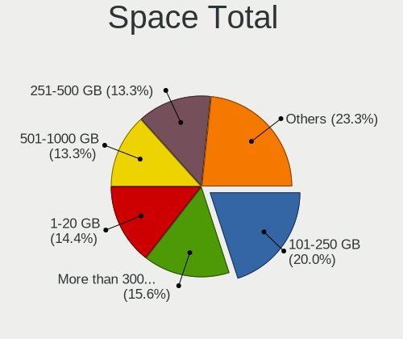

| Size in GB     | Computers | Percent |
|----------------|-----------|---------|
| 101-250        | 30        | 30%     |
| 251-500        | 21        | 21%     |
| 501-1000       | 12        | 12%     |
| 1001-2000      | 11        | 11%     |
| 1-20           | 7         | 7%      |
| More than 3000 | 5         | 5%      |
| 21-50          | 5         | 5%      |
| 51-100         | 4         | 4%      |
| Unknown        | 4         | 4%      |
| 2001-3000      | 1         | 1%      |

Space Used
----------

Amount of used disk space

| Used GB        | Computers | Percent |
|----------------|-----------|---------|
| 21-50          | 26        | 26%     |
| 1-20           | 24        | 24%     |
| 101-250        | 21        | 21%     |
| 51-100         | 10        | 10%     |
| 251-500        | 9         | 9%      |
| 501-1000       | 4         | 4%      |
| Unknown        | 4         | 4%      |
| More than 3000 | 1         | 1%      |
| 1001-2000      | 1         | 1%      |

Malfunc. Drives
---------------

Drive models with a malfunction

| Model                                 | Computers | Drives | Percent |
|---------------------------------------|-----------|--------|---------|
| WDC WD10EARS-00MVWB0 1TB              | 1         | 1      | 12.5%   |
| SK hynix HFS256G32TND-N210A 256GB SSD | 1         | 1      | 12.5%   |
| Seagate ST3200826AS 200GB             | 1         | 1      | 12.5%   |
| Kingston SA400S37120G 120GB SSD       | 1         | 1      | 12.5%   |
| Intel SSDSC2CT180A3 180GB             | 1         | 1      | 12.5%   |
| Intel SSDPEKKW256G7 256GB             | 1         | 1      | 12.5%   |
| Hitachi HTS725050A7E630 500GB         | 1         | 1      | 12.5%   |
| HGST HTS721010A9E630 1TB              | 1         | 1      | 12.5%   |

Malfunc. Drive Vendor
---------------------

Vendors of faulty drives

| Vendor   | Computers | Drives | Percent |
|----------|-----------|--------|---------|
| Intel    | 2         | 2      | 25%     |
| WDC      | 1         | 1      | 12.5%   |
| SK hynix | 1         | 1      | 12.5%   |
| Seagate  | 1         | 1      | 12.5%   |
| Kingston | 1         | 1      | 12.5%   |
| Hitachi  | 1         | 1      | 12.5%   |
| HGST     | 1         | 1      | 12.5%   |

Malfunc. HDD Vendor
-------------------

Vendors of faulty HDD drives

| Vendor  | Computers | Drives | Percent |
|---------|-----------|--------|---------|
| WDC     | 1         | 1      | 25%     |
| Seagate | 1         | 1      | 25%     |
| Hitachi | 1         | 1      | 25%     |
| HGST    | 1         | 1      | 25%     |

Malfunc. Drive Kind
-------------------

Kinds of faulty drives

| Kind | Computers | Drives | Percent |
|------|-----------|--------|---------|
| HDD  | 4         | 4      | 50%     |
| SSD  | 3         | 3      | 37.5%   |
| NVMe | 1         | 1      | 12.5%   |

Failed Drives
-------------

Failed drive models

Zero info for selected period =(

Failed Drive Vendor
-------------------

Failed drive vendors

Zero info for selected period =(

Drive Status
------------

Number of failed and malfunc. drives

| Status   | Computers | Drives | Percent |
|----------|-----------|--------|---------|
| Detected | 60        | 102    | 56.07%  |
| Works    | 39        | 71     | 36.45%  |
| Malfunc  | 8         | 8      | 7.48%   |

Storage controller
------------------

Storage Vendor
--------------

Storage controller vendors

| Vendor                                  | Computers | Percent |
|-----------------------------------------|-----------|---------|
| Intel                                   | 66        | 44.59%  |
| Samsung Electronics                     | 23        | 15.54%  |
| AMD                                     | 22        | 14.86%  |
| SanDisk                                 | 6         | 4.05%   |
| SK hynix                                | 4         | 2.7%    |
| JMicron Technology                      | 4         | 2.7%    |
| ASMedia Technology                      | 4         | 2.7%    |
| Phison Electronics                      | 3         | 2.03%   |
| Micron Technology                       | 3         | 2.03%   |
| Kingston Technology Company             | 3         | 2.03%   |
| Toshiba America Info Systems            | 2         | 1.35%   |
| Solidigm                                | 1         | 0.68%   |
| Shenzhen Unionmemory Information System | 1         | 0.68%   |
| Seagate Technology                      | 1         | 0.68%   |
| Micron/Crucial Technology               | 1         | 0.68%   |
| MAXIO Technology (Hangzhou)             | 1         | 0.68%   |
| KIOXIA                                  | 1         | 0.68%   |
| ADATA Technology                        | 1         | 0.68%   |
| Adaptec                                 | 1         | 0.68%   |

Storage Model
-------------

Storage controller models

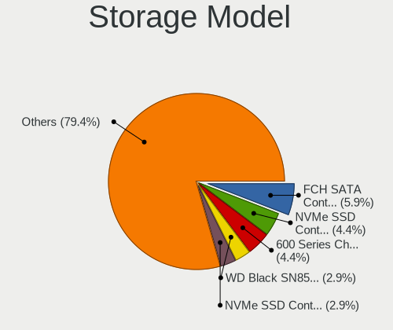

| Model                                                                                   | Computers | Percent |
|-----------------------------------------------------------------------------------------|-----------|---------|
| AMD FCH SATA Controller [AHCI mode]                                                     | 14        | 8.19%   |
| Intel Volume Management Device NVMe RAID Controller                                     | 9         | 5.26%   |
| Samsung NVMe SSD Controller PM9A1/PM9A3/980PRO                                          | 8         | 4.68%   |
| Samsung NVMe SSD Controller 980 (DRAM-less)                                             | 8         | 4.68%   |
| Samsung NVMe SSD Controller SM981/PM981/PM983                                           | 7         | 4.09%   |
| Intel 8 Series/C220 Series Chipset Family 6-port SATA Controller 1 [AHCI mode]          | 6         | 3.51%   |
| Intel Sunrise Point-LP SATA Controller [AHCI mode]                                      | 4         | 2.34%   |
| Intel SSD 660P Series                                                                   | 4         | 2.34%   |
| Intel Cannon Lake Mobile PCH SATA AHCI Controller                                       | 4         | 2.34%   |
| Intel 5 Series/3400 Series Chipset 6 port SATA AHCI Controller                          | 4         | 2.34%   |
| ASMedia ASM1062 Serial ATA Controller                                                   | 4         | 2.34%   |
| AMD SB7x0/SB8x0/SB9x0 SATA Controller [AHCI mode]                                       | 4         | 2.34%   |
| Intel Celeron/Pentium Silver Processor SATA Controller                                  | 3         | 1.75%   |
| Intel 82801IBM/IEM (ICH9M/ICH9M-E) 4 port SATA Controller [AHCI mode]                   | 3         | 1.75%   |
| AMD SB7x0/SB8x0/SB9x0 IDE Controller                                                    | 3         | 1.75%   |
| AMD 400 Series Chipset SATA Controller                                                  | 3         | 1.75%   |
| SanDisk Extreme Pro / WD Black 2018/SN750/PC SN720 NVMe SSD                             | 2         | 1.17%   |
| Samsung NVMe SSD Controller S4LV008[Pascal]                                             | 2         | 1.17%   |
| Phison PS5019-E19 PCIe4 NVMe Controller (DRAM-less)                                     | 2         | 1.17%   |
| Micron 2450 NVMe SSD [HendrixV] (DRAM-less)                                             | 2         | 1.17%   |
| Kingston Company KC3000/FURY Renegade NVMe SSD E18                                      | 2         | 1.17%   |
| JMicron JMB368 IDE controller                                                           | 2         | 1.17%   |
| JMicron JMB363 SATA/IDE Controller                                                      | 2         | 1.17%   |
| Intel Volume Management Device NVMe RAID Controller Intel Corporation                   | 2         | 1.17%   |
| Intel SSD 600P Series                                                                   | 2         | 1.17%   |
| Intel HM170/QM170 Chipset SATA Controller [AHCI Mode]                                   | 2         | 1.17%   |
| Intel Comet Lake SATA AHCI Controller                                                   | 2         | 1.17%   |
| Intel 82801JI (ICH10 Family) 4 port SATA IDE Controller #1                              | 2         | 1.17%   |
| Intel 82801JI (ICH10 Family) 2 port SATA IDE Controller #2                              | 2         | 1.17%   |
| Intel 8 Series SATA Controller 1 [AHCI mode]                                            | 2         | 1.17%   |
| Intel 700 Series Chipset Family SATA AHCI Controller                                    | 2         | 1.17%   |
| Intel 7 Series Chipset Family 6-port SATA Controller [AHCI mode]                        | 2         | 1.17%   |
| Intel 6 Series/C200 Series Chipset Family Desktop SATA Controller (IDE mode, ports 4-5) | 2         | 1.17%   |
| Intel 6 Series/C200 Series Chipset Family Desktop SATA Controller (IDE mode, ports 0-3) | 2         | 1.17%   |
| Intel 6 Series/C200 Series Chipset Family 6 port Desktop SATA AHCI Controller           | 2         | 1.17%   |
| Toshiba America Info Systems XG6 NVMe SSD Controller                                    | 1         | 0.58%   |
| Toshiba America Info Systems XG3 NVMe SSD Controller                                    | 1         | 0.58%   |
| Solidigm P44 Pro NVMe SSD [Hollywood Beach]                                             | 1         | 0.58%   |
| SK hynix Platinum P41/PC801 NVMe Solid State Drive                                      | 1         | 0.58%   |
| SK hynix Gold P31/BC711/PC711 NVMe Solid State Drive                                    | 1         | 0.58%   |

Storage Kind
------------

Kind of storage controller (IDE, SATA, NVMe, SAS, ...)

| Kind | Computers | Percent |
|------|-----------|---------|
| SATA | 68        | 46.58%  |
| NVMe | 52        | 35.62%  |
| RAID | 14        | 9.59%   |
| IDE  | 10        | 6.85%   |
| SAS  | 2         | 1.37%   |

Processor
---------

CPU Vendor
----------

Processor vendors

| Vendor | Computers | Percent |
|--------|-----------|---------|
| Intel  | 71        | 71%     |
| AMD    | 27        | 27%     |
| ARM    | 2         | 2%      |

CPU Model
---------

Processor models

| Model                                       | Computers | Percent |
|---------------------------------------------|-----------|---------|
| Intel Core i7-9750H CPU @ 2.60GHz           | 2         | 2%      |
| Intel Core i5-10210U CPU @ 1.60GHz          | 2         | 2%      |
| Intel Core 2 Duo CPU E8400 @ 3.00GHz        | 2         | 2%      |
| Intel 13th Gen Core i9-13900H               | 2         | 2%      |
| Intel 12th Gen Core i7-12700H               | 2         | 2%      |
| Intel 12th Gen Core i7-1250U                | 2         | 2%      |
| Intel 11th Gen Core i7-1165G7 @ 2.80GHz     | 2         | 2%      |
| ARM Processor                               | 2         | 2%      |
| AMD Ryzen 9 3900X 12-Core Processor         | 2         | 2%      |
| AMD Ryzen 7 5700X 8-Core Processor          | 2         | 2%      |
| AMD FX-4300 Quad-Core Processor             | 2         | 2%      |
| Intel Xeon CPU E5-2665 0 @ 2.40GHz          | 1         | 1%      |
| Intel Xeon CPU E31265L @ 2.40GHz            | 1         | 1%      |
| Intel Pentium Silver N5030 CPU @ 1.10GHz    | 1         | 1%      |
| Intel Pentium Dual-Core CPU T4400 @ 2.20GHz | 1         | 1%      |
| Intel Pentium Dual-Core CPU T4200 @ 2.00GHz | 1         | 1%      |
| Intel Pentium CPU G6950 @ 2.80GHz           | 1         | 1%      |
| Intel Pentium 3558U @ 1.70GHz               | 1         | 1%      |
| Intel Core m7-6Y75 CPU @ 1.20GHz            | 1         | 1%      |
| Intel Core i9-9980HK CPU @ 2.40GHz          | 1         | 1%      |
| Intel Core i9-9900K CPU @ 3.60GHz           | 1         | 1%      |
| Intel Core i7-8750H CPU @ 2.20GHz           | 1         | 1%      |
| Intel Core i7-8550U CPU @ 1.80GHz           | 1         | 1%      |
| Intel Core i7-7700HQ CPU @ 2.80GHz          | 1         | 1%      |
| Intel Core i7-7567U CPU @ 3.50GHz           | 1         | 1%      |
| Intel Core i7-4770 CPU @ 3.40GHz            | 1         | 1%      |
| Intel Core i7-4720HQ CPU @ 2.60GHz          | 1         | 1%      |
| Intel Core i7-4700MQ CPU @ 2.40GHz          | 1         | 1%      |
| Intel Core i7-3520M CPU @ 2.90GHz           | 1         | 1%      |
| Intel Core i7-2600 CPU @ 3.40GHz            | 1         | 1%      |
| Intel Core i7-10875H CPU @ 2.30GHz          | 1         | 1%      |
| Intel Core i7-10870H CPU @ 2.20GHz          | 1         | 1%      |
| Intel Core i7-10510U CPU @ 1.80GHz          | 1         | 1%      |
| Intel Core i7 CPU L 640 @ 2.13GHz           | 1         | 1%      |
| Intel Core i7 CPU 960 @ 3.20GHz             | 1         | 1%      |
| Intel Core i5-8350U CPU @ 1.70GHz           | 1         | 1%      |
| Intel Core i5-7300HQ CPU @ 2.50GHz          | 1         | 1%      |
| Intel Core i5-6500T CPU @ 2.50GHz           | 1         | 1%      |
| Intel Core i5-6200U CPU @ 2.30GHz           | 1         | 1%      |
| Intel Core i5-4670 CPU @ 3.40GHz            | 1         | 1%      |

CPU Model Family
----------------

Processor model prefix

| Model                   | Computers | Percent |
|-------------------------|-----------|---------|
| Other                   | 23        | 23%     |
| Intel Core i7           | 16        | 16%     |
| Intel Core i5           | 16        | 16%     |
| AMD Ryzen 7             | 8         | 8%      |
| AMD Ryzen 5             | 6         | 6%      |
| Intel Core 2 Duo        | 4         | 4%      |
| AMD FX                  | 4         | 4%      |
| Intel Celeron           | 3         | 3%      |
| AMD Ryzen 9             | 3         | 3%      |
| Intel Xeon              | 2         | 2%      |
| Intel Pentium Dual-Core | 2         | 2%      |
| Intel Pentium           | 2         | 2%      |
| Intel Core i9           | 2         | 2%      |
| Intel Pentium Silver    | 1         | 1%      |
| Intel Core m7           | 1         | 1%      |
| Intel Core i3           | 1         | 1%      |
| Intel Core 2 Quad       | 1         | 1%      |
| AMD Ryzen 7 PRO         | 1         | 1%      |
| AMD Phenom II X6        | 1         | 1%      |
| AMD EPYC                | 1         | 1%      |
| AMD Athlon II X4        | 1         | 1%      |
| AMD A6                  | 1         | 1%      |

CPU Cores
---------

Number of processor cores

| Number  | Computers | Percent |
|---------|-----------|---------|
| 4       | 27        | 27%     |
| 2       | 24        | 24%     |
| 8       | 14        | 14%     |
| 6       | 11        | 11%     |
| 10      | 7         | 7%      |
| 12      | 6         | 6%      |
| 14      | 5         | 5%      |
| Unknown | 2         | 2%      |
| 24      | 1         | 1%      |
| 16      | 1         | 1%      |
| 3       | 1         | 1%      |
| 1       | 1         | 1%      |

CPU Sockets
-----------

Number of sockets

| Number  | Computers | Percent |
|---------|-----------|---------|
| 1       | 98        | 98%     |
| Unknown | 2         | 2%      |

CPU Threads
-----------

Threads per core (Hyper-Threading)

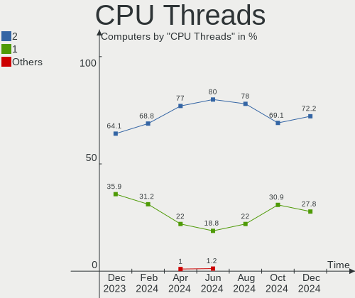

| Number  | Computers | Percent |
|---------|-----------|---------|
| 2       | 70        | 70%     |
| 1       | 28        | 28%     |
| Unknown | 2         | 2%      |

CPU Op-Modes
------------

CPU Operation Modes (32-bit, 64-bit)

| Op mode        | Computers | Percent |
|----------------|-----------|---------|
| 32-bit, 64-bit | 99        | 99%     |
| 64-bit         | 1         | 1%      |

CPU Microcode
-------------

Microcode number

| Number     | Computers | Percent |
|------------|-----------|---------|
| Unknown    | 59        | 59%     |
| 0x906a4    | 4         | 4%      |
| 0x1067a    | 4         | 4%      |
| 0x0a20120a | 3         | 3%      |
| 0x906e9    | 2         | 2%      |
| 0x20655    | 2         | 2%      |
| 0x0a50000d | 2         | 2%      |
| 0x06000852 | 2         | 2%      |
| 0xb06f2    | 1         | 1%      |
| 0xb06a2    | 1         | 1%      |
| 0x906a3    | 1         | 1%      |
| 0x806ec    | 1         | 1%      |
| 0x806ea    | 1         | 1%      |
| 0x806e9    | 1         | 1%      |
| 0x706a1    | 1         | 1%      |
| 0x506e3    | 1         | 1%      |
| 0x40651    | 1         | 1%      |
| 0x306c3    | 1         | 1%      |
| 0x0a601206 | 1         | 1%      |
| 0x0a601203 | 1         | 1%      |
| 0x0a50000b | 1         | 1%      |
| 0x08701030 | 1         | 1%      |
| 0x08701021 | 1         | 1%      |
| 0x08608103 | 1         | 1%      |
| 0x08600103 | 1         | 1%      |
| 0x0830107a | 1         | 1%      |
| 0x0800820d | 1         | 1%      |
| 0x06006705 | 1         | 1%      |
| 0x06000817 | 1         | 1%      |
| 0x010000dc | 1         | 1%      |

CPU Microarch
-------------

Microarchitecture

| Name             | Computers | Percent |
|------------------|-----------|---------|
| KabyLake         | 13        | 13%     |
| Alderlake Hybrid | 13        | 13%     |
| Unknown          | 11        | 11%     |
| Zen 3            | 8         | 8%      |
| Haswell          | 8         | 8%      |
| Penryn           | 7         | 7%      |
| Zen 2            | 6         | 6%      |
| SandyBridge      | 5         | 5%      |
| Piledriver       | 5         | 5%      |
| Westmere         | 4         | 4%      |
| TigerLake        | 3         | 3%      |
| Skylake          | 3         | 3%      |
| IvyBridge        | 3         | 3%      |
| Goldmont plus    | 3         | 3%      |
| K10              | 2         | 2%      |
| CometLake        | 2         | 2%      |
| Zen+             | 1         | 1%      |
| Nehalem          | 1         | 1%      |
| IceLake          | 1         | 1%      |
| Excavator        | 1         | 1%      |

Graphics
--------

GPU Vendor
----------

Vendors of graphics cards

| Vendor                     | Computers | Percent |
|----------------------------|-----------|---------|
| Intel                      | 54        | 45.76%  |
| Nvidia                     | 39        | 33.05%  |
| AMD                        | 23        | 19.49%  |
| Matrox Electronics Systems | 1         | 0.85%   |
| ASPEED Technology          | 1         | 0.85%   |

GPU Model
---------

Graphics card models

| Model                                                                       | Computers | Percent |
|-----------------------------------------------------------------------------|-----------|---------|
| Intel Xeon E3-1200 v3/4th Gen Core Processor Integrated Graphics Controller | 3         | 2.5%    |
| Intel Raptor Lake-P [Iris Xe Graphics]                                      | 3         | 2.5%    |
| Intel Core Processor Integrated Graphics Controller                         | 3         | 2.5%    |
| Intel CometLake-U GT2 [UHD Graphics]                                        | 3         | 2.5%    |
| Intel CoffeeLake-H GT2 [UHD Graphics 630]                                   | 3         | 2.5%    |
| Intel Alder Lake-P GT2 [Iris Xe Graphics]                                   | 3         | 2.5%    |
| Intel 4th Gen Core Processor Integrated Graphics Controller                 | 3         | 2.5%    |
| AMD Cezanne [Radeon Vega Series / Radeon Vega Mobile Series]                | 3         | 2.5%    |
| Nvidia GK104 [GeForce GTX 670]                                              | 2         | 1.67%   |
| Nvidia GA104M [GeForce RTX 3070 Mobile / Max-Q]                             | 2         | 1.67%   |
| Intel UHD Graphics 620                                                      | 2         | 1.67%   |
| Intel TigerLake-LP GT2 [Iris Xe Graphics]                                   | 2         | 1.67%   |
| Intel HD Graphics 630                                                       | 2         | 1.67%   |
| Intel GeminiLake [UHD Graphics 600]                                         | 2         | 1.67%   |
| Intel CometLake-H GT2 [UHD Graphics]                                        | 2         | 1.67%   |
| Intel Alder Lake-UP4 GT2 [Iris Xe Graphics]                                 | 2         | 1.67%   |
| Intel Alder Lake-UP3 GT2 [Iris Xe Graphics]                                 | 2         | 1.67%   |
| Intel 3rd Gen Core processor Graphics Controller                            | 2         | 1.67%   |
| Intel 2nd Generation Core Processor Family Integrated Graphics Controller   | 2         | 1.67%   |
| AMD Renoir [Radeon RX Vega 6 (Ryzen 4000/5000 Mobile Series)]               | 2         | 1.67%   |
| AMD Lucienne                                                                | 2         | 1.67%   |
| AMD Barcelo                                                                 | 2         | 1.67%   |
| Nvidia TU117M [GeForce MX450]                                               | 1         | 0.83%   |
| Nvidia TU117M [GeForce GTX 1650 Mobile / Max-Q]                             | 1         | 0.83%   |
| Nvidia TU106M [GeForce RTX 2070 Mobile]                                     | 1         | 0.83%   |
| Nvidia TU106M [GeForce RTX 2060 Mobile]                                     | 1         | 0.83%   |
| Nvidia TU106 [GeForce RTX 2060 Rev. A]                                      | 1         | 0.83%   |
| Nvidia TU106 [GeForce RTX 2060 12GB]                                        | 1         | 0.83%   |
| Nvidia TU104M [GeForce RTX 2070 SUPER Mobile / Max-Q]                       | 1         | 0.83%   |
| Nvidia NV44 [GeForce 7100 GS]                                               | 1         | 0.83%   |
| Nvidia GT218 [NVS 300]                                                      | 1         | 0.83%   |
| Nvidia GT218 [GeForce 210]                                                  | 1         | 0.83%   |
| Nvidia GT216M [GeForce GT 330M]                                             | 1         | 0.83%   |
| Nvidia GP108M [GeForce MX250]                                               | 1         | 0.83%   |
| Nvidia GP108M [GeForce MX230]                                               | 1         | 0.83%   |
| Nvidia GP108 [GeForce GT 1030]                                              | 1         | 0.83%   |
| Nvidia GP107M [GeForce MX350]                                               | 1         | 0.83%   |
| Nvidia GP107M [GeForce GTX 1050 Mobile]                                     | 1         | 0.83%   |
| Nvidia GP107GLM [Quadro P1000 Mobile]                                       | 1         | 0.83%   |
| Nvidia GP102 [GeForce GTX 1080 Ti]                                          | 1         | 0.83%   |

GPU Combo
---------

Combinations of graphics cards

| Name           | Computers | Percent |
|----------------|-----------|---------|
| 1 x Intel      | 36        | 36%     |
| 1 x Nvidia     | 22        | 22%     |
| 1 x AMD        | 19        | 19%     |
| Intel + Nvidia | 15        | 15%     |
| Other          | 2         | 2%      |
| AMD + Nvidia   | 2         | 2%      |
| 2 x AMD        | 1         | 1%      |
| 1 x Matrox     | 1         | 1%      |
| Intel + AMD    | 1         | 1%      |
| 1 x ASPEED     | 1         | 1%      |

GPU Driver
----------

Free vs proprietary

| Driver      | Computers | Percent |
|-------------|-----------|---------|
| Free        | 75        | 75%     |
| Proprietary | 22        | 22%     |
| Unknown     | 3         | 3%      |

GPU Memory
----------

Total video memory

| Size in GB | Computers | Percent |
|------------|-----------|---------|
| Unknown    | 64        | 64%     |
| 1.01-2.0   | 10        | 10%     |
| 0.01-0.5   | 8         | 8%      |
| 3.01-4.0   | 4         | 4%      |
| 0.51-1.0   | 4         | 4%      |
| 7.01-8.0   | 3         | 3%      |
| 8.01-16.0  | 3         | 3%      |
| 5.01-6.0   | 2         | 2%      |
| 16.01-24.0 | 2         | 2%      |

Monitor
-------

Monitor Vendor
--------------

Monitor vendors

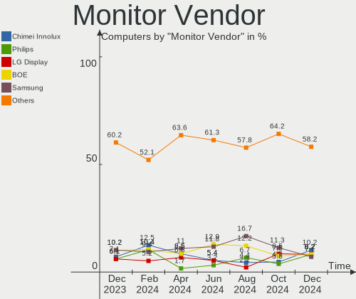

| Vendor              | Computers | Percent |
|---------------------|-----------|---------|
| Goldstar            | 14        | 12.61%  |
| Samsung Electronics | 13        | 11.71%  |
| Chimei Innolux      | 11        | 9.91%   |
| AU Optronics        | 11        | 9.91%   |
| LG Display          | 9         | 8.11%   |
| BOE                 | 9         | 8.11%   |
| Dell                | 7         | 6.31%   |
| Iiyama              | 6         | 5.41%   |
| Hewlett-Packard     | 4         | 3.6%    |
| Acer                | 4         | 3.6%    |
| Sharp               | 3         | 2.7%    |
| Apple               | 3         | 2.7%    |
| PANDA               | 2         | 1.8%    |
| Eizo                | 2         | 1.8%    |
| Unknown             | 1         | 0.9%    |
| ROW                 | 1         | 0.9%    |
| Philips             | 1         | 0.9%    |
| Panasonic           | 1         | 0.9%    |
| MStar               | 1         | 0.9%    |
| Lenovo              | 1         | 0.9%    |
| InfoVision          | 1         | 0.9%    |
| HJW                 | 1         | 0.9%    |
| GDH                 | 1         | 0.9%    |
| DENON               | 1         | 0.9%    |
| CSO                 | 1         | 0.9%    |
| BenQ                | 1         | 0.9%    |
| ASRock              | 1         | 0.9%    |

Monitor Model
-------------

Monitor models

| Model                                                                 | Computers | Percent |
|-----------------------------------------------------------------------|-----------|---------|
| Iiyama PL2592H IVM6135 1920x1080 544x303mm 24.5-inch                  | 2         | 1.74%   |
| Goldstar ULTRAGEAR GSM5B7F 2560x1440 597x336mm 27.0-inch              | 2         | 1.74%   |
| Chimei Innolux LCD Monitor CMN1738 1920x1080 381x214mm 17.2-inch      | 2         | 1.74%   |
| Unknown LCD Monitor SAMSUNG 1360x768                                  | 1         | 0.87%   |
| Sharp LQ156M1JW17 SHP14FC 1920x1080 344x194mm 15.5-inch               | 1         | 0.87%   |
| Sharp LQ156M1JW03 SHP14C5 1920x1080 344x194mm 15.5-inch               | 1         | 0.87%   |
| Sharp LCD Monitor SHP1548 1920x1200 288x180mm 13.4-inch               | 1         | 0.87%   |
| Samsung Electronics SyncMaster SAM058B 1920x1080 531x298mm 24.0-inch  | 1         | 0.87%   |
| Samsung Electronics SyncMaster SAM0193 1280x1024 376x301mm 19.0-inch  | 1         | 0.87%   |
| Samsung Electronics S27F350 SAM0D22 1920x1080 598x336mm 27.0-inch     | 1         | 0.87%   |
| Samsung Electronics S27A750D SAM0798 1920x1080 598x336mm 27.0-inch    | 1         | 0.87%   |
| Samsung Electronics S24F350 SAM0D20 1920x1080 521x293mm 23.5-inch     | 1         | 0.87%   |
| Samsung Electronics LCD Monitor SEC3551 1366x768 344x194mm 15.5-inch  | 1         | 0.87%   |
| Samsung Electronics LCD Monitor SEC304C 1366x768 309x174mm 14.0-inch  | 1         | 0.87%   |
| Samsung Electronics LCD Monitor SDCA029 3840x2160 344x194mm 15.5-inch | 1         | 0.87%   |
| Samsung Electronics LCD Monitor SDC4852 1366x768 344x194mm 15.5-inch  | 1         | 0.87%   |
| Samsung Electronics LCD Monitor SDC4159 1920x1080 344x194mm 15.5-inch | 1         | 0.87%   |
| Samsung Electronics LCD Monitor SDC414D 3456x2160 336x210mm 15.6-inch | 1         | 0.87%   |
| Samsung Electronics LCD Monitor SDC4144 2160x1440 254x169mm 12.0-inch | 1         | 0.87%   |
| Samsung Electronics LCD Monitor SDC324C 1920x1080 344x194mm 15.5-inch | 1         | 0.87%   |
| Samsung Electronics LCD Monitor SAM03BB 1920x1080 886x498mm 40.0-inch | 1         | 0.87%   |
| ROW M150 ROW1D81 1024x768 359x287mm 18.1-inch                         | 1         | 0.87%   |
| Philips FTV PHL01EA 1920x1080 640x360mm 28.9-inch                     | 1         | 0.87%   |
| PANDA LCD Monitor NCP0061 2560x1600 302x189mm 14.0-inch               | 1         | 0.87%   |
| PANDA LCD Monitor NCP004A 1920x1080 309x174mm 14.0-inch               | 1         | 0.87%   |
| Panasonic LCD Monitor MEI96A2 2880x1620 344x193mm 15.5-inch           | 1         | 0.87%   |
| MStar Demo MST0030 1920x1080 708x398mm 32.0-inch                      | 1         | 0.87%   |
| LG Display LP156WH1-TLA3 LGD01C2 1366x768 344x194mm 15.5-inch         | 1         | 0.87%   |
| LG Display LCD Monitor LGD06DA 1920x1080 344x194mm 15.5-inch          | 1         | 0.87%   |
| LG Display LCD Monitor LGD06D6 1920x1080 309x174mm 14.0-inch          | 1         | 0.87%   |
| LG Display LCD Monitor LGD06CE 1920x1200 288x180mm 13.4-inch          | 1         | 0.87%   |
| LG Display LCD Monitor LGD06B8 1920x1080 344x194mm 15.5-inch          | 1         | 0.87%   |
| LG Display LCD Monitor LGD065A 1920x1080 344x194mm 15.5-inch          | 1         | 0.87%   |
| LG Display LCD Monitor LGD0599 1920x1080 309x174mm 14.0-inch          | 1         | 0.87%   |
| LG Display LCD Monitor LGD0258 1600x900 345x194mm 15.6-inch           | 1         | 0.87%   |
| LG Display LCD Monitor LGD024F 1280x800 260x160mm 12.0-inch           | 1         | 0.87%   |
| Lenovo M14 LEN61DD 1920x1080 309x174mm 14.0-inch                      | 1         | 0.87%   |
| InfoVision LCD Monitor IVO8C45 2240x1400 302x188mm 14.0-inch          | 1         | 0.87%   |
| Iiyama PLE2403WS IVM5604 1920x1200 519x324mm 24.1-inch                | 1         | 0.87%   |
| Iiyama PL3294Q IVM762D 2048x1280 700x390mm 31.5-inch                  | 1         | 0.87%   |

Monitor Resolution
------------------

Monitor screen resolution

| Resolution         | Computers | Percent |
|--------------------|-----------|---------|
| 1920x1080 (FHD)    | 55        | 52.38%  |
| 3840x2160 (4K)     | 8         | 7.62%   |
| 1920x1200 (WUXGA)  | 8         | 7.62%   |
| 2560x1440 (QHD)    | 7         | 6.67%   |
| 1366x768 (WXGA)    | 4         | 3.81%   |
| 2560x1600          | 3         | 2.86%   |
| 1600x900 (HD+)     | 3         | 2.86%   |
| 3440x1440          | 2         | 1.9%    |
| 2560x1080          | 2         | 1.9%    |
| 1440x900 (WXGA+)   | 2         | 1.9%    |
| 1360x768           | 2         | 1.9%    |
| 3456x2160          | 1         | 0.95%   |
| 3072x1920          | 1         | 0.95%   |
| 2240x1400          | 1         | 0.95%   |
| 2160x1440          | 1         | 0.95%   |
| 1680x1050 (WSXGA+) | 1         | 0.95%   |
| 1400x1050          | 1         | 0.95%   |
| 1280x800 (WXGA)    | 1         | 0.95%   |
| 1280x1024 (SXGA)   | 1         | 0.95%   |
| Unknown            | 1         | 0.95%   |

Monitor Diagonal
----------------

Diagonal size in inches

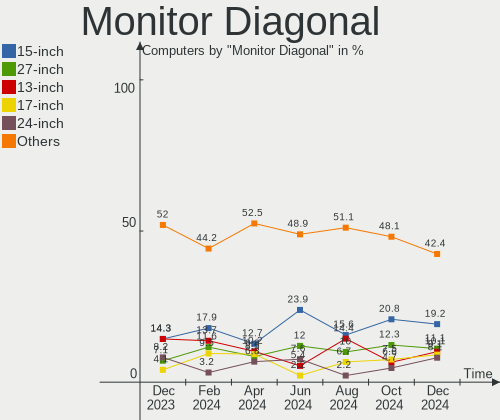

| Inches  | Computers | Percent |
|---------|-----------|---------|
| 15      | 22        | 19.47%  |
| 24      | 10        | 8.85%   |
| 14      | 10        | 8.85%   |
| 13      | 10        | 8.85%   |
| 27      | 9         | 7.96%   |
| 17      | 9         | 7.96%   |
| 23      | 8         | 7.08%   |
| 21      | 5         | 4.42%   |
| 31      | 4         | 3.54%   |
| 16      | 4         | 3.54%   |
| 34      | 3         | 2.65%   |
| 52      | 2         | 1.77%   |
| 26      | 2         | 1.77%   |
| 19      | 2         | 1.77%   |
| 18      | 2         | 1.77%   |
| 12      | 2         | 1.77%   |
| Unknown | 2         | 1.77%   |
| 65      | 1         | 0.88%   |
| 57      | 1         | 0.88%   |
| 40      | 1         | 0.88%   |
| 35      | 1         | 0.88%   |
| 29      | 1         | 0.88%   |
| 20      | 1         | 0.88%   |
| 11      | 1         | 0.88%   |

Monitor Width
-------------

Physical width

| Width in mm | Computers | Percent |
|-------------|-----------|---------|
| 301-350     | 39        | 34.82%  |
| 501-600     | 29        | 25.89%  |
| 351-400     | 11        | 9.82%   |
| 401-500     | 9         | 8.04%   |
| 201-300     | 8         | 7.14%   |
| 601-700     | 5         | 4.46%   |
| 1001-1500   | 4         | 3.57%   |
| 701-800     | 3         | 2.68%   |
| 801-900     | 2         | 1.79%   |
| Unknown     | 2         | 1.79%   |

Aspect Ratio
------------

Proportional relationship between the width and the height

| Ratio   | Computers | Percent |
|---------|-----------|---------|
| 16/9    | 73        | 73.74%  |
| 16/10   | 18        | 18.18%  |
| 21/9    | 4         | 4.04%   |
| Unknown | 2         | 2.02%   |
| 5/4     | 1         | 1.01%   |
| 3/2     | 1         | 1.01%   |

Monitor Area
------------

Area in inch

| Area in inch | Computers | Percent |
|----------------|-----------|---------|
| 101-110        | 22        | 19.47%  |
| 201-250        | 18        | 15.93%  |
| 81-90          | 17        | 15.04%  |
| 301-350        | 11        | 9.73%   |
| 351-500        | 9         | 7.96%   |
| 121-130        | 9         | 7.96%   |
| More than 1000 | 4         | 3.54%   |
| 251-300        | 4         | 3.54%   |
| 151-200        | 4         | 3.54%   |
| 111-120        | 4         | 3.54%   |
| 71-80          | 3         | 2.65%   |
| 61-70          | 2         | 1.77%   |
| 141-150        | 2         | 1.77%   |
| Unknown        | 2         | 1.77%   |
| 51-60          | 1         | 0.88%   |
| 501-1000       | 1         | 0.88%   |

Pixel Density
-------------

Pixels per inch

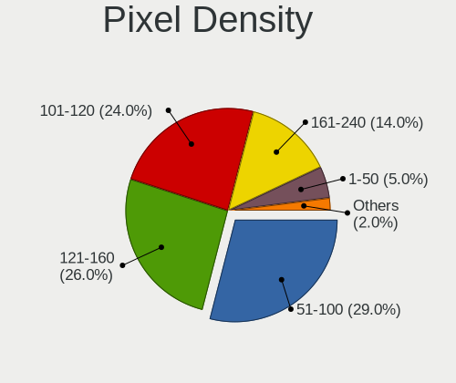

| Density       | Computers | Percent |
|---------------|-----------|---------|
| 121-160       | 37        | 33.94%  |
| 51-100        | 32        | 29.36%  |
| 101-120       | 19        | 17.43%  |
| 161-240       | 12        | 11.01%  |
| 1-50          | 4         | 3.67%   |
| More than 240 | 3         | 2.75%   |
| Unknown       | 2         | 1.83%   |

Multiple Monitors
-----------------

Total monitors connected

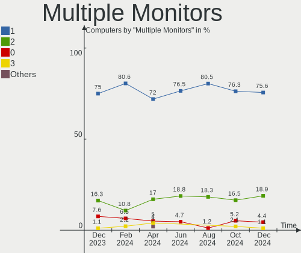

| Total | Computers | Percent |
|-------|-----------|---------|
| 1     | 77        | 77%     |
| 2     | 15        | 15%     |
| 3     | 4         | 4%      |
| 0     | 4         | 4%      |

Network
-------

Net Controller Vendor
---------------------

Controller vendors

| Vendor                   | Computers | Percent |
|--------------------------|-----------|---------|
| Intel                    | 56        | 36.84%  |
| Realtek Semiconductor    | 53        | 34.87%  |
| Qualcomm Atheros         | 11        | 7.24%   |
| MediaTek                 | 8         | 5.26%   |
| Broadcom                 | 5         | 3.29%   |
| Ralink Technology        | 2         | 1.32%   |
| Ralink                   | 2         | 1.32%   |
| VIA Technologies         | 1         | 0.66%   |
| TP-Link                  | 1         | 0.66%   |
| Sierra Wireless          | 1         | 0.66%   |
| Samsung Electronics      | 1         | 0.66%   |
| NetGear                  | 1         | 0.66%   |
| Marvell Technology Group | 1         | 0.66%   |
| IMC Networks             | 1         | 0.66%   |
| ICS Advent               | 1         | 0.66%   |
| Hewlett-Packard          | 1         | 0.66%   |
| DisplayLink              | 1         | 0.66%   |
| D-Link System            | 1         | 0.66%   |
| Broadcom Limited         | 1         | 0.66%   |
| Arduino SA               | 1         | 0.66%   |
| Aquantia                 | 1         | 0.66%   |
| American Megatrends      | 1         | 0.66%   |

Net Controller Model
--------------------

Controller models

| Model                                                             | Computers | Percent |
|-------------------------------------------------------------------|-----------|---------|
| Realtek RTL8111/8168/8411 PCI Express Gigabit Ethernet Controller | 39        | 23.21%  |
| Intel Alder Lake-P PCH CNVi WiFi                                  | 9         | 5.36%   |
| Realtek RTL8125 2.5GbE Controller                                 | 4         | 2.38%   |
| Qualcomm Atheros QCA9377 802.11ac Wireless Network Adapter        | 4         | 2.38%   |
| MediaTek MT7922 802.11ax PCI Express Wireless Network Adapter     | 4         | 2.38%   |
| Intel Wi-Fi 6 AX200                                               | 4         | 2.38%   |
| Intel Ethernet Controller I225-V                                  | 4         | 2.38%   |
| Intel Cannon Lake PCH CNVi WiFi                                   | 4         | 2.38%   |
| MediaTek MT7921 802.11ax PCI Express Wireless Network Adapter     | 3         | 1.79%   |
| Intel Wireless 7260                                               | 3         | 1.79%   |
| Intel Wi-Fi 6 AX201                                               | 3         | 1.79%   |
| Intel Raptor Lake PCH CNVi WiFi                                   | 3         | 1.79%   |
| Realtek RTL8812AU 802.11a/b/g/n/ac 2T2R DB WLAN Adapter           | 2         | 1.19%   |
| Realtek RTL8192CU 802.11n WLAN Adapter                            | 2         | 1.19%   |
| Realtek RTL8153 Gigabit Ethernet Adapter                          | 2         | 1.19%   |
| Realtek RTL810xE PCI Express Fast Ethernet controller             | 2         | 1.19%   |
| Qualcomm Atheros QCA9565 / AR9565 Wireless Network Adapter        | 2         | 1.19%   |
| Intel Wireless 8265 / 8275                                        | 2         | 1.19%   |
| Intel Wireless 7265                                               | 2         | 1.19%   |
| Intel Wi-Fi 6 AX210/AX211/AX411 160MHz                            | 2         | 1.19%   |
| Intel Gemini Lake PCH CNVi WiFi                                   | 2         | 1.19%   |
| Intel Ethernet Controller X550                                    | 2         | 1.19%   |
| Intel Ethernet Connection I217-V                                  | 2         | 1.19%   |
| Intel Ethernet Connection I217-LM                                 | 2         | 1.19%   |
| Intel Dual Band Wireless-AC 3168NGW [Stone Peak]                  | 2         | 1.19%   |
| Intel Comet Lake PCH-LP CNVi WiFi                                 | 2         | 1.19%   |
| Intel Centrino Advanced-N 6200                                    | 2         | 1.19%   |
| Intel 82579LM Gigabit Network Connection (Lewisville)             | 2         | 1.19%   |
| VIA VT6105/VT6106S [Rhine-III]                                    | 1         | 0.6%    |
| TP-Link AC600 wireless Realtek RTL8811AU [Archer T2U Nano]        | 1         | 0.6%    |
| Sierra Wireless EM7345 4G LTE                                     | 1         | 0.6%    |
| Samsung Galaxy series, misc. (tethering mode)                     | 1         | 0.6%    |
| Realtek RTL8852AE 802.11ax PCIe Wireless Network Adapter          | 1         | 0.6%    |
| Realtek RTL8723BU 802.11b/g/n WLAN Adapter                        | 1         | 0.6%    |
| Realtek Killer E3000 2.5GbE Controller                            | 1         | 0.6%    |
| Realtek Killer E2600 Gigabit Ethernet Controller                  | 1         | 0.6%    |
| Ralink RT5370 Wireless Adapter                                    | 1         | 0.6%    |
| Ralink MT7601U Wireless Adapter                                   | 1         | 0.6%    |
| Ralink RT3090 Wireless 802.11n 1T/1R PCIe                         | 1         | 0.6%    |
| Ralink RT2790 Wireless 802.11n 1T/2R PCIe                         | 1         | 0.6%    |

Wireless Vendor
---------------

Wireless vendors

| Vendor                | Computers | Percent |
|-----------------------|-----------|---------|
| Intel                 | 47        | 56.63%  |
| Qualcomm Atheros      | 8         | 9.64%   |
| MediaTek              | 8         | 9.64%   |
| Realtek Semiconductor | 6         | 7.23%   |
| Broadcom              | 4         | 4.82%   |
| Ralink Technology     | 2         | 2.41%   |
| Ralink                | 2         | 2.41%   |
| TP-Link               | 1         | 1.2%    |
| Sierra Wireless       | 1         | 1.2%    |
| NetGear               | 1         | 1.2%    |
| IMC Networks          | 1         | 1.2%    |
| Hewlett-Packard       | 1         | 1.2%    |
| Broadcom Limited      | 1         | 1.2%    |

Wireless Model
--------------

Wireless models

| Model                                                         | Computers | Percent |
|---------------------------------------------------------------|-----------|---------|
| Intel Alder Lake-P PCH CNVi WiFi                              | 9         | 10.84%  |
| Qualcomm Atheros QCA9377 802.11ac Wireless Network Adapter    | 4         | 4.82%   |
| MediaTek MT7922 802.11ax PCI Express Wireless Network Adapter | 4         | 4.82%   |
| Intel Wi-Fi 6 AX200                                           | 4         | 4.82%   |
| Intel Cannon Lake PCH CNVi WiFi                               | 4         | 4.82%   |
| MediaTek MT7921 802.11ax PCI Express Wireless Network Adapter | 3         | 3.61%   |
| Intel Wireless 7260                                           | 3         | 3.61%   |
| Intel Wi-Fi 6 AX201                                           | 3         | 3.61%   |
| Intel Raptor Lake PCH CNVi WiFi                               | 3         | 3.61%   |
| Realtek RTL8812AU 802.11a/b/g/n/ac 2T2R DB WLAN Adapter       | 2         | 2.41%   |
| Realtek RTL8192CU 802.11n WLAN Adapter                        | 2         | 2.41%   |
| Qualcomm Atheros QCA9565 / AR9565 Wireless Network Adapter    | 2         | 2.41%   |
| Intel Wireless 8265 / 8275                                    | 2         | 2.41%   |
| Intel Wireless 7265                                           | 2         | 2.41%   |
| Intel Wi-Fi 6 AX210/AX211/AX411 160MHz                        | 2         | 2.41%   |
| Intel Gemini Lake PCH CNVi WiFi                               | 2         | 2.41%   |
| Intel Dual Band Wireless-AC 3168NGW [Stone Peak]              | 2         | 2.41%   |
| Intel Comet Lake PCH-LP CNVi WiFi                             | 2         | 2.41%   |
| Intel Centrino Advanced-N 6200                                | 2         | 2.41%   |
| TP-Link AC600 wireless Realtek RTL8811AU [Archer T2U Nano]    | 1         | 1.2%    |
| Sierra Wireless EM7345 4G LTE                                 | 1         | 1.2%    |
| Realtek RTL8852AE 802.11ax PCIe Wireless Network Adapter      | 1         | 1.2%    |
| Realtek RTL8723BU 802.11b/g/n WLAN Adapter                    | 1         | 1.2%    |
| Ralink RT5370 Wireless Adapter                                | 1         | 1.2%    |
| Ralink MT7601U Wireless Adapter                               | 1         | 1.2%    |
| Ralink RT3090 Wireless 802.11n 1T/1R PCIe                     | 1         | 1.2%    |
| Ralink RT2790 Wireless 802.11n 1T/2R PCIe                     | 1         | 1.2%    |
| Qualcomm Atheros QCA6174 802.11ac Wireless Network Adapter    | 1         | 1.2%    |
| Qualcomm Atheros AR9462 Wireless Network Adapter              | 1         | 1.2%    |
| NetGear Wireless_Device                                       | 1         | 1.2%    |
| MediaTek Wi-Fi 6E MT7902 Wireless Network Adapter             | 1         | 1.2%    |
| Intel Wireless-AC 9260                                        | 1         | 1.2%    |
| Intel Wireless 8260                                           | 1         | 1.2%    |
| Intel Wi-Fi 6 AX201 160MHz                                    | 1         | 1.2%    |
| Intel Tiger Lake PCH CNVi WiFi                                | 1         | 1.2%    |
| Intel Centrino Ultimate-N 6300                                | 1         | 1.2%    |
| Intel Centrino Advanced-N 6235                                | 1         | 1.2%    |
| Intel 700 Series Chipset Family Wi-Fi                         | 1         | 1.2%    |
| IMC Networks Mediao 802.11n WLAN [Realtek RTL8191SU]          | 1         | 1.2%    |
| HP lt4112 Gobi 4G Module Network Device                       | 1         | 1.2%    |

Ethernet Vendor
---------------

Ethernet vendors

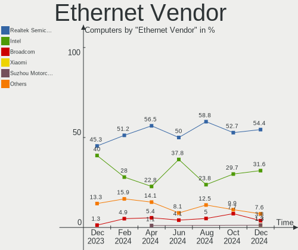

| Vendor                   | Computers | Percent |
|--------------------------|-----------|---------|
| Realtek Semiconductor    | 49        | 59.04%  |
| Intel                    | 22        | 26.51%  |
| Qualcomm Atheros         | 3         | 3.61%   |
| VIA Technologies         | 1         | 1.2%    |
| Samsung Electronics      | 1         | 1.2%    |
| Marvell Technology Group | 1         | 1.2%    |
| ICS Advent               | 1         | 1.2%    |
| DisplayLink              | 1         | 1.2%    |
| D-Link System            | 1         | 1.2%    |
| Broadcom                 | 1         | 1.2%    |
| Aquantia                 | 1         | 1.2%    |
| American Megatrends      | 1         | 1.2%    |

Ethernet Model
--------------

Ethernet models

| Model                                                               | Computers | Percent |
|---------------------------------------------------------------------|-----------|---------|
| Realtek RTL8111/8168/8411 PCI Express Gigabit Ethernet Controller   | 39        | 46.43%  |
| Realtek RTL8125 2.5GbE Controller                                   | 4         | 4.76%   |
| Intel Ethernet Controller I225-V                                    | 4         | 4.76%   |
| Realtek RTL8153 Gigabit Ethernet Adapter                            | 2         | 2.38%   |
| Realtek RTL810xE PCI Express Fast Ethernet controller               | 2         | 2.38%   |
| Intel Ethernet Controller X550                                      | 2         | 2.38%   |
| Intel Ethernet Connection I217-V                                    | 2         | 2.38%   |
| Intel Ethernet Connection I217-LM                                   | 2         | 2.38%   |
| Intel 82579LM Gigabit Network Connection (Lewisville)               | 2         | 2.38%   |
| VIA VT6105/VT6106S [Rhine-III]                                      | 1         | 1.19%   |
| Samsung Galaxy series, misc. (tethering mode)                       | 1         | 1.19%   |
| Realtek Killer E3000 2.5GbE Controller                              | 1         | 1.19%   |
| Realtek Killer E2600 Gigabit Ethernet Controller                    | 1         | 1.19%   |
| Qualcomm Atheros Attansic L1 Gigabit Ethernet                       | 1         | 1.19%   |
| Qualcomm Atheros AR8151 v2.0 Gigabit Ethernet                       | 1         | 1.19%   |
| Qualcomm Atheros AR8132 Fast Ethernet                               | 1         | 1.19%   |
| Marvell Group 88E8058 PCI-E Gigabit Ethernet Controller             | 1         | 1.19%   |
| Intel Ethernet Connection (7) I219-V                                | 1         | 1.19%   |
| Intel Ethernet Connection (4) I219-V                                | 1         | 1.19%   |
| Intel Ethernet Connection (4) I219-LM                               | 1         | 1.19%   |
| Intel Ethernet Connection (23) I219-LM                              | 1         | 1.19%   |
| Intel Ethernet Connection (16) I219-V                               | 1         | 1.19%   |
| Intel Ethernet Connection (16) I219-LM                              | 1         | 1.19%   |
| Intel Ethernet Connection (14) I219-V                               | 1         | 1.19%   |
| Intel 82599ES 10-Gigabit SFI/SFP+ Network Connection                | 1         | 1.19%   |
| Intel 82583V Gigabit Network Connection                             | 1         | 1.19%   |
| Intel 82577LM Gigabit Network Connection                            | 1         | 1.19%   |
| Intel 82577LC Gigabit Network Connection                            | 1         | 1.19%   |
| ICS Advent 10/100M LAN                                              | 1         | 1.19%   |
| DisplayLink USB-C Dual-4K Dock                                      | 1         | 1.19%   |
| D-Link System DGE-528T Gigabit Ethernet Adapter                     | 1         | 1.19%   |
| Broadcom NetXtreme BCM5720 Gigabit Ethernet PCIe                    | 1         | 1.19%   |
| Aquantia AQC113CS NBase-T/IEEE 802.3bz Ethernet Controller [AQtion] | 1         | 1.19%   |
| American Megatrends Virtual Ethernet.                               | 1         | 1.19%   |

Net Controller Kind
-------------------

Ethernet, WiFi or modem

| Kind     | Computers | Percent |
|----------|-----------|---------|
| WiFi     | 78        | 49.68%  |
| Ethernet | 78        | 49.68%  |
| Modem    | 1         | 0.64%   |

Used Controller
---------------

Currently used network controller

| Kind     | Computers | Percent |
|----------|-----------|---------|
| WiFi     | 63        | 60%     |
| Ethernet | 42        | 40%     |

NICs
----

Total network controllers on board

| Total | Computers | Percent |
|-------|-----------|---------|
| 2     | 50        | 50%     |
| 1     | 44        | 44%     |
| 0     | 3         | 3%      |
| 3     | 2         | 2%      |
| 4     | 1         | 1%      |

IPv6
----

IPv6 vs IPv4

| Used | Computers | Percent |
|------|-----------|---------|
| No   | 62        | 62%     |
| Yes  | 38        | 38%     |

Bluetooth
---------

Bluetooth Vendor
----------------

Controller vendors

| Vendor                          | Computers | Percent |
|---------------------------------|-----------|---------|
| Intel                           | 45        | 60%     |
| Cambridge Silicon Radio         | 5         | 6.67%   |
| Lite-On Technology              | 4         | 5.33%   |
| IMC Networks                    | 4         | 5.33%   |
| Foxconn / Hon Hai               | 4         | 5.33%   |
| Realtek Semiconductor           | 3         | 4%      |
| Qualcomm Atheros Communications | 2         | 2.67%   |
| Broadcom                        | 2         | 2.67%   |
| Apple                           | 2         | 2.67%   |
| MediaTek                        | 1         | 1.33%   |
| Hewlett-Packard                 | 1         | 1.33%   |
| Conwise Technology              | 1         | 1.33%   |
| ASUSTek Computer                | 1         | 1.33%   |

Bluetooth Model
---------------

Controller models

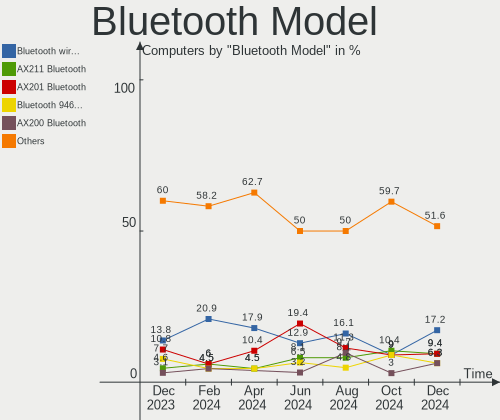

| Model                                               | Computers | Percent |
|-----------------------------------------------------|-----------|---------|
| Intel Bluetooth Device                              | 12        | 16%     |
| Intel Bluetooth 9460/9560 Jefferson Peak (JfP)      | 9         | 12%     |
| Intel Bluetooth wireless interface                  | 8         | 10.67%  |
| Intel AX201 Bluetooth                               | 5         | 6.67%   |
| Cambridge Silicon Radio Bluetooth Dongle (HCI mode) | 5         | 6.67%   |
| Intel AX200 Bluetooth                               | 4         | 5.33%   |
| Foxconn / Hon Hai Wireless_Device                   | 4         | 5.33%   |
| Realtek Bluetooth Radio                             | 3         | 4%      |
| Intel AX210 Bluetooth                               | 3         | 4%      |
| Lite-On Qualcomm Atheros QCA9377 Bluetooth          | 2         | 2.67%   |
| Intel Wireless-AC 3168 Bluetooth                    | 2         | 2.67%   |
| IMC Networks Wireless_Device                        | 2         | 2.67%   |
| IMC Networks Bluetooth Device                       | 2         | 2.67%   |
| Qualcomm Atheros  Bluetooth Device                  | 1         | 1.33%   |
| Qualcomm Atheros AR3012 Bluetooth 4.0               | 1         | 1.33%   |
| MediaTek Wireless_Device                            | 1         | 1.33%   |
| Lite-On Bluetooth Device                            | 1         | 1.33%   |
| Lite-On Atheros AR3012 Bluetooth                    | 1         | 1.33%   |
| Intel Wireless-AC 9260 Bluetooth Adapter            | 1         | 1.33%   |
| Intel Centrino Bluetooth Wireless Transceiver       | 1         | 1.33%   |
| HP Broadcom 2070 Bluetooth Combo                    | 1         | 1.33%   |
| Conwise CW6622                                      | 1         | 1.33%   |
| Broadcom HP Portable SoftSailing                    | 1         | 1.33%   |
| Broadcom HP Portable Bumble Bee                     | 1         | 1.33%   |
| ASUS ASUS USB-BT500                                 | 1         | 1.33%   |
| Apple Built-in Bluetooth 2.0+EDR HCI                | 1         | 1.33%   |
| Apple Bluetooth HCI                                 | 1         | 1.33%   |

Sound
-----

Sound Vendor
------------

Sound card vendors

| Vendor                      | Computers | Percent |
|-----------------------------|-----------|---------|
| Intel                       | 68        | 48.57%  |
| AMD                         | 28        | 20%     |
| Nvidia                      | 27        | 19.29%  |
| GN Netcom                   | 4         | 2.86%   |
| Micro Star International    | 2         | 1.43%   |
| Jieli Technology            | 2         | 1.43%   |
| Trust                       | 1         | 0.71%   |
| Razer USA                   | 1         | 0.71%   |
| JMTek                       | 1         | 0.71%   |
| Harman                      | 1         | 0.71%   |
| FiiO Electronics Technology | 1         | 0.71%   |
| DSEA A/S                    | 1         | 0.71%   |
| Creative Labs               | 1         | 0.71%   |
| Blue Microphones            | 1         | 0.71%   |
| ASUSTek Computer            | 1         | 0.71%   |

Sound Model
-----------

Sound card models

| Model                                                                      | Computers | Percent |
|----------------------------------------------------------------------------|-----------|---------|
| AMD Family 17h/19h HD Audio Controller                                     | 11        | 6.55%   |
| AMD Renoir Radeon High Definition Audio Controller                         | 9         | 5.36%   |
| Intel Alder Lake PCH-P High Definition Audio Controller                    | 7         | 4.17%   |
| Intel Xeon E3-1200 v3/4th Gen Core Processor HD Audio Controller           | 6         | 3.57%   |
| Intel 8 Series/C220 Series Chipset High Definition Audio Controller        | 6         | 3.57%   |
| AMD Starship/Matisse HD Audio Controller                                   | 6         | 3.57%   |
| AMD SBx00 Azalia (Intel HDA)                                               | 6         | 3.57%   |
| Intel Sunrise Point-LP HD Audio                                            | 5         | 2.98%   |
| Intel Cannon Lake PCH cAVS                                                 | 5         | 2.98%   |
| Nvidia TU106 High Definition Audio Controller                              | 4         | 2.38%   |
| Nvidia GA104 High Definition Audio Controller                              | 4         | 2.38%   |
| Intel Raptor Lake-P/U/H cAVS                                               | 4         | 2.38%   |
| Intel 82801I (ICH9 Family) HD Audio Controller                             | 4         | 2.38%   |
| Intel 5 Series/3400 Series Chipset High Definition Audio                   | 4         | 2.38%   |
| Nvidia GK104 HDMI Audio Controller                                         | 3         | 1.79%   |
| Intel Tiger Lake-LP Smart Sound Technology Audio Controller                | 3         | 1.79%   |
| Intel Comet Lake PCH-LP cAVS                                               | 3         | 1.79%   |
| Intel Celeron/Pentium Silver Processor High Definition Audio               | 3         | 1.79%   |
| Intel 6 Series/C200 Series Chipset Family High Definition Audio Controller | 3         | 1.79%   |
| Nvidia High Definition Audio Controller                                    | 2         | 1.19%   |
| Nvidia GP107GL High Definition Audio Controller                            | 2         | 1.19%   |
| Nvidia Audio device                                                        | 2         | 1.19%   |
| Micro Star International USB Audio                                         | 2         | 1.19%   |
| Jieli Technology UACDemoV1.0                                               | 2         | 1.19%   |
| Intel Haswell-ULT HD Audio Controller                                      | 2         | 1.19%   |
| Intel Comet Lake PCH cAVS                                                  | 2         | 1.19%   |
| Intel CM238 HD Audio Controller                                            | 2         | 1.19%   |
| Intel Alder Lake Smart Sound Technology Audio Controller                   | 2         | 1.19%   |
| Intel 82801JI (ICH10 Family) HD Audio Controller                           | 2         | 1.19%   |
| Intel 8 Series HD Audio Controller                                         | 2         | 1.19%   |
| Intel 700 Series Chipset Family Precise Touch and Stylus Port #1           | 2         | 1.19%   |
| Intel 7 Series/C216 Chipset Family High Definition Audio Controller        | 2         | 1.19%   |
| GN Netcom Jabra Evolve2 40                                                 | 2         | 1.19%   |
| AMD Navi 21/23 HDMI/DP Audio Controller                                    | 2         | 1.19%   |
| Trust GXT 232 Microphone                                                   | 1         | 0.6%    |
| Razer USA Kraken 7.1 V2                                                    | 1         | 0.6%    |
| Nvidia TU104 HD Audio Controller                                           | 1         | 0.6%    |
| Nvidia GT216 HDMI Audio Controller                                         | 1         | 0.6%    |
| Nvidia GP108 High Definition Audio Controller                              | 1         | 0.6%    |
| Nvidia GP102 HDMI Audio Controller                                         | 1         | 0.6%    |

Memory
------

Memory Vendor
-------------

Memory module vendors

| Vendor              | Computers | Percent |
|---------------------|-----------|---------|
| Samsung Electronics | 11        | 20.37%  |
| SK hynix            | 10        | 18.52%  |
| Micron Technology   | 8         | 14.81%  |
| Kingston            | 6         | 11.11%  |
| Corsair             | 5         | 9.26%   |
| Unknown             | 4         | 7.41%   |
| Crucial             | 4         | 7.41%   |
| Unknown             | 3         | 5.56%   |
| G.Skill             | 2         | 3.7%    |
| Hewlett-Packard     | 1         | 1.85%   |

Memory Model
------------

Memory module models

| Model                                                         | Computers | Percent |
|---------------------------------------------------------------|-----------|---------|
| Unknown                                                       | 3         | 5.17%   |
| Samsung RAM M471A1G44BB0-CWE 8GB SODIMM DDR4 3200MT/s         | 2         | 3.45%   |
| Micron RAM MT62F1G64D8CH-031 2GB Row Of Chips LPDDR5 6400MT/s | 2         | 3.45%   |
| Unknown RAM Module 4GB DIMM 400MT/s                           | 1         | 1.72%   |
| Unknown RAM Module 4GB DIMM 1066MT/s                          | 1         | 1.72%   |
| Unknown RAM Module 2GB DIMM DDR2 800MT/s                      | 1         | 1.72%   |
| Unknown RAM Module 2GB DIMM DDR2 667MT/s                      | 1         | 1.72%   |
| Unknown RAM Module 1GB DIMM DDR2 667MT/s                      | 1         | 1.72%   |
| SK hynix RAM Module 8GB SODIMM DDR4 2133MT/s                  | 1         | 1.72%   |
| SK hynix RAM HMCG88MEBSA092N 32GB SODIMM DDR5 4800MT/s        | 1         | 1.72%   |
| SK hynix RAM HMCG78AEBSA095N 16GB SODIMM DDR5 4800MT/s        | 1         | 1.72%   |
| SK hynix RAM HMAA2GS6CJR8N-XN 16GB SODIMM DDR4 3200MT/s       | 1         | 1.72%   |
| SK hynix RAM HMAA1GS6CMR6N-VK 8GB SODIMM DDR4 2667MT/s        | 1         | 1.72%   |
| SK hynix RAM HMAA1GS6CJR6N-XN 8GB SODIMM DDR4 3200MT/s        | 1         | 1.72%   |
| SK hynix RAM HMA82GS6AFR8N-UH 16GB SODIMM DDR4 2667MT/s       | 1         | 1.72%   |
| SK hynix RAM HMA81GS6JJR8N-VK 8GB SODIMM DDR4 2667MT/s        | 1         | 1.72%   |
| SK hynix RAM HMA81GS6DJR8N-XN 8GB SODIMM DDR4 3200MT/s        | 1         | 1.72%   |
| SK hynix RAM HMA81GS6CJR8N-VK 8GB SODIMM DDR4 2667MT/s        | 1         | 1.72%   |
| SK hynix RAM HMA41GS6AFR8N-TF 8GB SODIMM DDR4 2667MT/s        | 1         | 1.72%   |
| Samsung RAM Module 2GB SODIMM DDR3 1600MT/s                   | 1         | 1.72%   |
| Samsung RAM M471B5173QH0-YK0 4GB SODIMM DDR3 1600MT/s         | 1         | 1.72%   |
| Samsung RAM M471A2G44BM0-CWE 16GB SODIMM DDR4 3200MT/s        | 1         | 1.72%   |
| Samsung RAM M471A1K43CB1-CRC 8GB SODIMM DDR4 2667MT/s         | 1         | 1.72%   |
| Samsung RAM M391B5773DH0-CK0 2GB DIMM DDR3 1600MT/s           | 1         | 1.72%   |
| Samsung RAM M391A4G43MB1-CTD 32GB DIMM DDR4 2667MT/s          | 1         | 1.72%   |
| Samsung RAM M391A4G43BB1-CWE 32GB DIMM DDR4 3200MT/s          | 1         | 1.72%   |
| Samsung RAM K4UBE3D4AA-MGCR 8GB SODIMM LPDDR4 4266MT/s        | 1         | 1.72%   |
| Samsung RAM K4UBE3D4AA-MGCR 8GB Row Of Chips LPDDR4 4267MT/s  | 1         | 1.72%   |
| Samsung RAM K3LKBKB@BM-MGCP 2GB Row Of Chips LPDDR5 6400MT/s  | 1         | 1.72%   |
| Micron RAM MTC8C1084S1SC48BA1 16GB SODIMM DDR5 4800MT/s       | 1         | 1.72%   |
| Micron RAM Module 8GB SODIMM DDR4 2133MT/s                    | 1         | 1.72%   |
| Micron RAM 4KTF51264HZ-1G6A1 4GB SODIMM DDR3 1600MT/s         | 1         | 1.72%   |
| Micron RAM 4ATF51264HZ-3G2J1 4GB SODIMM DDR4 3200MT/s         | 1         | 1.72%   |
| Micron RAM 4ATF51264HZ-2G6E1 4GB SODIMM DDR4 2667MT/s         | 1         | 1.72%   |
| Micron RAM 4ATF1G64HZ-3G2E1 8GB SODIMM DDR4 3200MT/s          | 1         | 1.72%   |
| Kingston RAM Module 4GB DIMM DDR3 1333MT/s                    | 1         | 1.72%   |
| Kingston RAM KHX2666C15S4/16G 16GB SODIMM DDR4 2667MT/s       | 1         | 1.72%   |
| Kingston RAM KFYHV1-HYC 4GB SODIMM DDR3 1600MT/s              | 1         | 1.72%   |
| Kingston RAM KF552C40-16 16GB DIMM DDR5 5200MT/s              | 1         | 1.72%   |
| Kingston RAM KF2666C15S4/16G 16GB SODIMM DDR4 2667MT/s        | 1         | 1.72%   |

Memory Kind
-----------

Memory module kinds

| Kind    | Computers | Percent |
|---------|-----------|---------|
| DDR4    | 23        | 48.94%  |
| DDR3    | 8         | 17.02%  |
| DDR5    | 6         | 12.77%  |
| LPDDR5  | 3         | 6.38%   |
| Unknown | 3         | 6.38%   |
| LPDDR4  | 2         | 4.26%   |
| DDR2    | 2         | 4.26%   |

Memory Form Factor
------------------

Physical design of the memory module

| Name         | Computers | Percent |
|--------------|-----------|---------|
| SODIMM       | 25        | 53.19%  |
| DIMM         | 18        | 38.3%   |
| Row Of Chips | 4         | 8.51%   |

Memory Size
-----------

Memory module size

| Size  | Computers | Percent |
|-------|-----------|---------|
| 8192  | 16        | 32.65%  |
| 16384 | 10        | 20.41%  |
| 4096  | 9         | 18.37%  |
| 32768 | 7         | 14.29%  |
| 2048  | 6         | 12.24%  |
| 1024  | 1         | 2.04%   |

Memory Speed
------------

Memory module speed

| Speed | Computers | Percent |
|-------|-----------|---------|
| 3200  | 11        | 22%     |
| 2667  | 10        | 20%     |
| 1600  | 5         | 10%     |
| 4800  | 4         | 8%      |
| 6400  | 3         | 6%      |
| 1333  | 2         | 4%      |
| 6000  | 1         | 2%      |
| 5200  | 1         | 2%      |
| 4267  | 1         | 2%      |
| 4266  | 1         | 2%      |
| 3800  | 1         | 2%      |
| 3533  | 1         | 2%      |
| 3000  | 1         | 2%      |
| 2400  | 1         | 2%      |
| 2133  | 1         | 2%      |
| 1866  | 1         | 2%      |
| 1800  | 1         | 2%      |
| 1066  | 1         | 2%      |
| 800   | 1         | 2%      |
| 667   | 1         | 2%      |
| 400   | 1         | 2%      |

Printers & scanners
-------------------

Printer Vendor
--------------

Printer device vendors

| Vendor      | Computers | Percent |
|-------------|-----------|---------|
| Zebra       | 1         | 25%     |
| Seiko Epson | 1         | 25%     |
| Dymo-CoStar | 1         | 25%     |
| Canon       | 1         | 25%     |

Printer Model
-------------

Printer device models

| Model                            | Computers | Percent |
|----------------------------------|-----------|---------|
| Zebra Printer                    | 1         | 25%     |
| Seiko Epson ET-2820 Series       | 1         | 25%     |
| Dymo-CoStar DYMO LabelWriter DUO | 1         | 25%     |
| Canon TR4600 series              | 1         | 25%     |

Scanner Vendor
--------------

Scanner device vendors

Zero info for selected period =(

Scanner Model
-------------

Scanner device models

Zero info for selected period =(

Camera
------

Camera Vendor
-------------

Camera device vendors

| Vendor                                 | Computers | Percent |
|----------------------------------------|-----------|---------|
| Chicony Electronics                    | 10        | 16.39%  |
| IMC Networks                           | 8         | 13.11%  |
| Realtek Semiconductor                  | 5         | 8.2%    |
| Microdia                               | 4         | 6.56%   |
| Logitech                               | 4         | 6.56%   |
| Bison Electronics                      | 4         | 6.56%   |
| Cheng Uei Precision Industry (Foxlink) | 3         | 4.92%   |
| Sunplus Innovation Technology          | 2         | 3.28%   |
| Microsoft                              | 2         | 3.28%   |
| Apple                                  | 2         | 3.28%   |
| Acer                                   | 2         | 3.28%   |
| 8SSC21D67422V1SR28902JL                | 2         | 3.28%   |
| Syntek                                 | 1         | 1.64%   |
| Suyin                                  | 1         | 1.64%   |
| Sonix Technology                       | 1         | 1.64%   |
| Silicon Motion                         | 1         | 1.64%   |
| Samsung Electronics                    | 1         | 1.64%   |
| Ruision                                | 1         | 1.64%   |
| Quanta                                 | 1         | 1.64%   |
| MacroSilicon                           | 1         | 1.64%   |
| Lite-On Technology                     | 1         | 1.64%   |
| BKX-210918                             | 1         | 1.64%   |
| BillionPixels                          | 1         | 1.64%   |
| Anker PowerConf C200                   | 1         | 1.64%   |
| Alcor Micro                            | 1         | 1.64%   |

Camera Model
------------

Camera device models

| Model                                                   | Computers | Percent |
|---------------------------------------------------------|-----------|---------|
| IMC Networks USB2.0 HD UVC WebCam                       | 3         | 4.92%   |
| IMC Networks Integrated Camera                          | 3         | 4.92%   |
| Microsoft LifeCam HD-3000                               | 2         | 3.28%   |
| Microdia Integrated_Webcam_FHD                          | 2         | 3.28%   |
| Chicony VGA WebCam                                      | 2         | 3.28%   |
| Bison Integrated Camera                                 | 2         | 3.28%   |
| Bison BisonCam,NB Pro                                   | 2         | 3.28%   |
| 8SSC21D67422V1SR28902JL Integrated RGB Camera           | 2         | 3.28%   |
| Syntek Integrated Camera                                | 1         | 1.64%   |
| Suyin Acer/HP Integrated Webcam [CN0314]                | 1         | 1.64%   |
| Sunplus HD User Facing                                  | 1         | 1.64%   |
| Sunplus 1080p FHD Camera                                | 1         | 1.64%   |
| Sonix USB2.0 FHD UVC WebCam                             | 1         | 1.64%   |
| Silicon Motion Webcam SC-13HDL11624N [Namuga Co., Ltd.] | 1         | 1.64%   |
| Samsung Galaxy series, misc. (MTP mode)                 | 1         | 1.64%   |
| Ruision UVC Camera                                      | 1         | 1.64%   |
| Realtek Lenovo EasyCamera                               | 1         | 1.64%   |
| Realtek Integrated_Webcam_HD                            | 1         | 1.64%   |
| Realtek Integrated_Webcam_FHD                           | 1         | 1.64%   |
| Realtek Integrated Webcam_HD                            | 1         | 1.64%   |
| Realtek HD WebCam                                       | 1         | 1.64%   |
| Quanta HD User Facing                                   | 1         | 1.64%   |
| Microdia Laptop_Integrated_Webcam_2M                    | 1         | 1.64%   |
| Microdia Integrated_Webcam_HD                           | 1         | 1.64%   |
| MacroSilicon MS210x Video Grabber [EasierCAP]           | 1         | 1.64%   |
| Logitech Webcam C170                                    | 1         | 1.64%   |
| Logitech QuickCam Ultra Vision                          | 1         | 1.64%   |
| Logitech HD Pro Webcam C920                             | 1         | 1.64%   |
| Logitech C922 Pro Stream Webcam                         | 1         | 1.64%   |
| Lite-On Integrated Camera                               | 1         | 1.64%   |
| IMC Networks USB2.0 VGA UVC WebCam                      | 1         | 1.64%   |
| IMC Networks ov9734_azurewave_camera                    | 1         | 1.64%   |
| Chicony USB2.0 Camera                                   | 1         | 1.64%   |
| Chicony Integrated Camera                               | 1         | 1.64%   |
| Chicony HP TrueVision HD Camera                         | 1         | 1.64%   |
| Chicony HP Laptop Integrated Webcam [2 MP Fixed]        | 1         | 1.64%   |
| Chicony HP HD Webcam [Fixed]                            | 1         | 1.64%   |
| Chicony HP HD Webcam                                    | 1         | 1.64%   |
| Chicony HD WebCam (Asus N-series)                       | 1         | 1.64%   |
| Chicony HD WebCam                                       | 1         | 1.64%   |

Security
--------

Fingerprint Vendor
------------------

Fingerprint sensor vendors

| Vendor                     | Computers | Percent |
|----------------------------|-----------|---------|
| Validity Sensors           | 6         | 54.55%  |
| Synaptics                  | 3         | 27.27%  |
| Shenzhen Goodix Technology | 1         | 9.09%   |
| LighTuning Technology      | 1         | 9.09%   |

Fingerprint Model
-----------------

Fingerprint sensor models

| Model                                                                      | Computers | Percent |
|----------------------------------------------------------------------------|-----------|---------|
| Synaptics TouchPad                                                         | 2         | 18.18%  |
| Validity Sensors VFS495 Fingerprint Reader                                 | 1         | 9.09%   |
| Validity Sensors VFS491                                                    | 1         | 9.09%   |
| Validity Sensors VFS451 Fingerprint Reader                                 | 1         | 9.09%   |
| Validity Sensors VFS300 Fingerprint Reader                                 | 1         | 9.09%   |
| Validity Sensors VFS 5011 fingerprint sensor                               | 1         | 9.09%   |
| Validity Sensors Synaptics VFS7552 Touch Fingerprint Sensor with PurePrint | 1         | 9.09%   |
| Synaptics UWP WBDI Device                                                  | 1         | 9.09%   |
| Shenzhen Goodix Fingerprint Reader                                         | 1         | 9.09%   |
| LighTuning EgisTec Touch Fingerprint Sensor                                | 1         | 9.09%   |

Chipcard Vendor
---------------

Chipcard module vendors

| Vendor      | Computers | Percent |
|-------------|-----------|---------|
| Broadcom    | 3         | 50%     |
| Alcor Micro | 3         | 50%     |

Chipcard Model
--------------

Chipcard module models

| Model                               | Computers | Percent |
|-------------------------------------|-----------|---------|
| Alcor Micro AU9540 Smartcard Reader | 3         | 50%     |
| Broadcom 58200                      | 2         | 33.33%  |
| Broadcom 5880                       | 1         | 16.67%  |

Unsupported
-----------

Unsupported Devices
-------------------

Total unsupported devices on board

| Total | Computers | Percent |
|-------|-----------|---------|
| 0     | 71        | 71%     |
| 1     | 23        | 23%     |
| 2     | 5         | 5%      |
| 4     | 1         | 1%      |

Unsupported Device Types
------------------------

Types of unsupported devices

| Type                     | Computers | Percent |
|--------------------------|-----------|---------|
| Fingerprint reader       | 11        | 29.73%  |
| Multimedia controller    | 7         | 18.92%  |
| Net/wireless             | 6         | 16.22%  |
| Graphics card            | 5         | 13.51%  |
| Chipcard                 | 2         | 5.41%   |
| Camera                   | 2         | 5.41%   |
| Tv card                  | 1         | 2.7%    |
| Storage/raid             | 1         | 2.7%    |
| Sound                    | 1         | 2.7%    |
| Communication controller | 1         | 2.7%    |

