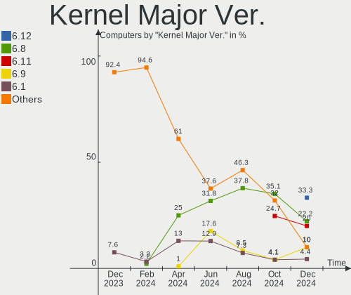
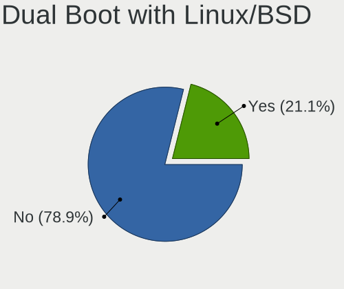
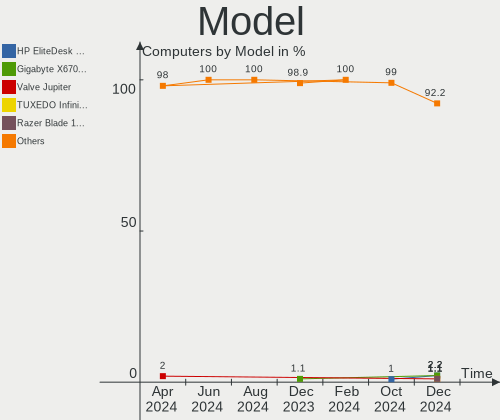
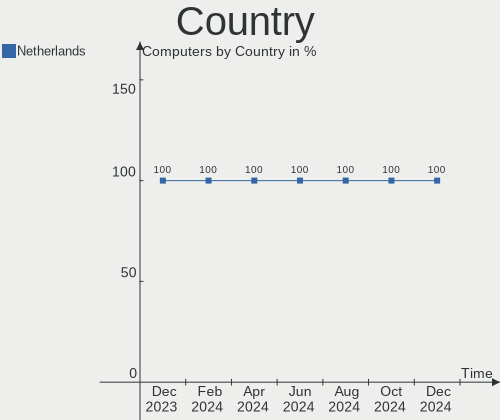
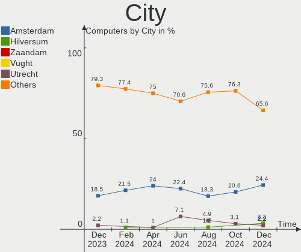
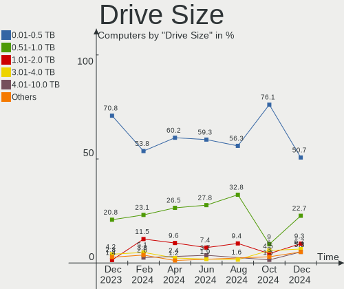
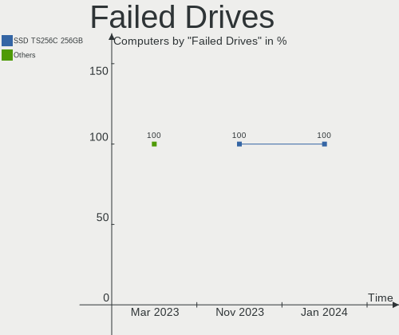
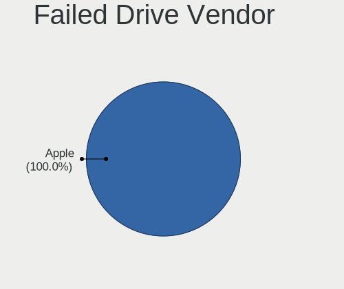
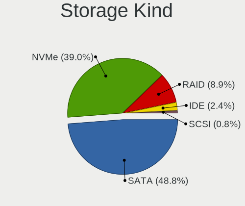
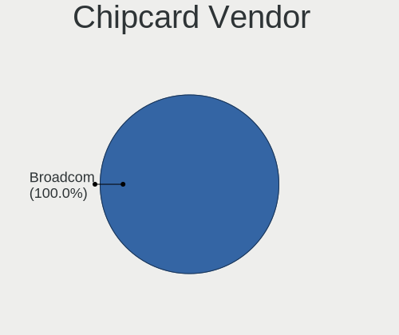

Linux in Netherlands - Hardware Trends
--------------------------------------

A project to identify most popular hardware characteristics and track their change
over time based on data collected by Linux users at https://Linux-Hardware.org.

Anyone can contribute to this report by the [hw-probe](https://github.com/linuxhw/hw-probe) tool:

    sudo -E hw-probe -all -upload

This is a report for all computer types. See also reports for [desktops](/Location/Netherlands/Desktop/README.md) and [notebooks](/Location/Netherlands/Notebook/README.md).

Period: Mar, 2023.

Contents
--------

* [ System ](#system)
  - [ OS                       ](#os)
  - [ OS Family                ](#os-family)
  - [ Kernel                   ](#kernel)
  - [ Kernel Family            ](#kernel-family)
  - [ Kernel Major Ver.        ](#kernel-major-ver)
  - [ Arch                     ](#arch)
  - [ DE                       ](#de)
  - [ Display Server           ](#display-server)
  - [ Display Manager          ](#display-manager)
  - [ OS Lang                  ](#os-lang)
  - [ Boot Mode                ](#boot-mode)
  - [ Filesystem               ](#filesystem)
  - [ Part. scheme             ](#part-scheme)
  - [ Dual Boot with Linux/BSD ](#dual-boot-with-linuxbsd)
  - [ Dual Boot (Win)          ](#dual-boot-win)

* [ Board ](#board)
  - [ Vendor                   ](#vendor)
  - [ Model                    ](#model)
  - [ Model Family             ](#model-family)
  - [ MFG Year                 ](#mfg-year)
  - [ Form Factor              ](#form-factor)
  - [ Secure Boot              ](#secure-boot)
  - [ Coreboot                 ](#coreboot)
  - [ RAM Size                 ](#ram-size)
  - [ RAM Used                 ](#ram-used)
  - [ Total Drives             ](#total-drives)
  - [ Has CD-ROM               ](#has-cd-rom)
  - [ Has Ethernet             ](#has-ethernet)
  - [ Has WiFi                 ](#has-wifi)
  - [ Has Bluetooth            ](#has-bluetooth)

* [ Location ](#location)
  - [ Country                  ](#country)
  - [ City                     ](#city)

* [ Drives ](#drives)
  - [ Drive Vendor             ](#drive-vendor)
  - [ Drive Model              ](#drive-model)
  - [ HDD Vendor               ](#hdd-vendor)
  - [ SSD Vendor               ](#ssd-vendor)
  - [ Drive Kind               ](#drive-kind)
  - [ Drive Connector          ](#drive-connector)
  - [ Drive Size               ](#drive-size)
  - [ Space Total              ](#space-total)
  - [ Space Used               ](#space-used)
  - [ Malfunc. Drives          ](#malfunc-drives)
  - [ Malfunc. Drive Vendor    ](#malfunc-drive-vendor)
  - [ Malfunc. HDD Vendor      ](#malfunc-hdd-vendor)
  - [ Malfunc. Drive Kind      ](#malfunc-drive-kind)
  - [ Failed Drives            ](#failed-drives)
  - [ Failed Drive Vendor      ](#failed-drive-vendor)
  - [ Drive Status             ](#drive-status)

* [ Storage controller ](#storage-controller)
  - [ Storage Vendor           ](#storage-vendor)
  - [ Storage Model            ](#storage-model)
  - [ Storage Kind             ](#storage-kind)

* [ Processor ](#processor)
  - [ CPU Vendor               ](#cpu-vendor)
  - [ CPU Model                ](#cpu-model)
  - [ CPU Model Family         ](#cpu-model-family)
  - [ CPU Cores                ](#cpu-cores)
  - [ CPU Sockets              ](#cpu-sockets)
  - [ CPU Threads              ](#cpu-threads)
  - [ CPU Op-Modes             ](#cpu-op-modes)
  - [ CPU Microcode            ](#cpu-microcode)
  - [ CPU Microarch            ](#cpu-microarch)

* [ Graphics ](#graphics)
  - [ GPU Vendor               ](#gpu-vendor)
  - [ GPU Model                ](#gpu-model)
  - [ GPU Combo                ](#gpu-combo)
  - [ GPU Driver               ](#gpu-driver)
  - [ GPU Memory               ](#gpu-memory)

* [ Monitor ](#monitor)
  - [ Monitor Vendor           ](#monitor-vendor)
  - [ Monitor Model            ](#monitor-model)
  - [ Monitor Resolution       ](#monitor-resolution)
  - [ Monitor Diagonal         ](#monitor-diagonal)
  - [ Monitor Width            ](#monitor-width)
  - [ Aspect Ratio             ](#aspect-ratio)
  - [ Monitor Area             ](#monitor-area)
  - [ Pixel Density            ](#pixel-density)
  - [ Multiple Monitors        ](#multiple-monitors)

* [ Network ](#network)
  - [ Net Controller Vendor    ](#net-controller-vendor)
  - [ Net Controller Model     ](#net-controller-model)
  - [ Wireless Vendor          ](#wireless-vendor)
  - [ Wireless Model           ](#wireless-model)
  - [ Ethernet Vendor          ](#ethernet-vendor)
  - [ Ethernet Model           ](#ethernet-model)
  - [ Net Controller Kind      ](#net-controller-kind)
  - [ Used Controller          ](#used-controller)
  - [ NICs                     ](#nics)
  - [ IPv6                     ](#ipv6)

* [ Bluetooth ](#bluetooth)
  - [ Bluetooth Vendor         ](#bluetooth-vendor)
  - [ Bluetooth Model          ](#bluetooth-model)

* [ Sound ](#sound)
  - [ Sound Vendor             ](#sound-vendor)
  - [ Sound Model              ](#sound-model)

* [ Memory ](#memory)
  - [ Memory Vendor            ](#memory-vendor)
  - [ Memory Model             ](#memory-model)
  - [ Memory Kind              ](#memory-kind)
  - [ Memory Form Factor       ](#memory-form-factor)
  - [ Memory Size              ](#memory-size)
  - [ Memory Speed             ](#memory-speed)

* [ Printers & scanners ](#printers--scanners)
  - [ Printer Vendor           ](#printer-vendor)
  - [ Printer Model            ](#printer-model)
  - [ Scanner Vendor           ](#scanner-vendor)
  - [ Scanner Model            ](#scanner-model)

* [ Camera ](#camera)
  - [ Camera Vendor            ](#camera-vendor)
  - [ Camera Model             ](#camera-model)

* [ Security ](#security)
  - [ Fingerprint Vendor       ](#fingerprint-vendor)
  - [ Fingerprint Model        ](#fingerprint-model)
  - [ Chipcard Vendor          ](#chipcard-vendor)
  - [ Chipcard Model           ](#chipcard-model)

* [ Unsupported ](#unsupported)
  - [ Unsupported Devices      ](#unsupported-devices)
  - [ Unsupported Device Types ](#unsupported-device-types)

System
------

OS
--

Installed operating systems

| Name                         | Computers | Percent |
|------------------------------|-----------|---------|
| Ubuntu 22.04                 | 19        | 15.83%  |
| Linux Mint 21.1              | 11        | 9.17%   |
| Fedora 37                    | 9         | 7.5%    |
| Ubuntu 20.04                 | 7         | 5.83%   |
| Zorin 16                     | 6         | 5%      |
| OpenMandriva 23.03           | 6         | 5%      |
| EndeavourOS Rolling          | 5         | 4.17%   |
| Debian 11                    | 5         | 4.17%   |
| Ubuntu 22.10                 | 4         | 3.33%   |
| Pop!_OS 22.04                | 4         | 3.33%   |
| Manjaro                      | 4         | 3.33%   |
| Xubuntu 22.04                | 3         | 2.5%    |
| OpenMandriva 23.01           | 3         | 2.5%    |
| Linux Mint 21                | 3         | 2.5%    |
| Kubuntu 22.10                | 3         | 2.5%    |
| Debian                       | 3         | 2.5%    |
| SteamOS 3.4.6                | 2         | 1.67%   |
| openSUSE Tumbleweed-XXXXXXXX | 2         | 1.67%   |
| Manjaro 22.0.4               | 2         | 1.67%   |
| Kubuntu 22.04                | 2         | 1.67%   |
| ArcoLinux Rolling            | 2         | 1.67%   |
| Arch Rolling                 | 2         | 1.67%   |
| Zorin 15                     | 1         | 0.83%   |
| Ubuntu Budgie 22.04          | 1         | 0.83%   |
| Ubuntu 23.04                 | 1         | 0.83%   |
| Ubuntu 18.04                 | 1         | 0.83%   |
| RHEL 7                       | 1         | 0.83%   |
| OpenMandriva 4.3             | 1         | 0.83%   |
| Manjaro 22.0.5               | 1         | 0.83%   |
| Lubuntu 22.04                | 1         | 0.83%   |
| Linux Mint 20.3              | 1         | 0.83%   |
| KDE neon 22.04               | 1         | 0.83%   |
| Kali 2023.1                  | 1         | 0.83%   |
| Garuda Linux Rolling         | 1         | 0.83%   |
| Fedora 38                    | 1         | 0.83%   |

OS Family
---------

OS without a version

| Name          | Computers | Percent |
|---------------|-----------|---------|
| Ubuntu        | 32        | 26.67%  |
| Linux Mint    | 15        | 12.5%   |
| OpenMandriva  | 10        | 8.33%   |
| Fedora        | 10        | 8.33%   |
| Debian        | 8         | 6.67%   |
| Zorin         | 7         | 5.83%   |
| Manjaro       | 7         | 5.83%   |
| Kubuntu       | 5         | 4.17%   |
| EndeavourOS   | 5         | 4.17%   |
| Pop!_OS       | 4         | 3.33%   |
| Xubuntu       | 3         | 2.5%    |
| SteamOS       | 2         | 1.67%   |
| openSUSE      | 2         | 1.67%   |
| ArcoLinux     | 2         | 1.67%   |
| Arch          | 2         | 1.67%   |
| Ubuntu Budgie | 1         | 0.83%   |
| RHEL          | 1         | 0.83%   |
| Lubuntu       | 1         | 0.83%   |
| KDE neon      | 1         | 0.83%   |
| Kali          | 1         | 0.83%   |
| Garuda Linux  | 1         | 0.83%   |

Kernel
------

Version of the Linux kernel

| Version                     | Computers | Percent |
|-----------------------------|-----------|---------|
| 5.19.0-35-generic           | 22        | 18.33%  |
| 5.15.0-67-generic           | 20        | 16.67%  |
| 6.2.6-desktop-1omv2390      | 6         | 5%      |
| 6.1.18-200.fc37.x86_64      | 4         | 3.33%   |
| 5.19.0-38-generic           | 4         | 3.33%   |
| 5.10.0-21-amd64             | 4         | 3.33%   |
| 6.1.1-desktop-1omv2290      | 3         | 2.5%    |
| 6.2.8-arch1-1               | 2         | 1.67%   |
| 6.2.6-arch1-1               | 2         | 1.67%   |
| 6.2.1-arch1-1               | 2         | 1.67%   |
| 6.1.14-200.fc37.x86_64      | 2         | 1.67%   |
| 6.1.12-1-MANJARO            | 2         | 1.67%   |
| 6.1.12-1-default            | 2         | 1.67%   |
| 6.1.0-5-amd64               | 2         | 1.67%   |
| 5.4.0-144-generic           | 2         | 1.67%   |
| 5.19.0-32-generic           | 2         | 1.67%   |
| 5.15.94-1-MANJARO           | 2         | 1.67%   |
| 5.13.0-valve36-1-neptune    | 2         | 1.67%   |
| 6.2.8-200.fc37.x86_64       | 1         | 0.83%   |
| 6.2.7-zen1-1-zen            | 1         | 0.83%   |
| 6.2.7-300.fc38.x86_64       | 1         | 0.83%   |
| 6.2.7-200.fc37.x86_64       | 1         | 0.83%   |
| 6.2.7-2-MANJARO             | 1         | 0.83%   |
| 6.2.6-76060206-generic      | 1         | 0.83%   |
| 6.2.6-1-MANJARO             | 1         | 0.83%   |
| 6.2.2-arch1-1               | 1         | 0.83%   |
| 6.2.0-76060200-generic      | 1         | 0.83%   |
| 6.1.21-hardened1-1-hardened | 1         | 0.83%   |
| 6.1.21-1-lts                | 1         | 0.83%   |
| 6.1.19-1-MANJARO            | 1         | 0.83%   |
| 6.1.11-76060111-generic     | 1         | 0.83%   |
| 6.1.10-x64v3-xanmod1        | 1         | 0.83%   |
| 6.1.0-kali5-amd64           | 1         | 0.83%   |
| 6.1.0-3-amd64               | 1         | 0.83%   |
| 6.1.0-16-generic            | 1         | 0.83%   |
| 6.0.7-301.fc37.x86_64       | 1         | 0.83%   |
| 6.0.2-76060002-generic      | 1         | 0.83%   |
| 5.4.0-139-generic           | 1         | 0.83%   |
| 5.4.0-132-generic           | 1         | 0.83%   |
| 5.19.0-37-generic           | 1         | 0.83%   |

Kernel Family
-------------

Linux kernel without a distro release

| Version | Computers | Percent |
|---------|-----------|---------|
| 5.19.0  | 30        | 25%     |
| 5.15.0  | 25        | 20.83%  |
| 6.2.6   | 10        | 8.33%   |
| 6.1.0   | 5         | 4.17%   |
| 6.2.7   | 4         | 3.33%   |
| 6.1.18  | 4         | 3.33%   |
| 6.1.12  | 4         | 3.33%   |
| 5.4.0   | 4         | 3.33%   |
| 5.10.0  | 4         | 3.33%   |
| 6.2.8   | 3         | 2.5%    |
| 6.1.1   | 3         | 2.5%    |
| 5.13.0  | 3         | 2.5%    |
| 6.2.1   | 2         | 1.67%   |
| 6.1.21  | 2         | 1.67%   |
| 6.1.14  | 2         | 1.67%   |
| 5.15.94 | 2         | 1.67%   |
| 5.14.0  | 2         | 1.67%   |
| 6.2.2   | 1         | 0.83%   |
| 6.2.0   | 1         | 0.83%   |
| 6.1.19  | 1         | 0.83%   |
| 6.1.11  | 1         | 0.83%   |
| 6.1.10  | 1         | 0.83%   |
| 6.0.7   | 1         | 0.83%   |
| 6.0.2   | 1         | 0.83%   |
| 5.16.7  | 1         | 0.83%   |
| 5.15.85 | 1         | 0.83%   |
| 4.15.0  | 1         | 0.83%   |
| 3.10.0  | 1         | 0.83%   |

Kernel Major Ver.
-----------------

Linux kernel major version

| Version | Computers | Percent |
|---------|-----------|---------|
| 5.19    | 30        | 25%     |
| 5.15    | 28        | 23.33%  |
| 6.1     | 23        | 19.17%  |
| 6.2     | 21        | 17.5%   |
| 5.4     | 4         | 3.33%   |
| 5.10    | 4         | 3.33%   |
| 5.13    | 3         | 2.5%    |
| 6.0     | 2         | 1.67%   |
| 5.14    | 2         | 1.67%   |
| 5.16    | 1         | 0.83%   |
| 4.15    | 1         | 0.83%   |
| 3.10    | 1         | 0.83%   |

Arch
----

OS architecture (x86_64, i586, etc.)

| Name   | Computers | Percent |
|--------|-----------|---------|
| x86_64 | 118       | 98.33%  |
| i686   | 2         | 1.67%   |

DE
--

Desktop Environment

| Name          | Computers | Percent |
|---------------|-----------|---------|
| GNOME         | 51        | 42.5%   |
| KDE5          | 31        | 25.83%  |
| X-Cinnamon    | 14        | 11.67%  |
| XFCE          | 9         | 7.5%    |
| Unknown       | 8         | 6.67%   |
| MATE          | 2         | 1.67%   |
| LXQt          | 2         | 1.67%   |
| i3            | 1         | 0.83%   |
| Enlightenment | 1         | 0.83%   |
| Budgie        | 1         | 0.83%   |

Display Server
--------------

X11 or Wayland

| Name    | Computers | Percent |
|---------|-----------|---------|
| X11     | 82        | 68.33%  |
| Wayland | 30        | 25%     |
| Tty     | 5         | 4.17%   |
| Unknown | 3         | 2.5%    |

Display Manager
---------------

SDDM, LightDM, etc.

| Name    | Computers | Percent |
|---------|-----------|---------|
| Unknown | 45        | 37.5%   |
| GDM3    | 30        | 25%     |
| SDDM    | 20        | 16.67%  |
| LightDM | 16        | 13.33%  |
| GDM     | 8         | 6.67%   |
| XDM     | 1         | 0.83%   |

OS Lang
-------

Language

| Lang        | Computers | Percent |
|-------------|-----------|---------|
| en_US       | 56        | 46.67%  |
| nl_NL       | 51        | 42.5%   |
| ru_RU       | 2         | 1.67%   |
| it_IT       | 2         | 1.67%   |
| en_GB       | 2         | 1.67%   |
| de_DE       | 2         | 1.67%   |
| POSIX       | 1         | 0.83%   |
| lt_LT       | 1         | 0.83%   |
| es_ES       | 1         | 0.83%   |
| en_US.utf-8 | 1         | 0.83%   |
| C           | 1         | 0.83%   |

Boot Mode
---------

EFI or BIOS

| Mode | Computers | Percent |
|------|-----------|---------|
| BIOS | 64        | 53.33%  |
| EFI  | 56        | 46.67%  |

Filesystem
----------

Type of filesystem

| Type    | Computers | Percent |
|---------|-----------|---------|
| Ext4    | 96        | 80%     |
| Btrfs   | 11        | 9.17%   |
| Overlay | 7         | 5.83%   |
| Zfs     | 3         | 2.5%    |
| Xfs     | 2         | 1.67%   |
| Ext3    | 1         | 0.83%   |

Part. scheme
------------

Scheme of partitioning

| Type    | Computers | Percent |
|---------|-----------|---------|
| GPT     | 67        | 55.83%  |
| Unknown | 40        | 33.33%  |
| MBR     | 13        | 10.83%  |

Dual Boot with Linux/BSD
------------------------

Hosting more than one Linux/BSD

| Dual boot | Computers | Percent |
|-----------|-----------|---------|
| No        | 95        | 79.17%  |
| Yes       | 25        | 20.83%  |

Dual Boot (Win)
---------------

Hosting Linux and Windows

| Dual boot | Computers | Percent |
|-----------|-----------|---------|
| No        | 96        | 80%     |
| Yes       | 24        | 20%     |

Board
-----

Vendor
------

Motherboard manufacturer

| Name                | Computers | Percent |
|---------------------|-----------|---------|
| Hewlett-Packard     | 24        | 20%     |
| ASUSTek Computer    | 13        | 10.83%  |
| Lenovo              | 12        | 10%     |
| Dell                | 12        | 10%     |
| Gigabyte Technology | 11        | 9.17%   |
| Acer                | 10        | 8.33%   |
| MSI                 | 8         | 6.67%   |
| Apple               | 6         | 5%      |
| ASRock              | 4         | 3.33%   |
| Medion              | 3         | 2.5%    |
| Intel               | 3         | 2.5%    |
| Valve               | 2         | 1.67%   |
| HUAWEI              | 2         | 1.67%   |
| ZOTAC               | 1         | 0.83%   |
| Samsung Electronics | 1         | 0.83%   |
| Notebook            | 1         | 0.83%   |
| Hampoo              | 1         | 0.83%   |
| Google              | 1         | 0.83%   |
| Fujitsu             | 1         | 0.83%   |
| Framework           | 1         | 0.83%   |
| Foxconn             | 1         | 0.83%   |
| Alienware           | 1         | 0.83%   |
| Unknown             | 1         | 0.83%   |

Model
-----

Motherboard model

| Name                                        | Computers | Percent |
|---------------------------------------------|-----------|---------|
| Valve Jupiter                               | 2         | 1.67%   |
| HP ZBook 15 G5                              | 2         | 1.67%   |
| Apple Macmini6,2                            | 2         | 1.67%   |
| ZOTAC AMD M1                                | 1         | 0.83%   |
| Samsung 930QED                              | 1         | 0.83%   |
| Notebook N85_N87,HJ,HJ1,HK1                 | 1         | 0.83%   |
| MSI Summit E16FlipEvo A11MT                 | 1         | 0.83%   |
| MSI p6-2315ed                               | 1         | 0.83%   |
| MSI MS-7E07                                 | 1         | 0.83%   |
| MSI MS-7D43                                 | 1         | 0.83%   |
| MSI MS-7C91                                 | 1         | 0.83%   |
| MSI MS-7C52                                 | 1         | 0.83%   |
| MSI MS-7850                                 | 1         | 0.83%   |
| MSI MS-7522                                 | 1         | 0.83%   |
| Medion MS-7797                              | 1         | 0.83%   |
| Medion E4251                                | 1         | 0.83%   |
| Medion E23201 MD61575                       | 1         | 0.83%   |
| Lenovo Yoga 300-11IBR 80M1                  | 1         | 0.83%   |
| Lenovo ThinkPad X1 Extreme Gen 3 20TKCTO1WW | 1         | 0.83%   |
| Lenovo ThinkPad X1 Extreme 2nd 20QVCTO1WW   | 1         | 0.83%   |
| Lenovo ThinkPad X1 Carbon Gen 10 21CBCTO1WW | 1         | 0.83%   |
| Lenovo ThinkPad X1 Carbon 6th 20KHCTO1WW    | 1         | 0.83%   |
| Lenovo ThinkPad T510 4384VJZ                | 1         | 0.83%   |
| Lenovo ThinkPad T480 20L5CTO1WW             | 1         | 0.83%   |
| Lenovo ThinkPad L15 Gen 3 21C30092MH        | 1         | 0.83%   |
| Lenovo ThinkPad E15 Gen 4 21EES00100        | 1         | 0.83%   |
| Lenovo ThinkPad E15 Gen 2 20TD0037MH        | 1         | 0.83%   |
| Lenovo System x3250 M6 -[3943AC1]-          | 1         | 0.83%   |
| Lenovo IdeaPad 5 15ARE05 81YQ               | 1         | 0.83%   |
| Intel NUC11TNHi3                            | 1         | 0.83%   |
| Intel NUC11PHi7                             | 1         | 0.83%   |
| Intel D34010WYK H14771-303                  | 1         | 0.83%   |
| HUAWEI MACHC-WAX9                           | 1         | 0.83%   |
| HUAWEI BOHB-WAX9                            | 1         | 0.83%   |
| HP ZBook 15 G3                              | 1         | 0.83%   |
| HP Z440 Workstation                         | 1         | 0.83%   |
| HP Victus by 15L Gaming Desktop TG02-0xxx   | 1         | 0.83%   |
| HP ProLiant DL380 G7                        | 1         | 0.83%   |
| HP ProDesk 400 G2 MT (TPM DP)               | 1         | 0.83%   |
| HP ProBook 430 G2                           | 1         | 0.83%   |

Model Family
------------

Motherboard model prefix

| Name               | Computers | Percent |
|--------------------|-----------|---------|
| Lenovo ThinkPad    | 9         | 7.5%    |
| Acer Aspire        | 9         | 7.5%    |
| HP Pavilion        | 5         | 4.17%   |
| HP Compaq          | 5         | 4.17%   |
| Dell XPS           | 5         | 4.17%   |
| HP ZBook           | 3         | 2.5%    |
| ASUS ROG           | 3         | 2.5%    |
| Valve Jupiter      | 2         | 1.67%   |
| HP EliteBook       | 2         | 1.67%   |
| Dell PowerEdge     | 2         | 1.67%   |
| Dell Latitude      | 2         | 1.67%   |
| Apple Macmini6     | 2         | 1.67%   |
| Apple MacBookPro11 | 2         | 1.67%   |
| ZOTAC AMD          | 1         | 0.83%   |
| Samsung 930QED     | 1         | 0.83%   |
| Notebook N85       | 1         | 0.83%   |
| MSI Summit         | 1         | 0.83%   |
| MSI p6-2315ed      | 1         | 0.83%   |
| MSI MS-7E07        | 1         | 0.83%   |
| MSI MS-7D43        | 1         | 0.83%   |
| MSI MS-7C91        | 1         | 0.83%   |
| MSI MS-7C52        | 1         | 0.83%   |
| MSI MS-7850        | 1         | 0.83%   |
| MSI MS-7522        | 1         | 0.83%   |
| Medion MS-7797     | 1         | 0.83%   |
| Medion E4251       | 1         | 0.83%   |
| Medion E23201      | 1         | 0.83%   |
| Lenovo Yoga        | 1         | 0.83%   |
| Lenovo System      | 1         | 0.83%   |
| Lenovo IdeaPad     | 1         | 0.83%   |
| Intel NUC11TNHi3   | 1         | 0.83%   |
| Intel NUC11PHi7    | 1         | 0.83%   |
| Intel D34010WYK    | 1         | 0.83%   |
| HUAWEI MACHC-WAX9  | 1         | 0.83%   |
| HUAWEI BOHB-WAX9   | 1         | 0.83%   |
| HP Z440            | 1         | 0.83%   |
| HP Victus          | 1         | 0.83%   |
| HP ProLiant        | 1         | 0.83%   |
| HP ProDesk         | 1         | 0.83%   |
| HP ProBook         | 1         | 0.83%   |

MFG Year
--------

Motherboard manufacture year

| Year | Computers | Percent |
|------|-----------|---------|
| 2022 | 18        | 15%     |
| 2012 | 11        | 9.17%   |
| 2021 | 10        | 8.33%   |
| 2020 | 10        | 8.33%   |
| 2019 | 10        | 8.33%   |
| 2015 | 8         | 6.67%   |
| 2010 | 8         | 6.67%   |
| 2018 | 7         | 5.83%   |
| 2016 | 7         | 5.83%   |
| 2013 | 6         | 5%      |
| 2011 | 6         | 5%      |
| 2014 | 5         | 4.17%   |
| 2017 | 4         | 3.33%   |
| 2009 | 4         | 3.33%   |
| 2008 | 4         | 3.33%   |
| 2007 | 1         | 0.83%   |
| 2005 | 1         | 0.83%   |

Form Factor
-----------

Physical design of the computer

| Name        | Computers | Percent |
|-------------|-----------|---------|
| Notebook    | 58        | 48.33%  |
| Desktop     | 47        | 39.17%  |
| Mini pc     | 4         | 3.33%   |
| Server      | 4         | 3.33%   |
| Convertible | 3         | 2.5%    |
| All in one  | 3         | 2.5%    |
| Tablet      | 1         | 0.83%   |

Secure Boot
-----------

Enabled or disabled

| State    | Computers | Percent |
|----------|-----------|---------|
| Disabled | 108       | 90%     |
| Enabled  | 12        | 10%     |

Coreboot
--------

Have coreboot on board

| Used | Computers | Percent |
|------|-----------|---------|
| No   | 119       | 99.17%  |
| Yes  | 1         | 0.83%   |

RAM Size
--------

Total RAM memory

| Size in GB  | Computers | Percent |
|-------------|-----------|---------|
| 16.01-24.0  | 27        | 22.5%   |
| 4.01-8.0    | 22        | 18.33%  |
| 32.01-64.0  | 19        | 15.83%  |
| 8.01-16.0   | 18        | 15%     |
| 3.01-4.0    | 14        | 11.67%  |
| 64.01-256.0 | 8         | 6.67%   |
| 1.01-2.0    | 6         | 5%      |
| 2.01-3.0    | 3         | 2.5%    |
| 24.01-32.0  | 2         | 1.67%   |
| 0.51-1.0    | 1         | 0.83%   |

RAM Used
--------

Used RAM memory

| Used GB    | Computers | Percent |
|------------|-----------|---------|
| 1.01-2.0   | 32        | 26.67%  |
| 4.01-8.0   | 31        | 25.83%  |
| 2.01-3.0   | 20        | 16.67%  |
| 3.01-4.0   | 19        | 15.83%  |
| 8.01-16.0  | 8         | 6.67%   |
| 0.51-1.0   | 8         | 6.67%   |
| 16.01-24.0 | 2         | 1.67%   |

Total Drives
------------

Number of drives on board

| Drives | Computers | Percent |
|--------|-----------|---------|
| 1      | 69        | 57.5%   |
| 2      | 29        | 24.17%  |
| 4      | 7         | 5.83%   |
| 3      | 7         | 5.83%   |
| 5      | 5         | 4.17%   |
| 8      | 1         | 0.83%   |
| 7      | 1         | 0.83%   |
| 0      | 1         | 0.83%   |

Has CD-ROM
----------

Has CD-ROM on board

| Presented | Computers | Percent |
|-----------|-----------|---------|
| No        | 83        | 69.17%  |
| Yes       | 37        | 30.83%  |

Has Ethernet
------------

Has Ethernet on board

| Presented | Computers | Percent |
|-----------|-----------|---------|
| Yes       | 100       | 83.33%  |
| No        | 20        | 16.67%  |

Has WiFi
--------

Has WiFi module

| Presented | Computers | Percent |
|-----------|-----------|---------|
| Yes       | 84        | 70%     |
| No        | 36        | 30%     |

Has Bluetooth
-------------

Has Bluetooth module

| Presented | Computers | Percent |
|-----------|-----------|---------|
| Yes       | 74        | 61.67%  |
| No        | 46        | 38.33%  |

Location
--------

Country
-------

Geographic location (country)

| Country     | Computers | Percent |
|-------------|-----------|---------|
| Netherlands | 120       | 100%    |

City
----

Geographic location (city)

| City                   | Computers | Percent |
|------------------------|-----------|---------|
| Amsterdam              | 23        | 19.17%  |
| The Hague              | 4         | 3.33%   |
| Rotterdam              | 4         | 3.33%   |
| Haarlem                | 4         | 3.33%   |
| Leeuwarden             | 3         | 2.5%    |
| Hilversum              | 3         | 2.5%    |
| Zoetermeer             | 2         | 1.67%   |
| Zaltbommel             | 2         | 1.67%   |
| Utrecht                | 2         | 1.67%   |
| Tilburg                | 2         | 1.67%   |
| Maastricht             | 2         | 1.67%   |
| Leiden                 | 2         | 1.67%   |
| IJsselstein            | 2         | 1.67%   |
| Gilze                  | 2         | 1.67%   |
| Etten                  | 2         | 1.67%   |
| Capelle aan den IJssel | 2         | 1.67%   |
| Amersfoort             | 2         | 1.67%   |
| Almere Stad            | 2         | 1.67%   |
| Almelo                 | 2         | 1.67%   |
| Zwijndrecht            | 1         | 0.83%   |
| Zuidland               | 1         | 0.83%   |
| Zuid-Scharwoude        | 1         | 0.83%   |
| Zeist                  | 1         | 0.83%   |
| Zaandam                | 1         | 0.83%   |
| Wateringen             | 1         | 0.83%   |
| Warnsveld              | 1         | 0.83%   |
| Vught                  | 1         | 0.83%   |
| Vleuten                | 1         | 0.83%   |
| Venlo                  | 1         | 0.83%   |
| Uden                   | 1         | 0.83%   |
| Tubbergen              | 1         | 0.83%   |
| Steenbergen            | 1         | 0.83%   |
| Spijkenisse            | 1         | 0.83%   |
| Roosendaal             | 1         | 0.83%   |
| Ridderkerk             | 1         | 0.83%   |
| Purmerend              | 1         | 0.83%   |
| Peize                  | 1         | 0.83%   |
| Nijmegen               | 1         | 0.83%   |
| Nieuwleusen            | 1         | 0.83%   |
| Nieuw-Vennep           | 1         | 0.83%   |

Drives
------

Drive Vendor
------------

Hard drive vendors

| Vendor                      | Computers | Drives | Percent |
|-----------------------------|-----------|--------|---------|
| Samsung Electronics         | 42        | 46     | 23.2%   |
| WDC                         | 21        | 23     | 11.6%   |
| Seagate                     | 17        | 28     | 9.39%   |
| Unknown                     | 12        | 13     | 6.63%   |
| Sandisk                     | 9         | 10     | 4.97%   |
| Kingston                    | 9         | 10     | 4.97%   |
| Crucial                     | 9         | 16     | 4.97%   |
| Intel                       | 8         | 8      | 4.42%   |
| Toshiba                     | 5         | 5      | 2.76%   |
| SK hynix                    | 5         | 5      | 2.76%   |
| Micron Technology           | 5         | 5      | 2.76%   |
| Hitachi                     | 5         | 5      | 2.76%   |
| HGST                        | 4         | 5      | 2.21%   |
| Apple                       | 4         | 4      | 2.21%   |
| Kingston Technology Company | 3         | 3      | 1.66%   |
| Phison Electronics          | 2         | 2      | 1.1%    |
| OCZ                         | 2         | 2      | 1.1%    |
| KingFast                    | 2         | 2      | 1.1%    |
| Corsair                     | 2         | 2      | 1.1%    |
| XUM                         | 1         | 1      | 0.55%   |
| Union Memory (Shenzhen)     | 1         | 1      | 0.55%   |
| SPCC                        | 1         | 1      | 0.55%   |
| Realtek                     | 1         | 1      | 0.55%   |
| Phison                      | 1         | 1      | 0.55%   |
| O2 Micro                    | 1         | 1      | 0.55%   |
| Micron/Crucial Technology   | 1         | 1      | 0.55%   |
| Maxtor                      | 1         | 1      | 0.55%   |
| MAXIO Technology (Hangzhou) | 1         | 1      | 0.55%   |
| LITEONIT                    | 1         | 1      | 0.55%   |
| KIOXIA                      | 1         | 1      | 0.55%   |
| JMicron Technology          | 1         | 1      | 0.55%   |
| Intenso                     | 1         | 1      | 0.55%   |
| GOODRAM                     | 1         | 1      | 0.55%   |
| A-DATA Technology           | 1         | 1      | 0.55%   |

Drive Model
-----------

Hard drive models

| Model                                               | Computers | Percent |
|-----------------------------------------------------|-----------|---------|
| Unknown MMC Card  32GB                              | 5         | 2.55%   |
| Samsung NVMe SSD Controller SM981/PM981/PM983 250GB | 5         | 2.55%   |
| Seagate ST4000DM004-2CV104 4TB                      | 3         | 1.53%   |
| Kingston SV300S37A120G 120GB SSD                    | 3         | 1.53%   |
| Crucial CT500MX500SSD1 500GB                        | 3         | 1.53%   |
| WDC WD10EARS-22Y5B1 1TB                             | 2         | 1.02%   |
| Seagate ST500DM002-1BD142 500GB                     | 2         | 1.02%   |
| Seagate ST320LT007-9ZV142 320GB                     | 2         | 1.02%   |
| Samsung SSD 870 EVO 500GB                           | 2         | 1.02%   |
| Samsung SSD 850 EVO 250GB                           | 2         | 1.02%   |
| Samsung SSD 840 PRO Series 128GB                    | 2         | 1.02%   |
| Samsung MZ7LN256HMJP-000H1 256GB SSD                | 2         | 1.02%   |
| Samsung HD103SJ 1TB                                 | 2         | 1.02%   |
| Kingston Company A2000 NVMe SSD 500GB               | 2         | 1.02%   |
| Crucial CT2000MX500SSD1 2TB                         | 2         | 1.02%   |
| Apple HDD HTS541010A9E662 1TB                       | 2         | 1.02%   |
| XUM HX256GSSDSATA3 256GB                            | 1         | 0.51%   |
| WDC WDS500G2B0A-00SM50 500GB SSD                    | 1         | 0.51%   |
| WDC WDS480G2G0A-00JH30 480GB SSD                    | 1         | 0.51%   |
| WDC WD5000LPVX-28V0TT0 500GB                        | 1         | 0.51%   |
| WDC WD5000BPVT-22HXZT3 500GB                        | 1         | 0.51%   |
| WDC WD5000AAKS-22V1A0 500GB                         | 1         | 0.51%   |
| WDC WD5000AACS-00G8B1 500GB                         | 1         | 0.51%   |
| WDC WD3200BEKT-60PVMT0 320GB                        | 1         | 0.51%   |
| WDC WD30EFRX-68EUZN0 3TB                            | 1         | 0.51%   |
| WDC WD2500BEVT-60ZCT1 250GB                         | 1         | 0.51%   |
| WDC WD2500BEVT-35A23T0 250GB                        | 1         | 0.51%   |
| WDC WD20EFRX-68EUZN0 2TB                            | 1         | 0.51%   |
| WDC WD20EARX-00PASB0 2TB                            | 1         | 0.51%   |
| WDC WD20EARS-00MVWB0 2TB                            | 1         | 0.51%   |
| WDC WD10SPZX-21Z10T0 1TB                            | 1         | 0.51%   |
| WDC WD10JFCX-68N6GN0 1TB                            | 1         | 0.51%   |
| WDC WD10EZEX-60ZF5A0 1TB                            | 1         | 0.51%   |
| WDC WD10EZEX-08WN4A0 1TB                            | 1         | 0.51%   |
| WDC WD10EZEX-00RKKA0 1TB                            | 1         | 0.51%   |
| WDC WD1000DHTZ-04N21V0 1TB                          | 1         | 0.51%   |
| WDC PC SN530 SDBPNPZ-512G-1014 512GB                | 1         | 0.51%   |
| WDC PC SN530 SDBPNPZ-1T00-1006 1TB                  | 1         | 0.51%   |
| Unknown S11-128G-PHISON-SSD-B16 128GB               | 1         | 0.51%   |
| Unknown MMC Card  7GB                               | 1         | 0.51%   |

HDD Vendor
----------

Hard disk drive vendors

| Vendor              | Computers | Drives | Percent |
|---------------------|-----------|--------|---------|
| WDC                 | 17        | 19     | 32.69%  |
| Seagate             | 16        | 27     | 30.77%  |
| Hitachi             | 5         | 5      | 9.62%   |
| Toshiba             | 4         | 4      | 7.69%   |
| HGST                | 4         | 5      | 7.69%   |
| Samsung Electronics | 3         | 3      | 5.77%   |
| Apple               | 2         | 2      | 3.85%   |
| Maxtor              | 1         | 1      | 1.92%   |

SSD Vendor
----------

Solid state drive vendors

| Vendor              | Computers | Drives | Percent |
|---------------------|-----------|--------|---------|
| Samsung Electronics | 24        | 24     | 36.92%  |
| Crucial             | 9         | 16     | 13.85%  |
| Kingston            | 6         | 7      | 9.23%   |
| SanDisk             | 4         | 5      | 6.15%   |
| WDC                 | 2         | 2      | 3.08%   |
| SK hynix            | 2         | 2      | 3.08%   |
| OCZ                 | 2         | 2      | 3.08%   |
| Intel               | 2         | 2      | 3.08%   |
| Corsair             | 2         | 2      | 3.08%   |
| Apple               | 2         | 2      | 3.08%   |
| XUM                 | 1         | 1      | 1.54%   |
| Unknown             | 1         | 1      | 1.54%   |
| SPCC                | 1         | 1      | 1.54%   |
| Phison              | 1         | 1      | 1.54%   |
| Micron Technology   | 1         | 1      | 1.54%   |
| LITEONIT            | 1         | 1      | 1.54%   |
| KingFast            | 1         | 1      | 1.54%   |
| Intenso             | 1         | 1      | 1.54%   |
| GOODRAM             | 1         | 1      | 1.54%   |
| A-DATA Technology   | 1         | 1      | 1.54%   |

Drive Kind
----------

HDD or SSD

| Kind    | Computers | Drives | Percent |
|---------|-----------|--------|---------|
| SSD     | 55        | 74     | 34.16%  |
| NVMe    | 49        | 54     | 30.43%  |
| HDD     | 43        | 66     | 26.71%  |
| MMC     | 11        | 12     | 6.83%   |
| Unknown | 3         | 3      | 1.86%   |

Drive Connector
---------------

SATA, SAS, NVMe, etc.

| Type | Computers | Drives | Percent |
|------|-----------|--------|---------|
| SATA | 73        | 137    | 52.52%  |
| NVMe | 49        | 53     | 35.25%  |
| MMC  | 11        | 12     | 7.91%   |
| SAS  | 6         | 7      | 4.32%   |

Drive Size
----------

Size of hard drive

| Size in TB | Computers | Drives | Percent |
|------------|-----------|--------|---------|
| 0.01-0.5   | 57        | 78     | 54.29%  |
| 0.51-1.0   | 30        | 34     | 28.57%  |
| 1.01-2.0   | 10        | 16     | 9.52%   |
| 3.01-4.0   | 3         | 3      | 2.86%   |
| 2.01-3.0   | 3         | 3      | 2.86%   |
| 4.01-10.0  | 2         | 6      | 1.9%    |

Space Total
-----------

Amount of disk space available on the file system

| Size in GB     | Computers | Percent |
|----------------|-----------|---------|
| 251-500        | 24        | 20%     |
| 501-1000       | 23        | 19.17%  |
| 101-250        | 20        | 16.67%  |
| 1001-2000      | 17        | 14.17%  |
| 51-100         | 9         | 7.5%    |
| More than 3000 | 8         | 6.67%   |
| 1-20           | 7         | 5.83%   |
| 2001-3000      | 6         | 5%      |
| 21-50          | 5         | 4.17%   |
| Unknown        | 1         | 0.83%   |

Space Used
----------

Amount of used disk space

| Used GB        | Computers | Percent |
|----------------|-----------|---------|
| 1-20           | 31        | 25.83%  |
| 21-50          | 21        | 17.5%   |
| 251-500        | 17        | 14.17%  |
| 101-250        | 17        | 14.17%  |
| 51-100         | 12        | 10%     |
| 501-1000       | 10        | 8.33%   |
| 1001-2000      | 8         | 6.67%   |
| More than 3000 | 2         | 1.67%   |
| 2001-3000      | 1         | 0.83%   |
| Unknown        | 1         | 0.83%   |

Malfunc. Drives
---------------

Drive models with a malfunction

| Model                                                           | Computers | Drives | Percent |
|-----------------------------------------------------------------|-----------|--------|---------|
| WDC WD5000AACS-00G8B1 500GB                                     | 1         | 1      | 10%     |
| WDC WD10JFCX-68N6GN0 1TB                                        | 1         | 1      | 10%     |
| WDC WD1000DHTZ-04N21V0 1TB                                      | 1         | 1      | 10%     |
| Seagate ST1000LX015-1U7172 1TB                                  | 1         | 1      | 10%     |
| Samsung Electronics NVMe SSD Controller SM981/PM981/PM983 250GB | 1         | 1      | 10%     |
| Realtek RTL9210 NVME 512GB                                      | 1         | 1      | 10%     |
| Intel SSDSC2BW120A4 120GB                                       | 1         | 1      | 10%     |
| HGST HTS721010A9E630 1TB                                        | 1         | 1      | 10%     |
| Crucial CT500MX500SSD1 500GB                                    | 1         | 1      | 10%     |
| Corsair CSSD-F60GB2 64GB                                        | 1         | 1      | 10%     |

Malfunc. Drive Vendor
---------------------

Vendors of faulty drives

| Vendor              | Computers | Drives | Percent |
|---------------------|-----------|--------|---------|
| WDC                 | 3         | 3      | 30%     |
| Seagate             | 1         | 1      | 10%     |
| Samsung Electronics | 1         | 1      | 10%     |
| Realtek             | 1         | 1      | 10%     |
| Intel               | 1         | 1      | 10%     |
| HGST                | 1         | 1      | 10%     |
| Crucial             | 1         | 1      | 10%     |
| Corsair             | 1         | 1      | 10%     |

Malfunc. HDD Vendor
-------------------

Vendors of faulty HDD drives

| Vendor  | Computers | Drives | Percent |
|---------|-----------|--------|---------|
| WDC     | 3         | 3      | 60%     |
| Seagate | 1         | 1      | 20%     |
| HGST    | 1         | 1      | 20%     |

Malfunc. Drive Kind
-------------------

Kinds of faulty drives

| Kind | Computers | Drives | Percent |
|------|-----------|--------|---------|
| HDD  | 5         | 5      | 50%     |
| SSD  | 3         | 3      | 30%     |
| NVMe | 2         | 2      | 20%     |

Failed Drives
-------------

Failed drive models

| Model                         | Computers | Drives | Percent |
|-------------------------------|-----------|--------|---------|
| Apple HDD HTS541010A9E662 1TB | 1         | 1      | 100%    |

Failed Drive Vendor
-------------------

Failed drive vendors

| Vendor | Computers | Drives | Percent |
|--------|-----------|--------|---------|
| Apple  | 1         | 1      | 100%    |

Drive Status
------------

Number of failed and malfunc. drives

| Status   | Computers | Drives | Percent |
|----------|-----------|--------|---------|
| Detected | 67        | 116    | 51.54%  |
| Works    | 53        | 82     | 40.77%  |
| Malfunc  | 9         | 10     | 6.92%   |
| Failed   | 1         | 1      | 0.77%   |

Storage controller
------------------

Storage Vendor
--------------

Storage controller vendors

| Vendor                       | Computers | Percent |
|------------------------------|-----------|---------|
| Intel                        | 77        | 51.68%  |
| Samsung Electronics          | 19        | 12.75%  |
| AMD                          | 14        | 9.4%    |
| SanDisk                      | 7         | 4.7%    |
| Kingston Technology Company  | 6         | 4.03%   |
| Micron Technology            | 4         | 2.68%   |
| SK hynix                     | 3         | 2.01%   |
| Marvell Technology Group     | 3         | 2.01%   |
| ASMedia Technology           | 3         | 2.01%   |
| Phison Electronics           | 2         | 1.34%   |
| JMicron Technology           | 2         | 1.34%   |
| Broadcom / LSI               | 2         | 1.34%   |
| Union Memory (Shenzhen)      | 1         | 0.67%   |
| Toshiba America Info Systems | 1         | 0.67%   |
| O2 Micro                     | 1         | 0.67%   |
| Micron/Crucial Technology    | 1         | 0.67%   |
| MAXIO Technology (Hangzhou)  | 1         | 0.67%   |
| KIOXIA                       | 1         | 0.67%   |
| Hewlett-Packard              | 1         | 0.67%   |

Storage Model
-------------

Storage controller models

| Model                                                                            | Computers | Percent |
|----------------------------------------------------------------------------------|-----------|---------|
| AMD FCH SATA Controller [AHCI mode]                                              | 9         | 5.26%   |
| Samsung NVMe SSD Controller SM981/PM981/PM983                                    | 7         | 4.09%   |
| Samsung NVMe SSD Controller PM9A1/PM9A3/980PRO                                   | 6         | 3.51%   |
| Intel Volume Management Device NVMe RAID Controller                              | 5         | 2.92%   |
| Intel 7 Series Chipset Family 6-port SATA Controller [AHCI mode]                 | 5         | 2.92%   |
| Samsung NVMe SSD Controller 980                                                  | 4         | 2.34%   |
| Intel 82801 Mobile SATA Controller [RAID mode]                                   | 4         | 2.34%   |
| Intel 8 Series/C220 Series Chipset Family 6-port SATA Controller 1 [AHCI mode]   | 4         | 2.34%   |
| Intel 7 Series/C210 Series Chipset Family 6-port SATA Controller [AHCI mode]     | 4         | 2.34%   |
| Micron NVMe Storage Controller                                                   | 3         | 1.75%   |
| Intel Q170/Q150/B150/H170/H110/Z170/CM236 Chipset SATA Controller [AHCI Mode]    | 3         | 1.75%   |
| Intel Non-Volatile memory controller                                             | 3         | 1.75%   |
| Intel Celeron/Pentium Silver Processor SATA Controller                           | 3         | 1.75%   |
| Intel 6 Series/C200 Series Chipset Family 6 port Desktop SATA AHCI Controller    | 3         | 1.75%   |
| Intel 5 Series/3400 Series Chipset 6 port SATA AHCI Controller                   | 3         | 1.75%   |
| Intel 5 Series/3400 Series Chipset 4 port SATA AHCI Controller                   | 3         | 1.75%   |
| Intel 200 Series PCH SATA controller [AHCI mode]                                 | 3         | 1.75%   |
| ASMedia ASM1062 Serial ATA Controller                                            | 3         | 1.75%   |
| AMD SB7x0/SB8x0/SB9x0 IDE Controller                                             | 3         | 1.75%   |
| SanDisk WD Blue SN550 NVMe SSD                                                   | 2         | 1.17%   |
| Samsung Apple PCIe SSD                                                           | 2         | 1.17%   |
| Kingston Company A2000 NVMe SSD                                                  | 2         | 1.17%   |
| JMicron JMB363 SATA/IDE Controller                                               | 2         | 1.17%   |
| Intel Sunrise Point-LP SATA Controller [AHCI mode]                               | 2         | 1.17%   |
| Intel SSD 660P Series                                                            | 2         | 1.17%   |
| Intel NM10/ICH7 Family SATA Controller [IDE mode]                                | 2         | 1.17%   |
| Intel Cannon Lake PCH SATA AHCI Controller                                       | 2         | 1.17%   |
| Intel Cannon Lake Mobile PCH SATA AHCI Controller                                | 2         | 1.17%   |
| Intel C600/X79 series chipset SATA RAID Controller                               | 2         | 1.17%   |
| Intel Atom/Celeron/Pentium Processor x5-E8000/J3xxx/N3xxx Series SATA Controller | 2         | 1.17%   |
| Intel Alder Lake-S PCH SATA Controller [AHCI Mode]                               | 2         | 1.17%   |
| Intel 82801JI (ICH10 Family) 4 port SATA IDE Controller #1                       | 2         | 1.17%   |
| Intel 82801IBM/IEM (ICH9M/ICH9M-E) 4 port SATA Controller [AHCI mode]            | 2         | 1.17%   |
| Intel 82801G (ICH7 Family) IDE Controller                                        | 2         | 1.17%   |
| Intel 5 Series/3400 Series Chipset 4 port SATA IDE Controller                    | 2         | 1.17%   |
| Intel 5 Series/3400 Series Chipset 2 port SATA IDE Controller                    | 2         | 1.17%   |
| AMD SB7x0/SB8x0/SB9x0 SATA Controller [IDE mode]                                 | 2         | 1.17%   |
| AMD 400 Series Chipset SATA Controller                                           | 2         | 1.17%   |
| AMD 300 Series Chipset SATA Controller                                           | 2         | 1.17%   |
| Union Memory (Shenzhen) AM630 PCIe 4.0 x4 NVMe SSD Controller                    | 1         | 0.58%   |

Storage Kind
------------

Kind of storage controller (IDE, SATA, NVMe, SAS, ...)

| Kind | Computers | Percent |
|------|-----------|---------|
| SATA | 71        | 47.33%  |
| NVMe | 49        | 32.67%  |
| IDE  | 15        | 10%     |
| RAID | 13        | 8.67%   |
| SAS  | 2         | 1.33%   |

Processor
---------

CPU Vendor
----------

Processor vendors

| Vendor | Computers | Percent |
|--------|-----------|---------|
| Intel  | 100       | 83.33%  |
| AMD    | 20        | 16.67%  |

CPU Model
---------

Processor models

| Model                                    | Computers | Percent |
|------------------------------------------|-----------|---------|
| Intel 11th Gen Core i7-1165G7 @ 2.80GHz  | 4         | 3.33%   |
| Intel Core i7-9750H CPU @ 2.60GHz        | 2         | 1.67%   |
| Intel Core i7-8850H CPU @ 2.60GHz        | 2         | 1.67%   |
| Intel Core i7-6700 CPU @ 3.40GHz         | 2         | 1.67%   |
| Intel Core i7-3770 CPU @ 3.40GHz         | 2         | 1.67%   |
| Intel Core i7-3615QM CPU @ 2.30GHz       | 2         | 1.67%   |
| Intel Core i3-8100 CPU @ 3.60GHz         | 2         | 1.67%   |
| Intel Atom CPU Z3775 @ 1.46GHz           | 2         | 1.67%   |
| AMD Ryzen 7 5825U with Radeon Graphics   | 2         | 1.67%   |
| AMD Custom APU 0405                      | 2         | 1.67%   |
| Intel Xeon CPU X5680 @ 3.33GHz           | 1         | 0.83%   |
| Intel Xeon CPU E5-2670 0 @ 2.60GHz       | 1         | 0.83%   |
| Intel Xeon CPU E5-2620 v4 @ 2.10GHz      | 1         | 0.83%   |
| Intel Xeon CPU E5-1620 v3 @ 3.50GHz      | 1         | 0.83%   |
| Intel Xeon CPU E3-1270 v6 @ 3.80GHz      | 1         | 0.83%   |
| Intel Xeon CPU E3-1230 V2 @ 3.30GHz      | 1         | 0.83%   |
| Intel Pentium Silver J5040 CPU @ 2.00GHz | 1         | 0.83%   |
| Intel Pentium M processor 1.73GHz        | 1         | 0.83%   |
| Intel Pentium CPU P6200 @ 2.13GHz        | 1         | 0.83%   |
| Intel Pentium CPU P6100 @ 2.00GHz        | 1         | 0.83%   |
| Intel Pentium CPU G630 @ 2.70GHz         | 1         | 0.83%   |
| Intel Core m3-8100Y CPU @ 1.10GHz        | 1         | 0.83%   |
| Intel Core i9-10900K CPU @ 3.70GHz       | 1         | 0.83%   |
| Intel Core i7-9700K CPU @ 3.60GHz        | 1         | 0.83%   |
| Intel Core i7-8750H CPU @ 2.20GHz        | 1         | 0.83%   |
| Intel Core i7-8650U CPU @ 1.90GHz        | 1         | 0.83%   |
| Intel Core i7-8550U CPU @ 1.80GHz        | 1         | 0.83%   |
| Intel Core i7-7Y75 CPU @ 1.30GHz         | 1         | 0.83%   |
| Intel Core i7-6820HQ CPU @ 2.70GHz       | 1         | 0.83%   |
| Intel Core i7-4870HQ CPU @ 2.50GHz       | 1         | 0.83%   |
| Intel Core i7-4750HQ CPU @ 2.00GHz       | 1         | 0.83%   |
| Intel Core i7-4710MQ CPU @ 2.50GHz       | 1         | 0.83%   |
| Intel Core i7-3610QM CPU @ 2.30GHz       | 1         | 0.83%   |
| Intel Core i7-3520M CPU @ 2.90GHz        | 1         | 0.83%   |
| Intel Core i7-2620M CPU @ 2.70GHz        | 1         | 0.83%   |
| Intel Core i7-2600 CPU @ 3.40GHz         | 1         | 0.83%   |
| Intel Core i7-10850H CPU @ 2.70GHz       | 1         | 0.83%   |
| Intel Core i7-10510U CPU @ 1.80GHz       | 1         | 0.83%   |
| Intel Core i7 CPU M 620 @ 2.67GHz        | 1         | 0.83%   |
| Intel Core i7 CPU 920 @ 2.67GHz          | 1         | 0.83%   |

CPU Model Family
----------------

Processor model prefix

| Model                | Computers | Percent |
|----------------------|-----------|---------|
| Intel Core i7        | 28        | 23.33%  |
| Other                | 22        | 18.33%  |
| Intel Core i5        | 18        | 15%     |
| Intel Core i3        | 8         | 6.67%   |
| AMD Ryzen 7          | 7         | 5.83%   |
| Intel Xeon           | 6         | 5%      |
| Intel Celeron        | 4         | 3.33%   |
| Intel Atom           | 4         | 3.33%   |
| Intel Pentium        | 3         | 2.5%    |
| Intel Core 2 Duo     | 3         | 2.5%    |
| Intel Core 2 Quad    | 2         | 1.67%   |
| AMD Ryzen 9          | 2         | 1.67%   |
| AMD A8               | 2         | 1.67%   |
| Intel Pentium Silver | 1         | 0.83%   |
| Intel Pentium M      | 1         | 0.83%   |
| Intel Core m3        | 1         | 0.83%   |
| Intel Core i9        | 1         | 0.83%   |
| AMD Ryzen 5          | 1         | 0.83%   |
| AMD Ryzen 3          | 1         | 0.83%   |
| AMD Phenom II X6     | 1         | 0.83%   |
| AMD E                | 1         | 0.83%   |
| AMD Athlon X4        | 1         | 0.83%   |
| AMD Athlon II X4     | 1         | 0.83%   |
| AMD A4               | 1         | 0.83%   |

CPU Cores
---------

Number of processor cores

| Number | Computers | Percent |
|--------|-----------|---------|
| 4      | 53        | 44.17%  |
| 2      | 30        | 25%     |
| 6      | 11        | 9.17%   |
| 8      | 9         | 7.5%    |
| 12     | 5         | 4.17%   |
| 10     | 4         | 3.33%   |
| 1      | 4         | 3.33%   |
| 16     | 3         | 2.5%    |
| 14     | 1         | 0.83%   |

CPU Sockets
-----------

Number of sockets

| Number | Computers | Percent |
|--------|-----------|---------|
| 1      | 118       | 98.33%  |
| 2      | 2         | 1.67%   |

CPU Threads
-----------

Threads per core (Hyper-Threading)

| Number | Computers | Percent |
|--------|-----------|---------|
| 2      | 80        | 66.67%  |
| 1      | 40        | 33.33%  |

CPU Op-Modes
------------

CPU Operation Modes (32-bit, 64-bit)

| Op mode        | Computers | Percent |
|----------------|-----------|---------|
| 32-bit, 64-bit | 119       | 99.17%  |
| 32-bit         | 1         | 0.83%   |

CPU Microcode
-------------

Microcode number

| Number     | Computers | Percent |
|------------|-----------|---------|
| Unknown    | 54        | 45%     |
| 0x306a9    | 6         | 5%      |
| 0x906a3    | 3         | 2.5%    |
| 0x806c1    | 3         | 2.5%    |
| 0x206a7    | 3         | 2.5%    |
| 0x20655    | 3         | 2.5%    |
| 0xa0652    | 2         | 1.67%   |
| 0x906ea    | 2         | 1.67%   |
| 0x906e9    | 2         | 1.67%   |
| 0x906a4    | 2         | 1.67%   |
| 0x806ec    | 2         | 1.67%   |
| 0x806c2    | 2         | 1.67%   |
| 0x406c4    | 2         | 1.67%   |
| 0x40651    | 2         | 1.67%   |
| 0x306c3    | 2         | 1.67%   |
| 0x1067a    | 2         | 1.67%   |
| 0x0800820d | 2         | 1.67%   |
| 0xb0671    | 1         | 0.83%   |
| 0xa0671    | 1         | 0.83%   |
| 0x906eb    | 1         | 0.83%   |
| 0x90675    | 1         | 0.83%   |
| 0x90672    | 1         | 0.83%   |
| 0x806ea    | 1         | 0.83%   |
| 0x706a8    | 1         | 0.83%   |
| 0x6fb      | 1         | 0.83%   |
| 0x6d8      | 1         | 0.83%   |
| 0x406f1    | 1         | 0.83%   |
| 0x406e3    | 1         | 0.83%   |
| 0x40661    | 1         | 0.83%   |
| 0x30678    | 1         | 0.83%   |
| 0x20652    | 1         | 0.83%   |
| 0x106a5    | 1         | 0.83%   |
| 0x0a50000d | 1         | 0.83%   |
| 0x0a50000c | 1         | 0.83%   |
| 0x0a50000b | 1         | 0.83%   |
| 0x0a20120a | 1         | 0.83%   |
| 0x08701021 | 1         | 0.83%   |
| 0x08600103 | 1         | 0.83%   |
| 0x08001138 | 1         | 0.83%   |
| 0x07030106 | 1         | 0.83%   |

CPU Microarch
-------------

Microarchitecture

| Name             | Computers | Percent |
|------------------|-----------|---------|
| KabyLake         | 18        | 15%     |
| IvyBridge        | 11        | 9.17%   |
| Haswell          | 9         | 7.5%    |
| TigerLake        | 8         | 6.67%   |
| Westmere         | 7         | 5.83%   |
| SandyBridge      | 7         | 5.83%   |
| Alderlake Hybrid | 7         | 5.83%   |
| Silvermont       | 6         | 5%      |
| Skylake          | 5         | 4.17%   |
| Unknown          | 5         | 4.17%   |
| Zen 3            | 4         | 3.33%   |
| Zen 2            | 4         | 3.33%   |
| Penryn           | 4         | 3.33%   |
| Nehalem          | 3         | 2.5%    |
| Goldmont plus    | 3         | 2.5%    |
| CometLake        | 3         | 2.5%    |
| Zen+             | 2         | 1.67%   |
| Steamroller      | 2         | 1.67%   |
| K10              | 2         | 1.67%   |
| Icelake          | 2         | 1.67%   |
| Broadwell        | 2         | 1.67%   |
| Zen              | 1         | 0.83%   |
| Puma             | 1         | 0.83%   |
| Piledriver       | 1         | 0.83%   |
| P6               | 1         | 0.83%   |
| Core             | 1         | 0.83%   |
| Bobcat           | 1         | 0.83%   |

Graphics
--------

GPU Vendor
----------

Vendors of graphics cards

| Vendor            | Computers | Percent |
|-------------------|-----------|---------|
| Intel             | 72        | 51.8%   |
| Nvidia            | 36        | 25.9%   |
| AMD               | 30        | 21.58%  |
| ASPEED Technology | 1         | 0.72%   |

GPU Model
---------

Graphics card models

| Model                                                                                    | Computers | Percent |
|------------------------------------------------------------------------------------------|-----------|---------|
| Intel TigerLake-LP GT2 [Iris Xe Graphics]                                                | 7         | 5%      |
| Intel CoffeeLake-H GT2 [UHD Graphics 630]                                                | 5         | 3.57%   |
| Intel 3rd Gen Core processor Graphics Controller                                         | 5         | 3.57%   |
| Intel 2nd Generation Core Processor Family Integrated Graphics Controller                | 5         | 3.57%   |
| Intel Alder Lake-P Integrated Graphics Controller                                        | 4         | 2.86%   |
| Nvidia GK208B [GeForce GT 710]                                                           | 3         | 2.14%   |
| Intel CoffeeLake-S GT2 [UHD Graphics 630]                                                | 3         | 2.14%   |
| Intel Atom/Celeron/Pentium Processor x5-E8000/J3xxx/N3xxx Integrated Graphics Controller | 3         | 2.14%   |
| Intel Atom Processor Z36xxx/Z37xxx Series Graphics & Display                             | 3         | 2.14%   |
| AMD Ellesmere [Radeon RX 470/480/570/570X/580/580X/590]                                  | 3         | 2.14%   |
| Nvidia GP108 [GeForce GT 1030]                                                           | 2         | 1.43%   |
| Intel Xeon E3-1200 v2/3rd Gen Core processor Graphics Controller                         | 2         | 1.43%   |
| Intel UHD Graphics 620                                                                   | 2         | 1.43%   |
| Intel Skylake GT2 [HD Graphics 520]                                                      | 2         | 1.43%   |
| Intel HD Graphics 630                                                                    | 2         | 1.43%   |
| Intel HD Graphics 530                                                                    | 2         | 1.43%   |
| Intel Haswell-ULT Integrated Graphics Controller                                         | 2         | 1.43%   |
| Intel GeminiLake [UHD Graphics 600]                                                      | 2         | 1.43%   |
| Intel Core Processor Integrated Graphics Controller                                      | 2         | 1.43%   |
| Intel CometLake-U GT2 [UHD Graphics]                                                     | 2         | 1.43%   |
| Intel CometLake-H GT2 [UHD Graphics]                                                     | 2         | 1.43%   |
| AMD VanGogh [AMD Custom GPU 0405]                                                        | 2         | 1.43%   |
| AMD Renoir                                                                               | 2         | 1.43%   |
| AMD Park [Mobility Radeon HD 5430/5450/5470]                                             | 2         | 1.43%   |
| AMD Barcelo                                                                              | 2         | 1.43%   |
| Nvidia TU117M [GeForce GTX 1650 Ti Mobile]                                               | 1         | 0.71%   |
| Nvidia TU117M [GeForce GTX 1650 Mobile / Max-Q]                                          | 1         | 0.71%   |
| Nvidia TU117M                                                                            | 1         | 0.71%   |
| Nvidia TU116 [GeForce GTX 1660 SUPER]                                                    | 1         | 0.71%   |
| Nvidia TU116 [GeForce GTX 1650]                                                          | 1         | 0.71%   |
| Nvidia TU106M [GeForce RTX 2060 Mobile]                                                  | 1         | 0.71%   |
| Nvidia TU106 [GeForce RTX 2070 Rev. A]                                                   | 1         | 0.71%   |
| Nvidia GT218M [NVS 3100M]                                                                | 1         | 0.71%   |
| Nvidia GT218 [GeForce G210]                                                              | 1         | 0.71%   |
| Nvidia GT215 [GeForce GT 320]                                                            | 1         | 0.71%   |
| Nvidia GP108BM [GeForce MX250]                                                           | 1         | 0.71%   |
| Nvidia GP107M [GeForce GTX 1050 Mobile]                                                  | 1         | 0.71%   |
| Nvidia GP107M [GeForce GTX 1050 3 GB Max-Q]                                              | 1         | 0.71%   |
| Nvidia GP107GLM [Quadro P1000 Mobile]                                                    | 1         | 0.71%   |
| Nvidia GP107 [GeForce GTX 1050 Ti]                                                       | 1         | 0.71%   |

GPU Combo
---------

Combinations of graphics cards

| Name           | Computers | Percent |
|----------------|-----------|---------|
| 1 x Intel      | 52        | 43.33%  |
| 1 x AMD        | 25        | 20.83%  |
| 1 x Nvidia     | 20        | 16.67%  |
| Intel + Nvidia | 15        | 12.5%   |
| Intel + AMD    | 3         | 2.5%    |
| Other          | 1         | 0.83%   |
| 2 x Intel      | 1         | 0.83%   |
| 2 x AMD        | 1         | 0.83%   |
| 1 x ASPEED     | 1         | 0.83%   |
| AMD + Nvidia   | 1         | 0.83%   |

GPU Driver
----------

Free vs proprietary

| Driver      | Computers | Percent |
|-------------|-----------|---------|
| Free        | 100       | 83.33%  |
| Proprietary | 18        | 15%     |
| Unknown     | 2         | 1.67%   |

GPU Memory
----------

Total video memory

| Size in GB | Computers | Percent |
|------------|-----------|---------|
| Unknown    | 79        | 65.83%  |
| 0.51-1.0   | 8         | 6.67%   |
| 0.01-0.5   | 8         | 6.67%   |
| 3.01-4.0   | 7         | 5.83%   |
| 1.01-2.0   | 7         | 5.83%   |
| 7.01-8.0   | 6         | 5%      |
| 5.01-6.0   | 2         | 1.67%   |
| 8.01-16.0  | 2         | 1.67%   |
| 2.01-3.0   | 1         | 0.83%   |

Monitor
-------

Monitor Vendor
--------------

Monitor vendors

| Vendor                  | Computers | Percent |
|-------------------------|-----------|---------|
| Samsung Electronics     | 17        | 13.28%  |
| AU Optronics            | 13        | 10.16%  |
| Dell                    | 9         | 7.03%   |
| Iiyama                  | 8         | 6.25%   |
| BOE                     | 8         | 6.25%   |
| Goldstar                | 7         | 5.47%   |
| Hewlett-Packard         | 6         | 4.69%   |
| Chimei Innolux          | 6         | 4.69%   |
| Philips                 | 5         | 3.91%   |
| LG Display              | 5         | 3.91%   |
| Acer                    | 5         | 3.91%   |
| Sharp                   | 4         | 3.13%   |
| Apple                   | 4         | 3.13%   |
| Valve                   | 3         | 2.34%   |
| AOC                     | 3         | 2.34%   |
| Sony                    | 2         | 1.56%   |
| Chi Mei Optoelectronics | 2         | 1.56%   |
| BenQ                    | 2         | 1.56%   |
| Wacom                   | 1         | 0.78%   |
| ViewSonic               | 1         | 0.78%   |
| Tianma XM               | 1         | 0.78%   |
| RTK                     | 1         | 0.78%   |
| Panasonic               | 1         | 0.78%   |
| NEC Computers           | 1         | 0.78%   |
| MSI                     | 1         | 0.78%   |
| Mi                      | 1         | 0.78%   |
| Medion                  | 1         | 0.78%   |
| LG Philips              | 1         | 0.78%   |
| Lenovo                  | 1         | 0.78%   |
| InfoVision              | 1         | 0.78%   |
| Idek Iiyama             | 1         | 0.78%   |
| HannStar                | 1         | 0.78%   |
| Fujitsu Siemens         | 1         | 0.78%   |
| FHD                     | 1         | 0.78%   |
| CSO                     | 1         | 0.78%   |
| Belinea                 | 1         | 0.78%   |
| ASUSTek Computer        | 1         | 0.78%   |

Monitor Model
-------------

Monitor models

| Model                                                                 | Computers | Percent |
|-----------------------------------------------------------------------|-----------|---------|
| Samsung Electronics S24R65x SAM1023 1920x1080 527x296mm 23.8-inch     | 3         | 2.26%   |
| Valve ANX7530 U VLV3001 800x1280 100x150mm 7.1-inch                   | 2         | 1.5%    |
| Samsung Electronics LCD Monitor SDC4141 3840x2160 344x194mm 15.5-inch | 2         | 1.5%    |
| Chimei Innolux LCD Monitor CMN151E 1920x1080 344x193mm 15.5-inch      | 2         | 1.5%    |
| AU Optronics LCD Monitor AUO206C 1366x768 277x156mm 12.5-inch         | 2         | 1.5%    |
| Apple Color LCD APPA019 2880x1800 331x207mm 15.4-inch                 | 2         | 1.5%    |
| Wacom Cintiq 12WX WAC1019 1280x800 261x163mm 12.1-inch                | 1         | 0.75%   |
| ViewSonic VG2239 Series VSCC42B 1920x1080 477x268mm 21.5-inch         | 1         | 0.75%   |
| Valve LCD Monitor VLV91A8                                             | 1         | 0.75%   |
| Tianma XM LCD Monitor TLX1388 3000x2000 293x196mm 13.9-inch           | 1         | 0.75%   |
| Sony TV XV SNY5601 1920x1080                                          | 1         | 0.75%   |
| Sony SDM-X93 SNY1290 1280x1024 359x287mm 18.1-inch                    | 1         | 0.75%   |
| Sharp LCD Monitor SHP1516 3840x2400 336x210mm 15.6-inch               | 1         | 0.75%   |
| Sharp LCD Monitor SHP14FA 3840x2400 288x180mm 13.4-inch               | 1         | 0.75%   |
| Sharp LCD Monitor SHP14F8 3840x2400 288x180mm 13.4-inch               | 1         | 0.75%   |
| Sharp LCD Monitor SHP146B 3200x1800 294x165mm 13.3-inch               | 1         | 0.75%   |
| Samsung Electronics T22D390 SAM0B6B 1920x1080 477x268mm 21.5-inch     | 1         | 0.75%   |
| Samsung Electronics SyncMaster SAM050B 1920x1080 477x268mm 21.5-inch  | 1         | 0.75%   |
| Samsung Electronics SMS22A350H SAM07D1 1920x1080 477x268mm 21.5-inch  | 1         | 0.75%   |
| Samsung Electronics LU28R55 SAM1017 3840x2160 632x360mm 28.6-inch     | 1         | 0.75%   |
| Samsung Electronics LCD Monitor SEC544B 1600x900 310x174mm 14.0-inch  | 1         | 0.75%   |
| Samsung Electronics LCD Monitor SEC5448 1920x1080 344x194mm 15.5-inch | 1         | 0.75%   |
| Samsung Electronics LCD Monitor SEC3859 1366x768 293x165mm 13.2-inch  | 1         | 0.75%   |
| Samsung Electronics LCD Monitor SEC304F 1680x945 409x230mm 18.5-inch  | 1         | 0.75%   |
| Samsung Electronics LCD Monitor SDC4156 1920x1080 294x165mm 13.3-inch | 1         | 0.75%   |
| Samsung Electronics LCD Monitor SAM04FC 1360x768 410x256mm 19.0-inch  | 1         | 0.75%   |
| Samsung Electronics LCD Monitor S24R65x 1920x1080                     | 1         | 0.75%   |
| Samsung Electronics LCD Monitor S22B350                               | 1         | 0.75%   |
| Samsung Electronics LCD Monitor S22B300                               | 1         | 0.75%   |
| Samsung Electronics LCD Monitor S22B150 5760x1080                     | 1         | 0.75%   |
| RTK LCD Monitor RTK1D1A 1920x1080 1020x570mm 46.0-inch                | 1         | 0.75%   |
| Philips PHL 272B8Q PHL0918 2560x1440 597x336mm 27.0-inch              | 1         | 0.75%   |
| Philips PHL 242E1GJ PHLC244 1920x1080 527x296mm 23.8-inch             | 1         | 0.75%   |
| Philips LCD Monitor FTV 1920x1080                                     | 1         | 0.75%   |
| Philips 247ELPH PHLC086 1920x1080 521x293mm 23.5-inch                 | 1         | 0.75%   |
| Philips 224EL PHLC054 1920x1080 476x268mm 21.5-inch                   | 1         | 0.75%   |
| Panasonic VVX16T029D00 MEI96A2 2880x1620 344x193mm 15.5-inch          | 1         | 0.75%   |
| NEC Computers EA294WMi NEC68D2 2560x1080 673x284mm 28.8-inch          | 1         | 0.75%   |
| MSI Optix G241VC MSI1462 1920x1080 521x294mm 23.6-inch                | 1         | 0.75%   |
| Mi Monitor XMI23C3 1920x1080 527x293mm 23.7-inch                      | 1         | 0.75%   |

Monitor Resolution
------------------

Monitor screen resolution

| Resolution         | Computers | Percent |
|--------------------|-----------|---------|
| 1920x1080 (FHD)    | 46        | 37.1%   |
| 3840x2160 (4K)     | 13        | 10.48%  |
| 2560x1440 (QHD)    | 11        | 8.87%   |
| 1366x768 (WXGA)    | 9         | 7.26%   |
| 1600x900 (HD+)     | 6         | 4.84%   |
| 1920x1200 (WUXGA)  | 5         | 4.03%   |
| 3840x2400          | 4         | 3.23%   |
| 3440x1440          | 3         | 2.42%   |
| Unknown            | 3         | 2.42%   |
| 800x1280           | 2         | 1.61%   |
| 3840x1080          | 2         | 1.61%   |
| 2880x1800          | 2         | 1.61%   |
| 2560x1080          | 2         | 1.61%   |
| 1680x1050 (WSXGA+) | 2         | 1.61%   |
| 1360x768           | 2         | 1.61%   |
| 1280x800 (WXGA)    | 2         | 1.61%   |
| 1280x1024 (SXGA)   | 2         | 1.61%   |
| 5760x1080          | 1         | 0.81%   |
| 3200x1800 (QHD+)   | 1         | 0.81%   |
| 3000x2000          | 1         | 0.81%   |
| 2560x1600          | 1         | 0.81%   |
| 2256x1504          | 1         | 0.81%   |
| 2240x1400          | 1         | 0.81%   |
| 1680x945           | 1         | 0.81%   |
| 1440x900 (WXGA+)   | 1         | 0.81%   |

Monitor Diagonal
----------------

Diagonal size in inches

| Inches  | Computers | Percent |
|---------|-----------|---------|
| 15      | 22        | 17.32%  |
| 27      | 14        | 11.02%  |
| 21      | 11        | 8.66%   |
| 24      | 10        | 7.87%   |
| 13      | 10        | 7.87%   |
| 17      | 9         | 7.09%   |
| 23      | 8         | 6.3%    |
| 14      | 7         | 5.51%   |
| Unknown | 6         | 4.72%   |
| 34      | 3         | 2.36%   |
| 31      | 3         | 2.36%   |
| 18      | 3         | 2.36%   |
| 12      | 3         | 2.36%   |
| 28      | 2         | 1.57%   |
| 22      | 2         | 1.57%   |
| 19      | 2         | 1.57%   |
| 11      | 2         | 1.57%   |
| 7       | 2         | 1.57%   |
| 72      | 1         | 0.79%   |
| 49      | 1         | 0.79%   |
| 46      | 1         | 0.79%   |
| 40      | 1         | 0.79%   |
| 29      | 1         | 0.79%   |
| 26      | 1         | 0.79%   |
| 20      | 1         | 0.79%   |
| 16      | 1         | 0.79%   |

Monitor Width
-------------

Physical width

| Width in mm | Computers | Percent |
|-------------|-----------|---------|
| 301-350     | 31        | 25%     |
| 501-600     | 30        | 24.19%  |
| 401-500     | 16        | 12.9%   |
| 201-300     | 15        | 12.1%   |
| 351-400     | 10        | 8.06%   |
| 601-700     | 7         | 5.65%   |
| Unknown     | 6         | 4.84%   |
| 701-800     | 3         | 2.42%   |
| 1001-1500   | 2         | 1.61%   |
| 1-100       | 2         | 1.61%   |
| 801-900     | 1         | 0.81%   |
| 1501-2000   | 1         | 0.81%   |

Aspect Ratio
------------

Proportional relationship between the width and the height

| Ratio   | Computers | Percent |
|---------|-----------|---------|
| 16/9    | 78        | 68.42%  |
| 16/10   | 19        | 16.67%  |
| Unknown | 6         | 5.26%   |
| 21/9    | 4         | 3.51%   |
| 5/4     | 2         | 1.75%   |
| 3/2     | 2         | 1.75%   |
| 0.67    | 2         | 1.75%   |
| 32/9    | 1         | 0.88%   |

Monitor Area
------------

Area in inch

| Area in inch | Computers | Percent |
|----------------|-----------|---------|
| 201-250        | 21        | 16.8%   |
| 101-110        | 21        | 16.8%   |
| 301-350        | 15        | 12%     |
| 81-90          | 9         | 7.2%    |
| 71-80          | 9         | 7.2%    |
| 351-500        | 8         | 6.4%    |
| 151-200        | 8         | 6.4%    |
| 121-130        | 7         | 5.6%    |
| Unknown        | 6         | 4.8%    |
| 251-300        | 5         | 4%      |
| 141-150        | 3         | 2.4%    |
| 501-1000       | 3         | 2.4%    |
| 61-70          | 2         | 1.6%    |
| 51-60          | 2         | 1.6%    |
| 1-40           | 2         | 1.6%    |
| 111-120        | 2         | 1.6%    |
| More than 1000 | 1         | 0.8%    |
| 131-140        | 1         | 0.8%    |

Pixel Density
-------------

Pixels per inch

| Density       | Computers | Percent |
|---------------|-----------|---------|
| 101-120       | 33        | 26.19%  |
| 51-100        | 33        | 26.19%  |
| 121-160       | 26        | 20.63%  |
| 161-240       | 15        | 11.9%   |
| More than 240 | 10        | 7.94%   |
| Unknown       | 6         | 4.76%   |
| 1-50          | 3         | 2.38%   |

Multiple Monitors
-----------------

Total monitors connected

| Total | Computers | Percent |
|-------|-----------|---------|
| 1     | 91        | 75.83%  |
| 2     | 21        | 17.5%   |
| 0     | 5         | 4.17%   |
| 3     | 3         | 2.5%    |

Network
-------

Net Controller Vendor
---------------------

Controller vendors

| Vendor                   | Computers | Percent |
|--------------------------|-----------|---------|
| Intel                    | 62        | 36.9%   |
| Realtek Semiconductor    | 55        | 32.74%  |
| Broadcom                 | 16        | 9.52%   |
| Qualcomm Atheros         | 9         | 5.36%   |
| Ralink Technology        | 4         | 2.38%   |
| ASIX Electronics         | 4         | 2.38%   |
| Ralink                   | 3         | 1.79%   |
| Marvell Technology Group | 2         | 1.19%   |
| Zoom Telephonics         | 1         | 0.6%    |
| U-Blox                   | 1         | 0.6%    |
| Samsung Electronics      | 1         | 0.6%    |
| Qualcomm                 | 1         | 0.6%    |
| MicroPython              | 1         | 0.6%    |
| Hewlett-Packard          | 1         | 0.6%    |
| Fibocom                  | 1         | 0.6%    |
| Edimax Technology        | 1         | 0.6%    |
| Dresden Elektronik       | 1         | 0.6%    |
| DisplayLink              | 1         | 0.6%    |
| D-Link System            | 1         | 0.6%    |
| D-Link                   | 1         | 0.6%    |
| Aquantia                 | 1         | 0.6%    |

Net Controller Model
--------------------

Controller models

| Model                                                             | Computers | Percent |
|-------------------------------------------------------------------|-----------|---------|
| Realtek RTL8111/8168/8411 PCI Express Gigabit Ethernet Controller | 38        | 18.81%  |
| Intel Alder Lake-P PCH CNVi WiFi                                  | 7         | 3.47%   |
| Realtek RTL8125 2.5GbE Controller                                 | 5         | 2.48%   |
| Intel Wi-Fi 6 AX201                                               | 5         | 2.48%   |
| Intel Wi-Fi 6 AX200                                               | 5         | 2.48%   |
| Intel 82579LM Gigabit Network Connection (Lewisville)             | 5         | 2.48%   |
| Realtek RTL810xE PCI Express Fast Ethernet controller             | 4         | 1.98%   |
| Intel Wireless 8265 / 8275                                        | 4         | 1.98%   |
| Intel Wireless 7260                                               | 4         | 1.98%   |
| ASIX AX88179 Gigabit Ethernet                                     | 4         | 1.98%   |
| Realtek RTL8153 Gigabit Ethernet Adapter                          | 3         | 1.49%   |
| Intel Comet Lake PCH CNVi WiFi                                    | 3         | 1.49%   |
| Realtek RTL8852BE PCIe 802.11ax Wireless Network Controller       | 2         | 0.99%   |
| Realtek RTL8822CE 802.11ac PCIe Wireless Network Adapter          | 2         | 0.99%   |
| Ralink MT7601U Wireless Adapter                                   | 2         | 0.99%   |
| Ralink RT5390 Wireless 802.11n 1T/1R PCIe                         | 2         | 0.99%   |
| Qualcomm Atheros AR8161 Gigabit Ethernet                          | 2         | 0.99%   |
| Intel Wireless 8260                                               | 2         | 0.99%   |
| Intel Wireless 7265                                               | 2         | 0.99%   |
| Intel Wireless 3165                                               | 2         | 0.99%   |
| Intel Wireless 3160                                               | 2         | 0.99%   |
| Intel Wi-Fi 6 AX210/AX211/AX411 160MHz                            | 2         | 0.99%   |
| Intel Ethernet Controller I225-V                                  | 2         | 0.99%   |
| Intel Ethernet Controller I225-LM                                 | 2         | 0.99%   |
| Intel Ethernet Connection (7) I219-V                              | 2         | 0.99%   |
| Intel Ethernet Connection (7) I219-LM                             | 2         | 0.99%   |
| Intel Ethernet Connection (2) I219-V                              | 2         | 0.99%   |
| Intel Ethernet Connection (2) I219-LM                             | 2         | 0.99%   |
| Intel Comet Lake PCH-LP CNVi WiFi                                 | 2         | 0.99%   |
| Intel Centrino Advanced-N 6200                                    | 2         | 0.99%   |
| Intel Cannon Lake PCH CNVi WiFi                                   | 2         | 0.99%   |
| Broadcom NetXtreme BCM57766 Gigabit Ethernet PCIe                 | 2         | 0.99%   |
| Broadcom NetLink BCM57780 Gigabit Ethernet PCIe                   | 2         | 0.99%   |
| Broadcom BCM4360 802.11ac Wireless Network Adapter                | 2         | 0.99%   |
| Broadcom BCM4331 802.11a/b/g/n                                    | 2         | 0.99%   |
| Zoom Telephonics V.92 56K Mini External Modem Model 3095          | 1         | 0.5%    |
| U-Blox [u-blox 7]                                                 | 1         | 0.5%    |
| Samsung GT-I9070 (network tethering, USB debugging enabled)       | 1         | 0.5%    |
| Realtek RTL88x2bu [AC1200 Techkey]                                | 1         | 0.5%    |
| Realtek RTL8852AE 802.11ax PCIe Wireless Network Adapter          | 1         | 0.5%    |

Wireless Vendor
---------------

Wireless vendors

| Vendor                | Computers | Percent |
|-----------------------|-----------|---------|
| Intel                 | 52        | 59.09%  |
| Realtek Semiconductor | 11        | 12.5%   |
| Broadcom              | 11        | 12.5%   |
| Ralink Technology     | 4         | 4.55%   |
| Qualcomm Atheros      | 4         | 4.55%   |
| Ralink                | 3         | 3.41%   |
| Fibocom               | 1         | 1.14%   |
| Edimax Technology     | 1         | 1.14%   |
| D-Link                | 1         | 1.14%   |

Wireless Model
--------------

Wireless models

| Model                                                          | Computers | Percent |
|----------------------------------------------------------------|-----------|---------|
| Intel Alder Lake-P PCH CNVi WiFi                               | 7         | 7.95%   |
| Intel Wi-Fi 6 AX201                                            | 5         | 5.68%   |
| Intel Wi-Fi 6 AX200                                            | 5         | 5.68%   |
| Intel Wireless 8265 / 8275                                     | 4         | 4.55%   |
| Intel Wireless 7260                                            | 4         | 4.55%   |
| Intel Comet Lake PCH CNVi WiFi                                 | 3         | 3.41%   |
| Realtek RTL8852BE PCIe 802.11ax Wireless Network Controller    | 2         | 2.27%   |
| Realtek RTL8822CE 802.11ac PCIe Wireless Network Adapter       | 2         | 2.27%   |
| Ralink MT7601U Wireless Adapter                                | 2         | 2.27%   |
| Ralink RT5390 Wireless 802.11n 1T/1R PCIe                      | 2         | 2.27%   |
| Intel Wireless 8260                                            | 2         | 2.27%   |
| Intel Wireless 7265                                            | 2         | 2.27%   |
| Intel Wireless 3165                                            | 2         | 2.27%   |
| Intel Wireless 3160                                            | 2         | 2.27%   |
| Intel Wi-Fi 6 AX210/AX211/AX411 160MHz                         | 2         | 2.27%   |
| Intel Comet Lake PCH-LP CNVi WiFi                              | 2         | 2.27%   |
| Intel Centrino Advanced-N 6200                                 | 2         | 2.27%   |
| Intel Cannon Lake PCH CNVi WiFi                                | 2         | 2.27%   |
| Broadcom BCM4360 802.11ac Wireless Network Adapter             | 2         | 2.27%   |
| Broadcom BCM4331 802.11a/b/g/n                                 | 2         | 2.27%   |
| Realtek RTL88x2bu [AC1200 Techkey]                             | 1         | 1.14%   |
| Realtek RTL8852AE 802.11ax PCIe Wireless Network Adapter       | 1         | 1.14%   |
| Realtek RTL8821CE 802.11ac PCIe Wireless Network Adapter       | 1         | 1.14%   |
| Realtek RTL8192EE PCIe Wireless Network Adapter                | 1         | 1.14%   |
| Realtek RTL8191SU 802.11n WLAN Adapter                         | 1         | 1.14%   |
| Realtek RTL8188CUS 802.11n WLAN Adapter                        | 1         | 1.14%   |
| Realtek 802.11ac NIC                                           | 1         | 1.14%   |
| Ralink RT2870/RT3070 Wireless Adapter                          | 1         | 1.14%   |
| Ralink MT7610U ("Archer T2U" 2.4G+5G WLAN Adapter              | 1         | 1.14%   |
| Ralink RT2790 Wireless 802.11n 1T/2R PCIe                      | 1         | 1.14%   |
| Qualcomm Atheros QCA9377 802.11ac Wireless Network Adapter     | 1         | 1.14%   |
| Qualcomm Atheros QCA6174 802.11ac Wireless Network Adapter     | 1         | 1.14%   |
| Qualcomm Atheros AR9485 Wireless Network Adapter               | 1         | 1.14%   |
| Qualcomm Atheros AR9285 Wireless Network Adapter (PCI-Express) | 1         | 1.14%   |
| Intel WiFi Link 5100                                           | 1         | 1.14%   |
| Intel Tiger Lake PCH CNVi WiFi                                 | 1         | 1.14%   |
| Intel PRO/Wireless 5100 AGN [Shiloh] Network Connection        | 1         | 1.14%   |
| Intel PRO/Wireless 2200BG [Calexico2] Network Connection       | 1         | 1.14%   |
| Intel Gemini Lake PCH CNVi WiFi                                | 1         | 1.14%   |
| Intel Dual Band Wireless-AC 3168NGW [Stone Peak]               | 1         | 1.14%   |

Ethernet Vendor
---------------

Ethernet vendors

| Vendor                   | Computers | Percent |
|--------------------------|-----------|---------|
| Realtek Semiconductor    | 50        | 47.62%  |
| Intel                    | 28        | 26.67%  |
| Broadcom                 | 9         | 8.57%   |
| Qualcomm Atheros         | 7         | 6.67%   |
| ASIX Electronics         | 4         | 3.81%   |
| Marvell Technology Group | 2         | 1.9%    |
| Samsung Electronics      | 1         | 0.95%   |
| Qualcomm                 | 1         | 0.95%   |
| DisplayLink              | 1         | 0.95%   |
| D-Link System            | 1         | 0.95%   |
| Aquantia                 | 1         | 0.95%   |

Ethernet Model
--------------

Ethernet models

| Model                                                             | Computers | Percent |
|-------------------------------------------------------------------|-----------|---------|
| Realtek RTL8111/8168/8411 PCI Express Gigabit Ethernet Controller | 38        | 35.19%  |
| Realtek RTL8125 2.5GbE Controller                                 | 5         | 4.63%   |
| Intel 82579LM Gigabit Network Connection (Lewisville)             | 5         | 4.63%   |
| Realtek RTL810xE PCI Express Fast Ethernet controller             | 4         | 3.7%    |
| ASIX AX88179 Gigabit Ethernet                                     | 4         | 3.7%    |
| Realtek RTL8153 Gigabit Ethernet Adapter                          | 3         | 2.78%   |
| Qualcomm Atheros AR8161 Gigabit Ethernet                          | 2         | 1.85%   |
| Intel Ethernet Controller I225-V                                  | 2         | 1.85%   |
| Intel Ethernet Controller I225-LM                                 | 2         | 1.85%   |
| Intel Ethernet Connection (7) I219-V                              | 2         | 1.85%   |
| Intel Ethernet Connection (7) I219-LM                             | 2         | 1.85%   |
| Intel Ethernet Connection (2) I219-V                              | 2         | 1.85%   |
| Intel Ethernet Connection (2) I219-LM                             | 2         | 1.85%   |
| Broadcom NetXtreme BCM57766 Gigabit Ethernet PCIe                 | 2         | 1.85%   |
| Broadcom NetLink BCM57780 Gigabit Ethernet PCIe                   | 2         | 1.85%   |
| Samsung GT-I9070 (network tethering, USB debugging enabled)       | 1         | 0.93%   |
| Realtek RTL8152 Fast Ethernet Adapter                             | 1         | 0.93%   |
| Realtek Killer E2600 Gigabit Ethernet Controller                  | 1         | 0.93%   |
| Qualcomm Fairphone 4 5G                                           | 1         | 0.93%   |
| Qualcomm Atheros Killer E2500 Gigabit Ethernet Controller         | 1         | 0.93%   |
| Qualcomm Atheros Killer E220x Gigabit Ethernet Controller         | 1         | 0.93%   |
| Qualcomm Atheros Attansic L1 Gigabit Ethernet                     | 1         | 0.93%   |
| Qualcomm Atheros AR8151 v2.0 Gigabit Ethernet                     | 1         | 0.93%   |
| Qualcomm Atheros AR8121/AR8113/AR8114 Gigabit or Fast Ethernet    | 1         | 0.93%   |
| Marvell Group 88E8058 PCI-E Gigabit Ethernet Controller           | 1         | 0.93%   |
| Marvell Group 88E8042 PCI-E Fast Ethernet Controller              | 1         | 0.93%   |
| Intel I350 Gigabit Network Connection                             | 1         | 0.93%   |
| Intel I211 Gigabit Network Connection                             | 1         | 0.93%   |
| Intel Ethernet Connection I218-V                                  | 1         | 0.93%   |
| Intel Ethernet Connection I218-LM                                 | 1         | 0.93%   |
| Intel Ethernet Connection I217-V                                  | 1         | 0.93%   |
| Intel Ethernet Connection (4) I219-V                              | 1         | 0.93%   |
| Intel Ethernet Connection (4) I219-LM                             | 1         | 0.93%   |
| Intel Ethernet Connection (2) I218-LM                             | 1         | 0.93%   |
| Intel Ethernet Connection (16) I219-LM                            | 1         | 0.93%   |
| Intel Ethernet 10G 2P X520 Adapter                                | 1         | 0.93%   |
| Intel 82579V Gigabit Network Connection                           | 1         | 0.93%   |
| Intel 82577LM Gigabit Network Connection                          | 1         | 0.93%   |
| DisplayLink HP Port Replicator (Composite Device)                 | 1         | 0.93%   |
| D-Link System DGE-528T Gigabit Ethernet Adapter                   | 1         | 0.93%   |

Net Controller Kind
-------------------

Ethernet, WiFi or modem

| Kind     | Computers | Percent |
|----------|-----------|---------|
| Ethernet | 100       | 52.63%  |
| WiFi     | 84        | 44.21%  |
| Modem    | 6         | 3.16%   |

Used Controller
---------------

Currently used network controller

| Kind     | Computers | Percent |
|----------|-----------|---------|
| Ethernet | 68        | 54.4%   |
| WiFi     | 57        | 45.6%   |

NICs
----

Total network controllers on board

| Total | Computers | Percent |
|-------|-----------|---------|
| 2     | 55        | 45.83%  |
| 1     | 55        | 45.83%  |
| 0     | 5         | 4.17%   |
| 4     | 3         | 2.5%    |
| 3     | 2         | 1.67%   |

IPv6
----

IPv6 vs IPv4

| Used | Computers | Percent |
|------|-----------|---------|
| No   | 72        | 60%     |
| Yes  | 48        | 40%     |

Bluetooth
---------

Bluetooth Vendor
----------------

Controller vendors

| Vendor                          | Computers | Percent |
|---------------------------------|-----------|---------|
| Intel                           | 44        | 58.67%  |
| Cambridge Silicon Radio         | 8         | 10.67%  |
| Apple                           | 6         | 8%      |
| Realtek Semiconductor           | 4         | 5.33%   |
| Broadcom                        | 4         | 5.33%   |
| IMC Networks                    | 3         | 4%      |
| Qualcomm Atheros Communications | 2         | 2.67%   |
| ASUSTek Computer                | 2         | 2.67%   |
| Hewlett-Packard                 | 1         | 1.33%   |
| Dell                            | 1         | 1.33%   |

Bluetooth Model
---------------

Controller models

| Model                                               | Computers | Percent |
|-----------------------------------------------------|-----------|---------|
| Intel Bluetooth wireless interface                  | 16        | 21.33%  |
| Intel AX201 Bluetooth                               | 9         | 12%     |
| Cambridge Silicon Radio Bluetooth Dongle (HCI mode) | 8         | 10.67%  |
| Intel Bluetooth Device                              | 7         | 9.33%   |
| Intel Bluetooth 9460/9560 Jefferson Peak (JfP)      | 5         | 6.67%   |
| Realtek Bluetooth Radio                             | 4         | 5.33%   |
| Intel AX200 Bluetooth                               | 4         | 5.33%   |
| Qualcomm Atheros  Bluetooth Device                  | 2         | 2.67%   |
| Intel AX210 Bluetooth                               | 2         | 2.67%   |
| IMC Networks Bluetooth Radio                        | 2         | 2.67%   |
| Apple Bluetooth USB Host Controller                 | 2         | 2.67%   |
| Apple Bluetooth Host Controller                     | 2         | 2.67%   |
| Intel Wireless-AC 3168 Bluetooth                    | 1         | 1.33%   |
| IMC Networks Atheros AR3012 Bluetooth 4.0 Adapter   | 1         | 1.33%   |
| HP Bluetooth 1.2 Interface [Broadcom BCM2035]       | 1         | 1.33%   |
| Dell Wireless 370 Bluetooth Mini-card               | 1         | 1.33%   |
| Broadcom HP Portable SoftSailing                    | 1         | 1.33%   |
| Broadcom HP Portable Bumble Bee                     | 1         | 1.33%   |
| Broadcom BCM43142A0 Bluetooth 4.0                   | 1         | 1.33%   |
| Broadcom BCM2045B (BDC-2.1)                         | 1         | 1.33%   |
| ASUS Broadcom BCM20702A0 Bluetooth                  | 1         | 1.33%   |
| ASUS ASUS USB-BT500                                 | 1         | 1.33%   |
| Apple Built-in Bluetooth 2.0+EDR HCI                | 1         | 1.33%   |
| Apple Bluetooth HCI                                 | 1         | 1.33%   |

Sound
-----

Sound Vendor
------------

Sound card vendors

| Vendor                   | Computers | Percent |
|--------------------------|-----------|---------|
| Intel                    | 92        | 54.44%  |
| Nvidia                   | 31        | 18.34%  |
| AMD                      | 29        | 17.16%  |
| Texas Instruments        | 2         | 1.18%   |
| Logitech                 | 2         | 1.18%   |
| Creative Labs            | 2         | 1.18%   |
| Valve Software           | 1         | 0.59%   |
| Micro Star International | 1         | 0.59%   |
| MCS                      | 1         | 0.59%   |
| Lenovo                   | 1         | 0.59%   |
| Hewlett-Packard          | 1         | 0.59%   |
| GN Netcom                | 1         | 0.59%   |
| Generalplus Technology   | 1         | 0.59%   |
| Dell                     | 1         | 0.59%   |
| DCMT Technology          | 1         | 0.59%   |
| Creative Technology      | 1         | 0.59%   |
| Anlya.cn                 | 1         | 0.59%   |

Sound Model
-----------

Sound card models

| Model                                                                                             | Computers | Percent |
|---------------------------------------------------------------------------------------------------|-----------|---------|
| Intel 7 Series/C216 Chipset Family High Definition Audio Controller                               | 11        | 5.76%   |
| Intel Tiger Lake-LP Smart Sound Technology Audio Controller                                       | 8         | 4.19%   |
| Intel 5 Series/3400 Series Chipset High Definition Audio                                          | 8         | 4.19%   |
| Intel Cannon Lake PCH cAVS                                                                        | 7         | 3.66%   |
| Intel Sunrise Point-LP HD Audio                                                                   | 6         | 3.14%   |
| Intel Alder Lake PCH-P High Definition Audio Controller                                           | 6         | 3.14%   |
| Intel 8 Series/C220 Series Chipset High Definition Audio Controller                               | 6         | 3.14%   |
| Intel 6 Series/C200 Series Chipset Family High Definition Audio Controller                        | 6         | 3.14%   |
| AMD Renoir Radeon High Definition Audio Controller                                                | 5         | 2.62%   |
| AMD Family 17h/19h HD Audio Controller                                                            | 5         | 2.62%   |
| Nvidia GP107GL High Definition Audio Controller                                                   | 4         | 2.09%   |
| AMD FCH Azalia Controller                                                                         | 4         | 2.09%   |
| Nvidia TU107 GeForce GTX 1650 High Definition Audio Controller                                    | 3         | 1.57%   |
| Nvidia High Definition Audio Controller                                                           | 3         | 1.57%   |
| Nvidia GK208 HDMI/DP Audio Controller                                                             | 3         | 1.57%   |
| Nvidia GA104 High Definition Audio Controller                                                     | 3         | 1.57%   |
| Intel Comet Lake PCH cAVS                                                                         | 3         | 1.57%   |
| Intel Celeron/Pentium Silver Processor High Definition Audio                                      | 3         | 1.57%   |
| Intel 100 Series/C230 Series Chipset Family HD Audio Controller                                   | 3         | 1.57%   |
| AMD Starship/Matisse HD Audio Controller                                                          | 3         | 1.57%   |
| AMD SBx00 Azalia (Intel HDA)                                                                      | 3         | 1.57%   |
| AMD Family 17h (Models 00h-0fh) HD Audio Controller                                               | 3         | 1.57%   |
| AMD Ellesmere HDMI Audio [Radeon RX 470/480 / 570/580/590]                                        | 3         | 1.57%   |
| Nvidia TU116 High Definition Audio Controller                                                     | 2         | 1.05%   |
| Nvidia TU106 High Definition Audio Controller                                                     | 2         | 1.05%   |
| Nvidia GP108 High Definition Audio Controller                                                     | 2         | 1.05%   |
| Nvidia GM107 High Definition Audio Controller [GeForce 940MX]                                     | 2         | 1.05%   |
| Intel Tiger Lake-H HD Audio Controller                                                            | 2         | 1.05%   |
| Intel NM10/ICH7 Family High Definition Audio Controller                                           | 2         | 1.05%   |
| Intel Haswell-ULT HD Audio Controller                                                             | 2         | 1.05%   |
| Intel Comet Lake PCH-LP cAVS                                                                      | 2         | 1.05%   |
| Intel Atom/Celeron/Pentium Processor x5-E8000/J3xxx/N3xxx Series High Definition Audio Controller | 2         | 1.05%   |
| Intel Alder Lake-S HD Audio Controller                                                            | 2         | 1.05%   |
| Intel 82801I (ICH9 Family) HD Audio Controller                                                    | 2         | 1.05%   |
| Intel 8 Series HD Audio Controller                                                                | 2         | 1.05%   |
| Intel 200 Series PCH HD Audio                                                                     | 2         | 1.05%   |
| AMD Rembrandt Radeon High Definition Audio Controller                                             | 2         | 1.05%   |
| AMD Cedar HDMI Audio [Radeon HD 5400/6300/7300 Series]                                            | 2         | 1.05%   |
| AMD Caicos HDMI Audio [Radeon HD 6450 / 7450/8450/8490 OEM / R5 230/235/235X OEM]                 | 2         | 1.05%   |
| AMD Baffin HDMI/DP Audio [Radeon RX 550 640SP / RX 560/560X]                                      | 2         | 1.05%   |

Memory
------

Memory Vendor
-------------

Memory module vendors

| Vendor              | Computers | Percent |
|---------------------|-----------|---------|
| SK hynix            | 14        | 20.9%   |
| Samsung Electronics | 14        | 20.9%   |
| Micron Technology   | 7         | 10.45%  |
| Corsair             | 7         | 10.45%  |
| Kingston            | 5         | 7.46%   |
| G.Skill             | 5         | 7.46%   |
| Crucial             | 4         | 5.97%   |
| Unknown             | 3         | 4.48%   |
| Nanya Technology    | 2         | 2.99%   |
| Unknown             | 2         | 2.99%   |
| Unknown (ABCD)      | 1         | 1.49%   |
| Team                | 1         | 1.49%   |
| Patriot             | 1         | 1.49%   |
| Elpida              | 1         | 1.49%   |

Memory Model
------------

Memory module models

| Model                                                            | Computers | Percent |
|------------------------------------------------------------------|-----------|---------|
| G.Skill RAM F4-3200C16-16GIS 16GB DIMM DDR4 3600MT/s             | 2         | 2.82%   |
| Unknown                                                          | 2         | 2.82%   |
| Unknown RAM Module 4GB Row Of Chips LPDDR4 4267MT/s              | 1         | 1.41%   |
| Unknown RAM Module 4GB DIMM 1066MT/s                             | 1         | 1.41%   |
| Unknown RAM Module 2GB Row Of Chips LPDDR4 4267MT/s              | 1         | 1.41%   |
| Unknown (ABCD) RAM 123456789012345678 1GB DIMM DDR3 2400MT/s     | 1         | 1.41%   |
| Team RAM Elite-1600 8GB SODIMM DDR3 1600MT/s                     | 1         | 1.41%   |
| SK hynix RAM Module 4GB SODIMM DDR3 1600MT/s                     | 1         | 1.41%   |
| SK hynix RAM Module 2GB DIMM DDR3 1066MT/s                       | 1         | 1.41%   |
| SK hynix RAM Module 16GB SODIMM DDR4 2667MT/s                    | 1         | 1.41%   |
| SK hynix RAM HYMP125S64CP8-S6 2048MB SODIMM DDR2 800MT/s         | 1         | 1.41%   |
| SK hynix RAM HMT451U6BFR8A-PB 4GB DIMM DDR3 1648MT/s             | 1         | 1.41%   |
| SK hynix RAM HMT451S6BFR8A-PB 4GB SODIMM DDR3 1600MT/s           | 1         | 1.41%   |
| SK hynix RAM HMT351U6CFR8C-PB 4GB DIMM DDR3 1600MT/s             | 1         | 1.41%   |
| SK hynix RAM HMT351S6BFR8C-H9 4GB SODIMM DDR3 1334MT/s           | 1         | 1.41%   |
| SK hynix RAM HMAA4GS6AJR8N-XN 32GB SODIMM DDR4 3200MT/s          | 1         | 1.41%   |
| SK hynix RAM HMA81GS6JJR8N-VK 8GB SODIMM DDR4 2667MT/s           | 1         | 1.41%   |
| SK hynix RAM HCNNNCPMMLXR-NEE 2GB Row Of Chips LPDDR4 4267MT/s   | 1         | 1.41%   |
| SK hynix RAM H9JCNNNFA5MLYR-N6E 4GB Row Of Chips LPDDR5 6400MT/s | 1         | 1.41%   |
| SK hynix RAM H9CCNNNCLGALAR-NVD 8GB Row Of Chips LPDDR3 2133MT/s | 1         | 1.41%   |
| SK hynix RAM H5ANAG6NCJR-XNC 8GB Row Of Chips DDR4 3200MT/s      | 1         | 1.41%   |
| Samsung RAM Module 8GB DIMM DDR4 3200MT/s                        | 1         | 1.41%   |
| Samsung RAM Module 4GB DIMM DDR4 2400MT/s                        | 1         | 1.41%   |
| Samsung RAM M471B5273DH0-CH9 4GB SODIMM DDR3 1334MT/s            | 1         | 1.41%   |
| Samsung RAM M471A2K43EB1-CWE 16GB SODIMM DDR4 3200MT/s           | 1         | 1.41%   |
| Samsung RAM M471A2K43CB1-CRC 16GB SODIMM DDR4 2667MT/s           | 1         | 1.41%   |
| Samsung RAM M471A2G43BB2-CWE 16GB SODIMM DDR4 3200MT/s           | 1         | 1.41%   |
| Samsung RAM M471A2G43AB2-CWE 16384MB SODIMM DDR4 3200MT/s        | 1         | 1.41%   |
| Samsung RAM M471A1K43CB1-CRC 8GB SODIMM DDR4 2667MT/s            | 1         | 1.41%   |
| Samsung RAM M471A1G44AB0-CWE 8GB Row Of Chips DDR4 3200MT/s      | 1         | 1.41%   |
| Samsung RAM M393B1G70BH0-YK0 8GB DIMM DDR3 1600MT/s              | 1         | 1.41%   |
| Samsung RAM M378B5173EB0-YK0 4GB DIMM DDR3 1600MT/s              | 1         | 1.41%   |
| Samsung RAM K4EBE304ED-EGCG 8GB Row Of Chips LPDDR3 2133MT/s     | 1         | 1.41%   |
| Samsung RAM K4E8E324EB-EGCF 2GB LPDDR3 1867MT/s                  | 1         | 1.41%   |
| Samsung RAM K3LK7K7@BM-BGCP 2GB Row Of Chips LPDDR5 6400MT/s     | 1         | 1.41%   |
| Patriot RAM 3000 C16 Series 16GB DIMM DDR4 3200MT/s              | 1         | 1.41%   |
| Nanya RAM NT4GC64B8HB0NS-CG 4GB SODIMM DDR3 1334MT/s             | 1         | 1.41%   |
| Nanya RAM NT2GC64B8HC0NS-CG 2GB SODIMM DDR3 1334MT/s             | 1         | 1.41%   |
| Micron RAM Module 4GB Row Of Chips LPDDR4 4267MT/s               | 1         | 1.41%   |
| Micron RAM Module 4GB DIMM DDR4 2666MT/s                         | 1         | 1.41%   |

Memory Kind
-----------

Memory module kinds

| Kind    | Computers | Percent |
|---------|-----------|---------|
| DDR4    | 28        | 46.67%  |
| DDR3    | 18        | 30%     |
| LPDDR4  | 5         | 8.33%   |
| LPDDR3  | 3         | 5%      |
| LPDDR5  | 2         | 3.33%   |
| Unknown | 2         | 3.33%   |
| DDR5    | 1         | 1.67%   |
| DDR2    | 1         | 1.67%   |

Memory Form Factor
------------------

Physical design of the memory module

| Name         | Computers | Percent |
|--------------|-----------|---------|
| SODIMM       | 25        | 41.67%  |
| DIMM         | 24        | 40%     |
| Row Of Chips | 10        | 16.67%  |
| Unknown      | 1         | 1.67%   |

Memory Size
-----------

Memory module size

| Size  | Computers | Percent |
|-------|-----------|---------|
| 8192  | 25        | 39.68%  |
| 4096  | 15        | 23.81%  |
| 16384 | 12        | 19.05%  |
| 2048  | 8         | 12.7%   |
| 32768 | 3         | 4.76%   |

Memory Speed
------------

Memory module speed

| Speed | Computers | Percent |
|-------|-----------|---------|
| 3200  | 14        | 20%     |
| 1600  | 11        | 15.71%  |
| 2400  | 6         | 8.57%   |
| 2667  | 5         | 7.14%   |
| 4267  | 4         | 5.71%   |
| 3600  | 4         | 5.71%   |
| 1334  | 4         | 5.71%   |
| 1333  | 3         | 4.29%   |
| 1066  | 3         | 4.29%   |
| 6400  | 2         | 2.86%   |
| 2133  | 2         | 2.86%   |
| 1867  | 2         | 2.86%   |
| 4800  | 1         | 1.43%   |
| 3866  | 1         | 1.43%   |
| 3100  | 1         | 1.43%   |
| 3020  | 1         | 1.43%   |
| 3000  | 1         | 1.43%   |
| 2666  | 1         | 1.43%   |
| 2448  | 1         | 1.43%   |
| 1648  | 1         | 1.43%   |
| 1280  | 1         | 1.43%   |
| 800   | 1         | 1.43%   |

Printers & scanners
-------------------

Printer Vendor
--------------

Printer device vendors

| Vendor             | Computers | Percent |
|--------------------|-----------|---------|
| Dymo-CoStar        | 2         | 28.57%  |
| Zebra              | 1         | 14.29%  |
| STMicroelectronics | 1         | 14.29%  |
| Hewlett-Packard    | 1         | 14.29%  |
| Citizen            | 1         | 14.29%  |
| Canon              | 1         | 14.29%  |

Printer Model
-------------

Printer device models

| Model                                                     | Computers | Percent |
|-----------------------------------------------------------|-----------|---------|
| Zebra Printer                                             | 1         | 14.29%  |
| STMicroelectronics LED badge -- mini LED display -- 11x44 | 1         | 14.29%  |
| HP DeskJet 2600 series                                    | 1         | 14.29%  |
| Dymo-CoStar LabelWriter 450                               | 1         | 14.29%  |
| Dymo-CoStar DYMO LabelWriter DUO                          | 1         | 14.29%  |
| Citizen Thermal Receipt Printer [CT-E351]                 | 1         | 14.29%  |
| Canon PIXMA MG2500 Series                                 | 1         | 14.29%  |

Scanner Vendor
--------------

Scanner device vendors

Zero info for selected period =(

Scanner Model
-------------

Scanner device models

Zero info for selected period =(

Camera
------

Camera Vendor
-------------

Camera device vendors

| Vendor                                 | Computers | Percent |
|----------------------------------------|-----------|---------|
| Chicony Electronics                    | 11        | 17.74%  |
| Microdia                               | 8         | 12.9%   |
| Realtek Semiconductor                  | 6         | 9.68%   |
| Quanta                                 | 4         | 6.45%   |
| Logitech                               | 4         | 6.45%   |
| Lite-On Technology                     | 3         | 4.84%   |
| Acer                                   | 3         | 4.84%   |
| Syntek                                 | 2         | 3.23%   |
| Suyin                                  | 2         | 3.23%   |
| Sunplus Innovation Technology          | 2         | 3.23%   |
| Microsoft                              | 2         | 3.23%   |
| IMC Networks                           | 2         | 3.23%   |
| Apple                                  | 2         | 3.23%   |
| Valve Software                         | 1         | 1.61%   |
| Sweex                                  | 1         | 1.61%   |
| SunplusIT                              | 1         | 1.61%   |
| Sonix Technology                       | 1         | 1.61%   |
| Ricoh                                  | 1         | 1.61%   |
| Luxvisions Innotech Limited            | 1         | 1.61%   |
| LG Electronics                         | 1         | 1.61%   |
| Lenovo                                 | 1         | 1.61%   |
| Cheng Uei Precision Industry (Foxlink) | 1         | 1.61%   |
| Bison Electronics                      | 1         | 1.61%   |
| ALi                                    | 1         | 1.61%   |

Camera Model
------------

Camera device models

| Model                                                 | Computers | Percent |
|-------------------------------------------------------|-----------|---------|
| Microdia Integrated_Webcam_HD                         | 3         | 4.84%   |
| Syntek Integrated Camera                              | 2         | 3.23%   |
| Lite-On HP HD Webcam                                  | 2         | 3.23%   |
| Chicony Integrated Camera                             | 2         | 3.23%   |
| Valve Software 3D Camera                              | 1         | 1.61%   |
| Sweex WC150 Series Bunch of Fruit Webcam              | 1         | 1.61%   |
| Suyin WebCam                                          | 1         | 1.61%   |
| Suyin Acer HD Crystal Eye webcam                      | 1         | 1.61%   |
| SunplusIT USB 2.0 Camera                              | 1         | 1.61%   |
| Sunplus Asus Webcam                                   | 1         | 1.61%   |
| Sunplus 1080p FHD Camera                              | 1         | 1.61%   |
| Sonix USB 2.0 Camera                                  | 1         | 1.61%   |
| Ricoh Laptop_Integrated_Webcam_FHD                    | 1         | 1.61%   |
| Realtek USB2.0-Camera                                 | 1         | 1.61%   |
| Realtek Laptop Camera                                 | 1         | 1.61%   |
| Realtek Integrated_Webcam_HD                          | 1         | 1.61%   |
| Realtek Integrated_Webcam_FHD                         | 1         | 1.61%   |
| Realtek Integrated Webcam HD                          | 1         | 1.61%   |
| Realtek HP Truevision HD                              | 1         | 1.61%   |
| Quanta HP TrueVision HD Camera                        | 1         | 1.61%   |
| Quanta HP True Vision 5MP Camera                      | 1         | 1.61%   |
| Quanta HD Webcam                                      | 1         | 1.61%   |
| Quanta HD Camera                                      | 1         | 1.61%   |
| Microsoft Microsoft LifeCam Studio                  | 1         | 1.61%   |
| Microsoft LifeCam HD-3000                             | 1         | 1.61%   |
| Microdia PC Microscope camera                         | 1         | 1.61%   |
| Microdia Laptop_Integrated_Webcam_2M                  | 1         | 1.61%   |
| Microdia Integrated Webcam                            | 1         | 1.61%   |
| Microdia HP Integrated Webcam                         | 1         | 1.61%   |
| Microdia Camera                                       | 1         | 1.61%   |
| Luxvisions Innotech Limited HP Wide Vision HD Camera  | 1         | 1.61%   |
| Logitech Webcam C270                                  | 1         | 1.61%   |
| Logitech QuickCam Vision Pro                          | 1         | 1.61%   |
| Logitech HD Webcam C525                               | 1         | 1.61%   |
| Logitech HD Pro Webcam C920                           | 1         | 1.61%   |
| Lite-On HP HD Camera                                  | 1         | 1.61%   |
| LG LM-X420xxx/G2/G3 Android Phone (MTP/download mode) | 1         | 1.61%   |
| Lenovo Integrated Webcam [R5U877]                     | 1         | 1.61%   |
| IMC Networks USB2.0 HD UVC WebCam                     | 1         | 1.61%   |
| IMC Networks Integrated Camera                        | 1         | 1.61%   |

Security
--------

Fingerprint Vendor
------------------

Fingerprint sensor vendors

| Vendor                     | Computers | Percent |
|----------------------------|-----------|---------|
| Validity Sensors           | 5         | 29.41%  |
| Synaptics                  | 5         | 29.41%  |
| Shenzhen Goodix Technology | 3         | 17.65%  |
| LighTuning Technology      | 2         | 11.76%  |
| Upek                       | 1         | 5.88%   |
| Elan Microelectronics      | 1         | 5.88%   |

Fingerprint Model
-----------------

Fingerprint sensor models

| Model                                                                      | Computers | Percent |
|----------------------------------------------------------------------------|-----------|---------|
| Synaptics Prometheus MIS Touch Fingerprint Reader                          | 2         | 11.76%  |
| Synaptics Metallica MIS Touch Fingerprint Reader                           | 2         | 11.76%  |
| Shenzhen Goodix  FingerPrint Device                                        | 2         | 11.76%  |
| Validity Sensors VFS7552 Touch Fingerprint Sensor                          | 1         | 5.88%   |
| Validity Sensors VFS495 Fingerprint Reader                                 | 1         | 5.88%   |
| Validity Sensors VFS491                                                    | 1         | 5.88%   |
| Validity Sensors VFS101 Fingerprint Reader                                 | 1         | 5.88%   |
| Validity Sensors Synaptics VFS7552 Touch Fingerprint Sensor with PurePrint | 1         | 5.88%   |
| Upek Biometric Touchchip/Touchstrip Fingerprint Sensor                     | 1         | 5.88%   |
| Synaptics UWP WBDI Device                                                  | 1         | 5.88%   |
| Shenzhen Goodix FingerPrint                                                | 1         | 5.88%   |
| LighTuning ES603 Swipe Fingerprint Sensor                                  | 1         | 5.88%   |
| LighTuning EgisTec Touch Fingerprint Sensor                                | 1         | 5.88%   |
| Elan ELAN:ARM-M4                                                           | 1         | 5.88%   |

Chipcard Vendor
---------------

Chipcard module vendors

| Vendor      | Computers | Percent |
|-------------|-----------|---------|
| Alcor Micro | 2         | 66.67%  |
| Broadcom    | 1         | 33.33%  |

Chipcard Model
--------------

Chipcard module models

| Model                                                                        | Computers | Percent |
|------------------------------------------------------------------------------|-----------|---------|
| Alcor Micro AU9540 Smartcard Reader                                          | 2         | 66.67%  |
| Broadcom BCM5880 Secure Applications Processor with fingerprint swipe sensor | 1         | 33.33%  |

Unsupported
-----------

Unsupported Devices
-------------------

Total unsupported devices on board

| Total | Computers | Percent |
|-------|-----------|---------|
| 0     | 84        | 70%     |
| 1     | 26        | 21.67%  |
| 2     | 7         | 5.83%   |
| 3     | 3         | 2.5%    |

Unsupported Device Types
------------------------

Types of unsupported devices

| Type                     | Computers | Percent |
|--------------------------|-----------|---------|
| Fingerprint reader       | 17        | 35.42%  |
| Multimedia controller    | 6         | 12.5%   |
| Graphics card            | 6         | 12.5%   |
| Communication controller | 5         | 10.42%  |
| Net/wireless             | 3         | 6.25%   |
| Chipcard                 | 3         | 6.25%   |
| Unassigned class         | 2         | 4.17%   |
| Camera                   | 2         | 4.17%   |
| Storage/raid             | 1         | 2.08%   |
| Storage                  | 1         | 2.08%   |
| Network                  | 1         | 2.08%   |
| Modem                    | 1         | 2.08%   |

