Linux in Netherlands - Hardware Trends
--------------------------------------

A project to identify most popular hardware characteristics and track their change
over time based on data collected by Linux users at https://Linux-Hardware.org.

Anyone can contribute to this report by the [hw-probe](https://github.com/linuxhw/hw-probe) tool:

    sudo -E hw-probe -all -upload

This is a report for all computer types. See also reports for [desktops](/Location/Netherlands/Desktop/README.md) and [notebooks](/Location/Netherlands/Notebook/README.md).

Period: Nov, 2023.

Contents
--------

* [ System ](#system)
  - [ OS                       ](#os)
  - [ OS Family                ](#os-family)
  - [ Kernel                   ](#kernel)
  - [ Kernel Family            ](#kernel-family)
  - [ Kernel Major Ver.        ](#kernel-major-ver)
  - [ Arch                     ](#arch)
  - [ DE                       ](#de)
  - [ Display Server           ](#display-server)
  - [ Display Manager          ](#display-manager)
  - [ OS Lang                  ](#os-lang)
  - [ Boot Mode                ](#boot-mode)
  - [ Filesystem               ](#filesystem)
  - [ Part. scheme             ](#part-scheme)
  - [ Dual Boot with Linux/BSD ](#dual-boot-with-linuxbsd)
  - [ Dual Boot (Win)          ](#dual-boot-win)

* [ Board ](#board)
  - [ Vendor                   ](#vendor)
  - [ Model                    ](#model)
  - [ Model Family             ](#model-family)
  - [ MFG Year                 ](#mfg-year)
  - [ Form Factor              ](#form-factor)
  - [ Secure Boot              ](#secure-boot)
  - [ Coreboot                 ](#coreboot)
  - [ RAM Size                 ](#ram-size)
  - [ RAM Used                 ](#ram-used)
  - [ Total Drives             ](#total-drives)
  - [ Has CD-ROM               ](#has-cd-rom)
  - [ Has Ethernet             ](#has-ethernet)
  - [ Has WiFi                 ](#has-wifi)
  - [ Has Bluetooth            ](#has-bluetooth)

* [ Location ](#location)
  - [ Country                  ](#country)
  - [ City                     ](#city)

* [ Drives ](#drives)
  - [ Drive Vendor             ](#drive-vendor)
  - [ Drive Model              ](#drive-model)
  - [ HDD Vendor               ](#hdd-vendor)
  - [ SSD Vendor               ](#ssd-vendor)
  - [ Drive Kind               ](#drive-kind)
  - [ Drive Connector          ](#drive-connector)
  - [ Drive Size               ](#drive-size)
  - [ Space Total              ](#space-total)
  - [ Space Used               ](#space-used)
  - [ Malfunc. Drives          ](#malfunc-drives)
  - [ Malfunc. Drive Vendor    ](#malfunc-drive-vendor)
  - [ Malfunc. HDD Vendor      ](#malfunc-hdd-vendor)
  - [ Malfunc. Drive Kind      ](#malfunc-drive-kind)
  - [ Failed Drives            ](#failed-drives)
  - [ Failed Drive Vendor      ](#failed-drive-vendor)
  - [ Drive Status             ](#drive-status)

* [ Storage controller ](#storage-controller)
  - [ Storage Vendor           ](#storage-vendor)
  - [ Storage Model            ](#storage-model)
  - [ Storage Kind             ](#storage-kind)

* [ Processor ](#processor)
  - [ CPU Vendor               ](#cpu-vendor)
  - [ CPU Model                ](#cpu-model)
  - [ CPU Model Family         ](#cpu-model-family)
  - [ CPU Cores                ](#cpu-cores)
  - [ CPU Sockets              ](#cpu-sockets)
  - [ CPU Threads              ](#cpu-threads)
  - [ CPU Op-Modes             ](#cpu-op-modes)
  - [ CPU Microcode            ](#cpu-microcode)
  - [ CPU Microarch            ](#cpu-microarch)

* [ Graphics ](#graphics)
  - [ GPU Vendor               ](#gpu-vendor)
  - [ GPU Model                ](#gpu-model)
  - [ GPU Combo                ](#gpu-combo)
  - [ GPU Driver               ](#gpu-driver)
  - [ GPU Memory               ](#gpu-memory)

* [ Monitor ](#monitor)
  - [ Monitor Vendor           ](#monitor-vendor)
  - [ Monitor Model            ](#monitor-model)
  - [ Monitor Resolution       ](#monitor-resolution)
  - [ Monitor Diagonal         ](#monitor-diagonal)
  - [ Monitor Width            ](#monitor-width)
  - [ Aspect Ratio             ](#aspect-ratio)
  - [ Monitor Area             ](#monitor-area)
  - [ Pixel Density            ](#pixel-density)
  - [ Multiple Monitors        ](#multiple-monitors)

* [ Network ](#network)
  - [ Net Controller Vendor    ](#net-controller-vendor)
  - [ Net Controller Model     ](#net-controller-model)
  - [ Wireless Vendor          ](#wireless-vendor)
  - [ Wireless Model           ](#wireless-model)
  - [ Ethernet Vendor          ](#ethernet-vendor)
  - [ Ethernet Model           ](#ethernet-model)
  - [ Net Controller Kind      ](#net-controller-kind)
  - [ Used Controller          ](#used-controller)
  - [ NICs                     ](#nics)
  - [ IPv6                     ](#ipv6)

* [ Bluetooth ](#bluetooth)
  - [ Bluetooth Vendor         ](#bluetooth-vendor)
  - [ Bluetooth Model          ](#bluetooth-model)

* [ Sound ](#sound)
  - [ Sound Vendor             ](#sound-vendor)
  - [ Sound Model              ](#sound-model)

* [ Memory ](#memory)
  - [ Memory Vendor            ](#memory-vendor)
  - [ Memory Model             ](#memory-model)
  - [ Memory Kind              ](#memory-kind)
  - [ Memory Form Factor       ](#memory-form-factor)
  - [ Memory Size              ](#memory-size)
  - [ Memory Speed             ](#memory-speed)

* [ Printers & scanners ](#printers--scanners)
  - [ Printer Vendor           ](#printer-vendor)
  - [ Printer Model            ](#printer-model)
  - [ Scanner Vendor           ](#scanner-vendor)
  - [ Scanner Model            ](#scanner-model)

* [ Camera ](#camera)
  - [ Camera Vendor            ](#camera-vendor)
  - [ Camera Model             ](#camera-model)

* [ Security ](#security)
  - [ Fingerprint Vendor       ](#fingerprint-vendor)
  - [ Fingerprint Model        ](#fingerprint-model)
  - [ Chipcard Vendor          ](#chipcard-vendor)
  - [ Chipcard Model           ](#chipcard-model)

* [ Unsupported ](#unsupported)
  - [ Unsupported Devices      ](#unsupported-devices)
  - [ Unsupported Device Types ](#unsupported-device-types)

System
------

OS
--

Installed operating systems

| Name                         | Computers | Percent |
|------------------------------|-----------|---------|
| Ubuntu 22.04                 | 24        | 21.05%  |
| Linux Mint 21.2              | 8         | 7.02%   |
| Fedora 38                    | 8         | 7.02%   |
| Debian 12                    | 7         | 6.14%   |
| Ubuntu 23.10                 | 6         | 5.26%   |
| Arch Rolling                 | 5         | 4.39%   |
| KDE neon 22.04               | 4         | 3.51%   |
| Fedora 39                    | 4         | 3.51%   |
| Pop!_OS 22.04                | 3         | 2.63%   |
| OpenMandriva 5.0             | 3         | 2.63%   |
| OpenMandriva 23.08           | 3         | 2.63%   |
| openSUSE Leap-15.5           | 2         | 1.75%   |
| OpenMandriva 23.11           | 2         | 1.75%   |
| LMDE 6                       | 2         | 1.75%   |
| Kubuntu 22.04                | 2         | 1.75%   |
| EndeavourOS Rolling          | 2         | 1.75%   |
| Elementary 7.1               | 2         | 1.75%   |
| Debian 11                    | 2         | 1.75%   |
| ArcoLinux Rolling            | 2         | 1.75%   |
| Zorin 16                     | 1         | 0.88%   |
| Xubuntu 22.04                | 1         | 0.88%   |
| Void Linux Rolling           | 1         | 0.88%   |
| Ubuntu 23.04                 | 1         | 0.88%   |
| SteamOS 3.5.1                | 1         | 0.88%   |
| Rocky Linux 9.2              | 1         | 0.88%   |
| RHEL 9                       | 1         | 0.88%   |
| Q4OS 5                       | 1         | 0.88%   |
| org.kde.Platform 5.15-21.08  | 1         | 0.88%   |
| openSUSE Tumbleweed-XXXXXXXX | 1         | 0.88%   |
| OpenMandriva 23.03           | 1         | 0.88%   |
| NixOS 23.11                  | 1         | 0.88%   |
| Nitrux 3.1.0                 | 1         | 0.88%   |
| Manjaro 23.1.0               | 1         | 0.88%   |
| Manjaro                      | 1         | 0.88%   |
| Lubuntu 22.04                | 1         | 0.88%   |
| Linux Mint 20.3              | 1         | 0.88%   |
| Linux Mint 20.2              | 1         | 0.88%   |
| Linux Mint 19.3              | 1         | 0.88%   |
| Lilidog 23                   | 1         | 0.88%   |
| Gentoo 2.14                  | 1         | 0.88%   |

OS Family
---------

OS without a version

| Name             | Computers | Percent |
|------------------|-----------|---------|
| Ubuntu           | 31        | 27.19%  |
| Fedora           | 12        | 10.53%  |
| Linux Mint       | 11        | 9.65%   |
| Debian           | 10        | 8.77%   |
| OpenMandriva     | 9         | 7.89%   |
| Arch             | 5         | 4.39%   |
| KDE neon         | 4         | 3.51%   |
| Pop!_OS          | 3         | 2.63%   |
| openSUSE         | 3         | 2.63%   |
| Manjaro          | 2         | 1.75%   |
| LMDE             | 2         | 1.75%   |
| Kubuntu          | 2         | 1.75%   |
| EndeavourOS      | 2         | 1.75%   |
| Elementary       | 2         | 1.75%   |
| ArcoLinux        | 2         | 1.75%   |
| Zorin            | 1         | 0.88%   |
| Xubuntu          | 1         | 0.88%   |
| Void Linux       | 1         | 0.88%   |
| SteamOS          | 1         | 0.88%   |
| Rocky Linux      | 1         | 0.88%   |
| RHEL             | 1         | 0.88%   |
| Q4OS             | 1         | 0.88%   |
| org.kde.Platform | 1         | 0.88%   |
| NixOS            | 1         | 0.88%   |
| Nitrux           | 1         | 0.88%   |
| Lubuntu          | 1         | 0.88%   |
| Lilidog          | 1         | 0.88%   |
| Gentoo           | 1         | 0.88%   |
| ChimeraOS        | 1         | 0.88%   |

Kernel
------

Version of the Linux kernel

| Version                      | Computers | Percent |
|------------------------------|-----------|---------|
| 6.2.0-36-generic             | 19        | 16.67%  |
| 6.2.0-37-generic             | 8         | 7.02%   |
| 6.1.0-13-amd64               | 7         | 6.14%   |
| 6.5.0-10-generic             | 5         | 4.39%   |
| 6.6.1-arch1-1                | 4         | 3.51%   |
| 6.5.8-200.fc38.x86_64        | 4         | 3.51%   |
| 5.15.0-88-generic            | 4         | 3.51%   |
| 6.6.2-desktop-1omv2390       | 3         | 2.63%   |
| 6.4.11-desktop-1omv2390      | 3         | 2.63%   |
| 5.15.0-89-generic            | 3         | 2.63%   |
| 6.6.2-arch1-1                | 2         | 1.75%   |
| 6.6.0-desktop-1omv2390       | 2         | 1.75%   |
| 6.5.6-76060506-generic       | 2         | 1.75%   |
| 6.5.11-300.fc39.x86_64       | 2         | 1.75%   |
| 6.2.0-33-generic             | 2         | 1.75%   |
| 5.15.0-87-generic            | 2         | 1.75%   |
| 5.14.0-284.30.1.el9_2.x86_64 | 2         | 1.75%   |
| 6.6.1-1-default              | 1         | 0.88%   |
| 6.6.0-1-MANJARO              | 1         | 0.88%   |
| 6.6.0                        | 1         | 0.88%   |
| 6.5.9-arch2-1                | 1         | 0.88%   |
| 6.5.9-200.fc38.x86_64        | 1         | 0.88%   |
| 6.5.6-chos1-chimeraos-1      | 1         | 0.88%   |
| 6.5.6-300.fc39.x86_64        | 1         | 0.88%   |
| 6.5.6-200.fc38.x86_64        | 1         | 0.88%   |
| 6.5.4-76060504-generic       | 1         | 0.88%   |
| 6.5.3-x64v2-xanmod1-1        | 1         | 0.88%   |
| 6.5.11_1                     | 1         | 0.88%   |
| 6.5.11-asus-vivobook         | 1         | 0.88%   |
| 6.5.11-1-MANJARO             | 1         | 0.88%   |
| 6.5.10-asus-vivobook         | 1         | 0.88%   |
| 6.5.10-300.fc39.x86_64       | 1         | 0.88%   |
| 6.5.10-200.fc38.x86_64       | 1         | 0.88%   |
| 6.5.0-4-amd64                | 1         | 0.88%   |
| 6.5.0-13-generic             | 1         | 0.88%   |
| 6.5.0-1010-aws               | 1         | 0.88%   |
| 6.5.0-0.deb12.1-amd64        | 1         | 0.88%   |
| 6.4.15-2-liquorix-amd64      | 1         | 0.88%   |
| 6.2.9-300.fc38.x86_64        | 1         | 0.88%   |
| 6.2.6-desktop-1omv2390       | 1         | 0.88%   |

Kernel Family
-------------

Linux kernel without a distro release

| Version  | Computers | Percent |
|----------|-----------|---------|
| 6.2.0    | 31        | 27.19%  |
| 5.15.0   | 10        | 8.77%   |
| 6.5.0    | 9         | 7.89%   |
| 6.1.0    | 8         | 7.02%   |
| 6.6.2    | 5         | 4.39%   |
| 6.6.1    | 5         | 4.39%   |
| 6.5.6    | 5         | 4.39%   |
| 6.5.11   | 5         | 4.39%   |
| 6.6.0    | 4         | 3.51%   |
| 6.5.8    | 4         | 3.51%   |
| 6.5.10   | 3         | 2.63%   |
| 6.4.11   | 3         | 2.63%   |
| 5.4.0    | 3         | 2.63%   |
| 6.5.9    | 2         | 1.75%   |
| 5.14.21  | 2         | 1.75%   |
| 5.14.0   | 2         | 1.75%   |
| 6.5.4    | 1         | 0.88%   |
| 6.5.3    | 1         | 0.88%   |
| 6.4.15   | 1         | 0.88%   |
| 6.2.9    | 1         | 0.88%   |
| 6.2.6    | 1         | 0.88%   |
| 6.2.16   | 1         | 0.88%   |
| 6.1.62   | 1         | 0.88%   |
| 6.1.60   | 1         | 0.88%   |
| 6.1.6    | 1         | 0.88%   |
| 6.1.52   | 1         | 0.88%   |
| 5.19.0   | 1         | 0.88%   |
| 5.10.110 | 1         | 0.88%   |
| 5.10.0   | 1         | 0.88%   |

Kernel Major Ver.
-----------------

Linux kernel major version

| Version | Computers | Percent |
|---------|-----------|---------|
| 6.2     | 34        | 29.82%  |
| 6.5     | 30        | 26.32%  |
| 6.6     | 14        | 12.28%  |
| 6.1     | 12        | 10.53%  |
| 5.15    | 10        | 8.77%   |
| 6.4     | 4         | 3.51%   |
| 5.14    | 4         | 3.51%   |
| 5.4     | 3         | 2.63%   |
| 5.10    | 2         | 1.75%   |
| 5.19    | 1         | 0.88%   |

Arch
----

OS architecture (x86_64, i586, etc.)

| Name    | Computers | Percent |
|---------|-----------|---------|
| x86_64  | 113       | 99.12%  |
| aarch64 | 1         | 0.88%   |

DE
--

Desktop Environment

| Name            | Computers | Percent |
|-----------------|-----------|---------|
| GNOME           | 56        | 49.12%  |
| KDE5            | 26        | 22.81%  |
| X-Cinnamon      | 14        | 12.28%  |
| XFCE            | 4         | 3.51%   |
| Pantheon        | 2         | 1.75%   |
| LXQt            | 2         | 1.75%   |
| Unknown         | 2         | 1.75%   |
| sway            | 1         | 0.88%   |
| openbox         | 1         | 0.88%   |
| MATE            | 1         | 0.88%   |
| LeftWM          | 1         | 0.88%   |
| KDE             | 1         | 0.88%   |
| i3              | 1         | 0.88%   |
| GNOME Flashback | 1         | 0.88%   |
| gamescope       | 1         | 0.88%   |

Display Server
--------------

X11 or Wayland

| Name    | Computers | Percent |
|---------|-----------|---------|
| X11     | 55        | 48.25%  |
| Wayland | 55        | 48.25%  |
| Tty     | 3         | 2.63%   |
| Unknown | 1         | 0.88%   |

Display Manager
---------------

SDDM, LightDM, etc.

| Name    | Computers | Percent |
|---------|-----------|---------|
| Unknown | 39        | 34.21%  |
| GDM3    | 33        | 28.95%  |
| SDDM    | 22        | 19.3%   |
| LightDM | 14        | 12.28%  |
| GDM     | 6         | 5.26%   |

OS Lang
-------

Language

| Lang  | Computers | Percent |
|-------|-----------|---------|
| en_US | 71        | 62.28%  |
| nl_NL | 28        | 24.56%  |
| en_GB | 5         | 4.39%   |
| ru_RU | 2         | 1.75%   |
| pl_PL | 2         | 1.75%   |
| nl_BE | 1         | 0.88%   |
| it_IT | 1         | 0.88%   |
| fr_FR | 1         | 0.88%   |
| es_ES | 1         | 0.88%   |
| en_AG | 1         | 0.88%   |
| C     | 1         | 0.88%   |

Boot Mode
---------

EFI or BIOS

| Mode | Computers | Percent |
|------|-----------|---------|
| BIOS | 59        | 51.75%  |
| EFI  | 55        | 48.25%  |

Filesystem
----------

Type of filesystem

| Type    | Computers | Percent |
|---------|-----------|---------|
| Ext4    | 55        | 48.25%  |
| Tmpfs   | 28        | 24.56%  |
| Btrfs   | 20        | 17.54%  |
| Overlay | 7         | 6.14%   |
| Xfs     | 3         | 2.63%   |
| Zfs     | 1         | 0.88%   |

Part. scheme
------------

Scheme of partitioning

| Type    | Computers | Percent |
|---------|-----------|---------|
| GPT     | 68        | 59.65%  |
| Unknown | 35        | 30.7%   |
| MBR     | 11        | 9.65%   |

Dual Boot with Linux/BSD
------------------------

Hosting more than one Linux/BSD

| Dual boot | Computers | Percent |
|-----------|-----------|---------|
| No        | 98        | 85.96%  |
| Yes       | 16        | 14.04%  |

Dual Boot (Win)
---------------

Hosting Linux and Windows

| Dual boot | Computers | Percent |
|-----------|-----------|---------|
| No        | 85        | 74.56%  |
| Yes       | 29        | 25.44%  |

Board
-----

Vendor
------

Motherboard manufacturer

| Name                | Computers | Percent |
|---------------------|-----------|---------|
| Hewlett-Packard     | 20        | 17.54%  |
| Lenovo              | 17        | 14.91%  |
| ASUSTek Computer    | 15        | 13.16%  |
| Dell                | 14        | 12.28%  |
| Apple               | 9         | 7.89%   |
| ASRock              | 6         | 5.26%   |
| MSI                 | 5         | 4.39%   |
| Medion              | 5         | 4.39%   |
| Toshiba             | 3         | 2.63%   |
| Gigabyte Technology | 3         | 2.63%   |
| Packard Bell        | 2         | 1.75%   |
| Valve               | 1         | 0.88%   |
| Sony                | 1         | 0.88%   |
| SLIMBOOK            | 1         | 0.88%   |
| Samsung Electronics | 1         | 0.88%   |
| Rockchip            | 1         | 0.88%   |
| Pegatron            | 1         | 0.88%   |
| Notebook            | 1         | 0.88%   |
| Irbis               | 1         | 0.88%   |
| Intel               | 1         | 0.88%   |
| Fujitsu             | 1         | 0.88%   |
| Framework           | 1         | 0.88%   |
| Foxconn             | 1         | 0.88%   |
| BTO                 | 1         | 0.88%   |
| Acidanthera         | 1         | 0.88%   |
| Acer                | 1         | 0.88%   |

Model
-----

Motherboard model

| Name                                       | Computers | Percent |
|--------------------------------------------|-----------|---------|
| ASUS VivoBook_ASUSLaptop X1605VA_X1605VA   | 2         | 1.75%   |
| Valve Jupiter                              | 1         | 0.88%   |
| Toshiba Satellite Pro C70-B                | 1         | 0.88%   |
| Toshiba Satellite L70-A                    | 1         | 0.88%   |
| Toshiba Satellite C870-15J                 | 1         | 0.88%   |
| Sony VPCF23P1E                             | 1         | 0.88%   |
| SLIMBOOK PROX-AMD5                         | 1         | 0.88%   |
| Samsung R520/R522/R620                     | 1         | 0.88%   |
| Rockchip Orange Pi 5                       | 1         | 0.88%   |
| Pegatron NQ852AA-ABH IQ830nl               | 1         | 0.88%   |
| Packard Bell ENLE11BZ                      | 1         | 0.88%   |
| Packard Bell EasyNote TK87                 | 1         | 0.88%   |
| Notebook NS5x_NS7xAU                       | 1         | 0.88%   |
| MSI Titan GT77HX 13VI                      | 1         | 0.88%   |
| MSI Prestige 14Evo A12M                    | 1         | 0.88%   |
| MSI MS-7D75                                | 1         | 0.88%   |
| MSI MS-7A36                                | 1         | 0.88%   |
| MSI MS-7821                                | 1         | 0.88%   |
| Medion P6613                               | 1         | 0.88%   |
| Medion MS-7800                             | 1         | 0.88%   |
| Medion MS-7708                             | 1         | 0.88%   |
| Medion ERAZER X7855 MD60892                | 1         | 0.88%   |
| Medion E4251 MD61435                       | 1         | 0.88%   |
| Lenovo Z710 20250                          | 1         | 0.88%   |
| Lenovo ThinkPad X1 Carbon Gen 8 20U90044MH | 1         | 0.88%   |
| Lenovo ThinkPad T420 4236WR1               | 1         | 0.88%   |
| Lenovo ThinkPad T14 Gen 1 20UD0064IX       | 1         | 0.88%   |
| Lenovo ThinkPad P16v Gen 1 21FCA001CD      | 1         | 0.88%   |
| Lenovo ThinkPad P16s Gen 2 21K90003MH      | 1         | 0.88%   |
| Lenovo THINKCENTER M70Q 11MY002VMH         | 1         | 0.88%   |
| Lenovo ThinkBook 15 G2 ITL 20VE            | 1         | 0.88%   |
| Lenovo Legion T7 34IAZ7 90S2007DMH         | 1         | 0.88%   |
| Lenovo IdeaPad L340-15IRH Gaming 81LK      | 1         | 0.88%   |
| Lenovo IdeaPad 5 15ALC05 82LN              | 1         | 0.88%   |
| Lenovo IdeaPad 330S-14IKB U 81F4           | 1         | 0.88%   |
| Lenovo IdeaPad 3 14ABA7 82RM               | 1         | 0.88%   |
| Lenovo IdeaPad 1 11IGL05 81VT              | 1         | 0.88%   |
| Lenovo G510 20238                          | 1         | 0.88%   |
| Lenovo G50-70 20351                        | 1         | 0.88%   |
| Lenovo G50-45 80E3                         | 1         | 0.88%   |

Model Family
------------

Motherboard model prefix

| Name                  | Computers | Percent |
|-----------------------|-----------|---------|
| Dell Latitude         | 10        | 8.77%   |
| HP EliteBook          | 8         | 7.02%   |
| Lenovo ThinkPad       | 5         | 4.39%   |
| Lenovo IdeaPad        | 5         | 4.39%   |
| ASUS VivoBook         | 4         | 3.51%   |
| Toshiba Satellite     | 3         | 2.63%   |
| HP ProDesk            | 2         | 1.75%   |
| HP ProBook            | 2         | 1.75%   |
| HP Pavilion           | 2         | 1.75%   |
| Gigabyte B550M        | 2         | 1.75%   |
| Dell XPS              | 2         | 1.75%   |
| ASUS PRIME            | 2         | 1.75%   |
| Apple iMac12          | 2         | 1.75%   |
| Valve Jupiter         | 1         | 0.88%   |
| Sony VPCF23P1E        | 1         | 0.88%   |
| SLIMBOOK PROX-AMD5    | 1         | 0.88%   |
| Samsung R520          | 1         | 0.88%   |
| Rockchip Orange       | 1         | 0.88%   |
| Pegatron NQ852AA-ABH  | 1         | 0.88%   |
| Packard Bell ENLE11BZ | 1         | 0.88%   |
| Packard Bell EasyNote | 1         | 0.88%   |
| Notebook NS5x         | 1         | 0.88%   |
| MSI Titan             | 1         | 0.88%   |
| MSI Prestige          | 1         | 0.88%   |
| MSI MS-7D75           | 1         | 0.88%   |
| MSI MS-7A36           | 1         | 0.88%   |
| MSI MS-7821           | 1         | 0.88%   |
| Medion P6613          | 1         | 0.88%   |
| Medion MS-7800        | 1         | 0.88%   |
| Medion MS-7708        | 1         | 0.88%   |
| Medion ERAZER         | 1         | 0.88%   |
| Medion E4251          | 1         | 0.88%   |
| Lenovo Z710           | 1         | 0.88%   |
| Lenovo THINKCENTER    | 1         | 0.88%   |
| Lenovo ThinkBook      | 1         | 0.88%   |
| Lenovo Legion         | 1         | 0.88%   |
| Lenovo G510           | 1         | 0.88%   |
| Lenovo G50-70         | 1         | 0.88%   |
| Lenovo G50-45         | 1         | 0.88%   |
| Irbis NB211           | 1         | 0.88%   |

MFG Year
--------

Motherboard manufacture year

| Year    | Computers | Percent |
|---------|-----------|---------|
| 2018    | 14        | 12.28%  |
| 2023    | 13        | 11.4%   |
| 2013    | 12        | 10.53%  |
| 2022    | 11        | 9.65%   |
| 2020    | 11        | 9.65%   |
| 2021    | 10        | 8.77%   |
| 2011    | 7         | 6.14%   |
| 2010    | 7         | 6.14%   |
| 2014    | 6         | 5.26%   |
| 2012    | 5         | 4.39%   |
| 2019    | 4         | 3.51%   |
| 2017    | 3         | 2.63%   |
| 2009    | 3         | 2.63%   |
| 2016    | 2         | 1.75%   |
| 2008    | 2         | 1.75%   |
| 2007    | 2         | 1.75%   |
| 2015    | 1         | 0.88%   |
| Unknown | 1         | 0.88%   |

Form Factor
-----------

Physical design of the computer

| Name           | Computers | Percent |
|----------------|-----------|---------|
| Notebook       | 72        | 63.16%  |
| Desktop        | 29        | 25.44%  |
| All in one     | 5         | 4.39%   |
| Mini pc        | 4         | 3.51%   |
| Convertible    | 3         | 2.63%   |
| System on chip | 1         | 0.88%   |

Secure Boot
-----------

Enabled or disabled

| State    | Computers | Percent |
|----------|-----------|---------|
| Disabled | 108       | 94.74%  |
| Enabled  | 6         | 5.26%   |

Coreboot
--------

Have coreboot on board

| Used | Computers | Percent |
|------|-----------|---------|
| No   | 114       | 100%    |

RAM Size
--------

Total RAM memory

| Size in GB  | Computers | Percent |
|-------------|-----------|---------|
| 8.01-16.0   | 27        | 23.68%  |
| 3.01-4.0    | 22        | 19.3%   |
| 16.01-24.0  | 22        | 19.3%   |
| 4.01-8.0    | 19        | 16.67%  |
| 32.01-64.0  | 14        | 12.28%  |
| 64.01-256.0 | 6         | 5.26%   |
| 24.01-32.0  | 2         | 1.75%   |
| 2.01-3.0    | 2         | 1.75%   |

RAM Used
--------

Used RAM memory

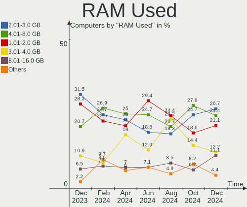

| Used GB    | Computers | Percent |
|------------|-----------|---------|
| 2.01-3.0   | 28        | 24.56%  |
| 4.01-8.0   | 27        | 23.68%  |
| 1.01-2.0   | 27        | 23.68%  |
| 3.01-4.0   | 20        | 17.54%  |
| 8.01-16.0  | 6         | 5.26%   |
| 16.01-24.0 | 3         | 2.63%   |
| 0.51-1.0   | 3         | 2.63%   |

Total Drives
------------

Number of drives on board

| Drives | Computers | Percent |
|--------|-----------|---------|
| 1      | 69        | 60.53%  |
| 2      | 26        | 22.81%  |
| 3      | 11        | 9.65%   |
| 4      | 8         | 7.02%   |

Has CD-ROM
----------

Has CD-ROM on board

| Presented | Computers | Percent |
|-----------|-----------|---------|
| No        | 76        | 66.67%  |
| Yes       | 38        | 33.33%  |

Has Ethernet
------------

Has Ethernet on board

| Presented | Computers | Percent |
|-----------|-----------|---------|
| Yes       | 91        | 79.82%  |
| No        | 23        | 20.18%  |

Has WiFi
--------

Has WiFi module

| Presented | Computers | Percent |
|-----------|-----------|---------|
| Yes       | 97        | 85.09%  |
| No        | 17        | 14.91%  |

Has Bluetooth
-------------

Has Bluetooth module

| Presented | Computers | Percent |
|-----------|-----------|---------|
| Yes       | 84        | 73.68%  |
| No        | 30        | 26.32%  |

Location
--------

Country
-------

Geographic location (country)

| Country     | Computers | Percent |
|-------------|-----------|---------|
| Netherlands | 114       | 100%    |

City
----

Geographic location (city)

| City        | Computers | Percent |
|-------------|-----------|---------|
| Amsterdam   | 18        | 15.79%  |
| Naaldwijk   | 6         | 5.26%   |
| Haarlem     | 4         | 3.51%   |
| Utrecht     | 3         | 2.63%   |
| Rotterdam   | 3         | 2.63%   |
| Leiden      | 3         | 2.63%   |
| Eindhoven   | 3         | 2.63%   |
| Tiel        | 2         | 1.75%   |
| The Hague   | 2         | 1.75%   |
| Ravenstein  | 2         | 1.75%   |
| Papendrecht | 2         | 1.75%   |
| Oldenzaal   | 2         | 1.75%   |
| Nijmegen    | 2         | 1.75%   |
| Maastricht  | 2         | 1.75%   |
| Heerenveen  | 2         | 1.75%   |
| Gouda       | 2         | 1.75%   |
| Deventer    | 2         | 1.75%   |
| Almelo      | 2         | 1.75%   |
| Aalten      | 2         | 1.75%   |
| Zoetermeer  | 1         | 0.88%   |
| Zeist       | 1         | 0.88%   |
| Winterswijk | 1         | 0.88%   |
| Warnsveld   | 1         | 0.88%   |
| Wageningen  | 1         | 0.88%   |
| Voorburg    | 1         | 0.88%   |
| Venlo       | 1         | 0.88%   |
| Vaals       | 1         | 0.88%   |
| Thorn       | 1         | 0.88%   |
| Strijen     | 1         | 0.88%   |
| Schiedam    | 1         | 0.88%   |
| Roosendaal  | 1         | 0.88%   |
| Roermond    | 1         | 0.88%   |
| Rijswijk    | 1         | 0.88%   |
| Rhenen      | 1         | 0.88%   |
| Oudemirdum  | 1         | 0.88%   |
| Odiliapeel  | 1         | 0.88%   |
| Nuenen      | 1         | 0.88%   |
| Noardburgum | 1         | 0.88%   |
| Meerkerk    | 1         | 0.88%   |
| Lelystad    | 1         | 0.88%   |

Drives
------

Drive Vendor
------------

Hard drive vendors

| Vendor                       | Computers | Drives | Percent |
|------------------------------|-----------|--------|---------|
| Samsung Electronics          | 40        | 53     | 25.16%  |
| Kingston                     | 15        | 15     | 9.43%   |
| Seagate                      | 11        | 12     | 6.92%   |
| WDC                          | 10        | 12     | 6.29%   |
| SK hynix                     | 10        | 10     | 6.29%   |
| Crucial                      | 9         | 10     | 5.66%   |
| SanDisk                      | 8         | 8      | 5.03%   |
| Intel                        | 7         | 8      | 4.4%    |
| Hitachi                      | 6         | 6      | 3.77%   |
| Toshiba                      | 4         | 4      | 2.52%   |
| Apple                        | 4         | 4      | 2.52%   |
| Unknown                      | 3         | 3      | 1.89%   |
| Unknown                      | 3         | 3      | 1.89%   |
| Phison Electronics           | 2         | 2      | 1.26%   |
| Micron/Crucial Technology    | 2         | 2      | 1.26%   |
| Micron Technology            | 2         | 3      | 1.26%   |
| KIOXIA                       | 2         | 2      | 1.26%   |
| Intenso                      | 2         | 2      | 1.26%   |
| GOODRAM                      | 2         | 2      | 1.26%   |
| A-DATA Technology            | 2         | 2      | 1.26%   |
| USB3.0                       | 1         | 1      | 0.63%   |
| Union Memory                 | 1         | 1      | 0.63%   |
| Shenzhen Longsys Electronics | 1         | 1      | 0.63%   |
| Phison                       | 1         | 1      | 0.63%   |
| Patriot                      | 1         | 1      | 0.63%   |
| Neo Forza                    | 1         | 1      | 0.63%   |
| Maxtor                       | 1         | 1      | 0.63%   |
| MASTERO                      | 1         | 1      | 0.63%   |
| LITEON                       | 1         | 1      | 0.63%   |
| KingFast                     | 1         | 1      | 0.63%   |
| JMicron Technology           | 1         | 1      | 0.63%   |
| JetFlash                     | 1         | 1      | 0.63%   |
| Gigabyte Technology          | 1         | 1      | 0.63%   |
| Fujitsu                      | 1         | 1      | 0.63%   |
| Fanxiang                     | 1         | 1      | 0.63%   |

Drive Model
-----------

Hard drive models

| Model                                               | Computers | Percent |
|-----------------------------------------------------|-----------|---------|
| Samsung SSD 870 EVO 500GB                           | 4         | 2.3%    |
| Samsung NVMe SSD Controller SM981/PM981/PM983 250GB | 4         | 2.3%    |
| Kingston SA400S37240G 240GB SSD                     | 4         | 2.3%    |
| Samsung NVMe SSD Controller PM9A1/PM9A3/980PRO 2TB  | 3         | 1.72%   |
| Unknown                                             | 3         | 1.72%   |
| SK hynix BC501 NVMe Solid State Drive 512GB         | 2         | 1.15%   |
| Samsung SSD 980 1TB                                 | 2         | 1.15%   |
| Samsung SSD 860 EVO 500GB                           | 2         | 1.15%   |
| Samsung NVMe SSD Controller SM961/PM961/SM963 256GB | 2         | 1.15%   |
| Samsung MZVLQ1T0HALB-00000 1024GB                   | 2         | 1.15%   |
| Samsung HD103SJ 1TB                                 | 2         | 1.15%   |
| Phison PS5013 E13 NVMe Controller 512GB             | 2         | 1.15%   |
| Kingston SKC600256G 256GB SSD                       | 2         | 1.15%   |
| Crucial CT120BX100SSD1 120GB                        | 2         | 1.15%   |
| WDC WDS240G2G0B-00EPW0 240GB SSD                    | 1         | 0.57%   |
| WDC WDS240G2G0A-00JH30 240GB SSD                    | 1         | 0.57%   |
| WDC WDS100T2B0B 1TB SSD                             | 1         | 0.57%   |
| WDC WD40EZRZ-00GXCB0 4TB                            | 1         | 0.57%   |
| WDC WD40EFRX-68WT0N0 4TB                            | 1         | 0.57%   |
| WDC WD30EZRZ-00GXCB0 3TB                            | 1         | 0.57%   |
| WDC WD20EZRZ-00Z5HB0 2TB                            | 1         | 0.57%   |
| WDC WD20EFAX-68FB5N0 2TB                            | 1         | 0.57%   |
| WDC WD10SPZX-24Z10 1TB                              | 1         | 0.57%   |
| WDC WD10EADS-65L5B1 1TB                             | 1         | 0.57%   |
| WDC WD100EMAZ-00WJTA0 10TB                          | 1         | 0.57%   |
| WDC PC SN520 SDAPNUW-512G-1014 512GB                | 1         | 0.57%   |
| USB3.0 Super Speed 500GB                            | 1         | 0.57%   |
| Unknown SD/MMC/MS PRO 128GB                         | 1         | 0.57%   |
| Unknown MMC Card  64GB                              | 1         | 0.57%   |
| Unknown MMC Card  32GB                              | 1         | 0.57%   |
| Union Memory UMIS RPJTJ512MEE1OWX 512GB             | 1         | 0.57%   |
| Toshiba XG6 NVMe SSD Controller 512GB               | 1         | 0.57%   |
| Toshiba MQ01ABD100 1TB                              | 1         | 0.57%   |
| Toshiba KSG60ZMV512G M.2 2280 512GB SSD             | 1         | 0.57%   |
| Toshiba DT01ACA050 500GB                            | 1         | 0.57%   |
| SK hynix SKHynix_HFS512GDE9X081N 512GB              | 1         | 0.57%   |
| SK hynix SKHynix_HFS001TEJ9X164N 1024GB             | 1         | 0.57%   |
| SK hynix SC311 SATA 256GB SSD                       | 1         | 0.57%   |
| SK hynix SC308 SATA 128GB SSD                       | 1         | 0.57%   |
| SK hynix PC611 NVMe 1TB                             | 1         | 0.57%   |

HDD Vendor
----------

Hard disk drive vendors

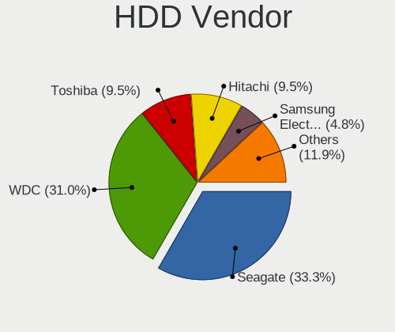

| Vendor              | Computers | Drives | Percent |
|---------------------|-----------|--------|---------|
| Seagate             | 9         | 10     | 26.47%  |
| WDC                 | 7         | 8      | 20.59%  |
| Hitachi             | 6         | 6      | 17.65%  |
| Samsung Electronics | 5         | 6      | 14.71%  |
| Toshiba             | 2         | 2      | 5.88%   |
| USB3.0              | 1         | 1      | 2.94%   |
| Unknown             | 1         | 1      | 2.94%   |
| Maxtor              | 1         | 1      | 2.94%   |
| Fujitsu             | 1         | 1      | 2.94%   |
| Apple               | 1         | 1      | 2.94%   |

SSD Vendor
----------

Solid state drive vendors

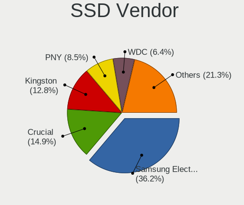

| Vendor              | Computers | Drives | Percent |
|---------------------|-----------|--------|---------|
| Samsung Electronics | 19        | 25     | 31.15%  |
| Kingston            | 12        | 12     | 19.67%  |
| Crucial             | 7         | 8      | 11.48%  |
| WDC                 | 3         | 3      | 4.92%   |
| Apple               | 3         | 3      | 4.92%   |
| SK hynix            | 2         | 2      | 3.28%   |
| GOODRAM             | 2         | 2      | 3.28%   |
| Toshiba             | 1         | 1      | 1.64%   |
| SanDisk             | 1         | 1      | 1.64%   |
| Phison              | 1         | 1      | 1.64%   |
| Patriot             | 1         | 1      | 1.64%   |
| Neo Forza           | 1         | 1      | 1.64%   |
| MASTERO             | 1         | 1      | 1.64%   |
| LITEON              | 1         | 1      | 1.64%   |
| KingFast            | 1         | 1      | 1.64%   |
| JMicron Technology  | 1         | 1      | 1.64%   |
| Intenso             | 1         | 1      | 1.64%   |
| Intel               | 1         | 1      | 1.64%   |
| A-DATA Technology   | 1         | 1      | 1.64%   |
| Unknown             | 1         | 1      | 1.64%   |

Drive Kind
----------

HDD or SSD

| Kind    | Computers | Drives | Percent |
|---------|-----------|--------|---------|
| NVMe    | 56        | 64     | 37.58%  |
| SSD     | 56        | 68     | 37.58%  |
| HDD     | 29        | 37     | 19.46%  |
| MMC     | 4         | 4      | 2.68%   |
| Unknown | 4         | 5      | 2.68%   |

Drive Connector
---------------

SATA, SAS, NVMe, etc.

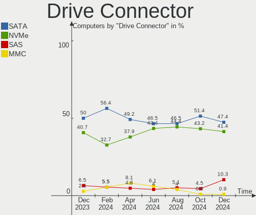

| Type | Computers | Drives | Percent |
|------|-----------|--------|---------|
| SATA | 67        | 98     | 48.55%  |
| NVMe | 56        | 64     | 40.58%  |
| SAS  | 11        | 12     | 7.97%   |
| MMC  | 4         | 4      | 2.9%    |

Drive Size
----------

Size of hard drive

| Size in TB | Computers | Drives | Percent |
|------------|-----------|--------|---------|
| 0.01-0.5   | 58        | 71     | 65.17%  |
| 0.51-1.0   | 19        | 20     | 21.35%  |
| 1.01-2.0   | 6         | 6      | 6.74%   |
| 3.01-4.0   | 3         | 5      | 3.37%   |
| 4.01-10.0  | 2         | 2      | 2.25%   |
| 2.01-3.0   | 1         | 1      | 1.12%   |

Space Total
-----------

Amount of disk space available on the file system

| Size in GB     | Computers | Percent |
|----------------|-----------|---------|
| 101-250        | 32        | 28.07%  |
| 251-500        | 19        | 16.67%  |
| 501-1000       | 16        | 14.04%  |
| 1001-2000      | 12        | 10.53%  |
| More than 3000 | 8         | 7.02%   |
| 51-100         | 7         | 6.14%   |
| Unknown        | 7         | 6.14%   |
| 2001-3000      | 5         | 4.39%   |
| 1-20           | 5         | 4.39%   |
| 21-50          | 3         | 2.63%   |

Space Used
----------

Amount of used disk space

| Used GB        | Computers | Percent |
|----------------|-----------|---------|
| 1-20           | 31        | 27.19%  |
| 21-50          | 28        | 24.56%  |
| 101-250        | 15        | 13.16%  |
| 501-1000       | 9         | 7.89%   |
| 1001-2000      | 8         | 7.02%   |
| 251-500        | 7         | 6.14%   |
| 51-100         | 7         | 6.14%   |
| Unknown        | 7         | 6.14%   |
| More than 3000 | 1         | 0.88%   |
| 2001-3000      | 1         | 0.88%   |

Malfunc. Drives
---------------

Drive models with a malfunction

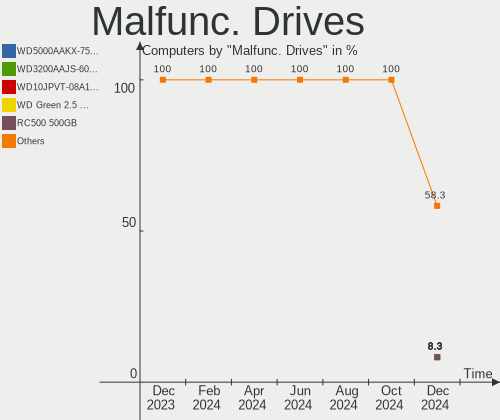

| Model                                          | Computers | Drives | Percent |
|------------------------------------------------|-----------|--------|---------|
| WDC WD20EZRZ-00Z5HB0 2TB                       | 1         | 1      | 8.33%   |
| Toshiba MQ01ABD100 1TB                         | 1         | 1      | 8.33%   |
| Seagate ST500LM000-SSHD-8GB                    | 1         | 1      | 8.33%   |
| Seagate ST3360320AS 360GB                      | 1         | 1      | 8.33%   |
| Seagate ST1000LM024 HN-M101MBB 1TB             | 1         | 1      | 8.33%   |
| Samsung Electronics SSD PM810 2.5 7mm 128GB    | 1         | 1      | 8.33%   |
| Samsung Electronics SSD 870 EVO 500GB          | 1         | 1      | 8.33%   |
| Samsung Electronics HD154UI 1TB                | 1         | 1      | 8.33%   |
| Micron/Crucial Technology P1 NVMe PCIe SSD 1TB | 1         | 1      | 8.33%   |
| Intel SSDMAEXC024G3H 24GB                      | 1         | 1      | 8.33%   |
| Crucial CT500MX500SSD1 500GB                   | 1         | 1      | 8.33%   |
| A-DATA Technology SX7000NP 128GB               | 1         | 1      | 8.33%   |

Malfunc. Drive Vendor
---------------------

Vendors of faulty drives

| Vendor                    | Computers | Drives | Percent |
|---------------------------|-----------|--------|---------|
| Seagate                   | 3         | 3      | 27.27%  |
| Samsung Electronics       | 2         | 3      | 18.18%  |
| WDC                       | 1         | 1      | 9.09%   |
| Toshiba                   | 1         | 1      | 9.09%   |
| Micron/Crucial Technology | 1         | 1      | 9.09%   |
| Intel                     | 1         | 1      | 9.09%   |
| Crucial                   | 1         | 1      | 9.09%   |
| A-DATA Technology         | 1         | 1      | 9.09%   |

Malfunc. HDD Vendor
-------------------

Vendors of faulty HDD drives

| Vendor              | Computers | Drives | Percent |
|---------------------|-----------|--------|---------|
| Seagate             | 3         | 3      | 50%     |
| WDC                 | 1         | 1      | 16.67%  |
| Toshiba             | 1         | 1      | 16.67%  |
| Samsung Electronics | 1         | 1      | 16.67%  |

Malfunc. Drive Kind
-------------------

Kinds of faulty drives

| Kind | Computers | Drives | Percent |
|------|-----------|--------|---------|
| HDD  | 6         | 6      | 54.55%  |
| SSD  | 3         | 4      | 27.27%  |
| NVMe | 2         | 2      | 18.18%  |

Failed Drives
-------------

Failed drive models

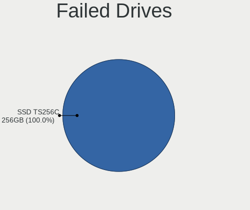

| Model                  | Computers | Drives | Percent |
|------------------------|-----------|--------|---------|
| Apple SSD TS256C 256GB | 1         | 1      | 100%    |

Failed Drive Vendor
-------------------

Failed drive vendors

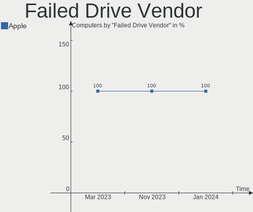

| Vendor | Computers | Drives | Percent |
|--------|-----------|--------|---------|
| Apple  | 1         | 1      | 100%    |

Drive Status
------------

Number of failed and malfunc. drives

| Status   | Computers | Drives | Percent |
|----------|-----------|--------|---------|
| Detected | 70        | 104    | 55.56%  |
| Works    | 46        | 61     | 36.51%  |
| Malfunc  | 9         | 12     | 7.14%   |
| Failed   | 1         | 1      | 0.79%   |

Storage controller
------------------

Storage Vendor
--------------

Storage controller vendors

| Vendor                       | Computers | Percent |
|------------------------------|-----------|---------|
| Intel                        | 73        | 46.2%   |
| Samsung Electronics          | 22        | 13.92%  |
| AMD                          | 19        | 12.03%  |
| SK hynix                     | 8         | 5.06%   |
| SanDisk                      | 8         | 5.06%   |
| Micron/Crucial Technology    | 4         | 2.53%   |
| ASMedia Technology           | 4         | 2.53%   |
| Phison Electronics           | 3         | 1.9%    |
| Kingston Technology Company  | 3         | 1.9%    |
| Toshiba America Info Systems | 2         | 1.27%   |
| Nvidia                       | 2         | 1.27%   |
| Micron Technology            | 2         | 1.27%   |
| KIOXIA                       | 2         | 1.27%   |
| Union Memory (Shenzhen)      | 1         | 0.63%   |
| Silicon Motion               | 1         | 0.63%   |
| Shenzhen Longsys Electronics | 1         | 0.63%   |
| Marvell Technology Group     | 1         | 0.63%   |
| JMicron Technology           | 1         | 0.63%   |
| HighPoint Technologies       | 1         | 0.63%   |

Storage Model
-------------

Storage controller models

| Model                                                                          | Computers | Percent |
|--------------------------------------------------------------------------------|-----------|---------|
| AMD FCH SATA Controller [AHCI mode]                                            | 13        | 7.65%   |
| Samsung NVMe SSD Controller 980 (DRAM-less)                                    | 8         | 4.71%   |
| Intel Volume Management Device NVMe RAID Controller                            | 7         | 4.12%   |
| Intel 8 Series/C220 Series Chipset Family 6-port SATA Controller 1 [AHCI mode] | 7         | 4.12%   |
| Intel Sunrise Point-LP SATA Controller [AHCI mode]                             | 6         | 3.53%   |
| Samsung NVMe SSD Controller SM981/PM981/PM983                                  | 5         | 2.94%   |
| Intel 82801 Mobile SATA Controller [RAID mode]                                 | 5         | 2.94%   |
| SK hynix Gold P31/BC711/PC711 NVMe Solid State Drive                           | 4         | 2.35%   |
| Samsung NVMe SSD Controller PM9A1/PM9A3/980PRO                                 | 4         | 2.35%   |
| Intel Volume Management Device NVMe RAID Controller Intel Corporation          | 4         | 2.35%   |
| Intel 82801IBM/IEM (ICH9M/ICH9M-E) 4 port SATA Controller [AHCI mode]          | 4         | 2.35%   |
| Intel 6 Series/C200 Series Chipset Family 6 port Mobile SATA AHCI Controller   | 4         | 2.35%   |
| ASMedia ASM1062 Serial ATA Controller                                          | 4         | 2.35%   |
| Samsung NVMe SSD Controller SM961/PM961/SM963                                  | 3         | 1.76%   |
| Phison PS5013-E13 PCIe3 NVMe Controller (DRAM-less)                            | 3         | 1.76%   |
| Micron/Crucial P2 [Nick P2] / P3 / P3 Plus NVMe PCIe SSD (DRAM-less)           | 3         | 1.76%   |
| Intel 8 Series SATA Controller 1 [AHCI mode]                                   | 3         | 1.76%   |
| Intel 6 Series/C200 Series Chipset Family 6 port Desktop SATA AHCI Controller  | 3         | 1.76%   |
| Intel 200 Series PCH SATA controller [AHCI mode]                               | 3         | 1.76%   |
| AMD 500 Series Chipset SATA Controller                                         | 3         | 1.76%   |
| SK hynix BC501 NVMe Solid State Drive                                          | 2         | 1.18%   |
| Kingston Company NV1 NVMe SSD SM2263XT                                         | 2         | 1.18%   |
| Intel Tiger Lake-LP SATA Controller                                            | 2         | 1.18%   |
| Intel SSD 660P Series                                                          | 2         | 1.18%   |
| Intel SSD 600P Series                                                          | 2         | 1.18%   |
| Intel Celeron N3350/Pentium N4200/Atom E3900 Series SATA AHCI Controller       | 2         | 1.18%   |
| Intel 7 Series Chipset Family 6-port SATA Controller [AHCI mode]               | 2         | 1.18%   |
| Intel 5 Series/3400 Series Chipset 6 port SATA AHCI Controller                 | 2         | 1.18%   |
| Intel 5 Series/3400 Series Chipset 4 port SATA AHCI Controller                 | 2         | 1.18%   |
| AMD 400 Series Chipset SATA Controller                                         | 2         | 1.18%   |
| Union Memory (Shenzhen) AM620 PCIe 3.0 NVMe SSD 512GB                          | 1         | 0.59%   |
| Toshiba America Info Systems XG6 NVMe SSD Controller                           | 1         | 0.59%   |
| Toshiba America Info Systems Toshiba America Info SATA controller              | 1         | 0.59%   |
| SK hynix PC611 NVMe Solid State Drive                                          | 1         | 0.59%   |
| SK hynix BC901 NVMe Solid State Drive (DRAM-less)                              | 1         | 0.59%   |
| Silicon Motion SM2260 NVMe SSD Controller                                      | 1         | 0.59%   |
| Shenzhen Longsys Non-Volatile memory controller                                | 1         | 0.59%   |
| SanDisk WD PC SN810 / Black SN850 NVMe SSD                                     | 1         | 0.59%   |
| SanDisk WD Blue SN500 / PC SN520 x2 M.2 2280 NVMe SSD                          | 1         | 0.59%   |
| Sandisk WD Black SN850X NVMe SSD                                               | 1         | 0.59%   |

Storage Kind
------------

Kind of storage controller (IDE, SATA, NVMe, SAS, ...)

| Kind | Computers | Percent |
|------|-----------|---------|
| SATA | 74        | 47.74%  |
| NVMe | 56        | 36.13%  |
| RAID | 19        | 12.26%  |
| IDE  | 6         | 3.87%   |

Processor
---------

CPU Vendor
----------

Processor vendors

| Vendor | Computers | Percent |
|--------|-----------|---------|
| Intel  | 85        | 74.56%  |
| AMD    | 28        | 24.56%  |
| ARM    | 1         | 0.88%   |

CPU Model
---------

Processor models

| Model                                       | Computers | Percent |
|---------------------------------------------|-----------|---------|
| Intel 11th Gen Core i7-1185G7 @ 3.00GHz     | 3         | 2.63%   |
| Intel Core i7-8700 CPU @ 3.20GHz            | 2         | 1.75%   |
| Intel Core i7-8650U CPU @ 1.90GHz           | 2         | 1.75%   |
| Intel Core i7-7700HQ CPU @ 2.80GHz          | 2         | 1.75%   |
| Intel Core i7-4700MQ CPU @ 2.40GHz          | 2         | 1.75%   |
| Intel Core i5-8250U CPU @ 1.60GHz           | 2         | 1.75%   |
| Intel Core i5-7300U CPU @ 2.60GHz           | 2         | 1.75%   |
| Intel Core i5-5200U CPU @ 2.20GHz           | 2         | 1.75%   |
| Intel 13th Gen Core i9-13900H               | 2         | 1.75%   |
| Intel 13th Gen Core i7-13700H               | 2         | 1.75%   |
| Intel 11th Gen Core i5-1135G7 @ 2.40GHz     | 2         | 1.75%   |
| AMD Ryzen 7 5700U with Radeon Graphics      | 2         | 1.75%   |
| AMD Ryzen 5 3600 6-Core Processor           | 2         | 1.75%   |
| Intel Xeon CPU E5620 @ 2.40GHz              | 1         | 0.88%   |
| Intel Pentium Dual-Core CPU T4200 @ 2.00GHz | 1         | 0.88%   |
| Intel Pentium CPU N4200 @ 1.10GHz           | 1         | 0.88%   |
| Intel Pentium CPU G630 @ 2.70GHz            | 1         | 0.88%   |
| Intel Pentium 3558U @ 1.70GHz               | 1         | 0.88%   |
| Intel Core i9-10900 CPU @ 2.80GHz           | 1         | 0.88%   |
| Intel Core i9-10885H CPU @ 2.40GHz          | 1         | 0.88%   |
| Intel Core i7-7700K CPU @ 4.20GHz           | 1         | 0.88%   |
| Intel Core i7-6820HQ CPU @ 2.70GHz          | 1         | 0.88%   |
| Intel Core i7-4770K CPU @ 3.50GHz           | 1         | 0.88%   |
| Intel Core i7-4750HQ CPU @ 2.00GHz          | 1         | 0.88%   |
| Intel Core i7-4702MQ CPU @ 2.20GHz          | 1         | 0.88%   |
| Intel Core i7-3630QM CPU @ 2.40GHz          | 1         | 0.88%   |
| Intel Core i7-2670QM CPU @ 2.20GHz          | 1         | 0.88%   |
| Intel Core i7-2600 CPU @ 3.40GHz            | 1         | 0.88%   |
| Intel Core i7-10510U CPU @ 1.80GHz          | 1         | 0.88%   |
| Intel Core i7 CPU Q 720 @ 1.60GHz           | 1         | 0.88%   |
| Intel Core i7 CPU M 640 @ 2.80GHz           | 1         | 0.88%   |
| Intel Core i7 CPU 870 @ 2.93GHz             | 1         | 0.88%   |
| Intel Core i5-9300H CPU @ 2.40GHz           | 1         | 0.88%   |
| Intel Core i5-8350U CPU @ 1.70GHz           | 1         | 0.88%   |
| Intel Core i5-7200U CPU @ 2.50GHz           | 1         | 0.88%   |
| Intel Core i5-6500 CPU @ 3.20GHz            | 1         | 0.88%   |
| Intel Core i5-5675R CPU @ 3.10GHz           | 1         | 0.88%   |
| Intel Core i5-5250U CPU @ 1.60GHz           | 1         | 0.88%   |
| Intel Core i5-4670K CPU @ 3.40GHz           | 1         | 0.88%   |
| Intel Core i5-4570 CPU @ 3.20GHz            | 1         | 0.88%   |

CPU Model Family
----------------

Processor model prefix

| Model                   | Computers | Percent |
|-------------------------|-----------|---------|
| Intel Core i5           | 26        | 22.81%  |
| Other                   | 21        | 18.42%  |
| Intel Core i7           | 20        | 17.54%  |
| AMD Ryzen 5             | 9         | 7.89%   |
| AMD Ryzen 7             | 5         | 4.39%   |
| Intel Core i3           | 4         | 3.51%   |
| Intel Core 2 Duo        | 4         | 3.51%   |
| Intel Celeron           | 4         | 3.51%   |
| Intel Pentium           | 3         | 2.63%   |
| AMD Ryzen 9             | 3         | 2.63%   |
| Intel Core i9           | 2         | 1.75%   |
| AMD Ryzen 5 PRO         | 2         | 1.75%   |
| AMD A6                  | 2         | 1.75%   |
| Intel Xeon              | 1         | 0.88%   |
| Intel Pentium Dual-Core | 1         | 0.88%   |
| Intel Core 2 Solo       | 1         | 0.88%   |
| AMD Ryzen 7 PRO         | 1         | 0.88%   |
| AMD Phenom II X4        | 1         | 0.88%   |
| AMD E1                  | 1         | 0.88%   |
| AMD Athlon II X2        | 1         | 0.88%   |
| AMD A8                  | 1         | 0.88%   |
| AMD A10                 | 1         | 0.88%   |

CPU Cores
---------

Number of processor cores

| Number | Computers | Percent |
|--------|-----------|---------|
| 4      | 39        | 34.21%  |
| 2      | 33        | 28.95%  |
| 6      | 14        | 12.28%  |
| 8      | 10        | 8.77%   |
| 14     | 7         | 6.14%   |
| 12     | 4         | 3.51%   |
| 10     | 2         | 1.75%   |
| 1      | 2         | 1.75%   |
| 24     | 1         | 0.88%   |
| 16     | 1         | 0.88%   |
| 3      | 1         | 0.88%   |

CPU Sockets
-----------

Number of sockets

| Number | Computers | Percent |
|--------|-----------|---------|
| 1      | 112       | 98.25%  |
| 3      | 1         | 0.88%   |
| 2      | 1         | 0.88%   |

CPU Threads
-----------

Threads per core (Hyper-Threading)

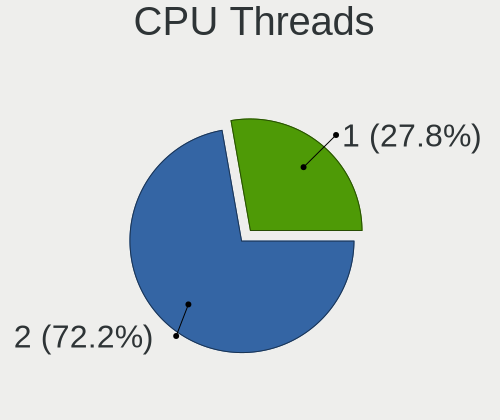

| Number | Computers | Percent |
|--------|-----------|---------|
| 2      | 86        | 75.44%  |
| 1      | 28        | 24.56%  |

CPU Op-Modes
------------

CPU Operation Modes (32-bit, 64-bit)

| Op mode        | Computers | Percent |
|----------------|-----------|---------|
| 32-bit, 64-bit | 114       | 100%    |

CPU Microcode
-------------

Microcode number

| Number     | Computers | Percent |
|------------|-----------|---------|
| Unknown    | 81        | 71.05%  |
| 0x306c3    | 3         | 2.63%   |
| 0x08600106 | 3         | 2.63%   |
| 0x806ea    | 2         | 1.75%   |
| 0x08701021 | 2         | 1.75%   |
| 0x08608103 | 2         | 1.75%   |
| 0xb06a2    | 1         | 0.88%   |
| 0x906e9    | 1         | 0.88%   |
| 0x906a3    | 1         | 0.88%   |
| 0x806e9    | 1         | 0.88%   |
| 0x40651    | 1         | 0.88%   |
| 0x306d4    | 1         | 0.88%   |
| 0x20655    | 1         | 0.88%   |
| 0x1067a    | 1         | 0.88%   |
| 0x10676    | 1         | 0.88%   |
| 0x0a704103 | 1         | 0.88%   |
| 0x0a601206 | 1         | 0.88%   |
| 0x0a601203 | 1         | 0.88%   |
| 0x0a50000c | 1         | 0.88%   |
| 0x08701030 | 1         | 0.88%   |
| 0x08608102 | 1         | 0.88%   |
| 0x08600103 | 1         | 0.88%   |
| 0x08101016 | 1         | 0.88%   |
| 0x07030105 | 1         | 0.88%   |
| 0x06006118 | 1         | 0.88%   |
| 0x06001119 | 1         | 0.88%   |
| 0x05000119 | 1         | 0.88%   |

CPU Microarch
-------------

Microarchitecture

| Name             | Computers | Percent |
|------------------|-----------|---------|
| KabyLake         | 17        | 14.91%  |
| Unknown          | 14        | 12.28%  |
| Haswell          | 13        | 11.4%   |
| Zen 2            | 8         | 7.02%   |
| SandyBridge      | 8         | 7.02%   |
| Alderlake Hybrid | 8         | 7.02%   |
| TigerLake        | 5         | 4.39%   |
| Penryn           | 5         | 4.39%   |
| Zen 3            | 4         | 3.51%   |
| Broadwell        | 4         | 3.51%   |
| Westmere         | 3         | 2.63%   |
| Nehalem          | 3         | 2.63%   |
| IvyBridge        | 3         | 2.63%   |
| Skylake          | 2         | 1.75%   |
| K10              | 2         | 1.75%   |
| IceLake          | 2         | 1.75%   |
| Goldmont plus    | 2         | 1.75%   |
| Goldmont         | 2         | 1.75%   |
| CometLake        | 2         | 1.75%   |
| Zen              | 1         | 0.88%   |
| Steamroller      | 1         | 0.88%   |
| Puma             | 1         | 0.88%   |
| Piledriver       | 1         | 0.88%   |
| Excavator        | 1         | 0.88%   |
| Core             | 1         | 0.88%   |
| Bobcat           | 1         | 0.88%   |

Graphics
--------

GPU Vendor
----------

Vendors of graphics cards

| Vendor | Computers | Percent |
|--------|-----------|---------|
| Intel  | 63        | 48.09%  |
| AMD    | 36        | 27.48%  |
| Nvidia | 32        | 24.43%  |

GPU Model
---------

Graphics card models

| Model                                                                       | Computers | Percent |
|-----------------------------------------------------------------------------|-----------|---------|
| Intel Raptor Lake-P [Iris Xe Graphics]                                      | 6         | 4.51%   |
| Intel UHD Graphics 620                                                      | 5         | 3.76%   |
| Intel TigerLake-LP GT2 [Iris Xe Graphics]                                   | 5         | 3.76%   |
| Intel 2nd Generation Core Processor Family Integrated Graphics Controller   | 5         | 3.76%   |
| Intel HD Graphics 620                                                       | 4         | 3.01%   |
| Intel Haswell-ULT Integrated Graphics Controller                            | 4         | 3.01%   |
| Intel 4th Gen Core Processor Integrated Graphics Controller                 | 4         | 3.01%   |
| Intel Alder Lake-P GT2 [Iris Xe Graphics]                                   | 3         | 2.26%   |
| AMD Renoir [Radeon RX Vega 6 (Ryzen 4000/5000 Mobile Series)]               | 3         | 2.26%   |
| AMD Lucienne                                                                | 3         | 2.26%   |
| AMD Ellesmere [Radeon RX 470/480/570/570X/580/580X/590]                     | 3         | 2.26%   |
| Nvidia GM107 [GeForce GTX 750 Ti]                                           | 2         | 1.5%    |
| Nvidia GK208M [GeForce GT 740M]                                             | 2         | 1.5%    |
| Nvidia GA107GLM [RTX A1000 6GB Laptop GPU]                                  | 2         | 1.5%    |
| Nvidia GA102 [GeForce RTX 3080 Lite Hash Rate]                              | 2         | 1.5%    |
| Intel Xeon E3-1200 v3/4th Gen Core Processor Integrated Graphics Controller | 2         | 1.5%    |
| Intel HD Graphics 5500                                                      | 2         | 1.5%    |
| Intel GeminiLake [UHD Graphics 600]                                         | 2         | 1.5%    |
| Intel CometLake-U GT2 [UHD Graphics]                                        | 2         | 1.5%    |
| Intel CoffeeLake-S GT2 [UHD Graphics 630]                                   | 2         | 1.5%    |
| AMD Phoenix1                                                                | 2         | 1.5%    |
| Nvidia TU117M [GeForce GTX 1650 Ti Mobile]                                  | 1         | 0.75%   |
| Nvidia TU117M [GeForce GTX 1650 Mobile / Max-Q]                             | 1         | 0.75%   |
| Nvidia TU117GLM [Quadro T2000 Mobile / Max-Q]                               | 1         | 0.75%   |
| Nvidia TU116 [GeForce GTX 1650]                                             | 1         | 0.75%   |
| Nvidia GT218M [NVS 3100M]                                                   | 1         | 0.75%   |
| Nvidia GT218 [GeForce 210]                                                  | 1         | 0.75%   |
| Nvidia GP108M [GeForce MX150]                                               | 1         | 0.75%   |
| Nvidia GP108 [GeForce GT 1030]                                              | 1         | 0.75%   |
| Nvidia GP106BM [GeForce GTX 1060 Mobile 6GB]                                | 1         | 0.75%   |
| Nvidia GP106 [GeForce GTX 1060 6GB]                                         | 1         | 0.75%   |
| Nvidia GP102 [GeForce GTX 1080 Ti]                                          | 1         | 0.75%   |
| Nvidia GN21-X11 [GeForce RTX 4090 Laptop GPU]                               | 1         | 0.75%   |
| Nvidia GM107GLM [Quadro M2000M]                                             | 1         | 0.75%   |
| Nvidia GK104 [GeForce GTX 770]                                              | 1         | 0.75%   |
| Nvidia GF119M [NVS 4200M]                                                   | 1         | 0.75%   |
| Nvidia GF114 [GeForce GTX 560 Ti]                                           | 1         | 0.75%   |
| Nvidia GF108M [GeForce GT 540M]                                             | 1         | 0.75%   |
| Nvidia GA107M [GeForce RTX 3050 Ti Mobile]                                  | 1         | 0.75%   |
| Nvidia GA104M [GeForce RTX 3070 Mobile / Max-Q]                             | 1         | 0.75%   |

GPU Combo
---------

Combinations of graphics cards

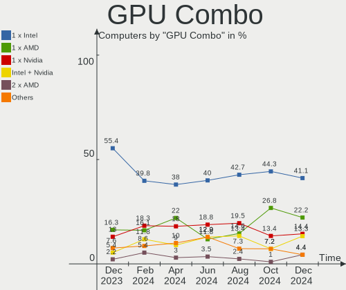

| Name           | Computers | Percent |
|----------------|-----------|---------|
| 1 x Intel      | 45        | 39.47%  |
| 1 x AMD        | 32        | 28.07%  |
| 1 x Nvidia     | 19        | 16.67%  |
| Intel + Nvidia | 11        | 9.65%   |
| 2 x Intel      | 2         | 1.75%   |
| Intel + AMD    | 2         | 1.75%   |
| AMD + Nvidia   | 2         | 1.75%   |
| Other          | 1         | 0.88%   |

GPU Driver
----------

Free vs proprietary

| Driver      | Computers | Percent |
|-------------|-----------|---------|
| Free        | 98        | 85.96%  |
| Proprietary | 13        | 11.4%   |
| Unknown     | 3         | 2.63%   |

GPU Memory
----------

Total video memory

| Size in GB | Computers | Percent |
|------------|-----------|---------|
| Unknown    | 76        | 66.67%  |
| 1.01-2.0   | 8         | 7.02%   |
| 0.01-0.5   | 8         | 7.02%   |
| 3.01-4.0   | 7         | 6.14%   |
| 7.01-8.0   | 6         | 5.26%   |
| 0.51-1.0   | 5         | 4.39%   |
| 8.01-16.0  | 3         | 2.63%   |
| 5.01-6.0   | 1         | 0.88%   |

Monitor
-------

Monitor Vendor
--------------

Monitor vendors

| Vendor                  | Computers | Percent |
|-------------------------|-----------|---------|
| AU Optronics            | 19        | 14.84%  |
| BOE                     | 14        | 10.94%  |
| Samsung Electronics     | 13        | 10.16%  |
| LG Display              | 9         | 7.03%   |
| Chimei Innolux          | 9         | 7.03%   |
| Hewlett-Packard         | 8         | 6.25%   |
| Apple                   | 7         | 5.47%   |
| Goldstar                | 6         | 4.69%   |
| AOC                     | 6         | 4.69%   |
| Dell                    | 5         | 3.91%   |
| Sharp                   | 4         | 3.13%   |
| Philips                 | 4         | 3.13%   |
| Iiyama                  | 4         | 3.13%   |
| BenQ                    | 4         | 3.13%   |
| Chi Mei Optoelectronics | 3         | 2.34%   |
| Medion                  | 2         | 1.56%   |
| Acer                    | 2         | 1.56%   |
| Valve                   | 1         | 0.78%   |
| MSI                     | 1         | 0.78%   |
| LG Philips              | 1         | 0.78%   |
| InfoVision              | 1         | 0.78%   |
| HUAWEI                  | 1         | 0.78%   |
| Fujitsu Siemens         | 1         | 0.78%   |
| CASIO                   | 1         | 0.78%   |
| ASUSTek Computer        | 1         | 0.78%   |
| Unknown                 | 1         | 0.78%   |

Monitor Model
-------------

Monitor models

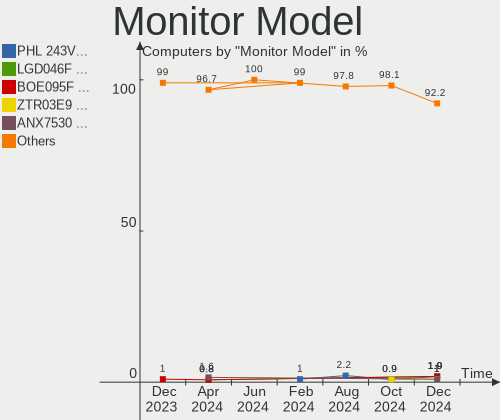

| Model                                                                 | Computers | Percent |
|-----------------------------------------------------------------------|-----------|---------|
| Samsung Electronics LCD Monitor SEC504B 1600x900 382x215mm 17.3-inch  | 2         | 1.53%   |
| Hewlett-Packard 24f HPN3545 1920x1080 527x296mm 23.8-inch             | 2         | 1.53%   |
| Chimei Innolux LCD Monitor CMN1618 1920x1200 344x215mm 16.0-inch      | 2         | 1.53%   |
| BOE LCD Monitor BOE06CB 1920x1080 344x194mm 15.5-inch                 | 2         | 1.53%   |
| AU Optronics LCD Monitor AUO623D 1920x1080 309x174mm 14.0-inch        | 2         | 1.53%   |
| AOC 2490W1 AOC2490 1920x1080 527x296mm 23.8-inch                      | 2         | 1.53%   |
| Valve ANX7530 U VLV3001 800x1280 100x150mm 7.1-inch                   | 1         | 0.76%   |
| Sharp LQ134N1JW52 SHP151E 1920x1200 288x180mm 13.4-inch               | 1         | 0.76%   |
| Sharp LCD SHP1023 1360x768                                            | 1         | 0.76%   |
| Sharp LCD Monitor SHP1548 1920x1200 288x180mm 13.4-inch               | 1         | 0.76%   |
| Sharp LCD Monitor SHP14D0 3840x2400 336x210mm 15.6-inch               | 1         | 0.76%   |
| Samsung Electronics SyncMaster SAM0017 1024x768 304x228mm 15.0-inch   | 1         | 0.76%   |
| Samsung Electronics SMS19A100 SAM0867 1366x768 410x230mm 18.5-inch    | 1         | 0.76%   |
| Samsung Electronics S24R65x SAM1023 1920x1080 530x300mm 24.0-inch     | 1         | 0.76%   |
| Samsung Electronics S24F350 SAM0D20 1920x1080 521x293mm 23.5-inch     | 1         | 0.76%   |
| Samsung Electronics LU28R55 SAM1019 3840x2160 632x360mm 28.6-inch     | 1         | 0.76%   |
| Samsung Electronics LU28R55 SAM1017 3840x2160 632x360mm 28.6-inch     | 1         | 0.76%   |
| Samsung Electronics LCD Monitor SEC3245 1366x768 344x194mm 15.5-inch  | 1         | 0.76%   |
| Samsung Electronics LCD Monitor SEC304C 1366x768 353x198mm 15.9-inch  | 1         | 0.76%   |
| Samsung Electronics LCD Monitor SDC4852 1366x768 344x194mm 15.5-inch  | 1         | 0.76%   |
| Samsung Electronics LCD Monitor SDC416E 2880x1620 344x194mm 15.5-inch | 1         | 0.76%   |
| Samsung Electronics LCD Monitor SDC3959 1920x1080 293x165mm 13.2-inch | 1         | 0.76%   |
| Samsung Electronics LC27G7xT SAM105E 2560x1440 597x336mm 27.0-inch    | 1         | 0.76%   |
| Philips PHL 499P9 PHL092A 3840x1080 1193x336mm 48.8-inch              | 1         | 0.76%   |
| Philips PHL 246B1 PHL0972 2560x1440 527x296mm 23.8-inch               | 1         | 0.76%   |
| Philips PHL 245B1 PHL094C 2560x1440 530x300mm 24.0-inch               | 1         | 0.76%   |
| Philips PHL 241V8 PHLC212 1920x1080 527x296mm 23.8-inch               | 1         | 0.76%   |
| Philips 273ELH PHLC07D 1920x1080 598x336mm 27.0-inch                  | 1         | 0.76%   |
| MSI MAG241CR MSI3EA2 1920x1080 520x290mm 23.4-inch                    | 1         | 0.76%   |
| Medion MD 20889 MED3688 1920x1080 509x286mm 23.0-inch                 | 1         | 0.76%   |
| Medion MD 20144 MED3635 1920x1080 521x293mm 23.5-inch                 | 1         | 0.76%   |
| LG Philips LCD Monitor LPLBD00 1280x800 331x207mm 15.4-inch           | 1         | 0.76%   |
| LG Display LCD Monitor LGDD801 1366x768 344x194mm 15.5-inch           | 1         | 0.76%   |
| LG Display LCD Monitor LGD40A0 1366x768 310x174mm 14.0-inch           | 1         | 0.76%   |
| LG Display LCD Monitor LGD0676 1920x1080 309x174mm 14.0-inch          | 1         | 0.76%   |
| LG Display LCD Monitor LGD05F1 1920x1080 309x174mm 14.0-inch          | 1         | 0.76%   |
| LG Display LCD Monitor LGD05EC 1920x1080 309x174mm 14.0-inch          | 1         | 0.76%   |
| LG Display LCD Monitor LGD03DD 1366x768 344x194mm 15.5-inch           | 1         | 0.76%   |
| LG Display LCD Monitor LGD0306 1600x900 310x174mm 14.0-inch           | 1         | 0.76%   |
| LG Display LCD Monitor LGD02DF 1600x900 310x174mm 14.0-inch           | 1         | 0.76%   |

Monitor Resolution
------------------

Monitor screen resolution

| Resolution         | Computers | Percent |
|--------------------|-----------|---------|
| 1920x1080 (FHD)    | 46        | 37.7%   |
| 1366x768 (WXGA)    | 14        | 11.48%  |
| 3840x2160 (4K)     | 12        | 9.84%   |
| 2560x1440 (QHD)    | 10        | 8.2%    |
| 1600x900 (HD+)     | 10        | 8.2%    |
| 1920x1200 (WUXGA)  | 9         | 7.38%   |
| 3440x1440          | 3         | 2.46%   |
| 2880x1800          | 2         | 1.64%   |
| 1680x1050 (WSXGA+) | 2         | 1.64%   |
| 1440x900 (WXGA+)   | 2         | 1.64%   |
| 1280x800 (WXGA)    | 2         | 1.64%   |
| 1280x1024 (SXGA)   | 2         | 1.64%   |
| 800x1280           | 1         | 0.82%   |
| 3840x2400          | 1         | 0.82%   |
| 3840x1600          | 1         | 0.82%   |
| 3840x1080          | 1         | 0.82%   |
| 2880x1620          | 1         | 0.82%   |
| 2256x1504          | 1         | 0.82%   |
| 1360x768           | 1         | 0.82%   |
| 1024x768 (XGA)     | 1         | 0.82%   |

Monitor Diagonal
----------------

Diagonal size in inches

| Inches  | Computers | Percent |
|---------|-----------|---------|
| 15      | 27        | 20.61%  |
| 14      | 17        | 12.98%  |
| 27      | 14        | 10.69%  |
| 24      | 10        | 7.63%   |
| 23      | 10        | 7.63%   |
| 13      | 10        | 7.63%   |
| 17      | 8         | 6.11%   |
| 16      | 5         | 3.82%   |
| 21      | 4         | 3.05%   |
| Unknown | 4         | 3.05%   |
| 34      | 3         | 2.29%   |
| 11      | 3         | 2.29%   |
| 31      | 2         | 1.53%   |
| 28      | 2         | 1.53%   |
| 19      | 2         | 1.53%   |
| 59      | 1         | 0.76%   |
| 48      | 1         | 0.76%   |
| 37      | 1         | 0.76%   |
| 36      | 1         | 0.76%   |
| 26      | 1         | 0.76%   |
| 22      | 1         | 0.76%   |
| 20      | 1         | 0.76%   |
| 18      | 1         | 0.76%   |
| 12      | 1         | 0.76%   |
| 7       | 1         | 0.76%   |

Monitor Width
-------------

Physical width

| Width in mm | Computers | Percent |
|-------------|-----------|---------|
| 301-350     | 49        | 38.58%  |
| 501-600     | 29        | 22.83%  |
| 201-300     | 12        | 9.45%   |
| 351-400     | 11        | 8.66%   |
| 601-700     | 7         | 5.51%   |
| 401-500     | 7         | 5.51%   |
| 701-800     | 4         | 3.15%   |
| Unknown     | 4         | 3.15%   |
| 1001-1500   | 2         | 1.57%   |
| 801-900     | 1         | 0.79%   |
| 1-100       | 1         | 0.79%   |

Aspect Ratio
------------

Proportional relationship between the width and the height

| Ratio   | Computers | Percent |
|---------|-----------|---------|
| 16/9    | 86        | 73.5%   |
| 16/10   | 17        | 14.53%  |
| 21/9    | 4         | 3.42%   |
| Unknown | 3         | 2.56%   |
| 5/4     | 2         | 1.71%   |
| 4/3     | 2         | 1.71%   |
| 32/9    | 1         | 0.85%   |
| 3/2     | 1         | 0.85%   |
| 0.67    | 1         | 0.85%   |

Monitor Area
------------

Area in inch

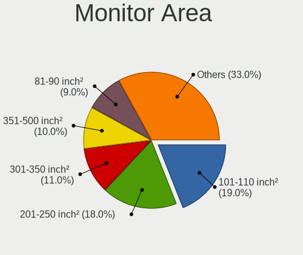

| Area in inch | Computers | Percent |
|----------------|-----------|---------|
| 101-110        | 27        | 21.26%  |
| 81-90          | 21        | 16.54%  |
| 201-250        | 19        | 14.96%  |
| 301-350        | 15        | 11.81%  |
| 121-130        | 8         | 6.3%    |
| 351-500        | 7         | 5.51%   |
| 71-80          | 6         | 4.72%   |
| 111-120        | 5         | 3.94%   |
| 151-200        | 4         | 3.15%   |
| Unknown        | 4         | 3.15%   |
| 51-60          | 3         | 2.36%   |
| 501-1000       | 3         | 2.36%   |
| More than 1000 | 1         | 0.79%   |
| 61-70          | 1         | 0.79%   |
| 1-40           | 1         | 0.79%   |
| 251-300        | 1         | 0.79%   |
| 141-150        | 1         | 0.79%   |

Pixel Density
-------------

Pixels per inch

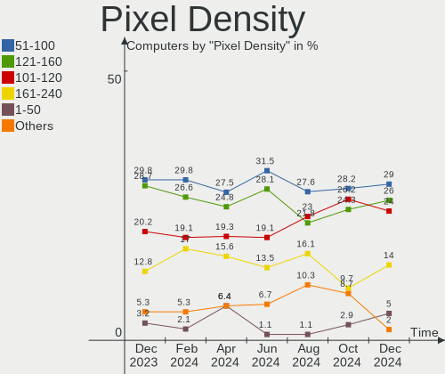

| Density       | Computers | Percent |
|---------------|-----------|---------|
| 121-160       | 44        | 35.48%  |
| 51-100        | 31        | 25%     |
| 101-120       | 26        | 20.97%  |
| 161-240       | 16        | 12.9%   |
| Unknown       | 4         | 3.23%   |
| More than 240 | 2         | 1.61%   |
| 1-50          | 1         | 0.81%   |

Multiple Monitors
-----------------

Total monitors connected

| Total | Computers | Percent |
|-------|-----------|---------|
| 1     | 88        | 77.19%  |
| 2     | 18        | 15.79%  |
| 0     | 5         | 4.39%   |
| 3     | 3         | 2.63%   |

Network
-------

Net Controller Vendor
---------------------

Controller vendors

| Vendor                                | Computers | Percent |
|---------------------------------------|-----------|---------|
| Intel                                 | 58        | 33.72%  |
| Realtek Semiconductor                 | 54        | 31.4%   |
| Qualcomm Atheros                      | 17        | 9.88%   |
| Broadcom                              | 17        | 9.88%   |
| MediaTek                              | 6         | 3.49%   |
| Broadcom Limited                      | 4         | 2.33%   |
| Qualcomm                              | 2         | 1.16%   |
| Nvidia                                | 2         | 1.16%   |
| Lenovo                                | 2         | 1.16%   |
| Ralink                                | 1         | 0.58%   |
| Qualcomm Atheros Communications       | 1         | 0.58%   |
| QinHeng Electronics                   | 1         | 0.58%   |
| Marvell Technology Group              | 1         | 0.58%   |
| Hewlett-Packard                       | 1         | 0.58%   |
| Google                                | 1         | 0.58%   |
| DisplayLink                           | 1         | 0.58%   |
| Dell                                  | 1         | 0.58%   |
| Aquantia                              | 1         | 0.58%   |
| 802.11g Adapter [Linksys WUSB54GC v3] | 1         | 0.58%   |

Net Controller Model
--------------------

Controller models

| Model                                                                | Computers | Percent |
|----------------------------------------------------------------------|-----------|---------|
| Realtek RTL8111/8168/8411 PCI Express Gigabit Ethernet Controller    | 34        | 17.09%  |
| Realtek RTL8153 Gigabit Ethernet Adapter                             | 6         | 3.02%   |
| Intel Wireless 8265 / 8275                                           | 5         | 2.51%   |
| Realtek RTL8125 2.5GbE Controller                                    | 4         | 2.01%   |
| Intel Wi-Fi 6 AX201                                                  | 4         | 2.01%   |
| Intel Raptor Lake PCH CNVi WiFi                                      | 4         | 2.01%   |
| Intel Ethernet Connection (4) I219-LM                                | 4         | 2.01%   |
| Realtek RTL8822CE 802.11ac PCIe Wireless Network Adapter             | 3         | 1.51%   |
| Realtek RTL8821CE 802.11ac PCIe Wireless Network Adapter             | 3         | 1.51%   |
| Realtek RTL810xE PCI Express Fast Ethernet controller                | 3         | 1.51%   |
| Qualcomm Atheros QCA6174 802.11ac Wireless Network Adapter           | 3         | 1.51%   |
| Qualcomm Atheros AR9485 Wireless Network Adapter                     | 3         | 1.51%   |
| MediaTek MT7922 802.11ax PCI Express Wireless Network Adapter        | 3         | 1.51%   |
| Intel Wireless 7265                                                  | 3         | 1.51%   |
| Intel Wi-Fi 6 AX200                                                  | 3         | 1.51%   |
| Intel Centrino Ultimate-N 6300                                       | 3         | 1.51%   |
| Intel Alder Lake-P PCH CNVi WiFi                                     | 3         | 1.51%   |
| Intel 82579LM Gigabit Network Connection (Lewisville)                | 3         | 1.51%   |
| Qualcomm Atheros AR93xx Wireless Network Adapter                     | 2         | 1.01%   |
| MediaTek MT7921 802.11ax PCI Express Wireless Network Adapter        | 2         | 1.01%   |
| Intel Wireless 8260                                                  | 2         | 1.01%   |
| Intel Tiger Lake PCH CNVi WiFi                                       | 2         | 1.01%   |
| Intel Gemini Lake PCH CNVi WiFi                                      | 2         | 1.01%   |
| Intel Ethernet Controller I225-V                                     | 2         | 1.01%   |
| Intel Ethernet Connection (2) I219-V                                 | 2         | 1.01%   |
| Intel Comet Lake PCH-LP CNVi WiFi                                    | 2         | 1.01%   |
| Intel Centrino Advanced-N 6205 [Taylor Peak]                         | 2         | 1.01%   |
| Intel 82574L Gigabit Network Connection                              | 2         | 1.01%   |
| Intel 700 Series Chipset Family Wi-Fi                                | 2         | 1.01%   |
| Broadcom NetXtreme BCM57765 Gigabit Ethernet PCIe                    | 2         | 1.01%   |
| Broadcom Limited BCM4360 802.11ac Dual Band Wireless Network Adapter | 2         | 1.01%   |
| Broadcom BCM43602 802.11ac Wireless LAN SoC                          | 2         | 1.01%   |
| Broadcom BCM4360 802.11ac Dual Band Wireless Network Adapter         | 2         | 1.01%   |
| Broadcom BCM43228 802.11a/b/g/n                                      | 2         | 1.01%   |
| Broadcom BCM43142 802.11b/g/n                                        | 2         | 1.01%   |
| Realtek USB 10/100/1G/2.5G LAN                                       | 1         | 0.5%    |
| Realtek RTL88x2bu [AC1200 Techkey]                                   | 1         | 0.5%    |
| Realtek RTL8852BE PCIe 802.11ax Wireless Network Controller          | 1         | 0.5%    |
| Realtek RTL8723BU 802.11b/g/n WLAN Adapter                           | 1         | 0.5%    |
| Realtek RTL8723AE PCIe Wireless Network Adapter                      | 1         | 0.5%    |

Wireless Vendor
---------------

Wireless vendors

| Vendor                                | Computers | Percent |
|---------------------------------------|-----------|---------|
| Intel                                 | 48        | 48.48%  |
| Qualcomm Atheros                      | 13        | 13.13%  |
| Realtek Semiconductor                 | 12        | 12.12%  |
| Broadcom                              | 11        | 11.11%  |
| MediaTek                              | 6         | 6.06%   |
| Broadcom Limited                      | 3         | 3.03%   |
| Qualcomm                              | 2         | 2.02%   |
| Ralink                                | 1         | 1.01%   |
| Qualcomm Atheros Communications       | 1         | 1.01%   |
| Dell                                  | 1         | 1.01%   |
| 802.11g Adapter [Linksys WUSB54GC v3] | 1         | 1.01%   |

Wireless Model
--------------

Wireless models

| Model                                                                   | Computers | Percent |
|-------------------------------------------------------------------------|-----------|---------|
| Intel Wireless 8265 / 8275                                              | 5         | 5%      |
| Intel Wi-Fi 6 AX201                                                     | 4         | 4%      |
| Intel Raptor Lake PCH CNVi WiFi                                         | 4         | 4%      |
| Realtek RTL8822CE 802.11ac PCIe Wireless Network Adapter                | 3         | 3%      |
| Realtek RTL8821CE 802.11ac PCIe Wireless Network Adapter                | 3         | 3%      |
| Qualcomm Atheros QCA6174 802.11ac Wireless Network Adapter              | 3         | 3%      |
| Qualcomm Atheros AR9485 Wireless Network Adapter                        | 3         | 3%      |
| MediaTek MT7922 802.11ax PCI Express Wireless Network Adapter           | 3         | 3%      |
| Intel Wireless 7265                                                     | 3         | 3%      |
| Intel Wi-Fi 6 AX200                                                     | 3         | 3%      |
| Intel Centrino Ultimate-N 6300                                          | 3         | 3%      |
| Intel Alder Lake-P PCH CNVi WiFi                                        | 3         | 3%      |
| Qualcomm Atheros AR93xx Wireless Network Adapter                        | 2         | 2%      |
| MediaTek MT7921 802.11ax PCI Express Wireless Network Adapter           | 2         | 2%      |
| Intel Wireless 8260                                                     | 2         | 2%      |
| Intel Tiger Lake PCH CNVi WiFi                                          | 2         | 2%      |
| Intel Gemini Lake PCH CNVi WiFi                                         | 2         | 2%      |
| Intel Comet Lake PCH-LP CNVi WiFi                                       | 2         | 2%      |
| Intel Centrino Advanced-N 6205 [Taylor Peak]                            | 2         | 2%      |
| Intel 700 Series Chipset Family Wi-Fi                                   | 2         | 2%      |
| Broadcom Limited BCM4360 802.11ac Dual Band Wireless Network Adapter    | 2         | 2%      |
| Broadcom BCM43602 802.11ac Wireless LAN SoC                             | 2         | 2%      |
| Broadcom BCM4360 802.11ac Dual Band Wireless Network Adapter            | 2         | 2%      |
| Broadcom BCM43228 802.11a/b/g/n                                         | 2         | 2%      |
| Broadcom BCM43142 802.11b/g/n                                           | 2         | 2%      |
| Realtek RTL88x2bu [AC1200 Techkey]                                      | 1         | 1%      |
| Realtek RTL8852BE PCIe 802.11ax Wireless Network Controller             | 1         | 1%      |
| Realtek RTL8723BU 802.11b/g/n WLAN Adapter                              | 1         | 1%      |
| Realtek RTL8723AE PCIe Wireless Network Adapter                         | 1         | 1%      |
| Realtek RTL8192CU 802.11n WLAN Adapter                                  | 1         | 1%      |
| Realtek RTL8188CUS 802.11n WLAN Adapter                                 | 1         | 1%      |
| Ralink RT2790 Wireless 802.11n 1T/2R PCIe                               | 1         | 1%      |
| Qualcomm QCNFA765 Wireless Network Adapter                              | 1         | 1%      |
| Qualcomm QCA6390 Wireless Network Adapter                               | 1         | 1%      |
| Qualcomm Atheros QCA9565 / AR9565 Wireless Network Adapter              | 1         | 1%      |
| Qualcomm Atheros QCA9377 802.11ac Wireless Network Adapter              | 1         | 1%      |
| Qualcomm Atheros QCA6164 802.11ac Wireless Network Adapter              | 1         | 1%      |
| Qualcomm Atheros AR9271 802.11n                                         | 1         | 1%      |
| Qualcomm Atheros AR9287 Wireless Network Adapter (PCI-Express)          | 1         | 1%      |
| Qualcomm Atheros AR242x / AR542x Wireless Network Adapter (PCI-Express) | 1         | 1%      |

Ethernet Vendor
---------------

Ethernet vendors

| Vendor                   | Computers | Percent |
|--------------------------|-----------|---------|
| Realtek Semiconductor    | 48        | 50.53%  |
| Intel                    | 25        | 26.32%  |
| Broadcom                 | 7         | 7.37%   |
| Qualcomm Atheros         | 5         | 5.26%   |
| Nvidia                   | 2         | 2.11%   |
| Lenovo                   | 2         | 2.11%   |
| Marvell Technology Group | 1         | 1.05%   |
| Hewlett-Packard          | 1         | 1.05%   |
| Google                   | 1         | 1.05%   |
| DisplayLink              | 1         | 1.05%   |
| Broadcom Limited         | 1         | 1.05%   |
| Aquantia                 | 1         | 1.05%   |

Ethernet Model
--------------

Ethernet models

| Model                                                             | Computers | Percent |
|-------------------------------------------------------------------|-----------|---------|
| Realtek RTL8111/8168/8411 PCI Express Gigabit Ethernet Controller | 34        | 35.05%  |
| Realtek RTL8153 Gigabit Ethernet Adapter                          | 6         | 6.19%   |
| Realtek RTL8125 2.5GbE Controller                                 | 4         | 4.12%   |
| Intel Ethernet Connection (4) I219-LM                             | 4         | 4.12%   |
| Realtek RTL810xE PCI Express Fast Ethernet controller             | 3         | 3.09%   |
| Intel 82579LM Gigabit Network Connection (Lewisville)             | 3         | 3.09%   |
| Intel Ethernet Controller I225-V                                  | 2         | 2.06%   |
| Intel Ethernet Connection (2) I219-V                              | 2         | 2.06%   |
| Intel 82574L Gigabit Network Connection                           | 2         | 2.06%   |
| Broadcom NetXtreme BCM57765 Gigabit Ethernet PCIe                 | 2         | 2.06%   |
| Realtek USB 10/100/1G/2.5G LAN                                    | 1         | 1.03%   |
| Realtek Killer E3000 2.5GbE Controller                            | 1         | 1.03%   |
| Qualcomm Atheros QCA8172 Fast Ethernet                            | 1         | 1.03%   |
| Qualcomm Atheros QCA8171 Gigabit Ethernet                         | 1         | 1.03%   |
| Qualcomm Atheros AR8161 Gigabit Ethernet                          | 1         | 1.03%   |
| Qualcomm Atheros AR8151 v2.0 Gigabit Ethernet                     | 1         | 1.03%   |
| Qualcomm Atheros AR8131 Gigabit Ethernet                          | 1         | 1.03%   |
| Nvidia MCP79 Ethernet                                             | 1         | 1.03%   |
| Nvidia MCP61 Ethernet                                             | 1         | 1.03%   |
| Marvell Group 88E8057 PCI-E Gigabit Ethernet Controller           | 1         | 1.03%   |
| Lenovo ThinkPad TBT 3 Dock                                        | 1         | 1.03%   |
| Lenovo ThinkPad Lan                                               | 1         | 1.03%   |
| Intel I211 Gigabit Network Connection                             | 1         | 1.03%   |
| Intel Ethernet Connection I219-LM                                 | 1         | 1.03%   |
| Intel Ethernet Connection I218-LM                                 | 1         | 1.03%   |
| Intel Ethernet Connection I217-V                                  | 1         | 1.03%   |
| Intel Ethernet Connection I217-LM                                 | 1         | 1.03%   |
| Intel Ethernet Connection (6) I219-LM                             | 1         | 1.03%   |
| Intel Ethernet Connection (3) I218-LM                             | 1         | 1.03%   |
| Intel Ethernet Connection (2) I219-LM                             | 1         | 1.03%   |
| Intel Ethernet Connection (14) I219-V                             | 1         | 1.03%   |
| Intel Ethernet Connection (11) I219-LM                            | 1         | 1.03%   |
| Intel Ethernet Connection (10) I219-V                             | 1         | 1.03%   |
| Intel 82579V Gigabit Network Connection                           | 1         | 1.03%   |
| Intel 82577LM Gigabit Network Connection                          | 1         | 1.03%   |
| HP lt4120 Snapdragon X5 LTE                                       | 1         | 1.03%   |
| Google Pixel 7 Pro                                                | 1         | 1.03%   |
| DisplayLink USB 3.0 Dual Video Dock                               | 1         | 1.03%   |
| Broadcom NetXtreme BCM57766 Gigabit Ethernet PCIe                 | 1         | 1.03%   |
| Broadcom NetXtreme BCM57762 Gigabit Ethernet PCIe                 | 1         | 1.03%   |

Net Controller Kind
-------------------

Ethernet, WiFi or modem

| Kind     | Computers | Percent |
|----------|-----------|---------|
| WiFi     | 97        | 51.05%  |
| Ethernet | 91        | 47.89%  |
| Modem    | 1         | 0.53%   |
| Unknown  | 1         | 0.53%   |

Used Controller
---------------

Currently used network controller

| Kind     | Computers | Percent |
|----------|-----------|---------|
| WiFi     | 75        | 64.66%  |
| Ethernet | 41        | 35.34%  |

NICs
----

Total network controllers on board

| Total | Computers | Percent |
|-------|-----------|---------|
| 2     | 58        | 50.88%  |
| 1     | 50        | 43.86%  |
| 3     | 5         | 4.39%   |
| 0     | 1         | 0.88%   |

IPv6
----

IPv6 vs IPv4

| Used | Computers | Percent |
|------|-----------|---------|
| No   | 72        | 63.16%  |
| Yes  | 42        | 36.84%  |

Bluetooth
---------

Bluetooth Vendor
----------------

Controller vendors

| Vendor                          | Computers | Percent |
|---------------------------------|-----------|---------|
| Intel                           | 41        | 48.24%  |
| Apple                           | 8         | 9.41%   |
| Realtek Semiconductor           | 5         | 5.88%   |
| Qualcomm Atheros Communications | 5         | 5.88%   |
| IMC Networks                    | 4         | 4.71%   |
| Foxconn / Hon Hai               | 3         | 3.53%   |
| Cambridge Silicon Radio         | 3         | 3.53%   |
| Broadcom                        | 3         | 3.53%   |
| ASUSTek Computer                | 3         | 3.53%   |
| MediaTek                        | 2         | 2.35%   |
| Hewlett-Packard                 | 2         | 2.35%   |
| Foxconn International           | 2         | 2.35%   |
| USI                             | 1         | 1.18%   |
| Toshiba                         | 1         | 1.18%   |
| Integrated System Solution      | 1         | 1.18%   |
| Dell                            | 1         | 1.18%   |

Bluetooth Model
---------------

Controller models

| Model                                                 | Computers | Percent |
|-------------------------------------------------------|-----------|---------|
| Intel Bluetooth wireless interface                    | 13        | 15.12%  |
| Intel AX201 Bluetooth                                 | 10        | 11.63%  |
| Intel Bluetooth Device                                | 8         | 9.3%    |
| Intel Bluetooth 9460/9560 Jefferson Peak (JfP)        | 5         | 5.81%   |
| Apple Bluetooth USB Host Controller                   | 4         | 4.65%   |
| Intel AX200 Bluetooth                                 | 3         | 3.49%   |
| IMC Networks Bluetooth Radio                          | 3         | 3.49%   |
| Cambridge Silicon Radio Bluetooth Dongle (HCI mode)   | 3         | 3.49%   |
| Apple Built-in Bluetooth 2.0+EDR HCI                  | 3         | 3.49%   |
| Realtek 802.11ac WLAN Adapter                         | 2         | 2.33%   |
| Qualcomm Atheros  Bluetooth Device                    | 2         | 2.33%   |
| Qualcomm Atheros QCA61x4 Bluetooth 4.0                | 2         | 2.33%   |
| MediaTek Wireless_Device                              | 2         | 2.33%   |
| Foxconn International BCM43142A0 Bluetooth module     | 2         | 2.33%   |
| Foxconn / Hon Hai MediaTek Bluetooth Adapter          | 2         | 2.33%   |
| Broadcom HP Portable Bumble Bee                       | 2         | 2.33%   |
| USI Bluetooth Device                                  | 1         | 1.16%   |
| Toshiba RT Bluetooth Radio                            | 1         | 1.16%   |
| Realtek  Bluetooth 4.2 Adapter                        | 1         | 1.16%   |
| Realtek Bluetooth Radio                               | 1         | 1.16%   |
| Realtek Bluetooth 5.3 Radio                           | 1         | 1.16%   |
| Qualcomm Atheros AR3012 Bluetooth 4.0                 | 1         | 1.16%   |
| Intel Wireless-AC 9260 Bluetooth Adapter              | 1         | 1.16%   |
| Intel Wireless-AC 3168 Bluetooth                      | 1         | 1.16%   |
| Intel AX210 Bluetooth                                 | 1         | 1.16%   |
| Integrated System Solution KY-BT100 Bluetooth Adapter | 1         | 1.16%   |
| IMC Networks Wireless_Device                          | 1         | 1.16%   |
| HP Broadcom 2070 Bluetooth Combo                      | 1         | 1.16%   |
| HP Bluetooth 2.0 Interface [Broadcom BCM2045]         | 1         | 1.16%   |
| Foxconn / Hon Hai Wireless_Device                     | 1         | 1.16%   |
| Dell DW375 Bluetooth Module                           | 1         | 1.16%   |
| Broadcom HP Portable SoftSailing                      | 1         | 1.16%   |
| ASUS Qualcomm Bluetooth 4.1                           | 1         | 1.16%   |
| ASUS BT-270 Bluetooth Adapter                         | 1         | 1.16%   |
| ASUS ASUS USB-BT500                                   | 1         | 1.16%   |
| Apple Bluetooth Host Controller                       | 1         | 1.16%   |

Sound
-----

Sound Vendor
------------

Sound card vendors

| Vendor                   | Computers | Percent |
|--------------------------|-----------|---------|
| Intel                    | 83        | 51.88%  |
| AMD                      | 39        | 24.38%  |
| Nvidia                   | 23        | 14.38%  |
| Logitech                 | 2         | 1.25%   |
| GN Netcom                | 2         | 1.25%   |
| Veho                     | 1         | 0.63%   |
| Texas Instruments        | 1         | 0.63%   |
| Razer USA                | 1         | 0.63%   |
| Micro Star International | 1         | 0.63%   |
| Lenovo                   | 1         | 0.63%   |
| JMTek                    | 1         | 0.63%   |
| Hewlett-Packard          | 1         | 0.63%   |
| GYROCOM C&C              | 1         | 0.63%   |
| Focusrite-Novation       | 1         | 0.63%   |
| C-Media Electronics      | 1         | 0.63%   |
| Arturia                  | 1         | 0.63%   |

Sound Model
-----------

Sound card models

| Model                                                                      | Computers | Percent |
|----------------------------------------------------------------------------|-----------|---------|
| AMD Family 17h/19h HD Audio Controller                                     | 14        | 7.04%   |
| AMD Renoir Radeon High Definition Audio Controller                         | 9         | 4.52%   |
| Intel Sunrise Point-LP HD Audio                                            | 8         | 4.02%   |
| Intel 6 Series/C200 Series Chipset Family High Definition Audio Controller | 8         | 4.02%   |
| Intel 8 Series/C220 Series Chipset High Definition Audio Controller        | 7         | 3.52%   |
| Intel Xeon E3-1200 v3/4th Gen Core Processor HD Audio Controller           | 6         | 3.02%   |
| Intel Raptor Lake-P/U/H cAVS                                               | 6         | 3.02%   |
| AMD Starship/Matisse HD Audio Controller                                   | 6         | 3.02%   |
| Intel Tiger Lake-LP Smart Sound Technology Audio Controller                | 5         | 2.51%   |
| Intel Haswell-ULT HD Audio Controller                                      | 5         | 2.51%   |
| Intel 8 Series HD Audio Controller                                         | 5         | 2.51%   |
| Intel 5 Series/3400 Series Chipset High Definition Audio                   | 5         | 2.51%   |
| Intel Broadwell-U Audio Controller                                         | 4         | 2.01%   |
| Intel 82801I (ICH9 Family) HD Audio Controller                             | 4         | 2.01%   |
| AMD Rembrandt Radeon High Definition Audio Controller                      | 4         | 2.01%   |
| AMD FCH Azalia Controller                                                  | 4         | 2.01%   |
| Nvidia GM107 High Definition Audio Controller [GeForce 940MX]              | 3         | 1.51%   |
| Nvidia GA104 High Definition Audio Controller                              | 3         | 1.51%   |
| Intel Wildcat Point-LP High Definition Audio Controller                    | 3         | 1.51%   |
| Intel Alder Lake PCH-P High Definition Audio Controller                    | 3         | 1.51%   |
| Intel 7 Series/C216 Chipset Family High Definition Audio Controller        | 3         | 1.51%   |
| Intel 200 Series PCH HD Audio                                              | 3         | 1.51%   |
| AMD Navi 21/23 HDMI/DP Audio Controller                                    | 3         | 1.51%   |
| AMD Ellesmere HDMI Audio [Radeon RX 470/480 / 570/580/590]                 | 3         | 1.51%   |
| Nvidia TU107 GeForce GTX 1650 High Definition Audio Controller             | 2         | 1.01%   |
| Nvidia High Definition Audio Controller                                    | 2         | 1.01%   |
| Nvidia GP106 High Definition Audio Controller                              | 2         | 1.01%   |
| Nvidia GA102 High Definition Audio Controller                              | 2         | 1.01%   |
| Intel Tiger Lake-H HD Audio Controller                                     | 2         | 1.01%   |
| Intel Comet Lake PCH-LP cAVS                                               | 2         | 1.01%   |
| Intel Comet Lake PCH cAVS                                                  | 2         | 1.01%   |
| Intel Celeron/Pentium Silver Processor High Definition Audio               | 2         | 1.01%   |
| Intel Celeron N3350/Pentium N4200/Atom E3900 Series Audio Cluster          | 2         | 1.01%   |
| Intel Cannon Lake PCH cAVS                                                 | 2         | 1.01%   |
| Intel 700 Series Chipset Family Precise Touch and Stylus Port #1           | 2         | 1.01%   |
| Intel 100 Series/C230 Series Chipset Family HD Audio Controller            | 2         | 1.01%   |
| AMD Turks HDMI Audio [Radeon HD 6500/6600 / 6700M Series]                  | 2         | 1.01%   |
| AMD Redwood HDMI Audio [Radeon HD 5000 Series]                             | 2         | 1.01%   |
| AMD Oland/Hainan/Cape Verde/Pitcairn HDMI Audio [Radeon HD 7000 Series]    | 2         | 1.01%   |
| AMD Barts HDMI Audio [Radeon HD 6790/6850/6870 / 7720 OEM]                 | 2         | 1.01%   |

Memory
------

Memory Vendor
-------------

Memory module vendors

| Vendor              | Computers | Percent |
|---------------------|-----------|---------|
| SK hynix            | 16        | 24.24%  |
| Samsung Electronics | 13        | 19.7%   |
| Micron Technology   | 9         | 13.64%  |
| G.Skill             | 5         | 7.58%   |
| Kingston            | 4         | 6.06%   |
| Crucial             | 4         | 6.06%   |
| Corsair             | 4         | 6.06%   |
| Ramaxel Technology  | 3         | 4.55%   |
| Unknown             | 3         | 4.55%   |
| Unknown             | 2         | 3.03%   |
| Lenovo              | 1         | 1.52%   |
| Elpida              | 1         | 1.52%   |
| A-DATA Technology   | 1         | 1.52%   |

Memory Model
------------

Memory module models

| Model                                                            | Computers | Percent |
|------------------------------------------------------------------|-----------|---------|
| Samsung RAM M471A1K43EB1-CWE 8GB SODIMM DDR4 3200MT/s            | 3         | 4.41%   |
| Unknown                                                          | 3         | 4.41%   |
| SK hynix RAM Module 16GB SODIMM DDR4 3200MT/s                    | 2         | 2.94%   |
| Micron RAM 4ATF1G64HZ-3G2F1 8GB SODIMM DDR4 3200MT/s             | 2         | 2.94%   |
| Unknown RAM Module 4GB SODIMM DDR3 1333MT/s                      | 1         | 1.47%   |
| Unknown RAM Module 4GB SODIMM DDR3                               | 1         | 1.47%   |
| Unknown RAM Module 2GB SODIMM DDR3                               | 1         | 1.47%   |
| SK hynix RAM Module 8GB DIMM DDR4 2667MT/s                       | 1         | 1.47%   |
| SK hynix RAM Module 4GB SODIMM DDR3 1600MT/s                     | 1         | 1.47%   |
| SK hynix RAM Module 2GB Row Of Chips LPDDR4 4267MT/s             | 1         | 1.47%   |
| SK hynix RAM HMT451B6BFR8A-PB 4GB SODIMM DDR3 1600MT/s           | 1         | 1.47%   |
| SK hynix RAM HMT425S6AFR6A-RD 2048MB SODIMM DDR3 1600MT/s        | 1         | 1.47%   |
| SK hynix RAM HMT41GS6DFR8A-PB 8GB SODIMM DDR3 1600MT/s           | 1         | 1.47%   |
| SK hynix RAM HMT351S6CFR8C-H9 4GB SODIMM DDR3 1334MT/s           | 1         | 1.47%   |
| SK hynix RAM HMCG88AGBSA092N 32GB SODIMM DDR5 5600MT/s           | 1         | 1.47%   |
| SK hynix RAM HMAG68EXNSA051N 8GB SODIMM DDR4 3200MT/s            | 1         | 1.47%   |
| SK hynix RAM HMAA4GS6AJR8N-XN 32GB SODIMM DDR4 3200MT/s          | 1         | 1.47%   |
| SK hynix RAM HMAA1GS6CJR6N-XN 8GB SODIMM DDR4 3200MT/s           | 1         | 1.47%   |
| SK hynix RAM HMAA1GS6CJR6N-XN 8GB Row Of Chips DDR4 3200MT/s     | 1         | 1.47%   |
| SK hynix RAM HMA851S6AFR6N-UH 4GB SODIMM DDR4 2667MT/s           | 1         | 1.47%   |
| SK hynix RAM H9HCNNNCPMMLXR-NEE 2GB Row Of Chips LPDDR4 4267MT/s | 1         | 1.47%   |
| Samsung RAM Module 4GB SODIMM DDR3 1333MT/s                      | 1         | 1.47%   |
| Samsung RAM Module 2GB SODIMM DDR3 1600MT/s                      | 1         | 1.47%   |
| Samsung RAM M471B5273DH0-CK0 4GB SODIMM DDR3 1600MT/s            | 1         | 1.47%   |
| Samsung RAM M471B5273CH0-CH9 4GB SODIMM DDR3 1334MT/s            | 1         | 1.47%   |
| Samsung RAM M471B5173QH0-YK0 4GB SODIMM DDR3 1600MT/s            | 1         | 1.47%   |
| Samsung RAM M471A1G44BB0-CWE 8GB Row Of Chips DDR4 3200MT/s      | 1         | 1.47%   |
| Samsung RAM M471A1G44AB0-CWE 8GB SODIMM DDR4 3200MT/s            | 1         | 1.47%   |
| Samsung RAM M425R4GA3BB0-CWMOL 32GB SODIMM DDR5 5600MT/s         | 1         | 1.47%   |
| Samsung RAM M4 70T5663QZ3-CE6 2GB SODIMM DDR2 667MT/s            | 1         | 1.47%   |
| Samsung RAM M4 70T5663CZ3-CE6 2GB SODIMM DDR2 1639MT/s           | 1         | 1.47%   |
| Samsung RAM K4A8G165WC-BCWE 4GB Row Of Chips DDR4 3200MT/s       | 1         | 1.47%   |
| Ramaxel RAM RMT3170EB68F9W1600 4GB SODIMM DDR3 1600MT/s          | 1         | 1.47%   |
| Ramaxel RAM RMT3160ME68FAF1600 8192MB SODIMM DDR3 1600MT/s       | 1         | 1.47%   |
| Ramaxel RAM RMT3160ED58E9W1600 4GB SODIMM DDR3 1600MT/s          | 1         | 1.47%   |
| Micron RAM MT62F2G32D4DS-026 WT 8GB SODIMM LPDDR5 7500MT/s       | 1         | 1.47%   |
| Micron RAM Module 2GB SODIMM DDR3 1067MT/s                       | 1         | 1.47%   |
| Micron RAM 4KTF51264HZ-1G6A1 4GB SODIMM DDR3 1600MT/s            | 1         | 1.47%   |
| Micron RAM 4ATS1G64HZ-2G6E1 8GB SODIMM DDR4 2667MT/s             | 1         | 1.47%   |
| Micron RAM 4ATF51264HZ-2G3B1 4096MB SODIMM DDR4 3200MT/s         | 1         | 1.47%   |

Memory Kind
-----------

Memory module kinds

| Kind    | Computers | Percent |
|---------|-----------|---------|
| DDR4    | 25        | 45.45%  |
| DDR3    | 18        | 32.73%  |
| DDR5    | 4         | 7.27%   |
| LPDDR4  | 3         | 5.45%   |
| LPDDR5  | 2         | 3.64%   |
| SDRAM   | 1         | 1.82%   |
| DDR2    | 1         | 1.82%   |
| Unknown | 1         | 1.82%   |

Memory Form Factor
------------------

Physical design of the memory module

| Name         | Computers | Percent |
|--------------|-----------|---------|
| SODIMM       | 37        | 67.27%  |
| DIMM         | 12        | 21.82%  |
| Row Of Chips | 6         | 10.91%  |

Memory Size
-----------

Memory module size

| Size  | Computers | Percent |
|-------|-----------|---------|
| 8192  | 21        | 36.21%  |
| 4096  | 12        | 20.69%  |
| 16384 | 10        | 17.24%  |
| 2048  | 8         | 13.79%  |
| 32768 | 6         | 10.34%  |
| 1024  | 1         | 1.72%   |

Memory Speed
------------

Memory module speed

| Speed   | Computers | Percent |
|---------|-----------|---------|
| 3200    | 14        | 24.56%  |
| 1600    | 10        | 17.54%  |
| 2667    | 5         | 8.77%   |
| 2400    | 4         | 7.02%   |
| 5600    | 2         | 3.51%   |
| 4800    | 2         | 3.51%   |
| 4267    | 2         | 3.51%   |
| 3866    | 2         | 3.51%   |
| 1867    | 2         | 3.51%   |
| 1334    | 2         | 3.51%   |
| 7500    | 1         | 1.75%   |
| 6400    | 1         | 1.75%   |
| 5200    | 1         | 1.75%   |
| 3533    | 1         | 1.75%   |
| 2133    | 1         | 1.75%   |
| 1866    | 1         | 1.75%   |
| 1639    | 1         | 1.75%   |
| 1333    | 1         | 1.75%   |
| 1280    | 1         | 1.75%   |
| 1067    | 1         | 1.75%   |
| 667     | 1         | 1.75%   |
| Unknown | 1         | 1.75%   |

Printers & scanners
-------------------

Printer Vendor
--------------

Printer device vendors

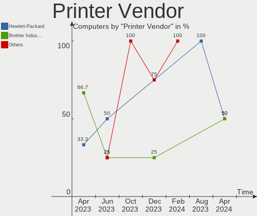

| Vendor              | Computers | Percent |
|---------------------|-----------|---------|
| Samsung Electronics | 1         | 20%     |
| Hewlett-Packard     | 1         | 20%     |
| Dymo-CoStar         | 1         | 20%     |
| Brother Industries  | 1         | 20%     |
| Apple               | 1         | 20%     |

Printer Model
-------------

Printer device models

| Model                       | Computers | Percent |
|-----------------------------|-----------|---------|
| Samsung CLX-3180 Series     | 1         | 20%     |
| HP LaserJet 1018            | 1         | 20%     |
| Dymo-CoStar LabelWriter 450 | 1         | 20%     |
| Brother MFC-9330CDW         | 1         | 20%     |
| Apple Gamesir-G3v 1.00      | 1         | 20%     |

Scanner Vendor
--------------

Scanner device vendors

Zero info for selected period =(

Scanner Model
-------------

Scanner device models

Zero info for selected period =(

Camera
------

Camera Vendor
-------------

Camera device vendors

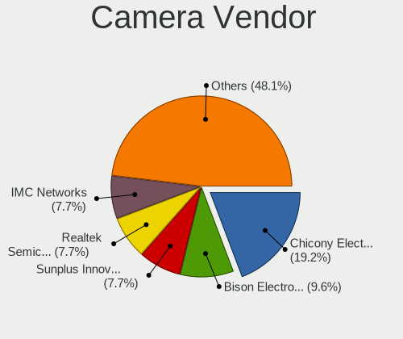

| Vendor                                 | Computers | Percent |
|----------------------------------------|-----------|---------|
| Chicony Electronics                    | 16        | 20.78%  |
| IMC Networks                           | 8         | 10.39%  |
| Realtek Semiconductor                  | 7         | 9.09%   |
| Logitech                               | 6         | 7.79%   |
| Microdia                               | 5         | 6.49%   |
| Bison Electronics                      | 5         | 6.49%   |
| Cheng Uei Precision Industry (Foxlink) | 4         | 5.19%   |
| Apple                                  | 4         | 5.19%   |
| Syntek                                 | 3         | 3.9%    |
| Sunplus Innovation Technology          | 3         | 3.9%    |
| Ricoh                                  | 2         | 2.6%    |
| Quanta                                 | 2         | 2.6%    |
| Luxvisions Innotech Limited            | 2         | 2.6%    |
| Importek                               | 2         | 2.6%    |
| Z-Star Microelectronics                | 1         | 1.3%    |
| Trust                                  | 1         | 1.3%    |
| Suyin                                  | 1         | 1.3%    |
| Sonix Technology                       | 1         | 1.3%    |
| Shine-optics                           | 1         | 1.3%    |
| ARC International                      | 1         | 1.3%    |
| Alcor Micro                            | 1         | 1.3%    |
| Acer                                   | 1         | 1.3%    |

Camera Model
------------

Camera device models

| Model                                         | Computers | Percent |
|-----------------------------------------------|-----------|---------|
| IMC Networks USB2.0 HD UVC WebCam             | 4         | 5.19%   |
| Chicony HP HD Camera                          | 4         | 5.19%   |
| Bison Integrated Camera                       | 3         | 3.9%    |
| Apple FaceTime HD Camera (Built-in)           | 3         | 3.9%    |
| Syntek Integrated Camera                      | 2         | 2.6%    |
| Realtek Integrated Webcam HD                  | 2         | 2.6%    |
| Microdia Integrated_Webcam_HD                 | 2         | 2.6%    |
| Luxvisions Innotech Limited Integrated Camera | 2         | 2.6%    |
| Logitech Webcam C270                          | 2         | 2.6%    |
| IMC Networks Integrated Camera                | 2         | 2.6%    |
| Chicony Integrated HP HD Webcam               | 2         | 2.6%    |
| Chicony HD Webcam                             | 2         | 2.6%    |
| Z-Star Namuga 1.3M Webcam                     | 1         | 1.3%    |
| Trust Full HD Webcam                          | 1         | 1.3%    |
| Syntek Lenovo EasyCamera                      | 1         | 1.3%    |
| Suyin 1.3M HD WebCam                          | 1         | 1.3%    |
| Sunplus Laptop_Integrated_Webcam_FHD          | 1         | 1.3%    |
| Sunplus Laptop Integrated Webcam HD           | 1         | 1.3%    |
| Sunplus HD WebCam                             | 1         | 1.3%    |
| Sonix USB2.0 HD UVC WebCam                    | 1         | 1.3%    |
| Shine-optics USB2.0 HD UVC WebCam             | 1         | 1.3%    |
| Ricoh USB2.0 Camera                           | 1         | 1.3%    |
| Ricoh HD Webcam                               | 1         | 1.3%    |
| Realtek Lenovo EasyCamera                     | 1         | 1.3%    |
| Realtek Laptop Camera                         | 1         | 1.3%    |
| Realtek Integrated_Webcam_HD                  | 1         | 1.3%    |
| Realtek HP TrueVision Full HD                 | 1         | 1.3%    |
| Realtek EasyCamera                            | 1         | 1.3%    |
| Quanta HP HD Camera                           | 1         | 1.3%    |
| Quanta HD User Facing                         | 1         | 1.3%    |
| Microdia Webcam Vitade AF                     | 1         | 1.3%    |
| Microdia USB 2.0 Camera                       | 1         | 1.3%    |
| Microdia Laptop_Integrated_Webcam_HD          | 1         | 1.3%    |
| Logitech StreamCam                            | 1         | 1.3%    |
| Logitech HD Webcam C615                       | 1         | 1.3%    |
| Logitech HD Webcam C525                       | 1         | 1.3%    |
| Logitech C922 Pro Stream Webcam               | 1         | 1.3%    |
| Importek TOSHIBA Web Camera - HD              | 1         | 1.3%    |
| Importek Laptop Integrated Webcam 1.3M        | 1         | 1.3%    |
| IMC Networks Lenovo EasyCamera                | 1         | 1.3%    |

Security
--------

Fingerprint Vendor
------------------

Fingerprint sensor vendors

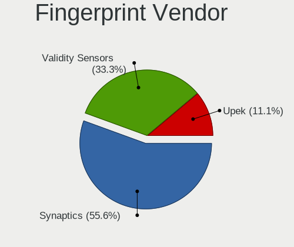

| Vendor                     | Computers | Percent |
|----------------------------|-----------|---------|
| Synaptics                  | 5         | 35.71%  |
| Validity Sensors           | 4         | 28.57%  |
| Shenzhen Goodix Technology | 3         | 21.43%  |
| Upek                       | 1         | 7.14%   |
| AuthenTec                  | 1         | 7.14%   |

Fingerprint Model
-----------------

Fingerprint sensor models

| Model                                                     | Computers | Percent |
|-----------------------------------------------------------|-----------|---------|
| Validity Sensors VFS495 Fingerprint Reader                | 3         | 21.43%  |
| Synaptics Prometheus MIS Touch Fingerprint Reader         | 2         | 14.29%  |
| Shenzhen Goodix  FingerPrint Device                       | 2         | 14.29%  |
| Validity Sensors VFS491                                   | 1         | 7.14%   |
| Upek Biometric Touchchip/Touchstrip Fingerprint Sensor    | 1         | 7.14%   |
| Synaptics WBDI Fingerprint Reader USB 086                 | 1         | 7.14%   |
| Synaptics UWP WBDI                                        | 1         | 7.14%   |
| Synaptics  FS7604 Touch Fingerprint Sensor with PurePrint | 1         | 7.14%   |
| Shenzhen Goodix FingerPrint                               | 1         | 7.14%   |
| AuthenTec AES2501 Fingerprint Sensor                      | 1         | 7.14%   |

Chipcard Vendor
---------------

Chipcard module vendors

| Vendor      | Computers | Percent |
|-------------|-----------|---------|
| Broadcom    | 6         | 66.67%  |
| Alcor Micro | 3         | 33.33%  |

Chipcard Model
--------------

Chipcard module models

| Model                                          | Computers | Percent |
|------------------------------------------------|-----------|---------|
| Broadcom 5880                                  | 3         | 33.33%  |
| Alcor Micro AU9540 Smartcard Reader            | 3         | 33.33%  |
| Broadcom BCM5880 Secure Applications Processor | 2         | 22.22%  |
| Broadcom 58200                                 | 1         | 11.11%  |

Unsupported
-----------

Unsupported Devices
-------------------

Total unsupported devices on board

| Total | Computers | Percent |
|-------|-----------|---------|
| 0     | 77        | 67.54%  |
| 1     | 32        | 28.07%  |
| 3     | 2         | 1.75%   |
| 2     | 2         | 1.75%   |
| 9     | 1         | 0.88%   |

Unsupported Device Types
------------------------

Types of unsupported devices

| Type                     | Computers | Percent |
|--------------------------|-----------|---------|
| Fingerprint reader       | 14        | 28%     |
| Graphics card            | 11        | 22%     |
| Chipcard                 | 8         | 16%     |
| Multimedia controller    | 4         | 8%      |
| Storage/raid             | 2         | 4%      |
| Net/wireless             | 2         | 4%      |
| Camera                   | 2         | 4%      |
| Bluetooth                | 2         | 4%      |
| Storage                  | 1         | 2%      |
| Sound                    | 1         | 2%      |
| Net/ethernet             | 1         | 2%      |
| Communication controller | 1         | 2%      |
| Card reader              | 1         | 2%      |

