Linux in Netherlands - Hardware Trends (Desktops)
-------------------------------------------------

A project to identify most popular hardware characteristics and track their change
over time based on data collected by Linux users at https://Linux-Hardware.org.

Anyone can contribute to this report by the [hw-probe](https://github.com/linuxhw/hw-probe) tool:

    sudo -E hw-probe -all -upload

Period: Dec, 2025.

Contents
--------

* [ System ](#system)
  - [ OS                       ](#os)
  - [ OS Family                ](#os-family)
  - [ Kernel                   ](#kernel)
  - [ Kernel Family            ](#kernel-family)
  - [ Kernel Major Ver.        ](#kernel-major-ver)
  - [ Arch                     ](#arch)
  - [ DE                       ](#de)
  - [ Display Server           ](#display-server)
  - [ Display Manager          ](#display-manager)
  - [ OS Lang                  ](#os-lang)
  - [ Boot Mode                ](#boot-mode)
  - [ Filesystem               ](#filesystem)
  - [ Part. scheme             ](#part-scheme)
  - [ Dual Boot with Linux/BSD ](#dual-boot-with-linuxbsd)
  - [ Dual Boot (Win)          ](#dual-boot-win)

* [ Board ](#board)
  - [ Vendor                   ](#vendor)
  - [ Model                    ](#model)
  - [ Model Family             ](#model-family)
  - [ MFG Year                 ](#mfg-year)
  - [ Form Factor              ](#form-factor)
  - [ Secure Boot              ](#secure-boot)
  - [ Coreboot                 ](#coreboot)
  - [ RAM Size                 ](#ram-size)
  - [ RAM Used                 ](#ram-used)
  - [ Total Drives             ](#total-drives)
  - [ Has CD-ROM               ](#has-cd-rom)
  - [ Has Ethernet             ](#has-ethernet)
  - [ Has WiFi                 ](#has-wifi)
  - [ Has Bluetooth            ](#has-bluetooth)

* [ Location ](#location)
  - [ Country                  ](#country)
  - [ City                     ](#city)

* [ Drives ](#drives)
  - [ Drive Vendor             ](#drive-vendor)
  - [ Drive Model              ](#drive-model)
  - [ HDD Vendor               ](#hdd-vendor)
  - [ SSD Vendor               ](#ssd-vendor)
  - [ Drive Kind               ](#drive-kind)
  - [ Drive Connector          ](#drive-connector)
  - [ Drive Size               ](#drive-size)
  - [ Space Total              ](#space-total)
  - [ Space Used               ](#space-used)
  - [ Malfunc. Drives          ](#malfunc-drives)
  - [ Malfunc. Drive Vendor    ](#malfunc-drive-vendor)
  - [ Malfunc. HDD Vendor      ](#malfunc-hdd-vendor)
  - [ Malfunc. Drive Kind      ](#malfunc-drive-kind)
  - [ Failed Drives            ](#failed-drives)
  - [ Failed Drive Vendor      ](#failed-drive-vendor)
  - [ Drive Status             ](#drive-status)

* [ Storage controller ](#storage-controller)
  - [ Storage Vendor           ](#storage-vendor)
  - [ Storage Model            ](#storage-model)
  - [ Storage Kind             ](#storage-kind)

* [ Processor ](#processor)
  - [ CPU Vendor               ](#cpu-vendor)
  - [ CPU Model                ](#cpu-model)
  - [ CPU Model Family         ](#cpu-model-family)
  - [ CPU Cores                ](#cpu-cores)
  - [ CPU Sockets              ](#cpu-sockets)
  - [ CPU Threads              ](#cpu-threads)
  - [ CPU Op-Modes             ](#cpu-op-modes)
  - [ CPU Microcode            ](#cpu-microcode)
  - [ CPU Microarch            ](#cpu-microarch)

* [ Graphics ](#graphics)
  - [ GPU Vendor               ](#gpu-vendor)
  - [ GPU Model                ](#gpu-model)
  - [ GPU Combo                ](#gpu-combo)
  - [ GPU Driver               ](#gpu-driver)
  - [ GPU Memory               ](#gpu-memory)

* [ Monitor ](#monitor)
  - [ Monitor Vendor           ](#monitor-vendor)
  - [ Monitor Model            ](#monitor-model)
  - [ Monitor Resolution       ](#monitor-resolution)
  - [ Monitor Diagonal         ](#monitor-diagonal)
  - [ Monitor Width            ](#monitor-width)
  - [ Aspect Ratio             ](#aspect-ratio)
  - [ Monitor Area             ](#monitor-area)
  - [ Pixel Density            ](#pixel-density)
  - [ Multiple Monitors        ](#multiple-monitors)

* [ Network ](#network)
  - [ Net Controller Vendor    ](#net-controller-vendor)
  - [ Net Controller Model     ](#net-controller-model)
  - [ Wireless Vendor          ](#wireless-vendor)
  - [ Wireless Model           ](#wireless-model)
  - [ Ethernet Vendor          ](#ethernet-vendor)
  - [ Ethernet Model           ](#ethernet-model)
  - [ Net Controller Kind      ](#net-controller-kind)
  - [ Used Controller          ](#used-controller)
  - [ NICs                     ](#nics)
  - [ IPv6                     ](#ipv6)

* [ Bluetooth ](#bluetooth)
  - [ Bluetooth Vendor         ](#bluetooth-vendor)
  - [ Bluetooth Model          ](#bluetooth-model)

* [ Sound ](#sound)
  - [ Sound Vendor             ](#sound-vendor)
  - [ Sound Model              ](#sound-model)

* [ Memory ](#memory)
  - [ Memory Vendor            ](#memory-vendor)
  - [ Memory Model             ](#memory-model)
  - [ Memory Kind              ](#memory-kind)
  - [ Memory Form Factor       ](#memory-form-factor)
  - [ Memory Size              ](#memory-size)
  - [ Memory Speed             ](#memory-speed)

* [ Printers & scanners ](#printers--scanners)
  - [ Printer Vendor           ](#printer-vendor)
  - [ Printer Model            ](#printer-model)
  - [ Scanner Vendor           ](#scanner-vendor)
  - [ Scanner Model            ](#scanner-model)

* [ Camera ](#camera)
  - [ Camera Vendor            ](#camera-vendor)
  - [ Camera Model             ](#camera-model)

* [ Security ](#security)
  - [ Fingerprint Vendor       ](#fingerprint-vendor)
  - [ Fingerprint Model        ](#fingerprint-model)
  - [ Chipcard Vendor          ](#chipcard-vendor)
  - [ Chipcard Model           ](#chipcard-model)

* [ Unsupported ](#unsupported)
  - [ Unsupported Devices      ](#unsupported-devices)
  - [ Unsupported Device Types ](#unsupported-device-types)

System
------

OS
--

Installed operating systems

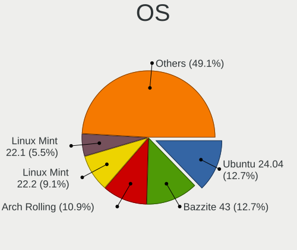

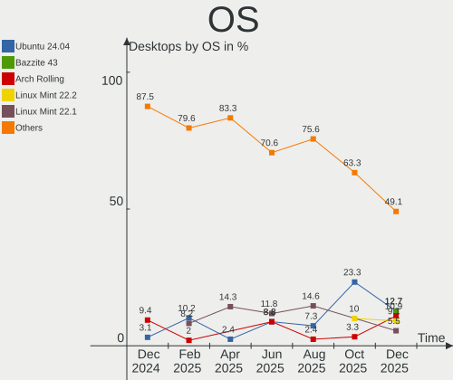

| Name                 | Desktops | Percent |
|----------------------|----------|---------|
| Ubuntu 24.04         | 7        | 12.73%  |
| Bazzite 43           | 7        | 12.73%  |
| Arch Rolling         | 6        | 10.91%  |
| Linux Mint 22.2      | 5        | 9.09%   |
| Linux Mint 22.1      | 3        | 5.45%   |
| Fedora 43            | 3        | 5.45%   |
| Zorin 18             | 2        | 3.64%   |
| OpenMandriva 6.0     | 2        | 3.64%   |
| NixOS 26.05          | 2        | 3.64%   |
| EndeavourOS Rolling  | 2        | 3.64%   |
| Debian 13            | 2        | 3.64%   |
| Zorin 17             | 1        | 1.82%   |
| Ubuntu 25.10         | 1        | 1.82%   |
| Ubuntu 25.04         | 1        | 1.82%   |
| TUXEDO OS 24.04      | 1        | 1.82%   |
| Pop!_OS 24.04        | 1        | 1.82%   |
| openSUSE Leap-15.6   | 1        | 1.82%   |
| OpenMandriva 24.12   | 1        | 1.82%   |
| Nobara 43            | 1        | 1.82%   |
| MX 25                | 1        | 1.82%   |
| Manjaro 25.1.0       | 1        | 1.82%   |
| Kubuntu 24.04        | 1        | 1.82%   |
| Dts-distro 2.7.3-rc1 | 1        | 1.82%   |
| Debian 11            | 1        | 1.82%   |
| Clear Linux 43760    | 1        | 1.82%   |

OS Family
---------

OS without a version

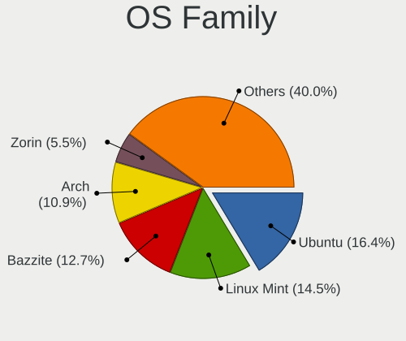

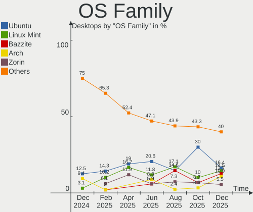

| Name         | Desktops | Percent |
|--------------|----------|---------|
| Ubuntu       | 9        | 16.36%  |
| Linux Mint   | 8        | 14.55%  |
| Bazzite      | 7        | 12.73%  |
| Arch         | 6        | 10.91%  |
| Zorin        | 3        | 5.45%   |
| OpenMandriva | 3        | 5.45%   |
| Fedora       | 3        | 5.45%   |
| Debian       | 3        | 5.45%   |
| NixOS        | 2        | 3.64%   |
| EndeavourOS  | 2        | 3.64%   |
| TUXEDO OS    | 1        | 1.82%   |
| Pop!_OS      | 1        | 1.82%   |
| openSUSE     | 1        | 1.82%   |
| Nobara       | 1        | 1.82%   |
| MX           | 1        | 1.82%   |
| Manjaro      | 1        | 1.82%   |
| Kubuntu      | 1        | 1.82%   |
| Dts-distro   | 1        | 1.82%   |
| Clear Linux  | 1        | 1.82%   |

Kernel
------

Version of the Linux kernel

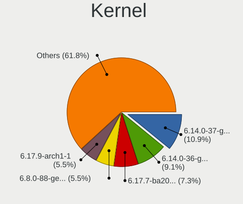

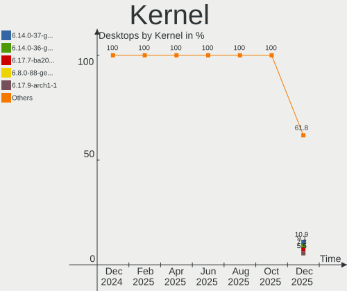

| Version                        | Desktops | Percent |
|--------------------------------|----------|---------|
| 6.14.0-37-generic              | 6        | 10.91%  |
| 6.14.0-36-generic              | 5        | 9.09%   |
| 6.17.7-ba20.fc43.x86_64        | 4        | 7.27%   |
| 6.8.0-88-generic               | 3        | 5.45%   |
| 6.17.9-arch1-1                 | 3        | 5.45%   |
| 6.17.7-ba19.fc43.x86_64        | 3        | 5.45%   |
| 6.17.12-300.fc43.x86_64        | 2        | 3.64%   |
| 6.14.2-desktop-3omv2590        | 2        | 3.64%   |
| 6.14.0-27-generic              | 2        | 3.64%   |
| 6.8.0-90-generic               | 1        | 1.82%   |
| 6.8.0-87-generic               | 1        | 1.82%   |
| 6.6.21-yocto-standard          | 1        | 1.82%   |
| 6.4.0-150600.23.73-default     | 1        | 1.82%   |
| 6.18.2-arch2-1                 | 1        | 1.82%   |
| 6.18.2-1-t2-trixie             | 1        | 1.82%   |
| 6.18.2-1-MANJARO               | 1        | 1.82%   |
| 6.18.1-arch1-2                 | 1        | 1.82%   |
| 6.18.0-cachyos                 | 1        | 1.82%   |
| 6.17.9-zen1-1-zen              | 1        | 1.82%   |
| 6.17.9-76061709-generic        | 1        | 1.82%   |
| 6.17.8-arch1-1                 | 1        | 1.82%   |
| 6.17.7-zen1-1-zen              | 1        | 1.82%   |
| 6.17.12-200.nobara.fc43.x86_64 | 1        | 1.82%   |
| 6.17.1-300.fc43.x86_64         | 1        | 1.82%   |
| 6.17.0-8-generic               | 1        | 1.82%   |
| 6.16.3+deb13-amd64             | 1        | 1.82%   |
| 6.15.5-1588.native             | 1        | 1.82%   |
| 6.14.0-29-generic              | 1        | 1.82%   |
| 6.14.0-116036-tuxedo           | 1        | 1.82%   |
| 6.14.0-1016-oem                | 1        | 1.82%   |
| 6.12.60-cachyos                | 1        | 1.82%   |
| 6.12.57+deb13-amd64            | 1        | 1.82%   |
| 6.12.1-desktop-1omv2490        | 1        | 1.82%   |
| 5.10.0-37-amd64                | 1        | 1.82%   |

Kernel Family
-------------

Linux kernel without a distro release

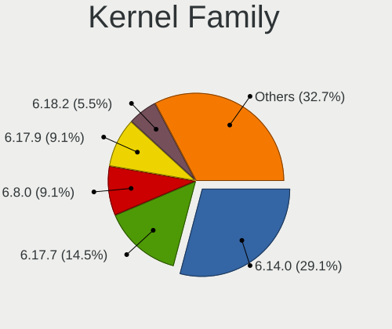

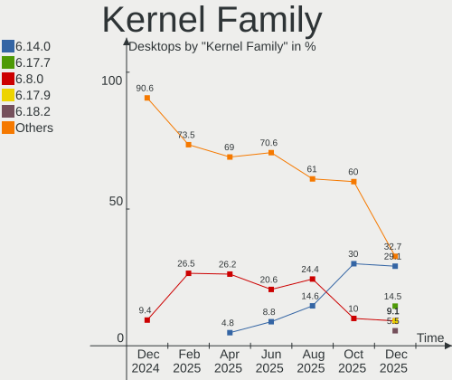

| Version | Desktops | Percent |
|---------|----------|---------|
| 6.14.0  | 16       | 29.09%  |
| 6.17.7  | 8        | 14.55%  |
| 6.8.0   | 5        | 9.09%   |
| 6.17.9  | 5        | 9.09%   |
| 6.18.2  | 3        | 5.45%   |
| 6.17.12 | 3        | 5.45%   |
| 6.14.2  | 2        | 3.64%   |
| 6.6.21  | 1        | 1.82%   |
| 6.4.0   | 1        | 1.82%   |
| 6.18.1  | 1        | 1.82%   |
| 6.18.0  | 1        | 1.82%   |
| 6.17.8  | 1        | 1.82%   |
| 6.17.1  | 1        | 1.82%   |
| 6.17.0  | 1        | 1.82%   |
| 6.16.3  | 1        | 1.82%   |
| 6.15.5  | 1        | 1.82%   |
| 6.12.60 | 1        | 1.82%   |
| 6.12.57 | 1        | 1.82%   |
| 6.12.1  | 1        | 1.82%   |
| 5.10.0  | 1        | 1.82%   |

Kernel Major Ver.
-----------------

Linux kernel major version

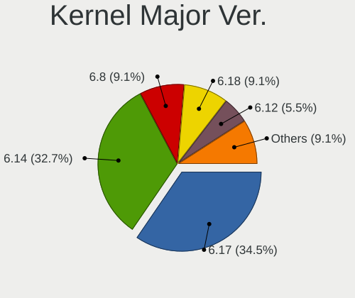

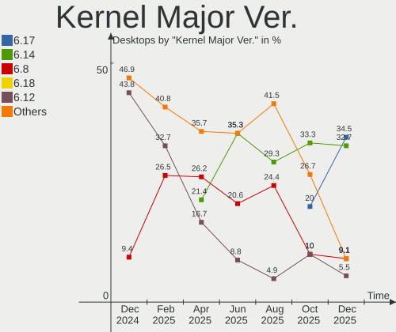

| Version | Desktops | Percent |
|---------|----------|---------|
| 6.17    | 19       | 34.55%  |
| 6.14    | 18       | 32.73%  |
| 6.8     | 5        | 9.09%   |
| 6.18    | 5        | 9.09%   |
| 6.12    | 3        | 5.45%   |
| 6.6     | 1        | 1.82%   |
| 6.4     | 1        | 1.82%   |
| 6.16    | 1        | 1.82%   |
| 6.15    | 1        | 1.82%   |
| 5.10    | 1        | 1.82%   |

Arch
----

OS architecture (x86_64, i586, etc.)

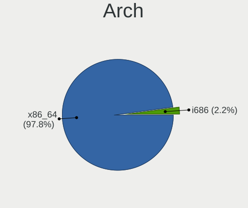

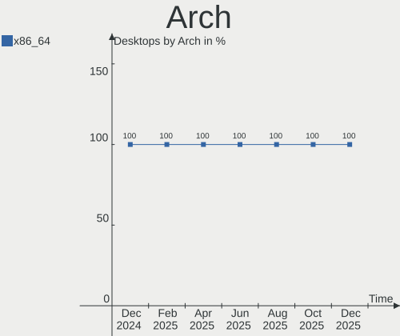

| Name   | Desktops | Percent |
|--------|----------|---------|
| x86_64 | 55       | 100%    |

DE
--

Desktop Environment

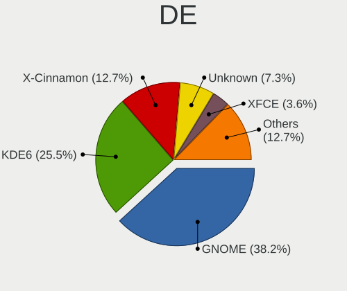

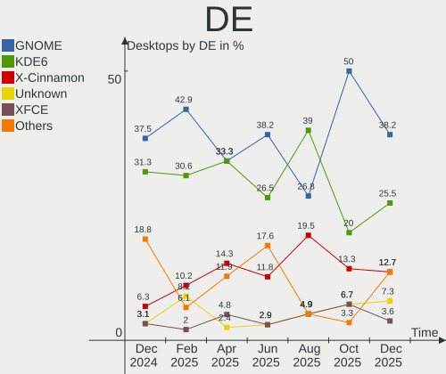

| Name       | Desktops | Percent |
|------------|----------|---------|
| GNOME      | 21       | 38.18%  |
| KDE6       | 14       | 25.45%  |
| X-Cinnamon | 7        | 12.73%  |
| Unknown    | 4        | 7.27%   |
| XFCE       | 2        | 3.64%   |
| KDE5       | 2        | 3.64%   |
| KDE        | 2        | 3.64%   |
| MATE       | 1        | 1.82%   |
| Hyprland   | 1        | 1.82%   |
| COSMIC     | 1        | 1.82%   |

Display Server
--------------

X11 or Wayland

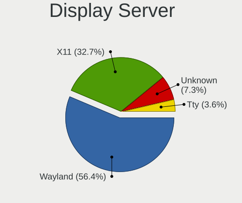

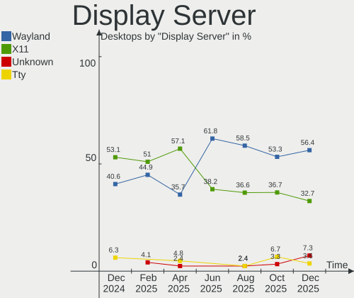

| Name    | Desktops | Percent |
|---------|----------|---------|
| Wayland | 31       | 56.36%  |
| X11     | 18       | 32.73%  |
| Unknown | 4        | 7.27%   |
| Tty     | 2        | 3.64%   |

Display Manager
---------------

SDDM, LightDM, etc.

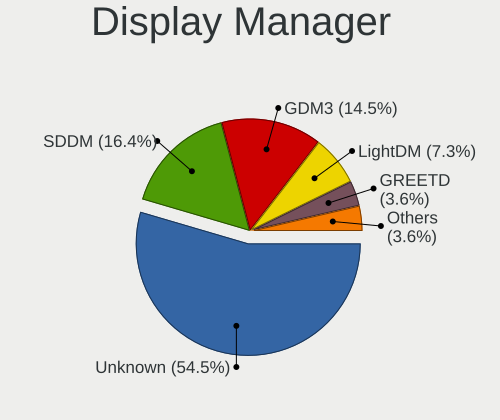

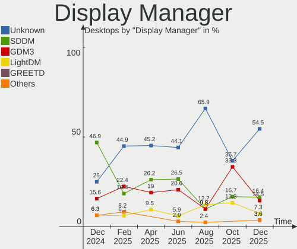

| Name    | Desktops | Percent |
|---------|----------|---------|
| Unknown | 30       | 54.55%  |
| SDDM    | 9        | 16.36%  |
| GDM3    | 8        | 14.55%  |
| LightDM | 4        | 7.27%   |
| GREETD  | 2        | 3.64%   |
| GDM     | 2        | 3.64%   |

OS Lang
-------

Language

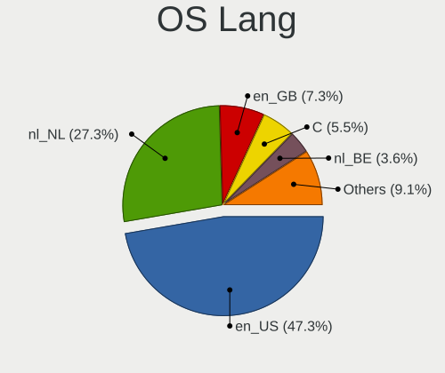

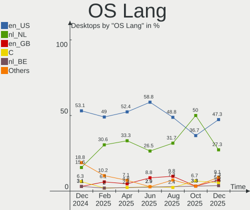

| Lang    | Desktops | Percent |
|---------|----------|---------|
| en_US   | 26       | 47.27%  |
| nl_NL   | 15       | 27.27%  |
| en_GB   | 4        | 7.27%   |
| C       | 3        | 5.45%   |
| nl_BE   | 2        | 3.64%   |
| Unknown | 2        | 3.64%   |
| ru_RU   | 1        | 1.82%   |
| fr_FR   | 1        | 1.82%   |
| en_BW   | 1        | 1.82%   |

Boot Mode
---------

EFI or BIOS

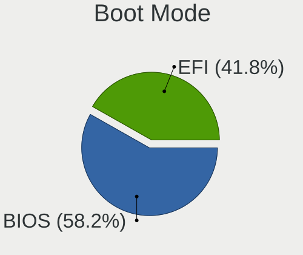

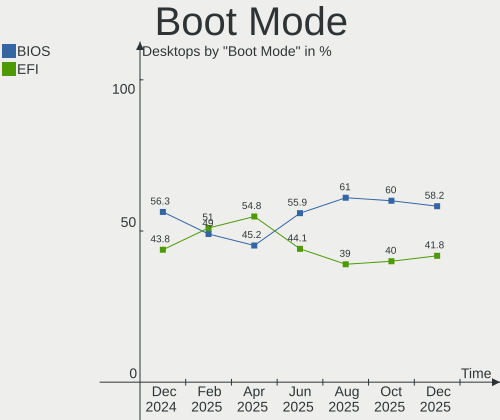

| Mode | Desktops | Percent |
|------|----------|---------|
| BIOS | 32       | 58.18%  |
| EFI  | 23       | 41.82%  |

Filesystem
----------

Type of filesystem

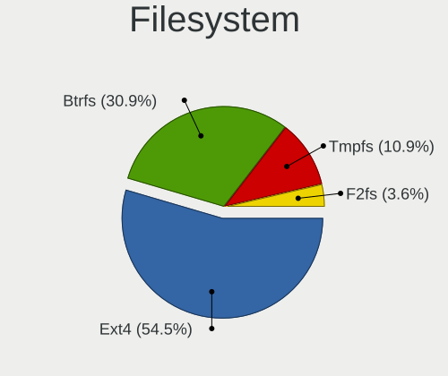

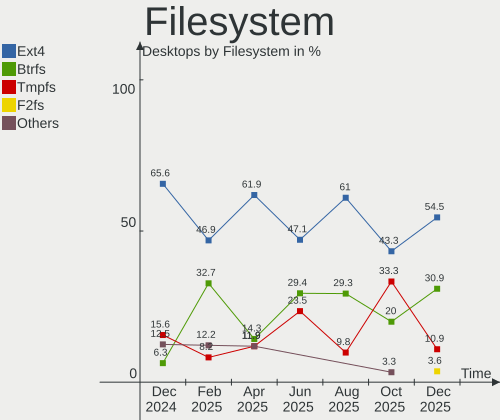

| Type  | Desktops | Percent |
|-------|----------|---------|
| Ext4  | 30       | 54.55%  |
| Btrfs | 17       | 30.91%  |
| Tmpfs | 6        | 10.91%  |
| F2fs  | 2        | 3.64%   |

Part. scheme
------------

Scheme of partitioning

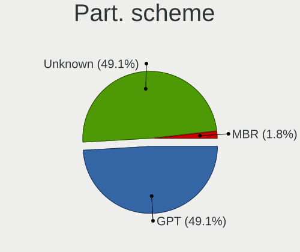

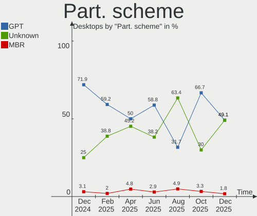

| Type    | Desktops | Percent |
|---------|----------|---------|
| GPT     | 27       | 49.09%  |
| Unknown | 27       | 49.09%  |
| MBR     | 1        | 1.82%   |

Dual Boot with Linux/BSD
------------------------

Hosting more than one Linux/BSD

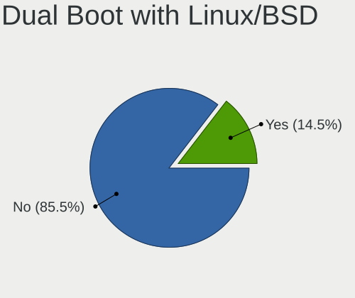

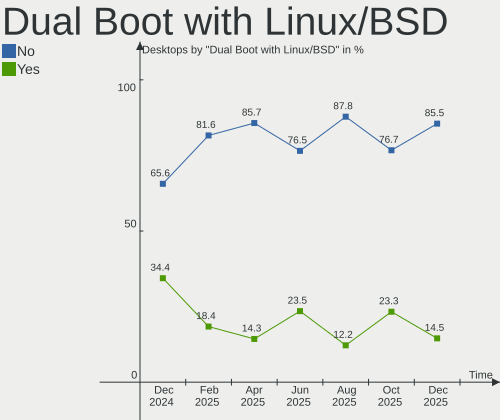

| Dual boot | Desktops | Percent |
|-----------|----------|---------|
| No        | 47       | 85.45%  |
| Yes       | 8        | 14.55%  |

Dual Boot (Win)
---------------

Hosting Linux and Windows

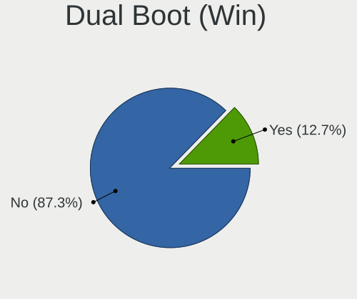

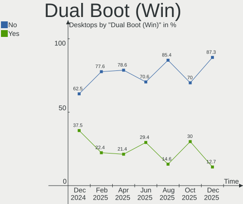

| Dual boot | Desktops | Percent |
|-----------|----------|---------|
| No        | 48       | 87.27%  |
| Yes       | 7        | 12.73%  |

Board
-----

Vendor
------

Motherboard manufacturer

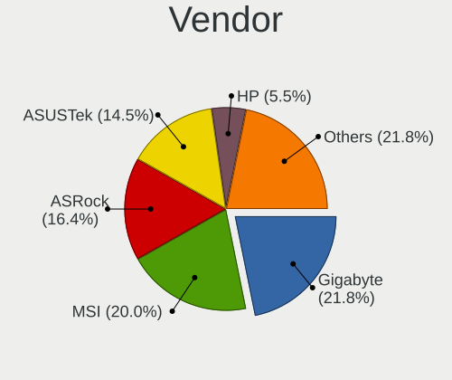

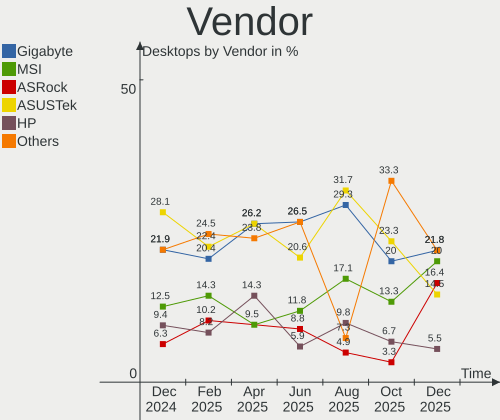

| Name                     | Desktops | Percent |
|--------------------------|----------|---------|
| Gigabyte Technology      | 12       | 21.82%  |
| MSI                      | 11       | 20%     |
| ASRock                   | 9        | 16.36%  |
| ASUSTek Computer         | 8        | 14.55%  |
| Hewlett-Packard          | 3        | 5.45%   |
| Dell                     | 3        | 5.45%   |
| WeiBu                    | 2        | 3.64%   |
| TianBei                  | 1        | 1.82%   |
| Shenzhen DOKE electronic | 1        | 1.82%   |
| PC Engines               | 1        | 1.82%   |
| Packard Bell             | 1        | 1.82%   |
| Medion                   | 1        | 1.82%   |
| AZW                      | 1        | 1.82%   |
| Alienware                | 1        | 1.82%   |

Model
-----

Motherboard model

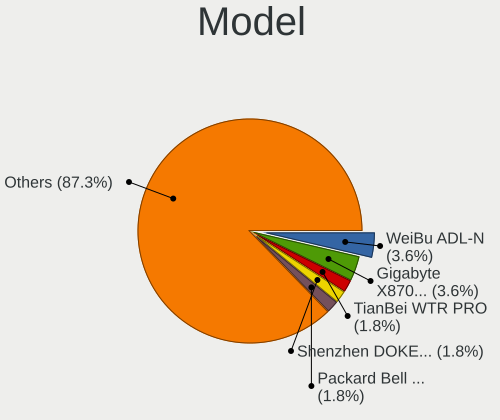

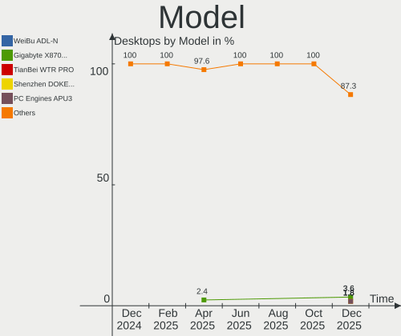

| Name                               | Desktops | Percent |
|------------------------------------|----------|---------|
| WeiBu ADL-N                        | 2        | 3.64%   |
| Gigabyte X870E AORUS ELITE WIFI7   | 2        | 3.64%   |
| TianBei WTR PRO                    | 1        | 1.82%   |
| Shenzhen DOKE electronic MP100     | 1        | 1.82%   |
| PC Engines APU3                    | 1        | 1.82%   |
| Packard Bell IMEDIA S3800          | 1        | 1.82%   |
| MSI MS-7E32                        | 1        | 1.82%   |
| MSI MS-7D91                        | 1        | 1.82%   |
| MSI MS-7D54                        | 1        | 1.82%   |
| MSI MS-7C91                        | 1        | 1.82%   |
| MSI MS-7C89                        | 1        | 1.82%   |
| MSI MS-7C37                        | 1        | 1.82%   |
| MSI MS-7C02                        | 1        | 1.82%   |
| MSI MS-7B89                        | 1        | 1.82%   |
| MSI MS-7A59                        | 1        | 1.82%   |
| MSI MS-7519                        | 1        | 1.82%   |
| MSI MAG H610 Codex 5 (MS-B930)     | 1        | 1.82%   |
| Medion MS-7616                     | 1        | 1.82%   |
| HP ProDesk 600 G4 MT               | 1        | 1.82%   |
| HP ProDesk 400 G5 SFF              | 1        | 1.82%   |
| HP Pavilion Desktop PC 570-p0XX    | 1        | 1.82%   |
| Gigabyte Z790 AORUS PRO X          | 1        | 1.82%   |
| Gigabyte Z77X-D3H                  | 1        | 1.82%   |
| Gigabyte Z390 GAMING SLI           | 1        | 1.82%   |
| Gigabyte X670E AORUS MASTER        | 1        | 1.82%   |
| Gigabyte P55-UD3                   | 1        | 1.82%   |
| Gigabyte H270-Gaming 3             | 1        | 1.82%   |
| Gigabyte GB-BSi5-1135G7            | 1        | 1.82%   |
| Gigabyte B760M GAMING X DDR4       | 1        | 1.82%   |
| Gigabyte B650M D3HP AX             | 1        | 1.82%   |
| Gigabyte B450M DS3H                | 1        | 1.82%   |
| Dell Pro Max Tower T2 FCT2250      | 1        | 1.82%   |
| Dell OptiPlex 980                  | 1        | 1.82%   |
| Dell OptiPlex 3020                 | 1        | 1.82%   |
| AZW MINI S                         | 1        | 1.82%   |
| ASUS Z170M-PLUS                    | 1        | 1.82%   |
| ASUS TUF Gaming B550-PLUS WIFI II  | 1        | 1.82%   |
| ASUS SABERTOOTH 990FX R2.0         | 1        | 1.82%   |
| ASUS ROG STRIX X670E-F GAMING WIFI | 1        | 1.82%   |
| ASUS Rampage II Extreme            | 1        | 1.82%   |

Model Family
------------

Motherboard model prefix

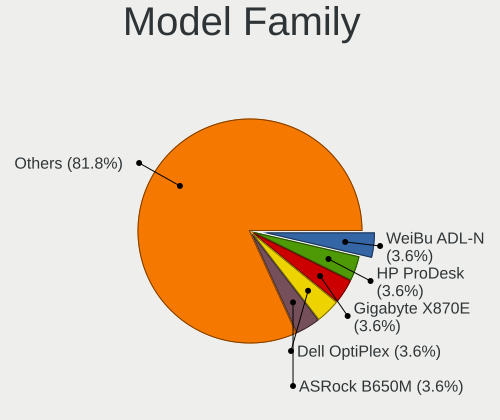

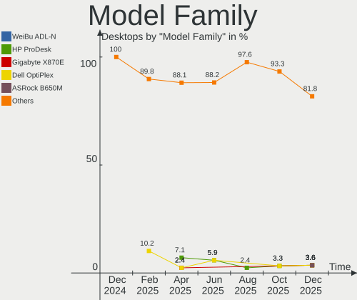

| Name                           | Desktops | Percent |
|--------------------------------|----------|---------|
| WeiBu ADL-N                    | 2        | 3.64%   |
| HP ProDesk                     | 2        | 3.64%   |
| Gigabyte X870E                 | 2        | 3.64%   |
| Dell OptiPlex                  | 2        | 3.64%   |
| ASRock B650M                   | 2        | 3.64%   |
| TianBei WTR                    | 1        | 1.82%   |
| Shenzhen DOKE electronic MP100 | 1        | 1.82%   |
| PC Engines APU3                | 1        | 1.82%   |
| Packard Bell IMEDIA            | 1        | 1.82%   |
| MSI MS-7E32                    | 1        | 1.82%   |
| MSI MS-7D91                    | 1        | 1.82%   |
| MSI MS-7D54                    | 1        | 1.82%   |
| MSI MS-7C91                    | 1        | 1.82%   |
| MSI MS-7C89                    | 1        | 1.82%   |
| MSI MS-7C37                    | 1        | 1.82%   |
| MSI MS-7C02                    | 1        | 1.82%   |
| MSI MS-7B89                    | 1        | 1.82%   |
| MSI MS-7A59                    | 1        | 1.82%   |
| MSI MS-7519                    | 1        | 1.82%   |
| MSI MAG                        | 1        | 1.82%   |
| Medion MS-7616                 | 1        | 1.82%   |
| HP Pavilion                    | 1        | 1.82%   |
| Gigabyte Z790                  | 1        | 1.82%   |
| Gigabyte Z77X-D3H              | 1        | 1.82%   |
| Gigabyte Z390                  | 1        | 1.82%   |
| Gigabyte X670E                 | 1        | 1.82%   |
| Gigabyte P55-UD3               | 1        | 1.82%   |
| Gigabyte H270-Gaming           | 1        | 1.82%   |
| Gigabyte GB-BSi5-1135G7        | 1        | 1.82%   |
| Gigabyte B760M                 | 1        | 1.82%   |
| Gigabyte B650M                 | 1        | 1.82%   |
| Gigabyte B450M                 | 1        | 1.82%   |
| Dell Pro                       | 1        | 1.82%   |
| AZW MINI                       | 1        | 1.82%   |
| ASUS Z170M-PLUS                | 1        | 1.82%   |
| ASUS TUF                       | 1        | 1.82%   |
| ASUS SABERTOOTH                | 1        | 1.82%   |
| ASUS ROG                       | 1        | 1.82%   |
| ASUS Rampage                   | 1        | 1.82%   |
| ASUS PRIME                     | 1        | 1.82%   |

MFG Year
--------

Motherboard manufacture year

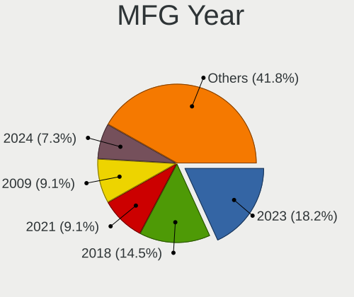

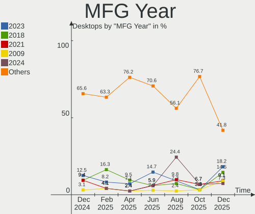

| Year | Desktops | Percent |
|------|----------|---------|
| 2023 | 10       | 18.18%  |
| 2018 | 8        | 14.55%  |
| 2021 | 5        | 9.09%   |
| 2009 | 5        | 9.09%   |
| 2024 | 4        | 7.27%   |
| 2022 | 4        | 7.27%   |
| 2025 | 3        | 5.45%   |
| 2012 | 3        | 5.45%   |
| 2020 | 2        | 3.64%   |
| 2019 | 2        | 3.64%   |
| 2016 | 2        | 3.64%   |
| 2014 | 2        | 3.64%   |
| 2013 | 2        | 3.64%   |
| 2017 | 1        | 1.82%   |
| 2015 | 1        | 1.82%   |
| 2011 | 1        | 1.82%   |

Form Factor
-----------

Physical design of the computer

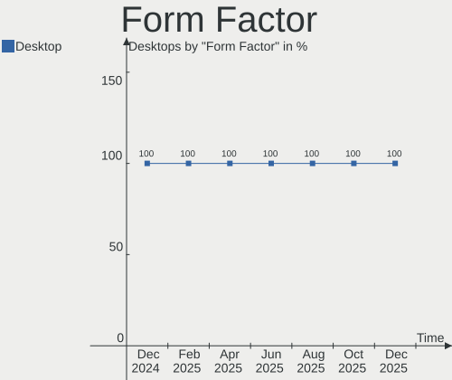

| Name    | Desktops | Percent |
|---------|----------|---------|
| Desktop | 55       | 100%    |

Secure Boot
-----------

Enabled or disabled

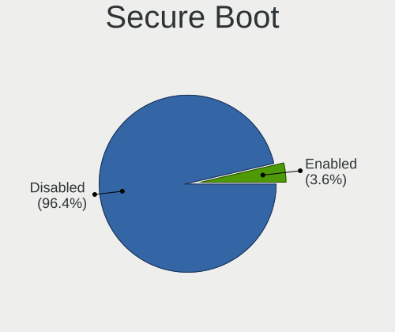

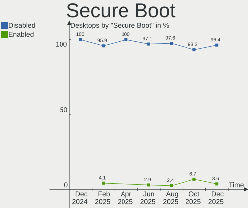

| State    | Desktops | Percent |
|----------|----------|---------|
| Disabled | 53       | 96.36%  |
| Enabled  | 2        | 3.64%   |

Coreboot
--------

Have coreboot on board

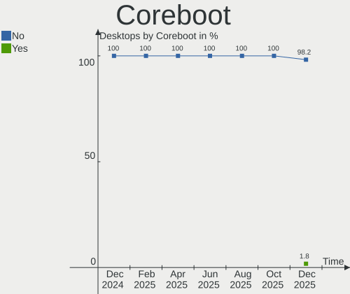

| Used | Desktops | Percent |
|------|----------|---------|
| No   | 54       | 98.18%  |
| Yes  | 1        | 1.82%   |

RAM Size
--------

Total RAM memory

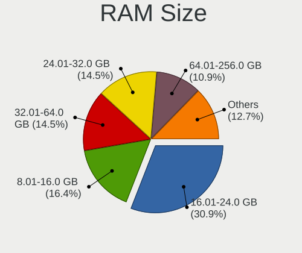

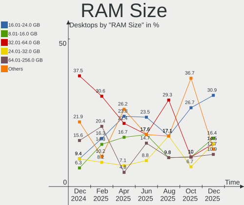

| Size in GB  | Desktops | Percent |
|-------------|----------|---------|
| 16.01-24.0  | 17       | 30.91%  |
| 8.01-16.0   | 9        | 16.36%  |
| 32.01-64.0  | 8        | 14.55%  |
| 24.01-32.0  | 8        | 14.55%  |
| 64.01-256.0 | 6        | 10.91%  |
| 4.01-8.0    | 5        | 9.09%   |
| 3.01-4.0    | 1        | 1.82%   |
| 1.01-2.0    | 1        | 1.82%   |

RAM Used
--------

Used RAM memory

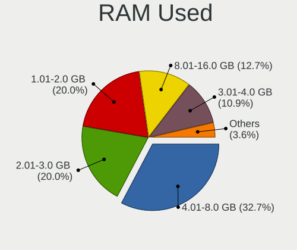

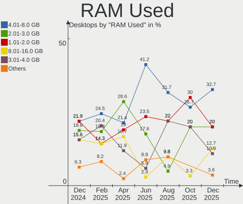

| Used GB    | Desktops | Percent |
|------------|----------|---------|
| 4.01-8.0   | 18       | 32.73%  |
| 2.01-3.0   | 11       | 20%     |
| 1.01-2.0   | 11       | 20%     |
| 8.01-16.0  | 7        | 12.73%  |
| 3.01-4.0   | 6        | 10.91%  |
| 24.01-32.0 | 1        | 1.82%   |
| 0.01-0.5   | 1        | 1.82%   |

Total Drives
------------

Number of drives on board

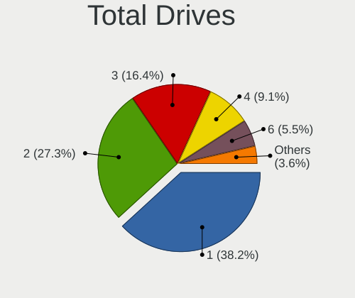

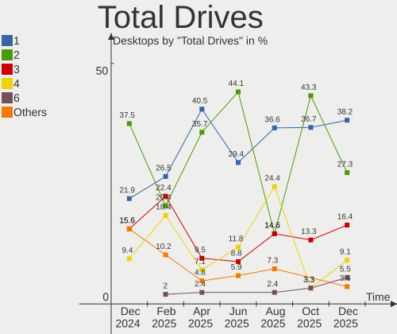

| Drives | Desktops | Percent |
|--------|----------|---------|
| 1      | 21       | 38.18%  |
| 2      | 15       | 27.27%  |
| 3      | 9        | 16.36%  |
| 4      | 5        | 9.09%   |
| 6      | 3        | 5.45%   |
| 7      | 1        | 1.82%   |
| 5      | 1        | 1.82%   |

Has CD-ROM
----------

Has CD-ROM on board

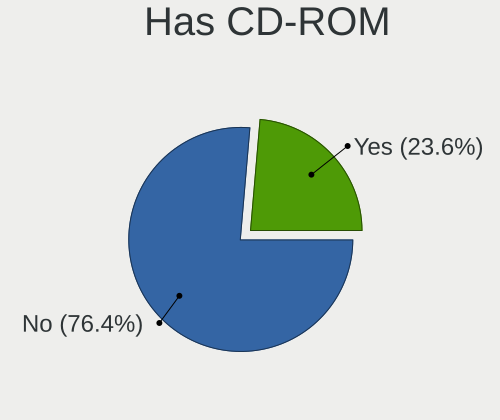

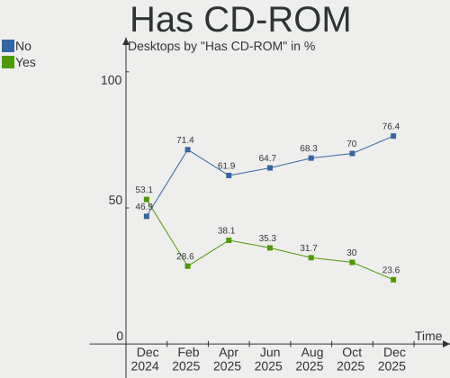

| Presented | Desktops | Percent |
|-----------|----------|---------|
| No        | 42       | 76.36%  |
| Yes       | 13       | 23.64%  |

Has Ethernet
------------

Has Ethernet on board

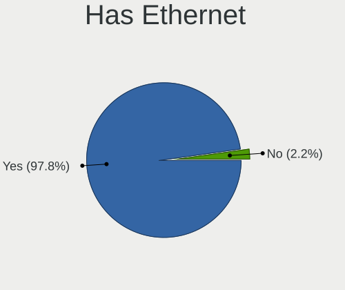

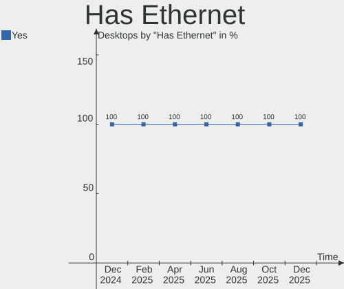

| Presented | Desktops | Percent |
|-----------|----------|---------|
| Yes       | 55       | 100%    |

Has WiFi
--------

Has WiFi module

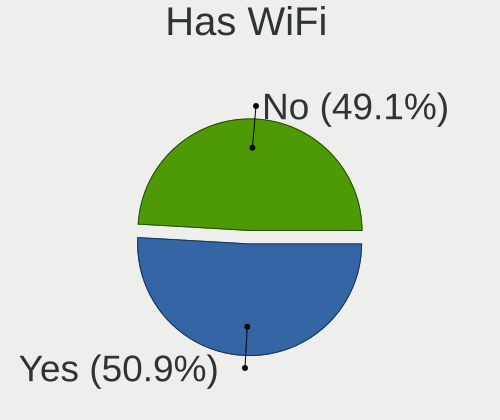

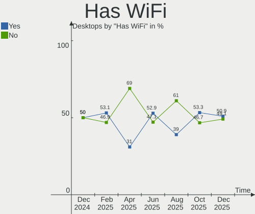

| Presented | Desktops | Percent |
|-----------|----------|---------|
| Yes       | 28       | 50.91%  |
| No        | 27       | 49.09%  |

Has Bluetooth
-------------

Has Bluetooth module

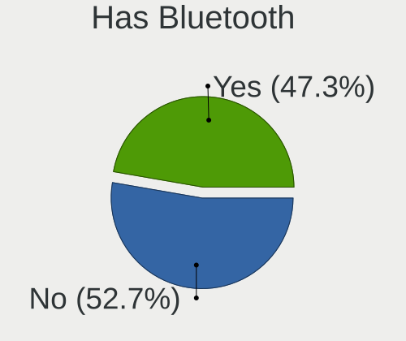

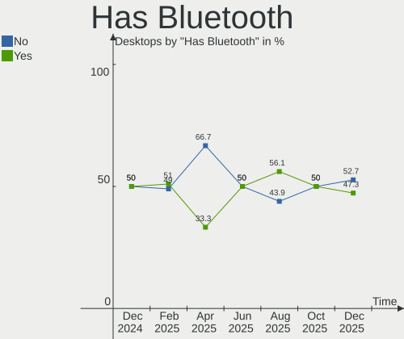

| Presented | Desktops | Percent |
|-----------|----------|---------|
| No        | 29       | 52.73%  |
| Yes       | 26       | 47.27%  |

Location
--------

Country
-------

Geographic location (country)

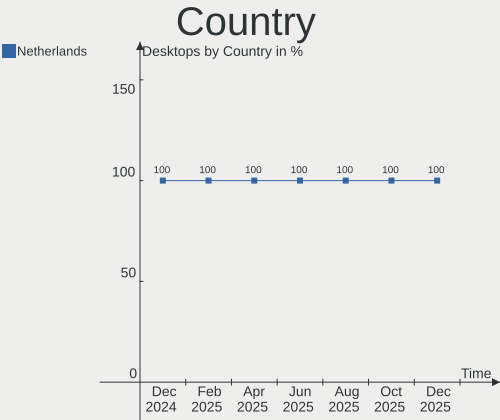

| Country     | Desktops | Percent |
|-------------|----------|---------|
| Netherlands | 55       | 100%    |

City
----

Geographic location (city)

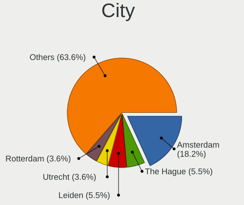

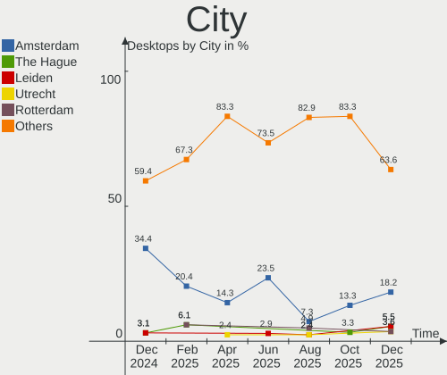

| City                  | Desktops | Percent |
|-----------------------|----------|---------|
| Amsterdam             | 10       | 18.18%  |
| The Hague             | 3        | 5.45%   |
| Leiden                | 3        | 5.45%   |
| Utrecht               | 2        | 3.64%   |
| Rotterdam             | 2        | 3.64%   |
| Hilversum             | 2        | 3.64%   |
| Hengelo               | 2        | 3.64%   |
| Haarlem               | 2        | 3.64%   |
| Apeldoorn             | 2        | 3.64%   |
| Zwolle                | 1        | 1.82%   |
| Zeist                 | 1        | 1.82%   |
| Waalwijk              | 1        | 1.82%   |
| Stiens                | 1        | 1.82%   |
| Sittard               | 1        | 1.82%   |
| Ridderkerk            | 1        | 1.82%   |
| Oldenzaal             | 1        | 1.82%   |
| Noordwijk aan Zee     | 1        | 1.82%   |
| Nijkerk               | 1        | 1.82%   |
| Maastricht            | 1        | 1.82%   |
| Lochem                | 1        | 1.82%   |
| Hoogeveen             | 1        | 1.82%   |
| Hasselt               | 1        | 1.82%   |
| Groningen             | 1        | 1.82%   |
| Gorinchem             | 1        | 1.82%   |
| Ermelo                | 1        | 1.82%   |
| Emmen                 | 1        | 1.82%   |
| Eerbeek               | 1        | 1.82%   |
| Echt                  | 1        | 1.82%   |
| Driebergen-Rijsenburg | 1        | 1.82%   |
| Cruquius              | 1        | 1.82%   |
| Breda                 | 1        | 1.82%   |
| Beuningen             | 1        | 1.82%   |
| Barendrecht           | 1        | 1.82%   |
| Badhoevedorp          | 1        | 1.82%   |
| Amstelveen            | 1        | 1.82%   |
| Almere Stad           | 1        | 1.82%   |

Drives
------

Drive Vendor
------------

Hard drive vendors

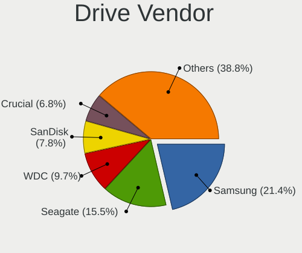

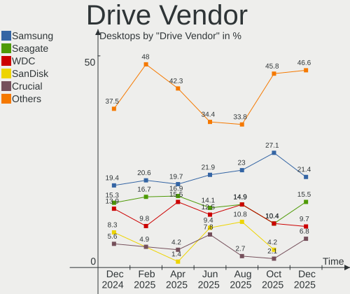

| Vendor                      | Desktops | Drives | Percent |
|-----------------------------|----------|--------|---------|
| Samsung Electronics         | 22       | 30     | 21.36%  |
| Seagate                     | 16       | 22     | 15.53%  |
| WDC                         | 10       | 16     | 9.71%   |
| SanDisk                     | 8        | 8      | 7.77%   |
| Crucial                     | 7        | 10     | 6.8%    |
| Unknown                     | 5        | 6      | 4.85%   |
| Toshiba                     | 4        | 4      | 3.88%   |
| Kingston                    | 4        | 4      | 3.88%   |
| Micron/Crucial Technology   | 3        | 4      | 2.91%   |
| MAXIO Technology (Hangzhou) | 3        | 3      | 2.91%   |
| Kingston Technology Company | 3        | 4      | 2.91%   |
| Intel                       | 3        | 3      | 2.91%   |
| Hitachi                     | 3        | 4      | 2.91%   |
| SK hynix                    | 1        | 1      | 0.97%   |
| Phison Electronics          | 1        | 1      | 0.97%   |
| Netac                       | 1        | 1      | 0.97%   |
| Micron Technology           | 1        | 1      | 0.97%   |
| KIOXIA                      | 1        | 1      | 0.97%   |
| Intenso                     | 1        | 1      | 0.97%   |
| Fanxiang                    | 1        | 1      | 0.97%   |
| Emtec                       | 1        | 1      | 0.97%   |
| China                       | 1        | 1      | 0.97%   |
| ASMedia                     | 1        | 1      | 0.97%   |
| ASint Technology            | 1        | 1      | 0.97%   |
| A-DATA Technology           | 1        | 1      | 0.97%   |

Drive Model
-----------

Hard drive models

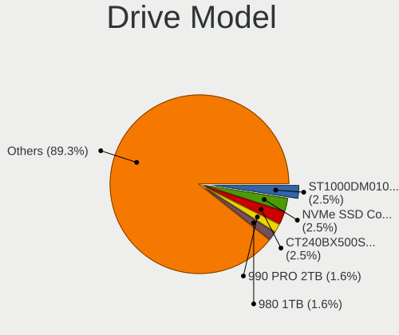

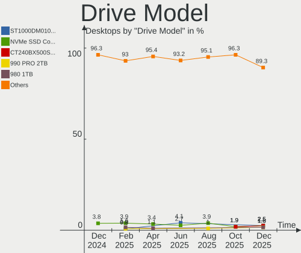

| Model                                              | Desktops | Percent |
|----------------------------------------------------|----------|---------|
| Seagate ST1000DM010-2EP102 1TB                     | 3        | 2.46%   |
| Samsung NVMe SSD Controller SM981/PM981/PM983 1TB  | 3        | 2.46%   |
| Crucial CT240BX500SSD1 240GB                       | 3        | 2.46%   |
| Samsung SSD 990 PRO 2TB                            | 2        | 1.64%   |
| Samsung SSD 980 1TB                                | 2        | 1.64%   |
| Samsung SSD 860 EVO 500GB                          | 2        | 1.64%   |
| Samsung SSD 860 EVO 250GB                          | 2        | 1.64%   |
| Samsung SSD 850 EVO 250GB                          | 2        | 1.64%   |
| Samsung NVMe SSD Controller PM9A1/PM9A3/980PRO 1TB | 2        | 1.64%   |
| MAXIO (Hangzhou) NVMe SSD Controller MAP1202 2TB   | 2        | 1.64%   |
| Kingston Company A2000 NVMe SSD 250GB              | 2        | 1.64%   |
| Hitachi HDS721010CLA330 1TB                        | 2        | 1.64%   |
| Crucial CT120BX500SSD1 120GB                       | 2        | 1.64%   |
| WDC WD7502AAEX-00Y9A0 752GB                        | 1        | 0.82%   |
| WDC WD5000AAVS-00G9B0 500GB                        | 1        | 0.82%   |
| WDC WD5000AAKX-603CA0 500GB                        | 1        | 0.82%   |
| WDC WD5000AAKX-00ERMA0 500GB                       | 1        | 0.82%   |
| WDC WD5000AAKX-001CA0 500GB                        | 1        | 0.82%   |
| WDC WD5000AADS-00S9B0 500GB                        | 1        | 0.82%   |
| WDC WD40EFAX-68JH4N1 4TB                           | 1        | 0.82%   |
| WDC WD4003FRYZ-01F0DB0 4TB                         | 1        | 0.82%   |
| WDC WD30EFRX-68EUZN0 3TB                           | 1        | 0.82%   |
| WDC WD30EFRX-68AX9N0 3TB                           | 1        | 0.82%   |
| WDC WD20EFRX-68EUZN0 2TB                           | 1        | 0.82%   |
| WDC WD20EFPX-68C4TN0 2TB                           | 1        | 0.82%   |
| WDC WD10EZEX-60WN4A0 1TB                           | 1        | 0.82%   |
| WDC WD1001FAES-60Z2A0 1TB                          | 1        | 0.82%   |
| Unknown SD/MMC/MS PRO 2GB                          | 1        | 0.82%   |
| Unknown NVMe SSD Drive 512GB                       | 1        | 0.82%   |
| Unknown NVMe SSD Drive 1024GB                      | 1        | 0.82%   |
| Unknown MMC Card  32GB                             | 1        | 0.82%   |
| Unknown External 2TB                               | 1        | 0.82%   |
| Toshiba THNSNH060GCST 64GB SSD                     | 1        | 0.82%   |
| Toshiba MK8037GSX 80GB                             | 1        | 0.82%   |
| Toshiba HDWD110 1TB                                | 1        | 0.82%   |
| Toshiba DT01ACA100 1TB                             | 1        | 0.82%   |
| SK hynix PCB01 SED 1024GB                          | 1        | 0.82%   |
| Seagate STM3500418AS 500GB                         | 1        | 0.82%   |
| Seagate ST9500325AS 500GB                          | 1        | 0.82%   |
| Seagate ST3500630AS 500GB                          | 1        | 0.82%   |

HDD Vendor
----------

Hard disk drive vendors

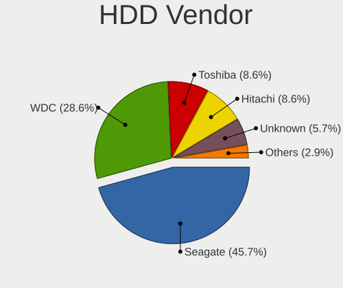

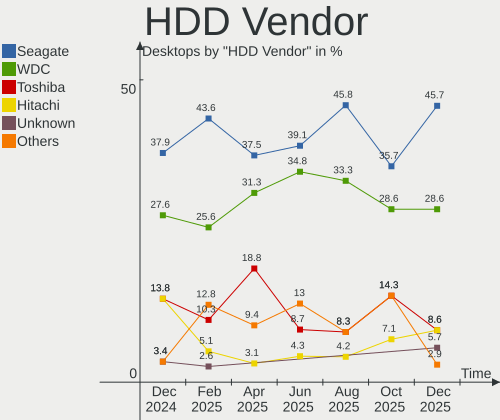

| Vendor  | Desktops | Drives | Percent |
|---------|----------|--------|---------|
| Seagate | 16       | 21     | 45.71%  |
| WDC     | 10       | 16     | 28.57%  |
| Toshiba | 3        | 3      | 8.57%   |
| Hitachi | 3        | 4      | 8.57%   |
| Unknown | 2        | 3      | 5.71%   |
| ASMedia | 1        | 1      | 2.86%   |

SSD Vendor
----------

Solid state drive vendors

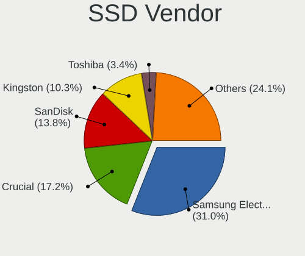

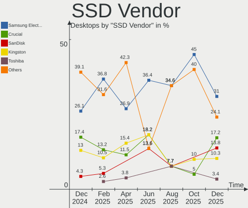

| Vendor              | Desktops | Drives | Percent |
|---------------------|----------|--------|---------|
| Samsung Electronics | 9        | 11     | 31.03%  |
| Crucial             | 5        | 8      | 17.24%  |
| SanDisk             | 4        | 4      | 13.79%  |
| Kingston            | 3        | 3      | 10.34%  |
| Toshiba             | 1        | 1      | 3.45%   |
| Netac               | 1        | 1      | 3.45%   |
| Intenso             | 1        | 1      | 3.45%   |
| Intel               | 1        | 1      | 3.45%   |
| Fanxiang            | 1        | 1      | 3.45%   |
| Emtec               | 1        | 1      | 3.45%   |
| China               | 1        | 1      | 3.45%   |
| A-DATA Technology   | 1        | 1      | 3.45%   |

Drive Kind
----------

HDD or SSD

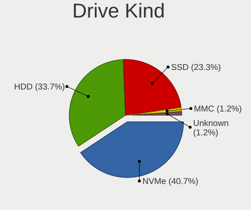

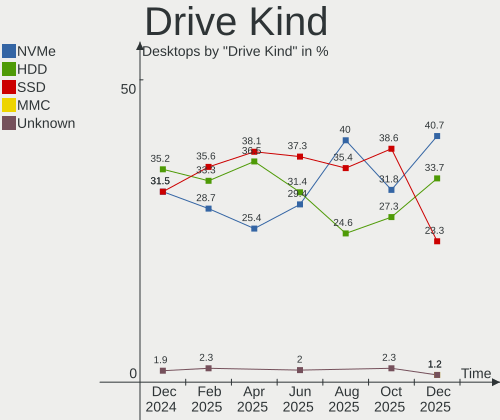

| Kind    | Desktops | Drives | Percent |
|---------|----------|--------|---------|
| NVMe    | 35       | 46     | 40.7%   |
| HDD     | 29       | 48     | 33.72%  |
| SSD     | 20       | 34     | 23.26%  |
| MMC     | 1        | 1      | 1.16%   |
| Unknown | 1        | 1      | 1.16%   |

Drive Connector
---------------

SATA, SAS, NVMe, etc.

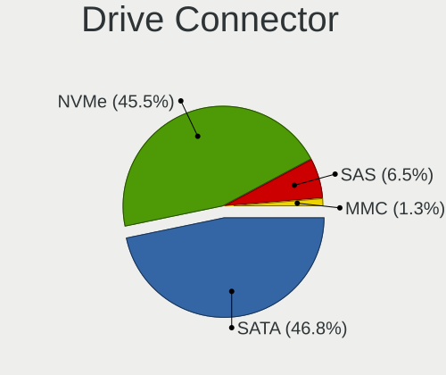

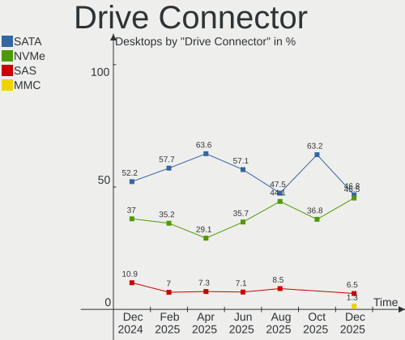

| Type | Desktops | Drives | Percent |
|------|----------|--------|---------|
| SATA | 36       | 78     | 46.75%  |
| NVMe | 35       | 45     | 45.45%  |
| SAS  | 5        | 6      | 6.49%   |
| MMC  | 1        | 1      | 1.3%    |

Drive Size
----------

Size of hard drive

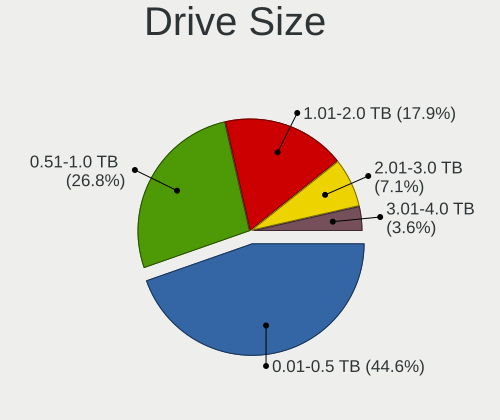

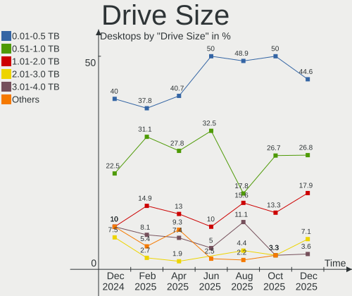

| Size in TB | Desktops | Drives | Percent |
|------------|----------|--------|---------|
| 0.01-0.5   | 25       | 44     | 44.64%  |
| 0.51-1.0   | 15       | 17     | 26.79%  |
| 1.01-2.0   | 10       | 13     | 17.86%  |
| 2.01-3.0   | 4        | 6      | 7.14%   |
| 3.01-4.0   | 2        | 2      | 3.57%   |

Space Total
-----------

Amount of disk space available on the file system

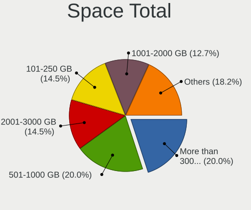

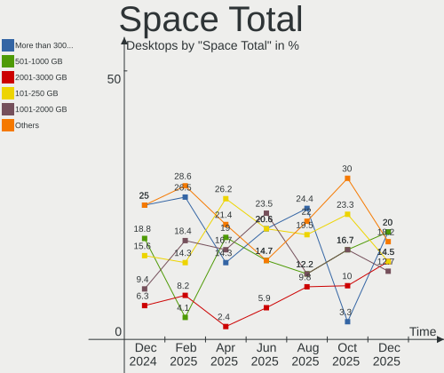

| Size in GB     | Desktops | Percent |
|----------------|----------|---------|
| More than 3000 | 11       | 20%     |
| 501-1000       | 11       | 20%     |
| 2001-3000      | 8        | 14.55%  |
| 101-250        | 8        | 14.55%  |
| 1001-2000      | 7        | 12.73%  |
| 251-500        | 4        | 7.27%   |
| 1-20           | 3        | 5.45%   |
| Unknown        | 2        | 3.64%   |
| 21-50          | 1        | 1.82%   |

Space Used
----------

Amount of used disk space

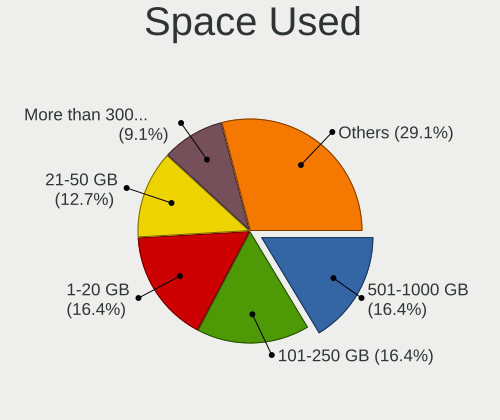

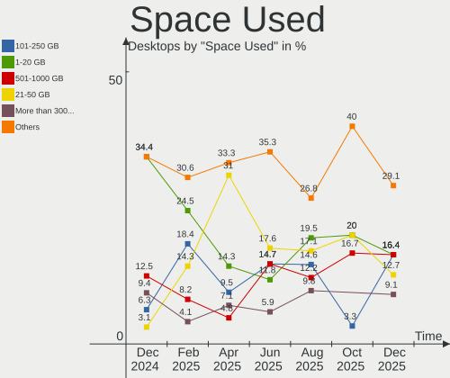

| Used GB        | Desktops | Percent |
|----------------|----------|---------|
| 101-250        | 9        | 16.36%  |
| 1-20           | 9        | 16.36%  |
| 501-1000       | 9        | 16.36%  |
| 21-50          | 7        | 12.73%  |
| More than 3000 | 5        | 9.09%   |
| 51-100         | 5        | 9.09%   |
| 251-500        | 4        | 7.27%   |
| 1001-2000      | 3        | 5.45%   |
| 2001-3000      | 2        | 3.64%   |
| Unknown        | 2        | 3.64%   |

Malfunc. Drives
---------------

Drive models with a malfunction

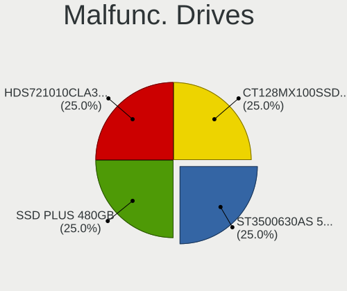

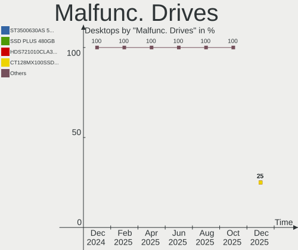

| Model                        | Desktops | Drives | Percent |
|------------------------------|----------|--------|---------|
| Seagate ST3500630AS 500GB    | 1        | 1      | 25%     |
| SanDisk SSD PLUS 480GB       | 1        | 1      | 25%     |
| Hitachi HDS721010CLA330 1TB  | 1        | 1      | 25%     |
| Crucial CT128MX100SSD1 128GB | 1        | 1      | 25%     |

Malfunc. Drive Vendor
---------------------

Vendors of faulty drives

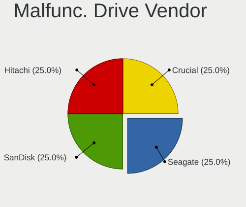

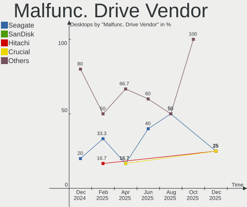

| Vendor  | Desktops | Drives | Percent |
|---------|----------|--------|---------|
| Seagate | 1        | 1      | 25%     |
| SanDisk | 1        | 1      | 25%     |
| Hitachi | 1        | 1      | 25%     |
| Crucial | 1        | 1      | 25%     |

Malfunc. HDD Vendor
-------------------

Vendors of faulty HDD drives

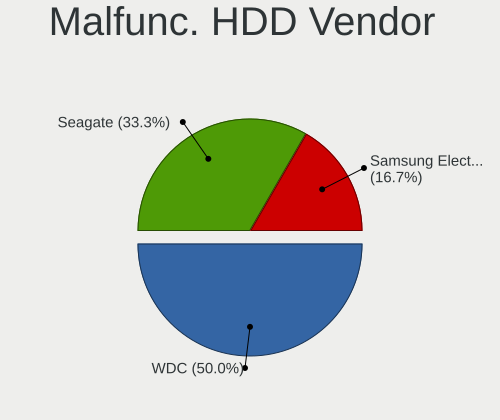

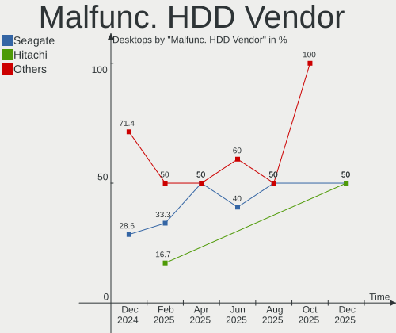

| Vendor  | Desktops | Drives | Percent |
|---------|----------|--------|---------|
| Seagate | 1        | 1      | 50%     |
| Hitachi | 1        | 1      | 50%     |

Malfunc. Drive Kind
-------------------

Kinds of faulty drives

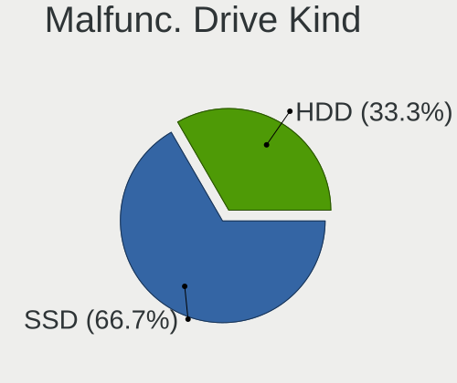

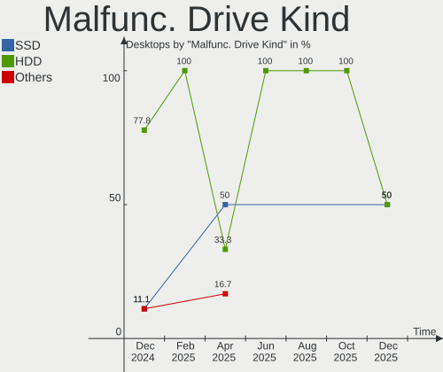

| Kind | Desktops | Drives | Percent |
|------|----------|--------|---------|
| SSD  | 2        | 2      | 50%     |
| HDD  | 2        | 2      | 50%     |

Failed Drives
-------------

Failed drive models

Zero info for selected period =(

Failed Drive Vendor
-------------------

Failed drive vendors

Zero info for selected period =(

Drive Status
------------

Number of failed and malfunc. drives

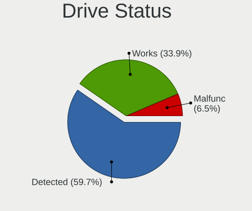

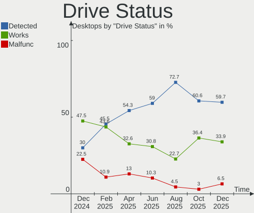

| Status   | Desktops | Drives | Percent |
|----------|----------|--------|---------|
| Detected | 37       | 83     | 59.68%  |
| Works    | 21       | 43     | 33.87%  |
| Malfunc  | 4        | 4      | 6.45%   |

Storage controller
------------------

Storage Vendor
--------------

Storage controller vendors

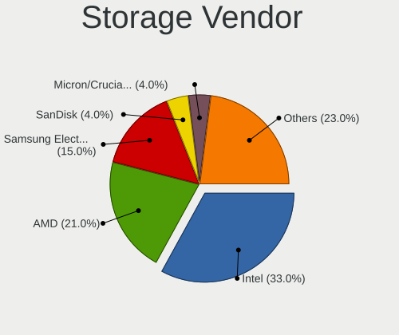

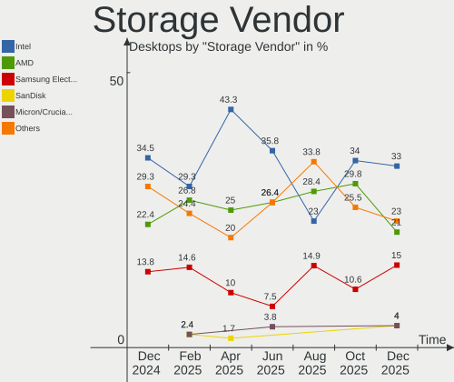

| Vendor                      | Desktops | Percent |
|-----------------------------|----------|---------|
| Intel                       | 33       | 33%     |
| AMD                         | 21       | 21%     |
| Samsung Electronics         | 15       | 15%     |
| SanDisk                     | 4        | 4%      |
| Micron/Crucial Technology   | 4        | 4%      |
| MAXIO Technology (Hangzhou) | 4        | 4%      |
| Kingston Technology Company | 4        | 4%      |
| ASMedia Technology          | 4        | 4%      |
| JMicron Technology          | 3        | 3%      |
| Micron Technology           | 2        | 2%      |
| SK hynix                    | 1        | 1%      |
| Silicon Motion              | 1        | 1%      |
| Phison Electronics          | 1        | 1%      |
| Marvell Technology Group    | 1        | 1%      |
| KIOXIA                      | 1        | 1%      |
| INNOGRIT                    | 1        | 1%      |

Storage Model
-------------

Storage controller models

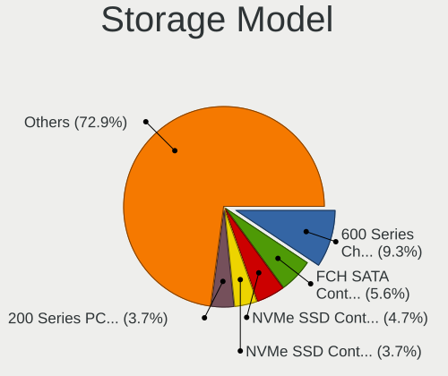

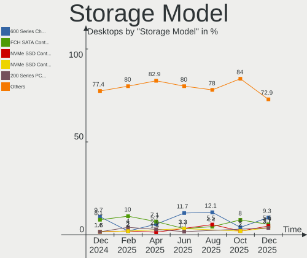

| Model                                                                          | Desktops | Percent |
|--------------------------------------------------------------------------------|----------|---------|
| AMD 600 Series Chipset SATA Controller                                         | 10       | 9.35%   |
| AMD FCH SATA Controller [AHCI mode]                                            | 6        | 5.61%   |
| Samsung NVMe SSD Controller S4LV008[Pascal]                                    | 5        | 4.67%   |
| MAXIO (Hangzhou) NVMe SSD Controller MAP1202 (DRAM-less)                       | 4        | 3.74%   |
| Intel 200 Series PCH SATA controller [AHCI mode]                               | 4        | 3.74%   |
| ASMedia ASM1061/ASM1062 Serial ATA Controller                                  | 4        | 3.74%   |
| Samsung NVMe SSD Controller SM981/PM981/PM983                                  | 3        | 2.8%    |
| Samsung NVMe SSD Controller PM9A1/PM9A3/980PRO                                 | 3        | 2.8%    |
| Kingston Company A2000 NVMe SSD [SM2263EN]                                     | 3        | 2.8%    |
| Intel Raptor Lake SATA AHCI Controller                                         | 3        | 2.8%    |
| Intel Cannon Lake PCH SATA AHCI Controller                                     | 3        | 2.8%    |
| Intel Alder Lake-N SATA AHCI Controller                                        | 3        | 2.8%    |
| Intel 5 Series/3400 Series Chipset 6 port SATA AHCI Controller                 | 3        | 2.8%    |
| AMD 500 Series Chipset SATA Controller                                         | 3        | 2.8%    |
| AMD 400 Series Chipset SATA Controller                                         | 3        | 2.8%    |
| Samsung NVMe SSD Controller 980 (DRAM-less)                                    | 2        | 1.87%   |
| Samsung NVMe SSD 9100 PRO [PM9E1]                                              | 2        | 1.87%   |
| JMicron JMB363 SATA/IDE Controller                                             | 2        | 1.87%   |
| Intel SATA controller                                                          | 2        | 1.87%   |
| Intel Alder Lake-S PCH SATA Controller [AHCI Mode]                             | 2        | 1.87%   |
| Intel 8 Series/C220 Series Chipset Family 6-port SATA Controller 1 [AHCI mode] | 2        | 1.87%   |
| Intel 7 Series/C210 Series Chipset Family 6-port SATA Controller [AHCI mode]   | 2        | 1.87%   |
| SK hynix PCB01 NVMe Solid State Drive                                          | 1        | 0.93%   |
| Silicon Motion SM2263EN/SM2263XT (DRAM-less) NVMe SSD Controllers              | 1        | 0.93%   |
| SanDisk WD SN560/SN740/SN770/SN5000 NVMe SSD                                   | 1        | 0.93%   |
| Sandisk WD PC SN8050S / WD_BLACK SN8100 NVMe SSD                               | 1        | 0.93%   |
| SanDisk WD PC SN540 / Green SN350 NVMe SSD 1 TB (DRAM-less)                    | 1        | 0.93%   |
| SanDisk Ultra 3D / WD PC SN530, IX SN530, Blue SN550 NVMe SSD (DRAM-less)      | 1        | 0.93%   |
| Samsung NVMe SSD Controller SM961/PM961/SM963                                  | 1        | 0.93%   |
| Phison E12 NVMe Controller                                                     | 1        | 0.93%   |
| Micron/Crucial T500 NVMe PCIe SSD                                              | 1        | 0.93%   |
| Micron/Crucial P510 NVMe PCIe SSD (DRAM-less)                                  | 1        | 0.93%   |
| Micron/Crucial P5 Plus NVMe PCIe SSD                                           | 1        | 0.93%   |
| Micron/Crucial P3 Plus NVMe PCIe SSD (DRAM-less)                               | 1        | 0.93%   |
| Micron 2550 NVMe SSD (DRAM-less)                                               | 1        | 0.93%   |
| Micron 2400 NVMe SSD (DRAM-less)                                               | 1        | 0.93%   |
| Marvell Group 88SE9172 SATA 6Gb/s Controller                                   | 1        | 0.93%   |
| KIOXIA NVMe SSD Controller BG4 (DRAM-less)                                     | 1        | 0.93%   |
| Kingston Company NV2 NVMe SSD [SM2267XT] (DRAM-less)                           | 1        | 0.93%   |
| JMicron JMB368 IDE controller                                                  | 1        | 0.93%   |

Storage Kind
------------

Kind of storage controller (IDE, SATA, NVMe, SAS, ...)

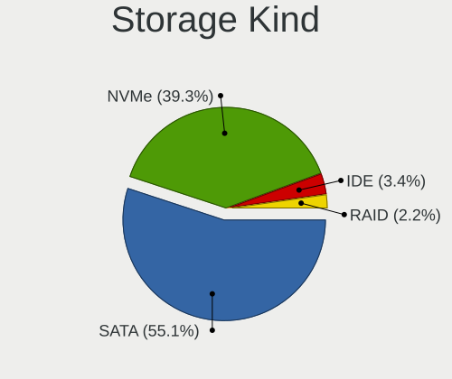

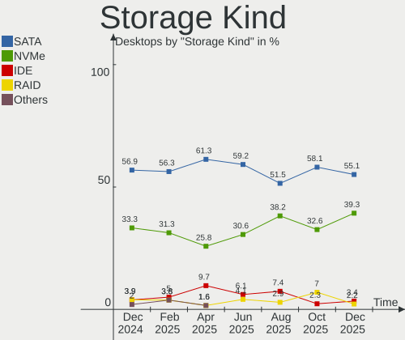

| Kind | Desktops | Percent |
|------|----------|---------|
| SATA | 49       | 55.06%  |
| NVMe | 35       | 39.33%  |
| IDE  | 3        | 3.37%   |
| RAID | 2        | 2.25%   |

Processor
---------

CPU Vendor
----------

Processor vendors

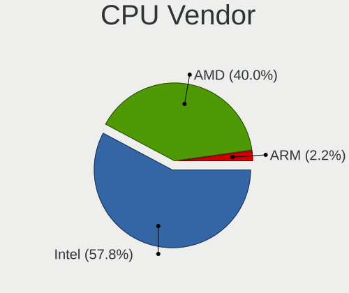

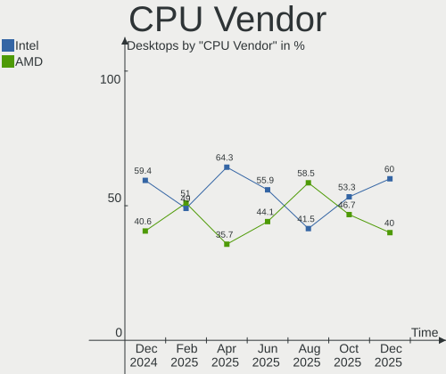

| Vendor | Desktops | Percent |
|--------|----------|---------|
| Intel  | 33       | 60%     |
| AMD    | 22       | 40%     |

CPU Model
---------

Processor models

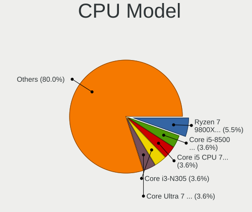

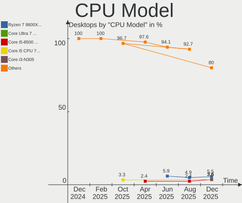

| Model                                   | Desktops | Percent |
|-----------------------------------------|----------|---------|
| AMD Ryzen 7 9800X3D 8-Core Processor    | 3        | 5.45%   |
| Intel Core Ultra 7 265K                 | 2        | 3.64%   |
| Intel Core i5-8500 CPU @ 3.00GHz        | 2        | 3.64%   |
| Intel Core i5 CPU 750 @ 2.67GHz         | 2        | 3.64%   |
| Intel Core i3-N305                      | 2        | 3.64%   |
| AMD Ryzen 7 5825U with Radeon Graphics  | 2        | 3.64%   |
| AMD Ryzen 7 5800X3D 8-Core Processor    | 2        | 3.64%   |
| Intel N100                              | 1        | 1.82%   |
| Intel Core i9-9900KF CPU @ 3.60GHz      | 1        | 1.82%   |
| Intel Core i9-14900K                    | 1        | 1.82%   |
| Intel Core i7-8700 CPU @ 3.20GHz        | 1        | 1.82%   |
| Intel Core i7-7700K CPU @ 4.20GHz       | 1        | 1.82%   |
| Intel Core i7-4770 CPU @ 3.40GHz        | 1        | 1.82%   |
| Intel Core i7 CPU 920 @ 2.67GHz         | 1        | 1.82%   |
| Intel Core i7 CPU 870 @ 2.93GHz         | 1        | 1.82%   |
| Intel Core i5-9600KF CPU @ 3.70GHz      | 1        | 1.82%   |
| Intel Core i5-7600K CPU @ 3.80GHz       | 1        | 1.82%   |
| Intel Core i5-7400 CPU @ 3.00GHz        | 1        | 1.82%   |
| Intel Core i5-4690K CPU @ 3.50GHz       | 1        | 1.82%   |
| Intel Core i5-4590 CPU @ 3.30GHz        | 1        | 1.82%   |
| Intel Core i5-3330 CPU @ 3.00GHz        | 1        | 1.82%   |
| Intel Core i5-2300 CPU @ 2.80GHz        | 1        | 1.82%   |
| Intel Core i5-14600K                    | 1        | 1.82%   |
| Intel Core i5-10400F CPU @ 2.90GHz      | 1        | 1.82%   |
| Intel Core i3-6320 CPU @ 3.90GHz        | 1        | 1.82%   |
| Intel Core i3 CPU 530 @ 2.93GHz         | 1        | 1.82%   |
| Intel Core 2 Duo CPU E7500 @ 2.93GHz    | 1        | 1.82%   |
| Intel Celeron CPU N3050 @ 1.60GHz       | 1        | 1.82%   |
| Intel 13th Gen Core i5-13400            | 1        | 1.82%   |
| Intel 12th Gen Core i7-12700F           | 1        | 1.82%   |
| Intel 12th Gen Core i5-12600KF          | 1        | 1.82%   |
| Intel 11th Gen Core i5-1135G7 @ 2.40GHz | 1        | 1.82%   |
| AMD Ryzen 9 7950X3D 16-Core Processor   | 1        | 1.82%   |
| AMD Ryzen 9 7950X 16-Core Processor     | 1        | 1.82%   |
| AMD Ryzen 9 7900X 12-Core Processor     | 1        | 1.82%   |
| AMD Ryzen 7 9700X 8-Core Processor      | 1        | 1.82%   |
| AMD Ryzen 7 8700F 8-Core Processor      | 1        | 1.82%   |
| AMD Ryzen 7 7800X3D 8-Core Processor    | 1        | 1.82%   |
| AMD Ryzen 7 7700 8-Core Processor       | 1        | 1.82%   |
| AMD Ryzen 7 5800X 8-Core Processor      | 1        | 1.82%   |

CPU Model Family
----------------

Processor model prefix

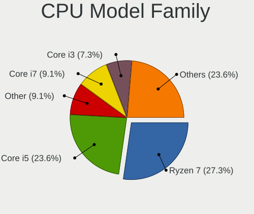

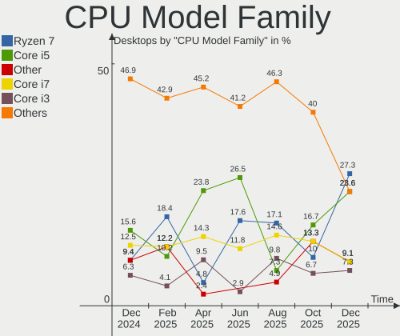

| Model            | Desktops | Percent |
|------------------|----------|---------|
| AMD Ryzen 7      | 15       | 27.27%  |
| Intel Core i5    | 13       | 23.64%  |
| Other            | 5        | 9.09%   |
| Intel Core i7    | 5        | 9.09%   |
| Intel Core i3    | 4        | 7.27%   |
| AMD Ryzen 9      | 3        | 5.45%   |
| Intel Core i9    | 2        | 3.64%   |
| Intel Core       | 2        | 3.64%   |
| AMD Ryzen 5      | 2        | 3.64%   |
| Intel Core 2 Duo | 1        | 1.82%   |
| Intel Celeron    | 1        | 1.82%   |
| AMD GX           | 1        | 1.82%   |
| AMD FX           | 1        | 1.82%   |

CPU Cores
---------

Number of processor cores

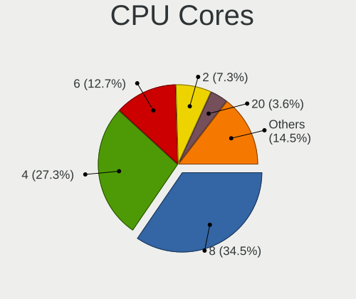

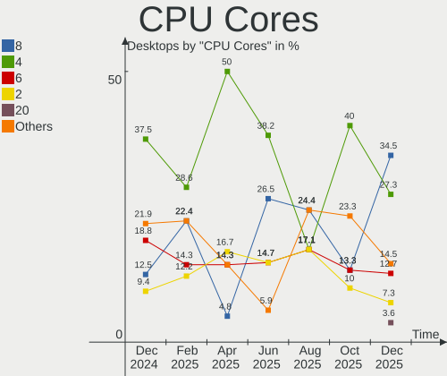

| Number | Desktops | Percent |
|--------|----------|---------|
| 8      | 19       | 34.55%  |
| 4      | 15       | 27.27%  |
| 6      | 7        | 12.73%  |
| 2      | 4        | 7.27%   |
| 20     | 2        | 3.64%   |
| 16     | 2        | 3.64%   |
| 12     | 2        | 3.64%   |
| 10     | 2        | 3.64%   |
| 24     | 1        | 1.82%   |
| 14     | 1        | 1.82%   |

CPU Sockets
-----------

Number of sockets

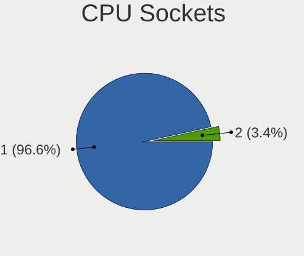

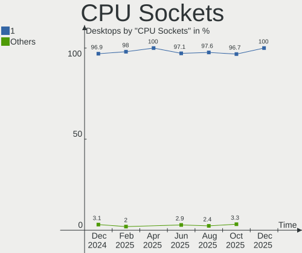

| Number | Desktops | Percent |
|--------|----------|---------|
| 1      | 55       | 100%    |

CPU Threads
-----------

Threads per core (Hyper-Threading)

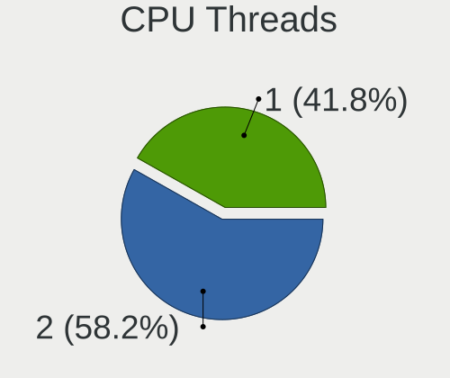

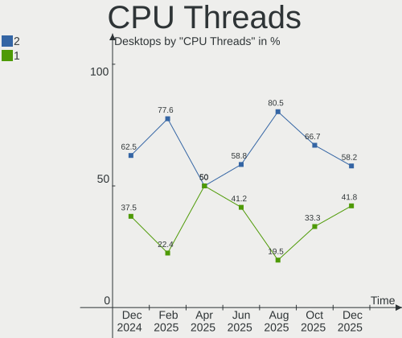

| Number | Desktops | Percent |
|--------|----------|---------|
| 2      | 32       | 58.18%  |
| 1      | 23       | 41.82%  |

CPU Op-Modes
------------

CPU Operation Modes (32-bit, 64-bit)

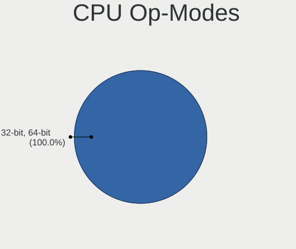

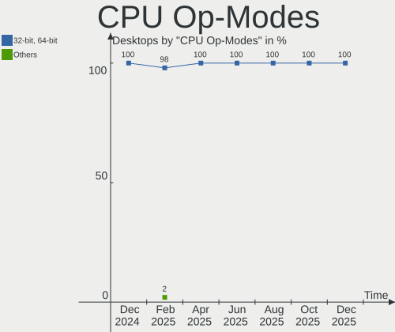

| Op mode        | Desktops | Percent |
|----------------|----------|---------|
| 32-bit, 64-bit | 55       | 100%    |

CPU Microcode
-------------

Microcode number

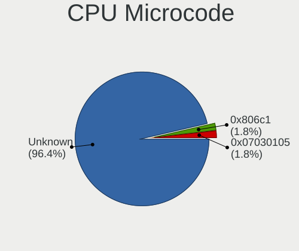

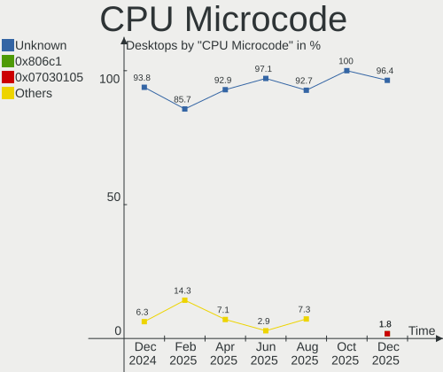

| Number     | Desktops | Percent |
|------------|----------|---------|
| Unknown    | 53       | 96.36%  |
| 0x806c1    | 1        | 1.82%   |
| 0x07030105 | 1        | 1.82%   |

CPU Microarch
-------------

Microarchitecture

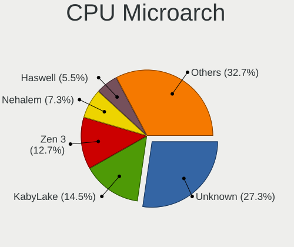

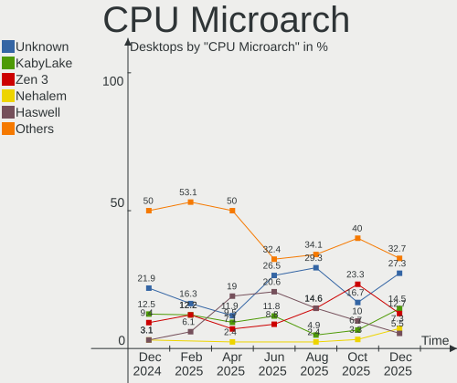

| Name             | Desktops | Percent |
|------------------|----------|---------|
| Unknown          | 15       | 27.27%  |
| KabyLake         | 8        | 14.55%  |
| Zen 3            | 7        | 12.73%  |
| Nehalem          | 4        | 7.27%   |
| Haswell          | 3        | 5.45%   |
| Gracemont        | 3        | 5.45%   |
| Zen+             | 2        | 3.64%   |
| Zen 2            | 1        | 1.82%   |
| Westmere         | 1        | 1.82%   |
| TigerLake        | 1        | 1.82%   |
| Skylake          | 1        | 1.82%   |
| Silvermont       | 1        | 1.82%   |
| SandyBridge      | 1        | 1.82%   |
| Puma             | 1        | 1.82%   |
| Piledriver       | 1        | 1.82%   |
| Penryn           | 1        | 1.82%   |
| Lunarlake Hybrid | 1        | 1.82%   |
| IvyBridge        | 1        | 1.82%   |
| CometLake        | 1        | 1.82%   |
| Alderlake Hybrid | 1        | 1.82%   |

Graphics
--------

GPU Vendor
----------

Vendors of graphics cards

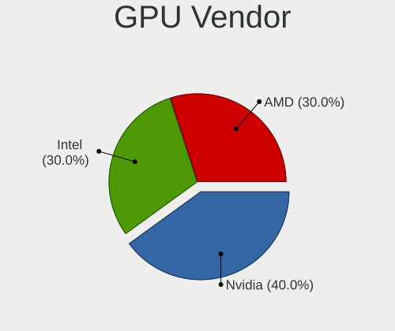

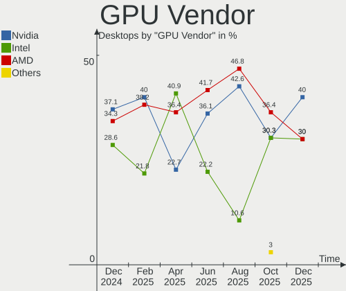

| Vendor | Desktops | Percent |
|--------|----------|---------|
| Nvidia | 24       | 40%     |
| Intel  | 18       | 30%     |
| AMD    | 18       | 30%     |

GPU Model
---------

Graphics card models

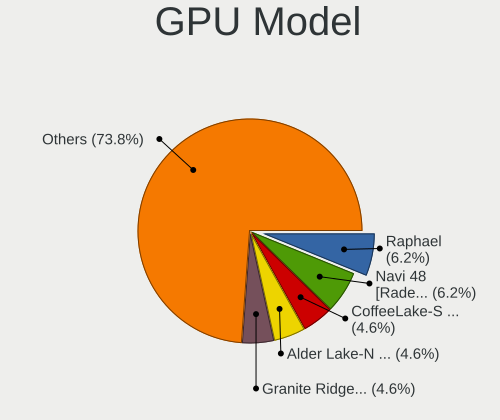

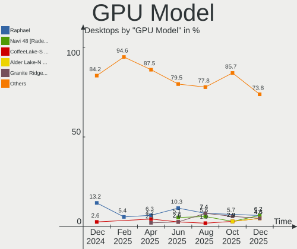

| Model                                                                                    | Desktops | Percent |
|------------------------------------------------------------------------------------------|----------|---------|
| AMD Raphael                                                                              | 4        | 6.15%   |
| AMD Navi 48 [Radeon RX 9070/9070 XT/9070 GRE]                                            | 4        | 6.15%   |
| Intel CoffeeLake-S GT2 [UHD Graphics 630]                                                | 3        | 4.62%   |
| Intel Alder Lake-N [UHD Graphics]                                                        | 3        | 4.62%   |
| AMD Granite Ridge [Radeon Graphics]                                                      | 3        | 4.62%   |
| Intel Raptor Lake-S GT1 [UHD Graphics 770]                                               | 2        | 3.08%   |
| Intel Arrow Lake-S [Intel Graphics]                                                      | 2        | 3.08%   |
| AMD Cezanne [Radeon Vega Series / Radeon Vega Mobile Series]                             | 2        | 3.08%   |
| AMD Barcelo                                                                              | 2        | 3.08%   |
| Nvidia TU117GL [T600]                                                                    | 1        | 1.54%   |
| Nvidia TU116 [GeForce GTX 1660]                                                          | 1        | 1.54%   |
| Nvidia TU104 [GeForce RTX 2070 SUPER]                                                    | 1        | 1.54%   |
| Nvidia GT215 [GeForce GT 330]                                                            | 1        | 1.54%   |
| Nvidia GT215 [GeForce GT 240]                                                            | 1        | 1.54%   |
| Nvidia GP107 [GeForce GTX 1050 Ti]                                                       | 1        | 1.54%   |
| Nvidia GP106 [GeForce GTX 1060 6GB]                                                      | 1        | 1.54%   |
| Nvidia GP104 [GeForce GTX 1080]                                                          | 1        | 1.54%   |
| Nvidia GP102 [GeForce GTX 1080 Ti]                                                       | 1        | 1.54%   |
| Nvidia GK208B [GeForce GT 720]                                                           | 1        | 1.54%   |
| Nvidia GK208B [GeForce GT 710]                                                           | 1        | 1.54%   |
| Nvidia GK106 [GeForce GTX 660]                                                           | 1        | 1.54%   |
| Nvidia GK104 [GeForce GTX 760]                                                           | 1        | 1.54%   |
| Nvidia GB203 [GeForce RTX 5080]                                                          | 1        | 1.54%   |
| Nvidia GA106 [GeForce RTX 3060]                                                          | 1        | 1.54%   |
| Nvidia GA104 [GeForce RTX 3060]                                                          | 1        | 1.54%   |
| Nvidia GA102 [GeForce RTX 3070 Ti]                                                       | 1        | 1.54%   |
| Nvidia G92 [GeForce 9800 GT]                                                             | 1        | 1.54%   |
| Nvidia AD107 [GeForce RTX 4060]                                                          | 1        | 1.54%   |
| Nvidia AD106 [GeForce RTX 4060]                                                          | 1        | 1.54%   |
| Nvidia AD106 [GeForce RTX 4060 Ti 16GB]                                                  | 1        | 1.54%   |
| Nvidia AD104 [GeForce RTX 4070]                                                          | 1        | 1.54%   |
| Nvidia AD103 [GeForce RTX 4070 Ti SUPER]                                                 | 1        | 1.54%   |
| Nvidia AD102 [GeForce RTX 4090]                                                          | 1        | 1.54%   |
| Intel Xeon E3-1200 v3/4th Gen Core Processor Integrated Graphics Controller              | 1        | 1.54%   |
| Intel TigerLake-LP GT2 [Iris Xe Graphics]                                                | 1        | 1.54%   |
| Intel Skylake-S GT2 [HD Graphics 530]                                                    | 1        | 1.54%   |
| Intel Kaby Lake-S GT2 [HD Graphics 630]                                                  | 1        | 1.54%   |
| Intel Battlemage G21 [Arc B580]                                                          | 1        | 1.54%   |
| Intel Atom/Celeron/Pentium Processor x5-E8000/J3xxx/N3xxx Integrated Graphics Controller | 1        | 1.54%   |
| Intel Alder Lake-S GT1 [UHD Graphics 730]                                                | 1        | 1.54%   |

GPU Combo
---------

Combinations of graphics cards

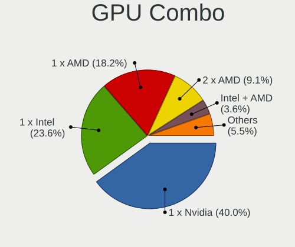

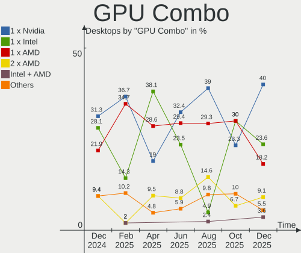

| Name           | Desktops | Percent |
|----------------|----------|---------|
| 1 x Nvidia     | 22       | 40%     |
| 1 x Intel      | 13       | 23.64%  |
| 1 x AMD        | 10       | 18.18%  |
| 2 x AMD        | 5        | 9.09%   |
| Intel + AMD    | 2        | 3.64%   |
| Other          | 1        | 1.82%   |
| Intel + Nvidia | 1        | 1.82%   |
| AMD + Nvidia   | 1        | 1.82%   |

GPU Driver
----------

Free vs proprietary

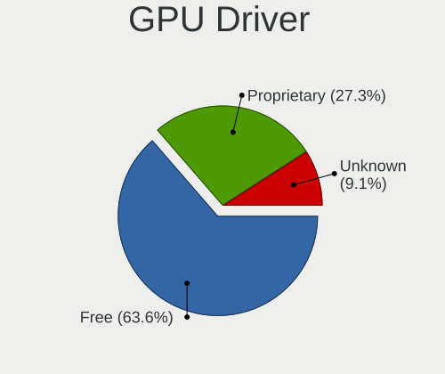

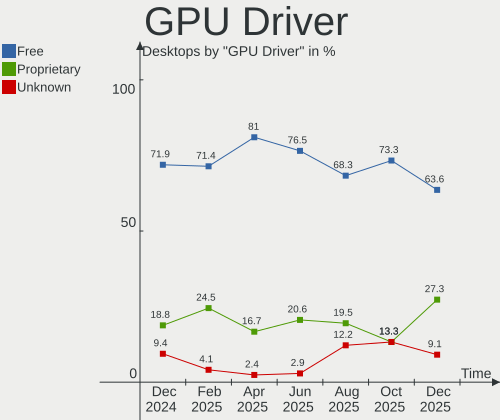

| Driver      | Desktops | Percent |
|-------------|----------|---------|
| Free        | 35       | 63.64%  |
| Proprietary | 15       | 27.27%  |
| Unknown     | 5        | 9.09%   |

GPU Memory
----------

Total video memory

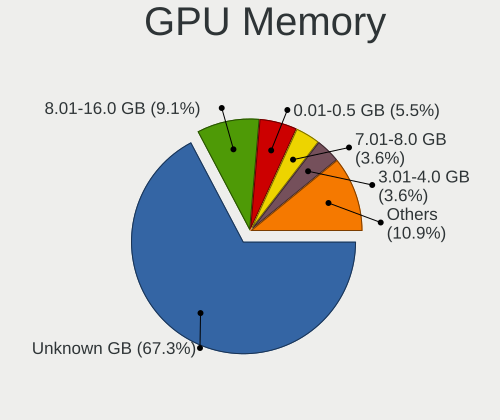

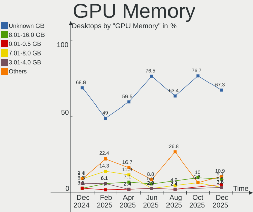

| Size in GB | Desktops | Percent |
|------------|----------|---------|
| Unknown    | 37       | 67.27%  |
| 8.01-16.0  | 5        | 9.09%   |
| 0.01-0.5   | 3        | 5.45%   |
| 7.01-8.0   | 2        | 3.64%   |
| 3.01-4.0   | 2        | 3.64%   |
| 0.51-1.0   | 2        | 3.64%   |
| 5.01-6.0   | 1        | 1.82%   |
| 2.01-3.0   | 1        | 1.82%   |
| 16.01-24.0 | 1        | 1.82%   |
| 1.01-2.0   | 1        | 1.82%   |

Monitor
-------

Monitor Vendor
--------------

Monitor vendors

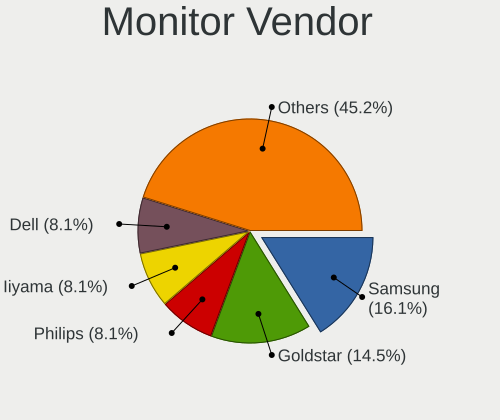

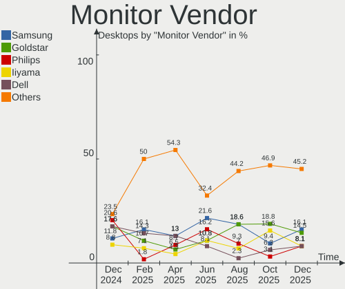

| Vendor               | Desktops | Percent |
|----------------------|----------|---------|
| Samsung Electronics  | 10       | 16.13%  |
| Goldstar             | 9        | 14.52%  |
| Philips              | 5        | 8.06%   |
| Iiyama               | 5        | 8.06%   |
| Dell                 | 5        | 8.06%   |
| AOC                  | 5        | 8.06%   |
| Toshiba              | 2        | 3.23%   |
| MSI                  | 2        | 3.23%   |
| LG Electronics       | 2        | 3.23%   |
| Hewlett-Packard      | 2        | 3.23%   |
| Eizo                 | 2        | 3.23%   |
| ASUSTek Computer     | 2        | 3.23%   |
| Acer                 | 2        | 3.23%   |
| Medion               | 1        | 1.61%   |
| Lanix                | 1        | 1.61%   |
| Huion                | 1        | 1.61%   |
| GreenWood            | 1        | 1.61%   |
| Envision Peripherals | 1        | 1.61%   |
| DENON                | 1        | 1.61%   |
| CMT                  | 1        | 1.61%   |
| BenQ                 | 1        | 1.61%   |
| ASRock               | 1        | 1.61%   |

Monitor Model
-------------

Monitor models

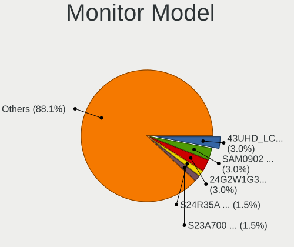

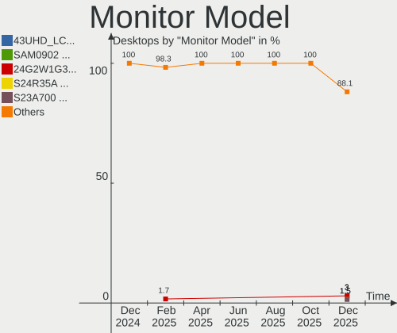

| Model                                                                   | Desktops | Percent |
|-------------------------------------------------------------------------|----------|---------|
| Toshiba 43UHD_LCD_TV TSB3700 3840x2160 940x540mm 42.7-inch              | 2        | 2.99%   |
| Samsung Electronics LCD Monitor SAM0902 1920x1080 890x500mm 40.2-inch   | 2        | 2.99%   |
| AOC 24G2W1G3 AOC2402 1920x1080 527x296mm 23.8-inch                      | 2        | 2.99%   |
| Samsung Electronics S24R35A SAM729F 1920x1080 521x293mm 23.5-inch       | 1        | 1.49%   |
| Samsung Electronics S23A700 SAM085F 1920x1080 509x286mm 23.0-inch       | 1        | 1.49%   |
| Samsung Electronics S22D300 SAM0B3E 1920x1080 477x268mm 21.5-inch       | 1        | 1.49%   |
| Samsung Electronics Odyssey G70D SAME06F 3840x2160 698x392mm 31.5-inch  | 1        | 1.49%   |
| Samsung Electronics Odyssey G70B SAM7232 3840x2160 698x392mm 31.5-inch  | 1        | 1.49%   |
| Samsung Electronics LS27D70xE SAM7692 3840x2160 597x336mm 27.0-inch     | 1        | 1.49%   |
| Samsung Electronics LCD Monitor SAM7016 3840x2160 1872x1053mm 84.6-inch | 1        | 1.49%   |
| Samsung Electronics LCD Monitor SAM0FBD 3840x2160 950x540mm 43.0-inch   | 1        | 1.49%   |
| Samsung Electronics LCD Monitor SAM0C39 1920x1080 885x498mm 40.0-inch   | 1        | 1.49%   |
| Philips PHL32M1N5800A PHLC277 3840x2160 697x392mm 31.5-inch             | 1        | 1.49%   |
| Philips PHL 246E9Q PHLC17C 1920x1080 527x296mm 23.8-inch                | 1        | 1.49%   |
| Philips PHL 222S1 PHL0950 1920x1080 476x268mm 21.5-inch                 | 1        | 1.49%   |
| Philips 27M1N3200V PHLC279 1920x1080 598x336mm 27.0-inch                | 1        | 1.49%   |
| Philips 237EQ PHLC090 1920x1080 509x286mm 23.0-inch                     | 1        | 1.49%   |
| MSI Optix MAG27CQ MSI1462 2560x1440 597x336mm 27.0-inch                 | 1        | 1.49%   |
| MSI MP161 E2 MSI40B7 1920x1080 330x220mm 15.6-inch                      | 1        | 1.49%   |
| Medion MD 20110 MED3604 1920x1080 520x300mm 23.6-inch                   | 1        | 1.49%   |
| LG Electronics LCD Monitor W2343 1920x1080                              | 1        | 1.49%   |
| LG Electronics LCD Monitor 2D FHD LG TV 1920x1080                       | 1        | 1.49%   |
| Lanix PiKVM V3 LNX7771 1680x1050 527x296mm 23.8-inch                    | 1        | 1.49%   |
| Iiyama PLE2483H-DP IVM611E 1920x1080 531x299mm 24.0-inch                | 1        | 1.49%   |
| Iiyama PLE2483H IVM6113 1920x1080 531x299mm 24.0-inch                   | 1        | 1.49%   |
| Iiyama PL3493WQ IVM7613 3440x1440 800x345mm 34.3-inch                   | 1        | 1.49%   |
| Iiyama PL2792Q IVM6637 2560x1440 597x336mm 27.0-inch                    | 1        | 1.49%   |
| Iiyama PL2475HD IVM6108 1920x1080 521x293mm 23.5-inch                   | 1        | 1.49%   |
| Iiyama PL2470H IVM615C 1920x1080 527x296mm 23.8-inch                    | 1        | 1.49%   |
| Huion Kamvas 13 HAT1330 1920x1080 294x165mm 13.3-inch                   | 1        | 1.49%   |
| Hewlett-Packard V212a HWP328F 1920x1080 458x258mm 20.7-inch             | 1        | 1.49%   |
| Hewlett-Packard LCD Monitor E231 3840x1080                              | 1        | 1.49%   |
| GreenWood ARZOPA GWD1161 1920x1080 355x200mm 16.0-inch                  | 1        | 1.49%   |
| Goldstar ULTRAGEAR+ GSM780D 3440x1440 795x333mm 33.9-inch               | 1        | 1.49%   |
| Goldstar Ultra HD GSM5B09 3840x2160 600x340mm 27.2-inch                 | 1        | 1.49%   |
| Goldstar MP59G GSM5B34 1920x1080 480x270mm 21.7-inch                    | 1        | 1.49%   |
| Goldstar M2362D GSM5757 1920x1080 598x336mm 27.0-inch                   | 1        | 1.49%   |
| Goldstar LG ULTRAWIDE GSM59F1 2560x1080 670x280mm 28.6-inch             | 1        | 1.49%   |
| Goldstar LG TV SSCR2 GSMC0C8 3840x2160                                  | 1        | 1.49%   |
| Goldstar HDR WFHD GSM7714 2560x1080 798x334mm 34.1-inch                 | 1        | 1.49%   |

Monitor Resolution
------------------

Monitor screen resolution

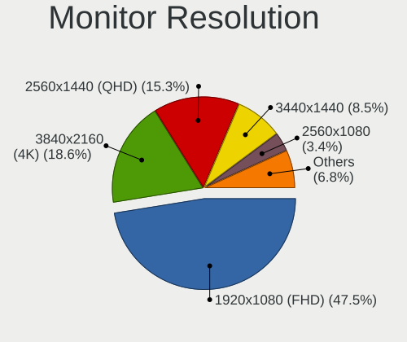

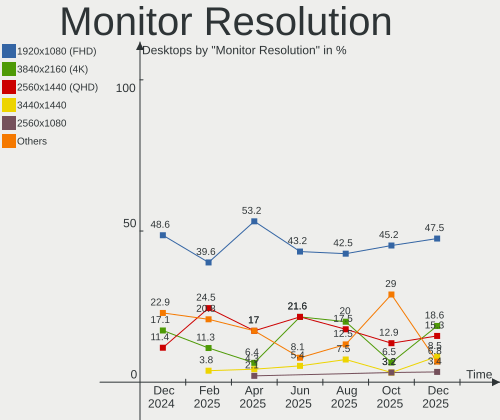

| Resolution       | Desktops | Percent |
|------------------|----------|---------|
| 1920x1080 (FHD)  | 28       | 47.46%  |
| 3840x2160 (4K)   | 11       | 18.64%  |
| 2560x1440 (QHD)  | 9        | 15.25%  |
| 3440x1440        | 5        | 8.47%   |
| 2560x1080        | 2        | 3.39%   |
| 3840x1080        | 1        | 1.69%   |
| 1920x540         | 1        | 1.69%   |
| 1280x1024 (SXGA) | 1        | 1.69%   |
| Unknown          | 1        | 1.69%   |

Monitor Diagonal
----------------

Diagonal size in inches

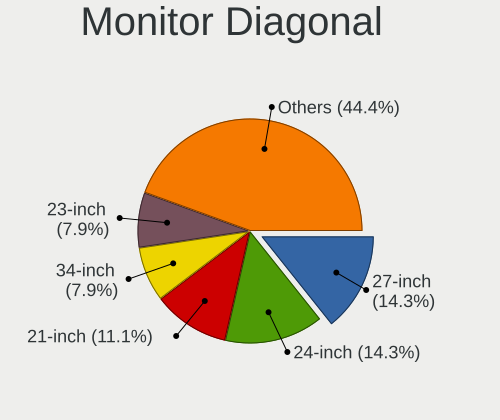

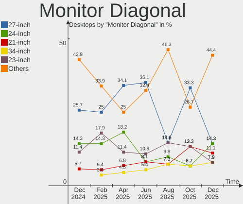

| Inches  | Desktops | Percent |
|---------|----------|---------|
| 27      | 9        | 14.29%  |
| 24      | 9        | 14.29%  |
| 21      | 7        | 11.11%  |
| 34      | 5        | 7.94%   |
| 23      | 5        | 7.94%   |
| 84      | 4        | 6.35%   |
| 54      | 3        | 4.76%   |
| 25      | 3        | 4.76%   |
| Unknown | 3        | 4.76%   |
| 33      | 2        | 3.17%   |
| 31      | 2        | 3.17%   |
| 26      | 2        | 3.17%   |
| 15      | 2        | 3.17%   |
| 72      | 1        | 1.59%   |
| 63      | 1        | 1.59%   |
| 42      | 1        | 1.59%   |
| 32      | 1        | 1.59%   |
| 20      | 1        | 1.59%   |
| 19      | 1        | 1.59%   |
| 16      | 1        | 1.59%   |

Monitor Width
-------------

Physical width

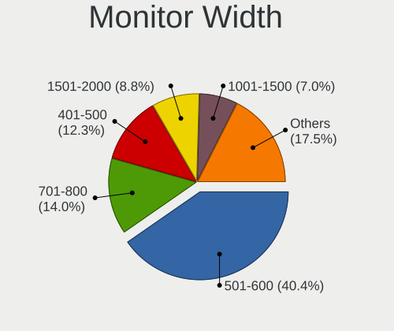

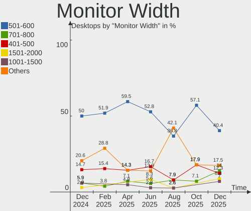

| Width in mm | Desktops | Percent |
|-------------|----------|---------|
| 501-600     | 23       | 40.35%  |
| 701-800     | 8        | 14.04%  |
| 401-500     | 7        | 12.28%  |
| 1501-2000   | 5        | 8.77%   |
| 1001-1500   | 4        | 7.02%   |
| Unknown     | 3        | 5.26%   |
| 601-700     | 2        | 3.51%   |
| 351-400     | 2        | 3.51%   |
| 301-350     | 2        | 3.51%   |
| 901-1000    | 1        | 1.75%   |

Aspect Ratio
------------

Proportional relationship between the width and the height

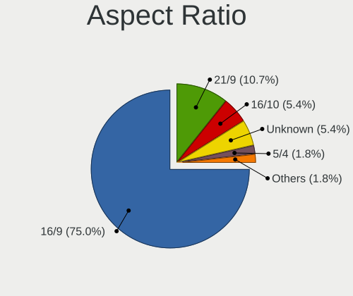

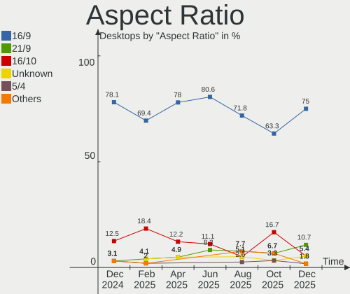

| Ratio   | Desktops | Percent |
|---------|----------|---------|
| 16/9    | 42       | 75%     |
| 21/9    | 6        | 10.71%  |
| 16/10   | 3        | 5.36%   |
| Unknown | 3        | 5.36%   |
| 5/4     | 1        | 1.79%   |
| 3/2     | 1        | 1.79%   |

Monitor Area
------------

Area in inch²

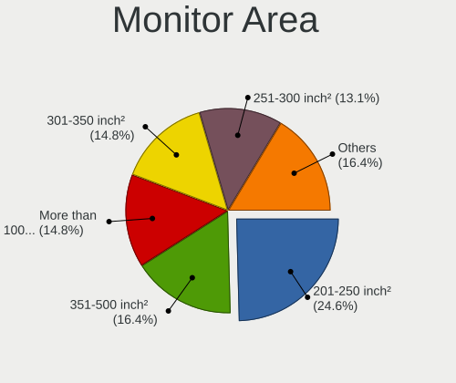

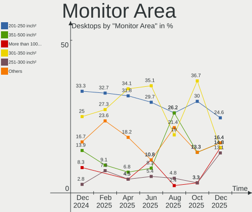

| Area in inch² | Desktops | Percent |
|----------------|----------|---------|
| 201-250        | 15       | 24.59%  |
| 351-500        | 10       | 16.39%  |
| More than 1000 | 9        | 14.75%  |
| 301-350        | 9        | 14.75%  |
| 251-300        | 8        | 13.11%  |
| 151-200        | 3        | 4.92%   |
| Unknown        | 3        | 4.92%   |
| 111-120        | 2        | 3.28%   |
| 101-110        | 1        | 1.64%   |
| 501-1000       | 1        | 1.64%   |

Pixel Density
-------------

Pixels per inch

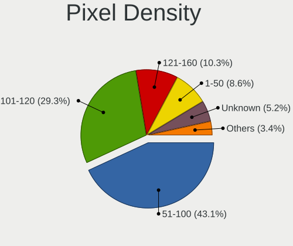

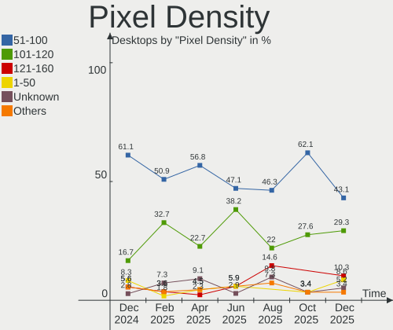

| Density | Desktops | Percent |
|---------|----------|---------|
| 51-100  | 25       | 43.1%   |
| 101-120 | 17       | 29.31%  |
| 121-160 | 6        | 10.34%  |
| 1-50    | 5        | 8.62%   |
| Unknown | 3        | 5.17%   |
| 161-240 | 2        | 3.45%   |

Multiple Monitors
-----------------

Total monitors connected

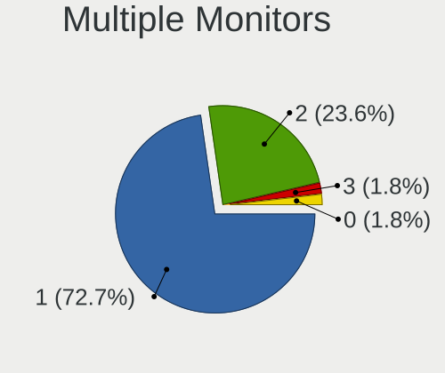

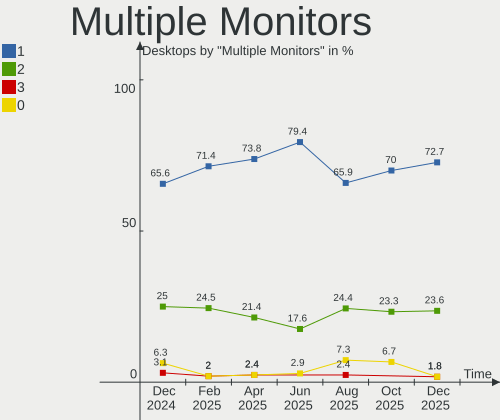

| Total | Desktops | Percent |
|-------|----------|---------|
| 1     | 40       | 72.73%  |
| 2     | 13       | 23.64%  |
| 3     | 1        | 1.82%   |
| 0     | 1        | 1.82%   |

Network
-------

Net Controller Vendor
---------------------

Controller vendors

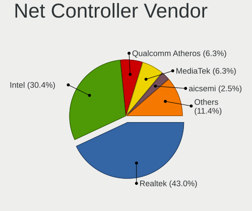

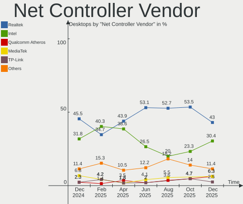

| Vendor                          | Desktops | Percent |
|---------------------------------|----------|---------|
| Realtek Semiconductor           | 34       | 43.04%  |
| Intel                           | 24       | 30.38%  |
| Qualcomm Atheros                | 5        | 6.33%   |
| MediaTek                        | 5        | 6.33%   |
| TP-Link                         | 2        | 2.53%   |
| aicsemi                         | 2        | 2.53%   |
| Sigma Designs                   | 1        | 1.27%   |
| Ralink Technology               | 1        | 1.27%   |
| Qualcomm Atheros Communications | 1        | 1.27%   |
| NetGear                         | 1        | 1.27%   |
| Marvell Technology Group        | 1        | 1.27%   |
| IMC Networks                    | 1        | 1.27%   |
| Aquantia                        | 1        | 1.27%   |

Net Controller Model
--------------------

Controller models

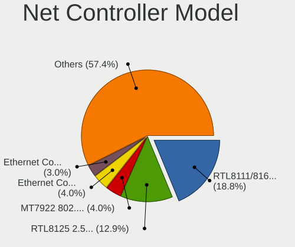

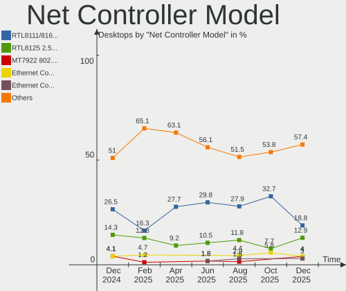

| Model                                                                           | Desktops | Percent |
|---------------------------------------------------------------------------------|----------|---------|
| Realtek RTL8111/8168/8211/8411 PCI Express Gigabit Ethernet Controller          | 19       | 18.81%  |
| Realtek RTL8125 2.5GbE Controller                                               | 13       | 12.87%  |
| MediaTek MT7922 802.11ax PCI Express Wireless Network Adapter                   | 4        | 3.96%   |
| Intel Ethernet Controller I225-V                                                | 4        | 3.96%   |
| Intel Ethernet Controller I226-V                                                | 3        | 2.97%   |
| Intel Ethernet Connection (2) I219-V                                            | 3        | 2.97%   |
| Realtek RTL8922AE 802.11be PCIe Wireless Network Adapter                        | 2        | 1.98%   |
| Realtek RTL8852BE PCIe 802.11ax Wireless Network Controller                     | 2        | 1.98%   |
| Realtek RTL8192EU 802.11b/g/n WLAN Adapter                                      | 2        | 1.98%   |
| Realtek RTL8153 Gigabit Ethernet Adapter                                        | 2        | 1.98%   |
| Qualcomm Atheros Killer E2500 Gigabit Ethernet Controller                       | 2        | 1.98%   |
| Intel Wireless 7260                                                             | 2        | 1.98%   |
| Intel Wi-Fi 6E(802.11ax) AX210/AX1675* 2x2 [Typhoon Peak]                       | 2        | 1.98%   |
| Intel Ethernet Connection (17) I219-V                                           | 2        | 1.98%   |
| Intel Dual Band Wireless-AC 3168NGW [Stone Peak]                                | 2        | 1.98%   |
| aicsemi AIC Wlan                                                                | 2        | 1.98%   |
| TP-Link TL-WN823N v2/v3 [Realtek RTL8192EU]                                     | 1        | 0.99%   |
| TP-Link Archer T3U [Realtek RTL8812BU]                                          | 1        | 0.99%   |
| Sigma Designs Aeotec Z-Stick Gen5 (ZW090) - UZB                                 | 1        | 0.99%   |
| Realtek RTL8852CE PCIe 802.11ax Wireless Network Controller                     | 1        | 0.99%   |
| Realtek RTL8169 PCI Gigabit Ethernet Controller                                 | 1        | 0.99%   |
| Realtek RTL8126 5GbE Controller                                                 | 1        | 0.99%   |
| Realtek Killer E5000 5GbE Controller                                            | 1        | 0.99%   |
| Ralink RT3572 Wireless Adapter                                                  | 1        | 0.99%   |
| Qualcomm Atheros QCA986x/988x 802.11ac Wireless Network Adapter                 | 1        | 0.99%   |
| Qualcomm Atheros QCA6174 802.11ac Wireless Network Adapter                      | 1        | 0.99%   |
| Qualcomm Atheros AR9271 802.11n                                                 | 1        | 0.99%   |
| Qualcomm Atheros AR9485 Wireless Network Adapter                                | 1        | 0.99%   |
| Qualcomm Atheros AR9287 Wireless Network Adapter (PCI-Express)                  | 1        | 0.99%   |
| Qualcomm Atheros AR8161 Gigabit Ethernet                                        | 1        | 0.99%   |
| NetGear A6210                                                                   | 1        | 0.99%   |
| MediaTek MT7927 802.11be 320MHz 2x2 PCIe Wireless Network Adapter [Filogic 380] | 1        | 0.99%   |
| Marvell Group 88E8056 PCI-E Gigabit Ethernet Controller                         | 1        | 0.99%   |
| Intel Wireless 3160                                                             | 1        | 0.99%   |
| Intel Wi-Fi 7(802.11be) AX1775*/AX1790*/BE20*/BE401/BE1750* 2x2                 | 1        | 0.99%   |
| Intel Wi-Fi 6 AX201                                                             | 1        | 0.99%   |
| Intel I211 Gigabit Network Connection                                           | 1        | 0.99%   |
| Intel Ethernet Controller I226-LM                                               | 1        | 0.99%   |
| Intel Ethernet Connection (7) I219-V                                            | 1        | 0.99%   |
| Intel Ethernet Connection (7) I219-LM                                           | 1        | 0.99%   |

Wireless Vendor
---------------

Wireless vendors

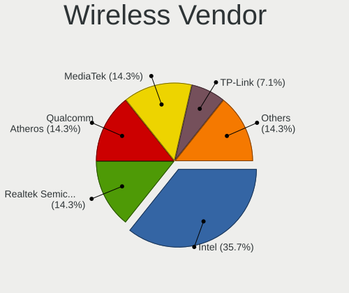

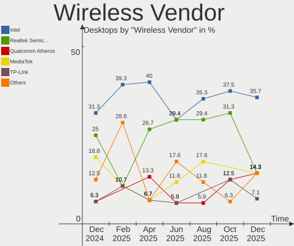

| Vendor                          | Desktops | Percent |
|---------------------------------|----------|---------|
| Intel                           | 10       | 35.71%  |
| Realtek Semiconductor           | 4        | 14.29%  |
| Qualcomm Atheros                | 4        | 14.29%  |
| MediaTek                        | 4        | 14.29%  |
| TP-Link                         | 2        | 7.14%   |
| Ralink Technology               | 1        | 3.57%   |
| Qualcomm Atheros Communications | 1        | 3.57%   |
| NetGear                         | 1        | 3.57%   |
| IMC Networks                    | 1        | 3.57%   |

Wireless Model
--------------

Wireless models

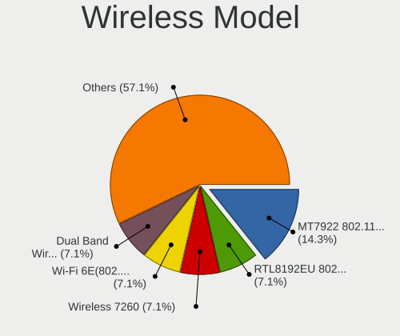

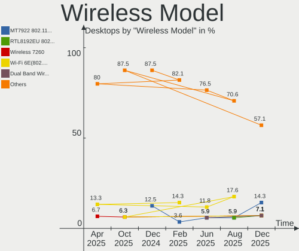

| Model                                                           | Desktops | Percent |
|-----------------------------------------------------------------|----------|---------|
| MediaTek MT7922 802.11ax PCI Express Wireless Network Adapter   | 4        | 14.29%  |
| Realtek RTL8192EU 802.11b/g/n WLAN Adapter                      | 2        | 7.14%   |
| Intel Wireless 7260                                             | 2        | 7.14%   |
| Intel Wi-Fi 6E(802.11ax) AX210/AX1675* 2x2 [Typhoon Peak]       | 2        | 7.14%   |
| Intel Dual Band Wireless-AC 3168NGW [Stone Peak]                | 2        | 7.14%   |
| TP-Link TL-WN823N v2/v3 [Realtek RTL8192EU]                     | 1        | 3.57%   |
| TP-Link Archer T3U [Realtek RTL8812BU]                          | 1        | 3.57%   |
| Realtek RTL8852CE PCIe 802.11ax Wireless Network Controller     | 1        | 3.57%   |
| Realtek RTL8852BE PCIe 802.11ax Wireless Network Controller     | 1        | 3.57%   |
| Ralink RT3572 Wireless Adapter                                  | 1        | 3.57%   |
| Qualcomm Atheros QCA986x/988x 802.11ac Wireless Network Adapter | 1        | 3.57%   |
| Qualcomm Atheros QCA6174 802.11ac Wireless Network Adapter      | 1        | 3.57%   |
| Qualcomm Atheros AR9271 802.11n                                 | 1        | 3.57%   |
| Qualcomm Atheros AR9485 Wireless Network Adapter                | 1        | 3.57%   |
| Qualcomm Atheros AR9287 Wireless Network Adapter (PCI-Express)  | 1        | 3.57%   |
| NetGear A6210                                                   | 1        | 3.57%   |
| Intel Wireless 3160                                             | 1        | 3.57%   |
| Intel Wi-Fi 6 AX201                                             | 1        | 3.57%   |
| Intel Alder Lake-N PCH CNVi WiFi                                | 1        | 3.57%   |
| Intel 700 Series Chipset CNVi WiFi                              | 1        | 3.57%   |
| IMC Networks Mediao 802.11n WLAN [Realtek RTL8191SU]            | 1        | 3.57%   |

Ethernet Vendor
---------------

Ethernet vendors

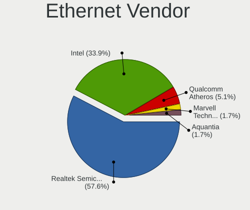

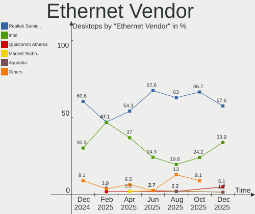

| Vendor                   | Desktops | Percent |
|--------------------------|----------|---------|
| Realtek Semiconductor    | 34       | 57.63%  |
| Intel                    | 20       | 33.9%   |
| Qualcomm Atheros         | 3        | 5.08%   |
| Marvell Technology Group | 1        | 1.69%   |
| Aquantia                 | 1        | 1.69%   |

Ethernet Model
--------------

Ethernet models

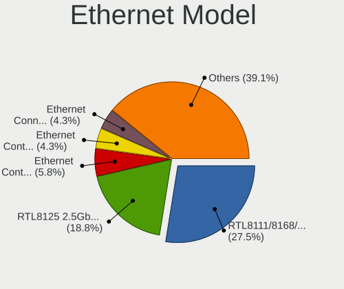

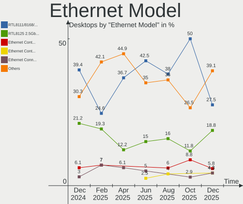

| Model                                                                          | Desktops | Percent |
|--------------------------------------------------------------------------------|----------|---------|
| Realtek RTL8111/8168/8211/8411 PCI Express Gigabit Ethernet Controller         | 19       | 27.54%  |
| Realtek RTL8125 2.5GbE Controller                                              | 13       | 18.84%  |
| Intel Ethernet Controller I225-V                                               | 4        | 5.8%    |
| Intel Ethernet Controller I226-V                                               | 3        | 4.35%   |
| Intel Ethernet Connection (2) I219-V                                           | 3        | 4.35%   |
| Realtek RTL8922AE 802.11be PCIe Wireless Network Adapter                       | 2        | 2.9%    |
| Realtek RTL8153 Gigabit Ethernet Adapter                                       | 2        | 2.9%    |
| Qualcomm Atheros Killer E2500 Gigabit Ethernet Controller                      | 2        | 2.9%    |
| Intel Ethernet Connection (17) I219-V                                          | 2        | 2.9%    |
| Realtek RTL8852BE PCIe 802.11ax Wireless Network Controller                    | 1        | 1.45%   |
| Realtek RTL8169 PCI Gigabit Ethernet Controller                                | 1        | 1.45%   |
| Realtek RTL8126 5GbE Controller                                                | 1        | 1.45%   |
| Realtek Killer E5000 5GbE Controller                                           | 1        | 1.45%   |
| Qualcomm Atheros AR8161 Gigabit Ethernet                                       | 1        | 1.45%   |
| Marvell Group 88E8056 PCI-E Gigabit Ethernet Controller                        | 1        | 1.45%   |
| Intel Wi-Fi 7(802.11be) AX1775*/AX1790*/BE20*/BE401/BE1750* 2x2                | 1        | 1.45%   |
| Intel I211 Gigabit Network Connection                                          | 1        | 1.45%   |
| Intel Ethernet Controller I226-LM                                              | 1        | 1.45%   |
| Intel Ethernet Connection (7) I219-V                                           | 1        | 1.45%   |
| Intel Ethernet Connection (7) I219-LM                                          | 1        | 1.45%   |
| Intel Ethernet Connection (19) I219-LM                                         | 1        | 1.45%   |
| Intel Ethernet Connection (13) I219-V                                          | 1        | 1.45%   |
| Intel Ethernet Connection (12) I219-V                                          | 1        | 1.45%   |
| Intel 82599 10 Gigabit Network Connection                                      | 1        | 1.45%   |
| Intel 82578DM Gigabit Network Connection                                       | 1        | 1.45%   |
| Intel 82578DC Gigabit Network Connection                                       | 1        | 1.45%   |
| Intel 82574L Gigabit Network Connection                                        | 1        | 1.45%   |
| Aquantia AQtion AQC107 NBase-T/IEEE 802.3an Ethernet Controller [Atlantic 10G] | 1        | 1.45%   |

Net Controller Kind
-------------------

Ethernet, WiFi or modem

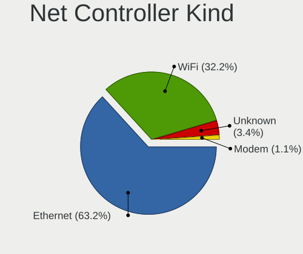

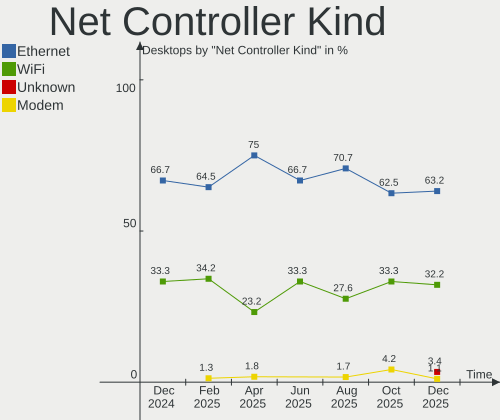

| Kind     | Desktops | Percent |
|----------|----------|---------|
| Ethernet | 55       | 63.22%  |
| WiFi     | 28       | 32.18%  |
| Unknown  | 3        | 3.45%   |
| Modem    | 1        | 1.15%   |

Used Controller
---------------

Currently used network controller

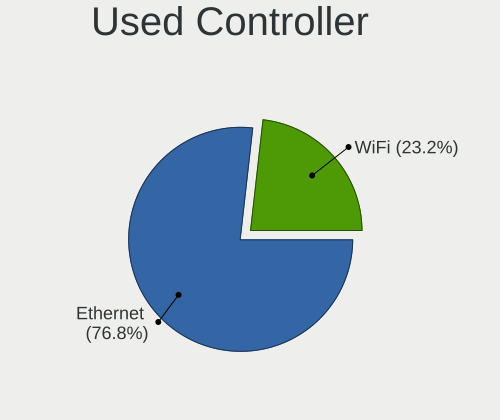

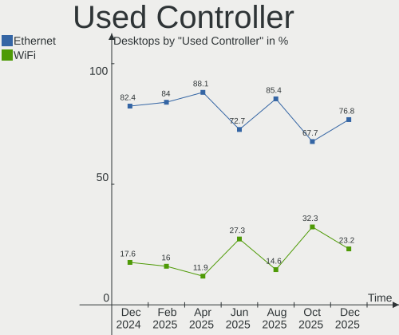

| Kind     | Desktops | Percent |
|----------|----------|---------|
| Ethernet | 43       | 76.79%  |
| WiFi     | 13       | 23.21%  |

NICs
----

Total network controllers on board

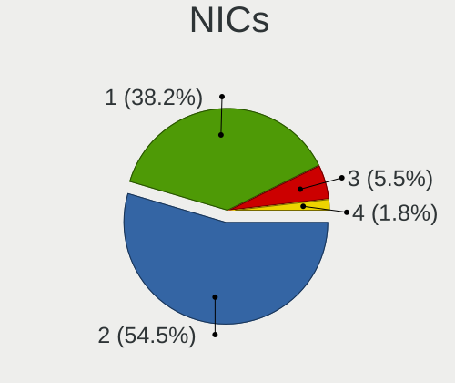

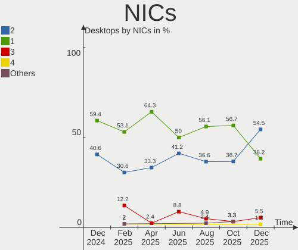

| Total | Desktops | Percent |
|-------|----------|---------|
| 2     | 30       | 54.55%  |
| 1     | 21       | 38.18%  |
| 3     | 3        | 5.45%   |
| 4     | 1        | 1.82%   |

IPv6
----

IPv6 vs IPv4

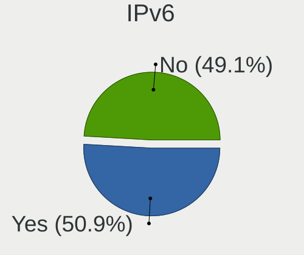

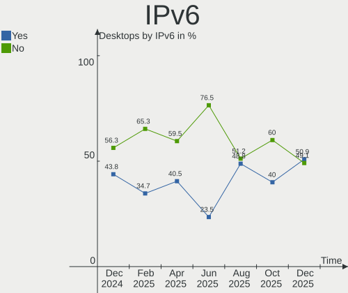

| Used | Desktops | Percent |
|------|----------|---------|
| Yes  | 28       | 50.91%  |
| No   | 27       | 49.09%  |

Bluetooth
---------

Bluetooth Vendor
----------------

Controller vendors

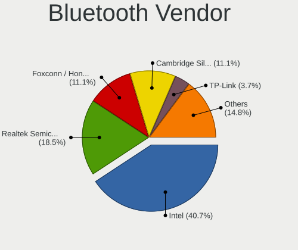

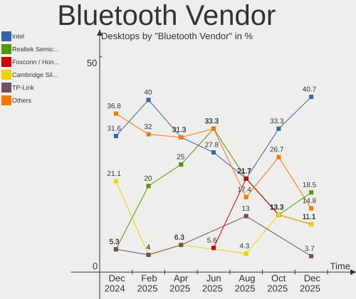

| Vendor                          | Desktops | Percent |
|---------------------------------|----------|---------|
| Intel                           | 11       | 40.74%  |
| Realtek Semiconductor           | 5        | 18.52%  |
| Foxconn / Hon Hai               | 3        | 11.11%  |
| Cambridge Silicon Radio         | 3        | 11.11%  |
| TP-Link                         | 1        | 3.7%    |
| Qualcomm Atheros Communications | 1        | 3.7%    |
| MediaTek                        | 1        | 3.7%    |
| Integrated System Solution      | 1        | 3.7%    |
| IMC Networks                    | 1        | 3.7%    |

Bluetooth Model
---------------

Controller models

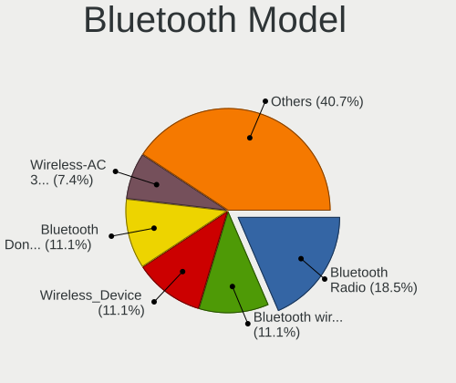

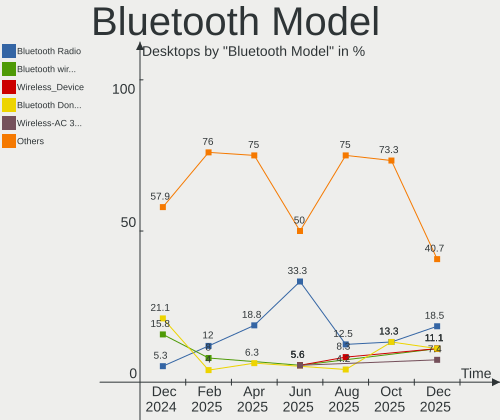

| Model                                                 | Desktops | Percent |
|-------------------------------------------------------|----------|---------|
| Realtek Bluetooth Radio                               | 5        | 18.52%  |
| Intel Bluetooth wireless interface                    | 3        | 11.11%  |
| Foxconn / Hon Hai Wireless_Device                     | 3        | 11.11%  |
| Cambridge Silicon Radio Bluetooth Dongle (HCI mode)   | 3        | 11.11%  |
| Intel Wireless-AC 3168 Bluetooth                      | 2        | 7.41%   |
| Intel Bluetooth Device                                | 2        | 7.41%   |
| Intel AX210 Bluetooth                                 | 2        | 7.41%   |
| Intel AX201 Bluetooth                                 | 2        | 7.41%   |
| TP-Link TP-T@- UB500 Adapter                          | 1        | 3.7%    |
| Qualcomm Atheros  Bluetooth Device                    | 1        | 3.7%    |
| MediaTek Wireless_Device                              | 1        | 3.7%    |
| Integrated System Solution KY-BT100 Bluetooth Adapter | 1        | 3.7%    |
| IMC Networks Bluetooth Radio                          | 1        | 3.7%    |

Sound
-----

Sound Vendor
------------

Sound card vendors

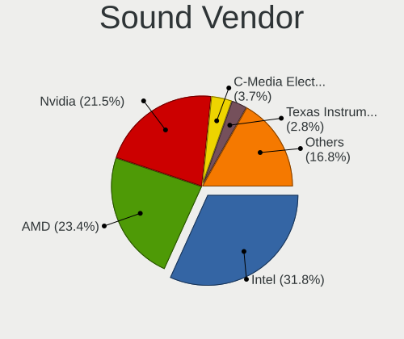

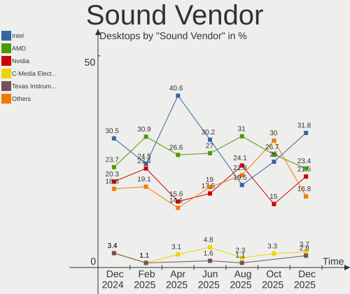

| Vendor                   | Desktops | Percent |
|--------------------------|----------|---------|
| Intel                    | 34       | 31.78%  |
| AMD                      | 25       | 23.36%  |
| Nvidia                   | 23       | 21.5%   |
| C-Media Electronics      | 4        | 3.74%   |
| Texas Instruments        | 3        | 2.8%    |
| SteelSeries ApS          | 3        | 2.8%    |
| Micro Star International | 2        | 1.87%   |
| Logitech                 | 2        | 1.87%   |
| Focusrite-Novation       | 2        | 1.87%   |
| Tenx Technology          | 1        | 0.93%   |
| NZXT                     | 1        | 0.93%   |
| Jieli Technology         | 1        | 0.93%   |
| Hewlett-Packard          | 1        | 0.93%   |
| Generalplus Technology   | 1        | 0.93%   |
| Fractal                  | 1        | 0.93%   |
| Creative Labs            | 1        | 0.93%   |
| BigBen Interactive       | 1        | 0.93%   |
| ASUSTek Computer         | 1        | 0.93%   |

Sound Model
-----------

Sound card models

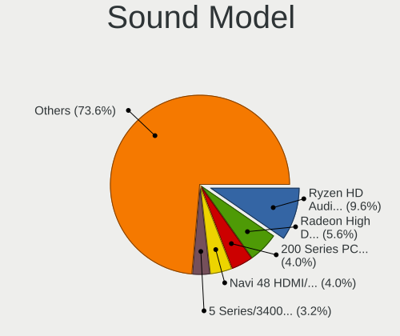

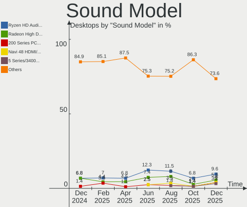

| Model                                                               | Desktops | Percent |
|---------------------------------------------------------------------|----------|---------|
| AMD Ryzen HD Audio Controller                                       | 12       | 9.6%    |
| AMD Radeon High Definition Audio Controller                         | 7        | 5.6%    |
| Intel 200 Series PCH HD Audio                                       | 5        | 4%      |
| AMD Navi 48 HDMI/DP Audio Controller                                | 5        | 4%      |
| Intel 5 Series/3400 Series Chipset High Definition Audio            | 4        | 3.2%    |
| AMD Starship/Matisse HD Audio Controller                            | 4        | 3.2%    |
| AMD Renoir/Cezanne HDMI/DP Audio Controller                         | 4        | 3.2%    |
| Intel Raptor Lake High Definition Audio Controller                  | 3        | 2.4%    |
| Intel Cannon Lake PCH cAVS                                          | 3        | 2.4%    |
| Intel Alder Lake-N PCH High Definition Audio Controller             | 3        | 2.4%    |
| C-Media Electronics Audio Adapter (Unitek Y-247A)                   | 3        | 2.4%    |
| Texas Instruments PCM2902 Audio Codec                               | 2        | 1.6%    |
| SteelSeries ApS Arctis Nova Pro Wireless                            | 2        | 1.6%    |
| Nvidia High Definition Audio Controller                             | 2        | 1.6%    |
| Nvidia GK208 HDMI/DP Audio Controller                               | 2        | 1.6%    |
| Nvidia AD106M High Definition Audio Controller                      | 2        | 1.6%    |
| Micro Star International USB Audio                                  | 2        | 1.6%    |
| Intel Alder Lake-S HD Audio Controller                              | 2        | 1.6%    |
| Intel 82801JI (ICH10 Family) HD Audio Controller                    | 2        | 1.6%    |
| Intel 800 Series ACE (Audio Context Engine)                         | 2        | 1.6%    |
| Intel 8 Series/C220 Series Chipset High Definition Audio Controller | 2        | 1.6%    |
| Intel 7 Series/C216 Chipset Family High Definition Audio Controller | 2        | 1.6%    |
| AMD Navi 31 HDMI/DP Audio                                           | 2        | 1.6%    |
| AMD Navi 21/23 HDMI/DP Audio Controller                             | 2        | 1.6%    |
| AMD Family 17h (Models 00h-0fh) HD Audio Controller                 | 2        | 1.6%    |
| Texas Instruments SMSL AD18 AMP                                     | 1        | 0.8%    |
| Tenx Technology USB AUDIO                                           | 1        | 0.8%    |
| SteelSeries ApS Arctis Pro Wireless                                 | 1        | 0.8%    |
| NZXT MINI USB MIC                                                   | 1        | 0.8%    |
| Nvidia TU116 High Definition Audio Controller                       | 1        | 0.8%    |
| Nvidia TU107 GeForce GTX 1650 High Definition Audio Controller      | 1        | 0.8%    |
| Nvidia TU104 HD Audio Controller                                    | 1        | 0.8%    |
| Nvidia GP107GL High Definition Audio Controller                     | 1        | 0.8%    |
| Nvidia GP106 High Definition Audio Controller                       | 1        | 0.8%    |
| Nvidia GP104 High Definition Audio Controller                       | 1        | 0.8%    |
| Nvidia GP102 HDMI Audio Controller                                  | 1        | 0.8%    |
| Nvidia GK106 HDMI Audio Controller                                  | 1        | 0.8%    |
| Nvidia GK104 HDMI Audio Controller                                  | 1        | 0.8%    |
| Nvidia GB203 High Definition Audio Controller                       | 1        | 0.8%    |
| Nvidia GA106 High Definition Audio Controller                       | 1        | 0.8%    |

Memory
------

Memory Vendor
-------------

Memory module vendors

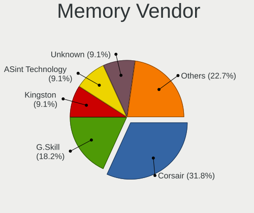

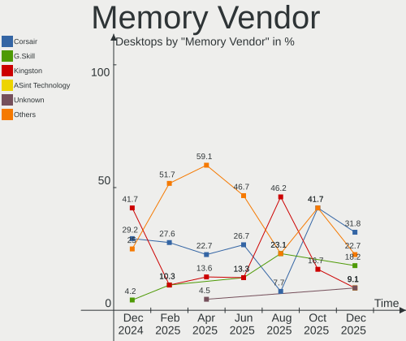

| Vendor              | Desktops | Percent |
|---------------------|----------|---------|
| Corsair             | 7        | 31.82%  |
| G.Skill             | 4        | 18.18%  |
| Kingston            | 2        | 9.09%   |
| ASint Technology    | 2        | 9.09%   |
| Unknown             | 2        | 9.09%   |
| Unknown             | 1        | 4.55%   |
| SK hynix            | 1        | 4.55%   |
| Samsung Electronics | 1        | 4.55%   |
| Micron Technology   | 1        | 4.55%   |
| Crucial             | 1        | 4.55%   |

Memory Model
------------

Memory module models

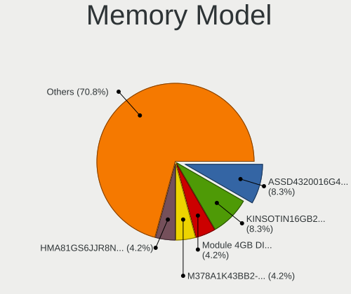

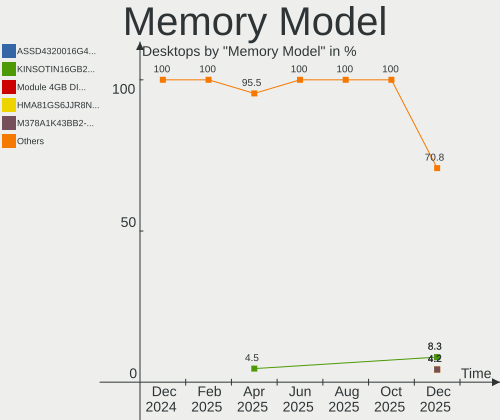

| Model                                                  | Desktops | Percent |
|--------------------------------------------------------|----------|---------|
| ASint RAM ASSD4320016G4b223 16GiB SODIMM DDR4 3200MT/s | 2        | 8.33%   |
| Unknown                                                | 2        | 8.33%   |
| Unknown RAM Module 4GB DIMM 1333MT/s                   | 1        | 4.17%   |
| SK hynix RAM HMA81GS6JJR8N-VK 8GB SODIMM DDR4 2667MT/s | 1        | 4.17%   |
| Samsung RAM M378A1K43BB2-CRC 8GB DIMM DDR4 3400MT/s    | 1        | 4.17%   |
| Micron RAM CP16G64C38U5B.M8D1 16GB DIMM DDR5 6000MT/s  | 1        | 4.17%   |
| Kingston RAM KF560C36-16 16GB DIMM DDR5 6000MT/s       | 1        | 4.17%   |
| Kingston RAM KF560C30-32 32GB DIMM DDR5 6000MT/s       | 1        | 4.17%   |
| G.Skill RAM F5-6000J3636F16G 16GB DIMM DDR5 6400MT/s   | 1        | 4.17%   |
| G.Skill RAM F5-6000J3040G32G 32GB DIMM DDR5 6200MT/s   | 1        | 4.17%   |
| G.Skill RAM F4-3200C16-8GTZB 8GB DIMM DDR4 3200MT/s    | 1        | 4.17%   |
| G.Skill RAM F4-3200C16-16GIS 16GB DIMM DDR4 3600MT/s   | 1        | 4.17%   |
| G.Skill RAM F4-3200C14-8GFX 8GB DIMM DDR4 3800MT/s     | 1        | 4.17%   |
| Crucial RAM BL8G32C16U4B.M8FE 8GB DIMM DDR4 4333MT/s   | 1        | 4.17%   |
| Corsair RAM CMK64GX4M4A2666C16 16GB DIMM DDR4 2667MT/s | 1        | 4.17%   |
| Corsair RAM CMK64GX4M2D3600C18 32GB DIMM DDR4 3600MT/s | 1        | 4.17%   |
| Corsair RAM CMK32GX4M2D3000C16 16GB DIMM DDR4 3200MT/s | 1        | 4.17%   |
| Corsair RAM CMK32GX4M2B3000C15 16GB DIMM DDR4 3000MT/s | 1        | 4.17%   |
| Corsair RAM CMK16GX4M2B3200C16 8GB DIMM DDR4 3600MT/s  | 1        | 4.17%   |
| Corsair RAM CMK16GX4M2B3000C15 8GB DIMM DDR4 3600MT/s  | 1        | 4.17%   |
| Corsair RAM CMG16GX4M2E3200C16 8GB DIMM DDR4 3200MT/s  | 1        | 4.17%   |
| Corsair RAM CMD16GX4M2B2400C10 8GB DIMM DDR4 2400MT/s  | 1        | 4.17%   |

Memory Kind
-----------

Memory module kinds

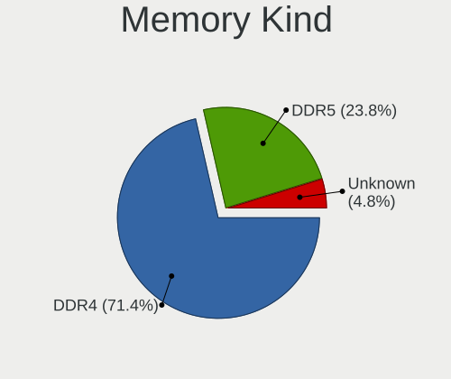

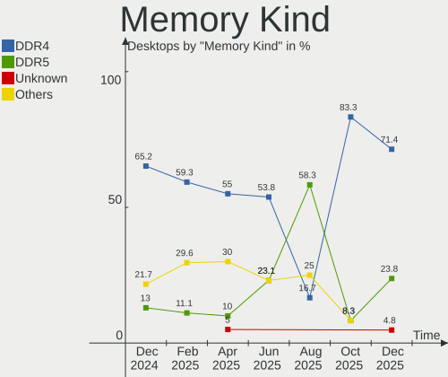

| Kind    | Desktops | Percent |
|---------|----------|---------|
| DDR4    | 15       | 71.43%  |
| DDR5    | 5        | 23.81%  |
| Unknown | 1        | 4.76%   |

Memory Form Factor
------------------

Physical design of the memory module

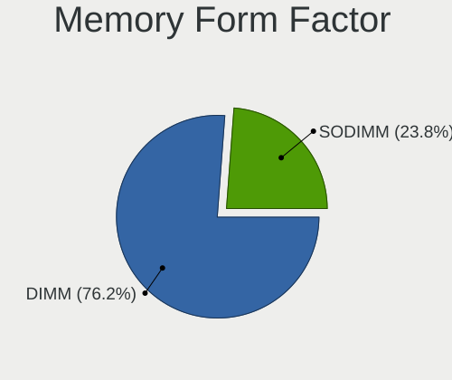

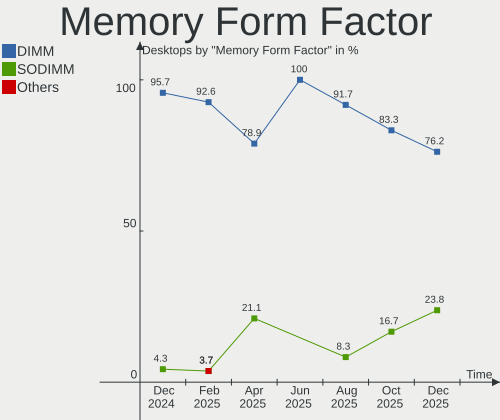

| Name   | Desktops | Percent |
|--------|----------|---------|
| DIMM   | 16       | 76.19%  |
| SODIMM | 5        | 23.81%  |

Memory Size
-----------

Memory module size

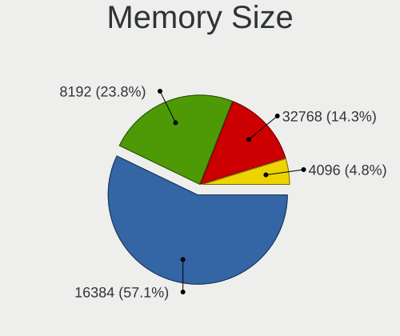

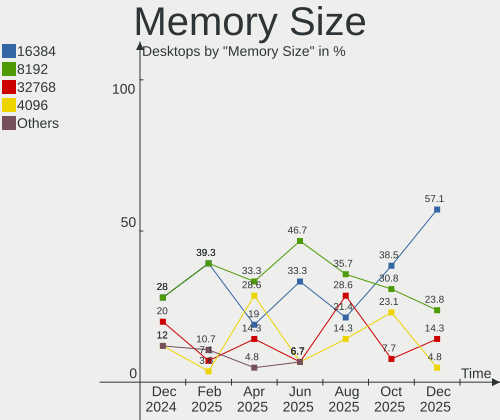

| Size  | Desktops | Percent |
|-------|----------|---------|
| 16384 | 12       | 57.14%  |
| 8192  | 5        | 23.81%  |
| 32768 | 3        | 14.29%  |
| 4096  | 1        | 4.76%   |

Memory Speed
------------

Memory module speed

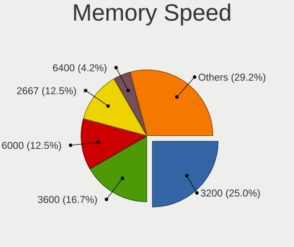

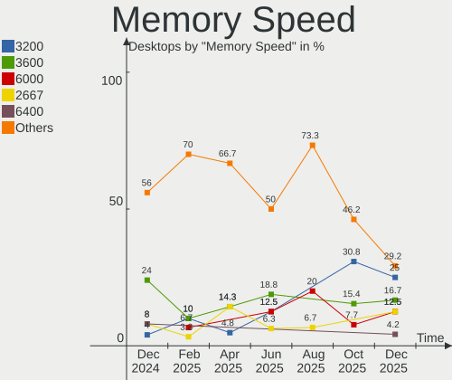

| Speed | Desktops | Percent |
|-------|----------|---------|
| 3200  | 6        | 25%     |
| 3600  | 4        | 16.67%  |
| 6000  | 3        | 12.5%   |
| 2667  | 3        | 12.5%   |
| 6400  | 1        | 4.17%   |
| 6200  | 1        | 4.17%   |
| 4333  | 1        | 4.17%   |
| 3800  | 1        | 4.17%   |
| 3400  | 1        | 4.17%   |
| 3000  | 1        | 4.17%   |
| 2400  | 1        | 4.17%   |
| 1333  | 1        | 4.17%   |

Printers & scanners
-------------------

Printer Vendor
--------------

Printer device vendors

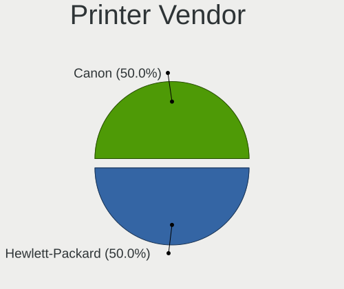

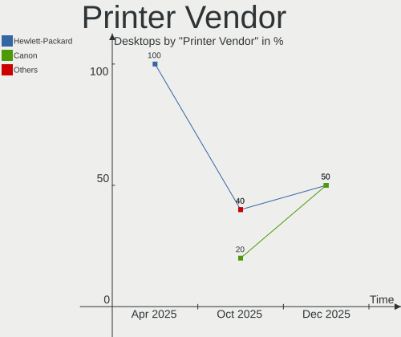

| Vendor          | Desktops | Percent |
|-----------------|----------|---------|
| Hewlett-Packard | 1        | 50%     |
| Canon           | 1        | 50%     |

Printer Model
-------------

Printer device models

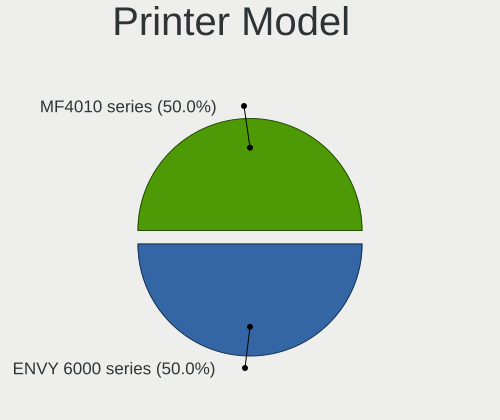

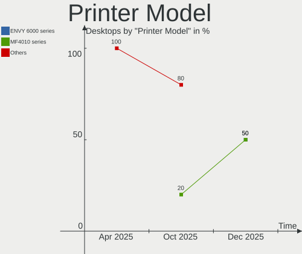

| Model               | Desktops | Percent |
|---------------------|----------|---------|
| HP ENVY 6000 series | 1        | 50%     |
| Canon MF4010 series | 1        | 50%     |

Scanner Vendor
--------------

Scanner device vendors

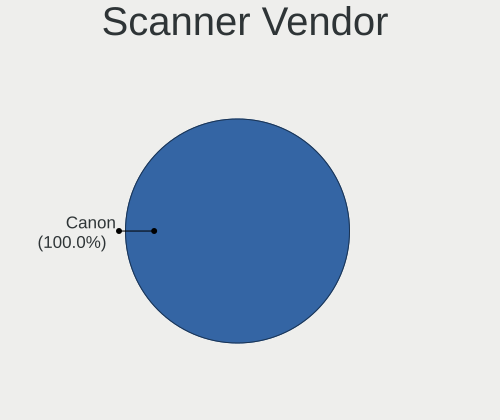

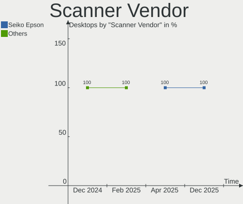

| Vendor      | Desktops | Percent |
|-------------|----------|---------|
| Seiko Epson | 1        | 100%    |

Scanner Model
-------------

Scanner device models

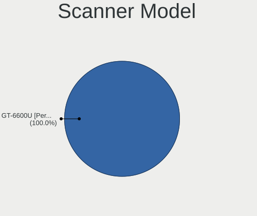

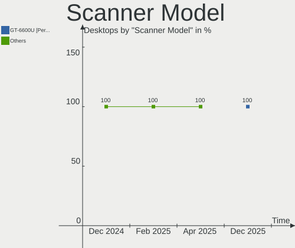

| Model                                 | Desktops | Percent |
|---------------------------------------|----------|---------|
| Seiko Epson GT-6600U [Perfection 610] | 1        | 100%    |

Camera
------

Camera Vendor
-------------

Camera device vendors

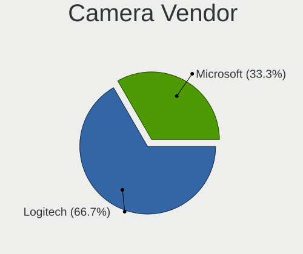

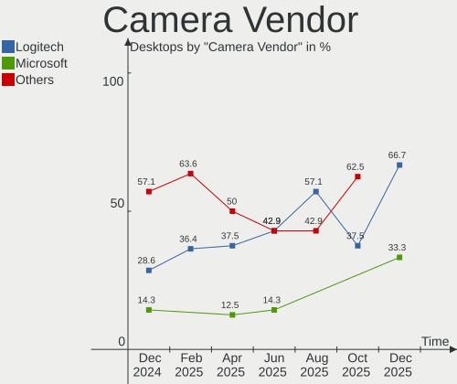

| Vendor    | Desktops | Percent |
|-----------|----------|---------|
| Logitech  | 4        | 66.67%  |
| Microsoft | 2        | 33.33%  |

Camera Model
------------

Camera device models

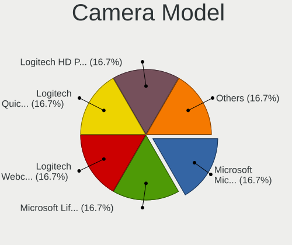

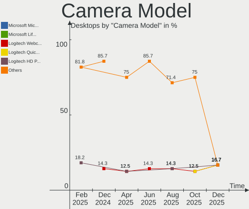

| Model                              | Desktops | Percent |
|------------------------------------|----------|---------|
| Microsoft Microsoft LifeCam Cinema | 1        | 16.67%  |
| Microsoft LifeCam VX-800           | 1        | 16.67%  |
| Logitech Webcam C270               | 1        | 16.67%  |
| Logitech QuickCam Pro 9000         | 1        | 16.67%  |
| Logitech HD Pro Webcam C920        | 1        | 16.67%  |
| Logitech BRIO Ultra HD Webcam      | 1        | 16.67%  |

Security
--------

Fingerprint Vendor
------------------

Fingerprint sensor vendors

Zero info for selected period =(

Fingerprint Model
-----------------

Fingerprint sensor models

Zero info for selected period =(

Chipcard Vendor
---------------

Chipcard module vendors

Zero info for selected period =(

Chipcard Model
--------------

Chipcard module models

Zero info for selected period =(

Unsupported
-----------

Unsupported Devices
-------------------

Total unsupported devices on board

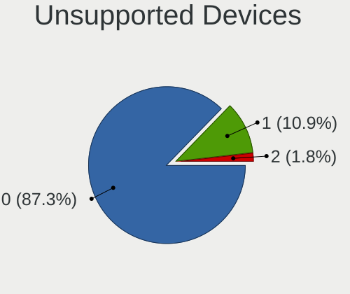

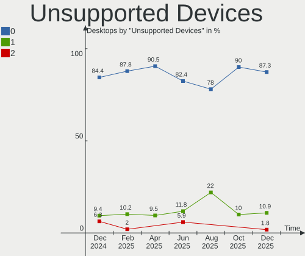

| Total | Desktops | Percent |
|-------|----------|---------|
| 0     | 48       | 87.27%  |
| 1     | 6        | 10.91%  |
| 2     | 1        | 1.82%   |

Unsupported Device Types
------------------------

Types of unsupported devices

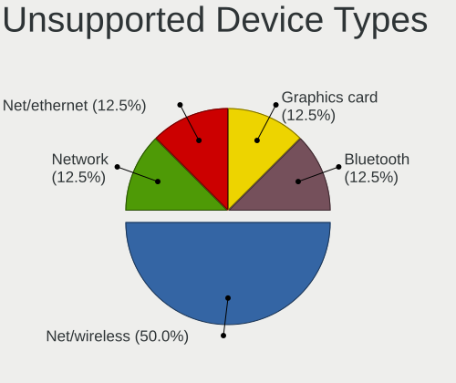

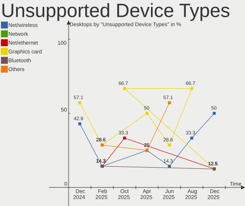

| Type          | Desktops | Percent |
|---------------|----------|---------|
| Net/wireless  | 4        | 50%     |
| Network       | 1        | 12.5%   |
| Net/ethernet  | 1        | 12.5%   |
| Graphics card | 1        | 12.5%   |
| Bluetooth     | 1        | 12.5%   |

