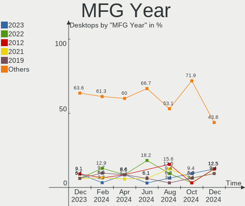
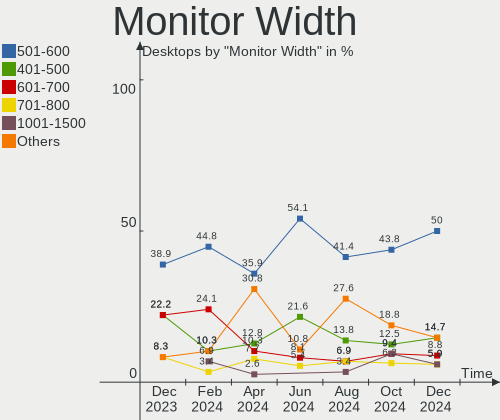
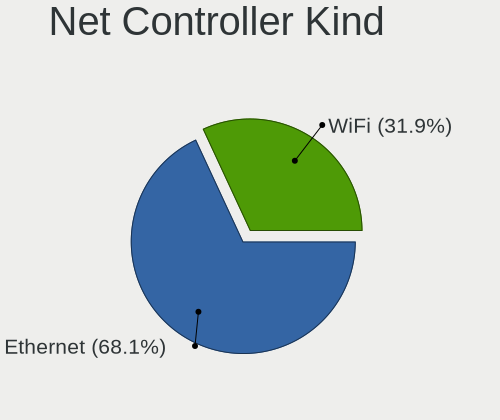
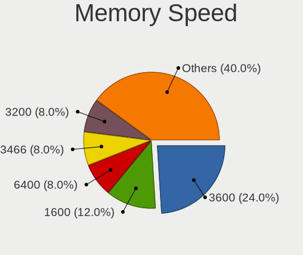
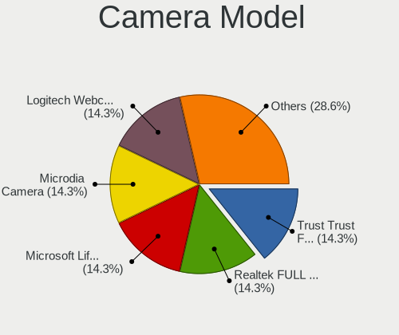

Linux in Netherlands - Hardware Trends (Desktops)
-------------------------------------------------

A project to identify most popular hardware characteristics and track their change
over time based on data collected by Linux users at https://Linux-Hardware.org.

Anyone can contribute to this report by the [hw-probe](https://github.com/linuxhw/hw-probe) tool:

    sudo -E hw-probe -all -upload

Period: Jan, 2024.

Contents
--------

* [ System ](#system)
  - [ OS                       ](#os)
  - [ OS Family                ](#os-family)
  - [ Kernel                   ](#kernel)
  - [ Kernel Family            ](#kernel-family)
  - [ Kernel Major Ver.        ](#kernel-major-ver)
  - [ Arch                     ](#arch)
  - [ DE                       ](#de)
  - [ Display Server           ](#display-server)
  - [ Display Manager          ](#display-manager)
  - [ OS Lang                  ](#os-lang)
  - [ Boot Mode                ](#boot-mode)
  - [ Filesystem               ](#filesystem)
  - [ Part. scheme             ](#part-scheme)
  - [ Dual Boot with Linux/BSD ](#dual-boot-with-linuxbsd)
  - [ Dual Boot (Win)          ](#dual-boot-win)

* [ Board ](#board)
  - [ Vendor                   ](#vendor)
  - [ Model                    ](#model)
  - [ Model Family             ](#model-family)
  - [ MFG Year                 ](#mfg-year)
  - [ Form Factor              ](#form-factor)
  - [ Secure Boot              ](#secure-boot)
  - [ Coreboot                 ](#coreboot)
  - [ RAM Size                 ](#ram-size)
  - [ RAM Used                 ](#ram-used)
  - [ Total Drives             ](#total-drives)
  - [ Has CD-ROM               ](#has-cd-rom)
  - [ Has Ethernet             ](#has-ethernet)
  - [ Has WiFi                 ](#has-wifi)
  - [ Has Bluetooth            ](#has-bluetooth)

* [ Location ](#location)
  - [ Country                  ](#country)
  - [ City                     ](#city)

* [ Drives ](#drives)
  - [ Drive Vendor             ](#drive-vendor)
  - [ Drive Model              ](#drive-model)
  - [ HDD Vendor               ](#hdd-vendor)
  - [ SSD Vendor               ](#ssd-vendor)
  - [ Drive Kind               ](#drive-kind)
  - [ Drive Connector          ](#drive-connector)
  - [ Drive Size               ](#drive-size)
  - [ Space Total              ](#space-total)
  - [ Space Used               ](#space-used)
  - [ Malfunc. Drives          ](#malfunc-drives)
  - [ Malfunc. Drive Vendor    ](#malfunc-drive-vendor)
  - [ Malfunc. HDD Vendor      ](#malfunc-hdd-vendor)
  - [ Malfunc. Drive Kind      ](#malfunc-drive-kind)
  - [ Failed Drives            ](#failed-drives)
  - [ Failed Drive Vendor      ](#failed-drive-vendor)
  - [ Drive Status             ](#drive-status)

* [ Storage controller ](#storage-controller)
  - [ Storage Vendor           ](#storage-vendor)
  - [ Storage Model            ](#storage-model)
  - [ Storage Kind             ](#storage-kind)

* [ Processor ](#processor)
  - [ CPU Vendor               ](#cpu-vendor)
  - [ CPU Model                ](#cpu-model)
  - [ CPU Model Family         ](#cpu-model-family)
  - [ CPU Cores                ](#cpu-cores)
  - [ CPU Sockets              ](#cpu-sockets)
  - [ CPU Threads              ](#cpu-threads)
  - [ CPU Op-Modes             ](#cpu-op-modes)
  - [ CPU Microcode            ](#cpu-microcode)
  - [ CPU Microarch            ](#cpu-microarch)

* [ Graphics ](#graphics)
  - [ GPU Vendor               ](#gpu-vendor)
  - [ GPU Model                ](#gpu-model)
  - [ GPU Combo                ](#gpu-combo)
  - [ GPU Driver               ](#gpu-driver)
  - [ GPU Memory               ](#gpu-memory)

* [ Monitor ](#monitor)
  - [ Monitor Vendor           ](#monitor-vendor)
  - [ Monitor Model            ](#monitor-model)
  - [ Monitor Resolution       ](#monitor-resolution)
  - [ Monitor Diagonal         ](#monitor-diagonal)
  - [ Monitor Width            ](#monitor-width)
  - [ Aspect Ratio             ](#aspect-ratio)
  - [ Monitor Area             ](#monitor-area)
  - [ Pixel Density            ](#pixel-density)
  - [ Multiple Monitors        ](#multiple-monitors)

* [ Network ](#network)
  - [ Net Controller Vendor    ](#net-controller-vendor)
  - [ Net Controller Model     ](#net-controller-model)
  - [ Wireless Vendor          ](#wireless-vendor)
  - [ Wireless Model           ](#wireless-model)
  - [ Ethernet Vendor          ](#ethernet-vendor)
  - [ Ethernet Model           ](#ethernet-model)
  - [ Net Controller Kind      ](#net-controller-kind)
  - [ Used Controller          ](#used-controller)
  - [ NICs                     ](#nics)
  - [ IPv6                     ](#ipv6)

* [ Bluetooth ](#bluetooth)
  - [ Bluetooth Vendor         ](#bluetooth-vendor)
  - [ Bluetooth Model          ](#bluetooth-model)

* [ Sound ](#sound)
  - [ Sound Vendor             ](#sound-vendor)
  - [ Sound Model              ](#sound-model)

* [ Memory ](#memory)
  - [ Memory Vendor            ](#memory-vendor)
  - [ Memory Model             ](#memory-model)
  - [ Memory Kind              ](#memory-kind)
  - [ Memory Form Factor       ](#memory-form-factor)
  - [ Memory Size              ](#memory-size)
  - [ Memory Speed             ](#memory-speed)

* [ Printers & scanners ](#printers--scanners)
  - [ Printer Vendor           ](#printer-vendor)
  - [ Printer Model            ](#printer-model)
  - [ Scanner Vendor           ](#scanner-vendor)
  - [ Scanner Model            ](#scanner-model)

* [ Camera ](#camera)
  - [ Camera Vendor            ](#camera-vendor)
  - [ Camera Model             ](#camera-model)

* [ Security ](#security)
  - [ Fingerprint Vendor       ](#fingerprint-vendor)
  - [ Fingerprint Model        ](#fingerprint-model)
  - [ Chipcard Vendor          ](#chipcard-vendor)
  - [ Chipcard Model           ](#chipcard-model)

* [ Unsupported ](#unsupported)
  - [ Unsupported Devices      ](#unsupported-devices)
  - [ Unsupported Device Types ](#unsupported-device-types)

System
------

OS
--

Installed operating systems

| Name                 | Desktops | Percent |
|----------------------|----------|---------|
| Zorin 17             | 5        | 13.89%  |
| Ubuntu 22.04         | 4        | 11.11%  |
| Debian 12            | 3        | 8.33%   |
| Zorin 16             | 2        | 5.56%   |
| Ubuntu 23.10         | 2        | 5.56%   |
| Pop!_OS 22.04        | 2        | 5.56%   |
| openSUSE Leap-15.5   | 2        | 5.56%   |
| Linux Mint 21.3      | 2        | 5.56%   |
| Fedora 39            | 2        | 5.56%   |
| Arch Rolling         | 2        | 5.56%   |
| Xero Rolling         | 1        | 2.78%   |
| Sparky 7.2           | 1        | 2.78%   |
| OpenMandriva 5.0     | 1        | 2.78%   |
| OpenMandriva 24.01   | 1        | 2.78%   |
| Nobara 39            | 1        | 2.78%   |
| NixOS 23.11          | 1        | 2.78%   |
| Kali 2023.2          | 1        | 2.78%   |
| Garuda Linux Soaring | 1        | 2.78%   |
| EndeavourOS Rolling  | 1        | 2.78%   |
| Debian Sid           | 1        | 2.78%   |

OS Family
---------

OS without a version

| Name         | Desktops | Percent |
|--------------|----------|---------|
| Zorin        | 7        | 19.44%  |
| Ubuntu       | 6        | 16.67%  |
| Debian       | 4        | 11.11%  |
| Pop!_OS      | 2        | 5.56%   |
| openSUSE     | 2        | 5.56%   |
| OpenMandriva | 2        | 5.56%   |
| Linux Mint   | 2        | 5.56%   |
| Fedora       | 2        | 5.56%   |
| Arch         | 2        | 5.56%   |
| Xero         | 1        | 2.78%   |
| Sparky       | 1        | 2.78%   |
| Nobara       | 1        | 2.78%   |
| NixOS        | 1        | 2.78%   |
| Kali         | 1        | 2.78%   |
| Garuda Linux | 1        | 2.78%   |
| EndeavourOS  | 1        | 2.78%   |

Kernel
------

Version of the Linux kernel

| Version                      | Desktops | Percent |
|------------------------------|----------|---------|
| 6.5.0-14-generic             | 8        | 22.22%  |
| 6.2.0-39-generic             | 3        | 8.33%   |
| 5.15.0-91-generic            | 3        | 8.33%   |
| 6.6.2-desktop-1omv2390       | 2        | 5.56%   |
| 6.1.0-17-amd64               | 2        | 5.56%   |
| 5.14.21-150500.55.39-default | 2        | 5.56%   |
| 6.7.1-arch1-1                | 1        | 2.78%   |
| 6.7.0-zen3-1-zen             | 1        | 2.78%   |
| 6.7.0-arch3-1                | 1        | 2.78%   |
| 6.7.0-202.fsync.fc39.x86_64  | 1        | 2.78%   |
| 6.6.9-amd64                  | 1        | 2.78%   |
| 6.6.9-200.fc39.x86_64        | 1        | 2.78%   |
| 6.6.8-200.fc39.x86_64        | 1        | 2.78%   |
| 6.6.6-76060606-generic       | 1        | 2.78%   |
| 6.6.10-zen1-1-zen            | 1        | 2.78%   |
| 6.6.10-arch1-1               | 1        | 2.78%   |
| 6.6.10-76060610-generic      | 1        | 2.78%   |
| 6.5.11-7-pve                 | 1        | 2.78%   |
| 6.5.0-9-generic              | 1        | 2.78%   |
| 6.5.0-0.deb12.4-amd64        | 1        | 2.78%   |
| 6.1.69                       | 1        | 2.78%   |
| 6.1.0-kali9-amd64            | 1        | 2.78%   |

Kernel Family
-------------

Linux kernel without a distro release

| Version | Desktops | Percent |
|---------|----------|---------|
| 6.5.0   | 10       | 27.78%  |
| 6.7.0   | 3        | 8.33%   |
| 6.6.10  | 3        | 8.33%   |
| 6.2.0   | 3        | 8.33%   |
| 6.1.0   | 3        | 8.33%   |
| 5.15.0  | 3        | 8.33%   |
| 6.6.9   | 2        | 5.56%   |
| 6.6.2   | 2        | 5.56%   |
| 5.14.21 | 2        | 5.56%   |
| 6.7.1   | 1        | 2.78%   |
| 6.6.8   | 1        | 2.78%   |
| 6.6.6   | 1        | 2.78%   |
| 6.5.11  | 1        | 2.78%   |
| 6.1.69  | 1        | 2.78%   |

Kernel Major Ver.
-----------------

Linux kernel major version

| Version | Desktops | Percent |
|---------|----------|---------|
| 6.5     | 11       | 30.56%  |
| 6.6     | 9        | 25%     |
| 6.7     | 4        | 11.11%  |
| 6.1     | 4        | 11.11%  |
| 6.2     | 3        | 8.33%   |
| 5.15    | 3        | 8.33%   |
| 5.14    | 2        | 5.56%   |

Arch
----

OS architecture (x86_64, i586, etc.)

| Name   | Desktops | Percent |
|--------|----------|---------|
| x86_64 | 36       | 100%    |

DE
--

Desktop Environment

| Name       | Desktops | Percent |
|------------|----------|---------|
| GNOME      | 16       | 44.44%  |
| KDE5       | 8        | 22.22%  |
| XFCE       | 5        | 13.89%  |
| X-Cinnamon | 2        | 5.56%   |
| Unknown    | 2        | 5.56%   |
| none+i3    | 1        | 2.78%   |
| MATE       | 1        | 2.78%   |
| Hyprland   | 1        | 2.78%   |

Display Server
--------------

X11 or Wayland

| Name    | Desktops | Percent |
|---------|----------|---------|
| X11     | 18       | 50%     |
| Wayland | 14       | 38.89%  |
| Tty     | 2        | 5.56%   |
| Unknown | 2        | 5.56%   |

Display Manager
---------------

SDDM, LightDM, etc.

| Name    | Desktops | Percent |
|---------|----------|---------|
| Unknown | 19       | 52.78%  |
| GDM3    | 7        | 19.44%  |
| LightDM | 5        | 13.89%  |
| SDDM    | 4        | 11.11%  |
| GDM     | 1        | 2.78%   |

OS Lang
-------

Language

| Lang    | Desktops | Percent |
|---------|----------|---------|
| en_US   | 14       | 38.89%  |
| nl_NL   | 12       | 33.33%  |
| en_GB   | 3        | 8.33%   |
| de_DE   | 2        | 5.56%   |
| tr_TR   | 1        | 2.78%   |
| nl_BE   | 1        | 2.78%   |
| hu_HU   | 1        | 2.78%   |
| es_ES   | 1        | 2.78%   |
| Unknown | 1        | 2.78%   |

Boot Mode
---------

EFI or BIOS

| Mode | Desktops | Percent |
|------|----------|---------|
| BIOS | 20       | 55.56%  |
| EFI  | 16       | 44.44%  |

Filesystem
----------

Type of filesystem

| Type  | Desktops | Percent |
|-------|----------|---------|
| Ext4  | 21       | 58.33%  |
| Btrfs | 8        | 22.22%  |
| Tmpfs | 7        | 19.44%  |

Part. scheme
------------

Scheme of partitioning

| Type    | Desktops | Percent |
|---------|----------|---------|
| GPT     | 18       | 50%     |
| Unknown | 17       | 47.22%  |
| MBR     | 1        | 2.78%   |

Dual Boot with Linux/BSD
------------------------

Hosting more than one Linux/BSD

| Dual boot | Desktops | Percent |
|-----------|----------|---------|
| No        | 33       | 91.67%  |
| Yes       | 3        | 8.33%   |

Dual Boot (Win)
---------------

Hosting Linux and Windows

| Dual boot | Desktops | Percent |
|-----------|----------|---------|
| No        | 31       | 86.11%  |
| Yes       | 5        | 13.89%  |

Board
-----

Vendor
------

Motherboard manufacturer

| Name                | Desktops | Percent |
|---------------------|----------|---------|
| ASUSTek Computer    | 8        | 22.22%  |
| Gigabyte Technology | 5        | 13.89%  |
| MSI                 | 4        | 11.11%  |
| Hewlett-Packard     | 4        | 11.11%  |
| ASRock              | 4        | 11.11%  |
| Pegatron            | 2        | 5.56%   |
| Dell                | 2        | 5.56%   |
| Unknown             | 2        | 5.56%   |
| Packard Bell        | 1        | 2.78%   |
| Medion              | 1        | 2.78%   |
| Intel               | 1        | 2.78%   |
| Google              | 1        | 2.78%   |
| Acer                | 1        | 2.78%   |

Model
-----

Motherboard model

| Name                            | Desktops | Percent |
|---------------------------------|----------|---------|
| Unknown                         | 2        | 5.56%   |
| Pegatron FL349AA-ABH SR5612NL   | 1        | 2.78%   |
| Pegatron FJ487AA-ABH a6551.nl   | 1        | 2.78%   |
| Packard Bell IMEDIA S3810       | 1        | 2.78%   |
| MSI MS-7C02                     | 1        | 2.78%   |
| MSI MS-7B85                     | 1        | 2.78%   |
| MSI MS-7922                     | 1        | 2.78%   |
| MSI MS-7817                     | 1        | 2.78%   |
| Medion MS-7616                  | 1        | 2.78%   |
| Intel HM570                     | 1        | 2.78%   |
| HP Z440 Workstation             | 1        | 2.78%   |
| HP ProLiant MicroServer         | 1        | 2.78%   |
| HP EliteDesk 800 G3 SFF         | 1        | 2.78%   |
| HP EliteDesk 800 G2 DM 35W      | 1        | 2.78%   |
| Google Zako                     | 1        | 2.78%   |
| Gigabyte Z590 UD AC             | 1        | 2.78%   |
| Gigabyte X99-Gaming 5P          | 1        | 2.78%   |
| Gigabyte X670 GAMING X AX V2    | 1        | 2.78%   |
| Gigabyte B550M AORUS ELITE      | 1        | 2.78%   |
| Gigabyte B450M DS3H             | 1        | 2.78%   |
| Dell OptiPlex 7050              | 1        | 2.78%   |
| Dell OptiPlex 7040              | 1        | 2.78%   |
| ASUS TUF Gaming X670E-PLUS WIFI | 1        | 2.78%   |
| ASUS ROG STRIX B550-A GAMING    | 1        | 2.78%   |
| ASUS PRIME X299-DELUXE II       | 1        | 2.78%   |
| ASUS PRIME N100I-D D4           | 1        | 2.78%   |
| ASUS PRIME B560M-A              | 1        | 2.78%   |
| ASUS P8Z77-V                    | 1        | 2.78%   |
| ASUS M4A87TD/USB3               | 1        | 2.78%   |
| ASUS All Series                 | 1        | 2.78%   |
| ASRock X570 Phantom Gaming 4    | 1        | 2.78%   |
| ASRock H97 Anniversary          | 1        | 2.78%   |
| ASRock G31M-S                   | 1        | 2.78%   |
| ASRock B450M Pro4               | 1        | 2.78%   |
| Acer Aspire GX-781              | 1        | 2.78%   |

Model Family
------------

Motherboard model prefix

| Name                 | Desktops | Percent |
|----------------------|----------|---------|
| ASUS PRIME           | 3        | 8.33%   |
| HP EliteDesk         | 2        | 5.56%   |
| Dell OptiPlex        | 2        | 5.56%   |
| Unknown              | 2        | 5.56%   |
| Pegatron FL349AA-ABH | 1        | 2.78%   |
| Pegatron FJ487AA-ABH | 1        | 2.78%   |
| Packard Bell IMEDIA  | 1        | 2.78%   |
| MSI MS-7C02          | 1        | 2.78%   |
| MSI MS-7B85          | 1        | 2.78%   |
| MSI MS-7922          | 1        | 2.78%   |
| MSI MS-7817          | 1        | 2.78%   |
| Medion MS-7616       | 1        | 2.78%   |
| Intel HM570          | 1        | 2.78%   |
| HP Z440              | 1        | 2.78%   |
| HP ProLiant          | 1        | 2.78%   |
| Google Zako          | 1        | 2.78%   |
| Gigabyte Z590        | 1        | 2.78%   |
| Gigabyte X99-Gaming  | 1        | 2.78%   |
| Gigabyte X670        | 1        | 2.78%   |
| Gigabyte B550M       | 1        | 2.78%   |
| Gigabyte B450M       | 1        | 2.78%   |
| ASUS TUF             | 1        | 2.78%   |
| ASUS ROG             | 1        | 2.78%   |
| ASUS P8Z77-V         | 1        | 2.78%   |
| ASUS M4A87TD         | 1        | 2.78%   |
| ASUS All             | 1        | 2.78%   |
| ASRock X570          | 1        | 2.78%   |
| ASRock H97           | 1        | 2.78%   |
| ASRock G31M-S        | 1        | 2.78%   |
| ASRock B450M         | 1        | 2.78%   |
| Acer Aspire          | 1        | 2.78%   |

MFG Year
--------

Motherboard manufacture year

| Year | Desktops | Percent |
|------|----------|---------|
| 2023 | 5        | 13.89%  |
| 2018 | 5        | 13.89%  |
| 2020 | 3        | 8.33%   |
| 2017 | 3        | 8.33%   |
| 2015 | 3        | 8.33%   |
| 2014 | 3        | 8.33%   |
| 2008 | 3        | 8.33%   |
| 2022 | 2        | 5.56%   |
| 2021 | 2        | 5.56%   |
| 2010 | 2        | 5.56%   |
| 2019 | 1        | 2.78%   |
| 2013 | 1        | 2.78%   |
| 2012 | 1        | 2.78%   |
| 2011 | 1        | 2.78%   |
| 2009 | 1        | 2.78%   |

Form Factor
-----------

Physical design of the computer

| Name    | Desktops | Percent |
|---------|----------|---------|
| Desktop | 36       | 100%    |

Secure Boot
-----------

Enabled or disabled

| State    | Desktops | Percent |
|----------|----------|---------|
| Disabled | 35       | 97.22%  |
| Enabled  | 1        | 2.78%   |

Coreboot
--------

Have coreboot on board

| Used | Desktops | Percent |
|------|----------|---------|
| No   | 35       | 97.22%  |
| Yes  | 1        | 2.78%   |

RAM Size
--------

Total RAM memory

| Size in GB  | Desktops | Percent |
|-------------|----------|---------|
| 16.01-24.0  | 13       | 36.11%  |
| 8.01-16.0   | 7        | 19.44%  |
| 32.01-64.0  | 6        | 16.67%  |
| 3.01-4.0    | 4        | 11.11%  |
| 4.01-8.0    | 3        | 8.33%   |
| 64.01-256.0 | 2        | 5.56%   |
| 24.01-32.0  | 1        | 2.78%   |

RAM Used
--------

Used RAM memory

| Used GB    | Desktops | Percent |
|------------|----------|---------|
| 1.01-2.0   | 12       | 33.33%  |
| 4.01-8.0   | 10       | 27.78%  |
| 2.01-3.0   | 6        | 16.67%  |
| 3.01-4.0   | 5        | 13.89%  |
| 16.01-24.0 | 1        | 2.78%   |
| 8.01-16.0  | 1        | 2.78%   |
| 0.01-0.5   | 1        | 2.78%   |

Total Drives
------------

Number of drives on board

| Drives | Desktops | Percent |
|--------|----------|---------|
| 1      | 16       | 44.44%  |
| 2      | 9        | 25%     |
| 3      | 5        | 13.89%  |
| 4      | 3        | 8.33%   |
| 9      | 2        | 5.56%   |
| 5      | 1        | 2.78%   |

Has CD-ROM
----------

Has CD-ROM on board

| Presented | Desktops | Percent |
|-----------|----------|---------|
| No        | 24       | 66.67%  |
| Yes       | 12       | 33.33%  |

Has Ethernet
------------

Has Ethernet on board

| Presented | Desktops | Percent |
|-----------|----------|---------|
| Yes       | 35       | 97.22%  |
| No        | 1        | 2.78%   |

Has WiFi
--------

Has WiFi module

| Presented | Desktops | Percent |
|-----------|----------|---------|
| Yes       | 20       | 55.56%  |
| No        | 16       | 44.44%  |

Has Bluetooth
-------------

Has Bluetooth module

| Presented | Desktops | Percent |
|-----------|----------|---------|
| No        | 19       | 52.78%  |
| Yes       | 17       | 47.22%  |

Location
--------

Country
-------

Geographic location (country)

| Country     | Desktops | Percent |
|-------------|----------|---------|
| Netherlands | 36       | 100%    |

City
----

Geographic location (city)

| City         | Desktops | Percent |
|--------------|----------|---------|
| Amsterdam    | 7        | 19.44%  |
| Utrecht      | 2        | 5.56%   |
| Ridderkerk   | 2        | 5.56%   |
| Enschede     | 2        | 5.56%   |
| Zwolle       | 1        | 2.78%   |
| Zwijndrecht  | 1        | 2.78%   |
| Woudrichem   | 1        | 2.78%   |
| Winterswijk  | 1        | 2.78%   |
| Waalwijk     | 1        | 2.78%   |
| Venray       | 1        | 2.78%   |
| The Hague    | 1        | 2.78%   |
| Sluis        | 1        | 2.78%   |
| Rotterdam    | 1        | 2.78%   |
| Oldenzaal    | 1        | 2.78%   |
| Naaldwijk    | 1        | 2.78%   |
| Loosdrecht   | 1        | 2.78%   |
| IJsselmuiden | 1        | 2.78%   |
| Horn         | 1        | 2.78%   |
| Hoogeveen    | 1        | 2.78%   |
| Hoofddorp    | 1        | 2.78%   |
| Hilversum    | 1        | 2.78%   |
| Helmond      | 1        | 2.78%   |
| Harderwijk   | 1        | 2.78%   |
| Gennep       | 1        | 2.78%   |
| Diemen       | 1        | 2.78%   |
| Brunssum     | 1        | 2.78%   |
| Apeldoorn    | 1        | 2.78%   |

Drives
------

Drive Vendor
------------

Hard drive vendors

| Vendor                      | Desktops | Drives | Percent |
|-----------------------------|----------|--------|---------|
| WDC                         | 12       | 16     | 20%     |
| Samsung Electronics         | 11       | 18     | 18.33%  |
| Seagate                     | 5        | 10     | 8.33%   |
| Kingston                    | 5        | 5      | 8.33%   |
| Sandisk                     | 4        | 5      | 6.67%   |
| Unknown                     | 2        | 2      | 3.33%   |
| Kingston Technology Company | 2        | 2      | 3.33%   |
| Crucial                     | 2        | 4      | 3.33%   |
| A-DATA Technology           | 2        | 3      | 3.33%   |
| Yangtze Memory Technologies | 1        | 1      | 1.67%   |
| WALRAM                      | 1        | 1      | 1.67%   |
| Transcend                   | 1        | 1      | 1.67%   |
| Toshiba                     | 1        | 1      | 1.67%   |
| TDAS                        | 1        | 5      | 1.67%   |
| Solid                       | 1        | 1      | 1.67%   |
| SK hynix                    | 1        | 1      | 1.67%   |
| PNY                         | 1        | 1      | 1.67%   |
| Phison Electronics          | 1        | 1      | 1.67%   |
| OCZ                         | 1        | 1      | 1.67%   |
| Hitachi                     | 1        | 1      | 1.67%   |
| CT1000MX                    | 1        | 1      | 1.67%   |
| Corsair                     | 1        | 1      | 1.67%   |
| China                       | 1        | 1      | 1.67%   |
| Unknown                     | 1        | 1      | 1.67%   |

Drive Model
-----------

Hard drive models

| Model                                    | Desktops | Percent |
|------------------------------------------|----------|---------|
| Samsung SSD 980 1TB                      | 3        | 4.05%   |
| Sandisk WD_BLACK SN850X 1000GB           | 2        | 2.7%    |
| Samsung SSD 870 EVO 1TB                  | 2        | 2.7%    |
| Crucial CT240BX500SSD1 240GB             | 2        | 2.7%    |
| Yangtze Memory YMTC YMSS1ED04B21MC 256GB | 1        | 1.35%   |
| WDC WD800BB-55JHC0 80GB                  | 1        | 1.35%   |
| WDC WD6400AAKS-65A7B0 640GB              | 1        | 1.35%   |
| WDC WD5000AAKS-00TMA0 500GB              | 1        | 1.35%   |
| WDC WD5000AAKS-00C8A0 500GB              | 1        | 1.35%   |
| WDC WD30EZRX-00AZ6B0 3TB                 | 1        | 1.35%   |
| WDC WD20EZRX-00DC0B0 2TB                 | 1        | 1.35%   |
| WDC WD20EZRX-00D8PB0 2TB                 | 1        | 1.35%   |
| WDC WD2002FAEX-007BA0 2TB                | 1        | 1.35%   |
| WDC WD15EARS-00Z5B1 1TB                  | 1        | 1.35%   |
| WDC WD10JPCX-24UE4T0 1TB                 | 1        | 1.35%   |
| WDC WD10EZRX-00A8LB0 1TB                 | 1        | 1.35%   |
| WDC WD10EZEX-21WN4A0 1TB                 | 1        | 1.35%   |
| WDC WD10EZEX-00BN5A0 1TB                 | 1        | 1.35%   |
| WDC WD10EARX-00N0YB0 1TB                 | 1        | 1.35%   |
| WALRAM 1TB                               | 1        | 1.35%   |
| Unknown SD/MMC/MS PRO 256GB              | 1        | 1.35%   |
| Unknown NVMe SSD Drive 512GB             | 1        | 1.35%   |
| Transcend TS240GMTS420S 240GB SSD        | 1        | 1.35%   |
| Toshiba HDWD120 2TB                      | 1        | 1.35%   |
| TDAS TerraMaster 500GB                   | 1        | 1.35%   |
| Solid SSD0256S00 256GB                   | 1        | 1.35%   |
| SK hynix HFS512G39TND-N210A 512GB SSD    | 1        | 1.35%   |
| Seagate ST4000NM016A-2HZ130 4TB          | 1        | 1.35%   |
| Seagate ST4000DM004-2CV104 4TB           | 1        | 1.35%   |
| Seagate ST2000DM008-2UB102 2TB           | 1        | 1.35%   |
| Seagate ST16000NM001G-2KK103 16TB        | 1        | 1.35%   |
| Seagate ST1000DM003-1ER162 1TB           | 1        | 1.35%   |
| Seagate ST10000DM0004-1ZC101 10TB        | 1        | 1.35%   |
| Seagate M3 Portable 4TB                  | 1        | 1.35%   |
| Sandisk WD_BLACK SN770 500GB             | 1        | 1.35%   |
| Sandisk WD Blue SN570 1TB                | 1        | 1.35%   |
| SanDisk SSD PLUS 120GB                   | 1        | 1.35%   |
| Samsung SSD 870 QVO 1TB                  | 1        | 1.35%   |
| Samsung SSD 870 EVO 500GB                | 1        | 1.35%   |
| Samsung SSD 870 EVO 2TB                  | 1        | 1.35%   |

HDD Vendor
----------

Hard disk drive vendors

| Vendor  | Desktops | Drives | Percent |
|---------|----------|--------|---------|
| WDC     | 12       | 16     | 57.14%  |
| Seagate | 5        | 9      | 23.81%  |
| Unknown | 1        | 1      | 4.76%   |
| Toshiba | 1        | 1      | 4.76%   |
| TDAS    | 1        | 5      | 4.76%   |
| Hitachi | 1        | 1      | 4.76%   |

SSD Vendor
----------

Solid state drive vendors

| Vendor              | Desktops | Drives | Percent |
|---------------------|----------|--------|---------|
| Samsung Electronics | 9        | 12     | 34.62%  |
| Kingston            | 4        | 4      | 15.38%  |
| Crucial             | 2        | 4      | 7.69%   |
| A-DATA Technology   | 2        | 3      | 7.69%   |
| Transcend           | 1        | 1      | 3.85%   |
| Solid               | 1        | 1      | 3.85%   |
| SK hynix            | 1        | 1      | 3.85%   |
| SanDisk             | 1        | 1      | 3.85%   |
| PNY                 | 1        | 1      | 3.85%   |
| OCZ                 | 1        | 1      | 3.85%   |
| CT1000MX            | 1        | 1      | 3.85%   |
| China               | 1        | 1      | 3.85%   |
| Unknown             | 1        | 1      | 3.85%   |

Drive Kind
----------

HDD or SSD

| Kind    | Desktops | Drives | Percent |
|---------|----------|--------|---------|
| SSD     | 23       | 32     | 41.07%  |
| HDD     | 17       | 33     | 30.36%  |
| NVMe    | 15       | 18     | 26.79%  |
| Unknown | 1        | 1      | 1.79%   |

Drive Connector
---------------

SATA, SAS, NVMe, etc.

| Type | Desktops | Drives | Percent |
|------|----------|--------|---------|
| SATA | 28       | 57     | 59.57%  |
| NVMe | 15       | 18     | 31.91%  |
| SAS  | 4        | 9      | 8.51%   |

Drive Size
----------

Size of hard drive

| Size in TB | Desktops | Drives | Percent |
|------------|----------|--------|---------|
| 0.01-0.5   | 20       | 33     | 44.44%  |
| 0.51-1.0   | 13       | 16     | 28.89%  |
| 1.01-2.0   | 6        | 6      | 13.33%  |
| 3.01-4.0   | 2        | 5      | 4.44%   |
| 2.01-3.0   | 2        | 3      | 4.44%   |
| 10.01-20.0 | 1        | 1      | 2.22%   |
| 4.01-10.0  | 1        | 1      | 2.22%   |

Space Total
-----------

Amount of disk space available on the file system

| Size in GB     | Desktops | Percent |
|----------------|----------|---------|
| 251-500        | 9        | 25%     |
| 101-250        | 7        | 19.44%  |
| 1001-2000      | 7        | 19.44%  |
| More than 3000 | 6        | 16.67%  |
| 51-100         | 2        | 5.56%   |
| 21-50          | 1        | 2.78%   |
| 2001-3000      | 1        | 2.78%   |
| 1-20           | 1        | 2.78%   |
| 501-1000       | 1        | 2.78%   |
| Unknown        | 1        | 2.78%   |

Space Used
----------

Amount of used disk space

| Used GB        | Desktops | Percent |
|----------------|----------|---------|
| 1-20           | 11       | 30.56%  |
| 21-50          | 7        | 19.44%  |
| 501-1000       | 4        | 11.11%  |
| 51-100         | 4        | 11.11%  |
| 101-250        | 3        | 8.33%   |
| 251-500        | 2        | 5.56%   |
| 2001-3000      | 2        | 5.56%   |
| More than 3000 | 1        | 2.78%   |
| 1001-2000      | 1        | 2.78%   |
| Unknown        | 1        | 2.78%   |

Malfunc. Drives
---------------

Drive models with a malfunction

| Model                          | Desktops | Drives | Percent |
|--------------------------------|----------|--------|---------|
| Seagate ST1000DM003-1ER162 1TB | 1        | 1      | 33.33%  |
| Crucial CT128MX100SSD1 128GB   | 1        | 1      | 33.33%  |
| China SSD 240GB                | 1        | 1      | 33.33%  |

Malfunc. Drive Vendor
---------------------

Vendors of faulty drives

| Vendor  | Desktops | Drives | Percent |
|---------|----------|--------|---------|
| Seagate | 1        | 1      | 33.33%  |
| Crucial | 1        | 1      | 33.33%  |
| China   | 1        | 1      | 33.33%  |

Malfunc. HDD Vendor
-------------------

Vendors of faulty HDD drives

| Vendor  | Desktops | Drives | Percent |
|---------|----------|--------|---------|
| Seagate | 1        | 1      | 100%    |

Malfunc. Drive Kind
-------------------

Kinds of faulty drives

| Kind | Desktops | Drives | Percent |
|------|----------|--------|---------|
| SSD  | 2        | 2      | 66.67%  |
| HDD  | 1        | 1      | 33.33%  |

Failed Drives
-------------

Failed drive models

Zero info for selected period =(

Failed Drive Vendor
-------------------

Failed drive vendors

Zero info for selected period =(

Drive Status
------------

Number of failed and malfunc. drives

| Status   | Desktops | Drives | Percent |
|----------|----------|--------|---------|
| Detected | 28       | 61     | 70%     |
| Works    | 9        | 20     | 22.5%   |
| Malfunc  | 3        | 3      | 7.5%    |

Storage controller
------------------

Storage Vendor
--------------

Storage controller vendors

| Vendor                      | Desktops | Percent |
|-----------------------------|----------|---------|
| Intel                       | 24       | 43.64%  |
| AMD                         | 11       | 20%     |
| Samsung Electronics         | 5        | 9.09%   |
| Sandisk                     | 3        | 5.45%   |
| Kingston Technology Company | 3        | 5.45%   |
| Phison Electronics          | 2        | 3.64%   |
| ASMedia Technology          | 2        | 3.64%   |
| Yangtze Memory Technologies | 1        | 1.82%   |
| Silicon Motion              | 1        | 1.82%   |
| Nvidia                      | 1        | 1.82%   |
| JMicron Technology          | 1        | 1.82%   |
| INNOGRIT                    | 1        | 1.82%   |

Storage Model
-------------

Storage controller models

| Model                                                                          | Desktops | Percent |
|--------------------------------------------------------------------------------|----------|---------|
| AMD FCH SATA Controller [AHCI mode]                                            | 5        | 7.58%   |
| AMD 400 Series Chipset SATA Controller                                         | 4        | 6.06%   |
| Samsung NVMe SSD Controller 980 (DRAM-less)                                    | 3        | 4.55%   |
| Intel SATA controller                                                          | 3        | 4.55%   |
| Intel Q170/Q150/B150/H170/H110/Z170/CM236 Chipset SATA Controller [AHCI Mode]  | 3        | 4.55%   |
| Intel 9 Series Chipset Family SATA Controller [AHCI Mode]                      | 3        | 4.55%   |
| Sandisk WD Black SN850X NVMe SSD                                               | 2        | 3.03%   |
| Kingston Company A2000 NVMe SSD SM2263EN                                       | 2        | 3.03%   |
| Intel SATA Controller [RAID mode]                                              | 2        | 3.03%   |
| Intel 500 Series Chipset Family SATA AHCI Controller                           | 2        | 3.03%   |
| Intel 5 Series/3400 Series Chipset 6 port SATA AHCI Controller                 | 2        | 3.03%   |
| Intel 200 Series PCH SATA controller [AHCI mode]                               | 2        | 3.03%   |
| ASMedia ASM1061/ASM1062 Serial ATA Controller                                  | 2        | 3.03%   |
| AMD SB7x0/SB8x0/SB9x0 IDE Controller                                           | 2        | 3.03%   |
| AMD 600 Series Chipset SATA Controller                                         | 2        | 3.03%   |
| AMD 500 Series Chipset SATA Controller                                         | 2        | 3.03%   |
| Yangtze Memory PC210 NVMe SSD                                                  | 1        | 1.52%   |
| Silicon Motion SM2263EN/SM2263XT (DRAM-less) NVMe SSD Controllers              | 1        | 1.52%   |
| SanDisk WD Black SN770 / PC SN740 256GB / PC SN560 (DRAM-less) NVMe SSD        | 1        | 1.52%   |
| SanDisk Ultra 3D / WD Blue SN570 NVMe SSD (DRAM-less)                          | 1        | 1.52%   |
| Samsung NVMe SSD Controller SM981/PM981/PM983                                  | 1        | 1.52%   |
| Samsung NVMe SSD Controller PM9A1/PM9A3/980PRO                                 | 1        | 1.52%   |
| Phison PS5013-E13 PCIe3 NVMe Controller (DRAM-less)                            | 1        | 1.52%   |
| Phison E12 NVMe Controller                                                     | 1        | 1.52%   |
| Nvidia MCP61 SATA Controller                                                   | 1        | 1.52%   |
| Nvidia MCP61 IDE                                                               | 1        | 1.52%   |
| Kingston Company KC2000/KC2500 NVMe SSD SM2262EN                               | 1        | 1.52%   |
| JMicron JMB368 IDE controller                                                  | 1        | 1.52%   |
| Intel Tiger Lake SATA AHCI Controller                                          | 1        | 1.52%   |
| Intel sSATA Controller [RAID Mode]                                             | 1        | 1.52%   |
| Intel NM10/ICH7 Family SATA Controller [IDE mode]                              | 1        | 1.52%   |
| Intel C610/X99 series chipset sSATA Controller [AHCI mode]                     | 1        | 1.52%   |
| Intel C610/X99 series chipset 6-Port SATA Controller [AHCI mode]               | 1        | 1.52%   |
| Intel 82801IR/IO/IH (ICH9R/DO/DH) 6 port SATA Controller [AHCI mode]           | 1        | 1.52%   |
| Intel 82801G (ICH7 Family) IDE Controller                                      | 1        | 1.52%   |
| Intel 8 Series/C220 Series Chipset Family 6-port SATA Controller 1 [AHCI mode] | 1        | 1.52%   |
| Intel 8 Series SATA Controller 1 [AHCI mode]                                   | 1        | 1.52%   |
| Intel 7 Series/C210 Series Chipset Family 6-port SATA Controller [AHCI mode]   | 1        | 1.52%   |
| INNOGRIT NVMe SSD Controller IG5216 (DRAM-less)                                | 1        | 1.52%   |
| AMD SB7x0/SB8x0/SB9x0 SATA Controller [IDE mode]                               | 1        | 1.52%   |

Storage Kind
------------

Kind of storage controller (IDE, SATA, NVMe, SAS, ...)

| Kind | Desktops | Percent |
|------|----------|---------|
| SATA | 33       | 61.11%  |
| NVMe | 15       | 27.78%  |
| IDE  | 4        | 7.41%   |
| RAID | 2        | 3.7%    |

Processor
---------

CPU Vendor
----------

Processor vendors

| Vendor | Desktops | Percent |
|--------|----------|---------|
| Intel  | 24       | 66.67%  |
| AMD    | 12       | 33.33%  |

CPU Model
---------

Processor models

| Model                                       | Desktops | Percent |
|---------------------------------------------|----------|---------|
| Intel N100                                  | 3        | 8.33%   |
| AMD Ryzen 5 2600 Six-Core Processor         | 3        | 8.33%   |
| Intel Xeon CPU E5-1650 v4 @ 3.60GHz         | 1        | 2.78%   |
| Intel Genuine CPU 0000 @ 2.60GHz            | 1        | 2.78%   |
| Intel Core i9-10980XE CPU @ 3.00GHz         | 1        | 2.78%   |
| Intel Core i7-7700K CPU @ 4.20GHz           | 1        | 2.78%   |
| Intel Core i7-7700 CPU @ 3.60GHz            | 1        | 2.78%   |
| Intel Core i7-6700 CPU @ 3.40GHz            | 1        | 2.78%   |
| Intel Core i7-5960X CPU @ 3.00GHz           | 1        | 2.78%   |
| Intel Core i7-4790 CPU @ 3.60GHz            | 1        | 2.78%   |
| Intel Core i7-2600K CPU @ 3.40GHz           | 1        | 2.78%   |
| Intel Core i5-7400 CPU @ 3.00GHz            | 1        | 2.78%   |
| Intel Core i5-6500T CPU @ 2.50GHz           | 1        | 2.78%   |
| Intel Core i5-4690K CPU @ 3.50GHz           | 1        | 2.78%   |
| Intel Core i5-4690 CPU @ 3.50GHz            | 1        | 2.78%   |
| Intel Core i5-4460 CPU @ 3.20GHz            | 1        | 2.78%   |
| Intel Core i5-10400F CPU @ 2.90GHz          | 1        | 2.78%   |
| Intel Core i5 CPU 750 @ 2.67GHz             | 1        | 2.78%   |
| Intel Core i3 CPU 530 @ 2.93GHz             | 1        | 2.78%   |
| Intel Core 2 Quad CPU Q6600 @ 2.40GHz       | 1        | 2.78%   |
| Intel Celeron CPU 430 @ 1.80GHz             | 1        | 2.78%   |
| Intel Celeron 2955U @ 1.40GHz               | 1        | 2.78%   |
| Intel 11th Gen Core i7-11700F @ 2.50GHz     | 1        | 2.78%   |
| AMD Turion II Neo N40L Dual-Core Processor  | 1        | 2.78%   |
| AMD Ryzen 9 7950X 16-Core Processor         | 1        | 2.78%   |
| AMD Ryzen 9 3900X 12-Core Processor         | 1        | 2.78%   |
| AMD Ryzen 7 3700X 8-Core Processor          | 1        | 2.78%   |
| AMD Ryzen 5 7600X 6-Core Processor          | 1        | 2.78%   |
| AMD Ryzen 5 5600G with Radeon Graphics      | 1        | 2.78%   |
| AMD Ryzen 5 3400G with Radeon Vega Graphics | 1        | 2.78%   |
| AMD Phenom II X4 955 Processor              | 1        | 2.78%   |
| AMD Athlon 7450 Dual-Core Processor         | 1        | 2.78%   |

CPU Model Family
----------------

Processor model prefix

| Model             | Desktops | Percent |
|-------------------|----------|---------|
| Intel Core i5     | 7        | 19.44%  |
| Intel Core i7     | 6        | 16.67%  |
| AMD Ryzen 5       | 6        | 16.67%  |
| Other             | 4        | 11.11%  |
| Intel Celeron     | 2        | 5.56%   |
| AMD Ryzen 9       | 2        | 5.56%   |
| Intel Xeon        | 1        | 2.78%   |
| Intel Genuine     | 1        | 2.78%   |
| Intel Core i9     | 1        | 2.78%   |
| Intel Core i3     | 1        | 2.78%   |
| Intel Core 2 Quad | 1        | 2.78%   |
| AMD Turion II Neo | 1        | 2.78%   |
| AMD Ryzen 7       | 1        | 2.78%   |
| AMD Phenom II X4  | 1        | 2.78%   |
| AMD Athlon        | 1        | 2.78%   |

CPU Cores
---------

Number of processor cores

| Number | Desktops | Percent |
|--------|----------|---------|
| 4      | 17       | 47.22%  |
| 6      | 7        | 19.44%  |
| 8      | 4        | 11.11%  |
| 2      | 4        | 11.11%  |
| 18     | 1        | 2.78%   |
| 16     | 1        | 2.78%   |
| 12     | 1        | 2.78%   |
| 1      | 1        | 2.78%   |

CPU Sockets
-----------

Number of sockets

| Number | Desktops | Percent |
|--------|----------|---------|
| 1      | 36       | 100%    |

CPU Threads
-----------

Threads per core (Hyper-Threading)

| Number | Desktops | Percent |
|--------|----------|---------|
| 2      | 20       | 55.56%  |
| 1      | 16       | 44.44%  |

CPU Op-Modes
------------

CPU Operation Modes (32-bit, 64-bit)

| Op mode        | Desktops | Percent |
|----------------|----------|---------|
| 32-bit, 64-bit | 36       | 100%    |

CPU Microcode
-------------

Microcode number

| Number     | Desktops | Percent |
|------------|----------|---------|
| Unknown    | 25       | 69.44%  |
| 0xa0671    | 1        | 2.78%   |
| 0x50657    | 1        | 2.78%   |
| 0x406f1    | 1        | 2.78%   |
| 0x306c3    | 1        | 2.78%   |
| 0x10661    | 1        | 2.78%   |
| 0x0a601206 | 1        | 2.78%   |
| 0x0a601203 | 1        | 2.78%   |
| 0x0a50000c | 1        | 2.78%   |
| 0x08701021 | 1        | 2.78%   |
| 0x0800820d | 1        | 2.78%   |
| 0x010000c8 | 1        | 2.78%   |

CPU Microarch
-------------

Microarchitecture

| Name        | Desktops | Percent |
|-------------|----------|---------|
| Haswell     | 6        | 16.67%  |
| Zen+        | 4        | 11.11%  |
| Unknown     | 4        | 11.11%  |
| Skylake     | 3        | 8.33%   |
| KabyLake    | 3        | 8.33%   |
| K10         | 3        | 8.33%   |
| Zen 2       | 2        | 5.56%   |
| Icelake     | 2        | 5.56%   |
| Core        | 2        | 5.56%   |
| Zen 3       | 1        | 2.78%   |
| Westmere    | 1        | 2.78%   |
| SandyBridge | 1        | 2.78%   |
| Nehalem     | 1        | 2.78%   |
| Gracemont   | 1        | 2.78%   |
| CometLake   | 1        | 2.78%   |
| Broadwell   | 1        | 2.78%   |

Graphics
--------

GPU Vendor
----------

Vendors of graphics cards

| Vendor | Desktops | Percent |
|--------|----------|---------|
| Nvidia | 15       | 39.47%  |
| AMD    | 12       | 31.58%  |
| Intel  | 11       | 28.95%  |

GPU Model
---------

Graphics card models

| Model                                                                       | Desktops | Percent |
|-----------------------------------------------------------------------------|----------|---------|
| Intel Alder Lake-N [UHD Graphics]                                           | 3        | 7.89%   |
| Intel HD Graphics 630                                                       | 2        | 5.26%   |
| Intel HD Graphics 530                                                       | 2        | 5.26%   |
| AMD Ellesmere [Radeon RX 470/480/570/570X/580/580X/590]                     | 2        | 5.26%   |
| Nvidia TU116 [GeForce GTX 1660 SUPER]                                       | 1        | 2.63%   |
| Nvidia TU102 [GeForce RTX 2080 Ti Rev. A]                                   | 1        | 2.63%   |
| Nvidia GT215 [GeForce GT 240]                                               | 1        | 2.63%   |
| Nvidia GP107 [GeForce GTX 1050 Ti]                                          | 1        | 2.63%   |
| Nvidia GP104 [GeForce GTX 1070]                                             | 1        | 2.63%   |
| Nvidia GM206 [GeForce GTX 960]                                              | 1        | 2.63%   |
| Nvidia GM204 [GeForce GTX 970]                                              | 1        | 2.63%   |
| Nvidia GM107GL [Quadro K1200]                                               | 1        | 2.63%   |
| Nvidia GA107 [GeForce RTX 3050 8GB]                                         | 1        | 2.63%   |
| Nvidia GA106 [GeForce RTX 3060 Lite Hash Rate]                              | 1        | 2.63%   |
| Nvidia GA106 [Geforce RTX 3050]                                             | 1        | 2.63%   |
| Nvidia GA104 [GeForce RTX 3060]                                             | 1        | 2.63%   |
| Nvidia GA102 [GeForce RTX 3080 Lite Hash Rate]                              | 1        | 2.63%   |
| Nvidia G98 [GeForce 8400 GS Rev. 2]                                         | 1        | 2.63%   |
| Nvidia G96C [GeForce GT 120]                                                | 1        | 2.63%   |
| Intel Xeon E3-1200 v3/4th Gen Core Processor Integrated Graphics Controller | 1        | 2.63%   |
| Intel Haswell-ULT Integrated Graphics Controller                            | 1        | 2.63%   |
| Intel Core Processor Integrated Graphics Controller                         | 1        | 2.63%   |
| Intel 82G33/G31 Express Integrated Graphics Controller                      | 1        | 2.63%   |
| AMD Redwood XT [Radeon HD 5670/5690/5730]                                   | 1        | 2.63%   |
| AMD Raphael                                                                 | 1        | 2.63%   |
| AMD Picasso/Raven 2 [Radeon Vega Series / Radeon Vega Mobile Series]        | 1        | 2.63%   |
| AMD Park [Mobility Radeon HD 5430]                                          | 1        | 2.63%   |
| AMD Oland XT [Radeon HD 8670 / R5 340X OEM / R7 250/350/350X OEM]           | 1        | 2.63%   |
| AMD Navi 23 [Radeon RX 6600/6600 XT/6600M]                                  | 1        | 2.63%   |
| AMD Navi 22 [Radeon RX 6700/6700 XT/6750 XT / 6800M/6850M XT]               | 1        | 2.63%   |
| AMD Navi 21 [Radeon RX 6800/6800 XT / 6900 XT]                              | 1        | 2.63%   |
| AMD Navi 10 [Radeon RX 5600 OEM/5600 XT / 5700/5700 XT]                     | 1        | 2.63%   |
| AMD Cezanne [Radeon Vega Series / Radeon Vega Mobile Series]                | 1        | 2.63%   |

GPU Combo
---------

Combinations of graphics cards

| Name         | Desktops | Percent |
|--------------|----------|---------|
| 1 x Nvidia   | 14       | 38.89%  |
| 1 x Intel    | 10       | 27.78%  |
| 1 x AMD      | 10       | 27.78%  |
| Intel + AMD  | 1        | 2.78%   |
| AMD + Nvidia | 1        | 2.78%   |

GPU Driver
----------

Free vs proprietary

| Driver      | Desktops | Percent |
|-------------|----------|---------|
| Free        | 25       | 69.44%  |
| Proprietary | 10       | 27.78%  |
| Unknown     | 1        | 2.78%   |

GPU Memory
----------

Total video memory

| Size in GB | Desktops | Percent |
|------------|----------|---------|
| Unknown    | 20       | 55.56%  |
| 8.01-16.0  | 5        | 13.89%  |
| 7.01-8.0   | 3        | 8.33%   |
| 3.01-4.0   | 3        | 8.33%   |
| 0.01-0.5   | 2        | 5.56%   |
| 5.01-6.0   | 1        | 2.78%   |
| 1.01-2.0   | 1        | 2.78%   |
| 0.51-1.0   | 1        | 2.78%   |

Monitor
-------

Monitor Vendor
--------------

Monitor vendors

| Vendor               | Desktops | Percent |
|----------------------|----------|---------|
| Samsung Electronics  | 6        | 16.67%  |
| Iiyama               | 5        | 13.89%  |
| Goldstar             | 4        | 11.11%  |
| BenQ                 | 3        | 8.33%   |
| Philips              | 2        | 5.56%   |
| Lenovo               | 2        | 5.56%   |
| Hewlett-Packard      | 2        | 5.56%   |
| Dell                 | 2        | 5.56%   |
| AOC                  | 2        | 5.56%   |
| Packard Bell         | 1        | 2.78%   |
| NEC Computers        | 1        | 2.78%   |
| MStar                | 1        | 2.78%   |
| Medion               | 1        | 2.78%   |
| JHD                  | 1        | 2.78%   |
| Eizo                 | 1        | 2.78%   |
| Ancor Communications | 1        | 2.78%   |
| Acer                 | 1        | 2.78%   |

Monitor Model
-------------

Monitor models

| Model                                                                 | Desktops | Percent |
|-----------------------------------------------------------------------|----------|---------|
| Samsung Electronics SyncMaster SAM036D 1920x1080                      | 1        | 2.63%   |
| Samsung Electronics SyncMaster SAM021C 1400x1050 408x300mm 19.9-inch  | 1        | 2.63%   |
| Samsung Electronics S27C36x SAM7315 1920x1080 600x340mm 27.2-inch     | 1        | 2.63%   |
| Samsung Electronics S24D340 SAM0BBB 1920x1080 531x299mm 24.0-inch     | 1        | 2.63%   |
| Samsung Electronics S24B150 SAM0982 1920x1080 521x293mm 23.5-inch     | 1        | 2.63%   |
| Samsung Electronics LCD Monitor SAM04FB 1920x1080                     | 1        | 2.63%   |
| Samsung Electronics LCD Monitor LC27G7xT 2560x1440                    | 1        | 2.63%   |
| Philips PHL 246E9Q PHLC17C 1920x1080 527x296mm 23.8-inch              | 1        | 2.63%   |
| Philips FTV PHL01EA 1920x1080 1440x810mm 65.0-inch                    | 1        | 2.63%   |
| Packard Bell Viseo 191DXL PKB0222 1366x768 409x230mm 18.5-inch        | 1        | 2.63%   |
| NEC Computers EA192M NEC680E 1280x1024 376x301mm 19.0-inch            | 1        | 2.63%   |
| MStar TV MST0030 1920x1080 708x398mm 32.0-inch                        | 1        | 2.63%   |
| Medion MD 20462 MED36A1 1920x1080 521x293mm 23.5-inch                 | 1        | 2.63%   |
| Lenovo LEN LT2323zwC LEN0BD4 1920x1080 509x286mm 23.0-inch            | 1        | 2.63%   |
| Lenovo G27q-20 LEN66C3 2560x1440 597x336mm 27.0-inch                  | 1        | 2.63%   |
| JHD JH207 JHD1560 1920x1080 340x190mm 15.3-inch                       | 1        | 2.63%   |
| Iiyama PLE431 IVM46AC 1280x1024 340x270mm 17.1-inch                   | 1        | 2.63%   |
| Iiyama PL2745H IVM669A 1920x1080 598x336mm 27.0-inch                  | 1        | 2.63%   |
| Iiyama PL2592H IVM6135 1920x1080 544x303mm 24.5-inch                  | 1        | 2.63%   |
| Iiyama PL2530H IVM6132 1920x1080 544x303mm 24.5-inch                  | 1        | 2.63%   |
| Iiyama PL2483H IVM6138 1920x1080 531x299mm 24.0-inch                  | 1        | 2.63%   |
| Hewlett-Packard x23LED HWP2911 1920x1080 509x286mm 23.0-inch          | 1        | 2.63%   |
| Hewlett-Packard x2301 HWP2973 1920x1080 509x286mm 23.0-inch           | 1        | 2.63%   |
| Goldstar W2242 GSM5677 1680x1050 490x320mm 23.0-inch                  | 1        | 2.63%   |
| Goldstar M227WDP GSM5776 1920x1080 480x270mm 21.7-inch                | 1        | 2.63%   |
| Goldstar HDR WQHD GSM772E 3440x1440 800x335mm 34.1-inch               | 1        | 2.63%   |
| Goldstar HDR 4K GSM7706 3840x2160 600x340mm 27.2-inch                 | 1        | 2.63%   |
| Eizo EV2451 ENC2785 1920x1080 528x297mm 23.9-inch                     | 1        | 2.63%   |
| Dell S2721QS DELA197 3840x2160 597x336mm 27.0-inch                    | 1        | 2.63%   |
| Dell P2414H DELA09B 1920x1080 527x297mm 23.8-inch                     | 1        | 2.63%   |
| Dell P2414H DELA09A 1920x1080 527x297mm 23.8-inch                     | 1        | 2.63%   |
| BenQ GL2450H BNQ78A7 1920x1080 531x298mm 24.0-inch                    | 1        | 2.63%   |
| BenQ BL2283 BNQ78EA 1920x1080 476x268mm 21.5-inch                     | 1        | 2.63%   |
| BenQ BenQG2222HDL BNQ7859 1920x1080 478x269mm 21.6-inch               | 1        | 2.63%   |
| AOC 27B1 AOC2701 1920x1080 598x336mm 27.0-inch                        | 1        | 2.63%   |
| AOC 193SW AOC1982 1440x900 408x255mm 18.9-inch                        | 1        | 2.63%   |
| Ancor Communications ASUS VP278 ACI27C8 1920x1080 598x336mm 27.0-inch | 1        | 2.63%   |
| Acer EI491CR ACR06D5 3840x1080 1196x336mm 48.9-inch                   | 1        | 2.63%   |

Monitor Resolution
------------------

Monitor screen resolution

| Resolution         | Desktops | Percent |
|--------------------|----------|---------|
| 1920x1080 (FHD)    | 22       | 61.11%  |
| 3840x2160 (4K)     | 5        | 13.89%  |
| 2560x1440 (QHD)    | 2        | 5.56%   |
| 1280x1024 (SXGA)   | 2        | 5.56%   |
| 3840x1080          | 1        | 2.78%   |
| 1680x1050 (WSXGA+) | 1        | 2.78%   |
| 1440x900 (WXGA+)   | 1        | 2.78%   |
| 1400x1050          | 1        | 2.78%   |
| 1366x768 (WXGA)    | 1        | 2.78%   |

Monitor Diagonal
----------------

Diagonal size in inches

| Inches  | Desktops | Percent |
|---------|----------|---------|
| 27      | 7        | 19.44%  |
| 24      | 7        | 19.44%  |
| 23      | 7        | 19.44%  |
| Unknown | 3        | 8.33%   |
| 21      | 2        | 5.56%   |
| 18      | 2        | 5.56%   |
| 65      | 1        | 2.78%   |
| 52      | 1        | 2.78%   |
| 49      | 1        | 2.78%   |
| 34      | 1        | 2.78%   |
| 20      | 1        | 2.78%   |
| 19      | 1        | 2.78%   |
| 17      | 1        | 2.78%   |
| 15      | 1        | 2.78%   |

Monitor Width
-------------

Physical width

| Width in mm | Desktops | Percent |
|-------------|----------|---------|
| 501-600     | 19       | 54.29%  |
| 401-500     | 6        | 17.14%  |
| 1001-1500   | 3        | 8.57%   |
| Unknown     | 3        | 8.57%   |
| 301-350     | 2        | 5.71%   |
| 701-800     | 1        | 2.86%   |
| 351-400     | 1        | 2.86%   |

Aspect Ratio
------------

Proportional relationship between the width and the height

| Ratio   | Desktops | Percent |
|---------|----------|---------|
| 16/9    | 26       | 76.47%  |
| 5/4     | 2        | 5.88%   |
| 4/3     | 1        | 2.94%   |
| 32/9    | 1        | 2.94%   |
| 3/2     | 1        | 2.94%   |
| 21/9    | 1        | 2.94%   |
| 16/10   | 1        | 2.94%   |
| Unknown | 1        | 2.94%   |

Monitor Area
------------

Area in inch

| Area in inch | Desktops | Percent |
|----------------|----------|---------|
| 201-250        | 13       | 36.11%  |
| 301-350        | 7        | 19.44%  |
| 151-200        | 4        | 11.11%  |
| Unknown        | 3        | 8.33%   |
| More than 1000 | 2        | 5.56%   |
| 251-300        | 2        | 5.56%   |
| 141-150        | 2        | 5.56%   |
| 351-500        | 1        | 2.78%   |
| 501-1000       | 1        | 2.78%   |
| 91-100         | 1        | 2.78%   |

Pixel Density
-------------

Pixels per inch

| Density | Desktops | Percent |
|---------|----------|---------|
| 51-100  | 23       | 67.65%  |
| 101-120 | 3        | 8.82%   |
| Unknown | 3        | 8.82%   |
| 1-50    | 2        | 5.88%   |
| 161-240 | 2        | 5.88%   |
| 121-160 | 1        | 2.94%   |

Multiple Monitors
-----------------

Total monitors connected

| Total | Desktops | Percent |
|-------|----------|---------|
| 1     | 26       | 72.22%  |
| 2     | 7        | 19.44%  |
| 0     | 2        | 5.56%   |
| 3     | 1        | 2.78%   |

Network
-------

Net Controller Vendor
---------------------

Controller vendors

| Vendor                | Desktops | Percent |
|-----------------------|----------|---------|
| Realtek Semiconductor | 25       | 47.17%  |
| Intel                 | 13       | 24.53%  |
| Qualcomm Atheros      | 4        | 7.55%   |
| TP-Link               | 2        | 3.77%   |
| Ralink Technology     | 2        | 3.77%   |
| MediaTek              | 2        | 3.77%   |
| Nvidia                | 1        | 1.89%   |
| IMC Networks          | 1        | 1.89%   |
| Broadcom              | 1        | 1.89%   |
| Atmel                 | 1        | 1.89%   |
| Aquantia              | 1        | 1.89%   |

Net Controller Model
--------------------

Controller models

| Model                                                                                         | Desktops | Percent |
|-----------------------------------------------------------------------------------------------|----------|---------|
| Realtek RTL8111/8168/8211/8411 PCI Express Gigabit Ethernet Controller                        | 18       | 28.57%  |
| Realtek RTL8125 2.5GbE Controller                                                             | 3        | 4.76%   |
| Realtek RTL8153 Gigabit Ethernet Adapter                                                      | 2        | 3.17%   |
| Ralink RT5370 Wireless Adapter                                                                | 2        | 3.17%   |
| Intel Wi-Fi 5(802.11ac) Wireless-AC 9x6x [Thunder Peak]                                       | 2        | 3.17%   |
| Intel I211 Gigabit Network Connection                                                         | 2        | 3.17%   |
| Intel Ethernet Connection (5) I219-LM                                                         | 2        | 3.17%   |
| TP-Link TL-WN823N v2/v3 [Realtek RTL8192EU]                                                   | 1        | 1.59%   |
| TP-Link Archer T4U ver.3                                                                      | 1        | 1.59%   |
| Realtek RTL8852CE PCIe 802.11ax Wireless Network Controller                                   | 1        | 1.59%   |
| Realtek RTL8821CE 802.11ac PCIe Wireless Network Adapter                                      | 1        | 1.59%   |
| Realtek RTL8812AU 802.11a/b/g/n/ac 2T2R DB WLAN Adapter                                       | 1        | 1.59%   |
| Realtek RTL8188EUS 802.11n Wireless Network Adapter                                           | 1        | 1.59%   |
| Realtek RTL810xE PCI Express Fast Ethernet controller                                         | 1        | 1.59%   |
| Realtek Realtek 8812AU/8821AU 802.11ac WLAN Adapter [USB Wireless Dual-Band Adapter 2.4/5Ghz] | 1        | 1.59%   |
| Realtek 802.11ac NIC                                                                          | 1        | 1.59%   |
| Qualcomm Atheros Killer E220x Gigabit Ethernet Controller                                     | 1        | 1.59%   |
| Qualcomm Atheros AR9485 Wireless Network Adapter                                              | 1        | 1.59%   |
| Qualcomm Atheros AR9462 Wireless Network Adapter                                              | 1        | 1.59%   |
| Qualcomm Atheros AR5416 Wireless Network Adapter [AR5008 802.11(a)bgn]                        | 1        | 1.59%   |
| Nvidia MCP61 Ethernet                                                                         | 1        | 1.59%   |
| MediaTek MT7922 802.11ax PCI Express Wireless Network Adapter                                 | 1        | 1.59%   |
| MediaTek MT7612U 802.11a/b/g/n/ac Wireless Adapter                                            | 1        | 1.59%   |
| Intel Wireless 8265 / 8275                                                                    | 1        | 1.59%   |
| Intel Wireless 8260                                                                           | 1        | 1.59%   |
| Intel Wi-Fi 6 AX200                                                                           | 1        | 1.59%   |
| Intel Tiger Lake PCH CNVi WiFi                                                                | 1        | 1.59%   |
| Intel Ethernet Controller I226-V                                                              | 1        | 1.59%   |
| Intel Ethernet Controller I225-V                                                              | 1        | 1.59%   |
| Intel Ethernet Connection (2) I219-V                                                          | 1        | 1.59%   |
| Intel Ethernet Connection (2) I219-LM                                                         | 1        | 1.59%   |
| Intel Ethernet Connection (2) I218-LM                                                         | 1        | 1.59%   |
| Intel Ethernet Connection (14) I219-V                                                         | 1        | 1.59%   |
| Intel Dual Band Wireless-AC 3168NGW [Stone Peak]                                              | 1        | 1.59%   |
| Intel 82579V Gigabit Network Connection                                                       | 1        | 1.59%   |
| IMC Networks Mediao 802.11n WLAN [Realtek RTL8191SU]                                          | 1        | 1.59%   |
| Broadcom NetXtreme BCM5723 Gigabit Ethernet PCIe                                              | 1        | 1.59%   |
| Atmel YD700x MultiBus Command Station                                                         | 1        | 1.59%   |
| Aquantia AQC111 NBase-T/IEEE 802.3bz Ethernet Controller [AQtion]                             | 1        | 1.59%   |

Wireless Vendor
---------------

Wireless vendors

| Vendor                | Desktops | Percent |
|-----------------------|----------|---------|
| Intel                 | 7        | 30.43%  |
| Realtek Semiconductor | 6        | 26.09%  |
| Qualcomm Atheros      | 3        | 13.04%  |
| TP-Link               | 2        | 8.7%    |
| Ralink Technology     | 2        | 8.7%    |
| MediaTek              | 2        | 8.7%    |
| IMC Networks          | 1        | 4.35%   |

Wireless Model
--------------

Wireless models

| Model                                                                                         | Desktops | Percent |
|-----------------------------------------------------------------------------------------------|----------|---------|
| Ralink RT5370 Wireless Adapter                                                                | 2        | 8.7%    |
| Intel Wi-Fi 5(802.11ac) Wireless-AC 9x6x [Thunder Peak]                                       | 2        | 8.7%    |
| TP-Link TL-WN823N v2/v3 [Realtek RTL8192EU]                                                   | 1        | 4.35%   |
| TP-Link Archer T4U ver.3                                                                      | 1        | 4.35%   |
| Realtek RTL8852CE PCIe 802.11ax Wireless Network Controller                                   | 1        | 4.35%   |
| Realtek RTL8821CE 802.11ac PCIe Wireless Network Adapter                                      | 1        | 4.35%   |
| Realtek RTL8812AU 802.11a/b/g/n/ac 2T2R DB WLAN Adapter                                       | 1        | 4.35%   |
| Realtek RTL8188EUS 802.11n Wireless Network Adapter                                           | 1        | 4.35%   |
| Realtek Realtek 8812AU/8821AU 802.11ac WLAN Adapter [USB Wireless Dual-Band Adapter 2.4/5Ghz] | 1        | 4.35%   |
| Realtek 802.11ac NIC                                                                          | 1        | 4.35%   |
| Qualcomm Atheros AR9485 Wireless Network Adapter                                              | 1        | 4.35%   |
| Qualcomm Atheros AR9462 Wireless Network Adapter                                              | 1        | 4.35%   |
| Qualcomm Atheros AR5416 Wireless Network Adapter [AR5008 802.11(a)bgn]                        | 1        | 4.35%   |
| MediaTek MT7922 802.11ax PCI Express Wireless Network Adapter                                 | 1        | 4.35%   |
| MediaTek MT7612U 802.11a/b/g/n/ac Wireless Adapter                                            | 1        | 4.35%   |
| Intel Wireless 8265 / 8275                                                                    | 1        | 4.35%   |
| Intel Wireless 8260                                                                           | 1        | 4.35%   |
| Intel Wi-Fi 6 AX200                                                                           | 1        | 4.35%   |
| Intel Tiger Lake PCH CNVi WiFi                                                                | 1        | 4.35%   |
| Intel Dual Band Wireless-AC 3168NGW [Stone Peak]                                              | 1        | 4.35%   |
| IMC Networks Mediao 802.11n WLAN [Realtek RTL8191SU]                                          | 1        | 4.35%   |

Ethernet Vendor
---------------

Ethernet vendors

| Vendor                | Desktops | Percent |
|-----------------------|----------|---------|
| Realtek Semiconductor | 24       | 61.54%  |
| Intel                 | 11       | 28.21%  |
| Qualcomm Atheros      | 1        | 2.56%   |
| Nvidia                | 1        | 2.56%   |
| Broadcom              | 1        | 2.56%   |
| Aquantia              | 1        | 2.56%   |

Ethernet Model
--------------

Ethernet models

| Model                                                                  | Desktops | Percent |
|------------------------------------------------------------------------|----------|---------|
| Realtek RTL8111/8168/8211/8411 PCI Express Gigabit Ethernet Controller | 18       | 46.15%  |
| Realtek RTL8125 2.5GbE Controller                                      | 3        | 7.69%   |
| Realtek RTL8153 Gigabit Ethernet Adapter                               | 2        | 5.13%   |
| Intel I211 Gigabit Network Connection                                  | 2        | 5.13%   |
| Intel Ethernet Connection (5) I219-LM                                  | 2        | 5.13%   |
| Realtek RTL810xE PCI Express Fast Ethernet controller                  | 1        | 2.56%   |
| Qualcomm Atheros Killer E220x Gigabit Ethernet Controller              | 1        | 2.56%   |
| Nvidia MCP61 Ethernet                                                  | 1        | 2.56%   |
| Intel Ethernet Controller I226-V                                       | 1        | 2.56%   |
| Intel Ethernet Controller I225-V                                       | 1        | 2.56%   |
| Intel Ethernet Connection (2) I219-V                                   | 1        | 2.56%   |
| Intel Ethernet Connection (2) I219-LM                                  | 1        | 2.56%   |
| Intel Ethernet Connection (2) I218-LM                                  | 1        | 2.56%   |
| Intel Ethernet Connection (14) I219-V                                  | 1        | 2.56%   |
| Intel 82579V Gigabit Network Connection                                | 1        | 2.56%   |
| Broadcom NetXtreme BCM5723 Gigabit Ethernet PCIe                       | 1        | 2.56%   |
| Aquantia AQC111 NBase-T/IEEE 802.3bz Ethernet Controller [AQtion]      | 1        | 2.56%   |

Net Controller Kind
-------------------

Ethernet, WiFi or modem

| Kind     | Desktops | Percent |
|----------|----------|---------|
| Ethernet | 35       | 62.5%   |
| WiFi     | 20       | 35.71%  |
| Modem    | 1        | 1.79%   |

Used Controller
---------------

Currently used network controller

| Kind     | Desktops | Percent |
|----------|----------|---------|
| Ethernet | 26       | 74.29%  |
| WiFi     | 9        | 25.71%  |

NICs
----

Total network controllers on board

| Total | Desktops | Percent |
|-------|----------|---------|
| 1     | 20       | 55.56%  |
| 2     | 12       | 33.33%  |
| 3     | 2        | 5.56%   |
| 4     | 1        | 2.78%   |
| 0     | 1        | 2.78%   |

IPv6
----

IPv6 vs IPv4

| Used | Desktops | Percent |
|------|----------|---------|
| No   | 24       | 66.67%  |
| Yes  | 12       | 33.33%  |

Bluetooth
---------

Bluetooth Vendor
----------------

Controller vendors

| Vendor                          | Desktops | Percent |
|---------------------------------|----------|---------|
| Intel                           | 7        | 41.18%  |
| Realtek Semiconductor           | 4        | 23.53%  |
| Cambridge Silicon Radio         | 3        | 17.65%  |
| Qualcomm Atheros Communications | 1        | 5.88%   |
| Integrated System Solution      | 1        | 5.88%   |
| Foxconn / Hon Hai               | 1        | 5.88%   |

Bluetooth Model
---------------

Controller models

| Model                                               | Desktops | Percent |
|-----------------------------------------------------|----------|---------|
| Realtek Bluetooth Radio                             | 4        | 23.53%  |
| Cambridge Silicon Radio Bluetooth Dongle (HCI mode) | 3        | 17.65%  |
| Intel Wireless-AC 9260 Bluetooth Adapter            | 2        | 11.76%  |
| Intel Bluetooth wireless interface                  | 2        | 11.76%  |
| Qualcomm Atheros  Bluetooth Device                  | 1        | 5.88%   |
| Intel Wireless-AC 3168 Bluetooth                    | 1        | 5.88%   |
| Intel Bluetooth 9460/9560 Jefferson Peak (JfP)      | 1        | 5.88%   |
| Intel AX200 Bluetooth                               | 1        | 5.88%   |
| Integrated System Solution Bluetooth Device         | 1        | 5.88%   |
| Foxconn / Hon Hai Wireless_Device                   | 1        | 5.88%   |

Sound
-----

Sound Vendor
------------

Sound card vendors

| Vendor                                       | Desktops | Percent |
|----------------------------------------------|----------|---------|
| Intel                                        | 24       | 39.34%  |
| Nvidia                                       | 14       | 22.95%  |
| AMD                                          | 13       | 21.31%  |
| Logitech                                     | 2        | 3.28%   |
| Zoran Co. Personal Media Division (Nogatech) | 1        | 1.64%   |
| Trust                                        | 1        | 1.64%   |
| Texas Instruments                            | 1        | 1.64%   |
| RODE Microphones                             | 1        | 1.64%   |
| Creative Labs                                | 1        | 1.64%   |
| Conexant Systems                             | 1        | 1.64%   |
| C-Media Electronics                          | 1        | 1.64%   |
| BEHRINGER International                      | 1        | 1.64%   |

Sound Model
-----------

Sound card models

| Model                                                               | Desktops | Percent |
|---------------------------------------------------------------------|----------|---------|
| AMD Family 17h/19h HD Audio Controller                              | 4        | 5.56%   |
| Intel Alder Lake-N PCH High Definition Audio Controller             | 3        | 4.17%   |
| Intel 9 Series Chipset Family HD Audio Controller                   | 3        | 4.17%   |
| Intel 200 Series PCH HD Audio                                       | 3        | 4.17%   |
| Intel 100 Series/C230 Series Chipset Family HD Audio Controller     | 3        | 4.17%   |
| AMD Navi 21/23 HDMI/DP Audio Controller                             | 3        | 4.17%   |
| AMD Family 17h (Models 00h-0fh) HD Audio Controller                 | 3        | 4.17%   |
| Nvidia GA106 High Definition Audio Controller                       | 2        | 2.78%   |
| Intel Tiger Lake-H HD Audio Controller                              | 2        | 2.78%   |
| Intel C610/X99 series chipset HD Audio Controller                   | 2        | 2.78%   |
| Intel 5 Series/3400 Series Chipset High Definition Audio            | 2        | 2.78%   |
| AMD Starship/Matisse HD Audio Controller                            | 2        | 2.78%   |
| AMD Ellesmere HDMI Audio [Radeon RX 470/480 / 570/580/590]          | 2        | 2.78%   |
| Zoran Co. Personal Media Division (Nogatech) USB Audio and HID      | 1        | 1.39%   |
| Trust GXT 232 Microphone                                            | 1        | 1.39%   |
| Texas Instruments PCM2902 Audio Codec                               | 1        | 1.39%   |
| RODE Microphones RODE NT-USB Mini                                   | 1        | 1.39%   |
| Nvidia TU116 High Definition Audio Controller                       | 1        | 1.39%   |
| Nvidia TU102 High Definition Audio Controller                       | 1        | 1.39%   |
| Nvidia MCP61 High Definition Audio                                  | 1        | 1.39%   |
| Nvidia High Definition Audio Controller                             | 1        | 1.39%   |
| Nvidia GP107GL High Definition Audio Controller                     | 1        | 1.39%   |
| Nvidia GP104 High Definition Audio Controller                       | 1        | 1.39%   |
| Nvidia GM206 High Definition Audio Controller                       | 1        | 1.39%   |
| Nvidia GM204 High Definition Audio Controller                       | 1        | 1.39%   |
| Nvidia GM107 High Definition Audio Controller [GeForce 940MX]       | 1        | 1.39%   |
| Nvidia GA104 High Definition Audio Controller                       | 1        | 1.39%   |
| Nvidia GA102 High Definition Audio Controller                       | 1        | 1.39%   |
| Nvidia Audio device                                                 | 1        | 1.39%   |
| Logitech Z-10 Speakers                                              | 1        | 1.39%   |
| Logitech G430 Surround Sound Gaming Headset                         | 1        | 1.39%   |
| Intel Xeon E3-1200 v3/4th Gen Core Processor HD Audio Controller    | 1        | 1.39%   |
| Intel Smart Sound Technology (SST) Audio Controller                 | 1        | 1.39%   |
| Intel NM10/ICH7 Family High Definition Audio Controller             | 1        | 1.39%   |
| Intel Haswell-ULT HD Audio Controller                               | 1        | 1.39%   |
| Intel 82801I (ICH9 Family) HD Audio Controller                      | 1        | 1.39%   |
| Intel 8 Series/C220 Series Chipset High Definition Audio Controller | 1        | 1.39%   |
| Intel 8 Series HD Audio Controller                                  | 1        | 1.39%   |
| Intel 7 Series/C216 Chipset Family High Definition Audio Controller | 1        | 1.39%   |
| Creative Labs CA0106/CA0111 [SB Live!/Audigy/X-Fi Series]           | 1        | 1.39%   |

Memory
------

Memory Vendor
-------------

Memory module vendors

| Vendor              | Desktops | Percent |
|---------------------|----------|---------|
| Corsair             | 4        | 23.53%  |
| Micron Technology   | 3        | 17.65%  |
| G.Skill             | 2        | 11.76%  |
| Crucial             | 2        | 11.76%  |
| Unknown (0x0B92)    | 1        | 5.88%   |
| Transcend           | 1        | 5.88%   |
| TakeMS              | 1        | 5.88%   |
| Samsung Electronics | 1        | 5.88%   |
| Kingston            | 1        | 5.88%   |
| A Force             | 1        | 5.88%   |

Memory Model
------------

Memory module models

| Model                                                  | Desktops | Percent |
|--------------------------------------------------------|----------|---------|
| Unknown (0x0B92) RAM Module 8GB DIMM DDR4 3200MT/s     | 1        | 5%      |
| Transcend RAM JM4800ALE-16G 16GB DIMM DDR5 4800MT/s    | 1        | 5%      |
| TakeMS RAM TMS2GB264D082805AQ 2GB DIMM DDR2 667MT/s    | 1        | 5%      |
| TakeMS RAM TMS2GB264D081805KE 2GB DIMM DDR2 667MT/s    | 1        | 5%      |
| Samsung RAM M393A2K40BB1-CRC 16GB DIMM DDR4 2400MT/s   | 1        | 5%      |
| Micron RAM Module 4GB Row Of Chips LPDDR5 6400MT/s     | 1        | 5%      |
| Micron RAM 8ATF1G64HZ-2G3B1 8GB SODIMM DDR4 2400MT/s   | 1        | 5%      |
| Micron RAM 16JTF1G64AZ-1G6E1 8GB DIMM DDR3 1600MT/s    | 1        | 5%      |
| Kingston RAM KHX1600C10D3/8G 8GB DIMM DDR3 1648MT/s    | 1        | 5%      |
| Kingston RAM KHX1600C10D3/4G 4096MB DIMM DDR3 1600MT/s | 1        | 5%      |
| G.Skill RAM F4-2400C15-8GNT 8GB DIMM DDR4 2666MT/s     | 1        | 5%      |
| G.Skill RAM F3-1600C11-8GIS 8GB DIMM DDR3 1600MT/s     | 1        | 5%      |
| Crucial RAM CT8G4SFS824A.C8FJ 8GB SODIMM DDR4 2400MT/s | 1        | 5%      |
| Crucial RAM CT102464BA160B.C16 8GB DIMM DDR3 1600MT/s  | 1        | 5%      |
| Corsair RAM Module 16GB DIMM DDR4 2400MT/s             | 1        | 5%      |
| Corsair RAM CMK32GX4M2Z3600C18 16GB DIMM DDR4 3800MT/s | 1        | 5%      |
| Corsair RAM CMK32GX4M2D3600C18 16GB DIMM DDR4 3800MT/s | 1        | 5%      |
| Corsair RAM CMK16GX4M2B3200C16 8GB DIMM DDR4 3600MT/s  | 1        | 5%      |
| A Force RAM 256X64M-80F NT 2GB DIMM DDR2 667MT/s       | 1        | 5%      |
| A Force RAM 256X64M-80F K 2GB DIMM DDR2 667MT/s        | 1        | 5%      |

Memory Kind
-----------

Memory module kinds

| Kind   | Desktops | Percent |
|--------|----------|---------|
| DDR4   | 8        | 57.14%  |
| DDR3   | 2        | 14.29%  |
| SDRAM  | 1        | 7.14%   |
| LPDDR5 | 1        | 7.14%   |
| DDR5   | 1        | 7.14%   |
| DDR2   | 1        | 7.14%   |

Memory Form Factor
------------------

Physical design of the memory module

| Name         | Desktops | Percent |
|--------------|----------|---------|
| DIMM         | 11       | 84.62%  |
| SODIMM       | 1        | 7.69%   |
| Row Of Chips | 1        | 7.69%   |

Memory Size
-----------

Memory module size

| Size  | Desktops | Percent |
|-------|----------|---------|
| 8192  | 6        | 42.86%  |
| 16384 | 5        | 35.71%  |
| 4096  | 2        | 14.29%  |
| 2048  | 1        | 7.14%   |

Memory Speed
------------

Memory module speed

| Speed | Desktops | Percent |
|-------|----------|---------|
| 2400  | 3        | 21.43%  |
| 3800  | 2        | 14.29%  |
| 6400  | 1        | 7.14%   |
| 4800  | 1        | 7.14%   |
| 3600  | 1        | 7.14%   |
| 3200  | 1        | 7.14%   |
| 2666  | 1        | 7.14%   |
| 1867  | 1        | 7.14%   |
| 1866  | 1        | 7.14%   |
| 1600  | 1        | 7.14%   |
| 667   | 1        | 7.14%   |

Printers & scanners
-------------------

Printer Vendor
--------------

Printer device vendors

| Vendor          | Desktops | Percent |
|-----------------|----------|---------|
| Hewlett-Packard | 1        | 100%    |

Printer Model
-------------

Printer device models

| Model               | Desktops | Percent |
|---------------------|----------|---------|
| HP ENVY 4520 series | 1        | 100%    |

Scanner Vendor
--------------

Scanner device vendors

| Vendor          | Desktops | Percent |
|-----------------|----------|---------|
| Hewlett-Packard | 1        | 100%    |

Scanner Model
-------------

Scanner device models

| Model            | Desktops | Percent |
|------------------|----------|---------|
| HP Scanjet N6350 | 1        | 100%    |

Camera
------

Camera Vendor
-------------

Camera device vendors

| Vendor   | Desktops | Percent |
|----------|----------|---------|
| Microdia | 2        | 66.67%  |
| Logitech | 1        | 33.33%  |

Camera Model
------------

Camera device models

| Model                           | Desktops | Percent |
|---------------------------------|----------|---------|
| Microdia USB 2.0 Camera         | 1        | 33.33%  |
| Microdia Camera                 | 1        | 33.33%  |
| Logitech C922 Pro Stream Webcam | 1        | 33.33%  |

Security
--------

Fingerprint Vendor
------------------

Fingerprint sensor vendors

Zero info for selected period =(

Fingerprint Model
-----------------

Fingerprint sensor models

Zero info for selected period =(

Chipcard Vendor
---------------

Chipcard module vendors

Zero info for selected period =(

Chipcard Model
--------------

Chipcard module models

Zero info for selected period =(

Unsupported
-----------

Unsupported Devices
-------------------

Total unsupported devices on board

| Total | Desktops | Percent |
|-------|----------|---------|
| 0     | 30       | 83.33%  |
| 1     | 6        | 16.67%  |

Unsupported Device Types
------------------------

Types of unsupported devices

| Type                     | Desktops | Percent |
|--------------------------|----------|---------|
| Unassigned class         | 2        | 33.33%  |
| Graphics card            | 2        | 33.33%  |
| Net/wireless             | 1        | 16.67%  |
| Communication controller | 1        | 16.67%  |

