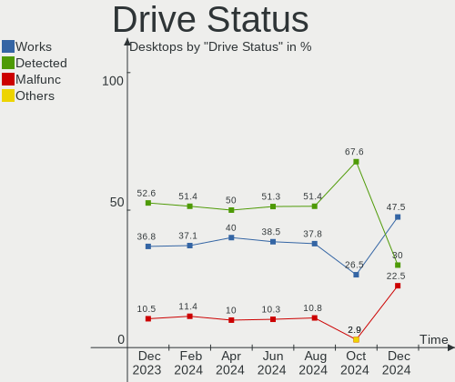
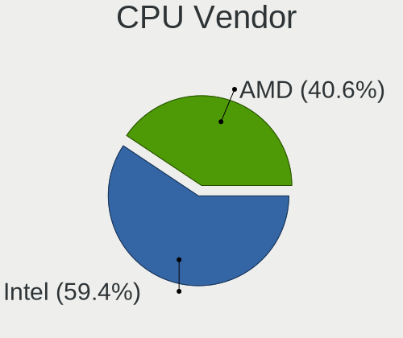
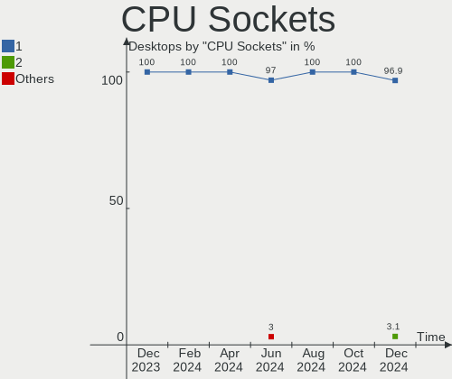
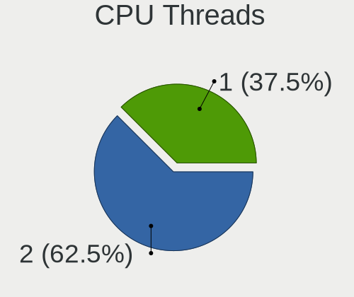
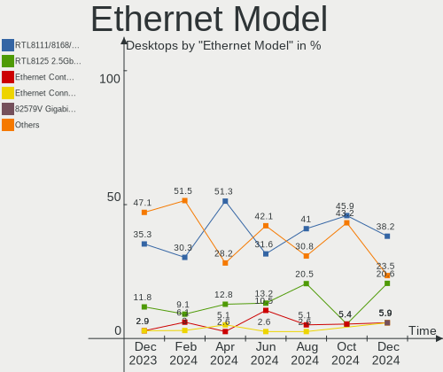
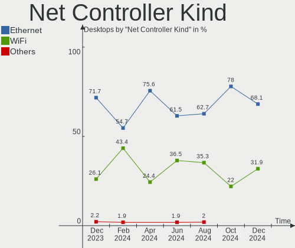
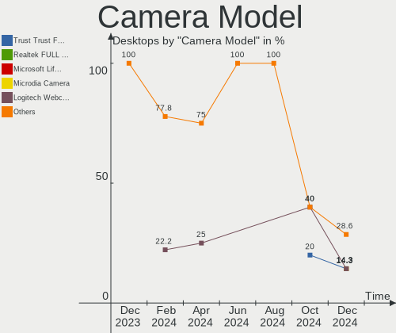

Linux in Netherlands - Hardware Trends (Desktops)
-------------------------------------------------

A project to identify most popular hardware characteristics and track their change
over time based on data collected by Linux users at https://Linux-Hardware.org.

Anyone can contribute to this report by the [hw-probe](https://github.com/linuxhw/hw-probe) tool:

    sudo -E hw-probe -all -upload

Period: Nov, 2023.

Contents
--------

* [ System ](#system)
  - [ OS                       ](#os)
  - [ OS Family                ](#os-family)
  - [ Kernel                   ](#kernel)
  - [ Kernel Family            ](#kernel-family)
  - [ Kernel Major Ver.        ](#kernel-major-ver)
  - [ Arch                     ](#arch)
  - [ DE                       ](#de)
  - [ Display Server           ](#display-server)
  - [ Display Manager          ](#display-manager)
  - [ OS Lang                  ](#os-lang)
  - [ Boot Mode                ](#boot-mode)
  - [ Filesystem               ](#filesystem)
  - [ Part. scheme             ](#part-scheme)
  - [ Dual Boot with Linux/BSD ](#dual-boot-with-linuxbsd)
  - [ Dual Boot (Win)          ](#dual-boot-win)

* [ Board ](#board)
  - [ Vendor                   ](#vendor)
  - [ Model                    ](#model)
  - [ Model Family             ](#model-family)
  - [ MFG Year                 ](#mfg-year)
  - [ Form Factor              ](#form-factor)
  - [ Secure Boot              ](#secure-boot)
  - [ Coreboot                 ](#coreboot)
  - [ RAM Size                 ](#ram-size)
  - [ RAM Used                 ](#ram-used)
  - [ Total Drives             ](#total-drives)
  - [ Has CD-ROM               ](#has-cd-rom)
  - [ Has Ethernet             ](#has-ethernet)
  - [ Has WiFi                 ](#has-wifi)
  - [ Has Bluetooth            ](#has-bluetooth)

* [ Location ](#location)
  - [ Country                  ](#country)
  - [ City                     ](#city)

* [ Drives ](#drives)
  - [ Drive Vendor             ](#drive-vendor)
  - [ Drive Model              ](#drive-model)
  - [ HDD Vendor               ](#hdd-vendor)
  - [ SSD Vendor               ](#ssd-vendor)
  - [ Drive Kind               ](#drive-kind)
  - [ Drive Connector          ](#drive-connector)
  - [ Drive Size               ](#drive-size)
  - [ Space Total              ](#space-total)
  - [ Space Used               ](#space-used)
  - [ Malfunc. Drives          ](#malfunc-drives)
  - [ Malfunc. Drive Vendor    ](#malfunc-drive-vendor)
  - [ Malfunc. HDD Vendor      ](#malfunc-hdd-vendor)
  - [ Malfunc. Drive Kind      ](#malfunc-drive-kind)
  - [ Failed Drives            ](#failed-drives)
  - [ Failed Drive Vendor      ](#failed-drive-vendor)
  - [ Drive Status             ](#drive-status)

* [ Storage controller ](#storage-controller)
  - [ Storage Vendor           ](#storage-vendor)
  - [ Storage Model            ](#storage-model)
  - [ Storage Kind             ](#storage-kind)

* [ Processor ](#processor)
  - [ CPU Vendor               ](#cpu-vendor)
  - [ CPU Model                ](#cpu-model)
  - [ CPU Model Family         ](#cpu-model-family)
  - [ CPU Cores                ](#cpu-cores)
  - [ CPU Sockets              ](#cpu-sockets)
  - [ CPU Threads              ](#cpu-threads)
  - [ CPU Op-Modes             ](#cpu-op-modes)
  - [ CPU Microcode            ](#cpu-microcode)
  - [ CPU Microarch            ](#cpu-microarch)

* [ Graphics ](#graphics)
  - [ GPU Vendor               ](#gpu-vendor)
  - [ GPU Model                ](#gpu-model)
  - [ GPU Combo                ](#gpu-combo)
  - [ GPU Driver               ](#gpu-driver)
  - [ GPU Memory               ](#gpu-memory)

* [ Monitor ](#monitor)
  - [ Monitor Vendor           ](#monitor-vendor)
  - [ Monitor Model            ](#monitor-model)
  - [ Monitor Resolution       ](#monitor-resolution)
  - [ Monitor Diagonal         ](#monitor-diagonal)
  - [ Monitor Width            ](#monitor-width)
  - [ Aspect Ratio             ](#aspect-ratio)
  - [ Monitor Area             ](#monitor-area)
  - [ Pixel Density            ](#pixel-density)
  - [ Multiple Monitors        ](#multiple-monitors)

* [ Network ](#network)
  - [ Net Controller Vendor    ](#net-controller-vendor)
  - [ Net Controller Model     ](#net-controller-model)
  - [ Wireless Vendor          ](#wireless-vendor)
  - [ Wireless Model           ](#wireless-model)
  - [ Ethernet Vendor          ](#ethernet-vendor)
  - [ Ethernet Model           ](#ethernet-model)
  - [ Net Controller Kind      ](#net-controller-kind)
  - [ Used Controller          ](#used-controller)
  - [ NICs                     ](#nics)
  - [ IPv6                     ](#ipv6)

* [ Bluetooth ](#bluetooth)
  - [ Bluetooth Vendor         ](#bluetooth-vendor)
  - [ Bluetooth Model          ](#bluetooth-model)

* [ Sound ](#sound)
  - [ Sound Vendor             ](#sound-vendor)
  - [ Sound Model              ](#sound-model)

* [ Memory ](#memory)
  - [ Memory Vendor            ](#memory-vendor)
  - [ Memory Model             ](#memory-model)
  - [ Memory Kind              ](#memory-kind)
  - [ Memory Form Factor       ](#memory-form-factor)
  - [ Memory Size              ](#memory-size)
  - [ Memory Speed             ](#memory-speed)

* [ Printers & scanners ](#printers--scanners)
  - [ Printer Vendor           ](#printer-vendor)
  - [ Printer Model            ](#printer-model)
  - [ Scanner Vendor           ](#scanner-vendor)
  - [ Scanner Model            ](#scanner-model)

* [ Camera ](#camera)
  - [ Camera Vendor            ](#camera-vendor)
  - [ Camera Model             ](#camera-model)

* [ Security ](#security)
  - [ Fingerprint Vendor       ](#fingerprint-vendor)
  - [ Fingerprint Model        ](#fingerprint-model)
  - [ Chipcard Vendor          ](#chipcard-vendor)
  - [ Chipcard Model           ](#chipcard-model)

* [ Unsupported ](#unsupported)
  - [ Unsupported Devices      ](#unsupported-devices)
  - [ Unsupported Device Types ](#unsupported-device-types)

System
------

OS
--

Installed operating systems

| Name                | Desktops | Percent |
|---------------------|----------|---------|
| Ubuntu 22.04        | 5        | 17.24%  |
| Linux Mint 21.2     | 4        | 13.79%  |
| Pop!_OS 22.04       | 2        | 6.9%    |
| KDE neon 22.04      | 2        | 6.9%    |
| Fedora 38           | 2        | 6.9%    |
| Debian 12           | 2        | 6.9%    |
| ArcoLinux Rolling   | 2        | 6.9%    |
| Void Linux Rolling  | 1        | 3.45%   |
| Ubuntu 23.10        | 1        | 3.45%   |
| openSUSE Leap-15.5  | 1        | 3.45%   |
| OpenMandriva 23.11  | 1        | 3.45%   |
| OpenMandriva 23.08  | 1        | 3.45%   |
| NixOS 23.11         | 1        | 3.45%   |
| Linux Mint 19.3     | 1        | 3.45%   |
| Kubuntu 22.04       | 1        | 3.45%   |
| EndeavourOS Rolling | 1        | 3.45%   |
| Arch Rolling        | 1        | 3.45%   |

OS Family
---------

OS without a version

| Name         | Desktops | Percent |
|--------------|----------|---------|
| Ubuntu       | 6        | 20.69%  |
| Linux Mint   | 5        | 17.24%  |
| Pop!_OS      | 2        | 6.9%    |
| OpenMandriva | 2        | 6.9%    |
| KDE neon     | 2        | 6.9%    |
| Fedora       | 2        | 6.9%    |
| Debian       | 2        | 6.9%    |
| ArcoLinux    | 2        | 6.9%    |
| Void Linux   | 1        | 3.45%   |
| openSUSE     | 1        | 3.45%   |
| NixOS        | 1        | 3.45%   |
| Kubuntu      | 1        | 3.45%   |
| EndeavourOS  | 1        | 3.45%   |
| Arch         | 1        | 3.45%   |

Kernel
------

Version of the Linux kernel

| Version                      | Desktops | Percent |
|------------------------------|----------|---------|
| 6.2.0-37-generic             | 3        | 10.34%  |
| 6.2.0-36-generic             | 3        | 10.34%  |
| 6.1.0-13-amd64               | 2        | 6.9%    |
| 6.6.2-arch1-1                | 1        | 3.45%   |
| 6.6.1-arch1-1                | 1        | 3.45%   |
| 6.6.0-desktop-1omv2390       | 1        | 3.45%   |
| 6.6.0                        | 1        | 3.45%   |
| 6.5.9-arch2-1                | 1        | 3.45%   |
| 6.5.9-200.fc38.x86_64        | 1        | 3.45%   |
| 6.5.8-200.fc38.x86_64        | 1        | 3.45%   |
| 6.5.6-76060506-generic       | 1        | 3.45%   |
| 6.5.4-76060504-generic       | 1        | 3.45%   |
| 6.5.3-x64v2-xanmod1-1        | 1        | 3.45%   |
| 6.5.11_1                     | 1        | 3.45%   |
| 6.5.0-10-generic             | 1        | 3.45%   |
| 6.4.11-desktop-1omv2390      | 1        | 3.45%   |
| 6.2.0-35-generic             | 1        | 3.45%   |
| 6.2.0-33-generic             | 1        | 3.45%   |
| 5.4.0-150-generic            | 1        | 3.45%   |
| 5.15.0-89-generic            | 1        | 3.45%   |
| 5.15.0-88-generic            | 1        | 3.45%   |
| 5.15.0-87-generic            | 1        | 3.45%   |
| 5.15.0-25-generic            | 1        | 3.45%   |
| 5.14.21-150500.55.31-default | 1        | 3.45%   |

Kernel Family
-------------

Linux kernel without a distro release

| Version | Desktops | Percent |
|---------|----------|---------|
| 6.2.0   | 8        | 27.59%  |
| 5.15.0  | 4        | 13.79%  |
| 6.6.0   | 2        | 6.9%    |
| 6.5.9   | 2        | 6.9%    |
| 6.1.0   | 2        | 6.9%    |
| 6.6.2   | 1        | 3.45%   |
| 6.6.1   | 1        | 3.45%   |
| 6.5.8   | 1        | 3.45%   |
| 6.5.6   | 1        | 3.45%   |
| 6.5.4   | 1        | 3.45%   |
| 6.5.3   | 1        | 3.45%   |
| 6.5.11  | 1        | 3.45%   |
| 6.5.0   | 1        | 3.45%   |
| 6.4.11  | 1        | 3.45%   |
| 5.4.0   | 1        | 3.45%   |
| 5.14.21 | 1        | 3.45%   |

Kernel Major Ver.
-----------------

Linux kernel major version

| Version | Desktops | Percent |
|---------|----------|---------|
| 6.5     | 8        | 27.59%  |
| 6.2     | 8        | 27.59%  |
| 6.6     | 4        | 13.79%  |
| 5.15    | 4        | 13.79%  |
| 6.1     | 2        | 6.9%    |
| 6.4     | 1        | 3.45%   |
| 5.4     | 1        | 3.45%   |
| 5.14    | 1        | 3.45%   |

Arch
----

OS architecture (x86_64, i586, etc.)

| Name   | Desktops | Percent |
|--------|----------|---------|
| x86_64 | 29       | 100%    |

DE
--

Desktop Environment

| Name       | Desktops | Percent |
|------------|----------|---------|
| GNOME      | 12       | 41.38%  |
| KDE5       | 9        | 31.03%  |
| X-Cinnamon | 5        | 17.24%  |
| XFCE       | 1        | 3.45%   |
| sway       | 1        | 3.45%   |
| LeftWM     | 1        | 3.45%   |

Display Server
--------------

X11 or Wayland

| Name    | Desktops | Percent |
|---------|----------|---------|
| X11     | 17       | 58.62%  |
| Wayland | 11       | 37.93%  |
| Unknown | 1        | 3.45%   |

Display Manager
---------------

SDDM, LightDM, etc.

| Name    | Desktops | Percent |
|---------|----------|---------|
| Unknown | 12       | 41.38%  |
| GDM3    | 8        | 27.59%  |
| SDDM    | 7        | 24.14%  |
| LightDM | 2        | 6.9%    |

OS Lang
-------

Language

| Lang  | Desktops | Percent |
|-------|----------|---------|
| en_US | 17       | 58.62%  |
| nl_NL | 9        | 31.03%  |
| fr_FR | 1        | 3.45%   |
| es_ES | 1        | 3.45%   |
| en_GB | 1        | 3.45%   |

Boot Mode
---------

EFI or BIOS

| Mode | Desktops | Percent |
|------|----------|---------|
| BIOS | 19       | 65.52%  |
| EFI  | 10       | 34.48%  |

Filesystem
----------

Type of filesystem

| Type    | Desktops | Percent |
|---------|----------|---------|
| Ext4    | 17       | 58.62%  |
| Tmpfs   | 7        | 24.14%  |
| Btrfs   | 4        | 13.79%  |
| Overlay | 1        | 3.45%   |

Part. scheme
------------

Scheme of partitioning

| Type    | Desktops | Percent |
|---------|----------|---------|
| GPT     | 16       | 55.17%  |
| Unknown | 11       | 37.93%  |
| MBR     | 2        | 6.9%    |

Dual Boot with Linux/BSD
------------------------

Hosting more than one Linux/BSD

| Dual boot | Desktops | Percent |
|-----------|----------|---------|
| No        | 24       | 82.76%  |
| Yes       | 5        | 17.24%  |

Dual Boot (Win)
---------------

Hosting Linux and Windows

| Dual boot | Desktops | Percent |
|-----------|----------|---------|
| No        | 18       | 62.07%  |
| Yes       | 11       | 37.93%  |

Board
-----

Vendor
------

Motherboard manufacturer

| Name                | Desktops | Percent |
|---------------------|----------|---------|
| ASUSTek Computer    | 8        | 27.59%  |
| ASRock              | 6        | 20.69%  |
| MSI                 | 3        | 10.34%  |
| Hewlett-Packard     | 3        | 10.34%  |
| Gigabyte Technology | 3        | 10.34%  |
| Medion              | 2        | 6.9%    |
| Pegatron            | 1        | 3.45%   |
| Lenovo              | 1        | 3.45%   |
| Foxconn             | 1        | 3.45%   |
| Apple               | 1        | 3.45%   |

Model
-----

Motherboard model

| Name                               | Desktops | Percent |
|------------------------------------|----------|---------|
| Pegatron NQ852AA-ABH IQ830nl       | 1        | 3.45%   |
| MSI MS-7D75                        | 1        | 3.45%   |
| MSI MS-7A36                        | 1        | 3.45%   |
| MSI MS-7821                        | 1        | 3.45%   |
| Medion MS-7800                     | 1        | 3.45%   |
| Medion MS-7708                     | 1        | 3.45%   |
| Lenovo Legion T7 34IAZ7 90S2007DMH | 1        | 3.45%   |
| HP ProDesk 600 G4 SFF              | 1        | 3.45%   |
| HP ProDesk 405 G4 SFF              | 1        | 3.45%   |
| HP EliteDesk 800 G1 SFF            | 1        | 3.45%   |
| Gigabyte P55A-UD3                  | 1        | 3.45%   |
| Gigabyte B550M S2H                 | 1        | 3.45%   |
| Gigabyte B550M DS3H                | 1        | 3.45%   |
| Foxconn Pro 3400 Series MT         | 1        | 3.45%   |
| ASUS ProArt X670E-CREATOR WIFI     | 1        | 3.45%   |
| ASUS PRIME Z370-A II               | 1        | 3.45%   |
| ASUS PRIME X570-PRO                | 1        | 3.45%   |
| ASUS P8H61-M LE R2.0               | 1        | 3.45%   |
| ASUS Maximus IX FORMULA            | 1        | 3.45%   |
| ASUS M4A87TD/USB3                  | 1        | 3.45%   |
| ASUS Amd Am4 Overclocked           | 1        | 3.45%   |
| ASUS All Series                    | 1        | 3.45%   |
| ASRock Z77 Extreme4                | 1        | 3.45%   |
| ASRock N68C-GS FX                  | 1        | 3.45%   |
| ASRock B760M Steel Legend WiFi     | 1        | 3.45%   |
| ASRock B550 Phantom Gaming 4/ac    | 1        | 3.45%   |
| ASRock B450M Steel Legend          | 1        | 3.45%   |
| ASRock B450 Pro4                   | 1        | 3.45%   |
| Apple MacPro5,1                    | 1        | 3.45%   |

Model Family
------------

Motherboard model prefix

| Name                 | Desktops | Percent |
|----------------------|----------|---------|
| HP ProDesk           | 2        | 6.9%    |
| Gigabyte B550M       | 2        | 6.9%    |
| ASUS PRIME           | 2        | 6.9%    |
| Pegatron NQ852AA-ABH | 1        | 3.45%   |
| MSI MS-7D75          | 1        | 3.45%   |
| MSI MS-7A36          | 1        | 3.45%   |
| MSI MS-7821          | 1        | 3.45%   |
| Medion MS-7800       | 1        | 3.45%   |
| Medion MS-7708       | 1        | 3.45%   |
| Lenovo Legion        | 1        | 3.45%   |
| HP EliteDesk         | 1        | 3.45%   |
| Gigabyte P55A-UD3    | 1        | 3.45%   |
| Foxconn Pro          | 1        | 3.45%   |
| ASUS ProArt          | 1        | 3.45%   |
| ASUS P8H61-M         | 1        | 3.45%   |
| ASUS Maximus         | 1        | 3.45%   |
| ASUS M4A87TD         | 1        | 3.45%   |
| ASUS Amd             | 1        | 3.45%   |
| ASUS All             | 1        | 3.45%   |
| ASRock Z77           | 1        | 3.45%   |
| ASRock N68C-GS       | 1        | 3.45%   |
| ASRock B760M         | 1        | 3.45%   |
| ASRock B550          | 1        | 3.45%   |
| ASRock B450M         | 1        | 3.45%   |
| ASRock B450          | 1        | 3.45%   |
| Apple MacPro5        | 1        | 3.45%   |

MFG Year
--------

Motherboard manufacture year

| Year | Desktops | Percent |
|------|----------|---------|
| 2018 | 5        | 17.24%  |
| 2012 | 4        | 13.79%  |
| 2010 | 4        | 13.79%  |
| 2022 | 3        | 10.34%  |
| 2020 | 3        | 10.34%  |
| 2013 | 3        | 10.34%  |
| 2021 | 2        | 6.9%    |
| 2019 | 2        | 6.9%    |
| 2023 | 1        | 3.45%   |
| 2011 | 1        | 3.45%   |
| 2009 | 1        | 3.45%   |

Form Factor
-----------

Physical design of the computer

| Name    | Desktops | Percent |
|---------|----------|---------|
| Desktop | 29       | 100%    |

Secure Boot
-----------

Enabled or disabled

| State    | Desktops | Percent |
|----------|----------|---------|
| Disabled | 29       | 100%    |

Coreboot
--------

Have coreboot on board

| Used | Desktops | Percent |
|------|----------|---------|
| No   | 29       | 100%    |

RAM Size
--------

Total RAM memory

| Size in GB  | Desktops | Percent |
|-------------|----------|---------|
| 32.01-64.0  | 9        | 31.03%  |
| 16.01-24.0  | 7        | 24.14%  |
| 8.01-16.0   | 5        | 17.24%  |
| 4.01-8.0    | 3        | 10.34%  |
| 64.01-256.0 | 2        | 6.9%    |
| 3.01-4.0    | 1        | 3.45%   |
| 24.01-32.0  | 1        | 3.45%   |
| 2.01-3.0    | 1        | 3.45%   |

RAM Used
--------

Used RAM memory

| Used GB    | Desktops | Percent |
|------------|----------|---------|
| 4.01-8.0   | 10       | 34.48%  |
| 2.01-3.0   | 6        | 20.69%  |
| 3.01-4.0   | 5        | 17.24%  |
| 1.01-2.0   | 5        | 17.24%  |
| 16.01-24.0 | 1        | 3.45%   |
| 8.01-16.0  | 1        | 3.45%   |
| 0.51-1.0   | 1        | 3.45%   |

Total Drives
------------

Number of drives on board

| Drives | Desktops | Percent |
|--------|----------|---------|
| 4      | 8        | 27.59%  |
| 3      | 8        | 27.59%  |
| 1      | 7        | 24.14%  |
| 2      | 6        | 20.69%  |

Has CD-ROM
----------

Has CD-ROM on board

| Presented | Desktops | Percent |
|-----------|----------|---------|
| No        | 18       | 62.07%  |
| Yes       | 11       | 37.93%  |

Has Ethernet
------------

Has Ethernet on board

| Presented | Desktops | Percent |
|-----------|----------|---------|
| Yes       | 29       | 100%    |

Has WiFi
--------

Has WiFi module

| Presented | Desktops | Percent |
|-----------|----------|---------|
| No        | 15       | 51.72%  |
| Yes       | 14       | 48.28%  |

Has Bluetooth
-------------

Has Bluetooth module

| Presented | Desktops | Percent |
|-----------|----------|---------|
| No        | 17       | 58.62%  |
| Yes       | 12       | 41.38%  |

Location
--------

Country
-------

Geographic location (country)

| Country     | Desktops | Percent |
|-------------|----------|---------|
| Netherlands | 29       | 100%    |

City
----

Geographic location (city)

| City          | Desktops | Percent |
|---------------|----------|---------|
| Amsterdam     | 6        | 20.69%  |
| Utrecht       | 2        | 6.9%    |
| Zoetermeer    | 1        | 3.45%   |
| Warnsveld     | 1        | 3.45%   |
| Vaals         | 1        | 3.45%   |
| Tiel          | 1        | 3.45%   |
| The Hague     | 1        | 3.45%   |
| Noardburgum   | 1        | 3.45%   |
| Nijmegen      | 1        | 3.45%   |
| Naaldwijk     | 1        | 3.45%   |
| Maastricht    | 1        | 3.45%   |
| Hoofddorp     | 1        | 3.45%   |
| Heerhugowaard | 1        | 3.45%   |
| Heemskerk     | 1        | 3.45%   |
| Harderwijk    | 1        | 3.45%   |
| Haarlem       | 1        | 3.45%   |
| Enschede      | 1        | 3.45%   |
| Ede           | 1        | 3.45%   |
| Deurne        | 1        | 3.45%   |
| Bilthoven     | 1        | 3.45%   |
| Amersfoort    | 1        | 3.45%   |
| Almelo        | 1        | 3.45%   |
| Alkmaar       | 1        | 3.45%   |

Drives
------

Drive Vendor
------------

Hard drive vendors

| Vendor                       | Desktops | Drives | Percent |
|------------------------------|----------|--------|---------|
| Samsung Electronics          | 16       | 28     | 29.63%  |
| Kingston                     | 8        | 8      | 14.81%  |
| WDC                          | 6        | 8      | 11.11%  |
| Seagate                      | 5        | 6      | 9.26%   |
| Hitachi                      | 4        | 4      | 7.41%   |
| SanDisk                      | 3        | 3      | 5.56%   |
| Crucial                      | 3        | 4      | 5.56%   |
| Unknown                      | 1        | 1      | 1.85%   |
| Toshiba                      | 1        | 1      | 1.85%   |
| Shenzhen Longsys Electronics | 1        | 1      | 1.85%   |
| Phison Electronics           | 1        | 1      | 1.85%   |
| Patriot                      | 1        | 1      | 1.85%   |
| Intenso                      | 1        | 1      | 1.85%   |
| Intel                        | 1        | 1      | 1.85%   |
| GOODRAM                      | 1        | 1      | 1.85%   |
| Fanxiang                     | 1        | 1      | 1.85%   |

Drive Model
-----------

Hard drive models

| Model                                               | Desktops | Percent |
|-----------------------------------------------------|----------|---------|
| Samsung NVMe SSD Controller SM981/PM981/PM983 250GB | 3        | 4.48%   |
| Samsung SSD 860 EVO 500GB                           | 2        | 2.99%   |
| Samsung HD103SJ 1TB                                 | 2        | 2.99%   |
| Kingston SA400S37240G 240GB SSD                     | 2        | 2.99%   |
| WDC WDS100T2B0B 1TB SSD                             | 1        | 1.49%   |
| WDC WD40EZRZ-00GXCB0 4TB                            | 1        | 1.49%   |
| WDC WD40EFRX-68WT0N0 4TB                            | 1        | 1.49%   |
| WDC WD30EZRZ-00GXCB0 3TB                            | 1        | 1.49%   |
| WDC WD20EZRZ-00Z5HB0 2TB                            | 1        | 1.49%   |
| WDC WD20EFAX-68FB5N0 2TB                            | 1        | 1.49%   |
| WDC WD10EADS-65L5B1 1TB                             | 1        | 1.49%   |
| WDC WD100EMAZ-00WJTA0 10TB                          | 1        | 1.49%   |
| Unknown SD/MMC/MS PRO 128GB                         | 1        | 1.49%   |
| Toshiba DT01ACA050 500GB                            | 1        | 1.49%   |
| Shenzhen Longsys Lexar SSD NM790 2TB                | 1        | 1.49%   |
| Seagate ST500DM002-1BD142 500GB                     | 1        | 1.49%   |
| Seagate ST31500541AS 1TB                            | 1        | 1.49%   |
| Seagate FireCuda Hub 16TB                           | 1        | 1.49%   |
| Seagate Expansion HDD 2TB                           | 1        | 1.49%   |
| Seagate Backup+ Desk 2TB                            | 1        | 1.49%   |
| Sandisk WD_BLACK SN770 2TB                          | 1        | 1.49%   |
| Sandisk WD Black NVMe SSD 256GB                     | 1        | 1.49%   |
| SanDisk NVMe SSD Drive 1TB                          | 1        | 1.49%   |
| Samsung SSD PM810 2.5 7mm 128GB                     | 1        | 1.49%   |
| Samsung SSD 990 PRO 2TB                             | 1        | 1.49%   |
| Samsung SSD 980 1TB                                 | 1        | 1.49%   |
| Samsung SSD 870 QVO 8TB                             | 1        | 1.49%   |
| Samsung SSD 870 QVO 4TB                             | 1        | 1.49%   |
| Samsung SSD 870 EVO 500GB                           | 1        | 1.49%   |
| Samsung SSD 870 EVO 250GB                           | 1        | 1.49%   |
| Samsung SSD 860 QVO 4TB                             | 1        | 1.49%   |
| Samsung SSD 860 EVO 250GB                           | 1        | 1.49%   |
| Samsung SSD 850 EVO 500GB                           | 1        | 1.49%   |
| Samsung SSD 840 EVO 250GB                           | 1        | 1.49%   |
| Samsung SSD 840 EVO 1TB                             | 1        | 1.49%   |
| Samsung SSD 840 EVO 120GB                           | 1        | 1.49%   |
| Samsung SP2504C 250GB                               | 1        | 1.49%   |
| Samsung NVMe SSD Controller PM9A1/PM9A3/980PRO 2TB  | 1        | 1.49%   |
| Samsung MZVLQ256HAJD-000H1 256GB                    | 1        | 1.49%   |
| Samsung HD204UI 2TB                                 | 1        | 1.49%   |

HDD Vendor
----------

Hard disk drive vendors

| Vendor              | Desktops | Drives | Percent |
|---------------------|----------|--------|---------|
| WDC                 | 6        | 7      | 30%     |
| Samsung Electronics | 5        | 6      | 25%     |
| Hitachi             | 4        | 4      | 20%     |
| Seagate             | 3        | 4      | 15%     |
| Unknown             | 1        | 1      | 5%      |
| Toshiba             | 1        | 1      | 5%      |

SSD Vendor
----------

Solid state drive vendors

| Vendor              | Desktops | Drives | Percent |
|---------------------|----------|--------|---------|
| Samsung Electronics | 8        | 14     | 40%     |
| Kingston            | 6        | 6      | 30%     |
| Crucial             | 3        | 4      | 15%     |
| WDC                 | 1        | 1      | 5%      |
| Patriot             | 1        | 1      | 5%      |
| GOODRAM             | 1        | 1      | 5%      |

Drive Kind
----------

HDD or SSD

| Kind    | Desktops | Drives | Percent |
|---------|----------|--------|---------|
| SSD     | 17       | 27     | 35.42%  |
| HDD     | 16       | 23     | 33.33%  |
| NVMe    | 12       | 16     | 25%     |
| Unknown | 3        | 4      | 6.25%   |

Drive Connector
---------------

SATA, SAS, NVMe, etc.

| Type | Desktops | Drives | Percent |
|------|----------|--------|---------|
| SATA | 23       | 49     | 58.97%  |
| NVMe | 12       | 16     | 30.77%  |
| SAS  | 4        | 5      | 10.26%  |

Drive Size
----------

Size of hard drive

| Size in TB | Desktops | Drives | Percent |
|------------|----------|--------|---------|
| 0.01-0.5   | 18       | 27     | 47.37%  |
| 0.51-1.0   | 10       | 11     | 26.32%  |
| 1.01-2.0   | 4        | 4      | 10.53%  |
| 3.01-4.0   | 3        | 5      | 7.89%   |
| 4.01-10.0  | 2        | 2      | 5.26%   |
| 2.01-3.0   | 1        | 1      | 2.63%   |

Space Total
-----------

Amount of disk space available on the file system

| Size in GB     | Desktops | Percent |
|----------------|----------|---------|
| More than 3000 | 7        | 24.14%  |
| 1001-2000      | 6        | 20.69%  |
| 101-250        | 5        | 17.24%  |
| 251-500        | 4        | 13.79%  |
| 2001-3000      | 2        | 6.9%    |
| 51-100         | 2        | 6.9%    |
| 21-50          | 1        | 3.45%   |
| 1-20           | 1        | 3.45%   |
| 501-1000       | 1        | 3.45%   |

Space Used
----------

Amount of used disk space

| Used GB        | Desktops | Percent |
|----------------|----------|---------|
| 1-20           | 9        | 31.03%  |
| 1001-2000      | 6        | 20.69%  |
| 21-50          | 4        | 13.79%  |
| 501-1000       | 4        | 13.79%  |
| 101-250        | 2        | 6.9%    |
| 51-100         | 2        | 6.9%    |
| More than 3000 | 1        | 3.45%   |
| 2001-3000      | 1        | 3.45%   |

Malfunc. Drives
---------------

Drive models with a malfunction

| Model                                       | Desktops | Drives | Percent |
|---------------------------------------------|----------|--------|---------|
| WDC WD20EZRZ-00Z5HB0 2TB                    | 1        | 1      | 25%     |
| Samsung Electronics SSD PM810 2.5 7mm 128GB | 1        | 1      | 25%     |
| Samsung Electronics HD154UI 1TB             | 1        | 1      | 25%     |
| Crucial CT500MX500SSD1 500GB                | 1        | 1      | 25%     |

Malfunc. Drive Vendor
---------------------

Vendors of faulty drives

| Vendor              | Desktops | Drives | Percent |
|---------------------|----------|--------|---------|
| WDC                 | 1        | 1      | 33.33%  |
| Samsung Electronics | 1        | 2      | 33.33%  |
| Crucial             | 1        | 1      | 33.33%  |

Malfunc. HDD Vendor
-------------------

Vendors of faulty HDD drives

| Vendor              | Desktops | Drives | Percent |
|---------------------|----------|--------|---------|
| WDC                 | 1        | 1      | 50%     |
| Samsung Electronics | 1        | 1      | 50%     |

Malfunc. Drive Kind
-------------------

Kinds of faulty drives

| Kind | Desktops | Drives | Percent |
|------|----------|--------|---------|
| SSD  | 2        | 2      | 50%     |
| HDD  | 2        | 2      | 50%     |

Failed Drives
-------------

Failed drive models

Zero info for selected period =(

Failed Drive Vendor
-------------------

Failed drive vendors

Zero info for selected period =(

Drive Status
------------

Number of failed and malfunc. drives

| Status   | Desktops | Drives | Percent |
|----------|----------|--------|---------|
| Detected | 22       | 47     | 66.67%  |
| Works    | 8        | 19     | 24.24%  |
| Malfunc  | 3        | 4      | 9.09%   |

Storage controller
------------------

Storage Vendor
--------------

Storage controller vendors

| Vendor                       | Desktops | Percent |
|------------------------------|----------|---------|
| Intel                        | 16       | 31.37%  |
| AMD                          | 13       | 25.49%  |
| Samsung Electronics          | 7        | 13.73%  |
| ASMedia Technology           | 4        | 7.84%   |
| SanDisk                      | 3        | 5.88%   |
| Kingston Technology Company  | 2        | 3.92%   |
| Shenzhen Longsys Electronics | 1        | 1.96%   |
| Phison Electronics           | 1        | 1.96%   |
| Nvidia                       | 1        | 1.96%   |
| Marvell Technology Group     | 1        | 1.96%   |
| JMicron Technology           | 1        | 1.96%   |
| HighPoint Technologies       | 1        | 1.96%   |

Storage Model
-------------

Storage controller models

| Model                                                                                   | Desktops | Percent |
|-----------------------------------------------------------------------------------------|----------|---------|
| AMD FCH SATA Controller [AHCI mode]                                                     | 7        | 12.5%   |
| ASMedia ASM1062 Serial ATA Controller                                                   | 4        | 7.14%   |
| Samsung NVMe SSD Controller SM981/PM981/PM983                                           | 3        | 5.36%   |
| Intel 8 Series/C220 Series Chipset Family 6-port SATA Controller 1 [AHCI mode]          | 3        | 5.36%   |
| AMD 500 Series Chipset SATA Controller                                                  | 3        | 5.36%   |
| Samsung NVMe SSD Controller 980 (DRAM-less)                                             | 2        | 3.57%   |
| Intel 5 Series/3400 Series Chipset 6 port SATA AHCI Controller                          | 2        | 3.57%   |
| Intel 200 Series PCH SATA controller [AHCI mode]                                        | 2        | 3.57%   |
| AMD 400 Series Chipset SATA Controller                                                  | 2        | 3.57%   |
| Shenzhen Longsys Non-Volatile memory controller                                         | 1        | 1.79%   |
| SanDisk WD Black SN770 / PC SN740 256GB / PC SN560 (DRAM-less) NVMe SSD                 | 1        | 1.79%   |
| SanDisk WD Black NVMe SSD                                                               | 1        | 1.79%   |
| SanDisk Ultra 3D / WD Blue SN570 NVMe SSD (DRAM-less)                                   | 1        | 1.79%   |
| Samsung NVMe SSD Controller S4LV008[Pascal]                                             | 1        | 1.79%   |
| Samsung NVMe SSD Controller PM9A1/PM9A3/980PRO                                          | 1        | 1.79%   |
| Phison PS5013-E13 PCIe3 NVMe Controller (DRAM-less)                                     | 1        | 1.79%   |
| Nvidia MCP61 SATA Controller                                                            | 1        | 1.79%   |
| Nvidia MCP61 IDE                                                                        | 1        | 1.79%   |
| Marvell Group 88SE912x IDE Controller                                                   | 1        | 1.79%   |
| Kingston Company NV1 NVMe SSD SM2263XT                                                  | 1        | 1.79%   |
| Kingston Company KC3000/FURY Renegade NVMe SSD E18                                      | 1        | 1.79%   |
| JMicron JMB368 IDE controller                                                           | 1        | 1.79%   |
| Intel SSD 660P Series                                                                   | 1        | 1.79%   |
| Intel Cannon Lake PCH SATA AHCI Controller                                              | 1        | 1.79%   |
| Intel Alder Lake-S PCH SATA Controller [AHCI Mode]                                      | 1        | 1.79%   |
| Intel 82801JI (ICH10 Family) SATA AHCI Controller                                       | 1        | 1.79%   |
| Intel 82801IBM/IEM (ICH9M/ICH9M-E) 4 port SATA Controller [AHCI mode]                   | 1        | 1.79%   |
| Intel 700 Series Chipset Family SATA AHCI Controller                                    | 1        | 1.79%   |
| Intel 7 Series/C210 Series Chipset Family 6-port SATA Controller [AHCI mode]            | 1        | 1.79%   |
| Intel 6 Series/C200 Series Chipset Family Desktop SATA Controller (IDE mode, ports 4-5) | 1        | 1.79%   |
| Intel 6 Series/C200 Series Chipset Family Desktop SATA Controller (IDE mode, ports 0-3) | 1        | 1.79%   |
| Intel 6 Series/C200 Series Chipset Family 6 port Desktop SATA AHCI Controller           | 1        | 1.79%   |
| HighPoint RocketRAID 622 2 Port SATA-III Controller                                     | 1        | 1.79%   |
| AMD SB7x0/SB8x0/SB9x0 SATA Controller [IDE mode]                                        | 1        | 1.79%   |
| AMD SB7x0/SB8x0/SB9x0 IDE Controller                                                    | 1        | 1.79%   |
| AMD FCH SATA Controller D                                                               | 1        | 1.79%   |
| AMD 300 Series Chipset SATA Controller                                                  | 1        | 1.79%   |

Storage Kind
------------

Kind of storage controller (IDE, SATA, NVMe, SAS, ...)

| Kind | Desktops | Percent |
|------|----------|---------|
| SATA | 27       | 61.36%  |
| NVMe | 12       | 27.27%  |
| IDE  | 4        | 9.09%   |
| RAID | 1        | 2.27%   |

Processor
---------

CPU Vendor
----------

Processor vendors

| Vendor | Desktops | Percent |
|--------|----------|---------|
| Intel  | 15       | 51.72%  |
| AMD    | 14       | 48.28%  |

CPU Model
---------

Processor models

| Model                                           | Desktops | Percent |
|-------------------------------------------------|----------|---------|
| Intel Core i7-8700 CPU @ 3.20GHz                | 2        | 6.9%    |
| AMD Ryzen 5 3600 6-Core Processor               | 2        | 6.9%    |
| Intel Xeon CPU E5620 @ 2.40GHz                  | 1        | 3.45%   |
| Intel Pentium CPU G630 @ 2.70GHz                | 1        | 3.45%   |
| Intel Core i7-7700K CPU @ 4.20GHz               | 1        | 3.45%   |
| Intel Core i7-4770K CPU @ 3.50GHz               | 1        | 3.45%   |
| Intel Core i7 CPU 870 @ 2.93GHz                 | 1        | 3.45%   |
| Intel Core i5-4670K CPU @ 3.40GHz               | 1        | 3.45%   |
| Intel Core i5-4570 CPU @ 3.20GHz                | 1        | 3.45%   |
| Intel Core i5-3570K CPU @ 3.40GHz               | 1        | 3.45%   |
| Intel Core i5 CPU 750 @ 2.67GHz                 | 1        | 3.45%   |
| Intel Core 2 Duo CPU P7450 @ 2.13GHz            | 1        | 3.45%   |
| Intel Celeron CPU G1610 @ 2.60GHz               | 1        | 3.45%   |
| Intel 13th Gen Core i5-13500                    | 1        | 3.45%   |
| Intel 12th Gen Core i9-12900K                   | 1        | 3.45%   |
| AMD Ryzen 9 7900 12-Core Processor              | 1        | 3.45%   |
| AMD Ryzen 9 3900X 12-Core Processor             | 1        | 3.45%   |
| AMD Ryzen 7 5800X 8-Core Processor              | 1        | 3.45%   |
| AMD Ryzen 7 3800X 8-Core Processor              | 1        | 3.45%   |
| AMD Ryzen 5 PRO 2400G with Radeon Vega Graphics | 1        | 3.45%   |
| AMD Ryzen 5 7600X 6-Core Processor              | 1        | 3.45%   |
| AMD Ryzen 5 5600X 6-Core Processor              | 1        | 3.45%   |
| AMD Ryzen 5 4500 6-Core Processor               | 1        | 3.45%   |
| AMD Phenom II X4 955 Processor                  | 1        | 3.45%   |
| AMD Athlon II X2 270 Processor                  | 1        | 3.45%   |
| AMD A6-9500 RADEON R5, 8 COMPUTE CORES 2C+6G    | 1        | 3.45%   |
| AMD A10-5700 APU with Radeon HD Graphics        | 1        | 3.45%   |

CPU Model Family
----------------

Processor model prefix

| Model            | Desktops | Percent |
|------------------|----------|---------|
| Intel Core i7    | 5        | 17.24%  |
| AMD Ryzen 5      | 5        | 17.24%  |
| Intel Core i5    | 4        | 13.79%  |
| Other            | 2        | 6.9%    |
| AMD Ryzen 9      | 2        | 6.9%    |
| AMD Ryzen 7      | 2        | 6.9%    |
| Intel Xeon       | 1        | 3.45%   |
| Intel Pentium    | 1        | 3.45%   |
| Intel Core 2 Duo | 1        | 3.45%   |
| Intel Celeron    | 1        | 3.45%   |
| AMD Ryzen 5 PRO  | 1        | 3.45%   |
| AMD Phenom II X4 | 1        | 3.45%   |
| AMD Athlon II X2 | 1        | 3.45%   |
| AMD A6           | 1        | 3.45%   |
| AMD A10          | 1        | 3.45%   |

CPU Cores
---------

Number of processor cores

| Number | Desktops | Percent |
|--------|----------|---------|
| 4      | 8        | 27.59%  |
| 6      | 7        | 24.14%  |
| 2      | 5        | 17.24%  |
| 8      | 3        | 10.34%  |
| 12     | 2        | 6.9%    |
| 16     | 1        | 3.45%   |
| 14     | 1        | 3.45%   |
| 3      | 1        | 3.45%   |
| 1      | 1        | 3.45%   |

CPU Sockets
-----------

Number of sockets

| Number | Desktops | Percent |
|--------|----------|---------|
| 1      | 28       | 96.55%  |
| 2      | 1        | 3.45%   |

CPU Threads
-----------

Threads per core (Hyper-Threading)

| Number | Desktops | Percent |
|--------|----------|---------|
| 2      | 19       | 65.52%  |
| 1      | 10       | 34.48%  |

CPU Op-Modes
------------

CPU Operation Modes (32-bit, 64-bit)

| Op mode        | Desktops | Percent |
|----------------|----------|---------|
| 32-bit, 64-bit | 29       | 100%    |

CPU Microcode
-------------

Microcode number

| Number     | Desktops | Percent |
|------------|----------|---------|
| Unknown    | 18       | 62.07%  |
| 0x08701021 | 2        | 6.9%    |
| 0x906e9    | 1        | 3.45%   |
| 0x10676    | 1        | 3.45%   |
| 0x0a601206 | 1        | 3.45%   |
| 0x0a601203 | 1        | 3.45%   |
| 0x08701030 | 1        | 3.45%   |
| 0x08600103 | 1        | 3.45%   |
| 0x08101016 | 1        | 3.45%   |
| 0x06006118 | 1        | 3.45%   |
| 0x06001119 | 1        | 3.45%   |

CPU Microarch
-------------

Microarchitecture

| Name        | Desktops | Percent |
|-------------|----------|---------|
| Zen 2       | 5        | 17.24%  |
| Unknown     | 4        | 13.79%  |
| KabyLake    | 3        | 10.34%  |
| Haswell     | 3        | 10.34%  |
| Zen 3       | 2        | 6.9%    |
| Nehalem     | 2        | 6.9%    |
| K10         | 2        | 6.9%    |
| IvyBridge   | 2        | 6.9%    |
| Zen         | 1        | 3.45%   |
| Westmere    | 1        | 3.45%   |
| SandyBridge | 1        | 3.45%   |
| Piledriver  | 1        | 3.45%   |
| Penryn      | 1        | 3.45%   |
| Excavator   | 1        | 3.45%   |

Graphics
--------

GPU Vendor
----------

Vendors of graphics cards

| Vendor | Desktops | Percent |
|--------|----------|---------|
| Nvidia | 14       | 43.75%  |
| AMD    | 13       | 40.63%  |
| Intel  | 5        | 15.63%  |

GPU Model
---------

Graphics card models

| Model                                                                       | Desktops | Percent |
|-----------------------------------------------------------------------------|----------|---------|
| Nvidia GM107 [GeForce GTX 750 Ti]                                           | 2        | 6.25%   |
| Nvidia GA102 [GeForce RTX 3080 Lite Hash Rate]                              | 2        | 6.25%   |
| Intel Xeon E3-1200 v3/4th Gen Core Processor Integrated Graphics Controller | 2        | 6.25%   |
| Intel CoffeeLake-S GT2 [UHD Graphics 630]                                   | 2        | 6.25%   |
| AMD Ellesmere [Radeon RX 470/480/570/570X/580/580X/590]                     | 2        | 6.25%   |
| Nvidia TU116 [GeForce GTX 1650]                                             | 1        | 3.13%   |
| Nvidia GT218 [GeForce 210]                                                  | 1        | 3.13%   |
| Nvidia GP108 [GeForce GT 1030]                                              | 1        | 3.13%   |
| Nvidia GP106 [GeForce GTX 1060 6GB]                                         | 1        | 3.13%   |
| Nvidia GP102 [GeForce GTX 1080 Ti]                                          | 1        | 3.13%   |
| Nvidia GK104 [GeForce GTX 770]                                              | 1        | 3.13%   |
| Nvidia GF114 [GeForce GTX 560 Ti]                                           | 1        | 3.13%   |
| Nvidia GA104 [GeForce RTX 3070]                                             | 1        | 3.13%   |
| Nvidia GA104 [GeForce RTX 3070 Ti]                                          | 1        | 3.13%   |
| Nvidia G96CM [GeForce 9600M GS]                                             | 1        | 3.13%   |
| Intel Xeon E3-1200 v2/3rd Gen Core processor Graphics Controller            | 1        | 3.13%   |
| AMD Trinity [Radeon HD 7660D]                                               | 1        | 3.13%   |
| AMD Redwood XT [Radeon HD 5670/5690/5730]                                   | 1        | 3.13%   |
| AMD Raven Ridge [Radeon Vega Series / Radeon Vega Mobile Series]            | 1        | 3.13%   |
| AMD Raphael                                                                 | 1        | 3.13%   |
| AMD Navi 24 [Radeon RX 6400/6500 XT/6500M]                                  | 1        | 3.13%   |
| AMD Navi 23 [Radeon RX 6600/6600 XT/6600M]                                  | 1        | 3.13%   |
| AMD Navi 22 [Radeon RX 6700/6700 XT/6750 XT / 6800M/6850M XT]               | 1        | 3.13%   |
| AMD Cypress XT [Radeon HD 5870]                                             | 1        | 3.13%   |
| AMD Cape Verde XT [Radeon HD 7770/8760 / R7 250X]                           | 1        | 3.13%   |
| AMD Cape Verde PRO [Radeon HD 7750/8740 / R7 250E]                          | 1        | 3.13%   |
| AMD Barts XT [Radeon HD 6870]                                               | 1        | 3.13%   |

GPU Combo
---------

Combinations of graphics cards

| Name           | Desktops | Percent |
|----------------|----------|---------|
| 1 x Nvidia     | 12       | 41.38%  |
| 1 x AMD        | 12       | 41.38%  |
| 1 x Intel      | 3        | 10.34%  |
| Intel + Nvidia | 1        | 3.45%   |
| AMD + Nvidia   | 1        | 3.45%   |

GPU Driver
----------

Free vs proprietary

| Driver      | Desktops | Percent |
|-------------|----------|---------|
| Free        | 22       | 75.86%  |
| Proprietary | 7        | 24.14%  |

GPU Memory
----------

Total video memory

| Size in GB | Desktops | Percent |
|------------|----------|---------|
| Unknown    | 11       | 37.93%  |
| 7.01-8.0   | 5        | 17.24%  |
| 1.01-2.0   | 4        | 13.79%  |
| 8.01-16.0  | 3        | 10.34%  |
| 0.51-1.0   | 3        | 10.34%  |
| 3.01-4.0   | 2        | 6.9%    |
| 0.01-0.5   | 1        | 3.45%   |

Monitor
-------

Monitor Vendor
--------------

Monitor vendors

| Vendor              | Desktops | Percent |
|---------------------|----------|---------|
| Goldstar            | 5        | 15.63%  |
| Samsung Electronics | 4        | 12.5%   |
| Philips             | 3        | 9.38%   |
| Iiyama              | 3        | 9.38%   |
| Hewlett-Packard     | 3        | 9.38%   |
| AOC                 | 3        | 9.38%   |
| Medion              | 2        | 6.25%   |
| Dell                | 2        | 6.25%   |
| Sharp               | 1        | 3.13%   |
| MSI                 | 1        | 3.13%   |
| HUAWEI              | 1        | 3.13%   |
| CASIO               | 1        | 3.13%   |
| BenQ                | 1        | 3.13%   |
| Acer                | 1        | 3.13%   |
| Unknown             | 1        | 3.13%   |

Monitor Model
-------------

Monitor models

| Model                                                               | Desktops | Percent |
|---------------------------------------------------------------------|----------|---------|
| Sharp LCD SHP1023 1360x768                                          | 1        | 3.03%   |
| Samsung Electronics SyncMaster SAM0017 1024x768 304x228mm 15.0-inch | 1        | 3.03%   |
| Samsung Electronics SMS19A100 SAM0867 1366x768 410x230mm 18.5-inch  | 1        | 3.03%   |
| Samsung Electronics S24R65x SAM1023 1920x1080 530x300mm 24.0-inch   | 1        | 3.03%   |
| Samsung Electronics LU28R55 SAM1019 3840x2160 632x360mm 28.6-inch   | 1        | 3.03%   |
| Samsung Electronics LU28R55 SAM1017 3840x2160 632x360mm 28.6-inch   | 1        | 3.03%   |
| Philips PHL 499P9 PHL092A 3840x1080 1193x336mm 48.8-inch            | 1        | 3.03%   |
| Philips PHL 241V8 PHLC212 1920x1080 527x296mm 23.8-inch             | 1        | 3.03%   |
| Philips 273ELH PHLC07D 1920x1080 598x336mm 27.0-inch                | 1        | 3.03%   |
| MSI MAG241CR MSI3EA2 1920x1080 520x290mm 23.4-inch                  | 1        | 3.03%   |
| Medion MD 20889 MED3688 1920x1080 509x286mm 23.0-inch               | 1        | 3.03%   |
| Medion MD 20144 MED3635 1920x1080 521x293mm 23.5-inch               | 1        | 3.03%   |
| Iiyama PL3494WQ IVM7631 3440x1440 797x334mm 34.0-inch               | 1        | 3.03%   |
| Iiyama PL3271Q IVM761C 2560x1440 698x393mm 31.5-inch                | 1        | 3.03%   |
| Iiyama PL2875UH IVM7111 3840x2160 621x341mm 27.9-inch               | 1        | 3.03%   |
| HUAWEI ZQE-CBA HWV6A25 3440x1440 797x334mm 34.0-inch                | 1        | 3.03%   |
| Hewlett-Packard x2301 HWP2972 1920x1080 509x286mm 23.0-inch         | 1        | 3.03%   |
| Hewlett-Packard Pavilion 27q HPN3491 2560x1440 597x336mm 27.0-inch  | 1        | 3.03%   |
| Hewlett-Packard LA2205 HWP2849 1680x1050 473x296mm 22.0-inch        | 1        | 3.03%   |
| Goldstar IPS QHD GSM5BC4 2560x1440 527x296mm 23.8-inch              | 1        | 3.03%   |
| Goldstar HDR 4K GSM7707 3840x2160 600x340mm 27.2-inch               | 1        | 3.03%   |
| Goldstar E2250 GSM578D 1920x1080 477x268mm 21.5-inch                | 1        | 3.03%   |
| Goldstar 27GN950 GSM5B99 3840x2160 600x340mm 27.2-inch              | 1        | 3.03%   |
| Goldstar 24GM79G GSM5B39 1920x1080 531x298mm 24.0-inch              | 1        | 3.03%   |
| Dell S2721DGF DEL41D9 2560x1440 597x336mm 27.0-inch                 | 1        | 3.03%   |
| Dell IN2010N DELA049 1600x900 443x249mm 20.0-inch                   | 1        | 3.03%   |
| CASIO PJ CAS8044 1680x1050 1291x807mm 59.9-inch                     | 1        | 3.03%   |
| BenQ XL2411Z BNQ7F31 1920x1080 531x298mm 24.0-inch                  | 1        | 3.03%   |
| AOC LCD Monitor 24P1W1 1920x1080                                    | 1        | 3.03%   |
| AOC LCD Monitor 24G2W1G4 1920x1080                                  | 1        | 3.03%   |
| AOC 27V2G5 AOC2702 1920x1080 598x336mm 27.0-inch                    | 1        | 3.03%   |
| Acer K272HL ACR0523 1920x1080 598x336mm 27.0-inch                   | 1        | 3.03%   |
| Unknown                                                             | 1        | 3.03%   |

Monitor Resolution
------------------

Monitor screen resolution

| Resolution         | Desktops | Percent |
|--------------------|----------|---------|
| 1920x1080 (FHD)    | 11       | 35.48%  |
| 3840x2160 (4K)     | 6        | 19.35%  |
| 2560x1440 (QHD)    | 4        | 12.9%   |
| 3440x1440          | 2        | 6.45%   |
| 1680x1050 (WSXGA+) | 2        | 6.45%   |
| 3840x1080          | 1        | 3.23%   |
| 1600x900 (HD+)     | 1        | 3.23%   |
| 1366x768 (WXGA)    | 1        | 3.23%   |
| 1360x768           | 1        | 3.23%   |
| 1280x800 (WXGA)    | 1        | 3.23%   |
| 1024x768 (XGA)     | 1        | 3.23%   |

Monitor Diagonal
----------------

Diagonal size in inches

| Inches  | Desktops | Percent |
|---------|----------|---------|
| 27      | 8        | 24.24%  |
| 23      | 5        | 15.15%  |
| 24      | 4        | 12.12%  |
| Unknown | 4        | 12.12%  |
| 34      | 2        | 6.06%   |
| 28      | 2        | 6.06%   |
| 59      | 1        | 3.03%   |
| 48      | 1        | 3.03%   |
| 31      | 1        | 3.03%   |
| 22      | 1        | 3.03%   |
| 21      | 1        | 3.03%   |
| 20      | 1        | 3.03%   |
| 18      | 1        | 3.03%   |
| 15      | 1        | 3.03%   |

Monitor Width
-------------

Physical width

| Width in mm | Desktops | Percent |
|-------------|----------|---------|
| 501-600     | 15       | 46.88%  |
| 601-700     | 4        | 12.5%   |
| 401-500     | 4        | 12.5%   |
| Unknown     | 4        | 12.5%   |
| 701-800     | 2        | 6.25%   |
| 1001-1500   | 2        | 6.25%   |
| 301-350     | 1        | 3.13%   |

Aspect Ratio
------------

Proportional relationship between the width and the height

| Ratio   | Desktops | Percent |
|---------|----------|---------|
| 16/9    | 22       | 70.97%  |
| Unknown | 3        | 9.68%   |
| 21/9    | 2        | 6.45%   |
| 16/10   | 2        | 6.45%   |
| 4/3     | 1        | 3.23%   |
| 32/9    | 1        | 3.23%   |

Monitor Area
------------

Area in inch

| Area in inch | Desktops | Percent |
|----------------|----------|---------|
| 201-250        | 9        | 29.03%  |
| 301-350        | 8        | 25.81%  |
| 351-500        | 5        | 16.13%  |
| Unknown        | 4        | 12.9%   |
| More than 1000 | 1        | 3.23%   |
| 151-200        | 1        | 3.23%   |
| 141-150        | 1        | 3.23%   |
| 101-110        | 1        | 3.23%   |
| 501-1000       | 1        | 3.23%   |

Pixel Density
-------------

Pixels per inch

| Density | Desktops | Percent |
|---------|----------|---------|
| 51-100  | 15       | 48.39%  |
| 101-120 | 5        | 16.13%  |
| 121-160 | 4        | 12.9%   |
| Unknown | 4        | 12.9%   |
| 161-240 | 2        | 6.45%   |
| 1-50    | 1        | 3.23%   |

Multiple Monitors
-----------------

Total monitors connected

| Total | Desktops | Percent |
|-------|----------|---------|
| 1     | 24       | 82.76%  |
| 2     | 5        | 17.24%  |

Network
-------

Net Controller Vendor
---------------------

Controller vendors

| Vendor                                | Desktops | Percent |
|---------------------------------------|----------|---------|
| Realtek Semiconductor                 | 20       | 46.51%  |
| Intel                                 | 11       | 25.58%  |
| Broadcom                              | 3        | 6.98%   |
| MediaTek                              | 2        | 4.65%   |
| Ralink                                | 1        | 2.33%   |
| Qualcomm Atheros Communications       | 1        | 2.33%   |
| Qualcomm Atheros                      | 1        | 2.33%   |
| Nvidia                                | 1        | 2.33%   |
| Lenovo                                | 1        | 2.33%   |
| Aquantia                              | 1        | 2.33%   |
| 802.11g Adapter [Linksys WUSB54GC v3] | 1        | 2.33%   |

Net Controller Model
--------------------

Controller models

| Model                                                                                               | Desktops | Percent |
|-----------------------------------------------------------------------------------------------------|----------|---------|
| Realtek RTL8111/8168/8411 PCI Express Gigabit Ethernet Controller                                   | 17       | 36.96%  |
| Realtek RTL8125 2.5GbE Controller                                                                   | 3        | 6.52%   |
| MediaTek MT7922 802.11ax PCI Express Wireless Network Adapter                                       | 2        | 4.35%   |
| Intel Ethernet Connection (2) I219-V                                                                | 2        | 4.35%   |
| Intel 82574L Gigabit Network Connection                                                             | 2        | 4.35%   |
| Realtek RTL8192CU 802.11n WLAN Adapter                                                              | 1        | 2.17%   |
| Realtek RTL8188CUS 802.11n WLAN Adapter                                                             | 1        | 2.17%   |
| Ralink RT2790 Wireless 802.11n 1T/2R PCIe                                                           | 1        | 2.17%   |
| Qualcomm Atheros QCA6174 802.11ac Wireless Network Adapter                                          | 1        | 2.17%   |
| Qualcomm Atheros AR9271 802.11n                                                                     | 1        | 2.17%   |
| Nvidia MCP61 Ethernet                                                                               | 1        | 2.17%   |
| Lenovo ThinkPad Lan                                                                                 | 1        | 2.17%   |
| Intel Wireless-AC 9260                                                                              | 1        | 2.17%   |
| Intel Wi-Fi 6 AX200                                                                                 | 1        | 2.17%   |
| Intel I211 Gigabit Network Connection                                                               | 1        | 2.17%   |
| Intel Ethernet Controller I225-V                                                                    | 1        | 2.17%   |
| Intel Ethernet Connection I217-LM                                                                   | 1        | 2.17%   |
| Intel Dual Band Wireless-AC 3168NGW [Stone Peak]                                                    | 1        | 2.17%   |
| Intel Alder Lake-S PCH CNVi WiFi                                                                    | 1        | 2.17%   |
| Intel 700 Series Chipset Family Wi-Fi                                                               | 1        | 2.17%   |
| Broadcom NetLink BCM57781 Gigabit Ethernet PCIe                                                     | 1        | 2.17%   |
| Broadcom BCM4360 802.11ac Dual Band Wireless Network Adapter                                        | 1        | 2.17%   |
| Broadcom BCM4322 802.11a/b/g/n Wireless LAN Controller                                              | 1        | 2.17%   |
| Aquantia AQC113CS NBase-T/IEEE 802.3bz Ethernet Controller [AQtion]                                 | 1        | 2.17%   |
| 802.11g Adapter [Linksys WUSB54GC v3] WUSB100 v2 RangePlus Wireless Network Adapter [Ralink RT3070] | 1        | 2.17%   |

Wireless Vendor
---------------

Wireless vendors

| Vendor                                | Desktops | Percent |
|---------------------------------------|----------|---------|
| Intel                                 | 4        | 28.57%  |
| Realtek Semiconductor                 | 2        | 14.29%  |
| MediaTek                              | 2        | 14.29%  |
| Broadcom                              | 2        | 14.29%  |
| Ralink                                | 1        | 7.14%   |
| Qualcomm Atheros Communications       | 1        | 7.14%   |
| Qualcomm Atheros                      | 1        | 7.14%   |
| 802.11g Adapter [Linksys WUSB54GC v3] | 1        | 7.14%   |

Wireless Model
--------------

Wireless models

| Model                                                                                               | Desktops | Percent |
|-----------------------------------------------------------------------------------------------------|----------|---------|
| MediaTek MT7922 802.11ax PCI Express Wireless Network Adapter                                       | 2        | 13.33%  |
| Realtek RTL8192CU 802.11n WLAN Adapter                                                              | 1        | 6.67%   |
| Realtek RTL8188CUS 802.11n WLAN Adapter                                                             | 1        | 6.67%   |
| Ralink RT2790 Wireless 802.11n 1T/2R PCIe                                                           | 1        | 6.67%   |
| Qualcomm Atheros QCA6174 802.11ac Wireless Network Adapter                                          | 1        | 6.67%   |
| Qualcomm Atheros AR9271 802.11n                                                                     | 1        | 6.67%   |
| Intel Wireless-AC 9260                                                                              | 1        | 6.67%   |
| Intel Wi-Fi 6 AX200                                                                                 | 1        | 6.67%   |
| Intel Dual Band Wireless-AC 3168NGW [Stone Peak]                                                    | 1        | 6.67%   |
| Intel Alder Lake-S PCH CNVi WiFi                                                                    | 1        | 6.67%   |
| Intel 700 Series Chipset Family Wi-Fi                                                               | 1        | 6.67%   |
| Broadcom BCM4360 802.11ac Dual Band Wireless Network Adapter                                        | 1        | 6.67%   |
| Broadcom BCM4322 802.11a/b/g/n Wireless LAN Controller                                              | 1        | 6.67%   |
| 802.11g Adapter [Linksys WUSB54GC v3] WUSB100 v2 RangePlus Wireless Network Adapter [Ralink RT3070] | 1        | 6.67%   |

Ethernet Vendor
---------------

Ethernet vendors

| Vendor                | Desktops | Percent |
|-----------------------|----------|---------|
| Realtek Semiconductor | 20       | 64.52%  |
| Intel                 | 7        | 22.58%  |
| Nvidia                | 1        | 3.23%   |
| Lenovo                | 1        | 3.23%   |
| Broadcom              | 1        | 3.23%   |
| Aquantia              | 1        | 3.23%   |

Ethernet Model
--------------

Ethernet models

| Model                                                               | Desktops | Percent |
|---------------------------------------------------------------------|----------|---------|
| Realtek RTL8111/8168/8411 PCI Express Gigabit Ethernet Controller   | 17       | 54.84%  |
| Realtek RTL8125 2.5GbE Controller                                   | 3        | 9.68%   |
| Intel Ethernet Connection (2) I219-V                                | 2        | 6.45%   |
| Intel 82574L Gigabit Network Connection                             | 2        | 6.45%   |
| Nvidia MCP61 Ethernet                                               | 1        | 3.23%   |
| Lenovo ThinkPad Lan                                                 | 1        | 3.23%   |
| Intel I211 Gigabit Network Connection                               | 1        | 3.23%   |
| Intel Ethernet Controller I225-V                                    | 1        | 3.23%   |
| Intel Ethernet Connection I217-LM                                   | 1        | 3.23%   |
| Broadcom NetLink BCM57781 Gigabit Ethernet PCIe                     | 1        | 3.23%   |
| Aquantia AQC113CS NBase-T/IEEE 802.3bz Ethernet Controller [AQtion] | 1        | 3.23%   |

Net Controller Kind
-------------------

Ethernet, WiFi or modem

| Kind     | Desktops | Percent |
|----------|----------|---------|
| Ethernet | 29       | 67.44%  |
| WiFi     | 14       | 32.56%  |

Used Controller
---------------

Currently used network controller

| Kind     | Desktops | Percent |
|----------|----------|---------|
| Ethernet | 21       | 72.41%  |
| WiFi     | 8        | 27.59%  |

NICs
----

Total network controllers on board

| Total | Desktops | Percent |
|-------|----------|---------|
| 1     | 19       | 65.52%  |
| 2     | 7        | 24.14%  |
| 3     | 3        | 10.34%  |

IPv6
----

IPv6 vs IPv4

| Used | Desktops | Percent |
|------|----------|---------|
| Yes  | 15       | 51.72%  |
| No   | 14       | 48.28%  |

Bluetooth
---------

Bluetooth Vendor
----------------

Controller vendors

| Vendor                     | Desktops | Percent |
|----------------------------|----------|---------|
| Intel                      | 4        | 30.77%  |
| Cambridge Silicon Radio    | 2        | 15.38%  |
| ASUSTek Computer           | 2        | 15.38%  |
| MediaTek                   | 1        | 7.69%   |
| Integrated System Solution | 1        | 7.69%   |
| Hewlett-Packard            | 1        | 7.69%   |
| Foxconn / Hon Hai          | 1        | 7.69%   |
| Apple                      | 1        | 7.69%   |

Bluetooth Model
---------------

Controller models

| Model                                                 | Desktops | Percent |
|-------------------------------------------------------|----------|---------|
| Cambridge Silicon Radio Bluetooth Dongle (HCI mode)   | 2        | 14.29%  |
| MediaTek Wireless_Device                              | 1        | 7.14%   |
| Intel Wireless-AC 9260 Bluetooth Adapter              | 1        | 7.14%   |
| Intel Wireless-AC 3168 Bluetooth                      | 1        | 7.14%   |
| Intel Bluetooth Device                                | 1        | 7.14%   |
| Intel AX201 Bluetooth                                 | 1        | 7.14%   |
| Intel AX200 Bluetooth                                 | 1        | 7.14%   |
| Integrated System Solution KY-BT100 Bluetooth Adapter | 1        | 7.14%   |
| HP Bluetooth 2.0 Interface [Broadcom BCM2045]         | 1        | 7.14%   |
| Foxconn / Hon Hai Wireless_Device                     | 1        | 7.14%   |
| ASUS Qualcomm Bluetooth 4.1                           | 1        | 7.14%   |
| ASUS ASUS USB-BT500                                   | 1        | 7.14%   |
| Apple Built-in Bluetooth 2.0+EDR HCI                  | 1        | 7.14%   |

Sound
-----

Sound Vendor
------------

Sound card vendors

| Vendor                   | Desktops | Percent |
|--------------------------|----------|---------|
| AMD                      | 17       | 33.33%  |
| Intel                    | 15       | 29.41%  |
| Nvidia                   | 13       | 25.49%  |
| Razer USA                | 1        | 1.96%   |
| Micro Star International | 1        | 1.96%   |
| JMTek                    | 1        | 1.96%   |
| GYROCOM C&C              | 1        | 1.96%   |
| GN Netcom                | 1        | 1.96%   |
| Focusrite-Novation       | 1        | 1.96%   |

Sound Model
-----------

Sound card models

| Model                                                                      | Desktops | Percent |
|----------------------------------------------------------------------------|----------|---------|
| AMD Starship/Matisse HD Audio Controller                                   | 6        | 9.52%   |
| AMD Family 17h/19h HD Audio Controller                                     | 4        | 6.35%   |
| AMD Navi 21/23 HDMI/DP Audio Controller                                    | 3        | 4.76%   |
| Nvidia GM107 High Definition Audio Controller [GeForce 940MX]              | 2        | 3.17%   |
| Nvidia GA104 High Definition Audio Controller                              | 2        | 3.17%   |
| Nvidia GA102 High Definition Audio Controller                              | 2        | 3.17%   |
| Intel Xeon E3-1200 v3/4th Gen Core Processor HD Audio Controller           | 2        | 3.17%   |
| Intel 8 Series/C220 Series Chipset High Definition Audio Controller        | 2        | 3.17%   |
| Intel 6 Series/C200 Series Chipset Family High Definition Audio Controller | 2        | 3.17%   |
| Intel 5 Series/3400 Series Chipset High Definition Audio                   | 2        | 3.17%   |
| Intel 200 Series PCH HD Audio                                              | 2        | 3.17%   |
| AMD Oland/Hainan/Cape Verde/Pitcairn HDMI Audio [Radeon HD 7000 Series]    | 2        | 3.17%   |
| AMD Ellesmere HDMI Audio [Radeon RX 470/480 / 570/580/590]                 | 2        | 3.17%   |
| Razer USA Razer USB Sound Card                                             | 1        | 1.59%   |
| Nvidia TU116 High Definition Audio Controller                              | 1        | 1.59%   |
| Nvidia MCP61 High Definition Audio                                         | 1        | 1.59%   |
| Nvidia High Definition Audio Controller                                    | 1        | 1.59%   |
| Nvidia GP108 High Definition Audio Controller                              | 1        | 1.59%   |
| Nvidia GP106 High Definition Audio Controller                              | 1        | 1.59%   |
| Nvidia GP102 HDMI Audio Controller                                         | 1        | 1.59%   |
| Nvidia GK104 HDMI Audio Controller                                         | 1        | 1.59%   |
| Nvidia GF114 HDMI Audio Controller                                         | 1        | 1.59%   |
| Micro Star International USB Audio                                         | 1        | 1.59%   |
| JMTek USB PnP Audio Device                                                 | 1        | 1.59%   |
| Intel Cannon Lake PCH cAVS                                                 | 1        | 1.59%   |
| Intel Alder Lake-S HD Audio Controller                                     | 1        | 1.59%   |
| Intel 82801JI (ICH10 Family) HD Audio Controller                           | 1        | 1.59%   |
| Intel 82801I (ICH9 Family) HD Audio Controller                             | 1        | 1.59%   |
| Intel 700 Series Chipset Family Precise Touch and Stylus Port #1           | 1        | 1.59%   |
| Intel 7 Series/C216 Chipset Family High Definition Audio Controller        | 1        | 1.59%   |
| GYROCOM C&C Fiio E10                                                       | 1        | 1.59%   |
| GN Netcom Jabra Link 370                                                   | 1        | 1.59%   |
| Focusrite-Novation Scarlett Solo (3rd Gen.)                                | 1        | 1.59%   |
| AMD Trinity HDMI Audio Controller                                          | 1        | 1.59%   |
| AMD SBx00 Azalia (Intel HDA)                                               | 1        | 1.59%   |
| AMD Renoir Radeon High Definition Audio Controller                         | 1        | 1.59%   |
| AMD Rembrandt Radeon High Definition Audio Controller                      | 1        | 1.59%   |
| AMD Redwood HDMI Audio [Radeon HD 5000 Series]                             | 1        | 1.59%   |
| AMD Raven/Raven2/Fenghuang HDMI/DP Audio Controller                        | 1        | 1.59%   |
| AMD FCH Azalia Controller                                                  | 1        | 1.59%   |

Memory
------

Memory Vendor
-------------

Memory module vendors

| Vendor   | Desktops | Percent |
|----------|----------|---------|
| G.Skill  | 3        | 27.27%  |
| Corsair  | 3        | 27.27%  |
| Kingston | 2        | 18.18%  |
| SK hynix | 1        | 9.09%   |
| Crucial  | 1        | 9.09%   |
| Unknown  | 1        | 9.09%   |

Memory Model
------------

Memory module models

| Model                                                   | Desktops | Percent |
|---------------------------------------------------------|----------|---------|
| SK hynix RAM Module 8GB DIMM DDR4 2667MT/s              | 1        | 9.09%   |
| Kingston RAM KF552C40-16 16GB DIMM DDR5 5200MT/s        | 1        | 9.09%   |
| Kingston RAM 9965745-022.A00G 32GB DIMM DDR4 2667MT/s   | 1        | 9.09%   |
| G.Skill RAM F5-6000J3238G32G 32GB DIMM DDR5 4800MT/s    | 1        | 9.09%   |
| G.Skill RAM F4-3600C16-16GVKC 16GB DIMM DDR4 3866MT/s   | 1        | 9.09%   |
| G.Skill RAM F4-3200C16-8GVKB 8GB DIMM DDR4 3866MT/s     | 1        | 9.09%   |
| Crucial RAM CT16G4DFRA266.C16FE 16GB DIMM DDR4 2667MT/s | 1        | 9.09%   |
| Corsair RAM CML8GX3M2A1600C9 4GB DIMM DDR3 1867MT/s     | 1        | 9.09%   |
| Corsair RAM CMK16GX4M2B3000C15 8GB DIMM DDR4 3533MT/s   | 1        | 9.09%   |
| Corsair RAM CMD16GX3M2A1866C9 8GB DIMM DDR3 1867MT/s    | 1        | 9.09%   |
| Unknown                                                 | 1        | 9.09%   |

Memory Kind
-----------

Memory module kinds

| Kind    | Desktops | Percent |
|---------|----------|---------|
| DDR4    | 6        | 54.55%  |
| DDR5    | 2        | 18.18%  |
| DDR3    | 2        | 18.18%  |
| Unknown | 1        | 9.09%   |

Memory Form Factor
------------------

Physical design of the memory module

| Name | Desktops | Percent |
|------|----------|---------|
| DIMM | 11       | 100%    |

Memory Size
-----------

Memory module size

| Size  | Desktops | Percent |
|-------|----------|---------|
| 8192  | 4        | 33.33%  |
| 16384 | 3        | 25%     |
| 32768 | 2        | 16.67%  |
| 4096  | 2        | 16.67%  |
| 2048  | 1        | 8.33%   |

Memory Speed
------------

Memory module speed

| Speed | Desktops | Percent |
|-------|----------|---------|
| 2667  | 3        | 27.27%  |
| 3866  | 2        | 18.18%  |
| 1867  | 2        | 18.18%  |
| 5200  | 1        | 9.09%   |
| 4800  | 1        | 9.09%   |
| 3533  | 1        | 9.09%   |
| 1280  | 1        | 9.09%   |

Printers & scanners
-------------------

Printer Vendor
--------------

Printer device vendors

| Vendor             | Desktops | Percent |
|--------------------|----------|---------|
| Hewlett-Packard    | 1        | 25%     |
| Dymo-CoStar        | 1        | 25%     |
| Brother Industries | 1        | 25%     |
| Apple              | 1        | 25%     |

Printer Model
-------------

Printer device models

| Model                       | Desktops | Percent |
|-----------------------------|----------|---------|
| HP LaserJet 1018            | 1        | 25%     |
| Dymo-CoStar LabelWriter 450 | 1        | 25%     |
| Brother MFC-9330CDW         | 1        | 25%     |
| Apple Gamesir-G3v 1.00      | 1        | 25%     |

Scanner Vendor
--------------

Scanner device vendors

Zero info for selected period =(

Scanner Model
-------------

Scanner device models

Zero info for selected period =(

Camera
------

Camera Vendor
-------------

Camera device vendors

| Vendor              | Desktops | Percent |
|---------------------|----------|---------|
| Logitech            | 3        | 50%     |
| Trust               | 1        | 16.67%  |
| Microdia            | 1        | 16.67%  |
| Chicony Electronics | 1        | 16.67%  |

Camera Model
------------

Camera device models

| Model                           | Desktops | Percent |
|---------------------------------|----------|---------|
| Trust Full HD Webcam            | 1        | 16.67%  |
| Microdia Webcam Vitade AF       | 1        | 16.67%  |
| Logitech HD Webcam C615         | 1        | 16.67%  |
| Logitech HD Webcam C525         | 1        | 16.67%  |
| Logitech C922 Pro Stream Webcam | 1        | 16.67%  |
| Chicony CNF7042                 | 1        | 16.67%  |

Security
--------

Fingerprint Vendor
------------------

Fingerprint sensor vendors

Zero info for selected period =(

Fingerprint Model
-----------------

Fingerprint sensor models

Zero info for selected period =(

Chipcard Vendor
---------------

Chipcard module vendors

Zero info for selected period =(

Chipcard Model
--------------

Chipcard module models

Zero info for selected period =(

Unsupported
-----------

Unsupported Devices
-------------------

Total unsupported devices on board

| Total | Desktops | Percent |
|-------|----------|---------|
| 0     | 27       | 93.1%   |
| 1     | 2        | 6.9%    |

Unsupported Device Types
------------------------

Types of unsupported devices

| Type          | Desktops | Percent |
|---------------|----------|---------|
| Storage/raid  | 1        | 50%     |
| Graphics card | 1        | 50%     |

