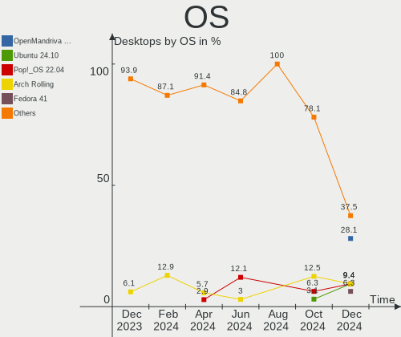
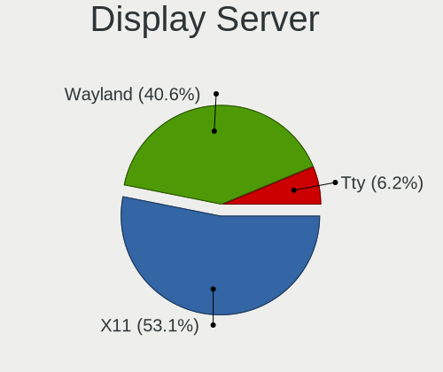
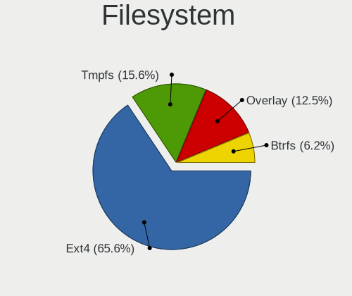
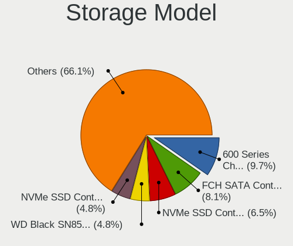
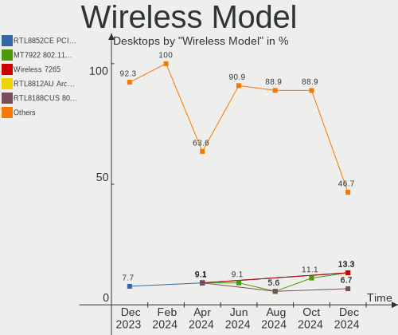
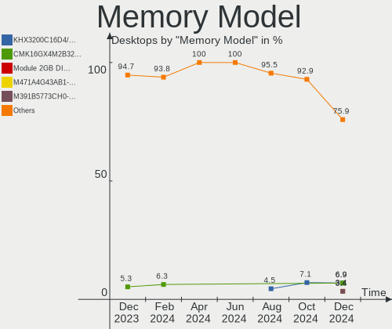
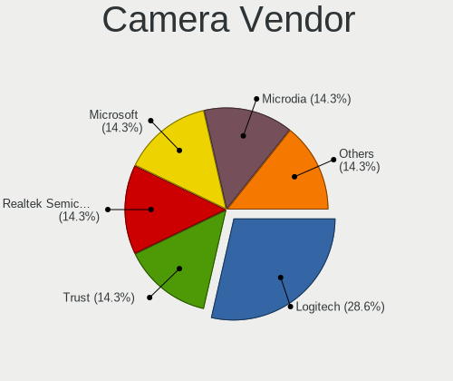

Linux in Netherlands - Hardware Trends (Desktops)
-------------------------------------------------

A project to identify most popular hardware characteristics and track their change
over time based on data collected by Linux users at https://Linux-Hardware.org.

Anyone can contribute to this report by the [hw-probe](https://github.com/linuxhw/hw-probe) tool:

    sudo -E hw-probe -all -upload

Period: Aug, 2023.

Contents
--------

* [ System ](#system)
  - [ OS                       ](#os)
  - [ OS Family                ](#os-family)
  - [ Kernel                   ](#kernel)
  - [ Kernel Family            ](#kernel-family)
  - [ Kernel Major Ver.        ](#kernel-major-ver)
  - [ Arch                     ](#arch)
  - [ DE                       ](#de)
  - [ Display Server           ](#display-server)
  - [ Display Manager          ](#display-manager)
  - [ OS Lang                  ](#os-lang)
  - [ Boot Mode                ](#boot-mode)
  - [ Filesystem               ](#filesystem)
  - [ Part. scheme             ](#part-scheme)
  - [ Dual Boot with Linux/BSD ](#dual-boot-with-linuxbsd)
  - [ Dual Boot (Win)          ](#dual-boot-win)

* [ Board ](#board)
  - [ Vendor                   ](#vendor)
  - [ Model                    ](#model)
  - [ Model Family             ](#model-family)
  - [ MFG Year                 ](#mfg-year)
  - [ Form Factor              ](#form-factor)
  - [ Secure Boot              ](#secure-boot)
  - [ Coreboot                 ](#coreboot)
  - [ RAM Size                 ](#ram-size)
  - [ RAM Used                 ](#ram-used)
  - [ Total Drives             ](#total-drives)
  - [ Has CD-ROM               ](#has-cd-rom)
  - [ Has Ethernet             ](#has-ethernet)
  - [ Has WiFi                 ](#has-wifi)
  - [ Has Bluetooth            ](#has-bluetooth)

* [ Location ](#location)
  - [ Country                  ](#country)
  - [ City                     ](#city)

* [ Drives ](#drives)
  - [ Drive Vendor             ](#drive-vendor)
  - [ Drive Model              ](#drive-model)
  - [ HDD Vendor               ](#hdd-vendor)
  - [ SSD Vendor               ](#ssd-vendor)
  - [ Drive Kind               ](#drive-kind)
  - [ Drive Connector          ](#drive-connector)
  - [ Drive Size               ](#drive-size)
  - [ Space Total              ](#space-total)
  - [ Space Used               ](#space-used)
  - [ Malfunc. Drives          ](#malfunc-drives)
  - [ Malfunc. Drive Vendor    ](#malfunc-drive-vendor)
  - [ Malfunc. HDD Vendor      ](#malfunc-hdd-vendor)
  - [ Malfunc. Drive Kind      ](#malfunc-drive-kind)
  - [ Failed Drives            ](#failed-drives)
  - [ Failed Drive Vendor      ](#failed-drive-vendor)
  - [ Drive Status             ](#drive-status)

* [ Storage controller ](#storage-controller)
  - [ Storage Vendor           ](#storage-vendor)
  - [ Storage Model            ](#storage-model)
  - [ Storage Kind             ](#storage-kind)

* [ Processor ](#processor)
  - [ CPU Vendor               ](#cpu-vendor)
  - [ CPU Model                ](#cpu-model)
  - [ CPU Model Family         ](#cpu-model-family)
  - [ CPU Cores                ](#cpu-cores)
  - [ CPU Sockets              ](#cpu-sockets)
  - [ CPU Threads              ](#cpu-threads)
  - [ CPU Op-Modes             ](#cpu-op-modes)
  - [ CPU Microcode            ](#cpu-microcode)
  - [ CPU Microarch            ](#cpu-microarch)

* [ Graphics ](#graphics)
  - [ GPU Vendor               ](#gpu-vendor)
  - [ GPU Model                ](#gpu-model)
  - [ GPU Combo                ](#gpu-combo)
  - [ GPU Driver               ](#gpu-driver)
  - [ GPU Memory               ](#gpu-memory)

* [ Monitor ](#monitor)
  - [ Monitor Vendor           ](#monitor-vendor)
  - [ Monitor Model            ](#monitor-model)
  - [ Monitor Resolution       ](#monitor-resolution)
  - [ Monitor Diagonal         ](#monitor-diagonal)
  - [ Monitor Width            ](#monitor-width)
  - [ Aspect Ratio             ](#aspect-ratio)
  - [ Monitor Area             ](#monitor-area)
  - [ Pixel Density            ](#pixel-density)
  - [ Multiple Monitors        ](#multiple-monitors)

* [ Network ](#network)
  - [ Net Controller Vendor    ](#net-controller-vendor)
  - [ Net Controller Model     ](#net-controller-model)
  - [ Wireless Vendor          ](#wireless-vendor)
  - [ Wireless Model           ](#wireless-model)
  - [ Ethernet Vendor          ](#ethernet-vendor)
  - [ Ethernet Model           ](#ethernet-model)
  - [ Net Controller Kind      ](#net-controller-kind)
  - [ Used Controller          ](#used-controller)
  - [ NICs                     ](#nics)
  - [ IPv6                     ](#ipv6)

* [ Bluetooth ](#bluetooth)
  - [ Bluetooth Vendor         ](#bluetooth-vendor)
  - [ Bluetooth Model          ](#bluetooth-model)

* [ Sound ](#sound)
  - [ Sound Vendor             ](#sound-vendor)
  - [ Sound Model              ](#sound-model)

* [ Memory ](#memory)
  - [ Memory Vendor            ](#memory-vendor)
  - [ Memory Model             ](#memory-model)
  - [ Memory Kind              ](#memory-kind)
  - [ Memory Form Factor       ](#memory-form-factor)
  - [ Memory Size              ](#memory-size)
  - [ Memory Speed             ](#memory-speed)

* [ Printers & scanners ](#printers--scanners)
  - [ Printer Vendor           ](#printer-vendor)
  - [ Printer Model            ](#printer-model)
  - [ Scanner Vendor           ](#scanner-vendor)
  - [ Scanner Model            ](#scanner-model)

* [ Camera ](#camera)
  - [ Camera Vendor            ](#camera-vendor)
  - [ Camera Model             ](#camera-model)

* [ Security ](#security)
  - [ Fingerprint Vendor       ](#fingerprint-vendor)
  - [ Fingerprint Model        ](#fingerprint-model)
  - [ Chipcard Vendor          ](#chipcard-vendor)
  - [ Chipcard Model           ](#chipcard-model)

* [ Unsupported ](#unsupported)
  - [ Unsupported Devices      ](#unsupported-devices)
  - [ Unsupported Device Types ](#unsupported-device-types)

System
------

OS
--

Installed operating systems

| Name                         | Desktops | Percent |
|------------------------------|----------|---------|
| OpenMandriva 23.08           | 6        | 16.22%  |
| Linux Mint 21.2              | 6        | 16.22%  |
| Ubuntu 22.04                 | 5        | 13.51%  |
| Pop!_OS 22.04                | 3        | 8.11%   |
| Fedora 38                    | 2        | 5.41%   |
| Zorin 15                     | 1        | 2.7%    |
| Rocky Linux 9.2              | 1        | 2.7%    |
| openSUSE Tumbleweed-XXXXXXXX | 1        | 2.7%    |
| OpenMandriva 4.3             | 1        | 2.7%    |
| Nobara 38                    | 1        | 2.7%    |
| Manjaro                      | 1        | 2.7%    |
| Linux Mint 21.1              | 1        | 2.7%    |
| Kubuntu 23.04                | 1        | 2.7%    |
| Kali 2023.3                  | 1        | 2.7%    |
| Gentoo 2.14                  | 1        | 2.7%    |
| Fedora 37                    | 1        | 2.7%    |
| EndeavourOS Rolling          | 1        | 2.7%    |
| Debian 11                    | 1        | 2.7%    |
| Artix Rolling                | 1        | 2.7%    |
| Arch Rolling                 | 1        | 2.7%    |

OS Family
---------

OS without a version

| Name         | Desktops | Percent |
|--------------|----------|---------|
| OpenMandriva | 7        | 18.92%  |
| Linux Mint   | 7        | 18.92%  |
| Ubuntu       | 5        | 13.51%  |
| Pop!_OS      | 3        | 8.11%   |
| Fedora       | 3        | 8.11%   |
| Zorin        | 1        | 2.7%    |
| Rocky Linux  | 1        | 2.7%    |
| openSUSE     | 1        | 2.7%    |
| Nobara       | 1        | 2.7%    |
| Manjaro      | 1        | 2.7%    |
| Kubuntu      | 1        | 2.7%    |
| Kali         | 1        | 2.7%    |
| Gentoo       | 1        | 2.7%    |
| EndeavourOS  | 1        | 2.7%    |
| Debian       | 1        | 2.7%    |
| Artix        | 1        | 2.7%    |
| Arch         | 1        | 2.7%    |

Kernel
------

Version of the Linux kernel

| Version                       | Desktops | Percent |
|-------------------------------|----------|---------|
| 6.4.11-desktop-1omv2390       | 5        | 13.51%  |
| 5.15.0-78-generic             | 5        | 13.51%  |
| 6.4.6-76060406-generic        | 2        | 5.41%   |
| 5.19.0-50-generic             | 2        | 5.41%   |
| 5.15.0-76-generic             | 2        | 5.41%   |
| 6.5.0-rc7-00164-g382d4cd18475 | 1        | 2.7%    |
| 6.4.8-gentoo                  | 1        | 2.7%    |
| 6.4.8-desktop-2omv2390        | 1        | 2.7%    |
| 6.4.6-200.fc38.x86_64         | 1        | 2.7%    |
| 6.4.6-1-MANJARO               | 1        | 2.7%    |
| 6.4.6-1-default               | 1        | 2.7%    |
| 6.4.4-arch1-1                 | 1        | 2.7%    |
| 6.4.11-200.fc38.x86_64        | 1        | 2.7%    |
| 6.4.10-artix1-1               | 1        | 2.7%    |
| 6.4.10-202.fsync.fc38.x86_64  | 1        | 2.7%    |
| 6.4.10-100.fc37.x86_64        | 1        | 2.7%    |
| 6.3.0-kali1-amd64             | 1        | 2.7%    |
| 6.2.6-76060206-generic        | 1        | 2.7%    |
| 6.2.0-32-generic              | 1        | 2.7%    |
| 6.2.0-31-generic              | 1        | 2.7%    |
| 5.4.0-148-generic             | 1        | 2.7%    |
| 5.19.0-32-generic             | 1        | 2.7%    |
| 5.16.7-desktop-1omv4003       | 1        | 2.7%    |
| 5.15.0-79-generic             | 1        | 2.7%    |
| 5.14.0-284.25.1.el9_2.x86_64  | 1        | 2.7%    |
| 5.10.0-16-amd64               | 1        | 2.7%    |

Kernel Family
-------------

Linux kernel without a distro release

| Version | Desktops | Percent |
|---------|----------|---------|
| 5.15.0  | 8        | 21.62%  |
| 6.4.11  | 6        | 16.22%  |
| 6.4.6   | 5        | 13.51%  |
| 6.4.10  | 3        | 8.11%   |
| 5.19.0  | 3        | 8.11%   |
| 6.4.8   | 2        | 5.41%   |
| 6.2.0   | 2        | 5.41%   |
| 6.5.0   | 1        | 2.7%    |
| 6.4.4   | 1        | 2.7%    |
| 6.3.0   | 1        | 2.7%    |
| 6.2.6   | 1        | 2.7%    |
| 5.4.0   | 1        | 2.7%    |
| 5.16.7  | 1        | 2.7%    |
| 5.14.0  | 1        | 2.7%    |
| 5.10.0  | 1        | 2.7%    |

Kernel Major Ver.
-----------------

Linux kernel major version

| Version | Desktops | Percent |
|---------|----------|---------|
| 6.4     | 17       | 45.95%  |
| 5.15    | 8        | 21.62%  |
| 6.2     | 3        | 8.11%   |
| 5.19    | 3        | 8.11%   |
| 6.5     | 1        | 2.7%    |
| 6.3     | 1        | 2.7%    |
| 5.4     | 1        | 2.7%    |
| 5.16    | 1        | 2.7%    |
| 5.14    | 1        | 2.7%    |
| 5.10    | 1        | 2.7%    |

Arch
----

OS architecture (x86_64, i586, etc.)

| Name   | Desktops | Percent |
|--------|----------|---------|
| x86_64 | 36       | 97.3%   |
| i686   | 1        | 2.7%    |

DE
--

Desktop Environment

| Name       | Desktops | Percent |
|------------|----------|---------|
| GNOME      | 13       | 35.14%  |
| KDE5       | 10       | 27.03%  |
| XFCE       | 4        | 10.81%  |
| X-Cinnamon | 4        | 10.81%  |
| MATE       | 2        | 5.41%   |
| i3         | 2        | 5.41%   |
| Hyprland   | 1        | 2.7%    |
| Unknown    | 1        | 2.7%    |

Display Server
--------------

X11 or Wayland

| Name    | Desktops | Percent |
|---------|----------|---------|
| X11     | 25       | 67.57%  |
| Wayland | 11       | 29.73%  |
| Unknown | 1        | 2.7%    |

Display Manager
---------------

SDDM, LightDM, etc.

| Name    | Desktops | Percent |
|---------|----------|---------|
| Unknown | 17       | 45.95%  |
| LightDM | 7        | 18.92%  |
| SDDM    | 6        | 16.22%  |
| GDM3    | 5        | 13.51%  |
| GDM     | 2        | 5.41%   |

OS Lang
-------

Language

| Lang    | Desktops | Percent |
|---------|----------|---------|
| en_US   | 19       | 51.35%  |
| nl_NL   | 11       | 29.73%  |
| en_GB   | 2        | 5.41%   |
| ru_RU   | 1        | 2.7%    |
| pl_PL   | 1        | 2.7%    |
| nl_BE   | 1        | 2.7%    |
| C       | 1        | 2.7%    |
| Unknown | 1        | 2.7%    |

Boot Mode
---------

EFI or BIOS

| Mode | Desktops | Percent |
|------|----------|---------|
| BIOS | 19       | 51.35%  |
| EFI  | 18       | 48.65%  |

Filesystem
----------

Type of filesystem

| Type    | Desktops | Percent |
|---------|----------|---------|
| Ext4    | 23       | 62.16%  |
| Btrfs   | 6        | 16.22%  |
| Tmpfs   | 4        | 10.81%  |
| Overlay | 4        | 10.81%  |

Part. scheme
------------

Scheme of partitioning

| Type    | Desktops | Percent |
|---------|----------|---------|
| Unknown | 17       | 45.95%  |
| GPT     | 13       | 35.14%  |
| MBR     | 7        | 18.92%  |

Dual Boot with Linux/BSD
------------------------

Hosting more than one Linux/BSD

| Dual boot | Desktops | Percent |
|-----------|----------|---------|
| No        | 29       | 78.38%  |
| Yes       | 8        | 21.62%  |

Dual Boot (Win)
---------------

Hosting Linux and Windows

| Dual boot | Desktops | Percent |
|-----------|----------|---------|
| No        | 24       | 64.86%  |
| Yes       | 13       | 35.14%  |

Board
-----

Vendor
------

Motherboard manufacturer

| Name                | Desktops | Percent |
|---------------------|----------|---------|
| ASUSTek Computer    | 9        | 24.32%  |
| Gigabyte Technology | 7        | 18.92%  |
| MSI                 | 4        | 10.81%  |
| Hewlett-Packard     | 4        | 10.81%  |
| ASRock              | 4        | 10.81%  |
| Dell                | 3        | 8.11%   |
| Acer                | 2        | 5.41%   |
| Sun Microsystems    | 1        | 2.7%    |
| Intel               | 1        | 2.7%    |
| Fujitsu             | 1        | 2.7%    |
| Foxconn             | 1        | 2.7%    |

Model
-----

Motherboard model

| Name                             | Desktops | Percent |
|----------------------------------|----------|---------|
| Sun Microsystems Ultra 24        | 1        | 2.7%    |
| MSI MS-7B98                      | 1        | 2.7%    |
| MSI MS-7B48                      | 1        | 2.7%    |
| MSI MS-7982                      | 1        | 2.7%    |
| MSI MS-7592                      | 1        | 2.7%    |
| Intel DH55TC AAE70932-205        | 1        | 2.7%    |
| HP Z200 Workstation              | 1        | 2.7%    |
| HP Slim Desktop S01-pF2xxx       | 1        | 2.7%    |
| HP EliteDesk 800 G1 SFF          | 1        | 2.7%    |
| HP Compaq 8200 Elite SFF PC      | 1        | 2.7%    |
| Gigabyte X570 I AORUS PRO WIFI   | 1        | 2.7%    |
| Gigabyte X570 GAMING X           | 1        | 2.7%    |
| Gigabyte P35-DS4                 | 1        | 2.7%    |
| Gigabyte H61M-DS2V               | 1        | 2.7%    |
| Gigabyte EUROLINUX_V1            | 1        | 2.7%    |
| Gigabyte B550 AORUS ELITE V2     | 1        | 2.7%    |
| Gigabyte B550 AORUS ELITE AX V2  | 1        | 2.7%    |
| Fujitsu ESPRIMO E920             | 1        | 2.7%    |
| Foxconn G41S/G41S-K              | 1        | 2.7%    |
| Dell XPS 8700                    | 1        | 2.7%    |
| Dell Precision WorkStation T5500 | 1        | 2.7%    |
| Dell OptiPlex 980                | 1        | 2.7%    |
| ASUS ROG STRIX X570-E GAMING     | 1        | 2.7%    |
| ASUS ROG STRIX B450-F GAMING     | 1        | 2.7%    |
| ASUS PRIME B550M-A               | 1        | 2.7%    |
| ASUS PRIME B350M-A               | 1        | 2.7%    |
| ASUS P8H61-M LE/USB3             | 1        | 2.7%    |
| ASUS P6T6 WS REVOLUTION          | 1        | 2.7%    |
| ASUS P5B-VM SE                   | 1        | 2.7%    |
| ASUS M4N68T-M-V2                 | 1        | 2.7%    |
| ASUS All Series                  | 1        | 2.7%    |
| ASRock X399 Taichi               | 1        | 2.7%    |
| ASRock B650 PG Lightning         | 1        | 2.7%    |
| ASRock B450M-HDV                 | 1        | 2.7%    |
| ASRock B450M Pro4 R2.0           | 1        | 2.7%    |
| Acer Veriton X2631G              | 1        | 2.7%    |
| Acer Aspire XC-330               | 1        | 2.7%    |

Model Family
------------

Motherboard model prefix

| Name                   | Desktops | Percent |
|------------------------|----------|---------|
| Gigabyte X570          | 2        | 5.41%   |
| Gigabyte B550          | 2        | 5.41%   |
| ASUS ROG               | 2        | 5.41%   |
| ASUS PRIME             | 2        | 5.41%   |
| Sun Microsystems Ultra | 1        | 2.7%    |
| MSI MS-7B98            | 1        | 2.7%    |
| MSI MS-7B48            | 1        | 2.7%    |
| MSI MS-7982            | 1        | 2.7%    |
| MSI MS-7592            | 1        | 2.7%    |
| Intel DH55TC           | 1        | 2.7%    |
| HP Z200                | 1        | 2.7%    |
| HP Slim                | 1        | 2.7%    |
| HP EliteDesk           | 1        | 2.7%    |
| HP Compaq              | 1        | 2.7%    |
| Gigabyte P35-DS4       | 1        | 2.7%    |
| Gigabyte H61M-DS2V     | 1        | 2.7%    |
| Gigabyte EUROLINUX     | 1        | 2.7%    |
| Fujitsu ESPRIMO        | 1        | 2.7%    |
| Foxconn G41S           | 1        | 2.7%    |
| Dell XPS               | 1        | 2.7%    |
| Dell Precision         | 1        | 2.7%    |
| Dell OptiPlex          | 1        | 2.7%    |
| ASUS P8H61-M           | 1        | 2.7%    |
| ASUS P6T6              | 1        | 2.7%    |
| ASUS P5B-VM            | 1        | 2.7%    |
| ASUS M4N68T-M-V2       | 1        | 2.7%    |
| ASUS All               | 1        | 2.7%    |
| ASRock X399            | 1        | 2.7%    |
| ASRock B650            | 1        | 2.7%    |
| ASRock B450M-HDV       | 1        | 2.7%    |
| ASRock B450M           | 1        | 2.7%    |
| Acer Veriton           | 1        | 2.7%    |
| Acer Aspire            | 1        | 2.7%    |

MFG Year
--------

Motherboard manufacture year

| Year | Desktops | Percent |
|------|----------|---------|
| 2013 | 5        | 13.51%  |
| 2020 | 4        | 10.81%  |
| 2017 | 4        | 10.81%  |
| 2011 | 4        | 10.81%  |
| 2019 | 3        | 8.11%   |
| 2018 | 3        | 8.11%   |
| 2010 | 3        | 8.11%   |
| 2009 | 3        | 8.11%   |
| 2023 | 2        | 5.41%   |
| 2007 | 2        | 5.41%   |
| 2016 | 1        | 2.7%    |
| 2014 | 1        | 2.7%    |
| 2012 | 1        | 2.7%    |
| 2008 | 1        | 2.7%    |

Form Factor
-----------

Physical design of the computer

| Name    | Desktops | Percent |
|---------|----------|---------|
| Desktop | 37       | 100%    |

Secure Boot
-----------

Enabled or disabled

| State    | Desktops | Percent |
|----------|----------|---------|
| Disabled | 37       | 100%    |

Coreboot
--------

Have coreboot on board

| Used | Desktops | Percent |
|------|----------|---------|
| No   | 37       | 100%    |

RAM Size
--------

Total RAM memory

| Size in GB  | Desktops | Percent |
|-------------|----------|---------|
| 16.01-24.0  | 9        | 24.32%  |
| 8.01-16.0   | 8        | 21.62%  |
| 32.01-64.0  | 6        | 16.22%  |
| 4.01-8.0    | 4        | 10.81%  |
| 3.01-4.0    | 4        | 10.81%  |
| 24.01-32.0  | 3        | 8.11%   |
| 64.01-256.0 | 2        | 5.41%   |
| 2.01-3.0    | 1        | 2.7%    |

RAM Used
--------

Used RAM memory

| Used GB    | Desktops | Percent |
|------------|----------|---------|
| 1.01-2.0   | 16       | 43.24%  |
| 2.01-3.0   | 8        | 21.62%  |
| 4.01-8.0   | 5        | 13.51%  |
| 3.01-4.0   | 3        | 8.11%   |
| 8.01-16.0  | 3        | 8.11%   |
| 16.01-24.0 | 1        | 2.7%    |
| 0.51-1.0   | 1        | 2.7%    |

Total Drives
------------

Number of drives on board

| Drives | Desktops | Percent |
|--------|----------|---------|
| 1      | 13       | 35.14%  |
| 2      | 11       | 29.73%  |
| 3      | 4        | 10.81%  |
| 5      | 3        | 8.11%   |
| 4      | 3        | 8.11%   |
| 7      | 2        | 5.41%   |
| 6      | 1        | 2.7%    |

Has CD-ROM
----------

Has CD-ROM on board

| Presented | Desktops | Percent |
|-----------|----------|---------|
| No        | 24       | 64.86%  |
| Yes       | 13       | 35.14%  |

Has Ethernet
------------

Has Ethernet on board

| Presented | Desktops | Percent |
|-----------|----------|---------|
| Yes       | 37       | 100%    |

Has WiFi
--------

Has WiFi module

| Presented | Desktops | Percent |
|-----------|----------|---------|
| No        | 23       | 62.16%  |
| Yes       | 14       | 37.84%  |

Has Bluetooth
-------------

Has Bluetooth module

| Presented | Desktops | Percent |
|-----------|----------|---------|
| No        | 25       | 67.57%  |
| Yes       | 12       | 32.43%  |

Location
--------

Country
-------

Geographic location (country)

| Country     | Desktops | Percent |
|-------------|----------|---------|
| Netherlands | 37       | 100%    |

City
----

Geographic location (city)

| City        | Desktops | Percent |
|-------------|----------|---------|
| Amsterdam   | 6        | 16.22%  |
| The Hague   | 2        | 5.41%   |
| Gouda       | 2        | 5.41%   |
| Emmen       | 2        | 5.41%   |
| Zwaag       | 1        | 2.7%    |
| Zuidwolde   | 1        | 2.7%    |
| Zaandam     | 1        | 2.7%    |
| Wehl        | 1        | 2.7%    |
| Veldhoven   | 1        | 2.7%    |
| Tilburg     | 1        | 2.7%    |
| Sneek       | 1        | 2.7%    |
| Rotterdam   | 1        | 2.7%    |
| Rosmalen    | 1        | 2.7%    |
| Ridderkerk  | 1        | 2.7%    |
| Purmerend   | 1        | 2.7%    |
| Nuenen      | 1        | 2.7%    |
| Naaldwijk   | 1        | 2.7%    |
| Meijel      | 1        | 2.7%    |
| Lisse       | 1        | 2.7%    |
| Lekkerkerk  | 1        | 2.7%    |
| Leiden      | 1        | 2.7%    |
| Hoogeveen   | 1        | 2.7%    |
| Hoofddorp   | 1        | 2.7%    |
| Hengelo     | 1        | 2.7%    |
| Groningen   | 1        | 2.7%    |
| Enschede    | 1        | 2.7%    |
| Eindhoven   | 1        | 2.7%    |
| Doetinchem  | 1        | 2.7%    |
| Almere Stad | 1        | 2.7%    |

Drives
------

Drive Vendor
------------

Hard drive vendors

| Vendor                      | Desktops | Drives | Percent |
|-----------------------------|----------|--------|---------|
| Samsung Electronics         | 19       | 25     | 25%     |
| WDC                         | 18       | 23     | 23.68%  |
| Seagate                     | 8        | 12     | 10.53%  |
| Toshiba                     | 6        | 6      | 7.89%   |
| Kingston                    | 4        | 4      | 5.26%   |
| Crucial                     | 4        | 4      | 5.26%   |
| Unknown                     | 2        | 3      | 2.63%   |
| Sandisk                     | 2        | 2      | 2.63%   |
| Intel                       | 2        | 2      | 2.63%   |
| A-DATA Technology           | 2        | 2      | 2.63%   |
| XrayDisk                    | 1        | 1      | 1.32%   |
| OCZ-VERT                    | 1        | 1      | 1.32%   |
| OCZ                         | 1        | 1      | 1.32%   |
| Micron/Crucial Technology   | 1        | 1      | 1.32%   |
| Kingston Technology Company | 1        | 1      | 1.32%   |
| Intenso                     | 1        | 1      | 1.32%   |
| HGST                        | 1        | 1      | 1.32%   |
| Dogfish                     | 1        | 1      | 1.32%   |
| China                       | 1        | 1      | 1.32%   |

Drive Model
-----------

Hard drive models

| Model                                                 | Desktops | Percent |
|-------------------------------------------------------|----------|---------|
| Samsung SSD 850 EVO 500GB                             | 4        | 4.6%    |
| Samsung NVMe SSD Controller SM981/PM981/PM983 500GB   | 4        | 4.6%    |
| Samsung NVMe SSD Controller PM9A1/PM9A3/980PRO 1024GB | 3        | 3.45%   |
| WDC WD102KRYZ-01A5AB0 10TB                            | 2        | 2.3%    |
| Toshiba HDWD120 2TB                                   | 2        | 2.3%    |
| Toshiba DT01ACA100 1TB                                | 2        | 2.3%    |
| Samsung SSD 860 EVO 1TB                               | 2        | 2.3%    |
| Samsung Portable SSD T5 1TB                           | 2        | 2.3%    |
| XrayDisk NVMe SSD Drive 1024GB                        | 1        | 1.15%   |
| WDC WDS120G2G0A-00JH30 120GB SSD                      | 1        | 1.15%   |
| WDC WD740HLFS-01G6U4 74GB                             | 1        | 1.15%   |
| WDC WD5001ABYS-01YNA0 500GB                           | 1        | 1.15%   |
| WDC WD5000AAKX-753CA1 500GB                           | 1        | 1.15%   |
| WDC WD5000AAKS-60Z1A0 500GB                           | 1        | 1.15%   |
| WDC WD5000AAKS-00WWPA0 500GB                          | 1        | 1.15%   |
| WDC WD5000AAKS-00A7B2 500GB                           | 1        | 1.15%   |
| WDC WD5000AADS-00S9B0 500GB                           | 1        | 1.15%   |
| WDC WD40EZRZ-00GXCB0 4TB                              | 1        | 1.15%   |
| WDC WD3200BEVT-22ZCT0 320GB                           | 1        | 1.15%   |
| WDC WD30EFRX-68EUZN0 3TB                              | 1        | 1.15%   |
| WDC WD2500HHTZ-04N21V0 250GB                          | 1        | 1.15%   |
| WDC WD2500AAKX-60U6AA0 250GB                          | 1        | 1.15%   |
| WDC WD20EFRX-68AX9N0 2TB                              | 1        | 1.15%   |
| WDC WD10EZEX-60WN4A0 1TB                              | 1        | 1.15%   |
| WDC WD10EZEX-08WN4A0 1TB                              | 1        | 1.15%   |
| WDC WD10EZEX-00BN5A0 1TB                              | 1        | 1.15%   |
| WDC WD10EURX-63C57Y0 1TB                              | 1        | 1.15%   |
| WDC WD10EADS-00L5B1 1TB                               | 1        | 1.15%   |
| WDC WD1002FAEX-00Z3A0 1TB                             | 1        | 1.15%   |
| Unknown SD/MMC/MS PRO 1GB                             | 1        | 1.15%   |
| Unknown SD/MMC 2GB                                    | 1        | 1.15%   |
| Unknown M.S./M.S.Pro/HG 16GB                          | 1        | 1.15%   |
| Toshiba MG08ACA16TE 16TB                              | 1        | 1.15%   |
| Toshiba DT01ACA200 2TB                                | 1        | 1.15%   |
| Seagate ST9500423AS 500GB                             | 1        | 1.15%   |
| Seagate ST8000DM004-2CX188 8TB                        | 1        | 1.15%   |
| Seagate ST500DM002-1BD142 500GB                       | 1        | 1.15%   |
| Seagate ST4000VN008-2DR166 4TB                        | 1        | 1.15%   |
| Seagate ST4000DM004-2CV104 4TB                        | 1        | 1.15%   |
| Seagate ST3250620NS 250GB                             | 1        | 1.15%   |

HDD Vendor
----------

Hard disk drive vendors

| Vendor              | Desktops | Drives | Percent |
|---------------------|----------|--------|---------|
| WDC                 | 17       | 22     | 50%     |
| Seagate             | 8        | 12     | 23.53%  |
| Toshiba             | 6        | 6      | 17.65%  |
| Unknown             | 1        | 1      | 2.94%   |
| Samsung Electronics | 1        | 1      | 2.94%   |
| HGST                | 1        | 1      | 2.94%   |

SSD Vendor
----------

Solid state drive vendors

| Vendor              | Desktops | Drives | Percent |
|---------------------|----------|--------|---------|
| Samsung Electronics | 11       | 15     | 39.29%  |
| Kingston            | 4        | 4      | 14.29%  |
| Crucial             | 4        | 4      | 14.29%  |
| A-DATA Technology   | 2        | 2      | 7.14%   |
| WDC                 | 1        | 1      | 3.57%   |
| OCZ-VERT            | 1        | 1      | 3.57%   |
| OCZ                 | 1        | 1      | 3.57%   |
| Intenso             | 1        | 1      | 3.57%   |
| Intel               | 1        | 1      | 3.57%   |
| Dogfish             | 1        | 1      | 3.57%   |
| China               | 1        | 1      | 3.57%   |

Drive Kind
----------

HDD or SSD

| Kind    | Desktops | Drives | Percent |
|---------|----------|--------|---------|
| SSD     | 24       | 32     | 40.68%  |
| HDD     | 23       | 43     | 38.98%  |
| NVMe    | 11       | 15     | 18.64%  |
| Unknown | 1        | 2      | 1.69%   |

Drive Connector
---------------

SATA, SAS, NVMe, etc.

| Type | Desktops | Drives | Percent |
|------|----------|--------|---------|
| SATA | 35       | 71     | 68.63%  |
| NVMe | 11       | 15     | 21.57%  |
| SAS  | 5        | 6      | 9.8%    |

Drive Size
----------

Size of hard drive

| Size in TB | Desktops | Drives | Percent |
|------------|----------|--------|---------|
| 0.01-0.5   | 29       | 38     | 50%     |
| 0.51-1.0   | 14       | 18     | 24.14%  |
| 1.01-2.0   | 5        | 6      | 8.62%   |
| 3.01-4.0   | 3        | 5      | 5.17%   |
| 4.01-10.0  | 3        | 4      | 5.17%   |
| 2.01-3.0   | 2        | 2      | 3.45%   |
| 10.01-20.0 | 2        | 2      | 3.45%   |

Space Total
-----------

Amount of disk space available on the file system

| Size in GB     | Desktops | Percent |
|----------------|----------|---------|
| 1001-2000      | 7        | 18.92%  |
| 251-500        | 6        | 16.22%  |
| 101-250        | 5        | 13.51%  |
| More than 3000 | 4        | 10.81%  |
| 1-20           | 4        | 10.81%  |
| 501-1000       | 4        | 10.81%  |
| 2001-3000      | 3        | 8.11%   |
| Unknown        | 3        | 8.11%   |
| 51-100         | 1        | 2.7%    |

Space Used
----------

Amount of used disk space

| Used GB        | Desktops | Percent |
|----------------|----------|---------|
| 1-20           | 9        | 24.32%  |
| 251-500        | 6        | 16.22%  |
| 21-50          | 5        | 13.51%  |
| 501-1000       | 4        | 10.81%  |
| More than 3000 | 3        | 8.11%   |
| 101-250        | 3        | 8.11%   |
| 1001-2000      | 3        | 8.11%   |
| Unknown        | 3        | 8.11%   |
| 51-100         | 1        | 2.7%    |

Malfunc. Drives
---------------

Drive models with a malfunction

| Model                            | Desktops | Drives | Percent |
|----------------------------------|----------|--------|---------|
| WDC WDS120G2G0A-00JH30 120GB SSD | 1        | 1      | 20%     |
| WDC WD5000AAKS-60Z1A0 500GB      | 1        | 1      | 20%     |
| WDC WD5000AAKS-00WWPA0 500GB     | 1        | 1      | 20%     |
| WDC WD5000AAKS-00A7B2 500GB      | 1        | 1      | 20%     |
| WDC WD1002FAEX-00Z3A0 1TB        | 1        | 1      | 20%     |

Malfunc. Drive Vendor
---------------------

Vendors of faulty drives

| Vendor | Desktops | Drives | Percent |
|--------|----------|--------|---------|
| WDC    | 5        | 5      | 100%    |

Malfunc. HDD Vendor
-------------------

Vendors of faulty HDD drives

| Vendor | Desktops | Drives | Percent |
|--------|----------|--------|---------|
| WDC    | 4        | 4      | 100%    |

Malfunc. Drive Kind
-------------------

Kinds of faulty drives

| Kind | Desktops | Drives | Percent |
|------|----------|--------|---------|
| HDD  | 4        | 4      | 80%     |
| SSD  | 1        | 1      | 20%     |

Failed Drives
-------------

Failed drive models

Zero info for selected period =(

Failed Drive Vendor
-------------------

Failed drive vendors

Zero info for selected period =(

Drive Status
------------

Number of failed and malfunc. drives

| Status   | Desktops | Drives | Percent |
|----------|----------|--------|---------|
| Detected | 24       | 61     | 58.54%  |
| Works    | 12       | 26     | 29.27%  |
| Malfunc  | 5        | 5      | 12.2%   |

Storage controller
------------------

Storage Vendor
--------------

Storage controller vendors

| Vendor                      | Desktops | Percent |
|-----------------------------|----------|---------|
| Intel                       | 23       | 42.59%  |
| AMD                         | 13       | 24.07%  |
| Samsung Electronics         | 8        | 14.81%  |
| SanDisk                     | 2        | 3.7%    |
| Marvell Technology Group    | 2        | 3.7%    |
| JMicron Technology          | 2        | 3.7%    |
| Nvidia                      | 1        | 1.85%   |
| Micron/Crucial Technology   | 1        | 1.85%   |
| Kingston Technology Company | 1        | 1.85%   |
| INNOGRIT                    | 1        | 1.85%   |

Storage Model
-------------

Storage controller models

| Model                                                                                   | Desktops | Percent |
|-----------------------------------------------------------------------------------------|----------|---------|
| AMD FCH SATA Controller [AHCI mode]                                                     | 9        | 13.24%  |
| Samsung NVMe SSD Controller SM981/PM981/PM983                                           | 4        | 5.88%   |
| Intel 8 Series/C220 Series Chipset Family 6-port SATA Controller 1 [AHCI mode]          | 4        | 5.88%   |
| Samsung NVMe SSD Controller PM9A1/PM9A3/980PRO                                          | 3        | 4.41%   |
| AMD 500 Series Chipset SATA Controller                                                  | 3        | 4.41%   |
| AMD 400 Series Chipset SATA Controller                                                  | 3        | 4.41%   |
| Intel SATA Controller [RAID mode]                                                       | 2        | 2.94%   |
| Intel NM10/ICH7 Family SATA Controller [IDE mode]                                       | 2        | 2.94%   |
| Intel 82801IR/IO/IH (ICH9R/DO/DH) 6 port SATA Controller [AHCI mode]                    | 2        | 2.94%   |
| Intel 82801G (ICH7 Family) IDE Controller                                               | 2        | 2.94%   |
| Intel 6 Series/C200 Series Chipset Family 6 port Desktop SATA AHCI Controller           | 2        | 2.94%   |
| Intel 5 Series/3400 Series Chipset PT IDER Controller                                   | 2        | 2.94%   |
| Intel 5 Series/3400 Series Chipset 6 port SATA AHCI Controller                          | 2        | 2.94%   |
| SanDisk WD Blue SN550 NVMe SSD                                                          | 1        | 1.47%   |
| SanDisk WD Black SN770 / PC SN740 256GB / PC SN560 (DRAM-less) NVMe SSD                 | 1        | 1.47%   |
| Samsung NVMe SSD Controller 980                                                         | 1        | 1.47%   |
| Nvidia MCP61 SATA Controller                                                            | 1        | 1.47%   |
| Nvidia MCP61 IDE                                                                        | 1        | 1.47%   |
| Micron/Crucial P1 NVMe PCIe SSD[Frampton]                                               | 1        | 1.47%   |
| Marvell Group 88SE9215 PCIe 2.0 x1 4-port SATA 6 Gb/s Controller                        | 1        | 1.47%   |
| Marvell Group 88SE6440 SAS/SATA PCIe controller                                         | 1        | 1.47%   |
| Marvell Group 88SE6111/6121 SATA II / PATA Controller                                   | 1        | 1.47%   |
| Kingston Company A2000 NVMe SSD                                                         | 1        | 1.47%   |
| JMicron JMB368 IDE controller                                                           | 1        | 1.47%   |
| JMicron JMB363 SATA/IDE Controller                                                      | 1        | 1.47%   |
| Intel SSD 660P Series                                                                   | 1        | 1.47%   |
| Intel Q170/Q150/B150/H170/H110/Z170/CM236 Chipset SATA Controller [AHCI Mode]           | 1        | 1.47%   |
| Intel Cannon Lake PCH SATA AHCI Controller                                              | 1        | 1.47%   |
| Intel 9 Series Chipset Family SATA Controller [AHCI Mode]                               | 1        | 1.47%   |
| Intel 82801JI (ICH10 Family) SATA AHCI Controller                                       | 1        | 1.47%   |
| Intel 82801JI (ICH10 Family) 4 port SATA IDE Controller #1                              | 1        | 1.47%   |
| Intel 82801JI (ICH10 Family) 2 port SATA IDE Controller #2                              | 1        | 1.47%   |
| Intel 82801HR/HO/HH (ICH8R/DO/DH) 2 port SATA Controller [IDE mode]                     | 1        | 1.47%   |
| Intel 82801H (ICH8 Family) 4 port SATA Controller [IDE mode]                            | 1        | 1.47%   |
| Intel 7 Series/C210 Series Chipset Family 6-port SATA Controller [AHCI mode]            | 1        | 1.47%   |
| Intel 6 Series/C200 Series Chipset Family Desktop SATA Controller (IDE mode, ports 4-5) | 1        | 1.47%   |
| Intel 6 Series/C200 Series Chipset Family Desktop SATA Controller (IDE mode, ports 0-3) | 1        | 1.47%   |
| Intel 200 Series PCH SATA controller [AHCI mode]                                        | 1        | 1.47%   |
| INNOGRIT NVMe SSD Controller IG5216 (DRAM-less)                                         | 1        | 1.47%   |
| AMD X399 Series Chipset SATA Controller                                                 | 1        | 1.47%   |

Storage Kind
------------

Kind of storage controller (IDE, SATA, NVMe, SAS, ...)

| Kind | Desktops | Percent |
|------|----------|---------|
| SATA | 30       | 55.56%  |
| NVMe | 11       | 20.37%  |
| IDE  | 10       | 18.52%  |
| RAID | 3        | 5.56%   |

Processor
---------

CPU Vendor
----------

Processor vendors

| Vendor | Desktops | Percent |
|--------|----------|---------|
| Intel  | 23       | 62.16%  |
| AMD    | 14       | 37.84%  |

CPU Model
---------

Processor models

| Model                                          | Desktops | Percent |
|------------------------------------------------|----------|---------|
| AMD Ryzen 7 3700X 8-Core Processor             | 3        | 8.11%   |
| Intel Core i5 CPU 650 @ 3.20GHz                | 2        | 5.41%   |
| Intel Core i3-4130 CPU @ 3.40GHz               | 2        | 5.41%   |
| AMD Ryzen 5 5600X 6-Core Processor             | 2        | 5.41%   |
| AMD Ryzen 5 5600G with Radeon Graphics         | 2        | 5.41%   |
| Intel Xeon CPU E5620 @ 2.40GHz                 | 1        | 2.7%    |
| Intel Xeon CPU E5450 @ 3.00GHz                 | 1        | 2.7%    |
| Intel Pentium Gold G6405 CPU @ 4.10GHz         | 1        | 2.7%    |
| Intel Pentium Dual-Core CPU E5400 @ 2.70GHz    | 1        | 2.7%    |
| Intel Pentium Dual-Core CPU E5300 @ 2.60GHz    | 1        | 2.7%    |
| Intel Core i9-9900K CPU @ 3.60GHz              | 1        | 2.7%    |
| Intel Core i7-4790 CPU @ 3.60GHz               | 1        | 2.7%    |
| Intel Core i7-3770 CPU @ 3.40GHz               | 1        | 2.7%    |
| Intel Core i7 CPU 960 @ 3.20GHz                | 1        | 2.7%    |
| Intel Core i5-6600K CPU @ 3.50GHz              | 1        | 2.7%    |
| Intel Core i5-4690 CPU @ 3.50GHz               | 1        | 2.7%    |
| Intel Core i5-4570 CPU @ 3.20GHz               | 1        | 2.7%    |
| Intel Core i5-2500K CPU @ 3.30GHz              | 1        | 2.7%    |
| Intel Core i5-2400 CPU @ 3.10GHz               | 1        | 2.7%    |
| Intel Core i3-9100F CPU @ 3.60GHz              | 1        | 2.7%    |
| Intel Core i3 CPU 550 @ 3.20GHz                | 1        | 2.7%    |
| Intel Core 2 Quad CPU Q9650 @ 3.00GHz          | 1        | 2.7%    |
| Intel Core 2 CPU 6600 @ 2.40GHz                | 1        | 2.7%    |
| Intel Celeron CPU G460 @ 1.80GHz               | 1        | 2.7%    |
| AMD Ryzen Threadripper 1920X 12-Core Processor | 1        | 2.7%    |
| AMD Ryzen 9 7900 12-Core Processor             | 1        | 2.7%    |
| AMD Ryzen 9 3900X 12-Core Processor            | 1        | 2.7%    |
| AMD Ryzen 7 1700X Eight-Core Processor         | 1        | 2.7%    |
| AMD Ryzen 5 5600 6-Core Processor              | 1        | 2.7%    |
| AMD Phenom II X6 1090T Processor               | 1        | 2.7%    |
| AMD A9-9420 RADEON R5, 5 COMPUTE CORES 2C+3G   | 1        | 2.7%    |

CPU Model Family
----------------

Processor model prefix

| Model                   | Desktops | Percent |
|-------------------------|----------|---------|
| Intel Core i5           | 7        | 18.92%  |
| AMD Ryzen 5             | 5        | 13.51%  |
| Intel Core i3           | 4        | 10.81%  |
| AMD Ryzen 7             | 4        | 10.81%  |
| Intel Core i7           | 3        | 8.11%   |
| Intel Xeon              | 2        | 5.41%   |
| Intel Pentium Dual-Core | 2        | 5.41%   |
| AMD Ryzen 9             | 2        | 5.41%   |
| Other                   | 1        | 2.7%    |
| Intel Pentium Gold      | 1        | 2.7%    |
| Intel Core i9           | 1        | 2.7%    |
| Intel Core 2 Quad       | 1        | 2.7%    |
| Intel Core 2            | 1        | 2.7%    |
| Intel Celeron           | 1        | 2.7%    |
| AMD Ryzen Threadripper  | 1        | 2.7%    |
| AMD Phenom II X6        | 1        | 2.7%    |

CPU Cores
---------

Number of processor cores

| Number | Desktops | Percent |
|--------|----------|---------|
| 4      | 11       | 29.73%  |
| 2      | 10       | 27.03%  |
| 8      | 6        | 16.22%  |
| 6      | 6        | 16.22%  |
| 12     | 3        | 8.11%   |
| 1      | 1        | 2.7%    |

CPU Sockets
-----------

Number of sockets

| Number | Desktops | Percent |
|--------|----------|---------|
| 1      | 36       | 97.3%   |
| 2      | 1        | 2.7%    |

CPU Threads
-----------

Threads per core (Hyper-Threading)

| Number | Desktops | Percent |
|--------|----------|---------|
| 2      | 24       | 64.86%  |
| 1      | 13       | 35.14%  |

CPU Op-Modes
------------

CPU Operation Modes (32-bit, 64-bit)

| Op mode        | Desktops | Percent |
|----------------|----------|---------|
| 32-bit, 64-bit | 37       | 100%    |

CPU Microcode
-------------

Microcode number

| Number     | Desktops | Percent |
|------------|----------|---------|
| Unknown    | 17       | 45.95%  |
| 0x306c3    | 3        | 8.11%   |
| 0x206a7    | 3        | 8.11%   |
| 0x0a50000d | 2        | 5.41%   |
| 0x6f6      | 1        | 2.7%    |
| 0x306a9    | 1        | 2.7%    |
| 0x206c2    | 1        | 2.7%    |
| 0x20652    | 1        | 2.7%    |
| 0x106a5    | 1        | 2.7%    |
| 0x1067a    | 1        | 2.7%    |
| 0x10676    | 1        | 2.7%    |
| 0x0a601203 | 1        | 2.7%    |
| 0x0a201016 | 1        | 2.7%    |
| 0x08701030 | 1        | 2.7%    |
| 0x06006705 | 1        | 2.7%    |
| 0x00000000 | 1        | 2.7%    |

CPU Microarch
-------------

Microarchitecture

| Name        | Desktops | Percent |
|-------------|----------|---------|
| Zen 3       | 5        | 13.51%  |
| Haswell     | 5        | 13.51%  |
| Zen 2       | 4        | 10.81%  |
| Westmere    | 4        | 10.81%  |
| Penryn      | 4        | 10.81%  |
| SandyBridge | 3        | 8.11%   |
| Zen         | 2        | 5.41%   |
| KabyLake    | 2        | 5.41%   |
| Skylake     | 1        | 2.7%    |
| Nehalem     | 1        | 2.7%    |
| K10         | 1        | 2.7%    |
| IvyBridge   | 1        | 2.7%    |
| Excavator   | 1        | 2.7%    |
| Core        | 1        | 2.7%    |
| CometLake   | 1        | 2.7%    |
| Unknown     | 1        | 2.7%    |

Graphics
--------

GPU Vendor
----------

Vendors of graphics cards

| Vendor | Desktops | Percent |
|--------|----------|---------|
| Nvidia | 19       | 48.72%  |
| AMD    | 11       | 28.21%  |
| Intel  | 9        | 23.08%  |

GPU Model
---------

Graphics card models

| Model                                                                       | Desktops | Percent |
|-----------------------------------------------------------------------------|----------|---------|
| Nvidia GP107 [GeForce GTX 1050 Ti]                                          | 4        | 10%     |
| Nvidia GK208B [GeForce GT 710]                                              | 3        | 7.5%    |
| Intel 4th Generation Core Processor Family Integrated Graphics Controller   | 2        | 5%      |
| Intel 2nd Generation Core Processor Family Integrated Graphics Controller   | 2        | 5%      |
| AMD Navi 31 [Radeon RX 7900 XT/7900 XTX]                                    | 2        | 5%      |
| AMD Navi 22 [Radeon RX 6700/6700 XT/6750 XT / 6800M/6850M XT]               | 2        | 5%      |
| Nvidia NV41 [GeForce 6800]                                                  | 1        | 2.5%    |
| Nvidia GT218 [GeForce 8400 GS Rev. 3]                                       | 1        | 2.5%    |
| Nvidia GT215 [GeForce GT 240]                                               | 1        | 2.5%    |
| Nvidia GP108 [GeForce GT 1030]                                              | 1        | 2.5%    |
| Nvidia GM206 [GeForce GTX 950]                                              | 1        | 2.5%    |
| Nvidia GM107 [GeForce GTX 750 Ti]                                           | 1        | 2.5%    |
| Nvidia GK107GL [Quadro K2000D]                                              | 1        | 2.5%    |
| Nvidia GA106 [GeForce RTX 3060 Lite Hash Rate]                              | 1        | 2.5%    |
| Nvidia GA104 [GeForce RTX 3070]                                             | 1        | 2.5%    |
| Nvidia GA104 [GeForce RTX 3070 Lite Hash Rate]                              | 1        | 2.5%    |
| Nvidia G96C [GeForce 9500 GT]                                               | 1        | 2.5%    |
| Nvidia AD102 [GeForce RTX 4090]                                             | 1        | 2.5%    |
| Intel Xeon E3-1200 v3/4th Gen Core Processor Integrated Graphics Controller | 1        | 2.5%    |
| Intel DG2 [Arc A380]                                                        | 1        | 2.5%    |
| Intel Core Processor Integrated Graphics Controller                         | 1        | 2.5%    |
| Intel CometLake-S GT1 [UHD Graphics 610]                                    | 1        | 2.5%    |
| Intel 4 Series Chipset Integrated Graphics Controller                       | 1        | 2.5%    |
| AMD Tonga PRO [Radeon R9 285/380]                                           | 1        | 2.5%    |
| AMD Stoney [Radeon R2/R3/R4/R5 Graphics]                                    | 1        | 2.5%    |
| AMD Raphael                                                                 | 1        | 2.5%    |
| AMD Navi 23 [Radeon RX 6600/6600 XT/6600M]                                  | 1        | 2.5%    |
| AMD Navi 10 [Radeon RX 5600 OEM/5600 XT / 5700/5700 XT]                     | 1        | 2.5%    |
| AMD Lexa PRO [Radeon 540/540X/550/550X / RX 540X/550/550X]                  | 1        | 2.5%    |
| AMD Juniper XT [Radeon HD 5770]                                             | 1        | 2.5%    |
| AMD Cezanne [Radeon Vega Series / Radeon Vega Mobile Series]                | 1        | 2.5%    |

GPU Combo
---------

Combinations of graphics cards

| Name           | Desktops | Percent |
|----------------|----------|---------|
| 1 x Nvidia     | 17       | 45.95%  |
| 1 x AMD        | 10       | 27.03%  |
| 1 x Intel      | 7        | 18.92%  |
| Intel + Nvidia | 2        | 5.41%   |
| 2 x AMD        | 1        | 2.7%    |

GPU Driver
----------

Free vs proprietary

| Driver      | Desktops | Percent |
|-------------|----------|---------|
| Free        | 26       | 70.27%  |
| Proprietary | 11       | 29.73%  |

GPU Memory
----------

Total video memory

| Size in GB | Desktops | Percent |
|------------|----------|---------|
| Unknown    | 12       | 32.43%  |
| 1.01-2.0   | 5        | 13.51%  |
| 7.01-8.0   | 4        | 10.81%  |
| 3.01-4.0   | 4        | 10.81%  |
| 0.01-0.5   | 4        | 10.81%  |
| 16.01-24.0 | 3        | 8.11%   |
| 8.01-16.0  | 3        | 8.11%   |
| 0.51-1.0   | 2        | 5.41%   |

Monitor
-------

Monitor Vendor
--------------

Monitor vendors

| Vendor               | Desktops | Percent |
|----------------------|----------|---------|
| Goldstar             | 7        | 15.91%  |
| Acer                 | 6        | 13.64%  |
| Samsung Electronics  | 5        | 11.36%  |
| Philips              | 5        | 11.36%  |
| Iiyama               | 2        | 4.55%   |
| Gigabyte Technology  | 2        | 4.55%   |
| Dell                 | 2        | 4.55%   |
| BenQ                 | 2        | 4.55%   |
| AOC                  | 2        | 4.55%   |
| Vestel Elektronik    | 1        | 2.27%   |
| Unknown              | 1        | 2.27%   |
| Toshiba              | 1        | 2.27%   |
| MStar                | 1        | 2.27%   |
| MSI                  | 1        | 2.27%   |
| Medion               | 1        | 2.27%   |
| Lenovo               | 1        | 2.27%   |
| Impression           | 1        | 2.27%   |
| Hewlett-Packard      | 1        | 2.27%   |
| Aosiman              | 1        | 2.27%   |
| Ancor Communications | 1        | 2.27%   |

Monitor Model
-------------

Monitor models

| Model                                                                 | Desktops | Percent |
|-----------------------------------------------------------------------|----------|---------|
| Goldstar HDR 4K GSM7706 3840x2160 600x340mm 27.2-inch                 | 2        | 4.26%   |
| Gigabyte Technology G27Q GBT2709 2560x1440 598x336mm 27.0-inch        | 2        | 4.26%   |
| Vestel Elektronik 40W_LCD_TV VES3700 1920x540                         | 1        | 2.13%   |
| Unknown LCD Monitor FFFF 2288x1287 2550x2550mm 142.0-inch             | 1        | 2.13%   |
| Toshiba TV TSB0206 1920x1080                                          | 1        | 2.13%   |
| Samsung Electronics U32H85x SAM0E3C 3840x2160 697x392mm 31.5-inch     | 1        | 2.13%   |
| Samsung Electronics SyncMaster SAM0467 1920x1200 518x324mm 24.1-inch  | 1        | 2.13%   |
| Samsung Electronics SyncMaster SAM01AE 1600x1200 408x306mm 20.1-inch  | 1        | 2.13%   |
| Samsung Electronics SyncMaster SAM010B 1280x1024 340x270mm 17.1-inch  | 1        | 2.13%   |
| Samsung Electronics LCD Monitor SAM03BB 1920x1080 886x498mm 40.0-inch | 1        | 2.13%   |
| Philips PHL 328P6V PHL090B 3840x2160 698x398mm 31.6-inch              | 1        | 2.13%   |
| Philips PHL 288E2 PHLC231 3840x2160 621x341mm 27.9-inch               | 1        | 2.13%   |
| Philips PHL 276E8V PHLC18F 3840x2160 600x340mm 27.2-inch              | 1        | 2.13%   |
| Philips PHL 240V5A PHLC10C 1920x1080 527x296mm 23.8-inch              | 1        | 2.13%   |
| Philips 22PFL3404 EU PHLD05C 1920x1080 477x268mm 21.5-inch            | 1        | 2.13%   |
| MStar Demo MST0030 2288x1430 708x398mm 32.0-inch                      | 1        | 2.13%   |
| MSI Optix MAG27C MSI1462 1920x1080 598x336mm 27.0-inch                | 1        | 2.13%   |
| Medion MD20444 MED3661 1920x1080 521x293mm 23.5-inch                  | 1        | 2.13%   |
| Lenovo LEN LT2323pwA LEN0BD0 1920x1080 510x287mm 23.0-inch            | 1        | 2.13%   |
| Impression V7-R22W02 IMP2202 1680x1050 473x296mm 22.0-inch            | 1        | 2.13%   |
| Iiyama PL2888UH IVM7102 3840x2160 621x341mm 27.9-inch                 | 1        | 2.13%   |
| Iiyama PL2288H IVM5633 1920x1080 477x268mm 21.5-inch                  | 1        | 2.13%   |
| Hewlett-Packard 2210 HWP288A 1920x1080 476x268mm 21.5-inch            | 1        | 2.13%   |
| Goldstar W2246 GSM5783 1920x1080 480x270mm 21.7-inch                  | 1        | 2.13%   |
| Goldstar ULTRAWIDE GSM7768 3440x1440 800x334mm 34.1-inch              | 1        | 2.13%   |
| Goldstar ULTRAWIDE GSM59F1 2560x1080 673x284mm 28.8-inch              | 1        | 2.13%   |
| Goldstar IPS237 GSM5901 1920x1080 510x290mm 23.1-inch                 | 1        | 2.13%   |
| Goldstar IPS FULLHD GSM5AB7 1920x1080 480x270mm 21.7-inch             | 1        | 2.13%   |
| Goldstar HDR 4K GSM7707 3840x2160 600x340mm 27.2-inch                 | 1        | 2.13%   |
| Goldstar E2260 GSM57E1 1920x1080 477x268mm 21.5-inch                  | 1        | 2.13%   |
| Dell P2211H DEL4061 1920x1080 477x268mm 21.5-inch                     | 1        | 2.13%   |
| Dell E2014H DELD03B 1600x900 432x240mm 19.5-inch                      | 1        | 2.13%   |
| BenQ ZOWIE XL LCD BNQ7F3F 1920x1080 531x298mm 24.0-inch               | 1        | 2.13%   |
| BenQ V2400Eco BNQ7D02 1920x1080 531x299mm 24.0-inch                   | 1        | 2.13%   |
| BenQ GW2480 BNQ78E7 1920x1080 530x300mm 24.0-inch                     | 1        | 2.13%   |
| Aosiman ASM-156UC ASM1560 3840x2160 600x330mm 27.0-inch               | 1        | 2.13%   |
| AOC Q24V4W1G5 AOC2404 2560x1440 527x296mm 23.8-inch                   | 1        | 2.13%   |
| AOC G2490W1G4 AOC2490 1920x1080 527x296mm 23.8-inch                   | 1        | 2.13%   |
| Ancor Communications ASUS VC239 ACI23C4 1920x1080 509x286mm 23.0-inch | 1        | 2.13%   |
| Acer VG270U P ACR06CF 2560x1440 597x336mm 27.0-inch                   | 1        | 2.13%   |

Monitor Resolution
------------------

Monitor screen resolution

| Resolution         | Desktops | Percent |
|--------------------|----------|---------|
| 1920x1080 (FHD)    | 18       | 41.86%  |
| 3840x2160 (4K)     | 12       | 27.91%  |
| 2560x1440 (QHD)    | 3        | 6.98%   |
| 3440x1440          | 2        | 4.65%   |
| 2560x1080          | 1        | 2.33%   |
| 2288x1287          | 1        | 2.33%   |
| 1920x1200 (WUXGA)  | 1        | 2.33%   |
| 1680x1050 (WSXGA+) | 1        | 2.33%   |
| 1600x900 (HD+)     | 1        | 2.33%   |
| 1600x1200          | 1        | 2.33%   |
| 1366x768 (WXGA)    | 1        | 2.33%   |
| 1280x1024 (SXGA)   | 1        | 2.33%   |

Monitor Diagonal
----------------

Diagonal size in inches

| Inches | Desktops | Percent |
|--------|----------|---------|
| 27     | 9        | 20.45%  |
| 21     | 8        | 18.18%  |
| 24     | 5        | 11.36%  |
| 23     | 5        | 11.36%  |
| 34     | 3        | 6.82%   |
| 31     | 2        | 4.55%   |
| 142    | 1        | 2.27%   |
| 84     | 1        | 2.27%   |
| 74     | 1        | 2.27%   |
| 52     | 1        | 2.27%   |
| 40     | 1        | 2.27%   |
| 28     | 1        | 2.27%   |
| 26     | 1        | 2.27%   |
| 22     | 1        | 2.27%   |
| 20     | 1        | 2.27%   |
| 19     | 1        | 2.27%   |
| 18     | 1        | 2.27%   |
| 17     | 1        | 2.27%   |

Monitor Width
-------------

Physical width

| Width in mm    | Desktops | Percent |
|----------------|----------|---------|
| 501-600        | 16       | 38.1%   |
| 401-500        | 12       | 28.57%  |
| 601-700        | 5        | 11.9%   |
| 701-800        | 3        | 7.14%   |
| 1501-2000      | 2        | 4.76%   |
| More than 2000 | 1        | 2.38%   |
| 801-900        | 1        | 2.38%   |
| 301-350        | 1        | 2.38%   |
| 1001-1500      | 1        | 2.38%   |

Aspect Ratio
------------

Proportional relationship between the width and the height

| Ratio | Desktops | Percent |
|-------|----------|---------|
| 16/9  | 32       | 78.05%  |
| 21/9  | 3        | 7.32%   |
| 16/10 | 3        | 7.32%   |
| 5/4   | 1        | 2.44%   |
| 4/3   | 1        | 2.44%   |
| 1.00  | 1        | 2.44%   |

Monitor Area
------------

Area in inch

| Area in inch | Desktops | Percent |
|----------------|----------|---------|
| 201-250        | 15       | 34.88%  |
| 301-350        | 10       | 23.26%  |
| 351-500        | 6        | 13.95%  |
| More than 1000 | 4        | 9.3%    |
| 151-200        | 4        | 9.3%    |
| 141-150        | 2        | 4.65%   |
| 251-300        | 1        | 2.33%   |
| 501-1000       | 1        | 2.33%   |

Pixel Density
-------------

Pixels per inch

| Density | Desktops | Percent |
|---------|----------|---------|
| 51-100  | 20       | 48.78%  |
| 101-120 | 10       | 24.39%  |
| 121-160 | 5        | 12.2%   |
| 1-50    | 3        | 7.32%   |
| 161-240 | 3        | 7.32%   |

Multiple Monitors
-----------------

Total monitors connected

| Total | Desktops | Percent |
|-------|----------|---------|
| 1     | 27       | 72.97%  |
| 2     | 9        | 24.32%  |
| 3     | 1        | 2.7%    |

Network
-------

Net Controller Vendor
---------------------

Controller vendors

| Vendor                | Desktops | Percent |
|-----------------------|----------|---------|
| Realtek Semiconductor | 24       | 51.06%  |
| Intel                 | 14       | 29.79%  |
| Broadcom              | 2        | 4.26%   |
| Samsung Electronics   | 1        | 2.13%   |
| Ralink Technology     | 1        | 2.13%   |
| Qualcomm Atheros      | 1        | 2.13%   |
| Prusa                 | 1        | 2.13%   |
| Nvidia                | 1        | 2.13%   |
| MediaTek              | 1        | 2.13%   |
| IMC Networks          | 1        | 2.13%   |

Net Controller Model
--------------------

Controller models

| Model                                                                  | Desktops | Percent |
|------------------------------------------------------------------------|----------|---------|
| Realtek RTL8111/8168/8411 PCI Express Gigabit Ethernet Controller      | 18       | 33.33%  |
| Realtek RTL8125 2.5GbE Controller                                      | 4        | 7.41%   |
| Intel I211 Gigabit Network Connection                                  | 4        | 7.41%   |
| Realtek 802.11ac NIC                                                   | 2        | 3.7%    |
| Intel Wi-Fi 6 AX200                                                    | 2        | 3.7%    |
| Intel Ethernet Connection I217-LM                                      | 2        | 3.7%    |
| Intel Dual Band Wireless-AC 3168NGW [Stone Peak]                       | 2        | 3.7%    |
| Intel 82578DM Gigabit Network Connection                               | 2        | 3.7%    |
| Samsung Galaxy series, misc. (tethering mode)                          | 1        | 1.85%   |
| Realtek RTL88x2bu [AC1200 Techkey]                                     | 1        | 1.85%   |
| Realtek RTL8821CE 802.11ac PCIe Wireless Network Adapter               | 1        | 1.85%   |
| Realtek RTL8188CUS 802.11n WLAN Adapter                                | 1        | 1.85%   |
| Realtek RTL810xE PCI Express Fast Ethernet controller                  | 1        | 1.85%   |
| Ralink RT2870/RT3070 Wireless Adapter                                  | 1        | 1.85%   |
| Qualcomm Atheros Attansic L1 Gigabit Ethernet                          | 1        | 1.85%   |
| Prusa Original i3 MK3                                                  | 1        | 1.85%   |
| Nvidia MCP61 Ethernet                                                  | 1        | 1.85%   |
| MediaTek MT7921K (RZ608) Wi-Fi 6E 80MHz                                | 1        | 1.85%   |
| Intel Ethernet Connection (7) I219-V                                   | 1        | 1.85%   |
| Intel Centrino Wireless-N 2230                                         | 1        | 1.85%   |
| Intel 82579LM Gigabit Network Connection (Lewisville)                  | 1        | 1.85%   |
| Intel 82578DC Gigabit Network Connection                               | 1        | 1.85%   |
| Intel 82566DM-2 Gigabit Network Connection                             | 1        | 1.85%   |
| IMC Networks AW-NU222 802.11bgn Wireless Module [Ralink RT2770+RT2720] | 1        | 1.85%   |
| Broadcom NetXtreme BCM5761 Gigabit Ethernet PCIe                       | 1        | 1.85%   |
| Broadcom BCM43142 802.11b/g/n                                          | 1        | 1.85%   |

Wireless Vendor
---------------

Wireless vendors

| Vendor                | Desktops | Percent |
|-----------------------|----------|---------|
| Realtek Semiconductor | 5        | 35.71%  |
| Intel                 | 5        | 35.71%  |
| Ralink Technology     | 1        | 7.14%   |
| MediaTek              | 1        | 7.14%   |
| IMC Networks          | 1        | 7.14%   |
| Broadcom              | 1        | 7.14%   |

Wireless Model
--------------

Wireless models

| Model                                                                  | Desktops | Percent |
|------------------------------------------------------------------------|----------|---------|
| Realtek 802.11ac NIC                                                   | 2        | 14.29%  |
| Intel Wi-Fi 6 AX200                                                    | 2        | 14.29%  |
| Intel Dual Band Wireless-AC 3168NGW [Stone Peak]                       | 2        | 14.29%  |
| Realtek RTL88x2bu [AC1200 Techkey]                                     | 1        | 7.14%   |
| Realtek RTL8821CE 802.11ac PCIe Wireless Network Adapter               | 1        | 7.14%   |
| Realtek RTL8188CUS 802.11n WLAN Adapter                                | 1        | 7.14%   |
| Ralink RT2870/RT3070 Wireless Adapter                                  | 1        | 7.14%   |
| MediaTek MT7921K (RZ608) Wi-Fi 6E 80MHz                                | 1        | 7.14%   |
| Intel Centrino Wireless-N 2230                                         | 1        | 7.14%   |
| IMC Networks AW-NU222 802.11bgn Wireless Module [Ralink RT2770+RT2720] | 1        | 7.14%   |
| Broadcom BCM43142 802.11b/g/n                                          | 1        | 7.14%   |

Ethernet Vendor
---------------

Ethernet vendors

| Vendor                | Desktops | Percent |
|-----------------------|----------|---------|
| Realtek Semiconductor | 23       | 58.97%  |
| Intel                 | 12       | 30.77%  |
| Samsung Electronics   | 1        | 2.56%   |
| Qualcomm Atheros      | 1        | 2.56%   |
| Nvidia                | 1        | 2.56%   |
| Broadcom              | 1        | 2.56%   |

Ethernet Model
--------------

Ethernet models

| Model                                                             | Desktops | Percent |
|-------------------------------------------------------------------|----------|---------|
| Realtek RTL8111/8168/8411 PCI Express Gigabit Ethernet Controller | 18       | 46.15%  |
| Realtek RTL8125 2.5GbE Controller                                 | 4        | 10.26%  |
| Intel I211 Gigabit Network Connection                             | 4        | 10.26%  |
| Intel Ethernet Connection I217-LM                                 | 2        | 5.13%   |
| Intel 82578DM Gigabit Network Connection                          | 2        | 5.13%   |
| Samsung Galaxy series, misc. (tethering mode)                     | 1        | 2.56%   |
| Realtek RTL810xE PCI Express Fast Ethernet controller             | 1        | 2.56%   |
| Qualcomm Atheros Attansic L1 Gigabit Ethernet                     | 1        | 2.56%   |
| Nvidia MCP61 Ethernet                                             | 1        | 2.56%   |
| Intel Ethernet Connection (7) I219-V                              | 1        | 2.56%   |
| Intel 82579LM Gigabit Network Connection (Lewisville)             | 1        | 2.56%   |
| Intel 82578DC Gigabit Network Connection                          | 1        | 2.56%   |
| Intel 82566DM-2 Gigabit Network Connection                        | 1        | 2.56%   |
| Broadcom NetXtreme BCM5761 Gigabit Ethernet PCIe                  | 1        | 2.56%   |

Net Controller Kind
-------------------

Ethernet, WiFi or modem

| Kind     | Desktops | Percent |
|----------|----------|---------|
| Ethernet | 37       | 71.15%  |
| WiFi     | 14       | 26.92%  |
| Modem    | 1        | 1.92%   |

Used Controller
---------------

Currently used network controller

| Kind     | Desktops | Percent |
|----------|----------|---------|
| Ethernet | 31       | 83.78%  |
| WiFi     | 6        | 16.22%  |

NICs
----

Total network controllers on board

| Total | Desktops | Percent |
|-------|----------|---------|
| 1     | 27       | 72.97%  |
| 2     | 7        | 18.92%  |
| 3     | 3        | 8.11%   |

IPv6
----

IPv6 vs IPv4

| Used | Desktops | Percent |
|------|----------|---------|
| No   | 21       | 56.76%  |
| Yes  | 16       | 43.24%  |

Bluetooth
---------

Bluetooth Vendor
----------------

Controller vendors

| Vendor                  | Desktops | Percent |
|-------------------------|----------|---------|
| Cambridge Silicon Radio | 5        | 41.67%  |
| Intel                   | 4        | 33.33%  |
| Realtek Semiconductor   | 1        | 8.33%   |
| MediaTek                | 1        | 8.33%   |
| Broadcom                | 1        | 8.33%   |

Bluetooth Model
---------------

Controller models

| Model                                               | Desktops | Percent |
|-----------------------------------------------------|----------|---------|
| Cambridge Silicon Radio Bluetooth Dongle (HCI mode) | 5        | 41.67%  |
| Intel Bluetooth Device                              | 2        | 16.67%  |
| Realtek Bluetooth Radio                             | 1        | 8.33%   |
| MediaTek Wireless_Device                            | 1        | 8.33%   |
| Intel Centrino Bluetooth Wireless Transceiver       | 1        | 8.33%   |
| Intel AX200 Bluetooth                               | 1        | 8.33%   |
| Broadcom BCM43142 Bluetooth 4.0                     | 1        | 8.33%   |

Sound
-----

Sound Vendor
------------

Sound card vendors

| Vendor                     | Desktops | Percent |
|----------------------------|----------|---------|
| Intel                      | 21       | 32.31%  |
| AMD                        | 18       | 27.69%  |
| Nvidia                     | 17       | 26.15%  |
| Creative Labs              | 2        | 3.08%   |
| C-Media Electronics        | 2        | 3.08%   |
| Seth                       | 1        | 1.54%   |
| RODE Microphones           | 1        | 1.54%   |
| PreSonus Audio Electronics | 1        | 1.54%   |
| Logitech                   | 1        | 1.54%   |
| Focusrite-Novation         | 1        | 1.54%   |

Sound Model
-----------

Sound card models

| Model                                                                                           | Desktops | Percent |
|-------------------------------------------------------------------------------------------------|----------|---------|
| AMD Starship/Matisse HD Audio Controller                                                        | 7        | 9.09%   |
| Nvidia GP107GL High Definition Audio Controller                                                 | 4        | 5.19%   |
| Intel 8 Series/C220 Series Chipset High Definition Audio Controller                             | 4        | 5.19%   |
| Nvidia GK208 HDMI/DP Audio Controller                                                           | 3        | 3.9%    |
| Intel Xeon E3-1200 v3/4th Gen Core Processor HD Audio Controller                                | 3        | 3.9%    |
| Intel 6 Series/C200 Series Chipset Family High Definition Audio Controller                      | 3        | 3.9%    |
| Intel 5 Series/3400 Series Chipset High Definition Audio                                        | 3        | 3.9%    |
| AMD Navi 21/23 HDMI/DP Audio Controller                                                         | 3        | 3.9%    |
| AMD Family 17h/19h HD Audio Controller                                                          | 3        | 3.9%    |
| Nvidia High Definition Audio Controller                                                         | 2        | 2.6%    |
| Nvidia GA104 High Definition Audio Controller                                                   | 2        | 2.6%    |
| Intel NM10/ICH7 Family High Definition Audio Controller                                         | 2        | 2.6%    |
| C-Media Electronics Blue Snowball                                                               | 2        | 2.6%    |
| AMD Renoir Radeon High Definition Audio Controller                                              | 2        | 2.6%    |
| AMD Navi 31 HDMI/DP Audio                                                                       | 2        | 2.6%    |
| AMD Family 17h (Models 00h-0fh) HD Audio Controller                                             | 2        | 2.6%    |
| Seth Tanuki-Ext-Oled                                                                            | 1        | 1.3%    |
| RODE Microphones RODE NT-USB                                                                    | 1        | 1.3%    |
| PreSonus Audio Electronics AudioBox USB 96                                                      | 1        | 1.3%    |
| Nvidia MCP61 High Definition Audio                                                              | 1        | 1.3%    |
| Nvidia GP108 High Definition Audio Controller                                                   | 1        | 1.3%    |
| Nvidia GM206 High Definition Audio Controller                                                   | 1        | 1.3%    |
| Nvidia GM107 High Definition Audio Controller [GeForce 940MX]                                   | 1        | 1.3%    |
| Nvidia GK107 HDMI Audio Controller                                                              | 1        | 1.3%    |
| Nvidia GA106 High Definition Audio Controller                                                   | 1        | 1.3%    |
| Nvidia AD102 High Definition Audio Controller                                                   | 1        | 1.3%    |
| Logitech PRO X Wireless Gaming Headset                                                          | 1        | 1.3%    |
| Intel Smart Sound Technology (SST) Audio Controller                                             | 1        | 1.3%    |
| Intel DG2 Audio Controller                                                                      | 1        | 1.3%    |
| Intel Cannon Lake PCH cAVS                                                                      | 1        | 1.3%    |
| Intel 9 Series Chipset Family HD Audio Controller                                               | 1        | 1.3%    |
| Intel 82801JI (ICH10 Family) HD Audio Controller                                                | 1        | 1.3%    |
| Intel 82801I (ICH9 Family) HD Audio Controller                                                  | 1        | 1.3%    |
| Intel 82801H (ICH8 Family) HD Audio Controller                                                  | 1        | 1.3%    |
| Intel 200 Series PCH HD Audio                                                                   | 1        | 1.3%    |
| Intel 100 Series/C230 Series Chipset Family HD Audio Controller                                 | 1        | 1.3%    |
| Focusrite-Novation Focusrite Scarlett 2i2                                                       | 1        | 1.3%    |
| Creative Labs EMU20k1 [Sound Blaster X-Fi Series]                                               | 1        | 1.3%    |
| Creative Labs CA0132 Sound Core3D [Sound Blaster Recon3D / Z-Series / Sound BlasterX AE-5 Plus] | 1        | 1.3%    |
| AMD Tonga HDMI Audio [Radeon R9 285/380]                                                        | 1        | 1.3%    |

Memory
------

Memory Vendor
-------------

Memory module vendors

| Vendor              | Desktops | Percent |
|---------------------|----------|---------|
| G.Skill             | 5        | 25%     |
| Unknown             | 4        | 20%     |
| Kingston            | 4        | 20%     |
| SK hynix            | 2        | 10%     |
| Corsair             | 2        | 10%     |
| Samsung Electronics | 1        | 5%      |
| Micron Technology   | 1        | 5%      |
| Crucial             | 1        | 5%      |

Memory Model
------------

Memory module models

| Model                                                   | Desktops | Percent |
|---------------------------------------------------------|----------|---------|
| Unknown RAM Module 4GB DIMM SDRAM 1066MT/s              | 1        | 4.55%   |
| Unknown RAM Module 4GB DIMM SDRAM                       | 1        | 4.55%   |
| Unknown RAM Module 4GB DIMM 1333MT/s                    | 1        | 4.55%   |
| Unknown RAM Module 2GB DIMM 800MT/s                     | 1        | 4.55%   |
| SK hynix RAM Module 8GB DIMM DDR4 3200MT/s              | 1        | 4.55%   |
| SK hynix RAM HMT451U6AFR8C-PB 4GB DIMM DDR3 1600MT/s    | 1        | 4.55%   |
| Samsung RAM M393B5773CH0-CH9 2GB DIMM DDR3 1333MT/s     | 1        | 4.55%   |
| Samsung RAM M393B5270DH0-YH9 4GB DIMM DDR3 1333MT/s     | 1        | 4.55%   |
| Samsung RAM M393B5270CH0-YH9 4GB DIMM DDR3 1333MT/s     | 1        | 4.55%   |
| Micron RAM Module 4GB DIMM DDR4 2667MT/s                | 1        | 4.55%   |
| Kingston RAM KHX2400C15D4/4G 4GB DIMM DDR4 3151MT/s     | 1        | 4.55%   |
| Kingston RAM KHX2133C14D4/4G 4GB DIMM DDR4 2933MT/s     | 1        | 4.55%   |
| Kingston RAM ACR26D4U9S8ME-8 8GB DIMM DDR4 2666MT/s     | 1        | 4.55%   |
| Kingston RAM 99U5471-001.A00LF 2GB DIMM DDR3 1334MT/s   | 1        | 4.55%   |
| G.Skill RAM F4-3200C16-4GVKB 4GB DIMM DDR4 3200MT/s     | 1        | 4.55%   |
| G.Skill RAM F4-3200C16-16GIS 16384MB DIMM DDR4 3600MT/s | 1        | 4.55%   |
| G.Skill RAM F4-3200C14-8GTZSW 8GB DIMM DDR4 3200MT/s    | 1        | 4.55%   |
| G.Skill RAM F4-3000C16-16GISB 16GB DIMM DDR4 3200MT/s   | 1        | 4.55%   |
| G.Skill RAM F3-1600C11-8GNT 8GB DIMM DDR3 1600MT/s      | 1        | 4.55%   |
| Crucial RAM CT102464BA160B.C16 8GB DIMM DDR3 1600MT/s   | 1        | 4.55%   |
| Corsair RAM CMW32GX4M2Z3600C18 16GB DIMM DDR4 3733MT/s  | 1        | 4.55%   |
| Corsair RAM CMK16GX4M2A2400C16 8GB DIMM DDR4 2933MT/s   | 1        | 4.55%   |

Memory Kind
-----------

Memory module kinds

| Kind    | Desktops | Percent |
|---------|----------|---------|
| DDR4    | 9        | 50%     |
| DDR3    | 5        | 27.78%  |
| SDRAM   | 2        | 11.11%  |
| Unknown | 2        | 11.11%  |

Memory Form Factor
------------------

Physical design of the memory module

| Name | Desktops | Percent |
|------|----------|---------|
| DIMM | 18       | 100%    |

Memory Size
-----------

Memory module size

| Size  | Desktops | Percent |
|-------|----------|---------|
| 4096  | 9        | 42.86%  |
| 8192  | 6        | 28.57%  |
| 16384 | 3        | 14.29%  |
| 2048  | 3        | 14.29%  |

Memory Speed
------------

Memory module speed

| Speed   | Desktops | Percent |
|---------|----------|---------|
| 3200    | 4        | 20%     |
| 1600    | 3        | 15%     |
| 2933    | 2        | 10%     |
| 1333    | 2        | 10%     |
| 3733    | 1        | 5%      |
| 3600    | 1        | 5%      |
| 3151    | 1        | 5%      |
| 2667    | 1        | 5%      |
| 2666    | 1        | 5%      |
| 1334    | 1        | 5%      |
| 1066    | 1        | 5%      |
| 800     | 1        | 5%      |
| Unknown | 1        | 5%      |

Printers & scanners
-------------------

Printer Vendor
--------------

Printer device vendors

| Vendor          | Desktops | Percent |
|-----------------|----------|---------|
| Hewlett-Packard | 2        | 100%    |

Printer Model
-------------

Printer device models

| Model                    | Desktops | Percent |
|--------------------------|----------|---------|
| HP OfficeJet 8010 series | 1        | 50%     |
| HP Deskjet 9800          | 1        | 50%     |

Scanner Vendor
--------------

Scanner device vendors

Zero info for selected period =(

Scanner Model
-------------

Scanner device models

Zero info for selected period =(

Camera
------

Camera Vendor
-------------

Camera device vendors

| Vendor          | Desktops | Percent |
|-----------------|----------|---------|
| Logitech        | 3        | 42.86%  |
| Microsoft       | 2        | 28.57%  |
| Microdia        | 1        | 14.29%  |
| Asuscom Network | 1        | 14.29%  |

Camera Model
------------

Camera device models

| Model                              | Desktops | Percent |
|------------------------------------|----------|---------|
| Microsoft LifeCam HD-3000          | 1        | 14.29%  |
| Microsoft LifeCam Cinema           | 1        | 14.29%  |
| Microdia GC02M2                    | 1        | 14.29%  |
| Logitech Webcam C925e              | 1        | 14.29%  |
| Logitech Webcam C310               | 1        | 14.29%  |
| Logitech HD Pro Webcam C920        | 1        | 14.29%  |
| Asuscom Network HD 1080P PC-Camera | 1        | 14.29%  |

Security
--------

Fingerprint Vendor
------------------

Fingerprint sensor vendors

Zero info for selected period =(

Fingerprint Model
-----------------

Fingerprint sensor models

Zero info for selected period =(

Chipcard Vendor
---------------

Chipcard module vendors

Zero info for selected period =(

Chipcard Model
--------------

Chipcard module models

Zero info for selected period =(

Unsupported
-----------

Unsupported Devices
-------------------

Total unsupported devices on board

| Total | Desktops | Percent |
|-------|----------|---------|
| 0     | 34       | 91.89%  |
| 1     | 2        | 5.41%   |
| 2     | 1        | 2.7%    |

Unsupported Device Types
------------------------

Types of unsupported devices

| Type                     | Desktops | Percent |
|--------------------------|----------|---------|
| Storage                  | 1        | 25%     |
| Net/wireless             | 1        | 25%     |
| Communication controller | 1        | 25%     |
| Bluetooth                | 1        | 25%     |

