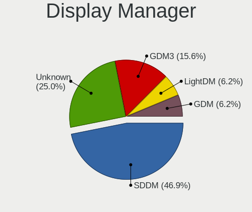
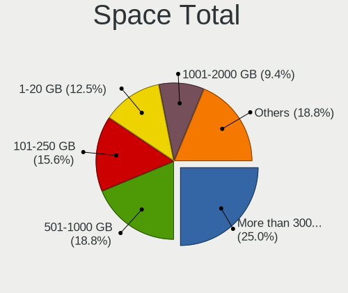
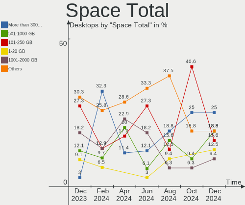
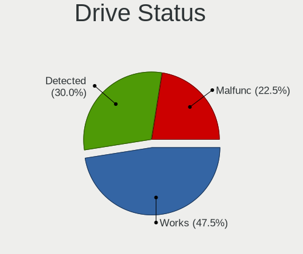
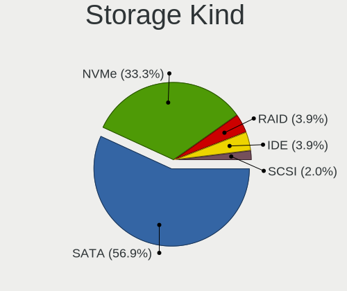
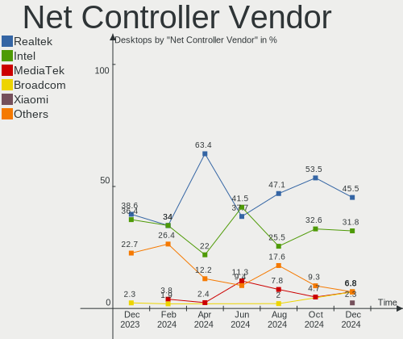
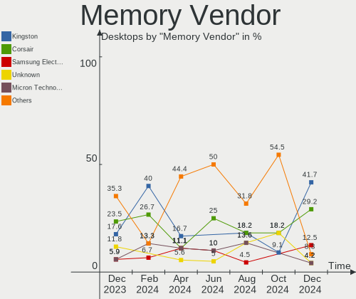
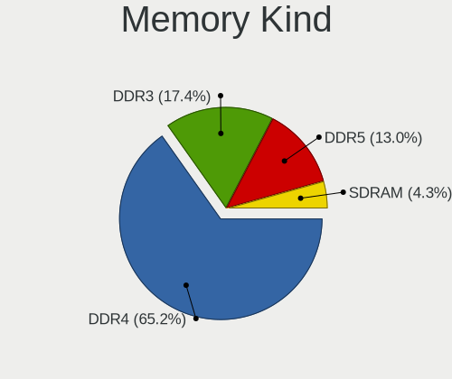
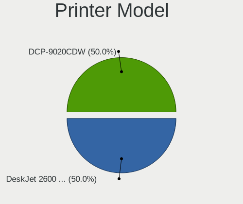

Linux in Netherlands - Hardware Trends (Desktops)
-------------------------------------------------

A project to identify most popular hardware characteristics and track their change
over time based on data collected by Linux users at https://Linux-Hardware.org.

Anyone can contribute to this report by the [hw-probe](https://github.com/linuxhw/hw-probe) tool:

    sudo -E hw-probe -all -upload

Period: Apr, 2023.

Contents
--------

* [ System ](#system)
  - [ OS                       ](#os)
  - [ OS Family                ](#os-family)
  - [ Kernel                   ](#kernel)
  - [ Kernel Family            ](#kernel-family)
  - [ Kernel Major Ver.        ](#kernel-major-ver)
  - [ Arch                     ](#arch)
  - [ DE                       ](#de)
  - [ Display Server           ](#display-server)
  - [ Display Manager          ](#display-manager)
  - [ OS Lang                  ](#os-lang)
  - [ Boot Mode                ](#boot-mode)
  - [ Filesystem               ](#filesystem)
  - [ Part. scheme             ](#part-scheme)
  - [ Dual Boot with Linux/BSD ](#dual-boot-with-linuxbsd)
  - [ Dual Boot (Win)          ](#dual-boot-win)

* [ Board ](#board)
  - [ Vendor                   ](#vendor)
  - [ Model                    ](#model)
  - [ Model Family             ](#model-family)
  - [ MFG Year                 ](#mfg-year)
  - [ Form Factor              ](#form-factor)
  - [ Secure Boot              ](#secure-boot)
  - [ Coreboot                 ](#coreboot)
  - [ RAM Size                 ](#ram-size)
  - [ RAM Used                 ](#ram-used)
  - [ Total Drives             ](#total-drives)
  - [ Has CD-ROM               ](#has-cd-rom)
  - [ Has Ethernet             ](#has-ethernet)
  - [ Has WiFi                 ](#has-wifi)
  - [ Has Bluetooth            ](#has-bluetooth)

* [ Location ](#location)
  - [ Country                  ](#country)
  - [ City                     ](#city)

* [ Drives ](#drives)
  - [ Drive Vendor             ](#drive-vendor)
  - [ Drive Model              ](#drive-model)
  - [ HDD Vendor               ](#hdd-vendor)
  - [ SSD Vendor               ](#ssd-vendor)
  - [ Drive Kind               ](#drive-kind)
  - [ Drive Connector          ](#drive-connector)
  - [ Drive Size               ](#drive-size)
  - [ Space Total              ](#space-total)
  - [ Space Used               ](#space-used)
  - [ Malfunc. Drives          ](#malfunc-drives)
  - [ Malfunc. Drive Vendor    ](#malfunc-drive-vendor)
  - [ Malfunc. HDD Vendor      ](#malfunc-hdd-vendor)
  - [ Malfunc. Drive Kind      ](#malfunc-drive-kind)
  - [ Failed Drives            ](#failed-drives)
  - [ Failed Drive Vendor      ](#failed-drive-vendor)
  - [ Drive Status             ](#drive-status)

* [ Storage controller ](#storage-controller)
  - [ Storage Vendor           ](#storage-vendor)
  - [ Storage Model            ](#storage-model)
  - [ Storage Kind             ](#storage-kind)

* [ Processor ](#processor)
  - [ CPU Vendor               ](#cpu-vendor)
  - [ CPU Model                ](#cpu-model)
  - [ CPU Model Family         ](#cpu-model-family)
  - [ CPU Cores                ](#cpu-cores)
  - [ CPU Sockets              ](#cpu-sockets)
  - [ CPU Threads              ](#cpu-threads)
  - [ CPU Op-Modes             ](#cpu-op-modes)
  - [ CPU Microcode            ](#cpu-microcode)
  - [ CPU Microarch            ](#cpu-microarch)

* [ Graphics ](#graphics)
  - [ GPU Vendor               ](#gpu-vendor)
  - [ GPU Model                ](#gpu-model)
  - [ GPU Combo                ](#gpu-combo)
  - [ GPU Driver               ](#gpu-driver)
  - [ GPU Memory               ](#gpu-memory)

* [ Monitor ](#monitor)
  - [ Monitor Vendor           ](#monitor-vendor)
  - [ Monitor Model            ](#monitor-model)
  - [ Monitor Resolution       ](#monitor-resolution)
  - [ Monitor Diagonal         ](#monitor-diagonal)
  - [ Monitor Width            ](#monitor-width)
  - [ Aspect Ratio             ](#aspect-ratio)
  - [ Monitor Area             ](#monitor-area)
  - [ Pixel Density            ](#pixel-density)
  - [ Multiple Monitors        ](#multiple-monitors)

* [ Network ](#network)
  - [ Net Controller Vendor    ](#net-controller-vendor)
  - [ Net Controller Model     ](#net-controller-model)
  - [ Wireless Vendor          ](#wireless-vendor)
  - [ Wireless Model           ](#wireless-model)
  - [ Ethernet Vendor          ](#ethernet-vendor)
  - [ Ethernet Model           ](#ethernet-model)
  - [ Net Controller Kind      ](#net-controller-kind)
  - [ Used Controller          ](#used-controller)
  - [ NICs                     ](#nics)
  - [ IPv6                     ](#ipv6)

* [ Bluetooth ](#bluetooth)
  - [ Bluetooth Vendor         ](#bluetooth-vendor)
  - [ Bluetooth Model          ](#bluetooth-model)

* [ Sound ](#sound)
  - [ Sound Vendor             ](#sound-vendor)
  - [ Sound Model              ](#sound-model)

* [ Memory ](#memory)
  - [ Memory Vendor            ](#memory-vendor)
  - [ Memory Model             ](#memory-model)
  - [ Memory Kind              ](#memory-kind)
  - [ Memory Form Factor       ](#memory-form-factor)
  - [ Memory Size              ](#memory-size)
  - [ Memory Speed             ](#memory-speed)

* [ Printers & scanners ](#printers--scanners)
  - [ Printer Vendor           ](#printer-vendor)
  - [ Printer Model            ](#printer-model)
  - [ Scanner Vendor           ](#scanner-vendor)
  - [ Scanner Model            ](#scanner-model)

* [ Camera ](#camera)
  - [ Camera Vendor            ](#camera-vendor)
  - [ Camera Model             ](#camera-model)

* [ Security ](#security)
  - [ Fingerprint Vendor       ](#fingerprint-vendor)
  - [ Fingerprint Model        ](#fingerprint-model)
  - [ Chipcard Vendor          ](#chipcard-vendor)
  - [ Chipcard Model           ](#chipcard-model)

* [ Unsupported ](#unsupported)
  - [ Unsupported Devices      ](#unsupported-devices)
  - [ Unsupported Device Types ](#unsupported-device-types)

System
------

OS
--

Installed operating systems

| Name               | Desktops | Percent |
|--------------------|----------|---------|
| Ubuntu 22.04       | 8        | 19.05%  |
| Linux Mint 21.1    | 6        | 14.29%  |
| OpenMandriva 23.03 | 5        | 11.9%   |
| Ubuntu 20.04       | 4        | 9.52%   |
| Fedora 38          | 3        | 7.14%   |
| Debian 11          | 3        | 7.14%   |
| Zorin 16           | 2        | 4.76%   |
| Nobara 37          | 2        | 4.76%   |
| Ubuntu MATE 22.04  | 1        | 2.38%   |
| Ubuntu 23.04       | 1        | 2.38%   |
| Ubuntu 18.04       | 1        | 2.38%   |
| Pop!_OS 22.04      | 1        | 2.38%   |
| Manjaro            | 1        | 2.38%   |
| Linux Mint 21      | 1        | 2.38%   |
| Fedora 37          | 1        | 2.38%   |
| Debian 10          | 1        | 2.38%   |
| BunsenLabs 11      | 1        | 2.38%   |

OS Family
---------

OS without a version

| Name         | Desktops | Percent |
|--------------|----------|---------|
| Ubuntu       | 14       | 33.33%  |
| Linux Mint   | 7        | 16.67%  |
| OpenMandriva | 5        | 11.9%   |
| Fedora       | 4        | 9.52%   |
| Debian       | 4        | 9.52%   |
| Zorin        | 2        | 4.76%   |
| Nobara       | 2        | 4.76%   |
| Ubuntu MATE  | 1        | 2.38%   |
| Pop!_OS      | 1        | 2.38%   |
| Manjaro      | 1        | 2.38%   |
| BunsenLabs   | 1        | 2.38%   |

Kernel
------

Version of the Linux kernel

| Version                     | Desktops | Percent |
|-----------------------------|----------|---------|
| 5.15.0-69-generic           | 7        | 16.67%  |
| 6.2.6-desktop-1omv2390      | 5        | 11.9%   |
| 5.19.0-40-generic           | 3        | 7.14%   |
| 5.15.0-70-generic           | 3        | 7.14%   |
| 6.2.8-200.fsync.fc37.x86_64 | 2        | 4.76%   |
| 5.15.0-56-generic           | 2        | 4.76%   |
| 5.10.0-21-amd64             | 2        | 4.76%   |
| 6.2.9-300.fc38.x86_64       | 1        | 2.38%   |
| 6.2.9-200.fc37.x86_64       | 1        | 2.38%   |
| 6.2.6-76060206-generic      | 1        | 2.38%   |
| 6.2.12-300.fc38.x86_64      | 1        | 2.38%   |
| 6.2.11-1-pve                | 1        | 2.38%   |
| 6.2.10-300.fc38.x86_64      | 1        | 2.38%   |
| 6.2.0-18-generic            | 1        | 2.38%   |
| 6.1.23-1-MANJARO            | 1        | 2.38%   |
| 5.4.0-148-generic           | 1        | 2.38%   |
| 5.4.0-146-generic           | 1        | 2.38%   |
| 5.4.0-144-generic           | 1        | 2.38%   |
| 5.4.0-135-generic           | 1        | 2.38%   |
| 5.4.0-132-generic           | 1        | 2.38%   |
| 5.19.0-41-generic           | 1        | 2.38%   |
| 5.19.0-38-generic           | 1        | 2.38%   |
| 5.19.0-32-generic           | 1        | 2.38%   |
| 5.15.62-yocto-standard      | 1        | 2.38%   |
| 5.10.0-21-686               | 1        | 2.38%   |

Kernel Family
-------------

Linux kernel without a distro release

| Version | Desktops | Percent |
|---------|----------|---------|
| 5.15.0  | 12       | 28.57%  |
| 6.2.6   | 6        | 14.29%  |
| 5.19.0  | 6        | 14.29%  |
| 5.4.0   | 5        | 11.9%   |
| 5.10.0  | 3        | 7.14%   |
| 6.2.9   | 2        | 4.76%   |
| 6.2.8   | 2        | 4.76%   |
| 6.2.12  | 1        | 2.38%   |
| 6.2.11  | 1        | 2.38%   |
| 6.2.10  | 1        | 2.38%   |
| 6.2.0   | 1        | 2.38%   |
| 6.1.23  | 1        | 2.38%   |
| 5.15.62 | 1        | 2.38%   |

Kernel Major Ver.
-----------------

Linux kernel major version

| Version | Desktops | Percent |
|---------|----------|---------|
| 6.2     | 14       | 33.33%  |
| 5.15    | 13       | 30.95%  |
| 5.19    | 6        | 14.29%  |
| 5.4     | 5        | 11.9%   |
| 5.10    | 3        | 7.14%   |
| 6.1     | 1        | 2.38%   |

Arch
----

OS architecture (x86_64, i586, etc.)

| Name   | Desktops | Percent |
|--------|----------|---------|
| x86_64 | 41       | 97.62%  |
| i686   | 1        | 2.38%   |

DE
--

Desktop Environment

| Name            | Desktops | Percent |
|-----------------|----------|---------|
| GNOME           | 18       | 42.86%  |
| X-Cinnamon      | 7        | 16.67%  |
| KDE5            | 5        | 11.9%   |
| Unknown         | 3        | 7.14%   |
| XFCE            | 2        | 4.76%   |
| MATE            | 2        | 4.76%   |
| GNOME Flashback | 2        | 4.76%   |
| Enlightenment   | 2        | 4.76%   |
| LXDE            | 1        | 2.38%   |

Display Server
--------------

X11 or Wayland

| Name    | Desktops | Percent |
|---------|----------|---------|
| X11     | 29       | 69.05%  |
| Wayland | 13       | 30.95%  |

Display Manager
---------------

SDDM, LightDM, etc.

| Name    | Desktops | Percent |
|---------|----------|---------|
| Unknown | 15       | 35.71%  |
| LightDM | 10       | 23.81%  |
| GDM3    | 7        | 16.67%  |
| SDDM    | 5        | 11.9%   |
| GDM     | 5        | 11.9%   |

OS Lang
-------

Language

| Lang    | Desktops | Percent |
|---------|----------|---------|
| en_US   | 20       | 47.62%  |
| nl_NL   | 18       | 42.86%  |
| Unknown | 2        | 4.76%   |
| en_GB   | 1        | 2.38%   |
| ar_KW   | 1        | 2.38%   |

Boot Mode
---------

EFI or BIOS

| Mode | Desktops | Percent |
|------|----------|---------|
| EFI  | 24       | 57.14%  |
| BIOS | 18       | 42.86%  |

Filesystem
----------

Type of filesystem

| Type    | Desktops | Percent |
|---------|----------|---------|
| Ext4    | 32       | 76.19%  |
| Btrfs   | 7        | 16.67%  |
| Overlay | 2        | 4.76%   |
| Tmpfs   | 1        | 2.38%   |

Part. scheme
------------

Scheme of partitioning

| Type    | Desktops | Percent |
|---------|----------|---------|
| GPT     | 23       | 54.76%  |
| Unknown | 13       | 30.95%  |
| MBR     | 6        | 14.29%  |

Dual Boot with Linux/BSD
------------------------

Hosting more than one Linux/BSD

| Dual boot | Desktops | Percent |
|-----------|----------|---------|
| No        | 34       | 80.95%  |
| Yes       | 8        | 19.05%  |

Dual Boot (Win)
---------------

Hosting Linux and Windows

| Dual boot | Desktops | Percent |
|-----------|----------|---------|
| No        | 33       | 78.57%  |
| Yes       | 9        | 21.43%  |

Board
-----

Vendor
------

Motherboard manufacturer

| Name                | Desktops | Percent |
|---------------------|----------|---------|
| Gigabyte Technology | 9        | 21.43%  |
| ASUSTek Computer    | 7        | 16.67%  |
| ASRock              | 6        | 14.29%  |
| Medion              | 3        | 7.14%   |
| Hewlett-Packard     | 3        | 7.14%   |
| Dell                | 3        | 7.14%   |
| Acer                | 3        | 7.14%   |
| MSI                 | 2        | 4.76%   |
| BESSTAR Tech        | 2        | 4.76%   |
| Lenovo              | 1        | 2.38%   |
| Intel               | 1        | 2.38%   |
| Foxconn             | 1        | 2.38%   |
| EVERCOM NETWORK     | 1        | 2.38%   |

Model
-----

Motherboard model

| Name                                   | Desktops | Percent |
|----------------------------------------|----------|---------|
| Gigabyte GA-770TA-UD3                  | 2        | 4.76%   |
| MSI MS-7C02                            | 1        | 2.38%   |
| MSI MS-7B85                            | 1        | 2.38%   |
| Medion MS-7857                         | 1        | 2.38%   |
| Medion MS-7708                         | 1        | 2.38%   |
| Medion H61H2-LM3                       | 1        | 2.38%   |
| Lenovo IdeaCentre 510-15ICK 90LU0057MH | 1        | 2.38%   |
| Intel DH61WW AAG23116-204              | 1        | 2.38%   |
| HP ProDesk 600 G1 SFF                  | 1        | 2.38%   |
| HP Compaq dc7900 Convertible Minitower | 1        | 2.38%   |
| HP Compaq 8200 Elite CMT PC            | 1        | 2.38%   |
| Gigabyte Z270X-UD3                     | 1        | 2.38%   |
| Gigabyte X79-UD3                       | 1        | 2.38%   |
| Gigabyte H610M S2H DDR4                | 1        | 2.38%   |
| Gigabyte G1.Sniper B5                  | 1        | 2.38%   |
| Gigabyte B550 AORUS PRO V2             | 1        | 2.38%   |
| Gigabyte B550 AORUS ELITE AX V2        | 1        | 2.38%   |
| Gigabyte A520M S2H                     | 1        | 2.38%   |
| Foxconn G31MVP FAB:1.0                 | 1        | 2.38%   |
| Dell Precision WorkStation T3500       | 1        | 2.38%   |
| Dell OptiPlex 7010                     | 1        | 2.38%   |
| Dell OptiPlex 5000                     | 1        | 2.38%   |
| BESSTAR Tech UM700                     | 1        | 2.38%   |
| BESSTAR Tech HM80                      | 1        | 2.38%   |
| ASUS TUF B450M-PLUS GAMING             | 1        | 2.38%   |
| ASUS ROG CROSSHAIR X670E GENE          | 1        | 2.38%   |
| ASUS PRIME Z370-A                      | 1        | 2.38%   |
| ASUS P9X79                             | 1        | 2.38%   |
| ASUS P8Z77-M PRO                       | 1        | 2.38%   |
| ASUS P8H67-M PRO                       | 1        | 2.38%   |
| ASUS M5A78L-M PLUS/USB3                | 1        | 2.38%   |
| ASRock Z790 Taichi                     | 1        | 2.38%   |
| ASRock Z790 Steel Legend WiFi          | 1        | 2.38%   |
| ASRock H97M Anniversary                | 1        | 2.38%   |
| ASRock H470M-STX                       | 1        | 2.38%   |
| ASRock B450 Pro4 R2.0                  | 1        | 2.38%   |
| ASRock A320M-HDV R4.0                  | 1        | 2.38%   |
| Acer Predator G3-605                   | 1        | 2.38%   |
| Acer Aspire X3995                      | 1        | 2.38%   |
| Acer Aspire M1930                      | 1        | 2.38%   |

Model Family
------------

Motherboard model prefix

| Name                  | Desktops | Percent |
|-----------------------|----------|---------|
| HP Compaq             | 2        | 4.76%   |
| Gigabyte GA-770TA-UD3 | 2        | 4.76%   |
| Gigabyte B550         | 2        | 4.76%   |
| Dell OptiPlex         | 2        | 4.76%   |
| ASRock Z790           | 2        | 4.76%   |
| Acer Aspire           | 2        | 4.76%   |
| MSI MS-7C02           | 1        | 2.38%   |
| MSI MS-7B85           | 1        | 2.38%   |
| Medion MS-7857        | 1        | 2.38%   |
| Medion MS-7708        | 1        | 2.38%   |
| Medion H61H2-LM3      | 1        | 2.38%   |
| Lenovo IdeaCentre     | 1        | 2.38%   |
| Intel DH61WW          | 1        | 2.38%   |
| HP ProDesk            | 1        | 2.38%   |
| Gigabyte Z270X-UD3    | 1        | 2.38%   |
| Gigabyte X79-UD3      | 1        | 2.38%   |
| Gigabyte H610M        | 1        | 2.38%   |
| Gigabyte G1.Sniper    | 1        | 2.38%   |
| Gigabyte A520M        | 1        | 2.38%   |
| Foxconn G31MVP        | 1        | 2.38%   |
| Dell Precision        | 1        | 2.38%   |
| BESSTAR Tech UM700    | 1        | 2.38%   |
| BESSTAR Tech HM80     | 1        | 2.38%   |
| ASUS TUF              | 1        | 2.38%   |
| ASUS ROG              | 1        | 2.38%   |
| ASUS PRIME            | 1        | 2.38%   |
| ASUS P9X79            | 1        | 2.38%   |
| ASUS P8Z77-M          | 1        | 2.38%   |
| ASUS P8H67-M          | 1        | 2.38%   |
| ASUS M5A78L-M         | 1        | 2.38%   |
| ASRock H97M           | 1        | 2.38%   |
| ASRock H470M-STX      | 1        | 2.38%   |
| ASRock B450           | 1        | 2.38%   |
| ASRock A320M-HDV      | 1        | 2.38%   |
| Acer Predator         | 1        | 2.38%   |
| Unknown               | 1        | 2.38%   |

MFG Year
--------

Motherboard manufacture year

| Year | Desktops | Percent |
|------|----------|---------|
| 2011 | 5        | 11.9%   |
| 2021 | 4        | 9.52%   |
| 2013 | 4        | 9.52%   |
| 2012 | 4        | 9.52%   |
| 2020 | 3        | 7.14%   |
| 2018 | 3        | 7.14%   |
| 2023 | 2        | 4.76%   |
| 2022 | 2        | 4.76%   |
| 2019 | 2        | 4.76%   |
| 2017 | 2        | 4.76%   |
| 2014 | 2        | 4.76%   |
| 2010 | 2        | 4.76%   |
| 2009 | 2        | 4.76%   |
| 2008 | 2        | 4.76%   |
| 2016 | 1        | 2.38%   |
| 2007 | 1        | 2.38%   |
| 2003 | 1        | 2.38%   |

Form Factor
-----------

Physical design of the computer

| Name    | Desktops | Percent |
|---------|----------|---------|
| Desktop | 42       | 100%    |

Secure Boot
-----------

Enabled or disabled

| State    | Desktops | Percent |
|----------|----------|---------|
| Disabled | 39       | 92.86%  |
| Enabled  | 3        | 7.14%   |

Coreboot
--------

Have coreboot on board

| Used | Desktops | Percent |
|------|----------|---------|
| No   | 42       | 100%    |

RAM Size
--------

Total RAM memory

| Size in GB  | Desktops | Percent |
|-------------|----------|---------|
| 16.01-24.0  | 11       | 26.19%  |
| 8.01-16.0   | 10       | 23.81%  |
| 32.01-64.0  | 9        | 21.43%  |
| 4.01-8.0    | 5        | 11.9%   |
| 3.01-4.0    | 5        | 11.9%   |
| 64.01-256.0 | 1        | 2.38%   |
| 0.51-1.0    | 1        | 2.38%   |

RAM Used
--------

Used RAM memory

| Used GB   | Desktops | Percent |
|-----------|----------|---------|
| 1.01-2.0  | 13       | 30.95%  |
| 4.01-8.0  | 10       | 23.81%  |
| 2.01-3.0  | 8        | 19.05%  |
| 8.01-16.0 | 5        | 11.9%   |
| 3.01-4.0  | 3        | 7.14%   |
| 0.51-1.0  | 2        | 4.76%   |
| 0.01-0.5  | 1        | 2.38%   |

Total Drives
------------

Number of drives on board

| Drives | Desktops | Percent |
|--------|----------|---------|
| 1      | 13       | 30.95%  |
| 3      | 10       | 23.81%  |
| 2      | 10       | 23.81%  |
| 4      | 5        | 11.9%   |
| 5      | 2        | 4.76%   |
| 9      | 1        | 2.38%   |
| 6      | 1        | 2.38%   |

Has CD-ROM
----------

Has CD-ROM on board

| Presented | Desktops | Percent |
|-----------|----------|---------|
| No        | 22       | 52.38%  |
| Yes       | 20       | 47.62%  |

Has Ethernet
------------

Has Ethernet on board

| Presented | Desktops | Percent |
|-----------|----------|---------|
| Yes       | 42       | 100%    |

Has WiFi
--------

Has WiFi module

| Presented | Desktops | Percent |
|-----------|----------|---------|
| Yes       | 23       | 54.76%  |
| No        | 19       | 45.24%  |

Has Bluetooth
-------------

Has Bluetooth module

| Presented | Desktops | Percent |
|-----------|----------|---------|
| Yes       | 21       | 50%     |
| No        | 21       | 50%     |

Location
--------

Country
-------

Geographic location (country)

| Country     | Desktops | Percent |
|-------------|----------|---------|
| Netherlands | 42       | 100%    |

City
----

Geographic location (city)

| City                  | Desktops | Percent |
|-----------------------|----------|---------|
| The Hague             | 6        | 14.29%  |
| Amsterdam             | 3        | 7.14%   |
| Oosterwolde           | 2        | 4.76%   |
| Alkmaar               | 2        | 4.76%   |
| Zandvoort             | 1        | 2.38%   |
| Zaandam               | 1        | 2.38%   |
| Weert                 | 1        | 2.38%   |
| Utrecht               | 1        | 2.38%   |
| Terneuzen             | 1        | 2.38%   |
| Soest                 | 1        | 2.38%   |
| Rotterdam             | 1        | 2.38%   |
| Purmerend             | 1        | 2.38%   |
| Nuenen                | 1        | 2.38%   |
| Nijmegen              | 1        | 2.38%   |
| Monster               | 1        | 2.38%   |
| Millingen aan de Rijn | 1        | 2.38%   |
| Malden                | 1        | 2.38%   |
| Leiden                | 1        | 2.38%   |
| Leeuwarden            | 1        | 2.38%   |
| IJsselstein           | 1        | 2.38%   |
| Horst                 | 1        | 2.38%   |
| Hilversum             | 1        | 2.38%   |
| Heythuysen            | 1        | 2.38%   |
| Harderwijk            | 1        | 2.38%   |
| Groningen             | 1        | 2.38%   |
| Gouda                 | 1        | 2.38%   |
| Gorinchem             | 1        | 2.38%   |
| Gemert                | 1        | 2.38%   |
| Emmen                 | 1        | 2.38%   |
| Dordrecht             | 1        | 2.38%   |
| Doetinchem            | 1        | 2.38%   |
| Breda                 | 1        | 2.38%   |
| Alphen aan den Rijn   | 1        | 2.38%   |

Drives
------

Drive Vendor
------------

Hard drive vendors

| Vendor                      | Desktops | Drives | Percent |
|-----------------------------|----------|--------|---------|
| WDC                         | 15       | 19     | 18.07%  |
| Samsung Electronics         | 15       | 24     | 18.07%  |
| Seagate                     | 11       | 15     | 13.25%  |
| Kingston                    | 9        | 11     | 10.84%  |
| SanDisk                     | 6        | 9      | 7.23%   |
| Hitachi                     | 5        | 5      | 6.02%   |
| Crucial                     | 5        | 5      | 6.02%   |
| Toshiba                     | 4        | 4      | 4.82%   |
| SAGE                        | 2        | 2      | 2.41%   |
| Maxtor                      | 2        | 2      | 2.41%   |
| SPCC                        | 1        | 1      | 1.2%    |
| PNY                         | 1        | 1      | 1.2%    |
| Patriot                     | 1        | 1      | 1.2%    |
| Mushkin                     | 1        | 1      | 1.2%    |
| Kingston Technology Company | 1        | 2      | 1.2%    |
| JMicron Technology          | 1        | 1      | 1.2%    |
| Inateck                     | 1        | 1      | 1.2%    |
| A-DATA Technology           | 1        | 1      | 1.2%    |
| Unknown                     | 1        | 2      | 1.2%    |

Drive Model
-----------

Hard drive models

| Model                                             | Desktops | Percent |
|---------------------------------------------------|----------|---------|
| WDC WD5000LPVX-28V0TT0 500GB                      | 2        | 1.98%   |
| WDC WD20EFRX-68EUZN0 2TB                          | 2        | 1.98%   |
| Seagate ST500DM002-1BD142 500GB                   | 2        | 1.98%   |
| Seagate ST3500418AS 500GB                         | 2        | 1.98%   |
| Seagate ST3160212ACE 160GB                        | 2        | 1.98%   |
| Seagate ST2000DM008-2FR102 2TB                    | 2        | 1.98%   |
| SanDisk SSD U100 8GB                              | 2        | 1.98%   |
| SanDisk NVMe SSD Drive 2TB                        | 2        | 1.98%   |
| Samsung SSD 970 EVO 1TB                           | 2        | 1.98%   |
| Samsung SSD 860 QVO 1TB                           | 2        | 1.98%   |
| Samsung SSD 860 EVO 500GB                         | 2        | 1.98%   |
| Samsung SSD 860 EVO 1TB                           | 2        | 1.98%   |
| Samsung SSD 850 EVO 250GB                         | 2        | 1.98%   |
| Samsung NVMe SSD Controller SM981/PM981/PM983 1TB | 2        | 1.98%   |
| Samsung HD753LJ 752GB                             | 2        | 1.98%   |
| SAGE 3639S 160GB                                  | 2        | 1.98%   |
| Maxtor 6V200E0 208GB                              | 2        | 1.98%   |
| Kingston SFYRS1000G 1TB                           | 2        | 1.98%   |
| Hitachi HDS728080PLA380 40Y9028LEN 80GB           | 2        | 1.98%   |
| WDC WD800JB-00JJC0 80GB                           | 1        | 0.99%   |
| WDC WD5000AAKX-753CA1 500GB                       | 1        | 0.99%   |
| WDC WD3200BEVT-75ZCT2 320GB                       | 1        | 0.99%   |
| WDC WD20EFAX-68FB5N0 2TB                          | 1        | 0.99%   |
| WDC WD20EARX-00PASB0 2TB                          | 1        | 0.99%   |
| WDC WD15EZRX-00DC0B0 1TB                          | 1        | 0.99%   |
| WDC WD15EARS-00MVWB0 1TB                          | 1        | 0.99%   |
| WDC WD10EVDS-63U8B0 1TB                           | 1        | 0.99%   |
| WDC WD10EAVS-00D7B0 1TB                           | 1        | 0.99%   |
| WDC WD10EARX-00N0YB0 1TB                          | 1        | 0.99%   |
| WDC WD10EARS-22Y5B1 1TB                           | 1        | 0.99%   |
| WDC WD10EACS-00D6B0 1TB                           | 1        | 0.99%   |
| WDC WD1003FBYX-18Y7B0 1TB                         | 1        | 0.99%   |
| WDC WD1002FAEX-00Y9A0 1TB                         | 1        | 0.99%   |
| WDC WD1001FAES-60Z2A0 1TB                         | 1        | 0.99%   |
| Toshiba HDWG460 6TB                               | 1        | 0.99%   |
| Toshiba HDWD110 1TB                               | 1        | 0.99%   |
| Toshiba DT01ACA300 3TB                            | 1        | 0.99%   |
| Toshiba DT01ACA100 1TB                            | 1        | 0.99%   |
| SPCC Solid State Disk 256GB                       | 1        | 0.99%   |
| Seagate ST8000DM004-2U9188 8TB                    | 1        | 0.99%   |

HDD Vendor
----------

Hard disk drive vendors

| Vendor              | Desktops | Drives | Percent |
|---------------------|----------|--------|---------|
| WDC                 | 15       | 19     | 35.71%  |
| Seagate             | 10       | 14     | 23.81%  |
| Hitachi             | 5        | 5      | 11.9%   |
| Toshiba             | 4        | 4      | 9.52%   |
| Samsung Electronics | 3        | 3      | 7.14%   |
| SAGE                | 2        | 2      | 4.76%   |
| Maxtor              | 2        | 2      | 4.76%   |
| Inateck             | 1        | 1      | 2.38%   |

SSD Vendor
----------

Solid state drive vendors

| Vendor              | Desktops | Drives | Percent |
|---------------------|----------|--------|---------|
| Samsung Electronics | 11       | 14     | 42.31%  |
| Kingston            | 5        | 7      | 19.23%  |
| Crucial             | 4        | 4      | 15.38%  |
| SanDisk             | 2        | 2      | 7.69%   |
| SPCC                | 1        | 1      | 3.85%   |
| PNY                 | 1        | 1      | 3.85%   |
| Patriot             | 1        | 1      | 3.85%   |
| Unknown             | 1        | 2      | 3.85%   |

Drive Kind
----------

HDD or SSD

| Kind    | Desktops | Drives | Percent |
|---------|----------|--------|---------|
| HDD     | 25       | 50     | 38.46%  |
| SSD     | 22       | 32     | 33.85%  |
| NVMe    | 16       | 23     | 24.62%  |
| Unknown | 2        | 2      | 3.08%   |

Drive Connector
---------------

SATA, SAS, NVMe, etc.

| Type | Desktops | Drives | Percent |
|------|----------|--------|---------|
| SATA | 35       | 79     | 63.64%  |
| NVMe | 16       | 23     | 29.09%  |
| SAS  | 4        | 5      | 7.27%   |

Drive Size
----------

Size of hard drive

| Size in TB | Desktops | Drives | Percent |
|------------|----------|--------|---------|
| 0.01-0.5   | 24       | 45     | 45.28%  |
| 0.51-1.0   | 20       | 26     | 37.74%  |
| 1.01-2.0   | 6        | 6      | 11.32%  |
| 4.01-10.0  | 2        | 4      | 3.77%   |
| 2.01-3.0   | 1        | 1      | 1.89%   |

Space Total
-----------

Amount of disk space available on the file system

| Size in GB     | Desktops | Percent |
|----------------|----------|---------|
| 101-250        | 9        | 21.43%  |
| 251-500        | 6        | 14.29%  |
| 2001-3000      | 6        | 14.29%  |
| 501-1000       | 6        | 14.29%  |
| More than 3000 | 4        | 9.52%   |
| 1001-2000      | 4        | 9.52%   |
| 51-100         | 3        | 7.14%   |
| Unknown        | 2        | 4.76%   |
| 21-50          | 1        | 2.38%   |
| 1-20           | 1        | 2.38%   |

Space Used
----------

Amount of used disk space

| Used GB        | Desktops | Percent |
|----------------|----------|---------|
| 1-20           | 10       | 23.81%  |
| 21-50          | 8        | 19.05%  |
| 51-100         | 7        | 16.67%  |
| 1001-2000      | 6        | 14.29%  |
| 251-500        | 3        | 7.14%   |
| 501-1000       | 3        | 7.14%   |
| 101-250        | 2        | 4.76%   |
| Unknown        | 2        | 4.76%   |
| More than 3000 | 1        | 2.38%   |

Malfunc. Drives
---------------

Drive models with a malfunction

| Model                             | Desktops | Drives | Percent |
|-----------------------------------|----------|--------|---------|
| WDC WD5000AAKX-753CA1 500GB       | 1        | 1      | 10%     |
| WDC WD15EZRX-00DC0B0 1TB          | 1        | 1      | 10%     |
| WDC WD10EAVS-00D7B0 1TB           | 1        | 1      | 10%     |
| WDC WD10EARX-00N0YB0 1TB          | 1        | 1      | 10%     |
| WDC WD10EACS-00D6B0 1TB           | 1        | 1      | 10%     |
| Toshiba DT01ACA100 1TB            | 1        | 1      | 10%     |
| Seagate ST3250310AS 250GB         | 1        | 1      | 10%     |
| Seagate ST2000DM008-2FR102 2TB    | 1        | 1      | 10%     |
| Samsung Electronics HD753LJ 752GB | 1        | 1      | 10%     |
| Kingston SV300S37A120G 120GB SSD  | 1        | 1      | 10%     |

Malfunc. Drive Vendor
---------------------

Vendors of faulty drives

| Vendor              | Desktops | Drives | Percent |
|---------------------|----------|--------|---------|
| WDC                 | 5        | 5      | 50%     |
| Seagate             | 2        | 2      | 20%     |
| Toshiba             | 1        | 1      | 10%     |
| Samsung Electronics | 1        | 1      | 10%     |
| Kingston            | 1        | 1      | 10%     |

Malfunc. HDD Vendor
-------------------

Vendors of faulty HDD drives

| Vendor              | Desktops | Drives | Percent |
|---------------------|----------|--------|---------|
| WDC                 | 5        | 5      | 55.56%  |
| Seagate             | 2        | 2      | 22.22%  |
| Toshiba             | 1        | 1      | 11.11%  |
| Samsung Electronics | 1        | 1      | 11.11%  |

Malfunc. Drive Kind
-------------------

Kinds of faulty drives

| Kind | Desktops | Drives | Percent |
|------|----------|--------|---------|
| HDD  | 8        | 9      | 88.89%  |
| SSD  | 1        | 1      | 11.11%  |

Failed Drives
-------------

Failed drive models

Zero info for selected period =(

Failed Drive Vendor
-------------------

Failed drive vendors

Zero info for selected period =(

Drive Status
------------

Number of failed and malfunc. drives

| Status   | Desktops | Drives | Percent |
|----------|----------|--------|---------|
| Works    | 21       | 40     | 42%     |
| Detected | 20       | 57     | 40%     |
| Malfunc  | 9        | 10     | 18%     |

Storage controller
------------------

Storage Vendor
--------------

Storage controller vendors

| Vendor                      | Desktops | Percent |
|-----------------------------|----------|---------|
| Intel                       | 27       | 39.71%  |
| AMD                         | 15       | 22.06%  |
| Samsung Electronics         | 5        | 7.35%   |
| Sandisk                     | 4        | 5.88%   |
| Marvell Technology Group    | 4        | 5.88%   |
| Kingston Technology Company | 4        | 5.88%   |
| ASMedia Technology          | 3        | 4.41%   |
| JMicron Technology          | 2        | 2.94%   |
| VIA Technologies            | 1        | 1.47%   |
| Micron/Crucial Technology   | 1        | 1.47%   |
| INNOGRIT                    | 1        | 1.47%   |
| ADATA Technology            | 1        | 1.47%   |

Storage Model
-------------

Storage controller models

| Model                                                                                   | Desktops | Percent |
|-----------------------------------------------------------------------------------------|----------|---------|
| AMD FCH SATA Controller [AHCI mode]                                                     | 8        | 9.88%   |
| Samsung NVMe SSD Controller SM981/PM981/PM983                                           | 4        | 4.94%   |
| AMD 400 Series Chipset SATA Controller                                                  | 4        | 4.94%   |
| Intel 8 Series/C220 Series Chipset Family 6-port SATA Controller 1 [AHCI mode]          | 3        | 3.7%    |
| Intel 7 Series/C210 Series Chipset Family 6-port SATA Controller [AHCI mode]            | 3        | 3.7%    |
| Intel 6 Series/C200 Series Chipset Family Desktop SATA Controller (IDE mode, ports 4-5) | 3        | 3.7%    |
| Intel 6 Series/C200 Series Chipset Family Desktop SATA Controller (IDE mode, ports 0-3) | 3        | 3.7%    |
| ASMedia ASM1062 Serial ATA Controller                                                   | 3        | 3.7%    |
| AMD SB7x0/SB8x0/SB9x0 SATA Controller [IDE mode]                                        | 3        | 3.7%    |
| AMD SB7x0/SB8x0/SB9x0 IDE Controller                                                    | 3        | 3.7%    |
| AMD 500 Series Chipset SATA Controller                                                  | 3        | 3.7%    |
| Marvell Group 88SE91A3 SATA-600 Controller                                              | 2        | 2.47%   |
| Kingston Company Company Non-Volatile memory controller                                 | 2        | 2.47%   |
| JMicron JMB363 SATA/IDE Controller                                                      | 2        | 2.47%   |
| Intel SATA Controller [RAID mode]                                                       | 2        | 2.47%   |
| Intel C600/X79 series chipset 6-Port SATA AHCI Controller                               | 2        | 2.47%   |
| Intel Alder Lake-S PCH SATA Controller [AHCI Mode]                                      | 2        | 2.47%   |
| Intel 700 Series Chipset Family SATA AHCI Controller                                    | 2        | 2.47%   |
| Intel 6 Series/C200 Series Chipset Family 6 port Desktop SATA AHCI Controller           | 2        | 2.47%   |
| Intel 200 Series PCH SATA controller [AHCI mode]                                        | 2        | 2.47%   |
| VIA VT6415 PATA IDE Host Controller                                                     | 1        | 1.23%   |
| Sandisk Western Digital WD Black SN850X NVMe SSD                                        | 1        | 1.23%   |
| SanDisk WD Blue SN550 NVMe SSD                                                          | 1        | 1.23%   |
| SanDisk WD Black SN770 NVMe SSD                                                         | 1        | 1.23%   |
| Sandisk Non-Volatile memory controller                                                  | 1        | 1.23%   |
| Samsung NVMe SSD Controller SM961/PM961/SM963                                           | 1        | 1.23%   |
| Samsung NVMe SSD Controller 980                                                         | 1        | 1.23%   |
| Micron/Crucial P5 Plus NVMe PCIe SSD                                                    | 1        | 1.23%   |
| Marvell Group 88SE9172 SATA 6Gb/s Controller                                            | 1        | 1.23%   |
| Marvell Group 88SE9125 PCIe SATA 6.0 Gb/s controller                                    | 1        | 1.23%   |
| Kingston Company SNVS2000G [NV1 NVMe PCIe SSD 2TB]                                      | 1        | 1.23%   |
| Kingston Company KC2000 NVMe SSD                                                        | 1        | 1.23%   |
| Intel NM10/ICH7 Family SATA Controller [IDE mode]                                       | 1        | 1.23%   |
| Intel Comet Lake SATA AHCI Controller                                                   | 1        | 1.23%   |
| Intel 9 Series Chipset Family SATA Controller [AHCI Mode]                               | 1        | 1.23%   |
| Intel 82801JD/DO (ICH10 Family) SATA AHCI Controller                                    | 1        | 1.23%   |
| Intel 82801G (ICH7 Family) IDE Controller                                               | 1        | 1.23%   |
| Intel 82801DB (ICH4) IDE Controller                                                     | 1        | 1.23%   |
| Intel 5 Series/3400 Series Chipset 6 port SATA AHCI Controller                          | 1        | 1.23%   |
| Intel 4 Series Chipset PT IDER Controller                                               | 1        | 1.23%   |

Storage Kind
------------

Kind of storage controller (IDE, SATA, NVMe, SAS, ...)

| Kind | Desktops | Percent |
|------|----------|---------|
| SATA | 35       | 56.45%  |
| NVMe | 16       | 25.81%  |
| IDE  | 9        | 14.52%  |
| RAID | 2        | 3.23%   |

Processor
---------

CPU Vendor
----------

Processor vendors

| Vendor | Desktops | Percent |
|--------|----------|---------|
| Intel  | 27       | 64.29%  |
| AMD    | 15       | 35.71%  |

CPU Model
---------

Processor models

| Model                                         | Desktops | Percent |
|-----------------------------------------------|----------|---------|
| Intel Core i7-2600 CPU @ 3.40GHz              | 2        | 4.76%   |
| Intel Core i3-3220 CPU @ 3.30GHz              | 2        | 4.76%   |
| Intel Core i3-2100 CPU @ 3.10GHz              | 2        | 4.76%   |
| AMD Ryzen 5 5600G with Radeon Graphics        | 2        | 4.76%   |
| AMD Phenom II X6 1090T Processor              | 2        | 4.76%   |
| Intel Xeon CPU W3565 @ 3.20GHz                | 1        | 2.38%   |
| Intel Pentium CPU G630 @ 2.70GHz              | 1        | 2.38%   |
| Intel Pentium 4 CPU 2.40GHz                   | 1        | 2.38%   |
| Intel Core i9-9900KF CPU @ 3.60GHz            | 1        | 2.38%   |
| Intel Core i7-6700 CPU @ 3.40GHz              | 1        | 2.38%   |
| Intel Core i7-4930K CPU @ 3.40GHz             | 1        | 2.38%   |
| Intel Core i7-4770 CPU @ 3.40GHz              | 1        | 2.38%   |
| Intel Core i7-3930K CPU @ 3.20GHz             | 1        | 2.38%   |
| Intel Core i7-3770 CPU @ 3.40GHz              | 1        | 2.38%   |
| Intel Core i7-10700 CPU @ 2.90GHz             | 1        | 2.38%   |
| Intel Core i7 CPU 870 @ 2.93GHz               | 1        | 2.38%   |
| Intel Core i5-9400 CPU @ 2.90GHz              | 1        | 2.38%   |
| Intel Core i5-4590 CPU @ 3.30GHz              | 1        | 2.38%   |
| Intel Core i5-4460 CPU @ 3.20GHz              | 1        | 2.38%   |
| Intel Core i5-4440 CPU @ 3.10GHz              | 1        | 2.38%   |
| Intel Core 2 Duo CPU E8500 @ 3.16GHz          | 1        | 2.38%   |
| Intel Celeron CPU E1400 @ 2.00GHz             | 1        | 2.38%   |
| Intel 13th Gen Core i9-13900K                 | 1        | 2.38%   |
| Intel 13th Gen Core i7-13700K                 | 1        | 2.38%   |
| Intel 12th Gen Core i9-12900F                 | 1        | 2.38%   |
| Intel 12th Gen Core i7-12700T                 | 1        | 2.38%   |
| AMD Ryzen 9 7950X 16-Core Processor           | 1        | 2.38%   |
| AMD Ryzen 7 4800U with Radeon Graphics        | 1        | 2.38%   |
| AMD Ryzen 7 3750H with Radeon Vega Mobile Gfx | 1        | 2.38%   |
| AMD Ryzen 7 3700X 8-Core Processor            | 1        | 2.38%   |
| AMD Ryzen 7 2700 Eight-Core Processor         | 1        | 2.38%   |
| AMD Ryzen 5 3600X 6-Core Processor            | 1        | 2.38%   |
| AMD Ryzen 5 3600 6-Core Processor             | 1        | 2.38%   |
| AMD Ryzen 5 2600 Six-Core Processor           | 1        | 2.38%   |
| AMD Ryzen 3 3200G with Radeon Vega Graphics   | 1        | 2.38%   |
| AMD FX-6300 Six-Core Processor                | 1        | 2.38%   |
| AMD A8-6500 APU with Radeon HD Graphics       | 1        | 2.38%   |

CPU Model Family
----------------

Processor model prefix

| Model            | Desktops | Percent |
|------------------|----------|---------|
| Intel Core i7    | 9        | 21.43%  |
| AMD Ryzen 5      | 5        | 11.9%   |
| Other            | 4        | 9.52%   |
| Intel Core i5    | 4        | 9.52%   |
| Intel Core i3    | 4        | 9.52%   |
| AMD Ryzen 7      | 4        | 9.52%   |
| AMD Phenom II X6 | 2        | 4.76%   |
| Intel Xeon       | 1        | 2.38%   |
| Intel Pentium 4  | 1        | 2.38%   |
| Intel Pentium    | 1        | 2.38%   |
| Intel Core i9    | 1        | 2.38%   |
| Intel Core 2 Duo | 1        | 2.38%   |
| Intel Celeron    | 1        | 2.38%   |
| AMD Ryzen 9      | 1        | 2.38%   |
| AMD Ryzen 3      | 1        | 2.38%   |
| AMD FX           | 1        | 2.38%   |
| AMD A8           | 1        | 2.38%   |

CPU Cores
---------

Number of processor cores

| Number | Desktops | Percent |
|--------|----------|---------|
| 4      | 12       | 28.57%  |
| 6      | 10       | 23.81%  |
| 2      | 8        | 19.05%  |
| 8      | 5        | 11.9%   |
| 16     | 3        | 7.14%   |
| 24     | 1        | 2.38%   |
| 12     | 1        | 2.38%   |
| 3      | 1        | 2.38%   |
| 1      | 1        | 2.38%   |

CPU Sockets
-----------

Number of sockets

| Number | Desktops | Percent |
|--------|----------|---------|
| 1      | 42       | 100%    |

CPU Threads
-----------

Threads per core (Hyper-Threading)

| Number | Desktops | Percent |
|--------|----------|---------|
| 2      | 29       | 69.05%  |
| 1      | 13       | 30.95%  |

CPU Op-Modes
------------

CPU Operation Modes (32-bit, 64-bit)

| Op mode        | Desktops | Percent |
|----------------|----------|---------|
| 32-bit, 64-bit | 41       | 97.62%  |
| 32-bit         | 1        | 2.38%   |

CPU Microcode
-------------

Microcode number

| Number     | Desktops | Percent |
|------------|----------|---------|
| Unknown    | 14       | 33.33%  |
| 0x206a7    | 3        | 7.14%   |
| 0xb0671    | 2        | 4.76%   |
| 0x0a50000d | 2        | 4.76%   |
| 0x08701021 | 2        | 4.76%   |
| 0x0800820d | 2        | 4.76%   |
| 0x010000dc | 2        | 4.76%   |
| 0xf27      | 1        | 2.38%   |
| 0xa0655    | 1        | 2.38%   |
| 0x906ec    | 1        | 2.38%   |
| 0x906ea    | 1        | 2.38%   |
| 0x90672    | 1        | 2.38%   |
| 0x6fd      | 1        | 2.38%   |
| 0x506e3    | 1        | 2.38%   |
| 0x306e4    | 1        | 2.38%   |
| 0x306c3    | 1        | 2.38%   |
| 0x306a9    | 1        | 2.38%   |
| 0x1067a    | 1        | 2.38%   |
| 0x0a601203 | 1        | 2.38%   |
| 0x08600106 | 1        | 2.38%   |
| 0x08108109 | 1        | 2.38%   |
| 0x06001119 | 1        | 2.38%   |

CPU Microarch
-------------

Microarchitecture

| Name             | Desktops | Percent |
|------------------|----------|---------|
| SandyBridge      | 6        | 14.29%  |
| Zen+             | 4        | 9.52%   |
| Zen 2            | 4        | 9.52%   |
| IvyBridge        | 4        | 9.52%   |
| Haswell          | 4        | 9.52%   |
| Alderlake Hybrid | 3        | 7.14%   |
| Zen 3            | 2        | 4.76%   |
| Piledriver       | 2        | 4.76%   |
| Nehalem          | 2        | 4.76%   |
| KabyLake         | 2        | 4.76%   |
| K10              | 2        | 4.76%   |
| Unknown          | 2        | 4.76%   |
| Skylake          | 1        | 2.38%   |
| Penryn           | 1        | 2.38%   |
| NetBurst         | 1        | 2.38%   |
| Core             | 1        | 2.38%   |
| CometLake        | 1        | 2.38%   |

Graphics
--------

GPU Vendor
----------

Vendors of graphics cards

| Vendor | Desktops | Percent |
|--------|----------|---------|
| AMD    | 17       | 37.78%  |
| Nvidia | 16       | 35.56%  |
| Intel  | 12       | 26.67%  |

GPU Model
---------

Graphics card models

| Model                                                                       | Desktops | Percent |
|-----------------------------------------------------------------------------|----------|---------|
| Intel 2nd Generation Core Processor Family Integrated Graphics Controller   | 4        | 8.89%   |
| Nvidia GM107 [GeForce GTX 750 Ti]                                           | 2        | 4.44%   |
| AMD Lexa PRO [Radeon 540/540X/550/550X / RX 540X/550/550X]                  | 2        | 4.44%   |
| AMD Cypress PRO [Radeon HD 5850]                                            | 2        | 4.44%   |
| AMD Cape Verde XT [Radeon HD 7770/8760 / R7 250X]                           | 2        | 4.44%   |
| Nvidia TU106 [GeForce RTX 2060 SUPER]                                       | 1        | 2.22%   |
| Nvidia TU106 [GeForce RTX 2060 Rev. A]                                      | 1        | 2.22%   |
| Nvidia NV34 [GeForce FX 5200]                                               | 1        | 2.22%   |
| Nvidia GP104 [GeForce GTX 1080]                                             | 1        | 2.22%   |
| Nvidia GP104 [GeForce GTX 1070 Ti]                                          | 1        | 2.22%   |
| Nvidia GM204 [GeForce GTX 970]                                              | 1        | 2.22%   |
| Nvidia GK208B [GeForce GT 730]                                              | 1        | 2.22%   |
| Nvidia GK208B [GeForce GT 710]                                              | 1        | 2.22%   |
| Nvidia GK106 [GeForce GTX 660]                                              | 1        | 2.22%   |
| Nvidia GF106GL [Quadro 2000]                                                | 1        | 2.22%   |
| Nvidia GA104 [GeForce RTX 3070 Ti]                                          | 1        | 2.22%   |
| Nvidia GA104 [GeForce RTX 3070 Lite Hash Rate]                              | 1        | 2.22%   |
| Nvidia GA102 [GeForce RTX 3080 Lite Hash Rate]                              | 1        | 2.22%   |
| Nvidia AD103 [GeForce RTX 4080]                                             | 1        | 2.22%   |
| Intel Xeon E3-1200 v3/4th Gen Core Processor Integrated Graphics Controller | 1        | 2.22%   |
| Intel Xeon E3-1200 v2/3rd Gen Core processor Graphics Controller            | 1        | 2.22%   |
| Intel IvyBridge GT2 [HD Graphics 4000]                                      | 1        | 2.22%   |
| Intel HD Graphics 530                                                       | 1        | 2.22%   |
| Intel CometLake-S GT2 [UHD Graphics 630]                                    | 1        | 2.22%   |
| Intel CoffeeLake-S GT2 [UHD Graphics 630]                                   | 1        | 2.22%   |
| Intel AlderLake-S GT1                                                       | 1        | 2.22%   |
| Intel 82G33/G31 Express Integrated Graphics Controller                      | 1        | 2.22%   |
| AMD Turks PRO [Radeon HD 7570]                                              | 1        | 2.22%   |
| AMD Richland [Radeon HD 8570D]                                              | 1        | 2.22%   |
| AMD Renoir                                                                  | 1        | 2.22%   |
| AMD Picasso/Raven 2 [Radeon Vega Series / Radeon Vega Mobile Series]        | 1        | 2.22%   |
| AMD Navi 31 [Radeon RX 7900 XT/7900 XTX]                                    | 1        | 2.22%   |
| AMD Navi 22 [Radeon RX 6700/6700 XT/6750 XT / 6800M/6850M XT]               | 1        | 2.22%   |
| AMD Navi 10 [Radeon RX 5600 OEM/5600 XT / 5700/5700 XT]                     | 1        | 2.22%   |
| AMD Curacao PRO [Radeon R7 370 / R9 270/370 OEM]                            | 1        | 2.22%   |
| AMD Cezanne [Radeon Vega Series / Radeon Vega Mobile Series]                | 1        | 2.22%   |
| AMD Caicos [Radeon HD 6450/7450/8450 / R5 230 OEM]                          | 1        | 2.22%   |
| AMD Barts XT [Radeon HD 6870]                                               | 1        | 2.22%   |

GPU Combo
---------

Combinations of graphics cards

| Name         | Desktops | Percent |
|--------------|----------|---------|
| 1 x AMD      | 16       | 38.1%   |
| 1 x Nvidia   | 15       | 35.71%  |
| 1 x Intel    | 10       | 23.81%  |
| AMD + Nvidia | 1        | 2.38%   |

GPU Driver
----------

Free vs proprietary

| Driver      | Desktops | Percent |
|-------------|----------|---------|
| Free        | 30       | 71.43%  |
| Proprietary | 11       | 26.19%  |
| Unknown     | 1        | 2.38%   |

GPU Memory
----------

Total video memory

| Size in GB | Desktops | Percent |
|------------|----------|---------|
| Unknown    | 18       | 42.86%  |
| 1.01-2.0   | 8        | 19.05%  |
| 7.01-8.0   | 4        | 9.52%   |
| 0.51-1.0   | 4        | 9.52%   |
| 8.01-16.0  | 3        | 7.14%   |
| 0.01-0.5   | 2        | 4.76%   |
| 5.01-6.0   | 1        | 2.38%   |
| 3.01-4.0   | 1        | 2.38%   |
| 16.01-24.0 | 1        | 2.38%   |

Monitor
-------

Monitor Vendor
--------------

Monitor vendors

| Vendor              | Desktops | Percent |
|---------------------|----------|---------|
| Samsung Electronics | 11       | 26.19%  |
| Goldstar            | 6        | 14.29%  |
| Acer                | 6        | 14.29%  |
| Dell                | 4        | 9.52%   |
| Philips             | 3        | 7.14%   |
| Hewlett-Packard     | 2        | 4.76%   |
| BenQ                | 2        | 4.76%   |
| Vestel Elektronik   | 1        | 2.38%   |
| Unknown             | 1        | 2.38%   |
| Sony                | 1        | 2.38%   |
| Panasonic           | 1        | 2.38%   |
| Gigabyte Technology | 1        | 2.38%   |
| Belinea             | 1        | 2.38%   |
| ASUSTek Computer    | 1        | 2.38%   |
| AOC                 | 1        | 2.38%   |

Monitor Model
-------------

Monitor models

| Model                                                                   | Desktops | Percent |
|-------------------------------------------------------------------------|----------|---------|
| Samsung Electronics T22D390 SAM0B6B 1920x1080 477x268mm 21.5-inch       | 2        | 4.35%   |
| Acer V223HQ ACR0104 1920x1080 510x287mm 23.0-inch                       | 2        | 4.35%   |
| Vestel Elektronik 55UHD_LCD_TV VES3700 3840x2160 1872x1053mm 84.6-inch  | 1        | 2.17%   |
| Unknown LCD Monitor FFFF 2288x1287 2550x2550mm 142.0-inch               | 1        | 2.17%   |
| Sony TV *00 SNY4B04 3840x2160                                           | 1        | 2.17%   |
| Samsung Electronics U28H75x SAM0E00 3840x2160 607x345mm 27.5-inch       | 1        | 2.17%   |
| Samsung Electronics SyncMaster SAM0304 1680x1050 494x320mm 23.2-inch    | 1        | 2.17%   |
| Samsung Electronics SyncMaster SAM027E 1680x1050 474x296mm 22.0-inch    | 1        | 2.17%   |
| Samsung Electronics S SAM041E 2048x1152 510x287mm 23.0-inch             | 1        | 2.17%   |
| Samsung Electronics LU28R55 SAM1017 3840x2160 632x360mm 28.6-inch       | 1        | 2.17%   |
| Samsung Electronics LCD Monitor SAM0FEE 3840x2160 1872x1053mm 84.6-inch | 1        | 2.17%   |
| Samsung Electronics LCD Monitor SAM07C5 1920x1080 700x390mm 31.5-inch   | 1        | 2.17%   |
| Samsung Electronics LCD Monitor SAM03D4 1280x720                        | 1        | 2.17%   |
| Samsung Electronics LCD Monitor S24E650 3840x1200                       | 1        | 2.17%   |
| Samsung Electronics LCD Monitor S24C650                                 | 1        | 2.17%   |
| Philips PHL 243V7 PHLC155 1920x1080 527x296mm 23.8-inch                 | 1        | 2.17%   |
| Philips PHL 243V5 PHLC0D1 1920x1080 521x293mm 23.5-inch                 | 1        | 2.17%   |
| Philips LCD Monitor PHL 288E2 3840x2160                                 | 1        | 2.17%   |
| Panasonic TV MEIA296 1280x1024 698x392mm 31.5-inch                      | 1        | 2.17%   |
| Hewlett-Packard LA2405 HWP284B 1920x1200 518x324mm 24.1-inch            | 1        | 2.17%   |
| Hewlett-Packard LA2306 HWP2949 1920x1080 510x287mm 23.0-inch            | 1        | 2.17%   |
| Hewlett-Packard L2208w HWP26FA 1680x1050 473x296mm 22.0-inch            | 1        | 2.17%   |
| Goldstar Ultra HD GSM5B09 3840x2160 600x340mm 27.2-inch                 | 1        | 2.17%   |
| Goldstar HDR WQHD GSM7756 3440x1440 820x346mm 35.0-inch                 | 1        | 2.17%   |
| Goldstar HDR 4K GSM7707 3840x2160 600x340mm 27.2-inch                   | 1        | 2.17%   |
| Goldstar HDR 4K GSM7706 3840x2160 600x340mm 27.2-inch                   | 1        | 2.17%   |
| Goldstar FULL HD GSM5BDE 1920x1080 480x270mm 21.7-inch                  | 1        | 2.17%   |
| Goldstar E2250 GSM578D 1920x1080 477x268mm 21.5-inch                    | 1        | 2.17%   |
| Goldstar 22EN43 GSM59D8 1920x1080 477x268mm 21.5-inch                   | 1        | 2.17%   |
| Gigabyte Technology M32U GBT3204 3840x2160 697x392mm 31.5-inch          | 1        | 2.17%   |
| Dell U2515H DELD06F 2560x1440 553x311mm 25.0-inch                       | 1        | 2.17%   |
| Dell U2414H DELA0A4 1920x1080 527x296mm 23.8-inch                       | 1        | 2.17%   |
| Dell P2418D DELD0C2 2560x1440 526x296mm 23.8-inch                       | 1        | 2.17%   |
| Dell 2209WA DELF010 1680x1050 474x296mm 22.0-inch                       | 1        | 2.17%   |
| BenQ EX3501R BNQ7F5E 3440x1440 819x346mm 35.0-inch                      | 1        | 2.17%   |
| BenQ BL2405 BNQ8016 1920x1080 531x298mm 24.0-inch                       | 1        | 2.17%   |
| Belinea B101927 MAX0785 1280x1024 376x301mm 19.0-inch                   | 1        | 2.17%   |
| ASUSTek Computer VG27A AUS2723 2560x1440 597x336mm 27.0-inch            | 1        | 2.17%   |
| ASUSTek Computer VG27A AUS2722 2560x1440 597x336mm 27.0-inch            | 1        | 2.17%   |
| AOC Q3279WG5B AOC3279 2560x1440 725x428mm 33.1-inch                     | 1        | 2.17%   |

Monitor Resolution
------------------

Monitor screen resolution

| Resolution         | Desktops | Percent |
|--------------------|----------|---------|
| 1920x1080 (FHD)    | 15       | 34.88%  |
| 3840x2160 (4K)     | 11       | 25.58%  |
| 2560x1440 (QHD)    | 4        | 9.3%    |
| 1680x1050 (WSXGA+) | 4        | 9.3%    |
| 3440x1440          | 2        | 4.65%   |
| 3840x1200          | 1        | 2.33%   |
| 2288x1287          | 1        | 2.33%   |
| 2048x1152          | 1        | 2.33%   |
| 1920x1200 (WUXGA)  | 1        | 2.33%   |
| 1360x768           | 1        | 2.33%   |
| 1280x1024 (SXGA)   | 1        | 2.33%   |
| Unknown            | 1        | 2.33%   |

Monitor Diagonal
----------------

Diagonal size in inches

| Inches  | Desktops | Percent |
|---------|----------|---------|
| 23      | 8        | 18.6%   |
| 24      | 7        | 16.28%  |
| 27      | 5        | 11.63%  |
| 21      | 4        | 9.3%    |
| 84      | 3        | 6.98%   |
| 22      | 3        | 6.98%   |
| Unknown | 3        | 6.98%   |
| 35      | 2        | 4.65%   |
| 142     | 1        | 2.33%   |
| 72      | 1        | 2.33%   |
| 54      | 1        | 2.33%   |
| 33      | 1        | 2.33%   |
| 31      | 1        | 2.33%   |
| 28      | 1        | 2.33%   |
| 25      | 1        | 2.33%   |
| 19      | 1        | 2.33%   |

Monitor Width
-------------

Physical width

| Width in mm    | Desktops | Percent |
|----------------|----------|---------|
| 501-600        | 17       | 41.46%  |
| 401-500        | 8        | 19.51%  |
| 1501-2000      | 4        | 9.76%   |
| 601-700        | 3        | 7.32%   |
| Unknown        | 3        | 7.32%   |
| 801-900        | 2        | 4.88%   |
| More than 2000 | 1        | 2.44%   |
| 701-800        | 1        | 2.44%   |
| 351-400        | 1        | 2.44%   |
| 1001-1500      | 1        | 2.44%   |

Aspect Ratio
------------

Proportional relationship between the width and the height

| Ratio   | Desktops | Percent |
|---------|----------|---------|
| 16/9    | 28       | 71.79%  |
| 16/10   | 4        | 10.26%  |
| 21/9    | 2        | 5.13%   |
| Unknown | 2        | 5.13%   |
| 5/4     | 1        | 2.56%   |
| 3/2     | 1        | 2.56%   |
| 1.00    | 1        | 2.56%   |

Monitor Area
------------

Area in inch

| Area in inch | Desktops | Percent |
|----------------|----------|---------|
| 201-250        | 16       | 39.02%  |
| More than 1000 | 6        | 14.63%  |
| 351-500        | 5        | 12.2%   |
| 301-350        | 5        | 12.2%   |
| 151-200        | 4        | 9.76%   |
| Unknown        | 3        | 7.32%   |
| 251-300        | 2        | 4.88%   |

Pixel Density
-------------

Pixels per inch

| Density | Desktops | Percent |
|---------|----------|---------|
| 51-100  | 21       | 51.22%  |
| 101-120 | 9        | 21.95%  |
| 121-160 | 4        | 9.76%   |
| Unknown | 3        | 7.32%   |
| 1-50    | 2        | 4.88%   |
| 161-240 | 2        | 4.88%   |

Multiple Monitors
-----------------

Total monitors connected

| Total | Desktops | Percent |
|-------|----------|---------|
| 1     | 33       | 78.57%  |
| 2     | 8        | 19.05%  |
| 0     | 1        | 2.38%   |

Network
-------

Net Controller Vendor
---------------------

Controller vendors

| Vendor                | Desktops | Percent |
|-----------------------|----------|---------|
| Intel                 | 23       | 38.98%  |
| Realtek Semiconductor | 21       | 35.59%  |
| TP-Link               | 4        | 6.78%   |
| Qualcomm Atheros      | 3        | 5.08%   |
| Ralink Technology     | 2        | 3.39%   |
| D-Link                | 2        | 3.39%   |
| Broadcom              | 2        | 3.39%   |
| MediaTek              | 1        | 1.69%   |
| 3Com                  | 1        | 1.69%   |

Net Controller Model
--------------------

Controller models

| Model                                                             | Desktops | Percent |
|-------------------------------------------------------------------|----------|---------|
| Realtek RTL8111/8168/8411 PCI Express Gigabit Ethernet Controller | 17       | 24.64%  |
| Intel Wi-Fi 6 AX200                                               | 4        | 5.8%    |
| Intel 82579V Gigabit Network Connection                           | 4        | 5.8%    |
| Realtek RTL8125 2.5GbE Controller                                 | 3        | 4.35%   |
| Intel Ethernet Controller I225-V                                  | 3        | 4.35%   |
| Intel Ethernet Connection (2) I219-V                              | 3        | 4.35%   |
| TP-Link TL-WN823N v2/v3 [Realtek RTL8192EU]                       | 2        | 2.9%    |
| Intel Wi-Fi 6 AX210/AX211/AX411 160MHz                            | 2        | 2.9%    |
| Intel Ethernet Connection I217-V                                  | 2        | 2.9%    |
| Intel 82579LM Gigabit Network Connection (Lewisville)             | 2        | 2.9%    |
| D-Link DWA-140 RangeBooster N Adapter(rev.B3) [Ralink RT5372]     | 2        | 2.9%    |
| TP-Link UE300 10/100/1000 LAN (ethernet mode) [Realtek RTL8153]   | 1        | 1.45%   |
| TP-Link 802.11ac WLAN Adapter                                     | 1        | 1.45%   |
| Realtek Killer E3000 2.5GbE Controller                            | 1        | 1.45%   |
| Ralink RT2870 Wireless Adapter                                    | 1        | 1.45%   |
| Ralink MT7601U Wireless Adapter                                   | 1        | 1.45%   |
| Qualcomm Atheros AR9462 Wireless Network Adapter                  | 1        | 1.45%   |
| Qualcomm Atheros AR93xx Wireless Network Adapter                  | 1        | 1.45%   |
| Qualcomm Atheros AR9285 Wireless Network Adapter (PCI-Express)    | 1        | 1.45%   |
| MediaTek MT7921K (RZ608) Wi-Fi 6E 80MHz                           | 1        | 1.45%   |
| Intel Wireless-AC 9260                                            | 1        | 1.45%   |
| Intel Wireless 8265 / 8275                                        | 1        | 1.45%   |
| Intel Wireless 7265                                               | 1        | 1.45%   |
| Intel I211 Gigabit Network Connection                             | 1        | 1.45%   |
| Intel Ethernet Controller I219-V                                  | 1        | 1.45%   |
| Intel Ethernet Connection I217-LM                                 | 1        | 1.45%   |
| Intel Ethernet Connection (17) I219-V                             | 1        | 1.45%   |
| Intel Ethernet Connection (17) I219-LM                            | 1        | 1.45%   |
| Intel Ethernet Connection (11) I219-V                             | 1        | 1.45%   |
| Intel Alder Lake-S PCH CNVi WiFi                                  | 1        | 1.45%   |
| Intel 82567LM-3 Gigabit Network Connection                        | 1        | 1.45%   |
| Intel 82541PI Gigabit Ethernet Controller                         | 1        | 1.45%   |
| Intel 700 Series Chipset Family Wi-Fi                             | 1        | 1.45%   |
| Broadcom NetXtreme BCM5761 Gigabit Ethernet PCIe                  | 1        | 1.45%   |
| Broadcom BCM4360 802.11ac Wireless Network Adapter                | 1        | 1.45%   |
| 3Com 3CSOHO100B-TX 910-A01 [tulip]                                | 1        | 1.45%   |

Wireless Vendor
---------------

Wireless vendors

| Vendor            | Desktops | Percent |
|-------------------|----------|---------|
| Intel             | 11       | 47.83%  |
| TP-Link           | 3        | 13.04%  |
| Qualcomm Atheros  | 3        | 13.04%  |
| Ralink Technology | 2        | 8.7%    |
| D-Link            | 2        | 8.7%    |
| MediaTek          | 1        | 4.35%   |
| Broadcom          | 1        | 4.35%   |

Wireless Model
--------------

Wireless models

| Model                                                          | Desktops | Percent |
|----------------------------------------------------------------|----------|---------|
| Intel Wi-Fi 6 AX200                                            | 4        | 17.39%  |
| TP-Link TL-WN823N v2/v3 [Realtek RTL8192EU]                    | 2        | 8.7%    |
| Intel Wi-Fi 6 AX210/AX211/AX411 160MHz                         | 2        | 8.7%    |
| D-Link DWA-140 RangeBooster N Adapter(rev.B3) [Ralink RT5372]  | 2        | 8.7%    |
| TP-Link 802.11ac WLAN Adapter                                  | 1        | 4.35%   |
| Ralink RT2870 Wireless Adapter                                 | 1        | 4.35%   |
| Ralink MT7601U Wireless Adapter                                | 1        | 4.35%   |
| Qualcomm Atheros AR9462 Wireless Network Adapter               | 1        | 4.35%   |
| Qualcomm Atheros AR93xx Wireless Network Adapter               | 1        | 4.35%   |
| Qualcomm Atheros AR9285 Wireless Network Adapter (PCI-Express) | 1        | 4.35%   |
| MediaTek MT7921K (RZ608) Wi-Fi 6E 80MHz                        | 1        | 4.35%   |
| Intel Wireless-AC 9260                                         | 1        | 4.35%   |
| Intel Wireless 8265 / 8275                                     | 1        | 4.35%   |
| Intel Wireless 7265                                            | 1        | 4.35%   |
| Intel Alder Lake-S PCH CNVi WiFi                               | 1        | 4.35%   |
| Intel 700 Series Chipset Family Wi-Fi                          | 1        | 4.35%   |
| Broadcom BCM4360 802.11ac Wireless Network Adapter             | 1        | 4.35%   |

Ethernet Vendor
---------------

Ethernet vendors

| Vendor                | Desktops | Percent |
|-----------------------|----------|---------|
| Realtek Semiconductor | 21       | 46.67%  |
| Intel                 | 21       | 46.67%  |
| TP-Link               | 1        | 2.22%   |
| Broadcom              | 1        | 2.22%   |
| 3Com                  | 1        | 2.22%   |

Ethernet Model
--------------

Ethernet models

| Model                                                             | Desktops | Percent |
|-------------------------------------------------------------------|----------|---------|
| Realtek RTL8111/8168/8411 PCI Express Gigabit Ethernet Controller | 17       | 36.96%  |
| Intel 82579V Gigabit Network Connection                           | 4        | 8.7%    |
| Realtek RTL8125 2.5GbE Controller                                 | 3        | 6.52%   |
| Intel Ethernet Controller I225-V                                  | 3        | 6.52%   |
| Intel Ethernet Connection (2) I219-V                              | 3        | 6.52%   |
| Intel Ethernet Connection I217-V                                  | 2        | 4.35%   |
| Intel 82579LM Gigabit Network Connection (Lewisville)             | 2        | 4.35%   |
| TP-Link UE300 10/100/1000 LAN (ethernet mode) [Realtek RTL8153]   | 1        | 2.17%   |
| Realtek Killer E3000 2.5GbE Controller                            | 1        | 2.17%   |
| Intel I211 Gigabit Network Connection                             | 1        | 2.17%   |
| Intel Ethernet Controller I219-V                                  | 1        | 2.17%   |
| Intel Ethernet Connection I217-LM                                 | 1        | 2.17%   |
| Intel Ethernet Connection (17) I219-V                             | 1        | 2.17%   |
| Intel Ethernet Connection (17) I219-LM                            | 1        | 2.17%   |
| Intel Ethernet Connection (11) I219-V                             | 1        | 2.17%   |
| Intel 82567LM-3 Gigabit Network Connection                        | 1        | 2.17%   |
| Intel 82541PI Gigabit Ethernet Controller                         | 1        | 2.17%   |
| Broadcom NetXtreme BCM5761 Gigabit Ethernet PCIe                  | 1        | 2.17%   |
| 3Com 3CSOHO100B-TX 910-A01 [tulip]                                | 1        | 2.17%   |

Net Controller Kind
-------------------

Ethernet, WiFi or modem

| Kind     | Desktops | Percent |
|----------|----------|---------|
| Ethernet | 42       | 64.62%  |
| WiFi     | 23       | 35.38%  |

Used Controller
---------------

Currently used network controller

| Kind     | Desktops | Percent |
|----------|----------|---------|
| Ethernet | 37       | 78.72%  |
| WiFi     | 10       | 21.28%  |

NICs
----

Total network controllers on board

| Total | Desktops | Percent |
|-------|----------|---------|
| 1     | 25       | 59.52%  |
| 2     | 15       | 35.71%  |
| 3     | 2        | 4.76%   |

IPv6
----

IPv6 vs IPv4

| Used | Desktops | Percent |
|------|----------|---------|
| Yes  | 21       | 50%     |
| No   | 21       | 50%     |

Bluetooth
---------

Bluetooth Vendor
----------------

Controller vendors

| Vendor                  | Desktops | Percent |
|-------------------------|----------|---------|
| Intel                   | 9        | 42.86%  |
| Cambridge Silicon Radio | 8        | 38.1%   |
| TP-Link                 | 1        | 4.76%   |
| MediaTek                | 1        | 4.76%   |
| Lite-On Technology      | 1        | 4.76%   |
| Dell                    | 1        | 4.76%   |

Bluetooth Model
---------------

Controller models

| Model                                               | Desktops | Percent |
|-----------------------------------------------------|----------|---------|
| Cambridge Silicon Radio Bluetooth Dongle (HCI mode) | 8        | 38.1%   |
| Intel Bluetooth wireless interface                  | 2        | 9.52%   |
| Intel Bluetooth Device                              | 2        | 9.52%   |
| Intel AX210 Bluetooth                               | 2        | 9.52%   |
| Intel AX200 Bluetooth                               | 2        | 9.52%   |
| TP-Link UB500 Adapter                               | 1        | 4.76%   |
| MediaTek Wireless_Device                            | 1        | 4.76%   |
| Lite-On Bluetooth Device                            | 1        | 4.76%   |
| Intel Wireless-AC 9260 Bluetooth Adapter            | 1        | 4.76%   |
| Dell BT Mini-Receiver                               | 1        | 4.76%   |

Sound
-----

Sound Vendor
------------

Sound card vendors

| Vendor                  | Desktops | Percent |
|-------------------------|----------|---------|
| Intel                   | 27       | 32.93%  |
| AMD                     | 22       | 26.83%  |
| Nvidia                  | 15       | 18.29%  |
| C-Media Electronics     | 4        | 4.88%   |
| Texas Instruments       | 2        | 2.44%   |
| Samson Technologies     | 1        | 1.22%   |
| Realtek Semiconductor   | 1        | 1.22%   |
| MCS                     | 1        | 1.22%   |
| Logitech                | 1        | 1.22%   |
| GN Netcom               | 1        | 1.22%   |
| Focusrite-Novation      | 1        | 1.22%   |
| Dell                    | 1        | 1.22%   |
| Creative Labs           | 1        | 1.22%   |
| Cooler Master           | 1        | 1.22%   |
| BEHRINGER International | 1        | 1.22%   |
| ASUSTek Computer        | 1        | 1.22%   |
| ASRock                  | 1        | 1.22%   |

Sound Model
-----------

Sound card models

| Model                                                                      | Desktops | Percent |
|----------------------------------------------------------------------------|----------|---------|
| Intel 6 Series/C200 Series Chipset Family High Definition Audio Controller | 5        | 5.38%   |
| AMD Family 17h/19h HD Audio Controller                                     | 5        | 5.38%   |
| Intel 8 Series/C220 Series Chipset High Definition Audio Controller        | 3        | 3.23%   |
| Intel 7 Series/C216 Chipset Family High Definition Audio Controller        | 3        | 3.23%   |
| Intel 200 Series PCH HD Audio                                              | 3        | 3.23%   |
| AMD Starship/Matisse HD Audio Controller                                   | 3        | 3.23%   |
| AMD SBx00 Azalia (Intel HDA)                                               | 3        | 3.23%   |
| AMD Renoir Radeon High Definition Audio Controller                         | 3        | 3.23%   |
| AMD Oland/Hainan/Cape Verde/Pitcairn HDMI Audio [Radeon HD 7000 Series]    | 3        | 3.23%   |
| Nvidia TU106 High Definition Audio Controller                              | 2        | 2.15%   |
| Nvidia GP104 High Definition Audio Controller                              | 2        | 2.15%   |
| Nvidia GM107 High Definition Audio Controller [GeForce 940MX]              | 2        | 2.15%   |
| Nvidia GK208 HDMI/DP Audio Controller                                      | 2        | 2.15%   |
| Nvidia GA104 High Definition Audio Controller                              | 2        | 2.15%   |
| Intel C600/X79 series chipset High Definition Audio Controller             | 2        | 2.15%   |
| Intel Alder Lake-S HD Audio Controller                                     | 2        | 2.15%   |
| Intel 700 Series Chipset Family Precise Touch and Stylus Port #1           | 2        | 2.15%   |
| C-Media Electronics Audio Adapter (Unitek Y-247A)                          | 2        | 2.15%   |
| AMD Family 17h (Models 00h-0fh) HD Audio Controller                        | 2        | 2.15%   |
| AMD Cypress HDMI Audio [Radeon HD 5830/5850/5870 / 6850/6870 Rebrand]      | 2        | 2.15%   |
| AMD Baffin HDMI/DP Audio [Radeon RX 550 640SP / RX 560/560X]               | 2        | 2.15%   |
| Texas Instruments PCM2902 Audio Codec                                      | 1        | 1.08%   |
| Texas Instruments PCM2900C Audio CODEC                                     | 1        | 1.08%   |
| Samson Technologies Q1U dynamic microphone                                 | 1        | 1.08%   |
| Realtek Semiconductor USB Audio                                            | 1        | 1.08%   |
| Nvidia GM204 High Definition Audio Controller                              | 1        | 1.08%   |
| Nvidia GK106 HDMI Audio Controller                                         | 1        | 1.08%   |
| Nvidia GF106 High Definition Audio Controller                              | 1        | 1.08%   |
| Nvidia GA102 High Definition Audio Controller                              | 1        | 1.08%   |
| Nvidia Audio device                                                        | 1        | 1.08%   |
| MCS Encore mDSD                                                            | 1        | 1.08%   |
| Logitech Logitech G PRO X Gaming Headset                                   | 1        | 1.08%   |
| Intel Xeon E3-1200 v3/4th Gen Core Processor HD Audio Controller           | 1        | 1.08%   |
| Intel NM10/ICH7 Family High Definition Audio Controller                    | 1        | 1.08%   |
| Intel Comet Lake PCH cAVS                                                  | 1        | 1.08%   |
| Intel 9 Series Chipset Family HD Audio Controller                          | 1        | 1.08%   |
| Intel 82801JI (ICH10 Family) HD Audio Controller                           | 1        | 1.08%   |
| Intel 82801JD/DO (ICH10 Family) HD Audio Controller                        | 1        | 1.08%   |
| Intel 82801DB/DBL/DBM (ICH4/ICH4-L/ICH4-M) AC'97 Audio Controller          | 1        | 1.08%   |
| Intel 5 Series/3400 Series Chipset High Definition Audio                   | 1        | 1.08%   |

Memory
------

Memory Vendor
-------------

Memory module vendors

| Vendor              | Desktops | Percent |
|---------------------|----------|---------|
| Corsair             | 5        | 18.52%  |
| Kingston            | 4        | 14.81%  |
| Crucial             | 4        | 14.81%  |
| Unknown             | 3        | 11.11%  |
| Nanya Technology    | 3        | 11.11%  |
| G.Skill             | 3        | 11.11%  |
| SK hynix            | 2        | 7.41%   |
| Samsung Electronics | 1        | 3.7%    |
| Ramaxel Technology  | 1        | 3.7%    |
| Patriot             | 1        | 3.7%    |

Memory Model
------------

Memory module models

| Model                                                    | Desktops | Percent |
|----------------------------------------------------------|----------|---------|
| Nanya RAM M2F2G64CB88G7N-CG 2GB DIMM DDR3 1333MT/s       | 2        | 6.9%    |
| G.Skill RAM F5-6000J3238F16G 16GB DIMM DDR5 6000MT/s     | 2        | 6.9%    |
| Crucial RAM BLT4G3D1608ET3LX0. 4GB DIMM DDR3 1600MT/s    | 2        | 6.9%    |
| Corsair RAM CMK16GX4M2B3000C15 8192MB DIMM DDR4 3200MT/s | 2        | 6.9%    |
| Unknown RAM Module 8GB DIMM DDR3 1600MT/s                | 1        | 3.45%   |
| Unknown RAM Module 512MB DIMM SDRAM                      | 1        | 3.45%   |
| Unknown RAM Module 2048MB DIMM 5354MT/s                  | 1        | 3.45%   |
| SK hynix RAM Module 4GB DIMM DDR3 1600MT/s               | 1        | 3.45%   |
| SK hynix RAM HMA851S6DJR6N-XN 4GB SODIMM DDR4 3200MT/s   | 1        | 3.45%   |
| Samsung RAM M391B5773CH0-YH9 2GB DIMM DDR3 1333MT/s      | 1        | 3.45%   |
| Samsung RAM M391B5773CH0-CH9 2GB DIMM DDR3 1333MT/s      | 1        | 3.45%   |
| Samsung RAM M391B5673EH1-CH9 2GB DIMM DDR3 1333MT/s      | 1        | 3.45%   |
| Ramaxel RAM RMUA5110ME78HAF-2666 8GB DIMM DDR4 2667MT/s  | 1        | 3.45%   |
| Patriot RAM PSD416G320081S 16GB SODIMM DDR4 3200MT/s     | 1        | 3.45%   |
| Nanya RAM M2F4G64CB88C7N-DI 4GB DIMM DDR3 1600MT/s       | 1        | 3.45%   |
| Kingston RAM Module 2048MB DIMM DDR2 800MT/s             | 1        | 3.45%   |
| Kingston RAM KHX1600C9D3/4GX 4GB DIMM DDR3 1600MT/s      | 1        | 3.45%   |
| Kingston RAM CBD32D4S2S1ME-8 8GB SODIMM DDR4 3200MT/s    | 1        | 3.45%   |
| Kingston RAM CBD26D4S9S8K2A-8 8GB SODIMM DDR4 2667MT/s   | 1        | 3.45%   |
| G.Skill RAM F4-3200C16-8GTZB 8GB DIMM DDR4 3200MT/s      | 1        | 3.45%   |
| Crucial RAM CT8G4DFRA32A.C8FN 8192MB DIMM DDR4 3200MT/s  | 1        | 3.45%   |
| Crucial RAM CT16G4DFD8266.M16FH 16GB DIMM DDR4 2667MT/s  | 1        | 3.45%   |
| Corsair RAM CMW16GX4M2C3200C16 8GB DIMM DDR4 3733MT/s    | 1        | 3.45%   |
| Corsair RAM CML16GX3M2A1600C1 8GB DIMM DDR3 1066MT/s     | 1        | 3.45%   |
| Corsair RAM CMK16GX4M2Z3200C16 8GB DIMM DDR4 3200MT/s    | 1        | 3.45%   |

Memory Kind
-----------

Memory module kinds

| Kind    | Desktops | Percent |
|---------|----------|---------|
| DDR4    | 12       | 46.15%  |
| DDR3    | 9        | 34.62%  |
| DDR5    | 2        | 7.69%   |
| SDRAM   | 1        | 3.85%   |
| DDR2    | 1        | 3.85%   |
| Unknown | 1        | 3.85%   |

Memory Form Factor
------------------

Physical design of the memory module

| Name   | Desktops | Percent |
|--------|----------|---------|
| DIMM   | 22       | 84.62%  |
| SODIMM | 4        | 15.38%  |

Memory Size
-----------

Memory module size

| Size  | Desktops | Percent |
|-------|----------|---------|
| 8192  | 11       | 40.74%  |
| 4096  | 6        | 22.22%  |
| 2048  | 5        | 18.52%  |
| 16384 | 4        | 14.81%  |
| 512   | 1        | 3.7%    |

Memory Speed
------------

Memory module speed

| Speed   | Desktops | Percent |
|---------|----------|---------|
| 3200    | 6        | 22.22%  |
| 1600    | 5        | 18.52%  |
| 2667    | 3        | 11.11%  |
| 1333    | 3        | 11.11%  |
| 6000    | 2        | 7.41%   |
| 3466    | 2        | 7.41%   |
| 5354    | 1        | 3.7%    |
| 3733    | 1        | 3.7%    |
| 2400    | 1        | 3.7%    |
| 1066    | 1        | 3.7%    |
| 800     | 1        | 3.7%    |
| Unknown | 1        | 3.7%    |

Printers & scanners
-------------------

Printer Vendor
--------------

Printer device vendors

| Vendor             | Desktops | Percent |
|--------------------|----------|---------|
| Hewlett-Packard    | 1        | 50%     |
| Brother Industries | 1        | 50%     |

Printer Model
-------------

Printer device models

| Model                              | Desktops | Percent |
|------------------------------------|----------|---------|
| HP DeskJet 2620 All-in-One Printer | 1        | 50%     |
| Brother HL-5450DN series           | 1        | 50%     |

Scanner Vendor
--------------

Scanner device vendors

Zero info for selected period =(

Scanner Model
-------------

Scanner device models

Zero info for selected period =(

Camera
------

Camera Vendor
-------------

Camera device vendors

| Vendor              | Desktops | Percent |
|---------------------|----------|---------|
| Logitech            | 10       | 83.33%  |
| Samsung Electronics | 1        | 8.33%   |
| Microdia            | 1        | 8.33%   |

Camera Model
------------

Camera device models

| Model                                   | Desktops | Percent |
|-----------------------------------------|----------|---------|
| Logitech Webcam C270                    | 3        | 25%     |
| Logitech QuickCam Vision Pro            | 2        | 16.67%  |
| Samsung Galaxy series, misc. (MTP mode) | 1        | 8.33%   |
| Microdia Integrated Camera              | 1        | 8.33%   |
| Logitech Webcam C925e                   | 1        | 8.33%   |
| Logitech StreamCam                      | 1        | 8.33%   |
| Logitech HD Webcam C510                 | 1        | 8.33%   |
| Logitech Brio 500                       | 1        | 8.33%   |
| Logitech BRIO 4K Stream Edition         | 1        | 8.33%   |

Security
--------

Fingerprint Vendor
------------------

Fingerprint sensor vendors

Zero info for selected period =(

Fingerprint Model
-----------------

Fingerprint sensor models

Zero info for selected period =(

Chipcard Vendor
---------------

Chipcard module vendors

Zero info for selected period =(

Chipcard Model
--------------

Chipcard module models

Zero info for selected period =(

Unsupported
-----------

Unsupported Devices
-------------------

Total unsupported devices on board

| Total | Desktops | Percent |
|-------|----------|---------|
| 0     | 39       | 92.86%  |
| 1     | 3        | 7.14%   |

Unsupported Device Types
------------------------

Types of unsupported devices

| Type          | Desktops | Percent |
|---------------|----------|---------|
| Net/wireless  | 1        | 33.33%  |
| Graphics card | 1        | 33.33%  |
| Camera        | 1        | 33.33%  |

