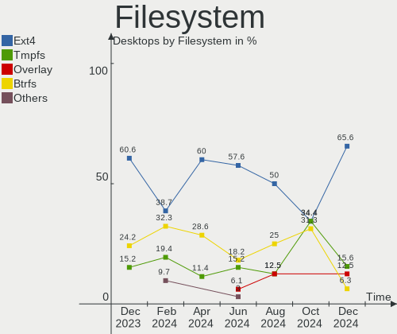
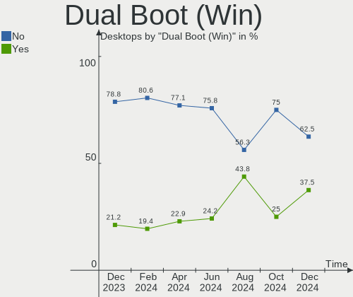
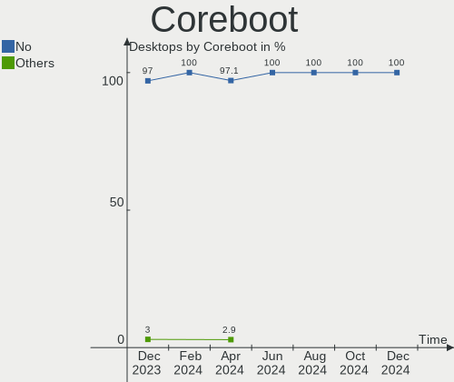
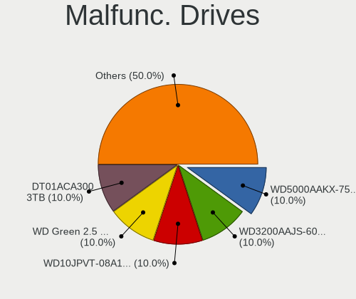
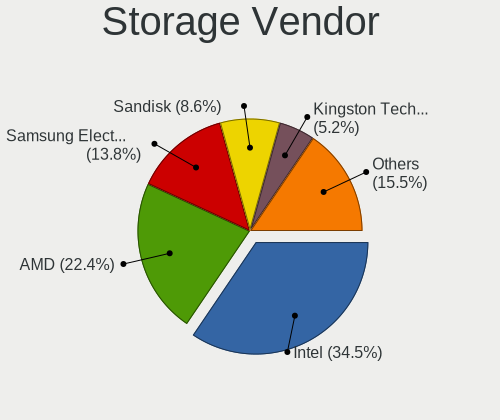
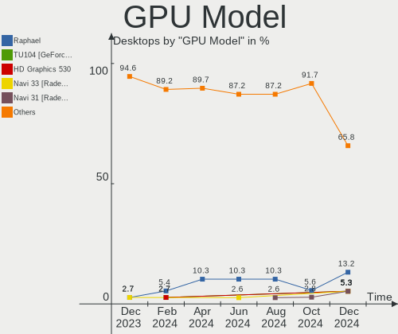
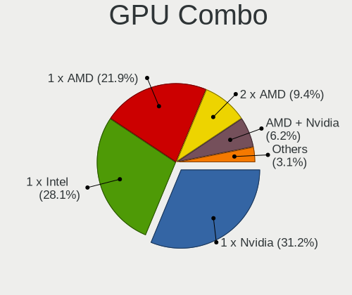
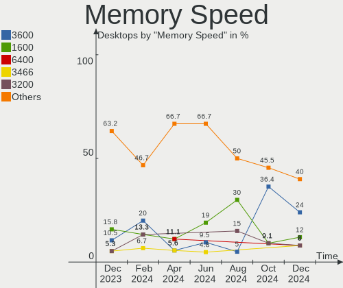

Linux in Netherlands - Hardware Trends (Desktops)
-------------------------------------------------

A project to identify most popular hardware characteristics and track their change
over time based on data collected by Linux users at https://Linux-Hardware.org.

Anyone can contribute to this report by the [hw-probe](https://github.com/linuxhw/hw-probe) tool:

    sudo -E hw-probe -all -upload

Period: Oct, 2023.

Contents
--------

* [ System ](#system)
  - [ OS                       ](#os)
  - [ OS Family                ](#os-family)
  - [ Kernel                   ](#kernel)
  - [ Kernel Family            ](#kernel-family)
  - [ Kernel Major Ver.        ](#kernel-major-ver)
  - [ Arch                     ](#arch)
  - [ DE                       ](#de)
  - [ Display Server           ](#display-server)
  - [ Display Manager          ](#display-manager)
  - [ OS Lang                  ](#os-lang)
  - [ Boot Mode                ](#boot-mode)
  - [ Filesystem               ](#filesystem)
  - [ Part. scheme             ](#part-scheme)
  - [ Dual Boot with Linux/BSD ](#dual-boot-with-linuxbsd)
  - [ Dual Boot (Win)          ](#dual-boot-win)

* [ Board ](#board)
  - [ Vendor                   ](#vendor)
  - [ Model                    ](#model)
  - [ Model Family             ](#model-family)
  - [ MFG Year                 ](#mfg-year)
  - [ Form Factor              ](#form-factor)
  - [ Secure Boot              ](#secure-boot)
  - [ Coreboot                 ](#coreboot)
  - [ RAM Size                 ](#ram-size)
  - [ RAM Used                 ](#ram-used)
  - [ Total Drives             ](#total-drives)
  - [ Has CD-ROM               ](#has-cd-rom)
  - [ Has Ethernet             ](#has-ethernet)
  - [ Has WiFi                 ](#has-wifi)
  - [ Has Bluetooth            ](#has-bluetooth)

* [ Location ](#location)
  - [ Country                  ](#country)
  - [ City                     ](#city)

* [ Drives ](#drives)
  - [ Drive Vendor             ](#drive-vendor)
  - [ Drive Model              ](#drive-model)
  - [ HDD Vendor               ](#hdd-vendor)
  - [ SSD Vendor               ](#ssd-vendor)
  - [ Drive Kind               ](#drive-kind)
  - [ Drive Connector          ](#drive-connector)
  - [ Drive Size               ](#drive-size)
  - [ Space Total              ](#space-total)
  - [ Space Used               ](#space-used)
  - [ Malfunc. Drives          ](#malfunc-drives)
  - [ Malfunc. Drive Vendor    ](#malfunc-drive-vendor)
  - [ Malfunc. HDD Vendor      ](#malfunc-hdd-vendor)
  - [ Malfunc. Drive Kind      ](#malfunc-drive-kind)
  - [ Failed Drives            ](#failed-drives)
  - [ Failed Drive Vendor      ](#failed-drive-vendor)
  - [ Drive Status             ](#drive-status)

* [ Storage controller ](#storage-controller)
  - [ Storage Vendor           ](#storage-vendor)
  - [ Storage Model            ](#storage-model)
  - [ Storage Kind             ](#storage-kind)

* [ Processor ](#processor)
  - [ CPU Vendor               ](#cpu-vendor)
  - [ CPU Model                ](#cpu-model)
  - [ CPU Model Family         ](#cpu-model-family)
  - [ CPU Cores                ](#cpu-cores)
  - [ CPU Sockets              ](#cpu-sockets)
  - [ CPU Threads              ](#cpu-threads)
  - [ CPU Op-Modes             ](#cpu-op-modes)
  - [ CPU Microcode            ](#cpu-microcode)
  - [ CPU Microarch            ](#cpu-microarch)

* [ Graphics ](#graphics)
  - [ GPU Vendor               ](#gpu-vendor)
  - [ GPU Model                ](#gpu-model)
  - [ GPU Combo                ](#gpu-combo)
  - [ GPU Driver               ](#gpu-driver)
  - [ GPU Memory               ](#gpu-memory)

* [ Monitor ](#monitor)
  - [ Monitor Vendor           ](#monitor-vendor)
  - [ Monitor Model            ](#monitor-model)
  - [ Monitor Resolution       ](#monitor-resolution)
  - [ Monitor Diagonal         ](#monitor-diagonal)
  - [ Monitor Width            ](#monitor-width)
  - [ Aspect Ratio             ](#aspect-ratio)
  - [ Monitor Area             ](#monitor-area)
  - [ Pixel Density            ](#pixel-density)
  - [ Multiple Monitors        ](#multiple-monitors)

* [ Network ](#network)
  - [ Net Controller Vendor    ](#net-controller-vendor)
  - [ Net Controller Model     ](#net-controller-model)
  - [ Wireless Vendor          ](#wireless-vendor)
  - [ Wireless Model           ](#wireless-model)
  - [ Ethernet Vendor          ](#ethernet-vendor)
  - [ Ethernet Model           ](#ethernet-model)
  - [ Net Controller Kind      ](#net-controller-kind)
  - [ Used Controller          ](#used-controller)
  - [ NICs                     ](#nics)
  - [ IPv6                     ](#ipv6)

* [ Bluetooth ](#bluetooth)
  - [ Bluetooth Vendor         ](#bluetooth-vendor)
  - [ Bluetooth Model          ](#bluetooth-model)

* [ Sound ](#sound)
  - [ Sound Vendor             ](#sound-vendor)
  - [ Sound Model              ](#sound-model)

* [ Memory ](#memory)
  - [ Memory Vendor            ](#memory-vendor)
  - [ Memory Model             ](#memory-model)
  - [ Memory Kind              ](#memory-kind)
  - [ Memory Form Factor       ](#memory-form-factor)
  - [ Memory Size              ](#memory-size)
  - [ Memory Speed             ](#memory-speed)

* [ Printers & scanners ](#printers--scanners)
  - [ Printer Vendor           ](#printer-vendor)
  - [ Printer Model            ](#printer-model)
  - [ Scanner Vendor           ](#scanner-vendor)
  - [ Scanner Model            ](#scanner-model)

* [ Camera ](#camera)
  - [ Camera Vendor            ](#camera-vendor)
  - [ Camera Model             ](#camera-model)

* [ Security ](#security)
  - [ Fingerprint Vendor       ](#fingerprint-vendor)
  - [ Fingerprint Model        ](#fingerprint-model)
  - [ Chipcard Vendor          ](#chipcard-vendor)
  - [ Chipcard Model           ](#chipcard-model)

* [ Unsupported ](#unsupported)
  - [ Unsupported Devices      ](#unsupported-devices)
  - [ Unsupported Device Types ](#unsupported-device-types)

System
------

OS
--

Installed operating systems

| Name                         | Desktops | Percent |
|------------------------------|----------|---------|
| Ubuntu 22.04                 | 5        | 14.29%  |
| Debian 12                    | 4        | 11.43%  |
| Zorin 16                     | 2        | 5.71%   |
| Ubuntu 23.04                 | 2        | 5.71%   |
| openSUSE Tumbleweed-XXXXXXXX | 2        | 5.71%   |
| OpenMandriva 23.10           | 2        | 5.71%   |
| Kubuntu 22.04                | 2        | 5.71%   |
| Fedora 38                    | 2        | 5.71%   |
| Arch Rolling                 | 2        | 5.71%   |
| Xubuntu 18.04                | 1        | 2.86%   |
| Ubuntu 23.10                 | 1        | 2.86%   |
| Ubuntu 18.04                 | 1        | 2.86%   |
| Pop!_OS 22.04                | 1        | 2.86%   |
| openSUSE Leap-15.5           | 1        | 2.86%   |
| OpenMandriva 4.2             | 1        | 2.86%   |
| Manjaro 23.0.4               | 1        | 2.86%   |
| Linux Mint 21.2              | 1        | 2.86%   |
| EuroLinux 9.2                | 1        | 2.86%   |
| EndeavourOS Rolling          | 1        | 2.86%   |
| Debian 11                    | 1        | 2.86%   |
| Debian                       | 1        | 2.86%   |

OS Family
---------

OS without a version

| Name         | Desktops | Percent |
|--------------|----------|---------|
| Ubuntu       | 9        | 25.71%  |
| Debian       | 6        | 17.14%  |
| openSUSE     | 3        | 8.57%   |
| OpenMandriva | 3        | 8.57%   |
| Zorin        | 2        | 5.71%   |
| Kubuntu      | 2        | 5.71%   |
| Fedora       | 2        | 5.71%   |
| Arch         | 2        | 5.71%   |
| Xubuntu      | 1        | 2.86%   |
| Pop!_OS      | 1        | 2.86%   |
| Manjaro      | 1        | 2.86%   |
| Linux Mint   | 1        | 2.86%   |
| EuroLinux    | 1        | 2.86%   |
| EndeavourOS  | 1        | 2.86%   |

Kernel
------

Version of the Linux kernel

| Version                          | Desktops | Percent |
|----------------------------------|----------|---------|
| 6.2.0-35-generic                 | 2        | 5.71%   |
| 6.2.0-34-generic                 | 2        | 5.71%   |
| 6.2.0-33-generic                 | 2        | 5.71%   |
| 5.15.0-87-generic                | 2        | 5.71%   |
| 96.5.7-srb-hydramd-g5608462499cf | 1        | 2.86%   |
| 6.5.8-200.fc38.x86_64            | 1        | 2.86%   |
| 6.5.8-1-default                  | 1        | 2.86%   |
| 6.5.6-zen2-1-zen                 | 1        | 2.86%   |
| 6.5.6-arch2-1                    | 1        | 2.86%   |
| 6.5.6-1-default                  | 1        | 2.86%   |
| 6.5.5-desktop-1omv2390           | 1        | 2.86%   |
| 6.5.5-arch1-1                    | 1        | 2.86%   |
| 6.5.5-1-MANJARO                  | 1        | 2.86%   |
| 6.5.4-76060504-generic           | 1        | 2.86%   |
| 6.5.0-9-generic                  | 1        | 2.86%   |
| 6.5.0-1-amd64                    | 1        | 2.86%   |
| 6.3.5-desktop-3omv2390           | 1        | 2.86%   |
| 6.2.9-300.fc38.x86_64            | 1        | 2.86%   |
| 6.2.16-14-pve                    | 1        | 2.86%   |
| 6.2.0-20-generic                 | 1        | 2.86%   |
| 6.2.0-060200-generic             | 1        | 2.86%   |
| 6.1.0-13-amd64                   | 1        | 2.86%   |
| 6.1.0-10-amd64                   | 1        | 2.86%   |
| 5.15.0-84-generic                | 1        | 2.86%   |
| 5.15.0-76-generic                | 1        | 2.86%   |
| 5.15.0-67-generic                | 1        | 2.86%   |
| 5.14.21-150500.55.28-default     | 1        | 2.86%   |
| 5.14.0-284.30.1.el9_2.x86_64     | 1        | 2.86%   |
| 5.11.12-desktop-1omv4002         | 1        | 2.86%   |
| 5.10.0-26-amd64                  | 1        | 2.86%   |
| 4.15.0-216-generic               | 1        | 2.86%   |

Kernel Family
-------------

Linux kernel without a distro release

| Version | Desktops | Percent |
|---------|----------|---------|
| 6.2.0   | 8        | 22.86%  |
| 5.15.0  | 5        | 14.29%  |
| 6.5.6   | 3        | 8.57%   |
| 6.5.5   | 3        | 8.57%   |
| 6.5.8   | 2        | 5.71%   |
| 6.5.0   | 2        | 5.71%   |
| 6.1.0   | 2        | 5.71%   |
| 96.5.7  | 1        | 2.86%   |
| 6.5.4   | 1        | 2.86%   |
| 6.3.5   | 1        | 2.86%   |
| 6.2.9   | 1        | 2.86%   |
| 6.2.16  | 1        | 2.86%   |
| 5.14.21 | 1        | 2.86%   |
| 5.14.0  | 1        | 2.86%   |
| 5.11.12 | 1        | 2.86%   |
| 5.10.0  | 1        | 2.86%   |
| 4.15.0  | 1        | 2.86%   |

Kernel Major Ver.
-----------------

Linux kernel major version

| Version | Desktops | Percent |
|---------|----------|---------|
| 6.5     | 11       | 31.43%  |
| 6.2     | 10       | 28.57%  |
| 5.15    | 5        | 14.29%  |
| 6.1     | 2        | 5.71%   |
| 5.14    | 2        | 5.71%   |
| 96.5    | 1        | 2.86%   |
| 6.3     | 1        | 2.86%   |
| 5.11    | 1        | 2.86%   |
| 5.10    | 1        | 2.86%   |
| 4.15    | 1        | 2.86%   |

Arch
----

OS architecture (x86_64, i586, etc.)

| Name   | Desktops | Percent |
|--------|----------|---------|
| x86_64 | 35       | 100%    |

DE
--

Desktop Environment

| Name            | Desktops | Percent |
|-----------------|----------|---------|
| GNOME           | 14       | 40%     |
| KDE5            | 11       | 31.43%  |
| Unknown         | 3        | 8.57%   |
| MATE            | 2        | 5.71%   |
| XFCE            | 1        | 2.86%   |
| X-Cinnamon      | 1        | 2.86%   |
| i3              | 1        | 2.86%   |
| GNOME Flashback | 1        | 2.86%   |
| Budgie          | 1        | 2.86%   |

Display Server
--------------

X11 or Wayland

| Name    | Desktops | Percent |
|---------|----------|---------|
| X11     | 21       | 60%     |
| Wayland | 9        | 25.71%  |
| Tty     | 3        | 8.57%   |
| Web     | 1        | 2.86%   |
| Unknown | 1        | 2.86%   |

Display Manager
---------------

SDDM, LightDM, etc.

| Name    | Desktops | Percent |
|---------|----------|---------|
| Unknown | 13       | 37.14%  |
| GDM3    | 9        | 25.71%  |
| SDDM    | 8        | 22.86%  |
| LightDM | 3        | 8.57%   |
| XDM     | 1        | 2.86%   |
| GDM     | 1        | 2.86%   |

OS Lang
-------

Language

| Lang  | Desktops | Percent |
|-------|----------|---------|
| nl_NL | 15       | 42.86%  |
| en_US | 12       | 34.29%  |
| pl_PL | 2        | 5.71%   |
| en_GB | 2        | 5.71%   |
| de_DE | 2        | 5.71%   |
| nl_BE | 1        | 2.86%   |
| C     | 1        | 2.86%   |

Boot Mode
---------

EFI or BIOS

| Mode | Desktops | Percent |
|------|----------|---------|
| EFI  | 18       | 51.43%  |
| BIOS | 17       | 48.57%  |

Filesystem
----------

Type of filesystem

| Type    | Desktops | Percent |
|---------|----------|---------|
| Ext4    | 17       | 48.57%  |
| Btrfs   | 8        | 22.86%  |
| Tmpfs   | 7        | 20%     |
| Zfs     | 1        | 2.86%   |
| Xfs     | 1        | 2.86%   |
| Unknown | 1        | 2.86%   |

Part. scheme
------------

Scheme of partitioning

| Type    | Desktops | Percent |
|---------|----------|---------|
| GPT     | 22       | 62.86%  |
| Unknown | 11       | 31.43%  |
| MBR     | 2        | 5.71%   |

Dual Boot with Linux/BSD
------------------------

Hosting more than one Linux/BSD

| Dual boot | Desktops | Percent |
|-----------|----------|---------|
| No        | 26       | 74.29%  |
| Yes       | 9        | 25.71%  |

Dual Boot (Win)
---------------

Hosting Linux and Windows

| Dual boot | Desktops | Percent |
|-----------|----------|---------|
| No        | 28       | 80%     |
| Yes       | 7        | 20%     |

Board
-----

Vendor
------

Motherboard manufacturer

| Name                | Desktops | Percent |
|---------------------|----------|---------|
| ASUSTek Computer    | 9        | 25.71%  |
| MSI                 | 6        | 17.14%  |
| Gigabyte Technology | 6        | 17.14%  |
| ASRock              | 5        | 14.29%  |
| Hewlett-Packard     | 3        | 8.57%   |
| ASRockRack          | 2        | 5.71%   |
| Lenovo              | 1        | 2.86%   |
| ECS                 | 1        | 2.86%   |
| Dell                | 1        | 2.86%   |
| Acer                | 1        | 2.86%   |

Model
-----

Motherboard model

| Name                              | Desktops | Percent |
|-----------------------------------|----------|---------|
| ASRock 970 Pro3 R2.0              | 2        | 5.71%   |
| MSI Pro 3130 Small Form Factor PC | 1        | 2.86%   |
| MSI MS-7D98                       | 1        | 2.86%   |
| MSI MS-7D75                       | 1        | 2.86%   |
| MSI MS-7D52                       | 1        | 2.86%   |
| MSI MS-7C02                       | 1        | 2.86%   |
| MSI MS-7522                       | 1        | 2.86%   |
| Lenovo H530s 10132                | 1        | 2.86%   |
| HP ProLiant MicroServer Gen8      | 1        | 2.86%   |
| HP EliteDesk 800 G2 DM 35W        | 1        | 2.86%   |
| HP EliteDesk 800 G1 SFF           | 1        | 2.86%   |
| Gigabyte Z390 DESIGNARE           | 1        | 2.86%   |
| Gigabyte H61M-D2H-USB3            | 1        | 2.86%   |
| Gigabyte GA-78LMT-USB3 6.0        | 1        | 2.86%   |
| Gigabyte G1.Sniper B5             | 1        | 2.86%   |
| Gigabyte EP45T-UD3R               | 1        | 2.86%   |
| Gigabyte 970A-DS3P                | 1        | 2.86%   |
| ECS H67H2-EM                      | 1        | 2.86%   |
| Dell Precision T3600              | 1        | 2.86%   |
| ASUS TUF Gaming X570-PLUS         | 1        | 2.86%   |
| ASUS ProArt X670E-CREATOR WIFI    | 1        | 2.86%   |
| ASUS ProArt X570-CREATOR WIFI     | 1        | 2.86%   |
| ASUS PRIME B660-PLUS D4           | 1        | 2.86%   |
| ASUS P5QL-ASUS-SE                 | 1        | 2.86%   |
| ASUS P5E-VM HDMI                  | 1        | 2.86%   |
| ASUS M4A88T-M                     | 1        | 2.86%   |
| ASUS CROSSHAIR V FORMULA-Z        | 1        | 2.86%   |
| ASUS A88X-PLUS                    | 1        | 2.86%   |
| ASRockRack X470D4U2-2T            | 1        | 2.86%   |
| ASRockRack ROMED8-2T              | 1        | 2.86%   |
| ASRock Z790 PG Riptide            | 1        | 2.86%   |
| ASRock B550M-ITX/ac               | 1        | 2.86%   |
| ASRock B450 Pro4 R2.0             | 1        | 2.86%   |
| Acer Aspire MC605                 | 1        | 2.86%   |

Model Family
------------

Motherboard model prefix

| Name                   | Desktops | Percent |
|------------------------|----------|---------|
| HP EliteDesk           | 2        | 5.71%   |
| ASUS ProArt            | 2        | 5.71%   |
| ASRock 970             | 2        | 5.71%   |
| MSI Pro                | 1        | 2.86%   |
| MSI MS-7D98            | 1        | 2.86%   |
| MSI MS-7D75            | 1        | 2.86%   |
| MSI MS-7D52            | 1        | 2.86%   |
| MSI MS-7C02            | 1        | 2.86%   |
| MSI MS-7522            | 1        | 2.86%   |
| Lenovo H530s           | 1        | 2.86%   |
| HP ProLiant            | 1        | 2.86%   |
| Gigabyte Z390          | 1        | 2.86%   |
| Gigabyte H61M-D2H-USB3 | 1        | 2.86%   |
| Gigabyte GA-78LMT-USB3 | 1        | 2.86%   |
| Gigabyte G1.Sniper     | 1        | 2.86%   |
| Gigabyte EP45T-UD3R    | 1        | 2.86%   |
| Gigabyte 970A-DS3P     | 1        | 2.86%   |
| ECS H67H2-EM           | 1        | 2.86%   |
| Dell Precision         | 1        | 2.86%   |
| ASUS TUF               | 1        | 2.86%   |
| ASUS PRIME             | 1        | 2.86%   |
| ASUS P5QL-ASUS-SE      | 1        | 2.86%   |
| ASUS P5E-VM            | 1        | 2.86%   |
| ASUS M4A88T-M          | 1        | 2.86%   |
| ASUS CROSSHAIR         | 1        | 2.86%   |
| ASUS A88X-PLUS         | 1        | 2.86%   |
| ASRockRack X470D4U2-2T | 1        | 2.86%   |
| ASRockRack ROMED8-2T   | 1        | 2.86%   |
| ASRock Z790            | 1        | 2.86%   |
| ASRock B550M-ITX       | 1        | 2.86%   |
| ASRock B450            | 1        | 2.86%   |
| Acer Aspire            | 1        | 2.86%   |

MFG Year
--------

Motherboard manufacture year

| Year | Desktops | Percent |
|------|----------|---------|
| 2013 | 5        | 14.29%  |
| 2022 | 4        | 11.43%  |
| 2012 | 4        | 11.43%  |
| 2021 | 3        | 8.57%   |
| 2014 | 3        | 8.57%   |
| 2020 | 2        | 5.71%   |
| 2019 | 2        | 5.71%   |
| 2015 | 2        | 5.71%   |
| 2011 | 2        | 5.71%   |
| 2010 | 2        | 5.71%   |
| 2009 | 2        | 5.71%   |
| 2023 | 1        | 2.86%   |
| 2018 | 1        | 2.86%   |
| 2008 | 1        | 2.86%   |
| 2007 | 1        | 2.86%   |

Form Factor
-----------

Physical design of the computer

| Name    | Desktops | Percent |
|---------|----------|---------|
| Desktop | 35       | 100%    |

Secure Boot
-----------

Enabled or disabled

| State    | Desktops | Percent |
|----------|----------|---------|
| Disabled | 35       | 100%    |

Coreboot
--------

Have coreboot on board

| Used | Desktops | Percent |
|------|----------|---------|
| No   | 35       | 100%    |

RAM Size
--------

Total RAM memory

| Size in GB      | Desktops | Percent |
|-----------------|----------|---------|
| 16.01-24.0      | 9        | 25.71%  |
| 8.01-16.0       | 8        | 22.86%  |
| 64.01-256.0     | 6        | 17.14%  |
| 32.01-64.0      | 5        | 14.29%  |
| 4.01-8.0        | 4        | 11.43%  |
| 3.01-4.0        | 2        | 5.71%   |
| More than 256.0 | 1        | 2.86%   |

RAM Used
--------

Used RAM memory

| Used GB    | Desktops | Percent |
|------------|----------|---------|
| 3.01-4.0   | 9        | 25.71%  |
| 2.01-3.0   | 8        | 22.86%  |
| 1.01-2.0   | 6        | 17.14%  |
| 4.01-8.0   | 5        | 14.29%  |
| 16.01-24.0 | 2        | 5.71%   |
| 8.01-16.0  | 2        | 5.71%   |
| 32.01-64.0 | 1        | 2.86%   |
| 24.01-32.0 | 1        | 2.86%   |
| 0.51-1.0   | 1        | 2.86%   |

Total Drives
------------

Number of drives on board

| Drives | Desktops | Percent |
|--------|----------|---------|
| 2      | 10       | 28.57%  |
| 1      | 10       | 28.57%  |
| 4      | 5        | 14.29%  |
| 3      | 4        | 11.43%  |
| 7      | 2        | 5.71%   |
| 5      | 2        | 5.71%   |
| 8      | 1        | 2.86%   |
| 6      | 1        | 2.86%   |

Has CD-ROM
----------

Has CD-ROM on board

| Presented | Desktops | Percent |
|-----------|----------|---------|
| No        | 20       | 57.14%  |
| Yes       | 15       | 42.86%  |

Has Ethernet
------------

Has Ethernet on board

| Presented | Desktops | Percent |
|-----------|----------|---------|
| Yes       | 34       | 97.14%  |
| No        | 1        | 2.86%   |

Has WiFi
--------

Has WiFi module

| Presented | Desktops | Percent |
|-----------|----------|---------|
| No        | 21       | 60%     |
| Yes       | 14       | 40%     |

Has Bluetooth
-------------

Has Bluetooth module

| Presented | Desktops | Percent |
|-----------|----------|---------|
| No        | 21       | 60%     |
| Yes       | 14       | 40%     |

Location
--------

Country
-------

Geographic location (country)

| Country     | Desktops | Percent |
|-------------|----------|---------|
| Netherlands | 35       | 100%    |

City
----

Geographic location (city)

| City             | Desktops | Percent |
|------------------|----------|---------|
| The Hague        | 4        | 11.43%  |
| Amsterdam        | 4        | 11.43%  |
| Rotterdam        | 2        | 5.71%   |
| Roosendaal       | 2        | 5.71%   |
| Enschede         | 2        | 5.71%   |
| Voorschoten      | 1        | 2.86%   |
| Vaals            | 1        | 2.86%   |
| Utrecht          | 1        | 2.86%   |
| Urk              | 1        | 2.86%   |
| Noord-Scharwoude | 1        | 2.86%   |
| Nijmegen         | 1        | 2.86%   |
| Naaldwijk        | 1        | 2.86%   |
| Laren            | 1        | 2.86%   |
| Hengelo          | 1        | 2.86%   |
| Heemskerk        | 1        | 2.86%   |
| Haren            | 1        | 2.86%   |
| Groenekan        | 1        | 2.86%   |
| Elburg           | 1        | 2.86%   |
| Dronten          | 1        | 2.86%   |
| Deventer         | 1        | 2.86%   |
| Castricum        | 1        | 2.86%   |
| Best             | 1        | 2.86%   |
| Apeldoorn        | 1        | 2.86%   |
| Amerongen        | 1        | 2.86%   |
| Almelo           | 1        | 2.86%   |
| Aalsmeer         | 1        | 2.86%   |

Drives
------

Drive Vendor
------------

Hard drive vendors

| Vendor                    | Desktops | Drives | Percent |
|---------------------------|----------|--------|---------|
| Samsung Electronics       | 15       | 23     | 19.74%  |
| Seagate                   | 9        | 16     | 11.84%  |
| Crucial                   | 8        | 10     | 10.53%  |
| WDC                       | 6        | 10     | 7.89%   |
| Kingston                  | 5        | 6      | 6.58%   |
| SPCC                      | 3        | 4      | 3.95%   |
| Hitachi                   | 3        | 3      | 3.95%   |
| A-DATA Technology         | 3        | 3      | 3.95%   |
| Unknown                   | 2        | 2      | 2.63%   |
| Toshiba                   | 2        | 2      | 2.63%   |
| SK hynix                  | 2        | 2      | 2.63%   |
| Intenso                   | 2        | 2      | 2.63%   |
| Intel                     | 2        | 2      | 2.63%   |
| Seagate Technology        | 1        | 1      | 1.32%   |
| SanDisk                   | 1        | 1      | 1.32%   |
| PNY                       | 1        | 1      | 1.32%   |
| Patriot                   | 1        | 1      | 1.32%   |
| MSCC                      | 1        | 1      | 1.32%   |
| Micron/Crucial Technology | 1        | 1      | 1.32%   |
| KingSpec                  | 1        | 2      | 1.32%   |
| KingDian                  | 1        | 1      | 1.32%   |
| HGST                      | 1        | 1      | 1.32%   |
| Gigabyte Technology       | 1        | 1      | 1.32%   |
| Fanxiang                  | 1        | 1      | 1.32%   |
| ASMedia                   | 1        | 1      | 1.32%   |
| Apacer                    | 1        | 1      | 1.32%   |
| Unknown                   | 1        | 1      | 1.32%   |

Drive Model
-----------

Hard drive models

| Model                                              | Desktops | Percent |
|----------------------------------------------------|----------|---------|
| Samsung SSD 980 1TB                                | 3        | 3.41%   |
| Samsung NVMe SSD Controller SM981/PM981/PM983 1TB  | 3        | 3.41%   |
| Crucial CT240BX500SSD1 240GB                       | 3        | 3.41%   |
| Seagate ST4000DM004-2CV104 4TB                     | 2        | 2.27%   |
| Seagate ST1000DM003-1CH162 1TB                     | 2        | 2.27%   |
| Samsung SSD 870 QVO 1TB                            | 2        | 2.27%   |
| Samsung NVMe SSD Controller PM9A1/PM9A3/980PRO 1TB | 2        | 2.27%   |
| WDC WDS500G2B0A-00SM50 500GB SSD                   | 1        | 1.14%   |
| WDC WDS250G1B0A-00H9H0 250GB SSD                   | 1        | 1.14%   |
| WDC WD20EZRX-00DC0B0 2TB                           | 1        | 1.14%   |
| WDC WD15EARS-00MVWB0 1TB                           | 1        | 1.14%   |
| WDC WD10PURX-64E5EY0 1TB                           | 1        | 1.14%   |
| WDC WD10EZEX-08RKKA0 1TB                           | 1        | 1.14%   |
| WDC WD10EARS-00MVWB0 1TB                           | 1        | 1.14%   |
| WDC WD10EADS-00M2B0 1TB                            | 1        | 1.14%   |
| WDC WD1002FBYS-18A6B0 1TB                          | 1        | 1.14%   |
| Unknown NVMe SSD Drive 2TB                         | 1        | 1.14%   |
| Unknown MMC Card  64GB                             | 1        | 1.14%   |
| Toshiba NVMe Controller 512GB                      | 1        | 1.14%   |
| Toshiba MK5076GSX 500GB                            | 1        | 1.14%   |
| SPCC Solid State Disk 256GB                        | 1        | 1.14%   |
| SPCC Solid State Disk 128GB                        | 1        | 1.14%   |
| SPCC Solid State 128GB                             | 1        | 1.14%   |
| SK hynix SC311 SATA 256GB SSD                      | 1        | 1.14%   |
| SK hynix HFS128G32TNF-N3A0A 128GB SSD              | 1        | 1.14%   |
| Seagate FireCuda 510 SSD 250GB                     | 1        | 1.14%   |
| Seagate ST500DM002-1BD142 500GB                    | 1        | 1.14%   |
| Seagate ST4000DM004-2U9104 4TB                     | 1        | 1.14%   |
| Seagate ST3500414CS 500GB                          | 1        | 1.14%   |
| Seagate ST3200826AS 200GB                          | 1        | 1.14%   |
| Seagate ST2000DM008-2FR102 2TB                     | 1        | 1.14%   |
| Seagate ST1000LM014-1EJ164-SSHD 1TB                | 1        | 1.14%   |
| Seagate Expansion 1TB                              | 1        | 1.14%   |
| SanDisk SSD PLUS 240GB                             | 1        | 1.14%   |
| Samsung SSD 980 PRO 2TB                            | 1        | 1.14%   |
| Samsung SSD 980 PRO 1TB                            | 1        | 1.14%   |
| Samsung SSD 860 PRO 256GB                          | 1        | 1.14%   |
| Samsung SSD 860 PRO 1TB                            | 1        | 1.14%   |
| Samsung SSD 850 PRO 256GB                          | 1        | 1.14%   |
| Samsung SSD 850 EVO 250GB                          | 1        | 1.14%   |

HDD Vendor
----------

Hard disk drive vendors

| Vendor  | Desktops | Drives | Percent |
|---------|----------|--------|---------|
| Seagate | 9        | 16     | 47.37%  |
| WDC     | 5        | 8      | 26.32%  |
| Hitachi | 3        | 3      | 15.79%  |
| Toshiba | 1        | 1      | 5.26%   |
| HGST    | 1        | 1      | 5.26%   |

SSD Vendor
----------

Solid state drive vendors

| Vendor              | Desktops | Drives | Percent |
|---------------------|----------|--------|---------|
| Samsung Electronics | 8        | 10     | 20%     |
| Crucial             | 8        | 10     | 20%     |
| SPCC                | 3        | 4      | 7.5%    |
| Kingston            | 3        | 4      | 7.5%    |
| WDC                 | 2        | 2      | 5%      |
| SK hynix            | 2        | 2      | 5%      |
| A-DATA Technology   | 2        | 2      | 5%      |
| SanDisk             | 1        | 1      | 2.5%    |
| PNY                 | 1        | 1      | 2.5%    |
| Patriot             | 1        | 1      | 2.5%    |
| MSCC                | 1        | 1      | 2.5%    |
| KingSpec            | 1        | 2      | 2.5%    |
| KingDian            | 1        | 1      | 2.5%    |
| Intenso             | 1        | 1      | 2.5%    |
| Intel               | 1        | 1      | 2.5%    |
| Fanxiang            | 1        | 1      | 2.5%    |
| ASMedia             | 1        | 1      | 2.5%    |
| Apacer              | 1        | 1      | 2.5%    |
| Unknown             | 1        | 1      | 2.5%    |

Drive Kind
----------

HDD or SSD

| Kind    | Desktops | Drives | Percent |
|---------|----------|--------|---------|
| SSD     | 25       | 47     | 45.45%  |
| HDD     | 16       | 29     | 29.09%  |
| NVMe    | 12       | 22     | 21.82%  |
| MMC     | 1        | 1      | 1.82%   |
| Unknown | 1        | 1      | 1.82%   |

Drive Connector
---------------

SATA, SAS, NVMe, etc.

| Type | Desktops | Drives | Percent |
|------|----------|--------|---------|
| SATA | 32       | 74     | 66.67%  |
| NVMe | 12       | 22     | 25%     |
| SAS  | 3        | 3      | 6.25%   |
| MMC  | 1        | 1      | 2.08%   |

Drive Size
----------

Size of hard drive

| Size in TB | Desktops | Drives | Percent |
|------------|----------|--------|---------|
| 0.01-0.5   | 26       | 48     | 57.78%  |
| 0.51-1.0   | 13       | 17     | 28.89%  |
| 3.01-4.0   | 2        | 7      | 4.44%   |
| 1.01-2.0   | 2        | 2      | 4.44%   |
| 10.01-20.0 | 1        | 1      | 2.22%   |
| 4.01-10.0  | 1        | 1      | 2.22%   |

Space Total
-----------

Amount of disk space available on the file system

| Size in GB     | Desktops | Percent |
|----------------|----------|---------|
| 101-250        | 10       | 28.57%  |
| 1001-2000      | 5        | 14.29%  |
| 501-1000       | 5        | 14.29%  |
| More than 3000 | 4        | 11.43%  |
| 251-500        | 4        | 11.43%  |
| 1-20           | 2        | 5.71%   |
| Unknown        | 2        | 5.71%   |
| 21-50          | 1        | 2.86%   |
| 2001-3000      | 1        | 2.86%   |
| 51-100         | 1        | 2.86%   |

Space Used
----------

Amount of used disk space

| Used GB        | Desktops | Percent |
|----------------|----------|---------|
| 1-20           | 9        | 25.71%  |
| 101-250        | 7        | 20%     |
| 21-50          | 6        | 17.14%  |
| 51-100         | 5        | 14.29%  |
| 251-500        | 2        | 5.71%   |
| 501-1000       | 2        | 5.71%   |
| Unknown        | 2        | 5.71%   |
| More than 3000 | 1        | 2.86%   |
| 1001-2000      | 1        | 2.86%   |

Malfunc. Drives
---------------

Drive models with a malfunction

| Model                     | Desktops | Drives | Percent |
|---------------------------|----------|--------|---------|
| WDC WD10EARS-00MVWB0 1TB  | 1        | 1      | 33.33%  |
| Seagate ST3200826AS 200GB | 1        | 1      | 33.33%  |
| Intel SSDSC2CT180A3 180GB | 1        | 1      | 33.33%  |

Malfunc. Drive Vendor
---------------------

Vendors of faulty drives

| Vendor  | Desktops | Drives | Percent |
|---------|----------|--------|---------|
| WDC     | 1        | 1      | 33.33%  |
| Seagate | 1        | 1      | 33.33%  |
| Intel   | 1        | 1      | 33.33%  |

Malfunc. HDD Vendor
-------------------

Vendors of faulty HDD drives

| Vendor  | Desktops | Drives | Percent |
|---------|----------|--------|---------|
| WDC     | 1        | 1      | 50%     |
| Seagate | 1        | 1      | 50%     |

Malfunc. Drive Kind
-------------------

Kinds of faulty drives

| Kind | Desktops | Drives | Percent |
|------|----------|--------|---------|
| HDD  | 2        | 2      | 66.67%  |
| SSD  | 1        | 1      | 33.33%  |

Failed Drives
-------------

Failed drive models

Zero info for selected period =(

Failed Drive Vendor
-------------------

Failed drive vendors

Zero info for selected period =(

Drive Status
------------

Number of failed and malfunc. drives

| Status   | Desktops | Drives | Percent |
|----------|----------|--------|---------|
| Detected | 19       | 51     | 48.72%  |
| Works    | 17       | 46     | 43.59%  |
| Malfunc  | 3        | 3      | 7.69%   |

Storage controller
------------------

Storage Vendor
--------------

Storage controller vendors

| Vendor                       | Desktops | Percent |
|------------------------------|----------|---------|
| Intel                        | 19       | 30.65%  |
| AMD                          | 17       | 27.42%  |
| Samsung Electronics          | 9        | 14.52%  |
| JMicron Technology           | 4        | 6.45%   |
| ASMedia Technology           | 4        | 6.45%   |
| Kingston Technology Company  | 2        | 3.23%   |
| Toshiba America Info Systems | 1        | 1.61%   |
| Solidigm                     | 1        | 1.61%   |
| Seagate Technology           | 1        | 1.61%   |
| Phison Electronics           | 1        | 1.61%   |
| Micron/Crucial Technology    | 1        | 1.61%   |
| ADATA Technology             | 1        | 1.61%   |
| Adaptec                      | 1        | 1.61%   |

Storage Model
-------------

Storage controller models

| Model                                                                                   | Desktops | Percent |
|-----------------------------------------------------------------------------------------|----------|---------|
| AMD FCH SATA Controller [AHCI mode]                                                     | 9        | 11.69%  |
| Samsung NVMe SSD Controller PM9A1/PM9A3/980PRO                                          | 4        | 5.19%   |
| ASMedia ASM1062 Serial ATA Controller                                                   | 4        | 5.19%   |
| AMD SB7x0/SB8x0/SB9x0 SATA Controller [AHCI mode]                                       | 4        | 5.19%   |
| Samsung NVMe SSD Controller SM981/PM981/PM983                                           | 3        | 3.9%    |
| Samsung NVMe SSD Controller 980 (DRAM-less)                                             | 3        | 3.9%    |
| Intel 8 Series/C220 Series Chipset Family 6-port SATA Controller 1 [AHCI mode]          | 3        | 3.9%    |
| AMD SB7x0/SB8x0/SB9x0 IDE Controller                                                    | 3        | 3.9%    |
| AMD 400 Series Chipset SATA Controller                                                  | 3        | 3.9%    |
| Kingston Company KC3000/FURY Renegade NVMe SSD E18                                      | 2        | 2.6%    |
| JMicron JMB368 IDE controller                                                           | 2        | 2.6%    |
| JMicron JMB363 SATA/IDE Controller                                                      | 2        | 2.6%    |
| Intel 82801JI (ICH10 Family) 4 port SATA IDE Controller #1                              | 2        | 2.6%    |
| Intel 82801JI (ICH10 Family) 2 port SATA IDE Controller #2                              | 2        | 2.6%    |
| Intel 700 Series Chipset Family SATA AHCI Controller                                    | 2        | 2.6%    |
| Intel 6 Series/C200 Series Chipset Family Desktop SATA Controller (IDE mode, ports 4-5) | 2        | 2.6%    |
| Intel 6 Series/C200 Series Chipset Family Desktop SATA Controller (IDE mode, ports 0-3) | 2        | 2.6%    |
| Intel 6 Series/C200 Series Chipset Family 6 port Desktop SATA AHCI Controller           | 2        | 2.6%    |
| Toshiba America Info Systems XG3 NVMe SSD Controller                                    | 1        | 1.3%    |
| Solidigm P44 Pro NVMe SSD [Hollywood Beach]                                             | 1        | 1.3%    |
| Seagate FireCuda/IronWolf 510 SSD                                                       | 1        | 1.3%    |
| Samsung NVMe SSD Controller SM961/PM961/SM963                                           | 1        | 1.3%    |
| Phison PS5013-E13 PCIe3 NVMe Controller (DRAM-less)                                     | 1        | 1.3%    |
| Micron/Crucial P2 [Nick P2] / P3 / P3 Plus NVMe PCIe SSD (DRAM-less)                    | 1        | 1.3%    |
| Intel Volume Management Device NVMe RAID Controller                                     | 1        | 1.3%    |
| Intel SSD 660P Series                                                                   | 1        | 1.3%    |
| Intel Q170/Q150/B150/H170/H110/Z170/CM236 Chipset SATA Controller [AHCI Mode]           | 1        | 1.3%    |
| Intel Cannon Lake PCH SATA AHCI Controller                                              | 1        | 1.3%    |
| Intel C602 chipset 4-Port SATA Storage Control Unit                                     | 1        | 1.3%    |
| Intel C600/X79 series chipset 6-Port SATA AHCI Controller                               | 1        | 1.3%    |
| Intel Alder Lake-S PCH SATA Controller [AHCI Mode]                                      | 1        | 1.3%    |
| Intel 82801JI (ICH10 Family) SATA AHCI Controller                                       | 1        | 1.3%    |
| Intel 82801IR/IO/IH (ICH9R/DO/DH) 4 port SATA Controller [IDE mode]                     | 1        | 1.3%    |
| Intel 82801I (ICH9 Family) 2 port SATA Controller [IDE mode]                            | 1        | 1.3%    |
| Intel 5 Series/3400 Series Chipset 6 port SATA AHCI Controller                          | 1        | 1.3%    |
| ASMedia 1064 SATA Controller                                                            | 1        | 1.3%    |
| AMD SB7x0/SB8x0/SB9x0 SATA Controller [RAID5 mode]                                      | 1        | 1.3%    |
| AMD SB7x0/SB8x0/SB9x0 SATA Controller [IDE mode]                                        | 1        | 1.3%    |
| AMD 500 Series Chipset SATA Controller                                                  | 1        | 1.3%    |
| ADATA XPG SX8200 Pro PCIe Gen3x4 M.2 2280 Solid State Drive                             | 1        | 1.3%    |

Storage Kind
------------

Kind of storage controller (IDE, SATA, NVMe, SAS, ...)

| Kind | Desktops | Percent |
|------|----------|---------|
| SATA | 29       | 53.7%   |
| NVMe | 12       | 22.22%  |
| IDE  | 9        | 16.67%  |
| RAID | 2        | 3.7%    |
| SAS  | 2        | 3.7%    |

Processor
---------

CPU Vendor
----------

Processor vendors

| Vendor | Desktops | Percent |
|--------|----------|---------|
| Intel  | 18       | 51.43%  |
| AMD    | 17       | 48.57%  |

CPU Model
---------

Processor models

| Model                                    | Desktops | Percent |
|------------------------------------------|----------|---------|
| Intel Core 2 Duo CPU E8400 @ 3.00GHz     | 2        | 5.71%   |
| AMD Ryzen 9 3900X 12-Core Processor      | 2        | 5.71%   |
| AMD Ryzen 7 5700X 8-Core Processor       | 2        | 5.71%   |
| AMD FX-4300 Quad-Core Processor          | 2        | 5.71%   |
| Intel Xeon CPU E5-2665 0 @ 2.40GHz       | 1        | 2.86%   |
| Intel Xeon CPU E31265L @ 2.40GHz         | 1        | 2.86%   |
| Intel Pentium CPU G6950 @ 2.80GHz        | 1        | 2.86%   |
| Intel Core i9-9900K CPU @ 3.60GHz        | 1        | 2.86%   |
| Intel Core i7-4770 CPU @ 3.40GHz         | 1        | 2.86%   |
| Intel Core i7-2600 CPU @ 3.40GHz         | 1        | 2.86%   |
| Intel Core i7 CPU 960 @ 3.20GHz          | 1        | 2.86%   |
| Intel Core i5-6500T CPU @ 2.50GHz        | 1        | 2.86%   |
| Intel Core i5-4670 CPU @ 3.40GHz         | 1        | 2.86%   |
| Intel Core i5-4460 CPU @ 3.20GHz         | 1        | 2.86%   |
| Intel Core i5-3350P CPU @ 3.10GHz        | 1        | 2.86%   |
| Intel Core i5-2320 CPU @ 3.00GHz         | 1        | 2.86%   |
| Intel Core 2 Quad CPU Q9650 @ 3.00GHz    | 1        | 2.86%   |
| Intel 13th Gen Core i7-13700K            | 1        | 2.86%   |
| Intel 13th Gen Core i5-13500             | 1        | 2.86%   |
| Intel 12th Gen Core i7-12700             | 1        | 2.86%   |
| AMD Ryzen 9 7900 12-Core Processor       | 1        | 2.86%   |
| AMD Ryzen 7 5800X3D 8-Core Processor     | 1        | 2.86%   |
| AMD Ryzen 5 7600X 6-Core Processor       | 1        | 2.86%   |
| AMD Ryzen 5 3600X 6-Core Processor       | 1        | 2.86%   |
| AMD Ryzen 5 2600 Six-Core Processor      | 1        | 2.86%   |
| AMD Phenom II X6 1090T Processor         | 1        | 2.86%   |
| AMD FX-8370 Eight-Core Processor         | 1        | 2.86%   |
| AMD FX-6300 Six-Core Processor           | 1        | 2.86%   |
| AMD EPYC 7402P 24-Core Processor         | 1        | 2.86%   |
| AMD Athlon II X4 605e Processor          | 1        | 2.86%   |
| AMD A6-6400K APU with Radeon HD Graphics | 1        | 2.86%   |

CPU Model Family
----------------

Processor model prefix

| Model             | Desktops | Percent |
|-------------------|----------|---------|
| Intel Core i5     | 5        | 14.29%  |
| AMD FX            | 4        | 11.43%  |
| Other             | 3        | 8.57%   |
| Intel Core i7     | 3        | 8.57%   |
| AMD Ryzen 9       | 3        | 8.57%   |
| AMD Ryzen 7       | 3        | 8.57%   |
| AMD Ryzen 5       | 3        | 8.57%   |
| Intel Xeon        | 2        | 5.71%   |
| Intel Core 2 Duo  | 2        | 5.71%   |
| Intel Pentium     | 1        | 2.86%   |
| Intel Core i9     | 1        | 2.86%   |
| Intel Core 2 Quad | 1        | 2.86%   |
| AMD Phenom II X6  | 1        | 2.86%   |
| AMD EPYC          | 1        | 2.86%   |
| AMD Athlon II X4  | 1        | 2.86%   |
| AMD A6            | 1        | 2.86%   |

CPU Cores
---------

Number of processor cores

| Number | Desktops | Percent |
|--------|----------|---------|
| 4      | 12       | 34.29%  |
| 8      | 5        | 14.29%  |
| 2      | 5        | 14.29%  |
| 12     | 4        | 11.43%  |
| 6      | 4        | 11.43%  |
| 24     | 1        | 2.86%   |
| 16     | 1        | 2.86%   |
| 14     | 1        | 2.86%   |
| 3      | 1        | 2.86%   |
| 1      | 1        | 2.86%   |

CPU Sockets
-----------

Number of sockets

| Number | Desktops | Percent |
|--------|----------|---------|
| 1      | 35       | 100%    |

CPU Threads
-----------

Threads per core (Hyper-Threading)

| Number | Desktops | Percent |
|--------|----------|---------|
| 2      | 24       | 68.57%  |
| 1      | 11       | 31.43%  |

CPU Op-Modes
------------

CPU Operation Modes (32-bit, 64-bit)

| Op mode        | Desktops | Percent |
|----------------|----------|---------|
| 32-bit, 64-bit | 35       | 100%    |

CPU Microcode
-------------

Microcode number

| Number     | Desktops | Percent |
|------------|----------|---------|
| Unknown    | 16       | 45.71%  |
| 0x0a20120a | 3        | 8.57%   |
| 0x1067a    | 2        | 5.71%   |
| 0x06000852 | 2        | 5.71%   |
| 0xb06f2    | 1        | 2.86%   |
| 0x506e3    | 1        | 2.86%   |
| 0x306c3    | 1        | 2.86%   |
| 0x20655    | 1        | 2.86%   |
| 0x0a601206 | 1        | 2.86%   |
| 0x0a601203 | 1        | 2.86%   |
| 0x08701030 | 1        | 2.86%   |
| 0x08701021 | 1        | 2.86%   |
| 0x0830107a | 1        | 2.86%   |
| 0x0800820d | 1        | 2.86%   |
| 0x06000817 | 1        | 2.86%   |
| 0x010000dc | 1        | 2.86%   |

CPU Microarch
-------------

Microarchitecture

| Name             | Desktops | Percent |
|------------------|----------|---------|
| Piledriver       | 5        | 14.29%  |
| Zen 2            | 4        | 11.43%  |
| SandyBridge      | 4        | 11.43%  |
| Zen 3            | 3        | 8.57%   |
| Penryn           | 3        | 8.57%   |
| Haswell          | 3        | 8.57%   |
| Unknown          | 3        | 8.57%   |
| K10              | 2        | 5.71%   |
| Alderlake Hybrid | 2        | 5.71%   |
| Zen+             | 1        | 2.86%   |
| Westmere         | 1        | 2.86%   |
| Skylake          | 1        | 2.86%   |
| Nehalem          | 1        | 2.86%   |
| KabyLake         | 1        | 2.86%   |
| IvyBridge        | 1        | 2.86%   |

Graphics
--------

GPU Vendor
----------

Vendors of graphics cards

| Vendor                     | Desktops | Percent |
|----------------------------|----------|---------|
| Nvidia                     | 19       | 48.72%  |
| AMD                        | 11       | 28.21%  |
| Intel                      | 7        | 17.95%  |
| Matrox Electronics Systems | 1        | 2.56%   |
| ASPEED Technology          | 1        | 2.56%   |

GPU Model
---------

Graphics card models

| Model                                                                       | Desktops | Percent |
|-----------------------------------------------------------------------------|----------|---------|
| Intel Xeon E3-1200 v3/4th Gen Core Processor Integrated Graphics Controller | 3        | 7.5%    |
| Nvidia GK104 [GeForce GTX 670]                                              | 2        | 5%      |
| Nvidia TU106 [GeForce RTX 2060 Rev. A]                                      | 1        | 2.5%    |
| Nvidia TU106 [GeForce RTX 2060 12GB]                                        | 1        | 2.5%    |
| Nvidia NV44 [GeForce 7100 GS]                                               | 1        | 2.5%    |
| Nvidia GT218 [NVS 300]                                                      | 1        | 2.5%    |
| Nvidia GT218 [GeForce 210]                                                  | 1        | 2.5%    |
| Nvidia GP108 [GeForce GT 1030]                                              | 1        | 2.5%    |
| Nvidia GP102 [GeForce GTX 1080 Ti]                                          | 1        | 2.5%    |
| Nvidia GM204 [GeForce GTX 970]                                              | 1        | 2.5%    |
| Nvidia GM107 [GeForce GTX 750 Ti]                                           | 1        | 2.5%    |
| Nvidia GK208B [GeForce GT 730]                                              | 1        | 2.5%    |
| Nvidia GK104GL [Quadro K4200]                                               | 1        | 2.5%    |
| Nvidia GF119 [GeForce GT 620 OEM]                                           | 1        | 2.5%    |
| Nvidia GF108 [GeForce GT 730]                                               | 1        | 2.5%    |
| Nvidia GA106 [GeForce RTX 3060 Lite Hash Rate]                              | 1        | 2.5%    |
| Nvidia GA104 [GeForce RTX 3060]                                             | 1        | 2.5%    |
| Nvidia GA104 [GeForce RTX 3060 Ti]                                          | 1        | 2.5%    |
| Nvidia GA102 [GeForce RTX 3090]                                             | 1        | 2.5%    |
| Nvidia AD104 [GeForce RTX 4070 Ti]                                          | 1        | 2.5%    |
| Matrox Electronics Systems MGA G200EH                                       | 1        | 2.5%    |
| Intel HD Graphics 530                                                       | 1        | 2.5%    |
| Intel Core Processor Integrated Graphics Controller                         | 1        | 2.5%    |
| Intel AlderLake-S GT1                                                       | 1        | 2.5%    |
| Intel 2nd Generation Core Processor Family Integrated Graphics Controller   | 1        | 2.5%    |
| ASPEED Technology ASPEED Graphics Family                                    | 1        | 2.5%    |
| AMD Tahiti PRO [Radeon HD 7950/8950 OEM / R9 280]                           | 1        | 2.5%    |
| AMD Richland [Radeon HD 8470D]                                              | 1        | 2.5%    |
| AMD Redwood XT [Radeon HD 5670/5690/5730]                                   | 1        | 2.5%    |
| AMD Raphael                                                                 | 1        | 2.5%    |
| AMD Navi 31 [Radeon RX 7900 XT/7900 XTX]                                    | 1        | 2.5%    |
| AMD Navi 23 [Radeon RX 6650 XT / 6700S / 6800S]                             | 1        | 2.5%    |
| AMD Navi 22 [Radeon RX 6700/6700 XT/6750 XT / 6800M/6850M XT]               | 1        | 2.5%    |
| AMD Ellesmere [Radeon RX 470/480/570/570X/580/580X/590]                     | 1        | 2.5%    |
| AMD Curacao PRO [Radeon R7 370 / R9 270/370 OEM]                            | 1        | 2.5%    |
| AMD Bonaire XTX [Radeon R7 260X/360]                                        | 1        | 2.5%    |
| AMD Baffin [Radeon RX 460/560D / Pro 450/455/460/555/555X/560/560X]         | 1        | 2.5%    |

GPU Combo
---------

Combinations of graphics cards

| Name         | Desktops | Percent |
|--------------|----------|---------|
| 1 x Nvidia   | 18       | 51.43%  |
| 1 x AMD      | 9        | 25.71%  |
| 1 x Intel    | 4        | 11.43%  |
| 1 x Matrox   | 1        | 2.86%   |
| Intel + AMD  | 1        | 2.86%   |
| 1 x ASPEED   | 1        | 2.86%   |
| AMD + Nvidia | 1        | 2.86%   |

GPU Driver
----------

Free vs proprietary

| Driver      | Desktops | Percent |
|-------------|----------|---------|
| Free        | 23       | 65.71%  |
| Proprietary | 12       | 34.29%  |

GPU Memory
----------

Total video memory

| Size in GB | Desktops | Percent |
|------------|----------|---------|
| Unknown    | 14       | 40%     |
| 1.01-2.0   | 6        | 17.14%  |
| 0.01-0.5   | 4        | 11.43%  |
| 3.01-4.0   | 3        | 8.57%   |
| 8.01-16.0  | 3        | 8.57%   |
| 7.01-8.0   | 2        | 5.71%   |
| 16.01-24.0 | 2        | 5.71%   |
| 5.01-6.0   | 1        | 2.86%   |

Monitor
-------

Monitor Vendor
--------------

Monitor vendors

| Vendor              | Desktops | Percent |
|---------------------|----------|---------|
| Goldstar            | 9        | 24.32%  |
| Dell                | 6        | 16.22%  |
| Iiyama              | 4        | 10.81%  |
| Acer                | 4        | 10.81%  |
| Samsung Electronics | 3        | 8.11%   |
| Hewlett-Packard     | 3        | 8.11%   |
| Unknown             | 1        | 2.7%    |
| ROW                 | 1        | 2.7%    |
| Philips             | 1        | 2.7%    |
| HJW                 | 1        | 2.7%    |
| Eizo                | 1        | 2.7%    |
| DENON               | 1        | 2.7%    |
| BenQ                | 1        | 2.7%    |
| ASRock              | 1        | 2.7%    |

Monitor Model
-------------

Monitor models

| Model                                                                 | Desktops | Percent |
|-----------------------------------------------------------------------|----------|---------|
| Iiyama PL2592H IVM6135 1920x1080 544x303mm 24.5-inch                  | 2        | 4.88%   |
| Goldstar ULTRAGEAR GSM5B7F 2560x1440 597x336mm 27.0-inch              | 2        | 4.88%   |
| Unknown LCD Monitor SAMSUNG 1360x768                                  | 1        | 2.44%   |
| Samsung Electronics SyncMaster SAM058B 1920x1080 531x298mm 24.0-inch  | 1        | 2.44%   |
| Samsung Electronics SyncMaster SAM0193 1280x1024 376x301mm 19.0-inch  | 1        | 2.44%   |
| Samsung Electronics S27F350 SAM0D22 1920x1080 598x336mm 27.0-inch     | 1        | 2.44%   |
| Samsung Electronics LCD Monitor SAM03BB 1920x1080 886x498mm 40.0-inch | 1        | 2.44%   |
| ROW M150 ROW1D81 1024x768 359x287mm 18.1-inch                         | 1        | 2.44%   |
| Philips FTV PHL01EA 1920x1080 640x360mm 28.9-inch                     | 1        | 2.44%   |
| Iiyama PL2775HD IVM6604 1920x1080 598x336mm 27.0-inch                 | 1        | 2.44%   |
| Iiyama PL2474H IVM6137 1920x1080 521x293mm 23.5-inch                  | 1        | 2.44%   |
| HJW MACROSILICON HJW1836 1680x1050 530x290mm 23.8-inch                | 1        | 2.44%   |
| Hewlett-Packard LCD Monitor Inc. HP Z24f G3 1920x1080                 | 1        | 2.44%   |
| Hewlett-Packard E231 HWP3063 1920x1080 509x286mm 23.0-inch            | 1        | 2.44%   |
| Hewlett-Packard 2310t HWP289C 1920x1080 510x287mm 23.0-inch           | 1        | 2.44%   |
| Goldstar QHD GSM772A 2560x1440 697x392mm 31.5-inch                    | 1        | 2.44%   |
| Goldstar M198WA GSM4B36 1440x900 408x255mm 18.9-inch                  | 1        | 2.44%   |
| Goldstar LG ULTRAWIDE GSM59F1 2560x1080 800x340mm 34.2-inch           | 1        | 2.44%   |
| Goldstar LG IPS FULLHD GSM5AB8 1920x1080 480x270mm 21.7-inch          | 1        | 2.44%   |
| Goldstar HDR WQHD GSM7756 3440x1440 820x346mm 35.0-inch               | 1        | 2.44%   |
| Goldstar HDR WQHD GSM772B 3440x1440 800x335mm 34.1-inch               | 1        | 2.44%   |
| Goldstar E2240 GSM57A3 1920x1080 477x268mm 21.5-inch                  | 1        | 2.44%   |
| Goldstar 24MB35 GSM5A49 1920x1080 510x290mm 23.1-inch                 | 1        | 2.44%   |
| Eizo EV2750 ENC2682 2560x1440 597x336mm 27.0-inch                     | 1        | 2.44%   |
| DENON AVRHD DON0060 1920x1080 1280x720mm 57.8-inch                    | 1        | 2.44%   |
| Dell U2410 DELF017 1920x1200 518x324mm 24.1-inch                      | 1        | 2.44%   |
| Dell ST2210 DELA05A 1920x1080 477x268mm 21.5-inch                     | 1        | 2.44%   |
| Dell SE2417HG DELD08D 1920x1080 520x290mm 23.4-inch                   | 1        | 2.44%   |
| Dell SE2417HG DELD08C 1920x1080 521x293mm 23.5-inch                   | 1        | 2.44%   |
| Dell S3221QS DELD105 3840x2160 700x400mm 31.7-inch                    | 1        | 2.44%   |
| Dell P2419H DELD0D9 1920x1080 527x296mm 23.8-inch                     | 1        | 2.44%   |
| Dell P2418D DELD0C1 2560x1440 530x300mm 24.0-inch                     | 1        | 2.44%   |
| Dell AW2723DF DELA208 2560x1440 597x336mm 27.0-inch                   | 1        | 2.44%   |
| BenQ ZOWIE RL LCD BNQ7F4F 1920x1080 531x299mm 24.0-inch               | 1        | 2.44%   |
| ASRock PG27FF1A ASRABA0 1920x1080 598x336mm 27.0-inch                 | 1        | 2.44%   |
| Acer VG240Y ACR0673 1920x1080 527x296mm 23.8-inch                     | 1        | 2.44%   |
| Acer P225HQL ACR014E 1920x1080 476x268mm 21.5-inch                    | 1        | 2.44%   |
| Acer P166HQL ACR0276 1366x768 344x194mm 15.5-inch                     | 1        | 2.44%   |
| Acer B243H ACR00D2 1920x1080 531x298mm 24.0-inch                      | 1        | 2.44%   |

Monitor Resolution
------------------

Monitor screen resolution

| Resolution        | Desktops | Percent |
|-------------------|----------|---------|
| 1920x1080 (FHD)   | 19       | 52.78%  |
| 2560x1440 (QHD)   | 6        | 16.67%  |
| 3440x1440         | 2        | 5.56%   |
| 1360x768          | 2        | 5.56%   |
| 3840x2160 (4K)    | 1        | 2.78%   |
| 2560x1080         | 1        | 2.78%   |
| 1920x1200 (WUXGA) | 1        | 2.78%   |
| 1440x900 (WXGA+)  | 1        | 2.78%   |
| 1400x1050         | 1        | 2.78%   |
| 1366x768 (WXGA)   | 1        | 2.78%   |
| 1280x1024 (SXGA)  | 1        | 2.78%   |

Monitor Diagonal
----------------

Diagonal size in inches

| Inches  | Desktops | Percent |
|---------|----------|---------|
| 24      | 8        | 20%     |
| 27      | 7        | 17.5%   |
| 23      | 6        | 15%     |
| 21      | 4        | 10%     |
| 34      | 2        | 5%      |
| 31      | 2        | 5%      |
| 19      | 2        | 5%      |
| 18      | 2        | 5%      |
| Unknown | 2        | 5%      |
| 65      | 1        | 2.5%    |
| 57      | 1        | 2.5%    |
| 40      | 1        | 2.5%    |
| 35      | 1        | 2.5%    |
| 26      | 1        | 2.5%    |

Monitor Width
-------------

Physical width

| Width in mm | Desktops | Percent |
|-------------|----------|---------|
| 501-600     | 22       | 55%     |
| 401-500     | 7        | 17.5%   |
| 801-900     | 2        | 5%      |
| 701-800     | 2        | 5%      |
| 601-700     | 2        | 5%      |
| 1001-1500   | 2        | 5%      |
| Unknown     | 2        | 5%      |
| 351-400     | 1        | 2.5%    |

Aspect Ratio
------------

Proportional relationship between the width and the height

| Ratio   | Desktops | Percent |
|---------|----------|---------|
| 16/9    | 26       | 76.47%  |
| 21/9    | 3        | 8.82%   |
| 16/10   | 2        | 5.88%   |
| Unknown | 2        | 5.88%   |
| 5/4     | 1        | 2.94%   |

Monitor Area
------------

Area in inch

| Area in inch | Desktops | Percent |
|----------------|----------|---------|
| 201-250        | 15       | 37.5%   |
| 301-350        | 8        | 20%     |
| 351-500        | 5        | 12.5%   |
| 151-200        | 3        | 7.5%    |
| More than 1000 | 2        | 5%      |
| 251-300        | 2        | 5%      |
| 141-150        | 2        | 5%      |
| Unknown        | 2        | 5%      |
| 501-1000       | 1        | 2.5%    |

Pixel Density
-------------

Pixels per inch

| Density | Desktops | Percent |
|---------|----------|---------|
| 51-100  | 22       | 59.46%  |
| 101-120 | 10       | 27.03%  |
| 1-50    | 2        | 5.41%   |
| Unknown | 2        | 5.41%   |
| 121-160 | 1        | 2.7%    |

Multiple Monitors
-----------------

Total monitors connected

| Total | Desktops | Percent |
|-------|----------|---------|
| 1     | 26       | 74.29%  |
| 2     | 5        | 14.29%  |
| 3     | 2        | 5.71%   |
| 0     | 2        | 5.71%   |

Network
-------

Net Controller Vendor
---------------------

Controller vendors

| Vendor                | Desktops | Percent |
|-----------------------|----------|---------|
| Realtek Semiconductor | 25       | 50%     |
| Intel                 | 13       | 26%     |
| Qualcomm Atheros      | 2        | 4%      |
| MediaTek              | 2        | 4%      |
| VIA Technologies      | 1        | 2%      |
| Ralink Technology     | 1        | 2%      |
| Ralink                | 1        | 2%      |
| IMC Networks          | 1        | 2%      |
| D-Link System         | 1        | 2%      |
| Broadcom              | 1        | 2%      |
| Aquantia              | 1        | 2%      |
| American Megatrends   | 1        | 2%      |

Net Controller Model
--------------------

Controller models

| Model                                                               | Desktops | Percent |
|---------------------------------------------------------------------|----------|---------|
| Realtek RTL8111/8168/8411 PCI Express Gigabit Ethernet Controller   | 17       | 32.08%  |
| Realtek RTL8125 2.5GbE Controller                                   | 4        | 7.55%   |
| Realtek RTL8192CU 802.11n WLAN Adapter                              | 2        | 3.77%   |
| MediaTek MT7922 802.11ax PCI Express Wireless Network Adapter       | 2        | 3.77%   |
| Intel Ethernet Controller X550                                      | 2        | 3.77%   |
| Intel Ethernet Controller I225-V                                    | 2        | 3.77%   |
| VIA VT6105/VT6106S [Rhine-III]                                      | 1        | 1.89%   |
| Realtek RTL8812AU 802.11a/b/g/n/ac 2T2R DB WLAN Adapter             | 1        | 1.89%   |
| Realtek RTL8723BU 802.11b/g/n WLAN Adapter                          | 1        | 1.89%   |
| Realtek Killer E3000 2.5GbE Controller                              | 1        | 1.89%   |
| Ralink MT7601U Wireless Adapter                                     | 1        | 1.89%   |
| Ralink RT3090 Wireless 802.11n 1T/1R PCIe                           | 1        | 1.89%   |
| Qualcomm Atheros Attansic L1 Gigabit Ethernet                       | 1        | 1.89%   |
| Qualcomm Atheros AR8151 v2.0 Gigabit Ethernet                       | 1        | 1.89%   |
| Intel Wireless-AC 9260                                              | 1        | 1.89%   |
| Intel Wi-Fi 6 AX210/AX211/AX411 160MHz                              | 1        | 1.89%   |
| Intel Ethernet Connection I217-V                                    | 1        | 1.89%   |
| Intel Ethernet Connection I217-LM                                   | 1        | 1.89%   |
| Intel Ethernet Connection (7) I219-V                                | 1        | 1.89%   |
| Intel Dual Band Wireless-AC 3168NGW [Stone Peak]                    | 1        | 1.89%   |
| Intel Cannon Lake PCH CNVi WiFi                                     | 1        | 1.89%   |
| Intel 82599ES 10-Gigabit SFI/SFP+ Network Connection                | 1        | 1.89%   |
| Intel 82583V Gigabit Network Connection                             | 1        | 1.89%   |
| Intel 82579LM Gigabit Network Connection (Lewisville)               | 1        | 1.89%   |
| Intel 700 Series Chipset Family Wi-Fi                               | 1        | 1.89%   |
| IMC Networks Mediao 802.11n WLAN [Realtek RTL8191SU]                | 1        | 1.89%   |
| D-Link System DGE-528T Gigabit Ethernet Adapter                     | 1        | 1.89%   |
| Broadcom NetXtreme BCM5720 Gigabit Ethernet PCIe                    | 1        | 1.89%   |
| Aquantia AQC113CS NBase-T/IEEE 802.3bz Ethernet Controller [AQtion] | 1        | 1.89%   |
| American Megatrends Virtual Ethernet.                               | 1        | 1.89%   |

Wireless Vendor
---------------

Wireless vendors

| Vendor                | Desktops | Percent |
|-----------------------|----------|---------|
| Intel                 | 5        | 35.71%  |
| Realtek Semiconductor | 4        | 28.57%  |
| MediaTek              | 2        | 14.29%  |
| Ralink Technology     | 1        | 7.14%   |
| Ralink                | 1        | 7.14%   |
| IMC Networks          | 1        | 7.14%   |

Wireless Model
--------------

Wireless models

| Model                                                         | Desktops | Percent |
|---------------------------------------------------------------|----------|---------|
| Realtek RTL8192CU 802.11n WLAN Adapter                        | 2        | 14.29%  |
| MediaTek MT7922 802.11ax PCI Express Wireless Network Adapter | 2        | 14.29%  |
| Realtek RTL8812AU 802.11a/b/g/n/ac 2T2R DB WLAN Adapter       | 1        | 7.14%   |
| Realtek RTL8723BU 802.11b/g/n WLAN Adapter                    | 1        | 7.14%   |
| Ralink MT7601U Wireless Adapter                               | 1        | 7.14%   |
| Ralink RT3090 Wireless 802.11n 1T/1R PCIe                     | 1        | 7.14%   |
| Intel Wireless-AC 9260                                        | 1        | 7.14%   |
| Intel Wi-Fi 6 AX210/AX211/AX411 160MHz                        | 1        | 7.14%   |
| Intel Dual Band Wireless-AC 3168NGW [Stone Peak]              | 1        | 7.14%   |
| Intel Cannon Lake PCH CNVi WiFi                               | 1        | 7.14%   |
| Intel 700 Series Chipset Family Wi-Fi                         | 1        | 7.14%   |
| IMC Networks Mediao 802.11n WLAN [Realtek RTL8191SU]          | 1        | 7.14%   |

Ethernet Vendor
---------------

Ethernet vendors

| Vendor                | Desktops | Percent |
|-----------------------|----------|---------|
| Realtek Semiconductor | 22       | 57.89%  |
| Intel                 | 9        | 23.68%  |
| Qualcomm Atheros      | 2        | 5.26%   |
| VIA Technologies      | 1        | 2.63%   |
| D-Link System         | 1        | 2.63%   |
| Broadcom              | 1        | 2.63%   |
| Aquantia              | 1        | 2.63%   |
| American Megatrends   | 1        | 2.63%   |

Ethernet Model
--------------

Ethernet models

| Model                                                               | Desktops | Percent |
|---------------------------------------------------------------------|----------|---------|
| Realtek RTL8111/8168/8411 PCI Express Gigabit Ethernet Controller   | 17       | 43.59%  |
| Realtek RTL8125 2.5GbE Controller                                   | 4        | 10.26%  |
| Intel Ethernet Controller X550                                      | 2        | 5.13%   |
| Intel Ethernet Controller I225-V                                    | 2        | 5.13%   |
| VIA VT6105/VT6106S [Rhine-III]                                      | 1        | 2.56%   |
| Realtek Killer E3000 2.5GbE Controller                              | 1        | 2.56%   |
| Qualcomm Atheros Attansic L1 Gigabit Ethernet                       | 1        | 2.56%   |
| Qualcomm Atheros AR8151 v2.0 Gigabit Ethernet                       | 1        | 2.56%   |
| Intel Ethernet Connection I217-V                                    | 1        | 2.56%   |
| Intel Ethernet Connection I217-LM                                   | 1        | 2.56%   |
| Intel Ethernet Connection (7) I219-V                                | 1        | 2.56%   |
| Intel 82599ES 10-Gigabit SFI/SFP+ Network Connection                | 1        | 2.56%   |
| Intel 82583V Gigabit Network Connection                             | 1        | 2.56%   |
| Intel 82579LM Gigabit Network Connection (Lewisville)               | 1        | 2.56%   |
| D-Link System DGE-528T Gigabit Ethernet Adapter                     | 1        | 2.56%   |
| Broadcom NetXtreme BCM5720 Gigabit Ethernet PCIe                    | 1        | 2.56%   |
| Aquantia AQC113CS NBase-T/IEEE 802.3bz Ethernet Controller [AQtion] | 1        | 2.56%   |
| American Megatrends Virtual Ethernet.                               | 1        | 2.56%   |

Net Controller Kind
-------------------

Ethernet, WiFi or modem

| Kind     | Desktops | Percent |
|----------|----------|---------|
| Ethernet | 34       | 70.83%  |
| WiFi     | 14       | 29.17%  |

Used Controller
---------------

Currently used network controller

| Kind     | Desktops | Percent |
|----------|----------|---------|
| Ethernet | 28       | 75.68%  |
| WiFi     | 9        | 24.32%  |

NICs
----

Total network controllers on board

| Total | Desktops | Percent |
|-------|----------|---------|
| 1     | 21       | 60%     |
| 2     | 11       | 31.43%  |
| 4     | 1        | 2.86%   |
| 3     | 1        | 2.86%   |
| 0     | 1        | 2.86%   |

IPv6
----

IPv6 vs IPv4

| Used | Desktops | Percent |
|------|----------|---------|
| No   | 23       | 65.71%  |
| Yes  | 12       | 34.29%  |

Bluetooth
---------

Bluetooth Vendor
----------------

Controller vendors

| Vendor                  | Desktops | Percent |
|-------------------------|----------|---------|
| Intel                   | 6        | 40%     |
| Cambridge Silicon Radio | 4        | 26.67%  |
| Realtek Semiconductor   | 2        | 13.33%  |
| MediaTek                | 1        | 6.67%   |
| Foxconn / Hon Hai       | 1        | 6.67%   |
| ASUSTek Computer        | 1        | 6.67%   |

Bluetooth Model
---------------

Controller models

| Model                                               | Desktops | Percent |
|-----------------------------------------------------|----------|---------|
| Cambridge Silicon Radio Bluetooth Dongle (HCI mode) | 4        | 26.67%  |
| Realtek Bluetooth Radio                             | 2        | 13.33%  |
| Intel AX210 Bluetooth                               | 2        | 13.33%  |
| MediaTek Wireless_Device                            | 1        | 6.67%   |
| Intel Wireless-AC 9260 Bluetooth Adapter            | 1        | 6.67%   |
| Intel Wireless-AC 3168 Bluetooth                    | 1        | 6.67%   |
| Intel Bluetooth Device                              | 1        | 6.67%   |
| Intel Bluetooth 9460/9560 Jefferson Peak (JfP)      | 1        | 6.67%   |
| Foxconn / Hon Hai Wireless_Device                   | 1        | 6.67%   |
| ASUS ASUS USB-BT500                                 | 1        | 6.67%   |

Sound
-----

Sound Vendor
------------

Sound card vendors

| Vendor                      | Desktops | Percent |
|-----------------------------|----------|---------|
| Nvidia                      | 18       | 29.51%  |
| AMD                         | 18       | 29.51%  |
| Intel                       | 15       | 24.59%  |
| Micro Star International    | 2        | 3.28%   |
| Jieli Technology            | 2        | 3.28%   |
| JMTek                       | 1        | 1.64%   |
| GN Netcom                   | 1        | 1.64%   |
| FiiO Electronics Technology | 1        | 1.64%   |
| Creative Labs               | 1        | 1.64%   |
| Blue Microphones            | 1        | 1.64%   |
| ASUSTek Computer            | 1        | 1.64%   |

Sound Model
-----------

Sound card models

| Model                                                                      | Desktops | Percent |
|----------------------------------------------------------------------------|----------|---------|
| AMD Starship/Matisse HD Audio Controller                                   | 6        | 8.11%   |
| AMD SBx00 Azalia (Intel HDA)                                               | 6        | 8.11%   |
| Nvidia GK104 HDMI Audio Controller                                         | 3        | 4.05%   |
| Intel Xeon E3-1200 v3/4th Gen Core Processor HD Audio Controller           | 3        | 4.05%   |
| Intel 8 Series/C220 Series Chipset High Definition Audio Controller        | 3        | 4.05%   |
| Nvidia TU106 High Definition Audio Controller                              | 2        | 2.7%    |
| Nvidia High Definition Audio Controller                                    | 2        | 2.7%    |
| Nvidia GA104 High Definition Audio Controller                              | 2        | 2.7%    |
| Micro Star International USB Audio                                         | 2        | 2.7%    |
| Jieli Technology UACDemoV1.0                                               | 2        | 2.7%    |
| Intel 82801JI (ICH10 Family) HD Audio Controller                           | 2        | 2.7%    |
| Intel 700 Series Chipset Family Precise Touch and Stylus Port #1           | 2        | 2.7%    |
| Intel 6 Series/C200 Series Chipset Family High Definition Audio Controller | 2        | 2.7%    |
| AMD Navi 21/23 HDMI/DP Audio Controller                                    | 2        | 2.7%    |
| AMD Family 17h/19h HD Audio Controller                                     | 2        | 2.7%    |
| Nvidia GP108 High Definition Audio Controller                              | 1        | 1.35%   |
| Nvidia GP102 HDMI Audio Controller                                         | 1        | 1.35%   |
| Nvidia GM204 High Definition Audio Controller                              | 1        | 1.35%   |
| Nvidia GM107 High Definition Audio Controller [GeForce 940MX]              | 1        | 1.35%   |
| Nvidia GK208 HDMI/DP Audio Controller                                      | 1        | 1.35%   |
| Nvidia GF119 HDMI Audio Controller                                         | 1        | 1.35%   |
| Nvidia GF108 High Definition Audio Controller                              | 1        | 1.35%   |
| Nvidia GA106 High Definition Audio Controller                              | 1        | 1.35%   |
| Nvidia GA102 High Definition Audio Controller                              | 1        | 1.35%   |
| Nvidia Audio device                                                        | 1        | 1.35%   |
| JMTek USB PnP Audio Device                                                 | 1        | 1.35%   |
| Intel Cannon Lake PCH cAVS                                                 | 1        | 1.35%   |
| Intel C600/X79 series chipset High Definition Audio Controller             | 1        | 1.35%   |
| Intel Alder Lake-S HD Audio Controller                                     | 1        | 1.35%   |
| Intel 82801I (ICH9 Family) HD Audio Controller                             | 1        | 1.35%   |
| Intel 5 Series/3400 Series Chipset High Definition Audio                   | 1        | 1.35%   |
| Intel 100 Series/C230 Series Chipset Family HD Audio Controller            | 1        | 1.35%   |
| GN Netcom Jabra PRO 9460                                                   | 1        | 1.35%   |
| FiiO Electronics Technology FiiO K5 Pro                                    | 1        | 1.35%   |
| Creative Labs EMU20k2 [Sound Blaster X-Fi Titanium Series]                 | 1        | 1.35%   |
| Blue Microphones Yeti Stereo Microphone                                    | 1        | 1.35%   |
| ASUSTek Computer XONAR SOUND CARD                                          | 1        | 1.35%   |
| AMD Trinity HDMI Audio Controller                                          | 1        | 1.35%   |
| AMD Tobago HDMI Audio [Radeon R7 360 / R9 360 OEM]                         | 1        | 1.35%   |
| AMD Tahiti HDMI Audio [Radeon HD 7870 XT / 7950/7970]                      | 1        | 1.35%   |

Memory
------

Memory Vendor
-------------

Memory module vendors

| Vendor              | Desktops | Percent |
|---------------------|----------|---------|
| Corsair             | 5        | 23.81%  |
| Unknown             | 4        | 19.05%  |
| Kingston            | 3        | 14.29%  |
| Unknown             | 3        | 14.29%  |
| Samsung Electronics | 2        | 9.52%   |
| SK hynix            | 1        | 4.76%   |
| Micron Technology   | 1        | 4.76%   |
| Hewlett-Packard     | 1        | 4.76%   |
| G.Skill             | 1        | 4.76%   |

Memory Model
------------

Memory module models

| Model                                                  | Desktops | Percent |
|--------------------------------------------------------|----------|---------|
| Unknown                                                | 3        | 12.5%   |
| Unknown RAM Module 4GB DIMM 400MT/s                    | 1        | 4.17%   |
| Unknown RAM Module 4GB DIMM 1066MT/s                   | 1        | 4.17%   |
| Unknown RAM Module 2GB DIMM DDR2 800MT/s               | 1        | 4.17%   |
| Unknown RAM Module 2GB DIMM DDR2 667MT/s               | 1        | 4.17%   |
| Unknown RAM Module 1GB DIMM DDR2 667MT/s               | 1        | 4.17%   |
| SK hynix RAM Module 8GB SODIMM DDR4 2133MT/s           | 1        | 4.17%   |
| Samsung RAM M391B5773DH0-CK0 2GB DIMM DDR3 1600MT/s    | 1        | 4.17%   |
| Samsung RAM M391A4G43MB1-CTD 32GB DIMM DDR4 2667MT/s   | 1        | 4.17%   |
| Samsung RAM M391A4G43BB1-CWE 32GB DIMM DDR4 3200MT/s   | 1        | 4.17%   |
| Micron RAM Module 8GB SODIMM DDR4 2133MT/s             | 1        | 4.17%   |
| Kingston RAM Module 4GB DIMM DDR3 1333MT/s             | 1        | 4.17%   |
| Kingston RAM KF552C40-16 16GB DIMM DDR5 5200MT/s       | 1        | 4.17%   |
| Kingston RAM 9965694-009.B00G 32GB DIMM DDR4 3200MT/s  | 1        | 4.17%   |
| HP RAM Module 4GB DIMM DDR3 1600MT/s                   | 1        | 4.17%   |
| HP RAM 669238-071 4GB DIMM DDR3 1600MT/s               | 1        | 4.17%   |
| G.Skill RAM F5-6000J3040G32G 32GB DIMM DDR5 6000MT/s   | 1        | 4.17%   |
| Corsair RAM Module 4GB DIMM DDR3 1333MT/s              | 1        | 4.17%   |
| Corsair RAM CMZ8GX3M2A1600C9 4096MB DIMM DDR3 1800MT/s | 1        | 4.17%   |
| Corsair RAM CMX8GX3M2A1333C9 4GB DIMM DDR3 1333MT/s    | 1        | 4.17%   |
| Corsair RAM CMK32GX4M2D3600C18 16GB DIMM DDR4 3800MT/s | 1        | 4.17%   |
| Corsair RAM CMK16GX4M2B3000C15 8GB DIMM DDR4 3533MT/s  | 1        | 4.17%   |

Memory Kind
-----------

Memory module kinds

| Kind    | Desktops | Percent |
|---------|----------|---------|
| DDR4    | 6        | 31.58%  |
| DDR3    | 5        | 26.32%  |
| DDR5    | 3        | 15.79%  |
| Unknown | 3        | 15.79%  |
| DDR2    | 2        | 10.53%  |

Memory Form Factor
------------------

Physical design of the memory module

| Name   | Desktops | Percent |
|--------|----------|---------|
| DIMM   | 18       | 94.74%  |
| SODIMM | 1        | 5.26%   |

Memory Size
-----------

Memory module size

| Size  | Desktops | Percent |
|-------|----------|---------|
| 4096  | 6        | 30%     |
| 32768 | 4        | 20%     |
| 16384 | 3        | 15%     |
| 8192  | 3        | 15%     |
| 2048  | 3        | 15%     |
| 1024  | 1        | 5%      |

Memory Speed
------------

Memory module speed

| Speed | Desktops | Percent |
|-------|----------|---------|
| 3200  | 2        | 10%     |
| 1600  | 2        | 10%     |
| 1333  | 2        | 10%     |
| 6000  | 1        | 5%      |
| 5200  | 1        | 5%      |
| 4800  | 1        | 5%      |
| 3800  | 1        | 5%      |
| 3533  | 1        | 5%      |
| 3000  | 1        | 5%      |
| 2667  | 1        | 5%      |
| 2133  | 1        | 5%      |
| 1866  | 1        | 5%      |
| 1800  | 1        | 5%      |
| 1066  | 1        | 5%      |
| 800   | 1        | 5%      |
| 667   | 1        | 5%      |
| 400   | 1        | 5%      |

Printers & scanners
-------------------

Printer Vendor
--------------

Printer device vendors

| Vendor      | Desktops | Percent |
|-------------|----------|---------|
| Zebra       | 1        | 33.33%  |
| Seiko Epson | 1        | 33.33%  |
| Dymo-CoStar | 1        | 33.33%  |

Printer Model
-------------

Printer device models

| Model                            | Desktops | Percent |
|----------------------------------|----------|---------|
| Zebra Printer                    | 1        | 33.33%  |
| Seiko Epson ET-2820 Series       | 1        | 33.33%  |
| Dymo-CoStar DYMO LabelWriter DUO | 1        | 33.33%  |

Scanner Vendor
--------------

Scanner device vendors

Zero info for selected period =(

Scanner Model
-------------

Scanner device models

Zero info for selected period =(

Camera
------

Camera Vendor
-------------

Camera device vendors

| Vendor               | Desktops | Percent |
|----------------------|----------|---------|
| Logitech             | 4        | 44.44%  |
| Microsoft            | 2        | 22.22%  |
| Samsung Electronics  | 1        | 11.11%  |
| MacroSilicon         | 1        | 11.11%  |
| Anker PowerConf C200 | 1        | 11.11%  |

Camera Model
------------

Camera device models

| Model                                         | Desktops | Percent |
|-----------------------------------------------|----------|---------|
| Microsoft LifeCam HD-3000                     | 2        | 22.22%  |
| Samsung Galaxy series, misc. (MTP mode)       | 1        | 11.11%  |
| MacroSilicon MS210x Video Grabber [EasierCAP] | 1        | 11.11%  |
| Logitech Webcam C170                          | 1        | 11.11%  |
| Logitech QuickCam Ultra Vision                | 1        | 11.11%  |
| Logitech HD Pro Webcam C920                   | 1        | 11.11%  |
| Logitech C922 Pro Stream Webcam               | 1        | 11.11%  |
| Anker PowerConf C200 Anker PowerConf C200     | 1        | 11.11%  |

Security
--------

Fingerprint Vendor
------------------

Fingerprint sensor vendors

Zero info for selected period =(

Fingerprint Model
-----------------

Fingerprint sensor models

Zero info for selected period =(

Chipcard Vendor
---------------

Chipcard module vendors

Zero info for selected period =(

Chipcard Model
--------------

Chipcard module models

Zero info for selected period =(

Unsupported
-----------

Unsupported Devices
-------------------

Total unsupported devices on board

| Total | Desktops | Percent |
|-------|----------|---------|
| 0     | 34       | 97.14%  |
| 2     | 1        | 2.86%   |

Unsupported Device Types
------------------------

Types of unsupported devices

| Type    | Desktops | Percent |
|---------|----------|---------|
| Tv card | 1        | 50%     |
| Camera  | 1        | 50%     |

