Linux in Netherlands - Hardware Trends (Desktops)
-------------------------------------------------

A project to identify most popular hardware characteristics and track their change
over time based on data collected by Linux users at https://Linux-Hardware.org.

Anyone can contribute to this report by the [hw-probe](https://github.com/linuxhw/hw-probe) tool:

    sudo -E hw-probe -all -upload

Period: Nov, 2022.

Contents
--------

* [ System ](#system)
  - [ OS                       ](#os)
  - [ OS Family                ](#os-family)
  - [ Kernel                   ](#kernel)
  - [ Kernel Family            ](#kernel-family)
  - [ Kernel Major Ver.        ](#kernel-major-ver)
  - [ Arch                     ](#arch)
  - [ DE                       ](#de)
  - [ Display Server           ](#display-server)
  - [ Display Manager          ](#display-manager)
  - [ OS Lang                  ](#os-lang)
  - [ Boot Mode                ](#boot-mode)
  - [ Filesystem               ](#filesystem)
  - [ Part. scheme             ](#part-scheme)
  - [ Dual Boot with Linux/BSD ](#dual-boot-with-linuxbsd)
  - [ Dual Boot (Win)          ](#dual-boot-win)

* [ Board ](#board)
  - [ Vendor                   ](#vendor)
  - [ Model                    ](#model)
  - [ Model Family             ](#model-family)
  - [ MFG Year                 ](#mfg-year)
  - [ Form Factor              ](#form-factor)
  - [ Secure Boot              ](#secure-boot)
  - [ Coreboot                 ](#coreboot)
  - [ RAM Size                 ](#ram-size)
  - [ RAM Used                 ](#ram-used)
  - [ Total Drives             ](#total-drives)
  - [ Has CD-ROM               ](#has-cd-rom)
  - [ Has Ethernet             ](#has-ethernet)
  - [ Has WiFi                 ](#has-wifi)
  - [ Has Bluetooth            ](#has-bluetooth)

* [ Location ](#location)
  - [ Country                  ](#country)
  - [ City                     ](#city)

* [ Drives ](#drives)
  - [ Drive Vendor             ](#drive-vendor)
  - [ Drive Model              ](#drive-model)
  - [ HDD Vendor               ](#hdd-vendor)
  - [ SSD Vendor               ](#ssd-vendor)
  - [ Drive Kind               ](#drive-kind)
  - [ Drive Connector          ](#drive-connector)
  - [ Drive Size               ](#drive-size)
  - [ Space Total              ](#space-total)
  - [ Space Used               ](#space-used)
  - [ Malfunc. Drives          ](#malfunc-drives)
  - [ Malfunc. Drive Vendor    ](#malfunc-drive-vendor)
  - [ Malfunc. HDD Vendor      ](#malfunc-hdd-vendor)
  - [ Malfunc. Drive Kind      ](#malfunc-drive-kind)
  - [ Failed Drives            ](#failed-drives)
  - [ Failed Drive Vendor      ](#failed-drive-vendor)
  - [ Drive Status             ](#drive-status)

* [ Storage controller ](#storage-controller)
  - [ Storage Vendor           ](#storage-vendor)
  - [ Storage Model            ](#storage-model)
  - [ Storage Kind             ](#storage-kind)

* [ Processor ](#processor)
  - [ CPU Vendor               ](#cpu-vendor)
  - [ CPU Model                ](#cpu-model)
  - [ CPU Model Family         ](#cpu-model-family)
  - [ CPU Cores                ](#cpu-cores)
  - [ CPU Sockets              ](#cpu-sockets)
  - [ CPU Threads              ](#cpu-threads)
  - [ CPU Op-Modes             ](#cpu-op-modes)
  - [ CPU Microcode            ](#cpu-microcode)
  - [ CPU Microarch            ](#cpu-microarch)

* [ Graphics ](#graphics)
  - [ GPU Vendor               ](#gpu-vendor)
  - [ GPU Model                ](#gpu-model)
  - [ GPU Combo                ](#gpu-combo)
  - [ GPU Driver               ](#gpu-driver)
  - [ GPU Memory               ](#gpu-memory)

* [ Monitor ](#monitor)
  - [ Monitor Vendor           ](#monitor-vendor)
  - [ Monitor Model            ](#monitor-model)
  - [ Monitor Resolution       ](#monitor-resolution)
  - [ Monitor Diagonal         ](#monitor-diagonal)
  - [ Monitor Width            ](#monitor-width)
  - [ Aspect Ratio             ](#aspect-ratio)
  - [ Monitor Area             ](#monitor-area)
  - [ Pixel Density            ](#pixel-density)
  - [ Multiple Monitors        ](#multiple-monitors)

* [ Network ](#network)
  - [ Net Controller Vendor    ](#net-controller-vendor)
  - [ Net Controller Model     ](#net-controller-model)
  - [ Wireless Vendor          ](#wireless-vendor)
  - [ Wireless Model           ](#wireless-model)
  - [ Ethernet Vendor          ](#ethernet-vendor)
  - [ Ethernet Model           ](#ethernet-model)
  - [ Net Controller Kind      ](#net-controller-kind)
  - [ Used Controller          ](#used-controller)
  - [ NICs                     ](#nics)
  - [ IPv6                     ](#ipv6)

* [ Bluetooth ](#bluetooth)
  - [ Bluetooth Vendor         ](#bluetooth-vendor)
  - [ Bluetooth Model          ](#bluetooth-model)

* [ Sound ](#sound)
  - [ Sound Vendor             ](#sound-vendor)
  - [ Sound Model              ](#sound-model)

* [ Memory ](#memory)
  - [ Memory Vendor            ](#memory-vendor)
  - [ Memory Model             ](#memory-model)
  - [ Memory Kind              ](#memory-kind)
  - [ Memory Form Factor       ](#memory-form-factor)
  - [ Memory Size              ](#memory-size)
  - [ Memory Speed             ](#memory-speed)

* [ Printers & scanners ](#printers--scanners)
  - [ Printer Vendor           ](#printer-vendor)
  - [ Printer Model            ](#printer-model)
  - [ Scanner Vendor           ](#scanner-vendor)
  - [ Scanner Model            ](#scanner-model)

* [ Camera ](#camera)
  - [ Camera Vendor            ](#camera-vendor)
  - [ Camera Model             ](#camera-model)

* [ Security ](#security)
  - [ Fingerprint Vendor       ](#fingerprint-vendor)
  - [ Fingerprint Model        ](#fingerprint-model)
  - [ Chipcard Vendor          ](#chipcard-vendor)
  - [ Chipcard Model           ](#chipcard-model)

* [ Unsupported ](#unsupported)
  - [ Unsupported Devices      ](#unsupported-devices)
  - [ Unsupported Device Types ](#unsupported-device-types)

System
------

OS
--

Installed operating systems

| Name                | Desktops | Percent |
|---------------------|----------|---------|
| Ubuntu 22.04        | 7        | 23.33%  |
| Linux Mint 20.3     | 3        | 10%     |
| Ubuntu 22.10        | 2        | 6.67%   |
| KDE neon 22.04      | 2        | 6.67%   |
| Fedora 37           | 2        | 6.67%   |
| Fedora 36           | 2        | 6.67%   |
| EndeavourOS Rolling | 2        | 6.67%   |
| Ubuntu 20.04        | 1        | 3.33%   |
| Ubuntu 18.04        | 1        | 3.33%   |
| Pop!_OS 22.04       | 1        | 3.33%   |
| OpenMandriva 4.3    | 1        | 3.33%   |
| Nobara 36           | 1        | 3.33%   |
| Manjaro             | 1        | 3.33%   |
| Kubuntu 22.04       | 1        | 3.33%   |
| Debian 11           | 1        | 3.33%   |
| ArcoLinux Rolling   | 1        | 3.33%   |
| AlmaLinux 9.0       | 1        | 3.33%   |

OS Family
---------

OS without a version

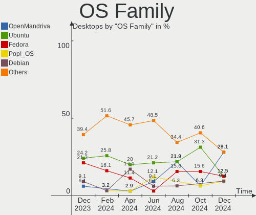

| Name         | Desktops | Percent |
|--------------|----------|---------|
| Ubuntu       | 11       | 36.67%  |
| Fedora       | 4        | 13.33%  |
| Linux Mint   | 3        | 10%     |
| KDE neon     | 2        | 6.67%   |
| EndeavourOS  | 2        | 6.67%   |
| Pop!_OS      | 1        | 3.33%   |
| OpenMandriva | 1        | 3.33%   |
| Nobara       | 1        | 3.33%   |
| Manjaro      | 1        | 3.33%   |
| Kubuntu      | 1        | 3.33%   |
| Debian       | 1        | 3.33%   |
| ArcoLinux    | 1        | 3.33%   |
| AlmaLinux    | 1        | 3.33%   |

Kernel
------

Version of the Linux kernel

| Version                     | Desktops | Percent |
|-----------------------------|----------|---------|
| 5.15.0-53-generic           | 5        | 16.67%  |
| 5.15.0-52-generic           | 5        | 16.67%  |
| 6.0.9-300.fc37.x86_64       | 2        | 6.67%   |
| 6.0.6-arch1-1               | 2        | 6.67%   |
| 5.4.0-131-generic           | 2        | 6.67%   |
| 6.0.9-1-MANJARO             | 1        | 3.33%   |
| 6.0.7-200.fc36.x86_64       | 1        | 3.33%   |
| 6.0.5-201.fsync.fc36.x86_64 | 1        | 3.33%   |
| 6.0.5-200.fc36.x86_64       | 1        | 3.33%   |
| 6.0.3-76060003-generic      | 1        | 3.33%   |
| 6.0.2-x64v2-xanmod1-1       | 1        | 3.33%   |
| 5.4.0-132-generic           | 1        | 3.33%   |
| 5.19.0-23-generic           | 1        | 3.33%   |
| 5.19.0-21-generic           | 1        | 3.33%   |
| 5.17.0-1014-oem             | 1        | 3.33%   |
| 5.16.7-desktop-1omv4003     | 1        | 3.33%   |
| 5.14.0-70.30.1.el9_0.x86_64 | 1        | 3.33%   |
| 5.10.0-9-686                | 1        | 3.33%   |
| 4.15.0-197-generic          | 1        | 3.33%   |

Kernel Family
-------------

Linux kernel without a distro release

| Version | Desktops | Percent |
|---------|----------|---------|
| 5.15.0  | 10       | 33.33%  |
| 6.0.9   | 3        | 10%     |
| 5.4.0   | 3        | 10%     |
| 6.0.6   | 2        | 6.67%   |
| 6.0.5   | 2        | 6.67%   |
| 5.19.0  | 2        | 6.67%   |
| 6.0.7   | 1        | 3.33%   |
| 6.0.3   | 1        | 3.33%   |
| 6.0.2   | 1        | 3.33%   |
| 5.17.0  | 1        | 3.33%   |
| 5.16.7  | 1        | 3.33%   |
| 5.14.0  | 1        | 3.33%   |
| 5.10.0  | 1        | 3.33%   |
| 4.15.0  | 1        | 3.33%   |

Kernel Major Ver.
-----------------

Linux kernel major version

| Version | Desktops | Percent |
|---------|----------|---------|
| 6.0     | 10       | 33.33%  |
| 5.15    | 10       | 33.33%  |
| 5.4     | 3        | 10%     |
| 5.19    | 2        | 6.67%   |
| 5.17    | 1        | 3.33%   |
| 5.16    | 1        | 3.33%   |
| 5.14    | 1        | 3.33%   |
| 5.10    | 1        | 3.33%   |
| 4.15    | 1        | 3.33%   |

Arch
----

OS architecture (x86_64, i586, etc.)

| Name   | Desktops | Percent |
|--------|----------|---------|
| x86_64 | 28       | 93.33%  |
| i686   | 2        | 6.67%   |

DE
--

Desktop Environment

| Name       | Desktops | Percent |
|------------|----------|---------|
| GNOME      | 19       | 63.33%  |
| KDE5       | 5        | 16.67%  |
| XFCE       | 3        | 10%     |
| X-Cinnamon | 2        | 6.67%   |
| MATE       | 1        | 3.33%   |

Display Server
--------------

X11 or Wayland

| Name    | Desktops | Percent |
|---------|----------|---------|
| X11     | 18       | 60%     |
| Wayland | 12       | 40%     |

Display Manager
---------------

SDDM, LightDM, etc.

| Name    | Desktops | Percent |
|---------|----------|---------|
| Unknown | 14       | 46.67%  |
| GDM3    | 9        | 30%     |
| SDDM    | 3        | 10%     |
| LightDM | 2        | 6.67%   |
| GDM     | 2        | 6.67%   |

OS Lang
-------

Language

| Lang  | Desktops | Percent |
|-------|----------|---------|
| nl_NL | 14       | 46.67%  |
| en_US | 10       | 33.33%  |
| en_AG | 2        | 6.67%   |
| de_DE | 2        | 6.67%   |
| en_GB | 1        | 3.33%   |
| C     | 1        | 3.33%   |

Boot Mode
---------

EFI or BIOS

| Mode | Desktops | Percent |
|------|----------|---------|
| BIOS | 19       | 63.33%  |
| EFI  | 11       | 36.67%  |

Filesystem
----------

Type of filesystem

| Type    | Desktops | Percent |
|---------|----------|---------|
| Ext4    | 23       | 76.67%  |
| Overlay | 3        | 10%     |
| Btrfs   | 3        | 10%     |
| Xfs     | 1        | 3.33%   |

Part. scheme
------------

Scheme of partitioning

| Type    | Desktops | Percent |
|---------|----------|---------|
| Unknown | 16       | 53.33%  |
| GPT     | 10       | 33.33%  |
| MBR     | 4        | 13.33%  |

Dual Boot with Linux/BSD
------------------------

Hosting more than one Linux/BSD

| Dual boot | Desktops | Percent |
|-----------|----------|---------|
| No        | 26       | 86.67%  |
| Yes       | 4        | 13.33%  |

Dual Boot (Win)
---------------

Hosting Linux and Windows

| Dual boot | Desktops | Percent |
|-----------|----------|---------|
| No        | 22       | 73.33%  |
| Yes       | 8        | 26.67%  |

Board
-----

Vendor
------

Motherboard manufacturer

| Name                | Desktops | Percent |
|---------------------|----------|---------|
| ASUSTek Computer    | 7        | 23.33%  |
| Gigabyte Technology | 5        | 16.67%  |
| MSI                 | 4        | 13.33%  |
| Hewlett-Packard     | 4        | 13.33%  |
| ASRock              | 4        | 13.33%  |
| Acer                | 2        | 6.67%   |
| Lenovo              | 1        | 3.33%   |
| Intel               | 1        | 3.33%   |
| Dell                | 1        | 3.33%   |
| Unknown             | 1        | 3.33%   |

Model
-----

Motherboard model

| Name                               | Desktops | Percent |
|------------------------------------|----------|---------|
| ASUS All Series                    | 2        | 6.67%   |
| ASRock B450M Pro4                  | 2        | 6.67%   |
| MSI MS-7D20                        | 1        | 3.33%   |
| MSI MS-7C94                        | 1        | 3.33%   |
| MSI MS-7C02                        | 1        | 3.33%   |
| MSI MS-7B17                        | 1        | 3.33%   |
| Lenovo Legion T5 26AMR5 90RC00FAMH | 1        | 3.33%   |
| Intel X99                          | 1        | 3.33%   |
| HP Z640 Workstation                | 1        | 3.33%   |
| HP Z420 Workstation                | 1        | 3.33%   |
| HP Compaq Elite 8300 SFF           | 1        | 3.33%   |
| HP Compaq 8000 Elite SFF PC        | 1        | 3.33%   |
| Gigabyte P55A-UD3                  | 1        | 3.33%   |
| Gigabyte GB-BRR7H-4700             | 1        | 3.33%   |
| Gigabyte GA-990FX-GAMING           | 1        | 3.33%   |
| Gigabyte B75M-D3H                  | 1        | 3.33%   |
| Gigabyte A320M-S2H                 | 1        | 3.33%   |
| Dell OptiPlex 9010                 | 1        | 3.33%   |
| ASUS V-P7H55E                      | 1        | 3.33%   |
| ASUS ROG STRIX X570-I GAMING       | 1        | 3.33%   |
| ASUS Q170M2                        | 1        | 3.33%   |
| ASUS PRIME B560M-A                 | 1        | 3.33%   |
| ASUS P7H55-M                       | 1        | 3.33%   |
| ASRock X370 Taichi                 | 1        | 3.33%   |
| ASRock B550M Pro4                  | 1        | 3.33%   |
| Acer Predator G3-710               | 1        | 3.33%   |
| Acer Aspire X3470                  | 1        | 3.33%   |
| Unknown                            | 1        | 3.33%   |

Model Family
------------

Motherboard model prefix

| Name                     | Desktops | Percent |
|--------------------------|----------|---------|
| HP Compaq                | 2        | 6.67%   |
| ASUS All                 | 2        | 6.67%   |
| ASRock B450M             | 2        | 6.67%   |
| MSI MS-7D20              | 1        | 3.33%   |
| MSI MS-7C94              | 1        | 3.33%   |
| MSI MS-7C02              | 1        | 3.33%   |
| MSI MS-7B17              | 1        | 3.33%   |
| Lenovo Legion            | 1        | 3.33%   |
| Intel X99                | 1        | 3.33%   |
| HP Z640                  | 1        | 3.33%   |
| HP Z420                  | 1        | 3.33%   |
| Gigabyte P55A-UD3        | 1        | 3.33%   |
| Gigabyte GB-BRR7H-4700   | 1        | 3.33%   |
| Gigabyte GA-990FX-GAMING | 1        | 3.33%   |
| Gigabyte B75M-D3H        | 1        | 3.33%   |
| Gigabyte A320M-S2H       | 1        | 3.33%   |
| Dell OptiPlex            | 1        | 3.33%   |
| ASUS V-P7H55E            | 1        | 3.33%   |
| ASUS ROG                 | 1        | 3.33%   |
| ASUS Q170M2              | 1        | 3.33%   |
| ASUS PRIME               | 1        | 3.33%   |
| ASUS P7H55-M             | 1        | 3.33%   |
| ASRock X370              | 1        | 3.33%   |
| ASRock B550M             | 1        | 3.33%   |
| Acer Predator            | 1        | 3.33%   |
| Acer Aspire              | 1        | 3.33%   |
| Unknown                  | 1        | 3.33%   |

MFG Year
--------

Motherboard manufacture year

| Year | Desktops | Percent |
|------|----------|---------|
| 2021 | 5        | 16.67%  |
| 2018 | 4        | 13.33%  |
| 2019 | 3        | 10%     |
| 2015 | 3        | 10%     |
| 2012 | 3        | 10%     |
| 2020 | 2        | 6.67%   |
| 2017 | 2        | 6.67%   |
| 2014 | 2        | 6.67%   |
| 2010 | 2        | 6.67%   |
| 2009 | 2        | 6.67%   |
| 2013 | 1        | 3.33%   |
| 2011 | 1        | 3.33%   |

Form Factor
-----------

Physical design of the computer

| Name    | Desktops | Percent |
|---------|----------|---------|
| Desktop | 30       | 100%    |

Secure Boot
-----------

Enabled or disabled

| State    | Desktops | Percent |
|----------|----------|---------|
| Disabled | 28       | 93.33%  |
| Enabled  | 2        | 6.67%   |

Coreboot
--------

Have coreboot on board

| Used | Desktops | Percent |
|------|----------|---------|
| No   | 30       | 100%    |

RAM Size
--------

Total RAM memory

| Size in GB  | Desktops | Percent |
|-------------|----------|---------|
| 16.01-24.0  | 9        | 30%     |
| 32.01-64.0  | 8        | 26.67%  |
| 8.01-16.0   | 7        | 23.33%  |
| 4.01-8.0    | 2        | 6.67%   |
| 3.01-4.0    | 2        | 6.67%   |
| 24.01-32.0  | 1        | 3.33%   |
| 64.01-256.0 | 1        | 3.33%   |

RAM Used
--------

Used RAM memory

| Used GB   | Desktops | Percent |
|-----------|----------|---------|
| 2.01-3.0  | 9        | 30%     |
| 1.01-2.0  | 9        | 30%     |
| 4.01-8.0  | 5        | 16.67%  |
| 3.01-4.0  | 4        | 13.33%  |
| 8.01-16.0 | 2        | 6.67%   |
| 0.51-1.0  | 1        | 3.33%   |

Total Drives
------------

Number of drives on board

| Drives | Desktops | Percent |
|--------|----------|---------|
| 2      | 11       | 36.67%  |
| 1      | 9        | 30%     |
| 3      | 6        | 20%     |
| 7      | 1        | 3.33%   |
| 5      | 1        | 3.33%   |
| 4      | 1        | 3.33%   |
| 0      | 1        | 3.33%   |

Has CD-ROM
----------

Has CD-ROM on board

| Presented | Desktops | Percent |
|-----------|----------|---------|
| No        | 18       | 60%     |
| Yes       | 12       | 40%     |

Has Ethernet
------------

Has Ethernet on board

| Presented | Desktops | Percent |
|-----------|----------|---------|
| Yes       | 30       | 100%    |

Has WiFi
--------

Has WiFi module

| Presented | Desktops | Percent |
|-----------|----------|---------|
| No        | 25       | 83.33%  |
| Yes       | 5        | 16.67%  |

Has Bluetooth
-------------

Has Bluetooth module

| Presented | Desktops | Percent |
|-----------|----------|---------|
| No        | 20       | 66.67%  |
| Yes       | 10       | 33.33%  |

Location
--------

Country
-------

Geographic location (country)

| Country     | Desktops | Percent |
|-------------|----------|---------|
| Netherlands | 30       | 100%    |

City
----

Geographic location (city)

| City                   | Desktops | Percent |
|------------------------|----------|---------|
| Amsterdam              | 7        | 23.33%  |
| Heemskerk              | 2        | 6.67%   |
| Zuidwolde              | 1        | 3.33%   |
| Zaandam                | 1        | 3.33%   |
| Wageningen             | 1        | 3.33%   |
| Tubbergen              | 1        | 3.33%   |
| Tilburg                | 1        | 3.33%   |
| The Hague              | 1        | 3.33%   |
| Steenwijk              | 1        | 3.33%   |
| Roosendaal             | 1        | 3.33%   |
| Oosterhout             | 1        | 3.33%   |
| Krimpen aan den IJssel | 1        | 3.33%   |
| IJsselstein            | 1        | 3.33%   |
| Hengelo                | 1        | 3.33%   |
| Gronsveld              | 1        | 3.33%   |
| Groningen              | 1        | 3.33%   |
| Ermelo                 | 1        | 3.33%   |
| Enschede               | 1        | 3.33%   |
| Diemen                 | 1        | 3.33%   |
| Delft                  | 1        | 3.33%   |
| Breda                  | 1        | 3.33%   |
| Amersfoort             | 1        | 3.33%   |
| Almere Stad            | 1        | 3.33%   |

Drives
------

Drive Vendor
------------

Hard drive vendors

| Vendor                      | Desktops | Drives | Percent |
|-----------------------------|----------|--------|---------|
| Samsung Electronics         | 12       | 16     | 23.08%  |
| WDC                         | 7        | 10     | 13.46%  |
| Crucial                     | 5        | 6      | 9.62%   |
| Toshiba                     | 4        | 6      | 7.69%   |
| Seagate                     | 3        | 5      | 5.77%   |
| Kingston Technology Company | 3        | 3      | 5.77%   |
| Kingston                    | 3        | 3      | 5.77%   |
| SanDisk                     | 2        | 2      | 3.85%   |
| Intel                       | 2        | 3      | 3.85%   |
| HGST HTS                    | 2        | 2      | 3.85%   |
| Verbatim                    | 1        | 1      | 1.92%   |
| Unknown                     | 1        | 1      | 1.92%   |
| Transcend                   | 1        | 1      | 1.92%   |
| PNY                         | 1        | 1      | 1.92%   |
| LITEON                      | 1        | 1      | 1.92%   |
| KIOXIA                      | 1        | 1      | 1.92%   |
| Hitachi                     | 1        | 1      | 1.92%   |
| China                       | 1        | 1      | 1.92%   |
| ADATA Technology            | 1        | 1      | 1.92%   |

Drive Model
-----------

Hard drive models

| Model                                               | Desktops | Percent |
|-----------------------------------------------------|----------|---------|
| Kingston Company A2000 NVMe SSD 500GB               | 3        | 4.92%   |
| WDC WDS120G2G0A-00JH30 120GB SSD                    | 2        | 3.28%   |
| Samsung SSD 850 EVO 250GB                           | 2        | 3.28%   |
| Samsung NVMe SSD Controller SM981/PM981/PM983 1TB   | 2        | 3.28%   |
| Samsung HD103SJ 1TB                                 | 2        | 3.28%   |
| HGST HTS 545050A7E380 500GB                         | 2        | 3.28%   |
| Crucial CT500MX500SSD1 500GB                        | 2        | 3.28%   |
| WDC WDS480G2G0A-00JH30 480GB SSD                    | 1        | 1.64%   |
| WDC WD5002ABYS-02B1B0 500GB                         | 1        | 1.64%   |
| WDC WD5000AAKX-60U6AA0 500GB                        | 1        | 1.64%   |
| WDC WD40EZAZ-00SF3B0 4TB                            | 1        | 1.64%   |
| WDC WD30EZRX-00AZ6B0 3TB                            | 1        | 1.64%   |
| WDC WD2002FAEX-007BA0 2TB                           | 1        | 1.64%   |
| WDC WD10EZEX-00BN5A0 1TB                            | 1        | 1.64%   |
| Verbatim Portable Drive 1TB                         | 1        | 1.64%   |
| Unknown SD/MMC/MS PRO 8GB                           | 1        | 1.64%   |
| Transcend TS256GSSD340 256GB                        | 1        | 1.64%   |
| Toshiba MK1002TSKB 1TB                              | 1        | 1.64%   |
| Toshiba DT01ACA100 LENOVO 1TB                       | 1        | 1.64%   |
| Toshiba DT01ACA100 1TB                              | 1        | 1.64%   |
| Toshiba DT01ACA050 500GB                            | 1        | 1.64%   |
| Seagate ST4000VN006-3CW104 4TB                      | 1        | 1.64%   |
| Seagate ST31000528AS 1TB                            | 1        | 1.64%   |
| Seagate ST2000DM008-2FR102 2TB                      | 1        | 1.64%   |
| Seagate One Touch HDD 5TB                           | 1        | 1.64%   |
| Seagate Backup+ Hub BK 8TB                          | 1        | 1.64%   |
| Sandisk WD Blue SN570 500GB                         | 1        | 1.64%   |
| SanDisk SSD PLUS 480GB                              | 1        | 1.64%   |
| Samsung SSD 980 500GB                               | 1        | 1.64%   |
| Samsung SSD 980 1TB                                 | 1        | 1.64%   |
| Samsung SSD 870 QVO 1TB                             | 1        | 1.64%   |
| Samsung SSD 870 EVO 500GB                           | 1        | 1.64%   |
| Samsung SSD 860 QVO 1TB                             | 1        | 1.64%   |
| Samsung SSD 840 Series 120GB                        | 1        | 1.64%   |
| Samsung NVMe SSD Controller SM961/PM961/SM963 250GB | 1        | 1.64%   |
| Samsung MZHPU256HCGL-000H1 256GB SSD                | 1        | 1.64%   |
| Samsung HD322GJ 320GB                               | 1        | 1.64%   |
| Samsung HD103UJ 1TB                                 | 1        | 1.64%   |
| PNY CS900 1TB SSD                                   | 1        | 1.64%   |
| LITEON CV1-8B256-HP 256GB SSD                       | 1        | 1.64%   |

HDD Vendor
----------

Hard disk drive vendors

| Vendor              | Desktops | Drives | Percent |
|---------------------|----------|--------|---------|
| WDC                 | 5        | 7      | 27.78%  |
| Toshiba             | 4        | 6      | 22.22%  |
| Samsung Electronics | 4        | 4      | 22.22%  |
| Seagate             | 3        | 5      | 16.67%  |
| Unknown             | 1        | 1      | 5.56%   |
| Hitachi             | 1        | 1      | 5.56%   |

SSD Vendor
----------

Solid state drive vendors

| Vendor              | Desktops | Drives | Percent |
|---------------------|----------|--------|---------|
| Samsung Electronics | 6        | 7      | 28.57%  |
| Crucial             | 5        | 6      | 23.81%  |
| WDC                 | 3        | 3      | 14.29%  |
| Kingston            | 2        | 2      | 9.52%   |
| Transcend           | 1        | 1      | 4.76%   |
| SanDisk             | 1        | 1      | 4.76%   |
| PNY                 | 1        | 1      | 4.76%   |
| LITEON              | 1        | 1      | 4.76%   |
| China               | 1        | 1      | 4.76%   |

Drive Kind
----------

HDD or SSD

| Kind    | Desktops | Drives | Percent |
|---------|----------|--------|---------|
| SSD     | 18       | 23     | 37.5%   |
| HDD     | 14       | 24     | 29.17%  |
| NVMe    | 13       | 15     | 27.08%  |
| Unknown | 3        | 3      | 6.25%   |

Drive Connector
---------------

SATA, SAS, NVMe, etc.

| Type | Desktops | Drives | Percent |
|------|----------|--------|---------|
| SATA | 24       | 44     | 58.54%  |
| NVMe | 13       | 15     | 31.71%  |
| SAS  | 4        | 6      | 9.76%   |

Drive Size
----------

Size of hard drive

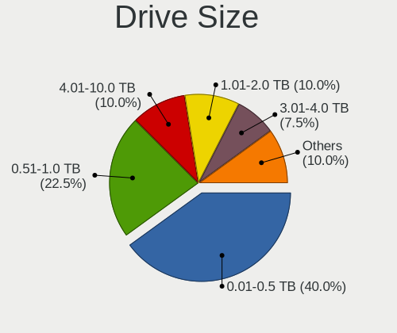

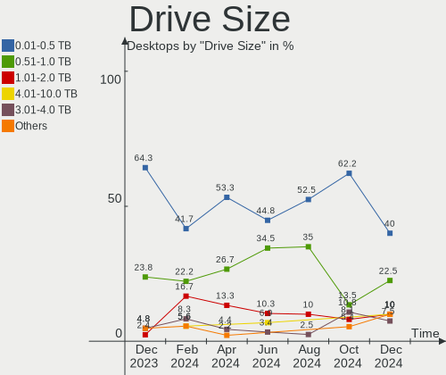

| Size in TB | Desktops | Drives | Percent |
|------------|----------|--------|---------|
| 0.01-0.5   | 15       | 23     | 41.67%  |
| 0.51-1.0   | 13       | 14     | 36.11%  |
| 1.01-2.0   | 4        | 4      | 11.11%  |
| 3.01-4.0   | 2        | 2      | 5.56%   |
| 2.01-3.0   | 1        | 2      | 2.78%   |
| 4.01-10.0  | 1        | 2      | 2.78%   |

Space Total
-----------

Amount of disk space available on the file system

| Size in GB     | Desktops | Percent |
|----------------|----------|---------|
| 101-250        | 8        | 26.67%  |
| 251-500        | 7        | 23.33%  |
| 1001-2000      | 5        | 16.67%  |
| More than 3000 | 3        | 10%     |
| 501-1000       | 3        | 10%     |
| 2001-3000      | 2        | 6.67%   |
| 1-20           | 1        | 3.33%   |
| 51-100         | 1        | 3.33%   |

Space Used
----------

Amount of used disk space

| Used GB        | Desktops | Percent |
|----------------|----------|---------|
| 1-20           | 6        | 20%     |
| 51-100         | 6        | 20%     |
| 501-1000       | 5        | 16.67%  |
| 21-50          | 4        | 13.33%  |
| 101-250        | 3        | 10%     |
| 251-500        | 2        | 6.67%   |
| 1001-2000      | 2        | 6.67%   |
| More than 3000 | 1        | 3.33%   |
| 2001-3000      | 1        | 3.33%   |

Malfunc. Drives
---------------

Drive models with a malfunction

| Model                                                         | Desktops | Drives | Percent |
|---------------------------------------------------------------|----------|--------|---------|
| Samsung Electronics NVMe SSD Controller SM981/PM981/PM983 1TB | 1        | 1      | 33.33%  |
| Intel SSD 600P Series 1024GB                                  | 1        | 1      | 33.33%  |
| Crucial CT500MX500SSD1 500GB                                  | 1        | 1      | 33.33%  |

Malfunc. Drive Vendor
---------------------

Vendors of faulty drives

| Vendor              | Desktops | Drives | Percent |
|---------------------|----------|--------|---------|
| Samsung Electronics | 1        | 1      | 33.33%  |
| Intel               | 1        | 1      | 33.33%  |
| Crucial             | 1        | 1      | 33.33%  |

Malfunc. HDD Vendor
-------------------

Vendors of faulty HDD drives

Zero info for selected period =(

Malfunc. Drive Kind
-------------------

Kinds of faulty drives

| Kind | Desktops | Drives | Percent |
|------|----------|--------|---------|
| NVMe | 2        | 2      | 66.67%  |
| SSD  | 1        | 1      | 33.33%  |

Failed Drives
-------------

Failed drive models

Zero info for selected period =(

Failed Drive Vendor
-------------------

Failed drive vendors

Zero info for selected period =(

Drive Status
------------

Number of failed and malfunc. drives

| Status   | Desktops | Drives | Percent |
|----------|----------|--------|---------|
| Detected | 25       | 57     | 78.13%  |
| Works    | 4        | 5      | 12.5%   |
| Malfunc  | 3        | 3      | 9.38%   |

Storage controller
------------------

Storage Vendor
--------------

Storage controller vendors

| Vendor                      | Desktops | Percent |
|-----------------------------|----------|---------|
| Intel                       | 18       | 40%     |
| AMD                         | 11       | 24.44%  |
| Samsung Electronics         | 6        | 13.33%  |
| Kingston Technology Company | 4        | 8.89%   |
| ASMedia Technology          | 2        | 4.44%   |
| VIA Technologies            | 1        | 2.22%   |
| SanDisk                     | 1        | 2.22%   |
| KIOXIA                      | 1        | 2.22%   |
| ADATA Technology            | 1        | 2.22%   |

Storage Model
-------------

Storage controller models

| Model                                                                          | Desktops | Percent |
|--------------------------------------------------------------------------------|----------|---------|
| AMD FCH SATA Controller [AHCI mode]                                            | 6        | 10.53%  |
| Kingston Company A2000 NVMe SSD                                                | 3        | 5.26%   |
| Intel 8 Series/C220 Series Chipset Family 6-port SATA Controller 1 [AHCI mode] | 3        | 5.26%   |
| AMD 500 Series Chipset SATA Controller                                         | 3        | 5.26%   |
| AMD 400 Series Chipset SATA Controller                                         | 3        | 5.26%   |
| Samsung NVMe SSD Controller SM981/PM981/PM983                                  | 2        | 3.51%   |
| Samsung NVMe SSD Controller 980                                                | 2        | 3.51%   |
| Intel Q170/Q150/B150/H170/H110/Z170/CM236 Chipset SATA Controller [AHCI Mode]  | 2        | 3.51%   |
| Intel 7 Series/C210 Series Chipset Family 4-port SATA Controller [IDE mode]    | 2        | 3.51%   |
| Intel 7 Series/C210 Series Chipset Family 2-port SATA Controller [IDE mode]    | 2        | 3.51%   |
| Intel 500 Series Chipset Family SATA AHCI Controller                           | 2        | 3.51%   |
| Intel 5 Series/3400 Series Chipset 6 port SATA AHCI Controller                 | 2        | 3.51%   |
| ASMedia ASM1062 Serial ATA Controller                                          | 2        | 3.51%   |
| VIA VT6415 PATA IDE Host Controller                                            | 1        | 1.75%   |
| SanDisk WD Blue SN570 NVMe SSD                                                 | 1        | 1.75%   |
| Samsung XP941 PCIe SSD                                                         | 1        | 1.75%   |
| Samsung NVMe SSD Controller SM961/PM961/SM963                                  | 1        | 1.75%   |
| KIOXIA NVMe SSD Controller BG4                                                 | 1        | 1.75%   |
| Kingston Company SNVS2000G [NV1 NVMe PCIe SSD 2TB]                             | 1        | 1.75%   |
| Intel SSD 660P Series                                                          | 1        | 1.75%   |
| Intel SSD 600P Series                                                          | 1        | 1.75%   |
| Intel Cannon Lake PCH SATA AHCI Controller                                     | 1        | 1.75%   |
| Intel C610/X99 series chipset sSATA Controller [AHCI mode]                     | 1        | 1.75%   |
| Intel C610/X99 series chipset 6-Port SATA Controller [AHCI mode]               | 1        | 1.75%   |
| Intel C602 chipset 4-Port SATA Storage Control Unit                            | 1        | 1.75%   |
| Intel C600/X79 series chipset SATA RAID Controller                             | 1        | 1.75%   |
| Intel C600/X79 series chipset IDE-r Controller                                 | 1        | 1.75%   |
| Intel 9 Series Chipset Family SATA Controller [AHCI Mode]                      | 1        | 1.75%   |
| Intel 82801JD/DO (ICH10 Family) SATA AHCI Controller                           | 1        | 1.75%   |
| Intel 7 Series/C210 Series Chipset Family 6-port SATA Controller [AHCI mode]   | 1        | 1.75%   |
| Intel 5 Series/3400 Series Chipset 4 port SATA IDE Controller                  | 1        | 1.75%   |
| Intel 5 Series/3400 Series Chipset 2 port SATA IDE Controller                  | 1        | 1.75%   |
| AMD X370 Series Chipset SATA Controller                                        | 1        | 1.75%   |
| AMD SB7x0/SB8x0/SB9x0 SATA Controller [AHCI mode]                              | 1        | 1.75%   |
| AMD FCH SATA Controller D                                                      | 1        | 1.75%   |
| ADATA XPG SX8200 Pro PCIe Gen3x4 M.2 2280 Solid State Drive                    | 1        | 1.75%   |

Storage Kind
------------

Kind of storage controller (IDE, SATA, NVMe, SAS, ...)

| Kind | Desktops | Percent |
|------|----------|---------|
| SATA | 25       | 55.56%  |
| NVMe | 13       | 28.89%  |
| IDE  | 5        | 11.11%  |
| RAID | 1        | 2.22%   |
| SAS  | 1        | 2.22%   |

Processor
---------

CPU Vendor
----------

Processor vendors

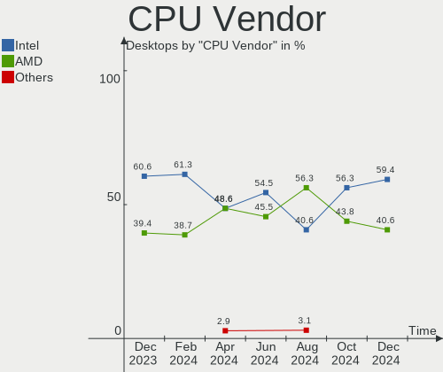

| Vendor | Desktops | Percent |
|--------|----------|---------|
| Intel  | 18       | 60%     |
| AMD    | 12       | 40%     |

CPU Model
---------

Processor models

| Model                                       | Desktops | Percent |
|---------------------------------------------|----------|---------|
| Intel Core i7-7700 CPU @ 3.60GHz            | 2        | 6.67%   |
| Intel Core i7-3770 CPU @ 3.40GHz            | 2        | 6.67%   |
| AMD Ryzen 7 3700X 8-Core Processor          | 2        | 6.67%   |
| Intel Xeon CPU E5-2666 v3 @ 2.90GHz         | 1        | 3.33%   |
| Intel Xeon CPU E5-2650 v3 @ 2.30GHz         | 1        | 3.33%   |
| Intel Xeon CPU E5-2630 v2 @ 2.60GHz         | 1        | 3.33%   |
| Intel Xeon CPU E5-2620 v3 @ 2.40GHz         | 1        | 3.33%   |
| Intel Core i9-9900K CPU @ 3.60GHz           | 1        | 3.33%   |
| Intel Core i5-4690 CPU @ 3.50GHz            | 1        | 3.33%   |
| Intel Core i5-4460 CPU @ 3.20GHz            | 1        | 3.33%   |
| Intel Core i5-3450 CPU @ 3.10GHz            | 1        | 3.33%   |
| Intel Core i5-10400F CPU @ 2.90GHz          | 1        | 3.33%   |
| Intel Core i5-10400 CPU @ 2.90GHz           | 1        | 3.33%   |
| Intel Core i5 CPU 750 @ 2.67GHz             | 1        | 3.33%   |
| Intel Core i5 CPU 650 @ 3.20GHz             | 1        | 3.33%   |
| Intel Core i3 CPU 540 @ 3.07GHz             | 1        | 3.33%   |
| Intel Core 2 Duo CPU E8400 @ 3.00GHz        | 1        | 3.33%   |
| AMD Ryzen 7 5800 8-Core Processor           | 1        | 3.33%   |
| AMD Ryzen 7 5700X 8-Core Processor          | 1        | 3.33%   |
| AMD Ryzen 7 4700U with Radeon Graphics      | 1        | 3.33%   |
| AMD Ryzen 7 2700 Eight-Core Processor       | 1        | 3.33%   |
| AMD Ryzen 7 1700X Eight-Core Processor      | 1        | 3.33%   |
| AMD Ryzen 5 5600X 6-Core Processor          | 1        | 3.33%   |
| AMD Ryzen 5 3600 6-Core Processor           | 1        | 3.33%   |
| AMD Ryzen 3 2200G with Radeon Vega Graphics | 1        | 3.33%   |
| AMD FX-9590 Eight-Core Processor            | 1        | 3.33%   |
| AMD A6-3600 APU with Radeon HD Graphics     | 1        | 3.33%   |

CPU Model Family
----------------

Processor model prefix

| Model            | Desktops | Percent |
|------------------|----------|---------|
| Intel Core i5    | 7        | 23.33%  |
| AMD Ryzen 7      | 7        | 23.33%  |
| Intel Xeon       | 4        | 13.33%  |
| Intel Core i7    | 4        | 13.33%  |
| AMD Ryzen 5      | 2        | 6.67%   |
| Intel Core i9    | 1        | 3.33%   |
| Intel Core i3    | 1        | 3.33%   |
| Intel Core 2 Duo | 1        | 3.33%   |
| AMD Ryzen 3      | 1        | 3.33%   |
| AMD FX           | 1        | 3.33%   |
| AMD A6           | 1        | 3.33%   |

CPU Cores
---------

Number of processor cores

| Number | Desktops | Percent |
|--------|----------|---------|
| 4      | 11       | 36.67%  |
| 8      | 7        | 23.33%  |
| 6      | 6        | 20%     |
| 2      | 3        | 10%     |
| 10     | 2        | 6.67%   |
| 1      | 1        | 3.33%   |

CPU Sockets
-----------

Number of sockets

| Number | Desktops | Percent |
|--------|----------|---------|
| 1      | 30       | 100%    |

CPU Threads
-----------

Threads per core (Hyper-Threading)

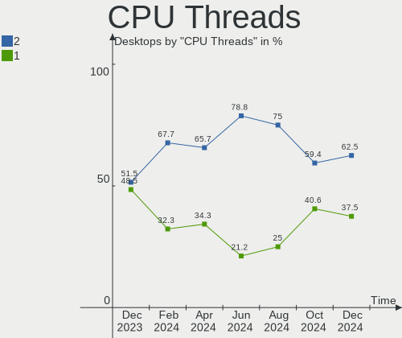

| Number | Desktops | Percent |
|--------|----------|---------|
| 2      | 22       | 73.33%  |
| 1      | 8        | 26.67%  |

CPU Op-Modes
------------

CPU Operation Modes (32-bit, 64-bit)

| Op mode        | Desktops | Percent |
|----------------|----------|---------|
| 32-bit, 64-bit | 30       | 100%    |

CPU Microcode
-------------

Microcode number

| Number     | Desktops | Percent |
|------------|----------|---------|
| Unknown    | 14       | 46.67%  |
| 0x906e9    | 2        | 6.67%   |
| 0x306f2    | 2        | 6.67%   |
| 0x306a9    | 2        | 6.67%   |
| 0x906ec    | 1        | 3.33%   |
| 0x306e4    | 1        | 3.33%   |
| 0x306c3    | 1        | 3.33%   |
| 0x20655    | 1        | 3.33%   |
| 0x106e5    | 1        | 3.33%   |
| 0x0a201009 | 1        | 3.33%   |
| 0x08701013 | 1        | 3.33%   |
| 0x0800820d | 1        | 3.33%   |
| 0x08001138 | 1        | 3.33%   |
| 0x03000027 | 1        | 3.33%   |

CPU Microarch
-------------

Microarchitecture

| Name       | Desktops | Percent |
|------------|----------|---------|
| Haswell    | 5        | 16.67%  |
| Zen 2      | 4        | 13.33%  |
| IvyBridge  | 4        | 13.33%  |
| Zen 3      | 3        | 10%     |
| KabyLake   | 3        | 10%     |
| Zen        | 2        | 6.67%   |
| Westmere   | 2        | 6.67%   |
| CometLake  | 2        | 6.67%   |
| Zen+       | 1        | 3.33%   |
| Piledriver | 1        | 3.33%   |
| Penryn     | 1        | 3.33%   |
| Nehalem    | 1        | 3.33%   |
| K10 Llano  | 1        | 3.33%   |

Graphics
--------

GPU Vendor
----------

Vendors of graphics cards

| Vendor | Desktops | Percent |
|--------|----------|---------|
| Nvidia | 19       | 61.29%  |
| AMD    | 8        | 25.81%  |
| Intel  | 4        | 12.9%   |

GPU Model
---------

Graphics card models

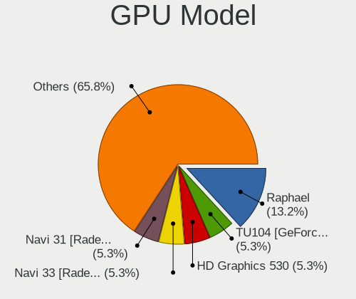

| Model                                                               | Desktops | Percent |
|---------------------------------------------------------------------|----------|---------|
| Nvidia GT218 [GeForce 210]                                          | 2        | 6.45%   |
| Nvidia GP104 [GeForce GTX 1080]                                     | 2        | 6.45%   |
| Nvidia GK208B [GeForce GT 710]                                      | 2        | 6.45%   |
| Nvidia TU106 [GeForce RTX 2070]                                     | 1        | 3.23%   |
| Nvidia TU104 [GeForce RTX 2070 SUPER]                               | 1        | 3.23%   |
| Nvidia GP107 [GeForce GTX 1050 Ti]                                  | 1        | 3.23%   |
| Nvidia GP104 [GeForce GTX 1070]                                     | 1        | 3.23%   |
| Nvidia GM204 [GeForce GTX 970]                                      | 1        | 3.23%   |
| Nvidia GM200 [GeForce GTX 980 Ti]                                   | 1        | 3.23%   |
| Nvidia GM107GL [Quadro K2200]                                       | 1        | 3.23%   |
| Nvidia GM107 [GeForce GTX 750 Ti]                                   | 1        | 3.23%   |
| Nvidia GK106 [GeForce GTX 650 Ti]                                   | 1        | 3.23%   |
| Nvidia GF108 [GeForce GT 730]                                       | 1        | 3.23%   |
| Nvidia GF106GL [Quadro 2000]                                        | 1        | 3.23%   |
| Nvidia GA106 [GeForce RTX 3060]                                     | 1        | 3.23%   |
| Nvidia GA106 [GeForce RTX 3060 Lite Hash Rate]                      | 1        | 3.23%   |
| Intel Xeon E3-1200 v2/3rd Gen Core processor Graphics Controller    | 1        | 3.23%   |
| Intel Core Processor Integrated Graphics Controller                 | 1        | 3.23%   |
| Intel CometLake-S GT2 [UHD Graphics 630]                            | 1        | 3.23%   |
| Intel 4 Series Chipset Integrated Graphics Controller               | 1        | 3.23%   |
| AMD Vega 10 XL/XT [Radeon RX Vega 56/64]                            | 1        | 3.23%   |
| AMD Renoir                                                          | 1        | 3.23%   |
| AMD Raven Ridge [Radeon Vega Series / Radeon Vega Mobile Series]    | 1        | 3.23%   |
| AMD Navi 10 [Radeon RX 5600 OEM/5600 XT / 5700/5700 XT]             | 1        | 3.23%   |
| AMD Ellesmere [Radeon RX 470/480/570/570X/580/580X/590]             | 1        | 3.23%   |
| AMD Cedar [Radeon HD 5000/6000/7350/8350 Series]                    | 1        | 3.23%   |
| AMD Caicos [Radeon HD 6450/7450/8450 / R5 230 OEM]                  | 1        | 3.23%   |
| AMD Baffin [Radeon RX 460/560D / Pro 450/455/460/555/555X/560/560X] | 1        | 3.23%   |

GPU Combo
---------

Combinations of graphics cards

| Name         | Desktops | Percent |
|--------------|----------|---------|
| 1 x Nvidia   | 18       | 60%     |
| 1 x AMD      | 7        | 23.33%  |
| 1 x Intel    | 4        | 13.33%  |
| AMD + Nvidia | 1        | 3.33%   |

GPU Driver
----------

Free vs proprietary

| Driver      | Desktops | Percent |
|-------------|----------|---------|
| Free        | 18       | 60%     |
| Proprietary | 10       | 33.33%  |
| Unknown     | 2        | 6.67%   |

GPU Memory
----------

Total video memory

| Size in GB | Desktops | Percent |
|------------|----------|---------|
| Unknown    | 15       | 50%     |
| 7.01-8.0   | 5        | 16.67%  |
| 1.01-2.0   | 4        | 13.33%  |
| 3.01-4.0   | 3        | 10%     |
| 0.51-1.0   | 2        | 6.67%   |
| 8.01-16.0  | 1        | 3.33%   |

Monitor
-------

Monitor Vendor
--------------

Monitor vendors

| Vendor                  | Desktops | Percent |
|-------------------------|----------|---------|
| Samsung Electronics     | 7        | 20.59%  |
| Iiyama                  | 5        | 14.71%  |
| Dell                    | 4        | 11.76%  |
| Philips                 | 3        | 8.82%   |
| BenQ                    | 2        | 5.88%   |
| ASUSTek Computer        | 2        | 5.88%   |
| AOC                     | 2        | 5.88%   |
| Acer                    | 2        | 5.88%   |
| Unknown                 | 1        | 2.94%   |
| Sony                    | 1        | 2.94%   |
| Panasonic               | 1        | 2.94%   |
| NUL                     | 1        | 2.94%   |
| MSI                     | 1        | 2.94%   |
| Lenovo                  | 1        | 2.94%   |
| Chi Mei Optoelectronics | 1        | 2.94%   |

Monitor Model
-------------

Monitor models

| Model                                                                    | Desktops | Percent |
|--------------------------------------------------------------------------|----------|---------|
| Samsung Electronics S24R65x SAM1023 1920x1080 527x296mm 23.8-inch        | 3        | 8.82%   |
| Unknown LCD Monitor XXX AAA 1920x1080                                    | 1        | 2.94%   |
| Sony TV *00 SNY8204 3840x2160 1085x610mm 49.0-inch                       | 1        | 2.94%   |
| Samsung Electronics LCD Monitor SAM03BC 1920x1080                        | 1        | 2.94%   |
| Samsung Electronics LCD Monitor S24B150 1920x1080                        | 1        | 2.94%   |
| Samsung Electronics LC27G5xT SAM7079 2560x1440 597x336mm 27.0-inch       | 1        | 2.94%   |
| Samsung Electronics C49RG9x SAM0F99 3840x1080 1193x336mm 48.8-inch       | 1        | 2.94%   |
| Philips PHL 273V7 PHLC156 1920x1080 598x336mm 27.0-inch                  | 1        | 2.94%   |
| Philips LCD Monitor PHL 243S5L 1920x1080                                 | 1        | 2.94%   |
| Philips BDL4251V PHLD204 1920x1200 930x520mm 41.9-inch                   | 1        | 2.94%   |
| Panasonic TV MEIA09B 1280x720 698x392mm 31.5-inch                        | 1        | 2.94%   |
| NUL LCD Monitor NUL0001 1280x1024 338x270mm 17.0-inch                    | 1        | 2.94%   |
| MSI MAG274QRF MSI3CA8 2560x1440 597x336mm 27.0-inch                      | 1        | 2.94%   |
| Lenovo G27q-20 LEN66C3 2560x1440 597x336mm 27.0-inch                     | 1        | 2.94%   |
| Iiyama PLX2783H-DP IVM661C 1920x1080 600x340mm 27.2-inch                 | 1        | 2.94%   |
| Iiyama PLE2208HDS IVM560A 1920x1080 477x268mm 21.5-inch                  | 1        | 2.94%   |
| Iiyama PL2473HD IVM6107 1920x1080 521x293mm 23.5-inch                    | 1        | 2.94%   |
| Iiyama PL2470H IVM615B 1920x1080 527x296mm 23.8-inch                     | 1        | 2.94%   |
| Iiyama PL1706 IVM46E9 1280x1024 337x270mm 17.0-inch                      | 1        | 2.94%   |
| Dell U4021QW DEL4206 2560x1080 929x392mm 39.7-inch                       | 1        | 2.94%   |
| Dell SP2309W DELD01B 2048x1152 510x290mm 23.1-inch                       | 1        | 2.94%   |
| Dell S2721DGF DEL41D9 2560x1440 597x336mm 27.0-inch                      | 1        | 2.94%   |
| Dell 2208WFP DEL403B 1680x1050 473x296mm 22.0-inch                       | 1        | 2.94%   |
| Chi Mei Optoelectronics CMC 17" AD CMO7801 1280x1024 338x270mm 17.0-inch | 1        | 2.94%   |
| BenQ ZOWIE XL LCD BNQ7F3F 1920x1080 531x298mm 24.0-inch                  | 1        | 2.94%   |
| BenQ GL2480 BNQ78ED 1920x1080 531x298mm 24.0-inch                        | 1        | 2.94%   |
| ASUSTek Computer VG249 AUS2421 1920x1080 530x300mm 24.0-inch             | 1        | 2.94%   |
| ASUSTek Computer PA278QV AUS2700 2560x1440 597x336mm 27.0-inch           | 1        | 2.94%   |
| AOC Q3279WG5B AOC3279 2560x1440 725x428mm 33.1-inch                      | 1        | 2.94%   |
| AOC 24P1X AOC2401 1920x1200 518x324mm 24.1-inch                          | 1        | 2.94%   |
| Acer XV240Y ACR082E 1920x1080 527x296mm 23.8-inch                        | 1        | 2.94%   |
| Acer K242HQL ACR042E 1920x1080 520x290mm 23.4-inch                       | 1        | 2.94%   |

Monitor Resolution
------------------

Monitor screen resolution

| Resolution         | Desktops | Percent |
|--------------------|----------|---------|
| 1920x1080 (FHD)    | 16       | 48.48%  |
| 2560x1440 (QHD)    | 7        | 21.21%  |
| 1280x1024 (SXGA)   | 3        | 9.09%   |
| 3840x2160 (4K)     | 1        | 3.03%   |
| 3840x1080          | 1        | 3.03%   |
| 2560x1080          | 1        | 3.03%   |
| 2048x1152          | 1        | 3.03%   |
| 1920x1200 (WUXGA)  | 1        | 3.03%   |
| 1680x1050 (WSXGA+) | 1        | 3.03%   |
| 1280x720 (HD)      | 1        | 3.03%   |

Monitor Diagonal
----------------

Diagonal size in inches

| Inches  | Desktops | Percent |
|---------|----------|---------|
| 24      | 7        | 20.59%  |
| 27      | 6        | 17.65%  |
| 23      | 5        | 14.71%  |
| Unknown | 4        | 11.76%  |
| 17      | 3        | 8.82%   |
| 31      | 2        | 5.88%   |
| 65      | 1        | 2.94%   |
| 48      | 1        | 2.94%   |
| 41      | 1        | 2.94%   |
| 39      | 1        | 2.94%   |
| 33      | 1        | 2.94%   |
| 22      | 1        | 2.94%   |
| 21      | 1        | 2.94%   |

Monitor Width
-------------

Physical width

| Width in mm | Desktops | Percent |
|-------------|----------|---------|
| 501-600     | 14       | 46.67%  |
| Unknown     | 4        | 13.33%  |
| 301-350     | 3        | 10%     |
| 601-700     | 2        | 6.67%   |
| 401-500     | 2        | 6.67%   |
| 1001-1500   | 2        | 6.67%   |
| 901-1000    | 2        | 6.67%   |
| 701-800     | 1        | 3.33%   |

Aspect Ratio
------------

Proportional relationship between the width and the height

| Ratio   | Desktops | Percent |
|---------|----------|---------|
| 16/9    | 18       | 64.29%  |
| 5/4     | 3        | 10.71%  |
| Unknown | 3        | 10.71%  |
| 16/10   | 2        | 7.14%   |
| 32/9    | 1        | 3.57%   |
| 21/9    | 1        | 3.57%   |

Monitor Area
------------

Area in inch

| Area in inch | Desktops | Percent |
|----------------|----------|---------|
| 201-250        | 12       | 35.29%  |
| 301-350        | 6        | 17.65%  |
| Unknown        | 4        | 11.76%  |
| 351-500        | 3        | 8.82%   |
| 141-150        | 3        | 8.82%   |
| 501-1000       | 3        | 8.82%   |
| More than 1000 | 1        | 2.94%   |
| 251-300        | 1        | 2.94%   |
| 151-200        | 1        | 2.94%   |

Pixel Density
-------------

Pixels per inch

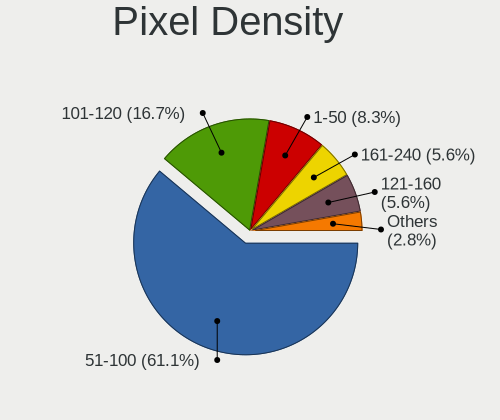

| Density | Desktops | Percent |
|---------|----------|---------|
| 51-100  | 21       | 65.63%  |
| 101-120 | 6        | 18.75%  |
| Unknown | 4        | 12.5%   |
| 1-50    | 1        | 3.13%   |

Multiple Monitors
-----------------

Total monitors connected

| Total | Desktops | Percent |
|-------|----------|---------|
| 1     | 21       | 70%     |
| 2     | 7        | 23.33%  |
| 0     | 2        | 6.67%   |

Network
-------

Net Controller Vendor
---------------------

Controller vendors

| Vendor                | Desktops | Percent |
|-----------------------|----------|---------|
| Realtek Semiconductor | 20       | 54.05%  |
| Intel                 | 14       | 37.84%  |
| Qualcomm Atheros      | 1        | 2.7%    |
| Huawei Technologies   | 1        | 2.7%    |
| Broadcom              | 1        | 2.7%    |

Net Controller Model
--------------------

Controller models

| Model                                                             | Desktops | Percent |
|-------------------------------------------------------------------|----------|---------|
| Realtek RTL8111/8168/8411 PCI Express Gigabit Ethernet Controller | 17       | 41.46%  |
| Realtek RTL8125 2.5GbE Controller                                 | 3        | 7.32%   |
| Intel Wi-Fi 6 AX200                                               | 3        | 7.32%   |
| Intel 82579LM Gigabit Network Connection (Lewisville)             | 3        | 7.32%   |
| Intel I211 Gigabit Network Connection                             | 2        | 4.88%   |
| Realtek RTL8153 Gigabit Ethernet Adapter                          | 1        | 2.44%   |
| Realtek RTL-8100/8101L/8139 PCI Fast Ethernet Adapter             | 1        | 2.44%   |
| Qualcomm Atheros Killer E220x Gigabit Ethernet Controller         | 1        | 2.44%   |
| Intel Ethernet Connection I217-V                                  | 1        | 2.44%   |
| Intel Ethernet Connection (7) I219-V                              | 1        | 2.44%   |
| Intel Ethernet Connection (2) I219-LM                             | 1        | 2.44%   |
| Intel Ethernet Connection (2) I218-V                              | 1        | 2.44%   |
| Intel Ethernet Connection (2) I218-LM                             | 1        | 2.44%   |
| Intel Ethernet Connection (14) I219-V                             | 1        | 2.44%   |
| Intel Dual Band Wireless-AC 3168NGW [Stone Peak]                  | 1        | 2.44%   |
| Intel 82567LM-3 Gigabit Network Connection                        | 1        | 2.44%   |
| Huawei E353/E3131                                                 | 1        | 2.44%   |
| Broadcom BCM4360 802.11ac Wireless Network Adapter                | 1        | 2.44%   |

Wireless Vendor
---------------

Wireless vendors

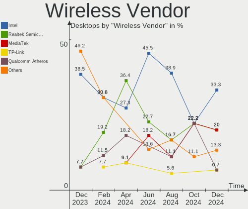

| Vendor   | Desktops | Percent |
|----------|----------|---------|
| Intel    | 4        | 80%     |
| Broadcom | 1        | 20%     |

Wireless Model
--------------

Wireless models

| Model                                              | Desktops | Percent |
|----------------------------------------------------|----------|---------|
| Intel Wi-Fi 6 AX200                                | 3        | 60%     |
| Intel Dual Band Wireless-AC 3168NGW [Stone Peak]   | 1        | 20%     |
| Broadcom BCM4360 802.11ac Wireless Network Adapter | 1        | 20%     |

Ethernet Vendor
---------------

Ethernet vendors

| Vendor                | Desktops | Percent |
|-----------------------|----------|---------|
| Realtek Semiconductor | 20       | 58.82%  |
| Intel                 | 12       | 35.29%  |
| Qualcomm Atheros      | 1        | 2.94%   |
| Huawei Technologies   | 1        | 2.94%   |

Ethernet Model
--------------

Ethernet models

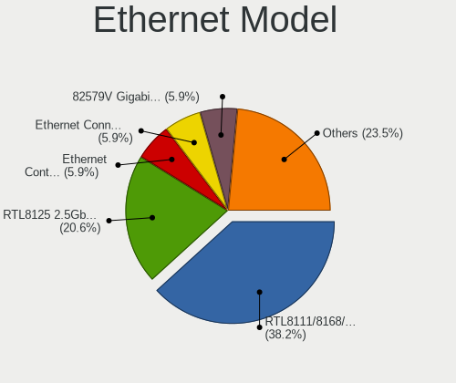

| Model                                                             | Desktops | Percent |
|-------------------------------------------------------------------|----------|---------|
| Realtek RTL8111/8168/8411 PCI Express Gigabit Ethernet Controller | 17       | 47.22%  |
| Realtek RTL8125 2.5GbE Controller                                 | 3        | 8.33%   |
| Intel 82579LM Gigabit Network Connection (Lewisville)             | 3        | 8.33%   |
| Intel I211 Gigabit Network Connection                             | 2        | 5.56%   |
| Realtek RTL8153 Gigabit Ethernet Adapter                          | 1        | 2.78%   |
| Realtek RTL-8100/8101L/8139 PCI Fast Ethernet Adapter             | 1        | 2.78%   |
| Qualcomm Atheros Killer E220x Gigabit Ethernet Controller         | 1        | 2.78%   |
| Intel Ethernet Connection I217-V                                  | 1        | 2.78%   |
| Intel Ethernet Connection (7) I219-V                              | 1        | 2.78%   |
| Intel Ethernet Connection (2) I219-LM                             | 1        | 2.78%   |
| Intel Ethernet Connection (2) I218-V                              | 1        | 2.78%   |
| Intel Ethernet Connection (2) I218-LM                             | 1        | 2.78%   |
| Intel Ethernet Connection (14) I219-V                             | 1        | 2.78%   |
| Intel 82567LM-3 Gigabit Network Connection                        | 1        | 2.78%   |
| Huawei E353/E3131                                                 | 1        | 2.78%   |

Net Controller Kind
-------------------

Ethernet, WiFi or modem

| Kind     | Desktops | Percent |
|----------|----------|---------|
| Ethernet | 30       | 85.71%  |
| WiFi     | 5        | 14.29%  |

Used Controller
---------------

Currently used network controller

| Kind     | Desktops | Percent |
|----------|----------|---------|
| Ethernet | 29       | 96.67%  |
| WiFi     | 1        | 3.33%   |

NICs
----

Total network controllers on board

| Total | Desktops | Percent |
|-------|----------|---------|
| 1     | 21       | 70%     |
| 2     | 8        | 26.67%  |
| 3     | 1        | 3.33%   |

IPv6
----

IPv6 vs IPv4

| Used | Desktops | Percent |
|------|----------|---------|
| No   | 18       | 60%     |
| Yes  | 12       | 40%     |

Bluetooth
---------

Bluetooth Vendor
----------------

Controller vendors

| Vendor                  | Desktops | Percent |
|-------------------------|----------|---------|
| Cambridge Silicon Radio | 5        | 50%     |
| Intel                   | 4        | 40%     |
| Realtek                 | 1        | 10%     |

Bluetooth Model
---------------

Controller models

| Model                                               | Desktops | Percent |
|-----------------------------------------------------|----------|---------|
| Cambridge Silicon Radio Bluetooth Dongle (HCI mode) | 5        | 50%     |
| Intel AX200 Bluetooth                               | 3        | 30%     |
| Realtek Bluetooth Radio                             | 1        | 10%     |
| Intel Wireless-AC 3168 Bluetooth                    | 1        | 10%     |

Sound
-----

Sound Vendor
------------

Sound card vendors

| Vendor              | Desktops | Percent |
|---------------------|----------|---------|
| Nvidia              | 19       | 35.85%  |
| Intel               | 16       | 30.19%  |
| AMD                 | 13       | 24.53%  |
| RME                 | 1        | 1.89%   |
| Focusrite-Novation  | 1        | 1.89%   |
| Creative Technology | 1        | 1.89%   |
| Apple               | 1        | 1.89%   |
| Alesis              | 1        | 1.89%   |

Sound Model
-----------

Sound card models

| Model                                                                             | Desktops | Percent |
|-----------------------------------------------------------------------------------|----------|---------|
| AMD Starship/Matisse HD Audio Controller                                          | 6        | 10.17%  |
| Nvidia GP104 High Definition Audio Controller                                     | 3        | 5.08%   |
| Intel 8 Series/C220 Series Chipset High Definition Audio Controller               | 3        | 5.08%   |
| Intel 7 Series/C216 Chipset Family High Definition Audio Controller               | 3        | 5.08%   |
| Intel 5 Series/3400 Series Chipset High Definition Audio                          | 3        | 5.08%   |
| Nvidia High Definition Audio Controller                                           | 2        | 3.39%   |
| Nvidia GM107 High Definition Audio Controller [GeForce 940MX]                     | 2        | 3.39%   |
| Nvidia GK208 HDMI/DP Audio Controller                                             | 2        | 3.39%   |
| Nvidia GA106 High Definition Audio Controller                                     | 2        | 3.39%   |
| AMD Family 17h/19h HD Audio Controller                                            | 2        | 3.39%   |
| AMD Family 17h (Models 00h-0fh) HD Audio Controller                               | 2        | 3.39%   |
| RME ADI-2 DAC (59920196)                                                          | 1        | 1.69%   |
| Nvidia TU106 High Definition Audio Controller                                     | 1        | 1.69%   |
| Nvidia TU104 HD Audio Controller                                                  | 1        | 1.69%   |
| Nvidia GP107GL High Definition Audio Controller                                   | 1        | 1.69%   |
| Nvidia GM204 High Definition Audio Controller                                     | 1        | 1.69%   |
| Nvidia GM200 High Definition Audio                                                | 1        | 1.69%   |
| Nvidia GK106 HDMI Audio Controller                                                | 1        | 1.69%   |
| Nvidia GF119 HDMI Audio Controller                                                | 1        | 1.69%   |
| Nvidia GF106 High Definition Audio Controller                                     | 1        | 1.69%   |
| Intel Cannon Lake PCH cAVS                                                        | 1        | 1.69%   |
| Intel C610/X99 series chipset HD Audio Controller                                 | 1        | 1.69%   |
| Intel C600/X79 series chipset High Definition Audio Controller                    | 1        | 1.69%   |
| Intel Audio device                                                                | 1        | 1.69%   |
| Intel 9 Series Chipset Family HD Audio Controller                                 | 1        | 1.69%   |
| Intel 82801JD/DO (ICH10 Family) HD Audio Controller                               | 1        | 1.69%   |
| Intel 100 Series/C230 Series Chipset Family HD Audio Controller                   | 1        | 1.69%   |
| Focusrite-Novation Scarlett 2i2 Camera                                            | 1        | 1.69%   |
| Creative Technology BT-W3                                                         | 1        | 1.69%   |
| Apple USB-C to 3.5mm Headphone Jack Adapter                                       | 1        | 1.69%   |
| AMD Vega 10 HDMI Audio [Radeon Vega 56/64]                                        | 1        | 1.69%   |
| AMD SBx00 Azalia (Intel HDA)                                                      | 1        | 1.69%   |
| AMD Renoir Radeon High Definition Audio Controller                                | 1        | 1.69%   |
| AMD Raven/Raven2/Fenghuang HDMI/DP Audio Controller                               | 1        | 1.69%   |
| AMD Navi 10 HDMI Audio                                                            | 1        | 1.69%   |
| AMD Ellesmere HDMI Audio [Radeon RX 470/480 / 570/580/590]                        | 1        | 1.69%   |
| AMD Cedar HDMI Audio [Radeon HD 5400/6300/7300 Series]                            | 1        | 1.69%   |
| AMD Caicos HDMI Audio [Radeon HD 6450 / 7450/8450/8490 OEM / R5 230/235/235X OEM] | 1        | 1.69%   |
| AMD Baffin HDMI/DP Audio [Radeon RX 550 640SP / RX 560/560X]                      | 1        | 1.69%   |
| Alesis Q25                                                                        | 1        | 1.69%   |

Memory
------

Memory Vendor
-------------

Memory module vendors

| Vendor              | Desktops | Percent |
|---------------------|----------|---------|
| SK hynix            | 2        | 25%     |
| Samsung Electronics | 1        | 12.5%   |
| Kingston            | 1        | 12.5%   |
| G.Skill             | 1        | 12.5%   |
| Corsair             | 1        | 12.5%   |
| Atermiter           | 1        | 12.5%   |
| Unknown             | 1        | 12.5%   |

Memory Model
------------

Memory module models

| Model                                                   | Desktops | Percent |
|---------------------------------------------------------|----------|---------|
| SK hynix RAM HMA81GU6AFR8N-UH 8GB DIMM DDR4 2400MT/s    | 1        | 12.5%   |
| SK hynix RAM HMA41GR7MFR4N-TF 8192MB DIMM DDR4 2667MT/s | 1        | 12.5%   |
| Samsung RAM M393B5170GB0-CK0 4GB DIMM DDR3 1600MT/s     | 1        | 12.5%   |
| Kingston RAM 9905474-019.A00LF 2GB DIMM DDR3 1333MT/s   | 1        | 12.5%   |
| G.Skill RAM F4-3200C16-16GIS 16GB DIMM DDR4 3600MT/s    | 1        | 12.5%   |
| Corsair RAM CMK16GX4M2B3200C16 8GB DIMM DDR4 3600MT/s   | 1        | 12.5%   |
| Atermiter RAM Module 16384MB DIMM DDR4 3200MT/s         | 1        | 12.5%   |
| Unknown                                                 | 1        | 12.5%   |

Memory Kind
-----------

Memory module kinds

| Kind    | Desktops | Percent |
|---------|----------|---------|
| DDR4    | 4        | 57.14%  |
| DDR3    | 2        | 28.57%  |
| Unknown | 1        | 14.29%  |

Memory Form Factor
------------------

Physical design of the memory module

| Name | Desktops | Percent |
|------|----------|---------|
| DIMM | 7        | 100%    |

Memory Size
-----------

Memory module size

| Size  | Desktops | Percent |
|-------|----------|---------|
| 8192  | 3        | 33.33%  |
| 16384 | 2        | 22.22%  |
| 4096  | 2        | 22.22%  |
| 2048  | 2        | 22.22%  |

Memory Speed
------------

Memory module speed

| Speed | Desktops | Percent |
|-------|----------|---------|
| 3600  | 2        | 25%     |
| 3200  | 1        | 12.5%   |
| 2667  | 1        | 12.5%   |
| 2400  | 1        | 12.5%   |
| 1600  | 1        | 12.5%   |
| 1333  | 1        | 12.5%   |
| 1280  | 1        | 12.5%   |

Printers & scanners
-------------------

Printer Vendor
--------------

Printer device vendors

| Vendor          | Desktops | Percent |
|-----------------|----------|---------|
| Hewlett-Packard | 1        | 100%    |

Printer Model
-------------

Printer device models

| Model                              | Desktops | Percent |
|------------------------------------|----------|---------|
| HP DeskJet 2620 All-in-One Printer | 1        | 100%    |

Scanner Vendor
--------------

Scanner device vendors

Zero info for selected period =(

Scanner Model
-------------

Scanner device models

Zero info for selected period =(

Camera
------

Camera Vendor
-------------

Camera device vendors

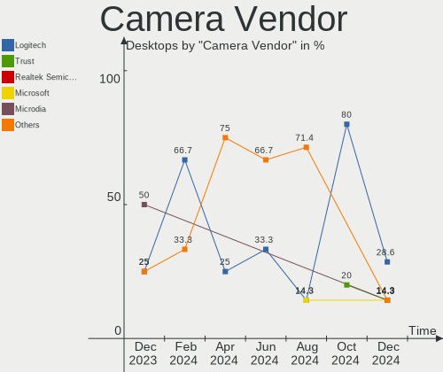

| Vendor   | Desktops | Percent |
|----------|----------|---------|
| Logitech | 2        | 50%     |
| Apple    | 2        | 50%     |

Camera Model
------------

Camera device models

| Model                     | Desktops | Percent |
|---------------------------|----------|---------|
| Apple iPhone 5/5C/5S/6/SE | 2        | 50%     |
| Logitech StreamCam        | 1        | 25%     |
| Logitech HD Webcam C510   | 1        | 25%     |

Security
--------

Fingerprint Vendor
------------------

Fingerprint sensor vendors

Zero info for selected period =(

Fingerprint Model
-----------------

Fingerprint sensor models

Zero info for selected period =(

Chipcard Vendor
---------------

Chipcard module vendors

Zero info for selected period =(

Chipcard Model
--------------

Chipcard module models

Zero info for selected period =(

Unsupported
-----------

Unsupported Devices
-------------------

Total unsupported devices on board

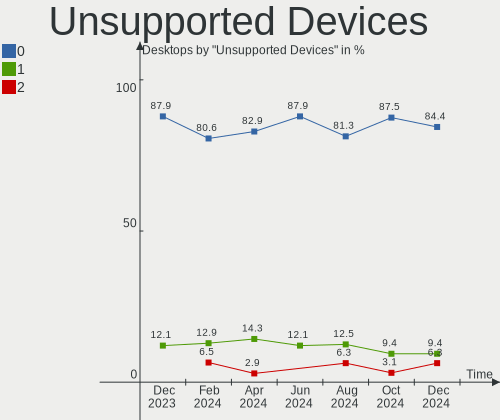

| Total | Desktops | Percent |
|-------|----------|---------|
| 0     | 26       | 86.67%  |
| 1     | 3        | 10%     |
| 2     | 1        | 3.33%   |

Unsupported Device Types
------------------------

Types of unsupported devices

| Type             | Desktops | Percent |
|------------------|----------|---------|
| Graphics card    | 3        | 60%     |
| Unassigned class | 1        | 20%     |
| Net/wireless     | 1        | 20%     |

