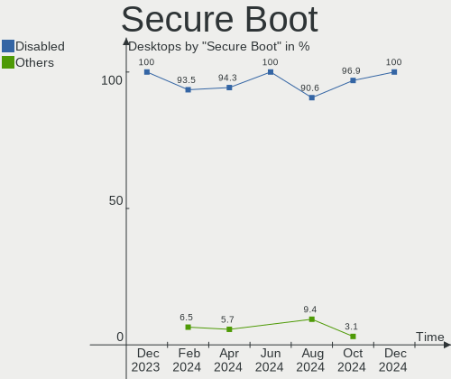
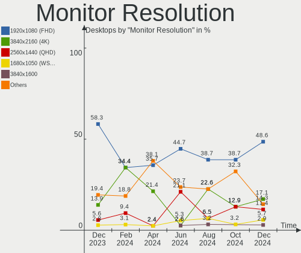
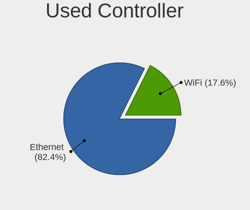
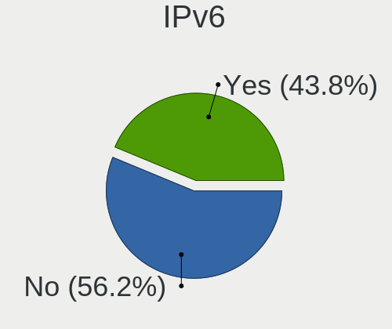
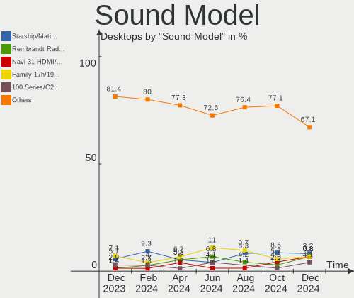
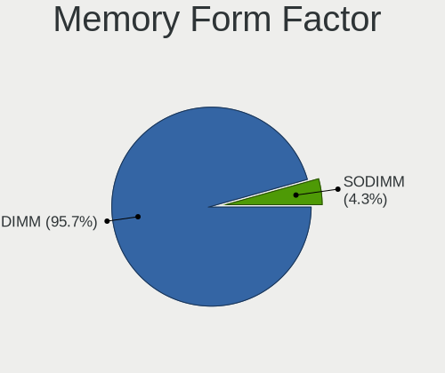
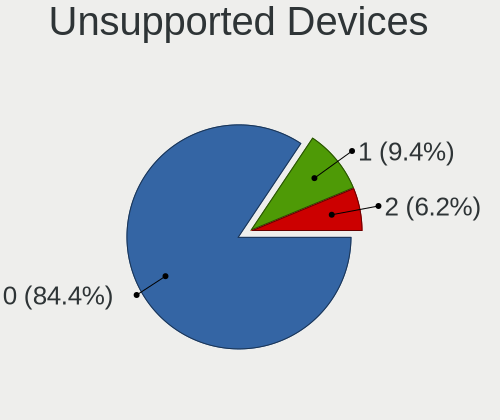

Linux in Netherlands - Hardware Trends (Desktops)
-------------------------------------------------

A project to identify most popular hardware characteristics and track their change
over time based on data collected by Linux users at https://Linux-Hardware.org.

Anyone can contribute to this report by the [hw-probe](https://github.com/linuxhw/hw-probe) tool:

    sudo -E hw-probe -all -upload

Period: Aug, 2022.

Contents
--------

* [ System ](#system)
  - [ OS                       ](#os)
  - [ OS Family                ](#os-family)
  - [ Kernel                   ](#kernel)
  - [ Kernel Family            ](#kernel-family)
  - [ Kernel Major Ver.        ](#kernel-major-ver)
  - [ Arch                     ](#arch)
  - [ DE                       ](#de)
  - [ Display Server           ](#display-server)
  - [ Display Manager          ](#display-manager)
  - [ OS Lang                  ](#os-lang)
  - [ Boot Mode                ](#boot-mode)
  - [ Filesystem               ](#filesystem)
  - [ Part. scheme             ](#part-scheme)
  - [ Dual Boot with Linux/BSD ](#dual-boot-with-linuxbsd)
  - [ Dual Boot (Win)          ](#dual-boot-win)

* [ Board ](#board)
  - [ Vendor                   ](#vendor)
  - [ Model                    ](#model)
  - [ Model Family             ](#model-family)
  - [ MFG Year                 ](#mfg-year)
  - [ Form Factor              ](#form-factor)
  - [ Secure Boot              ](#secure-boot)
  - [ Coreboot                 ](#coreboot)
  - [ RAM Size                 ](#ram-size)
  - [ RAM Used                 ](#ram-used)
  - [ Total Drives             ](#total-drives)
  - [ Has CD-ROM               ](#has-cd-rom)
  - [ Has Ethernet             ](#has-ethernet)
  - [ Has WiFi                 ](#has-wifi)
  - [ Has Bluetooth            ](#has-bluetooth)

* [ Location ](#location)
  - [ Country                  ](#country)
  - [ City                     ](#city)

* [ Drives ](#drives)
  - [ Drive Vendor             ](#drive-vendor)
  - [ Drive Model              ](#drive-model)
  - [ HDD Vendor               ](#hdd-vendor)
  - [ SSD Vendor               ](#ssd-vendor)
  - [ Drive Kind               ](#drive-kind)
  - [ Drive Connector          ](#drive-connector)
  - [ Drive Size               ](#drive-size)
  - [ Space Total              ](#space-total)
  - [ Space Used               ](#space-used)
  - [ Malfunc. Drives          ](#malfunc-drives)
  - [ Malfunc. Drive Vendor    ](#malfunc-drive-vendor)
  - [ Malfunc. HDD Vendor      ](#malfunc-hdd-vendor)
  - [ Malfunc. Drive Kind      ](#malfunc-drive-kind)
  - [ Failed Drives            ](#failed-drives)
  - [ Failed Drive Vendor      ](#failed-drive-vendor)
  - [ Drive Status             ](#drive-status)

* [ Storage controller ](#storage-controller)
  - [ Storage Vendor           ](#storage-vendor)
  - [ Storage Model            ](#storage-model)
  - [ Storage Kind             ](#storage-kind)

* [ Processor ](#processor)
  - [ CPU Vendor               ](#cpu-vendor)
  - [ CPU Model                ](#cpu-model)
  - [ CPU Model Family         ](#cpu-model-family)
  - [ CPU Cores                ](#cpu-cores)
  - [ CPU Sockets              ](#cpu-sockets)
  - [ CPU Threads              ](#cpu-threads)
  - [ CPU Op-Modes             ](#cpu-op-modes)
  - [ CPU Microcode            ](#cpu-microcode)
  - [ CPU Microarch            ](#cpu-microarch)

* [ Graphics ](#graphics)
  - [ GPU Vendor               ](#gpu-vendor)
  - [ GPU Model                ](#gpu-model)
  - [ GPU Combo                ](#gpu-combo)
  - [ GPU Driver               ](#gpu-driver)
  - [ GPU Memory               ](#gpu-memory)

* [ Monitor ](#monitor)
  - [ Monitor Vendor           ](#monitor-vendor)
  - [ Monitor Model            ](#monitor-model)
  - [ Monitor Resolution       ](#monitor-resolution)
  - [ Monitor Diagonal         ](#monitor-diagonal)
  - [ Monitor Width            ](#monitor-width)
  - [ Aspect Ratio             ](#aspect-ratio)
  - [ Monitor Area             ](#monitor-area)
  - [ Pixel Density            ](#pixel-density)
  - [ Multiple Monitors        ](#multiple-monitors)

* [ Network ](#network)
  - [ Net Controller Vendor    ](#net-controller-vendor)
  - [ Net Controller Model     ](#net-controller-model)
  - [ Wireless Vendor          ](#wireless-vendor)
  - [ Wireless Model           ](#wireless-model)
  - [ Ethernet Vendor          ](#ethernet-vendor)
  - [ Ethernet Model           ](#ethernet-model)
  - [ Net Controller Kind      ](#net-controller-kind)
  - [ Used Controller          ](#used-controller)
  - [ NICs                     ](#nics)
  - [ IPv6                     ](#ipv6)

* [ Bluetooth ](#bluetooth)
  - [ Bluetooth Vendor         ](#bluetooth-vendor)
  - [ Bluetooth Model          ](#bluetooth-model)

* [ Sound ](#sound)
  - [ Sound Vendor             ](#sound-vendor)
  - [ Sound Model              ](#sound-model)

* [ Memory ](#memory)
  - [ Memory Vendor            ](#memory-vendor)
  - [ Memory Model             ](#memory-model)
  - [ Memory Kind              ](#memory-kind)
  - [ Memory Form Factor       ](#memory-form-factor)
  - [ Memory Size              ](#memory-size)
  - [ Memory Speed             ](#memory-speed)

* [ Printers & scanners ](#printers--scanners)
  - [ Printer Vendor           ](#printer-vendor)
  - [ Printer Model            ](#printer-model)
  - [ Scanner Vendor           ](#scanner-vendor)
  - [ Scanner Model            ](#scanner-model)

* [ Camera ](#camera)
  - [ Camera Vendor            ](#camera-vendor)
  - [ Camera Model             ](#camera-model)

* [ Security ](#security)
  - [ Fingerprint Vendor       ](#fingerprint-vendor)
  - [ Fingerprint Model        ](#fingerprint-model)
  - [ Chipcard Vendor          ](#chipcard-vendor)
  - [ Chipcard Model           ](#chipcard-model)

* [ Unsupported ](#unsupported)
  - [ Unsupported Devices      ](#unsupported-devices)
  - [ Unsupported Device Types ](#unsupported-device-types)

System
------

OS
--

Installed operating systems

| Name              | Desktops | Percent |
|-------------------|----------|---------|
| Fedora 36         | 6        | 18.75%  |
| Zorin 16          | 4        | 12.5%   |
| Ubuntu 22.04      | 4        | 12.5%   |
| Linux Mint 21     | 3        | 9.38%   |
| Pop!_OS 22.04     | 2        | 6.25%   |
| OpenMandriva 4.3  | 2        | 6.25%   |
| Linux Mint 20.3   | 2        | 6.25%   |
| Void Linux        | 1        | 3.13%   |
| Ubuntu 20.10      | 1        | 3.13%   |
| Ubuntu 20.04      | 1        | 3.13%   |
| Manjaro           | 1        | 3.13%   |
| LinuxFX 11        | 1        | 3.13%   |
| Kubuntu 22.04     | 1        | 3.13%   |
| Kali 2022.3       | 1        | 3.13%   |
| Gentoo 2.8        | 1        | 3.13%   |
| ArcoLinux Rolling | 1        | 3.13%   |

OS Family
---------

OS without a version

| Name         | Desktops | Percent |
|--------------|----------|---------|
| Ubuntu       | 6        | 18.75%  |
| Fedora       | 6        | 18.75%  |
| Linux Mint   | 5        | 15.63%  |
| Zorin        | 4        | 12.5%   |
| Pop!_OS      | 2        | 6.25%   |
| OpenMandriva | 2        | 6.25%   |
| Void Linux   | 1        | 3.13%   |
| Manjaro      | 1        | 3.13%   |
| LinuxFX      | 1        | 3.13%   |
| Kubuntu      | 1        | 3.13%   |
| Kali         | 1        | 3.13%   |
| Gentoo       | 1        | 3.13%   |
| ArcoLinux    | 1        | 3.13%   |

Kernel
------

Version of the Linux kernel

| Version                  | Desktops | Percent |
|--------------------------|----------|---------|
| 5.15.0-43-generic        | 5        | 15.63%  |
| 5.15.0-46-generic        | 4        | 12.5%   |
| 5.4.0-122-generic        | 2        | 6.25%   |
| 5.18.16-200.fc36.x86_64  | 2        | 6.25%   |
| 5.18.10-76051810-generic | 2        | 6.25%   |
| 5.16.7-desktop-1omv4003  | 2        | 6.25%   |
| 5.15.0-41-generic        | 2        | 6.25%   |
| 5.8.0-25-generic         | 1        | 3.13%   |
| 5.4.0-125-generic        | 1        | 3.13%   |
| 5.19.5-zen1-1-zen        | 1        | 3.13%   |
| 5.19.4-200.fc36.x86_64   | 1        | 3.13%   |
| 5.18.19-200.fc36.x86_64  | 1        | 3.13%   |
| 5.18.17-200.fc36.x86_64  | 1        | 3.13%   |
| 5.18.14_1                | 1        | 3.13%   |
| 5.18.14-1-MANJARO        | 1        | 3.13%   |
| 5.18.13-200.fc36.x86_64  | 1        | 3.13%   |
| 5.18.0-kali5-amd64       | 1        | 3.13%   |
| 5.17.0-1014-oem          | 1        | 3.13%   |
| 5.15.41-gentoo-x86_64    | 1        | 3.13%   |
| 5.15.0-47-generic        | 1        | 3.13%   |

Kernel Family
-------------

Linux kernel without a distro release

| Version | Desktops | Percent |
|---------|----------|---------|
| 5.15.0  | 12       | 37.5%   |
| 5.4.0   | 3        | 9.38%   |
| 5.18.16 | 2        | 6.25%   |
| 5.18.14 | 2        | 6.25%   |
| 5.18.10 | 2        | 6.25%   |
| 5.16.7  | 2        | 6.25%   |
| 5.8.0   | 1        | 3.13%   |
| 5.19.5  | 1        | 3.13%   |
| 5.19.4  | 1        | 3.13%   |
| 5.18.19 | 1        | 3.13%   |
| 5.18.17 | 1        | 3.13%   |
| 5.18.13 | 1        | 3.13%   |
| 5.18.0  | 1        | 3.13%   |
| 5.17.0  | 1        | 3.13%   |
| 5.15.41 | 1        | 3.13%   |

Kernel Major Ver.
-----------------

Linux kernel major version

| Version | Desktops | Percent |
|---------|----------|---------|
| 5.15    | 13       | 40.63%  |
| 5.18    | 10       | 31.25%  |
| 5.4     | 3        | 9.38%   |
| 5.19    | 2        | 6.25%   |
| 5.16    | 2        | 6.25%   |
| 5.8     | 1        | 3.13%   |
| 5.17    | 1        | 3.13%   |

Arch
----

OS architecture (x86_64, i586, etc.)

| Name   | Desktops | Percent |
|--------|----------|---------|
| x86_64 | 32       | 100%    |

DE
--

Desktop Environment

| Name       | Desktops | Percent |
|------------|----------|---------|
| GNOME      | 16       | 50%     |
| KDE5       | 5        | 15.63%  |
| X-Cinnamon | 4        | 12.5%   |
| XFCE       | 3        | 9.38%   |
| MATE       | 2        | 6.25%   |
| Unknown    | 2        | 6.25%   |

Display Server
--------------

X11 or Wayland

| Name    | Desktops | Percent |
|---------|----------|---------|
| X11     | 24       | 75%     |
| Wayland | 7        | 21.88%  |
| Tty     | 1        | 3.13%   |

Display Manager
---------------

SDDM, LightDM, etc.

| Name    | Desktops | Percent |
|---------|----------|---------|
| Unknown | 18       | 56.25%  |
| LightDM | 5        | 15.63%  |
| GDM3    | 5        | 15.63%  |
| SDDM    | 4        | 12.5%   |

OS Lang
-------

Language

| Lang    | Desktops | Percent |
|---------|----------|---------|
| nl_NL   | 17       | 53.13%  |
| en_US   | 11       | 34.38%  |
| en_GB   | 3        | 9.38%   |
| Unknown | 1        | 3.13%   |

Boot Mode
---------

EFI or BIOS

| Mode | Desktops | Percent |
|------|----------|---------|
| BIOS | 17       | 53.13%  |
| EFI  | 15       | 46.88%  |

Filesystem
----------

Type of filesystem

| Type    | Desktops | Percent |
|---------|----------|---------|
| Ext4    | 24       | 75%     |
| Btrfs   | 6        | 18.75%  |
| Overlay | 2        | 6.25%   |

Part. scheme
------------

Scheme of partitioning

| Type    | Desktops | Percent |
|---------|----------|---------|
| Unknown | 21       | 65.63%  |
| GPT     | 10       | 31.25%  |
| MBR     | 1        | 3.13%   |

Dual Boot with Linux/BSD
------------------------

Hosting more than one Linux/BSD

| Dual boot | Desktops | Percent |
|-----------|----------|---------|
| No        | 27       | 84.38%  |
| Yes       | 5        | 15.63%  |

Dual Boot (Win)
---------------

Hosting Linux and Windows

| Dual boot | Desktops | Percent |
|-----------|----------|---------|
| No        | 29       | 90.63%  |
| Yes       | 3        | 9.38%   |

Board
-----

Vendor
------

Motherboard manufacturer

| Name                | Desktops | Percent |
|---------------------|----------|---------|
| MSI                 | 7        | 21.88%  |
| Hewlett-Packard     | 6        | 18.75%  |
| ASUSTek Computer    | 6        | 18.75%  |
| Gigabyte Technology | 3        | 9.38%   |
| Dell                | 3        | 9.38%   |
| Lenovo              | 2        | 6.25%   |
| Standard            | 1        | 3.13%   |
| Shuttle             | 1        | 3.13%   |
| MP                  | 1        | 3.13%   |
| ASRock              | 1        | 3.13%   |
| Acer                | 1        | 3.13%   |

Model
-----

Motherboard model

| Name                                    | Desktops | Percent |
|-----------------------------------------|----------|---------|
| Standard X50-V2                         | 1        | 3.13%   |
| Shuttle XH310V2                         | 1        | 3.13%   |
| MSI p6745nl                             | 1        | 3.13%   |
| MSI MS-7D54                             | 1        | 3.13%   |
| MSI MS-7C56                             | 1        | 3.13%   |
| MSI MS-7B86                             | 1        | 3.13%   |
| MSI MS-7B85                             | 1        | 3.13%   |
| MSI MS-7971                             | 1        | 3.13%   |
| MSI MS-7817                             | 1        | 3.13%   |
| MP MS-7848                              | 1        | 3.13%   |
| Lenovo IdeaCentre K410 10089            | 1        | 3.13%   |
| Lenovo IdeaCentre 310S-08ASR 90G9002XNY | 1        | 3.13%   |
| HP Z230 SFF Workstation                 | 1        | 3.13%   |
| HP ProDesk 600 G2 SFF                   | 1        | 3.13%   |
| HP ProDesk 600 G1 SFF                   | 1        | 3.13%   |
| HP Compaq Pro 6300 SFF                  | 1        | 3.13%   |
| HP Compaq 8000 Elite SFF PC             | 1        | 3.13%   |
| HP 300-0xx                              | 1        | 3.13%   |
| Gigabyte X570 AORUS PRO                 | 1        | 3.13%   |
| Gigabyte B150M-D3H                      | 1        | 3.13%   |
| Gigabyte A320M-S2H                      | 1        | 3.13%   |
| Dell OptiPlex 745                       | 1        | 3.13%   |
| Dell OptiPlex 7010                      | 1        | 3.13%   |
| Dell OptiPlex 3020                      | 1        | 3.13%   |
| ASUS TUF Gaming X570-PLUS               | 1        | 3.13%   |
| ASUS PRIME H370-PLUS                    | 1        | 3.13%   |
| ASUS P8H67-M PRO                        | 1        | 3.13%   |
| ASUS P5VD2-VM                           | 1        | 3.13%   |
| ASUS Crosshair IV Formula               | 1        | 3.13%   |
| ASUS All Series                         | 1        | 3.13%   |
| ASRock J3455-ITX                        | 1        | 3.13%   |
| Acer Predator G3-710                    | 1        | 3.13%   |

Model Family
------------

Motherboard model prefix

| Name               | Desktops | Percent |
|--------------------|----------|---------|
| Dell OptiPlex      | 3        | 9.38%   |
| Lenovo IdeaCentre  | 2        | 6.25%   |
| HP ProDesk         | 2        | 6.25%   |
| HP Compaq          | 2        | 6.25%   |
| Standard X50-V2    | 1        | 3.13%   |
| Shuttle XH310V2    | 1        | 3.13%   |
| MSI p6745nl        | 1        | 3.13%   |
| MSI MS-7D54        | 1        | 3.13%   |
| MSI MS-7C56        | 1        | 3.13%   |
| MSI MS-7B86        | 1        | 3.13%   |
| MSI MS-7B85        | 1        | 3.13%   |
| MSI MS-7971        | 1        | 3.13%   |
| MSI MS-7817        | 1        | 3.13%   |
| MP MS-7848         | 1        | 3.13%   |
| HP Z230            | 1        | 3.13%   |
| HP 300-0xx         | 1        | 3.13%   |
| Gigabyte X570      | 1        | 3.13%   |
| Gigabyte B150M-D3H | 1        | 3.13%   |
| Gigabyte A320M-S2H | 1        | 3.13%   |
| ASUS TUF           | 1        | 3.13%   |
| ASUS PRIME         | 1        | 3.13%   |
| ASUS P8H67-M       | 1        | 3.13%   |
| ASUS P5VD2-VM      | 1        | 3.13%   |
| ASUS Crosshair     | 1        | 3.13%   |
| ASUS All           | 1        | 3.13%   |
| ASRock J3455-ITX   | 1        | 3.13%   |
| Acer Predator      | 1        | 3.13%   |

MFG Year
--------

Motherboard manufacture year

| Year | Desktops | Percent |
|------|----------|---------|
| 2018 | 4        | 12.5%   |
| 2014 | 4        | 12.5%   |
| 2013 | 4        | 12.5%   |
| 2012 | 4        | 12.5%   |
| 2015 | 3        | 9.38%   |
| 2020 | 2        | 6.25%   |
| 2019 | 2        | 6.25%   |
| 2016 | 2        | 6.25%   |
| 2011 | 2        | 6.25%   |
| 2006 | 2        | 6.25%   |
| 2021 | 1        | 3.13%   |
| 2017 | 1        | 3.13%   |
| 2009 | 1        | 3.13%   |

Form Factor
-----------

Physical design of the computer

| Name    | Desktops | Percent |
|---------|----------|---------|
| Desktop | 32       | 100%    |

Secure Boot
-----------

Enabled or disabled

| State    | Desktops | Percent |
|----------|----------|---------|
| Disabled | 30       | 93.75%  |
| Enabled  | 2        | 6.25%   |

Coreboot
--------

Have coreboot on board

| Used | Desktops | Percent |
|------|----------|---------|
| No   | 32       | 100%    |

RAM Size
--------

Total RAM memory

| Size in GB  | Desktops | Percent |
|-------------|----------|---------|
| 16.01-24.0  | 8        | 25%     |
| 32.01-64.0  | 6        | 18.75%  |
| 8.01-16.0   | 6        | 18.75%  |
| 4.01-8.0    | 4        | 12.5%   |
| 3.01-4.0    | 4        | 12.5%   |
| 24.01-32.0  | 1        | 3.13%   |
| 2.01-3.0    | 1        | 3.13%   |
| 64.01-256.0 | 1        | 3.13%   |
| 1.01-2.0    | 1        | 3.13%   |

RAM Used
--------

Used RAM memory

| Used GB    | Desktops | Percent |
|------------|----------|---------|
| 1.01-2.0   | 10       | 31.25%  |
| 2.01-3.0   | 8        | 25%     |
| 3.01-4.0   | 7        | 21.88%  |
| 4.01-8.0   | 3        | 9.38%   |
| 8.01-16.0  | 2        | 6.25%   |
| 32.01-64.0 | 1        | 3.13%   |
| 0.51-1.0   | 1        | 3.13%   |

Total Drives
------------

Number of drives on board

| Drives | Desktops | Percent |
|--------|----------|---------|
| 2      | 13       | 40.63%  |
| 1      | 10       | 31.25%  |
| 3      | 4        | 12.5%   |
| 5      | 2        | 6.25%   |
| 4      | 2        | 6.25%   |
| 9      | 1        | 3.13%   |

Has CD-ROM
----------

Has CD-ROM on board

| Presented | Desktops | Percent |
|-----------|----------|---------|
| Yes       | 16       | 50%     |
| No        | 16       | 50%     |

Has Ethernet
------------

Has Ethernet on board

| Presented | Desktops | Percent |
|-----------|----------|---------|
| Yes       | 32       | 100%    |

Has WiFi
--------

Has WiFi module

| Presented | Desktops | Percent |
|-----------|----------|---------|
| No        | 17       | 53.13%  |
| Yes       | 15       | 46.88%  |

Has Bluetooth
-------------

Has Bluetooth module

| Presented | Desktops | Percent |
|-----------|----------|---------|
| No        | 18       | 56.25%  |
| Yes       | 14       | 43.75%  |

Location
--------

Country
-------

Geographic location (country)

| Country     | Desktops | Percent |
|-------------|----------|---------|
| Netherlands | 32       | 100%    |

City
----

Geographic location (city)

| City             | Desktops | Percent |
|------------------|----------|---------|
| Amsterdam        | 9        | 28.13%  |
| Oosterbeek       | 2        | 6.25%   |
| Deventer         | 2        | 6.25%   |
| Assen            | 2        | 6.25%   |
| Voorburg         | 1        | 3.13%   |
| Vijfhuizen       | 1        | 3.13%   |
| The Hague        | 1        | 3.13%   |
| Serooskerke      | 1        | 3.13%   |
| Purmerend        | 1        | 3.13%   |
| Oosterhout       | 1        | 3.13%   |
| Hoogeveen        | 1        | 3.13%   |
| Heerde           | 1        | 3.13%   |
| Hazerswoude-Dorp | 1        | 3.13%   |
| Emmen            | 1        | 3.13%   |
| Delft            | 1        | 3.13%   |
| Breda            | 1        | 3.13%   |
| Bergen           | 1        | 3.13%   |
| Amstelveen       | 1        | 3.13%   |
| Almelo           | 1        | 3.13%   |
| Aalten           | 1        | 3.13%   |
| Unknown          | 1        | 3.13%   |

Drives
------

Drive Vendor
------------

Hard drive vendors

| Vendor              | Desktops | Drives | Percent |
|---------------------|----------|--------|---------|
| WDC                 | 11       | 12     | 18.33%  |
| Samsung Electronics | 11       | 15     | 18.33%  |
| Seagate             | 9        | 16     | 15%     |
| Kingston            | 7        | 7      | 11.67%  |
| SanDisk             | 4        | 4      | 6.67%   |
| Crucial             | 4        | 4      | 6.67%   |
| Toshiba             | 2        | 4      | 3.33%   |
| Unknown             | 1        | 1      | 1.67%   |
| Phison              | 1        | 1      | 1.67%   |
| Micron Technology   | 1        | 1      | 1.67%   |
| Maxtor              | 1        | 1      | 1.67%   |
| Leven               | 1        | 1      | 1.67%   |
| KingSpec            | 1        | 1      | 1.67%   |
| KingFast            | 1        | 1      | 1.67%   |
| Intel               | 1        | 1      | 1.67%   |
| HGST                | 1        | 1      | 1.67%   |
| GOODRAM             | 1        | 1      | 1.67%   |
| ExcelStor           | 1        | 1      | 1.67%   |
| A-DATA Technology   | 1        | 1      | 1.67%   |

Drive Model
-----------

Hard drive models

| Model                                       | Desktops | Percent |
|---------------------------------------------|----------|---------|
| Kingston SA400S37240G 240GB SSD             | 3        | 4.35%   |
| Samsung NVMe SSD Drive 500GB                | 2        | 2.9%    |
| Samsung NVMe SSD Drive 1TB                  | 2        | 2.9%    |
| Kingston SUV400S37240G 240GB SSD            | 2        | 2.9%    |
| WDC WDS480G2G0A-00JH30 480GB SSD            | 1        | 1.45%   |
| WDC WD40EZRZ-00GXCB0 4TB                    | 1        | 1.45%   |
| WDC WD30EZRX-00MMMB0 3TB                    | 1        | 1.45%   |
| WDC WD30EFRX-68EUZN0 3TB                    | 1        | 1.45%   |
| WDC WD2500KS-00MJB0 250GB                   | 1        | 1.45%   |
| WDC WD10EZRZ-00HTKB0 1TB                    | 1        | 1.45%   |
| WDC WD10EZEX-00WN4A0 1TB                    | 1        | 1.45%   |
| WDC WD10EZEX-00ER1A0 1TB                    | 1        | 1.45%   |
| WDC WD10EZEX-00BN5A0 1TB                    | 1        | 1.45%   |
| WDC WD10EALX-009BA0 1TB                     | 1        | 1.45%   |
| WDC WD1002FBYS-02A6B0 1TB                   | 1        | 1.45%   |
| WDC WD1002FAEX-00Y9A0 1TB                   | 1        | 1.45%   |
| Unknown SD/MMC/MS PRO 128GB                 | 1        | 1.45%   |
| Toshiba MQ02ABF100 1TB                      | 1        | 1.45%   |
| Toshiba MQ01ABD100 1TB                      | 1        | 1.45%   |
| Toshiba HDWR180 8TB                         | 1        | 1.45%   |
| Seagate ST8000NM0055-1RM112 8TB             | 1        | 1.45%   |
| Seagate ST6000VN001-2BB186 6TB              | 1        | 1.45%   |
| Seagate ST500DM002-1BD142 500GB             | 1        | 1.45%   |
| Seagate ST5000LM000-2AN170 5TB              | 1        | 1.45%   |
| Seagate ST3500418AS 500GB                   | 1        | 1.45%   |
| Seagate ST2000DX002-2DV164 2TB              | 1        | 1.45%   |
| Seagate ST2000DX001-1NS164 2TB              | 1        | 1.45%   |
| Seagate ST2000DM008-2UB102 2TB              | 1        | 1.45%   |
| Seagate ST2000DM008-2FR102 2TB              | 1        | 1.45%   |
| Seagate ST2000DM006-2DM164 2TB              | 1        | 1.45%   |
| Seagate ST1000DM003-1SB10C 1TB              | 1        | 1.45%   |
| Seagate FireCuda 120 SSD ZA500GM10001 500GB | 1        | 1.45%   |
| SanDisk SSD PLUS 120 GB                     | 1        | 1.45%   |
| SanDisk SDSSDH3 2T00 2TB                    | 1        | 1.45%   |
| SanDisk SDSSDH3 250G                        | 1        | 1.45%   |
| SanDisk NVMe SSD Drive 1TB                  | 1        | 1.45%   |
| Samsung SSD 970 EVO 500GB                   | 1        | 1.45%   |
| Samsung SSD 970 EVO 250GB                   | 1        | 1.45%   |
| Samsung SSD 970 EVO 1TB                     | 1        | 1.45%   |
| Samsung SSD 870 EVO 250GB                   | 1        | 1.45%   |
| Samsung SSD 860 EVO 500GB                   | 1        | 1.45%   |
| Samsung SSD 850 EVO 500GB                   | 1        | 1.45%   |
| Samsung SSD 850 EVO 250GB                   | 1        | 1.45%   |
| Samsung SSD 850 EVO 1TB                     | 1        | 1.45%   |
| Samsung SM963 2.5" NVMe PCIe SSD 128GB      | 1        | 1.45%   |
| Samsung HD103SJ 1TB                         | 1        | 1.45%   |
| Samsung HD103SI 1TB                         | 1        | 1.45%   |
| Phison NVMe SSD Drive 256GB                 | 1        | 1.45%   |
| Micron MTFDDAK256MAM-1K1 256GB SSD          | 1        | 1.45%   |
| Maxtor 6Y080M0 81GB                         | 1        | 1.45%   |
| Leven JAJS300M240C 240GB                    | 1        | 1.45%   |
| Kingston SA400S37480G 480GB SSD             | 1        | 1.45%   |
| Kingston SA400S37120G 120GB SSD             | 1        | 1.45%   |
| KingSpec T-64 64GB                          | 1        | 1.45%   |
| KingFast 240GB                              | 1        | 1.45%   |
| Intel SSD 600P Series 512GB                 | 1        | 1.45%   |
| HGST HUH728080ALN600 8TB                    | 1        | 1.45%   |
| GOODRAM SSD 120GB                           | 1        | 1.45%   |
| ExcelStor J8160S 164GB                      | 1        | 1.45%   |
| Crucial CT500MX500SSD1 500GB                | 1        | 1.45%   |

HDD Vendor
----------

Hard disk drive vendors

| Vendor              | Desktops | Drives | Percent |
|---------------------|----------|--------|---------|
| WDC                 | 10       | 11     | 38.46%  |
| Seagate             | 8        | 15     | 30.77%  |
| Toshiba             | 2        | 4      | 7.69%   |
| Samsung Electronics | 2        | 2      | 7.69%   |
| Unknown             | 1        | 1      | 3.85%   |
| Maxtor              | 1        | 1      | 3.85%   |
| HGST                | 1        | 1      | 3.85%   |
| ExcelStor           | 1        | 1      | 3.85%   |

SSD Vendor
----------

Solid state drive vendors

| Vendor              | Desktops | Drives | Percent |
|---------------------|----------|--------|---------|
| Kingston            | 7        | 7      | 26.92%  |
| Samsung Electronics | 5        | 5      | 19.23%  |
| Crucial             | 4        | 4      | 15.38%  |
| SanDisk             | 3        | 3      | 11.54%  |
| WDC                 | 1        | 1      | 3.85%   |
| Seagate             | 1        | 1      | 3.85%   |
| Micron Technology   | 1        | 1      | 3.85%   |
| Leven               | 1        | 1      | 3.85%   |
| KingSpec            | 1        | 1      | 3.85%   |
| GOODRAM             | 1        | 1      | 3.85%   |
| A-DATA Technology   | 1        | 1      | 3.85%   |

Drive Kind
----------

HDD or SSD

| Kind    | Desktops | Drives | Percent |
|---------|----------|--------|---------|
| SSD     | 21       | 26     | 41.18%  |
| HDD     | 20       | 36     | 39.22%  |
| NVMe    | 9        | 11     | 17.65%  |
| Unknown | 1        | 1      | 1.96%   |

Drive Connector
---------------

SATA, SAS, NVMe, etc.

| Type | Desktops | Drives | Percent |
|------|----------|--------|---------|
| SATA | 31       | 62     | 75.61%  |
| NVMe | 9        | 11     | 21.95%  |
| SAS  | 1        | 1      | 2.44%   |

Drive Size
----------

Size of hard drive

| Size in TB | Desktops | Drives | Percent |
|------------|----------|--------|---------|
| 0.01-0.5   | 26       | 29     | 55.32%  |
| 0.51-1.0   | 9        | 13     | 19.15%  |
| 1.01-2.0   | 5        | 10     | 10.64%  |
| 4.01-10.0  | 4        | 7      | 8.51%   |
| 2.01-3.0   | 2        | 2      | 4.26%   |
| 3.01-4.0   | 1        | 1      | 2.13%   |

Space Total
-----------

Amount of disk space available on the file system

| Size in GB     | Desktops | Percent |
|----------------|----------|---------|
| 101-250        | 10       | 31.25%  |
| 251-500        | 6        | 18.75%  |
| 1001-2000      | 4        | 12.5%   |
| 501-1000       | 4        | 12.5%   |
| More than 3000 | 3        | 9.38%   |
| 2001-3000      | 2        | 6.25%   |
| Unknown        | 2        | 6.25%   |
| 51-100         | 1        | 3.13%   |

Space Used
----------

Amount of used disk space

| Used GB        | Desktops | Percent |
|----------------|----------|---------|
| 1-20           | 10       | 31.25%  |
| 101-250        | 5        | 15.63%  |
| 51-100         | 4        | 12.5%   |
| 501-1000       | 3        | 9.38%   |
| 251-500        | 2        | 6.25%   |
| 21-50          | 2        | 6.25%   |
| 1001-2000      | 2        | 6.25%   |
| Unknown        | 2        | 6.25%   |
| More than 3000 | 1        | 3.13%   |
| 2001-3000      | 1        | 3.13%   |

Malfunc. Drives
---------------

Drive models with a malfunction

| Model                               | Desktops | Drives | Percent |
|-------------------------------------|----------|--------|---------|
| Samsung Electronics SSD 970 EVO 1TB | 1        | 1      | 33.33%  |
| Kingston SUV400S37240G 240GB SSD    | 1        | 1      | 33.33%  |
| Intel SSD 600P Series 512GB         | 1        | 1      | 33.33%  |

Malfunc. Drive Vendor
---------------------

Vendors of faulty drives

| Vendor              | Desktops | Drives | Percent |
|---------------------|----------|--------|---------|
| Samsung Electronics | 1        | 1      | 33.33%  |
| Kingston            | 1        | 1      | 33.33%  |
| Intel               | 1        | 1      | 33.33%  |

Malfunc. HDD Vendor
-------------------

Vendors of faulty HDD drives

Zero info for selected period =(

Malfunc. Drive Kind
-------------------

Kinds of faulty drives

| Kind | Desktops | Drives | Percent |
|------|----------|--------|---------|
| NVMe | 2        | 2      | 66.67%  |
| SSD  | 1        | 1      | 33.33%  |

Failed Drives
-------------

Failed drive models

Zero info for selected period =(

Failed Drive Vendor
-------------------

Failed drive vendors

Zero info for selected period =(

Drive Status
------------

Number of failed and malfunc. drives

| Status   | Desktops | Drives | Percent |
|----------|----------|--------|---------|
| Detected | 22       | 43     | 62.86%  |
| Works    | 10       | 28     | 28.57%  |
| Malfunc  | 3        | 3      | 8.57%   |

Storage controller
------------------

Storage Vendor
--------------

Storage controller vendors

| Vendor              | Desktops | Percent |
|---------------------|----------|---------|
| Intel               | 22       | 46.81%  |
| AMD                 | 9        | 19.15%  |
| Samsung Electronics | 7        | 14.89%  |
| JMicron Technology  | 3        | 6.38%   |
| VIA Technologies    | 2        | 4.26%   |
| Silicon Image       | 1        | 2.13%   |
| SanDisk             | 1        | 2.13%   |
| Phison Electronics  | 1        | 2.13%   |
| ASMedia Technology  | 1        | 2.13%   |

Storage Model
-------------

Storage controller models

| Model                                                                                   | Desktops | Percent |
|-----------------------------------------------------------------------------------------|----------|---------|
| AMD FCH SATA Controller [AHCI mode]                                                     | 6        | 10.91%  |
| Samsung NVMe SSD Controller SM981/PM981/PM983                                           | 5        | 9.09%   |
| Intel 8 Series/C220 Series Chipset Family 6-port SATA Controller 1 [AHCI mode]          | 5        | 9.09%   |
| Intel Q170/Q150/B150/H170/H110/Z170/CM236 Chipset SATA Controller [AHCI Mode]           | 4        | 7.27%   |
| Samsung NVMe SSD Controller 980                                                         | 2        | 3.64%   |
| JMicron JMB363 SATA/IDE Controller                                                      | 2        | 3.64%   |
| Intel 7 Series/C210 Series Chipset Family 6-port SATA Controller [AHCI mode]            | 2        | 3.64%   |
| AMD 400 Series Chipset SATA Controller                                                  | 2        | 3.64%   |
| VIA VT82C586A/B/VT82C686/A/B/VT823x/A/C PIPC Bus Master IDE                             | 1        | 1.82%   |
| VIA VT8237A SATA 2-Port Controller                                                      | 1        | 1.82%   |
| VIA VT6415 PATA IDE Host Controller                                                     | 1        | 1.82%   |
| Silicon Image SiI 3132 Serial ATA Raid II Controller                                    | 1        | 1.82%   |
| SanDisk WD Blue SN550 NVMe SSD                                                          | 1        | 1.82%   |
| Samsung NVMe SSD Controller SM951/PM951                                                 | 1        | 1.82%   |
| Phison PS5013 E13 NVMe Controller                                                       | 1        | 1.82%   |
| JMicron JMB58x AHCI SATA controller                                                     | 1        | 1.82%   |
| Intel SSD 600P Series                                                                   | 1        | 1.82%   |
| Intel SATA Controller [RAID mode]                                                       | 1        | 1.82%   |
| Intel NM10/ICH7 Family SATA Controller [AHCI mode]                                      | 1        | 1.82%   |
| Intel Celeron N3350/Pentium N4200/Atom E3900 Series SATA AHCI Controller                | 1        | 1.82%   |
| Intel Cannon Lake PCH SATA AHCI Controller                                              | 1        | 1.82%   |
| Intel 9 Series Chipset Family SATA Controller [AHCI Mode]                               | 1        | 1.82%   |
| Intel 82801JD/DO (ICH10 Family) SATA AHCI Controller                                    | 1        | 1.82%   |
| Intel 82801HR/HO/HH (ICH8R/DO/DH) 2 port SATA Controller [IDE mode]                     | 1        | 1.82%   |
| Intel 82801H (ICH8 Family) 4 port SATA Controller [IDE mode]                            | 1        | 1.82%   |
| Intel 8 Series SATA Controller 1 [AHCI mode]                                            | 1        | 1.82%   |
| Intel 6 Series/C200 Series Chipset Family Desktop SATA Controller (IDE mode, ports 4-5) | 1        | 1.82%   |
| Intel 6 Series/C200 Series Chipset Family Desktop SATA Controller (IDE mode, ports 0-3) | 1        | 1.82%   |
| Intel 6 Series/C200 Series Chipset Family 6 port Desktop SATA AHCI Controller           | 1        | 1.82%   |
| Intel 200 Series PCH SATA controller [AHCI mode]                                        | 1        | 1.82%   |
| ASMedia ASM1062 Serial ATA Controller                                                   | 1        | 1.82%   |
| AMD SB7x0/SB8x0/SB9x0 SATA Controller [IDE mode]                                        | 1        | 1.82%   |
| AMD SB7x0/SB8x0/SB9x0 IDE Controller                                                    | 1        | 1.82%   |
| AMD FCH SATA Controller D                                                               | 1        | 1.82%   |
| AMD 500 Series Chipset SATA Controller                                                  | 1        | 1.82%   |

Storage Kind
------------

Kind of storage controller (IDE, SATA, NVMe, SAS, ...)

| Kind | Desktops | Percent |
|------|----------|---------|
| SATA | 28       | 65.12%  |
| NVMe | 9        | 20.93%  |
| IDE  | 4        | 9.3%    |
| RAID | 2        | 4.65%   |

Processor
---------

CPU Vendor
----------

Processor vendors

| Vendor | Desktops | Percent |
|--------|----------|---------|
| Intel  | 23       | 71.88%  |
| AMD    | 9        | 28.13%  |

CPU Model
---------

Processor models

| Model                                        | Desktops | Percent |
|----------------------------------------------|----------|---------|
| Intel Core i7-3770 CPU @ 3.40GHz             | 2        | 6.25%   |
| Intel Xeon CPU E3-1225 v3 @ 3.20GHz          | 1        | 3.13%   |
| Intel Pentium D CPU 3.00GHz                  | 1        | 3.13%   |
| Intel Core i7-7700 CPU @ 3.60GHz             | 1        | 3.13%   |
| Intel Core i7-4790K CPU @ 4.00GHz            | 1        | 3.13%   |
| Intel Core i7 CPU 870 @ 2.93GHz              | 1        | 3.13%   |
| Intel Core i5-9600K CPU @ 3.70GHz            | 1        | 3.13%   |
| Intel Core i5-6600 CPU @ 3.30GHz             | 1        | 3.13%   |
| Intel Core i5-4570 CPU @ 3.20GHz             | 1        | 3.13%   |
| Intel Core i3-8100 CPU @ 3.60GHz             | 1        | 3.13%   |
| Intel Core i3-6320 CPU @ 3.90GHz             | 1        | 3.13%   |
| Intel Core i3-6100 CPU @ 3.70GHz             | 1        | 3.13%   |
| Intel Core i3-4160 CPU @ 3.60GHz             | 1        | 3.13%   |
| Intel Core i3-4130 CPU @ 3.40GHz             | 1        | 3.13%   |
| Intel Core i3-4025U CPU @ 1.90GHz            | 1        | 3.13%   |
| Intel Core i3-3220 CPU @ 3.30GHz             | 1        | 3.13%   |
| Intel Core i3-2100 CPU @ 3.10GHz             | 1        | 3.13%   |
| Intel Core 2 Duo CPU E8400 @ 3.00GHz         | 1        | 3.13%   |
| Intel Core 2 CPU 6400 @ 2.13GHz              | 1        | 3.13%   |
| Intel Celeron CPU J3455 @ 1.50GHz            | 1        | 3.13%   |
| Intel Celeron CPU G1840 @ 2.80GHz            | 1        | 3.13%   |
| Intel Atom CPU D525 @ 1.80GHz                | 1        | 3.13%   |
| AMD Ryzen 9 3900X 12-Core Processor          | 1        | 3.13%   |
| AMD Ryzen 7 5800X 8-Core Processor           | 1        | 3.13%   |
| AMD Ryzen 7 3700X 8-Core Processor           | 1        | 3.13%   |
| AMD Ryzen 7 2700 Eight-Core Processor        | 1        | 3.13%   |
| AMD Ryzen 5 5600X 6-Core Processor           | 1        | 3.13%   |
| AMD Ryzen 5 3600 6-Core Processor            | 1        | 3.13%   |
| AMD Ryzen 3 2200G with Radeon Vega Graphics  | 1        | 3.13%   |
| AMD Athlon II X2 250 Processor               | 1        | 3.13%   |
| AMD A6-9230 RADEON R4, 5 COMPUTE CORES 2C+3G | 1        | 3.13%   |

CPU Model Family
----------------

Processor model prefix

| Model            | Desktops | Percent |
|------------------|----------|---------|
| Intel Core i3    | 8        | 25%     |
| Intel Core i7    | 5        | 15.63%  |
| Intel Core i5    | 3        | 9.38%   |
| AMD Ryzen 7      | 3        | 9.38%   |
| Intel Celeron    | 2        | 6.25%   |
| AMD Ryzen 5      | 2        | 6.25%   |
| Intel Xeon       | 1        | 3.13%   |
| Intel Pentium D  | 1        | 3.13%   |
| Intel Core 2 Duo | 1        | 3.13%   |
| Intel Core 2     | 1        | 3.13%   |
| Intel Atom       | 1        | 3.13%   |
| AMD Ryzen 9      | 1        | 3.13%   |
| AMD Ryzen 3      | 1        | 3.13%   |
| AMD Athlon II X2 | 1        | 3.13%   |
| AMD A6           | 1        | 3.13%   |

CPU Cores
---------

Number of processor cores

| Number | Desktops | Percent |
|--------|----------|---------|
| 2      | 14       | 43.75%  |
| 4      | 11       | 34.38%  |
| 8      | 3        | 9.38%   |
| 6      | 3        | 9.38%   |
| 12     | 1        | 3.13%   |

CPU Sockets
-----------

Number of sockets

| Number | Desktops | Percent |
|--------|----------|---------|
| 1      | 32       | 100%    |

CPU Threads
-----------

Threads per core (Hyper-Threading)

| Number | Desktops | Percent |
|--------|----------|---------|
| 2      | 19       | 59.38%  |
| 1      | 13       | 40.63%  |

CPU Op-Modes
------------

CPU Operation Modes (32-bit, 64-bit)

| Op mode        | Desktops | Percent |
|----------------|----------|---------|
| 32-bit, 64-bit | 32       | 100%    |

CPU Microcode
-------------

Microcode number

| Number     | Desktops | Percent |
|------------|----------|---------|
| Unknown    | 11       | 34.38%  |
| 0x306c3    | 3        | 9.38%   |
| 0x306a9    | 3        | 9.38%   |
| 0x08701021 | 3        | 9.38%   |
| 0x906ed    | 1        | 3.13%   |
| 0x906eb    | 1        | 3.13%   |
| 0x906e9    | 1        | 3.13%   |
| 0x6f2      | 1        | 3.13%   |
| 0x506e3    | 1        | 3.13%   |
| 0x506c9    | 1        | 3.13%   |
| 0x40651    | 1        | 3.13%   |
| 0x106ca    | 1        | 3.13%   |
| 0x0a201006 | 1        | 3.13%   |
| 0x08101016 | 1        | 3.13%   |
| 0x0800820d | 1        | 3.13%   |
| 0x06006705 | 1        | 3.13%   |

CPU Microarch
-------------

Microarchitecture

| Name        | Desktops | Percent |
|-------------|----------|---------|
| Haswell     | 7        | 21.88%  |
| Zen 2       | 3        | 9.38%   |
| Skylake     | 3        | 9.38%   |
| KabyLake    | 3        | 9.38%   |
| IvyBridge   | 3        | 9.38%   |
| Zen 3       | 2        | 6.25%   |
| Zen+        | 1        | 3.13%   |
| Zen         | 1        | 3.13%   |
| SandyBridge | 1        | 3.13%   |
| Penryn      | 1        | 3.13%   |
| NetBurst    | 1        | 3.13%   |
| Nehalem     | 1        | 3.13%   |
| K10         | 1        | 3.13%   |
| Goldmont    | 1        | 3.13%   |
| Excavator   | 1        | 3.13%   |
| Core        | 1        | 3.13%   |
| Bonnell     | 1        | 3.13%   |

Graphics
--------

GPU Vendor
----------

Vendors of graphics cards

| Vendor           | Desktops | Percent |
|------------------|----------|---------|
| Intel            | 13       | 37.14%  |
| AMD              | 12       | 34.29%  |
| Nvidia           | 9        | 25.71%  |
| VIA Technologies | 1        | 2.86%   |

GPU Model
---------

Graphics card models

| Model                                                                       | Desktops | Percent |
|-----------------------------------------------------------------------------|----------|---------|
| Nvidia GP104 [GeForce GTX 1080]                                             | 2        | 5.71%   |
| Intel CoffeeLake-S GT2 [UHD Graphics 630]                                   | 2        | 5.71%   |
| Intel 4th Generation Core Processor Family Integrated Graphics Controller   | 2        | 5.71%   |
| AMD Navi 23 [Radeon RX 6600/6600 XT/6600M]                                  | 2        | 5.71%   |
| AMD Ellesmere [Radeon RX 470/480/570/570X/580/580X/590]                     | 2        | 5.71%   |
| AMD Cape Verde XT [Radeon HD 7770/8760 / R7 250X]                           | 2        | 5.71%   |
| VIA Technologies CN896/VN896/P4M900 [Chrome 9 HC]                           | 1        | 2.86%   |
| Nvidia TU104 [GeForce RTX 2060]                                             | 1        | 2.86%   |
| Nvidia GP106 [GeForce GTX 1060 6GB]                                         | 1        | 2.86%   |
| Nvidia GK208B [GeForce GT 730]                                              | 1        | 2.86%   |
| Nvidia GK107GL [Quadro K600]                                                | 1        | 2.86%   |
| Nvidia GK107 [GeForce GTX 650]                                              | 1        | 2.86%   |
| Nvidia GK104 [GeForce GTX 760]                                              | 1        | 2.86%   |
| Nvidia G96C [GeForce 9500 GT]                                               | 1        | 2.86%   |
| Intel Xeon E3-1200 v3/4th Gen Core Processor Integrated Graphics Controller | 1        | 2.86%   |
| Intel Xeon E3-1200 v3 Processor Integrated Graphics Controller              | 1        | 2.86%   |
| Intel IvyBridge GT2 [HD Graphics 4000]                                      | 1        | 2.86%   |
| Intel HD Graphics 530                                                       | 1        | 2.86%   |
| Intel HD Graphics 500                                                       | 1        | 2.86%   |
| Intel Haswell-ULT Integrated Graphics Controller                            | 1        | 2.86%   |
| Intel Atom Processor D4xx/D5xx/N4xx/N5xx Integrated Graphics Controller     | 1        | 2.86%   |
| Intel 82Q963/Q965 Integrated Graphics Controller                            | 1        | 2.86%   |
| Intel 4 Series Chipset Integrated Graphics Controller                       | 1        | 2.86%   |
| AMD Stoney [Radeon R2/R3/R4/R5 Graphics]                                    | 1        | 2.86%   |
| AMD Raven Ridge [Radeon Vega Series / Radeon Vega Mobile Series]            | 1        | 2.86%   |
| AMD Pitcairn PRO [Radeon HD 7850 / R7 265 / R9 270 1024SP]                  | 1        | 2.86%   |
| AMD Navi 22 [Radeon RX 6700/6700 XT/6750 XT / 6800M]                        | 1        | 2.86%   |
| AMD Cape Verde PRO [Radeon HD 7750/8740 / R7 250E]                          | 1        | 2.86%   |
| AMD Caicos PRO [Radeon HD 7450]                                             | 1        | 2.86%   |

GPU Combo
---------

Combinations of graphics cards

| Name         | Desktops | Percent |
|--------------|----------|---------|
| 1 x Intel    | 11       | 34.38%  |
| 1 x AMD      | 11       | 34.38%  |
| 1 x Nvidia   | 8        | 25%     |
| 1 x VIA      | 1        | 3.13%   |
| AMD + Nvidia | 1        | 3.13%   |

GPU Driver
----------

Free vs proprietary

| Driver      | Desktops | Percent |
|-------------|----------|---------|
| Free        | 26       | 81.25%  |
| Proprietary | 4        | 12.5%   |
| Unknown     | 2        | 6.25%   |

GPU Memory
----------

Total video memory

| Size in GB | Desktops | Percent |
|------------|----------|---------|
| Unknown    | 20       | 62.5%   |
| 7.01-8.0   | 4        | 12.5%   |
| 1.01-2.0   | 3        | 9.38%   |
| 0.51-1.0   | 2        | 6.25%   |
| 5.01-6.0   | 1        | 3.13%   |
| 8.01-16.0  | 1        | 3.13%   |
| 0.01-0.5   | 1        | 3.13%   |

Monitor
-------

Monitor Vendor
--------------

Monitor vendors

| Vendor               | Desktops | Percent |
|----------------------|----------|---------|
| Samsung Electronics  | 6        | 18.18%  |
| Philips              | 5        | 15.15%  |
| Dell                 | 4        | 12.12%  |
| Goldstar             | 3        | 9.09%   |
| BenQ                 | 3        | 9.09%   |
| Sony                 | 2        | 6.06%   |
| Iiyama               | 2        | 6.06%   |
| Acer                 | 2        | 6.06%   |
| NXG                  | 1        | 3.03%   |
| InfoVision           | 1        | 3.03%   |
| CLB                  | 1        | 3.03%   |
| Belinea              | 1        | 3.03%   |
| ASUSTek Computer     | 1        | 3.03%   |
| Ancor Communications | 1        | 3.03%   |

Monitor Model
-------------

Monitor models

| Model                                                                | Desktops | Percent |
|----------------------------------------------------------------------|----------|---------|
| Sony TV SNYC901 1920x1080                                            | 1        | 2.94%   |
| Sony TV  *00 SNY8004 3840x2160 1220x680mm 55.0-inch                  | 1        | 2.94%   |
| Samsung Electronics U32J59x SAM0F35 3840x2160 697x392mm 31.5-inch    | 1        | 2.94%   |
| Samsung Electronics SyncMaster SAM0586 1920x1200 518x324mm 24.1-inch | 1        | 2.94%   |
| Samsung Electronics SyncMaster SAM0161 1280x1024 338x270mm 17.0-inch | 1        | 2.94%   |
| Samsung Electronics SMB1930N SAM0632 1360x768 410x230mm 18.5-inch    | 1        | 2.94%   |
| Samsung Electronics LC34G55T SAM711A 3440x1440 798x334mm 34.1-inch   | 1        | 2.94%   |
| Samsung Electronics C32HG7x SAM0E14 2560x1440 697x392mm 31.5-inch    | 1        | 2.94%   |
| Philips PHL 277E6 PHLC0E6 1920x1080 598x336mm 27.0-inch              | 1        | 2.94%   |
| Philips PHL 240V5 PHLC10A 1920x1080 527x296mm 23.8-inch              | 1        | 2.94%   |
| Philips PHL 221S6L PHL08F9 1920x1080 477x268mm 21.5-inch             | 1        | 2.94%   |
| Philips FTV PHL01EA 1920x1080 1440x810mm 65.0-inch                   | 1        | 2.94%   |
| Philips 170C5 PHLC00B 1280x1024 338x270mm 17.0-inch                  | 1        | 2.94%   |
| NXG MIRAI DL-519N NXG138C 1280x1024 376x301mm 19.0-inch              | 1        | 2.94%   |
| InfoVision LCD Monitor IVO061A 1366x768 344x193mm 15.5-inch          | 1        | 2.94%   |
| Iiyama PLX2783H-DP IVM661C 1920x1080 600x340mm 27.2-inch             | 1        | 2.94%   |
| Iiyama PL2480H IVM610B 1920x1080 521x293mm 23.5-inch                 | 1        | 2.94%   |
| Goldstar ULTRAWIDE GSM7770 2560x1080 798x334mm 34.1-inch             | 1        | 2.94%   |
| Goldstar Ultra HD GSM5B08 3840x2160 600x340mm 27.2-inch              | 1        | 2.94%   |
| Goldstar L1919S GSM4AF2 1280x1024 376x301mm 19.0-inch                | 1        | 2.94%   |
| Dell U3415W DELA0A7 3440x1440 798x335mm 34.1-inch                    | 1        | 2.94%   |
| Dell U2515H DELD06F 2560x1440 553x311mm 25.0-inch                    | 1        | 2.94%   |
| Dell U2414H DELA0A4 1920x1080 527x296mm 23.8-inch                    | 1        | 2.94%   |
| Dell SP2309W DELD01B 2048x1152 510x290mm 23.1-inch                   | 1        | 2.94%   |
| Dell 2001FP DELA008 1600x1200 367x275mm 18.1-inch                    | 1        | 2.94%   |
| CLB fitHeadlessGS CLB1234 1920x1200 576x324mm 26.0-inch              | 1        | 2.94%   |
| BenQ GW2470 BNQ78D9 1920x1080 527x296mm 23.8-inch                    | 1        | 2.94%   |
| BenQ G2420HDB BNQ7842 1920x1080 477x268mm 21.5-inch                  | 1        | 2.94%   |
| BenQ BL2283 BNQ78EA 1920x1080 476x268mm 21.5-inch                    | 1        | 2.94%   |
| Belinea B101927 MAX0785 1280x1024 376x301mm 19.0-inch                | 1        | 2.94%   |
| ASUSTek Computer PB247 AUS24A8 1920x1080 527x297mm 23.8-inch         | 1        | 2.94%   |
| Ancor Communications VK246 ACI24F1 1920x1080 531x299mm 24.0-inch     | 1        | 2.94%   |
| Acer VG280K ACR0747 3840x2160 621x341mm 27.9-inch                    | 1        | 2.94%   |
| Acer AL1715 ACRAD12 1280x1024 338x270mm 17.0-inch                    | 1        | 2.94%   |

Monitor Resolution
------------------

Monitor screen resolution

| Resolution        | Desktops | Percent |
|-------------------|----------|---------|
| 1920x1080 (FHD)   | 12       | 37.5%   |
| 1280x1024 (SXGA)  | 6        | 18.75%  |
| 3840x2160 (4K)    | 4        | 12.5%   |
| 3440x1440         | 2        | 6.25%   |
| 2560x1440 (QHD)   | 2        | 6.25%   |
| 1366x768 (WXGA)   | 2        | 6.25%   |
| 2560x1080         | 1        | 3.13%   |
| 2048x1152         | 1        | 3.13%   |
| 1920x1200 (WUXGA) | 1        | 3.13%   |
| 1600x1200         | 1        | 3.13%   |

Monitor Diagonal
----------------

Diagonal size in inches

| Inches | Desktops | Percent |
|--------|----------|---------|
| 24     | 5        | 15.15%  |
| 27     | 4        | 12.12%  |
| 34     | 3        | 9.09%   |
| 23     | 3        | 9.09%   |
| 19     | 3        | 9.09%   |
| 17     | 3        | 9.09%   |
| 65     | 2        | 6.06%   |
| 31     | 2        | 6.06%   |
| 21     | 2        | 6.06%   |
| 72     | 1        | 3.03%   |
| 26     | 1        | 3.03%   |
| 25     | 1        | 3.03%   |
| 20     | 1        | 3.03%   |
| 18     | 1        | 3.03%   |
| 15     | 1        | 3.03%   |

Monitor Width
-------------

Physical width

| Width in mm | Desktops | Percent |
|-------------|----------|---------|
| 501-600     | 12       | 37.5%   |
| 401-500     | 4        | 12.5%   |
| 301-350     | 4        | 12.5%   |
| 701-800     | 3        | 9.38%   |
| 601-700     | 3        | 9.38%   |
| 351-400     | 3        | 9.38%   |
| 1001-1500   | 2        | 6.25%   |
| 1501-2000   | 1        | 3.13%   |

Aspect Ratio
------------

Proportional relationship between the width and the height

| Ratio | Desktops | Percent |
|-------|----------|---------|
| 16/9  | 20       | 64.52%  |
| 5/4   | 6        | 19.35%  |
| 21/9  | 3        | 9.68%   |
| 4/3   | 1        | 3.23%   |
| 16/10 | 1        | 3.23%   |

Monitor Area
------------

Area in inch

| Area in inch | Desktops | Percent |
|----------------|----------|---------|
| 201-250        | 7        | 21.21%  |
| 151-200        | 6        | 18.18%  |
| 351-500        | 5        | 15.15%  |
| 301-350        | 4        | 12.12%  |
| 141-150        | 4        | 12.12%  |
| More than 1000 | 3        | 9.09%   |
| 251-300        | 3        | 9.09%   |
| 101-110        | 1        | 3.03%   |

Pixel Density
-------------

Pixels per inch

| Density | Desktops | Percent |
|---------|----------|---------|
| 51-100  | 19       | 61.29%  |
| 101-120 | 7        | 22.58%  |
| 1-50    | 2        | 6.45%   |
| 121-160 | 2        | 6.45%   |
| 161-240 | 1        | 3.23%   |

Multiple Monitors
-----------------

Total monitors connected

| Total | Desktops | Percent |
|-------|----------|---------|
| 1     | 25       | 78.13%  |
| 2     | 6        | 18.75%  |
| 0     | 1        | 3.13%   |

Network
-------

Net Controller Vendor
---------------------

Controller vendors

| Vendor                            | Desktops | Percent |
|-----------------------------------|----------|---------|
| Realtek Semiconductor             | 21       | 50%     |
| Intel                             | 12       | 28.57%  |
| Broadcom                          | 2        | 4.76%   |
| Sundance Technology Inc / IC Plus | 1        | 2.38%   |
| Ralink Technology                 | 1        | 2.38%   |
| Ralink                            | 1        | 2.38%   |
| Qualcomm Atheros                  | 1        | 2.38%   |
| Microsoft                         | 1        | 2.38%   |
| Marvell Technology Group          | 1        | 2.38%   |
| JMicron Technology                | 1        | 2.38%   |

Net Controller Model
--------------------

Controller models

| Model                                                                          | Desktops | Percent |
|--------------------------------------------------------------------------------|----------|---------|
| Realtek RTL8111/8168/8411 PCI Express Gigabit Ethernet Controller              | 17       | 34%     |
| Intel I211 Gigabit Network Connection                                          | 3        | 6%      |
| Realtek RTL8188CE 802.11b/g/n WiFi Adapter                                     | 2        | 4%      |
| Intel Wi-Fi 6 AX200                                                            | 2        | 4%      |
| Intel Ethernet Connection I217-LM                                              | 2        | 4%      |
| Intel 82579LM Gigabit Network Connection (Lewisville)                          | 2        | 4%      |
| Sundance Inc / IC Plus IC Plus IP100A Integrated 10/100 Ethernet MAC + PHY     | 1        | 2%      |
| Realtek RTL8821AE 802.11ac PCIe Wireless Network Adapter                       | 1        | 2%      |
| Realtek RTL8192EU 802.11b/g/n WLAN Adapter                                     | 1        | 2%      |
| Realtek RTL8188EUS 802.11n Wireless Network Adapter                            | 1        | 2%      |
| Realtek RTL8188CUS 802.11n WLAN Adapter                                        | 1        | 2%      |
| Realtek RTL8153 Gigabit Ethernet Adapter                                       | 1        | 2%      |
| Realtek RTL8125 2.5GbE Controller                                              | 1        | 2%      |
| Realtek RTL-8110SC/8169SC Gigabit Ethernet                                     | 1        | 2%      |
| Ralink MT7601U Wireless Adapter                                                | 1        | 2%      |
| Ralink RT3092 Wireless 802.11n 2T/2R PCIe                                      | 1        | 2%      |
| Qualcomm Atheros AR9285 Wireless Network Adapter (PCI-Express)                 | 1        | 2%      |
| Microsoft Wireless XBox Controller Dongle                                      | 1        | 2%      |
| Marvell Group Yukon Optima 88E8059 [PCIe Gigabit Ethernet Controller with AVB] | 1        | 2%      |
| JMicron JMC260 PCI Express Fast Ethernet Controller                            | 1        | 2%      |
| Intel Wireless-AC 9260                                                         | 1        | 2%      |
| Intel Wireless 8265 / 8275                                                     | 1        | 2%      |
| Intel Ethernet Connection (2) I219-V                                           | 1        | 2%      |
| Intel Ethernet Connection (2) I219-LM                                          | 1        | 2%      |
| Intel Ethernet Connection (2) I218-V                                           | 1        | 2%      |
| Intel 82567LM-3 Gigabit Network Connection                                     | 1        | 2%      |
| Broadcom NetXtreme BCM5754 Gigabit Ethernet PCI Express                        | 1        | 2%      |
| Broadcom BCM43142 802.11b/g/n                                                  | 1        | 2%      |

Wireless Vendor
---------------

Wireless vendors

| Vendor                | Desktops | Percent |
|-----------------------|----------|---------|
| Realtek Semiconductor | 6        | 40%     |
| Intel                 | 4        | 26.67%  |
| Ralink Technology     | 1        | 6.67%   |
| Ralink                | 1        | 6.67%   |
| Qualcomm Atheros      | 1        | 6.67%   |
| Microsoft             | 1        | 6.67%   |
| Broadcom              | 1        | 6.67%   |

Wireless Model
--------------

Wireless models

| Model                                                          | Desktops | Percent |
|----------------------------------------------------------------|----------|---------|
| Realtek RTL8188CE 802.11b/g/n WiFi Adapter                     | 2        | 13.33%  |
| Intel Wi-Fi 6 AX200                                            | 2        | 13.33%  |
| Realtek RTL8821AE 802.11ac PCIe Wireless Network Adapter       | 1        | 6.67%   |
| Realtek RTL8192EU 802.11b/g/n WLAN Adapter                     | 1        | 6.67%   |
| Realtek RTL8188EUS 802.11n Wireless Network Adapter            | 1        | 6.67%   |
| Realtek RTL8188CUS 802.11n WLAN Adapter                        | 1        | 6.67%   |
| Ralink MT7601U Wireless Adapter                                | 1        | 6.67%   |
| Ralink RT3092 Wireless 802.11n 2T/2R PCIe                      | 1        | 6.67%   |
| Qualcomm Atheros AR9285 Wireless Network Adapter (PCI-Express) | 1        | 6.67%   |
| Microsoft Wireless XBox Controller Dongle                      | 1        | 6.67%   |
| Intel Wireless-AC 9260                                         | 1        | 6.67%   |
| Intel Wireless 8265 / 8275                                     | 1        | 6.67%   |
| Broadcom BCM43142 802.11b/g/n                                  | 1        | 6.67%   |

Ethernet Vendor
---------------

Ethernet vendors

| Vendor                            | Desktops | Percent |
|-----------------------------------|----------|---------|
| Realtek Semiconductor             | 19       | 55.88%  |
| Intel                             | 11       | 32.35%  |
| Sundance Technology Inc / IC Plus | 1        | 2.94%   |
| Marvell Technology Group          | 1        | 2.94%   |
| JMicron Technology                | 1        | 2.94%   |
| Broadcom                          | 1        | 2.94%   |

Ethernet Model
--------------

Ethernet models

| Model                                                                          | Desktops | Percent |
|--------------------------------------------------------------------------------|----------|---------|
| Realtek RTL8111/8168/8411 PCI Express Gigabit Ethernet Controller              | 17       | 48.57%  |
| Intel I211 Gigabit Network Connection                                          | 3        | 8.57%   |
| Intel Ethernet Connection I217-LM                                              | 2        | 5.71%   |
| Intel 82579LM Gigabit Network Connection (Lewisville)                          | 2        | 5.71%   |
| Sundance Inc / IC Plus IC Plus IP100A Integrated 10/100 Ethernet MAC + PHY     | 1        | 2.86%   |
| Realtek RTL8153 Gigabit Ethernet Adapter                                       | 1        | 2.86%   |
| Realtek RTL8125 2.5GbE Controller                                              | 1        | 2.86%   |
| Realtek RTL-8110SC/8169SC Gigabit Ethernet                                     | 1        | 2.86%   |
| Marvell Group Yukon Optima 88E8059 [PCIe Gigabit Ethernet Controller with AVB] | 1        | 2.86%   |
| JMicron JMC260 PCI Express Fast Ethernet Controller                            | 1        | 2.86%   |
| Intel Ethernet Connection (2) I219-V                                           | 1        | 2.86%   |
| Intel Ethernet Connection (2) I219-LM                                          | 1        | 2.86%   |
| Intel Ethernet Connection (2) I218-V                                           | 1        | 2.86%   |
| Intel 82567LM-3 Gigabit Network Connection                                     | 1        | 2.86%   |
| Broadcom NetXtreme BCM5754 Gigabit Ethernet PCI Express                        | 1        | 2.86%   |

Net Controller Kind
-------------------

Ethernet, WiFi or modem

| Kind     | Desktops | Percent |
|----------|----------|---------|
| Ethernet | 32       | 68.09%  |
| WiFi     | 15       | 31.91%  |

Used Controller
---------------

Currently used network controller

| Kind     | Desktops | Percent |
|----------|----------|---------|
| Ethernet | 24       | 75%     |
| WiFi     | 8        | 25%     |

NICs
----

Total network controllers on board

| Total | Desktops | Percent |
|-------|----------|---------|
| 1     | 20       | 62.5%   |
| 2     | 11       | 34.38%  |
| 3     | 1        | 3.13%   |

IPv6
----

IPv6 vs IPv4

| Used | Desktops | Percent |
|------|----------|---------|
| No   | 21       | 65.63%  |
| Yes  | 11       | 34.38%  |

Bluetooth
---------

Bluetooth Vendor
----------------

Controller vendors

| Vendor                  | Desktops | Percent |
|-------------------------|----------|---------|
| Cambridge Silicon Radio | 5        | 35.71%  |
| Intel                   | 4        | 28.57%  |
| Realtek Semiconductor   | 2        | 14.29%  |
| Broadcom                | 1        | 7.14%   |
| Belkin Components       | 1        | 7.14%   |
| ASUSTek Computer        | 1        | 7.14%   |

Bluetooth Model
---------------

Controller models

| Model                                               | Desktops | Percent |
|-----------------------------------------------------|----------|---------|
| Cambridge Silicon Radio Bluetooth Dongle (HCI mode) | 5        | 35.71%  |
| Intel AX200 Bluetooth                               | 2        | 14.29%  |
| Realtek RTL8821A Bluetooth                          | 1        | 7.14%   |
| Realtek Bluetooth Radio                             | 1        | 7.14%   |
| Intel Wireless-AC 9260 Bluetooth Adapter            | 1        | 7.14%   |
| Intel Bluetooth wireless interface                  | 1        | 7.14%   |
| Broadcom BCM43142A0 Bluetooth 4.0                   | 1        | 7.14%   |
| Belkin Components F8T012 Bluetooth Adapter          | 1        | 7.14%   |
| ASUS Broadcom BCM20702A0 Bluetooth                  | 1        | 7.14%   |

Sound
-----

Sound Vendor
------------

Sound card vendors

| Vendor                   | Desktops | Percent |
|--------------------------|----------|---------|
| Intel                    | 21       | 37.5%   |
| AMD                      | 15       | 26.79%  |
| Nvidia                   | 8        | 14.29%  |
| C-Media Electronics      | 3        | 5.36%   |
| XMOS                     | 1        | 1.79%   |
| VIA Technologies         | 1        | 1.79%   |
| Texas Instruments        | 1        | 1.79%   |
| RME                      | 1        | 1.79%   |
| Realtek Semiconductor    | 1        | 1.79%   |
| Nordic Semiconductor ASA | 1        | 1.79%   |
| Creative Labs            | 1        | 1.79%   |
| Cooler Master            | 1        | 1.79%   |
| Cambridge Audio          | 1        | 1.79%   |

Sound Model
-----------

Sound card models

| Model                                                                             | Desktops | Percent |
|-----------------------------------------------------------------------------------|----------|---------|
| Intel 8 Series/C220 Series Chipset High Definition Audio Controller               | 5        | 7.58%   |
| Intel Xeon E3-1200 v3/4th Gen Core Processor HD Audio Controller                  | 4        | 6.06%   |
| AMD Starship/Matisse HD Audio Controller                                          | 4        | 6.06%   |
| AMD Oland/Hainan/Cape Verde/Pitcairn HDMI Audio [Radeon HD 7000 Series]           | 4        | 6.06%   |
| Intel 100 Series/C230 Series Chipset Family HD Audio Controller                   | 3        | 4.55%   |
| AMD Navi 21/23 HDMI/DP Audio Controller                                           | 3        | 4.55%   |
| Nvidia GP104 High Definition Audio Controller                                     | 2        | 3.03%   |
| Nvidia GK107 HDMI Audio Controller                                                | 2        | 3.03%   |
| Intel 7 Series/C216 Chipset Family High Definition Audio Controller               | 2        | 3.03%   |
| Intel 6 Series/C200 Series Chipset Family High Definition Audio Controller        | 2        | 3.03%   |
| AMD Ellesmere HDMI Audio [Radeon RX 470/480 / 570/580/590]                        | 2        | 3.03%   |
| XMOS iFi (by AMR) HD USB Audio                                                    | 1        | 1.52%   |
| VIA Technologies VX900/VT8xxx High Definition Audio Controller                    | 1        | 1.52%   |
| Texas Instruments PCM2902 Audio Codec                                             | 1        | 1.52%   |
| RME ADI-2 DAC (59920196)                                                          | 1        | 1.52%   |
| Realtek Semiconductor USB Condenser Microphone                                    | 1        | 1.52%   |
| Nvidia TU104 HD Audio Controller                                                  | 1        | 1.52%   |
| Nvidia GP106 High Definition Audio Controller                                     | 1        | 1.52%   |
| Nvidia GK208 HDMI/DP Audio Controller                                             | 1        | 1.52%   |
| Nvidia GK104 HDMI Audio Controller                                                | 1        | 1.52%   |
| Nordic Semiconductor ASA Smart Control                                            | 1        | 1.52%   |
| Intel NM10/ICH7 Family High Definition Audio Controller                           | 1        | 1.52%   |
| Intel Haswell-ULT HD Audio Controller                                             | 1        | 1.52%   |
| Intel Celeron N3350/Pentium N4200/Atom E3900 Series Audio Cluster                 | 1        | 1.52%   |
| Intel Cannon Lake PCH cAVS                                                        | 1        | 1.52%   |
| Intel 9 Series Chipset Family HD Audio Controller                                 | 1        | 1.52%   |
| Intel 82801JD/DO (ICH10 Family) HD Audio Controller                               | 1        | 1.52%   |
| Intel 82801H (ICH8 Family) HD Audio Controller                                    | 1        | 1.52%   |
| Intel 8 Series HD Audio Controller                                                | 1        | 1.52%   |
| Intel 5 Series/3400 Series Chipset High Definition Audio                          | 1        | 1.52%   |
| Intel 200 Series PCH HD Audio                                                     | 1        | 1.52%   |
| Creative Labs Sound Core3D [Sound Blaster Recon3D / Z-Series]                     | 1        | 1.52%   |
| Cooler Master Sirus Headset                                                       | 1        | 1.52%   |
| Cambridge Audio Azur DacMagic 100                                                 | 1        | 1.52%   |
| C-Media Electronics USB Advanced Audio Device                                     | 1        | 1.52%   |
| C-Media Electronics Schiit Modi 3                                                 | 1        | 1.52%   |
| C-Media Electronics Audio Adapter (Unitek Y-247A)                                 | 1        | 1.52%   |
| AMD SBx00 Azalia (Intel HDA)                                                      | 1        | 1.52%   |
| AMD Raven/Raven2/Fenghuang HDMI/DP Audio Controller                               | 1        | 1.52%   |
| AMD High Definition Audio Controller                                              | 1        | 1.52%   |
| AMD Family 17h/19h HD Audio Controller                                            | 1        | 1.52%   |
| AMD Family 17h (Models 00h-0fh) HD Audio Controller                               | 1        | 1.52%   |
| AMD Family 15h (Models 60h-6fh) Audio Controller                                  | 1        | 1.52%   |
| AMD Caicos HDMI Audio [Radeon HD 6450 / 7450/8450/8490 OEM / R5 230/235/235X OEM] | 1        | 1.52%   |

Memory
------

Memory Vendor
-------------

Memory module vendors

| Vendor   | Desktops | Percent |
|----------|----------|---------|
| G.Skill  | 3        | 23.08%  |
| Corsair  | 3        | 23.08%  |
| SK hynix | 2        | 15.38%  |
| Unknown  | 1        | 7.69%   |
| Kingston | 1        | 7.69%   |
| Elpida   | 1        | 7.69%   |
| Crucial  | 1        | 7.69%   |
| AMD      | 1        | 7.69%   |

Memory Model
------------

Memory module models

| Model                                                   | Desktops | Percent |
|---------------------------------------------------------|----------|---------|
| Unknown RAM Module 1GB DIMM DDR2 667MT/s                | 1        | 7.14%   |
| SK hynix RAM HMT451U6AFR8C-PB 4GB DIMM DDR3             | 1        | 7.14%   |
| SK hynix RAM HMA81GU6AFR8N-UH 8GB DIMM DDR4 2400MT/s    | 1        | 7.14%   |
| Kingston RAM 99U5471-052.A00LF 8GB DIMM DDR3 1333MT/s   | 1        | 7.14%   |
| G.Skill RAM F4-3600C16-16GVKC 16GB DIMM DDR4 3866MT/s   | 1        | 7.14%   |
| G.Skill RAM F4-2400C16-8GRS 8192MB SODIMM DDR4 2400MT/s | 1        | 7.14%   |
| G.Skill RAM F3-1600C11-8GRSL 8GB SODIMM DDR3 1600MT/s   | 1        | 7.14%   |
| Elpida RAM EBJ20EF8BDWA-GN-F 2GB DIMM DDR3 1600MT/s     | 1        | 7.14%   |
| Crucial RAM CT25664AA667.Y16F 2GB DIMM DDR 667MT/s      | 1        | 7.14%   |
| Corsair RAM VS2GB667D2 2GB DIMM DDR 667MT/s             | 1        | 7.14%   |
| Corsair RAM CMV8GX3M1A1600C11 8GB DIMM DDR3 1600MT/s    | 1        | 7.14%   |
| Corsair RAM CMK32GX4M2A2400C16 16GB DIMM DDR4 2400MT/s  | 1        | 7.14%   |
| AMD RAM R9S48G3206U2S 8GB DIMM DDR4 3200MT/s            | 1        | 7.14%   |
| AMD RAM R948G3206U2S 8GB DIMM DDR4 3200MT/s             | 1        | 7.14%   |

Memory Kind
-----------

Memory module kinds

| Kind | Desktops | Percent |
|------|----------|---------|
| DDR4 | 5        | 41.67%  |
| DDR3 | 4        | 33.33%  |
| DDR2 | 2        | 16.67%  |
| DDR  | 1        | 8.33%   |

Memory Form Factor
------------------

Physical design of the memory module

| Name   | Desktops | Percent |
|--------|----------|---------|
| DIMM   | 9        | 81.82%  |
| SODIMM | 2        | 18.18%  |

Memory Size
-----------

Memory module size

| Size  | Desktops | Percent |
|-------|----------|---------|
| 8192  | 5        | 45.45%  |
| 16384 | 2        | 18.18%  |
| 2048  | 2        | 18.18%  |
| 4096  | 1        | 9.09%   |
| 1024  | 1        | 9.09%   |

Memory Speed
------------

Memory module speed

| Speed | Desktops | Percent |
|-------|----------|---------|
| 1600  | 4        | 36.36%  |
| 2400  | 3        | 27.27%  |
| 667   | 2        | 18.18%  |
| 3866  | 1        | 9.09%   |
| 3200  | 1        | 9.09%   |

Printers & scanners
-------------------

Printer Vendor
--------------

Printer device vendors

| Vendor | Desktops | Percent |
|--------|----------|---------|
| Canon  | 1        | 100%    |

Printer Model
-------------

Printer device models

| Model               | Desktops | Percent |
|---------------------|----------|---------|
| Canon TS3100 series | 1        | 100%    |

Scanner Vendor
--------------

Scanner device vendors

| Vendor | Desktops | Percent |
|--------|----------|---------|
| Canon  | 1        | 100%    |

Scanner Model
-------------

Scanner device models

| Model                  | Desktops | Percent |
|------------------------|----------|---------|
| Canon CanoScan LiDE 60 | 1        | 100%    |

Camera
------

Camera Vendor
-------------

Camera device vendors

| Vendor                        | Desktops | Percent |
|-------------------------------|----------|---------|
| Sunplus Innovation Technology | 1        | 14.29%  |
| Ruision                       | 1        | 14.29%  |
| Microdia                      | 1        | 14.29%  |
| Logitech                      | 1        | 14.29%  |
| KYE Systems (Mouse Systems)   | 1        | 14.29%  |
| Asuscom Network               | 1        | 14.29%  |
| Acer                          | 1        | 14.29%  |

Camera Model
------------

Camera device models

| Model                                      | Desktops | Percent |
|--------------------------------------------|----------|---------|
| Sunplus HD 720P webcam                     | 1        | 14.29%  |
| Ruision UVC Camera                         | 1        | 14.29%  |
| Microdia Integrated Camera                 | 1        | 14.29%  |
| Logitech HD Webcam C615                    | 1        | 14.29%  |
| KYE Systems (Mouse Systems) PC-LM1E Camera | 1        | 14.29%  |
| Asuscom Network HD 1080P PC-Camera         | 1        | 14.29%  |
| Acer USB Camera                            | 1        | 14.29%  |

Security
--------

Fingerprint Vendor
------------------

Fingerprint sensor vendors

Zero info for selected period =(

Fingerprint Model
-----------------

Fingerprint sensor models

Zero info for selected period =(

Chipcard Vendor
---------------

Chipcard module vendors

Zero info for selected period =(

Chipcard Model
--------------

Chipcard module models

Zero info for selected period =(

Unsupported
-----------

Unsupported Devices
-------------------

Total unsupported devices on board

| Total | Desktops | Percent |
|-------|----------|---------|
| 0     | 29       | 90.63%  |
| 1     | 3        | 9.38%   |

Unsupported Device Types
------------------------

Types of unsupported devices

| Type          | Desktops | Percent |
|---------------|----------|---------|
| Graphics card | 2        | 66.67%  |
| Net/wireless  | 1        | 33.33%  |

