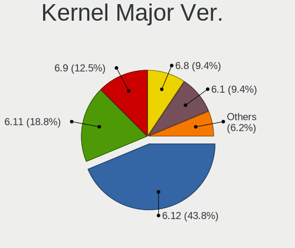
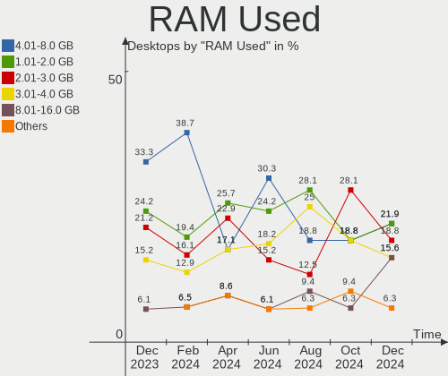
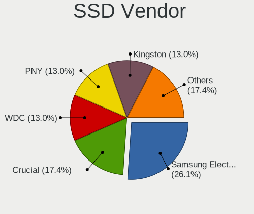
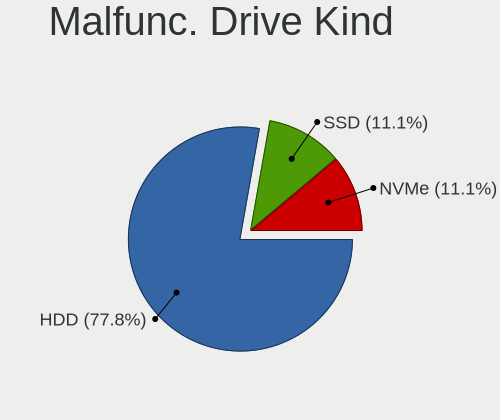
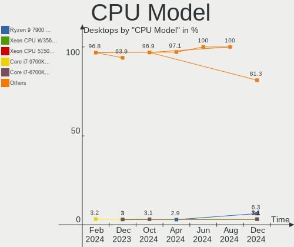
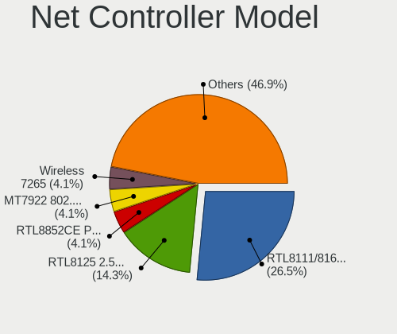
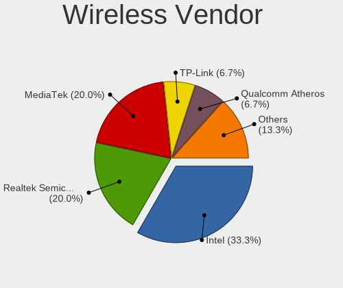
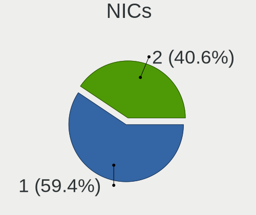
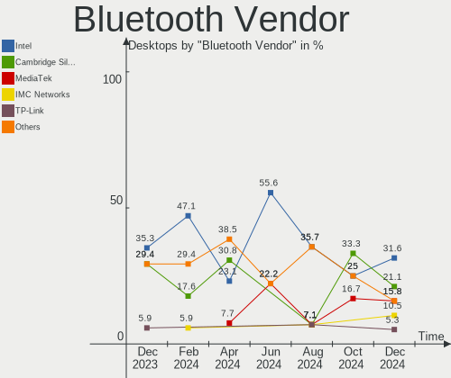
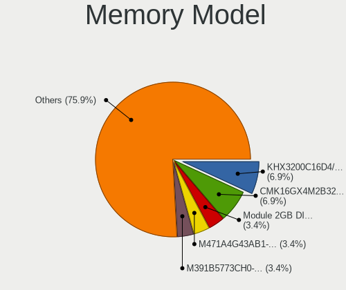

Linux in Netherlands - Hardware Trends (Desktops)
-------------------------------------------------

A project to identify most popular hardware characteristics and track their change
over time based on data collected by Linux users at https://Linux-Hardware.org.

Anyone can contribute to this report by the [hw-probe](https://github.com/linuxhw/hw-probe) tool:

    sudo -E hw-probe -all -upload

Period: Mar, 2023.

Contents
--------

* [ System ](#system)
  - [ OS                       ](#os)
  - [ OS Family                ](#os-family)
  - [ Kernel                   ](#kernel)
  - [ Kernel Family            ](#kernel-family)
  - [ Kernel Major Ver.        ](#kernel-major-ver)
  - [ Arch                     ](#arch)
  - [ DE                       ](#de)
  - [ Display Server           ](#display-server)
  - [ Display Manager          ](#display-manager)
  - [ OS Lang                  ](#os-lang)
  - [ Boot Mode                ](#boot-mode)
  - [ Filesystem               ](#filesystem)
  - [ Part. scheme             ](#part-scheme)
  - [ Dual Boot with Linux/BSD ](#dual-boot-with-linuxbsd)
  - [ Dual Boot (Win)          ](#dual-boot-win)

* [ Board ](#board)
  - [ Vendor                   ](#vendor)
  - [ Model                    ](#model)
  - [ Model Family             ](#model-family)
  - [ MFG Year                 ](#mfg-year)
  - [ Form Factor              ](#form-factor)
  - [ Secure Boot              ](#secure-boot)
  - [ Coreboot                 ](#coreboot)
  - [ RAM Size                 ](#ram-size)
  - [ RAM Used                 ](#ram-used)
  - [ Total Drives             ](#total-drives)
  - [ Has CD-ROM               ](#has-cd-rom)
  - [ Has Ethernet             ](#has-ethernet)
  - [ Has WiFi                 ](#has-wifi)
  - [ Has Bluetooth            ](#has-bluetooth)

* [ Location ](#location)
  - [ Country                  ](#country)
  - [ City                     ](#city)

* [ Drives ](#drives)
  - [ Drive Vendor             ](#drive-vendor)
  - [ Drive Model              ](#drive-model)
  - [ HDD Vendor               ](#hdd-vendor)
  - [ SSD Vendor               ](#ssd-vendor)
  - [ Drive Kind               ](#drive-kind)
  - [ Drive Connector          ](#drive-connector)
  - [ Drive Size               ](#drive-size)
  - [ Space Total              ](#space-total)
  - [ Space Used               ](#space-used)
  - [ Malfunc. Drives          ](#malfunc-drives)
  - [ Malfunc. Drive Vendor    ](#malfunc-drive-vendor)
  - [ Malfunc. HDD Vendor      ](#malfunc-hdd-vendor)
  - [ Malfunc. Drive Kind      ](#malfunc-drive-kind)
  - [ Failed Drives            ](#failed-drives)
  - [ Failed Drive Vendor      ](#failed-drive-vendor)
  - [ Drive Status             ](#drive-status)

* [ Storage controller ](#storage-controller)
  - [ Storage Vendor           ](#storage-vendor)
  - [ Storage Model            ](#storage-model)
  - [ Storage Kind             ](#storage-kind)

* [ Processor ](#processor)
  - [ CPU Vendor               ](#cpu-vendor)
  - [ CPU Model                ](#cpu-model)
  - [ CPU Model Family         ](#cpu-model-family)
  - [ CPU Cores                ](#cpu-cores)
  - [ CPU Sockets              ](#cpu-sockets)
  - [ CPU Threads              ](#cpu-threads)
  - [ CPU Op-Modes             ](#cpu-op-modes)
  - [ CPU Microcode            ](#cpu-microcode)
  - [ CPU Microarch            ](#cpu-microarch)

* [ Graphics ](#graphics)
  - [ GPU Vendor               ](#gpu-vendor)
  - [ GPU Model                ](#gpu-model)
  - [ GPU Combo                ](#gpu-combo)
  - [ GPU Driver               ](#gpu-driver)
  - [ GPU Memory               ](#gpu-memory)

* [ Monitor ](#monitor)
  - [ Monitor Vendor           ](#monitor-vendor)
  - [ Monitor Model            ](#monitor-model)
  - [ Monitor Resolution       ](#monitor-resolution)
  - [ Monitor Diagonal         ](#monitor-diagonal)
  - [ Monitor Width            ](#monitor-width)
  - [ Aspect Ratio             ](#aspect-ratio)
  - [ Monitor Area             ](#monitor-area)
  - [ Pixel Density            ](#pixel-density)
  - [ Multiple Monitors        ](#multiple-monitors)

* [ Network ](#network)
  - [ Net Controller Vendor    ](#net-controller-vendor)
  - [ Net Controller Model     ](#net-controller-model)
  - [ Wireless Vendor          ](#wireless-vendor)
  - [ Wireless Model           ](#wireless-model)
  - [ Ethernet Vendor          ](#ethernet-vendor)
  - [ Ethernet Model           ](#ethernet-model)
  - [ Net Controller Kind      ](#net-controller-kind)
  - [ Used Controller          ](#used-controller)
  - [ NICs                     ](#nics)
  - [ IPv6                     ](#ipv6)

* [ Bluetooth ](#bluetooth)
  - [ Bluetooth Vendor         ](#bluetooth-vendor)
  - [ Bluetooth Model          ](#bluetooth-model)

* [ Sound ](#sound)
  - [ Sound Vendor             ](#sound-vendor)
  - [ Sound Model              ](#sound-model)

* [ Memory ](#memory)
  - [ Memory Vendor            ](#memory-vendor)
  - [ Memory Model             ](#memory-model)
  - [ Memory Kind              ](#memory-kind)
  - [ Memory Form Factor       ](#memory-form-factor)
  - [ Memory Size              ](#memory-size)
  - [ Memory Speed             ](#memory-speed)

* [ Printers & scanners ](#printers--scanners)
  - [ Printer Vendor           ](#printer-vendor)
  - [ Printer Model            ](#printer-model)
  - [ Scanner Vendor           ](#scanner-vendor)
  - [ Scanner Model            ](#scanner-model)

* [ Camera ](#camera)
  - [ Camera Vendor            ](#camera-vendor)
  - [ Camera Model             ](#camera-model)

* [ Security ](#security)
  - [ Fingerprint Vendor       ](#fingerprint-vendor)
  - [ Fingerprint Model        ](#fingerprint-model)
  - [ Chipcard Vendor          ](#chipcard-vendor)
  - [ Chipcard Model           ](#chipcard-model)

* [ Unsupported ](#unsupported)
  - [ Unsupported Devices      ](#unsupported-devices)
  - [ Unsupported Device Types ](#unsupported-device-types)

System
------

OS
--

Installed operating systems

| Name                         | Desktops | Percent |
|------------------------------|----------|---------|
| Ubuntu 22.04                 | 7        | 14.89%  |
| Linux Mint 21.1              | 6        | 12.77%  |
| Ubuntu 20.04                 | 4        | 8.51%   |
| Manjaro                      | 3        | 6.38%   |
| Kubuntu 22.10                | 3        | 6.38%   |
| Fedora 37                    | 3        | 6.38%   |
| EndeavourOS Rolling          | 3        | 6.38%   |
| Debian 11                    | 3        | 6.38%   |
| Ubuntu 22.10                 | 2        | 4.26%   |
| OpenMandriva 23.03           | 2        | 4.26%   |
| Linux Mint 21                | 2        | 4.26%   |
| Xubuntu 22.04                | 1        | 2.13%   |
| Ubuntu 18.04                 | 1        | 2.13%   |
| openSUSE Tumbleweed-XXXXXXXX | 1        | 2.13%   |
| OpenMandriva 23.01           | 1        | 2.13%   |
| Manjaro 22.0.5               | 1        | 2.13%   |
| Linux Mint 20.3              | 1        | 2.13%   |
| Kubuntu 22.04                | 1        | 2.13%   |
| Debian                       | 1        | 2.13%   |
| ArcoLinux Rolling            | 1        | 2.13%   |

OS Family
---------

OS without a version

| Name         | Desktops | Percent |
|--------------|----------|---------|
| Ubuntu       | 14       | 29.79%  |
| Linux Mint   | 9        | 19.15%  |
| Manjaro      | 4        | 8.51%   |
| Kubuntu      | 4        | 8.51%   |
| Debian       | 4        | 8.51%   |
| OpenMandriva | 3        | 6.38%   |
| Fedora       | 3        | 6.38%   |
| EndeavourOS  | 3        | 6.38%   |
| Xubuntu      | 1        | 2.13%   |
| openSUSE     | 1        | 2.13%   |
| ArcoLinux    | 1        | 2.13%   |

Kernel
------

Version of the Linux kernel

| Version                     | Desktops | Percent |
|-----------------------------|----------|---------|
| 5.15.0-67-generic           | 9        | 19.15%  |
| 5.19.0-35-generic           | 7        | 14.89%  |
| 5.10.0-21-amd64             | 3        | 6.38%   |
| 6.2.6-desktop-1omv2390      | 2        | 4.26%   |
| 6.2.1-arch1-1               | 2        | 4.26%   |
| 6.1.18-200.fc37.x86_64      | 2        | 4.26%   |
| 6.2.7-200.fc37.x86_64       | 1        | 2.13%   |
| 6.2.7-2-MANJARO             | 1        | 2.13%   |
| 6.2.6-arch1-1               | 1        | 2.13%   |
| 6.2.6-1-MANJARO             | 1        | 2.13%   |
| 6.1.21-hardened1-1-hardened | 1        | 2.13%   |
| 6.1.19-1-MANJARO            | 1        | 2.13%   |
| 6.1.12-1-MANJARO            | 1        | 2.13%   |
| 6.1.12-1-default            | 1        | 2.13%   |
| 6.1.10-x64v3-xanmod1        | 1        | 2.13%   |
| 6.1.1-desktop-1omv2290      | 1        | 2.13%   |
| 6.1.0-3-amd64               | 1        | 2.13%   |
| 5.4.0-144-generic           | 1        | 2.13%   |
| 5.4.0-139-generic           | 1        | 2.13%   |
| 5.4.0-132-generic           | 1        | 2.13%   |
| 5.19.0-37-generic           | 1        | 2.13%   |
| 5.19.0-32-generic           | 1        | 2.13%   |
| 5.19.0-1021-lowlatency      | 1        | 2.13%   |
| 5.15.0-69-generic           | 1        | 2.13%   |
| 5.15.0-60-generic           | 1        | 2.13%   |
| 5.15.0-56-generic           | 1        | 2.13%   |
| 5.13.0-39-generic           | 1        | 2.13%   |
| 4.15.0-208-generic          | 1        | 2.13%   |

Kernel Family
-------------

Linux kernel without a distro release

| Version | Desktops | Percent |
|---------|----------|---------|
| 5.15.0  | 12       | 25.53%  |
| 5.19.0  | 10       | 21.28%  |
| 6.2.6   | 4        | 8.51%   |
| 5.4.0   | 3        | 6.38%   |
| 5.10.0  | 3        | 6.38%   |
| 6.2.7   | 2        | 4.26%   |
| 6.2.1   | 2        | 4.26%   |
| 6.1.18  | 2        | 4.26%   |
| 6.1.12  | 2        | 4.26%   |
| 6.1.21  | 1        | 2.13%   |
| 6.1.19  | 1        | 2.13%   |
| 6.1.10  | 1        | 2.13%   |
| 6.1.1   | 1        | 2.13%   |
| 6.1.0   | 1        | 2.13%   |
| 5.13.0  | 1        | 2.13%   |
| 4.15.0  | 1        | 2.13%   |

Kernel Major Ver.
-----------------

Linux kernel major version

| Version | Desktops | Percent |
|---------|----------|---------|
| 5.15    | 12       | 25.53%  |
| 5.19    | 10       | 21.28%  |
| 6.1     | 9        | 19.15%  |
| 6.2     | 8        | 17.02%  |
| 5.4     | 3        | 6.38%   |
| 5.10    | 3        | 6.38%   |
| 5.13    | 1        | 2.13%   |
| 4.15    | 1        | 2.13%   |

Arch
----

OS architecture (x86_64, i586, etc.)

| Name   | Desktops | Percent |
|--------|----------|---------|
| x86_64 | 46       | 97.87%  |
| i686   | 1        | 2.13%   |

DE
--

Desktop Environment

| Name          | Desktops | Percent |
|---------------|----------|---------|
| GNOME         | 18       | 38.3%   |
| KDE5          | 14       | 29.79%  |
| X-Cinnamon    | 7        | 14.89%  |
| XFCE          | 3        | 6.38%   |
| Unknown       | 2        | 4.26%   |
| MATE          | 1        | 2.13%   |
| i3            | 1        | 2.13%   |
| Enlightenment | 1        | 2.13%   |

Display Server
--------------

X11 or Wayland

| Name    | Desktops | Percent |
|---------|----------|---------|
| X11     | 31       | 65.96%  |
| Wayland | 13       | 27.66%  |
| Tty     | 2        | 4.26%   |
| Unknown | 1        | 2.13%   |

Display Manager
---------------

SDDM, LightDM, etc.

| Name    | Desktops | Percent |
|---------|----------|---------|
| Unknown | 18       | 38.3%   |
| GDM3    | 11       | 23.4%   |
| SDDM    | 6        | 12.77%  |
| LightDM | 6        | 12.77%  |
| GDM     | 5        | 10.64%  |
| XDM     | 1        | 2.13%   |

OS Lang
-------

Language

| Lang  | Desktops | Percent |
|-------|----------|---------|
| nl_NL | 24       | 51.06%  |
| en_US | 16       | 34.04%  |
| ru_RU | 2        | 4.26%   |
| it_IT | 2        | 4.26%   |
| POSIX | 1        | 2.13%   |
| en_GB | 1        | 2.13%   |
| de_DE | 1        | 2.13%   |

Boot Mode
---------

EFI or BIOS

| Mode | Desktops | Percent |
|------|----------|---------|
| BIOS | 26       | 55.32%  |
| EFI  | 21       | 44.68%  |

Filesystem
----------

Type of filesystem

| Type    | Desktops | Percent |
|---------|----------|---------|
| Ext4    | 42       | 89.36%  |
| Btrfs   | 2        | 4.26%   |
| Xfs     | 1        | 2.13%   |
| Overlay | 1        | 2.13%   |
| Ext3    | 1        | 2.13%   |

Part. scheme
------------

Scheme of partitioning

| Type    | Desktops | Percent |
|---------|----------|---------|
| GPT     | 24       | 51.06%  |
| Unknown | 18       | 38.3%   |
| MBR     | 5        | 10.64%  |

Dual Boot with Linux/BSD
------------------------

Hosting more than one Linux/BSD

| Dual boot | Desktops | Percent |
|-----------|----------|---------|
| No        | 38       | 80.85%  |
| Yes       | 9        | 19.15%  |

Dual Boot (Win)
---------------

Hosting Linux and Windows

| Dual boot | Desktops | Percent |
|-----------|----------|---------|
| No        | 39       | 82.98%  |
| Yes       | 8        | 17.02%  |

Board
-----

Vendor
------

Motherboard manufacturer

| Name                | Desktops | Percent |
|---------------------|----------|---------|
| Gigabyte Technology | 11       | 23.4%   |
| ASUSTek Computer    | 9        | 19.15%  |
| Hewlett-Packard     | 8        | 17.02%  |
| MSI                 | 7        | 14.89%  |
| ASRock              | 4        | 8.51%   |
| Acer                | 3        | 6.38%   |
| ZOTAC               | 1        | 2.13%   |
| Medion              | 1        | 2.13%   |
| Intel               | 1        | 2.13%   |
| Foxconn             | 1        | 2.13%   |
| Dell                | 1        | 2.13%   |

Model
-----

Motherboard model

| Name                                      | Desktops | Percent |
|-------------------------------------------|----------|---------|
| ZOTAC AMD M1                              | 1        | 2.13%   |
| MSI p6-2315ed                             | 1        | 2.13%   |
| MSI MS-7E07                               | 1        | 2.13%   |
| MSI MS-7D43                               | 1        | 2.13%   |
| MSI MS-7C91                               | 1        | 2.13%   |
| MSI MS-7C52                               | 1        | 2.13%   |
| MSI MS-7850                               | 1        | 2.13%   |
| MSI MS-7522                               | 1        | 2.13%   |
| Medion MS-7797                            | 1        | 2.13%   |
| Intel D34010WYK H14771-303                | 1        | 2.13%   |
| HP Z440 Workstation                       | 1        | 2.13%   |
| HP Victus by 15L Gaming Desktop TG02-0xxx | 1        | 2.13%   |
| HP ProDesk 400 G2 MT (TPM DP)             | 1        | 2.13%   |
| HP EliteDesk 800 G2 DM 65W                | 1        | 2.13%   |
| HP Compaq Elite 8300 USDT                 | 1        | 2.13%   |
| HP Compaq Elite 8300 SFF                  | 1        | 2.13%   |
| HP Compaq 8200 Elite CMT PC               | 1        | 2.13%   |
| HP 290 G1 SFF Business PC                 | 1        | 2.13%   |
| Gigabyte Z77X-D3H                         | 1        | 2.13%   |
| Gigabyte X570 AORUS PRO                   | 1        | 2.13%   |
| Gigabyte P55A-UD3                         | 1        | 2.13%   |
| Gigabyte H310M H 2.0                      | 1        | 2.13%   |
| Gigabyte GB-BRR7H-4700                    | 1        | 2.13%   |
| Gigabyte GB-BACE-3160                     | 1        | 2.13%   |
| Gigabyte GA-770TA-UD3                     | 1        | 2.13%   |
| Gigabyte F2A78M-DS2                       | 1        | 2.13%   |
| Gigabyte B365M H                          | 1        | 2.13%   |
| Gigabyte AB350M-Gaming 3                  | 1        | 2.13%   |
| Gigabyte AB350-Gaming 3                   | 1        | 2.13%   |
| Foxconn VN300AA-ABH CQ5250NL              | 1        | 2.13%   |
| Dell OptiPlex 3010                        | 1        | 2.13%   |
| ASUS Z170 PRO GAMING                      | 1        | 2.13%   |
| ASUS V-P7H55E                             | 1        | 2.13%   |
| ASUS TUF Gaming B560M-PLUS                | 1        | 2.13%   |
| ASUS ROG STRIX Z390-F GAMING              | 1        | 2.13%   |
| ASUS ROG Maximus XII FORMULA              | 1        | 2.13%   |
| ASUS P8Z77-V LE                           | 1        | 2.13%   |
| ASUS P8B75-M LE                           | 1        | 2.13%   |
| ASUS P5B-MX                               | 1        | 2.13%   |
| ASUS M4A88T-M                             | 1        | 2.13%   |

Model Family
------------

Motherboard model prefix

| Name                   | Desktops | Percent |
|------------------------|----------|---------|
| HP Compaq              | 3        | 6.38%   |
| ASUS ROG               | 2        | 4.26%   |
| Acer Aspire            | 2        | 4.26%   |
| ZOTAC AMD              | 1        | 2.13%   |
| MSI p6-2315ed          | 1        | 2.13%   |
| MSI MS-7E07            | 1        | 2.13%   |
| MSI MS-7D43            | 1        | 2.13%   |
| MSI MS-7C91            | 1        | 2.13%   |
| MSI MS-7C52            | 1        | 2.13%   |
| MSI MS-7850            | 1        | 2.13%   |
| MSI MS-7522            | 1        | 2.13%   |
| Medion MS-7797         | 1        | 2.13%   |
| Intel D34010WYK        | 1        | 2.13%   |
| HP Z440                | 1        | 2.13%   |
| HP Victus              | 1        | 2.13%   |
| HP ProDesk             | 1        | 2.13%   |
| HP EliteDesk           | 1        | 2.13%   |
| HP 290                 | 1        | 2.13%   |
| Gigabyte Z77X-D3H      | 1        | 2.13%   |
| Gigabyte X570          | 1        | 2.13%   |
| Gigabyte P55A-UD3      | 1        | 2.13%   |
| Gigabyte H310M         | 1        | 2.13%   |
| Gigabyte GB-BRR7H-4700 | 1        | 2.13%   |
| Gigabyte GB-BACE-3160  | 1        | 2.13%   |
| Gigabyte GA-770TA-UD3  | 1        | 2.13%   |
| Gigabyte F2A78M-DS2    | 1        | 2.13%   |
| Gigabyte B365M         | 1        | 2.13%   |
| Gigabyte AB350M-Gaming | 1        | 2.13%   |
| Gigabyte AB350-Gaming  | 1        | 2.13%   |
| Foxconn VN300AA-ABH    | 1        | 2.13%   |
| Dell OptiPlex          | 1        | 2.13%   |
| ASUS Z170              | 1        | 2.13%   |
| ASUS V-P7H55E          | 1        | 2.13%   |
| ASUS TUF               | 1        | 2.13%   |
| ASUS P8Z77-V           | 1        | 2.13%   |
| ASUS P8B75-M           | 1        | 2.13%   |
| ASUS P5B-MX            | 1        | 2.13%   |
| ASUS M4A88T-M          | 1        | 2.13%   |
| ASRock J5040-ITX       | 1        | 2.13%   |
| ASRock H87M            | 1        | 2.13%   |

MFG Year
--------

Motherboard manufacture year

| Year | Desktops | Percent |
|------|----------|---------|
| 2012 | 8        | 17.02%  |
| 2021 | 5        | 10.64%  |
| 2019 | 4        | 8.51%   |
| 2013 | 4        | 8.51%   |
| 2010 | 4        | 8.51%   |
| 2020 | 3        | 6.38%   |
| 2017 | 3        | 6.38%   |
| 2015 | 3        | 6.38%   |
| 2011 | 3        | 6.38%   |
| 2009 | 3        | 6.38%   |
| 2022 | 2        | 4.26%   |
| 2018 | 2        | 4.26%   |
| 2016 | 1        | 2.13%   |
| 2014 | 1        | 2.13%   |
| 2007 | 1        | 2.13%   |

Form Factor
-----------

Physical design of the computer

| Name    | Desktops | Percent |
|---------|----------|---------|
| Desktop | 47       | 100%    |

Secure Boot
-----------

Enabled or disabled

| State    | Desktops | Percent |
|----------|----------|---------|
| Disabled | 43       | 91.49%  |
| Enabled  | 4        | 8.51%   |

Coreboot
--------

Have coreboot on board

| Used | Desktops | Percent |
|------|----------|---------|
| No   | 47       | 100%    |

RAM Size
--------

Total RAM memory

| Size in GB  | Desktops | Percent |
|-------------|----------|---------|
| 4.01-8.0    | 11       | 23.4%   |
| 8.01-16.0   | 11       | 23.4%   |
| 16.01-24.0  | 10       | 21.28%  |
| 32.01-64.0  | 7        | 14.89%  |
| 64.01-256.0 | 3        | 6.38%   |
| 3.01-4.0    | 2        | 4.26%   |
| 24.01-32.0  | 2        | 4.26%   |
| 2.01-3.0    | 1        | 2.13%   |

RAM Used
--------

Used RAM memory

| Used GB    | Desktops | Percent |
|------------|----------|---------|
| 1.01-2.0   | 14       | 29.79%  |
| 4.01-8.0   | 11       | 23.4%   |
| 3.01-4.0   | 10       | 21.28%  |
| 2.01-3.0   | 7        | 14.89%  |
| 8.01-16.0  | 2        | 4.26%   |
| 0.51-1.0   | 2        | 4.26%   |
| 16.01-24.0 | 1        | 2.13%   |

Total Drives
------------

Number of drives on board

| Drives | Desktops | Percent |
|--------|----------|---------|
| 1      | 19       | 40.43%  |
| 2      | 12       | 25.53%  |
| 4      | 6        | 12.77%  |
| 5      | 4        | 8.51%   |
| 3      | 4        | 8.51%   |
| 8      | 1        | 2.13%   |
| 7      | 1        | 2.13%   |

Has CD-ROM
----------

Has CD-ROM on board

| Presented | Desktops | Percent |
|-----------|----------|---------|
| No        | 28       | 59.57%  |
| Yes       | 19       | 40.43%  |

Has Ethernet
------------

Has Ethernet on board

| Presented | Desktops | Percent |
|-----------|----------|---------|
| Yes       | 47       | 100%    |

Has WiFi
--------

Has WiFi module

| Presented | Desktops | Percent |
|-----------|----------|---------|
| No        | 26       | 55.32%  |
| Yes       | 21       | 44.68%  |

Has Bluetooth
-------------

Has Bluetooth module

| Presented | Desktops | Percent |
|-----------|----------|---------|
| No        | 28       | 59.57%  |
| Yes       | 19       | 40.43%  |

Location
--------

Country
-------

Geographic location (country)

| Country     | Desktops | Percent |
|-------------|----------|---------|
| Netherlands | 47       | 100%    |

City
----

Geographic location (city)

| City                  | Desktops | Percent |
|-----------------------|----------|---------|
| Amsterdam             | 8        | 17.02%  |
| Haarlem               | 3        | 6.38%   |
| Zaltbommel            | 2        | 4.26%   |
| Tilburg               | 2        | 4.26%   |
| Almelo                | 2        | 4.26%   |
| Zwijndrecht           | 1        | 2.13%   |
| Zuid-Scharwoude       | 1        | 2.13%   |
| Zaandam               | 1        | 2.13%   |
| Wateringen            | 1        | 2.13%   |
| Warnsveld             | 1        | 2.13%   |
| Vught                 | 1        | 2.13%   |
| Vleuten               | 1        | 2.13%   |
| Venlo                 | 1        | 2.13%   |
| Utrecht               | 1        | 2.13%   |
| The Hague             | 1        | 2.13%   |
| Steenbergen           | 1        | 2.13%   |
| Rotterdam             | 1        | 2.13%   |
| Roosendaal            | 1        | 2.13%   |
| Ridderkerk            | 1        | 2.13%   |
| Maarssen              | 1        | 2.13%   |
| Loenen                | 1        | 2.13%   |
| Lisse                 | 1        | 2.13%   |
| Leeuwarden            | 1        | 2.13%   |
| Katwijk               | 1        | 2.13%   |
| Gilze                 | 1        | 2.13%   |
| Fijnaart              | 1        | 2.13%   |
| Enschede              | 1        | 2.13%   |
| Enkhuizen             | 1        | 2.13%   |
| Elburg                | 1        | 2.13%   |
| Driebergen-Rijsenburg | 1        | 2.13%   |
| Doorn                 | 1        | 2.13%   |
| Delfgauw              | 1        | 2.13%   |
| Bunnik                | 1        | 2.13%   |
| Amersfoort            | 1        | 2.13%   |
| 's-Hertogenbosch      | 1        | 2.13%   |

Drives
------

Drive Vendor
------------

Hard drive vendors

| Vendor                      | Desktops | Drives | Percent |
|-----------------------------|----------|--------|---------|
| Samsung Electronics         | 21       | 24     | 23.6%   |
| WDC                         | 14       | 16     | 15.73%  |
| Seagate                     | 13       | 22     | 14.61%  |
| Kingston                    | 7        | 8      | 7.87%   |
| Crucial                     | 7        | 13     | 7.87%   |
| SanDisk                     | 6        | 7      | 6.74%   |
| Intel                       | 3        | 3      | 3.37%   |
| Toshiba                     | 2        | 2      | 2.25%   |
| Kingston Technology Company | 2        | 2      | 2.25%   |
| HGST                        | 2        | 3      | 2.25%   |
| XUM                         | 1        | 1      | 1.12%   |
| SK hynix                    | 1        | 1      | 1.12%   |
| Phison Electronics          | 1        | 1      | 1.12%   |
| OCZ                         | 1        | 1      | 1.12%   |
| Micron/Crucial Technology   | 1        | 1      | 1.12%   |
| Micron Technology           | 1        | 1      | 1.12%   |
| Maxtor                      | 1        | 1      | 1.12%   |
| KingFast                    | 1        | 1      | 1.12%   |
| JMicron Technology          | 1        | 1      | 1.12%   |
| Hitachi                     | 1        | 1      | 1.12%   |
| GOODRAM                     | 1        | 1      | 1.12%   |
| Corsair                     | 1        | 1      | 1.12%   |

Drive Model
-----------

Hard drive models

| Model                                 | Desktops | Percent |
|---------------------------------------|----------|---------|
| Seagate ST4000DM004-2CV104 4TB        | 3        | 3%      |
| Kingston SV300S37A120G 120GB SSD      | 3        | 3%      |
| Crucial CT500MX500SSD1 500GB          | 3        | 3%      |
| Seagate ST320LT007-9ZV142 320GB       | 2        | 2%      |
| Samsung SSD 870 EVO 500GB             | 2        | 2%      |
| Samsung SSD 840 PRO Series 128GB      | 2        | 2%      |
| Samsung MZ7LN256HMJP-000H1 256GB SSD  | 2        | 2%      |
| Samsung HD103SJ 1TB                   | 2        | 2%      |
| Kingston Company A2000 NVMe SSD 500GB | 2        | 2%      |
| Crucial CT2000MX500SSD1 2TB           | 2        | 2%      |
| XUM HX256GSSDSATA3 256GB              | 1        | 1%      |
| WDC WDS500G2B0A-00SM50 500GB SSD      | 1        | 1%      |
| WDC WDS480G2G0A-00JH30 480GB SSD      | 1        | 1%      |
| WDC WD5000LPVX-28V0TT0 500GB          | 1        | 1%      |
| WDC WD5000AAKS-22V1A0 500GB           | 1        | 1%      |
| WDC WD5000AACS-00G8B1 500GB           | 1        | 1%      |
| WDC WD30EFRX-68EUZN0 3TB              | 1        | 1%      |
| WDC WD20EFRX-68EUZN0 2TB              | 1        | 1%      |
| WDC WD20EARX-00PASB0 2TB              | 1        | 1%      |
| WDC WD20EARS-00MVWB0 2TB              | 1        | 1%      |
| WDC WD10JFCX-68N6GN0 1TB              | 1        | 1%      |
| WDC WD10EZEX-60ZF5A0 1TB              | 1        | 1%      |
| WDC WD10EZEX-08WN4A0 1TB              | 1        | 1%      |
| WDC WD10EZEX-00RKKA0 1TB              | 1        | 1%      |
| WDC WD10EARS-22Y5B1 1TB               | 1        | 1%      |
| WDC WD1000DHTZ-04N21V0 1TB            | 1        | 1%      |
| WDC PC SN530 SDBPNPZ-1T00-1006 1TB    | 1        | 1%      |
| Toshiba DT01ACA200 2TB                | 1        | 1%      |
| Toshiba DT01ACA050 500GB              | 1        | 1%      |
| SK hynix SC311 SATA 512GB SSD         | 1        | 1%      |
| Seagate ST9250410AS 250GB             | 1        | 1%      |
| Seagate ST8000DM004-2CX188 8TB        | 1        | 1%      |
| Seagate ST6000VN001-2BB186 6TB        | 1        | 1%      |
| Seagate ST500DM002-1SB10A 500GB       | 1        | 1%      |
| Seagate ST500DM002-1BD142 500GB       | 1        | 1%      |
| Seagate ST3500418AS 500GB             | 1        | 1%      |
| Seagate ST3250820AS 250GB             | 1        | 1%      |
| Seagate ST3160212ACE 160GB            | 1        | 1%      |
| Seagate ST3000DM008-2DM166 3TB        | 1        | 1%      |
| Seagate ST2000DM008-2FR102 2TB        | 1        | 1%      |

HDD Vendor
----------

Hard disk drive vendors

| Vendor              | Desktops | Drives | Percent |
|---------------------|----------|--------|---------|
| Seagate             | 12       | 21     | 37.5%   |
| WDC                 | 11       | 13     | 34.38%  |
| Samsung Electronics | 3        | 3      | 9.38%   |
| Toshiba             | 2        | 2      | 6.25%   |
| HGST                | 2        | 3      | 6.25%   |
| Maxtor              | 1        | 1      | 3.13%   |
| Hitachi             | 1        | 1      | 3.13%   |

SSD Vendor
----------

Solid state drive vendors

| Vendor              | Desktops | Drives | Percent |
|---------------------|----------|--------|---------|
| Samsung Electronics | 15       | 15     | 36.59%  |
| Crucial             | 7        | 13     | 17.07%  |
| Kingston            | 6        | 7      | 14.63%  |
| SanDisk             | 4        | 5      | 9.76%   |
| WDC                 | 2        | 2      | 4.88%   |
| Intel               | 2        | 2      | 4.88%   |
| XUM                 | 1        | 1      | 2.44%   |
| SK hynix            | 1        | 1      | 2.44%   |
| OCZ                 | 1        | 1      | 2.44%   |
| GOODRAM             | 1        | 1      | 2.44%   |
| Corsair             | 1        | 1      | 2.44%   |

Drive Kind
----------

HDD or SSD

| Kind    | Desktops | Drives | Percent |
|---------|----------|--------|---------|
| SSD     | 33       | 49     | 43.42%  |
| HDD     | 25       | 44     | 32.89%  |
| NVMe    | 15       | 16     | 19.74%  |
| Unknown | 3        | 3      | 3.95%   |

Drive Connector
---------------

SATA, SAS, NVMe, etc.

| Type | Desktops | Drives | Percent |
|------|----------|--------|---------|
| SATA | 39       | 93     | 68.42%  |
| NVMe | 15       | 16     | 26.32%  |
| SAS  | 3        | 3      | 5.26%   |

Drive Size
----------

Size of hard drive

| Size in TB | Desktops | Drives | Percent |
|------------|----------|--------|---------|
| 0.01-0.5   | 34       | 52     | 52.31%  |
| 0.51-1.0   | 16       | 18     | 24.62%  |
| 1.01-2.0   | 8        | 12     | 12.31%  |
| 3.01-4.0   | 3        | 3      | 4.62%   |
| 2.01-3.0   | 2        | 2      | 3.08%   |
| 4.01-10.0  | 2        | 6      | 3.08%   |

Space Total
-----------

Amount of disk space available on the file system

| Size in GB     | Desktops | Percent |
|----------------|----------|---------|
| 251-500        | 9        | 19.15%  |
| 101-250        | 8        | 17.02%  |
| 501-1000       | 8        | 17.02%  |
| 1001-2000      | 7        | 14.89%  |
| More than 3000 | 6        | 12.77%  |
| 2001-3000      | 4        | 8.51%   |
| 51-100         | 4        | 8.51%   |
| 1-20           | 1        | 2.13%   |

Space Used
----------

Amount of used disk space

| Used GB        | Desktops | Percent |
|----------------|----------|---------|
| 1001-2000      | 8        | 17.02%  |
| 1-20           | 8        | 17.02%  |
| 21-50          | 7        | 14.89%  |
| 101-250        | 7        | 14.89%  |
| 51-100         | 7        | 14.89%  |
| 251-500        | 4        | 8.51%   |
| 501-1000       | 4        | 8.51%   |
| More than 3000 | 2        | 4.26%   |

Malfunc. Drives
---------------

Drive models with a malfunction

| Model                                                           | Desktops | Drives | Percent |
|-----------------------------------------------------------------|----------|--------|---------|
| WDC WD5000AACS-00G8B1 500GB                                     | 1        | 1      | 14.29%  |
| WDC WD10JFCX-68N6GN0 1TB                                        | 1        | 1      | 14.29%  |
| WDC WD1000DHTZ-04N21V0 1TB                                      | 1        | 1      | 14.29%  |
| Samsung Electronics NVMe SSD Controller SM981/PM981/PM983 250GB | 1        | 1      | 14.29%  |
| Intel SSDSC2BW120A4 120GB                                       | 1        | 1      | 14.29%  |
| Crucial CT500MX500SSD1 500GB                                    | 1        | 1      | 14.29%  |
| Corsair CSSD-F60GB2 64GB                                        | 1        | 1      | 14.29%  |

Malfunc. Drive Vendor
---------------------

Vendors of faulty drives

| Vendor              | Desktops | Drives | Percent |
|---------------------|----------|--------|---------|
| WDC                 | 3        | 3      | 42.86%  |
| Samsung Electronics | 1        | 1      | 14.29%  |
| Intel               | 1        | 1      | 14.29%  |
| Crucial             | 1        | 1      | 14.29%  |
| Corsair             | 1        | 1      | 14.29%  |

Malfunc. HDD Vendor
-------------------

Vendors of faulty HDD drives

| Vendor | Desktops | Drives | Percent |
|--------|----------|--------|---------|
| WDC    | 3        | 3      | 100%    |

Malfunc. Drive Kind
-------------------

Kinds of faulty drives

| Kind | Desktops | Drives | Percent |
|------|----------|--------|---------|
| SSD  | 3        | 3      | 42.86%  |
| HDD  | 3        | 3      | 42.86%  |
| NVMe | 1        | 1      | 14.29%  |

Failed Drives
-------------

Failed drive models

Zero info for selected period =(

Failed Drive Vendor
-------------------

Failed drive vendors

Zero info for selected period =(

Drive Status
------------

Number of failed and malfunc. drives

| Status   | Desktops | Drives | Percent |
|----------|----------|--------|---------|
| Detected | 26       | 59     | 48.15%  |
| Works    | 22       | 46     | 40.74%  |
| Malfunc  | 6        | 7      | 11.11%  |

Storage controller
------------------

Storage Vendor
--------------

Storage controller vendors

| Vendor                      | Desktops | Percent |
|-----------------------------|----------|---------|
| Intel                       | 34       | 50%     |
| AMD                         | 11       | 16.18%  |
| Samsung Electronics         | 5        | 7.35%   |
| SanDisk                     | 3        | 4.41%   |
| Marvell Technology Group    | 3        | 4.41%   |
| Kingston Technology Company | 3        | 4.41%   |
| ASMedia Technology          | 3        | 4.41%   |
| JMicron Technology          | 2        | 2.94%   |
| Phison Electronics          | 1        | 1.47%   |
| Micron/Crucial Technology   | 1        | 1.47%   |
| Micron Technology           | 1        | 1.47%   |
| Broadcom / LSI              | 1        | 1.47%   |

Storage Model
-------------

Storage controller models

| Model                                                                            | Desktops | Percent |
|----------------------------------------------------------------------------------|----------|---------|
| AMD FCH SATA Controller [AHCI mode]                                              | 6        | 7.14%   |
| Intel 7 Series/C210 Series Chipset Family 6-port SATA Controller [AHCI mode]     | 4        | 4.76%   |
| Samsung NVMe SSD Controller PM9A1/PM9A3/980PRO                                   | 3        | 3.57%   |
| Intel 8 Series/C220 Series Chipset Family 6-port SATA Controller 1 [AHCI mode]   | 3        | 3.57%   |
| Intel 6 Series/C200 Series Chipset Family 6 port Desktop SATA AHCI Controller    | 3        | 3.57%   |
| Intel 200 Series PCH SATA controller [AHCI mode]                                 | 3        | 3.57%   |
| ASMedia ASM1062 Serial ATA Controller                                            | 3        | 3.57%   |
| AMD SB7x0/SB8x0/SB9x0 IDE Controller                                             | 3        | 3.57%   |
| Kingston Company A2000 NVMe SSD                                                  | 2        | 2.38%   |
| JMicron JMB363 SATA/IDE Controller                                               | 2        | 2.38%   |
| Intel Q170/Q150/B150/H170/H110/Z170/CM236 Chipset SATA Controller [AHCI Mode]    | 2        | 2.38%   |
| Intel NM10/ICH7 Family SATA Controller [IDE mode]                                | 2        | 2.38%   |
| Intel Cannon Lake PCH SATA AHCI Controller                                       | 2        | 2.38%   |
| Intel Alder Lake-S PCH SATA Controller [AHCI Mode]                               | 2        | 2.38%   |
| Intel 82801G (ICH7 Family) IDE Controller                                        | 2        | 2.38%   |
| AMD SB7x0/SB8x0/SB9x0 SATA Controller [IDE mode]                                 | 2        | 2.38%   |
| AMD 400 Series Chipset SATA Controller                                           | 2        | 2.38%   |
| AMD 300 Series Chipset SATA Controller                                           | 2        | 2.38%   |
| SanDisk WD Blue SN550 NVMe SSD                                                   | 1        | 1.19%   |
| SanDisk PC SN520 NVMe SSD                                                        | 1        | 1.19%   |
| SanDisk NVMe Controller                                                          | 1        | 1.19%   |
| Samsung NVMe SSD Controller SM981/PM981/PM983                                    | 1        | 1.19%   |
| Samsung NVMe SSD Controller 980                                                  | 1        | 1.19%   |
| Phison E12 NVMe Controller                                                       | 1        | 1.19%   |
| Micron/Crucial P2 NVMe PCIe SSD                                                  | 1        | 1.19%   |
| Micron NVMe Storage Controller                                                   | 1        | 1.19%   |
| Marvell Group 88SE91A3 SATA-600 Controller                                       | 1        | 1.19%   |
| Marvell Group 88SE9172 SATA 6Gb/s Controller                                     | 1        | 1.19%   |
| Marvell Group 88SE9120 SATA 6Gb/s Controller                                     | 1        | 1.19%   |
| Kingston Company SNVS2000G [NV1 NVMe PCIe SSD 2TB]                               | 1        | 1.19%   |
| Intel Volume Management Device NVMe RAID Controller                              | 1        | 1.19%   |
| Intel SSD 660P Series                                                            | 1        | 1.19%   |
| Intel SATA Controller [RAID mode]                                                | 1        | 1.19%   |
| Intel Celeron/Pentium Silver Processor SATA Controller                           | 1        | 1.19%   |
| Intel C610/X99 series chipset sSATA Controller [AHCI mode]                       | 1        | 1.19%   |
| Intel C600/X79 series chipset SATA RAID Controller                               | 1        | 1.19%   |
| Intel Atom/Celeron/Pentium Processor x5-E8000/J3xxx/N3xxx Series SATA Controller | 1        | 1.19%   |
| Intel 82801JI (ICH10 Family) 4 port SATA IDE Controller #1                       | 1        | 1.19%   |
| Intel 82801JI (ICH10 Family) 2 port SATA IDE Controller #2                       | 1        | 1.19%   |
| Intel 8 Series SATA Controller 1 [AHCI mode]                                     | 1        | 1.19%   |

Storage Kind
------------

Kind of storage controller (IDE, SATA, NVMe, SAS, ...)

| Kind | Desktops | Percent |
|------|----------|---------|
| SATA | 38       | 55.88%  |
| NVMe | 15       | 22.06%  |
| IDE  | 10       | 14.71%  |
| RAID | 4        | 5.88%   |
| SAS  | 1        | 1.47%   |

Processor
---------

CPU Vendor
----------

Processor vendors

| Vendor | Desktops | Percent |
|--------|----------|---------|
| Intel  | 35       | 74.47%  |
| AMD    | 12       | 25.53%  |

CPU Model
---------

Processor models

| Model                                    | Desktops | Percent |
|------------------------------------------|----------|---------|
| Intel Core i7-6700 CPU @ 3.40GHz         | 2        | 4.26%   |
| Intel Core i7-3770 CPU @ 3.40GHz         | 2        | 4.26%   |
| Intel Core i3-8100 CPU @ 3.60GHz         | 2        | 4.26%   |
| Intel Xeon CPU E5-1620 v3 @ 3.50GHz      | 1        | 2.13%   |
| Intel Xeon CPU E3-1230 V2 @ 3.30GHz      | 1        | 2.13%   |
| Intel Pentium Silver J5040 CPU @ 2.00GHz | 1        | 2.13%   |
| Intel Pentium CPU G630 @ 2.70GHz         | 1        | 2.13%   |
| Intel Core i9-10900K CPU @ 3.70GHz       | 1        | 2.13%   |
| Intel Core i7-9700K CPU @ 3.60GHz        | 1        | 2.13%   |
| Intel Core i7-2600 CPU @ 3.40GHz         | 1        | 2.13%   |
| Intel Core i7 CPU 920 @ 2.67GHz          | 1        | 2.13%   |
| Intel Core i7 CPU 860 @ 2.80GHz          | 1        | 2.13%   |
| Intel Core i5-9400 CPU @ 2.90GHz         | 1        | 2.13%   |
| Intel Core i5-4690S CPU @ 3.20GHz        | 1        | 2.13%   |
| Intel Core i5-4670 CPU @ 3.40GHz         | 1        | 2.13%   |
| Intel Core i5-4590S CPU @ 3.00GHz        | 1        | 2.13%   |
| Intel Core i5-3570K CPU @ 3.40GHz        | 1        | 2.13%   |
| Intel Core i5-3570 CPU @ 3.40GHz         | 1        | 2.13%   |
| Intel Core i5-3470S CPU @ 2.90GHz        | 1        | 2.13%   |
| Intel Core i5-2300 CPU @ 2.80GHz         | 1        | 2.13%   |
| Intel Core i5 CPU 750 @ 2.67GHz          | 1        | 2.13%   |
| Intel Core i3-7100 CPU @ 3.90GHz         | 1        | 2.13%   |
| Intel Core i3-4010U CPU @ 1.70GHz        | 1        | 2.13%   |
| Intel Core i3-2120 CPU @ 3.30GHz         | 1        | 2.13%   |
| Intel Core 2 Quad CPU Q8300 @ 2.50GHz    | 1        | 2.13%   |
| Intel Core 2 Quad CPU Q6600 @ 2.40GHz    | 1        | 2.13%   |
| Intel Celeron CPU J3160 @ 1.60GHz        | 1        | 2.13%   |
| Intel 13th Gen Core i7-13700KF           | 1        | 2.13%   |
| Intel 12th Gen Core i7-12700             | 1        | 2.13%   |
| Intel 12th Gen Core i5-12400             | 1        | 2.13%   |
| Intel 11th Gen Core i7-11700F @ 2.50GHz  | 1        | 2.13%   |
| Intel 11th Gen Core i5-11400 @ 2.60GHz   | 1        | 2.13%   |
| AMD Ryzen 9 3900X 12-Core Processor      | 1        | 2.13%   |
| AMD Ryzen 7 5700X 8-Core Processor       | 1        | 2.13%   |
| AMD Ryzen 7 4700U with Radeon Graphics   | 1        | 2.13%   |
| AMD Ryzen 7 3700X 8-Core Processor       | 1        | 2.13%   |
| AMD Ryzen 7 2700X Eight-Core Processor   | 1        | 2.13%   |
| AMD Ryzen 7 2700 Eight-Core Processor    | 1        | 2.13%   |
| AMD Ryzen 3 1200 Quad-Core Processor     | 1        | 2.13%   |
| AMD Phenom II X6 1090T Processor         | 1        | 2.13%   |

CPU Model Family
----------------

Processor model prefix

| Model                | Desktops | Percent |
|----------------------|----------|---------|
| Intel Core i5        | 9        | 19.15%  |
| Intel Core i7        | 8        | 17.02%  |
| Other                | 5        | 10.64%  |
| Intel Core i3        | 5        | 10.64%  |
| AMD Ryzen 7          | 5        | 10.64%  |
| Intel Xeon           | 2        | 4.26%   |
| Intel Core 2 Quad    | 2        | 4.26%   |
| Intel Pentium Silver | 1        | 2.13%   |
| Intel Pentium        | 1        | 2.13%   |
| Intel Core i9        | 1        | 2.13%   |
| Intel Celeron        | 1        | 2.13%   |
| AMD Ryzen 9          | 1        | 2.13%   |
| AMD Ryzen 3          | 1        | 2.13%   |
| AMD Phenom II X6     | 1        | 2.13%   |
| AMD E                | 1        | 2.13%   |
| AMD Athlon X4        | 1        | 2.13%   |
| AMD Athlon II X4     | 1        | 2.13%   |
| AMD A4               | 1        | 2.13%   |

CPU Cores
---------

Number of processor cores

| Number | Desktops | Percent |
|--------|----------|---------|
| 4      | 25       | 53.19%  |
| 8      | 6        | 12.77%  |
| 2      | 6        | 12.77%  |
| 6      | 4        | 8.51%   |
| 12     | 2        | 4.26%   |
| 1      | 2        | 4.26%   |
| 16     | 1        | 2.13%   |
| 10     | 1        | 2.13%   |

CPU Sockets
-----------

Number of sockets

| Number | Desktops | Percent |
|--------|----------|---------|
| 1      | 47       | 100%    |

CPU Threads
-----------

Threads per core (Hyper-Threading)

| Number | Desktops | Percent |
|--------|----------|---------|
| 2      | 25       | 53.19%  |
| 1      | 22       | 46.81%  |

CPU Op-Modes
------------

CPU Operation Modes (32-bit, 64-bit)

| Op mode        | Desktops | Percent |
|----------------|----------|---------|
| 32-bit, 64-bit | 47       | 100%    |

CPU Microcode
-------------

Microcode number

| Number     | Desktops | Percent |
|------------|----------|---------|
| Unknown    | 19       | 40.43%  |
| 0x306a9    | 4        | 8.51%   |
| 0x306c3    | 2        | 4.26%   |
| 0x206a7    | 2        | 4.26%   |
| 0x0800820d | 2        | 4.26%   |
| 0xb0671    | 1        | 2.13%   |
| 0xa0671    | 1        | 2.13%   |
| 0x906eb    | 1        | 2.13%   |
| 0x906e9    | 1        | 2.13%   |
| 0x90675    | 1        | 2.13%   |
| 0x90672    | 1        | 2.13%   |
| 0x706a8    | 1        | 2.13%   |
| 0x6fb      | 1        | 2.13%   |
| 0x406c4    | 1        | 2.13%   |
| 0x40651    | 1        | 2.13%   |
| 0x106a5    | 1        | 2.13%   |
| 0x1067a    | 1        | 2.13%   |
| 0x0a20120a | 1        | 2.13%   |
| 0x08701021 | 1        | 2.13%   |
| 0x08001138 | 1        | 2.13%   |
| 0x06001116 | 1        | 2.13%   |
| 0x05000029 | 1        | 2.13%   |
| 0x010000dc | 1        | 2.13%   |

CPU Microarch
-------------

Microarchitecture

| Name             | Desktops | Percent |
|------------------|----------|---------|
| IvyBridge        | 6        | 12.77%  |
| KabyLake         | 5        | 10.64%  |
| Haswell          | 5        | 10.64%  |
| SandyBridge      | 4        | 8.51%   |
| Zen 2            | 3        | 6.38%   |
| Nehalem          | 3        | 6.38%   |
| Zen+             | 2        | 4.26%   |
| Skylake          | 2        | 4.26%   |
| K10              | 2        | 4.26%   |
| Icelake          | 2        | 4.26%   |
| Alderlake Hybrid | 2        | 4.26%   |
| Zen 3            | 1        | 2.13%   |
| Zen              | 1        | 2.13%   |
| Steamroller      | 1        | 2.13%   |
| Silvermont       | 1        | 2.13%   |
| Piledriver       | 1        | 2.13%   |
| Penryn           | 1        | 2.13%   |
| Goldmont plus    | 1        | 2.13%   |
| Core             | 1        | 2.13%   |
| CometLake        | 1        | 2.13%   |
| Bobcat           | 1        | 2.13%   |
| Unknown          | 1        | 2.13%   |

Graphics
--------

GPU Vendor
----------

Vendors of graphics cards

| Vendor | Desktops | Percent |
|--------|----------|---------|
| Intel  | 18       | 37.5%   |
| AMD    | 16       | 33.33%  |
| Nvidia | 14       | 29.17%  |

GPU Model
---------

Graphics card models

| Model                                                                                    | Desktops | Percent |
|------------------------------------------------------------------------------------------|----------|---------|
| Nvidia GK208B [GeForce GT 710]                                                           | 3        | 6.25%   |
| Intel CoffeeLake-S GT2 [UHD Graphics 630]                                                | 3        | 6.25%   |
| Intel 2nd Generation Core Processor Family Integrated Graphics Controller                | 3        | 6.25%   |
| AMD Ellesmere [Radeon RX 470/480/570/570X/580/580X/590]                                  | 3        | 6.25%   |
| Nvidia GP108 [GeForce GT 1030]                                                           | 2        | 4.17%   |
| Intel Xeon E3-1200 v2/3rd Gen Core processor Graphics Controller                         | 2        | 4.17%   |
| Nvidia TU116 [GeForce GTX 1660 SUPER]                                                    | 1        | 2.08%   |
| Nvidia TU116 [GeForce GTX 1650]                                                          | 1        | 2.08%   |
| Nvidia TU106 [GeForce RTX 2070 Rev. A]                                                   | 1        | 2.08%   |
| Nvidia GT218 [GeForce G210]                                                              | 1        | 2.08%   |
| Nvidia GP107 [GeForce GTX 1050 Ti]                                                       | 1        | 2.08%   |
| Nvidia GM107 [GeForce GTX 750 Ti]                                                        | 1        | 2.08%   |
| Nvidia GA104 [GeForce RTX 3070 Lite Hash Rate]                                           | 1        | 2.08%   |
| Nvidia GA104 [GeForce RTX 3060 Ti Lite Hash Rate]                                        | 1        | 2.08%   |
| Nvidia AD104 [GeForce RTX 4070 Ti]                                                       | 1        | 2.08%   |
| Intel Xeon E3-1200 v3/4th Gen Core Processor Integrated Graphics Controller              | 1        | 2.08%   |
| Intel RocketLake-S GT1 [UHD Graphics 730]                                                | 1        | 2.08%   |
| Intel IvyBridge GT2 [HD Graphics 4000]                                                   | 1        | 2.08%   |
| Intel HD Graphics 630                                                                    | 1        | 2.08%   |
| Intel HD Graphics 530                                                                    | 1        | 2.08%   |
| Intel Haswell-ULT Integrated Graphics Controller                                         | 1        | 2.08%   |
| Intel GeminiLake [UHD Graphics 605]                                                      | 1        | 2.08%   |
| Intel Atom/Celeron/Pentium Processor x5-E8000/J3xxx/N3xxx Integrated Graphics Controller | 1        | 2.08%   |
| Intel Alder Lake-S GT1 [UHD Graphics 730]                                                | 1        | 2.08%   |
| Intel 82946GZ/GL Integrated Graphics Controller                                          | 1        | 2.08%   |
| AMD Wrestler [Radeon HD 6310]                                                            | 1        | 2.08%   |
| AMD Turks XT [Radeon HD 6670/7670]                                                       | 1        | 2.08%   |
| AMD Tahiti XT [Radeon HD 7970/8970 OEM / R9 280X]                                        | 1        | 2.08%   |
| AMD Renoir                                                                               | 1        | 2.08%   |
| AMD R680 [Radeon HD 3870 X2]                                                             | 1        | 2.08%   |
| AMD Navi 24 [Radeon RX 6400/6500 XT/6500M]                                               | 1        | 2.08%   |
| AMD Navi 10 [Radeon RX 5600 OEM/5600 XT / 5700/5700 XT]                                  | 1        | 2.08%   |
| AMD Cypress PRO [Radeon HD 5850]                                                         | 1        | 2.08%   |
| AMD Curacao PRO [Radeon R7 370 / R9 270/370 OEM]                                         | 1        | 2.08%   |
| AMD Caicos XT [Radeon HD 7470/8470 / R5 235/310 OEM]                                     | 1        | 2.08%   |
| AMD Caicos PRO [Radeon HD 7450]                                                          | 1        | 2.08%   |
| AMD Bonaire XTX [Radeon R7 260X/360]                                                     | 1        | 2.08%   |
| AMD Baffin [Radeon RX 460/560D / Pro 450/455/460/555/555X/560/560X]                      | 1        | 2.08%   |

GPU Combo
---------

Combinations of graphics cards

| Name       | Desktops | Percent |
|------------|----------|---------|
| 1 x Intel  | 17       | 36.17%  |
| 1 x AMD    | 16       | 34.04%  |
| 1 x Nvidia | 14       | 29.79%  |

GPU Driver
----------

Free vs proprietary

| Driver      | Desktops | Percent |
|-------------|----------|---------|
| Free        | 36       | 76.6%   |
| Proprietary | 11       | 23.4%   |

GPU Memory
----------

Total video memory

| Size in GB | Desktops | Percent |
|------------|----------|---------|
| Unknown    | 23       | 48.94%  |
| 1.01-2.0   | 6        | 12.77%  |
| 7.01-8.0   | 5        | 10.64%  |
| 3.01-4.0   | 4        | 8.51%   |
| 0.51-1.0   | 3        | 6.38%   |
| 0.01-0.5   | 3        | 6.38%   |
| 5.01-6.0   | 1        | 2.13%   |
| 2.01-3.0   | 1        | 2.13%   |
| 8.01-16.0  | 1        | 2.13%   |

Monitor
-------

Monitor Vendor
--------------

Monitor vendors

| Vendor              | Desktops | Percent |
|---------------------|----------|---------|
| Samsung Electronics | 7        | 13.73%  |
| Iiyama              | 5        | 9.8%    |
| Hewlett-Packard     | 5        | 9.8%    |
| Goldstar            | 5        | 9.8%    |
| Dell                | 5        | 9.8%    |
| Acer                | 4        | 7.84%   |
| Philips             | 3        | 5.88%   |
| AOC                 | 3        | 5.88%   |
| Wacom               | 1        | 1.96%   |
| ViewSonic           | 1        | 1.96%   |
| Valve               | 1        | 1.96%   |
| NEC Computers       | 1        | 1.96%   |
| MSI                 | 1        | 1.96%   |
| Mi                  | 1        | 1.96%   |
| Medion              | 1        | 1.96%   |
| Idek Iiyama         | 1        | 1.96%   |
| HannStar            | 1        | 1.96%   |
| Fujitsu Siemens     | 1        | 1.96%   |
| FHD                 | 1        | 1.96%   |
| BenQ                | 1        | 1.96%   |
| Belinea             | 1        | 1.96%   |
| ASUSTek Computer    | 1        | 1.96%   |

Monitor Model
-------------

Monitor models

| Model                                                                | Desktops | Percent |
|----------------------------------------------------------------------|----------|---------|
| Samsung Electronics S24R65x SAM1023 1920x1080 527x296mm 23.8-inch    | 2        | 3.64%   |
| Wacom Cintiq 12WX WAC1019 1280x800 261x163mm 12.1-inch               | 1        | 1.82%   |
| ViewSonic VG2239 Series VSCC42B 1920x1080 477x268mm 21.5-inch        | 1        | 1.82%   |
| Valve LCD Monitor VLV91A8                                            | 1        | 1.82%   |
| Samsung Electronics T22D390 SAM0B6B 1920x1080 477x268mm 21.5-inch    | 1        | 1.82%   |
| Samsung Electronics SyncMaster SAM050B 1920x1080 477x268mm 21.5-inch | 1        | 1.82%   |
| Samsung Electronics LU28R55 SAM1017 3840x2160 632x360mm 28.6-inch    | 1        | 1.82%   |
| Samsung Electronics LCD Monitor S24R65x 1920x1080                    | 1        | 1.82%   |
| Samsung Electronics LCD Monitor S22B350                              | 1        | 1.82%   |
| Samsung Electronics LCD Monitor S22B300                              | 1        | 1.82%   |
| Samsung Electronics LCD Monitor S22B150 5760x1080                    | 1        | 1.82%   |
| Philips PHL 242E1GJ PHLC244 1920x1080 527x296mm 23.8-inch            | 1        | 1.82%   |
| Philips 247ELPH PHLC086 1920x1080 521x293mm 23.5-inch                | 1        | 1.82%   |
| Philips 224EL PHLC054 1920x1080 476x268mm 21.5-inch                  | 1        | 1.82%   |
| NEC Computers EA294WMi NEC68D2 2560x1080 673x284mm 28.8-inch         | 1        | 1.82%   |
| MSI Optix G241VC MSI1462 1920x1080 521x294mm 23.6-inch               | 1        | 1.82%   |
| Mi Monitor XMI23C3 1920x1080 527x293mm 23.7-inch                     | 1        | 1.82%   |
| Medion MD 20889 MED3689 1920x1080 509x286mm 23.0-inch                | 1        | 1.82%   |
| Iiyama PLX2380H IVM5621 1920x1080 509x286mm 23.0-inch                | 1        | 1.82%   |
| Iiyama PLT1931 IVM483F 1280x1024 376x301mm 19.0-inch                 | 1        | 1.82%   |
| Iiyama PL2792QN IVM6658 2560x1440 597x336mm 27.0-inch                | 1        | 1.82%   |
| Iiyama PL2530H IVM6132 1920x1080 544x303mm 24.5-inch                 | 1        | 1.82%   |
| Iiyama PL2273HDS IVM561A 1920x1080 477x268mm 21.5-inch               | 1        | 1.82%   |
| Idek Iiyama LCD Monitor PL2390 3840x1080                             | 1        | 1.82%   |
| Idek Iiyama LCD Monitor PL2390                                       | 1        | 1.82%   |
| Hewlett-Packard V28 4K HPN367F 3840x2160 621x341mm 27.9-inch         | 1        | 1.82%   |
| Hewlett-Packard M27fw FHD HPN370E 1920x1080 597x336mm 27.0-inch      | 1        | 1.82%   |
| Hewlett-Packard M27 HPN377E 1920x1080 598x336mm 27.0-inch            | 1        | 1.82%   |
| Hewlett-Packard LA2306 HWP2949 1920x1080 509x286mm 23.0-inch         | 1        | 1.82%   |
| Hewlett-Packard E27d G4 HPN3654 2560x1440 597x336mm 27.0-inch        | 1        | 1.82%   |
| Hewlett-Packard 22fw HPN3541 1920x1080 476x268mm 21.5-inch           | 1        | 1.82%   |
| HannStar HF237 HSD1AC3 1920x1080 509x286mm 23.0-inch                 | 1        | 1.82%   |
| Goldstar ULTRAWIDE GSM76F6 3440x1440 800x335mm 34.1-inch             | 1        | 1.82%   |
| Goldstar M2380D GSM57BC 1920x1080 598x336mm 27.0-inch                | 1        | 1.82%   |
| Goldstar HDR WFHD GSM7714 2560x1080 798x334mm 34.1-inch              | 1        | 1.82%   |
| Goldstar HDR 4K GSM7750 3840x2160 697x392mm 31.5-inch                | 1        | 1.82%   |
| Goldstar HDR 4K GSM7707 3840x2160 600x340mm 27.2-inch                | 1        | 1.82%   |
| Fujitsu Siemens B17-5 ECO FUS07BF 1280x1024 338x270mm 17.0-inch      | 1        | 1.82%   |
| FHD DISPLAY FHD5500 1920x1080 641x401mm 29.8-inch                    | 1        | 1.82%   |
| Dell U4919DW DELA107 3840x1080 1198x337mm 49.0-inch                  | 1        | 1.82%   |

Monitor Resolution
------------------

Monitor screen resolution

| Resolution         | Desktops | Percent |
|--------------------|----------|---------|
| 1920x1080 (FHD)    | 23       | 46%     |
| 3840x2160 (4K)     | 6        | 12%     |
| 2560x1440 (QHD)    | 5        | 10%     |
| 3440x1440          | 3        | 6%      |
| Unknown            | 3        | 6%      |
| 3840x1080          | 2        | 4%      |
| 2560x1080          | 2        | 4%      |
| 1680x1050 (WSXGA+) | 2        | 4%      |
| 5760x1080          | 1        | 2%      |
| 1920x1200 (WUXGA)  | 1        | 2%      |
| 1280x800 (WXGA)    | 1        | 2%      |
| 1280x1024 (SXGA)   | 1        | 2%      |

Monitor Diagonal
----------------

Diagonal size in inches

| Inches  | Desktops | Percent |
|---------|----------|---------|
| 27      | 10       | 20.41%  |
| 23      | 8        | 16.33%  |
| 21      | 8        | 16.33%  |
| Unknown | 5        | 10.2%   |
| 34      | 3        | 6.12%   |
| 24      | 3        | 6.12%   |
| 28      | 2        | 4.08%   |
| 22      | 2        | 4.08%   |
| 49      | 1        | 2.04%   |
| 40      | 1        | 2.04%   |
| 31      | 1        | 2.04%   |
| 29      | 1        | 2.04%   |
| 26      | 1        | 2.04%   |
| 19      | 1        | 2.04%   |
| 17      | 1        | 2.04%   |
| 12      | 1        | 2.04%   |

Monitor Width
-------------

Physical width

| Width in mm | Desktops | Percent |
|-------------|----------|---------|
| 501-600     | 20       | 41.67%  |
| 401-500     | 10       | 20.83%  |
| 601-700     | 5        | 10.42%  |
| Unknown     | 5        | 10.42%  |
| 701-800     | 3        | 6.25%   |
| 801-900     | 1        | 2.08%   |
| 351-400     | 1        | 2.08%   |
| 301-350     | 1        | 2.08%   |
| 201-300     | 1        | 2.08%   |
| 1001-1500   | 1        | 2.08%   |

Aspect Ratio
------------

Proportional relationship between the width and the height

| Ratio   | Desktops | Percent |
|---------|----------|---------|
| 16/9    | 29       | 65.91%  |
| Unknown | 5        | 11.36%  |
| 21/9    | 4        | 9.09%   |
| 16/10   | 4        | 9.09%   |
| 5/4     | 1        | 2.27%   |
| 32/9    | 1        | 2.27%   |

Monitor Area
------------

Area in inch

| Area in inch | Desktops | Percent |
|----------------|----------|---------|
| 201-250        | 16       | 34.04%  |
| 301-350        | 11       | 23.4%   |
| 351-500        | 6        | 12.77%  |
| Unknown        | 5        | 10.64%  |
| 151-200        | 3        | 6.38%   |
| 251-300        | 2        | 4.26%   |
| 501-1000       | 2        | 4.26%   |
| 71-80          | 1        | 2.13%   |
| 141-150        | 1        | 2.13%   |

Pixel Density
-------------

Pixels per inch

| Density | Desktops | Percent |
|---------|----------|---------|
| 51-100  | 24       | 48.98%  |
| 101-120 | 14       | 28.57%  |
| Unknown | 5        | 10.2%   |
| 121-160 | 4        | 8.16%   |
| 161-240 | 2        | 4.08%   |

Multiple Monitors
-----------------

Total monitors connected

| Total | Desktops | Percent |
|-------|----------|---------|
| 1     | 36       | 76.6%   |
| 2     | 8        | 17.02%  |
| 3     | 3        | 6.38%   |

Network
-------

Net Controller Vendor
---------------------

Controller vendors

| Vendor                | Desktops | Percent |
|-----------------------|----------|---------|
| Realtek Semiconductor | 31       | 46.97%  |
| Intel                 | 19       | 28.79%  |
| Ralink Technology     | 3        | 4.55%   |
| Qualcomm Atheros      | 3        | 4.55%   |
| Ralink                | 2        | 3.03%   |
| Zoom Telephonics      | 1        | 1.52%   |
| U-Blox                | 1        | 1.52%   |
| MicroPython           | 1        | 1.52%   |
| Edimax Technology     | 1        | 1.52%   |
| D-Link System         | 1        | 1.52%   |
| D-Link                | 1        | 1.52%   |
| Broadcom              | 1        | 1.52%   |
| Aquantia              | 1        | 1.52%   |

Net Controller Model
--------------------

Controller models

| Model                                                             | Desktops | Percent |
|-------------------------------------------------------------------|----------|---------|
| Realtek RTL8111/8168/8411 PCI Express Gigabit Ethernet Controller | 25       | 33.33%  |
| Realtek RTL8125 2.5GbE Controller                                 | 4        | 5.33%   |
| Intel 82579LM Gigabit Network Connection (Lewisville)             | 3        | 4%      |
| Intel Wi-Fi 6 AX200                                               | 2        | 2.67%   |
| Intel Ethernet Controller I225-V                                  | 2        | 2.67%   |
| Intel Ethernet Connection (2) I219-V                              | 2        | 2.67%   |
| Zoom Telephonics V.92 56K Mini External Modem Model 3095          | 1        | 1.33%   |
| U-Blox [u-blox 7]                                                 | 1        | 1.33%   |
| Realtek RTL8852AE 802.11ax PCIe Wireless Network Adapter          | 1        | 1.33%   |
| Realtek RTL8192EE PCIe Wireless Network Adapter                   | 1        | 1.33%   |
| Realtek RTL8188CUS 802.11n WLAN Adapter                           | 1        | 1.33%   |
| Realtek RTL810xE PCI Express Fast Ethernet controller             | 1        | 1.33%   |
| Realtek Killer E2600 Gigabit Ethernet Controller                  | 1        | 1.33%   |
| Realtek 802.11ac NIC                                              | 1        | 1.33%   |
| Ralink RT2870/RT3070 Wireless Adapter                             | 1        | 1.33%   |
| Ralink MT7610U ("Archer T2U" 2.4G+5G WLAN Adapter                 | 1        | 1.33%   |
| Ralink MT7601U Wireless Adapter                                   | 1        | 1.33%   |
| Ralink RT5390 Wireless 802.11n 1T/1R PCIe                         | 1        | 1.33%   |
| Ralink RT2790 Wireless 802.11n 1T/2R PCIe                         | 1        | 1.33%   |
| Qualcomm Atheros Attansic L1 Gigabit Ethernet                     | 1        | 1.33%   |
| Qualcomm Atheros AR8161 Gigabit Ethernet                          | 1        | 1.33%   |
| Qualcomm Atheros AR8151 v2.0 Gigabit Ethernet                     | 1        | 1.33%   |
| MicroPython Board in FS mode                                      | 1        | 1.33%   |
| Intel Wireless 8260                                               | 1        | 1.33%   |
| Intel Wireless 7265                                               | 1        | 1.33%   |
| Intel Wireless 7260                                               | 1        | 1.33%   |
| Intel Wireless 3165                                               | 1        | 1.33%   |
| Intel Wireless 3160                                               | 1        | 1.33%   |
| Intel Tiger Lake PCH CNVi WiFi                                    | 1        | 1.33%   |
| Intel I211 Gigabit Network Connection                             | 1        | 1.33%   |
| Intel Ethernet Connection I218-V                                  | 1        | 1.33%   |
| Intel Ethernet Connection I217-V                                  | 1        | 1.33%   |
| Intel Ethernet Connection (7) I219-V                              | 1        | 1.33%   |
| Intel Ethernet Connection (2) I219-LM                             | 1        | 1.33%   |
| Intel Ethernet Connection (2) I218-LM                             | 1        | 1.33%   |
| Intel Comet Lake PCH CNVi WiFi                                    | 1        | 1.33%   |
| Intel 82579V Gigabit Network Connection                           | 1        | 1.33%   |
| Intel 700 Series Chipset Family Wi-Fi                             | 1        | 1.33%   |
| Edimax EW-7811Un 802.11n Wireless Adapter [Realtek RTL8188CUS]    | 1        | 1.33%   |
| D-Link System DGE-528T Gigabit Ethernet Adapter                   | 1        | 1.33%   |

Wireless Vendor
---------------

Wireless vendors

| Vendor                | Desktops | Percent |
|-----------------------|----------|---------|
| Intel                 | 10       | 45.45%  |
| Realtek Semiconductor | 4        | 18.18%  |
| Ralink Technology     | 3        | 13.64%  |
| Ralink                | 2        | 9.09%   |
| Edimax Technology     | 1        | 4.55%   |
| D-Link                | 1        | 4.55%   |
| Broadcom              | 1        | 4.55%   |

Wireless Model
--------------

Wireless models

| Model                                                          | Desktops | Percent |
|----------------------------------------------------------------|----------|---------|
| Intel Wi-Fi 6 AX200                                            | 2        | 9.09%   |
| Realtek RTL8852AE 802.11ax PCIe Wireless Network Adapter       | 1        | 4.55%   |
| Realtek RTL8192EE PCIe Wireless Network Adapter                | 1        | 4.55%   |
| Realtek RTL8188CUS 802.11n WLAN Adapter                        | 1        | 4.55%   |
| Realtek 802.11ac NIC                                           | 1        | 4.55%   |
| Ralink RT2870/RT3070 Wireless Adapter                          | 1        | 4.55%   |
| Ralink MT7610U ("Archer T2U" 2.4G+5G WLAN Adapter              | 1        | 4.55%   |
| Ralink MT7601U Wireless Adapter                                | 1        | 4.55%   |
| Ralink RT5390 Wireless 802.11n 1T/1R PCIe                      | 1        | 4.55%   |
| Ralink RT2790 Wireless 802.11n 1T/2R PCIe                      | 1        | 4.55%   |
| Intel Wireless 8260                                            | 1        | 4.55%   |
| Intel Wireless 7265                                            | 1        | 4.55%   |
| Intel Wireless 7260                                            | 1        | 4.55%   |
| Intel Wireless 3165                                            | 1        | 4.55%   |
| Intel Wireless 3160                                            | 1        | 4.55%   |
| Intel Tiger Lake PCH CNVi WiFi                                 | 1        | 4.55%   |
| Intel Comet Lake PCH CNVi WiFi                                 | 1        | 4.55%   |
| Intel 700 Series Chipset Family Wi-Fi                          | 1        | 4.55%   |
| Edimax EW-7811Un 802.11n Wireless Adapter [Realtek RTL8188CUS] | 1        | 4.55%   |
| D-Link DWA-140 RangeBooster N Adapter(rev.B3) [Ralink RT5372]  | 1        | 4.55%   |
| Broadcom BCM4352 802.11ac Wireless Network Adapter             | 1        | 4.55%   |

Ethernet Vendor
---------------

Ethernet vendors

| Vendor                | Desktops | Percent |
|-----------------------|----------|---------|
| Realtek Semiconductor | 30       | 61.22%  |
| Intel                 | 14       | 28.57%  |
| Qualcomm Atheros      | 3        | 6.12%   |
| D-Link System         | 1        | 2.04%   |
| Aquantia              | 1        | 2.04%   |

Ethernet Model
--------------

Ethernet models

| Model                                                             | Desktops | Percent |
|-------------------------------------------------------------------|----------|---------|
| Realtek RTL8111/8168/8411 PCI Express Gigabit Ethernet Controller | 25       | 50%     |
| Realtek RTL8125 2.5GbE Controller                                 | 4        | 8%      |
| Intel 82579LM Gigabit Network Connection (Lewisville)             | 3        | 6%      |
| Intel Ethernet Controller I225-V                                  | 2        | 4%      |
| Intel Ethernet Connection (2) I219-V                              | 2        | 4%      |
| Realtek RTL810xE PCI Express Fast Ethernet controller             | 1        | 2%      |
| Realtek Killer E2600 Gigabit Ethernet Controller                  | 1        | 2%      |
| Qualcomm Atheros Attansic L1 Gigabit Ethernet                     | 1        | 2%      |
| Qualcomm Atheros AR8161 Gigabit Ethernet                          | 1        | 2%      |
| Qualcomm Atheros AR8151 v2.0 Gigabit Ethernet                     | 1        | 2%      |
| Intel I211 Gigabit Network Connection                             | 1        | 2%      |
| Intel Ethernet Connection I218-V                                  | 1        | 2%      |
| Intel Ethernet Connection I217-V                                  | 1        | 2%      |
| Intel Ethernet Connection (7) I219-V                              | 1        | 2%      |
| Intel Ethernet Connection (2) I219-LM                             | 1        | 2%      |
| Intel Ethernet Connection (2) I218-LM                             | 1        | 2%      |
| Intel 82579V Gigabit Network Connection                           | 1        | 2%      |
| D-Link System DGE-528T Gigabit Ethernet Adapter                   | 1        | 2%      |
| Aquantia AQC107 NBase-T/IEEE 802.3bz Ethernet Controller [AQtion] | 1        | 2%      |

Net Controller Kind
-------------------

Ethernet, WiFi or modem

| Kind     | Desktops | Percent |
|----------|----------|---------|
| Ethernet | 47       | 66.2%   |
| WiFi     | 21       | 29.58%  |
| Modem    | 3        | 4.23%   |

Used Controller
---------------

Currently used network controller

| Kind     | Desktops | Percent |
|----------|----------|---------|
| Ethernet | 42       | 80.77%  |
| WiFi     | 10       | 19.23%  |

NICs
----

Total network controllers on board

| Total | Desktops | Percent |
|-------|----------|---------|
| 1     | 30       | 63.83%  |
| 2     | 16       | 34.04%  |
| 3     | 1        | 2.13%   |

IPv6
----

IPv6 vs IPv4

| Used | Desktops | Percent |
|------|----------|---------|
| No   | 28       | 59.57%  |
| Yes  | 19       | 40.43%  |

Bluetooth
---------

Bluetooth Vendor
----------------

Controller vendors

| Vendor                  | Desktops | Percent |
|-------------------------|----------|---------|
| Intel                   | 9        | 47.37%  |
| Cambridge Silicon Radio | 8        | 42.11%  |
| Realtek Semiconductor   | 1        | 5.26%   |
| ASUSTek Computer        | 1        | 5.26%   |

Bluetooth Model
---------------

Controller models

| Model                                               | Desktops | Percent |
|-----------------------------------------------------|----------|---------|
| Cambridge Silicon Radio Bluetooth Dongle (HCI mode) | 8        | 42.11%  |
| Intel Bluetooth wireless interface                  | 5        | 26.32%  |
| Intel AX201 Bluetooth                               | 2        | 10.53%  |
| Realtek Bluetooth Radio                             | 1        | 5.26%   |
| Intel Bluetooth Device                              | 1        | 5.26%   |
| Intel AX200 Bluetooth                               | 1        | 5.26%   |
| ASUS ASUS USB-BT500                                 | 1        | 5.26%   |

Sound
-----

Sound Vendor
------------

Sound card vendors

| Vendor                   | Desktops | Percent |
|--------------------------|----------|---------|
| Intel                    | 34       | 42.5%   |
| AMD                      | 17       | 21.25%  |
| Nvidia                   | 14       | 17.5%   |
| Texas Instruments        | 2        | 2.5%    |
| Logitech                 | 2        | 2.5%    |
| Creative Labs            | 2        | 2.5%    |
| Valve Software           | 1        | 1.25%   |
| Micro Star International | 1        | 1.25%   |
| MCS                      | 1        | 1.25%   |
| GN Netcom                | 1        | 1.25%   |
| Generalplus Technology   | 1        | 1.25%   |
| Dell                     | 1        | 1.25%   |
| DCMT Technology          | 1        | 1.25%   |
| Creative Technology      | 1        | 1.25%   |
| Anlya.cn                 | 1        | 1.25%   |

Sound Model
-----------

Sound card models

| Model                                                                                             | Desktops | Percent |
|---------------------------------------------------------------------------------------------------|----------|---------|
| Intel 7 Series/C216 Chipset Family High Definition Audio Controller                               | 6        | 6.45%   |
| Intel 6 Series/C200 Series Chipset Family High Definition Audio Controller                        | 4        | 4.3%    |
| Nvidia GK208 HDMI/DP Audio Controller                                                             | 3        | 3.23%   |
| Intel 8 Series/C220 Series Chipset High Definition Audio Controller                               | 3        | 3.23%   |
| AMD Starship/Matisse HD Audio Controller                                                          | 3        | 3.23%   |
| AMD SBx00 Azalia (Intel HDA)                                                                      | 3        | 3.23%   |
| AMD Family 17h (Models 00h-0fh) HD Audio Controller                                               | 3        | 3.23%   |
| AMD Ellesmere HDMI Audio [Radeon RX 470/480 / 570/580/590]                                        | 3        | 3.23%   |
| Nvidia TU116 High Definition Audio Controller                                                     | 2        | 2.15%   |
| Nvidia GP108 High Definition Audio Controller                                                     | 2        | 2.15%   |
| Nvidia GA104 High Definition Audio Controller                                                     | 2        | 2.15%   |
| Intel Tiger Lake-H HD Audio Controller                                                            | 2        | 2.15%   |
| Intel NM10/ICH7 Family High Definition Audio Controller                                           | 2        | 2.15%   |
| Intel Cannon Lake PCH cAVS                                                                        | 2        | 2.15%   |
| Intel Alder Lake-S HD Audio Controller                                                            | 2        | 2.15%   |
| Intel 5 Series/3400 Series Chipset High Definition Audio                                          | 2        | 2.15%   |
| Intel 200 Series PCH HD Audio                                                                     | 2        | 2.15%   |
| Intel 100 Series/C230 Series Chipset Family HD Audio Controller                                   | 2        | 2.15%   |
| AMD FCH Azalia Controller                                                                         | 2        | 2.15%   |
| AMD Caicos HDMI Audio [Radeon HD 6450 / 7450/8450/8490 OEM / R5 230/235/235X OEM]                 | 2        | 2.15%   |
| Valve Software Valve VR Radio & HMD Mic                                                           | 1        | 1.08%   |
| Texas Instruments PCM2900C Audio CODEC                                                            | 1        | 1.08%   |
| Texas Instruments PCM2707 stereo audio DAC                                                        | 1        | 1.08%   |
| Nvidia TU106 High Definition Audio Controller                                                     | 1        | 1.08%   |
| Nvidia High Definition Audio Controller                                                           | 1        | 1.08%   |
| Nvidia GP107GL High Definition Audio Controller                                                   | 1        | 1.08%   |
| Nvidia GM107 High Definition Audio Controller [GeForce 940MX]                                     | 1        | 1.08%   |
| Nvidia Audio device                                                                               | 1        | 1.08%   |
| Micro Star International USB Audio                                                                | 1        | 1.08%   |
| MCS Encore mDSD                                                                                   | 1        | 1.08%   |
| Logitech [G533 Wireless Headset Dongle]                                                           | 1        | 1.08%   |
| Logitech PRO X Wireless Gaming Headset                                                            | 1        | 1.08%   |
| Intel Xeon E3-1200 v3/4th Gen Core Processor HD Audio Controller                                  | 1        | 1.08%   |
| Intel Haswell-ULT HD Audio Controller                                                             | 1        | 1.08%   |
| Intel Comet Lake PCH cAVS                                                                         | 1        | 1.08%   |
| Intel Celeron/Pentium Silver Processor High Definition Audio                                      | 1        | 1.08%   |
| Intel C610/X99 series chipset HD Audio Controller                                                 | 1        | 1.08%   |
| Intel Atom/Celeron/Pentium Processor x5-E8000/J3xxx/N3xxx Series High Definition Audio Controller | 1        | 1.08%   |
| Intel 82801JI (ICH10 Family) HD Audio Controller                                                  | 1        | 1.08%   |
| Intel 8 Series HD Audio Controller                                                                | 1        | 1.08%   |

Memory
------

Memory Vendor
-------------

Memory module vendors

| Vendor              | Desktops | Percent |
|---------------------|----------|---------|
| Corsair             | 6        | 21.43%  |
| Samsung Electronics | 4        | 14.29%  |
| G.Skill             | 4        | 14.29%  |
| Kingston            | 3        | 10.71%  |
| Crucial             | 3        | 10.71%  |
| SK hynix            | 2        | 7.14%   |
| Micron Technology   | 2        | 7.14%   |
| Unknown             | 2        | 7.14%   |
| Unknown             | 1        | 3.57%   |
| Patriot             | 1        | 3.57%   |

Memory Model
------------

Memory module models

| Model                                                   | Desktops | Percent |
|---------------------------------------------------------|----------|---------|
| G.Skill RAM F4-3200C16-16GIS 16GB DIMM DDR4 3600MT/s    | 2        | 6.45%   |
| Unknown                                                 | 2        | 6.45%   |
| Unknown RAM Module 4GB DIMM 1066MT/s                    | 1        | 3.23%   |
| SK hynix RAM HMT451U6BFR8A-PB 4GB DIMM DDR3 1648MT/s    | 1        | 3.23%   |
| SK hynix RAM HMT351U6CFR8C-PB 4GB DIMM DDR3 1600MT/s    | 1        | 3.23%   |
| Samsung RAM Module 8GB DIMM DDR4 3200MT/s               | 1        | 3.23%   |
| Samsung RAM Module 4GB DIMM DDR4 2400MT/s               | 1        | 3.23%   |
| Samsung RAM M471A1K43CB1-CRC 8GB SODIMM DDR4 2667MT/s   | 1        | 3.23%   |
| Samsung RAM M378B5173EB0-YK0 4GB DIMM DDR3 1600MT/s     | 1        | 3.23%   |
| Patriot RAM 3000 C16 Series 16GB DIMM DDR4 3200MT/s     | 1        | 3.23%   |
| Micron RAM Module 4GB DIMM DDR4 2666MT/s                | 1        | 3.23%   |
| Micron RAM 8ATF1G64HZ-3G2R1 8GB SODIMM DDR4 2400MT/s    | 1        | 3.23%   |
| Kingston RAM KHX1600C10D3/8G 8GB DIMM DDR3 1600MT/s     | 1        | 3.23%   |
| Kingston RAM KF560C36-32 32GB DIMM DDR5 4800MT/s        | 1        | 3.23%   |
| Kingston RAM 99U5428-040.A01LF 4GB DIMM DDR3 1333MT/s   | 1        | 3.23%   |
| Kingston RAM 9905428-005.A02LF 4GB DIMM DDR3 1066MT/s   | 1        | 3.23%   |
| G.Skill RAM F4-3200C16-8GVKB 8GB DIMM DDR4 3866MT/s     | 1        | 3.23%   |
| G.Skill RAM F4-3200C16-16GVK 16GB DIMM DDR4 3600MT/s    | 1        | 3.23%   |
| G.Skill RAM F4-3000C16-16GISB 16GB DIMM DDR4 3000MT/s   | 1        | 3.23%   |
| Crucial RAM BLS8G4D240FSBK.8FD 8GB DIMM DDR4 2448MT/s   | 1        | 3.23%   |
| Crucial RAM BLS8G3N169ES4.16FE 8GB SODIMM DDR3 1600MT/s | 1        | 3.23%   |
| Crucial RAM BLS4G4D240FSE.8FBD 4GB DIMM DDR4 2400MT/s   | 1        | 3.23%   |
| Crucial RAM BL8G32C16U4B.M8FE 8GB DIMM DDR4 3600MT/s    | 1        | 3.23%   |
| Corsair RAM CMZ32GX3M4X1600C10 8GB DIMM DDR3 1600MT/s   | 1        | 3.23%   |
| Corsair RAM CMX8GX3M1A1333C9 8GB DIMM DDR3 1333MT/s     | 1        | 3.23%   |
| Corsair RAM CML16GX3M2A1600C10 8GB DIMM DDR3 1600MT/s   | 1        | 3.23%   |
| Corsair RAM CMK8GX4M2A2400C16 4GB DIMM DDR4 3020MT/s    | 1        | 3.23%   |
| Corsair RAM CMK32GX4M4Z3200C16 8GB DIMM DDR4 3200MT/s   | 1        | 3.23%   |
| Corsair RAM CMK32GX4M2A2666C16 16GB DIMM DDR4 3100MT/s  | 1        | 3.23%   |

Memory Kind
-----------

Memory module kinds

| Kind    | Desktops | Percent |
|---------|----------|---------|
| DDR4    | 12       | 54.55%  |
| DDR3    | 7        | 31.82%  |
| Unknown | 2        | 9.09%   |
| DDR5    | 1        | 4.55%   |

Memory Form Factor
------------------

Physical design of the memory module

| Name   | Desktops | Percent |
|--------|----------|---------|
| DIMM   | 20       | 90.91%  |
| SODIMM | 2        | 9.09%   |

Memory Size
-----------

Memory module size

| Size  | Desktops | Percent |
|-------|----------|---------|
| 8192  | 10       | 40%     |
| 4096  | 8        | 32%     |
| 16384 | 5        | 20%     |
| 32768 | 1        | 4%      |
| 2048  | 1        | 4%      |

Memory Speed
------------

Memory module speed

| Speed | Desktops | Percent |
|-------|----------|---------|
| 1600  | 5        | 16.13%  |
| 3600  | 4        | 12.9%   |
| 3200  | 3        | 9.68%   |
| 2400  | 3        | 9.68%   |
| 1333  | 3        | 9.68%   |
| 1066  | 2        | 6.45%   |
| 4800  | 1        | 3.23%   |
| 3866  | 1        | 3.23%   |
| 3100  | 1        | 3.23%   |
| 3020  | 1        | 3.23%   |
| 3000  | 1        | 3.23%   |
| 2667  | 1        | 3.23%   |
| 2666  | 1        | 3.23%   |
| 2448  | 1        | 3.23%   |
| 1867  | 1        | 3.23%   |
| 1648  | 1        | 3.23%   |
| 1280  | 1        | 3.23%   |

Printers & scanners
-------------------

Printer Vendor
--------------

Printer device vendors

| Vendor             | Desktops | Percent |
|--------------------|----------|---------|
| Zebra              | 1        | 16.67%  |
| STMicroelectronics | 1        | 16.67%  |
| Hewlett-Packard    | 1        | 16.67%  |
| Dymo-CoStar        | 1        | 16.67%  |
| Citizen            | 1        | 16.67%  |
| Canon              | 1        | 16.67%  |

Printer Model
-------------

Printer device models

| Model                                                     | Desktops | Percent |
|-----------------------------------------------------------|----------|---------|
| Zebra Printer                                             | 1        | 16.67%  |
| STMicroelectronics LED badge -- mini LED display -- 11x44 | 1        | 16.67%  |
| HP DeskJet 2600 series                                    | 1        | 16.67%  |
| Dymo-CoStar DYMO LabelWriter DUO                          | 1        | 16.67%  |
| Citizen Thermal Receipt Printer [CT-E351]                 | 1        | 16.67%  |
| Canon PIXMA MG2500 Series                                 | 1        | 16.67%  |

Scanner Vendor
--------------

Scanner device vendors

Zero info for selected period =(

Scanner Model
-------------

Scanner device models

Zero info for selected period =(

Camera
------

Camera Vendor
-------------

Camera device vendors

| Vendor         | Desktops | Percent |
|----------------|----------|---------|
| Logitech       | 3        | 33.33%  |
| Valve Software | 1        | 11.11%  |
| Sweex          | 1        | 11.11%  |
| SunplusIT      | 1        | 11.11%  |
| Microsoft      | 1        | 11.11%  |
| Microdia       | 1        | 11.11%  |
| LG Electronics | 1        | 11.11%  |

Camera Model
------------

Camera device models

| Model                                                 | Desktops | Percent |
|-------------------------------------------------------|----------|---------|
| Valve Software 3D Camera                              | 1        | 11.11%  |
| Sweex WC150 Series Bunch of Fruit Webcam              | 1        | 11.11%  |
| SunplusIT USB 2.0 Camera                              | 1        | 11.11%  |
| Microsoft LifeCam HD-3000                             | 1        | 11.11%  |
| Microdia PC Microscope camera                         | 1        | 11.11%  |
| Logitech QuickCam Vision Pro                          | 1        | 11.11%  |
| Logitech HD Webcam C525                               | 1        | 11.11%  |
| Logitech HD Pro Webcam C920                           | 1        | 11.11%  |
| LG LM-X420xxx/G2/G3 Android Phone (MTP/download mode) | 1        | 11.11%  |

Security
--------

Fingerprint Vendor
------------------

Fingerprint sensor vendors

Zero info for selected period =(

Fingerprint Model
-----------------

Fingerprint sensor models

Zero info for selected period =(

Chipcard Vendor
---------------

Chipcard module vendors

Zero info for selected period =(

Chipcard Model
--------------

Chipcard module models

Zero info for selected period =(

Unsupported
-----------

Unsupported Devices
-------------------

Total unsupported devices on board

| Total | Desktops | Percent |
|-------|----------|---------|
| 0     | 44       | 93.62%  |
| 1     | 2        | 4.26%   |
| 2     | 1        | 2.13%   |

Unsupported Device Types
------------------------

Types of unsupported devices

| Type                     | Desktops | Percent |
|--------------------------|----------|---------|
| Unassigned class         | 1        | 25%     |
| Storage/raid             | 1        | 25%     |
| Communication controller | 1        | 25%     |
| Camera                   | 1        | 25%     |

